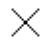
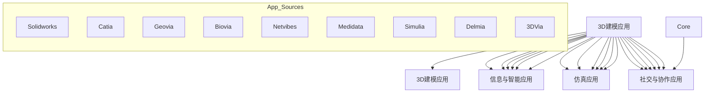

# 附录

## Abaqus 关键词浏览器表

使用以下表格来确定哪个 Abaqus/CAE 模块（或工具集）包含与特定 Abaqus 关键词相关的功能。要查看该模块（或工具集）的文档，请单击表格中显示的模块（或工具集）名称。大多数当前不受支持的关键词可以使用关键词编辑器添加到模型中。

要查看以特定字母开头的关键词，请单击下表中的相应字母。

<table><tr><td>A</td><td>B</td><td>C</td><td>D</td><td>E</td><td>F</td><td>G</td><td>H</td><td>I</td><td>J</td><td>K</td><td>L</td><td>M</td></tr><tr><td>N</td><td>O</td><td>P</td><td>Q</td><td>R</td><td>S</td><td>T</td><td>U</td><td>V</td><td>W</td><td>X</td><td>Y</td><td>Z</td></tr></table>

表 38：关键词浏览器表。

<table><tr><td>关键词</td><td>用途</td><td>模块</td><td>产品</td></tr><tr><td>*ACOUSTIC CONTRIBUTION</td><td>为线性、基于特征模态的、稳态动力学分析过程请求计算声学贡献因子。</td><td>不支持</td><td>Abaqus/Standard</td></tr><tr><td>*ACOUSTIC FLOW VELOCITY</td><td>为声学单元指定流速作为预定义场。</td><td>不支持</td><td>Abaqus/Standard</td></tr><tr><td>*ACOUSTIC MEDIUM</td><td>指定声学介质。</td><td>属性模块</td><td>Abaqus/Standard, Abaqus/Explicit</td></tr><tr><td>*ACOUSTIC WAVE FORMULATION</td><td>在具有入射波载荷的声学问题中指定公式的类型。</td><td>模型属性</td><td>Abaqus/Standard, Abaqus/Explicit</td></tr><tr><td>*ACTIVATE ELEMENTS</td><td>在一个分析步内激活单元。</td><td>不支持</td><td>Abaqus/Standard</td></tr><tr><td>*ADAPTIVE MESH</td><td>定义自适应网格域。</td><td>在分析步模块中支持；每个分析步只能定义一个自适应网格域。</td><td>Abaqus/Standard, Abaqus/Explicit</td></tr><tr><td>*ADAPTIVE MESH CONSTRAINT</td><td>为自适应网格域指定网格运动的约束。</td><td>位移和速度自适应网格约束在分析步模块中得到支持。</td><td>Abaqus/Standard, Abaqus/Explicit</td></tr><tr><td>*ADAPTIVE MESH CONTROLS</td><td>指定自适应网格划分和对流算法的控制。</td><td>分析步模块</td><td>Abaqus/Standard, Abaqus/Explicit</td></tr><tr><td>*ADAPTIVE MESH REFINEMENT</td><td>在欧拉域中激活自适应网格细化。</td><td>不支持</td><td>Abaqus/Explicit</td></tr><tr><td>*ADJUST</td><td>调整用户指定的节点坐标以使其位于给定曲面上，或根据用户指定的分布进行调整。</td><td>交互模块</td><td>Abaqus/Standard, Abaqus/Explicit</td></tr><tr><td>*ALLOWABLE STRESS</td><td>在多尺度材料中，为复合材料的损伤起始指定许用应力。</td><td>不支持</td><td>Abaqus/Standard</td></tr><tr><td>*AMPLITUDE</td><td>定义幅值曲线。</td><td>幅值工具集；不支持气泡加载。类似的功能在交互模块中可用。</td><td>Abaqus/Standard, Abaqus/Explicit</td></tr><tr><td>*ANISOTROPIC HYPERELASTIC</td><td>为近似不可压缩材料指定各向异性超弹性属性。</td><td>属性模块</td><td>Abaqus/Standard, Abaqus/Explicit</td></tr><tr><td>*ANNEAL</td><td>对结构进行退火处理。</td><td>分析步模块</td><td>Abaqus/Explicit</td></tr><tr><td>*ANNEAL TEMPERATURE</td><td>为退火或熔化建模指定材料属性。</td><td>属性模块</td><td>Abaqus/Standard, Abaqus/Explicit</td></tr><tr><td>*AQUA</td><td>定义流体变量，用于加载浸入式梁式结构。</td><td>不支持</td><td>Abaqus/Aqua</td></tr><tr><td>*ASSEMBLY</td><td>开始装配定义。</td><td>装配模块</td><td>Abaqus/Standard, Abaqus/Explicit</td></tr><tr><td>*ASYMMETRIC-AXISYMMETRIC</td><td>定义用于 CAXAn 或 SAXAn 单元的接触单元的积分区域。</td><td>不支持</td><td>Abaqus/Standard</td></tr><tr><td>*AXIAL</td><td>用于定义梁的轴向行为。</td><td>不支持</td><td>Abaqus/Standard, Abaqus/Explicit</td></tr><tr><td>*BASE MOTION</td><td>为线性、基于特征模态的动力学分析过程定义基础运动。</td><td>不支持</td><td>Abaqus/Standard</td></tr><tr><td>*BASELINE CORRECTION</td><td>包含基线修正。</td><td>幅值工具集</td><td>Abaqus/Standard</td></tr><tr><td>*BEAM ADDED INERTIA</td><td>定义附加的梁惯量。</td><td>不支持</td><td>Abaqus/Standard, Abaqus/Explicit</td></tr><tr><td>*BEAM FLUID INERTIA</td><td>定义由于浸入流体而产生的附加梁惯量。</td><td>属性模块</td><td>Abaqus/Standard, Abaqus/Explicit</td></tr><tr><td>*BEAM GENERAL SECTION</td><td>当不需要在截面上进行数值积分时，指定梁截面。</td><td>具有线性响应的通用梁截面在属性模块中得到支持。</td><td>Abaqus/Standard, Abaqus/Explicit</td></tr><tr><td>*BEAM SECTION</td><td>当需要在截面上进行数值积分时，指定梁截面。</td><td>属性模块</td><td>Abaqus/Standard, Abaqus/Explicit</td></tr><tr><td>*BEAM SECTION GENERATE</td><td>为网格化截面生成梁截面属性。</td><td>不支持</td><td>Abaqus/Standard</td></tr><tr><td>*BEAM SECTION OFFSET</td><td>定义梁截面原点的偏移。</td><td>属性模块</td><td>Abaqus/Standard, Abaqus/Explicit</td></tr><tr><td>*BIAXIAL TEST DATA</td><td>用于提供双轴（压缩和/或拉伸）试验数据。</td><td>属性模块</td><td>Abaqus/Standard, Abaqus/Explicit</td></tr><tr><td>*BLOCKAGE</td><td>控制接触面的堵塞。</td><td>不支持</td><td>Abaqus/Explicit</td></tr><tr><td>*BOUNDARY</td><td>指定边界条件。</td><td>载荷模块；不支持流体腔压力和广义平面应变边界条件。</td><td>Abaqus/Standard, Abaqus/Explicit</td></tr><tr><td>*BRITTLE CRACKING</td><td>定义脆性开裂属性。</td><td>属性模块</td><td>Abaqus/Explicit</td></tr><tr><td>*BRITTLE FAILURE</td><td>指定脆性破坏准则。</td><td>属性模块</td><td>Abaqus/Explicit</td></tr><tr><td>*BRITTLE SHEAR</td><td>定义用于脆性开裂模型的材料在开裂后的剪切行为。</td><td>属性模块</td><td>Abaqus/Explicit</td></tr><tr><td>*BUCKLE</td><td>获取特征值屈曲估计。</td><td>分析步模块</td><td>Abaqus/Standard</td></tr><tr><td>*BUCKLING ENVELOPE</td><td>为具有 PIPE 截面的框架单元的屈曲支柱响应定义非默认的屈曲包络线。</td><td>不支持</td><td>Abaqus/Standard</td></tr><tr><td>*BUCKLING LENGTH</td><td>为具有 PIPE 截面的框架单元的屈曲支柱响应定义屈曲长度数据。</td><td>不支持</td><td>Abaqus/Standard</td></tr><tr><td>*BUCKLING REDUCTION FACTORS</td><td>为具有 PIPE 截面的框架单元的屈曲支柱响应定义屈曲折减系数。</td><td>不支持</td><td>Abaqus/Standard</td></tr><tr><td>*BULK VISCOSITY</td><td>修改体积粘性参数。</td><td>分析步模块</td><td>Abaqus/Explicit</td></tr><tr><td>*C ADDED MASS</td><td>在 *FREQUENCY 分析步中指定集中附加质量。</td><td>不支持</td><td>Abaqus/Aqua</td></tr><tr><td>*CAP CREEP</td><td>指定帽盖蠕变定律和材料属性。</td><td>属性模块</td><td>Abaqus/Standard</td></tr><tr><td>*CAP HARDENING</td><td>指定 Drucker-Prager/帽盖塑性模型的硬化。</td><td>属性模块</td><td>Abaqus/Standard, Abaqus/Explicit</td></tr><tr><td>*CAP PLASTICITY</td><td>指定修正的 Drucker-Prager/帽盖塑性模型。</td><td>属性模块</td><td>Abaqus/Standard, Abaqus/Explicit</td></tr><tr><td>*CAPACITY</td><td>定义理想气体组分在恒压下的摩尔热容。</td><td>交互模块</td><td>Abaqus/Explicit</td></tr><tr><td>*CAST IRON COMPRESSION HARDENING</td><td>为灰铸铁塑性模型指定压缩硬化。</td><td>属性模块</td><td>Abaqus/Standard, Abaqus/Explicit</td></tr><tr><td>*CAST IRON PLASTICITY</td><td>指定灰铸铁的塑性材料属性。</td><td>属性模块</td><td>Abaqus/Standard, Abaqus/Explicit</td></tr><tr><td>*CAST IRON TENSION HARDENING</td><td>为灰铸铁塑性模型指定拉伸硬化。</td><td>属性模块</td><td>Abaqus/Standard, Abaqus/Explicit</td></tr><tr><td>*CAVITY DEFINITION</td><td>为热辐射定义一个腔体。</td><td>交互模块</td><td>Abaqus/Standard</td></tr><tr><td>*CECHARGE</td><td>在压电分析中指定集中电荷。</td><td>载荷模块</td><td>Abaqus/Standard</td></tr><tr><td>*CECURRENT</td><td>在导电分析中指定集中电流。</td><td>载荷模块</td><td>Abaqus/Standard</td></tr><tr><td>*CENTROID</td><td>定义梁截面质心的位置。</td><td>属性模块</td><td>Abaqus/Standard, Abaqus/Explicit</td></tr><tr><td>*CFILM</td><td>在一个或多个节点或顶点处定义膜系数和相关的沉降温度。</td><td>交互模块</td><td>Abaqus/Standard, Abaqus/Explicit</td></tr><tr><td>*CFLOW</td><td>指定集中流体流量。</td><td>载荷模块</td><td>Abaqus/Standard</td></tr><tr><td>*CFLUX</td><td>在传热或质量扩散分析中指定集中通量。</td><td>载荷模块</td><td>Abaqus/Standard, Abaqus/Explicit</td></tr><tr><td>*CHANGE FRICTION</td><td>更改摩擦属性。</td><td>交互模块</td><td>Abaqus/Standard</td></tr><tr><td>*CHARACTERISTIC LENGTH</td><td>在材料点处定义特征单元长度。</td><td>不支持</td><td>Abaqus/Explicit</td></tr><tr><td>*CLAY HARDENING</td><td>为黏土塑性模型指定硬化。</td><td>属性模块</td><td>Abaqus/Standard, Abaqus/Explicit</td></tr><tr><td>*CLAY PLASTICITY</td><td>指定扩展的 Cam-黏土塑性模型。</td><td>属性模块</td><td>Abaqus/Standard, Abaqus/Explicit</td></tr><tr><td>*CLEARANCE</td><td>为面上的从属节点指定特定的初始间隙值和接触方向。</td><td>交互模块</td><td>Abaqus/Standard, Abaqus/Explicit</td></tr><tr><td>*CLOAD</td><td>指定集中力和力矩。</td><td>载荷模块</td><td>Abaqus/Standard, Abaqus/Explicit, Abaqus/Aqua</td></tr><tr><td>*CLUSTER MASS INERTIATABLE</td><td>指定离散粒子群的质量和惯性。</td><td>不支持</td><td>Abaqus/Explicit</td></tr><tr><td>*COHESIVE BEHAVIOR</td><td>指定接触内聚行为属性。</td><td>交互模块</td><td>Abaqus/Standard, Abaqus/Explicit</td></tr><tr><td>*COHESIVE SECTION</td><td>为内聚单元指定单元属性。</td><td>属性模块</td><td>Abaqus/Standard, Abaqus/Explicit</td></tr><tr><td>*COMBINATORIAL RULE</td><td>定义与组合规则相关的控制，以从表面属性推导交互属性。</td><td>不支持</td><td>Abaqus/Explicit</td></tr><tr><td>*COMBINED TEST DATA</td><td>同时指定归一化的剪切和体积柔度或松弛模量作为时间的函数。</td><td>属性模块</td><td>Abaqus/Standard, Abaqus/Explicit</td></tr><tr><td>*COMPLEX FREQUENCY</td><td>提取复特征值和模态向量。</td><td>分析步模块</td><td>Abaqus/Standard</td></tr><tr><td>*COMPOSITE MODAL DAMPING</td><td>为基于 SIM 架构的模态分析指定复合模态阻尼。</td><td>不支持</td><td>Abaqus/Standard</td></tr><tr><td>*CONCENTRATION TENSOR</td><td>定义聚集体中夹杂物的浓度张量。</td><td>不支持</td><td>Abaqus/Standard</td></tr><tr><td>*CONCRETE</td><td>定义弹性范围以外的混凝土属性。</td><td>属性模块</td><td>Abaqus/Standard</td></tr><tr><td>*CONCRETE COMPRESSION DAMAGE</td><td>为混凝土损伤塑性模型定义压缩损伤属性。</td><td>属性模块</td><td>Abaqus/Standard, Abaqus/Explicit</td></tr><tr><td>*CONCRETE COMPRESSION HARDENING</td><td>为混凝土损伤塑性模型定义压缩硬化。</td><td>属性模块</td><td>Abaqus/Standard, Abaqus/Explicit</td></tr><tr><td>*CONCRETE DAMAGED PLASTICITY</td><td>为混凝土损伤塑性模型定义流动势、屈服面和粘性参数。</td><td>属性模块</td><td>Abaqus/Standard, Abaqus/Explicit</td></tr><tr><td>*CONCRETE FAILURE</td><td>为混凝土损伤塑性材料模型指定材料失效准则并允许单元删除。</td><td>不支持</td><td>Abaqus/Explicit</td></tr><tr><td>*CONCRETE TENSION DAMAGE</td><td>为混凝土损伤塑性模型定义开裂后损伤属性。</td><td>属性模块</td><td>Abaqus/Standard, Abaqus/Explicit</td></tr><tr><td>*CONCRETE TENSION STIFFENING</td><td>为混凝土损伤塑性模型定义开裂后属性。</td><td>属性模块</td><td>Abaqus/Standard, Abaqus/Explicit</td></tr><tr><td>*CONDUCTIVITY</td><td>指定导热系数。</td><td>属性模块</td><td>Abaqus/Standard, Abaqus/Explicit</td></tr><tr><td>*CONNECTOR BEHAVIOR</td><td>开始指定连接器行为。</td><td>交互模块</td><td>Abaqus/Standard, Abaqus/Explicit</td></tr><tr><td>*CONNECTOR CONSTITUTIVE REFERENCE</td><td>定义用于指定连接器本构行为的参考长度和角度。</td><td>交互模块</td><td>Abaqus/Standard, Abaqus/Explicit</td></tr><tr><td>*CONNECTOR DAMAGE EVOLUTION</td><td>为连接器单元指定连接器损伤演化。</td><td>交互模块</td><td>Abaqus/Standard, Abaqus/Explicit</td></tr><tr><td>*CONNECTOR DAMAGE INITIATION</td><td>为连接器单元指定连接器损伤起始准则。</td><td>交互模块</td><td>Abaqus/Standard, Abaqus/Explicit</td></tr><tr><td>*CONNECTOR DAMPING</td><td>定义连接器阻尼行为。</td><td>交互模块</td><td>Abaqus/Standard, Abaqus/Explicit</td></tr><tr><td>*CONNECTOR DERIVED COMPONENT</td><td>在连接器单元中指定用户定义的分量。</td><td>交互模块</td><td>Abaqus/Standard, Abaqus/Explicit</td></tr><tr><td>*CONNECTOR ELASTICITY</td><td>定义连接器弹性行为。</td><td>交互模块</td><td>Abaqus/Standard, Abaqus/Explicit</td></tr><tr><td>*CONNECTOR FAILURE</td><td>为连接器单元定义失效准则。</td><td>交互模块</td><td>Abaqus/Standard, Abaqus/Explicit</td></tr><tr><td>*CONNECTOR FRICTION</td><td>在连接器单元中定义摩擦力和力矩。</td><td>交互模块</td><td>Abaqus/Standard, Abaqus/Explicit</td></tr><tr><td>*CONNECTOR HARDENING</td><td>在连接器单元中定义塑性初始屈服值和硬化行为。</td><td>交互模块</td><td>Abaqus/Standard, Abaqus/Explicit</td></tr><tr><td>*CONNECTOR LOAD</td><td>为连接器单元中可用的相对运动分量指定载荷。</td><td>载荷模块</td><td>Abaqus/Standard, Abaqus/Explicit</td></tr><tr><td>*CONNECTOR LOCK</td><td>为连接器单元定义锁定准则。</td><td>交互模块</td><td>Abaqus/Standard, Abaqus/Explicit</td></tr><tr><td>*CONNECTOR MOTION</td><td>指定连接器单元中可用的相对运动分量的运动。</td><td>载荷模块</td><td>Abaqus/Standard, Abaqus/Explicit</td></tr><tr><td>*CONNECTOR PLASTICITY</td><td>在连接器单元中定义塑性行为。</td><td>交互模块</td><td>Abaqus/Standard, Abaqus/Explicit</td></tr><tr><td>*CONNECTOR POTENTIAL</td><td>在连接器单元中指定用户定义的势函数。</td><td>交互模块</td><td>Abaqus/Standard, Abaqus/Explicit</td></tr><tr><td>*CONNECTOR SECTION</td><td>为连接器单元指定连接器属性。</td><td>交互模块</td><td>Abaqus/Standard, Abaqus/Explicit</td></tr><tr><td>*CONNECTOR STOP</td><td>为连接器单元指定连接器停止。</td><td>交互模块</td><td>Abaqus/Standard, Abaqus/Explicit</td></tr><tr><td>*CONNECTOR UNIAXIAL BEHAVIOR</td><td>在连接器单元中定义单轴行为。</td><td>交互模块</td><td>Abaqus/Explicit</td></tr><tr><td>*CONSTITUENT</td><td>在多尺度材料中定义一个组分。</td><td>不支持</td><td>Abaqus/Standard, Abaqus/Explicit</td></tr><tr><td>*CONSTRAINT CONTROLS</td><td>重置过度约束检查控制。</td><td>不支持</td><td>Abaqus/Standard</td></tr><tr><td>*CONTACT</td><td>开始定义通用接触。</td><td>交互模块</td><td>Abaqus/Standard, Abaqus/Explicit</td></tr><tr><td>*CONTACT CLEARANCE</td><td>定义接触间隙属性。</td><td>不支持</td><td>Abaqus/Explicit</td></tr><tr><td>*CONTACT CLEARANCE ASSIGNMENT</td><td>在通用接触域中的面之间分配接触间隙。</td><td>不支持</td><td>Abaqus/Explicit</td></tr><tr><td>*CONTACT CONTROLS</td><td>为接触指定附加控制。</td><td>交互模块</td><td>Abaqus/Standard, Abaqus/Explicit</td></tr><tr><td>*CONTACT CONTROLS ASSIGNMENT</td><td>为通用接触算法分配接触控制。</td><td>不支持</td><td>Abaqus/Standard, Abaqus/Explicit</td></tr><tr><td>*CONTACT DAMPING</td><td>在接触面之间定义粘性阻尼。</td><td>交互模块</td><td>Abaqus/Standard, Abaqus/Explicit</td></tr><tr><td>*CONTACT EXCLUSIONS</td><td>指定自接触面或面配对，将其从通用接触域中排除。</td><td>交互模块</td><td>Abaqus/Standard, Abaqus/Explicit</td></tr><tr><td>*CONTACT FILE</td><td>为接触变量定义结果文件请求。</td><td>不支持；Abaqus/CAE 仅从输出数据库文件读取输出。</td><td>Abaqus/Standard</td></tr><tr><td>*CONTACT FORMULATION</td><td>为通用接触算法指定非默认接触公式。</td><td>交互模块</td><td>Abaqus/Standard, Abaqus/Explicit</td></tr><tr><td>*CONTACT INCLUSIONS</td><td>指定自接触面或面配对，将其包含在通用接触域中。</td><td>交互模块</td><td>Abaqus/Standard, Abaqus/Explicit</td></tr><tr><td>*CONTACT INITIALIZATION ASSIGNMENT</td><td>为通用接触分配接触初始化方法。</td><td>交互模块</td><td>Abaqus/Standard, Abaqus/Explicit</td></tr><tr><td>*CONTACT INITIALIZATION DATA</td><td>为通用接触定义接触初始化方法。</td><td>交互模块</td><td>Abaqus/Standard, Abaqus/Explicit</td></tr><tr><td>*CONTACT INTERFERENCE</td><td>规定接触对和接触单元的时间相关允许干涉量。</td><td>交互模块</td><td>Abaqus/Standard</td></tr><tr><td>*CONTACT MASS SCALING</td><td>在分析步期间指定接触质量缩放。</td><td>交互模块</td><td>Abaqus/Explicit</td></tr><tr><td>*CONTACT OUTPUT</td><td>指定要写入输出数据库的接触变量。</td><td>分析步模块</td><td>Abaqus/Standard, Abaqus/Explicit</td></tr><tr><td>*CONTACT PAIR</td><td>定义相互接触的面。</td><td>交互模块</td><td>Abaqus/Standard, Abaqus/Explicit</td></tr><tr><td>*CONTACT PERMEABILITY</td><td>指定流体渗透性接触属性。</td><td>不支持</td><td>Abaqus/Standard</td></tr><tr><td>*CONTACT PRINT</td><td>为接触变量定义打印请求。</td><td>不支持</td><td>Abaqus/Standard</td></tr><tr><td>*CONTACT PROPERTY ASSIGNMENT</td><td>为通用接触算法分配接触属性。</td><td>交互模块</td><td>Abaqus/Standard, Abaqus/Explicit</td></tr><tr><td>*CONTACT RESPONSE</td><td>为设计灵敏度分析定义接触响应。</td><td>不支持</td><td>Abaqus/Design</td></tr><tr><td>*CONTACT STABILIZATION</td><td>为通用接触定义接触稳定控制。</td><td>交互模块</td><td>Abaqus/Standard</td></tr><tr><td>*CONTOUR INTEGRAL</td><td>提供围线积分估计。</td><td>交互模块</td><td>Abaqus/Standard</td></tr><tr><td>*CONTROLS</td><td>重置求解控制。</td><td>分析步模块</td><td>Abaqus/Standard</td></tr><tr><td>*CONWEP CHARGE PROPERTY</td><td>为入射波定义 CONWEP 装药。</td><td>不支持</td><td>Abaqus/Explicit</td></tr><tr><td>*CORRELATION</td><td>为随机响应加载定义互相关属性。</td><td>不支持</td><td>Abaqus/Standard</td></tr><tr><td>*CO-SIMULATION</td><td>标识当前分析步是 Abaqus 中的协同仿真分析步。</td><td>交互模块</td><td>Abaqus/Standard, Abaqus/Explicit</td></tr><tr><td>*CO-SIMULATION REGION</td><td>标识 Abaqus 模型中的界面区域，并指定在协同仿真期间要交换的场。</td><td>交互模块</td><td>Abaqus/Standard, Abaqus/Explicit</td></tr><tr><td>*COUPLED CONSTITUTIVE RESPONSE</td><td>此选项用于引入涉及多个物理场的用户定义本构行为。</td><td>不支持</td><td>Abaqus/Standard</td></tr><tr><td>*COUPLED TEMPERATURE-DISPLACEMENT</td><td>全耦合、同时进行的传热和应力分析。</td><td>分析步模块</td><td>Abaqus/Standard</td></tr><tr><td>*COUPLED THERMAL-ELECTRICAL</td><td>全耦合、同时进行的传热和电分析。</td><td>分析步模块</td><td>Abaqus/Standard</td></tr><tr><td>*COUPLED THERMAL-ELECTROCHEMICAL</td><td>定义热-电化学耦合分析。</td><td>不支持</td><td>Abaqus/Standard</td></tr><tr><td>*COUPLING</td><td>定义基于面的耦合约束。</td><td>交互模块</td><td>Abaqus/Standard, Abaqus/Explicit</td></tr><tr><td>*CRADIATE</td><td>在一个或多个节点或顶点处指定辐射条件和相关的沉降温度。</td><td>交互模块</td><td>Abaqus/Standard, Abaqus/Explicit</td></tr><tr><td>*CREEP</td><td>定义蠕变定律。</td><td>属性模块</td><td>Abaqus/Standard</td></tr><tr><td>*CREEP STRAIN RATE CONTROL</td><td>基于最大等效蠕变应变率控制载荷。</td><td>不支持</td><td>Abaqus/Standard</td></tr><tr><td>*CRUSH STRESS</td><td>定义材料的压溃应力。</td><td>不支持</td><td>Abaqus/Explicit</td></tr><tr><td>*CRUSH STRESS VELOCITY FACTOR</td><td>定义压溃界面处的接近速度如何影响材料的抗压溃能力。</td><td>不支持</td><td>Abaqus/Explicit</td></tr><tr><td>*CRUSHABLE FOAM</td><td>指定可压溃泡沫塑性模型。</td><td>属性模块</td><td>Abaqus/Standard, Abaqus/Explicit</td></tr><tr><td>*CRUSHABLE FOAM HARDENING</td><td>为可压溃泡沫塑性模型指定硬化。</td><td>属性模块</td><td>Abaqus/Standard, Abaqus/Explicit</td></tr><tr><td>*CURE GLASS TRANSITION TEMPERATURE</td><td>此选项用于指定玻璃化转变温度作为固化度的函数。</td><td>不支持</td><td>Abaqus/Standard</td></tr><tr><td>*CURE HEAT GENERATION</td><td>为固化建模能力定义反应的比热。</td><td>不支持</td><td>Abaqus/Standard</td></tr><tr><td>*CURE KINETICS</td><td>为固化建模能力定义反应动力学。</td><td>不支持</td><td>Abaqus/Standard</td></tr><tr><td>*CURE MAX CONVERSION</td><td>为固化建模能力定义转化度的最大值。</td><td>不支持</td><td>Abaqus/Standard</td></tr><tr><td>*CURE SHRINKAGE</td><td>为固化建模能力定义固化收缩系数。</td><td>不支持</td><td>Abaqus/Standard</td></tr><tr><td>*CYCLED PLASTIC</td><td>为 *ORNL 模型指定循环屈服应力数据。</td><td>属性模块</td><td>Abaqus/Standard</td></tr><tr><td>*CYCLIC</td><td>为腔体辐射传热分析定义循环对称性。</td><td>交互模块</td><td>Abaqus/Standard</td></tr><tr><td>*CYCLIC HARDENING</td><td>为组合硬化模型指定弹性范围的大小。</td><td>属性模块</td><td>Abaqus/Standard, Abaqus/Explicit</td></tr><tr><td>*CYCLIC SYMMETRY MODEL</td><td>为循环对称结构定义扇区数量和对称轴。</td><td>交互模块</td><td>Abaqus/Standard, Abaqus/Explicit</td></tr><tr><td>*D ADDED MASS</td><td>在 *FREQUENCY 分析步中指定分布附加质量。</td><td>不支持</td><td>Abaqus/Aqua</td></tr><tr><td>*D EM POTENTIAL</td><td>指定分布表面磁矢量势。</td><td>载荷模块</td><td>Abaqus/Standard</td></tr><tr><td>*DAMAGE EVOLUTION</td><td>指定材料属性以定义损伤演化。</td><td>属性模块</td><td>Abaqus/Standard, Abaqus/Explicit</td></tr><tr><td>*DAMAGE INITIATION</td><td>指定材料和接触属性以定义损伤起始。</td><td>属性模块</td><td>Abaqus/Standard, Abaqus/Explicit</td></tr><tr><td>*DAMAGE STABILIZATION</td><td>为纤维增强材料的损伤模型、基于面的内聚行为或增强单元中的内聚行为指定粘性系数。</td><td>属性模块</td><td>Abaqus/Standard, Abaqus/Explicit</td></tr><tr><td>*DAMPING</td><td>指定材料阻尼。</td><td>属性模块</td><td>Abaqus/Standard, Abaqus/Explicit</td></tr><tr><td>*DAMPING CONTROLS</td><td>指定阻尼控制。</td><td>仅在分析步模块中为子结构生成支持。</td><td>Abaqus/Standard</td></tr><tr><td>*DASHPOT</td><td>定义阻尼器行为。</td><td>属性模块和交互模块；仅支持独立于场变量的线性行为。对于非线性行为或要包含场变量，请在交互模块中对连接器进行建模。</td><td>Abaqus/Standard, Abaqus/Explicit</td></tr><tr><td>*DEBOND</td><td>激活裂纹扩展能力并指定脱粘幅值曲线。</td><td>不支持</td><td>Abaqus/Standard</td></tr><tr><td>*DECHARGE</td><td>为压电分析输入分布电荷。</td><td>载荷模块</td><td>Abaqus/Standard</td></tr><tr><td>*DECURRENT</td><td>在电磁分析中指定分布电流密度。</td><td>载荷模块</td><td>Abaqus/Standard</td></tr><tr><td>*DEFORMATION PLASTICITY</td><td>指定变形塑性模型。</td><td>属性模块</td><td>Abaqus/Standard</td></tr><tr><td>*DENSITY</td><td>指定材料质量密度。</td><td>属性模块
## 输入文件读取器的关键词支持

要查看以特定字母开头的关键词，请单击下表中的该字母。

<table><tr><td>A</td><td>B</td><td>C</td><td>D</td><td>E</td><td>F</td><td>G</td><td>H</td><td>I</td><td>J</td><td>K</td><td>L</td><td>M</td></tr><tr><td>N</td><td>O</td><td>P</td><td>Q</td><td>R</td><td>S</td><td>T</td><td>U</td><td>V</td><td>W</td><td>X</td><td>Y</td><td>Z</td></tr></table>

• \*ACOUSTIC CONTRIBUTION  
不支持  
• \*ACOUSTIC FLOW VELOCITY  
不支持  
• \*ACOUSTIC MEDIUM  
BULK MODULUS, DEPENDENCIES, VOLUMETRIC DRAG  
• \*ACOUSTIC WAVE FORMULATION  
TYPE  
• \*ACTIVATE ELEMENTS  
不支持  
• \*ADAPTIVE MESH  
CONTROLS, ELSET, FREQUENCY, INITIAL MESH SWEEPS, MESH SWEEPS, OP  
• \*ADAPTIVE MESH CONSTRAINT  
AMPLITUDE, CONSTRAINT TYPE, OP, TYPE, USER  
• \*ADAPTIVE MESH CONTROLS  
ADVECTION, CURVATURE REFINEMENT, GEOMETRIC ENHANCEMENT, INITIAL FEATURE ANGLE, MESH CONSTRAINT ANGLE, MESHING PREDICTOR, MOMENTUM ADVECTION, NAME, RESET, SMOOTHING OBJECTIVE, TRANSITION FEATURE ANGLE  
• \*ADAPTIVE MESH REFINEMENT  
不支持  
\*ADJUST  
NODE SET, SURFACE  
• \*ALLOWABLE STRESS  
不支持  
• \*AMPLITUDE  
BEGIN, DEFINITION（除 BUBBLE 外的所有值）, FIXED INTERVAL, NAME, SMOOTH, TIME, VARIABLES  
• \*ANISOTROPIC HYPERELASTIC  
DEPENDENCIES, FORMULATION, LOCAL DIRECTIONS, MODULI, PROPERTIES, TYPE  
\*ANNEAL  
TEMPERATURE  
• \*ANNEAL TEMPERATURE  
不支持

• \*AQUA  
不支持

\*ASSEMBLY  
NAME

• \*ASYMMETRIC-AXISYMMETRIC  
不支持

\*AXIAL  
不支持

\*BASE MOTION  
不支持

\*BASELINE CORRECTION  
（无参数）

\*BEAM ADDED INERTIA  
不支持

\*BEAM FLUID INERTIA  
FULL, HALF

\*BEAM GENERAL SECTION  
DENSITY, DEPENDENCIES, ELSET, LUMPED, MATERIAL, POISSON, SECTION（除 MESHED, NONLINEAR GENERAL 外的所有值）, TAPER, ZERO

\*BEAM SECTION  
ELSET, MATERIAL, POISSON, SECTION（除 ELBOW 外的所有值）, TEMPERATURE

\*BEAM SECTION GENERATE  
不支持

\*BEAM SECTION OFFSET  
（无参数）

\*BIAXIAL TEST DATA  
DEPENDENCIES, SMOOTH

\*BLOCKAGE  
不支持

\*BOUNDARY  
AMPLITUDE, FIXED, IMAGINARY, INC, LOAD CASE, OP, REAL, SCALE, STEP, SUBMODEL, TIMESCALE, TYPE

\*BRITTLE CRACKING  
DEPENDENCIES, TYPE

\*BRITTLE FAILURE  
CRACKS, DEPENDENCIES

\*BRITTLE SHEAR  
DEPENDENCIES, TYPE

\*BUCKLE  
EIGENSOLVER

\*BUCKLING ENVELOPE  
不支持

\*BUCKLING LENGTH  
不支持

\*BUCKLING REDUCTION FACTORS  
不支持

• \*BULK VISCOSITY  
（无参数）

• \*C ADDED MASS  
不支持

• \*CAP CREEP  
DEPENDENCIES, LAW, MECHANISM, TIME

• \*CAP HARDENING  
DEPENDENCIES

• \*CAP PLASTICITY  
DEPENDENCIES

• \*CAPACITY  
DEPENDENCIES, TYPE

• \*CAST IRON COMPRESSION HARDENING  
DEPENDENCIES

• \*CAST IRON PLASTICITY  
DEPENDENCIES

• \*CAST IRON TENSION HARDENING  
DEPENDENCIES

• \*CAVITY DEFINITION  
AMBIENT TEMP, NAME, SET PROPERTY

• \*CECHARGE  
AMPLITUDE, IMAGINARY, OP, REAL

• \*CECURRENT  
AMPLITUDE, OP

\*CENTROID  
（无参数）

\*CFILM  
AMPLITUDE, FILM AMPLITUDE, OP, REGION TYPE, USER

• \*CFLOW  
不支持

\*CFLUX  
AMPLITUDE, OP

• \*CHANGE FRICTION  
INTERACTION, RESET

• \*CHARACTERISTIC LENGTH  
不支持

• \*CLAY HARDENING  
DEPENDENCIES, TYPE

• \*CLAY PLASTICITY  
DEPENDENCIES, HARDENING, INTERCEPT

\*CLEARANCE  
BOLT, CPSET, HANDEDNESS, MAIN, NORMAL ADJUSTMENT, SECONDARY, TABULAR, VALUE

• \*CLOAD  
AMPLITUDE, CYCLIC MODE, FOLLOWER, IMAGINARY, LOAD CASE, OP, REAL

• \*CLUSTER MASS INERTIA TABLE  
不支持

\*COHESIVE BEHAVIOR  
DEPENDENCIES, ELIGIBILITY, REPEATED CONTACTS, TYPE

• \*COHESIVE SECTION  
CONTROLS, ELSET, MATERIAL, ORIENTATION, RESPONSE, THICKNESS

• \*COMBINATORIAL RULE  
不支持

• \*COMBINED TEST DATA  
SHRINF, VOLINF

• \*COMPLEX FREQUENCY  
FRICTION DAMPING, PROPERTY EVALUATION

• \*COMPOSITE MODAL DAMPING  
不支持

• \*CONCENTRATION TENSOR  
不支持

\*CONCRETE  
DEPENDENCIES

• \*CONCRETE COMPRESSION DAMAGE  
DEPENDENCIES, TENSION RECOVERY

• \*CONCRETE COMPRESSION HARDENING  
DEPENDENCIES

• \*CONCRETE DAMAGED PLASTICITY  
DEPENDENCIES

• \*CONCRETE FAILURE  
不支持

• \*CONCRETE TENSION DAMAGE  
COMPRESSION RECOVERY, DEPENDENCIES

• \*CONCRETE TENSION STIFFENING  
DEPENDENCIES, TYPE

• \*CONDUCTIVITY  
DEPENDENCIES, TYPE

• \*CONNECTOR BEHAVIOR  
EXTRAPOLATION, INTEGRATION, NAME, REGULARIZE, RTOL

• \*CONNECTOR CONSTITUTIVE REFERENCE  
（无参数）

• \*CONNECTOR DAMAGE EVOLUTION  
AFFECTED COMPONENTS, DEGRADATION, DEPENDENCIES, EXTRAPOLATION, REGULARIZE, RTOL, SOFTENING, TYPE

• \*CONNECTOR DAMAGE INITIATION  
COMPONENT, CRITERION, DEPENDENCIES, EXTRAPOLATION, RATE FILTER FACTOR, RATE INTERPOLATION, REGULARIZE, RTOL

• \*CONNECTOR DAMPING  
COMPONENT, DEPENDENCIES, EXTRAPOLATION, INDEPENDENT COMPONENTS, NONLINEAR, REGULARIZE, RTOL, TYPE

• \*CONNECTOR DERIVED COMPONENT  
DEPENDENCIES, EXTRAPOLATION, INDEPENDENT COMPONENTS, NAME, OPERATOR, REGULARIZE, RTOL, SIGN

• \*CONNECTOR ELASTICITY  
COMPONENT, DEPENDENCIES, EXTRAPOLATION, INDEPENDENT COMPONENTS, NONLINEAR, REGULARIZE, RIGID, RTOL

• \*CONNECTOR FAILURE  
COMPONENT, RELEASE

• \*CONNECTOR FRICTION  
COMPONENT, CONTACT FORCE, DEPENDENCIES, EXTRAPOLATION, INDEPENDENT COMPONENTS, PREDEFINED, REGULARIZE, RTOL, STICK STIFFNESS

• \*CONNECTOR HARDENING  
DEFINITION, DEPENDENCIES, EXTRAPOLATION, RATE FILTER FACTOR, RATE INTERPOLATION, REGULARIZE, RTOL, TYPE

• \*CONNECTOR LOAD  
AMPLITUDE, IMAGINARY, LOAD CASE, OP, REAL

• \*CONNECTOR LOCK  
COMPONENT, EXTRAPOLATION, LOCK, REGULARIZE, RTOL

• \*CONNECTOR MOTION  
AMPLITUDE, FIXED, IMAGINARY, LOAD CASE, OP, REAL, TYPE, USER

• \*CONNECTOR PLASTICITY  
COMPONENT

• \*CONNECTOR POTENTIAL  
EXPONENT, OPERATOR

• \*CONNECTOR SECTION  
BEHAVIOR, ELSET

• \*CONNECTOR STOP  
COMPONENT

• \*CONNECTOR UNIAXIAL BEHAVIOR  
不支持

• \*CONSTITUENT  
不支持

• \*CONSTRAINT CONTROLS  
不支持

\*CONTACT  
OP

• \*CONTACT CLEARANCE  
不支持

• \*CONTACT CLEARANCE ASSIGNMENT  
不支持

• \*CONTACT CONTROLS  
ABSOLUTE PENETRATION TOLERANCE, CPSET, FASTLOCALTRK, GLOBTRKINC, MAIN, RELATIVE PENETRATION TOLERANCE, RESET, SCALE PENALTY, SECONDARY, STABILIZE, STIFFNESS SCALE FACTOR, TANGENT FRACTION, WARP CHECK PERIOD, WARP CUT OFF（此选项仅支持 Abaqus/Explicit；每个分析步仅支持一个定义。）

• \*CONTACT CONTROLS ASSIGNMENT  
BEAM CROSS SECTION

• \*CONTACT DAMPING  
DEFINITION, TANGENT FRACTION

• \*CONTACT EXCLUSIONS  
（无参数）

• \*CONTACT FILE  
不支持

• \*CONTACT FORMULATION  
FORMULATION, TYPE

• \*CONTACT INCLUSIONS  
ALL EXTERIOR

• \*CONTACT INITIALIZATION ASSIGNMENT  
（无参数）

• \*CONTACT INITIALIZATION DATA  
ADJUST, INITIAL CLEARANCE, INTERFERENCE FIT, NAME, SEARCH ABOVE, SEARCH BELOW, SEARCH NSET, STEP FRACTION

• \*CONTACT INTERFERENCE  
AMPLITUDE, OP, SHRINK, TYPE（除 ELEMENT 外的所有值）

• \*CONTACT MASS SCALING  
LOCATION

• \*CONTACT OUTPUT  
NSET, SURFACE, VARIABLE

• \*CONTACT PAIR  
ADJUST, CPSET, GEOMETRIC CORRECTION, HCRIT, INTERACTION, MECHANICAL CONSTRAINT, NO THICKNESS, OP, SMALL SLIDING, SMOOTH, SUPPLEMENTARY CONSTRAINTS, TIED, TRACKING, TYPE, WEIGHT

• \*CONTACT PERMEABILITY  
不支持

• \*CONTACT PRINT  
不支持

• \*CONTACT PROPERTY ASSIGNMENT  
（无参数）

• \*CONTACT RESPONSE  
不支持

• \*CONTACT STABILIZATION  
不支持

• \*CONTOUR INTEGRAL  
CONTOURS, CRACK NAME, CRACK TIP NODES, DIRECTION, FREQUENCY, NORMAL, OUTPUT, RESIDUAL STRESS STEP, SYMM, TYPE, XFEM

• \*CONTROLS  
ANALYSIS, FIELD, PARAMETERS, RESET, TYPE

\*CONWEP CHARGE PROPERTY  
（无参数）

• \*CORRELATION  
不支持

• \*CO-SIMULATION  
NAME, PROGRAM（除空值外的所有值）

• \*CO-SIMULATION REGION  
EXPORT, IMPORT, TYPE

• \*COUPLED CONSTITUTIVE RESPONSE  
不支持

• \*COUPLED TEMPERATURE-DISPLACEMENT  
ALLSDTOL, CETOL, CONTINUE, CREEP, DELTMX, FACTOR, STABILIZE, STEADY STATE

• \*COUPLED THERMAL-ELECTRICAL  
DELTMX, END, MXDEM, STEADY STATE

• \*COUPLED THERMAL-ELECTROCHEMICAL  
DELTMX, STEADY STATE

• \*COUPLING  
CONSTRAINT NAME, INFLUENCE RADIUS, ORIENTATION, REF NODE, SURFACE

\*CRADIATE  
AMPLITUDE, OP, REGION TYPE

• \*CREEP  
DEPENDENCIES, LAW, TIME

• \*CREEP STRAIN RATE CONTROL  
不支持

• \*CRUSH STRESS  
DEPENDENCIES

• \*CRUSH STRESS VELOCITY FACTOR  
（无参数）

\*CRUSHABLE FOAM  
DEPENDENCIES, HARDENING

• \*CRUSHABLE FOAM HARDENING  
DEPENDENCIES

• \*CURE GLASS TRANSITION TEMPERATURE  
不支持

• \*CURE HEAT GENERATION  
不支持

• \*CURE KINETICS  
不支持

• \*CURE MAX CONVERSION  
不支持

• \*CURE SHRINKAGE  
不支持

• \*CYCLED PLASTIC  
（无参数）

• \*CYCLIC  
NC, TYPE

• \*CYCLIC HARDENING  
DEPENDENCIES, PARAMETERS

• \*CYCLIC SYMMETRY MODEL  
N

• \*D ADDED MASS  
不支持

• \*D EM POTENTIAL  
不支持

\*DAMAGE EVOLUTION  
DEGRADATION, DEPENDENCIES, FAILURE INDEX, MIXED MODE BEHAVIOR, MODE MIX RATIO, POWER, RATE DEPENDENT, REF ENERGY, SOFTENING, TYPE

• \*DAMAGE INITIATION  
ACCUMULATION POWER, ALPHA, ANGLEMAX, ANGSMOOTH, CRITERION, DEFINITION, DEPENDENCIES, FAILURE MECHANISMS, FEQ, FNN, FNT, FREQUENCY, GROWTH TOLERANCE, INISMOOTH, KS, LODE DEPENDENT, NORMAL DIRECTION, NPOLY, NUMBER IMPERFECTIONS, OMEGA, PEINC, POSITION, PROPERTIES, R CRACK DIRECTION, RATE DEPENDENT, REF ENERGY, SMOOTHING, TOLERANCE, UNSTABLE GROWTH TOLERANCE, WEIGHTING METHOD
• \*DAMAGE STABILIZATION（无参数）

• \*DAMPING ALPHA, BETA, COMPOSITE, STRUCTURAL

• \*DAMPING CONTROLS STRUCTURAL, VISCOUS

• \*DASHPOT ELSET, ORIENTATION, RTOL

• \*DEBOND DEBONDING FORCE, FREQUENCY, MAIN, SECONDARY

• \*DECHARGE AMPLITUDE, IMAGINARY, OP, REAL

• \*DECURRENT AMPLITUDE, OP

• \*DEFORMATION PLASTICITY（无参数）

• \*DENSITY DEPENDENCIES

\*DEPVAR

## DELETE

• \*DESIGN GRADIENT 不支持

\*DESIGN PARAMETER 不支持

\*DESIGN RESPONSE 不支持

\*DETONATION POINT（无参数）

• \*DFLOW AMPLITUDE, OP

• \*DFLUX AMPLITUDE, OP

\*DIAGNOSTICS 不支持

• \*DIELECTRIC DEPENDENCIES, TYPE

• \*DIFFUSIVITY DEPENDENCIES, LAW, TYPE

• \*DIRECT CYCLIC CETOL, CONTINUE, DELTMX, FATIGUE, TIME POINTS

\*DISCRETE ELASTICITY 不支持

• \*DISCRETE SECTION 不支持

• \*DISPLAY BODY INSTANCE

• \*DISTRIBUTINGCOUPLING, ROTATIONAL COUPLING, WEIGHTING METHOD

• \*DISTRIBUTING COUPLING 不支持

• \*DISTRIBUTION LOCATION, NAME, TABLE

• \*DISTRIBUTION TABLE NAME

• \*DLOAD AMPLITUDE, CONSTANT RESULTANT, CYCLIC MODE, FOLLOWER, IMAGINARY, OP, ORIENTATION, REAL

• \*DOMAIN DECOMPOSITION  
不支持  
\*DRAG CHAIN  
不支持  
\*DRUCKER PRAGER  
DEPENDENCIES, ECCENTRICITY, SHEAR CRITERION, TEST DATA  
\*DRUCKER PRAGER CREEP  
DEPENDENCIES, LAW, TIME  
\*DRUCKER PRAGER HARDENING  
DEPENDENCIES, RATE, TYPE  
• \*DSA CONTROLS  
不支持  
\*DSECHARGE  
AMPLITUDE, IMAGINARY, OP, REAL  
\*DSECURRENT  
AMPLITUDE, OP  
\*DSFLOW  
AMPLITUDE, OP  
\*DSFLUX  
AMPLITUDE, OP  
\*DSLOAD  
AMPLITUDE, CONSTANT RESULTANT, CYCLIC MODE, FOLLOWER, IMAGINARY, INC, OP, ORIENTATION, REAL, REF NODE, STEP, SUBMODEL  
\*DYNAMIC  
ADIABATIC, ALPHA, APPLICATION, DIRECT USER CONTROL, ELEMENT BY ELEMENT, EXPLICIT, FIXED TIME INCREMENTATION, HAFTOL, HALFINC SCALE FACTOR, IMPROVED DT METHOD, INITIAL, NOHAF, SCALE FACTOR, SUBSPACE  
\*DYNAMIC TEMPERATURE-DISPLACEMENT  
DIRECT USER CONTROL, ELEMENT BY ELEMENT, EXPLICIT, FIXED TIME INCREMENTATION, IMPROVED DT METHOD, SCALE FACTOR  
\*EIGENSTRAIN  
不支持  
\*EL FILE  
不支持  
\*EL PRINT  
不支持  
\*ELASTIC  
DEPENDENCIES, MODULI, TYPE（所有值，SHORT FIBER 除外）

\*ELCOPY  
不支持  
\*ELECTRIC MACHINE LOAD  
不支持  
\*ELECTRIC MACHINE PROPERTY  
不支持  
\*ELECTRICAL CONDUCTIVITY  
DEPENDENCIES, TYPE  
\*ELECTRICAL RESISTIVITY  
不支持  
\*ELECTROMAGNETIC  
不支持  
\*ELEMENT  
ELSET, FILE, TYPE  
\*ELEMENT MATRIX OUTPUT  
不支持  
\*ELEMENT OPERATOR OUTPUT  
不支持  
\*ELEMENT OUTPUT  
DIRECTIONS, ELSET, EXTERIOR, POSITION, REBAR, VARIABLE  
\*ELEMENT PROGRESSIVE ACTIVATION  
不支持  
\*ELEMENT RECOVERY MATRIX  
不支持  
\*ELEMENT RESPONSE  
不支持  
\*ELEMENT SOLUTION-DEPENDENT VARIABLES  
不支持  
\*ELEMENT USER OUTPUT VARIABLES  
不支持  
\*ELGEN  
ALL NODES, ELSET  
\*ELSET  
ELSET, GENERATE, INSTANCE, INTERNAL  
\*EMBEDDED ELEMENT  
ABSOLUTE EXTERIOR TOLERANCE, EXTERIOR TOLERANCE, HOST ELSET, ROUNDOFFTOLERANCE  
\*EMISSIVITY

## DEPENDENCIES

\*END ASSEMBLY  
（无参数）

\*END INSTANCE  
（无参数）

\*END LOAD CASE  
（无参数）

\*END PART  
（无参数）

\*END STEP  
（无参数）

\*ENERGY FILE  
不支持

\*ENERGY OUTPUT  
ELSET, VARIABLE

\*ENERGY PRINT  
不支持

\*ENRICHMENT

ELSET, ENRICHMENT RADIUS, INTERACTION, NAME, TYPE

\*ENRICHMENT ACTIVATION  
ACTIVATE, NAME, TYPE

\*EOS

DETONATION ENERGY, TYPE（所有值，TABULAR 除外）

• \*EOS COMPACTION  
（无参数）

\*EPJOINT

不支持

\*EQUATION

（无参数。此选项仅在数据行包含节点集时受支持；Abaqus/CAE 中尚不支持此选项使用节点标签。此外，第二个节点集（第四个数据项）只能包含单个节点。）

• \*EQUIVALENT RADIATED SURFACE PROPERTIES

不支持

\*EULERIAN BOUNDARY  
INFLOW, OP, OUTFLOW

\*EULERIAN MESH MOTION

ASPECT RATIO MAX, BUFFER, CONTRACT, ELSET, OP, ORIENTATION, SURFACE, VMAX FACTOR, VOLFRAC MIN

\*EULERIAN SECTION  
CONTROLS, ELSET  
\*EVENT SERIES  
不支持  
\*EVENT SERIES TYPE  
不支持  
\*EXPANSION  
DEPENDENCIES, PORE FLUID, TYPE（所有值，SHORT FIBER 除外）, USER, ZERO  
\*EXTERNAL FIELD  
不支持  
\*EXTREME ELEMENT VALUE  
不支持  
\*EXTREME NODE VALUE  
不支持  
\*EXTREME VALUE  
不支持  
\*FABRIC  
不支持  
\*FAIL STRAIN  
DEPENDENCIES  
\*FAIL STRESS  
DEPENDENCIES  
\*FAILURE RATIOS  
DEPENDENCIES  
• \*FASTENER  
ADJUST ORIENTATION, ATTACHMENT METHOD, COUPLING, ELSET, INTERACTION NAME, NUMBER OF LAYERS, ORIENTATION, PROPERTY, RADIUS OF INFLUENCE, REFERENCE NODESET, SEARCH RADIUS, UNSORTED, WEIGHTING METHOD  
\*FASTENER PROPERTY  
NAME  
\*FATIGUE  
不支持  
• \*FIBER DISPERSION  
不支持  
\*FIELD  
AMPLITUDE, BINC, BSTEP, EINC, ESTEP, FILE, INPUT, INTERPOLATE, OP, OUTPUT VARIABLE, USER, VARIABLE  
\*FIELD IMPORT

不支持

• \*FIELD MAPPER CONTROLS 不支持

\*FIELD OPERATIONS 不支持

\*FILE FORMAT 不支持

\*FILE OUTPUT 不支持

\*FILM AMPLITUDE, FILM AMPLITUDE, OP

• \*FILM PROPERTYDEPENDENCIES, NAME

\*FILTERHALT, INVARIANT, LIMIT, NAME, OPERATOR, TYPE

• \*FIXED MASS SCALING DT, ELSET, FACTOR, TYPE

\*FLEXIBLE BODY TYPE

\*FLOW 不支持

\*FLUID BEHAVIOR NAME

• \*FLUID BULK MODULUS DEPENDENCIES

• \*FLUID CAVITY ADIABATIC, AMBIENT PRESSURE, BEHAVIOR, CHECK NORMALS, NAME, REF NODE, SURFACE

\*FLUID DENSITY（无参数）

• \*FLUID EXCHANGE EFFECTIVE AREA, NAME, PROPERTY

• \*FLUID EXCHANGE ACTIVATION AMPLITUDE, BLOCKAGE, DELTA LEAKAGE AREA, OP, OUTFLOW ONLY

• \*FLUID EXCHANGE PROPERTYDEPENDENCIES, NAME, TYPE（所有值，ENERGY FLUX, ENERGY RATE LEAKAGE, FABRIC LEAKAGE, ORIFICE, USER 除外）

• \*FLUID EXPANSION DEPENDENCIES, ZERO

\*FLUID FLUX  
不支持  
\*FLUID ID FIELD  
不支持  
\*FLUID INFLATOR  
NAME, PROPERTY  
• \*FLUID INFLATOR ACTIVATION  
INFLATION TIME AMPLITUDE, MASS FLOW AMPLITUDE, OP  
\*FLUID INFLATOR MIXTURE  
NUMBER SPECIES, TYPE  
\*FLUID INFLATOR PROPERTY  
DISCHARGE COEFFICIENT, EFFECTIVE AREA, NAME, TANK VOLUME, TYPE  
\*FLUID LEAKOFF  
DEPENDENCIES, USER  
• \*FLUID PIPE CONNECTOR LOSS  
不支持  
• \*FLUID PIPE CONNECTOR SECTION  
不支持  
\*FLUID PIPE CONNECTOR THERMAL LOSS  
不支持  
\*FLUID PIPE CONNECTOR WALL  
不支持  
\*FLUID PIPE FLOW LOSS  
不支持  
\*FLUID PIPE SECTION  
不支持  
\*FLUID PIPE THERMAL  
不支持  
• \*FLUID PIPE WALL  
不支持  
• \*FOUNDATION  
（无参数）  
\*FRACTURE CRITERION  
DEPENDENCIES, MIXED MODE BEHAVIOR, NORMAL DIRECTION, TOLERANCE, TYPE（所有值，COD, CRACK LENGTH, CRITICAL STRESS, FATIGUE 除外）, UNSTABLE GROWTH TOLERANCE, VISCOSITY  
\*FRAME SECTION  
不支持

• \*FREQUENCY  
ACOUSTIC COUPLING, DAMPING PROJECTION, EIGENSOLVER, NORMALIZATION, NSET, PROPERTY EVALUATION, RESIDUAL MODES, SIM  
\*FRICTION  
ANISOTROPIC BEHAVIOR, DEPENDENCIES, DEPVAR, ELASTIC SLIP, EXPONENTIAL DECAY, LAGRANGE, PROPERTIES, ROUGH, SHEAR TRACTION SLOPE, SLIP TOLERANCE, TAUMAX, TEST DATA, USER  
\*GAP  
不支持  
• \*GAP CONDUCTANCE  
DEPENDENCIES, PRESSURE, USER  
• \*GAP CONVECTION  
DEPENDENCIES, TYPE  
\*GAP DIFFUSIVITY  
不支持  
• \*GAP ELECTRICAL CONDUCTANCE  
DEPENDENCIES, PRESSURE, TYPE, USER  
\*GAP FLOW  
DEPENDENCIES, KMAX, TYPE  
• \*GAP HEAT GENERATION  
（无参数）  
\*GAP RADIATION  
（无参数）  
\*GAS SPECIFIC HEAT  
DEPENDENCIES  
• \*GASKET BEHAVIOR  
NAME  
• \*GASKET CONTACT AREA  
DEPENDENCIES  
• \*GASKET ELASTICITY  
COMPONENT, DEPENDENCIES, VARIABLE  
• \*GASKET SECTION  
BEHAVIOR, ELSET, MATERIAL, ORIENTATION, STABILIZATION STIFFNESS  
• \*GASKET THICKNESS BEHAVIOR  
DEPENDENCIES, DIRECTION, SLOPE DROP, TENSILE STIFFNESS FACTOR, TYPE, VARIABLE, YIELD ONSET  
\*GEL  
（无参数）

• \*GEOSTATIC UTOL  
• \*GLOBAL DAMPING ALPHA, BETA, FIELD, STRUCTURAL  
• \*GLOBAL RESPONSE 不支持  
\*HEADING（无参数）  
\*HEAT GENERATION 0（无参数）  
• \*HEAT TRANSFER DELTMX, END, MXDEM, STEADY STATE  
\*HEATCAP DEPENDENCIES, ELSET  
\*HOURGLASS STIFFNESS（无参数）  
\*HYPERFOAM MODULI, N, POISSON, TEST DATA INPUT  
\*HYPOELASTIC USER  
\*HYSTERESIS（无参数）  
\*IMPEDANCE 不支持  
\*IMPEDANCE PROPERTYDATA, NAME  
\*IMPERFECTION FILE, INC, INPUT, NSET, STEP, SYSTEM  
\*IMPORT 不支持  
\*IMPORT CONTROLS 不支持  
\*IMPORT ELSET

\*HYPERELASTICARRUDA-BOYCE, BETA, MARLOW, MODULI, MOONEY-RIVLIN, N, NEO HOOKE, OGDEN, POISSON, POLYNOMIAL, PROPERTIES, REDUCED POLYNOMIAL, TEST DATA INPUT, TYPE, USER, VALANIS-LANDEL, VAN DER WAALS, YEOH

不支持

\*IMPORT NSET

不支持

\*IMPORT SURFACE

不支持

\*INCIDENT WAVE

不支持

\*INCIDENT WAVE FLUID PROPERTY

不支持

\*INCIDENT WAVE INTERACTION

ACCELERATION AMPLITUDE, CONWEP, IMAGINARY, PRESSURE AMPLITUDE, PROPERTY, REAL, UNDEX

\*INCIDENT WAVE INTERACTION PROPERTY

NAME, TYPE
\*INCIDENT WAVE PROPERTY

不支持

\*INCIDENT WAVE REFLECTION

不支持

• \*INCLUDE

（无参数）

\*INCREMENTATION OUTPUT

不支持

• \*INELASTIC HEAT FRACTION

（无参数）

\*INERTIA RELIEF

FIXED, ORIENTATION, REMOVE

\*INITIAL CONDITIONS

FILE, FULL TENSOR, GEOSTATIC, INC, MIDSIDE, NUMBER BACKSTRESSES, OUTPUT VARIABLE, REBAR, SECTION POINTS, STEP, TYPE（除ACOUSTIC STATIC PRESSURE、CONCENTRATION、MASS FLOW RATE、POROSITY、PRESSURE STRESS、RELATIVE DENSITY、SOLUTION、SPECIFIC ENERGY之外的所有值）, USER, VARIABLE

\*INSTANCE

NAME, PART

\*INTEGRATED OUTPUT

SECTION, VARIABLE

• \*INTEGRATED OUTPUT SECTION

NAME, ORIENTATION, POSITION, PROJECT ORIENTATION, REF NODE MOTION, REF NODE, SURFACE

\*INTERFACE

ELSET, NAME

\*INTERFACE REACTION  
不支持  
\*INTERNAL FLUX GENERATION 不支持  
\*ISOTROPIZATION PARAMETERS 不支持  
\*ITS 不支持

\*JOINT 不支持

• \*JOINT ELASTICITY 不支持

• \*JOINT PLASTICITY 不支持

• \*JOINTED MATERIAL 不支持

• \*JOULE HEAT FRACTION （无参数）

\*KAPPA DEPENDENCIES, TYPE

\*KINEMATIC ALPHA

\*KINEMATIC COUPLING 不支持

\*LATENT HEAT （无参数）

\*LOAD CASE NAME

\*LOADING DATA 不支持

• \*LOW DENSITY FOAM FAIL, RATE EXTRAPOLATION, STRAIN RATE, TENSION CUTOFF

\*M1 不支持

\*M2

不支持

• \*MAGNETIC PERMEABILITY 不支持

• \*MAGNETOSTATIC 不支持

\*MANIFEST 不支持

\*MAP SOLUTION 不支持

• \*MASS ALPHA, COMPOSITE, ELSET

\*MASS ADJUST 不支持

• \*MASS DIFFUSION DCMAX, END, STEADY STATE

• \*MASS FLOW RATE 不支持

• \*MATERIAL NAME, RTOL

\*MATRIX 不支持

\*MATRIX ASSEMBLE 不支持

• \*MATRIX CHECK 不支持

\*MATRIX EXPORT 不支持

\*MATRIX GENERATE 不支持

\*MATRIX INPUT 不支持

\*MATRIX OUTPUT 不支持

\*MEAN FIELD DAMAGE 不支持

\*MEAN FIELD HOMOGENIZATION 不支持

\*MEDIA TRANSPORT  
不支持  
\*MEMBRANE SECTION  
CONTROLS, ELSET, MATERIAL, MEMBRANE THICKNESS, ORIENTATION, POISSON（除MATERIAL之外的所有值）  
\*MODAL DAMPING  
DEFINITION, MODAL, RAYLEIGH, STRUCTURAL  
\*MODAL DYNAMIC  
CONTINUE  
\*MODAL FILE  
不支持  
\*MODAL OUTPUT  
VARIABLE  
\*MODAL PRINT  
不支持  
• \*MODEL CHANGE  
ACTIVATE, ADD, REMOVE, TYPE  
\*MOHR COULOMB  
DEPENDENCIES, DEVIATORIC ECCENTRICITY, ECCENTRICITY  
\*MOHR COULOMB HARDENING  
DEPENDENCIES  
\*MOISTURE SWELLING  
（无参数）  
\*MOLECULAR WEIGHT  
（无参数）  
\*MONITOR  
DOF, FREQUENCY, NODE  
\*MOTION  
不支持  
\*MPC  
MODE, USER  
\*MULLINS EFFECT  
BETA, DEPENDENCIES, M, PROPERTIES, R, TEST DATA INPUT  
\*MULTIPHYSICS LOAD  
不支持  
\*NCOPY  
CHANGE NUMBER, MULTIPLE, NEW SET, OLD SET, POLE, REFLECT, SHIFT

• \*NETWORK STIFFNESS RATIO  
不支持  
\*NFILL  
BIAS, NSET, SINGULAR, TWO STEP  
\*NGEN  
LINE, NSET  
\*NMAP  
不支持  
\*NO COMPRESSION  
（无参数）  
• \*NO TENSION  
（无参数）  
\*NODAL ENERGY RATE  
不支持  
• \*NODAL THICKNESS  
（无参数）  
\*NODE  
NSET, SYSTEM  
\*NODE FILE  
不支持  
\*NODE OUTPUT  
EXTERIOR, GLOBAL, NSET, VARIABLE  
\*NODE PRINT  
不支持  
\*NODE RESPONSE  
不支持  
\*NONLINEAR BH  
不支持  
• \*NONSTRUCTURAL MASS  
DISTRIBUTION, ELSET, UNITS  
\*NORMAL  
不支持  
\*NSET  
GENERATE, INSTANCE, INTERNAL, NSET  
• \*ONE-STEP INVERSE  
不支持  
• \*OPERATOR OUTPUT

不支持

• \*ORIENTATION DEFINITION, NAME, SYSTEM

• \*ORNL A, H, MATERIAL, RESET

• \*OUTPUT FIELD, FILTER, FREQUENCY, HISTORY, MODE LIST, NAME, NUMBER INTERVAL, OP, SENSOR, TIME INTERVAL, TIME MARKS, TIME POINTS, VARIABLE

• \*PAPERBOARD HARDENING 不支持

\*PAPERBOARD PLASTICITY 不支持

• \*PAPERBOARD THICKNESS COMPRESSION ELASTIC 不支持

• \*PAPERBOARD THICKNESS COMPRESSION PLASTICITY 不支持

• \*PAPERBOARD TRANSVERSE SHEAR PLASTICITY 不支持

\*PARAMETER 不支持

\*PARAMETER DEPENDENCE 不支持

\*PARAMETER SHAPE VARIATION 不支持

\*PARAMETER TABLE 不支持

\*PARAMETER TABLE TYPE 不支持

\*PART NAME

• \*PARTICLE GENERATOR 不支持

\*PARTICLE GENERATOR FLOW 不支持

\*PARTICLE GENERATOR INLET 不支持

• \*PARTICLE GENERATOR MIXTURE

不支持

• \*PARTICLE OUTLET  
不支持

• \*PARTICLE OUTLET FLOW  
不支持

\*PERFECTLY MATCHED LAYER  
不支持

\*PERIODIC  
NR, TYPE

• \*PERIODIC MEDIA

不支持

• \*PERMANENT MAGNETIZATION

不支持

\*PERMEABILITY  
SPECIFIC, TYPE

• \*PHYSICAL CONSTANTS

ABSOLUTE ZERO, STEFAN BOLTZMANN, UNIVERSAL GAS CONSTANT

\*PIEZOELECTRIC  
TYPE

• \*PIEZOELECTRIC DAMPING

不支持

\*PIEZORESISTIVITY

不支持

• \*PIPE-SOIL INTERACTION

不支持

• \*PIPE-SOIL STIFFNESS

不支持

\*PLANAR TEST DATA

DEPENDENCIES, SMOOTH

\*PLASTIC

DATA TYPE, DEPENDENCIES, EXTRAPOLATION, HARDENING, NUMBER BACKSTRESSES, PROPERTIES, RATE, SCALESTRESS, STATIC RECOVERY

\*PLASTIC AXIAL

不支持

\*PLASTIC M1

不支持

\*PLASTIC M2

不支持

• \*PLASTIC TORQUE  
不支持  
• \*PLASTICITY CORRECTION  
DEFINITION, DEPENDENCIES  
\*PLY FABRIC FAILURE  
不支持  
\*PLY FABRIC HARDENING  
不支持  
\*PML COEFFICIENT  
不支持  
• \*PORE FLUID PRESSURE  
不支持  
• \*POROUS BULK MODULI  
（无参数）  
• \*POROUS ELASTIC  
DEPENDENCIES, SHEAR  
• \*POROUS ELECTRODE THEORY  
不支持  
• \*POROUS FAILURE CRITERIA  
（无参数）  
• \*POROUS METAL PLASTICITY  
DEPENDENCIES, RELATIVE DENSITY  
• \*POST OUTPUT  
不支持  
\*POTENTIAL  
DEPENDENCIES  
\*PREPRINT  
CONTACT, ECHO, HISTORY, MODEL  
• \*PRESSURE PENETRATION  
AMPLITUDE, IMAGINARY, MAIN, OP, PENETRATION TIME, REAL, SECONDARY  
\*PRESSURE STRESS  
不支持  
\*PRESTRESS HOLD  
不支持  
\*PRE-TENSION SECTION  
ELEMENT, NODE, SURFACE  
\*PRINT

ALLKE, CONTACT, CRITICAL ELEMENT, FREQUENCY, MODEL CHANGE, PLASTICITY, RESIDUAL, SOLVE

• \*PROBABILITY DENSITY FUNCTION 不支持

• \*PROPERTY TABLE 不支持

• \*PROPERTY TABLE TYPE 不支持

• \*PSD-DEFINITION 不支持

• \*RADIATE AMPLITUDE, OP

\*RADIATION FILE 不支持

• \*RADIATION OUTPUT ELSET, VARIABLE

\*RADIATION PRINT 不支持

\*RADIATION SYMMETRY NAME

• \*RADIATION VIEW FACTOR BLOCKING, CAVITY, INTEGRATION, OFF, RANGE, REFLECTION, SYMMETRY, VTOL

\*RANDOM RESPONSE（无参数）

• \*RATE DEPENDENT DEPENDENCIES, TYPE

• \*RATIOS DEPENDENCIES

\*REACTION RATE （无参数）

\*REBAR 不支持

• \*REBAR LAYER GEOMETRY, ORIENTATION

\*REBAR LINE 不支持

\*REDUCED BASIS GENERATE

不支持

\*REFLECTION TYPE

\*RELEASE

不支持

• \*RESPONSE SPECTRUM COMP, SUM

• \*RESTART FREQUENCY, NUMBER INTERVAL, OVERLAY, TIME MARKS, WRITE

\*RETAINED NODAL DOFS SORTED （除YES之外的所有值）

• \*RIGID BODY ANALYTICAL SURFACE, ELSET, ISOTHERMAL, PIN NSET, POSITION, REF NODE, TIE NSET

\*RIGID SURFACE 不支持

• \*ROTARY INERTIA ALPHA, COMPOSITE, ELSET, ORIENTATION

\*SCALE MASS 不支持

• \*SCALE STIFFNESS 不支持

• \*SCALE STRESS DESIGN 不支持

• \*SCALE THERMAL CONDUCTIVITY 不支持

\*SECTION CONTROLS DISTORTION CONTROL, ELEMENT DELETION, HOURGLASS, INITIAL GAP OPENING, KINEMATIC SPLIT, LENGTH RATIO, LINEAR KINEMATIC CONVERSION, LKC RATIO, MAX DEGRADATION, NAME, SECOND ORDER ACCURACY, VISCOSITY, WEIGHT FACTOR

• \*SECTION CURVATURE 不支持

\*SECTION FILE 不支持

\*SECTION INERTIA 不支持

\*SECTION ORIGIN 不支持

\*SECTION POINTS

（无参数）

\*SECTION PRINT 不支持  
\*SECTION STIFFNESS 不支持  
\*SECTION TANGENT 不支持  
• \*SELECT CYCLIC SYMMETRY MODES NMAX, NMIN  
• \*SELECT EIGENMODES DEFINITION, GENERATE  
\*SFILM AMPLITUDE, FILM AMPLITUDE, OP  
\*SFLOW 不支持  
\*SHEAR CENTER （无参数）  
\*SHEAR FAILURE 不支持  
• \*SHEAR RETENTION DEPENDENCIES  
\*SHEAR TEST DATA SHRINF  
\*SHELL GENERAL SECTION

BENDING ONLY, COMPOSITE, CONTROLS, DENSITY, DEPENDENCIES, ELSET, LAYUP, MATERIAL, MEMBRANE ONLY, NODAL THICKNESS, OFFSET, ORIENTATION, POISSON, SHELL THICKNESS, SMEAR ALL LAYERS, STACK DIRECTION, SYMMETRIC, THICKNESS MODULUS, ZERO

\*SHELL SECTION

COMPOSITE, CONTROLS, DENSITY, ELSET, LAYUP, MATERIAL, NODAL THICKNESS, OFFSET, ORIENTATION, POISSON（除ELASTIC、MATERIAL之外的所有值）, SECTION INTEGRATION, SHELL THICKNESS, STACK DIRECTION, SYMMETRIC, TEMPERATURE, THICKNESS MODULUS

• \*SHELL TO SOLID COUPLING  
CONSTRAINT NAME, INFLUENCE DISTANCE, POSITION TOLERANCE  
\*SIMPLE SHEAR TEST DATA （无参数）  
\*SLIDE LINE

不支持

\*SLOAD  
AMPLITUDE, OP  
\*SOFT ROCK HARDENING  
DEPENDENCIES, SR, TYPE  
\*SOFT ROCK PLASTICITY  
DEPENDENCIES, ECCENTRICITY, FLOW EVALUATION  
\*SOFTENING REGULARIZATION  
DEPENDENCIES  
\*SOILS  
ALLSDTOL, CETOL, CONSOLIDATION, CONTINUE, CREEP, END, FACTOR, STABILIZE, UTOL  
\*SOLID ELECTROLYTE THEORY
**不支持**  
\*SOLID SECTION  
COMPOSITE, CONTROLS, ELSET, LAYUP, MATERIAL, ORIENTATION, REF NODE, STACKDIRECTION, SYMMETRIC  
• \*SOLUBILITY  
DEPENDENCIES  
• \*SOLUTION TECHNIQUE  
REFORM KERNEL, TYPE  
\*SOLVER CONTROLS  
**不支持**  
\*SORPTION  
LAW, TYPE  
\*SPECIFIC HEAT  
DEPENDENCIES  
\*SPECTRUM  
ABSOLUTE, AMPLITUDE, CREATE, DAMPING GENERATE, EVENT TYPE, G, NAME, RELATIVE, TIME INCREMENT, TYPE  
\*SPH SURFACE BEHAVIOR  
**不支持**  
\*SPRING  
ELSET, ORIENTATION, RTOL  
\*SRADIATE  
AMPLITUDE, OP  
\*STATIC  
ADIABATIC, ALLSDTOL, CONTINUE, DIRECT, FACTOR, FULLY PLASTIC, LONG TERM, RIKS, STABILIZE  

• \*STEADY STATE CRITERIA  
**不支持**  
\*STEADY STATE DETECTION  
**不支持**  
\*STEADY STATE DYNAMICS  
DAMPING CHANGE, DIRECT, FREQUENCY SCALE, FRICTION DAMPING, INTERVAL, REALONLY, STIFFNESS CHANGE, SUBSPACE PROJECTION  
\*STEADY STATE TRANSPORT  
**不支持**  
\*STEP  
AMPLITUDE, CONVERT SDI, EXTRAPOLATION, INC, NAME, NLGEOM, PERTURBATION, SOLVER, UNSYMM  
\*STEP CONTROL  
ACTION, DT REFINEMENT, NAME  
\*STEP CYCLING  
**不支持**  
\*STEP CYCLING CONTROL  
**不支持**  
\*SUBCYCLING  
**不支持**  
\*SUBMODEL  
ABSOLUTE EXTERIOR TOLERANCE, EXTERIOR TOLERANCE, GLOBAL ELSET, SHELL THICKNESS, SHELL TO SOLID, TYPE  
\*SUBMODEL CONDITIONS  
**不支持**  
\*SUBMODEL CUT  
**不支持**  
\*SUBSTRUCTURE CHANGE  
**不支持**  
\*SUBSTRUCTURE DAMPING  
**不支持**  
• \*SUBSTRUCTURE DAMPING CONTROLS  
**不支持**  
\*SUBSTRUCTURE GENERATE  
ELSET, GRAVITY LOAD, MASS MATRIX, NSET, OVERWRITE, PROPERTY EVALUATION, RECOVERY MATRIX, STRUCTURAL DAMPING MATRIX, TYPE, VISCOUS DAMPING MATRIX  
\*SUBSTRUCTURE LOAD CASE  
NAME  
\*SUBSTRUCTURE MATRIX OUTPUT  

**不支持**  

\*SUBSTRUCTURE MODAL DAMPING **不支持**  

• \*SUBSTRUCTURE OUTPUT OP4, SIM **不支持**  

• \*SUBSTRUCTURE PATH ENTER ELEMENT, LEAVE  

\*SUBSTRUCTURE PROPERTY ELSET  

• \*SUPERELASTIC NONASSOCIATED  

\*SUPERELASTIC HARDENING **不支持**  

• \*SUPERELASTIC HARDENING MODIFICATIONS PROPERTIES, USER  

• \*SURFACE COMBINE, CROP, FILLET RADIUS, INTERNAL, NAME, PROPERTY, TYPE (所有值，USER 除外)  

• \*SURFACE BEHAVIOR AUGMENTED LAGRANGE, DIRECT, NO SEPARATION, PENALTY, PRESSURE-OVERCLOSURE  

\*SURFACE FLAW **不支持**  

• \*SURFACE INTERACTION DEPVAR, NAME, PAD THICKNESS, PROPERTIES, TRACKING THICKNESS, UNSYMM, USER  

• \*SURFACE PROPERTY NAME  

• \*SURFACE PROPERTY ASSIGNMENT PROPERTY (所有值，GEOMETRIC CORRECTION 除外)  

• \*SURFACE SECTION DENSITY, ELSET  

\*SURFACE SMOOTHING **不支持**  

\*SURFACE TENSION **不支持**  

• \*SURFACE TENSION CONTACT ANGLE **不支持**  

\*SWELLING DEPENDENCIES, LAW  

• \*SYMMETRIC MODEL GENERATION  
**不支持**  
\*SYMMETRIC RESULTS TRANSFER  
**不支持**  
\*SYSTEM  
(无参数)  
• \*TABLE COLLECTION  
**不支持**  
\*TEMPERATURE  
ABSOLUTE EXTERIOR TOLERANCE, AMPLITUDE, BINC, BSTEP, EINC, ESTEP, EXTERIOR TOLERANCE, FILE, INPUT, INTERPOLATE, MIDSIDE, OP, USER  
• \*TENSILE FAILURE  
DEPENDENCIES, ELEMENT DELETION, PRESSURE, SHEAR  
\*TENSION CUTOFF  
DEPENDENCIES  
\*TENSION STIFFENING  
DEPENDENCIES, TYPE  
\*THERMAL EXPANSION  
**不支持**  
\*TIE  
ADJUST, CONSTRAINT RATIO, CYCLIC SYMMETRY, NAME, NO ROTATION, NO THICKNESS, POSITION TOLERANCE, TYPE  
• \*TIME POINTS  
GENERATE, NAME  
• \*TORQUE  
**不支持**  
• \*TORQUE PRINT  
**不支持**  
\*TRACER PARTICLE  
**不支持**  
\*TRANSFORM  
NSET, TYPE  
• \*TRANSPORT VELOCITY  
**不支持**  
\*TRANSVERSE SHEAR  
**不支持**  
• \*TRANSVERSE SHEAR STIFFNESS  
(无参数)  

\*TRIAXIAL TEST DATA  
A, B, PT  
\*TRS  
DEFINITION  
• \*UEL PROPERTY  
**不支持**  
• \*UNDEX CHARGE PROPERTY  
(无参数)  
\*UNIAXIAL  
**不支持**  
• \*UNIAXIAL TEST DATA  
DEPENDENCIES, DIRECTION, SMOOTH  
\*UNIFORM  
**不支持**  
\*UNIT SYSTEM  
**不支持**  
\*UNLOADING DATA  
**不支持**  
• \*USER DEFINED FIELD  
SPECIFIED, USER (无参数)  
\*USER ELEMENT  
**不支持**  
\*USER MATERIAL  
CONSTANTS, EFFMOD, HYBRID FORMULATION, TYPE, UNSYMM  
\*USER OUTPUT VARIABLES  
(无参数)  
\*VARIABLE MASS SCALING  
CROSS SECTION NODES, DT, ELSET, EXTRUDED LENGTH, FEED RATE, FREQUENCY, NUMBER INTERVAL, TYPE  
• \*VIEW FACTOR OUTPUT  
**不支持**  
\*VISCO  
ALLSDTOL, CETOL, CONTINUE, CREEP, FACTOR, STABILIZE  
• \*VISCOELASTIC  
ERRTOL, FREQUENCY, NMAX, PRELOAD, TIME, TYPE  
\*VISCOSITY  

DEFINITION (所有值，CARREAU-YASUDA, CROSS, ELLIS-METER, HERSCHEL-BULKLEY, POWELL-EYRING, POWER LAW, TABULAR 除外), DEPENDENCIES  

• \*VISCOUS  
DEPENDENCIES, LAW, TIME  
• \*VOID NUCLEATION  
DEPENDENCIES  
• \*VOLUMETRIC TEST DATA  
DEPENDENCIES, SMOOTH, VOLINF  
\*WAVE  
**不支持**  
\*WEAR SURFACE PROPERTIES  
\*WIND  
**不支持**  

DEPENDENCIES, FRIC COEF DEPENDENT, REFERENCE STRESS, UNITLESS WEAR COEF  

## 特殊单元类型  

Abaqus 使用特殊单元类型来指定模型特征，例如不属于网格一部分的解析刚性面。这些单元类型出现在输出数据库中。在可视化模块中查询模型或基于单元类型创建显示组时，您可能会看到它们。表 1 列出了 Abaqus 生成的单元类型。  

表 1：输出数据库中的特殊单元类型。  

<table><tr><td>ARSC</td><td>解析刚性面（圆柱）</td></tr><tr><td>ARSR</td><td>解析刚性面（旋转）</td></tr><tr><td>ARSSE</td><td>解析刚性面（拉伸）</td></tr><tr><td>ARSSS</td><td>解析刚性面（分段）</td></tr><tr><td>LSURF1</td><td>二维面上的 2 节点线</td></tr><tr><td>LSURF2</td><td>轴对称面上的 2 节点线</td></tr><tr><td>LSURF3</td><td>三维面上的 3 节点线</td></tr><tr><td>LSURF4</td><td>二维面上的 3 节点线</td></tr><tr><td>LSURF5</td><td>轴对称面上的 3 节点线</td></tr><tr><td>LSURF6</td><td>二次三角形面</td></tr><tr><td>PSURF1</td><td>二维面上的节点（点）</td></tr><tr><td>PSURF2</td><td>轴对称面上的节点</td></tr><tr><td>PSURF3</td><td>三维面上的节点</td></tr><tr><td>QSURF1</td><td>三维面上的 4 节点小面</td></tr><tr><td>QSURF2</td><td>三维面上的 8 节点小面</td></tr><tr><td>QSURF3</td><td>三维面上的 9 节点小面</td></tr><tr><td>RNODE2D</td><td>参考节点（二维）</td></tr><tr><td>RNODE3D</td><td>参考节点（三维）</td></tr><tr><td>TSURF1</td><td>三维面上的 3 节点小面</td></tr><tr><td>TSURF1</td><td>三维面上的 6 节点小面</td></tr></table>  

## 特殊图形符号  

Abaqus/CAE 在可视化模块中使用特殊图形符号来表示预定义条件、交互、约束、连接器、特殊工程特征以及弹簧和阻尼器单元、参考节点和示踪粒子。  

## 本节内容：  

用于表示预定义条件的符号  
用于表示交互、约束和连接器的符号  
用于表示特殊工程特征的符号  
在可视化模块中使用的符号  

## 用于表示预定义条件的符号  

表 1、表 2 和表 3 分别展示了 Abaqus/CAE 用于表示载荷、边界条件和预定义场的特殊图形符号。有关符号大小和位置的信息，请参阅理解表示预定义条件的符号。有关控制这些符号显示的信息，请参阅控制属性显示。  

表 1：载荷符号类型和颜色。  

<table><tr><td>载荷类别</td><td>载荷类型</td><td>符号</td><td>颜色</td></tr><tr><td rowspan="16">力学</td><td>集中力</td><td>箭头</td><td>黄色</td></tr><tr><td>力矩</td><td>箭头</td><td>紫色</td></tr><tr><td>压力</td><td>箭头</td><td>粉红色</td></tr><tr><td>壳边缘牵引力</td><td>箭头</td><td>粉红色</td></tr><tr><td>壳边缘力矩</td><td>箭头</td><td>紫色</td></tr><tr><td>表面牵引力</td><td>箭头</td><td>粉红色</td></tr><tr><td>管道压力</td><td>箭头</td><td>粉红色</td></tr><tr><td>体力</td><td>箭头</td><td>黄色</td></tr><tr><td>线载荷</td><td>箭头</td><td>黄色</td></tr><tr><td>重力</td><td>箭头</td><td>黄色</td></tr><tr><td>螺栓载荷</td><td>箭头</td><td>黄色</td></tr><tr><td>广义平面应变</td><td>箭头</td><td>黄色</td></tr><tr><td>旋转体力</td><td>箭头</td><td>绿色</td></tr><tr><td>连接器力</td><td>箭头</td><td>黄色</td></tr><tr><td>连接器力矩</td><td>箭头</td><td>紫色</td></tr><tr><td>惯性释放</td><td>带箭头的球体</td><td>绿色</td></tr><tr><td rowspan="3">热学</td><td>表面热通量</td><td>箭头</td><td>绿色</td></tr><tr><td>体积热通量</td><td>正方形</td><td>黄色</td></tr><tr><td>集中热通量</td><td>正方形</td><td>黄色</td></tr><tr><td>声学</td><td>向内体积加速度</td><td>正方形</td><td>黄色</td></tr><tr><td rowspan="2">流体</td><td>集中孔隙流体流</td><td>正方形</td><td>黄色</td></tr><tr><td>表面孔隙流体流</td><td>箭头</td><td>蓝色</td></tr><tr><td rowspan="8">电学/磁学</td><td>集中电流</td><td>正方形</td><td>黄色</td></tr><tr><td>表面电流</td><td>正方形</td><td>绿色</td></tr><tr><td>体积电流</td><td>圆形</td><td>绿色</td></tr><tr><td>表面电流密度</td><td>箭头</td><td>黄色</td></tr><tr><td>体积电流密度</td><td>箭头</td><td>绿色</td></tr><tr><td>集中电荷</td><td>正方形</td><td>黄色</td></tr><tr><td>表面电荷</td><td>正方形</td><td>绿色</td></tr><tr><td>体积电荷</td><td>圆形</td><td>绿色</td></tr><tr><td>质量扩散</td><td>集中浓度通量</td><td>正方形</td><td>白色</td></tr><tr><td rowspan="2"></td><td>表面浓度通量</td><td>箭头</td><td>黄色</td></tr><tr><td>体积浓度通量</td><td>圆形</td><td>黄色</td></tr></table>
表 2：边界条件符号类型与颜色。

<table><tr><td>边界条件类别</td><td>边界条件类型</td><td>符号</td><td>颜色</td></tr><tr><td rowspan="14">力学 (Mechanical)</td><td rowspan="2">对称/反对称/固定 (Symmetry/Antisymmetry/Encastre)</td><td rowspan="2">箭头</td><td>应用于自由度 1–3 的分量为橙色。</td></tr><tr><td>应用于自由度 4–6 的分量为蓝色。</td></tr><tr><td>位移/旋转 (Displacement/Rotation)</td><td>箭头</td><td>应用于自由度 1–3 的分量为橙色。</td></tr><tr><td></td><td></td><td>应用于自由度 4–6 的分量为蓝色。</td></tr><tr><td rowspan="2">速度/角速度 (Velocity/Angular velocity)</td><td rowspan="2">箭头</td><td>应用于自由度 1–3 的分量为沙褐色。</td></tr><tr><td>应用于自由度 4–6 的分量为品红色。</td></tr><tr><td rowspan="2">加速度/角加速度 (Acceleration/Angular acceleration)</td><td rowspan="2">箭头</td><td>应用于自由度 1–3 的分量为黄色。</td></tr><tr><td>应用于自由度 4–6 的分量为蓝色。</td></tr><tr><td rowspan="2">连接器位移 (Connector displacement)</td><td rowspan="2">箭头</td><td>应用于自由度 1–3 的分量为橙色。</td></tr><tr><td>应用于自由度 4–6 的分量为蓝色。</td></tr><tr><td rowspan="2">连接器速度 (Connector velocity)</td><td rowspan="2">箭头</td><td>应用于自由度 1–3 的分量为沙褐色。</td></tr><tr><td>应用于自由度 4–6 的分量为品红色。</td></tr><tr><td>保留的节点自由度（在子结构生成步骤中定义时） (Retained nodal DOFs (while being defined in Substructure generation step))</td><td>箭头</td><td>蓝色</td></tr><tr><td>保留的节点自由度（在子结构使用期间） (Retained nodal DOFs (during substructure usage))</td><td>十字</td><td>蓝色</td></tr><tr><td rowspan="2">电磁 (Electrical/Magnetic)</td><td>电势 (Electrical potential)</td><td>方块</td><td>黄色</td></tr><tr><td>磁矢势 (Magnetic vector potential)</td><td>箭头</td><td>绿色</td></tr><tr><td rowspan="7">其他 (Other)</td><td>温度 (Temperature)</td><td>方块</td><td>黄色</td></tr><tr><td>孔隙压力 (Pore pressure)</td><td>方块</td><td>黄色</td></tr><tr><td>流体腔压力 (Fluid cavity pressure)</td><td>圆</td><td>黄色</td></tr><tr><td>归一化浓度 (Normalized concentration)</td><td>方块</td><td>黄色</td></tr><tr><td>声压 (Acoustic pressure)</td><td>方块</td><td>黄色</td></tr><tr><td>连接器材料流 (Connector material flow)</td><td>方块</td><td>黄色</td></tr><tr><td>欧拉边界 (Eulerian boundary)</td><td>箭头</td><td>绿色</td></tr><tr><td rowspan="3"></td><td>欧拉网格运动 (Eulerian mesh motion)</td><td>方块</td><td>黄色</td></tr><tr><td>子模型边界条件 (Submodel boundary condition)</td><td>方块</td><td>黄色</td></tr><tr><td>子模型载荷 (Submodel load)</td><td>圆</td><td>黄色</td></tr></table>

表 3：预定义场符号类型与颜色。

<table><tr><td>预定义场类别</td><td>预定义场类型</td><td>符号</td><td>颜色</td></tr><tr><td rowspan="3">力学 (Mechanical)</td><td>平移/旋转速度 (Translational/rotational velocity)</td><td>箭头</td><td>沙褐色</td></tr><tr><td>应力/地应力 (Stress/Geostatic stress)</td><td>圆</td><td>蓝色</td></tr><tr><td>硬化 (Hardening)</td><td>圆</td><td>品红色</td></tr><tr><td rowspan="8">其他 (Other)</td><td>温度 (Temperature)</td><td>方块</td><td>黄色</td></tr><tr><td>场 (Field)</td><td>方块</td><td>黄色</td></tr><tr><td>材料分配 (Material assignment)</td><td>圆</td><td>沙褐色</td></tr><tr><td>初始状态 (Initial state)</td><td>圆</td><td>黄色</td></tr><tr><td>饱和度 (Saturation)</td><td>方块</td><td>绿色</td></tr><tr><td>孔隙比 (Void ratio)</td><td>方块</td><td>沙褐色</td></tr><tr><td>孔隙压力 (Pore pressure)</td><td>方块</td><td>品红色</td></tr><tr><td>流体腔压力 (Fluid cavity pressure)</td><td>菱形</td><td>绿色</td></tr></table>

## 用于表示交互、约束和连接器的符号

表 1、表 2 和表 3 分别展示了 Abaqus/CAE 用于表示交互、约束和连接器的特殊图形符号。有关符号大小和位置的信息，请参阅理解表示交互、约束和连接器的符号。有关控制这些符号显示的信息，请参阅控制属性的显示。

表 1：交互符号类型与颜色。

<table><tr><td>交互类型</td><td>符号</td><td>颜色</td></tr><tr><td>面-面接触 (Surface-to-surface contact)</td><td>方块</td><td>黄色</td></tr><tr><td>自接触 (Self-contact)</td><td>方块</td><td>黄色</td></tr><tr><td rowspan="2">流体腔 (Fluid cavity)</td><td>实心圆（腔点）</td><td>绿色</td></tr><tr><td>方块（腔面）</td><td>绿色</td></tr><tr><td>流体交换 (Fluid exchange)</td><td>大圆</td><td>黄色</td></tr><tr><td>流体充气器 (Fluid inflator)</td><td>大圆（腔点）</td><td>黄色</td></tr><tr><td>模型更改 (Model change)</td><td>方块</td><td>黄色</td></tr><tr><td>循环对称 (Cyclic symmetry)</td><td>方块</td><td>黄色</td></tr><tr><td>弹性基础 (Elastic foundation)</td><td>方块</td><td>黄色</td></tr><tr><td>腔体辐射 (Cavity radiation)</td><td>方块</td><td>黄色</td></tr><tr><td>执行器/传感器 (Actuation/sensor)</td><td>方块</td><td>黄色</td></tr><tr><td>Standard-Explicit 协同仿真 (Standard-Explicit co-simulation)</td><td>实心圆</td><td>品红色</td></tr><tr><td rowspan="3">入射波 (Incident wave)</td><td>方块</td><td>黄色</td></tr><tr><td>球体（源点）</td><td>黄色</td></tr><tr><td>实心圆（发射点）</td><td>黄色</td></tr><tr><td>声阻抗 (Acoustic impedance)</td><td>方块</td><td>黄色</td></tr><tr><td>表面膜条件 (Surface film condition)</td><td>方块</td><td>黄色</td></tr><tr><td>集中膜条件 (Concentrated film condition)</td><td>方块</td><td>黄色</td></tr><tr><td>表面辐射 (Surface radiation)</td><td>方块</td><td>黄色</td></tr><tr><td>向环境集中辐射 (Concentrated radiation to ambient)</td><td>方块</td><td>黄色</td></tr><tr><td rowspan="2">压力渗透（2D） (Pressure penetration (2D))</td><td>箭头</td><td>绿色</td></tr><tr><td>方块（渗透区域）</td><td>绿色</td></tr><tr><td rowspan="2">压力渗透（3D） (Pressure penetration (3D))</td><td>实心三角</td><td>绿色</td></tr><tr><td>方块（渗透区域）</td><td>绿色</td></tr></table>

表 2：约束符号类型与颜色。

<table><tr><td>约束类型</td><td>符号</td><td>颜色</td></tr><tr><td>绑定 (Tie)</td><td>圆</td><td>黄色</td></tr><tr><td>刚体 (Rigid body)</td><td>圆</td><td>黄色</td></tr><tr><td rowspan="2">耦合 (Coupling)</td><td>圆</td><td>粉红色</td></tr><tr><td>线</td><td>灰色</td></tr><tr><td>MPC 约束 (MPC constraint)</td><td>圆</td><td>绿色</td></tr><tr><td></td><td>线</td><td>绿色</td></tr><tr><td>壳-实体耦合 (Shell-to-solid coupling)</td><td>圆</td><td>黄色</td></tr><tr><td>嵌入区域 (Embedded region)</td><td>圆</td><td>黄色</td></tr><tr><td>方程 (Equation)</td><td>圆</td><td>黄色</td></tr></table>

表 3：连接器符号与颜色。

<table><tr><td>连接器符号</td><td>颜色</td></tr><tr><td>方块（线束的第一点）</td><td>橙色</td></tr><tr><td>三角（线束的第二点）</td><td>黄色</td></tr><tr><td>方向三元组（如果不是全局坐标系）</td><td>橙色</td></tr><tr><td>连接类型标签</td><td>橙色</td></tr><tr><td>连接器截面分配标签</td><td>橙色</td></tr></table>

## 用于表示特殊工程特征的符号

Abaqus/CAE 使用特殊图形符号来表示特殊工程特征。

表 1：工程特征符号类型与颜色。

<table><tr><td>工程特征</td><td>类型</td><td>符号</td><td>颜色</td></tr><tr><td>裂纹 (Crack)</td><td>裂纹前缘</td><td>十字</td><td>绿色</td></tr><tr><td rowspan="4">紧固件 (Fastener)</td><td>装配（仅附着点）</td><td>方块</td><td>浅绿色</td></tr><tr><td>基于点（仅定位点）</td><td>方块</td><td>绿色</td></tr><tr><td rowspan="2">离散</td><td>圆</td><td rowspan="2">绿色</td></tr><tr><td>线</td></tr><tr><td rowspan="3">惯性 (Inertia)</td><td>点质量/惯性</td><td>实心方块</td><td>绿色</td></tr><tr><td>热容</td><td>实心方块</td><td>绿色</td></tr><tr><td>非结构质量</td><td>实心方块</td><td>绿色</td></tr><tr><td rowspan="6">弹簧/阻尼器 (Springs/Dashpots)</td><td rowspan="3">连接两点</td><td>带连接线的球体</td><td rowspan="3">品红色</td></tr><tr><td>标签（K、C 或 K+C）</td></tr><tr><td>方向三元组（如果不是全局坐标系）</td></tr><tr><td rowspan="3">将点连接到地面</td><td>球体</td><td rowspan="3">品红色</td></tr><tr><td>标签（K、C 或 K+C）</td></tr><tr><td>方向三元组（如果不是全局坐标系）</td></tr><tr><td rowspan="3">拓扑和形状优化 (Topology and shape optimization)</td><td>设计区域</td><td>菱形</td><td>绿色</td></tr><tr><td>几何限制</td><td>圆</td><td>品红色</td></tr><tr><td>停止条件</td><td>方块</td><td>黄色</td></tr></table>

## 在可视化模块中使用的符号

Abaqus/CAE 在可视化模块 (Visualization module) 中使用特殊图形符号。

表 1 展示了可视化模块使用的特殊图形符号。当您对包含这些任何组件的模型生成未变形、变形、轮廓或符号图时，这些特殊符号会显示出来。有关自定义这些符号颜色和大小的信息，请参阅在可视化模块中为所有几何体着色和控制模型实体的显示。
表 1：Visualization（可视化）模块使用的特殊图形符号。

<table><tr><td rowspan="2"></td><td>两节点阻尼器单元。Visualization（可视化）模块使用所示符号显示两节点阻尼器单元。通过选择模型所有曲线边和曲面的Extra coarse refinement，您可以选择用直线代替此符号。更多信息，请参阅Refining curved edges and faces。</td></tr><tr><td>两节点弹簧单元。Visualization（可视化）模块使用所示符号显示两节点弹簧单元。您可以使用细化曲线边和曲面的选项自定义此符号中曲线的外观。当您选择模型所有曲线边和曲面的Extra coarse refinement时，Visualization（可视化）模块将两节点弹簧单元显示为直线。更多信息，请参阅Refining curved edges and faces。</td></tr><tr><td></td><td>参考节点。Visualization（可视化）模块将刚性面的参考节点显示为一个十字。您无法自定义此符号的形状。</td></tr><tr><td>[S7KD]</td><td>示踪粒子。Visualization（可视化）模块将示踪粒子显示为一个方框内的十字。您无法自定义此符号的形状。</td></tr></table>

除了Visualization（可视化）模块用于显示上述列出的模型组件的特殊符号外，您还可以选择显示代表结果、模型实体（边界条件、连接器、坐标系和点单元）以及节点位置的符号。更多信息，请参阅以下章节：

以符号形式绘制分析结果  
控制模型实体的显示  
控制Visualization（可视化）模块中约束的显示  
自定义节点符号

## 单元和输出变量支持

Visualization（可视化）模块支持大多数Abaqus单元，但存在以下限制：

-   垫片单元不支持用户定义的法线。
-   应用于非对称轴对称模型的滑动线单元始终显示在 θ=0° 平面内，无论为该单元指定的旋转角度如何。
-   CAXA 单元的扫描等值线图可能包含不代表节点当前状态的颜色。使用两个傅里叶模式可以改善外观，但要获得最佳结果，请使用 Report->Field Output 打印积分点值。

有关 Abaqus/CAE 中 Mesh（网格）模块支持的单元描述，请参阅What kinds of elements must be generated outside the Mesh module?。

表 1 和表 2 列出了Visualization（可视化）模块或输出数据库不支持的输出变量。

表 1：Abaqus/Standard 不支持的变量。

<table><tr><td>CHRGS</td><td>分布电荷的当前值。</td></tr><tr><td>CONF</td><td>混凝土材料点处的裂纹数量。</td></tr><tr><td>CRACK</td><td>混凝土中裂纹的单位法线。</td></tr><tr><td>CS11</td><td>连接单元和三维线垫片单元的平均接触压力。</td></tr><tr><td>DG, DGij</td><td>变形梯度。</td></tr><tr><td>DGP, DGPn</td><td>主伸长率。</td></tr><tr><td>ECURS</td><td>分布电流的当前值。</td></tr><tr><td>FILM</td><td>*FILM 条件的当前值。</td></tr><tr><td>FLUXS</td><td>分布（热或浓度）通量的当前值。</td></tr><tr><td>FOUND</td><td>基础压力的当前值。</td></tr><tr><td>GPU, GPUn</td><td>模态分析的广义位移相位角。</td></tr><tr><td>GPV, GPVn</td><td>模态分析的广义速度相位角。</td></tr><tr><td>GPA, GPAn</td><td>模态分析的广义加速度相位角。</td></tr><tr><td>LOADS</td><td>分布载荷的当前值。</td></tr><tr><td>MAXSS</td><td>截面上的最大轴向应力。</td></tr><tr><td>PHCHG</td><td>稳态动力学分析的无功电荷幅值和相位角。</td></tr><tr><td>PHE, PHEij</td><td>稳态动力学分析的应变幅值和相位角。</td></tr><tr><td>PHEPG, PHEPGn</td><td>稳态动力学分析的电势梯度矢量幅值和相位角。</td></tr><tr><td>PHEFL, PHEFLn</td><td>稳态动力学分析的电通量矢量幅值和相位角。</td></tr><tr><td>PHMFL</td><td>稳态动力学分析的质量流率幅值和相位角。</td></tr><tr><td>PHMFT</td><td>稳态动力学分析的总质量流幅值和相位角。</td></tr><tr><td>PHPOT</td><td>稳态动力学分析的电势幅值和相位角。</td></tr><tr><td>PHS, PHSij</td><td>稳态动力学分析的应力幅值和相位角。</td></tr><tr><td>PPOR</td><td>稳态动力学分析的流体、孔隙或声压幅值和相位角。</td></tr><tr><td>PRF, PRFn, PRMn</td><td>稳态动力学分析的反作用力和力矩幅值和相位角。</td></tr><tr><td>PTU, PTUn, PTURn</td><td>基于模态的稳态动力学分析的总位移和旋转幅值和相位角。</td></tr><tr><td>PU, PUn, PURn</td><td>稳态动力学分析的位移和旋转幅值和相位角。</td></tr><tr><td>RAD</td><td>*RADIATE 的当前值。</td></tr><tr><td>SJP</td><td>节点处的应变跳跃。（使用等值线平均选项可获取此变量。）</td></tr><tr><td>SOAREA</td><td>所定义截面的面积。</td></tr><tr><td>SOCF</td><td>截面中总力的中心。</td></tr><tr><td>SOD</td><td>通过截面的总质量流。</td></tr><tr><td>SOE</td><td>通过截面的总电流。</td></tr><tr><td>SOF</td><td>截面中的总力。</td></tr><tr><td>SOH</td><td>通过截面的总热通量。</td></tr><tr><td>SOM</td><td>截面中的总力矩。</td></tr><tr><td>SOP</td><td>通过截面的总孔隙流体体积流量。</td></tr><tr><td>SS, SSn</td><td>ITS 单元的子应力。</td></tr><tr><td>SSAVGn</td><td>平均壳截面应力分量 n。</td></tr><tr><td>TPFL</td><td>离开次级面的总孔隙流体体积流量。</td></tr><tr><td>TPTL</td><td>TPFL 的时间积分。</td></tr><tr><td colspan="2">稳态动力学分析的连接器输出。</td></tr><tr><td colspan="2">用户单元的单元输出。</td></tr></table>

表 2：Abaqus/Explicit 不支持的变量。

<table><tr><td>BONDSTAT</td><td>节点的点焊连接状态。</td></tr><tr><td>BONDLOAD</td><td>节点的点焊连接载荷。</td></tr><tr><td>CRACK</td><td>裂纹方向。</td></tr><tr><td>EIHEDEN</td><td>内热能密度。</td></tr><tr><td>ESEDEN</td><td>总弹性应变能密度。</td></tr><tr><td>SSAVGn</td><td>平均膜应力或横向剪切应力分量 n。</td></tr></table>

流程图

我们的3DEXPERIENCE平台为我们的品牌应用提供动力，服务于12个行业，并提供丰富的行业解决方案体验组合。

更多信息，请访问 www.3ds.com

## 欧洲/中东/非洲

## 亚太地区

## 美洲

DASSAULT SYSTEMES

---

[上一页：使用插件](plugins.md)
