# Assembly 模块

## Assembly 模块

您使用 Assembly 模块来创建和修改装配体。

一个模型包含一个主装配体，它由该模型中部件的实例以及其他模型的实例组成。教程《Using Additional Techniques to Create and Analyze a Model in Abaqus/CAE》中包含了如何使用 Assembly 模块创建部件实例并在全局坐标系中相对于彼此定位它们的示例。

## 本节内容：

理解 Assembly 模块的作用  
进入和退出 Assembly 模块  
使用部件实例  
使用模型实例  
创建装配体  
创建实例阵列  
对部件实例执行布尔操作  
了解 Assembly 模块中的工具集  
使用 Assembly 模块工具箱  
创建和操作部件及模型实例  
对部件和模型实例应用约束  
使用查询工具集查询装配体

## 理解 Assembly 模块的作用

当您创建一个部件时，它存在于其自身的坐标系中，独立于模型中的其他部件。相反，您使用 Assembly 模块来创建部件的实例，并在全局坐标系中相对于彼此定位这些实例，从而创建装配体。您可以通过依次应用对齐所选面、边或顶点的位置约束，或通过应用简单的平移和旋转来定位部件实例。

您还可以在主模型中创建其他模型的实例，从而允许您在单个部件之外添加完整的子装配体。模型实例的创建方式与部件实例完全相同，并且可以以类似的方式进行定位和操作。

实例与其原始部件或模型保持关联。如果部件或模型的几何形状发生变化，Abaqus/CAE 会自动更新该部件或模型的所有实例以反映这些变化。您不能直接编辑实例的几何形状。

您的主模型可以包含许多部件和模型子装配体，并且一个部件或模型可以在主模型装配体中被实例化多次；然而，一个模型只包含一个顶层装配体。载荷、边界条件、预定义场和网格都应用于整个装配体。即使您的模型仅由一个部件组成，您仍然必须创建一个仅包含该部件单个实例的装配体。

部件实例可以看作是原始部件的表示。您可以创建独立实例或从属实例。独立实例实际上是该部件的一个副本。从属实例仅是指向该部件、分区或虚拟拓扑的一个指针；因此，您不能对从属实例进行网格划分。但是，您可以对派生出该实例的原始部件进行网格划分，在这种情况下，Abaqus/CAE 会将相同的网格应用于该部件的每个从属实例。

模型实例始终是从属的，而不是独立的。

## 进入和退出 Assembly 模块

您可以在 Abaqus/CAE 会话期间的任何时候通过点击上下文栏中模块列表里的 **Assembly** 来进入 Assembly 模块。此时，主菜单栏上会出现 **Instance**、**Constraint**、**Feature** 和 **Tools** 菜单。

要退出 Assembly 模块，请从模块列表中选择任何其他模块。您无需在退出模块前保存装配体；当您通过选择主菜单栏中的 **File->Save** 或 **File->Save As** 来保存整个模型时，装配体将自动保存。

## 使用部件实例

本节描述了部件实例、它们与原始部件的关系、如何链接和排除部件实例，以及如何使用它们来创建装配体。

## 本节内容：

理解模型、部件、实例和装配体之间的关系  
从属部件实例和独立部件实例有什么区别？  
如何决定是创建从属还是独立部件实例？  
在从属和独立部件实例之间进行转换  
在模型之间链接部件实例  
从分析中排除部件实例  
集合和部件实例

## 理解模型、部件、实例和装配体之间的关系

一个模型可以包含多个部件；但是，它只能包含一个顶层装配体。该装配体由在全局坐标系中相对于彼此定位的部件实例组成，如“什么是部件实例？”中所述。顶层装配体还可以包含模型实例，这些实例有效地从其他模型创建了子装配体。

部件、部件实例和装配体的概念贯穿于整个 Abaqus/CAE 建模过程：

1.  您在 Part 模块中创建部件；每个部件都是一个独立的实体，可以独立于其他部件进行修改和操作。部件存在于其自身的坐标系中，并且不知道其他部件的存在。

2.  您在 Property 模块中定义截面属性，并将材料与截面相关联。您使用 Property 模块将这些截面属性分配给部件或部件的选定区域。

3.  您在 Assembly 模块中创建部件的实例，并在全局坐标系中相对于彼此定位这些实例以形成装配体。您还可以在装配体中添加其他模型的实例。

    Abaqus/CAE 允许您创建独立或从属部件实例，如“从属部件实例和独立部件实例有什么区别？”中所述。独立和从属部件实例都保持与原始部件的关联。当您在 Part 模块中修改原始部件时，当您返回 Assembly 模块时，Abaqus/CAE 会更新该部件的任何实例。您可以将一个部件实例化多次，并在装配体中组装同一部件的多个实例。部件的每个实例都与在 Property 模块中分配给该部件的截面属性相关联。

4.  您使用 Interaction 和 Load 模块来完成模型的定义，例如，定义接触以及施加载荷和边界条件等项目。Interaction 和 Load 模块作用于装配体。

5.  您使用 Mesh 模块对装配体进行网格划分。您可以执行以下任一操作：
    *   单独对装配体中部件的每个独立实例进行网格划分。
    *   对原始部件进行网格划分。然后，Abaqus/CAE 将网格与装配体中该部件的每个从属实例相关联。

    这两种网格划分方法在“从属部件实例和独立部件实例有什么区别？”中进行了描述。

    “创建部件或模型实例”包含有关创建部件实例的详细说明。

## 从属部件实例和独立部件实例有什么区别？

当您创建部件实例时，可以选择创建从属部件实例或独立部件实例。您还可以编辑部件实例，并在从属和独立之间进行转换。当您创建模型实例时，它始终是从属的。

## 从属部件实例

默认情况下，Abaqus/CAE 创建部件的从属实例。从属实例仅是指向原始部件的一个指针。实际上，从属实例共享原始部件的几何形状和网格。因此，您可以对原始部件进行网格划分，但不能对从属实例进行网格划分。当您对原始部件进行网格划分时，Abaqus/CAE 会将相同的网格应用于该部件的所有从属实例。大多数修改不允许在从属部件实例上进行；例如，您不能添加分区或创建虚拟拓扑。但是，不允许对从属部件实例的几何形状进行修改的操作仍然可以执行；例如，您可以创建集合、施加载荷和边界条件以及定义连接器截面分配。如果您已经对部件进行了网格划分或为其添加了虚拟拓扑，则只能创建该部件的从属实例。

如果您在 Mesh 模块中对从属部件实例应用自适应网格重划分规则，Abaqus/CAE 会对原始部件进行重新网格划分，并将新网格应用于该部件的每个从属实例。

您不能更改单个从属部件实例的网格属性；例如，网格种子、网格控制和单元类型。但是，您可以更改原始部件的网格属性，Abaqus/CAE 会将更改传播到该部件的所有从属实例。尽管您已经对原始部件进行了网格划分并将其相同的网格应用于其从属实例，但该网格仅在 Mesh 模块中可见。您在 Assembly、Interaction 和 Load 模块中继续使用原生的 Abaqus/CAE 几何形状。通常，您不能使用 Edit Mesh 工具集编辑从属部件实例的网格；但是，您可以使用 Edit Mesh 工具集编辑和投影从属部件实例的节点。Abaqus/CAE 会移动原始已网格划分部件的节点，并且您的修改将出现在该部件的所有从属实例上。
从属零件实例的优势在于消耗更少的内存资源，并且只需对零件进行一次网格划分。此外，Abaqus/CAE 在输入文件中实例化从属零件实例时，会写入一组节点坐标和单元连接关系来定义零件，并通过变换来定义每个零件实例。

## 独立零件实例

相比之下，独立零件实例是原始零件几何的副本。您无法对创建独立零件实例所依据的原始零件进行网格划分；但是，您可以对独立实例进行网格划分。除了网格划分外，您还可以对独立实例执行大多数其他操作；例如，您可以添加分区和创建虚拟拓扑。独立实例的缺点是消耗更多内存资源，并且必须对每个独立实例单独进行网格划分。此外，Abaqus/CAE 不会利用独立零件实例在输入文件中的实例化机制——每个独立零件实例的节点坐标和单元连接关系都会单独写入输入文件。

您无法同时创建同一零件的从属实例和独立实例。因此，如果您创建了零件的从属实例，则所有后续实例都必须是同类型（从属）的。同样的规则适用于独立实例。网格零件的实例始终是从属的。

您可以使用模型树来判断实例是从属的还是独立的。当您对一个独立零件实例进行网格划分时，该网格会出现在模型树中该零件实例容器的下方，如图 1 所示。此外，图 1 还说明，当您将光标悬停在某个实例上时，模型树显示的信息会指示该实例是从属的还是独立的。

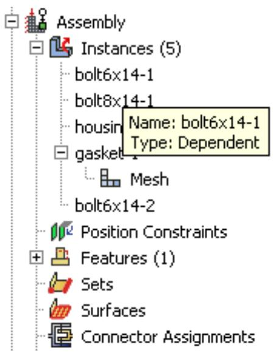  
图 1：模型树指示零件实例是从属的还是独立的。

## 如何决定创建从属还是独立零件实例？

如果您的装配体包含几个互不相关的零件实例，那么从属实例相对于独立实例几乎没有优势。每个零件都不同，您必须为每个零件创建一个实例。相反，如果您的装配体包含相同的零件实例，您可以通过组装零件的从属实例来节省时间。当您随后对原始零件进行网格划分时，Abaqus/CAE 会将该网格应用于装配体中该零件的每个从属实例。此外，从属实例消耗更少的内存资源，并产生更小的输入文件。

例如，图 1 展示了一个包含独立和从属零件实例的装配体。泵壳是一个独立零件实例，而八个螺栓是从属零件实例。左侧的图显示了在装配模块中的装配体。右侧的图显示了在网格模块中的装配体。用户已经对代表螺栓的零件进行了网格划分，Abaqus/CAE 将该网格与螺栓的每个从属实例关联起来。

  
图 1：装配模块和网格模块中的从属零件实例。

当您使用线性或径向阵列工具创建相同实例的阵列时，使用从属零件实例会更为方便。当您对原始零件进行网格划分时，Abaqus/CAE 会将相同的网格应用于阵列中的每个从属实例。相反，如果您创建的是独立实例的阵列，则必须对每个实例单独进行网格划分。

Abaqus/CAE 默认创建从属实例。除非您的装配体只包含很少的零件，否则建议使用从属实例，以节省内存并提升性能。

## 从属零件实例改为独立实例（或反之）

从属零件实例的限制可能会影响您对装配体进行分区或网格划分的能力，或者您可能希望对某个实例应用虚拟拓扑。要在零件实例的从属和独立之间切换，您可以在模型树中右键单击该实例，然后从出现的菜单中选择“设为从属”或“设为独立”。

如果您对零件进行了网格划分并创建了该零件的从属实例，Abaqus/CAE 会将网格与该实例关联。如果您随后将该实例从从属改为独立，Abaqus/CAE 会继续将网格与该独立实例关联。但是，反之则不然。如果您创建了一个独立实例，对其进行了网格划分，然后将该实例转换为从属实例，Abaqus/CAE 会删除该从属实例上的网格。同样的规则适用于分区和虚拟拓扑。当您将独立零件实例更改为从属实例时，Abaqus/CAE 会删除应用于该实例的所有分区或虚拟拓扑。

在某些情况下，您可以通过创建原始零件的副本，并为该副本创建独立实例，来规避从属零件实例的限制。然后，您可以对新的实例进行分区或网格划分，或对其应用虚拟拓扑。同样，虽然您不能同时创建同一零件的从属和独立实例，但您可以创建该零件的副本，并为该副本创建任意类型的实例。

## 在模型之间链接零件实例

您可以在模型之间链接零件实例。链接零件实例后，当您在原始模型中修改实例或零件时，链接的实例和零件会自动更新。

在模型树中，选择您想要链接（子实例）到另一个模型中零件实例的零件实例。右键单击，选择“链接实例”，然后指定您想要将每个子实例链接到的父模型和零件实例。同样，您可以取消先前已链接的零件实例的链接。详细说明，请参见使用模型树操作零件实例。

如果您选择链接零件的所有实例，则该零件也会被自动链接。零件及其特征、集合和曲面会使用父零件进行更新。装配级别的特征、集合和曲面不会被复制。实例使用父实例进行更新，并保留在其上定义的集合和曲面。

如果您仅选择零件的部分实例进行链接，则会在将实例及其新零件链接到父模型之前，创建一个新零件（在零件名称后追加 —LinkedCopy）。

链接的零件实例和零件不可编辑。链接的子实例的位置完全由父实例的位置决定，无法更新。

默认情况下，链接的零件实例和零件在视口中显示为灰色。模型树中会显示图标，以指示零件和零件实例的链接状态，并且如果零件实例也被排除在分析之外，则会同时指示其链接和排除状态，如图 1 所示。Beam-1 是一个链接的零件实例，Beam-2 是一个链接且排除的零件实例。更多信息，请参见从分析中排除零件实例。

  
图 1：模型树图标，指示零件实例的链接和排除状态。

## 附加信息

• 使用模型树操作零件实例

## 从分析中排除零件实例

您可以将零件实例排除在分析之外，这样在提交分析作业时，它们就不会被写入输入文件。被排除的零件实例参与除分析之外的所有操作。

在模型树中，选择您想要从分析中排除的零件实例。右键单击，然后选择“从模拟中排除”。同样，您可以通过选择“包含在模拟中”来包含先前被排除的零件实例。如果您将实例从分析中排除随后又包含回来，对这些零件实例的约束将被保留。

默认情况下，从分析中排除的零件实例在视口中显示为深灰色。模型树中会显示图标，以指示零件实例的排除状态，并且如果零件实例也在模型之间链接，则会同时指示其链接和排除状态，如图 1 所示。Contact-1 和 Contact-2 是被排除在分析之外的零件实例，Beam-2 是一个链接且排除的零件实例。更多信息，请参见在模型之间链接零件实例。

## 附加信息

• 使用模型树操作零件实例

## 集合与零件实例

当您从零件创建零件实例时，零件集合也会随之传递。例如，您可能会从零件的某个区域创建一个集合，并使用属性模块为该集合分配一个截面。当您在装配模块中实例化该零件时，Abaqus 会创建零件实例集合，这些集合指向您先前创建的任何零件集合。Abaqus 在与装配相关的模块中提供对这些零件实例集合的只读访问。您无法从集合管理器访问零件实例集合；但是，您可以在操作过程中通过单击“集合”按钮并从出现的“区域选择”对话框中选择该集合，来选择符合条件的零件实例集合。更多信息，请参见理解集合和曲面。
## 使用模型实例

您可以在主模型中创建其他模型的实例，从而不仅能添加单个部件，还能添加完整的子装配体。

模型实例的创建方式与部件实例完全相同，并且可以以类似方式进行定位和操作。

当您创建新的模型实例时，被引用模型的主装配体将被实例化到当前工作模型的装配体中。该实例会从另一个模型的内容生成一个子装配体。由于被引用的模型装配体本身可能包含其他模型实例作为子级，因此可以形成多层复杂的子装配体结构。

您必须在当前模型数据库（.cae）文件中包含要实例化的外部模型才能使其可用。如果您要实例化的模型位于另一个模型数据库中，请使用 File->Import->Model 将其导入当前模型数据库。一个模型数据库文件始终可以包含多个模型。

Abaqus/CAE 不支持重命名模型实例。您在重命名模型时应格外小心，因为 Abaqus/CAE 不会更新已实例化模型中的模型实例名称。

## 模型实例的特性

模型实例具有以下特性：

*   一个特定的模型可以被多次实例化，并且您可以根据需要实例化任意数量的不同模型。
*   模型实例始终是依赖的，而非独立的。
*   您可以自由地将模型实例与部件实例混合使用。
*   模型实例子装配体可以包含几何部件或孤网格部件。
    模型实例可以通过使用变换（Translate, Translate To, Rotate）和定位约束在主装配体中进行定位和定向。变换和约束必须应用于完整的模型实例子装配体，而不能应用于其任何子级。如果您选择了模型实例内的某个子实例，变换或约束将应用于整个父模型实例。
*   不支持线性阵列和径向阵列，不能用于模型实例。
*   部件实例命令，如 Suppress/Resume, Hide/Show, Delete, Show Parents/Children 和 Switch Context，也可用于模型实例。

您不能对模型实例的子实例使用 Suppress 和 Delete 命令；只能对模型实例本身使用这些命令。如果您在原始（被引用）模型装配体中抑制了某个子实例（部件或模型），它在主模型中也会被抑制。要确认被抑制的实例在主模型中已被正确抑制，您必须使用上下文栏中的 Model 列表从原始（被引用）模型切换到主模型。在模型树中切换到主模型将无法一致地重新生成模型实例子级。（有关上下文栏的信息，请参阅主窗口的组成部分。）然后，必须在原始模型中恢复该子实例。

*   Replace, Exclude from Simulation, Merge/Cut 和 Link Instances 均不支持，也不能用于模型实例。
*   分区工具集不支持，不能用于模型实例。
*   查询工具集受支持，可用于确定模型实例的位置和属性。

在被引用模型中定义的所有集和面都会带入模型实例中，并保持特征的模型树层次结构。这些集和面将在主模型中可用。

在初始分析步中定义的面-面接触和自接触交互（连同其接触交互属性）是唯一从被引用模型带入模型实例的历程级特征（尽管它们在模型树中不可见）；其他历程级特征（如分析步、载荷、边界条件、其他交互和幅值）不会带入模型实例。在被引用模型中定义的某些模型级特征（紧固件和其他工程特征）也不会带入模型实例。

主模型中的交互取决于所使用的交互选项。基于以下模式，交互副本到主模型是受限的：

- 对于 Abaqus/Explicit 模型实例，您不能复制到任何类型的主模型。
- 对于 Abaqus/Standard 或未知模型类型的实例，您只能复制到 Abaqus/Standard 或未知用途的主模型类型。
*   模型实例在显示组和装配体显示选项的 Instance 标签页中受支持且可选。
*   虚拟拓扑工具集不支持用于模型实例。

您的子装配体（被引用）模型中需要的任何部件级属性必须在该原始模型中创建和分配，不能在主模型装配体中创建。例如，材料、截面、取向和蒙皮/加强筋的分配必须在原始模型中进行。可以在原始独立部件实例上进行网格划分，网格将出现在模型实例中。

当您创建模型实例时，被引用模型装配体的所有部件实例都会作为子部件实例添加到主模型装配体中。任何被抑制的部件实例或被排除在仿真之外的实例在子装配体中将保持相同状态。

如果您在主模型装配体中修改或删除了现有的部件实例或模型实例子装配体，每当你切换离开主模型的装配模块再切换回来时，Abaqus/CAE 会自动从所有父实例（部件和模型）重新生成子实例。

如果您尝试从另一个包含子模型实例的模型创建新的模型实例，Abaqus/CAE 将通过防止模型引用循环来避免任何问题。

Abaqus/CAE 确保模型实例的建模空间一致性；如果主模型中的所有实例都是三维的，那么任何要实例化的其他模型也必须是三维的。

## 保存在输入文件中的模型实例数据

当 Abaqus/CAE 为包含模型实例的模型装配体生成输入（.inp）文件时，会生成一个单一的扁平化装配体。所有模型实例子装配体都作为实例的扁平列表写入单个装配体块下。

模型实例的原始模型中的大多数特征都会保存在输入文件中，但也有一些例外：

在初始分析步中定义的面-面接触和自接触交互是唯一从模型实例子装配体保存到输入文件的历程级特征。主模型中的接触交互属性名称和表面名称会以模型实例名称为前缀；例如：
来自模型实例的模型级特征会保存在输入文件中；例如，材料、截面分配、连接器截面分配、蒙皮、加强筋和取向。在主模型中，模型实例中定义的材料和单元控制会以模型名称为前缀；例如，
连接器截面分配在主模型中会以模型实例名称为前缀；例如：`model-instance-name#Wire-3-Set-1`
来自模型实例的其他模型级数据（如初始条件和幅值定义）不会保存在输入文件中。
在模型实例中部件级别定义的质量和惯性单元、弹簧、阻尼器等工程特征会保存到输入文件中，但在原始模型中装配体级别定义的工程特征则不会。

```txt
model-instance-name#contact-property-name
model-instance-name#Surf-1, model-instance-name#Surf-2
```

```txt
model-name#material-name
```

*   来自模型实例的集和面会保存在输入文件中。这些集和面的名称在主模型中也会以模型实例名称为前缀；例如：
*   来自模型实例的约束、参考点、附着点、附着线和线束会保存在输入文件中。
*   对于约束，模型实例名称将作为前缀添加到约束名称前；例如：
*   附着点、附着线和线束将通过在子装配体中创建的集可用。

```txt
model-instance-name#Set-1
```

```txt
model-instance-name#constraint-name
```

存在以下限制：

*   包含模型实例的模型不支持重启动分析。
*   不支持包含已装配紧固件的模型实例。

## 创建装配体

在您创建部件实例或模型实例之后，您需要应用一系列的定位约束和定位操作，将其相对于全局坐标系中的其他实例进行定位。本节描述 Abaqus/CAE 提供的用于定位和约束部件及模型实例的工具。本节还描述了如何替换部件实例。

## 本节内容：

*   装配模块中的定位工具
位置约束方法有何不同  
位置约束、平移和旋转之间可能产生何种冲突  
使用“平移至”工具定位部件或模型实例  
替换实例

## 装配模块中的定位工具

在部件模块中，每个部件都存在于其自身的坐标系中，而模型实例则在各自的坐标系中创建。您使用装配模块，在全局坐标系中相对于彼此来定位和定向这些部件和模型的实例。Abaqus/CAE 提供了以下工具来定位部件和模型实例：

## 自动偏移

当您在装配模块中创建第一个部件或模型实例时，Abaqus/CAE 会显示一个指示全局坐标系原点和方向的坐标轴。Abaqus/CAE 会将第一个实例定位，使部件或模型的原点与全局坐标系的原点对齐，并且坐标轴也对齐。如果您创建额外的实例，Abaqus/CAE 会继续将新实例定位，使其坐标系与全局坐标系对齐。由于这通常会导致新实例与现有实例重叠，Abaqus/CAE 允许您在创建实例之前应用偏移。对于三维和二维实例，偏移沿 X 轴应用；对于轴对称实例，则沿 Y 轴应用。

## 基本定位工具

Abaqus/CAE 提供了以下基本方法来定位部件和模型实例：

• 您可以通过指定平移矢量的起点和终点坐标，将所选实例沿该矢量进行平移。您可以使用以下方法确定所选实例移动的距离：
- 所选实例沿平移矢量从起点移动到终点。  
所选实例沿平移矢量从起点向终点移动，并持续移动，直到所选面或边与固定实例中选择的面或边达到指定距离。更多信息，请参见使用“平移至”工具定位部件或模型实例。  
• 您可以围绕一个轴旋转所选实例。您需要指定旋转轴起点和终点的 X、Y、Z 坐标以及旋转角度。

## 位置约束工具

位置约束定义了两个实例之间的关系。与简单的平移或旋转不同，您不直接指定位置。位置约束定义了一组规则，装配中的部件或模型实例必须始终满足这些规则；例如，一个面必须平行于另一个面。

在装配模块中定义的位置约束仅对实例的初始位置创建约束，而在交互模块中定义的约束则定义分析自由度上的约束。在装配模块中，约束作为装配的特征存储。如果您修改部件或移动部件或模型实例，Abaqus/CAE 在重新生成装配时会尝试应用所有现有的位置约束。

每种位置约束都在位置约束方法有何不同中进行了描述。

创建最终装配是一个迭代过程，包括创建实例、应用位置约束以及应用平移和旋转。每次重新定位后，Abaqus/CAE 会显示一个指示操作结果的临时图像。您可以接受新位置、取消操作，或通过单击提示区域中的“上一步”按钮逐步回退重新定位过程。

您可以使用查询工具集获取顶点的坐标，并测量所选顶点之间的距离。这可以帮助您确定需要沿其平移实例的矢量或需要旋转的角度。查询装配，包含了如何获取装配信息的详细说明。

## 位置约束方法有何不同

位置约束定义了两个部件或模型实例之间的关系——一个是可移动实例，另一个是固定实例。当您应用位置约束时，Abaqus/CAE 会计算满足此关系的可移动实例的位置；您不直接指定位置。您可以在装配模块中对实例应用以下位置约束：

• 平行面（仅限三维实例）
• 面对面（仅限三维实例）
• 平行边
• 边对边
• 同轴（仅限三维实例）
• 重合点
• 平行坐标系

通常，应用单个位置约束不足以精确定义可移动实例的位置。您必须应用多个位置约束——对于三维装配通常需要三个，对于二维装配通常需要两个——才能将实例定位到所需位置。部件和模型实例可能因应用位置约束而重叠；Abaqus/CAE 不会阻止边、面或单元之间的过约束。同样，Abaqus/CAE 也不会阻止您过度约束实例或重复约束。

约束特征的定义包括您最初选择的所有面和边。如果您随后修改部件或移动部件或模型实例，Abaqus/CAE 会根据您最初选择的面和边自动重新计算约束。因此，重新生成装配后，一个或多个实例可能会移动。例如，不同的边可能会变成平行。有关特征的更多信息，请参见在装配模块中操作特征和特征操作工具集。

装配模块提供以下位置约束：

## 平行面

平行面位置约束使可移动实例的选定面与固定实例的选定面变得平行。然而，该位置约束并不指定可移动实例的确切位置，并且平行面之间的距离是任意的。要在两个实例之间应用平行面位置约束，请执行以下操作：

• 从可移动实例和固定实例中选择要约束为平行的面，如图 1 所示。

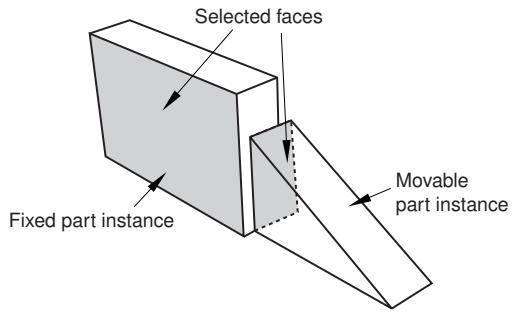  
图 1：选择要变为平行的面。

• Abaqus/CAE 显示垂直于所选面的箭头。您通过选择其选定面法向箭头的方向来规定可移动实例的方向。图 2 说明了应用位置约束的结果以及反转箭头方向对可移动实例的影响。

  
图 2：应用平行面位置约束的结果以及改变可移动实例所选面法向箭头方向的影响。

Abaqus/CAE 旋转可移动实例，直到两个选定面平行且箭头指向相同方向。

您从可移动和固定实例中选择的面必须是平面。平行面位置约束仅适用于三维实例。

## 面对面

面对面位置约束类似于平行面位置约束，不同之处在于您需要定义平行面之间的间隙。该间隙在两个选定面之间测量，沿固定实例的法向为正。除了这个间隙之外，可移动实例的确切位置不受约束。假设您选择了与图 1 所示相同的两个面，应用面对面约束的效果如图 3 所示。图 3 还说明了改变可移动实例所选面法向箭头方向的影响。

  
图 3：应用面对面约束的结果以及改变可移动实例所选面法向箭头方向的影响。

Abaqus/CAE 旋转可移动实例，直到两个选定面平行且箭头指向相同方向。此外，可移动实例会被平移以满足指定的间隙。您从可移动和固定实例中选择的面必须是平面。面对面位置约束仅适用于三维实例。

## 平行边

平行边位置约束使可移动实例的选定边与固定实例的选定边变得平行。然而，该位置约束并不指定可移动实例的确切位置，并且平行边之间的距离是任意的。要在两个实例之间应用平行边位置约束，请执行以下操作：
• 从可移动实例和固定实例中选择需要约束为平行的边，如图 4 所示。

  
图 4：选择要变为平行的边。

• Abaqus/CAE 沿选定的边显示箭头。您可以通过选择其选定边上箭头的方向来规定可移动实例的朝向。图 5 说明了应用位置约束的结果，以及反转可移动实例选定边上箭头方向的效果。

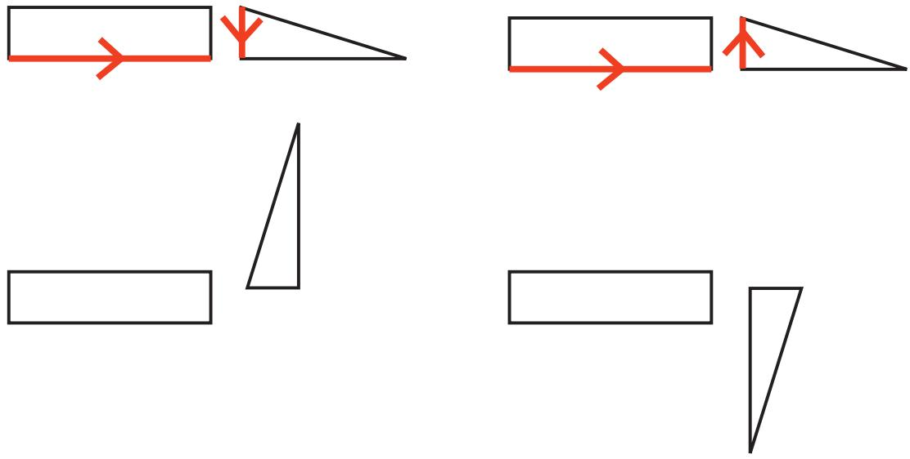  
图 5：应用平行边约束的结果，以及更改可移动实例选定边上箭头方向的效果。

Abaqus/CAE 会旋转可移动实例，直到两条选定的边平行且箭头指向相同方向。

您从可移动实例和固定实例选择的边必须是直的。您可以从实例中选择一条边，也可以选择一个基准轴或基准坐标系的一个轴。平行边位置约束仅适用于二维和三维实例。它对轴对称实例无效。

## 边对边 (Edge to Edge)

边对边位置约束类似于平行边位置约束，只是平行边之间的间隙由约束定义。假设您选择了图 4 中所示的相同两条边，对一个二维组件应用边对边位置约束的效果如图 6 所示。图 6 还说明了反转可移动实例选定边上箭头方向的效果。

  
图 6：应用边对边约束的结果，以及更改可移动实例选定边上箭头方向的效果。

组件的建模空间决定了您在应用边对边位置约束后 Abaqus/CAE 的行为。

• 如果组件是三维的，Abaqus/CAE 会将可移动实例定位，使得边重合。
• 如果组件是二维的，您可以指定选定边之间的间隙。间隙在两条选定边之间测量，沿固定实例的法线方向为正。

除此行为外，可移动实例的确切位置不受约束。边对边位置约束可应用于二维、三维和轴对称实例。

## 同轴 (Coaxial)

同轴位置约束使可移动实例上选定的圆柱面或圆锥面与固定实例上选定的圆柱面或圆锥面同轴。但是，同轴位置约束不限制可移动实例的确切位置。要在两个实例之间应用同轴位置约束，请执行以下操作：

• 从可移动实例和固定实例中选择要约束为同轴的圆柱面或圆锥面，如图 7 所示。

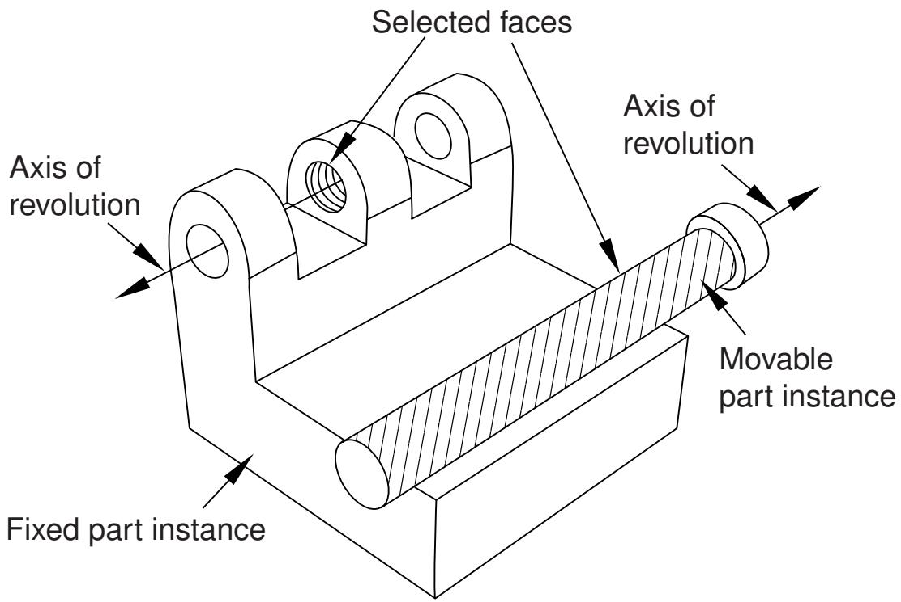  
图 7：选择要变为同轴的面。

Abaqus/CAE 沿选定实例的旋转轴显示箭头。您可以通过选择其旋转轴上箭头的方向来规定可移动实例的朝向。图 8 说明了应用同轴位置约束的结果。

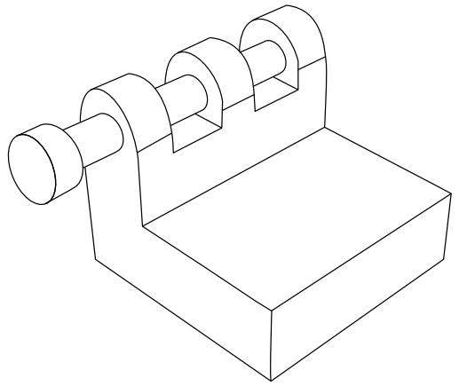  
图 8：应用同轴约束的效果。

Abaqus/CAE 会旋转并平移可移动实例，直到两个选定的面同轴且箭头指向相同方向。同轴位置约束仅适用于三维实例。

## 重合点 (Coincident Point)

重合点约束使可移动实例上选定的一个点与固定实例上选定的一个点重合。但是，重合点约束不限制可移动实例的朝向。应用约束后，可移动实例的朝向不会改变，如图 9 所示。详细说明，请参阅 *使用重合点约束两个实例*。

使用 CVJOIN 保持相对位置  
1. 使用重合点装配实例。  
  
图 9：应用重合点约束的效果。

## 平行坐标系 (Parallel CSYS)

平行坐标系约束使可移动实例上基准坐标系的轴与固定实例上基准坐标系的轴平行。但是，平行坐标系约束不指定可移动实例的确切位置。图 10 说明了对两个实例应用平行坐标系约束和重合点约束的效果。

  
图 10：应用平行坐标系和重合点约束的效果。

坐标系可以是直角坐标系（X-、Y- 和 Z-轴）、柱坐标系（R-、θ- 和 Z-轴）或球坐标系（R-、θ- 和 φ-轴）。详细说明，请参阅 *使用平行坐标系约束两个实例*。

您可以使用基准来定位零件和模型实例。当系统提示您选择一个面时，您也可以选择一个基准平面。当系统提示您选择一条边时，您也可以选择一个基准轴或基准坐标系的一个轴。您可以选择在零件模块中创建的基准，因为该基准与零件的一个实例相关联，并随零件实例一起移动。但是，如果位置约束使用了在装配模块中通过从零件实例选择（例如零件实例的一个面）而创建的基准，Abaqus/CAE 将更改其重新生成行为，并按照您创建特征的顺序重新生成它们。有关更多信息，请参阅 *位置约束如何重新生成？*。如果基准是在装配模块中创建的，并且它依赖于多个零件实例（例如，穿过两个零件实例顶点的基准轴），则您不能选择该基准作为可移动零件实例。

## 位置约束、平移和旋转之间可能如何产生冲突

在某些情况下，尝试应用位置约束会导致与现有位置约束冲突。如果是这样，Abaqus/CAE 会显示一条错误消息，您可以应用不同的位置约束，或者使用特征操作工具集修改现有的位置约束。

类似地，尝试平移或旋转零件或模型实例可能会导致与现有位置约束冲突。如果发生冲突，Abaqus/CAE 将执行以下操作：

## 平移 (Translation)

Abaqus/CAE 仅沿未受约束的自由度施加平移分量。如果所有自由度都受到约束，Abaqus/CAE 将显示错误消息，并且平移失败。

## 旋转 (Rotation)

Abaqus/CAE 显示错误消息，并且旋转失败。

如果您遇到与现有位置约束的冲突，可以通过使用实例 -> 转换约束 (Instance->Convert Constraints) 来移除所有现有的位置约束，而不会改变实例的位置。然后，您可以应用新的位置约束、平移或旋转。您无法恢复已移除的位置约束。或者，您可以删除一个位置约束，Abaqus/CAE 会将实例移回其原始位置。

## 使用“平移至”(Translate To) 工具定位零件或模型实例

“平移至”(Translate To) 工具通过将一个实例沿用户定义的运动方向向量进行平移，直到可移动实例的选定面或边与固定实例的选定面或边相隔指定距离，从而定位两个零件或模型实例。

当您使用“平移至”(Translate To) 工具在三维建模空间中定位实例时，您选择要接触的面；对于二维或轴对称建模空间中的实例，您选择要接触的边。此外，当您使用“平移至”(Translate To) 工具定位轴对称实例时，平移向量必须平行于旋转轴。

当您使用“平移至”(Translate To) 定位工具时，您可以从固定实例和可移动实例中选择多个面或边。如果您不确定当可移动实例沿所选向量移动时模型的哪部分会接触，选择多个面或边会很有用。但是，为了更快处理，您应尽可能少地选择面或边。
要将可移动部件或模型实例移动到固定实例的位置，请执行以下操作：

•   从将要移动的实例和将保持静止的实例中选择面或边。
•   通过定义一个平移向量来指定可移动实例的运动。图1展示了选定的边和平移向量。

  
图1：选择待接触的边，并定义平移向量。

•   定义所选面或边之间的期望间隙。图2展示了在指定间隙值为零和间隙值为d时，接触约束的效果。

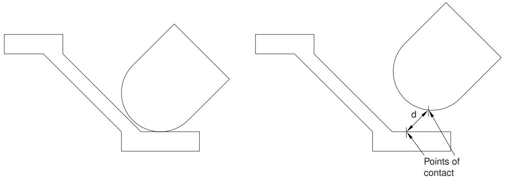  
图2：应用接触约束并指定间隙值为零和d时的效果。

为了测量间隙d，Abaqus/CAE首先沿平移向量移动实例，直到任何一对选定的面或边接触。然后，Abaqus/CAE沿平移向量将实例移动由间隙值指定的距离。间隙可以是零，也可以是正数或负数；负的间隙值会导致所选面或边之间发生过度闭合。当您使用“平移到”工具时，Abaqus/CAE会根据实例的尺寸，在一定公差范围内计算可移动实例的位置。如果您想避免任何过度闭合的可能性，应指定一个较小的间隙值，而不是简单地指定为零。

如果沿平移向量所选面或边之间不可能发生接触，Abaqus/CAE会显示错误信息且不会移动该实例。

即使您将可移动实例平移到与固定实例发生接触，所选表面的物理邻近性也不足以表明它们之间存在任何形式的相互作用。您必须使用相互作用模块来指定表面之间的力学接触。“平移到”定位工具仅在基于模型尺寸的公差范围内满足要求。因此，除非在两个平面之间应用，否则接触可能不精确。

Abaqus/CAE使用一组面片化的面来近似表示曲面。同样，Abaqus/CAE使用一组面片化的边来近似表示曲线边。面片的数量取决于您在部件模块中创建部件时指定的曲线细化程度。使用框放大工具检查装配中面和边的细节。当您平移曲面或曲线边时，Abaqus/CAE使用此面片化表示来计算接触位置。您可能希望根据已知将发生接触的面或边的曲率，将曲线细化设置得更精细。更多信息，请参阅控制曲线细化。

## 替换实例

您可以用第二个部件/模型的实例替换一个部件/模型实例。准确地说，您是在替换创建该部件/模型实例所依据的部件/模型。Abaqus/CAE将新实例定位在使其原点位于原始实例的原点处，并且它们的轴对齐。此外，您可以选择新实例是否继承它所替换实例的所有约束。

替换操作不会更改实例的属性。例如，如果原始实例是依赖实例，则替换它的实例也将是依赖实例。因此，如果某个部件已存在独立实例，则不能使用替换过程来创建同一部件的依赖实例。

当您用具有相似几何形状的实例替换另一个实例时，替换实例非常有用。例如，新实例可能具有原始实例中没有的额外细节。您也可以用同一部件的网格表示来替换基于几何形状的部件。例如，您可以替换一个部件，使用从输出数据库导入的变形部件的网格表示。

## 创建实例阵列

您可以沿线性或径向阵列创建所选实例的多个副本。您可以指定要创建的实例数量和阵列的结构，如下所述。

## 线性阵列

线性阵列将新实例沿线性方向（例如X方向）定位。所选实例的原点和新实例的原点位于由该方向指定的直线上。您可以指定实例数量以及实例之间的间距。此外，您可以通过从装配中选择一条代表新方向的直线来更改线性阵列的方向。

您可以通过在第二方向（例如Y方向）创建副本来创建实例副本的矩阵。选项与第一方向相同；您可以控制副本数量、间距和方向。默认情况下，第一方向是X轴，第二方向是Y轴。例如，图1说明了如何沿X轴和Y轴对阵列化一个部件实例。

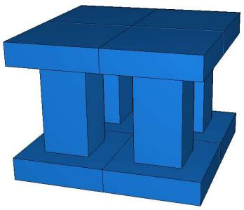  
图1：沿两个线性方向阵列化的实例。

## 径向阵列

径向阵列将新实例排列在圆形阵列中。您可以指定实例数量，并可以指定第一个和最后一个副本之间的角度，其中正角度对应于逆时针方向。例如，图2展示了图1中相同实例的径向阵列。

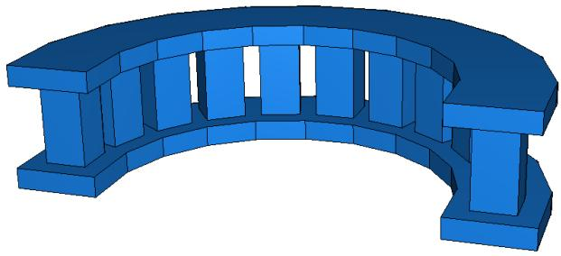  
图2：实例的径向阵列。

默认情况下，Abaqus/CAE围绕Z轴创建径向阵列。或者，您可以从装配中选择一条直线来定义圆形阵列的轴。

如果您创建的实例阵列相互接触，并且您希望将阵列视为单一部件，则必须使用合并/切除工具将阵列中的所有部件实例合并为一个部件实例。例如，图2中所示的径向阵列中的实例相互重叠，并已合并为一个部件实例。更多信息，请参阅对部件实例执行布尔操作。如果您不合并部件实例，则阵列可能在实例接触处包含重复的面或节点。

如果部件包含部件级集合或表面，Abaqus/CAE会为阵列中的每个单独实例创建单独的装配级集合和表面（有关部件级和装配级集合与表面的进一步讨论，请参见部件集合和装配集合有何区别？）。例如，如果图1和图2中原始部件的顶面包含在部件级表面中，Abaqus/CAE最初会为阵列化装配中每个实例的顶面创建单独的装配级表面。将这些重复的集合和表面合并到一个集合或表面中通常很有帮助。当您合并阵列化的部件实例时，Abaqus/CAE还会将任何重复的集合或重复的表面合并到合并部件和部件实例上的单个集合或表面中。如果您不合并阵列化的部件实例，仍然可以使用模型树中的布尔选项合并集合或表面（有关说明，请参阅对集合或表面执行布尔操作）。

当您创建线性或径向实例阵列时，使用依赖实例会更方便。当您对原始部件进行网格划分时，Abaqus/CAE会将相同的网格应用于阵列中的每个实例。相反，如果您创建独立实例的阵列，则必须单独对每个实例进行网格划分。更多信息，请参见依赖部件实例和独立部件实例之间有何区别？。

## 对部件实例执行布尔操作

本节描述如何合并和切除部件实例。

您可以选择使用Abaqus/CAE创建的部件实例，并将它们合并为一个实例。此外，您可以使用其他部件实例的几何部分来切除部件实例的几何部分。您也可以合并包含几何和孤立单元的部件实例。

## 本节内容：

合并和切除部件实例  
合并和切除独立和依赖的部件实例

## 合并和切除部件实例

从主菜单栏选择实例->合并/切除以合并部件的多个实例。要合并的部件可以包含几何与孤立网格节点和单元的任意组合；并且有选项可用于合并几何、网格（孤立网格和原生网格）或两者。此外，您可以使用一个或多个部件实例的几何部分来切除部件实例的几何部分以执行切除。合并和切除操作都会创建一个新的部件实例和一个新部件。当您合并或切除部件实例时，可以选择抑制或删除原始部件实例。合并和切除操作将在下面更详细地描述。
## 合并

您可以选择多个部件实例并将它们合并为单个部件实例。例如，图 1 显示了两个建模 15 针连接器的部件实例。这两个部件实例沿一个共同面定位，然后合并为一个可以划分网格并分析的单一部件实例。

  
图 1：两个部件实例合并为单个部件实例。

即使部件实例没有接触或重叠，您也可以合并它们。您可以选择是删除还是保留合并部件实例之间的交叉边界，如图 2 所示。如果需要，您可以使用“部件副本”对话框，围绕三个主平面之一创建部件的镜像。更多信息，请参见 *复制部件*。

  
图 2：删除和保留交叉边界的效果。

如果合并网格，您可以指定**节点合并容差**，这是将被合并的节点之间的最大距离。Abaqus/CAE 通过删除距离小于指定距离的节点并用单个新节点替换它们来创建兼容的网格。新节点的位置是被删除节点的平均位置。如果您输入的“节点合并容差”值过大，Abaqus/CAE 可能会检测到来自同一单元的重复节点。Abaqus/CAE 不会合并来自同一单元的节点。但是，过大的容差可能导致网格扭曲，Abaqus/CAE 会询问您是继续还是结束合并过程。如果没有节点比指定距离更近，Abaqus/CAE 会询问您是取消过程还是从选定的实例创建单个实例。

当您合并相交的网格部件实例时，您可以选择是否创建重复单元以及重复节点。一个重复单元与另一个单元具有相同的连接关系。默认情况下，Abaqus/CAE 会删除重复单元，在大多数情况下，您应接受默认行为。但是，如果您想建模具有 Abaqus 不支持的组合材料属性的材料，则必须保留重复单元，如关于“无压缩或无拉伸”的稳定性讨论中所述。

您可以为合并节点选择以下方法：

## 仅边界

默认情况下，Abaqus/CAE 仅沿网格部件实例的边界（对于三维实例由自由面定义，对于二维实例由自由边定义）合并它们。自由面和自由边是指仅属于一个几何实体或单元的那些面和边。使用此设置，Abaqus/CAE 不会检查部件内部的重复节点，从而加快了合并过程。如果三维部件实例仅在共同面处相交，或者二维实例仅在共同边处相交，您应保留此默认设置。

## 全部

如果部件实例重叠，您可能希望合并选定部件实例中的所有节点。

## 无

或者，您可以选择不合并任何节点，在这种情况下，Abaqus/CAE 会将部件实例合并为一个实例，但保留所有原始节点。

在许多情况下，您将合并不相交但共享一个共同面的部件实例；例如，图 3 所示的两个部件实例。

  
图 3：两个网格部件实例合并为单个网格部件实例。

您也可以使用“编辑网格”工具集合并网格部件的选定节点；更多信息，请参见 *操作节点*。

尽管在视口中的结果合并网格可能看起来可以接受，但该网格可能包含节点与单元面之间不明显的小间隙。网格还可能包含具有不兼容网格模式的合并面。您可以使用“查询”工具集中的“网格间隙/交叉点”工具来检查小间隙和不兼容面。更多信息，请参见 *获取有关模型的常规信息*。

当您合并部件实例时，原始部件和部件实例上的任何集合或表面都会映射到新部件和部件实例上。如果来自不同部件的集合或表面具有相同的名称，它们将被合并到合并部件和部件实例上的单个集合或表面中。如果您选择删除合并部件实例之间的交叉边界，位于这些边界边和面上的集合或表面部分将从映射的集合和表面中移除。

来自原始部件的截面分配也会映射到新部件。如果原始装配体中的部件相交，Abaqus/CAE 在相交区域只能映射单个截面。类似地，如果部件恰好接触或相交，并且在合并过程中删除了交叉边界，Abaqus/CAE 将只映射单个截面到整个合并部件。在这些相交情况下，被映射的截面取决于多种因素，并且可能与您的建模意图不符。当合并相交区域时，您应保留交叉边界；这些边界保留了非相交区域中的原始截面分配，并在必要时更容易修改映射的截面分配（有关详细信息，请参见 *管理截面分配*）。


## 注意：

梁截面分配和钢筋参考方向不会映射到合并部件。您必须在合并后重新创建它们以及任何关联的属性。

您可能出于以下原因想要合并部件实例：

如果不同实例中的几何体接触或重叠但您不合并这些实例，Abaqus/CAE 会为每个实例创建单独的网格，您必须应用绑定约束才能有效地合并节点。相反，当您合并部件实例时，Abaqus/CAE 会创建一个单一的组合网格，您不需要应用计算成本高昂的绑定约束。实际上，您已在部件实例之间创建了兼容的网格。如果您希望保留单独部件实例的概念，可以在合并实例的共同界面处创建分区。

* 合并部件实例允许您将材料属性分配给通过合并操作创建的单个部件，而不是分别分配给每个部件。
* 您可以将显示体约束应用于一组合并的部件实例，而不是分别应用于每个部件实例。

当您导入一个复杂的装配体时，该装配体在 Abaqus/CAE 中可能显示为大量单独的部件实例，并且将单独划分网格。您可以将所有部件实例合并为一个部件实例，或者将部件实例组合合并为几个单独的部件实例。

合并部件实例时，您有以下三个选项：

## 几何体

仅合并几何体。正在合并的实例中的任何孤立网格部分会从合并部件和部件实例中删除。

## 网格

合并所有原生网格和孤立网格组件。正在合并的实例中的任何几何体都会从合并部件和部件实例中删除。原始部件的原生网格部分成为新部件中孤立网格的一部分。

## 两者

同时合并几何体和孤立网格。在合并几何体的过程中，任何原生网格都会被删除。

## 切割

您可以选择要切割的单个部件实例的几何体部分，然后选择一个或多个与要切割的部件实例接触或重叠的部件实例的几何体。Abaqus/CAE 使用将进行切割的几何体（模具）来从要切割的实例的几何体（毛坯）中切除材料。几何体必须接触或重叠才能创建切割部件和部件实例。如果被切割的部件实例包含孤立网格单元，它们不受切割操作的影响。

当您切割部件实例时，原始部件和部件实例上的集合、表面和截面分配会映射到新部件和部件实例上。位于原始几何体切割部分内的原始集合和表面部分会从映射的集合和表面中移除。

切割操作在您希望从部件创建模具或反之亦然时很有用。图 4 显示了一个瓶子和一个矩形毛坯，以及切割过程如何创建模具。

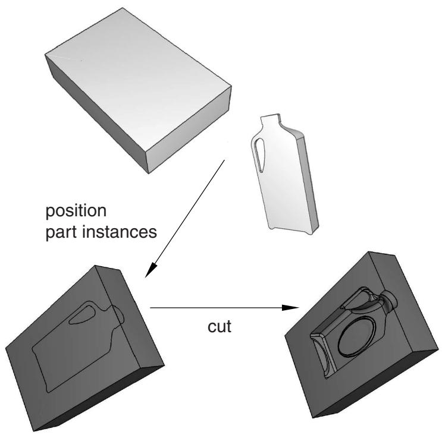  
图 4：使用切割操作从毛坯和模具创建的模具。

您不能使用壳部件实例进行切割。因此，在执行切割操作之前，已在“部件”模块中将瓶子从壳体转换为实体部件。更多信息，请参见 *从壳体创建实体特征*。此外，原始部件实例（毛坯和模具）在切割操作后被抑制。在您执行声学或冲击分析时，切割操作对于建模结构和声学介质也很有用。


## 注意：

您无法合并或剪切包含虚拟拓扑的部件实例。当您合并部件实例时，原始部件的复合铺层和材料方向不会映射到合并后的部件。

有关详细说明，请参阅合并或剪切部件实例。

## 合并与剪切独立和非独立部件实例

合并选定的部件实例会生成一个新的部件实例和一个新的部件。如果您合并独立的部件实例，生成的部件实例也是独立的。类似地，如果您合并非独立的部件实例，生成的部件实例也是非独立的。最后，如果您合并独立与非独立部件实例的组合，生成的部件实例是非独立的。

当您合并已网格化几何体和/或孤立网格单元的网格时，生成的部件实例始终是孤立网格部件，并且始终是非独立的。当您同时合并包含几何体以及孤立网格节点和单元的部件的网格和几何体时，生成的部件实例是包含几何体以及孤立节点和单元的混合体，并且始终是非独立的。

剪切选定部件实例的几何体也会生成一个新的部件实例和一个新的部件。关于合并独立与非独立部件实例几何体的讨论同样适用于剪切独立与非独立部件实例的几何体；然而，部件实例内的孤立网格单元无法被剪切，也无法用于剪切另一个实例的几何体。

## 理解装配模块中的工具集

装配模块提供了几种工具集，允许您修改定义装配的特征。本节描述这些工具集在装配模块中的使用方法。

有关每个工具集的更详细信息，请参阅：

*   基准工具集
*   特征操作工具集
*   分割工具集
*   查询工具集
*   参考点工具集
*   集合与表面工具集

显示组工具集将在使用显示组显示模型子集中讨论。

## 本节内容：

*   在装配模块中使用基准几何体
*   在装配模块中操作特征
*   分割装配
*   查询装配
*   创建参考点
*   在装配模块中使用集合和表面

## 在装配模块中使用基准几何体

在装配模块中，您可以使用基准工具集来提供装配未提供的额外参考几何体（顶点、边和表面）。您使用这些参考几何体来帮助定义位置约束以及定位部件或模型实例。例如，如果在创建平行面或面对约束时所需的表面不存在，您可以使用一个基准平面。类似地，如果在创建平行边或边对边约束时所需的边不存在，您可以使用一个基准轴。基准是其被选定的任何约束的父特征。基准不会修改部件或模型实例的几何体；因此，您可以创建同时引用独立和非独立部件实例的基准。

您在部件模块中创建的基准几何体会在您于装配模块中创建部件实例时，与部件的其余几何体一起传递过来。此外，当您在装配模块中平移和旋转部件实例时，在部件模块中创建的基准会与该实例一起平移和旋转。相比之下，在装配模块中创建的基准仅遵循创建该基准时所使用的参考点。因此，如果您平移和旋转部件实例，基准的行为可能无法反映您的设计意图。如果您知道某个基准应与某个部件关联，则应在部件模块中创建该基准。

图1展示了一个模型，其中可变形的曲面壳体将被压缩在两个刚性表面之间。

图1：在基准轴与选定边之间应用的边对边约束。

通过将位置约束应用在下部刚性表面（固定部件实例）的选定边与壳体（可移动部件实例）关联的基准轴之间，可以轻松定位壳体。该基准轴是在部件模块中与可变形部件一起创建的，并在应用位置约束时与可移动部件实例一起移动。相比之下，图2展示了一个在三个可移动部件实例与一个提供参考几何体的固定基准轴之间应用的边对边位置约束。在此示例中，基准轴是沿装配的X轴创建的，并且不与任何部件实例关联。对所示的三个部件实例各应用一个边对边位置约束，将使这三个实例沿该基准轴对齐。

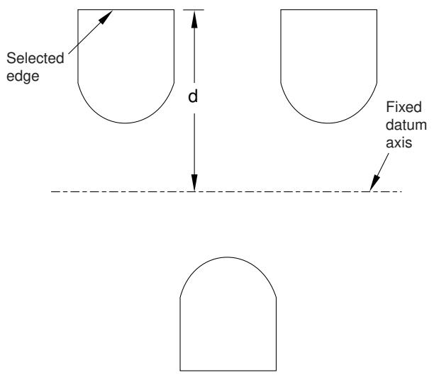
图2：在多个部件与固定基准轴之间应用的边对边约束。

基准是装配的一个特征，并与其他装配一起重新生成。您可以通过从主菜单栏选择"视图"->"装配显示选项"来使基准几何体不可见，同时仍将其保留在装配中。有关更多信息，请参阅控制基准显示。

指示全局坐标系原点和方向的三轴架是由装配模块创建的基准坐标系。您可以抑制或删除它，但无法修改它。

## 附加信息

*   理解装配模块中的工具集
*   基准工具集

除了基准几何体和分割，部件实例、模型实例和位置约束也被视为装配的特征，并出现在模型树的特征列表中。

## 部件实例

您可以抑制、恢复和删除部件实例。您可以分割部件实例，但无法编辑其形状或其特征。要修改部件实例，您必须在部件模块中编辑原始部件；当您返回装配模块时，Abaqus/CAE 会自动重新生成已修改部件的实例。

您可以通过从主菜单栏选择"视图"->"装配显示选项"->"实例"来使部件实例不可见，同时仍将其保留在装配中。有关更多信息，请参阅控制实例可见性。此技术与抑制部件实例不同；被抑制的部件实例会从装配中移除，直到您恢复它。您也可以使用显示组来使部件实例不可见；有关更多信息，请参阅使用显示组显示模型子集。

您可以链接部件实例，也可以将部件实例从分析中排除；有关更多信息，请参阅在模型之间链接部件实例和从分析中排除部件实例。

## 模型实例

您可以抑制、恢复和删除模型实例。要修改模型实例，您必须编辑原始模型的装配。

您可以通过从主菜单栏选择"视图"->"装配显示选项"->"实例"来使模型实例不可见，同时仍将其保留在装配中。您也可以使用显示组来使模型实例不可见。

## 位置约束

您可以编辑、抑制、恢复和删除位置约束。您可以修改位置约束的以下参数：

*   垂直于可移动部件实例选定面或沿其选定边的箭头方向。
*   可移动部件实例的选定面或边与固定部件实例的选定面或边之间的间隙。间隙参数仅适用于面对、边对边和接触约束。

平移和旋转不会作为特征存储，无法被编辑、抑制、恢复或删除。

您可以使用特征操作工具集来修改装配的特征。当提示您选择要修改的特征时，您可以从视口选择可见的特征，如部件实例、基准或分割。但是，要选择位置约束，您必须从模型树中选择它。

特征操作工具集提供以下特征操作工具：

## 编辑

当您编辑一个特征时，Abaqus/CAE 会显示编辑特征对话框，您可以修改特征的参数或定义该特征的草图。您无法编辑部件实例；您必须返回部件模块来修改原始部件。

## 重新生成

在复杂的装配中修改特征时，将重新生成推迟到完成所有更改后可能更为方便，因为重新生成可能很耗时。当您准备好重新生成装配时，选择"特征"->"重新生成"。

## 重命名

重命名一个特征。

## 抑制

抑制一个特征会暂时将其从装配定义中移除。被抑制的特征是不可见的，无法被网格化，并且不包含在模型的分析中。抑制一个父特征将抑制其所有子特征。
## 恢复

恢复特征会将一个被抑制的特征还原到装配中。您可以选择恢复所有特征、最近被抑制的特征集合，或者仅恢复所选特征。

## 删除

删除特征会将其从装配中移除；您无法恢复已删除的特征。

## 查询

当您查询一个特征时，Abaqus/CAE 会在消息区域显示信息，并以注释的形式将相同的信息写入重播文件（abaqus.rpy）。

## 选项

特征选项（Feature Options）对话框允许您控制 Abaqus/CAE 是否执行自相交检查，并使您能够优先考虑约束特征的重建顺序，优先于其他装配特征。

有关特征操作工具集（Feature Manipulation toolset）的更详细说明，请参见特征操作工具集。

## 附加信息

• 理解装配模块中的工具集  
• 特征操作工具集

## 对装配进行分区

在装配模块（Assembly module）中，您可以使用分区工具集（Partition toolset）将装配划分为更多区域。您可以使用一个部件实例的顶点、边和面来创建分区，从而划分第二个部件实例；例如，您可能使用延伸面（Extend Face）方法，通过将一个部件实例的面延伸到第二个部件实例中来对一个体元进行分区。分区不能跨越部件实例。

装配中的分区会出现在对装配进行操作的每个模块中。当您在装配模块中创建部件实例时，在零件模块（Part module）中创建的分区会随零件的其他几何体一起被传输。分区是装配的特征，它们会随装配的其余部分一起重建。您无法关闭分区的显示。分区会修改部件实例的几何体；因此，您无法对从属部件实例进行分区。

分区工具集（Partition toolset）不被支持，也无法与模型实例一起使用。

## 附加信息

• 理解装配模块中的工具集  
• 分区工具集

## 查询装配

您可以使用查询工具集（Query toolset）来请求一般信息或特定于模块的信息。有关一般查询显示的信息的讨论，请参见获取关于模型的一般信息。

此外，您可以使用装配模块特定的查询来确定部件实例或模型实例的以下属性：

• 名称、类型和建模空间  
• 原点  
• 应用于该实例的平移和旋转的总和

更多信息，请参见使用查询工具集查询装配。

## 创建参考点

从主菜单栏中，选择工具（Tools）->参考点（Reference Point）以在部件实例或模型实例上创建参考点。您可以在装配上创建多个参考点；Abaqus/CAE 将它们标记为 RP-1、RP-2、RP-3 等。更多信息，请参见参考点工具集（The Reference Point toolset）。

Abaqus/CAE 在所需位置显示参考点及其标签。您可以通过在模型树（Model Tree）中用鼠标按钮 3 单击该特征，然后从出现的菜单中选择重命名（Rename）来更改参考点标签。如果需要，您可以关闭参考点符号和参考点标签的显示；更多信息，请参见控制参考点显示。

## 在装配模块中使用集与面

通过从装配中选择几何体创建的集称为装配集（assembly sets），您可以使用集工具集（Set toolset）来创建和管理装配集。例如，您可以选择一个装配集来指示载荷、边界条件和交互作用的施加位置。您还可以使用装配集来定义分析期间 Abaqus/CAE 将从中生成输出的模型区域；例如，选定的顶点或面。装配集可以包含来自多个部件实例的区域。

相比之下，零件集（part sets）是通过在零件模块或属性模块（Property module）中从零件中选择几何体来创建的。当您在装配模块中实例化一个零件时，您可以引用您先前创建的任何零件集；但是，在与装配相关的模块中，Abaqus 仅提供对这些零件集的只读访问。此外，在与装配相关的模块中，您无法从集管理器（Set Manager）访问零件集；但是，您可以通过在步骤中单击集（Set）按钮，并从出现的区域选择（Region Selection）对话框中选择该集来选择符合条件的零件集。更多信息，请参见理解集与面。

您通过从装配中选择面或边来创建面（surfaces），并使用面工具集（Surface toolset）来创建和管理面。通常，当某个步骤需要面时，您会选择一个面；例如，在施加分布载荷（如压力载荷）和定义接触交互作用时。更多信息，请参见什么是面？。

对于模型实例，原始模型中定义的任何集或面都会被带入模型实例中，并保持特征（features）在模型树（Model Tree）中的层次结构。

## 附加信息

• 理解装配模块中的工具集  
• 集与面工具集

## 使用装配模块工具箱

您可以通过主菜单栏或通过装配模块工具箱（Assembly module toolbox）访问所有装配模块工具。图 1 显示了工具箱中所有装配模块工具的隐藏图标。

  
图 1：装配模块工具。

要查看包含工具简要定义的提示信息，请将鼠标悬停在工具上片刻。有关使用工具箱和选择隐藏图标的信息，请参见使用包含隐藏图标的工具箱和工具栏。

## 创建和操作部件与模型实例

本节描述如何使用装配模块的实例（Instance）菜单来创建部件和模型实例，并将这些实例相对于全局坐标系进行定位。

您还可以使用实例菜单用另一个部件实例替换一个部件实例，以及将应用于所选部件实例的约束转换为绝对位置。您可以使用模型树（Model Tree）访问其他功能。

## 本节内容：

使用实例菜单  
使用模型树操作部件实例  
使用模型树切换部件或模型实例的上下文  
创建部件或模型实例  
创建实例的线性阵列  
创建实例的径向阵列  
平移部件或模型实例  
将部件或模型实例平移到另一个实例  
旋转部件或模型实例  
替换实例  
转换约束  
合并或切割部件实例

## 使用实例菜单

使用实例菜单执行以下操作：

从当前模型创建部件的实例并将其添加到装配中。您还可以创建其他模型的实例以添加到当前装配中。  
• 创建部件实例的线性阵列。  
• 创建部件实例的径向阵列。  
沿指定矢量平移选定的部件或模型实例。  
沿指定矢量平移选定的部件或模型实例，直到它们与另一个实例保持指定距离。  
绕指定轴旋转指定角度来旋转选定的部件或模型实例。  
用第二个部件实例替换一个部件实例。  
将任何位置约束转换为绝对位置。  
合并或切割部件实例。

您可能会发现使用装配模块工具箱（Assembly module toolbox）访问实例工具更为方便。有关装配工具箱中工具的图示，请参见使用装配模块工具箱。

## 附加信息

• 使用装配模块工具箱

• 装配模块

## 使用模型树操作部件实例

您可以使用模型树访问用于操作部件实例的其他功能。在模型树中选择一个或多个部件实例后，您可以单击鼠标按钮 3 并从以下选项中进行选择：

• 要将部件实例从从属更改为独立，请从出现的菜单中选择设为独立（Make Independent）。类似地，您可以从菜单中选择设为从属（Make Dependent）将部件实例从独立更改为从属。  
• 要链接部件实例，请从出现的菜单中选择链接实例（Link Instances）以显示链接实例（Link Instances）对话框，并执行以下操作：

1. 对于每个子部件实例，指定您想要链接到的模型和部件实例。默认情况下，该对话框显示模型数据库中除当前模型外所有模型中具有与所选实例同名的部件实例。您可以通过单击表格中的模型（Model）或实例（Instance）列并从显示的名称列表中选择来指定其他值。

2. 如果您希望在提交作业进行分析时，Abaqus/CAE 生成的输入文件中排除子部件实例，请切换打开同时在模拟中排除子实例（Also exclude child instances from simulation）。

3. 单击链接（Link）。
模型树中会出现图标来指示零件实例的链接状态。默认情况下，链接的零件实例在视窗中显示为灰色。

同样，您可以从菜单中选择**取消链接实例**来解除之前链接的零件实例。有关更多信息，请参阅在模型之间链接零件实例。

要从分析中排除零件实例，请从出现的菜单中选择**从模拟中排除**。模型树中会出现图标来指示零件实例的排除状态。默认情况下，被排除在分析之外的零件实例在视窗中显示为深灰色。同样，您可以从菜单中选择**包含在模拟中**，将之前被排除的零件实例重新纳入分析。有关更多信息，请参阅从分析中排除零件实例。
• 要忽略零件实例的无效状态，请选择**忽略无效性**。有关更多信息，请参阅处理无效零件。

## 其他信息

• 依赖零件实例与独立零件实例有何区别？
• 如何决定是创建依赖零件实例还是独立零件实例？
• 从依赖零件实例更改为独立零件实例或反之亦然
• 在模型之间链接零件实例
• 从分析中排除零件实例

## 使用模型树切换零件或模型实例的上下文

您可以在**装配**模块或**网格**模块中使用模型树来切换零件实例或模型实例及其子零件实例的上下文。

在模型树中，选择您要切换上下文的实例。如果您选择了多个实例，上下文将切换到您选择的第一个实例对应的零件或模型。单击鼠标第3键，然后选择**切换到零件/模型上下文**。Abaqus/CAE将按如下方式切换上下文（取决于您的选择）：
• 在**装配**模块中，如果您选择了零件实例或子零件实例，上下文将切换到**零件**模块，并在视窗中显示创建该实例所依据的原始零件。
• 在**网格**模块中，如果您选择了零件实例或子零件实例，上下文将切换为在视窗中显示创建该实例所依据的原始零件。
• 如果您选择了模型实例，上下文将切换为在视窗中显示创建该模型实例所依据的原始模型。

## 其他信息

• 使用零件实例
• 使用模型实例

## 创建零件或模型实例

要创建零件或模型实例，请从主菜单栏中选择**实例->创建**，然后从出现的**创建实例**对话框中选择所需的零件或模型。

您可以从当前模型中的任何现有零件或当前模型数据库中的任何现有模型中选择。您可以为同一个零件或模型创建多个实例，但不能在不同的建模空间（三维、二维或轴对称）中组装零件或模型的实例。

当您创建第一个实例时，Abaqus/CAE会显示一个图形符号，指示装配全局坐标系的原点和方向。此符号是一个基准坐标系。如果需要，您可以使用装配显示选项将其隐藏；有关更多信息，请参阅控制基准显示。

默认情况下，Abaqus/CAE创建依赖零件实例。依赖实例只是指向原始零件几何体的指针。因此，不允许对依赖零件实例执行许多操作；例如，您不能添加分区、创建虚拟拓扑或划分实例的网格。相反，独立零件实例是原始零件几何体的副本。您可以在独立实例上执行大多数操作；例如，您可以添加分区、创建虚拟拓扑和划分实例的网格。您不能同时为同一个零件创建独立和依赖实例。您可以从模型树中选择一个零件实例，并将其从独立更改为依赖或反之亦然。有关更多信息，请参阅依赖零件实例与独立零件实例有何区别？。

当您创建实例时，Abaqus/CAE默认会将该实例定位，使得原始几何体的原点与装配坐标系的原点对齐。当您创建多个实例时，新实例可能会定位在现有实例之上。但是，如果您在**创建实例**对话框中勾选了**相对于其他实例自动偏移**，Abaqus/CAE将沿X轴平移每个新实例，直到它不与任何现有实例重叠。如果装配是轴对称的，Abaqus/CAE将沿旋转轴而不是X轴平移新实例。

1. 从主菜单栏中，选择**实例->创建**。
   Abaqus/CAE 显示**创建实例**对话框。
   
   提示：您也可以使用**装配**模块工具箱中的工具创建实例。有关**装配**工具箱中工具的图示，请参阅使用装配模块工具箱。

2. 选择**零件**或**模型**。
   根据您的选择，**创建实例**对话框会显示当前模型中所有现有零件的列表或模型数据库中所有其他模型的列表。

3. 从列表中选择所需的零件或模型。您可以使用[Ctrl] + 单击和[Shift] + 单击的组合来选择多个项目。
   所选实例的临时图像出现在当前视窗中。Abaqus/CAE会将临时图像定位，使它们的原点与全局坐标系的原点重合。

4. 默认情况下，Abaqus/CAE创建**依赖**零件实例。如果需要，可勾选**独立**以创建独立零件实例。

5. 如果需要，可勾选**相对于其他实例自动偏移**以偏移新实例。

6. 可选：使用对话框顶部的**名称**文本字段为您正在创建的实例命名。
   • 如果不指定名称，则会自动生成一个名称。
   • 如果选择了多个零件，则您指定的名称将应用于第一个选择。其他实例名称将附加后缀“-1”、“-2”、“-3”等。
   • 如果您输入了现有名称，Abaqus/CAE将在命令行界面中发出警告并生成一个新名称。

7. 如果您确定选择了正确的实例，请单击**应用**。
   Abaqus/CAE 创建实例，如果选择了自动偏移则应用之。

8. 要创建其他实例，请从步骤2开始重复此过程。创建完实例后，单击**确定**关闭**创建实例**对话框。

## 其他信息

• 使用实例菜单
• 使用零件实例
• 使用模型实例

## 创建实例的线性阵列

要以线性阵列方式创建选定实例的多个副本，请从主菜单栏中选择**实例->线性阵列**。您可以创建沿一个方向（例如，水平或垂直）扩展的阵列，也可以创建沿两个方向（例如，同时水平和垂直）扩展的阵列。创建阵列后无法对其进行编辑。您可以指定以下内容：
• 在每个方向上创建的实例数量，包括选定实例。您可以创建任意数量的实例。
• 沿指定方向每个实例之间的间距。
• 定义 Abaqus/CAE 生成实例的方向的直线。
有关更多信息，请参阅创建实例阵列。

1. 从主菜单栏中，选择**实例->线性阵列**。
   
   提示：您也可以使用**装配**模块工具箱中的工具创建实例的线性阵列。有关**装配**工具箱中工具的图示，请参阅使用装配模块工具箱。

2. 选择您想要复制的实例。
   
   提示：要选择多个实例，请在单击每个实例时按住[Shift]键，或在实例周围拖动一个矩形框。要取消选择实例，请使用[Ctrl] + 单击。有关更多信息，请参阅在视窗内选择对象。

3. 单击鼠标第2键以指示您已完成实例选择。
   Abaqus/CAE 显示**线性阵列**对话框。

4. 在**线性阵列**对话框中，配置**方向1**（默认情况下，方向1是X方向）：
   a. 单击**数量**右侧的箭头可增加或减少要创建的副本数量，包括选定实例。当您单击箭头时，装配中的副本数量会更新，并提供设置的预览。
      或者，您可以输入一个数字并按[Enter]键来预览设置。您可以输入大于或等于1的任何数字。如果输入值1，Abaqus/CAE仅显示选定实例，而不创建任何副本；实际上，您禁用了**方向1**的副本。
b. 输入沿指定方向每个副本之间的间距。

c. 默认情况下，Abaqus/CAE 沿 X 方向创建副本。如果您想更改 Abaqus/CAE 创建副本的方向，请点击并从装配体中选择一条直线来定义新方向。您必须选择一条直边或一个基准轴。

d. 默认情况下，Abaqus/CAE 沿正方向创建副本。点击可反转 Abaqus/CAE 创建副本的方向。

5.  要在第二方向创建副本，请输入大于 1 的数量，并为方向-2（默认情况下，方向-2 为 Y 方向）指定间距、方向和翻转方向。您必须至少在一个方向上输入大于 1 的数量。

6.  大多数情况下，您会希望在“线性阵列”对话框中输入值时预览 Abaqus/CAE 将创建的线性阵列。但是，如果您选择创建大量副本，预览功能可能会影响 Abaqus/CAE 的性能。在这种情况下，您应关闭“预览”按钮。
7.  要复制更多实例，请从步骤 1 开始重复上述步骤。

## 附加信息

*   创建实例阵列
*   创建实例的径向阵列

## 创建实例的径向阵列

要以径向阵列形式创建所选实例的多个副本，请从主菜单栏选择实例（Instance）-> 径向阵列（Radial Pattern）。创建阵列后，您无法对其进行编辑。您可以指定以下内容：

*   要在径向阵列中创建的副本数量，包括所选实例。您可以创建任意数量的实例。
*   原始实例与阵列中最后一个副本之间的总角度。
*   圆形阵列轴的位置。

有关更多信息，请参阅创建实例阵列。

1.  从主菜单栏中，选择实例（Instance）-> 径向阵列（Radial Pattern）。


提示：您也可以使用装配（Assembly）模块工具箱中的 $\begin{array} { l } { \equiv ^ { \equiv } \equiv } \\ { = \equiv ^ { \equiv } \equiv ^ { \equiv } } \\ { \equiv \equiv ^ { \equiv } } \end{array}$ 工具创建实例的径向阵列。有关装配工具箱中工具的示意图，请参阅使用装配模块工具箱。

2.  选择您要复制的实例。


提示：要选择多个实例，请在点击每个实例时按住 [Shift] 键，或拖动一个矩形框选这些实例。要取消选择某个实例，请使用 [Ctrl] + 单击。有关更多信息，请参阅在视口内选择对象。

3.  单击鼠标键 2 表示您已完成实例选择。

Abaqus/CAE 显示“径向阵列”对话框。

4.  在“径向阵列”对话框中，配置径向阵列：
    a.  点击“数量”右侧的箭头以增加或减少要创建的副本数量，包括所选实例。当您点击箭头时，装配体中的副本数量会更新，并提供设置预览。
        或者，您可以输入一个数字并按 [Enter] 来预览设置。您可以输入任何大于或等于 2 的数字。
    b.  输入您选择的原始实例与最终副本之间的总角度。角度必须在 -360° 到 +360° 之间。正角度对应于逆时针方向。
    c.  默认情况下，Abaqus/CAE 绕 Z 轴旋转所选实例以创建阵列。要
        定义新的旋转轴，请点击并从装配体中选择一条代表新旋转轴的直线。您也可以从全局坐标系三元组中选择一个轴。

5.  大多数情况下，您会希望在“径向阵列”对话框中输入值时预览 Abaqus/CAE 将创建的径向阵列。但是，如果您选择创建大量副本，预览功能可能会影响 Abaqus/CAE 的性能。在这种情况下，您应关闭“预览”按钮。

6.  要复制更多实例，请从步骤 1 开始重复上述步骤。

## 附加信息

*   创建实例阵列
*   创建实例的线性阵列

## 平移部件或模型实例

从主菜单栏选择实例（Instance）-> 平移（Translate）以沿选定的矢量移动选定的部件或模型实例。

矢量的方向和大小是任意的，但轴对称部件实例只能沿旋转轴平移。如果平移与先前的位置约束冲突；例如，对齐两个面的约束，Abaqus/CAE 仅沿未约束的自由度应用平移分量。如果所有自由度都被约束，Abaqus/CAE 会显示错误消息，平移将失败。

当您在装配体中创建第一个实例时，Abaqus/CAE 会显示一个图形，指示装配体默认坐标系的原点和方向。您可以使用此图形来帮助决定如何平移您的部件实例。此外，您可以使用查询工具集来查看先前应用于某个实例的平移和旋转总和以及选定顶点之间的距离。平移和旋转不被视为装配体的特征，无法编辑或删除。

1.  从主菜单栏中，选择实例（Instance）-> 平移（Translate）。


提示：您也可以使用装配（Assembly）模块工具箱中的工具。有关装配工具箱中工具的示意图，请参阅使用装配模块工具箱。

Abaqus/CAE 在提示区域显示提示，引导您完成操作过程。

2.  选择要平移的部件或模型实例。您也可以点击提示区域右侧的“实例”按钮，并从出现的对话框中选择要平移的实例。


提示：如果您无法选择所需的实例，可以使用选择工具栏更改选择行为。有关更多信息，请参阅使用选择选项。

您可以组合使用 [Ctrl] + 单击和 [Shift] + 单击来选择多个实例。

Abaqus/CAE 高亮显示所选实例。

3.  使用以下方法之一指定平移矢量：
    *   从视口中选择一个轴或线性边，并输入平移的距离。Abaqus/CAE 沿所选轴/边显示一个箭头，如果需要，您可以翻转方向以定义平移矢量。
    *   选择平移矢量的起点和终点。您可以选择任何现有顶点或基准点，也可以在提示区域的文本框中输入坐标。如果您想为全局坐标系以外的坐标系输入坐标，请点击提示区域右侧的“选择”按钮并选择一个局部坐标系。默认情况下，应用于起点的坐标系也应用于终点。

Abaqus/CAE 显示一个临时图像，指示将应用于所选实例的平移。平移应用后无法编辑或删除。尝试平移实例可能导致与现有位置约束冲突。Abaqus/CAE 仅沿未约束的自由度应用平移分量。如果所有自由度都被约束，Abaqus/CAE 会显示错误消息，平移将失败。

4.  执行以下操作之一：
    *   如果您对平移结果满意，请在提示区域中点击“确定”。
        Abaqus/CAE 平移实例，并将其放置在与实例临时图像相同的位置。
    *   如果您对平移不满意，请点击“上一步”按钮并指定新的平移矢量。
        点击 取消操作。

## 附加信息

*   使用实例菜单
*   创建装配体

## 将部件或模型实例平移到另一个实例

从主菜单栏选择实例（Instance）-> 平移到（Translate To）以通过沿定义运动方向的矢量平移一个实例，直到可移动实例的选定面或边与固定实例的选定面或边之间达到指定距离，从而定位两个实例。

Abaqus/CAE 仅基于模型大小在一定公差范围内计算接触。因此，除非应用于两个平面之间的接触，否则接触可能不精确。如果所选面或边在 Abaqus/CAE 平移可移动实例时从未接触，则不会应用该平移。

1.  从主菜单中，选择实例（Instance）-> 平移到（Translate To）。


提示：您也可以使用装配（Assembly）模块工具箱中的工具定义“平移到”约束。有关装配工具箱中工具的示意图，请参阅使用装配模块工具箱。
Abaqus/CAE 会在提示区显示提示信息，引导你完成操作。

2. 从将要移动的部件（或模型）实例以及将保持固定的实例中，选择面（针对三维部件实例）或边（针对二维部件实例）。你可以从固定实例和可移动实例中选择多个面或边。如果你不确定当可移动实例沿所选矢量移动时模型的哪部分会接触，选择多个面或边会很有用。但为了更快地处理，应尽可能少地选择面或边。你不能选择基准平面。  
3. 使用以下方法之一指定定义运动方向的矢量。如果实例是轴对称的，平移矢量必须平行于旋转轴。

从视口中选择一个轴或线性边。Abaqus/CAE 会沿所选的轴/边显示一个箭头，如果需要，你可以翻转方向以定义平移矢量。  
选择矢量的起点和终点。你可以选择任何现有的顶点或基准点，或者你可以在提示区的文本框中输入坐标。如果你想输入的坐标不是基于全局坐标系，请单击提示区右侧的"选择"并选择一个局部坐标系。默认情况下，应用于起点的坐标系也应用于终点。

4. 在提示区出现的文本框中，输入两个选定面之间间隙的值；负值表示过盈。平移不会作为特征保存，且你在完成此过程后无法再更改间隙。  
5. 在提示区，单击"预览"。

Abaqus/CAE 将沿平移矢量移动可移动的部件（或模型）实例，直到可移动实例的选定面与固定实例的选定面之间被指定的间隙隔开。

6. 如果实例的新位置正确，请在提示区单击"完成"。

尝试平移实例可能会导致与现有位置约束发生冲突。Abaqus/CAE 仅沿未受约束的自由度应用平移分量。如果所有自由度都已受约束，Abaqus/CAE 会显示错误消息，并且平移操作将失败。为避免冲突，你可以尝试反转选择"将要移动的实例"和"将保持固定的实例"。或者，你可以将现有约束转换为绝对位置并重新应用平移。

## 附加信息

• 使用"约束"菜单

• 创建装配体  
• 转换约束

## 旋转部件或模型实例

从主菜单栏选择 **实例 -> 旋转**，可以绕选定轴旋转选定的部件或模型实例。

要旋转一个三维实例，你必须选择两个点来定义实例将绕其旋转的轴。要旋转一个二维实例，你必须选择一个点作为实例将绕其旋转的中心。你不能旋转轴对称实例。如果旋转与先前的位置约束冲突（例如，使两个面对齐的约束），Abaqus/CAE 会显示错误消息，并且旋转操作将失败。

当你在装配体中创建第一个实例时，Abaqus/CAE 会显示一个图形，指示装配体全局坐标系的原点和方向。你可以利用此图形来帮助决定如何旋转你的部件和模型实例。此外，你可以使用查询工具集来检查先前应用于实例的平移和旋转的总和，以及选定顶点之间的距离。旋转和平移不被视为装配体的特征，不能被编辑或删除。

1. 从主菜单栏，选择 **实例 -> 旋转**。


提示：你也可以使用"装配"模块工具箱中的工具来旋转实例。有关"装配"工具箱中工具的图示，请参阅使用装配模块工具箱。

Abaqus/CAE 会在提示区显示提示信息，引导你完成操作。

2. 从装配体中，选择要旋转的部件或模型实例。你也可以单击提示区右侧的"实例"，并在出现的对话框中选择要旋转的实例。


提示：如果无法选择所需的实例，你可以使用"选择"工具栏更改选择行为。有关更多信息，请参阅使用选择选项。

你可以使用 [Ctrl] + 单击和 [Shift] + 单击的组合来选择多个实例。

Abaqus/CAE 会高亮显示选定的实例。

3. 使用以下方法之一指定旋转轴：

• 从视口中选择一个轴或线性边。  
选择旋转矢量的起点和终点。你可以选择任何现有的顶点或基准点，或者你可以在提示区的文本框中输入坐标。如果你想输入的坐标不是基于全局坐标系，请单击提示区右侧的"选择"并选择一个局部坐标系。默认情况下，应用于起点的坐标系也应用于终点。

4. 在提示区出现的文本框中，输入旋转角度。正角度表示逆时针旋转；负角度表示顺时针旋转。

Abaqus/CAE 会显示一个临时图像，指示将应用于所选实例的旋转。旋转操作应用后，不能被编辑或删除。尝试旋转实例可能会导致与现有位置约束发生冲突。如果发生冲突，Abaqus/CAE 会显示错误消息，并且旋转操作将失败。

5. 执行以下操作之一：

a. 如果你确认旋转正确，请在提示区单击"确定"。Abaqus/CAE 会旋转实例，并将其放置在与实例临时图像相同的位置。

b. 如果你对旋转不满意，请单击"上一步"按钮 ( ) 并指定新的旋转。

c. 单击 ( ) 取消操作。

## 附加信息

• 使用"约束"菜单  
• 创建装配体

从主菜单栏选择 **实例 -> 替换**，可以用另一个部件/模型的实例替换选定的实例。Abaqus/CAE 会定位新实例，使其原点位于原始实例的原点，并且它们的轴对齐。此外，你可以选择新实例是否继承被替换实例的所有约束。

替换操作不会改变实例的属性。例如，如果原始实例是依赖的，那么替换它的实例也将是依赖的。因此，如果某个部件已存在独立实例，你不能使用替换过程来创建同一部件的依赖实例。

当你用一个具有相似几何形状的实例替换另一个实例时，替换操作最为有用。例如，新实例可能具有原始实例中没有的附加细节。

你只能用部件实例替换部件实例，用模型实例替换模型实例。

1. 从主菜单栏，选择 **实例 -> 替换** 来替换选定的实例。  
2. 从装配体中，选择要替换的实例。你也可以单击提示区右侧的"实例列表"按钮，并在出现的"实例列表"对话框中选择该实例。


提示：如果无法选择所需的实例，你可以使用"选择"工具栏更改选择行为。有关更多信息，请参阅使用选择选项。

Abaqus/CAE 会显示"替换实例"对话框，其中列出了模型中的所有部件/模型。

3. 在"替换实例"对话框中，选择将用于替换装配体中所选部件/模型实例的部件/模型。

Abaqus/CAE 会在装配体中显示新部件实例的临时图像，并将其定位在原始部件实例的原点，且它们的轴对齐。

4. 如果选择了正确的实例，请在"替换实例"对话框中单击"确定"。

如果你尚未对原始实例应用任何位置约束，Abaqus/CAE 将用新实例替换它。

5. 如果你已对原始实例应用了位置约束，则必须在提示区选择以下按钮之一：

单击"确定"将新实例放置在与被替换实例相同的位置。Abaqus/CAE 会移除应用于原始实例的所有约束，同时保持其位置。  
单击"应用先前约束"，如果你希望新实例继承被替换实例的位置约束。Abaqus/CAE 会应用所有可由新实例满足的先前约束；任何无法满足的约束将被忽略。
Abaqus/CAE 会用新的零件实例替换原始零件实例，并用新的模型实例替换原始模型实例。

## 附加信息

•   替换实例
•   创建零件或模型实例
•   将约束应用于零件和模型实例
•   使用零件实例

## 转换约束

要移除应用于所选零件或模型实例的所有面、边、同轴和接触约束，同时保留该实例在当前位置，请从主菜单栏选择 Instance->Convert Constraints。此转换等同于对实例应用一个单一的平移和旋转，将其从原始位置移动到当前位置。任何先前的约束都不会再出现在特征列表中，且无法恢复。

1.  从主菜单栏选择 Instance->Convert Constraints，将任何现有约束转换到当前位置。
2.  从装配体中，选择要转换其约束的零件或模型实例。您也可以单击提示区右侧的 Instance List 按钮，从出现的 Instance List 对话框中选择实例。


提示：如果您无法选择所需的实例，可以使用 Selection 工具栏来更改选择行为。更多信息，请参阅 Using the selection options。

实例不会移动，但 Abaqus/CAE 会将任何现有约束转换到当前位置。您无法恢复原始的面、边、同轴和接触约束。

## 附加信息

•   位置约束方法有何不同
•   位置约束、平移和旋转之间可能如何产生冲突

要合并一组选定的零件实例，请从主菜单栏选择 Instance->Merge/Cut。您可以合并在 Part 模块中创建的零件几何，也可以合并零件实例的网格（任何原生网格都会变成孤立网格），或者合并几何和孤立网格特征。您还可以使用 Mesh 模块中的 Edit Mesh 工具集合并选定的节点；更多信息，请参阅 Manipulating nodes。您可以使用一个或多个其他零件实例的几何来切割所选零件实例的几何；被切割实例内的任何孤立网格节点或单元都将保留在新的切割零件实例中。

合并或切割操作会在装配体中创建一个新的零件实例和一个新的零件。您可以选择抑制原始的零件实例，也可以从装配体中删除它们。更多信息，请参阅 Performing Boolean operations on part instances。

您不能对模型实例使用 Merge/Cut 命令。

1.  从主菜单栏，选择 Instance->Merge/Cut。


提示：您也可以使用 Assembly 模块工具箱中的工具来合并或切割零件实例。有关 Assembly 工具箱中工具的图示，请参阅 Using the Assembly module toolbox。

Abaqus/CAE 将显示 Merge/Cut Instances 对话框。

2.  输入通过该操作将创建的零件的名称。
3.  选择操作类型：

    *   要合并零件实例的几何，请选择 **Merge and Geometry**。任何原生或孤立网格节点和单元都不会包含在新零件中。
    *   要合并零件实例的网格，请选择 **Merge and Mesh**。任何几何都不会包含在新零件中，并且任何原生网格都会变成孤立网格。
    *   要同时合并零件实例的几何和网格特征，请选择 **Merge and Both**。几何将包含在新零件中，并且任何原生网格将被删除。
    *   要切割零件实例，请选择 **Cut geometry**。

4.  选择您希望 Abaqus/CAE 如何处理正在合并或切割的原始实例：

    选择 **Suppress** 以抑制原始零件实例，但将其保留在模型数据库中。完成 Merge/Cut 操作后，如果需要，您可以恢复原始零件实例（参见 Suppressing and resuming objects）。
    选择 **Delete** 以从模型数据库中删除原始零件实例。已删除的零件实例无法恢复。

5.  如果您选择了合并操作，请执行以下操作：

    a.  选择所需的选项：

    ## 几何

    默认情况下，Abaqus/CAE 会移除相交零件实例之间的边界。如果您希望保留相交零件实例之间的边界，请从 Merge/Cut Instances 对话框底部选择 **Retain**。移除和保留边界的效果如图 1 所示。

    
    图 1：移除和保留相交边界的效果。

    ## 网格

    选择 Abaqus/CAE 用于合并节点的方法：

    **Boundary only**。默认情况下，Abaqus/CAE 仅沿其边界合并网格。因此，Abaqus/CAE 不会检查零件内部的重复节点，这加快了合并过程。如果零件实例仅在一个公共面相交，您应保留此默认设置。
    *   **All**。合并所选零件实例中的所有节点。默认情况下，Abaqus/CAE 会移除与现有单元具有相同连接关系的单元。关闭 **Remove duplicate elements** 可以保留重复的单元。
    *   **None**。将零件实例合并为一个零件实例，但保留原始节点。

    如果适用，请输入 **Node merging tolerance**。Abaqus/CAE 会删除间距小于指定容差的节点，并用一个新节点替换它们。新节点的位置是合并到该新节点的一组节点的平均位置。

    b.  单击 **Continue**。

    c.  选择要合并的零件实例。您可以使用 [Ctrl] + 单击和 [Shift] + 单击的组合来选择多个零件实例。您也可以单击提示区右侧的 Instance List 按钮，从出现的 Instance List 对话框中选择实例。

    

    提示：如果您无法选择所需的零件实例，可以使用 Selection 工具栏来更改选择行为。更多信息，请参阅 Using the selection options。

    零件实例不必接触或重叠。

    d.  单击鼠标中键，表示您已完成选择零件实例。

    e.  如果您正在合并网格，并且您为 **Node merging tolerance** 输入的值过大，Abaqus/CAE 可能会检测到来自同一单元的重复节点。Abaqus/CAE 不会合并来自同一单元的节点，但过大的容差可能导致网格扭曲。如果 **Node merging tolerance** 过大，Abaqus/CAE 会询问您是否要继续合并零件实例。

    *   单击 **Yes** 继续。
    *   单击 **No** 取消合并过程。

    f.  Abaqus/CAE 以品红色高亮显示任何将被合并的节点，并询问您是否要继续。

    *   单击 **Yes** 继续。
    *   单击 **No** 取消合并过程。

    Abaqus/CAE 会合并间距小于指定容差的节点，并用一个新节点替换它们。新节点的位置是合并到该新节点的一组节点的平均位置。如果没有节点的间距小于指定容差，Abaqus/CAE 会询问您是否要取消该过程或将选定的实例合并为一个零件实例。

    Abaqus/CAE 合并所选实例，创建一个新的零件实例和一个新的零件，并修改集合（sets）和面（surfaces）以包含新的零件实例。

6.  如果您选择了切割操作，请执行以下操作：

    a.  单击 **Continue**。
    b.  选择要切割的零件实例的几何。您只能选择一个零件实例，并且即使零件包含孤立网格节点和单元，也只会选择几何。
    c.  选择将执行切割的零件实例。切割几何必须接触或重叠要切割的零件实例的几何。
    d.  单击鼠标中键，表示您已完成选择零件实例。

    Abaqus/CAE 切割所选实例，并创建一个新的零件实例和一个新的零件。被切割零件上的任何孤立网格都会复制到新的实例和零件中。

## 附加信息

•   位置约束方法有何不同
•   位置约束、平移和旋转之间可能如何产生冲突

## 将约束应用于零件和模型实例

本节介绍如何使用 Assembly 模块的 Constraint 菜单将定位约束应用于装配体中的零件和模型实例。

## 本节内容：

使用 Constraint 菜单
使用平行的平面约束两个实例
使用相隔指定距离的平行平面约束两个实例
使用平行的边约束两个实例
使用相隔指定距离的平行边约束两个实例
约束两个具有同轴面的实例  
约束两个具有重合点的实例  
约束两个具有平行坐标系的实例

## 使用 Constraint（约束）菜单

使用 Constraint（约束）菜单来应用满足以下条件的约束：

Parallel Face（平行面）。定位一个可移动的部件或模型实例，使其选定的面与固定实例的一个选定面平行。  
Face to Face（面对面）。定位一个可移动的部件或模型实例，使其选定的面与固定实例的一个选定面平行，并保持指定的距离。  
Parallel Edge（平行边）。定位一个可移动的部件或模型实例，使其选定的边与固定实例的一个选定边平行。  
Edge to Edge（边到边）。定位一个可移动的部件或模型实例，使其选定的边与固定实例的一个选定边平行，并保持指定的距离。  
Coaxial（同轴）。定位一个可移动的部件或模型实例，使其选定面的旋转轴与固定实例一个选定面的旋转轴重合。  
Coincident Point（重合点）。定位一个可移动的部件或模型实例，使其选定的点与固定实例的一个选定点重合。  
Parallel CSYS（平行坐标系）。定位一个可移动的部件或模型实例，使其与该实例关联的一个选定基准坐标系与固定实例的一个选定基准坐标系平行。

约束用于定位一个实例相对于另一个实例的位置；因此，只有当您的装配体包含两个或更多部件或模型实例时，才能应用约束。

您可能会发现使用 Assembly（装配）模块工具箱访问约束工具更为便捷。有关 Assembly（装配）工具箱中工具的图示，请参阅 使用 Assembly（装配）模块工具箱。

## 其他信息

• 创建装配体  
• The Assembly module（装配模块）

## 约束具有平行平面的两个实例

从主菜单栏选择 Constraint->Parallel Face（约束->平行面）来应用一种约束，该约束定位一个可移动实例，使其选定的面与固定实例的一个选定面平行。所有位置约束都是装配体的特征，可以使用 Feature Manipulation（特征操作）工具集进行抑制或删除。

1.  从主菜单中，选择 Constraint->Parallel Face（约束->平行面）。


提示：您也可以使用 Assembly（装配）模块工具箱中的工具来应用平行面约束。有关 Assembly（装配）工具箱中工具的图示，请参阅 使用 Assembly（装配）模块工具箱。

Abaqus/CAE 在提示区域显示提示信息以引导您完成操作。

2.  从将要移动的部件或模型实例中选择一个平面，并从将保持固定的实例中选择一个平面，如下图所示：


Abaqus/CAE 显示垂直于选定面的箭头。

当 Abaqus/CAE 提示您从固定实例中选择面时，您可以选择在 Part（部件）或 Assembly（装配）模块中创建的基准平面。相反，当您从可移动部件实例中选择面时，您只能选择在 Part（部件）模块中创建的基准平面。

3.  在提示区域的按钮中，执行以下操作之一：

•   单击 OK（确定）以接受可移动实例面上箭头的方向。  
•   单击 Flip（翻转）以反转可移动实例面上箭头的方向，然后单击 OK（确定）。

Abaqus/CAE 定位可移动的部件或模型实例，使两个面平行且箭头指向相同方向。固定实例的方向保持不变。更改箭头方向的效果如下图所示：

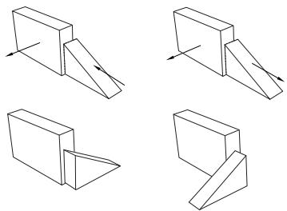

如果平行面约束与现有约束冲突，Abaqus/CAE 将显示错误消息并取消操作。为避免冲突，您可以尝试反转将要移动的实例和将保持固定的实例的选择。或者，您可以删除现有的相对位置约束，应用绝对位置约束，然后重新应用平行面约束。

## 其他信息

• 使用 Constraint（约束）菜单  
• 创建装配体  
• 转换约束

## 约束具有指定距离的平行平面的两个实例

从主菜单栏选择 Constraint->Face to Face（约束->面对面）来应用一种约束，该约束定位一个可移动实例，使其选定的面与固定实例的一个选定面平行，并保持指定的距离。面对面约束是装配体的一个特征，可以使用 Feature Manipulation（特征操作）工具集进行抑制或删除。此外，您可以编辑两个选定面之间的间隙。

1.  从主菜单中，选择 Constraint->Face to Face（约束->面对面）。


提示：您也可以使用 Assembly（装配）模块工具箱中的工具来应用面对面约束。有关 Assembly（装配）工具箱中工具的图示，请参阅 使用 Assembly（装配）模块工具箱。

Abaqus/CAE 在提示区域显示提示信息以引导您完成操作。

2.  从将要移动的部件或模型实例中选择一个平面，并从将保持固定的实例中选择一个平面，如下图所示：


Abaqus/CAE 显示垂直于选定面的箭头。

当 Abaqus/CAE 提示您从固定实例中选择面时，您可以选择在 Part（部件）或 Assembly（装配）模块中创建的基准平面。相反，当您从可移动部件实例中选择面时，您只能选择在 Part（部件）模块中创建的基准平面。

3.  在提示区域的按钮中，执行以下操作之一：

•   单击 OK（确定）以接受可移动实例面上箭头的方向。  
•   单击 Flip（翻转）以反转可移动实例面上箭头的方向，然后单击 OK（确定）。

更改箭头方向的效果在下一步中说明。

4.  在提示区域出现的文本字段中，输入选定面之间的距离，该距离沿固定实例面的法线方向为正。

Abaqus/CAE 定位可移动实例，使两个面平行且箭头指向相同方向。此外，可移动实例被平移以满足指定的间隙。固定实例的方向保持不变。指定距离的效果如下图所示：


如果面对面约束与现有约束冲突，Abaqus/CAE 将显示错误消息并取消操作。为避免冲突，您可以尝试反转将要移动的实例和将保持固定的实例的选择。或者，您可以将现有约束转换为绝对位置约束，然后重新应用面对面约束。

## 其他信息

• 使用 Constraint（约束）菜单  
• 创建装配体  
• 转换约束

## 约束具有平行边的两个实例

从主菜单栏选择 Constraint->Parallel Edge（约束->平行边）来应用一种约束，该约束定位一个可移动实例，使其选定的边与固定实例的一个选定边平行。所有位置约束都是装配体的特征，可以使用 Feature Manipulation（特征操作）工具集进行抑制或删除。

1.  从主菜单中，选择 Constraint->Parallel Edge（约束->平行边）。


提示：您也可以使用 Assembly（装配）模块工具箱中的工具来应用平行边约束。有关 Assembly（装配）工具箱中工具的图示，请参阅 使用 Assembly（装配）模块工具箱。

Abaqus/CAE 在提示区域显示提示信息以引导您完成操作。

2.  从将要移动的实例中选择一条直边，并从将保持固定的实例中选择一条直边，如下图所示：

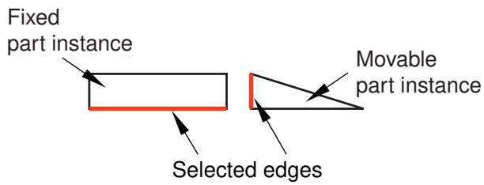

除了选择边或基准轴，您也可以选择基准坐标系的一个轴。

Abaqus/CAE 沿选定边显示箭头。

当 Abaqus/CAE 提示您从固定实例中选择边时，您可以选择在 Part（部件）或 Assembly（装配）模块中创建的基准轴。相反，当您从可移动部件实例中选择边时，您只能选择在 Part（部件）模块中创建的基准轴。

3.  在提示区域的按钮中，执行以下操作之一：

•   单击 OK（确定）以接受可移动实例边上箭头的方向。  
•   单击 Flip（翻转）以反转可移动实例边上箭头的方向，然后单击 OK（确定）。
Abaqus/CAE 会定位可移动实例，使得两条边平行且箭头指向相同方向。固定实例的方向保持不变。更改箭头方向的效果如下图所示：

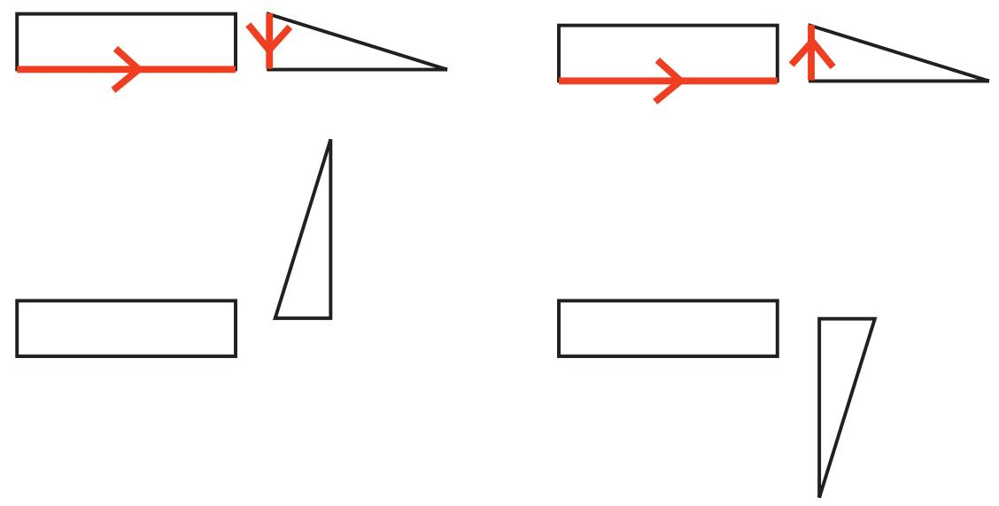

如果平行边约束与现有约束冲突，Abaqus/CAE 会显示错误消息并取消操作。为避免冲突，您可以尝试反转将要移动的实例和将保持固定的实例的选择。或者，您可以将现有约束转换为绝对位置，然后重新应用平行边约束。

## 附加信息

• 使用约束菜单  
• 创建装配体  
• 转换约束

## 约束两个具有指定距离平行边的实例

从主菜单栏选择 Constraint->Edge to Edge 应用约束，该约束将定位一个可移动实例，使得其选定边与固定实例的选定边平行。此外，如果实例是二维的，您必须指定选定边之间的距离；否则，Abaqus/CAE 会使它们重合。所有位置约束都是装配体的特征，可以使用特征操作工具集进行抑制或删除。此外，在适用情况下，您可以编辑两条选定边之间的间隙。更多信息，请参阅位置约束方法有何不同。

1.  从主菜单中，选择 Constraint->Edge to Edge。


提示：您也可以使用 Assembly 模块工具箱中的工具应用边到边约束。有关 Assembly 工具箱中工具的图示，请参阅使用 Assembly 模块工具箱。

Abaqus/CAE 在提示区显示提示，引导您完成操作过程。

2.  从将要移动的实例中选择一条直边，从将保持固定的实例中选择一条直边，如下图所示：


除了选择边或基准轴，您还可以选择基准坐标系的一个轴。

Abaqus/CAE 沿选定边显示箭头。

当 Abaqus/CAE 提示您选择固定实例的边时，您可以选择在 Part 或 Assembly 模块中创建的基准轴。相比之下，当您选择可移动部件实例的边时，您只能选择在 Part 模块中创建的基准轴。

3.  在提示区的按钮中，执行以下操作之一：

• 点击 OK 接受沿可移动实例边方向的箭头方向。
• 点击 Flip 反转沿可移动实例边方向的箭头方向，然后点击 OK。

更改箭头方向的效果在下一步中说明。

如果实例是三维的，Abaqus/CAE 会定位可移动实例，使得选定边平行且重合。

4.  如果实例是二维的，您必须指定选定边之间的间隙。在提示区出现的文本字段中，输入从可移动实例的边到固定实例的边的距离，沿固定实例边的法线方向为正。

Abaqus/CAE 定位可移动实例，使得两条边平行且箭头指向相同方向。此外，可移动实例会被平移以满足指定的间隙。固定实例的方向保持不变。指定距离和更改箭头方向的效果（针对二维实例）如下图所示：


如果边到边约束与现有约束冲突，Abaqus/CAE 会显示错误消息并取消操作。为避免冲突，您可以尝试反转将要移动的实例和将保持固定的实例的选择。或者，您可以将现有约束转换为绝对位置，然后重新应用边到边约束。

## 附加信息

• 使用约束菜单  
• 创建装配体  
• 转换约束

## 约束两个具有同轴面的实例

从主菜单栏选择 Constraint->Coaxial 应用约束，该约束将定位一个可移动实例，使得其选定面的旋转轴与固定实例选定面的旋转轴重合。所有位置约束都是装配体的特征，可以使用特征操作工具集进行抑制或删除。

可移动和固定实例的选定面必须是圆柱面或圆锥面。此外，同轴约束只能应用于三维实例。更多信息，请参阅位置约束方法有何不同。

1.  从主菜单中，选择 Constraint->Coaxial。


提示：您也可以使用 Assembly 模块工具箱中的工具应用同轴约束。有关 Assembly 工具箱中工具的图示，请参阅使用 Assembly 模块工具箱。

Abaqus/CAE 在提示区显示提示，引导您完成操作过程。

2.  从将要移动的实例和将保持固定的实例中选择圆柱面或圆锥面，如下图所示：


Abaqus/CAE 沿选定面的旋转轴显示箭头。

3.  在提示区的按钮中，执行以下操作之一：

• 点击 OK 接受沿可移动实例面旋转轴方向的箭头方向。
• 点击 Flip 反转沿可移动实例面旋转轴方向的箭头方向，然后点击 OK。

Abaqus/CAE 定位可移动实例，使得两个轴重合且箭头指向相同方向。固定实例的方向保持不变。按上图所示选择箭头时同轴约束的效果如下图所示：


如果同轴约束与现有约束冲突，Abaqus/CAE 会显示错误消息并取消操作。为避免冲突，您可以尝试反转将要移动的实例和将保持固定的实例的选择。或者，您可以将现有约束转换为绝对位置，然后重新应用同轴约束。

## 附加信息

• 使用约束菜单  
• 创建装配体

## 约束两个具有重合点的实例

从主菜单栏选择 Constraint->Coincident Point 应用约束，该约束将定位一个可移动实例，使得其选定的点与固定实例选定的点重合。所有位置约束都是装配体的特征，可以使用特征操作工具集进行抑制或删除。

1.  从主菜单中，选择 Constraint->Coincident Point。


提示：您也可以使用 Assembly 模块工具箱中的工具应用重合点约束。有关 Assembly 工具箱中工具的图示，请参阅使用 Assembly 模块工具箱。

Abaqus/CAE 在提示区显示提示，引导您完成操作过程。

2.  从将要移动的实例中选择一个点，从将保持固定的实例中选择一个点。除了选择顶点或中点，您还可以选择基准点、参考点或基准坐标系的原点。

Abaqus/CAE 移动可移动实例，使得选定的点重合。

当 Abaqus/CAE 提示您选择固定实例的点时，您可以选择在 Part 或 Assembly 模块中创建的基准点或参考点。相比之下，当您选择可移动部件实例的点时，您只能选择在 Part 模块中创建的基准点或参考点。

如果重合点约束与现有约束冲突，Abaqus/CAE 会显示错误消息并取消操作。为避免冲突，您可以尝试反转将要移动的实例和将保持固定的实例的选择。或者，您可以将现有约束转换为绝对位置，然后重新应用重合点约束。

## 附加信息

• 使用约束菜单  
• 创建装配体  
• 转换约束

从主菜单栏选择 Constraint->Parallel CSYS 应用约束，该约束将定位一个可移动实例，使得其选定的基准坐标系与固定实例选定的基准坐标系平行。所有位置约束都是装配体的特征，可以使用特征操作工具集进行抑制或删除。
1. 从主菜单中，选择 Constraint -> Parallel CSYS（约束->平行坐标系）。


提示：您也可以在 Assembly 模块工具箱中使用工具来应用平行坐标系约束。有关 Assembly 工具箱中工具的图示，请参阅使用 Assembly 模块工具箱。

Abaqus/CAE 会在提示区显示提示，指导您完成操作。

2. 从可移动实例中选择一个基准坐标系，从固定实例中选择一个基准坐标系。

当 Abaqus/CAE 提示您从固定实例中选择基准坐标系时，您可以选择在 Part 模块或 Assembly 模块中创建的基准坐标系。相比之下，当您从可移动部件实例中选择基准坐标系时，只能选择在 Part 模块中创建的基准坐标系。

Abaqus/CAE 会旋转可移动实例，使所选的坐标系相互平行。

如果平行坐标系约束与现有约束冲突，Abaqus/CAE 将显示错误信息并取消操作。为避免冲突，您可以尝试交换选择要移动的实例和保持固定的实例。或者，您可以将现有约束转换为绝对位置，然后重新应用平行坐标系约束。

## 附加信息

• 使用 Constraint 菜单  
• 创建装配  
• 转换约束

## 使用查询工具集查询装配

从主菜单栏中选择 Tools -> Query 以启动查询工具集。您可以使用查询工具集请求常规信息或特定于模块的信息。有关常规查询显示的信息的讨论，请参阅获取模型的常规信息。此外，您可以使用查询工具集中的 Assembly 模块特定工具来确定所选部件或模型实例的属性和位置。

1. 从主菜单栏中，选择 Tools -> Query。


提示：您也可以选择查询工具集中的工具。

Abaqus/CAE 显示查询对话框。

2. 在查询对话框中，点击以下之一：

## 实例属性

选择一个部件或模型实例。

Abaqus/CAE 在消息区显示以下内容：
• 实例的名称、建模空间和类型（可变形或刚体，依赖或独立）

## 实例位置

选择一个部件或模型实例。

Abaqus/CAE 在消息区显示以下内容：
• 实例原点相对于全局坐标系的位置  
• 应用于实例相对于装配全局坐标系的旋转总和  
• 应用于实例的约束列表

3. 查询装配完成后，关闭查询对话框。

## 附加信息

• 创建装配

您可以使用 Step 模块来创建和定义分析步骤以及相关的输出请求。

## 本节内容：

理解 Step 模块的作用  
进入和退出 Step 模块  
理解步骤  
理解输出请求  
理解集成、重启、诊断和监视器输出  
理解 ALE 自适应网格划分  
如何自定义 Abaqus 分析控制？  
使用 Step 模块工具箱  
使用 Step 管理器  
使用步骤编辑器  
配置分析过程设置  
定义输出请求  
请求专用输出  
自定义 ALE 自适应网格划分  
自定义 Abaqus 分析控制

---

[上一节: Property 模块](property-module.md) · [下一节: Step 模块](step-module.md)
