# 自定义模型显示

## 选择渲染样式

渲染样式是 Abaqus/CAE 用于显示模型的风格。

您可以使用 **View->Part Display Options** 和 **View->Assembly Display Options** 菜单项，以三种渲染样式之一显示模型：线框（wireframe）、隐藏（hidden）或着色（shaded）；这些样式如图 1 所示。以下是对这些选项的说明。

natural_image

三个具有不同高度和阴影的 3D 线框立方体，无文本或符号

图 1：显示渲染样式选项的模型。从左至右：线框、隐藏和光源着色渲染样式。

## 线框 (Wireframe)

显示模型的边；内部和外部边都可能可见。线框图产生类似框架的视觉效果，其中不显示模型面。线框是绘制速度最快的渲染样式。

## 隐藏 (Hidden)

显示线框图，其中被模型遮挡的边要么不显示，要么显示为虚线，具体取决于您选择的选项。（有关此选项的更多信息，请参阅控制边可见性。）隐藏图产生实体外观而非框架式外观。

## 着色 (Shaded)

显示填充图，其中光源似乎指向模型。着色图产生高度三维的视觉效果。着色图中附着在面上的边始终以黑色绘制。

1. 找到渲染样式选项。

从主菜单栏中，选择 **View->Part Display Options** 或 **View->Assembly Display Options**。在出现的对话框中，单击 **General** 选项卡。

2. 在对话框顶部，单击 **Wireframe**、**Hidden** 或 **Shaded** 以选择您想要的样式。

提示：您也可以使用位于渲染样式工具栏中的线框 、隐藏  和着色  图标来选择渲染样式。

3.  + 单击 **OK** 以应用更改并关闭对话框。

Abaqus/CAE 会按所选样式渲染显示，并且您的更改将在当前会话期间保存。

## 其他信息

• 自定义几何和网格显示  
• 选择渲染样式

## 控制边可见性

您可以控制几何边、参考表示、高亮显示的面和网格边的可见性。

使用 **View->Part Display Options** 或 **View->Assembly Display Options** 菜单项，您可以控制以下内容的可见性：

## 几何边 (Geometry edges)

如果零件或零件实例使用隐藏渲染样式显示，Abaqus/CAE 默认会抑制被遮挡的几何边。或者，如果您打开 **Show dotted lines in hidden render style**（在隐藏渲染样式中显示虚线）选项，

Abaqus/CAE 会使用虚线样式显示被遮挡的边。

如果零件或零件实例使用着色渲染样式显示，Abaqus/CAE 默认会显示边。非线框边（附着在面上的边）以黑色显示。或者，如果您关闭 **Show edges in shaded render style**（在着色渲染样式中显示边）选项，Abaqus/CAE 会抑制边的显示。

如果三维零件或零件实例包含具有曲线边的面，Abaqus/CAE 默认会显示从面产生的灰色“轮廓”边，如图 1 中的隐藏线图所示。

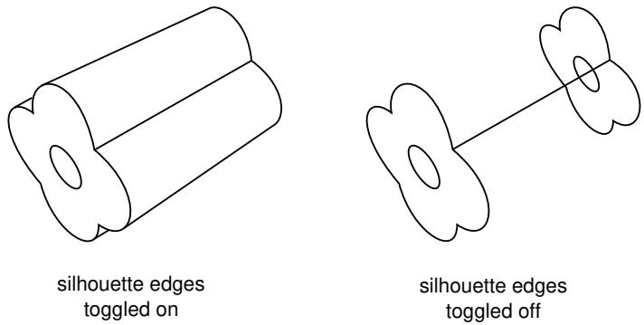  
图 1：显示轮廓边的隐藏线图。

与真正的边不同，轮廓边仅作为视觉辅助；例如，您无法选择或分割轮廓边。或者，如果您关闭 **Show silhouette edges**（显示轮廓边）选项，Abaqus/CAE 仅显示真正的边。

Abaqus/CAE 使用零件的分面表示来显示曲线零件，您可以使用 **Curve refinement**（曲线细化）选项来指定分面的程度。有关更多信息，请参阅控制曲线细化。

## 参考表示 (Reference representation)

如果您正在创建中面模型并且已为实体模型中的单元分配了中面区域，则所选单元的几何形状包含在参考表示中。默认情况下，Abaqus/CAE 在 **Part** 模块中显示参考表示。但是，您可以使用 **Show reference representation**（显示参考表示）选项来切换在显示零件或装配的所有模块中参考表示的显示。关闭 **Apply translucency**（应用半透明度）可将参考表示显示为不透明，而不是默认的半透明外观。有关参考表示的更多信息，请参阅理解参考表示。

## 高亮面 (Highlighted faces)

您可以控制 Abaqus/CAE 显示零件和装配的高亮几何面的样式。图 2 显示了所选前脸的一个示例零件的三个视图：左图使用点画作为选择方法，中图显示了等值线的示例，右图显示了分面选择。

  
图 2：使用点画、等值线和分面高亮显示面。

点画方法具有性能优势，特别是对于大型、复杂的零件和装配。使用等值线可能比点画方法更容易在线框模式下查看零件或装配。最后，显示零件或装配的所有分面可以帮助您更有效地调试网格，因为网格划分取决于零件或装配中分面的方向。

## 网格边 (Mesh edges)

对于网格化零件或从输出数据库导入的零件内的网格边，可见性选项有：

## 所有边 (All edges)

显示所有单元边。要查看模型内部的单元边，您还必须将渲染样式设置为线框。

## 外部边 (Exterior edges)

仅显示模型外部的边。

## 特征边 (Feature edges)

仅显示被计算为特征边的外部边。特征边位于法线方向差异超过“特征角”的单元之间。有关控制特征角的更多信息，请参阅定义网格特征边。

## 自由边 (Free edges)

仅显示属于单个单元的边。自由边显示对于定位网格中的潜在孔洞或裂缝特别有用。

这些选项如图 3 所示。

  
所有边 (All)

natural_image

具有三角形面的 3D 圆柱棱镜的几何线图（无文本或符号）

外部边 (Exterior)

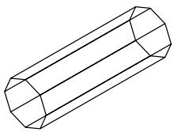  
特征边 (Feature)

  
自由边 (Free)

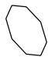  
图 3：显示网格边显示选项的模型。

如果网格使用着色渲染样式显示，Abaqus/CAE 默认会显示边。或者，如果您关闭 **Show edges in shaded render style**（在着色渲染样式中显示边）选项，Abaqus/CAE 会抑制边的显示。

除了将隐藏的几何边显示为虚线外，您无法控制边的线型、颜色或粗细。

1. 找到边可见性选项。  
从主菜单栏中，选择 **View->Part Display Options** 或 **View->Assembly Display Options**。在出现的对话框中，单击 **General** 选项卡。  
2. 选择所需的**几何边**设置。  
3. 选择所需的**网格边**设置。  
4.  + 单击 **OK** 以应用更改并关闭对话框。  
您的更改将在当前会话期间保存。

## 其他信息

• 定义网格特征边  
• 选择渲染样式  
• 自定义几何和网格显示

## 控制曲线细化

Abaqus/CAE 在显示零件或零件实例时，使用曲线面或曲线边的分面表示。当您在 **Part** 模块中工作时，可以使用 **Part Display Options** 对话框中的 **Curve refinement**（曲线细化）选项来指定应用于当前零件的分面程度。您可以在极粗糙（extra coarse）和极精细（extra fine）之间选择五个分面级别之一。将细化设置为 **Extra Coarse** 可以加快大型模型的显示速度。如果您需要为打印创建非常精确的显示，请将细化设置为 **Extra Fine**。Abaqus/CAE 仅将曲线细化设置应用于当前视口中的零件。

此外，Abaqus/CAE 在确定零件实例之间的接触以及确定连接线位置时，使用 **Assembly** 模块中零件实例的分面表示。您可以使用 **Curve refinement** 选项来控制接触检测工具的准确性，并帮助更准确地显示零件几何形状。

1. 找到曲线细化选项。  
从主菜单栏中，选择 **View->Part Display Options**。在出现的对话框中，单击 **General** 选项卡。
2. 选择所需的曲线细化设置。  
3. + 单击 OK 以应用更改并关闭对话框。  
Abaqus/CAE 仅将曲线细化设置应用于当前视口中的部件。

## 附加信息

• 自定义几何体和网格显示

## 定义网格特征边

您可以指定仅显示网格化部件的特征边。

使用特征边可以屏蔽网格提供的细节；特征边通常是被网格化部件的物理边，不包括所有附加的单元边。图 1 显示了在不同特征角度（0°、5° 和 20°）下显示的网格化部件。

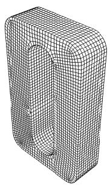

natural_image

带内部开口的矩形物体的 3D 线框模型，无文本或符号

natural_image

带内部凹槽的 U 形机械部件的技术线条图（无文本或符号）

5°

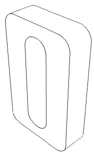

natural_image

带椭圆开口的矩形物体的简单线条图，无文本或符号。

${ } ^ { 2 0 ^ { \circ } }$  
图 1：显示 0°、5° 和 $\bf { 2 0 ^ { \circ } }$ 特征角度的图示。

特征边定义为相邻边，其法线差异大于"特征角度"。当您选择显示网格特征边时，可以自定义特征角度。较大的角度将减少特征边的数量；反之，较小的角度将导致更多边可见。默认的网格特征角度为 20°。

1.  找到特征角度选项。  
    从主菜单栏中选择 View->Part Display Options 或 View->Assembly Display Options。在出现的对话框中，单击 General 选项卡。  
2.  在对话框底部，从要显示的网格边列表中选择 Feature edges。Abaqus/CAE 会在 Feature 右侧显示一个 Angle 数据字段。  
3.  单击 Angle 数据输入字段，并输入所需的特征角度。  
4.  + 单击 OK 以应用更改并关闭对话框。您的更改将在当前会话期间保存。

## 附加信息

• 控制边可见性  
• 自定义几何体和网格显示

## 控制子结构部件的半透明度

您可以指定模型中的子结构部件和部件实例显示为带或不带半透明度。如果您想控制部件和装配体显示的半透明度级别，请参阅更改半透明度。

1.  找到子结构半透明度控制选项。  
    从主菜单栏中选择 View->Part Display Options 或 View->Assembly Display Options。在出现的对话框中，单击 General 选项卡。  
2.  在对话框中部，从网格相关选项集中切换开启 Always show substructure with translucency。  
3.  + 单击 OK 以应用更改并关闭对话框。  
    您的更改将在当前会话期间保存。

## 附加信息

• 自定义几何体和网格显示

## 控制梁截面显示

如果您使用线框部件来建模梁，则必须创建引用梁截面的梁截面属性，并且必须将该梁截面属性分配给线框部件。此外，还必须为线框部件分配梁方向。然后，您可以使用 View->Part Display Options 和 View->Assembly Display Options 菜单项，在当前视口的部件和装配体中查看梁截面的逼真显示。

当显示梁截面时，Abaqus/CAE 会禁用视图切割以及模型的缩放和收缩。显示梁截面有助于检查是否将正确的截面分配给了特定区域，以及分配的梁方向是否产生了预期的截面方向。例如，图 1 显示了在示例：cargo crane 中描述的轻型起重机上显示的箱形梁截面。

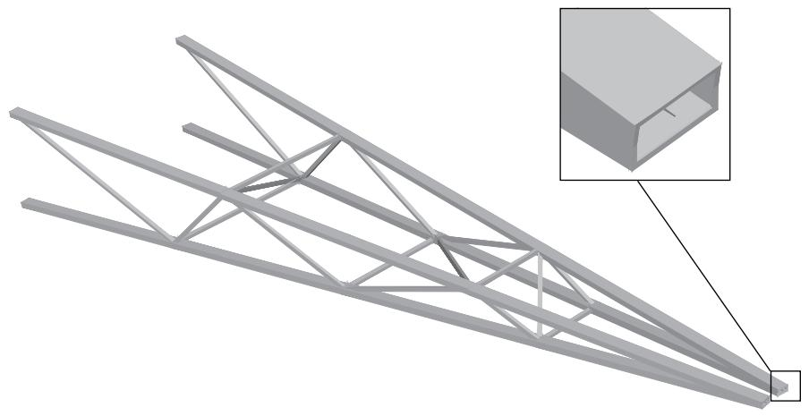

natural_image

钢桁架结构的 3D 渲染，插图显示一个矩形部件（无文本或符号）

图 1：cargo crane 示例显示梁截面。

如果您将通用梁截面分配给线框，Abaqus/CAE 会将梁截面显示为椭圆，其横截面积和惯性矩（$ I _ { 1 1 }$ 和 $\pmb { I _ { 2 2 } } )$ 与您指定的值匹配。如果您将桁架截面分配给线框，Abaqus/CAE 会将桁架截面显示为圆，其横截面积与您指定的值匹配。

Abaqus/CAE 不会渲染梁截面沿长度方向的锥度变化。如果您的模型包含锥形梁截面，Abaqus/CAE 会使用梁的起始截面沿整个长度渲染这些梁。有关锥形梁的更多信息，请参阅创建梁截面。

Abaqus/CAE 根据当前的颜色编码和半透明度设置渲染梁截面。当这些设置更改时，梁截面的颜色和半透明度也会随之变化。

1.  找到 Render beam profiles 选项。  
    从主菜单栏中选择 View->Part Display Options 或 View->Assembly Display Options。在出现的对话框中，单击 General 选项卡。  
2.  在对话框底部，切换开启 Render beam profiles 以显示梁截面。  
3.  如果需要，可以为梁截面应用一个 Scale factor 以增大或减小其大小。默认值为 1。  
4.  + 单击 OK 以应用更改并关闭对话框。  
    Abaqus/CAE 将以适当的尺寸和正确的方向显示梁截面属性的轮廓。您的更改将在当前会话期间保存。

## 附加信息

• 定义截面  
• 自定义几何体和网格显示  
• 控制梁截面显示以进行后处理

## 控制壳厚度显示

显示壳厚度使您可以检查壳几何体相对于模型其余部分的厚度。您可以为当前会话应用缩放因子来减少或增加壳厚度的显示。

如果您在分析中使用壳单元来建模相对较薄的部件，可以使用 View->Part Display Options 和 View->Assembly Display Options 菜单选项在模型中查看这些壳单元的实际厚度。图 1 显示了在示例：blast loading on a stiffened plate 中描述的加筋板模型上显示的缩放因子变化效果。

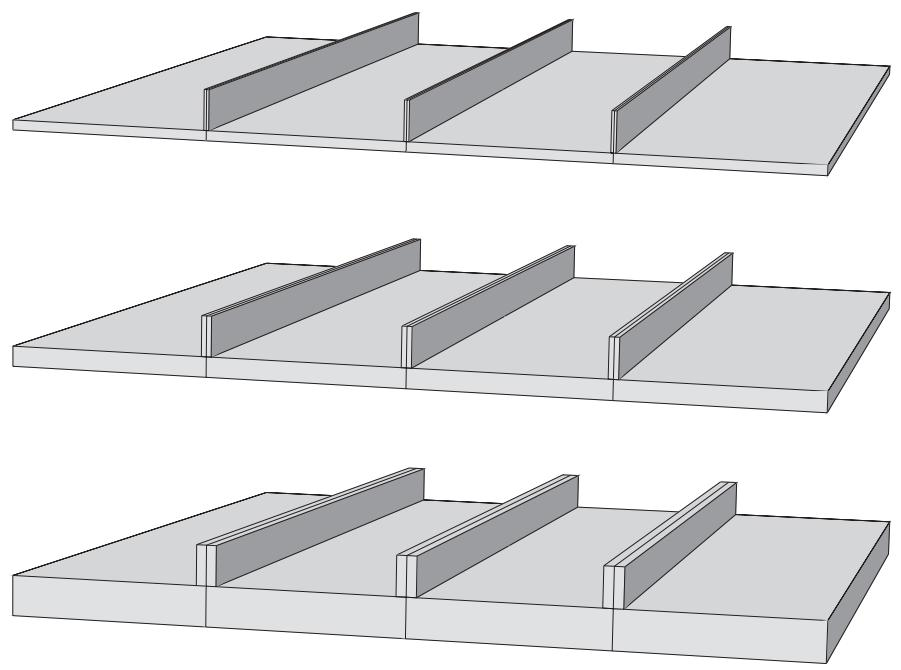  
图 1：从上到下：壳厚度缩放因子设置为 1（默认）、2 和 4。

Abaqus/CAE 仅对三维壳单元渲染厚度；对于轴对称壳单元（如 SAX1 单元）不显示厚度。显示壳厚度时，除非在视口中显示视图切割，否则 Abaqus/CAE 也会渲染壳几何体的边。Abaqus/CAE 根据当前的颜色编码和半透明度设置渲染壳厚度。当这些设置更改时，壳厚度的颜色和半透明度也会随之变化。

如果使用离散字段定义了壳厚度或壳偏移，则 Render shell thickness 选项无效。壳始终以零厚度和无偏移显示。

1.  找到 Render shell thickness 选项。  
    从主菜单栏中选择 View->Part Display Options 或 View->Assembly Display Options。在出现的对话框中，单击 General 选项卡。  
2.  在对话框底部，切换开启 Render shell thickness 以显示模型中壳截面的厚度。  
3.  如果需要，可以为壳厚度应用一个 Scale factor 以增大或减小其厚度。默认值为 1，它会产生壳厚度设置的逼真渲染。  
4.  + 单击 OK 以应用更改并关闭对话框。

Abaqus/CAE 以适当的厚度显示所选部件或装配体中的壳截面。您的更改将在当前会话期间保存。

## 附加信息

• 定义截面  
• 自定义几何体和网格显示  
• 控制壳厚度显示以进行后处理

## 控制基准显示

您可以使用 View->Part Display Options 和 View->Assembly Display Options 菜单项来控制当前视口中部件和装配体的基准几何体的显示。您可以控制每种基准类型（点、轴、平面和坐标系）的显示，并且可以单独或同时切换它们的显示。您选择不显示的基准几何体虽然不可见，但仍然是部件或装配体的一个特征。有关基准几何体的更多信息，请参阅基准工具集。您还可以控制参考点的显示；有关更多信息，请参阅参考点。
在组装零件实例时，在零件上创建的基准几何体可能会造成视觉干扰；关闭基准几何体的显示可以使装配图显示得更清晰。同样，关闭基准几何体的显示也有助于生成清晰的零件或装配图的打印图像。

1.  **定位基准显示选项。**
    从主菜单栏中，选择 **View->Part Display Options** 或 **View->Assembly Display Options**。在出现的对话框中，点击 **Datum** 选项卡。

2.  **切换相应的按钮以控制以下内容的显示：**
    *   基准点
    *   基准轴
    *   基准平面
    *   基准坐标系

    或者，点击 **Show all datums** 以在视口中显示所有基准几何体，或点击 **Show no datums** 以在视口中隐藏所有基准几何体。

3.  **点击 OK** 以应用更改并关闭对话框。

    您的更改仅适用于当前视口，并在会话持续期间保存。

## 附加信息

*   自定义几何体和网格显示

## 控制单个坐标系的显示

您可以在视口中高亮显示、显示和隐藏单个坐标系。在建模和后处理过程中，Abaqus/CAE 提供以下显示选项：

### 建模过程中控制基准坐标系的显示

您创建的所有基准几何体（包括基准坐标系）都被视为其所属零件或装配的特征。Abaqus/CAE 在模型树（Model Tree）的零件或装配的 **Features** 容器下，为基准坐标系和其他特征提供了快捷方式。您可以通过点击模型树中的快捷方式来高亮显示单个基准坐标系；高亮显示时，该坐标系在视口中会渲染为红色，并显示其标题。要在视口中隐藏或显示该坐标系，请在快捷方式上点击鼠标键3，然后选择 **Suppress** 或 **Resume**。

您也可以通过将单个基准坐标系添加到显示组来控制其显示。更多信息，请参阅管理显示组。

### 后处理过程中控制任何坐标系的显示

在 **Visualization** 模块中，可用的坐标系分为两组：**ODB 坐标系**（属于输出数据库文件的一部分）和**会话坐标系**（在后处理过程中创建）。会话坐标系仅适用于一个输出数据库，并且仅在您的 Abaqus/CAE 会话期间持续存在，除非您将会话坐标系移至输出数据库。请参阅将坐标系保存到输出数据库文件。

您可以使用以下任一技术来高亮显示、显示或隐藏单个坐标系：

*   所有可用的坐标系在 **Results Tree** 的 **ODB Coordinate Systems** 和 **Session Coordinate Systems** 容器下都有快捷方式。您可以点击任何快捷方式以在视口中高亮显示该坐标系；高亮显示时，该坐标系在视口中会渲染为红色，并显示其标题。您也可以通过在快捷方式上点击鼠标键3，并从出现的列表中选择布尔运算符来显示或隐藏任何坐标系。
    您可以通过将 ODB 坐标系和会话坐标系添加到显示组来控制其显示，然后可以使用布尔显示选项来显示或隐藏这些显示组。更多信息，请参阅管理显示组。

**坐标系管理器（Coordinate System Manager）** 还提供有关选定输出数据库的 ODB 坐标系和会话坐标系的信息。您不能通过此管理器更改坐标系的显示，但可以重命名或删除它们。请参阅在后处理过程中创建坐标系。

## 附加信息

*   在后处理过程中创建坐标系
*   创建基准坐标系
*   自定义几何体和网格显示

## 控制参考点的显示

您可以使用 **View->Part Display Options** 和 **View->Assembly Display Options** 菜单项，来控制当前视口中零件或装配上参考点的显示。关闭参考点的显示有助于生成清晰的零件或装配的打印图像。即使您选择不显示参考点，它们仍然是零件或装配的一个特征。有关参考点的更多信息，请参阅参考点。

1.  **定位基准显示选项。**
    从主菜单栏中，选择 **View->Part Display Options** 或 **View->Assembly Display Options**。在出现的对话框中，点击 **Datum** 选项卡。

2.  **切换相应的按钮以控制以下内容的显示：**
    *   参考点标签
    *   参考点符号

3.  **点击 OK** 以应用更改并关闭对话框。

    您的更改仅适用于当前视口，并在会话持续期间保存。

## 附加信息

*   自定义几何体和网格显示

## 自定义网格显示

您可以使用 **View->Part Display Options** 和 **View->Assembly Display Options** 菜单项，来指定是否在已网格化的零件或装配上显示节点和单元标签。您可以选择显示或抑制原始网格，如果选择显示，还可以选择仅在 **Mesh** 模块中显示，或在所有与零件或装配相关的模块中显示。如果显示原始网格，您还可以选择同时显示自底向上网格划分区域的几何体、非自底向上区域的几何体，或同时显示两者。显示几何体可以直观地表明网格与几何体的吻合程度。

1.  **定位网格显示选项。**
    从主菜单栏中，选择 **View->Part Display Options** 或 **View->Assembly Display Options**。在出现的对话框中，点击 **Mesh** 选项卡。

2.  **切换 Show native mesh** 以显示或抑制原始网格。

    当 **Show native mesh** 开启时，您还可以控制以下选项：
    a.  选择以下一个或两个选项，以在原始网格中同时显示几何体：
        *   开启 **Show bottom-up geometry** 以显示被指定使用自底向上网格划分技术的区域的几何体。此选项默认开启。
        *   开启 **Show non-bottom-up geometry** 以显示被指定使用所有其他网格划分技术的区域的几何体。此选项默认关闭。
    b.  选择以下一个选项，以控制可以在哪些模块中显示原始网格：
        *   选择 **In the Mesh module only** 以仅在 **Mesh** 模块中显示原始网格。
        *   在 **Part Display Options** 对话框中选择 **In all part-related modules**，或在 **Assembly Display Options** 对话框中选择 **In all assembly-related modules**，以分别在所有支持显示该零件或装配的模块中显示原始网格。

3.  **切换 Show node labels 和 Show element labels** 以影响这些项目的显示。
4.  **点击 OK** 以应用更改并关闭对话框。

    您的更改在会话持续期间保存。

## 附加信息

*   自定义几何体和网格显示

## 控制模型光照

您可以使用 **View->Light Options** 菜单项来控制模型的光照。当使用 **Shaded** 渲染样式时，光照会影响模型在当前视口中的外观。您可以控制**环境光**的强度和模型表面的**光泽度**。您还可以控制最多八个额外位置灯的**位置**和**强度**。光照设置的组合效果可用于模拟模型上不同的表面光洁度和光照条件。默认设置为查看大多数模型中的所有特征提供了良好的对比度。

默认设置为查看大多数模型中的所有特征提供了良好的对比度。对于分色等值线图，使用默认设置尤为重要，因为强光会淡化等值线图中面片的颜色，并显示与图例颜色不匹配的误导性结果。如果您将图形打印为 EPS、PostScript 或 SVG 格式的文件，这些对等值线颜色的更改也会出现在分色等值线图的打印输出中，因为这三种格式默认使用分色等值线。要将分色等值线图打印为这些格式而不产生误导性的等值线颜色，请在打印前关闭着色。

## 全局设置

环境光均匀地照亮整个场景，并从所有方向照亮模型。低强度的环境光允许位置光产生阴影，从而将小特征和表面轮廓与模型的其他部分区分开来。高强度的环境光会消除阴影，并可能使某些模型特征难以看清。

如果您的计算机显卡支持 OpenGL 着色语言（GLSL），Abaqus/CAE 还会显示全局**着色选项**，您可以在其中为会话启用 **Phong** 着色。与默认选项 **Gouraud** 着色相比，Phong 着色在三维表面上渲染出更逼真的阴影，但它可能会在某些系统上造成明显的性能影响。这种性能影响仅在网格被隐藏时发生；如果网格被显示（无论是在建模还是后处理期间），Abaqus/CAE 会使用 Phong 着色进行渲染，且不会造成明显的性能影响。
光泽度（Shininess）是模型表面的反射率，用于控制位置光源（positional lights）产生的高光反射范围。高光泽度表面像镜子一样反射光线——光线根据入射角向单一方向反射。因此，模型表面必须相对于光源正确定位才能将光线反射到观察视角。低光泽度表面会更随机地反射光线，因此更广泛的表面角度范围都能将光线反射到观察视角。与高强度环境光类似，低光泽度可能会模糊模型的小特征和轮廓。

视点（Viewpoint）选项控制镜面光照效果的计算方式。无限视点（Infinite viewpoint）假设在计算某点的反射和高光时，从相机到该点的方向矢量恒定。局部视点（Local viewpoint）会根据每个点在视口中的位置计算独立的方向矢量。局部视点能创建更真实的光照效果，但可能会降低整体性能。

## 位置光源设置（Positional light settings）

位置光源提供灯泡效果。位置光源从指定位置投射到模型上，其效果会随着模型视图的旋转而变化。位置光源与光泽度共同决定模型如何反射光线。

光源到模型的距离等于相机到模型的距离。您可以通过指定光源在模型周围半球上的纬度（Latitude）和经度（Longitude）来定位光源。您还可以指定使用的光源类型（Type）。定向光（Directional light）是一种平面光源；模型上所有平行表面的入射光角度都相同。点光源（Point light）是一种点光源；入射光角度取决于表面或点相对于光源的位置。点光源能创建更真实的光照效果，但可能会降低整体性能。

您可以控制位置光源的两种不同属性：漫反射强度（Diffuse intensity）和镜面反射强度（Specular intensity）。漫反射（Diffuse）设置控制位置光源的强度。与环境光不同，增加位置光源的漫反射强度时，面向光源位置的表面比模型中的其他表面更容易变亮。镜面反射（Specular）设置控制那些将光线反射向观察视角的表面的亮度。您应首先设置位置光源的位置和漫反射强度，以实现所需的明暗效果。然后，您可以使用镜面反射滑块调整反射光的亮度。

1.  找到光照选项。  
    从主菜单栏中，选择 **View->Light Options**。  
2.  如果显示的是明暗处理（Shading）选项，请选择 Gouraud 或 Phong 明暗处理。  
3.  在 **Viewpoint** 字段中，选择 **Infinite** 或 **Local** 以定义视点类型。  
4.  使用滑块设置所需的环境光（Ambient light）强度。  
5.  使用滑块设置模型表面所需的光泽度（Shininess）。数值越高，表面越光滑。  
6.  在 **Lights** 字段中切换开启一个数字，以向场景中添加一个位置光源。  

7.  要更改位置光源的设置，请点击 **Lights** 字段中相应的数字选项卡。

    • 在 **Type** 字段中，选择 **Directional** 或 **Point** 以定义光源类型。  
    • 使用滑块设置光源位置所需的纬度（Latitude）和经度（Longitude）。  
    • 使用滑块设置所需的漫反射强度（Diffuse intensity）。  
    • 使用滑块设置所需的镜面反射强度（Specular intensity）。

8.  点击 **Defaults** 将所有光照恢复为默认设置。

9.  点击 **Dismiss** 关闭对话框。

您的更改将在当前会话期间保存。要为未来会话保存设置，请从主菜单栏中选择 **File->Save Options**（参见保存显示选项设置）。

## 附加信息（Additional information）

• 自定义几何体和网格显示（Customizing geometry and mesh display）

## 控制实例可见性（Controlling instance visibility）

默认情况下，Abaqus/CAE 会显示装配体中包含的所有部件实例。您可以开启或关闭所有实例的显示，也可以切换单个实例的显示。您已抑制或不属于当前显示组的部件实例无法使用此对话框使其可见；您必须改用特征操作（Feature Manipulation）工具集或显示组（Display Group）工具集。更多信息，请参见装配体模块（The Assembly module）或使用显示组显示模型子集（Using display groups to display subsets of your model）。

本节描述如何从装配体显示选项（Assembly Display Options）对话框控制实例可见性。您也可以从模型树（Model Tree）或视口（viewport）更改实例可见性：在模型树中，高亮显示要显示或隐藏的部件实例，点击鼠标按钮 3，然后选择 **Hide** 或 **Show**；在视口中，高亮显示要隐藏的实例，点击鼠标按钮 3，然后从出现的菜单中选择 **Hide Instance**。

1.  找到实例显示选项（Instance display options）。

    从主菜单栏中，选择 **View->Assembly Display Options**。在出现的对话框中点击 **Instance** 选项卡。实例（Instance）选项变为可用；装配体中的每个部件实例都被列出。

2.  要控制实例可见性，请执行以下任一操作：

    • 点击 **Set All On** 使所有（被抑制的除外）实例可见。  
    • 点击 **Set All Off** 关闭所有实例的显示。  
    • 点击单个实例名称以切换其外观。

3.  点击 **OK** 应用您的更改并关闭对话框。

您的更改仅适用于当前视口，并在会话期间保存。

## 附加信息（Additional information）

• 自定义几何体和网格显示（Customizing geometry and mesh display）

## 控制属性显示（Controlling the display of attributes）

装配体显示选项（Assembly Display Options）对话框中的属性显示（Attribute display）选项允许您控制代表以下内容的符号的显示：

• 您在交互（Interaction）模块中创建的交互、约束和连接器，  
• 您在载荷（Load）模块中创建的载荷、边界条件和预定义场，  
您在属性（Property）模块和交互（Interaction）模块中创建的工程特征，以及  
• 您在优化（Optimization）模块中创建的优化属性。

您可以控制这些属性何时以及如何显示，并且可以点击 **Set all on** 或 **Set all off** 来分别显示或隐藏所有属性。有关代表每个属性的符号的信息，请参见特殊图形符号（Special graphical symbols）。

有关在可视化（Visualization）模块中控制边界条件、耦合约束、连接器和点单元显示的信息，请参见控制模型实体的显示（Controlling the display of model entities）。

1.  找到属性显示选项（Attribute display options）。

    从主菜单栏中，选择 **View->Assembly Display Options**。在出现的对话框中点击 **Attribute** 选项卡。属性（Attribute）选项变为可用。

2.  点击 **Main** 选项卡以指定要显示哪些属性以及它们应出现在哪些模块中。

    a. 选择 **Show attribute in** 选项。

        • 选择 **Module in which it was created** 仅在其创建的模块中显示属性。例如，载荷将仅出现在载荷（Load）模块中，交互仅出现在交互（Interaction）模块中。  
        • 选择 **All assembly-related modules** 以在支持装配体显示的所有模块中显示属性。

    b. 从 **Show** 列表中，选择要显示的属性。只有您选择的属性才会出现在视口中；例如，如果您开启 **Loads** 和 **BCs**，则只有载荷和边界条件符号会出现在视口中。您也可以通过点击 **Set all on** 选择所有类别和每个类别内的所有类型，或者通过点击 **Set all off** 取消选择所有类别和每个类别内的所有类型。

3.  点击 **Symbol** 选项卡以控制属性符号的大小和密度。您还可以将孤儿网格（orphan mesh）区域上显示的属性符号数量减少到最大允许数量的一部分。

    a. 指定您的 **Size** 首选项。大小设置越高，符号在视口中显示得越大。

        • 拖动 **Arrows** 滑块指定箭头符号的大小。  
        • 拖动 **Other symbols** 滑块指定除箭头外所有符号的大小。  
        关闭 **Scale symbols based on analytical field value** 以移除指定解析场（analytical field）的属性的符号缩放。更多信息，请参见为使用解析场的交互和预定义条件显示符号（Displaying symbols for interactions and prescribed conditions that use analytical fields）。

    b. 如果您正在处理几何体，请指定属性符号的所需密度。密度设置越高，Abaqus 用于表示每个属性的符号就越多。

        • 拖动 **Face density** 滑块控制出现在面上的符号的密度。  
        • 拖动 **Edge density** 滑块控制出现在边上的符号的密度。

        更改符号密度设置的效果可能因视口中区域的大小而异。

    c. 如果您想减少显示在孤儿网格区域上的属性符号的密度，请在 **Fraction of symbols displayed on orphan mesh regions** 字段中输入一个介于 0 和 1 之间的值。分数值越高，Abaqus/CAE 用于表示每个属性的符号就越多。选择默认密度 1 会提示 Abaqus/CAE 在该区域内的每个网格实体上绘制符号。
4. 单击所需属性的选项卡，以指定要在视口中显示的特定属性类别和类型。

例如，如果单击"载荷"选项卡，则会出现载荷类别列表。如果单击其中一个类别旁边的箭头，则会显示该类别中所有载荷类型的列表。

使用以下技术指定要显示的属性类别和类型：

单击所需类别旁边的箭头。从出现的类型列表中，选择您要显示的类型。  
• 切换所需类别。此操作将选择或取消选择该类别中的所有类型。  
• 单击"全部开启"以选择所有类别以及每个类别中的所有类型。  
• 单击"全部关闭"以取消选择所有类别以及每个类别中的所有类型。

当某个类别中的所有类型都被选中时，类别标签旁边的复选框将变为白色背景上的黑色复选标记。如果仅选中该类别中的部分类型，则复选框变为浅灰色，复选标记变为深灰色。

## 注意：

您指定的属性类别和类型仅在您在步骤 2 中打开了该属性时才会显示在视口中。

5. 根据需要重复上一步，以显示其他感兴趣属性的特定类别和类型。

6. 在"装配体显示选项"对话框底部，单击"确定"以在当前视口中实现您的显示设置，并关闭对话框。

## 附加信息

• 自定义几何和网格显示  
• 特殊图形符号

## 保存您的显示选项设置

如果您更改了显示选项设置（例如，更改渲染样式或关闭基准平面的显示），您可以为将来的会话存储新设置。Abaqus/CAE 将您的设置保存在名为 abaqus_2025.gpr 的文件中。有关更多信息，请参阅使用 abaqus_2025.gpr 文件。

从主菜单栏中，选择文件->保存显示选项以保存所有当前显示选项设置。"保存显示选项"对话框出现，允许您将选项保存在当前目录或主目录中。

您可以使用 Abaqus 脚本接口中的 API 命令编辑 abaqus_2025.gpr 文件；有关更多信息，请参阅编辑显示首选项和 GUI 设置。您也可以删除该文件以恢复默认的 GUI 和显示选项设置，并且可以将该文件复制到计算机上的其他目录或传输到另一台计算机。当您从 abaqus_2025.gpr 保存设置时，Abaqus/CAE 始终保存所有当前设置，并且总是覆盖先前保存的所有设置。您不能只保存选定的设置。您可以使用 noSavedOptions 命令行选项在不加载 abaqus_2025.gpr 中的设置的情况下启动 Abaqus/CAE。有关更多信息，请参阅启动 Abaqus/CAE（或 Abaqus/Viewer）。

Abaqus/CAE 将以下显示选项设置保存在 abaqus_2025.gpr 中：

• 零件和装配体显示选项；例如，渲染样式、各类基准几何和模拟属性的可见性，以及网格、单元和节点标签的显示。

## 注意：

"装配体显示选项"对话框中"主选项卡"的设置不会保存在 abaqus_2025.gpr 中；但是，在其他选项卡（如"相互作用"和"载荷"）上指定的模拟属性类别和类型的设置会保存在 abaqus_2025.gpr 中。有关更多信息，请参阅控制属性的显示。

• 图形选项和视口注释选项。Abaqus/CAE 还会保存透视设置。  
• 打印选项。  
• 可视化模块中的显示选项；例如，等值线图的等值线类型以及常用绘图选项中的渲染样式和填充颜色。  
• 可视化模块中的动画选项。  
• 可视化模块中的其他选项，如探测、场报告、X–Y 绘图和 X–Y 报告选项。  
• 在链接视口管理器中选择的选项。

本节解释如何将颜色编码应用于可视几何体和网格单元。

## 本节内容：

理解颜色编码  
更改初始颜色  
更改半透明度  
为几何体和网格元素着色  
在可视化模块中为所有几何体着色  
在可视化模块中为节点或单元着色  
在可视化模块中为约束着色  
自定义单个对象的显示颜色  
显示多个颜色映射  
编辑自动颜色列表中的颜色  
保存和恢复自定义颜色映射

## 理解颜色编码

本节讨论如何使用颜色编码来区分模型或输出数据库中的组件。

## 本节内容：

颜色编码概念  
可视化模块中的颜色编码

## 颜色编码概念

您可以通过为当前视口中可视的几何体和网格元素着色来区分模型或输出数据库中的组件。Abaqus/CAE 根据颜色映射应用颜色编码，颜色映射为特定类型的对象（如零件、截面分配、边界条件或显示组）中的每个项目指定分配的颜色。在图 1 所示的示例中，颜色映射按零件划分，每一行描述了分配给该模型中三个零件定义之一的颜色。因此，"颜色代码"对话框提供了一个图例，描述了当前视口中当前显示的所有颜色编码。

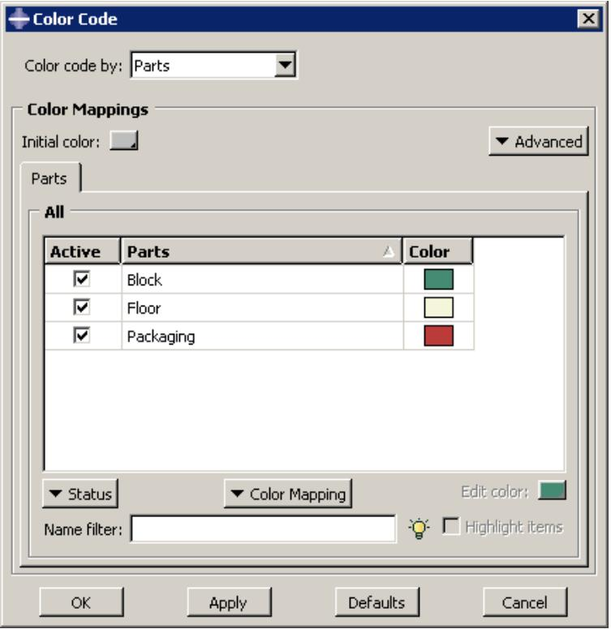

text_image

Color Code
Color code by: Parts
Color Mappings
Initial color:
Parts
Advanced
All
Active	Parts	Color
✓	Block			■
✓	Floor			□
✓	Packaging			■
Status	Color Mapping	Edit color:
Name filter:
Highlight items
OK	Apply	Defaults	Cancel

图 1："颜色代码"对话框。

颜色编码分两层应用。首先，所有几何体和网格单元都用"初始颜色"着色，这是一个可自定义的设置，默认为灰色。（有关更多信息，请参阅更改初始颜色。）然后，Abaqus/CAE 根据您选择的颜色映射中的颜色和对象，在初始颜色之上应用颜色编码。如果您应用诸如"边界条件"、"载荷"或"集"之类（Abaqus/CAE 通常只对模型中不同的点或曲面进行颜色编码）的颜色映射，则区域将以初始颜色保持可见。

Abaqus/CAE 通过将每个项目的名称与"自动颜色列表"中的颜色相关联，自动为模型中的所有项目创建颜色映射。颜色通过将"自动颜色列表"与按字母顺序排列的项目名称列表匹配来选择；因此，在图 1 的"零件"示例中，"Block"使用"自动颜色列表"中的第一种颜色进行编码，"Floor"使用第二种颜色，依此类推。颜色分配仅取决于项目名称；因此，在"颜色代码"对话框中对这些项目重新排序不会改变颜色分配。

## 注意：

如果某个区域被模型中的两个或多个项目共享（例如，当表面分配了皮肤截面，而整个块体分配了实体截面时），公共区域将按照名称在字母顺序列表中出现较晚的项目的颜色定义进行着色。随着视口中显示每个颜色分配，Abaqus/CAE 会覆盖第一个颜色映射的颜色定义。

因为每个颜色映射是项目名称和颜色定义之间的一组链接，所以颜色映射在 Abaqus/CAE 的模块之间以及模型数据库与其输出数据库之间持续存在。但是，由于 Abaqus/CAE 依赖对象名称进行颜色编码，因此当您重命名某个对象时，无法保留与该对象关联的颜色编码。相比之下，当您从模型中删除对象定义时，Abaqus/CAE 通常会删除该对象的颜色定义；有两个例外是材料和截面定义，它们的颜色编码在您删除定义后仍会在视口中保留。要在删除材料或截面定义后刷新当前视口中的颜色编码，您必须应用颜色映射或切换到不同的模块。

Abaqus/CAE 还为每个模块提供默认颜色映射。例如，当您在网格模块中显示"网格默认值"颜色映射时，Abaqus/CAE 会根据项目的可网格化性在视口中为其着色。每个模块的默认颜色映射仅在该模块中可用；您不能使用"网格默认值"颜色映射中的分配在"属性"模块中对对象进行颜色编码。模块默认映射无法编辑，并且模块默认映射对应于在未应用任何颜色编码时 Abaqus/CAE 使用的默认颜色。
颜色映射是视口特定的，在某些情况下，它们会在模块之间持久存在。颜色编码在模块间的持久性取决于您当前模块是否显示默认颜色映射：

如果选择了模块的默认颜色映射，Abaqus/CAE 会在您切换模块时自动更改颜色映射。例如，如果您在装配 (Assembly) 模块中选择“装配默认值”颜色映射，然后切换到网格划分 (Mesh) 模块，Abaqus/CAE 会自动应用“网格划分默认值”颜色映射。

如果选择的是非默认颜色映射，Abaqus/CAE 会在您切换模块时保留该颜色映射。例如，如果您在装配 (Assembly) 模块中选择“部件实例”颜色映射，然后切换到网格划分 (Mesh) 模块，Abaqus/CAE 将继续按部件实例名称而非可网格化性进行颜色编码。

当您更改颜色映射时，Abaqus/CAE 仅刷新当前视口中的颜色编码，同时保留其他非活动但可见视口中的任何颜色编码。当您向会话添加新视口时，新视口会继承先前活动视口的颜色映射。

颜色映射创建后，您可以自定义任何颜色映射（模块默认值除外），方法是更改分配给其任何单独对象的颜色。您还可以切换颜色映射中单个对象的活动状态，这控制单个对象是否在当前视口中进行颜色编码。颜色编码非活动的对象使用初始颜色进行渲染。颜色编码对话框还提供排序和过滤工具，您可以使用它们来显示颜色映射中对象的子集。当颜色映射包含许多对象时，这些工具可以帮助您集中显示。

## 可视化模块中的颜色编码

颜色编码过程在可视化 (Visualization) 模块中与其他 Abaqus/CAE 模块略有不同。您可以使用常用绘图选项或叠加绘图选项对话框中的“颜色和样式”选项来控制模型的整体边和填充颜色。使用这些选项，您可以为所有单元和表面边选择一种颜色，并为所有单元面和表面选择另一种单独的颜色。您选择的颜色将统一应用于整个模型。

您还可以使用“颜色编码”选项来控制单个单元和部件实例的颜色。“颜色编码”对话框允许您为单个项目选择单独的颜色。您必须使用“颜色编码”选项来执行任何复杂的非均匀颜色方案。

默认情况下，单个项目颜色会覆盖整体的常用或叠加边颜色和填充颜色。您可以通过使用常用绘图选项或叠加绘图选项对话框中的“颜色和样式”选项来更改此行为，以指定是单个项目颜色还是整体项目颜色应优先。（单个项目颜色不适用于等值线图。）

可视化模块提供的颜色映射子集比其他模块少。当在当前视口中显示输出数据库时，可用于颜色编码的颜色映射包括部件实例、单元、节点、约束、材料、截面、显示组、平均区域、内部集、铺层和层；当显示当前模型数据库中的模型时，唯一可用的颜色映射是按部件实例。但是，当您在自定义当前视口中单个对象的颜色时，可以同时控制边和填充颜色，并且可以选择将颜色编码应用于整个模型，或仅应用于其节点或单元。此外，可视化模块中的设置取决于其他选项；当您在“颜色编码”对话框中指定单个项目颜色时，Abaqus/CAE 会基于当前绘图的两个特性来应用颜色：

## 颜色优先级设置

如果常用绘图选项或叠加绘图选项对话框的“颜色和样式”页面上，“允许颜色编码选择覆盖此对话框中的选项”已切换为开，则 Abaqus/CAE 会应用该颜色。

## 渲染样式

在线框和隐藏渲染样式中，Abaqus/CAE 仅显示单元边。如果当前绘图使用线框或隐藏渲染样式，Abaqus/CAE 会将单个项目颜色应用于这些边。

在填充和着色渲染样式中，Abaqus/CAE 会显示单元面以及单元边。如果当前绘图使用填充或着色渲染样式，Abaqus/CAE 会将单个项目填充颜色应用于单元面，并将单个项目边颜色应用于单元边。

在填充和着色渲染样式中，线型单元（例如梁）被视为其线条是面。在填充和着色渲染样式中，Abaqus/CAE 将单个项目填充颜色应用于表示此类单元的线条。

## 更改初始颜色

Abaqus/CAE 通过将初始颜色应用于当前视口中可见的几何体和网格单元来开始颜色编码过程。默认情况下，此初始颜色为灰色，但您可以通过从“初始颜色”字段中选择以下之一来自定义初始颜色：

您可以选择当前颜色，这会提示 Abaqus/CAE 保留视口中当前显示的颜色。选择此选项不会更改任何颜色；因此，当您不想更改已在视口中应用的几何体或网格单元颜色时，此选项最有用。

您可以将初始颜色设置为显示所选模块的默认颜色映射。此选项适用于将单个选择重置为其默认颜色，而不从视口中移除所有颜色更改。例如，当您在装配 (Assembly) 模块中选择此选项时，Abaqus/CAE 会根据装配模块默认设置对装配的组件进行颜色编码：显示体、几何体、本机网格和孤立网格。

• 您可以选择自定义颜色作为初始颜色。

如果您在除可视化 (Visualization) 模块以外的任何模块中工作，可以使用“颜色编码”工具栏中的半透明工具使初始颜色半透明，并选择半透明级别。有关更多信息，请参阅更改半透明度。

## 注意：

在可视化 (Visualization) 模块中，您从常用绘图选项或叠加绘图选项对话框的“其他”页面控制半透明度。有关更多信息，请参阅自定义渲染样式、半透明度和填充颜色。

1.  单击“颜色编码”工具栏中的工具。

    Abaqus/CAE 显示“颜色编码”对话框。

2.  单击并按住“初始颜色”样本，然后从出现的列表中选择以下选项之一：

    • 选择等号 (=) 以选择当前颜色。
    • 选择星号 (\*) 以选择该模块的默认颜色映射。
    选择颜色样本 ( ) 以选择自定义颜色。选择颜色样本符号会打开“选择颜色”对话框，供您选择新颜色。（有关更多信息，请参阅自定义颜色。）

3.  单击“应用”。

    Abaqus/CAE 在当前视口中显示新的初始颜色选择。

## 更改半透明度

默认情况下，Abaqus/CAE 使用不透明颜色以着色渲染样式显示几何体和网格单元。内部特征和视口中“位于”其他对象“后面”的特征不可见。

在某些情况下，Abaqus/CAE 会向模型应用半透明度，以帮助您在操作过程中选择内部或隐藏的实体。您也可以使用“颜色编码”工具栏中的工具在操作不需要时切换半透明度的开/关状态。

要设置 Abaqus/CAE 使用的半透明度百分比，请单击工具右侧的箭头。Abaqus/CAE 会显示一个垂直滑块。向上拖动滑块可使显示颜色更不透明，向下拖动可使其更透明。

## 注意：

在可视化 (Visualization) 模块中，您从常用绘图选项或叠加绘图选项对话框的“其他”页面控制半透明度。有关更多信息，请参阅自定义渲染样式、半透明度和填充颜色。

## 为几何体和网格单元着色

您可以从除可视化 (Visualization) 模块以外的任何模块为几何体和网格单元应用颜色编码。如果您想在可视化 (Visualization) 模块中应用颜色编码，请参阅在可视化模块中为所有几何体着色或在可视化模块中为节点或单元着色。

Abaqus/CAE 根据特定类型对象的颜色映射（例如部件实例、材料、截面或显示组）将颜色编码应用于当前视口。本节描述如何检查特定颜色映射中的分配，以及如何将颜色映射中的分配应用于当前视口。
Abaqus/CAE 提供了两种方法，您可以在当前视口中为预定义的对象类型应用颜色编码。您可以通过从 Color Code 工具栏中紧邻

工具右侧的列表中选择其名称来快速选择一种颜色映射。Abaqus/CAE 将使用该颜色映射中指定的颜色编码刷新当前视口。或者，您可以从 Color Code 对话框中选择颜色映射。如果您想自定义颜色映射，则必须使用该对话框。有关更改分配给单个对象的颜色选项的描述，请参阅自定义单个对象的显示颜色。

## 其他信息

• 更改初始颜色  
• 在可视化模块中为节点或单元着色  
• 自定义单个对象的显示颜色

## 使用工具栏列表应用颜色映射

1.  找到颜色映射列表。

该列表位于 Color Code 工具栏中紧邻

工具右侧的位置。

2.  从列表中选择一个颜色映射。

Abaqus/CAE 将根据 Color Code 对话框中显示的颜色为几何体和网格设置应用颜色编码。

## 使用 Color Code 对话框应用颜色映射

1.  单击 Color Code 工具栏中的工具。

Abaqus/CAE 将显示 Color Code 对话框，该对话框显示当前模块的默认颜色映射。

2.  如果您正在为几何体或网格单元着色，请从 **Color Code by** 列表中选择一个颜色映射。（如果您正在执行其他颜色编码操作，请参阅在可视化模块中为所有几何体着色，或在可视化模块中为节点或单元着色。）

Abaqus/CAE 将在对话框的 Color Mapping 部分显示选定的颜色映射。

3.  单击 **Apply**。

Abaqus/CAE 将根据 Color Code 对话框中显示的颜色为当前视口应用颜色编码。

## 在可视化模块中为所有几何体着色

本节描述在可视化模块中工作时，如何为当前视口中所有可见的几何体应用颜色编码。要从任何其他 Abaqus/CAE 模块为几何体和网格单元应用颜色编码，请参阅为几何体和网格单元着色。要改为在可视化模块中通过选定的节点或单元进行颜色编码（而非整个几何体），请参阅在可视化模块中为节点或单元着色。

当在可视化模块中选择了一个输出数据库时，您可以在为所有几何体应用颜色编码时选择以下任意颜色映射：

• 部件实例  
单元集  
• 材料  
• 截面  
• 单元类型  
• 平均区域  
• 内部集  
• 复合材料层合板  
• 复合材料铺层

当在可视化模块中选择了当前模型数据库中的一个模型时，仅 **部件实例** 颜色编码选项可用。

Abaqus/CAE 将在 Color Mappings 表中列出当前选择方法的所有项目。一旦您在 Color Code 对话框中选择了颜色映射，您还可以自定义其各个项目的显示颜色。有关更多信息，请参阅从列表和表格中选择多个项目。您可以直接从表中进行选择，并且可以选择多个单元格；有关更多信息，请参阅从列表和表格中选择多个项目。

1.  单击 Color Code 工具栏中的工具。

Abaqus/CAE 将显示 Color Code 对话框，该对话框显示当前模块的默认颜色映射。

2.  从 **Color Code** 列表中，选择 **All**。
3.  从 **By** 列表中，选择您想要应用的颜色映射名称。
4.  单击 **Apply**。

Abaqus/CAE 将根据 Color Code 对话框中显示的颜色为当前视口应用颜色编码。

## 在可视化模块中为节点或单元着色

当在当前视口中选择了一个输出数据库时，您可以对选定的 **节点** 和 **单元** 进行颜色编码，以自定义视口中结果的显示。有关使用 Color Code 对话框的分步说明，请参阅为几何体和网格单元着色。要通过选定项的属性（而非节点或单元）进行颜色编码，请参阅自定义单个对象的显示颜色。

对于 **单元** 和 **节点** 项目类型，您的选择会根据您从 Color Code 对话框顶部的 **By** 列表中选择的方法而变化。某些选择方法要求您完成 Color Mappings 表中的信息。无论 Color Mappings 表是由 Abaqus/CAE 完成还是由您完成，一旦完成，您可以选择多个单元格来更改节点和单元颜色、节点符号形状和节点符号大小（有关更多信息，请参阅从列表和表格中选择多个项目）。

当您更改节点和单元颜色时，必须从 Select Color 对话框中选择您想要的颜色。Abaqus/CAE 不支持节点和单元的自动颜色编码。此外，当您检查 **节点** 和 **单元** 的颜色映射时，Color Mappings 表中的列不可排序；如果您需要从大型列表中查找节点或单元名称，请考虑使用筛选器。

Color Code 对话框在您关闭对话框或切换视口时不会保留节点和单元的颜色选择。当您更改节点和单元颜色时，应考虑经常保存颜色宏；有关更多信息，请参阅保存和恢复自定义颜色映射。

从以下选择方法中选择，为模型中的单元和节点着色：

## 从视口拾取

选择 **从视口拾取** 可通过直接在视口中拾取来指定单元或节点。单击 **Edit Selection** 或 **Add Selection** 分别以编辑现有行或向 Color Mappings 表添加新行。Abaqus/CAE 将自动进入拾取模式，提示区将出现 **Select items for color coding**。有关在视口中拾取项目的更多信息，请参阅在视口中选择对象。单击 **Delete Selection** 可从表中删除高亮显示的行。

## 单元标签（节点标签）

选择 **单元标签** 或 **节点标签** 可通过编号指定单元或节点。对于 Color Mappings 表中的每一行，从 **Part instance** 列的列表中选择节点或单元所属部件实例的名称，并在 **Labels** 字段中输入用逗号分隔的单元或节点编号列表，或输入诸如 1:4 的数字范围。如果需要，您可以使用除 1 以外的数字作为操作符来指定范围；例如，1:21:5 选择标签为 1、6、11、16 和 21 的项目。

## 结果值

选择 **结果值** 可指定结果在给定值范围内的单元或节点。

要考虑的输出变量显示在 Color Mappings 表的底部，**Field Output** 按钮的右侧。要选择新的结果变量，请单击 **Field Output**；有关 Field Output 对话框的更多信息，请参阅选择要显示的场输出。从 **Type** 单元格的筛选方法中选择；符号表示结果低于 、内部 、外部 或高于选定值或范围。在 **Min value** 和 **Max value** 单元格中输入所需的值或值对，以指定您所选筛选类型的范围。您可以向表中添加行并选择不同的筛选方法和结果范围，但所有行都指向同一个场输出变量。模型中的每个单元（或节点）都参与筛选过程，无论模型中当前活动的显示组如何。

## 注意：

基于单元或节点输出变量进行筛选的界限始终基于变量在节点处的值。因此，基于单元的输出量在与用户定义的界限进行比较之前，会在节点处进行外推和平均。Result Options 对话框中的平均设置决定了基于单元的变量在节点处的计算方式。例如，考虑一个使用默认平均阈值 75% 基于 Mises 应力筛选单元的案例。在向节点外推后，值根据此阈值进行平均。这种条件平均可能导致节点处基于节点所属各种单元的贡献而存在多个不同的 Mises 应力值。任何其 Mises 应力贡献落在用户定义界限内的单元都将包含在颜色编码选择中。

## 所有单元（所有节点）

选择 **所有单元** 或 **所有节点** 可选择模型中指定类型的所有项目。无需进一步指定项目。

## 节点集

选择 **节点集** 可为模型中保存的节点集指定新颜色。Color Mappings 表列出了所有可用的集合名称。您可以使用 **All** 项目类型来选择单元集。
## 内部集合

选择 **内部集合** 可指定由 Abaqus/CAE 创建的内部节点集或单元集。**颜色映射** 表格会列出所有可用的集合名称。

## 显示组

选择 **显示组** 可指定一个已保存的显示组。**颜色映射** 表格会列出所有可用的显示组名称。

## 部件实例

选择 **部件实例** 可为选定部件实例中的所有节点指定一种新颜色。**颜色映射** 表格会列出模型中的所有部件实例。

要选择部件实例中的所有单元，请为 **全部** 条目类型使用 **部件实例** 方法。

## 附加信息

*   为几何体和网格单元着色
*   自定义单个对象的显示颜色

## 在可视化模块中为约束着色

当您在 **可视化** 模块中工作且已选择输出数据库时，可以对当前视口中显示的约束应用颜色编码。

要为可视化模块中的所有几何体着色，请参阅 **在可视化模块中为所有几何体着色**。

1.  单击 **颜色编码** 工具栏中的工具。
    Abaqus/CAE 将显示 **颜色编码** 对话框，该对话框显示当前模块的默认颜色映射。
2.  从 **颜色编码** 列表中，选择 **约束**。
3.  在 **约束类型** 列表中，编辑任何已分配的颜色。
4.  单击 **应用**。
    Abaqus/CAE 将根据 **颜色编码** 对话框中的选择对当前视口进行颜色编码。

## 自定义单个对象的显示颜色

本节描述如何自定义单个对象的显示；这些示例适用于整个 Abaqus/CAE，包括 **可视化** 模块。一旦 Abaqus/CAE 为您的视口创建了自动颜色映射，您就可以通过更改颜色映射中分配给单个对象的任何颜色来自定义颜色显示。**颜色编码** 对话框在 **颜色映射** 表格的同一行中显示每个对象及其分配的颜色。对于每个对象，您可以选择不同的颜色、激活或停用其显示，以及为选定对象设置（或恢复为）默认颜色。**颜色编码** 对话框还提供支持管理每个对象颜色的选项：您可以按对象名称进行筛选、对表格列进行排序，以及高亮显示选定的对象。

在 **可视化** 模块中，您可以对整个视口或仅对节点或单元应用颜色编码。在其它 Abaqus/CAE 模块中，您无法对模型数据库中的节点或单元进行颜色编码。

以下是可用于自定义单个对象显示颜色的选项：

## 更改单个项目的填充颜色

**颜色** 列显示分配给每个对象的填充颜色。要选择不同的颜色，请双击该行中的颜色样本或高亮显示颜色样本并单击 **编辑颜色** 色样。Abaqus/CAE 将打开 **选择颜色** 对话框，您可以从中选择新的填充颜色。（有关选择自定义颜色的更多信息，请参阅 **自定义颜色**。）当您单击 **应用** 时，Abaqus/CAE 将使用您的新填充颜色刷新当前视口。

## 更改单个项目的边颜色（仅限可视化模块）

当您从 **可视化** 模块打开 **颜色编码** 对话框时，该对话框包括 **边** 列，该列显示分配给每个对象的边颜色。您无法在任何其他模块中自定义边颜色。

要更改单个项目的边颜色，请双击该行中的颜色样本或高亮显示颜色样本，然后单击并按住 **编辑颜色** 符号（=、* 或 ）。Abaqus/CAE 将打开 **选择颜色** 对话框，您可以从中选择新的边颜色。（有关选择自定义颜色的更多信息，请参阅 **自定义颜色**。）当您单击 **应用** 时，Abaqus/CAE 将使用您的新边颜色刷新当前视口。

## 激活和停用表格行

Abaqus/CAE 仅为活动对象显示颜色编码；非活动对象使用初始颜色渲染。停用颜色映射中多个对象的颜色编码可以简化显示，并帮助您检查或调试模型。

## 注意：

您无法在模块默认颜色映射中停用对象的颜色编码。

要切换对象的颜色编码激活状态，请单击 **状态** 并从出现的列表中选择激活或停用选项。如果您选择 **全部激活** 或 **全部停用**，Abaqus/CAE 将切换 **颜色映射** 表格中所有行的 **活动** 列状态。如果您选择 **激活所选** 或 **停用所选**，Abaqus/CAE 仅切换高亮显示行的 **活动** 列状态。您也可以选中或取消选中 **活动** 列中的复选框，以切换这些行中对象的颜色编码状态。当您在 **颜色编码** 对话框中单击 **应用** 时，Abaqus/CAE 仅为活动行对当前视口应用颜色编码。

## 高亮显示选定对象

选中 **高亮显示项目** 复选框，可以在 **颜色映射** 表格中选定行所对应的任何项目周围显示高亮边框。Abaqus/CAE 仅对以下颜色映射启用高亮显示：**部件实例**、**集合**、**表面**、**内部集合** 和 **内部表面**。当您对节点或单元应用颜色编码时，无法高亮显示对象。

## 恢复默认颜色和设置新的默认值

在更改单个对象的显示颜色后，您可以通过单击 **颜色映射**，然后从出现的列表中选择 **恢复默认值**，来恢复当前颜色映射的默认颜色设置。或者，如果您希望您的更改成为本次会话的新默认颜色映射，请从同一列表中选择 **设为默认值**。

## 自动为单个对象着色

您可以对颜色映射中的选定对象应用自动着色。选择您想要更改的单个对象，然后从 **颜色映射** 列表中选择 **自动着色所选**。Abaqus/CAE 将根据所选行名称的字母顺序，从自动着色列表中应用颜色编码。

## 按列排序

单击 **颜色映射** 表格中的列标题，可以按选定列的内容对表格进行排序。再次单击同一标题可以反转排序顺序。

## 注意：

当您对节点或单元进行颜色编码时，无法按列排序。

更改 **颜色映射** 表格中对象的排序顺序仅用于导航；它们在对话框中的顺序对为颜色编码选择的颜色没有影响。Abaqus/CAE 根据颜色映射中项目的名称，按字母顺序将自动着色列表中的颜色分配给模型定义。

## 按名称筛选行

如果您选定的颜色映射包含许多行，可以使用 **名称筛选器** 来减少显示的行数。单击 **名称筛选器** 字段旁边的 日 查看有效筛选语法的示例。

## 显示多个颜色映射

您可以同时对视口应用两个或三个不同颜色映射的颜色编码。显示多个颜色映射可以揭示模型各方面的交互作用，而单独显示颜色映射时可能并不明显。例如，您可能希望在同一个视口中显示 **边界条件** 和 **载荷** 的颜色映射。

要将另一个颜色映射添加到对话框的 **颜色映射** 部分，请单击 **高级** 并从出现的列表中选择 **添加映射**。Abaqus/CAE 会将另一个带标签的颜色映射添加到对话框中，您可以通过从 **颜色编码依据** 列表中选择映射来显示任何颜色映射。图 1 显示了同时显示 **边界条件** 和 **载荷** 颜色映射的 **颜色编码** 对话框。

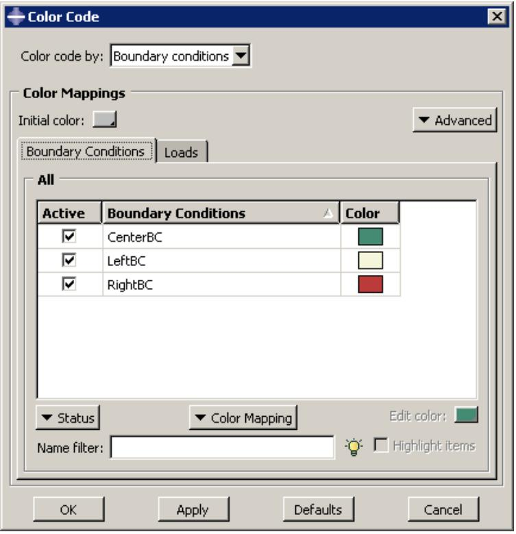

text_image

Color Code
Color code by: Boundary conditions
Color Mappings
Initial color:
Boundary Conditions Loads
Advanced
All
Active Boundary Conditions Color
✓ CenterBC
✓ LeftBC
✓ RightBC
Status Color Mapping Edit color:
Name filter:
Highlight items
OK Apply Defaults Cancel

图 1：带有多个颜色映射的颜色编码对话框。

您也可以通过单击其标签并从 **高级** 列表中选择 **移除当前映射** 来从对话框中移除颜色映射。

当打开多个颜色映射时，Abaqus/CAE 会先应用最左侧颜色映射的颜色映射，然后再处理其右侧的映射。您一次最多可以显示三个颜色映射，但 Abaqus/CAE 不允许您对表格重新排序。如果您想以不同的顺序对属性进行颜色编码，必须关闭每个颜色映射，然后按照您希望 Abaqus/CAE 在视口中显示它们的顺序添加颜色映射。
## 编辑自动颜色列表中的颜色

当您创建颜色映射时，Abaqus/CAE 会通过参照自动颜色列表中的颜色定义来为对象分配颜色。您可以通过添加、删除、重新排列和更改颜色来修改此列表的内容。

与颜色映射不同，自动颜色列表对所有视口通用。

1.  在 Color Code 工具栏中点击该工具。
    
    Abaqus/CAE 显示 Color Code 对话框。
    
2.  点击 Advanced，并从出现的列表中选择 Edit Auto-colors。
    
    Abaqus/CAE 显示 Edit Auto-Colors 对话框。
    
3.  要在自动颜色列表中插入一种新颜色：
    
    1.  在自动颜色列表中，高亮显示您希望新添加的颜色位于其之前或之后的颜色。
        
    2.  点击 Insert Before 或 Insert After，以将新颜色添加到自动颜色列表中指定的位置。
        
        Select Color 对话框打开。
        
    3.  选择一种颜色，然后点击 OK 关闭 Select Color 对话框。
        
        Abaqus/CAE 在选定位置添加新颜色。
        
4.  要更改自动颜色列表中的某种颜色，请双击该颜色，然后从出现的 Select Color 对话框中选择一种新颜色。
    
5.  要在自动颜色列表内移动一种颜色，请高亮显示该颜色，然后点击 Move Up 或 Move Down，以将该颜色向所选方向移动一步。
    
6.  要从自动颜色列表中删除一种颜色，请高亮显示该颜色，然后点击 Delete。
    
7.  继续添加、更改、移动和删除颜色，直到自动颜色列表按所需顺序包含您想要的颜色。
    
8.  点击 OK。
    
    Abaqus/CAE 使用修订后的自动颜色列表进行任何后续的颜色编码。
    

## 保存和恢复自定义颜色映射

颜色映射是会话特定的设置，默认情况下不会保存到模型数据库或输出数据库中。Abaqus/CAE 提供了两种可用于保存自定义颜色编码定义的方法。

您可以将颜色映射定义保存为会话选项。会话选项可以保存到模型数据库、输出数据库或 XML 文件。使用此过程保存颜色映射时，Abaqus/CAE 仅记录 Color Code 对话框中当前选中项目对应的颜色映射。例如，当显示部件实例的颜色映射时，只有这些颜色映射定义会被写入所选文件。
您可以创建颜色宏或将所选颜色映射写入 ASCII 文件。颜色宏记录所有颜色映射和您的初始颜色选择，而 ASCII 文件仅记录当前颜色映射。您可以像运行任何其他宏一样运行颜色宏；请参阅管理宏。颜色宏记录您选择的所有颜色映射，而不仅仅是 Color Code 对话框中当前显示的映射。

本节描述用于保存颜色映射定义的基于宏的方法。有关将颜色映射保存为会话选项的更多信息，请参阅管理会话对象和会话选项。

## 附加信息

• 管理宏

## 保存颜色宏

1.  在 Color Code 工具栏中点击该工具。
    
    Abaqus/CAE 显示 Color Code 对话框。
    
2.  点击 Advanced，并从出现的列表中选择 Save Color Macro。
    
    Abaqus/CAE 显示 Create Macro 对话框，其中显示了宏将被保存的位置。
    
3.  为此宏输入一个 Name，然后点击 OK。
    
    Abaqus/CAE 保存该宏，使其可供您从 Macro Manager 对话框运行。
    

## 为颜色映射读取或写入 ASCII 文件

1.  在 Color Code 工具栏中点击该工具。
    
    Abaqus/CAE 显示 Color Code 对话框。
    
2.  将光标置于 Color Mappings 表上，点击鼠标右键，然后从出现的列表中选择以下选项之一：
    
    • 选择 Write to File 以选择文件名并保存当前颜色映射。
    • 选择 Read from File 以选择文件名并读取已保存颜色映射的内容。
    

## 使用显示组显示模型的子集

默认情况下，Abaqus/CAE 显示整个模型；但是，您可以通过创建显示组来选择显示模型的子集。

这些子集可以包含来自当前模型或输出数据库的部件实例、几何（单元、面或边）、基准几何（点、轴、平面或坐标系）、单元、节点和曲面的组合。本章解释显示组的概念以及如何管理它们。

## 本节内容：

理解显示组
管理显示组

## 理解显示组

显示组是所选模型组件的集合，可以包含整个模型或部件实例、几何（单元、面或边）、基准几何（点、轴、平面或坐标系）、单元、节点、曲面、约束和输出数据库坐标系的组合。

显示组使您能够减少屏幕上的杂乱，专注于模型中的感兴趣区域，访问复杂模型中“隐藏”的组件，并减少刷新当前视口显示所需的时间。例如，您可以使用显示组来显示接触曲面但隐藏单元，或者生成等值线图以显示模型内部原本会被遮挡的单元。您可以绘制、保存、编辑、复制、重命名和删除显示组。

在 Visualization（可视化）模块中，您可以在同一视口中绘制多个显示组，并且可以独立自定义每个显示组的绘图选项。

## 本节内容：

理解如何创建显示组
理解显示组布尔运算

## 理解如何创建显示组

显示组可以包含模型组件的组合：部件实例、几何（单元、面或边）、基准几何（点、轴、平面或坐标系）、单元、节点、曲面、约束、输出数据库坐标系或整个模型。此外，您还可以通过对先前保存的显示组进行操作来创建显示组。然而，在创建显示组时，一次只能对一种类型的模型组件执行操作。创建包含多种类型选定组件的显示组是一个增量过程。可用于创建显示组的模型组件取决于您当前工作的模块，如表 1 和表 2 所示。

表 1：在与部件和装配相关的模块以及 Visualization（可视化）模块中可用于创建显示组的模型组件。

<table><tr><td>模块</td><td>可用模型组件</td></tr><tr><td rowspan="7">与部件相关 (Part, Property)</td><td>几何 (cells, faces, 或 edges)</td></tr><tr><td>基准几何 (points, axes, planes, 或 coordinate systems)</td></tr><tr><td>单元</td></tr><tr><td>节点</td></tr><tr><td>参考点</td></tr><tr><td>集合 (几何、单元或节点)</td></tr><tr><td>显示组</td></tr><tr><td rowspan="10">与装配相关 (Assembly, Step, Interaction, Load, Mesh)</td><td>部件实例</td></tr><tr><td>几何 (cells, faces, 或 edges)</td></tr><tr><td>基准几何 (points, axes, planes, 或 coordinate systems)</td></tr><tr><td>装配线束 (connector wires)</td></tr><tr><td>单元</td></tr><tr><td>节点</td></tr><tr><td>参考点</td></tr><tr><td>集合 (几何、单元或节点)</td></tr><tr><td>曲面</td></tr><tr><td>显示组</td></tr><tr><td rowspan="5">Visualization（可视化）模块</td><td>部件实例</td></tr><tr><td>单元</td></tr><tr><td>节点</td></tr><tr><td>曲面</td></tr><tr><td>显示组</td></tr></table>

表 2：在 Visualization（可视化）模块中可用于为输出数据库创建显示组的模型组件。

<table><tr><td>模块</td><td>可用模型组件</td></tr><tr><td rowspan="2">Visualization</td><td>部件实例</td></tr><tr><td>单元</td></tr><tr><td rowspan="9"></td><td>节点</td></tr><tr><td>曲面</td></tr><tr><td>显示组</td></tr><tr><td>坐标系</td></tr><tr><td>绑定约束</td></tr><tr><td>壳到实体耦合约束</td></tr><tr><td>分布耦合约束</td></tr><tr><td>运动学耦合约束</td></tr><tr><td>刚体约束</td></tr></table>

要创建显示组，您首先选择特定感兴趣的项目。然后，您可以对您的选择内容和当前视口的内容执行布尔操作。此序列可以根据需要重复以创建所需的组。此外，您还可以通过编辑（例如，对先前保存的显示组内容执行附加布尔操作）来创建新的显示组。
您可以将对话框中的选择内容或当前视口中的内容保存为显示组。默认情况下，显示组仅在当前会话期间持续存在。如果希望将某个显示组保留以供后续会话使用，请将其保存为 XML 文件、保存到模型数据库或输出数据库中；有关更多信息，请参阅管理会话对象和会话选项。您只能在与创建显示组时相同的模块类型中访问该显示组（参见表 1 和表 2）。例如，如果在 Part 模块中创建并保存了一个显示组，则只能在 Part 和 Property 模块中访问此显示组。

Abaqus/CAE 会自动创建一个名为 All 的显示组，该显示组包含当前零件、装配或输出数据库中的所有对象。此显示组会出现在当前模块的显示组管理器中，并且无法编辑、复制、重命名或删除。它不与特定的零件、装配或输出数据库相关联。在执行布尔操作后，您可以使用此显示组快速返回到整个零件或模型的绘图。

## 其他信息

• 创建或编辑显示组  
• 在 Visualization 模块中控制约束的显示

## 理解显示组布尔操作

要创建或编辑显示组，您可以对选定的模型组件和当前视口的内容执行布尔操作。Abaqus/CAE 在“显示组”工具集中提供以下布尔操作：替换、添加、移除、相交和二选一。

以一个简单的布尔操作为例：假设当前视口显示整个模型。如果您选择了一个单元集，然后应用“移除”操作，则该单元集会从当前视口的显示中被消除。

对于为创建或编辑显示组而执行的每个布尔操作，您只能选择一种类型的模型组件：部件实例、几何体（体、面或边）、基准几何体（点、轴、平面或坐标系）、单元、节点、曲面、先前保存的显示组或整个模型。对于给定的显示组，Abaqus/CAE 最初假定您希望包含该组中所有单元连接的所有节点。但是，如果您选择了特定节点，则随后对该显示组的所有操作都将仅包含您选择的节点。

下面将对每个布尔操作进行解释。在下面的图标中，左侧的圆圈代表当前视口中的项目；右侧的圆圈代表您的选择。带阴影的部分代表结果显示组。除了最后一个“全部替换”之外，所有这些布尔操作均在“创建显示组”对话框中可用；“显示组”工具栏提供了对替换、移除、二选一和全部替换布尔操作以及撤销和重做操作的访问。

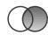

## 替换

使用“替换”操作符将当前视口内容替换为您的选择内容。

## 添加

使用“添加”操作符将您的选择内容添加到当前视口内容中。

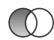

## 移除

使用“移除”操作符从当前视口内容中移除您的选择内容。如果您的选择包含一个或多个单元或曲面，则连接到这些项目的节点也会被移除，前提是您没有专门操作来将这些节点包含在显示组中。

## 相交

使用“相交”操作符仅显示您的选择内容与当前视口显示内容中共同存在的项目。

## 二选一

使用“二选一”操作符仅显示模型组件中属于您的选择内容或当前视口内容但不同时属于两者的内容。

注意：在“显示组”工具栏中，单击“反转显示”可以隐藏当前显示组中显示的所有模型组件，或者显示所有隐藏的模型组件。此操作等同于在“创建显示组”或“编辑显示组”对话框中选择所有对象并单击“二选一”按钮。

## 全部替换

使用“全部替换”操作符替换您的显示组并显示当前视口中的所有实体。此操作仅在工具栏中可用。

当您从工具栏中选择“替换选中项”或“移除选中项”操作符时，Abaqus/CAE 会在提示区显示模型组件列表。选择您希望从选定显示组中替换或移除的模型组件类型，然后单击视口中的一个或多个模型组件以更改显示组的内容。

## 注意：

“替换选中项”和“移除选中项”操作符执行的操作与显示组对话框中的“替换”和“移除”操作符相同。工具栏操作符使用不同的名称是为了指示您必须先从视口中选择模型组件，然后才能使用这些操作符来更改当前显示。

## 其他信息

• 创建或编辑显示组

## 管理显示组

显示组管理器允许您创建显示组，并绘图、编辑、复制、重命名或删除先前保存的显示组。

当前模块的显示组管理器仅列出您在当前会话期间于相同类型模块中保存的显示组。与零件相关模块中的“零件显示组管理器”列出了每个显示组所属的模型和零件；与装配相关模块中的“装配显示组管理器”列出了每个显示组所属的模型。

在 Visualization 模块中，您可以在同一视口中绘制多个显示组。Visualization 模块中的“ODB 显示组管理器”允许您锁定和解锁已绘制的显示组，以选择性地自定义绘图选项。此外，您可以同步所有已绘制的显示组以使用相同的绘图选项。

## 本节内容：

创建或编辑显示组  
创建或编辑显示组时的选择方法  
复制、重命名和删除显示组  
绘制显示组  
在 Visualization 模块中自定义显示组  
将显示组应用于多个视口和模型

要创建显示组，首先选择您感兴趣的具体项目。然后，您可以对您的选择内容和当前视口的内容执行布尔操作。创建显示组时，您可以随时选择保存当前视口的内容或在对话框中选择的项目（如果适用）。您必须保存显示组才能执行以下任何操作：

• 在会话后期绘制该显示组。  
• 将该显示组应用于不同的模型或不同的视口。  
• 编辑、复制或重命名该显示组。  
• 在 Visualization 模块中在同一视口中绘制多个显示组。

保存的显示组仅在当前会话期间可用，并且仅当您在与创建该显示组时相同的模块类型中时才可用。

## 注意：

保存的显示组不会更新以反映对模型所做的更改，例如添加、删除或抑制特征，或者对零件进行分区；此类更改可能会使根据原始模型创建的显示组失效。

您可以编辑先前保存的显示组中的模型组件组合。编辑显示组类似于创建显示组：在两种情况下，您都可以选择模型组件，然后对您的选择内容和当前视口的内容应用布尔操作。当您选择要编辑的显示组时，当前视口的内容会更新以显示所选的显示组。您可以使用当前视口中的显示来确定正在编辑的组中的模型组件；您无法列出模型组件。编辑完成后，所有使用该显示组的视口都将更新。

1. 找到创建或编辑显示组的选项。

• 要创建显示组，请从主菜单栏选择 Tools->Display Group->Create。

提示：您也可以通过单击“显示组”工具栏中的工具来创建显示组。
**创建显示组** 对话框出现。

要编辑先前保存的显示组，请从主菜单栏选择 **工具 -> 显示组 -> 编辑**。从出现的菜单中，选择您要编辑的显示组。

**编辑显示组** 对话框出现。

**提示**：您也可以使用显示组管理器来创建或编辑显示组。从主菜单栏，选择 **工具 -> 显示组 -> 管理器** 以显示当前模块的管理器。要创建显示组，请单击 **创建**。要编辑显示组，请从列表中选择它并双击，或单击 **编辑**。

2. 从对话框左上角的 **项目** 列表中，选择用于显示组的模型组件类型（根据当前模块的可用项）：**单元（Cells）**、**面（Faces）**、**边（Edges）**、**基准（Datums）**、**装配线（Assembly wires）**、**参考点（Reference points）**、**单元（Elements）**、**节点（Nodes）**、**集合（Sets）**、**面（Surfaces）**、**部件实例（Part instances）**、**显示组（Display groups）**、**内部集合（Internal Sets）**、**内部面（Internal Surfaces）**、**坐标系（Coordinate systems）**、**绑定（Ties）**、**壳到实体耦合（Shell-to-solid couplings）**、**分布耦合（Distributing couplings）**、**运动学耦合（Kinematic couplings）** 或 **刚体（Rigid bodies）**。您可以选择 **全部（All）** 来指定当前部件、装配体或输出数据库中的所有对象（当您正在创建新的显示组时）。

Abaqus/CAE 会刷新 **方法** 列表和对话框右侧区域。如果您选择了 **全部（All）**，这些字段将为空，并且无需进一步指定项目。如果您选择的项目只有一种选择方法，Abaqus/CAE 将立即进入所需的选择模式。例如，如果您选择 **单元（Cells）**，Abaqus/CAE 将立即进入视口选择模式。

3. 从 **方法** 列表中选择一种选择方法；和/或通过以下方式为显示组选择特定项目：从视口拾取、从出现在对话框右侧的列表中选择项目，或在对话框右侧输入数据。有关更详细的信息，请参阅 *用于创建或编辑显示组的选择方法*。

**提示**：如果您的模型包含大量特定类型的项目，您可以使用过滤器来减少 **创建显示组** 对话框右侧显示的项目名称数量。单击 **过滤器（Filter）** 字段旁的 **提示（Tip）** 按钮以查看有效过滤语法的示例。

某些项目可以在视口中突出显示以验证您的选择。如果可用，请切换 **在视口中高亮显示项目（Highlight items in viewport）**。

切换 **在链接视口间显示公共列表（Show common list between linked viewports）** 可在 **方法** 列表中显示所有链接视口共有的项目。对于 **部件实例（Part instances）**，包含模型数据库或输出数据库的视口会被考虑；对于其他模型组件，仅考虑包含输出数据库的视口。

4. 从对话框底部区域的图标中，单击所需的布尔操作（有关更多信息，请参阅 *理解显示组布尔操作*）。

Abaqus/CAE 将对您在对话框中选择的模型组件以及当前视口的内容执行所选的布尔操作。

5. 根据需要重复从步骤 2 开始的步骤以生成所需的显示组。
6. 如果您正在创建新的显示组，您可以随时选择保存它。

    a. 要将当前视口的内容保存为显示组，请单击 **另存为（Save As）**；然后在出现的对话框中输入显示组的名称，并单击 **确定（OK）**。

        Abaqus/CAE 将当前视口的内容（无论在对话框中选择了什么）保存为一个显示组。

    b. 如果在 **创建显示组** 对话框中选择了模型组件，您可以将选定的组件保存为显示组。单击 **保存选择为（Save Selection As）**；然后在出现的对话框中输入显示组的名称，并单击 **确定（OK）**。

        Abaqus/CAE 仅将在对话框中选择的组件（无论当前视口中显示了什么）保存为一个显示组。

7. 单击 **取消（Dismiss）** 以关闭 **创建显示组** 对话框，或单击 **确定（OK）** 以关闭 **编辑显示组** 对话框。

## 附加信息

•   理解如何创建显示组
•   理解显示组布尔操作
•   用于创建或编辑显示组的选择方法
•   理解结果值平均
•   控制边可见性
•   选择背景颜色
•   控制在可视化模块中约束的显示

## 用于创建或编辑显示组的选择方法

您可以使用以下选择方法来指定将包含在显示组中的项目：

要通过从视口直接拾取来指定几何（单元、面或边）、装配线或参考点，请从 **项目** 列表中选择它们。（对于基准、单元和节点，您还必须从 **方法** 列表中选择 **从视口拾取（Pick from viewport）**。）Abaqus/CAE 会自动进入拾取模式，并且提示区域会显示 **为显示组选择项目（Select items for the display group）**。有关在视口中拾取项目的更多信息，请参阅 *在视口中选择对象*。

在视口中完成拾取项目后，单击提示区域中的 **完成（Done）**。

单击对话框中的 **编辑选择（Edit selection）**、**添加选择（Add selection）** 或 **删除选择（Delete selection）** 以进一步修改您的视口选择。

要按编号指定单元或节点，请从 **方法** 列表中选择 **单元标签（Element labels）** 或 **节点标签（Node labels）**。从 **创建显示组** 对话框右侧 **部件实例（Part instance）** 字段的列表中选择节点或单元所属的部件实例名称。在 **标签（Labels）** 字段中键入以逗号分隔的单元或节点编号列表，或键入一个可选后跟增量的数字范围；例如，`1:10` 或 `1:10:2`。
要在可视化模块中按类型指定单元，请从 **方法** 列表中选择 **单元类型（Element type）**。**创建显示组** 对话框右侧会显示模型中可用单元类型的列表。从此列表中选择一个或多个单元类型（有关更多信息，请参阅 *从列表和表格中选择多个项目*）。
要在可视化模块中按材料或截面指定单元，请从 **方法** 列表中选择 **材料指定（Material assignment）** 或 **截面指定（Section assignment）**。**创建显示组** 对话框右侧会显示模型中可用材料或截面的列表。从此列表中选择一个或多个材料或截面（有关更多信息，请参阅 *从列表和表格中选择多个项目*）。

要在可视化模块中通过层合板或铺层指定单元，请从 **方法** 列表中选择 **复合层合板（Composite Layups）** 或 **复合铺层（Composite Plies）**。**创建显示组** 对话框右侧会显示模型中可用复合层合板或铺层的列表。从此列表中选择一个或多个层合板或铺层（有关更多信息，请参阅 *从列表和表格中选择多个项目*）。

要在与部件和装配体相关的模块中指定几何、单元或节点集合，或在与装配体相关的模块中指定面，请从 **方法** 列表中选择 **集合名称（Set names）** 或 **面名称（Surface names）**。**创建显示组** 对话框右侧会显示模型中可用集合或面名称的列表。从此列表中选择一个或多个集合名称（有关更多信息，请参阅 *从列表和表格中选择多个项目*）。

要在与部件和装配体相关的模块中指定内部（由 Abaqus/CAE 创建）集合，或在与装配体相关的模块中指定内部面，请从 **项目** 列表中选择 **内部集合（Internal sets）** 或 **内部面（Internal surfaces）**。**创建显示组** 对话框右侧会显示模型中可用集合或面名称的列表。从此列表中选择一个或多个集合名称（有关更多信息，请参阅 *从列表和表格中选择多个项目*）。

要在可视化模块中指定单元、节点、面或内部（由 Abaqus/CAE 创建）集合，请从 **方法** 列表中选择 **单元集（Element sets）**、**节点集（Node sets）**、**面集（Surface sets）** 或 **内部集（Internal sets）**。**创建显示组** 对话框右侧会显示模型中可用集合名称的列表。从此列表中选择一个或多个集合名称（有关更多信息，请参阅 *从列表和表格中选择多个项目*）。

•   要选择模型中指定类型的所有项目，请从 **方法** 列表中选择 **所有单元（All elements）**、**所有节点（All nodes）** 或 **所有面（All surfaces）**。无需进一步指定项目。

如果您从 **项目** 列表中选择了 **部件实例（Part instances）** 或 **显示组（Display groups）**，**创建显示组** 对话框右侧会显示模型中可用部件实例或显示组的列表。从此列表中选择一个或多个部件实例或显示组名称（有关更多信息，请参阅 *从列表和表格中选择多个项目*）。

## 注意：

在与装配体相关的模块中，您也可以使用 **装配体显示选项** 对话框的 **实例（Instance）** 选项卡页面中的可见性选项来显示模型中部件实例的子集（参见 *控制实例可见性*）。在 **装配体显示选项** 对话框中已切换关闭的部件实例无法通过显示组变为可见。
• 要在可视化（Visualization）模块中指定包含给定结果值范围内的单元、节点或面，请选择**Result value**。

对话框右上角将显示要处理的输出变量。要选择新的结果变量，请点击**Field Output**；有关Field Output对话框的更多信息，请参阅《选择要显示的场输出》。在**Type**字段中选择筛选方法。

- 如果选择 **(inside)** 或 **(outside)**，请分别在 **Min value** 和 **Max value** 字段中输入结果范围的下限和上限值。
- 如果选择 ，请在 **Min value** 字段中输入一个值，结果应高于该值。
- 如果选择 ，请在 **Max value** 字段中输入一个值，结果应低于该值。

无论当前模型中的活动显示组如何，模型中的每个单元（或节点或面）都将用于筛选过程。如果选择了一个不存在任何单元（或节点或面）的值范围，您将创建一个空显示组。

使用状态场输出变量（status field output variable）而非基于结果的显示组功能，可以在时间历程动画中获得更好的性能。状态场输出变量允许您从模型图中移除满足基于结果的指定失效准则的单元；有关更多信息，请参阅《选择状态场输出变量》。

## 注意：

基于单元、节点或面输出变量的筛选界限始终基于变量在节点处的值。因此，基于单元和面的输出量会在与用户定义的界限进行比较之前，在节点处进行外推和平均。**Result Options** 对话框中的平均设置决定了如何在节点处计算基于单元和面的变量。例如，考虑一个情况：使用默认平均阈值 75% 对基于 Mises 应力（Mises stress）的单元进行筛选。外推到节点后，将根据此阈值对值进行平均。这种条件平均可能导致节点处出现多个不同的 Mises 应力值，具体取决于该节点所属的各个单元的贡献。任何其 Mises 应力贡献在用户定义界限内的单元都将包含在显示组中。

• 要在可视化模块中指定坐标系，请从 **Item** 列表中选择 **Coordinate systems**，然后选择以下之一：

要指定属于输出数据库（output database）一部分的坐标系，请从 **Method** 列表中选择 **Odb systems**。输出数据库坐标系列表将出现在 **Create Display Group** 对话框的右侧。
要指定在当前会话中创建的坐标系，请从 **Method** 列表中选择 **User systems**。用户定义的坐标系列表将出现在 **Create Display Group** 对话框的右侧。
要指定来自输出数据库和会话的坐标系，请从 **Method** 列表中选择 **All**。输出数据库坐标系和用户定义的坐标系列表将出现在 **Create Display Group** 对话框的右侧。

从出现的列表中选择一个或多个坐标系（有关更多信息，请参阅《从列表和表格中选择多个项目》）。

• 要在可视化模块中指定分析约束，请在 **Item** 列表中选择以下约束类型之一：**Ties**、**Shell-to-solid couplings**、**Distributing couplings**、**Kinematic couplings** 或 **Rigid bodies**。

## 其他信息

• 创建或编辑显示组

## 复制、重命名和删除显示组

要复制、重命名或删除显示组，请使用以下方法之一：

• 主菜单栏上 **Tools->Display Group** 菜单下列出的 **Copy**、**Rename** 和 **Delete** 项。
**Copy**、**Rename** 和 **Delete** 项包含子菜单，列出了您在当前会话期间，在与当前模块相同类型的模块中保存的所有显示组。
当前模块的显示组管理器（display group manager）对话框。显示组管理器对话框包含的功能与主菜单栏 **Tools->Display Group** 菜单下列出的功能相同，但带有一个方便的浏览器，列出了当前模块和会话的所有显示组。要显示当前模块的显示组管理器对话框，请从主菜单栏选择 **Tools->Display Group->Manager**。

## 注意：

如果您尝试删除在多个视口中显示的显示组，Abaqus/CAE 会警告这些视口中的显示组将被重置为整个模型。

## 其他信息

• 管理显示组

## 绘制显示组

您可以在当前视口中绘制模型的显示组。在可视化模块中，您可以在同一视口中绘制多个显示组。

Abaqus/CAE 仅绘制每个显示组中对当前模型有效的组件。例如，如果一个显示组引用了一个名为 **Fixture** 的单元集（element set），那么当前视口中的模型也应该包含一个名为 **Fixture** 的单元集。Abaqus/CAE 会忽略无效的模型组件。

## 其他信息

• 管理显示组

## 在任何模块中绘制单个显示组

1. 从主菜单栏选择 **Tools->Display Group->Plot**。
2. 从出现的菜单中，选择要绘制的显示组。

提示：您也可以使用当前模块的显示组管理器来绘制显示组。从主菜单栏选择 **Tools->Display Group->Manager**。选择要绘制的显示组，然后单击管理器右侧的按钮中的 **Plot**。

当前视口中的模型图将更改为仅显示选定的显示组。

## 在可视化模块中绘制一个或多个显示组

1. 从主菜单栏选择 **Tools->Display Group->Manager**。
**ODB Display Group Manager** 将出现，其顶部列表显示了当前会话中保存的所有显示组。
2. 从列表中选择一个或多个显示组（有关更多信息，请参阅《从列表和表格中选择多个项目》），然后单击管理器右侧的按钮中的 **Plot**。
当前视口中的模型图将更改为仅显示选定的显示组，并且绘制的显示组将出现在 **ODB Display Group Manager** 底部的显示组实例（display group instances）列表中。
3. 要将一个或多个显示组添加到当前视口的绘图中，请从 **ODB Display Group Manager** 顶部保存的显示组列表中选择它们，然后单击管理器右侧的按钮中的 **Add**。
选定的显示组将被添加到当前视口的模型图中以及 **ODB Display Group Manager** 底部的显示组实例列表中。
4. 要从当前视口的绘图中移除某个显示组，请从 **ODB Display Group Manager** 底部的列表中选择该实例，然后单击管理器底部的按钮中的 **Remove**。
选定的显示组将从当前视口的模型图中以及显示组实例列表中移除。
5. 您可以为当前视口中的每个显示组分别自定义绘图状态相关（plot state–dependent）和独立（independent）的选项。有关更多信息，请参阅《在可视化模块中自定义显示组》。

## 在可视化模块中自定义显示组

可视化模块中的 **ODB Display Group Manager** 允许您锁定和解锁已绘制的显示组，以便有选择地自定义绘图选项。此外，您可以同步所有已绘制的显示组以使用相同的绘图选项。例如，您可以使用带透明度的着色渲染样式（shaded render style）显示特定的单元组，并使用线框渲染样式（wireframe render style）显示模型的其余部分。图 1 展示了另一个例子，在同一视口中绘制了两个显示组，使用了不同的绘图状态和绘图选项。

natural_image

带分层块和三角支撑的结构框架三维图（无文本或符号）

图 1：同一视口中多个自定义显示组。

当您在可视化模块中绘制一个显示组时，该显示组（及其当前绘图状态）会出现在 **ODB Display Group Manager** 底部的显示组实例列表中。您指定的绘图状态相关和独立选项适用于所有未锁定的显示组实例。您可以锁定不希望受绘图选项影响的显示组实例。

更改绘图状态不会影响视口中已锁定的显示组实例。但是，视图操作和颜色编码的更改会影响所有显示组实例，无论是锁定的还是未锁定的。此外，可以编辑已锁定显示组的内容。
显示组按照在显示组实例列表中出现的顺序绘制在视口中；列表中的第一个实例是视口中最顶端的实例。因此，如果两个显示组实例包含相同的组件，并且这些组件在视口中重叠，则列表中第一个实例的绘图选项将优先显示。您可以重新排列列表中实例的顺序，以控制将显示哪些绘图选项。

1. 按照 *绘制显示组* 中描述的流程，在同一视口中绘制多个显示组。  
2. 在 ODB 显示组管理器 的显示组实例列表中，单击显示组名称旁边的 **锁定** 列，以锁定您不希望自定义的实例。

锁定的显示组由 **锁定** 列中的复选标记指示。

3. 根据需要自定义已解锁的显示组实例的绘图选项。（有关更多信息，请参阅 *自定义绘图显示*。）  
4. 完成显示组实例的绘图选项自定义后，单击显示组名称旁边的 **锁定** 列，以防止您的设置被修改。  
5. 根据需要重复步骤 3 和 4，直到获得视口中所需的显示效果。  
6. 如果您希望所有显示组实例使用相同的绘图状态和绘图选项，请选择一个反映所需绘图状态和绘图选项的实例，然后单击管理器底部的 **同步选项** 按钮。

所有其他已解锁的显示组实例将同步到所选显示组的绘图状态和绘图选项。

7. 要重新排列显示组在视口中的绘制顺序，请从 ODB 显示组管理器底部的列表中选择一个实例，然后单击 **上移** 将实例在列表中向上移动，或单击 **下移** 将实例向下移动。

当前视口中的显示将更新以反映您的更改。

## 其他信息

• 管理显示组

## 将显示组应用于多个视口和模型

您可以使用单个显示组来查看不同模型中的相同子集，并且可以在多个视口中查看一个显示组。

单个显示组可以应用于不同的模型，只要该显示组对每个模型都有效。例如，图 1 显示了一个显示组应用于显示在两个不同视口中的两个不同模型。

  
图 1：应用于两个不同模型的显示组。

## 其他信息

• 管理显示组

## 在任何视口中绘制先前保存的显示组

1. 单击视口边框以使其成为当前视口。  
2. 从主菜单栏中，选择 **工具->显示组->绘制**。从出现的菜单中选择要绘制的显示组。  
Abaqus 将在当前视口中绘制该显示组。Abaqus 仅绘制该显示组中对当前模型有效的组件。

## 在任何显示该显示组的视口中编辑先前保存的显示组

1. 单击视口边框以使其成为当前视口。  
2. 从主菜单栏中，选择 **工具->显示组->编辑**。从出现的菜单中选择要编辑的显示组。  
将出现 **编辑显示组** 对话框。  
3. 选择所需的模型组件，并应用所需的布尔运算。  
在编辑过程中，任何布尔运算的结果仅显示在当前视口中。  
4. 单击 **确定** 以关闭 **编辑显示组** 对话框。

您的编辑更改将应用于所有引用所选显示组的视口。如果修改后的显示组对其中一个模型变得无效（例如，包含了该模型中未包含的节点），Abaqus 会警告显示组的部分内容现在无效。

本章解释叠加图的概念以及如何创建和管理此类图。默认情况下，Abaqus/CAE 在当前视口中一次只显示一个绘图。一个绘图可以显示多个绘图状态，例如同一模型的等值线和材料方向。但是，单个绘图无法显示来自多个输出数据库的数据，也无法在同一视口中同时显示模型和 X-Y 图。如果您希望以这种方式显示数据，则必须在同一视口中叠加单个绘图。

## 本节内容：

了解如何叠加图  
创建和修改叠加图

## 了解如何叠加图

您可以创建一个包含多个绘图的显示在单个视口中。例如，您可能希望执行以下任何操作：

•   合并等值线图和 X-Y 图  
•   在同一视口中比较来自两个不同输出数据库文件的变形图形状  
•   将时间历史动画与显示模型随时间变化的多个变量变化的动画 X-Y 图相结合

叠加图非常有用，例如，用于在同一视口中显示协同仿真中来自两个输出数据库的数据。

叠加图由图层组成；每个图层包含一个绘图，图层堆叠在一起以创建组合图。图 1 显示了一个包含分析在四个不同增量下的变形形状图以及模型应变能与时间的 X-Y 图的绘图。

area_stacked

| Time | ALLAE for Whole Model (x10^8) |
| --- | --- |
| 0.0 | 0.0 |
| 2.0 | ~0.1 |
| 4.0 | ~1.5 |
| 6.0 | ~2.5 |
| 8.0 | ~3.5 |
| 10.0 | 40.0 |

图 1：叠加图。

默认情况下，视口不包含任何图层；一次只显示一个绘图。要叠加多个绘图，您需要在与 Abaqus/CAE 交互时为每个单独的绘图创建一个图层。然后，您可以选择在当前视口中显示的图层。您可以根据需要创建任意多个图层；可以在同一视口中显示任意数量的图层。此外，您可以打开多个输出数据库，并自动在单个视口的叠加图中显示组合内容。

使用 **叠加图图层管理器** 来创建、显示、定位和删除图层。要访问该管理器，请从主菜单栏中选择

**视图->叠加图** 或单击工具箱中的 **叠加图图层管理器** 工具。

当您创建一个图层时，它包含当前视口中可见的所有内容。您可以更改图层的内容，操作其视图，相对于叠加图中的其他图层重新排序，并更改应用于内容的各种显示选项。默认情况下，图层直接绘制在彼此之上。有时直接位于彼此之上的线条会产生不良的视觉效果。您可以相对于彼此偏移图层以避免此类显示异常。

**叠加图图层管理器** 中的设置仅在您单击 **绘制叠加图** 时应用于当前视口的内容。然后，Abaqus/CAE 进入叠加图状态；当您在 **叠加图图层管理器** 中单击 **绘制单图** 时，叠加图从视口中消失，显示恢复为先前的绘图状态。

您也可以随时单击工具箱中的工具来在单图状态和叠加图状态之间切换。

当您处于叠加图状态时，Abaqus/CAE 相对于叠加图坐标系显示您的绘图。当您创建一个图层时，Abaqus/CAE 会将创建该图层时的视图指定为叠加图前视图 (1–2)。您可以通过操作每个单独图层的视图来修改叠加图前视图中显示的内容，如 *操作叠加图的视图* 中所述。在叠加图状态下定义的用户指定视图是相对于叠加图坐标系的。

**叠加图图层管理器** 中的列显示有关每个图层的以下信息：

## 可见

此列中的复选标记表示当您处于叠加图状态时，该图层在视口中是可见的。

## 当前

此列中的复选标记表示该图层是当前图层。一次只能有一个图层是当前图层，尽管每个图层可以包含多个绘图状态（有关更多信息，请参阅 *显示多个绘图状态*）。当您处于叠加图状态时，绘图选项仅应用于当前图层；您可以选择视图操作选项是应用于所有现有图层还是仅应用于当前图层。当前图层不一定是视口中最前面的图层。

## 名称

图层的名称。

## 对象

图层中包含的对象的名称；例如，输出数据库或 X-Y 图。

## 创建和修改叠加图

本节说明如何通过创建图层并在同一视口中绘制它们来叠加多个绘图，以及如何在创建叠加图后对其进行修改。
叠加绘图中的每个图层都是完全独立的。您可以更改输出数据库、绘图状态（或多个绘图状态）、重新排列图层之间的顺序、操作每个独立图层的视图，以及更改应用于内容的各种显示选项。

## 本节内容：

生成叠加绘图  
重新排序叠加绘图中的图层  
操作叠加绘图的视图  
编辑叠加绘图中的图层

## 生成叠加绘图

叠加绘图是在一个视口中包含多个绘图的显示。

叠加绘图由图层组成；您可以打开多个输出数据库并自动创建图层，也可以使用叠加绘图图层管理器（Overlay Plot Layer Manager）手动创建图层。

您还可以使用叠加绘图图层管理器来配置您的叠加绘图。

提示：您也可以使用允许绘制多个绘图状态（Allow Multiple Plot States）工具，绘制任何组合的变形与未变形模型形状，以及单个输出数据库的等值线图、符号或材料方向。

由于所有绘图状态都在单个图层上创建，因此允许绘制多个绘图状态（Allow Multiple Plot States）工具仅限于显示来自单个输出数据库、分析步和帧的数据。更多信息，请参见显示多个绘图状态。

1.  确定用于生成叠加绘图的方法：
    *   通过打开多个输出数据库自动创建图层。
    *   手动创建图层。
2.  要自动创建图层，请执行以下操作：
    a. 从主菜单栏选择 文件->打开。
    b. 在出现的打开数据库（Open Database）对话框中，选择 输出数据库（\*.odb） 作为文件过滤器（File Filter）。
    c. 选择要打开的输出数据库，勾选 追加到图层（Append to layers），然后单击 确定（OK）。更多详细信息，请参见打开模型数据库或输出数据库。

一个包含输出数据库组合内容的叠加绘图会在视口中自动创建，并且每个输出数据库被分配到一个单独的图层。您可以从主菜单栏选择 视图->叠加绘图 来显示叠加绘图图层管理器（Overlay Plot Layer Manager）并查看图层。
3.  要手动创建图层，请执行以下操作：
    a. 创建您希望包含在显示中的第一个绘图。
    b. 通过从主菜单栏选择 视图->叠加绘图 来打开叠加绘图图层管理器。

提示：您也可以通过在工具箱中单击叠加绘图图层管理器（Overlay Plot Layer Manager）工具来打开管理器。

c. 单击 创建（Create） 以创建一个包含当前视口中显示绘图的图层。

    将出现 创建视口图层（Create Viewport Layer） 对话框。
d. 输入图层的名称，然后单击 确定（OK）。

    新图层将出现在叠加绘图图层管理器中，并且在 可见（Visible） 和 当前（Current） 列中都有勾选标记。
e. 在当前视口中创建一个新绘图。
f. 重复步骤 c 到步骤 e，以创建您想要包含在绘图中的任意数量的图层。在除第一个图层之外的所有图层的 创建视口图层（Create Viewport Layer） 对话框中，您可以通过勾选 从...复制视图（Copy view from） 并从列表中选择一个图层，来选择从现有图层复制视图。新图层会在您创建时出现在叠加绘图图层管理器中；最近创建的图层将在 当前（Current） 列中有勾选标记。
g. 检查您想要包含在绘图中的图层是否在 可见（Visible） 列中有勾选标记，然后单击 绘制叠加图（Plot Overlay）。

    这些图层在当前视口中以叠加绘图图层管理器中列出的顺序堆叠显示。
4.  在叠加绘图图层管理器中，您可以通过在 名称（Name） 或 对象（Object） 列中单击来选择图层，然后单击 删除（Delete） 来删除图层。
5.  当叠加绘图显示在视口中时，您可以单击叠加绘图图层管理器中的 绘制单图（Plot Single） 以退出叠加绘图状态。

    叠加绘图从视口中消失，显示返回到之前的绘图状态；但叠加绘图图层管理器保持打开状态。单击 关闭（Dismiss） 以关闭叠加绘图图层管理器。

提示：您也可以随时单击工具箱中的绘图状态（Plot State）工具

在单图和叠加绘图之间切换。

## 其他信息

*   理解如何叠加绘图
*   生成和修改叠加绘图

图层在视口中按照它们在叠加绘图图层管理器中列出的顺序进行绘制。默认情况下，图层直接绘制在彼此之上，这有时会导致绘图看起来重叠的不良视觉效果。

您可以重新排列图层的绘制顺序，并且可以对屏幕 Z 方向（垂直于屏幕平面）的所有图层应用一个小的偏移量，以在显示中分离它们并消除任何不良的视觉效果。如果您应用正偏移量，则图层按叠加绘图图层管理器中显示的顺序在视口中绘制（管理器中的最后一个图层是视口中最顶层的图层）。如果您应用负偏移量，则绘制顺序将反转。图 1 显示了一个应用了不同偏移值的叠加绘图示例。

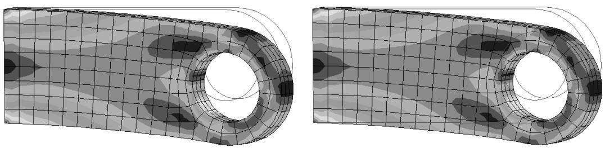
图 1：未变形图与等值线图的叠加：左侧为正偏移，右侧为负偏移。

1.  使用在 生成叠加绘图 中描述的步骤创建叠加绘图。
2.  使用以下一种方法重新排序图层：
    通过在叠加绘图图层管理器中的 名称（Name） 或 对象（Object） 列中单击来选择您希望重新排序的图层。单击 上移（Move Up） 可在管理器中向上移动图层；单击 下移（Move Down） 可在管理器中向下移动图层。
    将 图层偏移（Layer offset） 滑块拖动到正值或负值，以在正或负的屏幕 Z 方向移动图层。您可能需要尝试不同的偏移值以达到您想要的显示效果。

    Abaqus/CAE 将您的设置应用于当前视口中的叠加绘图。
3.  当叠加绘图显示在视口中时，您可以单击叠加绘图图层管理器中的 绘制单图（Plot Single） 以退出叠加绘图状态。

    叠加绘图从视口中消失，显示返回到之前的绘图状态；但叠加绘图图层管理器保持打开状态。单击 关闭（Dismiss） 以关闭叠加绘图图层管理器。

提示：您也可以随时单击工具箱中的绘图状态（Plot State）工具

在单图和叠加绘图之间切换。

## 其他信息

*   理解如何叠加绘图
*   生成和修改叠加绘图

## 操作叠加绘图的视图

当您处于叠加绘图状态时，您可以选择视图操作是应用于所有现有图层，还是仅应用于当前图层。

1.  使用在 生成叠加绘图 中描述的步骤创建叠加绘图。
2.  在叠加绘图图层管理器中，切换 视图操作图层（View manipulation layer） 旁边的 全部（All） 或 当前（Current），以指定您希望应用的视图操作是影响所有图层还是仅影响当前图层。
3.  使用视图操作工具在视口中定位、定向和放大对象。（有关视图操作工具的信息，请参见“操作视图和控制透视”。）
    根据您在步骤 2 中的选择，视图操作将应用于所有可见图层或仅应用于当前图层。3D 指南针（3D compass） 仅可用于操作所有可见图层；当您仅操作当前图层时，它不可用。
4.  当叠加绘图显示在视口中时，您可以单击叠加绘图图层管理器中的 绘制单图（Plot Single） 以退出叠加绘图状态。

    叠加绘图从视口中消失，显示返回到之前的绘图状态；但叠加绘图图层管理器保持打开状态。单击 关闭（Dismiss） 以关闭叠加绘图图层管理器。

提示：您也可以随时单击工具箱中的绘图状态（Plot State）工具

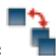

在单图和叠加绘图之间切换。

## 其他信息

*   理解如何叠加绘图
*   生成和修改叠加绘图

您可以更改叠加绘图中每个图层的模型、绘图状态、绘图选项、动画控制或场输出变量选项。
1. 使用“生成覆盖图”中描述的步骤创建覆盖图。
2. 在您想要修改的图层对应的“当前”列中单击。
3. 要更改模型，请打开一个新的输出数据库。（有关更多信息，请参阅“打开模型数据库或输出数据库”。）
4. 要更改绘图类型，请从“绘图”菜单或工具箱中的绘图工具中选择一种新的绘图类型。
5. 要更改绘图状态无关或绘图状态相关的自定义选项，请从以下任一对话框中选择新选项：

   • 视口标注选项 (Viewport Annotation Options)
   • ODB 显示选项 (ODB Display Options)
   • 结果选项 (Result Options)
   • 通用绘图选项 (Common Plot Options)
   • 叠加绘图选项 (Superimpose Plot Options)
   • 等值线图选项 (Contour Plot Options)
   • 符号图选项 (Symbol Plot Options)
   • 材料方向图选项 (Material Orientation Plot Options)

   有关更多信息，请参阅“使用视口标注选项”、“选择结果选项”或“自定义绘图显示”。

   在每个对话框中单击“确定”或“应用”，以将您的更改应用于覆盖图的当前图层。

6. 您可以通过在“覆盖图图层管理器”的“图层选项”下点击任何 → 图标来同步可见图层，包括：视图操作图层、绘图状态图层或绘图选项图层。
7. 更改任何需要的动画选项。有关更多信息，请参阅“基于对象的动画”和“控制动画播放”。
8. 更改任何需要的场输出变量选项。有关更多信息，请参阅“选择场输出变量”。
9. 您可以通过点击“场输出”层旁边的图标来同步可见图层的场输出变量选项。
10. 对您希望修改的每个图层重复步骤 2 到步骤 8。
11. 在视口中显示覆盖图时，您可以在“覆盖图图层管理器”中点击“绘制单图”以退出覆盖图状态。
    覆盖图将从视口中消失，显示将恢复到之前的绘图状态；但“覆盖图图层管理器”仍保持打开状态。点击“关闭”以关闭“覆盖图图层管理器”。

提示：您也可以随时单击工具箱中的工具，在单图和覆盖图状态之间切换。

## 附加信息

• 了解如何叠加绘图
• 生成和修改覆盖图

视图切割允许您切割模型，以便可视化模型的内部或选定部分，并且在可视化模块中，对于结果数据，可显示其合力和力矩。

## 本节内容：

了解视图切割
管理视图切割

## 了解视图切割

视图切割允许您通过模型切割平面或可变形的截面，以查看模型的内部。您可以在建模和后处理活动中定义和使用视图切割，尽管某些视图切割功能仅适用于其中一种活动。本节描述视图切割功能；除非另有说明，所述视图切割功能对建模和后处理均可用。

图 1 显示了如何使用平面视图切割来切割可视化模块中变速箱模型的等值线图。

natural_image

三个机械部件的技术插图，带有剖面视图，显示内部结构细节（无文本或符号）

图 1：通过变速箱模型等值线图的平面视图切割。顶部，从左到右：切割线下方的模型、位于切割线上的模型、切割线上方的模型；底部：整个模型。

## 视图切割形状

您可以基于平面创建视图切割。在可视化模块中，您还可以基于以下形状创建视图切割：

• 圆柱体，
• 球体，或
• 对应于场变量或模型属性常数值的等值面。

用于创建视图切割的形状类型如图 2 所示。

图 2：基于平面、圆柱、球体和等值面形状的视图切割。

对于等值面切割，结果值的计算方式如“了解等值线值的计算方法”中针对线型和带型等值线的描述。默认情况下，Abaqus/CAE 对等值面切割应用 100% 的平均阈值，以确保切割位置结果的连续显示。您可以通过在创建等值面切割时关闭“覆盖主变量平均值”来应用小于 100% 的平均阈值。然后，Abaqus/CAE 将应用在“结果选项”对话框的“平均选项”中指定的平均阈值；有关更多信息，请参阅“控制结果平均”。默认情况下会创建沿 X、Y 和 Z 平面的切割。

## 注意：

等值面视图切割的功能和行为与等值线图的等值面类型略有不同。等值面视图切割始终反映创建视图切割时激活的主变量的结果；您无法更改等值面视图切割显示结果的变量。相比之下，等值面类型的等值线图始终显示您会话中当前选定的主变量的数据。由于每个等值面视图切割都绑定到单个变量，如果您显示基于不同输出变量的多个等值面视图切割，您可以研究两个等值面视图切割相交的位置。

## 显示切割截面

要显示模型的切割截面，您需要激活一个切割，并选择是显示切割线上的模型、切割线上方的模型，和/或切割线下方的模型，如图 1 所示。切割线本身始终不可见。对于平面切割，切割线下方的部分被定义为位于平面负侧（相对于平面法线方向）的部分。对于圆柱和球形切割，切割线下方的部分被定义为位于小于切割形状半径的半径处。对于等值面切割，切割线下方的部分被定义为位于小于指定等值面的等值处。默认情况下，Abaqus/CAE 显示切割线上和切割线下的模型。在可视化模块中，您可以同时显示切割线上方的模型和切割线下方的模型；在所有其他模块中，一次只能使用这些显示选项中的一个。

## 绘图选项

您可以为切割线下方、切割线上和切割线上方的模型部分选择不同的绘图选项；例如，在图 2 中，模型的某些部分显示为激活了半透明，而其他部分则显示为无半透明。

## 显示多个视图切割（仅限可视化模块）

在可视化模块之外的模块中，一次只能激活一个切割（用于在当前视口中显示模型）；然而，在可视化模块中，您可以同时显示多个视图切割。此外，在可视化模块中，您可以在未变形、变形、等值线图（仅限纹理映射）、符号图或材料方向图上激活视图切割。对于符号图和材料方向图，即使元素被部分切割，Abaqus/CAE 也会在视图中每个元素的所有积分点处显示符号和材料方向坐标轴。

## 视图切割动画（仅限结果数据）

在可视化模块中，带有活动视图切割的绘图可以针对输出数据库数据进行动画播放；视图切割将针对每个动画帧进行更新。视图切割不能在细分等值线图、扫掠、收缩或拉伸绘图、或高精度（中、细或超细）绘图上激活。

## 结果缓存

默认情况下，Abaqus/CAE 将用于生成切割模型图像的结果值缓存在内存中以提高性能。但是，您可以根据需要禁用切割场的结果缓存以减少内存使用；有关更多信息，请参阅“控制结果缓存”。

## 跟随变形

对于变形模型的绘图，您可以选择让切割跟随变形；即，切割表面将相对于参考帧计算，并且切割变形将与模型变形匹配。

## 重新定位视图切割

您可以重新定位模型上的切割：平面切割可以旋转或平移，而其他切割形状只能平移。

## 视图切割管理器

您可以在“视图切割管理器”中选择一个切割（活动或非活动）来定位、编辑、复制、重命名或删除它。在管理器中选择一个切割与激活一个切割不同。一个切割可以同时被选中和活动，也可以未被选中但活动，或者被选中但非活动；并且如果当前显示的视图切割是活动的，您可以为其显示或隐藏自由体切割。您可以指定适用于所有视图切割的通用自由体选项，或特定于特定视图切割的选项。图 3 显示了在可视化模块中视图切割管理器显示的信息示例；在其他模块中，自由体显示和特定于切割的选项不包含在此对话框中。
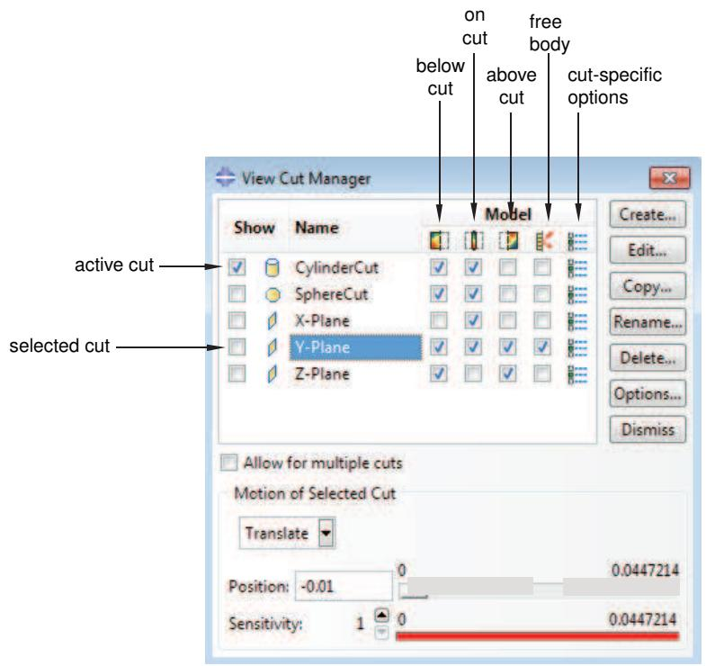

text_image

视图截面管理器
在截面上显示名称
在截面下方
关闭
关闭
关闭
关闭
关闭
关闭
关闭
关闭
关闭
关闭
关闭
关闭
关闭
关闭
关闭
关闭
关闭
关闭
关闭
关闭
关闭
关闭
关闭
关闭
关闭
关闭
关闭
关闭
关闭
关闭
关闭
关闭
关闭
关闭
关闭
关闭
关闭
关闭
关闭
关闭
关闭
关闭
关闭
关闭
关闭
关闭
关闭
关闭
关闭
关闭
截面特定选项
模型
活动截面
选定截面
CylinderCut ✓ ✓ ✓ ✓ ✓ ✓ ✓ ✓ ✓ ✓ ✓ ✓ ✓ ✓ ✓ ✓ ✓ ✓ ✓ ✓ ✓ ✓ ✓ ✓ ✓ ✓ ✓ ✓ ✓ ✓ ✓ ✓ ✓ ✓ ✓ ✓ ✓ ✓ ✓ ✓ ✓ ✓ ✓ ✓ ✓ ✓ ✓ ✓ ✓ ✓ ✓ ✓ ✓ ✓ ✓ ✓ ✓ ✓ ✓ ✓ ✓ ✓ ✓ ✓ ✓ ✓ ✓ ✓ ✓ ✓ ✓ ✓ ✓ ✓ ✓ ✓ ✓ ✓ ✓ ✓ ✓ ✓ ✓ ✓ ✓ ✓ ✓ ✓ ✓ ✓ ✓ ✓ ✓ ✓ ✓ ✓ ✓ ✓ ✓ ✓✓
创建...
编辑...
复制...
重命名...
删除...
选项...
取消
允许多个截面
选定截面的运动
平移
0 0.0447214
位置: -0.01 0 0.0447214
灵敏度: 1 0 0.0447214

图3：可视化模块中的视图截面管理器对话框。

## 视图截面上的合力和合力矩（仅限结果数据）

对于可视化模块中输出数据库数据的视图截面，您还可以显示合力和合力矩，并且可以基于显示组、单元集或整个模型计算这些值。您只能在实体几何形状、复合实体截面、壳截面或梁截面上显示视图截面的合力和合力矩。要显示合力和合力矩，输出数据库必须包含复合实体截面的单元力节点输出（NFORC），以及壳截面和梁截面的截面力（SF）和截面力矩（SM）输出。Abaqus/CAE不支持在轴对称模型的视图截面上显示合力和合力矩。您可以在会话中为任何显示的视图截面显示合力和合力矩。当您重新定位视图截面或动画显示模型时，Abaqus/CAE会更新合力和合力矩矢量以及求和点。

如果您比较变形和未变形形状图中的值，可能会观察到合力和合力矩的不同值。这些差异可能发生，是因为基于视图截面的自由体力计算对面积上的应力场进行了积分，并且，如果您切换绘图状态，作为视图截面一部分的单元可能会改变，或者单元变形可能会改变横截面的面积。

默认情况下，Abaqus/CAE仅在视图截面上显示矢量，显示跨越视图截面的合力和合力矩。但是，您也可以显示一系列矢量，这些矢量在模型的规则间隔处显示合力和合力矩数据。这系列合力和合力矩矢量可以贯穿整个模型或在用户指定的区域内运行。

## 基于XFEM的视图截面组件（仅限结果数据）

当您打开一个包含由扩展有限元法（XFEM）计算的裂纹的输出数据库时，Abaqus/CAE会自动创建并显示一个视图截面。该视图截面在有符号距离函数值为零的等值面上显示模型，该等值面与XFEM裂纹的表面相对应。当XFEM裂纹视图截面处于活动状态时，不显示边界条件。

视图截面管理器中的工具对XFEM裂纹的操作如下：

+ • **截面下方** 复选框显示整个模型，但不包括XFEM裂纹。  
• **在截面上** 复选框显示有符号距离函数值为零的等值面，该等值面与XFEM裂纹的表面相对应。  
• **截面上方** 复选框不用于XFEM裂纹。

## 基于优化的视图截面组件（仅限结果数据）

当您打开由优化过程（拓扑和形状优化）创建的输出数据库时，Abaqus/CAE会自动创建并显示一个视图截面。默认情况下，该视图截面在材料属性值为零的等值面上显示模型，该等值面对应于密度和刚度接近于零的单元，因此在模型的强度中作用不显著。当优化视图截面处于活动状态时，不显示边界条件。

视图截面管理器中的工具对优化的操作如下：

• **截面下方** 复选框显示材料属性小于滑块值的材料。默认情况下，这是未对模型强度做出贡献的材料。  
• **在截面上** 复选框显示材料属性等于滑块值的等值面。  
• **截面上方** 复选框显示材料属性大于滑块值的材料。默认情况下，这是继续对模型强度做出贡献的材料。

## 关于小面的考虑事项

如果零件的一个或多个面的面积小于1E-6，视图截面可能会显示不一致的结果，因为无法对如此小的面进行面片化。

## 管理视图截面

视图截面管理器允许您创建视图截面以及激活、重新定位、编辑、复制、重命名、删除或自定义先前创建的视图截面。

当您在可视化模块中为输出数据库数据显示视图截面时，管理器还允许您激活和停用所显示视图截面的合力和合力矩的显示。本节介绍如何创建和管理视图截面，以及对于可视化模块中的结果数据，如何显示其关联的合力和合力矩矢量。

## 本节内容：

创建或编辑视图截面  
显示截面剖面及其合力和合力矩矢量  
允许多个自由体截面  
重新定位视图截面  
复制、重命名和删除视图截面  
自定义视图截面的盖帽颜色  
在可视化模块中自定义截面模型显示  
自定义活动视图截面上的合力和合力矩显示与计算  
自定义切片选项

## 创建或编辑视图截面

您可以基于平面创建视图截面。此外，在可视化模块中，您还可以基于圆柱体、球体或对应于任何轮廓变量恒定值的等值面创建视图截面。默认情况下，会创建沿 X、Y 和 Z 平面的截面。

当您编辑等值面视图截面时，Abaqus/CAE 会更新其定义，使其反映当前的结果选项和变量选择。

1.  定位创建或编辑视图截面的选项。

    • 要创建视图截面，请从主菜单栏选择 **工具 -> 视图截面 -> 创建**。
    
    随即出现 **创建截面** 对话框。

    • 要编辑先前创建的视图截面，请从主菜单栏选择 **工具 -> 视图截面 -> 编辑**。
    
    从出现的菜单中，选择您要编辑的视图截面。
    
    随即出现 **编辑截面** 对话框。

    

    提示：您也可以使用视图截面管理器来创建或编辑视图截面。从主菜单栏选择 **工具 -> 视图截面 -> 管理器**。要创建视图截面，请单击 **创建**。要编辑视图截面，请从列表中选择它并双击它或单击 **编辑**。

2.  输入视图截面的名称。有关命名对象的更多信息，请参阅使用基本对话框组件。您无法在 **编辑截面** 对话框中更改名称，但您可以重命名视图截面（参见复制、重命名和删除视图截面）。

3.  如果编辑器中出现 **形状** 文本字段，请选择截面形状。单击 **形状** 文本字段旁边的箭头，然后从出现的列表中选择一个形状：**平面**、**圆柱体**、**球体** 或 **等值面**。截面创建后，其形状无法更改。

    **形状** 文本字段仅可用于在可视化模块中创建的视图截面。

4.  如果您选择 **等值面** 作为截面形状，截面将基于当前主输出场变量的恒定值创建。切换 **覆盖主变量平均化** 以对选定视图截面应用 100% 的变量平均化阈值，或关闭此选项以使用 **结果选项** 对话框中的 **平均化选项** 中指定的变量平均化阈值；更多信息，请参阅控制结果平均化。

    无法为存储在表面上的变量创建等值面截面，因为没有关于模型内部的信息。有关更改主输出场变量的信息，请参阅选择主输出场变量。

5.  默认情况下，截面定义在显示的帧上，并且结构在变形时穿过截面。切换 **跟随模型变形** 以定义拉格朗日截面；即，截面定义在参考帧上，并且当您显示不同的帧时，它随模型一起变形。选择 **参考帧** 为分析的 **第一**、**最后** 或 **当前** 帧。

    **跟随模型变形** 选项仅适用于可视化模块中的视图截面。
6. 对于**可视化模块（Visualization）**中的平面、圆柱或球面视图截面（view cut），请切换开启您希望用于定义视图截面值的方法：**手动输入（Key-in）**或**从坐标系选取（From CSYS）**（后一个选项仅当输出数据库包含坐标系或您在当前会话中已创建坐标系时才可用）。

a. 如果选择**手动输入（Key-in）**方法，请根据截面形状输入以下点的坐标：

   对于**平面截面（Plane cuts）**，请输入原点的坐标；法向轴的坐标；以及可选地，轴2的坐标。
   *   • 轴2是位于平面内的一个轴；视图截面可以绕此轴或绕轴3旋转，轴3定义为垂直于法向轴和轴2的轴。请参阅**重新定位视图截面（Repositioning a view cut）**。
   *   对于**圆柱截面（Cylinder cuts）**，请输入原点和圆柱轴的坐标。
   *   对于**球面截面（Sphere cuts）**，请输入原点的坐标。

b. 如果选择**从坐标系选取（From CSYS）**方法，请从出现的列表中选择一个坐标系（标有星号的系统已保存到当前输出数据库），然后根据截面形状进行以下选择：

   对于**平面截面（Plane cuts）**，选择坐标系的**轴1（Axis 1）、轴2（Axis 2）或轴3（Axis 3）**作为法向轴。截面可以绕其他两个坐标轴中的任意一个旋转；请参阅**重新定位视图截面（Repositioning a view cut）**。
   *   对于**圆柱截面（Cylinder cuts）**，选择坐标系的**轴1（Axis 1）、轴2（Axis 2）或轴3（Axis 3）**作为圆柱轴。
   *   对于**球面截面（Sphere cuts）**，坐标系的原点将成为截面的原点；您无需选择其他任何内容。

**从坐标系选取（From CSYS）**选项仅适用于**可视化模块（Visualization）**中的视图截面。

7. 点击**确定（OK）**以关闭**创建截面（Create Cut）**或**编辑截面（Edit Cut）**对话框。

当您创建一个新的视图截面时，它会自动激活（即，用于在当前视口中显示模型）。默认情况下，截面位于模型的一半位置。

默认情况下，视图截面仅在当前会话期间持续存在。如果您希望保留已定义的视图截面以便在后续会话中使用，可以将其保存到 XML 文件、模型数据库或输出数据库。有关更多信息，请参阅**管理会话对象和会话选项（Managing session objects and session options）**。

## 附加信息
*   **后处理期间创建坐标系（Creating coordinate systems during postprocessing）**
*   **理解视图截面（Understanding view cuts）**

## 显示截面及其结果力和力矩向量

要显示模型的截面，您需要激活一个视图截面，并选择显示在截面上方、下方和/或截面处的模型部分。截面本身不可见。在**可视化模块（Visualization）**中，您可以同时显示截面下方和上方的模型；在所有其他模块中，您只能显示其中一种视图。

在**可视化模块（Visualization）**中，您可以激活多个视图截面；在所有其他模块中，同一时间只能激活一个视图截面。对于**可视化模块（Visualization）**中的每个视图截面，您还可以基于显示组、单元集或整个模型显示结果力和力矩。您可以指定适用于所有视图截面或特定于某个视图截面的自由体选项。

对于显示来自输出数据库数据的视图截面，您还可以沿选定的视图截面，在模型中的规律间隔处显示结果力和力矩向量。有关更多信息，请参阅**自定义活动视图截面上的结果力和力矩的显示与计算（Customizing display and calculation of resultant force and moment on the active view cuts）**。

每个视图截面的激活状态仅在当前会话期间持续存在。如果您希望在后续会话中保留此视图截面激活状态，可以将这些数据保存到 XML 文件、模型数据库或输出数据库。有关更多信息，请参阅**管理会话对象和会话选项（Managing session objects and session options）**。

1.  从主菜单栏中，选择**工具（Tools）->视图截面（View Cut）->管理器（Manager）**。
    **视图截面管理器（View Cut Manager）**将出现，列出在当前会话期间创建的所有视图截面。活动视图截面左侧的**显示（Show）**列中会出现一个复选标记。

2.  单击您希望激活或停用的视图截面左侧的**显示（Show）**列中的复选框。
    活动视图截面用于在当前视口中剖切模型。

    

    **提示（Tip）**：您也可以使用以下方法之一激活或停用视图截面：
    *   在除**可视化模块（Visualization）**外的任何模块中，单击**视图截面（View Cut）**工具栏中的工具。
    *   在**可视化模块（Visualization）**中，单击工具箱中的工具。

    如果没有活动的视图截面，选择其中任何一个工具都将激活**视图截面管理器（View Cut Manager）**列表中的第一个视图截面（通常是默认的 X 平面截面）。如果已有活动视图截面，选择此工具将停用该截面。

3.  单击视图截面右侧的**模型（Model）**列中的复选框，以显示截面下方（below）、截面上（on）和/或截面上方（above）的模型（这些位置不是互斥的）。
    选定的模型部分将显示在视口中。

4.  如果您正在**可视化模块（Visualization）**中工作，请单击活动视图截面在**模型（Model）**列中图标下方的复选框，以显示沿该视图截面作用于可见部件的结果力和力矩。例如，当您从“显示截面下方（Show below cut）”切换到“显示截面上方（Show above cut）”时，您将看到大小相等、方向相反的结果力和力矩向量。

    要为特定视图截面指定自由体选项，请单击您希望为其指定选项的视图截面右侧的图标。

    

## 注意（Note）：

**视图截面选项（View Cut Options）**（适用于所有视图截面或特定视图截面）使您能够控制视图截面上结果力和力矩显示的三个方面。您可以基于显示组、单元集或整个模型计算结果力和力矩；并且您可以调整求和点和分量解析。您可以为实体几何、复合实体截面、壳截面或梁截面启用视图截面上的结果力和力矩显示。要显示结果力和力矩，输出数据库必须包含用于复合实体截面的单元力节点输出（NFORC），以及用于壳截面和梁截面的截面力（SF）和截面力矩（SM）输出。有关更多信息，请参阅**自定义活动视图截面上的结果力和力矩的显示与计算（Customizing display and calculation of resultant force and moment on the active view cuts）**。

5.  在**可视化模块（Visualization）**中，切换开启**允许多个截面（Allow for multiple cuts）**以启用多个视图截面的显示。

## 附加信息
*   **使用扩展有限元方法模拟断裂力学（Using the extended finite element method to model fracture mechanics）**
*   **创建或编辑视图截面（Creating or editing a view cut）**

## 允许多个自由体截面

在**可视化模块（Visualization）**中，您可以通过切换开启**允许多个截面（Allow for multiple cuts）**，在模型上同时显示多个视图截面。当您选择此选项时，Abaqus/CAE 会为会话中所有**显示（Show）**复选框被选中的视图截面显示剖切表面。您只能重新定位活动视图截面。实际上，您可能需要依次激活和重新定位每个视图截面，将它们放置在您想要研究的位置。此外，您显示的截面不会相互作用；例如，您不能只显示位于两个平行平面视图截面之间的模型部分。

## 注意（Note）：

Abaqus/CAE 不支持同时显示多个基于 XFEM 的视图截面分量。

1.  从主菜单栏中，选择**工具（Tools）->视图截面（View Cut）->管理器（Manager）**。
    **视图截面管理器（View Cut Manager）**将出现，列出在当前会话期间创建的所有视图截面。活动视图截面左侧的**显示（Show）**列中会出现一个复选标记。

2.  切换开启**允许多个截面（Allow for multiple cuts）**。
    Abaqus/CAE 会为所有**显示（Show）**复选框被选中的视图截面显示截面上（on-cut）位置，

    并且 Abaqus/CAE 会隐藏所有自由体截面，并禁用**模型（Model）**列中图标下方的复选框。您可以通过切换它们的**显示（Show）**复选框来显示或隐藏当前显示中的单个视图截面。

## 附加信息
*   **使用扩展有限元方法模拟断裂力学（Using the extended finite element method to model fracture mechanics）**
*   **创建或编辑视图截面（Creating or editing a view cut）**

默认情况下，当视图截面首次被激活时，Abaqus/CAE 会将其定位在模型的一半位置。您可以使用视图截面管理器在模型上重新定位截面。您可以沿法向轴平移平面截面，或绕其他两个轴旋转它们。您可以重新定义圆柱或球面截面的半径，以及用于等值面截面的等值线值，以重新定位它们剖切模型的位置。视图截面管理器中的定位选项仅适用于选定的截面，该截面可能与当前活动的截面不同。

在除**可视化模块（Visualization）**外的所有模块中，如果您修改模型，Abaqus/CAE 会将剖切平面重新定位回一半位置。

1.  从主菜单栏中，选择**工具（Tools）->视图截面（View Cut）->管理器（Manager）**。
View Cut Manager（视图切割管理器）会显示当前会话期间已创建的所有视图切割的列表。

2.  在管理器中点击视图切割的名称以将其选中。

    选中的视图切割在管理器中会高亮显示。

3.  要平移一个平面视图切割：

    1.  从视图切割管理器底部的菜单中选择 **Translate**。
    2.  使用以下任一方法重新定位视图切割：
        *   为**法向轴上的位置**输入一个值。
        *   拖动**位置**滑块选择一个值。滑块仅在视图切割当前处于活动状态时可用。
        增加滑块的**灵敏度**可以更精细地控制视图切割的重新定位。每增加一级灵敏度，滑块的移动范围就会缩小10倍，因此灵敏度设置为100时，您可以在模型长度的1/100范围内重新定位视图切割。

        或者，您可以双击**灵敏度**条上的某个位置，将视图切割重新定位到大致位置，然后拖动**位置**滑块选择一个值。

        选中的切割会按指定值平移。

4.  要旋转一个平面视图切割：

    1.  从视图切割管理器底部的菜单中选择 **Rotate**。
    2.  选择旋转轴（对于通过**键入**方法定义的切割，选择2轴或3轴；对于通过**从坐标系**方法定义的切割，选择两个非法向轴中的任意一个；参见创建或编辑视图切割）；并输入**旋转角度**的值，或使用滑块选择一个值。

        选中的切割会绕旋转轴的原点旋转指定角度。应用到视图切割的任何平移都会被忽略。

5.  要重新定位一个圆柱体、球体或等值面视图切割，请在可用的文本框中输入一个值，或使用滑块选择一个值。滑块仅在视图切割当前处于活动状态时可用；您可以增加滑块的灵敏度以获得更高的精度。

    *   对于**圆柱体**切割，输入圆柱体的**半径**值。
    *   对于**球体**切割，输入球体的**半径**值。
    *   对于**等值面**切割，输入切割应对应的轮廓**值**。

    选中的切割会按指定重新定位。

## 附加信息

*   创建或编辑视图切割

## 复制、重命名和删除视图切割

您可以使用主菜单栏或视图切割管理器中的命令来复制、重命名或删除视图切割。

要复制、重命名或删除视图切割，请使用以下任一方式：

*   主菜单栏上 **Tools->View Cut** 菜单下列出的**复制**、**重命名**和**删除**项。
    **复制**、**重命名**和**删除**项包含列出您已创建的所有视图切割的子菜单。
*   视图切割管理器对话框。视图切割管理器包含与主菜单栏上 **Tools->View Cut** 菜单下列出的功能相同的功能，但带有一个方便列出所有视图切割的浏览器。要显示视图切割管理器对话框，请从主菜单栏选择 **Tools->View Cut->Manager**。

## 注意：

当您打开包含通过扩展有限元方法 (XFEM) 计算的裂纹的模型时，以及当您打开通过优化过程创建的模型时，Abaqus/CAE 会创建一个视图切割。您无法创建、删除或编辑 XFEM 视图切割或优化视图切割。

## 附加信息

*   创建或编辑视图切割

## 自定义视图切割的封盖颜色

在**可视化**模块以外的模块中，您可以自定义显示视图切割平面部分时出现的“封盖”。

**封盖颜色**选项提供两种选择来自定义封盖颜色：

*   选择**指定**并点击，以使用固定颜色显示整个封盖。Abaqus/CAE 对切割平面上的所有组件显示该颜色，并且当您移动平面或更改颜色编码选择时不会改变该颜色。
*   选择**使用实体颜色**，以在切割平面上显示模型中每个组件的当前颜色。当您重新定位平面或更改颜色编码选择时，Abaqus/CAE 会动态更改切割平面上模型组件的颜色。

## 注意：

Abaqus/CAE 对不同部件显示不同的封盖颜色；但是，Abaqus/CAE 不会为同一部件中的不同截面、材料、网格默认值等显示不同的封盖颜色。

如果您为会话切换打开半透明，Abaqus/CAE 会从视口中隐藏封盖；更多信息，请参阅更改半透明。此外，根据您选择的文件格式，当您保存或导出视口内容时，Abaqus/CAE 可能会隐藏封盖。

*   如果您将视口图像保存到文件并选择基于矢量的文件格式，Abaqus/CAE 会在生成的文件中隐藏封盖。当您以 SVG 格式保存图像，或者当您以 PS 或 EPS 格式保存图像并从 **PS Options** 对话框或 **EPS Options** 对话框中将**图像格式**指定为 **Vector** 时，Abaqus/CAE 会创建基于矢量的文件。
*   如果您以 VRML 或 3DXML 格式导出视口数据，Abaqus/CAE 会在导出的文件中隐藏封盖。对于所有其他导出格式，封盖会包含在导出的文件中。

1.  从主菜单栏，选择 **Tools->View Cut->Manager**。

    **View Cut Manager** 对话框出现。

2.  点击 **Options**。

    **View Cut Options** 对话框出现。

3.  从**封盖颜色**选项列表中，选择以下之一：
    *   选择**指定**并点击，然后从出现的 **Select Color** 对话框中选择封盖颜色，以在切割上显示的整个模型部分使用所选颜色。有关选择新颜色的更多信息，请参阅自定义颜色。
    *   选择**使用实体颜色**，以使用每个与视图切割相交的组件的当前颜色编码设置来为封盖着色。

## 4.  点击 **OK**。

## 附加信息

*   控制打印图像的目标和外观
*   导出几何体、模型和网格数据

## 在可视化模块中自定义切割模型显示

您可以使用视图切割选项来自定义**可视化**模块中切割模型的外观。您可以为切割平面下方、切割平面上方和切割平面上方的模型部分选择不同的选项。

您可以选择将视图切割选项应用于模型，或使用当前的绘图选项。与切割模型显示相关的视图切割选项与视口相关联，而不是与单个视图切割相关联；因此，如果将视图切割选项应用于模型，任何活动切割都将使用它们。图 1 说明了如何使用视图切割选项来自定义切割平面上的模型。

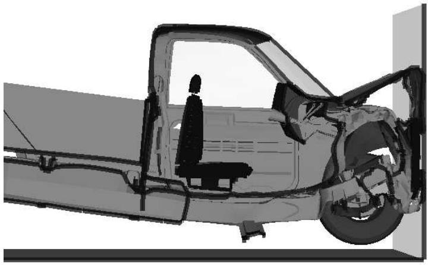

natural_image

车辆底盘的侧视技术插图，车内有一个人坐着，显示结构细节（无文字或符号）

图 1：通过卡车模型的纵向视图切割，切割平面上使用了自定义的绘图选项。

1.  在**可视化**模块的主菜单栏中，选择 **Options->View Cut**。

    **View Cut Options** 对话框出现。

提示：您也可以使用视图切割管理器来自定义切割选项。从主菜单栏，选择 **Tools->View Cut->Manager**，然后在视图切割管理器中点击 **Options**。

2.  点击以下选项卡之一以选择您希望自定义的模型部分：**Below Cut**、**On Cut**、**Above Cut**。
3.  打开**使用这些选项**开关，将视图切割选项应用于模型的选定部分。或者，打开**使用当前绘图选项**开关，将通用绘图选项或（如适用）叠加绘图选项应用于模型的选定部分。
4.  点击以下选项卡以自定义当前视口中视图切割的外观：
    *   **Basic**：选择渲染样式和边可见性。
    *   **Color & Style**：控制模型边颜色和样式以及模型面颜色。
    *   **Other**：**Other** 页面包含以下选项卡：
        **Translucency**：控制着色渲染样式的半透明度。

    要了解如何自定义视图切割的渲染样式和其他显示特性，请参阅自定义绘图显示。

## 自定义活动视图切割上合力和合力矩的显示与计算

您可以使用**可视化**模块中视图切割的自由体选项来自定义活动视图切割上显示的合力和合力矩的计算方式，并自定义求和点和坐标系变换。

您可以指定适用于所有视图切割的通用自由体选项，或特定于某个视图切割的选项。Abaqus/CAE 可以通过切割显示组、单元集或整个模型来计算合力和合力矩。您还可以自定义当前视口中所有自由体切割的内容和外观；请参阅自定义自由体切割的常规显示选项。
仅当查看输出数据库的视图截面时，才能显示合力和力矩数据。当在**可视化**模块中显示当前模型数据库的模型时，您无法为视图截面显示此数据。

如果您比较变形和未变形形状图中的值，可能会观察到合力和力矩的不同值。出现这些差异可能是因为基于视图截面的自由体力计算对整个面积上的应力场进行积分，并且，如果切换绘图状态，构成视图截面的单元可能会改变，或者单元变形可能会改变横截面的面积。

默认情况下，对于您启用了合力和力矩显示的每个视图截面，Abaqus/CAE 只显示一次合力和力矩。如果需要，您还可以显示一系列矢量，以在整个模型或模型的一部分中以规则间隔显示合力和力矩数据。

1.  在**可视化**模块的主菜单中，选择 **Options -> View Cut**。

    **View Cut Options**（视图截面选项）对话框随即出现。

    

    **提示**：您也可以使用视图截面管理器通过以下方法之一自定义截面选项：
    *   要指定所有视图截面通用的选项，请从主菜单栏选择 **Tools -> View Cut -> Manager**，然后单击 **Options**。
    *   要指定特定视图截面的选项，请从主菜单栏选择 **Tools -> View Cut -> Manager**，然后单击您想要指定选项的视图截面右侧的图标。

2.  单击 **Free Body**（自由体）选项卡。
3.  如果您正在定义截面特定选项，请选择 **Use these options**（使用这些选项）。
4.  从 **Computation based on**（基于以下计算）选项中：
    *   选择 **Cutting through a display group**（穿过显示组进行切割），然后选择一个显示组，以基于穿过所选显示组的视图截面计算合力和力矩。默认情况下，将选择当前显示组。
    *   选择 **Cutting through an element set**（穿过单元集进行切割），然后在输出数据库中选择一个单元集，以基于穿过所选集的视图截面计算合力和力矩。
    *   选择 **Cutting through the whole model**（穿过整个模型进行切割），以基于穿过整个模型的视图截面计算合力和力矩。

5.  如果需要，可为视图截面产生的合力和力矩矢量自定义求和点或坐标系变换选项。
    a. 从 **Summation point**（求和点）选项中，选择合力和力矩矢量的原点三维位置。
        *   选择 **Centroid of cut**（截面质心），自动将求和点放置在视图截面表面的质心处。

            

            **注意**：
            当视图截面穿过壳时，质心基于长度乘以壳厚度。
            当视图截面穿过梁时，质心位于节点连接线上。

        *   选择 **User-defined**（用户定义），并在空间中指定自定义三维位置，或者单击从视口选择求和点。求和点将在视口中高亮显示。

    b. 从 **Component resolution**（分量解析）选项中，您可以指定当矢量以分量形式显示时进行的坐标系变换。（有关以分量形式显示力和力矩矢量的更多信息，请参阅自定义自由体截面的通用显示选项。）
        *   选择 **Normal and tangential**（法向和切向），使分量矢量与您选择的表面的法线和切线对齐。
            *   如果需要，为分量矢量的切线指定 **Y-axis value**（Y 轴值）。当您在视图截面切片上显示一系列自由体截面时，此选项允许您为切线矢量强制统一方向。
        *   选择 **CSYS**（坐标系）和一个坐标系，将分量矢量转换到自定义坐标系。或者，您也可以单击 **Create** 创建新的基准坐标系。

        **Component resolution**（分量解析）选项仅当在 **Free Body Plot Options**（自由体绘图选项）对话框中选择了分量矢量显示时，才会影响合力和力矩的显示。

6.  如果可用，请切换打开 **Show heat flow rate**（显示热流率），以显示穿过视图截面的能量/时间形式的热流率。

7.  如果您想要自定义在活动视图截面和使用**自由体**工具集创建的视图截面上显示的自由体截面的内容和外观，请单击访问 **Free Body Plot Options**（自由体绘图选项）；如果您正在定义截面特定选项，则此选项不可用。参见自定义自由体截面的通用显示选项。

8.  单击 **OK**。

默认情况下，视图截面仅在您会话期间持续存在。如果您希望保留已定义的视图截面以供后续会话使用，可以将其保存到 XML 文件、模型数据库或输出数据库中。有关更多信息，请参阅管理会话对象和会话选项。

9.  单击 **Apply**（应用）以实施更改。

视图截面将更改以反映您的规格。

默认情况下，您的更改将在会话期间保存，并将影响该视口中的所有后续视图截面。如果您希望为后续会话保留更改，请将其保存到文件。有关更多信息，请参阅保存自定义设置以供后续会话使用。

## 自定义切片选项

视图截面切片类似于视图截面的切割部分，但它们显示在活动视图截面范围内的一系列间隔处，而不仅仅在切割平面上。

您可以使用**可视化**模块中 **Slicing**（切片）选项卡页面上的设置，沿活动视图截面的范围显示一系列视图截面切片。您可以沿活动视图截面的范围以规则间隔显示视图截面切片，也可以沿会话中预定义的路径显示切片。当您启用切片时，还可以在模型该位置显示合力和力矩。

您可以指定适用于所有视图截面的通用切片选项，或适用于特定视图截面的特定切片选项。视图截面切片仅在**可视化**模块中且仅当单个视图截面处于活动状态时才能启用。但是，如果您定义了截面特定切片选项并为多个活动视图截面获取报告，则这些切片选项将在自由体计算中被考虑。您可以为平移和旋转视图截面显示显示切片。切片沿活动视图截面的整个范围显示，无论在**视图截面管理器**的 **Motion of Selected Cut**（选定截面移动）选项中视图截面的位置如何重新定位。对于旋转视图截面，您还可以旋转切片并更改其旋转轴。

如果在具有大量折叠或曲率的模型中沿路径启用视图截面切片，切片的切割表面有时可能会同时穿过模型的不同部分。您可以通过聚焦于模型的子集来限制或消除此行为：使用显示组隐藏模型的一部分，或者更改路径定义，使得切片仅沿一些弯曲部分显示。

1.  在**可视化**模块的主菜单栏中，选择 **Options -> View Cut**。

    **View Cut Options**（视图截面选项）对话框随即出现。

    

    **提示**：您也可以使用视图截面管理器通过以下方法之一自定义截面选项：
    *   要指定所有视图截面通用的选项，请从主菜单栏选择 **Tools -> View Cut -> Manager**，然后单击 **Options**。
    *   要指定特定视图截面的选项，请从主菜单栏选择 **Tools -> View Cut -> Manager**，然后单击您想要指定选项的视图截面右侧的图标。

2.  单击 **Slicing**（切片）选项卡。
3.  如果您正在定义截面特定选项，请选择 **Use these options**（使用这些选项）。
4.  切换打开 **Display slicing**（显示切片）以在您的会话中为视图截面启用切片。
5.  如果您希望沿视图截面的整个范围显示视图截面切片，请选择 **Step through the active view cut's range**（遍历活动视图截面的范围）。如果您为选定视图截面在多个位置显示视图截面切片或自由体截面，您还可以自定义 Abaqus/CAE 将显示合力和力矩的线段的最小和最大值。默认情况下，最小和最大值设置为允许切片分布在整个模型中。
6.  如果您希望沿预定义路径显示视图截面切片，请选择 **Step along a predefined path**（沿预定义路径步进），然后执行以下操作：
    a. 选择路径。
    b. 使用 **Display slices at path nodes**（在路径节点处显示切片）选项指定您希望显示视图截面切片的位置：
        *   切换打开此选项，将视图截面切片放置在构成路径定义的节点处。
        *   切换关闭此选项，将视图截面切片放置在沿路径的多个规则间隔处。使用对话框底部的字段和滑块指定切片数量。
c. 使用 **Set free body summation point on the path** 选项指定合力与合力矩的求和点位置：

•   勾选此选项，将合力与合力矩的求和点放置在所选路径上。  
•   取消勾选此选项，将合力与合力矩的求和点放置在合力矩所参照的位置。

7.  点击 **Apply** 以应用您的更改。

视图剖切将更新以反映您的设置。

默认情况下，您的更改在本次会话期间会被保存，并会影响该视口中所有后续的视图剖切。如果您希望将更改保留至后续会话，请将其保存到文件。

更多信息，请参阅 保存自定义设置以便后续会话使用。

## 附加信息

•   在模型中创建路径

## 使用插件

本节描述如何使用插件和 **Plug-in toolset** 来扩展 Abaqus/CAE 的功能。

## 本节内容:

The Plug-in toolset  
Abaqus 插件

**Plug-in toolset** 将插件文件加载到 Abaqus/CAE 中。

## 本节内容:

什么是插件？  
我可以在哪里获取插件？  
如何获取关于某个插件的信息？  
一个 Python 模块和函数的示例  
我能用 GUI 插件做什么？  
如何使插件在 Abaqus/CAE 中可用？  
内核插件是如何执行的？  
覆盖插件  
GUI 插件是如何执行的？  
隐藏插件的源代码  
在启动时显示导入插件的异常  
Abaqus/CAE 模块与插件  
如何提供关于某个插件的信息？

---

[上一节：使用工具集](toolsets.md) · [下一节：使用插件](plugins.md)
