# 与 Abaqus/CAE 交互

本指南是 Abaqus/CAE（包括 Abaqus/Viewer）的主要参考文档。

## Abaqus/CAE

Abaqus/CAE 是一个完整的 Abaqus 环境，为创建、提交、监控和评估来自 Abaqus/Standard 和 Abaqus/Explicit 模拟的结果提供了一个简单、一致的界面。Abaqus/CAE 被划分为多个模块，每个模块定义了建模过程中的一个逻辑方面；例如，定义几何形状、定义材料属性和生成网格。当您从一个模块切换到另一个模块时，您就在构建模型，Abaqus/CAE 会根据此模型生成一个输入文件，您可以将其提交给 Abaqus/Standard 或 Abaqus/Explicit 分析产品。分析产品执行分析，向 Abaqus/CAE 发送信息以便您监控作业的进度，并生成一个输出数据库。最后，您可以使用 Abaqus/CAE 的可视化模块（也单独授权为 Abaqus/Viewer）来读取输出数据库并查看分析结果。

## Abaqus/Viewer

Abaqus/Viewer 提供了 Abaqus 有限元模型和结果的图形化显示。Abaqus/Viewer 作为可视化模块集成到 Abaqus/CAE 中。

本指南的这一部分向您介绍 Abaqus/CAE 的工作环境。

## 本节内容：

- [简介](##简介)
- [与 Abaqus/CAE 交互的基础知识](##使用本指南)
- 理解 Abaqus/CAE 的窗口、对话框和工具箱
- 管理画布上的视口
- 操作视图和控制透视
- 在视口内选择对象
- 配置图形显示选项
- [打印视口](##打印视口)


## 简介

本指南是关于使用 Abaqus/CAE 的完整参考。

本节提供了有关本指南内容和所使用的印刷约定的信息。

## 使用本指南

本指南是关于使用 Abaqus/CAE（包括 Abaqus/Viewer，这是 Abaqus/CAE 的一个子集，仅包含可视化模块）的完整参考。

通常，本指南中任何对可视化模块的引用也同样适用于 Abaqus/Viewer。

Abaqus/CAE 的用户界面非常直观，无需大量准备即可开始工作。但是，在首次使用该产品之前，您可能会发现阅读《Abaqus/CAE 入门指南》末尾的教程很有用。如果您运行的是 Abaqus/Viewer，则仅适用于“查看分析输出”部分。

本指南分为以下部分：

*   与 Abaqus/CAE 交互 — 包含关于用户界面的一般信息。
*   使用 Abaqus/CAE 模型数据库、模型和文件 — 包含有关 Abaqus/CAE 创建和使用的各种文件的信息。
*   使用 Abaqus/CAE 模块创建和分析模型 — 详细讨论了 Abaqus/CAE 的每个模块，但可视化模块除外。
*   建模技术 — 讨论如何在 Abaqus/CAE 模型中定义特殊的工程特征，并讨论跨越多个 Abaqus/CAE 模块的建模技术。
*   查看结果 — 详细讨论了可视化模块（Abaqus/Viewer）。
*   使用工具集 — 包含有关所有 Abaqus/CAE 模块中工具集的信息（可视化模块在“查看结果”中讨论）。
*   自定义模型显示 — 包含自定义信息。
*   使用插件 — 讨论如何使用插件和插件工具集来扩展 Abaqus/CAE 的功能。

Abaqus 关键字浏览器表和输入文件读取器的关键字支持提供了表格，您可以使用它们来确定哪个 Abaqus/CAE 模块体现了特定 Abaqus 关键字的功能，以及特定关键字是否受支持。特殊单元类型列出了 Abaqus 中用于不属于网格的模型特征的单元类型。特殊图形符号解释了 Abaqus/CAE 使用的特殊图形符号的含义。单元和输出变量支持列出了可视化模块不支持的 Abaqus 输出变量。


## 与 Abaqus/CAE 交互的基础知识

在开始创建和分析模型或解释分析结果之前，熟悉与 Abaqus/CAE 交互的基础知识是很有帮助的。本章向您介绍用户界面。

## 本节内容：

启动和退出 Abaqus/CAE
Abaqus/CAE 主窗口
什么是模块？
什么是工具集？
在 Abaqus/CAE 中使用鼠标
获取帮助

## 启动和退出 Abaqus/CAE

本节说明如何启动和退出 Abaqus/CAE。

启动 Abaqus/CAE（或 Abaqus/Viewer）
退出 Abaqus/CAE 会话
处理 abaqus_2025.gpr 文件
从非活动会话保存模型数据

### 启动 Abaqus/CAE（或 Abaqus/Viewer）

当您创建并分析模型时，Abaqus/CAE 会生成一组文件，其中包含模型的定义、分析输入和分析结果。此外，Abaqus/CAE 和 Abaqus/Viewer 会生成重放文件，反映您与应用程序的所有交互。

因此，在运行任一产品之前，您应移动到一个拥有创建文件权限的目录。

您通过运行 abaqus 执行过程并指定 cae（或 viewer）参数来执行 Abaqus/CAE（或 Abaqus/Viewer）：

```powershell
abaqus cae or viewer[database = database-file][replay = replay-file][recover = journal-file][startup = startup-file][script = script-file][noGUI = noGUI-file][noenvstartup][noSavedOptions][noSavedGuiPrefs][noStartupDialog][custom = script-file][[guiTester][GUI-script]][guiRecord][guiNoRecord]
```

您可以在命令行中包含以下选项：

*database*

此选项指定要打开的模型数据库文件或输出数据库文件的名称。您可以在 Abaqus/CAE 中打开任一类型的文件；在 Abaqus/Viewer 中只能打开输出数据库文件。要指定模型数据库文件，请在文件名中包含 `.cae` 文件扩展名或不包含文件扩展名。要在运行 Abaqus/CAE 时指定输出数据库文件，请在文件名中包含 `.odb` 文件扩展名。如果您运行的是 Abaqus/Viewer，则可以省略 `.odb` 文件扩展名。

*replay*

此选项指定要从中重放 Abaqus/CAE 命令的文件名。replay-file 中的命令将在 Abaqus/CAE 启动后立即执行。您不能使用 replay 选项执行包含控制流语句的脚本。有关更多信息，请参阅重放 Abaqus/CAE 会话。

*recover*

此选项指定要从中重建模型数据库的文件名；如果您运行的是 Abaqus/Viewer，则此选项不可用。journal-file（model\_database\_name.jnl）中的命令将在 Abaqus/CAE 启动后立即执行。有关更多信息，请参阅重新创建已保存的模型数据库和重新创建未保存的模型数据库。

*startup*

此选项指定一个包含 Python 配置命令的文件名，这些命令将在应用程序启动时运行。此文件中的命令会在环境文件中设置的任何配置命令之后执行。当这些命令执行时，Abaqus/CAE 不会将其回显到重放文件中。

可以通过在命令行上输入 `--`，后跟一个或多个空格分隔的参数，将参数传递到文件中。这些参数将被 Abaqus/CAE 执行过程忽略，但在脚本中可以访问它们。

*script*

与 startup 相同。

*noGUI*

此选项指定一个包含 Python 脚本的文件名，该脚本将在没有图形用户界面 (GUI) 的情况下运行。此选项对于自动化分析前或分析后处理任务非常有用，无需额外运行显示界面。由于不提供界面，脚本不能包含任何用户交互。Abaqus/CAE 运行文件中的命令，并在完成后退出。如果未指定文件扩展名，则默认扩展名为 `.py`。如果使用 `noGUI` 选项，Abaqus/CAE 将忽略您提供的任何其他命令行选项。

可以通过在命令行上输入 `--`，后跟一个或多个空格分隔的参数，将参数传递到文件中。这些参数将被 Abaqus/CAE 执行过程忽略，但在 Python 脚本中可以访问它们。如果使用 `noGUI` 选项，您可以使用参数传入一个变量，该变量在其他情况下将由命令行选项提供。例如，您可以传入一个文件名，该文件名在其他情况下将由 `script` 选项指定。

`noGUI` 选项的示例用法可在 Abaqus/CAE 执行中找到。

*noenvstartup*

此选项指定在应用程序启动时不应运行环境文件中的任何配置命令。此选项可与 `startup` 命令结合使用，以抑制除启动文件中的命令之外的所有配置命令。

*noSavedOptions*

此选项指定 Abaqus/CAE 不应应用存储在 `abaqus_2025.gpr` 文件中的显示选项设置（例如，渲染样式和基准平面的显示）。更多信息，请参阅使用 abaqus_2025.gpr文件，以及保存您的显示选项设置。

*noSavedGuiPrefs*

此选项指定 Abaqus/CAE 不应应用存储在 `abaqus_2025.gpr`文件中的 GUI 选项设置（例如，Abaqus/CAE 主窗口或其对话框的大小和位置）。

*noStartupDialog*

此选项指定不应显示 Abaqus/CAE 或 Abaqus/Viewer 的“开始会话”对话框。

*custom*

此选项指定包含 Abaqus GUI Toolkit 命令的文件名。此选项执行一个应用程序，该应用程序是 Abaqus/CAE 或 Abaqus/Viewer 的自定义版本。更多信息，请参阅简介。

*guiTester*

此选项启动一个单独的用户界面，其中包含 Abaqus Python 开发环境以及 Abaqus/CAE 或 Abaqus/Viewer。Abaqus Python 开发环境允许您创建、编辑、逐步执行和调试 Python 脚本。更多信息，请参阅 Abaqus Python 开发环境。

您可以为此选项指定一个脚本作为参数，这将提示 Abaqus/CAE 或 Abaqus/Viewer 运行 GUI 脚本。当脚本到达结尾时，Abaqus/CAE 或 Abaqus/Viewer 会关闭。

*guiRecord*

此选项使您能够将您在 Abaqus/CAE 或 Abaqus/Viewer 用户界面中的操作记录到名为 `abaqus.guiLog` 的文件中。在 GUI 中创建操作记录可以帮助您捕获并在 Abaqus/CAE 或 Abaqus/Viewer 中重放常见活动，用于演示或培训目的。您可以在 Abaqus Python 开发环境 (PDE) 中运行文件来重现 `.guiLog` 文件中的所有操作；更多信息，请参阅运行脚本。

如果需要，您可以使用环境变量 `ABQ_CAE_GUIRECORD` 在启动时设置 `guiRecord`。`guiRecord` 选项不能与 `guiTester` 选项一起使用。

*guiNoRecord*

此选项使您能够在设置环境变量 `ABQ_CAE_GUIRECORD` 时禁用用户界面录制。

Abaqus/CAE 启动。如果您不包含 `database`、`replay`、`recover` 或 `noStartupDialog` 选项，则会出现“开始会话”对话框。选择以下会话启动选项之一：

### 创建模型数据库：使用标准/显式模型

使用此选项（如果您正在运行 Abaqus/Viewer 则不可用）开始新的 Abaqus/Standard 或 Abaqus/Explicit 分析（相当于从主菜单栏选择文件 -> 新建模型数据库 -> 使用标准/显式模型）。

### 创建模型数据库：使用电磁模型

使用此选项（如果您正在运行 Abaqus/Viewer 则不可用）开始电磁分析（相当于从主菜单栏选择文件 -> 新建模型数据库 -> 使用电磁模型）。

### 打开数据库

使用此选项打开先前保存的模型数据库或输出数据库文件（相当于从主菜单栏选择文件 -> 打开）。

### 运行脚本

使用此选项运行包含 Abaqus/CAE 命令的文件（相当于从主菜单栏选择文件 -> 运行脚本）。更多信息，请参阅创建和运行您自己的脚本。

### 开始教程

使用此选项开始在线文档中的入门教程（相当于从主菜单栏选择帮助 -> 入门指南）。

### 最近文件

使用此选项打开最近在 Abaqus/CAE 中打开的五个模型数据库文件或输出数据库文件之一（相当于从文件菜单下选择列出的最近文件之一）。

### 退出 Abaqus/CAE 会话

您可以随时通过从主菜单栏选择文件 -> 退出来退出 Abaqus/CAE 会话。如果您对当前模型数据库进行了任何更改，Abaqus/CAE 会询问您是否要在退出会话前保存更改。然后 Abaqus/CAE 会关闭当前模型或输出数据库以及所有窗口，并退出会话。

Abaqus/CAE 会保存您的 GUI 设置；例如，主窗口的大小以及对话框的大小和位置。更多信息，请参阅使用 abaqus_2025.gpr 文件，以及了解 Abaqus/CAE GUI 设置。此外，Abaqus/CAE 会自动创建一个名为 `abaqus.rpy` 的文件，记录您在会话期间的操作；您可以使用此文件重现您的操作。有关重现操作和恢复中断会话的更多信息，请参阅重新创建未保存的模型数据库。

### 其他信息

• 了解通过创建和分析模型生成的文件  
• 使用文件菜单

### 使用 abaqus_2025.gpr 文件

您主目录中的 `abaqus_2025.gpr` 文件存储 GUI 设置（例如主窗口的大小）以及显示选项设置（例如渲染样式）。您也可以将显示选项设置存储在主目录之外的目录中的 `abaqus_2025.gpr` 文件中。如果您在指定 `noSavedOptions` 的情况下启动 Abaqus/CAE，Abaqus/CAE 将不会应用存储在 `abaqus_2025.gpr` 文件中的显示选项设置（例如，渲染样式和基准平面的显示）。更多信息，请参阅启动 Abaqus/CAE（或 Abaqus/Viewer）。

### 当您启动 Abaqus/CAE 时

• GUI 设置从您主目录中的 `abaqus_2025.gpr` 文件读取。  
• 显示选项设置从您启动 Abaqus/CAE 的目录中的 `abaqus_2025.gpr` 文件读取。  
如果该目录中没有 `abaqus_2025.gpr` 文件，但存在较早版本的 `.gpr` 文件，Abaqus/CAE 将尝试应用该文件中指定的设置，并创建一个 `abaqus_2025.gpr` 文件来存储这些设置。  
如果该目录中没有 `.gpr` 文件，则显示选项设置将从您主目录中的 `abaqus_2025.gpr` 文件读取。

### 在 Abaqus/CAE 会话期间

您可以使用文件 -> 保存显示选项将显示选项设置保存到您主目录或当前目录中的 `abaqus_2025.gpr` 文件。更多信息，请参阅保存您的显示选项设置。此保存选项不适用于 GUI 设置。

### 当您退出 Abaqus/CAE 时

您的 GUI 设置会自动保存到您主目录中的 `abaqus_2025.gpr` 文件。更多信息，请参阅了解 Abaqus/CAE GUI 设置。

您可以使用 Abaqus 脚本接口中的 API 命令编辑 `abaqus_2025.gpr` 文件；更多信息，请参阅编辑显示首选项和 GUI 设置。您也可以删除该文件以恢复默认的 GUI 和显示选项设置。

### 从非活动会话保存模型数据

Abaqus/CAE 和 Abaqus/Viewer 包含一个非活动计时器。如果应用程序长时间处于非活动状态，许可证令牌将被返回给服务器，以使其可供其他用户使用。如果服务器连接丢失或无法获取新的许可证令牌，您的会话不会结束。相反，当没有可用许可证时，会出现一个对话框，列出您的选项。对于 Abaqus/CAE 和 Abaqus/Viewer，您可以尝试重新获取许可证或退出应用程序。对于 Abaqus/CAE，您还可以选择保存当前模型数据库。保存模型允许您保留任何尚未保存的已完成模型信息；任何部分完成的信息，例如在丢失许可证时处于活动状态的过程，将不会保存。一旦保存了模型数据库，对话框中将只剩下重新获取和退出选项。Abaqus/Viewer 中不提供保存选项，因为所有影响输出数据库的更改在您进行时都会立即保存。
默认时间限制为60分钟。您可以通过在 Abaqus 环境文件（abaqus_v6.env）中使用 cae_timeout 环境变量来更改此限制。有关环境文件的更多信息，请参阅使用 Abaqus 环境文件。

### 附加信息

• 无许可证情况下保存当前模型数据库  
• 许可证管理参数

## Abaqus/CAE 主窗口

本节概述了主窗口，并解释了在会话期间如何操作和控制窗口中的元素。

## 本节内容：

主窗口的组件  
主菜单栏的组件  
工具栏的组件  
上下文栏  
视口的组件

## 主窗口的组件

您通过主窗口与 Abaqus/CAE 交互，窗口的外观会随着您完成建模过程而变化。图1显示了主窗口中出现的组件。

  
图1：主窗口的组件。

这些组件是：

### 标题栏

标题栏指示您正在运行的 Abaqus/CAE 版本以及当前模型数据库的名称。

### 菜单栏

菜单栏包含所有可用的菜单；通过菜单可以访问产品中的所有功能。根据您从上下文栏选择的模块，菜单栏中会出现不同的菜单。有关更多信息，请参阅主菜单栏的组件。

### 工具栏

工具栏提供对菜单中也存在项目的快速访问。有关更多信息，请参阅工具栏的组件。

### 上下文栏

Abaqus/CAE 被划分为一组模块，每个模块允许您处理模型的一个方面；上下文栏中的模块列表允许您在这些模块之间切换。上下文栏中的其他项目取决于您正在工作的模块。例如，上下文栏允许您在创建模型几何时检索现有部件，或更改与当前视口关联的输出数据库。同样，在网格模块中，您可以选择显示装配体还是特定部件。有关更多信息，请参阅上下文栏。

### 模型树

模型树为您提供模型及其包含对象的图形概览，例如部件、材料、分析步、载荷和输出请求。此外，模型树提供了一个方便、集中的工具，用于在模块之间移动和管理对象。如果您的模型数据库包含多个模型，您可以使用模型树在模型之间切换。当您熟悉模型树后，您会发现可以快速执行主菜单栏、模块工具箱和各种管理器中的大多数操作。有关更多信息，请参阅模型树。

### 结果树

结果树为您提供输出数据库和其他会话特定数据（如 X-Y 图）的图形概览。如果您的会话中打开了多个输出数据库，您可以使用结果树在输出数据库之间切换。当您熟悉结果树后，您会发现可以快速执行可视化模块中主菜单栏和工具箱中的大多数操作。有关更多信息，请参阅结果树。

### 工具箱区域

当您进入一个模块时，工具箱区域会显示适用于该模块的工具。工具箱允许快速访问许多模块功能，这些功能也可以从菜单栏获得。有关更多信息，请参阅理解和使用工具箱及工具栏。

### 画布和绘图区域

画布可以被认为是一个无限的屏幕或公告板，您可以在其上放置视口；有关更多信息，请参阅管理画布上的视口。绘图区域是画布的可见部分。您可以使用视图菜单全屏显示绘图区域；也可以按 [F11] 在全屏模式和普通模式之间切换。

### 视口

视口是画布上的窗口，Abaqus/CAE 在其中显示您的模型。有关更多信息，请参阅管理画布上的视口。

### 提示区域

提示区域显示在操作过程中您需要遵循的说明；例如，在创建集时，它会要求您选择几何体。在可视化模块中，提示区域会显示一组按钮，允许您在分析步和帧之间移动。有关更多信息，请参阅在操作过程中使用提示区域。

### 消息区域

Abaqus/CAE 在消息区域打印状态信息和警告。要调整消息区域大小，请拖动顶部边缘；要查看已滚动出消息区域的信息，请使用右侧的滚动条。默认情况下会显示消息区域，但它使用的是与命令行界面相同的空间。如果您最近使用了命令行界面，则必须单击主窗口左下角以激活消息区域。


### 注意：

如果在命令行界面处于活动状态时添加了新消息，Abaqus/CAE 会将消息区域图标周围的背景颜色更改为红色。当您显示消息区域时，背景会恢复为正常颜色。

### 命令行界面

您可以使用命令行界面输入 Python 命令，并使用 Abaqus/CAE 内置的 Python 解释器计算数学表达式。该界面包括主要提示符 (>>>) 和次要提示符 (...)，以指示您何时必须缩进命令以符合 Python 语法。有关 Python 命令的更多信息，请参阅 Python 基础。

默认情况下，命令行界面是隐藏的，但它使用的是与消息区域相同的空间。单击主窗口左下角可从消息区域切换到命令行界面。


### 主菜单栏的组件

当您开始一个会话时，下面列出的菜单会出现在主菜单栏上。Abaqus/CAE 会根据当前使用的模块显示额外的菜单选项并提供对工具集的访问。

**文件（File）**

文件菜单中的项目允许您创建、打开和保存模型数据库；打开和关闭输出数据库；导入和导出文件；保存和加载会话对象和选项；运行脚本；管理宏；打印视口；以及退出 Abaqus/CAE。有关更多信息，请参阅使用文件菜单。

**模型（Model）**

模型菜单中的项目允许您打开、复制、重命名和删除当前模型数据库中的模型。有关更多信息，请参阅管理模型。

**视口（Viewport）**

视口菜单中的项目允许您创建或操作视口和视口注释。有关更多信息，请参阅管理画布上的视口。

**视图（View）**

视图菜单中的项目允许您操作视图、自定义模型或绘图外观的某些方面、控制显示性能、切换到全屏模式，以及关闭模型树、结果树和各个工具栏的显示。视图操作菜单中可用的部分操作在视图操作工具栏中也可用。有关更多信息，请参阅：

使用模型树和结果树  
管理画布上的视口  
操作视图和控制透视  
配置图形显示选项  
自定义绘图显示  
自定义工具集  
自定义几何和网格显示

**插件（Plug-ins）**

插件菜单中的项目允许您访问随 Abaqus/CAE 分发的插件或您已下载或创建的插件。有关更多信息，请参阅插件工具集。

**帮助（Help）**

帮助菜单中的项目允许您请求上下文相关帮助、搜索或浏览文档、访问学习社区，以及获取有关版本和许可证的信息。有关更多信息，请参阅获取帮助。


### 工具栏的组件

工具栏包含用于管理文件、过滤对象选择和查看模型的便捷工具集。

工具栏中的项目是主菜单栏中也可用功能的快捷方式。默认情况下，Abaqus/CAE 在主菜单栏下方的一行中显示所有工具栏。根据您的显示分辨率和主窗口的大小，Abaqus/CAE 可能会将一些工具栏放在第二行。

工具栏如下图所示：

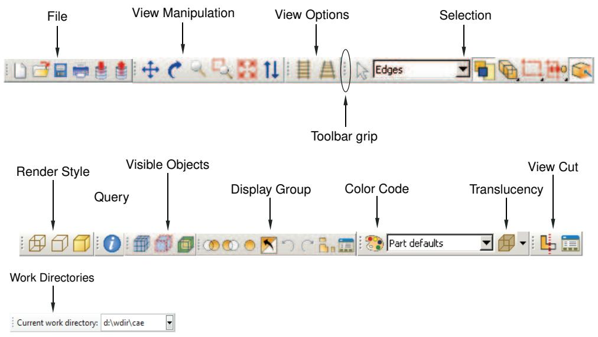

您可以使用工具栏的握柄更改工具栏的位置，如上图所示。单击并拖动握柄可以在主窗口内移动工具栏。如果您在工具栏位于主窗口四个可用停靠区域之一上方时释放工具栏握柄（参见图1），Abaqus/CAE 会将该工具栏“停靠”；停靠的工具栏没有标题栏，并且不会遮挡主窗口的任何其他部分。
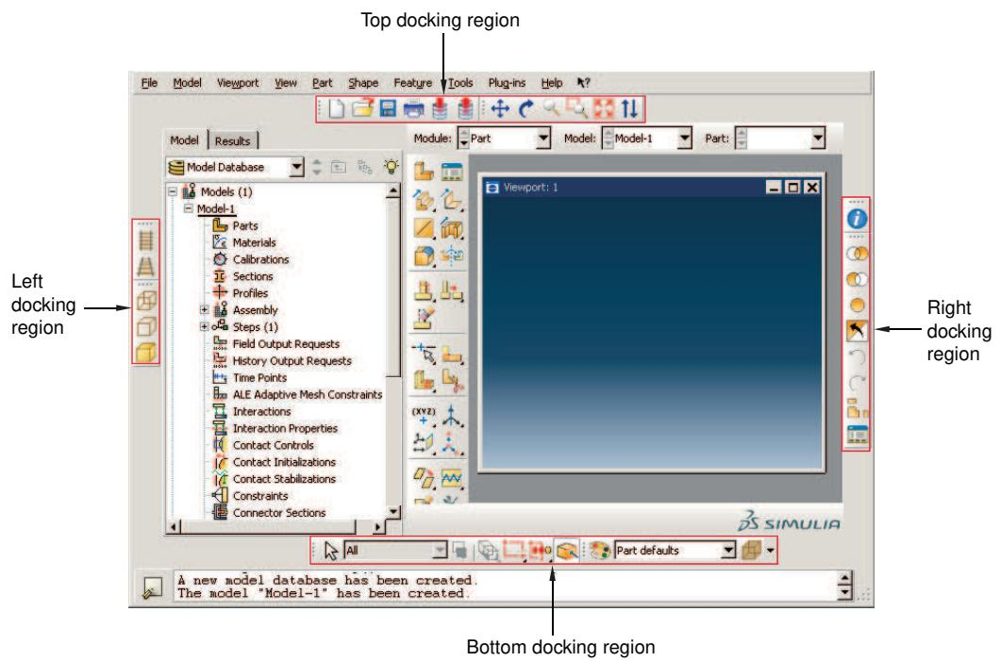  
图 1：工具栏的可用固定区域。

如果在工具栏未靠近固定区域时松开工具栏手柄，Abaqus/CAE 会创建一个带标题栏的浮动工具栏。浮动工具栏会遮挡主窗口中的其他项目（参见图 2）；但是，浮动工具栏可以放置在 Abaqus/CAE 主窗口之外。

  
图 2：浮动工具栏。

在工具栏手柄上点击鼠标第三键会显示一个菜单，允许您指定工具栏的位置和格式：

• 选择 **Top** 可将工具栏固定在顶部固定区域。  
• 选择 **Bottom** 可将工具栏固定在底部固定区域。  
• 选择 **Left** 可将工具栏固定在左侧固定区域。  
• 选择 **Right** 可将工具栏固定在右侧固定区域。  
• 选择 **Float** 可将固定的工具栏更改为浮动工具栏；此选项仅适用于固定的工具栏。  
• 选择 **Flip** 可将浮动工具栏的方向从水平更改为垂直，反之亦然；此选项仅适用于浮动工具栏。

您还可以隐藏工具栏并创建包含附加功能快捷方式的自定义工具栏。更多信息，请参见 The Customize toolset。

要获取工具栏中某个工具的简短描述，请将光标悬停在该工具上片刻；将出现一个包含描述的小框，即“工具提示”。要获取工具栏的名称，请将光标悬停在工具栏手柄上片刻。

Abaqus/CAE 工具栏包含以下功能：

**File（文件）**


File（文件）工具栏允许您创建、打开和保存模型数据库；打开输出数据库；打印视口；以及保存和加载会话对象与选项。更多信息，请参见 Working with Abaqus/CAE Model Databases, Models, and Files；Printing viewports；以及 Managing session objects and session options。

**Work Directories（工作目录）**


Work Directories（工作目录）工具栏允许您更改当前工作目录。工具栏中提供的列表包含五个最近使用的工作目录。更多信息，请参见 Setting the work directory。

**Viewport（视口）**


Viewport（视口）工具栏允许您创建和对齐视口、链接视口以及创建视口注释。更多信息，请参见 Managing viewports and viewport annotations from the Viewport toolbar。Viewport 工具栏默认不显示。

**View Manipulation（视图操作）**

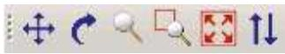

View Manipulation（视图操作）工具栏允许您指定模型或图表的不同视图。例如，您可以使用这些工具平移、旋转或缩放模型或图表。更多信息，请参见 Manipulating the view and controlling perspective。

**View Options（视图选项）**


View Options（视图选项）工具栏允许您指定是否对模型应用透视。更多信息，请参见 Controlling perspective。

**Views（视图）**

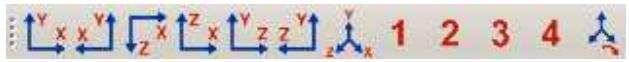

Views（视图）工具栏允许您将自定义视图应用于视口中的模型。更多信息，请参见 Custom views。Views 工具栏默认不显示。

**Render Style（渲染样式）**

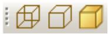

Render Style（渲染样式）工具栏允许您指定是使用线框、隐藏线还是着色渲染样式来显示模型。在 Visualization（可视化）模块中，Render Style 工具栏还包括填充渲染样式工具。更多信息，请参见 Choosing a render style。

**Visible Objects（可见对象）**

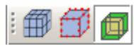

Visible Objects（可见对象）工具栏允许您在显示 Abaqus/CAE 原生部件的几何形状与同一部件的网格化表示之间切换，打开或关闭种子的显示，以及在网格化表示和参考表示存在时切换参考表示的显示。更多信息，请参见 Displaying a native mesh、What are mesh seeds? 和 Understanding the reference representation。

**Selection（选择）**

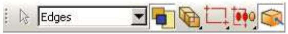

Selection（选择）工具栏允许您通过切换箭头图标来启用或禁用对象选择。您可以使用箭头右侧的列表来限制可选择的对象类型。Selection 工具栏仅在视口中没有活动过程运行时可用。更多信息，请参见 Selecting objects before choosing a procedure。

**Query（查询）**


Query（查询）工具集允许您获取有关模型几何形状和特征的信息、探测模型和 X–Y 图的输出数据，以及对结果执行应力线性化。更多信息，请参见 The Query toolset；Probing the model；和 Calculating linearized stresses。

**Display Group（显示组）**

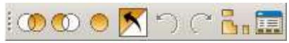

Display Group（显示组）工具栏允许您选择性地绘制一个或多个模型或输出数据库项目。例如，您可以创建一个仅包含模型中指定集合单元的显示组。更多信息，请参见 Using display groups to display subsets of your model。

**Color Code（颜色编码）**


Color Code（颜色编码）工具栏允许您自定义视口中项目的颜色并更改其半透明度。

对于颜色编码，您可以创建颜色映射，为显示的不同元素分配唯一的颜色。例如，使用部件实例颜色映射时，模型中的每个部件实例将以不同的颜色显示。更多信息，请参见 Color coding geometry and mesh elements。

对于半透明度，您可以单击工具右侧的箭头以显示一个滑块，您可以拖动该滑块来使显示颜色更透明或更不透明。更多信息，请参见 Changing the translucency。

**View Cut（视图切割）**

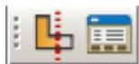

View Cut（视图切割）工具栏允许您在 Visualization 模块之外的其他模块中切换视图切割的显示，并自定义其定义和显示。更多信息，请参见 Cutting through a model。View Cut 工具栏默认显示；在 Visualization 模块中，视图切割选项在工具箱中可用。

**Field Output（场输出**


Field Output（场输出）工具栏允许您控制场输出变量显示的两个方面：

您可以选择要在当前视口中显示的场输出变量。选择内容包括场输出变量的类型（主要、变形或符号）、变量名称，以及（如果可用）所选主要变量的不变量和分量。  
• 对于变量类型的更改，您可以控制 Abaqus/CAE 是否自动将当前视口中的绘图状态与新的变量类型选择同步。如果该工具处于开启状态，Abaqus/CAE 将在新选择的场输出变量需要更改绘图状态时进行同步；如果此选项处于关闭状态，Abaqus/CAE 仍会更新视口中显示的输出变量，但不会更改当前视口中的绘图状态。

工具栏中的选择是有限的，但该工具在需要时提供对 Field Output（场输出）对话框的访问。有关工具栏中选项的更多信息，请参见 Using the field output toolbar。

**上下文栏**

上下文栏位于画布和绘图区域上方；您可以用它执行以下操作：

**选择当前模块**

上下文栏上的 Module 列表允许您在模块之间移动。（有关更多信息，请参见 What is a module?。）图 1 显示了上下文栏。要移动到不同的模块，您可以从列表中选择（右侧的箭头）或单击向上和向下箭头（左侧）移动到上一个或下一个模块。

  
图 1：Part 模块中的上下文栏。


## 注意：

Abaqus/Viewer 仅包含 Visualization 模块。

## 选择特定于模块的项目
在不同模块之间切换时，Abaqus/CAE 会在上下文栏显示附加项，帮助您选择当前操作的上下文。例如，当您处于 Part 模块或 Mesh 模块时，Abaqus/CAE 会在上下文栏中显示 Part 列表。该列表包含模型中的所有部件；您可以使用它来调取特定部件。这些列表还包括向上和向下导航箭头，允许您移动到列表中的上一个或下一个项目。

上下文栏还允许您在模型数据库中的模型之间切换，或更改与当前视口关联的输出数据库。上下文栏中的附加项是您当前所在模块的函数。

上下文栏中显示的项目始终指向当前视口（由深灰色标题栏指示）。例如，如果您在不同的视口中显示了不同的部件，上下文栏将显示当前视口中所显示部件的名称。

## 附加信息

• 什么是模块？  
• 什么是 Abaqus/CAE 模型？

## 视口的组件

图 1 显示了可视化模块中视口的组件。  
  
图 1：视口的组件。

视口标题和视口周围的边框称为视口装饰。图例、状态块、标题块、视图方向三轴架和 3D 罗盘称为视口注释。视图方向三轴架和 3D 罗盘指示当前显示的模型的方向。您可以通过单击并拖动 3D 罗盘来更改模型视图；视图方向三轴架上的三个垂直轴会随罗盘一起旋转，以指示当前的视图方向。有关更多信息，请参见 3D 罗盘和自定义视图三轴架。图例、状态块和标题块用于标识您使用可视化模块显示的结果。有关更多信息，请参见自定义视口注释。

## 附加信息

• 管理画布上的视口  
• 自定义视口注释

## 什么是模块？

Abaqus/CAE 被划分为称为模块的功能单元。每个模块只包含与建模任务特定部分相关的工具。例如，Mesh 模块仅包含创建有限元网格所需的工具，而 Job 模块仅包含用于创建、编辑、提交和监控分析作业的工具。Abaqus/Viewer 是 Abaqus/CAE 的子集，仅包含可视化模块。

您可以从上下文栏的 Module 列表中选择一个模块。或者，您可以通过切换到模型树中选定对象的上下文来选择模块；有关更多信息，请参见模型树。菜单和模型树中模块的顺序对应于创建模型所遵循的逻辑顺序。在许多情况下，您必须遵循这种自然顺序来完成建模任务；例如，您必须在创建部件之后才能创建装配体。尽管模块的顺序遵循逻辑序列，但 Abaqus/CAE 允许您在任何时候选择任何模块，无论模型的状态如何。

以下列出了 Abaqus/CAE 中可用的模块，简要描述了您可以在每个模块中执行的建模任务。该列表中的模块顺序对应于上下文栏的 Module 列表和模型树中的模块顺序：

**Part**

通过绘制草图或导入几何体来创建单个部件。有关更多信息，请参见 Part 模块。

**Property**

创建截面和材料定义，并将其分配给部件的区域。有关更多信息，请参见 Property 模块。

**Assembly**

创建和组装部件实例。有关更多信息，请参见 Assembly 模块。

**Step**

创建和定义分析步骤以及相关的输出请求。有关更多信息，请参见 Step 模块。

**Interaction**

指定模型区域之间的交互，例如接触。有关更多信息，请参见 Interaction 模块。

**Load**

指定载荷、边界条件和场。有关更多信息，请参见 Load 模块。

**Mesh**

创建有限元网格。有关更多信息，请参见 Mesh 模块。

**Optimization**

创建和配置优化任务。有关更多信息，请参见 Optimization 模块。

**Job**

提交作业进行分析并监控其进度。有关更多信息，请参见 Job 模块。

**Visualization**

查看分析结果和选定的模型数据。有关更多信息，请参见查看结果。

**Sketch**

创建二维草图。有关更多信息，请参见 Sketch 模块。

模块可以根据视口中显示的对象进行分类。当您处于 Part 和 Property 模块时，显示部件；当您处于 Assembly、Step、Interaction、Load、Mesh 和 Job 模块时，显示装配体；当您处于 Visualization 模块时，显示输出数据库结果。

主窗口的内容会随着您在模块之间移动而变化。从上下文栏的 Module 列表选择模块，或通过切换到模型树中选定对象的上下文，会导致上下文栏、模块工具箱和菜单栏发生变化，以反映当前模块的功能。

当您在模块之间移动时，Abaqus/CAE 会将当前视口与您选择的模块关联起来。您可以拥有多个视口，并且不同的视口可以与不同的模块关联。当您选择一个视口并将其设为当前视口时，与该视口关联的模块将成为当前模块。有关在视口之间移动的更多信息，请参见选择视口。

## 附加信息

• 上下文栏  
• 什么是视口？

## 什么是工具集？

工具集是一个功能单元，允许您执行特定的建模任务。

当您进入大多数模块时，主菜单栏会出现一个“Tools”（工具）菜单，其中包含与该模块相关的所有工具集。

在大多数情况下，您在一个模块中使用工具集创建的对象在其他模块中也很有用。例如，您可以使用 Set 工具集在 Assembly 模块中创建集，然后在 Load 模块中将边界条件应用到这些集上。大多数工具集包括管理器菜单和管理器对话框，允许您编辑、复制、重命名和删除使用该工具集创建的对象。

Abaqus/CAE 中提供以下工具集：

• Amplitude 工具集 允许您定义载荷、位移和其他指定变量的任意时间或频率变化。有关更多信息，请参见 Amplitude 工具集。  
Analytical Field 工具集 允许您创建分析场，可用于为选定交互和指定条件定义空间变化参数。有关更多信息，请参见 Analytical Field 工具集。  
Attachment 工具集 允许您创建附着点和线，可用于定义基于点和离散的紧固件、连接器的连接点，以及用于耦合定义、点质量、载荷或边界条件的区域。有关更多信息，请参见 Attachment 工具集。  
• CAD Connection 工具集 允许您创建连接，用于从 CATIA 和第三方 CAD 系统将部件关联导入 Abaqus/CAE。有关更多信息，请参见 CAD Connection 工具集。  
• Color Code 工具集 允许您自定义单个单元的边和填充颜色。有关更多信息，请参见为几何体和网格单元着色。  
• Coordinate System 工具集 允许您创建用于后处理的局部坐标系。有关更多信息，请参见在后处理期间创建坐标系。  
• Customize 工具集 允许您控制 Abaqus/CAE 工具栏的外观，创建自定义工具栏，并为许多 Abaqus/CAE 功能指定键盘快捷键。有关更多信息，请参见 Customize 工具集。  
• Datum 工具集 允许您创建基准点、轴、平面和坐标系，用于各种建模任务。有关更多信息，请参见 Datum 工具集。  
• Discrete Field 工具集 允许您创建空间变化场，其中值与节点或单元关联。有关更多信息，请参见 Discrete Field 工具集。  
• Display Group 工具集 允许您有选择地绘制一个或多个模型或输出数据库项目。有关更多信息，请参见使用显示组显示模型的子集。  
• Edit Mesh 工具集 允许您修改网格以提高网格质量。有关更多信息，请参见 Edit Mesh 工具集。  
• Feature Manipulation 工具集 允许您修改和管理模型中的现有特征。有关更多信息，请参见 Feature Manipulation 工具集。  
• Field Output 工具集 允许您对输出数据库中可用的场输出执行操作。有关更多信息，请参见创建和保存新的场输出。
• **Filter 工具集**允许您在分析模型时移除多余的输出数据（即噪声），同时不会降低所需数据范围的分辨率。更多信息，请参见 Filter 工具集。
• **Free Body 工具集**允许您在 Abaqus/CAE 的可视化（Visualization）模块中创建和自定义自由体切割。更多信息，请参见 Free Body 工具集。
• **Geometry Edit 工具集**允许您修复无效和不精确的导入部件。更多信息，请参见 Geometry Edit 工具集。
• **Partition 工具集**允许您将部件或装配件分割成多个区域。更多信息，请参见 Partition 工具集。

**Path 工具集**允许您指定穿过模型的一条路径，沿着该路径您可以获取和查看 X–Y 数据。更多信息，请参见沿路径查看结果。
• **Query 工具集**允许您获取关于模型的一般信息，并探测模型和 X–Y 图以获取输出数据。更多信息，请参见 Query 工具集。
• **Reference Point 工具集**允许您创建与部件或装配件关联的参考点。更多信息，请参见 Reference Point 工具集。
• **Set 工具集**和 **Surface 工具集**允许您根据模型的区域定义集合和面。更多信息，请参见 Set 和 Surface 工具集。
• **Stream 工具集**允许您显示流线以调查流体流动分析中的速度或涡度。更多信息，请参见 Stream 工具集。
• **Virtual Topology 工具集**允许您在为部件或部件实例划分网格时忽略细节，例如非常小的面和边。更多信息，请参见 Virtual Topology 工具集。
• **XY Data 工具集**允许您创建和操作 X–Y 数据对象。更多信息，请参见 X–Y 绘图。

## 在 Abaqus/CAE 中使用鼠标

Abaqus/CAE 文档中的许多操作过程都涉及使用三个鼠标按钮中的一个或多个。以下列表解释了每个鼠标按钮在与 Abaqus/CAE 交互时的作用：

## 鼠标按钮 1

您使用鼠标按钮 1 在视口中选择对象、展开下拉菜单以及从菜单中选择项目。文档中的“点击”、“选择”和“拖拽”说明均指鼠标按钮 1。

## 鼠标按钮 2

在视口中点击鼠标按钮 2 表示您已完成当前任务。例如：

从模型中选择实体：当您创建一个节点集时，您选择要包含在该集合中的节点。点击鼠标按钮 2 表示您的选择已完成，您可以创建该集合了。
• 使用工具：点击鼠标按钮 2 表示您已完成对视图操作工具的使用。

此外，在视口中点击鼠标按钮 2 等同于点击提示区中高亮的按钮。例如，如果您尝试从模型中选择节点，并且 Abaqus/CAE 显示了如下提示，那么点击鼠标按钮 2 将与点击 OK 具有相同的效果：


如果您的鼠标具有一个作为鼠标按钮 2 的滚轮，您可以通过垂直滚动滚轮来操作视口中模型或图表的视图。向下滚动可放大视口内容的视图，向上滚动可缩小视口内容的视图。

## 鼠标按钮 3

按下并保持鼠标按钮 3 可以访问一个弹出菜单，该菜单包含与当前过程相关的功能的快捷方式。例如，当您在创建几何集时在视口中按下鼠标按钮 3，Abaqus/CAE 会显示以下菜单：

<table><tr><td>选择选项完成</td></tr><tr><td>复制粘贴...</td></tr><tr><td>上一步取消过程</td></tr></table>

如果您在视口中使用鼠标按钮 3，弹出菜单中的大部分项目与提示区中的按钮是重复的。鼠标按钮 3 快捷方式也可用于从模型树（Model Tree）和结果树（Results Tree）中进行选择，如在模型树和结果树中使用弹出菜单所述。

## 获取帮助

Abaqus/CAE 的 HTML 文档可通过主菜单栏上的“帮助”（Help）菜单访问。本节简要介绍 HTML 在线文档，并说明如何使用“帮助”菜单查找信息。

本节描述的功能仅适用于 HTML 文档，不适用于 PDF 格式的指南。


## 注意：

• 在 Windows 平台上，帮助系统使用您默认的网络浏览器来显示在线文档。
在 Linux 平台上，帮助系统会在系统路径中搜索 Firefox。如果帮助系统找不到 Firefox，则会显示一个错误。

可以在环境文件中设置 `browser_type` 和 `browser_path` 变量来修改此行为。更多信息，请参见系统定制参数。

## 本节内容：

显示上下文相关帮助
浏览和搜索 HTML 指南
查找在线文档的特殊章节
查找有关关键字的信息
访问学习社区
获取有关版本和许可的信息

## 显示上下文相关帮助

您可以为在 Abaqus/CAE 中使用的任何图标、菜单或对话框显示详细的 HTML 帮助。

您可以使用主菜单栏上的帮助工具来为在 Abaqus/CAE 中使用的任何图标、菜单或对话框显示详细的 HTML 帮助。当您点击帮助工具，然后点击 Abaqus/CAE 窗口中的某个项目时，会出现一个帮助窗口，其中包含与该项目相关的在线文档章节。

## 在主窗口或对话框中显示某个项目的帮助

1.  点击主菜单栏上的帮助工具。


提示：您也可以从主菜单栏选择“帮助”->“关于上下文”（Help->On Context）。光标变为一个问号。

2.  将光标悬停在您需要帮助的项目上，然后点击鼠标按钮 1。
会出现一个帮助窗口。该窗口包含相应的在线文档和相关主题的链接。

## 使用 [F1] 键显示帮助

或者，您可以使用 [F1] 键来显示特定项目的帮助。在大多数情况下，您可以通过“帮助”菜单、帮助工具图标或 [F1] 键访问上下文相关帮助。但是，如果您寻求有关不允许访问帮助工具的菜单项或对话框的信息，则必须使用 [F1] 键。

1.  在 Abaqus/CAE 窗口中，点击您需要帮助的功能。如果该功能是菜单的一部分，请不要松开鼠标按钮。
2.  按下 [F1]。

会出现一个帮助窗口。该窗口包含相应的在线文档和相关主题的链接。如果您在未松开鼠标按钮的情况下选择了一个菜单项，则该菜单会消失。


## 注意：

Abaqus/CAE 还提供简短的“工具提示”（tooltips），描述工具箱和工具栏中工具的功能。要查看“工具提示”，请将光标悬停在工具上并保持静止片刻。

## 浏览和搜索 HTML 指南

您可以使用“帮助”菜单打开并浏览和搜索整个 HTML 文档集。

1.  从主菜单栏中，选择“帮助”->“搜索与浏览指南”（Help->Search & Browse Guides）。
    文档将在您的网络浏览器中打开，显示一个概述文档中各指南的主题。
2.  要查看特定指南，请在目录中点击“阿巴克斯”（Abaqus），然后点击感兴趣的标题。
    您选择的指南将在浏览器窗口中打开。
3.  使用以下任一技术浏览指南的内容：

## 浏览

展开和折叠目录以改变显示的详细程度。点击感兴趣的主题。您也可以使用网络浏览器的功能返回最近查看过的页面。

## 搜索

使用导航框架中的搜索面板搜索特定的单词或短语。

## 使用超链接

使用超链接从指南的一个部分移动到另一个部分，或从一个指南移动到另一个指南。

## 查找在线文档的特殊章节

以下“帮助”菜单项允许您显示可能对您有用的 HTML 文档章节：

## 关于模块（On Module）

选择“帮助”->“关于模块”（Help->On Module）可显示《Abaqus/CAE 用户指南》，打开到描述当前模块的章节开头。如果您尚未进入任何模块，该指南将打开到关于模块概念的描述部分。在任何一种情况下，您都可以根据需要阅读更多信息，并对整个指南进行文本搜索。

## 关于帮助（On Help）

选择“帮助”->“关于帮助”（Help->On Help）可显示《Abaqus/CAE 用户指南》，打开到描述如何使用帮助系统的章节。您也可以根据需要阅读更多信息，并对整个指南进行文本搜索。
## 入门指南

选择“帮助”->“入门指南”将显示一个部分，提供有关如何在 Abaqus/CAE 窗口中工作的基本信息。此部分还包含指向《Abaqus/CAE 入门指南》中有用教程的链接。

## 版本说明

选择“帮助”->“版本说明”将显示 Abaqus 版本说明。版本说明详细介绍了软件的新功能，并提供了更新和增强功能的列表。

## 查找关键字信息

关键字浏览器是一个可滚动的表格，包含以下信息：

• 每个关键字的用途。
• 包含与每个关键字关联的功能的 Abaqus/CAE 模块或工具集。

要查看关键字浏览器，请从主菜单栏中选择“帮助”->“关键字浏览器”。例如，您可以使用关键字浏览器来验证 `*ELASTIC` 选项是否允许您指定弹性材料属性，以及 Property 模块是否为与此关键字关联的 Abaqus/CAE 模块。

关键字浏览器还包含指向在线文档中相关章节的超链接。您可以单击表中的特定关键字以显示有关该关键字功能的详细信息。您也可以单击表中模块或工具集的名称，以在 Abaqus/CAE 用户指南中查看相关文档。

1. 从主菜单栏中，选择“帮助”->“关键字浏览器”。
   Abaqus/CAE 用户指南将打开一个显示 Abaqus 关键字及其关联模块的表格。
2. 在“关键字”列中，单击感兴趣的关键字以查看描述该关键字的在线文档。
3. 在“模块”列中，单击感兴趣的模块或工具集名称以查看关于该模块或工具集的在线文档。

## 访问学习社区

您可以通过 https://www.3ds.com/products-services/simulia/simulia-academic-program/learning-community/ 访问学习社区。学习社区包含在线教程和技术内容。该社区还设有一个问答区，使全球用户社区能够分享他们的专业知识，并学习如何利用 SIMULIA 产品组合中可用的最新功能和增强功能。

## 获取关于版本和许可的信息

以下“帮助”菜单项允许您获取更多信息：

## 关于 Abaqus

选择“帮助”->“关于 Abaqus”可确定您当前使用的 Abaqus/CAE 版本。Abaqus 还提供了 Abaqus/CAE 所使用的开源软件（例如 Python）的版本信息位置。

## 关于许可

选择“帮助”->“关于许可”可确定产品许可信息。Abaqus 会显示您的站点标识、许可服务器名称、您的许可以及您站点可用的许可总数。

本章介绍了如何与整个 Abaqus/CAE 应用程序中出现的各种窗口、对话框和工具箱进行交互。

## 本节内容：

在操作过程中使用提示区
与对话框交互
理解并使用工具箱和工具栏
管理对象
使用模型树和结果树
理解 Abaqus/CAE 图形用户界面设置

## 在操作过程中使用提示区

本节说明如何利用 Abaqus/CAE 在提示区中显示的程序化步骤。

## 本节内容：

什么是程序？
在提示区中遵循指示并输入数据
在操作过程中使用鼠标快捷方式

## 什么是程序？

Abaqus/CAE 中的许多任务被分解为按步骤进行的程序。例如，在草图器中创建圆弧是一个三步程序：

2. 选取起点。
3. 选取终点。

1. 选取圆弧的圆心。

Abaqus/CAE 在主窗口底部附近的提示区中显示程序的每个步骤，这样您就不需要记住所有步骤及其顺序。

## 附加信息

• 在操作过程中使用提示区

## 在提示区中遵循指示并输入数据

要使用一个程序，只需遵循显示在主窗口底部附近提示区中的指示。

例如，按如下所示遵循指示：

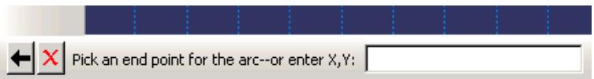

上图中标记为 X 的按钮是“取消”按钮；单击此按钮可随时取消整个程序。“取消”按钮左侧的箭头是“上一步”按钮；单击它可结束程序的当前步骤并返回到上一步。（在任何程序的第一步期间，“上一步”按钮会显示为灰色/不可用。）如果您愿意，也可以将光标放在画布上并按下鼠标按钮 3；然后从出现的菜单中选择“上一步”或“取消程序”。

在某些耗时的操作（例如部件修复、网格划分或从大型模型的历史记录中提取 X-Y 数据）期间，提示区中会出现“停止”按钮。您可以单击“停止”以中断并取消该操作。

许多程序需要文本或数字数据；例如，使用草图模块创建圆角时，您必须首先指定圆角半径。当需要文本或数字数据时，Abaqus/CAE 会在提示区中显示一个文本字段供您填写；通常文本框中已经包含一个默认值，如下所示：


将光标置于视口上，然后按照以下方式在文本字段中输入数据：

• 要接受默认值，请按 [Enter] 或鼠标按钮 2。
• 要替换默认值，只需开始键入；您无需在键入前单击文本字段。您一开始键入，默认值就会消失。
• 要更改默认值的一部分，请先单击文本字段；然后使用 [Delete] 键和键盘上的其他键来更改值。
• 要提交任何更改，请按 [Enter] 或鼠标按钮 2。
• 您也可以在提示区的文本字段中输入表达式。更多信息，请参见输入表达式。

某些程序要求您从多个选项中进行选择。例如，基准工具集可能要求您选择一个主轴。此类选项在提示区中由按钮表示，如下所示：


单击相应的按钮以选择所需的选项。

在某些程序中，默认选项由相应按钮周围的边框指示；在上面的例子中，边框绘制在 X 轴按钮周围。要选择默认选项，请单击鼠标按钮 2。

## 附加信息

• 在操作过程中使用提示区

## 在操作过程中使用鼠标快捷方式

对于发生在提示区中的许多操作，可以使用鼠标快捷方式。要使用快捷方式，请首先确保光标位于当前视口中。

• 要提交提示区中出现的任何文本字段的内容，请单击鼠标按钮 2。
• 要接受提示区中由高亮按钮表示的任何默认选项，请单击鼠标按钮 2。
• 要显示包含与提示区中相同选项的菜单，请单击鼠标按钮 3。例如，给定以下提示：


单击鼠标按钮 3 将显示以下菜单：


水平线上方的项目对应于提示区右侧的选项按钮，而线下方的项目则对应于“上一步”和“取消”按钮。

## 附加信息

• 在操作过程中使用提示区

## 与对话框交互

本节说明如何使用 Abaqus/CAE 中出现的各种对话框组件。

## 本节内容：

使用基本对话框组件
输入表达式
使用变灰的对话框和工具箱组件
禁用警告对话框
理解“确定”、“应用”、“默认值”、“继续”、“取消”和“关闭”按钮
使用带标签页分隔的对话框
输入表格数据
自定义字体
自定义颜色
使用文件选择对话框
从列表和表格中选择多个项目
使用键盘快捷键

对话框组件包括文本字段、数字字段、组合框、单选按钮、复选框、滚动条和滑块。

以下类型的组件存在于整个 Abaqus/CAE 的对话框中：

## 文本字段

文本字段是对话框中可以输入信息的区域。例如，保存显示组时，必须在如下所示的文本字段中输入其名称：

名称：DisplayGroup-2

如果输入浮点数，大多数文本字段允许您输入表达式；例如，`cos(2.5/(4.9*pi))`。该表达式可以是任何有效的 Python 表达式。更多信息，请参见输入表达式。
只要需要为对象命名（如部件、材料、集合、路径或X-Y数据）或为对象提供描述（如材料或分析步），即可使用文本字段。通常，应避免在对象名称或描述中使用星号（\*）。

对象名称必须遵守以下规则：

*   部件、模型、实例、集合、曲面、特征和作业名称最多可包含80个字符；其他对象名称最多可包含38个字符。在其他模型中作为模型实例进行实例化的模型，其实例名称仍然受38个字符的限制。对于导入的集合/曲面、部件和模型实例，其名称由Abaqus/CAE通过组合部件/实例/集合名称在内部生成。您必须确保组合后的长度不超过80个字符；否则，数据检查分析将失败。
*   名称可以包含空格以及大多数标点符号和特殊字符。
*   名称不能以数字开头。
*   名称不能以下划线或空格开头或结尾。
*   名称不能包含句点或双引号。
*   名称不能包含反斜杠。
*   名称不能是 Assembly，该名称保留供Abaqus/CAE内部使用。

模型名称、部件名称和作业名称有额外的限制。

*   当您为模型或作业命名时，名称可以以数字开头。
*   当您为模型命名时，不能使用以下字符：
    $$
    \$ \& ^ {*} \sim ! () [ ] \{\} |; ^ {\prime}, ^ {\prime \prime},.? / \backslash > <
    $$
*   当您为部件命名时，名称不应与模型名称相同。
*   当您为作业命名时，不能使用以下字符：
    $$
    <   \text {space} > \& ^ {*} \sim ! () [ ] \{\} |:; ^ {\prime}, ^ {\prime \prime},.? / \backslash > <
    $$
    此外，作业名称不能以短横线 - 开头。

材料评估过程（评估超弹性、超泡沫和粘弹性材料行为）会生成与材料同名的作业；因此，这些材料名称必须遵守与作业名称相同的规则。通常，当您指定一个将在Abaqus/CAE外部使用的名称（如文件名）时，应避免使用在您的平台上可能具有保留含义的任何字符。

## 注意：

Abaqus/CAE会保留您在文本字段中输入的任何文本的大小写。例如，如果您在属性模块的编辑材料对话框中创建了一个名为 Steel Alloy 的材料，则该材料在图形用户界面（材料管理器、截面编辑器、模型树等）中将显示为 Steel Alloy。在图形用户界面中，对象名称不区分大小写。例如，您不能创建另一个名为 steel alloy 的材料。相反，Python（在命令行界面中使用）是区分大小写的，但您不应依赖此行为来区分对象。

## 数字字段

数字字段是专门用于输入整数值的文本字段。它们在文本区域的正右侧有两个相反的箭头。您可以在文本字段中输入一个数值，或者使用箭头在固定值列表中向上或向下循环。


与其他文本字段不同，数字字段不接受文本或特殊字符。

数字字段通常有上限和下限。如果您输入的值超出了限制，当您移动到另一个字段或尝试应用该值时，Abaqus/CAE会将输入更改为最接近的可接受值。

## 组合框

组合框是字段右侧带有一个箭头的字段。如果您单击此箭头，将出现一个可以在该字段中输入的可能选项列表。例如，如果您单击上下文栏中模块字段右侧的箭头，将出现所有Abaqus/CAE模块的列表，您可以从列表中选择所需的模块。


## 单选按钮

单选按钮提供一个互斥的选择。当一个选项由单选按钮控制时，您一次只能选择其中一个按钮。

拖拽模式：快速（线框） C 保持原样

## 复选框

您可以切换复选框来关闭或打开特定选项。

例如，当前视口中三轴架的可见性取决于“显示三轴架”复选框的状态。如果该框处于打开状态，如下所示，则三轴架会出现在视口中。

显示三轴架

如果该框处于关闭状态，如下所示，则三轴架不会出现在视口中。

显示三轴架

在某些情况下，由复选框控制的选项可以应用于多个对象。例如，XY曲线选项对话框中的单个“显示线条”复选框可以单独控制XY图中所有XY曲线的显示。如果您为某些曲线打开了“显示线条”，而为其他曲线关闭了它，则该复选框将显示为灰色并带有深灰色的复选标记，如下所示。

显示线条

## 滚动条

当列表内容过多无法显示时，会出现滚动条；它们允许您滚动查看列表的可见内容以及任何隐藏的内容。当必须列出许多项目时，通常需要滚动，如下所示。


## 滑块

滑块允许您设置具有连续可能值范围的选项的值。下图显示了一个滑块的示例：

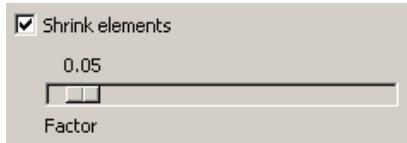

## 附加信息

*   与对话框交互

## 输入表达式

如果对话框或提示区域中的字段需要一个浮点数或复数，您可以输入一个算术表达式，如图1所示。


图1：文本字段中的表达式。

该表达式由内置于Abaqus/CAE中的Python解释器计算。算术表达式将被其值替换；如果您重新打开包含表达式的对话框，则只有数值可用。诸如pi的变量和诸如sin()的函数是可用的，因为当您启动会话时，Abaqus/CAE会导入Python的math模块。因此，您可以输入任何可以由Python内置函数或Python math模块计算的表达式。有关更多信息，请参阅可从Python官方网站（http://www.python.org）访问的内置函数和math模块的文档。

为确保您的表达式按预期计算，您应注意以下几点：

*   如果您将数字作为整数输入，Python将执行整数除法并向下舍入任何余数。例如，Python会将3/2解释为1，将1/2解释为0。相比之下，Python将3./2解释为1.5，将1/2.解释为0.5。
    Python将前导零的数字解释为八进制数（例如，0123被解释为83.0）。但是，在Python解释之前，Abaqus/CAE会忽略文本字段中数字的前导零；此类数字将被计算为十进制数。
*   Python将e解释为自然对数的底数；即e等于2.71828182846，e+2等于4.71828182846。
*   如果$\mathbf { \omega } ^ { \ast } \mathbf { e } ^ { \mathbf { \prime } \mathbf { \prime } }$字符前面有一个数字，Python将其解释为指数，而不是自然对数。例如，Python将2e+2解释为$2 \times 1 0 ^ { 2 }$并将其等同于200。
*   Python将$2 \mathsf { e } + \mathsf { a } \mathrm { s } 2 \times 1 0 ^ { 0 }$解释为2。同样，Python将$2 \in { + } { + } 1 1$解释为$2 \times 1 0 ^ { 0 } ~ + ~ 1 1$并将其等同于13。

如果您不确定Python将如何解释您的表达式，您可以在命令行中输入该表达式；Abaqus/CAE将在消息区域中打印解释后的结果值。要访问命令行界面，请单击


位于主窗口的左下角。有关更多信息，请参阅主窗口的组件。

您还可以通过在操作系统提示符下输入 abaqus python 并在出现的Python提示符下输入表达式来测试Abaqus/CAE如何解释该表达式。提示行和某些对话框不允许您输入表达式。作为替代方案，您可以在命令行或Python提示符下输入表达式，然后将结果值粘贴到提示行或对话框中。

## 使用变暗的对话框和工具箱组件

对话框和工具箱中的某些对象仅在特定情况下可用。当对象不可用时，它在对话框中会显示为变暗。

项目通常由于对话框中的其他某些设置而变暗。例如，如果未选中“使用以下设置”，则其下方的图像大小选项将不可用并显示为变暗，如下所示。


即使对于灰色显示的选项，上下文敏感帮助也是可用的，尽管工具提示不可用。

## 附加信息

• 与对话框交互

## 禁用警告对话框

某些对话框可以被禁用，使其在当前的 Abaqus/CAE 会话期间不再出现。

例如，如果您提交一个分析作业，而同名作业文件已存在，Abaqus/CAE 会显示一个对话框询问是否可以覆盖作业文件，如下所示。


如果您关闭“下次显示此警告”的开关，该对话框将在当前 Abaqus/CAE 会话的剩余时间内被禁用。

## 附加信息

• 与对话框交互

## 理解 OK、Apply、Defaults、Continue、Cancel 和 Dismiss 按钮

当您完成与对话框的交互时，可以使用不同的操作按钮来指定如何继续。例如，如果您在对话框中输入数据，可以通过单击 OK 来保存数据并应用它们。如果对话框是某个流程中的一个中间步骤，您可以单击 Continue 来进入下一步。

对话框中可能会出现以下操作按钮：

## OK

单击 OK 可以提交对话框的当前内容并关闭对话框。

## Apply

当您单击 Apply 时，您在对话框中所做的任何更改都会生效，但对话框仍然保持打开状态。如果您希望在关闭对话框之前查看更改的效果，此按钮非常有用。

## Defaults

如果您在对话框中输入数据或指定首选项后，希望恢复到预定义的默认值，可以单击 Defaults。此按钮仅影响对话框中输入的信息。它不会应用您的更改，也不会关闭对话框；因此，要查看恢复默认值的效果，您必须单击 Apply 或 OK。

## Cancel

单击 Close 可以关闭对话框，而不应用您所做的任何更改。如果对话框出现在某个流程中间，单击 Cancel 通常也会取消该流程。在某些情况下，单击 Cancel 会使您返回到流程中的上一步。

## Continue

出现在流程中间的对话框包含 Continue 按钮。当您单击 Continue 时，表示您已完成当前对话框的数据输入，并希望进入流程的下一步。Continue 会导致对话框关闭并保存其中的所有数据，除非您稍后在流程中单击了 Cancel。

## Dismiss

Dismiss 按钮出现在包含您无法修改的数据的对话框中。例如，某些管理器包含对象列表，这些对象存在但没有可以输入数据或指定首选项的字段。Dismiss 按钮也会出现在消息对话框中。当您单击 Dismiss 时，对话框将关闭。

要关闭没有 Cancel 或 Dismiss 按钮的工具箱或对话框，请单击工具箱或对话框右上角的关闭按钮。或者，您可以通过按 [Esc] 来关闭活动的工具箱或对话框。


## 注意：

在 Linux 平台上，根据您的设置，[Esc] 可能是关闭工具箱或对话框的唯一方式。更多信息，请参见影响 Abaqus/CAE 和 Abaqus/Viewer 的 Linux 设置。

## 附加信息

• 与对话框交互

## 使用分页标签分隔的对话框

为了组织和方便，一些对话框被分页标签分隔。一次只能看到一个对话框。要查看特定的对话框，请单击其带有标签的选项卡。

例如，图 1 显示了“通用绘图选项”对话框。


图 1：使用分页标签分隔的对话框。

如果您单击“颜色与样式”选项卡，包含颜色和边框属性选项的对话框会移到前面，遮挡住其他四个对话框，如图 2 所示。


图 2：使用标签显示特定对话框。

此外，分页的对话框可以存在于单个对话框内。在这种情况下，分页对话框的标签是垂直对齐的，但其工作方式与水平对齐的标签相同。在图 3 中，“其他”对话框包含两个分页对话框：“缩放”和“透明度”。


图 3：包含额外对话框的对话框。

对话框中的操作按钮适用于整个对话框集，而不仅仅是您当前正在查看的那个。如果您单击 Cancel，您在整个对话框集中所做的所有未应用的更改都会被取消，而不仅仅是当前对话框中的更改。同样，单击 OK 会保存您在所有对话框中所做的所有更改。

## 附加信息

• 与对话框交互

## 输入表格数据

某些操作需要输入表格数据。例如，XY 数据工具集可以绘制您在图 1 所示对话框中输入的数据的图表。


图 1：X-Y 数据表。

数据表由输入框（或单元格）组成，这些输入框组织成行和列。您可以使用键盘将数据输入表格，也可以从文件中读取数据。

以下列表描述了输入和修改表格数据的技术：

## 输入数据

单击任何单元格，然后键入所需的数据。您可以按 [Enter] 来确认特定单元格中的数据。

Abaqus/CAE 不允许在要求输入数值数据的表格中输入字符数据；如果您尝试在数值字段中输入字符数据，程序会发出蜂鸣声。（表示科学计数法的字母 E 是一个例外，如 12.E6。）

## 添加新行

使用单击鼠标第 3 键（通常为右键）时出现的菜单，在现有行之前或之后添加新行。将光标悬停在感兴趣的行上，然后单击鼠标第 3 键；之后从出现的菜单中选择您需要的选项：

• 选择“在行前插入”可以在当前行上方添加一个空白行。
• 选择“在行后插入”可以在当前行下方添加一个空白行。

或者，您可以通过单击表格最后一行最后一列的单元格，然后按 [Enter]，将空白行添加到表格末尾。

## 从文件读取数据

您可以通过从 ASCII 文件读取来输入数据。文件中的数据字段可以由空格、制表符或逗号的任意组合分隔；每个空格、制表符或逗号都被视为单个字段分隔符。要从文件输入数据，请将光标悬停在目标单元格上，然后单击鼠标第 3 键；然后从出现的菜单中选择“从文件读取”。将出现“从 ASCII 文件读取数据”对话框。在此对话框中，指定以下内容：

• 在“文件”文本字段中，输入要读取的文件名。
分别在“将值开始读入表格行”和“将值开始读入表格列”字段中指定目标单元格的行号和列号。（默认情况下，Abaqus 会将这些字段设置为单击鼠标第 3 键时光标所在的单元格。）

单击 OK。Abaqus 会根据您的规范从文件中将数据值读取到表格中。

## 在单元格之间移动

使用 [Enter] 键在一行中的单元格之间从左到右移动。当到达行尾时，按 [Enter] 可将光标移动到下一行的第一个单元格。

此外，您可以组合使用 [Tab] 键以及上、下箭头键在单元格之间移动。使用 [Tab] 向右移动，使用 [Shift][Tab] 向左移动；使用上、下箭头上下移动。您也可以直接单击感兴趣的单元格。

## 更改数据

如果单元格已包含数据，单击该单元格会突出显示数据；一旦您开始键入，单元格中突出显示的内容就会消失，并被您键入的内容替代。您也可以使用 [Backspace] 或 [Delete] 键删除单元格中突出显示的数据。

单击单元格一次后，您可以再次单击以取消突出显示并将光标定位在单元格内。使用 [Backspace] 键和键盘上的其他键来修改数据。

## 剪切、复制和粘贴数据

使用单击鼠标第 3 键时出现的菜单，可以将数据从表格的一个位置剪切或复制并粘贴到另一个位置。您可以剪切或复制单个单元格、行或行的一部分、列或列的一部分以及连续的行或列序列中的数据。

首先，拖动鼠标覆盖包含您想要剪切或复制的数据的单元格。所有选中的单元格（您首先选择的单元格除外）都会突出显示。当您将光标移出数据表窗口或单击鼠标第 3 键时，此单元格才会突出显示。
在选中感兴趣的单元格后，将光标置于选区上方，单击鼠标按钮3；然后从出现的菜单中选择“剪切”或“复制”。要粘贴数据，请选择目标单元格，单击鼠标按钮3，然后从出现的菜单中选择“粘贴”。

## 数据排序

一些数据表提供排序功能。（要确定特定表格是否支持排序，将光标悬停在表格上；然后单击鼠标按钮3。如果支持，“排序”将列在出现的菜单中。）

要对表格数据进行排序，将光标置于表格上方，单击鼠标按钮3；然后单击“排序”。将出现“排序表”对话框。在此对话框中，选择以下选项：

• 在“排序依据”文本框中，选择用于排序的列。  
• 选择升序或降序排列顺序。

单击“确定”或“应用”。Abaqus 将根据指定列中的数据值对所有行进行排序。

## 展开和折叠列

您可以更改某些表格中列的大小。要展开或折叠一列，将光标移到要调整大小的列标题之间的分隔线上；将出现一个调整大小光标。向左或向右拖动此光标以调整分隔线两侧两列的大小。

在某些表格中，您也可以通过水平放大包含该表格的对话框来调整最后一列的大小。

## 查看超出对话框边缘的数据

使用水平和垂直滚动条查看表格中位于对话框边界之外的部分。在某些情况下，滚动条可能不可用；此时，增大对话框的大小以显示更多数据。

## 删除数据行

单击要删除行中的任意单元格，或选择连续行中的多个单元格。然后，将光标置于包含该表格的对话框上方，单击鼠标按钮3，并从出现的菜单中选择“删除行”。该行或多行将消失；如果行有编号，Abaqus/CAE 会自动重新编号剩余的行。

您不能从显示固定大小矩阵或张量的表格中删除行，例如在 Property 模块中的正交各向异性或各向异性弹性数据输入表单中使用的那些。

## 从表格数据创建 X-Y 数据

在 Property 模块中创建材料时，您可以使用表格中的数据来创建 X-Y 数据。然后，您可以使用 Visualization 模块绘制 X-Y 数据并直观地检查其有效性。要创建 X-Y 数据对象，将光标置于表格上方，单击鼠标按钮3；然后从出现的菜单中选择“创建 XY 数据”。将出现“创建 XY 数据”对话框。在此对话框中，执行以下操作：

• 输入要创建的 X-Y 数据的名称。  
• 指定包含 X 值的列号和包含 Y 值的列号。  
• 单击“确定”。Abaqus 从表格中将数据值读入 X-Y 数据。Abaqus/CAE 仅在会话期间保留已保存的 X-Y 数据。

要查看 X-Y 数据，请执行以下操作：

• 从上下文栏的模块列表中，选择“Visualization”。  
• 从主菜单栏，选择“工具”->“XY 数据”->“绘图”，并从向右展开的菜单中选择 X-Y 数据。

更多信息，请参见 X-Y 绘图。

## 清空表格

您可以删除表格中的所有数据。将光标置于表格上方，单击鼠标按钮3，并从出现的菜单中选择“清空表格”。表格数据将消失。

## 附加信息

• 与对话框交互

## 自定义字体

“选择字体”对话框允许您自定义某些类型文本的字体；例如，您可以使用此对话框自定义视区注释中出现的字体。一个类似的对话框用于自定义 Visualization 模块的标签和标题的字体。

“选择字体”对话框允许您指定和预览以下内容：

• 比例字体或固定宽度字体。  
• 字体系列。  
• 字体大小（以磅为单位）。  
• 常规、粗体或斜体字形。

可用的选项取决于系统上安装了哪些字体。

1. 显示您要自定义的文本的“选择字体”对话框。有关更多信息，请参见以下部分：

自定义 X-Y 绘图坐标轴  
自定义 X-Y 绘图图例  
自定义视区注释  
设置标签字体

2. 选择所需的字体和属性。  
   在“选择字体”对话框的“示例”区域将出现所选字体的预览。

3. 在“选择字体”对话框的“应用到”字段中，切换开所选字体将应用到的项目。除非有多个项目可以应用该字体，否则不会出现“应用到”字段。

4. 单击“确定”接受更改并关闭“选择字体”对话框。

## 附加信息

• 自定义视区注释  
• 设置标签字体

## 自定义颜色

“选择颜色”对话框允许您自定义 Abaqus/CAE 中许多对象的颜色。有关可以更改的对象的更多信息，请参见以下部分：

自定义视图三轴  
选择背景颜色  
选择总体单元和边颜色  
为无结果的单元着色  
自定义图例  
自定义标题栏  
自定义状态块

当前颜色显示在“选择颜色”对话框的左侧，位于滴管工具下方。您可以使用“选择颜色”对话框中的方法来更新显示的颜色。在您单击“确定”接受更改并关闭“选择颜色”对话框之前，该颜色不会在其他位置更新。您可以从以下颜色选择方法中选择：

## 色板

对话框底部的方框中显示二十四种常见颜色。单击一种颜色即可选择它；您无法修改色板以显示不同的颜色。

## 滴管工具

滴管工具位于对话框的左侧。当您单击滴管工具时，光标变为十字准线。下一次您在计算机屏幕上的任意位置单击鼠标按钮1时，Abaqus/CAE 会选取光标位置的颜色。


## 注意：

如果您将光标移出 Abaqus/CAE 应用程序窗口，它将恢复为正常形式，但您仍然可以通过单击鼠标按钮1来选择颜色。

## 色轮

色轮和亮度控制位于“色轮”选项卡中。一个黑点表示当前所选颜色的位置，无论使用哪种方法选择它。单击色轮上的任意位置以选择新颜色。移动垂直滑块以更改亮度；当您向下滑动滑块时，Abaqus/CAE 会为所选颜色添加黑色。

## RGB 控件

RGB（红、绿、蓝）控件位于“RGB”选项卡中。RGB 设置与“选择颜色”对话框左侧显示的颜色匹配，无论使用哪种方法选择它。您可以移动滑块或输入 0 到 255 之间的值来混合三种光色并产生全色谱。0, 0, 0 为黑色（无光）；而 255, 255, 255 为白色（全强度，全光谱光）。

## HSV 控件

HSV（色相、饱和度、明度）控件位于“HSV”选项卡中。HSV 设置与“选择颜色”对话框左侧显示的颜色匹配，无论使用哪种方法选择它。“色相”控件的范围从 0 到 360，更改设置相当于将黑点沿色轮周长移动（0 和 360 都是红色）。“饱和度”控件的范围从 0 到 100，用于改变添加到背景色中的所选颜色的量。“明度”控件表示背景色；0 为黑色，100 为白色。

## CMY 控件

CMY（青、品红、黄）控件位于“CMY”选项卡中。CMY 设置与“选择颜色”对话框左侧显示的颜色匹配，无论使用哪种方法选择它。您可以移动滑块或输入 0 到 255 之间的值来混合三种色调并产生全色谱。CMY 控件的工作原理类似于向油漆中添加色料；0, 0, 0 为白色（无色料），而 255, 255, 255 为黑色（全部色料）。

## 颜色列表

颜色列表位于“列表”选项卡中。您可以从数百种颜色中选择，包括灰色的各种色调。颜色列表为您提供的颜色范围比色板更广泛，但它不能提供完整的色谱。

1. 打开包含您要更改对象的设置的对话框。  
2. 单击您要自定义的对象的颜色样本。

   Abaqus/CAE 将显示“选择颜色”对话框。

3. 使用对话框中的一种方法选择一种新颜色。

   所选颜色的预览将出现在“选择颜色”对话框的左侧，位于滴管工具下方。

4. 单击“确定”接受更改并关闭“选择颜色”对话框。
Abaqus/CAE 会将您返回到原始对话框，并更新颜色示例以显示您选择的颜色。

当您在原始对话框中单击 **确定** 或 **应用** 时，Abaqus/CAE 会更新视口中的颜色。

## 附加信息

• 自定义模型标签  
• 自定义视口注释

## 使用文件选择对话框

文件选择对话框允许您从基于文件类型或位置筛选的列表中选择文件。要使用文件选择对话框，您首先要选择要打开的文件类型，然后指定要列出的目录。Abaqus/CAE 会刷新对话框，仅列出符合您条件的文件。从此列表中，您可以选择要打开的文件。

用于选择模型数据库或输出数据库的对话框如图 1 所示。

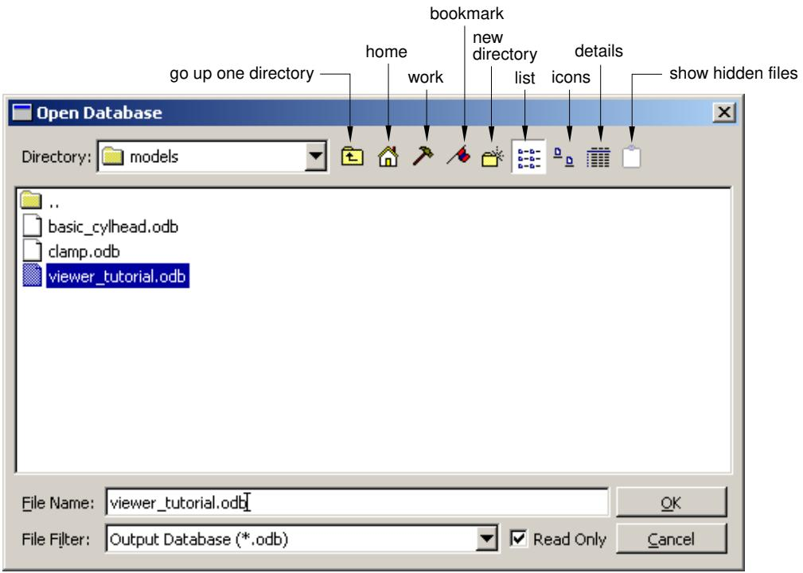  
图 1: 选择模型数据库或输出数据库。


## 注:

在 Abaqus/Viewer 中，您只能打开输出数据库文件；因此，输出数据库 (\*.odb) 是 **文件过滤器** 字段中唯一可用的类型。

当您执行其他 **文件** 菜单功能（例如导入部件或打印到文件）时，也会出现类似的文件选择对话框。

使用以下技术选择您想要的文件：

## 按文件类型筛选文件列表

文件选择对话框包含 **文件过滤器** 字段，允许您选择感兴趣的文件扩展名。例如，图 1 中的 **文件过滤器** 选择是 **输出数据库 (\*.odb)**。因此，对话框中心列表中仅显示扩展名为 .odb 的文件。

## 使用通配符搜索文件名

您可以使用通配符筛选器来搜索文件的部分名称。当您在同一目录中存储了大量文件时，通配符搜索非常有用。通配符搜索还会覆盖文件扩展名（如上所述的 **文件过滤器** 字段），允许您打开使用非标准文件扩展名保存的文件。

要使用通配符搜索，请使用以下形式之一在 **文件名称** 字段中输入部分文件名：

?

匹配单个字符

\*

匹配零个或多个字符

abc

匹配单个字符，但必须是所列字符之一

^abc 或 !abc

匹配单个字符，但不能是所列字符之一

a-zA-Z

匹配单个字符，但必须在提供的范围内

^a-zA-Z 或 !a-zA-Z

匹配单个字符，但不能在提供的范围内

pat1|pat2 或 pat1,pat2

匹配 pat1 或 pat2

(pat1|pat2) 或 (pat1,pat2)

匹配 pat1 或 pat2，并且模式可以嵌套

您可以组合多个通配符筛选器以进一步缩小搜索范围。例如，输入

[abc]\*.(cae,odb) 将列出所有以 a、b 或 c 开头并且具有 .cae 或 .odb 文件扩展名的文件。

## 指定要从中选择文件的目录

默认情况下，**目录** 字段显示您启动 Abaqus/CAE 时所在的目录。如果您想查看来自不同目录的文件列表，可以单击列表中的目录名以查看当前路径内的目录，或者单击 **目录** 字段旁边的箭头以访问系统上其他可用的路径。此外，对话框顶部的图标允许您执行以下操作（可用时显示键盘快捷键）：

• 上移一级目录 ([Backspace])。  
• 访问系统默认或主目录 ([Ctrl] + H)。  
访问 **工作目录** ([Ctrl] + W)。工作目录是您启动 Abaqus/CAE 时所在的目录，除非您使用 **文件->设置工作目录** 指定了该目录。  
• 设置或使用 **书签** 访问系统上的任何目录。  
• 创建新目录 ([Ctrl] + N)。

**目录** 字段包含一个 **网络连接器** 条目。如果您已创建并启动了网络 ODB 连接器，则可以使用此条目访问远程目录并打开远程输出数据库。有关更多信息，请参阅 *创建网络 ODB 连接器*。

## 选择文件

要选择并打开文件，请从列表中双击感兴趣的文件名。您也可以开始输入文件名；光标将重新定位到文件列表中的匹配位置，并且将选中以您输入的字母开头的第一个文件。或者，您可以直接在 **文件名称** 字段中输入感兴趣的完整目录路径和文件名，然后单击 **确定**。对话框顶部的图标允许您将显示的文件格式更改为以下格式之一（显示键盘快捷键）：

• 列表 ([Ctrl] + S)。  
• 图标 ([Ctrl] + B)。  
• 详细列表 ([Ctrl] + L)。

最右侧的图标允许您显示或隐藏“隐藏”文件。

## 从列表和表格中选择多个项目

在某些 Abaqus/CAE 对话框中，在执行某些功能之前，需要从列表或表格中选择一个项目。例如，如果您想绘制 X–Y 数据，必须首先从 XY 数据管理器（如图 1 所示）的列表中选择您想要的数据对象，然后单击 **绘制**。

  
图 1: 选择单个项目。

某些功能允许您操作多个项目。例如，如果您想删除图 1 所示管理器中的前两个数据对象，您可以同时选中它们，然后单击 **删除**。

要从列表中选择单个项目，您只需在对话框中单击该项目。要从表格中选择单个项目，请单击表格行标题。要选择多个项目，您可以使用以下技术：

## 从列表或表格中选择连续项目

单击列表中的第一个感兴趣的项目或表格中的行标题，然后按住鼠标按钮 1 不放，将光标拖动到其余项目上。当选中所有感兴趣的项目时，松开鼠标按钮。例如，图 2 中选择了连续的项目。

  
图 2: 选择连续项目。

选择连续项目的另一种方法是单击列表中的第一个感兴趣的项目或表格中的行标题，然后 [Shift] + 单击最后一个感兴趣的项目。第一个和最后一个之间的所有项目将自动被选中。

## 从列表或表格中选择不连续项目

单击列表中的第一个感兴趣的项目或表格中的行标题，然后 [Ctrl] + 单击您想要选择的任何其他项目。例如，图 3 中选择了不连续的项目。

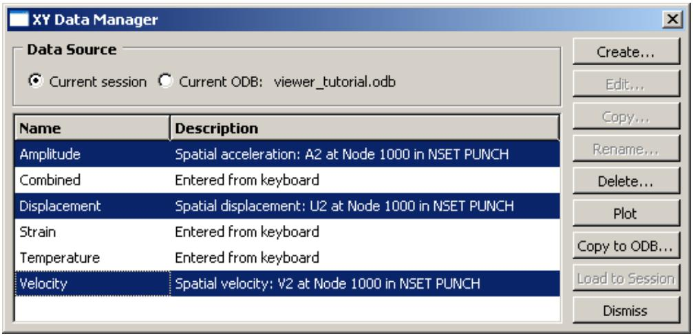  
图 3: 选择不连续项目。

## 取消选择

您可以 [Ctrl] + 单击先前选择的项目以将其从您的选择中移除。例如，如果您在图 3 所示的列表中 [Ctrl] + 单击 **位移**，则该数据对象将不再被选中，如图 4 所示。

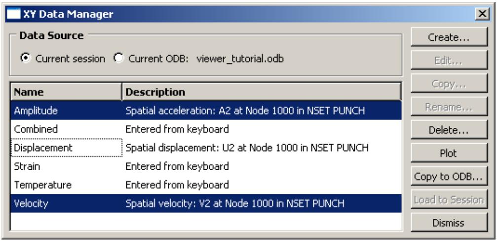  
图 4: 从选择中移除单个项目。

当您选择多个项目时，对话框中的某些功能可能变得不可用。例如，图 4 所示数据管理器中的 **编辑**、**复制** 和 **重命名** 功能仅对单个数据对象有效。当您选择多个数据对象时，这三个功能将变得不可用。

## 使用键盘快捷键

您可以使用键盘代替鼠标在 Abaqus/CAE 主窗口和对话框中执行大多数操作。以下操作具有键盘快捷键：

## 上下文相关帮助

按 [F1] 可显示有关 Abaqus/CAE 主窗口或对话框中当前选定对象的上下文相关帮助。有关使用 [F1] 获取上下文相关帮助的更多信息，请参阅 *显示上下文相关帮助*。

## 菜单

您可以通过按 [Alt] + 键加上该菜单名称中带下划线的字符来显示特定菜单。例如，主菜单栏中的 **视图** 菜单中字母 V 带有下划线：

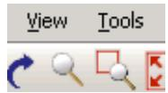

因此，您可以键入 [Alt] + V 以显示 **视图** 菜单。

## 菜单项

菜单显示后，您可以通过继续按 [Alt] + 键并按下该菜单项名称中带下划线的字符来选择特定的菜单项。例如，**视图** 菜单中的 **平移** 字母 n 带有下划线：


因此，您可以键入 [Alt] + V 以显示 **视图** 菜单，然后，在不释放 [Alt] + 键的情况下，键入 n 以选择 **平移**。

## 模型树和结果树

模型树和结果树包含键盘快捷键，允许您在树中导航并切换其显示。有关更多信息，请参阅 *模型树*。
## 理解和使用工具箱与工具栏

本节介绍如何使用工具箱窗口和工具栏来执行模块或工具集内的常用功能，或在画布上进行操作。

## 本节内容：

什么是工具箱和工具栏？  
使用包含隐藏图标的工具箱和工具栏

## 什么是工具箱和工具栏？

工具箱和工具栏是图标的集合，它们提供了对 Abaqus/CAE 常用功能的快速访问。例如，可视化模块（Visualization module）的工具箱包含了用于生成不同类型图表的工具图标。图 1 展示了可视化模块的工具箱。所有模块的工具箱在您进入该模块后都会立即显示在绘图区域的左侧。

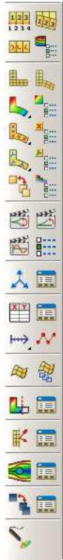  
图 1：可视化模块的工具箱。

工具栏同样包含用于访问 Abaqus/CAE 功能的图标集合。工具栏提供对辅助功能的访问，这些功能帮助您保存、操作和选择模型；而工具箱则包含创建或更改模型所必需的核心功能。除了工具图标外，工具栏可能还包含与工具相关的选项列表。例如，颜色编码（Color Code）工具栏中的颜色映射列表包含多种方法，用于为当前视口中显示的对象着色。您也可以自定义工具栏内容，将工具栏移动到新位置或关闭它们（更多信息，请参见自定义工具集（The Customize toolset））。工具箱不能移动或隐藏。

要获得某个工具的简要说明，将光标悬停在该工具上片刻；会出现一个包含描述的小框，即“工具提示”。对于显示为灰色的图标，工具提示不可用；要获取这些图标的信息，请使用上下文敏感帮助（context-sensitive help）。

## 其他信息

• 理解和使用工具箱与工具栏

## 使用包含隐藏图标的工具箱和工具栏

在某些工具箱中，如作业模块（Job module）工具箱，所有工具图标都是立即可见的；然而，大多数工具箱都包含隐藏图标以节省空间。由于画布上方的空间更大，并且您可以根据需要移动或隐藏工具栏，因此大多数工具栏不包含隐藏图标。

任何在右下角带有小三角形的图标都隐藏了一组图标，其功能与可见图标密切相关。

1.  点击并按住任何在右下角带有三角形的图标。

所有与原始图标功能密切相关的工具图标都会出现。例如，图 1 显示了零件模块（Part module）工具箱的顶部，其中所有用于创建圆角或倒角的图标都已显示出来。

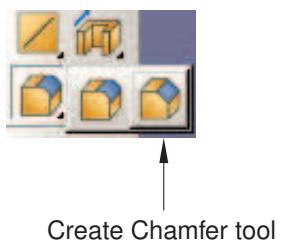  
图 1：显示了圆角和倒角图标的零件模块工具箱。

2.  将光标拖动到所需的图标上，然后释放鼠标按钮。

所选图标将替换最初可见的图标，您可以立即开始使用相应的工具。

## 其他信息

• 理解和使用工具箱与工具栏

## 管理对象

管理器（Managers）是您用于管理与当前模型或会话相关的所有特定类型对象的对话框；这类对象的例子包括材料、部件、步骤、显示组和 X-Y 数据对象。

此外，您可以使用模型管理器（Model Manager）来管理当前模型数据库中包含的模型。本节描述了基本管理器和步骤相关管理器，以及您如何在 Abaqus/CAE 中使用它们。

## 本节内容：

什么是基本管理器？  
什么是步骤相关管理器？  
抑制和恢复对象  
理解对象在步骤中的状态  
描述对象状态的术语  
修改步骤相关对象的历史记录  
理解修改过的步骤相关对象  
当被删除的对象被引用时会发生什么？  
使用管理器对话框管理对象  
使用管理器菜单管理对象  
使用管理器对话框复制步骤相关对象  
更改对象在步骤中的状态  
编辑步骤相关对象

## 什么是基本管理器？

基本管理器由一个对象列表和一系列按钮组成；您使用这些按钮对从列表中选择的对象执行任务，或将新对象添加到列表中。

图 1 显示了材料管理器（Material Manager），这是 Abaqus/CAE 中使用的一个基本管理器示例。

  
图 1：材料管理器。

左侧的列表框显示了您在当前模型上下文中定义的所有材料。您使用右侧的按钮来创建新的材料定义，以及编辑、复制、重命名和删除现有的材料定义。“取消”（Dismiss）按钮用于关闭管理器对话框。

通常，管理器提供的关于对象的信息不止其名称；例如，在作业模块（Job module）中，作业管理器（Job Manager）提供有关当前正在执行的作业的信息，并提供按钮，允许您为给定作业写入输入文件、提交作业、监视分析或查看输出文件。作业管理器如图 2 所示。

  
图 2：作业管理器。

大多数您可以通过管理器执行的任务也可以使用主菜单栏上的下拉菜单来执行；例如，图 3 显示了与作业管理器对应的菜单项。

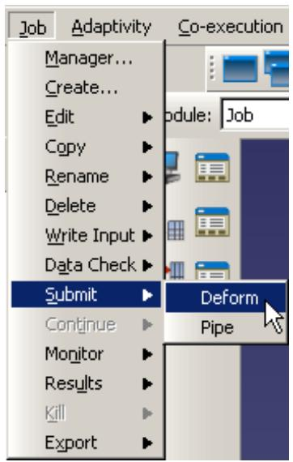  
图 3：与作业管理器对应的菜单项。

从主菜单栏选择管理操作后，其过程与您在管理器对话框内点击相应按钮完全相同。此外，您可以通过在模型树（Model Tree）中对某个对象点击鼠标右键（鼠标按钮 3）来执行大多数可以通过管理器执行的任务。更多信息，请参见使用模型树和结果树（Working with the Model Tree and the Results Tree）。

是使用菜单、对话框还是模型树，由您决定。通常，如果您执行的是孤立操作，菜单更为方便；当您连续执行多个操作、需要浏览长列表的对象，或需要快速访问某些管理器显示的额外信息时，管理器对话框的优势就显现出来了。模型树为您提供模型的图形概览，并允许您在不切换模块的情况下执行操作。此外，模型树允许您使用拖动选择来选择多个项目；例如，您可以选择多个要合并的集合或要删除的部件。

## 其他信息

• 管理对象  
• 什么是步骤相关管理器？

## 什么是步骤相关管理器？

与“什么是基本管理器？”中描述的基本管理器类似，步骤相关管理器包含您创建的特定类型所有对象的列表，以及用于操作现有对象和创建新对象的创建（Create）、编辑（Edit）、复制（Copy）、重命名（Rename）和删除（Delete）按钮。

然而，出现在步骤相关管理器中的对象类型是那些您可以在特定分析步骤中创建，并且在某些情况下可以修改、抑制和停用的对象。因此，与基本管理器不同，步骤相关管理器包含关于每个对象历史的附加信息。步骤相关管理器显示这些对象在 Abaqus 分析过程中如何从一个步骤传播到另一个步骤。（有关步骤和多步骤分析的信息，请参见定义分析（Defining an Analysis））。

Abaqus/CAE 中存在以下步骤相关管理器：

## 在荷载模块（Load module）中：

• 荷载管理器（Load Manager）  
• 边界条件管理器（Boundary Condition Manager）  
• 预定义场管理器（Predefined Field Manager）

## 在相互作用模块（Interaction module）中：

• 相互作用管理器（Interaction Manager）

## 在分析步模块（Step module）中：

• 场输出请求管理器（Field Output Requests Manager）  
• 历程输出请求管理器（History Output Requests Manager）  
• 自适应网格约束管理器（Adaptive Mesh Constraint Manager）

例如，荷载管理器如图 1 所示。

  
图 1：荷载管理器。

此管理器沿对话框左侧按字母顺序显示现有荷载的列表。分析中所有步骤的名称按执行顺序出现在对话框顶部。由这两个列表形成的表格显示了每个荷载在每个步骤中的状态。（有关创建和删除步骤的信息，请参见分析步模块（The Step module））。

如果您点击表格中的某个单元格，该单元格将被高亮显示，并且与该单元格相关的以下信息将出现在管理器底部的图例中：

• 该列对应步骤中执行的分析过程类型。  
• 该行对应步骤相关对象的信息。  
• 该步骤相关对象在该步骤中的状态（与表格单元格中出现的信息相同，但在某些情况下更详细）。
你可以使用管理器左侧一列中的图标来抑制对象或恢复之前被抑制的对象以用于分析。更多信息，请参阅抑制和恢复对象。

管理器右侧的按钮允许你操作所选分析步中的对象。例如，如果你在上面显示的载荷管理器（Load Manager）中点击 **Edit**，将出现一个编辑器，你可以在其中修改名为 Force 的载荷（在 Step-1 中）。其他按钮——**Move Left**、**Move Right**、**Activate** 和 **Deactivate**——允许你更改特定分析步中对象的状态。


注意：**Activate** 和 **Deactivate** 按钮在预定义场管理器（Predefined Field Manager）中不可用。

更多信息，请参阅修改依赖于分析步的对象的历史、更改分析步中对象的状态以及编辑依赖于分析步的对象。

你可以通过将列标题之间的分隔线向右或向左拖动来调整表格列的宽度。你也可以通过拖动对话框的边框来增大对话框的尺寸。如果分析包含许多分析步或许多依赖于分析步的对象，增大对话框尺寸可以让你无需使用滚动条就能查看更多行和列。

## 附加信息
• 输出请求管理器
• 在相互作用（Interaction）模块中管理对象
• 管理规定的条件

## 抑制和恢复对象
在执行分析时，你可能希望研究不同对象组合（例如载荷）的效果，或者你可能希望暂时从模型中排除某个对象，例如在设计分析中排除一个边界条件或约束。你可以创建一个包含所有对象的模型，然后在分析前抑制你想要排除的对象。被抑制的对象不会写入输入文件，并被视为已删除的对象。你应检查模型中是否有任何对被抑制对象的引用。更多信息，请参阅当引用已删除的对象时会发生什么？。

你可以抑制依赖于分析步的对象、约束（在相互作用模块中）、截面指派（在属性模块中）和特征。创建一个可抑制的对象后，管理器对话框会在管理器左侧一列、对象名称旁显示一个绿色勾选标记。你可以通过点击对象旁的绿色勾选标记来从管理器中抑制该对象。例如，如果你在图 1 所示的载荷管理器中点击名为 Force 的载荷左侧的绿色勾选标记，该图标将变为红色“X”，并且显示载荷在每个分析步中状态的单元格会变灰，以表示该载荷已被抑制，如图 1 所示。


## 注意：
没有与特征关联的管理器；你可以使用模型树（Model Tree）中的弹出菜单来抑制或恢复特征。


图 1：载荷管理器（Load Manager）指示名为 Force 的载荷已被抑制。

你也可以从主菜单栏的相应菜单中选择 **Suppress -> object** 来抑制对象。例如，要抑制图 1 所示的名为 Force 的载荷，你需要在载荷（Load）模块的主菜单栏中选择 **Load -> Suppress -> Force**。

你不能编辑被抑制的对象；但是，你可以复制、重命名和删除它们。被抑制对象的符号不会在视口中显示。

你可以恢复之前被抑制的对象。如果你尝试恢复一个对给定分析类型无效的对象，Abaqus/CAE 会显示错误消息。你可以使用管理器或主菜单栏中的 **Resume** 菜单项来恢复对象。在管理器中，点击红色“X”可将图标改回绿色勾选标记，并移除单元格着色。被恢复对象的符号将在视口中显示。

你也可以使用模型树来抑制或恢复对象，方法是鼠标右键点击该对象，并从出现的菜单中选择 **Suppress** 或 **Resume**。模型树在被抑制的对象旁显示一个红色“X”。更多信息，请参阅模型树。

## 附加信息
• 什么是依赖于分析步的管理器？
• 输出请求管理器
• 在相互作用（Interaction）模块中管理对象
• 管理规定的条件

## 理解分析步中对象的状态
一个模型可以包含一系列分析步。当你在一个分析步中创建一个对象时，该对象可能在后续任何分析步中继续活动，也可能不活动。对象在任何特定分析步中的活动（或不活动）状态称为其在该分析步中的“状态”。

例如，图 1 显示了一个载荷在一系列通用静力分析步中的状态。


图 1：一个载荷的分析历史。

此示例中的载荷在分析步 1 中创建；因此，该载荷在分析步 1 中的状态为 **Created**。由于分析步 1 是一个通用静力分析步，该载荷的大小在该分析步过程中逐渐增加。如果该载荷在分析步 2 中继续活动，它在分析步 2 中的状态为 **Propagated**，并且其大小在整个分析步中保持恒定。如果你在分析步 3 中编辑该载荷，它在分析步 3 中的状态变为 **Modified**，其大小在该分析步过程中逐渐增加到新值。如果该载荷的修改版本在分析步 4 中继续活动，它在分析步 4 中的状态（如同分析步 2）为 **Propagated**，并且值是恒定的。如果你在分析步 5 中停用该载荷，它在分析步 5 中的状态为 **Deactivated**，其大小逐渐减小到零。该载荷在分析步 6 中保持停用状态。

有关描述对象状态所用术语的详细解释，请参阅描述对象状态的术语。

## 附加信息
• 什么是依赖于分析步的管理器？

## 描述对象状态的术语
Abaqus/CAE 使用以下术语来描述对象在特定分析步中的状态：

## Created
对象在此分析步中创建并变为活动。规定的条件在分析步中变为活动的时间点取决于与该分析步关联的振幅变化。更多信息，请参阅定义分析中的“规定的条件”。

## Computed
分析产品将在此分析步中计算对象的值。

## Modified
对象的定义在此分析步中被修改。规定的条件在分析步过程中的变化取决于与该分析步关联的振幅变化。

## Propagated
对象在分析的早期分析步中被创建、修改或计算，并在此分析步中继续活动。

## Deactivated
对象在此分析步或之前的分析步中被停用。它将在所有后续分析步中保持停用状态，直到你重新激活它。你不能在创建对象的分析步中停用该对象。规定的条件在分析步中变为不活动的时间点取决于与该分析步关联的振幅变化。更多信息，请参阅定义分析中的“规定的条件”。

你不能停用预定义场；预定义场的停用状态意味着该场已被重置为初始分析步中指定的值。对象恢复到其初始值的时间点取决于与该分析步关联的振幅变化。更多信息，请参阅定义分析中的“规定的条件”。

## N/A
该对象对此分析步的计算没有任何影响。

以下术语仅适用于线性摄动分析步：

## Built into base state
任何在先前通用分析分析步中创建的活动对象将成为基态的一部分，并且不能在线性摄动分析步中更改。

## Propagated from base state
在先前通用分析步中创建的对象将成为此程序基态的一部分，但可以被用户修改或停用。

## Deactivated from base state
在先前通用分析步中创建的对象在此线性摄动分析步中被停用。停用状态仅适用于该线性摄动分析步，不会传播到剩余的分析步。

有关线性摄动分析步的信息，请参阅通用和摄动过程。

以下术语仅适用于模态动力学分析步：

## Built into modes
在先前频率分析分析步中活动的边界条件用于计算模态，因此将被内置于基于模态的线性摄动程序和子空间动力学程序的模态中。在这些基于模态和子空间动力学程序期间，该边界条件不能被更改。

有关模态动力学分析步的信息，请参阅瞬态模态动态分析。

图 1 显示了分配给各种对象状态的颜色编码。依赖于分析步的管理器中的表格单元格会相应着色以指示对象状态。
<table><tr><td>颜色代码</td><td>状态</td></tr><tr><td></td><td>已创建 (Created)</td></tr><tr><td></td><td>已计算 (Computed)</td></tr><tr><td></td><td>已修改 (Modified)</td></tr><tr><td></td><td>已传播 (Propagated)</td></tr><tr><td></td><td>已停用 (Deactivated)</td></tr><tr><td></td><td>不适用 (N/A)</td></tr><tr><td></td><td>构建于基础状态 (Built into base state)</td></tr><tr><td></td><td>从基础状态修改 (Modified from base state)</td></tr><tr><td></td><td>从基础状态传播 (Propagated from base state)</td></tr><tr><td></td><td>从基础状态停用 (Deactivated from base state)</td></tr><tr><td></td><td>构建于模式 (Built into modes)</td></tr></table>

图 1：对象状态的颜色代码。

## 修改步骤相关对象的历史记录

您可以使用步骤相关管理器右侧对齐的五个按钮来修改对象的分析历史记录：编辑、左移、右移、激活和停用。（有关如何使用这些按钮的信息，请参阅在某个步骤中更改对象的状态。）这些按钮的使用可能受到每个步骤的性质以及对象在该步骤中状态的限制。

以下列表描述了修改步骤相关对象历史记录的规则：

## 更改对象变为活动的步骤

您可以通过将"已创建"状态移动到某个步骤来更改对象变为活动的步骤。您可以将对象的"已创建"状态移动到任何先前的通用步骤，或者如果其在后续步骤中的状态是"已传播"，则可以将"已创建"状态移动到后续通用步骤。

例如，您可以在下方的载荷管理器表中选择 Load1 的"已创建"状态。

<table><tr><td></td><td>步骤 1</td><td>步骤 2</td><td>步骤 3</td><td>步骤 4</td><td>步骤 5</td></tr><tr><td>Load1</td><td></td><td>已创建</td><td>已传播</td><td>已传播</td><td>已传播</td></tr></table>

如果您将"已创建"状态移动到步骤 1，表格将变为如下所示。

<table><tr><td></td><td>步骤 1</td><td>步骤 2</td><td>步骤 3</td><td>步骤 4</td><td>步骤 5</td></tr><tr><td>Load1</td><td>已创建</td><td>已传播</td><td>已传播</td><td>已传播</td><td>已传播</td></tr></table>

如果您将"已创建"状态移动到步骤 3，表格将变为如下所示。

<table><tr><td></td><td>步骤 1</td><td>步骤 2</td><td>步骤 3</td><td>步骤 4</td><td>步骤 5</td></tr><tr><td>Load1</td><td></td><td></td><td>已创建</td><td>已传播</td><td>已传播</td></tr></table>

## 注意：

如果对象是在一个线性扰动步骤中创建的，则其"已创建"状态不能移动。

## 修改对象

当对象的状态是"已传播"时，您可以对其进行修改；该对象在该步骤中的状态将变为"已修改"。

## 将对象的修改移动到另一个步骤

您可以通过将对象的"已修改"状态移动到另一个步骤来将修改转移过去。您可以将对象的"已修改"状态移动到先前的通用步骤，或者如果该对象在后续步骤中的状态是"已传播"，则可以移动到后续的通用步骤。

例如，您可以在下方的载荷管理器表中选择 Load1 的"已修改"状态。

<table><tr><td></td><td>步骤 1</td><td>步骤 2</td><td>步骤 3</td><td>步骤 4</td><td>步骤 5</td></tr><tr><td>Load1</td><td></td><td>已创建</td><td>已传播</td><td>已修改</td><td>已传播</td></tr></table>

如果您将"已修改"状态移动到步骤 3，表格将变为如下所示。

<table><tr><td></td><td>步骤 1</td><td>步骤 2</td><td>步骤 3</td><td>步骤 4</td><td>步骤 5</td></tr><tr><td>Load1</td><td></td><td>已创建</td><td>已修改</td><td>已传播</td><td>已传播</td></tr></table>

如果您将"已修改"状态移动到步骤 5，表格将变为如下所示。

<table><tr><td></td><td>步骤 1</td><td>步骤 2</td><td>步骤 3</td><td>步骤 4</td><td>步骤 5</td></tr><tr><td>Load1</td><td></td><td>已创建</td><td>已传播</td><td>已传播</td><td>已修改</td></tr></table>

## 停用对象

当对象的状态是"已传播"或"已修改"时，您可以停用它；该对象在该步骤中显示为"已停用"，并且在所有后续步骤中都处于非活动状态。

## 注意：

您不能使用预定义字段管理器停用预定义字段；您必须在预定义字段编辑器中选择"重置为初始状态"（例如，请参阅定义温度场）。


## 警告：

如果在对象状态为"已修改"的步骤中停用它，对该对象的修改将会丢失。如果您稍后在该步骤中重新激活该对象，则在该步骤及所有后续步骤中将激活的是原始传播版本的对象。

## 重新激活对象

您可以重新激活状态为"已停用"的对象；但是，激活按钮仅在对象首次被停用的步骤中可用（例如，下表中的步骤 3）。

<table><tr><td></td><td>步骤 1</td><td>步骤 2</td><td>步骤 3</td><td>步骤 4</td><td>步骤 5</td></tr><tr><td>Load1</td><td>已创建</td><td>已传播</td><td>已停用</td><td></td><td></td></tr></table>

当您重新激活上例中的载荷时，其在步骤 3 及所有后续步骤中的状态将变为"已传播"。

以下规则适用于线性扰动步骤：

## 停用状态为"从基础状态传播"的边界条件

您可以停用状态为"从基础状态传播"的对象；该对象在线性扰动步骤中的状态将变为"从基础状态停用"。状态"从基础状态传播"不能移动到其他步骤。

## 重新激活状态为"从基础状态停用"的边界条件

您可以重新激活状态为"从基础状态停用"的对象；该对象在线性扰动步骤中的状态将变为"从基础状态传播"。状态"从基础状态传播"不能移动到其他步骤。

## 状态为"构建于基础状态"的对象

状态"构建于基础状态"不能直接更改。

有关线性扰动步骤的信息，请参阅通用分析过程和扰动分析过程。

有关输出请求从通用和线性扰动分析步骤的传播行为的信息，请参阅输出请求的传播。

您可以使用模型树来查看步骤相关对象的状态、编辑该对象以及停用和重新激活该对象。但是，您必须使用步骤相关管理器通过左移或右移对象在步骤序列中的位置来修改其历史记录。更多信息，请参阅模型树。

## 附加信息

*   什么是步骤相关管理器？

## 理解已修改的步骤相关对象

当您在创建对象的步骤中编辑该对象时，您将更改该对象在其活动的所有步骤中的定义。在某些情况下，您也可以在状态为"已传播"或"已修改"的步骤中编辑对象。在这些情况下，对象的定义根据分析步骤而变化。

编辑步骤相关对象的效果总结如下。

## 如果对象在所选步骤中的状态为"已创建"：

*   您在该步骤中对对象所做的修改将在此步骤中生效，并传播到该对象活动的所有后续步骤中，除非您在后续步骤中再次修改该对象。
*   对象在所选步骤中的状态保持"已创建"，并且在所有后续步骤中保持不变。更多信息，请参阅理解对象在某个步骤中的状态。

## 如果对象在所选步骤中的状态为"已传播"或"已修改"：

*   您在该步骤中对对象所做的修改将在此步骤中生效，并传播到该对象活动的所有后续步骤中。
    对象在该步骤中的状态变为（或保持）"已修改"，并且在所有其他步骤中保持不变。（换句话说，如果对象在下一个步骤中的状态在修改前是"已传播"，则其在下一个步骤中的状态在修改后仍为"已传播"。）例如，图 1 中在一系列通用静态分析步骤中施加的载荷已在步骤 3 中被修改；即使步骤 4 的状态是"已传播"，该修改在步骤 4 中仍然有效。更多信息，请参阅理解对象在某个步骤中的状态。
*   当您在交互编辑器之外的任何编辑器中修改数据时，Abaqus/CAE 会在编辑器中指示哪些数据已被修改。如果您将编辑器中的数据更改回其原始值，这些指示将消失。

在某些情况下，您无法编辑对象定义的某个特定方面，因为它必须保持一致以确保分析正确进行。例如，虽然您可以在任何分析步骤中修改载荷的大小，但您不能修改载荷施加的区域。编辑器中指定此类受限数据的区域在除对象创建步骤之外的所有步骤中均不可用。
## 其他信息

• 什么是步骤相关管理器？

## 当被引用的对象被删除时会发生什么？

在删除或重命名可能被其他对象引用的对象（例如材料和幅值）时，您需要格外小心。例如，如果删除或重命名了某个材料，则引用该材料的截面将变得不一致。为了解决缺失的引用问题，您可以编辑该截面并引用新的材料，或者创建一个与被删除材料同名的新材料。
表 1 列出了通常被其他对象引用的对象。

表 1：通常被其他对象引用的对象。

<table><tr><td>此对象</td><td>可被以下类型的对象引用</td></tr><tr><td>材料</td><td>截面</td></tr><tr><td>轮廓</td><td>截面、蒙皮</td></tr><tr><td>截面</td><td>截面指派</td></tr><tr><td>相互作用</td><td>输出请求、接触控制</td></tr><tr><td>相互作用属性</td><td>相互作用</td></tr><tr><td>幅值</td><td>载荷、预定义场、边界条件、相互作用</td></tr><tr><td>连接器截面</td><td>连接器截面指派</td></tr><tr><td>区域（集合或面）</td><td>边界条件、预定义场、载荷、相互作用、约束、连接器截面指派、输出请求、截面指派、梁截面方向、材料方向、输出请求、自由度监控器、自适应网格区域</td></tr><tr><td>载荷</td><td>载荷工况、输出请求</td></tr><tr><td>边界条件</td><td>载荷工况</td></tr><tr><td>基准坐标系</td><td>边界条件、连接器截面指派、材料方向、约束</td></tr><tr><td>基准平面</td><td>载荷</td></tr><tr><td>基准轴</td><td>载荷</td></tr><tr><td>基准点</td><td>约束</td></tr><tr><td>部件实例</td><td>约束</td></tr><tr><td>部件</td><td>部件实例</td></tr></table>

部件和部件实例的行为略有不同。如果您在装配模块中实例化部件后删除了该部件，Abaqus/CAE 会将该部件实例在装配体中抑制。您可以从装配体中删除该实例。或者，如果您随后创建了一个使用相同名称的新部件，您可以取消抑制该部件实例以将其包含在装配体中。此外，如果您重命名部件或基准，引用该部件或基准的对象将指向新名称；因此，引用不会变得不一致。

## 使用管理器对话框管理对象

Abaqus/CAE 为您提供了一组管理器，它们列出了当前模型或会话中定义的所有对象，例如部件、独立草图、材料、截面、步骤、显示组和 X-Y 数据对象。此外，模型管理器列出了当前模型数据库中定义的所有模型。


## 注意：

有关特定管理器及其位置的更多信息，请参阅您感兴趣的相关模块的文档。

使用管理器对话框中的按钮来管理对象列表。

1.  要显示管理器，请执行以下操作之一：
    要显示与某个模块关联的管理器，请在主菜单栏的相应菜单中选择 Manager。例如，要在属性模块 (Property module) 中工作时显示截面管理器 (Section Manager)，请从主菜单栏选择 Section->Manager。
    要显示与某个工具集关联的管理器，请从主菜单栏选择 Tools->Toolset->Manager。例如，要显示集合管理器 (Set Manager)，请从主菜单栏选择 Tools->Set->Manager。
    • 要显示模型树中某个对象的步骤相关管理器，请在该对象上单击鼠标按钮 3，然后从出现的菜单中选择 Manager。
    • 要显示模型管理器 (Model Manager)，请从主菜单栏选择 Model->Manager。

    管理器随即出现，并显示当前模型或会话中的对象列表。该列表包含每个对象的名称，在某些情况下，还包含关于每个对象的信息。例如，部件管理器 (Part Manager) 列出了每个部件的名称、其状态、类型以及创建它的建模空间。

2.  要管理现有对象，从管理器的列表中选择一个或多个感兴趣的对象，然后单击相应的按钮。（例如，要删除某个对象，请从列表中选择该对象的名称，然后单击“删除 (Delete)”。）

    在大多数情况下，会出现一个对话框；例如，当您单击“重命名 (Rename)”时，对话框会要求您输入所选对象的新名称。

3.  如果出现对话框，请提供所需信息并单击“确定 (OK)”。

4.  单击“关闭 (Dismiss)”以关闭管理器。


提示：您也可以使用主菜单栏中的菜单来管理对象。有关更多信息，请参阅使用管理器菜单管理对象。

## 其他信息

• 使用管理器菜单管理对象

与管理器类似，主菜单栏中的下拉菜单允许您管理当前模型或会话中定义的所有对象。

1.  从主菜单栏中，选择以下操作之一：
    要管理与某个模块关联的对象，请在主菜单栏的相应菜单中选择管理器菜单项。例如，要在属性模块 (Property module) 中编辑材料，您可以从主菜单栏选择 Material->Edit->选择的材料。
    要管理与某个工具集关联的对象，请在“工具 (Tools)”菜单中选择相应的管理器菜单项。例如，要删除一个集合，您可以从主菜单栏选择 Tools->Set->Delete->选择的集合。
    • 要管理当前模型数据库中定义的所有模型，请在主菜单栏的“模型 (Model)”菜单中选择管理器菜单项。例如，要复制一个模型，您可以从主菜单栏选择 Model->Copy->选择的模型。

    在大多数情况下，会出现一个对话框；例如，当您重命名某个对象时，会出现一个对话框，要求您输入该对象的新名称。

2.  如果出现对话框，请提供所需信息并单击“确定 (OK)”。


提示：您也可以使用管理器对话框来管理对象。有关更多信息，请参阅使用管理器对话框管理对象。

## 其他信息

• 使用管理器对话框管理对象

## 使用管理器对话框复制步骤相关对象

您可以使用管理器对话框中的“复制 (Copy)”按钮来复制步骤相关对象，例如载荷、边界条件、相互作用、预定义场、输出请求或自适应网格约束。您可以将对象从任意步骤复制到任何其他有效步骤。

1.  打开相应的管理器，如使用管理器对话框管理对象中所述。
2.  通过单击相应的表格单元格来选择要复制的对象。
3.  单击“复制 (Copy)”。

    将出现相应的“复制对象 (Copy Object)”对话框。

4.  为新对象输入名称。
5.  从“步骤 (Step)”列表中选择目标步骤。默认情况下，对象将被复制到其创建时所在的步骤。
6.  单击“确定 (OK)”。

    对象即被复制到选定的目标步骤。

如果目标步骤的类型与对象最初创建时的步骤类型不同，Abaqus/CAE 可能需要修改该对象以使其与新步骤兼容。例如，如果某个载荷是在静态（通用）步骤中创建的，而您将其复制到稳态动力学（线性摄动）步骤中，Abaqus/CAE 将向载荷值添加一个虚部分。相反，如果将稳态动力学步骤中的载荷复制到静态步骤中，虚部分将被移除。

此外，当您将对象复制到其创建步骤以外的步骤时，在其中一个传播状态下对原始对象所做的任何修改都将被忽略。

Abaqus/CAE 会阻止您将对象复制到该对象类型无效的步骤类型中。Abaqus/CAE 还会阻止您复制被抑制的对象或复制到被抑制的步骤。

## 更改对象在步骤中的状态

步骤相关管理器包含一些按钮，您可以在特定情况下使用它们来更改对象在特定步骤中的状态。这些按钮分别标记为“向左移动 (Move Left)”、“向右移动 (Move Right)”、“激活 (Activate)”和“抑制 (Deactivate)”。

您能否更改对象在步骤中的状态取决于该步骤的过程以及该对象在该步骤中的状态。管理器仅允许您对对象历史记录进行有效的更改。如果某个按钮的操作会导致无效的状态更改，则该按钮将变为不可用。有关更多信息，请参阅修改步骤相关对象的历史记录。

以下列表描述了操纵步骤相关对象状态的技术：

## 要选择您想要更改的状态：

在感兴趣对象所在的行和感兴趣的步骤所在的列中，单击相应的单元格。
该对象在该分析步中的状态会高亮显示，在大多数情况下，对话框右侧的一个或多个按钮变为可用。按钮的可用性取决于该对象在当前分析步、前一个分析步和后一个分析步中的状态。

例如，下图中选中了分析步 Step-3 中压力载荷的 Created 状态：

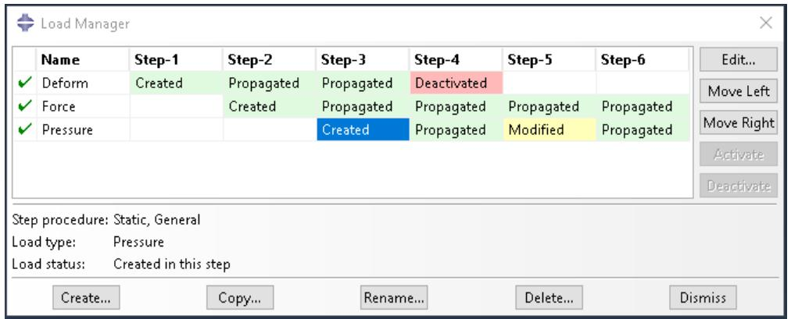

使用变为可用的按钮，按照以下说明操作您所选分析步中对象的状态。

## 将所选分析步中的状态移动到前一个分析步：

单击 **Move Left** 将高亮状态从所选分析步移动到前一个分析步。

例如，在上面显示的历史记录中，分析步 Step-3 中压力载荷的 Created 状态被选中。如果您单击 **Move Left**，历史记录将如下所示发生变化：

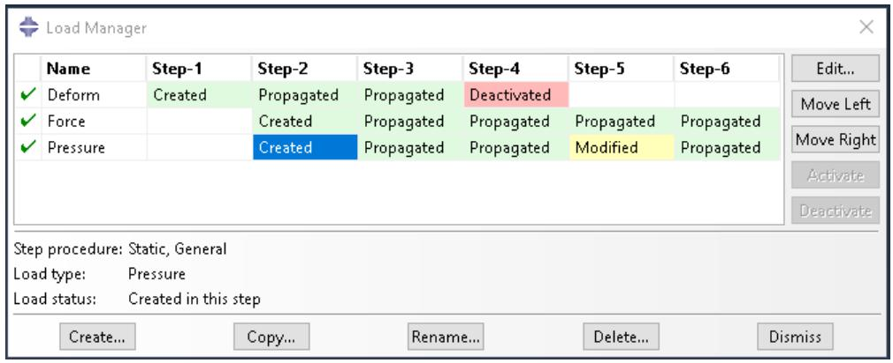

压力载荷的 Created 状态移动到分析步 Step-2，并在分析步 Step-3 中被 Propagated 状态替代。

## 将所选分析步中的状态移动到后一个分析步：

单击 **Move Right** 将高亮状态从所选分析步移动到后一个分析步。

例如，在下面显示的历史记录中，分析步 Step-5 中压力载荷的 Modified 状态被选中。

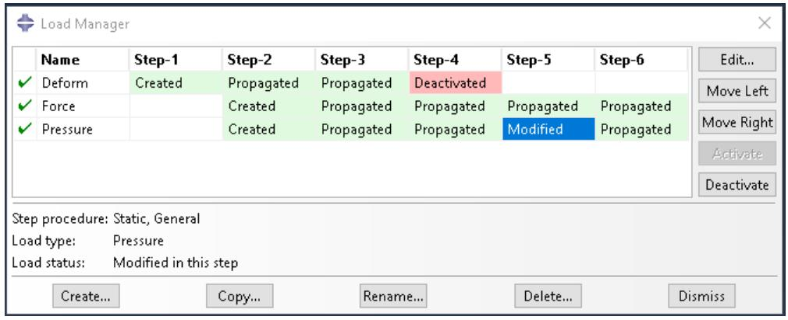

如果您单击 **Move Right**，历史记录将如下所示发生变化：


压力载荷的 Modified 状态移动到分析步 Step-6（表明对压力载荷的修改在分析步 Step-6 中生效），并且 Modified 状态在分析步 Step-5 中被 Propagated 状态替代。

## 在所选分析步中停用对象：

单击 **Deactivate** 在所选分析步中停用该对象。

例如，在下面显示的历史记录中，分析步 Step-4 中压力载荷的 Propagated 状态被选中。


如果您单击 **Deactivate**，历史记录将如下所示发生变化：

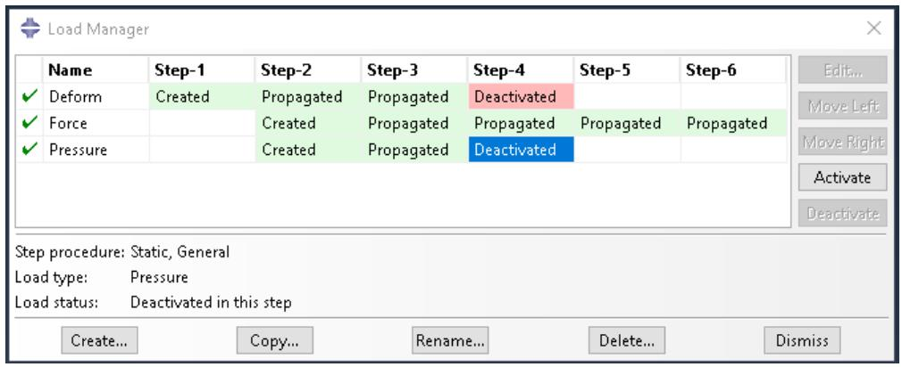

分析步 Step-4 中压力载荷的 Propagated 状态更改为 Deactivated，并且该压力载荷在所有后续分析步中均处于非活动状态。


## 注意：

您无法使用预定义场管理器（Predefined Field Manager）停用预定义场；您必须在预定义场编辑器中选择 **Reset to initial**（例如，请参阅 *定义温度场*）。

## 警告：

如果您在某个分析步中停用一个状态为 Modified 的对象，则对该对象的修改将会丢失。如果您稍后在该分析步中重新激活该对象，则原始的、未经修改的对象版本将在该分析步及其所有后续分析步中处于活动状态。

## 在所选分析步中重新激活对象：

单击 **Activate** 在所选分析步中重新激活该对象。

例如，在上面显示的历史记录中，分析步 Step-4 中压力载荷的 Deactivated 状态被选中。如果您单击 **Activate**，历史记录将如下所示发生变化：


压力载荷的 Deactivated 状态在分析步 Step-4 及任何后续分析步中更改为 Propagated。


## 注意：

**Activate** 按钮仅在某个对象首次被停用的分析步中可用。

您可以使用模型树（Model Tree）查看与分析步相关的对象的状态、编辑该对象、以及停用和重新激活该对象。但是，您必须使用与分析步相关的管理器（step-dependent manager）通过将对象在分析步序列中左移或右移来修改其历史记录。更多信息，请参阅 *模型树*。

## 附加信息

*   什么是与分析步相关的管理器？

## 编辑与分析步相关的对象

您可以使用菜单、管理器或模型树在特定分析步中编辑与分析步相关的对象。您无法编辑被抑制（suppressed）的对象；必须先恢复（resume）该对象才能进行编辑。更多信息，请参阅 *抑制和恢复对象*。（关于已修改对象的状态信息，请参阅 *理解已修改的与分析步相关的对象*。）

## 附加信息

*   什么是与分析步相关的管理器？
*   抑制和恢复对象
*   理解已修改的与分析步相关的对象
*   理解表示规定条件的符号
*   编辑规定条件应用的区域

## 使用菜单编辑与分析步相关的对象

1.  从主菜单栏，选择 **Edit->** 从相应菜单中选择您的对象类型。例如，如果您想在荷载（Load）模块中编辑一个荷载，请选择 **Load->Edit->** 选择您要编辑的荷载。
    相应的编辑器出现。对象应用的区域在当前视口中高亮显示。
2.  在编辑器中，根据需要修改对象定义，然后单击 **OK**。

## 使用管理器编辑与分析步相关的对象

1.  在管理器中，定位到您感兴趣的单元格。该单元格位于您要修改的对象所在的行和您感兴趣的分析步所在的列。
2.  在管理器中，双击该单元格。


## 注意：

或者，您可以单击感兴趣的单元格，然后单击 **Edit**。

相应的编辑器出现。Abaqus/CAE 会高亮显示该对象应用的区域。

3.  在编辑器中，根据需要修改对象定义，然后单击 **OK**。

## 使用模型树编辑与分析步相关的对象

1.  在模型树中，选择您感兴趣的对象。
2.  在该对象上单击鼠标右键，从出现的菜单中选择 **Edit**。相应的编辑器出现。Abaqus/CAE 会高亮显示该对象应用的区域。
3.  在编辑器中，根据需要修改对象定义，然后单击 **OK**。

## 使用模型树和结果树

模型树（Model Tree）和结果树（Results Tree）是用于导航和管理模型及分析结果的便捷工具。

您可以使用模型树查看模型及其包含的项，可以使用结果树显示来自输出数据库的分析结果以及特定于会话的数据（如 X-Y 图）。两者都为主菜单栏、模块工具箱和各种管理器的大部分功能提供了快捷方式。本节将介绍模型树和结果树。

## 本节内容：

模型树
结果树
在模型树和结果树中使用弹出菜单
更改模型的视图

## 模型树

模型树提供了模型中各项层次结构的可视化描述。

例如，图 1 显示了在 *创建和分析简单模型* 教程中完成悬臂梁教程后模型树的外观。


图 1：完成悬臂梁教程后的模型树。

模型树与结果树以及仅在属性（Property）模块中出现的材料库共享 Abaqus/CAE 界面的左侧区域。您可以单击 **Model**、**Results** 或 **Material Library** 选项卡，在模型树、结果树和材料库之间切换显示。有关结果树和材料库的更多信息，请分别参阅 *结果树* 和 *使用材料库*。此外，模型树顶部的提示按钮提供了模型树和结果树功能的快速概要，以及本节末尾描述的键盘快捷键摘要。

一个完整的 Abaqus/CAE 模型包含执行分析所需的所有信息；例如，所有的部件、材料、分析步、载荷以及装配体的网格化表示。模型还包含提交给 Abaqus 分析产品的作业。更多信息，请参阅 *Abaqus/CAE 模型包含什么？*。所有这些项都在模型树中表示。

模型树中的项由小图标表示；例如，分析步图标 。此外，项旁边的括号表明该项是一个容器，括号中的数字表示该容器中的项数。您可以单击模型树中的“加号”和“减号”来展开和折叠容器。右箭头键和左箭头键执行相同的操作。

例如，分析步（Steps）容器包含模型中的所有分析步。在图 1 所示的示例中，展开分析步容器显示该模型包含两个分析步——初始分析步（Initial step）和 BeamLoad 分析步。如图 2 所示，展开 BeamLoad 分析步，显示该分析步有四个容器，每个容器包含一个项——场输出请求（Field Output Requests）、历程输出请求（History Output Requests）、载荷（Loads）和边界条件（BCs）。
  
图 2: BeamLoad 步骤中的容器。

此外，该步骤包含四个空容器——ALE 自适应网格约束 (ALE Adaptive Mesh Constraints)、相互作用 (Interactions)、预定义场 (Predefined Fields) 和载荷工况 (Load Cases)。您无法从模型树中删除空容器，但可以隐藏空容器（参见更改模型的视图）。最后，如图 3 所示，展开“Loads”容器会显示一个名为 Pressure 的单个载荷，该载荷是在此步骤中创建的。

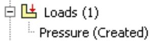  
图 3: “Loads”容器中的载荷。

模型树中容器和项目的排列顺序反映了您可能创建模型的逻辑顺序。模块菜单中模块的顺序也遵循类似的逻辑——您先创建部件，再创建装配体；先创建步骤，再创建载荷。此排列顺序是固定的——您无法在模型树中移动项目。更多信息，请参见什么是模块？。

Abaqus/CAE 会为模型树中的当前对象添加下划线，并在上下文工具栏中显示它们。您正在处理的模型是一个当前对象。当前部件或当前步骤也是当前对象。当您在模型树中选择一个项目时，如果该项目属于当前对象，Abaqus/CAE 会在当前视口中高亮显示该项。例如，如果您选择一个载荷，而该载荷是在当前模型的当前步骤中施加的，则 Abaqus/CAE 会在当前视口中高亮显示该载荷。容器不会被高亮显示。

您可以在模型树中选择多个项目，如果它们属于当前对象，Abaqus/CAE 会高亮显示每一个。例如，您可以在当前模型的当前步骤中选择一个相互作用和一个载荷，Abaqus/CAE 会在装配体中高亮显示相互作用和载荷。当您将光标移到某个项目上时，模型树会显示关于该项目的一些信息，如图 4 所示。在大多数情况下，相同的信息可以从该项目的管理器中获得。

  
图 4: 模型树显示光标下方项目的信息。

当光标位于模型树中时，按字母键 (a–z) 可以选择树中名称以该字符开头的第一个项目。按后续键将继续匹配项目名称中的字符。表 1 描述了可用于在模型树中导航的所有键盘快捷键；您也可以使用这些快捷键在结果树中导航。

表 1: 模型树和结果树中的键盘快捷键。

<table><tr><td>键盘快捷键</td><td>操作</td></tr><tr><td>[Home]</td><td>转到模型树或结果树的顶部</td></tr><tr><td>[End]</td><td>转到模型树或结果树的底部</td></tr><tr><td>上箭头</td><td>向上移动一个项目</td></tr><tr><td>下箭头</td><td>向下移动一个项目</td></tr><tr><td>右箭头</td><td>展开分支或向下移动一个项目</td></tr><tr><td>左箭头</td><td>折叠分支或向上移动一个项目</td></tr><tr><td>[Del]</td><td>删除项目</td></tr><tr><td>[F2]</td><td>对容器应用过滤器</td></tr></table>

模型树提供了主菜单栏和模块管理器的大部分功能。例如，如果双击“Parts”容器，您可以创建一个新部件（相当于从主菜单栏选择 Part->Create）。如果双击某个部件的特征，您可以编辑该特征（相当于从主菜单栏选择 Feature->Edit）。

您可以拖动模型树和画布之间的分隔线来更改模型树的宽度。此外，您可以通过从主菜单栏选择 View->Show Model Tree 来切换模型树的显示状态。按 [Ctrl] + T 具有相同的效果。要切换到结果树，请单击“Results”选项卡。

步骤相关对象是可以在步骤之间传播的对象；例如，载荷和相互作用。更多信息，请参见什么是步骤相关管理器？。模型树中步骤相关对象旁边的文本，例如 (Created) 和 (Propagated)，表示该对象的状态。您可以通过鼠标右键单击该对象并从出现的菜单中选择一个操作来使用模型树更改步骤相关对象的状态。这些操作对应于步骤相关管理器中可用的操作。更多信息，请参见解修改后的步骤相关对象。

您可以使用模型树来抑制特征、约束（在 Interaction 模块中）、截面指派（在 Property 模块中）或步骤相关对象，方法是在项目上单击鼠标右键并从出现的菜单中选择“Suppress”（抑制）。模型树中的项目旁边会出现一个红色“X”，表示它已被抑制。您可以通过鼠标右键单击该项目并选择“Resume”（恢复）来恢复该项目。Abaqus/CAE 会从模型树中移除红色“X”，表示该项目不再被抑制。相同的信息显示在管理器中。更多信息，请参见抑制和恢复对象。

## 结果树

结果树以可视化方式描述了您会话中可用的输出数据，包括所有打开的输出数据库以及特定于会话的数据，如 X-Y 数据和 X-Y 图。此外，结果树使您能够导航到当前模型数据库中的可视内容，例如特定模型某个步骤中指定的载荷。

此工具与模型树共享 Abaqus/CAE 界面的左侧部分，并且在 Property 模块中还与材料库共享。您可以单击“Model”、“Results”或“Material Library”选项卡来在模型树、结果树和材料库之间切换显示。（有关材料库的更多信息，请参见使用材料库。）结果树还使用与模型树完全相同的键盘和导航快捷键；更多信息请参见表 1。

图 1 显示了在使用附加技术和分析 Abaqus/CAE 模型中完成铰链模型分析后结果树的外观。“Output Databases”容器显示了当前会话中所有打开的输出数据库文件。在图 1 所示的示例中，“Output Databases”容器已展开，并显示只有一个输出数据库是打开的——即 PullHinge 输出数据库。

  
图 1: 完成铰链模型教程分析后的结果树。

如图 2 所示，展开 PullHinge 会显示此输出数据库包含以下容器：历史输出 (History Output)、步骤 (Steps)、实例 (Instances)、材料 (Materials)、截面 (Sections)、单元集 (Element Sets)、节点集 (Node Sets) 和面集 (Surface Sets)。此外，输出数据库包含两个空容器——会话坐标系 (Session Coordinate Systems) 和 ODB 坐标系 (ODB Coordinate Systems)。您无法从结果树中删除空容器，但可以隐藏空容器（参见更改模型的视图）。

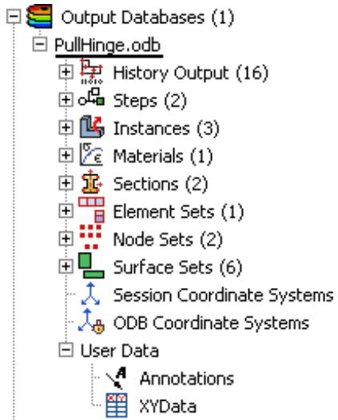  
图 2: PullHinge 输出数据库中的容器。

如图 3 所示，展开“History Output”容器会显示此分析中请求历史输出的十六个输出变量。每个变量列表还描述了请求历史输出的区域；在此示例中，每个历史输出请求都是针对整个模型发出的。您可以在结果树中单击任何历史输出变量以在当前视口中绘制所选变量的图表。

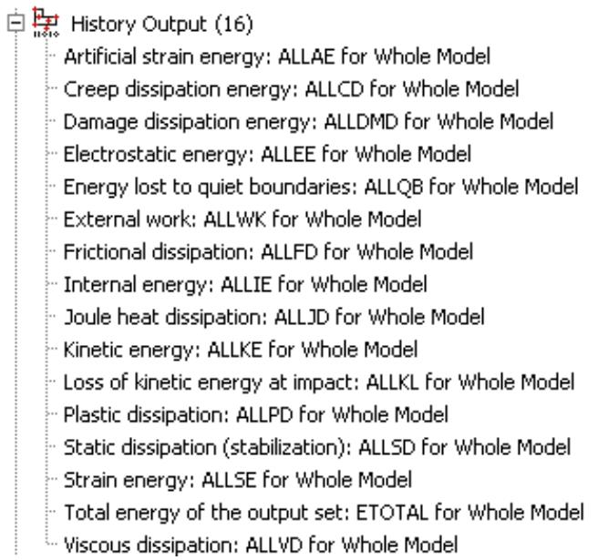  
图 3: 结果树的“History Output”容器。

每个输出数据库还包括一个“Steps”容器，其中包含输出数据库中每个步骤的容器，在步骤内部则包含输出数据库中的每个帧。您可以使用结果树在分析的任何帧处显示模型，激活或停用分析中的步骤或帧，或在选定帧处显示场输出。

“Model Database”容器显示当前模型数据库中的所有模型。您可以展开每个模型以选择要查看其数据的步骤，并显示或隐藏各个部件实例。图 4 显示了铰链模型及其展开的“Steps”和“Instances”容器。

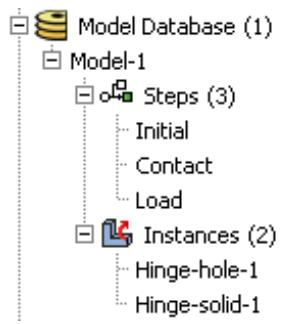  
图 4: 结果树的“Model Database”容器。

结果树中的其他容器提供了仅在会话期间持续存在的数据的快捷方式。通过使用这些快捷方式，您可以创建和管理轮廓谱；创建和编辑 X-Y 数据并显示 X-Y 图，创建和管理路径和显示组；以及上传和显示背景图像和动画。
## 在模型树和结果树中使用弹出菜单

模型树和结果树的大部分功能来自右键单击项目时出现的弹出菜单。例如，图 1 展示了在模型树中右键单击 Parts 容器时的效果。

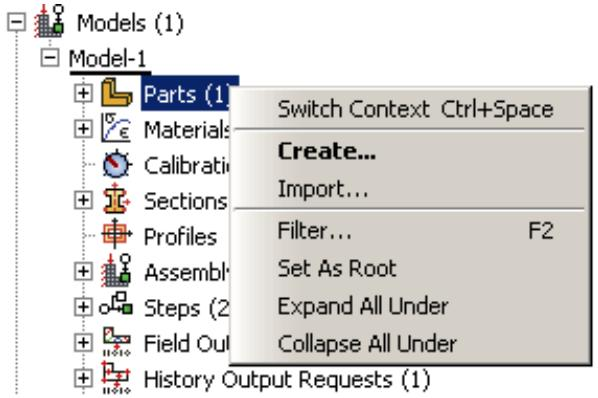
图 1：在模型树中右键单击 Parts 容器。

图 1 中 Create 菜单项显示为粗体，因为它是默认操作。双击一个项目或选中项目后按 [Enter] 键将调用默认操作。在大多数情况下，如果一个项目是容器，默认操作是在容器内创建一个新项目。类似地，如果一个项目不是容器，默认操作是编辑该项目。例如，如果您双击 Parts 容器，Abaqus/CAE 将显示 Create Part 对话框并允许您创建新的部件；如果双击容器内的某个部件，Abaqus/CAE 将显示 Edit Part 对话框并允许您编辑所选的部件。

弹出菜单中的一些命令会出现在模型树和结果树的所有项目中；其他命令仅出现在特定项目或仅出现在两个树之一中的项目上。例如，Switch Context（切换上下文）命令出现在模型树和结果树的所有项目中，包括容器。以下命令出现在模型树和结果树的所有容器中：

## 切换上下文 (Switch Context)

如果选择 Switch Context，Abaqus/CAE 会将该项目设为当前项目。在模型树中，在适当情况下，Abaqus/CAE 还会切换到可以编辑该项目的模块。例如，如果您在 Materials 容器上单击鼠标右键并选择 Switch Context，Abaqus/CAE 将切换到 Property 模块。有关更多信息，请参阅“什么是模块？”。在结果树中，您也可以将上下文切换到另一个输出数据库中的项目。

选中一个容器并按 [Ctrl][Space] 与从任一树中选择 Switch Context 具有相同效果。

## 过滤 (Filter)

当您选择 Filter 时，Abaqus/CAE 会在容器名称旁边提示您输入一个字符串。按 [Enter] 后，Abaqus/CAE 会过滤容器的内容，仅显示与指定字符串匹配的项目。过滤器区分大小写。有关有效过滤语法的详细信息，请单击模型树或结果树顶部的提示按钮


。图 2 显示了过滤容器的效果。

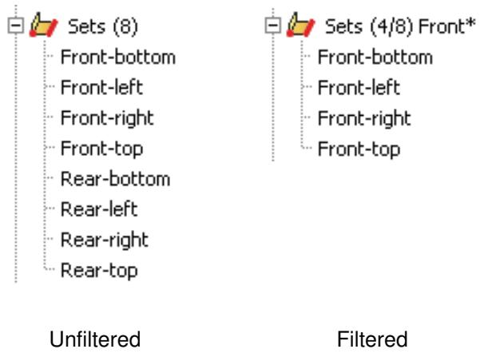
图 2：在模型树中过滤容器。

被过滤器隐藏的项目无法从模型树或结果树中操作；但是，这些项目并未从模型或输出数据库中删除。当过滤器生效时，容器名称旁括号中的数字表示容器中可见项目的数量，后跟容器中项目的总数（可见和隐藏的）（见图 2）。过滤字符串显示在这些数字的右侧。要移除过滤器，请为相应的容器选择 Filter，删除过滤字符串，然后按 [Enter]。

过滤器只能应用于单个容器，并且仅在当前会话期间持续有效。选中一个容器并按 [F2] 与从任一树中选择 Filter 具有相同效果。

## 设为根目录 (Set As Root)

如果选择 Set As Root，Abaqus/CAE 会将容器移动到模型树或结果树上方的下拉菜单中，并显示所选容器下的所有内容。有关更多信息，请参阅“更改模型视图”。

## 展开所有下级 (Expand All Under)

如果选择 Expand All Under，Abaqus/CAE 会展开所选容器内的所有容器和项目。

## 折叠所有下级 (Collapse All Under)

如果选择 Collapse All Under，Abaqus/CAE 会折叠所选容器内的所有容器和项目。

## 子项分组 (Group Children)

当一个容器包含超过 30 个项目时，Abaqus/CAE 会自动将这些项目分组，每组 30 个。如果关闭 Group Children 选项，Abaqus/CAE 会移除分组，并在同一容器层级上列出所有项目。

选中一个容器并按 [Ctrl][G] 与从任一树中选择 Group Children 具有相同效果。

许多弹出菜单命令仅出现在特定项目上。在模型树中，这些命令反映了您可以使用该项目的管理器执行的操作；例如，创建、编辑、删除、重命名、抑制和恢复。在结果树中，一些弹出菜单提供了布尔运算符，使您能够控制当前视口中项目的显示。这些布尔运算符与可用于控制显示组的五个命令相同：替换 (replace)、添加 (add)、移除 (remove)、相交 (intersect) 和排除 (either)。有关更多信息，请参阅“理解显示组布尔操作”。

一些菜单命令特定于模型树或结果树中的某个容器；例如，在分析步 (step) 上单击鼠标右键可让您切换非线性几何 (Nlgeom) 设置，在作业 (job) 上单击鼠标右键可让您提交作业进行分析，在历程输出变量上单击鼠标右键可让您向现有图表添加另一个变量。当您熟悉模型树和结果树后，您会发现可以快速执行大多数在主菜单栏、模块工具箱和各种管理器中可执行的操作。

## 更改模型视图

如果从容器的弹出菜单中选择 Set As Root，Abaqus/CAE 将在模型树或结果树中显示所选容器下的所有内容，并在树上方的菜单中显示容器的名称。此选项在您具有复杂模型或输出数据库以及相应的复杂模型树或结果树时非常有用。您可以使用 Set As Root 仅显示正在工作的部分，从而简化模型树或结果树。例如，图 1 显示了左侧的模型树视图，并将其与将 Materials 容器设为根目录的效果进行了对比。

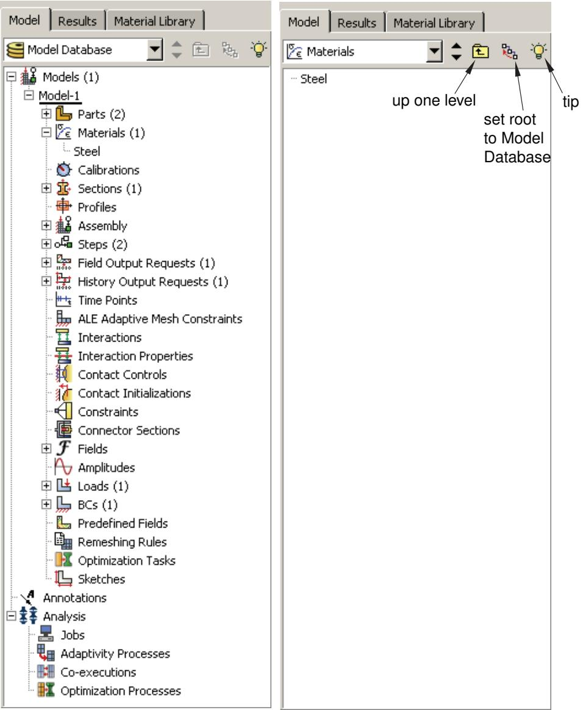
图 1：Set As Root 对模型树的影响。

当您更改默认的根容器时，您可以使用模型树或结果树上方的菜单在其层级间向上移动。此外，Abaqus/CAE 会激活模型树或结果树上方的两个图标，如图 1 所示：模型树中的“将根目录设为模型数据库”图标、结果树中的“将根目录设为会话数据”图标，以及两个树中都有的“上一级”图标。

“将根目录设为模型数据库”图标 $a _ { 2 } = - \frac { 3 } { 2 }$ 将模型树恢复为顶部显示 Model Database 的默认视图。“将根目录设为会话数据”图标 $a _ { 2 } = - \frac { 3 } { 2 }$ 将结果树恢复为顶部显示 Session Data 的默认视图。
“上一级”图标 将模型树或结果树的根目录向上移动一级；例如，从 Materials 容器向上移动一级到包含该容器的 Beam 模型。

如果您在模型树或结果树的背景区域单击鼠标右键，Abaqus/CAE 将显示一个包含以下选项的弹出菜单：

## 显示空容器 (Show Empty Containers)

默认情况下，Abaqus/CAE 显示模型树和结果树中的所有容器，无论其中是否有项目。通过关闭 Show Empty Containers 选项，您可以抑制显示没有任何项目的容器。如果您在 Abaqus/CAE 中执行了向先前为空的容器添加项目的操作（例如，使用 Interaction 模块工具箱创建相互作用），该容器和项目将重新出现在模型树或结果树中。要使容器被抑制显示，它必须是完全空的；即使由于过滤器（参见“在模型树和结果树中使用弹出菜单”）隐藏了容器中的所有项目，该容器也不会被 Show Empty Containers 选项抑制。

Show Empty Containers 选项的状态在 Abaqus/CAE 会话之间保持不变。

## 展开全部 (Expand All)

如果选择 Expand All，Abaqus/CAE 将展开模型树或结果树中的所有容器和项目。

## 折叠全部 (Collapse All)

如果选择 Collapse All，Abaqus/CAE 将折叠模型树或结果树中的所有容器，仅保留顶层容器和项目可见。

## 将根目录设为显示对象 (Set Root to Displayed Object)

如果选择 Set Root to Displayed Object，当前视口中可见部件对应的容器将成为模型树的根目录（如上所述）。如果在当前视口中可见的是装配体，则相应模型的 Assembly 容器将成为模型树的根目录。

此选项仅在模型树中可用。
## 将根节点设置为模型数据库

如果您选择“将根节点设置为模型数据库”，Abaqus/CAE 将模型树（Model Tree）恢复为默认视图，即在树的顶部显示模型数据库。此选项与“将根节点设置为模型数据库”图标具有相同效果。


此选项仅在模型树中可用。

## 将根节点设置为会话数据

如果您选择“将根节点设置为会话数据”，Abaqus/CAE 将结果树（Results Tree）恢复为默认视图，即在树的顶部显示会话数据。此选项与“将根节点设置为会话数据”图标具有相同效果。此选项仅在结果树中可用。

## 理解 Abaqus/CAE GUI 设置

当您退出 Abaqus/CAE 时，GUI 设置总是会自动保存到您主目录中一个名为 `abaqus_2025.gpr` 的二进制文件中。更多信息，请参阅 使用 `abaqus_2025.gpr` 文件。

这些 GUI 设置包括以下内容：

•   主窗口的大小和位置。
•   特定对话框的大小和位置；例如，“打开数据库”和“创建部件”对话框。
•   各个工具栏的位置、方向和可见性。
•   自定义工具栏。
•   自定义键盘快捷键。
•   消息区域和命令行界面的大小。
•   是否显示模型树和结果树。树区域的宽度也会被存储。
•   打开文件时您创建的目录书签。

您不能编辑 `abaqus_2025.gpr` 文件；但是，您可以删除它以恢复默认的 GUI 和显示选项设置。


## 警告：

删除 `abaqus_2025.gpr` 文件会重置上面列出的所有 GUI 设置。您无法从已删除的 `abaqus_2025.gpr` 文件恢复这些设置，除非在 Abaqus/CAE 中手动重新创建它们。

## 管理画布上的视口

画布可以看作是一个无限的屏幕或公告板，您可以在上面放置视口；您可以想象画布延伸超出了主窗口和您的显示器。

画布的可见部分称为绘图区域，您可以通过增大主窗口的大小来增加其大小。您可以使用“视图”菜单全屏显示绘图区域；您也可以按 [F11] 在全屏模式和普通模式之间切换。

您可以将视口放置在画布上的任何位置，也可以将它们拖到绘图区域之外。当视口位于绘图区域之外时，您可以层叠或平铺视口以将它们重新带回视野。视口不是模型的一部分，也不会在会话之间保存。

本章解释如何创建和操作视口、文本标注和箭头标注。

## 本节内容：

理解视图
操作视口和视口标注
以全屏模式显示绘图区域
使用视口
使用视口箭头和文本标注
链接视口以进行视图操作
在视口内使用背景图像和电影

## 理解视口

视口是画布上的区域，您可以在其中显示模型或分析结果。您可以添加箭头和文本标注，以引起对视口内特征的注意或进行解释。您可以使用“视口”菜单创建和操作视口、文本和箭头。

## 本节内容：

什么是视口？
什么是箭头和文本标注？

## 什么是视口？

虽然画布可以看作是一个无限的屏幕或公告板，但视口只是放置在该屏幕上的显示区域，您可以在其中显示模型或分析结果。您可以在画布上拥有多个视口。视口类似于工作站上的其他窗口，因为它可以被移动、调整大小、最小化和最大化；并且它可以与画布上的其他视口重叠。更多信息，请参阅 使用视口。

您可以轻松地创建和删除视口，并控制它们的大小、位置和外观。图 1 说明了您如何使用多个视口来查看分析结果。

  
图 1：使用多个视口。

视图操作工具，例如缩放和旋转，作用于光标所在的视口。其他操作则与当前视口或画布上的所有视口交互。

## 当前视口

要更改视口的内容，您必须首先将所需的视口指定为当前视口。当前视口由深灰色标题栏指示。所有工作都在当前视口中进行。要选择另一个视口作为当前视口，请单击其边框或标题栏。选定的视口会移动到画布上其他视口的前面，并且标题栏颜色变为蓝色。当您选择 Abaqus/CAE 工具或菜单时，标题栏会恢复为深灰色。


## 注意：

在 Windows 平台上，您可以自定义 Abaqus/CAE 使用的颜色。更多信息，请参阅 Windows 平台上的常见自定义设置。

所有视口都与某个特定的模型和模块相关联。当您创建新模型或打开现有模型或输出数据库时，该模型就会与当前视口关联。您可以创建不同的视口并将每个视口与不同的模型关联，因此将每个视口指定为当前视口会导致在关联的模型之间切换。类似地，您可以通过在进入不同模块之前指定一个新视口为当前视口来同时在多个模块中工作。

## 附加信息

•   主窗口的组成部分

## 什么是箭头和文本标注？

箭头和文本标注是您在视口中创建的箭头和文本字符串，用于增强所显示模型或结果的外观和清晰度。您可以独立创建箭头标注和文本标注，也可以将箭头和文本一起创建以自动将文本定位在箭头的末端。视口中标注的位置由锚点控制。您基于视口几何体或模型坐标定义每个锚点；您选择的方法决定了 Abaqus/CAE 如何移动标注。如果您操作视口，Abaqus/CAE 会重新定位任何锚定到视口几何体的标注；类似地，如果您操作模型，Abaqus/CAE 会移动任何锚定到模型的标注。图 1 显示了使用箭头和文本描述模型细节的示例。

  
图 1：箭头和文本标注。

标注编辑操作要求您首先选择一个或多个标注。使用视口工具栏中的“编辑标注”工具 从当前视口中选择箭头或文本标注。Abaqus/CAE 会高亮显示选定的箭头或文本标注及其锚点，如图 2 所示。

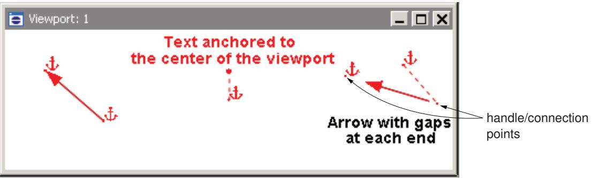  
图 2：选定的标注：一个无偏移的箭头、一个带偏移的文本、以及一个两端有间隙且尾部与其锚点之间有偏移的箭头。

锚点显示为一个小点，附近带有一个锚符号。虚线表示锚点与标注之间的偏移；圆形“手柄”是锚点连接点——如果没有偏移，则连接点和锚点相同。

箭头标注有两个锚点（您可以为两个点使用相同的坐标）。您可以在箭头端点和连接点之间添加间隙。添加间隙类似于在草图绘制器或 CAD 绘图中在尺寸线和对象线之间留出空间；它可以增加标注的清晰度。文本标注有一个锚点。您可以通过在视口中拖动连接点或整个标注来更改偏移。

不要将您可以创建的视口标注与 Abaqus/CAE 生成的视口标注混淆。生成的视口标注包括视图方向指示器；三维指南针；以及，在可视化模块中，图例、标题栏和状态块。您可以修改生成标注的某些显示方面，但不能修改其内容。更多信息，请参阅 自定义视口标注。相比之下，您可以完全控制与箭头和文本标注相关的所有属性，包括它们的颜色、线型、线宽、箭头、字体、锚点以及锚点与标注之间的任何偏移。

Abaqus/CAE 将箭头和文本标注保存在模型和输出数据库中；但是，视口不会被保存。因此，数据库中的箭头和文本标注不与视口关联。当您随后打开包含标注的数据库时，必须使用“标注管理器”在当前视口中显示选定的标注。“标注管理器”还允许您在模型数据库和输出数据库之间复制标注。您不能在可视化模块中为模型数据库创建标注；如果要为其创建标注，请在其他模块中打开模型数据库。
## 附加信息

• 主窗口组件  
• 使用视口  
• 使用视口箭头和文本注释

## 操作视口和视口注释

本节说明如何使用 **Viewport** 菜单、**Viewport** 工具栏和 **Annotation Manager**（注释管理器）中提供的选项来操作视口和视口注释。

## 本节内容：

从主菜单栏管理视口和视口注释  
从 **Viewport** 工具栏管理视口和视口注释  
**Annotation Manager**（注释管理器）

## 从主菜单栏管理视口和视口注释

使用位于主菜单栏的 **Viewport** 菜单可以创建、删除、修改、链接或重新排列视口，以及创建或编辑视口注释——包括您创建的注释和 Abaqus/CAE 生成的注释。如果您愿意，也可以从主菜单栏选择 **View->Toolbars->Viewport** 来显示一个工具栏，该工具栏包含 **Viewport** 菜单中大部分项目的功能。

**Viewport** 菜单和工具栏允许您执行以下操作：

创建视口。  
为生成的视口注释（坐标轴图例、图例、标题栏和状态块）编辑选项。  
创建箭头注释。  
• 创建文本注释。  
• 创建组合的箭头和文本注释。  
编辑箭头和文本注释。  
• 打开 **Annotation Manager**（注释管理器）以操作箭头和文本注释。


## 注意:

**Annotation Manager** 提供了一些独特的管理功能；更多信息，请参见 **The Annotation Manager**。

• 打开 **Viewport Annotation Options**（视口注释选项）以显示或隐藏所有注释，并操作由 Abaqus/CAE 生成的视口注释。  
链接视口。

此外，**Viewport** 菜单列出了会话中的所有视口，并允许您删除当前视口。

## 附加信息

• 在画布上管理视口

## 从 **Viewport** 工具栏管理视口和视口注释

要显示 **Viewport** 工具栏，请从主菜单栏选择 **View->Toolbars->Viewport**。图 1 描述了 **Viewport** 工具栏上可用的工具。

  
图 1：**Viewport** 工具栏。

## 附加信息

• 在画布上管理视口

## **The Annotation Manager**（注释管理器）

**Annotation Manager** 与 Abaqus/CAE 中的其他管理器对话框类似。它允许您执行以下操作：

• 创建箭头、文本或组合的箭头和文本注释。  
编辑箭头或文本注释。  
• 复制或重命名注释。  
• 删除注释。

此外，**Annotation Manager** 允许您执行以下在 **Viewport** 菜单或工具栏中不可用的任务：

• 选择要管理的注释的来源——模型数据库（MDB）或输出数据库（ODB）。  
• 在当前视口中绘制模型数据库或输出数据库注释。  
• 在当前视口中隐藏模型数据库或输出数据库注释。  
• 将注释从模型数据库复制到输出数据库，反之亦然。  
• 在视口中高亮显示注释。  
• 重新排列列表中箭头和文本注释的顺序。

您可以通过从主菜单栏选择 **Viewport->Annotation Manager**


来显示 **Annotation Manager**。图 1 显示了 **Annotation Manager**。

  
图 1：**Annotation Manager**。

有关使用 **Annotation Manager** 创建、编辑和操作注释的详细说明，请参见以下部分：

注释视口  
编辑箭头注释属性  
编辑文本注释属性  
在当前视口中绘制注释  
将视口注释复制到另一个数据库

重新排列注释列表顺序

## 附加信息

• 在画布上管理视口

## 全屏模式显示绘图区域

绘图区域是画布的可见部分。您可以全屏模式显示绘图区域。如果您处于 **Visualization**（可视化）模块，**Animation Controls**（动画控制）将作为单独的工具栏可用；否则，在全屏模式下无法访问任何菜单栏或工具栏。要使工具栏在全屏模式下可访问，您可以在切换模式前单击并拖动工具栏的锁定点以“解除停靠”该工具栏。

1.  从主菜单栏，选择 **View->Full Screen**。


提示：您也可以按 [F11] 键在全屏模式和普通模式之间切换。

绘图区域会扩大以填满整个屏幕。

2.  单击标题栏中的还原按钮以将绘图区域恢复到其先前大小。

## 附加信息

• 在画布上管理视口

## 使用视口

本节说明如何创建和管理视口以及如何修改其外观。

## 本节内容：

创建新视口  
选择视口  
移动视口  
调整视口大小  
最小化、最大化、还原或删除视口  
层叠视口  
平铺视口

## 创建新视口

您可以随时创建新视口；视口的数量或其在画布上的位置没有限制。

从主菜单栏，选择 **Viewport->Create**。

Abaqus/CAE 在绘图区域创建一个新视口。此视口成为当前视口。

新视口的大小和位置取决于当前视口和绘图区域的大小。如果当前视口已最大化，Abaqus/CAE 会自动最大化新视口。


提示：您也可以通过单击 **Viewport** 工具栏中的  来创建新视口。

## 附加信息

• 在画布上管理视口

## 选择视口

您与模型的大多数交互——例如绘制部件草图、定位载荷、组装部件实例、生成网格以及自定义绘图状态——都发生在当前视口中。此外，如果您在画布上显示了多个视口，当前视口指示您正在处理的模型（当前模型）和您正在工作的模块（当前模块）。

有几种方法可以选择新视口作为当前视口：

• 单击现有视口的边框或标题栏。  
• 从 **Viewport** 菜单的列表中选择一个现有视口。  
• 使用 [Ctrl][Tab]——或从 **Viewport** 菜单选择 **Next** 或 **Previous**——在画布上的所有视口之间循环。


## 注意:

在 Linux 平台上，[Ctrl][Tab] 用于切换应用程序；[Ctrl][F6] 是一个替代的键盘快捷键。

• 创建新视口。

当前视口具有深灰色标题栏，如下图所示：


1.  将光标移至视口的边框上。  
如果视口被隐藏，您可能需要移动其他视口以暴露您想要选择的那个。更多信息，请参见移动视口。

2.  单击鼠标键 1。

该视口成为当前视口；该视口同时变为选中状态，其标题栏变为蓝色以表明它是选中的视口。如果您单击某个工具或菜单，该视口仍为当前视口，但标题栏会恢复为深灰色。


## 注意:

在 Windows 平台上，您可以自定义 Abaqus/CAE 使用的颜色。更多信息，请参见 Windows 平台上的常用自定义。

## 附加信息

• 层叠视口  
• 平铺视口  
• 在画布上管理视口

## 移动视口

您可以将选定的视口移动到画布上的任何位置。这可能是为了暴露被隐藏的视口，或者仅仅是为了减少绘图区域的混乱。要移动视口，请在视口标题栏上的任意位置单击，然后将其拖动到所需位置。

1.  将光标放在视口标题栏的任意位置。  
2.  单击鼠标键 1，并将光标拖动到新位置。

光标变为四向箭头 。在您拖动时，视口的轮廓会指示其新位置。

3.  释放鼠标键 1。

视口移动到新位置，并成为当前视口（如果它之前不是的话）。

## 附加信息

• 选择视口  
• 在画布上管理视口

## 调整视口大小

您可以通过拖动视口的边框来更改其大小和形状。

1.  将光标放在您想要移动的视口边框上的任意位置。  
光标变为一组相对的箭头。箭头的方向取决于光标与视口之间的相对位置。
2. 按下鼠标左键，然后拖动光标以更改边框的位置。
3. 释放鼠标左键。
视口将显示为新尺寸，并成为当前视口（如果之前不是的话）。

## 其他信息

• 选择视口
• 在画布上管理视口

## 最小化、最大化、恢复或删除视口

最小化、最大化、恢复和删除按钮位于每个视口的右上角。

这些按钮如下图所示：

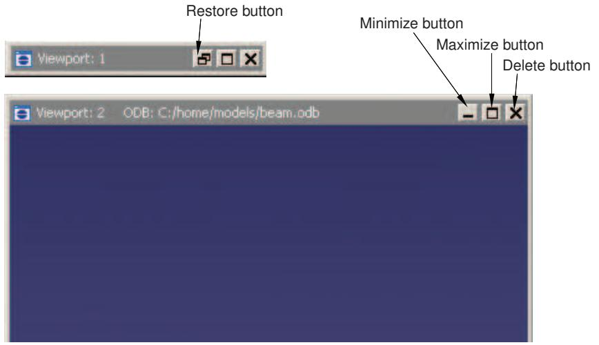

如有必要，请使用层叠或平铺视口以显示最小化、最大化、恢复和删除按钮。

## 最小化按钮

当您点击最小化按钮时，视口会缩小为位于绘图区域左下角默认位置的一个缩写的标题栏。最小化按钮变为一个恢复按钮，连同最大化和删除按钮一起保留在标题栏中。如果您移动一个最小化的视口，新位置将在 Abaqus/CAE 会话期间保存为其最小化位置。

## 最大化按钮

当您点击最大化按钮时，视口的大小和位置会改变以填充画布。最大化按钮变为一个恢复按钮，并连同最小化和删除按钮一起移动到主菜单栏的右侧。最大化的视口成为当前视口并移动到画布的最前面，隐藏绘图区域中的任何其他视口。视口标题栏中的信息显示在 Abaqus/CAE 标题栏中。

## 删除按钮

当您点击删除按钮或从主菜单栏选择 Viewport -> Delete Current 时，该视口将从画布中删除。您无法恢复已删除的视口。如果画布上只有一个视口，Abaqus/CAE 不允许您删除它。如果您在画布上创建了额外的视口，Abaqus/CAE 会删除当前视口并选择另一个视口作为当前视口。您无法控制 Abaqus/CAE 选择哪个视口作为当前视口。

## 恢复按钮

恢复按钮会替换最小化按钮或最大化按钮，具体取决于您最近使用的是哪一个。当您点击恢复按钮时，Abaqus/CAE 会将视口恢复到其先前的大小和位置。恢复按钮会变回它所替换的最小化或最大化按钮。恢复的视口成为当前视口并移动到画布的最前面，隐藏绘图区域中的任何其他视口。

## 其他信息

• 使用视口
• 在画布上管理视口

## 层叠视口

您可以在画布上将视口排列成层叠模式。这可能有助于暴露被隐藏的视口或只是减少绘图区域的混乱。Abaqus/CAE 会排列视口，使标题栏可见，但内容可能会被另一个视口隐藏。

1.  使用视口右上角的最小化按钮，最小化您不想层叠的任何视口。
2.  从主菜单栏中，选择 Viewport -> Cascade。

Abaqus/CAE 将所有非最小化的视口设置为相同的大小，并从绘图区域的左上角向右下角排列它们。当前视口始终位于画布的最前面；所有其他视口按数字顺序排列。最小化的视口位于任何层叠视口（当前视口除外）的前面。


提示：您也可以通过点击

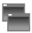

来层叠非最小化的视口，该按钮位于 Viewport 工具栏中。

## 其他信息

• 最小化、最大化、恢复或删除视口
• 在画布上管理视口

## 平铺视口

您可以在画布上将视口排列成平铺模式。这可能有助于暴露被隐藏的视口或只是减少绘图区域的混乱。Abaqus/CAE 会排列视口，使内容可见，但标题栏的部分可能被隐藏。

1.  使用视口右上角的最小化按钮，最小化您不想平铺的任何视口。
2.  执行以下操作之一：

    • 从主菜单栏中，选择 Viewport -> Tile Horizontally 以平铺视口，同时保持尽可能大的水平尺寸。
    • 从主菜单栏中，选择 Viewport -> Tile Vertically 以平铺视口，同时保持尽可能大的垂直尺寸。

Abaqus/CAE 将所有非最小化的视口设置为相同的大小，并将它们排列以填充绘图区域。所有平铺的视口按数字顺序排列。最小化的视口位于任何平铺视口（当前视口除外）的前面。


提示：您也可以通过点击或 来平铺非最小化的视口，这些按钮位于 Viewport 工具栏中。

## 其他信息

• 在画布上管理视口

## 使用视口箭头和文本注释

本节介绍如何创建、修改和管理箭头和文本注释。

## 本节内容：

注释视口
创建箭头注释
创建文本注释
创建组合箭头和文本注释
在当前视口中操作注释
编辑箭头注释属性
编辑文本注释属性
在当前视口中绘制注释
在当前视口中隐藏注释
将视口注释复制到其他数据库
重新排列注释列表顺序

## 注释视口

Abaqus/CAE 提供三种类型的视口注释，您可以用来注释模型或结果：文本字符串、箭头以及组合箭头和文本注释。您可以使用 Viewport 菜单来创建这些注释，并且可以将它们放置在视口的任何位置。图 1 显示了用于注释模型的文本字符串和箭头。箭头和文本注释固定在视口中的点上。锚点定义了注释相对于视口大小和形状或模型坐标系中某个点的位置。当您操作模型或调整视口大小时，注释会跟随其锚点的位置。


图 1：箭头和文本注释。

当您退出 Abaqus/CAE 会话时，视口箭头和文本注释会随模型数据库或输出数据库一起保存。您也可以将注释从模型复制到输出数据库，反之亦然。


警告：您始终可以创建或复制注释到输出数据库；但是，只有在您以写入权限打开数据库时才能保存它们。

## 文本

文本注释可以包含任何可以使用工作站上可用字体显示的字符。Abaqus/CAE 不限制注释中的文本行长度或数量。但是，创建文本注释时，您必须考虑视口的大小；文本应适合所需视口位置。您可以将文本放置在视口的任何位置，并且可以在创建后移动文本注释或更改其锚点。每个文本注释可以使用不同的字体、颜色和背景显示，但您不能在单个文本注释内更改这些属性。

## 箭头

您可以在视口中的任何位置创建箭头；通常，箭头会将文本注释连接到模型坐标系中的一个点。箭头可以具有几种不同的线宽、线型和端点样式，并且可以使用工作站上可用的任何颜色显示。您可以使用一个或两个锚点来控制箭头注释的位置。例如，您可以将箭头固定在模型上的一个点，箭尾固定在视口的一个位置，这样当模型被操作时，箭头仍然指向所需的特征，但箭尾是静止的。您可以在创建后修改和移动箭头。

## 箭头和文本组合

您可以创建一个组合的箭头和文本注释。此方法使用一组简化的选项来创建一个箭头注释，箭头锚定在箭头端，并在箭尾处放置一个文本注释。提供此创建方法是为了简化添加有关模型或结果特定部分的信息。您无法在创建期间编辑注释的位置，除非使用提示区中的上一步按钮 ( )。

但是，一旦您创建了它们，箭头和文本是独立保存的；因此您可以使用每种注释类型可用的所有选项来编辑它们。

除了您可以创建的视口注释外，Abaqus/CAE 还会生成一些注释来提供视口中视图的上下文。Abaqus/CAE 生成 3D 指南针和视图三轴架来显示模型在视口中的方向；在 Visualization（可视化）模块中，会生成图例、标题块和状态块来指示视口中分析结果的各个方面。Viewport Annotation Options（视口注释选项）对话框允许您显示或隐藏所有视口注释——无论是您创建的还是 Abaqus/CAE 生成的——您也可以使用它来编辑生成注释的属性。有关更多信息，请参阅自定义视口注释。
## 附加信息

•   箭头和文本注释是什么？
•   创建箭头注释
•   创建文本注释
•   创建组合箭头和文本注释
•   自定义视口注释

## 创建箭头注释

您可以创建箭头来帮助注释视口的内容，并且可以将箭头放置在视口的任何位置。通常，您会使用组合箭头和文本注释将文本注释连接到视口中的对象，但如果文本注释适用于多个位置，或者您希望完全控制锚点和位置而不想在创建后编辑箭头，您可能希望添加单个箭头。

1.  从主菜单栏中，选择 Viewport->Create Annotation->Arrow。

    

    **提示：** 您也可以通过在 Viewport 工具栏中点击  来创建箭头注释。

    视口中会出现一个锚点符号。默认锚点会随着您在会话中创建新注释而改变。如果这是第一个箭头注释，锚点将位于视口的左下角。

2.  如果需要，在提示区点击 **Change Anchor** 并执行以下操作之一：

    *   在视口中选择一个新的锚点。
    *   从提示区的列表中选择一个视口角点或中心点。
    点击提示区中的 **Pick From Model**，并选择一个节点或顶点，或输入所需锚点的坐标。

    

    **注意：**
    如果您将注释锚定到节点或顶点，Abaqus/CAE 将使用所选点的模型坐标；该注释在 Visualization（可视化）模块中不会跟随模型变形。

3.  选择以下选项之一来定位箭头的端点：

    *   要将端点定位在当前锚点上，请在提示区点击 **On Anchor**。
    *   要将端点定位在视口上的任何位置，将光标移动到所需位置，然后 + 单击鼠标按钮 1。

    默认情况下，Abaqus/CAE 在第一个端点处创建一个箭头；第二个端点没有符号。

4.  重复步骤 2 和 3，以锚定并定位箭头注释的第二个端点。

    Abaqus/CAE 将打开 **Arrow Editor** 对话框。

5.  填写 **Arrow Editor** 对话框中的信息以完成箭头注释。

    有关更多信息，请参阅编辑箭头注释属性。

6.  点击 **Preview** 以在视口中查看您的更改。

7.  要完成箭头注释的创建，请点击 **OK**。Abaqus/CAE 将更新视口中的更改，关闭编辑器，并从步骤 2 开始创建另一个箭头注释。

8.  要停止创建箭头注释，请在视口中单击鼠标按钮 2 或在提示区点击  按钮。

## 附加信息

•   箭头和文本注释是什么？
•   注释管理器
•   在当前视口中操作注释
•   编辑箭头注释属性

## 创建文本注释

您可以创建一行或多行文本以注释视口的内容，并将它们放置在视口的任何位置。通常，您会使用组合箭头和文本注释将文本注释连接到视口中的对象，但您也可以添加文本注释以提供适用于视口中整个模型或结果的标题或其他一般信息。

1.  从主菜单栏中，选择 Viewport->Create Annotation->Text。

    

    **提示：** 您也可以通过在 Viewport 工具栏中点击  来创建文本注释。

    视口中会出现一个锚点符号，并附带注释 **Text-n**。默认锚点会随着您在会话中创建新注释而改变。如果这是第一个文本注释，锚点将位于视口的左下角。

2.  如果需要，在提示区点击 **Change Anchor** 并执行以下操作之一：

    *   在视口中选择一个新的锚点。
    *   从提示区的列表中选择一个视口角点或中心点。
    点击提示区中的 **Pick From Model**，并选择一个节点或顶点，或输入所需锚点的坐标。

    

    **注意：**
    如果您将注释锚定到节点或顶点，Abaqus/CAE 将使用所选点的模型坐标；该注释在 Visualization（可视化）模块中不会跟随模型变形。

3.  选择以下选项之一在视口中定位文本注释：

    *   要将文本定位在当前锚点上，请在提示区点击 **On Anchor**。
    *   要将文本定位在视口上的任何位置，将光标移动到所需位置，然后 + 单击鼠标按钮 1。

    Abaqus/CAE 将打开 **Text Editor** 对话框。

4.  填写 **Text Editor** 对话框中的信息以完成文本注释。

    有关更多信息，请参阅编辑文本注释属性。

5.  点击 **Preview** 以在视口中查看您的更改。
6.  要完成文本注释的创建，请点击 **OK**。

    Abaqus/CAE 将更新视口中的更改，关闭编辑器，并从步骤 2 开始创建另一个文本注释。

7.  要停止创建文本注释，请在视口中单击鼠标按钮 2 或在提示区点击  按钮。

## 附加信息

•   箭头和文本注释是什么？
•   注释管理器
•   在当前视口中操作注释
•   编辑文本注释属性

## 创建组合箭头和文本注释

您可以同时创建一个箭头和一个文本注释，以将文本与视口中的特定特征或结果相关联。

此方法会创建一个箭头注释，其锚点位于箭头处，以及一个单独的文本注释，锚定在同一位置并定位在箭尾处。在创建过程中，您的注释选项有限；例如，您不能将箭头从锚点偏移，或为箭头尾部（文本位置）选择第二个锚点。

创建完成后，Abaqus/CAE 会独立保存箭头和文本注释，以便您可以使用每种注释类型的所有可用选项进行编辑，如编辑箭头注释属性和编辑文本注释属性中所述。由于它们没有链接，您也可以独立移动箭头和文本。


**提示：** 要移动箭头和文本注释的同时保持相对位置不变，请选择两个注释并将文本定位到所需位置，然后仅选择箭头以编辑箭头位置。

## 附加信息

•   箭头和文本注释是什么？
•   在当前视口中操作注释

## 创建组合箭头和文本注释

1.  从主菜单栏中，选择 Viewport->Create Annotation->Arrow & Text。

    

    **提示：** 您也可以通过在 Viewport 工具栏中点击  来创建箭头和文本注释。

2.  通过在视口中选择模型节点或顶点，或在提示区输入模型坐标来选择箭头目标。
    Abaqus/CAE 在所选点显示锚点符号和箭头，并且默认文本字符串 **Text–n** 出现在光标位置。
3.  在视口上定位文本；将光标移动到所需的文本位置并单击鼠标按钮 1。
    Abaqus/CAE 显示 **Arrow & Text Editor** 对话框。
4.  填写 **Arrow & Text Editor** 对话框中的信息以完成这两个注释。
    任何时候点击 **Preview** 可以在视口中查看您的更改；点击 **OK** 保存箭头和文本注释并关闭 **Arrow & Text Editor**。

## 编辑文本

1.  如果尚未选择，请在 **Arrow & Text Editor** 中点击 **Text** 选项卡。
2.  要显示或隐藏文本周围的边框，请切换 **Show bounding box**。边界框将文本与底层模型或结果在视觉上分隔开。
3.  键入所需的文本。
    键入文本注释时，您可以使用标准的鼠标和键盘编辑技术，例如退格、复制和粘贴；按 [Enter] 开始新行。

4.  要自定义背景，请点击以下选项之一：

    *   **Match viewport** 以使背景与视口颜色匹配。
    *   **Transparent** 以消除背景，只显示文本。
    *   **Other color** 以显示其他背景颜色选项。

    如果选择了 **Other color**：

    a. 点击颜色样本 。

        Abaqus/CAE 显示 **Select Color** 对话框。

    b. 使用 **Select Color** 对话框中的一种方法选择新颜色。有关更多信息，请参阅自定义颜色。

    c. 点击 **OK** 关闭 **Select Color** 对话框。

        颜色样本将变为所选颜色。

5.  自定义文本字体。

    a. 点击 **Set Font**。

        出现 **Select Font** 对话框。
b. 使用**选择字体**对话框（Select Font dialog box）选择您需要的字体特征。更多信息，请参阅自定义字体。

c. 完成后，单击**确定**（OK）以应用更改并关闭**选择字体**对话框。

6. 选择文本颜色。
    a. 单击颜色样本。
    Abaqus/CAE 将显示**选择颜色**对话框（Select Color dialog box）。
    b. 使用对话框中的任意一种方法选择新颜色。更多信息，请参阅自定义颜色。
    c. 单击**确定**（OK）以关闭**选择颜色**对话框。
    颜色样本将变为所选颜色。

7. 选择**左对齐**、**居中**或**右对齐**以在边界框区域内排列文本。

## 编辑箭头
1. 在**箭头与文本编辑器**（Arrow & Text Editor）中，单击**箭头**（Arrow）选项卡（如果尚未选中）。
2. 选择所需的线型；您可以为箭头选择实线或多种虚线样式。
3. 选择所需的线宽。


## 注意：
更改线宽也会改变箭头的尺寸。

4. 选择所需的箭头符号。
5. 选择箭头颜色。
    a. 单击颜色样本。
    Abaqus/CAE 将显示**选择颜色**对话框（Select Color dialog box）。
    b. 使用对话框中的任意一种方法选择新颜色。更多信息，请参阅自定义颜色。
    c. 单击**确定**（OK）以关闭**选择颜色**对话框。
    颜色样本将变为所选颜色。

## 在当前视口中操作注释
要操作视口箭头和文本注释，您必须首先选中它们。使用主菜单栏中的**视图**（Viewport）->**编辑注释**（Edit Annotations）来从当前视口中选择箭头或文本注释。


## 注意：
要操作由 Abaqus/CAE 生成的视口注释，请使用**视口注释选项**（Viewport Annotations Options）对话框（更多信息，请参阅自定义视口注释）。

您可以移动、复制、编辑、隐藏或删除选定的注释。您还可以重新排列 Abaqus/CAE 用于显示注释的顺序；此顺序决定了在视口或模型操作导致多个注释出现在同一位置时，哪个注释将“位于前方”。

1. 从主菜单栏中，选择**视图**（Viewport）->**编辑注释**（Edit Annotations）。


提示：您也可以通过单击**视口**（Viewport）工具栏中的 $\mathbb { A }$ 来编辑注释。

2. 单击箭头或文本注释以选中它。要选择其他注释，请按住 [Shift] 并单击，而不是仅单击。更多信息，请参阅在当前视口中选择对象。
    Abaqus/CAE 会高亮显示选定的注释及其锚点。圆形手柄是锚点连接点；它们出现在选定箭头的每一端附近，以及选定文本注释的参考点处。虚线表示锚点与手柄之间的偏移。

3. 执行以下操作之一：

## 移动或复制注释：
如果您选择了文本或多个注释，请拖动选中的项目以在视口周围移动它们。在释放鼠标按钮 1 之前按 [Ctrl] 可以复制注释而不是移动它们。如果您选择了单个箭头注释，请拖动箭杆来移动箭头。您可以将注释拖动到视口上的任何位置，甚至视口区域之外。在视口中移动或复制注释不会改变它们的锚点。

## 移动或复制箭头注释的端点：
如果您选择了单个箭头注释，请注意圆形手柄比选择多个注释时更大；这表示您可以独立移动箭头的每一端。拖动其中一个圆形手柄可以拉长、缩短或重新定向箭头。在释放鼠标按钮 1 之前按 [Ctrl] 可以创建箭头的径向副本而不是移动它。您可以将端点拖动到视口上的任何位置，甚至视口区域之外。通过拖动端点来移动或复制箭头不会改变箭头的锚点。

## 编辑注释：
双击箭头或文本注释可以分别打开**箭头编辑器**（Arrow Editor）或**文本编辑器**（Text Editor）对话框。如果您愿意，也可以单击鼠标按钮 3 并从弹出菜单中选择**编辑**（Edit）。

• 对于箭头注释，您可以更改线型、线宽或颜色；并且可以更改每个箭头端点的偏移量、箭头样式和锚点，以及在手柄位置和箭头端点之间添加间隙。更多信息，请参阅编辑箭头注释属性。

对于文本注释，您可以编辑文本；显示或隐藏文本周围的边框；更改背景颜色、字体、字体颜色、对齐方式和旋转角度；或更改参考点、锚点和偏移量。更多信息，请参阅编辑文本注释属性。

## 隐藏选定的注释：
单击鼠标按钮 3，并从出现的菜单中选择**隐藏**（Hide）。
Abaqus/CAE 会从当前视口中移除选定的注释。要再次显示这些注释，您可以从**注释管理器**（Annotation Manager）中绘制它们。您也可以通过在模型树中选择注释，单击鼠标按钮 3，并从出现的菜单中选择所需选项来隐藏或绘制注释。

## 删除选定的注释：
按 Backspace 或 Delete 键。Abaqus/CAE 会显示一个警告对话框；单击**是**（Yes）以删除注释。
Abaqus/CAE 会从当前视口和关联的数据库中删除选定的注释。

## 重新排列注释的显示顺序：
默认情况下，Abaqus/CAE 按照注释在视口中创建或绘制的顺序显示视口注释；最后创建或绘制的注释将显示在任何先前存在的注释之前。除非两个或更多注释出现在同一位置，否则显示顺序的更改不会影响当前视图。所有视口注释都显示在模型之前。

单击鼠标按钮 3，并从弹出菜单中选择**置于顶层**（Bring to Front）、**置于底层**（Send to Back）、**上移一层**（Bring Forward）或**下移一层**（Send Backward）以更改显示顺序。或者，要将单个注释移到最前面，可以再次从**注释管理器**（Annotation Manager）中绘制它。

## 其他信息
• 什么是箭头和文本注释？
• 注释管理器

## 编辑箭头注释属性
您可以更改箭头注释的以下属性：

• 名称（使用**注释管理器**重命名现有注释）。
• 线宽和线型。
• 颜色。
• 每个端点的锚点和偏移量。
• 端点样式。
• 端点与箭头或箭尾位置之间的间隙。

如果您正在创建新注释，Abaqus/CAE 不仅会将您的许多自定义设置应用于当前注释，还会应用于您随后创建的任何新注释。如果您正在编辑现有注释，Abaqus/CAE 仅会将您的更改应用于选定的注释。

您还可以复制箭头注释及其属性并进行编辑以创建新的箭头注释。更多信息，请参阅注释管理器。

1. 使用以下方法之一访问**箭头编辑器**（Arrow Editor）对话框：
    • 从**注释管理器**（Annotation Manager）中选择一个箭头注释，然后单击**编辑**（Edit）。
    • 选择**视图**（Viewport）->**编辑注释**（Edit Annotations）或在**视口**（Viewport）工具栏中单击 $\bowtie$，然后在视口中双击一个箭头注释。
    • 在视口中创建新的箭头注释；在您于视口中选择端点后，Abaqus/CAE 将打开编辑器。

2. 如果您正在创建新注释，可以编辑箭头的名称。
3. 选择所需的线型；您可以为箭头选择实线或多种虚线样式。
4. 选择所需的线宽。


## 注意：
更改线宽也会改变箭头的尺寸。

5. 选择箭头颜色。
    a. 单击颜色样本。
    Abaqus/CAE 将显示**选择颜色**对话框（Select Color dialog box）。
    b. 使用对话框中的任意一种方法选择新颜色。更多信息，请参阅自定义颜色。
    c. 单击**确定**（OK）以关闭**选择颜色**对话框。
    颜色样本将变为所选颜色。

6. 单击**起点**（Start Point）选项卡或**终点**（End Point）选项卡。
    Abaqus/CAE 会在视口中高亮显示选定的点及其锚点。

7. 选择新的锚点；可用的方法如下：


提示：为避免更改注释的位置，请使用**拾取锚点**（Pick Anchor）按钮更改锚点并重新计算锚点与注释之间的**偏移量**（Offset）。

## 预定义
选择此方法可将注释锚定到视口几何体的预定义点。可用点是视口的角点、中心点和每条边的中点。如果修改视口形状，锚点定义也会随之改变。

## % 视口 X,Y
选择此方法可将注释锚定到基于视口左下角位置和视口大小的点。将锚点输入为当前视口总宽度和高度的百分比。与**预定义**方法类似，如果修改视口形状，锚点定义也会随之改变。
## 模型点 X、Y、Z

选择此方法可将您的注释锚定到模型上的一个点。在文本框中输入新锚点的模型坐标。如果您操作模型，锚点的定义以及链接到它的任何注释都会随之改变。例如，如果您在视口中旋转模型，锚点和箭头端点也会随之旋转。

## 选取锚点按钮

选择此方法可以在不改变注释当前位置的情况下更改锚点。

Abaqus/CAE 会隐藏箭头编辑器对话框，并提示您从视口中选取一个点。或者，您可以从提示区域的列表中选取一个预定义的视口点，或者单击 **从模型选取** 从视口中选取模型节点或顶点，或在提示区域中输入模型点的坐标。

每种选取类型对应前述的一种锚点选取方法。做出选择后，箭头编辑器对话框将重新出现，其中显示您的选择（在相应的锚点选取方法中），并且为新锚点重新计算偏移值。

8. 输入新的 X 和 Y 值，以更改端点与其锚点之间的**偏移**（单位：毫米）。


## 注意：

关闭箭头编辑器后，您也可以通过在视口中拖动每个端点或整个箭头来更改**偏移**。更多信息，请参阅操作当前视口中的注释。

9. 选择所需的箭头符号。

默认值为：**起点**是普通线条，**终点**是实心箭头。

10. 如果需要，可以在端点位置与箭头注释的起点或终点之间添加一个**间隙**。添加间隙类似于在草图器或 CAD 绘图中尺寸线和对象线之间留出空格；它可以增加注释的清晰度。例如，您可以指示模型上的特定点并添加间隙，以免箭头遮挡该点。

11. 重复步骤 7–10 以编辑箭头的另一个端点。
12. 单击 **应用** 以在视口中查看您的更改。


## 注意：

一旦您在视口中应用了更改，除非重新创建注释或再次编辑选项，否则无法恢复原始设置。

## 13. 单击 **确定** 关闭箭头编辑器。

## 其他信息

*   箭头和文本注释是什么？
*   注释管理器

您可以更改文本注释的以下属性：

*   边界框显示。
*   背景色。
*   字体样式和颜色。
*   对齐方式。
*   旋转角度。
*   参考点位置和偏移。
*   锚点位置。

*   名称（使用注释管理器重命名现有注释）。

如果您正在创建新注释，Abaqus/CAE 会将您的许多自定义设置不仅应用于当前注释，还会应用于随后创建的任何新注释。如果您正在编辑现有注释，Abaqus/CAE 仅将您的更改应用于选定的注释。

您还可以复制文本注释及其属性并进行编辑以创建新的文本注释。更多信息，请参阅注释管理器。

1.  使用以下任一方法打开**文本编辑器**对话框：

    *   从注释管理器中选择一个文本注释，然后单击 **编辑**。
    *   选择 **视口** -> **编辑注释** 或 **视口**工具栏中的 $\bowtie$，然后在视口中双击一个文本注释。
    *   在视口中创建新的文本注释；在您于视口中选择文本位置后，Abaqus/CAE 会打开编辑器。

2.  如果您正在创建新注释，可以编辑文本注释的名称。

3.  要显示或隐藏围绕文本的边框，请切换 **显示边界框**。边界框在视觉上将文本与底层模型或结果分隔开。

4.  键入所需的文本。

    键入文本注释时，可以使用标准的鼠标和键盘编辑技术，如退格、复制和粘贴；按 [Enter] 开始新行。

5.  要自定义背景，请单击以下选项之一：

    *   **匹配视口**，使背景与视口颜色匹配。
    *   **透明**，以消除背景并仅显示文本。
    *   **其他颜色**，以显示其他背景颜色选项。

    如果您选择了**其他颜色**：

    a. 单击颜色样本。

    Abaqus/CAE 显示**选择颜色**对话框。

    b. 使用**选择颜色**对话框中的一种方法选择新颜色。更多信息，请参阅自定义颜色。

    c. 单击 **确定** 关闭**选择颜色**对话框。

    颜色样本将变为所选颜色。

6.  自定义文本字体。

    a. 单击 **设置字体**。

    出现**选择字体**对话框。

    b. 使用**选择字体**对话框选择所需的字体特性。更多信息，请参阅自定义字体。

    c. 完成后，单击 **确定** 以应用更改并关闭**选择字体**对话框。

7.  选择文本颜色。

    a. 单击颜色样本。

    Abaqus/CAE 显示**选择颜色**对话框。

    b. 使用对话框中的一种方法选择新颜色。更多信息，请参阅自定义颜色。

    c. 单击 **确定** 关闭**选择颜色**对话框。

    颜色样本将变为所选颜色。

8.  选择**左对齐**、**居中**或**右对齐**，以在边界框区域内排列文本。
9.  输入旋转角度（单位：度）以定向文本；0° 表示水平。

    Abaqus/CAE 围绕参考点逆时针旋转文本。

10. 单击 **位置** 选项卡。
11. 选择新的**参考点**。

    参考点是文本注释附加到其锚点的位置；如果您旋转文本，Abaqus/CAE 还会使用该参考点作为旋转中心。可用方法如下：

    ## 预定义

    选择此方法可使用文本边界框几何体的一个预定义点作为参考点。可用点包括边界框的角点、中心以及每条边的中点。如果您修改了注释文本，参考点的定义也会随之改变。

    ## 文本百分比 X, Y

    选择此方法可根据左下边界框角点的位置和边界框大小来定义参考点。将参考点输入为文本边界框总宽度和高度的百分比。与**预定义**方法一样，如果您修改了文本，参考点的定义也会随之改变。

    

    ## 注意：

    Abaqus/CAE 基于 0° 旋转角度确定左下角位置。如果您旋转文本，该角点位置也会相应旋转。

    

    **提示：** 您可以通过输入小于 0% 或大于 100% 的值来选取边界框外部的参考点。

12. 输入新的 X 和 Y 值，以更改参考点与锚点之间的**偏移**（单位：毫米）。

    

    ## 注意：

    关闭文本编辑器后，您也可以通过在视口中拖动文本注释来更改偏移。更多信息，请参阅操作当前视口中的注释。

13. 选择新的锚点；可用方法如下：

    

    **提示：** 为避免更改注释的位置，请使用 **选取锚点** 按钮来更改锚点并重新计算锚点与注释之间的**偏移**。

    ## 预定义

    选择此方法可将注释锚定到视口几何体的一个预定义点。可用点包括视口的角点、每条边的中点以及视口的中心。如果您修改视口形状，锚点的定义也会随之改变。

    ## 视口百分比 X,Y

    选择此方法可将您的注释锚定到一个基于左下视口角点位置和视口大小的点。将锚点输入为当前视口总宽度和高度的百分比。与**预定义**方法一样，如果您修改视口形状，锚点的定义也会随之改变。

    ## 模型点 X、Y、Z

    选择此方法可将您的注释锚定到模型上的一个点。在文本框中输入新锚点的模型坐标。如果您操作模型，锚点的定义以及链接到它的任何注释都会随之改变。例如，如果您在视口中旋转模型，锚点和箭头端点也会随之旋转。

    ## 选取锚点按钮

    选择此方法可以在不改变注释当前位置的情况下更改锚点。

    Abaqus/CAE 会隐藏箭头编辑器对话框，并提示您从视口中选取一个点。或者，您可以从提示区域的列表中选取一个预定义的视口点，或者单击 **从模型选取** 从视口中选取模型节点或顶点，或在提示区域中输入模型点的坐标。
每种选择类型都对应于前述的定位点选择方法之一。做出选择后，文本编辑器对话框将重新出现，并在相应的定位点选择方法中显示您的选择，同时为新定位点重新计算偏移值。

14.  单击 **Apply**（应用）以在视口中查看更改效果。


## 注意：

一旦您在视口中应用了更改，除了重新创建注释或再次编辑选项外，无法恢复原始设置。

## 15. 单击 **OK** 关闭文本编辑器。

## 附加信息

•   什么是箭头和文本注释？  
•   注释管理器

## 在当前视口中绘制注释

当您打开一个包含已保存视口注释的数据库，或为已打开的数据库创建新视口时，Abaqus/CAE 不会自动显示您的视口箭头或文本注释。您可以使用注释管理器在当前视口中绘制箭头和文本注释；也可以在模型树中选择注释，单击鼠标右键，然后从出现的菜单中选择 **Plot**（绘制）。

由 Abaqus/CAE 生成的注释根据“视口注释选项”对话框中的设置进行显示（更多信息，请参阅“自定义视口注释”）。

1.  从主菜单栏中，选择 **Viewport -> Annotation Manager**（视口 -> 注释管理器）。


提示：您也可以通过单击视口工具栏上的按钮来显示注释管理器对话框。


2.  单击 **MDB** 或 **ODB** 单选按钮，选择要绘制的注释来源。

    a.  如果您打开了多个输出数据库，或者不确定涉及的数据库文件，请将光标置于 **MDB** 或 **ODB** 单选按钮上，以显示包含数据库路径和文件名的工具提示。  
    b.  必要时，通过在当前视口中显示所需的数据库来更改活动输出数据库。或者，您可以打开一个新视口来显示该数据库，或关闭所有其他输出数据库。

    Abaqus/CAE 会列出所选数据库中可用的注释。

3.  从对话框的列表中选择注释（更多信息，请参阅“从列表和表格中选择多个项目”）。


提示：启用 **Highlight selections in viewport**（在视口中高亮显示选择项）以预览所选注释。

4.  单击 **Plot**（绘制）。

    Abaqus/CAE 在当前视口中绘制所选注释。

## 附加信息

•   什么是箭头和文本注释？  
•   注释管理器

## 在当前视口中隐藏注释

如果视口中的箭头和文本注释遮挡了模型视图，您可以使用注释管理器将其隐藏。

由 Abaqus/CAE 生成的注释根据“视口注释选项”对话框中的设置进行显示（更多信息，请参阅“自定义视口注释”）。

1.  从主菜单栏中，选择 **Viewport -> Annotation Manager**（视口 -> 注释管理器）。


提示：您也可以通过单击视口工具栏上的按钮来显示注释管理器对话框。

2.  单击 **MDB** 或 **ODB** 单选按钮，选择要隐藏的注释来源。

    a.  如果您打开了多个输出数据库，或者不确定涉及的数据库文件，请将光标置于 **MDB** 或 **ODB** 单选按钮上，以显示包含数据库路径和文件名的工具提示。  
    b.  必要时，通过在当前视口中显示所需的数据库来更改活动输出数据库。或者，您可以打开一个新视口来显示该数据库，或关闭所有其他输出数据库。

    Abaqus/CAE 会列出所选数据库中可用的注释。

3.  从对话框的列表中选择注释（更多信息，请参阅“从列表和表格中选择多个项目”）。


提示：启用 **Highlight selections in viewport**（在视口中高亮显示选择项）以预览所选注释。

4.  单击 **Hide**（隐藏）。

    Abaqus/CAE 在当前视口中隐藏所选注释。

## 附加信息

•   什么是箭头和文本注释？  
•   注释管理器

您可以将从模型数据库创建的视口注释复制到输出数据库，反之亦然。您无法将注释从一个输出数据库复制到另一个输出数据库。由 Abaqus/CAE 生成的注释包含特定于模型和结果的信息；此信息在每个数据库中自动可用，无法复制（更多信息，请参阅“自定义视口注释”）。

1.  从主菜单栏中，选择 **File -> Open**（文件 -> 打开）以打开所需的模型数据库和输出数据库（.cae 和 .odb）文件。


## 注意：

您不需要对数据库文件拥有写入权限即可复制注释；但是，如果您没有写入权限，则无法保存复制的注释。

2.  从主菜单栏中，选择 **Viewport -> Annotation Manager**（视口 -> 注释管理器）。


提示：您也可以通过单击视口工具栏上的按钮来显示注释管理器。

3.  单击 **MDB** 或 **ODB** 单选按钮，选择要复制的注释来源。

    a.  如果您打开了多个输出数据库，或者不确定涉及的数据库文件，请将光标置于 **MDB** 或 **ODB** 单选按钮上，以显示包含数据库路径和文件名的工具提示。  
    b.  必要时，通过在当前视口中显示所需的数据库来更改活动输出数据库。或者，您可以打开一个新视口来显示该数据库，或关闭所有其他输出数据库。

    Abaqus/CAE 会列出所选数据库中可用的注释。

4.  从对话框的列表中选择注释（更多信息，请参阅“从列表和表格中选择多个项目”）。


提示：启用 **Highlight selections in viewport**（在视口中高亮显示选择项）以预览所选注释。

5.  单击 **Copy to MDB**（复制到 MDB）或 **Copy to ODB**（复制到 ODB）按钮。

    Abaqus/CAE 复制所选注释。

## 附加信息

•   什么是箭头和文本注释？  
•   注释管理器

## 重新排列注释列表顺序

您可以更改注释管理器列表中视口注释的顺序。更改顺序允许您将相关注释（例如注释同一区域的文本和箭头）在列表中保持在一起。如果您将从注释管理器列表中的多个选择项绘制到视口，则显示顺序由列表顺序决定；即列表顶部的注释也会显示在视口中所有其他注释的前面。但是，您可以独立更改每个视口中注释的显示顺序，方法是从注释管理器绘制单个注释，或选择一个注释，单击鼠标右键，然后使用弹出菜单中的选项。（有关更多信息，请参阅“在当前视口中操作注释”。）

1.  从主菜单栏中，选择 **Viewport -> Annotation Manager**（视口 -> 注释管理器）。


提示：您也可以通过单击视口工具栏上的按钮来显示注释管理器。

2.  从对话框的列表中选择注释（更多信息，请参阅“从列表和表格中选择多个项目”）。


提示：启用 **Highlight selections in viewport**（在视口中高亮显示选择项）以预览所选注释。

3.  使用注释管理器底部的按钮重新排列列表。


## 注意：

如果您从列表中选择了多个注释，则 **Move Up**（上移）和 **Move Down**（下移）按钮不可用。

    Abaqus/CAE 在列表中移动所选注释。

## 附加信息

•   什么是箭头和文本注释？  
•   注释管理器  
•   在当前视口中操作注释

## 链接视口以进行视图操作

本节说明如何链接多个 Abaqus/CAE 视口以实现同步视图操作。

## 本节内容：

使用链接的视口  
链接视口

## 使用链接的视口

链接的视口使您能够同时操作不同视口中对象的视图。

当您使用“操作视图和控制透视”中描述的任何视图操作工具在一个链接的视口中操作对象时，Abaqus/CAE 会在会话中所有链接的视口中执行相同的操作。
Abaqus/CAE 仅允许存在一组链接视口（Linked Viewports），因此您会话中的每个视口要么是独立的，要么是链接视口组的一部分。当您更改独立视口中的视图时，Abaqus/CAE 仅更改该视口中的视图。

使用标准视图操作工具时（参见理解视图操作工具），链接视口中的操作不依赖于每个视口的视图方向。例如，向左平移视图会在所有链接视口中向左平移视图，无论每个视口的视图方向如何。当使用三维罗盘（The 3D compass）操作视图时，链接视口中的操作依赖于每个视口的视图方向。例如，沿 X 轴平移视图会在所有链接视口中沿 X 轴平移视图；每个视口的视图方向决定了运动方向。

您可以从**视口（Viewport）**菜单、**视口（Viewport）**工具栏或**链接视口管理器（Linked Viewports Manager）**中激活或取消激活当前会话的视口链接。如果此选项被取消激活，您会话中的所有视口都是独立的。默认情况下，如果此选项被激活，您会话中的所有视口都会链接在一起。在**链接视口管理器（Linked Viewports Manager）**的下半部分，您可以关闭某个视口的复选框，将其从链接视口组中排除。通过**链接视口管理器（Linked Viewports Manager）**，您可以控制链接视口共享哪些特性。默认情况下，所有特性都是共享的。多个链接视口选项在所有模块中都可用；部分选项（如在所有链接视口中显示相同的绘图状态）仅在可视化模块（Visualization module）中适用。

Abaqus/CAE 通过视口标题栏左侧出现的红色链接图标来表示链接视口，如下图所示的两个视口。


## 其他信息

*   使用视图操作工具
*   理解绘图状态和绘图定制

## 链接视口

您可以控制 Abaqus/CAE 会话中哪些视口将被链接，以及链接视口将共享哪些特性。

多个链接视口选项在所有模块中都可用；部分选项（如在所有链接视口中显示相同的绘图状态）仅在可视化模块（Visualization module）中适用。

1.  使用以下方法之一链接视口：

    *   从主菜单栏中，选择**视口（Viewport）> 链接视口（Link Viewports）**。

    

    **提示：**您可以通过单击**视口（Viewport）**工具栏中的  来激活或取消激活链接视口。

    *   从主菜单栏中，选择**视口（Viewport）> 链接视口管理器（Linked Viewports Manager）**，然后开启**链接视口（Link viewports）**。

    

    **提示：**您也可以通过单击**视口（Viewport）**工具栏中的  来显示**链接视口管理器（Linked Viewports Manager）**。

2.  默认情况下，链接视口共享所有特性。从**链接视口管理器（Linked Viewports Manager）**的**选项（Options）**部分，您可以控制共享哪些特性。

    开启**动画（Animation）**以在链接视口中使用相同的动画设置。链接后，当动画启动或停止时，当前视口的动画状态将应用到所有链接到当前视口的视口。此选项仅在可视化模块（Visualization module）中适用。
    开启**显示组（Display groups）**以在所有链接视口中同时执行选定的显示组操作。如果您按名称或标签为显示组选择特定项目，则会对所有共享指定项目的链接视口执行相同的显示组操作。此选项仅在可视化模块（Visualization module）中适用。
    开启**场输出（Field output）**以在链接视口中显示相同场输出变量的结果。当您更改其中一个链接视口的场输出变量时，Abaqus/CAE 会在所有包含该场输出变量的输出数据库的视口中显示新选择的场输出变量。此选项仅在可视化模块（Visualization module）中适用。
    *   开启**帧（Frames）**以在链接视口中设置分析步和帧。此选项仅在可视化模块（Visualization module）中适用。

        选择**帧导航（Frame navigation）**以使用 ODB 帧按钮（第一帧、上一帧、下一帧和最后一帧）在链接视口中设置分析步和帧。例如，**下一帧（Next）**会递增每个链接视口中当前显示的帧号。

        选择**帧选择（Frame selection）**以通过在**分析步/帧（Step/Frame）**对话框或**帧选择器（Frame Selector）**中进行选择，将链接视口设置为相同的分析步和帧号。

    *   开启**绘图选项（Plot options）**以在链接视口中显示相同的绘图选项。此选项仅在可视化模块（Visualization module）中适用。

    *   开启**绘图状态（Plot states）**以在链接视口中显示相同的绘图状态。此选项仅在可视化模块（Visualization module）中适用。

    *   开启**旋转中心（Rotation centers）**以在所有链接视口中使用公共旋转中心。

    开启**截面点（Section points）**以在视口间共享截面点选择。仅当当前视口中的所有截面类别都存在于其他链接视口中时，才会按类别链接截面点选择；对于包络图，此限制不存在。此选项仅在可视化模块（Visualization module）中适用。
    *   开启**视图切割（View cuts）**以在所有链接视口中显示相同的视图切割。此选项仅在可视化模块（Visualization module）中适用。
    *   开启**视图操作（View manipulations）**以在链接视口中启用同步视图操作。
    开启**视口注释选项（Viewport annotation options）**以在所有链接视口中以相同方式显示视口注释。当您在**视口注释选项（Viewport Annotation Options）**对话框中显示、隐藏或定制视口注释（如图例）的显示时，Abaqus/CAE 会将该更改应用于所有链接视口。
    开启**历史输出的XY数据（XY data from history output）**以在视口间共享从历史输出创建的 X-Y 数据。此选项仅在可视化模块（Visualization module）中适用。

    使用**全选（Select All）**选择所有选项，使用**全部不选（Unselect All）**清除所有选定的选项。

3.  默认情况下，当您链接视口时，会话中的所有视口都会被链接。从**链接视口（Linked Viewports）**部分的**链接视口管理器（Linked Viewports Manager）**中，取消选中您希望保持独立的视口。
4.  如果您在**链接视口管理器（Linked Viewports Manager）**中进行了更改，请单击**确定（OK）**应用更改并关闭管理器。

链接视口将展现您在**选项（Options）**选择中指定的共享行为。

## 其他信息

*   使用视图操作工具
*   理解绘图状态和绘图定制
*   定制视口注释
*   创建或编辑显示组
*   从输出数据库历史输出读取 X-Y 数据
*   保存 X-Y 数据对象
*   生成 X-Y 图
*   选择截面点数据
*   选择结果分析步和帧

## 在视口中使用背景图像和影片

本节解释如何在 Abaqus/CAE 视口的背景中显示图像和影片。

## 本节内容：

*   使用背景图像和影片
*   显示背景图像
*   显示和定制背景影片
*   定制背景图像和影片的外观

## 使用背景图像和影片

您可以通过在视口背景中显示图像或影片来自定义会话中的视口。背景图像和影片都是特定于视口的，因此您可以在会话的每个视口中显示不同的图像或影片。当您切换模块时，背景图像会持续存在于视口中，而背景影片仅出现在可视化模块（Visualization module）中。Abaqus/CAE 将图像和影片显示在现有视口背景之上，因此如果您自定义了视口背景的颜色，图像或影片可能会遮挡部分或全部自定义背景色。

您可以在创建模型时使用背景图像作为辅助；例如，已完成原型的图像可以帮助您在装配体中对齐部件实例。或者，背景图像可以用作水印或在生成模型图像时显示徽标。


**注意：**在草图模块（Sketch module）中，您可以显示第二张背景图像，以帮助您更有效地绘制部件。当选择草图模块时，Abaqus/CAE 会将草图器背景图像显示在模块范围背景图像之上，并在所有其他模块中隐藏草图器背景图像。参见管理草图器背景中的图像。

背景影片可以帮助您将 Abaqus 分析结果与实验结果进行比较。例如，如果您显示一个展示原型变形的背景影片，您可以对来自类似 Abaqus 分析的结果进行动画处理，并在单个视口中比较这些动画。
在视口背景中显示图像或电影之前，必须先将该文件添加到您的 Abaqus/CAE 会话中。要通过“图像/电影选项”对话框添加图像，请单击


；然后为图像或电影输入名称并提供其位置。会话中的图像在所有模块中均可用，而电影仅在可视化模块中可用。图像和电影都仅在您的会话期间存在；它们不会被保存到模型数据库或输出数据库中。

Abaqus/CAE 支持以下格式的背景图像：位图 (.bmp)、PNG (.png)、GIF (.gif)、JPEG (.jpg, .jpeg)、TIFF (.tif)、XPM (.xpm)、PCX (.pcx)、ICO (.ico)、TGA (.tga) 和 RGB (.rgb)。

Abaqus/CAE 支持满足以下两个条件的背景电影：

1.  电影文件的格式必须在您的 Abaqus/CAE 平台上受支持。对于 Linux 系统，Abaqus/CAE 支持 MP4 格式 (.mp4)、音频视频交错格式 (.avi)、QuickTime 格式 (.mov) 和动态 GIF 格式 (.gif)。对于 Windows 系统，Abaqus/CAE 支持 MP4、AVI、QuickTime 和动态 GIF 格式，以及 Mpeg 电影格式 (.mpeg, .mpg, .mlv, .wm) 和 Windows Media 格式 (.asf, .wmv, .wm)。
2.  用于创建背景电影文件的编解码器必须是 Abaqus/CAE 中可用于创建电影文件的编解码器之一。例如，只有在使用 Abaqus/CAE 中可用于创建 QuickTime 电影的三种编解码器之一（Raw 8、Raw 24 或 RLE 24）创建的 QuickTime 电影文件，才能在视口背景中显示。有关在 Abaqus/CAE 中为每种电影文件格式创建可用编解码器的描述，请参阅 *选择动画文件格式*。

选择用于创建背景电影文件的编解码器的额外注意事项：

*   您需要使用其 64 位版本已可用并安装在计算机上的编解码器来创建电影文件，以便 Abaqus/CAE 能够读取。
    一台计算机上的编解码器可能与其他计算机上可用的编解码器不同。特别是，在 32 位系统上使用 32 位编解码器创建的电影文件，如果该系统上没有可用的 64 位版本编解码器，则可能无法在 Abaqus/CAE 中打开。
*   如果您的计算机上未安装读取 AVI 文件所需的编解码器，Abaqus/CAE 将报告有关不支持的压缩格式和颜色深度（每个像素的颜色位数）的信息。
*   有第三方软件可用于转换为 RLE 或 RAW AVI 格式，Abaqus/CAE 可以读取这些格式。

## 其他信息

*   选择背景颜色

## 显示背景图像

您选择的视口背景图像仅显示在当前视口中，并且当您切换模块时，它仍保留在该视口中可见。由于背景图像具有视口特异性，您可以在每个视口中显示不同的图像，这些图像可以帮助您完成不同的任务或使您能够更快地区分视口。

模块级别的背景图像会出现在所有模块中，但其外观可能会被草绘器背景图像（在“草绘”模块中）或背景电影（在“可视化”模块中）遮盖。当激活时，这些视口装饰中的每一项都会在选定的模块中显示在模块级别背景图像之上。您还可以在打印视口时包含背景图像；有关更多信息，请参阅 *选择要打印的图像部分*。

1.  从主菜单栏中，选择 **视图 -> 图像/电影选项**。
    “图像/电影选项”对话框打开，并默认选中“图像”页面。
2.  切换 **显示图像** 以在视口中显示或隐藏背景图像。
3.  选择要显示的图像文件：
    *   要显示已为您的会话定义的图像，请展开 **图像名称** 列表并选择图像名称。
    *   要添加新图像，请单击 ；然后在出现的对话框中输入名称并指定文件位置。您可以直接在 **文件名** 字段中输入文件位置，也可以单击  在“选择图像文件”对话框中导航到该位置。
4.  单击 **确定** 以应用更改并关闭“图像/电影选项”对话框。

如果需要，您还可以自定义背景图像的缩放、定位或半透明度；有关详细信息，请参阅 *自定义背景图像和电影的外观*。

## 其他信息

*   显示和自定义背景电影
*   自定义背景图像和电影的外观

您可以在视口背景中显示电影文件的部分或全部内容。背景电影仅在“可视化”模块中出现，并且当激活时，它们会显示在视口背景图像之上。如果您在背景电影激活时打印视口，Abaqus/CAE 会在打印图像的背景中显示电影的当前帧。

本节描述了如何使用“图像/电影选项”对话框显示图像。或者，您可以通过结果树中的电影容器或“电影管理器”对话框来显示和自定义背景电影。要显示电影管理器，请选择 **工具 -> 电影 -> 管理器**。

1.  从主菜单栏中，选择 **视图 -> 图像/电影选项**。在出现的“图像/电影选项”对话框中，单击“电影”选项卡。
2.  切换 **在动画过程中显示电影** 以在动画播放时显示或隐藏背景电影。
3.  选择要显示的电影文件：
    *   要显示已为您的会话定义的电影，请展开 **电影名称** 列表并选择电影名称。
    *   要添加新电影，请单击 ；然后在出现的对话框中输入名称并指定文件位置。您可以直接在 **文件名** 字段中输入文件位置，也可以单击  在“选择电影文件”对话框中导航到该位置。
    对于新添加的电影，将出现“编辑电影”对话框。
4.  如果需要，可以在“编辑电影”对话框中自定义电影的活动帧：
    *   激活或停用电影开头和结尾的帧。您可以拖动 **活动帧** 滑块，或在 **开始** 和 **结束** 字段中输入帧号来更改这些值。
    *   切换打开 **在视口中预览更改**，可以在您调整活动帧时动态更改背景电影的长度。未选择此选项时，背景电影的活动帧将保持不变，直到您单击 **应用** 或 **确定**。
    *   切换打开 **仅显示电影** 以在视口中隐藏模型数据。在某些情况下，模型数据可能会遮盖背景电影，使电影编辑变得困难。
5.  如果需要，可以在“编辑电影”对话框中自定义电影的时间线。如果您选择基于帧的动画作为背景电影，您可以更改电影的起始帧和结束帧；如果选择基于时间的动画，您可以更改电影的起始时间和结束时间。要更改结束值，请展开 **结束** 列下的相应字段并选择 **指定**。然后，Abaqus/CAE 将允许您在该字段中输入一个值。
6.  单击 **确定** 以应用更改并关闭“图像/电影选项”对话框。

如果需要，您还可以自定义背景电影的缩放、定位或半透明度；有关详细信息，请参阅 *自定义背景图像和电影的外观*。

## 其他信息

*   显示背景图像
*   自定义背景图像和电影的外观

## 自定义背景图像和电影的外观

您可以通过在视口中重新定位、在 X 或 Y 方向上拉伸或压缩、以及调整其半透明度等级来自定义背景图像或电影的外观。这些自定义选项适用于图像和电影，但它们的设置是独立的；例如，如果您更改了背景图像的 X 轴缩放设置，那么“可视化”模块中背景电影的相同设置将保持不变。

1.  从主菜单栏中，选择 **视图 -> 图像/电影选项**。
    “图像/电影选项”对话框出现，并默认选中“图像”选项卡。要自定义背景电影，请单击“电影”选项卡。
2.  在“图像”页面上切换 **显示图像**，或在“电影”页面上切换 **在动画过程中显示电影**，以激活自定义选项。
3.  为您的背景图像或电影选择一个 **位置和缩放** 选项：

## 适合视口

此选项将背景图像或电影定位在视口中央，并根据当前视口的 **宽度** 或 **高度** 进行缩放。此外，您可以选择 **最佳** 选项，该选项会沿着对图像造成变形最小的方向缩放背景电影。

## 自动对齐

此选项使您能够将背景图像或电影对齐到视口中的九个位置之一：其中心、四个角中的任何一个，或沿四条边中的任何一条居中。展开 **对齐** 列表，然后从列表中的对齐图形描述中选择一个选项。

## 手动

此选项使您能够将背景图像重新定位到视口中央以外的位置。单击 **手动**，然后在 **原点** 字段中输入您希望放置背景图像左下角的位置。
4. 对于自动对齐或手动缩放，您可以指定沿任一轴的缩放量。为背景图像或影片指定 X 缩放比例或 Y 缩放比例。默认缩放值为 1；增加该值可沿所选轴拉伸图像或影片，或减小该值可沿所选轴压缩它。
5. 拖动透明度滑块至您想要的透明度百分比。此设置会更改背景图像或影片的透明度，并将其与显示的模型混合。值为 0.00 表示透明，值为 1.00 表示不透明。默认情况下，背景图像或影片与模型以不透明方式显示。
6. 单击 OK（确定）以应用更改并关闭 Image/Movie Options（图像/影片选项）对话框。

## 其他信息

• 显示背景图像  
• 显示和自定义背景影片

本章描述了视图选项、视图操作工具、3D 指南针和透视工具，所有这些都用于控制在视口中创建视图的相机。

视图选项允许您在两种相机模式之间切换，并以数值方式控制其部分属性。视图操作工具和 3D 指南针用于控制相机，以定位、定向和缩放视图中的对象；您还可以选择自定义视图（如前视图和后视图）以及定义您自己的视图。透视工具用于控制 Abaqus/CAE 是以透视方式还是非透视方式显示您的模型；使用透视可为三维模型提供更真实的外观。

## 本节内容：

了解相机模式和视图选项  
了解视图操作工具  
3D 指南针  
自定义视图三重轴  
控制透视  
使用视图操作工具  
将 3Dconnexion 动态控制器与 Abaqus/CAE 配合使用

## 了解相机模式和视图选项

本节描述了在 Abaqus/CAE 中创建视图所使用的相机模式。

## 本节内容：

相机模式和视图术语  
使用视图选项控制相机

## 相机模式和视图术语

视图是模型或分析结果的二维表示——即相机图像，显示在视口中。Abaqus/CAE 使用单个相机在每个视口中创建视图。您可以从两种相机模式中进行选择，以创建模型或结果的所需视图。默认模式允许您将相机放置在模型外的任何位置。影片模式允许您将同一相机放置在模型内部以及外部。此外，影片模式为您提供了两个裁剪平面，当对象离相机太近或太远时，您可以使用它们从视图中消除对象。在默认模式下，视图深度不受限制；视图中的对象可以直接位于相机前方，也可能位于使它们在视口中看起来太小而无法看到的距离处。

提供了视图操作工具，以便您能够充分利用这两种相机模式。所有视图操作工具都可以在任一相机模式下使用，但某些视图操作工具的“备用模式”主要用于影片模式。例如，放大工具允许您放大当前视图而不移动相机；此工具的备用模式将相机移近模型。这两种视图操作的效果看起来是相同的；但在默认相机模式下使用时，如果相机“碰到”模型的外边缘，备用模式将停止工作。在影片模式下，您可以使用放大工具的备用模式将相机移入模型并穿越模型。视图操作工具在了解视图操作工具中有描述。

图 1 显示了两种相机模式。图中的阴影区域代表每种相机模式下的可见空间——视图。  
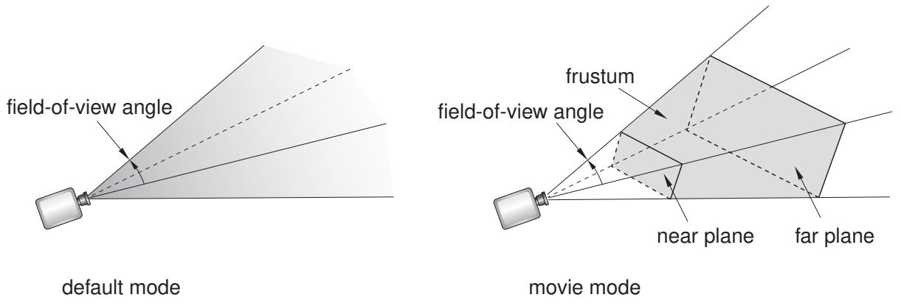  
图 1：默认模式和影片模式的相机视图。

以下相机术语用于描述您在视口中看到的视图：

## 相机目标

相机目标是空间中的一个点，它控制在大多数视图操作期间相机的移动方式。对于所有默认视图，相机目标与视图中所有对象的中心点重合。当您使用平移、旋转和放大视图操作工具的备用模式时，相机目标会远离所有对象的中心。

## 视锥体

视锥体是使用影片相机模式时可见的三维空间。相机位置构成金字塔的顶点，该金字塔由左、右、上、下平面创建（与默认模式中相同）。为了创建视锥体，在默认视图中添加了两个附加平面：近裁剪平面和远裁剪平面。只有在视锥体内部的对象（或对象的部分）在影片相机模式下才可见。

## 视场角

视场角是形成视图侧面的左、右平面或上、下平面之间的较大角度。使用的角度取决于视锥体的形状（实际上是视口的形状）；在图 1 的两幅图像中，左、右平面之间的角度更大；因此，该角度被标示为视场角。视场角同时适用于默认相机模式和影片相机模式；改变该角度相当于调整固定相机上的变焦以扩大或缩小相机图像。

放大、框缩放和自适应视图操作工具都会改变视场角以调整视口中的视图大小。有关这些工具的更多信息，请参阅了解视图操作工具。

## 近裁剪平面

近裁剪平面垂直于相机方向，并且仅在影片相机模式下有效。从相机到近裁剪平面的距离是对象可以离相机最近并仍然保留在视图中的距离。默认相机的视图包括任何距离的对象，就像近裁剪平面直接位于相机镜头前方一样。

近裁剪平面是一个裁剪平面；它从视图中移除模型表面和边，而不切割模型。在可视化模块中，您可以切割模型以使内部表面可见；更多信息，请参阅切割模型。

## 远裁剪平面

与近裁剪平面类似，远裁剪平面垂直于相机方向，并且仅在影片相机模式下有效。从相机到远裁剪平面的距离是对象可以离相机最远并仍然保留在视图中的距离。默认相机的视图包括任何距离的对象，就像远裁剪平面位于距相机镜头无限远的位置一样。

远裁剪平面是一个裁剪平面；它从视图中移除模型表面和边，而不切割模型。在可视化模块中，您可以切割模型以使内部表面可见；更多信息，请参阅切割模型。

您可以使用视图选项、视图操作工具和透视工具来更改相机模式设置，或者更改相机、相机目标和您正在查看的对象之间的关系。这些工具和选项的当前设置定义了当前视图。

使用视图选项来控制当前相机模式和其他无法使用视图操作工具设置的选项。

从主菜单栏选择 View->View Options（视图->视图选项）可访问当前视口的视图选项，如图 1 所示。

  
图 1：View Options（视图选项）对话框。

您可以使用 View Options（视图选项）对话框来控制：

• 视场角（实际上，当前视图的放大倍率）。  
• 相机模式（影片模式允许您将相机移入模型并穿越模型）。  
• 从影片模式相机到近裁剪平面的距离（对象可以离相机最近并仍保留在视图中的距离）。  
• 从影片模式相机到远裁剪平面的距离（对象可以离相机最远并仍保留在视图中的距离）。


## 注意：

指定近裁剪平面和远裁剪平面距离可以通过从视图中排除超出指定范围的模型部分来提高大型模型的显示性能。

在可视化模块中，View Options（视图选项）对话框还包含 Camera Movement（相机运动）选项。您可以使相机跟随局部坐标系的运动，并选择相机是否也跟随所选坐标系的旋转。如果影片模式处于开启状态，您可以将相机定位在所选坐标系的原点。有关可视化模块中视图选项的更多信息，请参阅自定义相机运动。

1. 从主菜单栏选择 View->View Options（视图->视图选项）。
显示视图选项（View Options）对话框。

2. 如有需要，可更改视野角度以调整视口中的视图大小：
   • 减小角度以放大视图
   • 增大角度以缩小视图

3. 切换“使用电影模式”（Use movie mode）的开关，以在默认摄像机模式和电影摄像机模式之间切换。

   激活电影摄像机模式不会改变当前视图。但是，如果您应用默认摄像机模式（即关闭“使用电影模式”），您将看到以下效果之一：
   • 如果模型完全位于视锥体内，当前视图不会改变。
   • 如果模型的某一部分被近裁面或远裁面裁掉，该部分将重新出现在视图中，并且下次激活电影模式时，Abaqus/CAE 会重置近裁面和远裁面距离，以便将整个对象包含在视图中。
   • 如果电影模式摄像机位于模型内部，摄像机将沿当前视图方向“后移”，以使整个模型位于摄像机前方。Abaqus/CAE 会调整视野角度以显示与电影模式视图中大小相似的模型，并在下次激活电影模式时重置近裁面和远裁面距离以将整个对象包含在视图中。


提示：使用循环视图（cycle view）操作工具可返回到上一个视图。

4. 如有需要，调整近裁面距离（Near plane distance）。
   Abaqus/CAE 将从视图中移除位于电影摄像机与近裁面之间的任何对象或对象部分。

5. 如有需要，点击“指定”（Specify）并调整远裁面距离（Far plane distance）。
   默认情况下，Abaqus/CAE 会自动计算远裁面距离，将其设置为模型最远点之外的一个值，并在您操作视图时进行调整，以确保模型的任何部分都不会被排除在视图之外。如果您指定了一个距离，Abaqus/CAE 将从视图中移除位于该距离之外的任何对象或对象部分。

6. + 点击“确定”（OK）以应用您的更改并关闭对话框。
   您的更改将在整个会话期间保存。

## 附加信息
• 摄像机模式和视图术语
• 理解视图操作工具

## 理解视图操作工具
本节描述在使用视图操作工具之前应理解的基本概念。

## 本节内容：
视图操作工具
平移视图工具
旋转视图工具
缩放工具
框选缩放工具
自动适应工具
循环工具
自定义视图
数值指定视图

## 视图操作工具
摄像机位置、方向和缩放因子共同定义了视口中对象的视图。您对装配体以及每个部件的视图，都相对于一个默认的笛卡尔坐标系进行定位，该默认坐标系在视口中的方向由视图三轴架（view triad）指示。默认情况下，当模块首次显示三维部件或装配体时，使用等轴测视图。

您可以使用“视图操作”（View Manipulation）工具栏上的平移、旋转、缩放、框选缩放和自动适应工具来操作视图，以控制摄像机、摄像机目标点以及您正在查看的模型或结果的相对位置。例如，您可能希望平移并缩放应力轮廓图以查看应力集中区域。视图操作工具允许您执行以下操作：
- 水平和垂直移动视图；即平移视图。
- 旋转视图。
- 放大或缩小视图。
- 放大到视图的选定区域。
- 重新缩放视图以填充视口；即自动适应视图。
- 循环浏览以前的视图。

其他类型的视图操作可以使用 3D 罗盘执行；有关更多信息，请参阅 3D 罗盘。

您可以点击鼠标按钮 3 来访问以下视图操作工具：
• 设置为旋转中心（Set As Rotation Center）：在鼠标点击位置设置旋转中心，该位置可以是视口中的任意位置。
• 使用默认旋转中心（Use Default Rotation Center）：清除先前设置的旋转中心。
• 居中视图（Center View）：将视图居中于鼠标点击位置。

当视口中显示 X-Y 图时，您可以使用视图操作工具来更改 X-Y 曲线的视图。由于 X-Y 图是二维的，当当前视口显示 X-Y 图时，旋转工具将被禁用。

点击某个视图操作工具会进入相应的视图操作模式。然后，您可以通过将光标移动到该视口并根据需要进行拖动或点击，来操作特定视口中的视图。此外，平移、旋转和缩放工具具有替代模式，您可以通过在使用这些工具的正常操作时按住 [Shift] 键来访问。这些工具的替代模式旨在用于电影摄像机模式，但也可以在默认模式下使用。有关摄像机术语和视图模式的更多信息，请参阅理解摄像机模式和视图选项。要退出视图操作模式，请执行以下操作之一：
• 点击鼠标按钮 2。
• 点击提示区中的取消按钮。
• 再次点击该视图操作工具。
• 点击任何其他视图操作工具。

您可以根据需要多次使用视图操作工具以达到所需的视图，并且您可以在任何视口中执行视图操作，无论该视口正在显示什么内容。Abaqus/CAE 存储了来自每个视口的最近八个视图，您可以使用循环视图操作工具向后和向前循环浏览这些视图。

当您在与其他视口链接的视口中使用移动、旋转、缩放、框选缩放或重新缩放工具时，Abaqus/CAE 也会操作链接视口中的对象视图。有关更多信息，请参阅链接视口以进行视图操作。

默认情况下，当您操作对象视图时，Abaqus/CAE 使用当前渲染样式（线框、填充、隐藏线或着色）显示图像。或者，您可以在“图形选项”（Graphics Options）对话框中更改“拖动模式”（Drag mode），以便在操作视图时将图像显示为简单线框；此模式允许在着色渲染样式下更快地操作非常大的模型。当您完成操作时，视图会恢复到原始渲染样式。

如果您更喜欢使用菜单而不是“视图操作”工具栏上的工具，您可以通过主菜单栏上的“视图”（View）菜单访问所有视图操作工具。此外，您可以使用“视图”（Views）工具栏应用预定义和用户定义的视图，并且您可以通过选择主菜单栏上的“视图->指定”（View->Specify）时出现的对话框来数值指定精确的视图。有关自定义和数值指定视图的更多信息，请分别参阅自定义视图和数值指定视图。

或者，您可以通过键盘和鼠标操作的组合进入三种视图操作模式。
• 要旋转视图，按 [Ctrl][Alt]，并按住鼠标按钮 1。
• 要平移视图，按 [Ctrl][Alt]，并按住鼠标按钮 2。
• 要放大或缩小视图，按 [Ctrl][Alt]，并按住鼠标按钮 3。

在以上任何组合中添加 [Shift] 可访问这些工具的替代模式。例如，按 [Shift][Ctrl][Alt] 并按住鼠标按钮 3 可访问缩放工具的替代模式，并将摄像机移近或远离视图中的对象。当您不使用替代模式时，[Shift] 键对视图操作工具没有影响。使用前述操作后要退出视图操作模式，只需释放鼠标按钮即可。

您可以通过从主菜单栏选择“工具->选项”（Tools->Options）来重新配置这些键盘和鼠标组合，以模拟其他五种常见 CAD 应用程序使用的视图操作界面。有关更多信息，请参阅使用视图操作快捷键。

## 附加信息
• 使用视图操作工具
• 理解摄像机模式和视图选项

## 平移视图工具
当模型显示在视口中且平移模式已设置时，您对模型的视图位置会随着您点击然后拖动光标而改变，一条橡皮筋线表示平移量。

当您选择 $\mathsf {平移}$ 工具 $\nleftrightarrow$ 并选择要在其中工作的视口时，Abaqus/CAE 进入平移模式，如 $\cos ^ { \frac { \pi } { 3 } }$ 光标所示。

平移视图类似于在模型快照上移动摄像机，如图 1 所示；快照在视口中移动，但在您平移时，模型中在原始摄像机位置被隐藏的任何面仍然保持隐藏状态。

  
对象的快照  
图 1：平移视图。

平移工具的替代模式通过在执行操作时按住 [Shift] 来访问，它创建了一个更真实的摄像机视图。它不是模型的快照，而是让摄像机在真实模型上平移。在您移动摄像机越过模型时，模型中在原始摄像机位置被隐藏的面会被暴露出来，如图 2 所示。
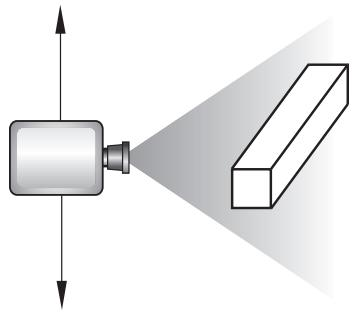
图2：在交替模式下平移视图。


## 注意：

如果未开启透视，平移的交替模式与标准平移工具的工作方式完全相同。

对于平移工具的两种模式，光标的初始位置并不重要，只要您将其放置在视口内即可。光标的移动仅受显示器物理边界的限制，即使您将光标移出视口或窗口，平移也会继续。

当视口中显示 X-Y 图时，您可以通过在网格中点击并拖动光标来改变对图中 X-Y 曲线的视图。在您操作 X-Y 数据视图时，Abaqus/CAE 会更新坐标轴中的数值。

## 附加信息

• 视图操作工具
• 平移视图
• 理解相机模式和视图选项

## 旋转视图工具

在旋转模式下，光标变为两个弯曲的箭头，视口中出现一个大圆。要定义旋转中心，您可以直接输入其坐标或从视口中选择一个点。否则，Abaqus/CAE 将围绕视口中心旋转视图。

当您选择旋转工具以及要工作的视口后，Abaqus/CAE 进入旋转模式。如果您通过从视口选择位置或输入坐标来选择旋转中心，该旋转中心位置将覆盖视图中心，并保持选定状态，直到您选择新的旋转中心、显示不同的对象或选择默认旋转中心。当您拖动光标时，模型视图随之旋转，一条橡皮筋线表示旋转的量和方向。在您旋转模型视图时，视图三轴指示全局坐标系的方向。


## 注意：

当当前视口中显示 X-Y 图时，Abaqus/CAE 会禁用旋转工具。

进入旋转模式时绘制的圆代表包围对象的一个假想球体的轮廓。当您在圆内拖动鼠标时，您可以想象自己实际上正在旋转一个球体，就像操作轨迹球一样。您的模型附着在球体的中心，因此旋转球体会使模型视图也随之旋转。

您通过将光标移动到假想球体的表面上来确定旋转轴。橡皮筋线代表切割平面与球体表面的交线，旋转轴垂直于该切割平面。旋转角度等于橡皮筋线在球体表面上形成的角度，因此拖动整个圆周会产生 180° 的旋转。图 1 展示了假想球体和在其表面上拖动的橡皮筋线。

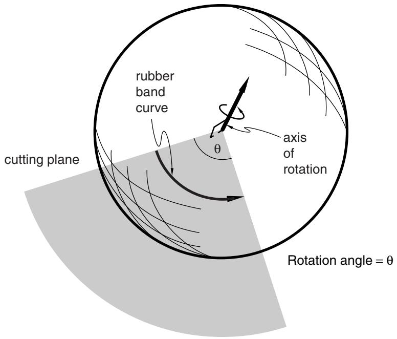
图1：旋转工具。

当您在圆外拖动时，橡皮筋线叠加在圆的边缘上，您对对象的视图将简单地围绕垂直于屏幕并通过圆心的轴旋转。与在圆内拖动的情况相同，橡皮筋线表示对象已经旋转的角度。

使用视图旋转的默认模式类似于围绕视图中心或选定的旋转中心旋转相机，如图 2 所示。


图2：围绕目标或选定的旋转中心旋转相机。

旋转工具的交替模式通过在执行操作时按住 [Shift] 访问，如图 3 所示，它会围绕相机自身旋转相机。这会移动相机目标和视锥体，而不考虑原始视图中对象的位置。当您处于电影模式且相机位于模型内部时，围绕相机自身旋转最为有用。在此位置，移动相机目标和视锥体可以将模型内部的不同部分带入视野。


图3：围绕相机自身旋转相机。


## 注意：

如果您选择了一个点作为旋转中心，您的选择将覆盖旋转的交替模式。

在任一模式下，通常更容易通过执行一系列较小的旋转而不是一次大的旋转来获得所需的旋转。如果您需要放弃旋转并返回已知方向，可以使用预定义的目标视图，或将目标重置为模型中心。

由于 X-Y 图是二维的，当当前视口中显示 X-Y 图时，Abaqus/CAE 会禁用旋转工具。

## 附加信息

• 视图操作工具
• 旋转视图
• 理解相机模式和视图选项

## 放大工具

当您在放大模式下沿正方向拖动光标时，您对模型或图的视图在视口内扩展，一条橡皮筋线表示相对放大倍率。同样，当您沿负方向拖动光标时，您对模型或图的视图收缩，橡皮筋线表示相对缩小。

当您选择放大工具以及要工作的视口后，Abaqus/CAE 进入放大模式，如放大光标所示。正方向和负方向取决于您在视图操作选项中的设置（参见使用视图操作快捷方式）。如果您使用的是 Abaqus/CAE 的默认视图操作配置，则正方向为向右，负方向为向左。如果您使用的是非默认的视图操作配置，则正方向为向上，负方向为向下。为反映配置设置，默认配置下橡皮筋线是水平的，非默认配置下是垂直的。

拖动操作必须从视口内开始，但您可以在显示器的限制范围内继续拖动。您也可以反复拖动以获得所需的视图。放大工具仅识别您的拖动运动在水平方向（对于默认配置）或垂直方向（对于非默认配置）上的分量，如橡皮筋线所示。因此，您可以通过对角线拖动屏幕来获得更精细的控制，因为这导致光标在有效方向上的运动分量小于沿相同有效方向拖动相同距离所产生的分量。

使用放大工具的默认模式，顾名思义，会放大视图；如图 1 所示，相机相对于视图中的对象不会移动。放大是通过改变视野角实现的，这与您在固定相机上改变变焦倍率的方法相同。


图1：放大视图。

放大工具的交替模式通过在执行操作时按住 [Shift] 访问，如图 2 所示，它会保持视野不变，并将相机移近或移离视图中的对象。


图2：将相机移近模型。

以这种方式移动相机在电影模式开启时最为有用。这样您的视野就不会受到限制；您可以将相机移动穿过模型，使得您不希望看到的任何部分被近裁剪面或远裁剪面移除，或者实际上位于相机后方。如果您没有使用电影模式，相机只能向前移动到模型的外部边界。

当视口中显示 X-Y 图时，您可以放大数据视图以聚焦于 X-Y 曲线的特定组成部分。在您改变 X-Y 图的放大倍率时，Abaqus/CAE 会更新坐标轴中的数值。

如果您失去了位置跟踪，可以使用自适应工具重新缩放视图以适应视口。使用自适应工具也会将相机目标重置为模型中心。

## 附加信息

• 视图操作工具
• 放大或缩小视图
• 理解相机模式和视图选项

## 框选放大工具

您使用框选放大工具选择模型或图的矩形区域；Abaqus/CAE 会将您所选部分的模型或图的视图放大以填满视口。

当您选择框选放大工具以及要工作的视口后，Abaqus/CAE 进入框选放大模式，如十字线形状的光标所示。对于 X-Y 图，Abaqus/CAE 会放大您所选的 X-Y 曲线视图，并更新坐标轴值以匹配您选择的数据。
## 附加信息

• 视图操作工具  
• 缩放到视图的选定区域

## 自动适应工具

视图操作工具栏包含一个自动适应工具。


**网** 使用视图操作工具栏中的自动适应工具，可以快速调整模型视图，使模型或模型绘图填满视口并居中显示。当您适应模型视图时，方向不会改变，如视图三元组所示。

当您自动适应一个 X–Y 绘图时，自动适应工具会将坐标轴的值重置为其指定的最小值和最大值；有关详细信息，请参阅自定义 X–Y 绘图坐标轴。自动适应工具不一定能用 X–Y 绘图填满视口，因为图表选项可能会规定绘图仅占据视口的一部分；有关图表尺寸和定位选项的更多信息，请参阅自定义 X–Y 绘图外观。

自动适应操作会在您单击自动适应工具后立即在当前视口中进行。如果您有多个视口，请在选择自动适应工具之前选择您要重新缩放的视口，使其成为当前视口。

当您从主菜单栏选择“视图 -> 图形选项”时，可以使用一个单独的选项“旋转后自动适应”。您使用此选项来控制当您旋转时，Abaqus/CAE 是否自动重新缩放视图以适应视口。有关使用此选项的更多信息，请参阅旋转视图。

## 附加信息

• 视图操作工具  
• 重新缩放视图以适应视口

## 循环工具

您可以在每个视口中循环查看最近的八个视图。

当您选择循环工具并选择要在其中工作的视口时，Abaqus/CAE 会进入循环模式，如双向箭头形式的光标所示。

要循环浏览以前的视图，请单击您希望更改视图的视口。要控制循环方向，请在提示区域中单击“向后”或“向前”。默认是向后循环。在您向后循环到最早可用的视图后，继续单击无效。同样，在您向前循环到最新视图后，继续单击无效。

## 附加信息

• 视图操作工具  
• 循环浏览视图

## 自定义视图

视图工具栏允许您将自定义视图应用于选定视口中的模型。（视图是视口中模型的位置、方向和缩放因子的组合。）


## 注意：

默认情况下，视图工具栏在 Abaqus/CAE 主窗口中不可见。要显示视图工具栏，请从主菜单中选择“视图 -> 工具栏 -> 视图”。

自定义视图包括七个预定义视图（如前视图和后视图）以及最多四个用户定义视图。

## 预定义视图

预定义视图基于一个假想立方体的六个面和一个等轴测视图。视图三元组指示了该假想立方体在视口中的方向。图 1 展示了六个预定义的立方体面视图。

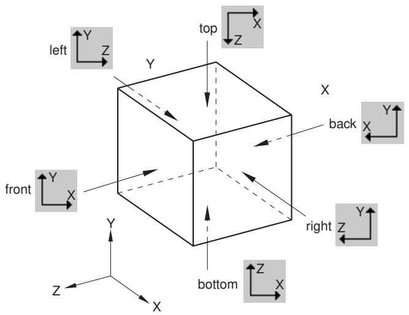  
图 1：预定义视图。

## 注意：

当在当前视口中显示 X–Y 绘图时，预定义视图不起作用。

## 用户定义视图

您可以使用视图操作工具将模型视图定位在视口中，然后在视图工具栏中单击，将视图保存为四个用户定义视图之一。您可以使用此保存的视图将视口中的对象恢复到已知方向，并且可以将保存的视图应用于其他视口。默认情况下，保存的视图不会在会话之间保留。如果您希望将保存的视图保留到后续会话，请将其保存到 XML 文件、模型数据库或输出数据库中。有关更多信息，请参阅管理会话对象和会话选项。

视图由三个组件组成：方向、缩放因子和位置。您可以使用“缩放 & 位置”选项来选择是否保存所有这三个组件，如下所示：

## 自动适应

当您选择此选项后保存视图时，仅保存方向。当您应用使用此选项保存的视图时，会应用保存的方向，但会调整缩放因子和位置以使视图适应视口。

## 保存当前

当您选择此选项后保存视图时，方向、缩放因子和位置都会被保存。当您应用使用此选项保存的视图时，保存的方向、缩放因子和位置都会应用于视口中的对象。要通过将视口并排排列并为每个视口应用已知的方向、缩放因子和位置来比较不同视口中的不同对象，请选择“保存当前”选项。

## 附加信息

• 视图操作工具  
• 应用自定义视图  
• 保存用户定义视图

## 数值指定视图

您可以绕过视图操作工具，以数值方式指定特定视图。如果您希望在 Abaqus/CAE 会话之间重现特定视图，或者以数值方式指定视图比应用一系列视图操作更简单、更方便，那么指定视图非常有用。

从主菜单栏选择“视图 -> 指定”以指定视图。


**提示：** 您也可以通过双击 3D 罗盘来指定视图。

您可以使用以下方法指定您的视图：

## 旋转角度

输入三个角度 $( \pmb { \theta _ { 1 } } , \pmb { \theta _ { 2 } } , \pmb { \theta _ { 3 } } )$，分别表示您的模型视图绕屏幕或模型 1-、2- 和 3-轴旋转的角度。旋转按 $( \pmb { \theta _ { 1 } } , \pmb { \theta _ { 2 } } , \pmb { \theta _ { 3 } } )$ 顺序解释，正角度表示绕该轴的右旋。如果您在使用旋转视图工具（参见旋转视图工具）时先前指定了非默认的旋转中心，则指定的旋转也将围绕该点进行。您必须选择以下模式之一来应用旋转：

**增量绕模型轴。** 当您选择“增量绕模型轴”时，Abaqus/CAE 只是将旋转应用于当前视图。图 1 显示了从等轴测视图应用 90, 0, 0 的增量模型轴旋转的结果。

  
图 1：指定增量模型轴旋转角度。

• **增量绕屏幕轴。** 屏幕 X 轴是水平的，Y 轴是垂直的，Z 轴指向屏幕外。屏幕轴的原点是相机目标。在大多数情况下，相机目标与视口的中心重合，但某些视图操作方法可以移动相机目标（有关更多信息，请参阅相机模式和视图术语）。当您选择“增量绕屏幕轴”时，Abaqus/CAE 只是将旋转应用于当前视图。图 2 显示了从等轴测视图应用 90, 0, 0 的增量屏幕轴旋转的结果。

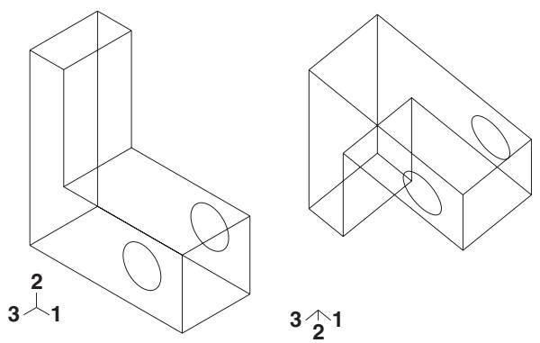  
图 2：指定增量屏幕轴旋转角度。

**从 (0,0,1) 的总旋转。** 当您选择“从 (0,0,1) 的总旋转”时，Abaqus/CAE 首先将视图旋转到默认位置（沿 3 轴向下看，1- 和 2- 轴在屏幕平面内），然后应用所需的旋转。图 3 显示了从等轴测视图应用 90, 0, 0 的总旋转的结果。

  
图 3：指定总旋转角度。

## 视点

当您选择“视点”时，您输入三个值，表示观察者的 1-, 2-, 3-位置。Abaqus/CAE 构造一个从模型原点到您指定位置的向量，并旋转您的模型视图，使该向量指向屏幕外。图 4 显示了应用视点 1, 1, 1（等轴测视图）和视点 1, 0, 0 的结果。

  
图 4：指定视点。

当您使用“视点”方法指定视图时，您还可以指定“向上向量”。Abaqus/CAE 定位您的模型视图，使该向量指向上方。图 5 显示了将向上向量 0, 1, 0 和向上向量 0, -1, 0 应用于等轴测视图的结果。向上向量不得等于视点向量。

  
图 5：指定向上向量。

## 缩放

输入一个表示放大因子的值。大于 1 的值会扩展您在视口中对模型的视图；例如，缩放因子为 2 会将您模型视图的大小加倍。介于 0 和 1 之间的值会收缩您在视口中对模型的视图；例如，值为 0.25 会将您模型的视图收缩到原始大小的四分之一。该值必须大于零。
您必须选择以下方法之一来应用缩放：

-   **绝对 (Absolute)**。当您选择**绝对**时，Abaqus/CAE 首先将视图适配到视口，然后应用所需的**缩放因子**。
-   **相对 (Relative)**。当您选择**相对**时，Abaqus/CAE 将**缩放因子**应用于当前视图。

## 平移 (Pan)

输入 Abaqus/CAE 用于将模型视图按指定的水平和垂直距离进行**平移**的值。Abaqus/CAE 相对于视图在视口中的当前位置移动视图。您输入的值对应于视口尺寸的分数；第一个值代表水平移动，第二个值代表垂直移动。正的第一个值将模型视图向视口的右边缘移动，正的第二个值将模型视图向视口的顶部移动。例如，如果视口宽 200 毫米、高 100 毫米，并且您在**视口平移比例(X,Y)** 字段中输入值 0.5, -0.1，Abaqus/CAE 会将模型视图从当前位置向右移动 100 毫米，并向下移动 10 毫米。

## 其他信息

-   视图操作工具
-   应用指定视图

## 3D 罗盘

本节描述 3D 罗盘的基本功能和特性。

## 本节内容：

关于 3D 罗盘
使用 3D 罗盘旋转视图
使用 3D 罗盘平移视图
3D 罗盘的预定义视图
自定义 3D 罗盘

## 关于 3D 罗盘

3D 罗盘是出现在视口右上角的视口注释。


图 1:3D 罗盘。

Abaqus/CAE 中的 3D 罗盘基于 CATIA V5 中使用的 3D 罗盘。3D 罗盘指示模型在视口中的方向，类似于视图三轴架。与视图三轴架不同，您可以通过点击并拖动 3D 罗盘来操作其方向。当您操作 3D 罗盘时，视口摄像机会平移或旋转以相应地改变视口方向。罗盘视图操作的行为与 CATIA V5 中的罗盘视图操作行为相同。

3D 罗盘是某些视图操作选项的有用快捷方式，因为它在所有模块和所有分析过程中都可用；您不需要进入视图操作模式即可使用 3D 罗盘改变视口方向。

## 使用 3D 罗盘旋转视图

3D 罗盘允许您使用两种不同方法旋转模型视图：您可以自由地向所有方向旋转，或者可以将操作约束为绕特定轴旋转。在这两种情况下，模型视图都围绕视口的当前旋转中心旋转，该中心由旋转工具定义（参见旋转视图工具）。

## 自由旋转

要在任意方向旋转模型，请点击并拖动 3D 罗盘上的自由旋转手柄：


当您拖动鼠标时，罗盘围绕其枢轴沿鼠标移动的方向旋转（枢轴点与罗盘操作手柄重合）。旋转取决于鼠标移动的方向，而不是指针的位置；换句话说，只要您继续拖动，罗盘就会继续旋转。随着罗盘方向的改变，模型视图也相应改变。

## 绕轴旋转

您也可以绕指定轴旋转模型，从而在操作过程中保持特定方向的恒定方向。要绕轴旋转，请点击并拖动 3D 罗盘周边的三个圆弧之一：


当您拖动鼠标时，罗盘绕垂直于所选圆弧（在上面的示例中为 X 轴）所张平面的轴旋转。旋转取决于指针的位置。当您拖动鼠标时，指针在视口中的路径被投影到所选的罗盘圆弧上。罗盘根据此投影路径旋转。随着罗盘方向的改变，模型视图也相应改变。

## 其他信息

-   什么是视口？
-   摄像机模式和视图术语
-   旋转视图工具

## 使用 3D 罗盘平移视图

3D 罗盘允许您使用两种不同方法平移模型视图：您可以沿指定轴平移，或者可以在指定平面内平移。

使用 3D 罗盘执行的平移操作与使用标准平移视图工具执行的操作不同（参见平移视图工具）。标准平移工具在模型前方横向移动摄像机；摄像机被限制为仅在平行于视口的平面内移动。3D 罗盘的平移平面不一定平行于视口。因此，使用罗盘平移的行为类似于标准平移和缩放工具在其备用模式下的组合：摄像机既在模型上横向移动，也垂直于模型移动（靠近或远离模型）。在平移操作期间，罗盘和模型视图的方向不会改变。


## 注意：

与标准平移视图工具的备用模式一样，使用 3D 罗盘平移视图也会将视口的旋转中心与摄像机一起移动。有关旋转中心的信息，请参见旋转视图工具。

## 沿轴平移

要沿轴平移视图，请点击并拖动 3D 罗盘上的任何直线轴：

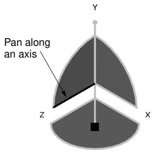

当您拖动鼠标时，指针在视口平面上的路径被投影到所选的罗盘轴上（在上面的示例中为 Z 轴）。摄像机根据此投影的线性路径移动。

## 沿平面平移

要沿平面平移视图，请点击并拖动 3D 罗盘上的任何四分之一圆形面：


当您拖动鼠标时，指针在视口平面上的路径被投影到所选的罗盘平面上（在上面的示例中为 Y-Z 平面）。摄像机根据此投影路径移动。

## 其他信息

-   什么是视口？
-   摄像机模式和视图术语
-   平移视图工具

## 3D 罗盘的预定义视图

您可以使用 3D 罗盘快速将视点设置为六个预定义视图之一。您还可以通过罗盘访问“指定视图”对话框。

## 预定义视图

预定义视图对应于 3D 罗盘的三个平面。要应用预定义视图，请点击 3D 罗盘上任何轴的标签：


视图会调整，使得所选轴（在上面的示例中为 Z 轴）垂直于视口平面。再次点击相同的轴标签会将视图方向翻转到视口平面的相反一侧。换句话说，重复点击相同的轴标签会使视图在显示模型的前侧和后侧之间来回切换。

与 3D 罗盘关联的六个预定义视图与“视图”工具栏中的预定义视图相同。

## 数值指定视图

在 3D 罗盘上的任意位置双击会打开“指定视图”对话框。您可以使用此方法数值指定视点或摄像机位置。有关数值指定视图的更多信息，请参见数值指定视图。

## 其他信息

-   什么是视口？
-   摄像机模式和视图术语
-   自定义视图
-   数值指定视图

要自定义 3D 罗盘的外观和方向，请在罗盘上点击鼠标按钮 3 并从出现的菜单中选择一个选项。您可以执行以下自定义：

## 编辑

选择**编辑**以显示“指定视图”对话框，并数值指定自定义视图方向。有关指定自定义视图方向的详细信息，请参见数值指定视图。


提示：您也可以双击 3D 罗盘以显示“指定视图”对话框。

## 更改特权平面

罗盘的底座（包含罗盘操作手柄）被称为**特权平面**。默认情况下，在 Abaqus/CAE 中 X-Z 平面是特权平面。特权平面有助于确定模型在视口中的“正确”方向。在罗盘的默认等轴测方向中，特权平面出现在底部，自由旋转手柄出现在顶部；从特权平面到自由旋转手柄的轴实际上指示了模型的“向上”方向。
如果模型中的Y轴不是“向上”方向，您可以将首选平面更改为罗盘中的三个主要平面之一。例如，选择**Make XY the Privileged Plane**可将X-Y平面设置为首选平面。更改首选平面只会重新配置三维罗盘的形状，如图1所示；视图方向和视图工具栏中的预定义视图不会改变。

  
图1：将首选平面从X-Z平面（左）更改为X-Y平面（右）。

## 隐藏

选择**Hide**可将三维罗盘从视口显示中移除。要恢复三维罗盘的显示，您必须使用视口注释选项（从主菜单中选择**Viewport->Viewport Annotation Options**）。有关控制视口注释可见性的信息，请参阅使用视口注释选项。

## 帮助

选择**Help**可显示一个包含三维罗盘使用文档的帮助窗口。

## 自定义视图三轴架

如下所示的视图三轴架是一组三个相互垂直的轴，用于指示当前显示的模型视图的方向。X、Y和Z标签分别对应1、2和3方向。当您旋转模型视图时，三轴架会随之变化以指示新的方向。有关使用旋转工具的更多信息，请参阅旋转视图。


视图三轴架和三维罗盘都指示视图方向，并且它们始终保持对齐。您可以直接在视口中操纵三维罗盘的方向，从而改变模型的视图（请参阅三维罗盘）。视图三轴架仅作为参考；它会随三维罗盘一起旋转，但无法被直接操纵。

您可以使用**Viewport->Viewport Annotation Options**菜单项来请求或禁止显示三轴架，并控制三轴架的大小、位置和外观。您还可以控制三轴架的标签，包括其颜色和字体。

1.  从主菜单栏中，选择**Viewport->Viewport Annotation Options**。

    **Viewport Annotation Options**对话框将出现。

2.  切换**Show triad**以在当前视口中显示或隐藏三轴架。

    当**Show triad**切换为开时，三轴架选项变为可用。

3.  单击**Triad**选项卡。

    Abaqus/CAE显示三轴架视图选项。

4.  在**Triad size**框中输入三轴架大小，作为视口大小的百分比。当您调整视口大小时，三轴架的大小也会相应改变。允许的最小三轴架大小为视口的1%，最大为视口的50%。
5.  在**% Viewport X**和**% Viewport Y**框中分别输入三轴架X和Y位置的百分比值。

    **% Viewport X**的值为0会将三轴架原点移动到视口的最左侧，而值为100则将其移动到最右侧。**% Viewport Y**的值为0会将三轴架原点移动到视口的最底部，而值为100则将其移动到最顶部。

6.  选择三轴架标签的颜色：
    a. 单击颜色样本。
       Abaqus/CAE显示**Select Color**对话框。
    b. 使用**Select Color**对话框中的方法之一选择新颜色。有关更多信息，请参阅自定义颜色。
    c. 单击**OK**关闭**Select Color**对话框。
       颜色样本变为所选颜色。
7.  单击**Labels**字段旁边的箭头，选择为三轴架使用数字或字母标签。
    指定的样式出现在**Labels**字段中。
8.  单击**Set Label Font**，使用出现的对话框设置字体类型、大小和样式。
9.  单击**Apply**以应用您的更改。
    您的更改将在当前会话期间保存。

## 附加信息
*   使用图形显示选项
*   自定义视口注释

## 控制透视图

透视图表示法能在二维平面上准确描绘三维物体的空间关系。换句话说，当透视图打开时，屏幕上的三维模型会显得更真实。或者，当透视图关闭时，模型中的平行线将显示为平行。透视图会影响除X-Y图以外的所有绘图，适用于所有模块，并且默认处于打开状态。

*   要打开透视图，请选择位于视图选项工具栏中的图标，或从主菜单栏中选择**View->Perspective**。
*   要关闭透视图，请选择位于视图选项工具栏中的$\sharp$图标，或从主菜单栏中选择**View->Parallel**。

您的更改仅适用于当前视口，并在当前会话期间保存。

## 附加信息
*   操纵视图和控制透视图

## 使用视图操纵工具

本节详细介绍了如何使用视图操纵工具栏中的工具，这些工具允许您操纵视口内模型或X-Y图的位置、方向和缩放。

当您操纵的视口链接到其他视口时，Abaqus/CAE还会更改会话中每个链接视口内的视图。

## 本节内容：
*   居中视图
*   平移视图
*   旋转视图
*   放大或缩小视图
*   缩放至视图的选定区域
*   重新缩放视图以适应视口
*   循环切换视图
*   应用自定义视图
*   保存用户定义的视图
*   应用指定的视图

## 居中视图

在视口中单击鼠标按钮3可访问居中视图选项。

您也可以使用视图操纵工具栏中的自动适配工具来快速平移并放大或缩小视图，以便视图填满视口并居中显示。

1.  将光标定位在视口中要用作视图中心的位置，然后单击鼠标按钮3。
2.  从出现的菜单中，选择**Center View**。Abaqus/CAE会将您选择的位置移动到视口的中心。

## 附加信息
*   链接视口以进行视图操纵
*   视图操纵工具
*   重新缩放视图以适应视口

## 平移视图

您可以使用视图操纵工具栏在视口内水平和垂直移动视图。

使用视图操纵工具栏中的平移工具在视口内水平和垂直移动视图。使用平移工具时按住**[Shift]**键可访问备用平移模式。备用模式会在您平移视图时改变视图透视，从而创建更逼真的图像（有关更多信息，请参阅平移视图工具）。

如果当前视口链接到其他视口，Abaqus/CAE还会移动会话中所有链接视口内对象的视图。有关更多信息，请参阅链接视口以进行视图操纵。

1.  从视图操纵工具栏中，单击平移工具以进入平移模式。

    

    提示：您也可以从主菜单中选择**View->Pan**或按**[F2]**。

2.  将光标定位在您想要更改视图的视口中。
    光标变为四向箭头：
3.  将光标拖动到任意方向，直到获得所需的视图。
    当您拖动光标时，模型或X-Y图在视口中的位置会随之改变，一条橡皮线指示平移的量。

    

## 注意：

光标的初始位置并不重要，只要您将其放置在视口内即可。光标移动仅受限于显示器的物理边界，即使您将光标移出视口或窗口，平移也会继续。

4.  重复步骤2和3，直到获得所需的视图。
5.  要退出平移模式，请执行以下操作之一：
    *   单击鼠标按钮2。
    *   单击提示区域的取消按钮。
    *   单击平移工具。
    *   单击任何其他视图操纵工具。

    

    提示：使用循环视图操纵工具可返回到上一个视图。

## 附加信息
*   链接视口以进行视图操纵
*   平移视图工具
*   视图操纵工具
*   使用视图操纵工具

## 旋转视图

您可以使用旋转工具来访问视口内操纵视图的几种模式。

使用视图操纵工具栏中的旋转工具在视口内旋转视图。使用旋转工具时按住**[Shift]**键可访问备用旋转模式。备用模式使相机围绕自身旋转，而不是围绕视图中心或选定的旋转中心旋转。当您使用电影摄影机模式并将相机放置在模型内部，使模型环绕相机时，备用模式最为有用（有关更多信息，请参阅旋转视图工具）。您还可以在每个视口中指定一个点，或选择一个位置作为旋转中心。使用**Graphics Options**对话框中的**Auto-fit after rotations**选项，您可以控制Abaqus/CAE在您旋转时是否将模型重新缩放以适应视口。


## 注意：

您无法旋转 X-Y 图。

如果当前视口与其他视口链接，Abaqus/CAE 也会旋转您会话中所有链接视口内的对象。更多信息，请参阅链接视口以进行视图操作。

## 其他信息

• 链接视口以进行视图操作  
• 旋转视图工具  
• 视图操作工具  
• 重新缩放视图以适配视口

## 旋转视图

1. 从视图操作工具栏中，点击旋转工具进入旋转模式。


提示：您也可以从主菜单选择 视图 -> 旋转 或按 [F3]。

2. 默认情况下，Abaqus/CAE 围绕视口的中心旋转视图。您可以使用以下一种方法更改旋转中心：

   将光标定位在模型或视口的任意位置，点击鼠标按钮 3，然后选择 设置为旋转中心。
   点击提示区域中的 选择。从视口内高亮显示的顶点中选择旋转中心，或输入坐标来指定一个点。在可视化模块中，您可以选择一个节点，旋转中心将在未变形和变形模型状态下都保持在该节点上。
   使用此方法时，仅当视口内存在现有几何时才能选择旋转中心。如果您在草图器中工作，则无法选择草绘点。
   点击鼠标按钮 3 并选择 使用默认旋转中心，或在提示区域中选择 使用默认 以返回到默认（视口中心）旋转方法。

   您选择的旋转中心将在视口中保持有效，直到您显示另一个对象、选择新的旋转中心或返回默认旋转方法。

3. 将光标放在您想要更改视图的视口中。

   视口中出现一个大圆圈，光标变为向右的箭头。如果您在视口内选择了旋转中心，它将被高亮显示。

4. 向任意方向拖动光标。

   视图随您拖动光标而旋转，一条橡皮筋线指示旋转的方向和幅度。


提示：通常，通过执行一系列小幅旋转比单次大幅旋转更容易实现所需的方向。

   要围绕屏幕法线旋转视图，请将光标移到圆圈外部并顺时针或逆时针拖动。

5. 重复步骤 2、3 和 4，直到达到所需的视图。

6. 要退出旋转模式，请执行以下操作之一：

   • 点击鼠标按钮 2。
   • 点击提示区域中的取消按钮。
   • 点击旋转工具。
   • 点击任何其他视图操作工具。


提示：使用循环视图操作工具可返回到前一个视图。

## 旋转时重新缩放视图以适配视口

1. 从主菜单栏，选择 视图 -> 图形选项。

   图形选项对话框出现。

2. 打开 旋转后自动适配 以在旋转时自动重新缩放视图以适配视口；关闭它以在旋转期间禁用自动重新缩放。
3. 点击 确定 以应用更改并关闭对话框。

   您的更改将在会话期间被保存。

## 放大或缩小视图

您可以使用视图操作工具栏来更改视口中视图的比例。

使用视图操作工具栏中的缩放工具来更改视口中视图的比例。按住 [Shift] 的同时使用缩放工具可访问备用缩放模式。备用模式将相机移近或远离视图中的对象，而不是更改放大倍率。当您使用电影摄影机模式时，备用模式最有用（更多信息，请参阅缩放工具）。

您对视图操作选项的配置设置会影响缩放工具的行为。如果您使用的是默认的 Abaqus/CAE 视图操作配置，缩放工具通过水平拖动光标来操作：向右拖动放大，向左拖动缩小。在所有其他视图操作配置中，缩放工具通过垂直拖动光标来操作：向上拖动放大，向下拖动缩小。更多信息，请参阅使用视图操作快捷方式。

如果您的鼠标具有滚轮作为鼠标按钮 2，您也可以通过在光标位于视口内时上下滚动来更改视图比例。对于 X-Y 图，此滚动的效果取决于光标的位置：

• 当光标在 X-Y 图网格内时，放大或缩小视图时 X-Y 图将保持其纵横比。
   当光标放置在其中一个轴上时，Abaqus/CAE 将沿您选择的轴拉伸或压缩 X-Y 图。此功能使您能够调整那些沿一个轴变化远大于另一个轴的 X-Y 图的视图。

如果当前视口与其他视口链接，Abaqus/CAE 也会更改您会话中所有链接视口内视图的比例。更多信息，请参阅链接视口以进行视图操作。

1. 从视图操作工具栏，点击缩放工具进入缩放模式。


提示：您也可以从主菜单选择 视图 -> 缩放 或按 [F4]。

2. 将光标放在您想要更改视图的视口中。

   光标变为放大镜：


3. 拖动光标以更改视图。您拖动的方向取决于您的视图操作配置设置。您可以通过从主菜单栏选择 工具 -> 选项 并在 视图操作选项 选项卡页面中选择设置来更改这些设置。

   • 如果您使用默认的视图操作配置，请将光标向起始点右侧拖动以放大视图（放大）。将光标向起始点左侧拖动以缩小视图（缩小）。
   • 如果您使用非默认的视图操作配置，请将光标向起始点上方拖动以放大视图（放大）。将光标向起始点下方拖动以缩小视图（缩小）。

   当您在屏幕上拖动光标时，Abaqus/CAE 从起始点绘制一条橡皮筋线。橡皮筋线指示已应用的缩放量，该缩放量与您在有效方向上的拖动分量成比例。

4. 重复步骤 2 和 3，直到达到所需视图。
5. 要退出缩放模式，请执行以下操作之一：

   • 点击鼠标按钮 2。
   • 点击提示区域中的取消按钮。
   • 点击缩放工具。
   • 点击任何其他视图操作工具。


提示：使用循环视图操作工具可返回到前一个视图。

## 其他信息

• 链接视口以进行视图操作  
• 缩放工具  
• 视图操作工具  
• 使用视图操作工具

## 缩放至视图的选定区域

您可以使用视图操作工具栏来放大视图，使选定区域填满视口。

使用视图操作工具栏中的框缩放工具来放大视图，使选定区域填满视口。如果当前视口与其他视口链接，Abaqus/CAE 将以相同的因子放大链接视口中的视图。更多信息，请参阅链接视口以进行视图操作。

1. 从视图操作工具栏，点击框缩放工具进入缩放模式。


提示：您也可以从主菜单选择 视图 -> 框缩放 或按 [F5]。

2. 将光标放在您想要更改视图的视口中。光标形状变为十字准线。
3. 将光标定位在要放大的区域的一个角上。
4. 将光标拖动到对角。一个矩形指示要放大的区域。
5. 释放鼠标按钮 1。矩形定义的区域放大以填满视口。
6. 根据需要重复步骤 2 到 5 多次，以达到所需视图。
7. 要退出框缩放模式，请执行以下操作之一：

   • 点击鼠标按钮 2。
   • 点击提示区域中的取消按钮。
   • 点击框缩放工具。
   • 点击任何其他视图操作工具。


提示：使用循环视图操作工具可返回到前一个视图。

## 其他信息

• 链接视口以进行视图操作
• 方框缩放工具  
• 视图操作工具  
• 使用视图操作工具  

## 将视图重新缩放以适应视口

视图操作工具栏包含一个可将视图重新缩放以适应视口的工具。

使用视图操作工具栏中的自适应工具可以快速平移、放大或缩小视图，以便视图填充视口并居中显示。当您自适应视图时，方向保持不变，如视图三向轴所示。如果重新缩放的视口与其他视口链接，Abaqus/CAE 将在所有链接的视口中以相同的因子放大或缩小视图。更多信息，请参阅链接视口以进行视图操作。

从视图操作工具栏中，单击自适应工具以进入自适应模式。


提示：您也可以从主菜单中选择 视图->自适应 或按 [F6]。

如果只有一个视口，Abaqus/CAE 将立即缩放视图以适应视口，而不改变方向，将视图居中显示在视口内，并退出自适应模式。如果有多个视口，请选择自适应工具，然后将光标置于要重新缩放的视口上。在视口中单击以自适应；Abaqus/CAE 将重新缩放视图并退出自适应模式。


提示：使用循环视图操作工具可返回到上一个视图。

有关如何在旋转过程中自动重新缩放视图以适应视口的信息，请参阅旋转视图。

## 其他信息

• 链接视口以进行视图操作  
• 自适应工具  
• 视图操作工具  
• 使用视图操作工具  

## 循环浏览视图

您可以使用视图操作工具栏循环浏览之前的视图。

使用循环工具浏览每个视口的八个最近视图。

如果当前视口与其他视口链接，Abaqus/CAE 也会在您会话中所有链接的视口中循环浏览视图。更多信息，请参阅链接视口以进行视图操作。


提示：您也可以从主菜单中选择 视图->之前的视图 或按 [F7]。

2.  将光标置于您想要更改视图的视口中（光标变为双向箭头）；然后单击。  
3.  要控制循环方向，请在提示区域中单击“向后”或“向前”。默认为向后循环。  
4.  根据需要重复步骤 2 和 3 以获得所需视图。在您向后循环到最早可用的视图后，继续单击无效。同样，在您向前循环到最近的视图后，继续单击无效。  
5.  要退出循环模式，请执行以下操作之一：  

•   单击鼠标按钮 2。  
•   单击提示区域中的“取消”或“完成”按钮。  
•   单击循环视图工具。  
•   单击任何其他视图操作工具。  

## 其他信息

• 链接视口以进行视图操作  
• 循环工具  
• 视图操作工具  
• 使用视图操作工具  

## 应用自定义视图

使用“视图”工具栏将视图方向、缩放和位置调整为七个预定义或四个用户定义设置之一。

要显示“视图”工具栏，请从主菜单中选择 视图->工具栏->视图；“视图”工具栏如下图所示：


提供以下自定义视图：

•   前视图、后视图、俯视图、仰视图、左视图和右视图：相当于从立方体的六个面观察模型。  
•   等轴测视图：等轴测视图。这是三维模型的默认方向。  
•   用户1、用户2、用户3 和 用户4：四个用户定义的视图。有关如何保存用户定义视图的说明，请参阅保存用户定义视图。

如果当前视口与其他视口链接，Abaqus/CAE 也会在您会话中所有链接的视口中应用相同的自定义视图。更多信息，请参阅链接视口以进行视图操作。

1.  如果“视图”工具栏尚未显示，请从主菜单中选择 视图->工具栏->视图 以显示它。

    Abaqus/CAE 显示“视图”工具栏。

2.  从“视图”工具栏中，单击所需的工具。

    如果只有一个视口，Abaqus/CAE 会立即应用所选视图，并从“视图”工具栏中取消选择它。如果有多个视口，请将光标置于要更改视图的视口上。光标变为三向轴；单击，Abaqus/CAE 将把所选视图应用到该视口。

    

## 注意：

当您应用一个在保存时选择了“自适应”选项的视图时，该视图将采用保存视图的方向并立即重新缩放以填充视口。当您应用一个在保存时选择了“保存当前”选项的视图时，该视图将采用保存视图的方向、缩放因子和位置。

3.  根据需要重复步骤 2 以获得所需视图。

    

    提示：使用循环视图操作工具可返回到上一个视图。

## 其他信息

• 链接视口以进行视图操作  
• 自定义视图  
• 保存用户定义视图  
• 视图操作工具  
• 使用视图操作工具  

## 保存用户定义视图

您可以使用“视图”工具栏打开“保存视图”对话框并保存用户定义视图。

使用“视图”工具栏中的保存工具打开“保存视图”对话框并保存用户定义视图。“保存视图”对话框如下图所示：


使用“缩放和位置”选项确定保存的视图是否包含缩放因子和位置信息。

1.  从主菜单栏中，选择 视图->保存。

    

    提示：您也可以通过单击“视图”工具栏中的工具 来保存视图。

    如果只有一个视口，Abaqus/CAE 会立即打开“保存视图”对话框。如果有多个视口，请在要保存其视图的视口中单击；然后 Abaqus/CAE 打开“保存视图”对话框。

2.  在“保存视图”对话框中，选择所需的“缩放和位置”行为：

    选择“自适应”以仅保存视图的方向。当您应用以此选项保存的视图时，将应用保存的方向，但缩放因子和位置会进行调整以使视图填充视口。  
    选择“保存当前”以保存视图的方向、缩放因子和位置。当您应用以此选项保存的视图时，将同时应用保存的方向、缩放因子和位置。

3.  在“保存视图”对话框的“视图名称”列表中，单击您将用于调用此视图的工具的名称。

    如果您覆盖六个自定义视图（前、后、上、下、左、右）之一，其他五个视图仍保留其原始定义；即它们不会旋转到与您保存的视图正交的位置。

4.  在“保存视图”对话框中，单击“确定”。

    Abaqus/CAE 保存您选定的视图定义。视图仅在当前会话期间保存；下次运行 Abaqus/CAE 时，保存的视图将不可用。

## 其他信息

• 链接视口以进行视图操作  
• 自定义视图  
• 应用自定义视图  
• 视图操作工具  
• 使用视图操作工具  

从主菜单栏中选择 视图->指定 来指定视图。您可以从以下方法中选择一种来指定视图：

## 旋转角度

您可以指定 Abaqus/CAE 将您的模型视图围绕模型或屏幕的 1、2 和 3 轴旋转的角度。您还可以选择从绝对位置（“前视图”）或当前位置旋转模型视图。

## 视点

您可以指定观察者沿其查看模型的矢量的坐标。您还可以通过指定一个代表“向上”方向的矢量来在视口内定向全局 1、2 和 3 轴。

## 缩放

您可以指定一个缩放因子来放大或缩小视图。您还可以选择相对于视口内对象的绝对大小（应用缩放因子为 1 时的默认大小）或相对于视口内对象的当前大小来缩放视图。

## 平移

您可以指定视图在 1 和 2 方向上的移动。这些值对应于视口水平和垂直尺寸的分数，并且是相对于当前视图的。

有关更详细的解释，请参阅数值指定视图。

如果当前视口与其他视口链接，Abaqus/CAE 也会在您会话中所有链接的视口中应用指定的视图。更多信息，请参阅链接视口以进行视图操作。
1. 从主菜单栏中选择 View->Specify。


提示：您也可以通过双击3D罗盘来指定视图。

Abaqus/CAE 将显示 **Specify View** 对话框。

2. 在 **Specify View** 对话框中，选择所需的方法并执行以下操作之一：

•   如果您选择了 **Rotation Angles** 方法，请输入围绕 X、Y 和 Z 轴的旋转角度 $( \pmb { \theta } _ { x } , \pmb { \theta } _ { y } , \pmb { \theta } _ { z } )$ ；正数表示围绕相应轴逆时针旋转。

    使用 **Mode** 按钮指定 Abaqus/CAE 应用旋转的方式：

    选择 **Increment About Model Axes** 将旋转应用于当前视图的模型轴。  
    选择 **Increment About Screen Axes** 将旋转应用于当前视图的屏幕轴。屏幕 X 轴是水平的，Y 轴是垂直的，Z 轴垂直于屏幕指向外。屏幕轴的原点是视口的中心。  
    选择 **Total Rotation From (0,0,1)** 首先将视图旋转到默认位置（沿3轴向下看，1轴和2轴位于屏幕平面内），然后应用旋转。

•   如果您选择了 **Viewpoint** 方法，请输入视点向量的 X、Y 和 Z 坐标以及向上向量的坐标。  
•   如果您选择了 **Zoom** 方法，请输入缩放因子并选择 **Absolute** 或 **Relative** 放大。缩放因子大于一将扩大模型的视图，缩放因子在零和一之间将收缩模型的视图。  
    如果您选择了 **Pan** 方法，请输入数值，指示您希望如何相对于当前视图定位模型视图。这些值是视口尺寸的分数；第一个值代表水平移动，第二个值代表垂直移动。

3. 单击 **OK** 应用您指定的视图并关闭 **Specify View** 对话框。


提示：使用循环视图操纵工具返回到原始视图。

## 附加信息

•   为视图操作链接视口  
•   数值指定视图  
•   视图操纵工具  
•   使用视图操纵工具

## 在 Abaqus/CAE 中使用 3Dconnexion 运动控制器

http://www.3dconnexion.com/ 制造了多种视图操纵设备，这些设备受到 CAE 和 CAD 系统用户的欢迎。他们的设备之一是 SpaceBall，如图 1 所示。

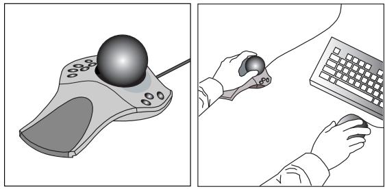  
图 1：3Dconnexion SpaceBall。

您可以将 3Dconnexion 运动控制器与鼠标配合使用，以便更高效地与 Abaqus/CAE 进行交互。您可以使用运动控制器用一只手操纵模型的视图，同时用另一只手使用鼠标从模型中选择对象。运动控制器的操作对象取决于光标下方的内容；例如，视口中的部件或变形图，或者对话框中的滚动条。如果光标下方既没有视口也没有滚动条，则运动控制器将操作当前视口。

如果将运动控制器与旋转视图操纵工具结合使用，您可以更改对象的旋转中心。默认情况下，旋转工具和运动控制器都会围绕视口的中心旋转对象。但是，您可以通过将光标放置在视口中要用作旋转中心的位置，单击鼠标按钮 3，并选择 **Set As Rotation Center**，来为旋转工具和运动控制器设置旋转中心。或者，如果您在 **View Manipulation** 工具栏中单击旋转工具 （，提示区域会出现一个 **Select** 按钮。如果您单击此按钮，您可以从视口中的顶点或节点中选择旋转中心。即使您退出旋转模式，运动控制器也会继续使用指定的旋转中心。有关更多信息，请参见 **旋转视图工具**。

此外，Abaqus 提供了一组可通过标准 3Dconnexion 用户界面访问的“应用程序功能”。这些功能提供了视图操纵、视图和显示工具的快捷方式。您可以将这些功能映射到 3Dconnexion 运动控制器内置的可编程按钮上。

在 Windows 平台上，Abaqus 提供以下功能：

## Movie Mode

在默认和备用旋转模式之间切换。默认模式类似于围绕相机目标或选定的旋转中心旋转相机；备用模式是相机围绕自身旋转，而不是围绕相机目标旋转。如果您在使用旋转视图操纵工具时按住 [Shift] 键，也可以切换到备用旋转模式。有关更多信息，请参见 **相机模式和视图术语**；**使用视图选项控制相机**；以及 **旋转视图工具**。

## Decrease Abaqus Sensitivity

降低 3Dconnexion 运动控制器的灵敏度。此设置仅在 Abaqus/CAE 中操纵视图时适用。

## Increase Abaqus Sensitivity

提高 3Dconnexion 运动控制器的灵敏度。此设置仅在 Abaqus/CAE 中操纵视图时适用。

## Reset Abaqus Sensitivity

将 3Dconnexion 运动控制器的灵敏度恢复为其默认设置。

## Auto-fit

将模型适配到视口。此功能与自动适配视图操纵工具相同。有关更多信息，请参见 **自动适配工具**。

## Keep in View

在旋转和平移期间保持模型在视图中。当您使用运动控制器操纵视图时，打开此功能可防止您将相机目标移出视口。同样，如果您更改了旋转中心，此选项可防止您将中心移出视口。

## Zoom to Cursor

用缩放替换旋转和平移。如果您按下鼠标按钮 2 并操纵运动控制器，Abaqus/CAE 将禁用正常的平移和旋转模式，并将其替换为仅从鼠标光标下方区域放大或缩小的模式。如果您松开鼠标按钮 2，正常的平移和旋转模式将恢复。此行为默认启用。您可以使用此功能在两种模式之间切换。

## Wireframe/Shaded

在线框和着色渲染样式之间切换。此功能与 **Render Style** 工具栏中的线框和着色图标功能相同。有关更多信息，请参见 **选择渲染样式**。

## Perspective

在透视图和平行视图之间切换。此功能与 **View Options** 工具栏中的透视图和平行图 （茸） 图标功能相同。有关更多信息，请参见 **控制透视**。

## Manipulate Layers

操纵所有图层或当前图层。如果您在 **Visualization** 模块中创建了结果叠加图，可以使用此功能在将视图操纵应用于所有图层或仅应用于当前图层之间切换。有关更多信息，请参见 **为叠加图操纵视图**。

## Page Up

在可滚动的对话框中向上翻页。如果对话框仅允许水平滚动，此按钮将页面向右移动。

## Page Down

在可滚动的对话框中向下翻页。如果对话框仅允许水平滚动，此按钮将页面向左移动。

## Set Rotation Center

在鼠标位置设置旋转中心。

## Clear Rotation Center

清除先前设置的旋转中心。

## Set View Center

在鼠标位置居中视图。

在 Linux 平台上，Abaqus 也提供了一组可通过标准 3Dconnexion 用户界面访问的“应用程序功能”。您应从应用程序列表中选择 **Abaqus**。如果列表中没有 Abaqus，您应选择 **XWindow Driver Version 2.0/3.0**。

Linux 平台上可编程按钮的默认映射如下表所示：

<table><tr><td>按钮</td><td>含义</td></tr><tr><td>4</td><td>电影模式</td></tr><tr><td>5</td><td>降低灵敏度</td></tr><tr><td>6</td><td>提高灵敏度</td></tr><tr><td>7</td><td>重置灵敏度</td></tr><tr><td>8</td><td>自动适配</td></tr><tr><td>9</td><td>保持在视图中</td></tr><tr><td>A</td><td>缩放到光标 开/关</td></tr><tr><td>B</td><td>线框/着色</td></tr></table>

对于 Abaqus 应用程序，按钮映射是固定的。但是，3Dconnexion 允许您重新分配按钮以使用其驱动程序提供的标准功能。有关更多信息，请参见 3Dconnexion 文档的 Linux 版本。

## 在视口内选择对象

本章解释了如何选择出现在视口中的对象，例如节点、单元、顶点、边、面和单元（体）。

有关选择对话框选项的讨论，请参见 **与对话框交互**。有关选择视口的讨论，请参见 **选择视口**。
## 本节内容：

理解视口内的选择  
在当前视口中选择对象  
使用选择选项

## 理解视口内的选择

本节描述了您可以在视口中选择的对象，并解释了这些对象所代表的含义。

## 本节内容：

您可以从视口中选择哪些对象？  
什么是选择组？  
理解几何对象与物理对象之间的对应关系

## 您可以从视口中选择哪些对象？

在当前视口中选择对象是您在建模过程中最常执行的任务之一。在各种操作过程中，您可能需要通过直接在视口中点选来选择几何对象（顶点、边、面、体和基准）或离散对象（节点和单元）。图 1 展示了这些不同的对象类型。

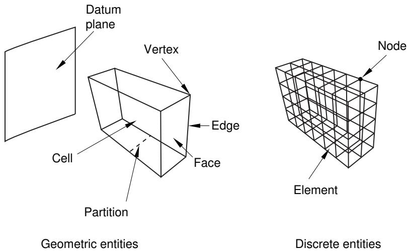  
图 1：您可以选择的对象类型。

您可以在某些操作过程中在视口中选择对象，例如下面列出的操作：

• 创建集合和面  
• 对部件实例进行分区  
• 编辑特征  
• 为网格划分设置部件实例的种子  
• 创建或编辑由单元或节点组成的显示组  
• 对模型中的单元进行颜色编码  
• 创建通过模型的节点列表路径  
• 创建载荷

您也可以在选择操作之前预先在视口中选择对象。如果您在选择操作之前进行了选择，Abaqus/CAE 不会限制您的选择。当您选择一个操作时，Abaqus/CAE 会过滤您所做的任何选择，并仅保留适用于该操作的选择。更多信息，请参阅在选择操作前选择对象。

如果您将选择对象作为某个操作的一部分，在大多数情况下，Abaqus/CAE 仅允许您选择适合当前操作的对象。例如，对边进行分区的第一步是选择感兴趣的边。因此，在操作的此阶段，您只能选择边；不能选择体、面或顶点。提示区域的消息会指导您完成操作的步骤，并指示可供选择的对象类型。您只能选择属于当前显示组的对象。

在某些情况下，Abaqus/CAE 无法确定哪些对象适合选择，并且不会限制您的选择。例如，当您创建集合时，可以从体、面、边和顶点中进行选择以包含在集合中，Abaqus/CAE 允许您选择其中任何对象。如果您在操作过程中在视口中进行了不明确的选择，Abaqus/CAE 允许您在可用对象之间循环，直到选中所需对象。这种不明确性在循环选择有效选择中有描述。您可能会发现使用选择过滤器来限制可选择的对象类型会更容易。更多信息，请参阅使用选择选项。

许多用于定义属性（相互作用、约束、载荷、边界条件、预定义场和工程特征）的操作允许您从视口中选择对象以标识应用该属性的区域。这些操作的默认行为是创建一个包含所选对象的集合或面。您可以通过切换提示区域中的创建集合或面选项来更改此行为。提示区域会提供一个默认名称，但您可以输入新名称。

## 其他信息

• 理解视口内的选择  
• 在当前视口中选择对象

## 什么是选择组？

您可以将在视口中高亮显示的实体（顶点、边、面或体）复制到一个称为选择组的临时存储区域。Abaqus/CAE 在会话期间保存选择组。在后续的选择操作中，您无需手动重新选择相同的实体，而是可以将选择组粘贴到您的选择中。例如，您可以将“几何诊断”查询工具高亮显示的所有小面复制到一个选择组中。然后，当您使用“几何编辑”工具集修复小面时，可以将相同的选择组粘贴到您的选择中。

当您将一个组粘贴到您的选择中时，可以从选择组和显示组中进行选择。选择组旨在为用户提供临时便利，并且不会与“显示组”工具集中的显示组一起出现。您可以创建任意数量的显示组。相比之下，Abaqus/CAE 最多保存五个选择组。如果您创建超过五个选择组，Abaqus/CAE 会覆盖现有的选择组。

选择所需的实体后，您可以通过在视口中单击鼠标按钮 3 并从出现的菜单中选择“复制”来创建选择组。Abaqus/CAE 会将所有高亮显示的实体复制到一个选择组中。您可以通过在视口中单击鼠标按钮 3 并从出现的菜单中选择“粘贴”来将选择组粘贴到您的当前选择。Abaqus/CAE 会显示“粘贴到选择”对话框，您可以选择一个或多个现有的选择组粘贴到您的当前选择中。当您粘贴一个组时，Abaqus/CAE 会将组中的实体附加到您已选择的任何其他实体中。


## 注意：

如果您在选择操作之前预先选择对象，则无法创建或使用选择组。

## 理解几何对象与物理对象之间的对应关系

当您在视口中选择几何对象时，理解每个对象所代表的物理结构非常重要。构成模型的几何对象——体、面、边和顶点——可以根据其所在的嵌入空间代表不同的物理结构。

例如，梁和其他线部件在几何模型中由边表示（参见图 1）。

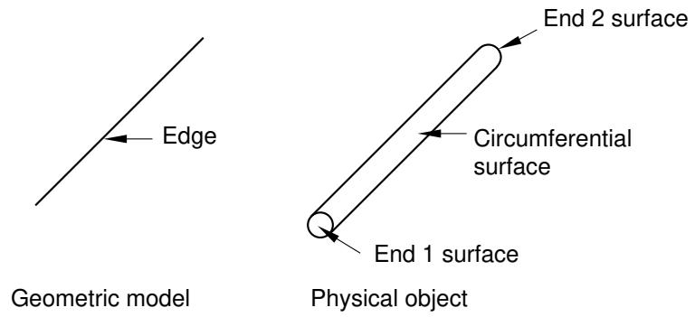  
图 1：选择线部件。

这些部件的端面由边两侧的顶点表示，周向表面由连接顶点的线表示。要选择线部件，可以单击该边，如果需要，Abaqus/CAE 会提示您指定感兴趣的表面。

同样，轴对称壳在几何模型中也由边表示（参见图 2）。

  
图 2：选择轴对称壳。

您可以通过单击视口中的边来选择轴对称壳，如果需要，Abaqus/CAE 会提示您指定壳的内表面或外表面。如果您要将规定的条件或接触定义应用于表面，则必须选择内表面或外表面。例如，如果您要将压力载荷施加到壳上，则必须指定壳的哪一侧应承受该载荷。

有关选择表面的更多信息，请参阅指定区域的特定侧或端。有关建模空间的更多信息，请参阅部件与特征之间的关系，以及部件建模空间。

## 其他信息

• 理解视口内的选择  
• 在当前视口中选择对象

## 在当前视口中选择对象

本节描述了您可用于在当前视口中选择一个或多个对象的技巧。

## 本节内容：

选择和取消选择单个对象  
拖动选择多个对象  
使用角度和特征边方法选择多个对象  
使用面曲率方法选择多个面  
使用拓扑方法选择多个单元  
使用限制角度、层和分析方法选择多个单元面  
将相邻对象添加到选择中  
组合选择技巧  
从选择中排除对象  
循环选择有效选择  
选择实体时使用组  
选择内部表面

## 选择和取消选择单个对象

在当前视口中选择和取消选择对象是使用标准方法的简单操作。有关选择视口的更多信息，请参阅选择视口。

预选高亮显示功能允许您预览在单击当前位置时光标位置时，Abaqus/CAE 将选择哪个对象。此外，在草图编辑器中的预选使用辅助光标来指示将被选择的实体的确切位置和类型。（有关草图编辑器预选的更多信息，请参阅草图编辑器光标和预选。)

您将最频繁地使用以下三种选择操作：
## 点击选择对象

要从当前视口选择单个对象，请将光标移动到该对象上并单击鼠标按钮1。

要选择一个点，请单击相应的点标记。点标记在被选中时会改变颜色。您可以选择的顶点由小的实心圆标记；基准点由小的空心圆标记。（有关基准点的信息，请参阅理解基准几何体的作用。）您可以选择的边中点和圆弧中心由小的菱形标记。


## 注意：

在使用草图模块时出现的一些选择标记与此处描述的不同。有关在草图模块中选择对象的信息，请参阅草图绘制器光标和预选择。

• 要选择一条边，请将光标定位在远离任何顶点的位置，然后单击该边。选中的边会高亮显示。  
• 要选择一个面，请将光标定位在远离任何边或顶点的位置，然后单击该面。选中的面会以网格图案高亮显示。（该网格图案与网格单元的位置无关。）  
• 要选择一个单元，请单击其任何一个面。选中单元的所有边都会高亮显示。

如果您无法选择所需对象，可以使用选择工具栏来更改选择行为。更多信息，请参阅使用选择选项。

一旦您选择了一个对象，当前视口中之前选择的任何对象都会自动取消选择。

如果当前的过程、选项和光标位置没有明确指定一个对象进行预选择，Abaqus/CAE 会高亮显示所有潜在的选择，并在光标箭头旁边添加省略号（...）以指示模糊的预选择。如果您接受了一个模糊的预选择或以其他方式进行了模糊的选择，请使用提示区域中的按钮做出最终选择。更多信息，请参阅循环切换有效选择。

## [Shift] + 单击以选择额外的对象

要选择一个额外的对象，请将光标移动到该对象上并 [Shift] + 单击。您最初的选择仍然保持高亮显示，新选择的对象也会变成高亮显示。

选择多个对象的另一种方法是围绕这些对象拖动一个矩形。更多信息，请参阅拖动选择多个对象。

## [Ctrl] + 单击以取消选择对象

要取消选择一个对象，请将光标移动到该对象上并 [Ctrl] + 单击。要取消选择所有对象，请单击当前视口中的空白区域。

当您在视口中完成选择和取消选择项后，请单击鼠标按钮2以确认您的选择。您可以使用选择选项工具来调整拖动选择区域的形状。您还可以选择哪些对象被拖动选择区域选中。选择选项工具位于选择工具栏中。更多信息，请参阅修改拖动选择区域的形状和选择被拖动选择区域选中的对象。

## 附加信息

• 理解视口内的选择  
• 在当前视口中选择对象  
• 草图绘制器光标和预选择  
• 在草图绘制器中使用链方法选择边

## 拖动选择多个对象

大多数提示要求您只从当前视口选择一个对象。但是，某些任务允许您选择一个或多个对象；例如，集合工具集允许您选择相同类型的多个对象并将它们分组为集合。您可以使用在选择和取消选择单个对象中描述的 [Shift] + 单击方法选择多个对象。选择多个对象的另一种方法是围绕这些对象拖动一个矩形。您可以使用选择选项工具来调整拖动选择区域的形状。您还可以选择哪些对象被拖动选择区域选中。选择选项工具位于选择工具栏中。更多信息，请参阅修改拖动选择区域的形状和选择被拖动选择区域选中的对象。

1.  想象一个仅包围您想要选择的对象的矩形。  
2.  在矩形的一个角单击，并在继续按住鼠标按钮的同时拖动，直到您包围了所有对象。  
3.  释放鼠标按钮。

所有位于矩形内部或与矩形相交的有效对象都会高亮显示。

4.  单击鼠标按钮2以指示您已完成对象选择。

有时结合使用 [Shift] + 单击和拖动选择技术会很方便。更多信息，请参阅组合选择技术。


提示：如果您选择了多个对象然后想要取消选择其中一个或多个，[Ctrl] + 单击您想要取消选择的对象。要取消选择所有对象，请在视口的空白区域单击。

## 附加信息

• 在当前视口中选择对象  
• 选择和取消选择单个对象  
• 循环切换有效选择  
• 在草图绘制器中使用链方法选择边

## 使用角度和特征边方法选择多个对象

在复杂模型中，从几何体中选择单个面或边，或从网格中选择单元面或节点可能非常耗时且容易出错。例如，从网格创建表面时，您必须选择构成该表面的各个单元面并将它们附加到您的选择中。为了加快选择过程，Abaqus/CAE 提供了角度和特征边方法，用于选择多个面、边、单元、单元面或节点。

当您正在执行一个任务，需要从几何体中选择多个面或边，或从网格中选择多个单元、单元面或节点时，Abaqus/CAE 会在提示区域显示一个字段。该字段允许您在三种选择方法之间进行选择——单独选择、按角度选择和按特征边选择，如图1所示。

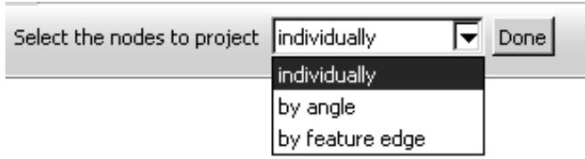  
图1：从提示区域的字段中选择选择方法。

## 单独选择

单独选择对象在选择和取消选择单个对象中有描述。

## 按角度选择

使用角度方法选择对象是一个两步过程：

1.  在提示区域，您输入一个角度（从 $0 ^ { \circ }$ 到 90°）。  
2.  从零件或装配体中，您选择一个面、边、单元面或节点。

该角度必须大于相邻边或面形成几何体所需旋转的角度，就好像它是通过弯曲直丝或折叠一系列面而形成的。Abaqus/CAE 从选定的几何体开始，选择所有相邻的几何体，直到达到或超过您输入的角度。

例如，要选择正六边形的边，请输入大于 60° 的角度（因为每条相邻的边需要旋转 60° 才能从直丝形成该形状），然后选择其中一条边。Abaqus/CAE 随后会选择每条相邻的边，因为没有角度等于或超过您输入的角度。

图2说明了角度方法如何允许您选择排气歧管网格法兰周围的整个面。

  
图2：输入一个角度并选择一个单元以选择整个面。

在草图模块中，只有当您从基础零件或装配体中选择对象时，角度方法才可用。当您在草图中选择边时，链方法会取代角度方法。使用链方法来选择一组首尾相连的边，就像链条的链节一样。有关链方法的更多信息，请参阅在草图绘制器中使用链方法选择边。

## 按特征边选择

特征边方法也是一个多步过程：

1.  在提示区域，您输入一个角度（从 $0 ^ { \circ } \mathrm { t o } 9 0 ^ { \circ } )$ 。  
2.  Abaqus/CAE 通过找到所有相邻单元面之间的角度大于指定角度的单元边，来识别模型中的所有特征边。  
3.  从网格中，您选择一个单元边或节点。  
4.  Abaqus/CAE 沿着通过选定单元边或节点的特征边行进。如果另一个特征边以大于步骤1中指定的角度与该特征边相交，则该特征边会被截断。  
5.  Abaqus/CAE 选择沿特征边的所有单元或节点。

图3说明了特征边方法如何允许您选择排气歧管网格法兰边缘的所有节点。

  
图3：输入一个角度并选择边的一段以选择相邻节点。

在您使用角度或特征边方法之后，您可以单击提示区域中的“单独选择”方法，然后 [Shift] + 单击单个的面、边、单元、单元面或节点，以将它们附加到您的选择中。您还可以 [Ctrl] + 单击项以取消选择它们。此外，您可以继续使用角度和特征边方法，并使用 [Shift] + 单击将面、边、单元、单元面或节点附加到您的选择中。您可以保持相同的角度，也可以在继续附加项时更改角度。更多信息，请参阅组合选择技术。
## 附加信息

• 在当前视口中选择对象  
• 理解视口内的选择

## 使用面曲率法选择多个面

除了通过对象之间的角度进行选择外，您还可以根据面的曲率从部件中选择多个面。当您执行允许选择多个几何面的任务时，Abaqus/CAE 会在提示区显示一个字段。该字段允许您在三种选择方法之间进行选择——单独选择、按面角度选择和按面曲率选择，如图 1 所示。

  
图 1：从提示区的字段中选择选择方法。

角度选择方法在《使用角度和特征边法选择多个对象》中描述。

面曲率法在选择面的过程中可用。如果某个过程接受面以外的其他对象类型，您可以在选择工具栏中将对象类型更改为“面”以访问面曲率法。

从部件或装配体中选择一个面。Abaqus/CAE 会选择所有连接的面，这些面沿两个主曲率方向具有相似的曲率，并且连接角度小于 20°。如果您选择了一个平面，Abaqus/CAE 会添加任何位于同一平面内的相邻平面。曲率相似但断开连接的面不会被选中，曲率相似但在其相交边处具有显著不同面法线的面也不会被选中。图 2 显示了使用面曲率法选择的两个圆角面。

  
图 2：选择一个曲面以选择具有相似曲率的相邻面。

使用面曲率法后，您可以点击提示区中的“单独选择”方法，然后 [Shift] + 点击单个面将它们添加到您的选择中。您也可以 [Ctrl] + 点击项目以取消选择它们。此外，您可以继续使用面曲率法并使用 [Shift] + 点击将面添加到您的选择中。更多信息，请参阅《组合选择技术》。

## 附加信息

• 理解视口内的选择  
• 在当前视口中选择对象

## 使用拓扑法选择多个单元

您可以根据一行或一层单元的连接关系来选择多个单元。当您执行允许选择多个单元的任务时，Abaqus/CAE 会在提示区显示一个字段。该字段允许您在四种选择方法之间进行选择——单独选择、按角度、按特征边和按拓扑，如图 1 所示。

  
图 1：从提示区的字段中选择选择方法。

角度和特征边选择方法在《使用角度和特征边法选择多个对象》中描述。

拓扑法在大多数选择单元的过程中可用。如果某个过程接受单元以外的其他对象类型，您可以在选择工具栏中将对象类型更改为“单元”以访问拓扑法。

拓扑法设计用于二维和三维结构化网格。从网格中选择一个单元面，Abaqus/CAE 将选择通过该网格与其连接的所有单元行。从网格中选择一条单元边，Abaqus/CAE 将选择起始于共享所选边的单元面的所有单元层。图 2 显示了左侧选择了一个内部行，右侧选择了一个内部层。

  
图 2：使用拓扑法选择一行或一层单元。

您可以使用拓扑法从其他网格类型中选择单元，但由于缺乏结构化网格中明确定义的行或层，选择结果可能不可预测。在某些情况下，例如四面体网格，拓扑选择可能仅限于共享您所选面或边的单元。

使用拓扑法后，您可以选择提示区中的其他方法并 [Shift] + 点击以将更多单元添加到您的选择中。您也可以 [Ctrl] + 点击项目以取消选择它们。此外，您可以继续使用拓扑法并使用 [Shift] + 点击将单元添加到您的选择中。更多信息，请参阅《组合选择技术》。

## 附加信息

• 理解视口内的选择

• 在当前视口中选择对象

## 使用限制角、层和解析法选择多个单元面

当您选择孤立单元面以创建几何时（更多信息，请参阅《从单元面创建面》），Abaqus/CAE 会在提示区显示一个字段。该字段允许您在五种选择方法之间进行选择——单独选择、按角度、按限制角、按层和按解析，如图 1 所示。

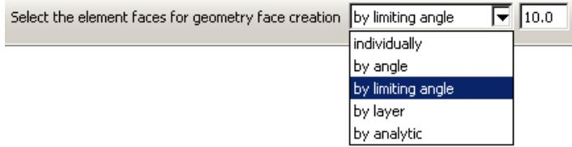  
图 1：从提示区的字段中选择选择方法。

角度选择方法在《使用角度和特征边法选择多个对象》中描述。限制角、层和解析法仅在选择孤立单元面以创建新几何面时可用。

## 按限制角

使用限制角选择对象是一个两步过程：

1. 在提示区，输入一个角度（0° 到 90° 之间）。
2. 从部件或装配体中选择一个孤立单元面。

该角度必须大于所选单元面与其连接单元面之间的总角度。Abaqus/CAE 从选定的几何体开始，选择所有相邻的几何体，直到所选面与相邻面序列中最后一个面之间的角度达到或超过您输入的角度为止。图 2 显示了以 45° 限制角选择的单元面，并且选择了圆角区域下方的一个垂直单元面。

  
图 2：限制角为 45° 并选择了一个垂直面。

将限制角增加到其最大值 90° 将选择直到圆角部分顶部的面。相反，使用角度方法且角度大于或等于 13° 时，选择会继续围绕圆角部分并延伸到远端，因为每个相邻面之间的角度都小于 13°。

## 按层

使用层法选择对象是一个两步过程：

1. 在提示区，输入层数。
2. 从部件或装配体中选择一个孤立单元面。

Abaqus/CAE 从所选面开始，在所有方向上选择围绕它的相邻单元面层。选择会继续围绕拐角和其他特征，直到达到指定的层数或没有更多的相邻孤立单元面。

图 3 说明了在起始面周围选择三层孤立壳单元面以及由此产生的几何面。

  
图 3：面层选择及几何面的创建。

如图 3 所示，层选择可以穿越尖锐的拐角和其他通常标志几何面结束的模型特征。在大多数情况下，您应该通过创建单独的面来保留逻辑模型边和其他特征。否则，生成的几何体可能难以修复和划分网格。


## 注意：

在处理实体孤立单元时，对于创建单个几何面，包含来自同一孤立单元的多个面的选择是不可接受的。

## 按解析

孤立单元面的解析选择方法基于对解析几何中基本形状（例如平面、圆柱体、圆锥体、球体和圆环体）或其部分的识别。解析选择尝试识别一组孤立单元面的逻辑边界，这些边界将构成一个可识别的几何面。

图 4 说明了孤立单元面的解析选择。一个球面部分的单元面被高亮显示；此选择无法使用其他任何多对象选择选项完成。

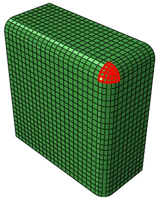  
图 4：解析几何选择。

使用上述任何方法后，您可以选择提示区中的其他方法并 [Shift] + 点击以将更多元素添加到您的选择中。您也可以 [Ctrl] + 点击项目以取消选择它们。此外，您可以继续使用当前方法并使用 [Shift] + 点击将元素添加到您的选择中。更多信息，请参阅《组合选择技术》。
## 附加信息
• 理解视口内的选择
• 在当前视口中选择对象
• 从单元面创建面

## 将相邻对象添加到选择中

如果你已经选择了一个或多个对象，你可以扩展选择范围以包含所有相邻的同类对象。添加相邻对象是使用拖动选择或角度方法（分别参见“拖动选择多个对象”和“使用角度与特征边方法选择多个对象”）来快速选择多个对象的一种替代方式。选择相邻对象允许你在各个方向上扩展选择，而不受周围特征形状或对象连接角度的限制。它还允许你在模型中拾取多个感兴趣区域，并同时在每个区域中扩展选择集。

要将相邻对象添加到当前选择中，在已选中的对象上点击鼠标按钮3并选择 `Add Adjacent Entities`。Abaqus/CAE 会将你的选择扩展到所有相邻的同类对象，包括那些未包含在当前显示中的对象。如有必要，Abaqus/CAE 会将新选择的对象添加到当前显示组中，使其可见。相邻对象根据当前选择的实体定义如下：
• 与一条或多条已选边共享一个公共顶点的边
• 与一个或多个已选顶点共享一条公共边的顶点
• 与一个或多个已选面共享公共顶点或边的面
• 与一个或多个已选节点共享一条公共边的节点
• 与一个已选单元共享公共单元边或节点的单元

## 附加信息
• 在当前视口中选择对象
• 在草图绘制器中使用链式方法选择边

## 组合选择技巧

有时将选择和取消选择对象的方法组合使用会很方便。例如，在使用集合工具集创建节点集时，你可以拖动选择一组节点。然后你可以使用 `[Ctrl] + 点击` 取消选择单个节点，使用 `[Shift] + 点击` 将其他节点添加到你的选择中。下图展示了这三种技巧的组合使用：

1. 首先，你使用拖动选择来选择一组节点。

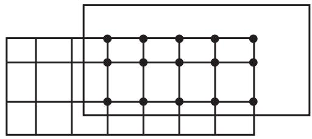

2. 然后，你使用 `[Ctrl] + 点击` 取消选择单个节点。


3. 最后，你使用 `[Shift] + 点击` 将节点添加到你的集合中，然后点击鼠标按钮2表示你已完成选择。


你可能会发现调整视图方向以使视口中的特定项目更易于访问很有用。你可以在选择过程中的任何时刻调整视图方向。有关视图操作工具的信息，请参见“操作视图和控制透视”。


提示：要取消选择所有对象，请单击当前视口中未使用的区域。

## 附加信息
• 在当前视口中选择对象
• 选择和取消选择单个对象
• 拖动选择多个对象
• 在草图绘制器中使用链式方法选择边

## 从选择中排除对象

当你从视口选择一个对象时，你的选择会包含所有与该对象关联的低维度实体。例如，如果你选择一个单元（cell），你的选择将包含与该单元关联的所有面、边和顶点。类似地，如果你选择一条边，你的选择将包含与该边关联的所有顶点。在某些情况下，你可能希望从选择中排除这些低维度实体。例如，如果你选择一条边以包含在集合中，你可能不希望该集合包含该边两端的顶点。从选择中排除低维度实体可能会解决你遇到的任何过约束问题。

1. 使用选择、拖动选择、`[Ctrl] + 点击` 和 `[Shift] + 点击` 的组合来选择所有对象。Abaqus/CAE 会将选中的对象高亮显示为红色。
2. 使用 `[Ctrl] + 点击` 某个对象以将其从选择中排除。Abaqus/CAE 会将排除的对象高亮显示为紫色。

## 附加信息
• 在当前视口中选择对象
• 选择和取消选择单个对象
• 循环切换有效选择
• 在草图绘制器中使用链式方法选择边

## 循环切换有效选择

在某些情况下，Abaqus/CAE 无法区分你选择的对象与其他附近或相关的对象。这种歧义可能如下产生：

想象光标周围有一个小方框。当你单击一个对象时，任何其他落入此方框内的同类有效对象也会被视为可能的选择。例如，如果你选择一条与另一条边位置非常接近的边，Abaqus/CAE 可能认为这两条边都是可能的选择。

方框的大小与显示器尺寸、视口尺寸和模型尺寸无关。当你放大或缩小模型时，它也保持不变。因此，你可以通过放大模型来增加对象之间的距离，从而在视口中更精确地选择特定对象。

如果你的模型是三维的，想象一条垂直于屏幕并通过光标伸入模型内部的直线。当你选择一个对象时，任何与此线相交的同类有效对象都会被视为可能的选择。（旋转模型可能会消除一些歧义。）

Abaqus/CAE 在可能的情况下会通过根据当前分析过程过滤你的选择来减少潜在的歧义。例如，如果你正在分割一个单元，Abaqus/CAE 会提示你选择要分割的单元。当你进行选择时，Abaqus/CAE 仅将单元视为有效选择。相反，如果你正在创建几何集合，Abaqus/CAE 会将单元、面、边和顶点都视为有效选择，从而增加歧义的可能性。此外，预选择高亮显示允许你在进行选择之前确切看到哪个对象将被选中。在视口中移动光标可能会消除选择中的歧义，并使 Abaqus/CAE 高亮显示你选择的对象。如果歧义仍然存在，Abaqus/CAE 会更改光标，在箭头右侧添加省略号标记（...），并高亮显示所有可能的选择。

当你的选择存在歧义时，Abaqus/CAE 会在提示区域显示按钮，允许你循环浏览所有可能的选择，如下所示：


选择存在歧义，请选择一个：
Next
Previous
OK

使用 `Next` 和 `Previous` 按钮在视口中所有可能成为选择对象的对象之间向前和向后循环；每个对象会依次高亮显示。当你选择的对象高亮显示时，点击 `OK` 或鼠标按钮2以确认你的选择。（你也可以在当前视口中点击鼠标按钮3以显示提示区域中的选项菜单。）

## 附加信息
• 在当前视口中选择对象

## 在选择实体时使用组

你可以将实体组附加到你的选择中，以加快从视口中选择多个实体的过程。该组可以是显示组，也可以是临时选择组。你可以在视口中点击鼠标按钮3并执行以下操作：
• 通过将视口中高亮显示的实体（顶点、边、面或单元）复制到一个选择组中来创建选择组。
• 通过将存储在选择组或显示组中的实体粘贴到当前选择中，来附加到你已选的实体。

## 选择内部表面

你可以使用选择工具来选择模型的内部表面；例如，当你创建表面或使用实体偏移网格工具选择区域时。

1. 在 `Selection` 工具栏中，打开 `Select From Interior Entities` 工具


## 注意：
`Select From Interior Entities` 工具默认情况下是隐藏的。更多信息，请参见“使用包含隐藏图标的工具箱和工具栏”。

2. 从视口中选择内部表面。

## 附加信息
• 理解和使用工具箱与工具栏
• 理解视口内的选择  
• 在当前视口中选择对象  
• 基于对象位置筛选选择  
• 什么是表面？  
• 指定区域的特定侧面或端部  

## 使用选择选项  

Abaqus/CAE 提供了一组工具，可以更轻松、高效地从视口中选择实体。  

这些选择工具位于“选择”工具栏中。可用选项取决于当前的选择流程；某些选项可用于在流程开始前预先选择对象。  

本节描述选择选项。  

## 本节内容：  

可用选择选项  
基于对象类型筛选选择  
基于对象位置筛选选择  
选择前高亮显示对象  
修改拖选区域的形状  
选择拖选区域选取的对象  
在选择流程前选择对象  

## 可用选择选项  

当提示从视口中选择对象时，Abaqus/CAE 提供的选择工具可以让您更轻松、高效地完成选择。  

使用“选择”工具栏配置选择选项。图 1 显示了选择工具的布局。如果某些工具对当前流程无效，则会显示为灰色（不可用）。  

  
图 1：“选择”工具栏。  

## 附加信息  

• 工具栏组件  
• 使用灰色的对话框和工具箱组件  
• 在当前视口中选择对象  
• 使用选择选项  

## 基于对象类型筛选选择  

为了帮助您从当前视口中选择所需的实体（例如顶点、边、面、节点和单元），Abaqus/CAE 提供了一组筛选器，您可以根据对象类型来限制选择范围。  

例如，如果您正在创建一个仅包含表面的集合，您可以将选择限制为仅面对象——其他对象（如顶点和边）将不会被选中。  

对象筛选器列在“选择”工具栏中。Abaqus/CAE 会根据当前流程配置筛选器列表。如果您尚未开始选择流程，Abaqus/CAE 会列出一些常用的筛选器（有关在流程开始前选择对象的更多信息，请参阅“在选择流程前选择对象”）。  

您可以按 [Ctrl] + A，基于活动的选择筛选器选择当前视口中的所有对象。视图会重新缩放以适应视口，清晰地显示选中的对象，这些对象会在视口中高亮显示。例如，如果筛选器中选择了边对象，并且您按 [Ctrl] + A，那么视口中可见的所有边都会被选中。您无法自定义 [Ctrl] + A 键盘快捷键。  

如果当前视口包含 Abaqus/CAE 部件或部件实例，您可以选择以下筛选器之一：  

## 全部  

除蒙皮和加强筋外的所有对象。  

## 单元  

所有体积，例如单元格和单元。  

## 面  

所有平面对象，例如面、基准平面和单元面。  

## 边  

所有边对象，例如边、基准轴和单元边。  

## 顶点  

所有点对象，例如顶点、基准点和节点。  

## 单元  

所有单元。  

## 节点  

所有节点。  

## 基准  

所有基准对象，例如基准平面、基准轴和基准点。  

## 特征  

所有特征对象。  

## 参考点  

所有参考点。  

可用的筛选器列表会随着您更改模块或选择流程而更新，并在适用时显示其他筛选器（例如“实例”、“蒙皮”和“加强筋”）。默认情况下，Abaqus/CAE 从所有对象中选择，但排除蒙皮和加强筋。只有在选择了相应的筛选器后，您才能从视口中选择蒙皮或加强筋。  

类似地，如果您正在当前视口中选择孤立体（例如，为了分配单元类型），您可以选择以下筛选器之一：  

全部  
• 零维单元  
• 一维单元  
• 二维单元  
• 三维单元  
• 蒙皮  
• 加强筋  

默认情况下，Abaqus/CAE 从除蒙皮和加强筋外的所有单元中进行选择。  

• 使用选择选项  

## 基于对象位置筛选选择  

选择工具允许您根据对象在视口中的位置来选择它们。“选择”工具栏包含所有选择工具。  

以下基于位置的选择工具仅在您开始需要对象选择的流程后才可用（在流程外无法使用基于位置的选择）：  

## 最靠近屏幕的对象  

  

启用此工具以仅选择最靠近屏幕前端的对象。默认情况下，此工具处于启用状态。  

如果您禁用此工具，Abaqus/CAE 允许您循环浏览所有可能的选择。使用提示区域中的“下一个”和“上一个”按钮，在视口中所有可能的选择对象之间向前和向后循环；每个对象会依次高亮显示。有关更多信息，请参阅“循环浏览有效选择”。  

此筛选器适用于原生顶点、边、面和单元，以及孤立节点和孤立单元。  

## 内部和外部对象  

选择以下筛选器之一：  

选择位于部件内部和外部的对象。  
仅选择位于部件外部的对象。在大多数情况下，默认选择此工具。  
仅选择位于部件内部的对象。  

• 使用选择选项  

## 选择前高亮显示对象  

当您从视口中选择对象并停止移动光标时，Abaqus/CAE 会高亮显示光标位置处将被选中的对象。  

这种行为称为“预选择”，让您可以在进行选择之前确切看到将被选中的对象。如果当前选择选项使多个对象可用，Abaqus/CAE 会更改光标，在箭头右侧添加省略号（...），并高亮显示所有可能的选择。您为选择设置的位置和类型筛选也适用于预选择。  

在“选择”工具栏中禁用“允许拾取过程中预选择”工具，可以关闭当前会话中流程的预选择高亮显示。默认情况下，此工具处于启用状态。  

  

## 注意：  

对于大型模型，预选择高亮显示可能会延迟；禁用预选择可能会提高显示速度。  

• 使用选择选项  

## 修改拖选区域的形状  

选择工具允许您更改拖选区域的形状。  

从“选择”工具栏中，选择以下选项之一：  

## 矩形  

  

单击以指定矩形的一个角，然后将光标拖动到第二个角。默认情况下选择此工具。  

## 圆形  

  

单击以指定圆心，然后将光标拖动到圆周上的一点。  

## 多边形  

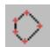  

单击以指定多边形的一个顶点，然后将光标拖动到第二个顶点。接着，继续单击多边形的每个顶点。单击鼠标键 2 表示您已完成顶点输入。多边形的顶点数量没有限制。  

• 使用选择选项  

## 选择拖选区域选取的对象  

选择工具允许您选择拖选区域所选取的对象。  

从“选择”工具栏中，选择以下选项之一：  

## 内部  

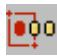  

仅选择完全落入拖选区域内部的对象。  

## 内部和交叉  

  

仅选择落入内部或与拖选区域交叉的对象。默认情况下选择此工具。  

## 交叉  

  

仅选择与拖选区域交叉的对象。  

## 外部和交叉  

  

仅选择位于外部或与拖选区域交叉的对象。  

## 外部  

  

仅选择位于拖选区域外部的对象。  

• 使用选择选项  

## 在选择流程前选择对象
在开始选择要处理的过程之前，您可以从当前视口中选择对象。


您可以使用选择工具栏

来切换选择状态，并基于对象类型限制视口选择。选择工具是工具栏中的第一个工具；它仅在视口中没有活动过程运行时才可用。默认情况下，选择是激活的，且不限制视口对象类型。您可以使用《组合选择技巧》中描述的任何方法选择多个对象。关闭对象选择，以防止在非过程状态下意外选择对象。


## 注意：

对于大型模型，预选高亮显示可能会有延迟；关闭选择可以通过阻止预选和选择来提高显示速度，除非您先选择一个需要对象选择的过程。

当您在视口中选择对象后选择一个过程时，Abaqus/CAE 会应用该过程的选择过滤器。例如，如果您选择了一个顶点、一个面和一条边，然后启动了一个仅能接受顶点的过程，Abaqus/CAE 将接受所选的顶点，取消面和边的选择，并从第二步开始执行该过程。类似地，如果您选择一个需要单对象选择的过程，而您已经选择了多个有效对象，Abaqus/CAE 将接受第一个有效选择并取消其余选择。如果 Abaqus/CAE 无法确定您首先选择的是哪个对象，它将取消所有选择并从第一步开始执行该过程。

如果一个过程包含多个选择步骤，您在过程开始前选择的对象只能用于完成第一个选择步骤。任何后续的选择步骤都需要您从视口中交互式选择新对象，或者（如果适用）使用已保存的选择组。您无法保存在过程开始前进行的选择。

• 使用选择选项

## 配置图形显示选项

本章解释如何在 Abaqus/CAE 中配置图形显示选项。

## 本节内容：

使用图形显示选项  
使用显示列表  
使用抗锯齿  
选择高亮方法  
选择半透明模式  
控制拖动模式  
选择背景颜色

## 使用图形显示选项

当您启动会话时，Abaqus 会检测系统上安装的图形硬件，并相应地设置图形选项。如果您的图形硬件不受 Abaqus/CAE 支持，或者您希望覆盖默认的图形选项，可以使用“图形选项”对话框来调整显示性能。

Abaqus/CAE 将设置应用于所有视口，并在会话期间保存这些设置。要在每次启动 Abaqus/CAE 会话时使用自定义设置，请修改环境文件（`abaqus_v6.env`）。有关环境文件的更多信息，请参见《Abaqus 配置指南》。


注意：有关近期推出的图形适配器的推荐设置，可从 www.3ds.com/simulia 的支持页面获取。

您也可以使用“图形选项”对话框执行以下操作：

选择在视图操作（如旋转、平移或缩放）期间模型的外观。外观与渲染样式相关，可以设置为“快速”（线框）或“按原样”。  
选择在旋转视图后，Abaqus/CAE 是否将图像自动适配到当前视口。自动将图像适配到视口等同于在“视图操作”工具栏中单击“自动适配”工具。“自动适配”会调整您对模型的视图，使模型填满视口并在其中居中。方向保持固定，如视图三轴架所示。  
• 选择 Abaqus/CAE 是为性能、准确性还是介于两者之间的级别优化半透明对象的显示。  
• 选择视口背景颜色。您选择的颜色将应用于当前 Abaqus/CAE 会话中的所有视口。

1. 从主菜单栏中，选择 视图 -> 图形选项。
   “图形选项”对话框出现。

2. 选择以下选项之一：

   • 使用显示列表、高亮方法和半透明模式的选项来调整性能。  
   • 选择在视口内拖动对象时的显示模式。  
   • 启用或禁用在旋转后自动将视图适配到视口。  
   • 选择视口的背景颜色。

## 附加信息

• 使用显示列表  
• 选择高亮方法  
• 选择半透明模式  
• 控制拖动模式  
• 选择背景颜色

## 使用显示列表

显示列表帮助您更快地显示重复的图像。当显示列表启用时，每个绘图操作都会记录在一个列表中，如果需要可以快速重放。这在大多数系统上会导致更快的图像刷新，但需要图形内存来记录每个绘图操作。在“可视化”模块（Abaqus/Viewer）中完全不使用显示列表。在 Abaqus/CAE 中，显示列表通常处于启用状态；如果在显示非常大的模型时遇到内存问题或图形性能下降，则应禁用它们。

1. 找到显示列表选项。
   从主菜单栏中，选择 视图 -> 图形选项。
   Abaqus/CAE 显示“图形选项”对话框。

2. 在“硬件”选项中，打开或关闭“使用显示列表”以控制图像使用显示列表。此选项在“可视化”模块中无效。

   当“使用显示列表”处于打开状态时，您可能会注意到第一次绘制图像时有短暂延迟；这是因为 Abaqus/CAE 必须构建显示列表。后续绘制该图像会更快。

3. 单击“确定”以应用更改并关闭对话框。
   您的更改将在会话期间保存。

## 附加信息

• 选择高亮方法  
• 选择半透明模式  
• 控制拖动模式  
• 选择背景颜色

## 使用抗锯齿

Abaqus/CAE 使用抗锯齿来改善模型上曲线和对角线的显示效果。抗锯齿在兼容的系统上启用，您可以关闭此选项以提高某些系统的性能。

1. 找到图形选项。
   从主菜单栏中，选择 视图 -> 图形选项。
   Abaqus/CAE 显示“图形选项”对话框。

2. 在“硬件”选项中，打开“抗锯齿线条”以启用抗锯齿，或将其关闭以禁用抗锯齿。

3. 单击“确定”以应用更改并关闭对话框。
   您的更改将在会话期间保存。

## 附加信息

• 使用显示列表  
• 控制拖动模式  
• 选择背景颜色

## 选择高亮方法

高亮方法控制在您与模型交互时，Abaqus/CAE 如何在视口中显示高亮。当您使用视图操作工具旋转模型或在“草图”模块中绘制轮廓时，更改高亮方法的效果最为明显。“硬件覆盖”提供最佳的图形性能；但是，并非所有图形适配器都支持此选项。

在大多数情况下，您无需更改默认的高亮方法设置。当您启动会话时，Abaqus/CAE 会检测系统上安装的图形硬件并选择合适的高亮方法。但是，如果您使用的是不受支持的图形适配器，Abaqus/CAE 选择的默认设置可能不是最优的。

1. 找到高亮方法选项。
   从主菜单栏中，选择 视图 -> 图形选项。
   Abaqus/CAE 显示“图形选项”对话框。

2. 从“高亮方法”菜单中，选择以下选项之一：

   **硬件覆盖**。此选项仅在您的系统图形适配器支持时出现。它使用图形硬件来显示高亮层。如果您的工作站支持此选项，选择“硬件覆盖”可提供最佳的质量和性能。  
   **XOR**。此选项使用软件来模拟高亮层。选择“XOR”选项使用布尔像素运算来模拟绘图操作，但根据底层像素的颜色可能会产生不同的颜色。  
   **软件覆盖**。此选项也使用软件来模拟高亮层，并在合理的性能下提供良好的质量。但是，在某些系统上选择此选项会导致性能不佳。  
   **混合**。“混合”方法将底层像素的颜色与所需颜色相结合，产生近似瞬态图形的效果。您应该仅在其他选项都不令人满意时才选择此选项。如果选择“混合”选项，性能和质量可能会受到影响。
3. 单击 **OK** 以应用更改并关闭对话框。

您的更改将在本次会话期间保存。

## 其他信息

*   使用显示列表
*   选择半透明模式
*   控制拖动模式
*   选择背景颜色

## 选择半透明模式

半透明模式控制着 Abaqus/CAE 在视口中显示半透明对象的速度和精度。更改半透明模式的效果在您使用视图操作工具操作模型显示时最为明显。**快速** 设置提供最佳的图形性能，而 **精确** 设置则提供最佳的半透明对象渲染效果。

在大多数情况下，您无需更改默认的半透明方法设置。当您启动会话时，Abaqus/CAE 会检测系统中安装的图形硬件并选择适当的半透明模式。但是，如果您使用的是功能较弱的图形适配器，Abaqus/CAE 选择的默认设置可能对您的模型并非最优。

1.  找到半透明模式选项。

    从主菜单栏中，选择 **视图 -> 图形选项**。

    Abaqus/CAE 将显示 **图形选项** 对话框。

2.  将 **半透明模式** 滑块拖动到所需的设置。对于某些显卡，Abaqus/CAE 在 **快速** 和 **精确** 之间支持三个中间半透明模式设置；对于其他显卡，则仅支持一个中间设置。
3.  单击 **OK** 以应用更改并关闭对话框。

您的更改将在本次会话期间保存。

## 其他信息

*   使用显示列表
*   选择高亮方法
*   控制拖动模式
*   选择背景颜色

## 控制拖动模式

拖动模式控制在旋转、平移或缩放视图操作期间模型的外观。拖动模式可以设置为 **快速（线框）** 或 **保持原样**。

## 快速（线框）

当您将拖动模式设置为 **快速（线框）** 时，在视图操作期间将绘制线框轮廓。**快速（线框）** 是兼容系统上的默认拖动模式设置。

## 保持原样

当您将拖动模式设置为 **保持原样** 时，在视图操作期间窗口中显示的所有内容将继续显示。在较旧或较慢的系统上，当您操作视图时，显示可能会滞后于鼠标移动，尤其是在模型复杂的情况下。对于具有图形硬件加速的新系统，**保持原样** 设置可以在没有明显性能损失的情况下得到支持。

将拖动模式设置为 **保持原样** 以在视图操作期间观察模型；例如，在旋转等值线图时定位高应力集中区域。

此外，您还可以选择 Abaqus/CAE 是否会在您旋转 3D 视图后自动将图像适合当前视口。自动将图像适合视口等同于单击 **视图操作** 工具栏中的自动适合工具。自动适合会调整您的模型视图，使模型填满视口并在其中居中。方向保持固定，如视图三重轴所示。

1.  找到拖动模式选项。

    从主菜单栏中，选择 **视图 -> 图形选项**。

    Abaqus/CAE 将显示 **图形选项** 对话框。

2.  从 **视图操作** 字段中，选择 **快速（线框）** 或 **保持原样** 拖动模式。
3.  如果需要，勾选 **旋转后自动适合**。
4.  单击 **OK** 以应用更改并关闭对话框。

您的更改将在本次会话期间保存。

## 其他信息

*   使用显示列表
*   选择高亮方法
*   选择半透明模式
*   选择背景颜色

## 选择背景颜色

模型的外观受模型颜色与视口背景颜色之间对比度差异的影响。您可以通过更改视口中显示的背景颜色来改善这种对比度。Abaqus/CAE 提供两种颜色选择：您可以显示填充整个视口背景的单一颜色，或者可以创建融合两种不同颜色的渐变背景。

Abaqus/CAE 会为会话中的每个视口应用您的背景颜色选择。

1.  找到背景颜色选项。

    从主菜单栏中，选择 **视图 -> 图形选项**。

    Abaqus/CAE 将显示 **图形选项** 对话框。

2.  从 **视口背景** 字段中，选择以下选项之一：

    *   **纯色**：为视口背景选择一种颜色
    *   **渐变**：选择用于绘制背景的顶部和底部颜色，颜色从视口顶部到底部逐渐混合

3.  选择视口背景颜色。

    a.  单击一个颜色样本。

        Abaqus/CAE 将显示 **选择颜色** 对话框。

    b.  使用 **选择颜色** 对话框中的一种方法来选择新颜色。有关更多信息，请参阅 *自定义颜色*。

    c.  单击 **OK** 以关闭 **选择颜色** 对话框。

        颜色样本将更改为所选颜色。

    d.  对于渐变背景，您可以直接选择顶部和底部颜色；或者您可以选择顶部颜色，然后单击 **自动选择**，让 Abaqus/CAE 根据顶部颜色的变化来选择底部颜色。

    e.  草图或 X–Y 图在使用渐变背景时可能显示不清晰。对于这些视图，即使您指定了渐变背景，Abaqus/CAE 也会显示纯色背景。要禁用此行为，请取消勾选 **允许覆盖**。

4.  单击 **OK** 以应用更改并关闭对话框。

    Abaqus/CAE 会为会话中的每个视口应用您的背景颜色选择。您的更改将在本次会话期间保存。

## 其他信息

*   使用显示列表
*   选择高亮方法
*   选择半透明模式
*   控制拖动模式

## 打印视口

本章描述如何将选定视口的图像直接发送到打印机或文件。

有关配置打印机的更多信息，请参阅《Abaqus 配置指南》。

## 本节内容：

*   理解打印
*   控制打印图像的目标和外观

## 理解打印

Abaqus/CAE 允许您截取一个或多个视口及其内容的快照，并将该图像直接发送到打印机或保存到文件中以供稍后使用；例如，用于演示文稿、嵌入打印报告或在 HTML 文档中显示。

附加选项允许您选择结果图像中视口的外观，以及图像的颜色、分辨率和大小。

本节描述在将输出发送到打印机或文件之前您应了解的基本概念。

## 本节内容：

*   打印图像格式
*   Windows 和 PostScript 图像布局
*   Windows 打印机图像尺寸
*   EPS、TIFF、PNG 和 SVG 图像尺寸
*   硬拷贝图像质量
*   将 Abaqus/CAE 图像导入其他软件产品

## 打印图像格式

您可以直接将图像打印到打印机，或以多种文件格式保存图像。

Abaqus/CAE 允许您直接将图像打印到 Windows 打印机。打印机驱动程序会以打印机所需的任何格式创建并发送必要的信息。

如果 Windows 打印机驱动程序不可用，或者您使用的是其他平台，您可以使用打印命令创建 PostScript 文件并直接发送到 PostScript 打印机。您也可以将图像保存为便携式网络图形 (PNG)、可缩放矢量图形 (SVG)、标签图像文件格式 (TIFF)、PostScript (PS) 或封装的 PostScript (EPS) 文件。以下列表描述了这些文件格式：

## PNG

便携式网络图形 (PNG) 是用于存储光栅图像的行业标准。PNG 文件的使用因万维网而普及，PNG 图像由运行在各种操作系统上的大多数流行网络浏览器显示。PNG 文件由颜色信息和图像的压缩光栅表示组成。默认情况下，Abaqus/CAE 将视口的 PNG 图像限制为 8 位颜色（256 色）。但是，您也可以使用 24 位颜色（在 Windows 上）或系统颜色设置（在 Linux 上）。

## SVG

可缩放矢量图形 (SVG) 是一种用 XML 编写的行业标准矢量图形语言。

## TIFF

标签图像文件格式 (TIFF) 是一种成熟的光栅图像格式，被许多软件应用程序识别。TIFF 格式支持彩色和灰度。默认情况下，Abaqus/CAE 将视口的 TIFF 图像限制为 8 位颜色（256 色）。但是，您也可以使用 24 位颜色（在 Windows 上）或系统颜色设置（在 Linux 上）。

## PostScript

PostScript 是桌面出版的公认标准。PostScript 实际上是一种编程语言，其指令和数据通常以 ASCII 格式存储，可以在操作系统之间轻松传输。当您使用打印命令打印到 PostScript 打印机，或将图像保存为 PostScript 文件时，将使用 PostScript 格式。当您选择 PostScript 格式时，Abaqus/CAE 会生成图像的压缩光栅表示或矢量表示。为了在生成光栅图像时获得效率，您应尽量减小图像尺寸，并将图像分辨率限制为最多与图像将要打印或显示的设备的分辨率相同。
## 封装的 PostScript

封装的 PostScript (EPS) 是 PostScript 的一种变体，用于描述单个图形，旨在未经修改的情况下包含在更大的文档中。EPS 文件与 PostScript 文件几乎相同，区别在于包含了一些描述图像尺寸和位置的信息。因此，上文关于图像矢量和栅格表示的讨论同样适用于 EPS 格式。大多数文字处理和图形应用程序都支持插入 EPS 文件。

## 附加信息

• 控制打印图像的目标和外观

当您将选定视口的快照直接打印到 Windows 打印机、PostScript 打印机或文件时，图像的布局由可用页面大小、方向以及视口的宽高比决定：

## 可用页面大小

可用页面大小是根据您提供的总页面大小和页边距信息计算得出的，如图 1 所示的示例尺寸。

  
图 1：可用页面大小。

总页面大小由纸张大小决定。对于 Windows 打印机，请在打印对话框中单击“打印机属性”按钮打开“文档属性”对话框，然后更改纸张大小。对于 PostScript 打印机或文件，请在打印对话框中单击“Postscript 格式选项”按钮来更改纸张大小。

## 方向

页面方向可以是纵向或横向。

## 宽高比

宽高比是您选择打印的视口的整体宽度与整体高度之比。Abaqus/CAE 始终保持对象的宽高比，如图 2 所示。您可以在打印前通过操作画布上的视口来控制宽高比。

  
图 2：缩放对象以保持宽高比。

确定 Windows 打印机图像大小的默认方法（也是确定 PostScript 打印机和文件图像大小的唯一方法）是缩放图像以适应宽高比和可用页面大小。

详细说明，请参阅自定义发送到 Windows 打印机的图像，以及自定义发送到 PostScript 打印机或文件的图像。

## 附加信息

• 控制打印图像的目标和外观  
• EPS、TIFF、PNG 和 SVG 图像大小

## Windows 打印机图像大小

当您将选定视口的快照直接打印到 Windows 打印机时，图像大小由以下三种方法之一确定：

## 适合页面

使用此方法将打印图像缩放以适应可用页面大小。此方法为默认使用。

## 使用屏幕上的大小

使用此方法使打印图像大小与画布上的当前大小匹配。如果图像大小超过可用页面大小，您必须调整图像大小、更改页面大小或页边距，或选择其他方法来打印图像。

## 使用设置

使用此方法直接指定打印图像的大小。您指定宽度或高度，Abaqus/CAE 会调整另一个尺寸以保持图像宽高比。如果图像超过可用页面大小，您必须调整图像大小、更改页面大小或页边距，或选择其他方法来打印图像。

## 附加信息

• 自定义发送到 Windows 打印机的图像  
• 控制打印图像的目标和外观  
• Windows 和 PostScript 图像布局  
• EPS、TIFF、PNG 和 SVG 图像大小

## EPS、TIFF、PNG 和 SVG 图像大小

当您将选定视口的快照打印到封装 PostScript (EPS)、TIFF、PNG 或 SVG 格式文件时，Abaqus/CAE 根据您指定的大小和视口的整体宽高比来确定图像大小。您可以通过操作画布上的视口来控制宽高比。

在选项对话框（EPS 选项、TIFF 选项、PNG 选项或 SVG 选项）中，您可以选择以下方法之一来指定打印图像的大小：

• 使用屏幕上图像的大小。（Abaqus/CAE 在选项对话框中显示当前图像大小。）此方法为默认方法。  
设置宽度或高度。您只需指定一个尺寸；Abaqus/CAE 会计算另一个尺寸以保持视口的宽高比。当您创建 EPS 格式文件时，您可以以英寸或毫米为单位指定宽度或高度。当您创建 TIFF、PNG 或 SVG 格式文件时，您以屏幕像素为单位指定宽度或高度；增加像素数会增加图像大小。

## 附加信息

• Windows 和 PostScript 图像布局  
• 控制打印图像的目标和外观

## 硬拷贝图像质量

当您将选定视口的快照直接打印到 PostScript 打印机或将其保存为 PostScript 或封装 PostScript (EPS) 文件时，Abaqus/CAE 会创建图像的矢量或栅格表示（更多信息，请参阅打印图像格式）。

矢量表示的图像具有分辨率无关性，因此其质量仅取决于打印机的分辨率。

对于 PostScript 和 EPS 图像，您可以使用相应选项对话框中的“分辨率”字段来指定要保存或打印的图像的分辨率。分辨率越高，栅格图像看起来越平滑、锯齿越少。低分辨率的矢量图像如果被放大尺寸，可能会出现孔洞。

虽然较高分辨率的图像质量更高，但定义图像需要更多数据；生成的文件可能会占用大量磁盘空间。较低分辨率的图像通常打印和显示速度更快。一般来说，您应该选择能够产生可接受图像的最低分辨率。您可能希望在工作中保存低分辨率图像用于草稿副本，并为最终版本切换到更高分辨率。

打印机的分辨率设置了打印图像分辨率的上限。例如，如果您以 600 点每英寸 (dpi) 的分辨率保存图像，并在分辨率为 300 dpi 的打印机上打印，则打印图像的分辨率将仅为 300 dpi。

栅格表示图像的质量也可能受到在图像创建后使用外部软件对图像进行的更改的影响，例如缩放和旋转。缩放和旋转可能会使栅格图像失真。因此，在打印图像的栅格表示之前，您应该调整画布上的视口，以匹配最终应用中将出现的尺寸和方向。缩放和旋转不会使矢量表示图像失真或降低其质量。

对于矢量表示的 PostScript 和 EPS 图像，您可以使用相应选项对话框中的“着色质量”字段来指定图像中曲面光照的质量。此选项不影响图像分辨率或文件大小。更精细的着色质量将产生更接近栅格表示的图像。较粗糙的着色质量通常打印和显示速度更快。与栅格图像的分辨率类似，您应该选择能够产生可接受图像的最粗糙的着色质量。

矢量 PostScript 和 EPS 图像不支持半透明；所有半透明或透明对象在使用矢量 PostScript 或 EPS 格式打印时将显示为不透明。

## 附加信息

• 了解打印  
• 控制打印图像的目标和外观

## 将 Abaqus/CAE 图像导入其他软件产品

许多流行的软件应用程序（如文字处理器）允许您导入由 Abaqus/CAE 生成的包含图形图像的文件；并且这些应用程序中的大多数都允许您预览导入的图像。此外，如果您使用的是 Windows 系统，可以使用 [Ctrl] + C 将当前视口中的图像复制到系统剪贴板，并使用 [Ctrl] + V 将其粘贴到另一个应用程序中。Windows 以屏幕分辨率将图像以位图 (.bmp) 格式存储在剪贴板中。虽然在线查看时图像质量尚可，但打印时可能无法接受。如果您打算打印图像，应将其保存为 PostScript 或封装 PostScript 格式。

## 控制打印图像的目标和外观

本节介绍可用于控制打印图像目标和外观的选项。

## 本节内容：

打印到打印机或文件  
选择要打印图像的哪个部分  
选择图像的颜色  
选择图像的目标  
自定义发送到 Windows 打印机的图像  
自定义发送到 PostScript 打印机或文件的图像  
自定义保存在封装 PostScript 文件中的图像
自定义保存在 TIFF、PNG 或 SVG 文件中的图像

## 打印到打印机或文件

Abaqus/CAE 允许您打印画布上一个或多个视口的快照，并将图像直接发送到打印机或保存为文件以供后续使用；例如，包含在演示文稿中、嵌入打印的报告或在 HTML 文档中显示。打印的图像将重现画布上视口的层叠效果；也就是说，如果一个视口在画布上遮挡了另一个视口，被遮挡的部分将不会出现在打印的图像中。您可以选择打印图像的格式；附加选项允许您选择最终图像中视口的外观，以及图像的颜色、分辨率、方向和大小。

要创建打印的图像，请从主菜单栏选择**文件->打印**。要配置您的图像，请使用出现的**打印**对话框。有关对话框中各项目的详细帮助，请在单个项目上请求上下文相关帮助。

完成选项选择后，在**打印**对话框中单击**确定**以将图像发送到选定目标。Abaqus/CAE 将关闭**打印**对话框，将图像发送到选定目标，并在会话期间保存您的打印选项。

## 附加信息

• 理解打印  
• 控制打印图像的目标和外观

当您将图像直接打印到打印机或文件时，可以使用**打印**对话框选择要包含在打印图像中的画布上的视口。您可以进行以下选择：

## 所有视口或当前视口

选择**所有视口**以打印画布上的所有视口。位于画布上但因超出绘图区域而不可见的视口仍将被打印。如果视口重叠，打印的图像将重现画布上的层叠效果；也就是说，如果一个视口遮挡了另一个视口，被遮挡的部分将不会出现在打印的图像中。默认情况下，Abaqus/CAE 打印画布上的所有视口。

选择**当前视口**仅打印最近使用的视口。有关选择视口的更多信息，请参阅选择视口。


## 注意：

无论您在**打印**对话框中如何选择，最小化的视口都不会被打印。

## 视口装饰

勾选**打印视口装饰（如果可见）**以选择您的图像是否包含视口装饰。装饰定义为视口边框和视口标题。

## 视口背景

勾选**打印视口背景**以控制打印图像中视口背景的外观。当选择此选项且视口背景图像或动画处于活动状态时，Abaqus/CAE 将视口背景图像或动画的当前帧包含在打印图像的背景中。如果**打印视口背景**处于活动状态但视口背景图像或动画处于非活动状态，Abaqus/CAE 将在背景中显示视口背景颜色。

**打印视口背景**选项仅在您选择灰度或彩色图像时可用；当您选择黑白时，Abaqus/CAE 始终在白色背景上打印黑色图像。


## 注意：

不打印视口背景（使背景呈现透明或白色）通常能产生最美观的硬拷贝图像。

## 视口罗盘

勾选**打印视口罗盘（如果可见）**以在打印图像中包含 3D 罗盘。如果罗盘当前在视口中不可见（参见自定义 3D 罗盘），则无论此选项设置如何，罗盘都不会出现在打印图像中。

1.  从主菜单栏，选择**文件->打印**。


提示：您也可以单击**文件**工具栏中的


**打印**对话框将出现。

2.  在对话框顶部的**打印**字段中，选择：
    • **所有视口**以打印所有视口，即使它们位于绘图区域之外。
    • **当前视口**以打印您最近操作的视口。

3.  勾选**打印视口装饰（如果可见）**。
    • 当**打印视口装饰（如果可见）**开启时，画布上所有可见的视口标题和边框都将被打印。
    • 当**打印视口装饰（如果可见）**关闭时，任何视口标题或边框都不会被打印。要不带边框打印当前视口，您必须关闭此选项。

4.  勾选**打印视口背景**。
    • 当**打印视口背景**开启时，您的图像将继承监视器上视口的背景颜色或背景图像。
    • 当**打印视口背景**关闭时，视口背景的外观取决于您为图像选择的格式：
        • 当您选择 PS (PostScript) 或 EPS (Encapsulated PostScript) 格式或直接打印到 Windows 打印机时，图像中的视口将具有白色背景。
        • 当您选择 TIFF、PNG 或 SVG 格式时，图像中的视口将具有透明背景。

5.  勾选**打印视口罗盘（如果可见）**。
    • 当**打印视口罗盘（如果可见）**开启时，当前在视口中可见的任何 3D 罗盘都将出现在您的打印图像中。
    • 当**打印视口罗盘（如果可见）**关闭时，3D 罗盘不会出现在您打印图像的任何位置。

6.  完成**打印**对话框设置后，单击**确定**以生成所需的输出。

Abaqus/CAE 生成输出并关闭**打印**对话框。您在**打印**对话框中的设置将在会话期间保存。

## 附加信息

• 理解打印  
• 控制打印图像的目标和外观

当您从画布将图像直接打印到打印机或文件时，可以使用**打印**对话框选择图像的颜色。以下是可用的颜色选项：

## 黑白

使用此选项可在白色背景上打印黑色图像。此选项适用于打印零件、装配体和网格的线框图和隐藏线图，包括任何分区和基准几何体。您也可以打印未变形和变形形状图的黑白图像。当您选择**黑白**时，Abaqus/CAE 始终在白色背景上打印黑色图像，并且视口背景打印为透明或白色。此选项不应用于打印严重依赖颜色的图像，例如云图。

## 灰度

使用此选项可打印彩色图像的灰度版本，其中每种颜色由灰色阴影近似表示。（Abaqus/CAE 将每种颜色转换为 256 种真实灰色阴影中的一种。）此选项适用于将彩色图像（如云图）打印到黑白激光打印机。要改善发送到打印机的图像外观，您可能希望打印时关闭视口背景（使其呈现白色或透明）。

## 彩色

使用此选项可打印您所见颜色的近似值。如果您尝试将彩色图像打印到黑白打印机，打印机会将颜色转换为灰色阴影。

默认情况下，Abaqus/CAE 对于光栅打印图像（PNG、TIFF 和光栅格式 PostScript）最多使用 256 种不同颜色。但是，对于 TIFF 或 PNG 打印图像，您可以选择允许更多颜色，这会增加文件大小，但可以使图像更接近显示效果。有关更多信息，请参阅自定义保存在 TIFF、PNG 或 SVG 文件中的图像。

1.  从主菜单栏，选择**文件->打印**。


提示：您也可以单击**文件**工具栏中的图标。
**打印**对话框将出现。

2.  在**设置**字段的**渲染**文本框中，选择以下颜色选项之一：
    • 选择**黑白**以在白色背景上创建黑色图像。
    • 选择**灰度**以打印彩色图像的灰度近似值。
    • 选择**彩色**以打印屏幕上颜色的彩色近似值。

3.  完成**打印**对话框设置后，单击**确定**以生成所需的输出。

Abaqus/CAE 生成输出并关闭**打印**对话框。您在**打印**对话框中的设置将在会话期间保存。

## 附加信息

• 理解打印  
• 控制打印图像的目标和外观

## 选择图像的目标

您可以选择将图像直接发送到打印机，也可以将图像保存到文件中。

如果您直接将图像发送到打印机，可以选择要使用的 Windows 打印机。如果您使用的是其他平台，或者 Windows 系统上没有打印机驱动程序，Abaqus/CAE 将选择 PostScript 格式，您可以指定打印命令。附加选项允许您选择副本数量、纸张大小、方向、边距、图像质量以及是否包含日期和 SIMULIA 标志。
如果选择将图像保存到文件，必须提供文件名并选择以下文件格式之一：

## PNG

如果要将保存的图像用于独立文档（例如用于万维网显示的HTML文件），请选择PNG。此格式的附加选项允许您指定图像尺寸。更多信息，请参阅《自定义保存为TIFF、PNG或SVG文件的图像》。

## SVG

如果要将保存的图像用于独立文档（例如用于万维网显示的HTML文件），请选择SVG。此格式的附加选项允许您指定图像尺寸。更多信息，请参阅《自定义保存为TIFF、PNG或SVG文件的图像》。

## TIFF

如果要将保存的图像用于独立文档（例如文字处理文件），请选择TIFF。此格式的附加选项允许您指定图像尺寸。更多信息，请参阅《自定义保存为TIFF、PNG或SVG文件的图像》。

## PostScript

如果希望保存的图像与Abaqus/CAE将打印到PostScript打印机的图像完全一致，请选择PostScript（PS）。此格式的附加选项允许您选择图像的纸张大小、方向、页边距和分辨率，以及是否包含日期和SIMULIA徽标。更多信息，请参阅《自定义发送到PostScript打印机或文件的图像》。

## Encapsulated PostScript

如果要将保存的图像用于独立文档（例如文字处理文件），请选择Encapsulated PostScript（EPS）。此格式的附加选项允许您指定图像的尺寸和分辨率。更多信息，请参阅《自定义保存为Encapsulated PostScript文件的图像》。

1.  从主菜单栏中，选择 **文件（File）** -> **打印（Print）**。

    

    提示：您也可以在 **文件（File）** 工具栏中单击

    

    将出现**打印（Print）** 对话框。

2.  从 **设置（Settings）** 区域的 **目标（Destination）** 按钮中，选择以下之一：

    ## 打印机（Printer）

    选择 **打印机（Printer）** 可将图像发送到打印机。在Windows系统上，您可以从已安装的打印机列表中选择，这与其他Windows程序类似。在其他系统上，或在未安装打印机驱动程序的Windows系统上，您可以在 **打印命令（Print command）** 文本字段中键入打印命令。此命令应与您在工作站上打印PostScript文件时使用的命令相同。请勿在打印命令中包含文件名；Abaqus/CAE会自动将文件名附加到您的命令中。有关您站点有效命令的详细信息，请咨询系统管理员。

    无论您是选择打印机还是输入打印命令，都可以在 **份数（Copies）** 字段中单击箭头设置要打印的份数，或在文本字段中键入所需的份数。最多可打印100份。如果需要，请单击 **页面设置（Page Setup）** 和 **打印机属性（Printer Properties）** 按钮（对于Windows打印机）或 **PostScript格式选项（Postscript Format Options）** 按钮（对于使用打印命令的系统）来指定页面大小、打印图像质量和其他选项。

    ## 文件（File）

    选择 **文件（File）** 可将图像发送到文件。有两种方式提供文件名：

    ## 文件名（File name）

    在 **文件名（File name）** 文本字段中键入名称。您可以键入Windows或Linux文件名允许的任何字符；例如，在Windows系统上：
    *   stressfield.png
    *   ..\..\nozzle\presentation\injector\_mesh
    *   \~\pump\actuator\strainpattern.eps

    如果不键入文件扩展名，Abaqus/CAE会将扩展名（.png、.svg、.tif、.ps或.eps）附加到文件名。

    ## 选择（Select）

    使用 **选择（Select）** 按钮通过标准文件浏览器提供文件名。有关文件选择的更多信息，请参阅《使用文件选择对话框》。

3.  如果选择将图像打印到文件，请单击 **格式（Format）** 字段旁边的箭头以选择PNG、SVG、TIFF、PostScript（PS）或Encapsulated PostScript（EPS）格式文件。如果需要，请单击相应的 **选项（Options）** 按钮以指定附加选项。
4.  完成 **打印（Print）** 对话框的设置后，单击 **确定（OK）** 生成所需输出。Abaqus/CAE生成输出并关闭 **打印（Print）** 对话框。您在 **打印（Print）** 对话框中的设置将在整个会话期间保存。

## 附加信息

*   打印图像格式
*   硬拷贝图像质量
*   控制打印图像的目标和外观

## 自定义发送到Windows打印机的图像

当您将画布上的视口直接打印到Windows打印机时，可以使用 **页面设置（Page Setup）** 对话框自定义生成的打印图像。

您可以配置以下选项：

## 方向（Orientation）

您可以选择 **纵向（Portrait）** 或 **横向（Landscape）** 方向。纵向和横向方向如下图所示：


视口

纵向

横向

## 单位（Units）

您可以选择 **英寸（Inch）** 或 **毫米（Millimeter）** 单位。您的选择将决定此对话框中也会出现的 **图像大小（Image Size）** 和 **页边距（Margins）** 设置所使用的单位。

## 质量（Quality）

您可以从三个质量级别中选择。每个设置限制了发送到打印机的最大文件大小：
*   **粗糙（Coarse）** 将文件限制为2兆字节，
*   **中等（Medium）** 将文件限制为10兆字节，
*   **精细（Fine）** 将文件限制为50兆字节。

质量级别与图像大小和打印机设置协同工作，以确定打印图像的分辨率。


## 注意：

在 **打印（Print）** 对话框中单击 **打印机属性（Printer Properties）** 按钮可访问打印机设置。

## 日期和徽标（Date and logo）

默认情况下，Abaqus/CAE会在直接发送到Windows打印机的图像顶部包含日期和时间以及Abaqus/CAE徽标。您可以选择从输出中移除日期和时间或徽标。

## 图像大小（Image Size）

您可以选择三种方法之一来确定打印图像的大小：
*   **适合页面（Fit to page）** 将所选图像调整到当前页面大小和页边距范围内。
*   **使用屏幕上的大小（Use size on screen）** 按照屏幕上显示的大小打印图像。与当前页面大小和页边距不匹配的部分将在打印输出中被裁剪掉。
*   **使用以下设置（Use settings below）** 允许您输入宽度或高度；Abaqus/CAE会调整您未编辑的尺寸以保持当前纵横比。

## 页边距（Margins）

您可以提供 **顶部（Top）**、**底部（Bottom）**、**左侧（Left）** 和 **右侧（Right）** 页边距。Abaqus/CAE将最大图像大小计算为页面大小减去页边距。您可以指定零宽度的页边距；但是，打印机无法打印到纸张边缘，通常至少有0.25英寸（6毫米）的页边距。页面大小在打印机设置中设置。


## 注意：

在 **打印（Print）** 对话框中单击 **打印机属性（Printer Properties）** 按钮可访问打印机设置。

Abaqus/CAE会维护您指定的页边距，无论纸张方向如何。例如，假设您选择了纵向图像并为 **顶部（Top）** 页边距输入了一个值。如果您现在选择横向图像，Abaqus/CAE将使用您为 **顶部（Top）** 页边距输入的值来计算 **左侧（Left）** 页边距。同样，您为 **右侧（Right）** 页边距输入的值将变为 **顶部（Top）** 页边距。

您还可以使用 **打印（Print）** 对话框设置要打印的份数，并访问所选打印机的特定设置。单击 **打印机属性（Printer Properties）** 按钮可打开打印机名称的 **文档属性（Document Properties）** 对话框。可用的打印机设置由已安装的打印机驱动程序和配置决定，而不是由Abaqus/CAE决定。

有关更多信息，请参阅《Windows和PostScript图像布局》以及《硬拷贝图像质量》。

1.  从主菜单栏中，选择 **文件（File）** -> **打印（Print）**。

    

    提示：您也可以在 **文件（File）** 工具栏中单击。

    将出现**打印（Print）** 对话框。

2.  从 **目标（Destination）** 单选按钮中，选择 **打印机（Printer）**。
3.  从 **打印机（Printer）** 列表中，选择您要使用的打印机名称。
4.  单击 **份数（Copies）** 文本字段右侧的箭头以增加或减少要打印的份数，或直接在文本字段中键入数字。您可以打印1到100份。
5.  在 **打印（Print）** 对话框的右下角，单击 **页面设置（Page Setup）**。
    将出现**页面设置（Page Setup）** 对话框。
6.  从 **方向（Orientation）** 字段中，选择纸张方向。
7.  从 **单位（Units）** 字段中，选择用于图像大小和页边距的单位。
8.  从 **质量（Quality）** 字段中，单击箭头并选择 **粗糙（Coarse）**、**中等（Medium）** 或 **精细（Fine）** 图像质量。
9.  如果需要，可切换关闭 **打印日期（Print date）** 以从输出中移除日期和时间。
10. 如果需要，可关闭 Print SIMULIA logo 选项以从输出中移除该标志。  
11. 在 Image Size 字段中，选择打印图像的尺寸。  
12. 在 Margins 字段中，输入上、下、左、右页边距（单位与之前选择的一致）。  
13. 点击 OK 保存自定义设置并关闭 Page Setup 对话框。  
14. 如有需要，可点击 Print 对话框中的 Printer Properties 按钮，打开 Document Properties 对话框以访问特定于打印机的选项。


## 注意：

Document Properties 对话框是 Windows 系统对话框，并非 Abaqus/CAE 的一部分。如果您对该对话框中的信息有疑问，应联系您的系统管理员或查阅打印机或打印机驱动程序的文档。

15. 完成 Print 对话框的设置后，点击 OK 生成所需的输出。

Abaqus/CAE 将生成输出并关闭 Print 对话框。您在 Print 对话框中的设置将在当前会话期间保存。

## 其他信息

• Windows 和 PostScript 图像布局  
• 控制打印图像的目标和外观

## 自定义发送到 PostScript 打印机或文件的图像

在将画布上的视口打印到 PostScript 文件或直接发送到 PostScript 打印机时，您可以使用 PostScript Options 对话框自定义生成的打印图像。

您可以配置以下选项：

## Paper Size（纸张大小）

您可以从标准页面大小列表中进行选择。

## Orientation（方向）

您可以选择 Portrait（纵向）或 Landscape（横向）方向。纵向和横向方向如下图所示：

  
视口

  
纵向

  
横向

## Margins（页边距）

您可以指定上、下、左、右页边距。Abaqus/CAE 根据页面大小减去页边距来计算最大图像尺寸。您可以指定零宽度页边距；但打印机无法打印到纸张边缘，通常至少有 0.25 英寸（6 毫米）的页边距。Abaqus/CAE 会保持您指定的页边距，无论纸张方向如何。例如，假设您选择了纵向图像并输入了上页边距值。如果您现在选择横向图像，Abaqus/CAE 会使用您输入的上页边距值来计算左页边距。同样，您输入的右页边距值将成为上页边距。

## Text Rendering（文本渲染）

您可以指定视口中的文本在打印图像中的显示方式。您可以使用 PostScript 字体，或者要求文本字符作为小位图输出。

## Resolution（分辨率）

您可以从标准分辨率列表中进行选择。（更多信息，请参阅打印图像格式。）光栅 PostScript 图像的最大有效分辨率受限于图像显示设备的分辨率。默认情况下，Abaqus/CAE 将 PostScript 图像的分辨率设置为 150 dpi。为了节省磁盘空间，在生成光栅 PostScript 图像时，您应选择可接受的最低分辨率。更多信息，请参阅硬拷贝图像质量。

## Image Format（图像格式）

您可以选择 Vector（矢量，默认）或 Raster（光栅）格式。矢量图像可缩放且与分辨率无关。光栅（或位图）图像呈现像素化且依赖于分辨率，缩放时质量往往会下降。

## Shading Quality（着色质量）

对于矢量图像，您可以选择曲面着色的精细程度。

## 日期和标志

默认情况下，Abaqus/CAE 会在 PostScript 图像的顶部包含日期、时间以及 Abaqus/CAE 标志。您可以选择从输出中移除日期、时间或标志。

如果您要打印到 PostScript 打印机，Print 对话框还允许您输入打印机命令并设置要打印的份数。

更多信息，请参阅 Windows 和 PostScript 图像布局以及硬拷贝图像质量。

1. 从主菜单栏中，选择 File->Print。


提示：您也可以点击 File 工具栏中的图标。

Print 对话框将出现。

2. 从 Destination（目标）单选按钮中，选择 Printer 将图像发送到 PostScript 打印机，或选择 File 将图像发送到 PostScript 文件。  
3. 如果您要将图像发送到 PostScript 打印机：

a. 在 Print command（打印命令）文本字段中，输入打印命令。  
b. 点击 Copies（份数）文本字段右侧的箭头以增加或减少要打印的份数，或直接在文本字段中输入数字。您可以打印 1 到 100 份。

4. 如果您要将图像发送到 PostScript 文件：

a. 在 File name（文件名）文本字段中，输入文件名或点击从标准文件浏览器中选择文件名。  
b. 在 Format（格式）字段中，选择 PS。

5. 在 Print 对话框底部，点击 Postscript Format Options（Postscript 格式选项）按钮。

PostScript Options 对话框将出现。

6. 在 Paper Size（纸张大小）字段中，选择一个标准页面大小。  
7. 在 Orientation（方向）字段中，选择纸张方向。  
8. 在 Margins（页边距）字段中，以英寸为单位输入上、下、左、右页边距。  
9. 在 Text Rendering（文本渲染）字段中，选择以下选项之一：

选择 Always use PostScript printer fonts（始终使用 PostScript 打印机字体）仅打印通常在 PostScript 打印机上可用的字体系列（Courier、Helvetica、Times 和 Symbol）。任何其他字体都将被替换为默认字体 Courier。  
选择 Use PostScript printer fonts when available（可用时使用 PostScript 打印机字体）以打印任何出现在 Courier、Helvetica、Times 或 Symbol 字体中的视口文本。任何其他字体中的文本都将作为每个字符的小位图输出。此选项需要更多的处理，并导致更大的 PostScript 文件。没有字体会被默认字体替换。  
• 选择 Always use displayed fonts (WYSIWYG)（始终使用显示字体（所见即所得））将所有字符作为小位图输出。

10. 在 Resolution（分辨率）字段中，点击箭头并从分辨率列表中选择。  
11. 在 Image Format（图像格式）字段中，选择 Vector（矢量）或 Raster（光栅）。  
12. 对于矢量图像，选择 Shading Quality（着色质量）。

13. 如果需要，可关闭 Print date 选项以从输出中移除日期和时间。  
14. 如果需要，可关闭 Print SIMULIA logo 选项以从输出中移除该标志。  
15. 点击 OK 保存您的 PostScript 自定义设置并关闭 PostScript Options 对话框。  
16. 完成 Print 对话框的设置后，点击 OK 生成所需的输出。  
Abaqus/CAE 将生成输出并关闭 Print 对话框。您在 Print 对话框中的设置将在当前会话期间保存。

## 其他信息

• Windows 和 PostScript 图像布局  
• 控制打印图像的目标和外观

## 自定义保存在 Encapsulated PostScript 文件中的图像

在将视口打印到 EPS（Encapsulated PostScript）文件时，您可以自定义生成的图像。

Encapsulated PostScript Options 对话框允许您配置以下选项：

## Image Size（图像大小）

您可以保存与屏幕上图像大小相同的图像，也可以以英寸或毫米为单位指定图像的尺寸。您可以指定宽度或高度；Abaqus/CAE 将计算另一个尺寸以保持视口的宽高比。

## Text Rendering（文本渲染）

您可以指定视口中的文本在打印图像中的显示方式。您可以使用 PostScript 字体，或者要求文本字符作为小位图输出。

## Resolution（分辨率）

您可以从标准分辨率列表中进行选择。（更多信息，请参阅打印图像格式。）光栅表示的 EPS 图像的最大有效分辨率受限于图像显示设备的分辨率。默认情况下，Abaqus/CAE 将 EPS 图像的分辨率设置为 150 dpi。为了节省磁盘空间，在生成光栅 PostScript 图像时，您应选择可接受的最低分辨率。更多信息，请参阅硬拷贝图像质量。

## Image Format（图像格式）

您可以选择 Vector（矢量，默认）或 Raster（光栅）格式。矢量图像可缩放且与分辨率无关。光栅（或位图）图像呈现像素化且依赖于分辨率，缩放时质量往往会下降。

## Shading Quality（着色质量）

对于矢量图像，您可以选择曲面着色的精细程度。

1. 从主菜单栏中，选择 File->Print。


提示：您也可以点击 File 工具栏中的图标。

Print 对话框将出现。

2. 从 Destination（目标）单选按钮中，选择 File。  
3. 在 File name（文件名）文本字段中，输入文件名或点击从标准文件浏览器中选择文件名。  
4. 在 Format（格式）字段中，选择 EPS。
5. 在"打印"对话框底部，点击"封装PostScript格式选项"按钮。随后将出现"封装PostScript选项"对话框。  
6. 在"图像大小"字段中，选择以下选项之一：

选择"使用屏幕尺寸"，可保存与所选打印视口整体宽度和高度尺寸相同的EPS图像。Abaqus/CAE会在"使用屏幕尺寸"单选按钮右侧显示最终尺寸。

选择"使用以下设置"，可指定生成图像的宽度或高度，单位可为英寸或毫米。

7. 在"文本渲染"字段中，选择以下选项之一：

选择"始终使用PostScript打印机字体"，可仅打印PostScript打印机上常用的字体系列（Courier、Helvetica、Times和Symbol）。其他所有字体均会替换为默认字体Courier。  
选择"在可用时使用PostScript打印机字体"，可打印所有以Courier、Helvetica、Times或Symbol字体显示的视口文本。其他字体的文本将按每个字符输出为小型位图。此选项需要更多处理，并会生成更大的PostScript文件。不会将任何字体替换为默认字体。  
• 选择"始终使用显示字体（所见即所得）"，可将所有字符输出为小型位图。

8. 在"分辨率"字段中，点击箭头并从分辨率列表中选择。

9. 在"图像格式"字段中，选择"矢量"或"光栅"。

10. 对于矢量图像，选择"着色质量"。

11. 点击"确定"以保存自定义设置并关闭"封装PostScript选项"对话框。

12. 完成"打印"对话框的操作后，点击"确定"以生成所需输出。Abaqus/CAE将生成输出并关闭"打印"对话框。您在"打印"对话框中的设置将在整个会话期间保存。

## 附加信息

• 打印图像格式  
• 控制打印图像的输出目标和外观

## 自定义保存在TIFF、PNG或SVG文件中的图像

当您将视口打印为TIFF、PNG或SVG格式文件时，可以自定义生成的图像。您可以保存与屏幕上图像大小相同的图像，也可以以像素为单位指定图像的大小。

有关更多信息，请参阅EPS、TIFF、PNG和SVG图像尺寸以及打印图像格式。

1. 从主菜单栏中，选择"文件"->"打印"。


## 注意：

您也可以点击"文件"工具栏中的


"打印"对话框随即出现。

2. 在"文件名"文本字段中，键入文件名或点击从标准文件浏览器中选择文件名。  
3. 在"格式"字段中，选择TIFF、PNG或SVG。  
4. 在"打印"对话框底部，点击"TIFF格式选项"、"PNG格式选项"或"SVG格式选项"按钮。

随后将出现相应的对话框。

5. 在"图像大小"字段中，选择以下选项之一：

选择"使用屏幕尺寸"，可保存与所选打印视口整体宽度和高度尺寸相同的图像。Abaqus/CAE会在"使用屏幕尺寸"单选按钮右侧显示最终尺寸。  
选择"使用以下设置"，可以像素为单位指定生成图像的宽度或高度。Abaqus/CAE会计算另一尺寸以保持视口的宽高比。允许的最大图像尺寸（宽度或高度）为4096像素。

6. 点击"确定"以保存自定义设置并关闭对话框。  
7. 对于彩色PNG和TIFF图像，您可以使用默认的8位色深（256种颜色），或取消勾选"减少至256色"以使用更多颜色。这将增加文件大小，但可使图像更接近显示效果。

如果不使用默认设置，图像可用的颜色数量取决于系统类型和设置。对于Windows系统，Abaqus/CAE使用24位颜色（167万色）。对于Linux系统，Abaqus/CAE使用与显示相同的颜色设置。

8. 完成"打印"对话框的操作后，点击"确定"以生成所需输出。

Abaqus/CAE将生成输出并关闭"打印"对话框。您在"打印"对话框中的设置将在整个会话期间保存。

## 附加信息

• 打印图像格式  
• EPS、TIFF、PNG和SVG图像尺寸  
• 控制打印图像的输出目标和外观


