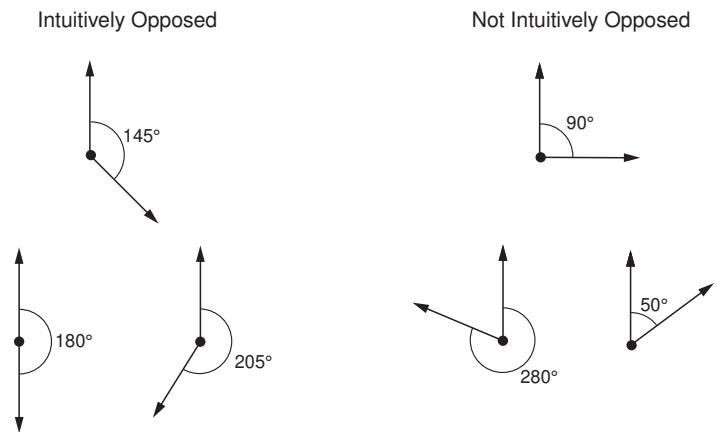
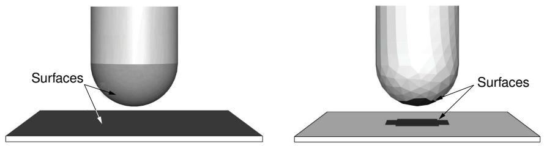
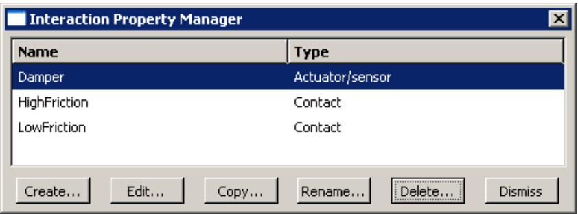
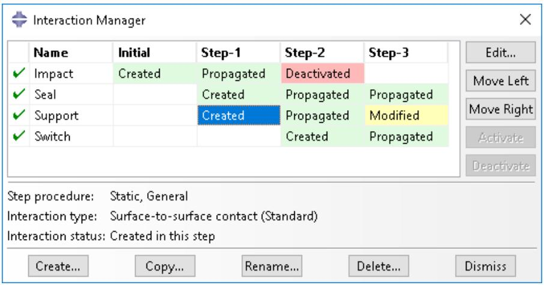
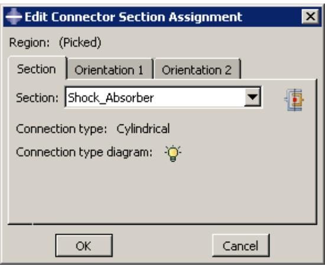
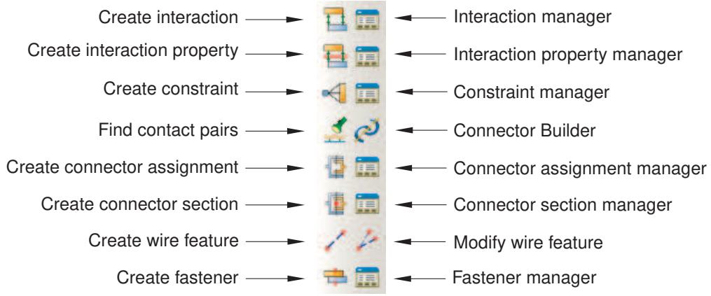
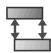

# 交互模块

## 交互模块

您可以使用 **交互模块**（Interaction module）来定义和管理以下对象：

-   模型各区域之间或模型区域与其周围环境之间的机械和热相互作用。
-   用于 Abaqus/Standard 与 Abaqus/Explicit 联合仿真的界面区域和耦合方案。
-   模型各区域之间的分析约束。
-   装配体级别的线特征、连接器截面以及分配给连接器的连接器截面。
-   作用在模型区域上的惯性（点质量、转动惯量和热容）。
-   作用在模型区域上的裂纹。
-   模型两点之间或模型一点与地面之间的弹簧和阻尼器。

## 本节内容：

理解交互模块的作用
进入和退出交互模块
理解交互
理解交互属性
理解约束
理解接触和约束检测
理解连接器
理解连接器截面和功能
理解交互模块的管理器和编辑器
理解表示交互、约束和连接器的符号
使用交互模块工具箱
使用交互模块
使用交互编辑器
使用交互属性编辑器
使用约束编辑器
使用接触和约束检测
使用连接器截面编辑器
使用查询工具集获取连接器分配信息

## 理解交互模块的作用

您可以使用交互模块来定义交互。

您可以定义以下内容：

-   接触交互。
-   弹性基础。
-   腔体辐射。
-   热膜条件。
-   向环境辐射以及从环境接收辐射。
-   Abaqus/Standard 到 Abaqus/Explicit 的联合仿真交互。
-   压力渗透。
-   入射波。
-   声阻抗。
-   循环对称性。
-   用户定义的驱动器/传感器交互。
-   模型更改交互。
-   绑定约束。
-   刚体约束。
-   显示体约束。
-   耦合约束。
-   调整点约束。
-   MPC 约束。
-   壳到实体耦合约束。
-   嵌入区域约束。
-   方程约束。
-   连接器截面分配。
-   惯性。
-   裂纹。
-   弹簧和阻尼器。

交互是**步骤相关对象**，这意味着当您定义它们时，必须指明它们在分析的哪些步骤中处于活动状态。（有关步骤相关对象的更多信息，请参阅理解对象在步骤中的状态。）例如，您只能在传热、耦合温度-位移或热电耦合步骤期间在表面上定义膜条件和辐射条件。类似地，您只能在初始步骤中定义带有用户定义驱动器/传感器的交互。

交互模块中的**集**（Set）和**面**（Surface）工具集允许您定义和命名希望应用交互和约束的模型区域。您可以使用**幅值**（Amplitude）工具集来定义一些交互属性在分析过程中的变化。**解析场**（Analytical Field）工具集允许您创建解析场，用于为选定的交互定义空间变化的参数。**参考点**（Reference Point）工具集允许您定义在约束中和创建装配体级别线特征时使用的参考点。

除非在交互模块中指定，否则 Abaqus/CAE 不会识别零件实例或装配体区域之间的机械接触；装配体中两个表面的物理邻近性不足以表明表面之间存在任何类型的交互。

有关定义裂纹以研究其萌生和扩展的信息，请参阅断裂力学。有关定义惯性的信息，请参阅惯性。有关定义弹簧和阻尼器的信息，请参阅弹簧和阻尼器。

## 附加信息

-   关于接触交互
-   幅值工具集
-   解析场工具集
-   参考点工具集
-   集和面工具集

## 进入和退出交互模块

您可以在 Abaqus/CAE 会话期间的任何时间，通过单击上下文栏中**模块**（Module）列表中的**交互**（Interaction）来进入交互模块。主菜单栏上将出现**交互**（Interaction）、**约束**（Constraint）、**连接器**（Connector）、**特殊**（Special）、**特征**（Feature）和**工具**（Tools）菜单；并且上下文栏下方将出现一个**步骤**（Step）列表。

要退出交互模块，请单击**模块**列表中的另一个模块。在退出模块之前，您无需采取任何特定操作来保存在交互模块中创建的对象；当您通过主菜单栏选择**文件->保存**或**文件->另存为**来保存整个模型时，它们会被自动保存。

## 附加信息

-   在交互模块中使用特殊菜单

## 理解交互

您可以使用交互模块来定义多种类型的交互。

您可以定义以下类型的交互：

## 通用接触

通用接触交互允许您通过单个交互定义模型中多个或所有区域之间的接触。通用接触也用于在耦合欧拉-拉格朗日分析中定义拉格朗日体与欧拉材料之间的接触（参见在欧拉-拉格朗日模型中定义接触）。通常，通用接触交互是为一个包含所有外表面、特征边以及——在 Abaqus/Explicit 中——解析刚性表面、基于梁和桁架的边以及欧拉材料边界的**全集**表面定义的。为了细化接触域，您可以包含或排除特定的表面对。用于通用接触交互的表面可以跨越模型中多个不相连的区域。诸如接触属性、表面属性和接触公式等属性是作为接触交互定义的一部分分配的，但与接触域定义是独立的，这允许您为域定义使用一组表面，为属性分配使用另一组表面。有关创建此类交互的详细说明，请参阅定义通用接触。

通用接触交互和面-面接触或自接触交互可以在同一个分析中一起使用。在分析期间，一个步骤中只能有一个通用接触交互处于活动状态。

有关更多信息，请参阅关于接触交互、Abaqus/Standard 中的通用接触概述、Abaqus/Explicit 中的通用接触概述和欧拉分析。Abaqus/CAE 不支持罚刚度比例因子的分配。此外，在 Abaqus/CAE 中，基于节点的表面不能用于通用接触交互。

## 面-面接触、自接触和压力渗透

面-面接触交互描述两个可变形表面之间或一个可变形表面与一个刚性表面之间的接触。自接触交互描述单个表面上不同区域之间的接触。有关创建这些类型交互的详细说明，请参阅定义面-面接触、定义自接触和使用接触与约束检测。有关更多信息，请参阅 Abaqus/Standard 中的接触对概述和 Abaqus/Explicit 中的接触对概述。

如果您的模型包含复杂几何形状和众多接触交互，您可能需要自定义控制接触算法的变量，以获得具有成本效益的解决方案。这些控制面向高级用户，使用时应格外小心。有关更多信息，请参阅接触控制编辑器。

压力渗透交互允许您模拟流体渗透到参与面-面接触的两个表面之间的压力。流体压力垂直于表面施加。您必须创建一个面-面接触交互来指定压力渗透的主面和从面。构成接头的主体可以都是可变形的，例如螺纹连接器；也可以一个是刚性的，例如在较硬结构之间使用软垫片作为密封时。压力渗透交互只能在 Abaqus/Standard 分析中使用。有关创建压力渗透交互的详细说明，请参阅定义压力渗透。有关更多信息，请参阅流体压力渗透载荷。

## 流体腔

流体腔交互允许您在模型中选择并分配属性给充满液体或气体的流体腔。流体腔选择包括一个参考点和一个包围腔体的表面。这些属性在流体腔交互属性中定义（有关更多信息，请参阅理解交互属性）。您可以在 Abaqus/Standard 或 Abaqus/Explicit 分析的初始步骤中定义流体腔交互。该流体腔交互在分析的所有步骤中保持不变；您不能在初始步骤之后修改或停用它。有关创建流体腔交互的详细说明，请参阅定义流体腔交互。
## 流体交换

流体交换交互允许您定义流体在腔体与环境之间或在两个腔体之间的移动。要创建流体交换交互，您必须首先为每个腔体选择一个现有的流体腔体交互（对于与环境的交换选择一个，对于腔体之间的交换选择两个）。然后，您可以选择或创建一个流体交换交互属性（更多信息，请参阅理解交互属性）并设置有效交换面积。有关创建流体交换交互的详细说明，请参阅定义流体交换交互。

## 流体充气器

流体充气器交互允许您向流体腔体充气，以模拟安全气囊系统所用充气器的流动特性。要创建流体充气器交互，您必须首先选择一个现有的流体腔体交互。然后，您可以选择或创建一个流体充气器交互属性（更多信息，请参阅理解交互属性）。有关创建流体充气器交互的详细说明，请参阅定义流体充气器交互。

## XFEM裂纹扩展

XFEM裂纹扩展交互允许您激活或停用使用扩展有限元方法创建的裂纹的生长。有关创建此类交互的详细说明，请参阅停用和激活XFEM裂纹扩展。

## 模型更改

模型更改交互允许您在分析过程中移除和重新激活单元。您可以在除静态Riks分析步和线性摄动分析步之外的所有Abaqus/Standard分析过程中使用模型更改交互。有关创建此类交互的详细说明，请参阅定义模型更改交互。有关移除和重新激活单元的更多信息，请参阅单元和接触对的移除与重新激活。

## 循环对称

循环对称使您能够通过仅分析模型中的单个重复扇区，以显著降低的计算成本对整个360°结构进行建模。您只能在初始分析步中创建循环对称交互。一旦创建了循环对称交互，它将应用于整个分析历史。如果您在频率分析步中停用循环对称交互，Abaqus/CAE将评估该分析步中所有可能的节径。有关创建此类交互的详细说明，请参阅定义循环对称。有关Abaqus中循环对称的更多信息，请参阅呈现循环对称的模型的分析。

## 弹性基础（仅限Abaqus/Standard）

弹性基础允许您对表面上的分布式支撑的刚度效应进行建模，而无需实际建模支撑的细节。您只能在初始分析步中创建弹性基础交互。一旦激活了弹性基础，就不能在后续分析步中将其停用。有关创建此类交互的详细说明，请参阅定义基础。更多信息，请参阅单元基础。

## 腔体辐射（仅限Abaqus/Standard）

腔体辐射交互描述了封闭空间内由于辐射引起的热传递。Abaqus/CAE中提供两种腔体辐射模型：完全隐式定义和近似模型。完全版本可用于二维、三维和轴对称模型中无变形的热传递。它可以包含开放或封闭的腔体，并考虑对称性和表面遮挡，但不支持腔体内的表面运动。有关创建此类交互的详细说明，请参阅定义腔体辐射交互。

腔体辐射近似模型是使用表面辐射交互定义的。您可以在任何热传递分析中近似模拟腔体辐射，无论是否涉及变形。但是，近似腔体辐射仅适用于三维模型中的封闭腔体。该近似将腔体视为一个黑体封闭空间，其温度等于整个表面的平均温度。在这些有限的条件下，近似腔体辐射可以节省相当大的计算成本。有关创建此类交互的详细说明，请参阅定义表面辐射交互。

有关两种类型腔体辐射的更多信息，请参阅Abaqus/Standard中的腔体辐射。

## 热膜条件

膜条件交互定义了由于周围流体对流引起的加热或冷却。Abaqus/CAE中提供两种类型的膜条件交互：表面膜条件定义了来自模型表面的对流，集中膜条件定义了来自节点或顶点的对流。您只能在热传递、完全耦合热应力或耦合热电分析步中定义膜条件交互。有关定义这些交互类型的详细说明，请分别参阅定义表面膜条件交互和定义集中膜条件交互。更多信息，请参阅热载荷。

## 向环境辐射及来自环境的辐射

辐射交互描述了由于向非反射环境辐射引起的热传递。Abaqus/CAE中提供两种类型的辐射交互：表面辐射交互描述了与非凹面的热传递，集中辐射交互描述了来自节点或顶点的辐射。您只能在热传递、完全耦合热应力或耦合热电分析步中定义辐射交互。有关创建这些交互类型的详细说明，请分别参阅定义表面辐射交互和定义集中辐射交互。更多信息，请参阅热载荷。

## Abaqus/Standard 到 Abaqus/Explicit 协同仿真

对于Abaqus/Standard到Abaqus/Explicit的协同仿真，您必须为协同仿真指定接口区域（用于交换数据的区域）和耦合方案（时间增量过程和数据交换频率）。在每个模型中，您需要创建一个Standard-Explicit协同仿真交互来定义协同仿真行为；每个模型中只能有一个活动的Standard-Explicit协同仿真交互。每个协同仿真交互中的设置在Abaqus/Standard模型和Abaqus/Explicit模型中必须相同。

Standard-Explicit协同仿真交互只能在一般静态、隐式动态或显式动态分析步中创建。该交互仅在其创建的分析步中有效，不会传播到后续分析步。有关创建此类交互的详细说明，请参阅定义Standard-Explicit协同仿真交互。更多信息，请参阅结构到结构的协同仿真。

## 入射波

入射波交互模拟了由于外部声波源引起的入射波载荷。有关创建此类交互的详细说明，请参阅定义入射波。更多信息，请参阅声学和冲击载荷。

## 声学阻抗

声学阻抗定义了声学介质压力与声学-结构界面处法向运动之间的关系。有关创建此类交互的详细说明，请参阅定义声学阻抗。更多信息，请参阅声学和冲击载荷。

## 执行器/传感器（仅限Abaqus/Standard）

执行器/传感器交互对传感器和执行器的组合进行建模，因此允许对控制系统组件进行建模。目前，此类交互仅允许在一点进行感知和驱动。有关创建此类交互的详细说明，请参阅定义执行器/传感器交互。

交互定义及其可选的关联属性用于定义交互的基本方面，但用户必须提供用户子程序UEL来提供驱动如何依赖于传感器读数的具体公式。您在作业模块中创建分析作业时指定包含用户子程序的文件的名称。

## 警告：

此功能仅供高级用户使用。除最简单的测试示例外，其使用将需要用户/开发人员进行大量编码。在继续之前，应阅读用户自定义单元。

执行器/传感器交互仅适用于Abaqus/Standard分析。更多信息，请参阅关于用户子程序和工具。

## 附加信息

• 定义接触交互

## 理解交互属性

您可以定义一组由交互引用但独立于交互的数据；例如，定义接触期间摩擦的系数。这组数据称为交互属性。
一个交互属性可以被多个不同的交互引用。

您可以创建以下类型的交互属性：

## 接触（Contact）

接触交互属性可以定义切向行为（摩擦和弹性滑动）和法向行为（硬接触、软接触或阻尼接触以及分离）。此外，接触属性还可以包含有关阻尼、热导率、热辐射以及摩擦生热的信息。接触交互属性可以被通用接触、面-面接触或自接触交互引用。有关定义此类交互属性的详细说明，请参阅定义接触交互属性。

## 薄膜条件（Film condition）

薄膜条件交互属性定义了薄膜系数作为温度和场变量的函数。薄膜条件交互属性只能被薄膜条件交互引用。有关定义此类交互属性的详细说明，请参阅定义薄膜条件交互属性。

## 腔体辐射（Cavity radiation）

腔体辐射交互属性定义了腔体的发射率作为温度和场变量的函数。腔体辐射交互属性只能被腔体辐射交互引用。有关定义此类交互属性的详细说明，请参阅定义腔体辐射交互属性。

## 流体腔（Fluid cavity）

流体腔交互属性定义了占据腔体的流体类型和流体性质。您可以选择液压流体或气动流体。液压流体必须包含流体密度；并且可能包含流体体积模量、热膨胀系数和其他温度相关数据。气动流体必须包含理想气体分子量，并且可能包含摩尔热容量（仅 Abaqus/Explicit）。有关定义此类交互属性的详细说明，请参阅定义流体腔交互属性。

## 流体交换（Fluid exchange）

流体交换交互属性定义了流体在腔体与环境之间或从一个腔体到另一个腔体的流动。您可以基于体积粘度、质量通量、质量泄漏率、体积通量或体积泄漏率来定义流体交换。有关定义此类交互属性的详细说明，请参阅定义流体交换交互属性。

## 流体充气器（Fluid inflator）

流体充气器交互属性定义了质量流量和温度作为充气时间的函数，可以通过直接输入或输入气罐测试数据来定义。它还定义了进入流体腔的气体混合物。有关定义此类交互属性的详细说明，请参阅定义流体充气器交互属性。

## 声学阻抗（Acoustic impedance）

声学阻抗交互属性定义了声学分析中的表面阻抗或压力与表面位移和速度法向分量之间的比例因子。声学阻抗交互属性只能被声学阻抗交互引用。有关定义此类交互属性的详细说明，请参阅定义声学阻抗交互属性。

## 入射波（Incident wave）

入射波交互属性定义了入射波的速度和波浪载荷的其他特征。入射波交互属性只能被入射波交互引用。有关定义此类交互属性的详细说明，请参阅定义入射波交互属性。

## 执行器/传感器（Actuator/sensor）

执行器/传感器交互属性提供了传递给与执行器/传感器交互一起使用的 UEL 用户子程序的 PROPS、JPROPS、NPROPS 和 NJPROPS 变量。有关定义此类交互属性的详细说明，请参阅定义执行器/传感器交互属性。

## 磨损（Wear）

磨损交互属性基于 Archard 磨损率模型（参见接触磨损）定义了接触磨损属性。有关定义此类交互属性的详细说明，请参阅定义磨损交互属性。

## 理解约束（Understanding constraints）

在交互模块中定义的约束定义了对分析自由度的约束，而在装配模块中定义的约束仅定义了实例的初始位置约束。在交互模块中，您可以约束模型区域之间的自由度，并且可以抑制和恢复约束以更改分析模型。目前，您可以创建以下类型的约束：

## 绑定（Tie）

绑定约束允许您将两个区域融合在一起，即使在这些区域表面上创建的网格可能不相似。有关创建此类约束的详细说明，请参阅定义绑定约束，以及使用接触和约束检测。更多信息，请参阅网格绑定约束。

## 刚体（Rigid body）

刚体约束允许您将装配体区域的运动约束到某个参考点的运动。构成刚体一部分的区域的相对位置在整个分析过程中保持不变。有关创建此类约束的详细说明，请参阅定义刚体约束。有关参考点的更多信息，请参阅参考点工具集。更多信息，请参阅刚体定义。

## 显示体（Display body）

显示体约束允许您选择一个仅用于显示的部件实例。您不必对该部件实例进行网格划分，并且它不包含在分析中；但是，当您查看分析结果时，可视化模块会显示所选的部件实例。您可以约束该部件实例使其固定在空间中，或者约束它跟随选定的节点。您可以将显示体约束应用于 Abaqus 原生部件的实例或孤立网格部件的实例。有关创建此类约束的详细说明，请参阅定义显示体约束。您可以在可视化模块中自定义显示体的外观；更多信息，请参阅自定义显示体外观。

显示体约束对于机构或多体动力学问题特别有用，其中刚性部件通过连接器相互作用。在这种情况下，您可以创建一个简单的刚性部件，例如点部件，以及一个更能代表物理部件的显示体。有关包含显示体约束与连接器结合使用的模型示例，请参阅显示体。您还可以使用显示体来模拟不参与分析但有助于可视化结果的静止物体。

更多信息，请参阅显示体定义。

## 耦合（Coupling）

耦合约束允许您将某个表面的运动约束到单个点的运动。有关创建此类约束的详细说明，请参阅定义耦合约束。更多信息，请参阅耦合约束。

## 调整点（Adjust points）

调整点约束允许您将一个或多个点移动到指定的表面上。有关创建此类约束的详细说明，请参阅定义调整点约束。更多信息，请参阅调整节点坐标。此调整可能在组装紧固件和其他应用中很有用；请参阅关于组装紧固件，以及创建组装紧固件。

## MPC 约束（MPC constraint）

MPC 约束允许您将某个区域的次节点的运动约束到单个点的运动。有关创建此类约束的详细说明，请参阅定义 MPC 约束。两个点之间的多点约束使用连接器定义。详细说明，请参阅连接器。更多信息，请参阅通用多点约束。

## 壳体-实体耦合（Shell-to-solid coupling）

壳体-实体耦合约束允许您将壳体边缘的运动耦合到相邻实体面的运动。有关创建此类约束的详细说明，请参阅定义壳体-实体耦合约束。更多信息，请参阅壳体-实体耦合。

## 嵌入区域（Embedded region）

嵌入区域约束允许您将模型的某个区域嵌入到模型的“宿主”区域内或嵌入到整个模型中。有关创建此类约束的详细说明，请参阅定义嵌入区域约束。更多信息，请参阅嵌入单元。

## 方程（Equation）

方程是线性的多点方程约束，允许您描述单个自由度之间的线性约束。有关创建此类约束的详细说明，请参阅定义方程约束。更多信息，请参阅线性约束方程。

## 理解接触和约束检测（Understanding contact and constraint detection）

Abaqus/CAE 中的接触检测工具提供了一种快速简便的方法，用于在三维模型中定义接触交互和绑定约束。

---
日期：2026-06-16
与其逐个选择表面并定义它们之间的相互作用，您可以让 Abaqus/CAE 根据初始邻近度自动定位模型中所有可能相互作用的表面。您可以调整邻近度设置，并指定各种选项来控制活动搜索域、表面定义以及默认的相互作用或约束设置。该搜索适用于几何模型和网格模型。

每个检测到的相互作用或约束都涉及两个已识别的表面，也称为接触对候选。接触检测对话框以表格形式列出每个接触对候选及其默认参数。接触对候选的默认参数与传统 Abaqus/CAE 相互作用编辑器中使用的默认参数略有不同；具体而言，接触检测工具最初会为每个接触对候选分配面到面离散，而不是节点到面离散。

使用表格界面，您可以审查接触对候选，以确保表面定义全面、主面和从面分配适当且参数正确。如果需要，您可以在表中修改参数或表面分配，并可以在适当的位置创建新的接触对。一旦接触对候选配置符合您的要求，Abaqus/CAE 将同时定义所有的接触相互作用和绑定约束。

有关使用接触检测对话框的分步说明，请参阅 *使用接触和约束检测*。

## 本节内容：

接触检测对话框
接触检测算法的使用
默认相互作用和约束参数
使用接触检测工具的技巧

## 接触检测对话框

要使用接触检测，请从主菜单栏中选择 **交互**->**查找接触对** 或 **约束**->**查找接触对**。接触检测对话框将显示，如图 1 所示。最初没有已识别的接触对。

图 1：接触检测工具的初始视图。

使用接触检测工具是一个两步过程：首先 Abaqus/CAE 搜索模型中可能相互作用的表面；然后您有机会审查已识别的表面并在创建相互作用和约束之前修改默认的接触对参数。您需要提供一些基本标准来指导搜索。这些标准包括搜索域和可能接触的表面之间的距离。

输入必要的搜索标准后，单击 **查找接触对** 开始搜索。Abaqus/CAE 更新接触对候选表，如图 2 所示。

图 2：接触对候选表。

您可以为表中的每个接触对候选创建接触相互作用或绑定约束。您也可以通过单击相应的表单元格来修改相互作用或约束定义的参数（见图 3）。

图 3：更改接触对候选表中的单元格值。

在表格上单击鼠标右键会显示扩展选项菜单，并允许您手动向表中添加接触对。当您勾选 **显示先前创建的相互作用和绑定** 时，任何预先存在的面到面相互作用和绑定约束都会添加到接触对候选表中；您可以像修改新检测到的接触对候选一样修改现有的接触对。

接触对候选表中显示的相互作用和约束在您单击 **确定** 之前不会成为模型的一部分。完成接触对参数设置后，单击 **确定**。Abaqus/CAE 将根据指定的参数，为表中的每个接触对同时创建接触相互作用和绑定约束。创建的相互作用和约束将添加到模型树和相互作用管理器中；您可以使用这两个界面中的任何一个来审查、修改、抑制和删除创建的相互作用。

有关使用自动接触检测工具的详细说明，请参阅 *使用接触和约束检测*。

## 其他信息

•  理解相互作用
•  理解约束
•  在相互作用模块中管理对象
•  理解接触和约束检测

本节讨论接触检测算法的使用。

## 本节内容：

接触检测算法
定义接触对的附加标准
几何体的接触检测
网格模型的接触检测
过闭合表面的检测
在同一实例内定义接触和自接触
壳的注意事项

## 接触检测算法

表面必须满足两个要求才能被自动接触检测工具识别：

•  表面之间的距离必须小于或等于指定的间距容差。
•  表面必须直观地相对，定义如下。

Abaqus/CAE 将两个表面之间的间距定义为表面上最近点之间的距离。该距离在接触对候选表的 **间距** 列中报告。间距容差是接触检测搜索过程中使用的主要输入。您应指定一个间距容差，该容差应涵盖模型中所有可能接触表面之间的间距距离。有关更多信息，请参见下文的 *选择间距容差和延伸角度*。

## 注意：

**间距** 列中报告的值可能与 Abaqus/Standard 在分析过程中使用的间距不完全对应。分析期间为提高接触稳健性而应用的某些自动表面增强（如主面平滑和表面延伸）可能导致 Abaqus/CAE 预处理器和 Abaqus/Standard 分析中计算出的间距存在轻微差异。有关自动表面增强和接触公式的更多详细信息，请参阅 Abaqus/Standard 中的 *定义接触对*。

如果两个表面在最近点处构造的法线彼此夹角在 135° 到 225° 之间（见图 1），则认为它们是直观相对的。换句话说，在最近点处，表面必须彼此偏移小于 45°。无法调整或忽略表面方向要求。

图 1：法线的相对方向决定了表面是否直观相对。

图 2 展示了一个接触对要求的简单示例。

图 2：两个可能接触的物体。为简单起见，物体以二维形式呈现。

虚线表示根据表面 X 计算的间距容差。表面 B 与表面 X 平行，被识别为接触对的一部分，因为它既在间距容差范围内，又与表面 X 直观相对。类似地，表面 C 同时满足这两个标准。表面 D 虽然与表面 X 直观相对，但不在任何点的间距容差范围内；表面 D 不被考虑包含在接触对中。表面 A 虽然在间距容差范围内，但不与表面 X 直观相对；因此，表面 A 也被排除在任何接触对定义之外。连接表面（A、B、C 和 D）彼此之间不形成接触对。默认情况下，Abaqus/CAE 仅搜索不同部件实例上的表面。但是，即使您启用了在同一实例内搜索（见下文 *在同一实例内定义接触和自接触*），这些表面也不满足方向要求。

## 定义接触对的附加标准

使用间距和方向检查编制潜在接触对列表后，接触检测工具可以执行一系列附加检查，以调整表面定义使其更有用和更真实。所有这三个附加检查都是可选的，但默认情况下是启用的。

## 延伸表面

默认情况下，接触检测工具识别的任何表面都会延伸以包含 20° 范围内的相邻模型面，即使相邻面不满足间距和方向要求。20° 角是检测到的表面与相邻面在公共边处的法线之间的偏移量。您可以使用 **延伸每个找到表面的角度** 选项修改延伸角度。当面被添加到表面定义时，Abaqus/CAE 还会检查新添加面的任何相邻面。如果延伸表面包含了来自单独定义的接触对的面，Abaqus/CAE 会消除任何冗余定义。例如，考虑对图 2 中的模型进行 20° 范围内的表面延伸。Abaqus/CAE 创建一个接触对：一个表面由面 X 组成，另一个表面由面 B、C 和 D 组成。面 D 在面 C 的 20° 范围内，面 C 在面 B 的 20° 范围内；由面 C 和面 X 组成的冗余接触对被消除，因为它已被更大的接触对所包含。
## 在指定角度内合并接触对

您可以使用**当表面在角度内时合并接触对**选项，将多个接触对组合为单个定义。接触对中涉及的面必须相邻，且它们必须位于指定角度内（如上所述）。合并选项不会延伸面；它只合并已正确定位的接触对。默认情况下，接触检测工具会合并表面在 20° 范围内的接触对。合并选项通常作为表面延伸的替代方案，用于在不将表面定义扩展到分离容差之外的情况下自动合并接触对候选者。例如，在不延伸表面的情况下合并图 2 中模型内 20° 范围内的接触对，会得到一个单一的接触对：一个表面由面 X 组成，另一个表面由面 B 和 C 组成。

## 检查表面重叠

默认情况下，接触检测工具会消除任何表面不“重叠”的接触对；如果从一个表面上任意点引出的法线不穿过相对表面，则两个表面不重叠。例如，图 1 中的表面不重叠，即使它们可能通过了分离和方向检查。

图 1：不重叠的表面。为简单起见，物体以二维方式渲染。

您可以使用**包括不重叠的相对表面**选项来抑制表面重叠检查，并允许为不重叠的表面创建接触对。

## 几何体的接触检测

Abaqus/CAE 通过将由几何体组成的模型划分为单独的面来开始搜索。面由连接的几何边或分区所包围的区域组成。一旦识别出所有面，Abaqus/CAE 会比较这些面以确定它们是否满足分离和方向要求，然后通过应用延伸、合并和重叠检查从这些面定义表面（参见上面的**定义接触对的附加标准**）。任何满足所有要求的两个表面都会被标记为接触对候选者。

Abaqus/CAE 会自动为检测到的接触对中的表面分配主/从属面指定。分析刚性体或离散刚性表面总是被分配主角色；如果接触对涉及两个刚性表面，则主/从属角色的分配是任意的。对于涉及两个可变形表面的接触对，Abaqus/CAE 首先确定表面几何体是否已网格化，并将主角色分配给网格较粗糙的表面。如果网格信息不可用，则表面积较大的表面成为主表面。分配主/从属角色的算法不考虑不同的基础刚度或单元指定；如果这些因素在您的接触相互作用中起重要作用，您应该在创建相互作用之前检查主/从属分配。有关主/从属分配的进一步讨论，请参阅**选择用于接触对的表面**。

## 网格模型的接触检测

接触检测同样适用于网格模型。网格模型的搜索算法的工作原理与几何体类似，但它使用单元面而不是几何面。默认情况下，Abaqus/CAE 只搜索不同零件实例之间的接触对。导入到 Abaqus/CAE 的网格模型通常只包含一个零件实例；因此，在这些模型上使用接触检测之前，您应该启用在同一实例内进行搜索（有关更多详细信息，请参阅下面的**定义同一实例内的接触和自接触**）。

## 警告：

与基于几何体的搜索不同，基于网格的表面报告的分离距离不一定是最近接近点之间的确切距离，而是一个近似值。如果指定的搜索容差相对于单元特征尺寸非常大，则此近似值的精度会大大降低。

在单元面上定义表面之前，Abaqus/CAE 会应用与几何面相同的延伸、合并和重叠检查（参见上面的**定义接触对的附加标准**）。因为单元面通常比几何面小得多，所以您应该始终允许表面有一定的延伸，以确保表面定义有足够的覆盖范围；图 1 比较了几何体和网格几何体在不允许表面延伸时创建的表面。

图 1：当不允许对几何体（左）和网格几何体（右）进行表面延伸时，创建表面的差异。

如果您重新网格化模型，任何在单元面上定义的表面都可能变得无效。相应地，基于这些面的相互作用和约束也会变得无效。

在为网格表面分配主/从属面指定时，刚性表面总是成为主面；如果接触对涉及两个刚性表面，则主/从属角色的分配是任意的。对于涉及两个可变形表面的接触对，Abaqus/CAE 会考虑每个表面上的网格密度；网格较粗糙的表面成为主表面。如果两个表面的网格密度相当，则主/从属角色的分配是任意的。分配主/从属角色的算法不考虑不同的基础刚度或单元类型；如果这些因素在您的接触相互作用中起重要作用，您应该在创建相互作用之前检查主/从属分配。有关主/从属分配的进一步讨论，请参阅**选择用于接触对的表面**。

接触检测工具无法检测几何体与孤立单元或解析表面与孤立单元之间的接触。如果您的模型包含从几何体进行网格化的零件实例，您可以使用接触检测对话框的**高级**选项卡上的选项来指示在搜索期间应将这些实例视为几何体（默认）还是单元网格。如果您的模型包含几何体和孤立网格元素的实例，您应该先对所有几何体进行网格化，然后执行基于网格的搜索以捕获所有可能的接触对。

在大多数情况下，几何体比网格几何体更忠实地表示了被建模的对象。此外，基于几何体的相互作用和约束不受重新网格化的影响。然而，网格是分析中使用的几何体。网格离散化可能导致两种表示之间的分离距离存在微小差异，这在精确分析中可能变得重要。搜索后，您可以使用**重新计算分离**选项检查单个接触对，查看原始几何体和网格几何体之间的差异。

## 过闭合表面的检测

如果装配体中的两个面在任意点相交，接触检测工具会将这些面报告为过闭合接触对。出现在接触对候选者表中的过闭合接触对仍然必须满足表面方向要求。分离列中的红色零表示接触对中的两个表面正在相交。

注意：分离列中的黑色零表示两个表面在它们最近的点处恰好接触。这种情况不存在过闭合或相交。

如果您延伸或合并一个过闭合表面以包括未过闭合的面，Abaqus/CAE 会将整个接触对报告为过闭合。

您应该在创建接触相互作用之前目视检查所有过闭合表面。严重过闭合的模型应进行调整以消除过闭合（或至少减轻其严重性）。轻微的过闭合可以通过使用接触调整选项（在接触对候选者表中可用）或干涉配合选项（在接触相互作用编辑器中可用）来解决。

面必须相交才会被报告为过闭合。如果一个面完全包含在另一个零件实例内，自动接触检测工具不会将该面报告为过闭合。这样的面相对于包围实例上的外部面可能仍然满足分离和方向要求。默认情况下，Abaqus/CAE 会从接触对候选者表中排除被包含的面，因为表面不“重叠”（参见**定义接触对的附加标准**）。如果您禁用重叠检查，Abaqus/CAE 会为被包含的面报告一个接触对候选者，但接触对候选者表不会提供任何表明表面过闭合或穿透的指示。由于接触检测工具无法将这些面识别为过闭合，因此默认应用于过闭合表面的调整选项（参见**默认相互作用和约束参数**）不会应用于此接触对。如果被包含的面嵌入深度超过任何外部面的分离容差，则自动接触检测工具不会将这些面识别为接触对候选者。
以图1中的模型为例。

  
图 1：在此模型中，圆柱体部件实例的一端完全封闭在另一个部件实例内。

为此搜索指定的分离容差为0.1。部件实例B端部的圆形面在分离容差范围内，并且直观上与部件实例A上的矩形面相对，但没有相交。接触对候选表列出了一对由圆形面和矩形面组成的法向接触对，它们之间的距离为0.06。部件实例B的圆柱侧面被列为过闭合，因为它与部件实例A的矩形面相交。

尽管接触检测工具不会将完全封闭的面识别为过闭合，但在分析过程中，此类表面仍会被视为过闭合。严重的过闭合通常会导致收敛困难。

在检查接触对候选表中的过闭合接触对时，请检查相邻表面是否存在完全封闭的面。

## 在同一实例内定义接触和自接触

您可以使用接触检测工具来定义同一部件实例或模型实例不同区域之间的接触。此功能对于作为单个部件实例导入Abaqus/CAE的复杂模型特别有用。如果您启用“包含同一实例上的表面对”选项，Abaqus/CAE会检查同一部件实例或模型实例上不同的几何体或单元面，以确定它们是否满足分离和方向要求。任何满足要求的面都将定义表面和接触对。

在某些情况下，表面延伸选项会导致主面和副面重叠。如果主面和副面由相同的面组成，Abaqus/CAE会自动调整接触对以创建自接触相互作用，在这种相互作用中，一个表面在变形过程中会与自身接触。在此情况下会创建一个单一表面。

## 壳单元的注意事项

如果已为壳部件分配了截面定义，接触检测工具会在分离计算中考虑壳的厚度。报告的分离距离已根据壳截面分配中指定的厚度和偏移进行了调整。您可以在接触检测搜索期间使用“考虑壳厚度和偏移”选项来忽略壳截面属性。在分离计算中从不考虑变化的厚度分布。

接触检测工具会自动选择要在其上创建表面的壳侧（有关更多信息，请参见“指定区域的特定侧或端”）。选择的侧面应使最接近点处的表面法向量在直观上是相对的。

在处理包含孤立体壳单元的模型时，请确保单元之间的法向方向一致；即，单元的正侧（SPOS）应全部位于壳结构的同一侧（有关更多信息，请参见“关于壳单元”）。如果单元法向方向不一致，Abaqus/CAE会误解单元面之间的角度，表面延伸和合并操作将无法正常工作。

对于某些基于样条的壳或面，同一个表面可能与壳的两侧发生相互作用（例如，见图1）。

  
图 1：一个基于样条的壳。

通常，您需要为壳的每一侧定义一个单独的接触对。但是，接触检测工具无法创建涉及相同两个面的多个接触对；它将定义一个接触对，并根据最接近点处的指向选择壳侧。您必须为壳的另一侧手动定义另一个接触对。

接触检测工具不会创建任何双侧表面。如果需要，您可以编辑模型树中已创建表面的定义，使其成为双侧（请参见“编辑集合和表面”）。

## 默认相互作用和约束参数

完成潜在接触对的搜索后，Abaqus/CAE会用创建相互作用所需的所有参数填充接触对候选表。

系统会为接触对和任何创建的表面提供名称。表1概述了命名算法。

表 1：接触检测工具中用于创建名称的算法。

<table><tr><td>接触对</td><td>前缀-接触对编号-主实例-副实例</td></tr><tr><td>主表面</td><td>前缀-接触对编号-主实例</td></tr><tr><td>副表面</td><td>前缀-接触对编号-副实例</td></tr><tr><td>合并的主表面</td><td>前缀-All-m</td></tr><tr><td>合并的副表面</td><td>前缀-All-s</td></tr><tr><td>合并的“全部”表面</td><td>前缀-All</td></tr></table>

在搜索前使用“名称”选项卡页来修改命名前缀并控制表面的创建。有关详细信息，请参见“为接触检测指定命名选项”。

接触检测工具提供给接触对的默认参数与传统的相互作用或约束编辑器中使用的默认参数略有不同。最显著的是，接触检测工具最初为每个接触对分配的是面-面离散化，而不是点-面离散化。有关表面离散化和相关约束施加方法的讨论，请参见《Abaqus/Standard中的网格绑定约束和接触公式》。

默认的表面调整选项取决于接触对中表面之间的分离距离。您可以在搜索前使用“规则”选项卡页来控制分配给检测到的接触对的默认调整选项。您还可以使用此页面指定一个分离容差，在该容差范围内所有接触对默认为绑定约束。有关“规则”页面的更多信息，请参见“定义默认接触对参数”。

表2列出了Abaqus/CAE提供的默认接触对参数。您可以在创建相互作用和约束之前单独编辑每个参数。有关编辑参数和默认值的详细说明，请参见“检查和修改检测到的接触对”。

表 2：接触检测工具的默认接触对参数。

<table><tr><td>参数</td><td>默认值</td></tr><tr><td>激活/抑制</td><td>激活</td></tr><tr><td> $类型^1$ </td><td>相互作用</td></tr><tr><td>滑移</td><td>有限滑移</td></tr><tr><td>离散化</td><td>面-面</td></tr><tr><td>相互作用属性</td><td>相互作用属性管理器中列出的第一个接触相互作用属性^2；如果尚未创建任何相互作用属性，则此参数为空</td></tr><tr><td>接触控制</td><td>此参数为空；在初始步骤中接触控制不可用</td></tr><tr><td> $调整^1$ </td><td>对于非相交表面之间的接触相互作用为“关”；对于相交表面之间的接触相互作用为0；对于绑定约束为“开”</td></tr><tr><td>创建步骤</td><td>初始</td></tr><tr><td>表面平滑</td><td>自动</td></tr><tr><td colspan="2"> $^1$ “类型”和“调整”参数的默认值由“规则”选项控制。</td></tr><tr><td colspan="2"> $^2$ 相互作用属性管理器按名称字母顺序列出所有已创建的相互作用属性。</td></tr></table>

## 注意：

上面讨论的某些参数在接触对候选表中默认是不可见的。在表中任意位置点击鼠标右键，并选择“编辑可见列”以控制表中显示哪些参数。

有关相互作用和约束参数的更多信息，请参见《网格绑定约束》、《Abaqus/Standard中关于接触对的内容》和《Abaqus/Explicit中关于接触对的内容》。

## 接触检测工具使用技巧

接触检测工具可用于任何需要创建接触相互作用和绑定约束的三维模型。它能基于最少的规范快速、彻底地识别并创建相互作用和绑定。

对于那些不适用通用接触定义的模型，该工具极大地简化了接触定义过程。一些基本准则可确保最有效和高效地使用该工具。

## 本节内容：

选择分离容差和延伸角度  
检查接触对候选  
保存搜索参数  
可能对接触检测工具造成困难的功能  
接触检测工具的局限性
## 选择分离容差和扩展角

指定的分离容差是接触对搜索算法的主要驱动因素。Abaqus/CAE 会根据模型中面的相对大小提供一个默认的分离容差。根据模型在分析期间的预期响应，您可能需要修改此值。为了有效捕捉所有重要的接触对，指定的分离容差应与模型中的预期位移或变形量级相当或更大。

指定一个非常大的分离容差通常会在分析中捕捉到比实际需要更多的接触对。虽然多余的接触对不一定会降低模型的质量，但这些多余的定义难以管理，并且可能降低性能。

选择用于控制表面扩展的角度时，应考虑可能发生接触的区域的拓扑结构和表面特征。表面应略微超出潜在接触区域，因此设置扩展角以捕捉面边缘处的任何倒角或圆角。凹痕、凹槽或凸起有时会打断表面的定义；这些特征与主表面形成的角度应决定扩展角的大小。

对于网格化模型，您可以通过仅在模型上显示特征边来预览表面的扩展情况，然后再搜索接触对（参见定义网格特征边）。如果扩展角等于特征角，则特定区域的表面定义将扩展到最近的可见特征边。调整特征角，直到可见边缘包含您想要捕捉的区域，然后相应地设置扩展角。

## 审查接触对候选对象

在创建交互和约束之前，您应始终审查接触对候选对象。检查表面定义中是否存在任何不连续性。

不连续性通常由较小的连接面引起，这些面在接触对中与逻辑接触表面并不是直觉上对立的（参见图 1）。

  
图 1：自动接触检测工具不会识别高亮显示的垂直面。

您可能需要使用修订后的扩展和合并选项重新运行搜索，以将不连续性纳入更大的表面中。如有必要，使用添加选项手动添加接触对。您也可以使用合并选项合并不连续的表面。

您应该调查任何相交的表面，以验证它们是否符合您的建模意图。只有一个过度闭合节点的接触对也会被报告为相交，因此轻微的差异也可能导致过度闭合。没有适当调整或干涉配合选项的过度闭合接触对可能会导致分析中的收敛困难。您还应检查与过度闭合接触对相邻的任何面或表面，以确保它们不是封闭面。有关更多信息，请参见过度闭合表面的检测。

## 保存搜索参数

默认情况下，您在“查找接触对”对话框中指定的搜索参数仅在该对话框打开期间有效；如果关闭对话框，下次访问接触检测工具时将提供默认搜索参数。

如果您单击高级标签页，Abaqus/CAE 会将当前指定的搜索参数设置为默认搜索参数。这些参数将在 Abaqus/CAE 的所有未来会话中作为默认值提供。唯一不保存的参数是搜索域，它总是使用“整个模型”作为默认值。

当您保存当前搜索参数时，Abaqus/CAE 会询问您是否要保存当前分离容差作为默认值。通常，Abaqus/CAE 会根据当前模型重新计算默认分离容差；如果您选择保存分离容差，则会跳过此计算，并且总是提供相同的值作为默认分离容差。

接触检测工具的默认搜索参数保存在 abaqus_2025.gpr 文件中；有关更多信息，请参见理解 Abaqus/CAE GUI 设置。要将默认搜索参数恢复为其原始设置，请在高级标签页上单击 2。

## 可能给接触检测工具带来困难的特征

您在使用接触检测工具处理某些模型特征和设计时可能会遇到困难。这些情况不会导致性能或稳定性问题，但搜索结果通常与您的建模意图不符。

## 堆叠的壳和薄层

具有平行紧密堆叠的壳层或薄板的模型可能导致产生多余的接触对。只要表面是直觉上对立的且在分离容差范围内，自动接触检测工具就能找到涉及被中间层隔开的表面的接触对。此外，如果启用了在同一实例内搜索并且禁用了重叠表面检查，则接触检测工具可能会检测到薄连续板顶面和底面之间的潜在接触。Abaqus/CAE 会为所有这些表面创建接触对候选对象，即使它们永远不会接触。当层或板是模型的局部特征时，这个问题最常见，因为捕捉模型其他区域的表面需要更大的分离容差。要克服此问题，请将搜索域限制到模型的特定区域，并使用适合该区域的分离容差。您也可以使用接触检测对话框的实体标签页从搜索域中排除某些几何体或单元类型（例如壳）。否则，您应该在创建交互之前删除多余的接触对候选对象。

## 凹面

虽然接触搜索算法能有效处理大多数合适的表面，但它可能会误解凹面和平面之间的关系。凹面会造成困难，因为它们的表面法线方向在单个表面的跨度上可能变化很大，并且表面之间的最近点有时是一个较差的参考。例如，考虑图 1 中的情况。

  
图 1：着色表面的法线在最近点处并非直觉上对立的。

即使这些模型中的最近点在分离容差范围内，这些点处的表面法线也不会通过方向测试。接触检测工具不会将这些表面报告为接触对候选对象，并且调整分离容差对此行为没有影响。有时，您可以修改扩展角，将凹面捕捉到另一个表面定义中。否则，您必须使用添加选项手动定义接触对。

## 涉及大旋转的机构

在模拟经历大旋转的机构时，接触检测工具通常无法有效捕捉您的建模意图。在此类机构中，预期的接触表面最初可能相距甚远，而附近的表面实际上永远不会接触。图 2 所示的日内瓦机构就是一个典型的例子。

  
图 2：日内瓦机构的运动。

此模型中重要的接触表面是右侧体上的销钉和左侧体上的槽。在初始配置中，销钉相对远离任何槽。另一方面，相邻表面对于模型的接触条件并不重要。此类模型的接触最好使用交互编辑器手动定义（参见定义面-面接触）。

## 接触检测工具的局限性

尽管接触检测工具有助于简化接触定义过程，但它存在一些局限性。

接触检测无法创建涉及以下特征的接触对：
•   二维模型
•   轴对称模型
•   梁和桁架
•   面-边接触
•   边-边接触
•   孤立网格单元与解析刚性表面之间的接触
•   包含孤立网格和未划分网格几何体的混合模型

允许的最小分离容差为 $1 \times 10^{-5}$。允许的最大分离容差为 $1 \times 10^{5}$。Abaqus/CAE 无法准确计算超出此范围的分离。如果您的模型需要使用不符合这些要求的分离容差，则应缩放整个模型的尺寸，使其落在功能范围内。
## 理解连接器

连接器允许您对组件中两点之间或组件中一点与地面之间的连接进行建模。要在 Abaqus/CAE 中对连接器建模，必须创建一个装配级线特征、一个连接器截面以及一个连接器截面赋值，后者用于将连接器截面与选定的线关联起来。

线特征包含一条或多条线，这些线定义了基础的连接器几何形状。连接器截面指定连接类型、连接器行为和截面数据。类似于在Property模块中为模型的某个区域赋值截面的方式，您需要创建一个连接器截面赋值，将连接器截面分配给模型的某个区域；具体来说，就是将连接器截面赋给线。您还需要在连接器截面赋值定义中为线的端点指定局部方向。

关于Abaqus/CAE中连接器的更多信息，包括概述和连接器建模示例，请参见Connectors。

## 其他信息

• 关于连接器  
• 为多个连接器创建或修改线特征  
• 创建连接器截面  
• 创建和修改连接器截面赋值

## 理解连接器截面和函数

连接器截面定义了连接类型，并可能包含连接器行为和截面数据。对于某些复杂的耦合连接器行为，必须定义额外的函数来描述耦合效应的本质（连接器导出分量和连接器势能）。一个连接器截面可以被一个或多个不同的连接器截面赋值所引用。

## 本节内容：

连接类型  
连接器行为  
有哪些可用的摩擦模型类型？  
连接器导出分量和连接器势能

## 连接类型

表1总结了创建连接器截面时可用的连接类型。您可以定义基本、组装、复杂和MPC连接类型。

表1：连接类型。

<table><tr><td colspan="2">基本类型</td><td rowspan="2">组装/复杂类型</td><td rowspan="2">MPC类型</td></tr><tr><td>平移</td><td>旋转</td></tr><tr><td>ACCELEROMETER</td><td>ALIGN</td><td>BEAM</td><td>Beam</td></tr><tr><td>AXIAL</td><td>CARDAN</td><td>BUSHING</td><td>Elbow</td></tr><tr><td>CARTESIAN</td><td>CONSTANT VELOCITY</td><td>CVJOINT</td><td>Link</td></tr><tr><td>JOIN</td><td>EULER</td><td>CYLINDRICAL</td><td>Pin</td></tr><tr><td>LINK</td><td>FLEXION-TORSION</td><td>HINGE</td><td>Tie</td></tr><tr><td>PROJECTION CARTESIAN</td><td>FLOW-CONVERTER</td><td>PLANAR</td><td>User-defined</td></tr><tr><td>RADIAL-THRUST</td><td>PROJECTION FLEXION-TORSION</td><td>RETRACTOR</td><td></td></tr><tr><td>SLIDE-PLANE</td><td>REVOLUTE</td><td>SLIPRING</td><td></td></tr><tr><td>SLOT</td><td>ROTATION</td><td>TRANSLATOR</td><td></td></tr><tr><td></td><td>ROTATION-ACCELEROMETER</td><td>UJOINT</td><td></td></tr><tr><td></td><td>UNIVERSAL</td><td>WELD</td><td></td></tr></table>

## 基本类型

基本连接类型包括平移类型和旋转类型。平移类型影响被赋值连接器截面的线的两个端点的平移自由度，并可能影响线第一个点的旋转自由度。旋转类型仅影响线的两个端点的旋转自由度。您可以使用单个基本连接类型（平移或旋转）或一个平移和一个旋转类型。

## 组装类型

组装连接类型是基本连接类型的预定义组合。

## 复杂类型

复杂连接类型影响连接中自由度的组合，不能与其他连接类型组合使用。它们通常用于模拟高度耦合的物理连接。

## MPC类型

MPC连接类型用于定义两点之间的多点约束。

有关每种连接类型的描述以及定义组装类型连接运动学约束的等效基本连接类型，请参见Connection Types and General Multi-Point Constraints。

## 连接器行为

您可以将连接器行为应用于具有可用相对运动分量的连接类型。可用相对运动分量是未受运动学约束的位移和旋转。可以在一个连接器截面中定义多个连接器行为。您可以指定以下连接器行为：

弹性：定义类似弹簧的弹性行为。  
阻尼：定义类似阻尼器的阻尼行为。  
摩擦：使用预定义或用户定义的摩擦模型定义类似库仑和迟滞的摩擦。  
塑性：定义塑性行为。  
损伤：定义损伤起始和演化行为。  
停止：定义可接受位置范围的限制值。  
• 锁定：指定用户定义的锁定准则。  
失效：定义力、力矩或位置的限制值。  
• 参考长度：定义本构力和力矩为零的平移或角度位置。  
• 积分：指定弹性、阻尼和摩擦的隐式或显式时间积分（仅用于Abaqus/Explicit分析）。

有关定义连接器行为的详细说明，请参见Using the connector section editors。有关连接器行为的更多信息，请参见Connector Behavior。

## 有哪些可用的摩擦模型类型？

您可以模拟预定义或用户定义的摩擦行为。通常，对于预定义摩擦，您需要指定一组几何量，这些量是所模拟摩擦连接类型的特征。此外，您可以定义内部接触力贡献，例如来自连接的预紧力。Abaqus会自动定义接触力贡献和摩擦发生的局部切线方向。

您可以为以下连接类型模拟预定义摩擦：

## 组装/复杂类型

• Cylindrical (Slot + Revolute)  
• Hinge (Join + Revolute)  
• Planar (Slide-Plane + Revolute)  
• Slip Ring (complex)  
• Translator (Slot + Align)  
• U Joint (Join + Universal)

## 基本类型

Slide-Plane  
Slot

如果您定义了等效于这些组装类型之一的组合平移和旋转连接类型，也可以使用预定义摩擦。对于给定的连接类型，如果正在模拟预定义摩擦，则只能定义一个摩擦行为。

如果没有可用的预定义摩擦模型，或者该模型不足以描述所分析的机制，您可以指定用户定义的摩擦模型（Slip Ring连接类型除外，它不允许用户定义的摩擦模型）。您必须指定滑动方向信息、产生摩擦的法向力或法向力矩以及摩擦定律。您可以使用几个连接器摩擦行为来表示连接器中的摩擦效应。

有关定义摩擦的详细说明，请参见Defining friction。更多信息，请参见Connector Friction Behavior。

## 连接器导出分量和连接器势能

您可以使用连接器导出分量和连接器势能为连接器定义复杂的耦合行为。连接器导出分量是基于固有连接器相对运动分量的函数的用户指定分量定义。您可以创建导出分量，将连接器中的摩擦产生法向力指定为连接器力和力矩的复杂组合，或者用作连接器势能函数的中间结果。

连接器势能是固有相对运动分量或导出分量的用户定义数学函数。这些函数可以是二次的、椭圆的或最大范数。您可以使用连接器势能来定义耦合的摩擦、塑性和损伤连接器行为。

有关定义导出分量和势能的详细说明，请参见Specifying connector derived components和Specifying potential terms。有关连接器函数的更多信息，请参见Connector Functions for Coupled Behavior。

## 理解Interaction模块的管理器和编辑器

您可以在Interaction模块中使用管理器和编辑器来创建和管理对象。

## 本节内容：

在Interaction模块中管理对象  
Interaction编辑器  
Interaction属性编辑器  
. 接触控制编辑器  
接触初始化编辑器  
约束编辑器  
连接器截面编辑器  
连接器截面赋值编辑器

## 在Interaction模块中管理对象

Interaction模块提供以下管理器，可用于组织和操作与给定模型关联的对象：

• Interaction Manager 允许您创建和管理相互作用。  
• Interaction Property Manager 允许您创建和管理相互作用属性。  
• Contact Controls Manager 允许您为面-面接触和自接触相互作用创建和管理接触控制。
• 接触初始化管理器（Contact Initialization Manager）允许您为 Abaqus/Standard 中的通用接触相互作用创建和管理接触初始化规则。
• 约束管理器（Constraint Manager）允许您创建和管理约束。
• 连接器截面管理器（Connector Section Manager）允许您创建和管理连接器截面。
• 连接器截面分配管理器（Connector Section Assignment Manager）允许您创建和管理连接器截面分配。

例如，相互作用属性列表会显示在图 1 所示的相互作用属性管理器（Interaction Property Manager）中。

  
图 1：相互作用属性管理器（The Interaction Property Manager）。

管理器中的新建（Create）、编辑（Edit）、复制（Copy）、重命名（Rename）和删除（Delete）按钮允许您创建新对象或编辑、复制、重命名和删除现有对象。在连接器截面分配管理器中，您只能创建、编辑或删除连接器截面分配。您也可以通过主菜单栏的“相互作用”（Interaction）、“相互作用 -> 属性”（Interaction->Property）、“相互作用 -> 接触控制”（Interaction->Contact Controls）、“相互作用 -> 接触初始化”（Interaction->Contact Initialization）、“约束”（Constraint）、“连接器 -> 截面”（Connector->Section）和“连接器 -> 分配”（Connector->Assignment）菜单来启动这些操作。从主菜单栏选择某个管理操作后，其流程与您在管理器对话框内单击相应按钮完全相同。

您可以使用相互作用管理器中的复制（Copy）按钮、相应的菜单命令或模型树来复制相互作用。您可以将相互作用从任何分析步复制到任何有效的分析步，但存在一些限制。有关更多详情，请参阅使用管理器对话框复制与分析步相关的对象。

相互作用管理器（Interaction Manager）是一个与分析步相关的管理器，这意味着它通过分析过程包含每个相互作用历史的附加信息。相互作用管理器如图 2 所示。

  
图 2：相互作用管理器（The Interaction Manager）。

向左移动（Move Left）、向右移动（Move Right）、激活（Activate）和停用（Deactivate）按钮允许您操作相互作用的按分析步历史。有关更多信息，请参阅修改与分析步相关的对象的历史。

您可以从管理器中抑制和恢复之前定义的相互作用、约束和连接器截面分配。您可以使用管理器左侧一列中的图标来抑制这些属性或恢复之前为分析抑制的属性。抑制和恢复操作也可以从主菜单栏的相互作用（Interaction）、约束（Constraint）和连接器（Connector）菜单中使用。有关更多信息，请参阅抑制和恢复对象。

有关创建相互作用、相互作用属性、约束、连接器截面和连接器截面分配的详细说明，请参阅使用相互作用模块（Using the Interaction module）。

## 附加信息

• 什么是基本管理器？
• 什么是与分析步相关的管理器？
• 更改对象在分析步中的状态
• 理解相互作用模块管理器和编辑器

## 相互作用编辑器

要创建相互作用，请从主菜单栏选择“相互作用”（Interaction）->“创建”（Create）。此时会出现一个“创建相互作用”（Create Interaction）对话框，您可以在其中提供相互作用的名称、选择创建相互作用的分析步以及选择相互作用类型。

在选择除通用接触之外的任何相互作用类型后，单击“创建相互作用”对话框中的“继续”（Continue），系统将提示您选择应用相互作用的区域。选择一个或多个区域后，将出现一个相互作用编辑器，您可以在其中指定有关相互作用的附加信息，例如要关联的相互作用属性。对于通用接触相互作用，当您在“创建相互作用”对话框中单击“继续”时，将显示相互作用编辑器。例如，图 1 显示了用于 Abaqus/Explicit 分析的通用接触编辑器。

  
图 1：通用接触编辑器（The general contact editor）。

每个相互作用编辑器在其顶部面板中显示当前分析步以及您正在定义的相互作用的名称和类型。编辑器其余部分的格式根据您定义的相互作用类型而异。

创建相互作用后，您可以通过以下方式修改该相互作用：

• 您可以修改在创建相互作用时在编辑器中输入的部分或全部数据。
• 您可以使用相互作用管理器修改相互作用的按分析步历史。（有关更多信息，请参阅什么是与分析步相关的管理器？）

您可以通过从主菜单栏选择“帮助”（Help）->“上下文帮助”（On Context），然后单击感兴趣的编辑器特性来显示有关该特性的信息。

## 附加信息

• 理解已修改的与分析步相关的对象

• 理解相互作用模块管理器和编辑器

## 相互作用属性编辑器

要创建相互作用属性，请从主菜单栏选择“相互作用”（Interaction）->“属性”（Property）->“创建”（Create）。此时会出现一个“创建相互作用属性”（Create Interaction Property）对话框，您可以在其中指定相互作用属性的名称以及要创建的相互作用属性类型。指定此信息后，在“创建相互作用属性”对话框中单击“继续”（Continue）以显示相互作用属性编辑器。

相互作用属性编辑器的格式取决于您定义的相互作用属性类型。例如，膜条件（film condition）和执行器/传感器（actuator/sensor）属性编辑器显示数据字段，您可以在其中输入定义该属性所需的所有信息。膜条件属性编辑器如图 1 所示。

  
图 1：膜条件属性编辑器（The film condition property editor）。

另一方面，接触属性编辑器（contact property editor）的格式与“属性”模块中的材料编辑器完全相同（有关更多信息，请参阅创建材料）。与材料编辑器一样，接触属性编辑器包含菜单，您可以从中选择要包含在属性定义中的选项，如图 2 所示。

  
图 2：接触属性编辑器包含“力学”（Mechanical）和“热学”（Thermal）选项菜单。

当您从菜单中选择一个选项时，该选项的名称会出现在编辑器顶部的“接触属性选项”（Contact Property Options）列表中，并且该选项成为您的相互作用属性定义的一部分。此外，编辑器下半部分的选项定义区域会更改，以提供字段供您为当前选定的选项指定信息。

例如，图 3 中的“接触属性选项”列表反映了“切向行为”（Tangential Behavior）和“法向行为”（Normal Behavior）选项（位于“力学”菜单中）已包含在属性定义中。“切向行为”当前被选中，相关参数显示在编辑器的下半部分。如果您想从接触属性定义中移除某个选项，可以从“接触属性选项”列表中选择该选项，然后单击

  
图 3：包含“切向行为”和“法向行为”选项的力学接触属性定义。

您可以通过从主菜单栏选择“帮助”（Help）->“上下文帮助”（On Context），然后单击感兴趣的特性来显示有关该编辑器特性的帮助。有关创建属性的详细说明，请参阅创建相互作用属性和使用相互作用属性编辑器。

## 附加信息

• 管理对象
• 理解已修改的与分析步相关的对象

## 接触控制编辑器

要为面-面接触和自接触相互作用创建接触控制，请从主菜单栏选择“相互作用”（Interaction）->“接触控制”（Contact Controls）->“创建”（Create）。此时会出现一个“创建接触控制”（Create Contact Controls）对话框，您可以在其中指定接触控制的名称以及要创建的接触控制类型。指定此信息后，单击“继续”（Continue）以显示接触控制编辑器。

## 警告：

接触控制仅面向高级用户。这些控件的默认设置适用于大多数分析。使用这些控件的非默认值可能会大大增加分析的计算时间或产生不准确的结果。在 Abaqus/Standard 分析中更改这些设置也可能导致收敛问题。

每个接触控制编辑器在其顶部面板中显示您正在定义的接触控制的名称和类型。编辑器其余部分的格式根据您是为 Abaqus/Standard 分析还是 Abaqus/Explicit 分析定义控件而异。
您可以通过从主菜单栏中选择**帮助->按上下文**，然后点击感兴趣的特定功能，来显示编辑器该功能的帮助信息。有关更多信息，请参阅《在 Abaqus/Standard 分析中指定接触控制》和《在 Abaqus/Explicit 分析中指定接触控制》。

## 附加信息

• 自定义接触控制

## 接触初始化编辑器

要在 Abaqus/Standard 中为通用接触相互作用创建接触初始化规则，请从主菜单栏中选择**相互作用->接触初始化->创建**。将出现接触初始化编辑器，您可以在其中为初始化定义指定名称以及与该定义相关联的规则。

您可以通过从主菜单栏中选择**帮助->按上下文**，然后点击编辑器，来显示接触初始化编辑器的帮助信息。有关更多信息，请参阅《创建接触初始化》。

## 附加信息

• 创建接触初始化

## 约束编辑器

要创建约束，请从主菜单栏中选择**约束->创建**。将出现一个“创建约束”对话框，您可以在其中指定约束的名称和类型。点击**继续**以指定要应用约束的区域（如果适用），并显示用于输入定义约束所需数据的编辑器。

每个约束编辑器在其对话框的顶部面板中显示您正在定义的约束的名称和类型。编辑器的其余部分格式根据您正在定义的约束类型而有所不同。例如，绑定约束编辑器如图 1 所示。

  
图 1：绑定约束编辑器。

您可以通过从主菜单栏中选择**帮助->按上下文**，然后点击感兴趣的编辑器功能，来显示特定编辑器功能的信息。有关创建约束的详细说明，请参阅《使用约束编辑器》。

## 附加信息

• 创建约束

## 连接器截面编辑器

连接器截面编辑器允许您创建连接器截面，并添加 Abaqus/Standard 和 Abaqus/Explicit 中可用的连接器行为。

要创建连接器截面，请从主菜单栏中选择**连接器->截面->创建**。将出现一个“创建连接器截面”对话框，您可以在其中为您要创建的连接器截面指定名称、类别和类型。当您从**组装/复杂**或**基本**类别中选择一种连接类型时，该连接类型的可用和受约束的相对运动分量 (CORM) 将显示在对话框中。此外，

道 您可以点击 日 来查看该连接类型的示意图以及 Abaqus 对该连接的理想化表示。指定名称、类别和类型后，在“创建连接器截面”对话框中点击**继续**以显示连接器截面编辑器。对于 **MPC** 类别的连接类型，选择该类型并输入所需数据（如果有）。点击**确定**以完成 MPC 截面的创建并关闭“创建连接器截面”对话框。

连接器截面编辑器允许您添加 Abaqus/Standard 和 Abaqus/Explicit 中可用的连接器行为。当您在**行为选项**选项卡页上点击**添加**时，将显示一个行为列表。选择某个行为后，该行为的名称将出现在编辑器顶部的**行为选项**列表中，并且该行为成为您连接器截面定义的一部分。编辑器下半部分的选项定义区域会随之更改，提供字段以便您为当前选定的行为指定信息。如果要从连接器截面定义中删除某个行为，可以从**行为选项**列表中选择它，然后点击**删除**。

## 注意:

Abaqus/CAE 不执行任何对其他行为的依赖性检查；您应确保定义了所有必需的行为。例如，如果您定义了塑性行为，则还必须定义弹性行为。

您可以定义多个相同类型的行为，例如弹性行为。只能选择与所选连接类型的可用相对运动分量相一致的力或力矩来定义行为。例如，图 1 中的**行为选项**列表反映已将两个弹性行为和一个参考长度行为包含在连接器截面定义中。高亮显示的弹性行为定义了与所选力矩方向相同的弹性行为。

  
图 1：连接器截面编辑器。

在**表选项**选项卡页上，您可以为连接器截面中的所有行为选项指定正则化（仅限 Abaqus/Explicit 分析）和表格数据外推的行为设置。或者，您可以通过点击编辑器下半部分选项定义区域中的**表选项**按钮，为单个行为选项指定行为设置。单个行为选项的行为设置优先于连接器截面的行为设置。

当截面数据适用于指定的连接类型时，您可以在**截面数据**选项卡页上输入数据。

您可以通过从主菜单栏中选择**帮助->按上下文**，然后点击感兴趣的特定功能，来显示编辑器该功能的帮助信息。有关创建连接器截面、定义行为和截面数据的详细说明，请参阅《创建连接器截面》和《使用连接器截面编辑器》。

## 附加信息

• 管理对象  
• 创建连接器截面  
• 使用连接器截面编辑器  
• 连接器

## 连接器截面指派编辑器

要创建连接器截面指派，请从主菜单栏中选择**连接器->指派->创建**。选择要指派连接器截面的线缆。

连接器截面指派编辑器包含三个选项卡页，允许您指定要指派给线缆的连接器截面以及线缆端点的方向。例如，将连接器截面 Shock_Absorber 指派给选定线缆的连接器截面指派编辑器如图 1 所示。

  
图 1：连接器截面指派编辑器。

您可以通过从主菜单栏中选择**帮助->按上下文**，然后点击感兴趣的编辑器功能，来显示特定编辑器功能的信息。有关创建连接器截面指派的详细说明，请参阅《创建和修改连接器截面指派》。

## 附加信息

• 为多个连接器创建或修改线缆特征  
• 创建连接器截面  
• 创建和修改连接器截面指派  
• 连接器

## 理解表示相互作用、约束和连接器的符号

当您将相互作用、约束和连接器应用于模型的区域时，可以选择在视口中显示符号，以指示您应用相互作用、约束和连接器的位置。有关图形符号类型的信息，请参阅《用于表示相互作用、约束和连接器的符号》。

您可以将相互作用、约束和连接器应用于几何体或孤立的节点和单元。

## 相互作用和约束

如果将相互作用或约束应用于几何体，符号将大致均匀地分布在应用该相互作用或约束的曲面（一个或多个）上。如果相互作用或约束定义涉及节点区域而非曲面，则符号将均匀分布在节点区域的边缘和节点区域中的任何顶点上。如果相互作用或约束应用于单个顶点，则符号出现在该顶点处。

如果将相互作用或约束应用于孤立节点或单元，对于基于曲面的区域，符号出现在每个单元面的中心；对于基于节点的区域，符号出现在节点处。

对于使用解析场分布的相互作用（和规定的条件），符号根据解析场值进行缩放。此外，每个符号内部显示一个加号 (+) 或减号 (−)，以指示该位置的相互作用大小为正还是负。当解析场在其区域的某个部分评估为零时，Abaqus/CAE 会显示按比例缩小的相互作用符号。这些按比例缩小的符号明显小于默认符号大小。这些符号的示例，请参阅《理解规定条件符号类型、颜色和大小》。有关更多信息，请参阅《使用解析表达式场》。
## 连接器

当您将连接器应用于线段时，线段的起点处会出现方框，终点处会出现三角形。如果您为方向1指定了全局坐标系以外的方向，则线段的起点处会出现方向三轴。对于方向2，仅当您通过名称指定了坐标系时，线段的终点处才会出现方向三轴；如果您启用“使用方向1”选项，则终点处不会出现方向三轴。连接类型标签会出现在所选线段两个端点之间连线的中点附近。您也可以显示与连接器截面指派相关联的标签，但此显示默认是关闭的。

有关控制这些符号可见性的信息，请参阅**控制属性的显示**。

## 使用交互模块工具箱

您可以通过主菜单栏或交互模块工具箱访问所有交互模块工具。图1显示了交互模块工具箱中所有工具的图标。

  
图1：交互模块工具箱。

## 使用交互模块

本节详细描述了如何使用交互模块的不同功能。

另请参阅**什么是步骤依赖管理器？**以了解管理交互的信息。

## 本节内容：

创建交互  
创建交互属性  
自定义接触控制  
创建接触初始化  
创建接触稳定定义  
创建约束  
选择定义连接器几何形状的流程  
创建单个连接器  
为多个连接器创建或修改线段特征  
创建重合点连接器  
创建连接器截面  
创建和修改连接器截面指派  
编辑应用交互或约束的区域  
在交互模块中使用Special菜单

## 创建交互

创建交互时，必须指定交互的名称、激活交互的步骤、交互类型，并且如果需要，还需指定您希望将交互应用于装配体的哪个区域。

可用的交互类型取决于为该步骤选择的分析程序。例如，您只能在热传递、热-力耦合或热-电耦合分析步骤期间定义表面的热通量。类似地，您只能在初始分析步骤期间定义与用户自定义执行器/传感器的交互。

如果您正在创建面-面接触交互，可以通过使用接触检测工具自动执行下面过程中的许多步骤。有关更多信息，请参阅**使用接触和约束检测**。

1.  从主菜单栏中，选择 Interaction > Create。

    出现一个Create Interaction对话框，其中在Name文本字段中显示一个默认名称。

    

    **提示：** 您也可以使用交互模块工具箱中的工具创建交互。

2.  输入交互的名称。有关命名对象的更多信息，请参阅**使用基本对话框组件**。
3.  选择激活交互的步骤。单击Step文本字段旁的箭头，并从出现的列表中进行选择。

    “Types for Selected Steps”列表将更改为所有可用交互类型的列表。

4.  从“Types for Selected Steps”列表中选择交互类型，然后单击Continue。

5.  如果需要，请使用以下方法之一选择您希望应用交互的区域：

    **在视口中选择区域。** 您可以使用角度方法从几何体或一组单元面中选择一组面或边。有关更多信息，请参阅**使用角度和特征边方法选择多个对象**。选择完成后，单击鼠标键2。

    

    **提示：** 您可以通过在选择工具栏中指定过滤选项来限制可在视口中选择的对象类型。有关更多信息，请参阅**使用选择选项**。

    如果模型包含网格和几何体的组合，请单击提示区中的以下选项之一：
    *   单击 **Geometry** 将交互应用于几何区域或参考点。
    *   单击 **Mesh** 将交互应用于原生网格或孤立网格选择。

    默认情况下，对于大多数交互，会创建一个包含所选对象的集合或表面。您可以通过在提示区中关闭创建集合或表面的选项来更改此行为。提示区中会提供一个默认名称，但您可以输入新名称。

    • **要从现有集合或表面列表中选择，请执行以下操作：**

    1. 单击提示区右侧的 **Sets** 或 **Surfaces**。（按钮的名称取决于您正在创建的对象类型。例如，如果您正在创建面-面接触交互，则会出现一个 **Surfaces** 按钮。）

       Abaqus/CAE 显示Region Selection对话框，其中包含可用的集合或表面列表。

    2. 选择感兴趣的集合或表面，然后单击Continue。

    

## 注意：

默认的选择方法基于您最近使用的选择方法。要切换回另一种方法，请单击提示区右侧的 **Select in Viewport** 或 **Sets or Surfaces**。

出现交互编辑器。您正在应用交互的区域在视口中被高亮显示。

6.  输入定义交互所需的所有数据，然后单击 **OK**。有关编辑器特定功能的详细信息，请从主菜单栏中选择 Help > On Context，然后单击感兴趣的功能，或参阅**使用交互编辑器**。

    视口中会出现代表您刚创建的交互的符号。有关更多信息，请参阅**理解代表交互、约束和连接器的符号**。

## 其他信息

• 理解和使用工具箱和工具栏  
• 什么是步骤依赖管理器？  
• 在视口中选择对象  
• 使用交互编辑器  
• 集合和表面工具集

## 创建交互属性

您可以通过在交互属性编辑器中输入数据来创建交互属性。编辑器的格式根据您所定义的属性类型而异；创建属性时，必须首先指定属性类型，以便出现相应的编辑器。

1.  从主菜单栏中，选择 Interaction > Property > Create。

    

    **提示：** 您也可以使用交互模块工具箱中的工具创建交互属性。

    出现一个Create Interaction Property对话框。

2.  输入属性名称。有关命名对象的更多信息，请参阅**使用基本对话框组件**。
3.  选择属性类型，然后单击Continue。

    出现您指定的属性类型的编辑器。

4.  在编辑器中，输入定义交互属性所需的所有数据。

    

## 注意：

您可以通过从主菜单栏选择 Help > On Context，然后单击感兴趣的编辑器功能来显示特定编辑器功能的帮助信息。

5.  单击 **OK** 保存数据并退出编辑器。

## 其他信息

• 理解交互属性  
• 交互属性编辑器  
• 使用交互属性编辑器

## 自定义接触控制

接触控制编辑器允许您修改用于强制执行接触条件的算法。默认的接触控制通常足够，但自定义这些控制可能会带来更具成本效益的解决方案。

## 警告：

接触控制面向高级用户。这些控制的默认设置适用于大多数分析。使用非默认值可能会大大增加分析的计算时间或产生不准确的结果。在 Abaqus/Standard 分析中更改这些设置也可能导致收敛问题。

1.  从主菜单栏中，选择 Interaction > Contact Controls > Create。
2.  在出现的Create Contact Controls对话框中，执行以下操作：
    *   为接触控制命名。
    *   选择 Abaqus/Standard 接触控制或 Abaqus/Explicit 接触控制。

## 3. 单击 Continue。

出现您指定类型的接触控制编辑器。

4.  在编辑器中，输入自定义接触控制所需的数据。有关详细说明，请参阅以下部分：
在 Abaqus/Standard 分析中指定接触控制  
在 Abaqus/Explicit 分析中指定接触控制

5. 如果您想将编辑器中的值重置为默认值，请点击编辑器底部的 **Defaults**。  
6. 点击 **OK** 保存您的自定义设置并退出编辑器。

默认情况下，Abaqus 会调整通用接触域中略微过闭合的表面的位置，相关讨论见 Abaqus/Standard 中的通用接触接触初始化和 Abaqus/Explicit 中的通用接触接触初始化。接触初始化用于修改接触表面调整的默认行为。每个接触初始化定义包含一组调整规则；通用接触定义指定将每个初始化定义应用于哪些表面（请参阅为通用接触指定和修改接触初始化分配）。

接触初始化旨在纠正表面之间的小间隙或过闭合。指定过大的初始化调整可能会导致网格扭曲并增加分析的计算成本。

1. 从主菜单栏中，选择 **Interaction** -> **Contact Initialization** -> **Create**。  
   出现 **Create Contact Initialization** 对话框。

2. 输入接触初始化定义的 **Name**，并选择接触初始化的 **Type**。  
   出现 **Edit Contact Initializations** 对话框。

3. 您可以指定以下处理两个表面之间 **Initial Overclosures** 的技术：

   选择 **Resolve with strain-free adjustments** 以调整某些表面在分析开始时恰好接触，同时不在模型中产生应变。仅调整位于指定距离范围内的表面部分。  
   选择 **Treat as interference fits** 以在分析的第一个步骤中逐渐解决表面过闭合；此技术在表面位移时会在模型中产生应变。仅使用过盈配合调整位于指定过闭合距离范围内的表面部分。

   为在解决过盈配合之前建立均匀的过闭合，勾选 **Specify interference distance**，并输入过闭合距离值。位于指定距离范围内的表面部分（包括过闭合和开口）将被调整为具有指定量的过闭合。调整发生在分析开始时，不会在模型中产生应变；后续在分析第一步中的过盈配合解决将在模型中产生应变。

   选择 **Specify clearance distance** 以调整某些表面在分析开始时被指定值隔开，同时不在模型中产生应变。仅调整位于指定距离范围内的表面部分。

4. 指定过闭合距离范围；过闭合值小于指定距离的节点将使用无应变调整或渐进过盈配合进行调整。

   • 选择 **Analysis default** 以让 Abaqus 根据每个表面上的底层单元面尺寸计算最大过闭合调整距离。  
   • 选择 **Specify value** 以直接输入最大过闭合调整距离。如果您输入的值小于某个表面计算出的分析默认值，Abaqus 将对该表面使用分析默认值。

   

   ## 警告：

   如果两个表面（或两个表面的部分）初始过闭合距离大于指定的调整值，则在分析过程中不会强制这些严重过闭合表面区域之间的接触；更多信息请参见 Abaqus/Standard 中的通用接触接触初始化。

5. 指定开口距离范围；与对立表面分离值小于指定距离的节点将使用无应变调整进行调整。

   • 选择 **Analysis default** 以在初始化调整期间忽略所有开口节点。  
   • 选择 **Specify value** 以直接输入最大开口调整距离。

6. 指定其他选项。

   选择 **Adjust nodal coordinates** 以通过调整节点坐标来解决间隙/过闭合，而不在模型中产生应变。此选项仅适用于 Abaqus/Explicit 分析，并且只能用于分析第一步中定义的间隙/过闭合。  
   选择 **Secondary node set for clearance** 以包含在初始间隙规范中。指定的间隙将在此节点集的所有次级节点上强制执行，无论它们位于其各自主表面上方还是下方。此选项仅适用于 Abaqus/Explicit 分析，并且在指定了间隙距离时使用。如果指定了过闭合或开口距离，则不能使用此选项。  
   选择 **Step fraction for interference value** 以定义必须解决过盈配合的步骤时间的分数（在 0.0 和 1.0 之间）。默认值为 1.0。此选项仅适用于 Abaqus/Explicit 分析，并且在指定了过盈距离时使用。

7. 如果您想将对话框中的值重置为默认值，请点击对话框底部的 **Defaults**。

8. 点击 **OK** 保存您的接触初始化定义并关闭 **Edit Contact Initialization** 对话框。

## 附加信息

• Abaqus/Standard 中的通用接触接触初始化  
• Abaqus/Explicit 中的通用接触接触初始化  
• 定义通用接触  
• 为通用接触指定和修改接触初始化分配

接触稳定引入粘性阻尼以抵抗两个表面之间的增量相对运动。此阻尼可用于在接触闭合之前稳定无约束的刚体运动，而不会降低结果的准确性。接触稳定基于 Abaqus/Standard 中的通用接触稳定中描述的一组因子。

每个接触稳定定义包含一组稳定因子；通用接触定义指定将每个稳定定义应用于哪些表面（请参阅为通用接触指定和修改接触稳定分配）。

1. 从主菜单栏中，选择 **Interaction** -> **Contact Stabilization** -> **Create**。  
   出现 **Edit Contact Stabilization** 对话框。  
2. 输入接触稳定定义的 **Name**。  
3. 指定稳定类型：

   • 选择 **Define new stabilization behavior** 以定义标准稳定。  
   • 选择 **Reset values from previous steps** 以定义一种特殊类型的稳定，用于取消在先前分析步骤中应用的稳定效果；该取消稳定仍必须分配给通用接触定义中的表面。此类稳定不需要任何额外数据。

4. 指定 **Zero stabilization distance**；对于分离距离大于此值的表面，不应用稳定。间隙相关的比例因子在分析期间变化，在表面接触时为 1，在表面间隙超过指定的零稳定距离时为 0。

   • 选择 **Analysis default** 以将间隙距离设置为特征表面尺寸。  
   • 选择 **Specify** 以直接输入间隙距离。

5. 指定 **Reduction factor** 以确定阻尼值在后续增量中的变化方式。小于 1 的值会使阻尼随每次增量减小；大于 1 的值（不推荐）会使阻尼随每次增量增大。  
6. 指定应用于法向稳定阻尼效果的 **Scale factor**。  
7. 指定应用于切向稳定阻尼效果的 **Tangential factor**。  
8. 如果需要，选择一个 **Amplitude envelope** 以在步骤过程中改变稳定。

   或者，您可以点击创建新的幅值。（有关更多信息，请参见幅值工具集。）

   选择默认斜坡幅值以外的幅值可能会导致稳定效果跨越多个分析步骤；详见 Abaqus/Standard 中的通用接触稳定。

9. 如果您想将对话框中的值重置为默认值，请点击对话框底部的 **Defaults**。  
10. 点击 **OK** 保存您的接触稳定定义并关闭 **Edit Contact Stabilization** 对话框。

## 附加信息

• Abaqus/Standard 中的通用接触稳定  
• 定义通用接触  
• 为通用接触指定和修改接触稳定分配

## 创建约束

您可以创建以下约束：

• 绑定约束（Tie constraints），将两个独立的表面连接在一起，使它们之间没有相对运动。
*   刚体约束（Rigid body constraints），允许您将一组区域指定为刚体。
*   显示体约束（Display body constraints），允许您将一个部件实例指定为仅用于显示。
*   耦合约束（Coupling constraints），允许您将表面的运动约束到参考节点的运动。
*   调整点约束（Adjust points constraints），允许您将一个或多个点移动到指定表面上。
*   多点约束（Multi-point constraints），允许您将一个区域中次要节点的运动约束到单个点的运动。
*   壳到实体耦合约束（Shell-to-solid coupling constraints），允许您将壳边的运动耦合到相邻实体面的运动。
*   嵌入区域约束（Embedded region constraints），允许您将模型的一个区域嵌入到模型的“宿主”区域或整个模型中。
*   方程约束（Equation constraints），描述了单个自由度之间的线性约束。

1.  从主菜单栏中，选择 Constraint（约束）->Create（创建）。

    

    提示：您也可以使用 Interaction（相互作用）模块工具箱中的工具创建约束。

2.  在出现的 Create Constraint（创建约束）对话框中，执行以下操作：
    a. 为约束命名。有关命名对象的更多信息，请参阅使用基本对话框组件。
    b. 选择所需的约束类型。

3.  点击 Continue（继续）以创建约束并关闭 Create Constraint（创建约束）对话框。

4.  如果适用，选择要应用约束的区域。更多信息，请参阅在视口中选择对象。

5.  在出现的编辑器中，输入定义约束所需的任何数据。

有关创建不同类型约束的详细说明，请参阅以下部分：

定义绑定约束
定义刚体约束
定义显示体约束
定义耦合约束
定义调整点约束
定义 MPC 约束
定义壳到实体耦合约束
定义嵌入区域约束
定义方程约束

## 附加信息

*   理解和使用工具箱与工具栏
*   抑制和恢复对象
*   在视口中选择对象
*   集合和表面工具集

## 选择定义连接器几何形状的过程

您必须创建装配级别的线特征来为建模连接器定义基础几何形状。线特征包含连接当前视口中装配体各点的线，或连接装配体点与地面的线。

Abaqus/CAE 提供了两种可用于为装配体创建连接器几何形状的方法：

连接器构建器（Connector Builder）使您能够执行建模连接器涉及的所有步骤：创建一个装配级别线特征，可选择在其端点创建参考点，为其分配连接器截面，并为其任一端点指定方向。您应该使用此对话框来添加少量线特征。有关使用连接器构建器的说明，请参阅创建单个连接器。
Create Wire Feature（创建线特征）对话框使您能够在一个线特征中创建多条线。您应该使用此对话框来定义大量相似的连接器。此对话框仅创建线特征；您必须使用 Interaction（相互作用）模块中的其他对话框来执行后续建模步骤，例如创建参考点和基准坐标系、为线分配连接器截面以及指定线端点的方向。有关使用 Create Wire Feature（创建线特征）对话框的说明，请参阅为多个连接器创建或修改线特征。

连接器构建器使您能够执行建模单个连接器涉及的所有步骤。这些步骤包括：

*   在两点之间或点与地面之间创建线特征。
*   在任一端点创建参考点，并沿线长度创建基准坐标系。
*   为新线特征创建连接器截面赋值。
*   为线特征连接的任一端点指定方向。

因为连接器构建器一次创建一个连接器，所以您应该使用它来为装配体添加少量连接器。如果您计划定义大量连接器，请先使用 Create Wire Feature（创建线特征）对话框向装配体添加线特征。更多信息，请参阅为多个连接器创建或修改线特征。

1.  从主菜单栏中，选择 Connector（连接器）->Connector Builder（连接器构建器）。

    

    提示：您也可以使用 Interaction（相互作用）模块工具箱中的工具启动连接器构建器。

2.  选择您想要连接的点。

    a. 在视口中为连接器选择第一个点和第二个点。

    

## 注意：

您也可以点击提示区域中的 Connect to Ground（连接到地面）来将连接器的一侧接地。您不能将两点都接地。

连接器构建器将打开，您选择的点会显示在对话框的 Endpoints（端点）部分。在视口中，第一个点以红色突出显示，第二个点以洋红色突出显示。

    b. 如果需要，点击  以交换您选择的两个端点。
    c. 如果需要，在任一点描述下勾选 Create a reference point（创建参考点），以便在保存线特征时在该端点创建一个参考点。如果所选点是基准点或感兴趣点，Abaqus/CAE 会自动在该位置创建一个参考点。

3.  选择一个连接器截面。如果需要，点击  以创建新的连接器截面。

    编辑器中会显示连接类型。对于基本（basic）、组装（assembled）和复杂（complex）连接类型，您可以点击查看该连接类型的示意图以及 Abaqus 对该连接的理想化表示。对于 MPC 连接类型，第二个点的运动被约束到第一个点的运动。您选择的连接类型还决定了为连接器方向选择的初始值。如果您更改连接器截面赋值，Abaqus/CAE 会将这些方向设置重置为该连接类型的默认值。

4.  如果需要，修改以下任何方向设置：

    a. 将基准坐标系投影到端点之间的轴上。
    在对话框的 CSYS 1 部分，选择 Create CSYS on axis between points（在点之间轴线上创建坐标系）选项，然后选择 1、2 或 3 作为新基准坐标系的轴（Axis）。对于某些连接类型，Abaqus/CAE 可能默认选择此选项。

    b. 在对话框的 CSYS 1 部分为连接器的第一个点指定一个不同于全局坐标系的方向。如果连接器未接地，并且所选连接器截面赋值允许您调整连接器中的第二个点，那么您也可以在对话框的 CSYS 2 部分为第二个点指定一个方向。
    在对话框的任一部分，选择 Specify CSYS（指定坐标系），点击 ，然后使用以下方法之一选择基准坐标系：
    按名称选择预定义的基准坐标系。点击提示区域中的 Datum CSYS List（基准坐标系列表），从列表中选择一个名称，然后点击 OK。
    • 在视口中选择一个预定义的坐标系。
    • 对于连接器的第二个点，选择 Use CSYS 1（使用坐标系 1）将在连接器第二个点处也使用为第一个点定义的坐标系。

    所选方向在视口中以红色突出显示。连接器构建器重新出现，并显示用于连接器所选点方向的坐标系描述。

    

    提示：您也可以点击对话框 CSYS 1 或 CSYS 2 部分的  来创建一个新的基准坐标系以供使用。

    c. 如果需要，您可以为任一端点指定围绕基准坐标系轴的额外旋转。为其中一个点选择 Specify additional rotation（指定额外旋转）选项，以度为单位输入旋转角度值，并为 About axis（围绕轴）选项选择 1、2 或 3。仅当您指定的基准坐标系不是全局坐标系时，Specify additional rotation（指定额外旋转）选项才可用。

5.  点击 OK 以保存您的连接器并关闭连接器构建器，或者点击 OK/Repeat（确定/重复）以保存装配级别线特征，并保持对话框打开以便创建新的线特征。

## 附加信息

*   连接器

## 为多个连接器创建或修改线特征

在 Interaction（相互作用）模块中，从主菜单栏选择 Connector（连接器）->Geometry（几何）->Create Wire Feature（创建线特征）以添加一个或多个线特征。您可以添加不相连的线、链接的线或连接到地面的线。创建线特征时，您可以创建一个包含该线特征中所有线的几何集合，以便在后续选择过程中使用；例如，在为连接器截面赋值定义或应用连接器载荷选择线时。有关创建装配级别线特征的详细说明，请参阅添加点对点线特征。
您可以从主菜单栏选择 **Connector**->**Geometry**->**Modify Wire Feature** 来修改装配体级别的线特征。从要修改的特征中选择任意线段，然后在 **Modify Wire Feature** 对话框中进行更改，具体操作步骤如下所述。当您在对话框中点击 **OK** 时，Abaqus/CAE 将执行以下操作：

*   重命名并抑制原始线特征；
*   使用与原始线特征相同的名称创建一个新的线特征；
*   重命名包含原始线特征的几何集合（如果存在）；并且
*   如果适用，创建一个包含修改后线特征的新几何集合。

例如，图 1 显示 Wire-1 被重命名为 OldWire-1-1 并被抑制。类似地，Wire-1-Set–1 被重命名为 OldWire-1-Set–1。

图 1：模型树显示原始线特征（左）和修改后的线特征（右）的特征（Features）和集合（Sets）容器。

通过在选择线段以定义连接器截面分配、连接器载荷和连接器边界条件时，使用为线特征创建的默认几何集合名称，您可以确保如果修改了线特征，这些对象仍然有效。否则，如果修改了线特征，引用原始线特征任何部分的对象都将失效；例如，如果您定义了一个连接器力并从视口选择线段或使用了不同名称的几何集合。

您可以通过从主菜单栏选择 **Connector**->**Geometry**->**Remove Wires From Feature** 来从线特征中移除线段。从特征中移除线边的操作被存储为零件的一个特征；因此，您可以使用模型树来删除或抑制该操作。

1.  在 **Interaction** 模块的主菜单栏中，选择 **Connector**->**Geometry**->**Modify Wire Feature**。

    

    **提示**：您也可以使用 **Interaction** 模块工具箱中的工具修改装配体级别的线特征。

2.  在视口中，选择要修改的特征中的任意线段。

    **Modify Wire Feature** 对话框出现，并显示定义原始线特征中装配体级别线段的点对。

3.  在对话框的 **Point Pairs** 部分，您可以执行以下操作：

    *   要添加更多点对，指定方法，点击 T ，然后从视口中选择点。添加的线段的表示以洋红色高亮显示。
    *   要编辑一个点，选择表格中的点，点击 ，然后重新选择一个点。视口中的选择高亮会更新以显示新编辑的点。
    *   要在视口中识别特定的点对，选择所需的行。连接所选点对的线以红色高亮显示。
    *   要移除一个点对，选择所需的行并点击 。
    *   要交换点对中 **Point 1** 和 **Point 2** 的条目，选择所需的行并点击 。

4.  在对话框的 **Set Creation** 部分，如果您希望 Abaqus/CAE 为修改后的线特征创建一个新的线段几何集合，请勾选 **Create set of wires**。

5.  点击 **OK** 以修改线特征。

    原始线特征被重命名并抑制。修改后的装配体级别线特征出现在模型树中，位于装配体下的 **Features** 容器内，使用与原始线特征相同的名称。

## 附加信息

*   添加点对点线特征
*   连接器

在 **Interaction** 模块中，从主菜单栏选择 **Connector**->**Coincident Builder** 可以为一组重合点创建连接器线特征和截面分配。有关创建装配体级别线特征的详细说明，请参阅 *添加点对点线特征*。

1.  在 **Interaction** 模块的主菜单栏中，选择 **Connector**->**Coincident Builder**。
2.  在视口中，选择要包含在连接器线特征中的重合点，然后在提示区点击 **Done**。有关从视口选择多个点的方法概述，请参阅 *拖动选择多个对象*。

    **Coincident Point Builder** 对话框打开，所选的重合点显示在对话框的 **Endpoints** 部分。

3.  如果需要，可以通过以下操作自定义要使用的端点的内容和顺序：

    *   高亮显示任意重合点的行，然后点击  以删除该重合点对。
    *   高亮显示任意重合点的行，然后点击  以交换点对中的第一个和第二个点。

4.  选择一个连接器截面。如果需要，点击  创建一个新的连接器截面。

    连接类型显示在编辑器中。对于基本、组装和复杂连接类型，您可以点击  查看连接类型的示意图及其 Abaqus 理想化模型。对于 MPC 连接类型，第二个点的运动受第一个点运动的约束。

5.  如果需要，修改任何以下方向设置：

    a. 在对话框的 **CSYS 1** 部分为重合点连接器线特征指定一个不同于全局坐标系的方向。如果所选的连接器截面分配允许您调整连接器中的第二个点，您也可以在对话框的 **CSYS 2** 部分为第二个点指定方向。
    在对话框的任一部分，点击 ，然后使用以下方法之一选择基准坐标系：
        *   按名称选择预定义的基准坐标系。从提示区点击 **Datum CSYS List**，从列表中选择一个名称，然后点击 **OK**。
        *   在视口中选择一个预定义的坐标系。
        *   对于连接器中的第二个点，选择 **Use CSYS 1** 以在连接器的第二个点处也使用为第一个点定义的坐标系。

    所选方向在视口中以红色高亮显示。**Coincident Point Builder** 重新出现，并显示用于连接器所选点的方向的坐标系描述。

    

    **提示**：您也可以通过点击对话框 **CSYS 1** 或 **CSYS 2** 部分中的  来创建新的基准坐标系。

    b. 如果需要，您可以为任一端点指定绕基准坐标系轴的附加旋转。为其中一个点选择 **Additional rotation angle** 选项，输入旋转角度值（以度为单位），并为 **About axis** 选项选择 1、2 或 3。**Additional rotation angle** 选项仅当您指定了一个不同于全局坐标系的基准坐标系时才可用。

6.  点击 **OK** 以创建线特征和连接器截面分配。Abaqus/CAE 还会创建一个包含装配体级别线段的集合。

    原始线特征被重命名并抑制。修改后的装配体级别线特征出现在模型树中，位于装配体下的 **Features** 容器内，使用与原始线特征相同的名称。

## 附加信息

*   使用重合点约束两个实例

您可以通过选择连接类型来定义连接器功能，从而创建连接器截面。

## 本节内容：

为组装、复杂和基本连接类型创建连接器截面
为 MPC 类型创建连接器截面

## 为组装、复杂和基本连接类型创建连接器截面

连接器截面编辑器允许您指定组装、复杂或基本连接类型；连接器行为；以及要包含在截面定义中的截面数据。更多信息，请参阅 *连接器单元*。

1.  从主菜单栏，选择 **Connector**->**Section**->**Create**。

    

    **提示**：您也可以使用 **Interaction** 模块工具箱中的工具创建连接器截面。

    **Create Connector Section** 对话框出现。

2.  输入截面名称。有关命名对象的更多信息，请参阅 *使用基本对话框组件*。
3.  选择以下连接类别之一：

    *   选择 **Assembled/Complex** 以使用基本连接类型的预定义组合或复杂连接类型。
        点击 **Assembled/Complex** 类型文本框旁边的箭头，从出现的列表中选择所需的连接类型。
    *   选择 **Basic** 以使用平移和旋转连接类型。
        1.  如果需要，点击 **Translational type** 文本框旁边的箭头，从出现的列表中选择连接类型。
2. 如果需要，单击旋转类型（Rotational type）文本框旁边的箭头，然后从出现的列表中选择连接类型。

您可以选择一个平移类型、一个旋转类型，或者同时选择一个平移类型和一个旋转类型来定义连接器截面。

Abaqus/CAE 将显示所选连接类型可用的和受限的相对运动分量（CORM）。此外，您可以点击查看该连接类型的示意图以及 Abaqus 对该连接的理想化表示。

有关组装式、复杂式和基本连接类型的描述，请参阅连接类型（Connection Types）。

## 4. 单击 Continue。

连接器截面编辑器（connector section editor）将出现。

## 注意：

您可以通过从主菜单栏选择 Help->On Context，然后单击感兴趣的编辑器功能来显示特定编辑器功能的帮助。有关编辑器功能的更多信息，请参阅使用连接器截面编辑器（Using the connector section editors）。

5. 要编辑连接类型，请单击连接类型右侧以显示连接器截面类型编辑器。按上述方法选择连接类型。在编辑连接类型之前，您必须删除编辑器中的所有行为。
6. 在行为选项（Behavior Options）选项卡页上，您可以如下添加、删除和更改行为：

## 添加行为

单击编辑器右侧的添加（Add）以显示可用行为列表。选择定义您的连接器截面所需的行为。对于某些行为，您可以定义多个相同类型的行为。当您选择一个行为时，其名称会出现在行为选项（Behavior Options）列表中，并且与该行为相关的数据字段会出现在编辑器下半部分的数据区域中。使用数据字段为当前选定的行为输入信息。有关更多信息，请参阅使用连接器截面编辑器（Using the connector section editors）。

## 删除行为

在行为选项（Behavior Options）列表中，选择您要删除的行为，然后单击编辑器右侧的删除（Delete）。此过程会从行为选项列表和连接器截面定义中删除该行为。

## 更改行为数据

在行为选项（Behavior Options）列表中，选择您要更改其数据的行为。当与行为相关的数据字段出现在窗口下半部分时，根据需要更改您为该行为输入的信息。

7. 在表选项（Table Options）选项卡页上，您可以为连接器截面中的所有行为选项指定表格数据的规则化（仅适用于 Abaqus/Explicit 分析）和外推的行为设置。或者，您可以为单个行为选项指定行为设置。表选项（Table Options）按钮在行为选项（Behavior Options）选项卡页上可用于选定的行为选项。单个行为选项的行为设置优先于连接器截面的行为设置。有关更多信息，请参阅为表格数据指定行为设置（Specifying behavior settings for tabular data）和使用表格数据定义连接器行为（Defining Connector Behavior Using Tabular Data）。

在表选项（Table Options）选项卡页上如下指定行为设置：

a. 在页面的规则化（Regularization）部分，指定 Abaqus/Explicit 分析中表格数据规则化的设置。默认情况下，Abaqus/Explicit 会将数据规则化为基于自变量均匀间隔定义的表格。

• 打开规则化数据（Regularize data）以规则化表格数据。
关闭规则化数据（Regularize data）以关闭表格数据的规则化，并直接使用您定义的数据。

b. 如果您想规则化表格数据，请指定误差容限。

• 选择使用默认值（Use default）以使用默认值 0.03。
• 选择指定（Specify），并输入误差容限的值。

c. 在页面的外推（Extrapolation）部分，指定表格数据的外推方法。您输入的数据点在本构空间中构成一条非线性曲线。默认情况下，Abaqus 在指定的自变量范围之外将因变量外推为常数值，该常数值对应于曲线的端点。

选择常数（Constant）以在指定的自变量范围之外使用因变量的常数外推。
选择线性（Linear）以在指定的自变量范围之外使用因变量的线性外推。

8. 截面数据（Section Data）选项卡页对以下连接类型可用：

• 对于流量转换器（Flow-Converter）或收带器（Retractor）连接类型，输入以下截面数据：

## 节点b材料流量缩放系数（Node b material flow scaling factor）

输入与节点b处的材料流量相关的缩放系数 $\beta _ { s }$。节点b指的是 Abaqus/CAE 中用于模拟连接器的线的第二个点。默认值为1。

有关更多信息，请参阅 FLOW-CONVERTER 和 RETRACTOR。

• 对于滑环（Slip Ring）连接类型，输入以下截面数据：

## 单位参考长度质量（Mass per unit reference length）

输入带材的单位参考长度质量。

## 围绕节点b的接触角（Contact angle around node b）

接触角指的是带材包裹节点b所形成的角度。节点b指的是 Abaqus/CAE 中用于模拟连接器的线的第二个点。

对于 Abaqus/Standard 分析，您必须直接指定接触角。对于 Abaqus/Explicit 分析，您可以直接指定接触角，也可以让 Abaqus 根据您的模型配置计算接触角：

• 要让 Abaqus 计算接触角，请选择计算（Compute）。
• 要直接指定接触角，请选择指定（Specify）并输入接触角（以度为单位）。

有关更多信息，请参阅 SLIPRING。

9. 单击确定（OK）以保存数据并退出编辑器。

## 附加信息

• 理解连接器截面和功能
• 连接器截面编辑器
• 使用连接器截面编辑器
• 连接器

## 为 MPC 类型创建连接器截面

连接器截面编辑器允许您指定 MPC 连接类型。有关更多信息，请参阅通用多点约束（General Multi-Point Constraints）。

1. 从主菜单栏，选择连接器->截面->创建（Connector->Section->Create）。

提示：您也可以使用交互模块（Interaction module）工具箱中的工具创建连接器截面。

将出现一个创建连接器截面（Create Connector Section）对话框。

2. 输入截面名称。有关命名对象的更多信息，请参阅使用基本对话框组件（Using basic dialog box components）。
3. 选择 MPC 连接类别。
4. 单击 MPC 类型（MPC type）文本框旁边的箭头，然后从出现的列表中选择所需的连接类型。

有关更多信息，请参阅以下部分：

• 通用多点约束（General Multi-Point Constraints）
• MPC

5. 单击确定（OK）以保存截面定义并关闭对话框。

## 附加信息

• 理解连接器截面和功能
• 连接器截面编辑器

## 创建和修改连接器截面指派

您通过将连接器截面指派给线特征（用于定义连接器）或连接线（用于定义离散紧固件）并指定与线或连接线端点相关的局部方向来创建连接器截面指派。根据连接类型，所选线或连接线第一点的局部方向可能是必需的、可选的或不适用。根据连接类型，所选线或连接线第二点的局部方向可能是可选的或不适用。有关每种连接类型的局部方向要求，请参阅连接类型库（Connection-Type Library）。表1将连接类型库中引用的数字坐标轴与 Abaqus/CAE 中使用的坐标系统轴标签关联起来。您可以使用查询工具集（Query toolset）获取选定线或连接线的连接器指派信息。

表1：用于显示与线或连接线端点相关的局部方向的坐标系统轴标签。

<table><tr><td>局部坐标方向</td><td>笛卡尔</td><td>柱坐标</td><td>球坐标</td></tr><tr><td>1</td><td>x</td><td>r</td><td>r</td></tr><tr><td>2</td><td>y</td><td>t</td><td>t</td></tr><tr><td>3</td><td>z</td><td>z</td><td>p</td></tr></table>

当您创建连接器截面指派时，Abaqus/CAE 会生成标识字符串，以将指派与连接器方向相关联。这些字符串被称为“标签”，无法修改，并且会显示在连接器截面指派管理器、模型树（Model Tree）工具提示以及可选地视口中（参见控制属性显示（Controlling the display of attributes））。

1. 使用以下方法之一显示连接器截面指派编辑器：

• 要创建新的连接器截面指派，请执行以下操作：

1. 从主菜单栏选择连接器->指派->创建（Connector->Assignment->Create）。

提示：您也可以在“交互（Interaction）”模块工具箱中使用工具创建连接器截面分配。

2.  选择要应用连接器截面的区域（线或附着线）。
    只有已在装配级别创建的线特征或附着线才可供选择。选择区域的最佳方法是使用线特征的默认几何集名称（更多信息请参阅“为多个连接器创建或修改线特征”）或附着线（更多信息请参阅“通过投影点创建附着线”）。单个线特征或附着线可能包含多条线或附着线。您可以选择该特征中的单条线或附着线；但是，每条线或附着线只能关联一个连接器截面。
    使用以下方法之一选择区域：
    • 从现有集合列表中选择。单击提示区右侧的“集合（Sets）”，从出现的“区域选择（Region Selection）”对话框中选择感兴趣的集合并单击“继续（Continue）”。
    • 在视口中选择线或附着线。

3.  在提示区单击“完成（Done）”。
    连接器截面分配编辑器（Connector Section Assignment Editor）随即出现。
    • 若要编辑现有的连接器截面分配，请从主菜单栏选择“连接器（Connector）”->“分配（Assignment）”->“管理器（Manager）”以显示“连接器截面分配管理器（Connector Section Assignment Manager）”。选择要更改的数据行，然后单击“编辑（Edit）”。
    连接器截面分配编辑器随即出现，并且连接器符号在当前视口中高亮显示。
    如果您希望为连接器截面分配选择不同的线或附着线，请单击编辑器“区域（Region）”部分中的
    
    并重新选择区域。

2.  在“截面（Section）”选项卡页上，选择一个连接器截面。如果需要，可单击
    
    以创建新的连接器截面。
    连接类型显示在编辑器中；如果适用，您可以单击以查看该连接类型的示意图以及Abaqus的理想化模型。

3.  在“方向1（Orientation 1）”选项卡页上，如果方向是必需的或可选的，您可以指定所选线或附着线第一点的方向。如果不适用，编辑器中的“方向1（Orientation 1）”选项卡页将不可用。
    a. 如果您希望指定一个不同于全局坐标系的方向，请单击并使用以下方法之一选择基准坐标系：
        通过名称选择预定义的基准坐标系。从提示区单击“基准坐标系列表（Datum CSYS List）”，从列表中选择一个名称，然后单击“确定（OK）”。
        • 在视口中选择预定义的坐标系。
    所选方向在视口中以红色高亮显示。连接器截面分配编辑器重新出现，并显示所选线或附着线第一点方向所使用的坐标系描述。
    b. 如果适用，您可以指定绕基准坐标系某轴的附加旋转。选中“附加旋转角度（Additional rotation angle）”选项，输入旋转角度值（以度为单位），并在“绕轴（About axis）”选项中选择 1、2 或 3。仅当您指定的基准坐标系不是全局坐标系时，“附加旋转角度（Additional rotation angle）”选项才可用。

4.  如果所选线或附着线第二点的方向是可选的，Abaqus/CAE 会将第一点的方向（包括指定的附加旋转角度，如有）作为默认选择。您可以在“方向2（Orientation 2）”选项卡页上为所选线或附着线的第二点指定不同的坐标系。如果不适用，编辑器中的“方向2（Orientation 2）”选项卡页将不可用。
    a. 在“方向2（Orientation 2）”选项卡页上，开启“不修改坐标系（No modifications to CSYS）”并单击 。使用以下方法之一选择基准坐标系：
        通过名称选择预定义的基准坐标系。从提示区单击“基准坐标系列表（Datum CSYS List）”，从列表中选择一个名称，然后单击“确定（OK）”。
        • 在视口中选择预定义的坐标系。
    所选方向在视口中以红色高亮显示。连接器截面分配编辑器重新出现，并显示所选线或附着线第二点方向所使用的坐标系描述。
    b. 如果适用，您可以指定绕基准坐标系某轴的附加旋转。选中“附加旋转角度（Additional rotation angle）”选项，输入旋转角度值（以度为单位），并在“绕轴（About axis）”选项中选择 1、2 或 3。仅当您指定的基准坐标系不是全局坐标系时，“附加旋转角度（Additional rotation angle）”选项才可用。

5.  单击“确定（OK）”以保存您的连接器截面分配并关闭编辑器。
    视口中会出现代表您刚刚创建的连接器截面分配的符号。更多信息，请参阅“理解代表交互、约束和连接器的符号”。

## 其他信息

• 理解连接器  
• 连接器截面分配编辑器  
• 使用查询工具集获取连接器分配信息  
• 紧固件  
• 连接器  

## 编辑交互或约束所应用的区域

您只能在创建交互或约束的步骤中编辑其应用的区域。

1.  从主菜单栏的“交互（Interaction）”或“约束（Constraint）”菜单中，选择“管理器（Manager）”以显示“交互管理器（Interaction Manager）”或“约束管理器（Constraint Manager）”。
2.  选择以下方法之一：
    要编辑交互，请单击位于要修改的交互行和创建该交互的步骤列的单元格，然后单击“编辑（Edit）”。或者，您也可以直接双击该单元格。
    
    提示：您也可以通过以下方式启动此过程：从上下文栏中的“步骤（Step）”列表中选择创建该交互的步骤，然后从主菜单栏的“交互（Interaction）”菜单中选择“编辑（Edit）”->“交互名称”。
    • 要编辑约束，请选择约束的名称并单击“编辑（Edit）”。
    
    提示：您也可以通过从主菜单栏选择“编辑（Edit）”->“约束名称”来启动此过程。

    如果您正在编辑基础交互，系统将提示您通过在视口中选择或取消选择对象来编辑区域，或者会出现“区域选择（Region Selection）”对话框，您可以在其中选择已使用表面工具集创建的表面。
    如果您正在编辑任何其他类型的交互或约束，则会出现相应的编辑器。除通用接触外，所有交互的编辑器都包含用于参与交互或约束定义的每个区域的“编辑区域（Edit Region）”选项。

    如果您的交互或约束定义同时包含主表面和次表面或区域，则在编辑过程中主表面将以红色高亮显示，次表面或区域将以洋红色高亮显示。

    如果您正在编辑表面-表面接触交互，壳表面上会显示黄色箭头，以指示创建交互时选择的壳法线。在几何体上，每个壳表面面的质心处会显示一个箭头。在原生网格或孤立网格上，每个壳表面的单元面上都会显示一个箭头。如果您编辑主表面或次表面，将显示所选表面的箭头。

3.  如果您正在编辑通用接触交互，请使用“定义通用接触”中描述的方法修改接触域。
4.  如果您正在编辑约束或非通用接触、非基础的交互，请单击要修改的区域旁边的 。例如，如果您正在编辑表面-表面接触交互，并且想要修改主表面，请单击编辑器中“主表面（Main surface）”标签旁的
    
    。
5.  如果您正在编辑约束或非通用接触的交互，请通过在视口中选择和取消选择对象来编辑区域。如果您正在编辑嵌入区域约束所应用的宿主区域，请先选择选择方法。完成区域编辑后，单击鼠标键 2。（更多信息，请参阅“在视口中选择对象”。）
    
    提示：您可以通过在“选择（Selection）”工具栏中指定过滤选项来限制可以在视口中选择的对象类型。更多信息，请参阅“使用选择选项”。
如果更愿意从现有集合或曲面列表中选择，请执行以下操作：

a.  在提示区域右侧点击 **Sets** 或 **Surfaces**。（按钮名称取决于您正在编辑的对象类型。例如，如果您正在编辑一个交互，则会显示 **Surfaces** 按钮。）

    Abaqus/CAE 将显示包含可用集合或曲面列表的 **Region Selection** 对话框。

    b. 选择所需的集合或曲面，然后点击 **Continue**。

    

## 注意：

    默认选择方法基于您最近使用的选择方法。要切换到另一种方法，请点击提示区域右侧的 **Select in Viewport** 或 **Sets or Surfaces**。

6.  根据需要完成交互或约束定义的编辑，然后按下鼠标按键2（如果您正在编辑基础交互）或点击编辑器中的 **OK**（如果您正在编辑任何其他类型的交互或正在编辑约束）。

## 其他信息

•   使用 Interaction 模块  
•   什么是步相关管理器？

    本节讨论 Interaction 模块中 Special 菜单的使用。

## 本节内容：

    Interaction 模块中的 Special 菜单  
    建模裂缝和接缝

## Interaction 模块中的 Special 菜单

    您可以使用 Interaction 模块中的 Special 菜单来定义惯性和裂缝工程特征。

    **Inertia**。您可以在装配体的一个点上定义集中质量、转动惯量和热容。在 Abaqus/Standard 分析中，您还可以定义质量和惯性比例阻尼以及复合阻尼。有关更多信息，请参阅 Inertia。  
    • **Crack**。您可以使用以下技术研究裂缝的萌生和扩展：

    -   具有重复重叠节点的嵌入式接缝裂缝  
    -   围线积分分析  
    -   扩展有限元方法 (XFEM)  
    -   虚拟裂纹闭合技术 (VCCT)

    • **Springs/Dashpots**。您可以定义表现出独立于场变量的相同线性行为的弹簧和阻尼器。您还可以在同一个点集上同时定义弹簧和阻尼器行为。在 Abaqus/Explicit 或 Abaqus/Standard 分析中，您可以对连接两个点、遵循两点之间作用线的弹簧和阻尼器进行建模。在 Abaqus/Standard 分析中，您还可以对在固定方向上连接两个点或将点连接到地面的弹簧和阻尼器进行建模。有关更多信息，请参阅 Springs and dashpots。

    **Fasteners**。您可以使用点基连接器或离散连接器对两个或多个面之间的点对点连接进行建模。点基连接器可以使用附着点、参考点或孤立节点来定义。离散连接器可以使用附着线来定义。有关更多信息，请参阅 Fasteners。

## 建模裂缝和接缝

    当您对裂缝进行建模时，您需要为模型的区域分配接缝。在生成网格时，Abaqus/CAE 会沿着接缝放置重叠的重复节点。接缝不能沿部件的边界延伸，并且必须嵌入在二维部件的一个面内或实体部件的一个体（cell）内。

    由于接缝会修改网格，因此如果您在依赖部件实例上创建接缝，它实际上将创建在底层部件上，从而影响该部件的所有实例。

    对于断裂力学，接缝定义了一个带有重叠节点的边或面，这些节点可以在分析过程中分离。您可以在模型中包含接缝裂缝。或者，您可以在创建围线积分时引用该接缝；但是，您不能将接缝裂缝与扩展有限元方法 (XFEM) 一起使用。有关更多信息，请参阅 Fracture mechanics。

1.  在 Interaction 模块的主菜单栏中，选择 **Special -> Crack -> Assign seam**。  
2.  从视口中的模型上，选择代表接缝的实体。这些实体必须是嵌入在二维部件面内的边或嵌入在实体部件体（cell）内的面；您不能选择位于部件边界上的任何实体。  
3.  按下鼠标按键2表示您已完成接缝的选择。  
    Abaqus/CAE 将创建该接缝。

## 其他信息

•   使用 Interaction 模块中的 Special 菜单

## 使用交互编辑器

    本节解释如何在交互编辑器中输入数据以定义特定类型的交互。

## 本节内容：

    定义通用接触  
    为通用接触指定和修改接触属性分配  
    为通用接触指定和修改接触初始化分配  
    为通用接触指定和修改接触稳定化分配  
    为通用接触指定表面属性分配  
    为通用接触指定接触公式分配  
    定义面-面接触  
    定义自接触  
    在 Abaqus/Standard 分析中指定接触控制  
    在 Abaqus/Explicit 分析中指定接触控制  
    定义流体腔交互  
    定义流体交换交互  
    定义流体交换激活交互  
    定义充气装置交互  
    定义充气装置激活交互  
    定义模型更改交互  
    定义 Standard-Explicit 联合仿真交互  
    定义压力渗透  
    定义声阻抗  
    定义入射波  
    定义循环对称  
    定义基础  
    定义空腔辐射交互  
    定义表面膜条件交互  
    定义集中膜条件交互  
    定义表面辐射交互  
    定义集中辐射交互  
    定义执行器/传感器交互  
    定义接触质量缩放

## 定义通用接触

    在 Abaqus/Standard 中，您只能在初始分析步中定义通用接触；在所有后续分析步中，此通用接触交互处于活动状态，您可以对其进行修改。在 Abaqus/Explicit 中，您可以在任何分析步或初始分析步中定义通用接触；在一个分析步中只能有一个通用接触交互处于活动状态。

    有关通用接触的简要概述，请参阅 Understanding interactions。有关更详细的讨论，请参阅 About General Contact in Abaqus/Standard 和 About General Contact in Abaqus/Explicit。

    通用接触定义可以创建涉及外部面、解析刚性表面、特征边、基于梁和桁架的边，以及对于 Abaqus/Explicit，涉及欧拉材料边界的交互。解析刚性表面只能与基于单元和基于节点的曲面实体（即 `is`）进行交互（两个解析表面之间的接触无法建模）。

    在 Abaqus/Explicit 中，您可以通过使用 Step 模块中的历程输出请求编辑器来获取通用接触域中特定曲面的接触数据。在编辑器的 **Domain** 部分，选择 **General contact surface** 并从出现的菜单中选择所需的曲面。有关更多信息，请参阅 Creating an output request。

1.  从主菜单栏，选择 **Interaction -> Create**。

    

    **提示**：您也可以使用 Interaction 模块工具箱中的

    

    工具来创建通用接触交互。

2.  在出现的 **Create Interaction** 对话框中，执行以下操作：

    • 为交互命名。有关命名对象的更多信息，请参阅 Using basic dialog box components。  
      选择将在其中创建交互的分析步。在 Abaqus/Standard 中，通用接触只能在初始分析步中创建。  
      根据您模型中正在定义的分析步类型，选择 **General contact (Standard)** 或 **General contact (Explicit)** 交互类型。

3.  点击 **Continue** 以关闭 **Create Interaction** 对话框。

    **Edit Interaction** 对话框将出现。

4.  使用以下任一方法指定接触域：

    • 选择 **All\* with self** 以指定所有允许的单元面和模型实体的接触（包括自接触）。这是定义接触域的最简单方法。  
    • 要指定单独的接触曲面对：

    1.  选择 **Selected surface pairs**，并点击

        

        **Edit Included Pairs** 对话框将出现。默认情况下，当您从列表或表格中选择一个曲面时，Abaqus/CAE 会在视口中高亮显示该曲面；但是，高亮显示不适用于 **(All\*)**、**(Self)** 和欧拉材料曲面。您可以切换对话框底部的 **Highlight selected regions** 选项来关闭选择高亮。

    2.  从左侧第一列现有曲面列表中选择一个或多个曲面。选择 **(All\*)** 可以指定一个包含所有允许单元面和模型实体的曲面。

        
## 提示：您可以点击

来定义一个新表面并将其添加到列表中。有关定义表面的说明，请参阅创建表面。

3. 在第二列的已有表面列表中，选择第二个或多个表面来定义表面配对。

*   当任一列中选择了多个表面时，表格中将生成所有可能的组合。
*   要指定自接触，请在第二列中选择相同的表面名称或 (Self)。
*   表面的指定顺序对分析没有影响。

4. 点击对话框中部的箭头

将表面配对转移到将被包含在接触域中的配对列表。

对话框右侧的表格将更新以反映您的选择（表面配对的顺序无关紧要）。

5. 根据需要重复上述步骤，以完全定义接触域的包含内容。如果要删除已包含的配对，请选择相应的行并点击

6. 点击 OK 保存您的选择并关闭“编辑包含的配对”对话框。

交互编辑器将重新出现，并显示包含在接触域中的已选表面配对数量的更新信息。

5. 如有必要，选择要从接触域中排除的表面配对。

    a. 点击“排除的表面配对”旁边的“编辑”。

    “编辑排除的配对”对话框出现。默认情况下，当您从列表或表格中选择一个表面时，Abaqus/CAE 会在视口中高亮显示该表面；但是，高亮显示不适用于 (All\*)、(Self) 和欧拉材料表面。您可以切换对话框底部的“高亮显示选定区域”选项来关闭选择高亮显示。

    b. 在左侧第一列的已有表面列表中，选择一个或多个表面。选择 (All\*) 可以指定一个包含所有允许的单元面和模型实体的表面。

    

## 提示：您可以点击

来定义一个新表面并将其添加到列表中。有关定义表面的说明，请参阅创建表面。

    c. 在第二列的已有表面列表中，选择第二个或多个表面来定义表面配对。

    *   当任一列中选择了多个表面时，表格中将生成所有可能的组合。
    *   要指定排除自接触，请在第二列中选择相同的表面名称或 (Self)。
    *   表面的指定顺序对分析没有影响。
    *   如果排除区域与包含区域重叠，接触排除将优先于接触包含。

    d. 点击对话框中部的箭头

    

    将表面配对转移到将从接触域中排除的配对列表。

    对话框右侧的表格将更新以反映您的选择（表面配对的顺序无关紧要）。

    e. 根据需要重复上述步骤，以完全定义接触域的排除内容。如果要删除已排除的配对，请选择相应的行并点击

    

    f. 点击 OK 保存您的选择并关闭“编辑排除的配对”对话框。

    交互编辑器将重新出现，并显示从接触域中排除的已选表面配对数量的更新信息。

6. 在交互编辑器底部指定“属性分配”。在 Abaqus/Standard 中，您可以在通用接触交互处于活动状态的任何分析步中修改接触属性或稳定化，但所有其他属性都是针对整个分析进行分配的。在 Abaqus/Explicit 中，您可以在通用接触交互处于活动状态的任何分析步中指定或修改属性。您可以指定以下分配：

    **接触属性**。有关详细说明，请参阅指定和修改通用接触的接触属性分配。
    **接触初始化**（仅限 Abaqus/Standard）。有关详细说明，请参阅指定和修改通用接触的接触初始化分配。
    **接触稳定化**（仅限 Abaqus/Standard）。有关详细说明，请参阅指定和修改通用接触的接触稳定化分配。
    *   **表面属性**。有关详细说明，请参阅指定通用接触的表面属性分配。
    **接触公式**。有关详细说明，请参阅指定通用接触的接触公式分配。

7. 点击 OK 创建交互并关闭编辑器。

## 其他信息

*   关于 Abaqus/Standard 中的通用接触
*   关于 Abaqus/Explicit 中的通用接触
*   交互编辑器

## 指定和修改通用接触的接触属性分配

接触属性可以全局分配给通用接触交互，也可以单独分配给通用接触域内的特定区域。

通用接触交互的属性（如接触属性）在交互编辑器的“属性分配”部分独立于接触域进行指定。有关通用接触的简要概述，请参阅理解交互。

您可以将分配给通用接触交互的接触属性更改为原始交互定义已传播到的任何分析步。在 Abaqus/Standard 中，只允许在原始接触属性定义和新接触属性定义之间更改摩擦行为（参阅指定机械接触属性选项的摩擦行为）——Abaqus 使用从创建通用接触交互开始的原始摩擦定义，直到分配新属性的分析步；新摩擦定义用于后续分析步。

## 其他信息

*   交互编辑器
*   定义通用接触

## 指定接触属性分配

1.  使用以下方法之一显示通用接触交互编辑器：

    *   要创建新的通用接触交互，请按照定义通用接触中的说明操作。
    *   要编辑现有的通用接触交互，请从主菜单栏中选择交互->编辑->交互名称。

2.  点击交互编辑器“属性分配”部分的“接触属性”选项卡（如果尚未选中）。

3.  如有必要，点击交互编辑器的“接触属性”部分以创建接触交互属性；有关更多信息，请参阅定义接触交互属性。

4.  使用以下任一方法为交互指定接触属性分配：

    *   要将接触属性全局分配给整个接触域，请从“全局属性分配”旁边的列表中选择一个属性。
    *   要为单个表面配对分配不同的接触属性：

        1.  点击“单个属性分配”旁边的 。

        “编辑单个接触属性分配”对话框出现。默认情况下，当您从列表或表格中选择一个表面时，Abaqus/CAE 会在视口中高亮显示该表面；但是，高亮显示不适用于 (Global)、(Self)、材料和欧拉材料表面。您可以切换对话框底部的“高亮显示选定区域”选项来关闭选择高亮显示。

        2.  在左侧第一列的已有表面和材料列表中，选择一个或多个表面和材料的组合。选择 (Global) 可以在整个接触域与单个表面或材料之间分配接触属性。

        

        提示：您可以点击 来定义一个新表面并将其添加到列表中。有关定义表面的说明，请参阅创建表面。

        

        提示：您可以点击 来定义一种新材料并将其添加到列表中。有关定义材料的说明，请参阅创建或编辑材料。

        3.  在第二列的已有表面和材料列表中，选择第二个表面、材料或表面和材料的组合，以定义表面配对。

        当任一列中选择了多个表面和材料时，将生成所有可能的组合。
        *   要为自接触分配属性，请在第二列中选择相同的表面名称或 (Self)。
        *   落在接触域之外的任何区域的接触属性分配将被忽略。
4. 在第三列的现有相互作用属性列表中，选择要分配的属性。

提示：您可以点击 `...` 定义新的相互作用属性并将其添加到列表中。有关定义相互作用属性的说明，请参阅定义接触相互作用属性。

5. 点击对话框中间的箭头，将您的选择转移到属性分配列表中。

对话框右侧的表格将更新以反映您的选择。

6. 根据需要重复上述步骤以完成接触属性分配。如果要删除接触属性分配，请选择行并点击

## 注意：

分配顺序可能很重要；当属性分配重叠时，最后一次分配将优先。

7. 点击确定以保存您的选择并关闭“编辑单个接触属性分配”对话框。

相互作用编辑器将重新出现，并更新了关于单个接触属性分配数量的信息。

## 注意：

单个接触属性分配优先于全局分配。

5. 点击确定以创建相互作用并关闭编辑器。

## 修改接触属性分配

1.  从主菜单栏中，选择 **Interaction（相互作用）-> Edit（编辑）-> interaction name（相互作用名称）**。

    “编辑相互作用”对话框出现。

2.  在相互作用编辑器的 **Attribute Assignments（属性分配）** 部分中，点击 **Contact Properties（接触属性）** 选项卡（如果尚未选择）。

3.  点击 **Individual property assignments（单个属性分配）** 旁边的 `...`。

    “编辑单个接触属性分配”对话框出现。

4.  从对话框右侧的表格中，选择包含要修改的属性分配的行或多行。
5.  从对话框左侧第三列的列表中，选择一个新的相互作用属性。
6.  点击对话框中间的箭头 `>`，用新选择替换相互作用属性。
7.  点击确定以保存您的选择并关闭对话框。

    相互作用编辑器将重新出现。

8.  点击确定以保存您的更改并关闭相互作用编辑器。

## 指定和修改通用接触的接触初始化分配

接触初始化决定了 Abaqus 在分析前如何调整通用接触域中的表面。表面的接触初始化是在相互作用编辑器的 **Attribute Assignments（属性分配）** 部分独立于接触域进行指定的。接触初始化只能在分析的初始步中进行分配。有关接触初始化的更多信息，请参阅创建接触初始化、Abaqus/Standard 中的通用接触接触初始化以及 Abaqus/Explicit 中的通用接触接触初始化。

## 其他信息

*   创建接触初始化
*   Abaqus/Standard 中的通用接触接触初始化
*   Abaqus/Explicit 中的通用接触接触初始化

## 指定接触初始化分配

1.  使用以下方法之一显示通用接触相互作用编辑器：

    *   要创建新的通用接触相互作用，请按照定义通用接触中的说明操作。
    *   要编辑现有的通用接触相互作用，请从主菜单栏选择 **Interaction（相互作用）-> Edit（编辑）-> interaction name（相互作用名称）**。

2.  在相互作用编辑器的 **Attribute Assignments（属性分配）** 部分中，点击 **Contact Properties（接触属性）** 选项卡（如果尚未选择）。

3.  如有必要，在相互作用编辑器的 **Contact Properties（接触属性）** 部分点击 `...` 以创建接触初始化定义；有关更多信息，请参阅创建接触初始化。

4.  点击 **Initialization assignments（初始化分配）** 旁边的 `...`。

    “编辑初始化分配”对话框出现。默认情况下，当您从列表或表格中选择一个表面时，Abaqus/CAE 会在视口中高亮显示该表面；但是，(Global) 和 (Self) 不适用高亮显示。您可以切换对话框底部的 **Highlight selected regions（高亮显示所选区域）** 以关闭选择高亮显示。

5.  从左侧第一列的现有表面列表中选择一个或多个表面。选择 (Global) 以在 Abaqus/Standard 分析中为整个接触域和单个表面之间分配初始化。

    

    提示：您可以点击 `...` 定义新的表面并将其添加到列表中。有关定义表面的说明，请参阅创建表面。

6.  从第二列的现有表面列表中选择第二个表面或多个表面，以定义表面对。

    *   当在任一列中选择多个表面时，将生成所有可能的组合。
    *   要为自接触分配初始化，请在 Abaqus/Standard 分析的第二列中选择相同的表面名称或 (Self)。
    *   在 Abaqus/Explicit 分析中，不支持默认表面 (Self) 和 (Global)。
    *   任何位于接触域之外的区域的初始化分配将被忽略。

7.  从第三列的现有初始化列表中，选择要分配的初始化。您可以在“编辑初始化分配”对话框中工作时创建新的接触初始化（请参阅创建接触初始化）。

8.  从第四列的现有次表面选项类型列表中，选择要分配的次表面选项类型。此列表仅在使用 **clearance distance（间隙距离）** 和 **Adjust nodal coordinates（调整节点坐标）** 选项定义接触初始化时可用。

9.  点击对话框中间的箭头，将您的选择转移到属性分配列表中。

    对话框右侧的表格将更新以反映您的选择。

10. 根据需要重复上述步骤以完成初始化分配。如果要删除

    初始化分配，请选择行并点击

    

## 注意：

分配顺序可能很重要；当初始化分配重叠时，最后一次分配将优先。

11. 点击确定以保存您的选择并关闭“编辑初始化分配”对话框。相互作用编辑器将重新出现，并更新了关于单个初始化分配数量的信息。

12. 点击确定以创建相互作用并关闭编辑器。

## 修改接触初始化分配

1.  从主菜单栏中，选择 **Interaction（相互作用）-> Edit（编辑）-> interaction name（相互作用名称）**。“编辑相互作用”对话框出现。

2.  在相互作用编辑器的 **Attribute Assignments（属性分配）** 部分中，点击 **Contact Properties（接触属性）** 选项卡（如果尚未选择）。

3.  点击 **Initialization assignments（初始化分配）** 旁边的 `...`。

    “编辑初始化分配”对话框出现。

4.  从对话框右侧的表格中，选择包含要修改的初始化分配的行或多行。

5.  从对话框左侧第三列的列表中，选择一个新的初始化。

6.  点击对话框中间的箭头，用新选择替换初始化。

7.  点击确定以保存您的选择并关闭对话框。相互作用编辑器将重新出现。

8.  点击确定以保存您的更改并关闭相互作用编辑器。

## 指定和修改通用接触的接触稳定化分配

接触稳定化通过在两个表面之间引入粘性阻尼来稳定接触建立之前的刚体运动。

接触稳定化定义是在相互作用编辑器的 **Attribute Assignments（属性分配）** 部分独立于接触域分配给表面的。

接触稳定化定义可以在 Abaqus/Standard 分析的任何步骤（初始步除外）中进行分配。由于通用接触相互作用必须在初始步中创建，稳定化分配需要您编辑先前创建的通用接触相互作用。

稳定化效果通常仅在应用它们的步骤中强制执行。但是，如果在接触稳定化定义中选择了非默认幅值，稳定化效果可能会延续到后续步骤中，如 Abaqus/Standard 中的通用接触稳定化中所述。要在此情况下移除稳定化效果，您必须使用 **Reset values from previous steps（重置前一步的值）** 选项创建一个单独的接触稳定化定义，并在后续步骤中应用该稳定化定义。

有关接触稳定化定义的更多信息，请参阅创建接触稳定化定义。

## 其他信息

*   创建接触稳定化定义
• Abaqus/Standard 中通用接触的稳定化

## 指定接触稳定化分配

1. 从主菜单栏中，选择 **Interaction** -> **Edit** -> **interaction name**。
2. 在交互编辑器的 **Attribute Assignments** 部分，点击 **Contact Properties** 选项卡（如果尚未选中）。

3. 如有必要，在交互编辑器的 **Contact Properties** 部分点击以创建接触稳定化定义；有关更多信息，请参阅“创建接触稳定化定义”。
4. 点击 **Stabilization assignments** 旁的按钮。

将出现 **Edit Stabilization Assignments** 对话框。默认情况下，当您从列表或表格中选择一个表面时，Abaqus/CAE 会在视口中高亮显示该表面；但是，对于标记为 **(Global)** 和 **(Self)** 的默认表面，高亮显示功能不适用。您可以取消选中对话框底部的 **Highlight selected regions** 来关闭选择高亮。

5. 从左侧第一列的现有表面列表中选择一个或多个表面。选择 **(Global)** 可在整体接触域与单个表面之间引入稳定化效果。

提示：您可以点击来定义一个新表面并将其添加到列表中。有关定义表面的说明，请参阅“创建表面”。

6. 从第二列的现有表面列表中选择第二个或多个表面，以定义表面配对。
   • 当任一列中选择多个表面时，将生成所有可能的组合。
   • 要为自接触分配稳定化定义，请在第二列中选择相同的表面名称或 **(Self)**。
   • 对于位于接触域之外的区域的任何稳定化分配都将被忽略。

7. 从第三列的现有稳定化定义列表中，选择要分配的稳定化。您可以在 **Edit Stabilization Assignments** 对话框中工作时创建新的接触稳定化定义（请参阅“创建接触稳定化定义”）。
8. 点击对话框中间的箭头，将您的选择转移到稳定化分配列表中。

对话框右侧的表格将更新以反映您的选择。

9. 根据需要重复上述步骤以完成稳定化分配。如果您想删除稳定化分配，请选择相应的行并点击 **A**。

## 注意：

分配的顺序可能很重要；当稳定化分配重叠时，后分配的优先。

10. 点击 **OK** 保存您的选择并关闭 **Edit Stabilization Assignments** 对话框。交互编辑器将重新出现，并更新了单独稳定化分配数量的信息。
11. 点击 **OK** 保存您的更改并关闭编辑器。

## 修改接触稳定化分配

1. 从主菜单栏中，选择 **Interaction** -> **Edit** -> **interaction name**。
   将出现 **Edit Interaction** 对话框。

2. 在交互编辑器的 **Attribute Assignments** 部分，点击 **Contact Properties** 选项卡（如果尚未选中）。
3. 点击 **Stabilization assignments** 旁的按钮。

   将出现 **Edit Stabilization Assignments** 对话框。

4. 从对话框右侧的表格中选择包含要修改的稳定化分配的一行或多行。
5. 从对话框左侧第三列的列表中选择一个新的稳定化定义。

6. 点击对话框中间的箭头 **>**，用新的选择替换稳定化定义。
7. 点击 **OK** 保存您的选择并关闭对话框。

   交互编辑器将重新出现。

8. 点击 **OK** 保存您的更改并关闭交互编辑器。

## 为通用接触指定表面属性分配

通用接触交互的属性（如表面属性）在交互编辑器的 **Attribute Assignments** 部分独立于接触域进行指定。

有关通用接触的简要概述，请参阅“理解交互”。有关更详细的讨论，请参阅 Abaqus/Standard 中的“通用接触的表面属性”和 Abaqus/Explicit 中的“分配通用接触的表面属性”。

您可以在通用接触交互中指定以下表面属性：

## 表面厚度分配

为壳或膜表面分配非默认表面厚度。

## 壳/膜偏移分配

分配表面偏移量，以定义从中面到参考面的距离（作为表面厚度的分数）。

## 表面平滑分配

为模型表面分配非默认接触平滑。接触平滑可以提高曲面的接触应力和压力精度（请参阅 Abaqus/Standard 中的“平滑接触表面”）。

## 特征边标准分配

控制要包含在通用接触域中的特征边。模型的特征边包括壳的周长边和几何特征边。对于 Abaqus/Standard 分析，不允许边对边接触的建模。

## 压溃触发器分配

控制通用接触域中与 CZone 方法相关的压溃行为。CZone 是 Abaqus/Explicit 的一项功能，它集成了材料、单元和接触建模方面，以模拟层合复合材料因与其他物体接触而发生的压溃（请参阅 CZone 分析）。对于 Abaqus/Standard 分析，不允许压溃触发器接触的建模。

## 表面摩擦分配

将摩擦系数建立为指定为表面属性的系数的数学组合。对于 Abaqus/Standard 分析，不允许摩擦接触的建模。

## 表面梁平滑分配

为模型表面分配非默认梁平滑。

## 表面顶点标准分配

控制通用接触域中的顶点到表面接触公式。模型的顶点标准指定了顶点到表面公式应考虑的顶点节点（请参阅顶点节点）。

## 表面磨损表面属性分配

为模型表面分配磨损表面属性（请参阅接触磨损）。

## 附加信息

*   Abaqus/Standard 中的通用接触的表面属性
*   Abaqus/Explicit 中的分配通用接触的表面属性
*   交互编辑器

*   定义通用接触

## 指定表面厚度分配

1. 使用以下任一方法显示通用接触交互编辑器：
   *   要创建新的通用接触交互，请按照“定义通用接触”中的说明操作。
   *   要编辑现有的通用接触交互，请从主菜单选择 **Interaction** -> **Edit** -> **interaction name**。

2. 在交互编辑器的 **Attribute Assignments** 部分，点击 **Surface Properties** 选项卡。

   表面厚度仅可针对在壳和膜上定义的表面进行修改。

3. 点击 **Surface thickness assignments** 旁的按钮。

   将出现 **Edit Surface Thickness Assignments** 对话框。默认情况下，当您从列表或表格中选择一个表面时，Abaqus/CAE 会在视口中高亮显示该表面；但是，对于 **(Global)** 和材料，高亮显示功能不适用。您可以取消选中对话框底部的 **Highlight selected regions** 来关闭选择高亮。

4. 从左侧列的现有表面和材料列表中选择一个或多个表面和材料。选择 **(Global)** 可将壳/膜厚度分配给整个接触域。

## 提示：

*   您可以点击来定义一个新表面并将其添加到列表中。有关定义表面的说明，请参阅“创建表面”。
*   您可以点击来定义一个新材料并将其添加到列表中。有关定义材料的说明，请参阅“创建或编辑材料”。

5. 点击对话框中间的箭头，将您的选择转移到壳/膜厚度分配列表中。

   对话框右侧的表格将更新以反映您的选择。

6. 在 **Surface Thickness Assignments** 表格的中间列中，为每个表面和材料指定厚度。
   *   输入单词 **ORIGINAL** 可将壳/膜厚度设置为原始壳或膜的厚度（默认值）；
   *   输入单词 **THINNING** 可将壳/膜厚度设置为当前壳或膜的厚度（此选项仅在 Abaqus/Explicit 中可用）；或
   *   为壳/膜厚度指定一个值。

7. （可选）在 **Surface Thickness Assignments** 表格的最后一列中，为任何壳/膜厚度分配指定一个比例因子。

8. 根据需要重复上述步骤以完成壳/膜厚度分配。如果您想删除厚度分配，请选择相应的行并点击

注意：分配的顺序可能很重要；当壳/膜厚度分配重叠时，以最后一次分配为准。

9. 单击确定以保存您的选择并关闭“编辑壳/膜厚度分配”对话框。交互编辑器重新出现，并显示更新的壳/膜厚度分配数量信息。

10. 单击确定以创建交互并关闭编辑器。

## 指定壳/膜偏移分配

1. 使用以下任一方法显示通用接触交互编辑器：
   - 要创建新的通用接触交互，请按照“定义通用接触”中的说明进行操作。
   - 要编辑现有的通用接触交互，请从主菜单中选择“交互”->“编辑”->“交互名称”。

2. 在交互编辑器的“属性分配”部分中，单击“表面属性”选项卡。

    表面偏移只能对定义在壳和膜上的表面进行修改。

3. 在“壳/膜偏移分配”旁单击。

    “编辑壳/膜偏移分配”对话框出现。默认情况下，当您从列表或表格中选择一个表面时，Abaqus/CAE 会在视口中高亮显示该表面；但是，对于 (Global) 和材料，高亮显示不适用。您可以切换对话框底部的“高亮显示所选区域”来关闭选择高亮。

4. 从左侧列中的现有表面和材料列表中选择一个或多个表面和材料。选择 (Global) 可将壳/膜偏移分配给整个接触域。

## 提示：

- 您可以单击定义一个新表面并将其添加到列表中。有关定义表面的说明，请参阅创建表面。
- 您可以单击定义一个新材料并将其添加到列表中。有关定义材料的说明，请参阅创建或编辑材料。

5. 单击对话框中间的箭头，将您的选择转移到壳/膜偏移分配列表中。

    对话框右侧的表格会更新以反映您的选择。

6. 在“壳/膜偏移分配”表格的第二列中，为每个表面和材料指定偏移分数。偏移分数定义了从中性面到参考面的距离（以厚度分数表示）。

    输入 ORIGINAL 一词可将壳/膜偏移设置为等于原始壳或膜偏移（默认值）。
    - 输入 SPOS 可将壳/膜的顶面指定为参考面。
    - 输入 SNEG 可将壳/膜的底面指定为参考面。
    指定一个介于 -0.5（表示壳/膜底面）和 0.5（表示壳/膜顶面）之间的值作为偏移分数。

7. 根据需要重复上述步骤以完成壳/膜偏移分配。如果要删除偏移分配，请选择行并单击

注意：分配的顺序可能很重要；当壳/膜偏移分配重叠时，以最后一次分配为准。

8. 单击确定以保存您的选择并关闭“编辑壳/膜偏移分配”对话框。

    交互编辑器重新出现，并显示更新的壳/膜偏移分配数量信息。

9. 单击确定以创建交互并关闭编辑器。

## 指定表面平滑分配

1. 使用以下任一方法显示通用接触交互编辑器：
   - 要创建新的通用接触交互，请按照“定义通用接触”中的说明进行操作。
   - 要编辑现有的通用接触交互，请从主菜单中选择“交互”->“编辑”->“交互名称”。

    在 Abaqus/Standard 通用接触交互中，表面平滑分配只能在初始分析步中指定。在 Abaqus/Explicit 通用接触交互中，表面平滑分配可以在任何分析步中指定或修改。

2. 在交互编辑器的“属性分配”部分中，单击“表面属性”选项卡。

3. 在“表面平滑分配”旁单击。

    “编辑表面平滑分配”对话框出现。默认情况下，当您从列表或表格中选择一个表面时，Abaqus/CAE 会在视口中高亮显示该表面，并显示将在平滑计算中使用的检测到的轴或曲率中心。您可以切换对话框底部的“高亮显示所选区域”来关闭选择高亮。

4. 切换“自动为几何面分配平滑”以确定 Abaqus/CAE 是否自动对通用接触域中所有合适的表面应用表面平滑。对于 Abaqus/Standard 通用接触交互，此选项默认为开启；对于 Abaqus/Explicit 通用接触交互，默认为关闭。

5. 从左侧列中的现有表面列表中选择一个或多个表面。

提示：您可以单击定义一个新表面并将其添加到列表中。有关定义表面的说明，请参阅创建表面。

6. 单击对话框中间的箭头，将您的选择转移到表面平滑分配列表中。

    对话框右侧的表格会更新以反映您的选择。

7. 在“表面平滑分配”表格的第二列中，指定要应用于每个表面的平滑。为这些表面指定的平滑会覆盖默认的全局平滑（如果已应用）。

    选择 REVOLUTION 可对关于旋转轴对称的曲面（或关于中心点对称的二维圆弧）应用环向平滑。
    - 选择 SPHERICAL 可对关于中心点对称的曲面应用球面平滑。
    选择 TOROIDAL 可对关于旋转轴对称的圆弧曲面应用环面平滑。
    - 选择 NONE 可防止对指定表面应用平滑。

8. 根据需要重复上述步骤以完成表面平滑分配。如果要删除

    平滑分配，请选择行并单击

注意：分配的顺序可能很重要；当平滑分配重叠时，以最后一次分配为准。

9. 单击确定以保存您的选择并关闭“编辑表面平滑分配”对话框。

    交互编辑器重新出现，并显示更新的表面平滑分配数量信息。

10. 单击确定以创建交互并关闭编辑器。

## 指定特征边标准分配

1. 使用以下任一方法显示通用接触交互编辑器：
   - 要创建新的通用接触交互，请按照“定义通用接触”中的说明进行操作。
   - 要编辑现有的通用接触交互，请从主菜单中选择“交互”->“编辑”->“交互名称”。

2. 在交互编辑器的“属性分配”部分中，单击“表面属性”选项卡。

3. 在“特征边标准分配”旁单击。

    “编辑特征边标准分配”对话框出现。默认情况下，当您从列表或表格中选择一个表面时，Abaqus/CAE 会在视口中高亮显示该表面；但是，对于 (Global) 和材料，高亮显示不适用。您可以切换对话框底部的“高亮显示所选区域”来关闭选择高亮。

4. 从对话框左侧第一列的现有表面列表中选择一个或多个表面和材料。选择 (Global) 可将表面特征分配给整个接触域。

## 提示：

- 您可以单击定义一个新表面并将其添加到列表中。有关定义表面的说明，请参阅创建表面。
  您可以单击定义一个新材料并将其添加到列表中。有关定义材料的说明，请参阅创建或编辑材料。

5. 从左侧第二列选择配置（此选项仅适用于 Abaqus/Explicit）。

6. 单击对话框中间的箭头，将您的选择转移到表面特征分配列表中。

    对话框右侧的表格会更新以反映您的选择。

7. 通过执行以下操作之一，在“表面特征分配”表格的第二列和第三列中为每个表面和材料指定特征边标准：

    输入 PERIMETER 一词可仅将周长边包含在通用接触域中。•
输入 ALL 以将所有边包含在通用接触域中（此选项仅适用于 Abaqus/Explicit）。  
输入 PICKED 以仅将在表面定义中明确选择的边包含在通用接触域中（此选项仅适用于 Abaqus/Explicit 中的壳几何和单元）。  
• 输入 NONE 以不在通用接触域中包含任何特征边。  
指定一个角度（以度为单位），以将周长边和特征角大于或等于指定角度的几何边包含在通用接触域中。指定值必须介于 0° 和 180° 之间。有关如何为不同边计算特征角的示例，请参见特征边。

8. 根据需要重复上述步骤以完成表面特征分配。如果要删除

表面特征分配，请选择行并单击

注意：分配的顺序可能很重要；当表面特征分配重叠时，最后一次分配将生效。

9. 对于 Abaqus/Explicit 通用接触交互，切换 使用动态特征边 以激活或停用接触表面的动态特征边准则。  
10. 单击 OK 以保存您的选择并关闭 编辑特征边准则分配 对话框。

交互编辑器将重新出现，并更新了特征边准则分配数量的信息。

11. 单击 OK 以创建交互并关闭编辑器。

## 指定压碎触发器分配

1. 使用以下方法之一显示通用接触交互编辑器：

• 要创建新的通用接触交互，请按照定义通用接触中的说明进行操作。  
• 要编辑现有的通用接触交互，请从主菜单选择 Interaction->Edit->交互名称。

2. 在交互编辑器的 属性分配 部分中，单击 表面属性 选项卡。

3. 在 压碎触发器分配 旁边单击 。

将出现 编辑压碎触发器分配 对话框。默认情况下，当您从列表或表格中选择一个表面时，Abaqus/CAE 会在视口中高亮显示该表面；但是，高亮显示不适用于 (Global) 和材料。您可以切换对话框底部的 高亮显示选定区域 以关闭选择高亮。

4. 从对话框左侧第一列的现有表面列表中选择一个或多个表面和材料。选择 (Global) 以将表面特征分配给整个接触域。

## 提示：

• 您可以单击 A 来定义新表面并将其添加到列表中。有关定义表面的说明，请参见创建表面。

• 您可以单击 来定义新材料并将其添加到列表中。有关定义材料的说明，请参见创建或编辑材料。

5. 单击对话框中间的箭头，将您的选择转移到压碎触发器分配列表中。

对话框右侧的表格将更新以反映您的选择。

6. 通过执行以下操作之一，在 压碎触发器分配 表的第二列中为每个表面和材料指定触发器选项：

输入 TRIGGER 以指定节点发展出与指定的压力-过闭合关系一致的接触压力。  
• 输入 NO\_TRIGGER 以指定如果相邻节点开始压碎或相邻单元发生材料失效，节点将在模拟过程中被重新分配触发状态。  
• 输入 NO\_CRUSH 以指定节点与相邻单元无关联的压碎，并且永远不会压碎。

7. 通过执行以下操作，在 压碎触发器分配 表的第三列、第四列和第五列中为每个表面和材料指定压碎应力、压碎起始角和压碎延续角：

• 在 压碎应力 列中，指定一个标量值，表示作为压碎应力系数启动可压碎行为所需的应力。  
• 指定一个角度（以度为单位）表示压碎起始角。  
• 指定一个角度（以度为单位）表示压碎延续角。

8. 根据需要重复上述步骤以完成压碎触发器分配。如果要删除压碎触发器分配，请选择行并单击

注意：分配的顺序可能很重要；当压碎触发器分配重叠时，最后一次分配将生效。

9. 单击 OK 以保存您的选择并关闭 编辑压碎触发器分配 对话框。交互编辑器将重新出现，并更新了压碎触发器分配数量的信息。

10. 单击 OK 以创建交互并关闭编辑器。

## 指定表面摩擦分配

1. 使用以下方法之一显示通用接触交互编辑器：

• 要创建新的通用接触交互，请按照定义通用接触中的说明进行操作。  
• 要编辑现有的通用接触交互，请从主菜单选择 Interaction->Edit->交互名称。

2. 在交互编辑器的 属性分配 部分中，单击 表面属性 选项卡。

3. 在 表面摩擦分配 旁边单击 。

将出现 编辑表面摩擦分配 对话框。默认情况下，当您从列表或表格中选择一个表面时，Abaqus/CAE 会在视口中高亮显示该表面；但是，高亮显示不适用于 (Global) 和材料。您可以切换对话框底部的 高亮显示选定区域 以关闭选择高亮。

4. 从左侧列中的现有表面和材料列表中选择一个或多个表面和材料。选择 (Global) 以将基于表面的摩擦系数分配给整个接触域。

## 提示：

• 您可以单击 A 来定义新表面并将其添加到列表中。有关定义表面的说明，请参见创建表面。  
• 您可以单击 来定义新材料并将其添加到列表中。有关定义材料的说明，请参见创建或编辑材料。

5. 单击对话框中间的箭头，将您的选择转移到表面摩擦分配列表中。

对话框右侧的表格将更新以反映您的选择。

6. 在 表面摩擦分配 表的第二列中为每个表面和材料指定基于表面的摩擦系数。

7. 根据需要重复上述步骤以完成表面摩擦分配。如果要删除表面摩擦分配，请选择行并单击

注意：分配的顺序可能很重要；当表面摩擦分配重叠时，最后一次分配将生效。

8. 单击 OK 以保存您的选择并关闭 编辑表面摩擦分配 对话框。交互编辑器将重新出现，并更新了表面摩擦分配数量的信息。

9. 单击 OK 以创建交互并关闭编辑器。

## 指定表面梁平滑分配

1. 使用以下方法之一显示通用接触交互编辑器：

• 要创建新的通用接触交互，请按照定义通用接触中的说明进行操作。  
• 要编辑现有的通用接触交互，请从主菜单选择 Interaction->Edit->交互名称。

2. 在交互编辑器的 属性分配 部分中，单击 表面属性 选项卡。

3. 在 表面梁平滑分配 旁边单击 。

将出现 编辑梁平滑分配 对话框。默认情况下，当您从列表或表格中选择一个表面时，Abaqus/CAE 会在视口中高亮显示该表面，并显示用于平滑计算的检测到的轴或曲率中心。您可以切换对话框底部的 高亮显示选定区域 以关闭选择高亮。

4. 从左侧列的现有表面列表中选择一个或多个表面。

提示：您可以单击 来定义新表面并将其添加到列表中。有关定义表面的说明，请参见创建表面。

5. 单击对话框中间的箭头，将您的选择转移到梁平滑分配列表中。

对话框右侧的表格将更新以反映您的选择。

6. 在 梁平滑分配 表的第二列中指定要应用于每个表面的平滑。如果应用了平滑，则为这些表面指定的平滑将覆盖默认的全局平滑。
指定一个介于 0.0 和 0.5 之间的梁平滑值。

7.  根据需要重复上述步骤以完成梁平滑分配。如果要删除梁平滑分配，请选中行并单击

注意：分配顺序可能很重要；当梁平滑分配重叠时，最后的分配优先。

8.  单击“确定”保存您的选择并关闭“编辑梁平滑分配”对话框。

交互编辑器将重新出现，并显示更新后的梁平滑分配数量信息。

9.  单击“确定”创建交互并关闭编辑器。

## 指定表面顶点准则分配

1.  使用以下方法之一显示通用接触交互编辑器：
    *   要创建新的通用接触交互，请按照定义通用接触中的说明进行操作。
    *   要编辑现有的通用接触交互，请从主菜单中选择“交互”->“编辑”->“交互名称”。

2.  在交互编辑器的“属性分配”部分中，单击“表面属性”选项卡。

3.  单击“表面顶点准则分配”旁的  。

    “编辑顶点准则分配”对话框将出现。默认情况下，当您从列表或表格中选择一个表面时，Abaqus/CAE 会在视口中高亮显示该表面；但是，对于 (Global) 和材料则不应用高亮显示。您可以切换关闭对话框底部的“高亮显示选定区域”来关闭选择高亮显示。

4.  从对话框左侧第一列的现有表面列表中选择一个或多个表面和材料。选择 (Global) 可将表面特征分配给整个接触域。

    

    **提示：**
    *   您可以单击  定义一个新表面并将其添加到列表中。有关定义表面的说明，请参阅创建表面。
    *   您可以单击  定义一种新材料并将其添加到列表中。有关定义材料的说明，请参阅创建或编辑材料。

5.  单击对话框中间的箭头，将您的选择转移到顶点准则分配列表中。

    对话框右侧的表格将更新以反映您的选择。

6.  通过执行以下任一操作，在“顶点准则分配”表格的第二列中为每个表面和材料指定顶点准则：
    *   输入单词 `ALL_VERTICES` 以指定顶点对表面公式应考虑所有顶点节点。
    *   输入单词 `NO_VERTICES` 以指定顶点对表面公式不应考虑任何顶点节点。
    *   指定一个角度（以度为单位），表示顶点角度阈值。指定的值必须在 10° 到 90° 之间。

7.  根据需要重复上述步骤以完成顶点准则分配。如果要删除顶点准则分配，请选中行并单击

    

    注意：分配顺序可能很重要；当顶点准则分配重叠时，最后的分配优先。

8.  单击“确定”保存您的选择并关闭“编辑顶点准则分配”对话框。交互编辑器将重新出现，并显示更新后的顶点准则分配数量信息。

9.  单击“确定”创建交互并关闭编辑器。

## 指定磨损表面属性分配

1.  使用以下方法之一显示通用接触交互编辑器：
    *   要创建新的通用接触交互，请按照定义通用接触中的说明进行操作。
    *   要编辑现有的通用接触交互，请从主菜单栏中选择“交互”->“编辑”->“交互名称”。

2.  如果尚未选中，请在交互编辑器的“属性分配”部分中单击“表面属性”选项卡。

3.  如有必要，在交互编辑器的“表面属性”部分中单击  以创建磨损表面交互属性（参见定义磨损交互属性）。

4.  使用以下任一方法为交互指定磨损表面属性分配：
    *   要将磨损表面属性全局分配给整个接触域，请从“全局磨损表面属性分配”旁边的列表中选择一个属性。
    *   要为各个表面对分配不同的接触属性：
        a) 单击“磨损表面属性分配”旁的  。
        “编辑磨损表面属性分配”对话框将出现。默认情况下，当您从列表或表格中选择一个表面时，Abaqus/CAE 会在视口中高亮显示该表面；但是，对于 (Global)、(Self)、材料和欧拉材料表面则不应用高亮显示。您可以切换关闭对话框底部的“高亮显示选定区域”来关闭选择高亮显示。
        b) 从左侧第一列的现有表面和材料列表中选择一个或多个表面和材料的组合。选择 (Global) 可在整个接触域与单个表面或材料之间分配接触属性。

        

        **提示：**
        *   您可以单击  定义一个新表面并将其添加到列表中。有关定义表面的说明，请参阅创建表面。
        *   您可以单击  定义一种新材料并将其添加到列表中。有关定义材料的说明，请参阅创建或编辑材料。
        c) 从第三列的现有磨损交互属性列表中，选择要分配的属性。

        

        **提示：** 您可以单击  定义一个新的交互属性并将其添加到列表中。有关定义交互属性的说明，请参阅定义磨损交互属性。
        d) 单击对话框中间的箭头，将您的选择转移到磨损表面属性分配列表中。
        对话框右侧的表格将更新以反映您的选择。
        e) 根据需要重复上述步骤以完成接触属性分配。
        如果要删除磨损表面属性分配，请选中行并单击

        

        

        注意：分配顺序可能很重要；当磨损表面属性分配重叠时，最后的分配优先。
        f) 单击“确定”保存您的选择并关闭“编辑磨损表面属性分配”对话框。
        交互编辑器将重新出现，并显示更新后的磨损表面属性分配数量信息。

5.  单击“确定”创建交互并关闭编辑器。

## 为通用接触指定接触公式分配

通用接触交互的属性（如接触公式）是在交互编辑器的“属性分配”部分独立于接触域指定的。

有关通用接触的简要概述，请参阅了解交互。有关主-从公式的更详细讨论，请参阅 Abaqus/Standard 中针对通用接触的接触控制和 Abaqus/Explicit 中通用接触的接触公式。

## 附加信息

*   Abaqus/Standard 中针对通用接触的接触控制
*   Abaqus/Explicit 中通用接触的接触公式
*   交互编辑器
*   定义通用接触

## 为通用接触指定主-从分配

默认情况下，Abaqus/Standard 会自动为交互对中的每个表面分配主面和从面角色；Abaqus/Explicit 对所有表面（基于节点的表面和解析刚性表面除外）使用平衡的主-从公式。您可以覆盖默认分配，并直接为通用接触交互中的表面对指定主-从分配。

1.  使用以下方法之一显示通用接触交互编辑器：
    *   要创建新的通用接触交互，请按照定义通用接触中的说明进行操作。
    *   要编辑现有的通用接触交互，请从主菜单栏中选择“交互”->“编辑”->“交互名称”。

2.  在交互编辑器的“属性分配”部分中，单击“接触公式”选项卡。

3.  单击以下字段旁的 ：
    *   针对 Abaqus/Standard 通用接触定义的“主-从分配”。
    *   针对 Abaqus/Explicit 通用接触定义的“纯主-从分配”。

    “编辑主-从分配”对话框将出现。默认情况下，当您从列表或表格中选择一个表面时，Abaqus/CAE 会在视口中高亮显示该表面；但是，对于 (Global) 和 (Self) 则不应用高亮显示。您可以关闭对话框底部的“高亮显示选定区域”来关闭选择高亮显示。
4. 从左侧第一列的现有表面列表中选择一个或多个表面。选择 (Global) 可为整个接触域与单个表面之间的接触分配纯主-从加权。

提示：您可以点击 定义一个新表面并将其添加到列表中。有关定义表面的说明，请参见创建表面。

5. 从第二列的现有表面列表中选择第二个表面或多个表面，以定义表面配对。

• 当在任一列中选择多个表面时，将生成所有可能的组合。
• 对于 Abaqus/Standard 通用接触定义，在第二列中选择相同的表面名称或 (Self)，可为特定表面上的自接触交互指定平衡的主-从公式。
• 如果主表面和从表面重叠，则重叠区域将被排除在自接触之外。

6. 点击对话框中间的箭头，将您的选择转移到主-从指定列表中。

对话框右侧的表格将更新以反映您的选择。

7. 在主-从指定 (Main-Secondary Assignments) 表格的最后一列中，指定第一个表面的类型。

• 选择 SECONDARY 表示第一个表面是从表面。
• 选择 MAIN 表示第一个表面是主表面。
选择 BALANCED 可在两个表面之间指定平衡的主-从接触（仅在 Abaqus/Standard 中可用）。
对于自接触表面配对，您必须选择 BALANCED。

8. 根据需要重复上述步骤以完成主-从指定。如果您想删除主-从指定，请选中行并点击

9. 点击 OK 保存您的选择。

交互编辑器将重新出现，并更新有关直接指定的主-从指定数量的信息。

10. 点击 OK 创建交互并关闭编辑器。

## 为通用接触指定极性指定

1. 使用以下任一方法显示通用接触交互编辑器：

• 要创建新的通用接触交互，请按照定义通用接触中的说明操作。
• 要编辑现有的通用接触交互，请从主菜单栏选择 Interaction->Edit->交互名称。

2. 在交互编辑器的属性指定 (Attribute Assignments) 部分，点击接触公式 (Contact Formulation) 选项卡。

3. 在 Abaqus/Explicit 通用接触定义的极性指定 (Polarity assignments) 旁点击。

将出现编辑极性指定 (Edit Polarity Assignments) 对话框。默认情况下，当您从列表或表格中选择一个表面时，Abaqus/CAE 会在视口中高亮显示该表面；但是，对于 (Global) 则不适用高亮显示。您可以通过取消选中对话框底部的高亮显示选定区域 (Highlight selected regions) 来关闭选择高亮。

4. 从左侧第一列的现有表面列表中选择一个或多个表面。选择 (Global) 可为整个接触域与单个表面之间的接触分配极性加权。

提示：您可以点击 定义一个新表面并将其添加到列表中。有关定义表面的说明，请参见创建表面。

5. 从第二列的现有表面列表中选择第二个表面或多个表面，以定义表面配对。

• 当在任一列中选择多个表面时，将生成所有可能的组合。
• 如果表面重叠，则重叠区域将被排除在自接触之外。

6. 点击对话框中间的箭头，将您的选择转移到极性指定列表中。

对话框右侧的表格将更新以反映您的选择。

7. 在极性指定 (Polarity Assignments) 表格的第三列中指定选项，以指示第二个表面中（双面）单元的侧面。

选择 SPOS 表示应考虑第二个表面中（双面）单元的 SPOS 侧面与第一个表面的接触。
选择 SNEG 表示应考虑第二个表面中（双面）单元的 SNEG 侧面与第一个表面的接触。
选择 TWO_SIDED 表示应考虑第二个表面中（双面）单元的两侧面与第一个表面的接触。

8. 根据需要重复上述步骤以完成极性指定。如果您想删除极性

指定，请选中行并点击

9. 点击 OK 保存您的选择。

交互编辑器将重新出现，并更新有关直接指定的极性指定数量的信息。

10. 点击 OK 创建交互并关闭编辑器。

## 为通用接触指定滑动过渡指定

1. 使用以下任一方法显示通用接触交互编辑器：

• 要创建新的通用接触交互，请按照定义通用接触中的说明操作。
• 要编辑现有的通用接触交互，请从主菜单栏选择 Interaction->Edit->交互名称。

2. 在交互编辑器的属性指定 (Attribute Assignments) 部分，点击接触公式 (Contact Formulation) 选项卡。

3. 在 Abaqus/Standard 通用接触定义的滑动过渡指定 (Sliding Transition assignments) 旁点击。

将出现编辑滑动过渡指定 (Edit Sliding Transition Assignments) 对话框。默认情况下，当您从列表或表格中选择一个表面时，Abaqus/CAE 会在视口中高亮显示该表面；但是，对于 (Global) 和 (Self) 则不适用高亮显示。您可以通过取消选中对话框底部的高亮显示选定区域 (Highlight selected regions) 来关闭选择高亮。

4. 从左侧第一列的现有表面列表中选择一个或多个表面。选择 (Global) 可为整个接触域与单个表面之间的接触分配滑动过渡加权。

提示：您可以点击 定义一个新表面并将其添加到列表中。有关定义表面的说明，请参见创建表面。

5. 从第二列的现有表面列表中选择第二个表面或多个表面，以定义表面配对。

• 当在任一列中选择多个表面时，将生成所有可能的组合。
对于 Abaqus/Standard 通用接触定义，在第二列中选择相同的表面名称或 (Self)，可为特定表面上的自接触交互指定公式。
• 如果表面重叠，则重叠区域将被排除在自接触之外。

6. 点击对话框中间的箭头，将您的选择转移到滑动过渡指定列表中。

对话框右侧的表格将更新以反映您的选择。

7. 在滑动过渡指定 (Sliding Transition Assignments) 表格的第三列中，指定滑动时接触力重新分布的平滑度。

选择 ELEMENT_ORDER_SMOOTHING 表示滑动时接触力重新分布的平滑度应与支撑从表面的单元阶次相同。
• 选择 LINEAR_SMOOTHING 表示滑动时接触力重新分布具有线性平滑度。
• 选择 QUADRATIC_SMOOTHING 表示滑动时接触力重新分布具有二次平滑度。

8. 根据需要重复上述步骤以完成滑动过渡指定。如果您想删除

滑动过渡指定，请选中行并点击

9. 点击 OK 保存您的选择。

交互编辑器将重新出现，并更新有关直接指定的滑动过渡指定数量的信息。

10. 点击 OK 创建交互并关闭编辑器。

## 为通用接触指定边对边公式指定

1. 使用以下任一方法显示通用接触交互编辑器：

• 要创建新的通用接触交互，请按照定义通用接触中的说明操作。
• 要编辑现有的通用接触交互，请从主菜单栏选择 Interaction->Edit->交互名称。

2. 在交互编辑器的属性指定 (Attribute Assignments) 部分，点击接触公式 (Contact Formulation) 选项卡。

3. 为 Abaqus/Standard 通用接触定义启用边对边公式指定 (Edge-to-Edge formulation assignment)。

4. 指定公式 (Formulation)。

• 选择 BOTH 激活边对边接触的两种公式。
• 选择 NO 停用边对边接触。
• 选择 RADIAL 激活径向边对边接触公式。
• 选择 CROSS 激活基于边方向叉积的边对边接触公式。

5. 点击 OK 创建交互并关闭编辑器。

## 为通用接触指定滑动公式指定
1. 使用以下方法之一显示通用接触交互编辑器：

   要创建新的通用接触交互，请按照定义通用接触中的说明进行操作。  
   • 要编辑现有的通用接触交互，请从主菜单栏中选择 Interaction->Edit->交互名称。

2. 在交互编辑器的“属性分配”部分中，单击“接触公式”选项卡。

3. 单击 Abaqus/Standard 通用接触定义中“滑动公式分配”旁边的。

   将出现“编辑滑动公式分配”对话框。默认情况下，当您从列表或表格中选择一个表面时，Abaqus/CAE 会在视口中高亮显示该表面；但是，对于 (Global) 和 (Self)，高亮显示不适用。您可以关闭对话框底部的“高亮显示选定区域”来关闭选择高亮显示。

4. 从左侧第一列的现有表面列表中选择一个或多个表面。选择 (Global) 可为整个接触域与单个表面之间的接触分配滑动公式。

   

   提示：您可以单击 定义新表面并将其添加到列表中。有关定义表面的说明，请参阅创建表面。

5. 从第二列的现有表面列表中选择第二个表面或多个表面以定义表面对。

   • 当任一列中选择了多个表面时，将生成所有可能的组合。  
   • 对于 Abaqus/Standard 通用接触定义，在第二列中选择相同的表面名称或 (Self) 可以为特定表面上的自接触交互指定公式。  
   • 如果表面重叠，则重叠区域将排除自接触。

6. 单击对话框中间的箭头，将您的选择转移到滑动公式分配列表中。

   对话框右侧的表格将更新以反映您的选择。

7. 在“滑动公式分配”表格的第三列中选择滑动值。

   • 选择“小滑动”以指定要考虑小滑动方法的表面对。  
   • 选择“无”以排除小滑动方法中的表面对。

8. 根据需要重复上述步骤以完成滑动公式分配。如果您要

   删除滑动公式分配，请选择行并单击

   

9. 单击“确定”以保存您的选择。

   交互编辑器将重新出现，并更新有关直接指定的滑动公式分配数量的信息。

10. 单击“确定”以创建交互并关闭编辑器。

## 为通用接触指定梁截面

1. 使用以下方法之一显示通用接触交互编辑器：

   • 要创建新的通用接触交互，请按照定义通用接触中的说明进行操作。  
   • 要编辑现有的通用接触交互，请从主菜单栏中选择 Interaction->Edit->交互名称。

2. 在交互编辑器的“属性分配”部分中，单击“接触控制分配”选项卡。  
3. 切换 Abaqus/Explicit 通用接触定义的梁截面分配。  
4. 指定梁截面分配：

   • 选择 CIRCUMSCRIBED CIRCLE 以激活基于梁单元周向近似的接触计算。  
   • 选择 EXACT 以激活基于梁单元实际截面的接触计算。

5. 单击“确定”以创建交互并关闭编辑器。

表面到表面的接触定义可以用作通用接触的替代方案，以模拟模型中特定表面之间的接触交互。

某些交互行为只能通过使用表面到表面的接触来定义。有关表面到表面的接触以及 Abaqus 中可用的其他类型交互的简要概述，请参阅理解交互和关于接触交互。

您可以在任何步骤（包括初始步骤）中定义表面到表面的接触。从主菜单栏中选择 Interaction->Create，然后选择主表面和次表面。您可以定义线框的边之间或实体或壳的面之间的接触。根据接触公式的类型，接触表面具有某些连接限制。您可以在某个步骤中停用表面到表面的接触交互，并且如果需要，可以在后续步骤中重新激活此交互。如果在分析中不再需要该交互，您可以在某个步骤中将其停用。

如果要创建多个表面到表面的接触交互，您可能希望使用接触检测工具。此工具可自动选择表面的过程，并允许您同时创建多个交互。有关更多信息，请参阅使用接触和约束检测。

您可以通过在步骤模块中使用场输出和历程输出请求编辑器，获取特定表面到表面接触交互的接触数据。在编辑器的“域”部分中，选择“交互”，然后从出现的菜单中选择表面到表面的接触交互的名称。有关更多信息，请参阅创建输出请求。

定义表面到表面接触的过程取决于您是使用 Abaqus/Standard 还是 Abaqus/Explicit 进行分析。本节提供有关使用交互编辑器定义不同的表面到表面接触选项的说明。

## 本节内容：

在 Abaqus/Standard 分析中定义表面到表面的接触  
在 Abaqus/Explicit 分析中定义表面到表面的接触  
指定干涉配合选项

## 在 Abaqus/Standard 分析中定义表面到表面的接触

在 Abaqus/Standard 中，某些交互行为只能通过使用表面到表面的接触来定义；有关更多信息，请参阅 Abaqus/Standard 中的接触模拟能力。

1. 从主菜单栏中，选择 Interaction->Create。

   

   提示：您也可以使用“交互”模块工具箱中的工具创建表面到表面的接触交互。

2. 在出现的“创建交互”对话框中，执行以下操作：

   • 为交互命名。有关命名对象的更多信息，请参阅使用基本对话框组件。  
   • 选择将在其中创建交互的步骤。  
   • 选择“表面到表面的接触 (Standard)”交互类型。

3. 单击“继续”以关闭“创建交互”对话框。

4. 使用以下方法之一选择主表面：

   使用现有表面定义区域。在提示区域右侧，单击“表面”。从出现的“区域选择”对话框中选择一个现有表面，然后单击“继续”。

   

## 注意：

默认的选择方法基于您最近采用的选择方法。要切换到另一种方法，请单击提示区域右侧的“在视口中选择”或“表面”。

使用鼠标在视口中选择区域。（有关更多信息，请参阅在当前视口中选择对象。）单击鼠标按钮 2 表示您已完成选择。根据接触公式的类型，接触表面具有某些连接限制。有关详细信息，请参阅 Abaqus/Standard 中的关于接触对。

如果模型包含网格和几何体的组合，请从提示区域中单击以下之一：

- 如果要从几何区域选择表面，请单击“几何”。  
- 如果要从原生或孤立网格选择中选择表面，请单击“网格”。

您可以使用角度方法从几何体中选择一组面或边，或从网格中选择一组单元面。有关更多信息，请参阅使用角度和特征边方法选择多个对象。

您选择的主表面将在视口中以红色高亮显示。

5. 选择次表面。

   a. 在提示区域中，选择以下之一：

   • 如果要选择表面，请选择“选择表面”。  
   • 如果要选择要创建接触节点集的区域，请选择“选择节点区域”。

   b. 使用前面描述的相同方法之一选择次表面或区域。

   您选择的次表面或区域将在视口中以洋红色高亮显示。将出现“编辑交互”对话框。

6. “切换表面”选项允许您交换主表面和次表面的选择，而无需重新开始。仅当您在前一步骤中选择了“表面”时，“切换表面”图标才可用。

7. 选择滑动公式。

   • 选择“有限滑动”以使用有限滑动公式，这是最通用的公式，允许表面的任意运动。
选择 Small sliding 以使用小滑动公式，该公式假设尽管两个物体可能发生大位移，但两个表面之间的相对滑动量较小。

有关更多信息，请参阅 Abaqus/Standard 中的接触公式。

8. 选择离散化方法。

•   选择 **Node to surface** 以使用点对面离散化方法。
•   选择 **Surface to surface** 以使用面对面离散化方法。

有关更多信息，请参阅接触对表面的离散化。

9. 根据您选择的滑动公式和离散化方法组合，会出现不同的可用字段。

默认情况下，对于以下组合，在接触计算中会包含壳和膜的厚度：Small sliding 与 Node to surface、Small sliding 与 Surface to surface，以及 Finite sliding 与 Surface to surface。对于这些组合中的任何一种，您可以切换 **Exclude shell/membrane element thickness** 以忽略壳和膜的厚度。

使用 **Finite sliding** 和 **Node to surface** 的接触相互作用不考虑表面厚度。有关更多信息，请参阅考虑壳和膜的厚度。

对于使用 **Node to surface** 离散化方法的接触相互作用，您可以在 **Degree of smoothing for main surface** 字段中指定一个平滑因子。有关更多信息，请参阅有限滑动、点对面公式的主表面平滑。

默认情况下，对于以下组合，会使用一种选择性方案的补充接触约束：Finite sliding 与 Node to surface、Small sliding 与 Node to surface，以及 Small sliding 与 Surface to surface。对于这些组合，您可以按如下方式指定何时 **Use supplementary contact points**：

选择 **Selectively** 以使用选择性方案的补充接触约束。
-   选择 **Never** 以放弃使用补充接触约束。
-   选择 **Always** 以在适用时添加补充接触约束。

有关更多信息，请参阅补充接触约束。

•   对于使用 **Finite sliding** 和 **Surface to surface** 的接触相互作用，您可以选择 **Contact tracking method**。

    -   选择 **Single configuration (state)** 以使用基于状态的跟踪算法。
    -   选择 **Two configurations (path)** 以使用基于路径的跟踪算法。

    有关更多信息，请参阅基于路径与基于状态的跟踪算法。

## 注意：

如果您的接触相互作用使用面对面离散化方法，并且该接触相互作用中的一个或多个表面是解析刚性表面，则应选择基于状态的跟踪算法。

10. 指定次节点调整选项。有关更多信息，请参阅 Abaqus/Standard 中的接触对接触初始化和 Abaqus/Standard 中的定义绑定接触。
11. 对于使用 **Surface to surface** 离散化方法的接触相互作用，您可以对接触表面应用平滑，以减少因弯曲几何体上的网格离散化而导致的接触压力不准确。点击 **Surface Smoothing** 选项卡，并选择以下选项之一：

    •   选择 **Do not smooth** 以防止应用平滑。
    选择 **Automatically smooth 3D geometry surfaces when applicable** 以对 Abaqus/CAE 自动识别的轴对称或球形表面（或部分表面）应用平滑。自动平滑对网格部件或二维模型无效。

    有关接触平滑技术的更多信息，请参阅 Abaqus/Standard 中的接触表面平滑。

12. 对于使用 **Small sliding** 公式的接触相互作用，您可以指定次表面节点和主表面之间的初始间隙。点击 **Clearance** 选项卡，从 **Initial clearance** 字段中选择间隙类型，并输入定义间隙和接触方向所需的所有数据。有关更多信息，请参阅 Abaqus/Standard 中的小滑动接触的附加接触初始化选项。
13. 如果为您的接触相互作用指定了点对面离散化，您还可以将粘合限制在特定子集中的次节点。点击 **Bonding** 选项卡，切换 **Limit bonding to secondary nodes in subset**，并从列表中选择一个节点集。

    您可以针对以下任一情况限制粘合：

    当您希望指定一个初始次节点的子集，这些节点应承受粘聚力时。将对那些初始未接触但指定在节点集中的节点进行无应变调整。该集合外的所有次节点（包括那些初始接触主表面的节点）在分析过程中仅承受压缩接触力。有关更多信息，请参阅为机械接触属性选项指定粘聚行为属性。
    当您希望在 VCCT 裂纹中识别次表面的初始粘合区域时。次表面的未粘合部分表现为常规接触表面。预定义的裂纹表面被假定为初始部分粘合，以便在分析过程中可以明确识别裂纹尖端。有关更多信息，请参阅 Abaqus/Standard 中定义初始粘合裂纹表面。

14. 选择一个接触相互作用属性。如果需要，点击以创建相互作用属性。

    有关更多信息，请参阅定义接触相互作用属性和 Abaqus/Standard 中的接触约束执行方法。

15. 要指定过盈配合选项，点击 **Interference Fit**。过盈配合选项不能在初始步骤中指定。有关输入过盈配合选项的更详细说明，请参阅下面的指定过盈配合选项。
16. 如果需要，点击 **Contact controls** 字段旁边的箭头，并选择要用于此相互作用的自定义接触控制。仅先前创建的 Abaqus/Standard 接触控制会出现在列表中。有关更多信息，请参阅在 Abaqus/Standard 分析中指定接触控制。
17. 要在一个步骤中停用和重新激活接触相互作用，切换 **Active in this step**。该接触相互作用在创建它的步骤中处于活动状态。有关更多信息，请参阅移除和重新激活接触对。
18. 点击 **OK** 以创建相互作用并关闭编辑器。

## 附加信息

•   关于 Abaqus/Standard 中的接触对
•   相互作用编辑器
•   自定义接触控制

## 在 Abaqus/Explicit 分析中定义面对面接触

某些相互作用行为在 Abaqus/Explicit 中只能通过使用面对面接触来定义；有关更多信息，请参阅 Abaqus/Explicit 中的接触仿真能力。

1.  从主菜单栏中，选择 **Interaction -> Create**。

    

    提示：您也可以使用 **Interaction** 模块工具箱中的工具创建面对面接触相互作用。

2.  在出现的 **Create Interaction** 对话框中，执行以下操作：

    •   为相互作用命名。有关命名对象的更多信息，请参阅使用基本对话框组件。
    •   选择将在其中创建相互作用的步骤。
    •   选择 **Surface-to-surface contact (Explicit)** 类型的相互作用。

3.  点击 **Continue** 以关闭 **Create Interaction** 对话框。

4.  使用以下方法之一选择主表面：

    使用现有表面定义区域。在提示区右侧，点击 **Surfaces**。从出现的 **Region Selection** 对话框中选择一个现有表面，然后点击 **Continue**。

    

    ## 注意：

    默认选择方法基于您最近使用的选择方法。要切换到另一种方法，请在提示区右侧点击 **Select in Viewport** 或 **Surfaces**。

    使用鼠标在视口内选择一个区域。（有关更多信息，请参阅在当前视口内选择对象。）点击鼠标按钮 2 表示您已完成选择。根据接触公式的类型，接触表面适用某些连接性限制。有关详细信息，请参阅 Abaqus/Explicit 中的接触对。

    如果模型包含几何体和网格的组合，请从提示区点击以下选项之一：

    -   如果您想从几何区域选择表面，请点击 **Geometry**。
    如果您想从原生网格或孤立网格选择表面，请点击 **Mesh**。

    您可以使用角度方法从几何体中选择一组面或边，或从网格中选择一组单元面。有关更多信息，请参阅使用角度和特征边方法选择多个对象。

    您选择的主表面在视口中以红色高亮显示。

5.  选择次表面。

    a. 在提示区，选择以下选项之一：
• 如果您要选择Surface，请选择"选择Surface"。
• 如果您要选择一个区域来创建接触节点集，请选择"选择节点区域"。

b. 使用前面描述的相同方法之一来选择副Surface或区域。

您选择的副Surface或区域将在视口中以洋红色高亮显示。"编辑Interaction"对话框将出现。

6. "切换Surface"选项允许您交换主副Surface的选择，而无需重新开始。"切换Surface"图标仅在您上一步中选择了Surface时可用。

7. 选择机械约束公式。
• 选择"运动学接触方法"（Kinematic contact method）以使用运动学预测/校正接触算法。
• 选择"罚函数接触方法"（Penalty contact method）以使用罚函数接触算法。

有关更多信息，请参阅Abaqus/Explicit中的接触约束实施方法。

8. 选择滑移公式。
选择"有限滑移"（Finite sliding）以使用有限滑移公式，这是最通用的，允许表面进行任意运动。
选择"小滑移"（Small sliding）以使用小滑移公式，该公式假设尽管两个物体可能发生大运动，但一个表面相对于另一个表面的滑动相对较小。

小滑移公式仅可为在初始步骤或第一个通用分析步骤中创建的交互指定。在后续步骤中创建的交互默认总是使用有限滑移公式。有关更多信息，请参阅Abaqus/Explicit中的接触对接触公式。

9. 对于使用小滑移公式的接触交互，您可以指定副Surface节点与主Surface之间的初始间隙。间隙选项仅在第一个通用分析步骤中可用。从"初始间隙"字段中选择一个间隙类型，并输入定义间隙和接触方向所需的所有数据。有关更多信息，请参阅精确指定初始间隙值。

10. 选择一个接触交互属性。如果需要，请单击以创建交互属性；有关更多信息，请参阅定义接触交互属性。

11. 选择权重因子。有关更多信息，请参阅Abaqus/Explicit中的接触对接触公式。

12. 如果需要，请单击"接触控制"字段旁边的箭头，并选择用于此交互的自定义接触控制。列表中仅显示先前创建的Abaqus/Explicit接触控制。有关更多信息，请参阅在Abaqus/Explicit分析中指定接触控制。

13. 要在某个步骤中停用和重新激活接触交互，请切换"在此步骤中激活"。接触交互在其创建的步骤中处于活动状态。

14. 单击"确定"以创建交互并关闭编辑器。

## 附加信息

• 关于Abaqus/Explicit中的接触对
• 交互编辑器
• 自定义接触控制

## 指定干涉配合选项

当您在为Abaqus/Standard定义Surface到Surface接触时，可以指定干涉配合选项，以帮助Abaqus/Standard解决模型初始构型中表面之间的过大闭合。有关更多信息，请参阅Abaqus/Standard中的建模接触干涉配合。

要打开"干涉配合选项"对话框，请在Abaqus/Standard交互编辑器中单击"干涉配合"（有关详细信息，请参阅上文的“在Abaqus/Standard分析中定义Surface到Surface接触”）。

1. 在"干涉配合选项"对话框中，选择"在步骤期间逐渐移除副节点的过盈"以规定允许的干涉。
2. 选择以下选项之一：

如果您希望Abaqus/Standard为每个副节点分配一个不同的允许干涉，该干涉等于该节点的初始穿透量，请选择"自动收缩配合"（仅限第一个通用分析步骤）。如果选择此选项，请跳至步骤6。
• 选择"均匀允许干涉"以指定一个将应用于每个副节点的单一允许干涉。

3. 单击"幅值"字段右侧的箭头，以选择一个幅值曲线名称，该曲线定义了步骤期间规定干涉的大小。或者，您可以选择（斜坡）在步骤开始时立即应用规定干涉，并在步骤过程中线性降低到零。

如有必要，您可以单击以定义新的幅值曲线。有关更多信息，请参阅选择幅值类型进行定义。

4. 在"步骤开始时的大小"字段中，输入步骤开始时的允许干涉大小。
5. 如果需要，选择"干涉方向"选项"沿方向"以指定平移方向矢量。相对平移在Abaqus/Standard确定接触条件之前应用于副节点。如果选择此选项，请输入以下内容：
• 在X字段中，输入平移方向矢量的X方向余弦。
• 在Y字段中，输入平移方向矢量的Y方向余弦。
• 在Z字段中，输入平移方向矢量的Z方向余弦。

6. 单击"确定"以保存您指定的干涉配合选项并返回到"编辑Interaction"对话框。

自接触定义可用作通用接触的替代方法，用于建模单个表面不同区域之间的接触交互。

某些交互行为只能通过使用自接触来定义。有关自接触和Abaqus中可用的其他类型交互的简要概述，请参阅理解交互，以及关于接触交互。

您可以在任何步骤（包括初始步骤）中定义自接触。从主菜单栏中选择"交互"->"创建"，然后选择表面。您可以定义线框的边、实体的面或壳的面之间的自接触。根据接触公式的类型，对接触表面施加某些连接限制。您可以在某个步骤中停用自接触交互，如果需要，可以在后续步骤中重新激活此交互。如果交互在分析中不再需要，您也可以在某个步骤中停用它。

您可以通过使用"步骤"模块中的场输出和历史输出请求编辑器，获取特定自接触交互的接触数据。在编辑器的"区域"部分，选择"交互"并从出现的菜单中选择自接触交互的名称。有关更多信息，请参阅创建输出请求。

定义自接触的过程取决于您是使用Abaqus/Standard还是Abaqus/Explicit进行分析。本节提供使用交互编辑器定义不同Surface到Surface接触选项的说明。

## 本节内容：

在Abaqus/Standard分析中定义自接触
在Abaqus/Explicit分析中定义自接触

## 在Abaqus/Standard分析中定义自接触

在Abaqus/Standard中，某些交互行为只能通过使用自接触来定义；有关更多信息，请参阅Abaqus/Standard中的接触仿真功能。

1. 从主菜单栏中，选择"交互"->"创建"。

提示：您也可以使用"交互"模块工具箱中的工具来创建自接触交互。

2. 在出现的"创建Interaction"对话框中，执行以下操作：
• 为交互命名。有关命名对象的更多信息，请参阅使用基本对话框组件。
• 选择将在其中创建交互的步骤。
• 选择"自接触（Standard）"（Self-contact (Standard)）类型的交互。

3. 单击"继续"以关闭"创建Interaction"对话框。

4. 使用以下方法之一选择表面：

使用现有表面来定义区域。在提示区的右侧，单击"表面"（Surfaces）。从出现的"区域选择"对话框中选择一个现有表面，然后单击"继续"。

## 注意：

默认选择方法基于您最近使用的方法。要切换到另一种方法，请在提示区右侧单击"在视口中选择"（Select in Viewport）或"表面"（Surfaces）。

使用鼠标在视口中选择一个区域。（有关更多信息，请参阅在当前视口中选择对象。）根据接触公式的类型，对接触表面施加某些连接限制。有关详细信息，请参阅Abaqus/Standard中的关于接触对。

如果模型包含网格和几何体的组合，请在提示区单击以下之一：
- 如果您要从几何区域选择表面，请单击"几何体"（Geometry）。
- 如果您要从原生或独立网格选择表面，请单击"网格"（Mesh）。

您可以使用角度方法从几何体选择一组面或边，或从网格选择一组单元面。有关更多信息，请参阅使用角度和特征边方法选择多个对象。
# 编辑相互作用对话框随即出现。

5.  选择离散方法。

    *   选择**节点到表面**（Node to surface）以使用节点到表面离散方法。
    *   选择**表面到表面**（Surface to surface）以使用表面到表面离散方法。

    更多信息，请参见“接触对表面的离散化”。

6.  根据您选择的离散方法，将显示不同的可用字段。

    对于使用**节点到表面**离散方法的接触相互作用，您可以指定以下内容：

    1.  在**平滑度**（Degree of smoothing）字段中输入一个平滑因子。更多信息，请参见“有限滑动节点到表面公式的主表面平滑”。
    2.  默认情况下，会使用一个选择性的补充接触约束方案。您可以通过以下方式指定何时**使用补充接触点**（Use supplementary contact points）：
        *   选择**选择性**（Selectively）以使用选择性的补充接触约束方案。
        *   选择**从不**（Never）以放弃使用补充接触约束。
        *   选择**始终**（Always）以在适用时添加补充接触约束。

        更多信息，请参见“补充接触约束”。

    对于使用**表面到表面**离散方法的接触相互作用，您可以指定以下内容：

    1.  默认情况下，接触计算会包括壳和膜的厚度。您可以切换打开**排除壳/膜单元厚度**（Exclude shell/membrane element thickness）以忽略壳和膜的厚度。使用**节点到表面**离散方法的接触相互作用不考虑表面厚度。
    2.  选择**约束位置**（Constraint position）。
        *   选择**以节点为中心**（Node centered）以在从属节点处集中接触约束。
        *   选择**以面为中心**（Face centered）以在从属面内集中接触约束。

        更多信息，请参见“定义自接触”。

    3.  选择**接触跟踪算法**（Contact tracking algorithm）。
        *   选择**单构型（状态）**（Single configuration (state)）以使用基于状态的跟踪算法。
        *   选择**双构型（路径）**（Two configurations (path)）以使用基于路径的跟踪算法。

        更多信息，请参见“基于路径与基于状态的跟踪算法”。

## 注意：
    如果您使用**表面到表面**离散方法，并且您正在定义自接触的表面是解析刚性表面，则应选择基于状态的跟踪算法。

7.  选择一个接触相互作用属性。如果需要，可以点击...以创建该相互作用属性；更多信息，请参见“定义接触相互作用属性”。

    如果您选择**表面到表面**离散方法，则您选择的接触相互作用属性不能指定“硬”接触压力-过闭合关系。更多信息，请参见“Abaqus/Standard中的接触约束施加方法”和“定义力学接触属性选项”。

8.  如果需要，可以点击**接触控制**（Contact controls）字段旁边的箭头，并为此相互作用选择要使用的自定义接触控制。仅先前创建的Abaqus/Standard接触控制会出现在列表中。更多信息，请参见“在Abaqus/Standard分析中指定接触控制”。

9.  要在步骤中停用和重新激活接触相互作用，请切换**在此步骤中激活**（Active in this step）。接触对在其创建的步骤中是激活的。更多信息，请参见“移除和重新激活接触对”。

10. 点击**确定**（OK）以创建该相互作用并关闭编辑器。

## 附加信息
*   关于Abaqus/Standard中的接触对
*   相互作用编辑器
*   自定义接触控制

# 在Abaqus/Explicit分析中定义自接触

某些相互作用行为在Abaqus/Explicit中只能通过使用自接触来定义；更多信息，请参见“Abaqus/Explicit中的接触模拟能力”。

1.  从主菜单栏中，选择**相互作用**（Interaction）->**创建**（Create）。

提示：您也可以使用**相互作用**（Interaction）模块工具箱中的工具创建自接触相互作用。

2.  在出现的**创建相互作用**（Create Interaction）对话框中，执行以下操作：
    *   为相互作用命名。有关命名对象的更多信息，请参见“使用基本对话框组件”。
    *   选择将创建此相互作用的步骤。
    *   选择**自接触（显式）**（Self-contact (Explicit)）类型的相互作用。

3.  点击**继续**（Continue）以关闭**创建相互作用**（Create Interaction）对话框。

4.  使用以下方法之一选择表面：
    *   **使用现有表面**来定义区域。在提示区域的右侧，点击**表面**（Surfaces）。在出现的**区域选择**（Region Selection）对话框中选择一个现有表面，然后点击**继续**（Continue）。

    

    ## 注意：
        默认的选择方法是基于您最近使用的选择方法。要切换到另一种方法，请在提示区域的右侧点击**在视口中选择**（Select in Viewport）或**表面**（Surfaces）。
    *   **在视口中**使用鼠标选择一个区域。（更多信息，请参见“在当前视口中选择对象”。）根据接触公式的类型，对接触表面的连接性存在某些限制。详细信息，请参见“Abaqus/Explicit中的接触对”。
    *   如果模型包含几何和网格的组合，请从提示区域点击以下选项之一：
        *   如果要从几何区域选择表面，请点击**几何**（Geometry）。
        *   如果要从原生或孤立网格选择表面，请点击**网格**（Mesh）。

    您可以使用**角度方法**从几何体中选择一组面或边，或从网格中选择一组单元面。更多信息，请参见“使用角度和特征边方法选择多个对象”。

**编辑相互作用**（Edit Interaction）对话框随即出现。

5.  选择力学约束公式。
    *   选择**运动学接触方法**（Kinematic contact method）以使用运动学预测/校正接触算法。
    *   选择**罚函数接触方法**（Penalty contact method）以使用罚函数接触算法。

    更多信息，请参见“Abaqus/Explicit中的接触约束施加方法”。

6.  选择一个接触相互作用属性。如果需要，可以点击...以创建该相互作用属性；更多信息，请参见“定义接触相互作用属性”。
7.  如果需要，可以点击**接触控制**（Contact controls）字段旁边的箭头，并为此相互作用选择要使用的自定义接触控制。仅先前创建的Abaqus/Explicit接触控制会出现在列表中。更多信息，请参见“在Abaqus/Explicit分析中指定接触控制”。
8.  要停用和重新激活该接触相互作用，请切换**在此步骤中激活**（Active in this step）。接触对在其创建的步骤中是激活的。
9.  点击**确定**（OK）以创建该相互作用并关闭编辑器。

## 附加信息
*   关于Abaqus/Explicit中的接触对
*   相互作用编辑器
*   自定义接触控制

您可以在Abaqus/Standard分析中为表面到表面接触和自接触相互作用指定接触控制。有关详细讨论，请参见“Abaqus/Standard中通用接触控制”。

## 警告：
    接触控制面向高级用户。这些控制的默认设置适用于大多数分析。使用这些控制的非默认值可能会大大增加分析的计算时间，产生不准确的结果，或导致收敛问题。

1.  从主菜单栏中，选择**相互作用**（Interaction）->**接触控制**（Contact Controls）->**创建**（Create）。
2.  在出现的**创建接触控制**（Create Contact Controls）对话框中，执行以下操作：
    *   为接触控制命名。
    *   选择 **Abaqus/Standard** 接触控制作为接触控制类型。

3.  点击**继续**（Continue）以关闭**创建接触控制**（Create Contact Controls）对话框。

**编辑接触控制**（Edit Contact Controls）对话框随即出现。

4.  在编辑器的**稳定**（Stabilization）部分，您可以指定与使用粘性阻尼自动稳定接触问题中刚体运动相关的控制。
    *   选择以下选项之一：
        *   选择**自动稳定**（Automatic stabilization）以使用由Abaqus/Standard自动计算的默认阻尼系数。如果需要，您可以输入一个**因子**（Factor）值，该默认阻尼系数将乘以此因子。
        *   选择**稳定系数**（Stabilization coefficient）以直接指定阻尼系数，并输入一个值。
    *   在**切向分数**（Tangent fraction）字段中，输入一个值，用于修改切向稳定的法向稳定分数。默认情况下，切向和法向稳定是相同的。
    *   输入**步骤末阻尼比例**（Fraction of damping at end of step）的值。
    *   指定阻尼变为零时的**间隙**（Clearance）。
        *   选择**计算**（Computed）以使用由Abaqus/Standard计算的默认间隙值。
        *   选择**指定**（Specify）以输入阻尼变为零时的间隙值。

5.  在编辑器的**增广拉格朗日**（Augmented Lagrange）部分，您可以为使用采用增广拉格朗日表面行为的接触相互作用属性定义的相互作用指定控制。
在**刚度比例因子 (Stiffness scale factor)** 字段中，输入一个值，用于指定 Abaqus/Standard 对默认罚函数刚度进行缩放的因子，以获得用于接触对的刚度。默认值为 1。

- 在**穿透容差 (Penetration tolerance)** 字段中，选择以下选项之一，以指定允许违反不可穿透条件的穿透量：

  - 选择 **绝对 (Absolute)**，并输入允许穿透的值。
  - 选择 **相对 (Relative)**，并输入允许穿透量与特征接触面尺寸之比。默认值为 0.001。

6.  单击 **确定 (OK)** 以创建接触控制并关闭编辑器。

## 附加信息

-   关于 Abaqus/Standard 中的接触对
-   接触控制编辑器
-   自定义接触控制

您可以在 Abaqus/Explicit 分析中为面-面接触和自接触交互指定接触控制。更多信息，请参阅 Abaqus/Explicit 中接触对的接触控制。

## 警告：

接触控制适用于高级用户。这些控制的默认设置适用于大多数分析。使用这些控制的非默认值可能会大大增加分析的计算时间或产生不准确的结果。

1.  从主菜单栏中，选择 **交互 (Interaction) -> 接触控制 (Contact Controls) -> 创建 (Create)**。
2.  在出现的 **创建接触控制 (Create Contact Controls)** 对话框中，执行以下操作：

    -   为接触控制命名。
    -   选择 **Abaqus/Explicit 接触控制 (Abaqus/Explicit contact controls)** 作为接触控制类型。

3.  单击 **继续 (Continue)** 以关闭 **创建接触控制 (Create Contact Controls)** 对话框。

    将出现 **编辑接触控制 (Edit Contact Controls)** 对话框。

4.  默认情况下，自接触交互的全局接触搜索之间最大增量步数为 4，面-面接触交互为 100。如果要指定全局搜索之间的最大增量步数，请在编辑器的 **全局搜索频率 (Global Search Frequency)** 部分勾选 **指定最大增量步数 (Specify max number of increments)** 并输入一个值。
5.  默认情况下，Abaqus/Explicit 使用计算时间最少的局部接触搜索技术（局部跟踪）。如果执行适当的接触条件有困难，您可以取消勾选 **快速局部跟踪 (Fast local tracking)** 以使用更保守的局部接触搜索。此设置仅适用于面-面接触交互。
6.  在**罚函数刚度比例因子 (Penalty stiffness scaling factor)** 字段中，输入一个值，用于指定 Abaqus/Explicit 对默认罚函数刚度进行缩放的因子，以获得用于罚函数接触对的刚度。默认值为 1。
7.  在 **翘曲检查增量步 (Warp check increment)** 字段中，输入检查主面上高度扭曲面片的增量步间隔数。默认值为 20。更频繁的检查将导致计算时间略有增加。
8.  在 **高度扭曲面片的角度标准（度）(Angle criteria for highly warped facet (degrees))** 字段中，输入一个值（以度为单位），作为 Abaqus/Explicit 认定某个面片为高度扭曲的面外翘曲角。面外翘曲角定义为面片上法向量的变化量。默认值为 20°。
9.  单击 **确定 (OK)** 以创建接触控制并关闭编辑器。

## 附加信息

-   关于 Abaqus/Explicit 中的接触对
-   Abaqus/Explicit 中接触对的接触公式
-   Abaqus/Explicit 中使用接触对进行接触建模的常见困难
-   接触控制编辑器
-   自定义接触控制

## 定义流体腔体交互

流体腔体交互允许您在模型中定义充满液体或气体的体积。您可以在 Abaqus/Standard 或 Abaqus/Explicit 分析的初始分析步中定义流体腔体交互。流体腔体交互不能在后续分析步中修改或停用。详细讨论，请参阅流体腔体定义。

1.  从主菜单栏中，选择 **交互 (Interaction) -> 创建 (Create)**。

    

    提示：您也可以使用**交互 (Interaction)** 模块工具箱中的  工具来创建流体腔体交互。

2.  在出现的 **创建交互 (Create Interaction)** 对话框中，执行以下操作：

    -   为交互命名。有关命名对象的更多信息，请参阅使用基本对话框组件。
    -   在 **分析步 (Step)** 中选择将在其中创建交互的 **初始 (Initial)** 分析步。
    -   选择 **流体腔体 (Fluid cavity)** 交互类型。

3.  单击 **继续 (Continue)** 以关闭 **创建交互 (Create Interaction)** 对话框。

4.  选择腔体点。

    腔体点是一个用于标识腔体的参考节点。它不应连接到模型中的任何单元。对于对称模型，腔体点必须位于对称轴上。您可以从视口或已保存的集合中选择腔体点。默认选择方法基于您最近使用的方法。要更改方法，请单击提示区域右侧的 **在视口中选择 (Select in Viewport)** 或 **集合 (Sets)**。

5.  如果您的模型同时包含网格区域和几何区域，请在提示区域中选择 **几何 (Geometry)** 或 **网格 (Mesh)** 以指定包含腔体的区域。

6.  选择腔体表面。

    腔体表面由构成腔体边界的模型的所有面组成。您可以从视口或选择已保存的表面中选择腔体表面的面。默认选择方法基于您最近使用的方法。要更改方法，请单击提示区域右侧的 **在视口中选择 (Select in Viewport)** 或 **表面 (Surfaces)**。

    将出现 **编辑交互 (Edit Interaction)** 对话框。

7.  选择一个流体腔体属性。如果需要，单击  以创建交互属性；更多信息，请参阅定义流体腔体交互属性。

8.  如果需要，勾选 **指定环境压力 (Specify ambient pressure)**，并输入一个压力值，以考虑外部环境压力对流体腔体的影响。

9.  对于二维模型，您必须指定一个面外厚度。

    面外厚度用于定义腔体体积。

10. 对于使用气动流体腔体交互属性的 Abaqus/Explicit 分析，如果需要，请勾选 **使用绝热行为 (Use adiabatic behavior)**。

11. 如果需要，取消勾选 **检查表面法向 (Check surface normals)** 以防止 Abaqus/CAE 检查所有界定流体腔体的表面法向是否都指向腔体内部。

    对于复杂的腔体几何形状，此检查在计算上可能很昂贵。

12. 单击 **确定 (OK)** 以创建交互并关闭编辑器。

    表示您刚创建的流体腔体交互的符号将出现在视口中。更多信息，请参阅理解表示交互、约束和连接器的符号。

## 附加信息

-   流体腔体定义
-   交互编辑器

## 定义流体交换交互

流体交换交互允许您定义流体在腔体与周围环境之间或在两个腔体之间的运动。流体交换交互不能在后续分析步中修改或停用。详细讨论，请参阅流体交换定义。

1.  从主菜单栏中，选择 **交互 (Interaction) -> 创建 (Create)**。

    

    提示：您也可以使用**交互 (Interaction)** 模块工具箱中的  工具来创建流体腔体交互。

2.  在出现的 **创建交互 (Create Interaction)** 对话框中，执行以下操作：

    -   为交互命名。有关命名对象的更多信息，请参阅使用基本对话框组件。
    -   在 **分析步 (Step)** 中选择将在其中创建交互的 **初始 (Initial)** 分析步。
    -   选择 **流体交换 (Fluid exchange)** 交互类型。

3.  单击 **继续 (Continue)** 以关闭 **创建交互 (Create Interaction)** 对话框。

    Abaqus/CAE 将打开 **编辑交互 (Edit Interaction)** 对话框。

4.  勾选所需的交换定义，**到环境 (To environment)** 或 **腔体之间 (Between cavities)**。

5.  选择主流体腔体交互，**流体腔体交互 1 (Fluid cavity interaction 1)**。

6.  如果您正在定义腔体之间的交换，请选择 **流体腔体交互 2 (Fluid cavity interaction 2)**。

7.  选择一个 **流体交换属性 (Fluid exchange property)**。如果需要，单击  以创建交互属性；更多信息，请参阅定义流体交换交互属性。

8.  输入一个 **有效交换面积 (Effective exchange area)** 值。

    有效交换面积代表流体交换所通过的管道的横截面积。

9.  单击 **确定 (OK)** 以创建交互并关闭编辑器。

    表示您刚创建的流体交换交互的符号将出现在视口中。更多信息，请参阅理解表示交互、约束和连接器的符号。

## 附加信息

-   流体腔体定义
-   交互编辑器

流体交换激活交互允许您激活两个流体腔体之间或流体腔体与环境之间的流体交换。

**开始之前：** 您必须先创建流体腔体和流体交换交互。
1. 从主菜单栏中，选择 Interaction -> Create。

提示：您也可以使用 Interaction 模块工具箱中的工具创建流体交换激活相互作用。

2. 在出现的 Create Interaction 对话框中，执行以下操作：

a. 为相互作用命名。

有关命名对象的更多信息，请参阅 Using basic dialog box components。

b. 选择分析步。

流体交换激活仅在动态分析步中有效。

c. 选择 Fluid exchange activation 类型的相互作用。

3. 单击 Continue 以关闭 Create Interaction 对话框。

Abaqus/CAE 将打开 Edit Interaction 对话框。

4. 选择一个 Amplitude（幅值）来定义流体交换量的乘数。

提示：或者，您可以单击 创建一个新的幅值。更多信息，请参阅 The Amplitude toolset。

5. 输入 Delta leakage area（增量泄漏面积）以定义流体泄漏的速率。
6. 输入一个需要在此分析步中激活的 Fluid exchanges（流体交换）列表。
7. 选择 Consider blockages by contacted surface（考虑接触表面的阻塞）以考虑接触表面对通气口或泄漏面积的遮挡。
8. 选择 Allow outflow only（仅允许流出）如果流体交换中仅允许流体从第一个流体腔流向第二个流体腔。
9. 单击 OK 以创建相互作用并关闭编辑器。

代表您刚刚创建的流体交换激活相互作用的符号将出现在视口中。更多信息，请参阅 Understanding symbols that represent interactions, constraints, and connectors。

• 流体交换定义
• 相互作用编辑器

## 定义流体充气器相互作用

流体充气器相互作用允许您对流体腔进行充气，以模拟用于气囊系统的充气器的流动特性。

开始之前：您必须创建一个流体腔相互作用。

请仔细创建流体腔，确保参考点和腔体表面都包含在单个部件内。这有助于避免在输入文件中出现流体充气器的多个定义。

1. 从主菜单栏中，选择 Interaction -> Create。

提示：您也可以使用 Interaction 模块工具箱中的工具创建流体充气器相互作用。

2. 在出现的 Create Interaction 对话框中，执行以下操作：

a. 为相互作用命名。有关命名对象的更多信息，请参阅 Using basic dialog box components。
b. 为将创建相互作用的分析步选择 Initial。
c. 选择 Fluid inflator 类型的相互作用。

3. 单击 Continue 以关闭 Create Interaction 对话框。

Abaqus/CAE 将打开 Edit Interaction 对话框。

4. 选择一个定义了流体腔参考节点的 Fluid cavity interaction（流体腔相互作用）以标识该腔体。

5. 选择一个 Fluid inflator property（流体充气器属性）。单击 创建相互作用属性（更多信息，请参阅 Defining a fluid inflator interaction property）。

6. 单击 OK 以创建相互作用并关闭编辑器。

代表您刚刚创建的流体充气器相互作用的符号将出现在视口中。更多信息，请参阅 Understanding symbols that represent interactions, constraints, and connectors。

## 其他信息

• 充气器定义
• 相互作用编辑器

## 定义流体充气器激活相互作用

流体充气器激活相互作用允许您激活流体充入流体腔的过程，以模拟用于气囊系统的充气器的流动特性。

开始之前：您必须创建流体腔和流体充气器相互作用。

1. 从主菜单栏中，选择 Interaction -> Create。

提示：您也可以使用 Interaction 模块工具箱中的工具创建流体充气器激活相互作用。

2. 在出现的 Create Interaction 对话框中，执行以下操作：

a. 为相互作用命名。

有关命名对象的更多信息，请参阅 Using basic dialog box components。

b. 选择分析步。

流体充气器激活仅在动态分析步中有效。

c. 选择 Fluid inflator activation 类型的相互作用。

3. 单击 Continue 以关闭 Create Interaction 对话框。

Abaqus/CAE 将打开 Edit Interaction 对话框。

4. 选择一个 Inflation time amplitude（充气时间幅值）来定义充气时间与实际时间之间的映射关系。

提示：或者，您可以单击 创建一个新的幅值。更多信息，请参阅 The Amplitude toolset。

5. 选择一个 Mass flow amplitude（质量流幅值）来修改质量流率。

提示：或者，您可以单击 创建一个新的幅值。更多信息，请参阅 The Amplitude toolset。

6. 指定一个需要在此分析步中激活的 Fluid inflators（流体充气器）列表。
7. 单击 OK 以创建相互作用并关闭编辑器。

代表您刚刚创建的流体充气器激活相互作用的符号将出现在视口中。更多信息，请参阅 Understanding symbols that represent interactions, constraints, and connectors。

• 充气器定义
• 相互作用编辑器

## 定义模型更改相互作用

模型更改相互作用允许您停用和重新激活单元，以模拟模型部分的移除，无论是临时移除还是在分析剩余期间移除。您可以在除静态、Riks 分析步和线性摄动分析步之外的所有 Abaqus/Standard 分析步中创建模型更改相互作用。有关详细讨论，请参阅 Element and Contact Pair Removal and Reactivation。

1. 从主菜单栏中，选择 Interaction -> Create。

提示：您也可以使用 Interaction 模块工具箱中的工具创建模型更改相互作用。

2. 在出现的 Create Interaction 对话框中，执行以下操作：

• 为相互作用命名。有关命名对象的更多信息，请参阅 Using basic dialog box components。
• 选择将创建相互作用的分析步。
• 选择 Model change 类型的相互作用。

3. 单击 Continue 以关闭 Create Interaction 对话框。

将出现 Edit Interaction 对话框。

4. 指定模型更改定义。

• 选择 Region 来为当前模拟定义模型更改相互作用的区域。
选择 Restart 以允许在后续重启动分析中进行单元或接触模型更改。当没有其他模型更改相互作用存在时使用此模型更改定义。如果您在第一个分析步中停用了接触对，或在第一个分析步之后创建了接触对，则不要使用此定义。

5. 如果您选择了 Region 模型更改定义，请执行以下步骤：

a. 选择区域类型和区域。

选择 Geometry（几何）以使用模型几何来定义模型更改区域，单击 在视口中选择区域。
• 选择 Skins（蒙皮）以使用蒙皮来定义模型更改区域，单击 选择区域。从提示区，选择 （拾取整个蒙皮）或 （拾取部分蒙皮），然后在视口中进行选择。如果所选部件具有多个蒙皮，Abaqus/CAE 将在您进行选择时在提示区显示模糊拾取选项。

选择 Stringers（加劲条）以使用加劲条来定义模型更改区域，单击 选择区域。从提示区，选择 （拾取整个加劲条）或 （拾取部分加劲条），然后在视口中进行选择。如果所选部件具有多个加劲条，Abaqus/CAE 将在您进行选择时在提示区显示模糊拾取选项。

选择 Elements（单元）以使用单元来定义模型更改区域，单击 选择区域。从提示区，选择 单个选择 或 按角度选择，然后在视口中进行选择。网格必须可见才能选择单元。有关此选择方法的更多信息，请参阅 Using the angle and feature edge method to select multiple objects。

对于所有区域类型，您可以使用现有集合来定义区域。在提示区的右侧，单击 Sets。从出现的 Region Selection 对话框中选择一个有效的集合，然后单击 Continue。

默认的选择方法基于您最近使用的选择方法。要恢复到旧方法，请单击提示区右侧的 Select in Viewport 或 Sets。

b. 选择区域单元的激活状态。

• 选择 Deactivated in this step（在此分析步中停用）以在当前分析步中停用所选区域。
选择 Reactivated in this step（在此分析步中重新激活）以在当前分析步中激活所选区域。在后续分析步中，如果该区域先前被停用，您可以选择此选项重新激活它。
c. 如果在此步骤中选择了重新激活（Reactivated），您可以启用**重新激活带应变的元素（Reactivate elements with strain）**（如果适用），以将应变纳入重新激活的应力/位移元素。关闭此选项会将元素重置为初始应变配置。

6. 单击**确定（OK）**以创建交互并关闭编辑器。

代表您刚创建的模型更改交互（model change interaction）的符号将出现在视口中。更多信息，请参阅理解代表交互、约束和连接器的符号。

## 附加信息

• 元素和接触对的移除与重新激活  
• 交互编辑器

## 定义标准-显式协同模拟交互

您可以使用标准-显式协同模拟交互（Standard-Explicit co-simulation interaction）来定义 Abaqus/Standard 到 Abaqus/Explicit 协同模拟的界面区域和耦合方案。从主菜单栏选择**交互（Interaction）-> 创建（Create）**，然后选择数据交换区域。更多信息，请参阅协同模拟。

标准-显式协同模拟交互只能在通用静态、隐式动态或显式动态步骤中创建。该交互仅在创建它的步骤中有效，不会传播到后续步骤。一个模型中只能激活一个标准-显式协同模拟交互。

1. 从主菜单栏，选择**交互（Interaction）-> 创建（Create）**。

提示：您也可以使用交互模块工具箱中的  工具来创建标准-显式协同模拟交互。

2. 在出现的**创建交互（Create Interaction）**对话框中，执行以下操作：
   - 为交互命名。有关命名对象的更多信息，请参阅使用基本对话框组件。
   - 选择创建交互的步骤。
   - 选择**标准-显式协同模拟（Standard-Explicit co-simulation）**交互类型。

3. 单击**继续（Continue）**以关闭**创建交互（Create Interaction）**对话框。

4. 在提示区，为协同模拟区域类型选择以下选项之一：
   - 如果要选择曲面，请选择**曲面（Surface）**。
   - 如果要选择节点，请选择**节点区域（Node Region）**。

5. 使用以下方法之一选择区域：
   使用现有集合或曲面定义区域。在提示区右侧，单击**集合（Sets）**或**曲面（Surfaces）**。从出现的**区域选择（Region Selection）**对话框中选择现有集合或曲面，然后单击**继续（Continue）**。

## 注意：
默认选择方法基于您最近使用的方法。要切换到另一种方法，请单击提示区右侧的**在视口中选择（Select in Viewport）**或**集合/曲面（Sets/Surfaces）**。

- 使用鼠标在视口中选择区域。（更多信息，请参阅在当前视口中选择对象。）
  如果模型包含网格和几何体的组合，请在提示区单击以下选项之一：
  - 如果要从几何区域选择曲面，请单击**几何（Geometry）**。
  - 如果要从原生或孤立网格选择曲面，请单击**网格（Mesh）**。

  您可以使用角度方法从几何体选择一组面或边，或从网格选择一组单元面。更多信息，请参阅使用角度和特征边方法选择多个对象。

6. 选择**增量控制方法（Incrementation control method）**。Abaqus/Standard 和 Abaqus/Explicit 分析必须使用相同的增量方法。在通用静态步骤中，此选项不可用。
   - 选择**允许子循环（Allow subcycling）**以允许 Abaqus/Standard 的增量大小与 Abaqus/Explicit 不同；将根据需要交换场变量。
   - 选择**锁定时间步长（Lock time steps）**以强制 Abaqus/Standard 匹配 Abaqus/Explicit 的增量大小；将在每个共享的增量处交换场变量。

7. 选择**耦合步长周期（Coupling step period）**。在 Abaqus/Standard 分析中，Abaqus 总是使用下一个增量大小作为建议的耦合步长大小。
   - 选择**由分析确定（Determined by analysis）**，让 Abaqus 使用下一个增量大小作为建议的耦合步长大小。
   - 选择**指定（Specified）**，并输入耦合步长大小的值（仅在 Abaqus/Explicit 分析中可用）。

8. 单击**确定（OK）**以创建交互并关闭编辑器。

## 附加信息

• 交互编辑器  
• 协同模拟  
• 准备用于协同模拟的 Abaqus 分析  
• 结构到结构协同模拟

## 定义压力渗透

压力渗透交互允许您模拟流体在参与面-面接触的两个表面之间渗透的压力。流体压力垂直于表面施加。形成接头的物体可以都是可变形的，例如螺纹连接件的情况；或者一个是刚性的，例如在较硬的结构之间使用软垫片作为密封件的情况。

压力渗透交互可应用于三维、平面（二维）或轴对称模型。压力渗透交互只能在 Abaqus/Standard 分析中使用。

在定义压力渗透交互之前，您必须创建一个面-面接触交互，以指定压力渗透的主面和从面；请参阅在 Abaqus/Standard 分析中定义面-面接触。当您创建面-面接触交互时，可以使用任何**滑移公式（Sliding formulation）**和**离散方法（Discretization method）**的组合（以兼容压力渗透）。

在压力渗透定义中，您需要指定接触表面、表面上暴露于流体压力的区域、流体压力的大小以及作用在该区域上的临界接触压力。在三维模型中，可以选择点、边和面作为暴露于流体压力的区域。在二维模型中，只能选择点。在二维模型中，您必须在主面和从面上指定渗透点（除非主面是解析刚性表面）。

流体可以从表面上的一个或多个区域渗透。这些区域始终受到压力渗透的影响，无论其接触状态如何。流体将渗透到接触体之间的区域，直到达到某个点，在该点接触压力大于指定的临界值，从而阻断流体的进一步渗透。

1. 从主菜单栏，选择**交互（Interaction）-> 创建（Create）**。

提示：您也可以使用交互模块工具箱中的  工具来创建压力渗透交互。

2. 在出现的**创建交互（Create Interaction）**对话框中，执行以下操作：
   - 为交互命名。有关命名对象的更多信息，请参阅使用基本对话框组件。
   - 选择创建交互的步骤。
   - 选择**压力渗透（Pressure penetration）**交互类型。

3. 单击**继续（Continue）**以关闭**创建交互（Create Interaction）**对话框。

4. 从**接触交互（Contact interaction）**列表中，选择要应用压力渗透的面-面接触交互。
   接触交互的主面和从面将显示在对话框中，并且这些表面在视口中会高亮显示。

5. 对于三维模型，在**渗透区域（Penetration Regions）**表中执行以下操作：
   a. 识别从面上暴露于流体压力的第一个区域。
      双击**从面区域（Region on Secondary）**列中的空单元格，或选择该单元格并单击  按钮；然后使用以下方法之一选择区域：
      - 使用鼠标在视口中的模型上选择一个面、边或点。如果是在网格中工作，可以使用鼠标选择节点。
        选择一个现有集合来指定面、边或点。在提示区右侧，单击**集合（Sets）**。从出现的**区域选择（Region Selection）**对话框中选择现有面、边或顶点，然后单击**继续（Continue）**。

## 注意：
默认选择方法基于您最近使用的方法。要切换到另一种方法，请单击提示区右侧的**在视口中选择（Select in Viewport）**或**集合（Sets）**。

对于三维模型，不必识别**主面区域（Region on Main）**。但是，这样做可能有助于解决分析中遇到的任何问题。您可以按照与**从面区域（Region on Secondary）**完全相同的方式选择**主面区域（Region on Main）**。

## 注意：
如果选定的接触交互具有解析刚性主面，则**主面区域（Region on Main）**列将变灰，表示无法添加或编辑主面点。任何已指定的主面区域都将被忽略。
b. 输入**临界接触压力**，低于该值流体将开始渗透。此值越高，流体越容易渗透。默认值为零，此时仅在接触丢失时流体才会渗透。  
c. 输入**参考流体压力**的数值。  

如果分析步骤为稳态动力学（线性摄动）步，您可以在表格的**流体压力（实部）**和**流体压力（虚部）**列中同时指定压力的实部（同相）和虚部（异相）分量。  

d. 要向表格添加行并继续选择其他渗透区域，请单击 **+** 按钮。此操作将直接进入视口中的区域拾取步骤。根据需要重复此操作以指定所有区域。  
e. 要编辑渗透区域，请在表格中选择该区域，单击按钮，然后重新选择该区域。  

f. 要删除区域，请在表格中选择该行，然后单击按钮。  

6. 对于平面（二维）或轴对称模型，请在**渗透区域**表中执行以下操作：  

a. 识别暴露于流体压力的第一对点。  

双击**主表面区域**列中的空白单元格，或选择单元格并单击  

按钮；然后使用以下方法之一选择该点：  

• 在视口中的模型上使用鼠标选择该点。  
选择现有集以指定该点。在提示区域右侧，单击**集**。从出现的**区域选择**对话框中选择现有节点或顶点，然后单击**继续**。  

## 注意：  

默认选择方法基于您最近使用的选择方法。要切换到另一种方法，请单击提示区域右侧的**在视口中选择**或**集**。  

重复此过程，使用表格的**次表面区域**列选择次表面上的对应渗透点。  

## 注意：  

如果所选接触交互具有解析刚性主表面，**主表面区域**列将显示为灰色，表示无法添加或编辑主表面点。任何已指定的主表面点将被忽略。  

b. 输入**临界接触压力**，低于该值流体将开始渗透。此值越高，流体越容易渗透。默认值为零，此时仅在接触丢失时流体才会渗透。  
c. 输入**参考流体压力**的数值。  

如果分析步骤为稳态动力学（线性摄动）步，您可以在表格的**流体压力（实部）**和**流体压力（虚部）**列中同时指定压力的实部（同相）和虚部（异相）分量。  

d. 要向表格添加行并继续选择渗透点，请单击 **+** 按钮。此操作将直接进入视口中的点拾取步骤。根据需要重复此操作以指定所有点。  

e. 要编辑渗透点，请在表格中选择该点，单击按钮，然后重新选择该点。  
f. 要删除一对渗透点，请在表格中选择该行，然后单击按钮。  

7. 在**渗透时间**字段中，输入流体压力渗透在新渗透的表面段上达到当前完整数值的时间周期。默认渗透时间为当前步骤时间的 0.001。线性摄动分析中不可用渗透时间。  
8. （可选）您可以通过在**振幅**列表中选择振幅曲线来定义步骤期间流体压力的变化。默认情况下，根据分配给步骤的振幅变化，参考数值在步骤开始时立即施加或在步骤上线性递增。某些步骤不可用流体压力振幅曲线。  
9. 单击**确定**以创建交互并关闭编辑器。  

## 附加信息  

• 流体压力渗透载荷  
• 关于 Abaqus/Standard 中的接触对  
• 交互编辑器  

您可以通过提供声学边界阻抗或非反射边界来为声学及耦合声学-结构分析建立声阻抗模型。从主菜单栏选择**交互->创建**，并选择表面以形成声学边界。声阻抗交互仅在使用声学自由度的动态步骤中激活。您可以在静态步骤中创建声阻抗交互；Abaqus 在静态步骤中会忽略声学效应，但会在后续任何适用的线性摄动步骤中传播该交互。如果您在线性摄动步骤中创建声阻抗交互，该交互不会传播到任何后续步骤。  

有关声阻抗的简要概述，请参阅理解交互。更详细的讨论请参阅声学和冲击载荷。  

1. 从主菜单栏选择**交互->创建**。  

提示：您也可以使用**交互**模块工具箱中的工具创建声阻抗交互。  

2. 在出现的**创建交互**对话框中，执行以下操作：  

• 命名该交互。有关命名对象的更多信息，请参阅使用基本对话框组件。  
• 选择步骤。声阻抗仅在使用声学自由度的动态步骤中激活。  
• 选择**声阻抗**交互类型。  

3. 单击**继续**以关闭**创建交互**对话框。  

4. 使用以下方法之一选择表面：  

使用现有表面定义区域。在提示区域右侧，单击**表面**。从出现的**区域选择**对话框中选择现有表面，然后单击**继续**。  

## 注意：  

默认选择方法基于您最近使用的选择方法。要切换到另一种方法，请单击提示区域右侧的**在视口中选择**或**表面**。  

• 在视口中使用鼠标选择区域。（有关更多信息，请参阅在当前视口中选择对象。）  

如果模型包含网格和几何的组合，请从提示区域单击以下之一：  

- 如果要从几何区域选择表面，请单击**几何**。  
如果要从原生或孤立网格选择表面，请单击**网格**。  

您可以使用角度方法从几何选择一组面或边，或从网格选择一组单元面。有关更多信息，请参阅使用角度和特征边方法选择多个对象。  

5. 在出现的**编辑交互**对话框的**定义**字段中，选择以下之一：  

选择**表格**以使用声阻抗属性中的导纳或阻抗值表定义阻抗。  
• 选择**非反射**以定义阻抗的非反射边界。  

6. 如果您选择了**表格**定义选项，请选择声阻抗属性。如果需要，单击  

以创建交互属性；请参阅定义声阻抗交互属性。  

7. 如果您选择了**非反射**定义选项，请单击**非反射类型**字段右侧的箭头；并从出现的列表中选择一个选项以定义非反射几何。  

• 选择**平面**以指定适用于垂直入射到平面边界的平面波的辐射条件。  
选择**改进平面**以指定适用于任意入射角平面波的辐射条件。在线性摄动步骤中，改进平面声阻抗交互默认为平面声阻抗交互。  
选择**圆形**以指定适用于二维中圆形边界或三维中正圆柱体的辐射条件。  
• 选择**球形**以指定适用于球形边界的辐射条件。  
• 选择**椭圆形**以指定适用于二维中椭圆边界或三维中正椭圆柱体的辐射条件。  
• 选择**长球形**以指定适用于长球形边界的辐射条件。  

8. 如果您选择了**圆形**或**球形**非反射定义选项，请在**半径**字段中输入定义边界表面的圆或球的半径。  

9. 如果您选择了**椭圆形**或**长球形**非反射定义选项，请执行以下步骤：  

a. 在**轴长**字段中，输入定义表面的椭圆或长球体的半长轴长度，a。a 是椭圆或球体上两点之间最大距离的 1/2，类似于圆或球的半径。
b. 在偏心率（Eccentricity）字段中，输入椭球体或长椭球体的偏心率 $\epsilon$。偏心率定义为 1 减去短半轴 $b$ 与长半轴 $a$ 比值的平方后的平方根：

$$
\epsilon = \sqrt {1 - (b / a) ^ {2}}.
$$

c. 在中心坐标（Center coordinates）字段中，输入定义辐射面的椭球体或长椭球体的中心点的 X、Y 和 Z 坐标。

d. 在方向余弦（Direction cosine）字段中，输入定义辐射面的椭球体或长椭球体的长轴方向余弦的 X、Y 和 Z 分量。

## 其他信息

• 声学和冲击载荷  
• 交互编辑器

## 定义入射波

您可以为外部声波源引起的入射波载荷建模。

从主菜单栏选择 交互（Interaction）->创建（Create），然后选择源点、对峙点（对于除使用 CONWEP 模型的定义之外的所有入射波载荷定义）和表面。在指定源点和对峙点时，只能选择未与其他任何模型组件关联的参考点。您可以在以下类型的分析中创建入射波交互：隐式动力学、显式动力学、直接稳态动力学和基于子空间的稳态动力学。入射波交互仅在创建它们的步骤中激活，不会传播到任何后续步骤。如果您的模型包含入射波交互，您必须编辑模型属性（见下文）以指定模型的声波公式。

有关入射波交互的简要概述，请参阅理解交互（Understanding interactions）。有关更详细的讨论，请参阅耦合声学-结构分析（Coupled Acoustic-Structural Analysis）以及由外部源引起的入射波载荷（Incident Wave Loading due to External Sources）。

## 其他信息

• 耦合声学-结构分析  
• 声学和冲击载荷  
• 指定模型属性  
• 交互编辑器

## 为模型指定声波公式

如果您的模型包含入射波交互，您必须编辑模型属性以指定声波公式。您可以使用在指定模型属性（Specifying model attributes）中描述的步骤选择散射波公式或总波公式。您选择的公式将应用于模型中所有的入射波交互。有关更多信息，请参阅散射波和总波公式（Scattered and Total Wave Formulations）。

## 定义入射波交互

1. 从主菜单栏选择 交互（Interaction）->创建（Create）。

提示：您也可以使用交互模块工具箱（Interaction module toolbox）中的工具创建入射波交互。

2. 在出现的创建交互（Create Interaction）对话框中，执行以下操作：

• 为交互命名。有关命名对象的更多信息，请参阅使用基本对话框组件（Using basic dialog box components）。  
选择步骤。您只能在隐式、显式、直接稳态或基于子空间的稳态动力学分析期间定义入射波交互。入射波交互仅在创建它的步骤中激活。  
• 选择入射波（Incident wave）类型的交互。

3. 单击继续（Continue）关闭创建交互（Create Interaction）对话框。

4. 通过选择一个未与任何其他模型组件关联的参考点来选择入射波源点。有关更多信息，请参阅创建参考点（Creating a reference point）。

您选择的源点在视窗中会以红色高亮显示。

5. 对于除使用 CONWEP 模型之外的所有入射波定义，通过选择一个未与任何其他模型组件关联的参考点来选择入射波对峙点。有关更多信息，请参阅创建参考点（Creating a reference point）。

您选择的对峙点在视窗中会以绿色高亮显示。

6. 对于使用 CONWEP 数据定义的空气或地面爆炸数据的入射波定义，在提示区域单击 CONWEP（空气/地面爆炸）（CONWEP (Air/Surface blast)）。

Abaqus/CAE 会为此入射波定义指定 CONWEP 定义（Definition of CONWEP）。

7. 使用以下方法之一选择表面：

使用现有表面定义区域。在提示区域右侧，单击表面（Surfaces）。在出现的区域选择（Region Selection）对话框中选择一个现有表面，然后单击继续（Continue）。

## 注意：

默认选择方法基于您最近使用的方法。要切换到另一种方法，请单击提示区域右侧的在视窗中选择（Select in Viewport）或表面（Surfaces）。

• 使用鼠标在视窗中选择一个区域。

您选择的表面或区域在视窗中会以洋红色高亮显示，并且编辑交互（Edit Interaction）对话框会出现。

8. 对于除使用 CONWEP 模型之外的所有入射波定义，单击定义（Definition）字段旁的箭头，并从出现的列表中选择一个选项。对于直接和基于子空间的稳态动力学分析，您只能指定对峙点处的流体压力时间历程。

• 选择压力（Pressure）以指定对峙点处的流体压力时间历程。  
• 选择加速度（Acceleration）以指定对峙点处的流体粒子加速度时间历程。  
• 选择 UNDEX 以指定 UNDEX 气泡数据。

9. 在编辑器的波数据（Wave Data）部分，执行以下步骤：

a. 选择一个入射波交互属性。如果需要，单击 创建交互属性；有关更多信息，请参阅定义入射波交互属性（Defining an incident wave interaction property）。存在以下要求：

• 如果您选择了压力（Pressure）定义，必须选择一个具有平面定义或具有声学或广义衰减传播模型的球面定义的交互属性。  
• 如果您选择了加速度（Acceleration）定义，必须选择一个具有平面定义的交互属性。  
• 如果您选择了 UNDEX 定义，必须选择一个具有球面定义和 UNDEX 装药传播模型的交互属性。  
• 如果您选择了 CONWEP 定义，必须选择一个具有空气爆炸或地面爆炸定义的交互属性。

b. 在参考幅值（Reference magnitude）字段中，输入用于缩放幅值定义中给定数值的参考幅值。

10. 如果您选择了压力（Pressure）或加速度（Acceleration）定义，请在编辑器的对峙点（Standoff Point）部分执行以下步骤：

对于隐式或显式动力学分析，根据时间历程定义选择压力幅值（Pressure amplitude）或加速度幅值（Acceleration amplitude）。

对于直接或基于子空间的稳态动力学分析，打开实部幅值（Real amplitude）和/或虚部幅值（Imaginary amplitude）并选择一个幅值。

如果需要，单击 创建新的幅值；有关更多信息，请参阅选择幅值类型（Selecting an amplitude type）。

11. 如果您选择了 UNDEX 定义，请在编辑器的 UNDEX 数据（UNDEX Data）部分执行以下步骤：

a. 在流体表面法线方向余弦（Direction cosine of fluid surface normal）字段中，输入流体表面法线方向余弦的 X、Y 和 Z 分量。

b. 在初始深度（Initial depth）字段中，输入 UNDEX 装药的初始深度。

12. 如果您选择了 CONWEP 定义，请在编辑器的 CONWEP 数据（CONWEP Data）部分执行以下步骤：

a. 在起爆时间（Time of detonation）字段中，根据整个分析的总时间指定爆炸发生的时间。

b. 在幅值比例因子（Magnitude scale factor）字段中，指定将 CONWEP 数据单位缩放到分析数据单位的因子。

13. 单击确定（OK）创建交互并关闭编辑器。

## 定义循环对称性

您可以定义循环对称交互，使用单个重复扇形体对整个 360° 结构建模。选择 交互（Interaction）->创建（Create），选择循环对称（Cyclic symmetry），并通过选择主表面或节点区域、次表面或节点区域以及结构的对称轴来指定几何区域。您还可以控制创建完整 360° 结构的扇形体数量，选择要进行特征频率分析的循环对称节点直径，以及选择在稳态动力学步骤中将被激励的循环对称节点直径。

您可以在初始步骤中创建循环对称交互，并且在一个模型中只能有一个循环对称交互处于活动状态。

有关 Abaqus 中循环对称性的更多信息，请参阅分析具有循环对称性的模型（Analysis of Models that Exhibit Cyclic Symmetry）。

1. 从主菜单栏选择 交互（Interaction）->创建（Create）。

提示：您也可以使用交互模块工具箱（Interaction module toolbox）中的工具创建循环对称交互。

2. 在出现的创建交互（Create Interaction）对话框中，执行以下操作：

• 为交互命名。有关命名对象的更多信息，请参阅使用基本对话框组件（Using basic dialog box components）。
• 选择初始步骤。  
• 选择循环对称（Cyclic symmetry）交互类型。

3. 单击 Continue 以关闭 Create Interaction 对话框。

4. 选择主表面。

a. 在提示区，选择以下选项之一：

• 如果您想选择一个表面，请选择 Select Surface。  
• 如果您想选择一个区域以创建基于节点的表面，请选择 Select Node Region。

b. 使用以下方法之一选择主表面：

使用现有表面定义区域。在提示区右侧，单击 Surfaces。从出现的 Region Selection 对话框中选择一个现有表面，然后单击 Continue。

## 注意：

默认选择方法基于您最近采用的选择方法。要切换到另一种方法，请单击提示区右侧的 Select in Viewport 或 Surfaces。

使用鼠标在视口（viewport）中选择一个区域。（有关更多信息，请参阅选择当前视口中的对象。）单击鼠标按钮 2 表示您已完成选择。如果模型包含网格和几何图形的组合，请从提示区单击以下选项之一：

- 如果您想从几何区域选择表面，请单击 Geometry。  
- 如果您想从原生或孤立网格选择表面，请单击 Mesh。

您可以使用角度（angle）方法从几何图形中选择一组面或边，或从网格中选择一组单元面。有关更多信息，请参阅使用角度和特征边方法选择多个对象。

您选择的主表面在视口中以红色高亮显示。

5. 选择从表面。

a. 在提示区，选择以下选项之一：

• 如果您想选择一个表面，请选择 Select Surface。  
• 如果您想选择一个区域以创建基于节点的表面，请选择 Select Node Region。

b. 使用与上一步相同的方法之一来选择从表面或区域。

您选择的从表面或区域在视口中以洋红色高亮显示。Abaqus/CAE 会提示您定义对称轴。

6. 使用以下方法之一选择对称轴上的第一个点：

使用现有集合定义区域。该集合必须包含单个点或顶点。在提示区右侧，单击 Sets。从出现的 Region Selection 对话框中选择一个现有集合，然后单击 Continue。

## 注意：

默认选择方法基于您最近采用的选择方法。要切换到另一种方法，请单击提示区右侧的 Select in Viewport 或 Sets。

• 使用鼠标在视口中选择一个节点或顶点。（有关更多信息，请参阅选择当前视口中的对象。）

如果模型包含网格和几何图形的组合，请从提示区单击以下选项之一：

- 如果您想从几何区域选择表面，请单击 Geometry。  
- 如果您想从原生或孤立网格选择表面，请单击 Mesh。

您选择的点在视口中以红色高亮显示。

7. 使用与上一步相同的方法之一，选择对称轴上的第二个点。您选择的点在视口中以洋红色高亮显示，并且 Edit Cyclic Symmetry 对话框将打开。

8. 从 Position Tolerance 选项中，指定一个距离，Abaqus 将在此距离内把从表面上的节点绑定到主表面。选择以下选项之一：

• 选择 Use computed distance 以使用基于约束中使用的单元公式和表面类型自动计算的距离。  
• 选择 Specify distance，并输入一个值来设置从节点将被绑定到主表面的距离。

9. 关闭 Adjust secondary surface initial position 开关，以防止 Abaqus 将所有绑定的从表面节点移动到主表面上。

默认情况下，此选项为开启状态，在初始配置中所有绑定节点都会被移动，而不会向模型施加应变。

10. 指定构成完整 360° 结构的 Total number of sectors。

11. 从 Extracted Nodal Diameters 选项中，指定将执行特征频率分析的循环对称节圆直径范围。您可以在初始步骤或频率提取步骤中定义此范围。使用以下任一选项指定此范围：

• 选择 All possible nodal diameters 以提取每个可能的循环对称节圆直径。  
• 选择 Specified range 以提取您指定的 Lowest nodal diameter 和 Highest nodal diameter 之间的每个循环对称节圆直径。最高节圆直径必须小于或等于扇区数量的一半。

12. 指定与载荷定义中加载相关的 Excited nodal diameter。您可以在初始步骤或基于模态的稳态动力学（mode-based steady-state dynamics）步骤中选择激发的节圆直径。只能激发一个循环对称节圆直径。

13. 单击 OK。

Abaqus/CAE 将创建循环对称交互。

## 附加信息

• 分析具有循环对称性的模型  
• 交互编辑器

## 定义基础

您可以通过定义所选表面的单位面积基础刚度来建模弹性基础。从主菜单栏选择 Interaction->Create，然后选择要建模为弹性基础的表面。有关弹性基础的简要概述，请参阅理解交互。有关更详细的讨论，请参阅单元基础。

弹性基础允许您建模分布式支撑的刚度效应，而无需实际建模支撑的细节。您只能在初始步骤中创建弹性基础交互。一旦弹性基础被激活，您不能在后续的分析步骤中将其停用。

1. 从主菜单栏，选择 Interaction->Create。

提示：您也可以使用交互模块工具箱（Interaction module toolbox）中的  工具创建弹性基础交互。

2. 在出现的 Create Interaction 对话框中，执行以下操作：

使用现有表面定义区域。在提示区右侧，单击 Surfaces。从出现的 Region Selection 对话框中选择一个现有表面，然后单击 Continue。默认选择方法基于您最近采用的选择方法。要切换到另一种方法，请单击提示区右侧的 Select in Viewport 或 Surfaces。  
• 命名交互。有关命名对象的更多信息，请参阅使用基本对话框组件。  
• 选择初始步骤。  
• 选择 Elastic foundation 交互类型。

3. 单击 Continue 以关闭 Create Interaction 对话框。

4. 使用以下方法之一选择表面：

• 使用鼠标在视口中选择一个区域。（有关更多信息，请参阅选择当前视口中的对象。）  
• 如果模型包含网格和几何图形的组合，请从提示区单击以下选项之一：

- 如果您想从几何区域选择表面，请单击 Geometry。  
- 如果您想从原生或孤立网格选择表面，请单击 Mesh。

您可以使用角度方法从几何图形中选择一组面或边，或从网格中选择一组单元面。有关更多信息，请参阅使用角度和特征边方法选择多个对象。

5. 在提示区出现的文本字段中，输入单位面积的基础刚度。

Abaqus/CAE 将创建弹性基础交互。

## 附加信息

• 单元基础  
• 交互编辑器

## 定义腔辐射交互

本节描述如何在 Abaqus/CAE 中创建腔辐射交互，并使用腔对称性来降低计算成本。

## 本节内容：

定义腔辐射属性和视角因子  
定义腔辐射对称性

## 定义腔辐射属性和视角因子

您可以通过创建腔辐射交互来建模封闭空间内由于辐射引起的热传递。从主菜单栏选择 Interaction->Create，然后选择表面。有关腔辐射的简要概述，请参阅理解交互。有关更详细的讨论，请参阅 Abaqus/Standard 中的腔辐射。

1. 从主菜单栏，选择 Interaction->Create。

提示：您也可以使用交互模块工具箱（Interaction module toolbox）中的  工具创建腔辐射交互。

2. 在出现的 Create Interaction 对话框中，执行以下操作：
*   为交互作用命名。有关命名对象的更多信息，请参阅《使用基本对话框组件》。
    选择步骤。您只能在热传导或热电耦合分析步中定义腔体辐射。
*   选择交互作用的类型为 Cavity radiation（腔体辐射）。

3.  点击 Continue（继续）以关闭 Create Interaction（创建交互作用）对话框。

4.  使用以下方法之一选择腔体表面。仅选择应用单一腔体辐射交互作用属性的那部分表面。

    使用现有表面定义区域。在提示区域右侧，点击 Surfaces（表面）。从出现的 Region Selection（区域选择）对话框中选择一个现有表面，然后点击 Continue（继续）。

    

    ## 注：

    默认的选择方法基于您最近使用的方法。要恢复为另一种方法，请点击提示区域右侧的 Select in Viewport（在视口中选择）或 Surfaces（表面）。

*   使用鼠标在视口中选择区域。（有关更多信息，请参阅《在当前视口中选择对象》。）

    如果模型包含网格和几何体的组合，请从提示区域中点击以下选项之一：

    如果您想从几何体区域选择表面或顶点，请点击 Geometry（几何体）。
    如果您想从本体或孤立网格选择表面或节点，请点击 Mesh（网格）。

    您可以使用角度方法从几何体中选择一组面或边，或从网格中选择一组单元面。有关更多信息，请参阅《使用角度和特征边方法选择多个对象》。

    Abaqus/CAE 将显示 Edit Interaction（编辑交互作用）对话框，并且表面名称或 (Picked)（已选择）将出现在 Properties（属性）选项卡页面的 Surface（表面）列中。

5.  要定义额外的腔体表面，请在表格中点击鼠标按钮3，选择 Add Row（添加行），然后执行以下操作之一：

*   双击 Surfaces（表面）列中的空白单元格。
*   在空白表格行中点击鼠标按钮3，并选择 Edit Surface（编辑表面）。

    

    ## 注：

    您也可以使用这些技术来替换现有的腔体表面；当您编辑现有表面时，Abaqus/CAE 不会指示或保留您最初的选择。

6.  在 Definition（定义）字段中选择腔体类型。

*   选择 Closed（封闭）以指定一组用于辐射的封闭表面。
*   选择 Open（开放）以包括向周围环境的辐射，并为开放腔体定义指定 Ambient temperature（环境温度）。

7.  指定 Properties（属性）选项。

    a. 选择 Blocking surface（阻挡表面）检查。默认情况下，Abaqus 在执行辐射视角系数计算时会检查腔体内的阻挡表面。

    *   选择 All（全部）以指示所有阻挡检查均处于活动状态。
    *   选择 None（无）以跳过阻挡检查。
    *   选择 Partial（部分）以指定 Abaqus 应检查的潜在阻挡表面。

    有关更多信息，请参阅《控制表面阻挡检查》。

    b. 如果您选择了 Partial（部分）选项，请双击 Blocking Surface（阻挡表面）表中的空白单元格以选择您希望 Abaqus 检查的表面。

    

    提示：您也可以在 Blocking Surface（阻挡表面）表中点击鼠标按钮3并选择 Edit Surface（编辑表面）、Add Row（添加行）或 Delete Row（删除行）来编辑表格。

    表面选择方法与步骤 4 中描述的方法相同。

    c. 选择热反射行为。

    选择 Yes（是）以表示灰体辐射。灰体具有介于零和一之间的发射率，由腔体辐射交互作用属性定义。
    *   选择 No（否）以表示黑体辐射。黑体具有固定的发射率值一——不反射热量。

    d. 如果您在上一步中选择了灰体辐射，则必须为表格中的每一行指定一个腔体辐射交互作用属性。您可以使用以下任何方法：

    *   点击 Property（属性）列中的单元格以选择预定义的腔体辐射交互作用属性。
    在表格中点击鼠标按钮3，并选择 Create Property（创建属性）以创建新的交互作用属性，或选择 Edit Property（编辑属性）以编辑所选行中的现有腔体辐射交互作用属性。（有关更多信息，请参阅《定义腔体辐射交互作用属性》。）
    在 Emissivity（发射率）列中输入一个值。Abaqus/CAE 将自动创建一个具有默认名称和指定发射率的腔体辐射交互作用属性。

    完成后，表格中的每一行都包含一个表面和一个发射率值或 (table)（表格），这表明交互作用属性中定义了表格化的发射率。如果您输入了发射率值，属性单元格可能为空——当您关闭 Edit Interaction（编辑交互作用）对话框时，Abaqus/CAE 将添加一个默认的交互作用属性名称。

8.  指定 View factors（视角系数）选项。

    a. 如果需要，请打开 Specify blocking range（指定阻挡范围）开关，并输入一个距离值，超过此距离后 Abaqus 将不再因阻挡效应而计算视角系数。

    b. 指定 Accuracy tolerance（精度容差）。默认值为 0.05。

    视角系数容差表示视角系数理想总和的允许偏差。如果对于封闭腔体超过此容差，Abaqus 将终止分析。如果对于开放腔体超过此容差，则会发生向周围环境的辐射。

    c. 指定 Infinitesimal facet area ratio（无穷小面面积比）。默认值为 64。

    此值表示最大面面积与最小面面积的比率。Abaqus 为每个面对计算此比率。

    d. 指定 Gauss integration points per edge（每边高斯积分点数）。默认值为 3。

    此值用于数值积分方法。可能的取值范围为 1 到 5。

    e. 指定 Lumped area distance-square value（集总面积距离平方值）。默认值为 5。

    此值表示每个面对的质心之间距离的平方与较大面的面积的比率。如果计算值大于此设置，Abaqus 将对积分使用集总面积近似。

    f. 如果需要，请点击 Defaults（默认值）按钮将所有视角系数条目重置为 Abaqus 默认值。

    如果某个面对的计算值小于或等于 Lumped area distance-square value（集总面积距离平方值）设置，并且超过了 Infinitesimal facet area ratio（无穷小面面积比），Abaqus 将使用无穷小到有限面积的近似。如果超过了 Lumped area distance-square value（集总面积距离平方值）但未超过面面积比，Abaqus 将完成轮廓积分的数值积分以获得精确值。

    有关更多信息，请参阅《控制视角系数计算的精度》。

9.  指定 Symmetry（对称性）选项。有关可用腔体辐射对称类型的详细信息，请参阅《定义腔体辐射对称性》。”

10. 在 Edit Model Attributes（编辑模型属性）对话框中，指定绝对零温度（所用温度标度上的 ）和 Stefan-Boltzmann 常数 ，如《指定模型属性》中所述。

11. 点击 OK（确定）以创建交互作用并关闭编辑器。

## 附加信息

*   交互作用编辑器
*   定义腔体辐射交互作用属性
*   Abaqus/Standard 中的腔体辐射

## 定义腔体辐射对称性

使用对称性可以减少腔体模型的计算规模。可用的对称性和组合根据模型类型而异。《组合对称性》中的表格指示了可用的对称组合。您可以使用以下对称类型来完成腔体定义：

## 反射对称

选择 Number of reflection symmetries（反射对称数量），并为每个反射对称选择一个参考 z 对称值（轴对称模型）、对称轴（二维模型）或对称平面（三维模型）。

Abaqus/CAE 会将反射表面添加到腔体定义中，并减少模型中剩余的允许对称数量。打开 Highlight（高亮显示）开关可以在视口中查看当前的参数选择。

## 周期对称

选择 Number of periodic symmetries（周期对称数量）和每个周期对称的重复次数。对于轴对称模型，选择一个参考 z 对称值和一个周期 z 距离值。对于二维和三维模型，分别为每个周期对称选择一个对称轴和一个距离向量，或一个对称平面和一个距离向量。

Abaqus/CAE 会将周期表面添加到您为 Properties（属性）选项选择的腔体表面中，并减少模型中剩余的允许对称数量。打开 Highlight（高亮显示）开关可以在视口中查看当前的参数选择。

## 循环对称

打开 Use cyclic symmetric（使用循环对称）开关，并选择扇区总数。选择对称点和对称轴上的一个点（二维模型），或对称轴上的第一点和第二点以及对称平面上的一个点（三维模型）。

循环对称通过绕对称轴顺时针旋转原始几何体来创建新的扇区。循环对称不适用于轴对称模型。
以下条件必须满足：

*   对于二维模型，对称轴上选择的点必须位于定义原始扇形几何体的顺时针一侧。
*   对于三维模型，对称平面上选择的点必须位于定义原始扇形几何体的逆时针一侧。
*   扇区总数必须定义一个完整的圆（360°）。如果更改扇区数量，必须重新定义几何体以表示模型的正确部分。

有关循环对称性的更多信息，包括显示扇区定义的图示，请参见循环对称性。

## 警告：

Abaqus/CAE 不会检查定义的对称性是否会产生物理上真实的腔体模型。

## 其他信息

*   交互编辑器
*   定义腔体辐射交互属性
*   Abaqus/Standard 中的腔体辐射

您可以通过创建表面膜条件交互来模拟表面由于对流引起的热量传递。从主菜单栏选择 Interaction->Create 并选择表面。有关膜条件的简要概述，请参见理解交互。有关更详细的讨论，请参见热载荷。

1.  从主菜单栏，选择 Interaction->Create。

提示：您也可以使用 Interaction 模块工具箱中的工具创建表面膜条件交互。

2.  在出现的 Create Interaction 对话框中，执行以下操作：
    *   为交互命名。有关命名对象的更多信息，请参见使用基本对话框组件。
    *   选择分析步。您只能在热传递、温度-位移耦合或热-电耦合分析步期间定义表面的对流。
    *   选择 Surface film condition 交互类型。

3.  单击 Continue 以关闭 Create Interaction 对话框。

4.  使用以下方法之一选择表面：
    *   使用现有表面定义区域。在提示区域的右侧，单击 Surfaces。从出现的 Region Selection 对话框中选择一个现有表面，然后单击 Continue。

    

    注意：
    默认选择方法基于您最近使用的选择方法。要恢复到另一种方法，请单击提示区域右侧的 Select in Viewport 或 Surfaces。

    *   使用鼠标在视口内选择一个区域。（有关更多信息，请参见在当前视口内选择对象。）

    如果模型包含网格和几何体的组合，请在提示区域中单击以下之一：
        *   如果要从几何区域选择表面或顶点，请单击 Geometry。
        *   如果要从本征或孤立网格选择表面或节点，请单击 Mesh。

    您可以使用角度方法从几何体选择一组面或边，或从网格选择一组单元面。有关更多信息，请参见使用角度和特征边方法选择多个对象。

5.  在出现的 Edit Interaction 对话框中，单击 Definition 字段右侧的箭头，并从出现的列表中选择一个选项：
    *   选择 Embedded Coefficient 以在此对话框中指定膜系数。
    *   选择 Property Reference 以使用膜条件交互属性将膜系数定义为温度和场变量的函数。
    *   选择 User-defined 以在用户子程序 FILM 中定义非均匀膜系数。（此选项仅在 Abaqus/Standard 分析中有效）。有关更多信息，请参见以下部分：
        *   指定通用作业设置
        *   FILM
    *   选择一个分析场以定义空间变化的膜系数。该分析场不影响汇温度。选择列表中仅显示对此交互类型有效的分析字段。或者，您可以单击创建新的分析场。（有关更多信息，请参见分析场工具集。）

6.  如果您选择了 Embedded Coefficient 或分析场定义选项，请执行以下步骤：
    a. 在 Film coefficient 字段中，输入膜系数，h。
    b. 如果您想让膜系数随时间变化，请单击 Film coefficient amplitude 字段右侧的箭头，并从出现的列表中选择一个幅值。如果需要，单击创建新的幅值；有关更多信息，请参见选择要定义的幅值类型。
    c. 在 Sink temperature 字段中，输入汇温度，θ。
    d. 如果要定义空间变化的汇温度，请单击 Sink definition 字段右侧的箭头，并选择一个标有 (A) 的分析场或一个标有 (D) 的离散场。选择列表中仅显示对温度有效的分析场和离散场。有关更多信息，请参见分析场工具集和离散场工具集。
        或者，您可以单击创建新的离散场。
    e. 如果您想让汇温度随时间变化，请单击 Sink amplitude 字段右侧的箭头，并从出现的列表中选择一个幅值。如果需要，单击创建新的幅值；有关更多信息，请参见选择要定义的幅值类型。

7.  如果您选择了 Property Reference 定义选项，请执行以下步骤：
    a. 选择一个膜交互属性。如果需要，单击创建交互属性；有关更多信息，请参见定义膜条件交互属性。
    b. 在 Sink temperature 字段中，输入汇温度，θ。
    c. 如果要定义空间变化的汇温度，请单击 Sink definition 字段右侧的箭头，并选择一个标有 (A) 的分析场或一个标有 (D) 的离散场。选择列表中仅显示对温度有效的分析场和离散场。有关更多信息，请参见分析场工具集和离散场工具集。
        或者，您可以单击创建新的离散场。
    d. 如果您想让汇温度随时间变化，请单击 Sink amplitude 字段右侧的箭头，并从出现的列表中选择一个幅值。如果需要，单击创建新的幅值；有关更多信息，请参见选择要定义的幅值类型。

8.  如果您选择了 User-defined 定义选项，请执行以下步骤：
    a. 在 Film coefficient 字段中，输入膜系数，h。
    b. 在 Sink temperature 字段中，输入汇温度，θ。
    c. 进入 Job 模块，并显示相关分析作业的作业编辑器。（有关更多信息，请参见创建、编辑和操作作业。）
    d. 在作业编辑器中，单击 General 选项卡，并指定包含用户子程序 FILM 的文件。有关更多信息，请参见指定通用作业设置。

    

    注意：
    您只能在作业编辑器中指定一个用户子程序文件；如果您的分析涉及多个用户子程序，您必须将这些用户子程序合并到一个文件中，然后指定该文件。

9.  单击 OK 以创建交互并关闭编辑器。

## 其他信息

*   交互编辑器
*   使用分析表达式场
*   创建表达式场
*   热载荷

## 定义集中膜条件交互

您可以通过创建集中膜条件交互来模拟装配体中一个或多个点由于对流引起的热量传递。从主菜单栏选择 Interaction->Create 并选择一个或多个节点或顶点，或者一个保存的节点集或顶点集。有关膜条件的简要概述，请参见理解交互。有关更详细的讨论，请参见热载荷。

1.  从主菜单栏，选择 Interaction->Create。

    

    提示：您也可以使用 Interaction 模块工具箱中的工具创建集中膜条件交互。

2.  在出现的 Create Interaction 对话框中，执行以下操作：
    *   为交互命名。有关命名对象的更多信息，请参见使用基本对话框组件。
    *   选择分析步。您只能在热传递、温度-位移耦合或热-电耦合分析步期间定义节点区域的对流。
    *   选择 Concentrated film condition 交互类型。

3.  单击 Continue 以关闭 Create Interaction 对话框。

4.  使用以下方法之一选择点：
    *   使用现有节点集或顶点集定义区域。在提示区域的右侧，单击 Sets。从出现的 Region Selection 对话框中选择一个现有集，然后单击 Continue。

## 注意：

默认的选择方法基于您最近使用的选择方法。要切换到另一种方法，请单击提示区右侧的**在视口中选择**或**集**。

• 使用鼠标在视口中选择节点或顶点。（有关更多信息，请参阅在当前视口中选择对象。）

如果模型包含网格和几何体的组合，请从提示区单击以下选项之一：

- 如果要选择几何区域的顶点，请单击**几何图形**。
- 如果要从原始网格或孤立网格中选择节点，请单击**网格**。

您可以使用角度方法从网格中选择一组节点。有关更多信息，请参阅使用角度和特征边方法选择多个对象。

5. 在出现的**编辑交互**对话框中，单击**定义**字段右侧的箭头，并从出现的列表中选择一个选项：

• 选择**嵌入系数**以在此对话框中指定膜系数。
• 选择**属性引用**以使用膜条件交互属性，将膜系数定义为温度和场变量的函数。

• 选择**用户定义的**以在用户子程序 FILM 中定义非均匀膜系数。（此选项仅在 Abaqus/Standard 分析中有效。）有关更多信息，请参阅以下章节：

指定常规作业设置

FILM

• 选择一个分析场以定义随空间变化的膜系数。分析场不影响环境温度。仅与此交互类型兼容的有效分析场才会显示在选择列表中。或者，您可以单击创建一个新的分析场。（有关更多信息，请参阅分析场工具集。）

6. 如果需要，指定如何将集中膜条件施加到自适应网格域的边界。此选项仅适用于 Abaqus/Explicit 分析。单击**自适应网格边界类型**字段右侧的箭头，并从出现的列表中选择一个选项。有关更多信息，请参阅在 Abaqus/Explicit 中定义 ALE 自适应网格域。

• 选择**拉格朗日**以将集中膜施加到跟随材料（非自适应）的节点。
• 选择**滑动**以将集中膜施加到可以在材料上滑动的节点。通常会对该节点施加网格约束以使其在空间上固定。
• 选择**欧拉**以将集中膜施加到可以独立于材料运动的节点。此选项仅用于材料可以流入或流出自适应网格域的边界区域。必须在欧拉边界区域的法线方向应用网格约束以允许材料流经该区域。如果未应用网格约束，欧拉边界区域的行为将与滑动边界区域相同。

7. 在**关联节点面积**字段中，输入应用集中膜条件的节点所关联的面积。

8. 如果您选择了**嵌入系数**或分析场定义选项，请执行以下步骤：

a. 在**膜系数**字段中，输入膜系数 h。
b. 如果您希望膜系数随时间变化，请单击**膜系数幅值**字段右侧的箭头，并从出现的列表中选择一个幅值。如果需要，可单击创建一个新的幅值；有关更多信息，请参阅选择要定义的幅值类型。

c. 在**环境温度**字段中，输入环境温度。

d. 如果您希望定义随空间变化的环境温度，请单击**环境温度定义**字段右侧的箭头，并选择一个标记为 (A) 的分析场或标记为 (D) 的离散场。选择列表中仅提供对温度有效的分析场和离散场。有关更多信息，请参阅分析场工具集和离散场工具集。

或者，您可以单击创建一个新的离散场。

e. 如果您希望环境温度随时间变化，请单击**环境温度幅值**字段右侧的箭头，并从出现的列表中选择一个幅值。如果需要，可单击创建一个新的幅值；有关更多信息，请参阅选择要定义的幅值类型。

9. 如果您选择了**属性引用**定义选项，请执行以下步骤：

a. 选择一个膜交互属性。如果需要，可单击创建该交互属性；有关更多信息，请参阅定义膜条件交互属性。

b. 在**环境温度**字段中，输入环境温度。
c. 如果您希望定义随空间变化的环境温度，请单击**环境温度定义**字段右侧的箭头，并选择一个标记为 (A) 的分析场或标记为 (D) 的离散场。选择列表中仅提供对温度有效的分析场和离散场。有关更多信息，请参阅分析场工具集和离散场工具集。

或者，您可以单击创建一个新的离散场。

d. 如果您希望环境温度随时间变化，请单击**环境温度幅值**字段右侧的箭头，并从出现的列表中选择一个幅值。如果需要，可单击创建一个新的幅值；有关更多信息，请参阅选择要定义的幅值类型。

10. 如果您选择了**用户定义的**定义选项，请执行以下步骤：

a. 在**膜系数**字段中，输入膜系数 h。
b. 在**环境温度**字段中，输入环境温度。
c. 进入**作业**模块，并显示相关分析作业的作业编辑器。（有关更多信息，请参阅创建、编辑和操作作业。）
d. 在作业编辑器中，单击**通用**选项卡，并指定包含用户子程序 FILM 的文件。有关更多信息，请参阅指定常规作业设置。

注意：您只能在作业编辑器中指定一个用户子程序文件；如果您的分析涉及多个用户子程序，则必须将这些用户子程序合并到一个文件中，然后指定该文件。

11. 单击**确定**以创建交互并关闭编辑器。

## 其他信息

• 交互编辑器
• 使用分析表达式场
• 创建表达式场
• 在 Abaqus/Explicit 中定义 ALE 自适应网格域
• 热载荷

您可以通过创建表面辐射交互来模拟非凹表面与非反射环境之间因辐射引起的热传递。表面辐射也可用于近似三维模型中封闭腔体的辐射。从主菜单栏选择**交互->创建**，并选择表面。有关辐射交互的简要概述，请参阅理解交互。有关更详细的讨论，请参阅热载荷。有关腔体辐射的更多信息，请参阅定义腔体辐射交互和 Abaqus/Standard 中的腔体辐射。

1. 从主菜单栏选择**交互->创建**。

提示：您也可以使用**交互**模块工具箱中的工具创建表面辐射交互。

2. 在出现的**创建交互**对话框中，执行以下操作：

• 命名交互。有关命名对象的更多信息，请参阅使用基本对话框组件。
• 选择分析步。您只能在热传递、耦合温度-位移或耦合热电分析步中定义表面辐射。
• 选择**表面辐射**类型的交互。

3. 单击**继续**以关闭**创建交互**对话框。

4. 使用以下方法之一选择表面：

使用现有表面来定义区域。在提示区右侧，单击**表面**。从出现的**区域选择**对话框中选择一个现有表面，然后单击**继续**。

## 注意：

默认的选择方法基于您最近使用的选择方法。要切换到另一种方法，请单击提示区右侧的**在视口中选择**或**表面**。

• 使用鼠标在视口中选择一个区域。（有关更多信息，请参阅在当前视口中选择对象。）

如果模型包含网格和几何体的组合，请从提示区单击以下选项之一：

• 如果要从几何区域选择表面或顶点，请单击**几何图形**。
• 如果要从原始网格或孤立网格选择表面或节点，请单击**网格**。

您可以使用角度方法从几何体中选择一组面或边，或从网格中选择一组单元面。有关更多信息，请参阅使用角度和特征边方法选择多个对象。

5. 在出现的**编辑交互**对话框中，选择**辐射类型**。
• 选择 **To ambient** 以指定向周围环境的热传递。  
• 选择 **Cavity approximation (3D only)** 以使用均匀发射率、封闭腔体和平均腔体温度来近似三维模型中的腔体辐射。

6. 如果您在上一步中选择了 **To ambient**，请按如下方式完成辐射定义：

a. 点击 **Emissivity distribution** 字段右侧的箭头，并从出现的列表中选择您需要的选项：

• 选择 **Uniform** 以定义在表面均匀分布的发射率。  
• 选择一个解析场以定义空间变化的发射率。仅显示适用于此交互类型的有效解析场。或者，您可以点击  
以创建新的解析场。（有关更多信息，请参阅解析场工具集。）

b. 在 **Emissivity** 字段中，输入表面的发射率，。

c. 在 **Ambient temperature** 字段中，输入环境温度，${ \pmb \theta } ^ { 0 }$。

d. 如果您希望环境温度随时间变化，请点击 **Ambient temperature amplitude** 字段右侧的箭头，并从出现的列表中选择一个幅值。如果需要，点击以创建新的幅值；有关更多信息，请参阅选择要定义的幅值类型。

7. 如果您在第 5 步中选择了 **Cavity approximation (3D only)**，请在 **Emissivity** 字段中输入表面的发射率，。

8. 如指定模型属性中所述，在 **Edit Model Attributes** 对话框中指定所用温度刻度上的绝对零度温度 ${ \pmb \theta } ^ { \pmb { z } }$ 和斯特凡-玻尔兹曼常数，。

9. 点击 **OK** 以创建交互并关闭编辑器。

## 附加信息

• 交互编辑器  
• 定义腔体辐射交互  
• 使用解析表达式字段  
• 创建表达式字段  
• 热载荷  
• Abaqus/Standard 中的腔体辐射

您可以通过创建集中辐射到环境交互，来模拟装配体中一个或多个点与非反射环境之间由于辐射引起的热传递。从主菜单栏选择 **Interaction->Create**，并选择一个或多个节点或顶点，或一个已保存的节点或顶点集合。有关辐射交互的简要概述，请参阅理解交互。有关更详细的讨论，请参阅热载荷。

1. 从主菜单栏，选择 **Interaction->Create**。

提示：您也可以使用 **Interaction** 模块工具箱中的工具创建集中辐射交互。

2. 在出现的 **Create Interaction** 对话框中，执行以下操作：

• 为交互命名。有关命名对象的更多信息，请参阅使用基本对话框组件。  
• 选择分析步。您只能在热传递、温度-位移耦合或热-电耦合分析步中定义节点面积辐射。  
• 选择 **Concentrated radiation to ambient** 交互类型。

3. 点击 **Continue** 以关闭 **Create Interaction** 对话框。

4. 使用以下方法之一选择点：

• 使用现有的节点或顶点集合来定义区域。在提示区右侧，点击 **Sets**。从出现的 **Region Selection** 对话框中选择一个现有集合，然后点击 **Continue**。

## 注意：

默认的选择方法基于您最近使用的选择方法。要切换到另一种方法，请点击提示区右侧的 **Select in Viewport** 或 **Sets**。

• 使用鼠标在视口内选择节点或顶点。（有关更多信息，请参阅在当前视口内选择对象。）

如果模型包含网格和几何体的组合，请在提示区点击以下选项之一：

- 如果您想从几何区域选择顶点，请点击 **Geometry**。  
- 如果您想从原生或孤立网格选择节点，请点击 **Mesh**。

您可以使用角度方法从网格中选择一组节点。有关更多信息，请参阅使用角度和特征边方法选择多个对象。

5. 在出现的 **Edit Interaction** 对话框中，执行以下步骤：

a. 如果需要，指定集中辐射条件如何应用于自适应网格域的边界。此选项仅对 Abaqus/Explicit 分析有效。点击 **Adaptive mesh boundary type** 字段右侧的箭头，并从出现的列表中选择一个选项。有关更多信息，请参阅在 Abaqus/Explicit 中定义 ALE 自适应网格域。

• 选择 **Lagrangian** 以将集中辐射条件应用于跟随材料（非自适应）的节点。  
• 选择 **Sliding** 以将集中辐射条件应用于可以在材料上滑动的节点。通常会对该节点应用网格约束以使其在空间上固定。  
• 选择 **Eulerian** 以将集中辐射条件应用于可以独立于材料移动的节点。此选项仅用于材料可以流入或流出自适应网格域的边界区域。必须在欧拉边界区域的法线方向使用网格约束，以允许材料流经该区域。如果没有应用网格约束，欧拉边界区域的行为将与滑动边界区域相同。

b. 在 **Associated nodal area** 字段中，输入与施加集中辐射条件的节点相关联的面积。

c. 点击 **Emissivity distribution** 字段右侧的箭头，并从出现的列表中选择您需要的选项：

• 选择 **Uniform** 以定义在区域内均匀分布的发射率。  
• 选择一个解析场以定义空间变化的发射率。仅显示适用于此交互类型的有效解析场。或者，您可以点击以创建新的解析场。（有关更多信息，请参阅解析场工具集。）

d. 在 **Emissivity** 字段中，输入表面的发射率，。

e. 在 **Ambient temperature** 字段中，输入环境温度，${ \pmb \theta } ^ { 0 }$。

f. 如果您希望环境温度随时间变化，请点击 **Ambient temperature amplitude** 字段右侧的箭头，并从出现的列表中选择一个幅值。如果需要，点击以创建新的幅值；有关更多信息，请参阅选择要定义的幅值类型。

6. 如指定模型属性中所述，在 **Edit Model Attributes** 对话框中指定所用温度刻度上的绝对零度温度和斯特凡-玻尔兹曼常数，。

7. 点击 **OK** 以创建交互并关闭编辑器。

## 附加信息

• 交互编辑器  
• 使用解析表达式字段  
• 创建表达式字段  
• 热载荷

您可以在模型的单个顶点处创建一个执行器/传感器交互。执行器/传感器交互提供了用户子程序 UEL 的接口。该子程序进而表示一个线性或非线性的用户定义单元。执行器/传感器交互必须在初始分析步中定义，并且仅对 Abaqus/Standard 分析有效。

## 警告：

此功能仅适用于高级用户。除最简单的测试示例外，其使用将需要用户/开发人员进行大量的编码。在继续之前，应阅读用户自定义单元。

1. 从主菜单栏，选择 **Interaction->Create**。

提示：您也可以使用 **Interaction** 模块工具箱中的工具创建执行器/传感器交互。

2. 在出现的 **Create Interaction** 对话框中，执行以下操作：

• 为交互命名。有关命名对象的更多信息，请参阅使用基本对话框组件。  
• 选择初始分析步。  
• 选择 **Actuator/sensor** 交互类型。

3. 点击 **Continue** 以关闭 **Create Interaction** 对话框。

4. 从装配体中选择要应用交互的点。点击鼠标按钮 2 表示您已完成点的选择。

提示：您可以通过在 **Selection** 工具栏中指定过滤选项来限制可在视口中选择的对象类型。有关更多信息，请参阅使用选择选项。

Abaqus/CAE 将显示 **Edit Interaction** 对话框。

5. 在 **Edit Interaction** 对话框中输入必要的数据。所需数据取决于您的用户自定义单元子程序。您可能需要创建实数和整数执行器/传感器交互属性。有关更多信息，请参阅定义执行器/传感器交互属性。

下表显示了 **Edit Interaction** 对话框中的字段与用户子程序 UEL 中变量之间的对应关系。
<table><tr><td>字段</td><td>UEL 变量</td></tr><tr><td>用户单元类型 ID</td><td>JTYPE</td></tr><tr><td>自由度</td><td>NDOFEL</td></tr><tr><td>坐标分量数</td><td>MCRD</td></tr><tr><td>依赖于解的状态变量</td><td>SVARS 和 NSVARS</td></tr></table>

输入到执行器/传感器交互属性中的实数值和整数值由变量 PROPS、JPROPS、NPROPS 和 NJPROPS 使用。有关可传递到用户子程序 UEL 的所有变量的描述，请参见用户自定义单元。

## 其他信息

• 用户自定义单元  
• UEL  
• 交互编辑器

## 定义接触质量缩放

在 Abaqus/Explicit 中，可以为所有分析步定义接触质量缩放，并且此接触质量缩放定义对所有后续分析步均有效。

接触质量缩放定义仅适用于在 Abaqus/Explicit 中，可对接触定义中所涉及的接触面/单元应用质量缩放。

1.  从主菜单栏中，选择 Interaction->Create。

提示：您也可以使用“交互”模块工具箱中的工具创建通用接触交互。

2.  在出现的“创建交互”对话框中，执行以下操作：

    • 为交互命名。有关命名对象的更多信息，请参见使用基本对话框组件。
    选择将在其中创建交互的分析步。接触质量缩放可在已定义接触的任何显式分析步中创建。
    • 选择“接触质量缩放（显式）”交互类型。

3.  单击 Continue 以关闭“创建交互”对话框。

    将出现“编辑交互”对话框。

4.  指定“位置”（默认为“单元质量缩放”）。

5.  如果选择的位置是“指定的面”，则从可用面列表中选择要包含在接触质量缩放中的面。

    a.  单击对话框中间的箭头 >，将这些面转移到将包含在接触质量缩放的面列表中。

6.  单击 OK 以创建交互并关闭编辑器。

## 其他信息

• \*CONTACT MASS SCALING

## 使用交互属性编辑器

本节说明如何在交互属性编辑器中输入数据以定义特定类型的交互属性。

## 本节内容：

定义接触交互属性  
定义膜条件交互属性  
定义腔体辐射交互属性  
定义流体腔交互属性  
定义流体交换交互属性  
定义声阻抗交互属性  
定义入射波交互属性  
定义执行器/传感器交互属性  
定义流体充气器交互属性  
定义磨损交互属性

接触属性编辑器包含以下菜单，您可以从中选择要包含在属性定义中的选项：“力学”、“热学”和“电学”。

接触交互属性可被通用接触、面-面接触或自接触交互引用。有关更多信息，请参见关于力学接触属性、热接触属性和电接触属性。

编辑器顶部的“接触属性选项”列表显示了当前包含在属性定义中的选项；当您添加和删除选项时，该列表会更新。您可以按如下方式添加、删除或更改属性选项：

## 添加属性选项

从“力学”、“热学”和“电学”菜单中选择定义属性所需的选项。当您选择一个选项时，其名称会出现在“接触属性选项”列表中，并且与该选项关联的数据字段会出现在编辑器下半部分的数据区域中。使用数据字段为当前选定的选项输入信息。

## 删除属性选项

在“接触属性选项”列表中，选择要删除的选项，然后单击编辑器右侧的“删除”。此过程将从选项列表和属性定义中同时移除该选项。

## 更改选项数据

在“接触属性选项”列表中，选择要更改其数据的选项。当与该选项关联的数据字段出现在窗口下半部分时，根据需要更改您为该选项输入的信息。

## 本节内容：

定义力学接触属性选项  
定义热接触属性选项  
为电接触属性选项指定间隙热导

## 定义力学接触属性选项

您可以定义力学接触属性选项来指定切向行为（摩擦和弹性滑移）、法向行为（硬接触、软接触或阻尼接触以及分离）以及由摩擦引起的阻尼。

## 本节内容：

为力学接触属性选项指定摩擦行为  
为力学接触属性选项指定压力-过盈关系  
为力学接触属性选项指定阻尼  
为力学接触属性选项指定内聚行为属性  
为力学接触属性选项指定内聚损伤属性  
为裂纹扩展指定断裂准则属性  
为力学接触属性选项指定几何属性

## 为力学接触属性选项指定摩擦行为

您可以指定一个摩擦模型，该模型定义了在力学接触分析中抵抗表面相对切向运动的力。有关更多信息，请参见摩擦行为。

1.  从主菜单栏中，选择 Interaction->Property->Create。
2.  在出现的“创建交互属性”对话框中，执行以下操作：

    为交互属性命名。有关命名对象的更多信息，请参见使用基本对话框组件。
    • 选择“接触”类型的交互属性。

3.  单击 Continue 以关闭“创建交互属性”对话框。
4.  在接触属性编辑器的菜单栏中，选择 Mechanical->Tangential Behavior。
5.  在出现的编辑器中，单击“摩擦公式”字段右侧的箭头，并选择您希望如何定义接触表面之间的摩擦：

    • 如果您希望 Abaqus 假定接触表面无摩擦地自由滑动，请选择“无摩擦”。
    选择“罚函数”以使用一种刚度（罚函数）方法，该方法在表面本应粘着时允许表面有一定程度的相对运动（“弹性滑移”）。当表面粘着时（即 $\tau _ { e q } < \tau _ { c r i t } )$，滑动幅度被限制在此弹性滑移范围内。Abaqus 将不断调整罚函数约束的大小以强制执行此条件。有关更多信息，请参见 Abaqus/Standard 中施加摩擦约束的刚度法 和 Abaqus/Explicit 中施加摩擦约束的刚度法。
    选择“静态-动态指数衰减”以直接指定静态和动态摩擦系数。在此模型中，假定摩擦系数从静态值指数衰减到动态值。或者，您可以输入测试数据以拟合指数模型。（此“摩擦公式”选项也允许您指定弹性滑移。）有关更多信息，请参见指定静态和动态摩擦系数。
    选择“粗糙”以指定无限大的摩擦系数。有关更多信息，请参见无论接触压力如何都防止滑动。
    选择“拉格朗日乘子（仅适用于 Standard）”以使用拉格朗日乘子实现方法来强制执行两个表面之间的粘着约束。使用此方法时，在 $\tau _ { e q } = \tau _ { c r i t }$ 之前，两个闭合表面之间没有相对运动。有关更多信息，请参见 Abaqus/Standard 中施加摩擦约束的拉格朗日乘子法。
    选择“用户定义”以使用用户子程序 FRIC 或 VFRIC 定义接触表面之间的剪切交互。有关更多信息，请参见用户自定义摩擦模型。

6.  如果您选择了“罚函数”或“拉格朗日乘子（仅适用于 Standard）”摩擦公式，请执行以下步骤：

    a.  显示“摩擦”选项卡页面。
    b.  选择“方向性”：

        • 选择“各向同性”以输入均匀的摩擦系数。
        选择“各向异性（仅适用于 Standard）”以允许在接触表面上的两个正交方向上使用不同的摩擦系数。有关更多信息，请参见与接触方向相关的具有方向偏好的各向异性摩擦。

    c.  如果摩擦系数依赖于滑动速率，请切换打开“使用依赖于滑动速率的数据”。
    d.  如果摩擦系数依赖于接触压力，请切换打开“使用依赖于接触压力的数据”。
    e.  如果摩擦系数依赖于温度，请切换打开“使用依赖于温度的数据”。
f. 单击“场变量数量”字段右侧的箭头，指定摩擦系数所依赖的场变量数量。

g. 在提供的数据表中输入所需数据。

h. 显示“剪应力”选项卡页面，并选择一个剪应力限制选项：
*   如果您不希望限制表面开始滑动之前界面所能承受的剪应力，请选择“无限制”。
*   选择“指定”以输入等效剪应力极限 $\tau _ { m a x }$ 。如果选择此选项，只要等效剪应力的幅值达到此值，无论接触压力应力的大小如何，都会发生滑动。更多信息，请参阅使用可选剪应力限制。

i. 如果您选择了罚函数摩擦公式，请显示“弹性滑移”选项卡页面，并指定您希望如何定义弹性滑移：
*   如果您正在执行 Abaqus/Standard 分析，请选择一个选项以“指定最大弹性滑移”：
    *   选择“特征表面尺寸的分数”，以将许用弹性滑移计算为特征接触表面长度的一小部分。
    *   选择“绝对距离”以输入许用弹性滑移的绝对值 。（对于稳态传输分析，请将此参数设置为在粘滞摩擦刚度法中使用的许用弹性滑移速度 ( ) 的绝对值。）
*   如果您正在执行 Abaqus/Explicit 分析，请选择一个“弹性滑移刚度”选项：
    *   选择“无限大（无滑动）”以停用剪切软化。
    *   选择“指定”以激活软化切向行为。输入定义剪切牵引力作为两表面间弹性滑移函数的曲线斜率。
更多信息，请参阅粘滞时的剪应力与弹性滑移。

7.  如果您选择了静态-动态指数衰减摩擦公式，请执行以下步骤：
    a. 显示“摩擦”选项卡页面。
    b. 选择定义指数衰减摩擦模型的选项：
    *   选择“系数”以直接提供静态摩擦系数、动态摩擦系数和衰减系数。
    *   选择“测试数据”以提供用于拟合指数模型的测试数据点。
    更多信息，请参阅指定静态和动态摩擦系数。

    c. 如果您选择了“系数”定义选项，请在提供的数据表中输入以下内容：
    *   静态摩擦系数，$\pmb { \mu _ { s } }$ 。
    *   动态摩擦系数，$\pmb { \mu _ { k } }$ 。
    *   衰减系数，$d _ { c }$ 。

    如果您选择了“测试数据”定义选项，请在提供的数据表中输入以下内容：
    *   在第一行，输入静态摩擦系数，$\pmb { \mu _ { 1 } }$ 。
    *   在第二行，输入动态摩擦系数 ${ \pmb \mu } _ { 2 }$ 以及测量 $\pmb { \mu _ { 2 } }$ 时的参考滑移率 $\dot { \gamma } _ { 2 }$ 。
    *   在第三行，输入动摩擦系数，$\pmb { \mu } _ { \infty }$ 。此值对应于无限滑移率下摩擦系数的渐近值 $\dot { \gamma } _ { \infty }$ 。如果省略此数据行，Abaqus/Standard 将自动计算 $\pmb { \mu } _ { \infty }$ ，使得 $\left( \mu _ { 2 } - \mu _ { \infty } \right) / \left( \mu _ { 1 } - \mu _ { \infty } \right) = 0 . 0 5$ 。

    d. 显示“弹性滑移”选项卡页面，并指定您希望如何定义弹性滑移：
    *   如果您正在执行 Abaqus/Standard 分析，请选择一个选项以“指定最大弹性滑移”：
        *   选择“特征表面尺寸的分数”，以将许用弹性滑移计算为特征接触表面长度的一小部分。
        *   选择“绝对距离”以输入许用弹性滑移的绝对值 。（对于稳态传输分析，请将此参数设置为在粘滞摩擦刚度法中使用的许用弹性滑移速度 $( \dot { \gamma } _ { i } )$ 的绝对值。）
    *   如果您正在执行 Abaqus/Explicit 分析，请选择一个“弹性滑移刚度”选项：
        *   选择“无限大（无滑动）”以停用剪切软化。
        *   选择“指定”以激活剪切软化。输入定义剪切牵引力作为两表面间弹性滑移函数的曲线斜率。
    更多信息，请参阅粘滞时的剪应力与弹性滑移。

8.  如果您选择了用户自定义的摩擦公式，请执行以下步骤：
    a. 单击“状态相关变量数量”字段右侧的箭头，指示将在用户子程序 FRIC 或 VFRIC 中定义的状态变量数量。
    b. 在“摩擦属性”表中，输入用户子程序 FRIC 或 VFRIC 所需的属性值。（有关如何输入数据的详细信息，请参阅输入表格数据。）
    更多信息，请参阅用户自定义摩擦模型。

9. 单击“确定”以创建接触属性并退出“编辑接触属性”对话框。或者，您可以从“编辑接触属性”对话框的菜单中选择另一个要定义的接触属性选项。

## 为力学接触属性选项指定压力-过闭合关系

您可以定义支配力学接触分析中表面运动的压力-过闭合关系的本构模型。更多信息，请参阅接触压力-过闭合关系。

1.  从主菜单栏中，选择“相互作用”->“属性”->“创建”。
2.  在出现的“创建相互作用属性”对话框中，执行以下操作：
    *   为相互作用属性命名。有关命名对象的更多信息，请参阅使用基本对话框组件。
    *   选择相互作用属性的“接触”类型。
3.  单击“继续”以关闭“创建相互作用属性”对话框。
4.  在接触属性编辑器的菜单栏中，选择“力学”->“法向行为”。
5.  从“压力-过闭合”字段中，选择“硬”接触以在 Abaqus/Standard 分析中使用经典的拉格朗日乘子法强制约束，并在 Abaqus/Explicit 分析中使用罚函数接触强制。

    如果您希望在表面接触后阻止其分离，也可以切换关闭“接触后允许分离”。此方法仅适用于 Abaqus/Standard 分析。

    如果您选择“硬”接触，还可以自定义约束强制方法的设置。有关约束强制方法的更多信息，请参阅 Abaqus/Explicit 中的接触约束强制方法。要指定这些设置，请从“约束强制方法”列表中选择一个选项，并执行以下操作：
    a. 选择“默认”以使用压力-过闭合关系强制约束。
    b. 选择“增广拉格朗日法 (Standard)”以使用增广拉格朗日法强制接触约束。此方法仅适用于 Abaqus/Standard 分析。
        如果您选择此选项，请从“接触刚度”选项中指定以下附加设置：
        *   从“刚度值”字段中，选择“使用默认值”让 Abaqus 自动计算罚函数接触刚度，或选择“指定”并输入罚函数接触刚度的正值。
        *   在“刚度缩放因子”字段中，指定一个因子用于乘以所选的罚函数刚度。
        *   指定接触压力为零时的“间隙”。默认值为 0。
    c. 选择“罚函数法 (Standard)”约束强制方法以使用罚函数法强制接触约束。此方法仅适用于 Abaqus/Standard 分析。
        如果您选择此选项，请从“接触刚度”选项中指定以下附加设置：
        *   从“行为”字段中，选择“线性”以使用线性罚函数法强制接触约束，或选择“非线性”以使用非线性罚函数法强制接触约束。更多信息，请参阅罚函数法。
        *   指定接触刚度。
            *   对于线性罚函数法，在“刚度值”字段中指定接触刚度。您可以选择“使用默认值”让 Abaqus 自动计算罚函数接触刚度，也可以选择“指定”并输入线性罚函数刚度的正值。
            *   对于非线性罚函数法，在“最大刚度值”字段中指定接触刚度。您可以选择“使用默认值”让 Abaqus 自动计算罚函数接触刚度，也可以选择“指定”并输入最终非线性罚函数刚度的正值。
        *   在“刚度缩放因子”字段中，指定一个因子用于乘以所选的罚函数刚度。
        *   对于非线性罚函数法，您可以为以下选项指定值：
            在“初始/最终刚度比”字段中，输入初始罚函数刚度与最终罚函数刚度的比值。
在"上部二次极限比例因子"字段中输入上部二次极限的比例因子，该值等于比例因子乘以特征接触面长度。  
在"下部二次极限比例"字段中输入定义下部二次极限的比例 $( e { - } c _ { 0 } ) / ( d { - } c _ { 0 } )$。

• 指定接触压力为零时的间隙值。默认值为 0。

d. 选择 Direct (Standard) 以直接强制施加接触约束，不使用近似或增广迭代。

6. 从 "压力-过闭合" (Pressure-Overclosure) 字段中，选择 Exponential 以定义指数型压力-过闭合关系。如果选择此选项，请指定以下内容：

a. 在数据表中输入零间隙时的接触压力 ， 和接触压力为零时的间隙 。  
b. 指定模型可达到的接触刚度上限 $\pmb { k _ { m a x } }$ （仅适用于 Abaqus/Explicit 分析）。

选择 Infinite (无滑移) 将 $\pmb { k _ { m a x } }$ 设置为运动接触的无穷大，或罚函数接触的默认罚刚度。  
• 选择 Specify，并输入最大刚度的值。

7. 从 "压力-过闭合" (Pressure-Overclosure) 字段中，选择 Linear 以定义线性压力-过闭合关系。如果选择此选项，请指定以下内容：

• 在 "接触刚度" (Contact stiffness) 字段中输入压力-过闭合曲线斜率 k 的一个正值。

8. 从 "压力-过闭合" (Pressure-Overclosure) 字段中，选择 Tabular 以表格形式定义分段线性压力-过闭合关系。如果选择此选项，请指定以下内容：

按过闭合升序输入数据以将过闭合定义为压力的函数。数据表必须以零压力开始。压力-过闭合关系在最后一个过闭合点之后将通过延续相同的斜率进行外推。

9. 从 "压力-过闭合" (Pressure-Overclosure) 字段中，选择 Scale Factor (General Contact, Explicit) 以基于缩放默认接触刚度来定义分段线性压力-过闭合关系。此选项仅适用于 Abaqus/Explicit 中的通用接触算法。如果选择此选项，请指定以下内容：

a. 要将过闭合度量定义为最小单元尺寸的百分比，请在 "过闭合" (Overclosure) 字段中选择 factor 并输入一个正值 。  
b. 要直接定义过闭合度量，请在 "过闭合" (Overclosure) 字段中选择 measure 并输入一个正值 。

c. 在 "接触刚度比例因子" (Contact stiffness scale factor) 字段中输入一个大于一的值 ，以定义 "基础" 刚度的几何缩放。  
d. 在 "初始刚度比例因子" (Initial stiffness scale factor) 字段中输入一个正值 ${ \pmb \mathscr { s } } _ { \bf 0 }$，为 "基础" 默认接触刚度定义一个附加比例因子。默认值为 1。

10. 单击 OK 以创建接触属性并退出 "编辑接触属性" (Edit Contact Property) 对话框。或者，您可以从 "编辑接触属性" (Edit Contact Property) 对话框的菜单中选择另一个要定义的接触属性选项。

## 为机械接触属性选项指定阻尼

您可以定义一个阻尼模型，该模型定义了机械接触分析中抵抗接触表面相对运动的力。更多信息，请参见 Contact Damping（接触阻尼）。

1. 从主菜单栏中，选择 Interaction -> Property -> Create。  
2. 在出现的 "创建交互属性" (Create Interaction Property) 对话框中，执行以下操作：

命名交互属性。有关命名对象的更多信息，请参见 Using basic dialog box components（使用基本对话框组件）。  
• 选择交互属性的 Contact 类型。

3. 单击 Continue 以关闭 "创建交互属性" (Create Interaction Property) 对话框。  
4. 从接触属性编辑器的菜单栏中，选择 Mechanical -> Damping。  
5. 在出现的编辑器中，单击 "定义" (Definition) 字段右侧的箭头，并选择一个确定阻尼系数量纲的选项：

选择 Damping coefficient 以指定阻尼系数，单位为压力/相对速度。更多信息，请参见 Specifying the Damping Coefficient Such That the Damping Force Is Directly Proportional to the Rate of Relative Motion between the Surfaces（指定阻尼系数使得阻尼力与表面间相对运动速率成正比）。  
选择 Critical damping fraction (仅限 Explicit) 以指定一个无量纲的阻尼系数，用与接触刚度相关的临界阻尼分数表示；此方法仅适用于 Abaqus/Explicit。更多信息，请参见 Specifying the Damping Coefficient as a Fraction of Critical Damping in Abaqus/Explicit（在 Abaqus/Explicit 中指定阻尼系数为临界阻尼的分数）。

6. 选择一个选项来指定切向分数（切向阻尼系数与法向阻尼系数的比值）：

选择 Use default 以接受默认的切向分数值。对于 Abaqus/Standard，默认值为 0.0，因此切向阻尼系数为零。对于 Abaqus/Explicit，切向分数的默认值为 1.0，因此切向阻尼系数等于法向阻尼系数。  
• 选择 Specify value 以输入切向分数的值。

更多信息，请参见 Specifying the Tangential Damping Coefficient（指定切向阻尼系数）。

7. 为描述间隙与阻尼系数之间关系的曲线选择一个形状：

如果您正在执行 Abaqus/Explicit 分析，请选择 Step (仅限 Explicit)。当表面接触时，阻尼系数将保持在指定的常数值；否则为零。  
选择 Linear (仅限 Standard) 以定义一个阻尼系数，该系数从某个特定间隙值 ( ) 处的零线性增加到表面接触时的满值。  
选择 Bilinear (仅限 Standard) 以定义一个阻尼系数，该系数从某个特定间隙值 ( ) 处的零线性增加到当间隙减少到另一个值 ( ) 时的满值。随着间隙从 继续减小到零，阻尼系数保持在其满值恒定不变。

8. 在提供的表格中输入适当的数据：

• 如果您正在执行 Abaqus/Explicit 分析，请输入阻尼系数或临界阻尼分数的值（取决于您在步骤 5 中的选择）。

• 如果您正在执行 Abaqus/Standard 分析并在上一步中选择了 Linear (仅限 Standard)，请输入以下内容：

- 在第一行中，输入阻尼系数的值。  
- 在第二行中，输入 的值，即阻尼系数为零时的间隙值。

• 如果您正在执行 Abaqus/Standard 分析并在上一步中选择了 Bilinear (仅限 Standard)，请输入以下内容：

- 在第一行中，输入阻尼系数的值。  
- 在第二行中，输入 的值，即阻尼系数达到其满值时的间隙值。  
- 在第三行中，输入 的值，即阻尼系数为零时的间隙值。

9. 单击 OK 以创建接触属性并退出 "编辑接触属性" (Edit Contact Property) 对话框。或者，您可以从 "编辑接触属性" (Edit Contact Property) 对话框的菜单中选择另一个要定义的接触属性选项。

## 为机械接触属性选项指定内聚行为属性

您可以定义内聚行为属性，这些属性会在表面接触交互中考虑。更多信息，请参见 Contact Cohesive Behavior（接触内聚行为）。

此外，您可以通过定义基于断裂的内聚行为表面交互来完成裂纹扩展功能的定义。您通过将其分配给最初部分粘合的一对表面来激活裂纹扩展。如果满足断裂准则，裂纹将在这两个表面之间扩展。内聚行为也用于指定键合的弹性行为。

1. 从主菜单栏中，选择 Interaction -> Property -> Create。  
2. 在出现的 "创建交互属性" (Create Interaction Property) 对话框中，执行以下操作：

• 命名交互属性。有关命名对象的更多信息，请参见 Using basic dialog box components（使用基本对话框组件）。  
• 选择交互属性的 Contact 类型。

3. 单击 Continue 以关闭 "创建交互属性" (Create Interaction Property) 对话框。  
4. 从接触属性编辑器的菜单栏中，选择 Mechanical -> Cohesive Behavior。  
5. 打开 Allow cohesive behavior during repeated post-failure contacts 开关，以便在定义了渐进损伤后修改默认的失效后行为。默认情况下，一旦从属表面上的节点发生最终失效，将不再对这些节点强制施加内聚行为。打开此选项后，Abaqus/CAE 会对从属表面上节点在最终失效后发生的反复接触强制施加内聚行为。  
6. 从 "符合条件的从属节点" (Eligible Secondary Nodes) 选项中，选择以下之一：

选择 Any secondary nodes experiencing contact 不仅为所有在步骤开始时与主表面接触的从属表面节点定义内聚行为，也为那些最初未接触但在步骤过程中可能接触的从属节点定义内聚行为。
仅选择初始接触的次级节点，以将粘性行为限制在步骤开始时与主表面接触的次级表面节点上。  
在表面到表面的标准相互作用中选择“指定粘合节点集”，以将粘性行为限制在指定初始粘合接触条件时定义的次级节点子集上。此选项仅适用于 Abaqus/Standard 分析。

7. 在“牵引分离行为”选项中，接受默认的接触罚函数施加方法，或勾选“指定刚度系数”并执行以下附加步骤：

a. 指定您要为“非耦合”还是“耦合”牵引行为指定刚度系数。  
b. 如果牵引分离行为依赖于温度，请勾选“使用依赖温度的数据”。  
c. 点击“场变量数”字段右侧的箭头，以指定牵引分离行为所依赖的场变量数量。  
d. 在提供的数据表中输入所需数据。

8. 点击“确定”以创建接触属性并退出“编辑接触属性”对话框。或者，您可以从“编辑接触属性”对话框的菜单中选择另一个要定义的接触属性选项。

## 为机械接触属性选项指定粘性损伤属性

您可以定义损伤起始、演化和稳定属性，这些属性将在表面接触相互作用中予以考虑。有关更多信息，请参见“接触粘性行为”。

1. 从主菜单栏中，选择“相互作用”->“属性”->“创建”。  
2. 在出现的“创建相互作用属性”对话框中，执行以下操作：

• 为相互作用属性命名。有关命名对象的更多信息，请参见“使用基本对话框组件”。  
• 选择“接触”类型的相互作用属性。

3. 点击“继续”以关闭“创建相互作用属性”对话框。  
4. 在接触属性编辑器的菜单栏中，选择“力学”->“损伤”。  
5. 在“起始”选项卡页面中，执行以下步骤：

a. 从“准则”列表中，选择以下之一：

选择“最大名义应力”，以指定基于粘性单元最大名义应力准则的损伤起始准则。  
选择“最大分离”，以指定基于最大分离值的损伤起始准则。  
• 选择“二次牵引”，以指定基于粘性单元二次牵引相互作用准则的损伤起始准则。  
选择“二次分离”，以指定基于粘性单元二次分离相互作用准则的损伤起始准则。

b. 如果损伤起始行为依赖于温度，请勾选“使用依赖温度的数据”。  
c. 点击“场变量数”字段右侧的箭头，以指定损伤起始行为所依赖的场变量数量。  
d. 在提供的数据表中输入所需数据。

6. 如果您希望指定损伤演化准则，请勾选“指定损伤演化”，点击“演化”选项卡，并执行以下步骤：

a. 从“类型”选项中，选择以下之一：

选择“位移”，以将损伤演化定义为损伤起始后总位移（对于粘性单元中的弹性材料）或塑性位移（对于体积弹塑性材料）的函数。  
选择“能量”，以将损伤演化定义为损伤起始后失效所需能量（断裂能）的函数。

b. 从“软化”选项中，选择以下之一：

选择“线性”，以指定线性弹性材料的线性软化应力-应变响应（损伤起始后），或弹性塑性材料中损伤变量随变形的线性演化（损伤起始后）。  
选择“指数”，以指定线性弹性材料的指数软化应力-应变响应（损伤起始后），或弹性塑性材料中损伤变量随变形的指数演化（损伤起始后）。

选择“表格”，以表格形式指定损伤变量随变形的演化（损伤起始后）。此选项仅适用于以位移定义的损伤演化。

c. 如果您希望指定依赖于模式的行为，请勾选“指定混合模式行为”并选择以下选项之一：

选择“表格”，以直接将断裂能或位移（总位移或塑性位移）指定为粘性单元剪切-法向模式混合比的函数。当损伤演化以位移定义时，必须使用此方法来指定粘性单元的混合模式行为。  
选择“幂律”，以通过幂律混合模式断裂准则将断裂能指定为模式混合比的函数。  
选择“Benzeggagh-Kenane”，以通过 Benzeggagh-Kenane 混合模式断裂准则将断裂能指定为模式混合比的函数。

d. 如果您为混合模式行为选择了“表格”，请选择以下之一：

• 选择“能量”，以不同模式下断裂能的比率来定义模式混合。  
• 选择“牵引”，以牵引分量的比率来定义模式混合。

e. 如果您勾选了“指定混合模式行为”并选择了“幂律”或“Benzeggagh-Kenane”作为断裂准则，您可以指定幂律或 Benzeggagh-Kenane 准则中的指数，该指数定义了粘性单元断裂能随模式混合的变化。勾选“指定幂律/准则”，并在字段中输入指数的值。

f. 如果损伤演化行为依赖于温度，请勾选“使用依赖温度的数据”。

g. 点击“场变量数”字段右侧的箭头，以指定损伤演化行为所依赖的场变量数量。

h. 在提供的数据表中输入所需数据。

7. 如果您希望为定义表面粘性行为的本构方程指定粘性正则化，请勾选“指定损伤稳定”，点击“稳定”选项卡，并指定一个粘性系数。

8. 点击“确定”以创建接触属性并退出“编辑接触属性”对话框。或者，您可以从“编辑接触属性”对话框的菜单中选择另一个要定义的接触属性选项。

## 为裂纹扩展指定断裂准则属性

您可以指定用于在 Abaqus/Standard 模型中使用虚拟裂纹闭合技术（VCCT）模拟裂纹扩展的断裂准则。断裂准则指定了临界能量释放率。有关更多信息，请参见“裂纹扩展分析”。

1. 从主菜单栏中，选择“相互作用”->“属性”->“创建”。  
2. 在出现的“创建相互作用属性”对话框中，执行以下操作：

• 为相互作用属性命名。有关命名对象的更多信息，请参见“使用基本对话框组件”。  
• 选择“接触”类型的相互作用属性。

3. 点击“继续”以关闭“创建相互作用属性”对话框。

4. 在接触属性编辑器的菜单栏中，选择“力学”->“断裂准则”。  
5. 选择用于沿初始部分粘合表面进行裂纹扩展的准则类型——虚拟裂纹闭合技术（VCCT）准则或增强型虚拟裂纹闭合技术（Enhanced VCCT）准则。虚拟裂纹闭合技术仅在 Abaqus/Standard 分析中可用。  
6. 如果您在富集区域中使用裂纹扩展准则，请在断裂准则满足时选择裂纹生长相对于局部 1 方向的方向。裂纹可以在最大切向应力方向的法向（默认）、单元局部 1 方向的法向或平行于单元局部 1 方向的方向上扩展。  
7. 选择混合模式行为：

选择“BK”，以通过 Benzeggagh-Kenane 混合模式断裂准则将断裂能指定为模式混合比的函数。  
• 选择“幂律”，以通过幂律混合模式断裂准则将断裂能指定为模式混合比的函数。  
选择“Reeder”，以通过 Reeder 混合模式断裂准则将断裂能指定为模式混合比的函数。

8. 如果需要，指定裂纹扩展准则必须满足的容差。默认值为 0.2。  
9. 如果需要，指定不稳定裂纹扩展准则必须满足的容差，以便在 VCCT 准则针对不稳定裂纹问题得到满足时，允许在单个增量中使裂纹尖端处和前方的多个节点脱粘，而无需减小增量大小。默认值为无穷大。
10. 如需要，可指定粘性正则化中使用的粘性系数。默认值为0.0。  
11. 如果您选择VCCT作为断裂准则类型，请为每种模式（I型、II型和III型）定义能量释放率（用于裂纹萌生和裂纹扩展）：$G _ { I C } , G _ { I I C }$ 和 $G _ { I I I C }$ 。  
12. 如果您选择增强VCCT作为断裂准则类型，请执行以下操作：

• 为裂纹萌生定义每种模式的能量释放率：$G _ { I C } , G _ { I I C }$ 和 $G _ { I I I C }$  
• 为裂纹扩展定义每种模式的能量释放率：$G _ { I C } ^ { P } , G _ { I I C } ^ { P }$ 和 $G _ { I I I C } ^ { P }$

13. 如果您选择Reeder或BK作为断裂准则，请定义Reeder定律或Benzeggagh-Kenane模型中的指数，。

14. 如果您选择Power作为断裂准则，请定义幂律模型中的三个指数：${ \pmb a } _ { m }$ ${ a } _ { n }$ 和 ${ \pmb a _ { o } }$ 。  
15. 如果断裂准则依赖于温度，请勾选“使用温度相关数据”。  
16. 点击“场变量数量”字段右侧的箭头，指定断裂准则所依赖的场变量数量。  
17. 在提供的数据表中输入所需数据。  
18. 点击“确定”以创建接触属性并退出“编辑接触属性”对话框。或者，您也可以从“编辑接触属性”对话框的菜单中选择另一个接触属性选项进行定义。

## 为机械接触属性选项指定几何属性

您可以定义额外的几何属性，这些属性将在表面接触交互中予以考虑。

1. 从主菜单栏中，选择“交互”->“属性”->“创建”。  
2. 在出现的“创建交互属性”对话框中，执行以下操作：

• 为交互属性命名。有关命名对象的更多信息，请参阅使用基本对话框组件。  
• 选择交互属性的“接触”类型。

3. 点击“继续”关闭“创建交互属性”对话框。  
4. 在接触属性编辑器的菜单栏中，选择“力学”->“几何属性”。  
5. 如果您正在执行Abaqus/Standard分析，您可以为二维模型指定一个平面外表面厚度，或者为基于节点的表面上的每个节点指定一个横截面积。在“平面外表面厚度或横截面积（Standard）”字段中输入此值。  
6. 如果您正在执行Abaqus/Explicit分析，您可以指定两个相互作用表面之间的界面层厚度。勾选“界面层厚度（Explicit）”，然后输入厚度。  
7. 如需要，勾选“厚度”以确定需要追踪的接触表面，并输入厚度。  
8. 如需要，选择表面交互模型类型。

• 如果表面交互模型未在用户子程序中定义，请选择“默认”。  
• 若要在Abaqus/Standard分析中的用户子程序UINTER或Abaqus/Explicit分析中的用户子程序VUINTER中定义表面交互模型，请选择“用户”。  
• 若要在Abaqus/Explicit分析中的用户子程序VUINTERACTION中定义表面交互模型，请选择“用户交互”。

9. 如果您选择了“用户”或“用户交互”作为模型类型：

• 指定用户子程序中所需的依赖于状态的变量数量。默认值为0。  
• 指定在用户子程序中定义表面交互模型所需作为数据的“属性值数量”。默认值为0。

10. 如果您正在执行Abaqus/Standard分析，并且选择了“用户”或“用户交互”作为模型类型，请勾选“使用非对称方程求解过程（Standard）”以使用非对称方程求解过程。

11. 点击“确定”以创建接触属性并退出“编辑接触属性”对话框。或者，您也可以从“编辑接触属性”对话框的菜单中选择另一个接触属性选项进行定义。

## 定义热接触属性选项

您可以定义热接触属性选项，以指定热导率、生热以及由摩擦引起的热辐射。

## 本节内容：

为热接触属性选项指定热导率  
为热接触属性选项指定生热  
为热接触属性选项指定辐射

## 为热接触属性选项指定热导率

您可以指定热导率，以定义紧密相邻（或接触）表面之间的传导传热。更多信息，请参阅表面间的接触热导。

1. 从主菜单栏中，选择“交互”->“属性”->“创建”。  
2. 在出现的“创建交互属性”对话框中，执行以下操作：

• 为交互属性命名。有关命名对象的更多信息，请参阅使用基本对话框组件。  
• 选择交互属性的“接触”类型。

3. 点击“继续”关闭“创建交互属性”对话框。  
4. 在接触属性编辑器的菜单栏中，选择“热”->“热导率”。

将出现“编辑接触属性”对话框。

5. 在出现的编辑器中，点击“定义”字段右侧的箭头，并选择定义热导率的选项：

• 选择“表格”以输入将热导率与接触表面之间的间隙或压力相关的数据。  
• 选择“用户定义”以在用户子程序GAPCON中定义热导率。如果选择此选项，请跳到步骤9。

6. 指示您是否希望将热导率定义为表面间间隙、表面间接触压力或两者的函数。  
7. 如果您想将热导率定义为间隙的函数，请显示“间隙依赖性”选项卡页面，并执行以下操作：

a. 如果数据依赖于温度，请勾选“使用温度相关数据”。  
b. 如果数据依赖于单位面积的平均质量流率，（仅限Standard），请勾选“使用质量流率相关数据”。  
c. 点击“场变量数量”字段右侧的箭头，指定数据所依赖的场变量数量。  
d. 在数据表中，将热导率定义为间隙间隙的函数。

表格数据必须从零间隙（闭合间隙）开始，并定义热导率随间隙增加而变化。您必须提供至少两对数据点。热导率的值在最后一个数据点之后立即降至零，因此当间隙大于最后一个数据点对应的值时，没有导热。如果导热率未同时定义为接触压力的函数，那么对于所有压力，它在零间隙处将保持为零间隙值不变。

8. 如果您想将热导率定义为接触压力的函数，请显示“压力依赖性”选项卡页面，并执行以下操作：

a. 如果数据依赖于温度，请勾选“使用温度相关数据”。  
b. 如果数据依赖于单位面积的平均质量流率，（仅限Standard），请勾选“使用质量流率相关数据”。  
c. 点击“场变量数量”字段右侧的箭头，指定数据所依赖的场变量数量。  
d. 在数据表中，将界面处的热导率定义为接触压力的函数。表格数据必须从零接触压力（或者，在能够支持拉伸力的接触情况下，压力最负的数据点）开始，并定义热导率随压力增加而变化。热导率的值在数据点定义的区间之外的接触压力下保持不变。如果导热率未同时定义为间隙的函数，那么对于所有正的间隙值，其值为零，并且在零间隙处不连续。

9. 点击“确定”以创建接触属性并退出“编辑接触属性”对话框。或者，您也可以从“编辑接触属性”对话框的菜单中选择另一个接触属性选项进行定义。

## 为热接触属性选项指定生热

您可以指定由接触表面的机械或电相互作用产生的能量耗散所引起的生热。更多信息，请参阅模拟非热表面交互产生的热量。

1. 从主菜单栏中，选择“交互”->“属性”->“创建”。  
2. 在出现的“创建交互属性”对话框中，执行以下操作：

• 为交互属性命名。有关命名对象的更多信息，请参阅使用基本对话框组件。  
• 选择交互属性的“接触”类型。

3. 点击“继续”关闭“创建交互属性”对话框。  
4. 在接触属性编辑器的菜单栏中，选择“热”->“生热”。  
5. 在出现的编辑器中，指定由摩擦或电流耗散的能量转化为热量的“耗散能量分数”：
- 选择使用默认值(1.0)将所有耗散能转化为热量。
- 选择**指定**以输入您选择的分数。

6. 指定分配至从属表面的转化热量分数：

- 选择使用默认值(0.5)将热量平均分配至主表面和从属表面。
    选择**指定**以输入分配至从属表面的热量分数。剩余分数将分配至主表面。

7. 单击**OK**以创建接触属性并退出**编辑接触属性**对话框。或者，您也可以从**编辑接触属性**对话框的菜单中选择另一个要定义的接触属性选项。

## 为热接触属性选项指定辐射

您可以指定紧密相邻表面之间的辐射热传递。有关更多信息，请参见**小间隙时表面间的辐射建模**。

1. 从主菜单栏中，选择**交互->属性->创建**。
2. 在出现的**创建交互属性**对话框中，执行以下操作：

    为交互属性命名。有关命名对象的更多信息，请参见**使用基本对话框组件**。
    - 选择交互属性的**接触**类型。

3. 单击**继续**以关闭**创建交互属性**对话框。
4. 从接触属性编辑器的菜单栏中，选择**热->辐射**。
5. 在出现的编辑器中，输入主表面和从属表面的发射率的值。
6. 在提供的表格中，将视角因子定义为间隙的函数。

    视角因子的值应在0.0到1.0之间。至少需要两对数据点。表格数据必须从零间隙（闭合间隙）开始，并随着间隙增大定义视角因子。视角因子的值在最后一个数据点之后立即降至零，因此当间隙大于最后一个数据点对应的值时，不存在辐射热传递。

7. 单击**OK**以创建接触属性并退出**编辑接触属性**对话框。或者，您也可以从**编辑接触属性**对话框的菜单中选择另一个要定义的接触属性选项。

## 为电接触属性选项指定间隙电导

您可以指定紧密相邻或接触表面之间的间隙电导。电导率与界面两侧的电势差成正比。传导是表面之间间隙（分离）的函数，也可能是接触压力的函数。有关更多信息，请参见**电接触属性**。

1. 从主菜单栏中，选择**交互->属性->创建**。
2. 在出现的**创建交互属性**对话框中，执行以下操作：

    - 为交互属性命名。有关命名对象的更多信息，请参见**使用基本对话框组件**。
    - 选择交互属性的**接触**类型。

3. 单击**继续**以关闭**创建交互属性**对话框。
4. 从接触属性编辑器的菜单栏中，选择**电->电导**。

    将出现**编辑接触属性**对话框。

5. 在出现的编辑器中，单击**定义**字段右侧的箭头，选择定义电导的选项：

    - 选择**表格**以输入将电导与接触表面间分离距离相关联的数据。
    - 选择**用户子程序**以在用户子程序GAPELECTR中定义电导。如果选择此选项，请跳至步骤9。

6. 指定您是否希望将电导定义为表面间间隙、表面间接触压力的函数，或同时是二者的函数。
7. 如果您希望将电导定义为间隙的函数，请显示**间隙依赖性**选项卡页，并执行以下操作：

    a. 如果数据依赖于温度，请切换启用**使用与温度相关的数据**。
    b. 单击**场变量数**字段右侧的箭头以指定数据所依赖的场变量数量。
    c. 在数据表中，将电导定义为间隙间隙的函数。

    表格数据必须从零间隙（闭合间隙）开始，并随着间隙增大定义电导。您必须提供至少两对数据点。电导值在最后一个数据点之后立即降至零，因此当间隙大于最后一个数据点对应的值时，不存在电导。如果电导未同时定义为接触压力的函数，则对于所有压力，它将在零间隙值处保持恒定。

8. 如果您希望将电导定义为接触压力的函数，请显示**压力依赖性**选项卡页，并执行以下操作：

    a. 如果数据依赖于温度，请切换启用**使用与温度相关的数据**。
    b. 单击**场变量数**字段右侧的箭头以指定数据所依赖的场变量数量。
    c. 在数据表中，将电导定义为界面处接触压力的函数。

    表格数据必须从零接触压力（或者，对于能够支持拉力的接触，为具有最负压力值的数据点）开始，并随着压力增大定义电导。对于数据点定义区间之外的接触压力，电导值保持恒定。如果电导未同时定义为间隙的函数，则对于所有正的间隙值，其值为零，并在零间隙处不连续。

9. 单击**OK**以创建接触属性并退出**编辑接触属性**对话框。或者，您也可以从**编辑接触属性**对话框的菜单中选择另一个要定义的接触属性选项。

## 定义薄膜条件交互属性

您可以将膜系数定义为温度和场变量的函数。薄膜条件交互属性只能被表面薄膜条件交互或集中薄膜条件交互引用。有关更多信息，请参见**定义表面薄膜条件交互**和**定义集中薄膜条件交互**。

1. 从主菜单栏中，选择**交互->属性->创建**。
2. 在出现的**创建交互属性**对话框中，执行以下操作：

    - 为交互属性命名。有关命名对象的更多信息，请参见**使用基本对话框组件**。
    - 选择交互属性的**薄膜条件**类型。

3. 单击**继续**以关闭**创建交互属性**对话框。

4. 切换启用**使用与温度相关的数据**以定义随温度变化的膜系数。数据表中将出现标记为**Temp**的列。
5. 要定义依赖于场变量的膜系数，请单击**场变量数**字段右侧的箭头以增加或减少场变量的数量。数据表中将出现场变量列。
6. 在数据表中，输入膜系数 $h$ (单位为 $\mathbf { J } \mathbf { T } ^ { -1 } \mathbf { L } ^ { -2 } \pmb { \theta } ^ { -1 }$ ) 作为温度和场变量的函数。您可以使用键盘将数据输入表格。或者，您可以在表格中的任意位置单击鼠标右键以查看指定表格数据的选项列表。有关每个选项的详细信息，请参见**输入表格数据**。
7. 单击**OK**以创建薄膜条件交互属性并退出编辑器。

## 附加信息

- **热载荷**

    您可以将空腔表面的发射率定义为温度和场变量的函数。空腔辐射交互属性只能被空腔辐射交互引用。有关更多信息，请参见**定义空腔辐射交互**。

1. 从主菜单栏中，选择**交互->属性->创建**。
2. 在出现的**创建交互属性**对话框中，执行以下操作：

    - 为交互属性命名。有关命名对象的更多信息，请参见**使用基本对话框组件**。
    - 选择交互属性的**空腔辐射**类型。

3. 单击**继续**以关闭**创建交互属性**对话框。

4. 切换启用**使用与温度相关的数据**以定义随温度变化的空腔辐射属性。数据表中将出现标记为**Temp**的列。
5. 要定义依赖于场变量的空腔辐射属性，请单击**场变量数**字段右侧的箭头以增加或减少场变量的数量。数据表中将出现场变量列。
6. 在数据表中，输入发射率作为温度和场变量的函数。您可以使用键盘将数据输入表格。或者，您可以在表格中的任意位置单击鼠标右键以查看指定表格数据的选项列表。有关每个选项的详细信息，请参见**输入表格数据**。
7. 单击 **OK** 以创建腔体辐射相互作用属性并退出编辑器。

## 附加信息

• Abaqus/Standard 中的腔体辐射

## 定义流体腔相互作用属性

流体腔相互作用编辑器包含液压和气动流体类型定义。

流体腔相互作用属性只能由流体腔相互作用引用。有关更多信息，请参阅定义流体腔相互作用。

## 本节内容：

定义液压流体腔属性选项  
定义气动流体腔属性选项

## 定义液压流体腔属性选项

您应使用液压流体定义来模拟腔体内近似不可压缩或完全不可压缩的流体行为。液压流体必须包含密度，并且可能包含体积模量和膨胀数据。有关更多信息，请参阅液压流体。

1. 在主菜单栏中，选择 **Interaction** -> **Property** -> **Create**。
2. 在出现的 **Create Interaction Property** 对话框中，执行以下操作：

   • 为相互作用属性命名。有关命名对象的更多信息，请参阅使用基本对话框组件。
   • 选择 **Fluid cavity** 类型的相互作用属性。

3. 单击 **Continue** 以关闭 **Create Interaction Property** 对话框。

   Abaqus/CAE 将打开 **Edit interaction property** 对话框。

4. 选择 **Hydraulic fluid** 定义。
5. 输入 **Fluid density**。
6. 在 **Fluid Bulk Modulus** 选项卡中，启用 **Specify fluid bulk modulus** 以输入体积模量并允许输入温度和场变量数据。

   对于 Abaqus/Explicit，流体体积模量是必需的；对于 Abaqus/Standard，则是可选的。

7. 启用 **Use temperature-dependent data** 以定义随温度变化的流体体积模量。数据表中将出现一个标为 **Temp** 的列。
8. 要定义依赖于场变量的流体体积模量，请单击 **Number of field variables** 字段右侧的箭头以增加或减少场变量的数量。数据表中将出现场变量列。
9. 在数据表中，输入体积模量作为温度和场变量的函数。您可以使用键盘在表中输入数据。或者，您可以在表中的任意位置单击鼠标右键查看指定表格数据的选项列表。有关每个选项的详细信息，请参阅输入表格数据。
10. 在 **Fluid Expansion** 选项卡中，启用 **Specify fluid thermal expansion coefficients** 以指定膨胀数据。
11. 启用 **Use temperature-dependent data** 以定义随温度变化的流体膨胀。数据表中将出现一个标为 **Temp** 的列。
12. 要定义依赖于场变量的流体膨胀，请单击 **Number of field variables** 字段右侧的箭头以增加或减少场变量的数量。数据表中将出现场变量列。
13. 如果流体膨胀依赖于温度或场变量，请输入计算膨胀系数所用的 **Reference temperature**。
14. 在数据表中，输入流体膨胀系数作为温度和场变量的函数。您可以使用键盘在表中输入数据。或者，您可以在表中的任意位置单击鼠标右键查看指定表格数据的选项列表。有关每个选项的详细信息，请参阅输入表格数据。
15. 单击 **OK** 以创建液压流体腔相互作用属性并退出编辑器。

## 定义气动流体腔属性选项

气动流体必须包含理想气体分子量；并且，对于 Abaqus/Explicit 分析，可能包含摩尔热容数据。有关更多信息，请参阅气动流体。

1. 在主菜单栏中，选择 **Interaction** -> **Property** -> **Create**。
2. 在出现的 **Create Interaction Property** 对话框中，执行以下操作：

   • 为相互作用属性命名。有关命名对象的更多信息，请参阅使用基本对话框组件。
   • 选择 **Fluid cavity** 类型的相互作用属性。

3. 单击 **Continue** 以关闭 **Create Interaction Property** 对话框。

   Abaqus/CAE 将打开 **Edit interaction property** 对话框。

4. 选择 **Pneumatic fluid** 定义。
5. 输入 **Ideal gas molecular weight**。
6. 对于 Abaqus/Explicit 分析，如果需要，启用 **Specify molar heat capacity** 以包含热传递数据。
7. 如果指定摩尔热容，请为数据类型选择 **Polynomial** 或 **Tabular**。
8. 如果在上一步中选择了 **Polynomial**，请输入多项式方程中五项的系数 - 对于不需要的项输入零。如果在上一步中选择了 **Tabular**，请执行以下操作以完成数据表：

   a. 启用 **Use temperature-dependent data** 以定义随温度变化的流体膨胀。数据表中将出现一个标为 **Temp** 的列。
   b. 要定义依赖于场变量的流体膨胀，请单击 **Number of field variables** 字段右侧的箭头以增加或减少场变量的数量。数据表中将出现场变量列。
   c. 在数据表中，输入摩尔热容作为温度和场变量的函数。您可以使用键盘在表中输入数据。或者，您可以在表中的任意位置单击鼠标右键查看指定表格数据的选项列表。有关每个选项的详细信息，请参阅输入表格数据。

9. 单击 **OK** 以创建气动流体腔相互作用属性并退出编辑器。

您使用流体交换相互作用属性来定义腔体与环境之间或两个腔体之间流体传递的方法。流体交换相互作用属性只能由流体交换相互作用引用。有关更多信息，请参阅定义流体交换相互作用。

1. 在主菜单栏中，选择 **Interaction** -> **Property** -> **Create**。
2. 在出现的 **Create Interaction Property** 对话框中，执行以下操作：

   • 为相互作用属性命名。有关命名对象的更多信息，请参阅使用基本对话框组件。
   • 选择 **Fluid exchange** 类型的相互作用属性。

3. 单击 **Continue** 以关闭 **Create Interaction Property** 对话框。

   Abaqus/CAE 将打开 **Edit interaction property** 对话框。

4. 选择以下流体交换定义之一：

## 体积粘度

流体交换速率基于粘性阻力系数和流体动力阻力系数。两个系数都可能依赖于平均绝对压力、平均温度和任何用户定义的场变量的平均值。

## 质量通量

流体交换速率基于流体交换相互作用中定义的有效面积的单位面积质量流量。

## 质量速率泄漏

流体交换速率基于由主腔体与环境或第二腔体之间的压力差绝对值驱动的质量流量。质量流量和压力差的绝对值均从零开始且必须为正。质量速率泄漏可能依赖于平均绝对压力、平均温度和任何用户定义的场变量的平均值。

## 体积通量

流体交换速率基于流体交换相互作用中定义的有效面积的单位面积体积流量。

## 体积速率泄漏

流体交换速率基于由主腔体与环境或第二腔体之间的压力差绝对值驱动的体积流量。体积流量和压力差的绝对值均从零开始且必须为正。体积速率泄漏可能依赖于平均绝对压力、平均温度和任何用户定义的场变量的平均值。

5. 如果您选择了 **Bulk viscosity**、**Mass rate leakage** 或 **Volume rate leakage** 流体交换定义，请执行以下操作以完成流体交换属性定义：

   a. 启用所需选项以向表中添加数据列。

   您可以添加压力或温度相关数据，也可以添加场变量。

   b. 在数据表中，输入作为温度、压力和场变量函数的相应数据。您可以使用键盘在表中输入数据。或者，您可以在表中的任意位置单击鼠标右键查看指定表格数据的选项列表。有关每个选项的详细信息，请参阅输入表格数据。

6. 如果您选择了 **Mass flux** 或 **Volume flux** 流体交换定义，请分别输入单位面积质量流量或单位面积体积流量。
7. 单击 **OK** 以创建流体交换相互作用属性并退出编辑器。

## 附加信息

• 流体交换定义

您使用声学阻抗相互作用属性来定义声学分析中压力与表面位移和速度的法向分量之间的比例因子。声学阻抗相互作用属性只能由声学阻抗相互作用引用。有关更多信息，请参阅定义声学阻抗。
1. 从主菜单栏中，选择 Interaction（交互）->Property（属性）->Create（创建）。
2. 在出现的“Create Interaction Property”（创建交互属性）对话框中，执行以下操作：
   - 为交互属性命名。有关命名对象的更多信息，请参阅使用基本对话框组件。
   - 选择 Acoustic impedance（声阻抗）类型的交互属性。

3. 单击 Continue（继续）以关闭“Create Interaction Property”（创建交互属性）对话框。
4. 从 Data type（数据类型）字段中，选择您将用于定义声阻抗的表格数据类型。
   - 选择 Impedance（阻抗）以使用阻抗的实部和虚部来指定阻抗。
   - 选择 Admittance（导纳）以使用导纳值来指定阻抗。

5. 打开 Use frequency-dependent data（使用频率相关数据）开关，以定义随频率变化的声阻抗。数据表中将出现一个标为 Frequency（频率）的列。
6. 如果您使用的是阻抗数据，请在表中输入以下数据：
   - ，表面阻抗的实部。（单位：F $\mathrm { L } ^ { - 3 } \mathrm { T } . $）
   - ，表面阻抗的虚部。（单位：$\mathrm { F L } ^ { - 3 } \mathrm { T } . $）

7. 如果您使用的是导纳数据，请在表中输入以下数据：
   $\mathbf { 1 } / c _ { \mathbf { 1 } }$ ，表面法向方向的压力与速度之间的比例因子。该量是复数导纳的实部。（单位：${ \mathrm { F } } ^ { -1 } { \mathrm { L } } ^ { 3 } { \mathrm { T } } ^ { -1 } . $）
   $\mathbf { 1 } / k _ { 1 }$ ，表面法向方向的压力与位移之间的比例因子。该量是复数导纳的虚部除以角频率。（单位：$\mathrm { F } ^ { -1 } \mathrm { L } ^ { 3 } . $）

8. 单击 OK（确定）以创建声阻抗交互属性并退出编辑器。

## 附加信息

• 声学和冲击载荷

## 定义入射波交互属性

您可以定义入射波的速度以及波载荷的其他特性。对于球面入射波载荷，您可以选择指定由于 UNDEX 气泡或入射波场空间衰减引起的载荷效应。入射波交互属性只能被入射波交互引用。指定了 UNDEX 数据的入射波交互属性只能被具有 UNDEX 定义的入射波交互引用。更多信息，请参阅定义入射波。

1. 从主菜单栏中，选择 Interaction（交互）->Property（属性）->Create（创建）。
2. 在出现的“Create Interaction Property”（创建交互属性）对话框中，执行以下操作：
   - 为交互属性命名。有关命名对象的更多信息，请参阅使用基本对话框组件。
   - 选择 Incident wave（入射波）类型的交互属性。

3. 单击 Continue（继续）以关闭“Create Interaction Property”（创建交互属性）对话框。
4. 在 Speed of sound in fluid（流体中的声速）字段中，输入流体中的声速，。
5. 在 Fluid density（流体密度）字段中，输入流体质量密度，。
6. 从 Definition（定义）字段中，选择用于定义入射波属性的波类型。
   - 选择 Planar（平面）以指定平面入射波。
   - 选择 Spherical（球面）以指定球面入射波。
   - 选择 Diffuse（扩散）以指定从多个角度入射的平面波场。
   - 选择 Air blast（空中爆炸）以使用 CONWEP 模型指定结构上的空气爆炸载荷。
   - 选择 Surface blast（地面爆炸）以使用 CONWEP 模型指定结构上的地面爆炸载荷。

7. 如果您指定了球面入射波，请选择传播模型。更多信息，请参阅描述入射波载荷。
   - 选择 Acoustic（声学）以指定幅度与距源距离成反比的入射波。
   - 选择 UNDEX charge（UNDEX 装药）以指定 UNDEX 气泡数据。
   - 选择 Generalized decay（广义衰减）以指定入射波场的空间衰减。

8. 如果您选择了 UNDEX charge（UNDEX 装药）传播模型，请单击 Physical（物理）、Material（材料）和 Bubble Model（气泡模型）选项卡并指定以下值：

## 物理数据

   - 气体的比热比，。
   - 重力加速度，g。
   - 大气压力，。
   - 流动阻力系数，$C _ { D }$ 。
   - 流动阻力指数，$\scriptstyle { E _ { D } }$ 。
   - 打开 Neglect wave effects in fluid and gas（忽略流体和气体中的波效应）开关以忽略波效应。

## 材料数据

   - 装药材料常数，K。
   - 装药材料常数，k。
   - 装药材料常数，A。
   - 装药材料常数，B。
   - 绝热装药常数，$\pmb { K _ { c } }$ 。
   - 装药材料密度，$\pmb { \rho _ { c } }$ 。
   - 装药材料质量，$\pmb { m _ { c } }$ 。

## 气泡模型步骤数据

   - 持续时间，$\pmb { T } _ { \mathbf { \hat { f u n a l } } }$ 。
   - 气泡模拟的最大时间步数，$N _ { \mathsf { s t e p s } }$ 。当步数达到 $N _ { \mathsf { s t e p s } }$ 或持续时间 $\pmb { T } _ { \mathbf { \hat { f u n a l } } }$ 时，气泡幅度模拟将停止。
   - 相对步长控制参数，$\Omega _ { \mathrm { r e l } }$ 。
   - 绝对步长控制参数，$X _ { \mathsf { a b s } }$ 。
   - 步长控制指数，$\beta$ 。步长 $\Delta t$ 将根据误差估计进行减少或增加：$\begin{array} { r } { \left( \Omega _ { \mathrm { r e l } } | x | + X _ { \mathrm { a b s } } \right) ^ { \beta } \leq \Delta t { \left| \frac { d x } { d t } \right| } ^ { \beta } } \end{array}$ 。

9. 如果您选择了 Generalized decay（广义衰减）传播模型，请输入无量纲常数 A、B 和 C 的值，其中 $A > -1, B > -1$ ，且 ${ \pmb C } \geq { \pmb 0 }$ 。

10. 如果您正在定义扩散入射波，请在 Seed number（种子数）字段中为扩散源计算指定种子数。

11. 如果您选择了 Air blast（空中爆炸）或 Surface blast（地面爆炸）定义，请在对话框的 CONWEP Charge（CONWEP 装药）部分指定以下设置：
    - 在 Equivalent mass of TNT（TNT 等效质量）字段中，以任何首选质量单位指定 TNT 的等效质量。
    - 在 Conversion for mass to kilograms（质量转换为千克）字段中，指定一个乘法因子，将首选质量单位转换为千克。
    - 在 Conversion for length to meters（长度转换为米）字段中，指定一个乘法因子，将分析长度单位转换为米。
    - 在 Conversion for time to seconds（时间转换为秒）字段中，指定一个乘法因子，将分析时间单位转换为秒。
    - 在 Conversion for pressure to pascals（压力转换为帕斯卡）字段中，指定一个乘法因子，将分析压力单位转换为帕斯卡。

12. 单击 OK（确定）以创建入射波交互属性并退出编辑器。

## 附加信息

• 声学和冲击载荷

执行器/传感器交互属性提供 PROPS、JPROPS、NPROPS 和 NJPROPS 变量，这些变量被传递到与执行器/传感器交互一起使用的 UEL 用户子例程中。更多信息，请参阅定义执行器/传感器交互。

1. 从主菜单栏中，选择 Interaction（交互）->Property（属性）->Create（创建）。
2. 在出现的“Create Interaction Property”（创建交互属性）对话框中，执行以下操作：
   - 为交互属性命名。有关命名对象的更多信息，请参阅使用基本对话框组件。
   - 选择 Actuator/sensor（执行器/传感器）类型的交互属性。

3. 单击 Continue（继续）以关闭“Create Interaction Property”（创建交互属性）对话框。

4. 单击 Real Properties（实数属性）选项卡，并输入实数属性值，以提供传递到 UEL 用户子例程的 PROPS 和 NPROPS 变量。
5. 单击 Integer Properties（整数属性）选项卡，并输入整数属性值，以提供传递到 UEL 用户子例程的 JPROPS 和 NJPROPS 变量。
6. 单击 OK（确定）以创建执行器/传感器交互属性并退出编辑器。

## 附加信息

• 用户自定义单元
• UEL

## 定义流体充气机交互属性

您使用流体充气机交互属性来模拟安全气囊的展开。流体充气机交互属性只能被流体充气机交互引用。流体充气机属性定义质量流率和温度作为充气时间的函数，可以直接定义或通过输入罐测试数据定义。它还定义了进入流体腔的气体混合物。更多信息，请参阅定义流体充气机交互。

1. 从主菜单栏中，选择 Interaction（交互）->Property（属性）->Create（创建）。
2. 在出现的“Create Interaction Property”（创建交互属性）对话框中，执行以下操作：
   - 为交互属性命名。有关命名对象的更多信息，请参阅使用基本对话框组件。
   - 选择 Fluid inflator（流体充气机）类型的交互属性。

3. 单击 Continue（继续）以关闭“Create Interaction Property”（创建交互属性）对话框。

   Abaqus/CAE 将打开“Edit interaction property”（编辑交互属性）对话框。

4. 在 Fluid Inflator Property（流体充气机属性）选项卡中，选择以下流体充气机定义之一：

## 双压力

   充气机的质量流率和进入流体腔的气体温度使用双压力方法计算。您输入一个表格，包含罐压力和充气机压力随充气时间的变化；并指定罐的体积、有效面积和排放系数。
## 温度与质量

充气器的质量流率和温度直接作为充气时间的函数给出。

## 储罐试验

充气器的质量流率和进入流体腔的气体温度由储罐试验的结果确定。要使用储罐试验结果计算质量流率，您需要输入一个储罐压力和充气器温度相对于充气时间的表格，并指定储罐的容积。

## 充气器压力与质量流率

充气器的质量流率和充气器压力用于获取气体温度。您可以输入一个质量流率和充气器压力相对于充气时间的表格，并指定有效面积和排放系数。

5. 如果您选择了双重压力或充气器压力与质量流率流体充气器定义，请输入**有效面积 (Effective area)**。有效面积是充气器孔口的总面积。
6. 如果您选择了双重压力或储罐试验流体充气器定义，请输入**储罐容积 (Tank volume)**。
7. 如果您选择了双重压力或充气器压力与质量流率流体充气器定义，请输入**排放系数 (Discharge coefficient)**。
8. 在数据表中，输入相应的数据。您可以使用键盘在表格中输入数据。或者，您可以在表格中任何位置点击鼠标按钮3查看指定表格数据的选项列表。有关每个选项的详细信息，请参见输入表格数据。
9. 在**流体充气器混合物 (Fluid Inflator Mixture)** 选项卡中，输入为此充气器定义的流体数量。

10. 在**类型 (Type)** 字段中，选择您希望以质量分数还是摩尔分数来指定混合物。
11. 在数据表中，为每种流体选择定义流体行为的流体腔交互属性。然后输入充气时间值，并输入该流体对应的质量分数或摩尔分数。
12. 点击**确定 (OK)** 创建流体充气器交互属性并退出编辑器。

## 附加信息

• 充气器定义

## 定义磨损交互属性

您可以指定由于各种微观尺度机制（如磨蚀和微动）导致的表面磨损（侵蚀）。

更多信息，请参见接触磨损。

1. 从主菜单栏中，选择**交互 (Interaction)->属性 (Property)->创建 (Create)**。
2. 在出现的**创建交互属性 (Create Interaction Property)** 对话框中，执行以下操作：
   a. 为交互属性命名。
      有关命名对象的更多信息，请参见使用基本对话框组件。
   b. 选择**磨损 (Wear)** 类型的交互属性。

3. 点击**继续 (Continue)** 关闭**创建交互属性 (Create Interaction Property)** 对话框。

Abaqus/CAE 将打开**编辑交互属性 (Edit interaction property)** 对话框。

4. 切换打开**摩擦系数 (Friction coefficient)**，以指定 Archard 磨损方程显式依赖于摩擦系数。

5. 切换打开**无量纲磨损系数 (Unitless wear coefficient)**，以指定磨损系数是无量纲的。否则，磨损系数具有应力倒数的量纲。

6. 如果打开了**无量纲磨损系数 (Unitless wear coefficient)**，请指定**参考应力值 (Reference stress value)**，该值应等于构成磨损表面材料的硬度大小。

7. 要定义依赖于表面温度的磨损属性，请切换打开**使用与表面温度相关的数据 (Use surface temperature dependent data)**。

   数据表中将出现**表面温度变量 (Surface Temperature variable)** 列。

8. 要定义依赖于磨损距离的磨损属性，请切换打开**使用与表面磨损距离相关的数据 (Use surface wear distance dependent data)**。

   数据表中将出现**表面磨损距离变量 (Surface Wear Distance variable)** 列。

9. 要定义依赖于接触压力的磨损属性，请切换打开**使用与接触压力相关的数据 (Use contact pressure dependent data)**。

   数据表中将出现**接触压力变量 (Contact Pressure variable)** 列。

10. 要定义依赖于场变量的磨损属性，请点击**场变量数量 (Number of field variables)** 字段右侧的箭头以增加或减少场变量的数量。

    数据表中将出现**场变量 (Field variable)** 列。

11. 在数据表中，输入相应的数据。

    您可以使用键盘在表格中输入数据。或者，您可以在表格中任何位置点击鼠标按钮3查看指定表格数据的选项列表。

    有关每个选项的详细信息，请参见输入表格数据。

12. 点击**确定 (OK)** 创建磨损交互属性并退出编辑器。

## 附加信息

• 接触磨损

## 使用约束编辑器

本节说明如何在约束编辑器中输入数据以定义特定类型的约束。

## 本节内容：

定义绑定约束
定义刚体约束
定义显示体约束
定义耦合约束
定义调整点约束
定义 MPC 约束
定义壳-实体耦合约束
定义嵌入区域约束
定义方程约束

## 定义绑定约束

绑定约束将两个独立的表面连接在一起，使得它们之间没有相对运动。这种约束允许您融合两个区域，即使这些区域表面上创建的网格可能不一致。您可以定义线框的边之间的绑定约束，或者实体或壳的面之间的绑定约束。更多信息，请参见理解约束和网格绑定约束。

如果您要创建多个绑定约束，您可能希望使用自动接触检测工具。此工具自动化了选择表面的过程，并允许您同时创建多个约束。更多信息，请参见使用接触和约束检测。

1. 从主菜单栏中，选择**约束 (Constraint)->创建 (Create)**。

   

   **提示**：您也可以使用**交互 (Interaction)** 模块工具箱中的工具创建绑定约束。

   

2. 在出现的**创建约束 (Create Constraint)** 对话框中，执行以下操作：

   a. 为约束命名。有关命名对象的更多信息，请参见使用基本对话框组件。
   b. 从**类型 (Type)** 列表中选择**绑定 (Tie)**，然后点击**继续 (Continue)**。

3. 选择主表面。

   a. 在提示区，选择以下之一：
      • 如果您想选择一个命名表面，请选择**选择表面 (Select Surface)**。
      • 如果您想选择一个区域来创建基于节点的表面，请选择**选择节点区域 (Select Node Region)**。

   b. 使用以下方法之一选择主表面：

      使用现有表面定义区域。在提示区右侧，点击**表面 (Surfaces)**。在出现的**区域选择 (Region Selection)** 对话框中选择一个现有表面名称，然后点击**继续 (Continue)**。

      

      **注意**：
      默认选择方法基于您最近使用的方法。要切换到另一种方法，请在提示区右侧点击**在视口中选择 (Select in Viewport)** 或**表面 (Surfaces)**。

      • 使用鼠标在视口中选择一个区域。（更多信息，请参见在当前视口中选择对象。）点击鼠标按钮2表示您已完成选择。

      如果模型包含网格和几何体的组合，请在提示区点击以下之一：
      - 如果您想从几何区域选择表面或顶点，请点击**几何体 (Geometry)**。
        如果您想从原生网格或孤立网格选择表面或节点，请点击**网格 (Mesh)**。

      您可以使用角度方法从几何体选择一组面或边，或者从网格选择一组单元面。更多信息，请参见使用角度和特征边方法选择多个对象。

      您选择的主表面在视口中以红色高亮显示。

4. 选择次表面。

   a. 在提示区，选择以下之一：
      • 如果您想选择一个表面，请选择**选择表面 (Select Surface)**。
      • 如果您想选择一个区域来创建基于节点的表面，请选择**选择节点区域 (Select Node Region)**。

   b. 使用与上一步相同的方法选择次表面或区域。

      您选择的次表面或区域在视口中以品红色高亮显示。约束编辑器随即出现。

5. **切换表面 (Switch Surfaces)** 选项允许您交换主表面和次表面的选择，而无需重新开始。只有当主区域和次区域类型相同（都是表面或都是基于节点的区域）时，**切换表面 (Switch Surfaces)** 图标才可用。

6. 在编辑器中，选择**离散化方法 (Discretization method)**。

   • 选择**分析默认 (Analysis default)** 以使用默认离散化方法：对于 Abaqus/Standard 是表面到表面，对于 Abaqus/Explicit 是节点到表面。
   • 选择**节点到表面 (Node to surface)** 以根据次节点投影到主表面的插值函数生成绑定系数。
   • 选择**表面到表面 (Surface to surface)** 以生成绑定系数，使得指定表面配对的应力精度得到优化。

7. 如果您希望在计算位置公差和初始间隙调整时忽略壳厚度的影响，请切换打开**排除壳单元厚度 (Exclude shell element thickness)**。
8. 选择以下位置容差方法之一：

- **使用计算默认值**。Abaqus 使用默认位置容差来确定要绑定的节点。更多信息，请参阅网格绑定约束。
- **指定距离**。您可以指定一个与主表面的绝对距离，次表面上所有需要绑定的节点必须位于此范围内。

9. 如果希望 Abaqus 在初始配置中将次表面的所有节点移动到主表面上，请切换 **调整次表面初始位置** 选项。

10. 如果适用，并且您希望 Abaqus 约束主次表面上都存在的旋转自由度，请切换 **约束旋转自由度（如适用）** 选项。

11. 如果需要，您可以为约束比率指定一个值。您必须先关闭 **约束旋转自由度（如适用）** 选项，才能使约束比率选项可用。

12. 单击 **确定** 以保存约束定义并关闭编辑器。

## 其他信息

- 了解约束

## 定义刚体约束

您可以通过指定要包含在刚体中的区域并指定一个刚体参考点来创建刚体约束。有关刚体的详细信息，请参阅刚体定义。

1. 从主菜单栏中，选择 **约束 -> 创建**。

**提示**：您也可以使用交互模块工具箱中的工具创建刚体约束。

2. 在出现的 **创建约束** 对话框中，执行以下操作：

    a. 为约束命名。有关命名对象的更多信息，请参阅使用基本对话框组件。
    b. 从 **类型** 列表中选择 **刚体**，然后单击 **继续**。

    约束编辑器出现。

3. 在编辑器中，选择所有要包含在刚体中的区域。

    a. 从 **区域类型** 列表中选择以下之一：

        - 如果您希望将几何区域的单元或孤立单元包含在刚体中，请选择 **体**。
        - 选择 **销** 以包含仅具有与刚体关联的平动自由度的节点。
        - 选择 **绑定** 以包含同时具有与刚体关联的平动和旋转自由度的节点。
        - 选择 **解析面** 以将解析面包含在刚体中。

    b. 选择区域类型后，单击编辑器右侧的 。

    c. 选择要关联到上一步所选 **区域类型** 类别的装配区域。使用以下方法之一选择区域：

        - 使用现有集合或表面定义区域。在提示区域的右侧，单击 **集合** 或 **表面**。从出现的 **区域选择** 对话框中选择一个现有集合或表面，然后单击 **继续**。

        

        ## 注意：

        默认选择方法基于您最近使用的选择方法。要切换到另一种方法，请单击提示区域右侧的 **在视口中选择** 或 **集合或表面**。

        - 使用鼠标在视口中选择区域。（有关更多信息，请参阅在当前视口中选择对象。）

        如果模型包含网格和几何图形的组合，请在提示区域中单击以下之一：

        - 单击 **几何图形** 以选择几何区域。
        - 单击 **网格** 以从本机或孤立网格选择中选择节点。

        您可以使用角度方法从几何图形中选择一组面或边，或从网格中选择一组单元面。有关更多信息，请参阅使用角度和特征边方法选择多个对象。

    d. 要从刚体中移除某个区域类型，请选择该区域类型，然后单击编辑器右侧的 。

4. 必要时重复步骤 3，以选择所有要包含在刚体中的区域。

5. 选择刚体参考点：

    a. 在编辑器的下半部分，单击

    

    b. 使用上述技术之一选择一个顶点或节点作为刚体参考点。有关更多信息，请参阅参考点工具集。

6. 如果希望 Abaqus 将刚体参考点重新定位到计算出的刚体质心，请切换 **在分析开始时调整点至质心** 选项。

7. 为完全耦合的热-应力分析指定等温刚体，请切换 **约束选定区域为等温** 选项。

8. 单击 **确定** 以保存约束定义并关闭编辑器。

## 其他信息

- 了解约束
- 刚体定义

## 定义显示体约束

您可以通过选择一个部件实例来创建显示体约束，该部件实例将被显示但不参与分析。您可以将显示体约束为在空间中固定，或约束其跟随装配体中的选定节点。您可以将显示体约束应用于模型中的任何部件实例。有关更多信息，请参阅显示体定义。此外，您可以在可视化模块中控制显示体的外观；有关更多信息，请参阅自定义显示体外观。有关包含显示体约束与连接器组合的模型示例，请参阅显示体。

1. 从主菜单栏中，选择 **约束 -> 创建**。

**提示**：您也可以使用交互模块工具箱中的工具创建显示体约束。

2. 在出现的 **创建约束** 对话框中，执行以下操作：

    a. 为约束命名。有关命名对象的更多信息，请参阅使用基本对话框组件。
    b. 从 **类型** 列表中选择 **显示体**；然后单击 **继续**。

3. 选择将成为显示体的部件实例。

    约束编辑器出现。

4. 默认情况下，部件实例是固定的；或者，您可以约束它跟随装配体中的选定点。在约束编辑器的 **运动控制** 字段中，选择以下之一：

    ## 无运动

    选择 **无运动** 以在分析期间将选定的部件实例固定在空间中。这是默认选项。

    ## 跟随单点

    选择 **跟随单点**，单击 ，然后选择部件实例将被约束到的点。您必须从另一个部件实例中选择该点，并且该部件实例不得是显示体。在分析期间，显示体将跟随选定点的平移和旋转。

    ## 跟随三点

    选择 **跟随三点**，单击 ，然后选择部件实例将被约束到的三个点。您必须从另一个部件实例中选择这些点，并且该部件实例不得是显示体。在分析期间，显示体将跟随由选定点定义的坐标系的平移和旋转。第一个点指示坐标系的原点，第二个点指示 X 方向，第三个点指示 X-Y 平面。这些点应是非共线的，并且在分析期间应保持非共线。

5. 单击 **确定** 以保存约束定义并关闭编辑器。

## 其他信息

- 显示体
- 了解约束
- 参考点工具集
- 刚体定义

## 定义耦合约束

您使用耦合约束来将表面的运动约束到一个或多个点的运动。

您可以通过指定一个或多个控制点、一个约束区域以及一个影响半径（用于定义约束区域中要包含在约束中的点）来创建耦合约束。您可以指定运动学或分布耦合约束类型。有关耦合约束的详细信息，请参阅耦合约束。

1. 从主菜单栏中，选择 **约束 -> 创建**。

**提示**：您也可以使用交互模块工具箱中的工具创建耦合约束。

2. 在出现的 **创建约束** 对话框中，执行以下操作：

    a. 为约束命名。有关命名对象的更多信息，请参阅使用基本对话框组件。
    b. 从 **类型** 列表中选择 **耦合**，然后单击 **继续**。

3. 使用以下方法之一选择一个或多个点来定义约束控制点：

    - 在视口中选择一个或多个点。

    

    **提示**：选择工具栏中的 **选择最接近屏幕的实体** 工具默认是关闭的。如果您的选择不明确，Abaqus/CAE 会高亮显示该点并在视口左下角显示该点的描述。使用 **下一个** 和 **上一个** 按钮在可能的选择项之间切换，然后单击 **确定** 确认您的选择。
（更多信息，请参阅在当前视口中选择对象。）点击鼠标按钮 2 表示您已完成选择。

如果模型同时包含网格和几何体，请从提示区中点击以下选项之一：

- 如果要从几何体或参考点中选择约束控制点，请点击 **Geometry**。
- 如果要从原始或孤立网格选择中选择约束控制点，请点击 **Mesh**。

使用现有集合定义区域。在提示区的右侧，点击 **Sets**。在出现的 **Region Selection** 对话框中选择一个现有集合并点击 **Continue**。

注意：默认的选择方法基于您最近使用的选择方法。要恢复到另一种方法，请点击提示区右侧的 **Select in Viewport** 或 **Sets**。

您选择的点将在视口中以红色高亮显示。

4. 在提示区，选择以下选项之一以定义约束区域类型：

   - 如果要选择一个曲面，请选择 **Surface**。
   - 如果要选择一个用于创建基于节点的曲面的区域，请选择 **Node Region**。

5. 使用以下方法之一选择约束区域：

   - 在视口中选择一个区域。（更多信息，请参阅在当前视口中选择对象。）点击鼠标按钮 2 表示您已完成选择。

     如果模型同时包含网格和几何体，请从提示区中点击以下选项之一：

     - 如果要从几何区域选择曲面，请点击 **Geometry**。
     - 如果要从原始或孤立网格选择中选择曲面，请点击 **Mesh**。

   - 使用现有曲面定义区域。在提示区的右侧，点击 **Surfaces**。在出现的 **Region Selection** 对话框中选择一个现有曲面并点击 **Continue**。

     

     注意：默认的选择方法基于您最近使用的选择方法。要恢复到另一种方法，请点击提示区右侧的 **Select in Viewport** 或 **Surfaces**。

     您选择的区域将在视口中以洋红色高亮显示，并且约束编辑器将出现。

6. 从编辑器中，选择以下 **Coupling type** 类别之一：

   - 选择 **Kinematic** 以在控制点与约束区域中的点之间定义运动学耦合约束，并切换打开您想要约束的自由度。
   - 选择 **Distributing** 以在控制点与约束区域中的点之间定义分布耦合约束。Abaqus/CAE 会自动约束平移自由度。

     1. 切换打开您想要约束的旋转自由度。
     2. 选择 **Translational Coupling type** 选项：**Translational Continuum distributing** 或 **Translational Structural distributing**。
     3. 选择 **Rotational Coupling type** 选项：**Rotational Continuum distributing** 或 **Rotational Structural distributing**。
     4. 点击 **Weighting method** 字段旁的箭头，并从出现的列表中选择一个加权方法。有关更多信息，请参阅耦合约束。

7. 从编辑器中，选择以下方法之一以定义 **Influence radius**：

   - **To outermost point on the region**。Abaqus 在耦合定义中包含指定区域上的所有点（节点）。
   - **Specify**。您可以指定一个以约束控制点为中心的球体的半径，以限制耦合定义中的点。有关选择耦合点的更多信息，请参阅耦合约束。

8. 如果需要，请切换打开 **Adjust control points to lie on surface**。Abaqus/CAE 将移动控制点使其位于约束曲面上。

9. 如果要更改耦合约束的坐标系 (CSYS)，请点击并使用以下方法之一：

   - 按名称选择一个预定义的基准坐标系。

     1. 从提示区，点击 **Datum CSYS List** 以显示基准坐标系列表。
     2. 从列表中选择一个名称，然后点击 **OK**。

   - 在视口中选择一个预定义的坐标系。

     

     提示：选择工具栏中的 **工具默认是关闭的。对于原点重合的坐标系，当您遍历所有可能的选项时，Abaqus/CAE 会高亮显示坐标系并在视口中显示该坐标的描述。

   - 从提示区点击 **Use Global CSYS** 以使用全局坐标系。

10. 点击 **OK** 以保存您的约束定义并关闭编辑器。

## 附加信息

- 理解约束
- 耦合约束

您使用调整点约束将一个或多个点移动到指定的曲面上。有关调整点的更多信息，请参阅调整节点坐标。这种调整在装配的紧固件模板模型和其他应用中可能很有用；请参阅关于装配紧固件，以及创建装配紧固件。

当主模型连接点位于螺栓孔中心点时，不应在装配紧固件模板模型中使用调整点约束。螺栓孔中心线上的任何点都将被错误地移动到孔边缘的随机位置，而不是沿孔的中心沿曲面法线方向投影。

1. 从主菜单栏，选择 **Constraint** -> **Create**。

   

   提示：您也可以使用 **Interaction** 模块工具箱中的 **工具来创建调整点约束。

2. 在出现的 **Create Constraint** 对话框中，执行以下操作：

   a. 为约束命名。有关命名对象的更多信息，请参阅使用基本对话框组件。
   b. 从 **Type** 列表中，选择 **Adjust points**，然后点击 **Continue**。

3. 使用以下方法之一选择要移动的点或点集：

   - 在视口中选择一个或多个点。

     

     提示：选择工具栏中的 **Select the Entity Closest to the Screen** 工具默认是关闭的。如果您选择了一个模糊的选项，Abaqus/CAE 会高亮显示该点并在视口左下角显示该点的描述。使用 **Next** 和 **Previous** 按钮遍历可能的选项，然后点击 **OK** 确认您的选择。

     点击鼠标按钮 2 表示您已完成选择。有关更多信息，请参阅在当前视口中选择对象。

     如果模型同时包含网格和几何体，请从提示区中点击以下选项之一：

     - 如果要从几何区域或选择一个或多个参考点中选择点，请点击 **Geometry**。
     - 如果要从原始或孤立网格选择中选择点，请点击 **Mesh**。

   - 使用现有集合定义一个或多个点。在提示区的右侧，点击 **Sets**。在出现的 **Region Selection** 对话框中选择一个现有点集并点击 **Continue**。

     

     **注意：**
     默认的选择方法基于您最近使用的选择方法。要恢复到另一种方法，请点击提示区右侧的 **Select in Viewport** 或 **Sets**。

     您选择的点将在视口中以红色高亮显示。

4. 在提示区，选择要将点移动到的目标区域类型。

   - 如果要选择一个曲面，请选择 **Surface**。
   - 如果要选择一个用于创建基于节点的曲面的区域，请选择 **Node Region**。

5. 使用以下方法之一选择要将点移动到的曲面：

   - 在视口中选择一个曲面。点击鼠标按钮 2 表示您已完成选择。如果模型同时包含网格和几何体，请从提示区中点击以下选项之一：

     - 如果要从几何区域或选择一个或多个参考点中选择曲面，请点击 **Geometry**。
     - 如果要从原始或孤立网格选择中选择曲面，请点击 **Mesh**。

   - 使用现有曲面或集合定义区域。在提示区的右侧，点击 **Surfaces** 或 **Sets**。在出现的 **Region Selection** 对话框中选择一个现有曲面或集合并点击 **Continue**。

     

     **注意：**
     默认的选择方法基于您最近使用的选择方法。要恢复到另一种方法，请点击提示区右侧的 **Select in Viewport** 或 **Surfaces**（或 **Sets**）。

     您选择的区域将在视口中以洋红色高亮显示，并且约束编辑器将出现。
6. 单击OK保存您的约束定义并关闭编辑器。

## 其他信息

• 理解约束  
• 调整节点坐标

您可以使用MPC约束将某个区域的次级节点的运动约束到一个点的运动上。您可以通过指定一个控制点和一个由节点、边和表面组成的区域来创建一个MPC约束。有关多点约束的详细信息，请参阅《通用多点约束》。

1. 从主菜单栏中，选择Constraint（约束）->Create（创建）。

提示：您也可以在**交互模块**工具箱中使用工具创建多点约束。

2. 在出现的Create Constraint（创建约束）对话框中，执行以下操作：

a. 为约束命名。有关命名对象的更多信息，请参阅《使用基本对话框组件》。  
b. 从Type（类型）列表中，选择MPC Constraint（MPC约束），然后单击Continue（继续）。

3. 使用以下方法之一选择一个点来定义约束控制点：

• 在视口中使用鼠标选择一个点。

提示：Selection工具栏中的**Select the Entity Closest to the Screen**工具默认是关闭的。如果您进行了不明确的选择，Abaqus/CAE会高亮显示该点，并在视口左下角显示该点的描述。使用Next和Previous按钮循环浏览可能的选项，并单击OK确认您的选择。

（有关更多信息，请参阅《在当前视口中选择对象》。）单击鼠标键2表示您已完成选择。

如果模型包含网格和几何体的组合，请从提示区单击以下之一：
- 如果您想从几何区域选择控制点，请单击Geometry（几何体）。  
- 如果您想从原生或孤立网格选择中选择控制点，请单击Mesh（网格）。

使用现有集合来定义区域。在提示区的右侧，单击Sets（集合）。从出现的Region Selection（区域选择）对话框中选择一个现有集合，然后单击Continue（继续）。

## 注意：

默认选择方法基于您最近使用的选择方法。要切换回另一种方法，请单击提示区右侧的Select in Viewport（在视口中选择）或Sets（集合）。

您选择的点在视口中以红色高亮显示。

4. 选择用于次级节点的区域。使用以下方法之一选择区域：

在视口中使用鼠标选择一个区域。（有关更多信息，请参阅《在当前视口中选择对象》。）您选择的区域可以跨越多个部件实例。单击鼠标键2表示您已完成选择。

如果模型包含网格和几何体的组合，请从提示区单击以下之一：
- 如果您想选择几何区域，请单击Geometry（几何体）。  
- 如果您想从原生或孤立网格选择中选择该区域，请单击Mesh（网格）。

您可以使用角度方法从网格中选择一组节点。有关更多信息，请参阅《使用角度和特征边方法选择多个对象》。

使用现有集合来定义区域。在提示区的右侧，单击Sets（集合）。从出现的Region Selection（区域选择）对话框中选择一个现有集合，然后单击Continue（继续）。

## 注意：

默认选择方法基于您最近使用的选择方法。要切换回另一种方法，请单击提示区右侧的Select in Viewport（在视口中选择）或Sets（集合）。

您选择的区域在视口中以洋红色高亮显示。

约束编辑器将出现。

5. 在编辑器中，选择MPC类型。

• 选择Beam（梁）以定义一个刚性梁连接，将每个次级节点的位移和旋转约束到控制点的位移和旋转。  
• 选择Tie（绑定）以使每个次级节点和控制点处的所有活动自由度相等。  
• 选择Link（链接）以在每个次级节点和控制点之间定义一个铰接的刚性链接。  
• 选择Pin（销）以在每个次级节点和控制点之间定义一个销接头。  
• 选择Elbow（弯头）以将ELBOW31或ELBOW32单元的节点约束在一起（参见《具有可变形横截面的管道和弯头：弯头单元》）。  
• 选择User-defined（用户定义）以在用户子程序MPC中定义多点约束（用于Abaqus/Standard）。有关更多信息，请参阅以下章节：
  指定通用作业设置  
  MPC

6. 如果您选择了用户定义的MPC类型，请执行以下操作：

a. 选择用户子程序MPC的编码模式。
- 如果您希望每次调用用户子程序约束一个单独的自由度，请选择DOF-by-DOF（逐自由度方式）。  
- 如果您希望每次调用用户子程序一次性施加一组约束，请选择Node-by-Node（逐节点方式）。

b. 在Constraint type（约束类型）字段中，输入一个整数值，用于在用户子程序中区分不同的约束类型。默认值为0。

7. 如果您想更改耦合约束的坐标系，请单击 并使用以下方法之一：

• 通过名称选择预定义的基准坐标系。

1. 在提示区，单击Datum CSYS List（基准CSYS列表）以显示基准坐标系列表。  
2. 从列表中选择一个名称，然后单击OK。

• 在视口中选择一个预定义的坐标系。

提示：Selection工具栏中的工具默认是关闭的。对于原点重合的坐标系，当您循环浏览所有可能的选择时，Abaqus/CAE会高亮显示坐标系并在视口中显示其描述。

• 从提示区单击Use Global CSYS（使用全局CSYS）以使用全局坐标系。

8. 单击OK保存您的约束定义并关闭编辑器。

## 定义壳-实体耦合约束

您可以使用壳-实体耦合约束将壳边的运动耦合到相邻实体面的运动。您可以通过指定一个壳边表面和一个实体面区域来创建壳-实体耦合约束。被耦合的壳边表面和实体面区域必须属于不同的部件实例，除非壳边表面是实体模型内的中面区域的一部分。

有关壳-实体耦合约束的详细信息，请参阅《壳-实体耦合》。

当同一部件内存在壳截面和实体截面，并且它们几乎相互垂直，且在壳表面两侧检测到实体表面时，Abaqus/CAE会自动创建壳-实体耦合约束。

1. 从主菜单栏中，选择Constraint（约束）->Create（创建）。

提示：您也可以在**交互模块**工具箱中使用工具创建壳-实体耦合约束。

2. 在出现的Create Constraint（创建约束）对话框中，执行以下操作：

a. 为约束命名。有关命名对象的更多信息，请参阅《使用基本对话框组件》。  
b. 从Type（类型）列表中，选择Shell-to-solid coupling（壳-实体耦合），然后单击Continue（继续）。

3. 使用以下方法之一选择壳边表面：

使用现有表面来定义区域。在提示区的右侧，单击Surfaces（表面）。从出现的Region Selection（区域选择）对话框中选择一个现有表面，然后单击Continue（继续）。

## 注意：

默认选择方法基于您最近使用的选择方法。要切换回另一种方法，请单击提示区右侧的Select in Viewport（在视口中选择）或Surfaces（表面）。

• 在视口中使用鼠标选择一个区域。（有关更多信息，请参阅《在当前视口中选择对象》。）单击鼠标键2表示您已完成选择。

如果模型包含网格和几何体的组合，请从提示区单击以下之一：
- 如果您想从几何区域选择表面，请单击Geometry（几何体）。  
- 如果您想从原生或孤立网格选择中选择表面，请单击Mesh（网格）。

您可以使用角度方法从几何体中选择一组面或边，或从网格中选择一组单元面。有关更多信息，请参阅《使用角度和特征边方法选择多个对象》。

您选择的壳边表面在视口中以红色高亮显示。

4. 选择实体面区域。

a. 在提示区，单击文本字段旁的箭头，然后选择以下之一：

• 如果您想选择一个表面，请选择Surface（表面）。  
• 如果您想选择一个区域以创建基于节点的表面，请选择Node Region（节点区域）。
b. 使用与上一步相同的方法选择实体面区域。您选择的实体面区域在视口中以洋红色高亮显示。约束编辑器随即出现。

5.  从编辑器中，选择以下位置公差方法之一：

    *   **使用计算的默认值。** Abaqus 使用默认位置公差来确定壳边表面中将与实体面区域耦合的节点。更多信息，请参阅壳-实体耦合。
    *   **指定距离。** 您可以指定一个相对于实体面区域的绝对距离，所有将包含在耦合中的壳节点都必须位于此距离范围内。

6.  从编辑器中，选择以下影响距离方法之一：

    *   **使用分析默认值。** Abaqus 使用默认影响距离来确定实体面区域中将与壳边表面耦合的节点。更多信息，请参阅壳-实体耦合。
    *   **指定值。** 您可以指定一个相对于壳边表面的距离，所有将包含在耦合中的实体节点都必须位于此距离范围内。

7.  点击 **OK** 以保存您的约束定义并关闭编辑器。

## 附加信息

*   理解约束
*   壳-实体耦合

## 定义嵌入区域约束

您可以使用嵌入区域约束将模型的一个区域嵌入到模型的“宿主”区域或整个模型中。您可以通过指定嵌入区域、宿主区域、权重因子舍入公差以及绝对外部公差或分数外部公差来创建嵌入区域约束。更多信息，请参阅嵌入单元。

1.  从主菜单栏，选择 **约束 -> 创建**。

    

    **提示：** 您也可以使用 **交互** 模块工具箱中的工具创建嵌入区域约束。

2.  在出现的 **创建约束** 对话框中，执行以下操作：
    a. 为约束命名。有关命名对象的更多信息，请参阅使用基本对话框组件。
    b. 从 **类型** 列表中选择 **嵌入区域**，然后点击 **继续**。

3.  使用以下方法之一选择嵌入区域：
    *   在视口中选择一个区域。（更多信息，请参阅在当前视口中选择对象。）单击鼠标键 2 表示您已完成选择。
        如果模型包含网格和几何体的组合，请在提示区域点击以下选项之一：
        *   点击 **几何体** 如果您想选择一个几何体区域。
        *   点击 **网格** 如果您想从原生网格或孤立网格中选择一个区域。
    *   使用现有集合定义区域。在提示区域的右侧，点击 **集合**。从出现的 **区域选择** 对话框中选择一个现有集合，然后点击 **继续**。

        

        **注意：**
        默认选择方法基于您最近使用的方法。要切换到另一种方法，请在提示区域右侧点击 **在视口中选择** 或 **集合**。
        您选择的区域在视口中以红色高亮显示。

4.  选择宿主区域。
    在提示区域中，选择以下选项之一：
    *   **选择区域** 如果您想在视口中选择一个区域或使用现有集合定义区域。使用与上一步相同的方法选择宿主区域。
        您选择的区域在视口中以洋红色高亮显示。
    *   **整个模型** 如果您想将嵌入区域嵌入到整个模型中。

    约束编辑器随即出现。

5.  在编辑器中，为公差参数指定值。如果您为两个外部公差参数都指定了值，Abaqus 将使用两者中较小的值。
    *   **权重因子舍入公差。** 您可以指定一个小值，低于此值的权重因子将被置零。默认值为 $10^{-6}$。
    *   **绝对外部公差。** 您可以指定嵌入区域上的节点可能位于宿主区域之外的绝对值。如果省略此参数或其值为 0.0，则将应用**分数外部公差**。
    *   **分数外部公差。** 您可以指定嵌入区域上的节点可能位于宿主区域之外的分数值。该分数值基于宿主区域内的平均单元尺寸。默认值为 0.05。

6.  点击 **OK** 以保存您的约束定义并关闭编辑器。

## 附加信息

*   理解约束
*   嵌入单元

## 定义方程约束

您可以通过在 **编辑约束** 对话框中输入数据来创建一个方程约束。

方程的项由应用于一个集合中每个节点的一个自由度的系数组成。有关方程的详细信息，请参阅线性约束方程。

1.  从主菜单栏，选择 **约束 -> 创建**。

    

    **提示：** 您也可以使用 **交互** 模块工具箱中的工具创建方程约束。

2.  在出现的 **创建约束** 对话框中，执行以下操作：
    a. 为约束命名。有关命名对象的更多信息，请参阅使用基本对话框组件。
    b. 从 **类型** 列表中选择 **方程**，然后点击 **继续**。

    约束编辑器随即出现。

3.  在编辑器的表格中，为方程中的每一项输入一行数据。方程必须至少有两项。点击查看表格中的数据与所需方程之间关系的说明。
    每一行应包含以下信息：
    *   系数。
    *   一个现有集合的名称。（有关创建集合的信息，请参阅集合和曲面工具集。）您可以在表格的第一行输入一个包含一个或多个节点的集合。后续集合可以包含多个节点，只要所有集合包含的节点数相等。
    *   自由度。
    *   您将应用约束的坐标系的 ID。您可以接受默认坐标系或选择一个现有的基准坐标系。如果所需的基准坐标系不存在，您可以使用基准工具集创建它。（更多信息，请参阅创建基准坐标系。）
        要确定坐标系的 ID，请从主菜单栏选择 **工具 -> 查询**。更多信息，请参阅获取模型的一般信息。

4.  点击 **OK** 以保存您的方程定义并关闭约束编辑器。

## 附加信息

*   理解约束
*   线性约束方程

## 使用接触和约束检测

接触检测工具极大地简化了在模型中定义接触相互作用和绑定约束的过程。本节详细说明如何使用接触检测对话框来定位并自动创建相互作用或约束。

有关接触检测的概述以及对 Abaqus/CAE 所使用的搜索方法的讨论，请参阅理解接触和约束检测。

## 本节内容：

*   指定接触检测的搜索条件
*   搜索接触对
*   查看和修改检测到的接触对
*   为自动检测到的接触对创建相互作用

## 指定接触检测的搜索条件

接触检测工具使用一组用户定义的参数来识别模型中的潜在接触对。从主菜单选择 **相互作用 -> 查找接触对** 或 **约束 -> 查找接触对**，然后输入接触检测参数。

## 本节内容：

*   指定接触检测的通用搜索选项
*   指定接触检测的命名选项
*   指定接触检测的实体选项
*   定义默认接触对参数
*   指定接触检测的高级搜索选项

## 指定接触检测的通用搜索选项

通用搜索选项指定了您希望 Abaqus/CAE 查找接触对候选对象的范围。您可以指定模型的哪些区域包含接触对，以及需要定义相互作用或约束的曲面之间的估计距离。

1.  从主菜单，选择 **相互作用 -> 查找接触对** 或 **约束 -> 查找接触对**。

    

    **提示：** 您也可以使用 **交互** 模块工具箱中的工具查找接触对。
    Abaqus/CAE 显示接触检测对话框。

2.  如果尚未显示，请显示 **搜索选项** 选项卡页面。
3.  指定 **搜索域**：
    *   选择 **整个模型** 以包含当前模型中的每个实例。
    *   选择 **实例** 以仅包含指定的部件实例和子部件实例。使用以下过程指定实例：
        1. 点击
            
## 从视口选择实例
2. 从视口中选择实例（有关选择实例的信息，请参阅“Selecting objects within the viewport”）。
3. 选择好所有需要的实例后，在提示区域中点击 **Done**。

要仅包含模型中当前在视口中显示的部分，请选择 **Select Displayed entities**。您可以使用装配显示选项和显示组来控制模型的显示。有关详情，请参阅 Controlling instance visibility 和 Using display groups to display subsets of your model。

4. 在 **Include pairs within separation tolerance** 字段中，输入潜在接触对表面之间的最大距离。有关选择分离容差的技巧，请参阅 Choosing a separation tolerance and extension angle。
5. 默认情况下，Abaqus/CAE 会将表面定义扩展到搜索检测到的表面在 20° 范围内的任何面（对于几何体）或小平面（对于网格模型）。您可以通过更改 **Extend each surface found by angle** 字段中的值来调整此角度。要阻止表面定义的扩展，请关闭 **Extend each surface found by angle**。有关 Abaqus/CAE 如何扩展表面的更多详情，请参阅 Additional criteria for defining contact pairs。
6. 默认情况下，Abaqus/CAE 会为位于不同部件实例或模型实例上的表面创建接触对。要搜索涉及同一部件实例或模型实例上不同区域的接触对，或搜索潜在的自接触交互，请打开 **Include pairs with surfaces on the same instance**。有关详情，请参阅 Defining contact within the same instance and self-contact。

## 附加信息
• Understanding contact and constraint detection
• Using contact and constraint detection

## 为接触检测指定命名选项
除了创建接触对交互外，自动接触检测工具还会为接触对中涉及的每个表面创建命名表面（参见 Default interaction and constraint parameters）。**Names** 选项卡页提供了一些选项来调整此表面创建行为。

1. 从主菜单中，选择 **Interaction** -> **Find contact pairs** 或 **Constraint** -> **Find contact pairs**。

提示：您也可以在 Interaction 模块工具箱中使用工具来查找接触对。

Abaqus/CAE 显示接触检测对话框。

2. 显示 **Names** 选项卡页。
3. 在 **Name prefix** 字段中，输入用于命名每个接触对和表面的前缀（如 Default interaction and constraint parameters 中所述）。
4. 要阻止创建命名表面，请关闭 **Name each surface found**。此选项不会影响接触对的创建。
5. **Create additional named surfaces containing** 字段允许您创建额外的组合表面：
    *   要创建一个包含所有充当主表面的接触对表面的单一命名表面，请打开 **All main**。任何来自已有接触对的主表面也会包含在所创建的组合表面中。
    *   要创建一个包含所有充当从表面的接触对表面的单一命名表面，请打开 **All secondary**。任何来自已有接触对的从表面也会包含在所创建的组合表面中。
    *   要创建一个包含所有接触对定义中涉及的表面的单一命名表面，请打开 **All**。任何来自已有接触对的表面也会包含在所创建的组合表面中。

## 附加信息
• Understanding contact and constraint detection
• Using contact and constraint detection

## 为接触检测指定实体选项
**Entities** 选项卡页允许您控制包含在搜索中的几何体和单元类型。您可以使用这些选项忽略模型或部件实例中对接触交互或约束不重要的某些特征；例如，实体外部的膜单元层。从搜索中移除特征也可能提高性能；例如，如果复杂模型中的所有接触面都是平面，则从接触对搜索中移除圆柱和样条特征可能会缩短搜索时间。通常，默认实体选项提供了可接受的性能，只有在搜索花费过长时间时才应进行修改。

1. 从主菜单中，选择 **Interaction** -> **Find contact pairs** 或 **Constraint** -> **Find contact pairs**。

提示：您也可以在 Interaction 模块工具箱中使用工具来查找接触对。

Abaqus/CAE 显示接触检测对话框。

2. 显示 **Entities** 选项卡页。
3. 默认情况下，Abaqus/CAE 在计算壳实体之间的分离时会考虑壳厚度和偏移属性。要忽略壳截面属性并仅根据模型中壳实体的几何表示计算分离，请关闭 **Account for shell thickness and offset during search**。
4. 在搜索几何时，在 **Search the following geometric entities** 字段中切换以下特征以包含或排除它们：
    *   **Planar** 指模型中的所有平面。这些特征默认为打开。
    *   **Cylindrical/Spherical/Toroidal** 指模型中通过拉伸或旋转直线、圆或椭圆而生成的曲面。这些特征默认为打开。
    *   **Spline-based** 指模型中由样条线或路径生成的不规则曲面（有关更多信息，请参阅 Sketching splines）。这些特征默认为打开。
5. 在搜索网格几何时，在 **Search the following mesh entities** 字段中切换以下单元类型以包含或排除它们：
    *   **Solid** 指实体连续单元上的面。这些单元默认为打开。
    *   **Shell** 指壳单元上的面。这些单元默认为打开。
    *   **Membrane** 指膜或表面单元上的面。这些单元默认为关闭。

## 附加信息
• Understanding contact and constraint detection
• Using contact and constraint detection

## 定义默认接触对参数
接触检测规则允许您指定一组条件选项，用于确定分配给检测到的接触对的默认设置。您总是可以在检测到接触对后更改其设置，但在搜索前指定规则可以让您根据特定的建模意图快速定义适当的接触对。这些规则在 Abaqus/CAE 执行接触对候选搜索时应用。有关接触对默认设置的更多信息，请参阅 Default interaction and constraint parameters。

1. 从主菜单中，选择 **Interaction** -> **Find contact pairs** 或 **Constraint** -> **Find contact pairs**。

提示：您也可以在 Interaction 模块工具箱中使用工具来查找接触对。

Abaqus/CAE 显示接触检测对话框。

2. 显示 **Rules** 选项卡页。
3. 点击 。
    Abaqus/CAE 显示 **Edit Rules** 对话框。
4. 要为表面位于特定容差内的所有接触对创建绑定约束，请打开 **Use tie constraints when the separation value does not exceed** 并在提供的字段中输入容差。此规则默认为禁用。
5. 要将绑定约束的位置容差设置为接触检测工具报告的表面分离值，请打开 **Set tie position tolerance to separation value when nonzero**。此规则默认为禁用。有关绑定约束位置容差的更多信息，请参阅 Mesh Tie Constraints。
6. 要将接触交互的表面调整设置设置为接触检测工具报告的表面分离值，请打开 **Adjust separated interactions by the separation value**。此规则默认为禁用。有关表面调整选项的更多信息，请参阅 Contact Initialization for Contact Pairs in Abaqus/Standard。
7. 要将接触交互中任何过度闭合的从节点直接移动到主表面上，请打开 **Adjust interactions to remove overclosure**。调整在分析过程中执行。此规则默认为启用。有关表面调整选项的更多信息，请参阅 Contact Initialization for Contact Pairs in Abaqus/Standard。
8. 点击 **OK**。

## 附加信息
• Understanding contact and constraint detection
• Using contact and constraint detection

## 为接触检测指定高级搜索选项
高级搜索选项为搜索范围和接触对表面的创建提供了额外的控制级别。在大多数情况下，常规搜索选项已足够；但是，您可能希望使用高级选项来处理特殊的建模条件。有关各种建模条件和推荐搜索技术的讨论，请参阅 Tips for using the contact detection tool。
1. 从主菜单中选择 **Interaction->Find contact pairs** 或 **Constraint->Find contact pairs**。

**提示：** 您也可以使用 **Interaction** 模块工具箱中的工具来查找接触对。

Abaqus/CAE 将显示 **contact detection**（接触检测）对话框。

2. 显示 **Advanced（高级）** 选项卡页面。
3. 默认情况下，Abaqus/CAE 会将相邻曲面角度在20°以内的任何接触对进行合并（有关此计算的详细信息，请参阅 *Additional criteria for defining contact pairs*）。您可以通过更改 **Merge pairs when surfaces are within angle** 字段中的值来调整此角度。若要防止合并相邻接触对，请关闭 **Merge pairs when surfaces are within angle** 开关。
4. 默认情况下，Abaqus/CAE 在搜索接触对时会包含过度闭合和相交的曲面。若要忽略过度闭合的曲面，请关闭 **Include overclosed surfaces** 开关。有关自动接触检测工具如何解释过度闭合曲面的详细信息，请参阅 *Detection of overclosed surfaces*。
5. 默认情况下，如果两个曲面彼此横向偏移（即，任一曲面的曲面法线均不与相对曲面相交），Abaqus/CAE 不会创建接触对候选对象。若要将这些曲面包含在接触对候选列表中，请打开 **Include opposing surfaces that do not overlap** 开关。此类曲面仍必须满足搜索的分离和方向要求。有关此选项的进一步讨论，请参阅 *Additional criteria for defining contact pairs*。
6. 如果您的搜索包含基于几何体已划分网格的部件实例，请指明 Abaqus/CAE 在搜索期间应如何解释这些实例：
    * 要将实例视为几何体，请选择 **Geometry**。Abaqus/CAE 默认使用 **Geometry** 选项。
    * 要将实例视为单元网格，请选择 **Mesh**。

**提示：** 要检测几何体和网格实例之间的接触，请先对几何体进行网格划分，然后执行基于网格的搜索。

有关几何体和网格之间差异的讨论，请参阅 *Contact detection for meshed models*。

7. 若要将当前搜索参数保存为 Abaqus/CAE 未来会话的默认设置，请单击 （更多信息，请参阅 *Saving the search parameters*）。要将已保存的搜索参数重置为原始默认值，请单击 。

## 附加信息

* 理解接触与约束检测
* 使用接触与约束检测

## 搜索接触对

一旦指定了适当的接触条件，Abaqus/CAE 将搜索您的模型以定位满足这些条件的曲面。有关 Abaqus/CAE 如何解释搜索条件并检测接触对候选对象的讨论，请参阅 *Use of the contact detection algorithm*。

1. 从主菜单中选择 **Interaction->Find contact pairs** 或 **Constraint->Find contact pairs**。

**提示：** 您也可以使用 **Interaction** 模块工具箱中的工具来查找接触对。

Abaqus/CAE 将显示 **contact detection**（接触检测）对话框。

2. 按 *Specifying search criteria for contact detection* 中所述输入搜索参数。
3. 单击 **Find Contact Pairs**。
4. Abaqus/CAE 搜索潜在的接触对。搜索完成后，Abaqus/CAE 将填充接触对候选列表。

若要在搜索完成前结束搜索，请在提示区中单击 **Stop**。

## 附加信息

* 理解接触与约束检测
* 使用接触与约束检测

本节讨论如何审查和修改接触对定义。

在搜索接触对之后（在 *Specifying search criteria for contact detection* 和 *Searching for contact pairs* 中描述），您有机会在创建交互和绑定约束之前审查搜索结果。搜索结果呈现在 **contact pair candidates table**（接触对候选列表）中：每个接触对对应表格中的一行；每一列代表接触对定义的一个参数。为每个必要的交互参数提供了默认值。

## 本节内容：

在视口中确认搜索结果
配置接触对候选列表的布局
审查检测到的接触对
修改接触对定义
创建受抑制的交互和约束
其他审查过程

## 在视口中确认搜索结果

作为视觉辅助，打开 **Highlight in viewport** 开关，以在视口中高亮显示模型上的指定实体。

选择要高亮显示的实体：

## 选定的接触对
高亮显示当前在接触对候选列表中选定的接触对所涉及的曲面。主面以红色高亮显示；从面以洋红色高亮显示。对于轴对称或球形曲面，Abaqus/CAE 还会显示曲面的对称轴或球心；如果应用了曲面平滑计算，则使用轴或中心点（参见 *Modifying contact pair definitions*）。

## 选定的主面
高亮显示当前在接触对候选列表中选定的接触对所分配的主面。对于轴对称或球形曲面，Abaqus/CAE 还会显示曲面的对称轴或球心；如果应用了曲面平滑计算，则使用轴或中心点（参见 *Modifying contact pair definitions*）。

## 选定的从面
高亮显示当前在接触对候选列表中选定的接触对所分配的从面。对于轴对称或球形曲面，Abaqus/CAE 还会显示曲面的对称轴或球心；如果应用了曲面平滑计算，则使用轴或中心点（参见 *Modifying contact pair definitions*）。

## 搜索域
高亮显示当前 **Search domain** 字段指定的模型中的部件实例（参见 *Specifying general search options for contact detection*）。

## 选定的接触对 + 搜索域
同时高亮显示当前选定的接触对和整个搜索域。

## 附加信息

* 理解接触与约束检测
* 使用接触与约束检测

## 配置接触对候选列表的布局

提供了许多选项来配置接触对候选列表的显示。您可以自定义表格，仅显示对您的建模目标至关重要的元素。

1. 打开 **Show previously created interactions and ties** 开关，以将任何先前定义的接触交互和绑定约束添加到接触对候选列表中。您可以像编辑新检测到的接触对一样编辑先前定义的交互和绑定。
2. 要将表格显示限制为仅显示名称包含特定字符串的接触对候选对象，请在 **Name filter** 字段中键入该字符串，然后按 [Enter]。单击  可查看有效过滤器语法的示例。

   即使被过滤器隐藏，Abaqus/CAE 仍会为接触对候选对象创建交互和约束。

3. 根据需要在表格显示中添加或删除列：
   a. 在接触对候选列表的任意位置单击鼠标右键，然后从出现的菜单中选择 **Edit Visible Columns**。
   
       将出现 **Edit Visible Columns** 对话框。
   
   b. 在 **Edit Visible Columns** 对话框中，打开要显示的列的开关；关闭要隐藏的列的开关：
   
       **Suppression（抑制）**
       指示接触对在创建时将是活动的还是受抑制的（参见 *Creating suppressed interactions and constraints*）。此列默认隐藏。
   
       **Name（名称）**
       显示接触对的名称。此列默认显示。
   
       **Separation（分离距离）**
       显示接触对中两个曲面之间的距离（参见 *Use of the contact detection algorithm*）。此列默认显示。
   
       **Main surface name（主面名称）**
       显示在接触对中充当主面的曲面的名称。此列默认隐藏。
   
       **Secondary surface name（从面名称）**
       显示在接触对中充当从面的曲面的名称。此列默认隐藏。
   
       **Main instance name（主实例名称）**
       显示主面所在部件实例的名称。此列默认隐藏。
   
       **Secondary instance name（从实例名称）**
       显示从面所在部件实例的名称。此列默认隐藏。
   
       **Type（类型）**
       指示 Abaqus/CAE 是为接触对创建接触交互还是绑定约束。此列默认显示。
   
       **Sliding（滑移）**
       指示接触交互公式中使用的跟踪方法。此列默认显示。
## 离散化（Discretization）

指明在接触交互作用或绑定约束定义中使用的表面离散化方法。此列默认显示。

## 属性（Property）

指明在接触定义中使用的接触交互属性。此列默认显示。

## 接触控制（Contact controls）

指明在接触定义中使用的接触控制。此列默认隐藏，且在初始分析步中不可用。

## 调整（Adjust）

对于接触交互作用，显示将从属节点精确调整到主表面上的范围。如果某个集合中的节点正在被调整，此列将显示该集合的名称。

对于绑定约束，指明是否将所有绑定的从属节点精确调整到主表面上。

此列默认显示。

## 创建分析步（Create step）

显示 Abaqus/CAE 激活该接触交互作用或绑定约束的分析步名称。此列默认隐藏。

## 表面平滑（Surface smoothing）

指明是否将表面平滑应用于接触对中的轴对称或球形表面（参见 Abaqus/Standard 中的“平滑接触表面”）。此列默认显示。

c. 执行以下任一操作：

•   单击“确定”以应用设置并关闭“编辑可见列”对话框。
•   单击“应用”以应用设置并使“编辑可见列”对话框保持打开状态。
•   单击“取消”以忽略任何更改并关闭“编辑可见列”对话框。

4. 通过单击感兴趣参数的列标题，可按参数值对表格内容进行排序。列标题中的上箭头表示值按升序排列；下箭头表示参数值按降序排列。

## 附加信息（Additional information）

•   理解接触和约束检测
•   使用接触和约束检测

## 审查检测到的接触对（Reviewing detected contact pairs）

您应该审查接触对候选表中的接触对候选项，以确保涉及的表面准确且足以满足您的建模需求。

在“在视口中高亮显示”选项开启的情况下，单击每个接触对名称，以查看每个潜在表面交互作用或绑定的位置。如有必要，您可以添加、删除或修改接触对候选项。

1.  为您想要包含在模型中的任何未识别的接触对向表中添加一行：

    a. 在接触对候选表中的任意位置单击鼠标键3，并从出现的菜单中选择“添加”。您也可以单击接触对候选表上方的  按钮。

    b. 在视口中选择一个主表面，并在提示区中单击“确定”。

        有关表面选择的详细信息，请参见“在视口中选择对象”。

    c. 在视口中选择一个从属表面，然后单击“确定”。

    Abaqus/CAE 会根据您选择的表面向接触对候选表添加一个接触对候选行。该行的每一列都会提供默认值。

2.  删除任何建模目的不需要的接触对候选项。在要删除的接触对候选行上任意位置单击鼠标键3，并从出现的菜单中选择“删除”。您也可以单击要删除的行，然后单击接触对候选表上方的  按钮。

3.  如果多个接触对将在其接触交互作用或绑定约束定义中使用相同的参数，您可以将它们合并为一个接触对：

    a. 在接触对候选表中，高亮显示您想要合并的接触对所代表的行（有关在表中选择多行的说明，请参见“从列表和表中选择多个项目”）。
    b. 在任意高亮显示的单元格上单击鼠标键3，并从出现的菜单中选择“合并”。您也可以单击接触对候选表上方的  按钮。

    Abaqus/CAE 会用一个接触对替换选定的接触对。选定的主表面被合并为一个表面，选定的从属表面也被合并为一个表面。合并后的接触对使用在接触对候选表中位置最高的选定接触对的参数。

    

## 注意（Note）：

合并接触对时，生成的合并表面必须满足在 Abaqus/Standard 和 Abaqus/Explicit 的“关于接触对”中讨论的方向和连通性要求。

## 修改接触对定义（Modifying contact pair definitions）

接触对候选表以一种便于您审查和修改每个接触对定义参数的格式呈现所有已识别的接触对候选项。

Abaqus/CAE 为接触对定义的每个参数提供默认值（参见“默认交互作用和约束参数”）。

您可以通过使用“规则”选项卡（参见“定义默认接触对参数”）来自定义一些默认参数设置以适应建模需求。然而，在创建交互作用和约束之前，您可能仍需要手动修改某些参数。“规则”选项无法考虑诸如小滑动接触的适用性或分配变化的摩擦接触属性等建模问题。您可能还需要交换接触对中主表面和从属表面的角色分配，以确保连续性和稳健性。

要修改参数，请更改接触对候选表相应单元格中显示的值。您可以通过以下四种方式之一修改单元格值：

•   要更改名称参数，请单击单元格并输入新名称。输入时旧名称将被覆盖。
•   对于接受特定值的单元格，首先单击该单元格以将其激活。然后单击单元格旁边的箭头，并从出现的列表中选择所需的值。
•   对于需要更详细信息来定义参数的单元格，请双击该单元格，并在出现的对话框中输入适当的信息。
•   对于除名称参数以外的所有单元格，在单元格上单击鼠标键3，并从出现的菜单中选择“编辑单元格”。您也可以单击单元格，然后单击接触对候选表上方的  按钮。在出现的对话框中输入适当的信息。

您无法修改以下参数的值：

•   分离（Separation）
•   主实例（Main Instance）
•   从属实例（Secondary Instance）

接触对候选表中的每一行代表一个接触对候选项。以下说明适用于单行操作。根据需要对表中的每一行重复这些操作。有关同时编辑多个接触对候选项参数的说明，请参见“杂项审查程序”。

1.  在“名称”列中，如果需要，请更改接触对的名称。
2.  在“主表面”或“从属表面”列中，如果需要，请更改生成的主表面或从属表面的名称。
    “主表面”和“从属表面”列默认不在接触对候选表中显示。有关将这些列添加到表中的说明，请参见“配置接触对候选表的布局”。
3.  在行中任意单元格上单击鼠标键3，并从出现的菜单中选择“切换表面”，以反转所选接触对的主表面和从属表面的角色。您也可以单击该行，然后单击接触对候选表上方的  按钮。（要确定接触对中的角色分配，请参见“在视口中确认搜索结果”。）
4.  要指明是为接触对候选项创建接触交互作用还是绑定约束，请在“类型”列中选择“交互作用”或“绑定”。
    您无法为之前创建的包含基于节点区域的绑定约束或交互作用更改“类型”。
5.  要指定将在 Abaqus/Standard 接触定义中使用的跟踪方法，请在“滑动”列中选择一个值：
    *   选择“有限”以使用有限滑动跟踪方法。
    *   选择“小”以使用小滑动跟踪方法。
    Abaqus/CAE 在创建绑定约束以及进行 Abaqus/Explicit 分析时会忽略“滑动”列。有关跟踪方法的更多信息，请参见“Abaqus/Standard 中的接触公式”。
6.  要指定将在接触或绑定公式中使用的表面离散化方法，请在“离散化”列中选择一个值：
    *   选择“节点-表面”以使用节点对表面的离散化。
    *   选择“表面-表面”以使用表面对表面的离散化。
    有关表面离散化的更多信息，请参见“网格绑定约束”；“Abaqus/Standard 中的接触公式”；以及“Abaqus/Explicit 接触对的接触公式”。
7.  对于接触交互作用，请在“属性”列中选择交互作用属性。
如果可用的接触属性不合适，您可以创建一个新的属性：

a. 在接触对候选表中任意位置单击鼠标按钮3，然后从出现的菜单中选择“创建属性”。
b. 按照“定义接触交互属性”中所述创建接触交互属性。
当您完成使用交互属性编辑器后，您创建的属性将显示在接触对候选表的“属性”列下。

Abaqus/CAE 在创建绑定约束时会忽略“属性”列。

8.  对于接触交互，在“接触控制”列中选择接触控制。

    “接触控制”列默认不会显示在接触对候选表中。有关向表中添加此列的说明，请参阅“配置接触对候选表的布局”。

    如果可用的接触控制不合适，您可以创建它们：

    a. 在接触对候选表中任意位置单击鼠标按钮3，然后从出现的菜单中选择“创建接触控制”。
    b. 按照“自定义接触控制”中所述创建接触控制。
    当您完成指定接触控制后，您创建的控制将显示在接触对候选表的“接触控制”列下。

    Abaqus/CAE 在创建绑定约束时会忽略“接触控制”列。

9.  使用调整选项，在分析开始时精确地将从面（或从面的部分）重新定位到主面：

    a. 双击“调整”列中的单元格。
       将出现“从属节点/曲面调整选项”对话框。

    b. “从属节点/曲面调整选项”对话框中可用的选项取决于关联接触对候选对象在“类型”列中的值：

    *   如果您正在创建接触交互，请选择以下选项之一：

        ## 无调整
        Abaqus/CAE 将不会重新定位任何节点或曲面。

        ## 仅调整以消除过盈
        Abaqus/CAE 将精确地将任何初始过盈的从属节点或约束点重新定位到主面上。

        ## 指定调整区域的容差
        Abaqus/CAE 将精确地将位于主面指定距离内的任何从属节点或约束点重新定位到主面上。

        ## 调整集合中的从属节点
        Abaqus/CAE 将精确地将包含在指定几何集合中的从属节点或约束点调整到主面上。

        Abaqus/CAE 在 Abaqus/Explicit 分析中忽略接触交互的“调整”列。有关接触交互调整选项的更多信息，请参阅《Abaqus/Standard 用户手册》中的“接触对的接触初始化”。

    *   如果您正在创建绑定约束，可以在“从属节点/曲面调整选项”对话框中修改调整选项和绑定位置容差：

        默认情况下，Abaqus 会调整所有绑定的从属节点，使其精确地位于主面上。要防止调整从属节点（但仍然将从属节点自由度绑定到主面），请关闭“调整从属曲面初始位置”选项。
        Abaqus 仅绑定那些位于主面特定距离内的从属节点。要让 Abaqus 自动计算合理的距离，请选择“使用计算的默认值”。要直接指定距离，请选择“指定距离”，并在提供的字段中输入距离。

        有关绑定约束的调整选项和位置容差的更多信息，请参阅“网格绑定约束”。

    c.  单击“确定”。

10. 要更改激活接触对的分析步骤，请在“创建步骤”列中选择一个步骤名称。

    “创建步骤”列默认不会显示在接触对候选表中。有关向表中添加此列的说明，请参阅“配置接触对候选表的布局”。

11. 对于使用面-面离散的接触交互，在“曲面平滑”列中选择是否应用接触平滑：

    选择“自动”以让 Abaqus/CAE 识别接触对中的任何轴对称或球形曲面（或曲面部分）。如果启用了“在视口中高亮显示”选项，Abaqus/CAE 将在视口中显示任何已识别曲面的对称轴或球心。Abaqus 在接触计算过程中平滑这些曲面，以最小化由网格离散引起的不准确性。“自动”选项仅适用于几何模型。
    *   选择“无”以防止对接触对中的任何曲面应用接触平滑。

    Abaqus/CAE 在创建绑定约束以及在 Abaqus/Explicit 分析中进行接触交互时，会忽略“曲面平滑”列。有关接触曲面平滑的更多信息，请参阅《Abaqus/Standard 用户手册》中的“平滑接触曲面”。

## 附加信息

*   理解接触和约束检测
*   使用接触和约束检测

## 创建被抑制的交互和约束

在某些情况下，您可能不确定某些接触对候选对象的必要性。您可以将这些候选对象从接触对候选表中删除并避免为它们创建交互，但如果后来证明它们是必要的，您可能需要返回并重新创建它们。

为了解决这些情况，接触检测工具提供了创建初始被抑制的交互和约束的选项。被抑制的交互和约束是完全定义的，但 Abaqus 在编写输入文件或执行分析时会忽略它们。一个简单的操作过程可以激活这些交互和约束，从而将它们重新引入到模型定义中（有关详细信息，请参阅“抑制和恢复对象”）。

有两种方法可以创建初始被抑制的接触对：

*   在相应接触对的行上任意位置单击鼠标按钮3，然后从出现的菜单中选择“抑制”。该接触对行的背景变为灰色，表示创建的交互或约束最初将被抑制。要将接触对恢复为活动状态，请在相应行上单击鼠标按钮3，并从出现的菜单中选择“恢复”。
*   单击相应接触对的“抑制”列中的单元格。再次单击该单元格可将接触对恢复为活动状态。

## 注意：

“抑制”列默认不显示。有关向表中添加此列的说明，请参阅“配置接触对候选表的布局”。

“抑制”单元格中的绿色对勾标记表示创建的交互或约束是活动的。此单元格中的红色“X”表示创建的交互或约束最初是被抑制的。

## 其他审阅流程

Abaqus/CAE 提供了用于操作接触对候选表中数据的附加工具。

## 重新计算曲面之间的距离

对于从几何体进行网格划分的部件实例，您可以指定接触检测工具在搜索过程中将这些实例视为几何体还是单元网格（请参阅“为接触检测指定高级搜索选项”）。执行搜索后，您可以基于几何或网格表示重新计算接触对候选对象中网格化曲面之间的距离。您还可以使用此技术计算出现在接触对候选表中的先前定义的交互或绑定中的曲面之间的距离（请参阅“配置接触对候选表的布局”）。

1.  在表示接触对的行上单击鼠标按钮3，并从出现的菜单中选择“重新计算距离”。您也可以单击该行，然后单击接触对候选表上方的按钮。
2.  在出现的“重新计算距离”对话框中，选择“网格”以基于模型的网格化表示计算曲面距离。选择“几何”以基于模型的几何表示计算曲面距离。
3.  单击“确定”。

Abaqus/CAE 重新计算高亮显示的接触对候选对象中曲面之间的距离，并更新“距离”列中的单元格。

## 编辑多个单元格

您可以使用单个操作流程将多个单元格设置为相同的值：

1.  在同一列中高亮显示多个单元格（请参阅“从列表和表格中选择多个项目”）。
2.  在高亮显示的单元格内任意位置单击鼠标按钮3，并从出现的菜单中选择“编辑单元格”。您也可以单击接触对候选表上方的按钮。
3.  在出现的对话框中，选择所需的值。
4.  单击“确定”。

Abaqus/CAE 将所有高亮显示的单元格设置为所选值。

## 高亮显示整个表格

要快速高亮显示表中的每个单元格，请在表中任意位置单击鼠标按钮3，并从出现的菜单中选择“全选”。
## 补充信息

• 了解接触和约束检测  
• 使用接触和约束检测

## 为自动检测到的接触对创建相互作用

Abaqus/CAE 会根据您指定的参数，为接触对候选表中的每一项创建接触相互作用和绑定约束。

1.  从主菜单中，选择 Interaction->Find contact pairs 或 Constraint->Find contact pairs。

提示：您也可以使用 Interaction 模块工具箱中的工具查找接触对。

Abaqus/CAE 将显示接触检测对话框。

2.  按照“指定接触检测的搜索条件”中所述输入搜索参数。  
3.  按照“搜索接触对”中所述搜索接触对。  
4.  在接触对候选表中，按照“查看和修改检测到的接触对”中所述，输入定义相互作用和绑定所需的所有参数。  
5.  单击 OK。

Abaqus/CAE 将创建指定的接触相互作用和绑定约束。

## 补充信息

• 了解接触和约束检测  
• 使用接触和约束检测  
• 网格绑定约束  
• 关于 Abaqus/Standard 中的接触对  
• 关于 Abaqus/Explicit 中的接触对

## 使用连接器截面编辑器

在为连接器截面指定连接类型后，您可以为具有一种或多种相对运动可用分量的连接类型定义连接器行为。如果您在定义连接器行为后更改了连接类型，则必须删除连接器行为并为新的连接类型重新定义它们。本节介绍如何在连接器截面编辑器中输入与连接器行为相关的数据。

## 本节内容：

定义弹性  
定义阻尼  
定义摩擦  
配置连接器摩擦的切向行为  
指定预定义摩擦参数或接触力  
定义塑性  
定义损伤  
定义损伤演化  
定义停止器  
定义锁  
定义失效  
定义参考长度  
定义时间积分  
为表格数据指定行为设置  
指定连接器导出分量  
指定势项

您可以为可用的相对运动分量定义类似弹簧的弹性行为。更多信息，请参阅“连接器弹性行为”。

1.  使用以下方法之一显示连接器截面编辑器：

    • 要创建新的连接器截面，请按照“创建连接器截面”中概述的过程操作。  
    • 要编辑现有的连接器截面，请从主菜单栏选择 Connector->Section->Manager，从出现的列表中选择连接器截面，然后单击 Edit。

2.  在 Edit Connector Section 对话框中，执行以下操作之一：

    • 要定义新的弹性行为，单击 Add 并从出现的菜单中选择 Elasticity。  
    要编辑现有的弹性行为，请从 Behavior Options 列表中选择该行为以显示其关联的数据字段。

3.  选择 Definition（定义方式）。

    • 选择 Linear 以定义线性弹性刚度。  
    • 选择 Nonlinear 以将力/矩定义为可用相对运动分量的表格函数。  
    • 选择 Rigid 以定义类似刚性的弹性行为。

4.  如果您正在定义线性弹性行为，

    a. 在 Force/Moment 字段中，为您要定义弹性行为的可用相对运动分量启用相应的力或矩。

    b. 在 Coupling 字段中，选择以下选项之一：

       选择 Uncoupled 以指定可用相对运动分量的单独弹性刚度；例如，D11、D22 和 D33，由 Force/Moment 选择确定。您可以使用单个弹性行为指定所有刚度，即使每个可用相对运动分量的值不同。  
       • 选择 Coupled 以指定与可用相对运动分量耦合的弹性刚度；例如，D11、D12 和 D13，由 Force/Moment 选择确定。

5.  如果您正在定义非线性、非耦合行为，

    a. 在 Force/Moment 字段中，为您要定义弹性行为的可用相对运动分量启用相应的力或矩。如果多个分量的行为相同，您可以定义一个将使用此单一函数的弹性行为。如果多个分量的行为不同，则必须定义单独的弹性行为。  
    b. 在 Coupling 字段中选择 Uncoupled，以将力/矩指定为其各自可用相对运动分量的表格函数。

6.  如果您正在定义非线性、耦合行为，

    a. 在 Force/Moment 字段中，为您要定义弹性行为的可用相对运动分量启用相应的力或矩。  
    b. 在 Coupling 字段中选择 Coupled on position 或 Coupled on motion，以分别将力/矩指定为一个或多个相对位置或本构位移/旋转分量的函数。

    c. 在 Independent components 字段中，为您要定义耦合弹性行为的可用相对位置或本构运动分量启用相应的项。您可能需要在步骤编辑器中使用非对称方程求解器来改善收敛性。

7.  如果您正在定义刚性弹性行为，请为您要定义刚性弹性行为的可用相对运动分量启用相应的项。  
8.  要定义依赖于频率、温度或场变量的行为数据，请执行以下操作：

    a. 如果可用，请启用 Use frequency-dependent data 以定义随频率变化的行为数据。数据表中将出现一个标记为 Frequency 的列。  
    b. 启用 Use temperature-dependent data 以定义随温度变化的行为数据。数据表中将出现一个标记为 Temp 的列。  
    c. 要定义依赖于场变量的行为数据，请单击 Number of field variables 字段旁边的箭头以增加或减少场变量的数量。数据表中将出现场变量列。

9.  在表中输入数据。您可以使用键盘在表中输入数据。或者，您可以在表中的任意位置单击鼠标右键以查看用于指定表格数据的选项列表。有关每个选项的详细信息，请参阅“输入表格数据”。  
10. 要修改数据的正则化（仅限 Abaqus/Explicit 分析）或外推的行为设置，请使用“为表格数据指定行为设置”中描述的过程。  
11. 选择以下选项之一：

    • 如果您想继续定义行为，请单击 Add，选择所需的行为，然后继续定义连接器截面。有关定义其他行为的说明，请参阅“使用连接器截面编辑器”。  
    • 如果您想查看或编辑现有行为，请从 Behavior Options 列表中选择该行为。有关编辑行为的说明，请参阅“使用连接器截面编辑器”。  
    • 如果您想保存连接器截面定义并退出编辑器，请单击 OK。

## 补充信息

• 连接器弹性行为  
• 连接器截面编辑器  
• 创建连接器截面

您可以为可用的相对运动分量定义类似阻尼器的阻尼行为。更多信息，请参阅“连接器阻尼行为”。

1.  使用以下方法之一显示连接器截面编辑器：

    • 要创建新的连接器截面，请按照“创建连接器截面”中概述的过程操作。  
    • 要编辑现有的连接器截面，请从主菜单栏选择 Connector->Section->Manager，从出现的列表中选择连接器截面，然后单击 Edit。

2.  在 Edit Connector Section 对话框中，执行以下操作之一：

    • 要定义新的阻尼行为，单击 Add 并从出现的菜单中选择 Damping。  
    要编辑现有的阻尼行为，请从 Behavior Options 列表中选择该行为以显示其关联的数据字段。

3.  选择 Damping type（阻尼类型）。

    • 选择 Viscous 以指定与速度成比例的阻尼。  
    • 选择 Structural 以指定与位移成比例的阻尼。

4.  选择 Definition（定义方式）。

    • 选择 Linear 以定义线性阻尼系数。  
    • 选择 Nonlinear 以将力/矩定义为相对速度的表格函数。

5.  如果您正在定义线性阻尼行为，

    a. 在 Force/Moment 字段中，为您要定义阻尼行为的相对速度启用相应的力或矩。

    b. 在 Coupling 字段中，选择以下选项之一：

       选择 Uncoupled 以指定与相对速度相关的单独阻尼系数；例如，C11、C22 和 C33，由 Force/Moment 选择确定。您可以使用单个阻尼选项指定所有系数，即使每个相对速度的值不同。
选择**Coupled（耦合）** 以指定与相对速度相关的耦合阻尼系数；例如，C11、C12 和 C13，这些系数由**Force/Moment（力/力矩）**选择确定。

6. 如果您正在定义非线性、非耦合行为：

    a. 在**Force/Moment（力/力矩）** 字段中，勾选与您正在定义阻尼行为的相对速度一致的力或力矩。如果多个分量的行为相同，您可以定义一个单一的阻尼行为，该行为将使用此单一函数。如果多个分量的行为不同，您必须定义单独的阻尼行为。
    b. 在**Coupling（耦合）** 字段中选择**Uncoupled（非耦合）**，将力/力矩指定为各自可用相对速度分量的表格函数。

7. 如果您正在定义非线性、耦合行为：

    a. 在**Force/Moment（力/力矩）** 字段中，勾选与您正在定义阻尼行为的相对速度一致的力或力矩。
    b. 在**Coupling（耦合）** 字段中选择**Coupled on position（基于位置耦合）** 或 **Coupled on motion（基于运动耦合）**，将力/力矩分别指定为一个或多个相对位置或速度分量的函数。

    c. 在**Independent components（独立分量）** 字段中，勾选您正在定义耦合阻尼行为的可用相对位置或本构运动分量。您可能需要在步骤编辑器中使用非对称方程求解器来提高收敛性。

8. 要定义依赖于频率、温度或场变量的行为数据，请执行以下操作：

    a. 如果可用，勾选**Use frequency-dependent data（使用频率相关数据）** 以定义随频率变化的行为数据。表格数据区域中将出现一个标记为**Frequency（频率）** 的列。
    b. 勾选**Use temperature-dependent data（使用温度相关数据）** 以定义随温度变化的行为数据。表格数据区域中将出现一个标记为**Temp（温度）** 的列。
    c. 要定义依赖于场变量的行为数据，请点击**Number of field variables（场变量数量）** 字段右侧的箭头以增加或减少场变量的数量。表格数据区域中将出现场变量列。

9. 在表格中输入阻尼数据。您可以使用键盘将数据输入表格。或者，您可以在表格中的任意位置单击鼠标右键以查看用于指定表格数据的选项列表。有关每个选项的详细信息，请参见 *Entering tabular data（输入表格数据）*。

10. 要修改规则化（仅适用于 Abaqus/Explicit 分析）的行为设置或数据的外推，请使用 *Specifying behavior settings for tabular data（为表格数据指定行为设置）* 中描述的过程。

11. 选择以下操作之一：

    *   如果您想继续定义行为，请点击**Add（添加）**，选择所需的行为，并继续连接器截面定义。有关定义其他行为的说明，请参见 *Using the connector section editors（使用连接器截面编辑器）*。
    *   如果您想查看或编辑现有行为，请从**Behavior Options（行为选项）** 列表中选择它。有关编辑行为的说明，请参见 *Using the connector section editors（使用连接器截面编辑器）*。
    *   如果您想保存连接器截面定义并退出编辑器，请点击**OK（确定）**。

## 附加信息

*   Connector Damping Behavior（连接器阻尼行为）
*   Connector section editors（连接器截面编辑器）
*   Creating connector sections（创建连接器截面）

您可以为相对运动的可用分量定义摩擦效应。更多信息，请参见 *Connector Friction Behavior（连接器摩擦行为）*。

1.  显示连接器截面编辑器。

    *   要创建新的连接器截面，请按照 *Creating connector sections（创建连接器截面）* 中概述的过程操作。
    *   要编辑现有的连接器截面，请从主菜单栏选择 **Connector->Section->Manager（连接器->截面->管理器）**，从出现的列表中选择连接器截面，然后点击 **Edit（编辑）**。

2.  在 **Edit Connector Section（编辑连接器截面）** 对话框中，执行以下操作之一：

    *   要定义新的摩擦行为，请点击 **Add（添加）** 并从出现的菜单中选择 **Friction（摩擦）**。
    *   要编辑现有的摩擦行为，请从 **Behavior Options（行为选项）** 列表中选择该行为，以显示该选项的相关数据字段。

3.  选择 **Friction model（摩擦模型）**。更多信息，请参见 *What types of friction models are available?（有哪些可用的摩擦模型类型？）*。

    *   选择 **Predefined（预定义）** 以使用预定义的摩擦模型。Abaqus 将显示发生摩擦的滑动方向。
    *   选择 **User-defined（用户定义）** 以指定施加摩擦力或力矩的滑动方向，并定义产生摩擦力的接触力分量。

4.  如果您指定的是用户定义的摩擦模型，请选择 **Slip direction（滑动方向）**。

    *   选择 **Specify direction（指定方向）** 以指定沿其施加摩擦力或力矩的相对运动可用分量。您可以定义多个摩擦行为来为多个分量建模摩擦，但 Abaqus 允许每个分量只有一个摩擦行为。
    *   选择 **Compute using force potential（使用力势计算）** 以使用力势计算瞬时滑动方向。选择 **Force Potential（力势）** 选项卡页面，并至少定义一个力势项。更多信息，请参见 *Specifying potential terms（指定势项）*。

5.  选择 **Stick stiffness（粘滞刚度）**。

    *   选择 **Use default（使用默认值）** 让 Abaqus 计算合适的粘滞刚度。
    *   选择 **Specify（指定）** 以输入与滑动方向指定的摩擦行为相关的粘滞刚度。

6.  配置 **Tangential Behavior（切向行为）**。更多信息，请参见 *Configuring tangential behavior for connector friction（为连接器摩擦配置切向行为）*。

7.  如果您指定的是预定义的摩擦模型，请指定 **Predefined Friction Parameters（预定义摩擦参数）**。如果您指定的是用户定义的摩擦模型，请指定 **Contact Force（接触力）**。更多信息，请参见 *Specifying predefined friction parameters or contact forces（指定预定义摩擦参数或接触力）*。

8.  选择以下操作之一：

    *   如果您想继续定义行为，请点击 **Add（添加）**，选择所需的行为，并继续连接器截面定义。有关定义其他行为的说明，请参见 *Using the connector section editors（使用连接器截面编辑器）*。
    *   如果您想查看或编辑现有行为，请从 **Behavior Options（行为选项）** 列表中选择该行为。有关编辑行为的说明，请参见 *Using the connector section editors（使用连接器截面编辑器）*。
    *   如果您想保存连接器截面定义并退出编辑器，请点击 **OK（确定）**。

## 附加信息

*   Connector Friction Behavior（连接器摩擦行为）
*   What types of friction models are available?（有哪些可用的摩擦模型类型？）
*   Connector section editors（连接器截面编辑器）
*   Creating connector sections（创建连接器截面）
*   Specifying potential terms（指定势项）

## 为连接器摩擦配置切向行为

您可以为预定义和用户定义的连接器摩擦模型选择一个摩擦公式。

您可以使用连接器截面编辑器中的 **Tangential Behavior（切向行为）** 选项卡页面进行选择。更多信息，请参见 *Using the Basic Coulomb Friction Model（使用基本库仑摩擦模型）*。您可以从以下选项中选择：

*   **Penalty（罚函数）**。指定一个摩擦系数。
*   **Static-Kinetic Exponential Decay（静-动指数衰减）**。指定单独的静摩擦和动摩擦系数，并通过指数曲线定义一个平滑过渡区。

## 附加信息

*   Defining friction（定义摩擦）

## 使用罚函数摩擦公式配置切向行为

1.  通过按照 *Defining friction（定义摩擦）* 中概述的过程显示连接器截面编辑器，并选择 **Tangential Behavior（切向行为）** 选项卡页面。
2.  从 **Friction formulation（摩擦公式）** 字段中，选择 **Penalty（罚函数）**。
3.  在 **Friction Coefficient（摩擦系数）** 选项卡页面上，输入以下数据：

    **Friction Coeff（摩擦系数）**
    摩擦系数， $\pmb { \mu } .$

    **Slip Rate（滑动速率）**
    如果需要，勾选 **Use slip-rate-dependent data（使用滑动速率相关数据）** 并输入滑动速率 $\dot { \gamma } _ { e q } .$

    **Contact Pressure（接触压力）**
    如果需要，勾选 **Use contact-pressure-dependent data（使用接触压力相关数据）** 并输入接触压力 $p$。

    **Temp（温度）**
    如果需要，勾选 **Use temperature-dependent data（使用温度相关数据）** 并输入两个接触表面之间接触点的平均温度 ${ \overline { { \pmb { \theta } } } }$ 。

    **Field 1, Field 2, etc.（场 1, 场 2, 等等）**
    如果需要，指定 **Number of field variables（场变量数量）** 并输入第一个场变量的平均值 $\overline { f } ^ { 1 }$ ，第二个场变量的平均值 $\overline { { f } } ^ { 2 }$ ，等等。

4.  在 **Shear Stress（剪应力）** 选项卡页面上，指定剪应力极限。

    **No limit（无限制）**
    表示对等效剪应力无限制。

    **Specify（指定）**
    输入等效剪应力极限 $\tau _ { m a x }$；即等效剪应力可达到的最大值。

5.  在 **Elastic Slip（弹性滑移）** 选项卡页面上，选择修改允许弹性滑移的方法（仅适用于 Abaqus/Standard 分析）。

    **Fraction of characteristic model dimension（特征模型尺寸分数）**
    输入允许的最大弹性滑移与特征模型尺寸的比率。默认值为 0.0001。

    **Absolute distance（绝对距离）**
    输入允许弹性滑移的绝对值，该值将用于粘滞摩擦的刚度方法。

## 使用静-动指数衰减摩擦公式配置切向行为

1.  通过按照 *Defining friction（定义摩擦）* 中概述的过程显示连接器截面编辑器，并选择 **Tangential Behavior（切向行为）** 选项卡页面。
2. 从**摩擦公式**字段中，选择 **Static-Kinetic Exponential Decay**。  
3. 在**摩擦系数**选项卡页面上，选择指数衰减定义并输入系数或测试数据。

• **系数**。直接提供静摩擦系数、动摩擦系数和衰减系数。

## 静态系数

输入静摩擦系数，$\mu _ { s }$

## 动态系数

输入动摩擦系数，$\pmb { \mu _ { k } }$ 。

## 衰减系数

输入衰减系数，$d _ { c }$ 。

• **测试数据**。提供测试数据点以拟合指数模型。

## 摩擦系数

• 输入在 $\dot { \gamma } _ { e q } = 0 . 0$ 处指定的静摩擦系数。  
• 输入动态摩擦系数，这是在参考滑动速率 $\dot { \gamma } _ { 2 }$ 下测量的实验值。  
• 输入动摩擦系数，$\pmb { \mu } _ { \infty }$ 。此值对应于无限滑动速率 $\dot { \gamma } _ { \infty }$ 处摩擦系数的渐近值。

## 滑动速率

输入用于测量动态摩擦系数的参考滑动速率，$\dot { \gamma } _ { 2 }$ 。

4. 在**弹性滑动**选项卡页面上，选择一种修改允许弹性滑动的方法（仅适用于 Abaqus/Standard 分析）。

## 模型特征尺寸的分数

输入允许的最大弹性滑动与一个特征模型尺寸的比值。默认值为 0.0001。

## 绝对距离

输入允许弹性滑动的绝对大小，$\gamma _ { i }$ ，用于粘滞摩擦的刚度方法。

## 指定预定义的摩擦参数或接触力

您可以为预定义的连接器摩擦模型指定几何常数和内部接触力，以及为用户定义的连接器摩擦模型指定产生摩擦的接触力和内部接触力。

您使用连接器截面编辑器中的**预定义摩擦参数**选项卡页面为预定义的连接器摩擦模型指定几何常数和内部接触力。您使用连接器截面编辑器中的**接触力**选项卡页面为用户定义的连接器摩擦模型指定产生摩擦的接触力和内部接触力。更多信息，请参见连接器摩擦行为。

## 附加信息

• 定义摩擦  
• 指定连接器派生分量

## 指定预定义的摩擦参数

1. 按照**定义摩擦**中概述的程序显示连接器截面编辑器，并输入必要的数据。  
2. 将**摩擦模型**选择为 **Predefined**。  
3. 选择**预定义摩擦参数**选项卡页面。  
4. 根据您选择的连接类型指定几何常数和内部接触力。要显示定义所需数据条目的连接类型描述，请参见连接类型。

## 指定产生摩擦的接触力和内部接触力

1. 按照**定义摩擦**中概述的程序显示连接器截面编辑器，并输入必要的数据。  
2. 将**摩擦模型**选择为 **User-defined**。  
3. 选择**接触力**选项卡页面。  
4. 如果需要，打开**指定分量**开关，以使用本征连接器分量或派生连接器分量定义一个产生摩擦的接触力/力矩。

选择 **Intrinsic component**，并选择与您正在定义产生摩擦的接触力/力矩的相对运动可用分量相一致的力/力矩。

选择 **Derived component**，并单击以定义一个连接器派生分量。更多信息，请参见指定连接器派生分量。

5. 如果**指定分量**开关关闭，您必须在**接触力**选项卡页面的**内部接触力**部分的数据表中输入内部接触力值。如果需要，您可以执行以下操作来指定内部接触力：

## 使用独立分量

打开**使用独立分量**开关，选择**位置**或**运动**，并选择要用作独立变量的相对位置或本构运动的可用分量。在表中相应字段内，输入由独立分量指定的方向上的连接器相对位置或本构运动。

## 累积滑动

打开**使用累积滑动相关性**开关，并输入滑动方向上的累积滑动。

## 温度

打开**使用与温度相关的数据**开关，并输入温度。

## 场 1, 场 2, 等。

指定**场变量数量**，并输入第一个场变量的值、第二个场变量的值，等等。

## 内部接触力

指定内部接触力数据。

6. 要修改数据的正则化行为设置（仅适用于 Abaqus/Explicit 分析）或数据的外推行为设置，请使用**为表格数据指定行为设置**中描述的过程。

## 定义塑性

您可以为相对运动的可用分量定义塑性行为。更多信息，请参见连接器塑性行为。如果您指定了塑性行为选项，则还必须指定一个弹性行为选项。

1. 使用以下方法之一显示连接器截面编辑器：

• 要创建新的连接器截面，请按照**创建连接器截面**中概述的过程操作。  
• 要编辑现有的连接器截面，请从主菜单栏中选择 **Connector->Section->Manager**，从出现的列表中选择该连接器截面，然后单击 **Edit**。

2. 在**编辑连接器截面**对话框中，执行以下操作之一：

• 要定义新的塑性行为，请单击 **Add** 并从出现的菜单中选择 **Plasticity**。  
要编辑现有的塑性行为，请从**行为选项**列表中选择该行为以显示与其关联的数据字段。

3. 如果您正在定义非耦合塑性行为，

a. 在**耦合**字段中选择 **Uncoupled**，以将力/力矩指定为其各自相对运动可用分量的表格函数。  
b. 在**力/力矩**字段中，打开与您正在定义塑性行为的相对运动可用分量相一致的力或力矩的开关。如果对于多个分量行为相同，您可以定义一个将使用此单个函数的塑性行为。如果对于多个分量行为不同，则必须定义单独的塑性行为。

4. 如果您正在定义耦合塑性行为，

a. 在**耦合**字段中选择 **Coupled**。  
b. 选择**力势**选项卡页面，并定义至少一个力势项。更多信息，请参见指定势项。

5. 选择硬化行为。

打开**指定各向同性硬化**开关以定义初始屈服值，并可选地定义屈服面尺寸 随等效塑性相对运动 的演化。  
打开**指定运动硬化**开关以通过背应力 定义力空间中屈服面的平移。

必须定义至少一种硬化行为，各向同性或运动硬化。您可以选择两种类型的硬化来定义组合的各向同性/运动硬化行为。

6. 如果您打开了**指定各向同性硬化**开关：

a. 选择**各向同性硬化**选项卡页面。  
b. 选择**定义**方式。

• 选择 **Tabular** 以直接以表格形式指定力-本构运动数据。  
选择 **Exponential Law** 以指定用于计算定义屈服面尺寸的等效力的指数律的材料参数。

7. 如果您打开了**指定运动硬化**开关：

a. 选择**运动硬化**选项卡页面。  
b. 选择**定义**方式。

选择 **Half-cycle** 以指定从单向拉伸或压缩实验的前半周期获得的力-本构运动数据。  
选择 **Stabilized** 以指定从承受对称循环的试样稳定循环中获得的力-本构运动数据。  
• 选择 **Parameters** 以直接指定材料参数。

8. 要定义依赖于温度或场变量的行为数据，请在**各向同性硬化**或**运动硬化**选项卡页面上执行以下操作：

a. 打开**使用与温度相关的数据**开关以定义随温度变化的行为数据。在表格数据区域中出现一个标记为 **Temp** 的列。  
b. 要定义依赖于场变量的行为数据，请单击**场变量数量**字段右侧的箭头以增加或减少场变量的数量。在表格数据区域中出现场变量列。

9. 在**各向同性硬化**和/或**运动硬化**选项卡页面的表格中输入塑性硬化数据。您可以使用键盘向表格中输入数据。或者，您可以在表格中的任意位置单击鼠标按钮 3 查看用于指定表格数据的选项列表。有关每个选项的详细信息，请参见输入表格数据。
10. 要修改正则化（仅适用于Abaqus/Explicit分析）或数据外推的行为设置，请使用《为表格数据指定行为设置》中描述的过程。对于包含使用表格定义的各向同性硬化的Abaqus/Explicit分析，您还可以指定评估率相关数据的设置。

11. 选择下列之一：

•   如果您希望继续定义行为，请点击**添加**，选择所需的行为，然后继续连接器截面定义。有关定义其他行为的说明，请参阅《使用连接器截面编辑器》。
•   如果您希望查看或编辑现有行为，请从**行为选项**列表中选择它。有关编辑行为的说明，请参阅《使用连接器截面编辑器》。
•   如果您希望保存连接器截面定义并退出编辑器，请点击**确定**。

## 其他信息

•   连接器塑性行为
•   连接器截面编辑器
•   创建连接器截面
•   指定势项

## 定义损伤

您可以为可用的相对运动分量定义损伤行为。有关更多信息，请参阅《连接器损伤行为》。如果您指定了损伤行为选项，还必须指定一个弹性行为选项。此外，如果您正在定义基于塑性运动的损伤起始行为，还必须指定一个塑性行为选项。

1.  使用以下方法之一显示连接器截面编辑器：

    •   要创建新的连接器截面，请遵循《创建连接器截面》中概述的步骤。
    •   要编辑现有的连接器截面，请从主菜单栏中选择**连接器->截面->管理器**，从出现的列表中选择连接器截面，然后点击**编辑**。

2.  在**编辑连接器截面**对话框中，执行以下操作之一：

    •   要定义新的损伤行为，请点击**添加**并从出现的菜单中选择**损伤**。
    •   要编辑现有的损伤行为，请从**行为选项**列表中选择该行为以显示其关联的数据字段。

3.  在**耦合**字段中，选择以下之一：

    •   选择**未耦合**，以为每个可用的相对运动分量独立指定损伤准则。
    •   选择**耦合**，以为所有或部分可用的相对运动分量指定耦合的损伤准则。

4.  如果您正在定义未耦合的损伤行为，请在**力/力矩**字段中打开与您正在定义损伤行为的可用相对运动分量相一致的力或力矩。如果多个分量的行为相同，您可以定义一个单一的损伤行为，该行为将使用此单一函数。如果多个分量的行为不同，则必须定义单独的损伤行为。

5.  选择**起始准则**。

    •   选择**力**，以连接器中的力/力矩来指定损伤起始准则。您需要提供力/力矩损伤起始值的下限（压缩）、上限（拉伸）或两者。
    •   选择**运动**，以连接器中的相对本构位移/旋转来指定损伤起始准则。您需要提供本构位移/旋转损伤起始值的下限（压缩）、上限（拉伸）或两者。
    •   选择**塑性运动**，以连接器中的等效相对塑性运动来指定损伤起始准则。您需要提供作为相对等效塑性率函数的、损伤将被起始的相对等效塑性位移/旋转。您还必须指定一个塑性行为选项；更多信息，请参阅《定义塑性》。

6.  如果您正在定义耦合的损伤行为，您必须按如下方式指定一个连接器势：

    •   如果您选择**力**或**运动**作为**起始准则**，您必须指定一个连接器势来定义等效力大小或等效运动大小。选择**起始势**选项卡，并定义至少一个力势项。有关更多信息，请参阅《指定势项》。
    •   如果您选择**塑性运动**作为**起始准则**，您必须在耦合的连接器塑性行为选项中指定一个连接器势，以定义等效相对塑性运动。要使用力势定义耦合的连接器塑性行为，请参阅《定义塑性》。

    如果耦合的塑性定义在力势中至少包含两项，您可以在损伤行为选项的**起始**选项卡的数据表中提供**模式混合比**，以反映前两项在势贡献中的相对权重。有关此量如何定义的信息，请参阅《模式混合比》。

7.  要定义损伤起始准则，请在**起始**选项卡上执行以下操作：

    a.  要定义依赖于温度或场变量的损伤起始准则：

        1.  打开**使用依赖于温度的数据**，以定义随温度变化的行为数据。数据表中将出现一个标记为**Temp**的列。
        2.  要定义依赖于场变量的行为数据，请点击**场变量数**字段右侧的箭头以增加或减少场变量的数量。数据表中将出现场变量列。

    b.  在表中输入适当的损伤起始准则数据。您可以使用键盘输入数据。或者，您可以在表中任意位置点击鼠标右键查看指定表格数据的选项列表。有关每个选项的详细信息，请参阅《输入表格数据》。

    c.  要修改正则化（仅适用于Abaqus/Explicit分析）或数据外推的行为设置，请使用《为表格数据指定行为设置》中描述的过程。对于包含基于塑性运动的损伤起始准则的Abaqus/Explicit分析，您还可以指定评估率相关数据的设置。

8.  如果需要，定义指定损伤变量如何演化的损伤演化定律，如《定义损伤演化》中所述。

9.  选择下列之一：

    •   如果您希望继续定义行为，请点击**添加**，选择所需的行为，然后继续连接器截面定义。有关定义其他行为的说明，请参阅《使用连接器截面编辑器》。
    •   如果您希望查看或编辑现有行为，请从**行为选项**列表中选择它。有关编辑行为的说明，请参阅《使用连接器截面编辑器》。
    •   如果您希望保存连接器截面定义并退出编辑器，请点击**确定**。

## 其他信息

•   连接器损伤行为
•   连接器截面编辑器
•   创建连接器截面
•   定义塑性
•   定义损伤演化

## 定义损伤演化

连接器损伤演化指定了损伤变量的演化定律。演化后，连接器响应将退化。如果您未为特定的损伤行为指定损伤演化定律，则关联的损伤变量将固定为0.0，且该损伤行为不会导致连接器响应退化。有关更多信息，请参阅《连接器损伤行为》。

1.  按照《定义损伤》中所述定义一个损伤行为。
2.  在**编辑连接器截面**对话框中，打开**指定损伤演化**并选择**演化**选项卡。
3.  如果您正在定义未耦合的基于力或基于本构运动的损伤起始行为：

    •   选择**运动**作为**演化类型**，以定义基于运动的损伤演化定律，并选择**演化软化类型**。

        •   选择**线性**，以定义线性损伤演化定律。您需要提供最终失效时的本构相对运动与损伤起始时的本构相对运动之间的差值。
        •   选择**指数**，以定义指数损伤演化定律。您需要提供最终失效时与损伤起始时的相对运动之间的差值以及指数系数。
        •   选择**表格**，以直接将损伤变量定义为最终失效时相对运动与损伤起始时相对运动之间差值的表格函数。

    •   选择**能量**作为**演化类型**，以定义基于能量的损伤演化定律。您需要提供最终失效时损伤起始后的耗散能量。

4.  如果您正在定义未耦合的基于塑性运动的损伤起始行为：

    a.  定义一个未耦合的塑性行为选项。有关更多信息，请参阅《定义塑性》。

    b.  选择**演化类型**。

        •   选择**运动**以定义基于运动的损伤演化定律，并选择**演化软化类型**。等效塑性相对运动根据关联的塑性行为定义计算得出。

            •   选择**线性**，以定义线性损伤演化定律。您需要提供最终失效时的关联等效塑性相对运动与损伤起始时的关联等效塑性相对运动之间的差值。
            •   选择**指数**，以定义指数损伤演化定律。您需要提供最终失效时与损伤起始时的关联等效塑性相对运动之间的差值以及指数系数。
            •   选择**表格**，以直接将损伤变量定义为最终失效时的关联等效塑性相对运动与损伤起始时的关联等效塑性相对运动之间差值的表格函数。

        •   选择**能量**，以定义基于能量的损伤演化定律。您需要提供最终失效时损伤起始后的耗散能量。
选择**指数型**以定义指数损伤演化定律。您需要提供最终破坏时与损伤起始时等效相对塑性运动的差值以及指数系数。  
选择**表格型**以直接将损伤变量定义为最终破坏时与损伤起始时等效相对塑性运动差值的表格函数。  
选择**能量型**以定义基于能量的损伤演化定律。您需要提供损伤起始后直至最终破坏时的耗散能。

5. 如果您正在定义耦合力本构或运动本构的损伤起始行为，

选择**运动**作为演化类型以定义基于运动的损伤演化定律，并执行以下操作：

## 1. 选择演化软化类型。

选择**线性**以定义线性损伤演化定律。您需要提供最终破坏时等效运动与损伤起始时等效运动的差值。  
选择**指数**以定义指数损伤演化定律。您需要提供最终破坏时相对运动与损伤起始时相对运动的差值以及指数系数。  
选择**表格**以直接将损伤变量定义为最终破坏时相对运动与损伤起始时相对运动差值的表格函数。

## 2. 选择**演化势**选项卡，并至少定义一个力势项。更多信息，请参见指定势项。

选择**能量**作为演化类型以定义基于能量的损伤演化定律。您需要提供损伤起始后直至最终破坏时的耗散能。

6. 如果您正在定义基于耦合塑性运动的损伤起始行为，

a. 定义耦合塑性行为选项。更多信息，请参见定义塑性。如果关联的耦合塑性定义中力势包含至少两项，则您为损伤演化提供的数据也可能是模式混合比的函数。**模式混合比**定义了前两项对势贡献的相对权重。有关此量如何定义的信息，请参见**模式混合比**。

b. 选择演化类型。

选择**运动**以定义基于运动的损伤演化定律，并选择演化软化类型。等效塑性相对运动根据关联的塑性行为定义计算得出。  
选择**线性**以定义线性损伤演化定律。您需要提供最终破坏时关联的等效塑性相对运动与损伤起始时关联的等效塑性相对运动的差值。  
选择**指数**以定义指数损伤演化定律。您需要提供最终破坏时与损伤起始时等效相对塑性运动的差值以及指数系数。  
选择**表格**以直接将损伤变量定义为最终破坏时等效相对塑性运动与损伤起始时相对运动差值的表格函数。

选择**能量**以定义基于能量的损伤演化定律。您需要提供损伤起始后直至最终破坏时的耗散能。

7. 在**演化**选项卡页面上，切换开启**指定受影响分量**，并切换开启与可影响损伤演化定律的相对运动可用分量一致的力或力矩。

8. 选择**退化类型**，以指定如果为同一连接器截面定义了多种损伤行为，此损伤行为对总体损伤效应的贡献。

选择**最大值**以将此行为关联的损伤值与为此连接器截面定义的任何其他损伤行为的损伤值进行比较，并且仅考虑最大值用于总体损伤。  
选择**乘法**以将此连接器截面关联的所有损伤行为的损伤值以乘法方式组合，以获得总体损伤。

9. 要定义依赖于温度或场变量的损伤演化定律：

a. 切换开启**使用温度相关数据**以定义随温度变化的行为数据。数据表中会出现一个标记为 **Temp** 的列。  
b. 要定义依赖于场变量的行为数据，请点击**场变量数量**字段右侧的箭头以增加或减少场变量的数量。数据表中会出现场变量列。

10. 在表格中输入相应的损伤演化定律数据。您可以使用键盘在表格中输入数据。或者，您可以在表格中的任意位置点击鼠标右键以查看用于指定表格数据的选项列表。有关每个选项的详细信息，请参见输入表格数据。

11. 要修改正则化（仅限 Abaqus/Explicit 分析）或数据外推的行为设置，请使用行为设置中描述的过程指定表格数据的行为设置。

## 附加信息

• 连接器损伤行为  
• 连接器截面编辑器  
• 创建连接器截面  
• 定义弹性  
• 定义塑性  
• 定义损伤

## 定义止动器

您可以限制一个或多个相对运动可用分量的可接受运动范围值。更多信息，请参见连接器止动器与锁定。

1. 使用以下方法之一显示连接器截面编辑器：

• 要创建新的连接器截面，请按照创建连接器截面中概述的步骤进行操作。  
• 要编辑现有的连接器截面，请从主菜单栏中选择**连接器 > 截面 > 管理器**，从出现的列表中选择连接器截面，然后点击**编辑**。

2. 在**编辑连接器截面**对话框中，执行以下操作之一：

• 要定义新的止动器选项，请点击**添加**，并从出现的选项菜单中选择**止动器**。  
• 要编辑现有的止动器选项，请从**行为选项**列表中选择该选项以显示其关联的数据字段。

3. 在**分量**字段中，为您正在定义止动器的相对运动的所有可用分量切换开启。如果您想为不同分量指定不同的限制，则必须指定多个止动器选项。  
4. 在编辑器的**止动器处的可接受位置**部分，输入将触发止动器的相对运动可用分量的可接受位置限制。

5. 选择以下选项之一：

• 如果您想继续定义行为选项，请点击**添加**，选择所需的行为选项，并继续连接器截面定义。有关定义其他行为选项的说明，请参见使用连接器截面编辑器。  
• 如果您想查看或编辑现有的行为选项，请从**行为选项**列表中选择该选项。有关编辑行为选项的说明，请参见使用连接器截面编辑器。  
• 如果您想保存连接器截面定义并退出编辑器，请点击**确定**。

## 附加信息

• 连接器止动器与锁定  
• 连接器截面编辑器  
• 创建连接器截面

## 定义锁定

您可以为任何相对运动分量指定锁定标准。锁定标准可能取决于相对运动可用分量的运动，以及相对运动可用分量和约束分量中的力/力矩。当满足任何一项标准时即会发生锁定，而不是满足所有标准时。更多信息，请参见连接器止动器与锁定。

1. 使用以下方法之一显示连接器截面编辑器：

• 要创建新的连接器截面，请按照创建连接器截面中概述的步骤进行操作。  
• 要编辑现有的连接器截面，请从主菜单栏中选择**连接器 > 截面 > 管理器**，从出现的列表中选择连接器截面，然后点击**编辑**。

2. 在**编辑连接器截面**对话框中，执行以下操作之一：

• 要定义新的锁定选项，请点击**添加**，并从出现的选项菜单中选择**锁定**。  
• 要编辑现有的锁定选项，请从**行为选项**列表中选择该选项以显示其关联的数据字段。

3. 在**分量**字段中，切换开启将用于定义锁定标准的相对运动分量。如果您想为不同分量指定不同的限制，则必须定义多个锁定选项。

4. 点击**锁定**字段右侧的箭头，并从出现的列表中选择一个选项：

• 选择**全部**以在满足任何锁定标准时锁定所有相对运动分量。  
• 选择**指定**以选择在满足任何锁定标准时要锁定的相对运动可用分量。

5. 要基于运动定义锁定标准，请在编辑器的**位置锁定标准**部分，输入将触发锁定的相对运动可用分量的相对位置限制。
6. 要基于力/力矩定义锁定准则，在编辑器的**力/力矩锁定准则**部分，输入将触发锁定的可用或受约束相对运动分量的力/力矩限值。

7. 选择以下操作之一：

•  如果您希望继续定义行为选项，单击**添加**，选择所需的行为选项，然后继续连接器截面定义。有关定义其他行为选项的说明，请参阅使用连接器截面编辑器。  
•  如果您希望查看或编辑现有行为选项，从**行为选项**列表中选择该选项。有关编辑行为选项的说明，请参阅使用连接器截面编辑器。  
•  如果您希望保存连接器截面定义并退出编辑器，单击**确定**。

## 附加信息

• 连接器挡块与锁定  
• 连接器截面编辑器  
• 创建连接器截面

## 定义失效

对于 Abaqus/Standard 分析，您可以为任何可用的相对运动分量指定失效准则。对于 Abaqus/Explicit 分析，失效准则可以依赖于可用相对运动分量的运动以及可用和受约束相对运动分量中的力/力矩。当任何准则满足时（而非所有准则都满足时）即发生失效。更多信息，请参阅连接器失效行为。

当您定义依赖于力/力矩的失效准则时，将所有行为选项的力/力矩之和与失效准则进行比较。在 Abaqus/Standard 分析中，为了使失效准则有效，您必须定义一个行为选项（例如弹性），该选项为用于定义失效准则的可用相对运动分量生成力/力矩。

1.  使用以下方法之一显示连接器截面编辑器：

•  要创建新的连接器截面，请遵循创建连接器截面中概述的步骤。  
要编辑现有的连接器截面，从主菜单栏选择**连接器 -> 截面 -> 管理器**，从出现的列表中选择连接器截面，然后单击**编辑**。

2.  在**编辑连接器截面**对话框中，执行以下操作之一：

•  要定义新的失效选项，单击**添加**并从出现的选项菜单中选择**失效**。  
•  要编辑现有的失效选项，从**行为选项**列表中选择该选项以显示其关联的数据字段。

3.  在**分量**字段中，切换要用于定义失效准则的相对运动分量。如果您希望为不同分量指定不同的限值，则必须定义多个失效选项。

4.  单击**释放**字段右侧的箭头，并从出现的列表中选择一个选项：

•  选择**全部**，以在满足任何失效准则时释放所有相对运动分量。该连接器将不再对分析产生影响。  
•  选择**指定**，以选择当满足任何失效准则时要释放的相对运动分量。

5.  要基于运动定义失效准则，在编辑器的**位置失效准则**部分，输入将导致失效的可用相对运动分量的相对位置限值。

6.  要基于力/力矩定义失效准则，在编辑器的**力/力矩失效准则**部分，输入将导致失效的可用相对运动分量的力/力矩限值。在 Abaqus/Explicit 分析中，您还可以输入将导致失效的受约束相对运动分量的力/力矩限值。

7.  选择以下操作之一：

•  如果您希望继续定义行为选项，单击**添加**，选择所需的行为选项，然后继续连接器截面定义。有关定义其他行为选项的说明，请参阅使用连接器截面编辑器。  
•  如果您希望查看或编辑现有行为选项，从**行为选项**列表中选择该选项。有关编辑行为选项的说明，请参阅使用连接器截面编辑器。

•  如果您希望保存连接器截面定义并退出编辑器，单击**确定**。

## 附加信息

• 连接器行为  
• 连接器截面编辑器  
• 创建连接器截面

## 定义参考长度

您可以为可用的相对运动分量定义构成力和力矩为零的平移或角位置。在将相对运动分量用于弹性和摩擦行为之前，会从中减去参考长度/角度。您只能定义一个参考长度选项。更多信息，请参阅连接器行为。

1.  使用以下方法之一显示连接器截面编辑器：

•  要创建新的连接器截面，请遵循创建连接器截面中概述的步骤。  
•  要编辑现有的连接器截面，从主菜单栏选择**连接器 -> 截面 -> 管理器**，从出现的列表中选择连接器截面，然后单击**编辑**。

2.  在**编辑连接器截面**对话框中，执行以下操作之一：

•  要定义新的参考长度选项，单击**添加**并从出现的选项菜单中选择**参考长度**。  
•  要编辑现有的参考长度选项，从**行为选项**列表中选择该选项以显示其关联的数据字段。

3.  在编辑器的**构成参考长度和角度**部分，输入与可用相对运动分量相关联的参考长度和参考角度。如果您未输入值，则参考长度和参考角度将由连接器的初始构型决定。

4.  选择以下操作之一：

•  如果您希望继续定义行为选项，单击**添加**，选择所需的行为选项，然后继续连接器截面定义。有关定义其他行为选项的说明，请参阅使用连接器截面编辑器。  
如果您希望查看或编辑现有行为选项，从**行为选项**列表中选择该选项。有关编辑行为选项的说明，请参阅使用连接器截面编辑器。  
•  如果您希望保存连接器截面定义并退出编辑器，单击**确定**。

## 附加信息

• 连接器行为  
• 连接器截面编辑器  
• 创建连接器截面

## 定义时间积分

在 Abaqus/Explicit 分析中，您可以为弹性、阻尼和摩擦指定隐式或显式时间积分。默认情况下使用隐式时间积分。您只能定义一个积分选项。更多信息，请参阅连接器行为。

1.  使用以下方法之一显示连接器截面编辑器：

•  要创建新的连接器截面，请遵循创建连接器截面中概述的步骤。  
•  要编辑现有的连接器截面，从主菜单栏选择**连接器 -> 截面 -> 管理器**，从出现的列表中选择连接器截面，然后单击**编辑**。

2.  在**编辑连接器截面**对话框中，执行以下操作之一：

•  要定义新的积分选项，单击**添加**并从出现的选项菜单中选择**积分**。  
•  要编辑现有的积分选项，从**行为选项**列表中选择该选项以显示其关联的数据字段。

3.  单击**积分**字段右侧的箭头，并从出现的列表中选择一个选项：

•  选择**隐式**以使用隐式时间积分。  
•  选择**显式**以使用显式时间积分。

4.  选择以下操作之一：

•  如果您希望继续定义行为选项，单击**添加**，选择所需的行为选项，然后继续连接器截面定义。有关定义其他行为选项的说明，请参阅使用连接器截面编辑器。  
•  如果您希望查看或编辑现有行为选项，从**行为选项**列表中选择该选项。有关编辑行为选项的说明，请参阅使用连接器截面编辑器。  
•  如果您希望保存连接器截面定义并退出编辑器，单击**确定**。

## 附加信息

• 连接器截面编辑器  
• 创建连接器截面

您可以为用于定义弹性、阻尼、用户定义摩擦、塑性和损伤行为选项以及连接器派生分量项的表格数据的正则化（仅限 Abaqus/Explicit 分析）和外推指定行为设置。您还可以在 Abaqus/Explicit 分析中为选定行为选项指定速率相关数据的求值设置。更多信息，请参阅使用表格数据定义连接器行为。

您可以为连接器截面中的所有行为选项修改行为设置，也可以为单个行为选项指定行为设置。单个行为选项的行为设置优先于连接器截面行为设置。您在连接器截面编辑器的**表选项**标签页上为连接器截面中的所有行为选项指定行为设置。更多信息，请参阅创建连接器截面。
要在“编辑表选项”(Edit Table Options) 对话框中显示选项的上下文帮助，您必须选中感兴趣选项，然后按 [F1] 键。（当该对话框显示时，主菜单栏中的“帮助”(Help) 菜单不可用。）

1. 显示“编辑表选项”(Edit Table Options) 对话框。

    - 对于使用表格数据的弹性、阻尼、用户定义摩擦、塑性或损伤行为，请在连接器截面编辑器的“行为选项”(Behavior Options) 选项卡页面上单击“表选项”(Table Options)。更多信息，请参阅以下章节：
        - 定义弹性
        - 定义阻尼
        - 指定预定义摩擦参数或接触力
        - 定义塑性
        - 定义损伤
        - 定义损伤演化

    - 对于连接器衍生部件项，请在“编辑衍生部件项”(Edit Derived Component Term) 对话框中单击“表选项”(Table Options)。更多信息，请参阅指定连接器衍生部件。

2. 在对话框的“正则化”(Regularization) 部分，指定用于 Abaqus/Explicit 分析中数据正则化的设置。

    a. 指定此行为选项使用哪种正则化行为设置。
        - 开启“使用行为设置”(Use behavior settings)，以使用适用于连接器截面中所有行为选项的正则化行为设置。
        - 关闭“使用行为设置”(Use behavior settings)，以使用您在此对话框中指定的正则化行为设置。

    b. 默认情况下，Abaqus/Explicit 会将数据正则化为基于自变量均匀间隔定义的表格。
        - 开启“正则化数据”(Regularize data) 以正则化表格数据。
        - 关闭“正则化数据”(Regularize data) 以关闭表格数据的正则化，并直接使用您定义的数据。

    c. 如果您希望正则化表格数据，请指定误差容限。
        - 选择“使用默认值”(Use default) 以使用默认值 0.03。
        - 选择“指定”(Specify)，并输入误差容限值。

3. 如果您正在定义包含各向同性硬化或损伤起始行为的塑性行为，则“速率选项”(Rate Options) 部分可用。您可以指定用于 Abaqus/Explicit 分析中速率相关数据评估的设置。这些设置仅适用于包含使用“表格”(Tabular) 定义的各向同性硬化的塑性行为（力-本构运动数据以表格形式直接指定）或具有基于塑性运动的起始准则的损伤行为。

    a. 指定速率滤波因子  的值。
        - 选择“使用默认值”(Use default) 以使用默认值 0.9。
        - 选择“指定”(Specify)，并输入一个值 $( 0 < \omega \leq 1 )$。值为  表示不进行过滤，应谨慎使用。

    b. 指定插值方法。
        - 选择“线性”(Linear)，在插值速率相关损伤起始数据时，为等效相对塑性运动速率使用线性间隔。
        - 选择“对数”(Logarithmic)，在插值速率相关损伤起始数据时，为等效相对塑性运动速率使用对数间隔。

4. 在对话框的“外推”(Extrapolation) 部分，指定数据外推的设置。

    a. 指定此行为选项使用哪种外推行为设置。
        - 开启“使用行为设置”(Use behavior settings)，以使用适用于连接器截面中所有行为选项的外推行为设置。
        - 关闭“使用行为设置”(Use behavior settings)，以使用您在此对话框中指定的外推行为设置。

    b. 指定表格数据的外推方法。您输入的数据点在本构空间中构成一条非线性曲线。默认情况下，Abaqus 在自变量指定范围之外，将因变量外推为对应于曲线端点的常数值。
        - 选择“常数”(Constant)，在自变量指定范围之外，对因变量使用常数外推。
        - 选择“线性”(Linear)，在自变量指定范围之外，对因变量使用线性外推。

5. 单击“确定”(OK) 以保存您的行为设置并返回到连接器截面编辑器。

## 附加信息

- 连接器截面编辑器
- 创建连接器截面

您可以创建一个连接器衍生部件，以将连接器中产生摩擦的法向力指定为连接器力和力矩的复杂组合，或用作连接器势函数中的中间结果。有关连接器衍生部件的更多信息，请参阅用于耦合行为的连接器函数。

要在衍生部件编辑器或“编辑衍生部件项”(Edit Derived Component Term) 对话框中显示选项的上下文帮助，您必须选中感兴趣选项，然后按 [F1] 键。（当编辑器和对话框显示时，主菜单栏中的“帮助”(Help) 菜单不可用。）

1. 要显示连接器衍生部件编辑器，请在连接器截面编辑器中定义用户定义摩擦模型时，或从势贡献编辑器中，单击 。有关更多信息，请参阅指定预定义摩擦参数或接触力以及指定势项。

2. 在“编辑衍生部件”(Edit Derived Component) 对话框中，您可以按如下方式添加、编辑和删除衍生部件项：

## 添加项

单击 $^ +$ 以显示“编辑衍生部件项”(Edit Derived Component Term) 对话框。

## 修改项

在“衍生部件项”(Derived Component Terms) 列表中，选择要更改其数据的项，然后单击  以显示“编辑衍生部件项”(Edit Derived Component Term) 对话框。

## 删除项

在“衍生部件项”(Derived Component Terms) 列表中，选择要删除的项，然后单击

3. 在“编辑衍生部件项”(Edit Derived Component Term) 对话框中，执行以下操作：

    a. 选择一个“项运算符”(Term operator) 以指定用于计算衍生部件项的方法。
        - **平方和的平方根**：Abaqus 将衍生部件项计算为每个本征部件贡献的平方和的平方根。
        - **直接求和**：Abaqus 将衍生部件项计算为本征部件贡献的直接和。
        - **Macauley 求和**：Abaqus 将衍生部件项计算为对每个贡献应用了 Macauley 括号函数的本征部件贡献之和。

    b. 选择“总项符号”(Overall term sign)。
        - **正**：为衍生部件项选择正号。
        - **负**：为衍生部件项选择负号。

    c. 选择要用于衍生部件定义的本征部件，并在数据表中为每个部件输入缩放因子 ( )。
    d. 如果需要，开启“使用局部方向”(Use local directions)，选择“独立位置分量”(Independent position components) 或“独立本构运动分量”(Independent constitutive motion components)，然后选择要作为连接器衍生部件定义中自变量的相对位置或本构运动的可用分量。在表中对应的字段中，输入由自变量分量指定方向上的连接器相对位置或本构运动。有关更多信息，请参阅定义非线性连接器行为属性以依赖于相对位置或本构位移/旋转。
    e. 如果需要，开启“使用温度相关数据”(Use temperature-dependent data) 以定义随温度变化的数据。数据表中会出现一个标为“温度”(Temp) 的列。
    f. 如果需要，单击“场变量数”(Number of field variables) 字段右侧的箭头以增加或减少用于定义依赖于场变量的数据的场变量数量。数据表中会出现场变量列。

4. 要修改数据正则化（仅适用于 Abaqus/Explicit 分析）或外推的行为设置，请使用“指定表格数据的行为设置”中描述的程序。

5. 单击“确定”(OK) 以保存数据并退出编辑器。

## 附加信息

- 理解连接器截面和函数
- 连接器截面编辑器
- 指定预定义摩擦参数或接触力
- 指定势项

## 指定势项

连接器势是用户定义的数学函数，用于表示由连接器中相对运动分量张成的空间中的屈服面、限制面或量值度量。

您使用势来定义耦合的摩擦、塑性或损伤行为选项。有关更多信息，请参阅用于耦合行为的连接器函数。

要在势贡献编辑器中显示选项的上下文帮助，您必须选中感兴趣选项，然后按 [F1] 键。（当编辑器显示时，主菜单栏中的“帮助”(Help) 菜单不可用。）

1. 显示“势”(Potential) 选项卡页面。
    - 对于摩擦行为，请使用定义摩擦中概述的步骤显示“力势”(Force Potential) 选项卡页面。
    - 对于塑性行为，请使用定义塑性中概述的步骤显示“力势”(Force Potential) 选项卡页面。
    - 对于损伤行为，请使用定义损伤和定义损伤演化中概述的步骤显示“起始势”(Initiation Potential) 和“演化势”(Evolution Potential) 选项卡页面。
2. 选择算子。

## 求和 (Sum)

将势能定义为各贡献项之和。

## 最大值 (Maximum)

将势能定义为产生最大值的贡献项。

3. 如果你在算子字段中选择了求和 (Sum)，请在指数字段中输入一个正值，以指定势能定义中整体指数  的倒数，该指数定义了势能的一般椭圆形式。默认值 2 定义了势能的二次形式。

4. 在选项卡页面的势能贡献部分，选择以下选项之一：

• 要定义一个势能贡献 $\textstyle P _ { i }$，请单击

将出现势能贡献编辑器。

• 要编辑现有贡献，请从列表中选择一个贡献项，然后单击

将出现势能贡献编辑器。

• 要删除现有贡献，请从列表中选择一个贡献项，然后单击

5. 在势能贡献编辑器中，请执行以下操作：

a. 指定用于势能贡献的组件。

## 指定组件 (Specify component)

选择一个可用的相对运动组件来定义势能贡献。

## 指定派生组件 (Specify derived component)

单击以指定一个连接器派生组件来定义势能贡献。更多信息，请参阅指定连接器派生组件。

b. 选择符号。

## 正 (Positive)

为势能贡献选择正号。

## 负 (Negative)

为势能贡献选择负号。

c. 输入以下数据：

## 比例因子 (Scaling factor)

输入非零比例因子 R。默认值为 1。

## 正指数 (Positive exponent)

为正指数  输入一个值。如果你在算子字段中选择了最大值 (Maximum)，则正指数值将被忽略。

## 平移因子 (Shift factor)

输入平移因子 a。默认值为 0。

## H函数 (H-function)

选择用于生成贡献的函数 H。默认值为 ABS。

• ABS。使用绝对值函数生成贡献。  
• MACAULEY。使用 MacAuley 括号函数  
$( \left. X \right. = 0 \quad { \mathrm { i f } } \quad X \leq 0 \quad { \mathrm { a n d } } = X \quad { \mathrm { i f } } \quad X > 0 )$ 生成贡献。

• IDENTITY。仅在以下条件为真时选择恒等函数：

\- 正指数 ( ) = 指数 ( ) = 1

## 附加信息

• 定义摩擦  
• 定义塑性  
• 定义损伤  
• 指定连接器派生组件

## 使用查询工具集获取连接器分配信息

你可以使用查询工具集来显示关于连接器截面分配的详细信息。

1. 从主菜单栏中，选择工具->查询 (Tools->Query)。

提示：你也可以通过单击查询工具集中的工具来查询模型。

Abaqus/CAE 显示查询对话框。

你可以请求常规查询或模块特定查询。关于常规查询显示的信息的讨论，请参阅获取关于模型的常规信息。连接器分配查询是交互模块特有的。

2. 从交互模块查询 (Interaction Module Queries) 列表中，选择连接器分配 (Connector assignments)。  
将出现连接器截面分配的摘要。  
3. 在视口中选择要查询的线束或附着线。（有关更多信息，请参阅在视口中选择对象。）  
4. 单击完成 (Done) 或单击鼠标按钮 2，以显示所选线束或附着线的连接器截面分配的详细信息。  
5. 要退出查询过程，请单击提示区域中的取消按钮。

## 附加信息

• 创建和修改连接器截面分配  
• 理解查询工具集的作用

---

[上一页: 步骤模块](step-module.md) · [下一页: 载荷模块](load-module.md)
