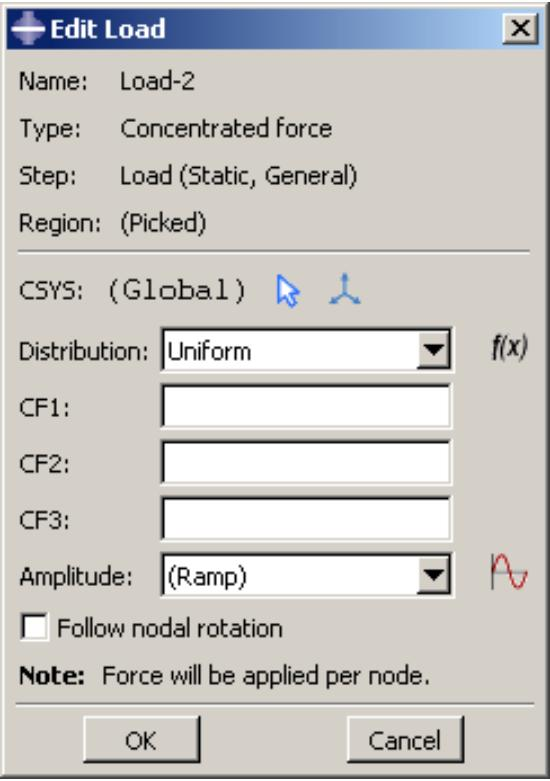
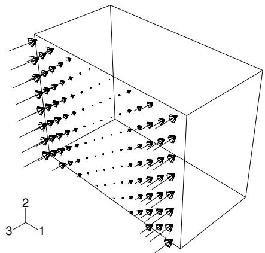
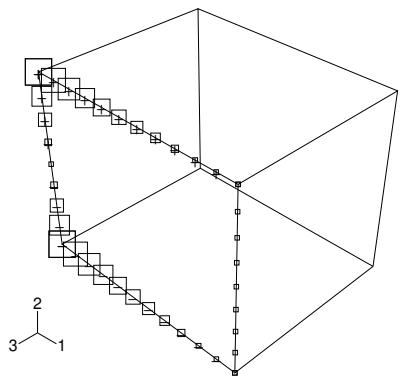
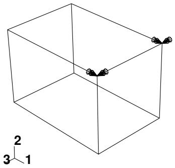
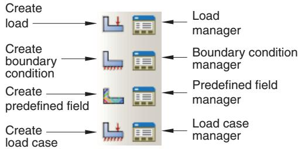

# 载荷模块

## 载荷模块

您使用载荷模块来定义和管理以下预定义条件：

• 载荷
• 边界条件
• 预定义场
• 载荷工况（参见载荷工况）

有关建模螺栓载荷的信息，请参见螺栓载荷。

## 本节内容：

了解载荷模块的作用
进入和退出载荷模块
管理预定义条件
创建和修改预定义条件
了解表示预定义条件的符号
在 Abaqus 分析之间传递结果
使用载荷模块工具箱
使用载荷模块
使用载荷编辑器
使用边界条件编辑器
使用预定义场编辑器

## 了解载荷模块的作用

Abaqus/CAE 中的预定义条件是步骤相关的对象，这意味着您必须指定它们在哪些分析步骤中处于活动状态。您可以使用载荷、边界条件和预定义场管理器来查看和操作预定义条件的逐步历史。您还可以使用上下文栏中的步骤列表来指定新载荷、边界条件和预定义场默认处于活动状态的步骤。

您可以使用载荷模块中的幅值工具集来指定可应用于预定义条件的复杂时间或频率相关性。载荷模块中的集合和表面工具集允许您定义并命名模型区域，以便应用预定义条件。分析场工具集和离散场工具集允许您创建场，用于为选定的预定义条件定义空间变化参数。

载荷工况是用于定义特定加载条件的载荷和边界条件集合。您可以在静态摄动和稳态动态直接步骤中创建载荷工况。有关载荷工况的信息，请参见载荷工况。

## 其他信息

• 关于预定义条件
• 多载荷工况分析
• 幅值工具集
• 分析场工具集
• 离散场工具集
• 集合和表面工具集

## 进入和退出载荷模块

您可以在 Abaqus/CAE 会话期间随时通过单击上下文栏中模块列表中的“载荷”进入载荷模块。主菜单栏上会出现“载荷”、“边界条件”、“预定义场”、“载荷工况”、“特征”和“工具”菜单。上下文栏中会出现一个步骤列表。

要退出载荷模块，请在上下文栏的模块列表中指定另一个模块。退出模块前无需采取任何特定操作来保存您的预定义条件；当您通过从主菜单栏选择文件->保存或文件->另存为来保存整个模型时，它们会自动保存。

## 管理预定义条件

预定义条件管理器是用于组织和操作与给定模型关联的预定义条件的对话框。您在载荷模块中可以定义的每种预定义条件都有一个单独的管理器。您可以通过从主菜单栏上的相应菜单中选择“管理器”来访问这些管理器。载荷模块提供以下管理器：

• 载荷管理器
• 边界条件管理器
• 预定义场管理器

预定义条件管理器包含您已创建的特定类型的所有预定义条件的字母顺序列表。例如，图 1 所示的载荷管理器包含一个载荷列表。

图 1：载荷管理器。

管理器中的“创建”、“编辑”、“复制”、“重命名”和“删除”按钮允许您创建新的预定义条件或编辑、复制、重命名和删除现有的预定义条件。您也可以通过使用主菜单栏上的“载荷”、“边界条件”和“预定义场”菜单来启动创建、编辑、复制、重命名和删除过程。从主菜单栏选择管理操作后，过程与您在管理器对话框中单击相应按钮完全相同。

预定义条件管理器是步骤相关的管理器，这意味着它们包含有关模型中每个载荷、边界条件和预定义场历史的附加信息。您可以使用管理器左侧列中的图标来抑制预定义条件或恢复先前被抑制的预定义条件以进行分析。抑制和恢复过程也可通过主菜单栏上的“载荷”、“边界条件”和“预定义场”菜单使用。有关更多信息，请参见抑制和恢复对象。

您可以使用管理器对话框中的“复制”按钮、相应的菜单命令或模型树来复制载荷、边界条件或预定义场。您可以将这些对象从任何步骤复制到任何有效步骤，但有一些限制。有关更多详细信息，请参见使用管理器对话框复制步骤相关对象。

“左移”、“右移”、“激活”和“停用”按钮允许您操作预定义条件的逐步历史。有关更多信息，请参见修改步骤相关对象的历史。

## 注意：

在预定义场管理器中，“激活”和“停用”按钮不可用。

有关创建、编辑和操作预定义条件的详细说明，请参见以下章节：

使用载荷模块
使用载荷编辑器
使用边界条件编辑器
使用预定义场编辑器

## 其他信息

• 管理对象
• 什么是步骤相关管理器？
• 更改对象在步骤中的状态

## 创建和修改预定义条件

要创建载荷、边界条件或预定义场，请从主菜单栏的相应菜单中选择“创建”。将出现一个“创建”对话框，您可以在其中为预定义条件提供名称，并选择您想要创建的预定义条件类型。

当您在“创建”对话框中单击“继续”时，系统会提示您选择要应用预定义条件的区域，除非预定义条件应用于整个模型。您只能将连接器载荷和连接器边界条件（位移、速度和加速度）应用于与连接器截面分配关联的线。如果您选择多条线，则连接器截面分配中分配给这些线的连接器截面必须具有您正在定义载荷和边界条件的可用相对运动分量。您只能将连接器材料流动边界条件应用于与连接器截面分配关联的线的端点。选择区域后，将出现一个编辑器，您可以在其中指定有关预定义条件的附加信息，例如其大小。

每个预定义条件编辑器的顶部面板显示预定义条件的名称和类型、您当前所在的分析步骤以及将应用该预定义条件的模型区域。如果您

在预定义条件首次创建的步骤中编辑该预定义条件，则“区域”字段旁边会出现一个“编辑区域” ( ) 按钮；此按钮允许您编辑应用预定义条件的区域。如果编辑区域需要完全重新定义预定义条件（例如，如果预定义条件应用于整个模型或引用最初选定区域内的子区域），则“编辑区域”按钮不会出现。有关更多信息，请参见编辑应用预定义条件的区域。

编辑器其余部分的格式取决于您定义的预定义条件类型以及编辑器顶部指定的步骤。例如，集中力的编辑器如图 1 所示。

图 1：集中力的编辑器。

该编辑器包含特殊文本字段，您可以在其中指定 1、2 和 3 方向的力分量。编辑器还包含一个“幅值”文本字段，允许您将预定义条件的大小作为时间函数进行变化。您可以接受默认幅值、选择使用幅值工具集定义的幅值，或单击  定义新的幅值。（有关更多信息，请参见幅值工具集。）

您可以指定应用以下载荷或边界条件的坐标系：

## 载荷

• 集中力
• 力矩
• 法向和切向表面牵引力
• 通用壳边载荷
• 惯性释放
• 电流密度

## 边界条件

• 对称/反对称/固定
• 位移/旋转
• 速度/角速度
• 加速度/转动加速度
• 欧拉网格运动  
• 磁矢量势  

所有其他规定条件均使用全局坐标系，但压力除外，其施加方向垂直于所选表面。

若载荷或边界条件允许指定坐标系，您可选择现有的基准坐标系，或接受全局坐标系。若所需的基准坐标系不存在，可使用基准工具集创建。（更多信息，请参阅创建基准坐标系。）或者，您可引用定义坐标系的 Abaqus/Standard 用户子程序（参见 ORIENT）。

## 注意：

若删除或抑制基准坐标系，载荷或边界条件的方位将恢复为全局坐标系。

创建和修改预定义字段的规则因预定义字段类型而异：

部分预定义字段仅需指定初始条件。此类预定义字段仅能在初始分析步中创建和编辑。随着分析的进行，Abaqus 会计算该预定义字段的后续数值。此类预定义字段包括初始速度设置、硬化设置和材料赋值（用于欧拉分析）。更多信息，请参阅初始条件。  
您可为分析中的任何分析步创建预定义温度场。可通过输入所需分析步的温度值，或读取 Abaqus 在先前包含热分量的分析中计算的温度值来定义当前模型的温度。更多信息，请参阅预定义字段中的“温度”。

## 注意：

若未为预定义字段定义初始值，则假定该字段在分析开始时的值为零。

创建规定条件后，您可通过以下方式修改规定条件：

• 可修改创建规定条件时在编辑器中输入的部分或全部数据。  
• 可使用管理器修改规定条件的逐步历程。（更多信息，请参阅什么是逐步相关管理器？。）

要显示特定管理器或编辑器功能的帮助信息，请从主菜单栏选择 帮助->上下文帮助，然后点击感兴趣的功能。

## 附加信息

• 什么是逐步相关管理器？  
• 使用载荷编辑器  
• 使用边界条件编辑器  
• 使用预定义字段编辑器  
• 基准工具集  
• 幅值工具集

## 理解表示规定条件的符号

本节说明如何解读表示规定条件的符号。

将规定条件应用于区域时，您可选择在视口中显示符号以指示以下信息：

• 应用规定条件的区域。  
• 规定条件的类型。  
• 若适用，应用规定条件的自由度。  
• 若适用，应用规定条件的方向（正向或负向）。  
• 若适用，规定条件的空间变化。

有关控制这些符号显示的信息，请参阅控制属性显示。

## 本节内容：

理解规定条件符号的类型、颜色和大小  
单头箭头和双头箭头表示什么？  
理解符号位置和方向

## 理解规定条件符号的类型、颜色和大小

表示规定条件的符号的类型、颜色和大小可能随以下因素变化：

• 符号所代表的规定条件类型，  
• 应用规定条件的自由度，以及  
• 规定条件的空间变化（用于解析场分布）。

有关符号类型和颜色含义的总结，请参阅用于表示规定条件的符号。

例如，图 1 显示了施加于顶点的集中力。代表集中力不同分量的箭头均为黄色。

  
图 1：集中力。

另一方面，图 2 显示了同时应用于平移和旋转自由度的速度/角速度边界条件。沙棕色箭头代表应用于平移自由度的边界条件分量。洋红色箭头代表应用于旋转自由度的边界条件分量。

  
图 2：应用于边的边界条件。

## 注意：

当边界条件固定自由度时，代表该分量的箭头缺少杆部。

图 3 显示了施加于面的均匀温度场。  
  
图 3：均匀温度场。

通常，符号大小均匀，与规定条件的幅值无关。对于使用解析场分布的规定条件，符号会根据解析场值进行缩放。图 4 显示了使用解析场指定空间变化幅值的压力载荷。

  
图 4：压力载荷在面上的变化。

此外，对于非箭头符号，每个符号内部会显示加号 (+) 或减号 (−) 以指示该位置的规定条件幅值为正或负。图 5 显示了温度边界条件。为清晰起见，符号大小已放大。

  
图 5：使用解析场分布的温度边界条件。

有关控制符号大小和缩放的信息，请参阅控制属性显示。

在某些情况下，Abaqus/CAE 会为规定条件显示缩小的符号，例如当指定的规定条件对分析无影响时，或当解析场在其区域的某部分计算结果为零时。这些缩小的符号明显小于默认符号大小。例如，若指定剪切面牵引载荷且方向矢量垂直于表面，Abaqus/CAE 将无法将此类载荷施加于参考表面垂直方向，并会在视口中显示非常小的箭头符号来表示该载荷。

## 附加信息

• 显示使用解析场的相互作用和规定条件的符号  
• 控制属性显示  
• 用于表示规定条件的符号

## 单头箭头和双头箭头表示什么？

在许多情况下，Abaqus/CAE 在视口中使用箭头表示规定条件。这些箭头代表规定条件的每个分量（流体边界条件除外，此时箭头代表合成方向）。例如，图 1 中出现的箭头代表施加于两个顶点的集中力的三个分量。

  
图 1：具有三个分量的集中力。

单头箭头表示应用于平移自由度的规定条件分量。例如，图 1 中的集中力三个分量应用于自由度 1 至 3；因此，图中每个箭头均为单头箭头。

当规定条件的分量应用于旋转自由度时，该分量显示为双头箭头。图 2 中的箭头表明速度/角速度边界条件应用于顶点的自由度 4 和 6。

  
图 2：应用于旋转自由度的边界条件。

双头箭头的放大视图如图 3 所示。

  
图 3：放大的双头箭头。

若将规定条件同时应用于平移和旋转自由度，则会出现单头箭头和双头箭头。例如，图 4 中顶点的自由度 1、3、4 和 6 应用了速度/角速度边界条件。
  
图 4: 应用于平动和转动自由度的边界条件放大视图。

在本图中，单头箭头为沙棕色，表示顶点的自由度 1 和 3 被固定。双头箭头为洋红色，直接出现在单头箭头之后；双头箭头表示顶点的自由度 4 和 6 被固定。

有关箭头颜色的信息，请参见理解规定条件的符号类型、颜色和大小。有关箭头何时会指向或远离区域的信息，请参见理解符号位置和方向。

## 附加信息

• 理解代表规定条件的符号  
• 控制属性的显示

## 理解符号位置和方向

符号在模型上的放置位置可能取决于符号所代表的规定条件类型以及规定条件所应用的区域类型。表 1 说明了几何模型上符号出现的位置，表 2 说明了网格模型上符号出现的位置。

表 1：几何体上的符号位置。

<table><tr><td>规定条件应用的区域类型</td><td>符号在模型上的位置</td></tr><tr><td>顶点</td><td>在顶点处</td></tr><tr><td>边</td><td>沿边等间距分布</td></tr><tr><td>装配级线框</td><td>在线框中点</td></tr><tr><td>面</td><td>对于方向性规定条件（例如压力载荷），在面内部等间距分布</td></tr><tr><td></td><td>对于非方向性规定条件（例如表面电荷和边界条件），沿面的边缘等间距分布</td></tr><tr><td>体</td><td>沿体的每条边等间距分布</td></tr><tr><td>整个模型</td><td>在定义刚体运动所需的点处（仅用于惯性释放载荷）；否则，位于表示全局坐标系原点和方向的三轴系处</td></tr></table>

表 2：网格上的符号位置。

<table><tr><td>规定条件应用的区域类型</td><td>符号在模型上的位置</td></tr><tr><td>节点</td><td>在节点处</td></tr><tr><td>单元边（用于二维网格）</td><td>在单元边的中点</td></tr><tr><td>单元面（用于三维网格）</td><td>在单元面的质心处</td></tr><tr><td>装配级线框</td><td>在线框中点</td></tr></table>

例如，图 1 显示了一个施加在两个顶点上的集中力和一个应用于几何模型表面的边界条件。

  
图 1：一个集中力和一个边界条件。

图 2 显示了一个应用于四个节点的边界条件和一个应用于网格的多个单元面上的压力载荷。

图 2：一个压力载荷和一个边界条件。  

## 注意：

如果您将压力载荷施加到一个平面几何面，且其表面积相对于封闭区域较小（例如由两个同心圆形成的环），则无论装配显示选项（Assembly Display Options）对话框中的符号密度设置如何，载荷符号可能不会均匀分布。

当一个边界条件固定住一个自由度时，代表该分量的箭头指向区域内部并且没有箭杆。例如，图 3 中的边界条件固定了自由度 1、2 和 3。

  
图 3：一个固定自由度的边界条件。

同样，如果将正压力载荷或欧拉流入边界条件施加到一个区域，则代表该压力载荷或边界条件的箭头指向区域内部，如图 4 所示。

  
图 4：一个正压力载荷。

如果一个载荷被定义为具有复数幅值，并且实部和虚部符号不同（例如），则该载荷将显示为一个两端都有箭头的箭头。类似地，一个同时包含流入和流出分量的欧拉边界条件也将显示为一个两端都有箭头的箭头。

在所有其他情况下，代表规定条件分量的箭头都指向区域外部。

## 注意：

当集中力的一个分量为零时，该分量不会出现箭头。同样，当边界条件允许一个自由度不受约束时，该分量也不会出现箭头。

## 附加信息

• 理解代表规定条件的符号  
• 控制属性的显示

## 在 Abaqus 分析之间传递结果

您可以从模型中选择部件实例，并将初始状态场（initial state field）与这些实例关联。初始状态场使用从先前的 Abaqus/Standard 或 Abaqus/Explicit 分析导入的数据，将变形网格（deformed mesh）及其相关的材料状态应用于这些实例。Abaqus/CAE 允许您选择与要导入初始状态场的分析相对应的作业（job）名称。您还可以指定要从该分析的哪个特定分析步（step）和增量（increment）导入数据。Abaqus/CAE 会从先前分析生成的多个文件中导入数据。因此，来自该分析的文件必须位于您启动当前 Abaqus/CAE 会话的目录中。

您可以使用此功能，利用 Abaqus/Standard 分析的结果来驱动 Abaqus/Explicit 分析，反之亦然。如果您的问题可以分解为不同的阶段，这将非常有用；例如，您可以使用 Abaqus/Explicit 分析金属成形问题，然后使用 Abaqus/Standard 分析随后的回弹。您还可以使用此功能在分析步之间更改模型定义。更多信息，请参见关于在 Abaqus 分析之间传递结果。

您还可以将结果和模型信息从 Abaqus/Standard 分析传递到新的 Abaqus/Standard 分析，在继续分析之前，您可以在新分析中指定额外的模型定义。例如，您可能首先研究装配过程中某个特定部件的局部行为，然后研究装配后整个产品的行为。您可以从在 Abaqus/Standard 分析中研究该部件的局部行为开始。然后，您可以将该分析的模型信息和结果传递到第二个 Abaqus/Standard 分析，在该分析中您可以指定其他部件的额外模型定义，并分析整个产品的行为。

Abaqus/CAE 总是连同变形网格一起导入材料状态。如果您只想导入变形网格，可以从选定的输出数据库（output database）中的某个分析步和增量导入网格。更多信息，请参见哪些类型的文件可以导入和导出到 Abaqus/CAE？。

当您提交作业进行分析时，Abaqus 会使用导入的信息；但是，Abaqus/CAE 不会更新所选实例的形状以反映所应用的变形网格。因此，在向装配体中添加新实例并相对于现有部件实例进行定位时，应格外小心。例如，一个新的部件实例可能看起来会接触到与初始状态场关联的某个实例；然而，当分析应用导入的变形网格时，这些实例可能会分开或过度闭合（overclosed）。

为避免未变形状态与导入状态之间的这种不匹配，您可能希望从该分析导入变形网格，而不是使用未变形的部件实例。即使您导入了变形网格，也必须确保您导入网格的帧（frame）与初始状态场中指定的分析步和增量相同。更多信息，请参见从输出数据库导入部件。或者，您可以通过从生成先前 Abaqus/Standard 或 Abaqus/Explicit 分析的模型复制来创建当前模型。更多信息，请参见在模型数据库内操作模型。

参考构型（reference configuration）是计算位移（及相关应变）的模型构型。默认情况下，Abaqus/CAE 不会使用导入的数据来更新参考构型。因此，位移和应变是相对于原始分析开始时的参考构型计算的总值，并且这些值在分析之间是连续的。您可以更改默认行为，将 Abaqus/CAE 配置为更新参考构型为导入的构型。现在，Abaqus/CAE 会相对于新的导入参考构型计算位移和应变；例如，用于回弹分析时。
当您尝试创建初始状态场（initial state field）时，Abaqus 会施加诸多限制。有关这些限制的详细讨论，请参阅《关于在 Abaqus 分析之间传递结果》。例如，您从当前模型中选择的部件实例的网格必须与您正在导入的部件实例的网格相匹配。然后，例如，您可以更改材料定义、添加载荷和边界条件，以及将分析步类型从 Abaqus/Standard 更改为 Abaqus/Explicit。但是，您不能执行会改变所选部件实例网格的操作；例如，您不能划分（partition）部件实例。

只有当原始分析使用了以下类型的分析步之一时，您才能在分析之间传递结果：

*   静态应力分析步（Static stress）
*   动态应力分析步（Dynamic stress）
*   稳态传输分析步（Steady-state transport）

此外，如果您是从一个 Abaqus/Standard 分析向另一个 Abaqus/Standard 分析导入数据，原始分析可以使用耦合温度-位移分析步（coupled temperature-displacement step）。您不能从线性摄动分析步（linear perturbation step）导入数据。

此外，Abaqus/CAE 还有以下限制：

*   所选部件实例与先前分析中的实例必须具有相同的名称。
*   定义初始状态场后，Abaqus/CAE 将继续显示模型的未变形形状。
*   您不能使用 Assembly（装配）模块的位置和约束工具（例如平移（Translate）和面对面（Face to Face））来移动与初始场相关联的部件实例。
    Abaqus/CAE 仅从先前分析中导入网格和材料状态。因此，您必须在当前模型的装配级别重新定义集合（sets）、曲面（surfaces）以及所有规定的条件（载荷、边界条件、预定义场、相互作用、连接器等）。您不应在当前模型的部件定义中重新定义这些组件。
    Abaqus/CAE 会检查包含先前 Abaqus/Standard 或 Abaqus/Explicit 分析数据的文件是否存在；但是，它不会检查指定的分析步和增量步编号是否已写入文件。如果指定的分析步或增量步的数据不存在，作业提交将会失败。
*   您不能修改与初始场相关联的部件实例（或您从中创建该实例的部件）。此外，您不能修改与初始场相关联的部件实例的网格（或您从中创建该实例的部件的网格）。
*   您不能为与初始场相关联的实例所源自的部件分配新的截面（sections）、材料方向（material orientations）、法线（normals）或梁方向（beam orientations）。同样，您也不能分配质量（mass）或转动惯量（inertia）。但是，您可以编辑材料定义（Abaqus/CAE 会随网格一起导入该定义）。导入的材料定义将覆盖任何现有的材料定义。

## 使用 Load 模块工具箱

您可以通过主菜单栏或 Load 模块工具箱访问所有 Load 模块工具。图 1 显示了 Load 模块工具箱中所有载荷工具的图标。

图 1: Load 模块工具箱。

## 使用 Load 模块

本节提供有关定义载荷、边界条件和预定义场的一般信息。

有关 Load 模块的其他主题，请参阅以下章节：

什么是分析步相关的管理器？
螺栓载荷
载荷工况

## 本节内容：

创建载荷
创建边界条件
创建预定义场
编辑规定条件的应用区域

当您创建载荷时，必须指定载荷的名称、激活载荷的分析步、载荷类型以及要将载荷施加到的装配区域。

1.  从主菜单栏中，选择 Load -> Create。
    将出现一个 Create Load 对话框，其中在 Name 文本字段中显示默认名称。

    

    **提示：** 您也可以使用 Load 模块工具箱中的工具创建载荷。

2.  输入载荷的名称。有关命名对象的更多信息，请参阅使用基本对话框组件。
3.  选择要激活载荷的分析步。单击 Step 文本字段旁边的箭头，并从出现的列表中进行选择。载荷只能在分析步中创建；您不能在初始分析步（initial step）中创建载荷。
4.  从对话框左侧的 Category 列表中，选择所需的类别。可用的类别选择取决于您正在执行的分析过程类型。
    对话框右侧的 Types for Selected Step 列表将更改为显示所有可用载荷类型的列表。
5.  从 Types for Selected Step 列表中，选择载荷类型并单击 Continue。
6.  如果您正在创建重力载荷或惯性释放载荷，将出现载荷编辑器（load editor）。
7.  如果您正在使用组装紧固件创建连接器力或连接器力矩，可以在提示区（prompt area）单击 Done 以从模板模型中选择一个线集（wire set）。
    将出现载荷编辑器。
    a. 单击 Assembled fastener 字段旁边的箭头，并从出现的列表中进行选择。
        与组装紧固件关联的模板模型名称显示在编辑器中。Template set 列表将填充与引用的模板模型关联的线集。
    b. 从 Template set 列表中选择一个线集。您必须确保该线集具有一个截面分配，该截面分配具有您想要为其定义力的相对运动的可用分量。
        显示用于可用相对运动分量的相应字段。

8.  对于所有其他载荷类型，选择要将载荷施加到的区域。
    如果您正在创建连接器力或连接器力矩，您必须选择与连接器截面分配相关联的线（wires）。选择线的最佳方法是使用线特征（wire feature）的默认几何集合名称（有关更多信息，请参阅为多个连接器创建或修改线特征）。如果您选择多条线，必须确保在连接器截面分配中分配给这些线的连接器截面具有您想要为其定义力或力矩的相对运动的可用分量。如果连接器力或连接器力矩的可用相对运动分量不足，将出现一条消息，要求您选择不同的线或更改连接类型。
    使用以下方法之一选择载荷区域：
    *   在视口中选择一个区域。您可以使用角度方法（angle method）从几何体选择一组面或边，或从网格选择一组单元面。有关更多信息，请参阅使用角度和特征边方法选择多个对象。选择完成后，单击鼠标键 2。

        

        **提示：** 您可以通过在 Selection（选择）工具栏中指定过滤选项来限制在视口中可选择的对象类型。有关更多信息，请参阅使用选择选项。
        如果模型包含网格和几何体的组合，请在提示区单击以下之一：
        *   单击 Geometry 以将载荷应用于几何体或参考点。
        *   单击 Mesh 以将载荷应用于原生网格或孤立网格选择。
        默认情况下，对于大多数载荷类型，会创建一个包含所选对象的集合或曲面。您可以通过在提示区切换关闭创建集合或曲面的选项来更改此行为。提示区提供了默认名称，但您可以输入新名称。

    *   要从现有集合或曲面列表中选择，请执行以下操作：
        1.  在提示区右侧单击 Sets 或 Surfaces。（按钮的名称取决于您正在创建的对象类型。例如，如果您正在创建压力载荷，则会出现 Surfaces 按钮。）
            Abaqus/CAE 将显示 Region Selection 对话框，其中包含可用集合或曲面的列表。
        2.  选择所需的集合或曲面，然后单击 Continue。

            

## 注意：

默认选择方法基于您最近使用的选择方法。要恢复为另一种方法，请在提示区右侧单击 Select in Viewport 或 Sets or Surfaces。

载荷编辑器出现。您正在应用载荷的区域在视口中被高亮显示。

9.  输入定义载荷所需的所有数据，然后单击 OK。

    

## 注意：

如果您创建的连接器力或连接器力矩超过了连接器的失效准则，该连接器力或连接器力矩仍将被应用。

有关编辑器特定功能的详细信息，请从主菜单栏选择 Help -> On Context，然后单击感兴趣的功能，或参阅使用载荷编辑器。
视口中会出现代表您刚创建的载荷的符号。更多信息，请参阅理解代表规定条件的符号。

## 附加信息

*   什么是与步骤相关的管理器？
*   在视口中选择对象
*   使用载荷编辑器
*   连接器
*   关于装配紧固件
*   创建装配紧固件

*   理解和使用工具箱与工具栏

*   集和曲面工具集

## 创建边界条件

创建边界条件时，您必须指定边界条件的名称、激活边界条件的步骤、边界条件类型以及要将边界条件应用到的装配体区域。

1.  在主菜单栏中，选择 BC->Create。

    将出现一个“创建边界条件”对话框，其中“名称”文本字段中显示默认名称。

    

    提示：您也可以使用“载荷”模块工具箱中的工具创建边界条件。

2.  为边界条件输入一个名称。有关命名对象的更多信息，请参阅使用基本对话框组件。
3.  选择要激活边界条件的步骤。单击“步骤”文本字段旁的箭头，然后从出现的列表中选择。
4.  在对话框左侧的“类别”列表中，选择所需的类别。可用的“类别”选项取决于您正在执行的分析程序类型。

    对话框右侧的“所选步骤的类型”列表将变为所有可用边界条件类型的列表。

5.  从“所选步骤的类型”列表中，选择边界条件类型，然后单击“继续”。
6.  如果您正在使用装配紧固件创建连接器边界条件，可以在提示区域单击“完成”以从模板模型中选择一个线集。

    边界条件编辑器出现。

    a. 单击“装配紧固件”字段旁的箭头，然后从出现的列表中选择。

    与装配紧固件关联的模板模型名称显示在编辑器中。“模板集”列表将填充与引用的模板模型关联的线集。

    b. 从“模板集”列表中选择一个线集。您必须确保该线集具有包含您想要定义速度的可用相对运动分量的截面分配。

    显示可用相对运动分量的相应字段。

7.  对于所有其他边界条件类型，选择您想要应用边界条件的区域。

    如果您正在创建连接器位移、连接器速度或连接器加速度边界条件，您必须选择与连接器截面分配相关联的线。选择线的最佳方法是使用线特征的默认几何集名称（有关更多信息，请参阅为多个连接器创建或修改线特征）。如果您选择多条线，必须确保在连接器截面分配中分配给这些线的连接器截面具有您想要定义位移、速度或加速度的可用相对运动分量。如果连接器边界条件的可用相对运动分量不足，将出现一条消息，要求您选择不同的线或更改连接类型。

    如果您正在创建连接器材料流动边界条件，您必须选择与连接器截面分配相关联的线的端点。

    如果您正在创建欧拉网格运动边界条件，请在视口中选择一个欧拉部件实例。否则，请使用以下方法之一选择边界条件的区域：

    在视口中选择一个区域。您可以使用角度方法从几何体中选择一组面或边，或从网格中选择一组单元面。有关更多信息，请参阅使用角度和特征边方法选择多个对象。选择完成后，单击鼠标按键 2。

    

    提示：您可以通过在选择工具栏中指定过滤选项来限制可以在视口中选择的对象类型。有关更多信息，请参阅使用选择选项。

    如果模型同时包含网格和几何体，您必须选择要应用边界条件的区域类型。在提示区域中，选择以下选项之一：

    单击“几何体”将边界条件应用于几何体或参考点。
    单击“网格”将边界条件应用于原生网格或孤立网格选择。

    默认情况下，会创建一个包含所选对象的集或曲面。您可以通过切换提示区域中创建集或曲面的选项来更改此行为。提示区域提供了一个默认名称，但您可以输入新名称。

    *   要从现有集或曲面列表中选择，请执行以下操作：

        1.  在提示区域右侧单击“集”或“曲面”。（按钮的名称取决于您正在创建的对象类型。例如，如果您正在创建压力载荷，则会出现“曲面”按钮。）

            Abaqus/CAE 将显示“区域选择”对话框，其中包含可用集或曲面的列表。

        2.  选择感兴趣的集或曲面，然后单击“继续”。

        

## 注意：

默认的选择方法基于您最近使用的选择方法。要切换回另一种方法，请在提示区域右侧单击“在视口中选择”或“集或曲面”。

边界条件编辑器出现。您正在应用边界条件的区域在视口中高亮显示。

8.  输入定义边界条件所需的所有数据，然后单击“确定”。

    

## 注意：

如果您创建的连接器位移边界条件超出了连接器的失效准则，则该连接器位移将被忽略。

有关编辑器特定功能的详细信息，请在主菜单栏中选择 Help->On Context，然后单击感兴趣的功能，或参阅使用边界条件编辑器。

视口中会出现代表您刚创建的边界条件的符号。更多信息，请参阅理解代表规定条件的符号。

## 附加信息

*   什么是与步骤相关的管理器？
*   在视口中选择对象
*   使用边界条件编辑器
*   连接器
*   关于装配紧固件
*   创建装配紧固件
*   集和曲面工具集

*   理解和使用工具箱与工具栏

创建预定义场时，您必须指定场的名称、激活场的步骤、场的类型以及要将场应用到的装配体区域。

## 注意：

创建温度场的过程将单独描述；请参阅定义温度场。

1.  在主菜单栏中，选择 Predefined Field->Create。

    将出现一个“创建预定义场”对话框，其中“名称”文本字段中显示默认名称。

    

    提示：您也可以使用“载荷”模块工具箱中的工具创建预定义场。

2.  为预定义场输入一个名称。有关命名对象的更多信息，请参阅使用基本对话框组件。
3.  选择要激活预定义场的步骤。单击“步骤”文本字段旁的箭头，然后从出现的列表中选择。
4.  在对话框左侧的“类别”列表中，选择所需的类别。可用的“类别”选项取决于您正在执行的分析程序类型。
    对话框右侧的“所选步骤的类型”列表将变为所有可用预定义场类型的列表。

5.  从“所选步骤的类型”列表中，选择预定义场类型，然后单击“继续”。

6.  如果模型同时包含网格和几何体，您必须选择要应用预定义场的区域类型。在提示区域中，选择以下选项之一：

    *   单击“几何体”将预定义场应用于几何体或参考点。
    *   单击“网格”将预定义场应用于原生网格或孤立网格选择。

7.  选择您想要应用预定义场的区域。

    如果您正在创建材料分配场或初始状态场，请使用鼠标在视口中选择一个部件实例。对于所有其他预定义场，请使用以下方法之一选择区域：
在视口中使用鼠标选择区域。您可以使用**角度方法**从几何体中选择一组面或边，或者从网格中选择一组单元面或节点。更多信息，请参阅 **使用角度和特征边方法选择多个对象**。选择完成后，单击鼠标键2。

**提示：** 您可以通过在**选择工具栏**中指定筛选选项来限制可在视口中选择的对象类型。更多信息，请参阅**使用选择选项**。

默认情况下，将创建一个包含所选对象的**集合**。您可以通过在提示区关闭**创建集合**选项来更改此行为。提示区会提供一个默认名称，但您可以输入新名称。

*   要从现有集合列表中进行选择，请执行以下操作：
    1.  单击提示区右侧的 **Sets**。
        Abaqus/CAE 将显示**区域选择**对话框，其中包含可用集合的列表。
    2.  选择所需的集合并单击 **Continue**。

## 注意：

默认的选择方法基于您最近使用的选择方法。要恢复到另一种方法，请单击提示区右侧的**在视口中选择**或 **Sets**。

预定义场编辑器将出现。您正在应用预定义场的区域在视口中将高亮显示。

8.  输入定义预定义场所需的所有数据，然后单击 **OK**。有关编辑器特定功能的详细信息，请从主菜单栏选择 **帮助 -> 按上下文**，然后单击感兴趣的功能，或参阅**使用预定义场编辑器**。

视口中会出现代表您刚创建的预定义场的符号。更多信息，请参阅**理解代表规定条件的符号**。

## 附加信息

*   理解和使用工具箱和工具栏
*   什么是步骤相关管理器？
*   在视口中选择对象
*   使用预定义场编辑器
*   集合和表面工具集

## 编辑已应用规定条件的区域

您可以在创建载荷、边界条件或预定义场的步骤中，编辑已应用规定条件的区域。

如果规定条件的定义引用了原始区域内的子区域（例如，材料分配预定义场），则您无法编辑该区域。

**注意：** 重力载荷可以应用于模型中的区域，但它们不能应用于 Abaqus/CAE 中的单个质点。

1.  从主菜单栏的 **Load**、**BC** 或 **Predefined Field** 菜单中，选择 **Manager** 以显示**载荷管理器**、**边界条件管理器**或**预定义场管理器**。
2.  单击您要修改的规定条件所在行与感兴趣步骤所在列的单元格，然后单击 **Edit**。或者，您也可以直接双击该单元格。

**提示：** 您也可以通过单击位于上下文栏中**步骤列表**中创建规定条件的步骤来启动此过程。然后从主菜单栏的 **Load**、**BC** 或 **Predefined Field** 菜单中，选择 **Edit -> 规定条件**。例如，要编辑载荷，您可以选择 **Load -> Edit -> 您选择的载荷类型**。

将出现一个编辑器。

3.  在编辑器顶部，单击以编辑区域选择。
4.  使用以下方法之一编辑区域：
    *   在视口中选择和取消选择对象。编辑完区域后，单击鼠标键2。（更多信息，请参阅**在视口中选择对象**。）

    

    **提示：** 您可以通过在**选择工具栏**中指定筛选选项来限制可在视口中选择的对象类型。更多信息，请参阅**使用选择选项**。

    *   要从现有集合或表面列表中进行选择，请执行以下操作：
        1.  单击提示区右侧的 **Sets** 或 **Surfaces**。（按钮的名称取决于您正在编辑的对象类型。例如，如果您正在编辑压力载荷，则会出现 **Surfaces** 按钮。）
            Abaqus/CAE 将显示**区域选择**对话框，其中包含可用集合或表面的列表。
        2.  选择所需的集合或表面，然后单击 **Continue**。

        

## 注意：

默认的选择方法基于您最近使用的选择方法。要恢复到另一种方法，请单击提示区右侧的**在视口中选择**或 **Sets** 或 **Surfaces**。

5.  在编辑器中，根据需要完成规定条件定义的编辑，然后单击 **OK**。

视口中代表规定条件的符号将更改为显示在新编辑的区域上。

## 附加信息

*   什么是步骤相关管理器？
*   理解代表规定条件的符号
*   使用 Load（载荷）模块

## 使用载荷编辑器

本节说明如何在载荷编辑器中输入数据以定义特定类型的载荷。

**建模技巧**部分涵盖以下主题：
*   螺栓载荷
*   创建子模型载荷

## 本节内容：

*   定义集中力
*   定义力矩
*   定义压力载荷
*   定义壳边载荷
*   定义表面牵引力载荷
*   定义管道压力载荷
*   定义体力
*   定义线载荷
*   定义重力载荷
*   定义广义平面应变载荷
*   定义旋转体力
*   定义科里奥利力
*   定义连接器力
*   定义连接器力矩
*   定义子结构载荷定义以激活子结构载荷工况
*   定义惯性卸载载荷
*   定义表面热通量
*   定义体热通量
*   定义集中热通量
*   定义向内体积加速度
*   定义集中孔隙流体流
*   定义表面孔隙流体流
*   定义集中电流
*   定义表面电流
*   定义体电流
*   定义表面电流密度
*   定义体电流密度
*   定义集中电荷
*   定义表面电荷
*   定义体电荷
*   定义集中浓度通量
*   定义表面浓度通量
*   定义体浓度通量
*   定义流体压力渗透载荷

## 定义集中力

您可以将集中力载荷应用于顶点或节点。

1.  使用以下方法之一显示集中力载荷编辑器：
    *   要创建新的集中力载荷，请按照**创建载荷**（类别：**Mechanical**；所选步骤的类型：**Concentrated force**）中概述的程序操作。
    *   要使用菜单或管理器编辑现有的集中力载荷，请参阅**编辑步骤相关对象**。要编辑载荷应用的区域，请参阅**编辑已应用规定条件的区域**。

2.  单击 **Distribution** 字段右侧的箭头，并从出现的列表中选择您的选项：
    *   选择 **Uniform** 以定义在该区域上均匀分布的载荷。
    *   选择一个**分析场**以定义空间变化的载荷。仅可用于创建新分析场的有效分析场才会显示。（更多信息，请参阅**分析场工具集**。）

3.  在 **CF1**、**CF2** 和 **CF3** 文本字段中，输入每个方向的集中力分量（单位为 F）：
    如果您将文本字段留空，则自动为该方向分配零力。但是，您必须在编辑器中输入至少一个非零分量才能定义载荷。

4.  如果需要，单击 **Amplitude** 字段右侧的箭头，并选择您需要的幅值或创建新幅值。（更多信息，请参阅**幅值工具集**。）

5.  如果需要，打开 **Follow nodal rotation** 以使载荷的方向随该节点处的旋转而旋转。
    **Follow nodal rotation** 仅影响具有旋转自由度的节点以及**Nlgeom** 设置打开的步骤。

6.  如果您要更改集中力载荷的坐标系 (**CSYS**)，请单击并使用以下方法之一：
    *   在视口中选择现有的**基准坐标系**。
    *   按名称选择现有的**基准坐标系**。
        1.  从提示区，单击 **Datum CSYS List** 以显示基准坐标系列表。
        2.  从列表中选择一个名称，然后单击 **OK**。
    *   从提示区单击 **Use Global CSYS** 以恢复到全局坐标系。

此坐标系编辑选项仅在创建集中力载荷的步骤中可用。默认情况下，使用全局坐标系来定义载荷。
7. 单击“确定”以保存数据并退出编辑器。

## 附加信息

*   创建和修改规定的条件
*   理解表示规定条件的符号
*   使用分析表达式场
*   创建表达式场
*   集中载荷

## 定义力矩

您可以创建力矩载荷来定义顶点或节点处的旋转。

1.  使用以下方法之一显示力矩载荷编辑器：

    *   要创建新的力矩载荷，请遵循“创建载荷”中概述的步骤（类别：力学；所选分析步的类型：Moment）。
    要使用菜单或管理器编辑现有的力矩载荷，请参阅“编辑与分析步相关的对象”。要编辑载荷所施加的区域，请参阅“编辑规定条件所应用的区域”。

2.  单击“分布”字段右侧的箭头，并从出现的列表中选择所需的选项：

    *   选择“均匀”以定义在整个区域上均匀分布的载荷。
    *   选择一个分析场以定义空间变化的载荷。仅显示对创建新分析场有效的分析字段。（有关更多信息，请参阅“分析场工具集”。）

3.  在 CM1、CM2 和 CM3 文本字段中，输入关于每个轴的力矩分量（单位为 FL）。

    如果将某个文本字段留空，该方向将自动分配零力矩。但是，您必须在编辑器中输入至少一个非零分量才能定义该载荷。

4.  如果需要，单击“幅值”字段右侧的箭头，并从出现的列表中选择所需的幅值以创建新的幅值。（有关更多信息，请参阅“幅值工具集”。）

5.  如果需要，勾选“跟随节点旋转”以使载荷方向随此节点的旋转而旋转。

    “跟随节点旋转”仅影响具有旋转自由度的节点以及打开了 Nlgeom 设置的分析步。

6.  如果要更改力矩的坐标系 (CSYS)，请单击并使用以下方法之一：

    *   在视口中选择现有的基准坐标系。
    *   按名称选择现有的基准坐标系。

    1.  在提示区域中，单击“基准坐标系列表”以显示基准坐标系列表。
    2.  从列表中选择一个名称，然后单击“确定”。

    

    ## 注意：

    不应在柱坐标系的原点施加力矩载荷；这样做会使径向和切向载荷变得不确定。

    *   在提示区域中单击“使用全局坐标系”以恢复为全局坐标系。

    此坐标系编辑选项仅在创建力矩的分析步中可用。默认情况下，使用全局坐标系来定义力矩。

7.  单击“确定”以保存数据并退出编辑器。

## 附加信息

*   创建和修改规定的条件
*   理解表示规定条件的符号
*   使用分析表达式场
*   创建表达式场
*   集中载荷

## 定义压力载荷

您可以创建压力载荷来定义表面上的压力。

1.  使用以下方法之一显示压力载荷编辑器：

    *   要创建新的压力载荷，请遵循“创建载荷”中概述的步骤（类别：力学；所选分析步的类型：Pressure）。
    要使用菜单或管理器编辑现有的压力载荷，请参阅“编辑与分析步相关的对象”。要编辑载荷所施加的区域，请参阅“编辑规定条件所应用的区域”。

2.  单击“分布”字段右侧的箭头，并从出现的列表中选择所需的选项：

    选择“均匀”以定义均匀分布在表面上的压力。对于此选项，您提供的大小必须是单位面积上的力。
    选择“总力”以定义均匀分布在表面上的压力。对于此选项，您提供的大小必须是施加到表面上的力的总大小（而不是单位面积上的力）。
    选择“静水压力”以定义施加到表面上的静水压力。（此选项仅对 Abaqus/Standard 分析有效。）
    选择“滞止压力”以定义施加到表面上的滞止压力。（此选项仅对 Abaqus/Explicit 分析有效。）
    选择“粘性压力”以定义施加到表面上的粘性压力。（此选项仅对 Abaqus/Explicit 分析有效。）
    选择“用户自定义”以在用户子程序 DLOAD（用于 Abaqus/Standard）或 VDLOAD（用于 Abaqus/Explicit）中定义载荷的大小。有关更多信息，请参阅以下部分：

    指定常规作业设置
    DLOAD
    VDLOAD

    选择标有 (A) 的分析场或标有 (D) 的离散场，以定义空间变化的压力。选择列表中仅显示对此载荷类型有效的分析场和离散场。

    或者，您可以单击 **t** 创建新的分析场。（有关更多信息，请参阅“分析场工具集”。）

3.  如果选择了“均匀”、“总力”、分析场或离散场分布选项，请执行以下步骤：

    a. 在“大小”文本字段中，输入压力大小。

    对于“均匀”分布，输入总力大小除以施加力的表面积（单位为 FL−2）。

    对于“总力”分布，输入力的总大小（单位为 F）。Abaqus/CAE 根据未变形的模型几何形状，根据输入的力大小计算恒定均匀的表面压力。然而，在大位移分析中，由于受载表面的变形，实际的总力在分析过程中可能会发生变化。

    b. 如果需要，单击“幅值”字段右侧的箭头，并从出现的列表中选择所需的幅值。或者，您可以单击创建新的幅值。（有关更多信息，请参阅“幅值工具集”。）

    c. 单击“确定”以保存数据并退出编辑器。

4.  如果选择了“静水压力”分布选项，请执行以下步骤：

    a. 在“大小”文本字段中，输入压力大小（单位为 $\mathrm { F L } ^ { - 2 } )$。
    b. 在“零压力高度”字段中，输入压力为零的高度的 Z 坐标（如果您在三维或轴对称空间中工作）或 Y 坐标（如果您在二维空间中工作）。
    c. 在“参考压力高度”字段中，输入压力为“大小”字段中指定大小的高度的 Z 坐标（如果您在三维或轴对称空间中工作）或 Y 坐标（如果您在二维空间中工作）。
    （有关更多信息，请参阅 Abaqus/Standard 中的“二维、三维和轴对称单元上的静水压力载荷”。）
    d. 如果需要，单击“幅值”字段右侧的箭头，并从出现的列表中选择所需的幅值。或者，您可以单击创建新的幅值。（有关更多信息，请参阅“幅值工具集”。）

5.  如果选择了“滞止压力”或“粘性压力”分布选项，请执行以下步骤：

    a. 在“大小”文本字段中，输入压力大小（单位为 FL−2）。
    b. 如果需要，单击“幅值”字段右侧的箭头，并从出现的列表中选择所需的幅值。或者，您可以单击创建新的幅值。（有关更多信息，请参阅“幅值工具集”。）
    c. 如果需要，勾选“从参考点确定速度”以从施加压力的表面的速度中减去参考节点的速度。

    d. 单击以使用以下方法之一选择参考点：

    *   从视口中选择一个点。
    *   在提示区域中单击“点”，并选择一个命名集。

    

    ## 注意：

    您选择的集合必须包含单个节点或顶点。

    e. 单击“确定”以保存数据并退出编辑器。

6.  如果选择了“用户自定义”分布选项，请执行以下步骤：

    a. 如果需要，在“大小”字段中输入压力大小（单位为 FL−2）。在编辑器中输入的“大小”数据在 Abaqus/Standard 分析中会传递给用户子程序，但在 Abaqus/Explicit 分析中会被忽略。
    b. 单击“确定”以保存数据并退出编辑器。
    c. 进入“作业”模块，并显示感兴趣分析作业的作业编辑器。（有关更多信息，请参阅“创建、编辑和操作作业”。）
    d. 在作业编辑器中，单击“常规”选项卡，并指定包含定义载荷大小的用户子程序的文件。有关更多信息，请参阅“指定常规作业设置”。

    
## 注意：

您只能在作业编辑器中指定一个用户子程序文件；如果您的分析涉及多个用户子程序，必须将它们合并到一个文件中，然后指定该文件。

## 附加信息

•   创建和修改规定的条件
•   理解代表规定条件的符号
•   使用解析表达式场
•   创建表达式场
•   创建离散场
•   分布载荷

您可以创建壳边载荷，以定义沿壳边的通用、剪切、法向或横向牵引力或弯矩。

1.  使用以下方法之一显示壳边载荷编辑器：

    •   要创建新的壳边载荷，请遵循《创建载荷》(Category: Mechanical; Types for Selected Step: Shell edge load) 中概述的过程。
    要使用菜单或管理器编辑现有的壳边载荷，请参见《编辑步骤相关对象》。要编辑施加载荷的区域，请参见《编辑施加规定条件的区域》。

2.  点击“分布”(Distribution) 字段右侧的箭头，并从出现的列表中选择您需要的选项：

    •   选择“均匀”(Uniform) 以定义沿壳边均匀分布的载荷。
    •   选择“用户自定义”(User-defined) 以在用户子程序 UTRACLOAD（适用于 Abaqus/Standard）中定义载荷大小。更多信息请参见以下章节：

    指定通用作业设置
    UTRACLOAD

    •   选择解析场以定义空间变化的载荷。仅选择适用于 $f ( x )$ 的解析场来创建新的解析场。（更多信息请参见《解析场工具集》。）

3.  点击“牵引力”(Traction) 字段右侧的箭头，并从出现的列表中选择您需要的选项：

    •   选择“法向”(Normal) 以定义法向壳边牵引力。
    •   选择“横向”(Transverse) 以定义横向壳边牵引力。
    •   选择“剪切”(Shear) 以定义剪切壳边牵引力。
    •   选择“弯矩”(Moment) 以定义壳边弯矩。
    •   选择“通用”(General) 以定义通用壳边牵引力。

4.  如果您选择了“通用”(General) 牵引类型，请指定载荷方向。

    a.  点击“矢量”(Vector) 旁边的区域以指定方向矢量的坐标。

    b.  默认情况下，牵引力分量是相对于全局轴指定的。要为牵引力的方向分量参考局部坐标系：

        •   选择“坐标系: 拾取”(CSYS: Picked) 并点击以拾取先前定义的局部坐标系。
        选择“坐标系: 用户自定义”(CSYS: User-defined) 并输入定义局部坐标的用户子程序名称。

    c.  如果您选择了“坐标系: 拾取”(CSYS: Picked)，您可以定义绕某个轴的附加旋转。点击“绕轴附加旋转”(Additional rotation about axis) 字段右侧的箭头，选择另外两个轴将绕其旋转的轴，并输入附加旋转角度值。

5.  在“大小”(Magnitude) 文本字段中，输入壳边载荷大小（单位 FL^{-1}）。

6.  如果需要，点击“幅值”(Amplitude) 字段右侧的箭头，并选择您需要的幅值（更多信息请参见《幅值工具集》。）  
7.  如果需要，点击“牵引力定义基于单位”(Traction is defined per unit) 字段右侧的箭头，并选择“变形面积”(deformed area) 以相对于当前（变形）面积定义壳边载荷，或选择“未变形面积”(undeformed area) 以相对于参考（原始）面积定义壳边载荷。  
8.  如果您选择了“通用”(General) 牵引类型，您可以关闭“跟随旋转”(Follow rotation) 以定义非跟随载荷（即，在几何非线性分析中，载荷始终沿固定的全局方向作用，而不是随壳边旋转）。  
9.  点击“确定”(OK) 保存数据并退出编辑器。

## 附加信息

•   创建和修改规定的条件
•   理解代表规定条件的符号
•   使用解析表达式场
•   创建表达式场
•   分布载荷

您可以创建面牵引载荷，以定义表面上的通用或剪切牵引力。

1.  使用以下方法之一显示面牵引载荷编辑器：

    •   要创建新的面牵引载荷，请遵循《创建载荷》(Category: Mechanical; Types for Selected Step: Surface traction) 中概述的过程。
    •   要使用菜单或管理器编辑现有的面牵引载荷，请参见《编辑步骤相关对象》。要编辑施加载荷的区域，请参见《编辑施加规定条件的区域》。

2.  点击“分布”(Distribution) 字段右侧的箭头，并从出现的列表中选择您需要的选项：

    •   选择“均匀”(Uniform) 以定义表面上均匀分布的载荷。
    选择“用户自定义”(User-defined) 以在用户子程序 UTRACLOAD（适用于 Abaqus/Standard）中定义载荷大小。更多信息请参见以下章节：

    指定通用作业设置
    UTRACLOAD

    •   选择解析场以定义空间变化的载荷。仅选择适用于 $f ( x )$ 的解析场来创建新的解析场。（更多信息请参见《解析场工具集》。）

3.  点击“牵引力”(Traction) 字段右侧的箭头，并从出现的列表中选择您需要的选项：

    •   选择“剪切”(Shear) 以定义剪切面牵引力。
    •   选择“通用”(General) 以定义通用面牵引力。

4.  指定载荷方向。

    a.  点击“矢量”(Vector) 或“投影前矢量”(Vector before projection) 旁边的区域以指定方向矢量的坐标。

    b.  默认情况下，牵引力分量是相对于全局轴指定的。要为牵引力的方向分量参考局部坐标系：

        •   选择“坐标系: 拾取”(CSYS: Picked) 并点击以拾取先前定义的局部坐标系。
        •   选择“坐标系: 用户自定义”(CSYS: User-defined) 并输入定义局部坐标的用户子程序名称。

    c.  如果您选择了“坐标系: 拾取”(CSYS: Picked)，您可以定义绕某个轴的附加旋转。点击“绕轴附加旋转”(Additional rotation about axis) 字段右侧的箭头，选择另外两个轴将绕其旋转的轴，并输入附加旋转角度值。

5.  在“大小”(Magnitude) 文本字段中，输入面牵引力大小（单位 FL^{-2}）。

6.  如果需要，点击“幅值”(Amplitude) 字段右侧的箭头，并选择您需要的幅值（更多信息请参见《幅值工具集》。）  
7.  如果需要，点击“牵引力定义基于单位”(Traction is defined per unit) 字段右侧的箭头，并选择“变形面积”(deformed area) 以相对于当前（变形）面积定义面牵引力，或选择“未变形面积”(undeformed area) 以相对于参考（原始）面积定义面牵引力。  
8.  如果您选择了“通用”(General) 牵引类型，您可以在几何非线性分析中关闭“跟随旋转”(Follow rotation) 以定义非跟随载荷（即，载荷始终沿固定的全局方向作用，而不是随表面旋转）。  
9.  点击“确定”(OK) 保存数据并退出编辑器。

## 附加信息

•   创建和修改规定的条件
•   理解代表规定条件的符号
•   使用解析表达式场
•   创建表达式场
•   分布载荷

您可以创建此类载荷，以规定管道或弯头中的内部或外部压力。

1.  使用以下方法之一显示管道压力载荷编辑器：

    •   要创建新的管道压力载荷，请遵循《创建载荷》(Category: Mechanical; Types for Selected Step: Pipe pressure) 中概述的过程。
    要使用菜单或管理器编辑现有的管道压力载荷，请参见《编辑步骤相关对象》。要编辑施加载荷的区域，请参见《编辑施加规定条件的区域》。

2.  选择您需要的“侧面”(Side) 选项：

    •   选择“内部”(Internal) 以规定管道内的内部压力。
    •   选择“外部”(External) 以规定管道上的外部压力。

3.  在“有效直径”(Effective diameter) 字段中，输入适当的管道直径：

    •   如果您在上一步选择了“内部”(Internal)，请输入管道的内径。
    •   如果您在上一步选择了“外部”(External)，请输入管道的外径。

## 注意：

您输入的有效直径在整个分析过程中保持恒定。即使打开了 Nlgeom 设置，它也不会随着管道在压力下的膨胀或收缩而缩放。（有关 Nlgeom 设置的更多信息，请参见《考虑几何非线性》。）

4.  点击“分布”(Distribution) 字段右侧的箭头，并从出现的列表中选择您需要的选项：

    •   选择“均匀”(Uniform) 以定义沿管道表面均匀分布的载荷。
    •   选择“静水压力”(Hydrostatic) 以定义管道上或管道内的静水压力。
    选择“用户自定义”(User-defined) 以在用户子程序 DLOAD 中定义载荷大小。更多信息请参见以下章节：

    指定通用作业设置
    DLOAD

    •   选择解析场以定义空间变化的载荷。仅选择适用于 $f ( x )$ 的解析场来创建新的解析场。（更多信息请参见《解析场工具集》。）
5.  如果您选择了“均匀”或“解析场分布”选项，请执行以下步骤：

    a. 在“幅值”文本框中，输入压力幅值（单位 FL−2）。
    b. 如果需要，点击“幅值”字段右侧的箭头，从出现的列表中选择您需要的幅值。或者，您可以点击 创建一个新的幅值。（有关更多信息，请参阅 *幅值工具集*。）
    c. 点击“确定”保存您的数据并退出编辑器。

6.  如果您选择了“静水压分布”选项，请执行以下步骤：

    a. 在“幅值”文本框中，输入压力幅值（单位 FL−2）。
    b. 在“零压力高度”字段中，输入压力为零的高度的 Z 坐标。
    c. 在“参考压力高度”字段中，输入压力为“幅值”字段中指定幅值的高度的 Z 坐标。
    （有关更多信息，请参阅 Abaqus/Standard 中的 *二维、三维和轴对称单元上的静水压载荷*。）
    d. 如果需要，点击“幅值”字段右侧的箭头，从出现的列表中选择您需要的幅值。或者，您可以点击 创建一个新的幅值。（有关更多信息，请参阅 *幅值工具集*。）

7.  如果您选择了“用户自定义分布”选项，请执行以下步骤：

    a. 如果需要，在“幅值”字段中输入压力幅值（单位 FL−2）。您在编辑器中输入的幅值数据将被传递到用户子程序中。
    b. 点击“确定”保存您的数据并退出编辑器。
    c. 进入“作业”模块，并为感兴趣的分析作业显示作业编辑器。（有关更多信息，请参阅 *创建、编辑和操作作业*。）
    d. 在作业编辑器中，点击“通用”选项卡，并指定包含用户子程序 DLOAD 的文件。有关更多信息，请参阅 *指定通用作业设置*。

    

    ## 注意：

    您在作业编辑器中只能指定一个用户子程序文件；如果您的分析涉及多个用户子程序，您必须将它们合并到一个文件中，然后指定该文件。

    ## 附加信息

    *   创建和修改预定义条件
    *   理解代表预定义条件的符号
    *   使用解析表达式场
    *   创建表达式场
    *   分布载荷

您可以定义体力来规定作用于实体上的单位体积载荷。

1.  使用以下方法之一显示体力载荷编辑器：

    *   要创建新的体力载荷，请按照 *创建载荷*（类别：力学；所选分析步类型：体力）中概述的过程操作。
    要使用菜单或管理器编辑现有的体力载荷，请参阅 *编辑与分析步相关的对象*。要编辑载荷应用的区域，请参阅 *编辑预定义条件应用的区域*。

2.  如果编辑器中出现“分布”字段，点击该字段右侧的箭头，并从出现的列表中选择您需要的选项：

    *   选择“均匀”以定义在整个实体上均匀分布的载荷。
    *   选择“用户自定义”以在用户子程序 DLOAD（用于 Abaqus/Standard）或 VDLOAD（用于 Abaqus/Explicit）中定义载荷幅值。有关更多信息，请参阅以下章节：
        指定通用作业设置
        DLOAD
        VDLOAD
    *   选择一个解析场以定义空间变化的载荷。只有对此载荷类型有效的解析场才会显示在选择列表中。或者，您可以点击“创建”以创建一个新的解析场。（有关更多信息，请参阅 *解析场工具集*。）

3.  如果您选择了“均匀”或“解析场分布”选项，请执行以下步骤：

    a. 在“分量 1”、“分量 2”和（如果您在三维空间中工作）“分量 3”字段中，输入每个方向的体力幅值（单位体积）（单位 FL−3）：

        *   如果您在三维或二维空间中工作，“分量 1”、“分量 2”和“分量 3”字段分别对应 1、2 和（如果适用）3 方向。
        *   如果您在轴对称空间中工作，“分量 1”对应径向方向，“分量 2”对应轴向方向。

    b. 如果需要，点击“幅值”字段右侧的箭头，从出现的列表中选择您需要的幅值。或者，您可以点击 创建一个新的幅值。（有关更多信息，请参阅 *幅值工具集*。）

    c. 点击“确定”保存您的数据并退出编辑器。

4.  如果您选择了“用户自定义分布”选项，请执行以下步骤：

    a. 如果需要，在“分量 1”、“分量 2”和（如果适用）“分量 3”字段中输入每个方向的体力幅值（单位体积）（单位 FL−3）。
        您在编辑器中输入的载荷幅值数据在 Abaqus/Standard 分析中将被传递给用户子程序，但在 Abaqus/Explicit 分析中将被忽略。

    b. 点击“确定”保存您的数据并退出编辑器。

    c. 进入“作业”模块，并为感兴趣的分析作业显示作业编辑器。（有关更多信息，请参阅 *创建、编辑和操作作业*。）

    d. 在作业编辑器中，点击“通用”选项卡，并指定包含定义载荷幅值的用户子程序的文件。有关更多信息，请参阅 *指定通用作业设置*。

    

    ## 注意：

    您在作业编辑器中只能指定一个用户子程序文件；如果您的分析涉及多个用户子程序，您必须将它们合并到一个文件中，然后指定该文件。

    ## 附加信息

    *   创建和修改预定义条件
    *   理解代表预定义条件的符号
    *   使用解析表达式场
    *   创建表达式场
    *   分布载荷

您可以创建线载荷来规定梁上的单位长度力。

1.  使用以下方法之一显示线载荷编辑器：

    *   要创建新的线载荷，请按照 *创建载荷*（类别：力学；所选分析步类型：线载荷）中概述的过程操作。
    要使用菜单或管理器编辑现有的线载荷，请参阅 *编辑与分析步相关的对象*。要编辑载荷应用的区域，请参阅 *编辑预定义条件应用的区域*。

2.  点击“系统”字段右侧的箭头，并从出现的列表中选择您想要定义载荷的坐标系：

    *   如果您想在全局 1、2 和（如果您在三维空间中工作）3 方向上指定载荷分量，请选择“全局”。
    *   如果您想在梁局部 1 方向（如果您在三维空间中工作）和梁局部 2 方向上指定载荷分量，请选择“局部”。（有关更多信息，请参阅 *分配梁方向*。）

3.  点击“分布”字段右侧的箭头，并从出现的列表中选择您需要的选项：

    *   选择“均匀”以定义在整个区域上均匀分布的载荷。
    *   选择“用户自定义”以在用户子程序 DLOAD（用于 Abaqus/Standard）或 VDLOAD（用于 Abaqus/Explicit）中定义载荷幅值。有关更多信息，请参阅以下章节：
        指定通用作业设置
        DLOAD
        VDLOAD
    *   选择一个解析场以定义空间变化的载荷。只有对此载荷类型有效的解析场才会显示在选择列表中。或者，您可以点击“创建”以创建一个新的解析场。（有关更多信息，请参阅 *解析场工具集*。）

4.  如果您选择了“均匀”或“解析场分布”选项，请执行以下步骤：

    a. 在“分量”字段中，输入每个方向的单位长度力（单位 FL−1）：

        *   如果您选择了“全局”系统，“分量 1”、“分量 2”和“分量 3”字段分别对应 1、2 和 3 方向。
        *   如果您选择了“局部”系统，“分量 1”字段对应梁局部 1 方向，“分量 2”字段对应梁局部 2 方向。

    b. 如果需要，点击“幅值”字段右侧的箭头，从出现的列表中选择您需要的幅值。或者，您可以点击 创建一个新的幅值。（有关更多信息，请参阅 *幅值工具集*。）

    c. 点击“确定”保存您的数据并退出编辑器。

5.  如果您选择了“用户自定义分布”选项，请执行以下步骤：

    a. 如果需要，在“分量”字段中输入每个方向的单位长度力（单位 FL−1）。在编辑器中输入载荷幅值数据对于用户自定义载荷是可选的。您输入的任何数据在 Abaqus/Standard 分析中将被传递给用户子程序，但在 Abaqus/Explicit 分析中将被忽略。
    b. 点击“确定”保存您的数据并退出编辑器。
    c. 进入“作业”模块，并为感兴趣的分析作业显示作业编辑器。（有关更多信息，请参阅 *创建、编辑和操作作业*。）
d. 在作业编辑器中，单击 **General**（常规）选项卡，然后指定包含定义载荷大小的用户子程序的文件。更多信息，请参阅指定常规作业设置。

## 注意：

在作业编辑器中只能指定一个用户子程序文件；如果您的分析涉及多个用户子程序，您必须将它们合并到一个文件中，然后指定该文件。

## 附加信息

• 创建和修改规定条件  
• 理解代表规定条件的符号  
• 使用分析表达式场  
• 创建表达式场  
• 分布载荷

您可以创建一个重力载荷来定义固定方向的均匀加速度。Abaqus使用您在重力载荷定义中输入的加速度幅值以及在材料定义中指定的密度来计算载荷。

1. 使用以下方法之一显示重力载荷编辑器：

• 要创建新的重力载荷，请按照《创建载荷》（类别：Mechanical；选定分析步类型：Gravity）中概述的过程进行操作。  
• 要使用菜单或管理器编辑现有的重力载荷，请参阅编辑与分析步相关的对象。

2. 默认情况下，重力载荷应用于整个模型。如果需要，您可以将重力载荷应用于模型的特定区域：

a. 单击

b. 按照《创建载荷》中所述，选择要应用载荷的区域。

c. 在提示区中单击 **Done**。

## 注意：

您无法将重力载荷应用于单独的点质量。要将点质量包括在重力载荷中，请将载荷应用于整个模型。

3. 如果可用，单击 **Distribution**（分布）字段右侧的箭头，并从出现的列表中选择您想要的选项：

• 选择 **Uniform** 以定义在区域上均匀的载荷。  
• 选择分析场以定义空间变化的载荷。仅可用于创建新的分析场的有效分析场。（有关更多信息，请参阅《分析场工具集》。）

4. 在 **Component 1**、**Component 2** 以及（如果您正在处理三维空间中的模型）**Component 3** 文本字段中，输入每个方向的加速度分量：

• 如果您在三维或二维空间中工作，**Component 1**、**Component 2** 和 **Component 3** 字段分别对应于 1、2 和（如果适用）3 方向。

• 如果您在轴对称空间中工作，则只有 **Component 2** 文本字段可用。**Component 2** 对应于轴向。

如果您将某个文本字段留空，系统会自动为该方向分配零值。但是，您必须在编辑器中输入至少一个非零分量才能定义载荷。

5. 如果需要，单击 **Amplitude**（幅值）字段右侧的箭头，并从出现的列表中选择您想要的幅值。（有关更多信息，请参阅《幅值工具集》。）

6. 单击 **OK** 保存数据并退出编辑器。

## 附加信息

• 创建和修改规定条件  
• 理解代表规定条件的符号  
• 使用分析表达式场

• 创建表达式场  
• 分布载荷

## 定义广义平面应变载荷

您可以创建一个广义平面应变载荷，以定义施加于使用广义平面应变单元建模的区域参考点的轴向载荷。

广义平面应变载荷无法用于耦合温度-位移分析。

1. 使用以下方法之一显示广义平面应变载荷编辑器：

• 要创建新的广义平面应变载荷，请按照《创建载荷》（类别：Mechanical；选定分析步类型：Generalized plane strain）中概述的过程进行操作。  
• 要使用菜单或管理器编辑现有的广义平面应变载荷，请参阅编辑与分析步相关的对象。要编辑应用载荷的区域，请参阅编辑应用规定条件的区域。

2. 单击 **Distribution**（分布）字段右侧的箭头，并从出现的列表中选择您想要的选项：

• 选择 **Uniform** 以定义在区域上均匀的载荷。  
• 选择分析场以定义空间变化的载荷。仅可用于创建新的分析场的有效分析场。（有关更多信息，请参阅《分析场工具集》。）

3. 在 **Axial force**（轴向力）文本字段中，输入轴向力（单位 F）。

4. 在 **Moment about X**（绕 X 轴的力矩）字段中，输入施加在参考点上绕 X 轴的力矩。

5. 在 **Moment about Y**（绕 Y 轴的力矩）字段中，输入施加在参考点上绕 Y 轴的力矩。

6. 如果需要，单击 **Amplitude**（幅值）字段右侧的箭头，并从出现的列表中选择您想要的幅值。或者，您可以单击创建一个新的幅值。（有关更多信息，请参阅《幅值工具集》。）

7. 单击 **OK** 保存数据并退出编辑器。

## 附加信息

• 创建和修改规定条件  
• 理解代表规定条件的符号  
• 使用分析表达式场  
• 创建表达式场  
• 向 Abaqus/CAE 模型添加不支持的关键字  
• 广义平面应变单元

## 定义旋转体载荷

您可以创建一个旋转体载荷来定义因模型旋转而产生的载荷。

您可以指定角速度、旋转加速度或转子动力学载荷。Abaqus通过使用角速度的平方或直接使用加速度来定义载荷。在任何情况下，载荷定义都必须包括一个旋转轴，其定义如下：

• 如果您在三维空间中工作，可以通过输入两个点的全局坐标来定义轴的位置和方向。  
• 如果您在二维空间中工作，可以通过输入平面中一个点的坐标来指定轴的位置。轴的方向始终垂直于该平面。  
• 如果您在轴对称空间中工作，轴的位置和方向始终是正全局 z 轴。

注意：您只能在二维或三维空间中定义旋转加速度力。

1. 使用以下方法之一显示旋转体载荷编辑器：

• 要创建新的旋转体载荷，请按照《创建载荷》（类别：Mechanical；选定分析步类型：Rotational body force）中概述的过程进行操作。

如果您在二维或三维空间中工作，请在提示区输入有关旋转轴位置以及（如果适用）方向所需的信息。

• 要使用菜单或管理器编辑现有的旋转体载荷，请参阅编辑与分析步相关的对象。要编辑应用载荷的区域，请参阅编辑应用规定条件的区域。

如果您正在编辑创建该载荷的分析步中的载荷，那么在载荷编辑器中指定的每个点旁边会出现一个 **Edit**（）按钮。如果您想更改确定旋转轴位置以及（如果适用）方向的坐标，请单击。（此选项仅适用于您在二维或三维空间中工作的情况。）

2. 选择您想要的力类型：

• 如果您想定义离心力，请切换 **Centrifugal**（离心力）。  
• 如果您想定义旋转加速度力，请切换 **Rotary acceleration**（旋转加速度）。  
• 如果您想定义转子动力学载荷，请切换 **Rotordynamic load**（转子动力学载荷）。

3. 单击 **Distribution**（分布）字段右侧的箭头，并从出现的列表中选择您想要的选项：

• 选择 **Uniform** 以定义在物体上均匀的载荷。  
• 选择分析场以定义空间变化的载荷。仅可用于分析场的有效分析场。（有关更多信息，请参阅《分析场工具集》。）

4. 在出现的文本字段中，输入相应的值：

• 如果您正在定义离心力，请以弧度/时间输入角速度。  
• 如果您正在定义旋转加速度力，请以弧度/时间²输入旋转加速度。  
• 如果您正在定义转子动力学载荷，请以弧度/时间输入转子动力学载荷。

5. 如果需要，单击 **Amplitude**（幅值）字段右侧的箭头，并从出现的列表中选择您想要的幅值。或者，您可以单击创建一个新的幅值。（有关更多信息，请参阅《幅值工具集》。）  
对于离心载荷，幅值应用于计算出的载荷，而不是角速度。

6. 单击 **OK** 保存数据并退出编辑器。

## 附加信息

• 创建和修改规定条件  
• 理解代表规定条件的符号
• 使用解析表达式场  
• 创建表达式场  
• 在 Abaqus/Standard 中指定由于模型旋转产生的载荷

## 定义科里奥利力

您可以创建科里奥利力载荷来定义由模型旋转产生的载荷。您必须将力指定为材料密度（实体和壳单元的质量每单位体积）或梁单元的质量每单位长度与角速度（弧度每时间）的乘积。载荷定义必须包含旋转轴，其定义如下：

•   如果您在三维空间中工作，通过输入两个点的全局坐标来定义轴的位置和方向。
•   如果您在二维空间中工作，通过输入平面内一个点的坐标来指定轴的位置。轴的方向总是垂直于该平面。
•   如果您在轴对称空间中工作，轴的位置和方向始终与全局 Z 轴的正方向一致。

1.  使用以下任一方法显示科里奥利力载荷编辑器：

    •   要创建新的旋转体载荷，请遵循“创建载荷”中概述的步骤（类别：力学；所选分析步的类型：科里奥利力）。
        如果您在二维或三维空间中工作，请在提示区输入关于旋转轴位置以及（如果适用）方向的所需信息。
    要使用菜单或管理器编辑现有的科里奥利力载荷，请参阅“编辑依赖于分析步的对象”。要编辑载荷应用的区域，请参阅“编辑规定条件应用的区域”。

    如果您正在创建该载荷的分析步中编辑载荷，在载荷编辑器中您指定的每个点旁会出现一个“编辑”( ) 按钮。如果您想更改用于确定旋转轴位置以及（如果适用）方向的坐标，请单击此按钮。（此选项仅适用于您在二维或三维空间中工作的情况。）

2.  单击“分布”(Distribution) 字段右侧的箭头，并从出现的列表中选择您需要的选项：

    •   选择“均匀”(Uniform) 以定义在整个体上均匀分布的载荷。
    •   选择一个解析场以定义空间变化的载荷。仅可用于创建新解析场的有效解析场才会列出。（有关更多信息，请参阅“解析场工具集”。）

3.  在“科里奥利力”(Coriolis force) 字段中，输入力的大小。

4.  如果需要，单击“幅值”(Amplitude) 字段右侧的箭头，并从出现的列表中选择您需要的幅值 A。或者，您可以单击 创建新的幅值。（有关更多信息，请参阅“幅值工具集”。）

5.  单击“确定”(OK) 保存数据并退出编辑器。

## 其他信息

•   创建和修改规定条件
•   理解代表规定条件的符号
•   使用解析表达式场

•   创建表达式场
•   在 Abaqus/Standard 中指定由于模型旋转产生的载荷

## 定义连接器力

您可以创建连接器力，以对连接器相对运动的可用分量施加集中力。

1.  使用以下任一方法显示连接器力载荷编辑器：

    •   要创建新的连接器力，请遵循“创建载荷”中概述的步骤（类别：力学；所选分析步的类型：连接器力）。
    要使用菜单或管理器编辑现有的连接器力，请参阅“编辑依赖于分析步的对象”。要编辑连接器力应用的区域，请参阅“编辑规定条件应用的区域”。

2.  在可用的 F1、F2 和 F3 文本字段中，为每个可用的平动相对运动分量输入集中力的分量（单位 F）。编辑器中仅显示所有选定线缆共有的分量。

    如果您将某个文本字段留空，则该相对运动分量会自动分配为零力。但是，您必须在编辑器中输入至少一个非零分量来定义载荷。

    

    警告：无论连接器力是否超过连接器的失效准则，该连接器力都将被施加。

3.  如果需要，单击“幅值”(Amplitude) 字段右侧的箭头，并从出现的列表中选择您需要的幅值 A。或者，您可以单击 创建新的幅值。（有关更多信息，请参阅“幅值工具集”。）

4.  单击“确定”(OK) 保存数据并退出编辑器。

## 其他信息

•   创建和修改规定条件
•   理解代表规定条件的符号
•   关于连接器

您可以创建连接器力矩，以对连接器相对运动的可用分量施加集中力矩。

1.  使用以下任一方法显示连接器力矩载荷编辑器：

    •   要创建新的连接器力矩，请遵循“创建载荷”中概述的步骤（类别：力学；所选分析步的类型：连接器力矩）。
    要使用菜单或管理器编辑现有的连接器力矩，请参阅“编辑依赖于分析步的对象”。要编辑连接器力矩应用的区域，请参阅“编辑规定条件应用的区域”。

2.  在可用的 M1、M2 和 M3 文本字段中，为每个可用的转动相对运动分量输入力矩的分量（单位 FL）。编辑器中仅显示所有选定线缆共有的分量。

    如果您将某个文本字段留空，则该相对运动分量会自动分配为零力矩。但是，您必须在编辑器中输入至少一个非零分量来定义载荷。

    

    警告：无论连接器力矩是否超过连接器的失效准则，该连接器力矩都将被施加。

3.  如果需要，单击“幅值”(Amplitude) 字段右侧的箭头，并从出现的列表中选择您需要的幅值 A。或者，您可以单击 创建新的幅值。（有关更多信息，请参阅“幅值工具集”。）

4.  单击“确定”(OK) 保存数据并退出编辑器。

## 其他信息

•   创建和修改规定条件
•   理解代表规定条件的符号
•   关于连接器

## 定义子结构载荷定义以激活子结构载荷工况

您可以在子结构使用模型中创建子结构载荷定义，以在您的分析中激活一个或多个子结构的子结构载荷工况。

激活过程使您能够使用两个选项更改子结构载荷工况的载荷和边界条件的大小：

•   大小乘数选项将一个缩放值应用于指定的子结构载荷工况载荷和边界条件。要精确复制子结构生成期间定义的载荷条件，请接受默认大小值 1.0。
•   幅值选择使您能够对子结构载荷工况的载荷和边界条件应用可变的乘数因子。

有关 Abaqus/CAE 中载荷工况的更多信息，请参阅“载荷工况”。

1.  使用以下任一方法显示子结构载荷编辑器：

    •   要创建新的子结构载荷，请遵循“创建载荷”中概述的步骤（类别：力学；所选分析步的类型：子结构载荷）。
    •   要使用菜单或管理器编辑现有的子结构载荷，请参阅“编辑依赖于分析步的对象”。

2.  执行以下操作：

    a.  单击 打开“选择子结构载荷工况”(Select Substructure Load Cases) 对话框。
    b.  为您想要激活的每个子结构载荷工况勾选相应的复选框。
    c.  单击“确定”(OK) 关闭“选择子结构载荷工况”(Select Substructure Load Cases) 对话框。

3.  在“大小乘数”(Magnitude multiplier) 文本字段中，输入您希望用于缩放指定的子结构载荷工况载荷和边界条件的值。默认值为 1.0，表示不进行缩放。您只能为大小乘数输入实数值。要指定复数值，您必须使用关键字编辑器，如“将不受支持的关键字添加到 Abaqus/CAE 模型”中所述。
4.  如果需要，单击“幅值”(Amplitude) 字段右侧的箭头，并从出现的列表中选择您需要的幅值 A。（有关更多信息，请参阅“幅值工具集”。）

5.  单击“确定”(OK) 保存数据并退出编辑器。

## 其他信息

•   创建和修改规定条件
•   定义载荷工况
•   使用子结构

您可以创建惯性释放载荷，以平衡自由体或部分自由体上的外部施加力。惯性释放载荷应用于整个模型。对于每个通用分析步，您只能应用一个活动的惯性释放载荷。有关惯性释放载荷的详细信息，请参阅“惯性释放”。

## 注意：

你不能在子模型中应用惯性释放载荷。对于子模型，Abaqus 会忽略通过在全局模型中包含惯性释放载荷而计算出的惯性释放效应。

1.  使用以下方法之一显示惯性释放载荷编辑器：

    *   要创建新的惯性释放载荷，请按照“创建载荷”（类别：力学；所选步骤的类型：惯性释放）中概述的步骤操作。
    *   要通过菜单或管理器编辑现有的惯性释放载荷，请参阅“编辑依赖于步骤的对象”。

2.  如果编辑器顶部附近出现“方法”字段，请单击该字段右侧的箭头，并从列表中选择以下一项：

    *   选择“计算载荷”以继续为指定方向计算载荷。
    *   选择“固定在当前载荷”以将载荷固定为上一步的载荷大小和方向。

    在创建惯性释放载荷的步骤中，“方法”选项不可用。

3.  切换打开一个自由度，以定义你要应用惯性释放载荷的自由方向。显示的自由度取决于建模空间。

4.  如果你想要更改惯性释放载荷的坐标系（CSYS），请单击并使用以下方法之一：

    *   在视口中选择一个现有的基准坐标系。
    *   通过名称选择一个现有的基准坐标系。
        1.  在提示区域，单击“基准坐标系列表”以显示基准坐标系列表。
        2.  从列表中选择一个名称，然后单击“确定”。
    *   从提示区域单击“使用全局坐标系”以恢复为全局坐标系。

    此坐标系编辑选项仅在创建惯性释放载荷的步骤中可用。默认情况下，使用全局坐标系定义载荷。

5.  如果编辑器底部出现 X、Y 和 Z 文本字段，请输入定义刚体运动所需的附加点的坐标。对于某些自由方向组合，你必须定义一个附加点。有关更多信息，请参见“惯性释放”。

6.  单击“确定”以保存数据并退出编辑器。

## 其他信息

*   创建和修改预设条件
*   理解表示预设条件的符号
*   惯性释放

## 定义表面热通量

你可以创建表面热通量载荷来定义基于表面的热通量。

1.  使用以下方法之一显示表面热通量载荷编辑器：

    *   要创建新的表面热通量载荷，请按照“创建载荷”（类别：热；所选步骤的类型：表面热通量）中概述的步骤操作。
    *   要通过菜单或管理器编辑现有的表面热通量载荷，请参阅“编辑依赖于步骤的对象”。要编辑载荷应用的区域，请参阅“编辑预设条件应用的区域”。

2.  单击“分布”字段右侧的箭头，并从出现的列表中选择你选择的选项：

    *   选择“均匀”以定义在表面上均匀的载荷。对于此选项，你提供的大小必须是单位面积的通量。
    *   选择“用户定义”以在用户子程序 DFLUX 中定义载荷的大小。（此选项仅在 Abaqus/Standard 分析中有效。）有关更多信息，请参见以下部分：
        *   指定常规作业设置
        *   DFLUX
    *   选择“总通量”以定义在表面上均匀的载荷。对于此选项，你提供的大小必须是应用于表面的总通量大小（而非单位面积的通量）。
    *   选择一个标记为 (A) 的分析场，或一个标记为 (D) 的离散场，以定义空间变化的表面热通量。选择列表中仅显示对此载荷类型有效的分析场和离散场。

    或者，你可以单击 f(x) 创建一个新的分析场。（有关更多信息，请参见“分析场工具集”。）

3.  如果你选择了“均匀”、“总通量”、分析场或离散场分布选项，请执行以下步骤：

    a.  在“大小”文本字段中，输入表面热通量大小。正的大小表示热量流入表面。
        *   对于“均匀”分布，输入总通量大小除以应用该通量的表面积（单位 $\mathrm { J T } ^ { - 1 } \mathrm { L } ^ { - 2 }$）。
        *   对于“总通量”分布，输入总通量大小（单位 $\mathrm { J } \mathrm { T } ^ { - 1 }$）。Abaqus/CAE 会根据输入的通量大小计算一个恒定的均匀表面通量。

    b.  如果需要，单击“幅值”字段右侧的箭头，并从出现的列表中选择你选择的幅值。或者，你可以单击以创建一个新的幅值。（有关更多信息，请参见“幅值工具集”。）

    c.  单击“确定”以保存数据并退出编辑器。

4.  如果你选择了“用户定义”分布选项，请执行以下步骤：

    a.  如果需要，在“大小”字段中输入表面热通量大小（单位 $\mathrm { J } \mathrm { T } ^ { - 1 } \mathrm { L } ^ { - 2 }$）。正的大小表示热量流入表面。
        你在编辑器中输入的大小数据会传递到用户子程序。

    b.  单击“确定”以保存数据并退出编辑器。
    c.  进入“作业”模块，并显示相关分析作业的作业编辑器。（有关更多信息，请参见“创建、编辑和操作作业”。）
    d.  在作业编辑器中，单击“常规”选项卡，并指定包含定义载荷大小的用户子程序的文件。有关更多信息，请参见“指定常规作业设置”。

## 注意：

你只能在作业编辑器中指定一个用户子程序文件；如果你的分析涉及多个用户子程序，则必须将用户子程序合并到一个文件中，然后指定该文件。

## 其他信息

*   创建和修改预设条件
*   理解表示预设条件的符号
*   分析场工具集
*   离散场工具集
*   热载荷

## 定义体热通量

你可以创建体热通量载荷来定义分布在体积上的热通量。

1.  使用以下方法之一显示体热通量载荷编辑器：

    *   要创建新的体热通量载荷，请按照“创建载荷”（类别：热；所选步骤的类型：体热通量）中概述的步骤操作。
    *   要通过菜单或管理器编辑现有的体热通量载荷，请参阅“编辑依赖于步骤的对象”。要编辑载荷应用的区域，请参阅“编辑预设条件应用的区域”。

2.  单击“分布”字段右侧的箭头，并从出现的列表中选择你选择的选项：

    *   选择“均匀”以定义在体上均匀的载荷。
    *   选择“用户定义”以在用户子程序 DFLUX 中定义载荷的大小。（此选项仅在 Abaqus/Standard 分析中有效。）有关更多信息，请参见以下部分：
        *   指定常规作业设置
        *   DFLUX
    *   选择一个标记为 (A) 的分析场，或一个标记为 (D) 的离散场，以定义空间变化的载荷。选择列表中仅显示对此载荷类型有效的分析场和离散场。

    或者，你可以单击 f(x) 创建一个新的分析场。（有关更多信息，请参见“分析场工具集”。）

3.  如果你选择了“均匀”、分析场或离散场分布选项，请执行以下步骤：

    a.  在“大小”文本字段中，输入体热通量大小（单位 $\mathrm { J } \mathrm { T } ^ { - 1 } \mathrm { L } ^ { - 3 }$）。正的大小表示热量流入体。
    b.  如果需要，单击“幅值”字段右侧的箭头，并从出现的列表中选择你选择的幅值。或者，你可以单击以创建一个新的幅值。（有关更多信息，请参见“幅值工具集”。）
    c.  单击“确定”以保存数据并退出编辑器。

4.  如果你选择了“用户定义”分布选项，请执行以下步骤：

    a.  如果需要，在“大小”字段中输入体热通量大小（单位 $\mathrm { J } \mathrm { T } ^ { - 1 } \mathrm { L } ^ { - 3 }$）。正的大小表示热量流入体。
        你在编辑器中输入的大小数据会传递到用户子程序。

    b.  单击“确定”以保存数据并退出编辑器。
    c.  进入“作业”模块，并显示相关分析作业的作业编辑器。（有关更多信息，请参见“创建、编辑和操作作业”。）
    d.  在作业编辑器中，单击“常规”选项卡，并指定包含定义载荷大小的用户子程序的文件。有关更多信息，请参见“指定常规作业设置”。

注意：您只能在作业编辑器中指定一个用户子程序文件；如果您的分析涉及多个用户子程序，则必须将用户子程序合并到一个文件中，然后指定该文件。

## 附加信息

• 创建和修改预设条件  
• 理解表示预设条件的符号  
• 分析场工具集  
• 离散场工具集  
• 热负荷

## 定义集中热通量

您可以将集中热通量 (Concentrated heat flux) 施加到顶点或节点。

1.  使用以下方法之一显示集中热通量 (Concentrated heat flux) 负荷编辑器：

    • 要创建新的集中热通量 (Concentrated heat flux) 负荷，请遵循创建负荷 (Creating loads) 中概述的步骤（类别：热 (Thermal)；所选分析步的类型：集中热通量 (Concentrated heat flux)）。  
    • 要使用菜单或管理器编辑现有的集中热通量 (Concentrated heat flux) 负荷，请参见编辑依赖于分析步的对象 (Editing step-dependent objects)。要编辑负荷应用的区域，请参见编辑预设条件应用的区域 (Editing the region to which a prescribed condition is applied)。

2.  单击分布 (Distribution) 字段右侧的箭头，并从出现的列表中选择所需的选项：

    • 选择均匀 (Uniform) 以定义区域上均匀分布的负荷。  
    • 选择一个分析场 (analytical field) 以定义空间变化的负荷。只有适用于此负荷类型的分析场才会显示在选择列表中。或者，您可以单击 \( f(x) \) 创建新的分析场。(有关更多信息，请参见分析场工具集 (The Analytical Field toolset)。)

3.  在大小 (Magnitude) 字段中，输入集中热通量的大小（单位为 JT⁻¹）。正值表示热量在顶点或节点处流入体。
4.  如果需要，单击幅值 (Amplitude) 字段右侧的箭头，并从出现的列表中选择所需的幅值 A。或者，您可以单击创建新的幅值。(有关更多信息，请参见幅值工具集 (The Amplitude toolset)。)
5.  如果您使用的是壳单元，并且希望将热通量施加到第 11 个自由度以外的其他自由度，请在自由度 (Degree of freedom) 字段中输入所需的自由度。否则，接受默认自由度。

    您可以在自由度 (Degree of freedom) 字段中输入 11 到 31 之间的任何数字。如果需要，您可以使用字段右侧的箭头滚动浏览有效自由度范围。有关更多信息，请参见热负荷 (Thermal Loads) 中的“指定集中热通量 (Specifying concentrated heat fluxes)”。

6.  单击确定 (OK) 保存数据并退出编辑器。

## 附加信息

• 创建和修改预设条件  
• 理解表示预设条件的符号  
• 使用分析表达式场  
• 创建表达式场  
• 热负荷

您可以创建向内体积加速度 (Inward volume acceleration) 负荷，以在声学介质边界上的顶点或节点处指定体积加速度。(有关更多信息，请参见耦合声学-结构分析 (Coupled Acoustic-Structural Analysis) 中的“负荷 (Loads)”。)

1.  使用以下方法之一显示向内体积加速度 (Inward volume acceleration) 负荷编辑器：

    • 要创建新的向内体积加速度 (Inward volume acceleration) 负荷，请遵循创建负荷 (Creating loads) 中概述的步骤（类别：声学 (Acoustic)；所选分析步的类型：向内体积加速度 (Inward volume acceleration)）。  
    • 要使用菜单或管理器编辑现有的向内体积加速度 (Inward volume acceleration) 负荷，请参见编辑依赖于分析步的对象 (Editing step-dependent objects)。要编辑负荷应用的区域，请参见编辑预设条件应用的区域 (Editing the region to which a prescribed condition is applied)。

2.  单击分布 (Distribution) 字段右侧的箭头，并从出现的列表中选择所需的选项：

    • 选择均匀 (Uniform) 以定义区域上均匀分布的负荷。  
    • 选择一个分析场 (analytical field) 以定义空间变化的负荷。只有适用于 \( f(x) \) 的分析场才会显示在选择列表中。或者，您可以单击 \( f(x) \) 创建新的分析场。(有关更多信息，请参见分析场工具集 (The Analytical Field toolset)。)

3.  在大小 (Magnitude) 字段中，输入体积加速度（单位为 \( \mathrm { L } ^ { 3 } \mathrm { T } ^ { - 2 } \)）。

4.  如果需要，单击幅值 (Amplitude) 字段右侧的箭头，并从出现的列表中选择所需的幅值 A。或者，您可以单击创建新的幅值。(有关更多信息，请参见幅值工具集 (The Amplitude toolset)。)

5.  单击确定 (OK) 保存数据并退出编辑器。

## 附加信息

• 创建和修改预设条件  
• 理解表示预设条件的符号  
• 使用分析表达式场  
• 创建表达式场  
• 耦合声学-结构分析

## 定义集中孔隙流体流

您可以创建集中孔隙流体 (Concentrated pore fluid) 流负荷，以在土壤分析中的顶点或节点处定义集中孔隙流体流。

1.  使用以下方法之一显示集中孔隙流体 (Concentrated pore fluid) 流负荷编辑器：

    • 要创建新的集中孔隙流体 (Concentrated pore fluid) 流负荷，请遵循创建负荷 (Creating loads) 中概述的步骤（类别：流体 (Fluid)；所选分析步的类型：集中孔隙流体 (Concentrated pore fluid)）。  
    • 要使用菜单或管理器编辑现有的集中孔隙流体 (Concentrated pore fluid) 流负荷，请参见编辑依赖于分析步的对象 (Editing step-dependent objects)。要编辑负荷应用的区域，请参见编辑预设条件应用的区域 (Editing the region to which a prescribed condition is applied)。

2.  单击分布 (Distribution) 字段右侧的箭头，并从出现的列表中选择所需的选项：

    • 选择均匀 (Uniform) 以定义区域上均匀分布的负荷。  
    • 选择一个分析场 (analytical field) 以定义空间变化的负荷。只有适用于 \( f(x) \) 的分析场才会显示在选择列表中。或者，您可以单击 \( f(x) \) 创建新的分析场。(有关更多信息，请参见分析场工具集 (The Analytical Field toolset)。)

3.  在大小 (Magnitude) 字段中，输入流速（单位为 \( \mathrm { L } ^ { 3 } \mathrm { T } ^ { - 1 } \)）。正值表示流体在顶点或节点处流出体。
4.  如果需要，单击幅值 (Amplitude) 字段右侧的箭头，并从出现的列表中选择所需的幅值 A。或者，您可以单击创建新的幅值。(有关更多信息，请参见幅值工具集 (The Amplitude toolset)。)
5.  单击确定 (OK) 保存数据并退出编辑器。

## 附加信息

• 创建和修改预设条件  
• 理解表示预设条件的符号  
• 使用分析表达式场  
• 创建表达式场  
• 孔隙流体流

您可以创建表面孔隙流体 (Surface pore fluid) 流负荷，以在土壤分析中定义垂直于表面的孔隙流体流速。

1.  使用以下方法之一显示表面孔隙流体 (Surface pore fluid) 流负荷编辑器：

    • 要创建新的表面孔隙流体 (Surface pore fluid) 流负荷，请遵循创建负荷 (Creating loads) 中概述的步骤（类别：流体 (Fluid)；所选分析步的类型：表面孔隙流体 (Surface pore fluid)）。  
    • 要使用菜单或管理器编辑现有的表面孔隙流体 (Surface pore fluid) 流负荷，请参见编辑依赖于分析步的对象 (Editing step-dependent objects)。要编辑负荷应用的区域，请参见编辑预设条件应用的区域 (Editing the region to which a prescribed condition is applied)。

2.  单击分布 (Distribution) 字段右侧的箭头，并从出现的列表中选择所需的选项：

    • 选择均匀 (Uniform) 以定义表面上均匀分布的负荷。  
    • 选择用户自定义 (User-defined) 以在用户子程序 DFLOW 中定义负荷的大小。有关更多信息，请参见以下章节：

    指定常规作业设置 (Specifying general job settings)

    DFLOW

    • 选择标记为 (A) 的分析场 (analytical field) 或标记为 (D) 的离散场 (discrete field)，以定义空间变化的负荷。只有适用于此负荷类型的分析场和离散场才会显示在选择列表中。

    或者，您可以单击 \( f(x) \) 创建新的分析场。(有关更多信息，请参见分析场工具集 (The Analytical Field toolset)。)

3.  如果您选择了均匀 (Uniform)、分析场或离散场分布选项，请执行以下步骤：

    a. 在大小 (Magnitude) 文本字段中，输入流速（单位为 \( \mathrm { L T } ^ { - 1 } \)）。正值表示流体流入表面。  
    b. 如果需要，单击幅值 (Amplitude) 字段右侧的箭头，并从出现的列表中选择所需的幅值。或者，您可以单击创建新的幅值。(有关更多信息，请参见幅值工具集 (The Amplitude toolset)。)  
    c. 单击确定 (OK) 保存数据并退出编辑器。

4.  如果您选择了用户自定义 (User-defined) 分布选项，请执行以下步骤：

    a. 如果需要，在大小 (Magnitude) 字段中输入流速（单位为 \( \mathrm { L T } ^ { - 1 } \)）。正值表示流体流入表面。

    您在编辑器中输入的大小数据将传递给用户子程序。

    b. 单击确定 (OK) 保存数据并退出编辑器。

    c. 进入作业 (Job) 模块，并为相关分析作业显示作业编辑器。(有关更多信息，请参见创建、编辑和操作作业 (Creating, editing, and manipulating jobs)。)

    d. 在作业编辑器中，单击通用 (General) 选项卡，并指定包含定义负荷大小的用户子程序的文件。有关更多信息，请参见指定常规作业设置 (Specifying general job settings)。

    

## 注意：

您只能在作业编辑器中指定一个用户子程序文件；如果您的分析涉及多个用户子程序，则必须将用户子程序合并到一个文件中，然后指定该文件。
## 附加信息
• 创建和修改规定的条件  
• 理解代表规定的条件的符号  
• 分析场工具集  
• 离散场工具集  
• 孔隙流体流动

您可以创建集中电流载荷，在热电耦合分析中定义顶点或节点处的集中电流。

1.  使用以下方法之一显示集中电流载荷编辑器：

    要创建新的集中电流载荷，请遵循创建载荷中概述的过程（类别：电气/磁学；所选分析步的类型：集中电流）。  
    • 要使用菜单或管理器编辑现有的集中电流载荷，请参阅编辑依赖于分析步的对象。要编辑载荷应用的区域，请参阅编辑规定的条件应用的区域。

2.  点击 **分布** 字段右侧的箭头，并从出现的列表中选择您需要的选项：

    • 选择 **Uniform** 以定义在该区域内均匀分布的载荷。  
    • 选择一个分析场以定义空间变化的载荷。仅适用于 $f ( x )$ 的分析场有效。点击创建新的分析场。（有关更多信息，请参阅分析场工具集。）

3.  在 **大小** 字段中，输入电流大小（单位 $\mathrm { C T } ^ { - 1 } \mathrm { \ : \frac { \Omega } { \Omega } }$）。正值表示电流在顶点或节点处流入体。

4.  如果需要，点击 **幅值** 字段右侧的箭头，并从出现的列表中选择您需要的幅值 A。或者，您可以点击创建新的幅值。（有关更多信息，请参阅幅值工具集。）

5.  点击 **确定** 保存您的数据并退出编辑器。

## 附加信息
• 创建和修改规定的条件  
• 理解代表规定的条件的符号  
• 使用分析表达式场  
• 创建表达式场  
• 热电耦合分析

## 定义表面电流

您可以创建表面电流载荷，在热电耦合分析中定义表面上的电流密度。

1.  使用以下方法之一显示表面电流载荷编辑器：

    • 要创建新的表面电流载荷，请遵循创建载荷中概述的过程（类别：电气/磁学；所选分析步的类型：表面电流）。  
    • 要使用菜单或管理器编辑现有的表面电流载荷，请参阅编辑依赖于分析步的对象。要编辑载荷应用的区域，请参阅编辑规定的条件应用的区域。

2.  点击 **分布** 字段右侧的箭头，并从出现的列表中选择您需要的选项：

    • 选择 **Uniform** 以定义在表面上均匀分布的载荷。  
    • 选择一个分析场以定义空间变化的载荷。仅适用于 $f ( x )$ 的分析场有效。点击创建新的分析场。（有关更多信息，请参阅分析场工具集。）

3.  在 **大小** 文本字段中，输入电流密度（单位 $\mathrm { C L } ^ { - 2 } \mathrm { T } ^ { - 1 } )$）。正值表示电流流入表面。

4.  如果需要，点击 **幅值** 字段右侧的箭头，并从出现的列表中选择您需要的幅值 A。或者，您可以点击创建新的幅值。（有关更多信息，请参阅幅值工具集。）

5.  点击 **确定** 保存您的数据并退出编辑器。

## 附加信息
• 创建和修改规定的条件  
• 理解代表规定的条件的符号  
• 使用分析表达式场  
• 创建表达式场  
• 热电耦合分析

您可以创建体电流载荷，在热电耦合分析中定义体上的电流密度。

1.  使用以下方法之一显示体电流载荷编辑器：

    • 要创建新的体电流载荷，请遵循创建载荷中概述的过程（类别：电气/磁学；所选分析步的类型：体电流）。  
    要使用菜单或管理器编辑现有的体电流载荷，请参阅编辑依赖于分析步的对象。要编辑载荷应用的区域，请参阅编辑规定的条件应用的区域。

2.  点击 **分布** 字段右侧的箭头，并从出现的列表中选择您需要的选项：

    • 选择 **Uniform** 以定义在体上均匀分布的载荷。  
    • 选择一个分析场以定义空间变化的载荷。仅适用于 $f ( x )$ 的分析场有效。点击创建新的分析场。（有关更多信息，请参阅分析场工具集。）

3.  在 **大小** 文本字段中，输入电流密度（单位 $\mathrm { C L } ^ { - 3 } \mathrm { T } ^ { - 1 } )$）。正值表示电流流入体。

4.  如果需要，点击 **幅值** 字段右侧的箭头，并从出现的列表中选择您需要的幅值 A。或者，您可以点击创建新的幅值。（有关更多信息，请参阅幅值工具集。）

5.  点击 **确定** 保存您的数据并退出编辑器。

## 附加信息
• 创建和修改规定的条件  
• 理解代表规定的条件的符号  
• 使用分析表达式场  
• 创建表达式场  
• 热电耦合分析

## 定义面电流密度

您可以创建面电流密度载荷，在涡流分析中定义表面上的电流密度。面电流密度载荷仅在电磁模型中可用。

1.  使用以下方法之一显示面电流密度载荷编辑器：

    • 要创建新的面电流密度载荷，请遵循创建载荷中概述的过程（类别：电气/磁学；所选分析步的类型：面电流密度）。  
    • 要使用菜单或管理器编辑现有的面电流密度载荷，请参阅编辑依赖于分析步的对象。要编辑载荷应用的区域，请参阅编辑规定的条件应用的区域。

2.  点击 **分布** 字段右侧的箭头，并从出现的列表中选择您需要的选项：

    • 选择 **Uniform** 以定义在表面上均匀分布的载荷。  
    选择 **User-defined** 以在用户子程序 UDSECURRENT 中定义载荷的大小和方向。有关更多信息，请参阅以下部分：

    指定通用作业设置  
    UDSECURRENT

3.  如果您选择了 **Uniform** 分布选项，请执行以下步骤：

    a. 在 **分量 1**、**分量 2** 和（如适用）**分量 3** 字段中，输入面电流密度向量的实部（同相）和虚部（异相）部分。  
    Abaqus/CAE 会计算面电流密度向量的大小和方向。  
    b. 如果需要，点击 **幅值** 字段右侧的箭头，并从出现的列表中选择您需要的幅值。或者，您可以点击创建新的幅值。（有关更多信息，请参阅幅值工具集。）  
    c. 点击 **确定** 保存您的数据并退出编辑器。

4.  如果您选择了 **User-defined** 分布选项，请执行以下步骤：

    a. 如果需要，在 **分量 1**、**分量 2** 和（如适用）**分量 3** 字段中输入面电流密度向量的实部（同相）和虚部（异相）部分。  
    Abaqus/CAE 会计算面电流密度向量的大小和方向，并将该信息传递到用户子程序中。  
    b. 点击 **确定** 保存您的数据并退出编辑器。  
    c. 进入 **作业** 模块，并为感兴趣的分析作业显示作业编辑器。（有关更多信息，请参阅创建、编辑和操作作业。）  
    d. 在作业编辑器中，点击 **通用** 选项卡，并指定包含定义载荷大小和方向的用户子程序的文件。有关更多信息，请参阅指定通用作业设置。

    

    ## 注意：

    您在作业编辑器中只能指定一个用户子程序文件；如果您的分析涉及多个用户子程序，您必须将它们合并到一个文件中，然后指定该文件。

## 附加信息
• 创建和修改规定的条件  
• 理解代表规定的条件的符号  
• 涡流分析  
• 电磁载荷

## 定义体电流密度

您可以创建体电流密度载荷，在涡流分析中定义体上的电流密度。体电流密度载荷仅在电磁模型中可用。

1.  使用以下方法之一显示体电流密度载荷编辑器：

    要创建新的体电流密度载荷，请遵循创建载荷中概述的过程（类别：电气/磁学；所选分析步的类型：体电流密度）。
*   要使用菜单或管理器编辑现有的体电流密度载荷，请参阅编辑与步骤相关的对象。要编辑施加载荷的区域，请参阅编辑施加规定条件的区域。

2.  点击分布字段右侧的箭头，并从出现的列表中选择您需要的选项：
    *   选择 Uniform 以定义在整个体积上均匀分布的载荷。
    *   选择 User-defined 以在用户子程序 UDECURRENT 中定义载荷的大小和方向。更多信息请参阅以下章节：
        *   指定通用作业设置
        *   UDECURRENT

3.  如果您选择了均匀分布选项，请执行以下步骤：
    a. 在分量 1、分量 2 和（如果适用）分量 3 字段中，输入体电流密度矢量的实部（同相部分）和虚部（非同相部分）。
        Abaqus/CAE 会计算体电流密度矢量的大小和方向。
    b. 如果需要，点击幅值字段右侧的箭头，并从出现的列表中选择您需要的幅值。或者，您也可以点击创建一个新的幅值。（有关更多信息，请参阅幅值工具集。）
    c. 点击确定以保存数据并退出编辑器。

4.  如果您选择了用户自定义分布选项，请执行以下步骤：
    a. 如果需要，在分量 1、分量 2 和（如果适用）分量 3 字段中输入体电流密度矢量的实部（同相部分）和虚部（非同相部分）。
        Abaqus/CAE 会计算体电流密度矢量的大小和方向，并将该信息传递给用户子程序。
    b. 点击确定以保存数据并退出编辑器。
    c. 进入作业模块，并显示相关分析作业的作业编辑器。（更多信息，请参阅创建、编辑和操作作业。）
    d. 在作业编辑器中，点击通用选项卡，并指定包含定义载荷大小和方向的用户子程序的文件。更多信息，请参阅指定通用作业设置。

## 注意：

您只能在作业编辑器中指定一个用户子程序文件；如果您的分析涉及多个用户子程序，则必须将用户子程序合并到一个文件中，然后指定该文件。

## 附加信息

*   创建和修改规定条件
*   理解表示规定条件的符号
*   涡流分析
*   电磁载荷

## 定义集中电荷

您可以创建集中电荷载荷，以在压电分析中将电荷施加到顶点或节点。

1.  使用以下方法之一显示集中电荷载荷编辑器：
    *   要创建新的集中电荷载荷，请遵循创建载荷（类别：电/磁；所选步骤类型：集中电荷）中概述的步骤。
    *   要使用菜单或管理器编辑现有的集中电荷载荷，请参阅编辑与步骤相关的对象。要编辑施加载荷的区域，请参阅编辑施加规定条件的区域。

2.  点击分布字段右侧的箭头，并从出现的列表中选择您需要的选项：
    *   选择 Uniform 以定义在整个区域上均匀分布的载荷。
    *   选择一个分析场以定义空间变化的载荷。仅适用于创建新分析场的有效分析场。（有关更多信息，请参阅分析场工具集。）

3.  在大小字段中，输入电荷大小（单位 C）。

4.  如果需要，点击幅值字段右侧的箭头，并从出现的列表中选择您需要的幅值 A。或者，您也可以点击创建一个新的幅值。（有关更多信息，请参阅幅值工具集。）

## 注意：

仅当幅值对您创建载荷所在的扰动分析步骤类型有效时，幅值字段才会出现。更多信息，请参阅通用和扰动分析过程中的“线性扰动分析步骤”。

5.  点击确定以保存数据并退出编辑器。

## 附加信息

*   创建和修改规定条件
*   理解表示规定条件的符号
*   使用分析表达式场
*   创建表达式场
*   压电分析

您可以创建表面电荷载荷，以在压电分析中将分布电荷施加到表面。

1.  使用以下方法之一显示表面电荷载荷编辑器：
    *   要创建新的表面电荷载荷，请遵循创建载荷（类别：电/磁；所选步骤类型：表面电荷）中概述的步骤。
    *   要使用菜单或管理器编辑现有的表面电荷载荷，请参阅编辑与步骤相关的对象。要编辑施加载荷的区域，请参阅编辑施加规定条件的区域。

2.  点击分布字段右侧的箭头，并从出现的列表中选择您需要的选项：
    *   选择 Uniform 以定义在整个表面上均匀分布的载荷。
    *   选择一个分析场以定义空间变化的载荷。仅适用于创建新分析场的有效分析场。（有关更多信息，请参阅分析场工具集。）

3.  在大小字段中，输入电荷密度（单位 $\mathrm { C L } ^ { - 2 }$）。

4.  如果需要，点击幅值字段右侧的箭头，并从出现的列表中选择您需要的幅值 A。或者，您也可以点击创建一个新的幅值。（有关更多信息，请参阅幅值工具集。）

## 注意：

仅当幅值对您创建载荷所在的扰动分析步骤类型有效时，幅值字段才会出现。更多信息，请参阅通用和扰动分析过程中的“线性扰动分析步骤”。

5.  点击确定以保存数据并退出编辑器。

## 附加信息

*   创建和修改规定条件
*   理解表示规定条件的符号
*   使用分析表达式场
*   创建表达式场
*   压电分析

## 定义体电荷

您可以创建体电荷载荷，以在压电分析中将电荷施加到实体。

1.  使用以下方法之一显示体电荷载荷编辑器：
    *   要创建新的体电荷载荷，请遵循创建载荷（类别：电/磁；所选步骤类型：体电荷）中概述的步骤。
    *   要使用菜单或管理器编辑现有的体电荷载荷，请参阅编辑与步骤相关的对象。要编辑施加载荷的区域，请参阅编辑施加规定条件的区域。

2.  点击分布字段右侧的箭头，并从出现的列表中选择您需要的选项：
    *   选择 Uniform 以定义在整个实体上均匀分布的载荷。
    *   选择一个分析场以定义空间变化的载荷。仅适用于创建新分析场的有效分析场。（有关更多信息，请参阅分析场工具集。）

3.  在大小字段中，输入电荷密度（单位 $\mathrm { C L } ^ { - 3 }$）。

4.  如果需要，点击幅值字段右侧的箭头，并从出现的列表中选择您需要的幅值 A。或者，您也可以点击创建一个新的幅值。（有关更多信息，请参阅幅值工具集。）

## 注意：

仅当幅值对您创建载荷所在的扰动分析步骤类型有效时，幅值字段才会出现。更多信息，请参阅通用和扰动分析过程中的“线性扰动分析步骤”。

5.  点击确定以保存数据并退出编辑器。

## 附加信息

*   创建和修改规定条件
*   理解表示规定条件的符号
*   使用分析表达式场
*   创建表达式场
*   压电分析

您可以创建集中质量通量载荷，以在质量扩散分析中定义在顶点或节点处的集中质量通量。

1.  使用以下方法之一显示集中质量通量载荷编辑器：
    *   要创建新的集中质量通量载荷，请遵循创建载荷（类别：质量扩散；所选步骤类型：集中质量通量）中概述的步骤。
    *   要使用菜单或管理器编辑现有的集中质量通量载荷，请参阅编辑与步骤相关的对象。要编辑施加载荷的区域，请参阅编辑施加规定条件的区域。
2. 点击**分布**字段右侧的箭头，并从出现的列表中选择您需要的选项：

• 选择**均匀**以定义在区域上均匀分布的载荷。  
• 选择一个解析场以定义空间变化的载荷。仅显示适用于 $f ( x )$ 以创建新解析场的有效解析场。（更多信息，请参见解析场工具集。）

3. 在**大小**字段中，输入集中通量的大小（单位为 PL ${ } ^ { 3 } \mathrm { T } ^ { -1 }$）。正值表示浓度在顶点或节点处流入体中。

4. 如果需要，点击**幅值**字段右侧的箭头，并从出现的列表中选择您需要的幅值 A。或者，您可以点击以创建新的幅值。（更多信息，请参见幅值工具集。）

5. 点击**确定**以保存数据并退出编辑器。

## 附加信息

• 创建和修改规定条件  
• 理解表示规定条件的符号  
• 使用解析表达式场  
• 创建表达式场  
• 质量扩散分析

## 定义表面浓度通量

您可以创建表面浓度通量载荷，以在质量扩散分析中定义表面的浓度通量。

1. 使用以下方法之一显示表面浓度通量载荷编辑器：

• 要创建新的表面浓度通量载荷，请遵循创建载荷（类别：质量扩散；所选步骤的类型：表面浓度通量）中概述的过程。  
要通过菜单或管理器编辑现有的表面浓度通量载荷，请参见编辑依赖于步骤的对象。要编辑施加载荷的区域，请参见编辑施加规定条件的区域。

2. 点击**分布**字段右侧的箭头，并从出现的列表中选择您需要的选项：

• 选择**均匀**以定义在表面上均匀分布的载荷。  
• 选择**用户自定义**以在用户子程序 DFLUX 中定义载荷的大小。更多信息，请参见以下章节：  
指定常规作业设置  
DFLUX  
选择一个标记为 (A) 的解析场或一个标记为 (D) 的离散场，以定义空间变化的载荷。选择列表中仅显示适用于此载荷类型的解析场和离散场。

或者，您可以点击 t $f ( x )$ 以创建新的解析场。（更多信息，请参见解析场工具集。）

3. 如果您选择了**均匀**、**解析场**或**离散场**分布选项，请执行以下步骤：

a. 在**大小**文本字段中，输入浓度通量密度（单位为 $\mathrm { P L T } ^ { -1 }$）。正值表示浓度流入表面。  
b. 如果需要，点击**幅值**字段右侧的箭头，并从出现的列表中选择您需要的幅值。或者，您可以点击以创建新的幅值。（更多信息，请参见幅值工具集。）  
c. 点击**确定**以保存数据并退出编辑器。

4. 如果您选择了**用户自定义**分布选项，请执行以下步骤：

a. 如果需要，在**大小**字段中输入浓度通量密度（单位为 $\mathrm { P L T ^ { -1 } }$）。正值表示浓度流入表面。  
您在编辑器中输入的**大小**数据将传递给用户子程序。

b. 点击**确定**以保存数据并退出编辑器。

c. 进入**作业**模块并显示相关分析作业的作业编辑器。（更多信息，请参见创建、编辑和操作作业。）

d. 在作业编辑器中，点击**常规**选项卡，并指定包含定义载荷大小的用户子程序的文件。更多信息，请参见指定常规作业设置。

## 注意：

您在作业编辑器中只能指定一个用户子程序文件；如果您的分析涉及多个用户子程序，则必须将这些用户子程序合并到一个文件中，然后指定该文件。

## 附加信息

• 创建和修改规定条件  
• 理解表示规定条件的符号  
• 解析场工具集  
• 离散场工具集  
• 质量扩散分析

## 定义体浓度通量

您可以创建体浓度通量载荷，以在质量扩散分析中定义体的浓度通量。

1. 使用以下方法之一显示体浓度通量载荷编辑器：

• 要创建新的体浓度通量载荷，请遵循创建载荷（类别：质量扩散；所选步骤的类型：体浓度通量）中概述的过程。  
• 要通过菜单或管理器编辑现有的体浓度通量载荷，请参见编辑依赖于步骤的对象。要编辑施加载荷的区域，请参见编辑施加规定条件的区域。

2. 点击**分布**字段右侧的箭头，并从出现的列表中选择您需要的选项：

• 选择**均匀**以定义在体上均匀分布的载荷。  
• 选择**用户自定义**以在用户子程序 DFLUX 中定义载荷的大小。更多信息，请参见以下章节：  
指定常规作业设置  
DFLUX  
选择一个标记为 $( \mathrm { A } ) ,$ 的解析场或一个标记为 (D) 的离散场，以定义空间变化的载荷。选择列表中仅显示适用于此载荷类型的解析场和离散场。

或者，您可以点击 $f ( x )$ 以创建新的解析场。（更多信息，请参见解析场工具集。）

3. 如果您选择了**均匀**、**解析场**或**离散场**分布选项，请执行以下步骤：

a. 在**大小**文本字段中，输入浓度通量密度（单位为 $\mathrm { P T } ^ { -1 }$）。正值表示浓度流入体中。  
b. 如果需要，点击**幅值**字段右侧的箭头，并从出现的列表中选择您需要的幅值。或者，您可以点击以创建新的幅值。（更多信息，请参见幅值工具集。）  
c. 点击**确定**以保存数据并退出编辑器。

4. 如果您选择了**用户自定义**分布选项，请执行以下步骤：

a. 如果需要，在**大小**字段中输入浓度通量密度（单位为 $\mathrm { P T } ^ { -1 }$）。正值表示浓度流入体中。  
您在编辑器中输入的**大小**数据将传递给用户子程序。

b. 点击**确定**以保存数据并退出编辑器。

c. 进入**作业**模块并显示相关分析作业的作业编辑器。（更多信息，请参见创建、编辑和操作作业。）

d. 在作业编辑器中，点击**常规**选项卡，并指定包含定义载荷大小的用户子程序的文件。更多信息，请参见指定常规作业设置。

## 注意：

您在作业编辑器中只能指定一个用户子程序文件；如果您的分析涉及多个用户子程序，则必须将这些用户子程序合并到一个文件中，然后指定该文件。

## 附加信息

• 创建和修改规定条件  
• 理解表示规定条件的符号  
• 解析场工具集  
• 离散场工具集  
• 质量扩散分析

## 定义流体压力渗透载荷

您可以创建流体压力渗透载荷，以定义表面上的流体压力。

1. 使用以下方法之一显示流体压力载荷编辑器：

• 要创建新的流体压力载荷，请遵循创建载荷（类别：力学；所选步骤的类型：流体压力渗透）中概述的过程。  
要通过菜单或管理器编辑现有的流体压力载荷，请参见编辑依赖于步骤的对象。要编辑施加载荷的区域，请参见编辑施加规定条件的区域。

2. 在**大小**文本字段中，输入流体压力的大小（单位为 FL−2）。

3. 如果需要，点击**幅值**字段右侧的箭头，并从出现的列表中选择您需要的幅值。

4. 或者，您可以点击以创建新的幅值。（更多信息，请参见幅值工具集。）

5. 在**临界压力**文本字段中，输入临界压力。

6. 在**时间段**文本字段中，输入时间段。

此字段仅支持用于 Abaqus/Standard 分析（不支持线性摄动分析）。

7. 点击**浸润类型**字段右侧的箭头，并从出现的列表中选择您需要的选项：
• 选择 LOCAL 以定义控制演化区域的算法。  
• 选择 WETTING ADVANCE 以定义在 Abaqus/Explicit 分析中控制演化区域的算法。

8. 如果在 Wetting type 字段中选择了 WETTING ADVANCE，请执行以下步骤在表格中定义演化区域。

   a. 在 Evolutions region 列中，双击表格单元格或右键单击并选择 Edit region。

   b. 在视口中选择一个区域。提示区域会提供默认名称，但您可以输入新名称。

   c. 要从现有集合列表中选择，请执行以下操作：

      1. 单击提示区域右侧的 Sets。  
      2. 选择感兴趣的集合或表面，然后单击 Continue。

9. 单击 OK 保存数据并退出编辑器。

## 附加信息

• 创建和修改指定条件  
• 理解代表指定条件的符号  
• 使用解析表达式场  
• 创建表达式场  
• 创建离散场  
• 流体压力渗透载荷

## 使用边界条件编辑器

本节说明如何定义特定类型的边界条件。

以下主题在建模技术中涵盖：

创建子模型边界条件

## 本节内容：

定义对称/反对称/固支边界条件  
定义位移/转角边界条件  
定义速度/角速度边界条件  
定义加速度/角加速度边界条件  
定义连接器位移边界条件  
定义连接器速度边界条件  
定义连接器加速度边界条件  
定义基础运动边界条件  
定义次级基础运动边界条件  
定义保留节点自由度边界条件  
指定温度  
定义孔隙压力边界条件  
定义流体腔压力边界条件  
定义电势边界条件  
定义磁矢量势边界条件  
定义归一化浓度边界条件  
定义声压边界条件  
定义连接器材料流边界条件  
定义欧拉边界条件  
定义欧拉网格运动边界条件

## 定义对称/反对称/固支边界条件

您可以通过选择对称/反对称/固支边界条件编辑器中列出的常见类型之一来定义边界条件。

1. 使用以下方法之一显示对称/反对称/固支边界条件编辑器：

   要创建新的对称/反对称/固支边界条件，请遵循创建边界条件（类别：Mechanical；所选步骤的类型：Symmetry/ Antisymmetry/Encastre）中概述的流程。  
   • 要使用菜单或管理器编辑现有的对称/反对称/固支边界条件，请参阅编辑步骤相关对象。您只能在创建该边界条件的步骤中编辑对称/反对称/固支边界条件。

2. 如果在屈曲步骤中创建边界条件，请选择 Use BC for 选项，该选项指定您希望边界条件用于哪些计算。更多信息请参见“边界条件”，位于特征值屈曲预测中。

3. 默认情况下，使用全局坐标系定义边界条件。要更改应用边界条件的坐标系，请单击以下选项之一：

   

   对于 CSYS 选项，执行以下操作：

   • 在视口中选择现有的基准坐标系。  
   • 按名称选择现有的基准坐标系。

   1. 在提示区域中，单击 Datum CSYS List 以显示基准坐标系列表。  
   2. 从列表中选择一个名称，然后单击 OK。  
   • 从提示区域单击 Use Global CSYS 以恢复到全局坐标系。

4. 选择以下选项之一：

   ## XSYMM

   关于平面 X = 常数的对称性 (U1 = UR2 = UR3 = 0)。

   ## YSYMM

   关于平面 Y = 常数的对称性 (U2 = UR1 = UR3 = 0)。

   ## ZSYMM

   关于平面 Z = 常数的对称性 (U3 = UR1 = UR2 = 0)。

   ## XASYMM

   关于平面 X = 常数的反对称性 (U2 = U3 = UR1 = 0；仅限 Abaqus/Standard)。

   ## YASYMM

   关于平面 Y = 常数的反对称性 (U1 = U3 = UR2 = 0；仅限 Abaqus/Standard)。

   ## ZASYMM

   关于平面 Z = 常数的反对称性 (U1 = U2 = UR3 = 0；仅限 Abaqus/Standard)。

   ## PINNED

   铰支 $( \mathbf { U } 1 = \mathbf { U } 2 = \mathbf { U } 3 = 0 )$ 。

   ## ENCASTRE

   完全固支 $( \mathrm { U 1 } = \mathrm { U 2 } = \mathrm { U 3 } = \mathrm { U R 1 } = \mathrm { U R 2 } = \mathrm { U R 3 } = 0 ) .$ 。

5. 单击 OK 保存数据并退出编辑器。

## 附加信息

• 使用载荷模块  
• 创建和修改指定条件  
• 边界条件

## 定义位移/转角边界条件

您可以创建位移/转角边界条件，以将选定自由度的运动约束为零，或为每个选定自由度指定位移或转角。

注意：如果将边界条件应用于二维平面区域，则仅 U1、U2 和 UR3 自由度可用。如果使用广义平面应变单元对部件建模，则必须使用关键字编辑器在这些单元的参考节点上对活动自由度（U3、UR1 和 UR2）应用边界条件（参见向 Abaqus/CAE 模型添加不支持的关键字）。

1. 使用以下方法之一显示位移/转角边界条件编辑器：

   要创建新的位移/转角边界条件，请遵循创建边界条件（类别：Mechanical；所选步骤的类型：Displacement/ Rotation）中概述的流程。  
   要使用菜单或管理器编辑现有的位移/转角边界条件，请参阅编辑步骤相关对象。要编辑应用边界条件的区域，请参阅编辑指定条件应用的区域。

2. 如果在屈曲步骤中创建边界条件，请选择 Use BC for 选项，该选项指定您希望边界条件用于哪些计算。更多信息请参见“边界条件”，位于特征值屈曲预测中。  
3. 默认情况下，使用全局坐标系定义边界条件。要更改应用边界条件的坐标系，请单击 CSYS 选项的按钮，然后执行以下操作之一：

   • 在视口中选择现有的基准坐标系。  
   • 按名称选择现有的基准坐标系。

   1. 在提示区域中，单击 Datum CSYS List 以显示基准坐标系列表。  
   2. 从列表中选择一个名称，然后单击 OK。

   • 从提示区域单击 Use Global CSYS 以恢复到全局坐标系。

   此坐标系编辑选项仅在创建边界条件的步骤中可用。

4. 如果编辑器顶部附近出现 Method 字段，请单击该字段右侧的箭头，并选择以下选项之一：

   • 选择 Specify Constraints 以指定特定自由度的值。  
   • 选择 Fixed at Current Position 以将自由度固定在其上一个通用步骤的最终值。

   仅当所选步骤两种方法都有效时，Method 选项才会出现在编辑器中。

5. 如果可用，请单击 Distribution 字段右侧的箭头，并执行以下操作：

   • 选择 Uniform 以定义均匀的边界条件。  
   • 选择 User-defined 以在用户子程序 DISP 中定义边界条件。更多信息请参阅以下部分：

     指定常规作业设置

   ## DISP

   选择标记为 (A) 的解析场或标记为 (D) 的离散场，以定义空间变化的边界条件。选择列表中仅显示对此边界条件类型有效的解析场和离散场。

   或者，您可以单击创建新的解析场。（有关更多信息，请参阅解析场工具集。）

   Distribution 选项仅在创建边界条件或在创建边界条件的步骤中编辑边界条件时出现在编辑器中。如果选择 Fixed at Current Position 方法，则此选项不可用。

6. 如果您选择了 Uniform、解析场或离散场分布选项，请执行以下步骤：

   a. 使用适当的方法定义边界条件：

   ## 如果每个自由度旁边没有出现文本字段：

   切换（Toggle）一个自由度以将其值固定为零（如果您在初始步骤中定义自由度）或固定为上一个分析步骤结束时的最终值（如果您在第二个分析步骤或后续步骤中定义自由度）。
* 禁用某个自由度以将其保持为未约束状态。

## 如果每个自由度旁出现文本字段：

启用某个自由度以约束该自由度。文本字段变为可用，您可以在其中指定该自由度的值。如果您是在当前步骤中创建边界条件，文本字段中会显示默认值零。如果您是在当前步骤中修改边界条件，文本字段中会显示从上一步传播的值。
禁用某个自由度以将其保持为未约束状态。如果您在修改了文本字段中的默认值或传播值后禁用该自由度，修改后的值将丢失。如果再次启用该自由度，默认值或传播值将重新出现在文本字段中。
* 如果编辑器底部出现幅值字段，请单击该字段右侧的箭头，然后从出现的列表中选择您需要的幅值。或者，您可以点击 创建一个新的幅值。（有关更多信息，请参阅幅值工具集。）

b. 单击“确定”保存数据并退出编辑器。

7. 如果您选择了“用户自定义分布”选项，请执行以下步骤：

a. 如需要，使用以下技术定义位移：

启用某个自由度以约束该自由度。如果您处于初始分析步中，该自由度将被设置为零。如果您处于除初始分析步以外的任何分析步中，文本字段将变为可用，您可以在其中指定该自由度的值。
* 禁用某个自由度以将其保持为未约束状态。

您在编辑器中为特定自由度输入的数据将传递到用户子程序中。

b. 单击“确定”保存数据并退出编辑器。
c. 进入“作业”模块并显示相关分析作业的作业编辑器。（有关更多信息，请参阅创建、编辑和处理作业。）
d. 在作业编辑器中，单击“通用”选项卡，然后指定包含定义边界条件的用户子程序的文件。有关更多信息，请参阅指定常规作业设置。

## 注意：

在作业编辑器中只能指定一个用户子程序文件；如果您的分析涉及多个用户子程序，您必须将它们合并到一个文件中，然后指定该文件。

## 附加信息

* 创建和修改预设条件
* 使用“载荷”模块
* 使用分析表达式字段
* 创建表达式字段
* 创建离散字段
* 边界条件

您可以创建速度/角速度边界条件，为选定区域节点的选定自由度指定速度。

## 注意：

要将区域的速度固定为零，您必须为该区域定义一个特定的位移（请参阅定义位移/旋转边界条件）。

1. 使用以下方法之一显示速度/角速度边界条件编辑器：

要创建新的速度/角速度边界条件，请遵循创建边界条件（类别：力学；所选分析步的类型：速度/角速度）中概述的步骤。
要使用菜单或管理器编辑现有的速度/角速度边界条件，请参阅编辑与分析步相关的对象。要编辑应用边界条件的区域，请参阅编辑应用预设条件的区域。

2. 默认情况下，使用全局坐标系定义边界条件。要更改应用边界条件的坐标系，请单击 CSYS 选项并执行以下操作之一：

* 在视口中选择一个现有的基准坐标系。
* 按名称选择一个现有的基准坐标系。

1. 在提示区中，单击“基准坐标系列表”以显示基准坐标系列表。

2. 从列表中选择一个名称，然后单击“确定”。

* 在提示区中单击“使用全局 CSYS”以恢复到全局坐标系。

此坐标系编辑选项仅在创建边界条件的分析步中可用。

3. 如果编辑器中出现“分布”字段，请单击该字段右侧的箭头，然后选择以下选项之一：

* 选择“均匀”以定义均匀的边界条件。
* 选择“用户自定义”以在用户子程序 DISP 中定义边界条件。有关更多信息，请参阅以下章节：
指定常规作业设置
DISP
* 选择一个分析字段以定义空间变化的边界条件。仅为此边界条件类型有效的分析字段才会显示在选择列表中。或者，您可以点击 创建一个新的分析字段。（有关更多信息，请参阅分析字段工具集。）

“分布”选项仅在您创建边界条件或在创建该边界条件的分析步中对其进行编辑时才出现在编辑器中。此外，如果您正在执行 Abaqus/Explicit 分析，则此选项不可用。

4. 如果您选择了“均匀”或分析字段分布选项，请执行以下步骤：

a. 使用适当的方法定义边界条件：

## 如果每个自由度旁没有出现文本字段：

您可以使用以下技术定义边界条件：

* 启用某个自由度以将其值固定为零。
* 禁用某个自由度以将其保持为未约束状态。

## 如果每个自由度旁出现文本字段：

您可以使用以下技术定义边界条件：

启用某个自由度以约束该自由度。文本字段变为可用，您可以在其中指定该自由度的值。如果您是在当前步骤中创建边界条件，文本字段中会显示默认值零。如果您是在当前步骤中修改边界条件，文本字段中会显示从上一步传播的值。
禁用某个自由度以将其保持为未约束状态。如果您在修改了文本字段中的默认值或传播值后禁用该自由度，修改后的值将丢失。如果再次启用该自由度，默认值或传播值将重新出现在文本字段中。
单击“幅值”字段右侧的箭头，然后从出现的列表中选择您需要的幅值。或者，您可以点击 创建一个新的幅值。（有关更多信息，请参阅幅值工具集。）

b. 单击“确定”保存数据并退出编辑器。

5. 如果您选择了“用户自定义分布”选项，请执行以下步骤：

a. 如需要，使用以下技术定义速度：

启用某个自由度以约束该自由度。如果您处于初始分析步中，该自由度将被设置为零。如果您处于除初始分析步以外的任何分析步中，文本字段将变为可用，您可以在其中指定该自由度的值。
* 禁用某个自由度以将其保持为未约束状态。

您在编辑器中为特定自由度输入的数据将传递到用户子程序中。

b. 单击“确定”保存数据并退出编辑器。
c. 进入“作业”模块并显示相关分析作业的作业编辑器。（有关更多信息，请参阅创建、编辑和处理作业。）
d. 在作业编辑器中，单击“通用”选项卡，然后指定包含定义边界条件的用户子程序的文件。有关更多信息，请参阅指定常规作业设置。

注意：在作业编辑器中只能指定一个用户子程序文件；如果您的分析涉及多个用户子程序，您必须将它们合并到一个文件中，然后指定该文件。

## 附加信息

* 使用“载荷”模块
* 创建和修改预设条件
* 使用分析表达式字段
* 创建表达式字段
* 边界条件

## 定义加速度/角加速度边界条件

您可以创建加速度/角加速度边界条件，为选定区域节点的选定自由度指定加速度。

## 注意：

要将区域的加速度固定为零，您必须为该区域定义一个特定的位移（请参阅定义位移/旋转边界条件）。

1. 使用以下方法之一显示加速度/角加速度边界条件编辑器：

要创建新的加速度/角加速度边界条件，请遵循创建边界条件（类别：力学；所选分析步的类型：加速度/角加速度）中概述的步骤。
• 要通过菜单或管理器编辑现有的加速度/角加速度边界条件，请参阅编辑步依赖对象。要编辑边界条件应用的区域，请参阅编辑预设条件应用的区域。

2. 默认情况下，使用全局坐标系定义边界条件。要更改应用边界条件的坐标系，请单击 CSYS 选项的箭头，并执行以下操作之一：

    • 在视口中选择现有的基准坐标系。
    • 按名称选择现有的基准坐标系。
        1. 在提示区，单击“基准坐标系列表”以显示基准坐标系列表。
        2. 从列表中选择一个名称，然后单击“确定”。
    • 在提示区单击“使用全局坐标系”以恢复到全局坐标系。

    此坐标系编辑选项仅在创建边界条件的步骤中可用。

3. 如果编辑器中出现“分布”字段，请单击该字段右侧的箭头，并选择以下选项之一：

    • 选择“均匀”以定义均匀边界条件。
    • 选择“用户定义”以在用户子程序 DISP 中定义边界条件。有关更多信息，请参阅以下部分：
        指定通用作业设置
        DISP
    • 选择一个分析场以定义空间变化的边界条件。仅适用于此边界条件类型的有效分析场才会显示在选择列表中。或者，您可以单击以创建新的分析场。（有关更多信息，请参阅“分析场工具集”。）

    仅当您正在创建边界条件或在创建该边界条件的步骤中编辑它时，“分布”选项才会出现在编辑器中。此外，如果您正在执行 Abaqus/Explicit 分析，则此选项不可用。

4. 如果选择了“均匀”或分析场分布选项，请执行以下步骤：

    a. 使用适当的方法定义边界条件：

    ## 如果每个自由度旁边没有文本字段出现：
    您可以使用以下技术定义边界条件：

    • 切换开某个自由度以将其值固定为零。
    • 切换关某个自由度以使其不受约束。

    ## 如果每个自由度旁边出现文本字段：
    您可以使用以下技术定义边界条件：

    • 切换开某个自由度以约束该自由度。文本字段变为可用，您可以在其中指定该自由度的值。如果您在此步骤中创建边界条件，文本字段中将显示默认值零。如果您在此步骤中修改边界条件，文本字段中将显示从上一步传播的值。
    • 切换关某个自由度以使其不受约束。如果您在修改了文本字段中的默认值或传播值后切换关某个自由度，修改的值将丢失。如果您再切换开该自由度，默认值或传播值将重新出现在文本字段中。
    • 单击“幅值”字段右侧的箭头，并从出现的列表中选择所需的幅值。或者，您可以单击以创建新的幅值。（有关更多信息，请参阅“幅值工具集”。）

    b. 单击“确定”以保存数据并退出编辑器。

5. 如果选择了“用户定义”分布选项，请执行以下步骤：

    a. 如果需要，请使用以下技术定义加速度：

    • 切换开某个自由度以约束该自由度。如果您处于初始步骤，则该自由度设置为零。如果您处于初始步骤以外的任何步骤，文本字段变为可用，您可以在其中指定该自由度的值。
    • 切换关某个自由度以使其不受约束。

    您在编辑器中为特定自由度输入的数据将传递到用户子程序中。

    b. 单击“确定”以保存数据并退出编辑器。

    c. 进入“作业”模块，并显示相关分析作业的作业编辑器。（有关更多信息，请参阅“创建、编辑和操作作业”。）

    d. 在作业编辑器中，单击“通用”选项卡，并指定包含定义边界条件的用户子程序的文件。有关更多信息，请参阅“指定通用作业设置”。

    

    ## 注意：
    您在作业编辑器中只能指定一个用户子程序文件；如果您的分析涉及多个用户子程序，您必须将它们合并到一个文件中，然后指定该文件。

## 附加信息
    • 使用载荷模块
    • 创建和修改预设条件
    • 使用分析表达式字段
    • 创建表达式字段
    • 边界条件

您可以创建连接器位移边界条件，为连接器相对运动的可用分量指定位移。如果连接器位移边界条件超过连接器的失效准则，则该连接器位移将被忽略。

1. 使用以下方法之一显示连接器位移边界条件编辑器：

    要创建新的连接器位移边界条件，请遵循“创建边界条件（类别：力学；所选步类型：连接器位移）”中概述的过程。
    • 要通过菜单或管理器编辑现有的连接器位移/旋转边界条件，请参阅编辑步依赖对象。要编辑边界条件应用的区域，请参阅编辑预设条件应用的区域。

2. 如果您正在屈曲步中创建边界条件，请选择“将边界条件用于”选项，该选项指定您希望边界条件用于哪些计算。有关更多信息，请参阅“特征值屈曲预测”中的“边界条件”。

3. 如果编辑器顶部附近出现“方法”字段，请单击该字段右侧的箭头，并选择以下选项之一：

    • 如果您想指定特定相对运动分量的值，请选择“指定约束”。
    • 如果您想将相对运动分量固定在上一个通用步结束时的最终值，请选择“固定在当前位置”。

    仅当两种方法对所选步都有效时，“方法”选项才会出现在编辑器中。

4. 如果编辑器中出现“分布”字段，请单击该字段右侧的箭头，并选择以下选项之一：

    • 选择“均匀”以定义均匀边界条件。
    • 选择“用户定义”以在用户子程序 DISP 中定义边界条件。有关更多信息，请参阅以下部分：
        指定通用作业设置
        DISP

    仅当您正在创建边界条件或在创建该边界条件的步骤中编辑它时，“分布”选项才会出现在编辑器中。如果您选择了“固定在当前位置”方法或正在执行 Abaqus/Explicit 分析，则此选项不可用。

5. 如果您正在编辑器中直接定义边界条件（而不是在用户子程序 DISP 中），请执行以下步骤：

    a. 使用适当的方法定义边界条件。编辑器中仅显示所有选定线束共有的分量。

    ## 如果每个相对运动分量旁边没有文本字段出现：
    • 切换开某个相对运动分量，以将其值固定（如果在初始步骤中定义相对运动分量，则固定为零；如果在第二个分析步或后续步骤中定义，则固定为上一个分析步结束时的最终值）。
    • 切换关某个相对运动分量以使其不受约束。

    ## 如果每个相对运动分量旁边出现文本字段：
    • 切换开某个相对运动分量以约束该相对运动分量。文本字段变为可用，您可以在其中指定该相对运动分量的值。如果您在此步骤中创建边界条件，文本字段中将显示默认值零。如果您在此步骤中修改边界条件，文本字段中将显示从上一步传播的值。
    • 切换关某个相对运动分量以使其不受约束。如果您在修改了文本字段中的默认值或传播值后切换关某个相对运动分量，修改的值将丢失。如果您再切换开该相对运动分量，默认值或传播值将重新出现在文本字段中。

    • 单击“幅值”字段右侧的箭头，并从出现的列表中选择所需的幅值。或者，您可以单击以创建新的幅值。（有关更多信息，请参阅“幅值工具集”。）
b. 单击**确定**以保存数据并退出编辑器。

6. 如果在用户子程序 DISP 中定义边界条件，请执行以下步骤：

a. 如有需要，使用以下技术定义位移。编辑器中仅显示所有选定线束共有的分量。
   - 切换开相对运动分量以约束该相对运动分量。如果在初始分析步中，该相对运动分量将被设置为零。如果在初始分析步以外的任何分析步中，将出现一个文本字段，您可以在其中指定该相对运动分量的值。
   - 切换关相对运动分量以使该相对运动分量保持不受约束。
   您在编辑器中为特定自由度输入的数据将传递到用户子程序中。

b. 单击**确定**以保存数据并退出编辑器。

c. 进入**作业**模块，并显示相关分析作业的作业编辑器。（有关更多信息，请参阅创建、编辑和操作作业。）

d. 在作业编辑器中，单击**通用**选项卡，并指定包含定义边界条件的用户子程序的文件。有关更多信息，请参阅指定通用作业设置。

注意：您在作业编辑器中只能指定一个用户子程序文件；如果您的分析涉及多个用户子程序，则必须将这些用户子程序合并到一个文件中，然后指定该文件。

## 附加信息

• 创建和修改规定条件
• 理解代表规定条件的符号
• 连接器驱动

您可以创建连接器速度边界条件，为连接器的可用相对运动分量指定速度。

1. 使用以下方法之一显示连接器速度边界条件编辑器：
   - 要创建新的连接器速度边界条件，请按照创建边界条件（类别：力学；所选分析步类型：连接器速度）中概述的步骤操作。
   - 要使用菜单或管理器编辑现有的连接器速度边界条件，请参阅编辑步骤相关对象。要编辑边界条件应用的区域，请参阅编辑规定条件应用的区域。

2. 如果编辑器中出现**分布**字段，请单击该字段右侧的箭头，并选择以下选项之一：
   - 选择**均匀**以定义均匀边界条件。
   - 选择**用户自定义**以在用户子程序 DISP 中定义边界条件。有关更多信息，请参阅以下章节：
     指定通用作业设置
     DISP
   仅当您正在创建边界条件或在其创建的分析步中编辑该边界条件时，编辑器中才会出现**分布**选项。此外，如果您正在执行 Abaqus/Explicit 分析，则此选项不可用。

3. 如果直接在编辑器中（而不是在用户子程序 DISP 中）定义边界条件，请执行以下步骤：

a. 使用适当的方法定义边界条件。编辑器中仅显示所有选定线束共有的分量。

## 如果相对运动分量旁没有出现文本字段：

您可以使用以下技术定义边界条件：
   - 切换开相对运动分量以将该相对运动分量固定为零。
   - 切换关相对运动分量以使该相对运动分量保持不受约束。

## 如果相对运动分量旁出现文本字段：

您可以使用以下技术定义边界条件：
   - 切换开相对运动分量以约束该相对运动分量。文本字段变为可用，您可以在其中指定该相对运动分量的值。如果在当前分析步中创建边界条件，文本字段中会显示默认值零。如果在当前分析步中修改边界条件，文本字段中会显示从上一分析步传播过来的值。
   - 切换关相对运动分量以使该相对运动分量保持不受约束。如果您在修改了文本字段中的默认值或传播值之后切换关某个相对运动分量，修改后的值将丢失。如果您再次切换开该相对运动分量，文本字段中将重新出现默认值或传播值。
   单击**幅值**字段右侧的箭头，从出现的列表中选择所需的幅值。或者，您可以单击创建新的幅值。（有关更多信息，请参阅幅值工具集。）

b. 单击**确定**以保存数据并退出编辑器。

4. 如果在用户子程序 DISP 中定义边界条件，请执行以下步骤：

a. 如有需要，使用以下技术定义速度。编辑器中仅显示所有选定线束共有的分量。
   - 切换开相对运动分量以约束该相对运动分量。如果在初始分析步中，该相对运动分量将被设置为零。如果在初始分析步以外的任何分析步中，将出现一个文本字段，您可以在其中指定该相对运动分量的值。
   - 切换关相对运动分量以使该相对运动分量保持不受约束。
   您在编辑器中为特定自由度输入的数据将传递到用户子程序中。

b. 单击**确定**以保存数据并退出编辑器。

c. 进入**作业**模块，并显示相关分析作业的作业编辑器。（有关更多信息，请参阅创建、编辑和操作作业。）

d. 在作业编辑器中，单击**通用**选项卡，并指定包含定义边界条件的用户子程序的文件。有关更多信息，请参阅指定通用作业设置。

注意：您在作业编辑器中只能指定一个用户子程序文件；如果您的分析涉及多个用户子程序，则必须将这些用户子程序合并到一个文件中，然后指定该文件。

## 附加信息

• 创建和修改规定条件
• 理解代表规定条件的符号
• 连接器驱动

您可以创建连接器加速度边界条件，为连接器的可用相对运动分量指定加速度。

1. 使用以下方法之一显示连接器加速度边界条件编辑器：
   - 要创建新的连接器加速度边界条件，请按照创建边界条件（类别：力学；所选分析步类型：连接器加速度）中概述的步骤操作。
   - 要使用菜单或管理器编辑现有的连接器加速度边界条件，请参阅编辑步骤相关对象。要编辑边界条件应用的区域，请参阅编辑规定条件应用的区域。

2. 如果编辑器中出现**分布**字段，请单击该字段右侧的箭头，并选择以下选项之一：
   - 选择**均匀**以定义均匀边界条件。
   - 选择**用户自定义**以在用户子程序 DISP 中定义边界条件。有关更多信息，请参阅以下章节：
     指定通用作业设置
     DISP
   仅当您正在创建边界条件或在其创建的分析步中编辑该边界条件时，编辑器中才会出现**分布**选项。此外，如果您正在执行 Abaqus/Explicit 分析，则此选项不可用。

3. 如果直接在编辑器中（而不是在用户子程序 DISP 中）定义边界条件，请执行以下步骤：

a. 使用适当的方法定义边界条件。编辑器中仅显示所有选定线束共有的分量。

## 如果相对运动分量旁没有出现文本字段：

您可以使用以下技术定义边界条件：
   - 切换开相对运动分量以将该值固定为零。
   - 切换关相对运动分量以使该相对运动分量保持不受约束。

## 如果相对运动分量旁出现文本字段：

您可以使用以下技术定义边界条件：
   - 切换开相对运动分量以约束该相对运动分量。文本字段变为可用，您可以在其中指定该相对运动分量的值。如果在当前分析步中创建边界条件，文本字段中会显示默认值零。如果在当前分析步中修改边界条件，文本字段中会显示从上一分析步传播过来的值。
   - 切换关相对运动分量以使该相对运动分量保持不受约束。如果您在修改了
文本框中若显示默认值或传递值，修改后的值将会丢失。如果再次打开相对运动的该分量，文本框中将重新显示默认值或传递值。

点击“振幅”(Amplitude) 字段右侧的箭头，从出现的列表中选择所需的振幅。或者，您也可以点击创建新的振幅。（有关更多信息，请参见“振幅工具集”(The Amplitude toolset)。）

b. 点击“确定”(OK) 保存数据并退出编辑器。

4. 如果您是在用户子程序 DISP 中定义边界条件，请执行以下步骤：

a. 如果需要，可使用以下技术定义加速度。编辑器中仅提供所有选定线束共有的分量。

打开相对运动的一个分量以约束该相对运动分量。如果处于初始分析步，该相对运动分量将被设置为零。如果处于初始分析步以外的任何分析步，则会出现一个文本框，您可以在其中指定该相对运动分量的值。  
关闭相对运动的一个分量以解除对该相对运动分量的约束。

您在编辑器中为特定自由度输入的数据将被传递到用户子程序中。

b. 点击“确定”(OK) 保存数据并退出编辑器。  
c. 进入“作业”(Job) 模块并显示相关分析作业的作业编辑器。（有关更多信息，请参见“创建、编辑和操作作业”。）  
d. 在作业编辑器中，点击“通用”(General) 选项卡，并指定包含定义该边界条件的用户子程序的文件。有关更多信息，请参见“指定通用作业设置”。

## 注意：

您只能在作业编辑器中指定一个用户子程序文件；如果您的分析涉及多个用户子程序，则必须将这些用户子程序合并到一个文件中，然后指定该文件。

## 附加信息

• 创建和修改规定的条件  
• 理解表示规定的条件的符号  
• 连接器驱动

您可以创建基础运动边界条件，以指定在模态动力学分析步、稳态动力学（基于模态或基于子空间）分析步或随机响应分析步中节点的运动。基础运动可以是加速度、速度或位移。

有关基础运动的更多信息，请参阅以下各节中的边界条件讨论：

• 瞬态模态动力学分析  
• 基于模态的稳态动力学分析  
• 基于子空间的稳态动力学分析  
• 随机响应分析

1. 使用以下方法之一显示边界条件编辑器：

要创建新的位移基础运动边界条件，请按照创建边界条件（类别：力学(Mechanical)；选定分析步的类型：加速度基础运动(Acceleration base motion) 或 速度基础运动(Velocity base motion) 或 位移基础运动(Displacement base motion)）中概述的过程进行操作。  
• 要使用菜单或管理器编辑现有的基础运动边界条件，请参阅“编辑与分析步相关的对象”。

2. 在“基本”(Basic) 选项卡中，选择“自由度”(Degree-of-freedom) 以指定要定义其基础运动的方向。该方向始终是全局方向：U1、U2、U3、UR1、UR2 或 UR3。

3. 对于模态动力学分析步或稳态动力学（基于模态或基于子空间）分析步，请指定以下选项：

a. 如果要将基础运动施加到次级基础上，请打开“次级基础”(Secondary base)，然后选择之前在频率提取分析步中定义的次级基础边界条件的名称。  
b. 选择一个“振幅”(Amplitude) 曲线，该曲线定义基础运动的时间历程（模态动力学分析步）或频率谱（稳态动力学分析步）。  
c. 如果需要，请为“振幅比例因子”(Amplitude scale factor) 输入一个新值。默认值为 1.0。  
d. 无论是否使用节点变换，基础运动始终在全局方向上指定。您需要指定定义其基础运动的全局方向（自由度）。如果旋转原点不是坐标原点，则必须通过在视口中点击拾取一个点或输入坐标来指定“旋转中心”(Center of rotation)。

e. 对于稳态动力学分析步，如果指定的振幅曲线定义了基础运动的虚部（而不是实部、同相部分），则可以打开“定义由振幅给出的虚部（非同相部分）”(Define imaginary (out-of-phase) portion given by amplitude)。

4. 对于随机响应分析步，点击“相关性”(Correlation) 选项卡，并打开“指定相关性”(Specify correlation) 以将互相关定义为随机载荷定义的一部分。有关相关性选项的完整信息，请参见“定义相关性”。要定义相关性，请按如下方式填写表中一行的单元格：

a. 点击“方法”(Approach) 列，然后选择以下方法之一：

• 如果相关矩阵中的所有项都应包括，请选择“相关”(Correlated)。  
• 如果仅应使用对角项，请选择“不相关”(Uncorrelated)。

• 选择“用户”(User) 表示将调用用户子程序 UCORR 来获取相关矩阵的缩放因子。

b. 点击“功率谱密度”(PSD) 列的单元格，然后选择您先前定义的功率谱密度定义振幅。该振幅表示随机噪声源的功率谱密度函数。  
c. 在“实部”(Real) 和“虚部”(Imaginary) 列中，输入缩放因子的实部和虚部。这些缩放因子指定实部和虚部项是否将包含在空间相关矩阵中。

您可以在表中添加行以创建额外的相关性来定义随机载荷。

5. 点击“确定”(OK) 保存数据并退出编辑器。

## 附加信息

• 创建和修改规定的条件  
• 理解表示规定的条件的符号

您可以在频率提取分析步中创建次级基础运动边界条件。如果后续的模态动力学或稳态动力学（基于模态或基于子空间）分析步具有多个独立的基础运动，则除了主基础外，驱动节点必须被分组到次级基础中。有关基础运动边界条件的完整讨论，请参见“为模态叠加过程定义主基础和次级基础”。

1. 使用以下方法之一显示边界条件编辑器：

要创建新的次级基础边界条件，请按照创建边界条件（类别：力学(Mechanical)；选定分析步的类型：次级基础(Secondary base)）中概述的过程进行操作。  
• 要使用菜单或管理器编辑现有边界条件，请参阅“编辑与分析步相关的对象”。

2. 选择要应用边界条件的区域。双击“区域”(Region) 列下的空表单元格，并使用以下方法之一：

在视口中选择一个区域。您可以使用角度方法从几何体中选择一组面或边，或从网格中选择一组单元面。有关更多信息，请参见“使用角度和特征边方法选择多个对象”。完成选择后，点击鼠标按钮 2。

提示：您可以通过在“选择”(Selection) 工具栏中指定过滤选项来限制可在视口中选择的对象类型。有关更多信息，请参见“使用选择选项”。

如果模型包含网格和几何体的组合，则必须选择要应用边界条件的区域类型。从提示区中，选择以下选项之一：

点击“几何”(Geometry) 将边界条件应用于几何体或参考点。  
点击“网格”(Mesh) 将边界条件应用于原生网格或孤立网格选择。

• 要从现有集合列表中选择，请执行以下操作：

1. 点击提示区右侧的“集合”(Sets)。

Abaqus/CAE 将显示“区域选择”(Region Selection) 对话框，其中包含可用集合的列表。

2. 选择感兴趣的集合，然后点击“继续”(Continue)。

## 注意：

默认选择方法基于您最近使用的选择方法。要切换到其他方法，请点击提示区右侧的“在视口中选择”(Select in Viewport) 或“集合”(Sets)。

3. 通过点击一个或多个复选框，在表中选择“约束的自由度”(Constrained-degrees-of-freedom)。  
4. 点击“确定”(OK) 保存数据并退出编辑器。

## 附加信息

• 创建和修改规定的条件  
• 理解表示规定的条件的符号

## 定义保留节点自由度边界条件

您可以创建保留节点自由度边界条件，以指定作为子结构外部保留的自由度。此边界条件仅可在“子结构生成”(Substructure generation) 分析步中创建。

1. 使用以下方法之一显示保留节点自由度边界条件编辑器：
要创建新的保留节点自由度边界条件，请按照《创建边界条件》（类别：Mechanical；所选步骤的类型：Retained nodal dofs）中概述的过程操作。  
要使用菜单或管理器编辑现有的保留节点自由度边界条件，请参阅《编辑与步骤相关的对象》。要编辑边界条件应用的区域，请参阅《编辑施加条件的区域》。

2. 启用以下任一选项：

## U1

节点在1方向的自由度。

## U2

节点在2方向的自由度。

## U3

节点在3方向的自由度。

## UR1

绕1轴的旋转。

## UR2

绕2轴的旋转。

## UR3

绕3轴的旋转。

3. 单击OK保存数据并退出编辑器。

## 其他信息

• 创建和修改施加条件  
• 理解表示施加条件的符号  
• 配置子结构生成过程  
• 定义保留的节点自由度

您可以创建温度边界条件来为选定区域指定温度。

1. 使用以下方法之一显示温度边界条件编辑器：

要创建新的温度边界条件，请按照《创建边界条件》（类别：Other；所选步骤的类型：Temperature）中概述的过程操作。  
要使用菜单或管理器编辑现有的温度边界条件，请参阅《编辑与步骤相关的对象》。要编辑边界条件应用的区域，请参阅《编辑施加条件的区域》。

2. 如果编辑器顶部附近出现“方法”字段，请单击该字段右侧的箭头，然后选择以下选项之一：

• 如果您想指定温度值，请选择“指定大小”。  
如果您想将温度大小固定在上一个常规步骤的最终值上，请选择“固定为当前大小”。

仅当两种方法对所选步骤都有效时，“方法”选项才会出现在编辑器中。

3. 如果编辑器中出现“分布”字段，请单击该字段右侧的箭头，然后选择以下选项之一：

• 选择“均匀”以定义均匀边界条件。  
• 选择“用户自定义”以在用户子程序 DISP 中定义边界条件。有关更多信息，请参阅以下部分：  
指定常规作业设置  
DISP

• 选择一个解析场来定义空间变化的边界条件。选择列表中仅显示对此边界条件类型有效的解析场。或者，您可以单击以创建新的解析场。（有关更多信息，请参阅《解析场工具集》。）

“分布”选项仅在您创建边界条件或在创建该边界条件的步骤中编辑该边界条件时出现在编辑器中。如果您选择了“固定为当前大小”方法，则此选项不可用。

4. 如果您选择了“均匀”或解析场分布选项，请执行以下步骤：

a. 如果适用，在“大小”字段中输入温度大小。  
b. 如果适用，请单击“幅值”字段右侧的箭头，然后从出现的列表中选择您需要的幅值。或者，您可以单击以创建新的幅值。（有关更多信息，请参阅《幅值工具集》。）

## 注意：

如果您在初始步骤中创建边界条件（此时大小始终为零）或将大小固定在上一个分析步骤的最终值上，则“大小”和“幅值”字段不可用。

5. 如果您选择了“用户自定义”分布选项，请执行以下步骤：

a. 如果需要，在“大小”字段中输入温度大小。您在编辑器中输入的大小数据将传递到用户子程序中。

（如果您在初始步骤中创建边界条件，则“大小”字段不可用。）

b. 单击OK保存任何已输入的数据并退出编辑器。

c. 进入“作业”模块，并显示相关分析作业的作业编辑器。（有关更多信息，请参阅《创建、编辑和操作作业》。）

d. 在作业编辑器中，单击“常规”选项卡，并指定包含定义边界条件的用户子程序的文件。有关更多信息，请参阅《指定常规作业设置》。

## 注意：

您只能在作业编辑器中指定一个用户子程序文件；如果您的分析涉及多个用户子程序，则必须将这些用户子程序合并到一个文件中，然后指定该文件。

6. 如果选定了壳区域，请在“自由度”字段中输入您要指定的温度自由度。有关壳温度自由度如何标记的信息，请参阅《选择壳单元》中的“传热壳单元”或“耦合温度-位移壳单元”。

您可以通过用逗号分隔每个数字来输入多个自由度，范围从11到31（含）。例如，如果您想指定自由度11、12和13，则必须输入：11,12,13

7. 单击OK保存数据并退出编辑器。

## 其他信息

• 使用载荷模块  
• 创建和修改施加条件  
• 使用解析表达式场  
• 创建表达式场  
• 壳单元  
• 通用连续体单元  
• 边界条件

您可以创建孔隙压力边界条件来指定多孔介质中的超孔隙压力或总孔隙压力。如果模型中没有重力载荷，则必须指定超孔隙压力。如果模型包含任何重力载荷，则必须指定总孔隙压力。（有关更多信息，请参阅《耦合孔隙流扩散与应力分析》中的“边界条件”。）

1. 使用以下方法之一显示孔隙压力边界条件编辑器：

• 要创建新的孔隙压力边界条件，请按照《创建边界条件》（类别：Other；所选步骤的类型：Pore pressure）中概述的过程操作。  
• 要使用菜单或管理器编辑现有的孔隙压力边界条件，请参阅《编辑与步骤相关的对象》。要编辑边界条件应用的区域，请参阅《编辑施加条件的区域》。

2. 如果编辑器顶部附近出现“方法”字段，请单击该字段右侧的箭头，然后选择以下选项之一：

• 如果您想指定超孔隙压力或总孔隙压力的值，请选择“指定大小”。  
• 如果您想将超孔隙压力或总孔隙压力的大小固定在上一个常规步骤的最终值上，请选择“固定为当前大小”。

仅当两种方法对所选步骤都有效时，“方法”选项才会出现在编辑器中。

3. 如果编辑器中出现“分布”字段，请单击该字段右侧的箭头，然后选择以下选项之一：

• 选择“均匀”以定义均匀边界条件。  
• 选择“用户自定义”以在用户子程序 DISP 中定义边界条件。有关更多信息，请参阅以下部分：  
指定常规作业设置  
DISP  
• 选择一个解析场来定义空间变化的边界条件。选择列表中仅显示对此边界条件类型有效的解析场。或者，您可以单击以创建新的解析场。（有关更多信息，请参阅《解析场工具集》。）

“分布”选项仅在您创建边界条件或在创建该边界条件的步骤中编辑该边界条件时出现在编辑器中。如果您选择了“固定为当前大小”方法，则此选项不可用。

4. 如果您选择了“均匀”或解析场分布选项，请执行以下步骤：

a. 如果适用，在“大小”字段中输入超孔隙压力或总孔隙压力的大小。  
b. 如果适用，请单击“幅值”字段右侧的箭头，然后从出现的列表中选择您需要的幅值。或者，您可以单击以创建新的幅值。（有关更多信息，请参阅《幅值工具集》。）

## 注意：

如果您在初始步骤中创建边界条件（此时大小始终为零）或将大小固定在上一个常规步骤的最终值上，则“大小”和“幅值”字段不可用。

c. 单击OK保存数据并退出编辑器。

5. 如果您选择了“用户自定义”分布选项，请执行以下步骤：

a. 如果需要，在“大小”字段中输入孔隙压力大小。您在编辑器中输入的大小数据将传递到用户子程序中。  
（如果您在初始步骤中创建边界条件，则“大小”字段不可用。）
b. 单击OK保存已输入的数据并退出编辑器。  
c. 进入Job模块，并显示您关注的分析作业的作业编辑器。(更多信息请参见创建、编辑和操作作业。)  
d. 在作业编辑器中，单击General标签页，并指定包含定义边界条件的用户子程序的文件。更多信息请参见指定常规作业设置。

注意：在作业编辑器中只能指定一个用户子程序文件；如果您的分析涉及多个用户子程序，您必须将这些用户子程序合并到一个文件中，然后指定该文件。

## 附加信息

• 使用Load模块  
• 创建和修改规定的条件  
• 使用分析表达式场  
• 创建表达式场  
• 边界条件  
• 耦合孔隙流体扩散和应力分析

您可以创建流体空腔压力边界条件来控制整个分析过程中空腔内的压力。流体空腔压力与流体空腔相互作用相关联。它用于确定流体交换相互作用的流量。您可以通过为分析步指定一个新值并设定一个幅值（定义从前一个值开始的变化速率）来在整个分析过程中更改流体空腔压力。(更多信息请参见初始条件。)

1. 使用以下任一方法显示流体空腔压力边界条件编辑器：

要创建新的流体空腔压力边界条件，请遵循创建边界条件（类别：Other；所选分析步的类型：Fluid cavity pressure）中概述的步骤。  
要使用菜单或管理器编辑现有的流体空腔压力边界条件，请参见编辑依赖于分析步的对象。

2. 如果在编辑器顶部附近出现一个Method字段，单击该字段右侧的箭头，并选择以下选项之一：

• 选择Specify pressure，如果您希望为流体空腔压力指定一个值。  
选择Fixed at current pressure，如果您希望将流体空腔压力大小固定为其在前一个通用分析步中的最终值。

Method选项仅在所选分析步对两种方法都有效时才会出现在编辑器中。

3. 如果出现一个Fluid cavity interaction字段，单击该字段右侧的箭头，并选择压力所应用的相互作用。

Fluid cavity interaction选项仅在您创建新边界条件或在创建该边界条件的分析步中编辑流体压力边界条件时才会出现在编辑器中。在传播的分析步中编辑边界条件时，该相互作用无法更改。

4. 如果出现一个Fluid cavity pressure字段，输入当前分析步的值。

5. 如果适用，单击Amplitude字段右侧的箭头，并从出现的列表中选择您需要的幅值。或者，您可以单击创建新的幅值。(更多信息请参见幅值工具集。)

## 注意：

如果在初始分析步中创建边界条件（此时大小始终为零）或将大小固定为其在前一个通用分析步中的最终值（例如在编辑频率分析步时），则Amplitude字段不可用。

6. 单击OK保存数据并退出编辑器。

## 附加信息

• 创建和修改规定的条件  
• 理解表示规定条件的符号  
• 使用Load模块  
• 使用分析表达式场  
• 创建表达式场  
• 边界条件  
• 耦合孔隙流体扩散和应力分析

## 定义电势边界条件

您可以创建电势边界条件来规定某个区域上的电势。(更多信息请参见耦合热电分析和压电分析中的"边界条件"。)

1. 使用以下任一方法显示电势边界条件编辑器：

要创建新的电势边界条件，请遵循创建边界条件（类别：Electrical/Magnetic；所选分析步的类型：Electric potential）中概述的步骤。  
• 要使用菜单或管理器编辑现有的电势边界条件，请参见编辑依赖于分析步的对象。要编辑边界条件所应用的区域，请参见编辑规定条件所应用的区域。

2. 如果在编辑器顶部附近出现一个Method字段，单击该字段右侧的箭头，并选择以下选项之一：

• 选择Specify magnitude，如果您希望为电势指定一个值。  
选择Fixed at current magnitude，如果您希望将电势大小固定为其在前一个通用分析步中的最终值。

Method选项仅在所选分析步对两种方法都有效时才会出现在编辑器中。

3. 如果在编辑器中出现一个Distribution字段，单击该字段右侧的箭头，并选择以下选项之一：

• 选择Uniform以定义均匀的边界条件。  
• 选择User-defined以在用户子程序DISP中定义边界条件。更多信息请参见以下章节：

指定常规作业设置  
DISP

• 选择一个分析场以定义空间变化的边界条件。只有适用于此边界条件类型的分析场才会显示在选择列表中。或者，您可以单击创建新的分析场。(更多信息请参见分析场工具集。)

Distribution选项仅在您创建边界条件或在创建该边界条件的分析步中编辑边界条件时才会出现在编辑器中。如果您选择Fixed at current magnitude方法，则此选项不可用。

4. 如果您选择了Uniform或分析场分布选项，请执行以下步骤：

a. 如果适用，在Magnitude字段中输入电势的大小。  
b. 如果适用，单击Amplitude字段右侧的箭头，并从出现的列表中选择您需要的幅值。或者，您可以单击创建新的幅值。(更多信息请参见幅值工具集。)

## 注意：

如果在初始分析步中创建边界条件（此时大小始终为零）或将大小固定为其在前一个通用分析步中的最终值，则Magnitude和Amplitude字段不可用。

c. 单击OK保存数据并退出编辑器。

5. 如果您选择了User-defined分布选项，请执行以下步骤：

a. 如果需要，在Magnitude字段中输入电势大小。您在编辑器中输入的大小数据将传递到用户子程序中。

（如果在初始分析步中创建边界条件，则Magnitude字段不可用。）

b. 单击OK保存已输入的数据并退出编辑器。

c. 进入Job模块，并显示您关注的分析作业的作业编辑器。(更多信息请参见创建、编辑和操作作业。)

d. 在作业编辑器中，单击General标签页，并指定包含定义边界条件的用户子程序的文件。更多信息请参见指定常规作业设置。

## 注意：

在作业编辑器中只能指定一个用户子程序文件；如果您的分析涉及多个用户子程序，您必须将这些用户子程序合并到一个文件中，然后指定该文件。

## 附加信息

• 使用Load模块  
• 创建和修改规定的条件  
• 使用分析表达式场  
• 创建表达式场  
• 边界条件  
• 耦合热电分析

## 定义磁矢势边界条件

您可以创建磁矢势边界条件来规定表面上的磁矢势。(更多信息请参见边界条件。)磁矢势边界条件仅在电磁模型中可用。

1. 使用以下任一方法显示磁矢势边界条件编辑器：

要创建新的磁矢势边界条件，请遵循创建边界条件（类别：Electrical/Magnetic；所选分析步的类型：Magnetic vector potential）中概述的步骤。  
要使用菜单或管理器编辑现有的磁矢势边界条件，请参见编辑依赖于分析步的对象。要编辑边界条件所应用的区域，请参见编辑规定条件所应用的区域。
2. 单击Distribution字段右侧的箭头，从出现的列表中选择您需要的选项：

• 选择Uniform，可定义在表面上均匀分布的边界条件。
• 选择User-defined，可在用户子程序UDEMPOTENTIAL中定义边界条件的幅值和方向。更多信息请参见以下章节：

    指定通用作业设置

    UDEMPOTENTIAL

3. 如果您选择了Uniform分布选项，请执行以下步骤：

a. 在Component 1、Component 2和（如适用）Component 3字段中，输入磁矢量位的实部（同相）和虚部（异相）。
   Abaqus/CAE将计算磁矢量位的幅值和方向。
b. 如果需要，可单击Amplitude字段右侧的箭头，并从出现的列表中选择您想要的振幅。或者，您也可以单击创建新的振幅。（更多信息请参见振幅工具集。）
c. 单击OK以保存数据并退出编辑器。

4. 如果您选择了User-defined分布选项，请执行以下步骤：

a. 如果需要，可在Component 1、Component 2和（如适用）Component 3字段中输入磁矢量位的实部（同相）和虚部（异相）。
   Abaqus/CAE将计算磁矢量位的幅值和方向，该信息将传递至用户子程序。
b. 单击OK以保存数据并退出编辑器。
c. 进入Job（作业）模块，并显示相关分析作业的作业编辑器。（更多信息请参见创建、编辑和操作作业。）
d. 在作业编辑器中，单击General（通用）选项卡，并指定包含定义边界条件幅值和方向的用户子程序的文件。更多信息请参见指定通用作业设置。

注意：在作业编辑器中只能指定一个用户子程序文件；如果您的分析涉及多个用户子程序，则必须将它们合并到一个文件中，然后指定该文件。

## 附加信息

• 使用Load（载荷）模块
• 创建和修改预设条件
• 涡流分析

## 定义归一化浓度边界条件

您可以创建归一化浓度边界条件，在质量扩散分析中为某一区域指定归一化浓度值。（更多信息请参见质量扩散分析中的边界条件。）

1. 使用以下方法之一显示归一化浓度边界条件编辑器：

• 要创建新的归一化浓度边界条件，请按照创建边界条件（类别：Other（其他）；所选步骤类型：Normalized concentration（归一化浓度））中概述的步骤操作。
   要通过菜单或管理器编辑现有的归一化浓度边界条件，请参见编辑步骤相关对象。要编辑边界条件应用的区域，请参见编辑预设条件应用的区域。

2. 如果编辑器顶部出现Method（方法）字段，请单击该字段右侧的箭头，然后选择以下选项之一：

• 选择Specify magnitude（指定幅值），如果您想为归一化浓度指定一个值。
   选择Fixed at current magnitude（固定为当前幅值），如果您想将归一化浓度幅值固定为其在上一个通用分析步中的最终值。

   Method选项仅在两种方法对所选分析步都有效时才会出现在编辑器中。

3. 如果编辑器中出现Distribution（分布）字段，请单击该字段右侧的箭头，然后选择以下选项之一：

• 选择Uniform，可定义均匀的边界条件。
• 选择User-defined，可在用户子程序DISP中定义边界条件。更多信息请参见以下章节：

    指定通用作业设置
    DISP

• 选择一个解析场来定义空间变化的边界条件。选择列表中仅显示对此边界条件类型有效的解析场。或者，您也可以单击 $\operatorname { c a n } \operatorname { c l i c k } ^ { f ( x ) }$ 创建新的解析场。（更多信息请参见解析场工具集。）

   Distribution选项仅在创建边界条件时，或在其被创建的分析步中编辑该边界条件时才会出现在编辑器中。如果您选择了Fixed at current magnitude方法，则此选项不可用。

4. 如果您选择了Uniform或解析场分布选项，请执行以下步骤：

a. 如果适用，请在Magnitude（幅值）字段中输入归一化浓度幅值。
b. 如果适用，请单击Amplitude字段右侧的箭头，并从出现的列表中选择您想要的振幅。或者，您也可以单击创建新的振幅。（更多信息请参见振幅工具集。）

## 注意：

如果在初始分析步中创建边界条件（此时幅值始终为零）或将幅值固定为上一个通用分析步的最终值，则Magnitude和Amplitude字段不可用。

c. 单击OK以保存数据并退出编辑器。

5. 如果您选择了User-defined分布选项，请执行以下步骤：

a. 如果需要，请在Magnitude字段中输入归一化浓度幅值。您在编辑器中输入的幅值数据将传递至用户子程序。
   （如果在初始分析步中创建边界条件，则Magnitude字段不可用。）

b. 单击OK以保存输入的数据并退出编辑器。

c. 进入Job（作业）模块，并显示相关分析作业的作业编辑器。（更多信息请参见创建、编辑和操作作业。）

d. 在作业编辑器中，单击General（通用）选项卡，并指定包含定义该边界条件的用户子程序的文件。更多信息请参见指定通用作业设置。

## 注意：

在作业编辑器中只能指定一个用户子程序文件；如果您的分析涉及多个用户子程序，则必须将它们合并到一个文件中，然后指定该文件。

## 附加信息

• 使用Load（载荷）模块
• 创建和修改预设条件
• 使用解析表达式字段
• 创建表达式字段
• 边界条件
• 质量扩散分析

## 定义声压边界条件

您可以创建声压边界条件，为声学介质的选定区域指定压力。（更多信息请参见耦合声学-结构分析中的边界条件。）

1. 使用以下方法之一显示声压边界条件编辑器：

   要创建新的声压边界条件，请按照创建边界条件（类别：Other（其他）；所选步骤类型：Acoustic pressure（声压））中概述的步骤操作。
   要通过菜单或管理器编辑现有的声压边界条件，请参见编辑步骤相关对象。要编辑边界条件应用的区域，请参见编辑预设条件应用的区域。

2. 如果编辑器顶部出现Method（方法）字段，请单击该字段右侧的箭头，然后选择以下选项之一：

• 选择Specify magnitude（指定幅值），如果您想为声压指定一个值。
   选择Fixed at current magnitude（固定为当前幅值），如果您想将声压幅值固定为其在上一个通用分析步中的最终值。

   Method选项仅在两种方法对所选分析步都有效时才会出现在编辑器中。

3. 如果编辑器中出现Distribution（分布）字段，请单击该字段右侧的箭头，然后选择以下选项之一：

• 选择Uniform，可定义均匀的边界条件。
• 选择User-defined，可在用户子程序DISP中定义边界条件。更多信息请参见以下章节：

    指定通用作业设置

    DISP

• 选择一个解析场来定义空间变化的边界条件。选择列表中仅显示对此边界条件类型有效的解析场。或者，您也可以单击创建新的解析场。（更多信息请参见解析场工具集。）

   Distribution选项仅在创建边界条件时，或在其被创建的分析步中编辑该边界条件时才会出现在编辑器中。如果您选择了Fixed at current magnitude方法，则此选项不可用。

4. 如果您选择了Uniform或解析场分布选项，请执行以下步骤：
a. 如果适用，在**大小（Magnitude）**字段中输入声压的大小。  
b. 如果适用，点击**幅值（Amplitude）**字段右侧的箭头，从出现的列表中选择所需的幅值。或者，您可以点击 创建新的幅值。（有关更多信息，请参见幅值工具集。）

## 注意：

如果在初始分析步中创建边界条件（此时大小始终为零）或将大小固定为其在前一个分析步中的最终值，则**大小（Magnitude）**和**幅值（Amplitude）**字段将不可用。

c. 单击**确定（OK）**以保存数据并退出编辑器。

5. 如果您选择了**用户自定义分布（User-defined distribution）**选项，请执行以下步骤：

a. 如果需要，可在**大小（Magnitude）**字段中输入声压大小。您在编辑器中输入的大小数据将传递给用户子程序。
（如果在初始分析步中创建边界条件，则**大小（Magnitude）**字段不可用。）

b. 单击**确定（OK）**以保存任何输入的数据并退出编辑器。

c. 进入**作业（Job）**模块，并显示相关分析作业的作业编辑器。（有关更多信息，请参见创建、编辑和处理作业。）

d. 在作业编辑器中，点击**通用（General）**选项卡，并指定包含定义该边界条件的用户子程序的文件。有关更多信息，请参见指定通用作业设置。

## 注意：

在作业编辑器中只能指定一个用户子程序文件；如果您的分析涉及多个用户子程序，则必须将这些用户子程序合并到一个文件中，然后指定该文件。

## 其他信息

• 创建和修改预设条件  
• 使用加载（Load）模块  
• 使用分析表达式场  
• 创建表达式场  
• 边界条件  
• 耦合声学-结构分析

## 定义连接器材料流动边界条件

您可以创建连接器材料流动边界条件来约束连接器端点处的材料流动。

1. 使用以下任一方法显示连接器材料流动边界条件编辑器：

• 要创建新的连接器材料流动边界条件，请遵循创建边界条件中概述的步骤（**类别（Category）**：**其他（Other）**；**所选分析步的类型（Types for Selected Step）**：**连接器材料流动（Connector material flow）**）。  
要通过菜单或管理器编辑现有的连接器材料流动边界条件，请参见编辑与分析步相关的对象。要编辑边界条件应用的区域，请参见编辑预设条件应用的区域。

2. 如果编辑器顶部附近出现**方法（Method）**字段，请点击该字段右侧的箭头并选择以下选项之一：

• 选择**指定大小（Specify magnitude）**，如果您想为连接器材料流动指定一个值。  
选择**固定于当前大小（Fixed at current magnitude）**，如果您想将连接器材料流动的大小固定为其在前一个通用分析步中的最终值。

仅当两种方法对于所选分析步均有效时，**方法（Method）**选项才会出现在编辑器中。

3. 如果编辑器中出现**分布（Distribution）**字段，请点击该字段右侧的箭头并选择以下选项之一：

• 选择**统一（Uniform）**以定义统一的边界条件。  
选择**用户自定义（User-defined）**以在用户子程序 DISP 中定义边界条件（适用于 Abaqus/Standard）。有关更多信息，请参见以下部分：

指定通用作业设置  
DISP

• 选择一个分析字段以定义空间变化的边界条件。仅对此边界条件类型有效的分析字段才会显示在选择列表中。或者，您可以点击  创建一个新的分析字段。（有关更多信息，请参见分析字段工具集。）

**分布（Distribution）**选项仅在您创建边界条件或在创建该边界条件的分析步中编辑它时才会出现在编辑器中。如果您选择了**固定于当前大小（Fixed at current magnitude）**方法，则此选项不可用。

4. 如果您选择了**统一（Uniform）**或分析字段分布选项，请执行以下步骤：

a. 如果适用，在**大小（Magnitude）**字段中输入连接器材料流动的大小。  
b. 如果适用，点击**幅值（Amplitude）**字段右侧的箭头，从出现的列表中选择所需的幅值。或者，您可以点击 创建新的幅值。（有关更多信息，请参见幅值工具集。）

## 注意：

如果在初始分析步中创建边界条件（此时大小始终为零）或将大小固定为其在前一个通用分析步中的最终值，则**大小（Magnitude）**和**幅值（Amplitude）**字段将不可用。

c. 单击**确定（OK）**以保存数据并退出编辑器。

5. 如果您选择了**用户自定义分布（User-defined distribution）**选项，请执行以下步骤：

a. 如果需要，可在**大小（Magnitude）**字段中输入连接器材料流动大小。您在编辑器中输入的大小数据将传递给用户子程序。  
（如果在初始分析步中创建边界条件，则**大小（Magnitude）**字段不可用。）  
b. 单击**确定（OK）**以保存任何输入的数据并退出编辑器。  
c. 进入**作业（Job）**模块，并显示相关分析作业的作业编辑器。（有关更多信息，请参见创建、编辑和处理作业。）  
d. 在作业编辑器中，点击**通用（General）**选项卡，并指定包含定义该边界条件的用户子程序的文件。有关更多信息，请参见指定通用作业设置。

## 注意：

在作业编辑器中只能指定一个用户子程序文件；如果您的分析涉及多个用户子程序，则必须将这些用户子程序合并到一个文件中，然后指定该文件。

## 其他信息

• 创建和修改预设条件  
• 使用加载（Load）模块  
• 使用分析表达式场  
• 创建表达式场  
• 边界条件

## 定义欧拉边界条件

您可以创建欧拉边界条件来控制流入和流出欧拉区域的材料流动。欧拉边界条件应仅应用于具有欧拉截面指派的部件，并且不能在分析的初始分析步中应用。

1. 使用以下任一方法显示欧拉边界条件编辑器：

• 要创建新的欧拉边界条件，请遵循创建边界条件中概述的步骤（**类别（Category）**：**其他（Other）**；**所选分析步的类型（Types for Selected Step）**：**欧拉边界（Eulerian boundary）**）。  
要通过菜单或管理器编辑现有的欧拉边界条件，请参见编辑与分析步相关的对象。要编辑边界条件应用的区域，请参见编辑预设条件应用的区域。

2. 指定边界条件将控制的**流动类型（Flow type）**：

• **流入（Inflow）**控制欧拉材料穿过选定表面流入该区域。  
• **流出（Outflow）**控制欧拉材料穿过选定表面流出该区域。  
• **两者（Both）**允许您在同一个边界条件定义中为流入和流出条件指定控制。

3. 如果您选择**流入（Inflow）**（或**两者（Both）**）作为**流动类型（Flow type）**，请选择**流入条件（Inflow condition）**：

选择**自由（Free）**允许任何新材料自由流入欧拉区域。流入该区域的材料基于当前占据该区域的材料：随着区域内的欧拉材料远离边界表面，相同的材料会穿过边界进行替换。  
选择**无（None）**阻止任何新欧拉材料（包括空隙）穿过边界表面流入。区域内的欧拉材料可以沿边界表面切向移动，但不能脱离边界表面。  
选择**空隙（Void）**仅允许空隙流入欧拉区域。随着区域内的欧拉材料远离边界表面，空隙穿过边界进行替换。

4. 如果您选择**流出（Outflow）**（或**两者（Both）**）作为**流动类型（Flow type）**，请选择**流出条件（Outflow condition）**：

• 选择**零压力（Zero pressure）**允许材料流出欧拉区域，同时使用人工牵引力在边界表面强制执行零净压力的条件。  
• 选择**自由（Free）**允许材料自由流出欧拉区域，不施加任何人工牵引力。  
选择**非反射（Nonreflecting）**允许材料流出欧拉区域，同时使用人工牵引力最小化膨胀波和剪切波能量反射回该区域。  
选择**平衡（Equilibrium）**允许材料流出欧拉区域，同时使用人工牵引力在边界表面强制执行零阶连续应力的条件。
## 附加信息
• 创建和修改规定条件  
• 使用Load模块  
• 定义欧拉边界

欧拉网格运动允许一个通常为刚性且不可变形的欧拉网格在分析过程中进行扩展、收缩和平移。作为网格运动定义的一部分，您需要指定一个要跟随的对象，它可以是拉格朗日表面或欧拉材料实例；欧拉网格会在分析过程中调整大小和移动，以始终包围该对象。

欧拉网格运动的计算基于一个由Abaqus构建的矩形“边界框”。该边界框在Abaqus/CAE中不可见，但它通常与欧拉网格相对应。边界框的创建和行为在《欧拉网格运动》中有描述。作为网格运动边界条件定义的一部分，您可以设置对此边界框收缩、扩展和平移的约束和限制。这些限制可能会阻止欧拉网格在分析过程中始终完全包围指定的跟随对象。

欧拉网格运动边界条件只能应用于已分配欧拉截面的部件，并且不能在分析的初始步骤中应用。

1. 使用以下方法之一显示欧拉网格运动边界条件编辑器：
    要创建新的欧拉网格运动边界条件，请遵循《创建边界条件》（类别：Other；选定步骤的类型：Eulerian mesh motion）中概述的步骤。  
    要使用菜单或管理器编辑现有的欧拉网格运动边界条件，请参阅《编辑依赖于步骤的对象》。要编辑网格运动定义所应用的部件实例，请参阅《编辑规定条件所应用的区域》。

2. 指定**要跟随的对象**：
    • 要跟随拉格朗日表面，选择 **Surface region** 并单击以选择一个表面：
        在视口中选择一个表面。您可以使用角度方法从几何体选择一组面或从网格选择一组单元面。更多信息，请参阅《使用角度和特征边方法选择多个对象》。选择完成后，单击鼠标按钮2。  
        - 要从现有表面列表中选择，请执行以下操作：
            1. 单击提示区域右侧的 **Surfaces**。
                Abaqus/CAE 将显示“区域选择”对话框，其中包含可用表面列表。
            2. 选择感兴趣的表面，然后单击 **Continue**。

    

    ## 注意：
    默认选择方法基于您最近使用的选择方法。要恢复到另一种方法，请单击提示区域右侧的 **Select in Viewport** 或 **Surfaces**。

    • 要跟随欧拉材料，选择 **Eulerian material instance** 并选择一个实例。

3. 默认情况下，使用全局坐标系构建网格边界框。要更改构建网格边界框所使用的坐标系，请单击 **CSYS** 选项并执行以下操作之一：
    • 在视口中选择现有的基准坐标系。
    • 按名称选择现有的基准坐标系。  
        1. 从提示区域单击 **Datum CSYS List** 以显示基准坐标系列表。  
        2. 从列表中选择一个名称，然后单击 **OK**。  
    • 从提示区域单击 **Use Global CSYS** 以恢复到全局坐标系。

    或者，单击以定义新的基准坐标系。

    此坐标系编辑选项仅在创建边界条件的步骤中可用。

4. 在 **Controls** 选项卡页面上，指定网格边界框运动的常规约束和限制：
    a. 要防止网格在分析过程中收缩，请关闭 **Allow mesh contraction**。此选项默认开启。  
    b. 为边界框三个方向中任何一个方向上的长宽比最大允许变化指定**纵横比限制**。该值必须大于或等于1。  
    c. 指定**网格速度因子**。此因子将欧拉网格的最大速度定义为被跟随对象速度的一个分数。该值必须大于或等于零。  
    d. 如果被跟随的对象是欧拉材料，请指定**体积分数阈值**。欧拉材料体积分数小于此阈值的单元，在网格运动计算中视为空单元，网格不会为这些单元中的材料进行扩展或移动。该值必须大于零且小于或等于1。  
    e. 指定**缓冲区大小**，以在被跟踪对象与欧拉网格边界之间保留一定距离：
        选择 **Specify**，并输入一个值以定义一个缓冲区，其大小等于给定值乘以最大欧拉单元尺寸。该值必须大于或等于零。  
        选择 **Initial** 以定义一个等于对象与网格边界之间初始距离的缓冲区。

5. 在每个 **Axis** 选项卡页面上，指定边界框在其三个方向上运动的限制：
    a. 选择原始**中心位置**沿所选轴是 **Free** 还是 **Fixed**。  
    b. 选择原始**正平面位置**是 **Free** 还是 **Fixed**。正平面是其法向与所选轴正方向对齐的边界框面。  
    c. 选择原始**负平面位置**是 **Free** 还是 **Fixed**。负平面是其法向与所选轴负方向对齐的边界框面。  
    d. 沿所选轴指定**扩展比**：
        • 选择 **Unlimited** 以允许必要时对边界框进行无限缩放。  
        选择 **Specify maximum**，并输入一个值以定义最大缩放比。该值必须大于或等于1。  
    e. 沿所选轴指定最小**收缩比**。该值必须大于或等于零且小于或等于1。

创建和修改规定条件  
使用Load模块  
欧拉分析

• 欧拉网格运动

## 使用预定义场编辑器

本节说明如何定义或初始化特定类型的预定义场。

## 本节内容：
定义初始速度场  
定义硬化场  
定义初始应力  
定义地应力初始应力场  
定义温度场  
定义预定义场变量的值  
定义材料分配场  
定义初始状态场  
定义饱和度场  
定义初始孔隙比场  
定义多孔介质中的孔隙压力场  
定义流体腔压力场

您可以创建此类预定义场来定义选定区域的初始速度。更多信息，请参阅《初始条件》。

1. 使用以下方法之一显示速度场编辑器：
    • 要创建新的速度场，请遵循《创建预定义场》（类别：Mechanical；选定步骤的类型：Velocity）中概述的步骤。  
    • 要使用菜单或管理器编辑现有的速度场，请参阅《编辑依赖于步骤的对象》。

    

    ## 注意：
    您只能在初始步骤中创建或编辑初始速度。

2. 单击 **Distribution** 字段右侧的箭头，并从出现的列表中选择您需要的选项：
    • 选择 **Uniform** 以定义在该区域上均匀分布的初始速度。  
    • 选择一个分析场以定义空间变化的初始速度。或者，您可以单击

3. 单击 **Definition** 字段右侧的箭头，并从出现的列表中选择您需要的选项：
    • 选择 **Translational only** 以仅定义初始平动速度。  
    • 选择 **Rotational only** 以仅定义初始转动速度。  
    • 选择 **Translational & rotational** 以同时定义初始平动速度和初始转动速度。

4. 如果您选择了 **Translational only** 定义选项，请在 **V1**、**V2** 和（如果是在三维空间中工作）**V3** 文本字段中输入沿1、2和（如果适用）3方向的初始平动速度的大小。（如果将某个文本字段留空，则默认为该自由度分配零初始平动速度；速度必须在至少一个方向上定义。）

5. 如果您选择了 **Rotational only** 定义选项：
    a. 在 **Angular velocity** 文本字段中输入角速度的大小（以弧度/时间为单位）。  
    b. 定义旋转轴。
        • 对于三维模型，在 **Axis point 1** 和 **Axis point 2** 文本字段中分别输入点的 x、y 和 z 坐标（用逗号分隔）。  
        对于二维模型，在 **Axis point** 文本字段中输入点的 x 和 y 坐标（用逗号分隔）。假设绕指定点的正 z 轴旋转。
• 对于轴对称模型，在 **Axis radius** 文本框中输入半径。假设旋转发生在指定半径处的正 z 轴上。

6. 如果您选择了 **Translational & rotational definition**（平移与旋转定义）选项，请同时遵循步骤 3 和 4 中的说明。

7. 单击 **OK** 以保存数据并退出编辑器。

## 附加信息

• 创建预定义场  
• 理解表示预设条件的符号  
• 使用分析表达式场  
• 创建表达式场  
• 初始条件

您可以创建一个硬化场来定义塑性硬化状态变量的初始值。有关更多信息，请参见 **Initial Conditions**（初始条件）。

1. 使用以下方法之一显示硬化场编辑器：

• 要创建新的硬化场，请遵循 **Creating predefined fields**（创建预定义场）中概述的步骤（**Category**：**Mechanical**；**Types for Selected Step**：**Hardening**）。  
• 要使用菜单或管理器编辑现有的硬化场，请参见 **Editing step-dependent objects**（编辑依赖于步骤的对象）。

## 注意：

您只能在初始步骤中创建或编辑硬化场。

2. 单击 **Distribution** 字段右侧的箭头，并从出现的列表中选择所需的选项：

• 选择 **Uniform**（均匀）以定义在整个区域上均匀分布的初始值。  
• 选择一个分析场以定义空间变化的初始值。或者，您可以单击以创建新的分析场。（有关更多信息，请参见 **The Analytical Field toolset**（分析场工具集）。）

3. 单击 **Definition** 字段右侧的箭头，并从出现的列表中选择所需的选项：

• 选择 **Kinematic hardening**（运动硬化）以指定运动硬化材料模型的初始等效塑性应变和初始背应力张量。  
选择 **Crushable foam**（可压缩泡沫）以指定可压缩泡沫材料模型的初始体积压实塑性应变。  
选择 **Rebar**（钢筋）以指定钢筋层的初始等效塑性应变和初始背应力张量。（此选项仅对 **Abaqus/Standard** 分析有效。）  
选择 **Section points**（截面点）以指定壳单元厚度方向截面点处的初始等效塑性应变和初始背应力张量。  
选择 **User-defined**（用户定义）以在用户子程序 **HARDINI** 中指定初始等效塑性应变以及相关的初始背应力张量。（此选项仅在 **Abaqus/Standard** 分析中有效。）有关更多信息，请参见以下部分：

指定常规作业设置  
HARDINI

4. 如果适用，单击 **Number of backstresses** 字段右侧的箭头，以指定模型中要包含的背应力数量。默认背应力数量为 1。允许的最大背应力数量为 10。

**Data** 表中会出现额外的列，用于指定多个背应力张量。

5. 在 **Data** 表中，输入与您的 **Definition** 选择相关的数据（并非以下所有参数都适用）：

## Equiv Plast Strain（等效塑性应变）

初始等效塑性应变， $\left. \overline { { \varepsilon } } ^ { p l } \right| _ { 0 }$ 。

## Vol Plast Strain（体积塑性应变）

$- \varepsilon _ { \mathrm { v o l } } ^ { p l }$

## Rebar Layer Name（钢筋层名称）

钢筋层的名称。

## Section Point Number（截面点编号）

截面点编号。

## Alpha 1\_11, Alpha 1\_22, 等

初始第一背应力张量 $\alpha 1 ^ { 0 }$ 的每个分量的值。

## Alpha k\_11, Alpha k\_22, 等

初始第 $k$ 背应力张量 $\alpha k ^ { 0 }$ 的每个分量的值。

6. 单击 **OK** 以保存数据并退出编辑器。

## 附加信息

• 创建预定义场  
• 理解表示预设条件的符号  
• 使用分析表达式场  
• 创建表达式场  
• 初始条件

您可以为模型的某个区域创建初始应力场。您只能在初始步骤中创建或修改初始应力场。有关更多信息，请参见 **Initial Conditions**（初始条件）。

1. 使用以下方法之一显示应力场编辑器：

• 要创建新的应力场，请遵循 **Creating predefined fields**（创建预定义场）中概述的步骤（**Category**：**Mechanical**；**Types for Selected Step**：**Stress**）。  
• 要使用菜单或管理器编辑现有的应力场，请参见 **Editing step-dependent objects**（编辑依赖于步骤的对象）。

## 注意：

您只能在初始步骤中创建或编辑应力场。

2. 单击 **Specification** 字段右侧的箭头，并从出现的列表中选择所需的选项：

选择 **Direct specification**（直接指定），然后在数据表中指定应力分量。您可以指定最多六个分量值。  
• 选择 **From output database file**（来自输出数据库文件）以从用户指定的输出数据库文件指定应力值。

3. 如果您要从输出数据库文件指定初始应力，请执行以下操作：

a. 指定要从中导入应力值的文件名。  
b. 从 **Step**（步骤）和 **Increment**（增量）字段中，指定要从中导入应力值的步骤名称和增量编号。

4. 单击 **OK** 以创建初始应力场并关闭对话框。

模型上会出现蓝色圆圈，代表您刚刚创建的初始应力场。

## 附加信息

• 创建预定义场  
• 理解表示预设条件的符号  
• 初始条件

## 定义地应力初始应力场

当为特定区域规定地应力场时，假设垂直方向（在三维和轴对称模型中为 z 方向，在二维模型中为 y 方向）的应力随该垂直坐标（分段）线性变化。地应力场仅适用于连续单元。有关更多信息，请参见 **Initial Conditions**（初始条件）。对于 **Abaqus/Explicit** 分析，不能为梁和壳指定与高度相关的初始应力。

1. 使用以下方法之一显示地应力场编辑器：

• 要创建新的地应力场，请遵循 **Creating predefined fields**（创建预定义场）中概述的步骤（**Category**：**Mechanical**；**Types for Selected Step**：**Geostatic stress**）。  
• 要使用菜单或管理器编辑现有的地应力场，请参见 **Editing step-dependent objects**（编辑依赖于步骤的对象）。

## 注意：

您只能在初始步骤中创建或编辑地应力场。

2. 在 **Stress magnitude 1**（应力大小 1）字段中，指定该区域第一个位置处的（有效）应力的垂直分量。  
3. 在 **Vertical coordinate 1**（垂直坐标 1）字段中，指定对应于该区域第一个位置的垂直坐标。  
4. 在 **Stress magnitude 2**（应力大小 2）字段中，指定该区域第二个位置处的（有效）应力的垂直分量。  
5. 在 **Vertical coordinate 2**（垂直坐标 2）字段中，指定对应于该区域第二个位置的垂直坐标。  
6. 在 **Lateral coefficient 1**（侧向系数 1）字段中，指定第一个侧向应力系数。该系数定义 x 方向应力分量。  
7. 如果需要，为 **Lateral coefficient 2**（侧向系数 2）设置切换 **Specify**（指定）并指定第二个侧向应力系数。该系数定义三维情况下的 y 方向应力分量，以及平面或轴对称情况下的厚度或环向分量。如果省略此值，则假定其与第一个侧向应力系数相同。  
8. 单击 **OK** 以保存数据并退出编辑器。  
模型上会出现浅蓝色圆圈，代表您刚刚创建的初始地应力场。

## 附加信息

• 创建预定义场  
• 理解表示预设条件的符号  
• 初始条件

您可以为每个分析步骤定义所选区域温度的大小和时间变化；Abaqus 将把温度插值到材料点。或者，您可以使用 Abaqus 在先前包含热分量的分析中计算的温度值来定义当前模型中的温度。

1. 使用以下方法之一显示温度场编辑器：

• 要创建新的温度场，请遵循 **Creating predefined fields**（创建预定义场）中概述的步骤（**Category**：**Other**；**Types for Selected Step**：**Temperature**）。

## 注意：

如果您想在温度场编辑器中、在用户子程序 **UTEMP** 中、或使用分析场或离散场直接指定温度变化，则必须为温度场选择一个区域。如果您想指定任何其他温度分布，可以在提示区中单击 **Done**（完成）以使用计算的温度。

• 要使用菜单或管理器编辑现有的温度场，请参见 **Editing step-dependent objects**（编辑依赖于步骤的对象）。
2. 如果你在除温度场创建步骤外的任何通用分析步骤中编辑温度场，请点击“状态”（Status）字段右侧的箭头，并从出现的列表中选择你想要的选项：

选择“传播”（Propagated）表示温度场在当前步骤中处于活动状态，温度值保持自上一步骤不变。无法指定数据；点击“确定”退出编辑器。如果你将当前步骤的状态从“已修改”（Modified）更改为“传播”（Propagated）并点击“确定”，则当前步骤的所有修改都将被移除。
• 选择“已修改”（Modified）以编辑当前步骤的场定义。继续步骤 3。
选择“重置为初始”（Reset to initial）以将场定义重置为初始步骤中规定的定义。无法指定数据；点击“确定”以重置该场并退出编辑器。

3. 如果你正在创建一个新的温度场，请点击“分布”（Distribution）字段右侧的箭头，并从出现的列表中选择你想要的选项。

## 注意：

如果你在初始步骤中创建温度场，则只有“直接指定”（Direct specification）、“从结果或输出数据库文件”（From results or output database file）、“解析场”（analytical field）和“离散场”（discrete field）分布选项可用。

• 选择“直接指定”（Direct specification）以在温度场编辑器中指定所选区域上的温度变化。
选择“从结果或输出数据库文件”（From results or output database file）以从包含热分量的先前 Abaqus 分析的结果或输出数据库文件中读取温度值。
选择“用户定义”（User-defined）以在用户子程序 UTEMP 中定义温度值。此选项仅适用于 Abaqus/Standard 分析。有关更多信息，请参见以下章节：

指定通用作业设置
UTEMP

选择“从结果或输出数据库文件和用户定义”（From results or output database file and user-defined）以从包含热分量的先前 Abaqus 分析的结果或输出数据库文件中读取温度值，并在用户子程序 UTEMP 中修改它们。此选项仅适用于 Abaqus/Standard 分析。
选择带 (A) 标记的解析场或带 (D) 标记的离散场以定义空间变化的温度。选择列表包含所有解析场以及仅对温度场有效的离散场。

或者，你可以点击 创建一个新的解析场。（有关更多信息，请参见解析场工具集。）

4. 如果你选择了“直接指定”（Direct specification）、“解析场”（analytical field）或“离散场”（discrete field）分布选项，请执行以下步骤：

a. 点击“截面变化”（Section variation）字段右侧的箭头，并从出现的列表中选择一个选项。列表中仅显示对所选区域有效的选项。梁和壳梯度值不受解析场或离散场影响。你应选择一个与关联于此场的所选区域的截面定义中定义的温度变化方法一致的选项：

• 选择“恒定贯穿区域”（Constant through region）以在截面上定义恒定温度。
在“大小”（Magnitude）文本框中，输入贯穿截面的温度大小。
选择“贯穿壳截面梯度”（Gradient through shell section）以定义贯穿壳截面的温度变化。壳截面编辑器中的“温度变化方法”（Temperature variation method）必须指定“线性贯穿厚度”（Linear through thickness）。

在“参考大小”（Reference magnitude）文本框中，输入参考表面的温度大小。在“厚度梯度”（Thickness gradient）文本框中，输入贯穿截面的温度梯度。

选择“贯穿梁截面梯度”（Gradient through beam section）以定义贯穿梁截面的温度变化。（此方法不适用于轴对称模型。）梁截面编辑器中的“温度变化方法”（Temperature variation method）必须指定“按梯度线性变化”（Linear by gradients）。

在“参考大小”（Reference magnitude）文本框中，输入横截面原点的温度大小。在“N1 梯度”（N1 gradient）和“N2 梯度”（N2 gradient）文本框中，分别输入梁在 - 和 -方向上贯穿截面的温度梯度。对于平面内的梁，只需指定温度大小和 N2 梯度。

选择“在壳/梁温度点处定义”（Defined at shell/beam temperature points）以定义贯穿壳或梁截面的分段线性温度变化。壳截面编辑器中的“温度变化方法”（Temperature variation method）必须指定“分段线性超过 n 个值”（Piecewise linear over n values）。梁截面编辑器中的“温度变化方法”（Temperature variation method）必须指定“从温度点插值”（Interpolated from temperature points）。

通过直接在“温度点”（Temperature points）文本框中输入整数或使用文本框右侧的箭头选择一个数字来指定要指定的温度点数量，并在“截面数据”（Section Data）表中输入每个点处的温度大小。截面定义中的值的数量应小于或等于为此场给出的温度数据点数。如果值的数量较少，最后一个值将被重复以匹配温度数据点数。

b. 如果需要（对于除初始步骤外的所有步骤），点击“幅值”（Amplitude）文本框右侧的箭头，并从出现的列表中选择你想要的幅值。或者，你可以点击 创建一个新的幅值。（有关更多信息，请参见幅值工具集。）梁和壳梯度值将根据幅值定义进行修改。

c. 点击“确定”保存你的数据并退出编辑器。

5. 如果你选择了“从结果或输出数据库文件”（From results or output database file）分布选项，请执行以下步骤：

a. 在“文件名”（File name）文本框中，输入要从中读取温度数据的结果或输出数据库文件的名称；或者点击 显示“选择结果或输出数据库文件”（Select Results or Output Database File）对话框并选择你需要的文件。（有关更多信息，请参见使用文件选择对话框。）

b. 如果你在初始步骤中创建温度场：

• 在“步骤”（Step）文本框中，输入其结果或输出数据库文件用作输入的分析的步骤编号，应从此输入中读取场数据。
• 在“增量”（Increment）文本框中，输入其结果或输出数据库文件用作输入的分析的增量编号，应从此输入中读取场数据。

c. 可选地，如果你在除初始步骤外的分析步骤中创建温度场：

• 在“开始步骤”（Begin step）文本框中，输入其结果或输出数据库文件用作输入的分析的步骤编号，此步骤开始读取场数据。默认情况下，将使用结果或输出数据库文件中可用的第一个步骤。
在“开始增量”（Begin increment）文本框中，输入其结果或输出数据库文件用作输入的分析的增量编号，此增量开始读取场数据。默认情况下，将使用结果或输出数据库文件中可用的第一个增量。
• 在“结束步骤”（End step）文本框中，输入其结果或输出数据库文件用作输入的分析的步骤编号，此步骤结束读取场数据。默认情况下，将使用“开始步骤”（Begin step）的值。
在“结束增量”（End increment）文本框中，输入其结果或输出数据库文件用作输入的分析的增量编号，此增量结束读取场数据。默认情况下，将使用结果或输出数据库文件中“结束步骤”（End step）值可用的最后一个增量。

d. 选择“网格兼容性”（Mesh compatibility）。

如果原始分析和当前分析中的网格相同或仅单元阶数不同，请选择“兼容”（Compatible）。
如果原始和当前网格仅在单元阶数上不同，你必须通过切换“插值中边节点”（Interpolate midside nodes）来表明二阶单元中的中节点温度需从角节点温度插值得到。
如果原始分析和当前分析中的网格不同，请选择“不兼容”（Incompatible）。此选项仅当温度值从输出数据库文件读取时有效。

e. 如果原始和当前网格不同，你可以指定一个“外部容差”（Exterior tolerance）值。

指定当前模型节点可以位于原始模型单元区域之外的绝对值。如果未指定此值或为 0.0，则将应用相对容差。
指定当前模型节点可以位于原始模型单元区域之外的平均单元尺寸的相对分数。

如果同时指定了两种容差，Abaqus 将使用更严格的容差。

f. 点击“确定”保存你的数据并退出编辑器。

6. 如果你选择了“用户定义”（User-defined）分布选项，请执行以下步骤：

a. 点击“确定”退出编辑器。
b. 进入“作业”（Job）模块，并为相关分析作业显示作业编辑器。（有关更多信息，请参见创建、编辑和操作作业。）
c. 在作业编辑器中，单击“通用”选项卡，并指定包含定义温度场的用户子程序的文件。更多信息，请参阅指定通用作业设置。

## 注意：

您只能在作业编辑器中指定一个用户子程序文件；如果您的分析涉及多个用户子程序，您必须将这些用户子程序合并到一个文件中，然后指定该文件。

7. 如果您选择了“来自结果或输出数据库文件和用户定义的分布”选项，请按照步骤 5 和 6 中针对“来自结果或输出数据库文件”和“用户定义的分布”选项概述的程序进行操作。

## 附加信息

• 理解表示规定条件的符号  
• 创建预定义场  
• 使用分析表达式场  
• 创建表达式场  
• 创建离散场  
• 预定义温度

您可以为每个分析步定义选定区域上场变量的初始值、大小和时间变化；Abaqus 将这些值插值到材料点。

1. 使用以下方法之一显示预定义场变量编辑器：

• 要创建新的预定义场变量，请按照创建预定义场（类别：其他；所选分析步的类型：场）中概述的程序进行。

## 注意：

如果您想直接在编辑器中、在用户子程序 UFIELD 或 VUFIELD 中，或使用分析场或离散场来指定场变量变化，您必须为该场变量选择一个区域。如果您想指定任何其他场分布，可以在提示区单击“完成”以使用计算场。

• 要使用菜单或管理器编辑现有场变量，请参见编辑分析步相关对象。

2. 如果您在创建该场变量的分析步之外的任何通用分析步中编辑场变量，请单击“状态”字段右侧的箭头，并从出现的列表中选择您需要的选项：

选择“传播”表示该场变量在当前分析步中处于活动状态，其值从上一分析步保持恒定。不能指定任何数据；单击“确定”退出编辑器。如果您将当前分析步的状态从“已修改”更改为“传播”并单击“确定”，则对当前分析步的所有修改都将被移除。
• 选择“已修改”可编辑当前分析步的场变量定义。继续执行步骤 3。
• 选择“重置为初始”可将场变量定义重置为初始分析步中规定的定义。不能指定任何数据；单击“确定”重置场并退出编辑器。

3. 如果您正在创建新的场变量，请单击“分布”字段右侧的箭头，并从出现的列表中选择您需要的选项。

## 注意：

如果您在初始分析步中创建场变量，则只有“直接指定”、“来自结果或输出数据库文件”、“分析场”和“离散场”分布选项可用。

• 选择“直接指定”可在场编辑器中指定选定区域上的场变量变化。
选择“来自结果或输出数据库文件”可从先前 Abaqus 分析的结果或输出数据库文件中读取场变量值。
选择“用户定义”可在 Abaqus/Standard 分析的用户子程序 UFIELD 或 Abaqus/Explicit 分析的用户子程序 VUFIELD 中定义场变量值。更多信息，请参阅指定通用作业设置。
选择“来自结果或输出数据库文件和用户定义”可从先前 Abaqus 分析的结果或输出数据库文件中读取场变量值，并在用户子程序 UFIELD 或 VUFIELD 中对其进行修改。
选择标记为 (A) 的分析场或标记为 (D) 的离散场，以定义空间变化的场变量。选择列表包含所有分析场以及仅对该场变量有效的离散场。

或者，您可以单击 创建新的分析场。（更多信息，请参阅分析场工具集。）

4. 如果您选择了“直接指定”、“分析场”或“离散场”分布选项，请执行以下步骤：

a. 单击“场变量编号”字段右侧的箭头，以指示您正在定义的场变量的编号。
b. 单击“截面变化”字段右侧的箭头，并从出现的列表中选择一个选项。列表中仅显示对选定区域有效的选项。梁和壳的梯度值不受分析场或离散场的影响。您应选择与所选区域关联的截面定义中为该场变量定义的场变量变化方法一致的选项，如下所示：

• 选择“贯穿区域恒定”可为截面定义恒定的场变量值。
在“大小”文本框中，输入整个截面的场变量大小。
选择“贯穿梁截面梯度”可定义贯穿梁截面的场变量变化。（此方法不适用于轴对称模型。）
在“参考大小”文本框中，输入横截面原点处的场变量大小。在“N2梯度”文本框中，输入梁 -方向上贯穿截面的场变量梯度。
选择“在壳/梁场点定义”可定义贯穿壳或梁截面的分段线性场变量变化。

通过键入“场点”文本框中的整数或使用文本框右侧的箭头选择一个数字来指定要定义的场点数，并在“截面数据”表中输入每个点处的场变量大小。截面定义中的值数量应小于或等于为此场给出的场变量数据点数量。如果值数量较少，最后一个值将被重复以匹配场变量数据点的数量。

c. 如果需要（对于初始分析步之外的所有分析步），单击“幅值”文本框右侧的箭头，并从出现的列表中选择您需要的幅值。或者，您可以单击 创建新的幅值。（更多信息，请参阅幅值工具集。）梁和壳的梯度值将由幅值定义进行修改。

d. 单击“确定”以保存数据并退出编辑器。

5. 如果您选择了“来自结果或输出数据库文件”分布选项，请执行以下步骤：

a. 单击“场变量编号”字段右侧的箭头，以指示您正在定义的场变量的编号。默认为场变量编号 1。要定义多个场变量，您可以创建额外的预定义场。您必须从 1 开始连续为场变量编号。

b. 在“文件名”文本框中，输入要读取场变量数据的结果或输出数据库文件的名称；或单击 以显示“选择结果或输出数据库文件”对话框，并选择您需要的文件。（更多信息，请参阅使用文件选择对话框。）

c. 如果您正在从 Abaqus/Standard 分析的输出数据库中读取结果，您可以指定要读取并用于初始化场变量的标量节点输出变量。

d. 如果您在初始分析步中创建场变量：

• 在“分析步”文本框中，输入正在使用其结果或输出数据库文件作为输入的分析的分析步编号，应从中读取场变量数据。
• 在“增量”文本框中，输入正在使用其结果或输出数据库文件作为输入的分析的增量编号，应从中读取场变量数据。

e. 可选，如果您在除初始分析步之外的分析步中创建场变量：

在“开始分析步”文本框中，输入其结果或输出数据库文件被用作输入以开始读取场变量数据的分析的分析步编号。默认使用结果或输出数据库文件中第一个可用的分析步。
在“开始增量”文本框中，输入其结果或输出数据库文件被用作输入以开始读取场变量数据的分析的增量编号。默认使用结果或输出数据库文件中第一个可用的增量。
在“结束分析步”文本框中，输入其结果或输出数据库文件被用作输入以结束读取场变量数据的分析的分析步编号。默认使用“开始分析步”的值。
在“结束增量”文本框中，输入其结果或输出数据库文件被用作输入以结束读取场变量数据的分析的增量编号。默认使用结果或输出数据库文件中“结束分析步”值的最后一个可用增量。
f. 选择网格兼容性（Mesh compatibility）。

如果原始分析和当前分析中的网格相同或仅在单元阶数上不同，请选择“兼容”（Compatible）。
如果原始分析和当前分析中的网格不同，请选择“不兼容”（Incompatible）。此选项仅在从输出数据库文件读取场变量值时有效。

g. 单击“确定”保存数据并退出编辑器。

6. 如果您选择了“用户自定义分布”（User-defined distribution）选项，请执行以下步骤：

a. 单击“确定”退出编辑器。
b. 进入“作业”（Job）模块，并显示相关分析作业的作业编辑器。（更多信息，请参见“创建、编辑和操作作业”。）
c. 在作业编辑器中，单击“通用”（General）选项卡，并指定包含定义场变量值的用户子程序的文件。有关更多信息，请参见“指定通用作业设置”。

## 注意：

您只能在作业编辑器中指定一个用户子程序文件；如果您的分析涉及多个用户子程序，您必须将它们合并到一个文件中，然后指定该文件。

7. 如果您选择了“来自结果或输出数据库文件”（From results or output database file）和“用户自定义分布”（User-defined distribution）选项，请分别遵循步骤5（针对“来自结果或输出数据库文件”选项）和步骤6（针对“用户自定义分布”选项）中概述的步骤。

## 附加信息

• 理解表示指定条件的符号
• 创建预定义场
• 使用分析表达式场
• 创建表达式场
• 创建离散场
• 预定义场变量

## 定义材料分配场（Defining a material assignment field）

材料分配场用于指定欧拉部件实例（Eulerian part instance）初始状态中不同材料的几何组成。

可分配的可用材料取决于分配给该部件的欧拉截面（Eulerian section）中定义的材料实例（material instance）。有关欧拉部件材料分配的一般概述，请参见“将材料分配给欧拉部件实例”。

模型中的每个欧拉部件实例只能应用一个材料分配场。反之，一个材料分配场只能应用于一个欧拉部件实例；如果您的模型中有多个欧拉部件实例，则必须为每个实例创建一个材料分配场。

通过选择欧拉部件实例的一个区域，然后指定该区域中存在的材料实例来分配材料。每个材料实例被分配一个百分比，表示该材料实例在所选区域内所占的体积分数（volume fraction）。如果一个区域内的材料实例百分比之和未达到100%，则该区域的剩余体积分数由没有任何材料属性的空腔（void）占据。默认情况下，部件实例中任何未明确指定材料分配的区域也会被分配一个空腔。有关 Abaqus 如何解释材料体积分数的详细讨论，请参见《欧拉分析》。

1. 使用以下方法之一显示材料分配场编辑器：

要创建新的材料分配场，请遵循“创建预定义场”（Category: Other；Types for Selected Step: Material assignment）中概述的步骤。您只能在初始分析步（initial step）期间创建材料分配场。
• 要通过菜单或管理器编辑现有的材料分配场，请参见“编辑与分析步相关的对象”。您只能在初始分析步期间修改材料分配场，并且不能编辑应用了材料分配场的区域。

2. 指定用于定义每个材料实例体积分数的方法：

• 选择“统一”（Uniform）以定义每个区域内均匀的体积分数。
• 选择“离散场”（Discrete fields）以使用离散场定义体积分数。离散场可用于定义在一个区域内空间变化的体积分数。

3. 为材料分配选择一个区域。该区域必须包含在步骤1中选择的部件实例内。如果欧拉部件仅包含一个单元（没有内部分区），Abaqus/CAE 将自动选择整个部件。

a. 在“体积分数”（Volume Fractions）表的“区域”（Region）列中，单击鼠标按钮3，然后从出现的菜单中选择“编辑区域”（Edit Region）。或者，您可以在“区域”列中双击鼠标按钮1。
b. 使用以下方法之一在部件实例中选择单元：

• 在视口中选择和取消选择单元。选择完单元后，单击鼠标按钮2。（有关更多信息，请参见“在视口中选择对象”。）
• 要从现有集合列表中选择，请单击提示区右侧的“集合”（Sets），在“区域选择”（Region Selection）对话框中选择感兴趣的集合，然后单击“继续”（Continue）。

## 注意：

默认的选择方法基于您最近使用的方法。要切换到另一种方法，请单击提示区右侧的“在视口中选择”（Select in Viewport）或“集合”（Sets）。

4. “体积分数”（Volume Fractions）表中的其余列对应于欧拉截面中的材料实例。列标题中，材料实例名称附加在部件实例名称之后（例如，标记为 Bottle-1.Water 的列对应于名为 Bottle-1 的部件实例中名为 Water 的材料实例）。如果您正在定义统一的体积分数，则还会出现一个“空腔”（Void）列；您不能编辑“空腔”列中的值。在对应于每个材料实例的列中，输入该区域的相应体积分数：

如果您正在定义统一的体积分数，请以小数形式输入每个材料实例的体积分数百分比。例如，输入 0.45 表示 45% 的体积分数。大于 1 的值会自动重置为 1。要将所有材料实例平均分配到某个区域，请在“体积分数”（Volume Fractions）表中的任意位置单击鼠标按钮3，然后从出现的菜单中选择“均衡行”（Equalize Rows）。

## 注意：

当您输入材料体积分数时，Abaqus/CAE 会自动调整“空腔”（Void）列中的值，以使表行中的所有值之和为一。如果输入值之和大于一，Abaqus/CAE 会自动将“空腔”设置为零，并对剩余值进行归一化，使它们之和为一。

如果您正在使用离散场定义体积分数，请单击材料实例列；然后单击出现的箭头，并从可用离散场列表中选择一个名称。如果尚未定义离散场，请在“体积分数”（Volume Fractions）表中的任意位置单击鼠标按钮3，然后从出现的菜单中选择“创建离散场”（Create Discrete Field）以访问离散场工具集（请参见“创建离散场”）。离散场定义中的体积分数应以小数形式的百分比指定；例如，输入 0.45 表示 45% 的体积分数。不在所选区域内的单元在离散场定义中的数据将被忽略。

## 警告：

由于离散场是网格相关的，随后对欧拉部件网格的修改将使基于离散场的材料分配失效。

5. 要清除一行中的所有材料体积分数值，请在该行任意位置单击鼠标按钮3，然后从出现的菜单中选择“清除行”（Clear Rows）。
6. 要在部件实例的另一个区域定义材料体积分数，请在“体积分数”（Volume Fractions）表中单击鼠标按钮3，然后从出现的菜单中选择“添加行”（Add Row）。
Abaqus/CAE 会向“体积分数”（Volume Fractions）表中添加一个新行。重复上述步骤以定义新区域及其关联的材料体积分数。
7. 一旦材料实例已适当地分配到部件实例的所有区域，请单击“确定”保存数据并退出材料分配场编辑器。如果某些部件实例区域未分配材料实例，这些区域最初将被分配一个没有任何材料属性的空腔。

## 附加信息

• 创建欧拉截面
• 创建预定义场
• 欧拉分析

您可以从模型中选择部件实例，并将初始状态场（initial state field）与这些实例关联。初始状态场使用从先前的 Abaqus/Standard 或 Abaqus/Explicit 分析导入的数据来定义变形的网格及其关联的材料状态。您只能在初始分析步期间创建初始状态场。有关更多信息，请参见“在 Abaqus 分析之间传输结果”以及“关于在 Abaqus 分析之间传输结果”。

1. 使用以下方法之一显示初始状态场编辑器：
要创建新的初始场，请遵循《创建预定义场（类别：其他；所选步骤的类型：初始状态）》中概述的过程。仅在初始分析步期间才能创建初始状态场。  
要通过菜单或管理器编辑现有初始状态场，请参阅《编辑与步骤相关的对象》。仅在初始分析步期间才能修改初始状态场。

2. 在编辑器的 Job name 字段中，输入 Abaqus/CAE 将从中导入变形网格和材料状态的作业名称。Abaqus/CAE 会从原始分析创建的几个文件中导入数据。因此，分析文件必须位于您启动当前 Abaqus/CAE 会话的目录中。

3. 选择要从中导入的分析步。执行以下操作之一：

• 选择 Last step 以导入上一个分析最后一个分析步的数据。  
选择 Specify，并输入一个整数，指定要从上一个分析导入数据的分析步。值 1 表示第一个分析步。

4. 选择要从中导入的帧。执行以下操作之一：

• 选择 Last 以导入指定分析步最后一帧的数据。  
• 选择 Specify，并输入一个整数，指定指定分析步中的帧。值 1 表示第一帧。

5. 默认情况下，Abaqus/CAE 不使用导入的数据更新参考配置。因此，位移和应变是相对于分析开始时的参考配置计算的，并且从分析开始时就是连续的。启用 **Update reference configuration** 可将参考配置重置为导入的配置。位移和应变现在是相对于新的导入配置计算的。

6. 单击 **OK** 创建初始状态场并关闭对话框。

模型上会出现黄色圆圈，代表您刚刚创建的初始场。有关更多信息，请参阅《理解表示预设条件的符号》。尽管在创建初始状态场时，Abaqus/CAE 会检查上一个分析的文件是否存在，但仅当您在 **Job** 模块中分析模型时，它才会从指定的分析步和增量导入变形网格和材料状态。因此，创建初始状态场后，您不会在当前模型中看到任何其他变化；例如，Abaqus/CAE 不会更新当前模型的网格。

## 附加信息

• 从输出数据库导入部件  
• 创建预定义场  
• 导入和传递结果

## 定义饱和度场

您可以在耦合孔隙流体扩散/应力分析中为区域定义初始饱和度 s（参见《耦合孔隙流体扩散和应力分析》）。仅在初始分析步期间才能创建初始饱和度场。

1. 使用以下方法之一显示饱和度场编辑器：

• 要创建新的饱和度场，请遵循《创建预定义场（类别：其他；所选步骤的类型：Saturation）》中概述的过程。  
• 要通过菜单或管理器编辑现有饱和度场，请参阅《编辑与步骤相关的对象》。

2. 单击 **Distribution** 字段右侧的箭头，从出现的列表中选择您需要的选项：

• 选择 **Uniform** 以定义在整个区域上均匀的初始饱和度。  
• 选择一个分析场以定义空间变化的初始饱和度。或者，您可以单击

3. 在 **Saturation** 字段中，为区域指定一个介于 0.0（无饱和）和 1.0（完全饱和）之间的初始饱和度值。

4. 单击 **OK** 创建饱和度场并关闭对话框。模型上会出现绿色方块，代表您刚刚创建的初始饱和度场。

## 附加信息

• 理解表示预设条件的符号  
• 创建预定义场  
• 使用分析表达式场  
• 创建表达式场  
• 耦合孔隙流体扩散和应力分析

对于 Abaqus/Standard 分析，您可以在多孔介质的节点处指定初始孔隙比 e 的值（参见《耦合孔隙流体扩散和应力分析》）。初始孔隙比可以直接定义为高程相关函数，通过插值来自先前 Abaqus 分析的输出数据库文件，或通过用户子程序 VOIDRI。有关更多信息，请参阅《初始条件》。仅在初始分析步期间才能创建或修改初始孔隙比场。

1. 使用以下方法之一显示初始孔隙比场编辑器：

• 要创建新的初始孔隙比场，请遵循《创建预定义场（类别：其他；所选步骤的类型：Void ratio）》中概述的过程。  
• 要通过菜单或管理器编辑现有初始孔隙比场，请参阅《编辑与步骤相关的对象》。

2. 单击 **Point 1 distribution** 字段右侧的箭头，从出现的列表中选择您需要的选项：

• 选择 **Uniform** 以为选定区域定义均匀的孔隙比。  
• 选择 **From output database file** 以从先前的包含孔隙比分量的 Abaqus 分析的输出数据库文件中读取孔隙比值。  
• 选择 **User-defined** 以使用用户子程序 VOIDRI 中的选项指定孔隙比。更多信息请参阅以下部分：

指定通用作业设置  
VOIDRI

• 选择一个分析场以定义空间变化的初始孔隙比。或者，您可以单击 **f(x)** 创建一个新的分析场。（有关更多信息，请参阅《分析场工具集》。）

3. 对于均匀分布，执行以下操作：

a. 在 **Elevation distribution** 选项中，选择 **Linear** 或 **Constant**。  
b. 在 **Void ratio 1** 字段中，指定模型中第一个区域的初始孔隙比。  
c. 如果您选择了线性变化的高程分布，请指定以下选项：

• 在 **Vertical coordinate 1** 字段中，指定您正在为其指定初始孔隙比的模型中第一个位置的垂直位置。  
在 **Point 2 distribution** 字段中，为第二个高程处的孔隙比指定一个 **Uniform** 分布，或选择一个分析场以在第二个高程处定义空间变化的初始孔隙比。如果您选择 **Uniform**，请指定模型中第二个位置的孔隙比和垂直位置。

4. 如果您正在指定来自输出数据库文件的孔隙比输出，请执行以下操作：

a. 指定您要从中导入孔隙比值的文件名。  
b. 在 **Step** 选项中，选择 **Last** 以读取输出数据库最后一个分析步的孔隙比输出，或选择 **Specify** 并输入您要读取孔隙比数据的分析步编号。  
c. 在 **Increment** 选项中，选择 **Last** 以读取选定分析步最后一个增量的孔隙比输出，或选择 **Specify** 并输入您要读取孔隙比数据的增量编号。  
d. 启用 **Interpolate midside nodes** 以在非相似网格之间插值孔隙比值。

5. 对于用户定义的孔隙比分布，执行以下操作：

a. 进入 **Job** 模块，并显示相关分析作业的作业编辑器。（有关更多信息，请参阅《创建、编辑和操作作业》。）  
b. 在作业编辑器中，单击 **General** 选项卡，并指定包含定义预定义场的用户子程序的文件。有关更多信息，请参阅《指定通用作业设置》。

## 注意：

在作业编辑器中只能指定一个用户子程序文件；如果您的分析涉及多个用户子程序，则必须将它们合并到一个文件中，然后指定该文件。

6. 单击 **OK** 创建初始孔隙比场并关闭对话框。

模型上会出现沙褐色方块，代表您刚刚创建的初始孔隙比场。

## 附加信息

• 理解表示预设条件的符号  
• 创建预定义场  
• 使用分析表达式场  
• 创建表达式场  
• 耦合孔隙流体扩散和应力分析

对于 Abaqus/Standard 分析，您可以在耦合孔隙流体扩散/应力分析中为节点定义初始孔隙压力场 （参见《耦合孔隙流体扩散和应力分析》）。初始孔隙压力可以直接定义为高程相关函数，通过插值来自先前 Abaqus 分析的输出数据库文件，或通过用户子程序 UPOREP。仅在初始分析步期间才能创建或修改孔隙压力场。有关更多信息，请参阅《初始条件》。

1. 使用以下方法之一显示孔隙压力场编辑器：

要创建新的孔隙压力场，请遵循《创建预定义场（类别：其他；所选步骤的类型：Pore pressure）》中概述的过程。仅在初始分析步期间才能创建孔隙压力场。
要使用菜单或管理器编辑现有孔隙压力场，请参阅编辑步骤相关对象。您只能在初始分析步中修改孔隙压力场。

2.  单击 Point 1 分布字段右侧的箭头，并从出现的列表中选择所需选项：
    *   选择 Uniform，以定义所选区域内均匀分布的孔隙压力。
    *   选择 From output database file，以从包含孔隙压力分量的先前 Abaqus 分析的输出数据库文件中读取孔隙压力值。
    *   选择 User-defined，以使用用户子程序 UPOREP 中的选项指定孔隙压力输出。更多信息，请参阅以下部分：
        *   指定常规作业设置
        *   UPOREP
    *   选择一个解析场，以定义空间变化的初始孔隙压力。或者，您可以单击创建新的解析场。（有关更多信息，请参阅解析场工具集。）

3.  对于均匀分布，请执行以下操作：
    a.  从 Elevation distribution 选项中，选择 Linear 或 Constant。
    b.  在 Pore pressure 1 字段中，指定模型第一个区域的初始孔隙压力。
    c.  如果您选择了线性变化的高程分布，请指定以下选项：
        *   在 Vertical coordinate 1 字段中，指定您要为其指定初始孔隙压力的模型第一个位置的垂直坐标。
        *   在 Point 2 distribution 字段中，指定第二个高程处孔隙压力的 Uniform 分布，或选择一个解析场以定义第二个高程处空间变化的初始孔隙压力。如果选择 Uniform，请指定模型第二个位置的孔隙压力和垂直坐标。

4.  如果您要从输出数据库文件指定孔隙压力输出，请执行以下操作：
    a.  指定要从中导入孔隙压力值的文件名。
    b.  从 Step 选项中，选择 Last 以读取输出数据库最后一个分析步的孔隙压力输出，或选择 Specify 并输入要读取孔隙压力数据的分析步编号。
    c.  从 Increment 选项中，选择 Last 以读取所选分析步最后一个增量步的孔隙压力输出，或选择 Specify 并输入要读取孔隙压力数据的增量步编号。
    d.  开启 Interpolate midside nodes 选项，以在非相似网格之间插值孔隙压力值。

5.  对于用户自定义的孔隙压力分布，请执行以下操作：
    a.  进入 Job 模块，并显示相关分析作业的作业编辑器。（有关更多信息，请参阅创建、编辑和管理作业。）
    b.  在作业编辑器中，单击 General 选项卡，并指定包含定义预定义场的用户子程序的文件。有关更多信息，请参阅指定常规作业设置。
    

## 注意：
您只能在作业编辑器中指定一个用户子程序文件；如果您的分析涉及多个用户子程序，您必须将它们合并到一个文件中，然后指定该文件。

6.  单击 OK 以创建孔隙压力场并关闭对话框。
    模型上会出现洋红色方块，代表您刚创建的初始孔隙压力场。

## 附加信息
*   理解表示预设条件的符号
*   创建预定义场
*   使用解析表达式场
*   创建表达式场
*   耦合孔隙流体扩散与应力分析

## 定义流体空腔压力场
您可以为充液空腔定义初始流体空腔压力（请参阅关于基于表面的流体空腔）。您只能在初始分析步中创建或修改流体空腔压力场。有关更多信息，请参阅初始条件。要在初始分析步以外的分析步中修改流体空腔压力，必须定义流体空腔压力边界条件（有关更多信息，请参阅定义流体空腔压力边界条件）。

1.  使用以下方法之一显示流体空腔压力场编辑器：
    *   要创建新的流体空腔压力场，请遵循创建预定义场中概述的步骤（类别：Other；所选分析步的类型：Fluid cavity pressure）。您只能在初始分析步中创建流体空腔压力场。
    *   要使用菜单或管理器编辑现有流体空腔压力场，请参阅编辑步骤相关对象。您只能在初始分析步中修改流体空腔压力场。

2.  单击 Fluid cavity interaction 字段右侧的箭头，并选择流体空腔压力要应用的相互作用。

3.  输入 Fluid cavity pressure。

4.  单击 OK 以创建流体空腔压力场并关闭对话框。
    流体空腔参考点处会出现一个绿色菱形，代表您刚创建的初始流体空腔压力场。

## 附加信息
*   创建预定义场
*   使用解析表达式场
*   创建表达式场
*   关于基于表面的流体空腔

---

[上一章: The Interaction Module](interaction-module.md) · [下一章: The Mesh Module](mesh-module.md)
