# 网格模块

## 网格模块

网格模块包含的工具允许您在 Abaqus/CAE 中创建的零件和装配体上生成网格。此外，网格模块还包含用于验证现有网格的功能。

有关编辑孤立节点和单元的信息，请参阅《我能使用网格编辑工具集做什么？》。

## 本节内容：

理解网格模块的作用  
进入和退出网格模块  
网格模块基础知识  
理解种子  
分配 Abaqus 单元类型  
验证和改进网格  
理解网格生成  
结构化网格划分和映射网格划分  
扫掠网格划分  
自由网格划分  
自下而上网格划分  
网格-几何关联  
理解自适应重划网格  
高级网格划分技术  
使用网格模块工具箱  
为模型播种  
创建和删除网格  
控制网格特性  
获取网格信息和统计  
创建网格零件  
控制自适应重划网格

## 理解网格模块的作用

网格模块允许您在 Abaqus/CAE 中创建的零件和装配体上生成网格。

该模块提供不同层次的自动化和控制，以便您创建满足分析需求的网格。与创建零件和装配体类似，向模型分配网格属性（如种子、网格技术和单元类型）的过程是基于特征的。因此，您可以修改定义零件或装配体的参数，并且您在网格模块中指定的网格属性会自动重新生成。

网格模块提供以下功能：

• 在局部和全局层面规定网格密度的工具。  
• 模型着色，用于指示分配给模型中每个区域的网格划分技术。  
• 多种网格控制，例如：

- 单元形状  
- 网格划分技术  
    网格划分算法  
- 自适应重划网格规则

• 用于向网格单元分配 Abaqus/Standard 或 Abaqus/Explicit 单元类型的工具。单元可以属于您创建的模型，也可以属于孤立网格。  
• 验证网格质量的工具。  
• 用于细化网格和改进网格质量的工具。  
• 用于将已划分网格的装配体或选定的零件实例保存为网格零件的工具。

## 进入和退出网格模块

您可以在 Abaqus/CAE 会话期间随时通过单击上下文栏中模块列表中的"网格"来进入网格模块。进入网格模块后，Abaqus/CAE 界面将发生以下变化：

• 主菜单栏上出现"种子"、"网格"、"特征"和"工具"菜单。  
• 上下文栏中出现的"对象"字段允许您显示零件或装配体。  
Abaqus/CAE 可能会更改视口中显示的装配体中零件实例的颜色。这些颜色提示描述了每个实例的可网格性和依赖性。独立实例以其可网格性相关的颜色显示，而依赖实例在装配体上下文中显示为蓝色，在零件上下文中显示为白色。参见划分独立和依赖零件实例的网格。


## 注意：

仅当选择了"网格默认值"颜色映射时，零件实例才会根据其可网格性和依赖性进行颜色编码。如果您在另一个模块中显示了默认颜色映射，Abaqus/CAE 会在您进入网格模块时自动应用"网格默认值"颜色映射。如果您在另一个模块中选择了非默认颜色映射（例如"材料"），则当您进入网格模块时，Abaqus/CAE 将继续根据该颜色映射（在这种情况下，按材料类型）进行颜色编码。

要退出网格模块，请从模块列表中选择任何其他模块。您无需在退出模块前保存网格；当您通过主菜单栏选择"文件->保存"或"文件->另存为"来保存整个模型时，网格将自动保存。

## 网格模块基础知识

本节简要解释了有效使用网格模块所必须理解的术语和概念。它概述了可用的功能，并描述了每个功能在网格创建过程中的作用。

## 本节内容：

网格划分过程  
网格属性和控制  
网格生成  
自上而上网格划分  
自下而上网格划分  
网格技术颜色编码  
网格细化  
网格优化  
网格验证  
划分独立和依赖零件实例的网格  
显示原生网格

## 网格划分过程

要创建可接受的网格，您需要使用以下过程：

## 分配网格属性并设置网格控制

网格模块提供了多种工具，允许您指定不同的网格特性，例如网格密度、单元形状和单元类型。

## 生成网格

网格模块使用多种技术生成网格。不同的网格技术为您提供了对网格的不同程度控制。

## 细化网格

网格模块提供了多种工具，允许您细化网格：

• 种子工具允许您调整选定区域的网格密度。  
• 分区工具集允许您将复杂模型划分为更简单的子区域。  
• 虚拟拓扑工具集允许您通过将小面和边与相邻面和边组合来简化模型。  
• 网格编辑工具集允许您对网格进行微小调整。

## 优化网格

您可以向模型的区域分配重划网格规则。重划网格规则使您能够对网格进行连续细化，每次细化都基于分析结果。

## 验证网格

验证工具为您提供有关网格中使用的单元质量的信息。

Abaqus/CAE 为您提供了多种控制网格特性的工具：

您可以通过沿模型的边创建种子来指定网格密度，以指示单元的角节点应位于何处。例如，图 1 显示了一个沿顶边和左边具有偏置种子的模型。

  
图 1：具有偏置种子的模型。

更多信息，请参阅《理解种子》。

您可以选择网格单元的形状。例如，图 2 显示了一个先使用四边形单元然后使用三角形单元划分网格的模型。

  
图 2：两个具有不同单元形状的网格。

更多信息，请参阅《分配 Abaqus 单元类型》。

您可以选择网格划分技术——自由、结构化或扫掠——并且在适用时，您可以选择网格划分算法——中轴或前沿。更多信息，请参阅《网格生成》。  
您可以通过选择单元族、几何阶次和形状以及特定单元控制（如沙漏控制）来选择分配给网格的单元类型。更多信息，请参阅《理解网格生成》。

## 附加信息

• 理解种子  
• 分配 Abaqus 单元类型  
• 验证和改进网格

## 网格生成

Abaqus/CAE 可以使用多种网格划分技术来为不同拓扑结构的模型划分网格。在某些情况下，您可以选择用于为模型或模型区域划分网格的技术。在其他情况下，只有一种技术是有效的。不同的网格划分技术提供了不同程度的自动化和用户控制。Abaqus/CAE 提供两种网格划分方法：自上而下和自下而上。

自上而上网格划分通过从零件或区域的几何形状向下工作到单个网格节点和单元来生成网格。您可以使用自上而下的网格划分为一维、二维或三维几何体划分网格，并使用任何可用的单元类型。生成的网格完全符合原始几何形状。这种对几何形状的严格符合性使得自上而上网格划分主要是一个自动化过程，但可能难以在具有复杂形状的区域生成高质量网格。

自下而上网格划分通过从二维实体（几何面、单元面或二维单元）向上工作来创建三维网格。您可以使用自下而上的网格划分技术仅对实体三维几何体划分网格，并使用所有或几乎全部六面体单元。使用自下而上网格划分技术生成网格是一个手动过程，并且生成的网格可能与原始几何形状有显著差异。然而，允许网格与几何形状有所不同，可能使您能够在具有复杂形状的区域生成高质量的六面体网格。

## 附加信息

• 自上而上网格划分  
• 自下而上网格划分

## 自上而上网格划分

自上而上网格划分依赖于零件的几何形状来定义网格的外边界。自上而下网格与几何形状相匹配；您可能需要简化和/或分区复杂几何形状，以便 Abaqus/CAE 识别可以用来生成高质量网格的基本形状。在某些情况下，自上而下方法可能不允许您使用所需的单元类型为复杂零件的某些部分划分网格。自上而下技术——结构化、扫掠和自由网格划分——及其几何要求是明确定义的，并且应用于零件的载荷和边界条件会自动与生成的网格关联。
## 结构化网格划分

结构化网格划分是一种自上而下的技术，能为您提供对网格最大程度的控制，因为它将预先建立的网格模式应用于特定的模型拓扑。大多数未分区的实体模型过于复杂，无法使用预先建立的网格模式进行网格划分。然而，您通常可以将复杂模型划分为具有结构化网格模式存在的简单区域。图 1 展示了一个结构化网格的示例。欲了解更多信息，请参阅结构化网格划分和映射网格划分。

  
图 1：一个结构化网格。

## 扫掠网格划分

Abaqus/CAE 通过首先在边或面上内部生成网格，然后沿扫掠路径扫掠该网格来创建扫掠网格。结果可以是由边创建的二维网格，也可以是由面创建的三维网格。与结构化网格划分类似，扫掠网格划分是一种自上而下的技术，仅限于具有特定拓扑和几何形状的模型。图 2 展示了一个扫掠网格的示例。欲了解更多信息，请参阅扫掠网格划分。

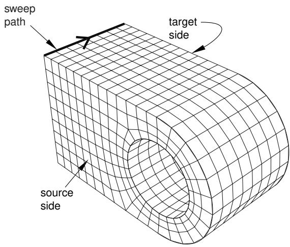  
图 2：一个扫掠网格。

## 自由网格划分

自由网格划分技术是最灵活的自上而下的网格划分技术。它不使用任何预先建立的网格模式，并且可以应用于几乎任何模型形状。然而，自由网格划分对网格的控制最少，因为无法预测网格模式。图 3 展示了一个自由网格的示例。欲了解更多信息，请参阅自由网格划分。

  
图 3：使用四面体单元生成的自由网格。

## 附加信息

•   自底向上网格划分  
•   理解网格生成  
•   指定 Abaqus 单元类型  
•   验证和改进网格

## 自底向上网格划分

自底向上网格划分使用零件几何形状作为网格外部边界的指导，但网格不需要与几何形状一致。取消这一限制为您提供了对网格更大的控制，并允许您在结构化或扫掠网格划分技术过于复杂的几何形状上创建六面体或以六面体为主的网格。自底向上网格划分可应用于任何实体模型形状。它为您提供了对网格最大程度的控制，因为您选择驱动网格的方法和参数。但是，您还必须决定结果网格是否是对几何形状的合适近似。如果不是，您可以删除网格并尝试不同的自底向上网格划分方法，或者划分该区域并使用自底向上或自上而下的网格划分技术对结果的较小区域进行网格划分。

要对一个自底向上区域进行网格划分，您可能需要应用几个连续的自底向上网格。例如，您可以使用拉伸自底向上网格来生成区域的一部分，然后使用拉伸网格的单元面作为起点，为拉伸网格未包含的特征生成扫掠网格。

载荷和边界条件应用于几何形状。与自上而下的网格不同，自底向上网格可能不与几何形状完全关联。因此，您应该在应用载荷或边界条件的区域检查网格是否与几何形状正确关联。正确的网格-几何关联将确保在分析过程中载荷和边界条件被正确地传递到网格。（欲了解更多信息，请参阅网格-几何关联。）由于与自动化的自上而下网格划分过程相比，用户需要付出额外的努力来创建令人满意的网格，因此仅当自上而下的网格划分无法生成合适的网格时，才建议使用自底向上网格划分。

图 1 展示了一个自底向上网格划分零件的示例。尽管这个零件相对简单，但它需要两个区域和四个自底向上网格才能完全划分网格。Abaqus/CAE 使用区域几何颜色（浅棕褐色）和网格颜色（浅蓝色）的混合色来显示自底向上网格划分的区域，以强调几何形状和网格可能未关联。同时显示几何形状和网格允许您查看和编辑网格-几何关联性。

  
图 1：一个自底向上六面体网格划分的零件。

## 附加信息

•   自上而下网格划分  
•   理解网格生成  
•   指定 Abaqus 单元类型  
•   验证和改进网格

•   自底向上网格划分

## 网格技术颜色编码

当选择默认颜色映射 (Mesh defaults color mapping) 时，Abaqus/CAE 使用不同的颜色来指示当前分配给区域的网格划分技术（如果有）。例如，如果一个实体区域可以使用结构化网格划分技术进行网格划分，当您进入网格模块时，该区域会变为绿色；绿色表示该区域分配了结构化网格划分技术。黄色表示扫掠网格划分技术应用于该区域。如果使用当前分配的单元形状无法对区域进行网格划分，当您进入网格模块时，该区域会变为橙色。粉红色或浅棕褐色的区域分别被分配了自由网格划分技术和自底向上网格划分技术。


## 注意：

您必须使用网格控制对话框 (Mesh Controls dialog box) 将自底向上网格划分技术分配给区域。Abaqus/CAE 不会自动分配自底向上网格划分技术，并且不会指示分配了自底向上技术的区域是否也可以使用自上而下的技术进行网格划分。（欲了解更多信息，请参阅分配网格控制。）

您可以通过将区域划分为具有更简单拓扑的较小区域、更改分配给区域的单元形状或使用虚拟拓扑工具集来更改适用的网格划分技术。

## 附加信息

•   确定哪些区域可进行网格划分  
•   几何形状和网格元素的颜色编码

## 网格细化

网格模块提供了一组工具，允许您细化网格。

您可以使用分区工具集将几何区域划分为较小的区域。由此产生的分区引入了新的边，您可以对这些边进行种子设置；因此，您可以将分区和种子设置结合起来，以获得对网格生成过程的额外控制。您还可以使用分区来创建可以分配不同单元类型的区域。例如，您可能希望将减缩积分单元分配给模型的某些部分，而将完全积分单元分配给其他部分。欲了解更多信息，请参阅分区工具集。  
在某些情况下，几何形状包含非常小的面和边等细节。虚拟拓扑工具集允许您通过将小面与相邻面组合或将小边与相邻边组合来移除这些小细节。引入虚拟拓扑是创建干净、规整网格的一种便捷方法。欲了解更多信息，请参阅虚拟拓扑工具集。  
•   您可以使用编辑网格工具集对您的网格进行细微调整。欲了解更多信息，请参阅使用编辑网格工具集我能做什么？。

## 网格优化

您可以为模型的区域分配重划分规则。重划分规则使您能够根据求解结果对网格进行连续细化。每次分析后，网格模块会调整您的网格，目的是减少求解结果中选定的误差指标。欲了解更多信息，请参阅理解自适应重划分、高级网格划分技术和创建、编辑和操纵自适应过程。

## 网格验证

网格模块提供了一组工具，允许您验证网格并获取网格统计信息和网格信息。网格模块还提供几何诊断工具，将帮助您确定 Abaqus/CAE 无法对某个区域进行网格划分的原因。欲了解更多信息，请参阅验证您的网格、查询您的网格和使用几何诊断工具。

## 对独立和依赖部件实例进行网格划分

对独立实例和依赖实例进行网格划分的方法是不同的。欲了解更多信息，请参阅依赖和独立部件实例有何区别？。

## 独立实例

要对独立实例进行网格划分，请使用上下文工具栏将对象更改为装配体 (Assembly)，然后直接对该实例进行网格划分。您不能对用于创建独立实例的部件进行网格划分。

## 依赖实例

要对依赖实例进行网格划分，请使用上下文工具栏将对象更改为部件 (Part)，然后选择与该依赖实例关联的部件。然后，您可以对该部件进行网格划分，Abaqus/CAE 会将相同的网格应用于装配体中的每个依赖实例。当您拥有部件实例的线性或径向阵列时，依赖实例非常方便。您可以对原始部件进行网格划分，Abaqus/CAE 会将相同的网格应用于该阵列中部件的每个实例。
## 显示原始网格

您可以在部件实例的几何显示和其网格划分表示之间进行切换。

单击位于“可见对象”工具栏中的**显示原始网格**图标。

您可以在任何与装配相关的模块中使用**显示原始网格**工具，在装配的几何显示和其网格划分表示之间进行切换。Abaqus/CAE 会显示装配中独立和依赖部件实例的网格划分表示（假设您已创建了相应的网格）。

使用**显示原始网格**工具在部件的几何和其网格划分表示之间切换，可以让您查看网格与几何的贴合程度。该工具还可以让您查看 Abaqus/CAE 如何将虚拟拓扑整合到网格中。此外，您可能会发现，在**作业**模块中单击**显示原始网格**工具很有用。这样，您可以在提交作业进行分析之前，确认整个装配是否已正确划分网格。

模型中任何孤立单元的显示不受此工具影响；无论您是显示部件实例原始部分的几何还是单元，孤立单元都会被显示。

## 理解种子设置

本节解释种子的概念以及如何使用种子来改善网格。

## 本节内容：

什么是网格种子？
我可以对面或体进行种子设置吗？
控制种子密度
对种子设置应用曲率控制
约束种子
最小化种子重定位
顶点和节点之间是什么关系？

## 什么是网格种子？

种子是您沿着区域的边缘放置的标记，用于指定该区域的目标网格密度。区域的边界网格密度和内部网格密度都由其边缘上的种子决定。

您可以使用**网格**模块主菜单栏中的**种子**菜单来创建和控制种子。Abaqus/CAE 会生成尽可能匹配您种子设置的网格。Abaqus/CAE 可以使用以下方法来控制种子的分布：

•   沿部件或部件实例的所有边缘均匀放置种子
•   沿一条边均匀放置种子
•   以偏斜的方式放置种子，使得网格密度从边的一端向另一端增加
•   以偏斜的方式放置种子，使得网格密度从两端向边的中心增加
•   以偏斜的方式放置种子，使得网格密度从中心向两端增加

图 1 显示了均匀种子和偏斜种子的组合。

图 1：一个具有均匀和偏斜种子的模型。

您应该对所有边缘应用种子。如果均匀的种子分布就足够了，建议的方法是对整个部件或部件实例进行种子设置。如果您想对网格进行更多控制，可以对区域进行分区，然后沿着您创建的分区提供种子。该技术在“验证和改进网格”中有更详细的描述。

网格种子仅指定目标网格密度。如果您使用的是六面体或四边形单元，Abaqus/CAE 通常会改变单元分布以便能够成功生成网格。您可以通过约束一条边上的种子数量来防止此类调整。当您约束种子时，主要是规定该边上的单元数量，在较小程度上规定节点的精确位置；如有必要，Abaqus/CAE 会调整节点位置以减少单元畸变。此外，您应谨慎使用此类约束，因为它们会使网格生成器更难获得网格。

默认情况下，Abaqus/CAE 仅在您定义或修改种子放置时才在部件或装配上显示种子。如果您希望在**网格**模块中执行其他操作时种子也能显示，可以启用种子持续显示；在“可见对象”工具栏中切换以保持种子显示。

## 我可以对面或体进行种子设置吗？

您可以选择边、面或体进行种子设置；但是，Abaqus/CAE 仅沿边创建种子。当您选择面或体进行种子设置时，Abaqus/CAE 仅沿着这些面或体的边创建种子。此外，您可以选择集合或面进行种子设置；结果，Abaqus/CAE 会沿着集合或面所包含几何体的边创建种子。

当您应用均匀种子时，可以使用以下方法的组合来选择 Abaqus/CAE 将应用种子的区域：

## 单个选择/按角度选择

您可以单独选择边、面或体；或者您可以使用角度方法选择一组边或面。例如，如果您选择角度方法并选择一条边，Abaqus/CAE 会接着选择每条相邻的边，直到边之间的角度等于或超过您输入的角度。更多信息，请参阅使用角度和特征边方法选择多个对象。

## 选择过滤器

您可以使用过滤器来选择要选择的对象类型——**边**、**面**、**体**或**全部**。默认情况下，Abaqus/CAE 允许您选择所有类型的对象。按角度选择的选项只有在您从选择过滤器中选择**边**或**面**后才可用。更多信息，请参阅根据对象类型过滤选择。

## 集合或面

默认情况下，Abaqus/CAE 允许您将种子应用于从视口中选择的边、面和体。或者，您可以单击提示区右侧的**集合/面**，并从符合条件的集合（或面）中选择。当您选择一个集合（或面）时，Abaqus/CAE 会将种子应用于集合（或面）中的每条边，包括所有体和面的每条边。Abaqus/CAE 会忽略集合（或面）中的任何顶点。

## 控制种子密度

您可以使用以下方法来控制沿所选边的种子密度：

•   为整个部件或部件实例的每条边指定平均单元大小。
•   为一条边指定所需的单元数量。
•   为一条边指定平均单元大小。（如果边长度不是单元长度的整数倍，Abaqus/CAE 会略微改变单元长度，以获得沿该边的整数个单元。）
指定沿一条边的非均匀单元分布。单元密度可以从边的一端向另一端增加（单偏斜），或者单元密度可以从边的中心向两端变化（双偏斜）。对于非均匀分布，您可以指定以下任一选项：

-   一条边所需的单元数量和一个偏斜比。偏斜比是最大单元与最小单元之比。
-   最小单元的大小和最大单元的大小。

如果您选择先前使用这些方法组合进行种子设置的边，Abaqus/CAE 会提供一个**保持现状**选项，允许您保留该种子设置方法。如果您选择具有混合曲率控制或种子约束的边，Abaqus/CAE 也会提供类似的选项。

有关规定种子密度的详细说明，请参阅以下章节：

为整个部件或部件实例定义种子密度
通过规定单元数量对边进行种子设置
通过规定单元大小对边进行种子设置
规定沿边的偏斜种子设置
对边种子应用约束
对先前划分网格的部件、部件实例或区域进行种子设置
删除部件或实例种子
删除边种子

通过为整个部件或部件实例指定平均单元大小而创建的种子分别称为部件种子或实例种子，并显示为白色；使用其他方法创建的种子称为边种子，并显示为品红色。边种子始终会覆盖部件或实例种子；因此，当您为整个部件或部件实例指定平均单元大小时，部件或实例种子仅出现在尚未设置边种子的区域边缘上。通过分区创建的新边缘默认会被赋予部件或实例种子。

当您对分配了扫掠或旋转网格技术的区域的边进行种子设置时，边种子工具会自动将种子从选定边传播到区域中的匹配边。换句话说，扫掠路径起点处的面或边上的种子会自动传播到扫掠路径终点处的面或边。同样，沿扫掠路径在一条边上创建的种子也会自动传播到沿扫掠路径的其他边上。因此，即使您选择一个面的单条边进行种子设置，Abaqus/CAE 也会将种子传播到其他边和面。更多信息，请参阅什么是扫掠网格划分？。

## 对种子设置应用曲率控制
部件种子工具允许您在为部件、部件实例或多条边指定种子时设定目标单元尺寸。如果几何形状相对规则，指定单一的目标单元尺寸可能产生可接受的网格。然而，如果您指定了单一的目标单元尺寸，但构成部件或边的几何特征大小各异，则生成的网格可能过于粗糙，无法充分表征任何细小特征，如图 1 所示。

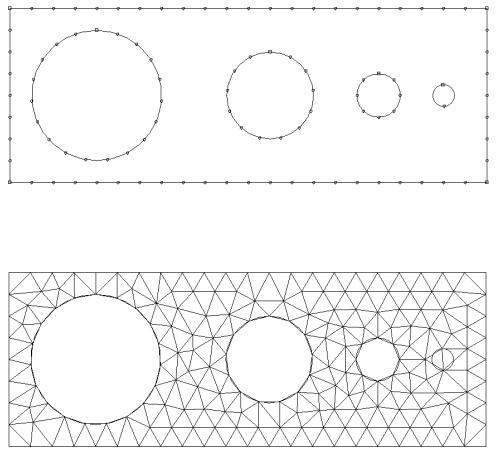  
图 1：未启用曲率控制时的种子和生成的网格。

为避免在细小弯曲特征周围种子不足的问题，Abaqus/CAE 在为部件、部件实例或边设定种子时会应用曲率控制。曲率控制允许 Abaqus/CAE 基于边的曲率以及目标单元尺寸来计算种子分布。图 2 显示了启用曲率控制后对同一部件进行种子设定和网格划分的结果。

  
图 2：启用曲率控制时的种子和生成的网格。

您可以配置以下参数来指定曲率控制如何影响种子设定：

## 偏差因子

偏差因子是衡量单元边偏离原始几何体程度的指标，如图 3 所示。

  
图 3：偏差因子。

为帮助您直观理解偏差因子，Abaqus/CAE 会显示根据您输入的设置，围绕一个圆周大约会创建的单元数量。随着您减小偏差因子，Abaqus/CAE 围绕圆周创建的单元数量会增加。此数量仅为视觉辅助；例如，如果您正在为样条线或椭圆设定种子，Abaqus/CAE 会根据边上的局部曲率创建不同数量的单元。

## 指定最小尺寸因子

指定最小尺寸因子可以防止 Abaqus/CAE 在您不感兴趣建模的高曲率区域创建非常精细的网格；例如，样条曲线的折角或半径非常小的圆角。您输入的代表最小尺寸的数字是全局种子尺寸的分数。因此，如果您更改了全局种子尺寸，则无需更改最小尺寸因子。

有关应用曲率控制的详细说明，请参阅为整个部件或部件实例定义种子密度。

## 约束种子

默认情况下，网格种子仅规定目标网格密度。当您使用自由网格划分技术生成三角形或四面体形状的单元时，Abaqus/CAE 通常会精确匹配网格种子。但在其他情况下，Abaqus/CAE 可能会改变单元分布以便成功生成网格。如果您想防止 Abaqus/CAE 改变单元分布，可以通过约束边上的种子来固定沿该边的特定单元数量。您只能约束边种子，而不能约束部件或实例种子。

您可以为沿一条边的一组种子分配以下三种状态中的任意一种：

## 未约束

这是默认设置。沿一条边的单元数量可以增加或减少，因此网格可以变得比种子指定的更密或更疏。未约束的种子显示为空心圆。

## 部分约束

沿一条边的单元数量在网格生成期间可以增加，但不能减少。此约束允许网格变得比种子指定的更密，但不能更疏。部分约束的种子显示为向上的三角形。

## 完全约束

受约束种子指定的沿一条边的单元数量不能被网格生成过程改变。当种子完全约束时，网格生成将尝试使节点的位置与种子的位置精确对应。但是，不能保证种子和节点位置完全匹配。完全约束的种子显示为正方形。

Abaqus/CAE 始终在区域的每个几何顶点处创建一个完全约束的种子，以指示将在每个顶点处放置一个有限元节点。

在许多情况下，网格生成器必须重新分配单元（并偏离种子的数量和位置）才能成功生成网格。为了最大限度地提高网格划分成功的可能性，请保持种子未约束，或至少避免在给定部件或部件实例中完全约束大量种子，以便网格生成器在重新分配种子时有尽可能多的自由度。

有关约束边种子的详细说明，请参阅以下章节：

对边种子应用约束  
使用错误对话框放宽约束

## 最小化种子重新定位

在网格生成过程中，Abaqus/CAE 使用您创建的种子作为网格边上节点的目标位置。但是，如果您使用四边形或六面体形状的单元，种子和节点之间的紧密匹配在很大程度上取决于以下因素：

## 您在过渡区域允许的单元形状

如果您允许在过渡区域使用三角形单元，则种子和网格节点之间的匹配会更好。如果您将网格限制为仅包含四边形单元，则种子和节点不太可能匹配。

## 网格过渡设置

如果您允许网格过渡，则种子和网格节点之间的匹配会更好。

## 网格划分技术

使用前沿推进网格划分算法生成的网格比使用中轴算法生成的网格更好地匹配您的种子。

## 种子约束

完全约束的种子在数量和位置上都与生成的节点紧密匹配。但是，您只能完全约束部件或部件实例的少数几条边；否则，Abaqus/CAE 将无法生成网格。

## 邻近区域的种子设定方式

在对多个区域进行网格划分时，Abaqus/CAE 经常重新分配单元，以便网格在区域之间兼容。即使单个区域的种子排列对于在该单个区域上生成网格是足够的，但由于单元数量必须与共享边上的邻近区域兼容，种子排列可能需要更改。


## 注意：

部件实例之间的网格兼容性无法保证。在某些简单情况下，种子设定可以帮助实现部件间的网格兼容性。有关获得兼容网格的技术，请参阅部件实例间的兼容网格。

Abaqus/CAE 在平衡整个模型的单元重新分配时，会尽可能贴近您指定的种子数量和位置。如果需要在单条边上进行大的更改，或对多条边进行小的更改之间做出选择，Abaqus/CAE 会选择进行许多小的更改。

## 顶点和节点之间有什么关系？

当您为模型设定种子时，Abaqus/CAE 会自动在模型边上的任何顶点处放置完全约束的种子。出现在顶点处的完全约束种子始终表示节点将出现在这些顶点处。（出现在区域边上其他位置的完全约束种子并不指示节点的确切位置；它们仅指示沿该边的节点数量。）因此，当您绘制部件草图时，应记住部件中顶点的位置会影响 Abaqus/CAE 能够生成的网格质量。（有关更改顶点位置的信息，请参阅拖动草图对象。）

例如，图 1 显示了一个二维部件的草图。

  
图 1：二维部件上的顶点。

注意九个顶点的位置。这些顶点是通过沿顶部和底部边绘制几条线段（而不是沿每条边绘制一条连续的线段）创建的。

当为该部件或其一个实例设定种子时，方形的完全约束种子会出现在每个顶点处，如图 2 所示。

  
图 2：完全约束种子出现在每个顶点处。

当模型被网格划分时，Abaqus/CAE 总是将节点放置在位于顶点处的完全约束种子的位置，如图 3 所示。

  
图 3：节点出现在顶点处。

同样，图 4 显示了两个同心圆的草图，它们将被拉伸以形成一个空心圆柱体。

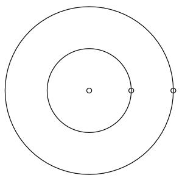
图 4：顶点对齐的同心圆。

请注意顶点的位置，这是草图绘制器在您点击定义圆周长的位置自动创建的。当对圆柱体进行种子划分时，每个顶点处会出现方形、完全约束的种子，如图 5 所示。

  
图 5：每个顶点出现完全约束的种子。

当模型被网格划分时，节点总是出现在位于顶点处的完全约束种子的位置，如图 6 所示。

  
图 6：节点出现在顶点处。

如果在绘制圆柱体草图时未对齐两个顶点，则有可能生成扭曲的网格。例如，图 7 中两个同心圆的顶点未对齐。

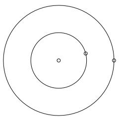  
图 7：顶点未对齐的同心圆。

结果，网格在右侧略有扭曲，如图 8 所示。

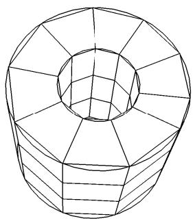  
图 8：扭曲的网格。

## 分配 Abaqus 单元类型

本节说明如何将 Abaqus/Standard 和 Abaqus/Explicit 单元类型分配给几何区域和孤立单元。

## 本节内容：

网格单元如何对应 Abaqus 单元？  
哪些类型的单元必须在 Mesh（网格）模块外部生成？  
单元类型分配  
首选单元类型列表

## 网格单元如何对应 Abaqus 单元？

Mesh（网格）模块可以生成包含以下单元形状的网格。

一维  
  
线

二维  
  
三角形

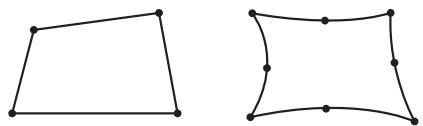  
四边形

三维  
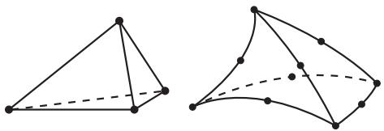  
四面体

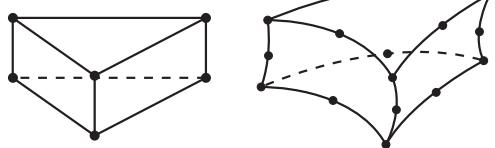

  
三角棱柱（楔形体）

  
六面体  
图 1：单元形状。

Abaqus/Standard 和 Abaqus/Explicit 中的大多数单元都对应于所示的形状之一；即，它们在拓扑上等价于这些形状。例如，尽管单元 CPE4、CAX4R 和 S4R 用于应力分析，DC2D4 用于传热分析，AC2D4 用于声学分析，但这五个单元在拓扑上都等价于线性四边形。

每个网格区域默认都分配有一个或多个 Abaqus 单元类型。每个单元类型对应于可在该区域中使用的一种单元形状。例如，一个壳体网格区域通常默认分配了四边形和三角形单元类型。但是，您可以更改为任何与分配给该区域的单元形状拓扑等价的 Abaqus 单元。因此，您可以选择仅用全部三角形单元对壳体区域进行网格划分，而 Abaqus/CAE 会忽略四边形单元分配。

要将单元分配更改为与分配给该区域的单元形状拓扑等价的 Abaqus 单元，请从主菜单栏中选择 Mesh -> Element Type。类似地，您可以选择 Mesh -> Controls 来选择用于网格划分的单元形状。

然而，由于在提交分析之前不会进行单元类型检查，因此有可能选择一个不适合您将要进行的分析的单元。例如，即使您正在进行应力分析，Abaqus/CAE 也不会阻止您指定传热单元，如 DC2D4。

## 哪些类型的单元必须在 Mesh 模块外部生成？

Abaqus/CAE 支持 Abaqus/Standard 和 Abaqus/Explicit 使用的大部分单元。但是，有些单元不受支持，必须在 Mesh（网格）模块外部生成。

以下列表描述了 Abaqus/CAE 不支持的单元。如果您想将这些单元类型分配给模型，必须使用文本编辑器将它们添加到在 Job（作业）模块中生成的输入文件中。有关生成输入文件的信息，请参见分析模型的基本步骤。

• 声学界面单元 (ASI1)  
• 热-电-结构耦合单元 (Q3D4, Q3D6 等)  
• 分布耦合单元 (DCOUP2D 和 DCOUP3D)  
• 拖曳链单元 (DRAG2D 和 DRAG3D)  
• 弹塑性连接单元 (JOINT2D 和 JOINT3D)  
• 梁单元 (FRAME2D 和 FRAME3D)  
• 间隙单元，耦合温度-位移和传热 (GAPUNIT 和 DGAP)  
• 无限单元 (CIN3D8, CINAX4 等)  
• 线弹簧单元 (LS3S 和 LS6)  
• 膜单元，9节点四边形 (M3D9 和 M3D9R)  
• 膜单元，柱状 (MCL6 和 MCL9)  
• 粒子单元 (PC3D)  
• 管土相互作用单元 (PSI24, PSI34 等)  
• 滑移线单元 (ISL21A 和 ISL22A)  
• 应力/位移变节点单元 (C3D15V, C3D27 等)


## 注意：

在您提交分析执行后，Abaqus/Standard 会自动将接触对中与次表面相邻的任何 C3D20(R)(H) 单元转换为相应的 C3D27(R)(H) 单元。（这两种单元在 Abaqus/Explicit 中均不可用。）否则，无法使用 Abaqus/CAE 生成变节点六面体。

• 面单元，柱状 (SFMCL6 和 SFMCL9)  
• 薄壳单元，9节点双曲面 (S9R5)  
• 管对管接触单元 (ITT21 和 ITT31)  
• 多孔弹性声学单元 (C3D4A, C3D6A, 和 C3D8A)

一些金字塔单元，如 C3D5 和 AC3D5，受 Abaqus/CAE 支持，可以从输入文件导入或写入输入文件。但是，Abaqus/CAE 没有能生成金字塔形状的网格划分算法。您可以在 Mesh（网格）模块中将不同的金字塔单元类型分配给现有的金字塔单元。

您不能在 Mesh（网格）模块中分配某些单元，如 CONN2D2 和 SPRING1；但是，您可以在 Interaction（相互作用）模块中创建等效的连接器，或在 Property（属性）模块或 Interaction（相互作用）模块中创建工程特征，如表 1 所示。这些单元会被写入输入文件。

表 1：Abaqus/CAE 对连接器和工程特征的支持。

<table><tr><td>单元</td><td>Abaqus/CAE 支持</td></tr><tr><td>CONN2D2, CONN3D2</td><td>Interaction 模块中的等效连接器</td></tr><tr><td rowspan="2">DASHPOTA, DASHPOT1, DASHPOT2</td><td>Property 模块或 Interaction 模块中的工程特征（线性行为独立于场变量）</td></tr><tr><td>Interaction 模块中的等效连接器</td></tr><tr><td>GAPCYL, GAPSPHER, GAPUNI</td><td>Interaction 模块中的等效连接器</td></tr><tr><td>HEATCAP</td><td>Property 模块或 Interaction 模块中的工程特征</td></tr><tr><td>ITSCYL, ITSUNI</td><td>Interaction 模块中的等效连接器</td></tr><tr><td>JOINTC</td><td>Interaction 模块中的等效连接器</td></tr><tr><td>MASS</td><td>Property 模块或 Interaction 模块中的工程特征</td></tr><tr><td>ROTARYI</td><td>Property 模块或 Interaction 模块中的工程特征</td></tr><tr><td rowspan="2">SPRINGA, SPRING1, SPRING2</td><td>Property 模块或 Interaction 模块中的工程特征（线性行为独立于场变量）</td></tr><tr><td>Interaction 模块中的等效连接器</td></tr></table>

有关更多信息，请参见理解连接器、惯性、弹簧和阻尼器。

## 单元类型分配

您可以将单元类型分配给几何区域和孤立网格单元。

单元类型可以分配给以下对象：

• 从基于几何的零件或零件实例中选择的区域。这些零件实例必须来自您在 Part（部件）模块中创建的零件或您导入的零件。  
• 引用从基于几何的零件或零件实例中选择的区域的集合。该集合也可以引用蒙皮加强件。  
• 一个孤立单元或单元集。

所有来自基于几何的零件或零件实例的区域都有默认的单元类型分配。这些分配取决于区域或单元所属的零件类型。您还可以指定一个首选单元类型列表用于单元类型分配（更多信息请参见首选单元类型列表）。

您可以使用 Element Type 对话框查看和更改分配的 Abaqus 单元类型，该对话框可通过选择 Mesh -> Element Type 来显示。例如，一个二维结构区域的 Element Type 对话框如图 1 所示。
  
图 1：一个 Abaqus/Standard 模型中二维结构区域的“单元类型”对话框。

在对话框顶部，您需要输入对单元库、几何阶次和单元族的偏好。然后，通过点击对话框下半部分的选项卡并从出现的选项中选择，来指定一个具体的单元类型。有关单元控制选项的更多信息，请参见《截面控制》。

根据所选区域或区域的维数，对话框可能包含一到三个选项卡：

- **线**（Line）选项卡允许您选择一个适用的单元类型并将其分配给区域中的一维网格单元。
- **四边形**（Quad）和**三角形**（Tri）选项卡允许您选择一个适用的单元类型并将其分配给区域中的二维网格单元。
- **六面体**（Hex）、**楔形**（Wedge）和**四面体**（Tet）选项卡允许您将三维单元类型分配给区域中的三维网格单元。

例如，在图 1 中，选择了来自 Abaqus/Standard 单元库的线性壳单元的选项。点击**四边形**（Quad）选项卡后，选择了减缩积分和有限膜应变。满足所有这些条件的四边形壳单元的名称和简要描述会出现在选项卡页面的底部。

该对话框中的**三角形**（Tri）选项卡如图 2 所示。在图 2 的**三角形**（Tri）选项卡页面底部，显示了满足对话框中指定所有条件的三角形壳单元的名称和简要描述。如果本示例中选定的区域恰好包含三角形和四边形网格单元的组合：

- 四边形网格单元被分配了 S4R 单元类型。
- 三角形网格单元被分配了 S3 单元类型。

  
图 2：“三角形”（Tri）选项卡。

如果该区域仅包含四边形单元，则所有单元都被分配 S4R 单元类型。

有关为网格区域分配单元类型的详细分步说明，请参见《将 Abaqus 单元与网格区域关联》。有关可用单元类型的列表，请参见《Abaqus/Standard 单元索引》和《Abaqus/Explicit 单元索引》。您可以通过“单元类型”对话框选择大多数此类单元。《必须在“网格”模块之外生成哪些类型的单元？》描述了无法选择的单元。

## 首选单元类型列表

您可以指定一个首选单元类型列表，用于分配单元类型。

要使用首选单元类型，必须以交互方式运行 Abaqus/CAE。该列表必须在 Abaqus/CAE 中加载“网格”模块之前创建。

当为一个从未分配过单元类型的部件或部件实例划分网格时，会查询首选单元类型列表。如果在列表中找到与几何形状匹配的单元类型，则会将其分配给该几何形状。可以组合分配代表不同形状（例如，三角形和四边形）的多个单元类型，但只使用彼此兼容的单元类型。当列表中找到多个匹配的单元类型时，优先使用第一个遇到的单元类型。

在填充“单元类型”对话框时也会查询该列表，以便为之前未分配任何单元类型的区域默认选择首选单元类型。如果您在对话框中单击**默认值**（Defaults），则显示的是默认单元类型（而非首选单元类型）。

您可以在 `abaqus_v6.env` 或 `custom_v6.env` 环境文件中指定首选单元类型列表。建议您在环境文件的 `onCaeStartup()` 函数中指定首选单元类型列表。例如：

```python
def onCaeStartup():
    import mesh
    prefElems=(mesh.C3D8T, mesh.C3D10MT, mesh.S8R)
    session.defaultMesherOptions.setValues(guiPreferredElements=prefElems)
```

- 使用 Abaqus 环境文件

## 验证和改进网格

本节说明如何使用“网格”模块中的工具来验证网格质量、控制网格生成以及改进网格质量。

## 本节内容：

验证网格  
查询网格  
为什么要在“网格”模块中进行分区？  
分区如何影响种子和其他属性？  
修改几何体后重新生成分区  
使用虚拟拓扑改进网格  
使用自适应重划分网格改进网格

## 验证网格

完成网格划分操作后，Abaqus/CAE 会高亮显示网格中任何有问题的单元。Abaqus/CAE 还在“网格”模块中提供了一组工具，允许您验证网格质量并获取有关网格中节点和单元的信息。您可以使用这些工具来隔离网格质量较差的区域，并在需要细化网格时为您提供指导。要验证网格质量，请从上下文栏中选择对象（Object），然后从主菜单栏中选择**网格->验证**（Mesh->Verify）。然后，您可以选择要验证的部件、部件实例、几何区域或单元。Abaqus/CAE 允许您选择是检查您的网格是否能通过分析产品中的质量测试，还是检查您的网格是否能通过单项质量检查（例如，检查纵横比过大的单元）。任何未通过指定标准的单元都会在视口中高亮显示，您可以选择创建并保存一个包含这些高亮单元的集合，或者（如果适用）包含与这些单元相关的单元、面或边。有关使用网格验证工具的详细信息，请参见《验证单元质量》。

您可以使用**分析检查**（Analysis checks）来验证您网格中的单元是否能通过 Abaqus/Standard 或 Abaqus/Explicit 中输入文件处理器包含的单元质量检查。Abaqus/CAE 会高亮显示任何未通过网格质量测试的单元，并在消息区域显示测试的单元数量以及错误和警告的数量。输入文件处理器中的网格质量测试非常广泛且针对每种单元类型。网格质量测试至少会对看起来失真不当的单元发出警告，并在失真严重时发出错误。Abaqus/CAE 不支持对梁单元、垫片单元或内聚单元进行分析检查。

您可以使用**形状指标**（Shape metrics）来高亮显示形状不符合以下某个选择标准的单元：

## 形状因子（Shape factor）

Abaqus/CAE 会高亮显示归一化形状因子小于指定值的单元。形状因子标准仅适用于三角形和四面体单元。形状因子的范围从 0 到 1，其中 1 表示最佳单元形状，0 表示退化单元。

- 对于三角形单元，归一化形状因子定义为

$$
\text {形状因子} = \frac {\text {单元面积}}{\text {最佳单元面积}}。
$$

最佳单元面积是与单元具有相同外接圆半径的等边三角形的面积。（外接圆半径是通过三角形三个顶点的圆的半径。）

- 对于四面体单元，归一化形状因子定义为

$$
\text {形状因子} = \frac {\text {单元体积}}{\text {最佳单元体积}}。
$$

最佳单元体积是与单元具有相同外接球半径的正四面体的体积。（外接球半径是通过四面体四个顶点的球的半径。）

## 小面角（Small face corner angle）

Abaqus/CAE 会高亮显示包含两条边相交角度小于指定角度的面的单元。

## 大面角（Large face corner angle）

Abaqus/CAE 会高亮显示包含两条边相交角度大于指定角度的面的单元。

## 纵横比（Aspect ratio）

Abaqus/CAE 会高亮显示纵横比大于指定值的单元。纵横比是单元最长边与最短边的比率。

表 1 显示了基于单元形状的选择标准默认限制。  
表 1：单元形状选择标准限制。

<table><tr><td>选择标准</td><td>四边形</td><td>三角形</td><td>六面体</td><td>四面体</td><td>楔形</td></tr><tr><td>形状因子</td><td>不适用</td><td>0.01</td><td>不适用</td><td>0.0001</td><td>不适用</td></tr><tr><td>小面角</td><td>10</td><td>5</td><td>10</td><td>5</td><td>10</td></tr><tr><td>大面角</td><td>160</td><td>170</td><td>160</td><td>170</td><td>160</td></tr><tr><td>纵横比</td><td>10</td><td>10</td><td>10</td><td>10</td><td>10</td></tr></table>

您可以使用**大小指标**（Size metrics）来高亮显示不符合以下某个选择标准的单元：

## 几何偏差因子（Geometric deviation factor）

Abaqus/CAE 会高亮显示其边的几何偏差因子大于指定值的单元。几何偏差因子衡量单元边偏离原始几何体的程度，Abaqus/CAE 通过将单元边与其父几何面或边之间的最大间隙除以单元边的长度来计算此值。默认情况下，Abaqus/CAE 会高亮显示几何偏差因子大于 0.2 的单元。
Abaqus/CAE 仅对原生网格中的单元计算几何偏差因子。如果您选择的部件不包含几何，Abaqus/CAE 将在 **Verify Mesh** 对话框中禁用此选项。如果您的选择同时包含原生网格和独立网格，Abaqus/CAE 在计算几何偏差因子时仅考虑原生网格单元。

## 短边

Abaqus/CAE 会高亮显示边短于指定值的单元。

## 长边

Abaqus/CAE 会高亮显示边长于指定值的单元。

## 稳定时间增量

Abaqus/CAE 会高亮显示计算的稳定时间增量小于指定值的单元。稳定时间增量计算需要合适的材料定义和截面分配，并且仅对 Abaqus/Explicit 分析有意义。

Abaqus/CAE 中的稳定时间增量计算是对 Abaqus/Explicit 逐单元公式化所计算的初始稳定时间增量的近似。它不考虑以下任何条件：

• 质量缩放  
  集中质量  
• 旋转惯量

• 非结构质量  
• 加强筋

Abaqus/CAE 中支持稳定时间增量计算的材料行为包括弹性、超弹性、超弹性泡沫（无用户定义的测试数据）和声学介质。不支持具有多种材料的复合截面。更多信息，请参见稳定性。

## 声学单元的最大允许频率

Abaqus/CAE 会高亮显示在高于指定频率值时，对于 Abaqus/Standard 中的模态或稳态动力学分析可能无效的有限声学单元。最大允许频率计算需要合适的材料定义和截面分配。该计算是基于每波长约 10 个单元的近似指南：

$$
f _ {m a x} = \frac {P C _ {o}}{1 0 h},
$$

其中 P 是插值阶数（1 或 2），h 是单元包围盒的尺寸，$C _ { o }$ 是声速 $\left( { \sqrt { \frac { 体 模 量 } { 密 度 } } } \right)$。

此外，对于形状和尺寸指标，Abaqus/CAE 会在消息区域为每个选定的部件、部件实例或区域显示以下信息：

• 部件或部件实例的名称。  
• 部件实例或选定区域中所选形状的单元总数。  
• 高亮显示的单元数量以及这些单元占正在验证的单元的百分比。  
• 选择标准的平均值。对于几何偏差因子，Abaqus/CAE 仅通过考虑沿曲线或面的单元来计算平均值；体积中心的实体单元不包含在此值中。  
• 选择标准的“最差”值——如果未超过该标准，则是最接近该标准的值；如果超过该标准，则是超出该标准最远的值。

## 查询您的网格

**网格 (Mesh)** 模块中的 **查询 (Query)** 工具集允许您获取有关网格中节点和单元的信息。此外，您可以从主菜单栏选择 **工具 (Tools) -> 查询 (Query)** 来请求有关网格的以下信息：

• 所选部件、部件实例或区域中的节点和单元总数，以及每种单元形状的单元数量。  
• 所选单元的类型和连接性。  
• 壳和膜面的正负侧。  
• 梁和桁架切线的方向。  
• 网格堆叠方向。  
• 边界面的任何边是否具有不兼容的接口、裂缝或间隙，以及任何边是否与其他面相交。  
• 自由边或非流形边的位置——即未被恰好两个外部单元共享的外部壳或实体单元边。  
• 任何未划分网格区域的位置。

有关使用 **查询 (Query)** 工具集的详细信息，请参见获取网格信息。

## 为什么要在网格模块中分区？

您可以使用 **分区 (Partition)** 工具集将部件或独立的部件实例划分为更小的区域。在 **网格 (Mesh)** 模块中创建分区有三个原因：

• 将复杂的部件或实例划分为更简单的区域，以便 Abaqus/CAE 主要可以使用六面体单元通过结构化或扫掠网格划分技术进行网格划分。（几乎所有三维部件都可以使用自由网格划分技术进行网格划分，但三维自由网格只能包含四面体单元。）  
• 更好地控制网格生成。  
• 获取可以分配不同单元类型的区域。

有关如何使用 **分区 (Partition)** 工具集中每个工具的详细信息，请参见 **分区 (Partition)** 工具集。

您只能对部件或独立的部件实例进行分区。如果您需要对一个从属实例进行分区，可以对创建该从属实例的原始部件进行分区。或者，您可以创建原始部件的副本，然后创建该副本的独立实例。然后，您可以将从属实例替换为新的独立实例并对该独立实例进行分区。更多信息，请参见从属部件实例和独立部件实例有何区别？。

默认情况下，使用四边形单元的自由网格划分技术会应用于所有二维部件和部件实例。当您使用此默认技术创建网格时，Abaqus/CAE 会隐式创建分区，将部件划分为可以使用结构化网格划分技术进行网格划分的区域。（有关更多信息，请参见使用四边形和四边形为主的单元进行自由网格划分。）因此，所有二维部件无需任何手动分区即可进行网格划分。

但是，当使用六面体单元无法对三维部件或实例进行网格划分时，您必须采取以下步骤之一：

• 将单元形状从六面体更改为四面体，以便可以应用自由网格划分技术。  
• 划分为可结构化或扫掠网格划分的区域。

当选择 **网格默认值 (Mesh defaults)** 颜色映射时，Abaqus/CAE 使用橙色表示某个三维区域无法使用当前分配的单元形状进行网格划分。例如，图 1 展示了一个无法用六面体单元进行网格划分的部件。

  
图 1：无法进行网格划分的三维区域。

添加分区后，该部件即可用六面体单元进行网格划分，如图 2 所示；绿色区域可以使用结构化网格划分技术进行网格划分，黄色区域可以使用扫掠网格划分技术进行网格划分。

  
图 2：模型被划分为三个区域。

即使部件或实例无需分区即可进行网格划分，您可能仍希望进行分区以更好地控制网格生成。如果没有分区，网格仅沿外部边对齐；有了分区，生成的网格将具有沿分区对齐的单元行或网格。也就是说，网格沿分区“流动”。例如，在图 3 中，将矩形一分为二的分区导致网格沿分区呈一定角度流动。

  
图 3：网格沿分区流动。

您可以使用对某个面进行分区所创建的附加边来控制网格特征。例如，图 4 说明了分区和局部网格种子如何允许您控制网格流动和密度。

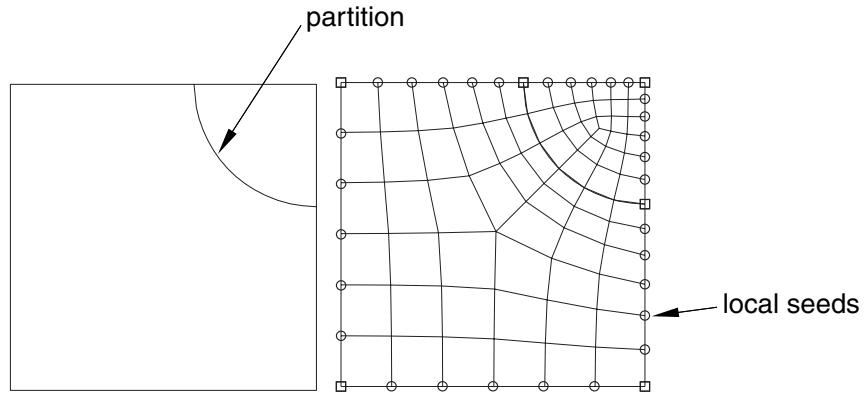  
图 4：分区和局部网格种子允许您控制网格流动和密度。

类似地，图 5 展示了分区和局部网格种子如何允许您细化应力集中区域的网格。

  
图 5：分区和局部网格种子允许您细化应力集中区域的网格。

此外，您可以对由分区创建的区域应用不同的网格控制，例如单元形状。

进行分区时，请记住分区将成为单元边界。因此，应尽量确保分区与其他分区或边成接近 90° 的角度。此外，应避免创建会扭曲网格的不需要的短边。

## 种子和其他属性如何受分区影响？

您已设定种子的边上的种子分布可能会在分区过程中发生变化；Abaqus/CAE 会重新分布种子以适应分区创建的任何新顶点。例如，图 1 中部件实例的左右两边设定了每边 7 个单元的种子。


图1：左右两条边各有七个单元。

如果创建一个将零件实例划分为两个区域的分区，新的顶点会在两条边的中点处生成。在图2中，您可以看到Abaqus/CAE如何在新顶点处添加了种子，以便节点将存在于每个区域的角点处。

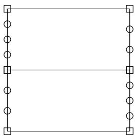  
图2：种子的重新分布。

Abaqus/CAE还重新分布了现有的种子，以消除新分区可能创建的任何过小单元。然而，这种重新分布可能导致种子未对齐。顶部区域的左侧比右侧多一个种子，而底部区域则相反。在此示例中，您可以将左右边的单元数量更改为偶数，以确保分区后种子对齐。

您已应用的任何其他网格属性，例如单元形状或单元类型，都会自动应用于您通过分区创建的每个新区域。但是，一旦创建了不同的区域，您可以为每个区域分配不同的网格属性。

## 修改几何体后重新生成分区

分区是与零件或零件实例关联的特征；因此，您可以像修改和重新生成任何其他特征一样修改和重新生成它们。

例如，考虑图1中零件实例右侧所示的分区。

  
图1：一个已分区的零件实例。

如果您返回到**Part（部件）**模块并加宽模型的右侧，分区也会随之扩展并继续将面划分为两个区域，如图2所示。

  
图2：分区被重新生成。

有时，分区的重新生成会创建无法划分网格的区域。在这种情况下，只需添加、修改或删除分区，直到零件实例再次可以划分网格为止。

## 使用虚拟拓扑改善网格

在某些情况下，零件或独立的零件实例包含诸如非常小的面和边等细节。**Virtual Topology（虚拟拓扑）**工具集允许您通过将小面与相邻面组合或将小边与相邻边组合来移除这些小细节。您也可以忽略选定的边和顶点，这与组合面和边的效果相同。引入虚拟拓扑是创建干净、形状良好网格的便捷方法。**Virtual Topology（虚拟拓扑）**工具集仅在**Mesh（网格）**模块中可用。

然而，向零件实例添加虚拟拓扑可能会限制您后续对该零件实例进行网格划分的能力。例如，您无法使用以下技术对包含虚拟拓扑的区域进行网格划分：

*   使用中轴算法进行二维自由网格划分，使用四边形或以四边形为主的单元。
*   使用中轴算法进行三维扫掠网格划分。
*   如果待划分网格的区域未由四个角点界定，则进行二维结构化网格划分。
*   如果待划分网格的区域未由六个面界定，则进行三维结构化网格划分。

更多信息，请参见 **The Virtual Topology toolset（虚拟拓扑工具集）**。

此外，您只能将虚拟拓扑应用于独立实例。如果需要将虚拟拓扑应用于依赖实例，您可以创建原始部件的副本，然后创建该副本的独立实例。接着，您可以将依赖实例替换为新的独立实例，并将虚拟拓扑应用于该独立实例。更多信息，请参见 **What is the difference between a dependent and an independent part instance?（依赖零件实例和独立零件实例之间的区别是什么？）**。

## 使用自适应重划分改善网格

在许多情况下，在执行一系列分析并评估解结果之前，您不会知道网格细化对于您的特定求解目标是否足够。在这些情况下，通常进行网格细化研究，即对网格进行连续细化，并确认关键解结果收敛。您可以通过将重划分规则应用于模型中的感兴趣区域，并使用Abaqus/CAE自适应重划分过程来自动化此过程，该过程基于一系列已执行的分析自动执行连续的网格细化。

使用重划分规则，您可以指定：

*   您希望网格细化的区域。
*   网格细化所依据的解质量标准（例如，Mises应力中的误差指标）。
*   细化所依据的分析步骤（一个或多个）。
*   最小和最大单元尺寸约束。
*   适用于您模拟的尺寸算法和参数。

更多信息，请参见 **Advanced meshing techniques（高级网格划分技术）** 和 **Creating, editing, and manipulating adaptivity processes（创建、编辑和操作自适应过程）**。

## 理解网格生成

本节解释与网格和网格生成相关的基本概念和术语。

## 本节内容：

*   生成网格
*   保持节点坐标的精度
*   确定哪些区域可以划分网格
*   如果区域网格划分失败该怎么办？
*   什么是网格过渡？
*   中轴算法和前沿算法有什么区别？
*   哪些类型的网格无法自动生成？
*   何时Abaqus/CAE会删除网格？
*   我必须一次操作就对整个模型进行网格划分吗？
*   我可以更改网格中单元的几何阶次吗？

## 生成网格

Abaqus/CAE中的大多数网格划分是以“自上而下”的方式完成的。

这意味着网格的创建精确符合某个区域的几何形状，并向下细化到单元和节点位置。

1.  Abaqus/CAE遵循以下基本步骤来生成网格：
    *   使用当前分配给该区域的网格划分技术，在每个自上而下区域上生成网格。默认情况下，Abaqus/CAE在整个模型中生成具有线性、四边形或六面体单元的一阶网格。
2.  将所有区域的网格合并为单个网格。通常，Abaqus/CAE将相邻区域共同边界上的节点合并为一组节点。然而，在某些情况下，Abaqus/CAE会创建绑扎面相互作用，而不是合并这些节点；例如，在六面体和四面体网格之间的共同界面处。更多信息，请参见 **Meshing multiple three-dimensional solid regions（对多个三维实体区域进行网格划分）**。

Abaqus/CAE生成的自上而下网格符合它们所离散化的零件或零件实例的几何形状，如图1所示：

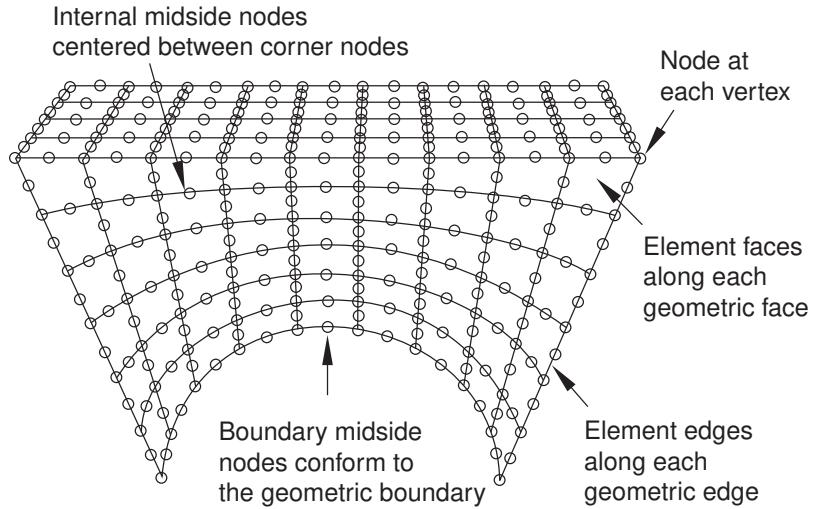  
图1：网格符合零件实例的几何形状。

*   在每个几何顶点处生成一个节点。
*   沿每条几何边生成一组相连的单元边。
*   沿每个几何面生成一组相连的单元面。
*   位于网格边界上的节点（包括二阶单元的边中节点）也位于几何边界上。
*   内部二阶单元的边中节点位于单元边的两端节点之间。

有关创建自上而下网格的详细分步说明，请参见 **Creating a mesh（创建网格）**。

直接依赖几何形状来形成网格外部边界可能会影响网格质量，因为Abaqus/CAE会创建单元来填充小的细节。在某些情况下，您可能无法实施允许您在复杂区域上应用自上而下的扫掠或结构化网格划分技术的分区策略。对于实体区域，您可以使用“自下而上”的网格划分技术代替自动化的自上而下网格划分技术来生成六面体网格。自下而上网格划分是一个手动、增量的网格划分过程，它从二维实体构建三维网格。您定义将使用自下而上技术划分网格的区域，控制网格划分过程，决定结果网格是否满足您的需求，并且——由于网格不必符合几何形状——控制几何体与网格之间的关联性。有关自下而上网格划分的更多信息，请参见 **Bottom-up meshing（自下而上网格划分）**。

## 保持节点坐标的精度

当您在**Part（部件）**模块中创建部件时，它存在于自己的坐标系中，独立于模型中的其他部件。相反，当您在**Assembly（装配）**模块中创建部件的实例并将其相对于其他零件实例定位时，您是在装配体的全局坐标系中工作。

为了保持精度，**Mesh（网格）**模块将零件实例的定位信息与实例的几何形状分开。因此，当您生成网格时，零件实例的节点坐标是相对于原始部件的坐标系计算的。（当**Job（作业）**模块生成输入文件时，Abaqus/CAE会相对于其自身的坐标系编写每个实例的节点坐标，并通过\*INSTANCE关键字将实例的定位和方向信息传递给分析产品。）
Mesh 模块将这些节点坐标存储为单精度。如果部件的几何形状远离其坐标系原点，节点坐标的部分精度将会丢失。为防止这种精度损失，您应尽量将部件定位在其坐标系原点附近。例如，Abaqus/CAE 原生部件的坐标系原点位于定义基础特征的草图原点处。因此，如果可能，您应将基础特征的草图定位在草绘网格原点上。

## 判定可网格划分区域

当选择默认颜色映射（Mesh defaults color mapping）时，Mesh 模块中区域的颜色指示当前分配给该区域的网格划分技术。颜色编码如下：

• 结构化网格划分技术（Structured meshing technique）：绿色
• 自由网格划分技术（Free meshing technique）：粉红色
• 扫掠网格划分技术（Swept meshing technique）：黄色
• 不可网格划分（Unmeshable）：橙色
• 自底向上网格划分技术（Bottom-up meshing technique）：浅褐色

有关每种网格划分技术的信息，请参见 结构化网格和映射网格、自由网格、扫掠网格 和 自底向上网格。有关颜色映射的更多信息，请参见 几何和网格元素的颜色编码。

在许多情况下，Abaqus/CAE 可以使用多种技术对一个区域进行网格划分；在这些情况下，您可以接受默认技术，也可以使用 Mesh Controls 对话框选择另一种技术。此外，您可以通过向区域添加分区或为区域分配不同的单元形状来更改适用于该区域的网格划分技术。例如，如果将一个不可网格划分的三维部件实例（part instance）的单元形状分配从六面体（hexahedra）更改为四面体（tetrahedra），则该部件实例变为可以使用自由网格划分技术进行网格划分。更多信息，请参见 为什么在 Mesh 模块中进行分区？。


## 注意：

您必须使用 Mesh Controls 对话框将自底向上网格划分技术分配给某个区域。要取消分配自底向上技术，您可以选择另一种技术或在 Mesh Controls 对话框中单击 Defaults，以允许 Abaqus/CAE 为该区域使用默认单元形状和网格划分技术。

二维模型的默认网格划分技术是自由网格划分技术。如果您对自由网格划分技术生成的网格质量不满意，或者您更喜欢更规则的网格状模式，可以为模型中较简单的区域分配结构化网格。但是，如果您的模型很大且复杂，识别适用结构化网格的简单区域可能非常耗时。为了加快这一过程，您可以将结构化网格划分技术应用于整个模型，Abaqus/CAE 将执行以下操作：

• 判断是否有任何面过于复杂而无法进行结构化网格划分，并询问您是否希望将其从选择中移除。
• 判断是否有任何面形状不佳并会导致不可接受的网格质量，并询问您是否希望将其从选择中移除。

如果 Abaqus/CAE 从您的选择中移除了任何面，它们将显示为粉红色，表示将使用自由网格进行网格划分。剩余的面将显示为绿色，表示 Abaqus/CAE 将使用结构化网格对其进行网格划分。

例如，图 1 显示了一个电气连接器的壳模型。用户尝试为整个装配体分配结构化网格，而 Abaqus/CAE 从他们的选择中移除了所指示的面。

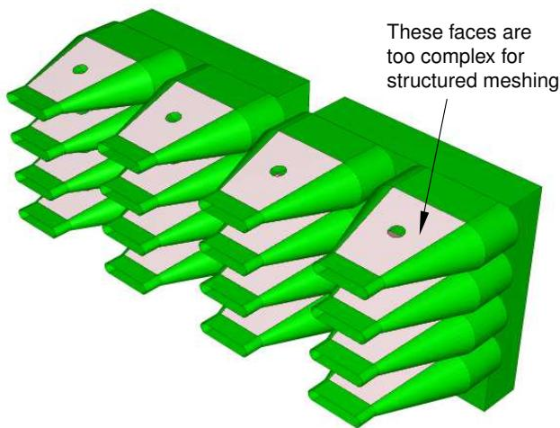  
图 1：无法进行结构化网格划分的面从选择中移除。

如果您正在对实体模型进行网格划分，您必须选择一个或多个单元格（cell），并使用 Mesh Controls 对话框来确定是否可以将结构化技术应用于这些单元格。如果您有一个将使用自由四面体网格划分的区域，您可以选择边界曲面并使用 Mesh Controls 对话框来确定是否可以应用结构化技术，在实体四面体网格划分之前创建三角形边界网格。

有关控制分配给区域的网格技术和单元形状的详细信息，请参见以下章节：

自底向上网格划分
分配网格控制
选择单元形状
选择网格划分技术
更改先前已网格划分区域的网格控制

## 如果区域网格划分失败该怎么办？

如果区域网格划分失败，Abaqus/CAE 会显示一个 Error 对话框，解释网格划分失败的原因。在大多数情况下，Abaqus/CAE 会高亮显示该区域并允许您将其保存在一个集合（set）中。您可以从该集合创建一个显示组（display group），并使用该显示组来研究网格划分失败的区域。

区域网格划分失败的一些较常见原因及相应解决方案如下：

## 种子不足

该区域包含一些小边，或者种子密度过于粗糙。您可以使用虚拟拓扑工具集（Virtual Topology toolset）来合并小边。或者，如果您将网格划分失败的区域保存在一个集合中，您可以对该集合应用密度更高的局部种子（local seeds）。

当您使用中轴算法（medial axis algorithm）创建六面体网格、四边形网格或四边形主导的网格时，Abaqus 可能需要修改种子以生成网格。在某些情况下，由于修改后的种子密度过粗，网格生成可能会失败。如果您以不同的顺序逐步对部件的各个区域进行网格划分，网格划分可能会成功；或者，如上所述，您可以应用密度更高的局部种子并重新对部件进行网格划分。

## 不良几何形状

不良几何形状是指小边或小面，或者不精确的部件实例。您可以使用查询工具集（Query toolset）来检查几何形状。更多信息，请参见 使用几何诊断工具。

## 边界三角形质量差

当您使用四面体单元创建自由网格时，Abaqus/CAE 首先在该区域的面上创建三角形网格，然后使用这些三角形作为边界四面体单元的面。您可以选择预览面上的三角形网格，并在继续耗时生成区域内部四面体单元的过程之前，判断其是否可接受。更多信息，请参见 什么是四面体边界网格？。

在某些情况下，Abaqus/CAE 无法完成从三角形到四面体的转换，并高亮显示边界网格中无法插入四面体网格的节点。这些高亮显示的节点可作为需要关注区域的指示，您可以尝试以下操作：

• 使用种子工具增加网格密度。
• 使用虚拟拓扑工具集将小面和小边与相邻的面和边合并。
• 使用分区工具集将区域划分为更简单的子区域。
• 使用编辑网格工具集改进四面体边界网格。
• 使用网格控制更改应用于实体区域面的网格技术。

## 垫片区域（Gasket regions）

您只能在包含垫片网格（gasket mesh）的区域上生成垫片增强网格（gasket reinforcement mesh）。

## 什么是网格过渡（mesh transition）？

网格过渡是指网格从粗（大单元）过渡到细（小单元）的区域，如图 1 所示。

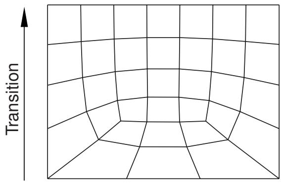  
图 1：一个包含从粗到细单元过渡的网格。

Abaqus/CAE 为以下类型的网格提供网格过渡控制：

• 使用结构化网格划分技术或使用中轴算法的自由网格划分技术创建的二维、仅四边形网格。
• 通过扫掠二维网格创建的三维、仅六面体网格。更多信息，请参见 什么是扫掠网格？。

当过渡控制适用于您正在创建的网格类型时，Mesh Controls 对话框的右侧会出现一个切换按钮，允许您最小化网格过渡。默认情况下，Abaqus/CAE 会最小化网格过渡，这在某些情况下可以减少网格扭曲。相反，如果您关闭最小化网格过渡的选项，网格可能会更接近指定的网格种子。要显示 Mesh Controls 对话框，请从主菜单栏中选择 Mesh -> Controls。更多信息，请参见 设置网格算法。

## 中轴算法和前沿推进算法有什么区别？

当您执行以下操作时，中轴算法（medial axis algorithm）和前沿推进算法（advancing front algorithm）是 Abaqus/CAE 可用于生成网格的两种网格划分方案：

• 使用自由网格划分技术，用四边形或四边形主导的单元对曲面进行网格划分。
• 使用扫掠网格划分技术，用六面体或六面体主导的单元对实体区域进行网格划分。（Abaqus/CAE 通过将两种算法从源侧到目标侧生成的四边形和四边形主导单元进行扫掠，来生成六面体和六面体主导的网格。）
这两种算法描述如下：

## 中轴法

中轴法算法首先将待划分网格的区域分解为一组更简单的区域。然后，该算法使用结构化网格划分技术将每个简单区域填满单元。如果待划分网格的区域相对简单且包含大量单元，中轴法算法比前沿推进算法生成网格更快。最小化网格过渡可能会提高网格质量。网格过渡选项仅适用于四边形和六边形网格划分。更多信息，请参见什么是网格过渡？。

## 前沿推进

前沿推进算法在区域的边界处生成四边形单元，并随着其系统地向区域内部移动，继续生成四边形单元。

由前沿推进算法生成的单元将始终严格遵循种子点进行四边形主导和六边形主导的网格划分（除非您正在创建三维旋转网格，并且被旋转的轮廓接触旋转轴）。对于其他网格，前沿推进算法生成的单元将比中轴法算法生成的单元更紧密地遵循种子点。如果待划分网格的区域包含虚拟拓扑，则只能使用前沿推进算法来生成网格。

如果您选择前沿推进算法，您可以让Abaqus/CAE在适当时使用映射网格划分（映射网格划分与结构化网格划分相同，但仅适用于四边形区域）。更多信息，请参见什么是映射网格划分？以及Abaqus/CAE何时可以应用映射网格划分？。

您可能需要尝试这两种算法以获得最佳网格。图1展示了一个简单的壳区域，该区域使用两种网格划分算法划分了四边形主导的网格。在此示例中，两种算法都生成了可接受的网格。

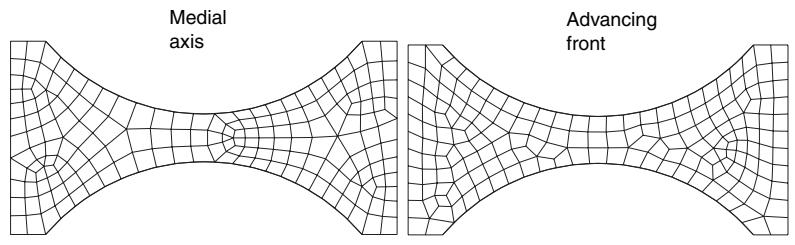
图1：两种算法都生成了可接受的网格。

由于前沿推进算法生成的单元遵循您的种子点，因此在窄区域中生成的网格可能包含一些单元扭曲。单元扭曲如图2所示。


图2：在某些情况下，前沿推进算法生成的单元具有一定的扭曲。

相比之下，前沿推进算法可能生成尺寸更均匀、纵横比更一致的单元，如图3所示。统一的单元尺寸在分析中可能发挥重要作用；例如，如果您正在为Abaqus/Explicit分析创建网格，网格中的小单元可能会过度控制时间步长的大小。此外，如果单元遵循您的种子点很重要，那么前沿推进算法是更可取的。

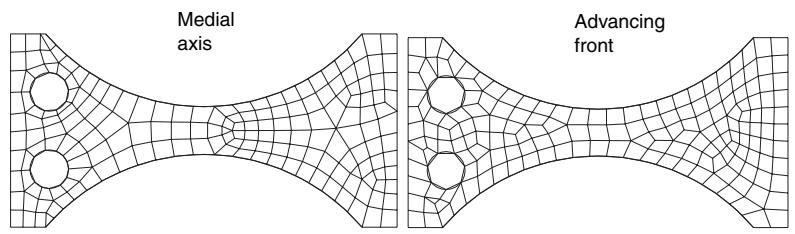
图3：在某些情况下，前沿推进算法生成的网格更均匀。

在某些情况下，当您对多个区域进行网格划分时，Abaqus/CAE会在区域之间的界面处生成带有错位单元的网格。一个区域中的节点可能与相邻区域中的节点位置不同，这导致Abaqus/CAE合并相邻网格时在公共边界处产生错位。图4显示了多个扫掠区域以及中轴法算法生成的最终网格。

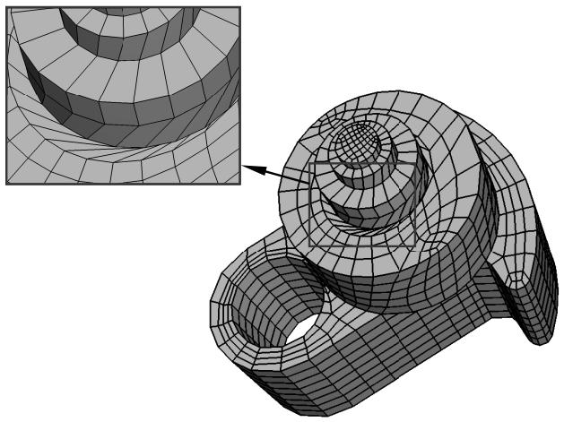
图4：使用中轴法算法，相邻区域之间的网格错位显著。

前沿推进算法将源侧的节点放置在与您的种子点相同的位置；因此，网格错位将减少。图5显示了使用前沿推进算法、采用相同种子点对同一部件进行网格划分的结果。但是，如前所述，您可能需要尝试这两种算法以获得最佳网格。


图5：使用前沿推进算法，相邻区域之间的网格错位减少了。

## 附加信息

• 设置网格算法

## 哪些类型的网格无法自动生成？

有几种类型的网格无法使用网格模块中的网格生成器创建：

## 相同装配体中部件实例之间的兼容网格

兼容性意味着相邻部件实例网格的单元面或单元边共享相同的节点，并且在公共界面处具有相同的拓扑结构。您无法规定实例之间的网格兼容性。但是，您可以使用装配模块中的合并/切割工具将多个实例合并为一个部件实例。然后，您可以从单个部件实例创建一个兼容的网格。有关更多信息，请参见部件实例之间的兼容网格。

## 对称网格

您无法确保Abaqus/CAE会对称部件或部件实例生成对称网格。

## 自下而上的网格

自下而上的网格划分是一个手动过程。您必须为已分配自下而上网格划分技术的每个区域设置并应用参数来创建网格。

## Abaqus/CAE何时会删除网格？

部件、部件实例或区域的以下属性会影响网格的生成方式：

• 种子
• 单元形状
• 网格划分技术
• 网格划分算法
• 二维结构化区域的逻辑角
• 过渡控制
• 扫掠区域的扫掠路径

如果您更改了列出的任何属性，现有网格将不再与其属性一致。因此，Abaqus/CAE将删除网格，您可以重新创建一个与新属性匹配的新网格。（单元阶次和单元族是仅有的两个属性，更改它们不需要删除和重建网格。）

每当您对自顶向下网格划分区域进行更改，影响这些属性中的任何一个时，Abaqus/CAE会显示一个类似于图1所示的对话框。


图1：警告对话框。

您可以通过单击“删除网格”按钮来删除网格，也可以通过按“取消”按钮保留您的网格并退出该过程。

您还可以通过切换“自动删除因网格控制更改而失效的网格”来避免在当前会话中剩余时间内出现此警告消息。下次您尝试更改已包含网格的部件、部件实例或区域的属性时，网格将立即被删除，而不会显示任何警告。

如果您在删除网格之前将模型保存到模型数据库，如果您对后续的网格划分尝试不满意，可以恢复到该网格。

由于自下而上的网格创建可能非常耗时，Abaqus/CAE在许多情况下会尝试保留它们，而这些情况可能会导致自顶向下的网格被删除。在更改种子、分区和虚拟拓扑期间，自下而上的网格会被保留。当您对区域进行分区或创建虚拟拓扑特征时，网格将被保留，但会丢失与受分区或虚拟拓扑操作影响的几何体的关联性。


## 警告：

当您更改上述列出的网格划分属性之一时，无法避免删除自顶向下的网格。同样，如果您更改部件几何体，Abaqus/CAE总是会删除自顶向下和自下而上的网格而不发出警告。由于重新网格化对于大型或复杂模型可能很耗时，因此在更改这些属性时应谨慎。

有关删除网格的详细分步说明，请参见删除网格。

## 附加信息

• 网格-几何体关联
• 对先前已划分网格的部件、部件实例或区域设置种子
• 更改先前已划分网格区域的网格控制

## 我必须在单个操作中划分整个模型的网格吗？

Abaqus/CAE允许您以增量方式划分模型网格，其中每次网格划分操作划分模型的不同区域。

您可以使用增量网格来微调模型选定区域的网格，而无需重新划分整个模型的网格。

当您对选定区域进行网格划分时，Abaqus/CAE会尝试尽可能保留模型其他区域中的现有网格。但是，增量网格划分可能会强制现有网格边界上的节点移动，并可能降低区域之间界面处的网格质量。如果您的部件或部件实例包含接缝裂纹，则必须在单个操作中划分部件或部件实例的网格；不支持增量网格划分。

在某些情况下，Abaqus/CAE无法继续进行增量网格划分操作，并且必须在继续之前删除所有现有网格：
增量网格划分（Incremental meshing）如果无法满足现有网格与所选区域之间的种子设置，则无法继续进行。您必须允许 Abaqus/CAE 删除现有网格并对原始区域和所选区域进行重新网格划分。

例如，考虑图 1 中的部件实例。

  
图 1: 中心区域无法进行增量网格划分。

中心区域无法进行增量网格划分，因为一端具有 4 × 4 网格模式，而另一端具有 3 × 3 网格模式。如果您尝试仅对中心区域进行网格划分，Abaqus/CAE 将检测到此问题，并允许您在以下选项中进行选择：

- 对已网格划分的区域和中心区域进行重新网格划分，以生成兼容的网格。
- 取消对中心区域进行网格划分的操作。

• 如果现有网格需要从您尝试创建的网格派生出来，则增量网格划分无法继续。例如，考虑图 2 中的部件实例。

  
图 2: 区域必须按正确顺序进行网格划分。

为了在区域 1 和区域 2 之间创建兼容的网格，区域 2 的网格是从区域 1 中圆柱体的网格派生而来的。类似地，区域 3 的网格是从区域 2 的网格派生而来的，而区域 2 的网格又源自区域 1 中圆柱体的网格。因此，如果您先对区域 3 进行网格划分，Abaqus/CAE 将无法对区域 1 和 2 进行增量网格划分。您必须允许 Abaqus/CAE 先对区域 1 进行网格划分，然后再对已网格划分的区域进行重新网格划分。

如果增量网格划分无法继续，Abaqus/CAE 会在删除现有网格之前显示警告消息。

如果您希望对部件或装配体进行增量网格划分，您可以遵循一种策略，以最大限度地减少 Abaqus/CAE 需要删除现有网格的次数。网格划分策略取决于区域的拓扑结构、单元形状、网格划分技术和网格种子设置。

• 种子设置的更改始终向外传播到边界。因此，您应该从部件或部件实例的内部开始网格划分，并逐步向外进行到部件或实例的边界。
但是，如果您能识别出一组将使用扫掠方法（swept method）进行网格划分的相邻三维区域，则应从部件或部件实例的一侧开始网格划分，并穿过内部继续到部件或实例的另一侧。
通过三角形或四面体单元进行网格划分的区域，在增量网格划分期间永远不会强制删除整个网格。使用推进波前算法（advancing front algorithm）进行四边形单元主导网格划分的区域也是如此。Abaqus/CAE 可以随时对这些区域进行重新网格划分，您可以在任何时候对它们进行网格划分。

## 我可以更改网格中单元的几何阶次吗？

如果您已经对部件、部件实例或区域进行了网格划分，Abaqus/CAE 允许您在不重新创建整个网格的情况下更改单元阶次。如果您在线性单元和二次单元之间切换，Abaqus/CAE 只需根据需要添加或移除边中节点（midside nodes）即可。

如果部件或部件实例包含孤立元素（orphan elements），您可以更改所有元素的阶次，也可以仅更改选定元素的阶次。孤立元素不包含基础几何信息；因此，更改元素阶次时应谨慎。如果您将孤立元素从二次更改为线性，则所有关于边中节点位置的信息都将丢失。因此，如果您随后决定从线性更改为二次单元，您将无法恢复到原始网格。有关更多信息，请参见从 Abaqus/CAE 可以导入和导出哪些类型的文件？。

## 结构化网格划分与映射网格划分

本节描述结构化网格划分（structured meshing）和映射网格划分（mapped meshing）技术，以及这些技术可应用的区域类型。

## 本节内容：

什么是结构化网格划分？
什么是映射网格划分？
二维结构化网格划分
三维结构化网格划分
在凹边界附近使用结构化网格划分
Abaqus/CAE 何时可以应用映射网格划分？

## 什么是结构化网格划分？

结构化网格划分技术使用简单的预定义网格拓扑生成结构化网格。Abaqus/CAE 将规则形状区域（如正方形或立方体）的网格转换为您想要进行网格划分的区域的几何形状上。例如，图 1 展示了如何将三角形、正方形和五边形的简单网格模式应用于更复杂的形状。

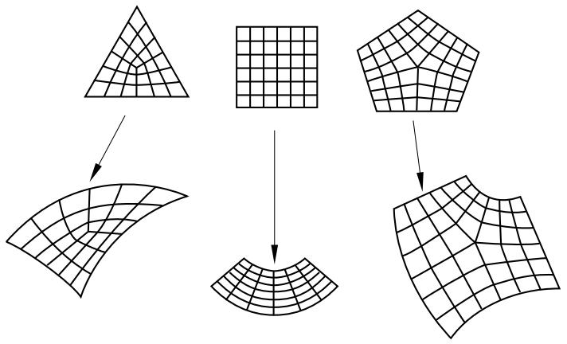  
图 1: 二维结构化网格模式。

您可以将结构化网格划分技术应用于简单的二维区域（平面或曲面）或已指定为六面体（Hex）或六面体主导（Hex-dominated）单元形状选项的简单三维区域。有关为区域指定单元形状的更多信息，请参见选择单元形状。

## 什么是映射网格划分？

术语“结构化网格划分”和“映射网格划分”在有限元分析文献中可以互换使用。然而，Abaqus/CAE 对这两个术语做了细微区分。映射网格划分是结构化网格划分的一个子集。映射网格划分仅指四边形二维区域的结构化网格划分——即图 1 中的方形网格模式。

一些看起来非常复杂的模型实际上包含具有相对简单几何形状的面。当您使用自由网格划分（free meshing）或扫掠网格划分（swept meshing）对此类模型进行网格划分时，这些面上的单元质量可能很差。但是，如果您允许 Abaqus/CAE 在几何形状合适的地方使用映射网格划分技术，它通常会生成质量良好的单元，特别是当该区域是一个细长的矩形面时。

您不能直接对某个区域应用映射网格划分。但是，您可以通过对区域进行网格划分并允许 Abaqus/CAE 在合适的地方应用映射网格划分来间接应用它。例如，图 1 展示了对部件进行自由网格划分并允许 Abaqus/CAE 在合适的地方使用映射网格划分的效果。

  
不使用映射网格划分

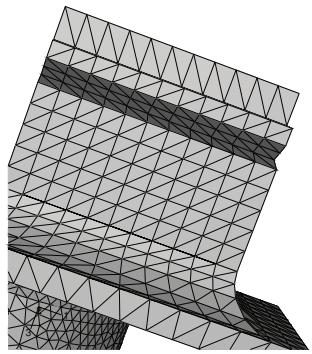  
允许 Abaqus/CAE 在合适的地方使用映射网格划分  
图 1: 允许使用映射网格划分的效果。

默认情况下，当您执行以下操作时，Abaqus/CAE 会在合适的地方使用映射网格划分：

• 使用推进波前算法（advancing front algorithm）对实体区域进行六面体或六面体主导单元的扫掠网格划分。
• 使用推进波前算法对壳区域进行四边形或四边形单元主导单元的自由网格划分。
• 使用四面体单元对实体区域进行自由网格划分。
• 使用三角形单元对壳区域进行自由网格划分。

## 二维结构化网格划分

如果二维区域具有以下特征，则可以使用结构化网格划分技术进行网格划分：

• 该区域没有孔、孤立边或孤立顶点。图 1 展示了无法进行结构化网格划分的区域。

  
图 1: 无法进行结构化网格划分的区域。

• 该区域由三到五个逻辑边（logical sides）界定，其中每条边是一个连接的边集合。

通常，结构化网格划分让您对 Abaqus/CAE 生成的网格拥有最多的控制权。如果您使用全部四边形单元对四边形区域进行网格划分，边界周围的单元边总数必须为偶数。对于三边形和五边形区域，约束方程更为复杂。在生成结构化网格时，Abaqus/CAE 会尽可能遵循种子分布（seed distribution）。（种子分布描述了种子之间的间距，不一定是指种子的数量。例如，种子是沿边均匀分布还是更集中在某一端？）但是，网格在各区域之间必须兼容，并且 Abaqus/CAE 可能会调整与使用自由网格划分技术进行网格划分的区域相邻的网格区域的节点。因此，单元节点可能无法完全匹配种子。

图 2 展示了四边形区域边上的种子以及不同网格控制的效果。

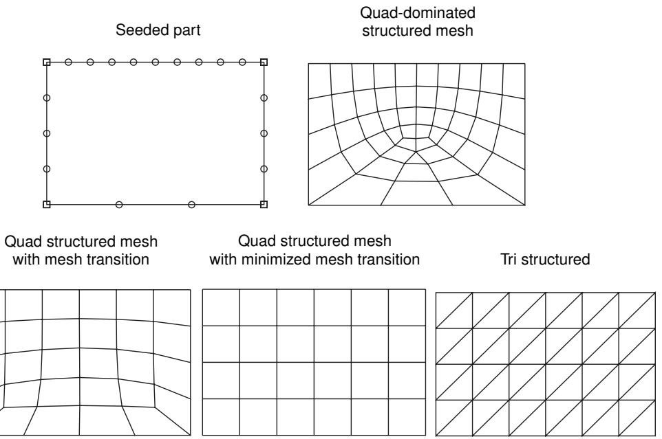  
图 2: 不同网格控制的效果。

网格控制效果如下：

• 在四边形区域中，四边形单元主导的结构化网格（quadrilateral-dominated structured mesh）会精确匹配种子设置。边界周围有奇数个单元，并且 Abaqus/CAE 会在网格中插入一个三角形单元。（相比之下，当您使用结构化四边形单元主导单元对三边形或五边形区域进行网格划分时，Abaqus/CAE 不会插入任何三角形单元。生成的网格使用全部四边形单元；然而，生成的网格可能无法完全匹配网格种子设置。）
• 两个四边形结构化网格与种子分布不匹配。当您选择最小化网格过渡时，这一点更为明显。
• 三角形结构化网格同样不匹配种子分布。Abaqus/CAE 通过将最小化网格过渡的四边形结构化网格的对角线分割来创建三角形网格。

如果边之间夹角较小，Abaqus/CAE 会自动将它们组合成一个逻辑边。例如，图 3 中的每个区域都有五条边。

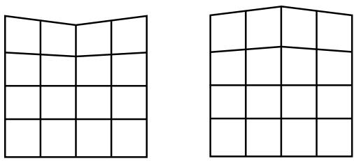  
图 3：夹角较小的边。

然而，由于每个区域顶部的两条边夹角较小，Abaqus/CAE 将这两条边视为一条逻辑边。因此，适用于四边区域的网格模式被应用到这些区域上。如果区域包含虚拟拓扑，则仅当该区域由四条边围成时，才能使用结构化网格技术对其进行网格划分。对于包含虚拟拓扑的三边或五边区域，您不能使用结构化网格技术。

您可以使用“网格控制”对话框中的“重新定义区域角点”按钮自行组合边，无论它们之间的夹角如何。（要显示“网格控制”对话框，请从主菜单栏中选择“网格”->“控制”。）此技术允许您控制将哪种结构化网格模式应用于二维区域。（此技术不适用于三维区域。）有关更多信息，请参阅重新定义区域角点。

您计划使用结构化四边形单元进行网格划分的区域形状必须良好；否则，Abaqus/CAE 可能会创建无效的单元，如图 4 所示。

  
图 4：区域形状必须良好。

如果网格包含无效单元，您可以使用几种技术来修正网格：

• 调整网格种子的位置。
• 重新定义区域角点。
• 将面划分为更小、形状更规则的区域。

应用每种技术的结果如图 5 所示。

  
图 5：修正包含无效单元的网格。

## 三维结构化网格划分

图 1 展示了可以使用结构化网格技术进行网格划分的简单三维区域的示例。
  
图 1：可以使用结构化网格技术进行网格划分的区域。

使用此技术对更复杂的区域进行网格划分可能需要手动分区。如果您不划分复杂区域，您唯一可用的网格划分选项可能是使用四面体单元的自由网格技术。使用结构化网格技术构建的网格由六面体单元组成，比四面体单元更受欢迎。

以下特征是成功使用结构化网格技术对三维区域进行网格划分所必需的：

• 区域不能包含任何孔洞、孤立面、孤立边或孤立顶点。例如，图 2 所示的区域不能使用结构化网格技术进行网格划分。

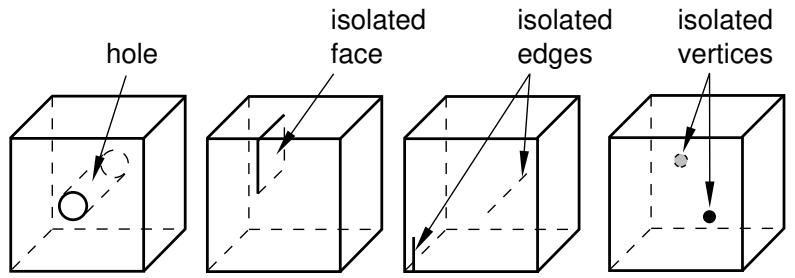  
图 2：不能使用结构化网格技术进行网格划分的区域。

您可以通过将孔洞的周长划分为两半、四分之一等来消除孔洞（无论它们是贯穿整个部件实例还是仅部分贯穿）。例如，图 3 中的四个分区将部件实例从一个带孔洞的区域转换为四个无孔洞的区域。

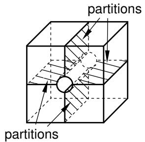  
图 3：分区可以使部件具备结构化网格划分条件。

应将圆弧限制在 $90^\circ$ 或更小，以避免边侧和边缘处的凹陷。例如，图 4 中的部件实例已被分区，使得带有 180° 圆弧的单个区域变为两个带有 90° 圆弧的区域。

  
图 4：将圆弧限制在 $90^\circ$ 或更小。

区域的所有面必须具有可以使用二维结构化网格技术进行网格划分的几何形状。例如，如果不进行分区，图 5 中部件两端的半圆各仅有两条边。（一个面必须至少有三条边才能使用结构化网格技术进行网格划分。）如果将部件分为两半，则每个半圆被分为两个各具有三条边的面。

  
图 5：分区创建了两个具有三条边的面。

在每个顶点处，区域必须恰好有三条边相交。例如，图 6 中未分区的金字塔顶部的顶点连接了四条边。但是，如果将金字塔分区为两个四面体区域，则每个独立区域中该顶点仅连接三条边。

  
图 6：分区后，每个独立区域中该顶点仅连接三条边。

• 区域必须至少由四条边围成（四面体区域）。如果区域由少于四条边围成，您可以根据需要划分区域以创建额外的边。
• 如果区域包含虚拟拓扑，则该区域必须由六条边围成。
如果区域不能使用结构化网格技术进行网格划分，您可以使用虚拟拓扑来组合面，直到该区域由六条边围成。图 7 展示了如何使用虚拟拓扑创建一个可以使用结构化网格技术进行网格划分的六边区域。

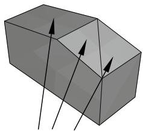  
1) 使用虚拟拓扑组合这三个面

  
2) 区域包含虚拟拓扑且为六边形

  
3) 应用结构化网格  
图 7：虚拟拓扑可以使部件具备结构化网格划分条件。

• 边之间的角度应尽可能接近 90°；应进行分区以消除大于 150° 的角度。
• 区域的每条边必须符合以下定义之一：

- 如果该区域不是立方体，则一条边必须对应一个单一的面；即，该边不得包含多个面。

如果该区域是立方体，则一条边可以是位于同一几何表面上的一组相连面。但是，每个面必须有四条边。此外，面的图案必须允许在网格划分立方体时，沿着该整条边以规则的网格图案创建六面体单元的行和列。例如，图 8 展示了两种可接受的面图案，以及使用结构化网格技术对立方体进行网格划分所得到的规则网格单元图案。

  
图 8：可接受的面图案及得到的网格。

图 9 中的边不具有可接受的面图案：

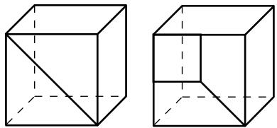  
图 9：不可接受的面图案。

左侧显示的面图案对于结构化网格划分是不可接受的，因为每个面只有三条边。右侧图案中的每个面都有四条边，但该图案不允许在立方体的分区边上创建规则的单元网格，如图 10 所示。

  
图 10：无法创建规则的单元网格。

## 在凹边界附近使用结构化网格

当您使用任何网格技术对区域进行网格划分时，网格边界上的节点总是位于几何区域的边界上。然而，当 Abaqus/CAE 使用结构化网格技术创建网格时，网格内部的节点可能会落在区域几何之外，从而导致网格扭曲、无效。这个问题通常发生在凹边界附近。

例如，图 1 中的区域有五条边；因此，当 Abaqus/CAE 使用结构化网格技术对该区域进行网格划分时，它会将正五边形的网格模式应用于该区域。

  
图 1：正五边形的网格模式被应用于该区域。

然而，如果您对区域进行种子分布设置以减少单元数量，如图 2 所示，由于高度弯曲边处的凹陷，会导致网格扭曲。网格模式内部的节点（在图 3 中用封闭圆圈表示）落在区域几何之外，而网格边界上的节点（在图 3 中用空心圆圈表示）仍然位于区域几何的边界上。
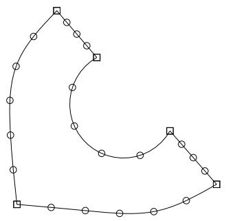  
图 2：指定较粗网格的种子。

当内部节点落在区域的几何体之外时，您可以尝试以下技术来改进网格：

•   更改网格种子并重新划分网格。例如，图 1 中高度弯曲边缘上的单元数量多于图 3。

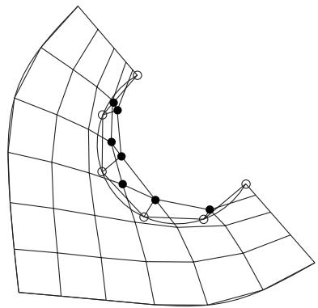  
图 3：网格内部的节点落在了区域的几何体之外。

•   将部件实例分割成更小、形状更规则的区域。例如，图 4 中的模型被分割成了三个区域。

  
图 4：分割区域。

选择不同的网格划分技术。此选项对于二维区域最为有用，您可以在保留网格中四边形单元的同时，从结构网格划分切换到自由网格划分。（三维自由网格划分仅限于四面体单元。更多信息，请参阅自由网格划分）。图 5 显示了使用自由网格划分技术划分网格的区域。

  
图 5：使用自由网格划分技术对区域进行网格划分。

图 5 中的网格不对称，这是自由网格的典型特征。

## Abaqus/CAE 何时应用映射网格划分？

当满足以下条件时，Abaqus/CAE 会判定映射网格划分适用于四边形区域：

•   很可能生成质量合理的规则网格模式，并且  
•   对网格种子进行的任何细微调整都不会违背用户的意图（由任何现有的种子约束所指示）。

当 Abaqus/CAE 应用映射网格划分时，它会对网格种子进行细微调整，以确保矩形区域的相对两侧具有相同数量的种子。如果您的模型很大且包含许多简单区域，与不进行映射网格划分相比，Abaqus/CAE 检查矩形区域并调整种子以生成映射网格可能需要稍长的时间。然而，对于大多数模型，与网格质量的提升相比，包含映射网格划分所花费的时间差异并不显著。

图 1 显示了一个壳体部件，它使用了 Abaqus/CAE 中可用的以下网格划分技术和算法，以三角形单元进行网格划分：

•   自由网格划分 (Free meshing)  
•   在适当时使用映射网格划分的自由网格划分 (Free meshing using mapped meshing where appropriate)  
•   结构网格划分 (Structured meshing)

  
图 1：以三种不同方式对壳体部件进行三角形网格划分。

在许多情况下，使用适当映射网格划分的自由三角形网格将与结构三角形网格相同。图 1 中的网格之所以不同，是因为 Abaqus/CAE 遵循了原始种子，并判定在该部件的一侧应用映射网格划分不合适。相比之下，当 Abaqus/CAE 创建结构网格时，它会显著调整种子以创建用户所请求的结构网格。

## 扫描网格划分

本节解释扫描网格划分技术，并描述可以应用此网格划分技术的区域类型。

## 本节内容：

什么是扫描网格划分？  
面的扫描网格划分  
三维实体的扫描网格划分  
圆柱形实体的扫描网格划分  
几何特征可能阻止部件进行扫描网格划分

## 什么是扫描网格划分？

Abaqus/CAE 使用扫描网格划分技术对复杂的实体和面区域进行网格划分。扫描网格划分技术包含两个阶段：

•   Abaqus/CAE 在区域的一侧创建网格，该侧称为源侧。  
Abaqus/CAE 复制该网格的节点，一次复制一个单元层，直到到达最终侧（称为目标侧）为止。Abaqus/CAE 沿一条边复制节点，该边称为扫掠路径。扫掠路径可以是任何类型的边——直边、圆弧边或样条线。如果扫掠路径是直边或样条线，则生成的网格称为拉伸扫掠网格。如果扫掠路径是圆弧边，则生成的网格称为旋转扫掠网格。

例如，图 1 展示了一个拉伸扫掠网格。要对此模型进行网格划分，Abaqus/CAE 首先在模型的源侧创建一个二维网格。然后，将该二维网格中的每个节点沿一条直边复制到每一层，直到到达目标侧。

  
图 1：拉伸实体的扫描网格划分技术。

为了确定一个区域是否可进行扫描网格划分，Abaqus/CAE 会测试该区域是否可以通过将源侧沿扫掠路径扫掠到目标侧来复制。通常，Abaqus/CAE 会选择最复杂的侧（例如，具有孤立边或顶点的侧）作为源侧。在某些情况下，您可以使用网格控制来选择扫掠路径。如果模型的某些区域过于复杂而无法进行扫描网格划分，Abaqus/CAE 会询问您是否希望在生成剩余区域的扫描网格之前将这些区域从选择中移除。您可以使用自由网格划分技术对复杂区域进行网格划分，或者将这些区域分割成可以进行结构网格划分或扫描网格划分的简化几何体。

当您为区域指定网格控制时，Abaqus/CAE 会指示扫掠路径的方向，并允许您控制该方向。如果区域可以向多个方向扫掠，Abaqus/CAE 可能会在其可以选择作为源侧的面上生成非常不同的二维网格。因此，扫掠路径的方向会影响生成的三维扫描网格的均匀性，如图 2 所示。

  
图 2：扫掠方向会影响扫描网格的均匀性。

此外，扫掠路径还控制着用于模拟垫片、连续壳、使用圆柱单元的圆柱形区域以及使用粘性单元的粘接接头的六面体单元和楔形单元的默认取向。更多信息，请参阅为区域指定垫片单元、使用连续壳单元对部件进行网格划分、圆柱形实体的扫描网格划分以及使用几何和网格工具创建具有粘性单元的模型。

## 面的扫描网格划分

Abaqus/CAE 只能对可以通过将源侧沿扫掠路径扫掠到目标侧来复制的面区域应用扫描网格划分技术。扫掠路径始终是一条边；然而，对于面区域，源侧和目标侧也都是边。面区域可以是拉伸的、旋转的、扫掠的或平面的。此外，拉伸面区域可以包含扭转，而旋转面区域可以包含平移。您可以使用 Quad（四边形）或 Quad-dominated（四边形为主）单元形状选项对面区域应用扫描网格划分技术。

如果您正在创建旋转扫掠网格，Abaqus/CAE 会对源侧进行网格划分，然后将该网格围绕旋转轴旋转到源侧。扫掠路径可以旋转完整的 360°。当源侧在某个点接触旋转轴时，您必须使用 Quad-dominated 单元形状选项，因为会在该点生成一层三角形单元。当单个面在两点接触旋转轴时，Abaqus/CAE 无法生成旋转面网格，除非该旋转面是球体。

例如，图 1 所示模型中，源侧在顶部接触旋转轴，并且在该点生成了一层三角形单元。

  
图 1：一层三角形单元。

（关于为区域指定单元形状的更多信息，请参阅选择单元形状。）

## 三维实体的扫描网格划分

Abaqus/CAE 可以对可以通过将源侧沿一条边扫掠到目标侧来复制的实体区域应用扫描网格划分技术。对于三维实体，扫掠路径是一条边，但源侧和目标侧是面。图 1 展示了拉伸扫掠网格——Abaqus/CAE 对源侧进行网格划分，然后沿一条边将该网格拉伸到目标侧。图 2 展示了旋转扫掠网格——Abaqus/CAE 对源侧进行网格划分，然后围绕圆弧边的轴将该网格旋转到目标侧。

  
图 1：拉伸扫描网格划分技术将源侧上的网格沿一条边扫掠。

  
图 2：旋转扫描网格划分技术将源侧上的网格沿一条圆弧边扫掠。

如果一个区域可进行扫描网格划分，Abaqus/CAE 可以在已指定 Hex（六面体）、Hex-dominated（六面体为主）或 Wedge（楔形）单元形状选项的区域上生成扫描网格。为了在源侧上生成初步的二维网格，Abaqus/CAE 分别使用具有 Quad、Quad-dominated 或 Tri（三角形）单元形状选项的自由网格划分技术。
在使用扫掠网格技术对实体区域进行六面体或六面体主导单元划分时，您可以选择中性轴（medial axis）或前沿推进（advancing front）网格划分算法。（Abaqus/CAE通过将两种算法在源端生成的四边形和四边形主导单元扫掠至目标端，来生成六面体和六面体主导网格。）但是，如果待划分区域包含虚拟拓扑，则只能使用前沿推进算法生成扫掠网格。更多信息请参阅《中性轴算法与前沿推进算法有何区别？》和《使用四边形和四边形主导单元进行自由网格划分》。

如果选择前沿推进算法，Abaqus/CAE会在适当时使用映射网格划分（mapped meshing）来优化部分区域的网格。（映射网格划分与结构化网格划分相同，但仅适用于四边区域。）Abaqus/CAE会判断是否适合用映射网格划分替代属于源端的任何面上的前沿推进算法。更多信息请参阅《什么是映射网格划分？》和《Abaqus/CAE何时可以应用映射网格划分？》。Abaqus/CAE使用映射网格划分在这些合适的边界面上创建四边形和四边形主导单元，然后将单元从源端扫掠至目标端，以创建六面体和六面体主导单元。

如果三维区域具有以下特征，则可以使用扫掠网格技术进行划分：

连接源端与目标端的每一侧必须仅包含单一表面，或由构成规则网格图案的四边组合面组成。图3提供了两种可接受的连接面图案示例。

  
图3：扫掠网格划分可接受的连接面图案。

图4中分割的连接侧面不具备扫掠网格划分可接受的面图案；左侧模型的扫掠面包含两个三边面，而右侧模型则没有规则的网格图案。

  
图4：扫掠网格划分不可接受的连接面图案。

目标端必须仅包含一个单一表面，且不能存在孤立边或孤立点。例如，图5左侧的区域可以使用扫掠网格技术进行划分，因为所有孤立边都位于源端；然而，右侧的区域无法使用此技术划分，因为目标端包含两个表面。

  
图5：仅左侧区域可以使用扫掠网格技术进行划分。

图6展示了一个沿变化横截面进行扫掠网格划分的部件。该部件看似相对复杂；例如，源端是非平面的，且部件的横截面沿扫掠路径发生变化。但是，生成扫掠网格的规则仍然适用。

- 连接源端与目标端的每一侧仅包含单一表面。  
虽然源端包含两个表面，但目标端仅包含一个表面。

  
图6：沿变化横截面进行网格扫掠。

您可能能够使用虚拟拓扑来组合目标端的表面，以使部件具备可扫掠网格划分的条件。图7展示了一个部件，在将目标端的五个表面使用虚拟拓扑组合成一个单一表面后，对其进行了扫掠网格划分。然而，由于该部件现在包含虚拟拓扑，因此只能使用前沿推进算法进行扫掠网格划分。

  
图7：组合表面使部件具备可扫掠网格划分的条件。

• 对于旋转体区域，用于旋转创建该区域的轮廓不得在一个或多个孤立点处接触旋转轴，如图8所示。

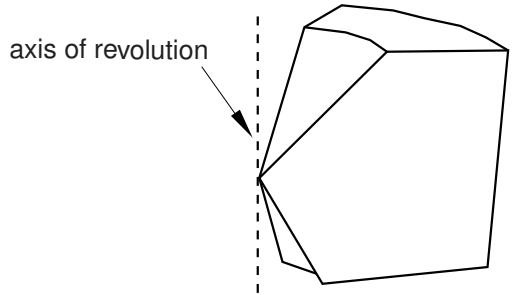  
图8：如果孤立点接触旋转轴，扫掠网格技术无法划分该部件。

• 类似地，如果一条或多条边沿旋转轴分布，如图9所示，Abaqus/CAE无法使用六面体或楔形体单元划分该区域。

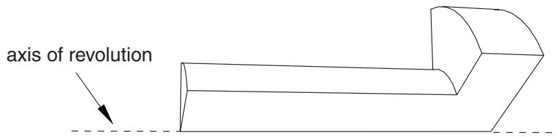  
图9：如果一条或多条边沿旋转轴分布，Abaqus/CAE无法使用六面体单元划分该区域。

但是，Abaqus/CAE可以通过沿旋转轴生成楔形体单元层，使用六面体主导单元划分该区域，如图10所示。

  
图10：Abaqus/CAE可以使用六面体主导单元划分该区域。

因此，在划分该区域之前，您必须选择“六面体主导”单元形状选项。或者，您可以将该区域分割成简单的结构化网格区域，并选择“六面体”单元形状选项以使用所有六面体单元创建网格。更多信息请参阅《扫掠划分轮廓接触旋转轴的实体旋转体区域》。

一个完全旋转体区域，如果不接触旋转轴，则只有当与被旋转轮廓相关的所有边都存在时才可划分。但是，限定轮廓的边不得形成一个面。图11展示了一个可划分的部件实例，其中旋转轮廓的所有边都存在。

  
图11：旋转轮廓的所有边都存在；因此，该部件实例是可划分的。

在此示例中，用户绘制了轮廓，Abaqus/CAE旋转该轮廓创建部件；但是，限定轮廓的边并未形成一个面。相比之下，图12展示了一个不可划分的部件实例，因为旋转轮廓的一些边缺失。

  
图12：旋转轮廓的一些边缺失；因此，该部件实例不可划分。

一个接触旋转轴的完全旋转体区域，只有当与被旋转轮廓相关的所有边（旋转轴上的边除外）都存在时才可划分。图13展示了一个可划分的部件实例，因为旋转轮廓的所有边都存在，除了沿旋转轴的那条边。如果轮廓包括沿旋转轴的边，则该部件实例将不可划分。

  
图13：旋转轮廓的所有边都存在，除了沿旋转轴的边；因此，该部件实例是可划分的。

• 如果旋转体区域是通过旋转包含样条线的草图创建的，则只有当样条线每一端的顶点不在旋转轴上时，该区域才可划分。  
• 如果部件是通过将横截面沿由封闭样条线组成的扫掠路径扫掠创建的，则只有当其被分割成两个或更多区域时，生成的部件才可划分。

## 圆柱实体的扫掠网格划分

您可以使用扫掠网格技术在圆柱体几何体上创建多种类型实体单元的网格，包括来自实体圆柱单元库的单元。如果将实体圆柱单元用于原生网格（native mesh），Abaqus/CAE会使用所选扫掠/旋转体区域的扫掠路径作为生成圆柱单元的周向方向。在创建网格之前，您应确认扫掠路径设置正确。

当您尝试使用圆柱单元划分实体几何时，Abaqus认为圆柱单元需满足以下要求：

• 圆柱单元圆形边上的中间节点必须精确位于边节点的中点。  
• 横截面上的所有节点必须位于同一径向平面内。  
• 单元内的所有圆形边必须跨越相同的角度。  
• 单元内圆弧的中心必须位于公共轴上。  
• 一个单元不能跨越超过180°。

这些要求意味着，您只能在旋转体部件或可以分割成旋转域的部件上创建有效的圆柱单元。图1中的S形拉伸体在分割成旋转区域后，可以使用圆柱单元进行网格划分。

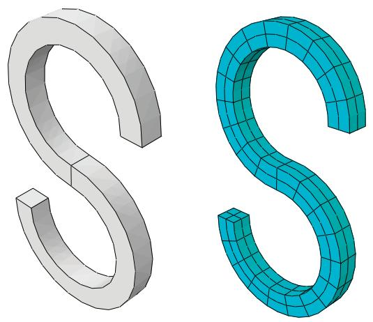  
图1：可用于实体圆柱网格划分的几何体。  
图2展示了三种类型的几何体——螺旋弹簧、带切口的旋转体部件和锥形部件——由于这些网格划分要求，无法使用实体圆柱单元进行划分。
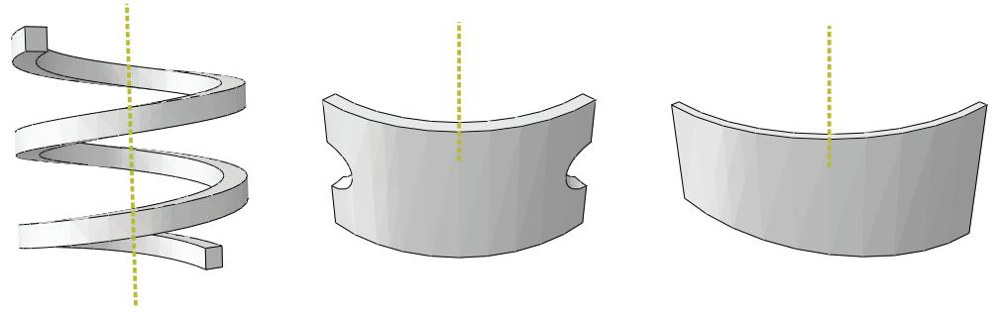  
图 2：无法使用圆柱形网格进行扫掠划分的几何体形式。

如果在一个旋转体区域中，连接源面和目标面的连接边之一因约束网格的内部边或多条边而被分割成多个面，则生成的单元很可能严重扭曲，无法用作圆柱形网格。您必须将实体区域分割成更简单的旋转体区域，如图 3 右侧的示例所示。

  
图 3：不适合使用圆柱形网格划分的实体区域（左）以及通过使用分割使其适合使用圆柱形网格划分的相同区域（右）。

当您通过为网格部件分配圆柱形网格来编辑它时，Abaqus/CAE 会将每个圆柱形单元的面 1 和面 2 视为其径向平面上的面。图 4 展示了几种类型圆柱形单元的这些面的位置。在为部件分配圆柱形单元类型之前，您应该为其单元设置堆叠方向；有关更多信息，请参阅**设置堆叠方向**中的描述。

  
图 4：圆柱形单元的节点顺序和面编号说明（面 1 和面 2 为阴影部分）。

## 几何特征可能阻止部件进行扫掠网格划分

**三维实体扫掠网格划分**中描述的区域特征被称为“拓扑特征”。在某些情况下，所有拓扑特征都适用于某个区域；但是，Abaqus/CAE 不允许对该区域进行扫掠网格划分，因为某些“几何特征”未得到满足。Abaqus/CAE 在确定一个区域是否可进行扫掠网格划分时所寻找的几何特征很难量化。通常，如果一个三维区域满足以下几何特征，则可以使用扫掠网格划分技术进行网格划分：

• 如果源边包含多个面，则这些面之间的夹角必须相对平坦（接近 180°）。  
• 连接源边和目标边的每个面（连接边）必须有四个角。每个角的角度必须接近 90°。  
• 源边与每个连接边之间的夹角应接近 90°。同样，目标边与每个连接边之间的夹角也应接近 90°。

例如，图 1 显示了一个源边有三个面的部件。当构成源边的面之间的夹角减小时，该部件不再满足可扫掠网格划分区域的几何特征。

  
图 1：扫掠网格划分取决于几何特征。

您可以应用虚拟拓扑来满足几何特征，并使部件可进行扫掠网格划分。例如，图 2 说明当源边的三个面使用虚拟拓扑组合时，部件变得可进行扫掠网格划分。但是，生成的网格质量较差。

  
图 2：应用虚拟拓扑可能导致网格质量差。

在某些情况下，即使几何特征未得到满足，Abaqus/CAE 仍会允许您创建扫掠网格。其目的是允许您尽可能地创建扫掠网格。但是，生成的网格可能质量较差，或者无效。为确保您的扫掠网格是可接受的，您应该使用网格验证工具来验证其质量。有关更多信息，请参阅**验证单元质量**。

## 自由网格划分

本节说明如何使用自由网格划分技术对二维或三维模型进行网格划分。

## 本节内容：

什么是自由网格划分？  
使用四边形和四边形主导的单元进行自由网格划分  
使用三角形和四面体单元进行自由网格划分  
什么是四面体边界网格？  
我可以对边界网格做什么？

## 什么是自由网格划分？

与结构化网格划分不同，自由网格划分不使用预先建立的网格模式。当您使用结构化网格划分技术对区域进行网格划分时，您可以根据区域拓扑预测网格模式。相反，在创建网格之前，无法预测自由网格模式。

由于它是无结构的，自由网格划分比结构化网格划分具有更大的灵活性。您使用自由网格技术划分网格的区域拓扑可以非常复杂。

您可以使用此技术，使用 **Tri**、**Quad** 或 **Quad-dominated** 单元形状选项对二维区域进行网格划分，或使用 **Tet** 单元形状选项对三维区域进行网格划分。有关将单元形状分配给区域的更多信息，请参阅**选择单元形状**。

## 使用四边形和四边形主导的单元进行自由网格划分

使用四边形单元进行自由网格划分是二维区域的默认网格划分技术。使用四边形单元的自由网格划分技术可应用于任何平面或曲面。使用此技术生成的网格示例如图 1 所示。自由网格通常不是对称的，即使部件或部件实例本身是对称的。

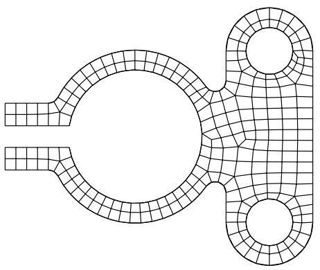  
图 1：使用四边形单元生成的自由网格。

Abaqus/CAE 允许您在创建四边形或四边形主导网格时选择两种网格划分算法。有关更多信息，请参阅**中性轴算法与前进式算法有何区别？**

## 中性轴算法

当您使用中性轴算法对复杂区域进行四边形单元的自由网格划分时，Abaqus/CAE 会创建内部分区，将区域划分为简单的结构化网格区域，然后对较小的区域进行种子设置。

如果您使用中性轴算法对区域进行网格划分，然后重新划分网格（例如，在修改种子之后），Abaqus/CAE 会存储内部分区，并且新网格的生成速度更快。此外，内部分区允许 Abaqus/CAE 在与生成粗网格所需时间相似的时间内生成细网格。您不能使用中性轴算法对包含虚拟拓扑的区域进行网格划分，并且它对不精确的部件效果不佳。

通常，基于中性轴的四边形单元自由网格与网格种子不完全匹配，原因如下：

• Abaqus/CAE 会尝试平衡相邻区域之间以及内部划分创建的较小区域之间的种子。  
• Abaqus/CAE 会尝试最小化单元扭曲。

但是，当您应用固定种子约束时，Abaqus/CAE 会精确匹配种子数量，并尝试精确匹配种子位置。图 2 展示了带有固定种子和可移动种子的二维板以及生成的全四边形网格。

  
图 2：固定种子和可移动种子以及中性轴网格划分算法。

您应该只在少数边上指定固定种子，否则 Abaqus/CAE 可能无法生成网格。例如，如果您在图 2 所示的板的其中一个孔周围指定了固定种子，则全局种子设置将变得过度约束，Abaqus/CAE 将无法生成网格。

使用中性轴算法，使用四边形主导单元生成的自由网格类似于使用全四边形单元生成且没有过渡最小化的自由网格；但是，Abaqus/CAE 会插入一些孤立的三角形单元，以更紧密地匹配网格种子。Abaqus/CAE 使用四边形主导单元生成网格的速度比使用全四边形单元生成网格的速度更快。

## 前进式算法

当您使用前进式算法对复杂区域进行四边形单元的自由网格划分时，Abaqus/CAE 会在区域边界处生成四边形单元，并在系统地向区域内部移动时继续生成四边形单元。

当您选择前进式算法时，Abaqus/CAE 会精确匹配种子（在创建三维旋转网格且旋转的轮廓接触旋转轴的情况除外）。精确匹配种子的四边形网格如图 3 所示。

  
图 3：固定种子和可移动种子以及前进式网格划分算法。

通常，前进式算法生成的网格过渡比中性轴算法生成的过渡更可接受；但是，在狭窄区域精确匹配种子可能会损害网格质量。与中性轴算法相比，您可以将前进式算法与不精确部件以及包含虚拟拓扑的区域结合使用。
如果您选择前沿推进算法，Abaqus/CAE 也会在适当时使用映射网格划分。（映射网格与结构网格相同，但仅适用于四边形区域。）有关更多信息，请参阅什么是映射网格？和 Abaqus/CAE 何时可以应用映射网格？。当使用映射网格时，Abaqus/CAE 会对网格种子进行微小调整。如果您不希望种子发生变化，可以使用网格控制来防止使用映射网格。有关更多信息，请参阅指定网格控制。

默认情况下，当使用中轴线算法生成自由四边形网格时，Abaqus/CAE 会最小化网格过渡。最小化网格过渡会生成更好的网格，并且速度更快；但是，生成的节点会偏离网格种子更远。图 4 展示了使用中轴线算法在最小化和不最小化网格过渡的情况下，以及使用前沿推进算法划分的同一平面部件实例。

  
图 4：网格过渡和网格划分算法的影响。

## 使用三角形和四面体单元的自由网格划分

使用三角形单元的自由网格可以应用于任何平面或曲面，并且部件可以是精确的或非精确的。有关更多信息，请参阅什么是有效且精确的部件？。使用三角形单元的自由网格能完全匹配网格种子。这种网格划分技术可以处理单元尺寸的大范围变化，当您只想细化部分网格时非常有用。Abaqus/CAE 计算自由三角形网格所需的时间大致与单元和节点的数量成线性增长。图 1 展示了使用此技术生成的网格示例。

  
图 1：使用三角形单元生成的自由网格。

使用四面体单元的自由网格可以应用于几乎任何三维区域；实际上，使用此技术可以划分非常复杂的模型，无需借助分区。使用四面体单元的自由网格与使用三角形单元的自由网格类似，部件可以是精确的或非精确的。通常，Abaqus/CAE 会完全匹配网格种子，但如果网格种子未完全约束，网格可能会在小孔周围更细。图 2 展示了一个自由四面体网格的示例。

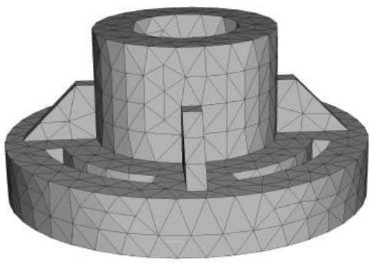  
图 2：使用四面体单元生成的自由网格。

不支持使用六面体单元对三维实体进行自由网格划分。

在尝试使用四面体单元生成自由网格之前，应使用 Part 模块或 Mesh 模块中的查询工具集来检查部件或装配体的几何形状。您应检查以下内容：

*   实体中没有自由边。
*   没有短边、小面或小的面角。

有关更多信息，请参阅使用几何诊断工具。

当您使用四面体单元创建自由网格时，您可以使用默认的网格生成算法，或者关闭默认算法以使用 Abaqus/CAE 6.4 及更早版本中包含的算法。默认算法鲁棒性显著更强，特别是在对复杂形状和薄实体进行网格划分时。此外，默认算法允许您增大内部单元的尺寸。如果网格密度足以分析所研究的模型，并且感兴趣区域位于网格边界上，增大内部单元的尺寸将提高计算效率。

当您使用自由网格在表面上创建三角形单元时，Abaqus/CAE 会在适当时对某些区域使用映射网格。（映射网格与结构网格相同，但仅适用于四边形区域。）有关更多信息，请参阅什么是映射网格？和 Abaqus/CAE 何时可以应用映射网格？。Abaqus/CAE 仅在结果网格质量可能得到改善的情况下，才会用映射三角形网格替换自由三角形网格。如果需要，您可以使用网格控制来防止 Abaqus/CAE 允许使用映射网格。有关更多信息，请参阅指定网格控制。

类似地，当您使用自由网格创建四面体单元时，您可以允许 Abaqus/CAE 决定映射网格是否合适。Abaqus/CAE 确定结果网格质量将得到改善后，会在简单的边界面上用映射网格替换自由网格，并将生成的三角形转换为四面体单元。

图 3 展示了在使用四面体单元对实体部件进行自由网格划分时，允许在适当地方使用映射网格的效果。在可以进行映射网格划分的四边形区域中，网格质量得到了改善。

  
自由网格划分

  
在适当地方允许映射网格的自由网格划分  
图 3：允许使用映射网格的效果。

要查看 Abaqus/CAE 生成的内部四面体单元，您可以从当前网格创建一个新的网格部件，并使用显示组移除选定的单元。您也可以在分析完成后通过使用 Visualization 模块中的视图截面来查看内部单元。有关更多信息，请参阅使用显示组显示模型的子集和截面切割模型。

## 什么是四面体边界网格？

当 Abaqus/CAE 在实体上生成使用四面体单元的自由网格时，网格划分过程包括两个阶段：

1.  在实体区域的面上生成三角形的边界网格。
2.  Abaqus/CAE 使用这些三角形作为四面体单元的面来生成四面体网格。

对于自下而上网格区域的几何面，创建四边形边界网格和六面体实体网格的过程相同（有关更多信息，请参阅为自下而上区域创建边界网格）。

如果您的部件很复杂，生成自由四面体网格可能很耗时。在为整个部件生成网格之前，预览边界面上的网格可以帮助您识别问题。您可以在网格划分过程的第一阶段之后，通过在提示区中切换到“预览边界网格”来在生成网格之前预览边界面上的三角形。如果网格可接受，您可以继续划分区域内部的网格。如果网格不可接受或某些区域网格划分失败，Abaqus/CAE 提供了各种工具来修正问题。有关更多信息，请参阅使用边界网格可以做什么？。

如果您决定预览某个区域的三角形边界网格，即使您的最终意图是划分实体网格，Abaqus/CAE 也会允许您选择要划分网格的面。当您切换到“预览边界网格”时，Abaqus/CAE 会自动将提示区中的选择过滤器更改为选择“面”。有关更多信息，请参阅根据对象类型过滤选择。

当选择了“网格默认颜色映射”时，Abaqus/CAE 使用白色显示边界网格，以代表边界单元，这与 Abaqus/CAE 用于代表最终网格的青色形成对比。当您查询四面体边界网格时，Abaqus/CAE 将这些单元称为“三角形边界单元”。相反，当您查询最终网格时，Abaqus/CAE 将这些单元称为“线性四面体单元”或“二次四面体单元”。边界面上的三角形没有几何阶次的概念。

## 使用边界网格可以做什么？

当 Abaqus/CAE 在实体上生成使用四面体单元的自由网格时，它首先会在实体区域的外表面上生成三角形的边界网格，如什么是四面体边界网格？中所述。

当您创建自由四面体网格时，Abaqus/CAE 可以在边界面上创建自由网格或映射网格；两种机制控制此三角形表面网格的网格模式：

## 与三维区域关联的全局网格控制

全局控制始终存在。当您将自由四面体网格划分技术指定给该区域时，它们就会被设置。您可以使用它们在 Abaqus/CAE 确定映射网格合适的区域创建映射网格，或者在所有边界面上创建自由网格。

## 在区域选定面上指定的局部网格控制

要指定局部控制，您可以选择区域的一个或多个面，并指定 Abaqus/CAE 应在选择对象上创建自由网格、映射网格还是结构网格。如果您定义了局部控制，它们将覆盖全局控制。

如果您将结构技术指定给将进行四面体网格划分的实体区域的面，这些面会显示为绿色，以显示表面网格的技术分配。（有关指定网格控制的详细说明，请参阅指定网格控制。）


## 注意：

绿色高亮仅在您为面指定网格控制时应用。当此过程结束时，将显示全局网格控制的颜色。

此外，Abaqus/CAE 会高亮显示网格划分失败的任何边界面。这些失败通常是由于网格种子过粗或存在微小的边或面造成的。您可以将高亮的面保存到一个集合中，并且可以仅对该集合中的面应用更精细的种子。有关为集合中的面设置种子的更多信息，请参阅 Can I seed a face or a cell?。您可以使用显示组来仅显示该集合中的面。有关更多信息，请参阅 Plotting display groups。

您可以使用查询工具集查询边界网格。此外，您可以使用网格验证工具检查边界网格的质量。网格验证工具允许您检查所有边界三角形单元的质量，或者您可以使用选择过滤器仅检查所选面的边界三角形单元的质量。

如果微小的边或面阻止 Abaqus/CAE 生成可接受的四面体网格，您可以尝试以下方法：

*   使用几何诊断工具查找小实体，如短边、小面以及具有小面角（影响网格质量）的面。您可以创建一个包含这些小实体的集合。有关更多信息，请参阅 Using the geometry diagnostic tools。
*   使用几何编辑工具集移除多余的边和顶点。您也可以移除一个面并缝合由此产生的间隙。有关更多信息，请参阅 Editing techniques。
*   使用虚拟拓扑工具集忽略微小的边或面。有关更多信息，请参阅 What can I do with the Virtual Topology toolset?。
*   添加分区以减小长窄面或单元的长宽比。有关更多信息，请参阅 The Partition toolset。
*   使用编辑网格工具集修改预览网格。您可以在网格模块中执行以下操作：
    *   编辑节点
    *   折叠单元边
    *   交换一对相邻三角形单元的对角线
    *   拆分单元边

有关更多信息，请参阅 What can I do with the Edit Mesh toolset?。

在某些情况下，由于表面网格中存在非常薄的三角形单元或某些条状面无法用三角形进行网格划分，您可能无法使用四面体单元对导入的实体部件进行网格划分。Using a combination of tools to mesh an imported solid part with tetrahedral elements 描述了如何使用编辑网格工具集和网格模块中的其他工具来成功地对该部件进行网格划分。

## 自底向上网格划分

本节解释自底向上网格划分技术，并描述可以应用此网格划分技术的区域类型。同时也解释了相关的网格关联性主题。

## 本节内容：

*   什么是自底向上网格划分？
*   自底向上网格划分域
*   自底向上网格划分方法
*   为自底向上网格选择参数
*   为自底向上区域创建边界网格
*   改善自底向上区域的边界网格质量
*   定义自底向上扫掠网格的连接侧面
*   创建自底向上网格
*   包含自底向上网格划分技术的示例

## 什么是自底向上网格划分？

自底向上网格划分是一种手动的、增量的网格划分过程，允许您在任何实体区域中构建六面体网格。结构化、扫掠和自由网格划分技术都以自上而下的方式工作——它们直接与几何体相关联，使得生成的网格填充几何体。自底向上网格划分放松了网格与几何体之间的约束，使您可以构建忽略某些几何特征的网格。您也可以使用自底向上网格划分技术来修改网格部件，在这种情况下无需考虑几何特征。如果您处理的是几何体，那么您在自底向上网格中创建的单元将始终与您进行网格划分的实体区域相关联，但网格边界可能与该区域的几何边界不相关联。这允许您仅使用六面体单元创建网格，而自上而下的网格划分技术可能需要大量的分区或使用四面体单元才能完成网格划分。然而，放松的几何约束也意味着您必须仔细选择用于创建网格的参数，因为它可能与几何体有显著差异。一旦 Abaqus 生成了自底向上网格，您需要评估它是否适合于分析，并且如果存在几何体，还要验证网格是否正确与之关联。

您可以将自底向上网格划分应用于任何实体区域，包括可以使用自上而下技术进行网格划分的区域，以及没有任何关联几何体的网格。由于自底向上网格划分是一个可能非常耗时的手动过程，因此建议仅在自上而下方法无法生成令人满意的网格时才使用此方法。

生成所需的网格可能需要多次应用自底向上网格划分技术。如果需要多次应用，每个自底向上网格将成为下一个网格的增量构建块，直到您完成该区域的网格划分。每次应用自底向上网格划分技术涉及四个阶段：

1.  您选择 Abaqus/CAE 将在其中创建网格的域。您可以选择一个三维几何区域或孤立单元。
2.  您选择 Abaqus/CAE 将用于创建网格的方法。您可以从以下方法中选择：
    *   扫掠 (Sweep)
    *   拉伸 (Extrude)
    *   旋转 (Revolve)
    *   偏移 (Offset)（仅可用于孤立单元选择）
3.  您选择 Abaqus/CAE 将用于创建二维网格的侧面，称为源侧，该网格将被扫掠、拉伸或旋转以填充三维区域。
4.  您选择剩余的参数以完成自底向上网格的定义。例如，如果您选择了扫掠方法，您可以选择连接侧面和目标侧面。

此外，在您可以使用自底向上网格继续生成区域网格之前，可能需要编辑它们或将其与几何体关联。有关更多信息，请参阅 The Edit Mesh toolset。

图 1 展示了一个无法使用自上而下技术用六面体单元进行网格划分的部件。

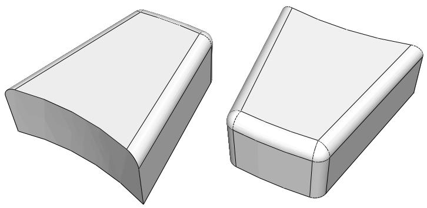  
图 1：复杂的几何体（如圆角）会阻碍自上而下的网格划分。

图 2 中的部件使用自底向上扫掠法进行了网格划分。用户选择了六个面作为源侧（洋红色），选择了隐藏的后面作为目标侧（白色），并使用其余六个侧面作为连接侧面（黄色），如图所示。在此示例中，所选的侧面都是几何面；Abaqus/CAE 还允许您选择单元面和二维单元来定义自底向上网格的源侧和连接侧面。

  
图 2：使用扫掠法的自底向上网格。

您可以从扫掠、拉伸或旋转方法中选择一种来对选定的几何区域进行网格划分，如果您处理的是孤立单元，还可以选择偏移法。根据区域的形状和分析意图，可能有不止一种方法能产生可接受的结果。您选择的方法及其相应参数将决定网格与几何体的吻合程度（如果适用）。例如，图 3 显示了与图 2 相同的部件；这次该部件使用拉伸法进行网格划分。拉伸法的参数包括一个源侧、一个拉伸矢量和层数。如图 3 所示，拉伸网格未能捕捉到模型背面的锥形侧面和圆角。

  
图 3：使用拉伸法的自底向上网格。

如果这些细节不重要，这个简化的网格可能是可接受的。或者，您可以通过修改或删除超出原始几何体的节点和单元来编辑生成的网格。有关编辑网格的更多信息，请参阅 The Edit Mesh toolset。

如果生成的自底向上网格不可接受，您可以删除它并为同一区域尝试不同的自底向上方法，或者对该区域进行分区并对由此产生的更简单的区域进行网格划分。您还可以使用网格的撤销和重做功能来撤销自底向上网格划分过程中的步骤，而不是删除该区域的整个自底向上网格并重新开始。


## 注意：

在某些操作后，例如删除区域网格后，撤销和重做不可用。

撤销和重做功能与编辑网格工具集使用的相同（有关更多信息，请参阅 Undoing or redoing a change in the Edit Mesh toolset）。
## 自下而上网格划分域

开始创建自下而上网格时，首要要求是定义将创建网格的**域**。域决定了自下而上网格是作为原生网格还是作为一组孤立节点和单元来创建。要创建原生网格，您需要选择一个已在“网格控制”（Mesh Controls）对话框中被分配了“自下而上网格划分”技术的三维几何模型区域。（有关更多信息，请参阅“分配网格控制”。）如果没有分配自下而上技术的几何区域，则必须创建一个或使用孤立单元域。

选择一个三维区域作为域也表明您打算将自下而上网格与几何体完全关联。网格与几何体之间的关联对于将载荷、边界条件和其他信息从几何体传递到网格是必要的。网格-几何体关联在“网格-几何体关联”中有讨论。

选择孤立单元作为域则表明自下而上网格将不会与几何体完全关联。创建的单元可能不与任何几何体关联，或者您可以将创建的孤立网格实体与相邻的几何面关联。将孤立网格面与相邻的几何面关联，可以让 Abaqus/CAE 在您为几何体划分网格时创建兼容的网格。

## 自下而上网格划分方法

每种自下而上方法的控制参数类似于 Abaqus/CAE 内部用于为三维实体创建可比的自上而下扫掠网格的参数。自下而上方法及其相关参数定义如下：

## 扫掠（Sweep）

扫掠法通过将一个二维网格沿扫掠路径移动来创建三维网格。扫掠法如图 2 所示。当区域的横截面在起始侧和结束侧之间发生变化时，您应该使用自下而上的扫掠网格划分方法。要使用扫掠法，您必须首先选择一个**源侧**（Source side），它定义了 Abaqus/CAE 将在其上创建二维网格的一个或多个面。源侧可以是几何面、单元面和二维单元的任意组合。您可以通过选择**连接侧**（Connecting sides）来定义扫掠路径，连接侧定义了所需扫掠区域的侧面。如果定义了连接侧，网格将紧密贴合所选侧面沿线的几何体或网格。或者，对于几何体，您可以选择一个**目标侧**（Target side）并指定**层数**（Number of layers），允许 Abaqus/CAE 通过在源侧和目标侧之间插值来创建扫掠路径。目标侧是一个单一的面，Abaqus/CAE 用它来结束网格。层数指的是将在源侧和目标侧之间放置的单元层数——如果使用连接侧，则连接侧的二维网格定义了单元层数。Abaqus/CAE 将二维网格从源侧扫掠到实体区域的体积中，以创建网格。

## 拉伸（Extrude）

拉伸法是扫掠法的一个特例，其路径是由一个方向和一个距离定义的线性路径。拉伸法如图 3 所示。您应该将拉伸法用于具有恒定横截面和线性扫掠路径的区域。自下而上拉伸网格有三个必需参数。与扫掠法一样，您选择定义 Abaqus/CAE 将在其上创建二维网格的区域的**源侧**。然后，您选择定义拉伸方向并可用于定义拉伸距离的**矢量**（Vector）的起点和终点。最后，您指示**层数**（Number of layers），以定义源侧与拉伸网格末端之间的单元数量。如果使用矢量定义拉伸距离，则定义完成。但是，您可以**指定距离**（Specify a distance）或使用**投影到目标**（Project to target）并选择一个目标侧来定义拉伸距离。目标侧可以从视口中的任何几何体、网格或基准平面中选择；它不必与源侧属于相同的部件实例。Abaqus/CAE 沿着拉伸矢量的方向从源侧拉伸二维网格。如果您选择目标侧来定义拉伸距离，Abaqus/CAE 将在目标侧结束拉伸网格。图 1 显示了左侧的源侧和目标侧；拉伸矢量（未显示）从矩形源侧的中心延伸到圆柱体的中心。生成的拉伸网格是源侧网格的延伸。它紧密匹配目标侧的形状，但不会尝试匹配目标侧上网格的节点位置。

  
图 1：可选的目标侧（白色显示）用于定义拉伸距离。

**偏置比率**（Bias ratio）参数定义了在创建多于一层的情况下，拉伸自下而上网格中源侧与末端之间单元厚度的变化。偏置比率是拉伸网格中第一层单元厚度与最后一层单元厚度的比率。默认偏置比率为 1.0，表示整个拉伸距离内单元厚度相等。

## 旋转（Revolve）

旋转法是扫掠法的另一个特例。在这种情况下，扫掠路径是由一个轴和一个旋转角度定义的圆形路径。旋转法如图 2 所示。您应该将此方法用于具有恒定横截面和圆形扫掠路径的区域。与扫掠法和拉伸法一样，您选择定义 Abaqus/CAE 将在其上创建二维网格的区域的**源侧**。源侧不能与旋转轴相交，但可以包含与轴重合的边。如果是这样，接触旋转轴的单元将在旋转网格中创建一层楔形单元。源侧不应包括任何沿旋转轴的三角形单元。然后，您选择定义旋转轴的**轴**（Axis）的起点和终点。最后，您指示**角度**（Angle）和**层数**（Number of layers），以定义源侧与旋转网格末端之间的单元数量。Abaqus/CAE 将二维网格从源侧按指定角度旋转，并将生成的区域均匀划分为所需的单元层数。如果从起点看向终点，沿旋转轴观察，旋转方向是顺时针的。

  
图 2：自下而上旋转法将源侧网格绕轴按指定角度扫掠。

## 偏移（Offset）

偏移法的工作原理与“编辑网格”（Edit Mesh）工具集中的“偏移”（创建实体层）（Offset (create solid layers)）相同；它通过偏移选定单元来创建一层或多层实体单元。仅当您处理孤立单元时，偏移才可用。要创建偏移自下而上网格，您需要输入偏移单元的总厚度和所需的单元层数。您可以创建一个单元集或扩展现有集合，但不能像在“编辑网格”工具集中那样创建顶面和底面。如果您选择壳单元作为源，则必须在提示区指示所需的偏移方向；您可以向两个方向偏移壳单元。如果您的壳单元选择包含尖角，请打开“**角处保持恒定厚度**”（Constant thickness around corners），以在单元相交的角处保持与选择区域其余部分相同的总厚度。使用此选项可以减少单元畸变并防止单元塌陷，特别是当单元偏移到角的内侧时（有关更多信息，请参阅“减少网格偏移过程中的单元畸变和塌陷”）。

## 为自下而上网格选择参数

您用于创建自下而上网格的参数类似于 Abaqus/CAE 用于创建可比的自上而下扫掠网格的参数。在自上而下的网格划分方法中，Abaqus/CAE 会自动为区域选择所需的几何侧面。自上而下的扫掠网格（包括拉伸和旋转网格）在“三维实体的扫掠网格划分”中有讨论。自下而上网格方法中使用的参数如下所述。

## 源侧（Source side）

**源侧**是一个必需参数，它定义了 Abaqus/CAE 将在其上创建二维网格的一个或多个面，该二维网格将被扫掠、拉伸或旋转以创建三维网格。源侧可以是几何面、单元面和二维单元的组合；您也可以选择已保存的曲面，而不是从视口中选择。对于自上而下的网格，Abaqus/CAE 限制它选择作为源侧的多个面之间的角度（有关更多信息，请参阅“几何体的特征可能阻止部件可进行扫掠网格划分”）。对于自下而上网格，您可以选择作为源侧的面之间的角度没有限制。然而，源侧面之间或源侧与目标侧之间增加的角度将导致三维单元质量下降。
## 连接侧

连接侧定义了扫掠区域的方向。连接侧可以是几何面、单元面和二维单元的组合。每个连接侧必须仅由单个四边形几何面构成，或者由构成规则网格图案的四边形组合几何面、单元面和二维单元组成。

在自顶向下的扫掠网格中，Abaqus/CAE 会沿源侧的所有边创建连接侧。连接侧从源侧完全延伸到目标侧。在自底向上的扫掠网格中，对于几何体，连接侧是可选的，但建议尽可能多地包括连接侧。连接侧有助于控制网格在三维区域中的扫掠过程，并增强最终网格的关联性。包括连接侧可以减少清理和将自底向上扫掠网格与几何体关联所需的工作量。自底向上网格的连接侧可以完全从源侧延伸到目标侧，也可以仅覆盖部分距离。它们也可以在没有目标侧的情况下使用，此时连接侧的末端即定义了自底向上扫掠网格的末端。更多信息，请参阅为自底向上扫掠网格定义连接侧。

## 目标侧

目标侧定义了扫掠网格或拉伸网格的末端。对于旋转或偏移的自底向上网格，您不能选择目标侧。扫掠网格的目标侧必须是单个几何面；拉伸网格的目标侧可以是一个或多个几何面、一组单元面或一个基准平面。除非您没有包括任何连接侧，否则扫掠网格不需要目标侧。但是，包括目标侧有助于您控制网格，并在适用情况下，增强网格与几何体的关联性。

Abaqus/CAE 通过投影源侧上的节点（如果未使用连接侧）或投影最后一层节点（如果使用了连接侧）来创建目标侧的网格。投影的节点可能会定位在所选几何目标侧的外部。对于拉伸网格，目标侧是可选的，仅用于确定拉伸距离；为目标侧选择网格面不会改变拉伸网格以符合现有节点和单元面。

## 层数

层数参数定义了 Abaqus/CAE 沿扫掠、拉伸或旋转方向生成的单元层数。如果您选择自底向上扫掠方法并选择连接侧，则单元层数由连接侧的网格或种子控制，类似于自顶向下网格划分技术。如果您未为扫掠方法选择连接侧，或者选择了拉伸或旋转方法，则必须指定 Abaqus/CAE 应生成多少层单元。

## 矢量

矢量参数定义了拉伸网格的拉伸方向，并可选择定义拉伸距离。您通过从视口中的节点、顶点、基准点和几何交点选取一个起点和一个终点来选择拉伸矢量。Abaqus/CAE 会从源侧沿矢量的方向（如果适用，还包括距离）拉伸网格，无论您在视口中的何处定义该矢量。

## 轴

轴参数定义了旋转网格的旋转轴。您可以通过从视口中选择两个顶点、节点、基准点或几何交点来定义旋转轴。

## 角度

角度参数定义了旋转网格的旋转角。对于自底向上旋转技术，您必须指定旋转角，以指示 Abaqus/CAE 应在何处结束旋转网格。

## 偏斜比

偏斜比参数定义了在创建了多个层的自底向上拉伸网格中，源侧与末端之间单元厚度的变化。偏斜比是拉伸网格中第一层单元的厚度与最后一层单元的厚度之比。偏斜比小于 1 会在源侧附近创建较薄的层，比值恰好为 1 则所有层厚度相等，比值大于 1 会在源侧附近创建较厚的层。Abaqus/CAE 会将偏斜均匀分布在拉伸方向的各层中。

在选择参数定义自底向上网格时，不仅要考虑当前自底向上网格的形状，还要考虑期望的最终网格形状。许多复杂部件将需要多次自底向上网格划分迭代才能生成完整的网格。例如，您可以将连接侧或某个自底向上扫掠网格的单元面用作另一个自底向上拉伸网格的源侧。如果您无法在当前迭代中完成选定区域的网格划分，请考虑如何添加另一个自底向上网格或使用编辑网格工具集来完成网格。有关组合自顶向下和自底向上技术对部件进行网格划分的详细分步示例，请参阅一个包含自底向上网格划分技术的示例。

## 为自底向上区域创建边界网格

当您为几何区域创建自底向上网格时，网格划分过程包括两个阶段：

1.  在源侧（以及如果包括的话，扫掠网格的连接侧）生成四边形单元的边界网格。
2.  Abaqus/CAE 使用这些四边形单元作为六面体单元的面来生成六面体网格。

创建边界网格允许您预览生成自底向上网格的第一阶段。查看边界单元可以帮助您识别可能阻止生成自底向上网格的问题。自底向上网格区域几何面的边界网格功能与 Abaqus/CAE 中的四面体边界网格功能相同，不同之处在于自底向上边界网格由四边形单元而非四面体单元组成（有关四面体边界网格的更多信息，请参阅什么是四面体边界网格？以及我可以对边界网格做什么？）。

要为自底向上区域的面创建边界网格，您必须使用自顶向下的区域网格划分过程。

1.  从主菜单栏中，选择 `Mesh -> Region`。
2.  在提示区中，切换开启 `Preview boundary mesh`（预览边界网格）。
    Abaqus/CAE 会自动将默认的选择选项从 `Regions`（区域）切换为 `Faces`（面）。
3.  选择要为其创建边界网格的自底向上区域的几何面。
4.  在提示区中单击 `Done`（完成）。
    Abaqus/CAE 在选定的面上创建一个二维网格。

当选择网格默认颜色映射时，Abaqus/CAE 使用白色显示边界网格以表示四边形单元，这与 Abaqus/CAE 用于表示最终实体网格的青色形成对比。当您查询自底向上边界网格时，Abaqus/CAE 将这些二维边界单元称为 Quad boundary elements（四边形边界单元）。相反，当您查询最终网格时，Abaqus/CAE 将这些三维实体单元称为 Linear hexahedral elements（线性六面体单元）。

## 改进自底向上区域的边界网格质量

源侧和连接侧上边界网格的质量是影响扫掠网格质量的主要因素。创建边界网格允许您在使用它们创建自底向上网格之前改进其质量。例如，要使用未关联的几何面和未关联的单元面的组合来创建可接受的源侧，您可能需要创建边界网格并合并二维网格的节点。同样，您不能使用几何面和单元面的组合来创建连接侧，但您可以创建一个单一的边界网格，并使用其二维单元与相邻三维网格的单元面的组合来创建连接侧。

您可以使用查询工具集查询边界网格。此外，您可以使用网格验证工具检查边界网格的质量。网格验证工具允许您检查所有边界单元的质量，或者您可以使用选择过滤器仅检查选定面的边界单元的质量。

要改进自底向上区域的边界网格，您可以尝试以下方法：

*   修改自底向上区域各面的网格控制。更多信息，请参阅指定网格控制。
    使用几何诊断工具查找小的实体，如短边、小面以及具有小面角的面，这些可能影响网格质量。您可以创建一个包含这些小实体的集合。更多信息，请参阅使用几何诊断工具。
*   使用几何编辑工具集移除多余的边和顶点。您还可以移除一个面并缝合由此产生的间隙。更多信息，请参阅编辑技术。
• 使用虚拟拓扑工具集忽略微小边或面。更多信息，请参见虚拟拓扑工具集可以做什么？。  
• 添加分区以减小长窄面或单元的纵横比。更多信息，请参见分区工具集。  
• 使用编辑网格工具集修改边界网格。您可以在网格模块中执行以下操作：

编辑节点  
折叠单元边  
- 交换一对相邻三角形单元的对角线  
- 分割单元边

更多信息，请参见编辑网格工具集可以做什么？。

## 定义底部向上扫掠网格的连接边

定义底部向上扫掠网格的连接边是一项复杂的任务。连接边仅在创建使用孤立单元面作为源侧的扫掠网格时才需要。然而，即使不需要连接边，使用它们也能在创建网格后为您节省大量时间。连接边有助于控制扫掠网格的形状，并根据您处理的是几何体还是网格，强制网格与几何体之间建立关联，或者强制网格沿连接边与现有网格匹配。换句话说，连接边使底部向上扫掠网格更类似于自上而下的扫掠网格。如果没有连接边，您可能需要编辑网格形状、合并节点或以其他方式修改网格以符合相邻几何体或网格的要求，并且如果那些侧面上施加了载荷或边界条件，您将需要手动将网格与周围面关联起来。

底部向上网格的连接边可以是几何面、单元面和二维单元的组合。单元或单元面必须是四边形，并且单个连接边不能同时包含网格实体和几何面。以下标准及后续示例应有助于您选择有效的连接边，或从最初无效的面创建有效的连接边：

• 每个几何面必须有四条逻辑边。  
• 每个几何面的角必须与网格扫掠操作一致。  
• 连接边必须与源侧共享一条公共边。  
• 几何面或网格实体必须形成规则的网格模式。

## 每个几何面必须有四条逻辑边

在图 1 中，顶面包含一个孔，前面包含一个三角形面。由于这些附加特征，这两个面都不能用作连接边。

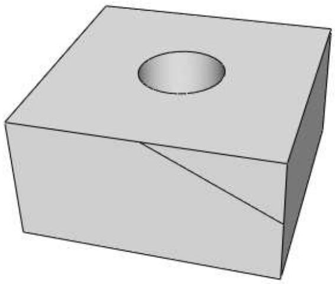  
图 1：连接边必须具有四条逻辑边。

如果您选择这样的面，Abaqus/CAE 将显示错误消息，指出这些面在拓扑上不是四边形。

除了拓扑测试外，Abaqus 还应用几何测试来确定具有四条或更多边的面是否应被视为四边形。几何测试评估面顶点处的角度，并确定是否可以生成质量良好的结构化网格。您可以通过使用网格控制将结构化网格划分技术分配给这些面来覆盖几何测试。

例如，在图 2 中，前面在拓扑上是四边形的；然而，由于各边沿曲线与顶边相交，Abaqus/CAE 未能识别所有四个角。

  
图 2：具有圆角的面可能需要编辑才能用作连接边。

当您完成选择连接边后，Abaqus/CAE 会高亮显示在几何上不是四边形的面，并显示错误消息。您可以使用网格控制重新定义该区域的角，如图中高亮所示，以便该面可以用作连接边。有关在底部向上网格区域面上使用网格控制的更多信息，请参见改进底部向上区域的边界网格质量。

## 每个几何面的角必须与网格扫掠操作一致

图 3 中所选面上显示的四个角与相邻源侧（部件底面）的角不匹配。在这种情况下，您可以完成连接边的选择；但是当您尝试应用底部向上扫掠网格时，Abaqus/CAE 表明它无法将连接边上的网格映射到规则网格中。如果您使用网格控制移除半圆形切口处的角，并在该侧的左下角添加一个角，则可以将该面用作连接边。

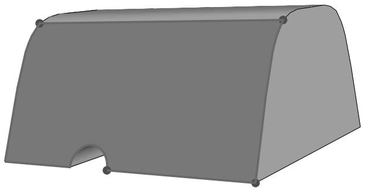  
图 3：角与源侧角不匹配的四边形面。

## 连接边必须与源侧共享一条公共边

源侧与连接边之间共享的公共边不能超出源侧的边。此外，如果您使用二维单元或单元面作为源侧，并选择几何面作为连接边，反之亦然，则单元边必须与几何边关联，否则 Abaqus 将无法识别它们共享公共边。作为将单元与几何边关联的替代方法，您可以在几何面上创建底部向上边界网格，并手动合并源侧和连接边网格的节点（更多信息，请参见创建底部向上区域的边界网格）。如果连接边不与源侧共享公共边，Abaqus/CAE 表明它无法将连接边上的网格映射到规则网格中。

## 几何面或网格实体必须形成规则的网格模式

您选择的几何面或单元面和二维单元必须形成规则的网格模式。图 4 提供了两个可接受的连接面模式示例。

  
图 4：扫掠网格划分的可接受连接面模式。

图 5 中三个四边形面的组合作为连接边是不可接受的。在这种情况下，当您表示已完成选择连接边时，Abaqus/CAE 会显示错误消息，指出所选几何面未形成网格模式。

  
图 5：不可接受的面模式。

如果您无法创建可接受的连接边，则可以省略连接边。生成的网格对于分析可能仍然是可接受的。但是，请记住将区域侧面的单元与几何体关联，特别是如果有载荷或其他分析属性施加到网格的侧面。更多信息，请参见网格-几何体关联。

底部向上网格划分是一个手动过程，可能耗时且需要一些试错才能生成可接受的网格。底部向上网格划分主要用于需要六面体单元进行分析但无法使用自上而下的网格划分技术生成它们的情况。您也可以在需要大量分区才能在几何体上创建高质量自上而下网格的情况下，或者当您希望扩展网格部件时使用底部向上网格划分。以下过程包括创建底部向上网格的基本步骤。要创建底部向上网格，您必须首先拥有一个网格区域或分配了底部向上网格划分技术的实体区域（更多信息，请参见分配网格控制）。您还可以在包含原生部件独立实例或包含任何孤立网格和几何体组合的部件的依赖实例的装配体上创建底部向上网格。

1.  从主菜单栏中，选择网格->创建底部向上网格。


提示：您也可以单击网格模块工具箱中的工具。（有关更多信息，请参见使用网格模块工具箱。）

Abaqus/CAE 打开“创建底部向上网格”对话框，并在提示区域显示提示，以指导您完成该过程。

2.  选择您要为其创建底部向上网格的域。

如果当前部件或装配体只有一个适当的域，Abaqus/CAE 会自动进行选择。如果有多个几何区域或单元分配了底部向上技术，请单击选择以选择将与您正在创建的底部向上网格关联的单元。您可以选择的区域显示为浅棕黄色。

如果您处理的是孤立单元，则这些单元与部件中的任何几何区域之间没有关联。


## 注意：

选择用于底部向上网格划分的几何区域后，您可以使用编辑按钮更改您的选择。
3. 选择以下网格划分方法之一：

• 扫掠  
• 拉伸  
• 旋转  
• 偏移（仅适用于单元面选择）

有关每种方法的描述，请参见自底向上网格划分方法。

4. 如果您之前为当前区域选择了自底向上网格参数，可以点击“获取上次选择”以重用您之前的选择。

Abaqus/CAE 会在当前会话中保存您为域、源侧、连接侧、目标侧、拉伸向量和旋转轴所做的选择，直到这些选择被新选择覆盖。


## 注意：

如果您向模型添加了分区，则无法重用之前选择的几何体；但是，只要您未修改网格，您仍然可以重用网格选择，例如单元面和二维单元。

5. 点击“源侧”旁边的“选择”；然后选择您希望网格开始的区域面、单元面或二维单元。


提示：使用 [Shift] + 单击可选择多个面。

如果您正在创建偏移网格并且选择了二维单元，Abaqus/CAE 会提示您指定选择的哪一侧将被偏移。您可以选择“棕色侧”、“紫色侧”或“两侧”。

Abaqus/CAE 会将您的选择标记为洋红色。

6. 选择完源侧后，在提示区点击“完成”。

7. 如果您选择了“扫掠”方法，您必须选择“连接侧”或“目标侧”或两者以完成网格定义。请完成以下步骤以进行选择：

a. 打开“连接侧”开关，并点击“选择”以选择一个或多个将源侧连接到网格末端的侧面。连接几何侧面必须是四边形。您也可以选择形成规则网格图案的四边形单元面或二维单元。更多信息，请参见为自底向上扫掠网格定义连接侧。

b. 如果您正在处理几何体，可以打开“目标侧”开关并点击“选择”以选择 Abaqus/CAE 用于结束扫掠网格的单个面。

8. 如果您选择了“拉伸”方法，您必须指定拉伸向量并选择拉伸深度。

a. 点击“向量”旁边的“选择”以从视口选择两个点，或在提示区输入坐标以定义拉伸向量的起点和终点。

Abaqus/CAE 会在视口中显示一个黄色箭头来指示拉伸向量。

b. 选择定义拉伸深度的方法：

• 打开“使用向量长度”开关，以按上一步创建的向量长度进行拉伸。  
• 打开“指定”开关并输入拉伸深度。  
打开“投影到目标”开关并点击“选择”以指定目标侧。目标侧必须位于拉伸向量所规定的方向上。

Abaqus/CAE 使用目标侧来设置拉伸距离。拉伸网格将紧密匹配目标侧的形状，但不会与目标侧上的网格贴合。（更多信息，请参见自底向上网格划分方法。）

9. 如果您选择了“旋转”方法，您必须指定一个轴和一个旋转角度。

a. 点击“轴”旁边的“选择”以从视口选择两个点，或在提示区输入坐标以定义旋转轴的起点和终点。  
Abaqus/CAE 会在视口中显示一个黄色箭头来指示轴。  
b. 在“角度”字段中，输入旋转网格所需的旋转角度（以度为单位）。

10. 如果您选择了“偏移”方法，您必须指定总厚度，并且可以更改二维网格拐角的偏移方式。

a. 在“总厚度”字段中，输入偏移网格的厚度。  
b. 对于包含形成尖锐拐角的壳单元的源侧，打开“拐角处保持恒定厚度”开关，以在单元交汇的拐角处保持与选择其余部分相同的总厚度。使用此选项可以减少单元畸变并防止单元坍塌，特别是当单元偏移到拐角内侧时（更多信息，请参见减少网格偏移期间的单元畸变和坍塌）。

11. 在适用的情况下，输入“层数”以定义源侧与自底向上网格末端之间的单元层数。


## 注意：

仅当您指定了没有连接侧的目标侧时，“层数”参数对于扫掠方法才是必需的。对于拉伸、旋转和偏移方法，它始终是必需的。

12. 如果需要，为拉伸的自底向上网格输入“偏斜比”，以使单元层的厚度向源侧或远离源侧方向倾斜。偏斜比与“层数”结合使用。

偏斜比是源侧单元层厚度与离源侧最远的单元层厚度之比。

13. 如果需要，使用“选项”区域将新的自底向上单元添加到单元集中：

## 扩展现有集

每个新的自底向上单元都将被添加到包含其源侧父单元的任何网格集中。

## 为新单元创建集

为自底向上单元创建一个新的单元集。您可以使用默认集名称或为该集创建名称。如果您正在处理孤立单元，还可以为每一层单元创建单独的集。如果选择此选项，Abaqus/CAE 会将基础集名称递增为 -Layer-n，其中 n 是层号。

14. “创建自底向上网格”对话框底部附近的“撤消”字段允许您撤消和重做自底向上网格更改、网格-几何关联性更改和网格编辑。您可以在“编辑网格”工具集中访问相同的功能。更多信息，请参见在编辑网格工具集中撤消或重做更改。

15. 在“创建自底向上网格”对话框中点击“网格”以生成自底向上网格。

16. 重复步骤 3 到 15 以在同一区域创建另一个自底向上网格，或点击“取消”结束该过程。

## 附加信息

• 在视口中选择对象  
• 自底向上网格划分  
• 为自底向上网格选择参数  
• 使用网格模块工具箱

## 包含自底向上网格技术的示例

以下是使用自顶向下和自底向上方法组合对零件进行网格划分的分步示例。

该过程和图像描述了您可以为该零件创建六面体网格的一种方法。在开始之前，您应该熟悉自顶向下网格划分、创建分区以及使用“编辑网格”工具集。您还应该阅读有关自底向上网格划分、网格-几何关联性及相关技术的部分：

什么是自底向上网格划分？  
自底向上网格划分方法  
为自底向上网格选择参数  
为自底向上区域创建边界网格  
改进自底向上区域的边界网格质量  
为自底向上扫掠网格定义连接侧

## 本节内容：

划分不可网格区域并对自顶向下区域进行网格划分  
开始自底向上网格划分  
继续自底向上网格划分  
完成自底向上区域的网格划分  
检查自底向上网格与几何体的关联性  
关联自底向上网格的其余部分

## 划分不可网格区域并对自顶向下区域进行网格划分

示例零件 (bottomup\_mesh\_example\_part.sat) 是从一个 ACIS 文件导入的。

该文件包含在 Abaqus 安装中，您可以使用以下实用程序获取副本：

abaqus fetch job=bottomup\_mesh\_example_part.sat

有关 ACIS 文件的更多信息，请参见从 ACIS 格式文件导入零件。

图 1 显示了原始零件。有三个实体区域；绿色和黄色区域可以分别使用自顶向下的结构化网格和扫掠网格技术进行网格划分，而橙色区域无法使用自动的自顶向下技术和六面体单元进行网格划分。

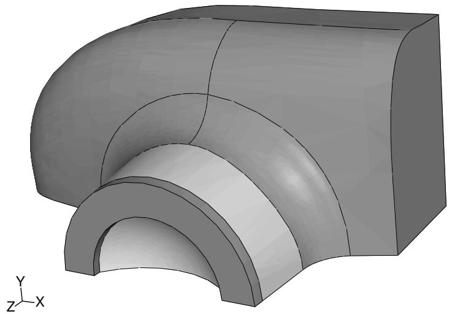  
图 1：导入零件上的默认网格颜色编码。

为了对零件进行网格划分，我们将首先创建三个分区。前两个分区在不可网格区域的外边缘附近创建了另一个自顶向下的可扫掠网格区域。第三个分区是一个面分区，您稍后将把它用作自底向上拉伸方法的向量。您可以在不划分分区的情况下将自底向上网格技术应用于整个不可网格区域。然而，生成的网格在外边缘附近会包含一些形状不良的单元。在实践中，您可能需要在为整个区域创建出令人满意的网格之前，创建多个自底向上网格。特别是对于更复杂的零件，您可能希望保存采用不同网格划分方法的零件副本，直到确定哪种方法能产生最佳网格。
1. 旋转部件，使其底部朝向您，如图2所示。

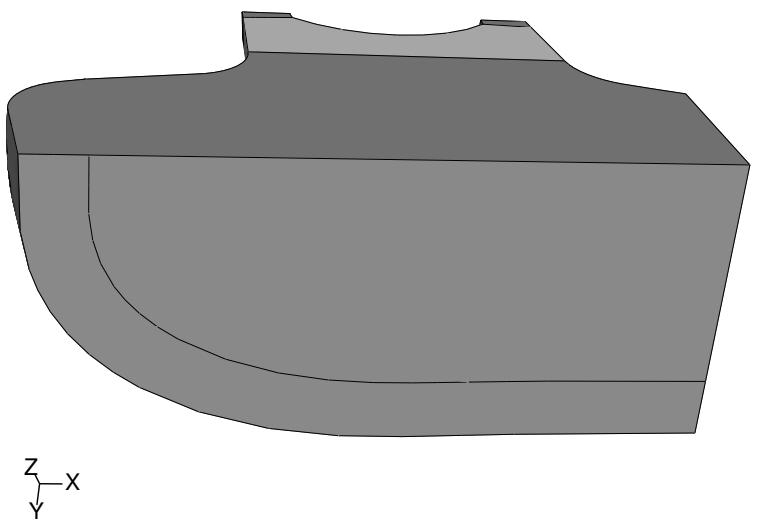  
图2：在底面上创建偏移分区。

2. 完成以下步骤以分区该面：

a. 从模块工具箱的分区面工具中，选择草绘方法工具 。  
b. 选择部件的底面，并选择一条直边作为垂直且位于右侧的边。

Abaqus/CAE 将打开草绘器。

c. 从草绘器工具箱中，选择偏移工具 。  
d. 选择曲边，并按鼠标键2以接受所选边。  
e. 在提示区域中输入2.5作为偏移距离。

Abaqus/CAE 将显示偏移分区的预览。

f. 如果偏移显示正确（朝向部件内部），则单击“确定”；如果偏移显示在部件外部，则单击“翻转”。  
g. 按鼠标键2或在提示区域中单击“完成”以分区该面。

Abaqus/CAE 返回网格模块并显示已分区的面，如图2所示。

3. 将面分区沿区域拉伸。

a. 从模块工具箱的分区体工具中，选择拉伸/扫掠方法工具 。  
b. 选择步骤1中创建的面分区作为要拉伸的边。  
c. 在提示区域中单击“沿方向拉伸”，然后拾取图3中所示的边。

  
图3：将面分区拉伸贯穿体。

d. 如果拉伸方向显示正确（贯穿区域），则单击“确定”；或单击“翻转”以更改方向。  
e. 单击“创建分区”以分区该体。

Abaqus/CAE 显示部件的外侧区域为黄色，表示现在可以使用自顶向下扫掠网格划分。

4. 对不可网格划分区域的前面进行分区，如图4所示。

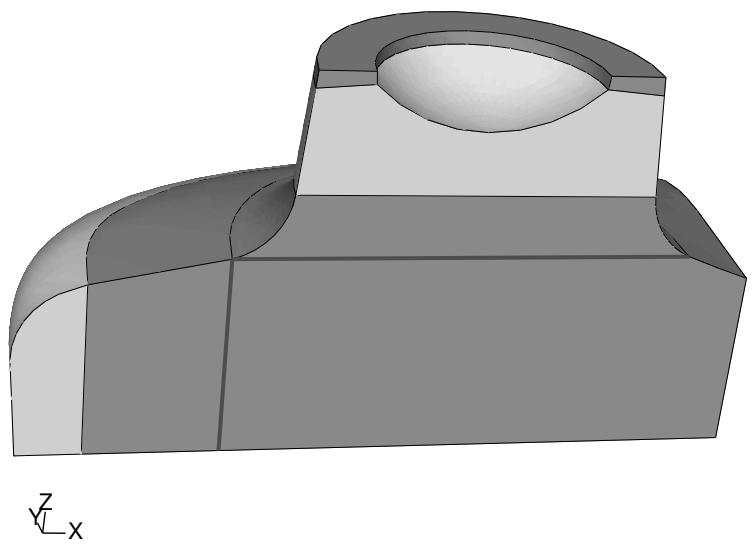  
图4：创建面分区。

a. 从模块工具箱的分区面工具中，选择草绘方法工具 。  
b. 选择不可网格划分区域的前面，并选择一条边作为垂直且位于右侧的边。Abaqus/CAE 将打开草绘器。

c. 使用垂直构造线工具创建一条构造线，如图5所示。

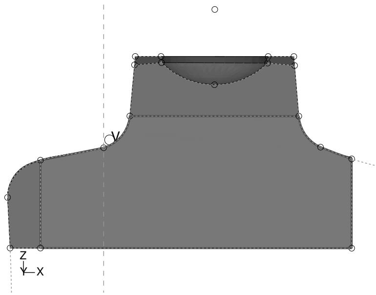  
图5：使用垂直构造线分区该面。

d. 使用连接线工具创建一条连接垂直构造线与部件面相交的两个点的线。  
e. 创建第二条线，连接垂直线的上端点到前面圆角结束处的点——该线应近乎水平。  
f. 按鼠标键2或在提示区域中单击“完成”以分区该面。

现在部件中有三个区域，您可以使用自顶向下网格划分技术进行网格划分。

5. 使用约0.9的近似尺寸和默认的曲率控制设置，为整个部件分配全局边种子。  
6. 从主菜单栏选择“网格”->“部件”，对自顶向下区域进行网格划分。

Abaqus/CAE 会高亮显示不可网格划分的区域，并显示警告，指出您无法自动对其网格划分。

7. 单击“确定”对三个自顶向下区域进行网格划分。图6显示了生成的部分网格。

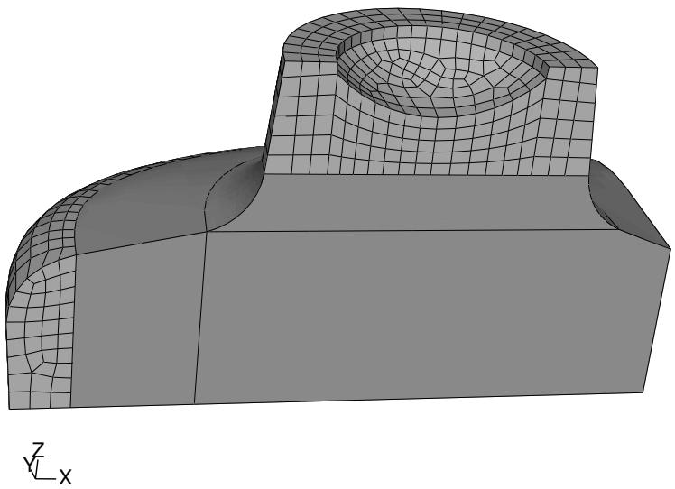  
图6：自顶向下区域的自动网格划分。

## 开始自底向上网格划分

现在自顶向下网格已完成，您可以分配自底向上网格划分技术，并开始为部件的其余部分创建六面体网格。

1. 使用网格控制工具，将自底向上网格划分技术分配给不可网格划分的区域。Abaqus/CAE 将该区域着色为浅棕色。  
2. 从主菜单栏选择“网格”->“创建自底向上网格”。


提示：您也可以单击网格模块工具箱中的工具。（有关更多信息，请参阅使用网格模块工具箱。）

Abaqus/CAE 显示“创建自底向上网格”对话框，并使未网格划分的区域半透明。半透明程度由颜色代码工具栏中的半透明滑块决定（有关更多信息，请参见更改半透明度）。在更复杂的部件中，半透明度使您更容易选择内部区域。

3. 选择“扫掠”方法，并单击“源侧”旁边的“选择”。  
4. 选择凸起底部的半圆形面，在图1中显示为洋红色，作为第一个自底向上网格的源侧；并在提示区域中单击“完成”。

您必须更改默认选择选项才能选择内部面（有关更多信息，请参见使用选择选项）。

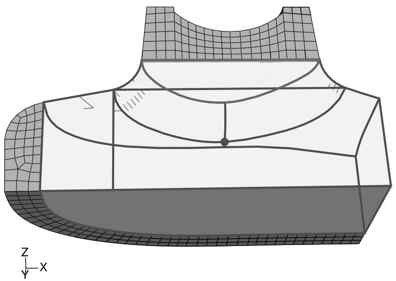

图1：选择几何面作为源侧。  


提示：您也可以选择二维单元或单元面作为自底向上网格的侧。在这种情况下，另一种源侧选择可以是扫掠网格底部的所有单元面。

5. 切换“连接侧”为开，然后单击“选择”。根据需要旋转部件，以选择代表顶部凸起与部件主体之间圆角的三个面以及部件前部对应的平面，在图2中显示为黄色。

  
图2：选择连接侧。

在提示区域中单击“完成”以结束选择。

6. 在“创建自底向上网格”对话框中单击“网格”以创建网格。

  
图3：圆角区域的自底向上扫掠网格。

网格大致延伸到所选连接侧的区域深度，自底向上区域保持选中状态，并且“创建自底向上网格”对话框保持打开以进行下一步。

## 继续自底向上网格划分

您至少有三种方法可以完成部件的网格划分。最简单的方法是创建另一个扫掠网格，使用刚完成的网格底部以及剩余未网格划分区域顶部圆角向外延伸的两个面作为源侧，三个几何垂直面和一组垂直单元面作为连接侧，以及底面未网格划分的部分作为目标侧。此方法将在一个自底向上网格划分步骤中完成部件网格划分，并且单元将与所选面完全关联。您也可以使用自底向上拉伸方法，以部件底面作为拉伸距离。然而，为了演示目的，我们将使用一个更长的过程，该过程结合了自底向上拉伸方法、关联性工具和编辑网格工具集。

## 创建自底向上拉伸网格

1. 选择“拉伸”方法，并单击“源侧”旁边的“选择”。  
2. 选择上一步自底向上网格底部的单元面，如图1所示，作为第二个自底向上网格的源侧。

  
图1：选择单元面作为源侧。

3. 在提示区域中单击“完成”以接受所选面。  
“创建自底向上网格”对话框重新出现。  
4. 单击“选择”按钮，为拉伸网格选择一个矢量。  
5. 选择分区的上端点作为矢量的起点，并选择下端点作为矢量的终点。图2显示了拉伸矢量。

  
图2：为自底向上拉伸网格选择矢量。

6. 为“层数”输入10。

自顶向下扫掠网格的内侧面上有10个单元。对拉伸网格使用相同数量的单元将在您创建第三个也是最后一个自底向上网格时提供更好的匹配。

7. 验证拉伸深度是否使用默认的“使用矢量长度”方法设置，并在“创建自底向上网格”对话框中单击“网格”以创建网格。

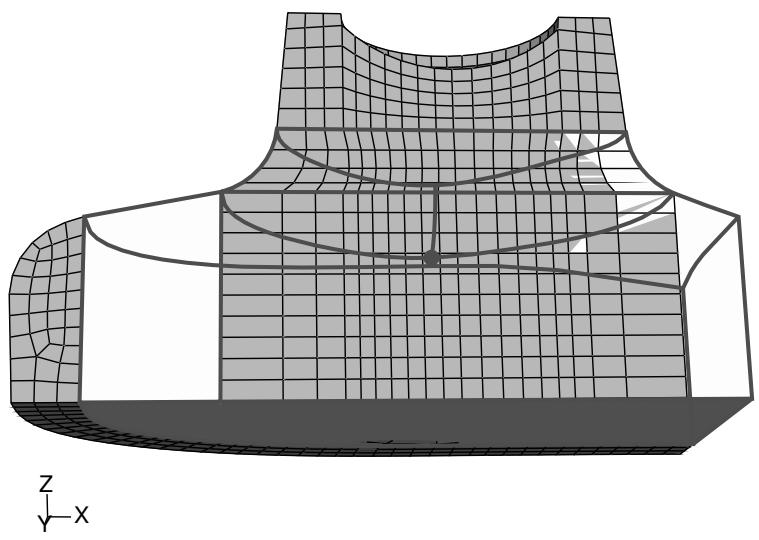  
图3：自底向上拉伸网格。

## 延伸拉伸网格

拉伸的自底向上网格在区域底面附近结束，这是由非平面源侧和拉伸矢量长度决定的。您可以编辑最后一个拉伸单元层中的节点，使其精确地结束在区域的底面上。

1. 选择位于网格模块工具箱底部的编辑网格工具集 。  
2. 选择“节点”类别，然后在“编辑网格”对话框中单击“投影”。  
3. 使用角度方法选择自底向上拉伸网格底部的所有节点，如图4所示，然后在提示区域中单击“完成”。
  
图 4：选择要投影的节点。

4. 选择自底向上区域的底面，并在提示区点击“是”(Yes) 将节点投影到该面上。

## 完成自底向上区域的网格划分

现在，我们将创建最终的扫掠网格以完成零件的网格划分。

1. 从主菜单栏中，选择网格 -> 创建自底向上网格。
2. 选择自底向上区域。

Abaqus/CAE 将显示“创建自底向上网格”对话框。

3. 选择“扫掠”(Sweep) 方法，并点击“源侧”(Source side) 旁的“选择”(Select)。
4. 选择零件顶部剩余的两个未网格化的面，如图 1 所示，并在提示区点击“完成”(Done)。

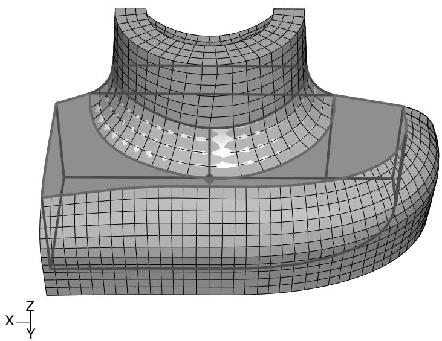  
图 1：为最终的自底向上网格选择源侧。

5. 打开“连接侧”(Connecting sides) 开关，并点击“选择”(Select)。旋转零件，并使用角度选择方法，选择外部扫掠网格的内部单元面和拉伸网格的外部单元面，如图 2 所示。

  
图 2：选择单元面作为连接侧。

在提示区点击“完成”(Done) 结束选择。

6. 打开“目标侧”(Target side) 开关，并点击“选择”(Select)。

Abaqus/CAE 将提示您选择扫掠网格的目标侧。

7. 选择该区域的底面。
8. 在“创建自底向上网格”对话框中点击“网格”(Mesh) 以创建网格。

该零件现在已完全用六面体单元完成网格划分，如图 3 所示。

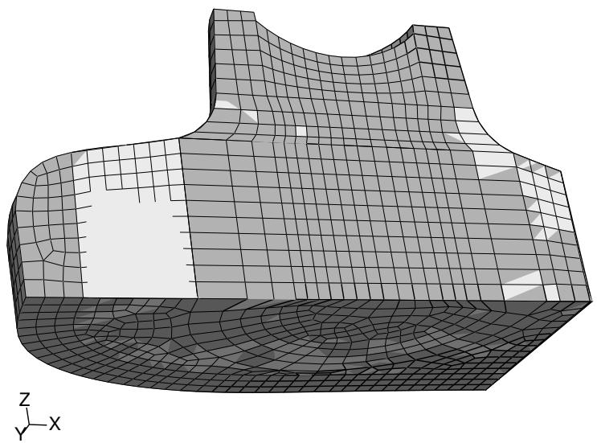  
图 3：最终完成网格划分的零件。

## 检查自底向上网格与几何体的关联性

在分析中使用已完成的自底向上网格之前，您应检查区域几何体与自底向上网格单元之间的关联性。Abaqus 中的载荷、边界条件和其他属性是施加在几何体上的，除非网格与几何体正确关联，否则它们无法正确传递到自底向上网格的单元上。至少，您应检查应用了载荷和边界条件的自底向上网格区域的关联性。

在大多数情况下，如果您选择一个几何特征（如面）来定义自底向上网格，Abaqus/CAE 会自动将相应的单元与该面关联。但是，在几何体未被使用的情况下，例如示例零件中心的拉伸自底向上网格，这些单元仅与区域关联，而不与可能施加载荷的相邻面关联。（更多信息，请参见网格-几何关联。）以下过程将零件底面和前面的单元与几何面关联：

1. 从主菜单栏中，选择网格 -> 关联网格与几何体。
2. 选择自底向上区域的底面，如图 1 所示。

在最后一步自底向上网格划分中创建的单元显示为黄色，因为当该面被用作最终自底向上扫掠网格的目标侧时，它们已被关联。然而，半圆形拉伸网格中的单元并未与该面关联。

  
图 1：底面上现有的网格关联。

3. 移除从自底向上区域延伸到零件外部曲面的自顶向下网格单元。

    a. 选择工具 -> 显示组 -> 创建。
    Abaqus/CAE 将显示“创建显示组”对话框。

    b. 从项目列表中选择“单元”(Cells)，并点击“编辑选择”(Edit Selection)。
    c. 从视口中，拾取沿零件外部弯曲边缘延伸的自顶向下扫掠区域，并在提示区点击“完成”(Done)。
    d. 在“创建显示组”对话框中，点击“移除”(Remove) 按钮。

    Abaqus/CAE 将从视口中移除所选单元。

    更多信息，请参见使用显示组显示模型的子集。

4. 使用角度选择方法，选择自底向上区域底部的所有面。完成后，自底向上区域底部的所有单元面都应显示为黄色，如图 2 所示。


图 2：底面上的最终网格关联。


## 注意：

如果您没有移除外部的自顶向下网格单元，使用角度选择方法也会选择自顶向下单元面进行关联，当您尝试关联这些面时，会导致错误消息。

5. 在提示区点击“完成”(Done)，将所选单元面与区域面关联。

## 关联自底向上网格的其余部分

要完全关联自底向上网格，您应验证并编辑前面、右侧面以及自底向上区域中每个边界边和顶点的关联。您关联边和顶点的方式与前一节中关联单元面的方式相同，只是您需要分别选择边和单元边，或顶点和节点。Abaqus/CAE 会尝试根据邻近程度将节点与顶点、单元边与几何边关联。如果沿一条边的所有单元都与该边所界定的面关联，Abaqus/CAE 会自动将单元边与几何边关联。

当您拥有一个完全网格划分并已检查过自底向上网格关联性的零件后，应保存该模型。在运行分析之前，您还应验证网格质量。无论您是自动创建网格（自顶向下）还是使用自底向上技术和网格编辑来构建网格，网格验证都有助于确保没有隐藏的问题。有关网格验证的更多信息，请参见验证单元质量。

## 网格-几何关联

您可以在孤立网格或自底向上网格实体与相邻几何体之间创建关联。

Abaqus/CAE 会自动将自顶向下网格与底层几何体关联。Abaqus/CAE 能够进行这种关联是因为网格完全贴合几何体。相比之下，自底向上网格不必贴合几何体，因此，Abaqus/CAE 可能无法将网格的某些部分与几何体关联。类似地，孤立网格实体不与几何体关联，因为它们要么独立于几何体创建，要么创建它们的几何体在当前模型中不可用。

在孤立网格或自底向上网格实体（单元、单元面、单元边和节点）与相邻几何体之间创建关联，允许将载荷、相互作用和边界条件从几何体传递到网格。如果您将孤立网格或自底向上网格实体完全关联到一个相邻的几何面，您可以使用该面为该几何区域创建一个与您起始的孤立网格或自底向上网格兼容的原生网格。完全关联意味着：

•   所选几何面与覆盖整个面的单元面关联。
•   几何面的所有边与跨越整条边的单元边关联。
•   面的所有顶点与节点关联。

图 1 展示了在二维孤立单元区域和相邻几何区域之间使用网格-几何关联的示例。将两个区域之间的几何边（左图中的黄线）与孤立单元边和节点关联，可以生成兼容的混合网格。
  
图 1：关联一条边可以强制创建兼容的网格。

相反，如果一个模型包含您需要保留的网格（因为它经过了大量编辑或非常适合分析），并且您不想为整个零件创建孤立网格，您可以删除网格与所选实体之间的关联，以在所选区域创建孤立节点和单元。删除网格关联性可以防止 Abaqus/CAE 在您编辑几何体时删除区域的网格。完成编辑后，您可以重新建立几何面与网格表面实体之间的关联。边上的节点将与几何体上当前存在的任何节点合并。


## 注意：

如果您删除了实体区域的网格-几何关联性，重新建立原生网格的唯一方法是使用“编辑网格”(Edit Mesh) 对话框中的“撤消”(Undo) 功能，或者将自底向上网格技术应用于该区域并重新创建关联性。

当您处理实体几何区域时，以下规则适用于自底向上单元的关联：
• Abaqus/CAE 始终将自底向上单元与所选区域相关联。
• 当使用基础几何体定义网格形状时，Abaqus/CAE 会将网格与该几何体相关联。
• 当几何体的某些部分未用于定义自底向上网格时，Abaqus/CAE 不会将它们关联，即使网格与几何体位于同一位置也是如此。
• 您可以编辑任何基于几何体的自底向上网格区域的网格-几何关联。

• 即使您编辑了生成的网格以使其与几何体匹配，您仍必须手动将网格与几何体相关联。

有三个考虑因素使得网格-几何关联对于创建良好的分析模型至关重要：

1.  当您使用几何体时，载荷和边界条件等属性将应用于几何体。正确的网格-几何关联可确保在分析过程中这些属性被正确地传递到网格。
2.  如果您选择一个几何面作为自底向上网格的源侧或连接侧，Abaqus 会重新使用该面上的现有网格实体来创建兼容网格，但仅当这些网格实体与所选面完全关联时才会这样做。
3.  Abaqus 会尝试合并与相同几何实体关联的网格。未关联的网格可能需要您使用“编辑网格”工具集沿网格边界合并节点。

在使用自底向上网格或编辑任何网格的关联性时，您应始终检查网格-几何关联性是否正确。如果您提交一个作业，且属性应用于没有关联网格的几何体，Abaqus/CAE 将在“作业”模块中发出错误。但是，Abaqus/CAE 无法确定关联是否正确。例如，如果一个载荷应用于一个本应包含数百个单元的几何面，但该面只关联了一个单元，Abaqus/CAE 会尝试将整个载荷施加在单个关联单元上进行分析模型计算。不正确的关联会产生不正确的分析结果。

您可以使用网格模块工具箱中的网格-几何关联和删除网格关联工具来查看、编辑或删除网格-几何关联。详细说明请参阅《查看和编辑网格-几何关联》和《删除网格-几何关联》。

## 理解自适应重划网格

本节描述了如何在 Abaqus/CAE 中执行自适应重划网格。

自适应重划网格在《自适应重划网格》中有详细描述。

## 本节内容：

什么是重划网格规则？  
哪些网格控制可用于自适应重划网格？  
哪些分析过程可用于自适应重划网格？  
自动自适应重划网格与手动自适应重划网格有何区别？  
何时需要使用手动自适应重划网格？

## 什么是重划网格规则？

重划网格规则使 Abaqus/CAE 能够迭代地调整您的网格，以满足您指定的误差指标目标。您可以允许 Abaqus/CAE 执行迭代重划网格和分析操作，或者您可以手动重划网格并研究您的重划网格规则对网格和最终分析结果的影响。Abaqus/CAE 会重划您分配了自适应性规则的面和单元，以及任何相邻的面或单元；其他区域上的网格不会改变。更多信息，请参阅《关于自适应重划网格》。

重划网格规则描述了自适应网格划分规范的所有方面：

•   应用重划网格规则的区域。您可以将重划网格规则应用于整个模型或选定区域。
•   Abaqus/CAE 将应用该规则的具体分析步。该重划网格规则仅在此分析步期间应用；但是，您可以将具有相同设置的不同重划网格规则应用于模型中的另一个分析步。
•   误差指标输出变量——将用于计算误差估计的输出变量。更多信息，请参阅《影响自适应重划网格的误差指标选择》。
•   尺寸方法——Abaqus/CAE 用于计算网格中单元尺寸的方法。更多信息，请参阅《基于解的网格尺寸设定》。
•   对重划网格计算的任何约束。

重划网格规则与边种子、单元类型和网格划分方法结合使用，以确定特定自适应性迭代下的网格。重划网格规则存储在模型数据库中，并在各会话之间保持。要创建重划网格规则，请从主菜单栏选择自适应性->重划网格规则->创建。更多信息，请参阅《创建重划网格规则》。

您可以在模型的多个区域上定义多个重划网格规则。如果您将多个重划网格规则应用于模型的同一区域，Abaqus/CAE 会应用保守的单元尺寸规范，并且在特定点定义更精细网格的规则优先。如果您将重划网格规则分配给相关实例，Abaqus/CAE 会重划原始部件，并且该部件的每个相关实例将继承相同的网格。

当重划网格规则处于活动状态时，Abaqus/CAE 会在您创建的每个作业中请求误差指标输出变量。该重划网格规则在第一个作业期间对网格没有影响。但是，在第一个作业期间，Abaqus 使用重划网格规则来计算误差指标输出变量。在后续的自适应重划网格迭代中，重划网格规则会增强您的网格尺寸规范，以生成一个尝试优化单元尺寸和位置以实现规则中描述的误差指标目标的网格。

## 哪些网格控制可用于自适应重划网格？

表 1 显示了必须分配给将使用自适应重划网格区域的网格控制。

表 1：网格控制与自适应重划网格。

<table><tr><td>维度</td><td>单元形状</td><td>算法</td><td>技术</td></tr><tr><td>二维</td><td>三角形</td><td>不适用</td><td>自由</td></tr><tr><td>二维</td><td>四边形为主</td><td>进阶算法</td><td>自由</td></tr><tr><td>三维</td><td>四面体</td><td>不适用</td><td>自由</td></tr></table>

此外，您必须将上述支持的网格控制分配给任何与包含在重划网格规则中的区域相邻的面或单元。

当 Abaqus/CAE 生成四面体网格时，它首先在实体区域的外表面创建三角形的边界网格，然后使用这些三角形作为外部四面体单元的面来生成四面体网格。当您将自适应重划网格分配给实体区域时，Abaqus/CAE 会将自适应重划网格应用于外部表面上的三角形边界网格。更多信息，请参阅《使用三角形和四面体单元进行自由网格划分》。

如果 Abaqus/CAE 在您为自适应重划网格选择的区域中使用映射网格划分技术，网格调整大小算法可能收敛缓慢，并且需要更多重划网格迭代才能达到给定的目标误差。为防止 Abaqus/CAE 使用映射网格划分，您可以在“网格控制”对话框中关闭“适当时使用映射网格划分”。更多信息，请参阅《设置网格算法》。

## 哪些分析过程可用于自适应重划网格？

自适应重划网格仅适用于 Abaqus/Standard。此外，自适应重划网格仅适用于以下 Abaqus/Standard 分析过程：

•   静态（通用和线性摄动）
•   准静态
•   热传导
•   完全耦合热-应力
•   耦合孔隙流体扩散-应力
•   耦合热-电

## 自动自适应重划网格与手动自适应重划网格有何区别？

如果您选择允许 Abaqus/CAE 迭代地重划您的模型，作业模块中的自适应性过程将为您控制自适应重划网格。您只需在网格模块中定义重划网格规则，并将该规则应用于模型中需要重划网格的区域。

相反，您可以手动应用修改后的重划网格规则，并查看您的修改对生成的网格的影响。当您确信您的重划网格规则正在生成所需的网格时，您可以使用该规则来驱动由 Abaqus/CAE 控制的迭代重划网格和分析操作序列。从主菜单栏选择自适应性->手动自适应重划网格以手动应用自适应重划网格规则。更多信息，请参阅《手动调整大小和重划网格》。

当您应用手动自适应重划网格时，必须输入由模型先前分析生成的输出数据库文件的名称。此输出数据库包含 Abaqus/CAE 用于计算网格尺寸函数的误差指标输出变量。存储在输出数据库中的误差指标输出变量限制了您可以对重划网格规则所做的更改。例如，如果您的原始规则指定了某个区域的能量密度，您将无法将该规则切换为使用等效塑性应变中的误差，除非首先重新运行分析。您可以修改重划网格规则中的尺寸方法和单元尺寸约束，并且仍然可以使用先前分析的输出数据库。但是，如果您修改了分析步、区域或误差指标输出变量，则不能使用该输出数据库。
## 何时需要使用手动自适应网格重划分？

你可以使用手动自适应网格重划分来完成以下任务：

*   了解不同的尺寸函数和误差指示器输出变量对Abaqus/CAE生成的网格的影响。
    如果你的分析预计需要很长时间，你可以关闭Abaqus/CAE会话，将许可证令牌（license tokens）提供给其他用户或用于新会话。然而，要继续自适应过程，你必须读取分析生成的输出数据库（output database）并手动对模型进行网格重划分。
*   如果分析过早结束（例如，由于内存不足），你可以使用手动网格重划分来继续自适应过程。

## 高级网格划分技术

本节包含关于如何完成不直观的高级网格划分任务的信息。

## 本节内容：

网格划分多个三维实体区域  
网格划分多个二维和三维壳区域  
部件实例之间的兼容网格  
参数化建模  
使用六面体单元划分复杂实体的网格

## 网格划分多个三维实体区域

Abaqus/CAE根据区域的几何和拓扑为其分配默认的网格划分技术。然而，有时应用于三维部件或部件实例相邻区域的默认网格划分技术并不兼容，导致Abaqus/CAE无法生成兼容的网格。

例如，Abaqus/CAE无法使用默认网格划分技术在整个部件实例上生成兼容的网格，如图1所示，因为左侧结构化网格（structured mesh）的节点无法与右侧扫掠网格（swept mesh）的节点合并。（部件实例右侧的立方体是一个扫掠区域（swept region），因为它连接到同样是扫掠区域的圆柱体。）

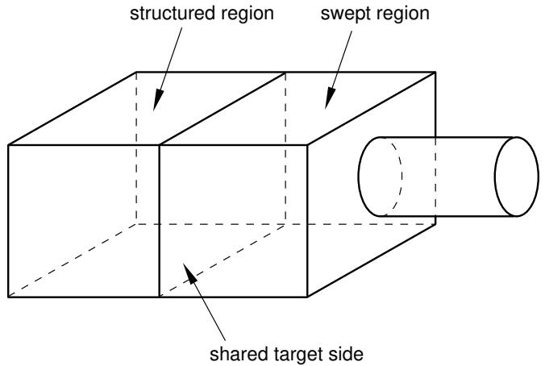
图1：使用这些默认网格划分技术无法生成兼容网格。

如果你分别对这两个区域进行网格划分，结构化区域和扫掠区域的节点之间将发生明显的不匹配，如图2所示。

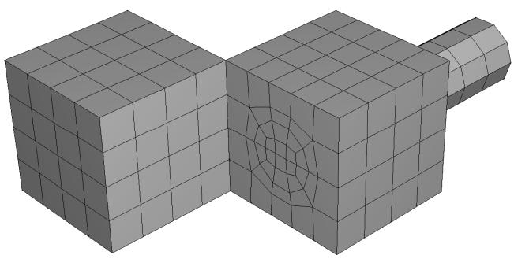
图2：分别划分网格的结构化区域和扫掠区域。

如果你启动网格划分过程，而Abaqus/CAE无法使用默认网格划分技术生成兼容网格，它将尝试用新技术替换默认技术。这些新技术不仅由区域的几何和拓扑决定，还由部件或部件实例中相邻区域的特征决定。Abaqus/CAE会评估区域之间的界面，并尝试最小化不兼容界面的数量。

例如，图1部件实例左侧立方体的默认网格划分技术是结构化（structured），其导致的不兼容网格如图2所示。然而，这个立方体也可以使用扫掠（swept）网格划分技术进行划分。因此，Abaqus/CAE将该区域的网格划分技术从结构化改为扫掠，并在整个部件实例上生成了兼容的网格。（当Abaqus/CAE更改区域的网格划分技术时，分配给该区域的单元形状保持不变。）

当你为三维部件或部件实例启动网格划分过程时，Abaqus/CAE会确定使用分配给每个区域的默认技术是否能够生成兼容网格。如果可以生成兼容网格，则进行网格划分。如果无法使用默认技术生成兼容网格，Abaqus/CAE会检查是否可以将默认网格划分技术替换为其他允许生成兼容网格的技术。

*   如果使用不同技术可以生成兼容网格，Abaqus/CAE会高亮显示不兼容界面，并提示你选择以下选项之一：

    取消网格划分过程。
    - 允许Abaqus/CAE根据需要替换默认技术并生成兼容网格。
    允许Abaqus/CAE使用默认网格划分技术，并在不兼容界面自动生成绑定约束（tie constraint）。Abaqus/CAE会自动选择界面的一侧作为从面（secondary surface），另一侧作为主面（main surface），用于自动生成绑定约束，但在不兼容界面的周边创建公共（合并）节点。从面上的节点被约束为具有与其绑定的主面上点相同的位移、温度、孔隙压力或电势值。Abaqus/CAE通常选择网格更精细的表面作为从面。绑定约束的从节点调整区域深度的计算基于界面区域的包围尺寸。（有关绑定约束的更多信息，请参见网格绑定约束（Mesh Tie Constraints）。）

*   如果使用不同技术仍然无法生成兼容网格，Abaqus/CAE会高亮显示不兼容界面，并提示你选择以下选项之一：

    取消网格划分过程。
    - 如上所述，在不兼容界面自动生成绑定表面交互（tied surface interactions）。

如果无法生成兼容网格，你可以尝试以下方法之一：

*   根据需要进行分区（Partition）以生成兼容网格。
*   使用自由网格划分技术（free meshing technique）对整个部件或部件实例进行网格划分。

通常，在三维实体部件或部件实例上生成兼容网格有以下限制：

*   扫掠区域不能与结构化区域共享其目标面（target side）。但是，它可以与结构化区域共享源面（source side）或连接面（connecting side），如图3所示。

    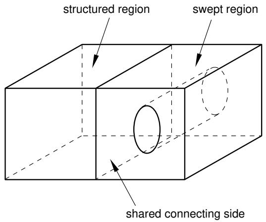
    图3：扫掠区域的连接面与结构化区域共享。

在某些情况下，Abaqus/CAE无法对一个包含多个区域的部件或部件实例进行网格划分，如果这些区域全部分配了扫掠网格划分技术。例如，Abaqus/CAE无法沿图4所示的部件实例进行扫掠网格划分，因为无法在共享的目标面上生成兼容网格。


图4：无法沿此部件实例生成兼容的扫掠网格。

然而，图5展示了如何使用分区（partition）来生成包含四个扫掠区域的网格。


图5：使用分区生成兼容的扫掠网格。

同一个部件或部件实例的不同区域可以使用六面体（hexahedral）和四面体（tetrahedral）单元进行网格划分，如图6所示。

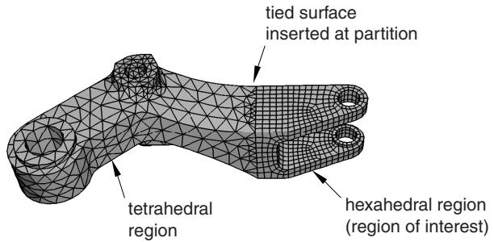
图6：同一个部件或部件实例的不同区域可以使用六面体和四面体单元进行网格划分。

你可以在精度要求较高的区域使用六面体单元，例如靠近接触表面或需要精细网格的特殊关注区域。你可以在其他区域使用四面体单元，Abaqus/CAE会在区域连接处创建绑定表面（tied surfaces）。当你对一个区域进行网格划分时，Abaqus/CAE不会调整相邻区域上现有的网格。

## 网格划分多个二维和三维壳区域

"网格划分多个三维实体区域"一节描述了应用于三维实体部件或部件实例相邻区域的默认网格划分技术可能不允许你生成跨区域兼容的网格。相比之下，二维或三维壳部件或部件实例的相邻区域总是兼容的。

图1展示了一个三维壳部件实例，其相邻区域可以使用自由（free）、扫掠（swept）和结构化（structured）网格划分技术进行划分。


图1：三维壳部件实例的相邻区域。

图2展示了生成的网格。

图2：生成的网格。

## 部件实例之间的兼容网格

你无法强制规定部件实例之间的网格是兼容的。如果你需要两个或多个实例之间的网格兼容，你可以执行以下操作之一：

*   创建一个包含所有几何体（body）的单一部件，这样就不需要多个实例。
*   在装配（Assembly）模块中组装部件的实例，并使用合并/切割（Merge/Cut）工具将实例合并为一个单一实例。如果你需要保持独立部件实例的概念，可以在合并实例的公共界面处创建分区。

类似地，你可以使用合并/切割工具合并重复的节点，从多个包含孤立网格单元和节点的实例创建一个单一的部件实例。更多信息，请参见对部件实例执行布尔操作（Performing Boolean operations on part instances）。
如果必须使用单独的部件，可以使用绑定接触来避免网格兼容性问题。请记住，这并非真正的兼容性，解决方案的准确性可能会受到影响。有关绑定接触的更多信息，请参阅理解相互作用。

## 参数化建模

网格模块（Mesh module）的一个实用功能是能够在部件修改后重新生成分区和网格属性——例如单元类型分配、种子和网格控制。（修改模型后，您必须始终重新创建网格本身。）

例如，图1所示的模型已被划分为四个区域，然后通过种子指定约3的单元尺寸。

  
图1：带小孔的种子模型。

您可以返回部件模块（Part module）并修改模型中心的孔，使其稍微变大。当您返回网格模块时，分区和种子会重新生成，如图2所示。

  
图2：部件修改后种子重新生成。

此外，网格控制（Mesh Controls）和单元类型（Element Type）对话框中的设置（例如单元形状、单元类型和网格划分技术）也会重新生成。（您可以通过从主菜单栏选择网格（Mesh）->控制（Controls）和网格（Mesh）->单元类型（Element Type）来显示这两个对话框。）


## 注意：

如果您对部件进行重大修改，种子和分区可能无法重新生成。在这些情况下，您必须在重新进入网格模块后创建新的种子和分区。

## 使用六面体单元网格化复杂实体

您可以使用部件模块创建包含沿旋转轴平移的复杂实体旋转部件，也可以创建包含绕选定中心点扭转的实体拉伸部件。自由网格划分允许您使用四面体单元对这些部件进行网格划分，如使用三角形和四面体单元进行自由网格划分中所述。此外，您可以使用六面体单元对扭转的拉伸部件进行网格划分，如图1所示。

  
图1：对带扭转的拉伸部件进行六面体扫掠网格划分。

然而，如果您想使用六面体单元对平移的旋转部件进行网格划分，您可能需要引入分区以使该部件可进行扫掠网格划分，如下文所述。

为了使网格模块能够创建六面体单元的三维扫掠网格，连接源侧和目标侧的每个侧面必须仅包含一个面（参见三维实体扫掠网格划分中的图4）。但是，当您创建一个旋转超过180°然后沿旋转轴平移的部件时，Abaqus/CAE会沿实体长度方向插入环。这些环仅存在于部件的表面，它们不会创建贯穿部件的面。因此，连接源侧和目标侧的侧面现在包含多个面，除非您引入分区，否则该部件无法使用六面体单元进行扫掠网格划分。

例如，图2显示了一个代表线圈弹簧的部件。该图还显示了创建部件时Abaqus/CAE插入的环。这些环将源侧和目标侧之间的连接面分开；因此，在您对部件进行分区之前，无法使用六面体单元的扫掠网格对线圈弹簧实例进行网格划分。

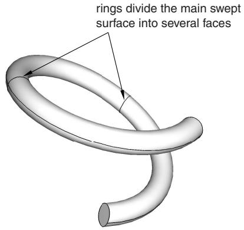  
图2：环将线圈分成若干段。

分区操作通过使用N边面片定义新面，在实体线圈中引入分区。您选择环来定义N边面片，如图3所示。

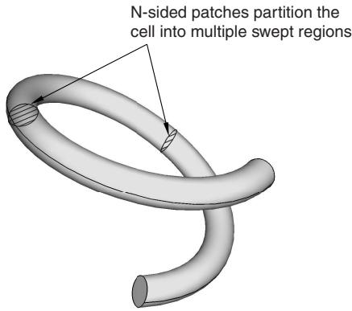  
图3：N边面片对单元体进行分区。

您现在可以对部件实例进行种子划分，并使用六面体单元生成扫掠网格，如图4所示。

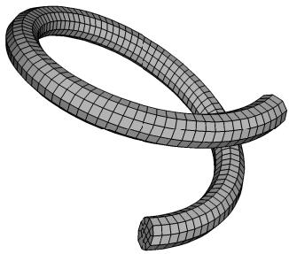  
图4：该模型已使用六面体单元进行扫掠网格划分。

## 使用网格模块工具箱

您可以通过主菜单栏或工具箱访问所有网格模块工具。图1显示了网格模块工具箱中所有工具的隐藏图标。

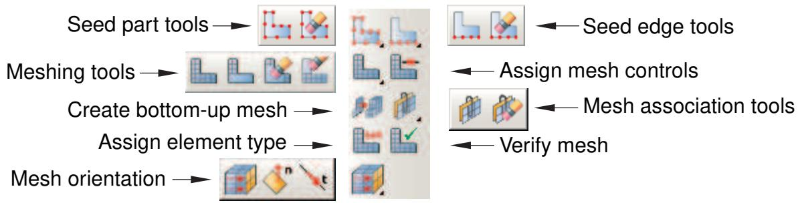  
图1：网格模块工具箱。

有关使用每个网格模块工具的信息，请参阅以下部分：

自底向上网格划分  
网格-几何关联  
为模型播种  
创建和删除网格  
控制网格特性  
获取网格信息和统计数据

## 为模型播种

本节介绍如何使用播种工具在整个部件实例中应用种子。

## 本节内容：

为整个部件或部件实例定义种子密度  
通过规定单元数量对边进行播种  
通过规定单元尺寸对边进行播种  
沿边应用偏置播种  
对边种子应用约束  
对先前已网格划分的部件、部件实例或区域进行播种  
删除部件或实例种子  
删除边种子  
使用错误对话框放宽约束

## 为整个部件或部件实例定义种子密度

您可以从主菜单选择种子（Seed）->部件（Part）或种子（Seed）->实例（Instance），为尚未具有洋红色边种子的所有部件或部件实例的边定义近似单元尺寸。以这种方式定义的种子称为部件种子或实例种子，显示为白色。（有关更多信息，请参阅控制种子密度。）您应该对所有边应用种子。如果均匀种子分布就足够，推荐的方法是对整个部件或部件实例进行播种。

1. 从主菜单栏中，选择种子（Seed）->部件（Part）或种子（Seed）->实例（Instance）。  
   Abaqus/CAE在提示区域显示提示，引导您完成操作。


提示：您也可以使用工具箱工具对部件或部件实例进行播种，该工具与网格模块工具箱中的播种工具位于一起。（有关更多信息，请参阅使用网格模块工具箱。）

2. 如果您正在对部件实例进行播种，并且您的装配体包含多个部件实例，请选择要播种的部件实例并单击鼠标键2。


## 注意：

边种子始终覆盖部件和实例种子；因此，如果您已经单独对部件或部件实例的所有边进行了播种，则实例种子将不被使用且不会显示。如有必要，请使用在删除边种子中描述的种子删除工具删除任何不需要的边种子；如果您已分配部件或实例种子，则在您删除边种子的边上会自动显示这些种子。

3. 在出现的全局种子（Global Seeds）对话框中，输入近似的单元尺寸。  
4. 默认情况下，Abaqus/CAE对您的部件或部件实例的播种应用曲率控制，以便在网格中正确近似小孔或高曲率区域。曲率控制允许Abaqus/CAE根据边的曲率以及目标单元尺寸计算种子分布。要控制曲率对播种的影响，请输入最大偏差因子（Maximum deviation factor）的值。偏差因子是衡量单元边偏离原始几何体程度的指标。为了帮助您直观地了解偏差因子的影响，Abaqus/CAE显示了根据您输入的设置，它将在对应圆上创建的单元数量。  
5. 如果需要，更改最小尺寸控制（Minimum size control）。指定最小尺寸控制有助于防止Abaqus/CAE在对分析意图不重要的高曲率区域创建不必要的精细网格。选择以下选项之一：  
   - 指定最小值为全局单元尺寸的分数。Abaqus/CAE使用此方法，默认最小值为0.1（10%）。  
   - 输入绝对最小单元尺寸。该尺寸必须大于0.0且小于近似的全局单元尺寸。  
6. 单击应用（Apply）查看Abaqus/CAE将使用的种子，并根据需要调整您在全局种子（Global Seeds）对话框中输入的值。  
7. 单击确定（OK）确认单元尺寸并关闭对话框。  
   部件或部件实例的所有边上都会出现白色种子，但已分配洋红色边种子的边除外。  
8. 要退出部件或实例播种过程，请按[Enter]或单击鼠标键2。

## 补充信息

• 为模型播种  
• 理解播种
• 使用网格（Mesh）模块工具箱
• 在视窗内选择对象

## 通过指定单元数量为边播种

您可以通过输入要创建的单元数量来定义沿所选边的单元尺寸。Abaqus/CAE 允许您选择边、面或网格分区进行播种。但是，种子仅放置在边上——即您直接选择的边，或您所选面或网格分区的边。

所有边播种工具都会生成边种子，这些种子以洋红色显示。边种子会覆盖您已指定的任何部件或实例种子。您应将种子应用到所有边上。

1. 从主菜单栏中，选择 Seed->Edges。

Abaqus/CAE 会在提示区显示提示，引导您完成整个操作过程。


提示：您也可以使用位于网格（Mesh）模块工具箱中种子工具旁的工具来通过指定单元数量为边播种。（有关更多信息，请参阅使用网格（Mesh）模块工具箱。）

2. 选择您想要播种的边、面或网格分区。

默认情况下，Abaqus/CAE 仅允许您选择边进行播种。要选择面或网格分区进行播种，请使用选择工具栏将您可选择的对象类型更改为面（Face）、网格分区（Cells）或全部（All）。有关更多信息，请参阅基于对象类型筛选选择。

3. 选择完边、面或网格分区后，在提示区中单击“完成”（Done）。有关选择对象的更多信息，请参阅在视窗内选择对象。
4. 在出现的“局部种子”（Local Seeds）对话框中，选择“按数量”（By number）。


## 注意：

如果您选择的边之前使用过多种播种方法的组合，Abaqus/CAE 会提供一个“保持原状”（As Is）选项，允许您保留所选边上的播种方法。

5. 输入 Abaqus 应沿每条边生成的单元数量。
6. 将偏置控制（bias control）选择为“无”（None）。
7. 如果需要，可以在“约束”（Constraints）选项卡页面上更改默认的种子约束。有关设置种子约束的更多信息，请参阅将约束应用于边种子。
8. 如果需要，勾选“按名称创建集”（Create set with name）以创建一个包含您所选边、面和网格分区的集，并输入集的名称。如果您后续想更改播种，可以在步骤 2 中直接选择该集，而无需重新选择边、面和网格分区。
9. 单击“应用”（Apply）以查看 Abaqus/CAE 将使用的播种结果。

所选边上会出现洋红色的种子。

10. 如有必要，调整您在“局部种子”（Local Seeds）对话框中输入的值。
11. 单击“确定”（OK）以确认单元播种并关闭对话框。

## 附加信息

• 为模型播种
• 理解播种
• 使用网格（Mesh）模块工具箱
• 在视窗内选择对象

您可以通过输入近似单元尺寸来定义沿所选边的单元大小。您还可以定义曲率控制参数，Abaqus/CAE 使用这些参数在高曲率区域调整单元尺寸。Abaqus/CAE 允许您选择边、面或网格分区进行播种。但是，种子仅放置在边上——即您直接选择的边，或您所选面或网格分区的边。

所有边播种工具都会生成边种子，这些种子以洋红色显示。边种子会覆盖您已指定的任何部件或实例种子。您应将种子应用到所有边上。

1. 从主菜单栏中，选择 Seed->Edges。

Abaqus/CAE 会在提示区显示提示，引导您完成整个操作过程。


提示：您也可以使用位于网格（Mesh）模块工具箱中种子工具旁的工具来通过单元尺寸为边播种。（有关更多信息，请参阅使用网格（Mesh）模块工具箱。）

2. 选择您想要播种的边、面或网格分区。

默认情况下，Abaqus/CAE 仅允许您选择边进行播种。要选择面或网格分区进行播种，请使用选择工具栏将您可选择的对象类型更改为面（Face）、网格分区（Cells）或全部（All）。有关更多信息，请参阅基于对象类型筛选选择。

3. 选择完边、面或网格分区后，在提示区中单击“完成”（Done）。有关选择对象的更多信息，请参阅在视窗内选择对象。
4. 在出现的“局部种子”（Local Seeds）对话框中，选择“按尺寸”（By size）。


## 注意：

如果您选择的边之前使用过多种播种方法的组合，Abaqus/CAE 会提供一个“保持原状”（As Is）选项，允许您保留所选边上的播种方法。

5. 输入沿所选边使用的近似单元尺寸。
6. 将偏置控制（bias control）选择为“无”（None）。
7. 默认情况下，Abaqus/CAE 会为您的部件或部件实例的播种应用曲率控制，以适应您希望建模的小孔或高曲率区域。曲率控制允许 Abaqus/CAE 根据边的曲率和目标单元尺寸计算种子分布。要控制曲率对播种的影响，请执行以下操作：

    a. 输入一个偏差因子（deviation factor）值。偏差因子是衡量单元边偏离原始几何体程度的一个指标。为了帮助您直观理解偏差因子的影响，Abaqus/CAE 会根据您输入的设置显示它会围绕一个圆创建多少个单元。
    b. 如果需要，可以指定一个最小尺寸因子（minimum size factor），作为全局单元尺寸的一个分数。指定最小尺寸因子可以防止 Abaqus/CAE 在您不感兴趣的高曲率区域创建非常精细的网格。

8. 如果需要，通过单击提示区中的“约束”（Constraints）按钮并响应出现的对话框来更改默认的种子约束。有关设置种子约束的更多信息，请参阅将约束应用于边种子。
9. 如果需要，勾选“按名称创建集”（Create set with name）以创建一个包含您所选边、面和网格分区的集，并输入集的名称。如果您后续想更改播种，可以在步骤 2 中直接选择该集，而无需重新选择边、面和网格分区。
10. 单击“应用”（Apply）以查看 Abaqus/CAE 将使用的播种结果。

所选边上会出现洋红色的种子。

11. 如有必要，调整您在“局部种子”（Local Seeds）对话框中输入的值。
12. 单击“确定”（OK）以确认单元播种并关闭对话框。

## 附加信息

• 为模型播种
• 理解播种
• 使用网格（Mesh）模块工具箱
• 在视窗内选择对象

## 沿边规定偏置播种

您可以通过定义沿边最粗和最细单元的尺寸，或者通过定义单元数量和两种尺寸的比率，来定义沿所选边的非均匀单元分布。

您可以定义单一偏置（single bias），使网格密度从边的一端变化到另一端。或者，您也可以定义双偏置（double bias），使网格密度从边的中心向两端变化。

例如，图 1 显示了具有单一偏置和双偏置播种的边组合。


图 1：单一偏置和双偏置播种。

所有边播种工具都会生成边种子，这些种子以洋红色显示。边种子会覆盖您已指定的任何部件或实例种子。您应将种子应用到所有边上。

1. 从主菜单栏中，选择 Seed->Edges。

Abaqus/CAE 会在提示区显示提示，引导您完成整个操作过程。


提示：您也可以单击位于网格（Mesh）模块工具箱中种子工具旁的工具。（有关更多信息，请参阅使用网格（Mesh）模块工具箱。）

2. 从视窗中选择拾取的方法：

    对于单一偏置播种，请勾选“使用单一偏置拾取”（Use single-bias picking）并选择您想要播种的边。您只能为单一偏置播种选择边，并且您必须在您期望网格更密集的那一端附近选择每条边。
    • 对于双偏置播种，请取消勾选“使用单一偏置拾取”（Use single-bias picking）并选择您想要播种的边、面或网格分区。您选择的位置不会影响播种。

默认情况下，Abaqus/CAE 仅允许您选择边进行播种。要选择面或网格分区进行播种，请使用选择工具栏将您可选择的对象类型更改为面（Face）、网格分区（Cells）或全部（All）。有关更多信息，请参阅基于对象类型筛选选择。

3. 选择完边、面或网格分区后，在提示区中单击“完成”（Done）。
4. 在出现的“局部种子”（Local Seeds）对话框中，选择偏置控制（Single 或 Double）。


## 注意：
如果您先前使用组合偏置种子方法对边进行了种子设定，Abaqus/CAE 会提供一个**按原样**选项，允许您保留所选边上的偏置种子方法。

如果您选择了单偏置种子，Abaqus/CAE 会在每条所选边上显示箭头，指示单元密度增加的方向。如果您选择了双偏置种子，Abaqus/CAE 会在每条边的中心显示箭头，指示单元密度增加的方向。

5.  选择尺寸方法（**按尺寸**或**按数量**）。
    a.  如果您选择了**按尺寸**，请输入单元的最小和最大尺寸——即偏置种子两端处单元的近似大小。您无法对偏置种子应用曲率控制。
    b.  如果您选择了**按数量**，请输入单元数量和偏置比率。偏置比率是边上最大和最小单元尺寸的近似比率，且必须大于一。
    c.  如果需要，请点击**选择**以反转种子偏置的方向。（当您选择要应用偏置种子的边时，单元密度会向最接近您拾取位置的边端部增加。）

    Abaqus/CAE 会反转每条所选边上箭头的方向。

    

## 注意：

如果您先前使用组合单元尺寸或数量参数对边进行了种子设定，Abaqus/CAE 会提供一个**按原样**选项，允许您保留所选边上的尺寸参数。

6.  如果需要，可以通过单击提示区中的**约束**按钮并响应出现的对话框来更改默认的种子约束。有关设置种子约束的更多信息，请参阅**对边种子应用约束**。
7.  如果需要，打开**创建带名称的集合**，以创建一个包含您所选边、面和体的集合，并输入该集合的名称。如果您之后想更改种子设定，可以在步骤2中直接选择该集合，而无需重新选择边、面和体。
8.  单击**应用**以查看 Abaqus/CAE 将使用的种子设定。

    所选边上会出现洋红色的种子。

9.  如有必要，调整您在**局部种子**对话框中输入的数值。
10. 单击**确定**以确认单元种子设定并关闭对话框。

## 附加信息

•   对模型进行种子设定
•   理解种子设定
•   使用网格模块工具箱
•   在视口内选择对象

您可以在定义种子的同时对其应用约束，方法是使用边种子设定过程中出现的**局部种子**对话框中的**约束**选项卡页。


警告：在约束网格种子时请小心；如果您尝试生成的网格包含四边形或六面体形状的单元，过度约束可能使自动网格生成变得不可能。

1.  从主菜单栏中，选择**种子->边**。然后选择要进行种子设定的边，并单击鼠标键2。有关执行这些任务的更多信息，请参阅以下章节：

    通过指定单元数量对边进行种子设定
    通过指定单元尺寸对边进行种子设定
    沿边指定偏置种子设定

    

## 注意：

如果您先前使用组合约束对边进行了种子设定，Abaqus/CAE 会提供一个**按原样**选项，允许您保留所选边上的约束。

Abaqus/CAE 会在提示区显示提示，指导您完成整个过程。

2.  单击**局部种子**对话框的**约束**选项卡页。
3.  选择所需的约束。选项有：

## 允许单元数量增加或减少

此选项使种子完全不受约束。因此，Abaqus/CAE 沿一条边创建的单元数量可能大于或小于种子所要求的数量；然而，网格生成器会尽可能遵循所请求的种子模式。此选项为自动网格生成器提供了最大的灵活性，因此在生成网格时成功的机会最大。

## 仅允许单元数量增加

此选项（默认选项）部分约束种子，使得沿一条边的单元数量只能大于或等于种子所要求的数量。位于部分约束种子附近的无约束种子往往表现得如同它们也是部分约束一样。

## 不允许单元数量改变

此选项完全约束种子，因此您通过种子指定的精确单元数量将得以保持。

请谨慎使用此选项，因为通常需要调整区域边界上的单元数量来生成网格；阻止此类调整可能使网格生成变得不可能。


## 注意：

上述约束选项仅允许您控制边上的单元数量，而非边上节点的位置。Abaqus/CAE 创建的网格会尽可能贴近种子设定。

## 4. 单击**确定**。

网格种子的形状会更改以指示您所选择的约束：
•   圆形：无约束种子。
•   三角形：部分约束种子。三角形指向上方，表示边上的单元数量只能增加。
•   正方形：完全约束种子。

## 附加信息

•   对模型进行种子设定
•   理解种子设定
•   在视口内选择对象

## 对已划分网格的零件、零件实例或区域进行种子设定

要对已经划分网格的零件、零件实例或区域重新进行种子设定，您必须首先通过以下方式之一删除现有网格：

•   在种子设定之前，使用**删除网格**中描述的网格删除工具，从相关零件、零件实例或区域删除网格。
•   不要自行删除网格；而是尝试对相关的零件、零件实例或区域进行种子设定。一旦您选择要进行种子设定的零件或边，Abaqus/CAE 就会显示类似下图的窗口：

    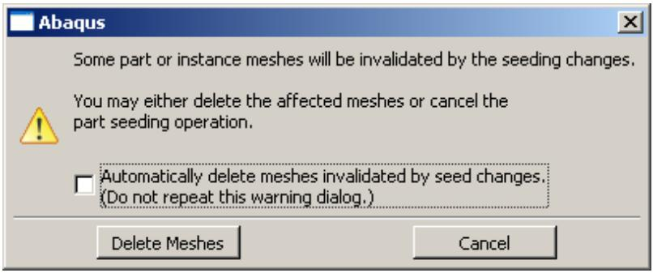

    您可以单击**删除网格**来删除网格，或者通过按**取消**保留您的网格并退出种子设定过程。

    您可以通过勾选**自动删除因种子更改而失效的网格**来避免在当前会话的剩余时间内再次看到此警告消息。下次您尝试对已包含网格的零件、零件实例或区域进行种子设定时，网格将立即被删除，而不会显示任何警告。

## 附加信息

•   对模型进行种子设定
•   理解种子设定
•   在视口内选择对象

## 删除零件或实例种子

通过从主菜单栏选择**种子->删除零件种子**或**种子->删除实例种子**来删除零件或实例种子。

1.  从主菜单栏中，选择**种子->删除零件种子**或**种子->删除实例种子**。

    Abaqus/CAE 会在提示区显示提示，指导您完成整个过程。

    

    提示：您也可以使用工具（位于网格模块工具箱中的种子工具下）来删除种子。（有关更多信息，请参阅**使用网格模块工具箱**。）

2.  执行以下操作之一：
    •   如果您正在删除零件种子，请在提示区单击**是**以确认删除。
    •   如果您的装配体仅包含一个零件实例，请在提示区单击**是**以确认删除。
    •   如果您的装配体包含多个零件实例，请选择要删除其种子的实例，然后单击鼠标键2以确认您的选择。

    Abaqus/CAE 将删除种子。

## 附加信息

•   对模型进行种子设定
•   理解种子设定
•   使用网格模块工具箱
•   在视口内选择对象

通过从主菜单栏选择**种子->删除边种子**，然后选择要删除边种子的边、面或体，来删除边种子。

1.  从主菜单栏中，选择**种子->删除边种子**。

    Abaqus/CAE 会在提示区显示提示，指导您完成整个过程。

    

    提示：您也可以使用工具（位于网格模块工具箱中的种子工具下）来删除种子。（有关更多信息，请参阅**使用网格模块工具箱**。）

2.  选择要删除其边种子的边。

    默认情况下，Abaqus/CAE 允许您从所有项目中选择以删除边种子。要将对象选择限制为仅边、面或体，请使用**选择**工具栏将可选择的对象类型更改为**边**、**面**或**体**。有关更多信息，请参阅**根据对象类型筛选选择**。
3. 当您完成边、面或单元的选择后，请按鼠标中键（mouse button 2）确认您的选择。有关选择对象的更多信息，请参见在视口中选择对象。

所选对象的所有边上的种子都将消失。

## 补充信息

• 为模型添加种子  
• 理解种子  
• 使用 Mesh 模块工具箱  
• 在视口中选择对象

## 使用错误对话框放宽约束

有时，如果种子被过度约束，网格生成会失败。有多种选项可用于处理过度约束情况。

当 Abaqus/CAE 由于种子过度约束而无法创建网格时，将出现以下对话框：


此外，过度约束的种子在视口中会被高亮显示。您可以选择以下选项之一：

• 单击 Yes 以放宽种子约束并继续对该区域进行网格划分。  
• 单击 No 以保留种子约束并取消网格划分过程。

## 补充信息

• 将约束应用于边种子

## 创建和删除网格

本节说明如何使用网格工具在整个部件实例或区域内创建和删除网格。

## 本节内容：

创建网格  
删除网格

## 创建网格

您可以在整个部件或部件实例上，或者仅在选定的区域内创建网格。

要创建网格，请从主菜单栏中选择 Mesh->Part、Mesh->Instance 或 Mesh->Region。

1. 从上下文工具栏的 Object 字段中，选择要划分网格的部件或选择装配体。  
2. 从主菜单栏中，选择 Mesh->Part、Mesh->Instance 或 Mesh->Region。

Abaqus/CAE 会在提示区域显示提示信息，以指导您完成该过程。


提示：您也可以使用位于 Mesh 模块工具箱中的网格工具的 和 工具来对部件、部件实例或区域进行网格划分。（有关更多信息，请参见使用 Mesh 模块工具箱。）

3. 如果您要对装配体进行网格划分，您必须选择要划分网格的实例或区域。单击鼠标中键表示您已完成选择。（有关选择对象的更多信息，请参见在视口中选择对象。）

仅选择那些颜色为绿色、粉色或黄色的部件实例或区域，这些颜色表示它们是可网格化的。要使橙色区域变得可网格化，您必须使用分区工具对其进行细分、分配自底向上网格划分技术，或为其分配四面体单元形状。您已经分配了自底向上网格划分技术的区域显示为浅棕褐色；您必须使用自底向上技术对其进行网格划分或分配另一种网格划分技术。（有关创建自底向上网格的更多信息，请参见自底向上网格划分。）部件显示为白色表示无法进行网格划分，因为它们与独立实例相关联。


## 注意：

仅当选择了 Mesh defaults 颜色映射时，部件实例才会根据其可网格化性进行着色。如果视口中的颜色与本步骤描述的颜色不匹配，请应用此颜色映射。

4. 执行以下操作之一：

• 从提示区域，单击 Yes 以在那些可网格化的区域上生成网格。  
如果装配体包含一个将用四面体单元划分网格的实体区域，Abaqus/CAE 会询问您是否要预览该区域外表面的三角网格。

1. 要预览网格，请在提示区域中启用 Preview boundary mesh（预览边界网格）并单击 Yes 以创建边界网格。

Abaqus/CAE 会在那些可网格化的区域上生成三角形边界网格。

2. 如果某些区域网格划分失败或边界网格不可接受，Abaqus/CAE 提供了多种工具来帮助您在所有区域生成网格并创建可接受的网格。有关更多信息，请参见我可以对边界网格做什么？。  
3. 如果边界网格可接受，请从提示区域单击 Yes 以继续对部件、实例或区域的内部进行网格划分。

Abaqus/CAE 会在那些可网格化的区域上生成网格。

## 补充信息

• 理解网格生成  
• 验证和改进网格  
• 高级网格划分技术  
• 在过程期间使用提示区域  
• 使用 Mesh 模块工具箱  
• 在视口中选择对象

## 删除网格

您可以在整个部件、部件实例上或仅在选定的区域内删除 Abaqus 原生网格。要删除网格，请从主菜单栏中选择 Mesh->Delete Part Native Mesh、Mesh->Delete Instance Native Mesh 或 Mesh->Delete Region Native Mesh。


注意：删除网格不会导致其基础种子被删除，因此您可以修改种子模式并重新生成网格。

1. 从主菜单栏中，选择 Mesh->Delete Part Native Mesh、Mesh->Delete Instance Native Mesh 或 Mesh->Delete Region Native Mesh。

Abaqus/CAE 会在提示区域显示提示信息，以指导您完成该过程。


提示：您也可以使用位于 Mesh 模块工具箱中的网格工具的 或 工具来删除网格。（有关更多信息，请参见使用 Mesh 模块工具箱。）

2. 执行以下操作之一：

• 如果您要删除部件网格，请从提示区域单击 Yes 以确认您要删除该网格。  
• 如果您要从部件或装配体中删除区域网格，请选择要删除网格的区域。单击鼠标中键表示您已完成选择。（有关选择对象的更多信息，请参见在视口中选择对象。）  
• 如果您要从装配体中删除实例网格，请选择要删除网格的实例。单击鼠标中键表示您已完成选择。（有关选择对象的更多信息，请参见在视口中选择对象。）

Abaqus/CAE 删除网格。

## 补充信息

• 理解种子  
• 在过程期间使用提示区域  
• 使用 Mesh 模块工具箱  
• 在视口中选择对象

## 控制网格特性

本节说明如何控制网格的整体特性。

## 本节内容：

分配网格控制  
选择单元形状  
选择网格划分技术  
重定义区域拐角  
设置网格算法  
指定扫掠路径  
扫掠网格划分轮廓接触旋转轴的实体旋转区域  
应用网格堆叠方向  
更改先前已划分网格区域的网格控制  
将 Abaqus 单元与网格区域关联  
更改所有节点和单元的标签  
向四面体网格边界添加楔形单元层

## 分配网格控制

Mesh Controls（网格控制）对话框允许您指定网格中单元的形状以及 Abaqus/CAE 用于创建网格的网格划分技术。在某些情况下，您还可以选择过渡选项并重定义区域拐角。

1. 从主菜单栏中，选择 Mesh->Controls。

Abaqus/CAE 会在提示区域显示提示信息，以指导您完成该过程。


提示：您也可以单击位于 Mesh 模块工具箱中的 工具。

2. 如果您的部件或装配体包含多个区域，请选择您要查看或修改其网格控制的区域，然后按鼠标中键。所有选定的区域必须具有相同的维度。


## 注意：

要查看或修改分配了自由网格划分技术和四面体单元形状的区域的面，或自底向上区域的面的网格控制，您必须将提示区域中的实体选择类型更改为实体区域的面。

出现 Mesh Controls（网格控制）对话框。

3. 选择您所需的网格控制。有关特定网格控制的信息，请参见以下内容：

选择单元形状  
选择网格划分技术  
重定义区域拐角  
设置网格算法  
• 向四面体网格边界添加楔形单元层

4. 如果需要，单击 Defaults（默认值）将 Mesh Controls（网格控制）对话框中的设置更改为默认值。

5. 单击 OK（确定）以保存您的设置并关闭 Mesh Controls（网格控制）对话框。

## 补充信息

• 分配 Abaqus 单元类型  
• 使用 Mesh 模块工具箱  
• 在视口中选择对象

您可以通过从主菜单栏中选择 Mesh->Controls 来控制网格中单元的形状。Element Shape（单元形状）选项位于出现的 Mesh Controls（网格控制）对话框的顶部。
1. 从主菜单栏中选择 Mesh > Controls。

Abaqus/CAE 会在提示区显示提示，引导你完成操作流程。


**提示：** 你也可以使用位于 Mesh 模块工具箱中的工具来设置单元形状。

2. 如果你的部件或装配件包含多个区域，请选择你希望查看或修改其单元形状的那些区域，然后按下鼠标键 2。所有选定的区域必须具有相同的维度。

将出现 **Mesh Controls** 对话框。

3. 从 **Element Shape** 选项列表中，选择你想要的单元形状。

如果你选择的是二维区域，可以从以下单元形状选项中选择：

## Quad（四边形）

仅使用四边形单元。下图显示了使用此设置构建的网格示例：

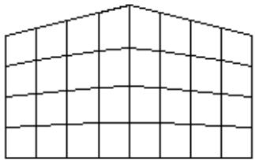

## Quad-dominated（四边形为主）

主要使用四边形单元，但允许在过渡区域使用三角形。此设置为默认设置。下图显示了使用此设置构建的网格示例：

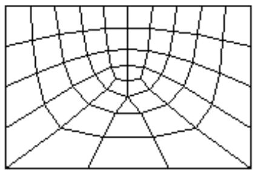

## Tri（三角形）

仅使用三角形单元。此设置是当你对实体区域的面应用网格控制时唯一可用的选项，因为三角形面网格将被用于生成四面体实体网格。下图显示了使用此设置构建的网格示例：

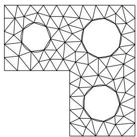

如果你选择的是三维区域，可以从以下单元形状选项中选择：

## Hex（六面体）

仅使用六面体单元。此设置为默认设置。下图显示了使用此设置构建的网格示例：

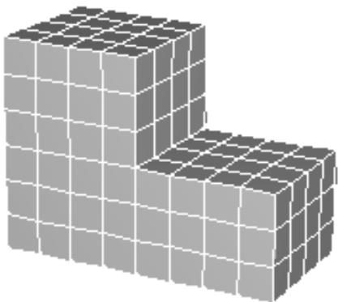

## Hex-dominated（六面体为主）

主要使用六面体单元，但允许在过渡区域使用一些三角棱柱（楔形）。下图显示了使用此设置构建的网格示例：


## Tet（四面体）

仅使用四面体单元。下图显示了使用此设置构建的网格示例：


## Wedge（楔形）

仅使用楔形单元。下图显示了使用此设置构建的单个单元网格示例：


## 4. 单击 OK。

下次在选定区域生成网格时，将遵从你的选择。

如果选定区域已划分网格，系统会提示你删除网格或取消网格控制过程。

## 附加信息

• 控制网格特性  
• 理解网格生成  
• 使用 Mesh 模块工具箱  
• 在视窗中选择对象

Abaqus/CAE 会根据区域的几何形状以及该区域当前的单元形状选择，为模型中的每个可网格区域分配一种默认的自上而下网格划分技术。Abaqus/CAE 使用分配给区域的网格技术为该区域生成网格。你可以使用 **Mesh Controls** 对话框选择替代的网格划分技术。

1. 从主菜单栏中选择 Mesh > Controls。

Abaqus/CAE 会在提示区显示提示，引导你完成操作流程。


**提示：** 你也可以使用位于 Mesh 模块工具箱中的工具来设置网格划分技术。

2. 选择实体区域的面，以便为将进行四面体网格划分或自下而上网格划分的实体区域的边界面分配网格控制。  
3. 如果你的部件或装配件包含多个区域，请选择你希望查看或修改其网格划分技术的那些区域，然后按下鼠标键 2。选定的区域必须具有相同的维度。

将出现 **Mesh Controls** 对话框。

4. 从 **Technique** 选项列表中，选择你想要的网格划分技术。（某些技术仅当它们对选定区域有效时才可用。）

• 如果在上一步中，你选择了多个已经分配了不同网格划分技术的区域，Abaqus/CAE 会选择 **As is**。  
• 选择 **Free** 以创建自由网格。  
• 选择 **Structured** 以创建结构化网格。  
• 选择 **Sweep** 以创建扫掠网格。  
• 选择 **Bottom-up** 以创建自下而上网格。  
如果单元形状分配的更改导致选定区域被自动分配了多种技术，Abaqus/CAE 会选择 **Multiple**。例如，假设对实体部件实例的所有区域应用了自由网格划分技术。如果你将这些区域的单元形状分配从 Tet 更改为 Hex 或 Hex-dominated，Abaqus/CAE 会自动将分配给每个区域的网格划分技术从自由网格划分技术更改为适合每个区域的技术；例如，某些区域使用结构化网格划分，另一些区域使用扫掠网格划分。


## 注意：

自下而上网格划分技术必须手动分配给区域或从区域中移除。当你修改已分配了自下而上网格划分技术的区域的几何形状时，生成的新区域也将被分配自下而上网格划分技术。你可以在 **Mesh Controls** 对话框中单击 **Defaults**，为自下而上区域分配一种自上而下技术。

有关每种网格划分技术的详细信息，请参见理解网格生成。

在向区域的面分配网格控制时，Abaqus/CAE 会根据将用于该面的网格技术对面进行颜色编码。面的颜色可能与区域的颜色不同。例如，自下而上区域的面默认显示为粉红色，因为它们是自由网格划分的。如果你为某些面分配了结构化网格划分技术，它们将显示为绿色。

自下而上区域的实体区域颜色为浅褐色，而将进行四面体网格划分的实体区域颜色为粉红色。

5. 单击 **OK** 关闭对话框并保存你的网格划分技术选择。

下次在选定的部件实例或区域上生成网格时，将遵从你的选择。

如果选定区域已包含网格，系统会提示你删除网格或取消网格控制过程。

## 附加信息

• 控制网格特性  
• 理解网格生成  
• 使用 Mesh 模块工具箱  
• 在视窗中选择对象

对于具有特定拓扑结构的区域，存在结构化网格划分模式。例如，Abaqus/CAE 将一种特定的结构化模式应用于四边形区域，而将另一种模式应用于五边形区域。然而，在某些情况下，你可以通过重新定义区域的角点来更改分配给面区域的结构化模式。你只能为已分配结构化网格划分技术的面区域重新定义角点。

如果你在 **Mesh Controls** 对话框中单击 **Redefine Region Corners**，可以选择你希望 Abaqus/CAE 在创建网格时考虑区域的哪些角点。如果你未选择某个角点，Abaqus/CAE 会在内部将未选中角点两侧的边合并为单个逻辑边（尽管区域的实际拓扑保持不变）。例如，如果你未选择五边形区域的一个角点，Abaqus/CAE 会认为该区域只有四条边而不是五条边。因此，四边形区域的结构化网格划分模式将被应用于该区域，而不是五边形区域的模式。更多信息，请参见二维结构化网格划分。

面区域只有当被三条到五条逻辑边所界定时，才能使用结构化网格划分技术进行网格划分。但是，如果该区域包含虚拟拓扑，Abaqus/CAE 仅在该区域具有四个角点时才能应用结构化网格划分。因此，要重新定义具有虚拟拓扑的区域的角点，该区域必须由超过四个角点界定，并且你必须选择其中的四个现有角点。

1. 从主菜单栏中选择 Mesh > Controls。

Abaqus/CAE 会在提示区显示提示，引导你完成操作流程。


**提示：** 你也可以单击位于 Mesh 模块工具箱中的工具。（更多信息，请参见使用 Mesh 模块工具箱。）

2. 如果你的部件或装配件包含多个区域，请选择你希望重新定义其角点的那些区域，然后按下鼠标键 2。你选择的区域应具有三个或更多顶点。
网格控制对话框随即出现。

3.  如果结构化技术尚未被选中，请选择“结构化”作为网格划分技术。

“重新定义区域角点”按钮将出现在网格控制对话框的右侧。

4.  点击“重新定义区域角点”。

如果您选择了多个区域，此过程将依次处理每个选中的区域。（Abaqus/CAE 会跳过那些无法应用结构化图案或仅包含三个及以下顶点的区域。）当前正在处理的区域将以洋红色高亮显示。该区域当前选定的角点将以黄色高亮显示。

5.  在提示区，选择一个用于确定区域角点的选项。

*   如果您点击“接受高亮显示”，Abaqus/CAE 将接受当前高亮显示的角点。如果选择了多个区域，系统会为下一个区域显示选项。如果只选择了一个区域，则此过程完成，网格控制对话框将重新出现。
*   如果您点击“选择新角点”，当前选定的顶点将变为红色。您必须继续执行下一步。
*   如果您点击“恢复默认设置”，该区域的默认角点将被高亮显示。系统会提示您选择上述的“接受高亮显示”或“选择新角点”。

6.  如果您在上一步中点击了“选择新角点”，请选择您希望作为区域角点的区域顶点。您可以在三个到五个顶点之间进行选择。

*   按住 `[Shift]` 并单击可以选择一个顶点，而不会取消选择所有其他顶点。
*   按住 `[Ctrl]` 并单击可以取消选择一个顶点，而不会取消选择所有其他顶点。
*   选择完顶点后，单击鼠标中键。

选定的顶点为红色，未选定的顶点为黄色。

如果选择了多个区域，过程将对下一个区域重新开始。如果只选择了一个区域，则过程完成，网格控制对话框将重新出现。

## 附加信息

*   控制网格特性
*   使用网格模块工具箱
*   在视口内选择对象

可用的网格算法选项取决于您选择的单元形状和网格划分技术。如果网格算法选项适用于您正在创建的网格类型，网格控制对话框的右侧将出现一个“算法”字段。

Abaqus/CAE 提供以下网格算法选项：

## 选择网格算法

选择“中轴算法”或“前沿算法”。很难预测哪种算法能为特定区域生成更好的网格；您可能需要尝试这两种算法设置。更多信息，请参见中轴算法和前沿算法有什么区别？。

## 最小化网格过渡

您可以控制 Abaqus/CAE 在从粗网格过渡到细网格时，是否尝试最小化网格过渡。在大多数情况下，打开“最小化网格过渡”开关可以减少网格扭曲。但是，如果您关闭“最小化网格过渡”开关，网格可能会更接近指定的网格种子。更多信息，请参见什么是网格过渡？。

## 适当时使用映射网格划分

一些看起来非常复杂的模型实际上包含几何形状相对简单的面。默认情况下，Abaqus/CAE 会在适当时使用映射网格划分技术在简单面上生成单元。您可以关闭“适当时使用映射网格划分”开关以阻止 Abaqus/CAE 使用映射网格划分。但是，如果您对一个具有简单面的模型进行网格划分且不允许使用映射网格划分，那么在简单面上产生的单元质量可能会很差。更多信息，请参见什么是映射网格划分？以及 Abaqus/CAE 何时可以应用映射网格划分？。

## 插入边界层

当您创建四面体单元的自由网格时，您可以沿着区域边界的表面添加一个由楔形单元组成的边界层。边界层由一系列垂直于实体区域壁面堆叠的楔形单元组成，最薄的单元紧贴壁面。边界层创建的网格在壁面处密度很高，并随着其向区域内四面体网格的推进而密度递减。有关创建边界层的详细说明，请参见向四面体网格边界添加楔形单元层。

## 使用默认算法

当您创建四面体单元的自由网格时，您可以选择默认的网格生成算法，或选择包含在 Abaqus/CAE 6.4 及更早版本中的算法。在大多数情况下，默认算法更为稳健，特别是在对复杂形状和薄实体进行网格划分时。更多信息，请参见使用三角形和四面体单元进行自由网格划分。

## 增大内部单元尺寸

如果您选择默认网格生成算法来创建四面体单元的自由网格，可以打开“非标准内部单元增长”开关，并使用滑块控件或文本字段指定内部单元的增长率。增长率必须在 1.0（无增长或最小增长）到 2.0（最大增长）之间。

如果网格密度足以满足所分析的模型要求，并且感兴趣的区域位于网格边界上，那么增大内部单元的尺寸可以提高计算效率。要查看 Abaqus/CAE 生成的内部单元，您可以使用视图截面或使用显示组从视图中移除外部单元。

1.  从主菜单栏中，选择 网格 -> 控制。

    Abaqus/CAE 在提示区显示提示信息，以指导您完成该过程。

    

    提示：您也可以单击工具，该工具位于网格模块工具箱中。（有关更多信息，请参见使用网格模块工具箱。）

2.  如果您的部件或装配体包含多个区域，请选择感兴趣的区域，然后单击鼠标中键。

    网格控制对话框随即出现。如果网格算法选项适用于所选的单元形状和网格划分技术，网格控制对话框的右侧将出现一个“算法”字段。

3.  选择所需的算法选项，然后单击“确定”以保存数据并关闭对话框。

## 附加信息

*   自由网格划分
*   控制网格特性
*   使用网格模块工具箱
*   在视口内选择对象

如果您将扫掠网格划分技术应用于特定区域，该区域的网格控制对话框中将出现一个“重新定义扫掠路径”按钮。如果该区域有多个有效的扫掠路径，您可以单击“重新定义扫掠路径”来选择您偏好的路径。（有关扫掠路径的更多信息，请参见扫掠网格划分。）

如果您要为垫片、连续壳、圆柱或内聚区域指定网格控制，此选项尤其重要。除非您指定另一个方向（有关更多信息，请参见应用网格堆叠方向），否则这些区域类型的方向属性取决于扫掠路径。当您对垫片区域进行网格划分时，每个垫片单元的轴将与扫掠路径方向重合。（有关更多信息，请参见“垫片”和关于垫片单元。）当您对连续壳或内聚区域进行网格划分时，扫掠路径将与堆叠方向对齐。（有关更多信息，请参见使用连续壳单元对部件进行网格划分，以及使用几何和网格工具创建具有内聚单元的模型。）当您使用圆柱形单元对圆柱区域进行网格划分时，所选扫掠/旋转区域的扫掠路径将沿圆柱几何体的周向对齐。（有关更多信息，请参见圆柱实体的扫掠网格划分。）

1.  从主菜单栏中，选择 网格 -> 控制。

    Abaqus/CAE 在提示区显示提示信息，以指导您完成该过程。

    

    提示：您也可以单击工具，该工具位于网格模块工具箱中。（有关更多信息，请参见使用网格模块工具箱。）

2.  如果您的部件或装配体包含多个区域，请选择感兴趣的、可进行扫掠网格划分的区域，然后按下鼠标中键。
    网格控制对话框随即出现。
3.  在网格控制对话框中，如果“扫掠”技术尚未被选中，请选择“扫掠”作为网格划分技术。如果您选择的区域存在多个有效的扫掠路径，对话框底部附近将出现一个“重新定义扫掠路径”按钮。
4.  单击“重新定义扫掠路径”。

    如果您选择了多个区域，此过程将依次处理每个选中的区域。当前正在处理的区域将以洋红色高亮显示，默认扫掠路径将以红色高亮显示，并带有一个箭头指示扫掠方向。

5.  在提示区选择相应的选项，以指定您选择的扫掠路径和方向：

    *   单击“接受高亮显示”以接受视口中高亮显示的扫掠路径。
单击“翻转”可更改当前选定扫描路径的方向。然后单击“是”表示新的扫描路径方向正确。  
单击“选择新路径”（如适用）可选择不同的边作为扫描路径。然后执行以下步骤：

1.  在扫描路径中选择一条边。您可以通过单击鼠标按钮朝向要与扫描路径端点重合的边的端点来指示所需的扫描方向。

新的扫描路径将以红色高亮显示，并带有指示扫描方向的箭头。

2.  如果路径和方向正确，请在提示区中单击“是”；如果要更改扫描路径的方向，请单击“翻转”。然后单击“是”表示新的扫描路径方向正确。

如果选择了多个区域且存在多个有效的扫描路径，该过程将对下一个区域重新开始。如果只选择了一个区域，则过程完成，并且“网格控制”对话框将重新出现。

## 对轮廓接触旋转轴的旋转实体区域进行扫描网格划分

您可以使用分区技术使零件可进行扫描网格划分。

在大多数情况下，除非您创建了策略性放置的分区，否则如果用于创建区域的旋转轮廓接触旋转轴，则无法使用所有六面体单元对旋转实体区域进行扫描网格划分。例如，下图中的圆柱零件无法进行扫描网格划分。

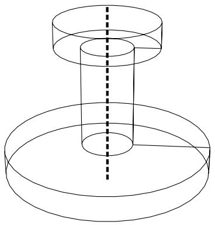

使零件可进行扫描网格划分的分区技术涉及将零件或零件实例划分为以下两个区域：

*   可使用拉伸扫描网格技术进行网格划分的圆柱形核心区域。
*   可使用旋转扫描网格技术进行网格划分的外部区域。

（有关扫描网格划分实体区域的详细信息，请参阅“三维实体的扫描网格划分”。）


提示：以下说明参考了仅当选择“网格默认值”颜色映射时才会出现的颜色线索。在尝试对旋转实体区域进行扫描网格划分的分区操作之前，请将此颜色映射应用于您的视口。

1.  使用“分区”工具集在区域中心创建一个圆柱形核心。（有关分区的详细信息，请参阅“分区”工具集。）创建圆柱形核心的分区在下图中以红色轮廓线标出。


圆柱形核心可使用拉伸扫描网格技术进行网格划分，因此变为黄色。外部区域仍为橙色，因为它尚未可进行网格划分。

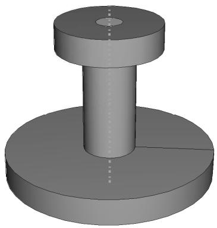

在下一步中，您将创建额外的分区，使Abaqus/CAE能够将外部区域识别为旋转实体，其轮廓不接触旋转轴。

2.  使用“分区”工具集创建任何必要的分区，以勾勒出外部区域的旋转轮廓。该轮廓将用作旋转网格的源面，并将沿着由圆柱形核心定义的圆边进行扫描，以创建实体网格。

例如，下图中使用分区勾勒了外部区域的轮廓（以红色显示）。

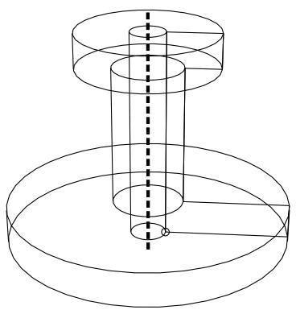

一旦定义了轮廓，内部的圆柱形区域和外部区域都将变为黄色，并准备好进行扫描网格划分。


生成的网格如下图所示。


您可以应用类似技术对旋转区域进行网格划分，即使源面和目标面不是平面也是如此，如下所示。


当使用连续壳单元、粘性单元、圆柱单元或垫片单元对零件进行网格划分时，堆叠方向很重要，因为这些单元具有独特的方向行为。如果使用扫描网格划分，默认的堆叠方向将遵循扫描路径的方向，您可能通过选择不同的扫描路径来更改堆叠方向。但是，您必须单独为零件中的每个单元分配扫描方向——这是一个耗时的过程——并且可用的扫描方向可能不包含您所需的堆叠方向。

堆叠方向工具允许您将堆叠方向分配给实体零件或零件实例中的所有单元或选定单元，只要这些单元尚未分配四面体单元。您可以使用该工具在单个操作中快速将堆叠方向应用于一组单元。您基于选定的面分配堆叠方向；堆叠的方向被设置为使得选定的面是堆叠的顶部。Abaqus/CAE无论单元使用何种网格技术都会应用该方向；因此，扫描方向（如果存在）无关紧要。

在图1中，使用了堆叠方向工具来分配贯穿零件厚度的方向，如红色箭头所示；单元的顶面为棕色。扫描实体零件的复杂轮廓不允许通过扫描路径获得所需的堆叠方向——图中黑色箭头指示了两种可用的扫描方向。

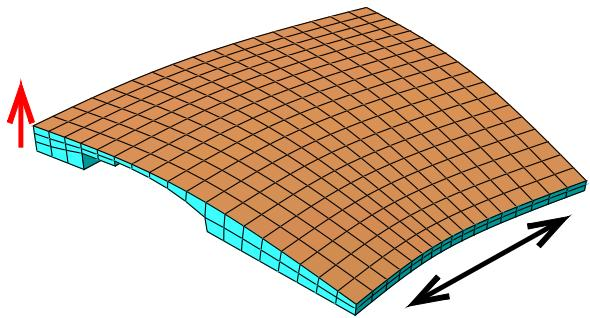  
图1：堆叠方向不必遵循扫描方向。

新堆叠方向的应用可能因所选单元而异。图2说明了一个随着更多单元被划分网格而堆叠方向发生变化的情况。左上角的面被用作参考方向，因此中间图像中两个断开连接的单元的网格方向与此方向匹配。然而，当对中间单元进行网格划分时，右下角单元中单元的方向会更新以与其他两个单元对齐，如右侧图像所示。

  
图2：如果向网格中添加单元，堆叠方向可能会更改。

1.  从主菜单栏中，选择“网格”->“方向”->“堆叠”。

Abaqus/CAE会在提示区显示提示，引导您完成操作过程。


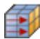

提示：您也可以使用位于“网格”模块工具箱中的“设置网格堆叠方向”工具（更多信息请参阅“使用网格模块工具箱”），以及位于“网格控制”对话框中的“指定堆叠方向”按钮来设置网格堆叠方向。

2.  如果您的零件包含多个单元，请选择要为其分配堆叠方向的单元。
3.  选择一个顶面以定义参考方向。

Abaqus/CAE会在分配方向之前提示您确认选择。

4.  单击“是”接受选定的面和对应的方向，或单击“否”返回到步骤3。

当您接受参考面后，Abaqus/CAE会将堆叠方向应用于选定的单元。

如果任何选定的单元包含圆柱单元，Abaqus/CAE将显示一条警告消息，指出必须删除圆柱单元才能应用新的堆叠方向。单击“是”删除圆柱网格，或单击“否”取消堆叠方向操作。

## 附加信息

*   控制网格特性

## 更改先前已划分网格区域的网格控制

如果您更改了先前已划分网格区域所分配的任何网格控制，则该区域的网格可能变得无效。

在这些情况下，当您在“网格控制”对话框中单击“确定”时，会出现以下警告对话框。


您可以通过单击“删除网格”来删除网格，或者可以通过单击“取消”来保留您的网格并取消“网格控制”对话框中的新设置。

您也可以通过勾选“自动删除因网格控制更改而失效的网格”，在当前会话的剩余时间内避免出现此警告消息。下次您尝试更改已包含网格的区域所分配的控制时，网格将立即被删除，而不会出现警告对话框。

## 附加信息

*   控制网格特性

## 关联 Abaqus 单元与网格区域

要将特定的 Abaqus 单元与网格区域或孤立单元相关联，请从主菜单栏中选择“网格”->“单元类型”。

然后选择要为其分配单元类型的区域，并使用出现的“单元类型”对话框进行分配。
您可以使用对话框为所选区域中可能出现的所有单元形状指定 Abaqus 单元设置，即使这些区域当前只包含少数几种不同的单元形状。例如，即使所选区域仅包含四边形单元，您也可以为其他形状（如三角形）关联单元类型。

有关如何用首选单元类型填充单元类型对话框，请参阅首选单元类型列表。

单元类型设置的行为类似于特征。例如，如果您为某个区域分配了单元类型，然后将该区域进一步分割成更多区域，新区域将继承原始父区域的单元类型设置。

1.  从主菜单栏中选择 **Mesh -> Element Type**。

    Abaqus/CAE 在提示区显示提示，引导您完成该过程。
    
    
    
    **提示：** 您也可以使用 **Mesh** 模块工具箱中的 工具来选择单元类型。（有关更多信息，请参阅使用 Mesh 模块工具箱。）

2.  如果您的装配体或部件同时包含孤立单元和几何区域，请在提示区中选择 **geometry** 以便为几何体分配单元类型。
    
    装配体中的孤立单元属于从属部件实例；您无法为从属部件实例分配单元类型。要为孤立单元分配单元类型，您必须从上下文栏的 **Object** 字段中的部件列表中选择网格部件，然后为该部件的所需单元分配单元类型。

3.  如果您要从多个几何区域中选择，或者如果您要从导入的输出数据库部件中选择单元，请使用以下选择技术：
    
    ## 几何
    
    在视口中使用鼠标选择所需的区域，选择完成后点击鼠标按钮 2。
    
    您只能从同一类型的部件中选择区域；例如，您不能同时选择刚性表面和可变形体。同样，您选择的区域必须具有相同的维度。
    
    ## 孤立网格
    
    使用鼠标选择所需的孤立单元，选择完成后点击鼠标按钮 2。
    
    或者，您可以点击提示区右侧的 **Sets**。将出现一个对话框，其中列出了与网格部件关联的所有单元集。选择所需的单元集，然后点击 **Continue**。有关创建集的信息，请参阅集和表面工具集。
    
    无论使用哪种选择方法，您选择的所有单元必须具有相同的阶次。此外，这些单元必须属于相同类型的部件。

    **单元类型** 对话框将出现。

4.  在对话框的左上角，选择您需要的 **Element Library** 选项。
    
    选择 **Standard** 以从 Abaqus/Standard 单元列表中选择，或选择 **Explicit** 以从 Abaqus/Explicit 单元列表中选择。

5.  选择您需要的 **Geometric Order**：**Linear**（一阶）或 **Quadratic**（二阶）。

6.  从对话框右侧的 **Family** 列表中，为要对模型执行的分析类型选择适当的单元族。例如，如果您计划进行热传导分析，请选择 **Heat Transfer** 族。
    
    您指定的单元库、几何阶次和单元族的默认单元名称将显示在对话框的下半部分。
    
    
    
    **注意：**
    
    您只能设置对应于单个单元族的单元类型。例如，您无法同时为平面应变和热传导族中的线性三角形单元设置单元类型；您必须选择 **heat transfer** 或 **plane strain**。如果在为某个单元族设置单元类型后切换到另一个单元族，前一个单元族的设置将会丢失。

7.  为每个单元形状选择您需要的 Abaqus 单元类型。
    
    a. 点击对应于所需单元形状的选项卡。
    
    b. 选择您需要的单元特性。有关单元控制选项的更多信息，请参阅截面控制。
    
    满足您所有条件的 Abaqus 单元名称及其简要描述将出现在选项卡页面的底部。

8.  点击 **OK** 以确认您的单元类型分配，或点击 **Defaults** 然后点击 **OK** 以将所有单元设置恢复为默认值。
    
    单元类型将根据您的规格进行更改。

9.  要为其他区域设置单元类型，请从步骤 2 开始重复此过程。

## 附加信息

*   网格单元如何对应 Abaqus 单元？
*   哪些类型的单元必须在 Mesh 模块外生成？
*   单元类型分配
*   导入部件
*   在过程中使用提示区
*   使用 Mesh 模块工具箱
*   在视口中选择对象

## 更改所有节点和单元的标签

从主菜单选择 **Mesh -> Global Numbering Control** 以更改装配体中原始区域或选定原始部件实例的节点和单元标签。输入起始标签，Abaqus/CAE 将更改节点和单元标签，同时保留原始顺序和递增规则。您可以在 Abaqus/CAE 生成网格之前或之后更改标签。（有关重新编号孤立节点的信息，请参阅重新编号节点和重新编号单元。）

1.  进入 **Mesh** 模块。
2.  从主菜单选择 **Mesh -> Global Numbering Control**。
3.  如果您正在处理装配体，请选择要修改的原始几何部件实例。

    您可以选择独立或从属部件实例进行修改。但是，对从属部件实例应用的任何操作都是在部件级别执行的，因此适用于该部件的所有实例，即使并非所有实例都被选中。
    
    Abaqus/CAE 显示 **Global Numbering Control** 对话框以及节点和单元的起始标签。如果您选择了一个部件实例，则显示的值是所选部件实例当前的节点和单元起始标签。如果您选择的多个部件实例具有相同的节点和单元起始标签，则会显示这些值；否则，不显示任何值。

4.  在 **Global Numbering Control** 对话框中，输入节点和单元的起始标签。Abaqus/CAE 将相同的起始标签应用于您选择的每个部件实例。

5.  点击 **OK** 以重新编号节点和单元。

    如果网格已存在，Abaqus/CAE 将重新编号节点和单元，并保留原始顺序和递增规则。如果尚未创建网格，当 Abaqus/CAE 对部件或部件实例进行网格划分时，将应用新的起始标签。

## 附加信息

*   重新编号节点
*   重新编号单元

如果您将自由网格划分技术（free meshing technique）和四面体单元形状（tetrahedral element shape）应用于某个区域，则在网格控制（Mesh Controls）对话框中会出现 **Insert boundary layer** 切换开关和 **Assign Controls** 按钮。

如果您向多个网格划分单元格（meshing cells）添加边界层，Abaqus/CAE 会临时固定这些单元格之间任何内部面上的种子，以简化在这些面上创建边界层的过程。

1.  从主菜单栏选择 **Mesh -> Controls**。（详细说明请参阅分配网格控制。）
    
    
    
    **注意：**
    
    您必须选择自由四面体网格才能包含楔形单元（wedge elements）的边界层。

2.  在 **Mesh Controls** 对话框底部附近切换打开 **Insert boundary layer**，然后点击 **Assign Controls**。
    
    Abaqus/CAE 显示 **Boundary Layer** 对话框。

3.  输入 **Wall element height**。
    
    壁单元高度设置了紧贴边界壁的第一层楔形单元的高度或厚度。

4.  输入 **Growth factor**。
    
    从壁单元开始向内移动，每一后续层的高度由前一层高度乘以增长因子确定。增长因子必须在 1.0 到 2.0 之间（含端点），其中 1.0 表示无增长，2.0 表示每新增一层的厚度加倍。

5.  输入边界层中楔形单元的层数。
    
    Abaqus/CAE 根据您在步骤 3 到步骤 5 中的输入显示总 **Boundary layer thickness**。

6.  如果需要，切换打开 **Inactive faces**，并点击 **Edit** 以选择您不想包含在边界层中的面。
    
    非活动面应大致平坦，且垂直于局部流动方向或沿对称平面。
    
    
    
    **注意：**
    
    默认选择方法基于您最近使用的选择方法。要切换回另一种方法，请点击提示区右侧的 **Select in Viewport** 或 **Sets**。

7.  如果需要，切换打开 **Create set**，并输入集名称以保存包含所有边界层单元的集。
8. 单击 **OK** 关闭 **Boundary Layer** 对话框。

在您划分区域网格时将创建边界层。

如果由于边界层中的问题导致网格生成失败，Abaqus/CAE 会显示边界层网格预览以及一个警告对话框。在关闭警告对话框并删除网格预览之前，请查找问题，例如尖锐拐角附近自相交的层；可能的故障模式类似于在“网格偏移期间减少单元扭曲和折叠”中描述的偏移网格的故障模式。对边界层控制进行必要的修正，并再次尝试划分区域网格。

## 附加信息

• 控制网格特征

## 获取网格信息和统计

本节说明如何使用 Mesh 模块中的验证工具以图形方式验证网格中使用的单元质量。本节还描述如何使用 Mesh 模块中的 **Query** 工具集获取网格、单元和节点的统计列表。

## 本节内容：

验证单元质量  
获取网格信息

## 验证单元质量

您可以验证选定区域中网格的质量以及选定单元的质量。

要验证网格的质量，请从主菜单栏选择 **Mesh -> Verify**。网格验证工具允许您执行以下操作：

选择一个部件，或选择一个或多个部件实例或区域；并突出显示不满足指定标准（如纵横比）的单元。您还可以为每个选定的部件、部件实例或区域获取网格统计信息，例如单元总数、突出显示的单元数，以及选定标准的平均值和最差值。
选择一个部件，或选择一个或多个部件实例或区域；并突出显示未通过 Abaqus/Standard 和 Abaqus/Explicit 中包含的输入文件处理器所含网格质量测试的单元。
• 保存包含由验证测试突出显示的单元的集合。对于原生网格，您可以保存与突出显示的单元相关的单元体、面或边集合。

您还可以获取单个单元的质量信息。有关更多信息，请参阅“验证您的网格”。

## 附加信息

• 验证您的网格  
• 获取网格信息

## 验证选定单元

1. 要验证选定单元的质量，请从主菜单栏选择 **Mesh -> Verify**。
   Abaqus/CAE 在提示区显示提示信息以指导您完成此过程。

   

   提示：您也可以使用工具来验证选定单元，该工具位于 Mesh 模块工具箱中。（有关更多信息，请参阅“使用 Mesh 模块工具箱”。）

2. 从提示区的 **Select the regions to verify by** 字段中，选择 **Element**。
3. 选择要验证的单元。Abaqus/CAE 在消息区显示以下信息：
   • 部件或部件实例的名称
   • 单元索引
   • 单元形状
   • 三角形和四面体单元的形状因子
   • 最小和最大面角角度
   • 纵横比
   • 几何偏差因子
   • 稳定时间增量
   • 声学单元的最大允许频率
   • 最短边和最长边
   • 单元是否通过 Abaqus/Standard 和 Abaqus/Explicit 输入文件处理器中的检查

4. 根据需要继续选择单元。

5. 完成选择单元后，可以执行以下任一操作：
   • 在视口中单击鼠标按钮 2，或
   • 从工具箱中选择任何其他工具，或
   • 单击提示区的取消按钮 **A**，或
   • 单击 Mesh 模块工具箱中的 **verify mesh** 工具。

## 验证部件、部件实例或区域

1. 从上下文栏的 **Object** 字段中，选择一个部件或选择装配体。
2. 从主菜单栏选择 **Mesh -> Verify**。
   Abaqus/CAE 在提示区显示提示信息以指导您完成此过程。

   

   提示：您也可以使用工具来验证网格，该工具位于 Mesh 模块工具箱中。（有关更多信息，请参阅“使用 Mesh 模块工具箱”。）

3. 从提示区的文本字段中，选择要验证的区域类型：
   • 选择 **Part** 或 **Part Instances**，然后选择要验证其网格的部件或部件实例，并按鼠标按钮 2。
   **Geometric Regions**。选择要验证其网格的单元体、面或边，并按鼠标按钮 2。

   Abaqus/CAE 显示 **Verify Mesh** 对话框。

4. 从 **Verify Mesh** 对话框的顶部，单击对应于所需验证检查的选项卡。提供以下验证类型：
   • 形状度量（Shape metrics）
   • 尺寸度量（Size metrics）
   • 分析检查（Analysis checks）

   您可以在多个选项卡页面上指定验证检查。当您单击 **Highlight** 时，Abaqus/CAE 会参考所有三个选项卡页面上指定的验证检查。

5. 要保存包含选定验证检查结果的集合，请在 **Verify Mesh** 对话框底部附近切换启用 **Create set**，然后接受默认集合名称或为集合输入新名称。
   如果有任何结果显示，Abaqus/CAE 会在您单击 **Highlight** 时创建该集合，如下一步所述。

6. 如果您想在 **Shape metrics** 选项卡页面上指定验证检查，请执行以下操作：
   a. 从 **Shape factor** 选项中，为选择中的三角形单元和四面体单元指定形状因子标准。如果您的选择中同时包含三角形单元和四面体单元，**Shape factor** 选项将为每种类型提供单独的控件；如果您的选择中仅包含三角形单元或仅包含四面体单元，则提供单一控件。
   b. 如果您的选择包含三角形单元，您可以从 **Tri-Face Corner Angle** 选项中指定三角形单元的小面角角度和大面角角度。
   c. 如果您的选择包含四面体单元，您可以从 **Quad-Face Corner Angle** 选项中指定四面体单元的小面角角度和大面角角度。
   d. 为 **Aspect ratio** 指定一个值。

   有关选择标准的详细描述，请参阅“验证您的网格”。

7. 如果您想在 **Size metrics** 选项卡页面上指定验证检查，请为以下任何一项指定失败标准：
   • 几何偏差因子
   • 最短边
   • 最长边
   • 稳定时间增量
   • 声学单元的最大允许频率

   稳定时间增量仅适用于 Abaqus/Explicit 单元库中的单元。声学单元的最大允许频率仅适用于 Abaqus/Standard 单元库中的声学单元。

   有关选择标准的详细描述，请参阅“验证您的网格”。

8. 如果您想指定分析检查，请单击 **Analysis checks** 选项卡，并切换 **Errors** 和 **Warnings** 以选择将突出显示哪些单元。

9. 单击 **Highlight**。
   Abaqus/CAE 会突出显示在 **Shape Metrics** 或 **Size Metrics** 选项卡页面中指定的单元检查中失败的单元，作为警告。此外，使用 Abaqus/Standard 和 Abaqus/Explicit 输入文件处理器中的检查生成错误或警告的任何单元都会以适当的颜色突出显示。如果您在第 5 步中选择了 **Create set**，Abaqus/CAE 会保存一个包含突出显示结果的集合。此外，Abaqus/CAE 在消息区显示信息，例如部件实例名称、单元总数、突出显示的单元数，以及选定标准的平均值和最差值。

   无论您在 **Analysis checks** 选项卡页面中选择 **Errors** 还是 **Warnings**，Abaqus/CAE 还会在消息区显示测试的单元总数以及错误和警告的数量。在大多数情况下，从单元形状可以明显看出输入文件处理器发出错误或警告的原因。如有必要，您可以从 Job 模块提交数据检查分析，并查看 Abaqus 写入数据文件的消息。Abaqus/CAE 不支持梁、垫片或内聚单元的分析检查。

10. 从 **Verify Mesh** 对话框底部的按钮中，执行以下操作：
    • 单击 **Reselect** 选择不同的部件实例或区域。
    • 单击 **Defaults** 恢复所有选项卡上的默认单元失败标准。
    • 单击 **Dismiss** 关闭 **Verify Mesh** 对话框。

    您对网格验证标准的更改将被保存以供未来的 Abaqus/CAE 会话使用。

要获取有关网格的信息，请从主菜单栏选择 **Tools -> Query**。您可以请求以下信息：
• 选定部件、部件实例或区域中的节点和单元总数，以及每种单元形状的单元数量。
• 选定单元的类型和连接关系。
• 壳单元和膜单元正面与负面的定义。  
• 梁单元和桁架单元的切线方向。  
• 网格堆叠方向。  
• 边界单元面是否存在不兼容的界面、裂纹或间隙，以及是否与其他面相交。  
• 是否存在自由或非流形的外部单元边。  
• 是否存在未网格化的区域。

1.  从上下文工具栏的 **对象** 字段中，选择一个部件或选择装配体。

2.  从主菜单栏中，选择 **工具 -> 查询**。


提示：您也可以在 **查询** 工具集中选择该工具。

Abaqus/CAE 将显示 **查询** 对话框。

3.  在 **查询** 对话框中，选择以下查询之一：

## 壳单元法向

Abaqus/CAE 以着色渲染样式显示部件或装配体。壳单元的表面法向与壳法向一致的侧面（正面）显示为棕色；相对的一面（负面）显示为紫色。

## 梁单元切线

Abaqus/CAE 显示青色箭头，指示梁切线的方向。

## 网格堆叠方向

对于六面体和楔形单元，Abaqus/CAE 将顶面染成棕色，底面染成紫色。同样，箭头指示四边形单元的朝向。此外，Abaqus/CAE 会高亮显示任何朝向不一致的单元面和边。

## 网格

对于装配体、部件或部件实例、几何区域或单元，Abaqus/CAE 将显示以下信息：

•   所选区域中的节点和单元总数  
•   每种单元形状的单元数量

默认情况下，Abaqus/CAE 在消息区显示网格信息，但您可以通过切换提示区中的 **显示详细报告** 选项，以表格形式在 **网格统计** 对话框中显示此信息。**网格统计** 对话框还允许您按部件实例或按单元类型显示网格信息。

## 单元

选择一个单元。Abaqus/CAE 在消息区显示以下信息：

•   单元标签  
•   单元拓扑  
•   Abaqus/CAE 将用于分析的单元类型  
•   节点连接性

## 网格间隙/相交

选择一个部件实例。Abaqus/CAE 会在当前视口中高亮显示模型边界单元面的所有边，显示以下问题：

•   不兼容的界面  
•   裂纹或间隙  
•   与其他面相交

此外，如果发现相交的单元，Abaqus/CAE 会显示一个对话框，允许您保存一个包含共享高亮边单元的集合。如果模型几何可用，您可以保存一个包含与高亮单元边相关的体、面或边的集合。

## 自由/非流形边

如果当前视口包含一个具有多个部件实例的装配体，请为查询选择一个或多个实体或壳实例。Abaqus/CAE 会高亮显示两种类型的外部单元边：

•   自由单元边是仅属于一个外部单元面的外部边。  
•   非流形单元边是被两个以上相邻外部单元面共享的外部边。

如果 Abaqus/CAE 发现自由或非流形单元边，它会在消息区显示这些边的总数。Abaqus/CAE 还会显示一个对话框，您可以从中保存一个包含所有具有高亮边单元的单元集。如果没有自由或非流形边，消息区会提示所有外部单元边恰好被两个外部单元面共享。图 1 显示了一个拉伸的壳部件，其中自由边和非流形边以红色高亮显示。沿三个平面外边界分布的单元边是自由边。三个面相交处的单元边是非流形边——每条边都被三个外部单元面共享。

  
图 1: 自由单元边构成外部边，非流形边形成三个平面壳连接处的中心。

壳部件应根据部件设计在适当位置包含自由边和非流形边。实体部件不应包含任何自由边或非流形边。

## 未网格化区域

Abaqus/CAE 显示一个警告对话框，并高亮显示模型中任何未网格化的区域。切换 **将区域保存到集合中** 并选择一个集合名称，以保存包含未网格化区域的集合。

如果没有未网格化的区域，Abaqus/CAE 会在消息区显示一条消息，指示所有区域已完全网格化。该查询不考虑不需要网格的区域，例如显示体和解析刚性面。

## 未关联的几何

Abaqus/CAE 显示 **查询未关联几何** 对话框，该对话框允许您高亮显示部件或模型中未与网格关联的体、面、边或顶点。切换 **创建集合** 并选择一个集合名称，以保存包含未与网格关联的几何的集合。

如果您选择的所有几何都已与网格关联，Abaqus/CAE 会显示一个对话框，指示所有选定的几何都与网格关联。该查询不考虑不需要网格的区域，例如显示体和解析刚性面。

4.  获取完网格信息后，关闭 **查询** 对话框。

## 附加信息

•   控制网格特性  
•   验证单元质量

## 创建网格部件

从主菜单栏选择 **网格 -> 创建网格部件**，以从当前网格化的部件或装配体创建一个没有几何特征的网格部件。您也可以从已网格化的选定部件实例创建网格部件。如果您仅网格化了装配体或所选部件实例的部分区域，Abaqus/CAE 仅会从这些网格化区域创建网格部件；未网格化的区域不会包含在网格部件中。

网格部件不包含特征信息，它由节点、单元、面和集合的集合定义。当您创建网格部件时，集合、面和截面分配会从源部件或部件实例中复制，因此应用于原始部件的载荷和相互作用也会应用于网格部件。您可以向网格部件添加几何特征，也可以使用网格编辑工具修改其节点和单元。更多信息，请参见 **我能使用网格编辑工具集做什么？**。

1.  从上下文工具栏的 **对象** 字段中，选择一个已网格化的部件或选择装配体。  
2.  从主菜单栏中，选择 **网格 -> 创建网格部件**。  
3.  如果装配体包含多个部件实例，您必须选择要包含在网格部件中的部件实例。在提示区中，单击 **完成** 以表明您已完成部件实例的选择。  
4.  在提示区中，输入新部件的名称。如果您从装配体中选择了部件实例，可以切换 **替换部件实例** 以使用新网格部件的实例替换装配体实例。

Abaqus/CAE 将创建网格部件。

## 控制自适应网格重划

本节介绍如何定义自适应网格重划规则以及如何手动自适应地重划模型的网格。

## 本节内容:

创建网格重划规则  
为网格重划规则选择步骤和误差指示器输出变量  
选择网格重划规则的尺寸方法  
选择网格重划规则约束  
网格重划规则管理器  
手动调整尺寸和重划网格

## 创建网格重划规则

网格重划规则使 Abaqus/CAE 能够迭代地调整您的网格，以满足您指定的误差指示器目标和尺寸标准。更多信息，请参见 **什么是网格重划规则？**。

1.  从主菜单栏中，选择 **自适应 -> 网格重划规则 -> 创建**。


提示：您也可以使用位于 **网格** 模块工具箱的网格工具中的工具创建网格重划规则。（更多信息，请参见 **使用网格模块工具箱**。）

2.  选择 Abaqus/CAE 将应用网格重划规则的区域，或单击 **完成** 以选择整个模型。如果将网格重划规则分配给一个依赖的实例，Abaqus/CAE 将重划原始部件的网格，该部件的每个依赖实例都将继承相同的网格。所选区域的建模空间必须是同质的。例如，Abaqus/CAE 不允许您选择一个同时包含实体和壳的区域。

如有必要，应使用 **分区** 工具集来隔离将产生应力奇异的区域，并将这些区域从网格重划规则中排除。更多信息，请参见 **奇异性**。

3.  出现 **创建网格重划规则** 对话框。  
4.  如果需要，使用 **名称** 文本字段更改新规则的名称。  
5.  如果需要，使用 **描述** 文本字段输入网格重划规则的描述。您可以使用描述来帮助您跟踪网格重划规则的范围和目的。**网格重划规则管理器** 会显示网格重划规则的名称和描述。
6. 单击**Step and Indicator**（步骤与指示器）选项卡以选择以下内容：

• 网格重划分规则将应用的**Step**（步骤）。  
• Abaqus/CAE 将写入输出数据库的误差指示器输出变量，以及写入频率。

更多信息，请参见 *为网格重划分规则选择步骤和误差指示器输出变量*。

7. 单击**Sizing Method**（尺寸方法）选项卡以选择以下内容：

• Abaqus/CAE 在网格重划分过程中用于计算单元尺寸的方法。  
• 在自适应网格重划分过程中是使用误差指示器目标的自动缩减，还是指定误差指示器目标。

更多信息，请参见 *选择网格重划分规则尺寸方法*。

8. 单击**Constraints**（约束）选项卡，选择网格重划分过程中对单元尺寸的约束。更多信息，请参见 *选择网格重划分规则约束*。  
9. 单击**OK**（确定）以创建网格重划分规则并关闭**Create Remeshing Rule**（创建网格重划分规则）对话框。

## 附加信息

• 理解自适应过程  
• 理解自适应网格重划分  
• 手动调整尺寸与重新划分网格  
• 关于自适应网格重划分

## 为网格重划分规则选择步骤和误差指示器输出变量

创建网格重划分规则时，必须选择该规则将应用的**Step**（步骤）。还必须选择在分析期间 Abaqus/CAE 将写入输出数据库的误差指示器输出变量及其写入频率。误差指示器输出变量是自适应网格重划分过程的基础。它们为 Abaqus/CAE 提供信息，描述在何处需要细化网格以接近或达到期望的误差指示器目标。此外，Abaqus/CAE 使用误差指示器输出变量来确定在何处可以粗化网格而不会引入不可接受的误差。请参见 *影响自适应网格重划分的误差指示器选择*。

您可以使用自适应绘图器插件来查看选定误差指示器的历史记录以及自适应分析过程中的单元计数。更多信息，请参见 *显示自适应网格重划分误差指示器的历史*。

1. 在**Create Remeshing Rule**（创建网格重划分规则）对话框中，单击**Step and Indicator**（步骤与指示器）选项卡。  
2. 单击**Step**（步骤）字段右侧的箭头，从出现的列表中选择您需要的步骤。该网格重划分规则将仅在此步骤期间应用；但是，您可以将具有相同设置的不同网格重划分规则应用到模型中的另一个步骤。自适应网格重划分仅适用于使用 Abaqus/Standard 的分析过程。此外，Abaqus/CAE 不能在频率提取和稳态动态过程中应用自适应网格重划分。更多信息，请参见 *哪些分析过程可以与自适应网格重划分一起使用？*。  
3. 选择误差指示器输出变量写入输出数据库的频率。您可以选择在每次增量后或步骤最后一个增量结束后写入变量。Abaqus/CAE 根据步骤最后一个增量中的误差指示器值对模型进行网格重划分。但是，如果分析未能收敛，并且您保存了每次增量后的误差指示器输出变量，则可以使用最新的值手动对模型进行网格重划分并继续分析。更多信息，请参见 *手动调整尺寸与重新划分网格*。  
4. 从**Error Indicator Variables**（误差指示器变量）列表中，选择将写入输出数据库的一个或多个变量。对于您选择的每个变量，Abaqus/CAE 还会将一个伴随的基础求解变量写入输出数据库。

## 附加信息

• 影响自适应网格重划分的误差指示器选择  
• 理解自适应过程  
• 理解自适应网格重划分  
• 创建网格重划分规则  
• 关于自适应网格重划分  
• 显示自适应网格重划分误差指示器的历史

## 选择网格重划分规则尺寸方法

您可以允许 Abaqus/CAE 根据误差指示器输出变量选择默认的尺寸方法，或者您可以指定一个用于网格重划分规则中所有误差指示器的尺寸方法。如果指定尺寸方法，您还可以指定自适应目标。更多信息，请参见 *基于求解的网格尺寸*。

1. 在**Create Remeshing Rule**（创建网格重划分规则）对话框中，单击**Sizing Method**（尺寸方法）选项卡。  
2. 单击**Method**（方法）字段右侧的箭头，并选择以下网格尺寸算法之一：

选择**Default method and parameters**（默认方法和参数）以允许 Abaqus/CAE 为每个误差指示器输出变量选择默认的计算方法。默认情况下，除单元能量（ENDENERI）和热通量（HFLERI）之外的所有误差指示器都使用**Minimum/maximum control**（最小/最大控制）网格尺寸算法。ENDENERI 和 HFLERI 使用**Uniform error distribution**（均匀误差分布）算法。默认的误差目标是带有适度网格偏置的**Automatic target reduction**（自动目标缩减）。  
选择**Uniform error distribution**（均匀误差分布）网格尺寸算法以强制 Abaqus/CAE 应用一种尺寸方法，该方法试图在模型中的每个单元中都满足指定的误差目标。在大多数情况下，这种方法会导致全局收敛的网格。  
选择**Minimum/maximum control**（最小/最大控制）网格尺寸算法以控制基础求解的最小值和最大值位置处的网格密度。

更多信息，请参见 *基于求解的网格尺寸*。

3. 如果您选择了**Uniform error distribution**（均匀误差分布），请指定 Abaqus/CAE 用于确定误差指示器目标的方法：

选择**Automatic target reduction**（自动目标缩减）以允许 Abaqus/CAE 生成连续的网格细化，试图将求解误差从自适应过程中的上一个作业减少一个固定量。您在**Job**（作业）模块中创建自适应过程时选择最大网格迭代次数。如果选择**Automatic target reduction**（自动目标缩减），当误差指示器达到 1% 时，Abaqus/CAE 将认为规则已满足。1% 的标准仅旨在防止分析作业成本过高。在大多数情况下，Abaqus/CAE 将完成您在**Job**（作业）模块中创建自适应过程时指定的所有网格重划分迭代。  
选择**Fixed target**（固定目标），并输入误差百分比目标。Abaqus/CAE 使用此值应用一种尺寸方法，试图在模型中的每个单元中都满足误差目标。这种方法确保了全局收敛的网格。当误差指示器达到误差指示器目标时，Abaqus/CAE 将认为规则已满足。

4. 如果您选择了**Minimum/maximum control**（最小/最大控制），请在**Error Indicator Targets**（误差指示器目标）区域执行以下操作：

a. 指定 Abaqus/CAE 用于确定误差目标的方法：

选择**Automatic target reduction**（自动目标缩减）以生成连续的网格细化，试图将求解误差从先前的分析减少一个固定量。您在**Job**（作业）模块中选择最大网格迭代次数。如果选择**Automatic target reduction**（自动目标缩减），当误差指示器达到 1% 时，Abaqus/CAE 将认为规则已满足。1% 的标准仅旨在防止分析作业成本过高。在大多数情况下，Abaqus/CAE 将完成您在**Job**（作业）模块中创建自适应过程时指定的所有网格重划分迭代。  
选择**Fixed targets**（固定目标），并在基础求解的最大值和最小值位置输入误差指示器百分比目标。Abaqus/CAE 使用这些值应用一种异质尺寸方法，试图在各自的位置满足两个目标。当对应于基础求解最大值的误差指示器达到时，Abaqus/CAE 将认为规则已满足。此外，这两个误差目标有助于 Abaqus/CAE 确保网格细化集中在感兴趣的区域。相反，它们也有助于 Abaqus/CAE 确保不会对基础求解结果值较低的区域应用不成比例的细化。

b. 指定**Mesh Bias**（网格偏置）。网格偏置进一步调整最大和最小基础求解位置之间的尺寸分布。当您选择**Strong**（强）时，尺寸方法作用更激进，并将更多单元集中在基础求解强度高的位置附近。当您选择**Weak**（弱）时，尺寸方法作用较缓和，在基础求解强度高的位置附近生成的单元较少。图 1 说明了偏置因子的影响。

  
图 1：偏置因子对单元尺寸分布的影响。

## 附加信息

• 基于求解的网格尺寸  
• 理解自适应过程  
• 理解自适应网格重划分  
• 创建网格重划分规则  
• 关于自适应网格重划分

## 选择网格重划分规则约束

您可以定义 Abaqus/CAE 在自适应网格重划分过程中应用的单元尺寸约束。您还可以指定速率限制，以控制更大和更小单元的引入，并调节 Abaqus/CAE 应用尺寸方法的激进程度。
您指定的最小和最大单元尺寸限制了网格尺寸函数（mesh sizing function）中使用的尺寸，Abaqus/CAE 使用该函数来指导内部网格划分算法。您指定的尺寸并非对单元尺寸的绝对约束——生成网格中的单元尺寸仅近似于尺寸函数。因此，某些单元边可能大于或小于您指定的最大和最小单元尺寸。

您指定的最大单元数量限制了由网格尺寸函数生成的单元数量。网格尺寸函数调整目标误差和单元尺寸，使得重划分区域内生成的单元数量不超过指定值。生成网格中的单元数量（与单元尺寸一样）仅近似于尺寸函数。因此，生成的单元数量可能大于您指定的最大单元数量。

1. 在"创建重划分规则"（Create Remeshing Rule）对话框中，单击"约束"（Constraints）选项卡。
2. 指定最小和最大"单元尺寸"（Element Size）。

   指定"最小值"（Minimum）以对重划分算法计算出的单元尺寸施加下限。您可以选择 Abaqus/CAE 计算出的最小单元尺寸，也可以手动输入最小单元尺寸。
   指定"最大值"（Maximum）以对重划分算法计算出的单元尺寸施加上限。您可以选择 Abaqus/CAE 计算出的最大单元尺寸，也可以手动输入最大单元尺寸。

3. 如果需要，指定"近似最大单元数"（Approximate maximum number of elements）以对重划分算法计算出的单元总数施加上限。

4. 指定"速率限制"（Rate Limits）。

   • "细化率限制"（Refinement rate limit）调节尺寸方法的激进程度，并控制较小单元的引入。选择以下选项之一：
     - 选择"使用默认"（Use default）以指定一个介于"高"和"低"之间的中间细化限制。
     选择"指定"（Specify）并拖动"细化"（Refinement）滑块以指定速率限制。指定"低"（Low）表示单元尺寸最小程度的减小；指定"高"（High）表示原始单元尺寸最大程度的减小。
     细化因子对自适应网格划分过程的收敛性有显著影响，并可能帮助您实现更快、更高效的网格收敛。
     - 选择"不细化"（Do not refine）以防止单元尺寸减小。

   • "粗化率限制"（Coarsening rate limit）调节尺寸方法的激进程度，并控制较大单元的引入。选择以下选项之一：
     选择"使用默认"（Use default）以使用默认限制。
     选择"指定"（Specify）并拖动"粗化"（Coarsening）滑块以指定速率限制。指定"低"（Low）表示单元尺寸最小程度的增长；指定"高"（High）表示单元尺寸最大程度的增长。
     选择"不粗化"（Do not coarsen）以防止单元尺寸增长。

## 附加信息
• 了解自适应过程  
• 了解自适应重划分  
• 创建重划分规则  
• 关于自适应重划分

## 重划分规则管理器
"重划分规则管理器"（Remeshing Rules Manager）与 Abaqus/CAE 中的其他管理器类似，允许您执行以下操作：

• 创建重划分规则。有关更多信息，请参阅创建重划分规则。
• 编辑选定的重划分规则。
• 复制、重命名、抑制、恢复或删除选定的重划分规则。

您可以通过从主菜单栏选择"自适应"（Adaptivity）->"重划分规则"（Remeshing Rule）->"管理器"（Manager）来显示重划分规则管理器。

重划分规则管理器中的两列显示以下内容：

## 名称
"名称"（Name）列显示重划分规则的名称。单击"重命名"（Rename）可重命名选定的重划分规则。

## 描述
"描述"（Description）列显示重划分规则的描述。您可以使用描述来帮助您跟踪重划分规则的范围和目的。

## 附加信息
• 了解自适应过程  
• 了解自适应重划分  
• 创建重划分规则  
• 关于自适应重划分

要了解重划分规则对 Abaqus/CAE 生成的网格的影响，您可以手动应用规则并查看其对生成网格的影响。但是，在重划分模型之前，您必须运行分析并创建包含错误指示器输出变量的输出数据库。然后，您可以更改尺寸方法和约束，并查看修改后的规则对生成网格的影响。当您确信重划分规则符合您的意图时，可以使用相同的规则来控制由自动重划分驱动的多个迭代。您还可以使用手动重划分来继续过早结束的自适应过程。

有关更多信息，请参阅"自动自适应重划分和手动自适应重划分有什么区别？"以及"我何时需要使用手动自适应重划分？"。

1. 从主菜单栏，选择"自适应"（Adaptivity）->"手动自适应重划分"（Manual Adaptive Remesh）。
   Abaqus/CAE 将显示"手动自适应重划分"（Manual Adaptive Remesh）对话框。

   

   **提示：** 您也可以使用位于"网格"（Mesh）模块工具箱中的工具来手动调整尺寸和重划分。（有关更多信息，请参阅使用网格模块工具箱。）

2. 在"ODB"字段中，输入包含错误指示器输出变量的输出数据库名称。Abaqus/CAE 使用错误指示器来驱动重划分算法。

   Abaqus/CAE 将显示输出数据库中每个重划分规则的以下信息：
   • 规则的名称。
   • 规则使用的错误指示器输出变量的描述。
   • 百分比目标误差。这是您在创建重划分规则时指定的值。如果您选择了固定目标，Abaqus/CAE 将显示最大和/或最小基础解目标。如果您选择了"默认方法和参数"（Default methods and parameters），Abaqus/CAE 将显示一个破折号；如果您选择了"自动目标缩减"（Automatic target reduction），则显示"自动"（Auto）。
   • 规则使用的尺寸方法。

3. 如果需要，单击"显示错误"（Display Error）。
   Abaqus/CAE 将显示每个错误指示器输出变量的百分比"错误指示器结果"（Error Indicator Result）和"单元计数"（Element Count）。单元计数是应用重划分规则区域中的单元数量。

4. 单击"手动自适应重划分"（Manual Adaptive Remesh）。
   Abaqus/CAE 将重划分模型。所有活动（未抑制）的重划分规则都参与模型的重划分。如果您将多个重划分规则应用于同一区域，则生成最精细网格的规则具有优先权。

5. 如果需要，您可以从主菜单选择"自适应"（Adaptivity）->"重划分规则"（Remeshing Rule）->"编辑"（Edit）->"规则名称"（rule name）并修改定义规则的参数。然后，您可以返回"手动自适应重划分"对话框，查看修改后的规则对误差估计和生成网格的影响。

   

   **注意：**
   当您编辑重划分规则时，您可以修改参数，例如重划分规则尺寸方法以及单元尺寸的约束，并查看更改对生成网格的影响。但是，如果您更改了分析步或错误指示器输出变量，则必须重新运行分析。

6. 您可以修改重划分规则并手动重划分模型，直到对生成的网格满意为止。然后，您可以使用相同的规则来驱动由 Abaqus/CAE 控制的一系列迭代重划分操作。有关更多信息，请参阅创建、编辑和操作自适应过程。

## 附加信息
• 自动自适应重划分和手动自适应重划分有什么区别？  
• 我何时需要使用手动自适应重划分？  
• 了解自适应过程  
• 关于自适应重划分

您使用"优化"（Optimization）模块来创建优化任务，该任务可用于在给定一组目标和一组限制的情况下优化模型的拓扑或形状。例如，优化可以尝试从选定区域移除材料，以满足最大重量目标，同时保持最小刚度。

## 本节内容：
了解优化模块的作用  
进入和退出优化模块  
了解优化  
使用优化模块工具箱  
查看和排查优化  
创建和配置优化任务  
配置设计响应  
创建目标函数  
创建约束  
配置几何限制  
创建局部停止条件

---

[上一节：载荷模块](load-module.md) · [下一节：优化、作业和草图模块](optimization-job-sketch.md)
