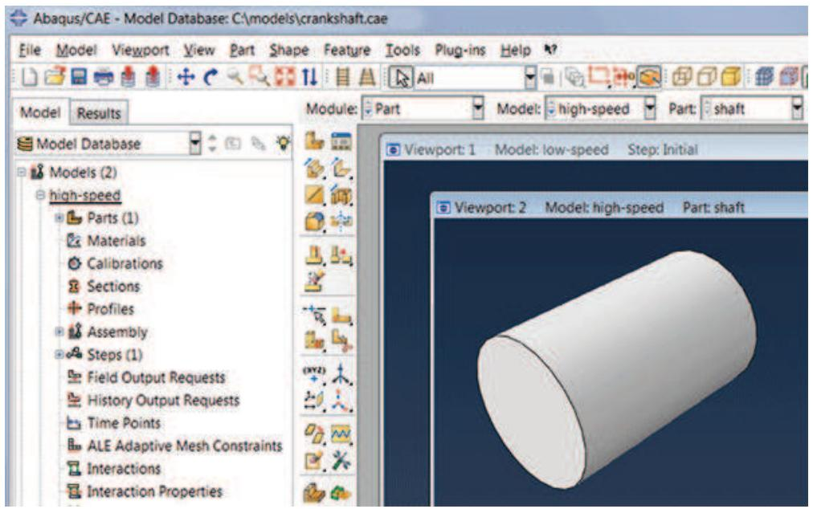
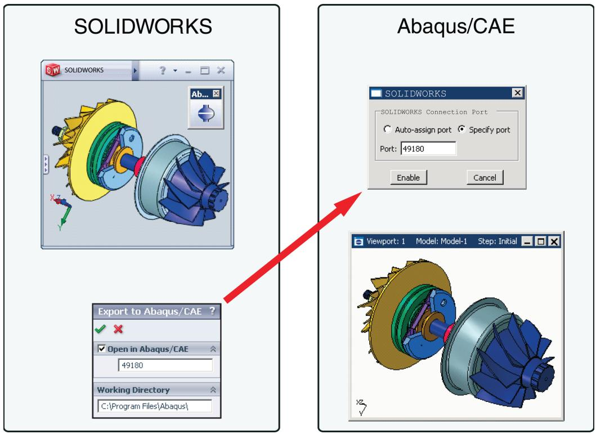
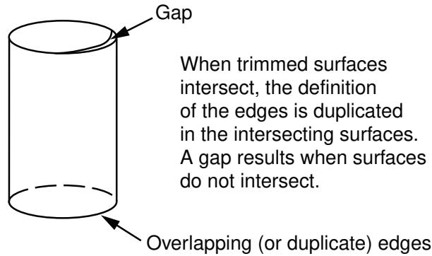
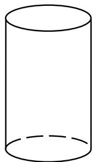
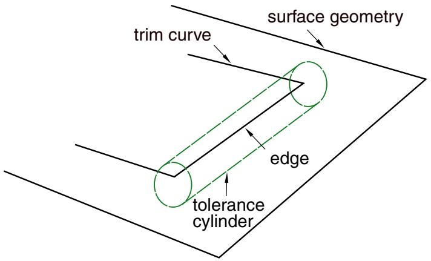

# 使用 Abaqus/CAE 模型数据库、模型和文件

在 Abaqus/CAE 模块中工作时，几乎每个建模操作都会影响模型数据库中模型的定义。

本部分描述了 Abaqus/CAE 模型和模型数据库、建模过程中创建的文件，以及您如何操作这些模型和文件。

## 本节内容：

理解并使用 Abaqus/CAE 模型、模型数据库和文件  
导入和导出几何数据与模型

## 理解并使用 Abaqus/CAE 模型、模型数据库和文件

本章讨论模型和模型数据库，并描述 Abaqus/CAE 生成和读取的各种文件。

一个完整的模型包含 Abaqus/CAE 创建分析任务并将其提交给 Abaqus/Standard 或 Abaqus/Explicit 所需的所有数据。模型存储在模型数据库中。

## 本节内容：

什么是 Abaqus/CAE 模型数据库？  
什么是 Abaqus/CAE 模型？  
访问远程计算机上的输出数据库  
理解创建和分析模型时生成的文件  
Abaqus/CAE 命令文件  
使用文件菜单  
管理模型和输出数据库  
管理模型  
管理会话对象和会话选项  
控制 Abaqus/CAE 生成的输入文件  
管理宏

## 什么是 Abaqus/CAE 模型数据库？

模型数据库（文件扩展名 .cae）存储模型和分析作业。（有关分析作业的更多信息，请参阅《理解分析作业》。）您的工作站或网络上可以存储多个模型数据库，但 Abaqus/CAE 在任何时刻只能操作其中一个。一个模型数据库可以包含多个模型；如果您计划同时处理多个模型，它们必须存储在同一个模型数据库中。正在使用的模型数据库称为当前模型数据库；Abaqus/CAE 在主窗口顶部显示当前模型数据库的名称，如图 1 所示。

  
图 1：Abaqus/CAE 显示模型数据库名称和模型名称。

首次启动 Abaqus/CAE 时，“启动会话”对话框允许您创建一个新的、空的模型数据库，或者打开一个现有的模型数据库。您在 Abaqus/CAE 中创建或定义的任何内容都存储在此模型数据库中。您可以通过从主菜单栏选择 文件->保存 或 文件->另存为 来保存内容。

除非您执行显式的保存操作，否则 Abaqus/CAE 绝不会自动保存模型数据库；例如，没有基于计时器的自动保存功能。然而，当您处理模型时，Abaqus/CAE 会记录所有更改了模型数据库的操作。即使您可能没有保存模型数据库，您也始终可以重放那些重现其当前状态的操作。有关重建模型数据库的更多信息，请参阅《重建未保存的模型数据库》。Abaqus/CAE 向后兼容，可以打开由先前版本 Abaqus/CAE 创建的模型数据库。

开始 Abaqus/CAE 会话后，您可以通过从主菜单栏选择 文件->打开 来打开现有的模型数据库，或者通过选择 文件->新建 来创建新的模型数据库。如果您在更改了当前模型数据库后打开或创建了另一个模型数据库，Abaqus/CAE 会在关闭当前模型数据库之前询问您是否要保存更改。

您可以在可视化模块中打开模型数据库，以探查或查询其节点和单元，并为选定的属性绘制等值线图或符号。有关更多信息，请参阅《理解可视化模块的作用》。

## 附加信息

• 理解并使用 Abaqus/CAE 模型、模型数据库和文件  
• 管理模型和输出数据库

## 什么是 Abaqus/CAE 模型？

本节描述 Abaqus/CAE 模型。

## 本节内容：

Abaqus/CAE 模型包含什么？  
什么是模型属性？

## Abaqus/CAE 模型包含什么？

一个 Abaqus/CAE 模型包含以下类型的对象：

• 部件  
材料和截面  
• 装配体  
• 集合和面  
• 分析步  
• 载荷、边界条件和场  
• 相互作用及其属性  
• 网格

一个模型数据库可以包含任意数量的模型，因此您可以将与单一问题相关的所有模型保存在一个数据库中。（有关更多信息，请参阅《什么是 Abaqus/CAE 模型数据库？》。）您可以同时从模型数据库中打开多个模型，并且可以在不同的视口中处理不同的模型。视口标题栏（如果可见）显示与视口关联的模型的名称。与当前视口（以红色边框指示）关联的模型称为当前模型，并且只有一个当前模型。图 1 显示了同一模型数据库（crankshaft.cae）中两个视口分别显示两个不同模型（高速和低速）的情况；图 1 中的当前视口正在显示高速模型。

您可以使用位于主菜单栏的模型管理器或模型菜单项来创建和管理您的模型。您可以使用位于上下文栏中的模型列表来切换到当前模型数据库中的不同模型。

您可以在模型数据库内创建模型的副本；此外，您还可以在模型之间复制以下对象：

• 草图  
• 部件（部件集合也会被复制）  
• 实例  
• 材料  
• 截面（包括连接器截面）  
• 轮廓  
• 幅度  
• 相互作用属性

有关详细说明，请参阅《在模型数据库内操作模型》和《在模型之间复制对象》。

您也可以从另一个模型数据库文件导入模型，这将在当前模型数据库中创建该模型的完整副本。有关更多信息，请参阅《从 Abaqus/CAE 模型数据库导入模型》。

当您提交模型进行分析时，Abaqus/CAE 会检查您的模型是否完整。例如，如果您请求动态分析，则必须指定材料的密度，以便计算模型的质量和惯性属性。如果您没有在属性模块中提供材料密度，作业模块会报告错误；有关更多信息，请参阅《监视分析作业的进度》。

在某些模块中，Abaqus/CAE 可能不支持您可能希望包含在分析中的 Abaqus/Standard 或 Abaqus/Explicit 的功能。您可能可以通过使用关键词编辑器编辑与模型关联的 Abaqus 关键词来添加此类功能。从主菜单栏选择 模型->编辑关键词->模型名称 以启动关键词编辑器。（您可以通过从主菜单栏选择 帮助->关键词浏览器 来查看 Abaqus/CAE 支持的关键词。）

您可以指定某个模型使用先前分析中的信息。当您将模型提交进行分析时，Abaqus/CAE 会从选定的分析步继续进行分析。有关更多信息，请参阅《配置重启动输出请求》和《重新开始分析》。

## 什么是模型属性？

模型属性描述模型的特征，并与模型一起存储在模型数据库中。

以下列表描述了 Abaqus/CAE 模型的属性：

描述。如果您的模型数据库中有许多相似的模型，您可以使用描述来区分它们。您输入的描述与模型属性一起存储；该描述写在输入文件头部的上方，但不会写入输出数据库。有关更多信息，请参阅《为您的 Abaqus/CAE 模型添加描述》。  
类型。您可以在 Standard & Explicit 模型（默认）和电磁模型之间进行选择。一旦您选择了模型类型，Abaqus/CAE 将过滤主菜单栏、工具箱和模型树中可用的选项集，使其适合您的模型类型选择。  
• 模型的物理常数。您可以输入绝对零温度和 Stefan-Boltzmann 常数的值。在热传导分析中指定表面发射率和辐射条件时需要这些值。  
您还可以输入通用气体常数的值，并且可以从“指定声波公式”列表中选择一个选项。  
• 重启动信息，将使用先前分析中的数据来开始分析。您可以指定以下内容：  
    - Abaqus/CAE 将从中读取重启动信息的作业名称。  
    - Abaqus/CAE 将从哪个分析步开始重新启动分析。  
    - Abaqus/CAE 将从哪个分析步的增量或间隔开始重新启动分析。  
有关更多信息，请参阅《重新开始分析》和《重新开始分析》。  
• 子模型信息，将用于驱动模型中的子模型边界条件或载荷。您可以指定以下内容：  
    - 将使用哪个作业的全局解来驱动子模型边界条件或载荷。  
    - 是否使用壳体全局模型来驱动实体子模型。
如需更多信息，请参见**子模型**。

**模型实例信息**。当您从此模型创建模型实例时，您可以控制初始分析步中定义的约束、连接器截面赋值以及面-面接触和自接触相互作用是否会被复制到当前工作模型中。如需更多信息，请参见**使用模型实例**。

从主菜单栏选择 **模型**->**编辑属性**->**模型名称** 可以编辑所选模型的属性。

## 附加信息

*   指定模型属性

## 访问远程计算机上的输出数据库

本节描述如何创建和启动网络连接器。

您可以使用网络连接器浏览远程主机上的目录结构并访问远程输出数据库。

## 本节内容：

什么是网络ODB连接器？  
访问网络ODB连接器的安全性如何？  
调整缓存大小以提高网络ODB的性能

## 什么是网络ODB连接器？

网络ODB连接器创建与远程机器的连接，并允许您访问远程输出数据库。例如，您可以将分析作业提交到高性能Linux系统，然后在分析仍在运行时在本地Windows工作站上查看结果。

您可以从任何平台（Windows或Linux）创建网络ODB连接器。但是，网络ODB服务器必须位于Linux平台上；您不能访问位于远程Windows系统上的输出数据库。您只能访问远程输出数据库；不能访问远程模型数据库。

从主菜单栏选择 **文件**->**网络ODB连接器**->**创建** 可以创建与远程主机上目录的连接。创建网络ODB连接器时，您可以使用Abaqus/CAE自动启动网络ODB服务器，并在主机和远程系统上建立通信端口号。或者，您也可以使用 `abaqus networkDBConnector` 执行过程从命令行手动启动网络ODB服务器。如果从命令行启动服务器，则在随后创建网络ODB连接器时，您需要输入该执行过程返回的通信端口号。如需更多信息，请参见**网络输出数据库文件连接器**。

创建网络ODB连接器后，您必须通过从主菜单栏选择 **文件**->**网络ODB连接器**->**启动**->**连接器名称** 来启动它。远程系统必须安装了Abaqus，Abaqus/CAE才能建立网络连接。如需更多信息，请参见**创建网络ODB连接器**和**管理网络ODB连接器**。

创建并启动网络连接器后，您可以使用它来浏览远程主机上的目录结构。当您从主菜单栏选择 **文件**->**打开** 从Abaqus/CAE打开数据库时，文件选择对话框的“目录”下会出现一个“网络连接器”条目。无论您尝试打开的是输出数据库还是模型数据库，该条目都会出现；但是，在打开模型数据库时不能使用网络连接器。如需更多信息，请参见**使用文件选择对话框**。

网络连接器允许您执行以下操作：

以只读模式打开远程输出数据库，并使用**可视化模块**查看输出数据库的内容。如需更多信息，请参见**打开模型数据库或输出数据库**。

当输出数据库为远程时，**可视化模块**的行为不会改变；例如，您可以在远程机器上运行分析时查看输出数据库，并且多个用户可以查看该输出数据库。但是，您不能在**作业管理器**中单击 **结果** 来打开与远程分析关联的远程输出数据库。

*   从远程输出数据库导入部件。如需更多信息，请参见**导入部件**。
*   从远程输出数据库导入模型。如需更多信息，请参见**从输出数据库导入模型**。
*   升级远程输出数据库。

在大多数**可视化模块**操作之后以及动画期间，Abaqus/CAE会监视输出数据库以获取更新的结果，并相应地更新当前视口。如果您显示的是来自远程输出数据库的数据，并且通过网络监视数据库所需的时间较长，则Abaqus/CAE的性能可能会降低。为了提高性能，您可以降低Abaqus/CAE监视输出数据库更新的频率，或者禁用该监视功能。如需更多信息，请参见**控制结果缓存**。

## 访问网络ODB连接器的安全性如何？

Abaqus/CAE通过生成一个在服务器和客户端之间来回传递的密钥来维护与网络ODB连接器的安全连接。如果您的远程服务器主目录中存在名为 `.abaqus_net_passwd` 的文件，Abaqus/CAE将使用该文件中的密码进行身份验证，而不是使用Abaqus/CAE生成的密钥。Abaqus/CAE会检查您是否是唯一对该密码文件具有读写权限的用户。此外，您必须在30天后更新该文件，并且密码长度至少为八个字符。如果您手动启动网络ODB服务器，Abaqus使用密码文件对客户端和服务器之间的连接进行身份验证。这些文件在**网络输出数据库文件连接器**中描述。

## 调整缓存大小以提高网络ODB的性能

当您启动Abaqus/CAE会话时，会在临时文件目录中创建一个缓存。当您使用网络ODB连接器从远程输出数据库读取时，Abaqus/CAE使用此缓存进行本地数据存储。当从远程输出数据库访问数据时，该缓存极大地提高了Abaqus/CAE中**可视化模块**的性能。

Abaqus/CAE允许缓存增长到足以容纳所有打开的远程输出数据库中的所有数据的大小。但是，Abaqus/CAE将缓存大小限制为该目录总可用空间的80%。例如，如果临时文件目录有35GB的未使用空间，Abaqus/CAE将允许缓存增长到28GB。或者，您可以通过Abaqus环境文件 `abaqus_v6.env` 中的 `nodb_cache_limit` 参数来限制缓存的大小。您必须将 `nodb_cache_limit` 参数设置为缓存大小将被限制的兆字节数。例如，

```txt
nodb_cache_limit=20000
```

将最大缓存大小设置为20GB。Abaqus/CAE仅在会话期间根据需要使用此缓存空间，实际缓存大小可能远小于您指定的限制。`nodb_cache_limit` 的最小值为500，表示缓存大小限制为500MB。如果您设置的最大缓存大小大于可用的空闲空间，Abaqus/CAE会将其减小到等于可用空闲空间的值。

Abaqus/CAE使用缓存来提高从远程输出数据库读取数据时的性能。通过网络访问数据的速度明显低于从本地磁盘驱动器访问数据的速度。因此，远程输出数据库的性能将明显低于本地输出数据库的性能。该缓存通过保留已通过网络传输的数据来减少这种性能差异，从而减少通过网络传输数据的需要。但是，如果缓存不够大，Abaqus/CAE将不得不通过网络传输更多数据，性能将会下降。

在大多数情况下，您不需要使用 `nodb_cache_limit` 参数调整缓存大小。但是，如果缓存占用了过多磁盘空间并降低了系统上其他应用程序的速度，您可能需要减小缓存大小。同样，如果缓存太小而无法支持所有远程输出数据库，并且Abaqus/CAE的性能下降，您可能需要增加缓存大小。如果无法增加缓存大小，您应该关闭一些远程输出数据库。

如果所需的缓存大小大于临时文件目录中可用的空间，您可以使用 `Abaqus scratch` 环境文件参数将临时文件目录移动到更大的磁盘驱动器。如需更多信息，请参见**环境文件设置**和**管理内存和磁盘资源**。

## 理解创建和分析模型时生成的文件

当您开始一个会话并开始定义模型时，Abaqus/CAE会生成以下文件：

## 重播文件 (abaqus.rpy)

重播文件包含Abaqus/CAE命令，这些命令记录了您在会话期间执行的几乎每个建模操作。如需更多信息，请参见**重播Abaqus/CAE会话**。

当您从主菜单栏选择 **文件**->**保存** 并保存模型数据库时，Abaqus/CAE会保存以下文件：
## 模型数据库文件 (model\_database\_name.cae)

模型数据库文件包含模型和分析作业。更多信息，请参阅什么是 Abaqus/CAE 模型数据库？。

## 日志文件 (model\_database\_name.jnl)

日志文件包含用于复制已保存到磁盘的模型数据库的 Abaqus/CAE 命令。更多信息，请参阅重建已保存的模型数据库。

当你继续处理模型时，Abaqus/CAE 会持续在重播文件中记录你的操作。此外，Abaqus/CAE 还会保存以下文件：

## 恢复文件 (model\_database\_name.rec)

恢复文件包含用于复制内存中模型数据库版本的 Abaqus/CAE 命令。模型数据库恢复文件仅包含自上次保存以来更改模型数据库的命令。更多信息，请参阅重建未保存的模型数据库。

当你提交作业进行分析时，Abaqus/Standard 和 Abaqus/Explicit 会创建一组文件；有关这些文件的完整列表，请参阅文件扩展名定义。以下列表描述了 Abaqus/Standard 和 Abaqus/Explicit 创建的一些文件及其与 Abaqus/CAE 的关系：

## 输入文件 (job\_name.inp)

Abaqus/CAE 会生成一个输入文件，当你提交作业进行分析时，Abaqus/Standard 或 Abaqus/Explicit 会读取该文件。更多信息，请参阅分析模型的基本步骤。

## 输出数据库文件 (job\_name.odb)

输出数据库文件包含你的分析结果。你可以使用 Step 模块的输出请求管理器来选择在分析期间以及以何种速率将哪些变量写入输出数据库。输出数据库与你从 Job 模块提交的作业相关联；例如，如果你将作业命名为 FrictionLoad，分析将创建名为 FrictionLoad.odb 的输出数据库。

当你打开一个输出数据库时，Abaqus/CAE 会加载 Visualization 模块，并允许你查看其内容的图形表示。你也可以将零件从输出数据库作为网格导入。如果你以写权限打开文件，可以将 X-Y 数据对象保存到输出数据库文件中；否则，一旦创建，就无法修改输出数据库的内容。

## 输出数据库锁定文件 (job\_name.lck)

锁定文件 (job\_name.lck) 在每当输出数据库文件以写访问权限打开时被写入，包括当分析正在运行并向输出数据库文件写入输出时。锁定文件可以防止你从多个来源同时拥有对输出数据库的写权限。当输出数据库文件关闭或创建它的分析结束时，该文件会自动删除。

## 重启动文件 (job\_name.res)

重启动文件用于继续未完成就停止的分析。你可以使用 Step 模块来指定哪些分析步骤应写入重启动信息以及写入的频率。如果你使用的是 Abaqus/Explicit，你在 Step 模块中提供的重启动信息会控制写入状态文件 (job\_name.abq) 的数据。更多信息，请参阅配置重启动输出请求。

## 数据文件 (job\_name.dat)

数据文件包含来自分析输入文件处理器的打印输出，以及在分析过程中写入的部分结果的打印输出。Abaqus/CAE 会自动请求在每个分析步结束时生成当前分析过程的默认打印输出；你不能使用 Abaqus/CAE 对数据文件的内容进行任何额外控制。

## 消息文件 (job\_name.msg)

消息文件包含有关求解进度的诊断或信息性消息。你可以使用 Step 模块控制输出到消息文件的诊断信息。更多信息，请参阅诊断打印。

## 状态文件 (job\_name.sta)

状态文件 (job\_name.sta) 包含有关分析进度的信息。此外，你可以使用 Step 模块请求将单个节点的单个自由度值输出到状态文件。更多信息，请参阅自由度监控请求。

## 结果文件 (job\_name.fil)

结果文件包含分析中选定的结果，其格式可供其他应用程序（如后处理程序）读取。子模型分析可以从输出数据库或结果文件中读取全局模型结果。默认情况下，来自 Abaqus/CAE 的分析不会创建结果文件。更多信息，请参阅子模型分析，以及子模型分析。


## 注意：

Abaqus/Standard 和 Abaqus/Explicit 在分析作业时写入数据、消息和状态文件的错误和警告可以通过 Job 模块进行监控；更多信息，请参阅监控分析作业进度。

当你在 Visualization 模块中打开输出数据库文件并创建新的场输出变量时（有关更多信息，请参阅创建和保存新的场输出），Abaqus/CAE 会生成以下文件：

## 临时输出数据库文件 (job\_name.ods)

临时输出数据库文件 (job\_name.ods) 包含一个“会话步骤”，你在其中创建的场输出变量（通过对场或帧进行操作）会在此保存。当原始输出数据库文件（场输出源自该文件）关闭或 Abaqus/CAE 会话结束时，此文件会自动删除。

在大多数情况下，Abaqus/CAE 生成的文件会写入工作目录。工作目录是你启动 Abaqus/CAE 会话时的目录，除非你通过从主菜单栏选择 File->Set Work Directory 更改了目录。更多信息，请参阅设置工作目录。

## Abaqus/CAE 命令文件

本节描述了可用于重现你的工作和自定义 Abaqus/CAE 的命令文件。

## 本节内容：

重播 Abaqus/CAE 会话  
重建已保存的模型数据库  
重建未保存的模型数据库  
创建和运行你自己的脚本  
创建和运行宏  
自定义你的 Abaqus/CAE 环境

## 重播 Abaqus/CAE 会话

你在 Abaqus/CAE 中执行的几乎每个操作都会自动记录在重播文件 (abaqus.rpy) 中，形式为 Abaqus 脚本接口命令。执行重播文件等同于重播原始操作序列，包括任何冗余程序以及你所做的任何错误和后续更正。重播文件还包括画布操作，例如创建新视口。

Abaqus/CAE 保留最近五个版本的重播文件。最新版本的重播文件名为 abaqus.rpy；它在你开始一个会话时创建。四个较旧的版本在文件名末尾附加了数字；数字最小的文件名表示最旧的重播文件，数字最大的文件名表示第二新的重播文件。

你可以在启动 Abaqus/CAE 时或在会话期间执行重播文件中的命令；但是，如果重播文件生成错误，结果可能不同。

## 从 Abaqus 执行过程

要从 Abaqus 执行过程运行重播文件，键入 abaqus cae (或 abaqus viewer) replay=replay\_file\_name.rpy。如果执行重播文件时生成错误，Abaqus/CAE 会忽略该错误并继续执行重播文件中的下一条命令。因此，Abaqus/CAE 总是尝试执行重播文件中的每条命令。你不能使用 replay 选项执行带有控制流语句的脚本。更多信息，请参阅 Abaqus/CAE 执行。

## 在 Abaqus/CAE 会话期间

要在会话期间运行重播文件，从主菜单栏选择 File->Run Script。如果重播文件生成错误，Abaqus/CAE 会停止执行重播文件并在命令区域显示错误消息。建议你从 Abaqus 执行过程运行重播文件。

你也可以使用 Abaqus Python 开发环境 (AbaqusPDE) 执行重播文件。重播文件中的 Abaqus 脚本接口命令必须在 AbaqusPDE 的内核工作区中运行。有关 AbaqusPDE 的更多信息，请参阅 Abaqus Python 开发环境。

## 重建已保存的模型数据库

当你保存模型数据库时（通过从主菜单栏选择 File->Save 或 File->Save As），Abaqus/CAE 还会保存一个模型数据库日志文件 (model\_database\_name.jnl)，其中包含用于重建模型数据库的 Abaqus 脚本接口命令。如果保存的模型数据库损坏，你可以通过使用 recover 选项启动 Abaqus/CAE 来重建它。（键入 abaqus cae recover=model\_database\_name.jnl。）recover 选项会执行指定模型数据库日志文件中的命令。
模型数据库日志文件与重播文件的不同之处在于，它不包含在会话期间执行的每个操作。模型数据库日志文件仅包含更改已保存模型数据库的命令；例如，创建或编辑零件、更改分析步的时间增量或修改网格的命令。不改变模型数据库的操作不会保存在日志文件中；例如，将图像发送到打印机、创建视口、旋转模型或在可视化模块中查看结果。

当你继续处理模型时，内存中的模型数据库将与最近保存的模型数据库不同。仅当你使用“文件”->“保存”或“文件”->“另存为”执行对模型数据库的显式保存时，模型数据库日志文件才会更新。如果你将模型数据库复制到不同的位置，还应复制相关的模型数据库日志文件。否则，你将无法重建该模型数据库。

## 重建未保存的模型数据库

当你开始一个新的会话并对模型进行更改时，Abaqus/CAE 会将这些更改记录到一个模型数据库恢复文件 (`abaqusn.rec`) 中。如果你随后保存了模型数据库，Abaqus/CAE 会将恢复文件中的命令追加到该模型数据库的日志文件 (`model_database_name.jnl`) 并删除恢复文件。如果你对模型进行了进一步的更改，Abaqus/CAE 会创建一个新的恢复文件 (`model_database_name.rec`) 来记录自上次保存以来的更改。在下次保存时，恢复文件中的命令将被追加到日志文件中，恢复文件将被删除。日志文件包含重建整个模型数据库所需的所有命令。例如，表 1 显示了 Abaqus/CAE 对名为 `engine` 的模型所做的更改，以及这些更改对模型数据库文件、恢复文件和日志文件的影响。

表 1：建模更改及其对模型数据库、恢复和日志文件的影响。

<table><tr><td>用户操作</td><td>Abaqus/CAE 操作</td><td>文件</td></tr><tr><td>启动 Abaqus/CAE 会话</td><td>无</td><td>无</td></tr><tr><td>进行模型更改</td><td>将命令记录到恢复文件</td><td>`abaqus1.rec`</td></tr><tr><td>保存模型数据库</td><td>创建模型数据库文件<br>将恢复命令复制到日志文件<br>删除恢复文件</td><td>`engine.cae`<br>`engine.jnl`</td></tr><tr><td>对模型进行更多更改</td><td>将命令记录到恢复文件</td><td>`engine.rec`<br>`engine.cae` (过期)<br>`engine.jnl` (过期)</td></tr><tr><td>保存模型数据库</td><td>更新模型数据库文件<br>将恢复命令追加到日志文件<br>删除恢复文件</td><td>`engine.cae` (已更新)<br>`engine.jnl` (已更新)</td></tr></table>

如果你的 Abaqus/CAE 会话意外退出——例如，由于计算机断电——恢复文件仍然可用于 Abaqus/CAE 的下一个会话。Abaqus/CAE 首先检查是否存在形式为 `abaqusn.rec` 的恢复文件；如果存在这样的文件，它可能来自一个意外停止的前一会话，也可能来自你在同一目录中启动的另一个 Abaqus/CAE 会话。由于 Abaqus/CAE 无法区分这两种情况，并且无法自动确定你是否希望实施这些更改，Abaqus/CAE 会提示你三个选项：恢复更改并删除恢复文件、不恢复更改并删除恢复文件，或者忽略恢复文件，因为其更改属于另一个 Abaqus/CAE 会话。当你恢复更改时，如果你认为你发出的最后一个命令导致了会话终止，你可以跳过恢复文件中的最后一个命令。

如果恢复文件属于某个模型数据库 (`model_database_name.rec`)，Abaqus/CAE 将不会检测到该恢复文件，直到你尝试打开该模型数据库。当你尝试打开模型数据库时，Abaqus/CAE 会提示你恢复或忽略更改。如果你恢复更改，Abaqus/CAE 会将数据库恢复文件中的更改追加到日志文件中并删除数据库恢复文件；如果你选择忽略更改，Abaqus/CAE 会删除恢复文件，并且不会实施该文件中描述的任何模型更改。

## 创建并运行你自己的脚本

你在 Abaqus/CAE 会话期间执行的几乎每个操作都可以通过一个脚本 (`script_name.py`) 来复制，该脚本包含一组 Abaqus 脚本接口命令。反之，从 Abaqus/CAE 内部运行一个脚本等同于使用 Abaqus/CAE 提供的菜单、工具箱和对话框执行相应的操作。

你可以创建脚本来复制你在会话期间例行执行的操作；例如，你可能会编写一个脚本来定义常用材料的属性，或者生成一个在特定视图方向下显示特定变量的等值线图。

Abaqus/CAE 命令使用 Python 脚本语言编写，你可以使用 Python 来增强 Abaqus/CAE 生成的脚本。命令作为 ASCII 文本存储在重播文件、日志文件、恢复文件以及你创建的 Abaqus/CAE 脚本中。因此，你可以使用标准的文本编辑器来编辑这些文件的内容。有关命令的更多信息，请参阅《Abaqus Scripting User's Guide》。

要运行一个脚本，请从主菜单栏选择“文件”->“运行脚本”，然后从“运行脚本”对话框中选择要运行的脚本。


## 注意：

你应该使用 Abaqus/CAE 执行过程中的 `recover` 选项来运行日志文件并重建已保存的模型数据库。（输入 `abaqus cae recover=model_database_name.jnl`。）选择

“文件”->“运行脚本”来运行日志文件可能会导致模型数据库不完整。

你还可以使用 Abaqus Python 开发环境 (AbaqusPDE) 来创建和运行脚本。脚本中的 Abaqus 脚本接口命令必须在 AbaqusPDE 的内核工作区中运行。有关 AbaqusPDE 的更多信息，请参阅《The Abaqus Python Development Environment》。

## 创建并运行宏

宏管理器允许你在与 Abaqus/CAE 交互时，将一系列 Abaqus 脚本接口命令记录到一个宏文件中。每个命令对应于与 Abaqus/CAE 的一次交互，重放宏会重现该交互序列。你可以使用宏来自动化那些你发现自己重复执行的任务，例如打印当前视口或应用预定义的视图。有关 Abaqus 脚本接口命令的更多信息，请参阅《Abaqus Scripting User's Guide》。

宏存储在名为 `abaqusMacros.py` 的文件中。Abaqus/CAE 按以下顺序在三个目录中搜索 `abaqusMacros.py`：

•   你的主目录。  
•   当前工作目录。  

•   Abaqus 安装目录的站点目录。

`abaqusMacros.py` 文件可以同时存在于多个这些目录中。宏管理器包含 Abaqus/CAE 在所有 `abaqusMacros.py` 文件中检测到的现有宏的列表。如果一个宏在多个 `abaqusMacros.py` 文件中使用了相同的名称，Abaqus/CAE 将使用最后遇到的那个宏。

要创建、删除或运行宏，请从主菜单栏选择“文件”->“宏管理器”。有关更多信息，请参阅管理宏。

## 自定义你的 Abaqus/CAE 环境

你使用 Abaqus 环境文件 (`abaqus_v6.env`) 来指定控制 Abaqus/Standard 和 Abaqus/Explicit 的参数。此外，你可以使用环境文件来指定一组在你启动 Abaqus/CAE 会话时执行的命令。配置作业如何在远程主机计算机上运行的命令示例在《提交远程作业》中给出。

## 使用“文件”菜单

“文件”菜单提供了多种操作。

使用主菜单栏上“文件”下的项目执行以下操作：

选择“文件”->“新建模型数据库”->“使用标准/显式模型”来为 Abaqus/Standard 或 Abaqus/Explicit 分析创建一个新的模型数据库。你也可以点击“文件”工具栏中的相应图标。有关更多信息，请参阅创建新的模型数据库。  
•   选择“文件”->“新建模型数据库”->“使用电磁模型”来为电磁分析创建一个新的模型数据库。有关更多信息，请参阅创建新的模型数据库。  
•   选择“文件”->“打开”来打开现有的模型数据库或输出数据库。你也可以点击“文件”工具栏中的相应图标。有关更多信息，请参阅打开模型数据库或输出数据库。  
•   选择“文件”->“网络 ODB 连接器”来创建与远程主机的连接，该连接可用于读取远程输出数据库。有关更多信息，请参阅创建网络 ODB 连接器。  
•   选择“文件”->“关闭 ODB”来关闭一个输出数据库。有关更多信息，请参阅关闭当前输出数据库。  
•   选择“文件”->“设置工作目录”来更改工作目录。有关更多信息，请参阅设置工作目录。
• 选择 **File->Save** 以保存当前模型数据库。您也可以点击 **File** 工具栏中的相应图标。更多信息，请参见 保存当前模型数据库。  
• 选择 **File->Save As** 以将当前模型数据库保存为具有不同名称的新文件。更多信息，请参见 将当前模型数据库保存为具有不同名称的新文件。  
• 选择 **File->Compress MDB** 以压缩当前模型数据库。更多信息，请参见 压缩当前模型数据库的文件大小。  
选择 **File->Save Display Options** 以保存您自定义的部件、装配体和可视化模块的显示设置。更多信息，请参见 理解 Abaqus/CAE GUI 设置 和 保存您的显示选项设置。  
选择 **File->Save Session Objects** 以将特定于会话的对象定义（例如视图切割、显示组或路径）保存到文件、模型数据库或输出数据库。更多信息，请参见 管理会话对象和会话选项。  
• 选择 **File->Load Session Objects** 以将先前保存的特定于会话的对象定义加载到当前会话。更多信息，请参见 管理会话对象和会话选项。  
• 选择 **File->Import->Sketch** 以导入平面草图。更多信息，请参见 导入草图。  
• 选择 **File->Import->Part** 以导入部件。更多信息，请参见 导入部件。  
• 选择 **File->Import->Model** 以导入模型。更多信息，请参见 导入模型。  
• 选择 **File->Export->Sketch** 以导出当前草图。更多信息，请参见 将草图导出为 ACIS、IGES 或 STEP 格式文件。  
选择 **File->Export->Part** 以导出当前部件。更多信息，请参见 将部件导出为 ACIS、IGES、STEP 或 VDA 格式文件。  
选择 **File->Export->Assembly** 以导出装配体中的部件实例。更多信息，请参见 将装配体导出为 ACIS 格式文件。  
选择 **File->Export->VRML** 以将当前视口导出为 VRML 格式文件。更多信息，请参见 将视口数据导出为 VRML 格式文件。  
• 选择 **File->Export->3DXML** 以将当前视口导出为 3D XML 格式文件。更多信息，请参见 将视口数据导出为 3D XML 格式文件。

• 选择 **File->Export->OBJ** 以将当前视口导出为 OBJ 格式文件。更多信息，请参见 将视口数据导出为 OBJ 格式文件。  
• 选择 **File->Run Script** 以执行包含 Abaqus 脚本接口命令的文件。更多信息，请参见 重放 Abaqus/CAE 会话 和 创建并运行您自己的脚本。  
选择 **File->Macro Manager** 以将您的操作作为一系列 Abaqus 脚本接口命令存储在宏文件中。您还可以运行宏并重命名现有宏。更多信息，请参见 创建并运行宏。  
• 选择 **File->Print** 以打印全部或选定的视口及注释。您也可以点击 **File** 工具栏中的相应图标。更多信息，请参见 打印视口。  
选择 **File->Abaqus PDE** 以打开 Abaqus Python 开发环境。AbaqusPDE 是一个独立的应用程序，用于创建、编辑、测试和调试脚本。更多信息，请参见 关于 Abaqus Python 开发环境。  
• 选择 **File->Exit** 以退出 Abaqus/CAE 会话。更多信息，请参见 退出 Abaqus/CAE 会话。

## 其他信息

• 理解通过创建和分析模型生成的文件  
• Abaqus/CAE 命令文件

## 管理模型和输出数据库

本节描述如何使用主菜单栏的 **File** 菜单来管理模型和输出数据库。

## 本节内容：

创建新的模型数据库  
打开模型数据库或输出数据库  
升级模型数据库或输出数据库  
创建网络 ODB 连接器  
自定义网络 ODB 连接器  
管理网络 ODB 连接器  
关闭当前输出数据库  
设置工作目录  
保存当前模型数据库  
在不使用许可证的情况下保存当前模型数据库  
将当前模型数据库保存为具有不同名称的新文件  
压缩当前模型数据库的文件大小

## 创建新的模型数据库

您可以在计算机上创建和存储多个模型数据库，但在任何时刻只能打开一个模型数据库。

选择以下选项之一以创建新的模型数据库：

点击 **File** 工具栏中的相应图标，或选择 **File->New Model Database->With Standard/Explicit Model** 以创建用于 Abaqus/Standard 或 Abaqus/Explicit 分析的新模型数据库。  
• 选择 **File->New Model Database->With Electromagnetic Model** 以创建用于电磁分析的新模型数据库。

如果您对当前模型数据库进行了任何更改，Abaqus/CAE 会在关闭当前模型数据库并创建新数据库之前询问您是否保存更改。新数据库随后成为当前数据库。要保存新的模型数据库，请从主菜单栏选择 **File->Save** 并输入数据库的名称。保存模型数据库后，Abaqus/CAE 会在主窗口的标题栏中显示其名称。

## 其他信息

• 使用文件选择对话框  
• 什么是 Abaqus/CAE 模型数据库？  
• 理解通过创建和分析模型生成的文件  
• 使用 **File** 菜单

## 打开模型数据库或输出数据库

从主菜单栏选择 **File->Open** 以打开：

• 模型数据库（文件扩展名 .cae）  
• 输出数据库（文件扩展名 .odb）

在出现的 **Open Database** 对话框中，选择 **File Filter** 和要打开的文件，然后单击 **OK**。

您可以使用 **Append to layers** 选项打开多个输出数据库，并在单个视口中以叠加图的形式显示这些输出数据库的组合内容。有关处理叠加图的详细信息，请参见 叠加多个图。

默认情况下，输出数据库文件以只读方式打开。您可以选择以写入权限打开输出数据库文件；如果您希望将任何 X-Y 数据对象复制到输出数据库，则必须这样做（有关更多信息，请参见 将会话 X-Y 数据对象复制到输出数据库文件）。位于远程计算机上的输出数据库文件只能以只读方式打开；您不能写入远程输出数据库文件。

来自先前版本 Abaqus 的输出和模型数据库文件在打开时必须升级到当前版本（有关更多信息，请参见 升级模型数据库或输出数据库）。当您打开多个输出数据库文件时，所有文件必须都已升级到当前版本；否则，Abaqus/CAE 将在消息区域打印警告，并且需要升级的文件将不会被打开。

如果您使用的是较早版本的 Abaqus/CAE，则无法打开由较新版本创建的模型或输出数据库文件。

1.  从主菜单栏中，选择 **File->Open**。


提示：您也可以点击 **File** 工具栏中的相应图标来打开模型数据库或输出数据库。

Abaqus/CAE 显示 **Open Database** 对话框。

2.  从 **Open Database** 对话框底部的 **File Filter** 菜单中，选择以下之一：

## 模型数据库 (\*.cae)

Abaqus/CAE 列出选定目录中所有文件扩展名为 .cae 的文件。

## 输出数据库 (\*.odb\*)

Abaqus/CAE 列出选定目录中所有文件扩展名为 .odb 的文件。

## 模型与输出数据库 (\*.cae, \*.odb\*)

Abaqus/CAE 列出选定目录中所有文件扩展名为 .cae 或 .odb 的文件。

3.  如果您在步骤 2 中选择了 **Output Database (\*.odb\*)**，请使用以下选项进一步筛选文件列表或更改文件打开行为：

## 网络连接器

如果您先前已创建并启动了网络 ODB 连接器，则 **Directory** 字段包含一个 **Network connectors** 项，允许您访问远程目录并打开远程输出数据库。有关更多信息，请参见 创建网络 ODB 连接器。

## 只读

默认情况下，输出数据库文件以只读方式打开。要以写入权限打开输出数据库文件，请在单击 **OK** 之前，取消勾选 **Open Database** 对话框底部附近的 **Read-only**。如果您希望将会话中的 X-Y 数据对象复制到文件或将旧文件永久升级到当前版本的 Abaqus/CAE，则必须以写入权限打开输出数据库文件。您只能以只读方式打开远程输出数据库文件。

## 追加到图层

如果您希望打开多个输出数据库并在单个视口中以叠加图的形式显示其组合内容，请勾选 **Append to layers** 并选择多个文件。您可以使用以下任一方法选择多个输出数据库文件：

• 使用 [Shift] + 单击 或 [Ctrl] + 单击 选择文件。  
• 在 **File Name** 字段中输入以逗号分隔的文件名列表，例如  
lug.odb,hinge.odb  
• 在 **File Name** 字段中输入用双引号括起来的文件名列表，例如 "lug.odb" "hinge.odb"


## 注意：

如果您在创建输出数据库文件的分析运行期间但在输出结果写入之前打开了该文件，您可能需要关闭该文件，然后在结果可用后重新打开。

4. 单击 **OK** 打开选定的一个或多个文件。

Abaqus/CAE 会保存您选择的筛选器类型，以便下次打开文件时用作默认值，并关闭 **Open Database** 对话框。

如果您打开了一个模型数据库，Abaqus/CAE 会在主窗口的标题栏中显示其名称。现在所有操作都指向这个新的模型数据库。如果您修改了当前的模型数据库，Abaqus/CAE 会在打开选定模型数据库之前询问您是否要保存它。

如果您打开了一个或多个输出数据库，Abaqus/CAE 会在当前视口中启动 **Visualization** 模块，并以未变形图状态显示按字母顺序排在最后的模型。任何其他选定的输出数据库也会被打开，但除非您切换开启了 **Append to layers** 选项（在这种情况下，所有选定的输出数据库都会绘制在同一视口中），否则它们不会显示。

## 附加信息

• 使用文件选择对话框  
• 什么是 Abaqus/CAE 模型数据库？  
• 什么是 Abaqus/CAE 模型？  
• 使用 File 菜单  
• 升级模型数据库或输出数据库

## 升级模型数据库或输出数据库

来自先前 Abaqus 版本的输出和模型数据库文件在打开时必须升级到当前版本。

要永久升级一个输出数据库，您必须在打开文件时拥有写入权限，并在提示时进行转换，或者使用 `abaqus upgrade` 工具（参见 **输出数据库升级工具**）。您只能从数据库所在的系统上使用 `abaqus upgrade` 工具升级远程输出数据库。

当打开来自先前版本的模型数据库或输出数据库时，Abaqus/CAE 会执行以下操作之一：

如果 Abaqus/CAE 有权限写入原始文件（即，它是您选择以写入权限打开的输出数据库文件，或者是模型数据库文件），系统会提示您将文件转换到当前版本。在转换过程中，Abaqus/CAE 会创建原始模型或输出数据库的备份，以及与模型数据库相关的日志文件；转换后的数据库文件和新的日志文件会以原始文件名保存在当前目录（您启动 Abaqus/CAE 的目录）中。如果数据库是从当前目录以外的目录打开的，该目录将仍然包含原始版本的文件及其原始文件名。

转换完成后，Abaqus/CAE 会创建一个名为 `file_name-upgrade.log` 的日志文件，指示转换的结果。对于模型数据库文件的升级，Abaqus/CAE 还会显示一个对话框，提供转换日志文件的名称，并包含 **View the conversion log file** 选项。切换开启此选项，然后单击 **OK**，即可在 Abaqus/CAE 对话框中显示转换日志文件，您可以在其中浏览日志文件或搜索其内容以查找错误消息。

如果您以只读方式打开本地输出数据库文件，Abaqus/CAE 会自动创建该输出数据库的转换版本，并将其保存到临时位置。转换后的输出数据库文件会保存到您系统上由 `$TMPDIR` (Linux) 或 `TEMP` (Windows) 环境变量定义的目录中。当您退出 Abaqus/CAE 时，此输出数据库文件的临时版本将被删除。  
如果您打开的是远程输出数据库文件，Abaqus/CAE 会尝试创建该输出数据库文件的转换版本，并将其保存到临时位置。转换后的输出数据库文件会保存到远程系统的 `/tmp` 目录或远程系统上由 `$TMPDIR` 环境变量定义的目录中。当您退出 Abaqus/CAE 时，此输出数据库文件的临时版本将被删除。

当您升级较旧的模型数据库时，升级过程可能会将您手动添加到模型中的关键字放置在升级后的输入文件中的错误位置。因此，在 **Job** 模块中提交模型进行分析时可能会遇到问题。如果是这种情况，您应该打开升级后的模型，返回到 **Keywords Editor**，并单击 **Discard All Edits** 以删除所有您添加的关键字。然后，您可以在输入文件中的正确位置重新创建这些关键字。

## 附加信息

• 使用文件选择对话框  
• 什么是 Abaqus/CAE 模型数据库？  
• 什么是 Abaqus/CAE 模型？  
• 使用 File 菜单  
• 打开模型数据库或输出数据库

您可以使用网络 ODB 连接器访问远程计算机上的输出数据库。例如，您可以将分析提交到高性能 Linux 计算服务器，并在本地 Windows 工作站上查看结果。您可以从任何平台（Windows 或 Linux）创建网络 ODB 连接器。但是，网络 ODB 服务器必须驻留在 Linux 平台上。Abaqus/CAE 通过生成一个在服务器和客户端之间来回传递的密钥来维护与网络 ODB 连接器的安全连接。更多信息，请参阅 **网络 ODB 连接器的访问有多安全？**。

从主菜单栏选择 **File->Network ODB Connector->Create** 以创建连接器。创建网络 ODB 连接器后，您必须通过从主菜单栏选择 **File->Network ODB connector->Start->Connector name** 来启动它。远程系统必须安装了 Abaqus，Abaqus/CAE 才能建立网络连接。更多信息，请参阅 **管理网络 ODB 连接器**。

在大多数情况下，您将使用 Abaqus/CAE 在远程系统上启动网络 ODB 服务器并分配端口号。只有当远程主机上的用户名与本地系统上的用户名相同时，Abaqus/CAE 才能启动服务器。如果您在建立通信时遇到问题，或者用户名不同，您可以通过在远程系统上运行 `abaqus networkDBConnector` 执行过程来启动服务器。更多信息，请参阅 **网络输出数据库文件连接器**。

1.  从主菜单栏，选择 **File->Network ODB Connector->Create**。
2.  从出现的 **Network ODB Connector** 编辑器中，输入远程连接器的名称。当您后续打开输出数据库时，**Open Database** 对话框将显示该远程连接器的名称。Abaqus/CAE 也会在 **Network ODB Connector Manager** 中显示此名称。
3.  在 **Network ODB Connector** 编辑器的 **Basic** 选项卡页面中，输入以下信息：

## 主机名

远程系统的名称，格式为 URL 或 IP 地址；例如，`computeserver.mycompany.com`。

## 目录

要在远程系统上打开的目录。您输入的目录必须包含您想要访问的远程输出数据库，或者必须包含包含远程输出数据库的子目录。

4.  在大多数情况下，您可以单击 **OK** 关闭对话框，并使用默认配置选项建立远程连接。但是，如果您在与远程系统建立通信时遇到困难，或者您的站点需要特定配置，您可能需要自定义网络 ODB 连接器。更多信息，请参阅 **自定义网络 ODB 连接器**。

## 附加信息

• 访问远程计算机上的输出数据库

## 自定义网络 ODB 连接器

如果您在与远程系统建立通信时遇到困难，或者您的站点需要特定配置，您可能需要自定义网络 ODB 连接器。使用 **Edit Network ODB Connector** 对话框中的 **Advanced** 选项卡页面来自定义网络 ODB 连接器。

1.  从主菜单栏，选择 **File->Network ODB Connector->Edit->connector name**。
2.  从出现的 **Edit Network ODB Connector** 对话框中，单击 **Advanced** 选项卡。
3.  在 **Advanced** 选项卡页面中，选择服务器的启动方式。

    选择 **Automatically start server** 表示当您启动网络 ODB 连接器时，Abaqus/CAE 将启动网络 ODB 服务器。  
    选择 **Use manually started server** 表示您已经使用 `abaqus networkDBConnector` 执行过程启动了网络 ODB 服务器。

4.  选择本地系统用来在网络 ODB 服务器上执行命令的 shell。您必须确保所选的 shell 命令已安装并在本地系统的 PATH 环境变量中可以找到。

    选择 **ssh** 以使用安全 shell 命令。安全 shell 命令在与服务器通信时使用身份验证和加密，比远程 shell 命令提供更高的安全性。远程机器上必须运行 `sshd` 守护进程服务。  
    •   选择 **rsh** 以使用远程 shell 命令。远程机器上必须运行 `rshd` 守护进程服务。


注意：安全外壳命令和远程外壳命令必须配置为不提示用户输入密码。更多信息，请参阅达索系统知识库：http://support.3ds.com/knowledge-base/。

5. 如果您选择 **自动启动服务器** 表示 Abaqus/CAE 将启动网络 ODB 服务器，请执行以下步骤：

a. 从以下选项中选择以指定端口号：

   选择 **自动分配端口** 允许主机和远程系统自行建立网络通信端口号。
   选择 **指定端口** 强制主机和远程系统使用指定的端口号。在出现的 **端口** 字段中，输入所需的端口号。该端口号必须是有效的端口号。您不能使用系统保留的端口或已被占用的端口。

b. 在 **远程 Abaqus 执行程序** 字段中，输入在远程系统上运行 Abaqus 的命令。默认命令是您用于启动当前 Abaqus/CAE 会话的命令；但是，您的站点可能有自定义的 Abaqus 执行命令。
c. 在 **服务器超时** 字段中，输入网络 ODB 服务器的超时时间（分钟）。默认值为一天（1440 分钟）。如果在指定时间内没有收到客户端的任何通信，服务器将退出。无论此设置如何，如果您是使用 Abaqus/CAE 启动的服务器，则当您结束 Abaqus/CAE 会话时，服务器也会退出。您也可以通过从主菜单栏选择 **文件->网络 ODB 连接器->停止->服务器名称** 来停止服务器。
d. 单击 **确定** 以创建网络 ODB 连接器并关闭编辑器。您仍然需要启动网络 ODB 连接器以使其处于活动状态并打开远程输出数据库；更多信息，请参阅 **管理网络 ODB 连接器**。

6. 如果您选择 **使用手动启动的服务器** 表示您已从命令行启动了网络 ODB 服务器，请执行以下步骤：

a. 输入 `abaqus networkDBConnector` 执行程序返回的 **端口号**。
b. 单击 **确定** 以创建网络 ODB 连接器并关闭编辑器。您仍然需要启动网络 ODB 连接器以使其处于活动状态并打开远程输出数据库；更多信息，请参阅 **管理网络 ODB 连接器**。

如果您从命令行手动启动了服务器，可以使用 `abaqus networkDBConnector` 执行程序的 `stop` 参数将其关闭，或者等待服务器超时。`abaqus networkDBConnector` 执行程序在 **网络输出数据库文件连接器** 中有描述。

## 其他信息

• 访问远程计算机上的输出数据库  
• 创建网络 ODB 连接器

## 管理网络 ODB 连接器

从主菜单栏选择 **文件->网络 ODB 连接器->管理器** 来管理您的网络连接器。管理器还会监控网络 ODB 连接器的状态。

您可以使用 **网络 ODB 连接器管理器** 来创建网络 ODB 连接器。更多信息，请参阅 **创建网络 ODB 连接器**。您还可以执行以下操作：

• 编辑网络 ODB 连接器。  
• 将网络 ODB 连接器复制到另一个具有不同名称的连接器。  
• 重命名网络 ODB 连接器。  
• 删除网络 ODB 连接器。  
• 启动网络 ODB 连接器。创建网络 ODB 连接器后，您必须启动它以使其处于活动状态。


## 注意：

您也可以通过在 **打开数据库** 对话框的 **目录** 字段中选择 **网络连接器** 来启动连接器。Abaqus/CAE 将显示网络连接器列表，您可以双击某个连接器来启动它。您可以通过从主菜单栏选择 **文件->打开** 来显示 **打开数据库** 对话框。

• 停止您之前启动的网络 ODB 连接器。您必须先停止连接器，然后才能编辑、重命名或删除它。

## 其他信息

• 访问远程计算机上的输出数据库

## 关闭当前输出数据库

从主菜单栏选择 **文件->关闭 ODB** 以关闭输出数据库。关闭输出数据库会释放计算机资源，例如内存。

1. 从主菜单栏，选择 **文件->关闭 ODB**。  
   将出现 **关闭输出数据库** 对话框，其中列出了所有打开的输出数据库、它们上次更新的日期以及引用每个打开输出数据库的视口。
2. 选择要关闭的输出数据库，然后单击 **确定** 以关闭对话框。
   Abaqus/CAE 关闭选定的输出数据库，并清除所有显示该输出数据库数据的视口。

## 其他信息

• 了解通过创建和分析模型生成的文件  
• 使用文件菜单

## 设置工作目录

工作目录是 Abaqus/CAE 在您提交分析作业时写入其生成文件的目录，例如输入文件和输出数据库文件。

从主菜单栏选择 **文件->设置工作目录** 以更改工作目录。**工作目录** 工具栏将更新以显示新设置。当您启动 Abaqus/CAE 会话时，工作目录是您启动 Abaqus/CAE 所在的目录。更改工作目录不会更改重播文件的保存位置，也不会更改打开或保存文件（如模型数据库文件）的默认目录。但是，Abaqus/CAE 会使用新的工作目录来保存您在保存时不显示路径的任何文件。例如，报告文件 (`abaqus.rpt`) 将写入工作目录。

X 当您使用文件选择对话框时，可以单击 **工作** 图标来访问工作目录。（文件选择对话框显示您正在访问的目录的完整路径。）有关更多信息，请参阅 **使用文件选择对话框**。

## 其他信息

• 什么是 Abaqus/CAE 模型数据库？  
• 使用文件菜单  
• 了解通过创建和分析模型生成的文件  
• 工具栏组件

## 保存当前模型数据库

在您首次保存当前模型数据库之前，它仅存在于内存中。

从主菜单栏选择 **文件->保存** 或单击 **文件** 工具栏中的图标，以保存当前模型数据库（如果是新的），或者将当前会话期间所做的更改追加到先前保存的模型数据库中。保存模型数据库后，Abaqus/CAE 将在主窗口的标题栏中显示其名称。

在首次保存当前模型数据库之前，它仅存在于内存中且没有名称。当您首次保存当前模型数据库时，Abaqus/CAE 将显示 **另存模型数据库为** 对话框，让您输入名称；后续保存将使用此名称并将当前会话期间所做的更改追加到先前保存的模型数据库中。如果您省略了文件扩展名，Abaqus/CAE 会将 `.cae` 附加到文件名。

有关使用不同名称将模型数据库保存到新文件的信息，请参阅 **使用不同名称将当前模型数据库保存到新文件**。有关保存文件的更多信息，请参阅 **使用文件选择对话框**。

您应该定期保存模型数据库。除非您执行明确的保存操作，否则 Abaqus/CAE 永远不会保存模型数据库；例如，没有基于计时器的自动保存。如果您尝试保存未修改的模型数据库，则不会执行任何操作。

当您退出会话时，Abaqus/CAE 会询问您是否要保存已修改的模型数据库。

即使您已从模型中删除了项目，**文件->保存** 命令也不会压缩模型数据库。要在删除模型内容时减小文件大小，请使用 **文件->压缩 MDB** 命令或使用 **文件->另存为** 命令将模型数据库保存为新的文件名。

## 其他信息

• 什么是 Abaqus/CAE 模型数据库？  
• 什么是 Abaqus/CAE 模型？  
• 使用文件菜单  
• 使用文件选择对话框

## 无许可证时保存当前模型数据库

如果您的系统在会话期间与许可证服务器失去联系或您的许可证以其他方式丢失，您可以保存模型数据库的当前状态。Abaqus/CAE 将显示一个包含以下选项的消息对话框：

• **保存模型数据库**  
• **退出 Abaqus 而不保存模型数据库**  
• **尝试重新获取许可证或检查服务器是否可用**

默认情况下，Abaqus/CAE 将尝试重新获取许可证或重新连接到许可证服务器。要保存模型数据库，请选择第二个选项并提供文件名；如果您已在当前会话期间保存过模型，Abaqus/CAE 会将上次的文件名和路径显示为默认值以保存当前模型数据库。当您单击 **确定** 时，Abaqus/CAE 将保存模型。


## 注意：

如果您正处于某个操作流程中（例如正在创建草图或编辑材料），则只能保存在该流程开始前已完成的模型部分。

如果选择不保存模型而直接退出，Abaqus/CAE 将在下次启动会话时尝试恢复模型信息。一旦您保存了模型，该对话框中的保存选项就会被移除——您可以选择继续尝试获取许可证或退出会话。

您应定期保存模型数据库。除非您执行显式保存操作，否则 Abaqus/CAE 永远不会自动保存模型数据库；例如，不存在基于定时器的自动保存功能。如果您尝试保存一个未被修改过的模型数据库，则不会执行任何操作。

## 附加信息

•   什么是 Abaqus/CAE 模型数据库？
•   什么是 Abaqus/CAE 模型？
•   使用文件菜单
•   使用文件选择对话框

## 将当前模型数据库另存为具有不同名称的新文件

从主菜单栏中选择 **File->Save As**，将当前模型数据库保存为具有不同名称的新文件。如果您在当前会话期间从模型中删除了项目，使用 **File->Save As** 可能会减小文件大小（有关压缩文件的更多信息，请参阅压缩当前模型数据库的文件大小）。在出现的 **Save Model Database As** 对话框中，输入模型数据库的新名称并单击 **OK**。如果省略文件扩展名，Abaqus/CAE 会将 .cae 附加到文件名后。有关使用相同名称保存模型数据库的信息，请参阅保存当前模型数据库。

使用 **File->Save As** 并指定相同的文件名不会减小文件大小。


## 注意：

您不能使用名称 abaqus 来保存模型数据库。

## 附加信息

•   使用文件选择对话框
•   什么是 Abaqus/CAE 模型数据库？
•   什么是 Abaqus/CAE 模型？
•   使用文件菜单

## 压缩当前模型数据库的文件大小

从主菜单栏中选择 **File->Compress MDB** 以压缩当前模型数据库（MDB）。压缩 MDB 旨在尝试减小文件大小。如果您已从模型中删除了多个项目，效果将最为明显。

如果您选择 **File->Save As** 以新文件名保存文件，Abaqus/CAE 会自动使用压缩功能。

## 附加信息

•   使用文件选择对话框
•   什么是 Abaqus/CAE 模型数据库？
•   什么是 Abaqus/CAE 模型？
•   使用文件菜单

## 管理模型

本节描述如何在当前模型数据库中管理模型。

有关管理对象的通用信息，请参阅管理对象和使用管理器菜单管理对象。

## 本节内容：

在模型数据库内操作模型
打开现有模型
在模型之间复制对象
指定模型属性

## 在模型数据库内操作模型

一个模型数据库可以包含多个模型。虽然您在任何时刻只能打开一个模型数据库，但可以同时打开多个模型。主窗口的标题栏显示模型数据库的名称，每个视口的标题栏显示与该视口关联的模型的名称。当前视口由深灰色标题栏标识；与当前视口关联的模型称为当前模型。当前模型的名称也显示在上下文栏的 **Model** 列表中。

要创建新模型，请从主菜单栏中选择 **Model->Create**，并在出现的 **Edit Model Attributes** 对话框中输入模型名称。

要打开一个模型并将其与当前视口关联，请从上下文栏的 **Model** 列表中选择所需的模型。该列表包含当前模型数据库中的所有模型。

要复制、重命名或删除模型，请选择主菜单栏上 **Model** 菜单下列出的 **Copy Model**、**Rename** 或 **Delete** 项。这些项包含列出当前模型数据库中所有模型的子菜单。有关如何使用这些菜单的通用信息，请参阅使用管理器菜单管理对象。

您还可以使用 **Model Manager** 来创建、复制、重命名和删除模型。要显示 **Model Manager**，请从主菜单栏中选择 **Model->Manager**。**Model Manager** 对话框包含的功能与 **Model** 菜单下列出的功能相同，但提供了一个方便的浏览器，列出当前模型数据库中所有可用的模型。有关如何使用管理器的通用信息，请参阅管理对象。

您可以将一个模型复制到模型数据库中的一个新模型中。此外，您可以在模型数据库中的模型之间复制对象，如草图、部件和材料；更多信息，请参阅在模型之间复制对象。您也可以将模型从另一个 Abaqus/CAE 模型数据库复制到当前模型数据库中的一个新模型中；更多信息，请参阅从 Abaqus/CAE 模型数据库导入模型。

## 附加信息

•   管理模型
•   什么是 Abaqus/CAE 模型？
•   使用文件菜单
•   在模型之间复制对象
•   管理对象

## 打开现有模型

要打开一个模型并将其与当前视口关联，请从上下文栏的 **Model** 列表中选择所需的模型。该列表包含当前模型数据库中的所有模型。

Abaqus/CAE 会切换到所选模型，并将其与当前视口（由红色边框标识）关联。新模型将出现在上下文栏的模型列表中。

您可以同时打开多个模型；视口的标题栏指示与当前视口关联的模型。在打开现有模型之前，您无需保存当前模型，因为 Abaqus/CAE 将所有模型都存储在模型数据库中。

## 附加信息

•   什么是 Abaqus/CAE 模型？

## 在模型之间复制对象

您可以在模型数据库中的模型之间复制对象，例如部件、实例、材料、离散场和解析场。

从主菜单栏中选择 **Model->Copy Objects**，以在当前模型数据库的模型之间复制对象。

您可以复制以下对象：

•   草图
•   部件（部件集也会被复制）
•   实例（部件实例和模型实例）
•   材料
•   截面（包括连接器截面）
•   轮廓
•   幅值
•   相互作用属性
•   离散场
•   解析场
•   约束

当您选择要复制的部件实例时，相应的部件默认也会被选中；如果该部件已存在，您可以取消选择。您不能复制其他单个对象，例如装配体、载荷或分析步；但是，您可以通过将整个模型复制到新模型并在新模型中编辑对象来达到类似的效果。更多信息，请参阅在模型数据库内操作模型。在模型之间复制对象时，依赖对象不会自动复制。例如，如果您复制一个截面，其关联的材料不会随截面一起复制；您必须在单独的复制操作中复制材料。

如果您正在复制一个部件，并且将要复制到的目标模型的装配体上下文正在视口中显示，则仅当要复制的部件的实例存在于目标模型的装配体中时，装配体才会被重新生成。

如果您正在复制一个模型实例，而目标模型中存在同名实例，则目标模型中的该实例将首先被删除，然后通过从源模型复制模型实例来创建一个新实例。任何与被删除实例关联的特征（如集合和面）将失效。

1.  从主菜单栏中，选择 **Model->Copy Objects**。
    **Copy Objects** 对话框将出现。
2.  从对话框中，选择要从中复制对象的模型。
3.  使用以下技术指定要从所选模型中复制的对象：
    单击所需对象类别旁边的箭头。从出现的对象列表中，切换您选择的对象名称。如果某个对象类别不包含任何对象，则该类别不可用。
    •   切换所需的对象类别。此操作将选择或取消选择该类别内的所有对象。
    当某个类别内的所有对象都被选中时，该类别旁边的复选框会显示白色背景上的黑色勾选标记。如果该类别内只有部分对象被选中，则复选框会显示浅灰色背景上的深灰色勾选标记。您必须至少选择一个对象或对象类别才能进行复制。
4.  在 **Copy Objects** 对话框的底部，选择要将所选对象复制到的目标模型。
5.  单击 **OK** 以复制所选对象并关闭 **Copy Objects** 对话框。

Abaqus/CAE 将复制所选对象。如果将要复制到的目标模型中已存在同名对象，Abaqus/CAE 会询问您是否确认要覆盖现有对象。单击 **Yes to All** 可以覆盖所有与您正在复制的对象同名的现有对象。
## 附加信息

• 什么是 Abaqus/CAE 模型？  
• 在模型数据库中操作模型

## 指定模型属性

您可以指定描述模型特征的属性，例如名称、模型描述、物理常数和重启信息。

您指定以下描述模型特征的属性：

• 名称。  
• 模型类型。  
• 模型描述。  
• 将模型写入输入文件时是否应包含部件和装配。  
• 模型的物理常数。  
• 如果需要，可以指定重启信息，该信息将使用来自先前分析的数据启动分析。有关更多信息，请参见重启分析和重启分析。  
• 驱动子模型边界条件或载荷的全局模型。您还可以指定全局模型是驱动实体子模型的壳体模型。有关更多信息，请参见子模型。  
• 当您从此模型创建模型实例时，是否将初始分析步中定义的约束、连接器截面指派以及面-面接触和自接触相互作用复制到当前工作模型中。有关更多信息，请参见使用模型实例。

1.  从主菜单栏中，使用以下方法之一显示“编辑模型属性”对话框：

    •   要在新模型中指定模型属性，请从主菜单栏中选择“模型”>“创建”。  
    •   要在现有模型中指定模型属性，请从主菜单栏中选择“模型”>“编辑属性”>“模型名称”。

2.  如果您正在创建新模型，请选择模型类型：

    选择“标准与显式”（默认）以创建用于 Abaqus/Standard 或 Abaqus/Explicit 分析的模型。  
    •   选择“电磁”以创建用于电磁分析的模型。

    您不能在现有模型中更改模型类型。

3.  如果需要，输入或修改模型的描述。

    a. 在“编辑模型属性”对话框中单击 。模型描述编辑器出现。  
    b. 在模型描述编辑器中，键入您想记录的关于模型的信息。  
    c. 单击“确定”以存储描述并关闭模型描述编辑器。

    您输入的描述将保存在模型数据库中，并在您提交模型进行分析时写入输入文件的标题上方；该描述不会写入输出数据库。有关更多信息，请参见向 Abaqus/CAE 模型添加描述。

4.  如果您希望 Abaqus/CAE 在没有部件和装配的情况下写入输入文件，请勾选“输入文件中不使用部件和装配”。有关此选项的更多信息，请参见在没有部件和装配的情况下写入输入文件。  
5.  在对话框的“物理常数”部分中，执行以下操作：

    •   要指定传热分析中的表面发射率和辐射条件，请输入绝对零度温度和斯特藩-玻尔兹曼常数的值。  
    •   要指定通用气体常数，请在“通用气体常数”字段中输入一个值。  
    •   要标识声学分析中入射波相互作用的入射波载荷类型，请勾选“指定声波公式”，单击文本字段右侧的箭头，并选择公式。  
        选择“散射波”以获取将由入射波载荷产生的散射波场解。  
        - 选择“总波”以获取总声压波解。

6.  如果需要，请单击“重启”选项卡以指定将使用先前分析的数据启动分析的重启信息。勾选“从作业读取数据”并执行以下操作：

    •   键入 Abaqus/CAE 将从中读取重启信息的作业名称。  
    •   键入 Abaqus/CAE 将从中重启分析的分析步名称。  
    •   选择 Abaqus/CAE 将从中重启分析的该分析步的增量、间隔、迭代或循环。

7.  如果需要，请单击“子模型”选项卡并执行以下操作：

    勾选“从作业读取数据”并输入将用于驱动子模型边界条件或载荷的全局解的输出数据库名称。如果输出数据库不可用，您也可以输入结果文件的名称。  
    •   指定子模型是否为由全局壳体模型驱动的实体。

    有关更多信息，请参见创建子模型。

8.  默认情况下，当您从此模型创建模型实例时，初始分析步中定义的约束、连接器截面指派以及面-面接触和自接触相互作用（及其接触相互作用属性）将被复制到当前工作模型中。要更改此行为，请单击“模型实例”选项卡，并取消勾选您不想复制的对象。

9.  单击“确定”以保存数据并关闭对话框。

## 附加信息

• 定义入射波  
• 配置重启输出请求  
• 控制重启分析  
• 子模型  
• 使用模型实例  
• 什么是 Abaqus/CAE 模型？  
• 在模型数据库中操作模型

## 管理会话对象和会话选项

本节描述如何将会话对象和会话选项保存到文件，以及如何在后续会话中加载这些对象和选项以供使用。

## 本节内容：

将会话对象和会话选项保存到文件  
从文件加载会话对象和会话选项

## 将会话对象和会话选项保存到文件

默认情况下，Abaqus/CAE 中的许多对象和选项仅在当前会话中持续存在。要将会话对象或会话选项保留供未来 Abaqus/CAE 会话使用，请将它们保存到模型数据库、输出数据库或 XML 格式的设置文件中。

如果您将设置保存到输出数据库，Abaqus/CAE 会在您打开该文件时加载这些设置；如果您保存到模型数据库或设置文件，则必须将设置从该文件加载到您的会话中才能使用它们。

当您保存会话对象或选项时，您可以包含在该会话中指定的所有会话特定设置，也可以从各个类别中选择设置。例如，您可以将会话中所有的显示组和路径定义保存到一个文件中，同时排除所有视图截面定义。“保存会话对象和选项”对话框在您选择某个类别时会保存该类别中的所有定义；您无法将单个显示组保存到文件中而排除其他显示组。如果您只想让部分显示组在后续会话中可用，则必须在将会话中的显示组保存到文件之前从会话中删除其他显示组。

将会话对象和选项保存到文件时，必须注意对象依赖性。例如，一个自由体截面可能引用了一个先前定义的显示组，因此如果您希望将来保留该自由体截面，则同时保存显示组和自由体截面是合理的。同样，如果您想将活动视图截面和自由体截面的列表保存到文件中，您也应该保存视图截面和自由体截面本身。

会话对象通常是您在会话中定义的项目，例如显示组或视图截面；而会话选项通常是对话框中的设置，例如“公共绘图选项”对话框。您可以保存以下会话对象：

• 显示组  
• 路径  
• X-Y 数据对象  
• 自由体定义  
• 视图截面（包括截面特定选项，仅限“可视化”模块）  
• 自由体截面和视图截面的活动状态  
• 当前选定的视图和“视图”工具栏上指定的 11 个视图  
• 色谱

您可以保存以下会话选项：

• ODB 显示选项  
• 结果选项  
• 公共绘图选项  
• 等值线图选项  
• 叠加绘图选项  
• 材料方向绘图选项  
• 铺层堆叠绘图选项  
• 符号绘图选项  
• 自由体绘图选项  
• 视图截面选项（仅限来自“自由体”和“切片”选项卡的公共截面选项）  
• 颜色映射

仅当输出数据库以写入权限打开时，您才能将会话对象和选项保存到该输出数据库。有关更多信息，请参见打开模型数据库或输出数据库。

1.  从主菜单栏中选择“文件”>“保存会话对象”。

    

    提示：您也可以单击

    

    从“文件”工具栏。

    “保存会话对象和选项”对话框出现。

2.  从“目标”选项中，选择您想要保存会话对象和选项的文件类型，如果适用，选择文件：

    •   选择“文件”以保存到 XML 格式的设置文件，并指定文件名。  
    •   选择“MDB (.cae)”以保存到当前模型数据库。  
    •   选择“ODB”以保存到输出数据库，并指定您会话中当前打开的输出数据库之一。
3. 指定要保存的会话对象或会话选项的类别：

• 如果要保存所有会话对象或所有会话选项，请分别切换开启 **Objects** 或 **Options**。
• 如果要单独选择会话对象或会话选项的类别，请展开 **Objects** 或 **Visualization Options** 容器，然后切换开启要保存的类别。

4. 单击 **OK**。如果选择 MDB (.cae) 作为目标文件，则还必须选择 文件->保存 或 文件->另存为 来保存模型数据库。

## 附加信息

• 什么是 X-Y 数据对象，什么是 X-Y 图？
• 创建或编辑自由体切割
• 理解如何创建显示组
• 显示切割截面及其合力和合力矩矢量

您可以将保存的会话对象或会话选项从文件加载到当前会话中。会话选项或对象可以从当前模型数据库、输出数据库或 XML 格式的设置文件加载。

加载会话对象或选项时，您可以加载该文件中指定的所有会话特定设置，也可以从单个类别中选择设置进行加载。例如，您可以将会话中的所有显示组和路径定义加载到文件中，同时排除所有视图切割定义。当您选择某个类别时，**Load Session Objects & Options** 对话框会加载该特定类别中的所有定义；您无法在排除其他显示组的同时单独加载某个显示组。如果只需要文件中包含的显示组的子集，则必须先加载文件中包含的所有显示组，然后删除不需要使用的那些。

1. 从主菜单栏选择 文件->加载会话对象。


提示：您也可以单击 **File** 工具栏上的


。

将出现 **Load Session Objects & Options** 对话框。

2. 在 **Source** 选项下，执行以下操作：

• 选择 **File** 以从 XML 格式的设置文件加载，并指定文件名。
• 选择 **MDB (.cae)** 以从当前模型数据库加载。
选择 **ODB** 以从输出数据库加载，并指定当前会话中已打开的一个输出数据库。

3. 指定要加载的会话对象或会话选项的类别：

• 如果要加载所有会话对象或所有会话选项，请分别切换开启 **Objects** 或 **Visualization Options**。
• 如果要单独选择会话对象或会话选项的类别，请展开 **Objects** 或 **Visualization Options** 容器，然后切换开启要加载的类别。

## 4. 单击 **OK**。

## 附加信息

• 什么是 X-Y 数据对象，什么是 X-Y 图？
• 创建或编辑自由体切割
• 理解如何创建显示组
• 显示切割截面及其合力和合力矩矢量

## 控制 Abaqus/CAE 生成的输入文件

本节描述可用于控制 Abaqus/CAE 生成的输入文件的技术。

## 本节内容：

向 Abaqus/CAE 模型添加不受支持的关键字
向 Abaqus/CAE 模型添加描述
解决输入文件中的冲突
生成不含零件和装配体的输入文件

## 向 Abaqus/CAE 模型添加不受支持的关键字

Abaqus/CAE 使用您的模型定义来生成 Abaqus/Standard 或 Abaqus/Explicit 的关键字和数据，这些内容在提交分析作业时会被放入输入文件中。当前，Abaqus/CAE 可能不支持某些您希望包含在模型中的 Abaqus/Standard 或 Abaqus/Explicit 功能。在这种情况下，您可以使用关键字编辑器 (Keywords Editor) 来添加该功能。从主菜单栏选择 模型->编辑关键字->模型名称 以启动关键字编辑器。

要使用关键字编辑器，您应熟悉 Abaqus 关键字和数据的语法。例如，Step 模块不允许您为声学和声学-结构耦合分析提供边界阻抗或非反射边界。要提供边界阻抗或非反射边界，您可以使用关键字编辑器将 `*IMPEDANCE` 关键字添加到模型中。

当您在 Job 模块中提交模型进行分析时，Abaqus/CAE 会将您使用关键字编辑器所做的更改纳入提交分析的输入文件中。您使用关键字编辑器添加到模型中的关键字会持续存在，即使您稍后使用 Abaqus/CAE 修改或重新生成模型也是如此，因为 Abaqus/CAE 会将关键字编辑器的内容与模型定义一起存储在模型数据库中。因此，输入文件的内容可能不再有效（例如，如果您添加的关键字引用了随后被删除的步骤），分析可能会失败。


## 警告：

如果您使用关键字编辑器编辑了原始模型，当您重新开始分析时，Abaqus/CAE 会忽略这些更改。更多信息，请参见控制重启动分析的规则。

Abaqus/CAE 在关键字编辑器中对某些关键字进行了缩进，以便在屏幕上更易于阅读输入文件。缩进的关键字永远不会单独出现在输入文件中，必须始终与另一个关键字结合使用。您在关键字编辑器中看到的缩进不会包含在 Abaqus/CAE 生成的输入文件中。

关键字编辑器不允许您编辑模型的几何形状；您必须使用 Abaqus/CAE 进行几何更改。因此，关键字编辑器仅在您生成网格后才可用。如果 Abaqus/CAE 生成的输入文件特别长，关键字编辑器会一次显示一个缓冲区的输入文件。您可以使用滚动条滚动浏览每个缓冲区，并使用编辑器底部的控件导航到不同的缓冲区。

如果您使用关键字编辑器修改输入文件，然后使用 Abaqus/CAE 修改模型，Abaqus/CAE 会将更改合并到输入文件中。如果合并过程中出现冲突，Abaqus/CAE 会发出警告消息。

建议您不要编辑 Abaqus/CAE 已支持的关键字；例如，您应使用 Property 模块（而不是关键字编辑器）来更改材料属性。这种方法可以保持模型中直接受支持的部分与通过关键字编辑器添加的部分之间的一致性。如果您确实使用关键字编辑器编辑了某个关键字，然后使用 Abaqus/CAE 对引用相同关键字的模型进行了更改，则会发生冲突。

为了最小化关键字编辑器中显示的输入文件长度，Abaqus/CAE 会隐藏需要大量数据的关键字的数据行，特别是 `*NODE`、`*ELEMENT` 和 `*DISTRIBUTION`。如果您在关键字编辑器中修改了这些关键字紧随其后的行，当 Abaqus/CAE 合并和写入输入文件时会发生冲突。

有关解决关键字编辑器生成的输入文件冲突的提示，请参见解决输入文件中的冲突。

您可以通过从主菜单栏选择 帮助->关键字浏览器 来查看 Abaqus/CAE 支持的关键字。

1. 从主菜单栏选择 模型->编辑关键字->模型名称。

关键字编辑器出现，并显示与所选模型关联的关键字。


## 注意：

关键字仅在您生成网格后才可供编辑。


## 注意：

如果您在对象名称或描述中包含星号 (`*`)，内容将被截断。

2. 输入文件中的每个关键字都在其各自的块中显示。关键字编辑器左下角的按钮允许您执行以下操作：

## Add After

在所选块下方添加一个空的文本块；您添加到新块中的文本将以蓝色显示。

## Remove

移除使用关键字编辑器添加的所选文本块。您无法移除由 Abaqus/CAE 生成的块。

## Discard Edits

丢弃您在最近一次使用关键字编辑器期间对由 Abaqus/CAE 生成的块所做的更改。

## Buffer x of y :


显示方框中指定的输入文件缓冲区。使用滚动条在缓冲区内滚动。

$$
\mid \ll
$$

显示输入文件的第一个缓冲区。

$$
\gg |
$$

显示输入文件的最后一个缓冲区。

此外，您可以单击任何块并编辑其中的文本。青色文本表示由 Abaqus/CAE 生成但已被您编辑的块。

3. 在关键字编辑器底部的按钮中，单击 **OK** 以包含您的更改并关闭编辑器。单击 **Cancel** 以关闭编辑器并放弃您的更改。单击 **Discard All Edits** 保持编辑器打开并移除您对输入文件所做的所有更改。
## 附加信息

• 什么是 Abaqus/CAE 模型？  
• Abaqus 关键字浏览器表格

## 为您的 Abaqus/CAE 模型添加描述

在 Abaqus/CAE 中，您可以分别通过“编辑模型属性”对话框和“编辑材料”对话框为模型及模型中的材料输入描述。当您提交分析作业时，Abaqus/CAE 会生成一个输入文件，并使用注释行将这些描述写入输入文件。模型描述的注释行紧接在输入文件头部之前，材料描述的注释行紧接在材料定义之前。

有关使用描述的更多信息，请参见导入描述。

## 附加信息

• 指定模型属性  
• 创建或编辑材料

## 解决输入文件中的冲突

如果您使用关键字编辑器编辑了一个关键字，然后使用 Abaqus/CAE 对模型进行了涉及同一关键字的修改，Abaqus/CAE 将无法确定应使用哪个版本的关键字写入输入文件，并会在输入文件中写入文本以提示该问题。结果，当您提交模型进行分析时会产生错误。如果您使用关键字编辑器显示输入文件，任何有冲突的关键字或数据行都会由一个 `*Conflicts` 语句标出。此外，`*Conflicts` 语句还会指明该文本是由 Abaqus/CAE 生成还是由关键字编辑器生成。您应该使用关键字编辑器移除所有不需要的关键字或数据行。您还应移除所有的 `*Conflicts` 语句。

某些输入文件冲突无法使用关键字编辑器解决；例如，因修改紧接隐藏数据行之后的输入文件行而引起的冲突（参见向您的 Abaqus/CAE 模型添加不支持的关键字）。在这些情况下，您可以使用“作业”模块将完整的输入文件写入文本文件（详见仅写入输入文件）。然后，您可以使用文本编辑器修改此输入文件，再手动提交修改后的输入文件进行分析（参见 Abaqus/Standard 和 Abaqus/Explicit 执行）。要在 Abaqus/CAE 中执行分析，请在“作业”模块中使用修改后的输入文件作为作业源创建一个新作业（参见创建新的分析作业）。

## 编写不含零件和装配体的输入文件

当您提交分析作业时，Abaqus/CAE 使用您的模型定义来生成 Abaqus/Standard 或 Abaqus/Explicit 输入文件。

Abaqus/CAE 模型包含零件和装配体；并且，默认情况下，由 Abaqus/CAE 生成的输入文件包含零件和装配体。某些 Abaqus 功能在包含零件和装配体的模型中不被支持。

Abaqus/CAE 在编写不含零件和装配体的输入文件时，会尝试保留模型的节点和单元标签。如果任何零件或零件实例标签之间没有冲突，Abaqus/CAE 会在将节点和单元写入输入文件时保留这些标签。相反，如果任何零件或零件实例标签之间出现冲突，例如两个零件实例具有相同的节点和单元标签，Abaqus/CAE 会在写入带有重新编号的节点和单元标签的输入文件之前显示一条警告。

如果您希望 Abaqus/CAE 编写不含零件和装配体的输入文件，可以使用以下方法之一来更改 Abaqus/CAE 生成的输入文件的格式：

## 启动 Abaqus/CAE 会话时

要更改 Abaqus/CAE 生成的输入文件格式，您可以按如下方式修改 Abaqus 环境文件（`abaqus_v6.env`）中的 `cae_no_parts_input_file` 参数：

```txt
cae_no_parts_input_file=ON
```

如果使用此方法，则在 Abaqus/CAE 会话期间无法更改输入文件格式。有关定义环境文件参数的更多信息，请参阅 Abaqus 配置指南。

## 在 Abaqus/CAE 会话期间

您可以使用以下两种方法之一来更改 Abaqus/CAE 生成的输入文件格式。

• 选择“模型”->“模型属性”-> 您要更改的模型的名称，然后勾选“在输入文件中不使用零件和装配体”。  
• 在 Abaqus/CAE 主窗口底部的命令行界面中输入以下 Abaqus 脚本接口命令：

```javascript
mdb.models[modelName].setValues(noPartsInputFile=ON)
```


## 注意：

命令行界面默认是隐藏的，但它使用与主窗口底部消息区域相同的空间。要访问命令行界面，请单击主窗口的左下角。

如果您使用其中任何一种方法，更改后的输入文件格式将成为模型定义的一部分。当您退出 Abaqus/CAE 会话并在以后返回模型数据库时，更改后的输入文件格式将被保留。

如果您发现自己频繁更改 Abaqus/CAE 生成的输入文件格式，可以创建并运行一个包含前述 Abaqus 脚本接口命令的宏。有关宏的更多信息，请参见管理宏。


## 警告：

当 Abaqus/CAE 编写不含零件和装配体的输入文件时，它会尝试保留 Abaqus/CAE 中生成的节点和单元标签。但是，如果您在一个使用零件和装配体输入文件格式的模型中使用关键字编辑器编辑关键字，然后更改了 Abaqus/CAE 生成的输入文件格式，则在写入输入文件并重新生成关键字时可能会发生冲突。有关更多信息，请参见解决输入文件中的冲突。

## 附加信息

• Abaqus/CAE 主窗口  
• 管理宏

## 管理宏

当您创建宏时，Abaqus/CAE 会在您与 Abaqus/CAE 交互的过程中，将一系列 Abaqus 脚本接口命令记录到一个宏文件中。每个命令对应一次与 Abaqus/CAE 的交互，重放宏将重现这一系列交互。

要管理包含一组 Abaqus 脚本接口命令的宏，请从主菜单栏选择“文件”->“宏管理器”。

宏存储在一个名为 `abaqusMacros.py` 的文件中。Abaqus/CAE 会在以下目录中按顺序搜索 `abaqusMacros.py`：

• 您的主目录。  
• 当前工作目录。  
• Abaqus 安装目录的 site 目录。

`abaqusMacros.py` 文件可以存在于这些目录中的多个。宏管理器包含 Abaqus/CAE 在所有 `abaqusMacros.py` 文件中检测到的现有宏的列表。如果一个宏在多个 `abaqusMacros.py` 文件中使用相同的名称，Abaqus/CAE 将使用最后遇到的宏。

您的宏仅在与创建它时相同的上下文中运行。例如，如果您创建了一个将名为 gear1 的零件复制到名为 gear2 的新零件的宏，则该宏仅在存在名为 gear1 的零件时才能在新的 Abaqus/CAE 会话中执行。使用插件时，您可能仅在首次访问插件时需要导入额外的 Python 模块，并且此初始化可能不会记录在宏中。

Abaqus 脚本接口命令以 ASCII 文本形式存储。您可以使用标准文本编辑器编辑 `abaqusMacros.py`；但是，您在文件中引入的任何错误都会导致宏管理器无法显示。有关命令的更多信息，请参阅 Abaqus 脚本用户指南。


提示：如果您使用文本编辑器编辑了任何 `abaqusMacros.py` 文件，您可以单击宏管理器底部的“重新加载”按钮来更新宏列表，而无需关闭管理器。

## 附加信息

• 创建和运行宏  
• Abaqus 脚本用户指南

## 创建宏

1.  从主菜单栏，选择“文件”->“宏管理器”。  
    将出现“宏管理器”对话框。  
2.  在“宏管理器”对话框底部的按钮中，单击“创建”。  
3.  在出现的“创建宏”对话框中输入宏的名称，然后单击“继续”。您不能覆盖现有宏。  
    您与 Abaqus/CAE 的每次交互都将作为命令存储在 `abaqusMacros.py` 文件中。将出现一个“录制宏”对话框，提醒您宏正在录制。此外，在录制宏期间，宏管理器中的“创建”、“删除”、“运行”和“重新加载”按钮将不可用。  
4.  单击“停止录制”按钮将宏保存到 `abaqusMacros.py` 中。  
    Abaqus/CAE 将更新宏管理器中的宏列表。

## 删除宏

1.  从主菜单栏，选择“文件”->“宏管理器”。
    将出现“宏管理器”对话框。
2.  选择要删除的宏。您可以选择多个宏。  
3.  在“宏管理器”对话框底部的按钮中，单击“删除”。  
4.  在出现的对话框中，单击“确定”以确认您的操作。
Abaqus/CAE 会从 abaqusMacros.py 文件中删除该宏，并在宏管理器（Macro Manager）中更新宏列表。已删除的宏无法恢复。

## 运行宏

1.  从主菜单栏中，选择 File->Macro Manager。
    将显示宏管理器（Macro Manager）对话框。
2.  选择要运行的宏。
3.  从宏管理器对话框底部的按钮中，单击 Run。一次只能运行一个宏；如果选择了多个宏，则 Run 按钮不可用。
    Abaqus/CAE 执行所选宏中的命令，并在宏执行完成后在消息区域显示一条消息。

本节描述可以从 Abaqus/CAE 中导入和导出的文件。

## 本节内容：

*   向 Abaqus/CAE 中导入文件和从 Abaqus/CAE 中导出文件
*   有效零件、精确零件与公差
*   控制导入过程
*   理解 IGES 文件的内容
*   可以从模型中导入什么？
*   成功导入 IGES 文件的逻辑方法
*   导入草图和零件
*   导入模型
*   导出几何体、模型和网格数据

## 向 Abaqus/CAE 中导入文件和从 Abaqus/CAE 中导出文件

Abaqus/CAE 可以从多种外部源和 CAD 系统导入零件和装配几何体。Abaqus/CAE 的关联接口为导入几何体提供了直接且强大的技术。更传统的技术也可以使用标准 CAD 文件格式来导入和导出几何体。了解每种格式的功能，以及文件中表示零件几何体的局限性，将有助于您选择适合您应用需求的导入或导出技术。

## 本节内容：

*   可以从 Abaqus/CAE 中导入和导出哪些类型的文件？
*   使用关联接口可以做什么？
*   使用 Elysium 插件可以做什么？
*   导入装配体
*   了解您想要的最终产品
*   供应商对标准的解释不同
*   实体建模器如何表示实体？

Abaqus/CAE 可以读取和写入存储在 Abaqus 文件格式以及非 Abaqus 文件格式中的几何数据。

## Abaqus 文件格式

Abaqus/CAE 可以读取和写入存储在以下 Abaqus 文件格式中的几何数据：

## Abaqus 输出数据库 (output\_database\_name.odb)

输出数据库包含在 Abaqus/Standard 或 Abaqus/Explicit 分析过程中生成的数据。您可以从输出数据库中以网格形式导入零件。网格零件不包含特征信息，而是作为节点、单元、面和集的集合从输出数据库中提取。如果输出数据库包含多个零件实例，您可以选择要导入的零件实例。Abaqus/CAE 将每个零件实例作为单独的零件导入。您可以导入未变形或变形的形状。如果导入变形的形状，您可以指定从中导入的分析步和帧。

要验证网格质量，您可以在网格（Mesh）模块中显示该零件，并从主菜单栏选择 Mesh->Verify。此外，您可以使用网格（Mesh）模块更改分配给网格的单元类型，并编辑原始网格定义。更多信息，请参阅从输出数据库导入零件、使用编辑网格（Edit Mesh）工具集可以做什么？以及指定 Abaqus 单元类型。

您也可以从输出数据库导入模型。导入的模型将包含代表输出数据库中每个未变形零件实例的零件，以及未变形装配体的网格表示。该模型还将包含在输出数据库中定义的任何集、面、材料、截面定义和梁截面。更多信息，请参阅从输出数据库导入模型。

## Abaqus/CAE 模型数据库 (model\_database\_name.cae)

Abaqus/CAE 可以将模型从不同的 Abaqus/CAE 模型数据库导入到当前模型数据库中。有关从另一个模型数据库导入模型数据的更多信息，请参阅从 Abaqus/CAE 模型数据库导入模型。

## Abaqus/Standard 和 Abaqus/Explicit 输入文件

当您提交作业进行分析时，Abaqus/CAE 会生成一个输入文件。您可以将输入文件导入 Abaqus/CAE。Abaqus/CAE 将导入的输入文件中的关键字和数据行转换为新模型；但是，仅支持有限的一组 Abaqus/Standard 和 Abaqus/Explicit 关键字，如从 Abaqus 输入文件导入模型中所述。有关创建和提交作业的更多信息，请参阅分析模型的基本步骤。

## Abaqus 子结构文件 (substructure\_name.sim)

Abaqus/CAE 可以将子结构定义从 SIM 数据库作为新的零件定义导入。您导入的 .sim 文件必须与 SIM 数据库引用的支持 Abaqus 文件位于同一目录中；这些支持文件可能包含 .prt、.mdl 或 .stt 格式的数据。有关分步说明，请参阅将子结构作为零件导入到模型数据库。

## 支持的非 Abaqus 文件格式

Abaqus/CAE 可以读取和写入存储在以下非 Abaqus 文件格式中的几何数据：

## 3D XML (file\_name.3dxml)

3D XML 是达索系统（Dassault Systèmes）开发的一种基于 XML 的格式，用于编码三维图像和数据。该格式是开放且可扩展的，允许三维图形轻松共享并集成到现有应用程序和流程中。3D XML 文件通常比典型的模型数据库文件小很多倍。查看 3D XML 文件或将其集成到业务应用程序中需要使用达索系统的 3D XML Player。您也可以在 CATIA V5 中查看 3D XML 文件。此导出功能不能用于将几何体或模型传输到 3DEXPERIENCE 平台应用。

您可以从 Abaqus/CAE 中将视口数据导出为 3D XML 或压缩的 3D XML 格式。更多信息，请参阅将视口数据导出为 3D XML 格式文件。您不能将 3D XML 导入 Abaqus/CAE。

## ACIS (file\_name.sat 或 file\_name.asat)

ACIS 是一个实体建模函数库，大多数 CAD 产品都可以生成 ACIS 格式的零件。您可以导入 ACIS 格式的零件，也可以将零件或装配体导出为 ACIS 格式。此外，您可以导入和导出 ACIS 格式的草图。更多信息，请参阅从 ACIS 格式文件导入零件、导入草图以及导出几何体、模型和网格数据。

## ANSYS 输入文件 (file\_name.cdb)

ANSYS Mechanical 和 ANSYS Multiphysics 软件是计算机辅助工程产品，允许您执行有限元分析和计算流体动力学分析。您可以将 ANSYS 输入文件格式的文件中的模型导入 Abaqus/CAE。更多信息，请参阅从 ANSYS 输入文件导入模型和导入模型。

## AutoCAD (file\_name.dxf)

存储在 AutoCAD (.dxf) 文件中的二维轮廓可以作为独立草图导入。但是，Abaqus/CAE 仅支持有限数量的 AutoCAD 实体，您应该仅在没有其他格式可用时才使用此格式。有关更多信息以及 Abaqus/CAE 支持的 AutoCAD 实体的详细信息，请参阅导入草图。不支持的实体包括：
*   多段线
*   样条曲线
*   块
*   标注
*   形

## CATIA V5 零件和装配体 (file\_name.CATPart 或 .CATProduct)

通过为 Abaqus/CAE 提供的可选 CATIA V5 关联接口附加功能，您可以导入 CATIA V5 格式的零件和装配体。更多信息，请参阅从 V5 格式文件导入零件。您不能将零件从 Abaqus/CAE 导出为 CATIA V5 格式。

## CATIA V6 零件和装配体 (file\_name.CATPart 或 .CATProduct)

您使用 CATIA V6 关联接口导入 CATIA V6 格式的零件和装配体。CATIA V6 零件和装配体首先被转换为 CATIA V5 格式，然后 Abaqus/CAE 导入生成的 CATIA V5 CATPart 或 CATProduct 文件。更多信息，请参阅从 V5 格式文件导入零件。您不能将零件从 Abaqus/CAE 导出到 CATIA V6。

## Elysium 装配体文件 (file\_name.eaf)

Elysium 装配体文件由关联接口应用程序创建，这些应用程序是第三方 CAD 系统的插件，允许您使用称为关联导入的技术将模型从 CAD 系统传输到 Abaqus/CAE（参见使用关联接口可以做什么？）。关联接口插件将模型信息保存在装配体文件中，您可以使用该装配体文件将模型从第三方 CAD 系统关联导入到 Abaqus/CAE。更多信息，请参阅从 Elysium 装配体文件导入装配体。您不能将装配体从 Abaqus/CAE 导出为 Elysium 装配体文件格式。

## IGES (file\_name.igs 或 .iges)

初始图形交换规范 (IGES) 是一种中性数据格式，设计用于计算机辅助设计 (CAD) 系统之间的图形交换。

您可以导入 IGES 格式的零件，也可以将零件导出为 IGES 格式。此外，您可以导入和导出 IGES 格式的草图。更多信息，请参阅从 IGES 格式文件导入零件；导入草图；以及导出几何体、模型和网格数据。
IGES格式允许多种解释方式，因此使用IGES格式导入Abaqus/CAE的大多数零件在使用前都需要进行修复。因此，建议尽可能尝试使用其他格式。

## Nastran 输入文件（file\_name.bdf、file\_name.dat、file\_name.nas、file\_name.nastran、file\_name.blk 或 file\_name.bulk）

您可以将Nastran模型数据从Nastran输入文件导入到Abaqus/CAE，也可以将Abaqus/CAE模型和作业的数据导出为Nastran批量数据文件格式。导入和导出的模型包含Nastran批量数据中的许多常见实体。有关将Nastran输入文件导入Abaqus/CAE所支持实体的更多信息，请参阅将文本文件中的Nastran批量数据转换为部分Abaqus输入文件。有关将Abaqus/CAE作业和模型导出到Nastran所支持实体的更多信息，请参阅将Abaqus输入文件转换为部分Nastran批量数据文本文件。

## NX Elysium 中性文件（file\_name.enf\_abq）

Abaqus为NX提供了一个转换器插件，该插件可以使用Elysium中性文件（.enf）格式生成几何文件。您可以使用Elysium中性文件导入NX零件。此外，您可以使用Elysium中性文件将整个NX装配体导入到Abaqus/CAE装配体中，或者选择仅从装配体中导入选定的部件实例。有关更多信息，请参阅从Elysium中性文件导入零件和从Elysium中性文件导入装配体。您无法从Abaqus/CAE以Elysium中性文件格式导出零件或装配体。

## OBJ（file\_name.obj）

OBJ是一种开放的文件格式，它通过顶点位置、顶点之间的边以及构成几何体中每个多边形的面来描述几何数据。OBJ格式的数据保存为文本文件。

您可以将几何数据或网格数据从Abaqus/CAE以OBJ格式导出。有关更多信息，请参阅将视口数据导出为OBJ格式文件。您无法将OBJ格式的数据导入到Abaqus/CAE中。

## Parasolid（file\_name.x\_t、file\_name.x\_b、file\_name.xmt\_txt 或 file\_name.xmt\_bin）

Parasolid是由UGS开发的一套实体建模函数库。多种CAD产品可以生成Parasolid格式的零件，例如NX、SOLIDWORKS、Solid Edge、FEMAP和MSC.Patran。您可以导入Parasolid格式的零件。您也可以将整个Parasolid装配体导入到Abaqus/CAE装配体中，或者选择仅导入选定的部件实例。有关更多信息，请参阅从Parasolid格式文件导入零件和从Parasolid格式文件导入装配体。您无法从Abaqus/CAE以Parasolid格式导出零件或装配体。

## Pro/ENGINEER Elysium 中性文件（file\_name.enf\_abq）

Abaqus为Pro/ENGINEER提供了一个转换器插件，该插件可以使用Elysium中性文件（.enf）格式生成几何文件。您可以使用Elysium中性文件导入Pro/ENGINEER零件。此外，您可以使用Elysium中性文件将整个Pro/ENGINEER装配体导入到Abaqus/CAE装配体中，或者选择仅从装配体中导入选定的部件实例。有关更多信息，请参阅从Elysium中性文件导入零件和从Elysium中性文件导入装配体。您无法从Abaqus/CAE以Elysium中性文件格式导出零件或装配体。

## SOLIDWORKS 零件和装配体（file\_name.sldprt 或 file\_name.sldasm）

您可以导入SOLIDWORKS的零件和装配体原生文件格式。有关更多信息，请参阅从SOLIDWORKS格式文件导入零件。您无法从Abaqus/CAE以SOLIDWORKS格式导出零件。

## STEP（file\_name.stp 或 .step）

产品模型数据交换标准（STEP, ISO 10303–1）旨在作为IGES的高级替代方案，以克服IGES的一些缺点。STEP AP203标准旨在提供机械产品在其整个生命周期内的、独立于任何特定系统的、计算机可解释的表示。

您可以导入STEP格式的零件，也可以将零件导出为STEP格式。此外，您还可以导入和导出STEP格式的草图。有关更多信息，请参阅从STEP格式文件导入零件和导出几何、模型和网格数据。

STEP格式的零件与IGES格式的零件类似，因为使用STEP格式导入Abaqus/CAE的大多数零件在使用前也需要进行修复。因此，建议尽可能尝试使用其他格式。

## VDA-FS（file\_name.vda）

德国汽车工业协会曲面接口（VDA-FS）曲面数据格式是由德国汽车行业制定的几何标准。VDA-FS和IGES文件都包含零件的ASCII格式数学表示；然而，VDA-FS标准专注于几何信息。IGES标准涵盖的附加信息，如尺寸、文本和颜色，并不存储在VDA-FS文件中。

您可以导入VDA-FS格式的零件，也可以将零件导出为VDA-FS格式。有关更多信息，请参阅从VDA-FS格式文件导入零件和导出几何、模型和网格数据。

VDA-FS格式的零件与IGES格式的零件类似，因为使用VDA-FS格式导入Abaqus/CAE的大多数零件在使用前也需要进行修复。因此，建议尽可能尝试使用其他格式。

## VRML（file\_name.wrl）

虚拟现实建模语言（VRML）是在网络浏览器或独立的VRML客户端中显示三维图像的ISO标准。它是一种开放的、平台无关的、基于矢量的三维建模语言，对计算机生成的图形进行编码，以便于在网络上轻松共享。VRML文件对所有长度和距离使用米作为单位。VRML格式的文件可能比典型的模型数据库文件小很多倍。查看VRML文件需要特殊的插件查看器，例如Cortona或Cosmo。

您可以将Abaqus/CAE的视口数据以VRML格式或压缩VRML格式导出。有关更多信息，请参阅将视口数据导出为VRML格式文件。

## 我可以用关联接口做什么？

关联接口是可选的附加产品，可简化在CAD系统和Abaqus/CAE之间传输模型数据的过程。关联接口使用CAD连接工具集，在Abaqus/CAE和运行关联接口插件的CAD系统之间建立连接。以下CAD系统提供关联接口插件：

• CATIA V6
• CATIA V5
• NX (Unigraphics)
• SOLIDWORKS
• Pro/ENGINEER

关联接口允许从CAD系统到Abaqus/CAE进行关联导入。您只需单击鼠标即可将整个装配体从CAD系统导出到Abaqus/CAE，并且可以在CAD系统中修改模型，然后使用该连接快速更新Abaqus/CAE中的模型。在Abaqus/CAE中创建的特征——例如载荷、边界条件、集合和表面——在您导入修改后的模型时也会更新。除了修改的零件外，您对装配体中实例位置所做的任何更改也会被导出到Abaqus/CAE。

当您在同一台计算机上运行CAD系统和Abaqus/CAE，并根据分析结果迭代设计模型时，关联导入非常有用。图1显示了使用关联导入在SOLIDWORKS和Abaqus/CAE之间建立的连接。


图1：使用SOLIDWORKS关联接口进行关联导入。

在迭代设计时，您可以使用CAD系统或Abaqus/CAE修改模型。如果您将模型从CAD系统导入Abaqus/CAE，然后在Abaqus/CAE中为模型添加特征，那么下次从CAD系统导入模型时，Abaqus/CAE会重新生成这些特征。您在Abaqus/CAE中所做的几何修改（例如分割、倒圆角等）也会在您每次从CAD系统导入模型时重新生成。如果您使用CAD系统所做的更改显著改变了模型的拓扑结构，Abaqus/CAE可能会无法重新生成特征。在Abaqus/CAE中所做的几何修改不会传播回原始CAD模型，但Pro/ENGINEER关联接口确实提供了一种方法，可以从Abaqus/CAE内部修改原始Pro/ENGINEER模型中的某些几何实体（请参阅更新导入模型中的几何参数）。

关联接口还允许您将CAD系统中的装配体保存为一种装配体文件格式，以便稍后导入到Abaqus/CAE中。例如，CATIA V5关联接口将您的CATIA V5装配体（.CATProduct）保存为一种装配体文件（.eaf）格式，您可以手动将其导入Abaqus/CAE。同样，CATIA V6关联接口会将您的CATIA V6产品转换为CATIA V5装配体，然后将其保存为一种装配体文件格式，您可以手动将其导入Abaqus/CAE。
有关在 Abaqus/CAE 与 CAD 系统之间创建连接的更多信息，请参见 CAD 连接工具集。有关关联接口支持的 CAD 软件版本信息，请访问达索系统知识库：http://support.3ds.com/knowledge-base/。

## Elysium 插件能做什么？

您可以使用 Elysium, Inc. 提供的基于中性文件的转换器，将由创建 Parasolid 格式文件的 CAD 软件（如 SOLIDWORKS、NX、Solid Edge、FEMAP 和 MSC.Patran）生成的零件导入 Abaqus/CAE。

您还可以使用 Elysium 转换器导入整个装配体或仅从装配体中选定的零件实例。

此外，您可以使用 Elysium 中性文件格式将零件、装配体或从装配体中选定的零件实例导入 Abaqus/CAE。Abaqus 提供了一个来自 Elysium 的转换器插件，它将使用 Elysium 中性文件格式生成几何文件。该插件适用于以下产品：

• CATIA V5  
• NX  
• Pro/ENGINEER

有关 Elysium 转换器支持的 CAD 软件版本信息，请访问达索系统知识库：http://support.3ds.com/knowledge-base/。

## 导入装配体

来自 CAD 系统（如 CATIA）的文件可以包含单个零件或由零件组成的装配体。Abaqus/CAE 允许您从主菜单栏中选择 文件->导入，并选择 零件 或 装配体。这两种选项都允许您导入装配体中的所有零件；但最终结果略有不同。

## 导入零件

如果您选择从包含零件装配体的文件中导入零件，您可以导入文件中的所有零件，也可以仅导入指定的零件。如果导入所有零件，Abaqus/CAE 会创建一组与原始装配体中每个零件实例相对应的零件。要重新创建原始装配体，您必须使用装配模块为每个导入的零件创建实例。但是，在导入过程中，零件与原始装配体中零件实例之间的关联会丢失。例如，如果原始装配体包含一个被实例化了九次的螺栓，Abaqus/CAE 会创建九个相同的零件。当您在装配模块中重新创建装配体时，Abaqus/CAE 会为九个螺栓中的每一个创建一个零件实例。尽管零件与零件实例之间的关联丢失了，Abaqus/CAE 仍会保留零件的位置。因此，当您为每个零件创建实例时，它会出现在装配体中的正确位置。

## 导入装配体

如果您选择导入装配体，您可以导入整个装配体，也可以仅导入选定的零件实例。Abaqus/CAE 会将您的选择附加到现有装配体中，并保留实例的原始定位。此外，Abaqus/CAE 会创建与导入的零件实例相对应的零件，并维护零件与其实例之间的关联。例如，如果一个螺栓在装配体中被实例化了九次，Abaqus/CAE 会导入九个螺栓实例，但只创建一个零件。

导入装配体还具有以下优点：

• 在大多数情况下，Abaqus/CAE 会保留原始文件中零件和零件实例的名称。  
• 如果原始文件中的零件和零件实例被第三方 CAD 系统着色，Abaqus/CAE 会在导入过程中保留这些颜色。有关修改颜色编码的信息，请参见对几何和网格单元进行颜色编码。

## 明确您的最终目标产品

如果您清楚自己想要什么作为最终产品（即要使用 Abaqus/Standard 或 Abaqus/Explicit 进行分析的零件的有限元网格），那么许多与将复杂实体零件导入 Abaqus/CAE 相关的问题都可以得到缓解。

导入零件中的小特征会导致该细节区域的网格非常精细。精细的网格会影响相邻区域的网格，并可能主导执行分析所需的时间。如果您对该特征的分析不感兴趣，应在将零件导入 Abaqus/CAE 之前，使用 CAD 系统从零件中移除该细节。移除小特征可能会解决导入零件的精度错误。小特征的示例包括：

. 圆角  
• 倒角  
. 孔

简化实体零件将增加您成功将其导入 Abaqus/CAE 的机会。您必须决定能产生有意义分析结果所需的细节水平。

最后，您应该考虑分析所需的网格类型。如果您计划使用三角形或四面体单元，或由推进前沿算法生成的四边形单元对零件进行网格划分，您可以在生成网格之前，使用网格模块中的虚拟拓扑工具集从零件中移除小细节。更多信息，请参见虚拟拓扑工具集。

## 不同供应商对标准的解释存在差异

使用公认的行业标准（如 IGES 和 VDA-FS）在 CAD 系统和 Abaqus/CAE 之间交换几何信息并不能保证成功。当 CAD 系统导出一个零件时，它会将其专有的零件表示映射到该标准提供的可用实体数组中。同样，当 Abaqus/CAE 导入文件时，它会将标准定义的实体转换为其内部表示形式——ACIS。

ACIS 仅识别 IGES 和 VDA-FS 标准中定义的部分实体，并且期望修剪曲面具有一定的平滑度或连续性。尽管导出的 CAD 系统不知道 Abaqus/CAE 的要求，但设置正确的导出选项将增加您成功的几率。更多信息，请参见实体建模器如何表示实体？和了解 IGES 文件的内容。

此外，您可能会遇到问题，因为不同的 CAD 系统对行业标准的解释不同。在许多情况下，定义一个几何实体的方式不止一种，从而导致文件格式的特定“风味”。在更极端的情况下，供应商会违反标准，尤其是在创建修剪曲面时。

## 实体建模器如何表示实体？

Abaqus/CAE 提供了一些工具，允许您将草图、零件或装配体导入当前模型。当您导入草图、平面零件或装配体时，过程通常很直接。然而，当您导入实体时，您可能会发现需要执行一些额外的步骤才能获得满意的结果。要理解这些步骤的作用以及为什么需要执行它们，您需要了解实体建模器是如何表示实体的。

随着建模系统在过去 30 年的发展，用于表示实体的技术也在不断演进。每一代新的建模器都包含了更多关于物体构造的知识，并且对数据点数量的依赖越来越少。

## 线框

最初的 CAD 系统使用二维线框来复制传统的机械图。后来的版本引入了三维形式，如轴测图和透视图。在线框中，实体由一组定义其边界的曲线表示；然而，系统没有关于边界之间曲面的信息。线框模型通过边和顶点来定义物体；因此，实体的线框表示用途有限。例如，您无法计算实体的体积，也无法对实体进行网格划分。

## 修剪曲面

后来的系统引入了修剪曲面的概念，如图 1 所示。

  
图 1：一个修剪曲面。

修剪曲面由曲面几何和修剪曲线组合定义。曲面几何是曲面的一般表达式；修剪曲线在曲面上形成一个闭环，并定义了曲面的边界。一个曲面也可以有多个内部修剪曲线。实体被定义为一组形成封闭体积的修剪曲面。

例如，一个圆柱体可以由三个修剪曲面定义，如图 2 所示。

  
图 2：三个修剪曲面定义一个圆柱体。

每个曲面包含一组定义其边界的边。圆柱体顶部的平面修剪曲面包含修剪曲线 $A _ { I } .$ 。圆柱体底部的平面修剪曲面包含修剪曲线 $B _ { I } .$ 。圆柱形修剪曲面由两条修剪曲线 $- A _ { 2 }$ 和 $B _ { 2 }$ 界定。当两个修剪曲面相交时，所得边的定义会由每个曲面重复。没有信息表明一组修剪曲面构成了一个实体。
当相交曲面是平面、圆柱面或球面时，实体的边缘定义清晰。然而，当更复杂的曲线相交时，所得边缘必须用多项式表达式来描述，该表达式近似表示两个面的交线。近似的精度取决于多项式表达式的阶数。如果一条边缘不位于任一曲面上，就会产生间隙，该实体即被视为无效。图3展示了修剪曲面之间的间隙。

  
图3：修剪曲面之间的间隙。

您可以使用几何编辑工具集来缝合间隙。更多信息，请参阅什么是缝合？。

IGES 和 VDA-FS 标准都使用修剪曲面。导入过程中可能出现的大多数问题都源于将原始文件中的修剪曲面转换为 Abaqus/CAE 能识别的格式。

## 边界表示

最近，实体建模器引入了“边界表示”或“B-rep”的概念来定义实体对象。B-rep 实体类似于由一组修剪曲面定义的实体；但是，B-rep 实体包含有关面、边和顶点的额外信息，这些信息是在曲面相交形成实体时生成的。Abaqus/CAE 使用 ACIS 存储几何实体，而 ACIS 使用 B-rep 的概念。

图4展示了定义为 B-rep 实体的圆柱体。

  
图4：B-rep 实体。

B-rep 实体知道

边缘定义是

在两个曲面之间共享的。

与仅通过修剪曲面表示的实体不同，B-rep 实体不会重复两个曲面之间共享的边缘。在 B-rep 实体中，一个修剪曲面定义共享边缘，而第二个边缘则引用该定义。为了正确重建 B-rep 实体，必须能够在第二个曲面的几何形状上复制第一个曲面定义的修剪曲线。在某些情况下，ACIS 会缝合相邻的边缘以创建 B-rep 实体。

IGES 和 STEP 标准包含了 B-rep 的概念，尽管 IGES 将其称为流形实体 B-rep 对象或 MSBOs。如果您导入的 IGES 或 STEP 文件包含两个或多个足够接近、可以缝合成 B-rep 实体的修剪曲面，Abaqus/CAE 会将这些曲面组合成一个单一的实体。VDA-FS 标准不包含 B-rep 实体的概念；VDA-FS 仅使用修剪曲面来定义实体。

## 有效部件、精确部件与容差

如果您希望使用 Abaqus/Standard 或 Abaqus/Explicit 分析部件，则导入 Abaqus/CAE 的部件必须是有效的。以下各节描述了有效和精确的部件，以及 Abaqus/CAE 如何使用不精确建模和容差来构建导入的部件。

## 本节内容：

什么是有效和精确的部件？  
精度和容差如何关联？  
处理无效部件

## 什么是有效和精确的部件？

当您导入实体部件时，Abaqus/CAE 会尝试创建一个封闭的实体部件。类似地，当您导入壳部件时，Abaqus/CAE 会尝试创建一个连通的壳部件。如果部件导入成功，则该部件被视为有效且精确。但是，如果原始部件的精度低于 Abaqus/CAE 使用的精度，则该部件可能是不精确或无效的。在大多数情况下，您可以继续使用不精确的部件。如果您修复它或选择忽略其无效状态，也可以使用无效部件。

术语“不精确”和“无效”将在下面更详细地描述。

## 不精确

一个有效的部件可以是精确的，也可以是不精确的。如果 Abaqus/CAE 必须在某些区域使用更宽松的容差来从导入的部件重建封闭体积，则该部件被视为不精确。您可以使用不精确的部件完成大多数建模操作。

您应该尝试使用不精确的部件。如果 Abaqus/CAE 无法继续，您可以抑制不精确的区域或使用几何编辑工具尝试使部件精确。但是，如果部件包含许多复杂的曲面，几何编辑工具可能无法使部件精确，而且使用这些工具可能非常耗时。如果您无法使用该不精确的部件，并且无法使其精确，您应该返回到生成原始文件的 CAD 应用程序并增加精度。

## 无效

如果错误过大，导致 Abaqus/CAE 无法从导入的部件重建封闭体积，则该部件被视为无效。例如，边缘之间的大间隙会导致部件无效。类似地，边缘上远离基础曲面的点也会导致部件无效。

如果部件无效，您可以使用几何编辑工具集尝试使其有效。如果您无法修复部件，您可以指示希望忽略无效部件状态，并继续像使用有效部件一样使用它（更多信息，请参阅处理无效部件）。但是，对无效几何体的操作可能会失败、给出不一致的结果，或导致 Abaqus/CAE 中的不稳定性。如果您在忽略部件无效性后遇到模型问题，请考虑尝试在生成原始文件的 CAD 应用程序中修复几何体。

如果您既不修复也不忽略无效部件的状态，在 Abaqus/CAE 中使用它的唯一方法是在“相互作用”模块中将显示体或刚体约束应用于该部件。显示体仅用于显示目的而包含在模型中。如果应用了显示体约束，则无需对该实例划分网格，并且可以继续分析您的模型。更多信息，请参阅显示体。

## 精度和容差如何关联？

精度和容差是成功将部件导入 Abaqus/CAE 的重要考虑因素。对于修剪曲面，容差定义了边缘与其所界定的曲面之间允许的最大偏差。定义修剪曲面边缘的多项式精度取决于 CAD 系统的容差。Abaqus/CAE 使用 ACIS 来表示部件或装配体。ACIS 使用 $10^{-6}$ 的精度来定义几何实体。

要成功导入由修剪曲面或 B-rep 定义的实体，原始文件的容差与 Abaqus/CAE 的容差必须在可接受的范围内匹配。如果原始文件的容差比 Abaqus/CAE 的容差宽松得多，则导入可能会失败，因为 Abaqus/CAE 无法从修剪曲面和 B-rep 信息重建实体。

将部件导入 Abaqus/CAE 后，修复过程旨在提高部件的精度。Abaqus/CAE 会尝试更改相邻实体，使其几何形状精确匹配。转换为精确表示通常会得到精确的几何体。但是，这可能是一个耗时的操作，会增加导入部件的复杂性。因此，后续的部件处理和分析可能会变慢。此外，如果部件包含许多复杂的曲面，转换为精确表示可能会失败。如果可能，您应该返回到生成原始文件的 CAD 应用程序并增加精度。

您可以使用“部件”模块中的“查询”工具集来高亮显示导入部件中存在几何精度和有效性错误的区域。一个不精确的顶点可以被视为被一个假想球体包围的顶点，该球体的直径等于局部精度。当您修复部件时，ACIS 假定假想球体内的任何点都与该顶点重合，如图1所示。

  
图1：一个假想球体定义了一个不精确的顶点。

类似地，一条不精确的边缘可以被视为被一个假想管状体包围的边缘，该管状体的直径等于局部精度。当您修复部件时，ACIS 假定假想管状体内的任何点都位于该边缘上，如图2所示。

  
图2：一个假想管状体定义了一条不精确的边缘。

在修复过程中，ACIS 还使用容差来确定修剪曲线是否位于基础曲面几何体上，如图3所示。

  
图3：容差决定修剪曲线是否位于基础曲面上。

## 处理无效部件

如果几何错误导致 Abaqus/CAE 无法为实体或壳部件重建封闭体积，则该部件被视为无效。在大多数情况下，部件无效是因为它们导入 Abaqus/CAE 时就带有错误。部件也可能因 Abaqus/CAE 不同版本之间 ACIS 对几何体的解释发生变化而改变有效性。如果您有对分析至关重要且无法修复的无效部件，您可以忽略无效部件状态。如果有效的部件在数据库升级过程中变为无效，您可以在不解锁部件的情况下忽略无效的几何体；这样，如果需要，您可以在不重新生成部件的情况下对其进行重新划分网格。
您可以使用两种方法来忽略零件的无效状态：

-   在零件管理器（Part Manager）中选择一个无效零件，然后点击 **忽略无效性（Ignore Invalidity）**。
-   在模型树（Model Tree）中选择一个无效零件或无效独立零件实例，点击鼠标第三键，并选择 **忽略无效性（Ignore Invalidity）**。

当您选择忽略零件或零件实例的无效状态时，Abaqus/CAE 会显示一个警告。该警告指出，虽然忽略零件的无效性允许您执行所有几何和网格划分功能，但忽略无效性可能导致某些零件功能失败或引发其他不良行为。如果您接受此警告，Abaqus/CAE 会将零件状态更改为 **无效（已忽略）**（Invalid (ignored)）。该零件状态会显示在零件管理器和模型树中。表 1 显示了用于指示无效零件状态的图标和文本。

表 1：模型树和零件管理器中的零件状态。

<table><tr><td>模型树符号</td><td>零件管理器文本</td><td>含义</td></tr><tr><td>F=6</td><td>无效（Invalid）</td><td>已解锁的无效零件。</td></tr><tr><td>F=7</td><td>无效（已忽略）（Invalid (ignored)）</td><td>已解锁的无效零件，且其无效状态已被忽略。</td></tr><tr><td></td><td>已锁定，无效（Locked, Invalid）</td><td>已锁定的无效零件。</td></tr><tr><td>[ZZ6D]</td><td>已锁定，无效（已忽略）（Locked, Invalid (ignored)）</td><td>已锁定的无效零件，且其无效状态已被忽略。</td></tr></table>

无论您是尝试修复几何体还是在无效状态被忽略的情况下工作，Abaqus/CAE 并不总会在您做出更改时重新计算零件的有效性。重新计算有效性，特别是对于复杂的零件，可能需要相当长的时间。要重新计算并更新零件的有效性，请在零件管理器中或在模型树中对无效零件或零件实例点击鼠标第三键后出现的菜单中选择 **更新有效性（Update Validity）**。您也可以使用几何诊断查询来更新有效性。（有关几何诊断的更多信息，请参阅使用几何诊断工具。）

## 控制导入过程

当您从第三方 CAD 系统生成的文件导入零件时，Abaqus/CAE 允许您控制其如何解释文件内容。本节描述可供您使用的选项。

## 本节内容：

在导入期间修复零件
什么是零件属性？
在导入过程中缩放零件

## 在导入期间修复零件

您可以导入零件，然后使用零件（Part）模块中的几何编辑工具集（Geometry Edit toolset）应用任何可能需要的修复操作，以使零件可供 Abaqus/CAE 使用；有关更多信息，请参阅几何编辑工具集。或者，您可以在导入零件时，如本节所述，在导入过程中修复零件。

当您导入零件时，Abaqus/CAE 会扫描文件内容，并显示一个包含“名称-修复”（Name-Repair）标签页的对话框，允许您控制以下内容：

## 名称（Name）

零件的名称。

## 修复选项（Repair Options）

对于大多数受支持的文件格式，Abaqus/CAE 会在导入过程中自动修复零件。但是，当您导入 IGES 或 VDA-FS 格式的文件时，Abaqus/CAE 提供了以下附加选项：

-   转换为解析表示（Convert to analytical representation）
-   缝合间隙（Stitch gaps）

在大多数情况下，这些选项的默认设置能提供最佳结果。有关更多信息，请参阅编辑技术。

## 零件筛选器（Part Filter）

以下文件格式可以在单个文件中包含多个零件：

-   ACIS
-   Elysium 中性文件（Elysium Neutral File）（CATIA V5 或 Pro/ENGINEER）
-   Parasolid
-   STEP

默认情况下，Abaqus/CAE 会导入文件中的所有零件。如果您导入文件中的所有零件，您可以为每个零件创建单独的 Abaqus 零件，也可以将它们合并为一个单独的 Abaqus 零件；此外，如果合并这些零件，Abaqus/CAE 允许您使用用户指定的缝合公差值将这些导入的零件缝合在一起。或者，您可以切换开启 **导入零件编号（Import part number）** 并输入要从文件中导入的单个零件的编号。Abaqus/CAE 会指示任何零件是否存在有效性或精度问题。

在某些情况下，当您将零件导入 Abaqus/CAE 时，零件的几何体包含一些额外的、无用的边和顶点。这些额外的几何体将面分割成更多的面，将边分割成更多的边，导致不必要的复杂性。这些额外的几何体会过度影响您的网格，您应该使用几何编辑工具集来移除多余的边和顶点。您也可以在网格（Mesh）模块中使用虚拟拓扑（virtual topology）来合并小面和边，并忽略不必要的顶点和边；有关更多信息，请参阅虚拟拓扑工具集。

## 什么是零件属性？

一个零件具有以下属性：

## 建模空间（Modeling Space）

当您导入零件时，Abaqus/CAE 会扫描文件，并尝试按以下方式确定正在导入的零件的建模空间：

-   如果 Abaqus/CAE 确定零件是三维的，则将建模空间设置为三维。
-   如果 Abaqus/CAE 确定零件是平面的，您可以选择建模空间是二维还是三维。
-   如果 Abaqus/CAE 确定零件是平面的且其几何体不跨越 Y 轴，您可以选择建模空间是轴对称、二维还是三维。如果选择轴对称，则假定 Y 轴为旋转轴，并且您可以添加一个扭转自由度。

有关更多信息，请参阅零件建模空间。

## 类型（Type）

Abaqus/CAE 始终假设零件类型为可变形体（deformable）。或者，您可以选择 **离散刚体（Discrete rigid）** 来导入离散刚性零件，或选择 **欧拉体（Eulerian）** 来导入欧拉零件。有关更多信息，请参阅零件类型。

尽管您不能将导入的零件定义为解析刚体零件（analytical rigid part），但您可以将解析刚体零件的几何体导入到草图（sketch）中。然后，您可以创建一个新的解析刚体零件，并将导入的草图复制到草图工具集（Sketcher toolset）中。

## 在导入过程中缩放零件

当您导入零件时，您可以选择保持文件中存储的尺寸，也可以在导入过程中更改零件的比例。您可以执行以下操作：

-   输入一个缩放因子，Abaqus/CAE 将将其应用于文件中的所有坐标。任何相对于原点的偏移也将相应地缩放。
-   如果您从 ACIS 文件导入零件，可以从文件中读取缩放因子、旋转矩阵和平移矩阵。

您也可以在将零件复制到新零件时更改其比例。有关更多信息，请参阅复制零件。

## 了解 IGES 文件的内容

IGES 中性文件格式是一种国际标准，允许您在 Abaqus/CAE 和其他 CAD 应用程序之间传输几何数据。您可以使用 IGES 格式文件来导入和导出草图及零件。本节描述了 IGES 格式以及您在导入和导出 IGES 文件时可用的选项。

有关如何导入和导出 IGES 格式文件的详细说明，请参阅从 IGES 格式文件导入零件，以及导出几何体、模型和网格数据。

## 本节内容：

Abaqus/CAE 中的 IGES 选项有哪些？
什么是 IGES 实体？
IGES 日志文件中包含什么？
导出为 IGES 文件

IGES 选项允许您控制以下内容：

## 修剪曲线首选项（Trim Curve Preference）

一个 IGES 文件可以包含使用实空间、参数空间或两者定义的曲线。当您从 IGES 文件将零件导入 Abaqus/CAE 时，表面和修剪曲线会被转换为零件的内部表示。默认情况下，Abaqus/CAE 使用 IGES 文件中存储的信息来决定如何定义修剪曲线；或者，您可以强制 Abaqus/CAE 始终使用实空间或参数空间。

-   **遵照 IGES 文件（As per IGES file）**。这是默认选项。选择此选项时，Abaqus/CAE 使用 **始终使用参数数据（Always use parametric data）** 选项或 **始终使用三维数据（Always use 3D data）** 选项来决定如何定义修剪曲线。IGES 文件中的信息决定了使用这两个选项中的哪一个。
-   **始终使用参数数据（Always use parametric data）**。此选项使用修剪曲线所在的表面来参数化地计算修剪曲线。修剪曲线上的每个数据点都由一个表面参数 (u, v) 定位。Abaqus/CAE 计算出与该数据点对应的表面，并为该点生成三维坐标。
    如果基础表面存在太多无法用参数准确描述的急剧偏转，当 Abaqus/CAE 尝试重建零件时，修剪曲线可能不会位于表面上。这会产生修剪错误，并可能导致边之间出现间隙。
-   **始终使用三维数据（Always use 3D data）**。此选项根据空间中的三维坐标——零件的坐标系——来计算修剪曲线，并附带一个指示表明修剪曲线位于参数化表面上。每个数据点都有其自己的三维几何点；因此，每次移动表面时都必须重新评估修剪曲线。修剪曲线只能沿着表面移动。**始终使用三维数据** 选项应能让修剪曲线与其基础表面保持贴合；然而，这并不能得到保证。如果选择 **始终使用三维数据** 选项，导入将需要更长时间才能完成。
## 流形实体B-rep对象（MSBO）

流形实体B-rep对象（MSBO，实体类型186）是IGES标准中对B-rep实体的术语。与所有B-rep实体一样，MSBO实体通过引用定义该实体的所有裁剪曲面来表明一个实体的整体拓扑。当Abaqus/CAE扫描IGES格式文件并发现该实体时，会自动设置MSBO选项。

要使IGES文件包含MSBO实体，创建该文件的CAD软件包必须在导出过程中包含MSBO。CATIA V5支持MSBO实体；而SOLIDWORKS不支持。

## 层级

CAD应用程序可以将实体按一系列层级（也称为图层）存储在IGES格式文件中。例如，不同的层级可以包含几何图形、尺寸、文本注释、构造线、注释或图例。当您从IGES格式文件导入部件时，Abaqus/CAE会扫描文件，"从IGES文件创建部件"对话框将显示在IGES文件中找到的层级列表。

如果某个层级包含的内容不是几何图形（例如尺寸），Abaqus/CAE在导入过程中会忽略该层级。但是，如果某个层级确实包含几何图形，您可以从对话框的列表中删除该层级，Abaqus/CAE将不会导入该层级。您必须至少导入一个层级。因此，如果IGES文件只包含一个层级，则"层级"字段不可用。Abaqus/CAE会忽略您输入的任何在IGES文件中不存在的层级。

如果在导入过程中遇到问题，您可能需要修改默认设置。

## 什么是IGES实体？

当您导入IGES格式文件时，Abaqus/CAE会在显示"从IGES文件创建部件"对话框之前扫描文件内容。然后，您可以使用"IGES选项"选项卡页面上的按钮查看以下信息：

## IGES标题

IGES标题信息包括编写该IGES文件的应用程序的详细信息。它还包含文件作者和文件编写日期的信息，以及比例、分辨率和单位。

## 实体列表

实体可以是几何实体，如点、圆弧或直线。或者，实体也可以与几何图形分开，例如注释。IGES为每个实体分配一个编号；例如，圆弧是实体编号100。IGES实体列表显示了在文件中找到的每种实体类型的列表。该列表包括IGES实体编号、实体描述以及在文件中找到的数量。

有关可以导入到Abaqus/CAE中的IGES实体的完整列表，请参阅导入部件或草图时Abaqus/CAE识别的IGES实体。

## IGES日志文件中包含什么？

当您从IGES文件导入部件时，Abaqus/CAE会在启动会话的目录中创建一个名为`abaqus_read_iges.log`的文件。IGES日志文件包含有关已转换实体的信息以及遇到的任何问题。

Abaqus/CAE在每次IGES导入后都会覆盖`abaqus_read_iges.log`文件。以下信息将写入IGES日志文件：

• 全局标题信息。  
• 找到的IGES实体摘要。  
• IGES读取选项。显示的选项是Abaqus/CAE中ACIS几何引擎在导入过程中使用的选项。您只能控制以下选项：

MSBO
读取裁剪曲线

• 转换日志。

• 错误。

## 导出为IGES文件

CAD应用程序使用它们自己对IGES标准的解释，将数据存储在IGES格式文件中。Abaqus/CAE能够解释大多数应用程序生成的IGES格式文件。此外，当您将部件或装配体导出为IGES格式文件时，Abaqus/CAE允许您指定将来读取该文件的应用程序，数据将以适当的定制格式或风格写入。您可以选择以下风格之一：

• 标准  
• MSBO  
• AutoCAD
• SOLIDWORKS
• JAMA（日本汽车制造商协会）

默认情况下，Abaqus/CAE使用标准风格将数据导出到IGES文件。Abaqus/CAE将几何数据写入IGES文件中的单个图层。

## 您可以从模型中导入什么？

您可以从输入文件、输出数据库或Abaqus/CAE模型数据库导入模型。您可以从输入文件或模型数据库导入完整的模型；但是，您只能从输出数据库导入部件、截面定义、材料和梁截面。

以下各节描述了如何导入模型。

有关如何导入模型的详细说明，请参阅导入模型。

## 本节内容：

从Abaqus/CAE模型数据库导入模型  
从Abaqus输入文件导入模型  
从输出数据库导入模型  
从Nastran输入文件导入模型  
从ANSYS输入文件导入模型

## 从Abaqus/CAE模型数据库导入模型

您可以通过从主菜单栏选择 文件->导入->模型，将不同模型数据库中的模型导入当前Abaqus/CAE模型数据库。从出现的对话框中选择一个模型数据库(.cae)文件，然后从"从模型数据库导入模型"对话框中选择要导入的模型。Abaqus先前版本的模型数据库必须先升级到当前版本，然后才能导入其模型数据。

当您从模型数据库导入模型时，Abaqus/CAE会创建该模型的副本，其中包含原始版本中的所有模型数据。但是，此导入排除了原始模型数据库文件中存在但与模型不直接相关的以下数据：

• 作业数据  
• 使用Abaqus脚本接口创建的自定义用户数据

您也可以在模型导入后立即提示Abaqus/CAE显示"复制对象"对话框。此对话框使您能够在当前模型数据库中的模型之间复制单个对象，如部件、草图或材料。有关复制对象的更多信息，请参阅在模型之间复制对象。

从不同模型数据库导入的模型与其原始模型没有链接；导入后对原始模型所做的任何更改都不会传播到副本。

## 从Abaqus输入文件导入模型

您可以通过从主菜单栏选择 文件->导入->模型，使用Abaqus输入文件将模型导入Abaqus/CAE。

从输入文件导入的Abaqus关键字将被整合到一个新模型中；例如，如果从`*ELASTIC`关键字导入了杨氏模量，它将在"属性"模块中可用。不支持的关键字在导入过程中会被忽略。仅在大小写上不同的模型组件标签在导入到Abaqus/CAE时不会被一致处理；因此，您不应使用大小写来区分相同类型的模型组件。输入文件不必是完整的；例如，它可能不包含任何历史数据。由于输入文件无法存储Abaqus/CAE模型数据库的所有数据，因此不应使用输入文件来存档模型数据。

以下功能可以从Abaqus输入文件导入到模型中：

• 节点和单元  
• 表面、节点集和单元集以及接触节点集  
• 自适应网格控制  
• 材料、截面和方向定义  
• 模型和材料描述  
• 相互作用和相互作用属性  
• 离散紧固件（先前在Abaqus/CAE中定义的）  
• 载荷和边界条件（在全局坐标系中）  
• 幅值  
• 分析步、输出请求和监控变量


## 注意：

导入具有大量属性（例如分析步或预定义场）的模型（数量级在8000或更多）可能需要相当长的时间。

有关输入文件读取器支持的关键词完整列表，请参阅输入文件读取器的关键词支持。并非所有关键词数据行都支持导入；当遇到不受支持的条目时，Abaqus/CAE会发出警告消息。您可以使用关键词编辑器来包含输入文件读取器不支持的选项；有关使用关键词编辑器的详细说明，请参阅将不支持的关键词添加到您的Abaqus/CAE模型。

## 导入部件

部件以网格的形式从输入文件导入；网格由节点和单元定义以及分配的单元类型组成。输入文件读取器可以导入包含大多数常用单元类型的网格。但是，输入文件读取器无法导入包含以下单元类型的网格：

• 管支撑单元（ITS*）  
• 用户定义单元（U*）

以下单元类型可以导入，但其截面属性尚不支持：

• 分布耦合单元（DCOUP*）  
• 拖曳链单元（DRAG*）  
• 框架单元（FRAME*）  
• 间隙接触应力/位移单元（GAPCYL、GAPSPHER和GAPUNI）
*   界面单元 (INTER\*, ISL\*, IRS\*, ISP\*, ITT\*, 和 DINTER\*)
*   连接单元 (JOINT\*)
*   线弹簧单元 (LS\*)

孔隙压力 cohesive 单元可以导入，但你无法在 Abaqus/CAE 模型中查看它们。然而，你可以在分析完成后在可视化 (Visualization) 模块中查看孔隙压力 cohesive 单元。

你可以使用网格 (Mesh) 模块来更改为从输入文件导入的单元分配的单元类型。

## 导入集合和面

导入功能会基于任何 `*ELSET` 或 `*NSET` 关键字以及其他受支持关键字的 ELSET 或 NSET 参数来创建集合。如果输入文件是基于部件实例的装配体编写的，Abaqus/CAE 在创建部件和装配体集合时会保留你的意图。如果一个集合是在部件内（可变形或刚性）定义的，Abaqus/CAE 会创建一个部件集合。当你在装配 (Assembly) 模块中实例化该部件时，你可以引用该部件集合；然而，与装配相关的模块仅提供对部件集合的只读访问。如果一个集合是在装配体内定义的，Abaqus/CAE 会创建一个装配体集合。更多信息，请参见部件集合和装配体集合有何区别？。

相反，如果输入文件不是基于部件实例的装配体编写的，Abaqus/CAE 会尝试最小化创建的集合数量。在大多数情况下，输入文件中的集合被导入为仅装配体集合。但是，如果某个截面分配引用了一个集合，Abaqus/CAE 会将该集合导入为仅部件集合。

基于单元的面可以被导入；但是，Abaqus/CAE 将基于节点的面导入为一组节点，而不是作为一个面。因此，导入的基于节点的面会出现在集合管理器 (Set manager) 中，而不是在面管理器 (Surface manager) 中。

## 导入描述

作为注释行出现在输入文件中的模型描述和材料描述会被导入到 Abaqus/CAE 中。紧接在输入文件标题之前的注释行存储了模型描述，导入后可在编辑模型属性 (Edit Model Attributes) 对话框中找到。紧接在材料和材料行为定义之前的注释行存储了材料描述，导入后可在编辑材料 (Edit Material) 对话框中找到。

编辑作业 (Edit Job) 对话框中的作业描述会作为输入文件标题的数据行出现。如果需要，你可以修改此数据行以包含更多关于作业的详细信息；但是，此数据行不会被导入到 Abaqus/CAE 中。

## 导入相互作用、约束和紧固件

Abaqus/CAE 仅当接触对在第一个分析步中被停用时，才会导入重新激活的接触对。

Abaqus/CAE 将多点约束导入为 MPC 连接器截面和线特征，或者导入为 MPC 约束，这取决于输入文件如何识别所涉及的节点。

一个完全定义的离散紧固件包含一条附着线和一个连接器截面分配。为了在导入时在 Abaqus/CAE 中重建这些最初建模的离散紧固件，当你提交作业进行分析时，Abaqus/CAE 会向输入文件写入特殊的注释行。这些特殊的注释行紧接在用于定义离散紧固件的 Abaqus 关键字之前，以 `**@ABQCAE` 开头，并且会被 Abaqus 求解器忽略。

装配紧固件和基于点的（网格无关）紧固件无法从输入文件中导入。

## 导入分布载荷

在某些情况下，输入文件中使用 `*DLOAD` 关键字定义的基于单元的分布载荷会被导入为基于面的分布载荷。对于施加在某个区域上的相同基于单元的分布载荷，Abaqus/CAE 会合并相关区域，创建内部面，并将基于面的分布载荷施加到这些内部面上。

## 分析子模型

当你使用 Abaqus/Standard 或 Abaqus/Explicit 分析子模型时，你需要在 Abaqus 执行过程中提供包含全局解的输出数据库或结果文件的名称；该文件名不会出现在输入文件中。因此，当你导入一个分析子模型的输入文件时，你必须指定包含将驱动该子模型的全局解的输出数据库或结果文件的名称。选择模型 (Model)->编辑属性 (Edit Attributes)->模型名称 (Model Name)，并在子模型 (Submodel) 选项卡页面上输入包含全局解的文件名称。

## 从输出数据库导入模型

你可以通过从主菜单栏选择文件 (File)->导入 (Import)->模型 (Model) 来使用输出数据库将模型导入到 Abaqus/CAE 中。

以下功能可以从输出数据库导入到模型中：
*   节点和单元
*   面、节点集和单元集，以及接触节点集
*   材料和截面定义
*   梁截面轮廓

尽管截面会被导入，但将截面分配给相应单元集的操作不会被导入。同样，将梁截面轮廓分配给相应梁截面的操作也不会被导入。当你提交输入文件进行分析时，Abaqus 不会将某些材料定义写入输出数据库。因此，如果你将输出数据库导入到 Abaqus/CAE 中，这些材料将会在模型中缺失。如果发生这种情况，你可以改为从输入文件而不是从输出数据库导入模型。

Abaqus/CAE 通过读取定义装配体中每个部件实例的节点和单元来从输出数据库导入部件。如果创建输出数据库的输入文件是使用部件和装配体结构化的，那么从输出数据库导入的每个部件实例在 Abaqus/CAE 中都会显示为一个单独的部件。此外，装配体也会随每个部件实例一起出现在 Abaqus/CAE 中。因此，导入到 Abaqus/CAE 中的模型包含一个部件和一个对应于输出数据库中每个部件实例的部件实例。

定义输出数据库中部件实例的节点和单元已被平移和旋转到其在装配体中的位置。导入到 Abaqus/CAE 中的最终部件与输出数据库中原始部件实例同名，其方向反映了输出数据库中部件实例的方向。因此，导入部件的方向可能不同于创建输出数据库的输入文件中部件的方向。

如果创建输出数据库的输入文件不是使用部件和装配体结构化的，Abaqus/CAE 会将网格定义作为单个部件和单个部件实例写入输出数据库。如果输出数据库中的单个部件包含解析刚性面，那么 Abaqus/CAE 尝试导入的部件将包含一个无效的可变形部件和解析刚性部件组合。因此，该输出数据库无法被导入。

## 从 Nastran 输入文件导入模型

你可以通过从主菜单栏选择文件 (File)->导入 (Import)->模型 (Model) 来使用 Nastran 输入文件将模型导入到 Abaqus/CAE 中。Abaqus/CAE 会将 Nastran 批量数据中的许多常见实体导入到你创建的模型中；有关受支持实体的更多信息，请参见将文本文件中的 Nastran 批量数据转换为部分 Abaqus 输入文件。

当你将 Nastran 输入文件导入到 Abaqus/CAE 中时，你可以控制 Nastran 到 Abaqus 转换的几个方面。这些选项包括：
*   将单元从 Nastran 映射到 Abaqus 单元类型。
    选择一种将 Nastran 截面或膜数据转换为 Abaqus 截面的方法。你可以为每个 Nastran PSHELL 或 PCOMP 属性 ID 创建对应的 Abaqus 截面，为引用相同材料的所有均质单元创建截面，或者为 Nastran 输入文件中方向、偏移和/或厚度的每种组合创建单独的壳或膜截面。
*   使用预积分壳截面。
*   对 Abaqus/CAE 模型中创建的所有密度、质量和转动惯量值应用缩放乘数。
*   将使用 Nastran 库 SOL 101、SOL 108 或 SOL 111 的语句转换为带有载荷工况的 Abaqus 扰动步。
*   通过在偏移位置创建新节点、将梁连接更改为新节点以及将新节点和原始节点进行刚性耦合来耦合梁单元偏移。

## 从 ANSYS 输入文件导入模型

你可以通过从主菜单栏选择文件 (File)->导入 (Import)->模型 (Model) 来使用 ANSYS 输入文件将模型导入到 Abaqus/CAE 中。Abaqus/CAE 会将 ANSYS 输入文件中的许多常见实体导入到你创建的模型中；有关受支持实体的更多信息，请参见将 ANSYS 输入文件转换为部分 Abaqus 输入文件。

## 成功导入 IGES 文件的逻辑方法

如果你在将部件从 IGES 文件导入到 Abaqus/CAE 时遇到问题，以下列表描述了你应该遵循的步骤。同样的方法可以应用于导入其他文件类型，但导入选项会因文件类型而异。

## 简化部件
在从 CAD 系统导出零件之前，您应该清楚您想用 Abaqus 分析哪种类型的零件，以及您期望从分析中获得什么。例如，您可能希望移除会影响网格划分并主导分析所需时间的过多细节。更多信息，请参阅**明确最终目标**。

## 修改 Abaqus/CAE 中的导入选项

如果您正在从 IGES 文件导入零件，您可以选择以下选项：

• 修剪曲线偏好 (Trim Curve Preference)  
• 缩放 (Scale)  
• MSBO

您还可以指定从 IGES 文件中的哪些层级导入。有关设置这些选项的影响的更多信息，请参阅 **Abaqus/CAE 中的 IGES 选项是什么？**。

## 尝试修复零件

如果 Abaqus/CAE 需要一个精确的零件才能继续（例如，如果需要对零件进行分区），您可以使用 **Part** 模块中的**几何编辑**工具集来编辑零件。更多信息，请参阅**编辑技术**。

## 诊断和定位问题

如果您不确定为什么某个零件仍然无法被 Abaqus/CAE 使用，可以尝试以下操作：

• 查看 **IGES Options** 对话框中的 IGES Entity Filter 列表，检查是否有不支持的实体。  
面上灰色或颜色较浅的未连接线是轮廓线，表示 Abaqus/CAE 在尝试使曲面更精确时引入的曲面波纹。您应该手动删除该曲面，或者在不使用 **Convert to precise representation**（转换为精确表示）自动修复选项的情况下重新导入零件。  
• 尝试对零件进行网格划分。无法被 Abaqus/CAE 划分网格的面表明几何形状存在问题。

## 尝试重新导入零件

如果修复工具未能生成有效的零件，描述该零件的文件可能无效或包含非法语句。您应该尝试将零件导回创建它的 CAD 系统。如果无法导入，您应该检查导出设置并重新生成文件。文件中与零件定义无关的实体将导致导入失败；例如，零件周围的边框或标题栏。理想情况下，在您确认零件可以被导回生成它的 CAD 系统之前，不应尝试将其导入 Abaqus/CAE。

## 导入草图和零件

本节描述如何使用主菜单栏的 **File** 菜单来导入草图和零件。

## 本节内容：

导入草图  
导入零件  
导入装配体  
从 ACIS 格式文件导入零件  
从 V5 格式文件导入零件  
从 Elysium Neutral 文件导入零件  
从 IGES 格式文件导入零件  
Abaqus/CAE 在导入零件或草图时识别的 IGES 实体  
从 Parasolid 格式文件导入零件  
从 STEP 格式文件导入零件  
从 VDA-FS 格式文件导入零件  
从 SOLIDWORKS 格式文件导入零件  
从输出数据库导入零件  
将子结构作为零件导入模型数据库  
从 Abaqus 输入文件导入零件  
从 Elysium 装配体文件导入装配体  
从 Elysium Neutral 文件导入装配体  
从 Parasolid 格式文件导入装配体

## 导入草图

从主菜单栏选择 **File->Import->Sketch**，从以下文件格式导入草图：

• IGES 格式文件（.igs 文件）  
• AutoCAD 格式文件（.dxf 文件）  
• ACIS 格式文件（.sat 文件）  
• STEP 格式文件（.stp 文件）

如果您导入的是草图，该文件必须包含一个可以与草图平面直接映射的二维平面轮廓。如果文件包含三维几何形状，Abaqus/CAE 会执行以下操作：

• 如果您导入的是 AutoCAD 文件，Abaqus/CAE 仅使用 X-Y 平面中的几何形状创建草图。  
• 如果您导入的是 IGES、ACIS 或 STEP 文件，Abaqus/CAE 将显示错误消息并取消导入过程。

您可以从仅包含简单几何形状的文件导入草图，因为 Abaqus/CAE 必须能够将几何形状转换为相应的 **Sketcher** 实体，如直线、圆、圆弧或样条线。如果 Abaqus/CAE 发现无法转换的几何形状，它将忽略该几何形状。有关 Abaqus/CAE 支持的 IGES 和 AutoCAD 实体的列表，请参阅**导入的草图**。

1. 从主菜单栏，选择 **File->Import->Sketch**。

Abaqus/CAE 将显示 **Import Sketch** 对话框。

2. 从 **Import Sketch** 对话框底部的 **File Filter** 菜单中，选择以下之一：

• ACIS SAT (\*.sat\*)  
• IGES (\*.igs\*)  
• STEP (\*.stp\*)  
• AutoCAD DXF (\*.dxf\*)

3. 选择包含要导入的草图的文件，然后单击 **OK**。

Abaqus/CAE 将文件中的轮廓转换为草图。该草图现在出现在模型中的草图列表中，并且可以在您进入 **Sketch** 模块时检索到。有关如何使用导入草图的信息，请参阅**独立草图**。

## 附加信息

• 理解 IGES 文件的内容  
• 编辑技术  
• 使用文件选择对话框  
• 什么是 Abaqus/CAE 模型？  
• Sketch 模块  
• 使用 File 菜单

## 导入零件

您可以从使用外部格式的文件、从输出数据库、从子结构或从 Abaqus 输入文件导入零件。

从主菜单选择 **File->Import->Part**，从以下位置导入零件：

## 外部格式文件

您可以从以下格式导入几何信息：

• ACIS  
• Elysium Neutral 文件（由 Pro/ENGINEER、NX、CATIA V5 或 CATIA V6 生成）  
• CATIA V5  
IGES  
• Parasolid  
STEP  
• VDA-FS  
• SOLIDWORKS

有关 Abaqus/CAE 支持的 CAD 软件版本的信息，请参阅达索系统知识库：http://support.3ds.com/knowledge-base/。

您可以导入装配体中的所有零件，也可以仅导入指定的零件。Abaqus/CAE 为每个导入的零件创建一个单独的零件。因此，如果一个零件在装配体中被多次实例化，Abaqus/CAE 会为每个实例创建单独的零件。Abaqus/CAE 不保留零件的名称或任何颜色编码。

## 输出数据库

您可以将存储在输出数据库中的零件实例以网格零件的形式导入。网格零件不包含特征信息，它作为节点、单元、面和集合的集合从输出数据库中提取。您可以导入未变形或变形后的形状。如果导入变形后的形状，您可以指定要从哪个分析步和增量导入。更多信息，请参阅**从输出数据库导入零件**。

## 子结构

您可以将子结构作为新的零件定义导入模型数据库。更多信息，请参阅**将子结构作为零件导入模型数据库**。

## Abaqus 输入文件

您可以将 Abaqus 输入文件中定义的零件以孤立网格零件的形式导入。更多信息，请参阅**从 Abaqus 输入文件导入零件**。

1. 从主菜单，选择 **File->Import->Part**。  
将出现 **Import Part** 对话框。

2. 从 **Import Part** 对话框底部的 **File Filter** 菜单中，选择以下之一：

• ACIS SAT (\*.sat\*)；更多信息，请参阅**从 ACIS 格式文件导入零件**。  
• IGES (\*.igs\*, \*.iges\*)；更多信息，请参阅**从 IGES 格式文件导入零件**。

• VDA (\*.vda\*)；更多信息，请参阅**从 VDA-FS 格式文件导入零件**。  
• STEP (\*.stp\*, \*.step\*)；更多信息，请参阅**从 STEP 格式文件导入零件**。  
CATIA V5 (\*.CATPart\*, \*.CATProduct\*)；更多信息，请参阅**从 V5 格式文件导入零件**。  
Parasolid (\*.x\_t\*,\*.x\_b\*, \*.xmt\*)；更多信息，请参阅**从 Parasolid 格式文件导入零件**。  
• ProE/NX/CATIA V5 Elysium Neutral (\*.enf\*)；更多信息，请参阅**从 Elysium Neutral 文件导入零件**。  
• Output Database (\*.odb)；更多信息，请参阅**从输出数据库导入零件**。  
• Substructure (\*.sim\*)；更多信息，请参阅**将子结构作为零件导入模型数据库**。  
• Abaqus Input File (\*.inp)；更多信息，请参阅**从 Abaqus 输入文件导入零件**。  
SOLIDWORKS (\*.sldprt\*, \*.sldasm\*)；更多信息，请参阅**从 SOLIDWORKS 格式文件导入零件**。

3. Abaqus/CAE 会列出选定目录中所有具有相应文件扩展名的文件。选择包含要导入零件的文件，然后单击 **OK**。

Abaqus/CAE 将进入 **Part** 模块，并根据您的选择显示一个 **Create** 对话框，或者直接创建零件。

4. 如果适用，选择所需的修复选项和零件属性，然后单击 **OK**。更多信息，请参阅**控制导入过程**和**什么是零件属性？**。

## 附加信息

• 编辑技术  
• 使用文件选择对话框  
• 什么是 Abaqus/CAE 模型？  
• 使用 File 菜单

## 导入装配体

从主菜单栏选择 **File->Import->Assembly**，从以下格式导入装配体：
• 装配文件  
• 由 Pro/ENGINEER、CATIA V5 或 CATIA V6 生成的 Elysium Neutral 文件  
• Parasolid  

有关 Abaqus/CAE 支持的 CAD 软件版本信息，请访问 Dassault Systèmes 知识库：http://support.3ds.com/knowledge-base/。Abaqus/CAE 不支持子装配体。因此，导入文件中的装配体和子装配体在 Abaqus/CAE 中将显示为单个装配体。  

您可以导入整个装配体，也可以仅导入选定的部件实例。Abaqus/CAE 会将您的选择追加到现有装配体中，并保留实例的原始位置。  

1. 从主菜单栏中，选择 **文件->导入->装配体**。  
   **导入装配体** 对话框随即出现。  
2. 在 **导入装配体** 对话框底部的 **文件过滤器** 菜单中，选择以下之一：  
   - 装配文件 (\*.eaf\*)；更多信息，请参阅从 Elysium 装配文件导入装配体。  
   - Parasolid (\*.x\_t\*,\*.x\_b\*, \*.xmt\*)；更多信息，请参阅从 Parasolid 格式文件导入装配体。  
   - ProE/NX/CATIA V5 Elysium Neutral (\*.enf\*)；更多信息，请参阅从 Elysium Neutral 文件导入装配体。  
3. Abaqus/CAE 将列出所选目录中具有相应文件扩展名的所有文件。选择包含要导入的装配体的文件，然后单击 **确定**。  
   Abaqus/CAE 进入 **装配体** 模块，并显示 **从格式文件导入装配体** 对话框。  
4. 执行以下操作之一：  
   - 单击装配体名称以导入装配体中的所有部件实例。  
     单击装配体名称左侧的箭头以显示装配体中的所有部件实例。单击要导入的部件实例的名称。  
5. 单击 **确定** 以导入装配体或选定的部件实例，并退出 **从格式文件导入装配体** 对话框。  
   Abaqus/CAE 创建部件实例和相应的部件。  
   Abaqus/CAE 将在消息区域显示一条消息，指出是否有任何部件实例无效或不精确。如有必要，请使用 **查询** 工具集定位无效和不精确的几何区域。更多信息，请参阅 **部件** 模块中的使用查询工具集。  

## 附加信息  
• 编辑技术  
• 使用文件选择对话框  
• 什么是 Abaqus/CAE 模型？  
• 使用文件菜单  

许多计算机辅助建模和制图应用程序可以读取和写入 ACIS 格式文件；您可以使用这些文件在这些应用程序和 Abaqus/CAE 之间交换几何信息。从主菜单栏中选择 **文件->导入->部件** 以从 ACIS 格式文件导入部件。您可以导入存储在单个 ACIS 格式文件中的多个部件。您也可以将部件和装配体从 Abaqus/CAE 导出为 ACIS 格式文件。  

您无法从 ACIS 格式文件导入混合建模空间的部件；例如，实体和轴对称表面。此外，您无法导入混合类型的部件；例如，可变形体和离散刚体表面。  

导入的 ACIS 部件构成 Abaqus/CAE 中新部件的基础特征；您无法直接修改此基础特征，但可以为其添加附加特征，例如实体拉伸或盲切。  

1. 从主菜单栏中，选择 **文件->导入->部件**。  
   **导入部件** 对话框随即出现。  
2. 在 **导入部件** 对话框底部的 **文件过滤器** 菜单中，选择 **ACIS SAT (\*.sat\*)**。  
   Abaqus/CAE 将列出所选目录中所有具有 .sat\* 文件扩展名的文件。  
3. 选择包含要导入部件的 ACIS 文件，然后单击 **确定**。  
   **从 ACIS 文件创建部件** 对话框随即出现。  
4. 单击 **名称-修复** 选项卡以设置以下内容：  

   ### 名称  
   新部件的名称。更多信息，请参阅使用基本对话框组件。  

   ### 部件过滤器  
   一个 ACIS 文件可以包含多个部件，而 Abaqus/CAE 默认会导入文件中的所有部件。如果您导入 ACIS 文件中的所有部件，您可以为每个部件创建单独的 Abaqus 部件，也可以将它们组合成一个单一的 Abaqus 部件。  
   此外，如果您组合这些部件，Abaqus/CAE 允许您控制几何组合的以下方面：  
   - 您可以保留导入部件之间的相交边界，这使您能够消除无效几何。  
   - 您可以使用用户指定的缝合公差值将这些导入的部件缝合在一起。  

   如果您想从 ACIS 文件中导入单个部件，可以打开 **导入部件编号** 开关，并输入要从文件中导入的单个部件的编号。  

5. 单击 **部件属性** 选项卡以设置以下内容：  
   - 被导入部件的建模空间。导入部件时，Abaqus/CAE 会扫描文件并尝试确定建模空间。  
   - 被导入部件的类型。Abaqus/CAE 始终假定部件类型为可变形。或者，您可以选择 **离散刚体** 以导入离散刚体部件，或选择 **欧拉** 以导入欧拉部件。更多信息，请参阅部件类型。  

   再次说明，在大多数情况下，您应该接受默认设置；更多信息，请参阅什么是部件属性？。  

6. 单击 **缩放** 选项卡以在导入过程中缩放部件。  
   - 选择 **无缩放** 以保持文件中存储的尺寸。  
   - 选择 **使用文件中的变换（包括缩放）** 以从 ACIS 文件中读取缩放因子、旋转矩阵和平移矩阵。  
   - 选择 **将所有长度乘以** 并输入一个缩放因子。Abaqus/CAE 将缩放因子应用于文件中的所有坐标。因此，任何相对于原点的偏移都将按比例缩放。  

## 7. 单击 **确定** 以导入 ACIS 部件。  
   Abaqus/CAE 进入 **部件** 模块，导入的部件替换当前视口的内容，并且该部件出现在上下文栏的模型部件列表中。  
   当您导入单个部件时，Abaqus/CAE 会在消息区域显示一条消息，指出该部件是否存在任何有效性或精度问题。如果您从单个 ACIS 文件导入多个部件，可以使用 **部件管理器** 检查是否有任何部件无效或不精确。如有必要，请使用 **查询** 工具集定位无效和不精确的几何区域。更多信息，请参阅 **部件** 模块中的使用查询工具集。  

## 附加信息  
• 编辑技术  
• 使用文件选择对话框  
• 什么是 Abaqus/CAE 模型？  
• 使用文件菜单  

从主菜单栏中选择 **文件->导入->部件** 可直接将 CATIA V5 格式文件导入 Abaqus/CAE。您可以导入 CATIA 格式的部件，但无法导出 CATIA 格式的部件。有关 Abaqus/CAE 支持的 CATIA V5 版本信息，请访问 Dassault Systèmes 知识库：http://support.3ds.com/knowledge-base/。  

  

## 注意：  
您必须拥有可选附加模块 **CATIA V5 关联接口** 的许可证才能直接导入 CATIA V5 格式文件。更多信息，请参阅使用关联接口可以做什么？。  

导入的 CATIA 部件构成 Abaqus/CAE 中新部件的基础特征；您无法直接修改此基础特征，但可以为其添加附加特征，例如实体拉伸或盲切。  

1. 从主菜单栏中，选择 **文件->导入->部件**。  
   **导入部件** 对话框随即出现。  
2. 在 **导入部件** 对话框底部的 **文件过滤器** 菜单中，选择 **CATIA V5 (\*.CATPart\*, \*.CATProduct\*)**。  
   Abaqus/CAE 将列出所选目录中具有可接受文件扩展名的所有文件。  
3. 选择包含要导入部件的 CATIA 文件，然后单击 **确定**。  
   Abaqus/CAE 显示 **从 CATIA 文件创建部件** 对话框。  
4. 单击 **名称-修复** 选项卡以设置以下内容：  

   ### 名称  
   新部件的名称。更多信息，请参阅使用基本对话框组件。  

   ### 修复选项  
   Abaqus/CAE 在导入过程中会自动修复 CATIA 部件。  

   ### 部件过滤器  
   一个 CATIA 文件可以包含多个部件，而 Abaqus/CAE 默认会导入文件中的所有部件。如果您导入 CATIA 文件中的所有部件，您可以为每个部件创建单独的 Abaqus 部件，也可以将它们组合成一个单一的 Abaqus 部件；此外，如果您组合这些部件，Abaqus/CAE 允许您使用用户指定的缝合公差值将这些导入的部件缝合在一起。  

   如果您想从 CATIA 文件中导入单个部件，可以打开 **导入部件编号** 开关，并输入要从文件中导入的单个部件的编号。  

5. 单击 **部件属性** 选项卡以设置以下内容：  
   - 被导入部件的建模空间。导入部件时，Abaqus/CAE 会扫描文件并尝试确定建模空间。  
   - 被导入部件的类型。Abaqus/CAE 始终假定部件类型为可变形。或者，您可以选择 **离散刚体** 以导入离散刚体部件，或选择 **欧拉** 以导入欧拉部件。更多信息，请参阅部件类型。
再次强调，大多数情况下您应接受默认设置；更多信息，请参见**什么是部件属性？**。

6. 单击**缩放**选项卡，以在导入过程中对部件进行缩放。
   - 选择**将所有长度乘以**，并输入一个缩放因子。Abaqus/CAE 会将此缩放因子应用于文件中的所有坐标。因此，任何相对于原点的偏移都将按比例相应缩放。

7. 单击**确定**以导入部件，并退出**从 CATIA 文件创建部件**对话框。
   Abaqus/CAE 会扫描 CATIA 文件，并根据所选选项开始修复过程。如果您想取消导入过程，请在提示区单击**停止**。

8. 当您导入单个部件时，Abaqus/CAE 会显示一条消息，指出该部件是否存在任何有效性或精度问题。如果您从一个 CATIA 文件导入多个部件，可以使用**部件管理器**检查是否有任何部件无效或不精确。如有必要，请使用**查询**工具集来定位无效和不精确的几何区域。更多信息，请参见**部件模块中使用查询工具集**。

## 附加信息
• 编辑技术
• 使用文件选择对话框
• 什么是 Abaqus/CAE 模型？
• 使用文件菜单

从主菜单栏选择**文件 > 导入 > 部件**，可以从 Elysium Neutral 文件导入部件。您可以导入由以下软件生成的 Elysium Neutral 文件：
• NX（使用 Abaqus/CAE 的 NX 关联接口）。
• Pro/ENGINEER（使用 Pro/ENGINEER 关联接口）。

有关 Abaqus/CAE 支持的 NX 和 Pro/ENGINEER 版本信息，请参阅 Dassault Systèmes 知识库：http://support.3ds.com/knowledge-base/。

在部件导入过程中，Abaqus/CAE 会自动判断所选文件是由 NX 还是 Pro/ENGINEER 生成，并相应地调整导入过程。从 Elysium Neutral 文件导入的部件将成为 Abaqus/CAE 中新部件的基础特征；您不能直接修改此基础特征，但可以向其添加其他特征，例如实体拉伸或盲孔切除。

1. 从主菜单栏选择 **文件 > 导入 > 部件**。
   **导入部件**对话框随即出现。
2. 在**导入部件**对话框底部的**文件过滤器**菜单中，选择 **ProE/NX Elysium Neutral (\*.enf\*)**。
   Abaqus/CAE 列出当前目录下所有扩展名为 `.enf\*` 的文件。
3. 选择包含要导入部件的 Elysium Neutral 文件，然后单击**确定**。
   Abaqus/CAE 显示**从 ENF 文件创建部件**对话框。
4. 单击**名称-修复**选项卡以设置以下内容：
   - **名称**：新部件的名称。更多信息，请参见**使用基本对话框组件**。
   - **修复选项**：Abaqus/CAE 在导入过程中会自动修复 Elysium Neutral 文件部件。
   - **部件过滤器**：一个 Elysium Neutral 文件可以包含多个部件，Abaqus/CAE 默认会导入文件中的所有部件。如果您导入 Elysium Neutral 文件中的所有部件，可以为每个部件创建单独的 Abaqus 部件，也可以将它们合并为一个单独的 Abaqus 部件；此外，如果合并这些部件，Abaqus/CAE 允许您使用用户指定的缝合公差值将这些导入的部件缝合在一起。
   或者，您可以勾选**导入部件编号**，并输入要从文件中导入的单个部件的编号。
5. 单击**部件属性**选项卡以设置以下内容：
   - 导入部件的建模空间。导入部件时，Abaqus/CAE 会扫描文件并尝试确定建模空间。
   - 导入部件的类型。Abaqus/CAE 始终假设部件类型为可变形体。或者，您可以选择**离散刚体**以导入离散刚性部件，或选择**欧拉体**以导入欧拉部件。更多信息，请参见**部件类型**。
   大多数情况下您应接受默认设置；更多信息，请参见**什么是部件属性？**。
6. 单击**缩放**选项卡，以在导入过程中对部件进行缩放。
   - 选择**不更改单位**，以保持文件中存储的单位和尺寸。
   - 选择**将单位转换为毫米**，将 Elysium Neutral 文件中存储的单位转换为毫米。
   - 选择**将所有长度乘以**，并输入一个缩放因子。Abaqus/CAE 会将此缩放因子应用于文件中的所有坐标。因此，任何相对于原点的偏移都将按比例相应缩放。
7. 单击**确定**以导入部件，并退出**从 ENF 文件创建部件**对话框。
   Abaqus/CAE 会扫描 Elysium Neutral 文件，并根据所选选项开始修复过程。如果您希望取消导入过程，请在提示区单击**停止**。
8. 当您导入单个部件时，Abaqus/CAE 会在消息区显示一条消息，指出该部件是否存在任何有效性或精度问题。如果您从一个 Elysium Neutral 文件导入多个部件，可以使用**部件管理器**检查是否有任何部件无效或不精确。如有必要，请使用**查询**工具集来定位无效和不精确的几何区域。更多信息，请参见**部件模块中使用查询工具集**。

## 附加信息
• 编辑技术
• 使用文件选择对话框
• 什么是 Abaqus/CAE 模型？
• 使用文件菜单

许多计算机辅助建模和绘图应用程序可以读写 IGES 格式的文件；您可以使用这些文件在这些应用程序与 Abaqus/CAE 之间交换几何信息。从主菜单栏选择 **文件 > 导入 > 部件**，可以从 IGES 格式文件导入部件。您可以将草图和部件从 Abaqus/CAE 导出为 IGES 格式文件，但不能将装配体导出为 IGES 格式文件。

如果 IGES 格式文件包含多个部件，Abaqus/CAE 会将它们作为单个部件导入。导入的 IGES 部件将成为 Abaqus/CAE 中新部件的基础特征；您不能直接修改此基础特征，但可以向其添加其他特征，例如实体拉伸或盲孔切除。

1. 从主菜单栏选择 **文件 > 导入 > 部件**。
   **导入部件**对话框随即出现。
2. 在**导入部件**对话框底部的**文件过滤器**菜单中，选择 **IGES (\*.igs\*. \*.iges\*)**。
   Abaqus/CAE 列出当前目录下所有扩展名为 `.igs\*` 或 `.iges\*` 的文件。
3. 选择包含要导入部件的 IGES 文件，然后单击**确定**。
   Abaqus/CAE 显示**从 IGES 文件创建部件**对话框。
4. 单击**名称-修复**选项卡以设置以下内容：
   - 新部件的名称。
   - Abaqus/CAE 在导入期间将应用的修复选项。
   大多数情况下您应接受默认设置；更多信息，请参见**控制导入过程**。
5. 单击**部件属性**选项卡以设置以下内容：
   - 导入部件的建模空间。导入部件时，Abaqus/CAE 会扫描文件并尝试确定建模空间。
   - 导入部件的类型。Abaqus/CAE 始终假设部件类型为可变形体。或者，您可以选择**离散刚体**以导入离散刚性部件，或选择**欧拉体**以导入欧拉部件。更多信息，请参见**部件类型**。
   再次强调，大多数情况下您应接受默认设置；更多信息，请参见**什么是部件属性？**。
6. 单击**缩放**选项卡，以在导入过程中对部件进行缩放。
   - 选择**无缩放**，以保持文件中存储的尺寸。
   - 选择**使用文件中的变换（包括缩放）**，以从 IGES 文件中读取缩放因子、旋转矩阵和平移矩阵。
   - 选择**将所有长度乘以**，并输入一个缩放因子。Abaqus/CAE 会将此缩放因子应用于文件中的所有坐标。因此，任何相对于原点的偏移都将按比例相应缩放。
7. 单击 **IGES 选项**选项卡以设置以下内容：
   - Abaqus/CAE 如何将曲面和裁剪曲线转换为部件的内部表示。
   - Abaqus/CAE 是否识别流形实体 B-rep 对象（MSBO，实体类型 186）。大多数情况下，Abaqus/CAE 会在扫描 IGES 格式文件并找到该实体后自动设置 MSBO 选项。但是，如果 IGES 文件非常大，您必须手动设置此选项。
   - Abaqus/CAE 将尝试导入的 IGES 文件中的层。例如，如果**层**字段包含 `0:2,4`，Abaqus/CAE 将尝试导入层 0、1、2 和 4。如果某层包含的内容不是几何图形，Abaqus/CAE 将在导入过程中忽略该层。您可以从列表中移除层，但不能添加层。如果 IGES 文件只包含一个层，则此字段不可用。
   更多信息，请参见 **Abaqus/CAE 中的 IGES 选项是什么？** 和 **什么是 IGES 实体？**。您还可以使用 **IGES 选项**对话框查看 IGES 文件中的头部信息以及查看文件中找到的实体列表。更多信息，请参见 **什么是 IGES 实体？**。
8. 单击**确定**以导入 IGES 部件，并关闭**从 IGES 文件创建部件**对话框。
   Abaqus/CAE 会扫描 IGES 文件，并根据所选选项开始修复过程。如果您希望取消导入过程，请在提示区单击**停止**。
9. 当部件导入后，Abaqus/CAE 会显示一条消息，指示该部件是否存在任何有效性或精度问题。如有必要，可使用查询工具集来定位无效和不精确的几何区域。更多信息，请参阅《部件模块中的查询工具集使用》。

## 其他信息

• Abaqus/CAE 中的 IGES 选项有哪些？
• 编辑技术
• 使用文件菜单

## Abaqus/CAE 导入部件或草图时识别的 IGES 实体

在导入过程中，Abaqus/CAE 会将 IGES 文件中存储的实体转换为 Abaqus/CAE 能识别的内部表示形式。IGES 文件可能包含 Abaqus/CAE 无法识别的实体；然而，这些实体在转换过程中会被忽略。

表 1 列出了 Abaqus/CAE 所识别的 IGES 实体。

表 1：Abaqus/CAE 导入部件或草图时识别的 IGES 实体。

<table><tr><td>实体</td><td>形式</td><td>IGES 实体名称</td></tr><tr><td>100</td><td>0</td><td>圆弧</td></tr><tr><td>104</td><td>1</td><td>二次曲线弧：一般</td></tr><tr><td>104</td><td>2</td><td>二次曲线弧：椭圆</td></tr><tr><td>104</td><td>3</td><td>二次曲线弧：抛物线</td></tr><tr><td>106</td><td>11</td><td>复合数据：二维路径</td></tr><tr><td>106</td><td>12</td><td>复合数据：三维路径</td></tr><tr><td>106</td><td>63</td><td>复合数据：闭合二维曲线</td></tr><tr><td>108</td><td>1</td><td>平面实体：有界</td></tr><tr><td>110</td><td>0</td><td>直线</td></tr><tr><td>112</td><td>0</td><td>参数样条曲线</td></tr><tr><td>114</td><td>0</td><td>参数样条曲面</td></tr><tr><td>116</td><td>0</td><td>点</td></tr><tr><td>118</td><td>1</td><td>直纹面</td></tr><tr><td>120</td><td>0</td><td>旋转曲面</td></tr><tr><td>122</td><td>0</td><td>拉伸圆柱面</td></tr><tr><td>123</td><td>0</td><td>方向</td></tr><tr><td>124</td><td>0</td><td>变换</td></tr><tr><td>126</td><td>0</td><td>有理 B 样条曲线</td></tr><tr><td>128</td><td>0</td><td>有理 B 样条曲面</td></tr><tr><td>130</td><td>0</td><td>偏移曲线</td></tr><tr><td>140</td><td>0</td><td>偏移曲面</td></tr><tr><td>141</td><td>0</td><td>边界实体</td></tr><tr><td>142</td><td>0</td><td>参数曲面上的曲线</td></tr><tr><td>143</td><td>0</td><td>有界曲面</td></tr><tr><td>144</td><td>0</td><td>修剪曲面</td></tr><tr><td>186</td><td>0</td><td>MSBO</td></tr><tr><td>190</td><td>0</td><td>平面曲面</td></tr><tr><td>192</td><td>0</td><td>正圆柱面</td></tr><tr><td>194</td><td>0</td><td>正圆锥面</td></tr><tr><td>196</td><td>0</td><td>球面</td></tr><tr><td>198</td><td>0</td><td>圆环面</td></tr><tr><td>502</td><td>1</td><td>顶点列表</td></tr><tr><td>504</td><td>1</td><td>边列表</td></tr><tr><td>508</td><td>1</td><td>环</td></tr><tr><td>510</td><td>1</td><td>面</td></tr><tr><td>514</td><td>1</td><td>壳</td></tr></table>

您无法将复合曲线（IGES 实体 ID 102）导入 Abaqus/CAE。

## 其他信息

• 从 IGES 格式文件导入部件
• 了解 IGES 文件的内容
• 编辑技术

从主菜单栏选择 文件->导入->部件，以从 Parasolid 格式文件导入部件。Parasolid 是由 Unigraphics Solutions 开发并由 EDS 推广的一个实体建模函数库。您可以使用 Elysium, Inc. 提供的转换器将 Parasolid 格式的部件直接导入 Abaqus/CAE。多种 CAD 产品可以生成 Parasolid 格式的部件，例如 Unigraphics、SOLIDWORKS、Solid Edge、FEMAP 和 MSC.Patran。有关 Elysium, Inc. 转换器支持的 CAD 软件版本信息，请访问 www.3ds.com/simulia 上的 https://www.3ds.com/products-services/simulia/products/abaqus/add-ons/geometry-translators/ 页面。

导入的 Parasolid 部件在 Abaqus/CAE 中构成新部件的基础特征；您无法直接修改此基础特征，但可以向其添加其他特征，例如实体拉伸或盲切。

1.  从主菜单栏，选择 文件->导入->部件。
    “导入部件” 对话框出现。
2.  在 “导入部件” 对话框底部的 “文件过滤器” 菜单中，选择 Parasolid (\*.x\_t\*,\*.x\_b\*, \*.xmt\*)。
    Abaqus/CAE 会列出当前目录下所有扩展名为 .x\_t\*、.x\_b\* 或 .xmt\* 的文件。
3.  选择包含要导入部件的 Parasolid 文件，然后单击确定。
    Abaqus/CAE 显示 “从 PARASOLID 文件创建部件” 对话框。
4.  单击 “名称-修复” 选项卡以进行以下设置：

## 名称
    新部件的名称。有关更多信息，请参阅《使用基本对话框组件》。

## 修复选项
    Abaqus/CAE 在导入过程中会自动修复 Parasolid 部件。

## 部件过滤器
    一个 Parasolid 文件可以包含多个部件，Abaqus/CAE 默认会导入文件中的所有部件。如果您导入 Parasolid 文件中的所有部件，您可以为每个部件创建单独的 Abaqus 部件，或者将它们合并为一个单独的 Abaqus 部件；此外，如果您合并这些部件，Abaqus/CAE 允许您使用用户指定的缝合容差值将这些导入的部件缝合在一起。

    如果您想从 Parasolid 文件中导入单个部件，可以勾选 “导入部件编号” 并输入要从文件中导入的单个部件的编号。

5.  单击 “部件属性” 选项卡以进行以下设置：
    *   要导入部件的建模空间。当您导入部件时，Abaqus/CAE 会扫描文件并尝试确定建模空间。
    *   要导入部件的类型。Abaqus/CAE 始终假定部件类型为可变形。或者，您可以选择 离散刚体 以导入离散刚体部件，或选择 欧拉 以导入欧拉部件。有关更多信息，请参阅《部件类型》。

    在大多数情况下，您应接受默认设置；有关更多信息，请参阅《什么是部件属性？》。

6.  单击 “缩放” 选项卡以在导入过程中缩放部件。
    选择 “将所有长度乘以”，并输入缩放因子。Abaqus/CAE 将缩放因子应用于文件中的所有坐标。因此，任何相对于原点的偏移都将相应地缩放。

7.  单击确定以导入 Parasolid 部件并关闭 “从 PARASOLID 文件创建部件” 对话框。
    Abaqus/CAE 扫描 Parasolid 文件并在导入过程中修复该部件。如果您希望取消导入过程，请在提示区单击 “停止”。

8.  当您导入单个部件时，Abaqus/CAE 会显示一条消息，指示该部件是否存在任何有效性或精度问题。如果您从单个 Parasolid 文件导入多个部件，可以使用部件管理器检查是否有任何部件是无效或不精确的。如有必要，可使用查询工具集来定位无效和不精确的几何区域。更多信息，请参阅《部件模块中的查询工具集使用》。

## 其他信息

• 编辑技术
• 使用文件选择对话框
• 什么是 Abaqus/CAE 模型？
• 使用文件菜单

从主菜单栏选择 文件->导入->部件，以从 STEP 格式文件导入部件。您可以将草图和部件从 Abaqus/CAE 导出到 STEP 格式文件，但无法将装配体导出到 STEP 格式文件。

1.  从主菜单栏，选择 文件->导入->部件。
    “导入部件” 对话框出现。
2.  在 “导入部件” 对话框底部的 “文件过滤器” 菜单中，选择 STEP (\*.stp, \*.step)。
    Abaqus/CAE 会列出所选目录下所有扩展名为 .stp 或 .step 的文件。
3.  选择包含要导入部件的 STEP 文件，然后单击确定。
    Abaqus/CAE 显示 “从 STEP 文件创建部件” 对话框。
4.  单击 “名称-修复” 选项卡以进行以下设置：

## 名称
    当您将一个或多个部件导入 Abaqus/CAE 时，您可以使用 STEP 格式文件中指定的部件名称，或者为导入的部件提供一个名称。如果您导入多个部件并提供了一个部件名称，Abaqus/CAE 将使用您的名称并在其后附加一个数字；例如，如果您指定部件名称为 ImportedPart 并创建三个单独的部件，则新导入的 Abaqus/CAE 部件将被命名为 ImportedPart-1、ImportedPart-2 和 ImportedPart-3。

## 部件过滤器
    一个 STEP 文件可以包含多个部件，Abaqus/CAE 默认会导入文件中的所有部件。如果您导入 STEP 文件中的所有部件，您可以为每个部件创建单独的 Abaqus 部件，或者将它们合并为一个单独的 Abaqus 部件；此外，如果您合并这些部件，Abaqus/CAE 允许您使用用户指定的缝合容差值将这些导入的部件缝合在一起。

    如果您想从 STEP 文件中导入单个部件，可以勾选 “导入部件编号” 并输入要从文件中导入的单个部件的编号。

5.  单击 “部件属性” 选项卡以进行以下设置：
    *   要导入部件的建模空间。当您导入部件时，Abaqus/CAE 会扫描文件并尝试确定建模空间。
导入零件的类型。Abaqus/CAE 始终假定零件类型为可变形的。或者，您可以选择**离散刚性**以导入离散刚性零件，或选择**欧拉**以导入欧拉部件。更多信息，请参见零件类型。

同样，在大多数情况下，您应接受默认设置；更多信息，请参见什么是零件属性？。

6. 单击**缩放**选项卡，在导入过程中缩放零件。

•   选择**无缩放**以保持文件中存储的尺寸。
    选择**使用文件中的变换（包括缩放）**，以从 STEP 文件中读取缩放因子、旋转矩阵和平移矩阵。
    选择**所有长度乘以**，并输入一个缩放因子。Abaqus/CAE 会将此缩放因子应用于文件中的所有坐标。因此，任何相对于原点的偏移也将相应地被缩放。

7. 单击**确定**以导入 STEP 零件并关闭从 STEP 文件创建零件对话框。

Abaqus/CAE 将扫描 STEP 文件，并根据所选选项开始修复过程。如果您希望取消导入过程，请在提示区中单击**停止**。

当您导入单个零件时，Abaqus/CAE 会显示一条消息，指示该零件是否存在任何有效性或精度问题。如果您从单个 STEP 文件导入多个零件，可以使用零件管理器检查是否有任何零件无效或不精确。如有必要，请使用查询工具集来定位无效和不精确的几何区域。更多信息，请参见在零件模块中使用查询工具集。

## 附加信息

•   编辑技术
•   使用文件选择对话框
•   什么是 Abaqus/CAE 模型？
•   使用文件菜单

许多计算机辅助建模和绘图应用程序可以读取和写入 VDA-FS 格式的文件；您可以使用这些文件在这些应用程序和 Abaqus/CAE 之间交换几何信息。从主菜单栏选择**文件->导入->零件**，以从 VDA-FS 格式文件导入零件。您可以将零件从 Abaqus/CAE 导出为 VDA-FS 格式文件，但不能将装配体导出为 VDA-FS 格式文件。

如果 VDA-FS 格式文件包含多个零件，Abaqus/CAE 会将它们作为一个单一零件导入。导入的 VDA-FS 零件会成为 Abaqus/CAE 中新零件的基础特征；您不能直接修改此基础特征，但可以向其添加其他特征，例如实体拉伸或盲孔切除。

1.  从主菜单栏，选择**文件->导入->零件**。
    将出现导入零件对话框。

2.  从导入零件对话框底部的**文件过滤器**菜单中，选择 **VDA-FS (\*.vda\*)**。
    Abaqus/CAE 将列出选定目录中所有扩展名为 .vda* 的文件。

3.  选择包含要导入零件的 VDA-FS 文件，然后单击**确定**。
    Abaqus/CAE 将显示从 VDA 文件创建零件对话框。

4.  单击**名称-修复**选项卡以设置以下内容：
    •   新零件的名称。
    •   Abaqus/CAE 将在导入过程中应用的修复选项。
    更多信息，请参见控制导入过程。

5.  单击**零件属性**选项卡以设置以下内容：
    •   被导入零件的建模空间。导入零件时，Abaqus/CAE 会扫描文件并尝试确定建模空间。
    •   被导入零件的类型。Abaqus/CAE 始终假定零件类型为可变形的。或者，您可以选择**离散刚性**以导入离散刚性零件，或选择**欧拉**以导入欧拉部件。更多信息，请参见零件类型。
    在大多数情况下，您应接受默认设置；更多信息，请参见什么是零件属性？。

6.  单击**缩放**选项卡，在导入过程中缩放零件。
    •   选择**无缩放**以保持文件中存储的尺寸。
        选择**使用文件中的变换（包括缩放）**，以从 VDA-FS 文件中读取缩放因子、旋转矩阵和平移矩阵。
        选择**所有长度乘以**，并输入一个缩放因子。Abaqus/CAE 会将此缩放因子应用于文件中的所有坐标。因此，任何相对于原点的偏移也将相应地被缩放。

7.  单击**确定**以导入 VDA-FS 零件并关闭从 VDA 文件创建零件对话框。
    Abaqus/CAE 将扫描 VDA-FS 文件，并根据所选选项开始修复过程。如果您希望取消导入过程，请在提示区中单击**停止**。
    当零件导入后，Abaqus/CAE 会显示一条消息，指示该零件是否存在任何有效性或精度问题。如有必要，请使用查询工具集来定位无效和不精确的几何区域。更多信息，请参见在零件模块中使用查询工具集。

## 附加信息

•   编辑技术
•   使用文件选择对话框
•   什么是 Abaqus/CAE 模型？
•   使用文件菜单

从主菜单选择**文件->导入->零件**，以从 SOLIDWORKS 格式文件导入零件。

1.  从主菜单选择**文件->导入->零件**。
    将出现导入零件对话框。
2.  从导入零件对话框底部的**文件过滤器**菜单中，选择 **SOLIDWORKS (\*.sldprt\*, \*.sldasm\*)**。
    Abaqus/CAE 将列出选定目录中所有扩展名为 .sldprt 或 .sldasm 的文件。
3.  选择包含要导入零件的 SOLIDWORKS 文件，然后单击**确定**。
    Abaqus/CAE 将显示从 SOLIDWORKS 文件创建零件对话框。
4.  单击**名称-修复**选项卡以设置以下内容：

## 名称
当您将一个或多个零件导入 Abaqus/CAE 时，您可以使用 SOLIDWORKS 格式文件中指定的零件名称，也可以为导入的零件提供一个名称。如果您导入多个零件并提供零件名称，Abaqus/CAE 会使用您的名称并在其后附加一个数字；例如，如果您指定零件名称为 ImportedPart 并创建三个独立的零件，新导入的 Abaqus/CAE 零件将被命名为 ImportedPart-1、ImportedPart-2 和 ImportedPart-3。

## 零件过滤器
一个 SOLIDWORKS 文件可以包含多个零件，Abaqus/CAE 默认会导入文件中的所有零件。如果您导入 SOLIDWORKS 文件中的所有零件，您可以为每个零件创建单独的 Abaqus 零件，也可以将它们组合成一个单一的 Abaqus 零件；此外，如果您组合这些零件，Abaqus/CAE 允许您使用用户指定的缝合公差值将这些导入的零件缝合在一起。

如果您想从 SOLIDWORKS 文件中导入单个零件，可以勾选**导入零件编号**并输入要从文件中导入的单个零件的编号。

5.  单击**零件属性**选项卡以设置以下内容：
    被导入零件的建模空间。导入零件时，Abaqus/CAE 会扫描文件并尝试确定建模空间。
    被导入零件的类型。Abaqus/CAE 始终假定零件类型为可变形的。或者，您可以选择**离散刚性**以导入离散刚性零件，或选择**欧拉**以导入欧拉部件。更多信息，请参见零件类型。

    同样，在大多数情况下，您应接受默认设置；更多信息，请参见什么是零件属性？。

6.  单击**缩放**选项卡，在导入过程中缩放零件。
    •   选择**无缩放**以保持文件中存储的尺寸。
    •   选择**使用文件中的变换（包括缩放）**，以从 SOLIDWORKS 文件中读取缩放因子、旋转矩阵和平移矩阵。
        选择**所有长度乘以**，并输入一个缩放因子。Abaqus/CAE 会将此缩放因子应用于文件中的所有坐标。因此，任何相对于原点的偏移也将相应地被缩放。

## 7.  单击**确定**以导入 SOLIDWORKS 零件并关闭从 SOLIDWORKS 文件创建零件对话框。

Abaqus/CAE 将扫描 SOLIDWORKS 文件，并根据所选选项开始修复过程。如果您希望取消导入过程，请在提示区中单击**停止**。

当您导入单个零件时，Abaqus/CAE 会显示一条消息，指示该零件是否存在任何有效性或精度问题。如果您从单个 SOLIDWORKS 文件导入多个零件，可以使用零件管理器检查是否有任何零件无效或不精确。如有必要，请使用查询工具集来定位无效和不精确的几何区域。更多信息，请参见在零件模块中使用查询工具集。

## 附加信息

•   编辑技术
•   使用文件选择对话框
•   什么是 Abaqus/CAE 模型？
•   使用文件菜单

从主菜单栏选择**文件->导入->零件**，以从输出数据库中导入以网格零件形式存储的零件实例。如果输出数据库包含多个零件实例，您可以选择要导入的零件实例。Abaqus/CAE 会将每个零件实例作为单独的零件导入。您可以导入未变形形状或变形形状。如果您导入变形形状，可以指定要从中导入的步骤和帧。

要验证网格质量，您可以在网格模块中显示零件，并从主菜单栏选择**网格->验证**。此外，您可以使用网格模块来更改分配给网格的单元类型，并编辑原始网格定义。更多信息，请参见我可以使用编辑网格工具集做什么？以及分配 Abaqus 单元类型。
1.  从主菜单栏中选择 **文件 -> 导入 -> 部件**。
    将出现**导入部件**对话框。
2.  在**导入部件**对话框底部的**文件过滤器**菜单中，选择 **Output Database (\*.odb)**。
    Abaqus/CAE 将列出所选目录中所有具有 .odb 文件扩展名的文件。
3.  选择包含要导入部件的输出数据库，然后单击**确定**。
    将出现**从输出数据库创建部件**对话框。该对话框列出了输出数据库中的每个部件实例及其类型（可变形体或离散刚体表面）。
4.  从对话框中，选择要导入的实例。
5.  如果您只选择了一个部件实例，Abaqus/CAE 会使用该实例的名称来命名生成的部件，但您也可以根据需要更改名称。相反，如果您选择了多个部件实例进行导入，Abaqus/CAE 会使用每个实例的名称来命名每个部件，并且您不能更改它们的名称。
    Abaqus/CAE 会确定部件实例的建模空间（三维、二维或轴对称）。您不能更改建模空间或类型。
6.  默认情况下，Abaqus/CAE 导入部件的未变形构型。要导入变形部件，请单击**导入变形构型**。从输出数据库中可用的分析步和帧中，选择包含变形形状的分析步和帧。
    当导入变形部件时，变形量会从场输出变量 U 中读取（如果可用）；否则，变形量从场输出变量 UT 中读取。
7.  单击**确定**以从输出数据库导入孤立网格并关闭对话框。
8.  如果您输入的名称与模型中现有部件的名称相同，Abaqus/CAE 将询问您是否要覆盖现有部件或替换网格。
    如果您选择替换网格，Abaqus/CAE 将使用导入的孤立网格的节点和单元替换现有部件的节点和单元。引用原始部件的集合和截面赋值将得到保留。但是，由于集合和截面赋值引用的是节点和单元编号，导入部件的网格应与原始部件的网格相似。例如，您可以用变形网格替换未变形网格。
    Abaqus/CAE 进入**部件**模块，导入的部件替换当前视口的内容，并且该部件出现在上下文栏中模型的部件列表中。

## 附加信息

*   使用文件选择对话框
*   使用**文件**菜单
*   编辑技巧

## 将子结构作为部件导入到模型数据库中

从主菜单栏中选择 **文件 -> 导入 -> 部件**，以将 .sim 文件中的子结构定义作为新的部件定义导入。您导入的 .sim 文件必须与 SIM 数据库引用的支持 Abaqus 文件位于同一目录中；这些支持文件可能包含 .prt、.mdl 或 .stt 格式的数据。此外，您导入的 .sim 文件的版本必须与您正在使用的 Abaqus/CAE 的版本一致。

子结构导入还需要一个输出数据库 (.odb) 文件用于网格显示。

1.  从主菜单栏中选择 **文件 -> 导入 -> 部件**。
    将出现**导入部件**对话框。
2.  在**导入部件**对话框底部的**文件过滤器**菜单中，选择 **Substructure (\*.sim\*)**。
    Abaqus/CAE 将列出所选目录中所有具有 .sim* 文件扩展名的文件。
3.  选择包含要导入子结构的 SIM 数据库，然后单击**确定**。
    将出现**创建子结构部件**对话框，显示子结构的名称及其唯一标识符（以字母 Z 开头）。
4.  如果需要，为您正在导入的子结构自定义**部件名称**。
5.  在**使用来自 ODB 文件的网格**字段中，指定包含您想与此子结构定义相关联的网格的输出数据库文件的名称。
6.  单击**确定**。
    Abaqus/CAE 将子结构作为新的部件定义导入到您的模型中。

## 附加信息

*   使用文件选择对话框
*   使用**文件**菜单
*   编辑技巧

## 从 Abaqus 输入文件导入部件

您可以将以孤立网格部件形式定义在 Abaqus 输入文件中的部件导入。

从主菜单栏中选择 **文件 -> 导入 -> 部件**，以导入定义在 Abaqus 输入文件中的部件。

如果输入文件包含多个部件，Abaqus/CAE 会将每个部件作为单独的孤立网格部件导入。仅导入孤立网格部件信息；分配给部件的属性，例如截面和材料，不会被导入。

1.  从主菜单栏中选择 **文件 -> 导入 -> 部件**。
    将出现**导入部件**对话框。
2.  在**导入部件**对话框底部的**文件过滤器**菜单中，选择 **Abaqus Input File (\*.inp)**。
    Abaqus/CAE 将列出所选目录中所有具有 .inp 文件扩展名的文件。
3.  选择包含要导入部件的输入文件，然后单击**确定**。

Abaqus/CAE 进入**部件**模块并导入部件。这些部件将出现在**模型树**和上下文栏中模型的部件列表中。

## 附加信息

*   使用文件选择对话框
*   使用**文件**菜单

## 从 Elysium 装配体文件导入装配体

从主菜单栏中选择 **文件 -> 导入 -> 装配体**，以从 Elysium 装配体文件导入装配体。Elysium 装配体文件由所有用于 Abaqus/CAE 的关联接口创建（参见 *我能用关联接口做什么？*）。

装配体中各个部件的几何文件必须与装配体文件位于同一目录中。Elysium 装配体文件始终具有文件扩展名 .eaf；然而，部件几何文件的文件类型取决于用于写入模型的关联接口：

## CATIA V6 关联接口

CATIA V5 部件文件 (.CATPart)。（CATIA V6 零件和装配体在导出前会转换为 CATIA V5 格式。）

## CATIA V5 关联接口

CATIA V5 部件文件 (.CATPart)

## SOLIDWORKS 关联接口

ACIS 文件 (.sat)

## Pro/ENGINEER 关联接口

Pro/ENGINEER Elysium Neutral 文件 (.enf\_abq)

## 用于 NX 的 Abaqus/CAE 关联接口

NX Elysium Neutral 文件 (.enf\_abq)

以下过程仅在执行模型装配体的手动关联导入时才需要。有关创建装配体文件以及使用关联接口导入模型的各种方法的完整详细信息，请参阅每个关联接口的用户指南。用户指南可从达索系统知识库 http://support.3ds.com/knowledge-base/ 获取。

1.  从主菜单栏中选择 **文件 -> 导入 -> 装配体**。
    将出现**导入装配体**对话框。
2.  在**导入装配体**对话框底部的**文件过滤器**菜单中，选择 **Assembly File (\*.eaf\*)**。
    Abaqus/CAE 将列出所选目录中具有 .eaf 文件扩展名的文件。
3.  选择包含要导入装配体的文件，然后单击**确定**。
    Abaqus/CAE 显示**从 EAF 文件导入装配体**对话框。
4.  执行以下任一操作：

    *   单击装配体名称以导入该装配体中的所有部件实例。
        单击装配体名称左侧的箭头以显示该装配体中的所有部件实例。单击您想要导入的部件实例的名称。
5.  单击**确定**以导入装配体或选定的部件实例，并退出**从 EAF 文件导入装配体**对话框。

Abaqus/CAE 将显示一条消息，指出是否未找到任何部件文件，或者任何部件实例是否无效或不精确。如有必要，请使用**查询**工具集定位无效和不精确几何的区域。更多信息，请参阅**部件**模块中的 *使用查询工具集*。

## 从 Elysium Neutral 文件导入装配体

从主菜单栏中选择 **文件 -> 导入 -> 装配体**，以从 Elysium Neutral 文件导入装配体。您可以导入由以下软件生成的 Elysium Neutral 文件：

*   使用 CATIA V6 关联接口的 CATIA V6。
*   使用 Pro/ENGINEER 关联接口的 NX。
*   使用 Pro/ENGINEER 关联接口的 Pro/ENGINEER。

有关 Abaqus/CAE 支持的 CATIA V6、NX 和 Pro/ENGINEER 版本的详细信息，请参阅达索系统知识库 http://support.3ds.com/knowledge-base/。

1.  从主菜单栏中选择 **文件 -> 导入 -> 装配体**。
    将出现**导入装配体**对话框。
2.  在**导入装配体**对话框底部的**文件过滤器**菜单中，选择 **ProE/NX Elysium Neutral (\*.enf\*)**。
    Abaqus/CAE 将列出当前目录中所有具有相应文件扩展名的文件。
3.  选择包含要导入装配体的文件，然后单击**确定**。
    Abaqus/CAE 显示**从 ENF 文件导入装配体**对话框。
4.  执行以下任一操作：

    *   单击装配体名称以导入该装配体中的所有部件实例。
        单击装配体名称左侧的箭头以显示该装配体中的所有部件实例。单击您想要导入的部件实例的名称。
5. 单击 OK（确定）以导入装配体或选定的部件实例，并退出 Import Assembly from ENF File（从 ENF 文件导入装配体）对话框。

Abaqus/CAE 会显示一条消息，指示是否有任何部件实例无效或不精确。如有必要，请使用 Query toolset（查询工具集）来定位无效和不精确的几何区域。更多信息，请参阅 Part（部件）模块中的 Using the Query toolset（使用查询工具集）。

## 附加信息

• 编辑技巧
• 使用文件选择对话框
• 什么是 Abaqus/CAE 模型？
• 使用 File（文件）菜单

从主菜单栏选择 File->Import->Assembly（文件->导入->装配体）可从 Parasolid 格式文件导入装配体。Parasolid 是由 Unigraphics Solutions 开发并由 EDS 销售的实体建模函数库。您可以使用 Elysium, Inc. 的转换器将 Parasolid 格式装配体直接导入 Abaqus/CAE。多种 CAD 产品可以生成 Parasolid 格式的部件，例如 Unigraphics、SOLIDWORKS、Solid Edge、FEMAP 和 MSC.Patran。有关 Elysium, Inc. 转换器支持的 CAD 软件版本信息，请参阅 www.3ds.com/simulia 上的 https://www.3ds.com/products-services/simulia/products/abaqus/add-ons/geometry-translators/ 页面。

1. 从主菜单栏，选择 File->Import->Assembly（文件->导入->装配体）。
    将出现 Import Assembly（导入装配体）对话框。
2. 从 Import Assembly（导入装配体）对话框底部的 File Filter（文件过滤器）菜单中，选择 Parasolid (\*.x\_t\*,\*.x\_b\*, \*.xmt\*)。
    Abaqus/CAE 将列出当前目录中所有具有 .x\_t\*、x\_b\* 和 .xmt\* 文件扩展名的文件。
3. 选择包含要导入的装配体的 Parasolid 文件，然后单击 OK（确定）。
    Abaqus/CAE 将显示 Import Assembly from PARASOLID File（从 PARASOLID 文件导入装配体）对话框。
4. 执行以下操作之一：
    • 单击装配体名称以导入该装配体中的所有部件实例。
    单击装配体名称左侧的箭头可显示该装配体中的所有部件实例。单击要导入的部件实例的名称。
5. 单击 OK（确定）以导入装配体或选定的部件实例，并退出 Import Assembly from PARASOLID File（从 PARASOLID 文件导入装配体）对话框。
    Abaqus/CAE 会显示一条消息，指示是否有任何部件实例无效或不精确。如有必要，请使用 Query toolset（查询工具集）来定位无效和不精确的几何区域。更多信息，请参阅 Part（部件）模块中的 Using the Query toolset（使用查询工具集）。

## 附加信息
• 编辑技巧
• 使用文件选择对话框
• 什么是 Abaqus/CAE 模型？
• 使用 File（文件）菜单

## 导入模型
从主菜单栏选择 File->Import->Model（文件->导入->模型）可导入模型。您可以从以下位置导入模型：

## Abaqus/CAE 模型数据库 (\*.cae)
Abaqus/CAE 会在当前模型数据库中创建您所选模型的副本。模型数据以外的数据（例如使用 Abaqus 脚本接口创建的分析作业或自定义用户数据）不会被复制到当前模型数据库。

## Abaqus 输入文件 (\*.inp, \*.pes)
输入文件中的选项和参数将被转换为导入功能识别的对象，Abaqus/CAE 将创建一个新模型。有关导入模型功能支持的关键字详细列表，请参阅来自输入文件读取器的关键字支持。
大多数常用单元类型可被分配给孤立单元。但是，某些单元类型无法从输入文件导入。有关输入文件读取器的描述和不支持单元的完整列表，请参阅从 Abaqus 输入文件导入模型。
输入文件读取器无法导入包含大量（大约 8000 个或更多）分析步的模型。

## Abaqus 输出数据库 (\*.odb)
Abaqus/CAE 导入输出数据库中定义的节点和单元，以及材料、集合、面、截面定义和梁轮廓，并创建一个新模型。

## Nastran 输入文件 (\*.bdf, \*.dat, \*.nas, \*.nastran, \*.blk, \*.bulk)
Abaqus/CAE 将 Nastran 输入文件中的实体作为新模型导入到当前模型数据库中。Nastran 到 Abaqus 的转换使您能够选择将 Nastran 单元映射到的 Abaqus 单元，选择将 Nastran 截面数据转换为 Abaqus 截面的方法，使用预积分壳截面，缩放质量/惯性值，将 Nastran 子工况转换为线性摄动分析步中的 Abaqus 载荷工况，以及耦合梁单元偏移。

## ANSYS 输入文件 (\*.cdb)
Abaqus/CAE 将 ANSYS 输入文件中的实体作为新模型导入到当前模型数据库中。ANSYS 到 Abaqus 的转换将选定的 ANSYS 实体转换为 Abaqus 中等效实体，并在日志文件中注明无法转换的实体。

1.  从主菜单栏，选择 File->Import->Model（文件->导入->模型）。
    将出现 Import Model（导入模型）对话框。
2.  选择要从中导入模型的文件类型。
    • 选择 Abaqus/CAE Database（Abaqus/CAE 数据库）（文件扩展名 .cae）可从 Abaqus/CAE 数据库导入模型。更多信息，请参阅从 Abaqus/CAE 模型数据库导入模型。
    选择 Abaqus Input File（Abaqus 输入文件）（文件扩展名 .inp 和 .pes）可从 Abaqus 输入文件导入模型。Abaqus/CAE 导入输入文件，并使用受支持选项中的信息创建模型。不支持的选项和参数将被忽略。更多信息，请参阅从 Abaqus 输入文件导入模型。
    选择 Abaqus Output Database（Abaqus 输出数据库）（文件扩展名 .odb）可从输出数据库导入模型。Abaqus/CAE 导入输出数据库并创建新模型。更多信息，请参阅从输出数据库导入模型。
    选择 Nastran Input File（Nastran 输入文件）（文件扩展名 .bdf, .dat, .nas, .nastran, .blk 和 .bulk）可从 Nastran 输入文件导入模型。Abaqus/CAE 导入 Nastran 数据并创建新模型。更多信息，请参阅从 Nastran 输入文件导入模型。
    选择 Ansys Input File（Ansys 输入文件）（文件扩展名 .cdb）可从 ANSYS 输入文件导入模型。Abaqus/CAE 导入 ANSYS 数据并创建新的 Abaqus 模型。更多信息，请参阅从 ANSYS 输入文件导入模型。
    Abaqus/CAE 会根据您的文件类型选择过滤可用文件列表。
3.  选择要从中导入数据的文件，然后单击 OK（确定）。有关指定要打开的文件的更多信息，请参阅使用文件选择对话框。
4.  如果您正在从模型数据库文件导入模型，则会出现 Import Model from Model Database（从模型数据库导入模型）对话框。完成以下附加步骤：
    a. 从选定的模型数据库中选择要复制的模型。
    b. 如果需要，可在将模型导入当前模型数据库时重命名该模型。默认情况下，复制的模型保留其原始名称。
    c. 如果您希望在导入模型后立即在模型之间复制对象，请切换开启 After export, show “Model->Copy Objects” dialog（导出后显示“模型->复制对象”对话框）。
    d. 单击 OK（确定）以关闭 Import Model from Model Database（从模型数据库导入模型）对话框。
    Abaqus/CAE 会将选定的模型导入当前模型数据库，并且如果您选择了 After export, show “Model->Copy Objects” dialog（导出后显示“模型->复制对象”对话框），Abaqus/CAE 将打开 Copy Objects（复制对象）对话框。您可以使用此对话框选择要在当前模型数据库中的模型之间复制的个别对象。有关在此对话框中选择项目的更多信息，请参阅在模型之间复制对象。
5.  如果您正在从 Abaqus 输入文件或输出数据库文件导入模型，Abaqus/CAE 将通过执行以下步骤完成导入过程：
    • 创建新模型
    • 使用与原始输入文件或输出数据库文件相同的名称为模型命名
    • 将导入的模型设为当前模型
    • 在上下文栏的模型列表中显示导入的模型
6.  如果您正在从 Nastran 输入文件导入模型，则会出现 Import Nastran Input File（导入 Nastran 输入文件）对话框。完成以下附加步骤：
    a. 如果需要，可在将模型导入 Abaqus/CAE 时重命名该模型。默认情况下，导入的模型继承 Nastran 输入文件的名称。
    b. 从 Element Type Mapping（单元类型映射）选项中，选择您希望将 Nastran 单元类型 CBAR、CQUAD4、CHEXA(8) 和 CTETRA(10) 映射到的 Abaqus 单元类型。对于每种 Nastran 单元类型，单击 ，然后通过切换出现的对话框中的单元控制来选择 Abaqus 单元类型。
    c. 从 Section consolidation（截面合并）选项中，选择您希望用于转换 Nastran 输入文件中截面或薄膜数据的方法：
        选择 Preserve section IDs（保留截面 ID）以创建对应于每个 Nastran PSHELL 或 PCOMP 属性 ID 的 Abaqus 截面，并为 Nastran 中的壳或薄膜厚度和材料方向数据创建 Abaqus 离散场。
        选择 Group by material ID（按材料 ID 分组）以创建一个 Abaqus 截面用于所有引用相同材料的单元，并为 Nastran 中的壳厚度和材料方向数据创建 Abaqus 离散场。
        选择 None（无）以根据方向、偏移和/或厚度的每种组合创建单独的壳或薄膜截面。
d. 勾选 **Use pre-integrated shell sections**，可在分析前提供截面属性数据。若不选择此选项，Abaqus 将在分析过程中根据截面积分点计算（积分）截面行为。

e. 勾选 **Apply mass/inertia scaling from PARAM, WTMASS**，可使用 Nastran 数据行 `PARAM, WTMASS, value` 中的值作为 Abaqus 模型中创建的所有密度、质量和转动惯量值的乘数。

f. 勾选 **Convert subcases to load cases in a linear perturbation step**，可将使用 Nastran 库 SOL 101、SOL 108 或 SOL 111 的 Nastran 数据行翻译为包含载荷工况的 Abaqus 扰动分析步。

g. 勾选 **Couple beam element offsets**，可通过在偏移位置创建新节点、将梁单元连接更改为新节点并刚性耦合新旧节点来翻译 Nastran 数据中的梁单元偏移。若不选择此选项，Abaqus 会将梁单元偏移转换为用于梁通用截面定义的质心和剪心。

h. 如果希望保留翻译过程中生成的 Abaqus 输入文件，请勾选 **Keep generated Abaqus input file**。

i. 点击 **OK** 以关闭 **Import Nastran Input File**（导入 Nastran 输入文件）对话框。

Abaqus/CAE 将根据您的设定翻译 Nastran 数据，并将模型导入当前模型数据库。如果在翻译过程中出现任何错误，您可以在 **Import Nastran Log**（导入 Nastran 日志）对话框中显示翻译日志文件，该对话框允许您浏览日志文件并搜索其中的错误信息。

## 附加信息

• 使用文件选择对话框  
• 理解通过创建和分析模型生成的文件  
• 使用文件菜单  
• 从 Nastran 输入文件导入模型  
• 从 ANSYS 输入文件导入模型

## 导出几何体、模型和网格数据

本节描述如何导出草图、部件、装配体或模型。

## 本节内容：

将草图导出为 ACIS、IGES 或 STEP 格式文件  
将部件导出为 ACIS、IGES、STEP 或 VDA 格式文件  
将装配体导出为 ACIS 格式文件  
将视口数据导出为 VRML 格式文件  
将视口数据导出为 3D XML 格式文件  
将视口数据导出为 OBJ 格式文件  
将模型数据导出为 Nastran 批量数据文件格式

## 将草图导出为 ACIS、IGES 或 STEP 格式文件

从主菜单栏选择 **File -> Export -> Sketch**，可将当前草图导出为 ACIS、IGES 或 STEP 文件。许多计算机辅助建模和绘图应用程序可以读写 ACIS、IGES 和 STEP 文件；因此，您可以在 Abaqus/CAE 和这些应用程序之间传输草图。

在 Sketcher 中保存草图后，您可以在 Abaqus/CAE 会话期间的任意时间导出该草图。

1. 从主菜单栏选择 **File -> Export -> Sketch**。
   将出现 **Export Sketch**（导出草图）对话框。
2. 从 **Export Sketch** 对话框底部的 **File Filter**（文件过滤器）菜单中，选择以下格式之一：
   • ACIS SAT (*.sat)  
   • IGES (*.igs)  
   • STEP (*.stp)
   Abaqus/CAE 将列出所选目录中所有具有相应文件扩展名的文件。
3. 选择要将草图导出到的文件，或在 **File Name**（文件名）文本字段中输入新文件的名称。
4. 在 **Export Sketch** 对话框中，点击 **OK**。
   Abaqus/CAE 将关闭对话框并显示 **Select Sketch**（选择草图）对话框，其中列出了所有已保存的草图。
5. 从 **Select Sketch** 对话框中，选择要导出的草图并点击 **OK**。
6. 如果要将草图导出为 IGES 文件，Abaqus/CAE 将显示 **IGES Flavors**（IGES 风格）对话框。请执行以下操作：
   a. 选择以下一种风格来写入 IGES 文件：
      • Standard  
      • AutoCAD  
      • Solid Works  
      • JAMA

## b. 点击 OK。
   Abaqus/CAE 会调整 IGES 文件的内部表示形式，以匹配所选应用程序期望的格式。默认情况下，Abaqus/CAE 以 Standard 格式导出草图。Abaqus/CAE 将所有几何数据写入 IGES 文件的单一层中。IGES 文件仅包含几何数据，Abaqus/CAE 不会从草图中导出构造线和尺寸。

## 附加信息

• 使用文件选择对话框  
• 什么是 Abaqus/CAE 模型？  
• 使用文件菜单  
• Abaqus/CAE 可以导入和导出哪些类型的文件？

从主菜单栏选择 **File -> Export -> Part**，可将当前部件导出为以下格式之一的文件：
• ACIS SAT (*.sat)  
• IGES (*.igs)  
• STEP (*.stp)  
• VDA (*.vda)

导出部件之前，您必须在当前视口中显示要导出的部件。您只能导出部件的几何体；如果存在孤立单元，则不会包含在导出的部件中。

1. 在当前视口中，显示您希望导出的部件。
2. 从主菜单栏选择 **File -> Export -> Part**。
   将出现 **Export Part**（导出部件）对话框。
3. 从 **Export Part** 对话框底部的 **File Filter** 菜单中选择文件格式。
   Abaqus/CAE 将列出所选目录中所有具有相应文件扩展名的文件。
4. 选择要将部件导出到的文件，或在 **File Name** 文本字段中输入新文件的名称，然后点击 **OK**。
5. 如果要将部件导出为 IGES 文件，Abaqus/CAE 将显示 **IGES Flavors** 对话框。请执行以下操作：
   a. 选择以下一种风格来写入 IGES 文件：
      • Standard  
      • AutoCAD  
      • Solid Works  
      • JAMA

## b. 点击 OK。
   Abaqus/CAE 会调整 IGES 文件的内部表示形式，以匹配所选应用程序期望的格式。默认情况下，Abaqus/CAE 以 Standard 格式导出部件。Abaqus/CAE 将所有几何数据写入 IGES 文件的单一层中。

## 附加信息

• 使用文件选择对话框  
• 什么是 Abaqus/CAE 模型？  
• 使用文件菜单  
• Abaqus/CAE 可以导入和导出哪些类型的文件？

## 将装配体导出为 ACIS 格式文件

从主菜单栏选择 **File -> Export -> Assembly**，可将装配体导出为 ACIS 格式文件。您可以将装配体导出为 ACIS 部件 (SAT) 格式或 ACIS 装配体 (ASAT) 格式。

许多计算机辅助建模和绘图应用程序可以读写 ACIS 文件；因此，您可以在 Abaqus/CAE 和这些应用程序之间传输部件。您可以在 Abaqus/CAE 会话期间的任意时间导出装配体。您可以导出部件的几何体；如果存在孤立单元，则不会包含在导出的部件中。您可以将整个装配体导出为单个文件，并保留部件和模型实例。装配体导出时会包含所有应用的变换。装配级别的约束（例如平行面或同轴位置约束）不会被导出。

当您将装配体导出为 ACIS 部件 (SAT) 格式时，Abaqus/CAE 会导出每个部件变换到其装配位置后的副本。此文件是一个扁平的部件文件，没有装配结构。如果您随后导入 SAT 文件，Abaqus/CAE 会为 SAT 文件中的每个 ACIS 部件创建一个对应的部件，供您在装配模块中实例化该部件时使用。当您创建已导入 ACIS 部件的实例时，Abaqus/CAE 会使用位置信息重新创建原始装配体。您无法直接导入装配体。

当您将装配体导出为 ACIS 装配体 (ASAT) 格式时，Abaqus/CAE 会导出“真正的”装配体部件实例信息；部件信息不会被复制，同时包含独立的位置信息和模型实例支持。不支持导入 ACIS 装配体 (ASAT) 格式的装配体。

1. 从主菜单栏选择 **File -> Export -> Assembly**。将出现 **Export to ACIS File**（导出到 ACIS 文件）对话框。
2. 从 **Export to ACIS File** 对话框底部的 **File Filter** 菜单中选择文件格式。Abaqus/CAE 将列出所选目录中所有具有相应文件扩展名的文件。
3. 选择要将装配体导出到的文件，或在 **File Name** 文本字段中输入新文件的名称。
4. 点击 **OK** 以导出装配体并关闭 **Export to ACIS File** 对话框。

## 附加信息

• 使用文件选择对话框  
• 什么是 Abaqus/CAE 模型？  
• 使用文件菜单  
• Abaqus/CAE 可以导入和导出哪些类型的文件？

从主菜单栏选择 **File -> Export -> VRML**，可将当前视口中的模型导出为 VRML 格式文件。VRML 格式文件可用于在网页浏览器或独立的 VRML 客户端中显示三维图像。VRML 文件使用米作为所有长度和距离的单位。需要特殊的插件查看器（如 Cortona 或 Cosmo）才能查看 VRML 文件。

您可以在 Abaqus/CAE 会话期间的任意时间将模型导出为标准 VRML 文件或压缩的 VRML 文件。压缩的 VRML 文件通常比相应的标准 VRML 文件小得多，但压缩比取决于模型的内容。
VRML 文件存储为 ASCII 格式，可以在标准文本编辑器中查看。必须先解压缩 VRML 文件，才能将其转换为 ASCII 格式。

动画和二维图像（如草图或图层）不会被导出。（有关导出动画的信息，请参阅保存动画文件。）此外，视图方向或坐标系三轴和视口箭头注释也不会被导出。视口图像中的文本字体在 VRML 文件中可能显得较小；您可以增大视口中的字体大小，以确保文本在 VRML 文件中清晰可读（更多信息请参阅自定义字体）。

当您导出显示面标签的壳或膜的图像时，面标签仅会根据图像在 Abaqus/CAE 中显示的视图出现在 VRML 文件中。如果您在 VRML 查看器中旋转图像或以其他方式更改视图，显示的面标签可能不适用于所显示的面。例如，如果您导出显示正向面 (SPOS) 的壳模型的图像，即使在 VRML 查看器中旋转模型以显示负向面，SPOS 标签也会出现。

1.  从主菜单栏中，选择 文件->导出->VRML。
    导出到 VRML 文件对话框随即出现。
2.  在对话框底部的文件过滤器菜单中，选择以下之一：
    ## VRML (\*.wrl)
    Abaqus/CAE 将列出所选目录中所有扩展名为 .wrl 的文件。
    ## 压缩的 VRML (\*.wrz)
    Abaqus/CAE 将列出所选目录中所有扩展名为 .wrz 的文件。
3.  选择要将图像导出到的文件，或在文件名文本字段中键入新文件的名称。
4.  单击确定以导出图像并关闭导出到 VRML 文件对话框。

## 附加信息

• 使用文件选择对话框  
• 使用文件菜单  
• 可以从 Abaqus/CAE 导入和导出哪些类型的文件？

## 将视口数据导出为 3D XML 格式文件

从主菜单栏中选择 文件->导出->3DXML，以将当前视口中的模型导出为 3D XML 格式文件。3D XML 文件可用于将三维图像集成到常见业务应用程序中，例如电子邮件、网页、文字处理文档和演示文稿。3D XML Player（可从 Dassault Systèmes 免费获得）可用作独立的 3D XML 客户端，并且在其他应用程序中查看 3D XML 文件时需要此播放器。您也可以在没有 3D XML Player 的情况下在 CATIA V5 中查看 3D XML 文件。此导出功能不能用于将几何体或模型传输到 3DEXPERIENCE platformapps。

您可以在 Abaqus/CAE 会话期间的任何时候将模型导出为标准 3D XML 文件。

3D XML 文件存储为基于通用标准 XML 语言的 XML 格式。

要查看导出的 3D XML 文件中的某些基于线的特征（例如单元边、方向三轴和基准平面），请将 3D XML Player 中的视图模式设置为带边着色。一维和二维特征（包括梁或桁架单元、线框图、参考点、草图和图层）以及坐标系三轴不会被导出。此外，文本不会被导出；因此，注释、图例和标签不会出现在 3D XML 文件中。

出于可视化目的，3D XML Player 在 X–Y 平面中模拟了一个“地面”，并且默认的等轴测视图将 Z 轴方向设为向上。在 Abaqus/CAE 中，默认的等轴测视图将 Y 轴方向设为向上。因此，在默认 Abaqus/CAE 视图中显示为直立的模型，在默认的 3D XML Player 视图中通常看起来侧躺在地面上。为避免此问题，Abaqus 会在导出的 3D XML 文件中自动将模型绕 X 轴旋转 90°，绕 Z 轴旋转 90°。这些旋转使得模型在 Abaqus/CAE 和 3D XML Player 中的默认视图等效。

3D XML 格式仅显示静态图像。有关导出动画的信息，请参阅保存动画文件。


## 注意：

某些 3D XML 查看器不支持 3D XML 文件中的纹理映射。因此，导出轮廓图时，您可能需要切换到细分渲染方法，以便在某些 3D XML 查看器中可视化颜色；请在轮廓图选项对话框中选择细分作为轮廓方法，如选择轮廓方法中所述。

1.  从主菜单栏中，选择 文件->导出->3DXML。
    导出到 3DXML 文件对话框随即出现。
2.  在对话框底部的文件过滤器菜单中，选择 3DXML (\*.3dxml)。
    Abaqus/CAE 将列出所选目录中所有扩展名为 .3dxml 的文件。
3.  选择要将图像导出到的文件，或在文件名文本字段中键入新文件的名称。
4.  单击确定以导出图像并关闭导出到 3DXML 文件对话框。

## 附加信息

• 使用文件选择对话框  
• 使用文件菜单  
• 可以从 Abaqus/CAE 导入和导出哪些类型的文件？

从主菜单栏中选择 文件->导出->OBJ，以将当前视口中的模型导出为 OBJ 格式文件。当您从可视化模块导出数据时，Abaqus/CAE 仅将网格数据导出到 OBJ 格式文件。如果从任何其他模块导出数据，Abaqus/CAE 会在当前视口中显示网格时导出网格数据；否则，Abaqus/CAE 导出几何数据。

从可视化模块导出对当前分析步和帧敏感。如果在视口中显示未变形图，Abaqus/CAE 会将未变形数据导出到 OBJ 格式文件；如果显示变形图，Abaqus/CAE 会将当前分析步和帧的变形数据导出到 OBJ 格式文件。

在导出过程中，Abaqus/CAE 对几何和网格数据执行以下转换：

• 模型数据库中的实体单元在 OBJ 格式文件中转换为壳单元。
• 模型数据库中的四边形单元在 OBJ 格式文件中转换为三角形单元。
• 模型数据库中的二阶单元在 OBJ 格式文件中转换为一阶单元。

如果您的模型使用大量二阶单元进行网格划分，导出过程可能会创建一个大型 OBJ 文件，因为 Abaqus/CAE 会将二阶单元拆分为所得到的一阶单元。

您导出的几何或网格数据的质量以及生成的文件大小都取决于曲线细化设置。有关更改曲线细化质量的更多信息，请参阅控制曲线细化。

1.  如果您要从可视化模块导出数据，请选择要为其导出数据的绘图状态。要从变形绘图状态导出数据，请选择要为其导出数据的分析步和帧。有关选择当前分析步和帧的更多信息，请参阅选择结果分析步和帧。
2.  从主菜单栏中，选择 文件->导出->OBJ。
    导出到 OBJ 文件对话框随即出现。
3.  在对话框底部的文件过滤器菜单中，选择 OBJ (\*.obj)。
    Abaqus/CAE 将列出所选目录中所有扩展名为 .obj 的文件。
4.  选择要将几何和网格数据导出到的文件，或在文件名文本字段中键入新文件的名称。
5.  单击确定以导出数据并关闭导出到 OBJ 文件对话框。

## 附加信息

• 使用文件选择对话框  
• 使用文件菜单  
• 可以从 Abaqus/CAE 导入和导出哪些类型的文件？  
• 管理显示组  
• 管理视图截面

## 将模型数据导出为 Nastran 批量数据文件格式

在作业模块中，从主菜单栏中选择 作业->导出->Nastran 输入文件->作业名，以将与 Abaqus 作业关联的模型数据和作业数据导出为 Nastran 批量数据文件 (.bdf) 格式。


提示：您也可以从模型树启动此导出。展开作业容器，在作业上单击鼠标按钮 3，然后选择 导出->Nastran 输入文件。

您创建的 Nastran 批量数据文件包含来自 Abaqus 模型和作业的选定数据；有关支持的 Abaqus 关键字及其映射的 Nastran 实体的更多信息，请参阅将 Abaqus 输入文件转换为部分 Nastran 批量数据文本文件。批量数据文件包含 Abaqus 模型中的选定历史数据，但不包括零件和装配件，这些在 Nastran 中不受支持。

## 附加信息

• 使用文件选择对话框  
• 导入模型  
• 将 Abaqus 输入文件转换为部分 Nastran 批量数据文本文件

## 使用 Abaqus/CAE 模块创建和分析模型

本部分描述如何使用 Abaqus/CAE 中的模块来定义模型的几何和其他物理属性，然后提交模型进行分析。
## 本节内容:

The Part module（部件模块）
The Property module（属性模块）
The Assembly module（装配体模块）
The Step module（分析步模块）
The Interaction module（相互作用模块）
The Load module（载荷模块）
The Mesh module（网格模块）
The Optimization module（优化模块）
The Job module（作业模块）
The Sketch module（草图模块）

---

[Previous: Interacting with Abaqus/CAE](interacting.md) · [Next: The Part Module](part-module.md)
