# 建模技术

## 建模技术

本部分讨论 Abaqus/CAE 中跨越多个 Abaqus/CAE 模块的建模技术，这些技术定义了 Abaqus/CAE 模型中的特殊工程特征。

## 本节内容：

粘接接头和粘接界面  
螺栓载荷  
复合材料铺层  
连接器  
连续壳  
联合仿真  
显示体  
欧拉分析  
紧固件  
断裂力学  
垫片  
缺陷  
惯性  
载荷工况  
中面建模  
蒙皮和长桁加强  
弹簧和阻尼器  
子模型建模  
子结构

## 粘接接头和粘接界面

本节提供关于如何对粘接接头和粘接界面建模的信息。

## 本节内容：

对粘接接头和粘接界面建模  
在现有三维网格中嵌入粘性单元  
使用几何和网格工具创建包含粘性单元的模型  
定义粘性层与周围实体材料之间的绑定约束  
分配粘性建模数据

## 对粘接接头和粘接界面建模

您可以使用粘性单元创建模型来对粘接接头、粘接界面处的断裂以及垫片进行建模。

您可以建模：

• 粘接接头 – 两个部件通过一种具有有限厚度、类似胶水的材料连接。  
• 粘接界面处的断裂 – 胶水材料中的裂纹扩展，该材料非常薄，实际上可认为厚度为零。  
垫片（功能有限） – 两个部件之间的密封。没有专门的垫片行为（通常定义为压力与闭合的关系）。如果您想建模特殊的垫片行为，请使用垫片中描述的专用垫片单元。

更多信息，请参见关于粘性单元。

将粘性单元包含在模型中的两种主要方法是

在现有模型的网格中嵌入一层或多层粘性单元；或  
• 使用几何和网格工具创建分析模型。

您可以通过共享节点或定义绑定约束来建模粘性层与周围实体材料之间界面处的连接。绑定约束方法允许您使用比实体材料更精细的离散化来建模粘性层，在某些建模情况下可能更可取。更多信息，请参见定义粘性层与周围实体材料之间的绑定约束。

与垫片单元类似，粘性单元有一个与之关联的方向。该方向定义了单元的厚度方向，并且在整个粘性层中应保持一致。应使用扫掠或偏移网格技术来生成粘性层中的网格，因为这些工具能生成方向一致的网格。您也可以使用自底向上扫掠网格方法，但必须在单元厚度方向上扫掠以保持正确的方向。您应创建单层实体单元来对粘性区域建模。不建议使用多层单元，因为这可能产生不可靠的结果。您可以使用任何网格工具生成周围实体材料的网格，因为这些单元不需要定向。

对粘接接头和粘接界面建模的一般步骤如下：

1. 创建模型，并在**网格（Mesh）**模块中为粘性区域分配粘性单元类型，使用以下方法之一：

在现有三维网格中嵌入粘性单元  
使用几何和网格工具创建包含粘性单元的模型

2. 在**属性（Property）**模块中，定义材料和引用该材料的粘性截面，并将该粘性截面分配给粘性区域。更多信息，请参见分配粘性建模数据。

3. 要对粘性层的渐进损伤和失效进行建模（如在使用牵引-分离描述定义粘性单元的本构响应中讨论的），请在材料定义中包含所需的损伤起始和损伤演化信息（选择**力学（Mechanical）-> 牵引分离律的损伤（Damage for Traction Separation Laws）-> 损伤类型（damage type）**）。更多信息，请参见定义损伤。

## 在现有三维网格中嵌入粘性单元

您可以使用以下过程来嵌入一层粘性单元：

1. 在**网格（Mesh）**模块中，使用**编辑网格（Edit Mesh）**工具集中的**实体偏移网格（solid offset mesh）**工具将单元嵌入现有网格（请参见编辑整个网格）。此方法会生成一层六面体或楔形体单元，这些单元与周围实体材料共享节点。偏移网格工具生成方向一致的单元，其堆叠方向与偏移方向对齐。当提示选择要生成偏移网格的单元面时，请使用选择内部面中描述的过程选择内部单元面。


注意：在生成嵌入的单元层时，厚度应远小于相邻单元的厚度，因为在生成偏移层时节点会被移动。

您只能从三维单元面创建偏移网格。因此，使用偏移网格只能创建六面体和楔形粘性单元。例如，您无法通过从单元边偏移来创建四边形粘性单元。

2. 在**网格（Mesh）**模块中，使用单元类型分配工具将粘性单元类型分配给粘性区域。更多信息，请参见单元类型分配。

如果您的现有网格是原生网格，则应在添加粘性单元之前创建一个网格部件。更多信息，请参见创建网格部件。

如果您想在粘性层中使用更精细的网格，则应将粘性层构建为一个单独的部件。您应将周围实体材料中的网格分成两个区域，并留出适当的间距以容纳粘性层。您可以使用使用几何和网格工具创建包含粘性单元的模型中描述的方法对粘性层进行网格划分，并将粘性层绑定到周围实体材料。更多信息，请参见定义粘性层与周围实体材料之间的绑定约束。

## 使用几何和网格工具创建包含粘性单元的模型

您可以使用以下过程，使用几何和网格工具创建包含粘性单元的模型：

1. 在**部件（Part）**模块中，定义模型的几何形状。您应将代表粘性层的几何区域定义为实体，即使该层的厚度接近于零。为避免数值问题，建议您建模时使用 10−4 或更大的厚度值。如果该层的实际厚度小于此值，则应在粘性截面编辑器的**初始厚度（Initial thickness）**字段中指定实际厚度，如创建粘性截面中所述。  
2. 在**网格（Mesh）**模块中，对周围实体材料进行网格划分。您可以使用任何网格工具对周围实体材料进行网格划分。更多信息，请参见网格生成。  
3. 在**网格（Mesh）**模块中，使用以下方法之一对粘性区域进行网格划分：

## 二维和三维模型

自顶向下扫掠或自底向上网格技术。您可以为粘性区域指定自顶向下扫掠网格技术或自底向上网格技术。自底向上网格技术仅适用于三维模型（更多信息，请参见自底向上网格）。无论您选择哪种网格技术，都必须在单元的厚度方向上进行扫掠、拉伸或旋转网格，以产生正确的单元方向。对于复杂的粘性区域，您可能需要对模型进行分区，以创建一组可以一致对齐的扫掠区域。更多信息，请参见选择网格技术，以及指定扫掠路径。

## 三维模型

将粘性区域转换为壳区域，并使用偏移网格技术。

1. 使用**部件（Part）**模块中的**从实体生成壳（From solid shell）**工具将实体部件转换为壳。  
2. 使用**几何编辑（Geometry Edit）**工具集中的**移除面（Remove faces）**工具隔离一组代表部件理想化壳的面。  
3. 对简化模型进行壳单元网格划分，并创建一个网格部件。  
4. 使用该网格部件生成实体六面体或楔形体的偏移网格。这些单元将沿着部件的厚度方向定向，您可以使用**查询（Query）**工具集进行验证。

详细说明，请参见从现有网格生成偏移的实体单元层。

4. 在**网格（Mesh）**模块中，使用单元类型分配工具将粘性单元类型分配给粘性区域。更多信息，请参见单元类型分配。
例如，图 1 展示了用于基准问题《层合复合材料的脱层分析》中的分层复合材料试件。该问题附带了一个 Abaqus 脚本接口 (Abaqus Scripting Interface) 脚本，用于使用 Abaqus/CAE 重现该复合材料试件模型。

  
图 1: Alfano 脱层问题的模型几何。

## 定义粘性层与周围基体材料之间的绑定约束

如果您希望使用比相邻基体材料网格更精细的网格来建模粘性层，则应将粘性层生成为独立网格，并使用绑定约束（参见定义绑定约束）将其与基体材料绑定。您应该创建一个壳几何模型来表示粘性层一侧的表面，并使用所需的网格密度对该模型进行网格划分。您可以使用此网格创建网格部件，进而生成偏移网格。更多信息，请参见使用粘性单元建模。

在将零厚度粘性层与周围基体材料网格绑定时，应格外小心。请遵循以下步骤以避免问题：

1.  使用实体偏移网格工具创建粘性单元层以及顶面和底面。当 Abaqus/CAE 在粘性单元层两侧创建两个表面时，它会将 TopSurf 和 BottomSurf 附加到表面名称前缀后面。  
2.  使用堆叠方向查询工具区分粘性单元的顶部（棕色）和底部（紫色）面。  
3.  将周围基体材料网格的表面绑定到相应的顶部和底部粘性表面。当提示您从粘性表面中选择一个表面时，请单击提示行右侧的 Surfaces (表面)，然后选择相应的表面。例如，选择表面名称-BottomSurf 以将粘性层的底部（紫色）面绑定到基体材料网格的相邻表面。

## 赋值粘性建模数据

在 Property 模块中，您可以按如下方式完成粘性建模数据：

1.  创建一个粘性截面，以定义两个粘合部件之间界面处的粘合层的截面属性。您可以通过将粘性截面的本构行为分别选择为 Traction Separation（牵引分离）、Continuum（连续体）或 Gasket（垫片），来建模可忽略不计的薄粘合层、有限厚度的粘合层或垫片。更多信息，请参见创建粘性截面。  
2.  为粘性区域定义材料。如果您在粘性截面编辑器中选择了 Continuum 或 Gasket 响应，则可以使用 Property 模块中可用的材料模型来定义连续体材料属性。Abaqus/CAE 不支持 Traction Separation 响应的材料模型。在这种情况下，您必须使用关键字编辑器添加材料定义，如《向 Abaqus/CAE 模型添加不支持的关键字》中所述。  
3.  将粘性截面赋给粘性区域。更多信息，请参见赋值截面。

本节解释如何建模螺栓或紧固件中的预紧力或长度调整。

## 本节内容：

理解螺栓载荷  
创建和编辑螺栓载荷

## 理解螺栓载荷

螺栓载荷 (Bolt loads) 用于建模螺栓或紧固件中的预紧力或长度调整。

图 1 显示了一个容器 (A)，通过拧紧固定盖子的螺栓来密封，这使得垫片受到压力。  
  
图 1: 建模预紧螺栓。

您可以通过在分析的第一步中对每个螺栓施加螺栓载荷来建模拧紧螺栓中的张力。您可以通过集中力或规定的长度变化来定义载荷，并将该载荷施加到您指定的螺栓横截面表面上。在后续步骤中，您可以修改载荷以防止进一步的长度变化，从而使螺栓充当标准的可变形组件，响应装配体上的其他载荷。

创建螺栓载荷时，您必须指定以下内容：

## 定义螺栓横截面的表面

Abaqus/CAE 将螺栓载荷施加到您指定的横截面表面上。定义螺栓横截面的表面必须穿过螺栓几何。Abaqus/CAE 会在该位置创建一个“内部”表面。

如果您使用的是基于原生或导入几何创建的螺栓部件实例，Abaqus/CAE 可以通过分割螺栓杆表面来创建内部表面，或者您可以在希望定义横截面的位置分割螺栓。例如，图 2 中选择了一个分区作为螺栓横截面。更多信息，请参见分区工具集。

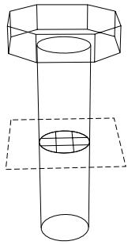  
图 2: 使用分区指定螺栓横截面。

如果您使用的是孤立网格单元，则必须通过选择单元面来指定横截面表面。例如，图 3 所示的网格部件中，单元面定义了一个横截面表面。

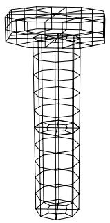  
图 3: 使用单元面指定螺栓横截面。

单元面只需要从预紧截面一侧的单元中选择。您可以使用显示组 (display groups) 从视口中移除选定的单元，以显露横截面表面的单元面。有关选择表面的更多信息，请参见在视口内选择对象。有关在线框部件实例上选择表面的详细信息，请参见指定区域的特定侧面或端面。


## 注意：

您只能将螺栓载荷应用于三维实体、二维实体和三维线框部件实例。不支持在二维和轴对称线框部件实例上施加螺栓载荷。

## 螺栓轴

如果您在实体区域上定义螺栓载荷，默认使用定义螺栓横截面的表面的法线作为螺栓轴。您可以选择一个基准轴 (datum axis) 来指示不同的螺栓轴方向（它不必垂直于横截面）。如果您在线框区域上定义螺栓载荷，螺栓轴方向始终假定为在螺栓横截面处与线框相切的方向。

Abaqus/CAE 同时使用您指定的横截面表面和螺栓轴来定义预紧截面数据和 Abaqus/Standard 使用的预紧参考节点；更多信息，请参见规定的装配载荷。您可以在部件级别或装配体级别创建预紧截面。要在部件级别创建预紧截面，所选区域必须属于依赖的部件实例。如果您在部件级别创建预紧截面，则为来自同一部件的所有实例定义螺栓载荷。

## 施加载荷的方法

创建螺栓载荷时，您必须选择以下载荷方法之一：

•   **对螺栓施加力**。此方法模拟拧紧螺栓，使其承受指定的载荷。  
•   **调整螺栓长度**。此方法模拟拧紧螺栓，直到其自由长度改变了指定值。  
•   **将螺栓固定在其当前长度**。此方法仅在您已经在第一个分析步中创建了载荷并在后续分析步中编辑它时可用。此方法允许螺栓长度保持不变，以便螺栓中的力可以根据模型的响应而变化。

## 所选方法的幅值

如果您对螺栓施加力，则必须输入力的幅值。如果您调整螺栓长度，则必须输入长度变化量。

您只能在第一个分析步中创建螺栓载荷，但可以在后续步骤中修改载荷方法或载荷幅值。例如，您可以在第一步中施加特定的张力，然后在第二步中将方法更改为固定螺栓长度。

您可以使用 Step 模块中的场输出和历程输出请求编辑器从螺栓载荷获取数据。在编辑器的 Domain (域) 部分，选择 Bolt load (螺栓载荷)，然后从出现的菜单中选择所需的螺栓载荷。更多信息，请参见创建输出请求。

有关创建螺栓载荷的详细信息，请参见创建和编辑螺栓载荷。

## 创建和编辑螺栓载荷

您可以创建螺栓载荷来建模螺栓或紧固件中的预紧力或长度调整。

1.  从主菜单中，选择 Load -> Create (载荷 -> 创建)。

    Abaqus/CAE 显示 Create Load (创建载荷) 对话框。

2.  在 Create Load (创建载荷) 对话框中，执行以下操作：

    a. 从 Category (类别) 列表中，选择 Mechanical (力学)。  
    b. 从 Types for Selected Step (所选步骤类型) 列表中，选择 Bolt Load (螺栓载荷)，然后单击 Continue (继续)。
3. 选择指定定义螺栓截面的表面的方法。

• 选择 Interior Surface（内部表面）以使用先前创建的内部表面。
• 选择 Bolt Shank Surface（螺栓杆表面）以通过分割螺栓杆表面来创建内部表面。

4. 如果您选择了 Interior Surface 方法，请执行以下操作：

a. 选择指示螺栓载荷位置的内部表面或线段。

如果您使用的是原生或导入的几何体，请在视窗中使用鼠标选择内部表面或线段。您可以组合使用拖动选择、[Shift] + 单击、[Ctrl] + 单击和角度方法来选择多个面或边。更多信息，请参阅选择当前视窗中的对象。


提示：如果无法选择所需的面或边，您可以使用 Selection（选择）工具栏来更改选择行为。更多信息，请参阅使用选择选项。

• 如果您使用的是孤立网格单元，则必须选择单元面来指定内部表面。您可以使用显示组从视窗中移除选定的单元，以显示横截面表面的单元面。更多信息，请参阅使用显示组显示模型的子集。

选择完成后，单击鼠标键 2。

b. 使用指定区域的特定侧或端中描述的技术，选择定义表面的侧。您选择的侧决定了哪些单元将被调整以产生所需的拧紧载荷或长度调整（详见规定装配载荷）。

Abaqus/CAE 显示螺栓载荷编辑器。

5. 如果您选择了 Bolt Shank Surface 方法，请执行以下操作：

a. 选择要分割的螺栓杆面。您只能选择圆柱面。
b. 在提示区中，输入切割位置值以定义分割位置。
c. 单击 Done（完成）。

Abaqus/CAE 通过分割选定面创建内部表面，并显示螺栓载荷编辑器。

6. 单击 Method（方法）字段旁边的箭头，并从出现的列表中选择您偏好的加载方法。
7. 在 Magnitude（大小）字段中，输入力的大小（适用于 Apply force（施加力）方法）或长度变化量（适用于 Adjust length（调整长度）方法）。


## 注意：

如果您编辑在创建载荷的分析步之后的分析步中的载荷，Fix at current length（固定当前长度）方法将变为可用。如果在编辑载荷时，您将方法更改为 Fix at current length（固定当前长度），则 Magnitude（大小）字段将变为不可用。

8. 如果需要，指定一个幅值。（有关更多信息，请参阅幅值工具集。）
9. 默认情况下，定义螺栓截面的表面的法向用作螺栓轴。如果需要，您可以定义不同的螺栓轴方向。

a. 选择 Specify（指定）。

b. 选择一个基准轴。

• 要创建基准轴，请单击并在视窗中选择定义该轴的两个点。如果需要，请在提示区中选择 Make Independent（设为独立）以将基准创建为独立特征。
• 单击 ，并选择与螺栓中心线对齐的基准轴。

10. 预紧截面是在装配级别编写的。切换到 Pre-tension section at part level（零件级别的预紧截面）可在零件级别编写预紧截面（仅适用于依赖零件实例）。如果您选择了 Pre-tension section at part level（零件级别的预紧截面）选项，则螺栓载荷将为来自同一零件的所有实例定义。
11. 单击 OK（确定）以创建载荷并退出编辑器。

视窗中出现代表您刚创建的螺栓载荷的箭头。更多信息，请参阅理解代表规定条件的符号。

## 附加信息

• 创建和修改规定条件
• 理解代表规定条件的符号
• 规定装配载荷

本节提供有关使用 Abaqus/CAE 建模复合材料铺层的信息。

## 本节内容：

复合材料铺层概述
创建复合材料铺层
理解复合材料铺层和方向
理解复合材料铺层和分布
请求复合材料铺层的输出
查看复合材料铺层

## 复合材料铺层概述

图 1 展示了一个包含三个铺层的单一复合材料铺层。每个铺层由具有均匀厚度的均匀材料组成，纤维沿单一方向定向。然而，铺层也可以是各向同性材料，例如泡沫芯材。


图 1：复合材料铺层。

铺层代表在复合材料制造过程中放入模具中的单个材料片。复合材料铺层可以在不同区域包含不同数量的铺层。例如，图 1 中的复合材料铺层包括包含单个铺层的区域、两个铺层重叠的区域以及三个铺层重叠的区域。

图 2 显示了与图 1 中描绘的相同模型，但使用复合材料壳截面定义。复合材料壳截面内的铺层数量不能改变。因此，需要四个复合材料壳截面（每个具有恒定数量的铺层）来定义这个简单模型。截面 1 包含一个铺层，截面 2 和 3 各包含两个铺层，截面 4 包含三个铺层。

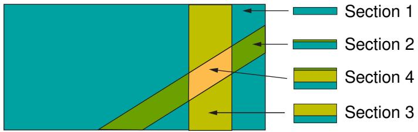
图 2：复合材料壳截面。

Abaqus/CAE 中的复合材料铺层旨在帮助您管理典型复合材料模型中的大量铺层。相比之下，复合材料截面是有限元分析的产物，可能难以应用于实际应用。除非您的模型相对简单且所有铺层覆盖相同的区域，否则随着铺层数量的增加，您会发现使用复合材料截面定义模型变得越来越困难。添加新铺层或移除或重新定位现有铺层也可能很繁琐。

使用 Abaqus/CAE 创建复合材料铺层的过程模拟了创建真实复合材料零件的过程——您从一个基本形状开始，然后在选定的区域添加不同材料和厚度的铺层，并定向铺层以在特定方向提供最大的强度。Abaqus/CAE 的复合材料铺层编辑器允许您轻松添加铺层、选择应用区域、指定其材料属性并定义其方向。您必须在整个模型中指定唯一的铺层名称，以确保正确显示基于铺层的结果。您也可以从文本文件中的数据读取铺层的定义。当数据存储在电子表格中或由第三方工具生成时，这很方便。您也可以在铺层中抑制铺层，并试验添加和移除不同方向铺层的效果。

指定铺层中纤维的正确方向非常重要。Abaqus/CAE 允许您为铺层定义参考方向，也为铺层中的每个铺层定义参考方向。此外，您可以指定铺层中纤维相对于铺层参考方向的方向。默认情况下，铺层的坐标系与零件的坐标系相同；类似地，铺层的坐标系与铺层的坐标系相同。方向定义在理解复合材料铺层和方向中有更详细的描述。

使用复合材料铺层建模游艇船体，展示了如何使用 Abaqus/CAE 中的复合材料铺层功能分析复杂的三维模型。

## 创建复合材料铺层

Abaqus/CAE 允许您为三种类型的单元定义复合材料铺层：传统壳、连续体壳和实体。有关详细说明，请参阅以下部分：

创建传统壳复合材料铺层
创建连续体壳复合材料铺层
创建实体复合材料铺层

您可以在 Property（属性）模块中创建复合材料铺层。复合材料铺层编辑器提供一个表格，用于定义铺层中的铺层。对于每个铺层，您指定其名称、材料、厚度和方向，以及积分点数量和铺层分配到的模型区域。复合材料铺层编辑器的铺层表格如图 1 所示。


图 1：复合材料铺层编辑器中的铺层表格。

铺层表格提供了几个选项，使您更容易定义包含许多铺层的铺层；例如，铺层表格允许您执行以下操作：

• 在表格中向上或向下移动或复制选定的铺层。
• 抑制或删除选定的铺层。
•   重复（阵列）一组选定的铺层。
•   从ASCII文件读取铺层数据，或将铺层数据写入ASCII文件。这些数据可以定义铺层中的所有铺层，也可以仅定义其中的一部分。

抑制铺层的能力使您能够轻松尝试复合材料铺层的不同配置，并查看其对模型分析结果的影响。有关更多信息，请参阅《定义复合材料铺层时使用铺层表》。

如果您定义的复合材料铺层的铺层关于中心核心对称，则只需在铺层表中输入铺层的下半部分。当您应用对称选项时，Abaqus会通过以相反顺序重复已输入的铺层（包括中心铺层）来在生成的截面中自动创建额外的铺层。

您可能需要对模型进行分区，以创建要分配铺层的区域。您应该在创建铺层和开始定义铺层之前创建分区。您可以直接从当前视口中的部件上选择区域，也可以创建一个引用该区域的命名集合，然后选择该命名集合。如果您决定在定义复合材料铺层后添加分区和铺层，Abaqus/CAE会保留任何现有的铺层区域；例如，您可以向模拟为区域提供额外刚度的肋板的铺层添加铺层。您分配铺层的区域可以是Abaqus/CAE几何体，也可以是网格。您可以将分配给几何体的铺层和分配给原生网格的铺层组合在单个复合材料铺层中。

对于连续壳和实体复合材料铺层，期望在铺层中指定的所有区域组合范围内，整个厚度方向上只有一个单元。每个厚度方向上的单个单元包含您在铺层表中定义的多个铺层。如果您分配连续壳或实体复合材料铺层的区域在厚度方向上包含多个单元，则每个单元都将包含您在铺层表中定义的所有铺层，分析结果将不会符合预期。

如果您的模型在某个区域的厚度方向上包含多个连续壳或实体单元，您可以通过为每一层单元定义一个单独的复合材料铺层来获得正确的结果。您可以通过在指定铺层区域时选择原生Abaqus/CAE网格的单元或孤立单元，来为每一层定义一个复合材料铺层。您必须为每一层单元创建一个铺层。

如果您的复合材料铺层中有重叠的铺层，您必须按照铺层在重叠区域中出现的顺序在铺层表中输入它们。图2展示了一个重叠区域的简单示例以及铺层表中铺层的相应顺序。铺层表中的第一个铺层代表铺层中的底部铺层。


图 2: 铺层表中铺层的顺序。

在某些情况下，Abaqus无法确定传统壳复合材料铺层的方向。例如，如果您的铺层经过一个90°的急剧转折，并且/或者您的部件与全局坐标系的一个或多个平面对齐，就可能发生这种情况。为了帮助您诊断问题区域，Abaqus/CAE会绘制一个折叠的坐标系，指示那些用户选择的坐标系和几何法线无法解析为有效方向（用于显示目的）的区域。如果出现这种情况，您可能可以通过在转折处将铺层拆分为多个铺层并为每个新铺层分配方向来完成分析。

如果您将一个复合材料铺层和一个截面指派应用于同一个区域，Abaqus/CAE在分析期间仅使用复合材料铺层的属性。如果您将两个或多个复合材料铺层应用于重叠的区域，Abaqus/CAE使用最后一个铺层的属性，其中“最后一个”指的是按复合材料铺层名称的字母顺序。属性模块中的默认颜色编码使用黄色来指示具有重叠复合材料铺层和截面指派的区域，或指示具有多个重叠复合材料铺层的区域。

## 理解复合材料铺层和方向

复合材料铺层中每个铺层内的纤维方向在决定模型的物理特性方面起着重要作用；然而，在基于真实应用的模型中定义此方向并非易事。

Abaqus/CAE中的复合材料铺层通过从三个相互关联的参数推导纤维方向，使这一过程更易于管理——铺层方向、铺层方向和附加旋转，如图1所示。


<table><tr><td></td><td></td><td>Ply Name</td><td></td></tr><tr><td>1</td><td>✓</td><td>Ply-1</td><td></td></tr><tr><td>2</td><td>✓</td><td>Ply-2</td><td></td></tr><tr><td>3</td><td>✓</td><td>Ply-3</td><td></td></tr></table>

<table><tr><td></td><td>CSYS</td><td>Rotation Angle</td><td>Integra Point</td></tr><tr><td></td><td></td><td>0</td><td>3</td></tr><tr><td></td><td></td><td>90</td><td>3</td></tr><tr><td></td><td>Datum csys-3.3</td><td>0</td><td>3</td></tr></table>

图 1: 确定铺层方向。

## 铺层方向

铺层方向定义了铺层中所有铺层的基础或参考方向。在传统和连续壳铺层中，Abaqus将指定的方向投影到壳的表面，使您选择的铺层方向与壳的法线方向对齐。在实体复合材料铺层中，方向不进行投影。

Abaqus/CAE提供了多种定义铺层方向的选项：

•   部件全局坐标系：默认情况下，铺层方向与部件的方向相同。
•   坐标系：您可以创建并选择一个定义方向的基准坐标系。
•   离散方向：您可以创建一个离散方向，为每个网格单元提供一个方向值以定义方向。
•   离散场：您可以创建并选择一个定义空间变化方向的取向离散场。
•   用户自定义：您可以在用户子程序ORIENT中定义方向。此选项仅适用于Abaqus/Standard分析。
•   法线方向：对于除“用户自定义”之外的所有选项，您可以选择哪个轴定义复合材料铺层的近似法线方向。

附加旋转：如果您选择“坐标系”、“离散方向”或“离散场”来定义铺层方向，您可以指定一个角度（以度为单位），该角度定义了整个铺层绕指定法线方向的额外旋转。您可以使用标量离散场来指定空间变化的附加旋转角。

## 铺层方向

铺层方向定义了每个铺层的相对方向。在传统和连续壳铺层中，Abaqus将指定的铺层方向投影到壳的表面，使铺层的法线方向与壳的法线和铺层堆叠方向对齐。在实体复合材料铺层中，铺层是相对于铺层堆叠方向创建的，而未投影的铺层方向定义了铺层内的材料方向（见图2）。


图 2: 壳和实体复合材料铺层的铺层及其方向。

Abaqus/CAE通过组合您可以指定的两个变量来计算铺层方向——坐标系（CSYS）和一个绕法线方向的旋转角。

在Abaqus/CAE尝试在系统的奇异点（即那些用户选择的坐标系和来自几何体或单元的几何法线无法在Abaqus/CAE中解析为有效方向用于显示目的的点）为复合材料铺层中的铺层方向绘制坐标系的情况下，坐标系将被绘制为折叠状态。

如果铺层方向使用离散场指定，则无法为铺层或铺层方向提供显示。对于连续壳单元，Abaqus/CAE不会将显示的方向投影到中面表面。在这两种情况下，您可以执行数据检查并在可视化模块中查看输出数据库以验证方向。有关更多信息，请参阅《对模型执行数据检查》。

## 坐标系

Abaqus/CAE提供了以下用于定义铺层坐标系的选项：

•   铺层：默认情况下，铺层的坐标系与铺层的坐标系相同。
CSYS：您可以创建并选择一个定义铺层坐标系的基准坐标系。如果您选择为某个铺层使用坐标系，它将覆盖该铺层的铺层方向。
您也可以选择定义铺层法向方向的坐标系轴。所选轴会显示在铺层表的 CSYS 列中作为最后一位数字。例如，

Datum csys1.3 表示您选择了 Datum csys-1 来定义铺层的坐标系，并选择了 3 轴来定义法向。

## 旋转角

旋转角定义了铺层内纤维相对于铺层坐标系的方向。例如，在典型的复合材料中，纤维相对于坐标系可能定向为 −45° 或 +90°。您也可以使用标量离散场来指定铺层上空间变化的纤维方向。如果指定了旋转角，铺层将绕坐标系法线逆时针旋转，角度相对于 1 轴测量。

图 3 显示了复合材料铺层堆叠中四个铺层的方向，以及铺层表中的相应条目。  


  
图 3：确定每个铺层的方向。

Abaqus/CAE 按如下方式确定铺层方向：

您选择了铺层堆叠方向来定义 VerticalTape-1 的坐标系，并输入了 $0 ^ { \circ }$ 的旋转角。得到的铺层方向沿铺层堆叠方向的 1 轴。  
• 您选择了铺层堆叠方向来定义 VerticalTape-2 的坐标系，并输入了 $9 0 ^ { \circ }$ 的旋转角。得到的铺层方向是绕铺层堆叠方向的 3 轴（法向方向）逆时针旋转 $9 0 ^ { \circ }$。旋转角相对于 1 轴测量。  
• 您选择了 Datum csys-1 来定义 DiagonalTape-1 的坐标系，并输入了 $0 ^ { \circ }$ 的旋转角。得到的铺层方向沿 Datum csys-1 的 1 轴。  
您选择了 Datum csys-1 来定义 DiagonalTape-2 的坐标系，并输入了 $9 0 ^ { \circ }$ 的旋转角。得到的铺层方向是绕基准坐标系的 3 轴（法向方向）逆时针旋转 90°。角度相对于 1 轴测量。

## 理解复合材料铺层堆叠和分布

复合材料铺层堆叠使用的离散场称为分布。因为分布应用于特定的单元和节点，您只能在网格划分部件之后才能使用分布。

离散场是空间变化的场，其值与节点或单元相关联。离散场工具集允许您在 Abaqus/CAE 中创建和管理离散场。在大多数情况下，您将使用在网格划分部件上操作的第三方预处理器来创建可应用于复合材料铺层堆叠的分布。更多信息，请参阅离散场工具集。

您可以将分布用于以下目的：

• 定义空间变化的局部坐标系，以指定复合材料铺层堆叠的整体方向。  
• 定义铺层堆叠方向的附加旋转，该旋转在铺层堆叠上空间变化。  
• 定义铺层方向的附加旋转，该旋转在铺层上空间变化。您只能在 Abaqus/Standard 分析中使用分布来定义铺层方向。  
• 定义常规壳复合材料铺层堆叠上空间变化的整体壳厚度。  
• 定义常规壳复合材料铺层堆叠中铺层上空间变化的铺层厚度。您只能在 Abaqus/Standard 分析中使用分布来定义铺层厚度。  
• 定义常规壳复合材料铺层堆叠上空间变化的节点厚度。  
• 定义常规壳复合材料铺层堆叠上空间变化的偏移。您只能在 Abaqus/Standard 分析中使用分布来定义偏移。

## 请求复合材料铺层堆叠的输出

当您创建将在分析过程中积分的复合材料铺层堆叠时，您可以指定铺层堆叠中每个铺层的积分点数。默认情况下，对于在分析过程中积分的壳截面，Abaqus/CAE 为壳或连续体壳复合材料铺层堆叠的每个铺层创建三个积分点，为实体复合材料铺层堆叠的每个铺层创建一个积分点。对于预积分壳截面，Abaqus/CAE 为铺层堆叠中的每个铺层创建三个积分点，且您无法更改此值。图 1 显示了具有三个铺层且每铺层三个积分点的复合材料铺层堆叠的积分点编号。

  
（每层 3 个截面点）  
图 1：具有三个铺层的复合材料铺层堆叠的积分点编号。

如果您不创建输出请求，Abaqus 仅从复合材料铺层堆叠的顶部和底部（最高和最低积分点）写入场输出数据，不会从其他铺层生成数据。因此，如果您的模型包含复合材料铺层堆叠，并且您希望获取单个铺层或内部积分点的数据，则必须创建新的输出请求或编辑默认输出请求，并指定将输出变量的复合材料铺层堆叠。

当您创建输出请求时，Abaqus/CAE 默认仅从复合材料铺层堆叠每个铺层的中间截面点向输出数据库写入历史数据和场数据。要更改默认行为，您可以使用场输出和历史输出请求编辑器来编辑输出请求，并将域更改为复合材料铺层堆叠。然后，您可以请求来自每个铺层的顶部、中间和/或底部截面点、所有截面点或指定截面点的场数据或历史数据。更多信息，请参阅修改场输出请求和修改历史输出请求。您可以请求以下内容：

## 选定的 (Selected)

Abaqus/CAE 从每个铺层的选定截面点（顶部、中间和/或底部）向输出数据库写入场数据。如果一个铺层具有偶数个截面点，并且您请求输出中间截面点，则 Abaqus/CAE 将从跨越铺层中间的两个截面点中较高的一个生成数据。例如，如果一个铺层有四个截面点，并且您请求输出中间截面点，则 Abaqus/CAE 将从第三个截面点生成数据。

## 全部 (All)

Abaqus/CAE 从所有铺层的所有截面点向输出数据库写入场数据。

## 指定 (Specify)

Abaqus/CAE 从指定的截面点向输出数据库写入场数据。截面点从底部铺层的底部到顶部铺层的顶部顺序编号，其中底部铺层是铺层堆叠中的第一个铺层。例如，如果您想要获取图 1 中所示的每个铺层的中间截面点的输出，您需要输入 2,5,8。

更多信息，请参阅理解输出请求。

## 查看复合材料铺层堆叠

您可以在创建复合材料铺层堆叠时或在分析后查看它。Abaqus/CAE 提供了以下工具用于基于铺层的复合材料铺层堆叠可视化：

## 铺层堆叠图 (Ply stack plot)

铺层堆叠图是来自复合材料铺层堆叠或复合材料截面选定区域的铺层的图形表示。图 1 说明了一个铺层堆叠图。

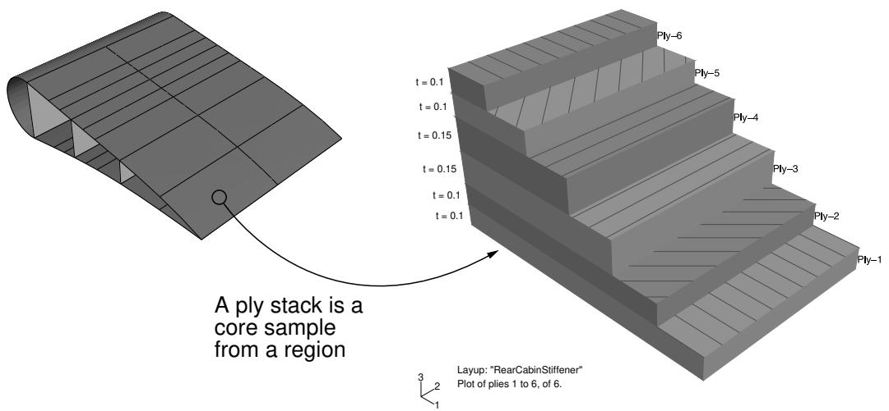  
图 1：铺层堆叠图。

阶梯状外观并不表示铺层堆叠中的铺层脱落；它只是一种图形表示，使您能够看到铺层堆叠中的铺层数量，以及例如铺层的相对厚度、构成它的材料及其纤维方向。如果您的复合材料铺层堆叠包含许多铺层，铺层堆叠图可能会变得混乱且难以解释。为了使铺层堆叠图更具可读性，Abaqus/CAE 提供了选项，允许您仅查看可管理数量的铺层。

铺层堆叠图中的三元组代表单元方向系，它显示了壳法向或堆叠方向（3 方向）以及铺层的 1 和 2 方向。纤维始终在 1–2 平面内绘制，与 1 方向成一定角度。在实体复合材料铺层堆叠中，铺层中的纤维并不总是平行于 1–2 平面运行（例如，如果铺层方向的 3 方向和单元堆叠方向不对齐）。在这种情况下，铺层堆叠图中的纤维并非铺层堆叠中纤维的真实描绘，而是铺层堆叠定义中旋转角的图形表示：铺层堆叠图中绘制的角度是铺层表中指定的、围绕单元堆叠方向轴测量的旋转角。更多信息，请参阅理解复合材料铺层堆叠和方向。

对于基于用户定义坐标系或旋转角分布的铺层方向，铺层堆叠图不绘制纤维。Abaqus/CAE 在此类铺层上显示一个星号（对于坐标系统）或一个插入符号（对于旋转角分布），表示它无法在 1–2 平面中绘制能准确表示该铺层纤维方向的线。类似地，如果您使用离散场分布来定义铺层的厚度，Abaqus/CAE 会根据铺层堆叠中其他均匀铺层的平均厚度在铺层堆叠图中绘制该铺层，并在图旁显示离散场名称（如果启用了厚度标签）。
在创建复合材料铺层后，您可以在属性模块中显示铺层堆叠图。在分析了带有复合材料铺层的模型后，您也可以在可视化模块中显示铺层堆叠图。更多信息，请参阅查看铺层堆叠图。

## 基于层的结果

分析了带有复合材料铺层的模型后，您可以查看铺层中单个层的结果等高线图，或者查看在铺层所有层中寻找最大值或最小值的包络等高线图。

## 单个层的结果

基于层的结果显示的是复合材料铺层中选定层的数据。对于给定的层，您可以查看该层底部、中部或顶部的数据，或者查看同时包含顶部和底部层的数据。

图 2 展示了从复合材料铺层选定层中得到的应变（E11）等高线图。

E11:  
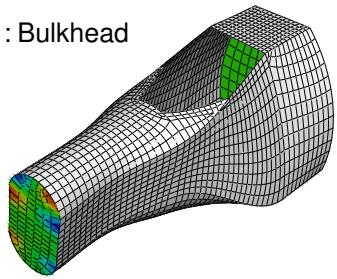


E11: Top an  
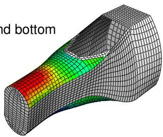

E11:  
  
图 2: 来自选定层的等高线图。

如果模型中多个复合材料铺层定义使用了相同的层名称，查看该层的数据将显示所有包含该层名称的铺层的结果。要将结果限制在单个铺层中的单个层内，您必须首先使用显示组将显示限制在特定的复合材料铺层（参见创建或编辑显示组的选择方法），然后绘制所需层内某个截面点的结果（参见按层选择截面点数据）。

显示复合材料铺层顶部和底部层输出的等高线图，其外观会因铺层类型而异。在传统的壳体复合材料铺层中，两个等高线表现为一个双面壳体，每侧有不同的等高线。在连续体壳体复合材料铺层或实体复合材料铺层中，两个等高线表现为位于每个截面点位置的独立单面等高线。图 3 说明了传统壳体和连续体壳体复合材料铺层等高线图之间的差异。

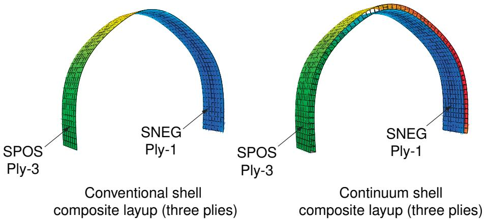  
图 3: 传统壳体和连续体壳体复合材料铺层的等高线图。

每个铺层包含三个层，每个图都显示了顶部层顶部和底部层底部的输出。两种情况下都绘制了应力（S11）。更多信息，请参阅按类别选择截面点数据。

## 包络图

包络图允许您查看模型中变量的最高值或最低值的等高线图，而不考虑其发生在哪个层中。包络图中与极值对应的层称为关键层。您可以选择 Abaqus/CAE 应用的准则（绝对最大值、最大值或最小值）以及 Abaqus/CAE 检查值的层内位置（积分点、质心、单元节点）。

例如，即使您的复合材料铺层包含大量层，您也可以只查看关键层，并确定模型中每个单元内发生的最高应变。您可以决定是否通过增加特定区域的层数或重新定向现有层来减少关键层中的应变。图 4 显示了模型关键层中应变（E11）的值。

  
图 4: 关键层中应变的值。

此外，您可以使用等高线图选项来显示拼图等高线图，其中每个单元的颜色表示哪个层是关键层，如图 5 所示。

E, E11 Ply Envelope (max abs)

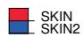

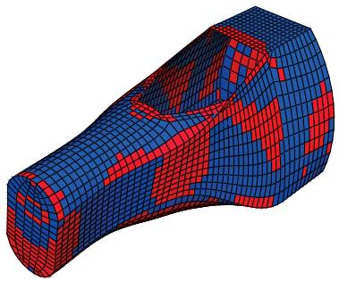  
图 5: 关键层。

结合图 4 和图 5 所示的图，您可以确定关键层中应变的值以及关键层在铺层中的位置。更多信息，请参阅选择要显示的场输出，以及理解等高线值的计算方式。

如果您没有创建输出请求，Abaqus/CAE 仅从复合材料铺层的顶部和底部写入场输出数据，而不会从其他层生成数据。要创建检查模型中所有层的包络图，您必须创建新的输出请求或编辑默认输出请求，并指定复合材料铺层以及将输出变量的层和截面点。

在许多情况下，即使您更改了 Abaqus/CAE 检查值的层内位置，同一层仍会经历极值，并且等高线图不会改变。但是，如果满足以下条件，等高线图可能会因为关键层发生变化而改变：

• 您的层数很少，并且结果沿层厚度方向变化迅速；或者
• 材料是非线性的，并且在某些条件下其刚度会发生突变。

## 沿厚度方向的 X–Y 图

在分析了复合材料铺层并确定了包含关键层的区域后，您可以通过沿厚度方向的 X–Y 图查看层在整个铺层中的行为。您可以通过读取模型壳体区域中选定单元的截面点场输出结果来创建 X–Y 数据对象。如果您选择复合材料铺层中的一个单元，Abaqus/CAE 将绘制铺层整个厚度内每个层中每个截面点的数据。图 6 说明了通过复合材料铺层的 13 个层沿纤维方向应变的厚度分布图。由于纤维方向在层间变化，应变是不连续的。

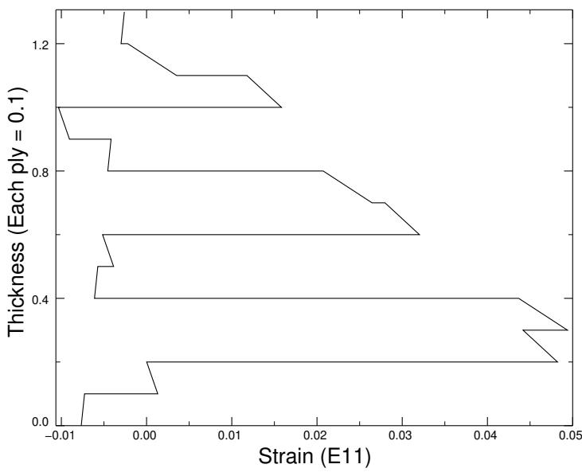  
图 6: 沿厚度方向的 X–Y 图。

更多信息，请参阅读取壳体厚度方向的 X–Y 数据。

## 颜色编码

您可以在所有 Abaqus/CAE 模块中使用颜色编码来更改单个铺层和层的颜色。如果您选择按层进行颜色编码，Abaqus/CAE 将只在一个区域中显示一个层，默认情况下是最后一个层（按字母顺序）。要查看不同的层，您可以停用选定的层。更多信息，请参阅为几何和网格元素着色。

## 显示组

在可视化模块中，您可以使用显示组仅查看选定铺层或层中的单元。更多信息，请参阅创建或编辑显示组的选择方法。

使用复合材料铺层建模游艇船体，说明了如何创建和分析复杂的三维复合材料模型，以及如何使用 Abaqus/CAE 查看铺层中单个层的行为。

## 连接器

本节提供有关如何建模连接器的信息。

## 本节内容：

建模连接器
什么是连接器？
什么是连接器截面？
什么是连接器方向参考系（CORM）？
什么是连接器行为？
创建连接器几何、连接器截面和连接器截面指派
参考点和连接器之间是什么关系？
在连接器截面指派中定义连接器方向
从连接器请求输出
施加连接器载荷和连接器边界条件
在可视化模块中显示连接器和连接器输出

## 建模连接器

在 Abaqus/CAE 中建模和使用连接器的过程涉及以下一般步骤：

1. 创建建模连接器时要使用的参考点和基准坐标系。
2. 创建装配级别的线特征。
3. 创建连接器截面以定义连接类型、连接器行为和截面数据。
4. 创建连接器截面指派，将连接器截面与您选择的线关联起来，并指定您选择的线的第一个和第二个点的方向。
5. 在载荷模块中，规定连接器载荷和连接器边界条件，以模拟连接器驱动并约束材料流动。
6. 在分析步模块中，为连接器创建场输出和历程输出请求。
7. 在可视化模块中，绘制连接器输出结果；控制连接器截面指派、线端点、连接类型和当前局部方向的显示；并动画显示线端点和局部方向的时间历史。

## 什么是连接器？

连接器允许您建模装配中两个点之间的力学关系。连接可以是简单的，例如连杆，也可以施加更复杂的约束，例如恒速万向节。连接器几何使用包含一根或多根线的装配级别线特征来建模。线可以连接装配中的两个点，也可以将一个点连接到地面。您创建一个连接器截面，指定连接类型和连接器行为，例如弹簧般的弹性行为。要完成连接器建模，您需要创建一个连接器截面指派，将连接器截面与您选择的线关联起来，并指定您选择的线的第一个和第二个点的方向。有关连接器的更多信息，请参阅关于连接器。
例如，图 1 展示了在示例问题“曲柄机构”中使用的曲柄机构。

  
图 1: 使用连接器建模的曲柄机构。

该模型通过两个万向节传递旋转运动，然后将旋转运动转化为两个滑块的平移运动。本示例提供了一个 Abaqus 脚本接口 (Abaqus Scripting Interface) 脚本，用于使用 Abaqus/CAE 重现该曲柄机构模型。该曲柄机构使用九个部件实例 (part instances) 建模，这些实例通过八个在 Abaqus/CAE 中建模的连接器 (connectors) 相互连接。

## 什么是连接器截面 (connector section)？

连接器截面定义了连接类型，并可能包括连接器行为和截面数据。Abaqus 提供了多种连接类型——基本类型、组装类型、复杂类型和 MPC 类型。

## 基本类型 (Basic types)

基本连接类型包括平移类型和旋转类型。平移类型影响被分配连接器截面的线的两端的平移自由度，并可能影响线的第一个端点或两端的旋转自由度。旋转类型仅影响线的两端的旋转自由度。

## 组装类型 (Assembled types)

组装连接类型是基本连接类型的预定义组合。例如，HINGE（铰链）连接类型组合了 JOIN（连接）类型（平移）和 REVOLUTE（旋转）类型（旋转），以连接两点的位置并在它们的旋转自由度之间提供旋转约束。

## 复杂类型 (Complex types)

复杂连接类型影响连接中的自由度组合，不能与其他连接类型组合。它们通常用于对高度耦合的物理连接进行建模。

## MPC 类型 (MPC types)

MPC 连接类型用于定义两点之间的多点约束 (multi-point constraints)。


## 注意 (Note)：

Abaqus/CAE 仅在连接器截面在模型数据库中具有连接器截面分配 (connector section assignment) 时，才会将完整的连接器截面数据写入输入文件。如果您计划从输入文件导入模型并获取连接器截面，则必须确保所有连接器截面在模型数据库中都已分配。

有关 Abaqus/CAE 中可用连接类型的概述，请参阅“理解连接器截面和功能”(Understanding connector sections and functions)。有关每种连接类型的描述以及定义组装类型连接运动约束的等效基本连接类型，请参阅“连接类型和一般多点约束”(Connection Types and General Multi-Point Constraints)。

## 什么是 CORM？

CORM 是“相对运动分量”(component of relative motion) 的缩写：指连接器局部坐标系下的相对位移和旋转。可用的相对运动分量是运动学上不受约束的相对位移和旋转。根据连接类型，某些分量可能是可用的，而某些可能被约束。当您创建或修改连接器截面时，Abaqus/CAE 会在指定连接类型的编辑器中显示可用的和受约束的相对运动分量。除了将行为应用于相对运动分量外，您还可以将连接器载荷 (connector loads) 和连接器边界条件 (connector boundary conditions) 施加到连接器的可用相对运动分量上（参见“施加连接器载荷和连接器边界条件”(Applying connector loads and connector boundary conditions)）。有关创建连接器截面的更多信息，请参阅“连接器截面编辑器”(Connector section editors)。

## 什么是连接器行为 (connector behaviors)？

在为连接器截面指定连接类型后，您可以为相对运动分量定义行为。您可以指定以下连接器行为：

• 弹性 (Elasticity)  
• 阻尼 (Damping)  
摩擦 (Friction)  
• 塑性 (Plasticity)  
• 损伤 (Damage)  
停止 (Stop)  
• 锁定 (Lock)  
失效 (Failure)

• 参考长度 (Reference length)

• 积分 (Integration) (仅用于 Abaqus/Explicit 分析)

有关行为的更多信息，请参阅“连接器行为”(Connector behaviors) 和“连接器行为”(Connector Behavior)。

## 创建连接器几何体、连接器截面和连接器截面分配

您在 Interaction（相互作用）模块中创建装配级别的线特征 (wire features)、连接器截面和连接器截面分配来对连接器进行建模。Abaqus/CAE 提供了两种建模连接器的方法：您可以使用连接器构建器 (Connector Builder) 来执行创建单个连接器所涉及的所有步骤，包括创建线特征、连接器截面、连接器截面分配以及任何所需的参考点和基准坐标系 (datum coordinate systems)；或者，您可以在 Interaction 模块中通过单独的对话框创建线、连接器截面和连接器截面分配，从而创建多个连接器。如果选择后一种技术，则应在开始建模连接器之前创建所需的参考点和基准坐标系。

如图 1 所示的模型树 (Model Tree) 有助于理解您在装配相关模块中创建的参考点、基准坐标系和线特征的组织结构，以及您在 Interaction 模块中创建的连接器截面和连接器截面分配。您可以使用 Interaction 模块中的查询工具集 (Query toolset) 来获取选定线的连接器分配信息。

  
图 1: 模型树中的线特征、连接器截面和连接器截面分配。

有关详细说明，请参阅以下部分：

*   选择定义连接器几何体的过程
*   创建单个连接器
*   为多个连接器创建或修改线特征
*   创建连接器截面
*   创建和修改连接器截面分配

*   使用查询工具集获取连接器分配信息

## 参考点 (reference points) 和连接器之间有什么关系？

您可用于定义装配级别线特征的点可以是以下之一：

*   部件实例的顶点或节点
*   部件实例或装配的参考点
*   地面 (Ground)

使用参考点通常比使用装配上的点或节点更方便，因为同一个参考点可以被刚体约束 (rigid body) 或耦合约束 (coupling constraint) 使用。在 Part（部件）模块中，您可以使用参考点工具集 (Reference Point toolset) 在每个部件上创建一个参考点；额外的参考点可以在 Assembly（装配）模块、Interaction（相互作用）模块和 Load（载荷）模块中创建。

您可以使用模型树为参考点重命名更具描述性的特征名称。描述性名称使您在复杂模型中更容易关联参考点和线，如图 1 所示。

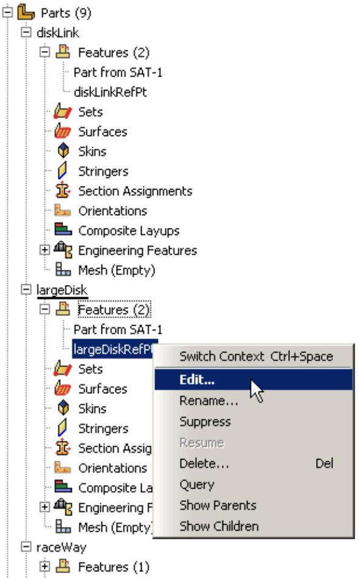  
图 1: 曲柄机构的模型树。

如果您想在相同部件的多个实例上为参考点使用不同的特征名称和标签，则必须在装配相关模块中创建参考点。您可以使用编辑网格工具集 (Edit Mesh toolset) 在网格上创建一个节点，然后选择该节点来定义装配级别线的端点；但是，该节点不会列在模型树中，并且在视口中没有标签。有关创建和重命名参考点的更多信息，请参阅“参考点工具集”(The Reference Point toolset)。有关在网格上创建节点的更多信息，请参阅“操作节点”(Manipulating nodes)。

定义装配级别线端点的每个参考点或节点都需要与模型几何相关联，即使它们是在 Part 模块中创建的。在许多情况下，您需要在参考点或节点与部件实例之间创建刚体约束或耦合约束（将力分布到一个区域而不是单个点）。因此，线端点的运动将受到部件实例运动的约束。您在 Interaction 模块中创建约束。有关更多信息，请参阅“理解约束”(Understanding constraints)。

## 在连接器截面分配中定义连接器方向 (connector orientations)

当您对连接器进行建模时，可能需要指定连接器的方向。连接器的方向可能是必需的、可选的或不适用，这取决于连接类型。在大多数情况下，方向将与全局坐标系不同，因此您必须在创建连接器截面分配之前创建一个定义连接器局部方向的基准坐标系。连接器方向的要求在“连接类型”(Connection Types) 中描述。

您可以在 Part（部件）模块、Property（属性）模块、Assembly（装配）模块、Interaction（相互作用）模块、Load（载荷）模块和 Mesh（网格）模块中创建基准坐标系。您可以在创建时为基准坐标系命名。当您创建连接器截面分配时，您可以从当前视口选择基准坐标系，也可以从对话框中的坐标系名称列表中选择。同样，模型树有助于理解基准坐标系的组织结构。基准坐标系在“创建基准坐标系的方法”(Methods for creating a datum coordinate system) 中描述。
## 请求连接器输出

您可以通过选择一个包含线集（wires）的集合作为输出生成域，来请求连接器的场输出和历史输出。在**Step**模块中，在场输出请求编辑器或历史输出请求编辑器中将域类型（domain type）选择为**Sets**；然后从可用集列表中选择一个包含线的集合。更多信息，请参见创建和修改输出请求。

## 施加连接器载荷和连接器边界条件

在**Load**模块中，您可以向连接器的可用相对运动分量施加连接器力或连接器弯矩，以模拟连接器的驱动。同样，您可以为连接器的可用相对运动分量指定连接器位移、连接器速度或连接器加速度。当您创建这些连接器载荷或边界条件时，需要选择您希望施加规定条件的线。选择线的最佳方法是使用线特征的默认几何集名称（有关更多信息，请参见为多个连接器创建或修改线特征）。您选择的线必须关联有连接器截面赋值。如果您选择多条线，必须确保为这些线分配的连接器截面具有您希望定义力或弯矩的可用相对运动分量。如果连接器力或连接器弯矩没有足够的可用相对运动分量，系统将显示一条消息，要求您选择不同的线或更改连接类型。

您还可以将连接器材料流边界条件施加到关联有连接器截面赋值的线的端点。更多信息，请参见创建载荷和创建边界条件。

## 在可视化模块中显示连接器和连接器输出

Abaqus/CAE会在**Visualization**模块中显示使用连接器截面赋值建模的连接器。您可以使用显示组（display groups）来控制连接器的显示。每个连接器在输出数据库中被列为一个单元集。有关显示组的更多信息，请参见创建或编辑显示组。

您还可以使用**ODB Display Options**对话框中的**Entity Display**选项来控制表示连接器的符号的显示。您可以控制以下内容：

•   线端点的高亮显示
•   连接器局部方向轴的显示
•   连接器类型标签的显示
•   显示符号的大小

有关Abaqus/CAE中建模连接器所用符号的信息，请参见理解表示交互、约束和连接器的符号。有关控制符号显示的更多信息，请参见控制模型实体的显示。

例如，您可以使用显示组来显示曲柄机构的四个部件实例和三个连接器单元集，如图1所示。

  
图1：在可视化模块中为曲柄机构选择的部件实例、连接器和连接器符号显示。

线端点的高亮显示和连接器类型标签的显示已被关闭，因此仅显示连接器的局部方向。您可以生成时间历史动画，以查看机构运行期间连接器方向的变化。更多信息，请参见时间历史动画。

有关绘制连接器输出结果的信息，请参见绘制分析结果轮廓图、将分析结果绘制为符号图以及X-Y图。

连接类型的运动学公式使用一个固有坐标系（intrinsic coordinate system）进行表述。该固有坐标系的基向量与相对运动分量相关联的方向对齐。对于某些连接类型（如CARTESIAN连接类型），固有坐标系与节点a处的方向方向对齐（有关连接器方向方向的更多信息，请参见连接类型）。

连接器矢量输出的分量会根据请求的是场输出还是历史输出，相对于不同的坐标系进行分解。对于连接器场输出，矢量的分量相对于节点a处的方向方向进行分解。但是，如果两个节点中的任一个是接地（ground），则轴向连接器的输出为CTF1。对于连接器历史输出以及带有"\_LOCAL"后缀的连接器场输出（例如，CTF\_LOCAL, CTM\_LOCAL），矢量的分量相对于固有坐标系进行分解。因此，除了那些固有坐标系与节点a处方向方向对齐的连接类型外，场输出（符号图和轮廓图）图和历史图对于请求的连接器矢量分量会显示不同的值；结果（resultant）不受用于分解分量的坐标系选择的影响。

## 附加信息

•   连接器
•   理解轮廓图绘制
•   理解符号图绘制

本节提供有关如何建模连续壳体的信息。

## 本节内容：

建模连续壳体
使用连续壳体单元对部件进行网格划分

## 建模连续壳体

您使用传统的壳部件来建模厚度远小于其他尺寸的结构，并在**Property**模块中创建截面时定义其厚度。

相比之下，您将连续壳体单元赋值给实体部件，并且Abaqus根据部件的几何形状确定其厚度。从建模角度来看，连续壳体单元看起来像三维连续体实体，但其运动学和本构行为与传统的壳单元相似。例如，传统的壳单元具有位移和转动自由度，而连续实体单元和连续壳体单元仅具有位移自由度。更多信息，请参见关于壳单元和选择壳单元。图1说明了传统壳单元和连续壳体单元之间的差异。

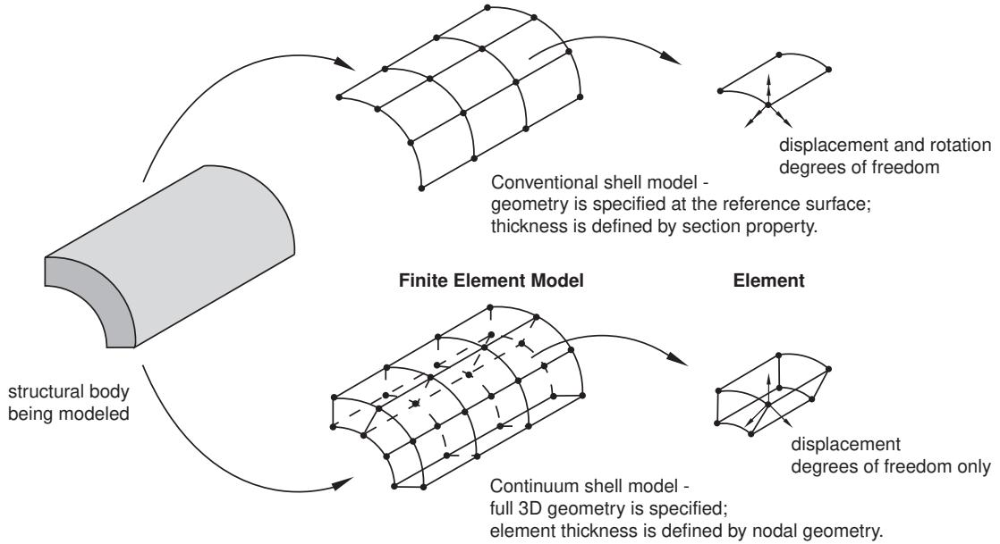  
图1：传统壳单元与连续壳体单元对比。

在三维空间中建模连续壳体的一般过程包括以下步骤：

1.  在**Part**模块中，定义实体几何形状。
2.  在**Property**模块中，为您将在**Mesh**模块中为其赋值连续壳体单元的任何实体区域指定一个壳截面。您必须指定壳截面的厚度；然而，Abaqus仅使用此厚度来估计某些截面属性，例如沙漏刚度（hourglass stiffness）。在分析过程中，Abaqus使用基于单元节点几何形状的实际厚度。如果实体区域的厚度沿其长度变化，您应提供一个近似的厚度值。更多信息，请参见使用在分析过程中积分的壳截面来定义截面行为。
3.  在**Mesh**模块中，查询网格堆叠方向（mesh stack orientation）。如果需要，指定一个堆叠方向，使得连续单元从堆栈底部到顶部具有一致的朝向。有关更多信息，请参见应用网格堆叠方向。
4.  在**Mesh**模块中，为该区域指定一个连续壳体单元类型，并使用六面体或楔形单元对该区域进行网格划分。只有这些单元可以堆叠形成连续壳体网格。

## 使用连续壳体单元对部件进行网格划分

您使用连续壳体单元来建模类似壳的实体，其精度高于传统的壳单元，如关于壳单元中所述。此外，尽管您使用六面体或楔形单元建模连续壳体，但其单元公式在计算上仍比连续实体单元更高效。

当您生成将赋值给连续壳体单元的单元时，网格中的单元必须具有一致的朝向。例如，图1显示了沿扫掠路径方向生成的扫掠网格。生成的单元沿扫掠路径方向堆叠；但是，如果您计划使用连续壳体单元，单元应沿其厚度方向堆叠。

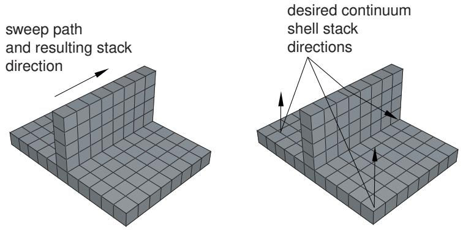  
图1：对于连续壳体单元，生成的堆叠方向不正确。

您可以使用**Query**工具集来确定哪些面被指定为底面和顶面，并查找单元之间不一致的朝向。有关更多信息，请参见获取关于模型的一般信息。在某些情况下，您可以对模型进行分区并更改扫掠路径的方向以获得正确的朝向。或者，您可以指定一个与扫掠路径无关的方向。有关更多信息，请参见应用网格堆叠方向。
## 协同仿真

本节说明如何在 Abaqus/CAE 中对协同仿真进行建模和运行。

## 本节内容

*   协同仿真概述
*   什么是协同仿真？
*   为协同仿真链接和排除部件实例
*   确保界面区域的节点匹配
*   指定界面区域和耦合方案
*   识别涉及的模型并指定作业参数
*   查看协同仿真的结果

## 协同仿真概述

在 Abaqus/CAE 中对协同仿真进行建模和运行的过程包括以下一般步骤：

1.  在一个单一的模型数据库中创建模型。
2.  （可选）在模型之间链接部件实例，并将链接的实例从分析中排除。
3.  （可选）确保界面区域的节点匹配。
4.  在每个模型中，创建一个协同仿真交互作用以指定界面区域和耦合方案。
5.  创建一个协同执行，以识别所涉及的两个模型，并为每个分析指定作业参数。
6.  提交协同执行以进行协同仿真。
7.  使用叠加图查看协同仿真的结果。

## 什么是协同仿真？

协同仿真技术是一种多物理场功能，它为 Abaqus 分析程序提供了运行时耦合。您可以将模型划分为多个域，并使用不同的分析程序来获得每个域的解。对于 Abaqus/Standard 到 Abaqus/Explicit 的协同仿真，每个 Abaqus 分析程序都在模型域的互补部分上运行，在这些部分它预计将提供计算效率更高的解。例如，Abaqus/Standard 对轻质和刚性部件提供更高效的解，而 Abaqus/Explicit 在解决复杂接触交互作用方面效率更高。

您需要定义交换场变量的界面区域以及耦合方案。更多信息，请参见结构到结构的协同仿真。

## 其他信息

*   为协同仿真准备 Abaqus 分析

## 为协同仿真链接和排除部件实例

对于协同仿真，您可能希望在一个视口中查看协同仿真涉及的“整体”模型。为此，您可以将一个模型中的部件实例链接到另一个模型中的部件实例。例如，您可以将 Abaqus/Standard 模型中的部件实例链接到 Abaqus/Explicit 模型中的部件实例。在这种情况下，Abaqus/Standard 模型中链接的部件实例不能被编辑，其位置完全由 Abaqus/Explicit 模型中的部件实例位置决定，并且它们仅用于显示目的。对 Abaqus/Explicit 模型中部件实例的任何更改都会自动更新到链接的部件实例中。您必须将链接的部件实例从相应的分析中排除；例如，链接到 Abaqus/Standard 模型的 Abaqus/Explicit 模型中的部件实例必须从 Abaqus/Explicit 分析中排除。更多信息，请参见在模型之间链接部件实例和从分析中排除部件实例。

## 确保界面区域的节点匹配

模型定义中共享的区域可能存在不同的网格。对于 Abaqus/Standard 到 Abaqus/Explicit 的协同仿真，在某些情况下，您可以通过确保界面具有匹配的节点来提高解的稳定性和准确性（请参见不匹配网格相关的限制）。本节描述了确保界面区域节点匹配的推荐建模实践。

通常，您将在包含界面区域的 Abaqus/Explicit 模型中的部件上创建一个蒙皮或一个加强筋（取决于界面区域是面还是边），执行各种建模技术，并获得一个部件实例，用于在 Abaqus/Standard 模型中定义绑定约束。

详细说明在以下过程中提供。

1.  在 Abaqus/Explicit 模型中：
    a. 在属性 (Property) 模块中显示包含界面区域的部件。如果界面区域是一个面，请在该面上创建一个蒙皮。如果界面区域是一条边，请在该边上创建一个加强筋。更多信息，请参见蒙皮和加强筋增强。
    b. 如果部件是基于几何的，请对其进行网格划分。
    c. 创建一个网格部件（即使您正在处理网格部件）。
    d. 删除新创建的网格部件中除蒙皮或加强筋上的所有单元。此外，使用编辑网格 (Edit Mesh) 工具集删除相关的未引用节点。

2.  在 Abaqus/Standard 模型中：
    a. 从 Abaqus/Explicit 模型中复制包含蒙皮或加强筋的网格部件，并创建新复制部件的实例。
    b. 为了简化区域选择过程，请创建一个包含该网格部件的命名集或面。
    c. 在交互作用 (Interaction) 模块中，创建一个绑定约束，将复制的网格部件（使用命名集或面）指定为主区域 (main region)，并将 Abaqus/Standard 模型上的界面区域指定为次区域 (secondary region)。
    d. 在交互作用 (Interaction) 模块中，定义一个 Standard-Explicit 协同仿真交互作用，并将网格部件（使用命名集或面）指定为界面区域。更多信息，请参见指定界面区域和耦合方案。

3.  在 Abaqus/Explicit 模型中：
    a. 删除包含蒙皮或加强筋的网格部件。
    b. 从部件几何中删除蒙皮或加强筋。
    c. 如果部件是基于几何的，请重新对其进行网格划分。
    d. 在交互作用 (Interaction) 模块中，定义一个 Standard-Explicit 协同仿真交互作用，并将原始 Abaqus/Explicit 部件中的界面区域指定为界面区域。

4.  按照协同仿真概述中所述继续协同仿真过程。

## 指定界面区域和耦合方案

在每个模型中，您需要定义一个协同仿真交互作用来指定界面区域（用于交换数据的区域）和耦合方案。每个模型中只能有一个活动的协同仿真交互作用，并且每个协同仿真交互作用中的设置在每个模型中必须相同。更多信息，请参见定义 Standard-Explicit 协同仿真交互作用。

## 识别涉及的模型并指定作业参数

对于协同仿真，分析程序彼此同步执行，使用与执行单个分析作业相同的功能。在作业 (Job) 模块中，您创建一个协同执行来识别协同仿真中涉及的两个分析作业，并为每个分析指定作业参数，然后您提交协同执行以提交两个作业进行分析。更多信息，请参见创建、编辑和操作协同执行。

## 查看协同仿真的结果

要显示协同仿真的结果，您可以使用叠加图功能在同一视口中显示来自两个输出数据库的数据。更多信息，请参见叠加多个图。

## 显示体

本节提供有关如何对显示体进行建模的信息。

## 本节内容

*   什么是显示体？
*   我应该对显示体进行网格划分吗？
*   在可视化模块中显示显示体

## 什么是显示体？

显示体是一个仅用于显示的部件实例。该部件实例可以是任何包含几何体、网格单元或几何体与网格组合的实例。您不必对该部件进行网格划分，并且该部件不包含在分析中；但是，当您查看分析结果时，可视化 (Visualization) 模块会将该部件与模型的其余部分一起显示。实际上，显示体在可视化 (Visualization) 模块中提供了更逼真的模型视图，而无需在分析中包含该部件实例所带来的计算开销。显示体的行为类似于刚性部件，不会变形。您不能对显示体施加规定条件，如约束、载荷或边界条件。

您可以将显示体的运动与选定的控制点（一个点或三个点）相关联，或者您可以指定显示体在分析过程中保持固定。如果显示体跟随一个单点，则显示体将根据该点的平移和旋转进行平移和旋转。如果显示体跟随三个点，则显示体将根据这三个点的平移进行平移和旋转。更多信息，请参见显示体定义。

例如，图 1 显示了一个用连接器建模的反铲挖掘机动臂。


图 1：用连接器建模的反铲挖掘机动臂。

感兴趣的区域是反铲挖掘机的主臂。铲斗仅通过连接器以及铲斗的质量和惯性与反铲模型的其余部分相互作用。因此，铲斗可以建模为显示体。

您通过对部件实例应用显示体约束来创建显示体。对于反铲挖掘机动臂模型，您首先在部件 (Part) 模块中创建铲斗部件实例。此外，您需要创建一个点部件并将其定位在装配体中铲斗的质心位置，如图 $F i g u r e 2$ 所示（请参见点部件）；点部件会自动创建一个参考点。
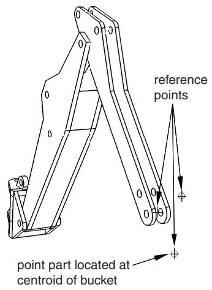  
图 2：铲斗的质量和惯性通过一个点部件进行建模。

装配体中的另外两个参考点用作一个铰链连接器（HINGE）和一个轴向连接器（AXIAL connector）的端点；有关连接器的更多信息，请参阅连接器。在交互（Interaction）模块中，您将创建一个刚体约束来约束端点和该点部件，使其作为一个单一的刚性实体移动，如图 3 所示；请参阅定义刚体约束。

  
图 3：一个刚体约束将点部件约束到端点。

此外，您将创建一个显示体约束来约束铲斗部件实例到该点部件；请参阅定义显示体约束。

您不必为铲斗部件实例划分网格，并且它不包含在反铲模型的分析中。但是，当您在可视化（Visualization）模块中查看分析结果时，铲斗仍会显示，如图 4 所示。

  
图 4：铲斗被建模为一个显示体。

如果您的模型包含一个无法划分网格且无需分析的部件，则显示体非常有用。通常，具有无效几何形状的导入部件无法被 Abaqus/CAE 使用，除非您选择忽略该部件的无效性（有关更多信息，请参阅处理无效部件）。如果您对无效部件应用显示体约束，则可以继续在模型中使用该部件，尽管该部件不会包含在分析中。有关更多信息，请参阅什么是有效且精确的部件？。

## 我应该对显示体划分网格吗？

您不必对显示体划分网格。但是，要在可视化（Visualization）模块中显示该部件实例，Abaqus/CAE 会计算一个三角形网格来建模部件实例的表面。此内部网格会写入输入文件和结果输出数据库中；但是，它仅用于渲染显示，不包含在数值分析中。默认情况下，可视化（Visualization）模块仅显示已划分网格的显示体部件实例的自由边，不过您可以更改显示的可见边。

类似地，如果您确实对显示体划分了网格，或者如果您使用网格部件创建了显示体，Abaqus/CAE 会在生成输入文件时保留您的网格；但是，它仅用于在可视化（Visualization）模块中渲染显示，不包含在数值分析中。

## 在可视化模块中显示显示体

您可以使用可视化（Visualization）模块中的显示体选项（Display Body Options）来定制显示体的外观。显示体的可用选项类似于 Abaqus/CAE 中的通用绘图选项和叠加绘图选项：渲染样式、边可见性、颜色和样式、填充颜色、缩放和透明度都可以进行定制。类似地，显示体选项与绘图状态无关；即，应用于显示体的选项会反映在所有绘图状态中。有关更多信息，请参阅定制显示体的外观。

显示体选项适用于模型中的所有显示体；要定制单个显示体的外观，您可以创建基于部件实例的显示组（请参阅创建或编辑显示组）。也可以将单个项目着色应用于单个显示体部件实例，以覆盖指定为通用显示体选项的边和/或填充颜色；有关更多信息，请参阅定制单个对象的显示颜色。

本节解释如何在 Abaqus/CAE 中创建欧拉模型。

## 本节内容：

欧拉分析概述  
在 Abaqus/CAE 中装配耦合欧拉-拉格朗日模型  
在欧拉-拉格朗日模型中定义接触  
将材料分配给欧拉部件实例  
使用体积分数工具  
欧拉网格运动  
查看欧拉分析的输出

## 欧拉分析概述

纯欧拉分析是一种有限元技术，允许材料在刚性网格中跨越单元边界流动。

在更传统的有限元公式（也称为拉格朗日技术）中，材料与单元紧密关联，材料仅随网格的变形而移动。由于与可变形网格相关的单元质量问题在欧拉分析中不存在，欧拉技术可以非常有效地处理涉及大变形、材料损伤或流体材料的问题。欧拉分析只能在动力学、显式（Dynamic, Explicit）步骤中执行。有关欧拉能力和应用的详细讨论，请参阅欧拉分析。

在 Abaqus/CAE 中建模纯欧拉分析的技术与用于建模纯拉格朗日分析的技术有很大不同。最显著的是，欧拉模型通常由一个单一的欧拉部件组成，而不是定义多个部件并将它们装配成一个完整的模型。该部件可以是任意形状，代表欧拉材料可以在其中流动的区域。模型中物体的几何形状不一定由欧拉部件定义；相反，材料被分配到欧拉部件实例内的不同区域以定义物体的几何形状。

图 1 比较了使用拉格朗日和欧拉技术创建的同一模型。在拉格朗日模型中，建模了两个部件，每个部件分配了一个引用材料的唯一截面。在欧拉模型中，建模了一个单一的欧拉部件并分配了一个欧拉截面。欧拉截面定义了部件内可能存在的材料。然后，材料被分配到实例化部件内的不同区域；任何没有材料分配的区域都被视为没有材料属性的空隙。

  
图 1：使用拉格朗日和欧拉技术建模的两个物体。

欧拉分析技术可以与传统的拉格朗日技术相结合，以扩展 Abaqus 中的仿真功能：

任意拉格朗日-欧拉（ALE）自适应网格划分是一种在相同部件网格内结合拉格朗日和欧拉分析特性的技术。ALE 自适应网格划分通常用于控制经历大变形的拉格朗日部件中的单元畸变，例如在成形分析中。大多数 ALE 自适应网格划分分析也可以作为纯欧拉分析执行，但与拉格朗日网格相关的一些特性将会丢失；有关更详细的比较，请参阅关于 ALE 自适应网格划分。  
耦合欧拉-拉格朗日（CEL）分析允许同一模型中的欧拉体和拉格朗日体相互作用。耦合欧拉-拉格朗日分析通常用于模拟固体与屈服或流体材料之间的相互作用，例如穿过欧拉土壤的拉格朗日钻头或使拉格朗日安全气囊膨胀的欧拉气体。欧拉-拉格朗日分析在在 Abaqus/CAE 中装配耦合欧拉-拉格朗日模型中讨论。

查看欧拉分析的结果需要在可视化（Visualization）模块中使用一些特殊的技术。这些技术在查看欧拉分析的输出中有详细讨论。

在 Abaqus/CAE 中创建欧拉模型的过程涉及以下一般步骤：

1.  在部件（Part）模块中，创建一个欧拉类型的部件，该部件定义了欧拉材料可以在其中流动的几何区域。有关更多信息，请参阅选择新部件的类型。  
2.  在部件（Part）模块中，您可能希望创建分区来表示部件内不同材料之间的初始边界。分区将影响部件的网格，并且只有在您将材料均匀分配到某个区域时才需要它们。有关在欧拉部件中分配材料的更多信息，请参阅将材料分配给欧拉部件实例，以及定义材料分配场。  
3.  在属性（Property）模块中，定义模型中的材料。  
4.  在属性（Property）模块中，定义并分配模型的欧拉截面。欧拉截面决定了哪些材料可以存在于欧拉部件中。部件内材料的拓扑结构将在载荷（Load）模块中定义，如步骤 7 所述。有关更多信息，请参阅创建欧拉截面。  
5.  在装配（Assembly）模块中，创建欧拉部件的一个实例。  
6.  在分析步（Step）模块中，为输出变量 EVF 创建场输出请求。此输出对于查看欧拉模型中的材料变形是必要的。有关更详细的信息，请参阅查看欧拉分析的输出。  
7.  在载荷（Load）模块中，创建一个材料分配预定义场，该场定义了欧拉部件实例初始配置中材料的拓扑结构。有关更多信息，请参阅将材料分配给欧拉部件实例，以及定义材料分配场。
8. 在载荷模块中，定义作用在模型上的所有载荷或边界条件。由于欧拉部件中的网格是刚性的，传统的拉格朗日指定条件不会随材料变形而移动；载荷和边界条件被施加到占据（或移动到）指定条件区域的任何材料上。可以沿欧拉部件实例的侧面使用零位移边界条件，以防止欧拉材料进入或离开部件。在欧拉部件实例中，基于非零节点位移的边界条件和约束会被忽略；通常使用速度边界条件或预定义场来指定欧拉模型中的初始运动。也可以定义专门的欧拉边界条件，以控制材料在欧拉部件边界的流动（参见定义欧拉边界条件）。有关向欧拉模型施加载荷和边界条件的更多信息，请参见边界条件。

9. 在网格模块中，为欧拉部件创建六面体网格。默认情况下，网格被分配EC3D8R单元。创建规则网格后，可以修剪任何预期不会经历材料流动的单元，以减小模型大小并提高分析性能。

Abaqus/CAE中创建的基本欧拉模型的示例，请参见坍塌水柱的欧拉分析。更复杂的欧拉建模过程，包括复杂的材料赋值和耦合欧拉-拉格朗日交互，请参见注水瓶的冲击分析。

## 在Abaqus/CAE中组装耦合欧拉-拉格朗日模型

Abaqus允许您创建同时包含欧拉部件实例和拉格朗日部件实例的模型。在耦合欧拉-拉格朗日分析过程中，拉格朗日网格与欧拉部件中的材料相互作用。耦合欧拉-拉格朗日分析通常比纯欧拉分析能更好地解释接触条件，特别是对于流体和固体材料之间的相互作用。在后处理期间，耦合欧拉-拉格朗日分析中的固体拉格朗日体比纯欧拉分析中的类似体能更好地保持其形状。

图1比较了钢块穿过水柱的纯欧拉分析（上图）和耦合欧拉-拉格朗日分析（下图）。

图1：纯欧拉分析（上图）和耦合欧拉-拉格朗日分析（下图）的比较。

在欧拉分析中，水倾向于附着在钢块的侧面，并且钢块在最终构型中显得变形了。这种表观变形是用于欧拉材料的材料体积分数计算的结果，如材料界面中所述。另一方面，拉格朗日钢块在穿过欧拉水时保持其形状，水绕钢块流动。

耦合欧拉-拉格朗日分析还允许您利用两种分析技术的优势；例如，您可以利用作用于在欧拉材料中移动的拉格朗日体上的载荷，来驱动该拉格朗日体的详细子模型。

要在Abaqus/CAE中组装耦合欧拉-拉格朗日模型，只需在同一个装配体中实例化欧拉部件和拉格朗日部件。耦合欧拉-拉格朗日分析只能在动态显式步骤中进行。您必须创建通用接触定义，以启用拉格朗日部件和欧拉部件之间的接触。该通用接触定义允许模型中的拉格朗日表面与欧拉材料实例之间发生相互作用（有关更多信息，请参见在欧拉-拉格朗日模型中定义接触）。其他相互作用、载荷、边界条件和预定义场则以通常的方式应用于拉格朗日和欧拉部件。

在大多数情况下，拉格朗日部件被组装在欧拉部件实例内部。虽然拉格朗日和欧拉单元及节点可以重叠，但三维拉格朗日单元不能占据与欧拉材料实例相同的空间。因此，拉格朗日部件必须实例化在欧拉部件实例内的空白区域（即，未分配材料的区域）。要模拟完全被欧拉材料包围的三维拉格朗日部件实例，请使用体积分数工具创建一个欧拉材料分配场，其中包含一个与拉格朗日部件实例相对应的空白区域（有关详细信息，请参见使用体积分数工具）。

## 在欧拉-拉格朗日模型中定义接触

耦合欧拉-拉格朗日分析中的接触必须使用通用接触来定义。通用接触定义启用了拉格朗日部件表面与欧拉材料实例表面之间的相互作用；模型中不同拉格朗日部件之间的接触也被启用。

在Abaqus/CAE中，您可以使用全局All* with self接触域来强制模型中所有拉格朗日部件与所有欧拉材料实例之间的接触。或者，您可以包含或排除特定拉格朗日表面与特定欧拉材料实例之间的接触。欧拉材料实例会显示在“包含对”和“排除对”对话框的表面列表中，如图1所示。您还可以在“单独接触属性分配”对话框中为特定拉格朗日表面和特定欧拉材料实例分配独特的接触属性。


图1：编辑排除对对话框中的欧拉材料实例。

不同欧拉材料实例之间无法定义真实接触。会强制执行一个基本的接触条件，因为材料实例不能相互穿透。然而，材料实例一旦接触就不会分离，这阻碍了滑动或反弹行为的建模。欧拉材料实例无法获得接触输出。有关欧拉分析接触公式的详细讨论，请参阅相互作用。如果两种材料之间的接触条件对您的分析至关重要，则应将其中至少一种材料建模为拉格朗日部件。

## 为欧拉部件实例分配材料

在纯拉格朗日分析中，截面定义包含对单个材料的引用。当您将截面分配给拉格朗日部件中的某个区域或单元时，该区域或单元将被引用的材料完全填充。因此，区域或单元的几何形状定义了材料的几何形状。

在纯欧拉分析中，截面定义与材料之间的关系则根本不同。欧拉截面定义可以引用一个材料列表。当您将欧拉截面分配给欧拉部件时，您是在定义在分析过程中该部件中可能存在的材料。然而，该部件最初是空的，不含材料。要将材料引入欧拉部件的初始状态，您必须使用材料分配预定义场。

材料分配预定义场依赖于材料体积分数的概念。在欧拉分析期间，Abaqus通过分配给每个材料实例的体积分数来跟踪每个单元中存在的材料；体积分数表示给定材料实例占据的单元体积的百分比。对于部分填充或填充了多种材料的单元，单元内材料的精确几何形状是未知的；Abaqus从相邻单元插值材料体积分数，以估计单元内的材料边界。这些计算在材料界面中有更详细的讨论。

在Abaqus/CAE中，欧拉部件中的初始材料体积分数是通过在载荷模块中创建材料分配预定义场来指定的。该预定义场将欧拉部件实例中的每个区域与每个材料实例的体积分数相关联。分配体积分数的区域可以是几何体中的单元、网格单元或单元组。如果您选择了单元或单元组，体积分数值将传播到该单元或组中的每个底层欧拉单元。

材料分配预定义场中的体积分数表示为介于零和一之间的数字；体积分数为一表示该区域完全被指定材料填充。体积分数小于一表示该区域仅部分填充了指定材料；例如，体积分数为0.25意味着指定材料实例占据了该区域的25%。如前所述，Abaqus根据相邻单元中的体积分数确定部分填充单元的材料边界；要实现对区域内材料边界的更好控制，您必须细化部件网格或重新定义区域边界。
如果欧拉部件实例的某个区域未定义材料体积分数，该区域将被分配为**空隙**。类似地，如果一个区域内所有材料的体积分数之和不为一，那么该区域体积分数的剩余部分也将被分配为空隙。空隙区域不具有材料属性，但在分析过程中，其他材料可以流入并穿过空隙区域。

材料分配预定义场实际上定义了模型初始构型中的材料拓扑结构。欧拉部件的形状通常是任意的；材料分配预定义场为部件添加了将在分析过程中相互作用的欧拉材料。例如，考虑图1中耦合欧拉-拉格朗日模型的横截面。欧拉部件本身只是一个空心立方体。部件上定义的四个区域决定了地面的坡度和水箱中的水量，并据此为这些区域分配了材料。

  
图1：欧拉-拉格朗日模型中的材料分配。

材料分配预定义场只能在欧拉分析的初始分析步中创建。在后续分析步中，材料从其初始构型发生变形，并根据模型中存在的力在欧拉网格上流动。

Abaqus/CAE 提供了两种定义材料分配预定义场的技术：

## 均匀定义

均匀材料分配场定义是通过从欧拉部件实例中选择区域，并直接指定这些区域内每个材料实例的体积分数来创建的。几何体必须被分割成代表材料区域的独立单元。在包含孤立网格的部件实例中，您可以选择单个元素作为区域。

图2展示了使用均匀定义创建的材料分配场。欧拉部件被分割成三个区域，并在每个区域中定义了材料体积分数；每个区域完全填充了一种单一的材料实例。空隙区域未定义体积分数，因为空隙是默认的材料分配。

  
图2：均匀材料分配场。

均匀材料分配定义应仅用于相对简单、被材料均匀填充的区域。创建复杂区域所需的分割可能会对欧拉网格的质量产生负面影响，并且部分填充的区域难以定义和解释，尤其是在处理几何体时。

有关在 Abaqus/CAE 中创建均匀材料分配场的详细信息，请参阅 *定义材料分配场*。均匀材料分配定义的示例在 *弹性水坝在水压下的挠度* 提供的 Python 脚本中进行了说明。

## 离散场定义

网格化几何体和孤立网格的材料分配可以使用标量离散场来定义。对于部件中的每个材料实例，您需要创建一个离散场，将各个元素与该材料实例的体积分数关联起来。有关创建离散场的更多信息，请参阅 *离散场工具集*。

当您使用离散场分配材料时，您仍然需要选择离散场应用的部件实例区域。如果离散场包含了所选区域之外元素的数据，这些数据将被忽略。与离散场关联的默认值将分配给所选区域内未明确列在离散场中的任何元素。

图3展示了一个使用离散场定义材料分配的非常简单的示例。欧拉部件由四个元素和两个材料实例组成。使用了两个离散场（如表1所定义）来指定元素内的材料构成。水和沙子之间的边界是基于相邻元素中材料体积分数插值的估算。

  
图3：离散场材料分配。

表1：离散场中定义的体积分数。

<table><tr><td>离散场</td><td>单元 3</td><td>默认值</td></tr><tr><td>Water_Field</td><td>0.5</td><td>1</td></tr><tr><td>Sand_Field</td><td>0.5</td><td>0</td></tr></table>


## 注意：

在任何给定元素中，所有材料体积分数之和不应大于一。Abaqus/CAE 通过从右向左读取体积分数表中的离散场来增量分配体积分数；一旦某个元素的体积分数达到一，分配给该元素的额外体积分数将被忽略。

由于离散场可以为每个单独的元素分配唯一的体积分数，因此它允许定义比均匀定义方法更复杂的材料边界，而无需过度分割。Abaqus/CAE 中的体积分数工具专门创建用于材料分配预定义场的离散场。通过此工具，您可以使用 Abaqus/CAE 中可用的部件建模技术来定义复杂的欧拉材料区域。更多信息，请参阅 *使用体积分数工具*。

有关在 Abaqus/CAE 中创建离散场材料分配的详细信息，请参阅 *定义材料分配场*。离散场材料分配定义的示例（包括体积分数工具的使用）在 *铆钉成形* 提供的 Python 脚本中进行了说明。

## 使用体积分数工具

体积分数工具通过在欧拉部件实例与第二个部件实例（参考部件实例）之间执行布尔比较，从而创建一个标量离散场，其中参考部件实例与欧拉实例相交。

该比较确定两个部件实例重叠的位置，然后根据参考实例也占据的单元百分比，为欧拉实例中的每个单元分配一个体积分数。体积分数以零到一之间的小数表示。

体积分数工具创建的离散场可用于为欧拉部件实例分配材料实例（请参阅 *为欧拉部件实例分配材料*）。分配的欧拉材料实例的拓扑结构对应于欧拉部件实例内参考部件实例的形状。

图1和以下步骤总结了使用体积分数工具的过程：
(1)


(3)


(2)
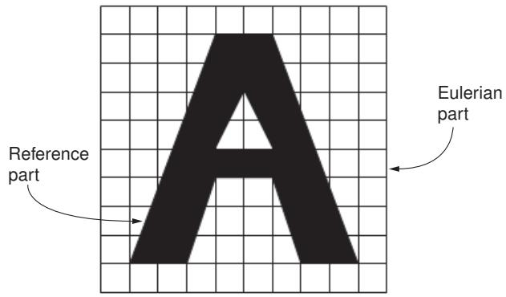
(4)

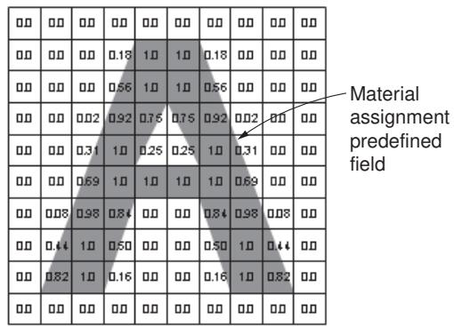
图1：使用体积分数工具的步骤。

1.  使用 Abaqus/CAE 中的任何建模工具和技术，创建一个与所需欧拉材料区域几何形状相对应的参考部件。
2.  在欧拉部件实例内部实例化该参考部件。参考部件实例应在空间上与所需的欧拉材料区域相对应。
3.  使用体积分数工具，基于参考部件实例和欧拉部件实例的比较来创建离散场。
4.  使用体积分数工具创建的离散场，为欧拉部件实例定义材料分配预定义场。

体积分数工具的一个选项控制计算得到的离散场是表示参考实例内部的空间（与参考实例重叠的单元的体积分数非零）还是外部空间（不与参考实例重叠或部分重叠的单元的体积分数非零），如图2所示。

<table><tr><td>0.0</td><td>0.0</td><td>0.0</td><td>0.0</td><td>0.0</td><td>0.0</td></tr><tr><td>0.0</td><td>0.32</td><td>0.91</td><td>0.91</td><td>0.32</td><td>0.0</td></tr><tr><td>0.0</td><td>0.91</td><td>1.0</td><td>1.0</td><td>0.91</td><td>0.0</td></tr><tr><td>0.0</td><td>0.91</td><td>1.0</td><td>1.0</td><td>0.91</td><td>0.0</td></tr><tr><td>0.0</td><td>0.32</td><td>0.91</td><td>0.91</td><td>0.32</td><td>0.0</td></tr><tr><td>0.0</td><td>0.0</td><td>0.0</td><td>0.0</td><td>0.0</td><td>0.0</td></tr></table>

<table><tr><td>1.0</td><td>1.0</td><td>1.0</td><td>1.0</td><td>1.0</td><td>1.0</td></tr><tr><td>1.0</td><td>0.68</td><td>0.09</td><td>0.09</td><td>0.68</td><td>1.0</td></tr><tr><td>1.0</td><td>0.09</td><td>0.0</td><td>0.0</td><td>0.09</td><td>1.0</td></tr><tr><td>1.0</td><td>0.09</td><td>0.0</td><td>0.0</td><td>0.09</td><td>1.0</td></tr><tr><td>1.0</td><td>0.68</td><td>0.09</td><td>0.09</td><td>0.68</td><td>1.0</td></tr><tr><td>1.0</td><td>1.0</td><td>1.0</td><td>1.0</td><td>1.0</td><td>1.0</td></tr></table>
图2：表示阴影参考区域内（左）和区域外（右）体积分数的离散场。

通常，计算参考实例外部的体积分数用于在耦合欧拉-拉格朗日分析中，在拉格朗日部件实例周围创建欧拉材料赋值。计算参考实例内部的体积分数通常用于在纯欧拉部件实例内建模复杂的材料赋值场；在这种情况下，欧拉材料赋值完成后，参考实例会被抑制。您也可以计算参考实例内部的体积分数，以在耦合欧拉-拉格朗日分析中，为封闭的拉格朗日壳体内部创建欧拉材料赋值。

要使用体积分数工具，请从主菜单栏选择“工具”->“离散场”->“体积分数工具”。有关使用该工具的分步说明，请参阅“为材料体积分数创建离散场”。

体积分数工具使用的欧拉部件实例必须与被赋值材料的实例相同。在使用体积分数工具之前，必须对欧拉部件进行网格划分。创建离散场后，不应编辑部件网格，因为离散场中的单元编号可能与更新后网格中的单元不一致。

体积分数工具使用的参考部件实例可以包括未划分网格的几何体、原生网格或孤儿单元；允许使用可变形、欧拉和离散刚体部件。体积分数工具在计算离散场时，始终使用参考部件实例的网格表示形式（如果可用）；如果参考实例部分划分了网格，则在体积分数计算中仅考虑实例中已划分网格的部分。参考实例上的网格应足够精细，以捕捉后续材料赋值中所有重要的几何细节。

参考部件实例必须是三维实体或完全封闭的三维壳体。壳体封闭体的面必须定义单个连续表面；不允许存在与表面面形成T型交叉的特征（如肋或内部分隔板）（参见图3）。如果一个欧拉单元位于壳体表面所包围的体积内，则认为该单元在壳体参考实例内部。

  
图3：可接受的参考壳体部件（上图）和不可接受的参考壳体部件（下图）的截面。

## 欧拉网格运动

欧拉网格运动是一种允许您针对某些模型缩小欧拉网格尺寸的技术，从而提高分析性能。在某些情况下，分析开始时的欧拉域在分析结束时不足以捕捉模型中的变形。一些典型示例包括：

*   安全气囊中，充气气体被建模为欧拉材料：气体最初占据一个小区域，但随着安全气囊充气，该区域迅速扩大。
*   弹丸撞击分析中，弹丸被建模为欧拉材料：弹丸最初占据一个远离其最终目的地的区域。

在这种情况下，可以在分析过程中调整欧拉域的大小和位置，使其始终捕捉到感兴趣的部分或材料。默认情况下，欧拉网格是刚性且固定不动的；但启用欧拉网格运动允许欧拉单元在分析过程中进行缩放和平移。欧拉网格运动可以跟随欧拉材料实例（如图1所示）或拉格朗日表面（如图2所示）的变形。欧拉网格运动的行为在“欧拉网格运动”中有详细描述。

  
图1：跟踪材料实例的欧拉网格运动。

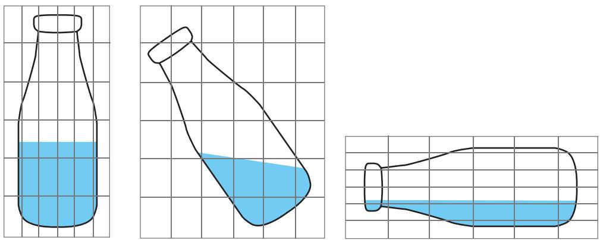  
图2：跟踪拉格朗日表面的欧拉网格运动。

在 Abaqus/CAE 中，欧拉网格运动在“载荷”模块中被定义为一种边界条件。可以在边界条件定义中对欧拉网格的缩放和平移施加限制。有关创建欧拉网格运动边界条件的更多信息，请参阅“定义欧拉网格运动边界条件”。

## 查看欧拉分析结果

欧拉分析的结果必须与拉格朗日分析的结果区别解释。特别是，在欧拉模型中，任何基于节点位移的结果都是无意义的，因为欧拉部件是固定且刚性的。关于欧拉结果如何写入输出数据库的详细信息，请参阅“输出”。

必须在 Abaqus/CAE 的“可视化”模块中采取特殊步骤来查看欧拉部件内的材料实例。默认情况下，Abaqus/CAE 在未变形和变形的绘图状态下均显示完整的欧拉部件网格，但不指示网格内的材料实例边界。

材料实例的可视化基于输出变量 EVF（欧拉材料体积分数）。输出变量 EVF 测量单元内特定材料实例的相对分数。EVF 值为一表示该单元完全被指定的材料实例填充；EVF 值为零表示该单元完全没有指定的材料实例。

对于部分填充或填充了多种材料的单元，Abaqus 通过插值相邻单元中的 EVF 值来估算材料之间的简单边界。这些简单边界在单元之间可能存在轻微的不连续性。为了改进欧拉材料的显示，您应指示 Abaqus/CAE 使用 100% 的结果平均阈值或在平均结果后计算标量；Abaqus/CAE 会重新映射材料边界，使其在单元之间显得光滑且连续。有关结果平均的更多信息，请参阅“控制结果平均”；关于 Abaqus 如何计算欧拉材料边界的更详细讨论，请参阅“材料界面”。

如果您在场输出请求编辑器中请求“预选默认值”，则输出变量 EVF 会被写入输出数据库（请参阅“修改场输出请求”）。当您请求 EVF 输出时，Abaqus 会为模型中的每个材料实例创建单独的材料体积分数输出变量；例如，EVF_WATER 是名为 Water 的材料实例的体积分数。会创建一个名为 EVF_VOID 的输出变量来测量欧拉部件中空区域的体积分数。

以下技术可用于在“可视化”模块中查看欧拉部件中材料的初始状态和变形状态：

## 等值线图

特定材料实例的输出变量 EVF 的等值线图允许您可视化分析期间模型中被该材料占据的区域。被材料占据的区域（EVF 等于一）显示为等值线谱顶部的一种均匀颜色，而未被材料占据的区域显示为等值线谱底部的另一种颜色；根据您的等值线图设置，随着 EVF 从一过渡到零，材料实例的边界会显示为一系列颜色（见图1）。

  
图1：欧拉材料实例的等值线图。

在可视化欧拉材料时，等值线图的用处有限，因为等值线出现在欧拉部件的面上。您无法有效地在欧拉部件内部可视化材料体积分数等值线。

有关在“可视化”模块中使用等值线图的更多详细信息，请参阅“分析结果等值线化”。

## 视图切割

要可视化材料在欧拉部件内部的行为，请激活一个沿与该材料实例相关的 EVF 变量的等值面的视图切割。Abaqus/CAE 会自动为模型中的每个材料实例创建这些等值面视图切割，但您必须在“视图切割管理器”中激活它们。使用视图切割选项，您可以通过将不包含所选材料的部分渲染为未填充、半透明或将其从显示中移除来消除这些部分（见图2）。

  
图2：沿欧拉材料实例等值面的视图切割。

如果您的欧拉部件包含没有材料赋值的区域，激活基于 EVF_VOID 输出变量的等值面视图切割可能会有所帮助。通过切割掉所有 EVF_VOID 大于 0.5 的区域，您能够看到部件内材料的形状。
在基于 EVF 变量激活等值面视图切割后，你可以更改主要场输出变量而不会影响视图切割。这使你能够沿着材料实例的边界而不是欧拉部件面上可视化结果轮廓（参见图 3）。

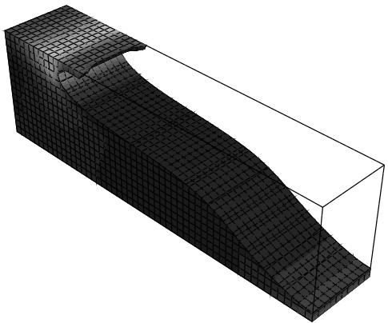  
图 3：切割欧拉部件中的应力轮廓图。

基于输出变量 EVF 的等值面视图切割不会影响耦合欧拉-拉格朗日模型中的拉格朗日部件实例。当切割激活时，拉格朗日部件仍然可见。因此，这种技术对于可视化拉格朗日部件和欧拉材料实例之间的相互作用非常有用。

关于在 Visualization（可视化）模块中使用视图切割的更多细节，请参阅 Cutting through a model（切割模型）。

## 组合视图切割和轮廓图

在一个包含三个材料实例的欧拉部件中，你可以组合使用视图切割和轮廓图来区分未变形和变形模型状态下的材料实例。首先，如上所述，使用等值面视图切割从显示中移除其中一个材料实例。然后，为其中一个剩余的材料实例创建输出变量 EVF 的轮廓图。模型中产生的颜色将一种材料与另一种区分开来。为了在材料之间产生更清晰的边界，你可以将轮廓间隔数减少到两个。

例如，图 4 描绘了一个铅弹丸撞击黄铜板的欧拉模型。欧拉部件的空腔区域被切割掉。应用了两个间隔的轮廓图，将黄铜渲染为一种颜色，铅（即非黄铜）渲染为另一种颜色。生成的图提供了对弹丸和板变形形状的有用概括。

  
图 4：在弹丸撞击分析中使用轮廓图区分两种欧拉材料。

目前，使用 Abaqus/CAE 无法同时视觉区分超过三个欧拉材料实例。

## 颜色编码

颜色编码无法用于可视化欧拉部件中的材料行为。Abaqus/CAE 中的颜色编码工具无法识别欧拉截面或材料赋值。基于单元集的颜色编码对于变形图也无效，因为欧拉单元不会随材料变形。

然而，在耦合欧拉-拉格朗日模型中，颜色编码可以区分欧拉和拉格朗日部件实例，或者欧拉和拉格朗日单元类型。当与上面讨论的可视化技术结合使用时，颜色编码有助于区分模型中的拉格朗日体和欧拉材料。

关于向模型应用颜色编码的更多细节，请参阅 Color coding geometry and mesh elements（对几何体和网格单元进行颜色编码）。

## 显示组

某些类型的耦合欧拉-拉格朗日模型在整个欧拉部件中包含单一的欧拉材料实例；例如，一个拉格朗日侵彻体在均匀的欧拉材料中移动。在这些分析中，欧拉材料的变形不如欧拉材料与拉格朗日体之间的相互作用重要。你可以使用显示组从显示中移除欧拉单元，并仅在拉格朗日体上可视化结果（例如接触压力或应力）。

关于使用显示组的更多细节，请参阅 Using display groups to display subsets of your model（使用显示组显示模型的子集）。

## 紧固件

本节描述如何建模紧固件。

## 本节内容：

关于紧固件  
管理紧固件  
创建基于点的紧固件  
创建离散紧固件  
创建装配紧固件

## 关于紧固件

你使用紧固件来建模两个或多个面之间的点对点连接，例如点焊、螺栓或铆钉。

你可以使用 Attachment（附件）工具集创建附件，帮助你定义紧固件；更多信息，请参阅 Understanding attachment points and lines（理解附件点和线）。你可以创建基于点的紧固件、离散紧固件或装配紧固件。

基于点和离散的紧固件都可以使用连接器或梁 MPC 进行建模。如果你定义使用基本、装配或复杂连接类型的连接器，你可以通过连接器输出变量请求来自基于点或离散紧固件的输出。但是，如果你使用梁 MPC，则无法从基于点或离散紧固件获得输出。

## 本节内容：

关于基于点的紧固件  
关于离散紧固件  
关于装配紧固件

## 关于基于点的紧固件

基于点的紧固件利用定位点在 Abaqus/Standard 和 Abaqus/Explicit 中创建网格无关的紧固件，如网格无关紧固件中所述。定位点可以是附件点、参考点或来自孤立网格的节点。图 1 展示了在支架边缘周围建模点焊的基于点的紧固件。用户首先在支架边缘等间距位置创建了附件点。这些附件点用于定义紧固件定位点的位置。

  
图 1：建模点焊的基于点的紧固件。

基于点的紧固件可以使用连接器或刚性（梁）多点约束连接选定的面。如果你想建模刚性连接，可以使用刚性连接器或多点约束。

## 连接器

如果你使用连接器连接面，你可以利用连接器行为定义的通用性来建模刚性、弹性或带失效的非弹性连接。你可以使用刚性连接器来建模刚性连接。但是，如果你使用刚性连接器并且 Abaqus 检测到两个相邻的基于点的紧固件共享节点，则必须通过在连接器行为中定义一些弹性来减少刚度，以避免过度约束模型。

你可以请求来自连接器的输出。

## 刚性（梁）多点约束

刚性多点约束在计算上比连接器更经济，并且在两个相邻紧固件共享节点时不太可能导致过度约束模型。当 Abaqus 检测到两个共享节点并使用刚性多点约束的相邻紧固件时，它会使用一种惩罚分布耦合公式，该公式会稍微放宽紧固点运动与其耦合节点之间的约束，以避免过度约束。

你无法请求来自多点约束的输出。

基于点的紧固件使用分布耦合约束来连接面，无论你如何划分面的网格。当你提交作业进行分析时，Abaqus 会使用你的紧固件定义通过耦合和连接器连接面。当你在 Visualization（可视化）模块中打开输出数据库文件时，你可以显示耦合和连接器；但是，在 Visualization 模块之外，仅显示基于点紧固件的定位点符号。

如果你的模型包含许多紧固件（超过一千个），基于点的紧固件比离散紧固件提供更好的性能。此外，如果你有一个来自 CAD 系统的文件，该文件定义了每个定位点的坐标，你可能希望使用基于点的紧固件。基于点的紧固件仅适用于三维模型。基于点的紧固件用于建模网格无关的紧固件，如网格无关紧固件中所述。

你可以使用以下两种方法创建基于点的紧固件，如图 2 所示：

• 选择一个定位点，并允许 Abaqus/CAE 沿表面法线方向将该点投影到最近的面上。第一个紧固点创建在法线与最近面相交的位置。  
• 选择一个定位点，并指定投影方向矢量。第一个紧固点创建在矢量与最近面相交的位置。

  
图 2：创建基于点的紧固件。

当你提交作业进行分析时，Abaqus 通过将第一个紧固点沿最近面的法线投影到其他待连接的表面上来创建第二个（以及后续）紧固点。

## 关于离散紧固件

离散紧固件利用附件线在 Abaqus/Standard 和 Abaqus/Explicit 中的选定面之间创建连接器和耦合。图 1 展示了一个使用附件线和连接器（梁连接类型）在三个面上建模点焊的离散紧固件。用户首先在点焊位置创建了附件线。这些附件线用于定义离散紧固件的位置。


图 1：使用离散紧固件建模的跨三个表面的点焊。

创建附着线的过程与创建基于点的紧固件的过程类似。您选择一个起点，并指定 Abaqus/CAE 将使用哪种方法将该点投影到最近的面上。图 2 展示了两种创建用于定义离散紧固件的附着线的方法。

  
图 2：创建用于定义离散紧固件的附着线。

Abaqus/CAE 沿着垂直于最近面的方向投影附着线。您可以使用以下两种方法来确定附着线连接的面数：

• 指定投影或层数。  
• 指定投影的最大长度。

对于每条附着线，Abaqus/CAE 确定紧固点，并在每个紧固点与其对应的表面之间应用分布耦合。当您将连接器截面分配给附着线后，Abaqus/CAE 会创建一个连接器，此时离散紧固件被认为已完全定义。您可以通过在 **Part** 模块和 **Property** 模块中指定曲线细化级别，来控制附着线在部件实例的多面体表示上的位置精度。更多信息，请参见 *控制曲线细化*。

如果您的模型很复杂，Abaqus/CAE 可以创建连接多个表面的附着线链，而这手动创建将非常耗时。与基于点的紧固件不同，您可以在 **Visualization** 模块之外查看附着线、离散紧固件及其连接器和耦合。

如果两个表面被两条附着线使用并共享一个共同的面，当您提交模型进行分析时，Abaqus/CAE 会将这两个面合并为一个面。这将提高 Abaqus/Standard 或 Abaqus/Explicit 的性能，特别是当紧固件连接跨越精细孤立网格的面节点时。

当您提交包含离散紧固件的模型进行分析时，Abaqus/CAE 会在输入文件中写入特殊的注释行。这些特殊的注释行会被 Abaqus 求解器忽略，它们使得 Abaqus/CAE 在重新导入到 Abaqus/CAE 时可以重建完全定义的离散紧固件。更多信息，请参见 *导入交互、约束和紧固件*。

创建离散紧固件的示例在附带的 Python 脚本 *带点焊的柱屈曲* 中进行了说明。

## 关于装配紧固件

装配紧固件使您能够在模型的大量位置高效地分配复杂的紧固件行为。

## 本节内容：

装配紧固件技术  
为装配紧固件使用属性生成脚本  
装配紧固件的输出请求  
装配紧固件与基于点的紧固件

## 装配紧固件技术

使用装配紧固件技术，您可以从模板模型中读取连接器和约束行为，并将这些属性分配到主模型中的多个位置。

对于像机身或汽车这样的大型系统，装配紧固件允许您仅定义一次紧固件模板，然后在主模型中多次分配它。通过适当使用耦合约束和调整点约束，模板模型中的次要节点可以在主模型中自动调整大小，以适应实际的表面间距。

构建装配紧固件的整体流程如下：

1.  构建包含类紧固件构造的模板模型：连接器截面分配、绑定约束、耦合约束以及实体或梁截面分配。您必须为所有涉及约束的表面分配名称。您还必须定义一个单点集作为控制点，该点将用于在主模型中定位模板模型的副本。  
2.  开发您的主模型，在您希望复制模板紧固件的位置放置附着点。模板模型的控制点将被映射到主模型中附着点的位置（见图 1）。  
3.  在主模型中工作，使用 **Create Fasteners** 和 **Edit Fasteners** 对话框定义如何读入、分配和定向模板模型。  
4.  （可选）使用一个或多个属性生成脚本修改从模板模型复制到主模型中的属性。多个属性生成脚本可与同一模板模型一起使用，以在不同的装配紧固件对象中获得不同的结果。例如，您可以使用两个脚本将不同的材料应用于同一个紧固件模板。您可以使用 Abaqus 脚本接口编写您的属性生成脚本；请参见 *创建和运行您自己的脚本* 以及 *Abaqus 脚本用户指南*。

  
图 1：在主模型中复制模板模型。

模板模型使用全局坐标系，紧固件构造的正 Z 轴方向将与主模型中选定的法线方向对齐。

装配紧固件与 Abaqus/CAE 中的基于点的（网格无关）和离散紧固件不同。装配紧固件不会像基于点和离散紧固件那样创建单独的紧固件对象，而是允许您在多处复制类紧固件行为。在 Abaqus/CAE GUI 中工作时，您无法查看或操作主模型中的各个紧固件（在每个附着点处）；它们仅在 Abaqus/CAE 生成的输入文件中产生。Abaqus/CAE 生成的输入文件中聚合了模板模型集合，以帮助您管理包含大量装配紧固件的模型。

装配紧固件模板模型仅用于模拟类紧固件构造，不提供通用的子装配功能。模板模型仅支持少数 Abaqus/CAE 特性，例如连接器和质量惯性。模板模型中不允许使用其他 Abaqus/CAE 特性。

表 1 列出了支持的特性以及从模板模型读入主模型的特性。实际的模型数据不会被转移，只有约束和行为会被转移。

表 1：装配紧固件模板模型中支持的特性。

<table><tr><td>梁和实体部件（梁、实体和内聚单元）</td></tr><tr><td>梁和实体截面分配（但不包括分布或复合材料铺层）</td></tr><tr><td>连接器截面分配</td></tr><tr><td>绑定约束和耦合约束（由于网格不兼容而内部生成的绑定约束除外）</td></tr><tr><td>调整点约束</td></tr><tr><td>质量惯性</td></tr></table>

特别是，表 2 中列出的 Abaqus/CAE 特性和属性不受装配紧固件支持，并且不会从模板模型中读入。

表 2：装配紧固件模板模型中不支持的特性。

<table><tr><td>基于点的（网格无关）和离散紧固件</td></tr><tr><td>附着点</td></tr><tr><td>解析刚性面</td></tr><tr><td>孤立网格面</td></tr><tr><td>由于网格不兼容而内部生成的绑定约束</td></tr><tr><td>绑定、耦合或调整点约束以外的任何约束类型</td></tr></table>

此外，还存在以下限制：

• 模板模型中允许实体部件，但不允许材料方向。  
• 模板模型中允许梁部件，但梁方向必须使用与梁截面分配相同的区域进行分配。  
• 允许实体和梁部件，但复杂的部件/装配可能无法工作。  
• 模板模型中允许未划分网格的约束面。  
模板模型中不允许壳部件，除非用作约束的参考面。这些约束面在 Abaqus/CAE 生成输入文件时将被有效地替换为主模型面。为确保装配紧固件的正确行为，所有约束面都应替换为主模型面。  
• 当 Abaqus/CAE 生成输入文件时，模板模型面不会被复制到主模型中。模板模型中唯一允许的面是那些将被主模型面替换的面。  
• 约束面不能是孤立网格面。  
• 模板模型中允许参考点，但不允许附着点。  
• 模板模型的建模空间必须与主模型的建模空间匹配（参见 *部件建模空间*）。

• 模板模型中的耦合约束必须约束所有自由度，且不能指定局部坐标系。  
• 模板模型中的绑定约束必须使用通用主面和次要节点区域，而不是次要面。
点质量和旋转惯性特性可在模板模型中使用。但对于旋转惯性，将忽略局部坐标系；因此，唯一有效的场景是 $I _ { 1 1 } = I _ { 2 2 } = I _ { 3 3 }$，且 $I _ { 1 2 } = I _ { 1 3 } = I _ { 2 3 } = 0$。本质上，旋转惯性特性必须具有旋转对称性。

控制点必须是模板模型中包含单个顶点或节点的预定义集合。您必须在主模型中创建组装紧固件之前，在模板模型中创建此集合。当读取模板模型时，控制点将被放置在主模型中附件点的位置。

模板模型中的约束面必须映射到主模型中相应的面，以便在主模型中启用约束行为。当您在主模型中定义组装紧固件时，“编辑紧固件”对话框将自动预填充表面分配表，其中包含模板模型中涉及绑定约束、耦合约束或调整点约束的所有表面。模板表面最初按模板模型全局坐标系的 Z 轴升序列出。您可以更改顺序以符合您的模板紧固件设计；然而，表面的顺序除了第一个表面的选择外并不重要，因为相应的分配表面法线用于确定组装紧固件的方向。在主模型中，您必须为将涉及组装紧固件约束的表面分配名称。

在主模型的每个附件点处，模板模型被定位和平移，使得模板模型控制点与附件点重合。模板模型被旋转到主模型中，并定向使得模板模型全局坐标系的正 Z 轴与您指定的坐标系对齐（在“编辑紧固件”对话框的“方向”选项卡页面上）。默认情况下，模板模型副本的方向根据主模型中第一个表面的法向量确定。这种来自第一个表面法线的默认方向会在每个附件点处创建 Z 轴对齐。然后，X 轴通过将全局 X 轴投影到该表面上来计算。

对于您在模板模型中创建的任何集合，主模型将把所有集合对象聚合为每个组装紧固件一个集合。当 Abaqus/CAE 生成输入文件时，模板模型集合将跨组装紧固件的所有附件点进行聚合。例如，考虑一个模板模型，其中包含一个名为 Wire-1-Set-1 的线集的连接器截面分配，并且该集合包含一条线。如果组装紧固件然后放置在主模型的 10 个附件点处，主模型将有一个名为 TM-1\_Wire-1-Set-1 的集合，其中包含 10 条线。但是，Abaqus/CAE 仅在创建输入文件时才生成这些聚合集合。聚合集合在 Abaqus/CAE 中不可直接见。


## 注意:

“调整控制点位于表面上”选项可用于您在组装紧固件模板模型中创建的耦合约束；参见定义耦合约束。更通用的调整点约束也可用于组装紧固件模板模型；参见定义调整点约束。

当主模型附件点位于螺栓孔中心点时，不应在组装紧固件模板模型中使用调整点功能。螺栓孔中心线上的任何点都将被（错误地）移动到孔周边的随机位置，而不是沿表面法线投影到孔的中心。


注意：模板模型表面的大小和形状无关紧要，除了在“编辑紧固件”对话框中渲染模板模型时这些表面的显示方面。推荐的最佳实践是使您的模板模型表面呈正方形或矩形，以便于在主模型中渲染的速度和精度。圆形模板模型表面或具有任何曲率的表面将在主模型中以粗略近似的方式渲染。

## 为组装紧固件使用属性生成脚本

本节讨论如何使用属性生成脚本来修改模板模型属性。

## 本节内容:

属性生成脚本  
属性生成脚本示例  
注册属性生成脚本

## 属性生成脚本

每个组装紧固件可以选择性地引用一个脚本，该脚本将修改模板模型属性；例如，为组装紧固件使用不同的材料。这些属性生成脚本可用于校准或调整紧固件属性。

在 Abaqus/CAE 中，属性定义包括材料、截面配置、截面和连接器截面定义。

您可以使用 Abaqus 脚本接口来编写您的属性生成脚本；参见创建和运行您自己的脚本，以及《Abaqus 脚本用户指南》。

此功能允许您使用相同的模板模型配合不同的属性生成脚本。来自模板模型的属性定义将被复制到主模型中，并基于原始名称加上前缀命名。默认前缀为您创建的第一个组装紧固件使用 TM-1，后续的使用 TM-2、TM-3 等。例如，模板模型中名为 BoltSection 的连接器截面在主模型中将被命名为 TM-1\_BoltSection。您可以在“编辑紧固件”对话框的“属性”选项卡页面上更改前缀。属性前缀字符串对于您创建的所有组装紧固件必须是唯一的。

图 1 显示了一个示例，其中两个模板模型与三个不同的属性生成脚本一起使用。  
  
图 1：使用多个属性生成脚本。

## 属性生成脚本示例

一个完整的属性生成脚本示例在博客文章“用于 Abaqus/CAE 中组装紧固件的属性生成脚本”中提供，位于

https://www.3ds.com/products-services/simulia/simulia-academic-program/learning-community/. 该脚本使用了一个名为 `getSurfaceSections` 的方法，该方法对于组装紧固件属性脚本很有用。此方法接受一个表面名称，并返回在命名表面区域底层几何体上找到的所有截面名称的列表；参见 Assembly 对象。`getSurfaceSections` 方法可用于获取截面信息，例如材料名称和厚度，如下面的代码片段所示。

```python
def __init__(self, scriptName, modelName, fastenerName):
    self.scriptName = scriptName
    self.modelName = modelName
    self.fastenerName = fastenerName
    print 'Running script "%s" for "%s"' % (scriptName,
        fastenerName)
    assy = mdb.models[modelName].rootAssembly
    eo = assy.engineeringFeatures.fasteners[fastenerName]
    print eo.assignSurfaces
    diameter = getInput('Enter %s bolt diameter:' % scriptName)
    print ' Bolt diameter: %s' % diameter
    for aSurf in eo.assignSurfaces:
        sectNames = assy.getSurfaceSections(aSurf)
        print ' %s: %s' % (aSurf, sectNames)
        # No section assigned
        if (len(sectNames) > 0 and sectNames[0] == ''):
            continue
        for section in sectNames:
            sectObj = mdb.models[modelName].sections[section]
            if (type(sectObj) == HomogeneousShellSectionType):
                print ' %s: mat=%s, thk=%s' % \
                    (section, sectObj.material, sectObj.thickness)
```

## 注册属性生成脚本

您可以在“编辑紧固件”对话框的“属性”选项卡页面上提供属性生成脚本的文件名。脚本仅在您单击“编辑紧固件”对话框中的“确定”时执行，而不是在 Abaqus/CAE 创建输入文件时。属性生成脚本仅在主模型的组装紧固件上运行，而不是在模板模型中运行。

要使您的属性生成脚本可从“编辑紧固件”对话框访问，您必须注册每个脚本，方式类似于注册 Abaqus/CAE 插件。脚本必须在启动 Abaqus/CAE 之前注册。任何已注册的脚本都将从“编辑紧固件”对话框的下拉列表中提供。

要注册属性生成脚本，您必须编写一个包含以下行的简短注册脚本：

```python
from abaqusGui import *
toolset = getAFXApp().getAFXMainWindow().getPluginToolset()
toolset.registerAsmbdFastenerScript('filename')
```

此注册脚本文件必须命名为 `registerAsmbFstnrScripts_plugin.py`。在代码中，将 `filename` 替换为您的属性生成脚本的名称。注册脚本通知 Abaqus/CAE 您有一个名为 `filename.py` 的属性生成脚本，希望将其与组装紧固件一起使用。
您的属性生成脚本和注册脚本必须放置在您的 abaqus\_plugins 目录中；有关 abaqus\_plugins 目录的可能位置，请参阅“插件文件存储在何处？”。有关注册脚本的更多详细信息，请参阅“什么是内核和 GUI 注册命令？”。

## 组装紧固件的输出请求

您可以在主模型中从组装紧固件获取场输出和历史输出。输出必须在您在模板模型中定义的命名集合上请求。

1. 在 Step 模块中，在您的主模型（而非模板模型）中操作，显示“编辑历史输出请求”对话框或“编辑场输出请求”对话框；请参阅“创建和修改输出请求”中的说明。
2. 从“域”列表中，选择“组装紧固件集”。
3. 从“紧固件”列表中，选择您需要输出的组装紧固件的名称。
4. 从“集”列表中，从模板模型中选择任意集合。主模型中的组装紧固件引用了模板模型中定义的集合。
5. 继续选择输出变量和其他选项，然后单击“确定”以保存您的请求。

## 附加信息

• 创建组装紧固件  
• 理解输出请求

## 组装紧固件与基于点的紧固件

组装紧固件和基于点（网格无关）的紧固件用于相同的紧固件模型时，会产生略有不同的分析结果。组装紧固件和基于点的紧固件将生成不同的耦合节点和耦合权重，从而导致不同的解。基于点的紧固件和组装紧固件之间的差异如下所述，并在图 1 和图 2 中说明。

  
图 1：组装紧固件与基于点的紧固件的调整。

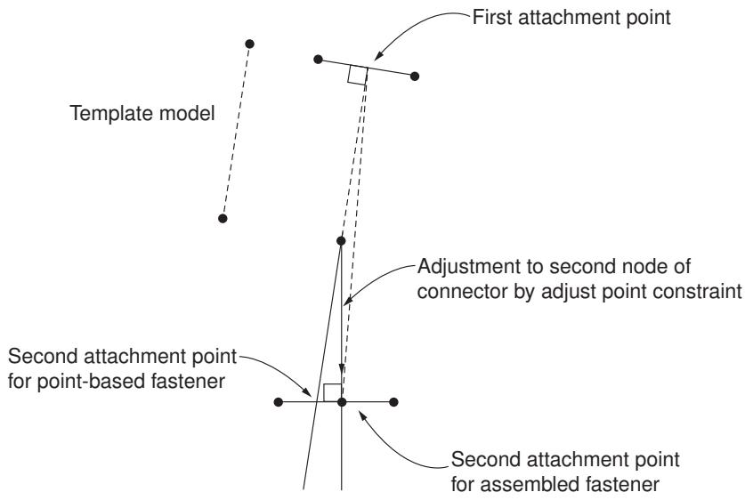  
图 2：组装紧固件与基于点的紧固件的附着点位置。

## 基于点的紧固件

Abaqus 查看连接器的第一个节点，并将其投影到第一个曲面上（根据数据行）。然后 Abaqus 沿网格面的法线方向移动，找到第一个投影点，并在第二个曲面上找到后续的投影点。

## 组装紧固件

当组装紧固件在主模型中实例化时，Abaqus 将连接器的第一个节点放置在基于点的紧固件模型的第一个投影点所在的位置。两种紧固件类型都通过法线投影完成此放置。然而，对于组装紧固件，会对连接器的第二个节点执行调整点约束；即，对第二个曲面进行法线投影。除非两个法线完美对齐，否则此操作与从第一个投影点网格面的法线方向移动不同。因此，组装紧固件的第二个（后续）附着点可能与基于点的紧固件不同，这将导致分析解的差异。

在理想情况下，当两个曲面之间的距离与模板模型连接器设置的距离完全相同且彼此平行时，Abaqus 将为组装紧固件和基于点的紧固件获得相同的投影点。然而，通常情况并非如此。

## 管理紧固件

紧固件管理器允许您创建和管理紧固件。管理器包含您定义的紧固件的名称和类型列表。管理器中的“创建”、“编辑”、“复制”、“重命名”和“删除”按钮允许您创建新紧固件或编辑、复制、重命名和删除现有紧固件。管理器左侧列中的图标允许您抑制和恢复现有紧固件。您也可以使用 Interaction 模块中主菜单栏上的“特殊”->“紧固件”菜单启动这些过程。从主菜单栏选择管理操作后，该过程与您在管理器对话框内单击相应按钮完全相同。

## 附加信息

• 抑制和恢复对象  
• 创建基于点的紧固件  
• 创建离散紧固件

## 创建基于点的紧固件

您可以通过在视窗中拾取每个定位点或从文件中读取定位点的坐标，在 Interaction 模块中创建基于点的紧固件。

您可以允许 Abaqus/CAE 将定位点沿法线方向投影到最近的面上，或者可以指定点沿其投影到最近面的方向向量。有关更多信息，请参阅“关于紧固件”。

## 本节内容：

定义紧固件将连接的曲面  
定义紧固件附着区域  
定义紧固件属性  
定义紧固件公式  
调整紧固件定义

您使用“域”选项卡页面来编辑定位点，并选择 Abaqus/CAE 将点投影到其上的目标曲面以及点沿其投影的向量。

1.  从“编辑紧固件”对话框中，显示“域”选项卡页面。
2.  选择定位点将沿其投影到目标曲面的方向向量。
    • 默认情况下，Abaqus/CAE 创建的方向向量沿最近面的法线方向投影定位点。
    • 要更改方向向量，请勾选“指定”，单击 ，并选择表示方向向量起点和终点的点。Abaqus/CAE 将显示方向向量。
3.  选择目标曲面的方法。
    • 选择“整个模型”，使用模型中的所有曲面作为目标曲面。
    • 选择“通过邻近性连接指定曲面”，指定要连接的曲面。紧固点连接性由曲面沿方向向量的相对位置定义。
    • 选择“按指定顺序连接”，指定目标曲面的特定顺序。紧固点连接性由方向向量确定。
4.  双击目标曲面表中的第一行，并在视窗中选择曲面。在提示区域中单击“完成”，表示您已完成曲面选择。
    您可以从视窗中选择多个曲面来定义单个曲面区域。
5.  在目标曲面表上的任意位置单击鼠标第三键，以编辑选定曲面、添加新曲面或删除曲面。

## 附加信息

• 网格无关紧固件  
• 关于紧固件  
• 理解附着点和线

## 定义紧固件附着区域

您使用“标准”选项卡页面来指定 Abaqus 在分析模型时用于确定将紧固件投影到何处的参数。

1.  从“编辑紧固件”对话框中，显示“标准”选项卡页面。
2.  选择“附着方法”。通常，定位点应尽可能靠近要连接的曲面放置。Abaqus 通过首先将定位点投影到最近的曲面来确定紧固件连接到被连接曲面的实际紧固点。您可以从以下投影方法中选择：
    • 面到面
    • 面到边
    • 边到面
    • 边到边
    您应选择的方法取决于曲面彼此之间的相对方向。有关更多信息，请参阅“指定定位点、投影方法和紧固点”。
3.  选择指定定位点内紧固点必须位于的距离的方法。
    • 选择“基于网格面默认”，允许 Abaqus 基于每个定位点附近的网格面厚度（对于壳单元）或特征网格面长度（对于非壳单元）计算默认搜索半径。
    • 选择“指定”，并输入紧固点将位于的、距定位点的最大距离。
    有关更多信息，请参阅“在用户指定搜索区域内的曲面上形成紧固件”。
4.  选择紧固点将投影穿过的最大层数。
    • 选择“全部”，允许 Abaqus 使用最大可能层数。
    • 选择“指定”，并输入层数。

## 附加信息

• 网格无关紧固件  
• 关于紧固件  
• 理解附着点和线

## 定义紧固件属性

您使用“属性”选项卡页面来定义紧固件的半径和质量。您还可以指定连接器截面以及连接器两端的局部方向方向。

根据连接类型，连接器的第一个节点的局部方向可能是必需的、可选的或不适用的。根据连接类型，连接器的第二个节点的局部方向可能是可选的或不适用的。有关每种连接类型的局部方向要求，请参阅“连接类型库”中的汇总表。
关于如何组合连接器方向与紧固件方向的说明，请参见**定义紧固件方向**。

1.  在 **Edit Fasteners** 对话框中，显示 **Property** 选项卡页面。
2.  输入紧固件的 **Physical radius**（物理半径），以定义其在连接表面上的圆形投影半径。Abaqus 使用此信息来定义紧固件的几何截面属性。
3.  显示 **Section** 选项卡页面，并选择您将用于对每个紧固件建模的方法。

    选择 **Connector section** 并选择一个连接器截面，以使用连接器对点到点连接进行建模。与 Abaqus/CAE 中连接器的其他用途一样，该连接可以是完全刚性的，也可以在局部连接器分量方向上允许无约束的相对运动。此外，您可以使用包含弹性、阻尼、塑性、损伤和摩擦效应的连接器行为定义来指定可变形行为。
    选择 **Rigid MPC** 来使用刚性或梁多点约束（MPC）对完全刚性的紧固件进行建模。

    如果您选择使用基本、组装或复杂连接类型的连接器截面来对紧固件建模，您可以请求输出连接器单元输出变量。但是，如果您使用梁 MPC 对紧固件建模，则紧固件没有可用的输出。

4.  显示 **Connector Orientation 1** 选项卡页面，为连接器的第一个节点定义局部方向。**Connector Orientation 1** 选项卡页面仅在您使用连接器截面来对紧固件建模时可用。

    a.  在大多数情况下，Abaqus/CAE 使用全局坐标系对连接器两端的节点进行定向；但是，连接器截面引用的某些连接类型需要局部方向。单击 $\ Q$ 选择一个基准坐标系，该坐标系为连接器的第一个节点指定局部方向。如果基准坐标系尚不存在，请单击 $\hat { \lambda }$ 创建它。

    b.  执行以下操作之一：

        *   选择 **No modifications to CSYS** 以使用所选的基准坐标系。
        如果需要，选择 **Additional rotation angle** 并指定附加旋转角度以及 Abaqus/CAE 将应用附加旋转所围绕的轴。附加旋转（以度为单位）将应用于与所选轴正交的两个方向。

5.  显示 **Connector Orientation 2** 选项卡页面，为连接器的第二个节点定义局部方向。**Connector Orientation 2** 选项卡页面仅在您选择了一个为连接器第一个节点指定局部方向的基准坐标系时可用。

    a.  单击 $\ Q$ 选择一个为连接器第二个节点指定局部方向的基准坐标系。如果基准坐标系尚不存在，请单击 $\hat { \lambda }$ 创建它。
    b.  执行以下操作之一：

        选择 **Use orientation 1** 以定义与您在 **Connector Orientation 1** 选项卡页面上指定的相同的局部方向。
        *   选择 **No modifications to CSYS** 以使用所选的基准坐标系。
        *   如果需要，选择 **Additional rotation angle** 并指定附加旋转角度以及 Abaqus/CAE 将应用附加旋转所围绕的轴。附加旋转（以度为单位）将应用于与所选轴正交的两个方向。

## 附加信息

*   连接类型
*   网格无关紧固件
*   关于紧固件
*   理解附件点和线

## 定义紧固件公式

您使用 **Formulation** 选项卡页面来选择 Abaqus/CAE 用于将紧固点的运动耦合到所选表面的方法。您还可以约束选定的转动自由度并选择加权方法。

1.  在 **Edit Fasteners** 对话框中，显示 **Formulation** 选项卡页面。
2.  选择将紧固点的运动耦合到落入影响半径内的表面节点的平均运动的方法。

    *   选择 **Continuum distributing**（默认）以使用通用分布耦合方案。
    选择 **Structural distributing** 以增强分布耦合方案，以考虑表面节点的转动，使得紧固点在弯曲时大致保持在壳表面上。

    更多信息，请参见**分布耦合约束**。

3.  如果需要，切换关闭一个转动自由度以移除其约束。Abaqus/CAE 始终约束紧固件中的所有平移自由度。

4.  选择 Abaqus 用于修改影响半径内耦合节点的默认权重分布的加权方法。

    *   选择 **Uniform**（默认）以选择均匀且等于 1.0 的权重分布。
    *   选择 **Linear** 以选择权重分布，该分布随距离紧固点的距离线性递减。
    选择 **Quadratic** 以选择权重分布，该分布随距离紧固点的距离以二次多项式函数递减。
    选择 **Cubic** 以选择权重分布，该分布随距离紧固点的距离以三次多项式单调函数递减。

    更多信息，请参见**加权方法**。

## 附加信息

*   网格无关紧固件
*   关于紧固件
*   理解附件点和线

## 调整紧固件定义

您使用 **Adjust** 选项卡页面来指定紧固件的方向。关于如何组合连接器方向与紧固件方向的说明，请参见**定义紧固件方向**。您还可以指定 Abaqus 如何计算影响半径，该半径确定将与每个紧固点相关联的节点组。

1.  在 **Edit Fasteners** 对话框中，显示 **Adjust** 选项卡页面。
2.  默认情况下，Abaqus 根据最接近紧固点的表面的默认局部方向确定每个紧固件的方向。单击 选择一个基准坐标系（CSYS）4，该坐标系指定紧固件的方向。如果基准坐标系尚不存在，请单击 创建它。坐标系的 z 轴应大致垂直于被连接的表面，局部 x 轴和 y 轴应大致相切于被连接的表面。
3.  默认情况下，Abaqus 会调整您指定的方向，使得每个紧固件的局部 z 轴垂直于最接近紧固点的表面。切换关闭 **Adjust CSYS to make Z-axis normal to closest surface** 以使用所选坐标系精确定义局部方向。
4.  每个紧固点与紧固点附近表面上的一组节点相关联，称为影响区域。然后，紧固点的运动通过分布耦合约束在加权意义上与该区域内的节点运动耦合。每个影响区域至少包含三个节点。选择以下选项之一来定义影响区域：

    选择 **Facet-based default** 以允许 Abaqus 根据紧固件的几何属性、连接面片的特征长度以及您选择的加权方法计算内部影响半径。默认影响半径始终选择为内部计算的影响半径、物理紧固件半径以及从投影点到最近节点的距离中的最大值。
    选择 **Specify**，并输入影响半径。如果您指定的影响半径小于计算的默认影响半径，则 Abaqus 使用计算值。

    更多信息，请参见**定义影响半径**。

## 附加信息

*   网格无关紧固件
*   关于紧固件
*   理解附件点和线

## 创建离散紧固件

您可以在 **Interaction** 模块中通过选择连接所需表面的附件线来创建离散紧固件。

对于每条附件线，Abaqus/CAE 确定紧固点，并在紧固点与其对应表面之间应用分布耦合。

您必须为选择的每条附件线分配一个连接器截面。您可以使用任何 Abaqus 连接类型来对紧固件的复杂行为进行建模，例如包括弹性、损伤、塑性和摩擦效应的可变形连接器。此外，您可以为不同的附件线分配不同的连接器截面。

1.  在 **Interaction** 模块的主菜单中，选择 **Special** > **Fasteners** > **Create**。

    Abaqus/CAE 显示 **Create Fasteners** 对话框。

    

    **提示：** 您也可以使用 **Interaction** 模块工具箱中的 工具来创建离散紧固件。

2.  在出现的 **Create Fasteners** 对话框中，选择 **Discrete fasteners** 并单击 **Continue**。
3. 选择代表离散紧固件位置的附着线，然后单击 **Done**。更多信息，请参阅 [通过投影点创建附着线]。

Abaqus/CAE 将显示 **Edit Fasteners** 对话框。

4. 选择一种方法，用于将紧固点的运动耦合到落入影响半径内的节点表面的平均运动。

选择 **Coupling type**（耦合类型）选项 **Continuum distributing**（默认）以使用通用分布式耦合方案，或选择 **Structural distributing**（结构分布式）以增强分布式耦合方案，从而考虑表面节点的旋转，使得紧固点在弯曲时近似保持在壳体表面上。  
• 选择 **Rotational Coupling type**（旋转耦合类型）选项 **Rotational Continuum distributing** 或 **Rotational Structural distributing**（默认）。

更多信息，请参阅 [分布式耦合约束]。

5. 如果需要，可以关闭某个旋转自由度以移除其约束。在分布式耦合中，Abaqus/CAE 始终约束所有平动自由度。  
6. 选择 Abaqus 将用于修改耦合节点默认权重分布的加权方法：

• 选择 **Uniform**（默认）以选择均匀且等于 1.0 的权重分布。  
• 选择 **Linear** 以选择随距离紧固点的距离线性减小的权重分布。  
选择 **Quadratic** 以选择随距离紧固点的距离按二次多项式函数减小的权重分布。  
选择 **Cubic** 以选择随距离紧固点的距离按三次多项式单调函数减小的权重分布。

更多信息，请参阅 [加权方法]。

7. 如果需要，选择或创建一个基准坐标系，该坐标系用于指定定义受约束自由度的局部坐标系的初始方向。默认情况下，受约束自由度的方向由全局坐标系定义。  
8. 指定以紧固点为中心的影响半径。您可以输入一个值，或允许 Abaqus 使用整个表面来定义耦合约束。

9. 单击 **OK** 关闭 **Edit Fasteners** 对话框。

Abaqus/CAE 将显示离散紧固件在紧固点与连接面之间的分布式耦合。圆的半径反映了指定的影响半径。如果耦合约束定义使用整个表面，紧固点引出的线将延伸到圆圈之外。对于孤立网格模型，您可以通过在装配体显示选项中更改面和边的密度来修改分布式耦合的外观；更多信息，请参阅 [控制属性的显示]。

10. 通过将连接器截面指定给附着线，完成离散紧固件的定义，如 [创建和修改连接器截面分配] 中所述。

Abaqus/CAE 将显示离散紧固件的连接器符号。

## 其他信息

• [耦合约束]  
• [关于紧固件]  
• [理解附着点和线]

## 创建组装紧固件

您可以在开发模板模型后，在 **Interaction** 模块中创建组装紧固件。更多信息，请参阅 [关于紧固件]。

## 本节内容：

[将模板模型表面映射到主模型表面]  
[定向从模板模型读取的几何体]  
[在主模型中修改紧固件属性]  
[重新运行属性生成脚本]

## 将模板模型表面映射到主模型表面

您使用 **Surfaces** 选项卡页面将模板模型中的约束面分配到将在主模型中被紧固的相应目标表面。必须将约束面映射到主模型中，才能在主模型中启用约束行为。

模板模型中约束涉及的所有表面必须已分配名称。主模型中的相应目标表面也必须具有名称。

1. 在 **Edit Fasteners** 对话框中，显示 **Surfaces** 选项卡页面。  
2. 在 **Constraint Surface Substitutions** 表中，将每个 **Template Surface**（模板表面）分配给主模型中的一个 **Assignment Surface**（分配表面）。

**Template Surface** 列将预先填充参与绑定约束、耦合约束或调整点约束的任何模板模型表面的名称。如果模板表面的顺序正确，您只需在表的 **Assignment Surface** 列中选择主模型表面名称即可。如果您需要更改将要分配的模板模型表面的顺序，请单击每个表单元格，然后单击出现的箭头以显示可用表面名称列表。模板表面最初按 Z 轴升序列出，但您可以更改顺序以与您的模板紧固件设计相匹配。然而，表面的排序在超出第一个表面选择的范围外并不重要，因为相应的分配表面法向用于定向组装紧固件。

要为每个模板表面选择主模型分配表面，请单击相应的表单元格，并单击出现的箭头以从主模型中的可用表面列表中选择。如果您尚未为需要使用的任何表面分配名称，请单击


(**Assignment Surface**) 以定义新表面并将其添加到列表中。

3. 如果需要，可以打开 **Render template surfaces** 以在主模型中显示表面。

您使用 **Orientations** 选项卡页面来指定模板紧固件构造在每个附着点处的定向方式。模板模型被旋转到主模型中，并定向使得模板模型的全局坐标系与您指定的坐标系对齐。默认行为是定向模板模型副本，使得模板模型全局坐标系的正 Z 轴在每个附着点处与第一个表面的法向量对齐。这种基于第一个表面法向的默认方向在每个附着点创建 Z 轴对齐。然后，X 轴通过将全局 X 轴投影到表面来计算。当全局 X 轴平行于法向或 Z 轴对齐方向时，则通过将全局 Y 轴投影到表面来计算 X 轴。此外，Y 轴通过取法向量和计算出的 X 轴的叉积来计算。

1. 在 **Edit Fasteners** 对话框中，显示 **Orientations** 选项卡页面。  
2. 选择 Abaqus/CAE 将用于在每个附着点定向紧固件模板的方向选项。

选择 **Compute orientation based on first surface normal**（默认）以定向紧固件几何体，使得模板模型的全局坐标系与主模型中第一个分配表面的法向量对齐。

如果需要，可以打开 **Flip normal direction** 以反转方向。

• 选择 **Specify uniform CSYS** 以使用您选择的坐标系来定向紧固件几何体。单击（**Edit**）以从主模型中现有的基准坐标系中选择。

默认是使用主模型的全局坐标系。单击（**Create Datum CSYS**）以创建新坐标系。

3. 如果需要，打开 **Display orientation direction at attachment points** 以在每个组装紧固件的附着点显示方向三轴。在您选择控制点集并完成第一次表面分配之前，这些可视化选项不可用。选择以下任一子选项：

• 打开 **Display only the normal direction** 以从三轴中移除 1 轴和 2 轴，仅留下表面法向量。  
打开 **Include template model surfaces every x points** 以显示模板模型约束面的轮廓。调整数字 x 向上或向下，以显示每个附着点、每隔一个点、每隔三个点等处的表面。表面将根据此选项卡页面和 **Surfaces** 选项卡页面上 **Constraint Surface Substitutions** 表中显示的颜色进行颜色编码。

此选项有助于正确定位和定向模板模型。然而，如果您的模板模型表面相对于主模型尺寸来说太大，结果显示可能会过于拥挤。如果是这种情况，您可能希望返回并调整模板模型中表面的大小。

## 在主模型中修改紧固件属性

您使用 **Properties** 选项卡页面来指定属性生成脚本，以修改从模板模型复制到主模型中的属性。该脚本仅在您在 **Edit Fasteners** 对话框中单击 **OK** 时由 Abaqus/CAE 执行，而不是在 Abaqus/CAE 创建输入文件时执行。有关完整信息，请参阅 [用于组装紧固件的属性生成脚本]。
您的属性生成脚本必须在启动 Abaqus/CAE 之前注册；请参阅“注册属性生成脚本”。任何已注册的脚本都将在“属性”选项卡页面上供选择。

1.  在“编辑紧固件”对话框中，显示“属性”选项卡页面。
2.  默认情况下，从模板模型复制到主模型中的属性会以 `TM-1` 作为第一个创建的装配紧固件的前缀。例如，模板模型中名为 `BoltSection` 的连接器截面在主模型中将被命名为 `TM-1_BoltSection`。后续的装配紧固件将使用前缀 `TM-2`、`TM-3` 等。
    如果需要，您可以在“属性前缀字符串”字段中更改使用的名称前缀。属性前缀字符串对于每个装配紧固件必须是唯一的。
3.  勾选“指定属性生成脚本”，并从列表中选择您的脚本文件名。

## 重跑属性生成脚本

您可以使用“重跑”选项卡页面让 Abaqus/CAE 重新从模板模型复制属性，然后重新运行属性生成脚本。将运行当前在“属性”选项卡页面上指定的脚本。此操作在您单击“确定”关闭对话框时发生。

“重跑”选项卡页面仅在编辑已创建的装配紧固件时可用。


## 注意：

每当您在“编辑紧固件”对话框中进行更改时，单击“确定”时都会自动执行重跑操作。仅当未进行任何其他更改时，才需要使用“重新复制模板模型属性并重新运行脚本”选项。

1.  在“编辑紧固件”对话框中，显示“重跑”选项卡页面。
2.  勾选“重新复制模板模型属性并重新运行脚本”。
3.  单击“确定”以关闭对话框。

## 断裂力学

您可以使用 Abaqus/CAE 执行以下操作来建模断裂力学：

*   创建缝隙裂纹，该裂纹定义了一个边或一个面，其上的重叠节点可以在分析过程中分离。
*   使用围道积分估计来研究准静态问题中裂纹的起始；然而，围道积分估计无法预测裂纹将如何扩展。您可以计算二维或三维模型的围道积分。
    使用扩展有限元方法（XFEM）来研究裂纹沿任意、解依赖的路径的萌生和扩展，而无需重新划分网格。XFEM 仅适用于三维实体模型、平面模型和孤立网格。
*   使用虚拟裂纹闭合技术（VCCT）来研究裂纹沿已知裂纹表面的萌生和扩展。
*   使用裂纹管理器来创建和管理您的裂纹。

## 本节内容：

缝隙裂纹
使用围道积分建模断裂力学
使用扩展有限元方法建模断裂力学
使用虚拟裂纹闭合技术建模裂纹扩展
管理裂纹

## 缝隙裂纹

缝隙定义了一个边或一个面，其上的重叠节点可以在分析过程中分离。您可以在模型中包含缝隙裂纹。或者，在创建围道积分时可以引用缝隙；但是，您不能将缝隙裂纹与扩展有限元方法（XFEM）一起使用。

## 本节内容：

什么是缝隙？
创建缝隙

## 什么是缝隙？

缝隙定义了模型中最初闭合但在分析过程中可以打开的一条边或一个面。当网格生成时，Abaqus/CAE 会沿缝隙放置重叠的重复节点。缝隙不能沿部件的边界延伸，并且必须嵌入在二维部件的一个面内，或实体部件的一个单元格内。创建缝隙后，您可以使用围道积分分析来确定其裂纹属性。由于缝隙会修改网格，因此不能在从属部件实例上创建缝隙。

图 1 显示了平面上的一个缝隙以及对模型施加拉伸载荷的效果。沿缝隙的重复节点彼此独立，并且可以自由移动。

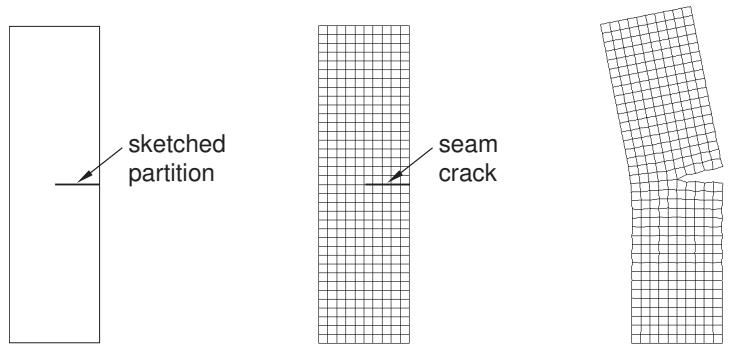
图 1：嵌入面中的缝隙。

图 2 显示了嵌入实体部件中缝隙的类似分析。该缝隙是通过使用在基准平面上绘制的草图对实体进行分割而创建的。

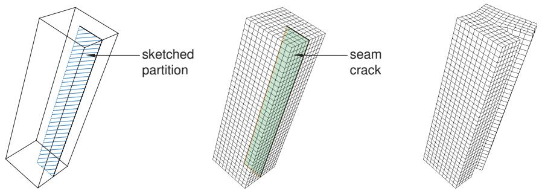
图 2：嵌入单元格中的缝隙。

有关详细说明，请参阅“创建缝隙”。

## 创建缝隙

您可以使用“相互作用”模块中的“特殊”菜单在模型中定义缝隙。缝隙定义了模型中可以在分析过程中打开的一个区域。当网格生成时，Abaqus/CAE 会沿缝隙放置重叠的重复节点。缝隙不能沿部件的边界延伸，并且必须嵌入在二维部件的一个面内，或实体部件的一个单元格内。在选择将用于围道积分分析的裂纹前端和裂纹尖端时，可以使用缝隙。有关更多信息，请参阅“什么是缝隙？”。

1.  在“相互作用”模块的主菜单栏中，选择“特殊”->“裂纹”->“指派缝隙”。
2.  在视口中的模型上，代表缝隙的实体。这些实体必须是嵌入在二维部件一个面内的边，或者是嵌入在实体部件一个单元格内的面；您不能选择位于部件边界上的任何实体。
3.  单击鼠标键 2 表示您已完成缝隙选择。
    Abaqus/CAE 将创建缝隙。
4.  要将缝隙包含在围道积分分析中，请按照“创建围道积分裂纹”中描述的过程进行操作。

## 其他信息

*   什么是缝隙？
*   断裂力学

## 使用围道积分建模断裂力学

您可以通过选择模型中将用于计算围道积分估计值的区域，来研究准静态模型中裂纹的起始。

在分析过程中，Abaqus/Standard 会将围道积分的值作为历程输出写入输出数据库。有关围道积分的详细描述，请参阅“围道积分评估”。本节描述如何在 Abaqus/CAE 中定义裂纹。

## 本节内容：

执行围道积分分析
定义裂纹前端
定义裂纹尖端或裂纹线
定义裂纹扩展方向
控制小应变分析中裂纹尖端的奇异性
围道积分输出
划分裂纹区域网格并分配单元
控制裂纹尖端的奇异性
创建围道积分裂纹
修改围道积分数据
请求围道积分输出

## 执行围道积分分析

您可以使用围道积分估计来研究准静态问题中裂纹的起始；然而，围道积分估计无法预测裂纹将如何扩展。

您可以计算二维或三维模型的围道积分，并且可以选择执行以下类型的围道积分计算之一：

*   J 积分
*   *C*-积分（用于蠕变）
*   T 应力（用于线性材料）
*   线性均匀材料以及位于两个线性均匀材料界面上的界面裂纹的应力强度因子

有关更多信息，请参阅“围道积分评估”。

您在“相互作用”模块中定义裂纹。要执行围道积分分析，您必须选择裂纹前端、裂纹尖端或裂纹线以及裂纹扩展方向，如下文各节所述。您可以选择的实体取决于部件是二维还是三维，以及您是使用几何图形还是使用来自孤立网格的单元和节点来定义部件。在某些情况下，裂纹尖端或裂纹线与您选择的裂纹前端相同，此时 Abaqus/CAE 会为您选择裂纹尖端或裂纹线。

二维模型中的裂纹是一个包含可以自由分开移动的边的区域。三维模型中的裂纹是一个包含可以自由分开移动的面的区域。执行围道积分分析最简单的方法是使用一个已经包含可以自由分开移动的边或面作为裂纹分离的区域。或者，您可以将裂纹建模为二维模型中嵌入面内的一条线，或三维模型中嵌入单元格内的一个面。嵌入的线或面称为缝隙，您可以使用缝隙执行围道积分分析。当您划分网格时，Abaqus/CAE 会在缝隙上创建重叠的重复节点；这些重合节点可以随着缝隙的分离而自由分开移动。缝隙在“什么是缝隙？”中有更详细的描述。图 1 显示了一个具有可以自由分开移动的现有边的二维模型，以及一个具有可以自由分开移动的嵌入缝隙的类似模型。
  
图1：您可以使用现有区域或使用接缝来定义裂纹。

您可以指定裂纹前缘位于对称平面上，在这种情况下，您只需对结构的一半进行建模。Abaqus会将围道积分计算的值加倍以得到正确的结果。在大多数情况下，您需要在裂纹周围进行网格细化。创建裂纹后，您必须使用历史输出请求编辑器来要求Abaqus将围道积分信息写入输出数据库。更多信息，请参阅围道积分输出。

详细说明，请参阅创建围道积分裂纹。

## 定义裂纹前缘

配置围道积分的第一步是通过从装配体中选择实体来定义裂纹前缘。裂纹前缘是裂纹的尖端部分。Abaqus使用裂纹前缘来计算第一个围道积分，它使用裂纹前缘内部的所有单元以及裂纹前缘外部的一层单元。您可以请求输出多个围道积分，在这种情况下，Abaqus/CAE 会在用于计算前一个围道积分的单元组基础上添加单层单元。图1展示了Abaqus/CAE如何通过添加单元层来为二维模型计算连续的围道积分。

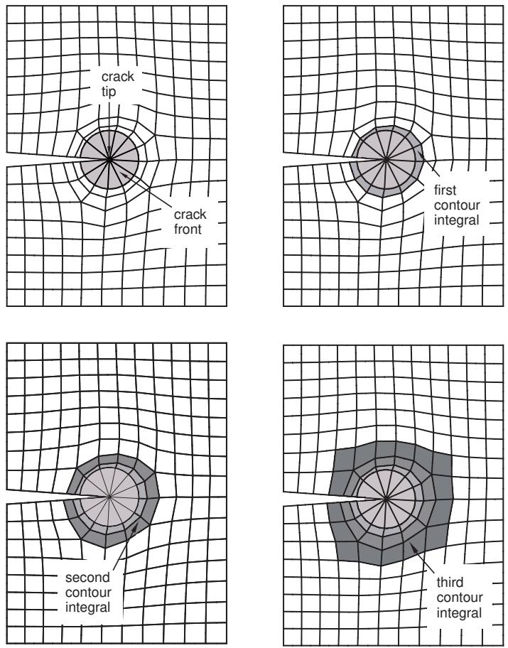  
图1：通过添加一层单元来计算连续的围道积分。  
如果您的部件是三维的，Abaqus将在沿裂纹线的每个节点处计算围道积分，如图2所示。更多信息，请参阅定义裂纹前缘。

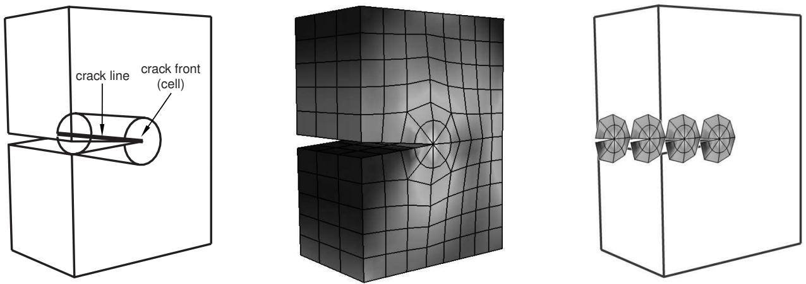  
图2：Abaqus在沿裂纹线的每个节点处计算围道积分。

您可以选择的实体取决于裂纹前缘是位于几何体中还是孤立网格中，以及部件的建模空间。

## 几何体

当您在几何体上定义裂纹前缘时，可以选择的实体取决于部件的建模空间。

## 二维几何体

如果您在二维几何体上定义裂纹前缘，可以选择以下内容：

- 单个顶点
- 连接的边
- 连接的面

图3显示了在二维几何体上定义裂纹前缘时可以选择的实体。  
  
图3：从二维几何体中选择裂纹前缘。

## 三维几何体

如果您在三维几何体上定义裂纹前缘，可以选择以下内容：

- 连接的边
- 连接的面
- 连接的单元

图4显示了在三维几何体上定义裂纹前缘时可以选择的实体。  
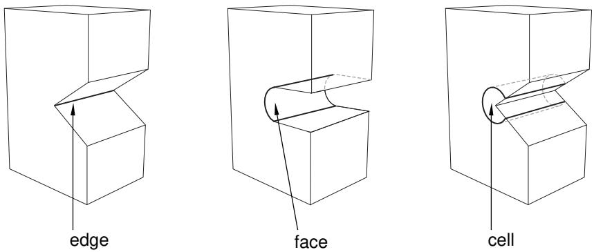  
图4：从三维几何体中选择裂纹前缘。

## 网格

当您在孤立网格上定义裂纹前缘时，可以选择定义裂纹前缘的单元、单元边或单元面。或者，您也可以选择相应区域中的节点。当您在孤立网格上定义裂纹前缘时，可以选择的实体取决于部件的建模空间。

## 二维孤立网格

如果您在二维孤立网格上定义裂纹前缘，可以选择以下内容：

- 单个节点
- 连接的单元边
- 连接的单元

图5显示了在二维孤立网格上定义裂纹前缘时可以选择的实体。

  
图5：从二维孤立网格中选择裂纹前缘。

## 三维孤立网格

如果您在三维孤立网格上定义裂纹前缘，可以选择以下内容：

- 连接的单元边
- 连接的单元面
- 连接的单元

图6显示了在三维孤立网格上定义裂纹前缘时可以选择的实体。  
  
图6：从三维孤立网格中选择裂纹前缘。

## 定义裂纹尖端或裂纹线

定义裂纹前缘后，配置围道积分的下一步是通过从装配体中选择实体来定义裂纹尖端或裂纹线。装配体的建模空间决定了您是需要为围道积分分析定义裂纹尖端还是裂纹线。

## 二维

如果您的装配体是二维的，您必须通过选择一个顶点或节点来定义裂纹尖端。裂纹尖端是裂纹前缘上您定义裂纹扩展方向 `q` 的点。在某些情况下，所需的顶点或节点可能不存在，您必须通过对裂纹前缘进行分区来创建它。

如果您选择了顶点或节点来定义裂纹前缘，那么同一个顶点或节点就定义了裂纹尖端。

## 三维

如果您的部件是三维的，您必须通过选择形成连续线的边或单元边来定义裂纹线。裂纹线是沿裂纹前缘的一系列连接边，您在这些边上定义裂纹扩展方向 `q`。在某些情况下，所需的边可能不存在，您必须通过对裂纹前缘进行分区来创建它们。

如果您选择了边或单元边来定义裂纹前缘，那么这些相同的边就定义了裂纹线。

选择的边（来自Abaqus/CAE原生部件或孤立网格）必须是连续的，必须连接裂纹前缘的一侧到另一侧，并且必须包含在裂纹前缘中。

## 定义裂纹扩展方向

定义裂纹前缘以及裂纹尖端或裂纹线后，Abaqus/CAE会提示您在裂纹尖端或沿裂纹线指定裂纹扩展方向。您可以指定裂纹平面的法线 `n`；或者直接指定裂纹扩展方向 `q`。有关Abaqus如何使用 `n` 或 `q` 来计算裂纹扩展方向的详细讨论，请参阅指定虚拟裂纹扩展方向。

## 裂纹平面法线

如果您选择“裂纹平面法线”，则可以通过从模型中选择代表裂纹平面法线起点和终点的点来定义该法线。裂纹平面包含Abaqus计算围道积分所需的向量 `q`。在许多情况下，裂纹平面代表裂纹的对称平面。

只有在沿裂纹线所有点的 `n` 方向相同时，您才应定义裂纹平面法线。如果裂纹平面法线的方向沿裂纹线变化，则无法选择一个在沿裂纹线所有点都定义裂纹扩展方向的单一法线。

要定义裂纹平面法线，您可以从几何体（例如顶点、基准点或中点）中选择点，也可以选择孤立网格节点。或者，您可以在提示区域输入点的坐标。如果您从几何体中选择点，随后修改了部件，Abaqus/CAE 会重新生成这些点并相应地更新法线。如果您使用的是孤立网格节点，则必须选择代表法线起点和终点的节点。

Abaqus计算一个裂纹扩展方向 `q`，该方向与裂纹前缘切线 `t` 和法线 `n` 正交。如果需要，您可以翻转 `q` 方向向量。

## q 向量

如果您选择“q 向量”，则可以通过从模型中选择代表向量起点和终点的点来直接定义裂纹扩展方向 `q`。如果您使用的是孤立网格节点，则必须选择代表向量起点和终点的节点。或者，您可以在提示区域输入点的坐标。

图1展示了一个裂纹前缘的例子，该前缘由圆弧形成，沿此弧线向量 `q` 的方向持续变化。相比之下，裂纹平面的法线 `n` 是恒定的。因此，对于这种情况，您应该通过指定裂纹平面法线来定义裂纹扩展方向。

  
图1：`q` 向量的方向变化，但 `n` 法线的方向恒定。

图2显示了一个由截头圆锥体边缘形成的裂纹前缘，沿此边缘，`q` 向量和裂纹平面法线 `n` 的方向都在变化。  
  
图2：`q` 向量和 `n` 法线的方向都沿裂纹前缘变化。

对于这种情况，您应该执行以下操作：

1. 定义围道积分，并使用单个 `q` 向量来指定裂纹扩展方向。
2. 对零件进行网格划分，创建作业，并将模型写入输入文件。

3. 导入输入文件，这将创建该零件的孤立网格表示形式。  
4. 编辑随模型导入的裂纹。裂纹前缘上的每个节点都将具有您在步骤1中指定的向量所定义的裂纹扩展方向。  
5. 使用Query工具集确定每个节点上向量的起点和终点坐标，并编辑定义裂纹前缘上各节点向量的数据。

此技术如图3所示。  
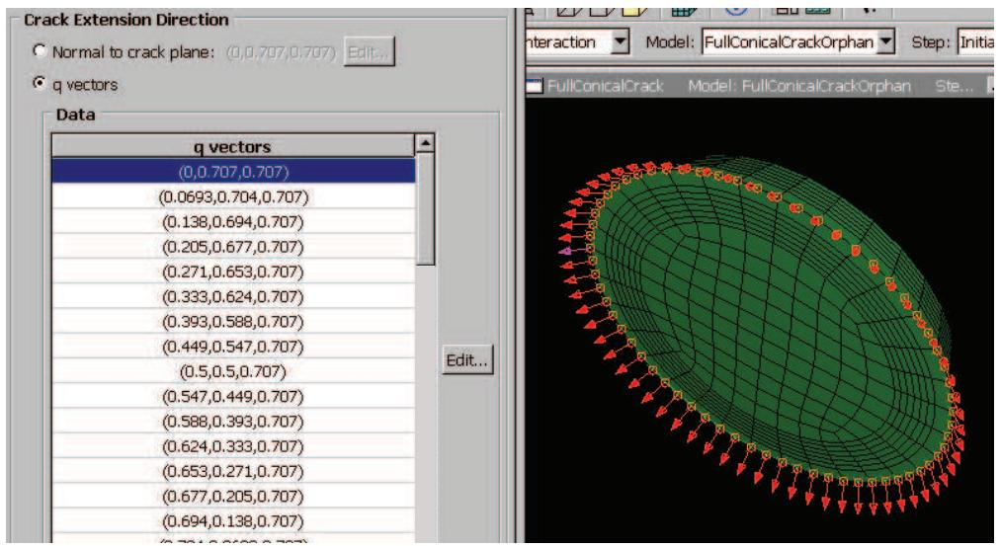  
图3：在裂纹前缘的每个节点处输入向量。  
图3取自《线性弹性无限半空间中锥形裂纹的轮廓积分》。此示例附带了一个Abaqus脚本接口脚本，说明了如何在裂纹前缘的每个节点处输入向量。

## 控制小应变分析中裂纹尖端的奇异性

如果裂纹区域的几何形状定义了一个尖锐裂纹，则在裂纹尖端处应变场会变为奇异，如《使用传统有限元方法构建小应变分析的断裂力学网格》中所述。在小应变分析模型中包含奇异性可以提高轮廓积分以及应力和应变计算的准确性。

要在轮廓积分估计中包含奇异性，请在Crack编辑器中单击Singularity选项卡，并选择所需的中间节点位置和退化单元控制。详细说明请参阅《控制裂纹尖端的奇异性》。

此外，您必须在Mesh模块中执行以下操作：

•   如果装配体或零件是二维的，您必须用一圈三角形单元模拟裂纹前缘，并将四边形单元分配给轮廓积分区域的其余部分。  
•   如果装配体或零件是三维的，您必须用一圈楔形单元模拟裂纹前缘，并将六面体单元分配给轮廓积分区域的其余部分。

当您对裂纹前缘进行网格划分时，Abaqus将执行以下操作：

•   将裂纹前缘中的单元转换为退化的四边形或六面体单元。  
    如果您使用一圈二阶三角形或楔形单元模拟裂纹前缘，Abaqus将中间节点移动到从裂纹尖端或裂纹线辐射出的单元边缘上的指定位置。（如果您使用一圈一阶三角形或楔形单元模拟裂纹前缘，Abaqus将忽略您为中间节点指定的位置。）

包含孤立网格单元的零件实例始终是依赖实例。因此，您无法在装配体中调整这些实例的中间节点。更多信息，请参阅《在装配体中编辑孤立网格、已网格化零件和已网格化零件实例有什么区别？》。您必须显示原始孤立网格，并使用Edit Mesh工具集调整中间节点的位置。更多信息，请参阅《调整中间节点的位置》。此外，您无法从孤立网格的三角形和楔形单元创建退化单元。

## 轮廓积分输出

定义裂纹后，您必须在Step模块中使用History Output Request编辑器将轮廓积分数据包含在分析生成的输出数据库中。该编辑器允许您配置以下内容：

•   输出频率。  
•   要执行的轮廓积分计算类型（J积分、C积分、应力强度因子或T应力）。  
•   要评估的轮廓数量。

Abaqus会为计算的每个轮廓积分向输出数据库写入一个历史输出变量。图1显示了代表轮廓积分的输出变量名称的格式。

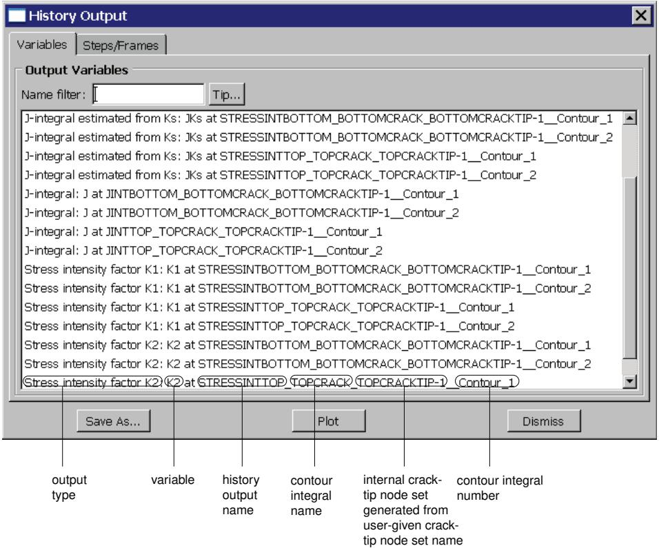  
图1：输出数据库中轮廓积分名称的格式。

详细说明请参阅《请求轮廓积分输出》。更多信息，请参阅《修改历史输出请求》和《轮廓积分评估》。

## 裂纹区域的网格划分与单元分配

裂纹尖端会产生大的应力集中。因此，您应在裂纹尖端周围创建细化的网格，以获得准确的应力和应变结果。相反，由于J积分是一种能量度量，您可以使用相对粗糙的网格获得准确的J值。然而，如果材料变得更非线性，则必须在裂纹尖端创建更精细的网格以保持J值的精度。您可以通过分割区域并向生成的边分配网格种子来控制裂纹尖端处网格的密度。更多信息，请参阅《理解种子划分》。

对于Abaqus将考虑几何非线性的大应变分析，您应使用四边形或六面体单元对轮廓积分区域进行网格划分。更多信息，请参阅《使用传统有限元方法构建有限应变分析的断裂力学网格》。

然而，对于不允许几何非线性的小应变分析，您必须通过用一圈三角形或楔形单元模拟定义裂纹前缘的区域，来考虑裂纹尖端或裂纹线处的奇异性。更多信息，请参阅《控制小应变分析中裂纹尖端的奇异性》。

您必须使用扫掠网格技术来创建楔形单元；但是，Abaqus/CAE可以使用扫掠网格技术进行网格划分的区域存在限制，如《三维实体的扫掠网格划分》中所述。因此，如果您无法使用扫掠网格技术，则无法创建楔形单元，并且无法考虑裂纹线处的奇异性。在大多数情况下，如果您的网格足够细化以模拟裂纹尖端或裂纹线周围的变形以及由此产生的高应变梯度，您可以忽略奇异性。如果您只对轮廓积分输出感兴趣，也可以忽略奇异性。

## 控制裂纹尖端的奇异性

如果裂纹区域的几何形状定义了一个尖锐裂纹，则在裂纹尖端处应变场会变为奇异，如《使用传统有限元方法构建小应变分析的断裂力学网格》中所述。在小应变分析模型中包含奇异性可以提高轮廓积分以及应力和应变计算的准确性。

1.  使用以下任一方法显示Crack编辑器：

    •   要配置新的轮廓积分，请按照《创建轮廓积分裂纹》中的说明操作。  
    •   要编辑现有的轮廓积分，请在Interaction模块的主菜单栏中选择Special->Crack->Edit->裂纹名称。

2.  要在轮廓积分估计中包含应变奇异性，请在Crack编辑器中单击Singularity选项卡，然后执行以下操作之一：

    •   为弹性断裂力学应用创建 $1 / \sqrt { r }$ 应变奇异性：

        1.  在Second-order Mesh Options字段中，为Midside node参数输入值0.25，以将中间节点移动到该点。
        2.  在Degenerate Element Control at Crack Tip/Line字段中，选择Collapsed element side, single node。

    •   为理想塑性断裂力学应用创建应变奇异性：

        1.  在Second-order Mesh Options字段中，为Midside node参数输入值0.5，以将中间节点保持在中间位置。
        2.  在Degenerate element control at Crack Tip/Line字段中，选择Collapsed element side, duplicate nodes。

    •   为幂律硬化材料创建组合的 $1 / \sqrt { r }$ 和应变奇异性：

        1.  在Second-order Mesh Options字段中，为Midside node参数输入值0.25。
        2.  在Degenerate element control at Crack Tip/Line字段中，选择Collapsed element side, duplicate nodes。

3.  单击OK以在轮廓积分估计中包含奇异性并关闭编辑器。


## 注意：

在大多数情况下，您必须将二阶三角形或楔形单元分配给裂纹前缘区域，才能在轮廓积分估计中包含奇异性。如果您分配一阶单元，Abaqus将忽略Singularity选项卡页面中的中间节点设置值。但是，如果您分配一阶单元并从Degenerate Element Control at Crack Tip/Line字段中选择Collapsed element side, duplicate nodes，您将创建应变奇异性。

您可以使用Interaction模块中的Special菜单创建轮廓积分裂纹。更多信息，请参阅《断裂力学》。

您选择用于定义轮廓积分的实体取决于零件是二维还是三维，以及您是使用几何图形还是使用孤立网格单元和节点来定义零件。
1. 在 **Interaction（交互）** 模块的主菜单栏中，选择 **Special -> Crack -> Create**。  
2. 从出现的 **Create Crack（创建裂纹）** 对话框中，选择 **Contour integral（轮廓积分）**。  
3. 输入裂纹名称，然后单击 **Continue** 以关闭对话框。  
4. 在视口中的模型上，选择代表裂纹前沿区域的实体。有关要选择实体的说明，请参见定义裂纹前沿。  
5. 单击鼠标按钮2表示已完成裂纹前沿区域的选择。  
6. 在视口中的模型上，选择代表裂纹尖端区域的实体。在某些情况下，根据模型的建模空间以及为定义裂纹前沿而选择的实体，Abaqus/CAE 会为您选择裂纹尖端并跳至步骤7。更多信息，请参见定义裂纹尖端或裂纹线。  
从提示行中，切换 **Select mesh entities** 可从孤立网格中选择实体。

7. 单击鼠标按钮2表示已完成裂纹尖端区域的选择。

8. 从提示区域，选择定义裂纹扩展方向的方法。

## 法向于裂纹平面 (Normal to crack plane)

选择 **Normal to crack plane** 以指定裂纹平面的法向，然后选择代表法向起点和终点的点。

## q 向量 (q vectors)

选择 **q vectors** 直接指定裂纹扩展方向，然后选择代表向量起点和终点的点。

更多信息，请参见定义裂纹扩展方向。

Abaqus/CAE 会显示一个蓝色箭头，指示裂纹扩展方向；如果指定了法向，还会显示一个红色箭头指示裂纹平面的法向，并显示 **Edit Crack（编辑裂纹）** 对话框。

9. 使用 **Edit Crack** 对话框配置控制轮廓积分分析的参数。

• 单击对话框的 **General（通用）** 选项卡以执行以下操作：

- 指定裂纹前沿定义在仅模拟结构一半的对称平面上。  
- 更改定义裂纹前沿或裂纹尖端/线的实体。  
更改定义裂纹扩展方向的方法。您也可以更改定义裂纹扩展方向的实体并翻转裂纹扩展方向（q 向量）。

更多信息，请参见修改轮廓积分数据。

单击对话框的 **Singularity（奇异性）** 选项卡以模拟裂纹尖端处的应变场奇异性。更多信息，请参见控制裂纹尖端处的奇异性。

10. 单击 **OK** 以配置轮廓积分并关闭编辑器。

Abaqus 会在该区域显示绿色十字以代表裂纹前沿。

您必须使用 **Step（分析步）** 模块中的 **History Output Request（历程输出请求）** 编辑器，才能将轮廓积分数据包含在分析生成的输出数据库中。更多信息，请参见轮廓积分输出和修改历程输出请求。

## 附加信息

• 使用轮廓积分模拟断裂力学  
• 断裂力学

如果需要，您可以修改为定义裂纹前沿、裂纹尖端和裂纹扩展方向而选择的实体，这些将用于定义轮廓积分。您还可以指定裂纹前沿定义在仅模拟结构一半的对称平面上，并在需要时翻转计算的裂纹扩展方向。更多信息，请参见传统有限元方法中的对称性。

1. 使用以下方法之一显示 **Crack editor（裂纹编辑器）**：

• 要配置新的轮廓积分，请按照创建轮廓积分裂纹中的说明操作。  
• 要编辑现有的轮廓积分，请在 **Interaction（交互）** 模块的主菜单栏中选择 **Special -> Crack -> Edit -> crack name**。

2. 打开 **On symmetry plane (half-crack model)** 开关，以指定裂纹前沿定义在仅模拟结构一半的对称平面上。Abaqus 会将计算的虚拟裂纹前沿扩展势能变化加倍，以计算正确的轮廓积分值。

3. 如果需要，单击以修改定义裂纹前沿、裂纹尖端或裂纹线的实体选择。如果 Abaqus/CAE 将裂纹尖端或裂纹线区域选择为与裂纹前沿相同，则无法编辑选择。

4. 如果需要，更改定义裂纹扩展方向的方法。您也可以单击以修改定义裂纹扩展方向的实体选择。

5. 如果需要，您可以单击以确认或翻转计算的裂纹扩展方向。在提示区域，单击 **Yes** 确认 q 向量方向，或单击 **Flip** 反转方向。

6. 单击 **OK** 以配置轮廓积分并关闭编辑器。

Abaqus 会在该区域显示绿色十字以代表裂纹前沿。

您必须使用 **Step（分析步）** 模块中的 **History Output Request（历程输出请求）** 编辑器，才能将轮廓积分数据包含在分析生成的输出数据库中。更多信息，请参见轮廓积分输出和修改历程输出请求。

## 请求轮廓积分输出

您使用 **Step（分析步）** 模块中的 **History Output Request（历程输出请求）** 编辑器来请求轮廓积分分析的输出。您必须从 **Domain（域）** 字段中选择 **Crack（裂纹）**。然后，编辑器允许您选择输出频率和要执行的轮廓积分分析类型。更多信息，请参见修改历程输出请求和轮廓积分求值。

您还可以为 XFEM 断裂分析请求轮廓积分输出。更多信息，请参见为 XFEM 请求轮廓积分输出。

1. 进入 **Step（分析步）** 模块。  
2. 从主菜单栏中，选择 **Output -> History Output Request -> Create**。  
Abaqus/CAE 会显示 **Create History（创建历程）** 对话框。  
3. 在 **Create History** 对话框中，输入输出请求名称及其将在其中创建的分析步。单击 **Continue** 以关闭对话框。  
Abaqus/CAE 会显示 **History Output Requests（历程输出请求）** 编辑器。  
4. 从 **Domain（域）** 字段中，选择 **Crack（裂纹）**，然后选择所需的轮廓积分。  
5. 从 **History Output Requests** 编辑器中出现的字段中，输入输出频率。  
6. 输入要计算的轮廓数量。Abaqus/CAE 通过在前一个域定义的区域上增加单层单元来计算下一个轮廓积分，如图 1 所述。每个轮廓都会生成一个值或一组轮廓积分值。  
7. 如果需要，打开 **Step for residual stress initialization values** 开关，并选择 Abaqus 将从哪个分析步的最后可用增量中读取应力数据，并用该数据计算残余应力。如果选择初始步，则残余应力由指定的初始条件定义。您不能选择在创建历程输出请求的分析步之后发生的分析步。更多信息，请参见在 J 积分求值中包含残余应力场的影响。  
8. 选择要执行的轮廓积分计算类型。您可以从以下选项中选择：

## J 积分 (J-integral)

您在与速率无关的准静态断裂分析中使用 J 积分来表征与裂纹扩展相关的能量释放。如果材料响应是线性的，则 J 积分可以与应力强度因子相关联。更多信息，请参见 J 积分。

## C_t 积分 ($C _ { t }$ -integral)

您将 $C _ { t }$ -积分用于与时间相关的蠕变行为，它在某些蠕变条件下（包括瞬态裂纹扩展）表征蠕变裂纹变形。更多信息，请参见 Ct 积分。

## T 应力 (T-stress)

您使用 T 应力分量来表示平行于裂纹前沿的应力。更多信息，请参见 T 应力。

## 应力强度因子 (Stress intensity factors)

您在线弹性断裂力学中使用应力强度因子 $\pmb { K } _ { I } , \pmb { K } _ { I I }$ 和 ${ \pmb K } _ { I I I }$ 来表征局部裂纹尖端应力和位移场。更多信息，请参见应力强度因子。

如果您请求使用应力强度因子进行轮廓积分计算，Abaqus 还会在起裂时计算裂纹扩展方向。您必须选择以下之一来表示裂纹起裂准则：

• 最大周向应力 (Maximum tangential stress)  
• 最大能量释放率 (Maximum energy release rate)  
• $\mathbf { K } _ { \mathbf { I I } } = \mathbf { 0 }$

更多信息，请参见裂纹扩展方向。

9. 单击 **OK** 以配置轮廓积分分析并关闭编辑器。

有关 Abaqus 如何在其计算的每个轮廓积分的输出数据库中命名历程输出变量的示例，请参见轮廓积分输出。

## 使用扩展有限元法模拟断裂力学

您可以使用扩展有限元法 (XFEM) 来研究裂纹沿着任意的、依赖于解的路径的起裂和扩展，而无需对模型进行重新划分网格。

XFEM 适用于三维实体和二维平面模型；不支持三维壳模型。

## 本节内容：
# 扩展有限元法（XFEM）

## 扩展有限元法（XFEM）

您可以使用扩展有限元法（XFEM）研究准静态问题中裂纹的起裂和扩展。XFEM 使您能够研究裂纹沿着任意、依赖于解的路径扩展，而无需重新划分模型网格。

XFEM 仅适用于三维实体和二维平面模型；不支持三维壳模型。您可以使用 XFEM 研究包含几何体、孤立网格单元或两者组合的部件中的裂纹。您可以选择研究在模型中任意扩展的裂纹或静态裂纹。在**交互**模块中定义 XFEM 裂纹。您可以指定裂纹的初始位置。

或者，您可以允许 Abaqus 在分析过程中根据裂纹域中计算的最大主应力或应变值确定裂纹的位置。有关更多信息，请参阅*使用扩展有限元法将不连续性建模为富集特征*。在 Abaqus/CAE 中创建的 XFEM 模型示例请参阅*使用 XFEM 建模不连续性*。

要执行 XFEM 裂纹分析，您必须指定以下内容：

## 裂纹域

要定义裂纹域，您可以从三维部件中选择一个或多个体（cell），或从二维平面部件中选择一个或多个面（face）。如果在孤立网格或同时包含孤立网格和原生网格单元的部件上定义裂纹域，则可以选择单元。裂纹域包括包含任何现有裂纹的区域，以及裂纹可能起裂并可能扩展进入的区域。

定义初始裂纹位置后，您可以通过指定仅使用裂纹几何体附近的单元来减小裂纹域的大小。您可以指定要包含的单元层数，以自动规定一个最小富集区。裂纹域使用与裂纹位置相交的单元定义。这些单元是初始集合。富集区使用您指定的单元层数，在初始裂纹附近的单元基础上构建。您可以在视口中高亮显示这些单元，并且如果需要，可以将高亮显示的单元保存到一个集合中。

## 裂纹扩展

您可以允许裂纹沿着任意、依赖于解的路径扩展，也可以指定裂纹为静态的。

## 初始裂纹位置

要定义初始裂纹位置，您可以从三维实体中选择面，或从二维平面模型中选择边。初始裂纹位置必须包含在裂纹域内。所选面可以是实体的一个面、通过分区创建的面或一个平面部件实例。类似地，所选边可以是实体的一条边、通过分区创建的边或一个线框部件实例；您不应选择缝合裂纹（seam crack）。您不应为您选择用于定义初始裂纹位置的面或边划分网格。图 1 显示了二维和三维几何体以及孤立网格的裂纹域和裂纹位置示例。

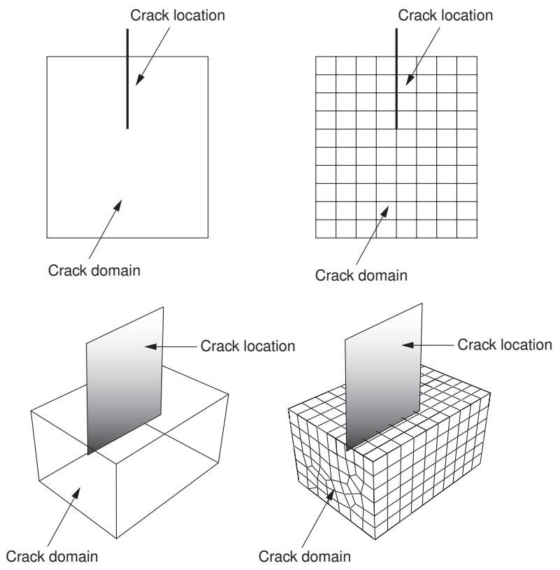  
图 1：为 XFEM 定义裂纹。

或者，您可以选择不定义初始裂纹位置。无论您是否定义了初始裂纹位置，Abaqus 都会在模拟过程中通过搜索主应力和/或应变大于牵引分离定律规定的最大损伤值的区域来引发裂纹的创建。

## 富集半径

富集半径是一个小半径，从裂纹尖端算起，该半径内的单元将用于计算静态裂纹的裂纹奇异性。富集半径内的单元必须包含在您选择的表示裂纹域的体或面中。您可以允许 Abaqus 计算该半径（富集区典型单元特征长度的六倍），也可以指定其值。

## 接触相互作用属性

您可以选择将一个接触相互作用属性与 XFEM 裂纹关联，该属性定义了裂纹单元表面的接触。有关详细信息，请参阅*为 XFEM 指定接触相互作用属性*。

## 损伤起裂

您必须通过在材料定义中指定损伤起裂准则来指定引发裂纹的条件。您可以指定基于最大主应力或最大主应变的准则。有关更多信息，请参阅*最大主应力或应变损伤*。

## 分析过程

您可以在一个静态分析过程中包含 XFEM 裂纹。或者，您可以在隐式动态分析过程中包含 XFEM 裂纹，以模拟结构在高速冲击载荷下的断裂和失效。在隐式动态过程中模拟的基于 XFEM 的裂纹扩展也可以在此之前或之后进行一个静态过程，以模拟整个加载历史中的损伤和失效。

有关详细说明，请参阅*创建 XFEM 裂纹*。

## 选择 XFEM 分析的类型

Abaqus 提供了牵引分离内聚行为方法和线弹性断裂力学（LEFM）方法，用于使用 XFEM 研究裂纹起裂和扩展。

## 牵引分离内聚行为

牵引分离内聚行为方法在*使用内聚片段法和虚节点法建模移动裂纹*中有详细描述。您可以指定定义导致最终失效的损伤演化的材料属性。您将该材料应用于分配给裂纹域的截面。您可以选择将一个法向行为接触相互作用属性与 XFEM 裁纹关联，该属性定义了裂纹单元表面的接触。有关详细信息，请参阅*为 XFEM 指定接触相互作用属性*。为了在材料失效时辅助收敛，您可以使用粘性正则化技术引入局部阻尼。有关更多信息，请参阅*损伤稳定化*。

## 线弹性断裂力学（LEFM）

线弹性断裂力学（LEFM）方法使用改进的虚拟裂纹闭合技术（VCCT）计算裂纹尖端的应变能释放率。该方法更适用于脆性断裂问题，在*将 VCCT 技术应用于基于 XFEM 的 LEFM 方法*中有详细描述。要使用此方法，您必须创建一个断裂准则接触相互作用属性，如*为裂纹扩展指定断裂准则属性*中所述。如果您在接触相互作用属性中指定了局部阻尼，Abaqus 将使用粘性正则化技术来辅助材料失效时的收敛。有关更多信息，请参阅*为裂纹扩展指定断裂准则属性*。

## 查看 XFEM 裂纹

创建模型时，您必须为符号距离函数 PHILSM 请求场输出。当您打开一个包含 PHILSM 输出变量的输出数据库文件时，Abaqus/CAE 会沿 XFEM 裂纹（符号距离函数值为零处）创建一个视图切割。因此，当您显示变形图或云图时，富集区内的裂纹单元是可见的，如图 1 所示。

  
图 1：查看 XFEM 裂纹。

您可以对云图执行时间历程动画，并查看 XFEM 计算的损伤起裂。该动画还允许您查看分析进展过程中损伤在富集区内的扩展情况。开启透明度可以让您看到裂纹穿过内部单元的进展。有关更多信息，请参阅*更改透明度*。

要查看初始裂纹前缘，您可以创建一个等值面切割形状，并将 PSILSM 选为当前主场输出变量。有关更多信息，请参阅*创建或编辑视图切割*。

如果您想更详细地研究裂纹，可以创建符号距离函数（PHILSM）的云图，并确定哪些单元的符号距离值为负或为正。裂纹表面位于 PHILSM 值从负数过渡到正数的单元中。此外，您可以使用**视图切割管理器**中的选项仅查看符号距离函数值为零的表面，这对应于 XFEM 裂纹的表面。有关更多信息，请参阅*理解视图切割*。
## 创建 XFEM 裂纹

您可以使用 **交互 (Interaction)** 模块中的 **特殊 (Special)** 菜单来创建扩展有限元方法 (XFEM) 裂纹。

1.  在 **交互 (Interaction)** 模块的主菜单栏中，选择 **特殊 (Special) -> 裂纹 (Crack) -> 创建 (Create)**。
2.  在随后出现的 **创建裂纹 (Create Crack)** 对话框中，选择 **XFEM**。
3.  输入裂纹的名称，然后单击 **继续 (Continue)** 以关闭对话框。
4.  从视区中的模型里，选择代表裂纹域的实体。您可以选择三维部件实例中的单元，或二维部件实例中的面。如果您有一个孤立网格或包含孤立网格和原生网格元素的实例，则可以选择元素来代表裂纹域。您应该选择包含现有裂纹的实体，以及任何裂纹可能扩展进入的实体。
5.  单击鼠标按钮 2 以指示您已完成裂纹域的选择。

    **编辑裂纹 (Edit Crack)** 对话框随即出现。

6.  您可以缩小裂纹域的尺寸。此选项仅在您指定了裂纹位置时可用。执行以下操作：
    a.  切换开启 **使用裂纹位置缩小裂纹域 (Shrink crack domain using crack location)**。
    b.  指定要包含的元素层数，以自动规定最小富集区。
    c.  单击 **预览 (Preview)** 以在视区中高亮显示元素，并且如果需要，可以将高亮元素保存到一个集合中。

7.  执行以下任一操作：
    *   切换开启 **允许裂纹扩展 (Allow crack growth)** 以定义一个裂纹，该裂纹将在求解过程中沿着穿过模型的任意路径扩展。
    *   切换关闭 **允许裂纹扩展 (Allow crack growth)** 以定义一个不会扩展的静止裂纹。

8.  如果您选择了允许裂纹扩展，可以通过以下任一方式指定裂纹位置：
    *   切换关闭 **裂纹位置 (Crack location)**，表明您将允许 Abaqus 根据您指定的损伤起始准则确定裂纹的位置。
    *   切换开启 **裂纹位置 (Crack location)** 并单击以通过选择三维模型中的内部面或二维平面部件中的边来指定裂纹位置。您不应选择接缝裂纹。

9.  如果您选择了防止裂纹扩展，请执行以下操作：
    a.  单击以通过选择三维模型中的内部面或二维平面部件中的边来指定裂纹位置。您不应选择接缝裂纹。
    b.  要指定富集半径，请执行以下任一操作：
        *   选择 **分析默认 (Analysis default)**，允许 Abaqus 确定富集半径。默认半径是富集区中典型单元特征长度的三倍。
        *   选择 **指定 (Specify)** 并输入一个值。该值应为裂纹尖端周围的半径，该半径内的元素将用于计算裂纹奇异性。

10. 选择 XFEM 分析的类型：

    默认情况下，Abaqus 将使用牵引-分离内聚力行为方法。您可以选择或创建一个接触相互作用属性，该属性基于小滑动接触公式定义裂纹面的压缩和摩擦行为。更多信息，请参见 *定义面-面接触 (Defining surface-to-surface contact)*。

    *   如果您创建了一个断裂准则接触相互作用属性，Abaqus 将使用线弹性断裂力学 (LEFM) 方法。更多信息，请参见 *为裂纹扩展指定断裂准则属性 (Specifying fracture criterion properties for crack propagation)*。

11. 单击 **确定 (OK)** 以配置 XFEM 裂纹并关闭编辑器。

    Abaqus 会显示绿色十字来代表裂纹域和裂纹位置。

    要在 **可视化 (Visualization)** 模块中查看裂纹扩展，您必须在 **分析步 (Step)** 模块中使用 **场输出请求 (Field Output Request)** 编辑器，并请求 Abaqus 在分析过程中将符号距离函数 PHILSM 写入输出数据库。更多信息，请参见 *查看 XFEM 裂纹 (Viewing an XFEM crack)* 和 *修改场输出请求 (Modifying field output requests)*。

## 附加信息

*   断裂力学
*   使用扩展有限元方法将不连续性建模为富集特征

## 停用和激活 XFEM 裂纹扩展

默认情况下，XFEM 裂纹扩展在所有分析步中均处于活动状态。但是，如果包含 XFEM 裂纹扩展的分析未能收敛，您可以在选定的分析步中停用该裂纹，并允许分析达到平衡，然后在后续分析步中重新激活该裂纹。

1.  在初始分析步中创建一个相互作用。更多信息，请参见 *创建相互作用 (Creating interactions)*。
2.  选择 **XFEM 裂纹扩展 (XFEM crack growth)** 相互作用类型，然后单击 **继续 (Continue)**。
3.  在 **编辑相互作用 (Edit Interaction)** 对话框中，选择您要激活或停用的 XFEM 裂纹。您只能选择允许裂纹扩展的裂纹。
4.  单击 **确定 (OK)** 以创建该相互作用。
5.  打开 **相互作用管理器 (Interaction Manager)**。更多信息，请参见 *在交互模块中管理对象 (Managing objects in the Interaction module)*。
6.  在所需的分析步中选择 XFEM 裂纹扩展相互作用，然后单击 **编辑 (Edit)**。
7.  在 **编辑相互作用 (Edit Interaction)** 对话框中，切换关闭（或开启）**允许裂纹扩展 (Allow crack growth)** 以停用（或激活）选定分析步中的 XFEM 裂纹扩展，然后单击 **确定 (OK)**。

    **相互作用管理器 (Interaction Manager)** 会显示 **已修改 (Modified)** 以指示该分析步中 XFEM 裂纹扩展的状态。Abaqus 会将 XFEM 裂纹扩展的状态（激活或停用）传播到后续分析步。

    当您配置 XFEM 分析时，可以选择一个定义裂纹表面压缩行为的接触相互作用属性。本节描述适用于 XFEM 裂纹扩展的接触相互作用属性中的设置。更多信息，请参见 *理解相互作用属性 (Understanding interaction properties)*。

    1.  从主菜单栏中，选择 **相互作用 (Interaction) -> 属性 (Property) -> 创建 (Create)**。
    2.  在出现的 **创建相互作用属性 (Create Interaction Property)** 对话框中，执行以下操作：
        *   为相互作用属性命名。
        *   选择 **接触 (Contact)** 类型的相互作用属性。
    3.  单击 **继续 (Continue)** 以关闭 **创建相互作用属性 (Create Interaction Property)** 对话框。
    4.  在接触属性编辑器的菜单栏中，选择 **力学 (Mechanical) -> 法向行为 (Normal Behavior)**。
    5.  在 **约束强制方法 (Constraint enforcement method)** 字段中，选择 **罚函数（标准）(Penalty (Standard))** 以使用罚方法强制接触约束。
    6.  如果您希望防止表面在接触后分离，请切换关闭 **允许接触后分离 (Allow separation after contact)**。
    7.  在 **行为 (Behavior)** 字段中选择 **线性 (Linear)** 强制行为，以使用线性罚方法来强制接触约束。
    8.  在 **刚度值 (Stiffness value)** 字段中指定接触刚度。
        *   选择 **使用默认值 (Use default)** 让 Abaqus 自动计算罚接触刚度。
        *   选择 **指定 (Specify)** 并输入一个线性罚刚度的正值。
    9.  在 **刚度缩放因子 (Stiffness scale factor)** 字段中指定一个乘数因子，用于乘以所选的罚刚度。
    10. 指定接触压力为零的 **间隙 (Clearance)**。默认值为 0。
    11. 单击 **确定 (OK)** 以创建接触属性并退出 **编辑接触属性 (Edit Contact Property)** 对话框。

## 为 XFEM 请求围道积分输出

您可以使用 **分析步 (Step)** 模块中的 **历程输出请求 (History Output Request)** 编辑器来请求从 XFEM 裂纹输出围道积分。您必须从 **域 (Domain)** 字段中选择 **裂纹 (Crack)**。然后，编辑器允许您选择输出频率和要执行的围道积分分析类型。更多信息，请参见 *修改历程输出请求 (Modifying history output requests)* 和 *围道积分评估 (Contour Integral Evaluation)*。

1.  进入 **分析步 (Step)** 模块。
2.  从主菜单栏中，选择 **输出 (Output) -> 历程输出请求 (History Output Request) -> 创建 (Create)**。
    Abaqus/CAE 会显示 **创建历程 (Create History)** 对话框。
3.  在 **创建历程 (Create History)** 对话框中，输入输出请求的名称以及将在其中创建它的分析步。单击 **继续 (Continue)** 以关闭对话框。
    Abaqus/CAE 会显示 **历程输出请求 (History Output Request)** 编辑器。
4.  从 **域 (Domain)** 字段中，选择 **裂纹 (Crack)**，然后选择所需的 XFEM 裂纹。
5.  选择生成历程输出的频率。
6.  输入要评估的围道数量。Abaqus/CAE 通过在前一个域定义的区域上添加单层元素来计算下一个围道积分。每个围道会为围道积分生成一个值或一组值。
7.  如果需要，切换开启 **用于残余应力初始化值的分析步 (Step for residual stress initialization values)**，并选择 Abaqus 将使用其最后可用增量中的应力数据来提取残余应力的分析步。如果您选择初始分析步，则残余应力由指定的初始条件定义。您不能选择创建历程输出请求的分析步之后的分析步。更多信息，请参见 *包含残余应力场对 J 积分评估的影响 (Including the Effect of a Residual Stress Field on J-Integral Evaluation)*。
8.  选择要执行的围道积分计算类型。您可以从以下选项中选择：

## J 积分

    在速率无关的准静态断裂分析中，您使用 J 积分来表征与裂纹扩展相关的能量释放。如果材料响应是线性的，J 积分可以与应力强度因子相关联。更多信息，请参见 *J-积分 (J-Integral)*。

## $C_{t}$ 积分

    您使用 $C_{t}$ 积分处理与时间相关的蠕变行为，它在某些蠕变条件下（包括瞬态裂纹扩展）表征蠕变裂纹变形。更多信息，请参见 *Ct-积分 (Ct-Integral)*。
## T应力

您使用 T应力 分量来表示平行于裂纹前沿的应力。更多信息，请参见 T应力。

## 应力强度因子

您在线性弹性断裂力学中使用应力强度因子 $\pmb { K } _ { I } , \pmb { K } _ { I I }$ 和 ${ \kappa } _ { I I I }$ 来表征局部裂纹尖端的应力和位移场。更多信息，请参见 应力强度因子。

如果您请求使用应力强度因子进行围线积分计算，Abaqus 也会计算裂纹萌生时的扩展方向。您必须选择以下之一来指示裂纹萌生准则：

*   最大切向应力
*   最大能量释放率
*   $\mathbf { K } _ { \mathbf { I I } } = \mathbf { 0 }$

更多信息，请参见 裂纹扩展方向。

9.  单击 OK 以配置围线积分分析并关闭编辑器。

有关 Abaqus 如何在输出数据库中为其计算的每个围线积分的历史输出变量命名的示例，请参见 围线积分输出。

## 使用虚拟裂纹闭合技术模拟裂纹扩展

您可以使用虚拟裂纹闭合技术 (VCCT) 来研究裂纹沿已知裂纹面的萌生和扩展。

使用 VCCT 建模裂纹扩展仅适用于 Abaqus/Standard 模型（三维实体、壳以及二维平面和轴对称模型）。

## 本节内容：

虚拟裂纹闭合技术
为 Abaqus/Standard 创建 VCCT 裂纹

## 虚拟裂纹闭合技术

您可以使用虚拟裂纹闭合技术 (VCCT) 来研究准静态问题中裂纹的萌生和扩展。VCCT 使用线性弹性断裂力学 (LEFM) 的原理，因此适用于沿预定义表面发生脆性裂纹扩展的问题。

VCCT 基于以下假设：当裂纹扩展一定量时释放的应变能，等于闭合相同长度的裂纹所需的能量。

您可以在静态或准静态分析过程中包含 VCCT 裂纹。或者，您也可以在隐式动力分析过程中包含 VCCT 裂纹，以模拟结构在高速冲击载荷下的断裂和失效。VCCT 仅适用于 Abaqus/Standard（三维实体、壳以及二维平面和轴对称模型）。您可以使用 VCCT 来研究包含几何体、孤立网格单元或两者组合的部件中的裂纹。您在交互模块中定义 VCCT 裂纹。您可以指定初始粘合表面的位置。更多信息，请参见 使用扩展有限元法将不连续性建模为富集特征。

创建能收敛到成功解的 VCCT 或增强型 VCCT 裂纹扩展模型需要一些对 VCCT 背后原理的理解。有关帮助您成功创建可分析模型的信息，请参见 在 Abaqus/Standard 中使用 VCCT 或增强型 VCCT 准则的技巧。

详细说明请参见 为 Abaqus/Standard 创建 VCCT 裂纹。

## 为 Abaqus/Standard 创建 VCCT 裂纹

您可以通过执行以下操作创建一个可由 Abaqus/Standard 分析的虚拟裂纹闭合技术 (VCCT) 裂纹：

创建一个指定断裂准则的接触交互属性。断裂准则交互属性指定了沿初始部分粘合表面的裂纹扩展准则。您可以选择以下裂纹扩展准则之一：

虚拟裂纹闭合技术 (VCCT) 准则，它使用线性弹性断裂力学的原理。更多信息，请参见 VCCT 准则。
增强型虚拟裂纹闭合技术 (增强型 VCCT) 准则，您可以在其中使用两个不同的临界断裂能量释放率来控制裂纹的萌生和增长。增强型虚拟裂纹闭合技术仅在 Abaqus/Standard 分析中可用。更多信息，请参见 增强型 VCCT 准则。

创建一个面-面接触交互，使用主接触面和次接触面来模拟潜在的裂纹表面。初始粘合区域定义了次表面上一个最初与主表面粘合的区域。次表面的未粘合部分行为如同常规接触面。详细信息，请参见 在 Abaqus/Standard 中定义初始粘合的裂纹表面。

激活裂纹扩展能力以指定裂纹扩展可以发生在两个最初部分粘合的表面之间。裂纹将继续沿主表面和次表面之间的界面扩展。虚拟裂纹闭合技术无法模拟从一个尚未开裂的表面萌生裂纹；因此，您必须在次表面和主表面之间指定一个间隙，以模拟裂纹表面开始时的预先存在的缺陷。

更多信息，请参见 裂纹扩展分析。

1.  创建一个定义力学断裂准则的接触交互属性，如 所述为裂纹扩展指定断裂准则属性。

    a.  选择裂纹扩展准则（VCCT 或增强型 VCCT）。

    

    ## 注意：

    “裂纹增长相对于1方向的方位”选项仅适用于将由扩展有限元方法 (XFEM) 用于裂纹扩展的富集区域。

    b.  指定裂纹萌生和扩展的临界能量释放率。

2.  创建一个面-面接触交互，指定主表面和次表面（包含潜在裂纹表面的区域），如 所述在 Abaqus/Standard 分析中定义面-面接触。

    a.  选择 离散化方法 为 面到面。
    b.  在 粘合 选项卡页面上，勾选 将粘合限制于子集中的次节点，并选择指定次表面初始粘合节点的集合。次表面的未粘合部分行为如同常规接触面。
    c.  选择定义力学断裂准则的接触交互属性。

3.  激活 VCCT 裂纹扩展能力。

    a.  从交互模块主菜单中，选择 特殊 -> 裂纹 -> 创建。
    b.  在出现的 创建裂纹 对话框中，选择 使用 VCCT 脱粘。
    c.  输入裂纹的名称，然后单击 继续 关闭对话框。

    编辑裂纹 对话框出现。

    d.  在 编辑裂纹 对话框中，执行以下操作：

    1.  选择裂纹扩展启动所在的分析步。
    2.  选择指定主表面和次表面的面-面接触交互。
    3.  指定在脱粘发生后，如何释放接触对交互中定义的表面间的牵引力：
        *   选择 步进（默认）以在脱粘后的增量中释放牵引力。
        *   为避免突然失去稳定性，选择 斜坡 以在脱粘后的后续增量中逐渐释放牵引力。

    4.  您可以指定将裂纹扩展信息写入数据 (.dat) 文件的速率。如果分析步使用自动时间增量，该值是在脱粘开始后第一个增量中使用的建议时间增量。如果分析步使用固定时间增量，并且 Abaqus/Standard 发现需要比当前值更小的时间增量时，该值是脱粘开始后的时间增量。时间增量大小将根据需要进行修改，直到脱粘完成。

    e.  单击 OK 以配置 VCCT 裂纹并关闭编辑器。

4.  如果需要，编辑通用求解控制并调整 VCCT 线性缩放 以加速收敛。对于使用 VCCT 或增强型 VCCT 准则的大多数裂纹扩展模拟，在裂纹开始扩展之前，变形几乎是线性的；超过这一点后，分析变得非常非线性。在这种情况下，可以使用线性缩放来有效减少达到裂纹开始扩展所需的求解时间。更多信息，请参见 自定义通用求解控制。

## 附加信息

*   断裂力学
*   裂纹扩展分析

## 管理裂纹

裂纹管理器 允许您创建和管理裂纹。该管理器包含一个已定义裂纹的名称和类型列表。管理器中的 创建、编辑、复制、重命名 和 删除 按钮允许您创建新裂纹或编辑、复制、重命名和删除现有裂纹。管理器左侧列中的图标允许您抑制和恢复现有裂纹。您也可以使用 交互模块 主菜单栏中的 特殊 -> 裂纹 菜单来启动这些操作。从主菜单栏选择管理操作后，该过程与您单击管理器对话框内的相应按钮完全相同。
## 附加信息

•  压制与恢复对象  
•  断裂力学

本节提供关于如何建模垫片行为的信息。

## 本节内容：

建模垫片  
定义垫片材料  
将垫片单元分配给区域

## 建模垫片

垫片是置于结构部件之间的薄型密封组件。

（有关垫片理论的详细信息，请参阅垫片单元。）在三维空间中建模垫片的一般步骤如下：

1.  在部件模块（Part module）中，定义实体几何形状。垫片部件通常是非常薄的扁平实体。  
2.  在属性模块（Property module）中，定义垫片材料。该材料可以是常规材料，也可以是包含特殊垫片行为的材料。有关更多信息，请参阅定义垫片材料。  
3.  在属性模块（Property module）中，定义一个引用该垫片材料的垫片截面。然后将垫片截面分配给垫片区域。  
4.  在相互作用模块（Interaction module）中，在垫片表面与相邻区域表面之间建立适当的绑定约束或接触相互作用。  
5.  在网格模块（Mesh module）中，将自上而下的扫掠网格划分技术或自下而上的网格划分技术分配给垫片区域。无论选择哪种网格划分技术，您都必须沿垂直于垫片平面的方向扫掠、拉伸或旋转网格，以生成方向正确的垫片单元。有关更多信息，请参阅指定扫掠路径或自下而上网格划分。  
6.  在网格模块（Mesh module）中，将垫片单元类型分配给垫片区域，并对该区域进行网格划分。

当您使用实体建模垫片时，可以使用以下一种或多种技术来定义垫片与周围区域之间的相互作用：

您可以创建一个单独的垫片部件，然后使用绑定约束或接触相互作用将该垫片部件实例与其他部件实例耦合。  
您可以在部件内部创建一个薄区域，然后将垫片截面和单元类型分配给该区域。如果垫片网格与相邻区域网格之间的兼容性很重要，建议采用此方法。

如果垫片模型由多个层和嵌件组成，则需要执行额外的步骤。例如，图1展示了一个建模为具有嵌入式类壳嵌件的实体层的垫片。

  
图1：理想化的垫片模型。

理想化垫片模型的Abaqus/CAE表示如图2所示。

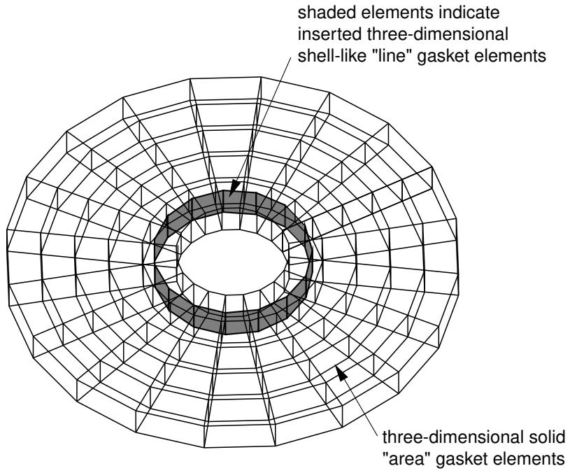  
图2：垫片模型的三维视图及其单元。

如果您正在处理由多个层和嵌件组成的垫片，则必须执行以下附加任务：

1.  使用分区工具集（Partition toolset）对实体垫片区域进行分区，以便在嵌件位置创建一个内部表面。  
2.  在属性模块（Property module）中，在代表嵌件的内部表面上定义一个表皮加强件（skin reinforcement）。（有关更多信息，请参阅定义表皮加强件。）您分配给实体和嵌件的垫片截面通常是不同的，它们的材料也是如此。  
3.  无需对嵌件表皮进行网格划分（或不允许），但您必须在网格模块（Mesh module）中为该表皮分配一个三维“线”垫片单元类型。有关更多信息，请参阅为表皮或加劲肋分配单元类型。

## 定义垫片材料

您可以创建两种类型的材料用于垫片截面定义：具有垫片特有行为的材料和通用材料。您创建的材料类型取决于您对垫片行为的要求。

如果您希望厚度方向、横向剪切和薄膜行为彼此解耦，请创建包含特殊垫片行为的材料。垫片行为材料仅对垫片截面有效。有关这种定义垫片行为方法的详细信息，请参阅直接使用垫片行为模型定义垫片行为。  
如果您只考虑厚度方向行为，请创建通用材料。通用材料在垫片截面以及其他类型的截面中均有效。有关这种定义垫片行为方法的详细信息，请参阅使用材料模型定义垫片行为。

您可以通过为“其他->垫片”（Other->Gasket）子菜单中的一种或多种行为输入数据来创建垫片特有材料。在材料编辑器中为任何其他行为输入的数据将被忽略，但以下情况除外：

•   您可以在垫片行为材料定义中包含“膨胀”（Expansion）行为（位于“力学”（Mechanical）菜单中）。  
•   您可以在垫片行为材料定义中包含“蠕变”（Creep）行为（位于“力学->塑性”（Mechanical->Plasticity）菜单中）。  
•   您可以在垫片行为材料定义中包含“依赖变量”（Depvar）和“用户输出变量”（User Output Variables）行为（位于“通用”（General）菜单中）。

您可以通过为适用于垫片截面的任何行为（“其他->垫片”（Other->Gasket）子菜单中的行为除外）输入数据来创建通用材料。（如果您为“其他->垫片”（Other->Gasket）子菜单中的行为输入数据，将自动创建垫片行为材料。）有关哪些材料行为适用于包含在垫片截面定义中的通用材料，请参阅垫片单元。

## 将垫片单元分配给区域

如果区域是壳体，您必须分配扫掠网格划分技术；如果区域是实体，您可以分配任何网格划分技术。对于实体区域，您可以定义独立于网格技术的堆叠方向。（有关更多信息，请参阅应用网格堆叠方向。）扫掠网格划分技术确保单元以适合垫片建模的方式堆叠。当您扫掠网格划分壳体区域或未分配堆叠方向的实体区域时，每个垫片单元的轴与扫掠路径方向重合；因此，您可以通过指定适当的扫掠路径来控制垫片单元的对齐方式。

例如，图1所示的部件实例具有三种可能的扫掠路径，每条路径有两个可能的扫掠方向。如果您使用垫片单元对此部件实例进行网格划分，您可以从六种可能的垫片轴方向中进行选择。有关更多信息，请参阅扫掠网格划分和指定扫掠路径。

  
图1：对于壳体区域，您必须选择能为模型提供合适垫片轴方向的扫掠路径和方向。

此外，您可以将垫片单元分配给孤立网格单元。您可以使用查询工具集（Query toolset）验证垫片单元是否在垫片轴有不止一个可能方向的区域中正确对齐。如有必要，您可以使用编辑网格工具集（Edit Mesh toolset）更改网格堆叠方向。有关更多信息，请参阅定向堆叠方向。您可以将这些工具与六面体、楔形体和四边形单元一起使用，因为只有这些单元可以堆叠形成连续壳或垫片网格。如果您已将二阶垫片单元分配给该区域，则必须先将其重新分配为常规单元，然后才能重新定向堆叠方向。之后，您可以通过重新分配二阶垫片单元将该区域转换回垫片网格。

本节提供关于如何建模不同类型缺陷的信息。您可以在相互作用模块（Interaction module）中定义缺陷。

## 本节内容：

定义缺陷  
管理缺陷  
定义文件缺陷  
定义输入缺陷  
定义数据缺陷  
编辑应用了文件缺陷的区域

## 定义缺陷

您可以在相互作用模块（Interaction module）中为装配体定义缺陷。

您可以指定以下类型的缺陷：

## 文件缺陷

您可以定义使用先前分析结果文件的文件缺陷。有关更多信息，请参阅在模型中引入几何缺陷。

## 输入缺陷

您可以定义使用在装配体的备用输入文件中指定的缺陷数据的输入缺陷。有关更多信息，请参阅在模型中引入几何缺陷。

## 数据缺陷

您可以定义使用输入文件中的数据行来指定装配体上给定节点缺陷分量的数据缺陷。有关更多信息，请参阅在模型中引入几何缺陷。

选择“特殊->缺陷->创建”（Special->Imperfection->Create）：从相互作用模块（Interaction module）中定义缺陷。从同一菜单中选择“编辑”（Edit）可以对现有定义进行更改。

缺陷定义出现在模型树（Model Tree）中装配体（assembly）下的“工程特征”（Engineering Features）容器中。
当定义文件缺陷时，您可以从视口中选择对象以标识应用缺陷的区域。默认情况下，会创建一个包含所选对象的节点集。您可以通过切换提示区域中的创建集合或面选项来更改此行为。提示区域中会提供默认名称，但您可以输入新名称。

有关创建此类工程特征的详细说明，请参见以下章节：

定义文件缺陷  
定义输入缺陷  
定义数据缺陷

## 管理缺陷

缺陷管理器（Imperfection Manager）允许您创建和管理缺陷定义。

管理器包含一个已定义缺陷的名称和类型列表。管理器中的创建（Create）、编辑（Edit）、复制（Copy）、重命名（Rename）和删除（Delete）按钮允许您创建新的缺陷定义或编辑、复制、重命名和删除现有定义。

管理器左侧列中的图标允许您抑制和恢复现有缺陷定义。您也可以使用交互（Interaction）模块主菜单栏中的特殊（Special）->缺陷（Imperfection）菜单来启动这些过程。

从主菜单栏中选择管理操作后，过程与您在管理器对话框内单击相应按钮相同。

## 附加信息

*   抑制和恢复对象
*   定义文件缺陷
*   定义输入缺陷
*   定义数据缺陷
*   编辑文件缺陷应用的区域

## 定义文件缺陷

您可以在装配体上定义文件缺陷。

1.  在交互（Interaction）模块的主菜单栏中，选择特殊（Special）->缺陷（Imperfection）->创建（Create）。
2.  在出现的创建缺陷（Create Imperfection）对话框中，为缺陷命名，选择文件缺陷（File Imperfection），然后单击继续（Continue）。
3.  使用以下方法之一选择要为其定义文件缺陷的点：
    *   在视口中选择点。选择完成后，单击鼠标键2。
    *   要从现有集合列表中选择，请执行以下操作：
        1.  单击提示区域右侧的集合（Sets），以显示包含可用集合列表的区域选择（Region Selection）对话框。
        2.  选择所需的集合，然后单击继续（Continue）。


注意：默认选择方法基于您最近使用的选择方法。要恢复到另一种方法，请单击提示区域右侧的在视口中选择（Select in Viewport）或集合（Sets）。

将出现编辑缺陷（Edit Imperfection）对话框。

4.  选择结果文件（Result file），即一个将用于缺陷定义的 .odb 文件。
5.  选择结果文件的分析步（Step）和增量（Increment），从中读取位移数据以定义缺陷。
6.  在数据表（Data table）中，输入以下内容：

## 模态序号（Mode Number）
输入模态序号。

## 缩放系数（Scaling Factor）
输入缩放系数。根据需要重复此行，以将缺陷指定为模态形状的线性组合。

7.  单击确定（OK）保存数据并关闭对话框。

*   将几何缺陷引入模型

## 定义输入缺陷

您可以在装配体上定义输入缺陷。

1.  在交互（Interaction）模块的主菜单栏中，选择特殊（Special）->缺陷（Imperfection）->创建（Create）。
2.  在出现的创建缺陷（Create Imperfection）对话框中，为缺陷命名，选择输入缺陷（Input imperfection），然后单击继续（Continue）。
3.  选择坐标系（System）。
4.  选择输入文件（Input file），即一个用于缺陷定义的 .odb 文件。
5.  单击确定（OK）保存数据并关闭对话框。

*   将几何缺陷引入模型

## 定义数据缺陷

您可以在装配体上定义数据缺陷。

1.  在交互（Interaction）模块的主菜单栏中，选择特殊（Special）->缺陷（Imperfection）->创建（Create）。
2.  在出现的创建缺陷（Create Imperfection）对话框中，为缺陷命名，选择数据缺陷（Data imperfection），然后单击继续（Continue）。
3.  选择坐标系（System）。
4.  在缺陷数据（Imperfection Data）表中，输入以下内容：

## 节点号（Node Number）
输入要指定缺陷的节点。

## 分量（Components）
在所选坐标系中输入缺陷的 comp1、comp2 和 comp3 分量值。

5.  单击确定（OK）保存数据并关闭对话框。

*   将几何缺陷引入模型

## 编辑文件缺陷应用的区域

您可以编辑文件缺陷应用的区域。

1.  在交互（Interaction）模块的主菜单栏中，选择特殊（Special）->缺陷（Imperfection）->编辑（Edit）->文件缺陷名称，以显示编辑缺陷（Edit Imperfection）对话框。
2.  在对话框顶部，单击 。
3.  使用以下方法之一编辑区域：
    在视口中选择和取消选择对象。编辑区域完成后，单击鼠标键2。更多信息，请参见在视口内选择对象。
    *   要从现有集合列表中选择，请执行以下操作：
        1.  单击提示区域右侧的集合（Sets）。
            Abaqus/CAE 显示包含可用集合列表的区域选择（Region Selection）对话框。
        2.  选择所需的集合，然后单击继续（Continue）。


注意：默认选择方法基于您最近使用的选择方法。要恢复到另一种方法，请单击提示区域右侧的在视口中选择（Select in Viewport）或集合（Sets）。

4.  在对话框中，根据需要完成缺陷定义的编辑，然后单击确定（OK）。

## 惯性（Inertia）

本节提供有关如何为零件或装配体上的区域建模不同类型惯性的信息。您可以在属性（Property）模块或交互（Interaction）模块中定义惯性。

## 本节内容：

定义惯性  
管理惯性  
定义点质量和转动惯量  
定义非结构质量  
定义热容  
编辑惯性应用的区域

## 定义惯性

惯性可以在属性（Property）模块中为零件定义，或在交互（Interaction）模块中为装配体定义。

您可以指定以下类型的惯性：

## 点质量/转动惯量（Point mass/inertia）
您可以在零件或装配体的某一点定义集中质量和转动惯量。您还可以定义质量和惯性比例阻尼。在 Abaqus/Standard 分析中，您可以定义复合阻尼。更多信息，请参见点质量（Point Masses）和转动惯量（Rotary Inertia）。

## 非结构质量（Nonstructural mass）
您可以在零件或装配体的某个区域定义非结构质量。更多信息，请参见非结构质量定义（Nonstructural Mass Definition）。

## 热容（Heat capacitance）
您可以在零件或装配体的某一点定义集中热容。更多信息，请参见点热容（Point Capacitance）。

在属性（Property）模块或交互（Interaction）模块的主菜单栏中，选择特殊（Special）->惯性（Inertia）->创建（Create）：类型（type）以定义惯性。从同一菜单中选择编辑（Edit）以更改现有定义。

惯性定义出现在模型树（Model Tree）中工程特征（Engineering Features）容器下的零件下（如果在属性模块中创建）或装配体下（如果在交互模块中创建）。

定义惯性时，您可以从视口中选择对象以标识应用惯性的区域。默认情况下，会创建一个包含所选对象的集合或面。您可以通过切换提示区域中的创建集合或面选项来更改此行为。提示区域中会提供默认名称，但您可以输入新名称。

将惯性应用于模型区域时，您可以选择在视口中显示符号，指示您应用惯性的位置。如果将惯性应用于几何图形，符号出现在顶点处。如果将惯性应用于孤立网格，符号出现在节点处。有关图形符号类型的信息，请参见用于表示特殊工程特征的符号。有关控制这些符号可见性的信息，请参见控制属性的显示。

有关创建此类工程特征的详细说明，请参见以下章节：

定义点质量和转动惯量  
定义非结构质量  
定义热容

## 管理惯性

惯性管理器（Inertia Manager）允许您创建和管理惯性定义。

管理器包含一个已定义惯性的名称和类型列表。

管理器中的创建（Create）、编辑（Edit）、复制（Copy）、重命名（Rename）和删除（Delete）按钮允许您创建新的惯性定义或编辑、复制、重命名和删除现有定义。

管理器左侧列中的图标允许您抑制和恢复现有惯性定义。您也可以使用属性（Property）模块或交互（Interaction）模块主菜单栏中的特殊（Special）->惯性（Inertia）菜单来启动这些过程。从主菜单栏中选择管理操作后，过程与您在管理器对话框内单击相应按钮相同。
## 补充信息

*   抑制与恢复对象
*   定义点质量和旋转惯性
*   定义非结构质量
*   定义热容
*   编辑应用惯性的区域

## 定义点质量和旋转惯性

您可以在部件或装配体上的一个点定义集中质量和旋转惯性。

您还可以为点质量和旋转惯性定义比例阻尼。在 Abaqus/Standard 分析中，您可以定义复合阻尼。更多信息，请参见点质量和旋转惯性。

1.  在属性模块或交互模块的主菜单栏中，选择 Special->Inertia->Create。
2.  在出现的创建惯性（Create Inertia）对话框中，为惯性命名，选择点质量/惯性（Point mass/inertia），然后点击继续（Continue）。
3.  使用以下一种方法选择要为其定义质量和旋转惯性的点：
    *   在视口中选择点。选择完成后，点击鼠标键2。

        如果模型包含孤立网格单元和几何体的组合，请从提示区选择以下之一：
        *   选择几何体（Select Geometry）为部件或装配体的几何部分或参考点定义点质量和旋转惯性。
        *   选择网格（Select Mesh）为孤立网格组件定义点质量和旋转惯性。

        您可以使用角度方法从孤立网格中选择一组节点。更多信息，请参见使用角度和特征边方法选择多个对象。

    *   要从现有集合列表中选择，请执行以下操作：
        1.  点击提示区右侧的集合（Sets）以显示包含可用集合列表的区域选择（Region Selection）对话框。
        2.  选择感兴趣的集合，然后点击继续（Continue）。

        

    **注意：** 默认选择方法基于您最近使用的选择方法。要切换到另一种方法，请点击提示区右侧的视口选择（Select in Viewport）或集合（Sets）。

    将出现编辑惯性（Edit Inertia）对话框。您正在应用点质量和旋转惯性的区域在视口中高亮显示。

4.  在量级（Magnitude）选项卡的质量（Mass）部分，执行以下操作：
    *   对于各向同性质量，勾选各向同性（Isotropic）并指定质量的大小。
    *   对于各向异性质量，勾选各向异性（Anisotropic）并指定质量分量 $M _ { 1 1 }$、$M _ { 2 2 }$ 和 $M _ { 3 3 }$。

5.  在页面的旋转惯性（Rotary Inertia）部分，指定转动惯量（单位 M·$\boldsymbol { \underline { L } ^ { 2 } }$）。
    a.  如果您想指定惯性积，请勾选指定非对角项（Specify off-diagonal terms）。
    b.  输入旋转惯性的值。
        *   **I11**
            绕局部1轴的旋转惯性，$I_{11}$。
        *   **I22**
            绕局部2轴的旋转惯性，$\pmb { I _ { 2 2 } }$。
        *   **I33**
            绕局部3轴的旋转惯性，$\pmb { I _ { 3 3 } }$。
    c.  如果适用，输入惯性积的值。
        *   **I12**
            惯性积，$\pmb { I _ { 1 2 } }$。
        *   **I13**
            惯性积，$\mathbf { { { I } _ { 1 3 } } }$。
        *   **I23**
            惯性积，$\pmb { I _ { 2 3 } }$。

6.  如果要更改旋转惯性的坐标系（CSYS），请点击并使用以下方法之一：
    *   在视口中选择一个现有的基准坐标系。
    *   按名称选择一个现有的基准坐标系。
        1.  在提示区中，点击基准坐标系列表（Datum CSYS List）以显示基准坐标系列表。
        2.  从列表中选择一个名称，然后点击确定（OK）。
    *   点击提示区中的使用全局坐标系（Use Global CSYS）以恢复到全局坐标系。

    默认情况下，使用全局坐标系来定义旋转惯性。

7.  使用阻尼（Damping）选项卡定义点质量或旋转惯性的比例阻尼。对于 Abaqus/Standard 分析，您还可以定义复合阻尼。您可以为点质量和复合阻尼或旋转惯性和复合阻尼都指定比例阻尼值；但是，Abaqus 仅使用与正在执行的特定动态分析过程相关的阻尼。如果点质量和旋转惯性需要不同的阻尼值，则必须创建单独的惯性定义。
    *   在 Alpha 字段中，输入 $\pmb { \alpha _ { R } }$ 因子，以在直接积分动态分析、支持非对角阻尼的 Abaqus/Standard 模态分析或显式动态分析中为点质量或旋转惯性创建比例阻尼。此值在不支持非对角阻尼的模态动态分析中将被忽略。默认值为 0.0。
    *   在复合（Composite）字段中，输入临界阻尼分数 $\xi _ { \alpha }$，该值用于在模态动态分析中计算模态的复合阻尼因子。此值在直接积分动态分析和 Abaqus/Standard 中支持非对角阻尼的模态分析中将被忽略。默认值为 0.0。

8.  点击确定（OK）保存数据并关闭对话框。

    视口中会出现代表您刚创建的点质量和旋转惯性的符号。

## 补充信息

*   控制属性显示
*   表示特殊工程特征的符号

## 定义非结构质量

您可以为部件或装配体上的一个区域定义非结构质量。更多信息，请参见非结构质量定义。

1.  在属性模块或交互模块的主菜单栏中，选择 Special->Inertia->Create。
2.  在出现的创建惯性（Create Inertia）对话框中，为惯性命名，选择非结构质量（Nonstructural mass），然后点击继续（Continue）。
3.  使用以下一种方法选择要为其定义非结构质量的区域：
    *   在视口中选择区域。选择完成后，点击鼠标键2。
        如果模型包含孤立网格单元和几何体的组合，请从提示区选择以下之一：
        *   选择几何体（Select Geometry）为部件或装配体的几何部分或参考点定义非结构质量。
        *   选择网格（Select Mesh）为孤立网格组件定义非结构质量。

        您可以使用角度方法从孤立网格中选择一组节点。更多信息，请参见使用角度和特征边方法选择多个对象。

    *   要从现有集合列表中选择，请执行以下操作：
        1.  点击提示区右侧的集合（Sets）以显示包含可用集合列表的区域选择（Region Selection）对话框。
        2.  选择感兴趣的集合，然后点击继续（Continue）。

        

    **注意：** 默认选择方法基于您最近使用的选择方法。要切换到另一种方法，请点击提示区右侧的视口选择（Select in Viewport）或集合（Sets）。

    将出现编辑惯性（Edit Inertia）对话框。您正在应用非结构质量的区域在视口中高亮显示。

4.  选择您将用于指定非结构质量大小的单位（Units）。可用类型取决于您选择的区域类型。
    *   选择总质量（Total Mass）以总质量值的形式指定大小。
    *   选择每单位体积质量（Mass per Volume）以单位体积质量的形式指定大小。
    *   选择每单位面积质量（Mass per Area）以单位面积质量的形式指定大小。
    *   选择每单位长度质量（Mass per Length）以单位长度质量的形式指定大小。

5.  在大小（Magnitude）字段中，输入您在上一步中选择的单位所对应的非结构质量值。

6.  如果您以总质量值的形式指定质量，并且区域是一个集合，您可以选择分配（Distribution）方法来分配区域上的质量。
    *   选择质量比例（Mass Proportional）以按结构质量的比例在集合成员之间分配总质量。基础结构密度在区域上均匀缩放，质心不会改变。
    *   选择体积比例（Volume Proportional）以按初始构型中体积的比例在集合成员之间分配总质量。在区域上的基础结构密度中添加一个均匀值。如果该区域具有非均匀的结构密度，其质心可能会改变。

7.  点击确定（OK）保存数据并关闭对话框。

    视口中会出现代表您刚创建的非结构质量的符号。

## 补充信息

*   控制属性显示
*   表示特殊工程特征的符号

## 定义热容

您可以在部件或装配体上的一个点定义集中热容。更多信息，请参见点容。

1.  在属性模块或交互模块的主菜单栏中，选择 Special->Inertia->Create。
2.  在出现的创建惯性（Create Inertia）对话框中，为惯性命名，选择热容（Heat capacitance），然后点击继续（Continue）。
3. 使用以下方法之一选择要定义热容的点：

• 在视口中选择点。完成选择后，单击鼠标按钮2。

如果模型包含孤立网格单元和几何体的组合，请在提示区中选择以下选项之一：

选择 **Geometry** 以定义零件或装配体的几何部分或参考点的热容。

\- 选择 **Mesh** 以定义孤立网格部件的热容。

您可以使用角度方法从孤立网格中选择一组节点。有关更多信息，请参阅 使用角度和特征边方法选择多个对象。

• 要从现有集合列表中选择，请执行以下操作：

1. 单击提示区右侧的 **Sets** 以显示包含可用集合列表的区域选择对话框。
2. 选择所需的集合，然后单击 **Continue**。


注意：默认选择方法基于您最近使用的选择方法。要切换到另一种方法，请单击提示区右侧的 **Select in Viewport** 或 **Sets**。

将出现“编辑惯性”对话框。您正在应用热容的区域在视口中被高亮显示。

4. 可选：打开 **Use temperature-dependent data**，并输入温度。

5. 可选：指定 **Number of field variables**，并输入第一个场变量的值、第二个场变量的值等。

6. 在 **Data** 表中，输入以下内容：

## Capacitance

输入热容值（密度 × 比热 × 体积）。

7. 单击 **OK** 以保存数据并关闭对话框。

视口中将出现符号，代表您刚刚创建的热容。

## 附加信息

• 控制属性显示  
• 用于表示特殊工程特征的符号

## 编辑应用惯性的区域

您可以编辑应用惯性的区域。

1. 在“属性”模块或“相互作用”模块的主菜单栏中，选择 **Special -> Inertia -> Edit -> inertia name** 以显示“编辑惯性”对话框。
2. 在对话框顶部，单击。
3. 使用以下方法之一编辑区域：

在视口中选择和取消选择对象。完成区域编辑后，单击鼠标按钮2。有关更多信息，请参阅 在视口中选择对象。
• 要从现有集合列表中选择，请执行以下操作：

1. 单击提示区右侧的 **Sets**。

Abaqus/CAE 将显示包含可用集合列表的区域选择对话框。

2. 选择所需的集合，然后单击 **Continue**。


注意：默认选择方法基于您最近使用的选择方法。要切换到另一种方法，请单击提示区右侧的 **Select in Viewport** 或 **Sets**。

4. 在对话框中，根据需要完成惯性定义的编辑，然后单击 **OK**。

视口中代表惯性的符号将更新，并显示在新编辑的区域上。

## 附加信息

• 用于表示特殊工程特征的符号

## 载荷工况

本节提供有关如何使用载荷工况的信息。

## 本节内容：

什么是载荷工况？  
管理载荷工况  
载荷工况编辑器  
查看载荷工况输出  
定义载荷工况

## 什么是载荷工况？

载荷工况是用于定义特定加载条件的一组载荷和边界条件。您可以使用一个或多个载荷工况来研究结构在不同加载条件下的线性响应，适用于以下类型的分析：静态摄动分析、直接稳态动力学分析、基于SIM的稳态动力学分析（基于模态和基于子空间）以及子结构生成。载荷工况分析通常比等效的多步骤分析效率高得多，因为它利用了线性叠加原理。

您可以直接根据载荷和边界条件来定义载荷工况，也可以根据先前定义的载荷工况的组合来定义。您可以使用“载荷”模块直接根据载荷和边界条件定义载荷工况。您可以使用“可视化”模块在后期处理期间根据先前定义的载荷工况定义载荷工况组合。载荷工况输出存储在输出数据库（.odb）的不同帧中，您可以通过组合多个帧的结果来创建载荷工况组合的结果。

您可以在“载荷”模块中使用“载荷工况”菜单来创建包含先前定义的载荷和边界条件的载荷工况。您可以使用非零缩放系数来缩放载荷工况内单个载荷和边界条件的大小。在每个载荷工况中，每个载荷或边界条件只能包含一次。如果一个分析步包含载荷工况，则必须将该分析步中的每个载荷和边界条件包含在一个或多个载荷工况中。默认情况下，Abaqus/CAE 会在您创建的每个载荷工况中包含所有从基础状态传播或修改的边界条件，但允许您针对单个载荷工况修改此行为。您可以使用边界条件管理器来停用包含载荷工况的分析步中未使用的传播边界条件。

在包含载荷工况的分析步中，Abaqus 仅支持场输出请求。在“分析步”模块中创建的场输出请求适用于该分析步中的所有载荷工况。您可以使用“可视化”模块查看和操作载荷工况结果（请参阅 查看载荷工况输出）。

有关载荷工况的更多信息，请参阅 多载荷工况分析。有关在“载荷”模块中创建载荷和边界条件的更多信息，请参阅 创建和修改指定条件。

## 附加信息

• 抑制和恢复对象

## 管理载荷工况

“载荷工况管理器”允许您组织和操作与给定模型关联的载荷工况。您可以在“载荷”模块中通过从主菜单栏选择 **Load Case -> Manager** 来访问该管理器。“载荷工况管理器”如图1所示。


图1：载荷工况管理器。

管理器左侧列中的图标允许您抑制和恢复现有的载荷工况。管理器中的“创建”、“编辑”、“复制”、“重命名”或“删除”按钮允许您创建新的载荷工况或编辑、复制、重命名和删除现有的载荷工况。您也可以通过使用主菜单栏中的“载荷工况”菜单来启动创建、编辑、复制、重命名和删除过程。从主菜单栏选择管理操作后，该过程与在管理器对话框中单击相应按钮完全相同。

有关创建和编辑载荷工况的详细说明，请参阅 定义载荷工况。

## 附加信息

• 管理对象  
• 抑制和恢复对象

## 载荷工况编辑器

在进入“载荷”模块并创建载荷和边界条件后，您可以从主菜单栏选择 **Load Case -> Create** 来创建载荷工况。将出现“创建载荷工况”对话框，您可以在其中为载荷工况提供名称并选择将在其中创建载荷工况的分析步。当您在“创建载荷工况”对话框中单击 **Continue** 时，将出现载荷工况编辑器。

载荷工况编辑器的顶部面板显示载荷工况的名称和当前分析步。载荷工况编辑器包含两个带表格的选项卡页面，允许您选择要定义载荷工况的载荷和边界条件。默认情况下，Abaqus/CAE 会在您创建的每个载荷工况中包含所有从基础状态传播或修改的边界条件。您可以在“边界条件”选项卡页面上关闭此行为。

在每个选项卡页面底部单击 + 可以从列表中选择载荷和边界条件。您可以输入缩放系数来缩放单个载荷和边界条件的大小。如果您为载荷输入负的缩放系数，该载荷将沿相反方向施加。您也可以直接在表格中输入载荷和边界条件的名称以及缩放系数。在创建载荷工况期间，Abaqus/CAE 会按字母顺序对载荷和边界条件的名称进行排序，并在载荷工况编辑器中列出这些名称。您可以在视口中高亮显示选定的载荷和边界条件。

例如，您可以定义一组载荷工况来分析承受端部载荷和均匀压力载荷的悬臂梁的响应。悬臂梁模型如图1所示。

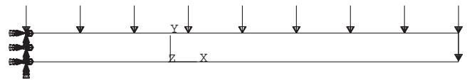


图1：具有端部载荷、压力载荷和固定端边界条件的悬臂梁模型。
初始步骤中施加了固支边界条件，静态线性扰动步骤中施加了末端载荷和压力载荷。

您可以创建仅包含末端载荷的载荷工况，也可以创建仅包含压力载荷的载荷工况。此外，您还可以创建一个同时包含压力载荷和末端载荷的载荷工况，其中末端载荷以相反方向施加（比例因子值为 -1），如图 2 所示。

  
图 2：包含悬臂梁模型载荷的载荷工况定义。

默认情况下，每个载荷工况都包含从基础状态传播而来的固支边界条件，如图 3 所示。

  
图 3：包含从悬臂梁模型基础状态传播而来的边界条件的载荷工况定义。

图 1 中的载荷工况管理器显示了为悬臂梁模型创建的三个载荷工况。

## 附加信息

• 什么是载荷工况？

## 查看载荷工况输出

载荷工况输出存储在输出数据库 (.odb) 的单独帧中。您可以使用可视化模块查看和处理载荷工况输出。包含载荷工况输出的每一帧的状态块中都会显示载荷工况名称。例如，图 1 显示了悬臂梁模型的“带末端载荷向上的压力载荷”工况的变形图（参见载荷工况编辑器）。

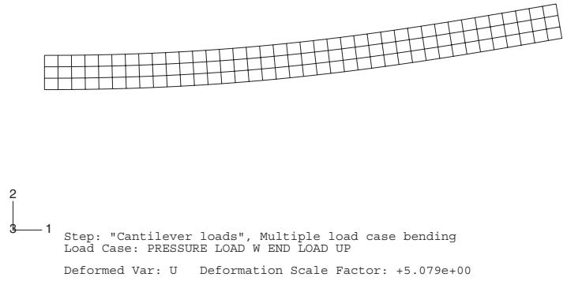

步骤: "Cantilever loads", Multiple load case bending 载荷工况: PRESSURE LOAD W END LOAD UP

变形变量: U 变形比例因子: +5.079e+00

图 1：载荷工况分析结果。

在可视化模块中，您可以将来自多个载荷工况的输出进行线性组合，以代表实际的加载环境。您还可以获得所选场变量在部分或全部载荷工况上的最小值或最大值。

例如，您可以组合悬臂梁模型“仅末端载荷”和“仅压力载荷”工况的输出，以创建名称为“两种载荷”的新场输出，如图 2 所示。

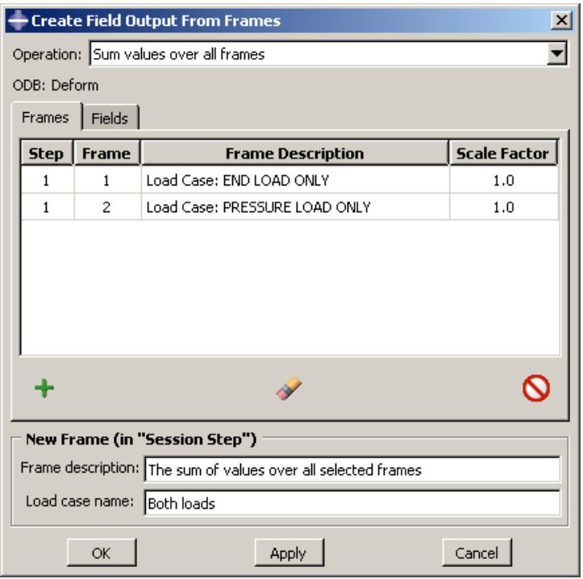  
图 2：通过组合两个载荷工况（帧）的输出创建新的场输出。

新的场输出包含在会话步骤的一个帧中，可以从“场输出”对话框中获得。图 3 显示了组合变形结果的绘图。

  
图 3：来自两个载荷工况的组合变形结果。

有关处理载荷工况输出的详细信息，请参阅组合多个帧的结果。

## 附加信息

• 创建和保存新的场输出

## 定义载荷工况

您可以使用“载荷”模块中的“载荷工况”菜单来定义载荷工况。您可以在静态扰动、直接稳态动力学、基于 SIM 的稳态动力学（基于模态和基于子空间）以及子结构生成分析中创建载荷工况。在创建载荷工况之前，必须在“载荷”模块中先创建好各个载荷和边界条件。有关更多信息，请参阅创建载荷和创建边界条件。

1.  在“载荷”模块的主菜单栏中，选择 载荷工况->创建。


提示：您也可以使用“载荷”模块工具箱中的工具创建载荷工况。

2.  在出现的“创建载荷工况”对话框中，执行以下操作：

    a. 为载荷工况命名。有关命名对象的更多信息，请参阅使用基本对话框组件。
    b. 选择步骤。您只能在以下步骤期间定义载荷工况：静态线性扰动；稳态动力学，直接；基于 SIM 的稳态动力学（模态和子空间）；以及子结构生成。
    c. 单击“继续”。

    载荷工况编辑器出现。

3.  如果您希望将载荷包含在载荷工况中，请单击“载荷”选项卡。使用以下方法之一指定载荷：

    • 单击页面底部的 + 以显示所选步骤可用载荷的列表。
    1.  从“载荷选择”对话框中，从列表中选择载荷（有关更多信息，请参阅从列表和表中选择多个项目）。选定的载荷在视口中高亮显示。
    2.  在“比例因子”字段中，输入一个非零值以缩放所选载荷的大小。输入负值可反向施加所选载荷。每个载荷的比例因子默认值为 1.0。
    3.  单击“确定”以保存您的选择并关闭“载荷选择”对话框。

    • 使用键盘在表格中输入数据。
    1.  输入先前定义的载荷名称。
    2.  输入一个非零值以缩放载荷的大小。输入负值可反向施加载荷。比例因子的默认值为 1.0。
    3.  重复上述步骤以指定要包含在载荷工况中的所有载荷。

    载荷工况编辑器显示了包含在载荷工况中的载荷和比例因子。要在视口中高亮显示载荷，请单击表格行标题以选择编辑器中的载荷（有关更多信息，请参阅从列表和表中选择多个项目），并切换开启“在视口中高亮显示选择”。被抑制的载荷不会在视口中高亮显示。要从表格中移除载荷，请单击表格行标题以选择载荷，然后单击

    

4.  如果您希望将边界条件包含在载荷工况中，请单击“边界条件”选项卡以显示边界条件页面。默认情况下，Abaqus/CAE 会在您创建的每个载荷工况中包含从基础状态传播或修改的所有边界条件。您可以在边界条件页面顶部关闭此行为。使用以下方法之一指定边界条件：

    • 单击页面底部的 + 以显示所选步骤可用边界条件的列表。
    1.  从“边界条件选择”对话框中，从列表中选择边界条件（有关更多信息，请参阅从列表和表中选择多个项目）。选定的边界条件在视口中高亮显示。
    2.  在“比例因子”字段中，输入一个非零值以缩放所选边界条件的大小。每个边界条件的比例因子默认值为 1.0。
    3.  单击“确定”以保存您的选择并关闭“边界条件选择”对话框。

    • 使用键盘在表格中输入数据。
    1.  输入先前定义的边界条件名称。
    2.  输入一个非零值以缩放边界条件的大小。比例因子的默认值为 1.0。
    3.  重复上述步骤以指定要包含在载荷工况中的所有边界条件。

    载荷工况编辑器显示了包含在载荷工况中的边界条件和比例因子。比例因子仅当边界条件具有非零值时才相关。要在视口中高亮显示边界条件，请单击表格行标题以选择编辑器中的边界条件（有关更多信息，请参阅从列表和表中选择多个项目），并切换开启“在视口中高亮显示选择”。被抑制的边界条件不会在视口中高亮显示。要从表格中移除边界条件，请单击表格行标题以选择边界条件，然后单击

    

5.  单击“确定”以保存您的载荷工况定义并关闭编辑器。

## 附加信息

• 抑制和恢复对象
• 载荷工况编辑器
• 多载荷工况分析

本节解释了中面建模以及如何使用它来简化用于分析的薄实体模型。

## 本节内容：

理解中面建模
理解参考表示
为中面模型创建壳面
创建中面模型的示例
创建和编辑中面模型

## 理解中面建模

中面建模是一种为实体模型创建简化的壳表示的技术。当中间有定义厚度且细节较少的壳模型适用于所需的分析时，中面建模可以减少分析完整实体模型的计算成本。

中面建模过程依赖于一个精确的实体模型作为起点。中面建模最适合于薄壁实体或恒定壁厚或每个点的壁厚可以容易地做出合理近似的薄壁实体。您可以将中面建模应用于模型中的任何实体单元；您不必将其应用于整个模型。如果您只将中面建模应用于实体模型的一部分，
Abaqus/CAE 会自动创建壳体-实体耦合约束，以将壳体中面边缘的运动与剩余的实体模型面耦合起来。如果壳体表面与实体面之间的角度显著偏离 90°，则不会创建壳体-实体耦合约束。

除了降低计算成本外，您可能会使用面模型代替实体模型，以便更好地考虑模型薄壁区域的弯曲响应。壳体单元被设计用于在单个单元厚度内管理弯曲载荷，而单个实体单元对弯曲的抵抗能力很小或几乎没有。

在 Abaqus/CAE 中创建面模型是一个手动过程。下面介绍的流程概述了涉及的一般步骤。每个步骤中的任务可能因原始实体模型的复杂性和完整性以及分析要求而异。某些步骤（例如下面的第 4 步）可能不需要完成，或者可能以与此处介绍的顺序不同的顺序完成。

1. 在实体部件上指定中面区域。使用“指定中面区域”工具从实体部件中选择一个或多个单元以开始创建面模型。更多信息，请参见“指定中面区域”。
   Abaqus/CAE 会从活动表示中移除所选单元，并创建一个包含这些所选单元的参考表示。
2. 创建新的壳面以替换您移动到参考表示的实体几何。您可以使用“几何编辑”工具集中的工具或壳体特征创建工具向面模型添加壳体特征。更多信息，请分别参见“几何编辑”工具集和“添加壳体特征”。“几何编辑”工具集中的偏移面工具是面模型最常用的创建面方法。偏移过程基于选定的几何创建新面，并根据偏移参数自动分配壳体厚度。
3. 为新的壳体特征指定厚度。
   “指定厚度和偏移”工具允许您为新的中面几何指定壳体厚度（更多信息，请参见“指定厚度和偏移”）。该工具允许您为单个面指定厚度，您也可以使用它来编辑 Abaqus/CAE 为使用偏移过程创建的面自动分配的厚度。您仍然必须在“属性”模块中为新面指定截面。在截面指定过程中，您可以最终决定是使用通过截面属性定义的厚度，还是使用几何定义的厚度。您可以在所有基于部件和装配的模块中切换壳体厚度显示，以在视口中查看厚度（更多信息，请参见“可视化壳体厚度”）。
4. 修改与用于创建参考表示的实体几何相关联的任何分析属性。

   分析属性（如载荷、边界条件或相互作用）不能应用于参考表示中的几何。如果实体几何在被移动到参考表示之前与任何分析属性相关联，且该几何不再是活动表示的一部分，则这些属性将与一个空区域相关联。更多信息，请参见“理解参考表示”。

## 理解参考表示

参考表示是部件或部件子集（一个或多个单元）的一种替代表示，不用于分析。参考表示保留了原始的实体模型几何，并且与草图器中的参考几何类似，您可以使用参考表示中的实体作为工具来构建部件的更简单版本。参考表示最常用于构建面模型。当与偏移面工具一起使用来为面模型创建面时，参考表示与新面之间的偏移计算还允许 Abaqus/CAE 自动计算面模型中的壳体厚度和单元偏移。

当您为实体部件中的一个或多个单元指定中面属性时，Abaqus/CAE 会创建一个参考表示。所选单元从部件的活动表示中移除，并添加到参考表示中。参考表示默认在“部件”模块中显示，并以半透明的棕色显示。您无法更改参考表示的颜色，但您可以使用主工具栏中与可见对象工具一起的“显示参考表示”工具在所有模块中切换其开关。您也可以使用显示选项切换参考表示的透明度（更多信息，请参见“控制边的可见性”）。

您可以将参考表示与形状创建工具或“几何编辑”工具集中的工具结合使用，以帮助在活动表示中构建新的几何实体。例如，您可以偏移参考表示中的面，或者您可以从参考表示中选择一个平面面作为草图平面，使用拉伸方法创建新的壳面。您可以使用参考表示中的几何来定义分区——选择参考表示中的一个边和一个顶点作为分区单元的点和法线——或创建基准实体。您也可以使用参考表示的几何在“装配”模块中定位实体并定义约束。

您无法编辑参考表示内的几何，也无法为其指定分析属性（如载荷、边界条件和相互作用）。当您创建参考表示时，在创建参考表示之前应用于实体单元的任何分析属性现在将与一个空区域相关联。您可以编辑空区域，将分析属性与几何——您为面模型创建的实体几何或壳体几何——相关联，这些几何是活动表示的一部分。或者，您可以抑制或删除这些分析属性。如果您不更改受影响的分析属性，当您在“作业”模块中提交作业时，Abaqus/CAE 将显示警告消息。

## 为面模型创建壳面

一旦您有了参考表示，您必须手动构建一个壳模型来替换已从模型中移除的实体单元。

您可以使用壳体特征工具和“几何编辑”工具集中的工具（更多信息，请分别参见“添加壳体特征”和“几何编辑”工具集）来创建和编辑壳面。

本节讨论在您使用这些工具为面模型创建面时可能适用的一些特殊情况。

## 本节内容：

将偏移面工具用于面建模
将延伸面工具用于面建模

## 将偏移面工具用于面建模

您可以使用“几何编辑”工具集中的偏移面工具来创建中面。偏移面工具在与原始面集偏移一定距离处创建新面。创建偏移面的过程类似于草图器中偏移对象的过程（更多信息，请参见“偏移对象”）。偏移面工具的使用在“偏移面”中有详细讨论。

除了创建新壳面的基本任务外，偏移面工具还提供了两项有助于创建面模型的功能：

• Abaqus/CAE 使用偏移距离来为新壳面分配厚度。
• “自动修剪”选项会自动将新面修剪到参考表示。

一旦您选择了要偏移的面，您可以输入一个偏移距离值，或者选择一组代表所需壳体厚度距离的目标面，并让 Abaqus/CAE 计算偏移量。Abaqus/CAE 计算被偏移面与目标面之间的距离。您可以偏移到平均距离的一半，或者到目标面上最近或最远点的距离的一个分数。

使用每种计算出的偏移距离的区别如图 1 所示。该部件有三种不同的厚度。最薄的面在顶部，最厚的在中间，右侧的垂直面厚度介于两者之间。选择参考表示的三个外表面进行偏移，三个内表面是目标面。左侧视图显示了默认的“平均距离一半”方法，偏移量大约是顶部面的完整厚度。中间视图显示了“到面上最近点的距离分数”方法，分数距离设置为 0.5。顶部目标面最靠近顶部偏移面，因此 Abaqus/CAE 将新面偏移此距离的 0.5 倍。右侧视图显示了“到面上最远点的距离分数”方法，分数距离同样设置为 0.5。中间（倾斜的）目标面距离中间偏移面最远，因此 Abaqus/CAE 将新面偏移此距离的 0.5 倍——由于使用了“自动修剪到参考表示”选项，顶部偏移面在原本会穿过原始实体部件参考表示的地方被切断。

图 1：基于三种目标面计算方法的偏移距离差异。

Abaqus/CAE 会根据偏移计算，自动将新建的偏移壳面与一个厚度相关联。如果你选择了目标面来计算偏移距离，Abaqus/CAE 还会在上下表面集的几何形状发生任何变化时，自动重新计算偏移量。使用指派厚度与偏移（Assign Thickness and Offset）工具和渲染壳厚度（Render shell thickness）选项来编辑和查看分配给壳面的厚度。更多信息，请参见指派厚度与偏移和可视化壳厚度。

如果你在偏移面时使用了自动修剪（auto trim）选项，Abaqus/CAE 会偏移面并将新面的外边缘延伸一个等于偏移距离的量。然后，新面会在与参考表示（reference representation）相交的地方被修剪。图 2 展示了使用自动修剪选项可能产生的效果。参考表示包含一个单元格（cell），并且选择了该单元格较大的圆形面进行偏移操作。使用自动修剪选项后，新面被修剪至参考表示的圆锥面边界处。


图 2：自动修剪选项会修剪至参考表示的外表面。

## 补充信息

• 偏移面（Offset faces）
• 延伸面（Extend faces）

## 使用延伸面工具进行中间面建模

你可以使用几何编辑（Geometry Edit）工具集中的延伸面（extend faces）工具来创建中间面（midsurface）。延伸面工具会延伸现有的壳面，因此对于中间面建模，必须在你已经创建了一个或多个壳面之后使用。延伸面工具的使用方法在延伸面中有详细讨论。

你可以通过选择单个边来沿一个或多个方向延伸面，也可以指定面来沿其所有外部边延伸面。确定延伸距离也有几种方法；其中“直到参考表示（Up to reference representation）”选项是专门为中间面建模设计的。

当你使用“指定要延伸的面的边（Specify edges of faces to extend）”选项沿一组边延伸面时，延伸面操作可能会失败。如果发生这种情况，请尝试减少选择的边数量，然后使用第二次操作来延伸剩余的边。

## 补充信息

• 延伸面（Extend faces）

## 创建中间面模型的示例

本节提供了从实体模型创建中间面模型的示例。在第一个示例中，实体部件具有相当均匀的厚度，创建中间面模型相对容易。第二个示例更为复杂，需要多个步骤来创建一个能准确表示原始实体模型的中间面模型。

## 本节内容：

冲压支架的中间面建模
复杂零件的中间面建模
创建梁的壳表示

本示例展示了如何使用 Abaqus/CAE 中的中间面建模工具将一个支架的实体模型转换为同一部件的壳表示。

## 实体模型

本示例中的模型是一个长度为 175.0 毫米的支架，由 3.0 毫米厚的低碳钢板冲压而成，如图 1 所示。对实体部件进行默认网格划分会导致支架厚度方向上有一到两个单元，这在弯曲分析中表现不佳。将支架建模为壳表示将提供更准确的弯曲响应。


图 1：支架的实体模型。

## 指派中间面区域

使用部件（Part）模块中的指派中间面区域（Assign Midsurface Region）工具，从模型的活动表示中移除几何体，并创建原始实体几何体的参考表示，如图 2 所示。

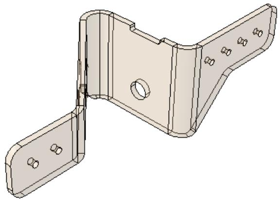
图 2：支架的参考表示。

参考表示是原始支架的一种抽象表示。它保留了支架的原始几何形状，但不能用于分析。参考表示默认显示在部件（Part）模块中；你可以使用主工具栏中可见对象工具（visible object tools）里的显示参考表示（Show Reference Representation）工具来切换其显示/隐藏。更多信息，请参见理解参考表示和指派中间面区域。

## 创建壳表示

你必须创建一个可以由 Abaqus 分析的支架壳表示。创建中间面壳模型最常用的工具是偏移面（offset face）工具，它位于几何编辑（Geometry Edit）工具集的其他面工具中。偏移面工具允许你从参考表示中选择一个或多个面，并创建从原始面偏移的新面。你可以输入一个固定距离，或者选择 Abaqus/CAE 用来计算距离的目标面。如果选择目标面，当待偏移面与目标面之间的距离不是恒定时，所得的壳厚度会变化。Abaqus/CAE 会在你分析模型时计算每个节点和单元的节点厚度和单元偏移量。偏移面（Offset Faces）对话框如图 3 所示。

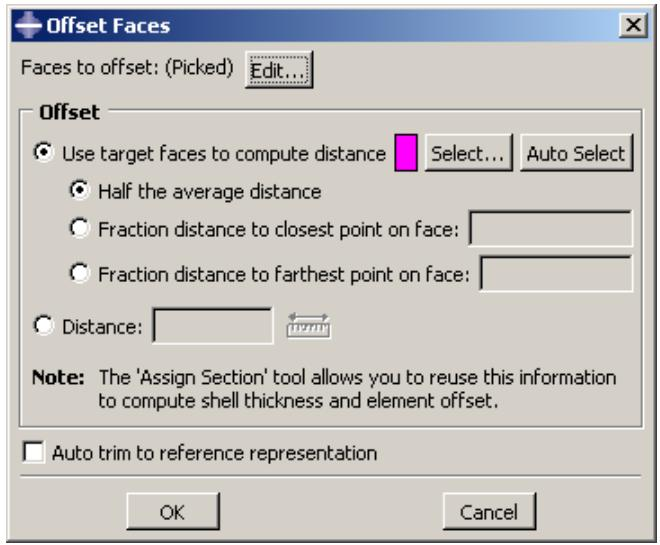
图 3：偏移面（Offset Faces）对话框。

更多信息，请参见编辑面的方法和添加壳特征。

图 4 展示了选定的待偏移面和选定的目标面。使用了“按角度（by angle）”选择方法来选择内部组的面作为待偏移面，外部组的面作为目标面。


图 4：待偏移面和目标面。

在此示例中，你选择了偏移面（Offset Faces）对话框中的默认选项“平均距离的一半（Half the average distance）”，Abaqus/CAE 创建了位于待偏移面与目标面之间平均距离一半处的面。

默认情况下，偏移面（Offset Faces）对话框中的“自动修剪到参考表示（Auto trim to reference representation）”选项是关闭的。然而，此步骤启用了自动修剪选项，因此 Abaqus/CAE 将偏移面修剪至与参考表示对齐。在某些情况下，修剪操作会失败，这会导致新面与参考表示之间出现轻微的不对齐，并且 Abaqus/CAE 会发出警告消息。即使修剪失败，所得的壳面通常仍然是参考表示的一个合理近似；因此你可能可以忽略该警告消息。更多信息，请参见使用偏移面工具进行中间面建模。

## 指派壳截面

你使用属性（Property）模块创建一个壳截面（shell section）并将其指派给新面。创建壳截面时，你可以为壳厚度输入一个任意值。随后在将截面指派给壳时，你需要在编辑截面指派（Edit Section Assignment）对话框中指定厚度和壳偏移量是从几何形状计算得出的，如图 5 所示。Abaqus/CAE 会忽略你为壳截面输入的厚度值。


图 5：编辑截面指派（Edit Section Assignment）对话框。

更多信息，请参见指派截面。

如果需要，你可以从部件显示选项（Part Display Options）中打开“渲染壳厚度（Render shell thickness）”来查看壳的厚度，如图 6 所示。


图 6：查看壳厚度。

## 划分网格

Abaqus/CAE 在网格（Mesh）模块中将壳部件显示为粉色，表明可以使用自由网格划分技术对其进行网格划分，如图 7 所示。

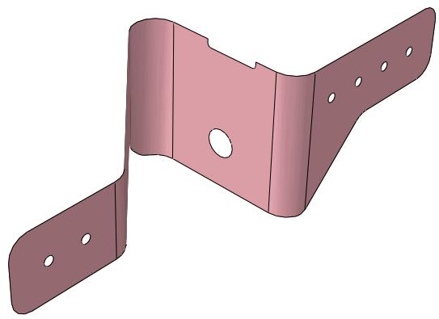
图 7：可以对部件应用自由网格划分。

如“自动创建虚拟拓扑”中所述，你对部件应用自动虚拟拓扑（automatic virtual topology）来移除原始部件中的细小特征以及在面修剪操作期间创建的特征。

你应用默认种子和网格控制，生成的网格如图 8 所示。


图 8：生成的网格。

本示例使用了几种技术和工具来为一个加固结构部件创建中间面模型。

## 实体模型

本示例中的模型是图 1 所示的结构梁。该梁的加强肋、不同的厚度以及不对称的形状不允许使用简单的梁截面表示。零件的复杂性加上其薄横截面，使其成为替换为中间面模型的良好候选。与之前的示例一样，使用壳模型进行网格划分而不是薄的实体截面，将提高弯曲性能。
  
图 1: 加强梁的实体模型。

## 分配中面区域

使用 **Part** 模块中的 **Assign Midsurface Region** 工具，从梁的活动表示中移除几何体，并创建原始实体几何体的参考表示，如图 2 所示。参考表示是原始部件的抽象表示。它保留了部件的原始几何体，但不能用于分析。参考表示默认在 **Part** 模块中显示；您可以使用主工具栏中可见对象工具中的 **Show Reference Representation** 工具 回 来切换其开关。更多信息，请参阅理解参考表示和分配中面区域。

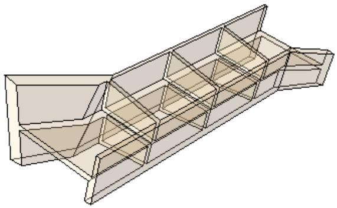  
图 2: 梁的参考表示。

## 创建壳表示

您必须创建一个可供 Abaqus 分析的梁的壳表示。为此部件创建壳需要多个步骤和工具。创建模型的精确壳表示可能有几种同样有效的方法。请参阅创建梁的壳表示，了解如何使用 **Geometry Edit** 工具集中的工具来创建新的壳面。

## 分配厚度

现在，所有原始实体几何体都已替换为壳几何体。为完成模型，您应该验证壳是否具有适当的厚度信息。点击 **Assign Thickness and Offset** 工具，Abaqus/CAE 会高亮显示任何没有厚度数据的壳面。在本例中，由于所有壳面都是使用偏移、延伸和混合工具创建的，因此所有面都已分配了厚度数据。如果没有厚度数据的面，您需要选择每个面，并在 **Assign Thickness and Offset** 对话框中使用 **Compute thickness from opposite faces** 方法，从参考表示中拾取合适的顶面和底面来创建缺失的厚度。

要查看带有壳厚度的模型，可以在 **Part Display Options** 对话框中打开 **Render Shell Thickness**（更多信息，请参阅可视化壳厚度）。如图 3 所示，结果视图包含了原始实体模型中的厚度变化。

  
图 3: 显示厚度的壳面。

## 分配壳截面

使用 **Property** 模块创建壳截面，并将其分配给中面模型。创建壳截面时，您可以输入任意的壳厚度值。随后，当您将该截面分配给壳时，需要在 **Edit Section Assignment** 对话框中指定厚度和壳偏移量是从几何体计算得到的。Abaqus/CAE 会忽略您为壳截面输入的厚度值，并使用在 **Part** 模块中分配给各面的厚度值。更多信息，请参阅分配截面。图 4 显示了在 **Property** 模块中完成截面分配后具有截面厚度的完整中面模型。其几何体与图 3 中的几何体相同。

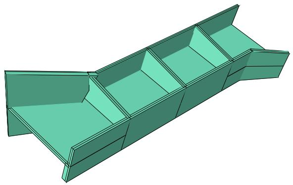  
图 4: 具有壳厚度的完整中面几何体。

## 对部件划分网格

Abaqus/CAE 在 **Mesh** 模块中将壳部件显示为粉红色，以表示可以使用自由网格划分技术对其进行网格划分，如图 5 所示。

  
图 5: 可以对部件应用自由网格划分。

在种子化和网格划分部件之前，您可以应用自动虚拟拓扑以移除网格中不需要的小细节（更多信息，请参阅自动创建虚拟拓扑）。默认的自动虚拟拓扑设置应移除混合面的边缘和其他不必要的小细节，这些细节可能会不必要地约束部件网格。


## 注意：

如果相邻面的法线方向不一致，自动虚拟拓扑可能会失败。如果发生这种情况，请返回 **Part** 模块，并使用 **Geometry Edit** 工具集中的工具修复面法线。

应用默认的种子化和网格控制，并在部件上生成网格。结果网格如图 6 所示，其中显示了壳厚度。

  
图 6: 具有壳厚度渲染的结果网格。

您必须创建一个可供 Abaqus 分析的梁的壳表示。为此部件创建壳需要多个步骤和工具。创建模型的精确壳表示可能有几种同样有效的方法。以下步骤使用 **Geometry Edit** 工具集中的工具来创建新的壳面。

1.  使用 **Offset Face** 工具为梁的垂直左上侧创建壳面。

    从参考表示中选择面以创建偏移壳。使用 **Auto Select** 来选择目标面。在图 1 中，要偏移的面和目标面分别显示为红色和洋红色。

    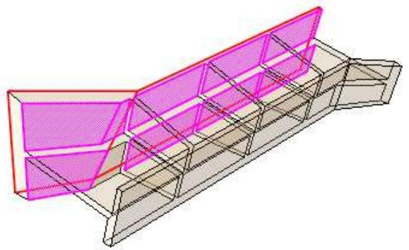  
    图 1: 为左侧创建偏移所选的面。

    要偏移的面是靠近后部的两个外侧垂直面。目标面是构成同一梁壁内表面的九个面，它们大部分不相连。使用 **Fraction distance to closest point on face** 方法，并输入 0.5，以沿梁顶部较薄主体部分厚度的一半创建偏移。使用此选项可以防止左侧和底部较厚的部分创建出比较薄部分更大的偏移。在此步骤中使用了 **Auto trim to reference representation** 选项。此操作会在偏移过程中延伸面，然后沿着参考表示的边缘进行修剪。当选择多个偏移面和目标面时，自动修剪可能会失败；如果自动修剪失败，Abaqus/CAE 会显示警告，指示失败。您可以使用 **Extend Faces** 工具将新面延伸以满足参考表示的边缘。结果偏移面如图 2 所示。

    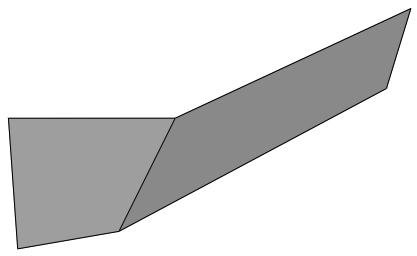  
    图 2: 结果偏移面。

2.  重复步骤 1 的过程，为梁的另一侧创建偏移面。

    现在，得到的壳模型包含梁的两个外表面，如图 3 所示。

      
    图 3: 第一步和第二步创建的偏移面。

3.  为连接两个侧壁的四个水平部分创建偏移面。

    您可以通过选择四个顶面进行偏移，并使用 **Auto Select** 选择相应的底面，在单个偏移操作中创建这些面。在这种情况下，**Auto trim to reference representation** 被关闭，因此新面不会被延伸和修剪。水平面的壳模型如图 4 所示。（为清晰起见，步骤 2 中创建的面已被抑制。）请注意，水平面在原始部件中与垂直加强肋连接处存在间隙。在水平壳面与前两步创建的侧壁之间也存在类似的间隙。

      
    图 4: 水平偏移面。

4.  重复步骤 3 的过程，为连接梁两侧的垂直肋创建偏移面。

    中面壳模型现在包含了代表几乎所有实体几何体的面，如图 5 所示。然而，由于原始实体结构的厚度，大多数面之间存在间隙。

    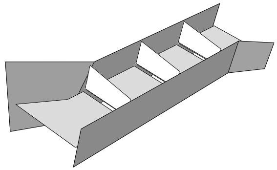  
    图 5: 面之间存在间隙的中面模型。

5.  闭合垂直肋与梁侧面之间的间隙。

    使用 **Extend Faces** 工具将六个垂直肋延伸以与侧面相交。所选面和目标面在图 6 中分别显示为洋红色和黄色。

    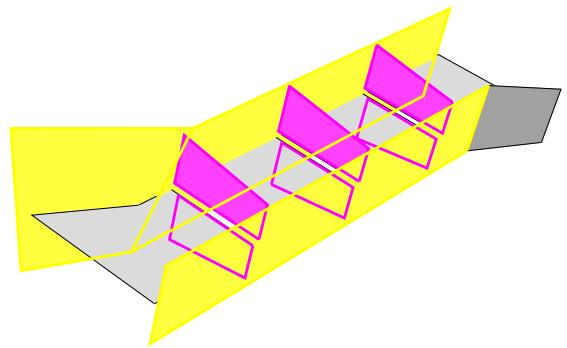  
    图 6: 指定要延伸的面和目标面。

    当您点击 **OK** 时，Abaqus/CAE 会更新高亮显示以指示面将沿其延伸的边缘，如图 7 所示，并显示一个警告对话框，其中包含选项允许您接受选择、延伸所选面的所有边缘，或取消延伸面操作。
  
图7：将被延伸的竖直面的边。

6. 使用延伸面功能

在此情况下，使用“指定要延伸的面的边”方法，并配合“直到目标面”选项，分别选择图8所示的边和面。当 Abaqus/CAE 高亮显示要延伸的边时，图中箭头指示的四条边将从选择中移除，因为它们与目标面不完全匹配。单击“否”以使用之前的边选择。

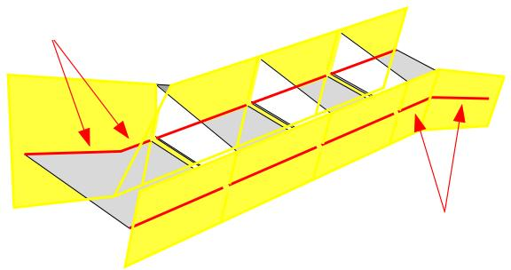  
图8：水平面将沿其延伸的边。

7. 关闭水平连接部分和竖直连接部分之间的剩余间隙。你可以使用融合面工具或延伸面工具来完成中面模型，以关闭梁的水平和竖直连接部分之间的剩余间隙。

a. 使用延伸面工具，并按图9所示进行选择。

打开“修剪到延伸的底层目标面”开关，以便 Abaqus/CAE 将延伸竖直面并将其修剪到与所选目标面的隐含交线处。

  
图9：填充竖直加强肋之间的间隙。

b. 使用融合面工具填充剩余间隙。

必须使用该工具三次来填充模型中的三个剩余间隙。

## 创建和编辑中面模型

在 Abaqus/CAE 中创建中面模型的典型过程始于实体模型。

从实体模型中，选择要为其创建中面模型的单元。将这些实体单元分配为中面区域会在视口中创建一个参考表示，你可以从中为中面模型创建壳面。你可以使用“几何编辑”工具集中的工具来创建壳面，然后可以为新壳分配厚度。当你为壳几何体分配厚度和偏移时，默认设置通常将壳的表示居中于厚度内。

## 本节内容：

分配中面区域  
分配厚度和偏移  
为壳面分配厚度  
可视化壳厚度

## 分配中面区域

要开始创建中面模型，你需要选择想要表示为壳的实体模型区域。当你为实体模型的一个或多个单元分配中面区域时，Abaqus/CAE 会创建一个“分配中面”特征，并将所选单元从部件的活动表示移动到参考表示。参考表示的工作方式类似于草图中的参考几何——使用“几何编辑”工具集，你可以从参考表示中选择点和边，以在中面模型中创建点、边和面。你创建的新中面几何体将成为活动表示的一部分，该部分将被网格化并分析。

1. 从主菜单栏中，选择 Tools -> Midsurface -> Assign。


提示：你也可以使用位于 Part 模块工具栏的中面工具中的工具来分配中面区域。

2. 选择要从中创建中面模型的实体单元。

你可以从视口中选择单个单元，或选择一个现有的实体单元集。有关在 Abaqus/CAE 中使用选择方法的更多信息，请参阅“在视口中选择对象”。Abaqus/CAE 创建一个包含所选单元的“分配中面”特征，并在视口中将其显示为半透明。

3. 重复步骤2以分配更多中面区域，或单击“完成”结束该过程。

## 附加信息

• 编辑技术

## 分配厚度和偏移

与 Abaqus/CAE 中所有壳面一样，中面模型面需要定义厚度。在为中面模型创建壳几何体后，“分配厚度和偏移”工具提供了一种方法来准确捕获你所替换的实体模型的厚度。你也可以使用此工具编辑 Abaqus/CAE 自动分配的厚度。例如，你可以编辑使用面偏移过程创建的面的厚度（更多信息，请参阅偏移面）。Abaqus/CAE 会根据偏移操作中使用的参数自动推导偏移面的壳厚度。

在 Abaqus/CAE 中有两种为壳面分配厚度的方法。你可以通过 Property 模块中的截面属性应用壳厚度定义，或者你可以通过选择面并使用 Part 模块中的“分配厚度和偏移”工具编辑其厚度来分配厚度。在截面分配过程中，你可以选择 Abaqus/CAE 用于为特定几何面集合分配厚度的方法。（有关截面分配的更多信息，请参阅分配截面。）


## 注意：

在 Part 模块中分配的厚度数据——无论是自动分配还是使用“分配厚度和偏移”工具分配——在 Property 模块的“编辑截面分配”对话框的厚度部分中显示为“来自几何体”。你不能使用在 Part 模块中分配的厚度数据来计算 Abaqus/Explicit 分析中的偏移。

## 附加信息

• 编辑技术

## 为壳面分配厚度

在 Part 模块中定义厚度允许你定义实体中面相对于中面模型壳面的位置。默认的厚度定义将中面置于厚度的中心。但是，你可以选择表面来定义顶部和底部厚度，从而有效地在中面和壳厚度中间之间创建偏移。选择顶部和底部面允许你轻松地在每个节点定义不同的厚度，并为每个元素定义不同的壳偏移。当你使用中面模型来近似具有变化厚度的薄实体模型时，这种自由度很有用。使用顶部和底部面还允许 Abaqus/CAE 在你编辑模型几何体时自动更新厚度数据。

1. 从主菜单栏中，选择 Tools -> Midsurface -> Assign Thickness and Offset。


提示：你也可以使用位于 Part 模块工具栏的中面工具中的工具来分配厚度和偏移。

如果壳面当前未关联厚度，则其颜色为黄色。

2. 如果部件包含多个壳面，请选择要为其分配厚度和偏移的面（有关更多信息，请参阅“在视口中选择对象”）。
3. 当你完成从视口中的选择后，单击鼠标中键以确认你的选择。
Abaqus/CAE 将打开“分配厚度和偏移”对话框。
4. 如果需要，单击“要分配厚度的面”旁边的“编辑”按钮，以更改你在前面步骤中所做的选择。
5. 使用以下方法之一为所选面分配厚度：

## 输入或测量厚度

输入厚度值，或单击在视口中测量距离并将其作为厚度输入。

## 从相对面计算厚度

打开此选项，然后单击“选择”以从视口中选择顶部和/或底部面。

Abaqus/CAE 将在视口中高亮显示这些面并计算厚度。

如果你仅选择顶部或仅选择底部面，Abaqus/CAE 将对目标壳面的两侧应用相同的厚度。如果你同时选择顶部和底部面，Abaqus/CAE 将计算厚度和偏移值，使得所选壳面不居中于厚度内。

6. 单击“确定”将厚度和偏移（如果使用）应用到目标面，并关闭对话框。

你可以通过在 Abaqus/CAE 显示选项中打开“渲染壳厚度”来查看模型中面的厚度。有关更多信息，请参阅“可视化壳厚度”和“控制壳厚度显示”。

## 可视化壳厚度

你可以在 Abaqus/CAE 中查看中面模型的厚度。厚度表示使用在部件上或通过截面分配属性定义的偏移和厚度来创建新的模型视图。将部件厚度与参考表示一起可视化可以帮助你确定中面模型是否准确地表示了你所替换的实体模型。

图1显示了一个轴对称壳截面（平滑曲面）和一个沿直线边连接面的挤出壳。如图所示，平滑曲面壳的厚度显示准确；然而，在沿边连接壳面的地方，显示的厚度在面之间的角部包含间隙和重叠。
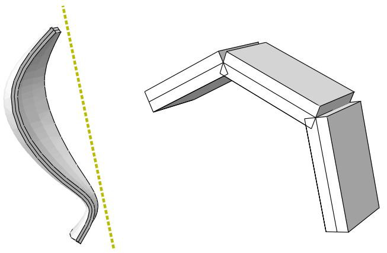  
图 1：在平滑曲面和沿边连接的面上显示壳厚度。

要激活壳厚度显示，请参阅控制壳厚度显示。

## 附加信息

• 编辑技巧

## 蒙皮和桁条增强

本节提供有关如何为蒙皮和桁条增强建模的信息。

## 本节内容：

定义蒙皮增强  
定义桁条增强  
管理蒙皮和桁条增强  
在蒙皮或桁条增强上生成单元  
为蒙皮或桁条增强指定单元类型  
使用偏移网格创建蒙皮增强  
为蒙皮和桁条指定表面属性  
创建和编辑蒙皮增强  
创建和编辑桁条增强

## 定义蒙皮增强

蒙皮增强定义了一种粘合到现有部件表面的蒙皮，并指定其工程特性。该表面可以是三维实体部件的一个面、轴对称部件的任何边，或二维部件的任何面。该部件可以包含几何体和孤立网格元素；但是，蒙皮增强必须分别为几何体和孤立网格元素定义。您应该将蒙皮视为部件或区域的一种属性，就像截面是部件或区域的属性一样。

图 1 中显示的复合梁是您在模型中可能使用蒙皮增强的一个示例。

  
图 1：通过实体蜂窝芯和铝蒙皮建模的复合梁。

该梁具有一个实体蜂窝芯和上、下面的铝蒙皮。您可以创建一个代表蜂窝的实体部件，并添加代表铝层的蒙皮增强。在 Mesh 模块中，您为蜂窝分配实体单元，为蒙皮分配壳单元。实体单元和壳单元共享相同的节点。

在 Property 模块的主菜单栏中选择 Special->Skin->Create 以定义一个或多个蒙皮。选择同一菜单中的 Edit 可以修改现有定义。您创建的所有蒙皮也会出现在模型树中该部件下的 Skins 容器中。默认情况下，蒙皮不会在视口中显示，但您可以通过在视口中为其着色来使其可见。更多信息，请参阅为几何体和网格元素着色。

如果您在几何区域上创建蒙皮，Abaqus/CAE 会在您对底层几何体进行细微修改时更新该蒙皮。如果您编辑带有蒙皮的孤立节点或单元，Abaqus/CAE 会在您编辑或删除节点或单元时更新蒙皮；但是，如果您创建新的节点或单元，它不会更新蒙皮。

在后续的建模操作中，您可能需要选择该蒙皮；例如，用于：

• 为蒙皮分配均匀壳截面、复合壳截面、膜截面、表面截面或垫片截面。截面分配在 Property 模块中执行。  
• 为蒙皮指定材料方向或钢筋参考方向。这两项方向分配都在 Property 模块中执行。  
在 Property 模块中为蒙皮指定法线方向。虽然您无法直接为蒙皮指定法线方向，但您可以为一个面指定法线方向，这将更新该面上定义的所有蒙皮的法线方向。

• 在 Load 模块中为蒙皮规定体力。

在 Load 模块中为蒙皮规定热通量。实际上，您通过将热通量载荷施加到底层的一个或多个面来执行此建模操作。Abaqus/CAE 在分析过程中会将该载荷应用到该面上的所有蒙皮。

• 在 Mesh 模块中为蒙皮指定单元类型。

• 在 Step 模块中为蒙皮请求场数据输出或历史数据输出。

在 Visualization 模块中创建显示组以查看蒙皮单元上的应力值。虽然您无法在 Create Display Group 对话框中按名称专门选择蒙皮，但您可以在该对话框中通过搜索与模型中的蒙皮单元具有相同单元类型、截面分配或其他属性的单元来找到它们。此过程可以帮助您将单元列表缩小到您希望包含的蒙皮。

当系统提示您为这些建模操作选择一个区域时，请在 Selection 工具栏的对象类型列表中选择 Skins，然后从视口中选择蒙皮区域。更多信息，请参阅基于对象类型过滤选择。

执行接触计算时，Abaqus/CAE 仅在某些情况下考虑几何表面的蒙皮增强；例如，当您为所有外表面指定通用接触时，Abaqus 中会自动定义一个默认的、包含一切的表面，该表面将考虑蒙皮增强。蒙皮增强可能显著影响接触计算，原因是蒙皮厚度以及对接触罚刚度等数值量的潜在影响。要在接触定义中显式包含蒙皮增强，您可以在蒙皮增强上创建一个集合，然后在 Abaqus/Standard 分析的接触对定义中使用该集合来定义基于单元的从属面，或者在 Abaqus/Explicit 分析的接触定义中使用该集合来定义基于节点的从属面。

有关创建蒙皮的详细信息，请参阅创建和编辑蒙皮增强。

## 定义桁条增强

桁条增强定义了一种粘合到现有部件边缘的桁条，并指定其工程特性。您可以选择三维实体部件的一条边或二维平面部件的一条边。该部件可以包含几何体和孤立网格元素；但是，桁条增强必须分别为几何体和孤立元素定义。您应该将桁条视为部件或区域的一种属性，就像截面是部件或区域的属性一样。

图 1 中显示的钢筋增强梁是您在模型中可能使用桁条增强的一个示例。

  
图 1：用钢筋桁条增强建模的混凝土梁。

该梁具有一个混凝土芯，沿梁的长度方向有四个圆柱形凸起。在每个凸起中创建了一个具有圆形轮廓的钢筋桁条，以在梁的长度方向上提供支撑。您可以创建一个代表梁的实体部件，并添加四个代表钢筋的桁条增强。在 Mesh 模块中，您为混凝土分配实体单元，为桁条分配线单元。实体单元和线单元共享相同的节点。

在 Property 模块的主菜单栏中选择 Special->Stringer->Create 以定义一个或多个桁条。选择同一菜单中的 Edit 可以修改现有定义。您创建的所有桁条也会出现在模型树中该部件下的 Stringers 容器中。不同的桁条可以共享相同的截面，并且可以将多个桁条放置在部件的同一边缘上。默认情况下，桁条不会在视口中显示，但您可以通过在视口中为其着色来使其可见。更多信息，请参阅为几何体和网格元素着色。

如果您在几何区域上创建桁条，Abaqus/CAE 会在您对底层几何体进行细微修改时更新该桁条。如果您编辑带有桁条的孤立节点或单元，Abaqus/CAE 会在您编辑或删除节点或单元时更新桁条；但是，如果您创建新的节点或单元，它不会更新桁条。

在后续的建模操作中，您可能需要选择该桁条；例如，用于：

• 为桁条指定截面、梁截面方向、材料方向或切线方向。所有这些活动都在 Property 模块中执行。  
• 在 Load 模块中为桁条规定体力或线载荷。  
在 Load 模块中为桁条规定热通量。实际上，您通过将热通量载荷施加到底层的一个或多个边来执行此建模操作。Abaqus/CAE 在分析过程中会将该载荷应用到该边上的所有桁条。  
• 在 Mesh 模块中为桁条指定单元类型。  
• 在 Step 模块中为桁条请求场数据输出或历史数据输出。  
在 Visualization 模块中创建显示组以查看桁条单元上的应力值。虽然您无法在 Create Display Group 对话框中按名称专门选择桁条，但您可以在该对话框中通过搜索与模型中的桁条单元具有相同单元类型、截面分配或其他属性的单元来找到它们。此过程可以帮助您将单元列表缩小到您希望包含的桁条。
当系统提示您为这些建模操作选择区域时，请从选择工具栏的对象类型列表中选择**加强筋(Stringers)**，并从视口中选择该加强筋。有关更多信息，请参阅**基于对象类型过滤选择**。

在进行接触计算时，Abaqus/CAE 仅在某些情况下会考虑几何表面的加强筋补强；例如，当您为所有外表面指定通用接触时，Abaqus 会自动定义一个默认的、包含所有内容的表面，该表面将考虑加强筋补强。由于加强筋的厚度及其对接触罚函数刚度等数值量的潜在影响，加强筋补强可能对接触计算产生显著影响。要在接触定义中明确包含加强筋补强，您应在加强筋补强上创建一个集合，然后在接触定义中使用该集合。

有关创建加强筋的详细信息，请参阅**创建和编辑加强筋补强**。

## 管理蒙皮和加强筋补强

**蒙皮管理器(Skin Manager)** 和**加强筋管理器(Stringer Manager)** 分别允许您创建和管理蒙皮及加强筋补强。这些管理器各包含一个您已定义的蒙皮或加强筋名称列表。管理器中的**创建(Create)**、**编辑(Edit)**、**重命名(Rename)** 和**删除(Delete)** 按钮允许您创建新的蒙皮和加强筋，或编辑、重命名及删除现有的。您也可以通过属性模块主菜单栏中的**特殊(Special)->蒙皮(Skin)** 菜单和**特殊(Special)->加强筋(Stringer)** 菜单来启动这些流程。从主菜单栏选择管理操作后，后续步骤与在管理器对话框内单击相应按钮完全相同。


## 注意：

如果您在为蒙皮或加强筋分配了截面、方向、法线或其他属性后对其进行了重命名，这些分配将失效。

## 附加信息

• 创建和编辑蒙皮补强
• 创建和编辑加强筋补强

## 在蒙皮或加强筋补强上生成单元

您可以使用网格(Mesh)模块在三维部件实例的表面上的蒙皮补强上生成二维单元。同样，您可以在轴对称部件实例的边上的加强筋补强上生成一维单元。当底层几何体被网格划分时，Abaqus/CAE 会生成蒙皮或加强筋单元；您无法独立地为蒙皮或加强筋补强划分网格。

图 1 显示了一个带有顶部表面蒙皮补强的三维部件实例。

图 1：带有蒙皮补强的三维部件实例。

当部件实例被网格划分时，蒙皮或加强筋单元与三维单元共享相同的节点和网格拓扑。如果您为蒙皮单元分配了不同的几何阶次，也应更改底层单元的阶次。有关更多信息，请参阅**为蒙皮或加强筋补强分配单元类型**。

如果您在孤立网格上创建蒙皮或加强筋，蒙皮或加强筋单元将与底层孤立网格单元共享相同的节点和网格拓扑。如果删除了一个孤立网格单元，Abaqus/CAE 会自动重新生成与该删除单元相关的所有蒙皮或加强筋。重新生成后，这些蒙皮或加强筋将拥有新的单元 ID 号，因此此重新生成会使包含这些蒙皮或加强筋的任何集合失效。所以，如果您从孤立网格中删除了单元，应更新任何包含先前与删除单元相关的蒙皮或加强筋的集合定义。

## 为蒙皮或加强筋补强分配单元类型

您使用属性(Property)模块在模型中的部件上创建蒙皮或加强筋补强。您使用网格(Mesh)模块为蒙皮或加强筋补强分配单元类型。当系统提示您选择要分配单元类型的区域时，必须从选择工具栏的对象类型列表中选择**蒙皮(Skins)** 或**加强筋(Stringers)**。

当您为几何部件创建蒙皮或加强筋时，Abaqus/CAE 会向几何实体添加一个属性。在您对部件进行网格划分以生成蒙皮或加强筋单元时会使用此属性，这些单元与部件的底层单元共享节点。

您可以在屈曲分析中使用加强筋补强，在耦合结构-声学分析中使用蒙皮补强。如果声学介质与结构相邻，则会在界面处发生结构-声学耦合。建议您使用基于表面的绑定约束来强制耦合；但是，如果您正在进行声学域构成子模型的结构-声学子模型分析，则必须用声学-结构界面(ASI)单元对子模型边界的界面部分进行排列，以强制耦合。您可以通过在界面处创建蒙皮并将 ASI 单元分配给该蒙皮来为界面排列 ASI 单元。有关使用蒙皮在几何体和孤立网格上创建 ASI 单元的详细信息，请参阅达索系统知识库 http://support.3ds.com/knowledge-base/。

## 使用偏移网格创建蒙皮补强

作为替代方法，您可以使用编辑网格(Edit Mesh)工具集中的网格偏移工具，通过与底层孤立网格共享偏移壳的节点来创建蒙皮补强。然而，等效的偏移壳在模型树中不会显示为蒙皮，因为使用偏移壳来表示补强蒙皮只是偏移壳众多潜在用途之一。如果您要创建多层补强蒙皮，应指定层之间的距离为零，以便各层可以共享节点。

## 为蒙皮和加强筋分配表面属性

如果您要将表面属性（如压力载荷）应用于蒙皮或加强筋，则必须将该属性应用于其底层表面或边。因为蒙皮和加强筋与其应用到的表面或边共享节点，Abaqus/CAE 会自动将任何已应用的表面属性也传播到蒙皮和加强筋。有关定义表面属性的更多信息，请参阅**为部件分配截面、方向、法线和切线**。

## 创建和编辑蒙皮补强

在初始创建蒙皮期间，您选择一个或多个要补强的面，以及（如果需要）要创建的蒙皮数量。

创建蒙皮后，您可以通过以下方式对其进行修改：

在属性(Property)模块中，您可以通过为蒙皮分配截面（均质壳截面、复合壳截面、膜截面、表面截面或垫圈截面）、材料方向或钢筋参考方向来修改它。您还可以通过为其底层面分配法线方向来反转蒙皮的法线方向。当您反转一个面的法线方向时，分配给该面的所有蒙皮也会继承新的法线方向。
在网格(Mesh)模块中，您可以为蒙皮分配单元类型。当系统提示您选择要分配单元类型的区域时，必须从选择工具栏的对象类型列表中选择**蒙皮(Skins)**。如果为蒙皮分配了壳截面，则必须为蒙皮分配壳单元。同样，如果分配了膜、表面或垫圈截面，则必须分配膜、表面或垫圈单元。

Abaqus/CAE 会自动为蒙皮命名，但您可以从蒙皮管理器、特殊菜单或模型树中重命名它们。如果您一次创建多个蒙皮，Abaqus/CAE 会在名称后附加一个唯一标识符以区分每个蒙皮。

您可以使用步(Step)模块中的场输出和历程输出请求编辑器从蒙皮获取数据。在编辑器的**域(Domain)** 部分，选择**蒙皮(Skin)**，然后从出现的菜单中选择所需的蒙皮。有关更多信息，请参阅**创建输出请求**。

1.  在属性(Property)模块的主菜单栏中，选择**特殊(Special)->蒙皮(Skin)->创建(Create)**。


提示：您也可以单击属性模块工具箱中的


工具。

2.  使用以下方法之一选择您要添加蒙皮补强的面：

## 选择单个面：

1.  单击提示区域**选择要在其上创建蒙皮的实体**字段旁边的箭头，并从出现的列表中选择**逐个选择(Select individually)**。
2.  选择一个您要添加蒙皮补强的面。
3.  [Shift] + 单击其他面以将其添加到您的选择中。
4.  如有必要，[Ctrl] + 单击已选中的面以取消选择它们。
5. 完成面选择后，单击鼠标键2。

## 指定现有集合：

1.  单击提示区右侧的**Sets**（集合）。
    Abaqus/CAE 将显示“区域选择”对话框，其中包含您已创建的集合列表。
2.  选择要添加蒙皮加固的面集合，然后单击**Continue**（继续）。


注意：默认选择方法基于您最近使用的选择方法。要切换到另一种方法，请单击提示区右侧的**Select in Viewport**（在视口中选择）或**Sets**（集合）。

## 使用角度方法选择面：

1.  单击提示区中“选择要在其上创建蒙皮场的实体”旁的箭头，并从出现的列表中选择 **by face angle**（按面角度）。
2.  输入一个角度（从0°到90°），并选择一个面。Abaqus/CAE 将从选定面开始选择所有相邻面，直到面之间的角度等于或超过您输入的角度。（更多信息，请参阅*使用角度和特征边方法选择多个对象*。）
3.  使用**by face angle**（按面角度）方法后，您可以按住[Shift]键并单击其他面将其添加到选择中，或按住[Ctrl]键并单击已选中的面将其从选择中移除。（更多信息，请参阅*组合选择技术*。）


提示：您可以使用选择工具栏来限制在视口中可以选择的对象类型。更多信息，请参阅*在视口中选择对象*。

3.  如果需要，在提示区中切换启用 **Multiple skins**（多个蒙皮），以便为选定的一个或多个面创建多个蒙皮加固。
4.  单击 **Done**（完成）以创建蒙皮。如果要创建多个蒙皮，请输入您希望创建的蒙皮层数，然后单击鼠标键2。

## 其他信息

•   分配截面
•   分配材料方向
•   分配钢筋参考方向
•   分配壳/膜法向

## 创建和编辑长桁加固

您可以在定义部件后立即创建长桁；长桁最初不需要分配材料或截面。

创建长桁后，您可以使用**Property**（属性）模块**Special**（特殊）菜单下的选项为其分配截面、梁截面方向、材料方向和切向方向。您还可以在**Mesh**（网格）模块中为长桁分配单元类型。当提示选择要分配单元类型的区域时，您必须从选择工具栏的对象类型列表中选择 **Stringers**（长桁）。

您可以在同一边上一次创建多个长桁。Abaqus/CAE 将这些长桁视为长桁加固的不同层，并且您可以为每个层分配不同的属性。

Abaqus/CAE 会自动为长桁命名，但您可以通过长桁管理器、**Special**（特殊）菜单或模型树重命名它们。如果您一次创建多个长桁，Abaqus/CAE 会在名称后附加一个唯一标识符以区分每个长桁。

您可以使用**Step**（分析步）模块中的场和历程输出请求编辑器从长桁获取数据。在编辑器的**Domain**（域）部分，选择 **Stringer**（长桁），然后从出现的菜单中选择所需的长桁。更多信息，请参阅*创建输出请求*。

1.  在**Property**（属性）模块的主菜单栏中，选择 **Special -> Stringer -> Create**（特殊 -> 长桁 -> 创建）。


提示：您也可以单击**Property**（属性）模块工具箱中的工具。

2.  使用以下方法之一选择要添加长桁加固的边：

## 选择单个边：

1.  单击提示区中“选择要在其上创建长桁场的实体”旁的箭头，并从出现的列表中选择 **individually**（单独）。
2.  选择要添加长桁加固的边。
3.  按住[Shift]键并单击其他边以将其添加到您的选择中。
4.  如有必要，按住[Ctrl]键并单击已选中的边以取消选择它们。
5.  完成边选择后，单击鼠标键2。

## 指定现有集合：

1.  单击提示区右侧的 **Sets**（集合）。
    Abaqus/CAE 将显示“区域选择”对话框，其中包含您已创建的单元集列表。
2.  选择要添加长桁加固的实体集合，然后单击 **Continue**（继续）。


## 注意：

默认选择方法基于您最近使用的选择方法。要切换到另一种方法，请单击提示区右侧的 **Select in Viewport**（在视口中选择）或 **Sets**（集合）。

## 使用角度方法选择边：

此方法仅可用于选择几何边。此方法不可用于选择孤立网格单元边。

1.  单击提示区中“选择要在其上创建长桁场的实体”旁的箭头，并从出现的列表中选择 **by edge angle**（按边角度）。
2.  输入一个角度（从0°到90°），并选择一条边或其他实体。Abaqus/CAE 将从选定边开始选择所有相邻边，直到边之间的角度等于或超过您输入的角度。（更多信息，请参阅*使用角度和特征边方法选择多个对象*。）
3.  使用 **by edge angle**（按边角度）方法后，您可以按住[Shift]键并单击其他边将其添加到选择中，或按住[Ctrl]键并单击已选中的边将其从选择中移除。（更多信息，请参阅*组合选择技术*。）


提示：您可以使用选择工具栏来限制在视口中可以选择的对象类型。更多信息，请参阅*在视口中选择对象*。

3.  如果需要，切换启用 **Multiple stringers**（多个长桁）以在选定的一条或多条边上创建多个长桁。
4.  单击 **Done**（完成）以创建长桁。如果要创建多个长桁，请输入您希望创建的长桁数量，然后单击鼠标键2。

## 其他信息

•   分配截面
•   分配梁方向
•   分配材料方向
•   分配梁/桁架切线方向

## 弹簧和阻尼器

本节提供有关如何建模弹簧和阻尼器的信息。

## 本节内容：

*   定义弹簧和阻尼器
*   管理弹簧和阻尼器
*   创建连接两点的弹簧和阻尼器
*   编辑连接两点的弹簧和阻尼器
*   创建连接点到地面的弹簧和阻尼器
*   编辑连接点到地面的弹簧和阻尼器所应用的区域

## 定义弹簧和阻尼器

您可以定义表现出相同线性行为的弹簧和阻尼器。您也可以在同一点集上同时定义弹簧和阻尼器行为。如果同时定义了弹簧和阻尼器行为，它们将并联作用。您可以使用以下连接类型建模弹簧和阻尼器：

•   连接两点并沿两点之间的作用线方向
•   连接两点并在固定方向上作用（仅适用于Abaqus/Standard分析）
•   将点连接到地面（仅适用于Abaqus/Standard分析）

更多信息，请参阅 *Springs*（弹簧）和 *Dashpots*（阻尼器）。

在**Property**（属性）模块或**Interaction**（相互作用）模块的主菜单栏中，选择 **Special -> Springs/Dashpots -> Create**（特殊 -> 弹簧/阻尼器 -> 创建）以定义弹簧和阻尼器。选择同一菜单中的 **Edit**（编辑）以修改现有定义。在部件上创建的弹簧和阻尼器会随部件一起实例化。

如果您希望在分析生成的输出数据库中包含弹簧和阻尼器的结果数据，则必须使用**Step**（分析步）模块中的**History Output Request**（历程输出请求）编辑器。弹簧和阻尼器显示在模型树的**Engineering Features**（工程特征）容器下（如果在**Property**（属性）模块中创建，则位于部件下；如果在**Interaction**（相互作用）模块中创建，则位于装配下）。

有关详细信息，请参阅以下各节：

*   修改历程输出请求
*   创建连接两点的弹簧和阻尼器
*   编辑连接两点的弹簧和阻尼器
*   创建连接点到地面的弹簧和阻尼器
*   编辑连接点到地面的弹簧和阻尼器所应用的区域

## 管理弹簧和阻尼器

**Springs/Dashpots Manager**（弹簧/阻尼器管理器）允许您创建和管理弹簧和阻尼器。该管理器包含一个列表，列出了您已定义的弹簧和阻尼器的名称和类型。管理器中的**Create**（创建）、**Edit**（编辑）、**Copy**（复制）、**Rename**（重命名）和**Delete**（删除）按钮允许您创建新的弹簧和阻尼器，或编辑、复制、重命名和删除现有的弹簧和阻尼器。管理器左侧列中的图标允许您抑制和恢复现有的弹簧和阻尼器。您也可以使用**Property**（属性）模块或**Interaction**（相互作用）模块主菜单栏中的 **Special -> Springs/Dashpots**（特殊 -> 弹簧/阻尼器）菜单来启动这些操作。在主菜单栏中选择管理操作后，其过程与在管理器对话框内单击相应按钮完全相同。
## 其他信息

• 抑制和恢复对象
• 创建连接两点的弹簧和阻尼器
• 编辑连接两点的弹簧和阻尼器
• 创建连接点到地面的弹簧和阻尼器
• 编辑连接点到地面的弹簧和阻尼器的应用区域

## 创建连接两点的弹簧和阻尼器

您可以定义连接两点的弹簧和阻尼器，其线性行为独立于场变量。

更多信息，请参见**弹簧和阻尼器**。

您可以通过使用 **Step**（分析步）模块中的历史输出请求编辑器，从弹簧/阻尼器获取应力和应变的历史数据。在编辑器的 **Domain**（区域）部分，选择 **Springs/Dashpots**（弹簧/阻尼器），然后从出现的菜单中选择所需的弹簧/阻尼器。更多信息，请参见 **创建输出请求**。

1.  在 **Property**（属性）模块或 **Interaction**（相互作用）模块的主菜单栏中，选择 **Special** -> **Springs/Dashpots** -> **Create**（创建）。
2.  在出现的 **Create Springs/Dashpots**（创建弹簧/阻尼器）对话框中，为弹簧/阻尼器命名，选择 **Connect two points**（连接两点），然后点击 **Continue**（继续）。
3.  使用以下方法之一为第一个弹簧/阻尼器选择第一个点：

    •   在视口中选择该点。（更多信息，请参见**在视口中选择对象**。）

    

    **提示：** 选择工具栏中的 **Select the Entity Closest to the Screen**（选择离屏幕最近的实体）工具默认是关闭的。如果您进行了模糊选择，Abaqus/CAE 会高亮显示该点，并在视口左下角显示该点的描述。使用 **Next**（下一个）和 **Previous**（上一个）按钮循环查看可能的选择，并点击 **OK**（确定）确认您的选择。

    如果模型包含几何组件和网格组件的组合，请在提示区中选择以下选项之一：
    -   选择 **Geometry**（几何）可为几何体或参考点定义弹簧/阻尼器。
    -   选择 **Mesh**（网格）可为网格定义弹簧/阻尼器。

    •   要从现有集合列表中选择，请执行以下操作：

        1.  点击提示区右侧的 **Sets**（集合），显示包含可用集合列表的 **Region Selection**（区域选择）对话框。
        2.  选择一个仅包含一个点的集合，然后点击 **Continue**（继续）。

    

    **注意：**
    默认的选择方法基于您最近使用的方法。要切换回另一种方法，请点击提示区右侧的 **Select in Viewport**（在视口中选择）或 **Sets**（集合）。

4.  使用上一步中描述的方法之一，为第一个弹簧/阻尼器选择第二个点。
    第一个弹簧/阻尼器的点对以及连接它们的虚线在视口中被高亮显示。

5.  按照前面步骤中描述的方法，继续为额外的弹簧/阻尼器选择点对。完成点对选择后，在提示区中点击 **Done**（完成）。

    将出现 **Edit Springs/Dashpots**（编辑弹簧/阻尼器）对话框。您为定义每个弹簧/阻尼器所选择的点对列在 **Spring/Dashpot Point Pairs**（弹簧/阻尼器点对）表中。

6.  在 **Spring/Dashpot Point Pairs** 表中，您可以执行以下操作：

    •   要定义具有相同行为的额外弹簧/阻尼器，点击 **+**，然后重复前面步骤中描述的点选择程序来定义每个弹簧/阻尼器的第一个和第二个点。

    •   要编辑表中的某个点，选择表中的该点，双击它或点击 ，然后重新选择一个点。视口中的选择高亮显示将更新以显示新编辑的点。

    •   要在视口中识别特定的弹簧/阻尼器，选择所需的行号。连接所选点对的高亮虚线在视口中显示得更粗。

    •   要从表中移除弹簧/阻尼器，选择所需的行号并点击 。

    •   要从表中移除所有弹簧/阻尼器，点击 。

7.  点击 **Axis**（轴）字段旁边的箭头，并从出现的列表中选择一个选项：

    •   选择 **Follow line of action**（跟随作用线），使每个弹簧/阻尼器的轴线跟随两个点的作用线。
    •   选择 **Specify fixed direction**（指定固定方向），指定弹簧/阻尼器在每个点上的自由度（仅限 **Abaqus/Standard** 分析）。

8.  如果您选择了 **Specify fixed direction**，请在对话框的 **Direction**（方向）部分执行以下操作：

    •   点击 **Point 1 degree of freedom**（点1自由度）字段旁边的箭头，并选择弹簧/阻尼器在其第一个点上关联的自由度。
    •   点击 **Point 2 degree of freedom**（点2自由度）字段旁边的箭头，并选择弹簧/阻尼器在其第二个点上关联的自由度。

    •   全局坐标系决定了默认的弹簧/阻尼器方向。要为弹簧/阻尼器指定方向，请点击 。使用以下方法之一为弹簧/阻尼器指定方向：

        •   点击提示区中的 **Datum CSYS List**（基准坐标系列表），从基准坐标系列表中选择一个名称。
        •   在视口中选择一个基准坐标系。
        •   点击提示区中的 **Use Global CSYS**（使用全局坐标系）以使用全局坐标系。

        Abaqus/CAE 将在视口中显示为弹簧/阻尼器指定的局部坐标系。

9.  在对话框的 **Property**（属性）部分，勾选相应的复选框以包含：

    •   **Spring stiffness**（弹簧刚度）。输入弹簧的单位相对位移对应的力。
    •   **Dashpot coefficient**（阻尼器系数）。输入阻尼器的单位相对速度对应的力。

    如果您同时定义了弹簧和阻尼器行为，它们将并行作用。

10. 点击 **OK**（确定）以创建弹簧/阻尼器并关闭 **Edit Springs/Dashpots** 对话框。

    视口中会出现代表您刚刚创建的弹簧/阻尼器的符号。

## 其他信息

• 编辑连接两点的弹簧和阻尼器
• 控制属性的显示
• 用于表示特殊工程特征的符号

## 编辑连接两点的弹簧和阻尼器

您可以编辑连接两点的弹簧和阻尼器，以添加更多点对、删除点对或编辑现有点对中的一个点。

1.  在 **Property**（属性）模块或 **Interaction**（相互作用）模块的主菜单栏中，选择 **Special** -> **Springs/Dashpots** -> **Edit** -> **name**（名称），以显示 **Edit Springs/Dashpots**（编辑弹簧/阻尼器）对话框。

    代表弹簧/阻尼器的符号在视口中被高亮显示。

2.  在 **Spring/Dashpot Point Pairs**（弹簧/阻尼器点对）表中，您可以执行以下操作：

    •   要定义具有相同行为的额外弹簧/阻尼器，点击 **+**，然后重复前面步骤中描述的点选择程序来定义每个弹簧/阻尼器的第一个和第二个点。

    •   要编辑表中的某个点，选择表中的该点，双击它或点击 ，然后重新选择一个点。视口中的选择高亮显示将更新以显示新编辑的点。

    •   要在视口中识别特定的弹簧/阻尼器，选择所需的行号。连接所选点对的高亮虚线在视口中显示得更粗。

    •   要从表中移除弹簧/阻尼器，选择所需的行号（**[Shift] + 单击** 可选择多行）并点击 。**[Ctrl] + 单击** 行号可取消选择。

    •   要从表中移除所有弹簧/阻尼器，点击 。

3.  根据需要完成弹簧/阻尼器定义的编辑，然后点击 **OK**（确定）。

    视口中代表弹簧/阻尼器的符号将出现在新编辑的点上。

## 其他信息

• 控制属性的显示
• 用于表示特殊工程特征的符号

## 创建连接点到地面的弹簧和阻尼器

在 **Abaqus/Standard** 分析中，您可以定义连接点到地面的弹簧和阻尼器，其线性行为独立于场变量。

更多信息，请参见 **弹簧和阻尼器**。

您可以通过使用 **Step**（分析步）模块中的历史输出请求编辑器，从弹簧/阻尼器获取应力和应变的历史数据。在编辑器的 **Domain**（区域）部分，选择 **Springs/Dashpots**（弹簧/阻尼器），然后从出现的菜单中选择所需的弹簧/阻尼器。更多信息，请参见 **创建输出请求**。

1.  在 **Property**（属性）模块或 **Interaction**（相互作用）模块的主菜单栏中，选择 **Special** -> **Springs/Dashpots** -> **Create**（创建）。
2.  在出现的 **Create Springs/Dashpots**（创建弹簧/阻尼器）对话框中，为弹簧/阻尼器命名，选择 **Connect points to ground**（连接点到地面），然后点击 **Continue**（继续）。
3.  使用以下方法之一选择要连接到地面的点：

    •   在视口中选择点。（更多信息，请参见 **在视口中选择对象**。）

    

    **提示：** 选择工具栏中的 **Select the Entity Closest to the Screen**（选择离屏幕最近的实体）工具默认是关闭的。如果您进行了模糊选择，Abaqus/CAE 会高亮显示该点，并在视口左下角显示该点的描述。使用 **Next**（下一个）和 **Previous**（上一个）按钮循环查看可能的选择，并点击 **OK**（确定）确认您的选择。
如果模型包含几何部件和网格部件的组合，请在提示区中选择以下选项之一：

- 选择 **Geometry**（几何）可为几何部件或参考点定义弹簧/阻尼器。  
选择 **Mesh**（网格）可为网格定义弹簧/阻尼器。

• 要从现有集合列表中选择，请执行以下操作：

1.  单击提示区右侧的 **Sets**（集合）以显示包含可用集合列表的 **Region Selection**（区域选择）对话框。  
2.  选择所需的集合，然后单击 **Continue**（继续）。


## 注意：

默认选择方法基于您最近使用的选择方法。要切换到另一种方法，请单击提示区右侧的 **Select in Viewport**（在视口中选择）或 **Sets**（集合）。

**Edit Springs/Dashpots**（编辑弹簧/阻尼器）对话框将出现。

4. 在对话框的 **Direction**（方向）部分，执行以下操作：

单击 **Degree of freedom**（自由度）字段旁的箭头，选择与弹簧/阻尼器关联的自由度。  
• 全局坐标系决定了弹簧/阻尼器的默认方向。要指定弹簧/阻尼器的方向，请单击 。使用以下方法之一指定弹簧/阻尼器的方向：

从提示区单击 **Datum CSYS List**（基准坐标系列表），从基准坐标系列表中选择一个名称。  
在视口中选择一个基准坐标系。  
从提示区单击 **Use Global CSYS**（使用全局坐标系）以使用全局坐标系。

Abaqus/CAE 会在视口中显示为弹簧/阻尼器指定的局部坐标系。

5. 在对话框的 **Property**（属性）部分，勾选相应的复选框以包括：

• **Spring stiffness**（弹簧刚度）。输入弹簧的单位相对位移力。  
• **Dashpot coefficient**（阻尼系数）。输入阻尼器的单位相对速度力。

如果您同时定义了弹簧和阻尼器行为，它们将并联作用。

6. 单击 **OK** 以创建弹簧/阻尼器并关闭 **Edit Springs/Dashpots** 对话框。

视口中将出现代表您刚创建的弹簧/阻尼器的符号。

## 附加信息

• 编辑连接点到地面的弹簧和阻尼器所应用的区域  
• 控制属性显示  
• 用于表示特殊工程特征的符号

## 编辑连接点到地面的弹簧和阻尼器所应用的区域

您可以编辑连接点到地面的弹簧和阻尼器所应用的区域（仅适用于 Abaqus/Standard 分析）。

1.  在 **Property** 模块或 **Interaction** 模块的主菜单栏中，选择 **Special** -> **Springs/Dashpots** -> **Edit** -> **name** 以显示 **Edit Springs/Dashpots** 对话框。  
2.  在对话框的顶部，单击 。  
3.  使用以下方法之一编辑区域：

在视口中选择和取消选择点。完成区域编辑后，在提示区单击 **Done**（完成）。（有关更多信息，请参阅在视口中选择对象。）  
• 要从现有集合列表中选择，请执行以下操作：

1. 单击提示区右侧的 **Sets**（集合）。

Abaqus/CAE 将显示包含可用集合列表的 **Region Selection** 对话框。

2. 选择所需的集合，然后单击 **Continue**（继续）。


## 注意：

默认选择方法基于您最近使用的选择方法。要切换到另一种方法，请单击提示区右侧的 **Select in Viewport**（在视口中选择）或 **Sets**（集合）。

4.  在对话框中，根据需要完成弹簧/阻尼器定义的编辑，然后单击 **OK**。视口中代表弹簧/阻尼器的符号将变为显示在新编辑的区域上。

## 附加信息

• 创建连接两点的弹簧和阻尼器  
• 用于表示特殊工程特征的符号

## 子模型技术

您使用子模型技术来详细研究模型中感兴趣的区域；例如，高应力区域。在大多数情况下，您将使用更精细的网格对该感兴趣区域进行网格划分，子模型可以提供精确、详细的解决方案。您还可以将建模空间从壳体全局模型更改为更具代表性的实体子模型——即壳体到实体的子模型技术。

创建子模型是一个两步过程。首先，您创建并分析全局模型。然后，您创建子模型，并使用全局模型分析过程中保存的随时间变化的变量来驱动子模型的边界。您可以使用边界条件或者在某些情况下使用来自全局模型的应力来驱动子模型边界。关于子模型技术的详细说明，请参阅 *关于子模型技术*。*壳体到实体子模型技术和管道接头的壳体-实体耦合* 包含一个使用 Abaqus/CAE 创建的子模型示例。

## 本节内容：

分析全局模型  
创建子模型  
移除区域  
创建子模型边界条件  
创建子模型载荷  
修改子模型  
分析子模型  
检查子模型结果

## 分析全局模型

首先，您使用相对粗糙的网格（或许使用简化的几何）获得整个模型的结果。此模型称为全局模型。全局模型生成的输出数据库中的数据用于驱动子模型。因此，全局模型中的输出请求必须包含驱动变量。您也可以使用从 Abaqus 执行过程生成的结果文件中存储的全局模型结果来驱动子模型。

## 创建子模型

当您成功分析全局模型并生成了包含全局模型结果的输出数据库或结果文件后，就可以准备创建子模型了。首先，将全局模型复制到一个新模型中，您将使用该模型来定义子模型。要复制模型，请从主菜单栏选择 **Model** -> **Copy** -> **global model name**（全局模型名称）。在出现的 **Copy Model**（复制模型）对话框中输入子模型的名称，然后单击 **OK**。复制的模型将成为当前模型。

您必须选择将用于驱动子模型的全局分析输出数据库或结果文件。从主菜单栏选择 **Model** -> **Edit Attributes** -> **submodel name**（子模型名称）。在出现的 **Edit Model Attributes**（编辑模型属性）对话框中，单击 **Submodel** 选项卡，并执行以下操作：

- 打开 **Read data from job**（从作业读取数据）开关，并输入包含将驱动子模型的全局模型的输出数据库或结果文件的名称。如果同时存在输出数据库和结果文件且它们使用相同的名称，您必须提供文件扩展名（.odb 或 .fil）。  
• 此外，如果您的壳体全局模型正在驱动一个实体子模型，请打开 **Shell global model drives a solid submodel**（壳体全局模型驱动实体子模型）开关。  
• 单击 **OK** 以关闭 **Edit Model Attributes** 对话框。

## 移除区域

从子模型中移除您不感兴趣分析的区域。只应保留感兴趣的区域。您可以使用多种技术从部件中移除区域。

• 使用 **Part** 模块中的切割工具。有关更多信息，请参阅 *添加切割特征*。  
• 使用 **Geometry Edit**（几何编辑）工具集移除面。有关更多信息，请参阅 *编辑技术*。  
您可以在 **Part** 模块中删除该部件，并创建一个具有相同名称的新部件。然后，您可以创建代表子模型的几何特征；但是，您必须将新特征放置在与原始部件相同的位置。关于子模型与全局模型之间公差的讨论，请参阅 *关于子模型技术*。新部件和原始部件必须在三维建模空间中创建。

创建新部件是将壳体全局模型转换为实体子模型的有用技术。您可以从复制的模型中删除壳体部件，并在相同位置创建一个新的实体部件。您必须注意确保实体子模型中定义的部件包含在壳体全局模型中定义的部件内。

## 创建子模型边界条件

最常见的子模型技术是基于节点的子模型技术，它使用节点结果场（包括位移、温度或压力自由度）将全局模型结果插值到子模型节点上。基于节点的子模型技术也是一种更通用的技术。要使用基于节点的子模型技术，您需要创建一个子模型边界条件。

如果您将子模型边界条件应用于在先前步骤中被全局模型上的位移/旋转边界条件或连接器位移边界条件约束的节点，并且该全局模型的边界条件是使用 **Fixed at Current Position**（固定在当前位置）方法固定的，则 Abaqus/CAE 将忽略这些节点的子模型边界条件，转而保留全局模型上边界条件中的规范。Abaqus/CAE 会在分析的数据文件中报告此边界条件的替换。

1. 进入 **Load** 模块，并从主菜单栏选择 **BC** -> **Create**。
2. 从分析步列表中，选择将要应用子模型边界条件的分析步。  
3. 在**Category**字段中，选择**Other**。  
4. 在**Types for Selected Step**字段中，选择**Submodel**并点击**Continue**。

5. 从模型中，选择将要应用边界条件的区域。在大多数情况下，您将边界条件应用于从全局模型切除区域时创建的边和面。您可以对相同的区域指定其他边界条件；例如，对称边界条件。指定的边界条件优先于子模型边界条件。

6. 在出现的**Edit Boundary Condition**对话框中，执行以下操作：

    a. 在**Driving region**字段中，执行以下操作之一：
        *   选择**Automatic**，允许Abaqus/CAE通过搜索全局模型中位于子模型附近的所有区域来创建驱动区域。
        *   选择**Specify**，指定一个集合名称作为驱动区域。您必须给出集合的完整名称。集合名称的语法为`assembly_name.part_name-1.set_name`，假设您正在为部件的第一个实例定义驱动区域。

    b. 如果您正在用实体全局模型驱动实体子模型，您必须在**Shell thickness**字段中输入全局模型中壳的最大厚度值。

    c. 在**Exterior tolerance**字段中，执行以下操作：
        *   输入绝对外部容差。这是子模型的被驱动节点可以位于全局模型单元之外的绝对值。默认值是相对外部容差。
        *   输入相对外部容差。这是子模型的被驱动节点可以位于全局模型单元之外的部分，表示为全局模型中平均单元尺寸的一个分数。默认值是 0.05。
        有关更多信息，请参阅关于子模型化。

    d. 如果您正在用实体全局模型驱动实体子模型，或者用壳全局模型驱动壳子模型，您必须输入一个以逗号分隔的列表，指明正在被驱动的自由度；例如，`1,2,3`。您不能将此字段留空。

    e. 如果您正在用壳全局模型驱动实体子模型，您可以提供壳中面周围中心区域尺寸的厚度。默认值是**Shell thickness**字段中定义的全局模型中最大壳厚度的10%。

    f. 在**Global step number**字段中，输入一个整数，代表全局分析中将读取被驱动变量值的分析步编号。

    g. 如果您在静态线性摄动分析步中创建了边界条件，您可以指定全局分析步中的增量，该增量将作为计算被驱动变量值的基础。默认值0对应于上一分析步的最后一个增量。

    h. 如果子模型分析的时长与全局分析的时长不同，您可以选择缩放全局分析步的时长以匹配子模型分析步的时长。例如，Abaqus 确定全局模型在全局分析步进行到20%时间时的位移，并将这些位移应用于子模型分析步进行到20%时间时。
        如果您不选择缩放全局分析步的时长以匹配子模型分析步的时长，Abaqus 将在子模型分析步的相同时间点应用全局模型的位移。例如，Abaqus 确定全局模型在全局分析步进行到1秒时的位移，并将这些位移应用于子模型分析步进行到1秒时。如果两个时长不同，这种行为可能不是您所期望的。您可以通过勾选**Scale time period of global step to time period of submodel step**来选择缩放时长。

    i. 如果您希望Abaqus忽略在考虑外部搜索容差后被发现位于全局模型单元区域之外的被驱动节点，请勾选**Intersection only**。此参数仅适用于基于节点的子模型化。

## 附加信息

• 定义位移/旋转边界条件  
• 定义连接器位移边界条件

## 创建子模型载荷

基于表面的子模型化技术是一种替代的子模型化技术，它使用应力场将全局模型结果插值到基于单元的驱动表面上的子模型积分点。要使用基于表面的子模型化，您需要创建一个子模型载荷。

1.  进入**Load**模块，并从主菜单栏选择**Load->Create**。  
2.  从分析步列表中，选择将要应用子模型载荷的分析步。  
3.  在**Category**字段中，选择**Other**。  
4.  在**Types for Selected Step**字段中，选择**Submodel**并点击**Continue**。  
5.  从模型中，选择将要应用载荷的区域。在大多数情况下，您将载荷应用于从全局模型切除区域时创建的面。如果您要将载荷应用于壳的一个面，Abaqus/CAE会要求您指定载荷将应用到的面的哪一侧。有关更多信息，请参阅指定区域的特定侧面或端部。  
6.  在出现的**Edit Load**对话框中，执行以下操作：

    a. 在**Driving region**字段中，执行以下操作之一：
        *   选择**Automatic**，允许Abaqus/CAE通过搜索全局模型中位于子模型附近的所有区域来创建驱动区域。
        *   选择**Specify**，指定一个集合名称作为驱动区域。您必须给出集合的完整名称。集合名称的语法为`assembly_name.part_name-1.set_name`，假设您正在为部件的第一个实例定义驱动区域。

    b. 在**Exterior tolerance**字段中，执行以下操作：
        *   输入绝对外部容差。这是子模型的被驱动节点可以位于全局模型单元之外的绝对值。默认值是相对外部容差。
        *   输入相对外部容差。这是子模型的被驱动节点可以位于全局模型单元之外的部分，表示为全局模型中平均单元尺寸的一个分数。默认值是 0.05。
        有关更多信息，请参阅关于子模型化。

    c. 在**Global step number**字段中，输入一个整数，代表全局分析中将读取被驱动变量值的分析步编号。

## 修改子模型

您可以对子模型进行以下修改：
*   您可以使用**Step**模块更改分析过程。子模型可以使用通用过程或线性摄动过程。有关更多信息，请参阅关于子模型化。  
*   在**Load**模块中，您必须移除任何应用于已切除区域的载荷、边界条件或初始条件。  
*   如果边界条件应用于您应用子模型边界条件的区域之外，您必须确保其与全局模型的载荷相对应。  
*   类似地，如果载荷应用于子模型，您必须确保其与全局模型的载荷相对应。  

在大多数情况下，您将在**Mesh**模块中为子模型应用更精细的网格。您可以更改分配给子模型的单元类型；但是，不能更改维度。全局模型和子模型都必须是二维或三维的。

## 分析子模型

要在**Job**模块中分析您的子模型，请执行以下操作：
*   使用包含子模型的模型创建一个新作业。  
*   提交新作业进行分析。

## 检查子模型的结果

分析完成后，您可以使用**Visualization**模块叠加来自子模型和全局模型的等值线图。为了进行有意义的比较，叠加图的图例比例和变形比例因子应使用相同的比例。有关更多信息，请参阅叠加多个图。

您应检查以下内容：

## 子模型位置

您应检查子模型相对于全局模型的位置是否正确。您可以使用来自全局和子模型输出数据库的叠加图来检查相对位置。或者，在提交子模型分析之前，您可以在**Assembly**模块中通过创建全局模型中部件的临时实例来检查相对位置。您可以查看全局模型中装配体的位置相对于子模型中装配体的位置。然后，在网格划分和分析子模型之前，您可以删除或抑制全局模型中的部件实例。

## 子模型响应不影响全局响应

您应检查子模型响应对全局响应的影响是否可以忽略不计。这是子模型化的基本假设。您可以通过创建应力、应变等变量的叠加等值线图来检查这一点。等值线在子模型边界处应具有合理的连续性。
## 子结构

本节说明如何在 Abaqus/CAE 中将子结构集成到您的分析中。

## 本节内容：

在 Abaqus/CAE 中使用子结构
生成子结构
为子结构指定保留的节点自由度和载荷工况
将子结构导入 Abaqus/CAE
在装配体中使用子结构部件实例
在子结构使用期间激活载荷工况
恢复子结构的场输出
可视化子结构输出

## 在 Abaqus/CAE 中使用子结构

子结构是分组在一起的单元集合，因此内部自由度在分析中已被消除。

当您分析一个包含重复出现相同部分（例如齿轮的齿）的模型时，使用子结构可以使模型定义更简单，分析更快，因为您可以在模型中反复使用一个子结构。子结构通过保留节点处的保留自由度与模型的其余部分相连。关于应保留多少个节点以及哪些节点和自由度的因素在“生成子结构”中讨论。模型中的子结构定义遵循两组步骤。

## 本节内容：

在模型数据库中创建子结构
在分析中包含子结构

## 在模型数据库中创建子结构

您可以在 Abaqus/CAE 中按照以下一般步骤创建子结构：

1.  在 Abaqus/CAE 中创建或打开您希望指定子结构的模型数据库。
2.  在 Step（分析步）模块中，创建一个子结构生成分析步（Substructure generate step）。Abaqus/CAE 会将整个模型转换为一个单一的子结构。更多信息，请参阅“生成子结构”。
3.  在 Load（载荷）模块中，创建保留节点自由度（Retained nodal dofs）边界条件，以确定哪些自由度将作为子结构的外部自由度被保留。如果您希望在子结构的保留自由度之外的位置施加载荷，也可以在子结构生成分析步中定义一个载荷工况。更多信息，请参阅“为子结构指定保留的节点自由度和载荷工况”。
4.  在 Job（作业）模块中，创建一个新作业并提交分析。

当您执行一个包含子结构数据的装配体分析时，Abaqus/CAE 会为每个子结构部件实例的分析结果创建单独的输出数据库，并且不会将子结构部件实例的结果包含在装配体的输出数据库中。Visualization（可视化）模块提供了工具，使您能够将子结构组件的结果重新集成到装配体的结果中；更多信息，请参阅“可视化子结构输出”。

## 在分析中包含子结构

子结构的使用应在与子结构生成不同的模型中进行。您可以在 Abaqus/CAE 中按照以下一般步骤在分析中包含子结构：

1.  从相应的 .sim 文件导入您希望在模型数据库中使用的每个子结构。更多信息，请参阅“将子结构导入 Abaqus/CAE”。
2.  在 Assembly（装配）模块中，实例化您想要添加到装配体的每个子结构部件，并将子结构部件实例定位到装配体中所需的位置。关于在装配体中使用子结构部件实例，说明了其功能和限制。
3.  在 Load（载荷）模块中，通过创建子结构载荷定义（Substructure load definition）来激活子结构载荷工况。更多信息，请参阅“在子结构使用期间激活载荷工况”。
4.  在 Step（分析步）模块中，创建一个场输出请求，将区域（Domain）设置为子结构（Substructure），然后选择您希望为其恢复场数据的子结构集合。更多信息，请参阅“恢复子结构的场输出”。
5.  在 Interaction（相互作用）模块中，应用约束将子结构部件实例连接到装配体的其余部分。

## 生成子结构

子结构定义的第一步是在分析中添加一个子结构生成分析步（Substructure generate step）。

子结构生成分析步使您能够在模型数据库中创建子结构，并且如果需要，可以指定与子结构相关的选项，例如将恢复矩阵、刚度矩阵、质量矩阵和载荷工况向量写入文件。这些选项将在本节后面描述。

一次分析可以包含多个子结构生成分析步，并且 Abaqus/CAE 会为每个分析步创建相应的输出数据库文件。在您的分析中，多个预加载分析步可以位于每个子结构生成分析步之前。如果您希望为子结构生成指定保留特征模态，还必须在分析中包含一个频率提取分析步。

您不能在包含模型实例的模型中拥有子结构生成分析步。

## 子结构标识符

您必须为您创建的每个子结构指定一个唯一的标识符。子结构标识符必须以字母 Z 开头，后跟一个不超过 9999 的数字。

## 恢复选项

您可以在使用级别分析期间恢复子结构的场输出数据，但必须在子结构生成期间指定恢复区域。子结构恢复只能对包含在恢复区域中的集合执行。您可以指定对整个模型或对单个节点集或单元集执行恢复。在使用模型中执行子结构恢复时，Abaqus/CAE 必须能够访问子结构的 .mdl、.prt 和 .stt 文件。有关这些文件类型的更多信息，请参阅“生成子结构”。

## 生成选项

您可以控制子结构生成过程的几个方面，包括计算重力载荷向量、评估频率相关的材料属性，以及生成缩减质量矩阵、缩减结构阻尼矩阵和粘性阻尼矩阵。

## 保留特征模态

您可以为耦合声学-结构子结构的生成指定保留特征模态。当您选择指定保留特征模态时，Abaqus/CAE 允许您按模态范围或频率范围指定特征模态。

## 阻尼

您可以指定几个全局阻尼控制和子结构阻尼控制。对于全局阻尼，您可以选择将阻尼设置应用于声学或力学选项；对于子结构阻尼，您可以为粘性阻尼和结构阻尼指定单独的控制。

## 附加信息

•   配置子结构生成过程

## 为子结构指定保留的节点自由度和载荷工况

在您为分析定义了一个或多个子结构生成分析步之后，您必须为子结构定义一个保留节点自由度（Retained nodal dofs）边界条件。子结构节点的保留自由度是外部的、可在分析中使用的自由度；指定节点的所有其他自由度被假定为子结构内部的，并且不参与分析。当您将此分析中的子结构导入用于子结构使用的模型时，Abaqus/CAE 会将这些节点显示为浅蓝色十字，这使您能够轻松地从部件实例或装配体中拾取它们。

如果您希望在子结构的保留自由度之外的位置施加载荷，可以在子结构生成分析步中定义一个载荷工况。

## 附加信息

•   定义保留节点自由度边界条件
•   定义载荷工况

## 将子结构导入 Abaqus/CAE

您可以通过将子结构作为新的部件定义导入到模型数据库中，从而在其中包含子结构定义并开始使用它们进行建模。子结构数据可在 .sim 文件中找到，并且子结构标识符包含在文件名中；例如，在一个分析中，子结构名为 FAN，子结构标识符为 Z400，则子结构数据库文件命名为 FAN\_Z400.sim。

您从中导入子结构的 .sim 文件必须与 .sim 数据库所引用的辅助 Abaqus 文件位于同一目录中；这些辅助文件可能包含 .prt、.mdl 或 .stt 格式的数据。

子结构导入还需要一个输出数据库 (.odb) 文件用于网格显示。

## 附加信息

•   哪些类型的文件可以从 Abaqus/CAE 中导入和导出？
•   将子结构作为部件导入模型数据库

## 在装配体中使用子结构部件实例

一旦您将子结构部件导入到模型数据库中，就可以通过实例化它们的方式将它们添加到装配体中，这与实例化任何其他部件相同。子结构部件实例在视口（viewport）中显示为半透明颜色。

您可以移动子结构部件实例并对其应用约束；但是，子结构部件实例具有以下建模限制：
• 不能将截面属性分配给子结构部件实例。  
• 不能将属性应用到子结构部件实例。  
• 子结构部件实例不符合定义接触对的条件。  
• 重力载荷是唯一可以应用到子结构部件实例的载荷定义。

## 附加信息

• 创建和操作部件与模型实例

## 在子结构使用期间激活载荷工况

子结构载荷定义使您能够激活在子结构生成步骤中指定的子结构载荷工况。当您激活一个载荷工况时，可以缩放其载荷定义或为其应用幅值。

## 附加信息

• 定义子结构载荷定义以激活子结构载荷工况

## 恢复子结构的场输出

您可以指定 Abaqus/CAE 在分析中为一个或多个子结构集写入场输出数据。

在场输出编辑器中，从**Domain（区域）**字段选择**Substructure（子结构）**，然后点击以打开**Select Substructure Sets（选择子结构集）**对话框。此对话框仅列出在生成子结构时定义的子结构集。您无法恢复在 Abaqus/CAE 中于子结构部件实例上定义的集的数据。

## 附加信息

• 修改场输出请求

## 可视化子结构输出

Abaqus/CAE 为分析中使用的每个子结构部件实例创建单独的输出数据库（.odb）文件，因此，如果您希望将子结构结果与装配体的其余部分一起显示，则需要执行一些额外步骤。**Visualization（可视化）**模块提供了以下工具，使您能够将子结构结果整合到模型的其余部分：

• 您可以使用叠加图将子结构数据的绘图与装配体其余部分的绘图显示在同一视口中。  
• 您可以使用 **Combine ODBs（合并 ODB）** 插件将一个或多个子结构输出数据库文件中的数据与装配体其余部分的数据合并。

## 附加信息

• 生成和修改叠加图  
• 合并来自多个输出数据库的数据

---

[上一章：Optimization, Job, and Sketch Modules](optimization-job-sketch.md) · [下一章：Viewing Results](viewing-results.md)
