# 优化、作业和草图模块

## 理解优化模块的作用

您可以使用优化模块执行以下任务：

## 创建优化任务

优化任务包含您优化的定义。您在作业模块中使用优化过程来运行优化。优化过程引用一个优化任务。

## 创建设计响应

设计响应是从优化中提取的单个标量值。设计响应可以直接从输出数据库中提取，例如模型的体积。或者，优化模块可以从输出数据库中提取数据并计算设计响应，例如模型的总应变能，这是衡量其柔度的指标。

## 创建目标函数

目标函数定义了优化的目标，并引用一个设计响应的值或多个设计响应的组合。例如，优化的目标函数可以是最小化模型中的总应变能（最大化其刚度）。

## 创建约束

约束定义了优化模块在优化过程中可以对模型的拓扑或形状应用的更改。例如，优化后模型的体积可以约束为原始体积的50%。如果无法满足约束，则优化是不可行的。约束也引用一个设计响应的值，但不能引用设计响应的组合。

## 创建几何限制

几何限制对优化模块可以对模型拓扑进行的更改施加限制。几何限制包括无法移除材料的冻结区域，以及制造约束，例如对空腔和底切的限制，这些限制会阻止优化后的模型从模具中取出。

## 创建停止条件

停止条件是表明优化已收敛到解决方案的指标。例如，在指定次数的迭代后，或者当两次迭代之间优化函数的变化小于指定值时，可以认为优化已完成。

## 进入和退出优化模块

您可以在Abaqus/CAE会话期间随时通过单击上下文栏中模块列表中的Optimization来进入优化模块。主菜单栏上将出现Task、Design Response、Objective Function、Constraint、Geometric Restriction、Stop Condition和Tools菜单。如果当前视口包含的不是装配件，当您启动Step模块时，视口的内容将消失。

要退出优化模块，请从模块列表中选择任何其他模块。您无需在退出模块前保存优化定义；当您通过主菜单栏选择File->Save或File->Save As来保存模型数据库时，它将自动保存。

## 理解优化

优化是一个迭代过程，在搜索满足一组必须满足的目标和约束的优化解时，它会修改模型的结构。本节简要描述您可以使用优化模块创建的优化组成部分。

有关更详细的信息，请参见关于结构优化。

## 本节内容：

关于任务
关于设计响应
关于目标函数
关于约束
关于几何限制
关于停止条件
关于优化过程

## 关于任务

优化任务包含定义您的优化的组成部分，例如设计响应、目标、约束和几何限制。要运行优化，您需要执行一个优化过程。优化过程引用一个优化任务。

更多信息，请参见创建优化任务。

## 关于设计响应

优化的输入称为设计响应。设计响应可以从Abaqus输出数据库文件中读取；例如，刚度、应力、特征频率和位移。或者，优化模块可以从节点位置或模型中元素的布局中提取设计响应；例如，其重量、质心或惯性。

设计响应与模型的某个区域相关联；然而，它由单个标量值组成，例如区域中的最大应力或模型的总体积。此外，设计响应可以与特定的分析步或载荷工况相关联。更多信息，请参见配置设计响应和设计响应。

## 关于目标函数

目标函数定义了优化的目标。目标函数从设计响应中提取，例如最低特征频率或最小应力。目标函数可以由多个设计响应构成。如果您指定目标函数最小化或最大化设计响应，优化模块将通过累加从每个设计响应确定的值来计算目标函数。此外，您可以指定一个加权因子（默认加权因子为1.0）。对于最常见的优化公式，您无需更改加权因子的默认值。然而，在某些情况下，您可能需要更改加权因子以平衡主导优化的目标函数的效果。您应该意识到，更改加权因子可能会对最终设计产生重大影响。此外，在优化开始时占主导地位的设计响应，在优化模块修改模型的过程中，其影响可能会减小。更多信息，请参见创建目标函数和目标与约束。

## 关于约束

约束也从设计响应中提取。约束限制设计响应的值；例如，您可以指定体积必须减少45%，或者某个区域的绝对位移不得超过1mm。您还可以应用与优化无关的制造和几何约束；例如，结构必须能够铸造或冲压，或者轴承表面的直径不能改变。

当您执行优化过程时，Abaqus会根据您在优化模块中定义的约束生成历程输出。对于体积设计响应，历程输出始终报告为初始值的分数。对于所有其他设计响应，历程输出报告为绝对值。

满足约束的优先级高于最小化或最大化目标函数。优化算法只有在满足约束后才开始最大化或最小化目标。

对于基于条件的拓扑或形状优化，您只能指定体积约束，并且体积约束必须等于一个固定值，或者是优化开始前值的一个分数。如果请求的体积与初始体积相差很大，优化模块可能需要多次设计循环来满足体积约束。通用拓扑优化提供了更大的灵活性；您可以选择任何设计响应作为约束，除了使用Kreisselmeier-Steinhauser公式计算特征频率的设计响应。通用拓扑优化中的约束可以小于、大于或等于一个固定值，或者是优化开始前值的一个分数。更多信息，请参见创建约束和目标与约束。

## 关于几何限制

几何限制是与优化无关的制造和几何约束；例如，结构必须能够铸造或冲压，或者轴承表面的直径不能改变。更多信息，请参见配置几何限制和目标与约束。

## 关于停止条件

全局停止条件定义了优化应执行的最大迭代次数。局部停止条件指定当达到局部最小值（或最大值）时优化应结束。更多信息，请参见创建局部停止条件和目标与约束。

## 关于优化过程

您在作业模块中创建优化过程。优化过程读取您在优化模块中定义的优化任务，并根据您在优化任务中定义的目标函数和约束，迭代地搜索优化解。更多信息，请参见什么是优化过程？您可以在可视化模块中使用视图截面来查看优化过程的结果。更多信息，请参见通过模型截切。
## 使用优化模块工具箱

您可以通过主菜单栏或优化模块工具箱访问所有优化模块工具。图1展示了工具箱中所有优化模块工具的图标。

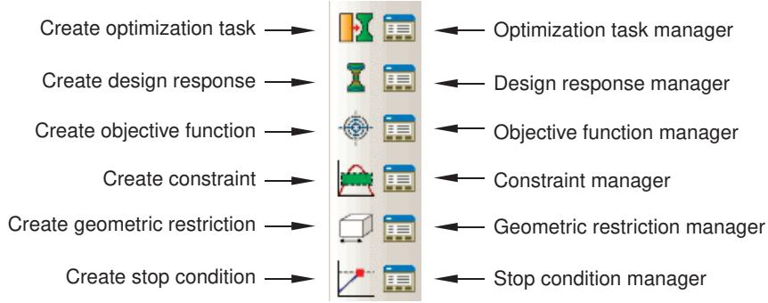  
图1：优化模块工具。

要查看包含优化模块工具简要定义的提示信息，请将鼠标悬停在该工具上片刻。有关使用工具箱和选择隐藏图标的更多信息，请参阅使用包含隐藏图标的工具箱和工具栏。

## 查看与故障排除优化过程

您可以使用Abaqus生成的场输出和历史输出来查看优化过程产生的结果。您也可以利用这些输出来诊断优化过程中的任何问题；例如，确定优化是否正在向目标收敛，或研究收敛速度。通过点击优化流程管理器中的“结果”(Results)，您可以查看结果。

当您提交优化过程进行分析时，Abaqus会为优化过程的每个设计周期创建一个输出数据库（.odb）文件。这些输出数据库文件存储在作业名\SAVE.odb目录中。在您能够在可视化模块中查看优化结果之前，必须将各个输出数据库文件合并成一个单一的输出数据库文件。可视化模块的行为取决于输出数据库文件是由拓扑优化、形状优化、尺寸优化还是加强筋优化创建的。

## 拓扑优化

当您查看拓扑优化的结果时，Abaqus/CAE会自动显示一个叠加在当前视图上的视图切割，该切割代表了优化后的设计表面。视图切割的等值面变量是归一化的材料属性，优化模块使用该属性来“添加”或“移除”分析中的单元。默认情况下，Abaqus/CAE显示视图切割时，归一化材料属性设置为0.3。您可以使用视图切割管理器来修改等值面变量的值，并查看等值面的边界结果。当优化视图切割处于活动状态时，边界条件不会被显示。更多信息，请参阅管理视图切割。

## 形状优化

当您查看形状优化的结果时，Abaqus/CAE使用表面节点的新位置来显示优化后的模型形状。

## 尺寸优化

当您查看尺寸优化的结果时，Abaqus/CAE显示壳模型和优化的壳厚度，该厚度会随着优化的进行而变化。（当您查看壳模型的非优化分析结果时，壳厚度是从模型数据中读取的，并且在分析过程中不会改变。）

## 加强筋优化

当您查看加强筋优化的结果时，Abaqus/CAE使用表面节点的新位置来显示优化后的壳模型形状。

在您将各个输出数据库文件合并成一个单一的输出数据库文件后，优化过程中的每个设计周期都作为输出数据库中的一帧出现，您可以打开“步骤/帧”(Step/Frame) 对话框来显示每个设计周期的结果。您可以在优化过程仍在进行时查看其结果。随着优化过程接近完成，已完成步骤和帧的列表会在您每次关闭并重新打开“步骤/帧”对话框时更新。更多信息，请参阅选择特定的结果步骤和帧，以及逐步查看帧。

您可以对变形图或云图执行时间历史动画，并查看优化过程的进展，因为Abaqus会尝试在满足约束的同时实现目标函数。对于拓扑优化，您可以查看单元从分析中逐步移除的过程及其对模型力学行为（例如变形或应力的变化）产生的影响。开启透明度可以让您透过内部单元查看优化的进程；例如，移除内部单元以创建空腔。更多信息，请参阅更改透明度。对于形状优化，您可以查看随着优化进行，表面节点位置的逐步变化；并且，类似于拓扑优化，您可以查看其对模型力学行为产生的影响。

此外，优化过程会将数据文件（optimization_report.csv 和 optimization_status_all.csv）写入作业名目录，您可以使用这些文件来跟踪设计变量。例如，您可以创建一个X-Y图，显示目标函数和约束在每次设计周期后如何变化。所得图表表明了优化模块如何尝试在满足约束的同时实现指定的目标函数。您可以使用目标函数和约束的X-Y图作为诊断工具，来查看每次设计周期后优化的进展，并确定优化是否正在收敛于一个解，如图1所示。

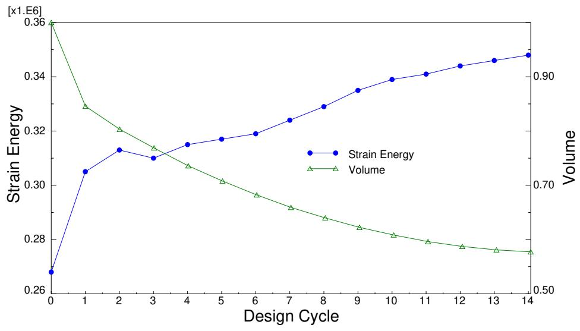  
图1：优化过程中的设计目标与约束。

您也可以通过监控优化流程管理器中的优化过程进度，来查看显示目标函数和约束在每次设计周期后如何变化的X-Y图。更多信息，请参阅监控您的优化过程。

## 附加信息

*   理解视图切割
*   理解X-Y绘图

## 创建和配置优化任务

您可以创建和配置优化任务。优化任务包含您优化问题的定义。

## 本节内容：

创建优化任务
配置拓扑优化任务
配置形状优化任务
配置尺寸优化任务
配置加强筋优化任务

## 创建优化任务

您可以创建优化任务。优化任务包含您优化问题的定义，例如设计响应、目标、约束和几何限制。要运行优化，您需要在作业模块中创建一个优化流程。优化流程引用一个优化任务。

1.  从主菜单栏中，选择任务(Task)->创建(Create)。
    “创建优化任务”(Create Optimization Task) 对话框将出现。

    

    提示：您可以通过其他两种方式启动创建过程：
    *   点击优化任务管理器中的“创建”(Create)。（您可以通过从主菜单栏选择任务(Task)->管理器(Manager)来显示优化任务管理器。）
    *   点击优化模块工具箱中的该工具。

2.  在出现的“创建优化任务”对话框中，输入任务的名称。
3.  选择优化“类型”(Type)（拓扑优化(Topology optimization)、形状优化(Shape optimization)、尺寸优化(Sizing optimization) 或 加强筋优化(Bead optimization)），然后点击“继续”(Continue)。更多信息，请参阅关于结构优化。
4.  从视口中，选择将要优化的区域，或点击“完成”(Done) 以优化整个模型。默认情况下，Abaqus/CAE允许您选择整个模型。要选择面或单元，请使用选择工具栏将可选择的对象类型更改为“面”(Face) 或“单元”(Cells)。更多信息，请参阅根据对象类型过滤您的选择。

    “编辑优化任务”(Edit Optimization Task) 对话框将出现。

    如果您希望从现有集合列表中选择，请执行以下操作：
    a.  点击提示区右侧的“集合”(Sets)。
        Abaqus/CAE将显示包含可用集合列表的“区域选择”(Region Selection) 对话框。
    b.  选择感兴趣的集合，然后点击“继续”(Continue)。

    

## 注意：

默认的选择方法基于您最近使用的选择方法。要切换回另一种方法，请点击提示区右侧的按钮——“在视口中选择”(Select in Viewport) 或“集合”(Sets)。

5.  完成优化区域选择后，在提示区中点击“完成”(Done)。有关选择对象的更多信息，请参阅在视口中选择对象。
6.  配置优化任务，如配置拓扑优化任务、配置形状优化任务、配置尺寸优化任务和配置加强筋优化任务中所述。

## 附加信息

*   配置拓扑优化任务
*   配置形状优化任务
*   配置尺寸优化任务
*   配置加强筋优化任务

优化模块提供了一系列设置，允许您配置拓扑优化任务。配置设置取决于您是为通用拓扑优化还是基于条件的拓扑优化配置优化任务。
## 本节内容：

配置常规拓扑优化任务  
配置基于条件的拓扑优化任务

## 配置常规拓扑优化任务

常规拓扑优化是一种灵活的、基于灵敏度的优化方法，允许您对模型应用一系列约束和目标函数。您可使用优化任务编辑器来自定义常规拓扑优化的各个方面。

要找到编辑器，请从主菜单栏中选择 **Task** > **Edit** > 优化任务名称。要指定常规拓扑优化，请选择 **Advanced** 选项卡，然后选择 **General optimization (sensitivity-based)**。

## 本节内容：

配置基本设置  
配置密度设置  
配置扰动设置  
配置收敛选项  
配置高级选项

## 配置基本设置

您可以配置常规拓扑优化。

1.  在优化任务编辑器中，单击 **Basic** 选项卡。  
2.  选择是否冻结载荷或边界条件区域。

建议冻结施加了规定条件的区域，因为您不希望这些区域在优化过程中被移除。冻结这些区域可以稳定优化，并且通常能显著减少迭代次数。

## 配置密度设置

您可以配置常规拓扑优化。

1.  在优化任务编辑器中，单击 **Density** 选项卡。  
2.  选择 **Density update strategy**（密度更新策略）。

此设置控制优化模块在优化过程中更新设计单元相对材料密度的速率。在大多数情况下，您应接受默认设置（**Normal**）。但是，如果设计响应非常敏感，并且您在满足约束方面遇到问题，可能需要更保守的速率，这需要更多的优化迭代次数。

3.  执行以下操作之一以指定初始优化迭代期间每个单元的相对密度：

    *   选择 **Optimization product default** 以允许优化模块确定初始密度。如果选择了材料体积作为约束，优化模块将计算初始密度，以精确满足体积约束。如果选择了材料体积作为目标函数，每个单元的初始相对密度为 50%。  
    *   选择 **Specify** 并输入一个值 (0.0 < 初始密度 < 1.0)。仅当体积被选为目标函数而非约束，并且您在优化前知道将初始密度设置为更大或更小的值可以满足其他约束（例如位移约束）时，才应使用此选项。您可以将大于 0.5 的值与体积约束结合使用，以稳定非线性或接触问题并改善收敛行为。

4.  输入 **Minimum density**（最小密度）、**Maximum density**（最大密度）和 **Maximum change per design cycle**（每个设计周期的最大变化量）。

    最小密度必须大于 0.0，最大密度必须小于或等于 1.0。不建议更改密度界限，尤其是上限。如果默认值导致刚度矩阵近乎奇异，您可能需要提高下限。

    数值实验表明，0.25（默认值）对于密度最大变化量是可接受的。对于复杂的设计响应和优化公式，建议使用较低的变化量下限（例如 0.1）。然而，较低的限制通常会导致更多的优化迭代次数。

## 配置扰动设置

您可以配置常规拓扑优化。

1.  在优化任务编辑器中，单击 **Perturbation** 选项卡。  
2.  输入要跟踪的 **number of eigenmodes**（特征模态数）。默认值为五，这意味着优化模块将跟踪五个最低的特征频率。

    在某些情况下，优化迭代过程中会出现许多局部低频特征模态，这会导致需要跟踪的模态数量增加并降低性能。您可以通过将特征频率的下限设置为第一次优化迭代中感兴趣特征频率的 25%，来避免跟踪过多的模态。

    如果您的设计响应将使用 Kreisselmeier-Steinhauser 公式来评估特征频率，则不需要模态跟踪。您的 Abaqus 模型必须包含至少等于您要跟踪的特征频率数量的输出请求。

3.  选择优化模块应在其上跟踪特征模态的 **region**（区域）。

    默认情况下，优化模块跟踪模型中所有节点的特征模态，如果您有一个大型模型，这可能会降低性能。您可以通过仅在选定区域（例如模型上选定的表面或附着有集中质量或刚性质量的点）上跟踪特征模态来提高性能。

## 配置收敛选项

您可以配置常规拓扑优化。

1.  在优化任务编辑器中，单击 **Convergence** 选项卡。  
2.  指定 **Convergence Criteria**（收敛准则）。以下选项允许您为常规拓扑优化指定收敛准则：

    ### 指定何时开始检查收敛性

    您可以指定优化模块开始检查两个收敛准则的迭代次数。优化将始终继续至少到该值为止。默认值为 4。

    ### 指定检查哪个收敛准则

    您可以指定优化是在满足其中一个收敛准则时结束，还是在两个准则都满足时结束。默认值为必须满足两个准则。

    ### 基于优化函数变化量的收敛

    您可以指定优化将基于目标函数从一次迭代到下一次迭代的变化量结束。默认值为 0.001。

    ### 基于单元密度变化量的收敛

    单元密度是拓扑优化的设计变量。您可以指定优化将基于单元密度从一次迭代到下一次迭代的平均变化量结束。默认值为 0.005。

## 配置高级选项

您可以配置常规拓扑优化。

1.  在优化任务编辑器中，单击 **Advanced** 选项卡。  
2.  选择 **General optimization algorithm**（通用优化算法）。  
3.  选择是否 **Delete soft elements in region**（删除区域中的软单元）。

    在拓扑优化过程中，优化模块在试图满足约束和优化目标的同时，将给定质量分布在设计区域内。在优化结束时，结构包含硬单元（填充）和软单元（空隙）。软单元对结构的刚度影响可以忽略不计；但它们仍然影响结构的自由度数量，从而影响优化过程的速度。**Delete soft elements** 选项允许您选择一个区域，其中仅具有软邻居的软单元将被删除。如果需要，删除的单元会被重新激活；例如，如果优化过程中力流发生变化。

    选择删除软单元有助于 Abaqus 收敛到解，因为否则这些单元会退化或崩溃，并且在优化非线性模型时推荐这样做。此外，选择**保守的密度更新策略**和较小的每个设计周期的密度变化量将提高结果的准确性。有关更多信息，请参阅配置密度设置。

4.  如果您选择删除软单元，可以通过选择仅删除具有邻居软单元的软单元来防止孤立的软单元被移除。您可以将邻居单元定义为在由**平均边长度**（默认）指定的半径内，或由您输入的值指定。如果网格内的单元边长度变化很大，则根据平均边长度计算的半径可能不准确。  
5.  如果您选择删除软单元，可以选择优化模块用于删除单元的方法：

    ### 保持连续性（标准）

    选择 **Favor continuity (Standard)**（保持连续性（标准））并输入 **Relative material density threshold**（相对材料密度阈值），以在删除软单元之前检查连续性。如果优化后的模型包含一个由软单元与模型其余部分分离的硬单元“岛”，优化模块不会移除软单元。此外，优化模块会保留防止硬单元相对于彼此移动的软单元；例如，共享一条公共边但不共享公共面的硬单元。如果一个单元的相对材料密度低于阈值，则被视为“软”，优化模块会将其从分析中移除。
## 倾向连续性（激进）

选择 **倾向连续性（激进）** 并输入一个 **相对材料密度阈值**，以在不考虑连续性的情况下删除软单元。如果一个单元的相对材料密度小于阈值，则认为该单元是“软”的，优化模块会将其从分析中移除。

## 最大剪应变

选择 **最大剪应变** 并输入一个 **最大剪应变阈值**。优化模块会将剪应变大于该阈值的单元从分析中移除。

## 最小主应变

选择 **最小主应变** 并输入一个 **最小主应变阈值**。优化模块会将主应变低于该阈值的单元移除。

## 最大弹塑性应变

选择 **最大弹塑性应变** 并输入一个 **最大弹塑性应变阈值**。优化模块会将弹塑性应变大于该阈值的单元移除。

## 体积压缩

选择 **体积压缩** 并输入一个 **相对体积压缩**。优化模块会将正在压缩且其相对体积低于阈值的单元移除。相对体积 $V _ { r e l }$ 定义为 $\frac { V _ { d e f o r m } - V _ { o r g } } { V _ { o r g } }$ ，其中 $V _ { d e f o r m }$ 是变形后的单元体积，$V _ { o r g }$ 是原始单元体积。

如果你的模型使用壳单元或膜单元，或者模型正在经历大变形，则应选择 **体积压缩**。


## 注意：

您选择的软删除方法取决于材料行为和单元类型，您可能需要进行实验以确定最佳方法及其阈值。文件 `TOSCA.OUT` 包含有关正在被移除单元的信息，将帮助您确定最佳的软删除方法和阈值。**倾向连续性** 方法提供了默认的 **相对材料密度阈值** 0.05。相比之下，**应变** 和 **体积** 方法不提供默认阈值，因为适当的值取决于您的模型；例如，取决于材料的特性。

## 6. 选择材料插值技术和罚因子。

优化生成密度接近1的实体单元或密度接近0的孔洞单元。拓扑优化引入密度介于1和0之间的单元，而材料插值技术计算了这些中间单元的密度与刚度之间的关系。SIMP（固体各向同性材料惩罚）插值方案定义了单元密度与刚度之间的指数关系，适用于静态问题。罚因子应大于1，数值实验表明默认值3可以产生良好的结果。RAMP（材料性能的合理近似）插值方案适用于动态问题。罚因子应大于0，数值实验表明默认值3可以产生良好的结果。MIMP 材料插值结合了用于本构材料插值的 SIMP 和一种用于物理密度的新材料插值。

默认情况下，优化模块为静态问题选择 SIMP 插值方案，如果您的模型中至少包含一个动态荷载工况，TOSCA 会自动将插值方案切换为 PEDE。

7. 您可以选择 **尽可能使用 Abaqus 灵敏度**，以尽可能使用 Abaqus 来计算设计响应及其灵敏度。此工作流修改提高了优化过程的性能。

8. 选择 **尽可能使用组运算符**，以高效地在设计响应定义中使用包含超过 5000 个单元或节点的大型组。此工作流修改使用了一种基于 Abaqus 灵敏度的新算法。

## 配置基于条件的拓扑优化任务

基于条件的拓扑优化使用应变能目标函数和体积约束。您可以使用优化任务编辑器来自定义基于条件的拓扑优化的各个方面。

要定位编辑器，请从主菜单栏选择 **Task->Edit->优化任务名称**。要指定基于条件的拓扑优化，请选择 **Advanced** 选项卡并选择 **Condition-based optimization**。

## 本节内容：

配置基本设置  
配置高级选项

## 配置基本设置

您可以配置基于条件的拓扑优化。

1. 在优化任务编辑器中，单击 **Basic** 选项卡。
2. 选择是否冻结荷载或边界条件区域。

建议您冻结应用了规定条件的区域，因为您不希望这些区域在优化过程中被移除。冻结这些区域可以稳定优化，并且通常能显著减少迭代次数。

## 配置高级选项

您可以配置基于条件的拓扑优化。

1. 在优化任务编辑器中，单击 **Advanced** 选项卡。
2. 选择 **Condition-based optimization** 算法。
3. 选择优化模块在拓扑优化期间修改单元属性的速率。您可以选择速率（**Very small**, **Small**, **Moderate**, **Medium**, 或 **Large**），并允许优化模块计算满足此速率所需的设计循环数。

或者，您可以选择 **Dynamic** 并输入最大设计循环数。最小设计循环数为 10，默认值为 15。减少设计循环数可能会在优化中导致不希望出现的效果。尽管最终结构具有相同的刚度（应变能之和对于不同结果几乎相等），但改变优化速度可能会导致解中的桁架配置不同。

4. 选择在第一个循环后删除的体积。您可以输入百分比或绝对值。默认情况下，优化模块在第一次迭代中移除优化区域体积的 5%。在某些情况下，提高此起始值可以加速优化而不影响解，特别是对于在大面积区域应力相对较低的模型。相反，如果起始值过高，优化模块可能在第一次迭代中移除过多的单元，导致优化失败或结构粗糙。

形状优化确定每个表面节点的位移，以努力使表面应力均匀化并满足目标函数和任何约束。

您可以使用优化任务编辑器来自定义形状优化的各个方面，并将耐久性分析纳入优化中。您可以指定基于条件的形状优化（默认）或通用（基于灵敏度的形状优化）。

要定位编辑器，请从主菜单栏选择 **Task->Edit->优化任务名称**。形状任务的默认设置在各种优化模型中都能提供合理的结果；在大多数情况下，您无需修改默认设置。

## 本节内容：

配置基本设置  
配置网格平滑质量  
配置高级选项  
配置耐久性选项

## 配置基本设置

在形状优化期间，优化模块会修改模型的表面。如果优化模块仅修改表面节点而不调整内部节点，则表面单元层将变得扭曲。因此，Abaqus 分析的结果将不再可靠，优化质量也会受到影响。为保持表面单元的质量，优化模块对选定区域应用网格平滑，这会调整内部节点相对于表面节点的位置。有关更多信息，请参阅“对形状优化应用网格平滑”。

优化模块仅能对三角形、四边形和四面体单元应用网格平滑。其他单元类型在网格平滑期间将被忽略。


## 注意：

在开始形状优化之前，拥有一个高质量的有限元网格非常重要，尤其是在您预期形状会发生变化的区域。

1. 在优化任务编辑器中，单击 **Basic** 选项卡。
2. 选择是否冻结边界条件区域。

您在荷载模块中应用了位移边界条件的区域在优化期间具有相同的位移边界条件。控制荷载模块中位移边界条件的坐标系用于控制优化中的边界条件。
3. 默认情况下，优化模块会冻结整个模型的边界条件。如需调整，请点击


并选择需要冻结边界条件的区域。

4. 选择应用网格平滑的区域：
    • 选择 **Specify smoothing region**（默认），然后点击选择平滑到单元或面。
    • 选择 **Specify first layer**，然后点击选择代表第一层待平滑单元的面。输入要平滑的单元层数。
    • 选择 **Smooth six layers using the task region** 以平滑设计区域的六层单元。

建议接受默认选择，并手动选择应用网格平滑的区域。

5. 选择在网格平滑操作期间允许移动的、与设计区域相邻的节点层数：
    • 选择 **Fix all**（默认）以防止自由面节点移动。
    • 选择 **Fix none** 以允许所有自由面节点移动。
    • 选择 **Specify** 并输入允许移动的相邻自由面节点层数。

## 配置网格平滑质量

网格平滑试图改善网格质量，尽管形状优化过程中设计节点的移动会导致网格扭曲。您可以指定平滑后网格的相对质量，并可以指定定义“高质量”单元的角度范围（四边形和三角形单元）或纵横比范围（四面体单元）。质量差的单元会被给予质量评级。评级越差的单元，在改善单元质量时被考虑的优先级就越高。

1. 在形状优化的优化任务编辑器中，点击 **Mesh Smoothing Quality**（网格平滑质量）选项卡。
2. 执行以下操作之一：
    • 开启 **Target mesh quality**，并选择设置（Low、Medium 或 High）。

    大多数情况下，应接受默认的 **Low** 设置。只有在确定网格质量不令人满意时，才应选择更高的收敛级别。尽管计算成本高昂，但如果您的网格包含大量四面体单元，您可能需要选择更高的收敛级别；否则，网格质量可能无法接受。

    如果即使使用 **High** 收敛级别仍无法获得令人满意的网格质量，您应考虑通过降低 **Growth scale factor**（生长缩放系数）和 **Shrink scale factor**（收缩缩放系数）来减少形状优化期间的位移量，如配置高级选项中所述。

    • 关闭 **Target mesh quality** 以停用计算单元质量的算法。

3. 开启 **Report poor quality elements** 以生成落在元素质量表所定义范围之外的单元列表。
4. 开启 **Report solver quality criteria violation** 以报告 Abaqus 认为质量差的单元。
5. 如果您开启了 **Report solver quality criteria violation**，可以选择在 Abaqus 遇到质量差的单元时停止优化过程。优化模块可能会生成质量差的网格，导致 Abaqus 分析无法成功完成，特别是随着设计循环次数的增加。如果 Abaqus 过早停止分析，优化模块将无法获得结果，优化也会提前结束。如果允许优化模块因 Abaqus 单元质量标准违规而停止优化，将更容易对优化进行故障排除并确定失败原因。
6. 如果您选择允许优化模块调整网格质量，可以使用该表来指定定义“高质量”单元的角度范围（四边形和三角形单元）或纵横比范围（四面体单元）。您还可以输入四边形和四面体单元的最大扭曲角，以及四边形单元的最大锥度。大多数情况下，不应修改默认值。修改角度或纵横比范围对网格质量影响甚微。应尝试使优化模块中可接受的网格质量与 Abaqus 中可接受的网格质量相匹配。最好让优化过程因网格质量下降而结束，而不是允许 Abaqus 终止优化过程或生成无意义的结果。
7. 选择网格平滑操作将使用的策略或算法。默认情况下，优化模块使用 **Constrained Laplacian** 网格平滑算法。如果您的模型相对较小（网格平滑区域中的节点少于 1000 个），可以选择 **Local gradient** 网格平滑算法。
8. 如果您选择了 **Constrained Laplacian** 策略，请执行以下操作：
    a. 选择 **Convergence level**（收敛级别），它衡量优化模块应花费多少时间来尝试改善网格质量。大多数情况下，应接受默认值 **Low**，这将导致优化模块应用几次增量较大的迭代。选择 **Medium** 或 **High** 将导致更多迭代次数和更小的增量；然而，计算时间将显著增加。在修改收敛级别之前，应使用 **Mesh Smoothing Quality** 选项卡页面调整目标网格质量。
    b. 选择 **Frequency of evaluating geometric restrictions**（评估几何限制的频率），它决定了在网格平滑算法执行期间优化模块应用几何限制的频率。大多数情况下，应接受默认值 **Low**。选择 **Medium** 或 **High** 将导致优化模块更频繁地应用几何限制，并且计算时间将显著增加。
9. 如果您选择了 **Local gradient** 策略，请输入 **Feature recognition angle**（特征识别角度），这是优化模块在网格平滑操作期间用于通过检测边和角来识别特征的角度。默认值为 30°，在大多数情况下能提供良好的结果。

## 配置高级选项

您可以配置形状优化任务。

1. 在优化任务编辑器中，点击 **Advanced**（高级）选项卡。
2. 选择形状优化算法。
    选择 **General optimization (sensitivity-based)** 以使用基于灵敏度的形状优化，该方法允许您对模型应用一系列约束和目标函数。
    选择 **Condition-based optimization**（默认）以使用基于条件的形状优化，该方法使用应变能目标函数和体积约束。
3. 输入指定 **Growth scale factor**（生长缩放系数）和 **Shrink scale factor**（收缩缩放系数）的值。生长缩放系数应用于形状优化导致体积增长（增加模型体积）的节点位移。收缩缩放系数应用于形状优化导致体积收缩（减少模型体积）的节点位移。

    建议首先使用默认缩放系数 1.0 执行优化并检查结果，然后再尝试使用修改后的缩放系数进行优化。大于 1.0 的值会增加节点的增量位移并加速优化。反之，小于 1.0 的值会减少节点的增量位移并减慢优化速度。

    如果优化的前几次迭代在表面节点位置上产生的变化很小（例如，网格密集且单元边长很小），您应考虑增加缩放系数。反之，如果缩放系数过大，网格质量将受损，个别单元可能会塌陷，优化可能无法收敛到最优解。

    如果原始模型接近最优，您应考虑减小缩放系数。

    当优化包含许多几何限制且初始网格质量较差时，减小缩放系数并放慢优化速度也是有益的。

    要优化接触区域，您可能需要输入负值来反转优化方向。结果，高应力区域将收缩，低应力区域将生长。

4. 选择是在每个优化循环后更新优化形状向量（默认），还是仅在第一个循环后更新。

    优化模块为设计区域中的每个节点确定一个优化位移向量。该向量沿着节点处外表面的法线方向，并指示优化期间的位移方向。如果您选择在每个优化循环后更新优化形状向量，优化模块会调整向量以适应不断变化的条件，例如结构形状、网格质量和设计变量限制的变化。如果您选择仅在第一个优化循环后更新优化形状向量，该向量在后续循环中保持固定。
在大多数情况下，优化后每循环更新优化形状向量的默认值能提供更好的结果，因为网格平滑算法受到的限制更少，从而提高了网格质量。

5. 选择优化周期中设计区域内节点的位移步长应由最小位移还是平均位移决定。

优化模块会检查网格并限制优化周期内设计区域节点的位移量。此限制可防止单个节点的大位移导致相邻单元坍塌。此外，基于条件的优化算法可控制每个设计周期后设计区域内节点的位移——即步长。步长取决于优化模块应用于节点的限制。例如，如果优化模块减小了允许的位移，基于条件的优化算法就会减小增量尺寸。

此选项允许您选择基于条件的优化算法使用哪种位移来确定步长。您可以选择优化期间设计区域内节点允许位移的平均值或最小值（默认）。选择平均值会导致步长更大，从而更快地计算出最优解。然而，选择平均值可能会限制仅允许微小位移的节点的移动，从而在设计区域产生不希望出现的棱角。

6. 选择优化模块用于插值中间节点的方法。

如果选择按位置线性插值（默认），优化会根据已优化连接角点节点的位置线性插值中间节点的位置。如果选择按角点节点的优化位移插值，优化会根据已连接角点节点的优化位移插值中间节点的位置。

如果节点位于其原始位置，则中间节点位于角点节点之间的直线上，两种插值方法没有区别。但是，为防止单元弯曲，必须选择按角点节点的优化位移插值。

7. 如果需要，开启用于移动向量的边长度，并输入一个值。

优化模块会修改高曲率区域的节点位移，以防止网格因体积变化过大而坍塌。实际上，尖锐的角会被平滑。触发平滑的最小单元边长度的默认值为 5.0。值越大，平滑区域的半径越大。

8. 优化模块可以使用滤波器来平滑局部应力峰值。您可以通过开启等效应力的最大影响半径并输入以下内容来定义滤波器函数：

• 受滤波器影响的节点之间的最大距离值。  
一个值，用于确定局部曲面曲率在多大程度上用于调整受滤波器影响的节点之间的最大距离。默认值为 0.2；值越小，曲面曲率的影响越大。  
• 一个权重值，根据到节点的距离控制滤波器的效果。

9. 体积是您可以应用于形状优化的唯一约束，您可以指定将体积减小到指定值或初始值的一个比例。等式约束公差指定指定的体积约束与计算出的体积之间的最小差值，优化模块将据此判定解已收敛。优化模块会将差值的绝对值与您输入的公差值进行比较。默认值为 0.001。

10. 如果您选择了通用优化（基于灵敏度），您可以选择尽可能使用 Abaqus 灵敏度，以便在可能的情况下使用 Abaqus 计算设计响应及其灵敏度。此工作流程修改提高了优化过程的性能。

11. 如果您选择了通用优化（基于灵敏度），您可以选择尽可能使用群组算子，以便在设计响应定义中以高效方式使用超过 5000 个单元或节点的大型群组。此工作流程修改使用了一种基于 Abaqus 灵敏度的新算法。

## 配置耐久性选项

通常，您使用形状优化来修改零件的表面几何形状以最小化应力集中。在大多数情况下，降低应力水平会显著提高耐久性。但是，静力分析确定的峰值应力区域可能与耐久性（或损伤）分析确定的最大损伤区域不同，仅使用形状优化修改表面几何形状可能会降低耐久性。为避免这种情况，您可以在优化循环中集成耐久性求解器，以确保既降低应力水平又提高耐久性。

要在优化中包含耐久性，必须在优化任务编辑器中启用耐久性分析，并配置所选的耐久性求解器。此外，您必须创建一个损伤设计响应作为目标。目标应尝试最小化关键区域的最大损伤。

1. 在优化任务编辑器中，单击“耐久性”选项卡。  
2. 选择“基于耐久性分析进行优化”。  
3. 从“耐久性求解器选项”中，选择以下之一：

<table><tr><td>fe-safe</td><td>使用 fe-safe 耐久性求解器。</td></tr><tr><td>FEMFAT</td><td>使用 FEMFAT 耐久性求解器。</td></tr><tr><td>自定义</td><td>允许您使用耐久性分析生成的 Tosca Structure 优化中性文件（ONF 600 或 ONF 601）。有关此文件格式的更多信息，请联系您的 SIMULIA 支持办公室。</td></tr></table>

4. 选择将由耐久性求解器读取的耐久性输入文件。耐久性输入文件必须位于工作目录中。

5. 输入工作目录中将由耐久性求解器读取的任何其他文件的名称。如果文件存储在工作目录之外，则必须提供文件的路径以及文件名。

## 配置尺寸优化任务

尺寸优化是一种灵活的、基于灵敏度的优化，允许您对模型应用各种约束和目标函数。您使用优化任务编辑器来自定义尺寸优化的各个方面。

要定位编辑器，请从主菜单栏选择“任务”->“编辑”->“优化任务名称”。

## 本节内容：

配置基本设置  
配置厚度设置  
配置扰动设置  
配置收敛选项  
配置高级选项

## 配置基本设置

您可以配置尺寸优化任务。

1. 在优化任务编辑器中，单击“基本”选项卡。  
2. 选择是否冻结载荷或边界条件区域。

建议冻结施加规定条件的区域，因为您不希望这些区域在优化过程中被移除。冻结这些区域可以稳定优化，并且通常显著减少迭代次数。

## 配置厚度设置

您可以配置尺寸优化任务。

1. 在优化任务编辑器中，单击“厚度”选项卡。  
2. 选择“厚度更新策略”。

此设置控制优化模块在优化期间使用移动渐近线方法更新设计单元壳厚度的速率。在大多数情况下，应接受默认设置（标准）。但是，如果设计响应非常敏感，并且您在满足约束方面遇到问题，可能需要更保守的速率（需要更多优化迭代）。选择激进的速率可能导致优化不稳定或阻止优化收敛于解。

3. 输入“每个设计周期的最大变化量”。

此设置控制每个设计周期内壳单元厚度变化的限制。

## 配置扰动设置

您可以配置尺寸优化任务。

1. 在优化任务编辑器中，单击“扰动”选项卡。  
2. 输入要跟踪的特征模态数量。默认值为五，这意味着优化模块跟踪五个最低的特征频率。

在某些情况下，许多局部低频特征模态会在优化迭代期间出现，这导致需要跟踪的模态数量过多并降低性能。您可以通过在第一次优化迭代中将特征频率的下限设置为所关注特征频率的 25% 来避免跟踪大量模态。
如果您设计响应将使用 Kreisselmeier-Steinhauser 公式来评估特征频率，则不需要模态跟踪。您的 Abaqus 模型必须包含一个输出请求，至少请求您所跟踪的特征频率的数量。

3. 选择 Optimization 模块应跟踪特征模态的区域。

## 配置收敛选项

您可以配置尺寸优化任务。

1. 在优化任务编辑器中，单击 **Convergence** (收敛) 选项卡。
2. 指定 **Convergence Criteria** (收敛标准)。以下选项允许您指定尺寸优化的收敛标准：

## 指定何时开始检查收敛性

您可以指定 Optimization 模块开始检查这两个收敛标准的迭代次数。优化将始终至少持续到达到此值。默认值为 4。

## 指定要检查哪个收敛标准

您可以指定优化应在任一收敛标准满足时结束，还是在所有标准都满足时结束。默认设置是所有标准都必须满足。

## 基于优化函数变化的收敛

您可以指定优化将基于目标函数从一个迭代到下一个迭代的变化来结束。默认值为 0.001。

## 基于单元厚度变化的收敛

单元厚度是尺寸优化的设计变量。您可以指定优化将基于单元厚度从一个迭代到下一个迭代的平均变化来结束。默认值为 0.005。

## 配置高级选项

您可以配置尺寸优化任务。

1. 在优化任务编辑器中，单击 **Advanced** (高级) 选项卡。
2. 选择 **Use Abaqus sensitivities when possible** (尽可能时使用 Abaqus 敏感性) 以在可能时使用 Abaqus 来计算设计响应及其敏感性。此工作流程改进可提高优化过程的性能。
3. 您可以选择 **Use Group Operator when possible** (尽可能时使用组操作) 以高效地在设计响应定义中使用超过 5000 个单元或节点的大组。此工作流程改进使用一种基于 Abaqus 敏感性的新算法。

## 配置珠状优化任务

Optimization 模块提供了多种设置，允许您配置珠状优化任务。配置设置取决于您是为基于条件的珠状优化（默认）配置优化任务，还是为通用珠状优化配置优化任务。

## 本节内容：

配置基于条件的珠状优化任务
配置通用珠状优化任务

## 配置基于条件的珠状优化任务

基于条件的珠状优化基于特殊的弯曲假设，并使用特殊过滤器沿弯曲轨迹生成珠状。您使用优化任务编辑器来自定义基于条件的珠状优化的各个方面。

要定位编辑器，请从主菜单栏选择 **Task** (任务) > **Edit** (编辑) > 优化任务名称。要指定基于条件的珠状优化，请选择 **Advanced** (高级) 选项卡并选择 **Condition-based optimization** (基于条件的优化)。

## 本节内容：

配置基本设置
配置高级选项

## 配置基本设置

您可以配置基于条件的珠状优化任务。

1. 在优化任务编辑器中，单击 **Basic** (基本) 选项卡。
2. 选择是否要遵守已应用于模型的边界条件。
建议您冻结应用了边界条件的区域，因为您不希望这些区域在优化过程中被移动。冻结这些区域可以稳定优化，并且通常会导致迭代次数显著减少。

3. 默认情况下，Optimization 模块会冻结整个模型的边界条件。如果需要，请单击


并选择应冻结边界条件的区域。

## 配置高级选项

您可以配置基于条件的珠状优化任务。

1. 在优化任务编辑器中，单击 **Advanced** (高级) 选项卡。
2. 打开 **Growth direction opposite to shell normal** (生长方向与壳法向相反) 以反转形成珠状的节点位移方向。
3. 默认情况下，节点为形成珠状而移动的方向由优化开始时（第一个周期）模型的应力状态决定。或者，您可以指定优化在每个设计周期之后确定节点移动的方向。
4. 默认情况下，将使用内部计算的值作为珠状宽度。或者，您可以指定珠状宽度的绝对值。
5. 指定珠状优化将执行的迭代次数。迭代次数会修改优化的步长。默认值为 2。
6. 指定以下 **Penalty Conditions** (惩罚条件)：

## 最小应力比

输入最小 von Mises 应力比的值，以防止 Abaqus/CAE 优化应力非常低的区域。在 von Mises 应力小于由指定比率乘以设计区域中最高 von Mises 应力计算出的值的区域，Abaqus/CAE 不会应用珠状优化（0.0 < 最小应力比 < 1.0）。默认值为 0.001。

## 最大膜应力比

输入最大膜应力比的值，以防止 Abaqus/CAE 优化主要处于膜应力（即面内）状态的区域（在主要处于膜应力状态的区域引入珠状可能会使结构变软）。

在膜应力大于由原始模型中最大弯曲应力除以指定比率计算出的常数值的区域，Abaqus/CAE 不会应用珠状优化（0.0 < 最大膜应力比）。默认值为 1.0。

7. 指定以下 **Mesh Smoothing Parameters** (网格平滑参数)：

## 曲线平滑

输入定义高曲率区域的半径的相对值。

在优化过程中引入珠状可能会挤压节点并导致小单元的产生。对于更高程度的曲率和较大的珠状高度，节点可能开始重叠，导致分析失败。为了防止网格塌陷，Abaqus/CAE 可以修改其在高曲率区域创建珠状时移动节点的方式。高曲率定义为通过 **Curve smooth** (曲线平滑) 值乘以设计区域中的平均单元边长计算出的半径。**Curve smooth** 值较高，因此半径较大且包含许多单元，这可能计算成本很高。默认值为平均单元长度的五倍。

## 节点平滑

默认情况下，**Node smooth** (节点平滑) 的值为 0.25 × 珠状宽度。或者，您可以在创建珠状期间指定相邻节点之间的绝对最小面内距离。允许的值在 0.0 到 0.5 × 珠状宽度之间。

应用节点平滑是为了防止相邻节点位移的突然变化，特别是在设计区域与模型其余部分之间的边界附近，或在活动的设计变量约束正在限制节点位移的区域。

## 配置通用珠状优化任务

通用珠状优化是一种灵活的、基于敏感性的优化，允许您将一系列约束和目标函数应用于您的模型。基于敏感性的算法不实现珠状过滤器；因此，优化可能不会生成清晰的珠状图案。您使用优化任务编辑器来自定义珠状优化的各个方面。

要定位编辑器，请从主菜单栏选择 **Task** (任务) > **Edit** (编辑) > 优化任务名称。要指定通用珠状优化，请选择 **Advanced** (高级) 选项卡并选择 **General optimization (sensitivity-based)** (通用优化（基于敏感性）)。

## 本节内容：

配置基本设置
配置节点移动设置
配置扰动设置
配置高级选项

## 配置基本设置

您可以配置通用珠状优化任务。

1. 在优化任务编辑器中，单击 **Basic** (基本) 选项卡。
2. 选择是否要遵守已应用于模型的边界条件。
建议您冻结应用了边界条件的区域，因为您不希望这些区域在优化过程中被移动。冻结这些区域可以稳定优化，并且通常会导致迭代次数显著减少。

3. 默认情况下，Optimization 模块会冻结整个模型的边界条件。如果需要，请单击


并选择应冻结边界条件的区域。

## 配置节点移动设置

您可以配置通用珠状优化任务。
1. 在优化任务编辑器中，点击**节点移动 (Nodal Move)** 选项卡。
2. 选择**节点更新策略 (Nodal update strategy)**。

此设置控制优化模块在使用移动渐近线方法进行优化期间更新设计单元壳体厚度的速率。在大多数情况下，您应接受默认设置（**保守 (Conservative)**）。然而，如果设计响应非常敏感，并且您在满足约束条件方面遇到问题，可能需要更激进的速率，这需要更多的优化迭代。选择激进的速率可能导致优化不稳定或阻止优化收敛到解。

3. 输入**节点移动限制 (Nodal move limit)**。

此设置限制了每次迭代中节点位移相对于指定的最大位移的比例 (0.0 < 节点移动限制 < 1.0)。默认值为 0.1。如果您遇到一个收敛缓慢的困难优化问题，可以通过减小节点移动限制来减小每次优化迭代的步长。


## 注意：

您通过在创建珠优化约束时指定加强筋的高度来规定一个节点的最大位移。

## 配置扰动设置

您可以配置一个通用的珠优化任务。

1. 在优化任务编辑器中，点击**扰动 (Perturbation)** 选项卡。
2. 输入要追踪的**特征模态数 (number of eigenmodes to track)**。默认值为五，这意味着优化模块追踪五个最低的特征频率。

在某些情况下，许多局部的低频特征模态会在优化迭代过程中出现，这会导致需要追踪的模态数量过多并降低性能。您可以通过将特征频率的下限设置为第一次优化迭代中感兴趣特征频率的 25% 来避免追踪过多的模态。

如果您的设计响应将使用 Kreisselmeier-Steinhauser 公式来评估特征频率，则不需要进行模态追踪。您的 Abaqus 模型必须包含至少与您所追踪的特征频率数量相等的输出请求。

3. 选择优化模块应在其上追踪特征模态的**区域 (region)**。选择整个模型以外的区域可能会提高性能。

## 配置高级选项

您可以配置一个通用的珠优化任务。

1. 在优化任务编辑器中，点击**高级 (Advanced)** 选项卡。
2. 指定 Sigmund 滤波器的**滤波半径 (Filter Radius)**，该滤波器用于平滑最终的优化解。更改此值可能有助于避免由灵敏度值波动引起的已知问题。以下选项允许您为通用的珠优化指定滤波半径：

## 相对于平均边长 (Relative to average edge length)

输入相对滤波半径。Abaqus/CAE 将滤波半径计算为指定值乘以设计区域（将进行优化的区域）中的平均单元长度。默认值为四。值为零表示关闭滤波器；生成的珠优化结果可能是一个不光滑的、数值上最优但不是实际物理意义的解。

## 绝对值 (Absolute value)

输入半径的绝对值。

3. 对于**灵敏度计算 (sensitivity calculation)**，选择优化是只考虑将进行优化的区域中的节点（默认）还是模型中的所有节点。
4. 输入**珠扰动 (Bead perturbation)**。Abaqus/CAE 使用此值通过单元矩阵上的有限差分来计算半解析灵敏度分析。有限差分计算为指定的扰动值乘以平均单元边长度。默认值为 0.0001，适用于大多数珠优化问题。
5. 选择**尽可能使用 Abaqus 灵敏度 (Use Abaqus sensitivities when possible)** 以在可能的情况下使用 Abaqus 计算设计响应及其灵敏度。此工作流修改可提高优化过程的性能。
6. 您可以选择**尽可能使用分组运算符 (Use Group Operator when possible)**，以便在设计响应定义中有效地使用超过 5000 个单元或节点的大型组。此工作流修改使用了基于 Abaqus 灵敏度的新算法。

## 配置设计响应

本节介绍设计响应编辑器以及设计响应编辑器中出现的选项。

## 本节内容：

创建和编辑设计响应
选择设计响应的数据源
组合设计响应

您使用设计响应编辑器来创建和配置您的设计响应。您将设计响应与模型的某个区域关联；但是，设计响应由单个标量值组成，例如该区域中的最大应力或模型的总体积。此外，您可以将设计响应与特定分析步或分析步内的某个载荷工况关联。设计响应由目标函数和约束使用。可用的设计响应取决于您创建的优化任务类型；更多信息，请参阅设计响应。

设计响应可以覆盖多个模型。当围绕基本状态的线性扰动不再足以作为载荷工况时，您可以将多个模型纳入优化中。例如，您可以通过创建非线性模型的多个副本，并在每个模型中创建一个施加不同载荷和边界条件的分析步，来模拟非线性载荷工况（Abaqus/CAE 不支持）。每个模型必须具有相同的网格和相同的截面分配，并且这些模型必须在您的 Abaqus/CAE 会话中处于打开状态。

1. 从主菜单栏中，选择**设计响应 (Design Response)->创建 (Create)**。

    将出现“创建设计响应”对话框。


    **提示**：您还可以通过其他两种方式启动创建过程：

    *   在**设计响应管理器 (Design Response Manager)** 中点击 **创建 (Create)**。（您可以通过从主菜单栏选择**设计响应 (Design Response)->管理器 (Manager)** 来显示设计响应管理器。）
    *   点击**优化 (Optimization)** 模块工具箱中的工具。

2. 在提示区，选择将应用设计响应的区域：

    *   选择**整个模型 (Whole Model)**（默认）以将设计响应应用于整个模型。
    *   选择**体（单元）(Body (elements))**，并选择将应用设计响应的区域。在优化期间，设计响应将应用于所选区域中的单元。
    *   选择**点（节点）(Point (nodes))**，并选择将应用设计响应的区域。在优化期间，设计响应将应用于所选区域中的节点。

    默认情况下，Abaqus/CAE 允许您选择模型的所有区域。使用**选择 (Selection)** 工具栏将您可以选择的对象类型更改为**顶点 (Vertices)**、**边 (Edges)**、**面 (Faces)** 或**实体 (Cells)**。有关更多信息，请参阅基于对象类型筛选选择。

    如果您更愿意从现有集合列表中选择，请执行以下操作：

    a. 点击提示区右侧的**集合 (Sets)**。
    Abaqus/CAE 将显示包含可用集合列表的“区域选择”对话框。

    b. 选择感兴趣的集合，然后点击**继续 (Continue)**。


## 注意：

默认选择方法基于您最近使用的方法。要切换回另一种方法，请点击提示区右侧的按钮——**在视口中选择 (Select in Viewport)** 或**集合 (Sets)**。

3. 完成设计响应区域的选择后，在提示区点击**完成 (Done)**。有关选择对象的更多信息，请参阅在视口中选择对象。

    将出现“编辑设计响应”对话框。

4. 默认情况下，优化模块假设设计响应（例如沿某个轴的位移）是在全局坐标系中定义的。要更改定义设计响应的坐标系，请点击

    *   在视口中选择一个现有的基准坐标系。
    *   按名称选择一个现有的基准坐标系。
        1.  在提示区，点击**基准坐标系列表 (Datum CSYS List)** 以显示基准坐标系列表。
        2.  从列表中选择一个名称，然后点击**确定 (OK)**。
    *   从提示区点击**使用全局坐标系 (Use Global CSYS)** 以恢复为全局坐标系。

    或者，点击  定义一个新的基准坐标系。

5. 在“编辑设计响应”对话框中，选择**变量 (Variable)** 选项卡页面。

6. 选择变量，并在适用的情况下选择其分量。


## 注意：

默认情况下，优化模块显示所选优化任务可用的所有变量。为避免创建无法按预期使用的设计响应，您可以仅显示目标函数可用的变量，或者仅显示约束可用的变量。

7. 如果您正在创建内力或内力矩设计响应，则必须选择**节点子集区域 (nodal subset region)**。该区域包含将要最大化或最小化内力或力矩的区域中构成横截面的节点。
8. 选择“步骤”选项卡页面，并指定感兴趣的模型和步骤或载荷工况。此外，如果正在进行特征频率优化，则必须从“步骤”选项卡页面中选择感兴趣的模态。更多信息，请参见选择设计响应的数据源。
9. 选择将应用于设计区域内所选变量的运算符。

*   **值的总和**：设计区域内所有值的总和。对于某些变量（如体积、重量、转动惯量和重力），“值的总和”是唯一可用的运算符，并且默认处于选中状态。
*   **最小值**：设计区域内的最小值。
*   **最大值**：设计区域内的最大值。对于某些变量（如应力、接触应力和应变），“最大值”是唯一可用的运算符，并且默认处于选中状态。

10. 如果适用，选择将应用于跨步骤和载荷工况的所选变量的运算符。

*   **值的总和**：所选步骤或载荷工况中所有值的总和。
*   **最小值**：所选步骤或载荷工况中的最小值。
*   **最大值**：所选步骤或载荷工况中的最大值。

11. 单击“确定”以保存数据并退出编辑器。

## 附加信息

*   选择设计响应的数据源
*   组合设计响应

## 选择设计响应的数据源

默认情况下，“优化”模块使用您 Abaqus 模型中的最后一个载荷工况（如有）和最后一个步骤的数据来定义设计响应。或者，如果您的模型包含多个步骤或载荷条件，您可以选择将使用哪些步骤或载荷条件来定义设计响应。最后，如果会话中打开了多个模型，您可以选择将使用哪些模型以及每个模型中的哪些步骤或载荷条件来定义设计响应。

此外，如果设计响应计算的是特征频率，您可以选择要检查的模态或模态范围。

1.  在“创建设计响应”对话框中，选择“步骤”选项卡页面。
2.  执行以下操作之一：
    *   选择“使用最后一个步骤和最后一个载荷工况”以使用最后一个步骤或最后一个载荷工况的数据定义设计响应。
    *   选择“指定”以选择将用于定义设计响应的步骤或载荷条件。
3.  如果您选择了“指定”，请执行以下操作以选择将用于定义设计响应的模型、步骤或（步骤内的）载荷工况。
    *   选择以将当前模型中的某个步骤添加到步骤列表。
    *   选择以将当前模型中的所有有效步骤添加到步骤列表。
    *   选择以将当前会话中所有已打开模型的所有有效步骤添加到步骤列表。（Abaqus/CAE 会在当前模型名称旁显示一个星号。）
    *   选择以从步骤列表中删除某个步骤。
4.  如果需要，单击表格中的某个单元格，然后从出现的菜单中选择其他模型、步骤或载荷工况。
5.  如果设计响应将计算特征频率，您可以从中选择一个模态或一个模态范围来计算特征频率。
6.  如果设计区域是壳，您可以选择壳截面中的位置，优化模块将从此位置计算壳应力。您可以从以下选项中选择：
    *   壳顶部、中间或底部层的壳应力值。（中间层无弯曲，表现为膜行为。）
    *   壳顶部、中间或底部层中的壳应力最大值。
    *   壳顶部、中间或底部层中的壳应力最小值。
7.  选择优化模块将如何从选定区域提取设计响应。您可以从以下选项中选择：
    *   所选区域的最大值。
    *   所选区域的最小值。
    *   所选区域的值之和。
8.  选择优化模块将如何从步骤和载荷工况中提取设计响应。您可以从以下选项中选择：
    *   所有选定步骤和载荷工况中的最大值。
    *   所有选定步骤和载荷工况中的最小值。
    *   所有选定步骤和载荷工况中的值之和。
9.  单击“确定”以保存数据并退出编辑器。

## 附加信息

*   创建和编辑设计响应
*   组合设计响应

## 组合设计响应

组合设计响应最简单的方法是创建一个目标函数，该函数是设计响应的加权和。或者，您可以使用设计响应编辑器来组合设计响应。您应小心组合设计响应的方式，以避免创建无意义的优化任务。此外，您应该了解基于条件的优化和通用优化如何组合各项以及它们之间的差异。

## 本节内容：

*   为基于条件的拓扑或形状优化组合设计响应
*   为通用拓扑优化组合设计响应
*   为形状优化筛选设计响应
*   为形状优化应用截断筛选器
*   为形状优化归一化设计响应

## 为基于条件的拓扑或形状优化组合设计响应

对于基于条件的拓扑优化和形状优化，可以使用以下方法组合最多四个设计响应 $( R _ { 1 } , R _ { 2 } , R _ { 3 }$ 和 $\pmb { R _ { 4 } } )$：

<table><tr><td>相加</td><td> $R_1 + R_2 + R_3 + R_4$ </td></tr><tr><td>相乘</td><td> $R_1 \times R_2 \times R_3 \times R_4$ </td></tr><tr><td>最小值</td><td> $Min(R_1, R_2, R_3, R_4)$ </td></tr><tr><td>最大值</td><td> $Max(R_1, R_2, R_3, R_4)$ </td></tr></table>

对于基于条件的拓扑优化和形状优化，可以使用以下方法组合两个设计响应 $( R _ { 1 }$ 和 $\mathbf { R _ { 2 } } )$：

<table><tr><td>相减</td><td> $R_{1} - R_{2}$ </td></tr><tr><td>相除</td><td> $\frac{R_{1}}{R_{2}}$ </td></tr></table>

对于基于条件的拓扑优化和形状优化，可以使用以下方法对单个设计响应进行操作：

<table><tr><td>绝对值</td><td> $abs(R_1)$ </td></tr><tr><td>正弦</td><td> $Sin(R_1)$ </td></tr><tr><td>余弦</td><td> $Cos(R_1)$ </td></tr><tr><td>正切</td><td> $Tan(R_1)$ </td></tr><tr><td>常用对数</td><td> $Log(R_1)$ </td></tr><tr><td>自然对数</td><td> $Ln(R_1)$ </td></tr><tr><td>平方根</td><td> $\sqrt{R_1}$ </td></tr><tr><td>指数</td><td> $exp(R_1)$ </td></tr><tr><td> $N$ 次方根</td><td> $\sqrt[n]{R_1}$ </td></tr><tr><td> $N$ 次幂</td><td> $R_1^n$ </td></tr><tr><td>取整</td><td> $Int(R_1)$ </td></tr><tr><td>最近整数</td><td> $Nint(R_1)$ </td></tr><tr><td>符号函数</td><td> $Sign(R_1)$ </td></tr><tr><td> $\Delta_{ij}$ ，两次迭代之间的差值</td><td> $R_1i - R_1$ </td></tr></table>

## 附加信息

*   创建和编辑设计响应
*   选择设计响应的数据源

## 为通用拓扑优化组合设计响应

对于通用拓扑优化，您可以创建一个设计响应，该响应计算为相同类型的两个设计响应的差值或绝对差值，或多个（最多 10 个）位移设计响应的加权组合。

一个典型的例子是使用两个设计响应之间位移的绝对差值来约束两个顶点彼此之间的相对位移。下表显示了哪些设计响应可以组合：

<table><tr><td>设计响应</td><td>绝对差值</td><td>加权和</td><td>相减</td></tr><tr><td>位移和旋转</td><td>✓</td><td>✓</td><td>✓</td></tr><tr><td>绝对位移和旋转</td><td></td><td></td><td></td></tr><tr><td>反作用力</td><td>✓</td><td>✓</td><td>✓</td></tr><tr><td>绝对反作用力</td><td></td><td></td><td></td></tr><tr><td>内力</td><td>✓</td><td>✓</td><td>✓</td></tr><tr><td>绝对内力</td><td></td><td></td><td></td></tr><tr><td>模态特征频率</td><td>✓</td><td></td><td>✓</td></tr></table>

尽管设计响应是一个标量值，但您可以使用适当的权重来组合定义在不同方向或不同坐标系中的设计响应。

## 附加信息

*   创建和编辑设计响应
*   选择设计响应的数据源

## 为形状优化筛选设计响应

您可以对设计响应应用筛选器，以平滑形状优化中的局部峰值。筛选器定义为

$$
\Phi_ {j} = \frac {\sum_ {i - 1} ^ {N} \Phi_ {i} B _ {i j}}{\sum_ {i - 1} ^ {N} B _ {i j}},
$$

$$
B _ {i j} = (r _ {j} - d _ {j i}) ^ {p},
$$
r _ {j} = r _ {\max} e ^ {- 0. 5 (k _ {\max} \int \sigma)},
$$

$$
k _ {\max} = \max (| n _ {j} \times n _ {k} |),
$$

其中，$\Phi _ { j }$ 是节点 $j$ 的滤波函数。主滤波函数 $B _ { i j }$ 随节点 $i$ 和 $j$ 之间的距离 $d$ 增大而减小。最大影响半径 $\pmb { r _ { m a x } }$ 定义了节点 $i$ 能影响滤波值的、距离节点 $j$ 的最大距离。局部曲率 $\kappa _ { m a x }$ 由节点法向量 $\mathbf { \eta } _ { \pmb { n } _ { j } }$ 与邻近节点法向量 $\pmb { n _ { k } }$ 的向量积近似得到。曲率相关性 $\pmb { r _ { j } }$ 定义了一个权重函数，该函数在局部曲率较高时减小半径。

您可以指定以下内容：

*   最大影响半径 $r _ { m a x }$
*   指数 $p$，它定义了控制节点 $i$ 和 $j$ 之间距离影响的权重函数。默认值为 1.0。
*   表面弯曲半径缩减因子 $\sigma$。其默认值为 0.2。$\sigma$ 的值越大，表面曲率的影响就越小。

## 其他信息

*   创建和编辑设计响应
*   选择设计响应的数据源

## 为形状优化应用截断过滤器

您可以应用一个过滤器来截断形状优化设计响应的局部峰值。您可以指定以下内容：

*   设计响应的下限。所有低于此下限的值将被视为零。
*   设计响应的上限。所有高于此上限的值将被视为上限值。

## 其他信息

*   创建和编辑设计响应
*   选择设计响应的数据源

## 为形状优化归一化设计响应

您可以归一化用于计算形状优化算法的向量项。您可能希望在组合设计响应（例如，对不同区域施加不同载荷时）之前对它们进行归一化处理。如果需要，您可以应用以下任一归一化方法：

*   基于每个设计循环中最大值的归一化（实质上，每个循环的归一化值为 1.0）。
*   基于设计响应初始值（第一个设计循环期间的最大值）的归一化。

## 其他信息

*   创建和编辑设计响应
*   选择设计响应的数据源

## 创建目标函数

目标函数定义了优化的目标。要配置目标函数，您需要选择一个设计响应或设计响应的组合，并指定目标；例如，最小化模型的总应变能。

1.  从主菜单栏中，选择 `Objective Function` -> `Create`。
    将出现 `Create Objective Function` 对话框。

    

    **提示**：您可以通过另外两种方式启动创建过程：
    *   在 `Objective Function Manager` 中单击 `Create`。（您可以通过从主菜单栏选择 `Objective Function` -> `Manager` 来显示 `Objective Function Manager`。）

2.  在出现的 `Create Objective Function` 对话框中，输入目标函数的名称。`Edit Objective Function` 对话框随即出现。
3.  选择目标函数的 **目标 (Target)**。您可以选择以下之一：
    *   **最小化设计响应值 (Minimize design response values)**：创建一个优化模型，尝试最小化设计响应与参考值之间的加权差之和。
    *   **最大化设计响应值 (Maximize design response values)**：创建一个优化模型，尝试最大化设计响应与参考值之间的加权差之和。
    *   **最小化最大设计响应值 (Minimize the maximum design response values)**：找到设计响应与参考值之间的最大加权差，并创建一个最小化该最大差的优化模型。
4.  从 **名称 (Name)** 列的菜单中，选择将用于定义此目标函数的设计响应。
    目标函数编辑器会显示该设计响应的类型及其默认权重和参考值。
5.  要创建由多个设计响应加权和构成的目标函数，请从以下选项中选择：
    *   选择以将设计响应添加到设计响应列表中。
    *   选择以将所有有效设计响应添加到设计响应列表中。
    *   选择以从设计响应列表中删除设计响应。
    *   选择以创建新的设计响应并将其添加到设计响应列表中。
6.  如果需要，单击目标函数的权重或参考值，并输入新值。
7.  单击 `OK` 保存数据并退出编辑器。

## 创建约束

约束限制了优化模块在优化过程中对模型拓扑所做的更改。如果约束无法满足，则优化不可行。要配置约束，您需要选择一个设计响应或设计响应的组合，并指定约束的值；例如，优化模型的体积可以约束为原始体积的 50%。

当您执行优化过程时，Abaqus 会根据您在优化模块中定义的约束生成历程输出。对于体积设计响应，历程输出始终报告为初始值的分数。对于所有其他设计响应，历程输出报告为绝对值。

1.  从主菜单栏中，选择 `Constraint` -> `Create`。
    将出现 `Create Constraint` 对话框。

    

    **提示**：您可以通过另外两种方式启动创建过程：
    *   在 `Constraint Manager` 中单击 `Create`。（您可以通过从主菜单栏选择 `Constraint` -> `Manager` 来显示 `Constraint Manager`。）

    

2.  在出现的 `Create Constraint` 对话框中，输入约束的名称。
    `Edit Constraint` 对话框随即出现。
3.  从菜单中选择将用于定义此约束的设计响应。或者，您可以选择创建新的设计响应并将其添加到设计响应列表中。约束编辑器会显示设计响应的类型，即您正在约束的变量。如果您正在执行基于条件的优化，则必须选择体积约束。
4.  定义约束。编辑器根据您选择的优化任务类型提供不同的选项。
    *   如果您正在为基于条件的拓扑优化或形状优化定义约束，体积约束可以是以下之一：
        *   等于固定值。
        *   等于优化开始前值的分数。
    *   如果您正在为一般拓扑优化定义约束，约束可以是以下之一：
        *   小于、大于或等于固定值。
        *   小于、大于或等于优化开始前值的分数。

    

    **注意**：
    在基于条件的拓扑或形状优化期间，体积会逐步减少，直到在最后一步满足体积约束。相比之下，一般拓扑优化在第一个设计循环中就满足体积约束。因此，一般拓扑优化以弱得多的结构开始，并且单元密度被缩放以满足剩余的约束和目标。

5.  单击 `OK` 保存数据并退出编辑器。

## 其他信息

*   关于约束

## 配置几何限制

本节描述几何限制编辑器以及出现在几何限制编辑器中的选项。

## 本节内容：

*   创建和编辑几何限制
*   在拓扑或尺寸优化中创建几何限制
*   在形状优化中创建几何限制
*   在压痕优化中创建几何限制

## 创建和编辑几何限制

您可以创建几何限制，以限制优化模块对模型拓扑所做的更改。

几何限制包括不能移除材料的冻结区域以及制造约束，例如对会阻止优化模型从模具中取出的倒扣的限制。

1.  从主菜单栏中，选择 `Geometric Restriction` -> `Create`。
    将出现 `Create Geometric Restriction` 对话框。

    

    **提示**：您可以通过另外两种方式启动创建过程：
在几何限制管理器（Geometric Restriction Manager）中点击 **Create**。（您可以通过从主菜单栏选择 **Geometric Restriction->Manager** 来显示几何限制管理器。）

• 在优化模块（Optimization module）工具栏中点击  工具。

2. 在出现的 **Create Geometric Restriction** 对话框中，输入几何限制的名称。  
3. 选择要应用的几何限制类型，然后点击 **Continue**。  
4. 从视口中，选择要应用几何限制的区域，或点击 **Done** 将几何限制应用于整个模型。

默认情况下，Abaqus/CAE 允许您选择整个模型。要选择面或单元，请使用选择工具栏（Selection toolbar）将可选择对象的类型更改为 **Face** 或 **Cells**。有关更多信息，请参阅 *基于对象类型筛选选择*。

如果您希望从现有集合的列表中选择，请执行以下操作：

a. 点击提示区域右侧的 **Sets**。

Abaqus/CAE 将显示包含可用集合列表的 **Region Selection** 对话框。

b. 选择感兴趣的集合，然后点击 **Continue**。


## 注意：

默认选择方法基于您最近使用的选择方法。要恢复为另一种方法，请点击提示区域右侧的 **Select in Viewport** 或 **Sets**。

5. 完成几何限制区域的选择后，在提示区域点击 **Done**。有关选择对象的更多信息，请参阅 *在视口中选择对象*。

将出现 **Edit Geometric Restriction** 对话框。对话框的内容取决于您正在创建的几何限制类型。

6. 点击 **OK** 以保存数据并退出编辑器。

## 附加信息

• 在拓扑或尺寸优化中创建几何限制  
• 在形状优化中创建几何限制

本节介绍如何在拓扑或尺寸优化中创建几何限制。

## 本节内容：

创建冻结区域限制  
创建构件尺寸限制  
创建循环对称性限制  
创建平面对称性限制  
创建旋转对称性限制  
创建点对称性限制  
创建最小宽度限制  
创建厚度控制限制  
创建聚类限制  
创建脱模限制  
创建悬垂控制限制  
创建铣削控制限制  
创建肋设计限制

## 创建冻结区域限制

您可以选择模型中的某些区域，这些区域在拓扑或尺寸优化期间不会被修改。这些区域继续对模型的重量和惯性等变量做出贡献。您可以冻结与其他部件接触的区域，例如用于支撑模型的区域和构成轴承表面的区域。建议冻结施加了规定条件的区域。您可以使用几何限制来冻结这些区域；或者您可以在创建拓扑优化任务时请求优化模块自动冻结它们，如 *创建优化任务* 中所述。冻结这些区域可以稳定优化过程，并通常显著减少迭代次数。

1. 从主菜单栏中，选择 **Geometric Restriction->Create**。将出现 **Create Geometric Restriction** 对话框。


提示：您可以通过另外两种方式启动创建过程：

在几何限制管理器中点击 **Create**。（您可以通过从主菜单栏选择 **Geometric Restriction->Manager** 来显示几何限制管理器。）

• 在优化模块工具栏中点击  工具。

2. 在出现的 **Create Geometric Restriction** 对话框中，输入几何限制的名称。  
3. 从几何限制列表中选择 **Frozen area** 或 **Frozen area (Sizing)**，然后点击 **Continue**。  
4. 从视口中，选择将被冻结的区域。

默认情况下，Abaqus/CAE 允许您选择整个模型。要选择面或单元，请使用选择工具栏将可选择对象的类型更改为 **Face** 或 **Cells**。有关更多信息，请参阅 *基于对象类型筛选选择*。

如果您希望从现有集合的列表中选择，请执行以下操作：

a. 点击提示区域右侧的 **Sets**。

Abaqus/CAE 将显示包含可用集合列表的 **Region Selection** 对话框。

b. 选择感兴趣的集合，然后点击 **Continue**。


## 注意：

默认选择方法基于您最近使用的选择方法。要恢复为另一种方法，请点击提示区域右侧的 **Select in Viewport** 或 **Sets**。

5. 完成冻结区域的选择后，在提示区域点击 **Done**。有关选择对象的更多信息，请参阅 *在视口中选择对象*。

将出现 **Edit Geometric Restriction** 对话框。

6. 点击 **OK** 以冻结所选区域并退出编辑器。

## 附加信息

• 在拓扑或尺寸优化中创建几何限制  
• 在形状优化中创建几何限制

## 创建构件尺寸限制

对于拓扑优化，您可以指定模型选定区域的最小或最大尺寸；例如，优化创建桁架区域的最小尺寸。

您还可以指定桁架之间的最小距离。指定最大构件尺寸会迫使优化将厚区域分割成几个较小的区域，并防止其创建可能难以铸造的大块连续区域。指定最小构件尺寸可以避免难以制造的细桁架。最小构件尺寸必须大于平均单元尺寸的两倍，以防止结果依赖于网格尺寸。

在大多数情况下，您可以为最小和最大构件尺寸指定相同的值，优化模块将创建大致等于指定值的桁架。为防止结构坍塌，优化模块会尝试避免在施加了规定条件的区域创建细桁架。

指定最小或最大构件尺寸的计算成本非常高，应仅在必要时使用。您应先执行没有构件尺寸限制的优化，以确定哪些区域需要应用这些限制。


注意：您只能将构件尺寸约束（member size constraint）和脱模约束（demold constraint）组合用于通用拓扑优化（general topology optimization）。

1. 从主菜单栏中，选择 **Geometric Restriction->Create**。

将出现 **Create Geometric Restriction** 对话框。


提示：您可以通过另外两种方式启动创建过程：

在几何限制管理器中点击 **Create**。（您可以通过从主菜单栏选择 **Geometric Restriction->Manager** 来显示几何限制管理器。）

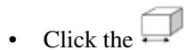

工具。

2. 在出现的 **Create Geometric Restriction** 对话框中，输入几何限制的名称。  
3. 从几何限制列表中选择 **Member size (Topology)**，然后点击 **Continue**。  
4. 从视口中，选择要应用构件尺寸限制的区域，或点击 **Done** 将构件尺寸限制应用于整个模型。

默认情况下，Abaqus/CAE 允许您选择整个模型。要选择面或单元，请使用选择工具栏将可选择对象的类型更改为 **Face** 或 **Cells**。有关更多信息，请参阅 *基于对象类型筛选选择*。

要从现有集合的列表中选择，请执行以下操作：

a. 点击提示区域右侧的 **Sets**。

Abaqus/CAE 将显示包含可用集合列表的 **Region Selection** 对话框。

b. 选择感兴趣的集合，然后点击 **Continue**。


注意：默认选择方法基于您最近使用的选择方法。要恢复为另一种方法，请点击提示区域右侧的 **Select in Viewport** 或 **Sets**。

5. 完成几何限制区域的选择后，在提示区域点击 **Done**。有关选择对象的更多信息，请参阅 *在视口中选择对象*。

将出现 **Edit Geometric Restriction** 对话框。

6. 执行以下操作之一：

• 选择 **Minimum thickness**，并输入最小构件厚度。
• 选择 **Maximum thickness**（最大厚度），并输入构件的最大厚度。  
• 选择 **Envelope**（包络），并输入以下内容：

构件的最小厚度。  
构件的最大厚度。  
- 构件之间的最小间隙。

7. 选择一种 **Method**（方法）算法：当限制类型为 **Maximum thickness** 或 **Envelope** 时，选择 **Filter** 或 **Local Volume**。

8. 单击 **OK** 以创建冻结区域几何限制并退出编辑器。

## 附加信息

• 在拓扑或尺寸优化中创建几何限制  
• 在形状优化中创建几何限制

## 创建循环对称限制

您可以为拓扑或尺寸优化指定循环对称几何限制。

循环对称几何限制将选定区域沿指定距离复制，如图 1 所示。

  
图 1：来自拓扑优化的循环对称。

选定区域沿坐标系的轴线复制。您可以使用全局坐标系，也可以创建一个基准坐标系（更多信息，请参见创建基准坐标系的方法）。您可以选择从对称限制中移除冻结区域。

1. 从主菜单栏中，选择 **Geometric Restriction->Create**。

**Create Geometric Restriction**（创建几何限制）对话框随即出现。


提示：您还可以通过以下两种方式启动创建过程：

- 在 **Geometric Restriction Manager**（几何限制管理器）中单击 **Create**。（您可以通过从主菜单栏选择 **Geometric Restriction->Manager** 来显示几何限制管理器。）

• 在 **Optimization**（优化）模块工具栏中点击工具。

2. 在出现的 **Create Geometric Restriction** 对话框中，输入几何限制的名称。  
3. 从几何限制列表中选择 **Cyclic symmetry** 或 **Cyclic symmetry (Sizing)**，然后单击 **Continue**。  
4. 从视口中，选择将被循环对称复制的区域，或单击 **Done** 将循环对称限制应用于整个模型。

默认情况下，Abaqus/CAE 允许您选择整个模型。要选择面或单元，请使用 **Selection** 工具栏将可选择的对象类型更改为 **Face** 或 **Cells**。更多信息，请参见基于对象类型过滤选择。

如果您希望从现有集合列表中选择，请执行以下操作：

a. 在提示区右侧单击 **Sets**。

Abaqus/CAE 显示包含可用集合列表的 **Region Selection**（区域选择）对话框。

b. 选择感兴趣的集合，然后单击 **Continue**。


## 注意：

默认选择方法基于您最近使用的选择方法。要切换回另一种方法，请在提示区右侧单击 **Select in Viewport** 或 **Sets**。

5. 完成选择几何限制区域后，在提示区中单击 **Done**。有关选择对象的更多信息，请参见在视口中选择对象。

**Edit Geometric Restriction**（编辑几何限制）对话框随即出现。

6. 选择坐标系，并选择区域将沿其复制的轴线。  
7. 输入选定区域将沿该轴线平移的距离。  
8. 如果需要，勾选 **Ignore frozen area** 以从将被平移的区域中移除任何冻结区域。  
9. 单击 **OK** 以创建循环对称几何限制并退出编辑器。

## 附加信息

• 在拓扑或尺寸优化中创建几何限制

• 在形状优化中创建几何限制

## 创建平面对称限制

您可以为拓扑或尺寸优化指定平面对称几何限制。

平面对称几何限制强制优化后的模型关于指定平面对称，如图 1 所示：

  
图 1：来自拓扑优化的平面对称。

您通过选择坐标系的轴线来指定对称平面，该轴线是平面的法线。您可以使用全局坐标系，也可以创建一个基准坐标系（更多信息，请参见创建基准坐标系的方法）。您可以选择从对称限制中移除冻结区域。

1. 从主菜单栏中，选择 **Geometric Restriction->Create**。

**Create Geometric Restriction** 对话框随即出现。


提示：您还可以通过以下两种方式启动创建过程：

- 在 **Geometric Restriction Manager** 中单击 **Create**。（您可以通过从主菜单栏选择 **Geometric Restriction->Manager** 来显示几何限制管理器。）


在 **Optimization** 模块工具栏中的工具。

2. 在出现的 **Create Geometric Restriction** 对话框中，输入几何限制的名称。  
3. 从几何限制列表中选择 **Planar symmetry** 或 **Planar symmetry (Sizing)**，然后单击 **Continue**。  
4. 从视口中，选择要施加平面对称的区域，或单击 **Done** 将平面对称限制应用于整个模型。

默认情况下，Abaqus/CAE 允许您选择整个模型。要选择面或单元，请使用 **Selection** 工具栏将可选择的对象类型更改为 **Face** 或 **Cells**。更多信息，请参见基于对象类型过滤选择。

如果您希望从现有集合列表中选择，请执行以下操作：

a. 在提示区右侧单击 **Sets**。

Abaqus/CAE 显示包含可用集合列表的 **Region Selection** 对话框。

b. 选择感兴趣的集合，然后单击 **Continue**。


## 注意：

默认选择方法基于您最近使用的选择方法。要切换回另一种方法，请在提示区右侧单击 **Select in Viewport** 或 **Sets**。

5. 完成选择几何限制区域后，在提示区中单击 **Done**。有关选择对象的更多信息，请参见在视口中选择对象。  
**Edit Geometric Restriction** 对话框随即出现。  
6. 选择坐标系，并选择代表对称平面法线的坐标系轴线。  
7. 如果需要，勾选 **Ignore frozen area** 以从对称限制中移除任何冻结区域。  
8. 单击 **OK** 以创建平面对称几何限制并退出编辑器。

## 附加信息

• 在拓扑或尺寸优化中创建几何限制

• 在形状优化中创建几何限制

## 创建旋转对称限制

您可以为拓扑或尺寸优化指定旋转对称几何限制。

旋转对称几何限制强制优化后的模型关于指定轴线对称，如图 1 所示：

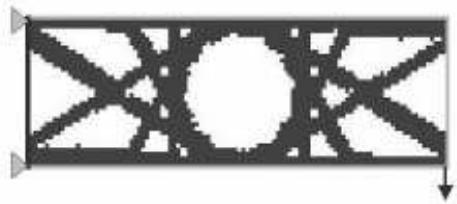  
图 1：来自拓扑优化的旋转对称。

您通过选择坐标系的轴线来指定对称轴。您可以使用全局坐标系，也可以创建一个基准坐标系（更多信息，请参见创建基准坐标系的方法）。此外，您必须输入一个角度，以指定重复段的大小。您可以选择从对称限制中移除冻结区域。

1. 从主菜单栏中，选择 **Geometric Restriction->Create**。

**Create Geometric Restriction** 对话框随即出现。


提示：您还可以通过以下两种方式启动创建过程：

- 在 **Geometric Restriction Manager** 中单击 **Create**。（您可以通过从主菜单栏选择 **Geometric Restriction->Manager** 来显示几何限制管理器。）


在 **Optimization** 模块工具栏中的工具。

2. 在出现的 **Create Geometric Restriction** 对话框中，输入几何限制的名称。  
3. 从几何限制列表中选择 **Rotational symmetry** 或 **Rotational symmetry (Sizing)**，然后单击 **Continue**。  
4. 从视口中，选择要施加旋转对称的区域，或单击 **Done** 将旋转对称限制应用于整个模型。

默认情况下，Abaqus/CAE 允许您选择整个模型。要选择面或单元，请使用 **Selection** 工具栏将可选择的对象类型更改为 **Face** 或 **Cells**。更多信息，请参见基于对象类型过滤选择。
如果希望从已有集合列表中选择，请执行以下操作：

a. 单击提示区域右侧的 **Sets（集合）**。

Abaqus/CAE 将显示 **Region Selection（区域选择）** 对话框，其中包含可用集合的列表。

b. 选择感兴趣的集合并单击 **Continue（继续）**。


## **注意（Note）：**

默认的选择方法基于您最近使用的选择方法。要切换到另一种方法，请单击提示区域右侧的 **Select in Viewport（在视口中选择）** 或 **Sets（集合）**。

5. 完成几何限制区域选择后，在提示区域中单击 **Done（完成）**。有关选择对象的更多信息，请参阅“Selecting objects within the viewport（在视口中选择对象）”。
编辑几何限制 (Edit Geometric Restriction) 对话框随即出现。
6. 选择坐标系，并选择代表对称轴的坐标系轴。
7. 输入 **Repeating segment size（重复段大小）**，即指定重复段大小的角度（以度为单位）。该值必须大于或等于 2°。
8. 根据需要，勾选 **Ignore frozen area（忽略冻结区域）** 以从对称限制中移除任何冻结区域。
9. 单击 **OK（确定）** 以创建旋转对称几何限制并退出编辑器。

## **附加信息（Additional information）**

• 在拓扑或尺寸优化中创建几何限制
• 在形状优化中创建几何限制

## **创建点对称限制**

您可以为拓扑或尺寸优化指定点对称几何限制。

点对称几何限制强制优化后的模型关于指定点对称，如图 1 所示。

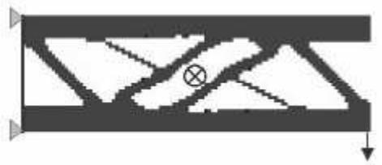
图 1：拓扑优化中的点对称。

您可以通过选择坐标系来指定对称点（假设对称点为坐标系的原点）。您可以使用全局坐标系，也可以创建基准坐标系（有关更多信息，请参阅“Methods for creating a datum coordinate system（创建基准坐标系的方法）”）。您可以选择从对称限制中移除冻结区域。

1. 从主菜单栏中，选择 **Geometric Restriction（几何限制）→Create（创建）**。

**Create Geometric Restriction（创建几何限制）** 对话框随即出现。


提示：您还可以通过另外两种方式启动创建过程：

- 在 **Geometric Restriction Manager（几何限制管理器）** 中单击 **Create（创建）**。（您可以通过从主菜单栏选择 **Geometric Restriction（几何限制）→Manager（管理器）** 来显示几何限制管理器。）


- 在 **Optimization（优化）** 模块工具箱中单击工具。

2. 在随即出现的 **Create Geometric Restriction（创建几何限制）** 对话框中，输入几何限制的名称。
3. 从几何限制列表中选择 **Point symmetry（点对称）** 或 **Point symmetry (Sizing)（点对称（尺寸））**，然后单击 **Continue（继续）**。
4. 从视口中，选择将强制执行点对称的区域，或单击 **Done（完成）** 将点对称限制应用于整个模型。

默认情况下，Abaqus/CAE 允许您选择整个模型。要选择面或单元，请使用 **Selection（选择）** 工具栏将可选择的对象类型更改为 **Face（面）** 或 **Cells（单元）**。有关更多信息，请参阅“Filtering your selection based on the type of object（基于对象类型过滤选择）”。

如果希望从已有集合列表中选择，请执行以下操作：

a. 单击提示区域右侧的 **Sets（集合）**。

Abaqus/CAE 将显示 **Region Selection（区域选择）** 对话框，其中包含可用集合的列表。

b. 选择感兴趣的集合并单击 **Continue（继续）**。


## **注意（Note）：**

默认的选择方法基于您最近使用的选择方法。要切换到另一种方法，请单击提示区域右侧的 **Select in Viewport（在视口中选择）** 或 **Sets（集合）**。

5. 完成几何限制区域选择后，在提示区域中单击 **Done（完成）**。有关选择对象的更多信息，请参阅“Selecting objects within the viewport（在视口中选择对象）”。
编辑几何限制 (Edit Geometric Restriction) 对话框随即出现。
6. 选择坐标系。假设对称点为所选坐标系的原点。
7. 根据需要，勾选 **Ignore frozen area（忽略冻结区域）** 以从对称限制中移除任何冻结区域。
8. 单击 **OK（确定）** 以创建点对称几何限制并退出编辑器。

## **附加信息（Additional information）**

• 在拓扑或尺寸优化中创建几何限制

• 在形状优化中创建几何限制

## **创建最小宽度限制**

当使用壳单元对板金属结构进行建模时，尺寸优化会确定最优的单元厚度。指定包含相同厚度单元的区域的最小宽度，可以防止在尺寸优化后解决方案中出现具有相同厚度的窄条状单元。指定最小宽度还可以防止壳厚度振荡或单元厚度的“棋盘格”图案。最小宽度必须大于单元边的平均长度。

1. 从主菜单栏中，选择 **Geometric Restriction（几何限制）→Create（创建）**。

**Create Geometric Restriction（创建几何限制）** 对话框随即出现。


提示：您还可以通过另外两种方式启动创建过程：

- 在 **Geometric Restriction Manager（几何限制管理器）** 中单击 **Create（创建）**。（您可以通过从主菜单栏选择 **Geometric Restriction（几何限制）→Manager（管理器）** 来显示几何限制管理器。）

- 在 **Optimization（优化）** 模块工具箱中单击工具。

2. 在随即出现的 **Create Geometric Restriction（创建几何限制）** 对话框中，输入几何限制的名称。
3. 从几何限制列表中选择 **Member size (Sizing)（构件尺寸（尺寸））** 并单击 **Continue（继续）**。
4. 从视口中，选择将应用最小宽度限制的区域，或单击 **Done（完成）** 将最小宽度限制应用于整个模型。

默认情况下，Abaqus/CAE 允许您选择整个模型。要选择面或单元，请使用 **Selection（选择）** 工具栏将可选择的对象类型更改为 **Face（面）** 或 **Cells（单元）**。有关更多信息，请参阅“Filtering your selection based on the type of object（基于对象类型过滤选择）”。

如果希望从已有集合列表中选择，请执行以下操作：

a. 单击提示区域右侧的 **Sets（集合）**。

Abaqus/CAE 将显示 **Region Selection（区域选择）** 对话框，其中包含可用集合的列表。

b. 选择感兴趣的集合并单击 **Continue（继续）**。


## **注意（Note）：**

默认的选择方法基于您最近使用的选择方法。要切换到另一种方法，请单击提示区域右侧的 **Select in Viewport（在视口中选择）** 或 **Sets（集合）**。

5. 完成几何限制区域选择后，在提示区域中单击 **Done（完成）**。有关选择对象的更多信息，请参阅“Selecting objects within the viewport（在视口中选择对象）”。”

编辑几何限制 (Edit Geometric Restriction) 对话框随即出现。

6. 选择 **Minimum width（最小宽度）** 并输入最小宽度。
7. 单击 **OK（确定）** 以创建最小宽度几何限制并退出编辑器。

## **附加信息（Additional information）**

• 在拓扑或尺寸优化中创建几何限制
• 在形状优化中创建几何限制

## **创建厚度控制限制**

在配置尺寸优化时，您可以指定壳单元厚度的上、下限。该值可以是绝对厚度，也可以是初始厚度的一部分。

1. 从主菜单栏中，选择 **Geometric Restriction（几何限制）→Create（创建）**。

**Create Geometric Restriction（创建几何限制）** 对话框随即出现。


提示：您还可以通过另外两种方式启动创建过程：

- 在 **Geometric Restriction Manager（几何限制管理器）** 中单击 **Create（创建）**。（您可以通过从主菜单栏选择 **Geometric Restriction（几何限制）→Manager（管理器）** 来显示几何限制管理器。）

- 在 **Optimization（优化）** 模块工具箱中单击工具。

2. 在随即出现的 **Create Geometric Restriction（创建几何限制）** 对话框中，输入几何限制的名称。
3. 从几何限制列表中选择 **Thickness control (Sizing)（厚度控制（尺寸））** 并单击 **Continue（继续）**。
4. 从视口中，选择将应用厚度控制限制的区域，或单击 **Done（完成）** 将厚度控制限制应用于整个模型。

默认情况下，Abaqus/CAE 允许您选择整个模型。要选择面或单元，请使用 **Selection（选择）** 工具栏将可选择的对象类型更改为 **Face（面）** 或 **Cells（单元）**。有关更多信息，请参阅“Filtering your selection based on the type of object（基于对象类型过滤选择）”。

如果希望从已有集合列表中选择，请执行以下操作：

a. 单击提示区域右侧的 **Sets（集合）**。
Abaqus/CAE 会显示“区域选择”对话框，其中包含一个可用集合的列表。

b. 选择感兴趣的集合，然后单击“Continue”。


## 注意：

默认的选择方法基于您最近使用的方法。要切换到另一种方法，请单击提示区右侧的“在视口中选择 (Select in Viewport)”或“集合 (Sets)”。

5. 选择完几何限制区域后，在提示区中单击“完成 (Done)”。有关选择对象的更多信息，请参阅“在视口中选择对象”。

此时将显示“编辑几何限制”对话框。

6. 执行以下操作之一：

• 选择“按值定义厚度 (Thickness by value)”以输入壳单元厚度的绝对值。
• 选择“按比例定义厚度 (Thickness by fraction)”以输入相对于初始值的壳单元厚度比例。

7. 选择“最小值 (Minimum)”并输入最小厚度。
8. 选择“最大值 (Maximum)”并输入最大厚度。
9. 单击“确定 (OK)”以创建厚度控制几何限制并退出编辑器。

## 附加信息

• 在拓扑或尺寸优化中创建几何限制

• 在形状优化中创建几何限制

## 创建聚类限制

您可以指定选定区域在尺寸优化后包含等厚度的壳单元聚类，或在拓扑优化后包含等伪密度的单元聚类。

您可以使用聚类来：
- 在您正在优化的钣金结构中生成加强筋或环，
• 定义等厚度区域之间的边界，或
• 获得实体的可挤压轮廓。

聚类区域可以使用恒定厚度的板材在制造中复制；例如，通过焊接和冲压单个钣金结构形成的车辆“白车身”。为了实现最大的设计灵活性，您应该首先在不指定聚类的情况下优化结构，并使用初始设计来决定在最终优化中聚类哪些区域。

1. 从主菜单栏中，选择“几何限制 (Geometric Restriction)”->“创建 (Create)”。

此时将显示“创建几何限制”对话框。


提示：您还可以通过其他两种方式启动创建过程：

单击“几何限制管理器”中的“创建 (Create)”。（您可以通过从主菜单栏选择“几何限制 (Geometric Restriction)”->“管理器 (Manager)”来显示“几何限制管理器”。）

• 在优化模块工具箱中单击相应的工具。

2. 在出现的“创建几何限制”对话框中，输入几何限制的名称。
3. 从几何限制列表中选择“聚类区域（尺寸）(Cluster areas (Sizing))”或“聚类区域（拓扑）(Cluster areas (Topology))”，然后单击“Continue”。

此时将显示“编辑几何限制”对话框。

4. 从“合格集合 (Eligible Sets)”列表中，选择指定区域的集合，这些区域将在优化后包含等厚度或等伪密度的单元聚类。


注意：

如果所需集合不存在，请单击创建它。

5. 单击箭头将选定的集合移动到“选定集合 (Selected Sets)”列表。
6. 单击“确定 (OK)”以创建厚度聚类几何限制并退出编辑器。

## 附加信息

• 在拓扑或尺寸优化中创建几何限制
• 在形状优化中创建几何限制

## 创建脱模限制

您可以为拓扑优化指定脱模几何限制。脱模几何限制强制优化后的模型满足指定的制造要求；例如，它可以防止在必须从模具中取出的零件中出现倒角和中空区域。

1. 从主菜单栏中，选择“几何限制 (Geometric Restriction)”->“创建 (Create)”。

此时将显示“创建几何限制”对话框。


提示：您还可以通过其他两种方式启动创建过程：

单击“几何限制管理器”中的“创建 (Create)”。（您可以通过从主菜单栏选择“几何限制 (Geometric Restriction)”->“管理器 (Manager)”来显示“几何限制管理器”。）

• 在优化模块工具箱中单击相应的工具。

2. 在出现的“创建几何限制”对话框中，输入几何限制的名称。
3. 从几何限制列表中选择“脱模 (Demold)”，然后单击“Continue”。
4. 从视口中，选择将强制执行脱模限制的区域，或单击“完成 (Done)”将脱模对称限制应用于整个模型。

默认情况下，Abaqus/CAE 允许您选择整个模型。要选择面或单元，请使用“选择”工具栏将可选择的对象类型更改为“面 (Face)”或“单元 (Cells)”。有关更多信息，请参阅“基于对象类型过滤选择”。

如果您更愿意从现有集合列表中选择，请执行以下操作：

a. 单击提示区右侧的“集合 (Sets)”。

Abaqus/CAE 会显示“区域选择”对话框，其中包含一个可用集合的列表。

b. 选择感兴趣的集合，然后单击“Continue”。


## 注意：

默认的选择方法基于您最近使用的方法。要切换到另一种方法，请单击提示区右侧的“在视口中选择 (Select in Viewport)”或“集合 (Sets)”。

5. 选择完几何限制区域后，在提示区中单击“完成 (Done)”。有关选择对象的更多信息，请参阅“在视口中选择对象”。

此时将显示“编辑几何限制”对话框。

6. 默认情况下，优化模块检查碰撞的区域与强制执行脱模限制的区域相同。如果需要，请从“编辑几何限制”对话框的顶部选择，并选择碰撞检查区域。为避免空腔，碰撞检查区域应包括脱模区域以及与该脱模区域相邻的任何单元。

7. 选择以下脱模技术之一：

• 选择“使用中心平面脱模 (Demolding with a central plane)”，并选择优化模块如何确定中心平面：

选择“自动确定 (Determine automatically)”。优化模块确定中心平面的最佳位置，使得优化仅在拉伸方向或相反方向添加或移除材料。切换“防止形成孔 (Prevent hole formation)”以防止优化从中心平面移除材料。

选择“指定 (Specify)”，并单击选择中心平面上的一个点。优化模块创建一个可以在两个拉伸方向（远离中心平面）从模具中脱出的结构。

选择“锻造（仅在拉伸方向变形）(Forging (deform only in the pull direction))”。中心平面（即模具两半合模的平面）被假定位于模型背面并垂直于拉伸方向。优化仅在拉伸方向添加或移除材料。

选择“冲压 (Stamping)”。如果优化模块决定从结构中移除一个单元，它还会移除该单元后面或前面的所有单元（相对于指示拉伸方向的矢量）。

• 选择“在区域表面脱模 (Demolding at the region surface)”以强制优化仅从受限区域的表面添加或移除材料。

8. 单击

9. 输入“拔模斜度 (Draft angle)”。拔模斜度是相对于拉伸方向的一个小角度，将被引入到优化后的模型中，以确保零件可以从其模具中取出。通常该值在 0° 到 10° 之间。

10. 单击“确定 (OK)”以创建脱模几何限制并退出编辑器。

## 附加信息

• 在拓扑或尺寸优化中创建几何限制
• 在形状优化中创建几何限制

## 创建悬垂控制限制

您可以为拓扑优化中的悬垂控制指定几何限制。

悬垂控制几何限制强制优化后的模型满足指定的增材制造要求。该限制可以防止模型中的悬垂特征超过临界角度。通常，大于 45º 的悬垂特征难以打印，通常需要添加支撑结构。

基板平面定义了打印床。只有位于基板平面之上的模型部分需要支撑。默认情况下，悬垂限制会尝试移除所有悬垂特征，从而不需要支撑结构。根据几何形状，这可能导致不合理的结果。您可以指定没有基板平面，在这种情况下，边界特征始终可打印。或者，您可以通过指定垂直于打印方向的平面上的一个用户定义点来定义基板平面。该点应位于必须保留的悬垂特征之上，并位于应被移除的悬垂特征之下。
1. 从主菜单栏中选择 Geometric Restriction > Create。

出现 Create Geometric Restriction 对话框。


提示：您可以通过另外两种方式启动创建过程：

- 在 Geometric Restriction Manager 中单击 Create。（您可以通过从主菜单栏选择 Geometric Restriction > Manager 来显示 Geometric Restriction Manager。）

- 在 Optimization 模块工具箱中单击工具。

2. 输入几何限制的名称。
3. 从几何限制列表中选择 Overhang control (Topology)，然后单击 Continue。
4. 从视口中选择要施加悬垂控制限制的区域，或者单击 Done 将悬垂控制限制应用于整个模型。

默认情况下，Abaqus/CAE 允许您选择整个模型。要选择面或单元，请使用 Selection 工具栏将可选择的对象类型更改为 Face 或 Cells。更多信息，请参阅“基于对象类型筛选选择”。

如果您更愿意从现有集合列表中选择，请执行以下操作：

a. 在提示区右侧单击 Sets。

Abaqus/CAE 显示包含可用集合列表的 Region Selection 对话框。

b. 选择感兴趣的集合，然后单击 Continue。


## 注：

默认选择方法基于您最近使用的选择方法。要切换回另一种方法，请在提示区右侧单击 Select in Viewport 或 Sets。

5. 完成几何限制区域的选择后，在提示区单击 Done。有关选择对象的更多信息，请参阅“在视口中选择对象”。

出现 Edit Geometric Restriction 对话框。

6. 默认情况下，Optimization 模块检查关键悬垂特征的区域与强制执行悬垂控制限制的区域相同。如果需要，请从 Edit Geometric Restriction 对话框顶部选择检查区域。

7. 选择基准平面以定义打印平台。

- 选择 Determine automatically，让 Optimization 模块确定基准平面的最佳位置，以消除所有悬垂特征。
- 选择 Specify，然后单击以选择垂直于打印方向平面上的一个点。
- 选择 None，表示所有边界特征都应被打印。

8. 默认情况下，Optimization 模块假设打印方向在全局坐标系中定义。要更改坐标系，请单击 CSYS 选项并执行以下操作之一：

- 在视口中选择现有的基准坐标系。
- 按名称选择现有的基准坐标系。
    1. 在提示区，单击 Datum CSYS List 以显示基准坐标系列表。
    2. 从列表中选择一个名称，然后单击 OK。
- 在提示区单击 Use Global CSYS 以切换回全局坐标系。

或者，单击以定义新的基准坐标系。

9. 单击，并选择两个点以指定沿打印方向的矢量。
10. 输入 Overhang angle（悬垂角度）。悬垂角度是相对于打印方向的一个角度，用于优化模型以确保零件不包含不可接受的特征。默认值为 45°。
11. 输入 Radius（半径）。半径定义用于悬垂准则内部检查的圆锥体尺寸。默认值为平均单元长度的 1.5 倍。
12. 单击 OK 以创建悬垂控制几何限制并退出编辑器。

## 其他信息

- 在拓扑或尺寸优化中创建几何限制

## 创建铣削控制限制

您可以为拓扑优化指定铣削控制几何限制。

铣削几何限制强制优化后的模型满足指定的制造要求；例如，它可以安排零件中的倒扣和空腔区域，以便于通过铣削去除材料。

1. 从主菜单栏中选择 Geometric Restriction > Create。

出现 Create Geometric Restriction 对话框。


提示：您可以通过另外两种方式启动创建过程：

- 在 Geometric Restriction Manager 中单击 Create。（您可以通过从主菜单栏选择 Geometric Restriction > Manager 来显示 Geometric Restriction Manager。）

- 在 Optimization 模块工具箱中单击工具。

2. 在出现的 Create Geometric Restriction 对话框中，输入几何限制的名称。
3. 从几何限制列表中选择 Milling control，然后单击 Continue。
4. 从视口中选择要施加铣削限制的区域，或者单击 Done 将铣削对称限制应用于整个模型。

默认情况下，Abaqus/CAE 允许您选择整个模型。要选择面或单元，请使用 Selection 工具栏将可选择的对象类型更改为 Face 或 Cells。更多信息，请参阅“基于对象类型筛选选择”。

如果您更愿意从现有集合列表中选择，请执行以下操作：

a. 在提示区右侧单击 Sets。

Abaqus/CAE 显示包含可用集合列表的 Region Selection 对话框。

b. 选择感兴趣的集合，然后单击 Continue。


## 注：

默认选择方法基于您最近使用的选择方法。要切换回另一种方法，请在提示区右侧单击 Select in Viewport 或 Sets。

5. 完成几何限制区域的选择后，在提示区单击 Done。有关选择对象的更多信息，请参阅“在视口中选择对象。”

出现 Edit Geometric Restriction 对话框。

6. 默认情况下，Optimization 模块进行铣削检查的区域与强制执行铣削限制的区域相同。如果需要，请从 Edit Geometric Restriction 对话框顶部选择铣削检查区域。

7. 默认情况下，Optimization 模块假设铣削方向在全局坐标系中定义。要更改坐标系，请单击 CSYS 选项并执行以下操作之一：

- 在视口中选择现有的基准坐标系。
- 按名称选择现有的基准坐标系。
    1. 在提示区，单击 Datum CSYS List 以显示基准坐标系列表。
    2. 从列表中选择一个名称，然后单击 OK。
- 在提示区单击 Use Global CSYS 以切换回全局坐标系。

或者，单击以定义新的基准坐标系。

8. 单击，并选择两个点以指定沿铣削方向的矢量。它指定模型预期被铣削的方向。如果是多轴铣削，请重复此步骤以指定多个方向。
9. 输入 Radius（半径）。半径值在移除单元期间的碰撞检查中内部使用。
10. 单击 OK 以创建铣削几何限制并退出编辑器。

## 其他信息

- 在拓扑或尺寸优化中创建几何限制
- 在形状优化中创建几何限制

## 创建肋条设计限制

您可以为拓扑优化指定肋条设计几何限制。

肋条图案限制强制优化器防止材料堆积，并生成肋条形式的子结构。

1. 从主菜单栏中选择 Geometric Restriction > Create。

出现 Create Geometric Restriction 对话框。


提示：您可以通过另外两种方式启动创建过程：

- 在 Geometric Restriction Manager 中单击 Create。（您可以通过从主菜单栏选择 Geometric Restriction > Manager 来显示 Geometric Restriction Manager。）

- 在 Optimization 模块工具箱中单击工具。

2. 在出现的 Create Geometric Restriction 对话框中，输入几何限制的名称。
3. 从几何限制列表中选择 Rib design，然后单击 Continue。
4. 从视口中选择要施加肋条设计限制的区域，或者单击 Done 将肋条设计限制应用于整个模型。

默认情况下，Abaqus/CAE 允许您选择整个模型。要选择面或单元，请使用 Selection 工具栏将可选择的对象类型更改为 Face 或 Cells。更多信息，请参阅“基于对象类型筛选选择”。

5. 可选：如果您更愿意从现有集合列表中选择，请执行以下操作：
a. 单击提示区右侧的 **Sets**。

Abaqus/CAE 将显示包含可用集列表的 **Region Selection** 对话框。

b. 选择所需的集，然后单击 **Continue**。


注意：默认的选择方法基于您最近使用的选择方法。要切换回另一种方法，请单击提示区右侧的 **Select in Viewport** 或 **Sets**。

6. 完成选择几何限制区域后，在提示区中单击 **Done**。有关选择对象的更多信息，请参阅 **选择视口内的对象**。

**Edit Geometric Restriction** 对话框随即出现。

7. 可选：默认情况下，Optimization 模块检查肋设计的区域与其强制执行肋设计限制的区域相同。
   如果需要，请从 **Edit Geometric Restriction** 对话框的顶部选择，并选择肋设计检查区域。

8. 可选：默认情况下，Optimization 模块假定肋方向是在全局坐标系中定义的。
   要更改坐标系，请单击 **CSYS** 选项旁的 `...` 并执行以下操作之一：

   • 在视口中选择一个现有的基准坐标系。
   • 按名称选择一个现有的基准坐标系：
     1. 在提示区中，单击 **Datum CSYS List** 以显示基准坐标系列表。
     2. 从列表中选择一个名称，然后单击 **OK**。
   • 单击提示区中的 **Use Global CSYS** 以恢复使用全局坐标系。

   或者，单击 `...` 以定义新的基准坐标系。

9. 单击 `...`，并选择两个点以指定肋的平面外生长方向。

10. 输入 **Rib thickness**（肋厚度）。

    肋厚度是肋的平均厚度。

11. 输入 **Rib distance**（肋距离）。

    肋距离是肋中心之间的平均距离。该距离必须大于平均单元边长度的两倍。

12. 单击 **OK** 以创建肋设计几何限制并退出编辑器。

## 附加信息

• 在拓扑或尺寸优化中创建几何限制
• 在形状优化中创建几何限制

本节描述如何在形状优化中创建几何限制。

## 本节内容：

创建成员尺寸限制  
创建平面 对称限制  
创建旋转 对称限制  
创建点 对称限制  
创建冲压 控制限制  
创建车削 控制限制  
创建脱模 控制限制  
创建钻孔 控制限制  
创建穿透 检查限制  
创建固定区域限制  
创建生长限制  
创建设计方向限制  
创建滑动区域控制限制

## 创建成员尺寸限制

您可以指定模型选定区域的最小或最大尺寸；例如，形状优化期间修改的肋的最小厚度。您输入的值可视为半径。在优化过程中，Optimization 模块会限制成员的厚度为您输入值的两倍（即直径）。如果输入最小厚度值，Optimization 模块会调整表面节点，使得沿模型表面法线方向必须达到最小直径。如果结构在某些区域小于指定值，则形状优化仅允许生长，直到这些区域的成员尺寸满足限制。反之，如果输入最大厚度值，Optimization 模块会调整表面节点，使得沿模型表面法线方向必须达到最大直径。如果结构在某些区域大于指定值，则形状优化仅允许收缩，直到这些区域的成员尺寸满足限制。

1. 从主菜单栏中，选择 **Geometric Restriction -> Create**。
   **Create Geometric Restriction** 对话框随即出现。

   

   提示：您还可以通过以下两种方式启动创建过程：
   • 单击 **Geometric Restriction Manager** 中的 **Create**。（您可以通过从主菜单栏选择 **Geometric Restriction -> Manager** 来显示 **Geometric Restriction Manager**。）
   • 单击 **Optimization** 模块工具箱中的 `...` 工具。

2. 在出现的 **Create Geometric Restriction** 对话框中，输入几何限制的名称。
3. 从几何限制列表中选择 **Member size (Shape)**，然后单击 **Continue**。
4. 在视口中，选择要应用成员尺寸限制的区域，或者单击 **Done** 以将成员尺寸限制应用于整个模型。

   默认情况下，Abaqus/CAE 允许您选择整个模型。要选择面或单元，请使用 **Selection** 工具栏将可选择的对象类型更改为 **Face** 或 **Cells**。有关更多信息，请参阅 **基于对象类型过滤选择**。

   如果您希望从现有集列表中选择，请执行以下操作：

   a. 单击提示区右侧的 **Sets**。
      Abaqus/CAE 将显示包含可用集列表的 **Region Selection** 对话框。

   b. 选择所需的集，然后单击 **Continue**。

   

   **注意：**
   默认的选择方法基于您最近使用的选择方法。要切换回另一种方法，请单击提示区右侧的 **Select in Viewport** 或 **Sets**。

5. 完成选择几何限制区域后，在提示区中单击 **Done**。有关选择对象的更多信息，请参阅 **选择视口内的对象**。
   **Edit Geometric Restriction** 对话框随即出现。

6. 执行以下操作之一：
   • 选择 **Minimum thickness**，并输入成员的最小半径。
   • 选择 **Maximum thickness**，并输入成员的最大半径。

7. 如果需要，切换打开 **Ignore in first design cycle**（默认）。当优化开始时，它假定选定区域已包含大于最小厚度的成员。如果区域包含较小的成员，Optimization 模块将发出警告并尝试继续。如果切换关闭 **Ignore in first design cycle**，且区域包含较小的成员，Optimization 模块将发出错误消息并停止执行。

8. 如果需要，切换打开 **Check node group**，并选择节点组区域。
9. 单击 **OK** 以创建成员尺寸几何限制并退出编辑器。

## 附加信息

• 在拓扑或尺寸优化中创建几何限制
• 在形状优化中创建几何限制

## 创建平面 对称限制

您可以为形状优化指定平面 对称几何限制。平面 对称几何限制强制优化模型的选定面关于指定平面对称。您通过选择坐标系的轴来指定对称平面，该轴是平面的法线。坐标系的原点是对称平面上的一个点。您可以使用全局坐标系，也可以创建一个基准坐标系（有关更多信息，请参阅 **创建基准坐标系的方法**）。

在优化开始之前，网格必须在对称平面两侧大致对称，以便 Optimization 模块能够识别对称平面两侧的节点对——主节点和次节点。默认情况下，主节点是优化移动最多（生长最多）或移动最少（收缩最少）的节点。优化会移动主节点，并且对称条件会对次节点施加相等的位移，使其相对于主节点保持对称。或者，如果您试图优化相互接触的表面，您可以强制 Optimization 模块将主节点选择为优化应用生长最少或收缩最多的节点。

1. 从主菜单栏中，选择 **Geometric Restriction -> Create**。
   **Create Geometric Restriction** 对话框随即出现。

   

   提示：您还可以通过以下两种方式启动创建过程：
   • 单击 **Geometric Restriction Manager** 中的 **Create**。（您可以通过从主菜单栏选择 **Geometric Restriction -> Manager** 来显示 **Geometric Restriction Manager**。）
   • 单击 **Optimization** 模块工具箱中的 `...` 工具。

2. 在出现的 **Create Geometric Restriction** 对话框中，输入几何限制的名称。
3. 从几何限制列表中选择 **Planar symmetry**，然后单击 **Continue**。
4. 在视口中，选择要强制执行平面 对称性的面。有关更多信息，请参阅 **使用面曲率方法选择多个面**。
如果您更倾向于从现有集合列表中选择，请执行以下操作：

a. 在提示区域右侧点击 Sets。

Abaqus/CAE 将显示 Region Selection（区域选择）对话框，其中包含可用集合的列表。

b. 选择目标集合，然后点击 Continue。


## 注意：

默认选择方法基于您最近使用的选取方式。要切换到另一种方法，请在提示区域右侧点击 Select in Viewport 或 Sets。

5. 选择完面后，在提示区域点击 Done。

将出现 Edit Geometric Restriction（编辑几何限制）对话框。

6. 选择坐标系，并选择代表对称平面法线的坐标系轴。
7. 选择优化用于确定主点的方法。大多数情况下，您应选择 Determine from most growth and least shrinkage。仅当您试图优化涉及接触的面时，才应选择 Determine from least growth and most shrinkage。
8. 输入用于确定 X、Y 和 Z 轴上对称点的公差。

优化模块使用该公差来识别对称平面上的对称节点对。

9. 如果需要，切换开启 Ignore in first design cycle（默认开启）。当优化开始时，它会假设面已关于该平面对称。如果面不对称，优化模块会发出警告并尝试继续。如果您切换关闭 Ignore in first design cycle，而面不对称，优化模块会发出错误信息并停止执行。
10. 如果需要，切换开启 Allow nonsymmetric mesh（默认开启）以将平面几何限制也用于非对称网格。切换关闭 Allow nonsymmetric mesh 则仅将平面几何限制用于对称网格。
11. 点击 OK 以创建平面几何限制并退出编辑器。

## 附加信息

• 在拓扑或尺寸优化中创建几何限制
• 在形状优化中创建几何限制

## 创建旋转对称限制

您可以为形状优化指定旋转对称几何限制。旋转对称几何限制强制优化模型的选定面关于指定的旋转轴对称。您通过指定代表轴的向量的起始和结束坐标来选择对称轴。您可以使用全局坐标系，也可以创建一个基准坐标系（更多信息请参见创建基准坐标系的方法）。

在优化开始前，网格必须在对称轴周围大致对称，以便优化模块能够识别出位于选定面内且在垂直于对称轴平面上的节点组。默认情况下，主节点是组中优化移动最多（最大增长）或移动最少（最小收缩）的节点。优化移动主节点，对称条件将相同的位移应用于组中的其余节点（次节点），使它们保持关于轴的对称性。如果您试图优化涉及接触的面，可以强制优化模块将主节点选择为优化应用最小增长或最大收缩量的节点。

或者，您可以选择一个单点作为所有其他节点的主节点。优化确定主节点的位移量，所有其他节点移动相同的量，使它们保持关于所选轴的对称性。

1. 从主菜单栏中，选择 Geometric Restriction -> Create。

将出现 Create Geometric Restriction（创建几何限制）对话框。


提示：您可以通过另外两种方式启动创建过程：

在 Geometric Restriction Manager（几何限制管理器）中点击 Create。（您可以通过从主菜单栏选择 Geometric Restriction -> Manager 来显示 Geometric Restriction Manager。）
• 在 Optimization（优化）模块工具箱中点击工具。

2. 在出现的 Create Geometric Restriction 对话框中，输入几何限制的名称。
3. 从几何限制列表中选择 Rotational symmetry (Shape)（旋转对称性（形状）），然后点击 Continue。
4. 从视图中，选择要施加旋转对称性的面。更多信息，请参见使用面曲率方法选择多个面。

如果您更倾向于从现有集合列表中选择，请执行以下操作：

a. 在提示区域右侧点击 Sets。

Abaqus/CAE 将显示 Region Selection（区域选择）对话框，其中包含可用集合的列表。

b. 选择目标集合，然后点击 Continue。


## 注意：

默认选择方法基于您最近使用的选取方式。要切换到另一种方法，请在提示区域右侧点击 Select in Viewport 或 Sets。

5. 选择完面后，在提示区域点击 Done。

将出现 Edit Geometric Restriction（编辑几何限制）对话框。

6. 输入代表对称轴的向量的起点和终点坐标。
7. 切换开启 Create a repeating pattern，并输入优化创建的图案将重复的角度范围。该值必须在 0° 到 360° 之间。值为 0° 意味着次节点关于对称轴对称，但优化不会创建重复图案。

8. 如果需要，切换开启 Allow nonsymmetric mesh（默认开启）以将旋转对称几何限制也用于非对称网格。切换关闭 Allow nonsymmetric mesh 则仅将旋转对称几何限制用于对称网格。当您允许非对称网格时，可以选择重复图案的 Start point（起点）。
9. 选择优化用于确定主点的方法。大多数情况下，您应选择 Determine from most growth and least shrinkage。仅当您试图优化涉及接触的面时，才应选择 Determine from least growth and most shrinkage。
或者，您可以选择 Region 并选择一个顶点来代表主节点。
10. 输入用于确定 X、Y 和 Z 轴上对称点的公差。
优化模块使用该公差来识别表面上位于垂直于对称轴的平面上且与对称轴等距的节点。
11. 如果需要，切换开启 Ignore in first design cycle（默认开启）。当优化开始时，它会假设面已关于轴对称。如果面不对称，优化模块会发出警告并尝试继续。如果您切换关闭 Ignore in first design cycle，而面不对称，优化模块会发出错误信息并停止执行。
12. 点击 OK 以创建旋转对称几何限制并退出编辑器。

## 附加信息

• 在拓扑或尺寸优化中创建几何限制
• 在形状优化中创建几何限制

## 创建点对称限制

您可以为形状优化指定点对称几何限制。旋转对称几何限制强制优化模型的选定面关于指定的对称点对称。您通过选择一个坐标系来指定对称点（对称点被假定为坐标系的原点）。您可以使用全局坐标系，也可以创建一个基准坐标系（更多信息请参见创建基准坐标系的方法）。

在优化开始前，网格必须在该点周围大致对称，以便优化模块能够识别对称点两侧的节点对——主节点和次节点。默认情况下，主节点是优化移动最多（最大增长）或移动最少（最小收缩）的节点。优化移动主节点，对称条件将相同的位移应用于次节点，使其与主节点保持对称。或者，如果您试图优化涉及接触的面，可以强制优化模块将主节点选择为优化应用最小增长或最大收缩量的节点。

1. 从主菜单栏中，选择 Geometric Restriction -> Create。

将出现 Create Geometric Restriction（创建几何限制）对话框。


提示：您还可以通过另外两种方式启动创建过程：

点击**几何限制管理器**中的**创建**。（您可以通过从主菜单栏选择**几何限制->管理器**来显示**几何限制管理器**。）

• 点击**优化模块**工具箱中的工具。

2. 在出现的**创建几何限制**对话框中，输入几何限制的名称。  
3. 从几何限制列表中选择**点对称（形状）**，然后点击**继续**。  
4. 在视口中，选择将施加点对称的面。更多信息，请参阅**使用面曲率方法选择多个面**。

如果您更希望从现有集合列表中选择，请执行以下操作：

a. 点击提示区右侧的**集合**。

Abaqus/CAE 将显示**区域选择**对话框，其中包含可用集合的列表。

b. 选择感兴趣的集合，然后点击**继续**。


## 注意：

默认选择方法基于您最近采用的选择方法。要切换回另一种方法，请点击提示区右侧的**在视口中选择**或**集合**。

5. 完成面选择后，在提示区点击**完成**。

将出现**编辑几何限制**对话框。

6. 选择坐标系。假定对称点为所选坐标系的原点。  
7. 选择优化用于确定主点的方法。在大多数情况下，您应选择**由最大生长和最小收缩确定**。仅当您尝试优化涉及接触的面时，才应选择**由最小生长和最大收缩确定**。  
8. 输入将用于确定对称点的 X、Y 和 Z 平面的公差。

优化模块使用该公差来识别与对称点对称的节点。

9. 如果需要，可打开**在第一个设计周期中忽略**（默认）。当优化开始时，它假定面已关于该点对称。如果面不对称，优化模块会发出警告并尝试继续。如果您关闭**在第一个设计周期中忽略**，并且面不对称，优化模块将发出错误消息并停止执行。  
10. 点击**确定**以创建点对称几何限制并退出编辑器。

## 其他信息

• 在拓扑或尺寸优化中创建几何限制

• 在形状优化中创建几何限制

## 创建冲压控制限制

您可以为形状优化指定冲压控制几何限制。冲压控制几何限制将生成一个优化后的模型，该模型可以通过工具和冲压操作沿指定方向制造。您通过指定代表方向的矢量的起点和终点坐标来选择方向。您可以使用全局坐标系，也可以创建一个基准坐标系（有关更多信息，请参阅**创建基准坐标系的方法**）。

在优化开始之前，网格应定义一个可冲压的模型；否则，当优化在第一次迭代中创建可冲压模型时，网格可能会发生扭曲。主节点可以位于您选择受冲压限制约束的区域内的任何位置。默认情况下，主节点是该区域中优化移动最多的节点（最大生长）或移动最少的节点（最小收缩）。优化位移主节点，冲压条件对区域中的其余节点（次级节点）施加相等的位移，以使模型保持可冲压状态。如果您尝试优化接触中的表面，您可以强制优化模块选择将最小生长或最大收缩量应用于其上的节点作为主节点。或者，您可以选择一个单点，该点将被所有其他节点用作主节点。优化确定主节点的位移量，所有其他节点移动相同的量，以使模型保持可冲压状态。

1. 从主菜单栏，选择**几何限制->创建**。

将出现**创建几何限制**对话框。


提示：您还可以通过另外两种方式启动创建过程：

点击**几何限制管理器**中的**创建**。（您可以通过从主菜单栏选择**几何限制->管理器**来显示**几何限制管理器**。）

• 点击**优化模块**工具箱中的工具。

2. 在出现的**创建几何限制**对话框中，输入几何限制的名称。  
3. 从几何限制列表中选择**冲压控制**，然后点击**继续**。  
4. 在视口中，选择将应用冲压控制的面。更多信息，请参阅**使用面曲率方法选择多个面**。

如果您更希望从现有面集合列表中选择，请执行以下操作：

a. 点击提示区右侧的**集合**。

Abaqus/CAE 将显示**区域选择**对话框，其中包含可用集合的列表。

b. 选择感兴趣的集合，然后点击**继续**。


## 注意：

默认选择方法基于您最近采用的选择方法。要切换回另一种方法，请点击提示区右侧的**在视口中选择**或**集合**。

5. 完成面选择后，在提示区点击**完成**。

将出现**编辑几何限制**对话框。

6. 输入代表冲压工具移动方向的矢量的起点和终点坐标。  
7. 输入拔模角，它代表创建冲压模型的工具的角度。该值必须介于 0° 和 45° 之间。

8. 输入冲压区域中可容许的底切量的正值。  
9. 选择优化用于确定主点的方法。在大多数情况下，您应选择**由最大生长和最小收缩确定**。仅当您尝试优化涉及接触的面时，才应选择**由最小生长和最大收缩确定**。

或者，您可以选择**区域**并选择一个顶点来表示主节点。

10. 输入 X、Y 和 Z 轴的公差。

优化模块使用该公差来识别位于垂直于对称轴且距对称轴等距的平面上的表面节点。

11. 如果需要，可打开**在第一个设计周期中忽略**（默认）。当优化开始时，它假定模型是可冲压的。如果模型不可冲压，优化模块会发出警告并尝试继续。如果您关闭**在第一个设计周期中忽略**，并且模型不可冲压，优化模块将发出错误消息并停止执行。  
12. 点击**确定**以创建冲压控制几何限制并退出编辑器。

## 其他信息

• 在拓扑或尺寸优化中创建几何限制  
• 在形状优化中创建几何限制

## 创建车削控制限制

您可以为形状优化指定车削控制几何限制。车削控制几何限制将生成一个优化后的模型，该模型可以通过车床上的工具沿指定方向切入模型来制造。您通过指定代表方向的矢量的起点和终点坐标来选择方向。您可以使用全局坐标系，也可以创建一个基准坐标系（有关更多信息，请参阅**创建基准坐标系的方法**）。

在优化开始之前，网格应定义一个可车削的模型；否则，当优化在第一次迭代中创建可车削模型时，网格可能会发生扭曲。主节点可以位于您选择受车削限制约束的区域内的任何位置。默认情况下，主节点是该区域中优化移动最多的节点（最大生长）或移动最少的节点（最小收缩）。优化位移主节点，冲压条件对区域中的其余节点（次级节点）施加相等的位移，以使模型保持可车削状态。如果您尝试优化接触中的表面，您可以强制优化模块选择将最小生长或最大收缩量应用于其上的节点作为主节点。或者，您可以选择一个单点，该点将被所有其他节点用作主节点。优化确定主节点的位移量，所有其他节点移动相同的量，以使模型保持可车削状态。
1. 从主菜单栏中选择几何限制（Geometric Restriction）-> 创建（Create）。
将出现“创建几何限制”对话框。


提示：您可以通过另外两种方式启动创建过程：
*   在几何限制管理器（Geometric Restriction Manager）中点击“创建”（Create）。（您可以通过从主菜单栏选择几何限制（Geometric Restriction）-> 管理器（Manager）来显示几何限制管理器。）
*   在优化（Optimization）模块工具箱中点击相应工具。

2. 在出现的“创建几何限制”对话框中，输入几何限制的名称。
3. 从几何限制列表中选择旋转控制（Turn control），然后点击继续（Continue）。
4. 从视口中，选择要应用旋转控制的面。更多信息，请参阅使用面曲率法选择多个面。

如果您希望从现有面集的列表中进行选择，请执行以下操作：
   a. 单击提示区域右侧的“集合”（Sets）。
      Abaqus/CAE 将显示包含可用集合列表的“区域选择”（Region Selection）对话框。
   b. 选择所需的集合，然后单击“继续”（Continue）。


## 注意：
默认选择方法基于您最近使用的选择方法。要切换到另一种方法，请单击提示区域右侧的“在视口中选择”（Select in Viewport）或“集合”（Sets）。

5. 选择完面后，在提示区域中单击“完成”（Done）。
将出现“编辑几何限制”对话框。

6. 输入代表刀具移动方向的矢量起点和终点的坐标。
7. 选择优化用于确定主点的方法。在大多数情况下，您应该选择“根据最大增长和最小收缩确定”（Determine from most growth and least shrinkage）。仅当您试图优化涉及接触的面时，才应选择“根据最小增长和最大收缩确定”（Determine from least growth and most shrinkage）。
8. 输入 $X \mathrm { , ~ } Y \mathrm { \mathrm { - } , ~ }$ 和 Z 轴上的容差。
优化模块使用该容差来识别表面上位于对称轴法平面内且与对称轴等距的节点。

9. 如果需要，请切换启用“在第一个设计周期中忽略”（Ignore in first design cycle）（默认）。当优化开始时，它假设模型是可旋转的。如果模型不可旋转，优化模块会发出警告并尝试继续。如果您禁用“在第一个设计周期中忽略”且模型不可旋转，优化模块会发出错误消息并停止执行。

10. 单击“确定”（OK）以创建旋转控制几何限制并退出编辑器。

## 附加信息
*   在拓扑优化或尺寸优化中创建几何限制
*   在形状优化中创建几何限制

## 创建脱模控制限制
您可以为形状优化指定脱模几何限制。脱模几何限制强制优化后的模型满足指定的制造要求；例如，它可以防止必须从模具中取出的零件出现倒扣和空心区域。您可以通过指定代表轴的矢量的起点和终点坐标来选择脱模方向。您可以使用全局坐标系，也可以创建基准坐标系（有关更多信息，请参阅创建基准坐标系的方法）。

优化开始前，网格应定义一个可脱模的模型；否则，当优化在第一次迭代中创建可脱模模型时，网格可能会扭曲。主节点可以位于您选择由脱模控制限制支配的区域中的任何位置。默认情况下，主节点是该区域中优化向外移动最多（最大增长）或向内移动最少（最小收缩）的节点。优化会移动主节点，并且冲压条件将相同的位移应用于该区域中的其余节点（次节点），以便模型保持可脱模状态。如果您试图优化接触面，可以强制优化模块选择主节点为优化施加最小增长或最大收缩量的节点。或者，您可以选择一个单点，该点将被所有其他节点用作主节点。优化确定主节点的位移量，并且所有其他节点移动相同的量，以便模型保持可脱模状态。

1.  从主菜单栏中选择几何限制（Geometric Restriction）-> 创建（Create）。
    将出现“创建几何限制”对话框。


提示：您可以通过另外两种方式启动创建过程：
*   在几何限制管理器（Geometric Restriction Manager）中点击“创建”（Create）。（您可以通过从主菜单栏选择几何限制（Geometric Restriction）-> 管理器（Manager）来显示几何限制管理器。）
*   在优化（Optimization）模块工具箱中点击相应工具。

2.  在出现的“创建几何限制”对话框中，输入几何限制的名称。
3.  从几何限制列表中选择脱模控制（Demold control），然后点击继续（Continue）。
4.  从视口中，选择要应用脱模控制的面。更多信息，请参阅使用面曲率法选择多个面。
    如果您希望从现有面集的列表中进行选择，请执行以下操作：
    a.  单击提示区域右侧的“集合”（Sets）。
        Abaqus/CAE 将显示包含可用集合列表的“区域选择”（Region Selection）对话框。
    b.  选择所需的集合，然后单击“继续”（Continue）。


## 注意：
默认选择方法基于您最近使用的选择方法。要切换到另一种方法，请单击提示区域右侧的“在视口中选择”（Select in Viewport）或“集合”（Sets）。

5.  选择完面后，在提示区域中单击“完成”（Done）。
    将出现“编辑几何限制”对话框。

6.  默认情况下，优化模块检查碰撞的区域与强制执行脱模限制的区域相同。如果需要，请从“编辑几何限制”对话框顶部选择，并选择碰撞检查区域。
    碰撞检查区域内的面不能被区域外的面穿透。如果在形状优化过程中，某个节点试图穿透碰撞检查区域中的一个单元，优化模块将缩减该节点的位移。碰撞检查区域必须包含将应用脱模控制的面。

7.  输入代表模具从脱模区域撤出方向的矢量起点和终点的坐标。
8.  输入拔模角（draw angle），它代表模具从脱模区域撤出的角度。值必须在 0° 到 45° 之间。
9.  输入一个正值，表示脱模控制区域中可以容忍的倒扣量。
10. 选择优化用于确定主点的方法。在大多数情况下，您应该选择“根据最大增长和最小收缩确定”（Determine from most growth and least shrinkage）。仅当您试图优化涉及接触的面时，才应选择“根据最小增长和最大收缩确定”（Determine from least growth and most shrinkage）。
11. 输入 X、Y 和 Z 轴上的容差。
    优化模块使用该容差来识别表面上位于对称轴法平面内且与对称轴等距的节点。
12. 如果需要，请切换启用“在第一个设计周期中忽略”（Ignore in first design cycle）（默认）。当优化开始时，它假设模具可以从脱模区域撤出。如果模具无法撤出，优化模块会发出警告并尝试继续。如果您禁用“在第一个设计周期中忽略”且模具无法撤出，优化模块会发出错误消息并停止执行。
13. 单击“确定”（OK）以创建脱模几何限制并退出编辑器。

## 附加信息
*   在拓扑优化或尺寸优化中创建几何限制
*   在形状优化中创建几何限制

## 创建钻孔控制限制
您可以为形状优化指定钻孔控制几何限制。钻孔控制几何限制会导致优化后的模型可以被一个沿指定方向钻入模型的刀具制造出来。由刀具创建的孔关于刀具轴线对称。此外，刀具可以从孔中撤出。您可以通过指定代表轴的矢量的起点和终点坐标来选择刀具轴（以及钻孔方向）。您可以使用全局坐标系，也可以创建基准坐标系（有关更多信息，请参阅创建基准坐标系的方法）。
在优化开始之前，网格应定义一个可钻性模型；否则，当优化在第一次迭代中创建可钻性模型时，网格可能会变形。主节点可以位于您选择由钻孔控制约束支配的区域内的任何位置。默认情况下，主节点是优化移动最多（最大生长）或移动最少（最小收缩）的区域内的节点。优化会位移主节点，冲压条件会对区域内的其余节点（从属节点）施加相等的位移，以保持模型的可钻性。如果您尝试优化相互接触的曲面，可以强制优化模块选择优化正在施加最小生长或最大收缩量的节点作为主节点。或者，您可以选择一个单独的点，该点将被所有其他节点用作主节点。优化确定主节点的位移量，所有其他节点移动相同的量，以保持模型的可钻性。

1. 从主菜单栏中，选择 **Geometric Restriction** -> **Create**。
   
   **Create Geometric Restriction** 对话框出现。
   
   
   
   **提示**：您可以通过另外两种方式启动创建过程：
   - 在 **Geometric Restriction Manager** 中单击 **Create**。（您可以通过从主菜单栏选择 **Geometric Restriction** -> **Manager** 来显示 **Geometric Restriction Manager**。）
   - 单击优化模块工具箱中的工具。

2. 从出现的 **Create Geometric Restriction** 对话框中，输入几何限制的名称。
3. 从几何限制列表中选择 **Stamp control**，然后单击 **Continue**。
4. 从视口，选择将应用冲压控制的面。有关更多信息，请参阅使用曲面曲率方法选择多个面。
   
   如果您更愿意从现有面集列表中选择，请执行以下操作：
   
   a. 单击提示区右侧的 **Sets**。
      
      Abaqus/CAE 显示包含可用集列表的 **Region Selection** 对话框。
   
   b. 选择感兴趣的集，然后单击 **Continue**。
   
   

   **注意**：
   默认选择方法基于您最近使用的选择方法。要切换到另一种方法，请单击提示区右侧的 **Select in Viewport** 或 **Sets**。

5. 完成面选择后，在提示区中单击 **Done**。
   
   **Edit Geometric Restriction** 对话框出现。

6. 输入表示钻孔工具移动方向的矢量起点和终点的坐标。
7. 输入拔模角度，它代表钻孔工具的角度。该值必须在 0° 到 $45^{\circ}$ 之间。
8. 为冲压控制区域可容忍的底切量输入一个正值。
9. 选择优化用于确定主点的方法。在大多数情况下，您应选择 **Determine from most growth and least shrinkage**。仅当您尝试优化涉及接触的面时，才应选择 **Determine from least growth and most shrinkage**。
   或者，您可以选择 **Region** 并选择一个顶点，该顶点将用于表示主节点。
10. 在 X、Y 和 Z 轴中输入公差。
    优化模块使用该公差来识别表面上位于对称轴法平面内且与对称轴等距的节点。
11. 如果需要，请打开 **Ignore in first design cycle**（默认）。当优化开始时，它假设模型是可钻的。如果模型不可钻，优化模块会发出警告并尝试继续。如果关闭 **Ignore in first design cycle** 且模型不可钻，优化模块会发出错误消息并停止执行。
12. 单击 **OK** 以创建冲压控制几何限制并退出编辑器。

## 创建穿透检查限制

形状优化中的穿透检查几何限制会导致优化后的模型的面无法穿透选定的区域。

1. 从主菜单栏中，选择 **Geometric Restriction** -> **Create**。
   
   **Create Geometric Restriction** 对话框出现。
   
   
   
   **提示**：您可以通过另外两种方式启动创建过程：
   - 在 **Geometric Restriction Manager** 中单击 **Create**。（您可以通过从主菜单栏选择 **Geometric Restriction** -> **Manager** 来显示 **Geometric Restriction Manager**。）
   - 单击优化模块工具箱中的工具。

2. 从出现的 **Create Geometric Restriction** 对话框中，输入几何限制的名称。
3. 从几何限制列表中选择 **Penetration check (Shape)**，然后单击 **Continue**。
4. 从视口，选择将应用穿透检查的面。有关更多信息，请参阅使用曲面曲率方法选择多个面。
   
   如果您更愿意从现有面集列表中选择，请执行以下操作：
   
   a. 单击提示区右侧的 **Sets**。
      
      Abaqus/CAE 显示包含可用集列表的 **Region Selection** 对话框。
   
   b. 选择感兴趣的集，然后单击 **Continue**。
   
   

   **注意**：
   默认选择方法基于您最近使用的选择方法。要切换到另一种方法，请单击提示区右侧的 **Select in Viewport** 或 **Sets**。

5. 完成面选择后，在提示区中单击 **Done**。
   **Edit Geometric Restriction** 对话框出现。
6. 选择优化模型面不能穿透的区域。
7. 如果需要，请打开 **Ignore in first design cycle**（默认）。当优化开始时，它假设模型尚未穿透选定的区域。如果模型正在穿透选定区域，优化模块会发出警告并尝试继续。如果关闭 **Ignore in first design cycle** 且模型正在穿透选定区域，优化模块会发出错误消息并停止执行。
8. 单击 **OK** 以创建穿透检查几何限制并退出编辑器。

## 其他信息

- 在拓扑或尺寸优化中创建几何限制
- 在形状优化中创建几何限制

## 创建固定区域限制

您可以为形状优化指定固定区域限制。固定区域在选定的自由度（1、2 或 3 方向）上受到约束。自由度是相对于选定的坐标系定义的。

1. 从主菜单栏中，选择 **Geometric Restriction** -> **Create**。
   
   **Create Geometric Restriction** 对话框出现。
   
   
   
   **提示**：您可以通过另外两种方式启动创建过程：
   - 在 **Geometric Restriction Manager** 中单击 **Create**。（您可以通过从主菜单栏选择 **Geometric Restriction** -> **Manager** 来显示 **Geometric Restriction Manager**。）
   - 单击优化模块工具箱中的工具。

2. 从出现的 **Create Geometric Restriction** 对话框中，输入几何限制的名称。
3. 从几何限制列表中选择 **Fixed region**，然后单击 **Continue**。
4. 从视口，选择将应用固定的面。有关更多信息，请参阅使用曲面曲率方法选择多个面。
   
   如果您更愿意从现有面集列表中选择，请执行以下操作：
   
   a. 单击提示区右侧的 **Sets**。
      
      Abaqus/CAE 显示包含可用集列表的 **Region Selection** 对话框。
   
   b. 选择感兴趣的集，然后单击 **Continue**。
   
   

   **注意**：
   默认选择方法基于您最近使用的选择方法。要切换到另一种方法，请单击提示区右侧的 **Select in Viewport** 或 **Sets**。

5. 完成面选择后，在提示区中单击 **Done**。
   **Edit Geometric Restriction** 对话框出现。
6. 选择定义自由度的坐标系。您可以选择全局坐标系，也可以创建一个基准坐标系（有关更多信息，请参阅创建基准坐标系的方法）。
7. 打开您想要约束的自由度。
8. 如果需要，请打开 **Ignore in first design cycle**（默认）。当优化开始时，它假设该区域已在选定的自由度上受到约束。如果该区域在选定的自由度上有位移，优化模块会发出警告并尝试继续。如果关闭 **Ignore in first design cycle** 且该区域在选定的自由度上有位移，优化模块会发出错误消息并停止执行。
9. 单击 OK 以创建固定区域几何限制（Fixed Region Geometric Restriction）并退出编辑器。

## 附加信息

• 在拓扑或尺寸优化中创建几何限制
• 在形状优化中创建几何限制

## 创建增长限制（Creating a Growth Restriction）

您可以为形状优化（Shape Optimization）指定一个增长限制。增长限制限制了一个面相对于初始设计可以增长（表面节点向外移动）或收缩（表面节点向内移动）的程度。例如，如果正在优化一个将要铸造的模型，您可以使用增长限制来控制某个区域的最大和最小壁厚。

1.  从主菜单栏中，选择 Geometric Restriction -> Create。

    创建几何限制（Create Geometric Restriction）对话框出现。

    

    提示：您还可以通过其他两种方式启动创建过程：
    - 在几何限制管理器（Geometric Restriction Manager）中单击 Create。（您可以通过从主菜单栏选择 Geometric Restriction -> Manager 来显示几何限制管理器。）
    - 在优化（Optimization）模块工具箱中单击工具。

2.  在出现的创建几何限制（Create Geometric Restriction）对话框中，输入几何限制的名称。
3.  从几何限制列表中选择 Growth，然后单击 Continue。
4.  从视口（viewport）中，选择要应用增长限制的面。更多信息，请参见使用曲面曲率法选择多个面（Using the face curvature method to select multiple faces）。

    如果您希望从现有面集的列表中进行选择，请执行以下操作：
    a. 单击提示区（prompt area）右侧的 Sets。
        Abaqus/CAE 显示包含可用集列表的区域选择（Region Selection）对话框。
    b. 选择感兴趣的集，然后单击 Continue。

    

## 注意：

默认选择方法基于您最近使用的选择方法。要切换回另一种方法，请单击提示区（prompt area）右侧的 Select in Viewport 或 Sets。

5.  完成面选择后，在提示区（prompt area）中单击 Done。

    编辑几何限制（Edit Geometric Restriction）对话框出现。

6.  打开 Maximum in shrink direction 开关，并输入一个正值，指定表面节点向内的最大位移。
7.  打开 Maximum in growth direction 开关，并输入一个正值，指定表面节点向外的最大位移。
8.  如果需要，打开 Ignore in first design cycle（默认）开关。当优化开始时，它假定面的增长已受限制。如果面的增长超过指定值，优化模块（Optimization module）会发出警告并尝试继续。如果关闭 Ignore in first design cycle 且面的增长超过指定值，优化模块会发出错误消息并停止执行。
9.  单击 OK 以创建增长几何限制（Growth Geometric Restriction）并退出编辑器。

## 附加信息

• 在拓扑或尺寸优化中创建几何限制
• 在形状优化中创建几何限制

## 创建设计方向限制（Creating a Design Direction Restriction）

您可以为形状优化指定一个设计方向限制。您可以使用设计方向限制在优化过程中保持模型中选定节点位于平面或圆形表面上。优化位移主节点（main node），设计方向限制对区域中其余节点（客户节点（client nodes））施加等量的位移（大小或方向或两者兼有）。此外，您可以指定要应用的坐标系（直角、圆柱或球坐标）轴。

网格应定义出在优化开始前可沿设计方向移动的节点；否则，当优化在第一次迭代中移动节点时，网格可能会扭曲。主节点可以位于您选择的受设计方向限制支配的区域中的任何位置。默认情况下，主节点是该区域中被优化向外移动最多（最大增长）或向内移动最少（最小收缩）的节点。如果您尝试优化相互接触的表面，您可以强制优化模块选择主节点为应用最小增长或最大收缩量的节点。或者，您可以选择一个点，该点将被所有其他节点用作主节点。

1.  从主菜单栏中，选择 Geometric Restriction -> Create。

    创建几何限制（Create Geometric Restriction）对话框出现。

    

    提示：您还可以通过其他两种方式启动创建过程：
    - 在几何限制管理器（Geometric Restriction Manager）中单击 Create。（您可以通过从主菜单栏选择 Geometric Restriction -> Manager 来显示几何限制管理器。）
    - 在优化（Optimization）模块工具箱中单击工具。

2.  在出现的创建几何限制（Create Geometric Restriction）对话框中，输入几何限制的名称。
3.  从几何限制列表中选择 Design Direction，然后单击 Continue。
4.  从视口（viewport）中，选择要应用设计方向限制的面。更多信息，请参见使用曲面曲率法选择多个面（Using the face curvature method to select multiple faces）。

    如果您希望从现有面集的列表中进行选择，请执行以下操作：
    a. 单击提示区（prompt area）右侧的 Sets。
        Abaqus/CAE 显示包含可用集列表的区域选择（Region Selection）对话框。
    b. 选择感兴趣的集，然后单击 Continue。

    

## 注意：

默认选择方法基于您最近使用的选择方法。要切换回另一种方法，请单击提示区（prompt area）右侧的 Select in Viewport 或 Sets。

5.  完成面选择后，在提示区（prompt area）中单击 Done。

    编辑几何限制（Edit Geometric Restriction）对话框出现。

6.  选择客户节点（client node）应通过与主节点（main node）同方向移动、同大小移动还是两者兼有来跟随主节点。
7.  如果您选择让客户节点与主节点既同方向又同大小移动，请打开运动将要施加的轴。

8.  选择优化用于确定主节点的方法。在大多数情况下，您应该选择 Determine from most growth and least shrinkage。仅当您试图优化涉及接触的面时，才应选择 Determine from least growth and most shrinkage。或者，您可以选择 Region 并选择一个顶点（vertex）来表示主节点。

9.  如果需要，打开 Ignore in first design cycle（默认）开关。当优化开始时，它假定节点可以沿指定的设计方向移动。如果节点不能沿设计方向移动，优化模块（Optimization module）会发出警告并尝试继续。如果关闭 Ignore in first design cycle 且节点不能沿设计方向移动，优化模块会发出错误消息并停止执行。

10. 单击 OK 以创建设计方向几何限制（Design Direction Geometric Restriction）并退出编辑器。

## 附加信息

• 在拓扑或尺寸优化中创建几何限制
• 在形状优化中创建几何限制

## 创建滑动区域控制限制（Creating a Slide Region Control Restriction）

您可以为形状优化指定一个滑动区域控制（Slide Region Control）或接触（Contact）几何限制。滑动区域控制几何限制会产生一个优化后的模型，其一个面与指定表面接触并跟随该表面的轮廓。您可以从模型中选择指定表面。或者，指定表面可以是通过将选定面绕选定轴旋转而生成的旋转曲面（surface of revolution）。您通过指定表示轴的向量的起始和结束坐标来选择旋转轴。您可以使用全局坐标系，或者可以创建一个基准坐标系（datum coordinate system）（有关更多信息，请参见创建基准坐标系的方法（Methods for creating a datum coordinate system））。

如果您从模型中选择面，则表面滑动控制限制的定义即告完成。如果您选择一个将用于形成旋转曲面的面，优化模块（Optimization module）将从该面的节点中选择主节点（main node）。默认情况下，主节点是该面上被优化向外移动最多（最大增长）或向内移动最少（最小收缩）的节点。优化位移主节点，表面滑动限制强制该面上其余节点（从属节点（secondary nodes））产生等量位移，以满足接触条件。

1.  从主菜单栏中，选择 Geometric Restriction -> Create。

    创建几何限制（Create Geometric Restriction）对话框出现。


提示：您还可以通过以下两种其他方式启动创建操作：

在几何约束管理器（Geometric Restriction Manager）中点击创建（Create）。您可以通过从主菜单栏选择几何约束（Geometric Restriction）->管理器（Manager）来显示几何约束管理器。

• 点击优化（Optimization）模块工具箱中的工具。

2. 在出现的创建几何约束（Create Geometric Restriction）对话框中，输入几何约束的名称。  
3. 从几何约束列表中选择滑动区域控制（Slide region control），然后点击继续（Continue）。  
4. 从视口（viewport）中选择要应用表面滑动控制的面。更多信息，请参见使用面曲率方法选择多个面（Using the face curvature method to select multiple faces）。

如果您想从现有面集列表中选择，请执行以下操作：

a. 点击提示区域（prompt area）右侧的集合（Sets）。

Abaqus/CAE 将显示包含可用集合列表的区域选择（Region Selection）对话框。

b. 选择所需的集合，然后点击继续（Continue）。


## 注意：

默认选择方法基于您最近使用的选择方法。要切换到另一种方法，请点击提示区域右侧的在视口中选择（Select in Viewport）或集合（Sets）。

5. 完成面选择后，在提示区域点击完成（Done）。

将出现编辑几何约束（Edit Geometric Restriction）对话框。

6. 选择您将用于定义接触面的方法。  
7. 如果您选择了自由形状（Free-form）方法，请选择接触面。  
8. 如果您选择了保留可旋转表面（Conserve a turnable surface）方法，请执行以下操作：

a. 选择主节点标准（Master Node Criteria）。

b. 选择代表旋转轴的向量的起点和终点。

c. 选择定义该向量的坐标系。您可以选择全局坐标系（global coordinate system），或创建一个基准坐标系（datum coordinate system）（更多信息，请参见创建基准坐标系的方法（Methods for creating a datum coordinate system））。

d. 输入 X、Y 和 Z 轴的容差（tolerance）。

优化模块使用此容差来识别接触面上的节点。

9. 如果需要，切换开启在首个设计循环中忽略（Ignore in first design cycle）（默认值）。当优化开始时，它假定表面处于接触状态。如果表面未接触，优化模块会发出警告并尝试继续。如果您切换关闭在首个设计循环中忽略且表面未接触，优化模块将发出错误消息并停止执行。

10. 点击确定（OK）以创建滑动区域控制几何约束并退出编辑器。

## 附加信息

• 在拓扑或尺寸优化中创建几何约束（Creating a geometric restriction in a topology or sizing optimization）  
• 在形状优化中创建几何约束（Creating a geometric restriction in a shape optimization）

本节介绍如何在筋条优化（bead optimization）中创建几何约束。

## 本节内容：

创建过滤器约束（Creating a filter restriction）  
创建固定区域约束（Creating a fixed region restriction）  
创建增长约束（Creating a growth restriction）  
创建穿透检查约束（Creating a penetration check restriction）  
创建平面镜像对称约束（Creating a planar symmetry restriction）  
创建点对称约束（Creating a point symmetry restriction）  
创建旋转对称约束（Creating a rotational symmetry restriction）

## 创建过滤器约束

您可以为筋条优化指定过滤器约束。

过滤器约束在筋条和其他优化类型之间创造了更一致的工作流程。此外，它通常能带来更好的优化收敛行为。

1. 从主菜单栏，选择几何约束（Geometric Restriction）->创建（Create）。

将出现创建几何约束（Create Geometric Restriction）对话框。


提示：您还可以通过以下两种其他方式启动创建操作：

在几何约束管理器（Geometric Restriction Manager）中点击创建（Create）。您可以通过从主菜单栏选择几何约束（Geometric Restriction）->管理器（Manager）来显示几何约束管理器。

• 点击优化（Optimization）模块工具箱中的工具。

2. 在出现的创建几何约束（Create Geometric Restriction）对话框中，输入几何约束的名称。  
3. 从几何约束列表中选择过滤器（筋条）（Filter (Bead)），然后点击继续（Continue）。  
4. 从视口（viewport）中选择要应用固定的面。

更多信息，请参见使用面曲率方法选择多个面（Using the face curvature method to select multiple faces）。

要从现有面集列表中选择，请执行以下操作：

a. 点击提示区域（prompt area）右侧的集合（Sets）。

Abaqus/CAE 将显示包含可用集合列表的区域选择（Region Selection）对话框。

b. 选择所需的集合，然后点击继续（Continue）。


注意：默认选择方法基于您最近使用的选择方法。要切换到另一种方法，请点击提示区域右侧的在视口中选择（Select in Viewport）或集合（Sets）。

5. 完成面选择后，在提示区域点击完成（Done）。

将出现编辑几何约束（Edit Geometric Restriction）对话框。

6. 可选：默认情况下，优化模块检查过滤器约束的区域与其执行该约束的区域相同。如果需要，从编辑几何约束（Edit Geometric Restriction）对话框顶部选择，并选择过滤器区域检查区域（filter region check region）。

7. 输入过滤器半径（filter radius）的值以及使用的是绝对单位还是相对单位。

如果省略此值，则使用模型平均边长的两倍。

8. 可选：选择相对半径（Relative radius）以输入相对半径值。

默认情况下，此复选框是关闭的。

9. 点击确定（OK）以创建过滤器几何约束并退出编辑器。

## 附加信息

• 在筋条优化中创建几何约束（Creating a geometric restriction in a bead optimization）

## 创建固定区域约束

您可以为筋条优化指定固定区域约束。固定区域被限制在选定的自由度（1、2 或 3 方向）上。这些自由度是相对于选定的坐标系定义的。

1. 从主菜单栏，选择几何约束（Geometric Restriction）->创建（Create）。

将出现创建几何约束（Create Geometric Restriction）对话框。


提示：您还可以通过以下两种其他方式启动创建操作：

在几何约束管理器（Geometric Restriction Manager）中点击创建（Create）。您可以通过从主菜单栏选择几何约束（Geometric Restriction）->管理器（Manager）来显示几何约束管理器。

• 点击优化（Optimization）模块工具箱中的工具。

2. 在出现的创建几何约束（Create Geometric Restriction）对话框中，输入几何约束的名称。  
3. 从几何约束列表中选择固定区域（筋条）（Fixed Region (Bead)），然后点击继续（Continue）。  
4. 从视口（viewport）中选择要应用固定的面。更多信息，请参见使用面曲率方法选择多个面（Using the face curvature method to select multiple faces）。

如果您想从现有面集列表中选择，请执行以下操作：

a. 点击提示区域（prompt area）右侧的集合（Sets）。

Abaqus/CAE 将显示包含可用集合列表的区域选择（Region Selection）对话框。

b. 选择所需的集合，然后点击继续（Continue）。


## 注意：

默认选择方法基于您最近使用的选择方法。要切换到另一种方法，请点击提示区域右侧的在视口中选择（Select in Viewport）或集合（Sets）。

5. 完成面选择后，在提示区域点击完成（Done）。  
将出现编辑几何约束（Edit Geometric Restriction）对话框。  
6. 选择定义自由度的坐标系。您可以选择全局坐标系（global coordinate system），或创建一个基准坐标系（datum coordinate system）（更多信息，请参见创建基准坐标系的方法（Methods for creating a datum coordinate system））。  
7. 切换开启您想要限制的自由度。  
8. 点击确定（OK）以创建固定区域几何约束并退出编辑器。

## 附加信息

• 在筋条优化中创建几何约束（Creating a geometric restriction in a bead optimization）

## 创建增长约束

您可以为筋条优化指定增长约束。增长约束限制了在筋条创建期间，面相对于初始设计可以增长的程度（筋条位置的壳节点向外移动）。

对于一般的筋条优化，您必须通过创建一个限制生长方向位移的增长几何约束（growth geometric restriction）来限制筋条高度。增长几何约束是必需的，因为它是唯一对节点位移的限制。

1. 从主菜单栏，选择几何约束（Geometric Restriction）->创建（Create）。

将出现创建几何约束（Create Geometric Restriction）对话框。


提示：您还可以通过以下两种其他方式启动创建操作：

在几何约束管理器（Geometric Restriction Manager）中点击创建（Create）。您可以通过从主菜单栏选择几何约束（Geometric Restriction）->管理器（Manager）来显示几何约束管理器。
• 单击优化(Optimization)模块工具箱中的工具。

2. 在出现的“创建几何约束(Create Geometric Restriction)”对话框中，输入几何约束的名称。  
3. 从几何约束列表中选择“生长(Growth) (筋)”，然后单击继续(Continue)。  
4. 从视口选择要应用生长限制的面。更多信息，请参阅使用面曲率方法选择多个面。

如果您希望从现有面集列表中选择，请执行以下操作：

a. 单击提示区域右侧的集(Sets)。

Abaqus/CAE 将显示包含可用集列表的“区域选择(Region Selection)”对话框。

b. 选择感兴趣的集，然后单击继续(Continue)。


## 注意：

默认选择方法基于您最近使用的选择方法。要切换到另一种方法，请单击提示区域右侧的“在视口中选择(Select in Viewport)”或“集(Sets)”。

5. 完成面选择后，在提示区域单击完成(Done)。

将出现“编辑几何约束(Edit Geometric Restriction)”对话框。

6. 开启“收缩方向最大值(Maximum in shrink direction)”开关，并输入一个正值，指定节点向内位移的最大值。仅为通用筋优化指定节点向内位移的最大值。  
7. 开启“生长方向最大值(Maximum in growth direction)”开关，并输入一个正值，指定节点相对于初始位置向外位移的最大值。  
8. 单击确定(OK)以创建生长几何约束并退出编辑器。

## 附加信息

• 在筋优化中创建几何约束

## 创建穿透检查约束

筋优化中的穿透检查几何约束会导致优化后的模型面不能穿透选定区域。

1. 从主菜单栏，选择几何约束(Geometric Restriction)->创建(Create)。

将出现“创建几何约束(Create Geometric Restriction)”对话框。


提示：您可以通过另外两种方式启动创建过程：

在几何约束管理器(Geometric Restriction Manager)中单击创建(Create)。（您可以通过从主菜单栏选择几何约束(Geometric Restriction)->管理器(Manager)来显示几何约束管理器。）

• 单击优化(Optimization)模块工具箱中的工具。

2. 在出现的“创建几何约束(Create Geometric Restriction)”对话框中，输入几何约束的名称。  
3. 从几何约束列表中选择“穿透检查(Penetration check) (筋)”，然后单击继续(Continue)。  
4. 从视口选择要应用穿透检查的面。更多信息，请参阅使用面曲率方法选择多个面。

如果您希望从现有面集列表中选择，请执行以下操作：

a. 单击提示区域右侧的集(Sets)。

Abaqus/CAE 将显示包含可用集列表的“区域选择(Region Selection)”对话框。

b. 选择感兴趣的集，然后单击继续(Continue)。


## 注意：

默认选择方法基于您最近使用的选择方法。要切换到另一种方法，请单击提示区域右侧的“在视口中选择(Select in Viewport)”或“集(Sets)”。

5. 完成面选择后，在提示区域单击完成(Done)。  
将出现“编辑几何约束(Edit Geometric Restriction)”对话框。  
6. 选择优化模型面不能穿透的区域。  
7. 单击确定(OK)以创建穿透检查几何约束并退出编辑器。

## 附加信息

• 在筋优化中创建几何约束

## 创建平面对称约束

您可以为基于条件的筋优化指定平面对称几何约束。平面对称几何约束强制优化模型关于指定平面对称。您通过选择对称平面法线的坐标系轴来指定对称平面。您可以使用全局坐标系，也可以创建一个基准坐标系（更多信息，请参阅创建基准坐标系的方法）。您可以选择从对称约束中移除冻结区域。

1. 从主菜单栏，选择几何约束(Geometric Restriction)->创建(Create)。

将出现“创建几何约束(Create Geometric Restriction)”对话框。


提示：您可以通过另外两种方式启动创建过程：

在几何约束管理器(Geometric Restriction Manager)中单击创建(Create)。（您可以通过从主菜单栏选择几何约束(Geometric Restriction)->管理器(Manager)来显示几何约束管理器。）

• 单击优化(Optimization)模块工具箱中的工具。

2. 在出现的“创建几何约束(Create Geometric Restriction)”对话框中，输入几何约束的名称。  
3. 从几何约束列表中选择“平面对称(Planar symmetry) (筋)”，然后单击继续(Continue)。  
4. 从视口选择要强制平面对称的区域，或单击完成(Done)将平面对称约束应用于整个模型。

默认情况下，Abaqus/CAE 允许您选择整个模型。要选择面或单元，请使用选择工具栏将可选择的对象类型更改为面(Face)或单元(Cells)。更多信息，请参阅基于对象类型过滤选择。

如果您希望从现有集列表中选择，请执行以下操作：

a. 单击提示区域右侧的集(Sets)。

Abaqus/CAE 将显示包含可用集列表的“区域选择(Region Selection)”对话框。

b. 选择感兴趣的集，然后单击继续(Continue)。


## 注意：

默认选择方法基于您最近使用的选择方法。要切换到另一种方法，请单击提示区域右侧的“在视口中选择(Select in Viewport)”或“集(Sets)”。

5. 完成几何约束区域选择后，在提示区域单击完成(Done)。有关选择对象的更多信息，请参阅在视口中选择对象。”

将出现“编辑几何约束(Edit Geometric Restriction)”对话框。

6. 选择坐标系，并选择代表对称平面法线的坐标系轴。  
7. 单击确定(OK)以创建平面对称几何约束并退出编辑器。

## 附加信息

• 在筋优化中创建几何约束

## 创建点对称约束

您可以为基于条件的筋优化指定点对称几何约束。点对称几何约束强制优化模型关于指定点对称。您通过选择一个坐标系来指定对称点（假定对称点为该坐标系的原点）。您可以使用全局坐标系，也可以创建一个基准坐标系（更多信息，请参阅创建基准坐标系的方法）。

1. 从主菜单栏，选择几何约束(Geometric Restriction)->创建(Create)。

将出现“创建几何约束(Create Geometric Restriction)”对话框。


提示：您可以通过另外两种方式启动创建过程：

在几何约束管理器(Geometric Restriction Manager)中单击创建(Create)。（您可以通过从主菜单栏选择几何约束(Geometric Restriction)->管理器(Manager)来显示几何约束管理器。）

• 单击优化(Optimization)模块工具箱中的工具。

2. 在出现的“创建几何约束(Create Geometric Restriction)”对话框中，输入几何约束的名称。  
3. 从几何约束列表中选择“点对称(Point symmetry) (筋)”，然后单击继续(Continue)。  
4. 从视口选择要强制点对称的区域，或单击完成(Done)将点对称约束应用于整个模型。

默认情况下，Abaqus/CAE 允许您选择整个模型。要选择面或单元，请使用选择工具栏将可选择的对象类型更改为面(Face)或单元(Cells)。更多信息，请参阅基于对象类型过滤选择。

如果您希望从现有集列表中选择，请执行以下操作：

a. 单击提示区域右侧的集(Sets)。

Abaqus/CAE 将显示包含可用集列表的“区域选择(Region Selection)”对话框。

b. 选择感兴趣的集，然后单击继续(Continue)。


## 注意：

默认选择方法基于您最近使用的选择方法。要切换到另一种方法，请单击提示区域右侧的“在视口中选择(Select in Viewport)”或“集(Sets)”。

5. 完成几何约束区域选择后，在提示区域单击完成(Done)。有关选择对象的更多信息，请参阅在视口中选择对象。”

将出现“编辑几何约束(Edit Geometric Restriction)”对话框。

6. 选择坐标系。假定对称点为所选坐标系的原点。
7. 单击“确定”以创建点对称几何限制并退出编辑器。

## 附加信息

• 在珠优化中创建几何限制

## 创建旋转对称限制

您可以为基于条件的珠优化指定旋转对称几何限制。旋转对称几何限制强制优化后的模型关于指定坐标系的轴对称。您可以使用全局坐标系，也可以创建基准坐标系（有关更多信息，请参阅创建基准坐标系的方法）。

1. 从主菜单栏中，选择几何限制->创建。

   将出现“创建几何限制”对话框。

   

   提示：您可以通过另外两种方式启动创建过程：
   
   - 在“几何限制管理器”中单击“创建”。（您可以通过从主菜单栏选择几何限制->管理器来显示“几何限制管理器”。）
   - 单击优化模块工具箱中的工具。

2. 在出现的“创建几何限制”对话框中，输入几何限制的名称。
3. 从几何限制列表中选择旋转对称（珠），然后单击“继续”。
4. 从视口中，选择要强制执行旋转对称的区域，或者单击“完成”将旋转对称限制应用于整个模型。

   默认情况下，Abaqus/CAE 允许您选择整个模型。要选择面或单元，请使用“选择”工具栏将可选择的对象类型更改为“面”或“单元”。有关更多信息，请参阅根据对象类型过滤选择。

   如果您希望从现有集合列表中进行选择，请执行以下操作：
   
   a. 单击提示区右侧的“集合”。
   
      Abaqus/CAE 将显示“区域选择”对话框，其中包含可用集合的列表。
   
   b. 选择感兴趣的集合，然后单击“继续”。

   

## 注意：

默认的选择方法基于您最近使用的选择方法。要切换到另一种方法，请单击提示区右侧的按钮——“在视口中选择”或“集合”。

5. 选择完几何限制区域后，在提示区中单击“完成”。有关选择对象的更多信息，请参阅在视口中选择对象。”

   将出现“编辑几何限制”对话框。

6. 选择坐标系，然后选择代表对称轴的坐标系轴。
7. 输入“重复段大小”，即指定重复段大小的角度（以度为单位）。该值必须大于或等于 2°。
8. 单击“确定”以创建旋转对称几何限制并退出编辑器。

## 附加信息

• 在珠优化中创建几何限制

## 创建局部停止条件

局部停止条件是一个可选设置，用于向优化模块指示优化何时收敛到解。例如，您可以指定当优化函数在两次迭代之间的变化量低于指定值时，优化完成。您可以选择要比较的变量，例如位移或等效应力。您可以选择比较运算符——大于、等于、小于等。优化函数的变化量可以根据上一次迭代（默认）或第一次迭代计算。

此外，在作业模块中创建优化过程时，您可以输入全局停止条件——优化过程结束前应完成的最大优化循环次数。有关更多信息，请参阅创建和编辑优化过程。在大多数优化问题中，您将仅使用全局停止条件。局部停止条件仅受形状优化支持，且很少需要。

1. 从主菜单栏中，选择停止条件->创建。

   将出现“创建停止条件”对话框。

   

   提示：您可以通过另外两种方式启动创建过程：
   
   - 在“停止条件管理器”中单击“创建”。（您可以通过从主菜单栏选择停止条件->管理器来显示“停止条件管理器”。）
   - 单击优化模块工具箱中的工具。

2. 在出现的“创建停止条件”对话框中，输入停止条件的名称，然后单击“继续”。
3. 从视口中，选择要应用停止条件的区域，或者单击“完成”将停止条件应用于整个模型。

   默认情况下，Abaqus/CAE 允许您选择整个模型。要选择面或单元，请使用“选择”工具栏将可选择的对象类型更改为“面”或“单元”。有关更多信息，请参阅根据对象类型过滤选择。

   如果您希望从现有集合列表中进行选择，请执行以下操作：
   
   a. 单击提示区右侧的“集合”。
   
      Abaqus/CAE 将显示“区域选择”对话框，其中包含可用集合的列表。
   
   b. 选择感兴趣的集合，然后单击“继续”。

   

## 注意：

默认的选择方法基于您最近使用的选择方法。要切换到另一种方法，请单击提示区右侧的按钮——“在视口中选择”或“集合”。

4. 选择完停止条件区域后，在提示区中单击“完成”。有关选择对象的更多信息，请参阅在视口中选择对象。”

   将出现“编辑停止条件”对话框。

5. 选择以下运算符之一来计算目标函数：
   
   • 最大值
   • 最小值
   • 值的总和
   • 值的数量

6. 选择停止条件将使用的变量。您可以为形状优化选择位移或等效应力。
   
   • 每个节点相对于原始形状的位移。您可以选择整体位移、仅因材料增加导致的位移，或仅因材料减少导致的位移。此外，您可以选择位移的相对值或绝对值。
   • 形状优化中的等效应力。您可以选择整个模型的等效应力，或根据以下内容计算的等效应力：
     - 仅为任务选定区域中的节点。
     - 仅为任务选定区域中的受限制节点。受限制节点受约束或 Abaqus 边界条件限制。
     - 仅为任务选定区域中的自由或未受限节点。自由或未受限节点不受约束。
     - 仅为表面节点。

7. 选择比较运算符。
8. 选择用于定义参考值的迭代。优化模块将优化函数的当前值与参考值进行比较。
9. 如果需要，输入一个值以及用于修改参考值的运算。实际上，您是在对定义停止条件的变量值进行归一化处理。有关参考值的讨论，请参阅目标和约束。
10. 单击“确定”以保存数据并退出编辑器。

您可以使用作业模块创建和管理分析作业，并查看分析结果的基本图表。您还可以使用作业模块创建和管理自适应分析及协同执行。

有关提交和监视作业的示例，请参阅《在 Abaqus/CAE 中创建和分析简单模型》中的教程。

## 本节内容：

了解作业模块的作用
了解分析作业
了解自适应过程
了解协同执行
了解优化过程
重启分析
创建、编辑和操作作业
使用作业编辑器
创建、编辑和操作自适应过程
使用自适应过程编辑器
创建、编辑和操作协同执行
创建、编辑和操作优化过程

## 了解作业模块的作用

一旦您完成了定义模型的所有任务（例如定义模型几何形状、分配截面属性和定义接触），您就可以使用作业模块分析您的模型。作业模块允许您创建作业、提交分析并监视其进度。如果需要，您可以创建多个模型和作业，并同时运行和监视这些作业。

此外，您还可以选择仅为模型创建分析输入文件。此选项允许您在提交分析之前查看和编辑输入文件。对于 Abaqus/Standard 或 Abaqus/Explicit 分析，您还可以通过从主菜单栏选择模型->编辑关键字->模型名称来查看和编辑模型的分析关键字。
您可以基于现有的输入文件（而非 Abaqus/CAE 模型）来创建和提交作业；例如，如果您已在 Abaqus/CAE 外创建了输入文件，但希望运行分析、监控其进度并在 Abaqus/CAE 中查看结果。作业只能为不包含对其他结果文件引用的输入文件创建；例如，您不能基于包含重启动分析的输入文件创建作业。

如果您在 **Mesh（网格）** 模块中定义了自适应网格重划分规则，则可以提交一个网格自适应过程。Abaqus/CAE 将依次提交一系列作业，每个作业都会尝试改进解的精度并减少相对于前一个作业的误差指标。

对于 Abaqus 协同仿真，您可以创建一个协同执行来同步运行两个分析作业。

## 理解分析作业

本节概述了 **Job（作业）** 模块。

## 本节内容：

分析模型的基本步骤
进入和退出 **Job（作业）** 模块
作业管理器
作业编辑器
选择作业类型
监控分析作业的进度
远程提交作业

## 分析模型的基本步骤

定义模型后，您就准备好对其进行分析了。

分析模型涉及以下步骤，每一步都可以使用主菜单栏上的 **Job（作业）** 菜单或 **Job Manager（作业管理器）** 来执行：

## 创建并配置分析作业

您可以通过从主菜单栏选择 **Job -> Create（作业 -> 创建）** 来创建分析作业。Abaqus/CAE 会要求您为新作业命名，并将其与从模型数据库中选择的模型或现有的输入文件关联。您可以选择数据库中存在的任何模型，而不仅限于当前模型。作业编辑器允许您配置作业设置。

## 写入输入文件

当您提交与模型关联的作业进行分析时，Abaqus/CAE 首先会生成一个代表您模型的输入文件，然后 Abaqus/Standard 或 Abaqus/Explicit 使用此文件的内容执行分析。或者，您可以要求 Abaqus/CAE 仅生成输入文件；Abaqus/CAE 以 ASCII 格式写入输入文件，您可以在工作目录中查看和编辑它。


## 警告：

如果您使用 Abaqus/CAE 之外的文本编辑器编辑了模型的输入文件，然后在 **Job（作业）** 模块中提交该模型的作业，您对输入文件的更改将会丢失。相反，您必须通过创建一个新作业并选择 **Input file（输入文件）** 作为作业 **Source（来源）** 来直接提交修改后的输入文件进行分析。但是，如果您使用 **Keywords Editor（关键字编辑器）** 修改为模型生成的关键字，则这些修改将保留在模型中，并适用于与该模型关联的任何作业。

## 提交作业进行分析

您可以通过从主菜单栏选择 **Job -> Submit（作业 -> 提交）** 来提交作业进行分析。随着分析的进行，Abaqus/CAE 会在作业监控器对话框中显示来自状态文件、数据文件、日志文件和消息文件的信息。作业完成后，您可以通过从主菜单栏选择 **Job -> Results（作业 -> 结果）** 在 **Visualization（可视化）** 模块中显示来自输出数据库的结果。

## 附加信息

*   理解分析作业
*   创建、编辑和处理作业
*   使用作业编辑器

## 进入和退出 **Job（作业）** 模块

您可以在会话期间随时通过单击上下文栏中 **Module（模块）** 列表里的 **Job（作业）** 进入 **Job（作业）** 模块。主菜单栏上将出现 **Job（作业）** 菜单。

要退出 **Job（作业）** 模块，请从主菜单选择任何其他模块。如果您的作业成功完成，您也可以通过从主菜单栏选择 **Job -> Results（作业 -> 结果）** 退出 **Job（作业）** 模块；您将进入 **Visualization（可视化）** 模块，您的分析作业的输出数据库将自动打开。

退出模块前不需要保存作业；当您通过从主菜单栏选择 **File -> Save（文件 -> 保存）** 或 **File -> Save As（文件 -> 另存为）** 保存整个模型时，作业会自动保存。

## 作业管理器

**Job Manager（作业管理器）** 与 Abaqus/CAE 中的其他管理器类似，允许您执行以下操作：

*   创建分析作业并将新作业与选定的模型或输入文件关联。
*   编辑选定的分析作业。
*   复制、重命名或删除选定的分析作业。


## 注意：

与模型关联的作业只能复制到与模型关联的作业。与输入文件关联的作业只能复制到与输入文件关联的作业。

此外，**Job Manager（作业管理器）** 还允许您执行以下操作：

*   为基于模型的作业写入输入文件而不提交其进行分析。
*   对模型执行数据检查。
    提交作业进行分析。
    在执行数据检查后继续分析直至完成。
    在分析进行时监控分析。
*   查看来自作业的结果。
    终止当前正在运行的作业。

您可以通过从主菜单栏选择 **Job -> Manager（作业 -> 管理器）** 来显示 **Job Manager（作业管理器）**。图 1 显示了 **Job Manager（作业管理器）** 的布局。


图 1：Job Manager（作业管理器）。

**Job Manager（作业管理器）** 的四列显示以下信息：

## Name（名称）

**Name（名称）** 列显示作业的名称。单击 **Rename（重命名）** 可重命名选定的作业。

## Model（模型）

**Model（模型）** 列显示与该作业关联的模型或输入文件的名称。

## Type（类型）

**Type（类型）** 列显示您在使用作业编辑器配置作业时选择的作业类型。作业类型可以是以下之一：

*   Full Analysis（完整分析）
    Recover（恢复）
    Restart（重启动）

（有关更多信息，请参阅选择作业类型。）只要作业未在运行，您就可以使用作业编辑器更改作业类型。

## Status（状态）

**Status（状态）** 列显示分析作业的当前状态，并在作业运行期间持续更新。状态可以是以下之一：

## None（无）

作业尚未提交进行分析。

## Check Submitted（已提交检查）

输入文件已写入，模型正在提交进行数据检查。

## Check Running（检查运行中）

模型的数据检查正在运行。

## Check Completed（检查完成）

模型的数据检查已成功完成；您现在可以继续进行完整分析。

## Submitted（已提交）

输入文件已写入，作业正在提交进行完整分析。

## Running（运行中）

作业已提交进行完整分析，正在运行。

## Completed（完成）

分析已完成。您可以单击 **Results（结果）** 查看输出数据库的内容，并以图形方式验证您的结果。

## Aborted（中止）

作业因输入文件中的致命错误或磁盘空间不足等问题而被中止。

## Terminated（已终止）

作业已被用户终止。

有关使用 **Job Manager（作业管理器）** 创建、编辑和处理作业的详细说明，请参阅以下章节：

创建新的分析作业
仅写入输入文件
对模型执行数据检查
提交分析作业
在数据检查后继续分析作业
终止分析作业
查看作业结果

## 附加信息

*   理解分析作业
*   创建、编辑和处理作业
*   使用作业编辑器

## 作业编辑器

您使用作业编辑器来为新作业自定义设置或编辑现有作业的设置。您可以通过从主菜单栏选择 **Job -> Create（作业 -> 创建）** 或 **Job -> Edit -> job name（作业 -> 编辑 -> 作业名称）** 来显示作业编辑器。（您也可以在作业管理器中单击 **Create（创建）** 或 **Edit（编辑）**。）

作业编辑器包含以下选项卡页：

## Submission（提交）

使用 **Submission（提交）** 选项卡页来配置作业的提交属性，例如作业类型、SimUnit 许可证模型的许可证类型、运行模式和提交时间。您还可以使用提交选项卡页指定将作业提交到由本地 Abaqus 环境文件或您的系统管理员配置的远程队列。

## General（常规）

使用 **General（常规）** 选项卡页来配置作业设置，例如分析输入文件处理器打印输出、用于暂存文件的目录名称以及结果的输出格式。

对于与输入文件关联的作业，预处理器打印输出选项不可用；您必须在输入文件本身中指定这些选项。

## Memory（内存）

使用 **Memory（内存）** 选项卡页来配置分配给 Abaqus 分析的内存量。

## Parallelization（并行化）

使用 **Parallelization（并行化）** 选项卡页来配置 Abaqus 分析作业的并行执行，例如要使用的处理器数量。

## Precision（精度）

使用 **Precision（精度）** 选项卡页为 Abaqus/Explicit 分析指定单精度或双精度。您还可以选择分析期间写入输出数据库的节点输出的精度。

有关使用作业编辑器定义作业的详细说明，请参阅以下章节：

浏览作业自定义选项
配置作业提交属性  
选择作业类型  
选择作业运行模式  
设置作业提交时间  
指定通用作业设置  
控制作业内存设置  
控制作业并行执行  

控制作业精度  

## 附加信息  

• 理解分析作业  
• 使用作业编辑器  

## 选择作业类型  

作业编辑器的“Submission”选项卡页允许您在以下作业类型之间进行选择：  

## 完整分析  

选择此选项提交作业，以生成（或重新生成）输入文件（如果作业与模型关联），对模型执行完整分析，并将结果写入输出数据库。此选项为默认设置。  

## 恢复（显式）  

此选项仅在您运行 Abaqus/Explicit 时可用。选择此选项提交作业，以便在 Abaqus/Explicit 意外停止后（例如，在磁盘已满或网络问题后）完成分析。  

您无法使用此作业类型来恢复提前终止的 Abaqus/Standard 作业。相反，您应该使用 Abaqus/Standard 的重启功能，如“恢复 Abaqus/Standard 分析”中所述。  

## 重启  

选择此选项提交作业，以使用指定模型的先前分析数据开始分析。您必须使用“Edit Model Attributes”对话框指定要从中读取数据的作业以及指定从中重启分析的步骤。当您创建引用具有重启数据属性的模型的作业时，Abaqus/CAE 默认选择作业类型为“Restart”。  

重启分析的详细描述请参见“重启分析”。您无法为与输入文件关联的作业创建重启作业。  

作业类型设置类似于 Abaqus 执行过程的参数；更多信息，请参见 Abaqus/Standard 和 Abaqus/Explicit 执行。有关选择作业类型的详细说明，请参见“选择作业类型”。  

## 附加信息  

• 重启分析  
• 理解分析作业  
• 使用作业编辑器  

## 监控分析作业进度  

作业管理器和协同执行管理器会持续更新模型数据库中分析作业的状态。此外，Abaqus/CAE 会将分析产品中的错误消息打印到消息区域，并在您当前的工作目录中创建诊断文件。  

您可以通过从主菜单栏选择 **Job->Monitor->您选择的作业**，或在作业管理器中选择您选择的作业并点击 **Monitor**，来监控已提交作业的相关信息。该作业的作业监控对话框将出现，如图 1 所示。您可以根据需要显示多个作业监控器，以查看多个作业的信息。  

  
图 1：作业监控器。  

为协同执行提交的作业显示在模型树的“Jobs”容器中，位于“Co-executions”容器下的协同执行下。您可以通过在模型树中右键单击作业并选择 **Monitor** 来监控这些作业。  

作业监控对话框的上半部分显示 Abaqus 为分析创建的状态文件中可用的信息。表标题根据从分析发送的设置为每个作业自定义。对话框的下半部分显示以下信息：  

• 点击 **Log** 选项卡以显示分析日志文件中出现的开始和结束时间。  
点击 **Errors** 和 **Warnings** 选项卡以显示与分析相关的错误或警告。Abaqus/CAE 通过在“Errors”和“Warnings”选项卡前添加感叹号来指示错误或警告的存在。如果模型的特定区域导致错误或警告，将自动创建一个包含该区域的节点集或单元集。该节点集或单元集的名称与错误或警告消息一起显示，您可以使用“Visualization”模块中的显示组查看该集。（有关显示组的更多信息，请参见“使用显示组显示模型子集”。）  

Abaqus/CAE 在创建输入文件时可能不会执行所有一致性检查，这可能会在分析期间导致警告或错误消息。如果您的分析生成了警告或错误消息，请考虑运行数据检查分析（请参见“对模型执行数据检查”）以诊断并修复模型中可能存在的问题。  

作业监控器中显示的错误和警告消息数量分别受环境参数 `cae_error_limit` 和 `cae_warning_limit` 限制（详见“作业自定义参数”）。如果错误或警告数量超过作业监控器限制，请查阅数据、消息或状态文件以获取完整的消息列表。  

• 点击 **Output** 选项卡以查看每条输出数据条目写入输出数据库时的记录。此外，如果您请求 Abaqus 将特定节点的特定自由度值监控到消息和状态文件中，则“Output”选项卡页将记录每次写入此信息的时间以及该分析点的自由度值。（有关更多信息，请参见“理解输出请求”和“自由度监控请求”。）  

• 随着分析的进行，Abaqus 会创建以下文件：  

- Abaqus/Standard：数据文件、消息文件和状态文件  
Abaqus/Explicit：数据文件、消息文件和状态文件  

Abaqus/CAE 会相应地激活 **Data File**、**Message File** 和 **Status File** 选项卡。您可以点击这些选项卡中的任何一个来浏览或搜索相应的文件，以查找额外的错误和警告消息。  

  

## 注意：  

Abaqus/CAE 仅为本地提交的分析填充 **Data File**、**Message File** 和 **Status File** 选项卡页；对于远程作业，此信息不会显示在作业监控器中。此外，尽管 Abaqus/CAE 在分析运行期间会定期更新这些页面的内容，但数据可能并不总是与文件中的最新数据同步。  

有关 Abaqus 在分析过程中创建的不同输出文件的详细信息，请参见“关于输出”。  

您可以在作业监控器中显示的任何文件选项卡页内搜索特定的错误或警告消息。选择所需的文件选项卡，在“Text to find”字段中输入搜索字符串，然后点击 **Next** 或 **Previous** 在文件中从一个匹配项跳转到下一个。切换 **Match case** 可执行区分大小写的搜索。  

作业监控对话框中显示的信息会随着分析的进展而持续更新。如果作业失败，**Errors** 选项卡页会自动出现在其他选项卡页前面，以帮助您确定失败原因。此外，如果有任何错误或警告消息输出，该选项卡上会出现一个感叹号。  

如果您开始监控作业后退出 Abaqus/CAE、关闭当前模型数据库或打开新的模型数据库，Abaqus/CAE 将停止更新作业监控器。作业将继续运行；但是，作业监控器将不会报告作业状态或更新增量信息。  

如果您请求了对特定节点特定自由度的自由度监控输出，Abaqus/CAE 通过绘制自由度值随时间变化的曲线图，提供了另一种监控作业的机会。该曲线图会出现在提交作业时自动生成的新视口中。如果画布的可见部分已被一个或多个视口填满，新视口可能会放置在画布的不可见部分；在这种情况下，您应该平铺或层叠视口，或放大画布以使视口可见。（有关请求特定节点特定自由度输出的信息，请参见“自由度监控请求”。）  

如有必要，您可以通过点击作业监控对话框底部的 **Kill** 来终止分析作业。  

## 附加信息  

• 理解分析作业  
• 理解协同执行  
• 创建、编辑和操作作业  
• 创建、编辑和操作协同执行  

## 远程提交作业  

配置作业时，您可以请求 Abaqus/CAE 将作业路由到远程 Linux 主机计算机上的指定队列。您可以通过在作业编辑器的“Submission”选项卡页中选择关联的队列名称来指定远程队列。  

  

注意：作业编辑器根据本地计算机当前会话有效的环境文件显示内存使用、并行化和精度的默认设置。当您将作业提交到远程计算机时，Abaqus 会用远程计算机上环境文件的设置替换默认设置。作业编辑器中的非默认设置会随作业保存，并且无论您在何处运行分析，都将使用这些设置。
每个出现在作业编辑器中的队列名称都对应于Abaqus环境文件中的一个条目，您可以在其中指定作业在主机计算机上的运行方式。换句话说，当您在作业编辑器中选择一个队列名称时，不仅指定了主机计算机上所需的队列，还指定了其他选项，例如在主机计算机上运行作业的目录以及作业完成后希望复制回本地目录的文件。

您可以通过将以下内容添加到Abaqus环境文件中来指定远程运行作业的首选设置：

```python
def onCaeStartup():
    import os

    def makeQueues(*args):
        session.Queue(name,
                             queueName,
                             hostName,
                             fileCopy,
                             directory,
                             driver,
                             remotePlatform,
                             filesToCopy,
                             deleteAfterCopy,
                             description)

    addImportCallback('job', makeQueues)
```

此条目使用Abaqus命令语言编写。下面的列表描述了上述条目中的每个参数。

## name

您希望在作业编辑器中显示的队列名称。

## queueName

主机计算机上现有队列的名称。（有关在主机计算机上创建队列的信息，请参阅《Abaqus配置指南》。）

## hostName

主机计算机的名称。默认值为空字符串。

## fileCopy

当分析完成后，此参数的值决定是否将分析文件复制回提交作业的目录。默认值为ON。

## directory

主机计算机上您希望运行作业的目录名称。您必须对此目录具有写入权限。默认值为空字符串。

## driver

主机计算机上执行Abaqus/Standard或Abaqus/Explicit的命令名称。默认值为`abaqus`。

## remotePlatform

远程计算机上的平台。默认值为UNIX（适用于Linux）。

## filesToCopy

当作业完成后，您希望复制回本地目录的分析文件的扩展名，或者使用ALL。默认情况下，会复制作业执行期间生成的所有文件。


## 注意：

重启文件（.res）、Abaqus/Explicit状态文件（.abq）和打包文件（.pac）是平台相关的；如果您的本地平台和远程平台设置不同，您将无法在不进行某种转换的情况下使用这些文件。所有其他文件都可以轻松地跨平台复制。

## deleteAfterCopy

此参数的值决定远程文件在复制到本地计算机后是否被删除。默认值为OFF。

## description

队列的简短描述。

`name`和`queueName`参数必须包含在每个队列定义中。但是，如果队列定义中未包含其他任何参数，将自动提供默认值。下面是一个队列定义示例：

```python
def onCaeStartup():
    import os

    def makeQueues(*args):
        session.Queue(name='long',
                             queueName='aba_long',
                             hostName='jobserver',
                             directory='/scratch/' + os.environ['USER'])
    addImportCallback('job', makeQueues)
```

上面的示例中的命令配置如下：

## name

作业编辑器中显示的队列名称为`long`。

## queueName

主机计算机上的队列名称为`aba_long`。

## hostName

主机计算机的名称为`jobserver`。

## directory

主机计算机上Abaqus将存储输入文件和与该作业相关的所有其他文件的目录是`/scratch/您的用户名`。

由于上面的条目中省略了`fileCopy`、`driver`、`remotePlatform`、`filesToCopy`和`deleteAfterCopy`参数，因此这些参数的默认选项会自动分配给此队列。

如果您想创建两个或更多队列，可以根据需要多次重复包含`session.Queue`命令的那一行。例如，下面的Abaqus环境文件条目指定了两个队列，一个名为`long`，另一个名为`job`：

```python
def onCaeStartup():
    import os

    def makeQueues(*args):
        session.Queue(name='long',
                             queueName='aba_long',
                             hostName='jobserver',
                             directory='/scratch/' + os.environ['USER'])
        session.Queue(name='job',
                             queueName='aba_job',
                             hostName='jobserver',
                             fileCopy=OFF)

    addImportCallback('job', makeQueues)
```

在“监控分析作业进度”中描述的监控功能，对于远程运行的作业与本地运行的作业同样可用。但是，该作业的输出数据库以及您可能请求的任何其他分析文件，在作业完成之前不会复制到您的本地目录。因此，如果您想使用可视化模块查看正在远程系统上运行的分析所生成的结果，必须创建并启动一个网络输出数据库连接器。更多信息，请参阅“访问远程计算机上的输出数据库”。

## 其他信息

• 环境文件设置  
• Abaqus脚本用户指南

## 理解自适应过程

本节概述了自适应过程。

您使用自适应过程来控制一系列分析作业，这些作业由Abaqus/CAE根据您的重划分规则内容进行自适应网格重划分。有关自适应网格重划分以及Abaqus中可用的其他自适应技术的更多信息，请参阅“关于自适应技术”。

## 本节内容：

什么是自适应过程？  
我的网格自适应何时会停止迭代？  
手动网格自适应  
结合使用自动和手动网格自适应  
自适应过程管理器

## 什么是自适应过程？

自适应过程是一系列分析作业，Abaqus/CAE在每个作业之间对模型的选定区域进行网格重划分。Abaqus/CAE根据在上一次分析期间计算并写入输出数据库的误差估计来修改每个分析作业中要使用的网格。有关更多信息，请参阅“关于自适应网格重划分”。

您在执行这一系列作业的方式上有很大的灵活性。自适应过程存储在模型数据库中，并在会话之间保持。

## 我的网格自适应何时会停止迭代？

当您创建自适应过程时，您定义了一组要连续运行的作业序列。您可以通过指定允许的最大分析迭代次数 $i t e r _ { \operatorname* { m a x } }$ 来指定序列中的作业数量。最大网格重划分操作次数将是 $i t e r _ { \operatorname* { m a x } } - 1$，因为在最终分析作业运行之后不会再执行网格重划分。当您提交网格重划分过程时，Abaqus/CAE会运行序列中的每个作业，直到满足以下条件之一：

• 所有活动的网格重划分规则都得到满足。有关更多信息，请参阅“什么是网格重划分规则？”。  
• 所有作业都已完成，这表明Abaqus/CAE已达到您指定的最大分析迭代次数。  
• 某个作业未能完成。此失败可能是由于收敛困难或机器资源问题导致的。

## 手动网格自适应

作为自动网格自适应的替代方案，您可以使用作业管理器提交作业。当您在网格模块中定义网格重划分规则时，您请求了在作业执行时写入输出数据库的误差指示器输出变量。作业完成后，您可以返回网格模块，并要求Abaqus/CAE使用您的网格重划分规则和输出数据库中的误差指示器的组合来创建新网格。您可以无限期地执行此过程，逐步自适应您的网格，直到网格重划分规则的目标得到满足。有关更多信息，请参阅“自动自适应网格重划分和手动自适应网格重划分有什么区别？”。

## 结合使用自动和手动网格自适应

在许多情况下，您会希望在自动和手动使用自适应网格重划分之间进行转换。一些示例包括：

• 您必须保持当前的Abaqus/CAE会话处于活动状态，才能在分析作业之间进行自动网格重划分。如果您退出Abaqus/CAE并开始新会话，则必须使用手动网格重划分来对模型进行网格重划分。  
您启动了一系列自动作业，但机器问题（例如磁盘已满）过早中断了分析。您可以手动重新启动分析，然后以完全自动的方式继续。此情况的变体包括分析因未能收敛而结束或分析因您在特定迭代期间终止作业而结束。
你可以尝试调整尺寸函数参数并手动重新网格化模型，直到找到一组重新网格化规则，使其生成的网格能对感兴趣变量做出积极响应。当你对重新网格化规则感到满意时，可以切换到自动网格自适应，并完成指定次数的分析迭代。
自动网格自适应过程生成的网格会收敛到一个可接受的配置。你现在可以修改施加在模型上的载荷，并执行一次额外的手动迭代，以进行微小的网格调整来补偿新载荷。

你可以在自动和手动网格自适应之间直接切换。要从自动切换到手动网格自适应，进入**网格模块**，从主菜单栏选择 **自适应 -> 手动自适应网格划分**，然后重新网格化模型。接着返回**作业模块**并提交作业进行分析。反之，要从手动切换到自动网格自适应，需要在**作业模块**中创建一个自适应过程并提交分析。

## 适应性过程管理器

适应性过程管理器类似于 Abaqus/CAE 中的其他管理器，允许你执行以下操作：

• 创建适应性过程并将该过程与选定模型关联。  
• 编辑选定的适应性过程。  
• 复制、重命名或删除选定的适应性过程。

此外，适应性过程管理器还允许你执行以下操作：

• 在提交适应性过程之前对模型进行数据检查。  
• 提交适应性过程。  
• 在数据检查后继续适应性过程。

你可以通过从主菜单栏选择 **自适应 -> 管理器** 来显示适应性过程管理器。图 1 展示了适应性过程管理器的布局。

  
图 1：适应性过程管理器。

适应性过程管理器的三列显示以下内容：

## 名称（Name）

**名称**列显示适应性过程的名称。点击**重命名**以重命名选定过程。

## 模型（Model）

**模型**列显示与适应性过程关联的模型名称。

## 状态（Status）

**状态**列显示适应性过程的当前状态，并在过程运行期间持续更新。状态可以是以下之一：

## 无（None）

该过程尚未提交进行分析。

## 检查已提交（Check Submitted）

模型正在提交进行数据检查。

## 检查运行中（Check Running）

模型的数据检查正在运行。

## 检查完成（Check Completed）

模型的数据检查成功完成；你现在可以继续适应性过程。

## 已提交（Submitted）

该过程正在提交执行。

## 运行中（Running）

该过程已提交分析并正在运行。

## 已完成（Completed）

该过程已运行完毕。

## 中止（Aborted）

该过程因问题（如模型中存在致命错误或磁盘空间不足）而被中止。

## 终止（Terminated）

该过程已被用户终止。

有关使用适应性过程管理器创建、编辑和操作适应性过程的详细说明，请参见以下章节：

*   创建新的适应性过程
*   对适应性过程执行数据检查
*   提交适应性过程
*   数据检查后继续适应性过程
*   终止适应性过程

## 附加信息

*   理解适应性过程
*   创建、编辑和操作适应性过程
*   使用适应性过程编辑器

## 理解协同执行

本节概述协同执行。

## 本节内容：

什么是协同执行？  
协同执行管理器  
协同执行编辑器

## 什么是协同执行？

协同执行是指在 Abaqus/CAE 中同步执行两个分析作业的协同仿真执行，其使用与理解分析作业中描述的功能相同。有关此分析技术的更多信息，请参见结构到结构协同仿真。

## 协同执行管理器

协同执行管理器类似于 Abaqus/CAE 中的其他管理器，允许你执行以下操作：

• 创建协同执行并将其与选定的分析关联。  
• 编辑选定的协同执行。  
• 复制、重命名或删除选定的协同执行。

此外，协同执行管理器还允许你执行以下操作：

• 在提交协同执行之前对模型执行数据检查。  
• 提交协同执行。  
• 查看协同执行的结果。  
• 终止当前正在运行的协同执行。

你可以通过从主菜单栏选择 **协同执行 -> 管理器** 来显示协同执行管理器。图 1 展示了协同执行管理器的布局。

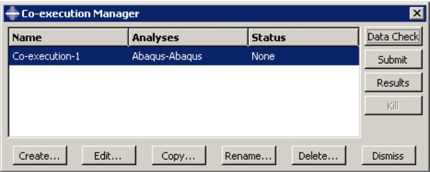  
图 1：协同执行管理器。

协同执行管理器的三列显示以下内容：

## 名称（Name）

**名称**列显示协同执行的名称。点击**重命名**以重命名选定的协同执行。

## 分析（Analyses）

**分析**列显示与协同执行关联的分析类型；例如，Abaqus-Abaqus。

## 状态（Status）

**状态**列显示协同执行中各作业的状态，并在协同执行运行期间持续更新。状态可以是以下之一：

## 无（None）

协同执行尚未提交进行分析。

## 检查已提交（Check Submitted）

分析正在提交进行数据检查。

## 检查运行中（Check Running）

分析的数据检查正在运行。

## 检查完成（Check Completed）

分析的数据检查成功完成；你现在可以继续协同执行。

## 已提交（Submitted）

协同执行正在提交。

## 运行中（Running）

协同执行已提交并正在运行。

## 已完成（Completed）

协同执行已运行完毕。

## 中止（Aborted）

协同执行因问题（如其中一个模型中存在致命错误或磁盘空间不足）而被中止。

## 终止（Terminated）

协同执行已被用户终止。

## 附加信息

*   理解协同执行
*   创建、编辑和操作协同执行

## 协同执行编辑器

你使用协同执行编辑器来选择模型，在各个作业编辑器中定义初始作业参数设置，并更改协同执行超时值。创建协同执行后，协同执行编辑器中的作业参数将无法编辑；你必须编辑单个作业。

你可以通过从主菜单栏选择 **协同执行 -> 创建** 或 **协同执行 -> 编辑 -> 协同执行名称** 来显示协同执行编辑器。（你也可以在协同执行管理器中点击**创建**或**编辑**。）

协同执行编辑器包含以下用于指定作业参数的标签页：

## 提交（Submission）

使用**提交**标签页配置作业的提交属性，例如作业类型、运行模式和提交时间。你还可以使用**提交**标签页指定将作业提交到由本地 Abaqus 环境文件或系统管理员配置的远程队列。

## 常规（General）

使用**常规**标签页配置作业设置，例如分析输入文件处理器的输出和用于临时文件的目录名称。

## 内存（Memory）

使用**内存**标签页配置分配给 Abaqus 分析的内存大小。

## 并行化（Parallelization）

使用**并行化**标签页配置 Abaqus 分析作业的并行执行，例如要使用的处理器数量。

## 精度（Precision）

使用**精度**标签页为 Abaqus/Explicit 分析指定单精度或双精度。你还可以选择分析期间写入输出数据库的节点输出精度。

## 附加信息

*   理解协同执行

## 理解优化过程

本节概述优化过程。

## 本节内容：

什么是优化过程？  
理解优化过程生成的文件  
优化的后处理  
优化过程管理器  
优化过程编辑器

## 什么是优化过程？

图 1 说明了优化过程如何迭代更新设计变量、修改有限元模型、运行 Abaqus 分析，同时搜索优化解。
  
图 1：优化过程迭代搜索优化解。

优化过程读取你在**优化模块**中定义的优化任务，并基于你在优化任务中定义的目标函数和约束，迭代搜索优化解。每次迭代称为一个设计循环。在每个设计循环期间，优化过程修改有限元模型，并在修改后的模型上执行 Abaqus 分析。优化过程读取分析结果，并决定是结束优化（因为解已达到最优或达到了指定的停止条件），还是继续优化并进行另一个设计循环的迭代。
优化过程会生成优化结果和分析结果。您必须将优化结果和分析结果合并到单个输出数据库文件中，才能在可视化 (Visualization) 模块中查看优化的结果，如后处理优化中所述。优化 (Optimization) 模块不支持在 Abaqus 输入文件中使用部件和装配件。当您运行优化任务时，无论您的 Abaqus 模型属性如何，优化模块都会生成一个不使用部件和装配件的扁平化输入文件。

优化过程会出现在模型树 (Model Tree) 的分析 (Analysis) 部分，并包含在优化过程中运行的 Abaqus 作业，如图 2 所示。

  
图 2：模型树中的优化过程。

您可以检查优化过程的有效性；但是，验证不会检查您的 Abaqus 模型。在尝试运行优化过程之前，您应该对模型运行完整分析并确保其运行完成。

## 附加信息

• 理解优化过程  
• 创建、编辑和操作优化过程

## 理解优化过程生成的文件

当优化过程正在执行时，它会创建两种类型的数据，并保存在单独的文件中——优化结果和分析结果。

## 优化结果

优化结果由优化变量和优化值组成。优化变量取决于您正在执行的优化类型。

## 拓扑优化 (Topology optimization)

优化变量是归一化的材料分布变量 (MAT_PROP_NORMALIZED)。

## 形状优化 (Shape optimization)

优化变量是位移变量：

DISP_OPT：一个向量，表示在形状优化期间节点移动的方向。由于网格平滑和过滤，该向量可能与节点法向量不重合。  
DISP_OPT_VAL：DISP_OPT 向量的幅值，其符号表示位移方向——正表示生长，负表示收缩。  
• CTRL_INPUT：目标函数在每个节点处的值（例如，应力）。

## 尺寸优化 (Sizing optimization)

优化变量是壳厚度和壳厚度的变化量 (THICKNESS 和 DELTA_THICKNESS)。

## 加强筋优化 (Bead optimization)

优化变量是位移变量：

DISP_NORMAL_VAL：一个向量的幅值，表示在加强筋优化期间，沿着节点法向量节点移动的方向。  
DISP_OPT：一个向量，表示在加强筋优化期间节点移动的方向。由于网格平滑和过滤，该向量可能与节点法向量不重合。  
DISP_OPT_VAL：DISP_OPT 向量的幅值，其符号表示位移方向——正表示生长，负表示收缩。

优化变量在每个设计周期后保存在单独的优化 (.onf) 文件中。此外，优化值（例如，目标函数和约束的值）在每个设计周期后写入逗号分隔的文本文件 (.csv)。（当您监控优化过程的进度时，您看到的就是优化值，如监控您的优化过程中所述。）

## 分析结果

分析结果是 Abaqus 在分析期间生成的场数据和历史数据。在每个设计周期中，都会创建一个新的输出数据库文件。在初始设计周期中，Abaqus 将场数据和历史数据都写入新的输出数据库文件；然而，在后续的设计周期中，Abaqus 仅写入场数据。Abaqus 还会在每个设计周期中生成数据 (.dat)、消息 (.msg) 和状态 (.sta) 文件。为了节省磁盘空间并加快后处理速度，输出数据库文件以及数据、消息和状态文件仅在指定的时间间隔保存；默认情况下，在初始、第一次和最终设计周期后保存。（您可以在创建优化过程时指定保存文件的频率，如创建和编辑优化过程中所述。）此外，Abaqus 还会保存在每个设计周期中生成的新输入文件。

## 优化后处理

要在可视化 (Visualization) 模块中查看优化过程的结果，您必须将优化结果和分析结果合并到单个结果输出数据库文件中，如合并优化结果中所述。

## 创建基础结果输出数据库文件

您选择作为基础结果的输出数据库文件将成为合并结果输出数据库文件的起点。

## 选择初始或最终设计周期

您可以指定基础结果取自初始设计周期生成的输出数据库文件或取自最终设计周期生成的输出数据库文件。在大多数情况下，您会选择初始设计周期，并查看优化从初始设计周期到最终设计周期的进展；例如，以跟踪刚度的变化。如果您执行了频率优化，并希望查看前几阶模态的频率和模态形状，则选择最终设计周期。如果您执行了形状优化，则应从第一次设计周期生成的输出数据库文件中获取基础结果。

## 选择原始模型

优化模块会在运行优化过程的初始设计周期之前修改材料定义和截面分配。原始模型是优化模块进行任何修改之前存在的模型。

您可以指定基础结果取自原始模型生成的输出数据库文件。但是，优化过程不会对原始模型运行 Abaqus 分析。因此，在选择原始模型作为基础结果之前，您必须手动运行分析。（原始模型的 Abaqus 输入文件与优化过程生成的所有输入文件一起存储在 `优化过程名称\SAVE.inp` 目录中。原始模型的输入文件名为 `优化过程名称_org.inp`。）

您用于基础结果的输出数据库文件必须在不包含部件和装配件的情况下生成，如无部件和装配件的写入输入文件中所述。优化模块生成的输入文件不包含部件和装配件，无论用户在 Abaqus/CAE 中进行何种设置。但是，如果您从一个并非由优化模块生成或通过执行 Abaqus/CAE 中的作业而生成的输入文件创建基础结果，则必须确保生成的输出数据库文件不包含部件和装配件。

## 追加到基础结果

在指定了将用作基础结果来源的输出数据库文件后，Abaqus/CAE 会将优化结果和 Abaqus 分析结果追加到合并输出数据库文件中。

## 追加优化结果

Abaqus/CAE 在每个设计周期后将优化变量作为场数据追加到合并输出数据库文件中，并且每个设计周期在合并输出数据库文件中显示为一帧。同样，Abaqus/CAE 将优化值作为历史数据追加到合并输出数据库文件中。

## 追加分析结果

您可以执行以下操作来指定将哪些分析结果数据写入合并结果输出数据库文件：

• 指定应从哪些设计周期写入分析结果。  
指定应从哪些模型写入分析结果。Abaqus/CAE 会为优化过程中的每个模型创建一个合并结果输出数据库文件。  
• 对于选定模型，指定应从该模型中的哪些步骤写入分析结果。  
• 指定应写入哪些分析场变量。

在合并过程中，历史数据不会写入合并数据库文件。合并输出数据库文件仅包含来自基础结果输出数据库文件的历史数据。

建议您在创建优化过程时，在初始和最终设计周期后保存分析结果。优化完成后，您可以选择在初始设计周期中生成的输出数据库文件作为基础结果。然后，您可以将基础结果输出数据库文件与每个设计周期的优化结果以及最终设计周期的分析结果合并，如表 1 所示。

表 1：在合并输出数据库文件中保存优化和分析结果。
<table><tr><td rowspan="2"></td><td colspan="5">设计循环</td></tr><tr><td>初始</td><td>第一次</td><td>第二次</td><td>第三次</td><td>第四次（最终）</td></tr><tr><td>保存的数据</td><td>分析结果（场数据和历史数据）</td><td>优化结果</td><td>优化结果</td><td>优化结果</td><td>优化结果和分析结果（仅场数据）</td></tr><tr><td>操作</td><td>创建基础结果</td><td>追加到基础结果</td><td>追加到基础结果</td><td>追加到基础结果</td><td>追加到基础结果</td></tr></table>

例如，如果您执行了拓扑优化，则可以进行以下操作：

*   查看模型的初始状态；例如，初始几何形状以及载荷和边界条件。
    查看优化变量——归一化材料分布变量（MAT\_PROP\_NORMALIZED）在每个设计循环中的变化，以观察优化的进展。
*   查看模型的最终状态；例如，优化后的几何形状以及位移、应力和应变。
*   创建一个跟踪目标函数和约束变化的历史绘图。

您可以应用类似的条件来查看形状优化和尺寸优化的起始、结束状态以及演变过程。

仅支持为您配置了以下分析用例的优化组合结果：
*   简单分析（单个模型、单个分析步和单个载荷工况）
*   频率或模态分析
*   带有多个载荷工况的线性摄动分析
*   多个模型的优化

## 附加信息

*   理解优化过程
*   创建、编辑和操作优化过程

## 优化过程管理器

优化过程管理器允许您创建和配置优化过程，以及编辑、复制、重命名或删除所选的优化过程。

此外，优化过程管理器还允许您执行以下操作：
*   将 TOSCA 参数 (.par) 文件和 Abaqus 输入 (.inp) 文件的副本写入您的工作目录。
*   在提交优化过程之前验证优化，以确保优化任务配置正确且 Abaqus 模型存在。
*   提交优化过程。
*   重启因优化或 Abaqus 分析外部问题（例如获取 Abaqus 许可证失败）而失败的优化过程。
*   监视优化过程的进展。
*   提取优化模型表面的平滑等值面网格表示，其形式为可传输到 CAD 系统或回传到 Abaqus/CAE 的文件。
*   将优化过程创建的优化结果和分析结果组合成单个结果输出数据库文件，该文件可通过可视化模块显示。
*   查看优化过程的结果。

您可以通过从主菜单栏选择 **优化过程管理器 > 管理器** 来显示优化过程管理器。图 1 显示了优化过程管理器的布局。


图 1：优化过程管理器。

优化过程管理器的四列显示以下内容：

## 名称

“名称”列显示优化过程的名称。单击 **重命名** 可重命名所选的优化过程。

## 模型

“模型”列显示与优化过程关联的 Abaqus/CAE 模型。

## 任务

“任务”列显示与优化过程关联的优化任务。

## 状态

“状态”列显示优化过程中作业的状态，并在优化过程运行期间持续更新。状态可以是以下之一：

## 无

优化过程尚未提交进行分析。

## 已提交

优化过程正在提交。

## 运行中

优化过程已提交并正在运行。

## 已完成

优化过程已运行完毕。

## 已中止

由于模型中的致命错误或磁盘空间不足等问题，优化过程已中止。

## 已终止

优化过程已被用户终止。

## 附加信息

*   理解优化过程
*   创建、编辑和操作优化过程

## 优化过程编辑器

您使用优化过程编辑器来选择将包含在优化过程中的 Abaqus/CAE 模型和优化任务。您还可以配置优化设置，例如最大优化迭代次数。

您可以通过从主菜单栏选择 **优化过程 > 创建** 或 **优化过程 > 编辑 > 优化过程名称** 来显示优化过程编辑器。（您也可以在优化过程管理器中单击 **创建** 或 **编辑**。）

优化过程编辑器允许您配置以下内容：

## 优化

使用“优化”选项卡页面指定在过程终止前应运行的最大优化迭代次数以及保存数据的频率。更多信息，请参阅创建和编辑优化过程。

## 提交

使用“提交”选项卡页面配置优化过程的提交属性，例如提交时间以及该过程是否提交到由本地 Abaqus 环境文件或系统管理员配置的远程队列。更多信息，请参阅配置作业提交属性。

## 内存

使用“内存”选项卡页面配置优化过程中分配给 Abaqus 作业的内存量。更多信息，请参阅控制作业内存设置。

## 并行化

使用“并行化”选项卡页面配置优化过程中 Abaqus 分析作业的并行执行，例如要使用的处理器数量。更多信息，请参阅控制作业并行执行。

## 附加信息

*   理解优化过程
*   创建、编辑和操作优化过程

## 重启分析

本节介绍 Abaqus/CAE 中的重启功能。

如果您的模型包含多个分析步，您不必在单个分析作业中运行所有分析步。实际上，通常希望分阶段运行复杂的分析。这样，您可以在继续下一阶段之前检查结果并确认分析按预期进行。Abaqus 分析生成的重启文件允许您从指定的分析步继续分析。更多信息，请参阅重启分析。

## 本节内容：
*   控制重启分析
*   重启分析所需的文件
*   管理重启分析的规则
*   模型与重启分析之间的关系
*   在模型中添加更多分析步后重启
*   修改现有分析步后重启
*   从分析步中间重启
*   可视化重启分析的结果
*   恢复 Abaqus/Standard 分析
*   重启作业的远程提交

## 控制重启分析

默认情况下，Abaqus/Standard 分析不写入重启信息，而 Abaqus/Explicit 分析仅在每个分析步的开始和结束时写入重启信息。

您可以使用“分析步”模块更改写入重启信息的频率。更多信息，请参阅重启输出请求。

分析生成重启信息后，您可以控制后续重启分析的以下方面：

## 模型属性

要配置重启分析，您必须指定模型是否应重用先前相同模型分析的数据。您可以指定新分析应从先前分析的哪个分析步和增量或时间间隔开始。您还可以选择以下之一：
*   允许所选分析步继续运行至完成。
*   在指定增量处终止所选分析步，并开始新的分析步。

更多信息，请参阅指定模型属性。

## 作业类型

您使用作业编辑器指定作业类型。如果您编辑模型属性以指定模型应重用先前分析的数据，并且您创建了一个引用此模型的作业，则 Abaqus/CAE 会将作业类型设置为“重启”。更多信息，请参阅选择作业类型。您不能创建引用与输入文件关联的作业的重启作业。

## 重启分析所需的文件

要重启分析，先前分析创建的各种文件必须在您启动 Abaqus/CAE 会话的目录中可用。

## Abaqus/Standard
*   输出数据库 (.odb)
*   重启文件 (.res)
*   模型文件 (.mdl)
*   零件文件 (.prt)
*   状态文件 (.stt)

## Abaqus/Explicit

*   输出数据库 (.odb)
*   重启文件 (.res)
*   模型文件 (.mdl)
*   包文件 (.pac)
*   零件文件 (.prt)
*   状态文件 (.abq 和 .stt)
*   选定结果文件 (.sel)

如果当前目录中缺少这些文件中的任何一个，重启分析将生成错误。

## 支配重启分析的规则

使用 Abaqus/CAE 定义模型和作业的重启信息是直接的；然而，在使用分析重启功能之前，您应了解以下内容：

*   重启分析中使用的模型必须与原始分析中直到重启位置所使用的模型相同。具体来说，
    - 对于新模型，不要修改或添加任何几何、网格、材料、截面、梁截面轮廓、材料方向、梁截面方向、交互属性或约束。
    同样，不要修改重启位置处或之前的任何步骤或规定条件（载荷、边界条件、场、交互或输出请求）。
*   重启分析不支持关键字编辑。如果您使用关键字编辑器编辑了原始模型，当您重启分析时，Abaqus/CAE 将忽略这些更改。


## 警告：

Abaqus/CAE 不执行任何检查以确保为原始作业存储的重启数据与重启分析中使用的模型一致。在某些情况下，分析将以错误消息终止。在其他情况下，分析将运行，但结果可能与您的意图不符。一个将导致错误消息的具体示例是：您在原始模型中定义了耦合约束（coupling constraint）及其附带的参考点（reference node），然后在提交原始分析之前抑制了该约束。在此示例中，Abaqus/CAE 保留了参考点定义，但如果参考点未连接到其他单元或约束，Abaqus/Standard 或 Abaqus/Explicit 可能会将其从模型定义中移除。在此示例中，您后续的 Abaqus/CAE 重启分析将被视为与原始分析不一致。在许多类似此示例的情况下，您可以手动修改重启分析输入文件以纠正差异。

## 模型与重启分析之间的关系

当您首次提交基于某个模型的分析作业时，Abaqus/CAE 会根据您模型的定义生成一个输入文件；然后，该输入文件被提交进行分析。输入文件包含由网格模块生成的单元和节点定义，以及您使用 Abaqus/CAE 指定的材料、步骤、输出请求、载荷、交互等。

要运行与某个模型关联的作业的重启分析，建议您将模型复制到一个新模型。新模型包含原始模型的所有单元和节点定义，以及所有材料、步骤、输出请求、载荷、交互等。要请求重启分析，您需要编辑新模型的属性，并指定分析从原始分析的指定步骤继续。当您创建引用新模型的重启作业时，Abaqus/CAE 将作业类型设置为"重启（Restart）"。

当您提交新作业进行分析时，Abaqus/CAE 会根据重启信息生成输入文件。重启输入文件不写入任何零件、装配体或属性数据。仅写入以下数据：

*   出现在重启分析之后的步骤。
*   与出现在重启步骤之后的步骤相关联的步骤相关对象的数据；例如，载荷、边界条件、场和输出请求。
*   由与出现在重启步骤之后的步骤相关联的步骤相关对象使用的新区域和振幅。

Abaqus 从原始分析生成的重启文件中读取零件、装配体和属性数据，以及出现在重启步骤之前的步骤中的数据。因此，尽管模型包含所有这些信息，但这些信息不会写入提交给 Abaqus/Standard 或 Abaqus/Explicit 的输入文件中。这是一个重要的考虑因素。您在重启分析中对模型所做的某些更改（例如材料属性）将不会出现在进行分析的输入文件中。

## 在向模型添加更多分析步骤后重启

重启功能最常见的用途是分析您的模型，然后向模型添加一个或多个步骤并继续分析。本节描述此用法的一个示例。

假设您已完成以下操作：

*   创建了一个名为 Model-A 的模型，该模型有两个分析步骤：Step-1 和 Step-2。
*   使用步骤模块中的"编辑重启请求（Edit Restart Requests）"对话框在每个步骤结束时输出重启信息。
*   创建了一个使用 Model-A 的作业 Job-A。
*   分析了模型。

在研究分析结果后，您决定向模型添加另一个步骤 Step-3。重启功能允许您计算 Step-3 的结果，而无需重复 Step-1 和 Step-2 的计算。以下步骤描述了推荐的流程：

1.  将 Model-A 复制到一个新模型，例如 Model-A-restart，并将 Model-A-restart 设为当前模型。
2.  向 Model-A-restart 添加新的 Step-3。
3.  在 Step-3 中添加新的规定条件（载荷、边界条件、交互、场或输出请求），或修改从 Step-2 传播的规定条件。
4.  从主菜单栏，选择 Model->Edit Attributes->Model-A-restart。在出现的"编辑模型属性（Edit Model Attributes）"对话框中，执行以下操作：
    *   输入 Job-A 作为将从中读取重启数据的作业。
    *   设置重启位置：
        - 输入 Step-2 以指示将从中读取重启数据的步骤。
        - 选择"从步骤结束处重启（Restart from the end of the step）"。Step-3 将在 Step-2 结束后继续分析。
5.  将 Job-A 复制到一个新作业，例如 Job-A-restart，该作业使用 Model-A-restart。
6.  从主菜单栏，选择 Job->Edit->Job-A-restart。在出现的"编辑作业（Edit Job）"对话框中，选择作业类型为"重启（Restart）"。
7.  提交 Job-A-restart 进行分析。

## 在修改现有分析步骤后重启

您可以使用重启功能分析您的模型，然后在继续分析之前修改现有步骤。本节描述此用法的一个示例。

假设您已完成以下操作：

*   创建了一个名为 Model-A 的模型，该模型有两个分析步骤：Step-1 和 Step-2。
*   使用步骤模块中的"编辑重启请求（Edit Restart Requests）"对话框在每个步骤结束时输出重启信息。
*   创建了一个使用 Model-A 的作业 Job-A。
*   分析了模型。

在检查 Job-A 的结果后，您意识到需要对 Step-2 进行更改，更改 Step-2 中的输出请求，或更改 Step-2 中的规定条件（如载荷或边界条件）。您可能还希望添加一些带有附加输出请求和载荷以及边界条件更改的新步骤。您知道仍然可以使用 Step-1 的结果；但是，您意识到 Step-2 的结果不再有效。重启功能允许您重新计算 Step-2 的结果，而无需重复 Step-1 的计算。以下步骤描述了推荐的流程：

1.  将 Model-A 复制到一个新模型，例如 Model-A-restart，并将 Model-A-restart 设为当前模型。
2.  执行以下操作：
    *   对 Step-2 进行所需更改。
    *   在 Step-2 之后添加新步骤。
    *   在 Step-2 和后续步骤中创建新的规定条件。
3.  从主菜单栏，选择 Model->Edit Attributes->Model-A-restart。在出现的"编辑模型属性（Edit Model Attributes）"对话框中，执行以下操作：
    *   输入 Job-A 作为将从中读取重启数据的作业。
    *   设置重启位置：
        - 输入 Step-1 以指示将从中读取重启数据的步骤。
        - 选择"从步骤结束处重启（Restart from the end of the step）"。Step-2 将在 Step-1 结束后继续分析。
4.  将 Job-A 复制到一个新作业，例如 Job-A-restart，该作业使用 Model-A-restart。Abaqus/CAE 将作业类型设置为"重启（Restart）"。
5.  提交 Job-A-restart 进行分析。

## 从步骤中间重启

您可以使用重启功能从已完成步骤的中间或部分完成步骤的中间继续分析。重启的分析使用一个新步骤，该步骤从前一步骤的指定增量继续分析。本节描述此用法的一个示例。

假设您已完成以下操作：

*   创建了一个名为 Model-A 的模型，该模型有两个 Abaqus/Standard 分析步骤：Step-1 和 Step-2。
*   使用步骤模块中的"编辑重启请求（Edit Restart Requests）"对话框每 10 个增量输出一次重启信息。
• 创建了使用 Model-A 的作业 Job-A。  
• 对模型进行了分析。

您怀疑载荷对结构来说过于严苛，可能导致结构失稳或崩溃，从而引发数值收敛困难。因此，您使用了 Step 模块，在每个分析步的每 10 个增量步保存重启动信息。运行分析时，您发现分析在 Step-2 的第 25 个增量步终止，未能完成。您使用 Visualization 模块查看了分析结果，并意识到负特征值信息证实了您的怀疑，即结构可能已经失稳。现在您对崩溃载荷水平有了大致了解，希望从 Step-2 的第 20 个增量步重启动分析，采用更低的载荷水平和更频繁的结果数据输出。以下是推荐的操作步骤：

1.  将 Model-A 复制到一个新模型，例如 Model-A-restart，并将 Model-A-restart 设为当前模型。
2.  向 Model-A-restart 添加新的分析步 Step-3。
3.  修改 Step-3 中的载荷水平和输出请求。例如，如果 Step-2 第 25 个增量步的载荷为 260，而 Step-2 第 20 个增量步的载荷为 250，您可以将 Step-3 结束时的载荷水平更改为 262。此外，您可以增加将数据写入输出数据库的频率，以便跟踪结构崩溃的进程。您还可以减小最大增量步大小，以控制分析生成数据的分辨率。更多信息，请参见“重启动分析”。

4.  从主菜单栏中，选择 Model->Edit Attributes->Model-A-restart。在出现的“编辑模型属性”对话框中，执行以下操作：
    *   勾选 **Read data from job**，并输入 Job-A，指明将从该作业读取重启动数据。
    *   设置重启动位置：
        *   输入 Step-2，指明将从该分析步读取重启动数据。
        *   选择 **Restart from increment, interval, iteration, or cycle**，并输入 20，指明将从该增量步读取重启动数据。
        *   选择 **and terminate the step at this point**，表示 Step-2 应在增量步 20 处终止。Step-3 将从该位置继续分析。

5.  将 Job-A 复制到一个新作业，例如 Job-A-restart，该作业使用 Model-A-restart。Abaqus/CAE 会将作业类型设置为 Restart（重启动）。

6.  提交 Job-A-restart 进行分析。

## 可视化重启动分析的结果

每次重启动分析都会创建一个新的输出数据库。考虑“在向模型添加更多分析步后重启动”中描述的示例，您进行了以下操作：

*   运行了作业 Job-A 的分析，该作业引用了包含 Step-1 和 Step-2 的 Model-A。因此，分析生成的输出数据库 Job-A.odb 包含 Step-1 和 Step-2 的结果。
*   运行了作业 Job-A-restart 的重启动分析，该作业引用了 Model-A-restart。虽然 Model-A-restart 包含 Step-1、Step-2 和 Step-3，但重启动分析生成的输出数据库 Job-A-restart.odb 仅包含 Step-3 的结果。

您可以使用 Visualization 模块创建场数据的变形图、云图和符号图；但是，您一次只能绘制来自一个输出数据库的结果。如果您正在查看 Step-1 或 Step-2 的结果，并且想查看 Step-3 的结果，您必须更改输出数据库。

如果您想创建所有三个分析步结果的动画，必须合并两个输出数据库。Abaqus 为此提供了执行过程。更多信息，请参见“合并来自重启动分析的输出数据库 (.odb) 文件”。

或者，您可以使用以下技术创建一个变量在所有三个分析步中的历史图：

*   从原始输出数据库 Job-A.odb 为该变量创建一个 X-Y 数据对象。
*   从重启动分析生成的输出数据库 Job-A-restart.odb 创建第二个 X-Y 数据对象。
*   创建这两个 X-Y 数据对象的 X-Y 图。或者，您可以使用 **Operate on XY data** 选项创建一个新的 X-Y 数据对象，将前两个 X-Y 数据对象追加进去，并创建结果的 X-Y 图。

更多信息，请参见“X-Y 绘图”。

您应注意您的 X-Y 数据对象不要引用相同的分析步。例如，考虑“修改现有分析步后重启动”中描述的重启动分析，其中您修改了一个现有分析步并添加了一个新分析步，然后继续分析。第一个输出数据库包含来自 Step-1 和 Step-2 的数据。第二个输出数据库包含来自修改后的 Step-2 和新 Step-3 的数据。您创建的第一个 X-Y 数据对象应仅使用来自 Step-1 的数据，并应排除来自原始 Step-2 的数据。第二个 X-Y 数据对象应使用来自修改后的 Step-2 和新 Step-3 的数据。

## 恢复 Abaqus/Standard 分析

Abaqus/Explicit 具有对过早终止（例如，由于磁盘空间不足或电源故障）的分析作业的恢复机制。更多信息，请参见“选择作业类型”。然而，与 Abaqus/Explicit 不同，

Abaqus/Standard 没有恢复机制。以下示例描述了如何使用 Abaqus/Standard 的重启动功能来继续一个过早终止的分析。假设如下：

*   您分析了包含 Step-1、Step-2 和 Step-3 的 Model-A。
*   由于断电，分析在 Step-2 的第 17 个增量步过早结束。
*   您请求每 10 个增量步保存一次重启动信息。因此，最后一次保存的重启动信息位于 Step-2 的第 10 个增量步。

以下过程描述了如何使用最后保存的重启动信息来恢复分析：

1.  将 Model-A 复制到一个新模型，例如 Model-A-recover，并将 Model-A-recover 设为当前模型。

2.  从主菜单栏中，选择 Model->Edit Attributes->Model-A-recover。在出现的“编辑模型属性”对话框中，执行以下操作：
    *   勾选 **Read data from job**，并输入 Job-A，指明将从该作业读取重启动数据。
    *   设置重启动位置：
        *   输入 Step-2，指明将从该分析步读取重启动数据。
        *   选择 **Restart from increment, interval, iteration, or cycle**，并输入 10，指明将从该增量步读取重启动数据。
        *   选择 **and complete the step**。Step-2 将从增量步 10 之后继续分析并运行至完成。

3.  将 Job-A 复制到一个新作业，例如 Job-A-recover，该作业使用 Model-A-recover。Abaqus/CAE 会将作业类型设置为 Restart（重启动）。

4.  提交 Job-A-recover 进行分析。

## 远程提交重启动作业

如果您将作业提交到远程机器进行分析，默认情况下，当作业完成时，Abaqus 会将重启动分析所需的文件复制回您的本地目录。更多信息，请参见“远程提交作业”。如果远程作业过早终止，您可能需要手动将文件复制回本地目录。

重启动分析所需的大多数文件是平台相关的二进制文件。因此，在 Linux 机器上开始分析后，您将无法在 Windows 机器上继续重启动分析，反之亦然。部件 (.prt) 文件包含 ASCII 文本，可以跨平台复制。

不同二进制格式的平台间缺乏可移植性，并不阻止您在与原始分析运行的机器不同的机器上重启动分析。但是，两台机器必须是二进制兼容的，并且建议原始分析和重启动分析都在同一个平台上执行。Abaqus 不测试重启动文件的跨平台兼容性。

## 创建、编辑和操作作业

本节描述了如何使用主菜单或作业管理器创建、编辑和操作作业。

## 本节内容：

创建新的分析作业  
仅写入输入文件  
对模型执行数据检查  
提交分析作业  
数据检查后继续分析作业  
终止分析作业  
查看作业结果

## 创建新的分析作业

要创建新的分析作业，请从主菜单栏中选择 Job->Create。分析作业存储在模型数据库中，并在会话之间保留。

1.  从主菜单栏中，选择 Job->Create。

    将出现“创建作业”对话框。

    

    提示：您也可以通过在模块工具箱中单击图标，或在作业管理器中单击 **Create** 来创建新的分析作业。

2.  在 **Name** 文本字段中键入新作业的名称。您指定的名称必须符合操作系统的文件名规则。
3.  单击 **Source** 字段右侧的箭头以选择作业的来源。
    *   选择 **Model** 以基于在 Abaqus/CAE 中创建的模型创建作业。
模型列表显示了模型数据库中定义的所有模型。从此列表中，选择要与新作业关联的模型。

选择**输入文件**可基于一个输入文件创建作业，该文件可能是在Abaqus/CAE中创建的，也可能不是。

单击；Abaqus/CAE将列出所选目录中所有文件扩展名为 .inp 的文件。选择要与新作业关联的输入文件，然后单击**确定**。


## 注意：

您不能基于包含对其他结果文件引用的输入文件来创建作业，例如重启动分析、导入分析或子模型分析。

4.  单击**继续**。

    作业编辑器将出现。

5.  如果需要，输入作业描述。当您提交作业进行分析时，Abaqus/CAE会将作业描述写在输入文件头之后。作业描述不会写入输出数据库，导入到Abaqus/CAE时也不会保留。更多信息，请参阅导入描述。  
6.  在编辑器中，输入定义作业所需的所有数据，然后单击**确定**。（更多信息，请参阅使用作业编辑器。）

## 补充信息

•   理解分析作业  
•   创建、编辑和操作作业

## 仅写入输入文件

默认情况下，当您提交与模型关联的作业进行分析时，Abaqus/CAE会生成一个表示您模型的输入文件，然后Abaqus分析该输入文件。然而，有时您可能更倾向于先生成输入文件，然后在执行分析之前查看或编辑它。

要在不立即执行分析的情况下写入输入文件，请从主菜单栏中选择**作业->写入输入->选择您的作业**。输入文件 `job name.inp` 将被写入启动Abaqus/CAE的目录中。您也可以在作业管理器中选择您的作业，然后单击**写入输入**来写入输入文件。

输入文件以ASCII格式编写，可以使用文本编辑器查看和编辑。如果您熟悉Abaqus关键字，可以检查输入文件是否有错误，并验证关键字、参数和数据是否按预期生成。请注意，Abaqus/CAE会处理您在图形用户界面中的输入，并在需要时执行额外的计算，以确定准确反映您建模意图的关键字。您也可以修改输入文件的内容。例如，您可以更改材料属性或载荷的大小。


## 警告：

如果您使用Abaqus/CAE外部的文本编辑器编辑模型的输入文件，然后在作业模块中提交该模型的作业，您对输入文件的更改将会丢失。相反，您必须通过创建新作业并选择**输入文件**作为作业**源**来直接提交修改后的输入文件进行分析。但是，如果您使用关键字编辑器修改模型生成的关键字，这些修改将保留在模型中，并适用于与该模型关联的任何作业。（您可以通过从主菜单栏选择**模型->编辑关键字**来显示关键字编辑器。）

## 补充信息

•   向您的Abaqus/CAE模型添加不受支持的关键字  
•   理解分析作业  
•   创建、编辑和操作作业

## 对模型执行数据检查

数据检查通过分析输入文件处理器运行输入文件，以确保模型一致，并且所有必需的模型选项都已设置。

如果作业源是Abaqus/CAE模型，此选项会为作业生成（或重新生成）输入文件。

要对模型执行数据检查，请从主菜单栏中选择**作业->数据检查->选择您的作业**。您也可以在作业管理器中选择您的作业，然后单击**数据检查**来执行数据检查。

要查看数据检查分析的结果，请查看工作目录中的数据（.dat）文件。您也可以通过选择**作业->监控->选择您的作业**来显示作业监控对话框，以查看数据检查的结果。有关作业监控的更多信息，请参阅监控分析作业的进度。

数据检查还会创建一个输出数据库。您可以在可视化模块中查看输出数据库，以验证模型信息，例如面标签、表面法线和材料方向。有关查看输出数据库的更多信息，请参阅查看结果。

## 补充信息

•   理解分析作业  
•   创建、编辑和操作作业

## 提交分析作业

要提交作业进行分析，请从主菜单栏中选择**作业->提交->选择您的作业**。您也可以在作业管理器中选择作业名称，然后单击**提交**来提交作业进行分析。Abaqus/CAE使用在作业编辑器中定义的作业设置提交作业进行分析。

有关监控已提交作业的信息，请参阅监控分析作业的进度。

当您启动Abaqus/CAE会话并提交分析作业时，Abaqus会向Abaqus/CAE发送消息，指示作业的当前状态，Abaqus/CAE会相应地更新作业管理器中的**状态**列。

## 补充信息

•   理解分析作业  
•   创建、编辑和操作作业

## 在数据检查后继续分析作业

当您执行数据检查分析（请参阅对模型执行数据检查）时，Abaqus会创建并保存所有必要的文件，以便稍后继续完整的分析。要继续分析，请从主菜单栏中选择**作业->继续->选择您的作业**。您也可以在作业管理器中选择作业名称，然后单击**继续**来继续分析。Abaqus/CAE使用在作业编辑器中定义的作业设置继续分析。

有关监控已提交作业的信息，请参阅监控分析作业的进度。

## 补充信息

•   理解分析作业  
•   创建、编辑和操作作业

## 终止分析作业

您可以使用以下方法之一来终止分析作业：

•   从主菜单栏，选择**作业->终止->选择您的作业**。  
•   在作业管理器中，选择作业名称，然后单击**终止**。  
•   在该特定作业的作业监控对话框中，单击**终止**。（有关更多信息，请参阅监控分析作业的进度。）

Abaqus/CAE会要求您确认，终止作业，并将作业管理器中该作业的状态更新为**已终止**。

## 补充信息

•   理解分析作业  
•   创建、编辑和操作作业

## 查看作业结果

一旦您的分析作业完成，Abaqus/CAE会将分析结果存储在一个输出数据库中。您可以使用可视化模块以图形方式查看这些结果。使用作业菜单中的**结果**命令可以启动可视化模块，并提供模型的基本绘图。

1.  从主菜单栏，选择**作业->结果->选择您的作业**。


提示：您也可以在作业管理器中选择作业名称，然后单击**结果**。

可视化模块启动并向您展示模型的绘图。


## 注意：

使用**结果**命令会退出作业模块。要重新进入作业模块，请从上下文栏中的模块列表中选择**作业**。

2.  使用可视化模块来创建和自定义结果的不同绘图。有关使用可视化模块的更多信息，请参阅查看结果。"

## 补充信息

•   理解分析作业  
•   创建、编辑和操作作业

## 使用作业编辑器

本节描述如何使用作业编辑器来配置作业的设置。

## 本节内容：

导航作业自定义选项  
配置作业提交属性  
选择作业类型  
为SimUnit许可证模型设置许可证类型  
选择作业运行模式  
设置作业提交时间  
指定通用作业设置  
控制作业内存设置  
控制作业并行执行  
控制作业精度

## 导航作业自定义选项

使用作业编辑器在提交作业进行分析之前自定义作业的设置。要找到作业编辑器，请从主菜单栏中选择**作业->编辑->作业名称**。作业编辑器包含以下选项卡页面：

## 提交

使用**提交**选项卡页面配置作业的基本属性，例如作业类型、运行模式和运行时间。您还可以使用提交页面将作业提交到远程队列。

## 通用

使用**通用**选项卡页面配置预处理器输出并指定一个临时目录。预处理器输出选项不适用于与输入文件关联的作业；您必须在输入文件本身中指定这些选项。您还使用**通用**选项卡页面来指定模型引用的任何用户子例程以及结果的输出格式。
## 内存 (Memory)

使用“内存”选项卡页配置分配给 Abaqus 分析的内存量。

## 并行化 (Parallelization)

使用“并行化”选项卡页配置 Abaqus 分析作业的并行执行，例如要使用的处理器数量。

## 精度 (Precision)

使用“精度”选项卡页为 Abaqus/Explicit 分析指定单精度或双精度。您还可以选择在分析过程中写入输出数据库的节点输出的精度。

您还可以使用 Abaqus 环境文件 (abaqus\_v6.env) 来控制作业编辑器选项卡页中许多设置的默认值。有关更多信息，请参阅环境文件设置。

## 其他信息

•   理解分析作业
•   使用作业编辑器
•   Abaqus/Standard 和 Abaqus/Explicit 执行

## 配置作业提交属性

要找到作业编辑器，请从主菜单栏选择 Job->Edit->jobname。使用作业编辑器中的“提交”选项卡页配置与作业提交相关的属性。您可以执行以下操作：

•   选择分析类型。（有关更多信息，请参阅选择作业类型。）
•   选择许可证类型。（有关更多信息，请参阅为 SimUnit 许可证模型设置许可证类型。）
•   选择运行模式。（有关更多信息，请参阅选择作业运行模式。）
•   选择提交时间。（有关更多信息，请参阅设置作业提交时间。）

## 其他信息

•   理解分析作业
•   使用作业编辑器
•   创建、编辑和操作协同执行
•   Abaqus/Standard 和 Abaqus/Explicit 执行

## 选择作业类型

要找到作业编辑器，请从主菜单栏选择 Job->Edit->jobname。

使用“提交”选项卡页中的“作业类型 (Job Type)”选项来选择 Abaqus 将运行的作业类型。您可以选择以下选项之一：

## 完整分析 (Full analysis)

选择此选项可提交完整的模型或输入文件进行分析。

## 恢复（显式）(Recover (Explicit))

选择此选项可重新提交之前过早终止的 Abaqus/Explicit 分析。此选项不适用于 Abaqus/Standard 分析。

## 重启 (Restart)

选择此选项可提交使用先前分析同一模型时保存的数据进行的分析。模型属性必须指定已保存数据的位置。

有关可用作业类型的更详细说明，请参阅选择作业类型。

1.  在作业编辑器中，点击“提交”(Submission) 选项卡以显示“提交”选项卡页。
2.  在选项卡页顶部的“作业类型”(Job Type) 选项中，选择您想要的作业类型。

## 其他信息

•   理解分析作业
•   使用作业编辑器
•   创建、编辑和操作协同执行

## 为 SimUnit 许可证模型设置许可证类型

要找到作业编辑器，请从主菜单栏选择 Job->Edit->jobname。使用“提交”选项卡页中的“SIM单元许可”(SIM Unit Licensing) 选项为您的分析作业执行选择许可证选项。

当您使用 SimUnit 许可证模型或当 Abaqus/CAE 由 3DEXPERIENCE Platform Connector for Abaqus/CAE 启动时，“SIM单元许可”(SIM Unit Licensing) 选项将启用。对于所有其他情况，这些选项将被禁用。如果您使用的是 Abaqus Learning Edition，则此选项不可用。

1.  在作业编辑器中，点击“提交”(Submission) 选项卡以显示“提交”选项卡页。
2.  当使用 SimUnit 许可证模型时，在页面中间的“SIM单元许可”(SIM Unit Licensing) 选项中，选择以下选项之一：

## 默认 (Default)

作业使用 Abaqus 环境文件中的默认许可证类型执行。如果适用，则使用 `license_type` 参数的值。如果您未在 Abaqus 环境文件中指定该参数，则使用令牌。

## 令牌 (Tokens)

作业使用令牌执行。此选择将覆盖 Abaqus 环境文件中的 `license_type` 参数。

## 积分 (Credits)

作业使用积分执行。此选择将覆盖 Abaqus 环境文件中的 `license_type` 参数。

3.  如果 Abaqus/CAE 由 3DEXPERIENCE Platform Connector for Abaqus/CAE 启动，您将看到一个额外的选项来选择许可证服务器：

## 3DExperience 云端 (3DExperience On-Cloud)

作业使用 3DEXPERIENCE 平台许可证服务器执行。

## 本地 (Local)

作业使用本地安装的许可证服务器执行。

## 其他信息

•   理解分析作业
•   使用作业编辑器
•   创建、编辑和操作协同执行

## 选择作业运行模式

要找到作业编辑器，请从主菜单栏选择 Job->Edit->jobname。使用“提交”选项卡页中的“运行模式”(Run Mode) 选项选择 Abaqus 运行作业的模式。您可以选择以下选项之一：

•   **后台 (Background)** 在您的本地机器的后台运行您的作业。
•   **队列 (Queue)** 将您的作业提交到指定的本地或远程批处理队列；从下拉列表中选择批处理队列。（您必须在 Abaqus 环境文件中定义该队列。有关更多信息，请参阅定义分析批处理队列。您还必须使该队列可供 Abaqus/CAE 使用。有关更多信息，请参阅远程提交作业。）

“运行模式”(Run Mode) 设置类似于 Abaqus 执行过程的参数。

1.  找到作业编辑器。
    从主菜单栏，选择 Job->Edit->jobname。
    Abaqus/CAE 将显示“编辑作业”(Edit Job) 对话框。
2.  点击“提交”(Submission) 选项卡以显示“提交”选项卡页。
3.  在页面中间的“运行模式”(Run Mode) 选项中，选择“后台”(Background) 或“队列”(Queue)。

## 其他信息

•   理解分析作业
•   远程提交作业
•   使用作业编辑器
•   创建、编辑和操作协同执行
•   Abaqus/Standard 和 Abaqus/Explicit 执行
•   环境文件设置

要找到作业编辑器，请从主菜单栏选择 Job->Edit->jobname。使用“提交”选项卡页中的“提交时间”(Submit Time) 选项选择分析作业何时执行。

1.  在作业编辑器中，点击“提交”(Submission) 选项卡以显示“提交”选项卡页。
2.  在页面底部的“提交时间”(Submit Time) 选项中，选择以下选项之一：

## 立即 (Immediately)

作业立即在本地机器的后台执行，或立即提交到批处理队列。

## 等待 (Wait)

作业在等待一段时间后在本地机器的后台执行。在“小时”和“分钟”字段中输入等待时间。（此选项仅在 Linux 平台上可用。此外，如果作业正在提交到批处理队列，则此选项不可用。）

## 定时 (At)

作业在您指定的时间在本地机器的后台或在批处理队列中执行。点击“定时”(At) 字段右侧以获取指定时间时应使用何种语法的信息。如果您希望作业在指定时间在批处理队列中运行，您必须使用 Abaqus 环境文件中的 `after_prefix` 队列参数配置队列以接受时间变量。有关更多信息，请参阅定义分析批处理队列。（“定时”(At) 选项适用于在 Linux 平台上在后台或批处理队列中运行的作业。但是，“定时”(At) 选项仅适用于在 Windows 平台上在批处理队列中执行的作业。）

## 其他信息

•   理解分析作业
•   使用作业编辑器
•   创建、编辑和操作协同执行

## 指定通用作业设置

要找到作业编辑器，请从主菜单栏选择 Job->Edit->jobname。使用“通用”(General) 选项卡页配置杂项作业设置。您可以配置以下内容：

## 预处理器打印输出 (Preprocessor Printout)

“预处理器打印输出”(Preprocessor Printout) 选项允许您控制 Abaqus 是否将输入数据、接触约束、模型定义数据和历史数据的回显打印到数据 (.dat) 文件。默认情况下，这些选项中的每一个都是开启的。

对于与输入文件关联的作业，预处理器打印输出选项不可用；您必须在输入文件本身中指定这些选项。

## 暂存目录 (Scratch directory)

“暂存目录”(Scratch directory) 选项允许您指定用于暂存文件的目录的名称。在 Linux 系统上，默认的暂存目录是 `$TMPDIR` 环境变量的值，如果未定义该变量，则为 `/tmp`。在 Windows 系统上，默认的暂存目录是 `TEMP` 环境变量的值，如果未定义该变量，则为 `\TEMP`。要指定暂存目录，您可以执行以下操作之一：

•   点击“暂存目录”(Scratch directory) 文本字段，然后输入目录路径。
•   点击以显示“选择暂存目录”(Select Scratch Directory) 对话框，然后选择您想要的目录。


## 用户子程序文件 (User subroutine file)

提供包含模型引用的所有用户子程序的文件名。要指定用户子程序文件，您可以执行以下操作之一：

•   点击“用户子程序文件”(User subroutine file) 文本字段，然后输入文件路径。
•   点击以显示“选择用户子程序文件”(Select User Subroutine File) 对话框，然后选择您想要的文件。
如果您的模型引用了用户子程序，但未在“通用”选项卡页面中指定子程序文件的名称，Abaqus 会生成一个由作业监视器对话框报告的错误。（您可以通过从主菜单栏选择作业->监视->所需的作业名称来显示作业监视器对话框。）有关子程序的更多信息，请参阅关于用户子程序和工具。

## 结果格式

结果格式选项允许您以 ODB 格式或 SIM 格式写入 Abaqus 分析的结果。对于 Abaqus/Standard 或 Abaqus/Explicit 分析，您还可以将结果写入这两种格式。有关更多信息，请参阅输出数据库。


注意：如果您选择 ODB 格式，可能仍会创建 .sim 文件；但是，它将不包含分析结果。

您可以使用 Abaqus 环境文件（abaqus\_v6.env）来控制“通用”选项卡页面中大多数设置的默认值；有关更多信息，请参阅环境文件设置。

## 其他信息

• 理解分析作业  
• 使用作业编辑器  
• 创建、编辑和操作共同执行

## 控制作业内存设置

要找到作业编辑器，请从主菜单栏选择作业->编辑->作业名称。使用“内存”选项卡页面来控制分配给 Abaqus/Standard 或 Abaqus/Explicit 分析的内存量。Abaqus/CAE 最初使用 Abaqus 环境文件（abaqus\_v6.env）中指定的值填充“内存”选项卡页面中的设置，如果您想要更改默认内存设置，可以编辑该环境文件。有关自定义内存设置的更多信息，请参阅环境文件设置。

如果在 Abaqus 环境文件中未指定内存值，Abaqus 会自动检测机器上的物理内存，并分配此可用内存的一定百分比。默认百分比特定于平台，但通常代表可用物理内存的很大一部分。您应在下次提交作业时检查 Abaqus 选择的内存分配值，以确认该分配适合您的系统和作业。有关默认内存分配设置的详情，请参考达索系统知识库网站 http://support.3ds.com/knowledge-base/。

较小的作业可能使用的内存少于最大可用量。如果您通常同时运行多个作业，您可能希望减少作业的内存分配或调整默认分配。您可以控制以下内容：

• 内存大小规格的内存分配单位。您可以将内存分配为物理内存的百分比，或者以兆字节或千兆字节为单位。  
• 最大预处理器和分析内存值。此选项指定将分配给分析的最大物理内存百分比或兆字节/千兆字节数。  
• 基于分析估计值增加内存分配选项。此设置使您能够使用 Abaqus 确定的适合此作业的内存分配设置（并加上额外的内存作为缓冲区）作为此作业所有未来提交的内存分配设置。仅当估计值高于您指定的值时，作业内存值才会更新。

有关内存设置的更多信息，请参阅管理内存和磁盘资源。

## 其他信息

• 理解分析作业  
• 使用作业编辑器  
• 创建、编辑和操作共同执行

## 控制作业并行执行

要找到作业编辑器，请从主菜单栏选择作业->编辑->作业名称。使用“并行化”选项卡页面来控制 Abaqus 分析作业的并行执行，如下所示：

• 如果并行处理可用，选择用于分析的处理器数量。  
• 对于 Abaqus/Standard 分析，您可以选择使用 GPGPU 加速直接稀疏求解器并指定 GPGPU 的数量。有关更多信息，请参阅 Abaqus/Standard 中的并行执行。  
• 对于 Abaqus/Explicit 分析，您可以选择以下内容：

\- 域的数量。如果您选择域级并行化，域的数量必须等于或为处理器数量的倍数。

当域的数量是处理器数量的倍数时，您可以根据需要切换开启“激活动态负载均衡”。此选项可能会提高分析作业的性能。例如，如果您有 4 个处理器并选择 8、12、16 等个域，则动态负载均衡功能变为可用。默认情况下，动态负载均衡是关闭的。此选项等效于 Abaqus/Explicit 执行过程中的 dynamic\_load\_balancing 选项。有关更多信息，请参阅 Abaqus/Standard 和 Abaqus/Explicit 执行。

动态负载均衡最有可能在具有强时间依赖性和/或空间变化计算负载的应用中提高计算速度和效率。大多数不平衡问题在域的数量为处理器数量的两到四倍时会看到最佳的性能提升。有关更多详情，请参阅域级并行化。

并行化方法应为“域”（默认）还是“循环”。域级方法将模型划分为多个拓扑域，这些域在可用处理器之间均匀分布。循环级方法并行化代码中负责大部分计算成本的低级循环。

如果您选择“循环”作为并行化方法，则必须为多处理模式选择“默认”。有关更多信息，请参阅关于并行执行。

有关更多信息，请参阅 Abaqus/Explicit 中的并行执行。

对于 Abaqus/Standard 和 Abaqus/Explicit 分析，您可以选择多处理模式为“默认”、“线程”、“MPI”（消息传递接口）还是“混合”。默认多处理模式取决于执行分析产品的平台。

• 对于“混合”多处理模式，您可以选择每个 MPI 进程的线程数。  
您不能为所有其他多处理模式选择每个 MPI 进程的线程数。对于 MPI 和“默认”，每个 MPI 进程的线程数值为 1。对于“线程”，每个 MPI 进程的线程数等于处理器数量。


## 注意：

您使用分析步模块在 Abaqus/Standard 迭代和直接稀疏求解器之间进行选择。有关更多信息，请参阅使用分析步编辑器。

## 其他信息

• 理解分析作业  
• 使用作业编辑器  
• 创建、编辑和操作共同执行  
• 并行执行

## 控制作业精度

要找到作业编辑器，请从主菜单栏选择作业->编辑->作业名称。使用“精度”选项卡页面来控制 Abaqus/Explicit 分析的精度或 Abaqus/Standard 或 Abaqus/Explicit 分析的节点输出精度。您可以执行以下操作：

为 Abaqus/Explicit 精度选择单精度、强制单精度（如果需要，覆盖环境变量 double\_precision 设置）或双精度（仅分析、仅约束器或分析和打包器）设置。此选项等效于 Abaqus/Explicit 执行过程中的 double 选项。  
• 选择单精度或全精度节点输出。此选项等效于 Abaqus 执行过程中的 output_precision 选项。

有关更多信息，请参阅 Abaqus/Standard 和 Abaqus/Explicit 执行以及环境文件设置。

## 其他信息

• 理解分析作业  
• 使用作业编辑器  
• 创建、编辑和操作共同执行  
• Abaqus 执行指南

## 创建、编辑和操作自适应过程

本节描述如何使用主菜单或自适应过程管理器来创建、编辑和操作自适应过程。

## 本节内容：

创建新的自适应过程  
对自适应过程执行数据检查  
提交自适应过程  
在数据检查后继续自适应过程  
终止自适应过程

## 创建新的自适应过程

自适应过程是一系列分析作业。Abaqus/CAE 会根据从前一个分析的最后一个增量写入输出数据库的数据计算得出的误差估计，在每个分析作业中修改网格。有关更多信息，请参阅什么是自适应过程？要创建新的自适应过程，请从主菜单栏选择自适应->创建。

1.  从主菜单栏选择自适应->创建。

    将出现“编辑自适应过程”对话框。


**提示：** 您也可以通过点击模块工具箱中的图标，或在自适应过程管理器 (Adaptivity Process Manager) 中点击创建 (Create) 来创建一个新的自适应过程。

2.  在名称 (Name) 文本字段中输入新自适应过程的名称。您指定的名称必须符合您操作系统的文件命名规则。
3.  在模型 (Model) 字段中，选择要与该自适应过程关联的模型。
4.  如果需要，在描述 (Description) 文本字段中输入自适应过程的描述。该描述存储在模型数据库和输出数据库中，您可以使用此描述来帮助您管理自适应过程。
5.  在作业前缀 (Job Prefix) 文本字段中输入作业前缀。该自适应过程每次迭代的作业名称将以此前缀开头。您指定的前缀必须符合您操作系统的文件命名规则。如果您不提供作业前缀，Abaqus/CAE 将使用自适应过程的名称。
6.  在编辑器中，输入定义过程所需的所有数据，然后点击确定 (OK)。（有关更多信息，请参阅使用自适应过程编辑器 (Using the adaptivity process editor)。）

## 附加信息

*   理解自适应过程 (Understanding adaptivity processes)
*   创建、编辑和操作自适应过程 (Creating, editing, and manipulating adaptivity processes)

## 对自适应过程执行数据检查

数据检查 (Data Check) 通过分析输入文件处理器运行模型的输入文件，以确保模型一致且所有必需的模型选项均已设置。对自适应过程执行数据检查将创建一个作业，并验证整个自适应过程第一次迭代的模型信息。

要对自适应过程执行数据检查，请从主菜单栏选择自适应性 (Adaptivity) -> 数据检查 (Data Check) -> 自适应过程名称。您也可以在自适应过程管理器中选择过程名称并点击数据检查 (Data Check) 来执行数据检查。

数据检查创建的作业会出现在作业 (Jobs) 容器中，其命名遵循“创建新自适应过程 (Creating a new adaptivity process)”中讨论的命名约定。要查看数据检查的结果，请在您的工作目录中查看该作业的数据 (.dat) 文件。您也可以通过从主菜单栏选择作业 (Job) -> 监视器 (Monitor) -> 创建的作业名称 来查看数据检查的结果，以显示作业监视器 (Job Monitor) 对话框。

## 附加信息

*   监视分析作业的进度 (Monitoring the progress of an analysis job)
*   理解自适应过程 (Understanding adaptivity processes)
*   创建、编辑和操作自适应过程 (Creating, editing, and manipulating adaptivity processes)

## 提交自适应过程

要提交自适应过程进行分析，请从主菜单栏选择自适应性 (Adaptivity) -> 提交 (Submit) -> 自适应过程名称。（您也可以在自适应过程管理器中选择过程名称并点击提交 (Submit) 来提交自适应过程进行分析。）Abaqus/CAE 使用自适应过程中定义的设置提交该过程进行分析和重划网格。

当您启动 Abaqus/CAE 会话并提交自适应过程时，Abaqus/Standard 会向 Abaqus/CAE 发送消息，指示该过程的当前状态。然后，Abaqus/CAE 会相应地更新自适应过程管理器中的状态 (Status) 列。您必须保持当前 Abaqus/CAE 会话处于活动状态，才能在分析作业之间自动进行重划网格。如果您退出 Abaqus/CAE 并启动新会话，则必须使用手动重划网格来继续该自适应过程。有关更多信息，请参阅“我何时需要使用手动自适应重划网格？”。

此外，在每次自适应过程迭代之后，Abaqus/CAE 会在消息区域显示状态信息。该状态信息列出了每个重划网格规则中的误差指示器变量，以及该重划网格规则是否已针对该变量得到满足。

## 附加信息

*   理解自适应过程 (Understanding adaptivity processes)
*   创建、编辑和操作自适应过程 (Creating, editing, and manipulating adaptivity processes)

## 数据检查后继续自适应过程

当您对自适应过程执行数据检查时，会为该自适应过程的第一次迭代创建一个作业（如“对自适应过程执行数据检查”中所述）。此外，Abaqus 会创建并保存所有稍后完成该作业所需的文件。您也可以使用这些文件从第一次迭代的当前状态继续完成整个自适应过程。

要仅完成与自适应过程第一次迭代关联的作业，请使用“数据检查后继续分析作业 (Continuing an analysis job after a data check)”中列出的过程。将不会发生重划网格和后续迭代。

要继续完成整个自适应过程，请选择自适应性 (Adaptivity) -> 继续分析 (Continue Analysis) -> 自适应过程名称。您也可以在自适应过程管理器中选择过程名称并点击继续分析 (Continue Analysis) 来继续该自适应过程。该自适应过程将按照“提交自适应过程 (Submitting an adaptivity process)”中所述继续进行。

继续分析 (Continue Analysis) 选项只能与数据检查结合使用；它不用于在自适应过程完成后继续重划网格。一旦自适应过程运行完成，您可以通过重新提交整个过程来继续对模型进行重划网格。您也可以考虑使用“使用自动和手动网格自适应组合 (Using a combination of automatic and manual mesh adaptivity)”中描述的组合重划网格技术。

## 附加信息

*   理解自适应过程 (Understanding adaptivity processes)
*   创建、编辑和操作自适应过程 (Creating, editing, and manipulating adaptivity processes)

## 终止自适应过程

要终止自适应过程，您应使用作业管理器 (Job Manager) 显示正在运行的分析作业并结束该作业。结束作业将终止自适应过程。有关更多信息，请参阅“终止分析作业 (Terminating an analysis job)”。

## 附加信息

*   理解自适应过程 (Understanding adaptivity processes)
*   创建、编辑和操作自适应过程 (Creating, editing, and manipulating adaptivity processes)

## 使用自适应过程编辑器

本节描述如何使用自适应过程编辑器来配置自适应重划网格过程的设置。

## 本节内容：

*   导航自适应过程定制选项 (Navigating the adaptivity process customization options)
*   配置自适应过程属性 (Configuring adaptivity process attributes)
*   指定常规自适应过程设置 (Specifying general adaptivity process settings)
*   控制自适应过程内存设置 (Controlling adaptivity process memory settings)
*   控制自适应过程并行执行 (Controlling adaptivity process parallel execution)
*   控制自适应过程精度 (Controlling adaptivity process precision)

## 导航自适应过程定制选项

使用自适应过程编辑器在提交自适应过程之前对其进行定制。这些设置类似于 Abaqus 执行过程的参数。有关更多信息，请参阅 Abaqus/Standard 和 Abaqus/Explicit 执行。

要找到自适应过程编辑器，请从主菜单栏选择自适应性 (Adaptivity) -> 编辑 (Edit) -> 自适应过程名称。自适应过程编辑器包含以下选项卡页面：

## 自适应性 (Adaptivity)

使用自适应性 (Adaptivity) 选项卡页面指定最大分析迭代次数并选择运行模式。有关更多信息，请参阅“配置自适应过程属性”。

## 常规 (General)

使用常规 (General) 选项卡页面配置预处理器输出并指定临时目录。您还可以使用常规 (General) 选项卡页面指定模型引用的任何用户子例程以及结果的输出格式。有关更多信息，请参阅“指定常规自适应过程设置”。

## 内存 (Memory)

使用内存 (Memory) 选项卡页面配置分配给每次自适应分析的内存量。有关更多信息，请参阅“控制自适应过程内存设置”。

## 并行化 (Parallelization)

使用并行化 (Parallelization) 选项卡页面配置 Abaqus 分析作业的并行执行，例如使用的处理器数量和并行化方法。有关更多信息，请参阅“控制自适应过程并行执行”。

## 精度 (Precision)

使用精度 (Precision) 选项卡页面指定在每次分析期间写入输出数据库的节点输出精度。有关更多信息，请参阅“控制自适应过程精度”。

您在自适应过程编辑器中指定的设置适用于自适应重划网格每次迭代后运行的每次分析。

您还可以使用 Abaqus 环境文件 (abaqus\_v6.env) 来控制自适应过程编辑器选项卡页面中许多设置的默认值。有关更多信息，请参阅“环境文件设置 (Environment File Settings)”。

## 附加信息

*   理解自适应过程 (Understanding adaptivity processes)
*   使用自适应过程编辑器 (Using the adaptivity process editor)
*   关于自适应重划网格 (About Adaptive Remeshing)

## 配置自适应过程属性

要找到自适应过程编辑器，请从主菜单栏选择自适应性 (Adaptivity) -> 编辑 (Edit) -> 自适应过程名称。使用自适应过程编辑器中的自适应性 (Adaptivity) 选项卡页面来指定最大迭代次数并选择运行模式。

选择以下任一选项来指定运行模式：

*   **后台 (Background)** 在本地后台运行您的作业。
*   **队列 (Queue)** 将您的作业提交到指定的本地或远程批处理队列；从下拉列表中选择批处理队列。（您必须在 Abaqus 环境文件中定义队列。有关更多信息，请参阅“定义分析批处理队列”。您还必须使队列对 Abaqus/CAE 可用。有关更多信息，请参阅“远程提交作业 (Submitting a job remotely)”。）
## 附加信息

• 理解自适应流程  
• 使用自适应流程编辑器  
• 关于自适应网格划分

## 指定通用自适应流程设置

要定位自适应流程编辑器，请从主菜单栏选择 Adaptivity->Edit->自适应流程名称。使用“通用”选项卡页面配置自适应流程的其他设置。您可以配置以下选项：

## 预处理器输出

“预处理器输出”选项允许您控制 Abaqus 是否将输入数据、接触约束、模型定义数据和历史数据的回显打印到数据 (.dat) 文件中。默认情况下，每个选项都处于关闭状态。

## 临时目录

“临时目录”选项允许您指定用于临时文件的目录名称。在 Linux 系统上，默认的临时目录是 \$TMPDIR 环境变量的值，如果该变量未定义，则为 /tmp。在 Windows 系统上，默认的临时目录是 TEMP 环境变量的值，如果该变量未定义，则为 \TEMP。要指定临时目录，您可以执行以下操作之一：

• 在“临时目录”文本框中单击，然后键入目录路径。  
• 单击 以显示“选择临时目录”对话框，然后选择您需要的目录。

## 用户子程序文件

提供包含模型引用的所有用户子程序的文件的名称。要指定用户子程序文件，您可以执行以下操作之一：

• 在“用户子程序文件”文本框中单击，然后键入文件路径。  
• 单击 以显示“选择用户子程序文件”对话框，然后选择您需要的文件。

如果您的模型引用了用户子程序，但未在“通用”选项卡页面中指定子程序文件的名称，Abaqus 将生成一个错误，并由作业监视器对话框报告。（您可以通过从主菜单栏选择 Job->Monitor->所需的作业 来显示作业监视器对话框。）有关用户子程序的更多信息，请参阅关于用户子程序和实用工具。

## 结果格式

“结果格式”选项允许您将 Abaqus 分析的结果以 ODB 格式、SIM 格式或两种格式写入。有关更多信息，请参阅输出数据库。


注意：如果您选择了 ODB 格式，仍可能创建一个 .sim 文件；但是，该文件不会包含分析结果。

您可以使用 Abaqus 环境文件 (abaqus\_v6.env) 来控制“通用”选项卡页面中大多数设置的默认值；有关更多信息，请参阅环境文件设置。

## 附加信息

• 理解自适应流程  
• 使用自适应流程编辑器  
• 关于自适应网格划分

## 控制自适应流程内存设置

要定位自适应流程编辑器，请从主菜单栏选择 Adaptivity->Edit->自适应流程名称。使用“内存”选项卡页面控制分配给 Abaqus 分析的内存量。Abaqus/CAE 最初使用 Abaqus 环境文件 (abaqus\_v6.env) 中指定的值填充“内存”选项卡页面中的设置，如果您想更改默认内存设置，可以编辑该环境文件。有关自定义内存设置的更多信息，请参阅环境文件设置。

如果 Abaqus 环境文件中未指定内存值，Abaqus 会自动检测机器上的物理内存，并分配一定百分比的可用内存。默认百分比因平台而异，但通常代表可用物理内存的很大一部分。有关默认内存分配设置的详细信息，请参阅达索系统知识库：http://support.3ds.com/knowledge-base/。

较小的作业可能使用少于最大可用内存量的内存。如果您通常同时运行多个作业，您可能希望减少作业的内存分配或调整默认分配。您可以控制以下内容：

• 内存大小规格的“内存分配单位”。您可以将内存分配为“物理内存的百分比”或以“兆字节”或“千兆字节”为单位。  
• “最大预处理器和分析内存”值，指定将分配为分析最大值的物理内存百分比或兆字节或千兆字节数。

有关内存设置的更多信息，请参阅管理内存和磁盘资源。

## 附加信息

• 理解自适应流程  
• 使用自适应流程编辑器  
• 关于自适应网格划分

## 控制自适应流程并行执行

要定位自适应流程编辑器，请从主菜单栏选择 Adaptivity->Edit->自适应流程名称。使用“并行化”选项卡页面控制 Abaqus 流程作业的并行执行，如下所示：

• 如果可用，选择用于分析的处理器数量。  
• 选择“线程”多处理模式。只有 Abaqus/Standard 中的线性方程求解器会并行执行。


## 注意：

您使用 Step 模块在 Abaqus/Standard 迭代求解器和直接稀疏求解器之间进行选择。有关更多信息，请参阅使用步骤编辑器。

## 附加信息

• 理解自适应流程  
• 使用自适应流程编辑器  
• 关于自适应网格划分

## 控制自适应流程精度

要定位自适应流程编辑器，请从主菜单栏选择 Adaptivity->Edit->自适应流程名称。使用“精度”选项卡页面控制节点输出的精度。您可以选择“单精度”或“全精度”节点输出。此选项等同于 Abaqus 执行过程中的 output_precision 选项。有关更多信息，请参阅 Abaqus/Standard 和 Abaqus/Explicit 执行。

## 附加信息

• 理解自适应流程  
• 使用自适应流程编辑器  
• 关于自适应网格划分

## 创建、编辑和操作协同执行

本节介绍如何使用主菜单或协同执行管理器创建、编辑和操作协同执行。

## 本节内容：

创建和编辑协同执行  
对协同执行执行数据检查  
提交协同执行  
查看协同执行结果  
终止协同执行

协同执行是两个分析作业的协同模拟执行。您可以在协同执行中指定作业参数以创建这两个分析作业。创建协同执行后，您只能在各个分析作业中编辑作业参数。

这些作业使用与“理解分析作业”中描述的功能相同的同步功能来执行。有关此分析技术的更多信息，请参阅结构到结构协同模拟。

1.  从主菜单栏，选择 Co-execution->Create 或 Co-execution->Edit->协同执行名称。

    将出现“编辑协同执行”对话框。

    

    提示：您也可以通过在模块工具箱中单击 图标或在协同执行管理器中单击“创建”来创建协同执行。

2.  在“名称”文本框中键入新协同执行的名称。您指定的名称必须遵守您操作系统的文件命名规则。
3.  如果需要，在“描述”文本框中键入协同执行的描述。该描述存储在模型数据库和输出数据库中，您可以使用此描述来帮助管理您的协同执行。
4.  在“模型”表中，从“模型名称”列的列表中选择当前模型数据库中要与协同执行关联的模型。

    表中会显示每个选定模型所使用的分析产品以及每个模型的默认作业名称。

5.  如果需要，在“作业名称”列中单击并编辑作业名称。
6.  使用“提交”、“通用”、“内存”、“并行化”和“精度”选项卡页面在各个作业编辑器中定义初始作业参数设置。创建协同执行后，协同执行编辑器中的作业参数将无法编辑；您必须编辑各个作业。

    按照以下各节所述定义初始作业参数设置：

    配置作业提交属性  
    指定通用作业设置  
    控制作业内存设置  
    控制作业并行执行  
    控制作业精度

7.  如果需要，在“通信超时”字段中输入不同的值，以指定 Abaqus/CAE 在未收到来自耦合分析的任何通信后终止的时间。默认值为 10 分钟。

8.  单击“确定”。

## 附加信息

• 理解协同执行  
• 创建、编辑和操作协同执行
## 对协同执行进行数据检查

数据检查通过分析输入文件处理器运行模型的输入文件，以确保模型一致且所有必需的模型选项都已设置。对协同执行进行数据检查将验证为协同执行创建的每个作业中的模型信息。

要对协同执行进行数据检查，请从主菜单栏选择 **Co-execution->Data Check->协同执行名称**。您也可以在 **Co-execution Manager** 中选择协同执行名称，然后点击 **Data Check**。

协同执行中涉及的作业会显示在模型树的 **Jobs** 容器中，位于 **Co-executions** 容器下的协同执行内。您可以通过右键单击模型树中的作业并选择 **Monitor** 来显示作业监视器对话框，从而查看数据检查的结果。更多信息，请参阅监视分析作业的进度。

## 附加信息

*   理解协同执行
*   创建、编辑和操作协同执行

## 提交协同执行

要提交协同执行，请从主菜单栏选择 **Co-execution->Submit->协同执行名称**。（您也可以在 **Co-execution Manager** 中选择协同执行名称，然后点击 **Submit** 来提交协同执行。）

Abaqus/CAE 使用在协同执行编辑器或各个作业编辑器中定义的作业设置提交作业进行分析。

协同执行中涉及的作业会显示在模型树中 **Co-executions** 容器内的 **Jobs** 容器中。您可以通过右键单击模型树中的作业并选择 **Monitor** 来显示作业监视器对话框，从而监视已提交的作业。更多信息，请参阅监视分析作业的进度。

## 附加信息

*   理解协同执行
*   创建、编辑和操作协同执行

## 查看协同执行的结果

一旦您的协同执行完成，Abaqus/CAE 会将每个分析作业的结果存储在输出数据库中。您可以使用 **Visualization** 模块图形化地查看组合结果。

1.  从 **Co-execution Manager** 中，选择协同执行名称并点击 **Results**。
    **Visualization** 模块将启动并向您展示两个模型的叠加图。
2.  使用 **Visualization** 模块创建和自定义不同的结果绘图。有关使用叠加图的更多信息，请参阅叠加多个绘图。

## 附加信息

*   理解协同执行
*   创建、编辑和操作协同执行

## 终止协同执行

要终止协同执行，您应使用 **Co-execution Manager** 显示正在运行的协同执行并结束分析作业。结束作业即会终止协同执行。Abaqus/CAE 会要求您确认，然后终止作业，并将 **Co-execution Manager** 中的协同执行状态更新为 **Terminated**。请注意，终止协同执行可能会导致各种错误消息写入消息区域，这反映了协同执行作业间消息传递终止的不可预测方式。这些在协同执行终止后立即出现的错误消息通常可以忽略。

## 附加信息

*   理解协同执行
*   创建、编辑和操作协同执行

## 创建、编辑和操作优化流程

本节描述如何使用主菜单或 **Optimization Process Manager** 来创建、编辑和操作优化流程。

## 本节内容：

创建和编辑优化流程
创建优化文件
验证优化流程
提交优化流程
继续已终止的优化流程
监视您的优化流程
提取平滑网格
组合优化结果
查看优化流程的结果

优化流程读取您在 **Optimization** 模块中定义的优化任务，并根据您在优化任务中定义的目标函数和约束，迭代搜索优化的解决方案。

1.  从主菜单栏选择 **Optimization->Create** 或 **Optimization->Edit->优化流程名称**。
    将出现 **Edit Optimization Process** 对话框。
    
    **提示**：您也可以通过点击模块工具箱中的图标或在 **Optimization Process Manager** 中点击 **Create** 来创建优化流程。
2.  在 **Name** 文本字段中输入新优化流程的名称。您指定的名称必须符合操作系统的文件命名规则。将创建一个以此名称命名的目录，优化流程的输出存储在此目录中。
3.  从 **Model** 字段中选择要与优化流程关联的模型。
4.  从 **Optimization Task** 字段中选择要与优化流程关联的优化任务。
    如果需要，在 **Description** 文本字段中输入优化流程的描述。描述存储在模型数据库和输出数据库中，您可以使用此描述来帮助管理您的优化流程。
5.  输入 Abaqus 在结束优化流程之前允许的最大优化设计周期数。
6.  选择将分析结果写入输出数据库文件的频率。该输出数据库文件由运行优化流程每个设计周期的 Abaqus 作业创建。此选项还指定创建相关 Abaqus 分析文件（如状态文件和消息文件）的频率。您可以选择以下选项：
    **Initial**：在初始周期（n=0）后保存数据。优化模块使用初始周期为第一个设计周期准备模型；例如，通过创建组和输出请求。在初始周期期间不执行有限元分析。
    • **First**：从第一个设计周期（n=1）保存数据。
    • **Last**：从最后一个设计周期保存数据。
    • **Every n cycles**：相对于初始（n=0）设计周期，每 n 个设计周期保存一次数据。例如，如果 n=3，优化流程将保存设计周期 2、5、8 等的数据。
    • **Every**：在每个设计周期后保存数据，包括初始（n=0）设计周期。
    
    **注意**：对于生成大型输出数据库文件的 Abaqus 模型，选择此选项可能导致磁盘空间需求很大。
    更多信息，请参阅理解通过创建和分析模型生成的文件。要对优化结果进行后处理，您必须将每个设计周期生成的输出数据库合并为一个单一的输出数据库。更多信息，请参阅组合优化结果。
7.  使用 **Submission**、**Memory** 和 **Parallelization** 选项卡页来定义优化流程期间运行的每个 Abaqus 作业的初始设置，如下一节所述：
    配置作业提交属性
    控制作业内存设置
    控制作业并行执行

## 8. 点击 OK。

## 附加信息

*   理解优化流程
*   创建、编辑和操作优化流程

## 创建优化文件

您可以在工作目录中创建优化参数 (.par) 文件和 Abaqus 输入 (.inp) 文件的副本。参数文件包含用于执行优化的参数，并包含与优化关联的输入文件的信息；输入文件则定义了您正在优化的 Abaqus 模型。

您可以使用以下命令从命令行运行优化：

`abaqus optimization -task parameter file -job results folder`

参数文件和输入文件必须保存在同一目录中。在优化期间，Abaqus 会创建一个名为 `results folder` 的文件夹，用于存储优化结果。

要创建优化文件，请从主菜单栏选择 **Optimization->Write Files->优化流程名称**。您也可以通过在 **Optimization Process Manager** 中选择流程名称并点击 **Write Files** 来创建优化文件。

## 附加信息

*   理解优化流程
*   创建、编辑和操作优化流程

## 验证优化流程

验证会检查优化流程，以确保优化任务已正确配置且 Abaqus 模型存在。验证不检查您的 Abaqus 模型。在尝试运行优化流程之前，您应该运行模型的完整分析并确保其运行完成。

要验证优化流程，请从主菜单栏选择 **Optimization->Validate->优化流程名称**。您也可以通过在 **Optimization Process Manager** 中选择流程名称并点击 **Validate** 来验证优化流程。
## 附加信息

• 理解优化流程  
• 创建、编辑和操作优化流程

## 提交优化流程

要提交优化流程，请从主菜单栏选择 Optimization -> Submit -> 优化流程名称。（您也可以通过在 Optimization Process Manager（优化流程管理器）中选择优化流程名称并单击 Submit（提交）来提交优化流程。）Abaqus/CAE 将使用优化流程编辑器中定义的设置提交优化流程。单击 Optimization Process Manager 中的 Monitor（监控）以监控优化流程。更多信息，请参阅监控您的优化流程。

该优化流程将出现在 Model Tree（模型树）中。Optimization（优化）容器包含一个 Jobs（作业）容器，其中包含在优化流程期间执行的 Abaqus 作业。您可以通过单击优化流程监控器顶部的 Monitor（监控）按钮来监控正在运行的 Abaqus 作业。如果您的优化流程包含多个模型，Optimization 模块将为每个模型创建一个分析作业，并且您必须选择要监控的作业。您还可以通过在 Model Tree 中右键单击作业并选择 Monitor（监控）来查看先前设计周期中完成的 Abaqus 作业的监控器。要终止优化流程，您必须终止当前的 Abaqus 作业。更多信息，请参阅监控分析作业的进度。

## 附加信息

• 理解优化流程  
• 创建、编辑和操作优化流程

## 继续已终止的优化流程

您可以重新启动因外部原因失败的优化流程。要继续优化流程，请选择 Optimization -> Restart -> 优化流程名称。您也可以通过在 Optimization Process Manager 中选择优化流程名称并单击 Restart（重新启动）来继续优化流程。

只有在优化流程因优化或 Abaqus 分析外部的问题而失败时，您才能重新启动它，例如：

• 许可证不可用。  
• 由于磁盘空间或内存不足，Abaqus 分析失败。  
• 用户通过单击作业监控器中的 Kill（终止）按钮终止了 Abaqus 分析作业。

如果优化因 Abaqus 模型中的错误而失败，执行重新启动将无法使其继续。例如，如果 Abaqus 因单元过度扭曲而停止，在您尝试重新启动优化后，同样的问题将再次发生。在重新启动流程之前，您可以使用优化流程编辑器更改优化任务和优化流程引用的模型。此外，您可以在 Abaqus 结束优化流程之前，更改允许的最大优化设计周期数。

优化始终使用最近修改的模型从 Abaqus 分析重新开始。

## 附加信息

• 理解优化流程  
• 创建、编辑和操作优化流程

## 监控您的优化流程

您可以在优化流程运行时通过选择 Optimization -> Monitor -> 优化流程名称来监控其进度。您也可以通过在 Optimization Process Manager 中选择优化流程名称并单击 Monitor（监控）来监控优化流程。此外，您可以通过在 Model Tree 中右键单击作业并选择 Monitor（监控）来监控先前设计周期中完成的 Abaqus 作业。

优化流程监控器显示一个表格，其中显示了每个设计周期后的优化值，如理解优化流程生成的文件中所述。默认情况下，该表仅包含优化流程中的目标函数和任何约束。当设计周期完成时，Abaqus/CAE 会向该表添加一行。您可以右键单击表中的单元格并执行以下操作：

• 选择 Hide（隐藏）以从表中删除选定的列。  
• 选择 Edit visible columns（编辑可见列）并选择要显示的变量。表 1 描述了可以显示的变量。

表 1：变量类别

<table><tr><td>类别</td><td>描述</td></tr><tr><td>目标函数</td><td>目标函数的值——一个单独的设计响应或设计响应与参考值的加权组合。</td></tr><tr><td>目标函数-设计响应</td><td>目标函数使用的某个设计响应的值。</td></tr><tr><td>目标函数项</td><td>设计响应及其参考值的加权值。</td></tr><tr><td>约束</td><td>约束的值。</td></tr><tr><td>变量</td><td>每个设计响应的值。</td></tr></table>

有关根据加权设计响应和参考值的组合制定目标函数的更多信息，请参阅目标与约束。

要查看显示每个设计周期后设计响应值变化的 X-Y 绘图，请单击优化流程监控器左上角的 Plot（绘图）按钮。X-Y 绘图将出现在新的视口中，并包括表中列出的所有设计响应。您可以使用 X-Y 绘图选项来自定义绘图的外观，如 X-Y 绘图中所述。

表中或 X-Y 绘图中显示的数据是从文件 optimization\_status\_all.csv 和 optimization\_report.csv 中读取的。在优化流程执行期间，Optimization 模块必须能够写入这些文件。例如，您不能在优化流程执行期间在 Microsoft Excel 等应用程序中打开这些文件。

优化流程监控器还显示以下信息：

• Log（日志）选项卡页面显示优化流程的开始和结束时间，以及流程进度的日志。  
• Errors（错误）和 Warnings（警告）选项卡页面显示与优化流程关联的错误或警告。Abaqus/CAE 通过在 Errors 和 Warnings 选项卡前加一个感叹号来指示存在错误或警告。

作业监控器中显示的错误和警告消息数量分别受环境参数 cae\_error\_limit 和 cae\_warning\_limit 的限制（有关详细信息，请参阅作业自定义参数）。如果错误或警告的数量超过了优化流程限制，请查阅数据、消息或状态文件以获取完整的消息列表。

• Output File（输出文件）选项卡页面显示每条输出数据条目写入输出文件时的详细记录，包括状态、警告和错误消息。输出文件称为 atom.out，存储在优化流程目录中（与优化流程同名的目录）。

要监控与优化流程关联的 Abaqus 分析作业，请单击优化流程监控器右上角的 Monitor（监控）按钮。（如果您的优化流程包含多个模型，Optimization 模块将为每个模型创建一个分析作业，并且您必须首先选择要监控的作业。）Abaqus/CAE 将显示作业监控器，并继续为优化的每次迭代更新作业监控器。如果需要，您可以从作业监控器终止 Abaqus 分析作业，从而终止优化流程。更多信息，请参阅继续已终止的优化流程和监控分析作业的进度。

优化流程会向优化流程监控器输出大量信息，尤其是输出到 Output File（输出文件）选项卡页面。为了帮助您定位特定的文本字符串，您可以使用优化流程监控器下半部分的 Search Text（搜索文本）字段。选择所需的文件选项卡，在 Text to find（查找文本）字段中输入搜索字符串，然后单击 Next（下一个）或 Previous（上一个）在匹配项之间逐步浏览。切换 Match case（区分大小写）以执行区分大小写的搜索。

优化流程监控器中显示的信息随着优化的进行会不断更新。如果优化失败，Errors（错误）选项卡页面会自动显示在其他选项卡页面前面，以帮助您确定失败原因。此外，如果输出任何错误或警告消息，选项卡上会出现一个感叹号。

如果您开始监控优化流程，然后退出 Abaqus/CAE、关闭当前模型数据库或打开新的模型数据库，优化流程将继续；但是，您将无法再从 Abaqus/CAE 监控优化流程。

## 附加信息

• 理解优化流程  
• 创建、编辑和操作优化流程

## 提取平滑网格
当优化过程完成后，您可以选择将优化模型表面的平滑等值面网格化表示提取为一个文件，该文件可以传输到 CAD 系统或导入回 Abaqus/CAE。

您可以从拓扑优化、形状优化或加强筋优化中提取平滑表面网格。您可以从整个装配体提取单个文件，也可以从选定的部件实例提取单独的文件。

优化后的模型通常是四面体和六面体单元的组合，并且可能包含大量不包含在将生成的等值面表示中的内部单元。此外，根据单元密度的不同，模型表面可能比较粗糙和不规则。平滑操作是一个迭代过程，它会移动表面的节点并在模型表面生成平滑的三角形网格。

平滑操作之后可以进行数据缩减操作，该操作将具有近乎重合平面的相邻三角形合并，并减少表面三角形的数量。数据缩减会迭代进行，直到三角形数量的减少达到原始三角形数量的指定百分比。您可以指定用于判断相邻平面是否重合的角度。

最后，您可以选择应用一个可选的过滤操作来去除局部不规则性。过滤在平滑操作之前应用。

1.  在主菜单栏中，选择 Optimization -> Extract -> 优化过程名称。您也可以在优化过程管理器中选择优化过程名称并单击 Extract 来平滑结果。

    此时会出现 Extract Surface Mesh（提取表面网格）对话框。

2.  输入要提取的输出文件的名称。
3.  选择要提取的输出文件内容。您可以选择以下之一：
    *   从整个装配体创建单个文件。
    *   从选定的部件实例创建单独的文件。Abaqus/CAE 通过将部件实例名称附加到输出文件名来命名这些文件。

4.  选择要生成的文件格式。您可以从以下选项中进行选择：
    *   Abaqus input file (.inp)：可以导入 Abaqus/CAE 的文件。
    *   STL (.stl)：可被 3D CAD 系统（如 CATIA V5 和 SOLIDWORKS）读取的文件。
    *   IGES1 (.igs)：使用块 114 的 IGES 文件。
    *   IGES2 (\*\_2.igs)：包含显式点信息的 IGES 文件。
    *   IGES3 (\*\_3.igs)：使用块 128 的 IGES 文件。

5.  在 Design Cycle（设计循环）字段中，输入要从中提取等值面的设计循环。默认情况下，Extract Surface Mesh 对话框会显示最后一个设计循环。对于基于灵敏度的拓扑优化，默认值将不会显示，因为求解器在优化过程开始时只被调用一次。
6.  输入一个介于零和一之间的值，指定 Iso value（等值）。

    平滑过程会确定哪些单元位于模型表面，并使用等值来计算在单元的内部边上何处创建新节点。增加等值会使等值面向模型内部移动，从而导致模型体积减小。对于具有薄构件的结构，您不应输入大于 0.7 的等值，以防止结构变得不连通。

7.  输入 Reduction percentage（缩减百分比），它定义了在数据缩减操作期间应被移除的面所占的百分比。值为 0 表示不移除任何面。值为 100 表示数据缩减会持续到在给定的缩减角下无法再移除任何面为止。

8.  输入一个介于 0 和 90 之间的值，指定 Reduction angle（缩减角）。缩减角定义了一个节点处相邻面之间的最大角度，使得该节点在数据缩减期间可能被移除。

9.  选择迭代平滑循环的次数。较大的值会导致模型更平滑，但可能会增加计算时间。实践中，5 到 10 次平滑循环通常足够。进一步的平滑可能导致薄构件变窄或收缩。您可以通过选择值 0 来关闭平滑。

10. 输入一个介于零和一之间的值，指定 Target volume（目标体积）。

    实体模型的目标（或相对）体积是由等值面定义的体积与原始体积（根据优化生成的实体单元的体积计算）之比。同样，壳模型的目标面积是由等值面定义的面积与原始面积（根据优化生成的壳单元的面积计算）之比。如果模型同时包含实体和壳单元，则只考虑实体单元。计算出的体积不考虑实体模型内部的空洞。

    如果指定了目标体积，数据缩减过程会计算出能达到指定体积的等值（您输入的等值将被忽略）。如果输入的目标体积过大（大于等值为 0 时计算出的体积）或过小（小于等值为 1 时计算出的体积），数据缩减过程会生成错误。如果数据缩减过程在 20 次迭代前未能收敛，也会生成错误。

11. 在某些情况下，优化模型会包含小的不规则性，您可以选择通过可选的过滤操作来移除它们。过滤在平滑操作之前应用，并能产生更均匀的材料分布。选择 Moderate（中等）以应用单次过滤循环，选择 Full（完全）以应用五次过滤循环。

12. 单击 OK（确定）以提取平滑后的网格。

    指定的输出文件将在 TOSCA\_POST 目录中创建。对于后续运行，会在文件名后附加一个唯一的数字；例如，name\_002.inp。


## 注意：

如果您以 Abaqus 输入文件的形式提取了平滑网格，您可以从主菜单栏选择 File -> Import -> Model 来将网格导入 Abaqus/CAE。更多信息，请参见 *导入模型*。

## 附加信息

*   理解优化过程
*   创建、编辑和操作优化过程

要在 Visualization（可视化）模块中查看优化结果，您必须将优化结果和分析结果合并到单个结果输出数据库文件中，如 *后处理优化* 中所述。优化结果和分析结果将被追加到您指定为基本结果的输出数据库文件中。

1.  在主菜单栏中，选择 Optimization -> Combine -> 优化过程名称。您也可以在优化过程管理器中选择优化过程名称并单击 Combine 来合并优化结果。

    此时会出现 Combine Optimization Results（合并优化结果）对话框。

2.  Optimization result directory（优化结果目录）显示选定优化过程的输出文件所在的目录路径。单击
    
    可以更改路径。

3.  选择将用于创建基本结果的输出数据库文件。Abaqus/CAE 使用在基本结果中定义的输出数据库文件作为合并输出数据库文件的来源。在合并过程中，Abaqus/CAE 会将附加数据追加到基本结果输出数据库文件中。
    *   选择 Initial（初始）以从优化初始设计循环期间生成的输出数据库文件创建基本结果。
    *   选择 Last（最后）以从优化最后一个设计循环期间生成的输出数据库文件创建基本结果。如果您执行了形状优化，则不应选择 Last。
    *   选择 Original Model（原始模型）以从运行优化前对模型进行单独分析作业生成的输出数据库文件创建基本结果。优化过程不会对原始模型运行 Abaqus 分析。因此，您必须先手动运行分析，然后才能选择原始模型生成的输出数据库文件作为基本结果。（原始模型的 Abaqus 输入文件存储在 optimization process name\SAVE.inp\optimization process name\_org.inp。）

4.  选择将与基本结果输出数据库文件和优化结果合并的输出数据库文件。生成的输出数据库文件可能非常大，因此您应只选择需要在 Visualization 模块中查看的数据。
    *   选择 All（全部）以将基本结果与优化过程生成的所有输出数据库文件的分析结果合并。
    *   选择 Last（最后）以将基本结果与最后一个设计循环的输出数据库文件的分析结果合并。
选择 **Initial and last** 可将基准结果与初始和末次设计周期的输出数据库文件中的分析结果合并。  
选择 **Every n cycles** 并输入 n 的值，可将基准结果与从初始设计周期开始、按固定间隔创建的输出数据库文件中的分析结果合并。  
选择 **Specify** 可将基准结果与指定的输出数据库文件中的分析结果合并；例如：1,5,7,9。

5. 从模型中选择需要将数据合并到结果输出数据库文件中的 **模型 (Models)** 和 **分析步 (Steps)**。
6. 从出现的列表中选择将包含在结果输出数据库文件中的 **分析场变量 (Analysis Field Variables)**。

Abaqus/CAE 始终将优化变量作为场变量包含在结果输出数据库文件中。优化数据取决于所执行的优化类型：

7. 单击 **Submit** 以创建结果输出数据库文件。

Abaqus/CAE 将显示 **Combine Optimization Results Monitor**，其中包含合并操作的状态以及正在合并的输出数据库文件的日志。

8. 单击 **Close** 关闭 **Combine Optimization Results Monitor**。
9. 从 **Optimization Process Manager** 中，单击 **Results** 以在 **Visualization** 模块中查看合并后的结果输出数据库文件。

## 附加信息

• 后处理优化  
• 理解优化过程  
• 创建、编辑和操作优化过程

## 查看优化过程的结果

每个设计周期的结果都存储在单独的输出数据库文件中。要查看优化结果，您必须将单独的输出数据库文件合并为一个单一的输出数据库文件，如合并优化结果中所述。

要查看优化过程的结果，请选择 **Optimization -> Results -> 优化过程名称**。您也可以通过在 **Optimization Process Manager** 中选择优化过程名称并单击 **Results** 来查看结果。Abaqus/CAE 将进入 **Visualization** 模块，如果您执行的是拓扑优化，它将自动显示一个叠加在未变形视图上的视图切割。视图切割的等值面变量是归一化的材料属性，优化模块使用该属性来“添加”或“移除”分析中的单元。如果您执行的是形状优化，Abaqus/CAE 将显示一个未变形视图，展示表面节点的新位置。如果您执行的是尺寸优化，Abaqus/CAE 将显示一个未变形视图，展示壳体厚度。您可以在优化运行时查看其结果。更多信息，请参阅监控优化过程。

## 附加信息

• 后处理优化  
• 理解优化过程  
• 创建、编辑和操作优化过程

## Sketch 模块

草图 (Sketch) 是二维轮廓，用于帮助形成定义 Abaqus/CAE 原生部件 (part) 的几何形状。

您使用 **Sketch** 模块创建定义平面部件、梁或分区 (partition) 的草图，或者创建一个可能通过拉伸、扫掠或旋转来形成三维部件的草图。本章解释如何使用 **Sketch** 模块中的工具来创建、修改和管理草图。

## 本节内容：

理解 Sketch 模块的作用  
进入和退出 Sketch 模块  
使用 Sketch 模块  
基本 Sketcher 概念  
Sketcher 几何  
指定精确几何  
控制草图几何  
修改、复制和偏移对象  
自定义 Sketcher  
绘制简单对象  
创建构造几何  
约束、标注尺寸和参数化草图  
编辑尺寸  
添加参考几何  
将边投影到草图上  
移动或复制草图几何  
修改对象  
修复短边、间隙和重叠  
创建阵列、偏移和删除对象  
撤销和重做草图操作  
重置视图  
管理独立草图

## 理解 Sketch 模块的作用

您使用 **Sketch** 模块来创建和管理与特征 (feature) 不关联的二维轮廓；这些轮廓被称为独立草图 (stand-alone sketch)。独立草图可以合并到当前草图中，它们将覆盖任何现有几何体。更多信息，请参阅管理独立草图。

## 进入和退出 Sketch 模块

您可以在 Abaqus/CAE 会话期间的任何时候，通过单击位于上下文栏中的 **Module** 列表中的 **Sketch** 来进入 **Sketch** 模块。**Sketch** 模块工具将出现在模块工具箱中，**Sketch** 菜单将出现在主菜单栏上。

要退出 **Sketch** 模块，请先通过单击鼠标键 2 退出当前绘图工具。然后单击出现在提示区域中的 **Done** 按钮，并从 **Module** 列表中选择任何其他模块。您无需在退出模块前采取任何特定操作来保存草图；当您通过主菜单栏选择 **File -> Save** 或 **File -> Save As** 保存整个模型时，草图会自动保存。

您应认识到 **Sketch** 模块与 **Sketcher** 之间的区别。当您创建或编辑独立草图时，**Sketch** 模块会启动 **Sketcher** 并在模块工具箱中显示 **Sketcher** 工具。此外，当您执行以下操作时，Abaqus/CAE 也会启动 **Sketcher**：

• 在 **Part** 模块中定义部件时创建或编辑特征。  
• 在 **Part** 模块中工作时在面上或体上绘制分区。  
• 在 **Assembly** 模块或 **Mesh** 模块中工作时在装配体中的面上或体上绘制分区。

要退出 **Sketcher** 并将您的草图合并到部件或装配体中，请先通过单击鼠标键 2 退出当前绘图工具。然后，单击出现在提示区域中的 **Done** 按钮。在适用情况下，请遵循任何附加提示来拉伸、旋转或扫掠该特征。Abaqus/CAE 将退出 **Sketcher** 并返回到调用它的模块。此外，Abaqus/CAE 会恢复部件或装配体的原始视图。

## 使用 Sketch 模块

本节概述 **Sketch** 模块。

## 本节内容：

独立草图  
导入的草图

## 独立草图

您使用 **Sketch** 模块来创建和管理与特征不关联的草图；这些草图称为独立草图。

独立草图存储在模型中；与模型中的其他对象（如部件和载荷）一样，独立草图可以被编辑、复制、重命名和删除。要创建独立草图，请在 **Sketch** 模块工具箱中单击草图创建工具。

当您使用 **Sketcher** 时（例如，在 **Part** 模块中绘制实体拉伸轮廓时），您可以通过单击 **Sketcher** 工具箱中的草图保存工具将您的工作保存为独立草图。

类似地，您可以通过单击 **Sketcher** 工具箱中的草图检索工具将一个独立草图合并到另一个草图中。当您检索一个独立草图时，Abaqus/CAE 会执行以下操作：

• 定位检索到的草图，使其原点与当前草图的原点重合。  
• 调整视口大小，以便同时显示当前草图和检索到的草图。  
• 询问您是否要从默认大小和位置平移、旋转、镜像或缩放检索到的草图。

## 附加信息

• 管理独立草图  
• 使用 Sketch 模块

## 导入的草图

您可以通过从主菜单栏选择 **File -> Import -> Sketch** 将独立草图导入模型。您可以从存储为以下行业标准格式的文件中导入草图：

• AutoCAD（文件扩展名 .dxf）  
• IGES（文件扩展名 .igs）  
• ACIS（文件扩展名 .sat）  
• STEP（文件扩展名 .stp）

当您将文件导入为独立草图时，Abaqus/CAE 会将文件内容转换为一组 **Sketcher** 实体，例如直线、圆弧和圆。Abaqus/CAE 可以从 IGES 格式文件中导入大多数平面实体。有关可导入到草图中的 IGES 实体的完整列表，请参阅 Abaqus/CAE 在导入部件或草图时识别的 IGES 实体。当您导入 AutoCAD 或 ACIS 格式的文件时，Abaqus/CAE 仅识别表 1 和表 2 中列出的实体。如果 Abaqus/CAE 发现无法转换的几何体，它会忽略该几何体并继续导入草图。

表 1：Sketcher 支持的 AutoCAD 实体。

<table><tr><td>AutoCAD 实体</td><td>Sketcher 实体</td></tr><tr><td>直线 (Line)</td><td>直线 (Line)</td></tr><tr><td>圆 (Circle)</td><td>圆 (Circle)</td></tr><tr><td>圆弧 (Arc)</td><td>圆弧 (Arc)</td></tr><tr><td>顶点 (Vertex)</td><td>点 (Point)</td></tr></table>

表 2：Sketcher 支持的 ACIS 实体。

<table><tr><td>ACIS 实体</td><td>Sketcher 实体</td></tr><tr><td>直线 (Line)</td><td>直线 (Line)</td></tr><tr><td>圆 (Circle)</td><td>圆 (Circle)</td></tr><tr><td>圆弧 (Arc)</td><td>圆弧 (Arc)</td></tr><tr><td>顶点 (Vertex)</td><td>点 (Point)</td></tr><tr><td>椭圆 (Ellipse)</td><td>椭圆 (Ellipse)</td></tr><tr><td>样条线和多段线 (Spline and polyline)</td><td>样条线 (Spline)</td></tr></table>
将 Abaqus/CAE 文件转换为草图时，该文件必须包含一个可映射到草图平面的二维平面轮廓。如果文件包含三维几何，Abaqus/CAE 将无法导入该草图。

在某些情况下，当您导入一个草图来创建零件的基本特征时，Abaqus/CAE 会将该草图定位在离草图原点相对远的位置。因此，零件将远离其原点，并且模型的分析可能会受到精度损失的影响。为了提高精度，您可能需要通过将草图顶点移动到更靠近网格原点的位置，来将零件移动到更靠近其原点的位置。有关更多信息，请参见 The Sketcher sheet and grid。

## 基本草图概念

您使用草图器 (Sketcher) 来绘制构成特征二维轮廓的线条和曲线，向草图添加约束，并修改草图。本节描述了草图器使用的一些基本概念，以及这些概念如何影响草图器工具的行为和草图的外观。

## 本节内容：

草图器工具  
草图器图纸页和网格  
Abaqus/CAE 如何定位您的草图  
将草图网格相对于草图重新对齐  
草图器光标和预选择  
在草图器中使用链方法选择边  
草图器自定义选项如何初始化和保存  
在草图器中使用查询工具集

## 草图器工具

您可以通过主菜单栏或工具箱访问所有草图器工具。图 1 显示了草图器工具箱中所有工具的隐藏图标。

  
图 1: 草图器工具箱。

要查看包含草图器工具简要定义的工具提示，请将鼠标悬停在该工具上片刻。有关使用工具箱和选择隐藏图标的信息，请参见 Using toolboxes and toolbars that contain hidden icons。

草图器工具允许您执行以下操作：

• 创建基本草图实体，例如直线、圆、弧、椭圆、圆角和样条曲线。  
• 添加构造几何以帮助您定位和对齐草图实体。  
• 添加约束、尺寸和参数以控制您的草图几何并增加精度。  
• 平移、旋转、缩放或镜像草图几何。  
• 拖动、修剪、延伸、分割或合并草图实体。  
• 通过偏移、创建线性阵列或创建径向阵列来创建相似对象。

## 附加信息

• 基本草图概念  
• 使用草图模块

## 草图器图纸页和网格

当您进入草图器并创建新草图或编辑现有草图时，Abaqus/CAE 会在当前视口中显示一个图纸页，您可以在其上绘制草图。此外，视口左下角的坐标系指明了零件或装配相对于草图器图纸页的方向。图纸页总是方形的，其高度和宽度由图纸页尺寸决定。Abaqus/CAE 根据您正在绘制的内容确定图纸页尺寸和原点的位置：

如果您正在绘制新零件的基本特征，图纸页尺寸与您创建零件时提供的零件近似尺寸相同。图纸页的原点位于零件坐标系的原点。类似地，如果您正在创建独立草图，图纸页尺寸与您创建草图时提供的草图近似尺寸相同。  
如果您正在向零件或装配添加特征，默认图纸页尺寸取决于您正在绘制草图的面的尺寸。图纸页的原点位于所选面的质心。如果您选择了基准平面作为草图平面，图纸页的原点位于零件或装配的中心；图纸页尺寸取决于零件或装配的总尺寸。

如果图纸页尺寸与您试图绘制的几何尺寸不匹配，您可以使用草图器自定义选项来增大或减小图纸页尺寸。要访问草图器自定义选项，请从草图器工具箱中选择自定义工具。您可能需要使用放大工具在视口中查看整个图纸页。

Abaqus/CAE 在图纸页上覆盖了一层不可见的网格点网格，以帮助您在绘制、移动、调整大小或重塑对象时定位光标。默认情况下，当您将光标移到网格点附近时，光标会自动移动，或捕捉到该点。此行为使您能够轻松地将光标准确定位在网格点上，同时在光标不靠近任何网格点时提供完全控制权。如果更方便，您可以禁用捕捉行为，以便完全控制光标。为了帮助您可视化构成草图器网格的网格点，Abaqus/CAE 会以选定的间隔显示穿过网格点的可见网格线；例如，每隔一个网格点显示一条线。

例如，图 1 显示了一个间距设置为 2 个单位的图纸页的放大视图。

  
图 1: 草图器网格的放大视图。

在此示例中，草图器显示主网格线（实线样式）和次网格线（细虚线样式）。仅当放大倍率较高时，次网格线才会出现在草图器中。此外，图纸页中的粗虚线表示草图的 X 轴和 Y 轴；这些线相交于草图的原点。

您可以通过选择网格点的间距、覆盖网格点的可见网格线的间距、次间隔的数量以及图纸页尺寸来自定义网格的外观和行为。您还可以通过移动网格原点和旋转网格来将网格相对于草图重新对齐。您的草图可以延伸到草图器网格之外；但是，如果您发现需要在网格外绘制草图，建议您增大网格尺寸以包含整个草图。如果您更改了网格原点或旋转，当您继续修改草图时，草图器将以两种形式显示光标坐标。网格坐标使用新的网格原点或旋转指示光标位置；草图坐标基于原始网格位置指示位置。

如果零件的坐标远离零件的原点，则模型的分析可能会受到精度损失的影响。例如，在您导入一个草图来创建零件的基本特征之后，该草图可能离草图器原点相对远；因此，零件将远离其原点。为了提高精度，您可能需要使用平移工具将草图几何移动到更靠近草图器网格原点的位置，从而将零件移动到更靠近其原点的位置。您不应将草图的原点移动到更靠近几何的位置。将草图器网格的原点移到更靠近草图的位置只是一种图形上的便利，对坐标的基本精度没有影响。

## 附加信息

• 开启或关闭捕捉  
• 自定义图纸页尺寸和网格  
• 基本草图概念

## Abaqus/CAE 如何定位您的草图

当草图器启动时，Abaqus/CAE 会定向零件或装配的视图，使得您正在绘制草图的面或基准平面与屏幕平行；此平面称为草图平面。草图平面的方向取决于零件或装配的建模空间以及您正在创建的特征类型：

## 二维或轴对称建模空间

当您向二维或轴对称零件或装配添加平面特征时，无论您正在创建何种类型的特征，Abaqus/CAE 都会启动草图器，并将零件的 X 轴和 Y 轴与草图器网格的轴对齐。（Abaqus/CAE 从定义基本特征的草图中导出零件的 X 轴和 Y 轴。）

## 三维建模空间

当您向三维零件或装配添加特征时，您必须使用以下技术来控制视图相对于草图器网格的方向：

1. 通过选择适当的几何（例如，零件的面或基准平面）来选择要绘制草图的平面。  
2. 选择一条边。默认情况下，所选边将显示在草图器网格的右侧并垂直显示。或者，在选择边之前，您可以在草图器网格中为该边选择不同的方向；例如，水平并位于草图器网格的顶部。您可以从零件或装配中选择任何不垂直于所选平面的边。您可以选择一条基准轴，或选择基准坐标系的一条轴；但不能选择基准平面的边。您可以选择一条曲线边，但零件或装配的最终方向取决于系统。
Abaqus/CAE 会高亮显示选定的边，进入 Sketcher（草图绘制器），并旋转部件直至选定的边与网格按所需方向对齐。Sketcher 网格上的视图方向也取决于您正在创建的特征类型：

• 在 Part 模块中绘制切割特征时，Abaqus/CAE 会定向视图，使得生成的特征将从您面前向屏幕深处进行切割。  
• 绘制切割以外的特征（例如，拉伸实体）时，Abaqus/CAE 会定向视图，使得生成的特征将向屏幕外朝向您的方向突出。  
当您添加扫掠特征时，必须绘制扫掠路径和扫掠轮廓。有关最终视图方向的详细信息，请参阅：Adding a swept solid feature；Adding a swept shell feature；以及 Creating a swept cut。

在 Partition 工具集中使用草图方法对分表面时，Abaqus/CAE 会根据部件或装配体的建模空间以及您选择的要对分的表面类型来定向视图。更多信息，请参阅 Using the sketch method to partition faces。

如果您不确定部件或装配体相对于草图平面的方向，可以使用视图操作工具来检查草图平面以及您正在其上绘制草图的对象。使用重置视图工具返回到原始视图。

图 1 说明了在您选择一个面、一条边以及该边在 Sketcher 网格上的方向后，Abaqus/CAE 如何确定相对于三维部件的草图平面方向。

  
1. 选择此面。  
2. 选择此边作为垂直边并置于右侧。

  
3. Sketcher 启动，视图旋转。  
图 1: 确定草图平面方向。

## 附加信息

• Adding a swept solid feature  
• Adding a swept shell feature  
• Creating a swept cut  
• Basic Sketcher concepts  
• Using the Sketch module  
• Using the sketch method to partition faces

## 重新对齐草图网格

当您绘制草图特征时，草图网格并不总是与草图或底层参考几何图形的顶点和线对齐。您可以使用以下技术来重新对齐网格：

• 通过选择代表网格原点的顶点，将网格相对于草图进行平移。  
• 通过选择将作为草图 X 轴平行线的线，将网格相对于草图进行旋转。  
• 移除任何重新对齐并重置网格到其原始方向。

重新对齐仅适用于特定草图，网格的对齐方式会随草图一起存储在模型数据库中。新旧草图都保留其默认对齐方式。

更改原点和旋转草图网格使您可以快速创建那些使用默认网格位置可能难以创建的特征。旋转网格会产生以下效果：

当前光标位置的网格坐标显示在视口的左上角，您可以使用这些坐标作为参考。显示的网格坐标是相对于草图网格当前对齐方式的，如果您重新对齐网格，这些坐标会随之改变。  
当前光标位置的草图坐标显示在视口的右上角。显示的草图坐标是相对于草图网格原始对齐方式的，即使您重新对齐网格，这些坐标也不会改变。  
当您在提示区输入顶点坐标时，这些坐标是相对于草图网格当前对齐方式的。  
• 旧的和新的水平及垂直尺寸保持水平及垂直。  
• 旧的水平及垂直构造线保持水平及垂直。  
• 新的水平及垂直构造线以及预选点与旋转后的网格对齐。  
• 矩形工具生成的线与旋转后的网格对齐。

## 附加信息

• Realigning the sketch grid  
• Basic Sketcher concepts  
• Using the Sketch module

## Sketcher 光标和预选

在 Sketcher 中有两个活动光标：主光标和辅光标。这两个光标如图 1 所示。

  
图 1：Sketcher 光标。

主光标是您在大多数计算机应用程序（包括 Abaqus/CAE）中使用的光标。主光标通常显示为箭头指针或指示手形；您通过移动鼠标来定位此光标。辅光标仅在 Sketcher 中处于活动状态；当 Sketcher 提示您选择一个点时，它会出现在主光标附近。辅光标的位置使您能够在确认选择之前确切看到选择了哪个点。如果您将主光标移动到一个可选择点附近，辅光标会直接跳转到该点，而主光标保持固定。这种行为称为预选。如果您单击鼠标按钮，Abaqus/CAE 将选择辅光标下方的点。

当您在草图中移动时，辅光标的外观会发生变化。表 1 显示了当主光标靠近所列 Sketcher 实体时辅光标呈现的形状。

表 1：预选光标。

<table><tr><td>预选光标</td><td>Sketcher 实体</td></tr><tr><td></td><td>一个顶点</td></tr><tr><td></td><td>线或曲线的中点</td></tr><tr><td>×</td><td>线和曲线的交点</td></tr><tr><td>×——</td><td>一条线在其他线和曲线上的投影</td></tr><tr><td></td><td>沿线或曲线上的点</td></tr><tr><td>+</td><td>网格线彼此相交或与其他线和曲线相交的交点</td></tr></table>

辅光标与草图中的其他预选符号协同工作，以指示您可以选择的特殊点。表 2 显示了 Sketcher 中使用的其他预选符号及其含义。

表 2：预选符号。

<table><tr><td>预选符号</td><td>位置和含义</td></tr><tr><td></td><td>在新线段的起点，当该线起始于现有草图、参考或构造几何时。新线段与现有几何垂直。</td></tr><tr><td>||</td><td>当创建一条起始于现有边的新线时，靠近起点；该符号与现有边对齐。新线段与现有边相切。</td></tr><tr><td>H</td><td>当创建一条新线时，靠近辅光标。新线段是水平的。</td></tr><tr><td>V</td><td>当创建一条新线时，靠近辅光标。新线段是垂直的。</td></tr></table>

预选光标和符号还指示了如果您选择预选点，Abaqus/CAE 将应用到草图的约束。诸如重合、垂直和相切等约束有助于控制草图几何形状并保留您的设计意图。

预选适用于草图中任何有效的选择实体。例如，当您在草图中移动光标时，预选会高亮显示以下内容以指示有效选择：

• 在绘制线时，顶点、交点、投影和切点会高亮显示，如表 1 所示。  
• 在添加尺寸时，草图几何、构造几何和参考几何会高亮显示。  
• 在修改尺寸时，尺寸会高亮显示。

您可以按以下方式自定义光标的行为：

• 默认情况下，辅光标会吸附到靠近主光标的网格点。如果您关闭此吸附，辅光标将跟随主光标，并可以定位在 Sketcher 图纸的任何位置。

• 您可以关闭预选。

有关自定义辅光标的更多信息，请参阅 Turning snapping on or off 和 Turning preselection on or off。辅光标仅在 Sketcher 中可用，但您可以使用另一种形式的预选来帮助您在其他 Abaqus/CAE 模块中选择视口对象。有关选择视口对象的更多信息，请参阅 Selecting and unselecting individual objects。

## 附加信息

• Controlling sketch geometry  
• Customizing the Sketcher  
• Using the Sketch module  
• Basic Sketcher concepts

## 在 Sketcher 中使用链方法选择边

在草图中偏移或复制边时，您可以选择一个“链”连接的边。链是一个连接的边组，其中每条边在其每个端点处最多连接另一条边——就像链条中的链环。链方法仅在 Sketcher 中可用，它允许您像选择单个实体一样选择一条边链。
当执行允许从草图中选择多条边的任务时，Abaqus/CAE 会在提示区域显示一个字段。该字段允许您在两种选择方法——单独选择和链式选择之间切换，如图 1 所示。

  
图 1：从提示区域的字段中选择选择方法。

使用链式选择方法后，您可以点击提示区域中的“单独选择”方法，然后按住 [Shift] 键并单击单独的边，将其附加到您的选择中。您也可以按住 [Ctrl] 键并单击边以取消选择它们。此外，您可以继续使用链式选择方法，并使用 [Shift] + 单击将更多链式选择附加到您的选择中。

## 附加信息

• 基本草图器概念  
• 使用 Sketch 模块  
• 在当前视口中选择对象

## 草图器自定义选项的初始化与保存

草图器自定义选项分为以下设置组：

## Sketcher 选项

• 捕捉  
• 预选行为  
• 是否显示构造几何、尺寸、参数名称和约束  
• Abaqus/CAE 可自动添加的约束和尺寸类型

## Sketch 选项

• 纸张大小、网格间距和网格显示  
• 网格原点和坐标轴对齐方式  
• 尺寸和参数名称的文本高度和小数位数

Sketcher 选项控制草图器的交互行为，而 Sketch 选项控制单个草图的外观。Abaqus/CAE 仅在当前会话期间存储和使用您的 Sketcher 自定义设置。相比之下，Abaqus/CAE 会将您的 Sketch 自定义设置与每个草图一起存储在模型数据库中。因此，如果您退出 Abaqus/CAE 会话并在之后返回到该草图，Sketch 自定义选项将得以保留。

当您创建新零件或独立草图时，Abaqus/CAE 始终使用默认的 Sketch 选项。纸张大小和网格间距会根据零件或所选草图平面的大致尺寸重新计算，草图原点位于 0,0，网格显示并与 1 轴和 2 轴对齐，文本高度和小数位数则采用其默认设置。

## 附加信息

• 使用 Sketch 模块  
• 自定义草图器

## 在草图器中使用查询工具集

您可以使用查询工具集来请求一般信息或特定于模块的信息。

有关一般查询显示的信息的讨论，请参阅获取关于模型的一般信息。

从主菜单栏选择“工具”->“查询”，或单击“查询”工具集中的工具以启动查询工具集。

以下查询特定于草图器：

## 约束

Abaqus/CAE 在消息区域显示约束类型和被约束实体的名称，并在草图中高亮显示这些实体。

## 详细信息

Abaqus/CAE 在消息区域显示几何体、顶点、约束、尺寸和未约束自由度的数量。

## 附加信息

• 基本草图器概念  
• 查询工具集

## 草图器几何体

本节介绍草图器中可用的不同类型的几何体。

## 本节内容：

参考几何体  
构造几何体

## 参考几何体

当您绘制特征的轮廓时，Abaqus/CAE 会将零件或装配体中与草图平面处于同一平面的所有边和顶点投影到草图纸上。Abaqus/CAE 还会将所有基准点和基准轴投影到草图纸上，无论它们在零件或装配体中的位置如何。这些投影的点和线称为参考几何体，您可以在绘制草图时使用它们作为参考。

您通常使用参考几何体来准确定位草图，方法是指定草图实体（如线或顶点）与参考几何体之间的尺寸。您也可以使用参考几何体来重新对齐草图网格。草图会保留任何用于定位或标注尺寸的参考几何体——当您再次使用草图器编辑该特征时，这些参考几何体会重新出现。Abaqus/CAE 会丢弃草图中未使用的任何参考几何体。

如果您的零件很复杂，仅将草图平面中的边、顶点和基准点投影到草图纸上可以减少屏幕上的杂乱，并使选择过程更直接。但是，您的选择将仅限于草图平面中的边、顶点和基准点。如果您想使用其他边、顶点或基准点——包括孤立单元边和节点——作为参考，必须使用“投影参考”工具将它们投影到草图平面上作为参考几何体。或者，如果您想根据现有模型边或孤立单元边创建新的草图边，可以使用“投影边”工具（更多信息，请参阅将边投影到草图上）。

当您绘制新特征时，可以使用以下方法之一将草图的位置约束到底层参考几何体：

• 在绘制新特征时从参考几何体中选择实体；例如，选择一个投影的顶点来定义圆的中心或线的端点。  
• 在草图和任何投影的参考几何体之间创建约束、尺寸或参数。有关更多信息，请参阅控制草图几何体。

约束草图定义了它相对于参考几何体的位置，以及如果您修改并重新生成零件或装配体，它将如何重新定位。

当您退出草图器时，Abaqus/CAE 会确定您是否已将草图约束到参考几何体。如果找到约束，Abaqus/CAE 会在新特征（子特征）和所选的参考几何体（父特征）之间创建父子关系。如果未找到约束，Abaqus/CAE 会在消息区域显示以下消息：“未在特征 feature name 上指定草图放置约束”。您不必约束草图；但如果您不这样做，当您修改并重新生成零件或装配体时，其相对于零件或装配体底层几何体的位置可能会改变。

如果您保存独立草图，Abaqus/CAE 仅保存草图，不保存任何底层参考几何体。因此，如果草图包含草图线与参考线之间的尺寸，该尺寸不会随草图的独立版本一起保存。

您创建特征的顺序会影响可用的参考几何体。基于特征的建模允许子特征依赖于父特征，但不允许父特征依赖于子特征。因此，如果某个特征是在您当前编辑的特征之后创建的，则较新特征的边和顶点无法投影到草图纸上。您可以使用查询工具集确定特征的创建顺序；有关更多信息，请参阅使用模型树获取特征信息。

## 附加信息

• 特征操作工具集  
• 使用 Sketch 模块

## 构造几何体

您在草图器中创建构造几何体，以帮助定位和对齐草图中的几何体；您可能需要定位的对象包括孔、弧形、槽或齿轮齿。

草图器允许您在草图中添加构造线和圆；此外，使用孤立点工具创建的点也被视为构造几何体。构造线、圆和点不会出现在您正在创建或修改的特征中。

当您添加构造几何体并在草图周围移动光标时，Abaqus/CAE 会在以下位置显示预选符号：

• 新构造几何体与草图线或曲线的交点。  
• 新构造几何体与现有构造几何体的交点。  
• 新构造几何体与参考几何体的交点。Abaqus/CAE 仅在参考几何体在正在编辑的特征之前创建时才显示预选符号。（有关参考几何体行为的更多信息，请参见参考几何体。）

构造几何体生成的预选符号允许您精确地对齐对象；例如，沿一条斜线或围绕一个圆。例如，您可以创建一条倾斜的构造线和几条垂直的构造线来帮助对齐一组圆，如图 1 所示。

  
图 1：使用构造线对齐草图几何体。

构造线还定义了绘制旋转实体和曲面时的旋转轴。有关构造线与旋转轴之间关系的更多信息，请参阅为轴对称零件和旋转特征定义旋转轴。
构建几何（construction geometry）使用虚线显示，以区别于草图几何。构建几何仅在您处理草图时可见；一旦您退出草图绘制器，构建几何就会消失。Abaqus/CAE 会将构建几何与原始草图一起保存；如果调用草图绘制器来修改包含构建几何的草图，则构建几何会随草图一起重新出现。

要创建构建几何，请从草图绘制器工具箱中选择一个构建几何工具，或从主菜单栏中选择 Add -> Construction。

您也可以将草图的组成部分转换为构建几何，并且可以对已转换为构建几何的项目进行逆向操作。要将一个组成部分转换为构建几何，请选择该组成部分，然后从主菜单栏中选择 Edit -> Set as Construction；要逆转此过程，请选择构建几何组成部分，然后从主菜单栏中选择 Edit -> Unset Construction。

## 附加信息

• 创建构建几何  
• 参考几何  
• 控制草图几何  
• 使用草图模块

## 指定精确几何

当您使用草图绘制器绘制特征时，可以使用基础网格和预选来定位光标并创建或修改草图几何。此外，您可以使用以下技术来精确定位几何：

## 输入坐标

当您使用草图绘制器创建特征且 Abaqus/CAE 要求您定位一个点时（例如，定义直线的端点或圆的中心），您可以执行以下操作之一：

• 使用草图绘制器网格、现有顶点或预选在草图上选择一个点。  
• 在提示区域的文本框中输入该点所需的 X 和 Y 坐标。

为了帮助您确定要提供的坐标，草图的 X 和 Y 轴由虚线表示，它们在草图的原点处相交。您指定的坐标是相对于此原点的。此外，当您选择一个草图绘制器工具时，当前光标位置的坐标会显示在视口的左上角，您可以将这些坐标用作参考。

有关详细说明，请参见绘制简单对象。

## 创建和修改尺寸

在您创建了几何之后，草图绘制器允许您在草图中的直线、顶点和其他几何部分之间添加尺寸。然后，您可以通过用精确尺寸替换这些尺寸来完善草图，草图会相应地更改以反映新尺寸。此外，尺寸允许您为草图添加注释以供将来参考。

您可以通过选择草图绘制器工具箱中的尺寸工具或从主菜单栏选择 Add -> Dimension 来添加尺寸——编辑尺寸值是创建新尺寸的最后一步。要修改现有尺寸，请从草图绘制器工具箱中选择修改尺寸工具，或从主菜单栏选择 Edit -> Dimension。有关详细说明，请参见编辑尺寸。

## 附加信息

• 自动约束草图  
• 添加单个尺寸  
• 通过更改尺寸或添加参数来修改对象  
• 使用草图模块

## 控制草图几何

控制草图几何有助于通过创建草图实体之间的关系来防止意外更改。如果草图中的所有几何都被控制，则草图是完全受约束的——草图中的实体不能违反控制条件而被修改，并且您不能添加另一个控制而不与现有的控制发生冲突。

以下部分描述了如何使用约束、尺寸和参数来控制草图几何。所有这三种类型的控制都可以被视为约束，因为它们都旨在限制草图中的自由度，但每种控制在选定的实体之间创建不同类型的关系。

## 本节内容：

使用约束控制草图几何  
使用尺寸控制草图几何  
使用参数控制草图几何  
完全受约束的几何

## 使用约束控制草图几何

约束创建逻辑关系来控制几何的位置或大小。约束的定义不使用数值。其他类型的几何控制，即尺寸和参数，是使用数值或求值表达式来定义草图中数值关系的专用约束。Abaqus/CAE 草图中不要求使用约束；但是，它们可以帮助您保留设计意图。当您修改受约束的草图时，您必须在现有控制范围内工作，修改它们或删除它们以完成您的更改。

表 1 列出了每种约束类型、其符号及其用途的简要描述。

表 1：草图绘制器约束。

<table><tr><td>约束</td><td>符号</td><td>描述</td></tr><tr><td>重合 (Coincident)</td><td>o</td><td>Abaqus/CAE 移动选定的实体，使它们共享一个公共点。该点可以是两个实体上的点，也可以是仅当其中一个实体延伸时才会存在的投影点。如果选择了两条直线，它们将变为共线。</td></tr><tr><td>同心 (Concentric)</td><td></td><td>Abaqus/CAE 移动选定的圆弧或圆，使其共享一个公共中心。</td></tr><tr><td>等长 (Equal length)</td><td>/</td><td>Abaqus/CAE 使选定的直线长度相等。</td></tr><tr><td>等半径 (Equal radius)</td><td>—</td><td>Abaqus/CAE 使选定的圆弧或圆半径相等。</td></tr><tr><td>固定 (Fixed)</td><td>[78KW]</td><td>Abaqus/CAE 固定圆弧或圆的半径、直线的角度或顶点的位置。</td></tr><tr><td>水平 (Horizontal)</td><td>H</td><td>Abaqus/CAE 将选定的直线与草图的 X 轴对齐。水平约束不受网格方向的影响。</td></tr><tr><td>等距 (Equal distance)</td><td>[KZZ6]</td><td>Abaqus/CAE 移动选定的顶点，使其与用于定义约束的两个顶点或直线的距离相等。</td></tr><tr><td>平行 (Parallel)</td><td>//</td><td>Abaqus/CAE 使选定的直线平行。</td></tr><tr><td>垂直 (Perpendicular)</td><td>[TT4]</td><td>Abaqus/CAE 使选定的直线垂直。</td></tr><tr><td>对称 (Symmetry)</td><td></td><td>Abaqus/CAE 使选定的实体关于您选择的对称线对称。</td></tr><tr><td>相切 (Tangent)</td><td>||</td><td>Abaqus/CAE 使选定的实体在它们最近的点处相切。至少有一个实体必须是曲线。</td></tr><tr><td>垂直 (Vertical)</td><td>V</td><td>Abaqus/CAE 将选定的直线与草图的 Y 轴对齐。垂直约束不受网格方向的影响。</td></tr></table>


## 注意：

表 1 中描述的行为假设没有其他约束应用于选定的实体。其他约束的存在以及在草图绘制器选项中选择的约束求解方法可能会影响 Abaqus/CAE 如何移动实体以遵守约束。

您可以在草图中创建同一约束类型的多个实例。您可以使用草图模块查询来定位由约束控制的几何，或列出整个草图的约束详细信息（更多信息，请参见查询工具集）。

您可以使用以下技术向草图添加约束：

## 预选几何

如果预选处于活动状态，Abaqus/CAE 可以在您创建几何时添加一些约束。重合、水平、垂直、相切和垂直约束可以使用预选光标添加。更多信息，请参见草图绘制器光标和预选。

## 选择直线或曲线的中点

如果您选择直线或曲线的中点作为附加草图几何的顶点，Abaqus/CAE 还会在该中点与直线或曲线的端点之间创建一个等距约束。

## 自动添加约束

在创建草图后，您可以使用自动约束工具为整个草图或选定的实体组添加约束。使用草图选项来控制 Abaqus/CAE 可以自动添加的约束类型以及添加约束的允许公差。更多信息，请参见在草图绘制器中自定义约束的使用。

## 添加单个约束

在创建草图几何之后，您可以选择约束类型并拾取要应用约束的实体。这种方法给您最大的控制权，但也最耗时。更多信息，请参见添加单个约束。

当您添加约束时，不能过度约束草图几何。当多个控制应用于单个自由度时，几何会被过度约束（更多信息，请参见完全受约束的几何）。Abaqus/CAE 会将冲突的约束标记为洋红色以指示过度约束状态。在使用草图创建特征或将其与模型数据库一起保存之前，必须解决任何过度约束问题。
## 附加信息

• 草图编辑器光标与预选
• 定制草图编辑器
• 约束、尺寸标注与草图参数化

## 使用尺寸控制草图几何

尺寸是一种约束类型，它使用数值来定义草图中的大小、角度或距离。尺寸通过阻止被标注数量的更改来控制草图几何。要更改被标注的数量，必须修改关联的尺寸。

草图编辑器中提供以下尺寸类型：

• 水平
• 垂直
• 倾斜
• 角度
• 半径

前三种尺寸类型对应两点（包括单条线的端点）、两条线或一个点与一条线之间的线性距离。角度尺寸始终表示两条线之间的角度（以度为单位）。半径尺寸表示圆、圆弧或圆角的半径，或椭圆的长半轴和短半轴。

您可以使用以下技术为草图添加尺寸：

## 自动添加尺寸

创建草图后，您可以使用自动尺寸工具为整个草图或选定的实体组添加尺寸。使用草图选项来控制 Abaqus/CAE 可以自动添加的尺寸类型。更多信息，请参见**在草图编辑器中定制尺寸的格式和用法**。

## 手动添加尺寸

创建草图几何后，您可以手动添加尺寸。这种方法给予您最大的控制权，但也是最耗时的。更多信息，请参见**手动添加尺寸**。

您可以修改草图中的任何尺寸。当您编辑现有尺寸时，可以通过多种方式修改它。您可以

• 编辑数值以修改草图，
• 将尺寸转换为参考尺寸，或
• 将尺寸链接到参数。

参考尺寸用于标注已在草图中其他地方受控的数量，或者无法在当前草图内控制的数量（如投影参考几何）。参考尺寸的值显示在圆括号内，并且 Abaqus/CAE 会自动更新它们以匹配关联几何的变化。已链接到参数的尺寸会被分配一个变量名称，用于在创建数学表达式（参数方程）以定义草图中的其他参数。有关编辑尺寸的详细说明，请参见**编辑尺寸**。

当您添加或修改尺寸时，必须避免过约束草图几何。当多个控制应用于单个自由度时（更多信息，请参见**完全约束的几何**），几何就会被过约束。Abaqus/CAE 会将冲突的约束标记为洋红色以指示过约束状态。在使用草图创建特征或将其与模型数据库一起保存之前，必须解决任何过约束。

## 附加信息

• 通过更改尺寸或添加参数修改对象
• 定制草图编辑器
• 约束、尺寸标注与草图参数化

## 使用参数控制草图几何

参数是被赋予了变量名称的尺寸或数值常量，用于在几何元素之间创建参数方程。虽然尺寸始终具有数值，但参数可以具有数值或数学表达式的结果值。例如，您可以将圆的半径尺寸参数化，使其始终是草图中另一尺寸的一半，但首先必须将两个尺寸都关联到参数才能创建表达式。您可以使用草图选项来控制 Abaqus/CAE 在草图中显示参数的名称还是值（更多信息，请参见**在草图编辑器中定制尺寸的格式和用法**）。

参数必须在单个草图内定义——您无法在一个草图中定义参数并在另一个草图中用它们创建表达式。定义一个参数会将其添加到该草图的参数管理器中。管理器中参数的顺序指示了它们在表达式中使用的顺序。图 1 显示了两个参数；长度参数用于定义宽度参数。如果您希望根据宽度来定义长度，则宽度参数需要在管理器中排在前面。您可以使用对话框右侧的按钮通过从视口选择尺寸来创建参数，或者插入、移动或删除管理器中的参数。详细说明请参见**添加和编辑参数**。

  
图 1：参数管理器。

## 附加信息

• 通过更改尺寸或添加参数修改对象
• 约束、尺寸标注与草图参数化
• 创建参数方程
• 修改对象

## 完全约束的几何

约束、尺寸和参数都用于创建控制或约束草图编辑器几何的关系。几何通过从草图中移除自由度来受到约束。例如，如果您对两条线应用垂直约束，就会移除这两条线之间的角度自由度。如果您拖动其中一条线，另一条线也必须移动以保持垂直约束。

如果几何受到的控制使得您无法在不重新定义关系（更改约束、尺寸或参数）的情况下更改它，则该几何是完全约束的。Abaqus/CAE 会将完全约束的几何显示为绿色，表示其无法更改。如果您向草图添加了过多约束，几何就会变成过约束状态。Abaqus/CAE 会将冲突的约束标记为洋红色以指示过约束状态。要解决过约束，您可以

• 撤消上次修改或添加的约束，
• 删除约束或尺寸，或
• 将不必要的尺寸转换为参考尺寸。

如果您打算完全约束整个草图，可以使用"详细信息"查询在消息区域列出草图信息——包括未约束自由度的数量。更多信息，请参见**在草图编辑器中使用查询工具集**。

## 附加信息

• 约束、尺寸标注与草图参数化
• 编辑尺寸
• 修改对象
• 撤消和重做草图操作

## 修改、复制和偏移对象

以下部分描述了可用于修改草图以及复制或偏移草图编辑器对象的技术。

## 本节内容：

通过拖动对象修改草图
通过更改尺寸或添加参数修改对象
通过选择边修改或复制对象
通过修剪、延伸、分割或合并修改边
复制草图对象以创建图案
偏移对象

## 通过拖动对象修改草图

您可以将顶点、边、构造几何和尺寸文本拖动到草图中的新位置。您一次只能拖动一个对象，并且当草图编辑器选项对话框中的"捕捉到网格"选项打开时，您拖动的对象将捕捉到网格线。此选项默认为打开状态。

当您拖动顶点或边时，Abaqus/CAE 会重新定位所选对象，并使用"拖动期间"约束求解方法来修改任何连接的边（更多信息，请参见**在草图编辑器中定制约束的用法**）。草图约束可能导致多个对象随您选择的对象一起移动。约束也可能限制或阻止拖动某些对象。例如，考虑图 1 所示的草图。

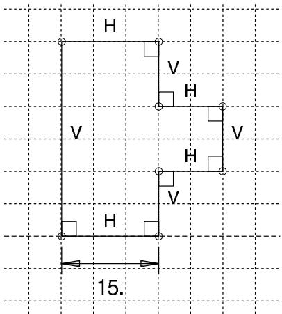  
图 1：原始草图。

该草图包括 Abaqus/CAE 在草图绘制过程中创建的默认水平、垂直和垂直约束，以及一个添加的长度尺寸。在这些约束就位的情况下，拖动草图的左边与拖动左边任一端的顶点具有相同的效果，如图 2 所示。

  
图 2：带约束拖动左边或顶点。

在移除约束和尺寸后，拖动边会产生与图 2 类似的结果，但拖动顶点会如图 3 所示修改草图。图 3 中的结果是使用默认的"最小移动"约束求解方法实现的。对于此草图，使用任何其他约束求解方法拖动顶点都会重新定位整个草图。

  
图 3：无约束时拖动左下顶点。

拖动边和顶点是一种快速但不精确的移动方法，因为移动是基于光标位置而不是精确的数值更改。要更精确地移动对象，请使用**通过更改尺寸或添加参数修改对象**以及**通过选择边修改或复制对象**中描述的方法。
拖拽尺寸文本是使用自动标注工具后清理草图的一种方式。由于尺寸文本的确切位置并不重要，因此精确度不足的问题并不影响操作。当您拖拽尺寸文本时，可以进行以下更改：

• 将线性尺寸文本移动到更靠近、更远离标注对象的位置，或将其移到标注对象的另一侧。  
• 将角度尺寸文本移动到更靠近或更远离角度顶点的位置。  
• 将角度尺寸文本移动到定义角度的某条边的另一侧，以标注原角的补角。

图4显示了拖拽角度尺寸时可能的位置。

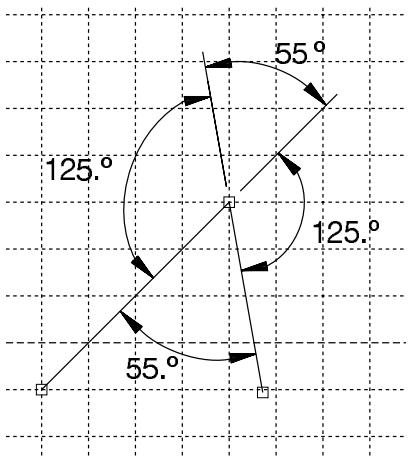  
图4：角度尺寸的四个可能位置。

尺寸文本除了附着在标注对象上之外，不受任何其他约束控制。约束求解方法也不会影响在草图中拖拽尺寸文本。

## 附加信息

• 指定精确几何  
• 修改对象

## 通过更改尺寸或添加参数来修改对象

使用线段和顶点之间的尺寸来定义和维持特征之间的尺寸关系。尺寸可以应用在以下对象之间的线段和顶点上：

• 草图几何  
• 参考几何  
• 构造几何

参数是已关联名称的尺寸或常量，以便您使用它们来创建函数并定义特征之间的关系。例如，考虑一个带有拉伸圆柱凸台的三维壳体，如下图所示：


此部件分两步创建：

1. 创建一个仅包含壳体的部件。  
2. 从壳体的表面拉伸出一个实体特征（圆柱凸台）。

如果您想保持壳体左边缘与凸台中心之间的距离恒定，可以编辑凸台并在草图圆的中心与代表壳体的参考几何体的左边缘之间添加一个尺寸，如下图所示：

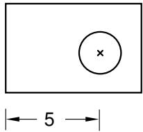

如果您移动壳体的左边缘或右边缘，圆的中心与左边缘之间的距离将保持不变，如下图所示：

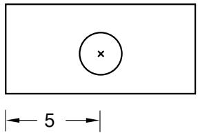

如果您想让凸台保持在壳体左、右边缘之间的中心位置，必须添加两个尺寸并将它们与参数关联。然后，您可以定义一个参数方程 $dim2 = (dim1) / 2$，将左边缘到凸台的距离设置为壳体宽度的一半，如下图所示：

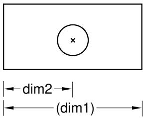


## 注意：

与参数 `dim1` 关联的距离尺寸是在壳体特征的草图中定义的，无法在凸台的草图中进行编辑。当您对参考几何进行尺寸标注时，Abaqus/CAE 会将尺寸显示为洋红色，以表明存在过约束。要清除过约束，必须将 `dim1` 设为参考尺寸。Abaqus/CAE 会在参考尺寸的值（或与参数关联的尺寸的参数名）周围加上括号，并在标注对象更改时自动更新其值。有关更多信息，请参阅编辑尺寸。

您可以修改草图中的任何尺寸或参数。有关详细说明，请分别参阅编辑尺寸以及添加和编辑参数。

## 通过选择边来修改或复制对象

当您移动边时，Abaqus/CAE 会重新定位选定的边，并使用“编辑期间”约束求解方法来修改任何连接的边（更多信息，请参阅在 Sketcher 中自定义约束的使用）。草图约束和约束求解方法可能会限制您可以执行的移动类型，或者导致 Abaqus/CAE 重新定位您未选择的边。当您复制边时，副本的位置取决于复制方法——复制的边不受任何现有草图约束的影响。您不能在草图之间复制对象。Abaqus/CAE 提供了以下用于移动或复制选定边的方法：

## 平移

您可以通过指定平移矢量的起点和终点坐标来平移选定的边。平移矢量可以从任意点开始；但是，您可能会发现将矢量起点设置在选定边一端的顶点，并将其终点设置在该顶点的新位置更有意义。图1显示了选定的边、平移矢量以及平移结果。为达到图中所示效果，添加了固定约束以防止上方矩形的两个顶点移动。


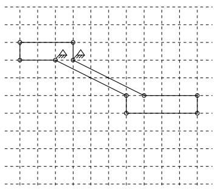  
图1：平移选定的边。

## 旋转

您可以通过指定旋转中心的坐标并输入旋转角度来旋转选定的边；正角度表示逆时针旋转。图2显示了选定的边、选定的旋转中心以及旋转90°后的结果。所选边未与草图中的其他边连接或约束，因此约束求解方法对旋转没有影响。

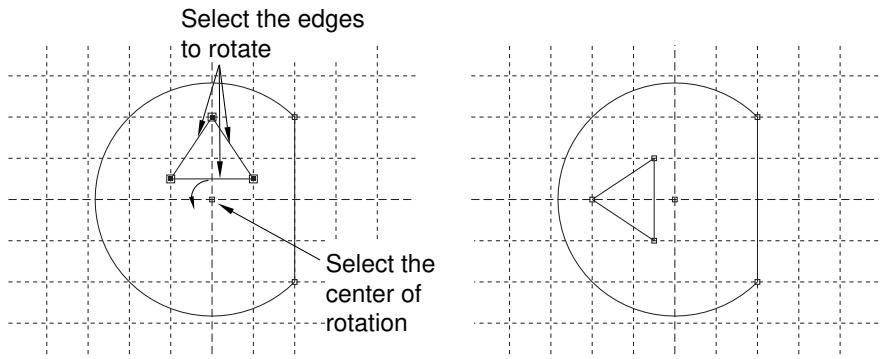  
图2：旋转选定的边。

## 镜像

您可以通过在草图中选择一条直线作为镜像线来镜像选定的边。图3显示了选定的边、镜像线以及包含为四个选定边各生成一个镜像约束的结果副本。镜像线可以是草图中的任意物体线或构造线。

  
图3：镜像选定的边。

## 缩放

您可以通过指定中心点和缩放因子来缩放选定的边。小于1.0的缩放因子会减小边之间的间距，大于1.0的缩放因子会增大边之间的间距。图4显示了选定的边、选定的中心点以及缩放因子为1.5时的结果。

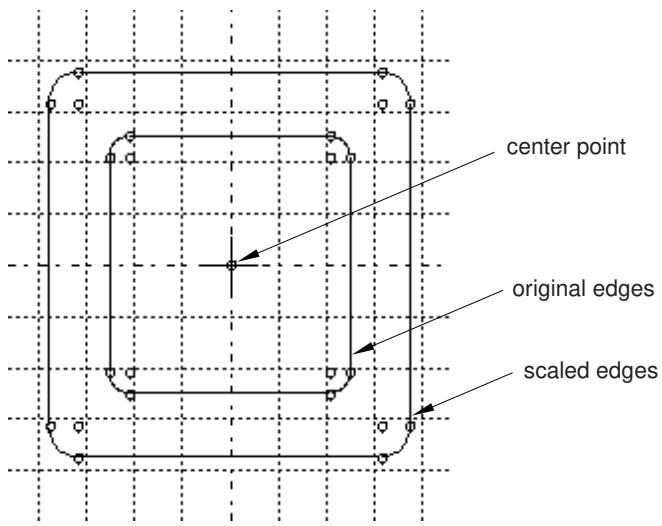  
图4：缩放选定的边。

## 附加信息

• 修改对象

## 通过修剪、延伸、分割或合并来修改边

当您修改草图时，可以通过修改尺寸、移动选定的顶点，或者通过修剪、延伸、分割或合并边来实现更改。Abaqus/CAE 提供了以下用于修剪、延伸、分割和合并边的方法：

## 修剪/延伸

您可以修剪或延伸直线或弧的一端；也可以修剪样条曲线，但样条曲线不能延伸。要修剪或延伸一条边，首先在靠近要修改的一端选择该边，然后选择第二条边以定义交点。第二条边可以是草图中的任何物体，包括构造几何。交点可以位于任一选定边的当前端点之外。Abaqus/CAE 会在交点处修剪或延伸第一条边。如果您想将第二条边也修剪或延伸到同一点，请颠倒选择顺序并重复该过程（见图1）。

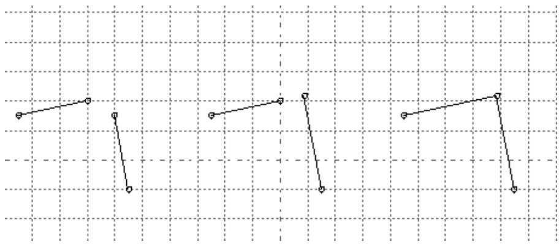  
图1：延伸两条边以创建拐角。

有关修剪和延伸边的详细说明，请参阅通过修剪或延伸边来修改 Sketcher 对象。

## 自动修剪

您可以从直线、弧、圆或样条曲线中修剪掉中间段或端段。自动修剪是从草图中移除不需要的边段的最快方法。Abaqus/CAE 使用预选来高亮显示您可以移除的边。预选基于光标接近度和两个最近的“修剪点”。修剪点包括交点、端点、顶点以及定义圆边界的选取点。与使用修剪/延伸不同，Abaqus/CAE 不会分割相交的边。图2显示了基于左上角所示的圆和线段的几种可能的修剪组合。

  
图2：自动修剪选择。

有关自动修剪边的详细说明，请参阅通过自动修剪边来修改 Sketcher 对象。
## 分割

您可以在草图中分割边，在相交处创建具有公共顶点的独立片段。选择要分割的第一条边，然后选择第二条边，使其在所需的分割点处与第一条边相交。当您将光标移到第二条边附近时，一个圆圈会出现在您将要创建的分割点周围。如果两条边之间存在多个交点，Abaqus/CAE 会高亮显示最接近光标的交点。Abaqus/CAE 会在指定点处分割第一条边。下图左侧显示一条相交的直线和样条线，中间图像指出了分割点（光标未显示），右侧显示了分割后得到的三条边。在此示例中，首先选择的是样条线，因此直线保持完整。


## 注意：

当您分割或修剪样条曲线时，它们会保持精确的形状，但控制点会被移除，因此您无法再编辑曲线的形状。

  
图 3: 分割一条直线和一条样条线。

关于分割边的详细说明，请参见通过分割边修改草图对象。

## 合并

合并工具用于闭合草图中的小间隙。这些间隙通常出现在以下情况：

• 当您对不在与草图平面平行的平面内的边使用 **投影边** 工具时，其端点可能创建在与其他选定边稍有不同的位置。  
• 当您将草图几何图形导入现有草图时，边可能无法精确对齐。

合并工具仅用于闭合小间隙。合并边以闭合较大的间隙可能会显著改变草图几何形状。如果您想在草图中移动元素较大的距离，请使用草图工具箱中的**拖动**工具，将草图中的顶点移动到新位置。更多信息，请参见拖动草图对象。

关于合并边的详细说明，请参见通过合并边修改草图对象。

## 附加信息

• 修改对象

## 复制草图对象以创建阵列

您可以复制草图中的对象并创建复制对象的阵列；例如，图 1 展示了实体零件上轮齿和孔的径向阵列。

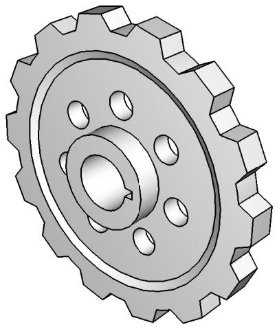  
图 1: 轮齿和孔的径向阵列。

您可以选择以下任一方法来定义阵列：

## 线性阵列

线性阵列将选定对象的副本沿某个方向（例如，X 方向）定位。您可以指定副本的数量和副本之间的间距；并且可以选择将副本放置在正方向或负方向。此外，您还可以更改线性阵列的方向。

图 2 展示了如何在单个方向上创建不同的线性阵列。

  
图 2: 单方向线性阵列。

您可以通过在第二个方向（例如，Y 方向）创建副本来创建复制对象的矩阵。选项与第一个方向相同；您可以控制副本的数量、方向和角度。图 3 展示了如何在两个方向上创建不同的线性阵列。

  
图 3: 双方向线性阵列。

默认情况下，第一个方向是 X 轴，第二个方向是 Y 轴。但是，您可以通过从草图中选择一条代表新方向的线来更改第一个或第二个方向的方向。图 4 展示了一个沿所选线定向的线性阵列。

  
方向 1 数量 = 5 间距 = 20  
方向 2 数量 = 1  
图 4: 沿一条线定向的线性阵列。

默认情况下，Abaqus/CAE 在正方向创建阵列；但是，您可以反转方向。例如，图 5 显示了与图 4 相同的线性阵列，但方向已反转。

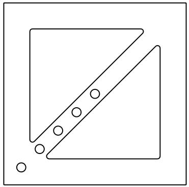  
图 5: 反转线性阵列方向的效果。

关于创建线性阵列的详细说明，请参见创建对象的线性阵列。

## 径向阵列

径向阵列将选定对象的副本排列成圆形图案。您可以指定副本的数量，并可以指定第一个副本和最后一个副本之间的角度，其中正角度对应于逆时针方向。此外，您可以从草图中选择一个点来定义圆形阵列的中心点。图 6 展示了如何创建不同的径向阵列。

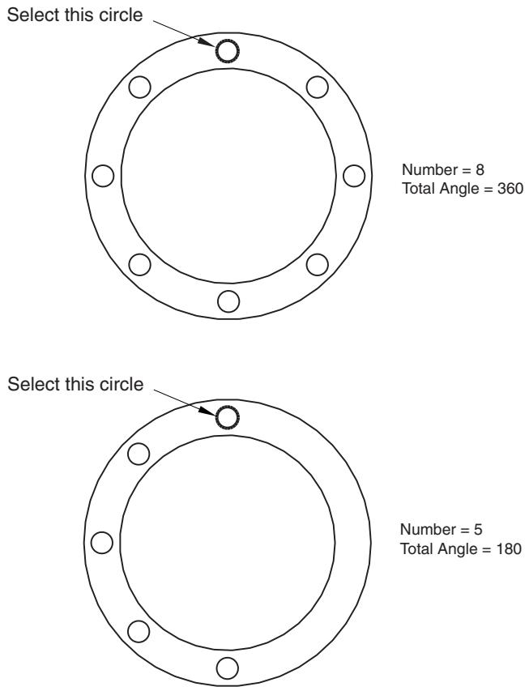  
图 6: 径向阵列。

关于创建径向阵列的详细说明，请参见创建对象的径向阵列。

默认情况下，当您输入设置时，Abaqus/CAE 会显示线性阵列和径向阵列的预览。在大多数情况下，预览将帮助您决定将创建所需阵列的设置。但是，如果创建大量副本，预览可能会减慢草图的生成速度。在这种情况下，您应该关闭**预览**按钮。

还有几种方法可用于创建草图对象的单独副本。这些方法在通过选择边修改或复制对象中讨论。

## 偏移对象

您可以在草图中偏移对象以创建更大或更小的相似对象。选择要偏移的边和偏移距离；Abaqus/CAE 会显示预览，以便您可以选择偏移方向。您可以偏移任何不包含分支的连续开放或闭合环。图 1 显示了针对几种边选择可以创建的两种可能的偏移。（为清晰起见，图中未显示顶点和基准点。）

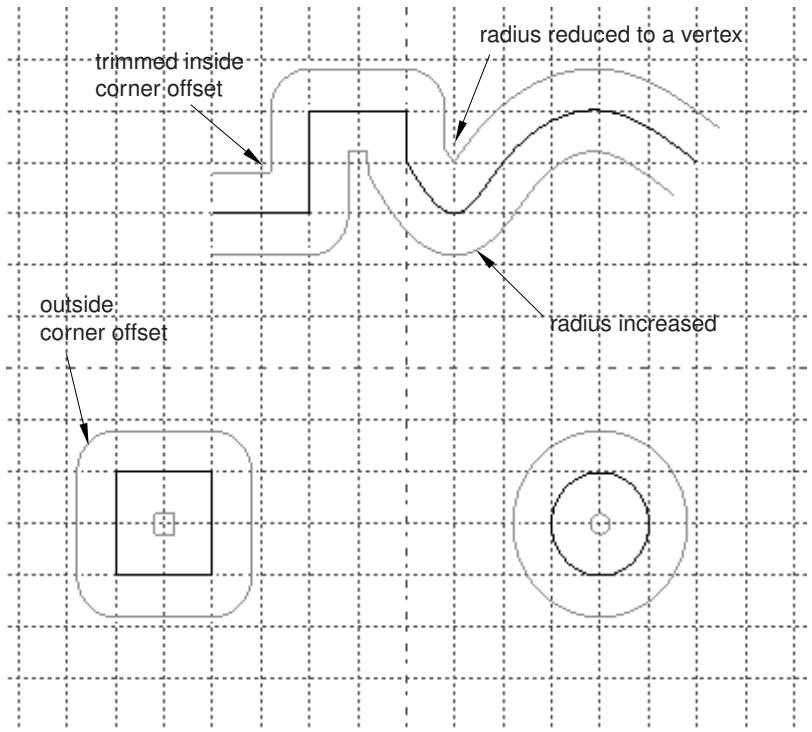  
图 1: 样条曲线、正方形和圆的偏移。

Abaqus/CAE 偏移每个对象的方式与您在纸上使用绘图圆规偏移边的方式相同。使用圆规时，您会将圆规的针脚沿着原始边移动，同时用铅笔在要求的垂直（偏移）距离处描绘一条新边。在任何尖角处，您会旋转圆规使其在拐角处垂直于第二条边。在此过程结束时，您会修剪任何与其他偏移边相交的偏移边。

如图 1 所示，Abaqus/CAE 完成了类似的过程：

• 直线边被复制。  
• 重叠的偏移边（例如，向“内”偏移的拐角）被修剪以形成新的拐角。  
• 当拐角向“外”偏移时，您可以选择创建尖角或半径等于偏移距离的圆角。  
• 现有曲线的半径增加或减少偏移距离。

如果曲线的半径因偏移而减小到零或更小，Abaqus/CAE 会创建一个新的顶点，连接先前由该曲线连接的相邻边。详细说明，请参见偏移草图对象的边。

## 自定义草图编辑器

本节介绍如何自定义草图编辑器的行为和外观。

## 本节内容：

使用草图编辑器自定义选项  
打开或关闭捕捉  
打开或关闭预选  
自定义图纸尺寸和网格  
重新对齐草图网格  
显示和隐藏构造几何  
限制共面实体的投影  
设置记录的最大草图操作数  
自定义草图编辑器中尺寸的格式和使用  
自定义草图编辑器中约束的使用  
管理草图编辑器背景中的图像

## 使用草图编辑器自定义选项

使用草图编辑器自定义选项来控制草图编辑器的外观和行为。

以下选项控制整个 Abaqus/CAE 会话期间草图编辑器的行为：

光标是否捕捉到网格。  
• 预选是否处于活动状态。  
• 是否显示尺寸。  
• 是显示参数的名称还是值。  
• 限制投影的共面实体数量。  
• 可用于**自动标注尺寸**和**自动约束**工具的尺寸和约束类型。  
• 编辑或拖动对象时使用的约束求解方法。  
• 是否显示草图约束。  
• 在创建实体时是否添加隐含约束。  
• 是否显示构造几何。  
• 是否显示背景图像。
以下选项随每个草图存储；它们控制当前草图和您创建的新草图的行为及外观：

• 图纸尺寸、网格间距以及要显示的网格线数量。  
• 图纸尺寸和网格间距是否受自动控制。  
• 网格是否可见。  
• 文本字体大小和草图尺寸中显示的小数位数。

草图网格的原点及 X 轴的对齐方式也随每个草图存储。但是，网格原点和对齐设置仅控制当前草图的行为和外观；对于您创建的任何新草图，它们会被重置为默认值。

1. 从草图绘制器工具箱底部，选择草图绘制器定制工具 。将出现“草图绘制器选项”对话框。

2. 在各个选项卡页面上设置所需的定制选项。如需详细帮助，请在对话框中对各个项目请求上下文相关帮助。


提示：您也可以点击“默认值”以将所有草图绘制器选项恢复为默认设置。

3. 点击“确定”以应用您的更改并关闭“草图绘制器选项”对话框。

## 附加信息

• 定制草图绘制器  
• 草图绘制器定制选项的初始化和保存方式

## 开启或关闭捕捉

捕捉到网格有助于在您想要选择草图绘制器网格点或将对象拖动到网格上的特定点时定位光标。当捕捉启用且您将光标移动到网格点附近时，辅助光标会跳跃或捕捉到该网格点。在“草图绘制器选项”对话框中切换“捕捉到网格”以启用或禁用捕捉。（默认情况下，启动草图绘制器时捕捉是启用的。）您为捕捉选择的行为适用于 Abaqus/CAE 会话中的所有草图。如果预选点和网格点都接近光标位置，则草图绘制器的预选会覆盖捕捉。

1. 从草图绘制器工具箱底部，选择草图绘制器定制工具 。

   将出现“草图绘制器选项”对话框。

2. 从“常规”选项卡页面，切换“捕捉到网格”。

   当“捕捉到网格”开启时，您在草图上移动时，辅助光标会捕捉到附近的网格点。根据网格大小、视口的放大倍数以及预选是否激活，除了网格点和现有草图几何体外，您可能还能够选择其他点。当“捕捉到网格”关闭时，您在草图上移动时，辅助光标会与主光标对齐。您可以在图纸上的任何位置进行选择。

3. 选择所需的定制选项后，点击“确定”以应用您的更改并关闭“草图绘制器选项”对话框。

## 附加信息

• 草图绘制器图纸和网格  
• 草图绘制器光标和预选  
• 定制草图绘制器  
• 开启或关闭预选

## 开启或关闭预选

预选有助于选择参考几何体或草图绘制器对象，例如线、顶点和尺寸。当预选启用且您将光标移动到其中一个对象附近时，Abaqus/CAE 会高亮显示该对象，以便您更容易地选择它。预选还通过指示将创建水平、竖直、共线、垂直和重合约束的选择来帮助您在绘制草图时约束草图。有关您在草图上移动光标时不同草图绘制器对象显示的预选符号列表，请参阅草图绘制器光标和预选。

在“草图绘制器选项”对话框中切换“预选几何体”以启用或禁用预选。（默认情况下，启动草图绘制器时预选是启用的。）预选定制在 Abaqus/CAE 会话期间存储，并适用于所有草图。如果预选点和网格点都接近光标位置，则预选会覆盖捕捉到网格。

1. 从草图绘制器工具箱底部，选择草图绘制器定制工具 。将出现“草图绘制器选项”对话框。  
2. 从“常规”选项卡页面，切换“预选几何体”。

   当“预选几何体”开启时，您在草图上移动时，Abaqus/CAE 会高亮显示有效的选择，例如顶点、中点和尺寸。

   当“预选几何体”关闭时，Abaqus/CAE 不会高亮显示有效的选择。

3. 选择所需的定制选项后，点击“确定”以应用您的更改并关闭“草图绘制器选项”对话框。

## 附加信息

• 草图绘制器光标和预选  
• 定制草图绘制器  
• 开启或关闭捕捉  
• 草图绘制器定制选项的初始化和保存方式

## 定制图纸尺寸和网格

使用“草图绘制器选项”对话框来控制图纸尺寸和网格。

您可以定制以下内容：

## 图纸尺寸

图纸的边界始终是正方形，其高度和宽度等于图纸尺寸。如果您发现图纸尺寸过大或过小，可以使用“草图绘制器选项”对话框来更改尺寸。

当您创建零件或独立草图时，您定义新零件或草图的大致尺寸；Abaqus/CAE 根据您提供的大致尺寸来确定初始图纸尺寸。大致尺寸对于零件必须在 $10^{-3}$ 到 $10^{4}$ 单位之间，对于草图必须在 $10^{-3}$ 到 $10^{5}$ 单位之间。Abaqus/CAE 不使用特定单位，但单位在整个模型中必须一致。“图纸尺寸”字段旁边的“自动”切换开关解锁该字段，并控制 Abaqus/CAE 是否可以自动更改当前草图和您创建的新草图中的图纸尺寸。

## 网格间距

您可以使用此选项来更改主要网格线的网格间距，使用的单位与定义“图纸尺寸”的单位相同。如果启用了“捕捉到网格”，光标将捕捉到每个网格点。“网格间距”字段旁边的“自动”切换开关解锁该字段，并控制 Abaqus/CAE 是否可以自动更改当前草图和您创建的新草图中的网格大小。

## 次要间隔

次要网格线将主要网格线之间的空间细分为间隔，并使您在将草图绘制器设置为高放大倍数级别时能够更精确地定位草图中的项目。您可以使用此选项来更改每条主要网格线之间的次要间隔数量。

次要网格线的显示是动态的：Abaqus/CAE 在默认放大倍数级别下隐藏这些线，并在您放大时显示它们。

## 显示网格线

您可以在草图绘制器中切换主要网格线和次要网格线的显示。次要网格线仅在主要网格线也显示时才能显示。

下图显示了网格间距、主要网格线和次要网格线之间的关系：

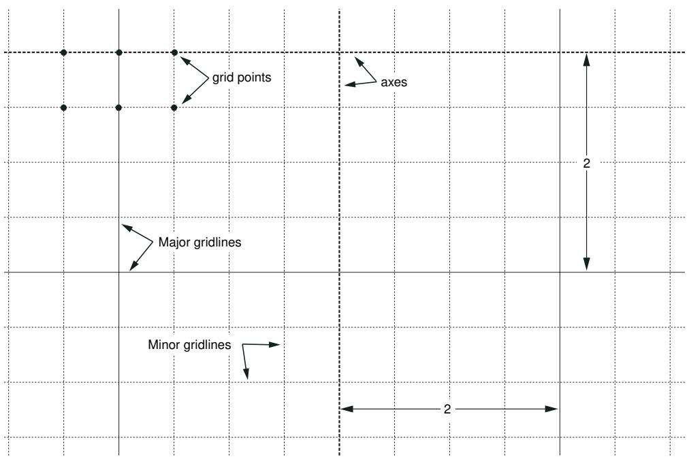

图纸尺寸和网格定制选项适用于当前草图，并随草图一起存储。当您创建新草图时，Abaqus/CAE 使用最近的设置来确定是否重新计算图纸尺寸和网格间距以及是否显示网格。

1. 从草图绘制器工具箱底部，选择草图绘制器定制工具 。将出现“草图绘制器选项”对话框。  
2. 从“常规”选项卡页面，关闭“图纸尺寸”文本框旁边的“自动”。  
3. 在文本框中，输入将包含正在创建或编辑的特征的正方形图纸的尺寸。以与用于描述模型其余部分的单位一致的单位指定图纸尺寸。  
4. 关闭“网格间距”文本框旁边的“自动”。  
5. 在文本框中，输入网格点之间所需的间距。以用于定义图纸尺寸的相同单位指定网格间距。  
6. 点击“次要间隔”字段右侧的箭头以增加或减少每条主要网格线之间显示的次要网格间隔数量。  
7. 切换“主要”以显示或隐藏主要网格线。如果显示了主要网格线，您还可以切换“次要”以显示或隐藏次要网格线。  
8. 选择所需的定制选项后，点击“确定”以应用您的更改并关闭“草图绘制器选项”对话框。

## 附加信息

• 草图绘制器图纸和网格  
• 定制草图绘制器  
• 草图绘制器定制选项的初始化和保存方式

## 重新对齐草图网格

在某些情况下，草图网格与草图的顶点和线或基础参考几何体不对齐。您可能会发现，如果使用草图绘制器定制选项重新对齐草图网格，则更容易创建所需的草图。如果您将现有草图添加到新的空白草图（例如用于新零件），Abaqus/CAE 会自动重新对齐草图网格。定制选项允许您执行以下操作：
- 通过选择一个代表网格原点的顶点来相对于草图移动网格。为帮助您定位草图的原点，草图的 X 轴和 Y 轴由在原点相交的虚线表示。
- 通过选择一条将平行于网格 X 轴的草图中的线来相对于草图旋转网格。
- 将网格重置为原始的草图坐标。

重新对齐网格不会改变草图中的现有特征。但是，此更改将应用于任何新的草图实体。例如，如果您旋转网格，现有的水平构造线将不会改变；但是，新的水平构造线将与新的 X 轴平行。尺寸是一个例外；水平和垂直尺寸（无论是新的还是现有的）都与默认的网格旋转对齐。

当您更改网格原点或旋转并创建新的草图几何图形时，Abaqus/CAE 会显示两组光标坐标。网格坐标是相对于草图网格当前的对齐方式显示的；它们显示在视口的左上角。草图坐标是相对于草图网格的原始对齐方式显示的；它们显示在视口的右上角，并且如果您重新对齐网格，它们不会改变。当两组坐标相同时，Abaqus/CAE 会在视口的左上角显示一组坐标。

1.  从草图工具箱底部，选择自定义工具。
    将出现“草图选项”对话框。

2.  在“常规”选项卡页面中央的按钮区域，执行以下操作：
    *   单击 **Origin**（原点）以移动草图网格相对于部件的位置。从草图中选择新原点，或在提示区输入原点的坐标。
    *   单击 **Angle**（角度）以旋转草图网格相对于部件的位置。选择一条将平行于草图 X 轴的线。
    *   单击 **Reset**（重置）以恢复原始草图原点并恢复 X 轴的原始对齐方式。重置网格将使网格坐标与草图坐标对齐。

    您的网格对齐更改将立即应用于草图。

3.  单击 **OK**（确定）以应用您所做的任何其他自定义设置并关闭“草图选项”对话框。

## 附加信息

*   重新对齐草图网格相对于草图
*   自定义草图工具
*   草图工具自定义选项的初始化和保存方式

## 显示和隐藏构造几何

您可以创建构造几何来帮助您在草图中定位和对齐对象。

例如，下图显示了一系列沿倾斜构造线对齐的孔。这些孔位于垂直构造线与倾斜构造线相交处的中心：

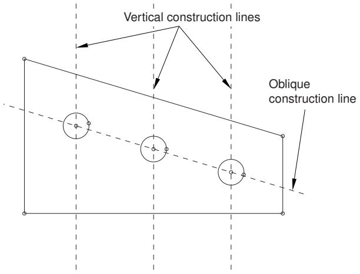

如果构造几何分散注意力，您可以使用“草图选项”对话框中的 **Show construction geometry**（显示构造几何）选项来隐藏它。（默认情况下，当您启动草图工具时，构造几何是显示的。）如果启用了预选择，光标仍将捕捉到与隐藏的构造几何相关联的项目，例如线与构造线的交点。构造几何的显示自定义仅应用于当前草图，并与草图一起存储。

1.  从草图工具箱底部，选择自定义工具。将出现“草图选项”对话框。

2.  在“常规”选项卡页面，切换 **Show construction geometry**（显示构造几何）。当 **Show construction geometry**（显示构造几何）打开时，Abaqus/CAE 在草图中显示构造几何。

3.  选择所需的自定义选项后，单击 **OK**（确定）以应用更改并关闭“草图选项”对话框。

## 附加信息

*   构造几何
*   创建构造几何
*   自定义草图工具
*   草图工具自定义选项的初始化和保存方式

## 限制共面实体的投影

当创建或编辑基于草图的特征时，您可以为 Abaqus/CAE 自动从背景投影的共面实体数量设置一个限制。默认情况下，Abaqus/CAE 会自动投影 300 个共面实体。您为投影的共面实体选择的限制适用于 Abaqus/CAE 会话中的所有草图。

1.  从草图工具箱底部，选择自定义工具。将出现“草图选项”对话框。
2.  在“常规”选项卡页面，在 **Max coplanar entities to project**（要投影的最大共面实体数）文本字段中输入一个值。如果超过此值，将发出警告消息，并且不会自动投影任何实体。
3.  选择所需的自定义选项后，单击 **OK**（确定）以应用更改并关闭“草图选项”对话框。

## 附加信息

*   自定义草图工具
*   草图工具自定义选项的初始化和保存方式

## 设置记录的最大草图操作次数

Abaqus/CAE 将您对当前草图的更改记录在一个缓存中，使您能够撤消和重做多个连续的草图更改。默认情况下，撤消缓存最多支持 10 级撤消，但您可以增加或减少此数量。如果您的草图操作需要大规模更改，您可能希望增加级数；如果您的草图大型复杂，您可能希望减少此数量以提高系统性能。

最大撤消级数适用于 Abaqus/CAE 会话中的所有草图。每次您更改当前草图或切换到不同模块时，Abaqus/CAE 都会清除撤消缓存。

□ 1. 从草图工具箱底部，选择自定义工具
    将出现“草图选项”对话框。

2.  在“常规”选项卡页面，在 **Max level for sketch undo**（草图撤消的最大级别）文本字段中输入一个介于 0 到 100 之间的值。
3.  选择所需的自定义选项后，单击 **OK**（确定）以应用更改并关闭“草图选项”对话框。

## 附加信息

*   自定义草图工具
*   撤消和重做草图操作

## 自定义草图工具中的尺寸格式和用法

当您向草图添加尺寸时，默认的尺寸文本高度为 12 磅。您可以使用“草图选项”对话框“尺寸”选项卡页面上 **Dimension text height**（尺寸文本高度）字段中的箭头来更改文本高度。尺寸文本与当前图纸大小和缩放设置无关；也就是说，无论尺寸特征的表观大小如何，文本都保持您选择的大小。

此外，您可能希望更改小数位数以匹配您正在创建的特征的尺寸。您可以使用 **Decimal places**（小数位数）字段来控制每个尺寸中显示的小数位数。为了在编辑草图时减少杂乱，您可以使用 **Show dimensions**（显示尺寸）选项来隐藏尺寸。您还可以使用 **Show parameter names**（显示参数名称）选项来显示已转换为参数的尺寸的名称，而不是其数值。显示参数名称允许您查看已被参数表达式替换的尺寸，并帮助您在各种草图尺寸之间创建关系。最后，您可以选择可以使用 **Auto-Dimension**（自动尺寸标注）工具自动创建的尺寸类型。

尺寸文本高度和小数位数设置适用于您正在处理的草图，并与草图一起存储。当您创建新草图时，Abaqus/CAE 将为新草图使用默认的尺寸文本高度和小数位数。所有其他尺寸选项在当前 Abaqus/CAE 会话的剩余时间内存储。

1.  从草图工具箱底部，选择草图自定义工具。将出现“草图选项”对话框。
2.  单击 **Dimensions**（尺寸）选项卡。Abaqus/CAE 显示“尺寸”选项卡页面。
3.  根据需要，切换 **Show dimensions**（显示尺寸）。当 **Show dimensions**（显示尺寸）打开时，Abaqus/CAE 在草图中显示尺寸。
4.  根据需要，切换 **Show parameter names**（显示参数名称）。当 **Show parameter names**（显示参数名称）打开时，Abaqus/CAE 显示已转换为参数的尺寸的名称。（有关更多信息，请参阅添加和编辑参数。）
5.  在 **Dimension text height**（尺寸文本高度）标签旁边，单击箭头以增加或减小尺寸文本的高度。以磅为单位指定高度；高度可以在 8 到 30 之间变化。
6.  在 **Decimal places**（小数位数）标签旁边，单击箭头以增加或减小尺寸文本中将包含的小数位数。显示的小数位数可以在 1 到 6 之间变化。
7.  在页面下半部分，切换可用于 **Auto-Dimension**（自动尺寸标注）工具的尺寸类型。（有关更多信息，请参阅自动为草图添加尺寸标注。）
8.  选择所需的自定义选项后，单击 **OK**（确定）以应用更改并关闭“草图选项”对话框。
## 补充信息

• 草图的约束、尺寸标注与参数化  
• Sketcher 的定制化  
• Sketcher 定制化选项的初始化与保存方式

## 在 Sketcher 中定制约束的使用方式

约束创建的是控制草图几何形状的非数值关系。在你编辑草图时，Abaqus/CAE 会运用求解方法以避免违反这些约束。有几种方法可供使用，无论是在拖拽图元时，还是在使用其他草绘工具编辑图元时。


## 注意：

约束求解方法并不能阻止草图修改工具覆盖已应用的约束。例如，你可以使用"平移"工具来移动一条具有"固定"约束的线。

此外，你可以使用"显示约束"选项来隐藏约束，减少草图中的杂乱，并使用"在创建图元期间添加约束"选项来添加草图绘制过程中隐含的约束。你可以使用"自动约束"工具来选择线性和角度容差，以及可以自动创建的约束类型。

约束定制化选项适用于整个 Abaqus/CAE 会话。它们不会随单个草图或当前模型一起保存。

1.  从 Sketcher 工具箱底部，选择 Sketcher 定制化工具 。将出现"Sketcher 选项"对话框。
2.  点击"约束"选项卡。
3.  选择在拖拽草图图元或其他类型编辑期间使用的所需约束求解方法。可进行以下选择：

## 标准

这是默认的编辑求解方法。Abaqus/CAE 以最小量移动或修改几何体以满足约束和尺寸。Abaqus/CAE 还会在移动过程中试图维持不相关几何体的刚体外观。

## 加权

Abaqus/CAE 以最小量移动或修改几何体以满足约束和尺寸。移动过程中不考虑不相关几何体的刚体外观。

## 最小移动

这是默认的拖拽求解方法。Abaqus/CAE 移动最少数量的图元以满足约束。

## 松弛

Abaqus/CAE 使用数值求解技术移动几何体，以最小化移动量的平方和。与其他方法相比，此求解方法会导致更多几何体被移动。

4.  如果需要，切换"显示约束"。当"显示约束"开启时，Abaqus/CAE 会在草图中显示约束符号。
5.  如果需要，切换"在创建图元期间添加约束"。

当"在创建图元期间添加约束"开启时，Abaqus/CAE 会添加草图绘制过程中隐含的约束。例如，如果你正在绘制一条线，其预选符号指示 Abaqus/CAE 将应用水平约束，并且"在创建图元期间添加约束"已开启，则该水平约束将被添加到线上。

6.  在页面下方，切换"自动约束"工具可用的约束类型。（有关更多信息，请参见自动约束草图。）
7.  选择所需的定制化选项后，点击"确定"以应用更改并关闭"Sketcher 选项"对话框。

## 补充信息

• Sketcher 定制化选项的初始化与保存方式  
• Sketcher 的定制化  
• 草图的约束、尺寸标注与参数化

## 管理 Sketcher 背景中的图像

你可以在 Sketcher 的背景中显示一张图像，以帮助你绘制和对齐草图中的对象。该图像可以放置在 Sketcher 背景中的任何位置，并且可以水平或垂直拉伸或压缩。当你调整视口大小时，Abaqus/CAE 会按比例调整背景图像的大小。

Sketcher 背景图像仅出现在"草图"模块中。你还可以显示另一张图像，该图像会出现在包括"草图"模块在内的每个 Abaqus/CAE 模块的视口背景中；有关更多信息，请参见在视口中使用背景图像和电影。当 Sketcher 背景图像和模块级背景图像都被开启时，进入"草图"模块后，Abaqus/CAE 会将 Sketcher 背景图像显示在顶层。

在你可以在"草图"模块或任何其他模块的背景中显示图像之前，必须先将该图像添加到你的 Abaqus/CAE 会话中。要从"Sketcher 选项"对话框添加图像，请点击"创建"；然后输入图像的名称并提供其位置。会话中的图像在所有模块中均可用，并且仅在你的会话期间有效；它们不会保存到模型数据库或输出数据库中。

Abaqus/CAE 支持以下格式的背景图像：位图（.bmp）、PNG（.png）、TIFF（.tif）、XPM（.xpm）、PCX（.pcx）、ICO（.ico）、TGA（.tga）和 RGB（.rgb）。

1.  从 Sketcher 工具箱底部，选择 Sketcher 选项工具

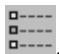

将出现"Sketcher 选项"对话框。

2.  点击"图像"选项卡。
3.  切换"显示图像"以显示或隐藏 Sketcher 背景图像。
4.  选择要显示的图像文件：
    •   要显示已在会话中定义的图像，展开"图像名称"列表并选择图像名称。
    •   要添加新图像，点击"创建"；然后在出现的对话框中输入名称并指定文件位置。你可以直接在"文件名"字段中输入文件位置，也可以点击在"选择图像文件"对话框中导航至该位置。


5.  使用以下技术之一拉伸或压缩背景图像：

## 沿任一轴缩放图像

你可以通过指定"X比例"和"Y比例"值来拉伸或压缩 Sketcher 背景图像。当这些比例值等于 1（默认值）时，图像保持其原始比例。你可以增加比例值以沿选定轴拉伸 Sketcher 背景图像，或者减小值以沿选定轴压缩图像。

## 校准图像大小

你可以通过校准图像上两点之间的距离来缩放 Sketcher 背景图像的大小。点击"校准"，在视口中单击两点；然后在提示区域输入两点之间所需的距离。

校准图像后，Abaqus/CAE 会将更改反映到"X比例"和"Y比例"字段中。

6.  使用以下技术之一重新定位 Sketcher 背景图像：
    在"原点 X"和"原点 Y"字段中输入你希望将 Sketcher 背景图像的左下角移动到的草图坐标。

    •   点击"拾取"，然后点击 Sketcher 背景图像上的一个点。

    Abaqus/CAE 会将该图像点移动到网格原点，并用新的原点位置填充"原点"字段。


## 注意：

图像的左下角用于固定背景图像的位置。如果你在定位背景图像后更改缩放比例，图像的中心将会移动。

7.  拖动"透明度"滑块至你希望显示 Sketcher 背景图像的透明度级别。背景图像默认是不透明的，你可以选择从 0.00（透明）到 1.00（不透明）的值。
8.  点击"确定"以应用更改并关闭"Sketcher 选项"对话框。

## 补充信息

• 在视口中使用背景图像和电影  
• Sketcher 的定制化

## 绘制简单对象

本节描述如何使用 Sketcher 工具绘制简单对象。

## 本节内容：

绘制孤立点  
绘制直线和多边形  
绘制矩形  
绘制圆  
使用圆心和两个端点绘制圆弧  
通过三点绘制圆弧  
绘制与直线相切的圆弧  
绘制椭圆  
在两条直线之间绘制圆角  
绘制样条线

使用 Sketcher 工具箱中的点工具来绘制一个孤立的点。你可以将得到的点用作参考，并且可以在该点与草图上的顶点之间创建尺寸。

1.  从 Sketcher 工具箱中，选择点工具 。有关 Sketcher 工具箱中工具的图示，请参见 Sketcher 工具。
    Abaqus/CAE 会在提示区域显示提示，以引导你完成操作步骤。

2.  在点的所需位置单击。

    该点出现。

3.  要创建更多点，请重复上一步。

4.  完成点的创建后，请执行以下操作之一：
    •   在 Abaqus/CAE 窗口中的任意位置点击鼠标按键 2。
    •   选择 Sketcher 工具箱中的任何其他工具。
    •   点击提示区域中的取消按钮。

## 补充信息

• 绘制简单对象
• 创建构造几何  
• 修改对象  
• 撤销和重做草图操作  

## 绘制直线和多边形

使用草图工具箱（Sketcher toolbox）中的直线工具绘制直线、连续线或多边形。  

下图展示了如何按照下方所示顺序，单击指定位置来绘制直线、连续线或多边形：  

  

在草图绘制时，应注意点的定位，因为这会影响网格质量。草图中的点将成为您正在创建或修改的零件的顶点（vertices）。随后，在网格模块（Mesh module）中对模型进行网格划分时，Abaqus/CAE 会将这些顶点转换为完全约束的种子（fully constrained seeds），并在其位置处放置节点（nodes）。有关如何后续移动顶点的信息，请参见“拖动草图对象”。  

1.  在草图工具箱（Sketcher toolbox）的直线工具中，选择连续线工具。有关草图工具箱中各工具的示意图，请参见“草图工具”。  
    Abaqus/CAE 会在提示区显示提示，引导您完成操作。  

2.  要构造一条简单直线，请单击两个端点。要构造连续线或多边形，请依次单击每个顶点。  

  

提示：如有必要，可以使用提示区中的文本框输入直线顶点的精确坐标。有关精确指定直线的更多信息，请参见“指定精确几何”。  

当您单击顶点或输入坐标时，直线或多边形将随之显示。  

3.  要完成直线或多边形的绘制，请单击鼠标中键（mouse button 2）。  

  

提示：如果在绘制连续线或多边形时出错，请单击草图工具箱（Sketcher toolbox）中的撤销工具 S，删除最近的线段。如果错误发生在较早的线段，您可以使用删除工具（Delete tool）删除错误的线段，然后用直线工具重新绘制。  

4.  要创建更多直线或多边形，请从步骤 2 开始重复上述步骤。  
5.  完成直线和多边形的创建后，请执行以下操作之一：  

    *   在 Abaqus/CAE 窗口的任意位置单击鼠标中键。  
    *   选择草图工具箱（Sketcher toolbox）中的任何其他工具。  
    *   单击提示区中的取消按钮。  

## 附加信息

*   绘制简单对象  
*   创建构造几何  
*   修改对象  
*   撤销和重做草图操作  

## 绘制矩形

使用草图工具箱（Sketcher toolbox）中的矩形工具绘制矩形。  

要绘制一个矩形，请按照下图中的编号指示，在任意两个对角位置单击。  

  

在草图绘制时，应注意点的定位，因为这会影响网格质量。草图中的点将成为您正在创建或修改的零件的顶点（vertices）。随后，在网格模块（Mesh module）中对模型进行网格划分时，Abaqus/CAE 会将这些顶点转换为完全约束的种子（fully constrained seeds），并在其位置处放置节点（nodes）。有关如何后续移动顶点的信息，请参见“拖动草图对象”。  

1.  在草图工具箱（Sketcher toolbox）的直线工具中，选择矩形工具。有关草图工具箱中各工具的示意图，请参见“草图工具”。  
    Abaqus/CAE 会在提示区显示提示，引导您完成操作。  

2.  在矩形任意两个对角点的所需位置处单击。  

  

提示：如有必要，可以使用提示区中的文本框输入矩形角点的精确坐标。有关精确指定矩形的更多信息，请参见“指定精确几何”。  

当您移动光标或输入坐标时，矩形将出现，并与当前草图网格（Sketcher grid）对齐。  

3.  要创建更多矩形，请重复上一步。  
4.  完成矩形的创建后，请执行以下操作之一：  

    *   在 Abaqus/CAE 窗口的任意位置单击鼠标中键。  
    *   选择草图工具箱（Sketcher toolbox）中的任何其他工具。  
    *   单击提示区中的取消按钮。  

## 附加信息

*   重新对齐草图网格  
*   绘制简单对象  
*   创建构造几何  
*   修改对象  
*   撤销和重做草图操作  

## 绘制圆

使用草图工具箱（Sketcher toolbox）中的圆工具，基于圆心和圆周上的任意一点绘制圆。  

下图展示了使用草图工具箱（Sketcher toolbox）中圆工具的示例：  

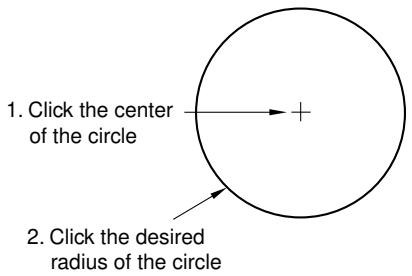  

在草图绘制时，应注意点的定位，因为这会影响网格质量。草图中的点将成为您正在创建或修改的零件的顶点（vertices）。随后，在网格模块（Mesh module）中对模型进行网格划分时，Abaqus/CAE 会将这些顶点转换为完全约束的种子（fully constrained seeds），并在其位置处放置节点（nodes）。有关如何后续移动顶点的信息，请参见“拖动草图对象”。  

1.  在草图工具箱（Sketcher toolbox）中，选择圆工具。有关草图工具箱中各工具的示意图，请参见“草图工具”。  
    Abaqus/CAE 会在提示区显示提示，引导您完成操作。  

2.  在圆心的所需位置处单击。  
3.  将光标移动到圆周上的一个点。  
    Abaqus/CAE 将显示使用当前光标位置将要创建的圆的预览。  

4.  在所需圆的圆周上任意一点处单击。  

  

提示：如有必要，可以使用提示区中的文本框输入圆心和圆周上点的精确坐标。有关精确指定圆的更多信息，请参见“指定精确几何”。  

Abaqus/CAE 绘制出圆。  

5.  要创建更多圆，请从步骤 2 开始重复上述步骤。  
6.  完成圆的创建后，请执行以下操作之一：  

    *   在 Abaqus/CAE 窗口的任意位置单击鼠标中键。  
    *   选择草图工具箱（Sketcher toolbox）中的任何其他工具。  
    *   单击提示区中的取消按钮。  

## 附加信息

*   绘制简单对象  
*   创建构造几何  
*   修改对象  
*   撤销和重做草图操作  

## 使用圆心和两个端点绘制圆弧

使用草图工具箱（Sketcher toolbox）中的“圆心与两端点”（Center with Two Endpoints）圆弧工具，通过圆心和两个端点绘制圆弧。  

下图显示了生成的圆弧：  

  

构成解析刚性面（analytical rigid surface）一部分的圆弧，其张开角度不能超过 180°。如有必要，可以附加两个圆弧来创建张开角度超过 180° 的圆弧。对于变形体（deformable bodies）或离散刚性面（discrete rigid surfaces）则没有此限制。  

在草图绘制时，应注意点的定位，因为这会影响网格质量。草图中的点将成为您正在创建或修改的零件的顶点（vertices）。随后，在网格模块（Mesh module）中对模型进行网格划分时，Abaqus/CAE 会将这些顶点转换为完全约束的种子（fully constrained seeds），并在其位置处放置节点（nodes）。有关如何后续移动顶点的信息，请参见“拖动草图对象”。  

1.  在草图工具箱（Sketcher toolbox）的圆弧工具中，选择“圆心与两端点”（Center with Two Endpoints）圆弧工具。有关草图工具箱中各工具的示意图，请参见“草图工具”。  
    Abaqus/CAE 会在提示区显示提示，引导您完成操作。  

2.  在所需圆弧的圆心处单击。  
3.  单击第一个端点以定义圆弧的半径。  

  

提示：如有必要，可以使用提示区中的文本框输入圆心和圆弧端点的精确坐标。有关精确指定圆弧的更多信息，请参见“指定精确几何”。  

当您将光标从圆弧圆心移动到其第一个端点时，Abaqus/CAE 会绘制一个圆，显示圆弧的半径。  

4.  从第一个端点顺时针移动光标，以顺时针方向绘制圆弧。从第一个端点逆时针移动光标，以逆时针方向绘制圆弧。单击第二个端点以定义圆弧的长度。如果您开始绘制圆弧后决定更改其方向，必须返回到第一个端点，然后朝所需方向移动光标指向第二个端点。  

步骤 2 和步骤 3 分别定义了圆弧的圆心和半径。在步骤 4 中选择的点仅定义圆弧的长度，该点可能并不位于圆弧上。如果您希望圆弧通过草图的某个顶点，应在步骤 3 单击第一个端点时选择该顶点。


提示：如有必要，点击Previous按钮可以撤销对端点的选择。

5. 要创建更多圆弧，请从步骤2开始重复上述步骤。

6. 完成圆弧创建后，请执行以下操作之一：

• 在Abaqus/CAE窗口的任意位置点击鼠标键2。
• 在Sketcher（草图绘制器）工具箱中选择任何其他工具。
• 点击提示区域中的取消按钮。

## 其他信息

• 绘制简单对象
• 创建构造几何图形
• 修改对象
• 撤销和重做草图操作

## 通过三点绘制圆弧

使用Sketcher（草图绘制器）工具箱中的Through Three Points（通过三点）圆弧工具，可以绘制通过三个非共线点的圆弧。

下图展示了生成的圆弧：

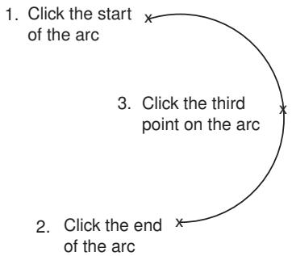

当使用Through Three Points（通过三点）方法绘制圆弧时，应考虑与使用中心点和两个端点绘制圆弧中描述的相同的角度大小和点选择前提条件。

1. 从Sketcher（草图绘制器）工具箱的圆弧工具中，选择Through Three Points（通过三点）圆弧工具。有关Sketcher（草图绘制器）工具箱中工具的示意图，请参见Sketcher（草图绘制器）工具。
Abaqus/CAE在提示区域显示提示，引导您完成该过程。

2. 点击您希望用作圆弧端点的两个点。


提示：如有必要，可以使用提示区域中的文本框输入端点的精确坐标。有关精确指定圆弧的更多信息，请参见指定精确几何图形。

当您选择圆弧的第二个端点时，Abaqus/CAE会绘制一个具有预定半径的示例圆弧。当您选择第三个点时，可以更改这个示例半径。

3. 将光标移动到圆弧上的第三个点，并点击鼠标键1。

Abaqus/CAE绘制一条连接两个端点并通过所选点的圆弧。


提示：如有必要，点击Previous按钮可以撤销对任一端点的选择。点击一次可撤销对第二个端点的选择；点击两次则同时撤销对第一个端点的选择。

4. 要创建更多圆弧，请从步骤2开始重复上述步骤。
5. 完成圆弧创建后，请执行以下操作之一：

• 在Abaqus/CAE窗口的任意位置点击鼠标键2。
• 在Sketcher（草图绘制器）工具箱中选择任何其他工具。
• 点击提示区域中的取消按钮。

## 其他信息

• 绘制简单对象

• 创建构造几何图形
• 修改对象
• 撤销和重做草图操作

## 绘制与直线相切的圆弧

使用Sketcher（草图绘制器）工具箱中的切线圆弧工具，绘制一条在选定点与直线或曲线相切并在第二个选定点结束的圆弧，如下图所示：


在草图绘制时，您应注意定位点，因为这会影响网格质量。草图中的点会成为您正在创建或修改的部件的顶点。随后，当您在Mesh（网格）模块中对模型进行网格划分时，Abaqus/CAE会将这些顶点转换为完全受约束的种子，并在其位置放置节点。有关如何后续移动顶点（包括定义圆弧的顶点）的信息，请参见拖动Sketcher（草图绘制器）对象。

1. 从Sketcher（草图绘制器）工具箱的圆弧工具中，选择切线圆弧工具。有关Sketcher（草图绘制器）工具箱中工具的示意图，请参见Sketcher（草图绘制器）工具。

Abaqus/CAE在提示区域显示提示，引导您完成该过程。

2. 选择沿着直线或曲线的点。圆弧将在该点处保持相切连续。

如果您从直线、样条线或另一个圆弧的端点开始绘制圆弧，则新圆弧在端点处保持相切连续。如果您从空间中的一个点（没有端点）开始绘制圆弧，则圆弧与正X轴相切。如果有多个直线或曲线在该点相交，圆弧将与最先创建的直线或曲线相切。

3. 当您移动光标时，圆弧的半径会发生变化。在期望的端点处点击。


提示：如有必要，可以使用提示区域中的文本框输入切点和圆弧端点的精确坐标。有关创建所需圆弧的更多信息，请参见指定精确几何图形。

4. 要创建更多圆弧，请从步骤2开始重复上述步骤。
5. 完成相切圆弧创建后，请执行以下操作之一：

• 在Abaqus/CAE窗口的任意位置点击鼠标键2。
• 在Sketcher（草图绘制器）工具箱中选择任何其他工具。

• 点击提示区域中的取消按钮。

## 其他信息

• 绘制简单对象
• 创建构造几何图形
• 修改对象
• 撤销和重做草图操作

## 绘制椭圆

使用Sketcher（草图绘制器）工具箱中的椭圆工具，基于一个中心点、一个轴端点以及一个任意点来绘制椭圆。该任意点到第一个轴的距离决定了第二个轴的长度。

以下是使用Sketcher（草图绘制器）工具箱中椭圆工具的示例：


在草图绘制时，您应注意定位点，因为这会影响网格质量。草图中的中心点和第一个轴点会成为您正在创建的部件的顶点。随后，当您在Mesh（网格）模块中对模型进行网格划分时，Abaqus/CAE会将这些顶点转换为完全受约束的种子，并在其位置放置节点。有关如何后续移动顶点的信息，请参见拖动Sketcher（草图绘制器）对象。

您无法通过移动顶点来编辑椭圆的尺寸。要编辑椭圆尺寸，请创建一个径向尺寸，然后编辑该尺寸。椭圆的径向尺寸包括长半径和短半径。

1. 从Sketcher（草图绘制器）工具箱中，选择椭圆工具。有关Sketcher（草图绘制器）工具箱中工具的示意图，请参见Sketcher（草图绘制器）工具。
Abaqus/CAE在提示区域显示提示，引导您完成该过程。
2. 在期望的椭圆中心位置点击。
3. 将光标移动到椭圆第一个轴的端点。
Abaqus/CAE显示一个可能使用当前光标位置定义主轴和旋转角度而创建的椭圆。
4. 点击一个点以定义一个轴的端点。您选择的点可以是主轴或次轴的端点。


提示：如有必要，可以使用提示区域中的文本框输入椭圆中心和第一个轴端点的精确坐标。有关精确指定几何图形的更多信息，请参见指定精确几何图形。

Abaqus/CAE设置椭圆的旋转角度和第一个轴的端点。

5. 点击一个点以定义第二个轴的长度。您选择的点定义了从第一个轴到第二个轴末端的距离。该点不需要位于第二个轴上，并且不能位于第一个轴上，因为这将导致第二个轴长度为0。

Abaqus/CAE创建椭圆。

6. 要创建更多椭圆，请从步骤2开始重复上述步骤。

7. 完成椭圆创建后，请执行以下操作之一：

• 在Abaqus/CAE窗口的任意位置点击鼠标键2。
• 在Sketcher（草图绘制器）工具箱中选择任何其他工具。
• 点击提示区域中的取消按钮。

## 其他信息

• 绘制简单对象
• 创建构造几何图形
• 修改对象
• 撤销和重做草图操作

## 在两条直线之间绘制倒角

使用Sketcher（草图绘制器）工具箱中的倒角工具，在两条直线或两个圆之间绘制倒角。

输入倒角的半径，然后选择两条直线或圆，如下所示：


构造几何图形说明了如何创建与两个构造圆相切的倒角。

在草图绘制时，您应注意定位点，因为这会影响网格质量。草图中的点会成为您正在创建或修改的部件的顶点。随后，当您在Mesh（网格）模块中对模型进行网格划分时，Abaqus/CAE会将这些顶点转换为完全受约束的种子，并在其位置放置节点。有关如何后续移动顶点的信息，请参见拖动Sketcher（草图绘制器）对象。

如果您创建了倒角，随后移动了选定的直线或圆，Abaqus/CAE将移动倒角并保持相切关系。
1.  从草图工具箱中选择圆角工具。有关草图工具箱中工具的图示，请参阅草图工具。
    
    Abaqus/CAE 会在提示区域显示提示信息，以指导您完成操作。
    
2.  在提示区域出现的文本框中，输入所需圆角的半径。
3.  选择圆角必须与之相切的两条直线或两个圆（非圆弧）。
    
    圆角将出现在两条直线或两个圆之间。
    
    
    
    **提示：** 当您从草图中选择一条直线或一个圆时，Abaqus/CAE 会使用光标位置来确定圆角的位置。要创建所需的圆角，在选择时应将光标定位在预期圆角位置附近。
    
4.  要创建更多相同半径的圆角，请重复上一步。
5.  完成圆角创建后，请执行以下操作之一：
    
    *   在 Abaqus/CAE 窗口中的任意位置点击鼠标键 2。
    *   选择草图工具箱中的任何其他工具。
    *   点击提示区域中的取消按钮。
    
## 附加信息

*   绘制简单对象
*   创建构造几何
*   修改对象
*   撤消和重做草图操作

## 绘制样条曲线

使用草图工具箱中的样条曲线工具来绘制一条连接一系列点的样条曲线。Abaqus/CAE 使用沿样条曲线所有点之间的三次样条拟合来计算曲线形状；此外，样条曲线的一阶导数和二阶导数是连续的。在创建样条曲线时，您可以通过将顶点放置得更近或更远来影响曲线的形状。但是，在绘制样条曲线后，您无法添加或删除顶点；您必须删除该样条曲线并创建一个新的具有所需顶点数量的样条曲线。您可以使用修改工具来移动原始顶点。只有样条曲线的端点会成为您正在创建或修改的零件的顶点；样条曲线的中间点不会出现在草图器之外。

如果您希望样条曲线的起点与一条现有直线相切，请在样条曲线的起点创建两个与该直线共线的相邻顶点。此方法对于创建平滑的刚性曲面很有用，如下图所示：


当您创建解析刚性曲面时，您会绘制一系列直线、圆弧和抛物线来定义其轮廓。要创建抛物线曲线，请绘制一个仅由三个顶点定义的样条曲线。

1.  从草图工具箱中，选择样条曲线工具。有关草图工具箱中工具的图示，请参阅草图工具。
    Abaqus/CAE 会在提示区域显示提示信息，以指导您完成操作。
    
2.  要构建样条曲线，请依次点击每个顶点。
    
    
    
    **提示：** 如有必要，您可以使用提示区域中的文本框输入样条曲线每个顶点的精确坐标。有关创建所需样条曲线的更多信息，请参阅指定精确几何。
    
    当您点击每个顶点或输入每个坐标时，样条曲线会出现，并且 Abaqus/CAE 会调整曲线以在所有点之间保持三次样条。
    
    
    
    **提示：** 如果在构建样条曲线时出错，您可以点击“上一步”按钮退回到上一个顶点。或者，您可以点击草图工具箱中的“撤消”按钮来删除整个样条曲线。
    
3.  要完成样条曲线，请点击鼠标键 2。
4.  要创建更多样条曲线，请从步骤 2 开始重复上述步骤。
5.  完成样条曲线创建后，请执行以下操作之一：
    
    在 Abaqus/CAE 窗口中的任意位置点击鼠标键 2。•
    • 选择草图工具箱中的任何其他工具。
    X • 点击提示区域中的取消按钮。
    
## 附加信息

*   绘制简单对象
*   创建构造几何
*   修改对象
*   撤消和重做草图操作

## 创建构造几何

本节描述用于创建构造几何的每个草图工具。构造几何用于帮助您在草图中创建和对齐对象，以及为旋转实体和曲面定义旋转轴。

## 本节内容：

创建水平构造线
创建垂直构造线
创建斜构造线
创建带角度构造线
创建构造圆
将草图组件设置为构造几何

## 创建水平构造线

使用草图工具箱中的水平构造线工具来帮助沿水平线定位和对齐对象。

水平构造线是平行于草图网格的 X 轴创建的。旋转草图网格不会影响现有的水平构造线，但新的水平构造线会与旋转后的网格对齐。下图说明了如何使用水平构造线和一组垂直构造线来对齐圆心。（虚线表示构造几何。）


您也可以使用水平构造线来定义旋转实体和曲面的旋转轴。

1.  从草图工具箱的构造工具中，选择水平构造工具。有关草图工具箱中工具的图示，请参阅草图工具。
    当您在草图纸周围移动光标时，水平构造线会垂直移动。Abaqus/CAE 会在提示区域显示提示信息，以指导您完成操作。
    
2.  点击将位于水平构造线上的一个点。或者，您可以在提示区域出现的文本字段中键入其 X-Y 坐标。（X 坐标是任意的，因为它会被忽略。）
3.  要创建额外的水平构造线，请重复上一步。
4.  完成水平构造线创建后，请执行以下操作之一：
    
    *   在 Abaqus/CAE 窗口中的任意位置点击鼠标键 2。
    *   选择草图工具箱中的任何其他工具。
    *   点击提示区域中的取消按钮。
    
## 附加信息

*   构造几何
*   重新对齐草图网格
*   绘制简单对象
*   创建构造几何
*   修改对象
*   撤消和重做草图操作

## 创建垂直构造线

使用草图工具箱中的垂直构造线工具来帮助沿垂直线定位和对齐对象。

垂直构造线是平行于草图网格的 Y 轴创建的。旋转草图网格不会影响现有的垂直构造线，但新的垂直构造线会与旋转后的网格对齐。下图说明了如何使用水平构造线和一组垂直构造线来对齐圆心。（虚线表示构造几何。）


您也可以使用垂直构造线来定义旋转实体和曲面的旋转轴。

1.  从草图工具箱的构造工具中，选择垂直构造工具。有关草图工具箱中工具的图示，请参阅草图工具。
    
    当您在草图纸周围移动光标时，垂直构造线会水平移动。Abaqus/CAE 会在提示区域显示提示信息，以指导您完成操作。
    
2.  点击将位于垂直构造线上的一个点。或者，您可以在提示区域出现的文本字段中键入其 X-Y 坐标。（Y 坐标是任意的，因为它会被忽略。）
3.  要创建额外的垂直构造线，请重复上一步。
4.  完成垂直构造线创建后，请执行以下操作之一：
    
    *   在 Abaqus/CAE 窗口中的任意位置点击鼠标键 2。
    *   选择草图工具箱中的任何其他工具。
    *   点击提示区域中的取消按钮。
    
## 附加信息

*   构造几何
*   重新对齐草图网格
*   绘制简单对象
*   创建构造几何
*   修改对象
*   撤消和重做草图操作

## 创建斜构造线

使用草图工具箱中的斜构造线工具来帮助沿由两个点定义的任意斜线定位和对齐对象。

下图说明了如何使用斜构造线和一组垂直构造线来对齐圆心：


您也可以使用斜构造线来定义旋转实体和曲面的旋转轴。
1.  在 Sketcher 工具箱的构造工具中，选择斜构造工具。有关 Sketcher 工具箱中工具的图示，请参见 The Sketcher tools。
    Abaqus/CAE 会在提示区显示提示信息，引导您完成操作。

2.  点击两个点，这两点将位于斜构造线上。或者，您可以在提示区出现的文本字段中输入它们的 X–Y 坐标。
    当您选择第一个点时，斜构造线即会显示。该线会围绕此点旋转，直到您选择第二个点。

3.  要创建更多的斜构造线，请重复上一步。

4.  完成斜构造线的创建后，请执行以下操作之一：
    *   在 Abaqus/CAE 窗口的任意位置点击鼠标按钮 2。
    *   选择 Sketcher 工具箱中的任何其他工具。
    *   点击提示区中的取消按钮。

## 附加信息

*   构造几何
*   绘制简单对象
*   创建构造几何
*   修改对象
*   撤销和重做草图操作

## 创建角度构造线

使用 Sketcher 工具箱中的角度构造线工具来帮助沿一条与 Sketcher 网格的 X 轴成指定角度运行的直线来定位和对齐对象。

旋转 Sketcher 网格不会影响现有的角度构造线，但新的角度构造线是从旋转网格的 X 轴开始测量的。下图说明了如何使用一条角度构造线和一对垂直构造线来定位矩形的顶点。（虚线表示构造几何。）


您也可以使用角度构造线来定义旋转实体和曲面的旋转轴。

1.  在 Sketcher 工具箱的构造工具中，选择角度构造线工具。有关 Sketcher 工具箱中工具的图示，请参见 The Sketcher tools。
    Abaqus/CAE 会在提示区显示提示信息，引导您完成操作。
2.  在提示区出现的文本框中，输入一个角度值（以度为单位）。正角度从水平轴逆时针测量，负角度从水平轴顺时针测量。
    当您在 Sketcher 图纸上移动光标时，构造线会随之移动。
3.  点击一个点，该点将位于角度构造线上。或者，您可以在提示区出现的文本字段中输入其 X–Y 坐标。
4.  要创建更多的角度构造线，请从步骤 2 开始重复上述步骤。
5.  完成角度构造线的创建后，请执行以下操作之一：
    *   在 Abaqus/CAE 窗口的任意位置点击鼠标按钮 2。
    *   选择 Sketcher 工具箱中的任何其他工具。
    *   点击提示区中的取消按钮。

## 附加信息

*   构造几何
*   重新对齐草图网格
*   绘制简单对象
*   创建构造几何
*   修改对象
*   撤销和重做草图操作

## 创建构造圆

使用 Sketcher 工具箱中的构造圆工具来帮助围绕一个圆来定位和对齐对象。

下图说明了如何使用一个构造圆和一对角度构造线来定位两个圆的圆心。（虚线表示构造几何。）

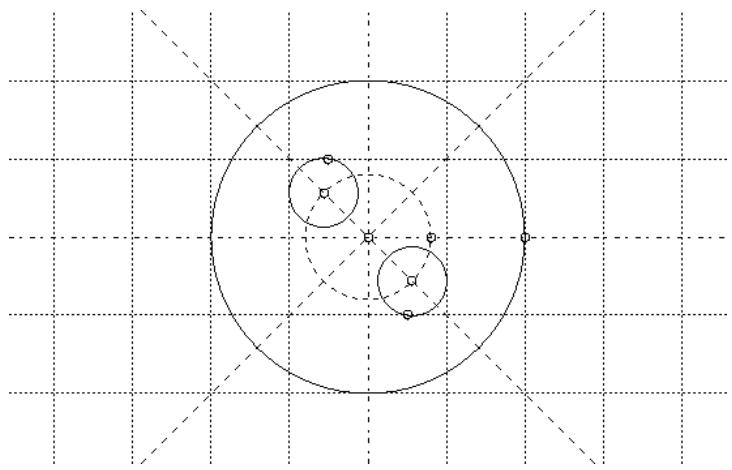

1.  在 Sketcher 工具箱的构造工具中，选择构造圆工具。有关 Sketcher 工具箱中工具的图示，请参见 The Sketcher tools。
    Abaqus/CAE 会在提示区显示提示信息，引导您完成操作。

2.  在构造圆圆心的所需位置点击。或者，您可以在提示区出现的文本字段中输入圆心的 X–Y 坐标。
    当您在 Sketcher 图纸上移动光标时，构造圆的半径会随之变化。

3.  点击一个点，该点将位于构造圆的圆周上，或者在提示区中输入其 X–Y 坐标。
    Abaqus/CAE 使用您指定的点来创建构造圆。

4.  要创建更多的构造圆，请从步骤 2 开始重复上述步骤。

5.  完成构造圆的创建后，请执行以下操作之一：
    *   在 Abaqus/CAE 窗口的任意位置点击鼠标按钮 2。
    *   选择 Sketcher 工具箱中的任何其他工具。
    *   点击提示区中的取消按钮。

## 附加信息

*   构造几何
*   绘制简单对象
*   创建构造几何
*   修改对象
*   撤销和重做草图操作

## 将草图组件设置为构造几何

使用 Sketcher 工具箱中的"设为构造"(Set as Construction) 工具将草图的一个组件转换为构造几何。"取消构造"(Unset Construction) 工具则可将已转换为构造几何的项目恢复原状。您只能取消使用"设为构造"(Set as Construction) 工具转换为构造几何的组件；作为构造几何添加到草图中的项目不能被取消。

## 附加信息

*   构造几何
*   绘制简单对象
*   创建构造几何
*   修改对象
*   撤销和重做草图操作

## 将草图中的项目设置为构造几何

1.  在 Sketcher 工具箱的构造工具中，选择"设为构造"(Set as Construction) 工具。有关 Sketcher 工具箱中工具的图示，请参见 The Sketcher tools。
    Abaqus/CAE 会在提示区显示提示信息，引导您完成操作。
2.  选择您想要设为构造几何的一个或多个草图项目。您可以拖动选择、按 [Shift] + 点击 或 [Ctrl] + 点击 来选择多个项目。
    Abaqus/CAE 会将您选择的项目显示为红色以作指示。
3.  要完成转换，请在提示区点击"完成"(Done) 或在 Abaqus/CAE 窗口的任意位置点击鼠标按钮 2。
    Abaqus/CAE 会以虚线显示您选择的项目，表明它们现在是构造几何。
4.  完成选择要转换为构造几何的几何体后，请执行以下操作之一：
    *   在 Abaqus/CAE 窗口的任意位置点击鼠标按钮 2。
    *   选择 Sketcher 工具箱中的任何工具。
    *   点击提示区中的取消按钮。

## 取消构造几何项目

1.  在 Sketcher 工具箱的构造工具中，选择"取消构造"(Unset Construction) 工具。有关 Sketcher 工具箱中工具的图示，请参见 The Sketcher tools。
    Abaqus/CAE 会在提示区显示提示信息，引导您完成操作。
2.  选择一个或多个构造几何项目。您可以拖动选择、按 [Shift] + 点击 或 [Ctrl] + 点击 来选择多个项目。所有构造几何在草图中均以虚线显示。Abaqus/CAE 会将您选择的项目显示为红色以作指示。
3.  要完成转换，请在提示区点击"完成"(Done) 或在 Abaqus/CAE 窗口的任意位置点击鼠标按钮 2。
    Abaqus/CAE 会以实线显示您选择的项目，表明它们不是构造几何。
4.  完成选择您想要恢复的构造几何项目后，请执行以下操作之一：
    *   在 Abaqus/CAE 窗口的任意位置点击鼠标按钮 2。
    *   选择 Sketcher 工具箱中的任何工具。
    *   点击提示区中的取消按钮。

## 约束、标注尺寸和参数化草图

本节描述了用于向草图添加约束、尺寸和参数的每个 Sketcher 工具。您可以使用这些工具在草图中的各个实体之间创建关系，或创建一个完全约束和参数化的草图。

## 本节内容：

自动约束草图
自动为草图标注尺寸
添加单个约束
添加单个尺寸
添加和编辑参数
创建参数方程

## 自动约束草图

向草图添加约束有助于您最终确定草图特征的形状。Abaqus/CAE 可以自动向您的草图应用约束。您可以使用 Sketcher 选项来选择 Abaqus/CAE 可以添加到草图中的约束类型。（有关更多信息，请参见在 Sketcher 中自定义约束的使用。）

1.  在 Sketcher 工具箱的工具中，选择自动约束工具。有关 Sketcher 工具箱中工具的图示，请参见 The Sketcher tools。
    Abaqus/CAE 会在提示区显示提示信息，引导您完成操作。
2.  选择要约束的实体。
    
    **注意：**
    您可以选择整个草图；Abaqus/CAE 不会重复任何现有约束。
3.  在提示区点击"完成"(Done)。
    Abaqus/CAE 会在草图上创建约束。草图修改工具（如平移、旋转、缩放和镜像）可以覆盖约束。
4. 如果需要，使用 Delete 工具移除任何不需要的约束。更多信息，请参阅删除 Sketcher 对象。

## 附加信息

• 控制草图几何形状  
• 约束、标注尺寸和参数化草图  
• 自定义 Sketcher 中约束的使用

## 自动标注草图尺寸

向草图添加尺寸有助于您最终确定草图特征的大小和形状。Abaqus/CAE 可以自动为您的草图标注尺寸。您可以使用 Sketcher 选项来选择 Abaqus/CAE 可以添加到草图中的尺寸类型。（更多信息，请参阅自定义 Sketcher 中尺寸的格式和使用。）

1. 在 Sketcher 工具箱的工具中，选择自动标注尺寸工具 。有关 Sketcher 工具箱中工具的图示，请参阅 Sketcher 工具。  
   Abaqus/CAE 会在提示区域显示提示信息，引导您完成此过程。
2. 选择要标注尺寸的实体。


## 注意：

您可以选择整个草图；Abaqus/CAE 不会重复创建任何现有的尺寸。

3. 如果您还希望 Abaqus/CAE 自动为所选实体创建约束，请启用 Auto-Constrain（自动约束）。  
4. 在提示区域中单击 Done（完成）。  
   Abaqus/CAE 会在草图上创建尺寸（如果选择了约束，也会创建约束）。  
5. 如果需要，使用拖动工具 移动出现在草图特征内部的尺寸，并使用删除工具 移除任何不需要的尺寸或约束。更多信息，请分别参阅拖动 Sketcher 对象和删除 Sketcher 对象。

## 附加信息

• 控制草图几何形状  
• 约束、标注尺寸和参数化草图  
• 自定义 Sketcher 中尺寸的格式和使用  
• 自定义 Sketcher 中约束的使用

## 添加单个约束

约束是草图中实体之间的逻辑关系。约束通过移除草图的自由度来控制 Sketcher 几何形状。各种约束类型在“使用约束控制草图几何形状”中有描述。要更改受约束的几何形状，您必须要么在定义的约束范围内工作，要么修改约束以接受您的更改。您也可以使用 Auto-Constrain（自动约束）工具自动约束草图。更多信息，请参阅自动约束草图。

1. 在 Sketcher 工具箱的工具中，选择约束工具 。有关 Sketcher 工具箱中工具的图示，请参阅 Sketcher 工具。  
   Abaqus/CAE 打开 Add Constraint（添加约束）对话框。  
2. 选择要添加到草图中的约束类型，然后单击 Apply（应用）。  
   Abaqus/CAE 会在提示区域显示提示信息，引导您完成此过程。  
3. 选择要创建约束的一个或多个实体。  
   Abaqus/CAE 创建约束并在草图上显示相应的约束符号。平移、旋转、缩放和镜像等草图修改工具可以覆盖约束。  
4. 要创建更多约束，请从步骤 2 开始重复上述步骤。  
5. 完成约束创建后，单击 Cancel（取消）关闭 Add Constraint（添加约束）对话框。

## 附加信息

• 使用约束控制草图几何形状  
• 约束、标注尺寸和参数化草图  
• 自定义 Sketcher 中约束的使用

尺寸是一种特殊形式的约束；约束在 Sketcher 实体之间创建逻辑关系，而尺寸则创建数值关系。尺寸使您的草图更清晰，并允许您精确定位对象。使用 Sketcher 工具箱中的尺寸标注工具 为草图添加单个尺寸。您也可以使用 Auto-Dimension（自动标注尺寸）工具 自动为草图标注尺寸。更多信息，请参阅自动标注草图尺寸。

尺寸标注工具是交互式的；Abaqus/CAE 使用预选择和您选择的 Sketcher 实体来显示将创建的尺寸的预览。如果显示的尺寸类型不是您想要创建的类型，请将光标移动到另一个位置。一旦您接受了尺寸类型和位置，就可以输入新的尺寸值。


## 注意：

尺寸标注工具的交互功能仅在预选择激活时可用。在 Sketcher Options（Sketcher 选项）对话框中，默认情况下预选择是启用的。（有关更多信息，请参阅 Sketcher 光标和预选择。）

1. 在 Sketcher 工具箱的工具中，选择尺寸标注工具 。有关 Sketcher 工具箱中工具的图示，请参阅 Sketcher 工具。

   Abaqus/CAE 会在提示区域显示提示信息，引导您完成此过程。

2. 选择要标注尺寸的第一个实体。

   Abaqus/CAE 根据您的选择给出提示：

## 顶点 (Vertex)

   Abaqus/CAE 提示您选择另一个顶点或线进行尺寸标注。选择一条线来标注顶点与线之间的距离。选择一个顶点来标注所选点之间的水平、垂直或倾斜距离——Abaqus/CAE 创建的尺寸类型取决于第二个顶点的位置和光标位置。

   Abaqus/CAE 根据光标位置显示将要创建的尺寸及其位置的预览。两个顶点之间的水平或垂直尺寸值前面分别带有 H 或 V。

## 线 (Line)

   Abaqus/CAE 提示您为默认的长度尺寸选择一个位置。要创建其他类型的尺寸，请将光标移过草图中的其他实体；Abaqus/CAE 会根据所选线与预选实体之间的关系显示适当尺寸类型的预览。单击所需的实体以接受显示的尺寸类型。

## 圆或圆弧 (Circle or circular arc)

   Abaqus/CAE 提示您为径向尺寸选择一个位置。没有其他实体可选。

3. 将光标移动到您希望尺寸出现的位置；当您对尺寸的外观满意时单击。  
4. 如果需要，在提示区域编辑尺寸值；按 Enter 键或单击鼠标键 2 以接受尺寸值。

   Abaqus/CAE 在草图上创建尺寸。如有必要，顶点会移动以符合编辑后的尺寸值以及草图中的任何其他约束。

5. 要创建更多尺寸，请从步骤 2 开始重复上述步骤。  
6. 完成尺寸创建后，执行以下任一操作：

   • 在 Abaqus/CAE 窗口的任意位置单击鼠标键 2。  
   • 选择 Sketcher 工具箱中的任何工具。  
   • 在提示区域中单击取消按钮。

## 附加信息

• 控制草图几何形状  
• 约束、标注尺寸和参数化草图  
• 编辑尺寸  
• 指定精确几何形状  
• 通过更改尺寸或添加参数来修改对象  
• 自定义 Sketcher 中尺寸的格式和使用

## 添加和编辑参数

参数是具有变量名的约束。它们可以具有数值，也可以具有基于涉及其他参数的数学表达式的结果值——参数方程。参数可以与当前草图中的尺寸相关联，也可以是独立于草图的数值常量和表达式。与尺寸关联的参数的值直接影响草图，而独立参数只有当您使用它们为草图中的参数创建表达式时才会影响草图。

您使用参数管理器 (Parameter Manager) 添加和编辑参数。您可以使用 Dimension（尺寸）按钮通过选择尺寸来创建新参数，也可以在管理器的空白行中输入独立参数。

在 Sketcher 工具箱的工具中，选择参数管理器工具 。有关 Sketcher 工具箱中工具的图示，请参阅 Sketcher 工具。

参数管理器出现。


提示：您也可以通过从主菜单栏选择 Edit->Parameter Manager（编辑->参数管理器）或使用 Edit Dimension（编辑尺寸）对话框中的 f(x) 按钮来打开参数管理器。

2. 单击 Dimension（尺寸），然后从草图中选择尺寸以将其与新参数关联。

   Abaqus/CAE 使用 dimension\_x 形式的默认名称将新参数添加到参数管理器中。

3. 单击 Name（名称）列中的单元格以编辑现有名称，或通过编辑空白单元格来添加新参数名称。

   如果所选参数与某个尺寸关联，Abaqus/CAE 会在草图中突出显示该参数。

4. 单击 Expression（表达式）列中的单元格以直接在其中编辑，或选择它使用表达式构建器 (Expression Builder) 进行编辑。

   您必须在定义表达式之前定义所有要在表达式中使用的参数。


提示：使用管理器右侧的按钮来插入、重新排列或删除行。

5. 如果需要，使用表达式构建器来编辑表达式。详细说明请参见创建参数化方程。
6. 在参数管理器中单击“应用”，将更改应用到草图中。

Abaqus/CAE 将使用任何新的表达式值更新草图，并且如果在草图器选项中打开了“显示参数名称”开关，则会显示修改后的参数名称。

## 其他信息

*   指定精确几何
*   通过修改尺寸或添加参数来修改对象
*   使用参数控制草图几何
*   编辑尺寸
*   自定义草图器中尺寸的格式和使用

## 创建参数化方程

参数化方程是用于关联草图中不同数量的数学表达式。表达式构建器可帮助您使用草图中的参数来创建参数化方程。例如，如果您希望草图器对象的宽度是其长度的两倍，您可以将尺寸与参数关联起来，并使用表达式构建器来创建参数化方程。

您可以使用以下运算符来创建参数化方程：

## 数学运算：

<table><tr><td>+</td><td>加法。</td></tr><tr><td>-</td><td>减法。</td></tr><tr><td>*</td><td>乘法。</td></tr><tr><td>/</td><td>除法。</td></tr><tr><td>1/A</td><td>用 1 除以该参数、值或表达式。</td></tr><tr><td>abs(A)</td><td>取参数、值或表达式的绝对值。</td></tr><tr><td>sqrt(A)</td><td>取参数、值或表达式的平方根。</td></tr></table>

## 三角函数运算：

<table><tr><td>cos(A)</td><td>取参数、值或表达式的余弦值。</td></tr><tr><td>acos(A)</td><td>取参数、值或表达式的反余弦值。</td></tr><tr><td>cosh(A)</td><td>取参数、值或表达式的双曲余弦值。</td></tr><tr><td>sin(A)</td><td>取参数、值或表达式的正弦值。</td></tr><tr><td>asin(A)</td><td>取参数、值或表达式的反正弦值。</td></tr><tr><td>sinh(A)</td><td>取参数、值或表达式的双曲正弦值。</td></tr><tr><td>tan(A)</td><td>取参数、值或表达式的正切值。</td></tr><tr><td>atan(A)</td><td>取参数、值或表达式的反正切值。</td></tr><tr><td>tanh(A)</td><td>取参数、值或表达式的双曲正切值。</td></tr></table>

## 对数和指数运算：

<table><tr><td>exp(A)</td><td>取参数、值或表达式的指数值。</td></tr><tr><td>log(A)</td><td>取参数、值或表达式的自然对数。</td></tr><tr><td>log10(A)</td><td>取参数、值或表达式的以 10 为底的对数。</td></tr></table>

1.  在参数管理器中高亮显示一个表达式，然后单击“表达式构建器”。Abaqus/CAE 将打开“表达式构建器”对话框。
2.  从“运算符”列表中，选择所需的运算符。该运算符将出现在表达式窗口内。
3.  从“参数名称”选项中，单击要操作的参数的名称，然后单击“添加到表达式”。您可以从参数管理器中当前正在定义的参数上方的所有参数中进行选择。
    该参数名称将出现在表达式窗口内。
4.  根据需要重复步骤 2 和 3 以完成表达式。在某些情况下，您可能需要重新定位光标以正确放置表达式的下一部分。
5.  完成后，单击“确定”以保存更改并关闭对话框。Abaqus/CAE 将更新表达式和参数管理器中的当前值。

## 其他信息

*   添加和编辑参数
*   编辑尺寸
*   自定义草图器中尺寸的格式和使用

## 编辑尺寸

Abaqus/CAE 中的尺寸用于精确控制大小和距离、标注参考值以及创建参数，这些参数又用于定义不同几何体之间的方程。您可以按如下方式编辑草图中的任何尺寸：

*   更改尺寸值。更改尺寸值会修改关联的草图器几何体。
*   将尺寸指定为参考尺寸。参考尺寸用于表示其值由同一草图中的其他位置控制的数量，或在另一个草图中控制的参考几何体的尺寸。
*   将尺寸与参数关联。参数通过定义不同几何体（包括参考几何体）之间的关系来控制草图器几何体。

修改尺寸的效果取决于该尺寸在草图中的使用方式。例如，如果一个半径具有相等的半径约束，则编辑该半径尺寸将更改所有受约束的半径。同样，如果某个尺寸与参数关联，编辑其值将更改引用它的所有参数的值。有关约束、尺寸和参数的更多信息，请参见控制草图几何。

1.  从草图器工具箱中的工具中，选择尺寸修改工具 。有关草图器工具箱中工具的图示，请参见草图器工具。
    Abaqus/CAE 会在提示区域显示提示，引导您完成操作。
2.  选择要更改的尺寸。
    Abaqus/CAE 会高亮显示所选尺寸，并打开“编辑尺寸”对话框。
3.  输入尺寸的新值。


## 注意：

您不能编辑参考尺寸或其值由方程定义的参数的值字段。

4.  切换“参考”以在用于控制草图几何体的标准尺寸和从几何体读取当前值的参考尺寸之间切换。
5.  单击 f(x) 以将尺寸与新参数关联或编辑先前关联的参数。Abaqus/CAE 将打开参数管理器进行编辑。更多信息请参见添加和编辑参数。
6.  完成后，在“编辑尺寸”对话框中单击“应用”以更新草图。Abaqus/CAE 将根据需要更新尺寸和几何体。如果您的编辑导致过约束，冲突的约束、尺寸和参数将以品红色显示（更多信息请参见完全约束的几何体）。
7.  要编辑更多尺寸，请从步骤 2 开始重复上述步骤。
8.  完成尺寸编辑后，请执行以下操作之一：
    *   在 Abaqus/CAE 窗口中的任意位置单击鼠标键 2。
    *   选择草图器工具箱中的任何工具。
    *   单击提示区域中的取消按钮。

## 其他信息

*   指定精确几何
*   控制草图几何
*   约束、标注尺寸和参数化草图
*   移动或复制草图几何体

## 添加参考几何体

当您绘制特征的轮廓时，Abaqus/CAE 会将与草图平面处于同一平面的部件边和顶点投影到草图纸上。此外，Abaqus/CAE 会将所有基准轴和基准点投影到草图纸上。这些投影线和点称为参考几何体，您可以在绘制草图时用作参考。如果您想使用其他边和顶点，包括孤立单元边和孤立节点，您必须通过从主菜单栏选择“添加”->“参考”来将它们作为参考几何体投影到草图平面上。或者，如果您想根据现有的模型边创建新的草图边，您可以从主菜单栏选择“添加”->“边”（更多信息请参见将边投影到草图）。

1.  从草图器工具箱中，选择“投影参考”工具 。有关草图器工具箱中工具的图示，请参见草图器工具。
    Abaqus/CAE 会在提示区域显示提示，引导您完成操作。
2.  选择要作为参考几何体投影到草图平面上的边、顶点、孤立单元边和孤立节点。
3.  完成选择后，单击鼠标键 2。
    Abaqus/CAE 将为投影的参考顶点和节点创建孤立点，并为几何边和孤立单元边创建参考边。

## 其他信息

*   参考几何体
*   将边投影到草图

## 将边投影到草图

当您绘制特征的轮廓时，可以通过将部件上的现有边投影到草图纸上来创建新边。您可以使用投影边来复制现有特征从当前草图平面上看去的形状。要将部件边（包括孤立单元边）投影到草图上，请从主菜单栏选择“添加”->“边”。

1.  从草图器工具箱中，选择“投影边”工具 。有关草图器工具箱中工具的图示，请参见草图器工具。
Abaqus/CAE 会在提示区显示提示信息，引导您完成操作。

2. 如有需要，可以在提示区关闭**约束至背景**选项，将边作为独立对象进行投影。

如果投影边被约束至背景，其形状和位置将取决于原始特征边。如果投影边未受约束，则原始特征的更改不会影响它们——您可以独立于原始特征编辑投影边和顶点。

3. 选择您希望投影到草图平面上的边。

4. 单击鼠标键 2，表示您已完成边的选择。

Abaqus/CAE 将在草图中创建新边。

## 附加信息

• 参考几何体  
• 添加参考几何体

## 移动或复制草图几何体

本节介绍如何使用平移、旋转、镜像和缩放工具来移动或复制草图绘制器 (Sketcher) 几何体。

## 本节内容：

沿矢量平移草图绘制器对象  
围绕点旋转草图绘制器对象  
放大或缩小草图绘制器对象  
关于镜像线移动或复制草图绘制器对象

使用**草图绘制器**工具箱中的平移工具，沿指定矢量移动或复制草图绘制器对象——直线、圆弧、圆、椭圆、圆角或样条线。您可以通过在草图中选择或输入每个端点的 X 和 Y 坐标来定义平移矢量的起点和终点。

1. 从**草图绘制器**工具箱的移动和复制工具中，选择平移工具。有关**草图绘制器**工具箱中工具的图示，请参见草图绘制器工具。  
2. 在提示区选择**复制**或**移动**。Abaqus/CAE 会在提示区显示提示信息，引导您完成操作。  
3. 选择所有您想要平移的对象。您可以选择草图和构造几何体进行移动，或者选择草图、构造和参考几何体进行复制；尺寸不能被平移。


提示：要选择多个对象，请在单击每个对象时按住 **[Shift]** 键，或在对象周围拖动一个矩形框。要取消选择某个对象，请使用 **[Ctrl] + 单击**。更多信息，请参见在视口内选择对象。

4. 单击鼠标键 2，表示您已完成对象的选择。  
5. 选择平移矢量的起点，或在提示区输入坐标。  
6. 选择平移矢量的终点，或在提示区输入坐标。Abaqus/CAE 将按指定方式移动或复制所选对象。  
7. 如有需要，重复步骤 5 和 6 以继续移动先前选定的对象。无论您最初是移动还是复制了所选对象，后续的平移矢量都会将对象从其在上一步结束时的位置移动。  
8. 完成平移对象后，请执行以下操作之一：

• 在 Abaqus/CAE 窗口中的任意位置单击鼠标键 2。  
• 选择**草图绘制器**工具箱中的任意工具。  
• 单击提示区中的**取消**按钮。

## 附加信息

• 绘制简单对象  
• 创建构造几何体  
• 修改对象  
• 创建阵列、偏移和删除对象  
• 撤消和重做草图绘制操作

## 围绕点旋转草图绘制器对象

使用**草图绘制器**工具箱中的旋转工具，围绕指定点将草图绘制器对象——直线、圆弧、圆、椭圆、圆角或样条线——旋转指定角度。您可以选择移动原始对象，或者创建副本并将其旋转到新位置。

1. 从**草图绘制器**工具箱的移动和复制工具中，选择旋转工具。有关**草图绘制器**工具箱中工具的图示，请参见草图绘制器工具。  
2. 在提示区选择**复制**或**移动**。Abaqus/CAE 会在提示区显示提示信息，引导您完成操作。  
3. 选择所有您想要旋转的对象。您可以选择草图和构造几何体进行移动，或者选择草图、构造和参考几何体进行复制；尺寸不能被旋转。


提示：要选择多个对象，请在单击每个对象时按住 **[Shift]** 键，或在对象周围拖动一个矩形框。要取消选择某个对象，请使用 **[Ctrl] + 单击**。更多信息，请参见在视口内选择对象。

4. 单击鼠标键 2，表示您已完成对象的选择。  
5. 选择一个点作为旋转中心，或在提示区输入坐标。  
6. 在提示区输入旋转角度。Abaqus/CAE 将按指定方式移动或复制对象。  
7. 如有需要，重复步骤 5 和 6 以继续移动先前选定的对象。无论您最初是移动还是复制了所选对象，后续的旋转都只会将对象从其在上一步结束时的位置移动。  
8. 完成旋转对象后，请执行以下操作之一：

• 在 Abaqus/CAE 窗口中的任意位置单击鼠标键 2。  
• 选择**草图绘制器**工具箱中的任意工具。

• 单击提示区中的**取消**按钮。

## 附加信息

• 绘制简单对象  
• 创建构造几何体  
• 修改对象  
• 创建阵列、偏移和删除对象  
• 撤消和重做草图绘制操作

使用**草图绘制器**工具箱中的缩放工具，围绕指定点放大或缩小草图绘制器对象——直线、圆弧、圆、椭圆、圆角或样条线。您可以选择移动原始对象，或在新的位置创建一个缩放后的副本。如果选择移动对象，则更改将受到草图中任何约束以及草图选项中约束求解方法的控制（更多信息，请参见自定义草图绘制器中约束的使用）。如果选择创建副本，则副本的移动不受限制。

1. 从**草图绘制器**工具箱的移动和复制工具中，选择缩放工具。有关**草图绘制器**工具箱中工具的图示，请参见草图绘制器工具。  
2. 在提示区选择**复制**或**移动**。  
Abaqus/CAE 会在提示区显示提示信息，引导您完成操作。  
3. 选择所有您想要缩放的对象。您可以选择草图和构造几何体进行移动，或者选择草图、构造和参考几何体进行复制；尺寸不能被缩放。


提示：要选择多个对象，请在单击每个对象时按住 **[Shift]** 键，或在对象周围拖动一个矩形框。要取消选择某个对象，请使用 **[Ctrl] + 单击**。更多信息，请参见在视口内选择对象。

4. 单击鼠标键 2，表示您已完成对象的选择。  
5. 选择一个点作为缩放中心，或在提示区输入坐标。  
6. 输入缩放因子——值大于 1.0 将放大移动或复制的对象，值小于 1.0 将缩小它们。

Abaqus/CAE 将保持所选点在视口中静止，并根据缩放因子围绕该点放大或缩小对象。

7. 如有需要，重复步骤 3 到 6 以继续缩放对象。


## 注意：

后续的缩放操作类型（**复制**或**移动**）将与您最初选择的类型相同。要更改类型，请结束操作过程并重新选择缩放工具。

8. 完成缩放对象后，请执行以下操作之一：

• 在 Abaqus/CAE 窗口中的任意位置单击鼠标键 2。  
• 选择**草图绘制器**工具箱中的任意工具。  
• 单击提示区中的**取消**按钮。

## 附加信息

• 绘制简单对象  
• 创建构造几何体  
• 修改对象  
• 创建阵列、偏移和删除对象  
• 撤消和重做草图绘制操作

## 关于镜像线移动或复制草图绘制器对象

使用**草图绘制器**工具箱中的镜像工具，关于指定直线镜像草图绘制器对象——直线、圆弧、圆、椭圆、圆角或样条线。您可以选择移动原始对象，或在新的位置创建一个镜像副本。如果选择移动对象，则更改将受到草图中任何约束以及草图选项中约束求解方法的控制（更多信息，请参见自定义草图绘制器中约束的使用）。如果选择创建副本，Abaqus/CAE 会在原始对象和副本之间施加镜像约束，以便在后续任何草图编辑中它们将始终保持镜像关系。

1. 从**草图绘制器**工具箱的移动和复制工具中，选择镜像工具。有关**草图绘制器**工具箱中工具的图示，请参见草图绘制器工具。  
2. 在提示区选择**复制**或**移动**。Abaqus/CAE 会在提示区显示提示信息，引导您完成操作。  
3. 选择草图中一条现有的直线作为镜像线。您可以选择来自草图、构造或参考几何体的任何直边。
4. 选择所有需要镜像的对象。您可以选择要移动的草图几何和构造几何，或者选择要复制的草图几何、构造几何和参考几何；尺寸不能被镜像。


提示：要选择多个对象，请在点击每个对象时按住 [Shift] 键，或在对象周围拖动一个矩形框。要取消选择某个对象，请使用 [Ctrl] + 点击。更多信息，请参阅在视口内选择对象。”

5. 点击鼠标键2，表示您已完成对象选择。

Abaqus/CAE 将按照指定移动或复制对象。

6. 如果需要，可重复步骤4和5，以便围绕同一镜像线移动或复制更多对象。

7. 完成对象的移动和复制后，请执行以下操作之一：

• 在 Abaqus/CAE 窗口的任意位置点击鼠标键2。
• 选择草图绘制工具箱中的任意工具。

• 点击提示区域中的取消按钮。

## 附加信息

• 绘制简单对象
• 创建构造几何
• 修改对象
• 创建阵列、偏移和删除对象
• 撤销和重做草图绘制操作

## 修改对象

本节介绍如何使用草图绘制工具移动和调整草图绘制对象的大小。

## 本节内容：

拖动草图绘制对象
通过修剪或延伸边修改草图绘制对象
通过自动修剪边修改草图绘制对象
通过分割边修改草图绘制对象
通过合并边修改草图绘制对象

## 拖动草图绘制对象

使用草图绘制工具箱中的拖动工具可以快速移动或调整草图绘制对象的大小，或重新定位尺寸文本。一次只能拖动一个顶点、一条线或一个尺寸。如果选中了“捕捉到网格”选项，则您拖动的对象或尺寸文本会吸附到网格线上；更多信息，请参阅打开或关闭捕捉功能。

如果您拖动一个顶点或一条边，Abaqus/CAE 会根据应用的约束（包括尺寸和参数）以及应用于拖动操作的约束求解方法来修改连接的草图绘制对象。默认情况下，使用“最小移动”约束求解方法，即 Abaqus/CAE 移动最少数量的实体以满足约束（更多信息，请参阅自定义草图绘制器中约束的使用）。

1. 从草图绘制工具箱中的修改工具中，选择拖动工具 。有关草图绘制工具箱中工具的示意图，请参阅草图绘制工具。

所有顶点处都会显示控制柄。Abaqus/CAE 会在提示区域显示提示信息，指导您完成整个过程。

2. 点击并拖动选定的顶点、边或尺寸文本到新位置。

选定的对象会随光标移动，除非草图中的约束不允许所需的移动。

3. 完成对象的拖动后，请执行以下操作之一：

• 在 Abaqus/CAE 窗口的任意位置点击鼠标键2。

• 选择草图绘制工具箱中的任意工具。

• 点击提示区域中的取消按钮。

## 附加信息

• 修改、复制和偏移对象
• 绘制简单对象
• 创建构造几何
• 修改对象
• 创建阵列、偏移和删除对象
• 撤销和重做草图绘制操作

## 通过修剪或延伸边修改草图绘制对象

使用草图绘制工具箱中的修剪和延伸工具可以修剪或延伸草图绘制对象的各个边。您可以在边与其它草图几何、参考几何或构造几何的任何交点处修剪或延伸一条边。您也可以在延伸交点（即如果草图中的另一条边被延伸才会存在的交点）处修剪或延伸一条边。您不能修剪或延伸圆角；如果您修剪或延伸了定义圆角端点的边，Abaqus/CAE 会删除该圆角。

1. 从草图绘制工具箱中的修改工具中，选择修剪和延伸工具 。有关草图绘制工具箱中工具的示意图，请参阅草图绘制工具。

Abaqus/CAE 会在提示区域显示提示信息，指导您完成整个过程。

2. 选择要保留部分的边附近。

您可以选择任何草图绘制或导入的边，但圆和椭圆除外。圆和椭圆只有一条边，除非您先将它们转换成一个或多个圆弧，否则无法延伸或修剪。


提示：使用自动修剪工具删除圆或椭圆的一部分，或使用分割工具将其分割成圆弧。更多信息，请分别参阅通过自动修剪边修改草图绘制对象和通过分割边修改草图绘制对象。

您不能延伸样条曲线。如果修剪或分割样条曲线，Abaqus/CAE 会移除控制点以保持原始曲线的精确形状；因此，您将无法再编辑曲线的形状。

3. 将光标移动到草图中的其他边上。

随着您移动光标，Abaqus/CAE 会高亮显示在当前光标位置将要选择的边。Abaqus/CAE 还会通过以不同于将保留部分的颜色高亮显示第一条边，来创建其将被延伸或修剪部分的预览。

4. 点击以选择高亮显示的边。

Abaqus/CAE 会修剪或延伸第一条边，使其与第二条边的交点（或潜在交点）相遇。如果交点位于第二条边的两个端点之间，Abaqus/CAE 还会分割第二条边。

5. 要修剪或延伸更多边，请从步骤2开始重复上述步骤。

6. 完成边的修剪和延伸后，请执行以下操作之一：

• 在 Abaqus/CAE 窗口的任意位置点击鼠标键2。
• 选择草图绘制工具箱中的任意工具。

• 点击提示区域中的取消按钮。

## 附加信息

• 绘制简单对象
• 创建构造几何
• 修改对象
• 创建阵列、偏移和删除对象
• 撤销和重做草图绘制操作

## 通过自动修剪边修改草图绘制对象

使用草图绘制工具箱中的自动修剪工具可以删除草图边中不需要的部分。边在光标最接近的两个“修剪点”之间被删除。修剪点包括：

• 端点
• 用于定义圆周长的点

• 与其它边、构造几何或参考几何的交点

如果端点是一条边上唯一的修剪点，Abaqus/CAE 会删除整条边。

您不能修剪圆角；如果您修剪了定义圆角端点的边，Abaqus/CAE 会删除该圆角。

1. 从草图绘制工具箱中的修改工具中，选择自动修剪工具 。有关草图绘制工具箱中工具的示意图，请参阅草图绘制工具。

Abaqus/CAE 会在提示区域显示提示信息，指导您完成整个过程。

2. 将光标移动到草图中的边上。

随着您移动光标，Abaqus/CAE 会高亮显示将被删除的部分。

3. 点击以删除高亮显示的边段。

与使用修剪/延伸工具不同，Abaqus/CAE 不会分割相交的边。


## 注意：

如果修剪样条曲线，Abaqus/CAE 会移除控制点以保持原始曲线的精确形状；因此，您将无法再编辑曲线的形状。

4. 完成边的修剪后，请执行以下操作之一：

• 在 Abaqus/CAE 窗口的任意位置点击鼠标键2。
• 选择草图绘制工具箱中的任意工具。

• 点击提示区域中的取消按钮。

## 附加信息

• 绘制简单对象
• 创建构造几何
• 修改对象
• 创建阵列、偏移和删除对象
• 撤销和重做草图绘制操作

## 通过分割边修改草图绘制对象

使用草图绘制工具箱中的分割工具可以将草图绘制对象的单个边分割成多个边。您可以在边与其它草图几何、参考几何或构造几何的任何交点处分割一条边。如果您使用其它草图几何来分割一条边，Abaqus/CAE 会在交点处分割这两条边。您也可以在延伸交点（即如果草图中的另一条边被延伸才会存在的交点）处分割一条边。

1. 从草图绘制工具箱中的修改工具中，选择分割工具 。有关草图绘制工具箱中工具的示意图，请参阅草图绘制工具。

Abaqus/CAE 会在提示区域显示提示信息，指导您完成整个过程。

2. 选择您想要分割的边；您可以选择 Abaqus/CAE 中任何草图绘制或导入的边。


## 注意：

如果分割样条曲线，Abaqus/CAE 会移除控制点以保持原始曲线的精确形状；因此，您将无法再编辑曲线的形状。
3. 将光标移动到草图中的其他边上。

移动光标时，Abaqus/CAE 会高亮显示在当前光标位置将被选中的边。Abaqus/CAE 还会圈出分割点（split point）——即要被打断的边与光标位置处边的交点。如果两条选定边之间存在多个可能的分割点，Abaqus/CAE 会圈出距离光标位置最近的那个点。

4. 单击以接受指示的分割点。

Abaqus/CAE 会分割第一条边，创建两条边，它们共享该分割点作为一个端点。如果第二条边是草图几何图形且该分割点位于其端点之间，Abaqus/CAE 也会分割第二条边。


## 注意：

如果分割圆或椭圆，Abaqus/CAE 会使用该边上的一个顶点作为第二个分割点来创建两段圆弧。如果上一步指示的分割点与边点相同，消息区域会出现警告，且该曲线不会被断开。

5. 要分割更多边，请从步骤 2 开始重复上述步骤。  
6. 完成边的分割后，执行以下操作之一：

• 在 Abaqus/CAE 窗口中任意位置单击鼠标键 2。  
• 选择草图工具箱中的任何工具。  
• 单击提示区的取消按钮。

## 附加信息

• 草绘简单对象  
• 创建构造几何图形  
• 修改对象  
• 创建阵列、偏移和删除对象  
• 撤销和重做草图操作

## 通过合并边修改草图对象

当您导入草图几何图形或在非平行于草图平面的边上使用“投影边”工具时，草图对象中可能会出现小间隙。草图工具箱中的“合并”工具通过将间隙附近的一个或多个顶点移动到另一侧的某个点上来关闭这些小间隙。


## 注意：

合并边时，Abaqus/CAE 可以通过将一个顶点移动到与另一个顶点重合的位置，或者将两个顶点都移动到它们之间的某个位置来关闭间隙。如果您想控制对草图的更改，可以在执行合并操作之前约束您希望保持其当前位置的线或点。

Abaqus/CAE 允许您选择希望保持固定的顶点，合并操作会将指定公差半径内的任何顶点移动到另一侧，使其与您选择的顶点共享同一个点。图 1 展示了一个简单的合并操作，关闭了两个草图对象之间的上方间隙。

  
图 1：合并边


## 注意：

“合并”工具仅用于关闭小间隙。合并边以关闭较大的间隙可能会显著改变草图几何图形。如果您想在草图中移动元素很长距离，请使用“拖动”工具将草图中的顶点移动到新位置。更多信息，请参见拖动草图对象。

1. 从草图工具箱的修改工具中，选择“合并”工具 。有关草图工具箱中工具的示意图，请参见草图工具。

Abaqus/CAE 会在提示区显示提示信息，指导您完成操作步骤。

2. 选择小间隙附近的至少两个顶点。  
3. 在提示区中单击“完成”。

Abaqus/CAE 会提示您输入此合并操作的公差值。

4. 输入公差值，或接受默认值 0.001。然后按 Enter 键或单击鼠标键 2。

Abaqus/CAE 允许您增加公差，但应避免进行会显著改变草图几何图形的合并。

如果任何顶点在选定的公差范围内，Abaqus/CAE 会将它们合并到您在步骤 2 中选择的顶点的位置。

5. 要合并更多边，请从步骤 2 开始重复上述步骤。  
6. 完成边的合并后，执行以下操作之一：

在 Abaqus/CAE 窗口中任意位置单击鼠标键 2。•  
• 选择草图工具箱中的任何工具。  
• 单击提示区的取消按钮。

## 附加信息

• 草绘简单对象  
• 创建构造几何图形  
• 修改对象  
• 创建阵列、偏移和删除对象  
• 撤销和重做草图操作

## 修复短边、间隙和重叠

本节描述如何使用草图工具修复草图中的短边以及从草图中移除间隙和重叠。

这些工具旨在修复导入的草图，但您也可以用它们来修复原生草图中的几何图形。您应在修复草图中的短边之前先移除其中的间隙和重叠。

## 本节内容：

移除间隙和重叠  
修复短边

## 移除间隙和重叠

使用“移除间隙和重叠”工具来修复包含间隙或重叠的导入草图。

当您将草图从使用与 Abaqus/CAE 不同公差值测量草图几何图形的 CAD 系统导入到 Abaqus/CAE 时，可能会出现间隙或重叠。图 1 中的草图在左上角有一个间隙，并在顶线的中点处有一个小重叠。

  
图 1：带有间隙和重叠的简单导入草图。

您可以通过选择边并指定一个公差值来修复此示例中的间隙和重叠。当间隙的大小或重叠的长度小于指定公差时，Abaqus/CAE 会合并顶点以关闭间隙。


## 注意：

在移除间隙或重叠的过程中，Abaqus/CAE 可以通过将一个顶点移动到与另一个顶点重合的位置，或者将两个顶点都移动到它们之间的某个位置来合并顶点。如果您想控制对草图的更改，可以在执行间隙/重叠移除操作之前约束您希望保持其当前位置的线或点。

实际上，您应该使用迭代过程从草图中移除间隙或重叠。首先选择您要移除的间隙或重叠相邻的边，并在第一次尝试时使用默认的长度公差值 0.001。如果并非所有间隙或重叠都被关闭，请重新选择边并增加公差。重复此过程，直到 Abaqus/CAE 合并选定顶点以关闭间隙或重叠。

1. 从草图工具箱的修改工具中，选择“移除间隙和重叠”工具 。有关草图工具箱中工具的示意图，请参见草图工具。  
Abaqus/CAE 会在提示区显示提示信息，指导您完成操作步骤。  
2. 选择您想要移除其间间隙和重叠的边。您可以使用 [Shift] + 单击或 [Ctrl] + 单击来单独指定边，或者拖动选择以指定草图中某个区域内的所有边。  
Abaqus/CAE 会将选定的边涂成红色。

3. 在 Abaqus/CAE 窗口中任意位置单击鼠标键 2。  
Abaqus/CAE 会提示您选择一个公差值。  
4. 对于第一次尝试，接受默认公差值，并在 Abaqus/CAE 窗口中任意位置单击鼠标键 2。Abaqus/CAE 会移除小于默认公差的间隙和重叠。  
5. 如果仍有您想移除的间隙和重叠残留，请执行以下步骤：

a. 重新选择您想要移除其间间隙和重叠的边。  
b. 在提示区增加公差值。  
c. 在 Abaqus/CAE 窗口中任意位置单击鼠标键 2。

Abaqus/CAE 会移除小于默认公差的所选间隙或重叠。

d. 继续选择边并增加公差，直到 Abaqus/CAE 已移除您想要从模型中移除的所有间隙和重叠。

6. 完成移除边和重叠后，执行以下操作之一：

• 在 Abaqus/CAE 窗口中任意位置单击鼠标键 2。  
• 选择草图工具箱中的任何其他工具。

• 单击提示区的取消按钮。


## 附加信息

• 草绘简单对象  
• 修改对象

使用草图工具箱中的“修复短边”工具从草图中移除选定的短边。Abaqus/CAE 提供了两种移除边的方法：您可以移除选择的每一条边，也可以选择多条边作为移除的候选边，并指定一个长度公差值。长度短于该公差值的边将从草图中移除。

如果通过指定长度公差值来移除短边，您应该使用迭代过程进行移除。首先选择您想要移除的边，并在第一次尝试时使用默认的长度公差值 0.001。如果短边未被移除，请重新选择它们并增加公差。重复此过程，直到短边从草图中移除。
您应当仅在移除草图的间隙和重叠后修复短边。更多信息，请参见移除间隙和重叠。

关于Sketcher工具箱中的工具，请参见Sketcher工具。Abaqus/CAE会在提示区显示提示信息，以引导您完成操作过程。  
2. 指定您要移除的边，或者如果您正在指定长度容差值，则指定您要考虑移除的边。您可以按住 [Shift] 键并单击或按住 [Ctrl] 键并单击来逐个指定边，也可以拖动选择来指定草图区域内所有的边。Abaqus/CAE会将选中的边显示为红色。  
3. 如果您在不指定容差的情况下移除短边，请在提示区单击Done。Abaqus/CAE将从草图中移除选中的边。  
4. 如果您要移除短于指定长度容差值的边，请在提示区打开Specify tolerance开关，然后单击Done。首次尝试时，请接受默认容差值，并在提示区单击Done。Abaqus/CAE将从草图中移除任何短于该长度容差值的选中边。  
5. 要继续通过长度容差值移除短边，请执行以下步骤：

a. 重新选择您要考虑移除的边，然后单击Done。  
b. 保持Specify tolerance开关打开，然后再次单击Done。  
c. 在提示区增加长度容差值。  
d. 在Abaqus/CAE窗口的任意位置单击鼠标键2。

Abaqus/CAE将从草图中移除任何短于该长度容差值的选中边。

e. 继续选择边并增加容差，直到Abaqus/CAE已从您的模型中移除所有您想要移除的短边。

6. 当您完成草图中短边的修复后，请执行以下操作之一：

• 在Abaqus/CAE窗口的任意位置单击鼠标键2。  
• 选择Sketcher工具箱中的任何其他工具。  
• 在提示区单击取消按钮。

## 附加信息

• 修改、复制和偏移对象

• 修改对象  
• 创建图案、偏移和删除对象

## 创建图案、偏移和删除对象

本节描述如何使用Sketcher工具来复制和删除Sketcher对象。

## 本节内容：

创建对象的线性图案  
创建对象的径向图案  
偏移Sketcher对象的边  
删除Sketcher对象

## 创建对象的线性图案

使用Sketcher工具箱中的线性图案工具，为选中的Sketcher对象创建线性图案。您可以创建沿一个方向延伸的图案（例如，水平或垂直），也可以创建沿两个方向延伸的图案（例如，同时水平和垂直）。您可以指定以下内容：

• 在每个方向上要创建的副本数量，包括选中的对象。最多可创建1000个副本。  
• 沿指定方向每个副本之间的间距。  
• 一条定义方向的线，Abaqus/CAE将沿此方向生成副本。

默认情况下，Abaqus/CAE在正X方向创建三个副本，在正Y方向创建两个副本。默认间距为草图图纸大小的10%。如果您更改了默认设置，Abaqus/CAE会在您处理草图期间保留这些值。但是，退出Sketcher后，Abaqus/CAE将恢复为原始默认值。您无法在创建图案后对其进行编辑。

1. 从Sketcher工具箱中，选择线性图案工具。有关Sketcher工具箱中工具的图示，请参见Sketcher工具。  
   Abaqus/CAE会在提示区显示提示信息，以引导您完成操作过程。  
2. 选择您要复制的对象。草图几何体和构造几何体都可以被复制；参考几何体和尺寸不能被复制。


提示：要选择多个对象，请在按住 [Shift] 键的同时单击每个对象，或在对象周围拖动一个矩形框。要取消选择对象，请使用 [Ctrl] + 单击。更多信息，请参见在视口中选择对象。

3. 单击鼠标键2，表示您已完成对象选择。

Abaqus/CAE将显示Create Linear Pattern对话框。

4. 在Create Linear Pattern对话框中，配置Direction-1（默认情况下，Direction-1是当前网格旋转中的X方向）：

a. 单击Number右侧的箭头以增加或减少要创建的副本数量，包括选中的对象。当您单击箭头时，Sketch中的副本数量会更新并提供设置的预览。  
   或者，您可以输入一个数字并按 [Enter] 来预览设置。您可以输入1到1000之间的任何数字。如果输入值1，Abaqus/CAE将仅显示选中的对象，并且不会创建任何选中对象的副本；实际上，您禁用了Direction-1的副本。  
b. 输入沿指定方向每个副本之间的Spacing（间距）。  
c. 默认情况下，Abaqus/CAE沿水平方向创建副本。如果您想更改Abaqus/CAE创建副本的方向，请单击Angle并从草图中选择一条线来定义新方向。您必须拾取一条直边或一条构造直线。  
   Abaqus/CAE将计算沿您指定方向的每个副本之间的间距。  
d. 默认情况下，Abaqus/CAE在正X方向创建副本。单击Flip以反转Abaqus/CAE创建副本的方向。

5. 要在第二个方向创建副本，请为Direction-2输入一个介于1和1000之间的Number，并指定Spacing（间距）、Angle（角度）和Flip（翻转）方向（默认情况下，Direction-2是当前网格旋转中的Y方向）。您必须为至少一个方向输入大于1的Number。

6. 在大多数情况下，您会希望在Create Linear Pattern对话框中输入值时预览Abaqus/CAE将创建的线性图案。但是，如果您选择创建大量副本，预览功能可能会影响Sketcher的性能。在这种情况下，您应关闭Preview按钮。  
7. 要复制更多对象，请从步骤2开始重复上述步骤。  
8. 完成对象复制后，请执行以下操作之一：

• 在Abaqus/CAE窗口的任意位置单击鼠标键2。  
• 选择Sketcher工具箱中的任何工具。  
• 在提示区单击取消按钮。

## 附加信息

• 复制草图对象以创建图案  
• 修改对象  
• 撤销和重做草图操作

## 创建对象的径向图案

使用Sketcher工具箱中的径向图案工具，为选中的Sketcher对象创建径向图案。您可以指定以下内容：

• 在径向图案中要创建的副本数量，包括选中的对象。最多可创建1000个副本。  
• 原始对象与图案中最后一个副本之间的总角度。  
• 圆形图案的中心点位置。

默认情况下，Abaqus/CAE围绕整个圆（360°）创建五个副本，并且圆心位于草图的原点。如果您更改了默认设置，Abaqus/CAE会在您处理草图期间保留这些值。但是，退出Sketcher后，Abaqus/CAE将恢复为原始默认值。您无法在创建图案后对其进行编辑。

1. 从Sketcher工具箱中，选择径向图案工具。有关Sketcher工具箱中工具的图示，请参见Sketcher工具。  
   Abaqus/CAE会在提示区显示提示信息，以引导您完成操作过程。
2. 选择您要复制的对象。草图几何体和构造几何体都可以被复制；参考几何体和尺寸不能被复制。


提示：要选择多个对象，请在按住 [Shift] 键的同时单击每个对象，或在对象周围拖动一个矩形框。要取消选择对象，请使用 [Ctrl] + 单击。更多信息，请参见在视口中选择对象。

3. 单击鼠标键2，表示您已完成对象选择。

Abaqus/CAE将显示Create Radial Pattern对话框。

4. 在Create Radial Pattern对话框中，配置径向图案：

a. 单击Number右侧的箭头以增加或减少要创建的副本数量，包括选中的对象。当您单击箭头时，Sketch中的副本数量会更新并提供设置的预览。

   或者，您可以输入一个数字并按 [Enter] 来预览设置。您可以输入2到1000之间的任何数字。

b. 输入您选中的原始对象与最终副本之间的Total angle（总角度）。角度必须在–360°到+360°之间。正角度对应于逆时针方向。
c. 默认情况下，圆形阵列的中心点是草图的原点。点击 **Center** 以更改中心点的位置，并从草图中选择一个点来定义新的中心点。

5. 通常，您会希望在 **Create Radial Pattern** 对话框中输入数值时，预览 Abaqus/CAE 将要创建的径向阵列。然而，如果您选择创建大量副本，预览功能可能会影响草绘器的性能。在这种情况下，您应该关闭 **Preview** 按钮。

6. 要复制更多对象，请从步骤 2 开始重复上述步骤。

7. 完成对象复制后，执行以下操作之一：

• 在 Abaqus/CAE 窗口的任意位置点击鼠标键 2。  
• 选择草绘器工具箱中的任意工具。

• 点击提示区的取消按钮。

## 附加信息

• 复制草图对象以创建阵列  
• 修改对象  
• 撤销和重做草绘操作

## 偏移草绘对象的边

使用草绘器工具箱中的偏移工具来偏移边。您选择边，输入偏移距离，并选择偏移方向。Abaqus/CAE 沿每条边的每个点垂直应用偏移距离来创建偏移。


## 注意：

包含尺寸与偏移距离大小相近的特征的边，在偏移副本中会丢失其细节。

1. 从草绘器工具箱中选择偏移工具。有关草绘器工具箱中工具的图示，请参阅“草绘器工具”。  
Abaqus/CAE 会在提示区显示提示，以指导您完成此过程。  
2. 选择一组相连的边进行偏移。只有草图几何体可以被偏移；构造几何体、参考几何体和尺寸无法偏移。


提示：要选择一组首尾相连的边，请从提示区选择 **by chain**（更多信息，请参阅“在草绘器中使用链方法选择边”）。如有必要，您可以随后使用 Abaqus/CAE 中的其他选择方法来增强您的选择。更多信息，请参阅“在视口中选择对象”。

3. 点击鼠标键 2 表示您已完成对象选择。

4. 指定偏移距离或接受提示区显示的默认值。Abaqus/CAE 会在视口中显示偏移边的预览。

5. 使用提示区中出现的按钮来接受或更改偏移方向。

6. 要偏移更多边，请从步骤 2 开始重复上述步骤。

7. 完成边的偏移后，执行以下操作之一：

• 在 Abaqus/CAE 窗口的任意位置点击鼠标键 2。  
• 选择草绘器工具箱中的任意工具。  
• 点击提示区的取消按钮。

## 附加信息

• 绘制简单对象  
• 创建构造几何体  
• 修改对象  
• 创建阵列、偏移和删除对象  
• 撤销和重做草绘操作

使用草绘器工具箱中的删除工具移除草绘对象：直线、圆弧、圆、倒角、样条、点、约束、尺寸或参数。

1. 从草绘器工具箱中选择删除工具。有关草绘器工具箱中工具的图示，请参阅“草绘器工具”。

Abaqus/CAE 会在提示区显示提示，以指导您完成此过程。

2. 选择您要删除的所有对象。从提示区选择一个过滤器，将可用选择限制为 **Geometry**、**Dimensions**（包括参数）或 **Constraints**；默认过滤器 **Any** 不限制您的选择。

草图几何体和构造几何体都可以被删除；参考几何体无法被删除。


提示：要选择多个对象，请按住 **[Shift]** 键并单击每个对象，或在对象周围拖动一个矩形框。要取消选择某个对象，请使用 **[Ctrl] + 单击**。更多信息，请参阅“在视口中选择对象”。

3. 完成对象选择后，点击鼠标键 2。

Abaqus/CAE 会删除选定的对象及其任何关联的尺寸或约束。


提示：要恢复意外删除的对象，请点击草绘器工具箱中的撤销工具。

4. 要删除更多对象，请从步骤 2 开始重复上述步骤。

5. 完成对象删除后，执行以下操作之一：

• 在 Abaqus/CAE 窗口的任意位置点击鼠标键 2。

• 选择草绘器工具箱中的任意工具。

• 点击提示区的取消按钮。

## 附加信息

• 绘制简单对象  
• 创建构造几何体  
• 修改对象  
• 创建阵列、偏移和删除对象  
• 撤销和重做草绘操作

## 撤销和重做草绘操作

草绘器工具箱包含用于撤销和重做草绘操作的工具。

使用草绘器工具箱中的 **Undo** 工具或 **Redo** 工具来撤销您上一次的操作或重做您最近撤销的操作。有关草绘器工具箱中工具的图示，请参阅“草绘器工具”。

根据您之前的操作，点击撤销工具可能产生以下效果：

• 移除刚创建的对象。对象包括草图几何体（直线、圆弧、圆、椭圆、倒角、样条或点）、构造几何体或尺寸。  
• 将草图恢复到刚执行的编辑操作之前的状态。编辑操作包括复制实体、删除实体、移动顶点、修剪边、延伸边、断开边和更改尺寸。  
• 移除检索到的独立草图，前提是您尚未定位该草图。一旦您定位了检索到的草图，点击撤销工具会将该草图的原点移回当前草图的原点。

您可以连续撤销和重做多个操作。例如，如果您绘制了一个圆并标注了其半径，您的第一次撤销操作将移除尺寸，第二次撤销操作将移除圆。您可以通过点击重做工具来恢复圆，并通过第二次点击重做工具来恢复其尺寸。Abaqus/CAE 存储当前草图的操作历史，您可以指定存储的最大草图操作数（更多信息，请参阅“设置记录的草图操作最大数量”）。

撤销和重做工具不执行视图操作。例如，如果您绘制了一个圆，放大视图，然后点击撤销工具，Abaqus/CAE 会删除该圆（但不会调整视图大小）。

## 附加信息

• 删除草绘对象

## 重置视图

草绘器工具箱包含用于重置视图的工具。

使用草绘器工具箱中的重置视图工具恢复到原始视图。有关草绘器工具箱中工具的图示，请参阅“草绘器工具”。

如果您不确定零件或装配体相对于草图平面的方向，可以使用视图操作工具检查草图平面以及您正在绘制的对象。当您点击重置视图工具时，Abaqus/CAE 会将视图恢复到您进入草绘器时显示的原始视图方向。

## 附加信息

• 使用视图操作工具

## 管理独立草图

本节描述在草图模块中工作时如何管理独立草图。

## 本节内容：

管理独立草图  
创建独立草图  
将当前草图另存为独立草图  
添加独立草图

## 管理独立草图

独立草图存储在您的模型中，并且独立于任何特定零件或装配体。您可以在草图模块中工作时创建独立草图，或者在绘制草图时将当前草图另存为独立草图。您可以在创建或编辑特征或分区时添加独立草图，添加的草图会覆盖当前草图，使它们的原点重合。

您使用草图模块来管理模型中定义的独立草图。要在草图模块中工作时创建、检索、复制、重命名和删除独立草图，请使用以下方法之一：

• 主菜单栏上 **Sketch** 菜单下列出的 **Create**、**Edit**、**Copy**、**Rename** 和 **Delete** 项。每个项都包含一个子菜单，列出当前模型中的所有草图。  
• **Sketch Manager** 对话框。**Sketch Manager** 包含与 **Sketch** 菜单下列出的相同功能，但提供了一个方便的浏览器，列出了当前模型中所有可用的草图。要显示 **Sketch Manager** 对话框，请从主菜单栏选择 **Sketch->Manager**。


## 注意：

草图菜单和草图管理器仅在草图模块中可用。例如，当您在部件模块中绘制特征时，草图菜单和草图管理器不可用。

## 附加信息

• 管理独立草图
• 独立草图

## 创建独立草图

独立草图存储在您的模型中，独立于任何特定部件或装配体。要在当前视口中创建新的独立草图，请从主菜单栏选择 **Sketch->Create**。

1.  从主菜单栏选择 **Sketch->Create**。
    将出现创建草图对话框。

    

    **提示：** 您也可以通过在草图模块工具箱中点击草图创建工具来创建独立草图。

2.  在创建草图对话框中，为草图输入一个名称。有关有效名称的信息，请参阅使用基本对话框组件。
3.  在创建草图对话框中，输入草图的近似尺寸。

    您输入的尺寸将被 Abaqus/CAE 用于计算图纸大小及其网格间距。此近似尺寸应反映草图的最大尺寸，且必须在 10⁵ 到 10⁻³ 个单位之间。Abaqus/CAE 不要求特定单位，但单位在整个模型中必须一致。

4.  点击 Continue 以关闭创建草图对话框。

    Abaqus/CAE 将启动草图器并显示一个方形图纸供您绘制草图；图纸的宽度和高度近似等于您在上一步中输入的值。如果您后来发现草图超出了图纸边界，可以使用草图器自定义选项更改图纸大小。

5.  完成草图绘制后，在提示区中点击 Done。

## 附加信息

• 管理独立草图
• 独立草图

## 将当前草图另存为独立草图

在绘制草图时，您可以将当前草图另存为独立草图。独立草图独立于任何特征进行维护；它们可以随后被检索到草图器中，并将覆盖任何现有几何体。

Abaqus/CAE 仅保存草图内的项目。参考几何体不会被保存。同样，顶点与参考几何体线之间的尺寸也不会被保存。

1.  从草图器工具箱中选择另存为工具 。有关草图器工具箱中工具的图示，请参阅草图器工具。
2.  在提示区出现的文本字段中，输入草图的名称。
    Abaqus/CAE 保存草图并返回到草图器。

## 附加信息

• 管理独立草图
• 独立草图

## 添加独立草图

在绘制草图时，您可以添加一个独立草图，以便其几何体覆盖当前草图。Abaqus/CAE 会将添加的独立草图定位，使其原点与当前草图的原点重合。

1.  从草图器工具箱中，选择添加草图工具 L 。有关草图器工具箱中工具的图示，请参阅草图器工具。
    Abaqus/CAE 将显示添加草图对话框。
2.  从独立草图列表中选择要添加的草图，然后点击 OK 以关闭添加草图对话框。

    Abaqus/CAE 将执行以下操作：

    *   将添加的草图定位，使其原点与当前草图的原点重合。
    *   调整视图大小，使当前草图和添加的草图均可见。

3.  使用提示区中出现的按钮指示您将如何定位添加的草图。

    选择 Translate 可沿指定向量平移添加的草图。您可以通过从草图中选择或键入每个端点的 X 和 Y 坐标来定义平移向量的起点和终点。
    选择 Rotate 可绕指定点按指定角度旋转添加的草图。您可以通过从草图中选择或键入 X 和 Y 坐标来指定旋转中心点。指定的旋转角度必须在 360 到 -360 度之间。
    选择 Mirror 可将添加的草图围绕选定的直线进行镜像。您必须通过选择一条现有的直线（不是添加草图中的线）来指定镜像线。
    选择 Scale 可围绕指定点按指定量缩放添加草图顶点之间的间距。您可以通过从草图中选择或键入 X 和 Y 坐标来指定该点。

    添加草图的预览将根据您的设置进行修改和定位。

4.  如果需要，重复步骤 3 以继续修改或重新定位添加的草图。
5.  在提示区选择 Done。

    Abaqus/CAE 将独立草图添加到现有几何体中。

## 附加信息

• 管理独立草图
• 独立草图

---

[上一页: 网格模块](mesh-module.md) · [下一页: 建模技术](modeling-techniques.md)
