# 零件模块

## 零件模块

零件是 Abaqus/CAE 模型的基本构建单元。您使用零件模块来创建每个零件，并使用装配模块来组装这些零件的实例。

《在 Abaqus/CAE 中使用附加技术创建和分析模型》教程包含了如何创建、修改和操作零件的示例。本章将介绍如何使用零件模块中的工具来操作零件。

## 本节内容：

理解零件模块的作用  
进入和退出零件模块  
什么是基于特征的建模？  
在 Abaqus/CAE 中如何定义零件？  
复制零件  
什么是孤立节点和单元？  
建模刚体和显示体  
参考点和点零件  
可以创建哪些类型的特征？  
有效使用基于特征的建模  
捕捉您的设计和分析意图  
什么是零件和装配锁定？  
什么是拉伸、旋转和扫掠？  
什么是放样？  
结合使用草图器和零件模块  
理解零件模块中的工具集  
使用零件模块工具箱  
管理零件  
使用创建零件对话框  
向零件添加特征  
添加实体特征  
添加壳特征  
添加线特征  
添加切削特征  
使用编辑特征对话框  
使用编辑放样对话框  
混合边  
镜像零件

## 理解零件模块的作用

在 Abaqus/CAE 中有多种创建零件的方法：

• 使用零件模块中提供的工具创建零件。  
• 从包含以第三方格式存储的几何体的文件导入零件。  
• 从输出数据库导入零件网格。  
• 从 Abaqus 输入文件导入网格化的零件。  
• 在装配模块中合并或切割零件实例。  
• 在网格模块中创建网格化的零件。

使用零件模块工具创建的零件称为原生零件，并具有基于特征的表示。特征捕捉了您的设计意图，包含几何信息以及控制几何行为的一组规则。例如，一个圆形通孔是一个特征，Abaqus/CAE 存储该孔的直径以及它应该贯穿整个零件的信息。如果您增大零件的尺寸，Abaqus/CAE 会识别出孔的深度也应该增加，以便它继续贯穿零件。

您使用零件模块来创建、编辑和管理当前模型中的零件。Abaqus/CAE 以特征的有序列表形式存储每个零件。定义每个特征的参数——拉伸深度、孔径、扫掠路径等——组合起来定义了零件的几何形状。

零件模块允许您执行以下操作：

• 创建可变形的、离散刚性的、分析刚性的或欧拉零件。零件工具还允许您编辑和操作当前模型中已定义的零件。  
• 创建定义零件几何形状的特征——实体、壳、线、切削和圆角。  
• 使用特征操作工具集来编辑、删除、抑制、恢复和重新生成零件的特征。  
• 为刚性零件分配参考点。  
使用草图器来创建、编辑和管理构成零件特征轮廓的二维草图。这些轮廓可以被拉伸、旋转或扫掠以创建零件几何体；或者可以直接用于形成平面或轴对称零件。  
• 使用集工具集、分区工具集和基准工具集。这些工具集作用于当前视口中的零件，并分别允许您创建集、分区和基准几何体。

## 进入和退出零件模块

您可以在 Abaqus/CAE 会话期间的任何时候通过单击上下文栏中模块列表中的“零件”来进入零件模块。主菜单栏上会出现“零件”、“形状”、“特征”和“工具”菜单，当前视口的标题栏会显示当前零件的名称（如果存在）。

要退出零件模块，请从模块列表中选择任何其他模块。您无需执行任何特定操作来保存零件；当您通过从主菜单栏选择“文件”->“保存”或“文件”->“另存为”来保存整个模型时，它们会自动保存。

## 什么是基于特征的建模？

本节描述了 Abaqus/CAE 用于定义零件的基于特征的建模方法。

## 本节内容：

零件与特征之间的关系  
基础特征  
简化零件的特征列表  
什么是零件实例？

## 零件与特征之间的关系

在 Abaqus/CAE 中创建的零件具有基于特征的表示。特征是设计中有意义的部分，为工程师提供了一种方便、自然的零件构建和修改方式。在 Abaqus/CAE 中创建的零件是由一个有序的特征列表以及定义每个特征几何形状的参数构成的。您可以从以下形状特征中进行选择，在零件模块中构建零件：

• 实体  
. 壳  
. 线  
• 切削  
• 混合

使用零件模块中的工具，您可以创建和编辑描述模型中每个零件所必需的所有特征。Abaqus/CAE 存储每个特征，并使用此信息来定义整个零件、在您修改零件时重新生成零件，以及在装配模块中生成零件的实例。有关零件与零件实例之间关系的更多信息，请参见“什么是零件实例？”。

以下顺序说明了如何使用 Abaqus/CAE 中可用的特征来构建图 1 中的三维零件：

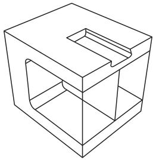  
图 1：使用实体、壳、线、切削和混合特征构建的零件。

1. 您在构建零件时创建的第一个特征称为基础特征；您通过添加更多特征来构建零件的其余部分，这些特征要么修改基础特征，要么为基础特征添加细节。在此示例中，基础特征是一个 U 形零件；用户绘制了一个二维轮廓并将其拉伸以形成基础特征，如图 2 所示。

  
图 2：基础特征。

草图和拉伸深度 (a) 是定义基础特征的可修改参数。您可以重新访问基础特征，并使用特征操作工具集修改截面草图或拉伸距离来更改其大小或形状。如果需要，您可以删除基础特征并绘制新的形状。

2. 添加一个加强腹板作为壳特征。用户在其中一个内表面上绘制了一条线，并将草图拉伸到对面，如图 3 所示。草图是定义壳特征的唯一可修改参数。

  
图 3：一个壳特征。

3. 在角部添加杆件作为线特征。该线是通过连接用户选择的两个点创建的，如图 4 所示。以这种方式创建的线没有可修改参数；如果需要更改它们，则必须删除并重新创建。

  
图 4：线特征。

4. 在夹具顶部切削出一个盲孔。用户绘制了一个二维轮廓，并将该轮廓通过指定距离拉伸到夹具中，如图 5 所示。草图和槽的深度是定义盲孔切削特征的可修改参数。

  
图 5：一个切削特征。

5. 切削的边缘被倒圆角。用户选择了要倒圆的边并提供了圆角半径，如图 6 所示。半径是定义圆角特征的可修改参数。

  
图 6：圆角特征。

如果新特征的几何形状依赖于现有特征，Abaqus/CAE 会在特征之间创建父子关系。新特征是子特征，它所依赖的特征是父特征。例如，在上面描述的零件中，圆角特征是切削特征的子特征。如果您更改切削的位置或大小，边缘仍然保持倒圆角。同样，如果您删除切削，Abaqus/CAE 也会删除圆角。

如果您修改了父特征，该修改可能会使父特征的子特征失效。例如，在上面描述的零件中，如果您将切削的深度增加使其成为通孔，您将丢失其边缘的圆角；也就是说，圆角在修改后将无法重新生成。Abaqus/CAE 为您提供以下两种选择：

• 保留对父特征的更改，但抑制重新生成失败的特征。被抑制特征的子特征也将被抑制。
• 退出父特征的修改，并返回到上次成功再生的状态。

## 附加信息

• 什么是基于特征的建模？  
• 修改和操作特征

## 基础特征

你在构建一个部件时创建的第一个特征被称为基础特征；你通过添加更多特征来构建部件的其余部分，这些特征要么修改基础特征，要么为它添加细节。在**部件**模块中使用工具构建 Abaqus/CAE 原生部件的过程，遵循一系列类似于在机械车间中构建部件的操作步骤。例如，你从一块坯料（基础特征）开始，然后执行以下操作：

• 将附加部件附着到坯料上（应用实体拉伸、旋转壳体或绘制的线框）。  
• 从坯料上切削材料（应用拉伸切除、旋转切除或圆孔；或者对边进行圆角或倒角）。

当你创建一个新部件时，你必须描述基础特征。这通过指定基础特征的两个属性来完成：它的形状和类型。形状表示特征的基本拓扑结构；也就是说，它是实体、壳体、线框还是点。类型表示将用于生成基础特征的方法：

## 平面型

你在二维草图平面上绘制特征。

## 拉伸型

你绘制特征轮廓，然后将其拉伸一个指定的距离。

## 旋转型

你绘制特征轮廓，然后将其绕一个轴旋转一个指定的角度。

## 扫掠型

你绘制两个形状：一条扫掠路径和一个扫掠轮廓。然后，轮廓沿着路径被扫掠以创建特征。

## 坐标型

你在提示区域中输入单个点的坐标。

在你创建一个部件并选择基础特征的形状和类型之前，你应该知道构建所需部件将使用的顺序。选择正确的基础特征类型和形状非常重要。

表 1 显示了根据部件的建模空间和类型可以选择的基础特征。  
表 1: 选择基础特征。

<table><tr><td rowspan="2">部件类型</td><td colspan="2">建模空间</td></tr><tr><td>三维</td><td>二维或轴对称</td></tr><tr><td>可变形体</td><td>任意</td><td>平面壳体、平面线框或点</td></tr><tr><td>离散刚体</td><td>任意（你必须在实例化之前将三维实体离散刚体部件转换为壳体）</td><td>平面线框或点</td></tr><tr><td>解析刚体</td><td>拉伸或旋转壳体</td><td>平面线框</td></tr><tr><td>欧拉体</td><td>拉伸、旋转或扫掠实体</td><td>不适用</td></tr><tr><td>流体</td><td>拉伸、旋转或扫掠实体</td><td>不适用</td></tr><tr><td>电磁体</td><td>拉伸、旋转或扫掠实体</td><td>平面壳体</td></tr></table>

从包含第三方格式几何体的文件导入的部件由一个单一特征组成，你将其作为新部件的基础特征导入到 Abaqus/CAE 中。你无法修改此基础特征，但可以向其添加额外的特征。同样，在**网格**模块中创建或从输出数据库导入的网格部件，是作为新部件的基础特征创建的。你可以使用网格编辑工具来添加和删除网格中的节点和单元，或者使用**部件**模块中的工具向网格添加几何特征。

## 附加信息

• 如何在 Abaqus/CAE 中定义部件？  
• 使用创建部件对话框  
• 添加实体特征  
• 添加壳体特征  
• 添加线框特征

## 简化部件的特征列表

当你将一个部件复制到一个新部件时，你可以将所有特征和参数信息简化为一个简单的定义。如果你简化了特征列表，当你后续修改该部件时，Abaqus/CAE 将更快地再生它；但是，你将无法再修改该部件的任何参数。你可以通过从主菜单栏选择 **部件 -> 复制 -> 部件名称** 来复制一个部件。

如果你花了大量时间创建一个部件并对其设计进行了多次迭代，那么简化部件的特征列表特别有用。例如，如果你创建了一个槽口并在确定最终设计之前多次重新定义其尺寸，那么原始部件就包含了定义该槽口每个变体的特征。如果你复制该部件并简化特征列表，新部件将只包含一个定义最终版本槽口的特征。

## 什么是部件实例？

部件实例可以被视为原始部件的一个表示。你在**部件**模块中创建一个部件并在**属性**模块中定义其属性。然而，当你使用**装配**模块组装模型时，你仅与部件的实例而不是部件本身一起工作。**相互作用**和**载荷**模块也对装配体进行操作，因此也对部件实例进行操作。相比之下，**网格**模块允许你对装配体或其一个或多个组成部件进行操作。

你在**装配**模块中创建部件实例。然后，你在全局坐标系中相对于彼此定位这些实例以形成装配体。你可以创建和定位单个部件的多个实例。此外，在解决接触问题时，你可以组装可变形体、解析刚体和离散刚体部件的实例。有关可在 Abaqus/CAE 中创建的部件类型的更多信息，请参见部件类型。

以下示例说明了部件和部件实例之间的关系。一个泵壳体由三个部件组成：壳体盖、垫片和安装螺栓。在**部件**模块中，你创建如图 1 所示的三个部件：

• 一个壳体盖  
• 一个垫片  
• 一个螺栓

  
1. 泵壳体

  
3. 螺栓

  
2. 垫片  
图 1: 原始部件。

在**装配**模块中，你组装每个部件的实例：

• 壳体盖的一个实例  
• 垫片的一个实例  
• 螺栓的八个实例

然后，你将这些实例相对于一个公共坐标系进行定位，从而创建如图 2 所示的泵壳体模型。

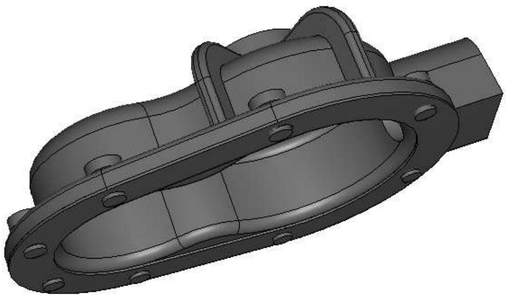  
图 2: 模型由部件的实例组装而成。

现在，假设你想改变螺栓的长度。你返回**部件**模块并通过编辑原始部件来修改螺栓的长度。当你返回**装配**模块时，Abaqus/CAE 识别出部件已被修改，并自动再生螺栓的八个实例以反映长度的变化。

你无法直接修改部件实例的几何形状；你只能在**部件**模块中修改部件本身。当你修改一个部件时，Abaqus/CAE 会自动再生该被修改部件在装配体中的所有实例。在上下文使用部件实例中有关于部件实例的更详细讨论。

## 如何在 Abaqus/CAE 中定义部件？

本节描述了你可以在**部件**模块中创建的部件——可变形体、刚体和欧拉体——以及电磁模型中可用的电磁体。

## 本节内容：

部件建模空间  
部件类型  
部件尺寸

## 部件建模空间

当你创建一个新部件时，你必须指定部件将存在的建模空间。你可以指定以下三种类型的建模空间：

## 三维

Abaqus/CAE 将部件嵌入在 X, Y, Z 坐标系中。一个三维部件可以包含任何实体、壳体、线框、切除、圆角和倒角特征的组合。你使用三维实体、壳体、梁、桁架或膜单元来建模一个三维部件。

## 二维平面

Abaqus/CAE 将部件嵌入在 X-Y 平面中。一个二维平面部件只能包含平面壳体和线框特征的组合，并且所有切除特征都定义为平面贯穿切除。你使用二维实体连续体单元以及桁架或梁单元来建模一个二维平面部件。

## 轴对称

Abaqus/CAE 将部件嵌入在 X-Y 平面中，其中 Y 轴表示旋转轴。一个轴对称部件只能包含平面壳体和线框特征的组合，并且所有切除特征都定义为平面贯穿切除。你使用轴对称实体连续体单元或轴对称壳单元来建模一个轴对称部件。

建模空间指的是部件嵌入其中的空间，而不是部件本身的拓扑结构。因此，你可以使用拓扑上是二维的壳体特征或一维的线框特征来创建三维部件。你可以在创建部件后通过在模型树中右键点击该部件并从出现的菜单中选择**编辑**来更改其建模空间。
Abaqus/CAE 使用以下方法来确定导入部件的建模空间：

当您从一个包含以第三方格式存储的几何图形的文件中导入部件时，您可以指定该部件的建模空间，前提是 Abaqus/CAE 未确定它必须是三维的。
• 当您从输出数据库导入网格时，Abaqus/CAE 会根据存储在输出数据库中的信息来确定新部件的建模空间。
• 当您从输入文件导入网格时，Abaqus/CAE 会根据单元类型来确定新部件的建模空间。
• 当您在网格模块中创建网格部件时，该网格部件的建模空间与原始部件的建模空间相同。

关于在创建和导入部件时如何指定建模空间的详细说明，请参见选择新部件的建模空间和导入草图与部件。

## 附加信息

• 部件在 Abaqus/CAE 中是如何定义的？

## 部件类型

当您创建新部件或从一个包含以第三方格式存储的几何图形的文件中导入部件时，您必须选择该部件的类型。

Abaqus/Standard 和 Abaqus/Explicit 的可能类型有：

## 可变形

任何您能创建或导入的任意形状的轴对称、二维或三维部件都可以被指定为可变形部件。可变形部件表示一个在载荷作用下可以变形的部件；该载荷可以是机械的、热的或电的。默认情况下，Abaqus/CAE 创建可变形部件。

## 离散刚体

离散刚体部件类似于可变形部件，因为它可以是任意形状。然而，离散刚体部件被假定为刚性的，并用于接触分析中模拟不能变形的物体。

## 解析刚体

解析刚体部件类似于离散刚体部件，因为它用于在接触分析中表示刚性表面。然而，解析刚体部件的形状不是任意的，必须由一组绘制的直线、圆弧和抛物线构成。

## 欧拉

欧拉部件用于定义欧拉分析中材料可以流动的区域。在分析过程中，欧拉部件不会变形；相反，部件内的材料在载荷作用下会发生变形，并且可以流过刚性单元边界。有关欧拉分析的更多信息，请参见欧拉分析。

## 电磁

电磁部件类型仅用于电磁模型。有关更多信息，请参见涡流分析。

您可以在装配模块中装配可变形体、离散刚体部件、解析刚体部件、欧拉部件和电磁部件。如果允许，您可以在创建部件后通过在模型树中右键单击该部件并从出现的菜单中选择“编辑”来更改其类型。

Abaqus/CAE 使用以下方法来确定导入部件的类型：

• 当您从一个包含以第三方格式存储的几何图形的文件中导入部件时，您可以指定该部件的类型为可变形、离散刚体或欧拉。
• 当您从输出数据库导入网格时，Abaqus/CAE 会根据存储在输出数据库中的信息来确定新部件的类型。
• 当您从输入文件导入网格时，Abaqus/CAE 会根据单元类型来确定新部件的类型。
• 当您在网格模块中创建网格部件时，该网格部件的类型与原始部件的类型相同。

## 附加信息

• 部件在 Abaqus/CAE 中是如何定义的？
• 建模刚体和显示体

## 部件尺寸

当您创建新部件时，您必须选择该部件的近似尺寸。您输入的尺寸用于 Abaqus/CAE 计算草绘器图纸的大小及其网格的间距。您应将近似尺寸设置为与完成部件的最大尺寸相匹配。如果您随后发现部件超出了草绘器图纸的大小，请使用“草图自定义”选项来增加图纸尺寸。您无法在创建部件后更改其近似尺寸。但是，您可以将部件复制到新部件，并在复制操作期间缩放该部件。有关更多信息，请参见复制部件。

Abaqus/CAE 使用几何引擎来建模部件和特征。推荐的近似尺寸范围在 0.001 $( 1 0 ^ { - 3 } )$ 到 10000 (104) 个单位之间。此尺寸范围应防止您的模型超出几何引擎的限制。例如，几何引擎支持的最小尺寸是 10−6，因此将几何尺寸保持在 10−3 的数量级通常会使节点和单元尺寸保持在最小尺寸之上。超出推荐限制的部件可能会表现出几何缺陷。如果您发现需要指定超出建议范围的近似尺寸，您应考虑采用不同的单位制。

## 附加信息

• 设置新部件的近似尺寸
• 复制部件

## 复制部件

从主菜单栏选择 部件->复制->部件名称 以将部件复制到新部件。

您可以创建原始部件的相同副本，或者可以在复制操作期间执行以下操作：

## 压缩特征

Abaqus/CAE 将所有特征和参数信息减少为部件的简单定义。结果是，如果您随后修改该部件，Abaqus/CAE 将更快地重新生成该部件；但是，您将无法再修改该部件的任何参数。有关更多信息，请参见简化部件的特征列表。

## 按比例缩放部件

Abaqus/CAE 根据您输入的比例因子缩放新部件。如果您选择缩放部件，Abaqus/CAE 还会压缩其特征。您可以使用缩放来更正导入的部件。如果导入部件的比例不正确，您可以将该部件复制到新部件，并在此过程中将其缩放到正确的尺寸。在某些情况下，您可以通过缩小部件、修复部件，然后将部件缩放回原始尺寸来生成有效的部件。您也可以在导入过程中缩放导入的部件。有关更多信息，请参见导入草图和部件。

## 关于平面对称镜像部件

Abaqus/CAE 关于选定的平面（X-Y、Y-Z 或 X-Z）镜像该部件。如果您选择“关于平面对称镜像部件”选项，Abaqus/CAE 将选择“压缩特征”选项。

要关于主平面以外的平面镜像部件且不压缩特征，请使用 形状->变换->镜像。有关更多信息，请参见镜像部件。

## 将断开的区域分离为部件

在某些情况下，当您导入 IGES 或 VDA-FS 格式的部件并选择“缝合边”修复选项时，Abaqus/CAE 会将单独的部件导入为一个部件。如果您切换打开“将断开的区域分离为部件”选项并将导入的部件复制到新部件，Abaqus/CAE 会将断开的区域分离为单独的部件。有关更多信息，请参见控制导入过程。

您可以复制网格部件并根据节点连接性将其分离为断开的部分。Abaqus/CAE 假定所有连接的节点属于单个部件，并且不考虑单元类型。但是，Abaqus/CAE 会忽略具有非线性、非对称变形的轴对称实体单元（CAXA）和某些线单元（连接器、弹簧、阻尼器、间隙和铰接）之间的连接性。

您可以复制同时包含几何图形和孤立网格特征的部件。您可以在任何部件上使用“压缩特征”、“按比例缩放部件”、“关于平面对称镜像部件”和“将断开的区域分离为部件”选项。

但是，请注意以下情况：

1.  当您在复制操作期间压缩或镜像几何部件时，参考点、附加点、集合、表面、点部件和基准不会被复制。
2.  当您在复制操作期间压缩孤立网格部件时，参考点、附加点、集合、表面、点部件和基准会被复制。
3.  当您在复制操作期间镜像孤立网格部件时，参考点、附加点、点部件和基准不会被复制。只有集合和表面会被复制并镜像。

## 什么是孤立节点和单元？

孤立节点和单元是有限元网格的组成部分，它们存在时没有任何关联的几何图形。实际上，网格信息已从其父几何图形中孤立出来。孤立节点和单元可以通过几种方式创建；它们可以是：

• 从输出数据库导入（有关更多信息，请参见从输出数据库导入部件）
• 从 Abaqus 输入文件导入（有关更多信息，请参见导入模型）
• 创建为网格部件（有关更多信息，请参见创建网格部件）
• 在自底向上网格划分过程中创建（有关更多信息，请参见自底向上网格划分）
• 通过某些网格编辑操作创建，例如创建单元和偏移（有关更多信息，请参见使用网格编辑工具）
通过删除与其父几何体的关联性而创建（有关更多信息，请参见删除网格-几何体关联性）

上述前三种方法创建孤立网格特征作为新部件的基础特征。其余方法属于 Edit Mesh 工具集的一部分；这些方法编辑现有网格，因此不作为部件的特征存在。有关更多信息，请参见 Edit Mesh 工具集。

您可以选择孤立单元的面作为草绘平面以添加几何特征。此外，在 Mesh 模块中，您可以更改分配给孤立单元的单元类型，并可以验证和编辑网格。

## 建模刚体和显示体

本节描述刚体和显示体。

## 本节内容：

刚体部件  
草绘分析刚体部件的轮廓  
刚体部件与刚体约束有何区别？  
什么是显示体？

## 刚体部件

当您的模型包含相互接触的部件时，您可以指定一个或多个部件为刚体。刚体部件代表一个刚度远大于模型其余部分的部件，以至于其变形可以忽略不计。

与您定义为刚体的部件相反，您定义为可变形的部件在接触过程中可以变形。例如，金属冲压过程的模型可能使用可变形部件来模拟坯料，使用刚体部件来模拟模具，如图 1 所示。

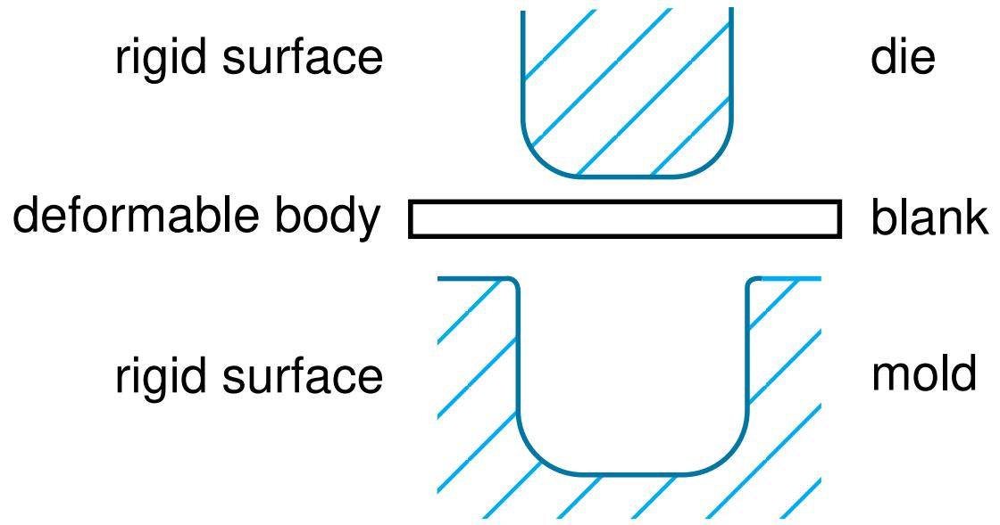  
图 1：刚体和可变形部件。

在此示例中，模具被约束为不能运动，并且在冲压过程中冲头沿着规定的路径运动。您通过选择一个刚体参考点并约束或规定其运动来控制刚体部件的运动。有关更多信息，请参见参考点。

计算效率是刚体部件相对于可变形部件的主要优势。在分析期间，不会对刚体部件执行单元级计算。尽管需要一些计算工作量来更新刚体的运动并组装集中和分布载荷，但刚体的运动完全由参考点确定。要将部件的类型从可变形更改为刚体，反之亦然，您可以在 Model Tree 中的部件上单击鼠标键 3，然后从出现的菜单中选择 Edit。有关更多信息，请参见刚体部件与刚体约束有何区别？和显示体。

您可以选择两种刚体部件之一：

## 离散刚体部件

您声明为离散刚体部件的部件可以是任何任意的三维、二维或轴对称形状。因此，您可以使用所有 Part 模块特征工具（实体、壳、线、切割和倒角）来创建离散刚体部件。但是，在 Mesh 模块中，只有包含壳和线的离散刚体部件才能使用刚性单元进行网格划分。如果您尝试在 Assembly 模块中创建实体离散刚体部件的实例，Abaqus/CAE 会显示一条错误消息；您必须返回 Part 模块，并将实体的面转换为壳。

## 分析刚体部件

分析刚体部件类似于离散刚体部件，因为它用于在接触分析中表示刚体部件。如果可能，在描述刚体部件时应使用分析刚体部件，因为它比离散刚体部件计算成本更低。分析刚体部件的形状不是任意的，并且轮廓必须平滑。您只能使用以下方法创建分析刚体部件：

• 您可以草绘部件的二维轮廓，并将轮廓绕对称轴旋转以形成三维旋转分析刚体部件，如图 2 所示。

  
图 2：旋转分析刚体部件。

您可以草绘部件的二维轮廓，并将轮廓无限拉伸以形成三维拉伸分析刚体部件。尽管 Abaqus/CAE 认为拉伸延伸到无穷远，但 Part 模块会以您指定的深度显示三维拉伸分析刚体部件，如图 3 所示。

  
图 3：拉伸分析刚体部件。

• 您可以草绘平面二维分析刚体部件的轮廓，如图 4 所示。

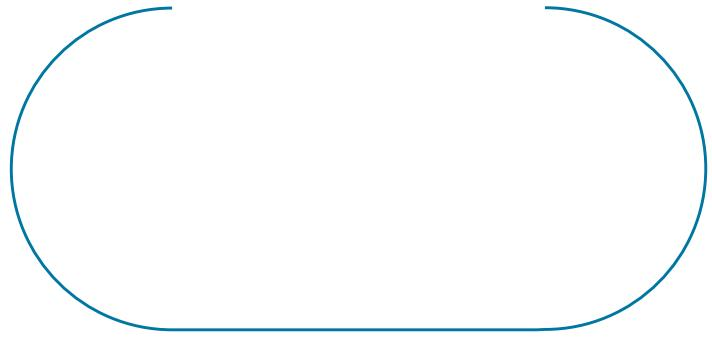  
图 4：平面分析刚体部件。

• 您可以草绘轴对称二维分析刚体部件的轮廓，如图 5 所示。

  
图 5：轴对称分析刚体部件。

您可以从包含以第三方格式存储的几何体的文件中导入部件，并将其定义为可变形或离散刚体部件；但是，您不能将导入的部件定义为分析刚体部件。作为替代方案，您可以将分析刚体部件的几何体导入到草图中。然后，您可以创建一个新的分析刚体部件，并将导入的草图复制到 Sketcher 工具集中。

Abaqus/CAE 中的刚体部件等同于 Abaqus/Standard 或 Abaqus/Explicit 分析中的刚性表面。有关更多信息，请参见以下内容：

• 分析刚性表面定义  
• 刚体定义  
• 刚性单元  
• 关于接触交互

## 其他信息

• 参考点  
• 部件类型  
• Abaqus/CAE 中如何定义部件？  
• 草绘简单对象

## 草绘分析刚体部件的轮廓

Sketcher 中提供了多个工具，可帮助您构建刚体部件轮廓的每个部分：

## 线

您使用 Sketcher 的 Line 工具来草绘直线。

## 圆弧和倒角

您使用 Sketcher 的 Arc 和 Fillet 工具来草绘圆弧或对两条线进行倒角。任何生成的圆弧所张开的角度必须小于 180°；如果您想构建一个张开角度大于 180° 的圆弧，您应该创建两个相邻的圆弧。如果您在草绘分析刚性表面的轮廓时创建了一个张开角度大于 180° 的圆弧，Abaqus/CAE 会显示一条错误消息。

## 样条曲线

您使用 Sketcher 的 Spline 工具来草绘抛物线样条曲线。您通过定义一个三点样条曲线来创建抛物线样条曲线，其中三个点是样条曲线的起点、样条曲线上的任意点和样条曲线的终点。只有由恰好三个点组成的样条曲线才能生成分析刚体部件定义所需的轮廓；因此，如果您在草绘分析刚体部件的轮廓时使用超过三个点创建样条曲线，Abaqus/CAE 会显示一条错误消息。

您可以从线、圆弧和抛物线样条曲线的任何组合构建分析刚体部件；但是，生成的轮廓必须是一条连续的（但不一定是闭合的）曲线。此外，该曲线必须平滑，才能在 Abaqus/Standard 或 Abaqus/Explicit 中获得收敛的解。您可能需要应用一系列小的线、圆弧或抛物线样条曲线来消除任何表面不连续性（Abaqus/CAE 没有等同于 Abaqus/Standard 和 Abaqus/Explicit\*SURFACE 选项上的 FILLET RADIUS 参数的功能）。有关创建抛物线样条曲线和保持相切性的更多信息，请参见草绘样条曲线。有关控制分析刚性表面的规则的更多信息，请参见分析刚性表面定义。

包含一条线、一个圆弧和一个倒角的分析刚体部件草图如图 1 所示。

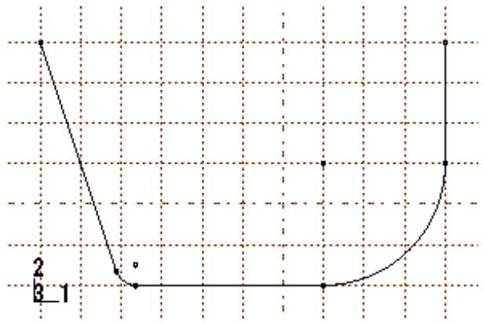  
图 1：分析刚体部件的草图。

分析刚体部件完全由您使用 Sketcher 创建的基础特征的二维轮廓定义；因此，当您从 Sketcher 返回 Part 模块时，Part 模块工具不能用于添加特征。您只能通过编辑原始草图来修改该部件。

创建分析刚性表面后，您必须为其分配一个刚体参考点。您通过约束或规定参考点的运动来控制分析刚性表面的运动。有关更多信息，请参见参考点。

## 其他信息

• 草绘简单对象

## 刚体部件与刚体约束有何区别？

您可以通过创建一个部件并声明其类型为离散或分析刚体，在 Part 模块中创建一个刚体部件。您可以创建一个参考点并将其分配给刚体参考点。然后，您应用于参考点的运动或约束将应用于整个刚体部件。
类似地，您可以在 **Interaction模块（Interaction module）** 中创建刚体约束（rigid body constraint）。刚体约束允许您将装配件（assembly）中区域的运动约束到一个参考点（reference point）的运动上。作为刚体一部分的区域的相对位置在整个分析过程中保持不变。此外，您可以从零件实例（part instance）中选择区域，并使用刚体约束为完全耦合的热应力分析（fully coupled thermal-stress analysis）指定一个等温刚体（isothermal rigid body）。有关定义刚体约束和分配刚体参考点的详细说明，请参阅“定义刚体约束”（Defining rigid body constraints）。

您不必为零件（part）创建参考点，即使该零件类型是离散刚性（discrete）或解析刚性（analytical rigid）也是如此。但是，如果未为刚性零件创建参考点，则装配件中该零件的每个实例都必须包含在一个刚体约束中。

刚性零件与零件关联；刚体约束与装配件中的区域关联。例如，如果您将一个零件定义为刚性的，那么装配件中该零件的每个实例都是刚性的。相反，如果您将一个零件定义为可变形的（deformable），则可以使用刚体约束仅使部分实例成为刚性。如果在 **Part模块（Part module）** 中未创建参考点，则无法通过将刚性零件的实例与在 **Assembly模块（Assembly module）** 中创建的参考点相关联来创建刚体参考点。但是，您可以将该实例与一个刚体约束以及一个在 **Assembly模块（Assembly module）** 中创建的参考点相关联。

如果您将一个零件定义为刚性的，可以使用 **Model Tree** 将该零件类型更改为可变形。为了检查基本模型是否正确，您可以先将零件定义为刚性运行一个快速分析，然后将其类型更改为可变形。类似地，如果您将一个零件定义为可变形的，并在装配件中对其实例应用了刚体约束，您可以在以后轻松移除该约束。您可以先对零件实例应用刚体约束运行快速分析，然后移除约束，并以可变形体的形式对该零件实例运行完整分析。这两种方法非常相似。

## 什么是显示体？

显示体（display body）是一种仅用于显示的零件实例。您无需对该零件进行网格划分，该零件也不包含在分析中；但是，当您查看分析结果时，**Visualization模块** 会将该零件与模型的其余部分一起显示。如果 Abaqus/CAE 报告导入的零件无效，您仍然可以将该零件作为显示体包含在模型中。有关更多信息，请参阅“什么是有效且精确的零件？”（What is a valid and precise part?）。

您通过在 **Interaction模块（Interaction module）** 中应用显示体约束（display body constraint）来创建显示体。您可以将显示体约束应用于可变形零件和刚性零件，也可以将显示体约束应用于同时包含几何体和孤立网格（orphan elements）的零件。您可以将零件实例约束为在空间中固定，也可以将其约束为跟随选定的点。有关更多信息，请参阅“理解约束”（Understanding constraints）。有关使用显示体约束的模型示例，请参阅“显示体”（Display bodies）。

## 参考点与点零件

本节描述了如何创建与零件关联的参考点，以及如何创建仅包含单个点（该点也是参考点）的零件。

## 本节内容：

- 参考点
- 点零件

## 参考点

您可以使用 **Reference Point 工具集** 创建与零件关联的参考点，方法是从主菜单栏中选择 **Tools -> Reference Point**。一个零件只能包含一个参考点，Abaqus/CAE 将其标记为 RP。如果您尝试创建第二个点，Abaqus/CAE 会询问您是否要删除原始点。零件上的参考点会出现在装配件中该零件的所有实例上。装配件可以包含多个参考点，Abaqus/CAE 将它们标记为 RP-1、RP-2、RP-3 等。有关参考点的更多信息，请参阅“Reference Point 工具集”（The Reference Point toolset）。

Abaqus/CAE 会在所需位置显示参考点及其标签。您可以通过在 **Model Tree** 中选择 **Rename** 来更改参考点标签。如果需要，您可以关闭参考点符号和参考点标签的显示；有关更多信息，请参阅“控制参考点显示”（Controlling reference point display）。

如果零件是离散刚性或解析刚性零件，您可以使用参考点来指示刚体参考点。当您创建装配件时，该参考点会出现在零件的每个实例上。您可以在 **Interaction模块（Interaction module）** 中将约束应用于参考点，或者在 **Load模块（Load module）** 中使用载荷或边界条件定义参考点的运动。然后，您对参考点施加的运动或约束将应用于整个刚性零件。

## 点零件

创建零件时，您可以将其基本特征（base feature）的形状选择为实体（solid）、壳体（shell）、线框（wire）或点（point）。如果选择点，您必须指定该点的坐标，Abaqus/CAE 将创建一个基本特征为位于该位置的点的零件。此外，该点就是该零件的参考点。点零件的建模空间（modeling space）可以是三维的、二维的或轴对称的（axisymmetric）。点零件的类型可以是可变形或刚性的。

您可以继续向点零件添加特征，例如基准（datums）和线框（wires）。更典型地，您可以通过使用具有质量和转动惯量（mass and inertia）的点零件替换刚性零件来简化模型。您可以为刚性点零件添加质量；请参阅“转动惯量”（Inertia）。此外，您可以将显示体附加到该点，并使用显示体来表示原始的刚性零件；请参阅“显示体”（Display bodies）。最后，您可以通过建模连接器（connector）（例如 JOIN 或 REVOLUTE）将点零件约束到您的模型中；请参阅“连接器”（Connectors）。

## 您可以创建哪些类型的特征？

在选择零件的类型和形状并绘制其基本特征的二维轮廓后，您可以添加附加特征或修改现有特征以创建最终的零件。

## 本节内容：

- 实体特征
- 壳体特征
- 线框特征
- 切除特征
- 混合特征

## 实体特征

要创建实体特征，请从主菜单栏中选择 **Shape -> Solid**，或在 **Part模块（Part module）** 工具箱中选择一个实体工具。绘制完初始轮廓后，您可以执行以下操作之一来创建特征：

• 要创建拉伸实体特征（extruded solid feature），您需要将轮廓拉伸指定的距离 (d)，如图 1 所示。

  
图1：拉伸实体特征。

此外，您可以对拉伸应用拔模（draft）或扭转（twist），如图 2 所示。

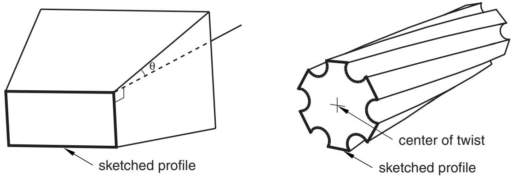  
图2：带有拔模和带有扭转的拉伸实体特征。

您需要为带有拔模的拉伸定义拔模角度，或为带有扭转的拉伸定义扭转中心和螺距（发生 360° 扭转的拉伸距离）。从主菜单栏选择 **Shape -> Solid -> Extrude** 来创建此类型的特征。

要创建放样实体特征（solid loft feature），您需要将形状从初始放样截面（loft section）过渡到不同形状或方向的末端截面（end section）。Abaqus/CAE 使用切向约束（tangency constraints）、中间截面（intermediate sections）和路径曲线（path curve）来确定起始和结束截面之间的形状。一个简单的放样（仅包含两个放样截面，无切向约束，且路径为直线）如图 3 所示。从主菜单栏选择 **Shape -> Solid -> Loft** 来创建此类型的特征。

  
图3：放样实体特征。

• 要创建旋转实体特征（revolved solid feature），您需要将轮廓旋转指定的角度 (θ)。一条构造线（construction line）作为旋转轴，如图 4 所示。

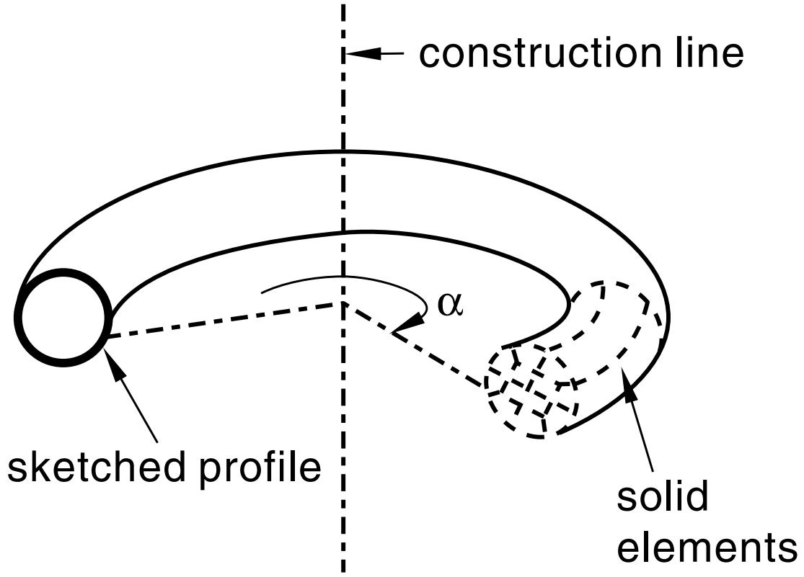  
图4：旋转实体特征。

此外，您可以输入螺距值 (p)，以便在轮廓旋转时沿旋转轴平移轮廓；图 5 显示了一个旋转 360° 并带有螺距的实体。从主菜单栏选择 **Shape -> Solid -> Revolve** 来创建此类型的特征。

  
图5：旋转 360° 且带有螺距 (p) 的实体特征。

要创建扫掠实体特征（swept solid feature），您需要沿指定路径扫掠轮廓，如图 6 所示。从主菜单栏选择 **Shape -> Solid -> Sweep** 来创建此类型的特征。有关更多信息，请参阅“定义扫掠路径和扫掠轮廓”（Defining the sweep path and the sweep profile）。

  
图6：扫掠实体特征。

您可以使用任何实体工具向在三维建模空间中创建的可变形或离散零件添加实体特征。您无法向二维或轴对称零件添加实体特征。

**日期：2026年6月16日**
图1、图3、图4和图6展示了每个特征后续可能的网格划分方式。您可以使用Abaqus/Standard或Abaqus/Explicit中提供的任意三维实体连续单元对实体特征进行网格划分。

## 补充信息

• 添加实体特征  
• 什么是基于特征的建模？  
• 使用六面体单元对复杂实体进行网格划分

## 壳体特征

壳体特征是实体的一种理想化模型，其厚度相对于宽度和深度被认为是小的。要创建壳体特征，请从主菜单栏选择 **Shape->Shell**，或从 **Part** 模块工具箱中选择一个壳体工具。您可以通过使用壳体工具执行以下操作之一来创建壳体特征：

• 要创建拉伸壳体特征，需绘制一个轮廓，并将其拉伸指定距离 (d)，如图1所示。

  
图1：拉伸壳体特征。

此外，您还可以为拉伸体添加拔模角或扭转，如图2所示。

  
图2：带拔模角的拉伸壳体特征和带扭转的拉伸壳体特征。

您可以定义带拔模角的拉伸体的拔模角度，或者带扭转的拉伸体的扭转中心和螺距（即发生360°扭转的拉伸距离）。从主菜单栏选择 **Shape->Shell->Extrude** 可创建此类特征。

要创建壳体放样特征，需将形状从初始放样截面过渡到不同形状或方向的端部截面。Abaqus/CAE 使用切向约束、中间截面和路径曲线来确定起始和结束截面之间的形状。图3展示了一个简单的放样（仅包含两个放样截面，无切向约束，且路径为直线）。从主菜单栏选择 **Shape->Shell->Loft** 可创建此类特征。

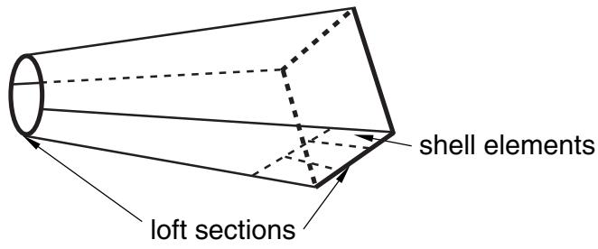  
图3：壳体放样特征。

• 要创建旋转壳体特征，需绘制一个轮廓，并将其旋转指定角度 (θ)。构造线用作旋转轴，如图4所示。

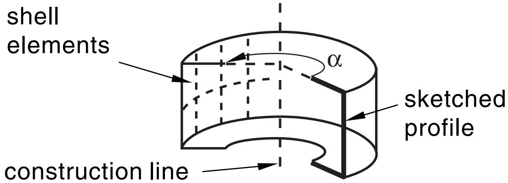  
图4：旋转壳体特征。

此外，您可以输入一个螺距值，以便在轮廓旋转时沿旋转轴平移轮廓；图5展示了一个带螺距的旋转壳体。

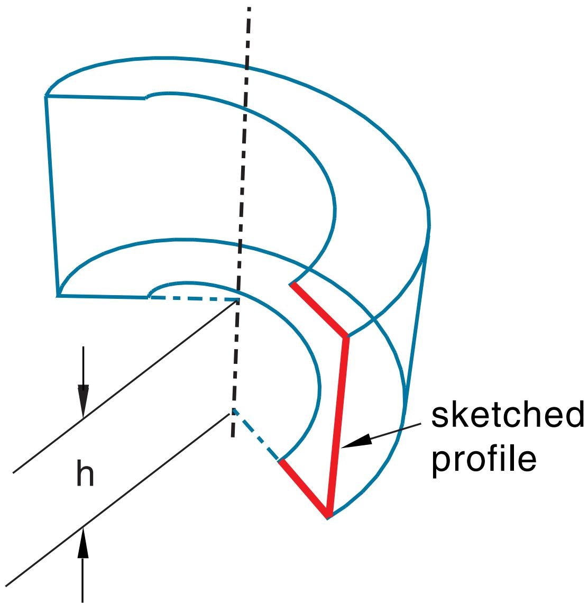  
图5：带螺距的旋转壳体特征。

尺寸 h 表示由于螺距引起的绘制轮廓的平移量；如果零件旋转满360°，则 h 将等于螺距。从主菜单栏选择 **Shape->Shell->Revolve** 可创建此类特征。

• 要创建扫掠壳体特征，需绘制一个轮廓，并将其沿指定路径扫掠，如图6所示。

  
图6：扫掠壳体特征。

从主菜单栏选择 **Shape->Shell->Sweep** 可创建此类特征。更多信息，请参阅定义扫掠路径和扫掠轮廓。

• 要创建平面壳体特征，需在选定的平面或基准平面上绘制壳体的轮廓，如图7所示。

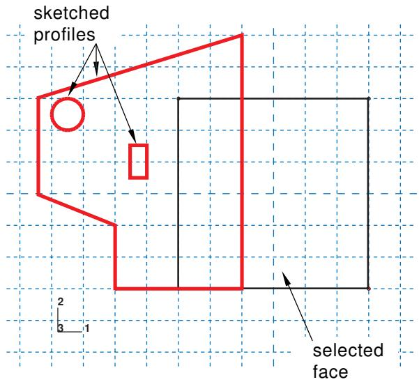

  
图7：绘制的壳体特征。

当您在平面（例如，立方体的一个侧面）上绘制时，仅当壳体特征延伸超出该面时才会创建；壳体特征不能与面重叠。图7展示了在立方体的一个平面上绘制的草图以及由此生成的壳体特征。在此示例中，壳体特征是从所选立方体面延伸出的一个鳍片。从主菜单栏选择 **Shape->Shell->Planar** 可创建此类特征。

要创建实体转壳体特征，需将实体特征的面转换为壳体特征；实际上，就是掏空一个实体。图8展示了一个实体转壳体特征。从主菜单栏选择 **Shape->Shell->From Solid** 可创建此类特征。

  
图8：实体转壳体特征。

您可以使用任意壳体工具向在三维建模空间中创建的零件添加壳体特征；但是，当处理在二维或轴对称建模空间中创建的零件时，只能使用平面壳体工具添加壳体特征。您可以在 **Property** 模块中创建规定所需厚度的截面，并将该截面赋给壳体特征。更多信息，请参阅定义截面以及我可以将哪些属性赋给零件？。

许多图示展示了壳体特征后续可能的网格划分方式。您可以使用以下方法对壳体特征进行网格划分：

• 二维或轴对称连续单元（仅限于平面壳体特征）  
• 三维壳单元  
• 膜单元

## 补充信息

• 添加壳体特征  
• 什么是基于特征的建模？

## 线特征

在Abaqus/CAE中，线被描绘为一条线，用于理想化一个实体，其中实体的厚度和深度相对于其长度被认为是小的。要创建线特征，请从主菜单栏选择 **Shape->Wire**，或从 **Part** 模块工具箱中选择一个线工具。您可以在 **Part** 模块中使用线工具执行以下操作之一来创建线特征：

• 在选定的平面或基准平面上绘制线，以创建绘制的线特征，如图1所示。从主菜单栏选择 **Shape->Wire->Sketch** 可创建此类特征。

  
图1：绘制的线特征。

当您在平面（例如，立方体的一个侧面）上绘制时，仅当线特征延伸超出该面时才会创建。

用直线连接两个或多个点，如图2所示，或用样条曲线连接，如图3所示。从主菜单栏选择 **Shape->Wire->Point to Point** 可创建此类特征。选择 **Polyline** 或 **Spline** 作为 **Geometry Type**，可分别创建直线或样条曲线。您可以选择通过创建边来将线印记在现有零件上，将线与现有零件合并，或者创建独立于现有零件的线。图3中的矩形实体特征仅供参考。左图显示了使用 **Imprint wire** 或 **Separate wire** 选项得到的完整样条线，右图则显示了使用 **Merge wire** 选项连接相同点集的样条线。您可以创建包含线特征中定义的线和顶点的几何集合。

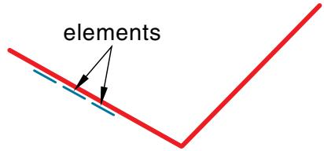  
图2：连接三个点的线特征。

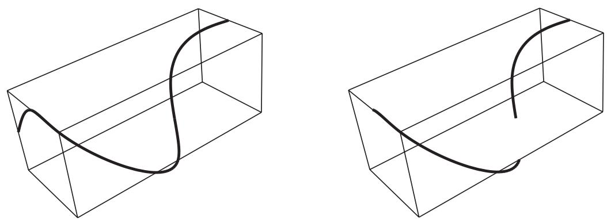  
图3：连接实体特征多个点的线特征。

您可以使用线工具向任何可变形或离散刚体零件添加线特征。您不能向解析刚体零件添加线特征；只能修改定义该零件的原始草图。

您可以在 **Property** 模块中创建规定所需横截面几何形状的截面，并将该截面赋给线特征。（更多信息，请参阅定义截面以及我可以将哪些属性赋给零件？）。您可以使用Abaqus/Standard或Abaqus/Explicit中提供的任意梁、桁架或轴对称壳单元来模拟线特征。

## 注意：

虽然您可以创建梁单元网格，但当前版本的Abaqus/CAE仅允许您将以下截面赋给线：

• 梁截面  
• 桁架截面

## 补充信息

• 添加线特征  
• 什么是基于特征的建模？

## 切除特征

切除是一种从零件中移除材料的特征。切除可以是圆孔，也可以是任何其他形状。任何切除的绘制轮廓必须是封闭的。在许多情况下，即使轮廓最初不接触被切割的表面，整个轮廓也会影响切除特征的形状。要创建切除特征，请从主菜单栏选择 **Shape->Cut**，或从 **Part** 模块工具箱中选择一个切除工具。

## 注意：

大多数图示中，切除轮廓与零件表面相交的部分未显示为封闭。这些线条已被移除，以便展示切除特征的形状。

绘制好初始轮廓后，您需要执行以下操作之一来创建切除特征：
• 要创建拉伸切除特征，您可以将轮廓拉伸指定的距离 (d)，如图 1 所示。

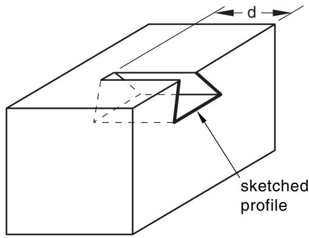  
图 1：拉伸切除特征。

此外，您可以为拉伸切除应用拔模或扭转，如图 2 所示。您可以为带拔模的拉伸切除定义拔模角度，或为带扭转的拉伸切除定义扭转中心和螺距（发生 360° 扭转的拉伸距离）。从主菜单栏选择 Shape->Cut->Extrude 来创建此类特征。

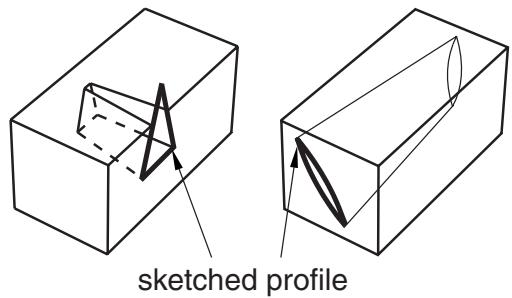  
图 2：带拔模和扭转的拉伸切除特征。

要创建放样切除特征，您需要将形状从初始放样截面过渡到具有不同形状或方向的结束截面，如图 3 所示。Abaqus/CAE 使用切向约束、中间截面和路径曲线来确定起始和结束截面之间的形状。从主菜单栏选择 Shape->Cut->Loft 来创建此类特征。

  
图 3：放样切除特征。

要创建旋转切除特征，您需要将轮廓旋转指定的角度 (θ)。构造线用作旋转轴。此外，您可以输入一个螺距值，以便在轮廓旋转时沿旋转轴平移轮廓，从而创建螺纹等零件细节。图 4 显示了一个旋转切除和一个带螺距的旋转切除。从主菜单栏选择 Shape->Cut->Revolve 来创建此类特征。

  
图 4：旋转切除和带螺距的旋转切除。

要创建扫掠切除特征，您需要将轮廓沿指定的路径进行扫掠，如图 5 所示。从主菜单栏选择 Shape->Cut->Sweep 来创建此类特征。更多信息，请参见定义扫掠路径和扫掠轮廓。

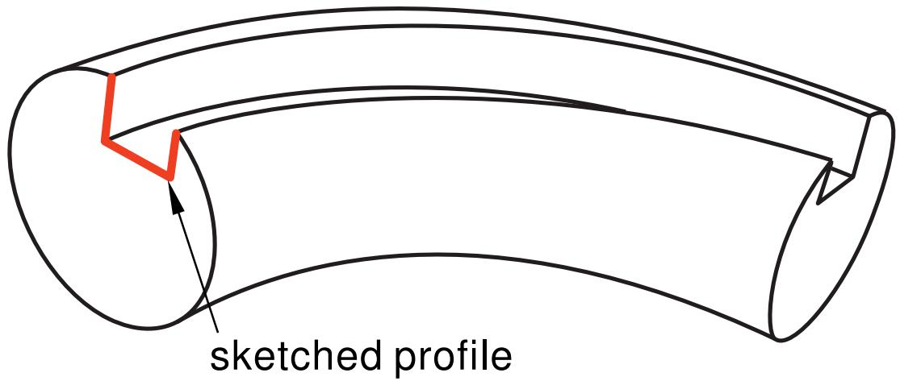  
图 5：扫掠切除特征。

• 要创建圆形孔，您需要输入孔的直径及其圆心到两条选定边的距离，如图 6 所示。从主菜单栏选择 Shape->Cut->Circular Hole 来创建此类特征。

  
图 6：圆形孔特征。

在为拉伸、旋转或扫掠切除绘制轮廓时，您可以在单个草图中绘制多个轮廓。当您退出草图器时，Abaqus/CAE 会拉伸每个轮廓，并为每个轮廓创建一个相应的切除，如图 7 所示。

  
图 7：从单个草图拉伸的多个轮廓。

切除的顺序存储为单个特征，您只能将其作为单个特征进行编辑。例如，如果您更改拉伸深度，该特征中所有切除的深度都将随之更改。

您可以使用切除工具向任何可变形或离散刚体零件添加切除特征。您不能向解析刚体零件添加切除特征；只能修改定义该零件的原始草图。

## 附加信息

• 添加线特征  
• 什么是基于特征的建模？

## 混合特征

混合特征可以平滑三维实体零件的边。要创建混合特征，请从主菜单栏选择 Shape->Blend，或在 Part 模块工具箱中选择一个混合工具。您可以在 Part 模块中使用混合工具执行以下操作之一：

使用指定半径的圆形混合平滑边，如图 1 所示。从主菜单栏选择 Shape->Blend->Round/Fillet 来创建此类特征。

  
图 1：圆角/倒圆混合特征。

• 使用指定长度的倒角混合对边进行倒角，如图 2 所示。从主菜单栏选择 Shape->Blend->Chamfer 来创建此类特征。

  
图 2：倒角混合特征。

您可以使用混合工具来混合您在三维建模空间中创建的可变形或离散刚体零件的边。您不能向二维或轴对称零件添加混合特征；但是，您可以通过编辑零件的草图来混合其角点。

## 附加信息

• 添加线特征  
• 什么是基于特征的建模？

## 有效使用基于特征的建模

如果您了解 Abaqus/CAE 如何使用基于特征的建模以及定义特征的规则如何应用，就可以设计出更高效的零件创建方法。以下技术将帮助您创建易于修改的稳健零件：

## 规划策略

基于特征的建模提供了灵活性，但也可能增加模型的开销。例如，您可以使用特征操作工具集中的抑制工具来抑制拉伸。或者，您可以通过切除特征来有效地抑制拉伸。尽管您随后可以通过移除切除特征来恢复拉伸，但生成的零件包含额外的基于特征的信息，这会减慢重新生成速度。通过使用几何缓存保存不同状态的零件，可以提高重新生成速度，但缓存会使用可能被其他操作所需的系统内存（更多信息，请参见调整特征重新生成）。此外，如果您向零件添加更多细节，依赖关系可能导致特征重新生成失败；并且，由于拉伸不再可见，确定重新生成失败的原因可能很困难。

在决定如何创建零件之前，您应该始终考虑将来是否需要修改该零件。如果您决定可能需要修改零件，则应考虑用于创建定义零件的特征的技术。最简单的技术可能无法提供修改特征所需的灵活性。您可能会发现编辑或抑制单个几何项（如拉伸、圆角或孔）很麻烦。

或者，如果您知道最终设计永远不会更改，则可能不需要基于特征建模提供的灵活性，并且可以使用最简单、最方便的技术来定义零件。

通常，在开始创建零件实例并在装配体中定位它们之前，您应尝试在 Part 模块中完成零件的创建。在将属性（如集、载荷和边界条件）应用于装配体之前，您应尝试完成所有零件的创建。如果您将属性应用于装配体，然后返回 Part 模块修改原始零件，Abaqus/CAE 可能无法确定属性应应用的位置。例如，如果您将压力载荷应用于某个面，然后返回 Part 模块将该面划分为两个区域，Abaqus/CAE 将仅将压力应用于其中一个区域。

## 使用参考几何

向零件添加特征时，应始终使用基础参考几何来定义新特征相对于现有特征的位置。在绘制特征草图时，您可能可以直接选择参考几何；例如，如果绘制圆，您可能可以选择参考几何中的顶点来定义其圆心。或者，您可能需要在参考几何和新特征之间添加尺寸。如果您不使用参考几何来定位新特征的草图，并且随后修改了零件，则对特征所做的更改可能是不可预测的。

## 使用尺寸

尺寸为定义特征的草图增加了清晰度，并记录了您的设计意图以供将来参考。尺寸还会为草图添加约束。您可以在草图器中修改尺寸，零件和装配体将相应地重新生成。

## 注意创建特征的顺序

零件的新特征可以感知现有特征。此外，如果新特征依赖现有特征来获取定位信息，Abaqus/CAE 将在特征之间创建父子关系。父子关系以及您创建特征的顺序在特征重新生成中起着重要作用。

仔细排序并遵循以下顺序的建模方案不太可能遇到不必要的或病态的建模问题：

2. 添加拉伸、旋转、扫掠和平面特征。
3. 添加圆角或倒圆特征。
4. 仅当其余几何图形完成时才添加分区。

1. 使用拉伸、旋转、切除和扫掠创建零件的基本几何形状。
## 允许一定的重叠

如果可能，应允许现有特征与填充孔或切割孔的特征之间存在重叠。允许重叠可以增强零件的鲁棒性，并使特征更有可能成功再生。例如，切割槽时，应将其草图轮廓延伸到切割表面之上，如图 1 所示。

  
图 1：槽的草图轮廓应超出任何被切割的表面。

## 尽可能创建实体

实体特征比壳特征更具鲁棒性。您可能会发现难以精确定位一组壳特征并对齐其边。相比之下，实体各部分之间可以重叠，公差的重要性随之降低。使用实体的另一个优点是，您可以使用圆角和倒角特征来定义几何形状。如果要对壳体进行建模，应尝试先创建实体特征，并在完成形状定义后将实体转换为壳。此外，如果您后续需要向一个由实体生成的壳零件添加额外的壳特征，应遵循以下步骤：

1.  删除最后一个实体转壳特征，将模型恢复为实体。
2.  添加新的实体特征。
3.  创建一个新的实体转壳特征，将模型转换回壳。

## 补充信息

•  什么是基于特征的建模？  
•  修改和操作特征  
•  捕获您的设计和分析意图

## 捕获您的设计和分析意图

如果使用得当，Abaqus/CAE 所采用的基于特征的建模方法可以让您同时捕获设计意图和分析意图。

设计意图是根据设计考量进行更改的能力。例如，添加切割特征时，您可以选择贯穿切割或盲切。如果切割特征代表螺栓孔，您知道该孔必须始终贯穿整个零件。因此，您应该选择贯穿切割，这样即使您更改了零件的厚度，Abaqus/CAE 也能识别出该孔始终是贯穿的。

分析意图是根据分析考量进行更改的能力。尽管 Abaqus/CAE 允许您创建具有复杂、详细几何形状的零件，但您的最终目标通常是对零件的网格化表示进行有限元分析。过多的细节，如圆角和小孔，可能导致网格非常精细的区域，这将主导 Abaqus/Standard 或 Abaqus/Explicit 求解所需的时间。您在零件模块中创建零件时提供的细节量应反映您的目标。或者，您可以创建一个具有详细特征的零件，但在网格划分装配体之前抑制这些特征。例如，如果模型需要数小时来分析，您可能希望通过抑制特征来简化它；然后您可以提交一个运行更快的分析，以检查您的基本建模假设。如果简化后的模型行为符合预期，您可以取消抑制特征并重新提交完整的分析。

关于基于设计意图和分析意图的不同特征化设计方法的示例，请考虑图 1 所示的盖板。

  
图 1：盖板模型。

您可以通过多种方式创建用于建模盖板的三维壳体：

1.  绘制一个包含四个孔的基础特征。
2.  绘制一个矩形基础特征，并添加四个独立的切割特征。
3.  绘制一个矩形基础特征，并添加一个切割所有四个孔的单一切割特征。

这三种方法中的任何一种都会生成相同的零件，但您的设计意图和分析意图决定了最佳方法。例如：

您是否希望为不同的应用创建和分析具有不同孔径的各种尺寸的板材？如果所有四个孔的直径始终相同，您应该将所有四个孔创建为一个单一的切割特征。然而，如果各个孔的直径可能不同，则应创建四个独立的切割特征。  
您是否希望在最终确定设计之前抑制特征？例如，您可以进行一系列抑制孔的分析，以确定所需的板材厚度。然后，您可以取消抑制孔并分析最终模型。此外，抑制特征可能会简化 Abaqus/CAE 生成的网格，或者使装配体可进行扫掠网格划分。

如果您希望在矩形盖板示例中抑制所有四个孔，您应该将所有四个孔创建为一个单一的切割特征。然而，如果您希望抑制单个孔，则应创建四个独立的切割特征。如果分析直接明了，并且您不需要分析简化模型，则应绘制一个包含四个孔的基础特征草图。

## 补充信息

•  什么是基于特征的建模？  
•  修改和操作特征  
•  有效地使用基于特征的建模

## 什么是零件和装配体锁定？

零件和装配体锁定是 Abaqus/CAE 的一项功能，可防止对零件的特征或装配体的特征进行任何更改。您可以锁定零件或装配体以防止意外更改，例如在与其他 Abaqus 用户共享模型时，或在处理包含许多相似零件的模型时。如果您计划修改零件或装配体，则必须将其解锁。

## 注意：

零件和装配体锁定不是安全功能；任何用户都可以解锁和修改由其他用户锁定的零件和装配体。

您可以在模型树中右键单击某个零件或装配体，然后使用出现的菜单来锁定和解锁该特征。模型树中特征名称前的挂锁图标表示该零件或装配体已被用户或数据库升级锁定。更多信息，请参阅使用模型树管理特征。

或者，您可以使用零件管理器来锁定或解锁模型中的任何零件。如果零件未解锁，零件管理器中的“状态”字段为空。如果零件已锁定，“状态”字段将指示以下两种情况之一：

## 已锁定（数据库升级）

Abaqus/CAE 在将模型从旧版 Abaqus 升级时自动锁定了该零件。

## 已锁定

用户使用模型树或零件管理器锁定了该零件。

当 Abaqus/CAE 从旧版 Abaqus 升级数据库时，它会自动锁定模型中的装配体和所有零件。锁定装配体和零件使得 Abaqus/CAE 能够比在装配体和所有零件也被再生的情况下更快地完成升级。如果您解锁了因数据库升级而锁定的零件，Abaqus/CAE 将重新生成该零件。同样，如果您解锁了因数据库升级而锁定的装配体，Abaqus/CAE 将重新生成该装配体。

## 警告：

如果零件因数据库升级而被锁定，您应在对集合或属性定义进行任何更改之前解锁该零件。如果您在修改后才解锁该零件，当 Abaqus/CAE 重新生成该零件时，您的更改可能会失效。

如果您解锁了使用模型树或零件管理器锁定的零件，Abaqus/CAE 不会重新生成该零件，因为在锁定期间无法对其进行修改。同样，当您在使用模型树锁定装配体后解锁它时，Abaqus/CAE 不会重新生成该装配体。如果您解锁的零件未能重新生成，将同时保留锁定版本和未锁定版本。您可以在零件的未锁定版本上重新创建缺失的特征，并在整个模型中使用它来替换锁定的零件。

您可以实例化一个锁定的零件并将其用于装配体中。此外，您可以向锁定的零件或锁定的装配体添加或删除集合或属性定义。但是，在向其添加特征或编辑现有特征之前，您必须解锁零件或装配体。

## 什么是拉伸、旋转和扫掠？

以下各节描述了用于拉伸、旋转和扫掠二维草图以创建三维零件或特征的技术。

## 本节内容：

定义拉伸距离  
控制拉伸特征的方向  
在拉伸中包含扭转  
在拉伸中包含拔模斜度  
为轴对称零件和旋转特征定义旋转轴  
控制旋转特征的方向  
通过节距控制旋转特征的横截面  
定义扫掠路径和扫掠轮廓

## 定义拉伸距离

您可以绘制一个二维轮廓并将其拉伸以创建以下内容：
- 一个三维拉伸实体特征。
- 一个三维拉伸壳特征。
- 一个三维拉伸切除特征。

Abaqus/CAE 提供以下方法来定义拉伸距离：

## 盲孔（Blind）

指定 Abaqus/CAE 拉伸草图的距离。草图和该距离共同定义了特征，并且可以使用特征操作工具集进行编辑。您可以在创建拉伸实体、壳和切除特征时使用此方法。图 1 展示了一个实体零件中的盲孔拉伸切除。

  
图 1：盲孔拉伸切除。

## 至面（Up to Face）

选择一个 Abaqus/CAE 拉伸草图所至的单一面。所选面不必与草图平面平行。所选面可以是非平面面；但是，它必须完全包含拉伸的截面。如果选择此方法定义拉伸距离，则只能使用特征操作工具集修改草图；如果您希望拉伸到不同的面，则必须创建一个新的拉伸切除特征。您可以在创建拉伸实体、壳和切除特征时使用此方法。图 2 展示了一个拉伸至非平面面的草图。

  
图 2：一个拉伸至非平面面的实体特征。

## 穿透（Through All）

此方法仅适用于拉伸切除特征。Abaqus/CAE 将定义切除轮廓的草图完全拉伸穿过零件。如果选择此方法定义拉伸距离，则只能使用特征操作工具集修改草图。图 3 展示了一个实体零件中的穿透拉伸切除。

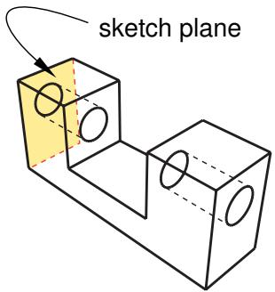  
图 3：穿透拉伸切除。

## 控制拉伸特征的方向

当您向三维零件添加拉伸特征时，Abaqus/CAE 会根据您正在创建的特征类型，从草图轮廓中选择一个默认的拉伸方向。默认情况下，实体或壳特征向外拉伸，以便向现有基特征添加材料。相反，切除特征向内拉伸，以便从现有基特征中去除材料。

您可以通过以下方式控制拉伸特征的方向：

## 添加拉伸特征时选择方向

当您完成草图以向现有零件添加拉伸特征时，Abaqus/CAE 会在原始零件上显示新的草图轮廓。该轮廓包含一个指示拉伸方向的箭头。Abaqus/CAE 还会显示编辑拉伸（Edit Extrusion）对话框。

您可以通过在编辑拉伸（Edit Extrusion）对话框中单击来控制拉伸方向。视口中的箭头会改变方向以显示新的拉伸方向。

## 编辑现有拉伸特征的方向

当您选择要编辑的拉伸特征时，Abaqus/CAE 会在视口中高亮显示所选特征，并且编辑特征（Edit Feature）对话框会出现。

您可以通过切换编辑特征（Edit Feature）对话框中的翻转拉伸方向（Flip extrude direction）来反转拉伸方向。Abaqus/CAE 不会显示指示拉伸方向的箭头；但是，您可以单击应用（Apply）来查看更改。当方向合适时，单击确定（OK）结束编辑过程。

创建新零件时，您无法更改拉伸方向，因为无论方向如何，零件都是相同的。

## 附加信息

- 添加拉伸实体特征
- 添加拉伸壳特征
- 创建拉伸切除

## 在拉伸中包含扭转（twist）

您可以在创建拉伸期间选择包含扭转。扭转可用于创建扭曲的电缆、螺旋齿轮以及其他可以通过将一个恒定截面穿过一系列平行平面形成的复杂形状。扭转通过围绕平行于拉伸方向的轴旋转草图轮廓来修改拉伸。扭转中心是草图轮廓中的一个孤立点；它是用于扭曲拉伸的轴穿过草图平面的点。螺距（pitch）定义了轮廓被扭转 360° 的拉伸距离。您可以使用特征操作工具集修改拉伸轮廓、拉伸方向、扭转中心和螺距。

您可以在创建拉伸实体、壳和切除特征期间添加扭转。图 1 展示了一个带扭转的拉伸。

  
图 1：带扭转拉伸的实体特征。

如果您想创建草图轮廓被旋转而非拉伸的复杂形状，例如螺纹或螺旋弹簧，您可以在旋转实体、壳或切除特征中包含螺距。请参阅您可以创建哪些类型的特征？以获取有关所有可用特征类型的基本信息，以及定义轴对称零件和旋转特征的旋转轴以获取有关旋转特征的更多信息。

## 附加信息

- 添加拉伸实体特征
- 添加旋转实体特征
- 添加拉伸壳特征
- 添加旋转壳特征
- 创建拉伸切除
- 创建旋转切除
- 使用六面体单元对复杂实体进行网格划分

## 在拉伸中包含拔模（draft）

您可以选择创建带有拔模的拉伸。拔模可用于精确表示通常施加以方便将铸造或模制零件从工具中取出的小角度。拉伸中的拔模也可用于创建锥形零件。

在直线拉伸中，拔模角度为 0°，因此所有拉伸表面都垂直于原始轮廓。拔模通过调整拉伸表面与原始草图平面之间的角度来修改拉伸。Abaqus/CAE 会将拔模角的应用从内部特征反转到外部特征。如果草图轮廓中的外部环在扩展，则内部环在收缩；这种行为是拔模所预期的，并且是零件从工具中取出所必需的（所有表面朝同一方向倾斜）。

您可以使用特征操作工具集修改拔模、拉伸轮廓和方向。您可以在创建拉伸实体、壳和切除特征期间添加拔模。图 1 展示了一个实体零件中带拔模的拉伸切除。

  
图 1：带拔模拉伸的切除特征。

## 注意：

图 1 中切除的完整草图轮廓是一个三角形，如图所示。如果轮廓是一个梯形，其顶边与块体的边缘重合，则切除看起来会非常不同。随着轮廓被拉伸，拔模的应用使其变小。梯形轮廓的顶面将立即下降到块体表面以下，而不是穿过顶面。

除非您将实体划分为结构化区域，否则 Abaqus/CAE 无法使用六面体单元对包含拔模的拉伸实体进行网格划分。

## 定义轴对称零件和旋转特征的旋转轴

当您创建轴对称零件以及向零件添加旋转特征时，轮廓的草图必须包含一条定义旋转轴的构造线。以下规则适用于草图和构造线：

## 创建轴对称零件

您可以通过从主菜单栏选择部件（Part）-> 创建（Create）来创建由壳或线以及对称轴定义的轴对称零件。当您创建轴对称零件时，Abaqus/CAE 允许您在模型中包含扭转自由度。

当您绘制零件的基特征草图时，Abaqus/CAE 在草图的 Y 轴上显示一条垂直的构造线，代表对称轴。您必须只在线的右侧绘制草图。您的草图可以接触此线，但不能跨越它。

您只能向轴对称基特征添加壳和线特征。当您添加特征时，Abaqus/CAE 会显示原始草图和构造线，并且适用相同的规则——您不能删除此构造线，并且必须在其右侧绘制草图。

## 创建旋转特征

您可以通过从主菜单栏选择部件（Part）-> 创建（Create）来创建具有旋转实体或旋转壳基特征的三维零件。同样，您可以通过从主菜单栏选择形状（Shape）-> 实体（Solid）-> 旋转（Revolve）、形状（Shape）-> 壳（Shell）-> 旋转（Revolve）或形状（Shape）-> 切除（Cut）-> 旋转（Revolve）来向三维实体和壳添加旋转实体、壳和切除。

旋转特征的草图必须包含一条代表旋转轴的构造线。当您创建新的旋转零件时，Abaqus/CAE 会创建一条通过草图器网格原点的垂直构造线。如果需要，您可以删除此构造线并在新的角度和位置重新绘制。相反，当您向现有零件添加旋转特征时，您必须绘制代表旋转轴的构造线。您可以在构造线的左侧或右侧绘制草图。您的草图可以接触此线，但不能跨越它。如果完成的草图包含多条构造线，Abaqus/CAE 会提示您选择将代表旋转轴的那条线。
当您绘制代表旋转轴的构造线时，如果底层零件中存在基准轴，可以通过选择该基准轴来定位构造线。您不能直接选择基准轴；必须选择基准轴任意一端的一个点。您可以使用基准轴来创建同心特征。

当您退出草图器（Sketcher）时，Abaqus/CAE 会打开一个对话框以完成旋转特征的定义。您需要输入轮廓将被旋转的角度以及旋转方向，并且可以选择是否通过包含螺距（pitch）来使轮廓沿旋转轴平移。您还可以指定平移的方向。螺距值是轮廓在旋转 360° 期间将被平移的距离。螺距允许创建诸如螺旋弹簧之类的零件以及诸如螺纹之类的零件细节。

如果您希望创建复杂形状，其中草绘轮廓是被拉伸而非旋转（例如扭曲电缆或螺旋齿轮），可以在拉伸的实体、壳或切削特征中包含扭结（twist）。有关所有可用特征类型的基本信息，请参阅可以创建哪些类型的特征？，有关拉伸特征的更多信息，请参阅定义拉伸距离。

## 附加信息

• 添加拉伸实体特征  
• 添加旋转实体特征  
• 添加拉伸壳特征

• 添加旋转壳特征  
• 创建拉伸切削  
• 创建旋转切削

## 控制旋转特征的方向

当您使用旋转基本特征创建零件或向三维零件添加旋转特征时，可以控制旋转方向。如果在旋转特征中包含螺距，您还可以控制平移方向。以下描述提供了控制 Abaqus/CAE 中创建的任何旋转特征的旋转方向（以及适用时的平移方向）的详细信息：

## 在创建旋转特征时选择方向

当您完成草图以创建旋转特征时，Abaqus/CAE 会显示草绘轮廓，包括一个指示旋转方向的箭头。如果您正在创建带有旋转基本特征的零件，旋转轴也会显示。此外，Abaqus/CAE 还会显示“编辑旋转”（Edit Revolution）对话框。

如果需要，请旋转视图，直到您能辨别出指示旋转方向的箭头方向。

您可以通过单击对话框中的“旋转方向”（Revolve direction）来反转旋转方向。视口中的箭头会改变方向以显示新的旋转方向。

如果您为旋转特征选择“包含平移”（Include translation），视口会出现第二个箭头来指示平移方向。与旋转方向的更改类似，视口中相应的箭头会改变方向以显示新的平移方向。

## 编辑现有旋转零件或特征的方向

当您选择要编辑的旋转特征时，Abaqus/CAE 会在视口中高亮显示所选特征，并出现“编辑特征”（Edit Feature）对话框。

要反转旋转方向，请在“编辑特征”对话框中切换“翻转旋转方向”（Flip revolve direction）。单击“应用”（Apply）查看更改。

如果您编辑的旋转特征包含螺距，则可以编辑平移方向。切换“翻转螺距方向”（Flip pitch direction）以反转平移方向。单击“应用”查看更改。

单击“确定”（OK）接受更改。

## 附加信息

• 添加旋转实体特征  
• 添加旋转壳特征  
• 创建旋转切削  
• 使用六面体单元对复杂实体进行网格划分

## 使用螺距控制旋转特征的截面

当您创建没有螺距的旋转特征时，草绘轮廓将沿由旋转轴与草图之间的半径描述的圆形路径扫掠。旋转特征的截面就是草图；该截面始终平行于旋转轴并垂直于圆形路径。

当您在旋转特征中包含螺距时，草图的路径将变为螺旋形而非圆形。您可以选择保持草图平行于旋转轴，也可以选择旋转草图使其垂直于螺旋路径。

要使您的草绘轮廓垂直于带螺距的旋转特征的螺旋路径，请在“编辑旋转”对话框中勾选“扫掠法线垂直于路径”（Sweep sketch normal to path）。当 Abaqus/CAE 创建旋转特征时，它会旋转草绘轮廓，使其在起点处垂直于旋转路径。在整个特征创建过程中，轮廓始终保持垂直于路径。无论螺距值如何，截面都将与草绘轮廓匹配。使用此选项，您可以创建螺旋弹簧或其他截面垂直于路径即为您草绘轮廓的特征。

如果您不选择“扫掠法线垂直于路径”，草绘轮廓将保持平行于旋转轴，并且旋转特征的截面将与轮廓不同。轮廓与截面之间的差异会随着螺距值的增加而增大。例如，如果没有螺距，一个圆形的草绘轮廓会创建一个圆形截面。如果您增加螺距，截面将变得越来越椭圆。您可以创建螺纹或其他截面平行于旋转轴即为您草绘轮廓的特征。

要在特征创建后更改截面行为，您可以在“编辑特征”对话框中切换“移动草图法线垂直于路径”（Move sketch normal to path）。

## 附加信息

• 添加旋转实体特征  
• 添加旋转壳特征  
• 创建旋转切削  
• 使用六面体单元对复杂实体进行网格划分

## 定义扫掠路径和扫掠轮廓

要创建扫掠特征，请从主菜单栏选择 Shape->Solid->Sweep、Shape->Shell->Sweep 或 Shape->Cut->Sweep，或者从零件（Part）模块工具箱中选择等效工具。Abaqus/CAE 会显示“创建实体扫掠”（Create Solid Sweep）、“创建壳扫掠”（Create Shell Sweep）或“创建切削扫掠”（Create Cut Sweep）对话框。

扫掠是两部分操作：首先您定义扫掠路径，然后定义扫掠轮廓。轮廓沿路径的长度扫掠，形成三维实体、壳或切削特征。扫掠路径可以是您使用草图器创建的任何连续路径，或者是零件中任何一系列连接的边或线。后一种选项允许您定义三维扫掠路径，例如点到点的样条线；草图方法提供了更大的灵活性，但仅支持二维路径。图 1 展示了扫掠路径和扫掠轮廓的示例。

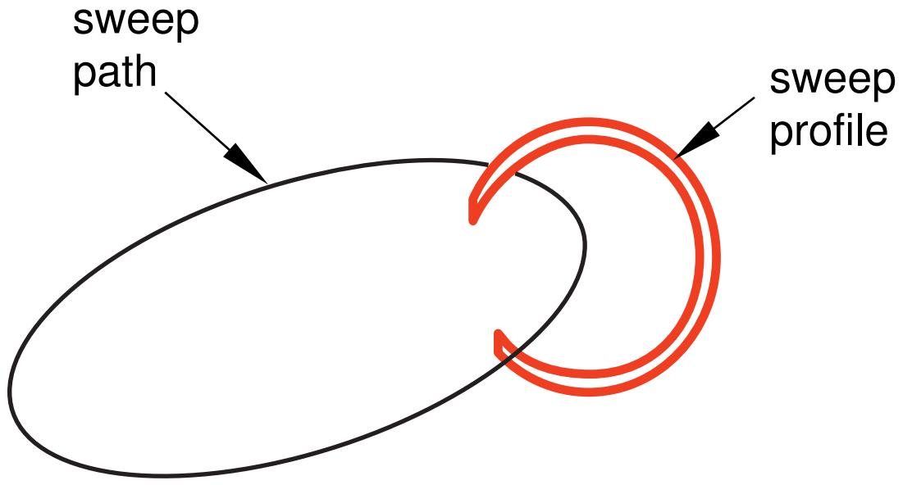  
图 1：扫掠路径和轮廓示例。

通过沿上述路径扫掠扫掠轮廓所创建的特征如图 2 所示。

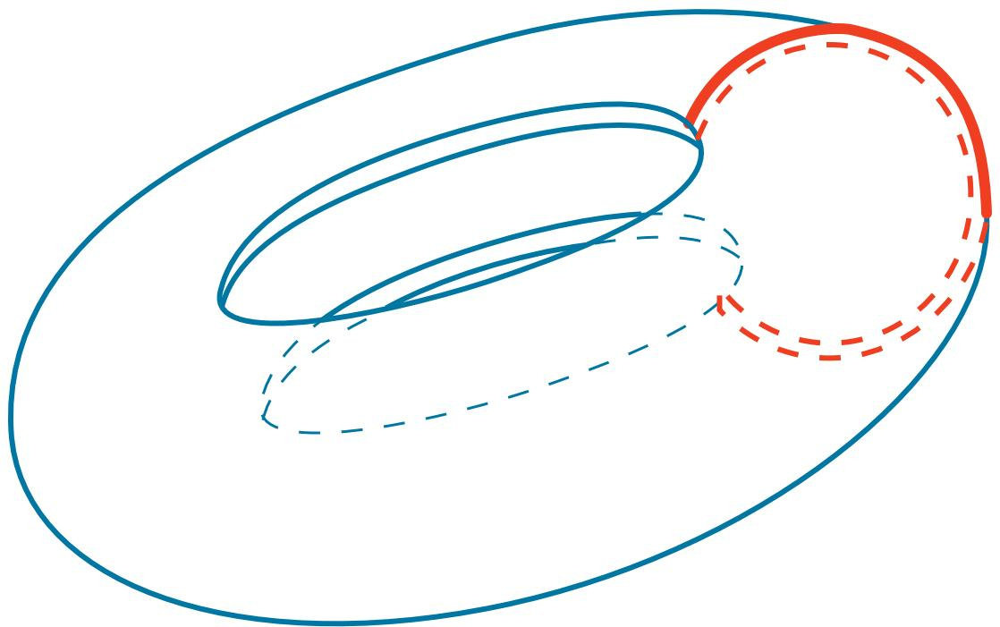  
图 2：生成的扫掠特征。

扫掠轮廓可以在草图器中定义，或者通过选择几何体中的组件来定义。对于实体或切削扫掠特征，您可以选择零件中的一个面作为扫掠轮廓；对于壳扫掠特征，您可以选择零件中的一条或多条边作为扫掠轮廓。

如果您使用草图器定义扫掠路径或扫掠轮廓，可以使用特征操作（Feature Manipulation）工具集修改该特征。只有当您在三维建模空间中创建可变形或离散零件时，扫掠工具才可用。

您可以定义扫掠轮廓相对于扫掠路径存在偏移的扫掠实体、扫掠壳或扫掠切削特征。在这种情况下，Abaqus/CAE 会将扫掠路径移动到一个平行位置，该位置穿过扫掠轮廓，并在该位置创建扫掠特征。

您可以控制扫掠轮廓在沿扫掠路径移动时其方向是否改变。将拔模应用于扫掠特征在扫掠路径为直线时效果最佳。如果您勾选“保持轮廓法线恒定”（Keep profile normal constant），Abaqus/CAE 不会改变扫掠轮廓的方向，并且扫掠路径起点处的轮廓将与终点处的轮廓平行。如果您取消勾选此选项，Abaqus/CAE 会调整扫掠轮廓的方向，使得扫掠路径与轮廓法线之间的角度在轮廓沿扫掠路径移动时保持恒定。拔模选项和“保持轮廓法线恒定”选项是互斥的；如果您选择其中一个，Abaqus/CAE 会自动取消另一个选项。

当您创建扫掠实体或切削特征时，扫掠轮廓必须是闭合的。然而，与扫掠轮廓不同，无论您创建的是扫掠实体、壳还是切削特征，扫掠路径都可以是开放的或闭合的。如果扫掠路径是闭合的，路径的两端必须相切连接。例如，图 3 中标记为“Bad”（错误）的闭合扫掠路径是不允许的，因为路径的两端以一定角度相交。
  
无效

  
有效

  
无效

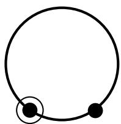  
有效

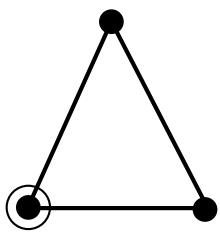

  
有效  
图 3：有效和无效的扫掠路径。

= 扫掠路径的起点和终点重合

在定义扫掠特征时，您可以应用扭曲或拔模。有关这些工具的更多信息，请参见可以创建哪些类型的特征？。您还可以切换打开“保留内部边界”以保留扫掠实体特征与现有部件之间生成的任何面或边。内部边界可以创建区域，这些区域可以进行结构化或扫掠网格划分，而无需进行分区。

## 附加信息

• 什么是基于特征的建模？  
• 添加点到点线特征

## 什么是放样？

放样是一种方法，允许您创建无法通过拉伸、旋转或扫掠创建的复杂三维特征。

例如，您可以使用放样来建模排气歧管，由于其截面变化，很难用其他方法创建。您可以在 Abaqus/CAE 中创建实体、壳或切削减去的放样特征。放样特征从起始截面形状和方向变换到结束形状和方向。您首先创建截面，以定义放样在空间中特定区域经过时的形状。然后，Abaqus/CAE 可以自动创建截面之间的路径，或者您可以定义一条或多条连续路径，将一个放样截面上的一个点连接到下一个放样截面上的相应点。您还可以选择多种相切选项来控制放样在离开起始截面或接近结束截面时的形状。本节描述了在创建放样特征之前定义放样截面、放样路径和放样相切的可用选项，并解释了自相交。

## 本节内容：

定义放样截面  
定义放样路径  
定义放样相切  
自相交检查

## 定义放样截面

放样截面代表了放样特征在放样路径上特定点处的形状。创建放样特征至少需要两个截面。您可以创建额外的截面来控制起始和结束截面之间的放样形状。在实体或切削放样中，每个放样截面必须是没有分支的闭合环。在壳放样中，放样截面可以全部开放或全部闭合。您可以定义平面或非平面放样截面来创建放样特征。一旦放样创建完成，截面的数量及其在放样中的顺序无法更改。

您通过在当前视口中从部件上的现有边进行拾取来创建放样截面。可以选择任何边；例如：

• 定义拉伸、旋转或扫掠特征的边。  
• 定义平面线框或壳特征的边。  
• 样条线框特征。

您可以使用多个特征中的单个边来定义一个截面。然而，在基准平面上绘制的平面线框是定义放样截面最简单的方法之一。使用最简单的方法定义放样截面将给您更多的控制权，并产生更稳健的放样特征。

您不能直接修改放样截面。一旦创建了放样特征，您可以使用“特征操作工具集”（Feature Manipulation toolset）来编辑创建用于放样截面的边的特征。移动在放样截面中使用的顶点或边将改变截面形状和相应放样特征的形状。

## 定义放样路径

您创建的每个放样特征至少需要一条放样路径。当您定义了放样截面后，您可以选择修改放样路径。放样特征的路径将起始截面上的一个点连接到结束截面上的一个点。如果定义了两个以上的放样截面，每条路径还将穿过每个中间截面上的一个点。您可以使用“编辑放样”（Edit Loft）对话框的“过渡”（Transition）选项卡上的选项来定义放样路径。

创建放样特征时，您可以选择以下方法来定义放样路径：

## 指定相切

“指定相切”是默认的放样路径定义。如果您选择“指定相切”，Abaqus/CAE 会创建一条通过每个放样截面中心的单一光滑路径，如图 1 所示。您可以应用相切条件来修改放样在起始和结束放样截面附近的形状。有关放样相切的更多信息，请参见定义放样相切。

  
图 1：由 Abaqus/CAE 定义路径的放样特征。

## 选择路径

如果您选择“选择路径”，您可以从现有边中选择来定义放样路径。此方法还允许您定义多条放样路径。放样特征通过遵循连接一个放样截面到下一个放样截面的放样路径来创建，如图 2 所示。具有单个用户定义路径的放样特征行为类似于扫掠特征，但不同之处在于放样的横截面会不断变化以匹配沿路径的下一个放样截面的位置和形状。

  
图 2：具有单个用户定义路径的放样特征。

您必须从视口中的现有线段中进行拾取，以创建连接所有放样截面的路径。每条路径必须是一条光滑曲线，并且必须按照放样创建时的相同顺序连接截面。您可以使用工具创建定义三维路径的样条线框。有关更多信息，请参见添加点到点线特征。

一旦放样特征创建完成，无论您选择哪种路径定义，都无法直接编辑路径。但是，如果您使用了“选择路径”，您可以使用“特征操作工具集”（Feature Manipulation toolset）编辑创建线框顶点的特征，从而编辑创建每条样条线框的点。

## 定义放样相切

如果您接受放样的默认“指定相切”方法，您可以从几种放样相切选项中进行选择。放样相切影响放样面离开第一个放样截面并接近最后一个截面的角度。相切设置的效果是瞬态的，其强度与距离起始或结束截面的距离成比例地减弱。任何中间截面之间的放样特征形状不受放样相切的影响。

您可以为起始和结束截面独立设置所有放样相切选项，除了“无”。例如，您可以将起始相切设置为“法向”，将结束相切设置为“径向”。您可以选择以下选项来定义放样相切：

## 无

“无”是默认设置，并且是唯一可以与非平面截面一起使用的相切设置。如果您选择“无”，则必须将起始相切和结束相切都设置为“无”。“无”不适用于放样形状或方向的任何条件。放样特征的边将从起始截面到第二个截面以及从倒数第二个截面到最后一个截面进行线性逼近，如图 1 所示。

  
图 1：无相切的放样特征。

## 法向

“法向”设置强制由放样边创建的面在初始向第二个截面放样时，与第一个放样截面成 $9 0 ^ { \circ }$。同样，此设置强制面在接近放样特征的最后一个截面时成 90°。如果您将起始相切设置为“法向”，放样特征的初始部分将类似于直拉伸，如图 2 所示。

  
图 2：两端法向相切的放样特征。

## 径向

“径向”设置强制由放样边创建的面在初始向第二个截面放样时，与第一个放样截面成 $0 ^ { \circ }$。同样，此设置强制面在接近放样特征的最后一个截面时成 $0 ^ { \circ }$。因此，面最初从起始放样截面向外辐射，或朝向结束放样截面向内辐射。如果您将起始相切设置为“径向”，放样特征的初始部分类似于拔模角度接近 $9 0 ^ { \circ }$ 的拉伸，如图 3 所示。

## 图 3：左端具有径向切线（Radial tangency）、右端具有法向切线（Normal tangency）的放样特征。

## 警告：

如果您尝试使用仅包含两个截面且顶点数不同的放样截面来创建放样特征，并将起始切线（Start Tangency）和结束切线（End Tangency）均设置为径向（Radial），则可能导致放样特征失败。

## 指定（Specify）

指定（Specify）设置允许您控制应用于放样边的角度（Angle）以及表示该角度影响放样区域的相对距离的幅值百分比（Magnitude %）。如果您将起始切线（Start Tangency）设置为指定（Specify），则放样特征的初始部分将类似于一个拔模角为“角度”（Angle）度的拉伸特征，如图 4 所示。

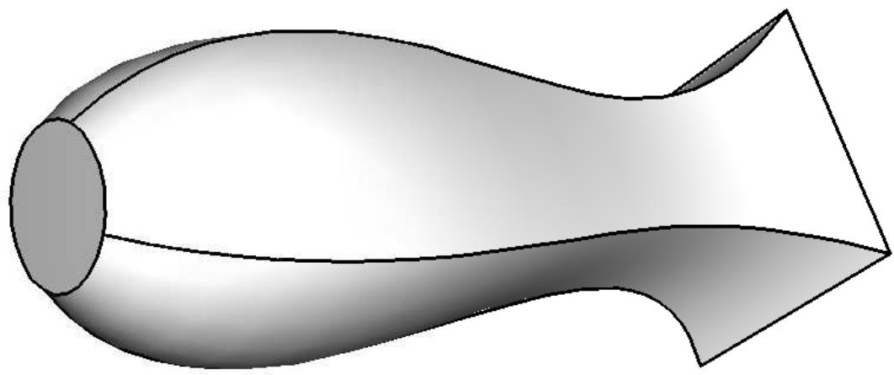
图 4：两端均使用指定切线（specified tangency）的放样特征。
图 4 显示了起始切线（Start Tangency）角度为 45°（左侧）和结束切线（End Tangency）角度为 135°（右侧），两者均应用了 25% 的幅值（magnitude）。作为参考，法向切线（Normal tangency）设置对应于指定角度为 90°、幅值为 25%，而径向切线（Radial tangency）设置对应于指定角度为 0°、幅值为 25%。

放样面在任意点处的角度取决于角度（Angle）和幅值百分比（Magnitude %）设置、连续放样截面之间的距离以及放样截面之间变化的剧烈程度。根据这些条件，从一个放样截面平滑过渡到下一个截面的要求可能会覆盖某些放样切线效果。如果您需要对放样形状进行更精细的控制，请使用选择路径（Select path）方法来定义放样特征将精确遵循的路径。

## 自相交检查（Self-intersection checks）

由于您可以通过放样创建复杂特征，因此提供了一组测试来确保几何体对分析有效。您可以定义放样截面和路径，使得放样特征会自相交。具有自相交的放样特征作为制造零件不切实际，并且难以或无法进行网格划分和分析。

当您在特征选项（Feature Options）对话框中勾选执行自相交检查（Perform self-intersection checks）时，Abaqus/CAE 会在创建放样特征时测试自相交。如果放样的任何面与其他面相交，Abaqus/CAE 将显示一条错误消息，指出存在无效相交，并且不会创建放样特征。完成测试所需的时间取决于您尝试创建的放样的复杂性。例如，如果您的放样形状在截面之间变化很大，或者您定义了复杂的放样路径，测试将显著增加创建放样特征所需的时间。如果您选择不进行测试，Abaqus/CAE 将无论几何体是否有效都会创建放样特征。

## 其他信息

• 什么是基于特征的建模？
• 添加实体放样特征（Adding a solid loft feature）
• 添加壳体放样特征（Adding a shell loft feature）
• 创建放样切割（Creating a loft cut）
• 什么是自相交检查？

## 在部件模块（Part module）中使用草图工具（Sketcher）

草图是二维轮廓，用于定义 Abaqus/CAE 原生部件的特征几何形状。您使用草图工具（Sketcher）创建这些草图；在部件模块（Part module）中，您直接使用它们来定义平面部件或梁，或者您拉伸、扫掠或旋转它们以形成三维或轴对称部件。每当您需要创建新部件的基本特征（base feature）、向部件添加特征或修改现有特征时，部件模块（Part module）会自动进入草图工具（Sketcher），您对构成特征二维轮廓的草图进行操作。当您完成草图绘制后，Abaqus/CAE 会自动将您返回到部件模块（Part module）。

如果您正在添加特征或修改现有特征，您必须选择要绘制草图的平面。有关 Abaqus/CAE 如何确定部件相对于草图平面的方向的详细描述，请参见 Abaqus/CAE 如何定向您的草图（How Abaqus/CAE orients your sketch）。

## 其他信息

• 草图模块（The Sketch module）

## 理解部件模块中的工具集

部件模块（Part module）提供了一组工具集，允许您添加和修改定义部件的特征。本节描述了如何在部件模块（Part module）中使用这些工具集。

有关每个工具集的更详细信息，请参考：

基准工具集（The Datum toolset）
编辑网格工具集（The Edit Mesh toolset）
特征操作工具集（The Feature Manipulation toolset）
过滤器工具集（The Filter toolset）
分区工具集（The Partition toolset）
查询工具集（The Query toolset）
参考点工具集（The Reference Point toolset）
几何编辑工具集（The Geometry Edit toolset）
集合和表面工具集（The Set and Surface toolsets）

显示组工具集（Display Group toolset）在使用显示组（display groups）显示模型子集（Using display groups to display subsets of your model）中讨论。

## 本节内容：

在部件模块中使用基准工具集（Using the Datum toolset in the Part module）
在部件模块中使用特征操作工具集（Using the Feature Manipulation toolset in the Part module）
在部件模块中使用分区工具集（Using the Partition toolset in the Part module）
在部件模块中使用查询工具集（Using the Query toolset in the Part module）
在部件模块中使用参考点工具集（Using the Reference Point toolset in the Part module）
在部件模块中使用几何编辑工具集（Using the Geometry Edit toolset in the Part module）
在部件模块中使用集合工具集（Using the Set toolset in the Part module）

## 在部件模块中使用基准工具集（Datum toolset）

基准可以被视为参考几何体或构造辅助工具，当部件不包含必要的几何时，它可以帮助您创建特征；您使用基准工具集（Datum toolset）创建基准几何体。基准是部件的一个特征，并随部件的其余部分一起重新生成。此外，除非您通过从主菜单栏选择“视图（View）->部件显示选项（Part Display Options）->基准（Datum）”将其关闭，否则基准几何体是可见的。在部件模块（Part module）中创建的基准将出现在部件在装配模块（Assembly module）或任何其他基于装配的模块中的每个实例中。

基准点（Datum points）在草图工具（Sketcher）中被投影到草图平面上，并且可以选中投影点。但是，您不能在草图工具（Sketcher）中引用基准轴（datum axes）或基准平面（datum planes）。下面给出了如何在部件模块（Part module）中使用基准平面和轴的示例。

## 基准平面（Datum plane）

您可以直接在基准平面上绘制草图，您在基准平面上绘制的任何特征都将被投影到部件上。如果部件本身不包含方便的草图平面，则从基准平面投影草图非常有用。

例如，假设您想在如图 1 所示的三维三角形部件上钻一个平行于 X 轴的通孔。

图 1：所需的切割特征。

该部件本身没有适合绘制孔轮廓的面；直接在某个面上绘制轮廓会导致孔垂直于该面，如图 2 所示。

图 2：垂直于面的切割。

要钻出所需的孔，首先使用基准工具集（Datum toolset）在 Y–Z 主平面上创建一个基准平面，如图 3 所示。

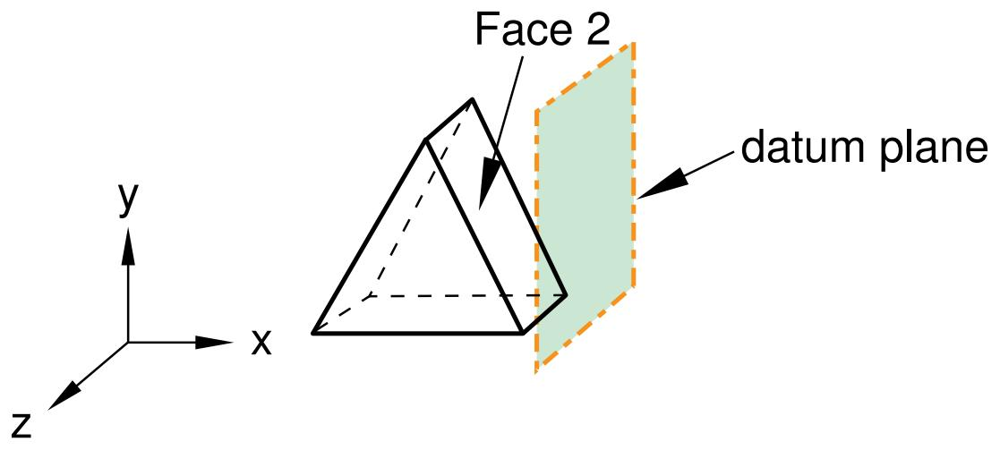
图 3：基准平面。

其次，在新的基准平面上绘制切割的轮廓，如图 4 所示。

图 4：在基准平面上的草图。

当您退出草图工具（Sketcher）时，Abaqus/CAE 会将绘制的孔垂直于基准平面并平行于 X 轴切割通过部件。此切割如图 5 所示。

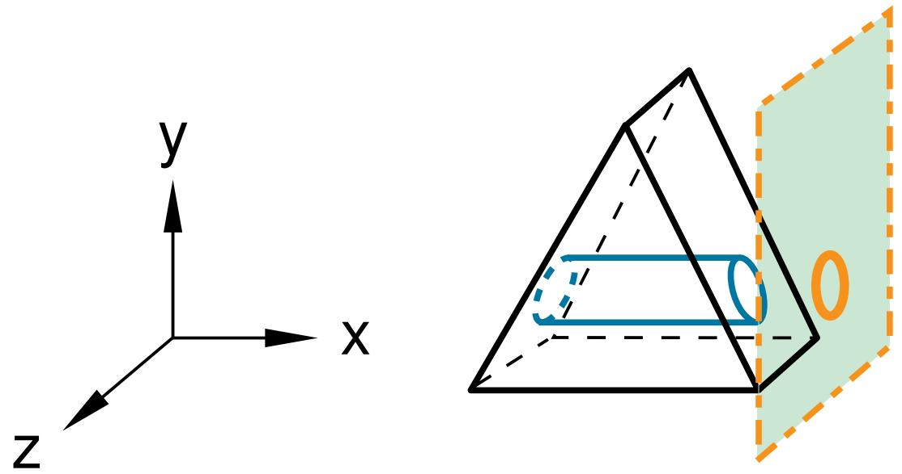
图 5：所需的切割。

## 基准轴（Datum axis）

您可以使用基准工具集（Datum toolset）创建基准轴。然后，您可以选择基准轴来控制在向三维实体添加或修改特征时部件在草图工具（Sketcher）网格上的方向。当部件本身不包含必要的轴时，创建基准轴非常有用。

例如，假设您想在部件上切一个如图 6 所示的槽。

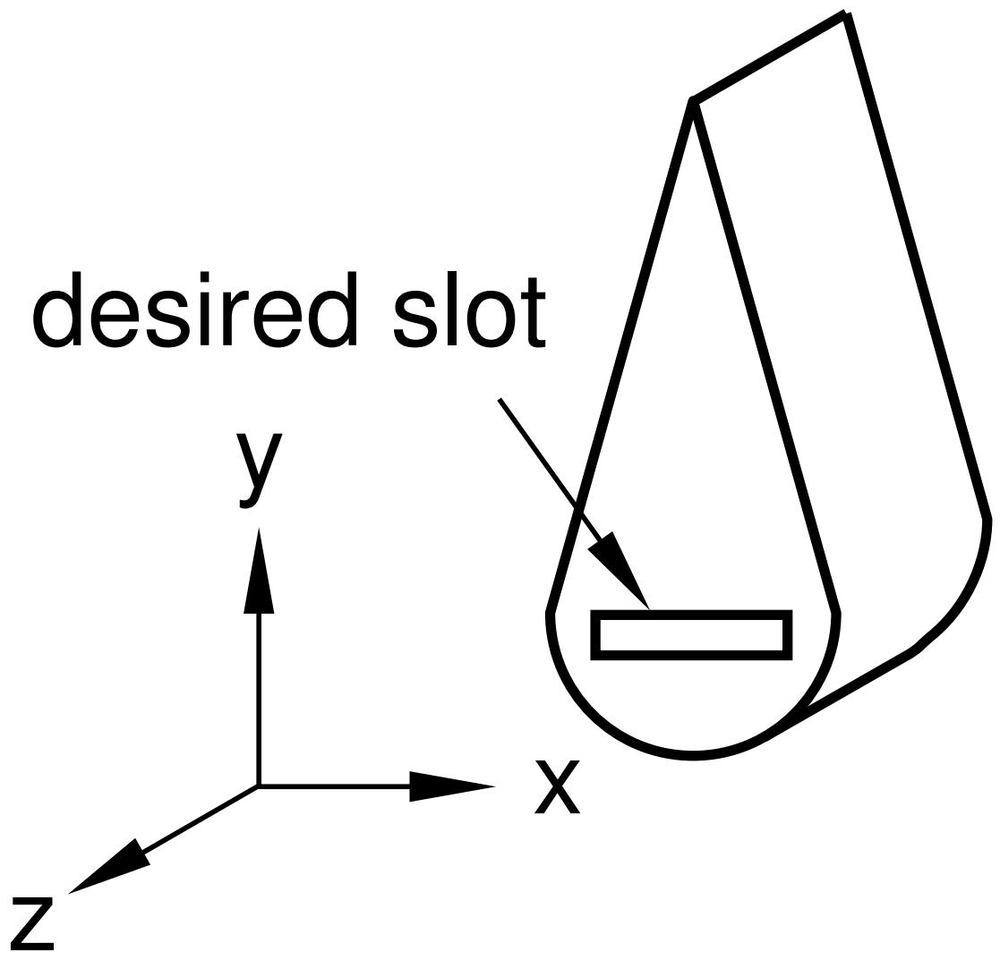
图 6：所需的槽。

绘制这个槽比较困难，因为选择部件两条直边中的任意一条作为草图的垂直轴会导致草图网格线与您选择的线对齐，而不是与 X 轴或 Y 轴对齐。为了更容易地创建具有所需方向的槽，首先使用基准工具集（Datum toolset）沿 Y 轴创建一个基准轴，如图 7 所示。

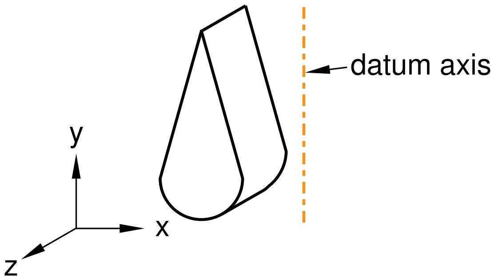
图 7：基准轴。

当您选择基准轴使其垂直并位于右侧时，草图工具（Sketcher）启动，其网格与部件的 X 轴和 Y 轴对齐，如图 8 所示。

图 8：生成的草图方向。

## 其他信息

• 理解部件模块中的工具集（Understanding toolsets in the Part module）
• 基准工具集（The Datum toolset）

## 在部件模块中使用特征操作工具集（Feature Manipulation toolset）
以下特征被视为零件的特征：

-   **几何特征**，例如拉伸实体、旋转壳体、草绘线框和圆角边
-   修复操作
-   分区
-   基准几何体

当**特征操作**工具集要求您选择一个特征时，您可以从视口选择。或者，您也可以从**模型树**选择该特征。

如果您在**模型树**中某个特征上单击鼠标键3，出现的菜单允许您执行以下操作：

## 编辑

当您编辑一个特征时，Abaqus/CAE 会显示特征编辑器。您可以直接修改特征的参数，或者，如果适用，可以修改构成特征二维轮廓或扫掠路径的草图。

## 重新生成

在复杂零件中修改特征时，由于重新生成可能非常耗时，推迟重新生成直到您完成所有更改会很方便。当您准备好重新生成零件时，请选择**特征->重新生成**。

## 重命名

重命名一个零件。

## 抑制

抑制一个特征会暂时将其从零件的定义中移除。被抑制的特征不可见，无法被网格化，也不包含在模型的分析中。您不能抑制基础特征，抑制一个父特征将同时抑制其所有子特征。

## 恢复

恢复一个特征会将被抑制的特征还原到零件中；恢复一个父特征将同时恢复其所有子特征。您可以选择恢复所有特征、最近被抑制的特征集，或选定的特征。

## 删除

删除一个特征会将其从零件中移除。您无法恢复已删除的特征。

##

当您查询一个零件时，Abaqus/CAE 会在消息区域显示信息，并以注释的形式将相同的信息写入重播文件（abaqus.rpy）。

## 选项

特征选项对话框允许您调整当前模型的重新生成性能。

## 其他信息

-   了解**零件**模块中的工具集
-   特征操作工具集

## 在零件模块中使用分区工具集

在**零件**模块内，您可以使用**分区**工具集将一个零件划分为更多区域。在您对零件进行分区之后，可以使用**属性**模块为划分出的区域分配不同的截面；例如，您可以使用分区来划定由不同材料组成的零件区域。

您创建的分区是与零件关联的特征，因此该零件在装配体中的每个实例都将包含在**零件**模块中创建的所有分区。您可以在其他模块中处理装配体时使用这些区域；例如，您可以在**载荷**模块中对一个区域施加载荷。如果您不希望将分区与零件的每个实例关联，请在**装配体**模块中创建一个独立实例，并对该独立实例进行分区。更多信息，请参阅**分区装配体**。

如果您已经创建了装配体并为其应用了属性，如载荷、边界条件和集合，当您随后决定返回**零件**模块并对其中一个原始零件进行分区时，应格外小心。如果该属性所分配的区域受到分区的影响，该区域可能会意外地发生改变。通常，您应尽量在开始创建零件实例并为装配体应用集合、载荷和网格之前，完成在**零件**模块中创建零件的工作。如果您确实需要返回**零件**模块创建分区，至少应检查装配体中已分配属性的区域是否仍然有效。

## 其他信息

-   了解**零件**模块中的工具集
-   分区工具集

## 在零件模块中使用查询工具集

您可以使用**查询**工具集来请求一般信息或特定于模块的信息。

有关一般查询所显示信息的讨论，请参阅**获取模型的一般信息**。

从主菜单栏选择**工具->查询**，或单击**查询**工具集中的工具以启动查询工具集。

以下查询特定于**零件**模块：

## 零件属性

Abaqus/CAE 在消息区域显示零件名称、建模空间和类型，以及形状（实体、壳、线框或点）和实体（单元、面、边和顶点）的数量。

## 重新生成警告

如果选定零件中的任何集合或表面无法重新生成，因为其基础几何体已被修改或删除，Abaqus/CAE 将显示集合或表面的名称、原始面数以及在查询期间找到的面数。

## 子结构统计

Abaqus/CAE 显示关于选定子结构零件的以下信息：零件中保留的节点、特征模态和子结构载荷的数量；子结构中恢复矩阵、重力载荷向量、约化质量矩阵、约化结构阻尼矩阵和约化粘性阻尼矩阵的可用性；以及子结构的质量属性。

## 其他信息

-   了解**零件**模块中的工具集
-   查询工具集

## 在零件模块中使用参考点工具集

从主菜单栏，选择**工具->参考点**以在零件上创建参考点。一个零件只能包含一个参考点。更多信息，请参阅**参考点和点零件**以及**参考点工具集**。

Abaqus/CAE 在所需位置显示参考点，并将其标记为 RP。您可以通过在**模型树**中该特征上单击鼠标键3并从出现的菜单中选择**重命名**来更改参考点标签。如果需要，您可以关闭参考点符号和参考点标签的显示；更多信息，请参阅**控制参考点显示**。

## 在零件模块中使用几何编辑工具集

您使用**几何编辑**工具集来修复零件中包含无效或不精确几何体的区域。更多信息，请参阅**编辑技术**。您可以使用**查询**工具集来定位需要修复的区域。更多信息，请参阅**查询工具集**。

## 其他信息

-   了解**零件**模块中的工具集
-   几何编辑工具集

## 在零件模块中使用集合工具集

通过选择零件中的几何体创建的集合称为零件集合，您使用**集合**工具集来创建和管理零件集合。您可以在**零件**模块中使用零件集合来选择应由**几何编辑**工具集修复的区域。此外，在**属性**模块中，您可以将截面分配给由零件集合指定的区域。当 Abaqus/CAE 提示您选择一个区域时，您可以从当前视口中的零件上选择该区域，也可以选择一个已命名的零件集合。

在**零件**模块的**集合管理器**中，只有零件集合是可见的。当您在**装配体**模块中实例化一个零件时，Abaqus 会创建零件实例集合，这些集合指向您之前创建的任何零件集合。更多信息，请参阅**理解集合和表面**以及**在装配体模块中使用集合和表面**。

## 其他信息

-   了解**零件**模块中的工具集
-   集合和表面工具集

## 使用零件模块工具箱

您可以通过主菜单栏或**零件**模块工具箱访问所有**零件**模块工具。图1显示了**零件**模块工具箱中所有零件工具的隐藏图标。

  
图1：**零件**模块工具箱。

有关使用每个**零件**模块工具的信息，请参考以下部分：

管理零件  
使用**创建零件**对话框  
-   向零件添加特征
-   添加实体特征
-   添加壳特征
-   添加线框特征
-   添加切割特征
-   边混合

## 管理零件

本节描述您在**零件**模块中工作时如何管理模型中的零件。

## 本节内容：

管理零件  
创建新零件  
复制零件

## 管理零件

要创建、复制、重命名和删除零件，请使用以下方法之一：

-   主菜单栏中**零件**菜单下列出的**创建**、**复制**、**重命名**和**删除**项目。
    **复制**、**重命名**和**删除**项目包含子菜单，列出当前模型中的所有零件。
-   **零件管理器**对话框。**零件管理器**对话框包含的功能与主菜单栏**零件**菜单下列出的功能类似，但提供了一个便捷的浏览器，列出了当前模型中所有可用零件的名称及其建模空间（三维、二维或轴对称）、类型（可变形、离散刚体、解析刚体或欧拉）和状态（锁定、无效或无效(已忽略)）。

要显示**零件管理器**对话框，请从主菜单栏选择**零件->管理器**。

要锁定或解锁零件以在当前模型数据库中进行编辑，请使用**零件管理器**对话框中的**锁定**和**解锁**按钮。**状态**字段会指示**已锁定**的零件。有关零件锁定的更多信息，请参阅**什么是零件和装配体锁定？**。
要更新零件的有效性或忽略零件的无效性，请使用“零件管理器”对话框中的“更新有效性”和“忽略无效性”按钮。“状态”字段会指示零件是“无效”还是“无效（已忽略）”。有关零件有效性的更多信息，请参阅处理无效零件。

要从模型数据库中检索零件并在当前视口中显示它，请从上下文栏的“零件”列表中选择该零件。“零件”列表包含当前模型中的所有零件。

## 其他信息

•   管理零件
•   管理对象

## 创建新零件

从主菜单栏选择 **零件** -> **创建**，以在当前视口中创建一个新零件。

一个模型可以包含多个零件；每个零件存在于一个局部坐标系中，您可以使用“装配”模块创建零件的实例，并在全局坐标系中相对于彼此定位这些实例。创建零件时，您需要为零件命名并选择其类型、建模空间、基本特征和近似大小；然后，绘制零件基本特征的轮廓。零件名称不应与模型名称相同。

1.  从主菜单栏，选择 **零件** -> **创建**。

    将出现“创建零件”对话框。有关更多信息，请参阅使用“创建零件”对话框。

    

    提示：您也可以使用“零件”模块工具箱中的 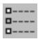 工具来创建零件。有关“零件”模块工具箱中工具的图示，请参阅使用“零件”模块工具箱。

2.  输入零件的名称。有关命名 Abaqus/CAE 对象的信息，请参阅使用基本对话框组件。创建零件后可以对其重命名。
3.  选择新零件的建模空间、类型、基本特征和近似大小。有关更多信息，请参阅在 Abaqus/CAE 中如何定义零件？。

    

## 注意：

要更改零件的建模空间或类型，您必须使用“模型树”来编辑零件。有关更多信息，请参阅在 Abaqus/CAE 中如何定义零件？。

4.  单击 **继续** 以关闭“创建零件”对话框。

    “草绘器”启动，草绘网格出现在当前视口中。

    如果您正在创建三维旋转实体或壳，Abaqus/CAE 会在草绘的 Y 轴上显示一条垂直构造线，该线将作为旋转轴。您可以在此构造线的任一侧进行草绘，但草绘不得跨越该构造线。

    如果您正在创建轴对称零件，Abaqus/CAE 会在草绘的左侧显示一条垂直构造线，该线将作为旋转轴。您必须在构造线的右侧进行草绘。

5.  使用“草绘器”绘制基本特征的二维轮廓。有关更多信息，请参阅“草绘模块”。
    如果您正在构建扫掠零件，您必须先绘制扫掠路径并退出“草绘器”。然后，“草绘”将自动重新启动，您可以绘制要扫掠的轮廓。
6.  完成基本特征的绘制后，单击鼠标按钮 2 退出当前的“草绘”工具。
7.  在提示区，单击 **完成** 以退出“草绘器”。如果基本特征是三维实体或壳拉伸，将出现“编辑基本拉伸”对话框。您必须使用“深度”字段输入轮廓的拉伸距离。您还可以选择“扭转”或“拔模”来修改 Abaqus/CAE 将创建的拉伸形式。如果基本特征是三维旋转实体或壳，您必须输入轮廓的旋转角度。

    Abaqus/CAE 退出“草绘器”，并在当前视口中显示新零件。

8.  如有必要，使用“零件”模块工具向基本特征添加附加特征。有关更多信息，请参阅什么是基于特征的建模？。

## 其他信息

•   使用“创建零件”对话框
•   管理零件
•   在 Abaqus/CAE 中如何定义零件？
•   在拉伸中包含拔模
•   在拉伸中包含扭转
•   草绘模块
•   导入和导出几何数据和模型
•   使用“零件”模块工具箱
•   什么是基于特征的建模？
•   使用基本对话框组件

## 复制零件

从主菜单栏选择 **零件** -> **复制** -> **零件名称**，以将一个零件复制到一个新零件。您可以复制包含几何和孤立单元的零件。压缩、缩放和镜像功能同时作用于几何和网格。“分离断开区域”功能也适用于包含几何和孤立单元的零件；但是，只有几何区域会被复制成为新零件，因为孤立单元不存在区域。

1.  从主菜单栏，选择 **零件** -> **复制** -> **零件名称**。

    Abaqus/CAE 显示“零件复制”对话框。

2.  在对话框中，输入新零件的名称。
3.  您可以创建与原始零件完全相同的副本，或者您可以从以下“复制”选项中选择：
    •   压缩特征
    •   按比例缩放零件
    •   关于...镜像零件
    •   将断开区域分离为零件

    有关“复制”选项的更多信息，请参阅复制零件。

## 4. 单击 **确定**。

    Abaqus/CAE 关闭“零件复制”对话框，并将选定零件复制到一个新零件。新零件成为当前零件。您可以通过从上下文栏的“零件”列表中选择该零件来返回到原始零件。有关更多信息，请参阅上下文栏。

## 其他信息

•   简化零件的特征列表

## 使用“创建零件”对话框

本节描述“创建零件”对话框中的选项。

## 本节内容：

•   使用“创建零件”对话框定义零件属性
•   选择新零件的建模空间
•   选择新零件的类型
•   选择新零件的基本特征
•   设置新零件的近似大小

## 使用“创建零件”对话框定义零件属性

创建零件时，您首先使用“创建零件”对话框定义零件的属性，然后使用“草绘”绘制基本特征的二维轮廓。

您使用“创建零件”对话框定义以下内容：

## 名称

使用“创建零件”对话框顶部的“名称”文本字段为您正在创建的零件命名。要重命名零件，请从主菜单栏选择 **零件** -> **重命名**。零件名称不应与模型名称相同。有关有效名称的更多信息，请参阅使用基本对话框组件。

创建零件后，Abaqus/CAE 会在当前视口的标题栏中显示新零件的名称。

## 建模空间

使用“建模空间”单选按钮选择新零件的建模空间。您可以将零件定义为 Abaqus/Standard 或 Abaqus/Explicit 模型中的三维、二维（平面）或轴对称零件。

如果创建轴对称可变形零件，您可以在“创建零件”对话框中切换选中“包含扭转”，以在模型中包含扭转自由度。创建零件后，您可以通过在“模型树”中右键单击该零件并从出现的菜单中选择 **编辑** 来更改零件的建模空间。有关更多信息，请参阅选择新零件的建模空间。

## 类型

在 Abaqus/Standard 或 Abaqus/Explicit 模型中，使用“类型”单选按钮选择新零件的类型。您可以将零件定义为可变形、离散刚体、解析刚体或欧拉体。如果允许，创建零件后您可以通过在“模型树”中右键单击该零件并从出现的菜单中选择 **编辑** 来更改零件的类型。有关更多信息，请参阅选择新零件的类型。

## 基本特征

使用“基本特征”字段定义新零件基本特征的形状和类型。Abaqus/CAE 显示的形状和类型选项取决于零件的建模空间和类型。创建零件后，您不能更改零件基本特征的类型。有关更多信息，请参阅选择新零件的基本特征。

## 近似大小

使用“近似大小”文本字段输入零件的大小。您输入的大小被 Abaqus/CAE 用于计算“草绘器”图纸的大小及其网格的间距。有关更多信息，请参阅设置新零件的近似大小。创建零件并开始绘制其轮廓后，您可以使用“草绘”自定义选项来增加图纸大小。要显示“草绘器”自定义选项，请单击“草绘器”工具箱底部的  工具。

## 其他信息

•   在 Abaqus/CAE 中如何定义零件？
•   创建新零件
•   使用“创建零件”对话框

## 选择新零件的建模空间

使用“创建零件”对话框顶部的“建模空间”单选按钮为您正在创建的零件选择建模空间。

Abaqus/CAE 在建模过程中会保留零件的建模空间；例如，建模空间决定了“零件”模块中可用的工具以及“网格”模块中可用的单元类型。创建零件后，您可以通过在“模型树”中右键单击该零件并从出现的菜单中选择 **编辑** 来更改零件的建模空间。
建模空间是指部件可以占据的空间，而非部件本身。因此，您可以在三维建模空间中创建部件，但可以使用拓扑上为二维的壳或线特征来构建它。在 Abaqus/Standard 或 Abaqus/Explicit 模型中，新部件的建模空间可以设置为以下任一选项：

## 三维

Abaqus/CAE 将部件放置在三维空间中。

## 二维平面

Abaqus/CAE 将部件放置在二维平面空间中。

## 轴对称

Abaqus/CAE 将部件放置在轴对称的二维空间中。如果您创建一个轴对称可变形部件，Abaqus/CAE 允许您在模型中包含一个扭转自由度。

1.  在创建部件 (Create Part) 对话框的顶部，选择所需的建模空间 (Modeling Space) 单选按钮。
2.  完成选项选择后，单击 Continue 以关闭创建部件 (Create Part) 对话框。

草图绘制器 (Sketcher) 启动，您可以绘制新部件基础特征的轮廓。

## 附加信息

*   部件建模空间
*   为轴对称部件和旋转特征定义旋转轴
*   部件在 Abaqus/CAE 中是如何定义的？
*   创建新部件

## 选择新部件的类型

使用创建部件 (Create Part) 对话框中的类型 (Type) 单选按钮，来选择您在 Abaqus/Standard 或 Abaqus/Explicit 模型中正在创建的部件的类型。

Abaqus/CAE 会将部件的类型贯穿建模过程；例如，您不能为刚性部件分配截面和材料属性，不能为解析刚体部件划分网格，并且只能将欧拉截面和材料分配场分配给欧拉部件。如果允许，您可以通过在模型树 (Model Tree) 中的部件上单击鼠标按钮 3，并从出现的菜单中选择编辑 (Edit) 来更改已创建部件的类型。

在 Abaqus/Standard 或 Abaqus/Explicit 模型中，新部件的类型可以设置为以下之一：

## 可变形

您可以创建或导入的任何任意形状的轴对称、二维或三维部件都可以指定为可变形部件。可变形部件代表在载荷作用下可以变形的部件；载荷可以是机械的、热的或电的。默认情况下，Abaqus/CAE 创建的部件是可变形的。

## 离散刚体

离散刚体部件类似于可变形部件，因为它可以是任何任意形状。然而，离散刚体部件被假定为刚性的，并用于接触分析中来建模不能变形的物体。

## 解析刚体

解析刚体部件类似于离散刚体部件，因为它用于在接触分析中表示刚性表面。然而，解析刚体部件的形状不是任意的，必须由一组绘制的直线、弧线和抛物线形成。

## 欧拉

欧拉部件用于定义欧拉分析中材料可以流动的域。欧拉部件在分析过程中不会变形；相反，部件内的材料在载荷作用下变形，并可以流过刚性单元边界。有关欧拉分析的更多信息，请参见欧拉分析。

创建离散刚体部件或解析刚体部件后，您还必须执行以下操作：

分配刚体参考点。您在载荷 (Load) 模块中对刚体参考点施加约束或规定运动，相同的约束或运动将应用于整个刚性部件。有关更多信息，请参见参考点。
*   如果部件是离散刚体部件或解析刚体部件，您必须使用装配 (Assembly) 模块中的表面 (Surface) 工具集来选择部件的哪一侧代表外表面。有关更多信息，请参见集合 (Set) 和表面 (Surface) 工具集。

1.  在创建部件 (Create Part) 对话框的中部，选择所需的类型 (Type) 单选按钮。
2.  完成选项选择后，单击 Continue 以关闭创建部件 (Create Part) 对话框。草图绘制器 (Sketcher) 启动，您可以绘制新部件基础特征的轮廓。

## 附加信息

*   解析刚体表面定义
*   刚体定义
*   部件类型
*   部件在 Abaqus/CAE 中是如何定义的？
*   创建新部件

*   使用创建部件对话框
*   参考点
*   集合和表面工具集

## 选择新部件的基础特征

使用创建部件 (Create Part) 对话框底部的基础特征 (Base Feature) 字段内的单选按钮和列表，来选择您正在创建的部件的基础特征。选项取决于部件的建模空间和部件的类型；例如，一个轴对称可变形体只能具有平面壳、平面线或点基础特征。有关您可以创建的不同形状和类型基础特征的详细信息，请参见基础特征。

您对基础特征类型的选择很重要，因为创建部件后您无法更改其类型。您可以修改基础特征，但应注意，您后续添加到部件的任何特征都将链接到基础特征。因此，如果您修改基础特征，这些依赖（或子）特征可能会移动或无法重新生成。

1.  在创建部件 (Create Part) 对话框的底部，选择所需的基础特征形状（实体 (Solid)、壳 (Shell)、线 (Wire) 或点 (Point)）。可用选项取决于您正在创建的部件的建模空间和类型。
2.  如果您正在创建三维可变形或离散刚体部件，您还必须选择其类型 (Type)（拉伸 (Extrusion)、旋转 (Revolution)、扫掠 (Sweep)、平面 (Planar) 或坐标 (Coordinates)）。
3.  完成选项选择后，单击 Continue 以关闭创建部件 (Create Part) 对话框。草图绘制器 (Sketcher) 启动，您可以绘制新部件基础特征的轮廓。

## 附加信息

*   部件在 Abaqus/CAE 中是如何定义的？
*   创建新部件
*   使用创建部件对话框
*   为轴对称部件和旋转特征定义旋转轴
*   特征操作工具集

## 设置新部件的近似尺寸

使用创建部件 (Create Part) 对话框底部的近似尺寸 (Approximate size) 文本框来设置新部件的近似尺寸。您输入的尺寸用于 Abaqus/CAE 计算草图绘制器图纸的尺寸及其网格间距。部件的近似尺寸必须在 10000 (104) 和 0.001 (10−3) 单位之间。Abaqus/CAE 不使用特定单位，但单位必须在整个模型中保持一致。

当您退出创建部件 (Create Part) 对话框时，Abaqus/CAE 进入草图绘制器 (Sketcher)，您绘制基础特征的轮廓。草图绘制器显示一个带有覆盖网格的方形图纸，并调整图纸的尺寸以近似部件的尺寸。因此，草图的尺寸将与您正在创建的部件具有相同的数量级。

如果您随后编辑该部件，Abaqus/CAE 仍然会根据创建基础特征时使用的相同尺寸来确定草图绘制器图纸的大小。因此，您应该将近似部件尺寸设置为与最终部件的最大尺寸相匹配。如果您随后发现部件超出了草图绘制器图纸的大小，请使用草图自定义选项 (Sketch customization options) 来增加图纸尺寸。

1.  在创建部件 (Create Part) 对话框底部的近似尺寸 (Approximate size) 文本框中，键入新部件的近似尺寸。
2.  完成选项选择后，单击 Continue 以关闭创建部件 (Create Part) 对话框。草图绘制器 (Sketcher) 启动，其图纸尺寸和网格间距基于新部件的近似尺寸，您绘制新部件基础特征的轮廓。

## 附加信息

*   部件在 Abaqus/CAE 中是如何定义的？
*   使用创建部件对话框
*   草图绘制器图纸和网格
*   自定义草图绘制器

## 向部件添加特征

使用形状 (Shape) 菜单向当前部件添加特征。您可以执行以下操作：

*   使用实体 (Solid) 工具向三维实体部件添加实体特征。有关更多信息，请参见添加实体特征。
*   使用壳 (Shell) 工具向部件添加壳特征。有关更多信息，请参见添加壳特征。
*   使用线 (Wire) 工具向部件添加线特征。有关更多信息，请参见添加线特征。
*   使用切削 (Cut) 工具向部件添加切削特征。有关更多信息，请参见添加切削特征。
*   使用混合 (Blend) 工具向三维实体部件添加混合特征。有关更多信息，请参见边混合。
*   使用变换 (Transform) 工具围绕选定平面对部件进行镜像。有关更多信息，请参见镜像部件。

## 添加实体特征

本节描述用于向当前视口中三维实体部件添加实体特征的部件 (Part) 模块工具。

## 本节内容：

*   添加拉伸实体特征
*   添加旋转实体特征
*   添加扫掠实体特征
*   添加实体放样特征
*   从壳创建实体特征

从主菜单栏选择形状 (Shape)->实体 (Solid)->拉伸 (Extrude)，以向当前视口中的部件添加拉伸实体特征。您只能向三维部件添加拉伸实体特征。
通过绘制二维截面并定义拉伸距离来添加拉伸实体特征。下图展示了草图及生成的拉伸实体特征：

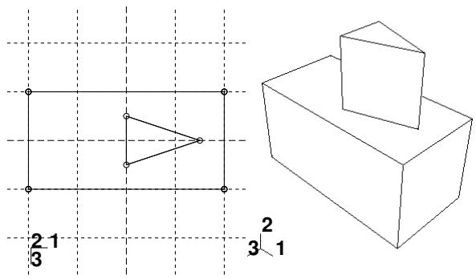

您也可以通过选择单个目标面来定义拉伸距离。Abaqus/CAE 将拉伸草图直至与所选面相交。

此外，您可以选择一个中心点并指定一个螺距（pitch），Abaqus/CAE 将使用此螺距在拉伸过程中扭转截面。或者，Abaqus/CAE 可以在拉伸截面时沿指定的拔模角（draft angle）展开或收缩截面。更多信息，请参阅 Including twist in an extrusion 和 Including draft in an extrusion。

1. 从主菜单栏中，选择 Shape -> Solid -> Extrude。

   Abaqus/CAE 会在提示区显示提示，引导您完成操作。

   

   **提示**：您也可以使用工具添加拉伸实体特征，该工具位于 Part 模块工具箱的实体工具集中。有关 Part 模块工具箱中工具的示意图，请参阅 Using the Part module toolbox。

2. 如果需要，指定用于选择拉伸实体特征草图原点的方法。在提示区的 Sketch Origin 字段中选择以下选项之一：

   • 选择 Auto-Calculate 自动放置草图原点。
   • 选择 Specify 定义自定义草图原点。
   • 选择 Session Default 使用您在当前会话中先前指定的自定义原点。

3. 选择实体将从中拉伸的平面。如果没有合适的面，可以选择基准面（datum plane）或孤立元素面（orphan element face）。

   

   **提示**：如果无法选择所需的平面，可以使用选择工具栏更改选择行为。有关更多信息，请参阅 Using the selection options。

   所选面将在视口中高亮显示。

4. 如果您选择了 Specify 作为草图原点方法，请通过在视口中单击一个点或在提示区输入原点的三维坐标来指定原点位置。您还可以通过勾选 Set as session default 将此自定义原点设置为会话中所有草图的默认原点。

5. 选择一条边以及该边在 Sketcher 网格上的方向。该边不得垂直于所选面。默认情况下，所选边将垂直显示并位于 Sketcher 网格的右侧。要为该边选择不同的方向，请单击对话框右侧的箭头，并从出现的列表中选择一个方向。

   

   **提示**：如果没有所需方向的直边，可以创建一个基准轴（datum axis）。然后您可以选择基准轴来控制部件在 Sketcher 网格上的方向。

   Abaqus/CAE 高亮显示所选边，进入 Sketcher，并旋转部件直到所选面与 Sketcher 网格平面对齐，且所选边以所需方向与网格对齐。

   如果您不确定部件相对于 Sketcher 网格的方向，请使用视图操作工具
   查看其位置。使用重置视图工具返回到原始视图。

6. 使用 Sketcher 绘制拉伸部分的二维轮廓。在提示区中，单击 Done 退出 Sketcher 并打开 Edit Extrusion 对话框。

   Abaqus/CAE 将显示进入 Sketcher 之前处于活动状态的部件视图。该部件包含您绘制的轮廓和一个指示拉伸方向的箭头。

7. 如有必要，在 Edit Extrusion 对话框中单击 反转拉伸方向。

   如果箭头方向难以看清，请使用旋转工具旋转部件。

8. 选择以下终止条件之一：

   选择 Blind，并在 Depth 字段中输入一个值，以指定 Abaqus/CAE 拉伸所绘制轮廓的距离。
   • 选择 Up to Face，指定 Abaqus/CAE 将轮廓拉伸至所选面。

9. 如果需要，执行以下操作之一：

   勾选 Include twist，并输入螺距。螺距是发生 360° 扭转的拉伸距离。草图拉伸轮廓必须包含一个指示扭转中心的孤立点。
   勾选 Include draft，并输入拔模角（大于 -90° 且小于 90°）。正的拔模角表示轮廓的外部面展开，内部面收缩。

10. 勾选 Keep internal boundaries 以保留拉伸实体特征与现有部件之间生成的任何面或边。内部边界可以创建无需分区即可进行结构化或扫掠网格划分的区域。
11. 单击 OK 拉伸轮廓。

    如果您选择了扭转选项且您的草图包含单个孤立点，Abaqus/CAE 将使用该点作为扭转中心。如果您的草图不包含孤立点，Abaqus/CAE 将返回 Sketcher 供您创建一个。如果您的草图包含多个孤立点，Abaqus/CAE 将返回 Sketcher 并提示您选择一个孤立点作为扭转中心。

12. 如果您选择了 Up to Face，Abaqus/CAE 将提示您选择将轮廓拉伸至的面。选择一个满足以下要求的面：

    • 所选面不必与草图平面平行，
    • 它可以是非平面，
    • 它必须完全包含拉伸选区，并且
    • 它不能是基准面。

    Abaqus/CAE 创建拉伸实体特征。

## 其他信息

• 什么是拉伸、旋转和扫掠？
• 使用六面体单元对复杂实体进行网格划分
• 什么是基于特征的建模？

## 添加旋转实体特征

从主菜单栏中选择 Shape -> Solid -> Revolve，可在当前视口中为部件添加旋转实体特征。您只能将旋转实体特征添加到三维部件。

您可以通过在所选面上绘制二维截面和一条构造线来添加旋转实体特征。构造线作为旋转轴，Abaqus/CAE 通过使用指定的旋转角度绕该轴旋转截面来创建实体特征。此外，您可以指定一个螺距和一个沿旋转轴的方向，Abaqus/CAE 将使用该方向在旋转轮廓时沿旋转轴平移草图。下图展示了一个草图及生成的特征，通过 180° 旋转并带有螺距：

1. 从主菜单栏中，选择 Shape -> Solid -> Revolve。

   Abaqus/CAE 会在提示区显示提示，引导您完成操作。

   

   **提示**：您也可以使用工具添加旋转实体特征，该工具位于 Part 模块工具箱的实体工具集中。有关 Part 模块工具箱中工具的示意图，请参阅 Using the Part module toolbox。

2. 如果需要，指定用于选择旋转实体特征草图原点的方法。在提示区的 Sketch Origin 字段中选择以下选项之一：

   • 选择 Auto-Calculate 自动放置草图原点。
   • 选择 Specify 定义自定义草图原点。
   • 选择 Session Default 使用您在当前会话中先前指定的自定义原点。

3. 选择实体将从中旋转的平面。如果没有合适的面，可以选择基准面或孤立元素面。

   

   **提示**：如果无法选择所需的平面，可以使用选择工具栏更改选择行为。有关更多信息，请参阅 Using the selection options。

   所选面将在视口中高亮显示。

4. 如果您选择了 Specify 作为草图原点方法，请通过在视口中单击一个点或在提示区输入原点的三维坐标来指定原点位置。您还可以通过勾选 Set as session default 将此自定义原点设置为会话中所有草图的默认原点。

5. 选择一条边以及该边在 Sketcher 网格上的方向。该边不得垂直于所选面。默认情况下，所选边将垂直显示并位于 Sketcher 网格的右侧。要为该边选择不同的方向，请单击对话框右侧的箭头，并从出现的列表中选择一个方向。

提示：如果没有所需方向的直边，您可以创建一个基准轴 (datum axis)。然后，您可以选择该基准轴来控制零件在草绘器网格上的方向。

Abaqus/CAE 会高亮显示所选边，进入草绘器，并旋转零件，直到所选面与草绘器网格平面对齐，并且所选边以所需方向与网格对齐。

如果您不确定零件相对于草绘器网格的方向，请使用**视图操作**工具栏中的视图操作工具来查看其位置。使用重置视图工具可返回到原始视图。

6. 使用水平、垂直、角度或斜构造线工具来绘制旋转轴。您可以通过从基础零件中选择一个基准轴来定位构造线。您不能直接选择基准轴；必须从基准轴的任一端选择一个点。
7. 使用草绘器绘制旋转特征的二维轮廓；草绘图不能穿过旋转轴。
8. 在提示区域中，单击“完成 (Done)”以指示您已完成轮廓和轴的绘制。如果草绘图包含多条构造线，Abaqus/CAE 将提示您选择哪条构造线将作为旋转轴。

Abaqus/CAE 将显示进入草绘器之前处于活动状态的零件视图。零件包含您绘制的轮廓和一个指示旋转方向的箭头。随后将出现“编辑旋转 (Edit Revolution)”对话框。

9. 在“编辑旋转 (Edit Revolution)”对话框中，输入所需的旋转角度或接受默认值。
10. 单击“旋转方向 (Revolve direction)”旁的箭头可更改箭头方向及相关的旋转方向。
11. 如果需要，可开启“包含平移 (Include translation)”并输入一个正的“螺距 (pitch)”值。螺距值是指轮廓在旋转 360° 期间沿旋转轴平移的距离。

将出现一个箭头，指示旋转轴并表明轮廓沿轴的平移方向。如有必要，请单击“编辑旋转 (Edit Revolution)”对话框中“螺距方向 (Pitch direction)”旁的箭头来反转该箭头。

12. 如果需要，可开启“沿路径法向扫掠草图 (Sweep sketch normal to path)”，以将绘制的轮廓旋转至垂直于旋转路径。此选项仅在开启“包含平移 (Include translation)”时可用。
    特征的初始轮廓将从草绘平面旋转以创建该特征。
13. 开启“保留内部边界 (Keep internal boundaries)”，以保留旋转实体特征与现有零件之间生成的任何面或边。内部边界可能会创建一些区域，这些区域可以进行结构化网格划分或扫掠网格划分，而无需进行分区。
14. 单击“确定 (OK)”以接受指示的方向并创建旋转实体特征。

Abaqus/CAE 将使用您选定的参数创建旋转特征。

## 附加信息

*   创建构造几何
*   添加实体特征
*   为轴对称部件和旋转特征定义旋转轴
*   使用螺距控制旋转特征的横截面
*   使用六面体单元对复杂实体进行网格划分
*   什么是基于特征的建模？

从主菜单栏选择**形状 (Shape) -> 实体 (Solid) -> 扫掠 (Sweep)**，可以向当前视口中的零件添加一个扫掠实体特征。您只能向三维零件添加扫掠实体特征。

添加扫掠实体特征的方法是：首先定义一条扫掠路径，然后定义一个扫掠轮廓。定义每个组成部分有不同的可用方法：

您可以通过在选定面上绘制路径，或者通过选择一系列您希望扫掠路径跟随的边或线来定义扫掠路径。绘制方法提供了更大的灵活性，但仅支持二维路径。边/线方法使您能够沿着诸如样条线或三维零件中的一组边等特征来定义三维扫掠路径。
您可以使用草绘器绘制扫掠轮廓，或者选择模型中的一个面作为轮廓来定义扫掠轮廓。扫掠轮廓最初垂直于路径；您可以使此方向沿整个扫掠路径保持恒定，或者使扫掠轮廓在扫掠过程中始终保持垂直于扫掠路径。

扫掠路径、扫掠轮廓和生成的实体特征如下图所示：

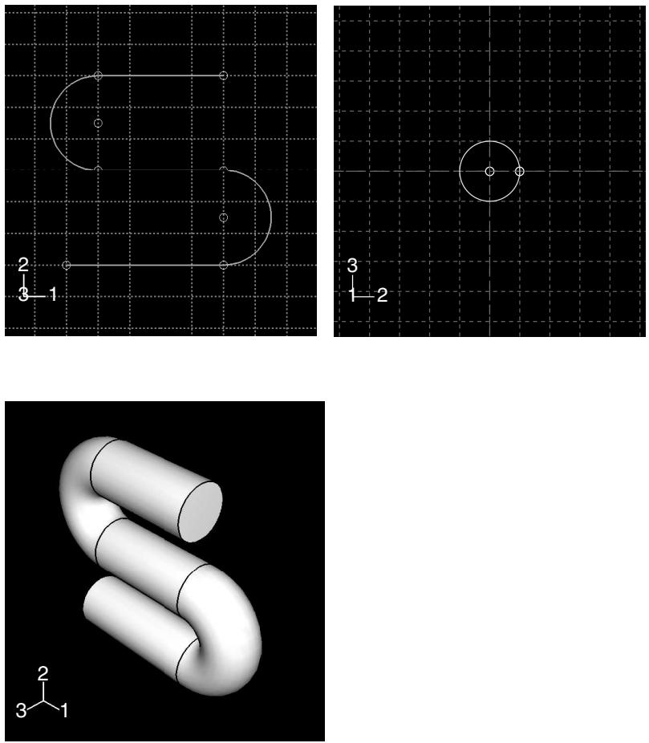

指定扫掠路径的草绘或边集，以及指定扫掠轮廓的草绘或面共同定义了扫掠实体特征；如果您使用草绘器定义了扫掠路径和扫掠轮廓，则可以使用**特征操作 (Feature Manipulation)** 工具集对它们进行修改。您还可以创建扫掠轮廓偏离扫掠路径的扫掠实体。在这种情况下，Abaqus/CAE 会将扫掠路径移动到穿过扫掠轮廓的平行位置，并在该位置创建扫掠实体。

在定义扫掠特征时，您可以对其应用扭转或拔模。有关这些工具的更多信息，请参阅您可以创建哪些类型的特征？。您可以开启“保持轮廓法向恒定 (Keep profile normal constant)”，以使扫掠轮廓在沿扫掠路径移动时保持相同的方向；如果关闭此选项，扫掠轮廓的方向将随扫掠路径的法线而变化。此外，您还可以在**特征操作 (Feature Manipulation)** 工具集中开启“保留内部边界 (Keep internal boundaries)”，以保留扫掠实体特征与现有零件之间生成的任何面或边。内部边界可能会创建一些区域，这些区域可以进行结构化网格划分或扫掠网格划分，而无需进行分区。

1.  从主菜单栏中，选择**形状 (Shape) -> 实体 (Solid) -> 扫掠 (Sweep)**。

提示：您也可以使用位于 **部件 (Part)** 模块工具箱中实体工具下的工具来添加扫掠实体特征。有关部件 (Part) 模块工具箱中工具的图示，请参阅使用部件 (Part) 模块工具箱。

随后将出现“创建实体扫掠 (Create Solid Sweep)”对话框。

2.  如果您想绘制扫掠路径，请执行以下操作：

    a. 从“路径选项 (Path options)”中，选择“绘制 (Sketch)”并单击 。
    
        Abaqus/CAE 会在提示区域显示提示，指导您完成该过程。

    b. 如果需要，可指定您希望用于为扫掠实体特征草绘选择原点的方法。在提示区域的“草绘原点 (Sketch Origin)”字段中选择以下选项之一：
    
        *   选择“自动计算 (Auto-Calculate)”以自动放置草绘原点。
        *   选择“指定 (Specify)”以定义自定义草绘原点。
        *   选择“会话默认 (Session Default)”以使用您在当前会话中先前指定的自定义原点。

    c. 选择要在其上绘制扫掠路径的平面。如果没有合适的面，可以选择一个基准平面 (datum plane)。
    
        

    提示：如果您无法选择所需的平面，可以使用**选择 (Selection)** 工具栏来更改选择行为。有关更多信息，请参阅使用选择选项。

    d. 如果您选择了“指定 (Specify)”作为草绘原点方法，请通过在视口中单击一个点或在提示区域中输入原点的三维坐标来指定原点位置。您还可以通过开启“设为会话默认 (Set as session default)”，将此自定义原点设置为当前会话中所有草绘的默认原点。

    e. 选择一条边以及该边在草绘器网格上的方向。该边不能与所选面垂直。默认情况下，所选边将显示为垂直并位于草绘器网格的右侧。要为该边选择不同的方向，请单击对话框右侧的箭头，并从出现的列表中选择一个方向。
    
        

    提示：如果没有所需方向的直边，您可以创建一个基准轴 (datum axis)。然后，您可以选择该基准轴来控制零件在草绘器网格上的方向。

    Abaqus/CAE 会高亮显示所选边，进入草绘器，并旋转零件，直到所选面与草绘器网格平面对齐，并且所选边以所需方向与网格对齐。

    如果您不确定零件相对于草绘器网格的方向，请使用**视图操作 (View Manipulation)** 工具栏中的视图操作工具查看其位置。使用重置视图工具可返回到原始视图。

    f. 绘制扫掠路径。扫掠路径必须满足以下准则：
    
        路径可以是闭合的，但端点必须平滑连接；例如，端点不应在拐角处相遇。有关有效扫掠路径的示例，请参阅定义扫掠路径和扫掠轮廓。
• 路径必须是连续的；例如，它不能有分叉。
• 生成的实体不能与自身相交。

在提示区域中，单击 Done 以表示您已完成扫掠路径的绘制。

Abaqus/CAE 退出草图编辑器并恢复零件的原始视图。一条高亮显示的线条指示扫掠路径及其方向。Abaqus/CAE 还会重新打开 Create Solid Sweep 对话框，并在 Path（路径）选项的 Sketch（草图）标签旁添加文字 (Defined)，以表明已在草图编辑器中定义了扫掠路径。

3.  如果您希望将扫掠路径指定为一系列边或线，请执行以下操作：

    a. 在 Path（路径）选项中，选择 Edges（边），然后单击 ?

        Abaqus/CAE 会在提示区域显示提示，以指导您完成操作。

    b. 如果需要，在提示区域中指定是希望逐一选择扫掠路径中的边，还是通过边角进行选择。有关选择对象的更多信息，请参阅 Using the angle and feature edge method to select multiple objects。

    c. 选择要包含在扫掠路径中的边。

        Abaqus/CAE 会在您的零件上显示扫掠路径并指示扫掠方向。

    d. 在提示区域中，单击 Yes 以确认扫掠路径方向，或单击 Flip 以反转扫掠路径方向。

        Abaqus/CAE 重新打开 Create Solid Sweep 对话框，并在 Path（路径）选项的 Edges（边）标签旁添加文字 (Defined)，以表明扫掠路径已使用一系列边进行了定义。

4.  如果您希望绘制扫掠截面，执行以下操作：

    a. 在 Profile（截面）选项中，选择 Sketch（草图），然后单击

        Abaqus/CAE 会在提示区域显示提示，以指导您完成操作。

    b. 绘制扫掠截面。扫掠截面必须满足以下准则：

        • 截面必须闭合。
        • 生成的实体不能与自身相交。

        您可以在草图编辑器网格的任意位置绘制截面；Abaqus/CAE 会将截面沿平行于扫掠路径的路径进行扫掠。在提示区域中，单击 Done 以表示您已完成扫掠截面的绘制。

        Abaqus/CAE 退出草图编辑器并恢复零件的原始视图。

    c. 选择一条边以及该边在草图编辑器网格上的方向。所选边不得平行于扫掠路径方向。默认情况下，所选边将显示为垂直方向并位于草图编辑器网格的右侧。要为边选择不同的方向，请单击对话框右侧的箭头，并从出现的列表中选择一个方向。

        Abaqus/CAE 会高亮显示所选边，重新进入草图编辑器，并旋转零件，使得草图编辑器网格位于垂直于扫掠路径起点的平面上，扫掠路径方向指向屏幕外。此外，所选边会按照所需方向与网格对齐。两条虚线的交点指示扫掠路径的原点。Abaqus/CAE 还会重新打开 Create Solid Sweep 对话框，并在 Profile（截面）选项的 Sketch（草图）标签旁添加文字 (Defined)，以表明扫掠截面已在草图编辑器中定义。

5.  如果您希望选择一个面作为扫掠截面，执行以下操作：

    a. 在 Profile（截面）选项中，选择 Face（面），然后单击

        Abaqus/CAE 会在提示区域显示提示，以指导您完成操作。

    b. 从视口中选择一个面。

        Abaqus/CAE 会高亮显示所选面并显示 Create Solid Sweep 对话框。

        Abaqus/CAE 重新打开 Create Solid Sweep 对话框，并在 Profile（截面）选项的 Faces（面）标签旁添加文字 (Defined)，以表明扫掠截面已使用一个面进行了定义。

6.  如果需要，执行以下任一操作：

    打开 Include twist（包含扭转）开关，并输入螺距（pitch）。螺距是指发生 360° 扭转所需的拉伸距离。绘制的拉伸截面必须包含一个指示扭转中心的孤立点。
    打开 Include draft（包含拔模）开关，并输入拔模角度（大于 −90° 且小于 90°）。正的拔模角度表示截面的外部面扩展，内部面收缩。如果选择了 Keep profile normal constant（保持截面法线恒定）选项，则无法应用拔模。
    打开 Keep profile normal constant（保持截面法线恒定）开关，以在整条扫掠路径上保持相同的截面方向。如果关闭此开关，Abaqus/CAE 会调整截面方向，使得扫掠截面与扫掠路径法线之间的夹角始终保持恒定。如果选择了 Include draft（包含拔模）选项，则无法打开此开关。
    打开 Keep internal boundaries（保留内部边界）开关，以保留扫掠实体特征与现有零件之间生成的任何面或边。内部边界可以创建无需分区即可进行结构化网格划分或扫掠网格划分的区域。

7.  单击 OK 以创建新的扫掠实体。

## 附加信息

• 添加实体特征
• 定义扫掠路径和扫掠截面
• 草图模块
• 什么是基于特征的建模？

从主菜单栏中选择 Shape->Solid->Loft，以向当前视口中的零件添加实体放样特征。您只能向三维零件添加实体放样特征。

您可以通过从选定边创建两个或多个截面并定义一条或多条放样路径来添加实体放样特征。放样截面、一条放样路径以及生成的实体放样特征如下图所示：

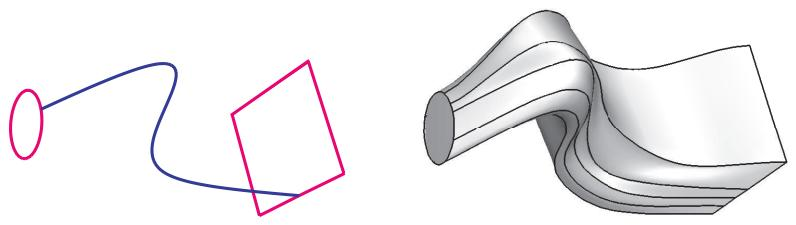

您可以允许 Abaqus/CAE 使用一条平滑路径连接每个放样截面的中心，从而定义单条放样路径。如果您允许 Abaqus/CAE 定义路径，则可以对放样的起始和结束截面应用相切方法。曲线和相切条件定义了放样特征在截面之间的路径。或者，您可以通过选择连接每个放样截面上的一个点到下一个放样截面上的一个点的曲线来定义一条或多条放样路径。每条放样路径必须提供一条连接每个连续放样截面的连续线。如果放样路径不平滑（如果沿路径的任何点处有多条切线），Abaqus/CAE 将在您尝试创建放样时显示错误消息。有关放样截面、放样路径和放样相切的更多信息，请参阅 What is lofting?。

## 注意：

在添加放样特征时，您不使用草图编辑器。因此，在创建放样之前，定义放样截面和放样路径的所有边必须已存在于零件几何图形中。要创建放样路径或创建非平面放样截面，您可以使用 Part 模块工具箱中线工具下的工具，来创建样条线（有关更多信息，请参阅 Adding a point-to-point wire feature）。

1.  从主菜单栏中，选择 Shape->Solid->Loft。

    Abaqus/CAE 会在提示区域显示提示，以指导您完成操作。

    

    提示：您也可以使用 Part 模块工具箱中实体工具下的工具来添加实体放样特征。有关 Part 模块工具箱中工具的图示，请参阅 Using the Part module toolbox。

    Edit Loft 对话框出现。

2.  通过在视口中从零件选择边来创建放样截面。有关创建放样截面的详细说明，请参阅 Creating loft sections。
3.  打开 Keep internal boundaries（保留内部边界）开关，以保留放样实体特征与现有零件之间生成的任何面或边。内部边界可以创建无需分区即可进行结构化网格划分或扫掠网格划分的区域。
4.  完成放样截面的创建后，在 Edit Loft 对话框中单击 Transition（过渡）选项卡。
5.  执行以下操作之一：

    • 单击 Select path（选择路径），通过在视口中从零件选择边来创建放样路径。
    • 单击 Specify tangencies（指定相切），通过使用放样相切来创建放样路径。

    有关创建放样路径的详细说明，请参阅 Creating a loft path。

6.  在 Edit Loft 对话框中单击 Preview（预览）按钮。

    Abaqus/CAE 显示根据您当前设置将创建的放样的线框表示。

7.  如果需要，您可以添加或移除放样截面，更改放样路径定义方法，或编辑放样相切选项以更改放样特征的形状。单击 Preview（预览）以在视口中查看更改的效果。
8.  如果需要，您可以要求 Abaqus/CAE 在创建放样特征时进行自相交检查。此测试可防止创建难以或无法进行网格划分和分析的特征，但随着放样特征复杂性的增加，其计算成本会变得很高。有关更多信息，请参阅 Self-intersection checks。要使用自相交检查，请选择 Feature->Options 以打开 Feature Options 对话框，并打开 Perform self-intersection checks（执行自相交检查）开关。
9. 单击Done以创建放样并关闭“编辑放样”对话框。

如果您选择测试自相交且测试失败，“编辑放样”对话框将重新出现以便您进行修改。否则，实体放样特征将在视口中创建。

## 附加信息

*   添加实体特征
*   什么是基于特征的建模？

从主菜单栏中选择 **Shape->Solid->From Shell**，通过选择将构成封闭部件的面，从三维壳体部件创建实体特征。Abaqus/CAE 将添加实体材料，以将所选面定义的区域从壳体更改为实体。

1.  从主菜单栏中选择 **Shape->Solid->From Shell**。

Abaqus/CAE 将在提示区显示提示，引导您完成操作步骤。

提示：您也可以通过单击位于“部件”模块工具栏中实体工具组的工具，从壳体创建实体特征。有关“部件”模块工具栏中工具的图示，请参阅使用部件模块工具栏。

2.  选择壳体中应转换为实体的面，然后单击鼠标键2表示您已完成面的选择。
    如果您选择了多个面，Abaqus/CAE 将选择添加实体材料的方向，并将所选面所在的区域从壳体更改为实体。
3.  如果您选择了单个面，Abaqus/CAE 将高亮显示该面，并显示一个箭头指示将添加材料以创建实体的方向。如果需要，请单击“翻转”以反转箭头方向。
4.  单击鼠标键2以确认箭头方向。
    Abaqus/CAE 将沿指示方向填充壳体，并创建一个实体区域。
5.  单击Done以创建实体部件。

## 附加信息

*   添加实体特征
*   什么是基于特征的建模？

## 添加壳体特征

本节描述用于向当前视口中的部件添加壳体特征的工具。

## 本节内容：

*   添加拉伸壳体特征
*   添加旋转壳体特征
*   添加扫掠壳体特征
*   添加壳体放样特征
*   添加平面壳体特征
*   从实体创建壳体特征

从主菜单栏中选择 **Shape->Shell->Extrude**，以向当前视口中的部件添加拉伸壳体特征。您只能向三维部件添加拉伸壳体特征。

您可以通过在选定面上草绘，并沿该面法线方向将轮廓拉伸指定距离来添加拉伸壳体特征。下图展示了一个草绘及由此生成的拉伸壳体特征：

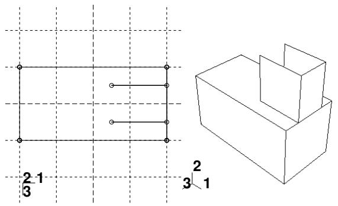

您也可以通过选择单个目标面来定义拉伸距离。Abaqus/CAE 将拉伸草绘直至其与所选面相交。

此外，您可以选择一个中心点并指定一个螺距，Abaqus/CAE 将使用该螺距在拉伸过程中扭曲截面。或者，Abaqus/CAE 可以在拉伸截面时，沿指定的拔模角度展开或收缩截面。有关更多信息，请参阅在拉伸中包含扭转和在拉伸中包含拔模。

1.  从主菜单栏中选择 **Shape->Shell->Extrude**。

Abaqus/CAE 将在提示区显示提示，引导您完成操作步骤。

提示：您也可以使用位于“部件”模块工具栏中壳体工具组的工具来添加拉伸壳体特征。有关“部件”模块工具栏中工具的图示，请参阅使用部件模块工具栏。

2.  如有需要，指定用于为拉伸壳体特征草绘选择原点的方法。在提示区的“草绘原点”字段中选择以下选项之一：
    *   选择 **Auto-Calculate** 以自动放置草绘原点。
    *   选择 **Specify** 以定义自定义草绘原点。
    *   选择 **Session Default** 以使用您在此会话中先前指定的自定义原点。

3.  选择将要进行拉伸的壳体的平面。如果不存在合适的面，您可以选择一个基准平面或孤立元素面。

提示：如果您无法选择所需的平面，可以使用“选择”工具栏更改选择行为。有关更多信息，请参阅使用选择选项。

所选面将在视口中高亮显示。

4.  如果您选择了 **Specify** 作为草绘原点方法，请通过在视口中单击一个点或在提示区输入原点的三维坐标来指定原点位置。您也可以通过勾选 **Set as session default**，将此自定义原点设置为会话中所有草绘的默认原点。

5.  选择一条边及该边在草绘器网格上的方向。该边不得与所选面垂直。默认情况下，所选边将垂直显示在草绘器网格的右侧。要为边选择不同的方向，请单击对话框右侧的箭头，然后从出现的列表中选择一个方向。

提示：如果所选面的边是弯曲的或不提供所需的方向，您可以创建一个基准轴。然后，您可以选择基准轴来控制部件在草绘器网格上的方向。

Abaqus/CAE 将高亮显示所选边，进入草绘器，并旋转部件，直到所选面与草绘器网格平面对齐，且所选边以所需方向与网格对齐。

如果您不确定部件相对于草绘器网格的方向，请使用“视图操作”工具栏中的视图操作工具查看其位置。使用重置视图工具返回到原始视图。

6.  使用草绘器草绘要拉伸的线的轮廓。在提示区，单击 **Done** 以退出草绘器并打开“编辑拉伸”对话框。

Abaqus/CAE 将显示进入草绘器之前处于活动状态的部件视图。该部件包括您草绘的轮廓和一个指示拉伸方向的箭头。

7.  如果需要，在“编辑拉伸”对话框中单击以反转拉伸方向。

如果箭头方向难以看清，请使用旋转工具旋转部件。

8.  选择以下端条件之一：
    *   选择 **Blind** 并在“深度”字段中输入一个值，以指定 Abaqus/CAE 拉伸草绘轮廓的距离。
    *   选择 **Up to Face** 以指定 Abaqus/CAE 将轮廓拉伸至所选面。

9.  如有需要，请执行以下操作之一：
    *   勾选 **Include twist**，并输入螺距。螺距是指发生 360° 扭转的拉伸距离。拉伸的草绘轮廓必须包含一个指示扭转中心的孤立点。
    *   勾选 **Include draft**，并输入拔模角度（大于 −90° 且小于 90°）。正的拔模角度表示轮廓的外部面展开，内部面收缩。

## 注意：

当您对壳体特征使用拔模时，不能使用不连续的轮廓。不连续的轮廓是指连通但无法用一笔连续运动描绘出来的轮廓。如果您在不连续的轮廓上指定拔模，Abaqus/CAE 会将拔模角度单独应用于每个面，并且拉伸的边将不会连接。

10. 勾选 **Keep internal boundaries** 以保留拉伸壳体特征与现有部件之间生成的任何面或边。内部边界可以创建无需分区即可进行结构化或扫掠网格划分的区域。
11. 单击 **OK** 以拉伸轮廓。

如果您选择了“扭转”选项且您的草绘包含单个孤立点，Abaqus/CAE 将使用该点作为扭转中心。如果您的草绘不包含孤立点，Abaqus/CAE 将返回到草绘器让您创建一个。如果您的草绘包含多个孤立点，Abaqus/CAE 将返回到草绘器，并提示您选择一个孤立点作为扭转中心。

12. 如果您选择了 **Up to Face**，Abaqus/CAE 将提示您选择要将轮廓拉伸到的面。选择的面需满足以下要求：
    *   所选面不必与草绘平面平行，
    *   它可以是非平面，
    *   它必须完全包含拉伸的选区，并且
    *   它不能是基准平面。

Abaqus/CAE 将创建拉伸壳体特征。

## 附加信息

*   基准工具集
*   添加壳体特征
*   草绘模块
*   什么是基于特征的建模？

## 添加旋转壳体特征
从主菜单栏选择 **Shape > Shell > Revolve**，在当前视口中为部件添加旋转壳体特征。此操作仅适用于三维部件。

通过在选定平面上绘制轮廓和构造线来添加旋转壳体特征。构造线作为旋转轴，Abaqus/CAE 将轮廓绕该轴旋转指定的旋转角度来创建壳体特征。下图展示了一个草图及由此生成的、绕旋转轴旋转 90° 后的特征：

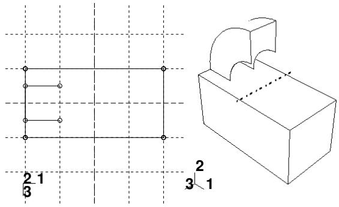

此外，您还可以指定一个螺距和沿旋转轴的方向，Abaqus/CAE 在旋转轮廓时将沿此方向平移草图。

1.  从主菜单栏选择 **Shape > Shell > Revolve**。

    Abaqus/CAE 会在提示区显示提示，引导您完成操作。

    

    在**部件 (Part)** 模块工具箱中。有关**部件 (Part)** 模块工具箱中工具的图示，请参阅使用部件模块工具箱。

2.  如果需要，请指定用于选择旋转壳体特征草图原点的方法。在提示区的**草图原点 (Sketch Origin)** 字段中选择以下选项之一：

    *   选择 **Auto-Calculate** 以自动放置草图原点。
    *   选择 **Specify** 以定义自定义草图原点。
    *   选择 **Session Default** 以使用您在本次分析会话中先前指定的自定义原点。

3.  选择将用于旋转生成壳体的平面。如果不存在合适的平面，您可以选择一个基准平面或一个孤立网格单元的面。

    

    **提示**：如果无法选择所需的平面，您可以使用选择工具栏更改选择行为。更多信息，请参阅使用选择选项。

    选定的平面在视口中高亮显示。

4.  如果您选择了 **Specify** 作为草图原点方法，请通过在视口中单击一个点或在提示区输入原点的三维坐标来指定原点位置。您还可以通过勾选 **Set as session default** 来将此自定义原点设置为本次会话中所有草图的默认原点。

5.  选择一条边及其在草图编辑器网格上的方向。该边不能与所选平面垂直。默认情况下，所选边将显示为垂直并位于草图编辑器网格的右侧。要为该边选择不同的方向，请单击对话框右侧的箭头，并从出现的列表中选择一个方向。

    

    **提示**：如果所选平面的边是曲线或未提供所需方向，您可以创建一个基准轴。然后，您可以选择该基准轴来控制部件在草图编辑器网格上的方向。

    Abaqus/CAE 高亮显示所选边，进入草图编辑器，并旋转部件，直到所选平面与草图编辑器网格平面对齐，且所选边以所需方向与网格对齐。

    如果您不确定部件相对于草图编辑器网格的方向，请使用**视图操作 (View Manipulation)** 工具栏中的视图操作工具来查看其位置。使用重置视图工具可返回到原始视图。

6.  使用水平、垂直、角度或斜构造线工具绘制旋转轴。您可以通过从基础部件选择基准轴来定位构造线。您不能直接选择基准轴；必须选择基准轴任一端点的点。

7.  使用草图编辑器绘制旋转特征的二维轮廓；草图不得与旋转轴相交。

8.  在提示区中，单击 **Done** 表示您已完成轮廓和轴的绘制。如果草图包含多条构造线，Abaqus/CAE 会提示您选择将用作旋转轴的构造线。

    Abaqus/CAE 显示进入草图编辑器之前激活的部件视图。该部件包含您绘制的轮廓和一个表示旋转方向的箭头。**编辑旋转 (Edit Revolution)** 对话框出现。

9.  在**编辑旋转 (Edit Revolution)** 对话框中，输入所需的旋转角度或接受默认值。

10. 单击 **Revolve direction** 旁边的箭头可更改箭头方向及相应的旋转方向。

11. 如果需要，请勾选 **Include translation**，并为螺距输入一个正值。螺距值是指轮廓在旋转 360° 期间沿旋转轴平移的距离。出现一个箭头以显示旋转轴并指示草图沿该轴的平移方向。如有必要，在**编辑旋转 (Edit Revolution)** 对话框中单击 **Pitch direction** 旁边的箭头以反转该箭头。

12. 如果需要，请勾选 **Sweep sketch normal to path**，以使绘制的轮廓保持垂直于旋转路径。此选项仅在使用 **Include translation** 时可用。

    特征的初始轮廓将从草图平面旋转以创建该特征。

13. 勾选 **Keep internal boundaries** 可保持旋转壳体特征与现有部件之间生成的任何面或边。这些内部边界可以创建区域，从而无需分区即可进行结构化网格划分或扫掠网格划分。

14. 单击 **OK** 以接受指示的方向并创建旋转壳体特征。

    Abaqus/CAE 使用您选定的参数创建旋转特征。

## 附加信息

*   创建构造几何体
*   添加壳体特征
*   为轴对称部件和旋转特征定义旋转轴
*   用螺距控制旋转特征的横截面
*   草图模块
*   什么是基于特征的建模？

从主菜单栏选择 **Shape > Shell > Sweep**，在当前视口中为部件添加扫掠壳体特征。此操作仅适用于三维部件。

您需要首先定义扫掠路径，然后定义扫掠轮廓来添加扫掠壳体特征。定义每个组件有不同的可用方法：

您可以选择通过在选定平面上绘制路径，或者通过选择一系列希望扫掠路径遵循的边或线来定义扫掠路径。草图方法提供更大的灵活性，但仅支持二维路径。边/线方法使您能够沿某个特征（例如样条线或三维部件中的一组边）定义三维扫掠路径。
您可以选择使用草图编辑器绘制扫掠轮廓，或者选择模型中的某个面作为轮廓来定义扫掠轮廓。扫掠轮廓初始时垂直于路径；您可以保持此方向在整条扫掠路径上恒定不变，也可以在扫掠过程中保持扫掠轮廓垂直于扫掠路径。

下图显示了扫掠路径（一条样条线）和扫掠轮廓：

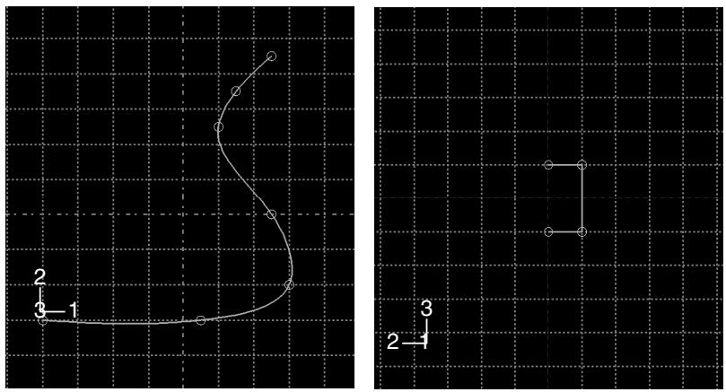

生成的扫掠壳体特征如下图所示：

定义扫掠路径的草图或边集，以及定义扫掠轮廓的草图、边或边集，共同定义了扫掠壳体特征；如果使用草图编辑器定义它们，则可以使用**特征操作 (Feature Manipulation)** 工具集修改扫掠路径和扫掠轮廓。您可以定义一个扫掠轮廓相对于扫掠路径存在偏移的扫掠壳体。在这种情况下，Abaqus/CAE 会将扫掠路径移动到一个穿过扫掠轮廓的平行位置，并在该位置创建扫掠壳体特征。

在定义扫掠特征时，您可以对其应用扭转或拔模。有关这些工具的更多信息，请参阅您可以创建哪些类型的特征？。您可以勾选 **Keep profile normal constant** 以保持扫掠轮廓在沿扫掠路径移动时的方向恒定不变；如果未勾选此选项，扫掠轮廓的方向将随扫掠路径的法线而变化。此外，您可以在**特征操作 (Feature Manipulation)** 工具集中勾选 **Keep internal boundaries** 以保持扫掠壳体特征与现有部件之间生成的任何面或边。这些内部边界可以创建区域，从而无需分区即可进行结构化网格划分或扫掠网格划分。

1.  从主菜单栏选择 **Shape > Shell > Sweep**。

    Abaqus/CAE 会在提示区显示提示，引导您完成操作。

    
Part模块工具箱。有关Part模块工具箱中工具的图示，请参阅使用Part模块工具箱。

2. 如果要草绘扫掠路径，请执行以下操作：

a. 在“Path options”（路径选项）中，选择“Sketch”（草绘）并单击

Abaqus/CAE会在提示区域显示提示信息，引导您完成操作步骤。

b. 如果需要，请指定用于为扫掠实体特征草绘选取原点的方法。在提示区域的“Sketch Origin”（草绘原点）字段中选择以下选项之一：

• 选择“Auto-Calculate”（自动计算）以自动放置草绘原点。
• 选择“Specify”（指定）以定义自定义草绘原点。
• 选择“Session Default”（会话默认）以使用您在本次会话中先前指定的自定义原点。

c. 选择要在其上草绘扫掠路径的平面。如果不存在合适的面，可以选择一个基准平面。

提示：如果无法选择所需的平面，可以使用选择工具栏更改选择行为。有关更多信息，请参阅使用选择选项。

d. 如果您选择了“Specify”（指定）作为草绘原点方法，请通过在视区中单击一个点或在提示区域中输入原点的三维坐标来指定原点位置。您还可以通过切换“Set as session default”（设为会话默认）来将此自定义原点设置为本次会话中所有草绘的默认原点。

e. 选择一条边以及该边在草绘器网格上的方向。所选边不能垂直于所选面。默认情况下，所选边将显示为垂直并位于草绘器网格的右侧。要为该边选择不同的方向，请单击对话框右侧的箭头，然后从出现的列表中选择一个方向。

提示：如果不存在具有所需方向的直边，您可以创建一个基准轴。然后，您可以选择该基准轴来控制零件在草绘器网格上的方向。

Abaqus/CAE会高亮显示所选边，进入草绘器，并旋转零件，使所选面与草绘器网格平面平行，且所选边按照所需方向与网格对齐。

如果您不确定零件相对于草绘器网格的方向，请使用视图操作工具栏中的视图操作工具来查看其位置。使用重置视图工具返回原始视图。

f. 草绘扫掠路径。扫掠路径必须满足以下准则：

    路径可以是闭合的，但端点必须平滑连接；例如，端点不应在角点处相接。有关有效扫掠路径的示例，请参阅定义扫掠路径和扫掠截面。
    • 路径必须是连续的；例如，它不能有分支。
    • 生成的实体不能与自身相交。

在提示区域中，单击“Done”（完成）以指示您已完成扫掠路径的草绘。

Abaqus/CAE会退出草绘器并恢复零件的原始视图。一条高亮线指示扫掠路径及其方向。Abaqus/CAE还会重新打开“Create Shell Sweep”（创建壳扫掠）对话框，并在“Path options”（路径选项）中的“Sketch”（草绘）标签旁添加“(Defined)”（已定义）字样，表明已在草绘器中定义了扫掠路径。

3. 如果要将扫掠路径指定为一系列边或线，请执行以下操作：

a. 在“Path options”（路径选项）中，选择“Edges”（边）并单击

Abaqus/CAE会在提示区域显示提示信息，引导您完成操作步骤。

b. 如果需要，请在提示区域指定您是想要逐条选择扫掠路径中的边，还是通过边角进行选择。有关选择对象的更多信息，请参阅使用角度和特征边方法选择多个对象。

c. 选择要包含在扫掠路径中的边。

Abaqus/CAE会在零件上显示扫掠路径并指示扫掠方向。

d. 在提示区域中，单击“Yes”（是）以确认扫掠路径方向，或单击“Flip”（翻转）以反转扫掠路径方向。

Abaqus/CAE会重新打开“Create Shell Sweep”（创建壳扫掠）对话框，并在“Path options”（路径选项）中的“Edges”（边）标签旁添加“(Defined)”（已定义）字样，表明已使用一系列边定义了扫掠路径。

4. 如果要草绘扫掠截面，请执行以下操作：

a. 在“Profile options”（截面选项）中，选择“Sketch”（草绘）并单击

Abaqus/CAE会在提示区域显示提示信息，引导您完成操作步骤。

b. 草绘扫掠截面。扫掠截面必须满足以下准则：

• 截面必须是闭合的。
• 生成的实体不能与自身相交。

您可以在草绘器网格上的任意位置草绘截面；Abaqus/CAE会将截面沿一条平行于扫掠路径的路径进行扫掠。在提示区域中，单击“Done”（完成）以指示您已完成扫掠截面的草绘。

Abaqus/CAE会退出草绘器并恢复零件的原始视图。

c. 选择一条边以及该边在草绘器网格上的方向。所选边不能平行于扫掠路径方向。默认情况下，所选边将显示为垂直并位于草绘器网格的右侧。要为该边选择不同的方向，请单击对话框右侧的箭头，然后从出现的列表中选择一个方向。

Abaqus/CAE会高亮显示所选边，再次进入草绘器，并旋转零件，使草绘器网格位于垂直于扫掠路径起点的平面上，且扫掠路径方向指向屏幕外。此外，所选边按照所需方向与网格对齐。两条虚线的交点指示扫掠路径的原点。Abaqus/CAE还会重新打开“Create Shell Sweep”（创建壳扫掠）对话框，并在“Profile options”（截面选项）中的“Sketch”（草绘）标签旁添加“(Defined)”（已定义）字样，表明已在草绘器中定义了扫掠截面。

5. 如果要选择一条或多条边作为扫掠截面，请执行以下操作：

a. 在“Profile options”（截面选项）中，选择“Edges”（边）并单击

Abaqus/CAE会在提示区域显示提示信息，引导您完成操作步骤。

b. 从视区中选择一条或多条边。

Abaqus/CAE会高亮显示所选面并显示“Create Shell Sweep”（创建壳扫掠）对话框。

Abaqus/CAE会重新打开“Create Shell Sweep”（创建壳扫掠）对话框，并在“Profile options”（截面选项）中的“Edges”（边）标签旁添加“(Defined)”（已定义）字样，表明已使用一条或多条边定义了扫掠截面。

6. 如果需要，请执行以下操作之一：

    打开“Include twist”（包含扭转）开关，并输入螺距。螺距是指发生360°扭转的拉伸距离。草绘的拉伸截面必须包含一个指示扭转中心的孤立点。
    打开“Include draft”（包含拔模）开关，并输入拔模角度（大于−90°且小于90°）。正拔模角度表示截面的外表面扩张，内表面收缩。如果选择了“Keep profile normal constant”（保持截面法线恒定）选项，则无法应用拔模。
    打开“Keep profile normal constant”（保持截面法线恒定）开关，以沿整个扫掠路径保持相同的截面方向。如果关闭此选项，Abaqus/CAE会调整截面方向，使得扫掠截面与扫掠路径法线之间的角度始终保持恒定。如果选择了“Include draft”（包含拔模）选项，则无法打开此选项。
    打开“Keep internal boundaries”（保留内部边界）开关，以保留扫掠实体特征与现有零件之间生成的任何面或边。内部边界可以创建无需分区即可进行结构化或扫掠网格划分的区域。

7. 单击“OK”（确定）以创建新的扫掠壳。

## 附加信息

• 定义扫掠路径和扫掠截面
• 草绘模块
• 什么是基于特征的建模？

从主菜单栏中选择“Shape”->“Shell”->“Loft”（形状->壳->放样）以在当前视区中的零件上添加壳放样特征。您只能将壳放样特征添加到三维零件。

您可以通过从选定的边创建两个或多个截面，并定义一条或多条放样路径来添加壳放样特征。放样截面、放样路径以及生成的壳放样特征如下图所示：

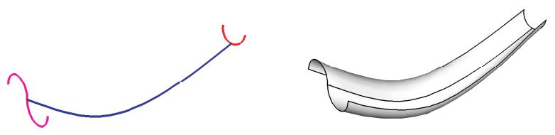

您可以允许Abaqus/CAE使用一条连接每个放样截面中心的光滑路径来定义单一放样路径。如果您允许Abaqus/CAE定义路径，则可以将切线方法应用于放样的起始和结束截面。曲线和切线定义了截面之间放样特征的路径。或者，您可以通过选择连接每个放样截面上一点到下一个放样截面上一点的曲线来定义一条或多条放样路径。每条放样路径必须提供一条连接每个连续放样截面的连续线。如果放样路径不光滑（如果路径上任何点存在多条切线），当您尝试创建放样时，Abaqus/CAE将显示错误消息。有关放样截面、放样路径和放样切线的更多信息，请参阅什么是放样？。

## 注意：

在添加放样特征时，您不使用草绘器。因此，定义放样截面和放样路径的所有边在创建放样之前必须已存在于部件几何中。要创建放样路径或创建非平面放样截面，您可以使用位于 **Part** 模块工具箱中的线工具的工具来创建样条线（有关更多信息，请参见“添加点到点线特征”）。

1.  从主菜单栏中选择 **Shape -> Shell -> Loft**。

    Abaqus/CAE 将在提示区显示提示，引导您完成操作步骤。

    

    提示：您也可以使用位于 **Part** 模块工具箱中壳工具的工具来添加壳放样特征。有关 **Part** 模块工具箱中工具的图表，请参见“使用 Part 模块工具箱”。

    **Edit Loft**（编辑放样）对话框随即出现。

2.  通过在视口中的部件上选择边来创建放样截面。有关创建放样截面的详细说明，请参见“创建放样截面”。

    打开 **Keep internal boundaries**（保留内部边界）开关，以保持在放样壳特征与现有部件之间生成的任何面或边。内部边界可以创建区域，这些区域可以进行结构化或扫掠网格划分，而无需进行分区。

3.  完成创建放样截面后，在 **Edit Loft**（编辑放样）对话框中单击 **Transition**（过渡）选项卡。
4.  执行以下操作之一：

    单击 **Select path**（选择路径），通过在视口中的部件上选择边来创建放样路径（或路径）。  
    *   单击 **Specify tangencies**（指定相切），通过使用放样相切来创建放样路径（或路径）。

    有关创建放样路径的详细说明，请参见“创建放样路径”。

## 5. 单击 **Preview**（预览）。

    Abaqus/CAE 将显示使用当前设置将要创建的放样的线框表示。

6.  如果需要，您可以添加或删除放样截面、更改放样路径定义方法或编辑放样相切选项，以更改放样特征的形状。单击 **Preview**（预览）以在视口中查看更改的效果。
7.  如果需要，您可以要求 Abaqus/CAE 在创建放样特征时进行自相交检查。此检查可防止创建难以或不可能进行网格划分和分析的特征，但随着放样特征复杂性的增加，计算成本会变得很高。有关更多信息，请参见“自相交检查”。要使用自相交检查，请选择 **Feature -> Options**（特征 -> 选项）以打开 **Feature Options**（特征选项）对话框，并打开 **Perform self-intersection checks**（执行自相交检查）开关。
8.  单击 **Done**（完成）以创建放样并关闭 **Edit Loft**（编辑放样）对话框。

    如果您选择进行自相交检查且检查失败，**Edit Loft**（编辑放样）对话框将重新出现，以便您进行更改。否则，壳放样特征将在视口中创建。

## 附加信息

*   添加壳特征
*   什么是基于特征的建模？

从主菜单栏中选择 **Shape -> Shell -> Planar**，可以向当前视口中的部件添加平面壳特征。无论当前视口中部件的建模空间如何，平面壳工具始终可用。

您通过在选定面上草绘来添加平面壳特征。草绘和生成的平面壳特征如下图所示：

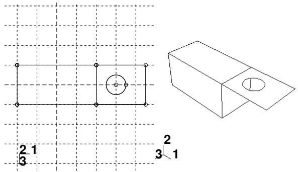

该草绘定义了一个平面壳特征，可以使用**特征操作**工具集进行修改。

1.  从主菜单栏中选择 **Shape -> Shell -> Planar**。

    Abaqus/CAE 将在提示区显示提示，引导您完成操作步骤。

    

    提示：您也可以使用位于 **Part** 模块工具箱中壳工具的工具来添加平面壳特征。有关 **Part** 模块工具箱中工具的图表，请参见“使用 Part 模块工具箱”。

2.  如果需要，请指定您希望用于为平面壳特征草绘选择原点的方法。在提示区的 **Sketch Origin**（草绘原点）字段中选择以下选项之一：

    *   选择 **Auto-Calculate**（自动计算）以自动放置草绘原点。
    *   选择 **Specify**（指定）以定义自定义草绘原点。
    *   选择 **Session Default**（会话默认）以使用您在会话中早先指定的自定义原点。

3.  如果部件的建模空间是二维或轴对称，Abaqus/CAE 将进入草绘器，并对齐部件和草绘的 X 轴和 Y 轴。

    如果部件的建模空间是三维，请执行以下操作：

    a. 选择将放置壳体的平面。如果没有合适的平面，您可以选择一个基准平面。

        

        提示：如果无法选择所需的平面，您可以使用**选择工具栏**来更改选择行为。有关更多信息，请参见“使用选择选项”。

    b. 如果您选择 **Specify**（指定）作为草绘原点方法，请通过在视口中单击一个点或在提示区中输入原点的三维坐标来指定原点位置。您还可以通过打开 **Set as session default**（设为会话默认）开关，将此自定义原点设置为会话中所有草绘的默认原点。

    c. 选择一条边以及该边在草绘器网格上的方向。该边不得与所选平面垂直。默认情况下，所选边将垂直显示并位于草绘器网格的右侧。要为边选择不同的方向，请单击对话框右侧的箭头，并从出现的列表中选择一个方向。

        

        提示：如果所选面的边是弯曲的或未提供所需方向，您可以创建一个基准轴。然后您可以选择该基准轴来控制部件在草绘器网格上的方向。

        Abaqus/CAE 将高亮显示所选边，进入草绘器，并旋转部件，直到所选面与草绘器网格平面对齐，且所选边按所需方向与网格对齐。

        如果您不确定部件相对于草绘器网格的方向，请使用**视图操作**工具栏中的视图操作工具查看其位置。使用**重置视图**工具返回原始视图。

4.  使用草绘器草绘平面壳体。在提示区中，单击 **Done**（完成）表示您已完成草绘。

    部件将返回其原始方向，平面壳体放置在所选平面上。壳特征仅在延伸超出部件面的地方创建；壳特征不能与面重叠。

## 附加信息

*   添加壳特征
*   草绘器模块
*   什么是基于特征的建模？

从主菜单栏中选择 **Shape -> Shell -> From Solid**，以从实体特征的面创建壳特征。您只能向三维部件添加从实体创建的壳特征。

您通过选择要从部件中移除的单元格来添加从实体创建的壳特征；Abaqus/CAE 将与移除的单元格关联的任何剩余面转换为壳体。

**From Solid**（从实体）工具是创建具有弯曲边的壳体的一种简便方法，如下图所示。实体的弯曲边是使用圆角工具对边进行圆角处理创建的。

1.  从主菜单栏中选择 **Shape -> Shell -> From Solid**。

    Abaqus/CAE 将在提示区显示提示，引导您完成操作步骤。

    

    提示：您也可以使用位于 **Part** 模块工具箱中壳工具的工具来添加从实体创建的壳特征。有关 **Part** 模块工具箱中工具的图表，请参见“使用 Part 模块工具箱”。

2.  选择一个或多个要转换为壳体的单元格。按 [Shift] + 单击可添加其他单元格，按 [Ctrl] + 单击已选单元格可取消选择。单击鼠标键 2 表示您已完成要转换单元格的选择。

    Abaqus/CAE 将所选单元格转换为壳体。

    

    提示：使用**上一步**按钮 ( ) 撤销一个或多个步骤；使用**取消**按钮 ( ) 停止从实体创建壳体。

## 附加信息

*   添加壳特征
*   草绘器模块
*   什么是基于特征的建模？

## 添加线特征

本节描述用于向当前视口中的部件添加线特征的 **Part** 模块工具。本节还描述了向装配体添加线特征。

## 本节内容：

添加草绘线特征
添加点到点线特征
在线中的顶点处圆角
# 添加从边创建的线特征

从主菜单栏中选择 **Shape -> Wire -> Sketch**，可在当前视口中为部件添加草绘的平面线特征。无论当前视口中部件的建模空间如何，平面线工具始终可用。

您可以通过在选定平面上草绘来添加平面线特征。Abaqus/CAE 会移除与现有面重叠的任何线部分。下图展示了一个草绘以及生成的平面线：

该草绘完整定义了一个平面线特征，并可以使用**特征操作工具集**进行修改。

1.  从主菜单栏中，选择 **Shape -> Wire -> Sketch**。
    
    Abaqus/CAE 会在提示区显示提示信息，引导您完成操作。
    
    
    
    **提示**：您也可以使用位于**部件**模块工具箱中的线工具中的  工具来添加草绘的线特征。有关**部件**模块工具箱中工具的图示，请参阅使用部件模块工具箱。
    
2.  如果需要，请指定用于为草绘线特征选择草绘原点的方法。在提示区的 **Sketch Origin** 字段中选择以下选项之一：
    
    *   选择 **Auto-Calculate** 以自动放置草绘原点。
    *   选择 **Specify** 以定义自定义草绘原点。
    *   选择 **Session Default** 以使用您在本次分析会话中之前指定的自定义原点。
    
3.  如果部件的建模空间是二维或轴对称，Abaqus/CAE 将进入**草图器**，并对齐部件的 X 轴和 Y 轴与草绘的轴。
    
    如果部件是三维的，请执行以下操作：
    
    a. 选择将放置线特征的平面。如果没有合适的平面，您可以选择一个**基准平面**。
    
    
    
    **提示**：如果您无法选择所需的平面，可以使用**选择**工具栏来更改选择行为。有关更多信息，请参阅使用选择选项。
    
    b. 选择一条边以及该边在**草图器**网格上的方向。该边不得与所选平面垂直。默认情况下，所选边将显示为垂直状态，并位于**草图器**网格的右侧。要为该边选择不同的方向，请单击对话框右侧的箭头，并从出现的列表中选择一个方向。
    
    
    
    **提示**：如果所选平面的边是弯曲的或未提供所需的方向，您可以创建一个**基准轴**。然后可以选择该基准轴来控制部件在**草图器**网格上的方向。
    
    Abaqus/CAE 会高亮显示所选边，进入**草图器**，并旋转部件，直到所选平面与**草图器**网格平面对齐，并且所选边按所需方向与网格对齐。
    
    如果您不确定部件相对于**草图器**网格的方向，请使用**视图操作**工具栏中的视图操作工具来查看其位置。使用重置视图工具可返回到原始视图。
    
4.  如果您选择了 **Specify** 作为草绘原点方法，请通过在视口中单击一个点或在提示区输入原点的三维坐标来指定原点位置。您还可以通过勾选 **Set as session default** 将此自定义原点设置为本次分析会话中所有草绘的默认原点。
    
5.  使用**草图器**草绘平面线。在提示区中，单击 **Done** 表示您已完成草绘。
    
    部件将返回其原始方向，平面线放置在所选定的平面上。仅在线特征延伸超出部件的面的地方才会创建线特征；线特征不能与面重叠。
    
## 其他信息

*   什么是基于特征的建模？
*   添加线特征
*   草图模块

## 添加逐点创建的线特征

您可以向部件或装配体添加逐点创建的线特征。

对于装配体级别的线特征，您可以修改线特征或从特征中移除线，如创建或修改用于多个连接器的线特征中所述。

装配体级别的线特征不可划分网格。该线特征包含连接当前视口中部件或装配体点的线，或连接部件或装配体点到地面的线。要对连接器建模，您必须在装配体上定义一个或多个线特征。当您在部件或装配体上创建线特征时，可以创建一个包含该线特征中定义的线的几何集合。此外，当您在部件上创建线特征时，还可以创建包含该线特征中定义的顶点的几何集合。

要在部件上添加线特征，请在**部件**模块的主菜单栏中选择 **Shape -> Wire -> Point to Point**。无论当前视口中部件的建模空间如何，**部件**模块中的逐点线工具始终可用。要在装配体上添加线特征，请在**相互作用**模块的主菜单栏中选择 **Connector -> Geometry -> Create Wire Feature**。

您可以通过选择几何类型——**多段线**或**样条线**——来向部件添加逐点创建的线特征；对于装配体，您只能添加多段线线特征。您可以选择通过创建边将线特征印记到现有部件上，将线特征与现有部件合并，或者创建与现有部件分离的线特征。线合并选项仅在**部件**模块中可用。

如果创建的是多段线线，接下来必须选择一个点选择方法，并从当前部件或装配体中拾取要连接的点。您可以选择拾取不相交的点（即不自动端对端连接）、链式连接的点（即自动端对端连接）或连接到地面的点。Abaqus/CAE 会根据您选择的方法，用直线连接点对或将点连接到地面。下图展示了一个连接部件中四个点的多段线线特征：

平面壳体特征仅供参考。左图显示了使用 **Imprint wire** 或 **Separate wire** 选项时点对点线的完整长度，而右图显示了使用 **Merge wire** 选项连接同一组点的点对点线。

如果是在部件上创建样条线线，则仅链式连接点选择方法可用。Abaqus/CAE 通过在样条线沿线的所有点之间进行三次样条拟合来计算曲线形状；此外，样条线的一阶和二阶导数是连续的。下图展示了一个样条线线特征：

矩形实体特征仅供参考。左图显示了使用 **Imprint wire** 或 **Separate wire** 选项时样条线的完整长度，而右图显示了使用 **Merge wire** 选项连接同一组点的样条线。

在部件或装配体上创建线特征期间，您可以修改点的选择。对于部件级别的线特征，在大多数情况下，一旦创建了线特征，您将无法直接修改它。您可能能够使用**几何编辑工具集**从特征中移除线边。（有关更多信息，请参阅移除线边）。如果您想更改连接的点或连接顺序，则必须删除线特征并创建连接所需点的新线特征。由于逐点创建的线依赖于其他特征创建的点，因此您可以使用**特征操作工具集**修改创建这些点的特征来修改线特征。

尽管您无法创建具有非平面线基特征的部件，但您可以通过使用空间中的单个点作为基特征并输入其余点的坐标来创建非平面逐点创建的线特征。在这种情况下，起始点是您可以编辑以修改线的唯一点。您也可以使用基准点，这样您可以编辑所有点。

1.  使用以下方法之一显示 **Create Wire Feature** 对话框：
    
    *   在**部件**模块的主菜单栏中，选择 **Shape -> Wire -> Point to Point**。
    
    
    
    工具，位于**部件**模块工具箱中的线工具中。有关**部件**模块工具箱中工具的图示，请参阅使用部件模块工具箱。
    
    *   在**相互作用**模块的主菜单栏中，选择 **Connector -> Geometry -> Create Wire Feature**。
    
    
提示：您也可以使用工具栏中的工具将线特征添加到装配体中，该工具位于**Interaction**模块的工具箱中。有关**Interaction**模块工具箱中工具的图示，请参阅使用 Interaction 模块工具箱。

2.  如果您正在**Part**模块中创建线，选择 **Polyline**（多段线）以创建一条或多条直线，或选择 **Spline**（样条曲线）以创建连续的样条曲线。
3.  如果您正在向部件添加线特征，请在对话框的 **Wire Merge Scheme**（线合并方案）部分指定合并选项。线合并选项仅在**Part**模块中可用。
    *   选择 **Imprint wire**（印压线）以通过创建边的方式将新创建的线印压在现有部件上。
    *   选择 **Merge wire**（合并线）以将新创建的线与现有部件合并。
    *   选择 **Separate wire**（分离线）以创建与现有部件分离的线；不创建边，且该线不与现有部件合并。

4.  在对话框的 **Point Pairs**（点对）部分，指定点选择方法。
    *   选择 **Disjoint wires**（不相交线）以选择不自动首尾相连的点。使用此方法指定用于建模连接器的线（请参阅建模连接器）。您选择的前两个点分别成为第一个点对的 **Point 1** 和 **Point 2**；接下来选择的两个点分别成为下一个点对的 **Point 1** 和 **Point 2**；依此类推。当您使用连接器对两点之间的多点约束进行建模时，**Point 2** 的运动受 **Point 1** 的运动约束。
    *   选择 **Chained wires**（链式线）以选择自动首尾相连的点。您选择的第一个点成为第一个点对的 **Point 1**，第二个点成为该点对的 **Point 2** 以及下一个点对的 **Point 1**，依此类推。对于样条线，**Chained wires** 是唯一可用的选择方法，并且点是单独显示而非成对显示。
    *   选择 **Wires to ground**（接地线）以选择连接到地的点。使用此方法指定用于建模连接器的点对地线（请参阅建模连接器）。Abaqus/CAE 会自动使您选择的每个点成为点对的 **Point 2**（即，**Point 2** 连接到地）。但是，您可能希望将 **Point 1** 连接到地。如果是这样，您可以在完成点选择后修改线定义。选择要修改的点对行，然后单击 **Swap**（交换）以交换 **Point 1** 和 **Point 2** 的条目（如步骤 5 所述）。

5.  在对话框的 **Point Pairs** 部分，单击以选择线将连接的点。
    *   如果您正在向部件添加线特征，您可以从视口选择点，也可以在提示区域的文本框中输入坐标。按 **Enter** 接受坐标并继续到线链中的下一个点。Abaqus/CAE 会高亮显示所有可拾取的点。可能的选项有：
        *   顶点
        *   直线和弧线的中点
        *   圆和弧线的圆心
        *   基准点
    *   如果您正在向装配体添加线特征，您可以从视口选择点。Abaqus/CAE 会高亮显示所有可拾取的点。可能的选项有：
        *   顶点
        *   孤立网格节点
        *   参考点

    Abaqus/CAE 会在提示区域显示提示以指导您完成过程。

    

    提示：如果您无法选择所需的点，可以使用**选择工具栏**更改选择行为。更多信息，请参阅使用选择选项。

    在您选择点时，Abaqus/CAE 会根据您当前的选择（以红色高亮显示）显示已完成的点对点线的表示。

6.  当您完成点选择后，在提示区域单击 **Done**（完成）。
    **Create Wire Feature**（创建线特征）对话框会重新出现。您为定义线而选择的点将列在 **Point Pairs** 表中。

7.  从 **Point Pairs** 表中，您可以执行以下操作：
    *   要向多段线添加更多点对或向样条曲线添加更多点，请重复步骤 3 到 5。

        

        注意：当您向样条曲线添加点时，新点将始终从最后一个现有点开始延伸样条曲线。当您向多段线添加点对时，仅当您重新选择其中一个现有点时，它们才会连接到现有多段线。

        对于多段线，新添加的点对点线段会以洋红色高亮显示。对于样条曲线，整个样条线会以红色高亮显示，因为其形状取决于整个点集（包括新点和现有点）。
    *   要编辑某个点，请在表中选择该点，单击  ，然后重新选择一个点。视口中的选择会更新以显示新编辑的点。要在视口中识别特定的点对，请选择所需行。对于多段线，连接所选点对的线会以红色高亮显示。对于样条曲线，所选行上点的符号会高亮显示。
    *   要从多段线中移除一个点对或从样条曲线中移除一个点，请选择所需行并单击

        

    *   对于多段线，要交换一个点对中的 **Point 1** 和 **Point 2** 条目，请选择所需行并单击

    您也可以从 ASCII 文件输入表格数据。要从文件输入数据，请将光标悬停在表中的单元格上并单击鼠标按钮 3；然后从出现的菜单中选择 **Read From File**（从文件读取）。

    更多信息，请参阅输入表格数据。

8.  在对话框的 **Set Creation**（集创建）部分，执行以下操作：
    *   如果希望 Abaqus/CAE 创建线的几何集，请切换打开 **Create set of wires**（创建线集）。
    *   如果希望 Abaqus/CAE 在线定义中创建 **Point 1** 条目的几何集和 **Point 2** 条目的几何集，请切换打开 **Create set of vertices**（创建顶点集）。**Create set of vertices** 选项仅在**Part**模块中可用。

9.  单击 **OK**（确定）以创建点对点线特征。
    部件级线特征在视口中显示为实线，并出现在**模型树**中该部件下的**特征**容器内。
    装配级线特征不可划分网格，在视口中显示为虚线，并出现在**模型树**中该装配体下的**特征**容器内。

## 附加信息
*   什么是基于特征的建模？
*   添加线特征
*   为多个连接器创建或修改线特征
*   **Sketch** 模块

从主菜单栏选择 **Shape->Wire->Round**（形状->线->圆角）以“圆角化”或倒圆线部件中两个边之间的顶点。

1.  从主菜单栏选择 **Shape->Wire->Round**。
    Abaqus/CAE 会在提示区域显示提示以指导您完成过程。

    

    提示：您也可以使用工具栏中的工具对线部件中两个边之间的顶点进行圆角化，该工具与**Part**模块工具箱中的线工具位于一起。有关**Part**模块工具箱中工具的图示，请参阅使用 Part 模块工具箱。

    Abaqus/CAE 会提示您选择要圆角化的顶点，并在提示区域显示提示以指导您完成过程。

2.  选择要圆角化的顶点。您可以 **[Shift] + 单击**其他顶点将其添加到选择中，并 **[Ctrl] + 单击**已选择的顶点以取消选择。

    

    提示：如果您无法选择所需的顶点，可以使用**选择工具栏**更改选择行为。更多信息，请参阅使用选择选项。

3.  当您完成顶点选择后，在提示区域单击 **Done**（完成）。
    提示区域会显示一个默认半径。
4.  如有必要，在提示区域的文本字段中输入新半径。
5.  单击 **Done** 以接受新半径并完成圆角化过程。

    Abaqus/CAE 会重新绘制部件，所选顶点已被圆角化。

## 附加信息
*   什么是基于特征的建模？
*   添加线特征
*   **Sketch** 模块

## 添加从边创建线的特征

从主菜单栏选择 **Shape->Wire->From Edge**（形状->线->从边）以用线特征替换视口中现有的 3D 壳或实体边。

您通过从当前部件拾取一个或多个边来添加从边创建线的特征。Abaqus/CAE 移除沿所选边的面，必要时将部件从实体转换为壳，并创建线以替换被移除的边。下图展示了从边创建线的特征：

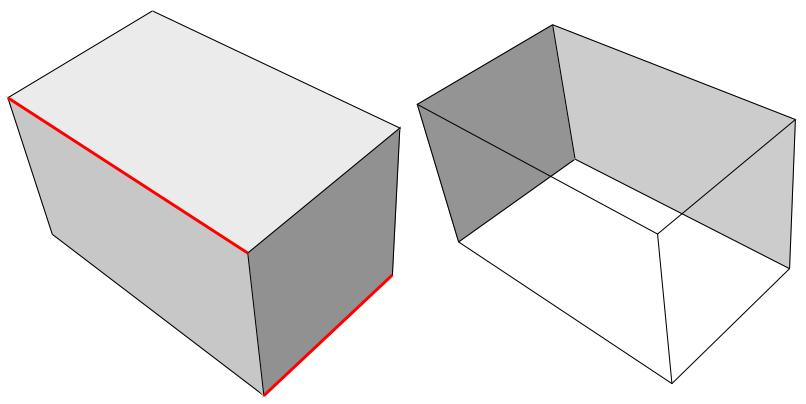

左图显示了原始实体部件上选择的边。右图显示了结果部件。所选边中的每一条都关联着两个面；Abaqus/CAE 移除这些面并将实体转换为壳。所选边以及所有不再关联面的其他边共同构成了新的线特征。
**从边创建线特征无法被修改。**

1. 从主菜单栏中，选择 **Shape** > **Wire** > **From Edge**。

    Abaqus/CAE 会在提示区域显示提示，指导您完成操作步骤。

    

    **提示**：您也可以使用工具来添加从边创建线特征，该工具位于部件（Part）模块工具箱的线工具（wire tools）中。有关部件（Part）模块工具箱中工具的图示，请参见使用部件（Part）模块工具箱。

2. 选择要被线替换的边。
3. 点击 **Done** 以创建线特征。

    Abaqus/CAE 会显示一个对话框，提示与所选边关联的面和单元将被删除。

4. 点击 **Yes** 继续操作，或点击 **No** 取消操作。

    如果您选择 **Yes**，Abaqus/CAE 将移除与所选边关联的面，并添加线来替换所有被移除的特征边。

## 其他信息

*   什么是基于特征的建模？
*   添加线特征
*   Sketch（草图）模块

## 添加切割特征

本节描述用于在当前视口的部件上添加切割特征的部件（Part）模块工具。

## 本节内容：

创建拉伸切割
创建放样切割
创建旋转切割
创建扫掠切割
切割圆形孔

## 创建拉伸切割

从主菜单栏中选择 **Shape** > **Cut** > **Extrude**，可以在当前视口的部件几何体上创建一个拉伸切割。拉伸切割工具始终可用，无论当前视口中的部件处于何种建模空间。

您可以通过在选定面上绘制切割的二维截面草图，并定义 Abaqus/CAE 拉伸该切割的距离，来创建一个进入三维部件的拉伸切割。您可以选择以下方法之一来定义切割的拉伸距离：

*   **盲孔（Blind）**：从草图平面沿选定方向延伸切割，但仅延伸到指定深度。
*   **到面（Up to Face）**：从草图平面延伸切割到选定的面。
*   **贯通（Through All）**：从草图平面沿选定方向完全穿透几何体延伸切割。

这三种方法如图 1 所示。

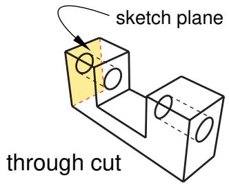

盲孔切割

到面切割
图 1：创建拉伸切割的三种方法。

在二维或轴对称平面部件中创建拉伸切割时，您直接在部件平面上绘制切割的二维截面草图。切割总是完全穿透部件。

在三维部件中创建拉伸切割时，您可以选择一个中心点并指定一个螺距（pitch），Abaqus/CAE 在拉伸时会使用该螺距扭转截面。或者，Abaqus/CAE 可以在拉伸截面时沿指定的拔模角度（draft angle）扩大或收缩截面。更多信息，请参见在拉伸中包含扭转和在拉伸中包含拔模。

1.  从主菜单栏中，选择 **Shape** > **Cut** > **Extrude**。

    Abaqus/CAE 会在提示区域显示提示，指导您完成操作步骤。

    

    **提示**：您也可以使用工具来创建拉伸切割，该工具位于部件（Part）模块工具箱的切割工具（cut tools）中。有关部件（Part）模块工具箱中工具的图示，请参见使用部件（Part）模块工具箱。

2.  如果需要，指定您希望用来为拉伸切割特征的草图选择原点的方法。从提示区域的 **Sketch Origin** 字段中选择以下选项之一：
    *   选择 **Auto-Calculate** 以自动放置草图原点。
    *   选择 **Specify** 以定义自定义草图原点。
    *   选择 **Session Default** 以使用您在本次会话中先前指定的自定义原点。

3.  如果当前视口包含二维或轴对称平面部件，Abaqus/CAE 将进入草图器（Sketcher），您可以在部件平面上绘制拉伸切割的闭合轮廓。

    如果当前视口包含三维部件，您必须执行以下操作：

    a. 选择将从其进行拉伸切割的平面。如果不存在合适的平面，您可以选择一个基准平面（datum plane）或一个孤立单元（orphan element）面。

    

    **提示**：如果无法选择所需的平面，您可以使用选择（Selection）工具栏来更改选择行为。有关更多信息，请参见使用选择选项。

    选定的面在视口中高亮显示。

    b. 如果您选择了 **Specify** 作为草图原点方法，请通过在视口中单击一个点或在提示区域输入原点的三维坐标来指定原点位置。您还可以通过选中 **Set as session default** 来将此自定义原点设置为本次会话中所有草图的默认原点。

    c. 选择一条边以及该边在草图器网格上的方向。该边不能垂直于所选平面。默认情况下，所选边将显示为垂直方向，并位于草图器网格的右侧。要为该边选择不同的方向，请单击对话框右侧的箭头，并从出现的列表中选择一个方向。

    

    **提示**：如果所选平面的边是弯曲的或未提供所需的方向，您可以创建一个基准轴（datum axis）。然后您可以选择该基准轴来控制部件在草图器网格上的方向。

    Abaqus/CAE 高亮显示所选边，进入草图器，并旋转部件直到所选平面与草图器网格平面对齐，且所选边按所需方向与网格对齐。

    如果您不确定部件相对于草图器网格的方向，请使用视图操作（View Manipulation）工具栏中的视图操作工具来查看其位置。使用重置视图（reset view）工具可返回到原始视图。

    d. 使用草图器绘制拉伸切割的闭合二维轮廓。

4.  在提示区域，单击 **Done** 表示您已完成轮廓绘制。

5.  如果当前视口包含二维或轴对称平面部件，部件将返回到其原始方向，并且 Abaqus/CAE 使用草绘的轮廓切割该平面。

    如果当前视口包含三维部件，Abaqus/CAE 将以原始方向显示部件，显示基础部件、您草绘的轮廓以及一个指示拉伸方向的箭头。出现“Edit Cut”（编辑切割）对话框。请完成以下步骤以在三维部件中创建拉伸切割：

    a. 如有必要，在“Edit Cut”对话框中单击  以反转拉伸方向。
    如果箭头方向难以看清，请使用旋转（rotate）工具旋转部件。
    b. 选择以下结束条件之一：
    *   选择 **Blind**（盲孔）并在 **Depth**（深度）字段中输入一个值，以指定 Abaqus/CAE 将拉伸草绘切割轮廓的距离。
    *   选择 **Up to Face**（到面）以指定 Abaqus/CAE 将切割拉伸到选定的面。
    *   选择 **Through All**（贯通）以指定 Abaqus/CAE 将从草图平面完全穿透几何体拉伸切割。

6.  如果需要，选择以下选项之一：
    *   选择 **Twist**（扭转）并输入螺距（pitch）。螺距是发生 360° 扭转所需的拉伸距离。草绘的切割轮廓必须包含一个孤立点（isolated point）来指示扭转中心。
    *   选择 **Draft**（拔模）并输入拔模角度（大于 -90° 且小于 90°）。正的拔模角度表示轮廓的外部面扩大，内部面收缩。

7.  单击 **OK** 以拉伸轮廓。

    如果您选择了“扭转”选项并且您的草图包含一个孤立的点，Abaqus/CAE 将使用该点作为扭转中心。如果您的草图不包含孤立的点，Abaqus/CAE 将返回草图器供您创建一个。如果您的草图包含多个孤立的点，Abaqus/CAE 将返回草图器，并提示您选择一个孤立点作为扭转中心。

8.  如果您选择了 **Up to Face**，Abaqus/CAE 将提示您选择要将轮廓拉伸到的面。选择的面需满足以下要求：
    *   所选面不必平行于草图平面。
    *   它可以是非平面面。
    *   它必须完全包含拉伸后的选择集。
    *   它不能是基准平面或孤立单元面。

    Abaqus/CAE 创建拉伸切割特征。

    

## 注：

切割特征仅应用于部件几何体。切割区域内的任何孤立单元不受切割的影响。

## 其他信息

*   基准（Datum）工具集
*   添加切割特征
• 草图模块（Sketch module）
• 什么是基于特征的建模（feature-based modeling）？

从主菜单栏选择 **Shape->Cut->Loft**，可在当前视口中为部件几何体添加一个放样切割。您只能向三维部件添加放样切割。

您可以通过从选定边创建两个或多个截面，并定义一条或多条放样路径，来添加放样切割。放样截面和生成的放样切割如下图所示（图中未显示放样路径）：

您可以允许 Abaqus/CAE 使用一条平滑路径连接每个放样截面的中心来定义单一放样路径（如前一图所示）。如果允许 Abaqus/CAE 定义路径，您可以对放样特征的起始和结束截面应用相切方法。曲线和相切定义了放样特征在截面之间的路径。或者，您可以通过选择连接一个放样截面上的点与下一个放样截面上的点的曲线来定义一条或多条放样路径。每条放样路径必须提供连接每个连续放样截面的连续线条。如果放样路径不平滑（如果沿路径任何点有多于一条切线），当您尝试创建放样时，Abaqus/CAE 将显示错误消息。有关放样截面、放样路径和放样相切的更多信息，请参见 *什么是放样（lofting）？*。

## 注意：

在添加放样特征时，您不使用草图器（Sketcher）。因此，定义放样截面和放样路径的所有边在创建放样之前必须已存在于部件几何体中。要创建放样路径或创建工具，可使用部件模块工具箱中线工具部分的工具来创建样条线（参见 *添加点到点线特征*，获取更多信息）。

1.  从主菜单栏选择 **Shape->Cut->Loft**。

    Abaqus/CAE 在提示区显示提示，引导您完成整个过程。

    

    提示：您也可以使用部件模块工具箱中切割工具部分的工具来添加放样切割。有关部件模块工具箱中工具的图示，请参见 *使用部件模块工具箱*。

    “编辑放样（Edit Loft）”对话框出现。

2.  通过从视口中的部件选择边来创建放样截面。有关创建放样截面的详细说明，请参见 *创建放样截面*。

3.  完成创建放样截面后，在“编辑放样”对话框中单击 **过渡（Transition）** 选项卡。

4.  通过再次从视口中的部件选择边或使用放样相切来创建放样路径（或路径）。有关创建放样路径的详细说明，请参见 *创建放样路径*。

5.  单击 **预览（Preview）**。

    Abaqus/CAE 显示将使用您当前设置创建的放样的线框表示。

6.  如果需要，您可以添加或移除放样截面，更改放样路径定义方法，或编辑放样相切选项以更改放样特征的形状。单击 **预览** 可在视口中查看更改的效果。

7.  如果需要，您可以要求 Abaqus/CAE 在创建放样特征时进行自相交测试。此测试可防止创建难以或无法进行网格划分和分析的特征，但随着放样特征复杂性的增加，计算成本会变得很高。有关更多信息，请参见 *自相交检查*。要使用自相交检查，请选择 **Feature->Options** 以打开“特征选项（Feature Options）”对话框，然后勾选 **执行自相交检查（Perform self-intersection checks）**。

8.  单击 **完成（Done）** 以创建放样并关闭“编辑放样”对话框。

    如果您选择进行自相交测试并且测试失败，“编辑放样”对话框将重新出现以便您进行更改。否则，放样切割将在视口中创建。

    

## 注意：

切割特征仅应用于部件几何体。切割区域内的任何孤立网格单元不受切割影响。

## 其他信息

• 添加切割特征（Adding a cut feature）
• 什么是基于特征的建模（What is feature-based modeling?）

从主菜单栏选择 **Shape->Cut->Revolve**，可在当前视口中创建一个贯穿部件几何体的旋转切割。您只能通过三维部件切割旋转切割。

您可以通过在选定平面上绘制一个封闭的二维截面和一条构造线来添加旋转切割。构造线作为旋转轴，Abaqus/CAE 通过使用指定的旋转角度绕该轴旋转截面来创建旋转切割。此外，您可以指定一个螺距和一个方向，Abaqus/CAE 用于在旋转轮廓时沿旋转轴平移草图。下图显示了两个旋转切割特征；右侧的图显示了一个带螺距的旋转切割。

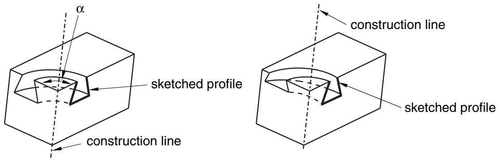

1.  从主菜单栏选择 **Shape->Cut->Revolve**。

    Abaqus/CAE 在提示区显示提示，引导您完成整个过程。

    

    提示：您也可以使用部件模块工具箱中切割工具部分的工具来创建旋转切割。有关部件模块工具箱中工具的图示，请参见 *使用部件模块工具箱*。

2.  如果需要，指定您希望用于选择旋转切割特征草图原点的方法。从提示区的 **草图原点（Sketch Origin）** 字段中选择以下选项之一：

    • 选择 **自动计算（Auto-Calculate）** 以自动放置草图原点。
    • 选择 **指定（Specify）** 以定义自定义草图原点。
    • 选择 **会话默认（Session Default）** 以使用您在本次会话中早先指定的自定义原点。

3.  选择将从其旋转切割的平面。如果没有合适的平面，您可以选择一个基准平面或一个孤立网格单元面。

    

    提示：如果您无法选择所需的平面，可以使用选择工具栏更改选择行为。有关更多信息，请参见 *使用选择选项*。

    所选平面在视口中高亮显示。

4.  如果您选择了 **指定** 作为草图原点方法，请通过在视口中单击一个点或在提示区输入原点的三维坐标来指定原点位置。您还可以通过勾选 **设置为会话默认（Set as session default）** 将此自定义原点设置为会话中所有草图的默认原点。

5.  选择一条边及其在草图器网格上的方向。该边不得与所选平面垂直。默认情况下，所选边将显示在草图器网格的右侧且垂直。要为边选择不同的方向，请单击对话框右侧的箭头，并从出现的列表中选择一个方向。

    

    提示：如果所选平面的边是曲线或未提供所需方向，您可以创建一个基准轴。然后，您可以选择该基准轴来控制部件在草图器网格上的方向。

    Abaqus/CAE 高亮显示所选边，进入草图器，并旋转部件直到所选平面与草图器网格平面对齐，并且所选边以所需方向与网格对齐。

    如果您不确定部件相对于草图器网格的方向，请使用视图操作工具栏中的视图操作工具查看其位置。使用重置视图工具返回原始视图。

6.  使用水平、垂直、角度或斜构造线工具绘制旋转轴。您可以通过从底层部件选择一个基准轴来定位构造线。您不能直接选择基准轴；您必须从基准轴的任一端选择一个点。

7.  使用草图器绘制旋转切割的二维轮廓；该轮廓不得与旋转轴相交。

8.  在提示区，单击 **完成（Done）** 表示您已完成轮廓和轴的绘制。如果草图包含多于一条构造线，Abaqus/CAE 将提示您选择将作为旋转轴的那条构造线。

    Abaqus/CAE 显示进入草图器之前处于活动状态的部件视图。该部件包括您绘制的轮廓和一个指示旋转方向的箭头。“编辑旋转（Edit Revolution）”对话框出现。

9.  在“编辑旋转”对话框中，输入所需的旋转角度或接受默认值。

10. 单击 **旋转方向（Revolve direction）** 旁边的箭头以更改箭头方向及关联的旋转方向。
11. 如果需要，勾选“Include translation”（包含平移）选项，并输入一个正的螺距值。螺距值是指轮廓线在旋转360°过程中沿旋转轴平移的距离。

此时会出现一个箭头，指示旋转轴并标明轮廓线沿该轴平移的方向。如有必要，可在“Edit Revolution”（编辑旋转）对话框中单击“Pitch direction”（螺距方向）旁的按钮以反转箭头方向。

12. 如果需要，勾选“Sweep sketch normal to path”（使草图法线沿路径扫掠）以将草绘轮廓旋转至垂直于旋转路径的方向。此选项仅在使用“Include translation”时可用。

该特征的初始轮廓将从草图平面旋转以创建特征。

13. 单击“OK”（确定）接受所示方向并创建旋转切除特征。

Abaqus/CAE 将使用您选定的参数创建旋转切除特征。

## 注意：

切除特征仅应用于部件几何体。切除区域内的任何孤立网格单元不受切除影响。

## 附加信息

*   创建构造几何
*   添加切除特征
*   为轴对称部件和旋转特征定义旋转轴
*   使用螺距控制旋转特征的横截面
*   草图模块
*   什么是基于特征的建模？

## 创建扫掠切除

从主菜单栏选择 **Shape -> Cut -> Sweep** 以在当前视口中创建贯穿部件几何体的扫掠壳切除。您只能为三维部件创建扫掠切除。

您需要通过先定义扫掠路径，再定义扫掠轮廓来添加扫掠切除特征。定义每个部分有不同的可用方法：

您可以通过在选定面上草绘路径，或选择一系列希望扫掠路径跟随的边或线来定义扫掠路径。草绘方法提供更大的灵活性，但仅支持二维路径。边/线方法使您能够沿诸如样条线或三维部件中的一组边等特征定义三维扫掠路径。
您可以使用草绘器草绘扫掠轮廓，或选择模型中的一个面作为轮廓来定义扫掠轮廓。扫掠轮廓最初垂直于路径；您可以选择在整个扫掠路径上保持此方向恒定，也可以选择在扫掠过程中保持扫掠轮廓垂直于扫掠路径。

下图展示了在选定面上草绘扫掠路径以及草绘闭合扫掠轮廓的示例。轮廓的上边未显示。

定义扫掠路径的草绘或边集合，以及定义扫掠轮廓的草绘、边或边集合，共同定义了扫掠切除特征；如果使用草绘器定义，扫掠路径和扫掠轮廓都可以使用“特征操作”工具集进行修改。您可以定义扫掠轮廓相对于扫掠路径偏移的扫掠切除。在这种情况下，Abaqus/CAE 会将扫掠路径移动到穿过扫掠轮廓的平行位置，并在该位置创建扫掠切除特征。

在定义扫掠特征时，您可以为其应用扭转或拔模。有关这些工具的更多信息，请参见*您可以创建哪些类型的特征？*。您可以勾选“Keep profile normal constant”（保持轮廓法线恒定）以在扫掠轮廓沿扫掠路径移动时保持相同的方向；如果取消勾选此选项，扫掠轮廓的方向将随扫掠路径的法线而变化。此外，您可以在“特征操作”工具集中勾选“Keep internal boundaries”（保留内部边界），以保留扫掠壳特征与现有部件之间生成的任何面或边。内部边界可能会创建一些区域，这些区域可以进行结构化或扫掠网格划分，而无需借助分区。

1.  从主菜单栏，选择 **Shape -> Cut -> Sweep**。
    Abaqus/CAE 会在提示区显示提示，引导您完成操作。

    

    **提示：** 您也可以使用工具创建扫掠切除，该工具位于“Part”模块工具箱的切除工具中。有关“Part”模块工具箱中工具的图示，请参见*使用Part模块工具箱*。

2.  如果希望草绘扫掠路径，请执行以下操作：
    a. 从“Path options”（路径选项）中，选择“Sketch”（草图）并单击（下一步）。
       Abaqus/CAE 会在提示区显示提示，引导您完成操作。
    b. 如果需要，指定为扫掠实体特征草绘选择原点的方法。在提示区的“Sketch Origin”（草图原点）字段中选择以下选项之一：
       *   选择“Auto-Calculate”（自动计算）以自动放置草图原点。
       *   选择“Specify”（指定）以定义自定义草图原点。
       *   选择“Session Default”（会话默认）以使用您在当前会话中先前指定的自定义原点。
    c. 选择要在其上草绘扫掠路径的平面。如果没有合适的面，您可以选择一个基准平面或一个孤立网格单元面。
       
       **提示：** 如果无法选择所需的平面，可以使用“Selection”（选择）工具栏更改选择行为。更多信息，请参见*使用选择选项*。
    d. 如果选择了“Specify”作为草图原点方法，请通过在视口中单击一个点或在提示区输入原点的三维坐标来指定原点位置。您还可以通过勾选“Set as session default”（设为会话默认）将此自定义原点设置为会话中所有草图的默认原点。
    e. 选择一条边以及该边在草绘器网格上的方向。该边不能与所选面垂直。默认情况下，所选边将显示为垂直方向并位于草绘器网格的右侧。要为边选择不同的方向，请单击对话框右侧的箭头，并从出现的列表中选择一个方向。
       
       **提示：** 如果没有具有所需方向的直边，您可以创建一个基准轴。然后可以选择基准轴来控制部件在草绘器网格上的方向。
       Abaqus/CAE 会高亮显示所选边，进入草绘器，并旋转部件，使所选面与草绘器网格平面对齐，所选边以所需方向与网格对齐。
       如果您不确定部件相对于草绘器网格的方向，可以使用“View Manipulation”（视图操作）工具栏中的视图操作工具查看其位置。使用重置视图工具返回到原始视图。
    f. 草绘扫掠路径。扫掠路径必须满足以下准则：
       *   路径可以是闭合的，但端点必须平滑相接；例如，端点不应在拐角处相接。有关有效扫掠路径的示例，请参见*定义扫掠路径和扫掠轮廓*。
       *   路径必须是连续的；例如，它不能分叉。
       *   生成的实体不能与自身相交。
       在提示区，单击“Done”（完成）表示您已完成扫掠路径的草绘。
       Abaqus/CAE 退出草绘器并恢复部件的原始视图。一条高亮线指示扫掠路径及其方向。Abaqus/CAE 还会重新打开“Create Cut Sweep”（创建切除扫掠）对话框，并在“Path options”的“Sketch”标签旁添加“(Defined)”字样，表示已在草绘器中定义了扫掠路径。

3.  如果希望将扫掠路径指定为一系列边或线，请执行以下操作：
    a. 从“Path options”中，选择“Edges”（边）并单击（下一步）。
       Abaqus/CAE 会在提示区显示提示，引导您完成操作。
    b. 如果需要，在提示区指定是希望逐个选择扫掠路径中的边，还是按边的角度选择。有关选择对象的更多信息，请参见*使用角度和特征边方法选择多个对象*。
    c. 选择要包含在扫掠路径中的边。
       Abaqus/CAE 会在部件上显示扫掠路径并指示扫掠方向。
    d. 在提示区，单击“Yes”（是）确认扫掠路径方向，或单击“Flip”（反转）反转扫掠路径方向。
       Abaqus/CAE 重新打开“Create Cut Sweep”对话框，并在“Path options”的“Edges”标签旁添加“(Defined)”字样，表示已使用一系列边定义了扫掠路径。

4.  如果希望草绘扫掠轮廓，请执行以下操作：
    a. 从“Profile options”（轮廓选项）中，选择“Sketch”（草图）并单击（下一步）。
       Abaqus/CAE 会在提示区显示提示，引导您完成操作。
       
    b. 草绘扫掠轮廓。扫掠轮廓必须满足以下准则：
• 轮廓必须是封闭的。
• 生成的实体不能与自身相交。

您可以在草图网格的任意位置绘制轮廓；Abaqus/CAE 将沿平行于扫掠路径的路径扫掠该轮廓。在提示区中，单击“完成”(Done) 表示您已完成扫掠轮廓的绘制。

Abaqus/CAE 将退出草图器并恢复零件的原始视图。

c. 在草图网格上选择一条边及其方向。所选边不能平行于扫掠路径方向。默认情况下，所选边将垂直显示并位于草图网格的右侧。要选择不同的边方向，请单击对话框右侧的箭头，并从出现的列表中选择一个方向。

Abaqus/CAE 将高亮显示所选边，重新进入草图器，并旋转零件，使得草图网格位于扫掠路径起始处的法平面上，且扫掠路径方向指向屏幕外。此外，所选边将根据所需方向与网格对齐。两条虚线的交点指示扫掠路径的原点。Abaqus/CAE 还会重新打开“创建切削扫掠”(Create Cut Sweep) 对话框，并在“轮廓”(Profile) 选项中的“草图”(Sketch) 标签旁添加“（已定义）”字样，表示扫掠轮廓已在草图器中定义。

5.  如果您想选择一个面作为扫掠轮廓，请执行以下操作：

    a. 从“轮廓”(Profile) 选项中选择“面”(Face)，然后单击
    Abaqus/CAE 在提示区显示提示以指导您完成操作。
    b. 从视口中选择一个面。

    Abaqus/CAE 高亮显示所选面，并重新打开“创建实体扫掠”(Create Solid Sweep) 对话框，在“轮廓”(Profile) 选项中的“面”(Faces) 标签旁添加“（已定义）”字样，表示已使用面定义了扫掠轮廓。

6.  如果需要，执行以下任何操作：

    打开“包含扭转”(Include twist) 开关，并输入螺距。螺距是指发生 360° 扭转的挤出距离。绘制的挤出轮廓必须包含一个指示扭转中心的孤立点。
    打开“包含拔模”(Include draft) 开关，并输入拔模角度（大于 −90° 且小于 90°）。正的拔模角度表示轮廓的外部面扩张，内部面收缩。如果选择了“保持轮廓法向不变”(Keep profile normal constant) 选项，则无法应用拔模。
    打开“保持轮廓法向不变”(Keep profile normal constant) 开关，以在整个扫掠路径上保持相同的轮廓方向。如果关闭此选项，Abaqus/CAE 会调整轮廓方向，使得扫掠轮廓与扫掠路径法线之间的角度始终保持不变。如果选择了“包含拔模”(Include draft) 选项，则无法打开此开关。
    打开“保留内部边界”(Keep internal boundaries) 开关，以保持扫掠实体特征与现有零件之间生成的任何面或边。内部边界可以创建无需分区即可进行结构化网格划分或扫掠网格划分的区域。

7.  单击“确定”(OK) 以创建新的扫掠切削。

## 注意：

切削特征仅应用于零件几何体。切削区域内的任何孤立单元不受切削影响。

## 其他信息

•   定义扫掠路径和扫掠轮廓
•   草图模块
•   什么是基于特征的建模？

## 切削圆形孔

从主菜单栏选择“形状”(Shape)->“切削”(Cut)->“圆形孔”(Circular Hole)，以在当前视口中切削穿过零件的圆形孔。圆形孔工具始终可用，与当前视口中零件的建模空间无关。

您可以通过指定距两条选定直线边的距离并指定孔的直径来切削圆形孔，如下图所示：

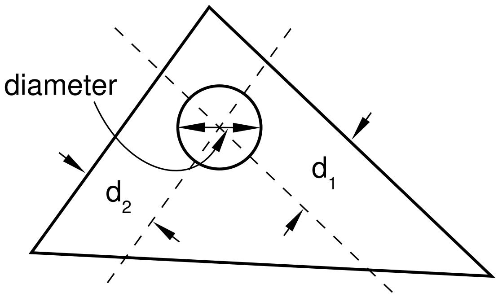

零件必须至少包含两条直线边；例如，您不能使用此工具在圆形零件上切削孔。

如果当前视口包含二维或轴对称平面零件，孔将始终穿过整个零件。但是，如果当前视口包含三维零件，Abaqus/CAE 会提示您选择切削类型。您可以选择“完全贯穿”(Through All) 或“盲孔”(Blind) 来定义切削深度。

孔到每条边的距离、孔的直径和盲孔深度是定义圆形孔的特征，所有这三个特征都可以使用“特征操作”(Feature Manipulation) 工具集进行修改。创建切削后，您无法更改切削类型——完全贯穿或盲孔。

1.  从主菜单栏选择“形状”(Shape)->“切削”(Cut)->“圆形孔”(Circular Hole)。

    Abaqus/CAE 在提示区显示提示以指导您完成操作。

    

    提示：您也可以使用位于“零件”(Part) 模块工具箱中切削工具旁的 工具来切削圆形孔。有关“零件”(Part) 模块工具箱中工具的示意图，请参阅使用零件模块工具箱。

2.  如果当前视口包含二维零件，请选择定位孔中心的第一条边。

    如果当前视口包含三维零件，您必须执行以下操作：

    a. 从提示区的按钮中，选择以下切削类型之一：

    单击“完全贯穿”(Through All) 以切削从选定面沿选定方向穿过零件的圆形孔。下例说明了完全贯穿切削：

    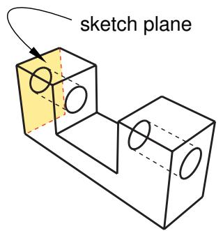

    单击“盲孔”(Blind) 以切削从选定面沿选定方向但仅延伸至指定深度的圆形孔。下例说明了盲孔切削：

    

    b. 选择将从中切削孔的面。

    

    提示：如果无法选择所需面，您可以使用“选择”(Selection) 工具栏更改选择行为。有关更多信息，请参阅使用选择选项。

    将出现一个箭头，指示切削孔的轴线方向。

    c. 如果需要，单击提示区中的“反向”(Flip) 按钮以反转箭头。单击“确定”(OK) 以接受指示的方向。

    

    提示：如果箭头方向难以看清，请使用旋转工具旋转零件。

    d. 选择定位孔中心的第一条边。所选边不必位于与所选面相同的平面内，但不能与该面垂直。

3.  在提示区的文本字段中，输入从所选边到孔中心的距离。
4.  选择定位孔中心的第二条边。这两条边不能平行。
5.  在提示区的文本字段中，输入从所选边到孔中心的距离。
6.  在提示区的文本字段中，输入孔的直径。

    如果当前视口包含二维或轴对称平面零件，Abaqus/CAE 将使用圆形孔切削零件。

    如果当前视口包含三维零件，并且您选择了盲孔切削，提示区将出现默认孔深度。单击鼠标按钮 2 接受默认值，或输入新的孔深度。

    零件将返回到其原始方向，并已从选定面切削出圆形孔。

    

## 注意：

切削特征仅应用于零件几何体。切削区域内的任何孤立单元不受切削影响。

## 其他信息

•   添加切削特征
•   草图模块
•   什么是基于特征的建模？

## 使用“编辑特征”对话框

当您首次选择要编辑的特征时，将出现“编辑特征”(Edit Feature) 对话框。

本节描述“编辑特征”(Edit Feature) 对话框中的选项；可用选项取决于所选的特征。

您使用“编辑特征”(Edit Feature) 对话框来更改以下内容：

## 深度 (Depth)

使用“深度”(Depth) 参数更改盲孔挤出特征的深度。输入新的挤出深度值，然后单击“应用”(Apply) 以在视口中查看修改后的特征。您无法更改特征首次创建时定义挤出距离的方式；例如，从“盲孔”(Blind) 改为“延伸至面”(Up to Face)。有关更多信息，请参阅定义挤出距离。

## 半径 (Radius)

使用“半径”(Radius) 参数更改圆角/倒圆特征的半径。输入新的倒圆半径值，然后单击“应用”(Apply) 以在视口中查看修改后的特征。有关更多信息，请参阅倒圆边和在导线中倒圆顶点。

## 反向挤出方向 (Flip extrude direction)

切换“反向挤出方向”(Flip extrude direction) 以更改所选特征的挤出方向。单击“应用”(Apply) 以在视口中查看修改后的特征。此选项仅适用于添加到基础特征上的挤出特征。有关更多信息，请参阅控制挤出特征的方向。
## 保留内部边界

切换“保留内部边界”开关以维持在特征与现有部件之间生成的任何面或边。内部边界可以创建无需分区即可进行结构化或扫掠网格化的区域。此选项仅适用于添加到基础特征上的拉伸、旋转和放样实体及壳特征。

## 拔模角度

使用“拔模角度”参数来更改拉伸特征的拔模。输入新的拔模角度值，然后单击“应用”以在视口中查看修改后的特征。拔模角度为零将创建直线拉伸。如果特征创建时未定义拔模，则无法为其添加拔模。更多信息，请参阅“在拉伸中包含拔模”。

## 螺距

使用“螺距”参数来更改拉伸特征的扭曲或旋转特征的螺距。输入新的螺距值，然后单击“应用”以在视口中查看修改后的特征。如果特征创建时未定义螺距，则无法为其添加螺距。

在拉伸特征中，螺距定义了轮廓扭曲360°所对应的拉伸距离。更多信息，请参阅“在拉伸中包含扭曲”。类似地，在旋转特征中，螺距是指轮廓在360°旋转过程中被平移的距离。更多信息，请参阅“为轴对称部件和旋转特征定义旋转轴”。

## 角度

使用“角度”参数来更改旋转特征的旋转角度。输入新值，然后单击“应用”以在视口中查看修改后的特征。

## 翻转旋转方向

切换“翻转旋转方向”以反转旋转特征的旋转方向。单击“应用”以在视口中查看修改后的特征。更多信息，请参阅“控制旋转特征的方向”。

## 翻转螺距方向

切换“翻转螺距方向”以更改具有螺距的旋转特征中的平移方向。单击“应用”以在视口中查看修改后的特征。此选项仅适用于旋转特征，并与“螺距”参数配合使用。更多信息，请参阅“控制旋转特征的方向”。

## 扫掠草图垂直于路径

切换“扫掠草图垂直于路径”以更改用于创建具有螺距的旋转特征的初始草图的方向。单击“应用”以在视口中查看修改后的特征。此选项仅适用于具有螺距的旋转特征。更多信息，请参阅“控制具有螺距的旋转特征的横截面”。

## 编辑剖面草图

使用“编辑剖面草图”按钮来更改所选特征的轮廓。进行修改后，关闭草图器，然后单击“应用”以在视口中查看修改后的特征。

## 编辑扫掠路径草图

使用“编辑扫掠路径草图”按钮来更改扫掠特征的路径。进行修改后，关闭草图器，然后单击“应用”以在视口中查看修改后的特征。更多信息，请参阅“定义扫掠路径和扫掠轮廓”。

## 缝合容差

使用“缝合容差”参数来增大或减小当您缝合部件中自由边之间的间隙时 Abaqus/CAE 修复的间隙大小。更多信息，请参阅“缝合边以创建面”。

## 确定时重新生成

切换“确定时重新生成”以控制特征重新生成。默认情况下，“确定时重新生成”是开启的。如果您不希望在单击“确定”时重新生成特征，请关闭此选项。更多信息，请参阅“重新生成部件或装配体”。

## 附加信息

• Abaqus/CAE 中如何定义部件？
• 创建新部件
• 使用创建部件对话框

## 使用编辑放样对话框

本节介绍用于创建实体、壳或切割放样特征组件的过程。

## 本节内容：

创建放样截面
创建放样路径

## 创建放样截面

放样截面代表了放样特征在放样路径上特定点处的形状。创建放样特征至少需要两个截面。您可以通过在当前视口中从部件的现有边中拾取来创建放样截面。

1.  在“编辑放样”对话框中，选择“在前插入”或“在后插入”以创建第一个放样截面。
2.  选择定义放样截面的边。使用 [Shift] + 单击将其他边添加到选择中，使用 [Ctrl] + 单击已选边以取消选择。选中的边将以红色高亮显示，并且会保持高亮状态直到放样特征完成。

一个放样截面可以由当前部件的任何边组成，并且必须满足以下条件：

• 对于实体放样或切割放样，截面必须是闭合的，并且第一个和最后一个截面必须是平面的。
• 对于壳放样，如果一个截面是开放的，则所有截面必须是开放的；如果一个截面是闭合的，则所有截面必须是闭合的。
• 截面必须是一个连续的环路，没有分支。
• 在一个放样截面中使用的边不能用于同一放样的另一个截面。

所有壳放样截面以及实体放样和切割放样的中间截面都可以是非平面的。要创建非平面截面，您可以选择使用样条线创建的边，或者选择现有非平面面的边。

3.  在提示区中，单击“完成”以指示您已完成选择边来定义放样截面。

Abaqus/CAE 返回到“编辑放样”对话框，并且截面显示在“截面”列表中。

4.  重复步骤 2 和 3 以定义所有放样截面。使用“在前插入”和“在后插入”按钮来指定您希望下一个放样截面相对于当前高亮显示的放样截面出现在列表中的哪个位置。在列表中高亮显示的截面在视口中也会以洋红色高亮显示，以区别于其他放样截面。放样截面按您创建的顺序编号，但 Abaqus/CAE 按照“截面”列表中显示的顺序创建放样特征。您只能通过添加或删除放样截面来更改列表的顺序。

您不能编辑已完成的放样截面。

## 附加信息

• 什么是放样？
• 创建放样路径
• 添加实体放样特征
• 添加壳放样特征
• 创建放样切割

放样特征的路径连接起始截面上的一个点到终止截面上的一个点。如果定义了超过两个放样截面，路径还必须穿过每个中间截面上的一个点。每条放样路径必须提供一条平滑曲线（在路径上的任何点处只存在一条切线），并且该曲线必须按照与您创建放样特征时相同的顺序连接所有放样截面。

1.  在“编辑放样”对话框的“过渡”选项卡页面中，选择以下任一方法来创建放样路径：

    • 指定相切。Abaqus/CAE 将使用一条连接每个放样截面中心的平滑曲线来创建单条放样路径。
    • 选择路径。选择边来定义放样路径。

放样特征创建后，您无法编辑放样路径方法。

2.  如果选择“指定相切”来定义放样路径，您可以为放样特征选择“起始相切”和“终止相切”。您可以从以下放样相切选项中选择：

    • “无”是默认设置，并且如果选择此项，必须应用于放样特征的两端。
    • 法向。放样面在起始或终止放样截面附近呈 90° 角。
    • 径向。放样面在起始或终止放样截面附近呈 0° 角。
    • 指定。您指定一个应用于放样面的、范围在 0° 到 180° 之间的角度，并指定一个介于 0% 到 100% 之间的幅度，该幅度决定了应用该角度的相对距离。

相切效果随距离减小，并且不影响中间截面处的放样特征。有关放样相切的更多信息和示例，请参阅“定义放样相切”。

放样特征创建后，您无法编辑相切。

3.  如果选择“选择路径”，则在开始放样过程之前，您必须已在部件中创建了至少一条合适的平滑曲线。按如下方式选择每条放样路径：

    a. 单击“添加”。

    “编辑放样”对话框消失。

    b. 选择边以定义放样路径。使用 [Shift] + 单击将其他边添加到选择中，使用 [Ctrl] + 单击已选边以取消选择。选中的边将以蓝色高亮显示，并且会保持高亮状态直到 Abaqus/CAE 创建放样特征。

    您必须创建一条平滑曲线，该曲线连接一个放样截面上的一个点到下一个放样截面上的一个点，并遵循与放样截面列表相同的顺序。Abaqus/CAE 将按照放样截面列表的顺序，沿着每条放样路径创建放样特征。

    c. 单击“完成”。

    “编辑放样”对话框重新出现。

    d. 如果需要，使用前面的步骤添加更多放样路径。要成功创建具有多条放样路径的放样特征，路径之间不能共享任何点。
单击 Delete 可从列表中移除高亮显示的路径。

e. 如果您希望路径的效果局限于相邻表面，请关闭 Global Smoothing；Abaqus/CAE 将为放样体中您未定义路径的任何边应用简单路径。如果保持全局平滑开启，Abaqus/CAE 将对未定义路径的边应用平均函数以创建复杂路径。

放样特征创建后无法添加或删除放样路径；编辑放样路径的唯一方法是移动用于创建每条路径的顶点。

## 附加信息

• 什么是放样？  
• 创建放样截面  
• 添加实体放样特征  
• 添加壳体放样特征  
• 创建放样切除

## 边混合

本节描述当前视口中用于混合零件边的部件模块工具。

## 本节内容：

边倒圆  
边倒角

## 边倒圆

您可以在当前视口中对零件的选定边进行倒圆。

从主菜单栏选择 Shape->Blend->Round/Fillet，以对当前视口中零件的选定边进行倒圆。您可以对凸边和凹边进行“倒圆”或圆角处理。下图示例展示了一个具有圆角边的零件：

您定义圆角半径，Abaqus/CAE 将该半径作为一组应用于所有选定边；因此，后续的特征操作（如编辑、删除和抑制）将应用于整组选定边。因此，如果您选择多条边进行倒圆，则无法仅修改其中一条圆角边。此外，生成边的形状可能取决于您应用圆角的顺序，如下图所示。零件左侧的圆角是通过选择所有三条边并使用倒圆/圆角工具对选定边组进行单次操作创建的。相比之下，零件右侧的圆角是通过逐个选择每条边并依次对每条边应用倒圆/圆角工具创建的。

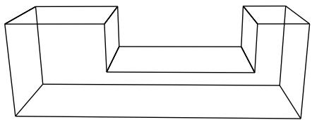

倒圆/圆角工具仅在当前视口包含三维实体或壳体部件时可用。此外，您无法对包含线框的边进行圆角处理。圆角边的半径定义了该特征，可以使用特征操作工具集进行修改。

1. 从主菜单栏选择 Shape->Blend->Round/Fillet。

Abaqus/CAE 将提示您选择要倒圆的边。

Abaqus/CAE 会在提示区域显示提示，引导您完成操作过程。

提示：您也可以使用部件模块工具箱中混合工具所在的工具来对选定边进行倒圆。有关部件模块工具箱中的工具示意图，请参阅使用部件模块工具箱。

2. 选择要倒圆的边，然后单击鼠标键 2 确认选择。按住 [Shift] 并单击其他边可将其添加到选择集，按住 [Ctrl] 并单击已选边可取消选择。

提示：如果无法选择所需的边，您可以使用选择工具栏更改选择行为。有关更多信息，请参阅使用选择选项。

提示区域会显示一个默认半径。

3. 如有必要，在提示区域的文本字段中输入新的半径。单击鼠标键 2 确认该半径。

Abaqus/CAE 会重新绘制零件，所选边已被倒圆。

## 附加信息

• 什么是基于特征的建模？

## 边倒角

您可以在当前视口中对零件的选定边进行倒角或斜切。

从主菜单栏选择 Shape->Blend->Chamfer，以对当前视口中零件的选定边进行倒角或斜切。您输入倒角延伸到每个面的距离，Abaqus/CAE 使用该距离定义倒角，如下示例所示：

Abaqus/CAE 将倒角作为一组应用于所有选定边；因此，后续的特征操作（如编辑、删除和抑制）将应用于整组选定边。因此，如果您选择多条边进行倒角，则无法仅修改其中一条倒角边。

倒角工具仅在当前视口包含三维实体或壳体部件时可用。此外，您无法对包含线框的边进行倒角。倒角的长度定义了该特征，可以使用特征操作工具集进行修改。

1. 从主菜单栏选择 Shape->Blend->Chamfer。

Abaqus/CAE 将提示您选择要倒角的边。

Abaqus/CAE 会在提示区域显示提示，引导您完成操作过程。

提示：您也可以使用部件模块工具箱中混合工具所在的工具来对选定边进行倒角。有关部件模块工具箱中的工具示意图，请参阅使用部件模块工具箱。

2. 选择要倒角的边，然后单击鼠标键 2 确认选择。按住 [Shift] 并单击其他边可将其添加到选择集，按住 [Ctrl] 并单击已选边可取消选择。

提示：如果无法选择所需的边，您可以使用选择工具栏更改选择行为。有关更多信息，请参阅使用选择选项。

提示区域会显示一个默认倒角长度。

3. 如有必要，在提示区域的文本字段中输入新的倒角长度。单击鼠标键 2 确认该倒角长度。

Abaqus/CAE 会重新绘制零件，所选边已被倒角。

## 附加信息

• 什么是基于特征的建模？

## 镜像零件

从主菜单栏选择 Shape->Transform->Mirror，以将当前视口中的零件转换为其自身的镜像。此操作类似于复制零件并使用镜像选项（复制零件）。然而，转换原始零件会保留完整的特征创建历史记录以及编辑这些特征的能力。您可以选择保留原始几何体和镜像后的几何体，并且可以选择任何平面或基准平面作为镜像平面。

镜像工具仅在当前视口包含三维实体或壳体部件时可用。镜像特征与所有特征一样，可以被删除、抑制和恢复；但是，镜像特征不包含可修改的参数，因此创建后无法编辑。

1. 从主菜单栏选择 Shape->Transform->Mirror。

提示：您也可以使用部件模块工具箱中的工具来镜像零件。有关部件模块工具箱中的工具示意图，请参阅使用部件模块工具箱。

2. 在提示区域，勾选 Keep original geometry 以在镜像零件时保留原始几何体。
3. 在提示区域，勾选 Keep internal boundaries 以在镜像零件时保留原始几何体与新几何体之间的任何相交边界。
   如果未与 Keep original geometry 一起使用，此选项无效。
4. 从视口中选择一个基准平面或平面。
Abaqus/CAE 将根据您选择的选项创建镜像几何体。

## 附加信息

• 什么是基于特征的建模？

---

[上一步：模型数据库、模型和文件](model-databases-files.md) · [下一步：属性模块](property-module.md)
