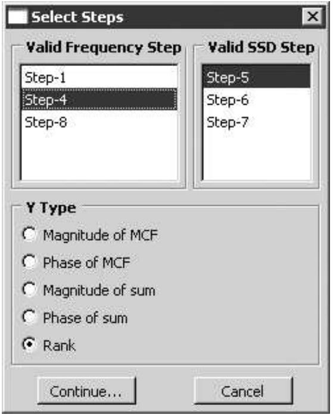
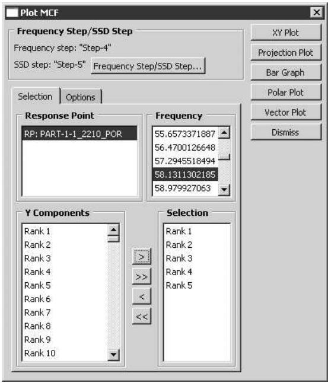
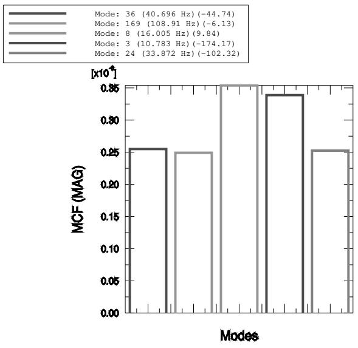
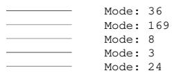
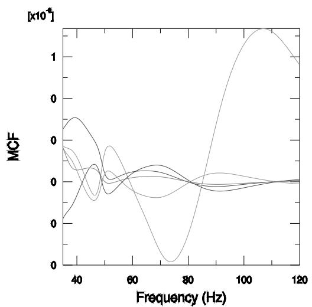
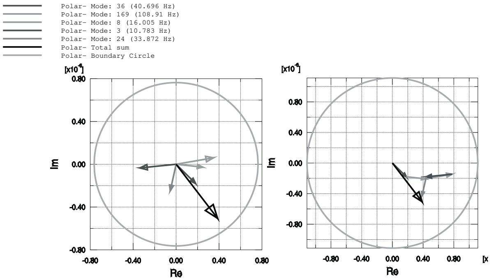
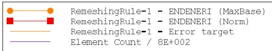

# 使用插件

## 什么是插件？

插件是安装到另一个应用程序中以扩展该应用程序功能的软件组件。Abaqus 插件执行 Abaqus 脚本接口和 Abaqus GUI Toolkit 命令，它们提供了一种方式，可以根据您的特定需求或偏好来自定义 Abaqus/CAE。例如，一个简单的插件可以根据一些预定义选项自动打印当前视口的内容。一个更复杂的插件可以为您编写的专门后处理例程提供一个图形用户界面。

插件有两种类型：内核插件和图形用户界面插件。内核插件由使用 Abaqus 脚本接口编写的函数组成。与内核插件相反，图形用户界面插件使用 Abaqus GUI Toolkit 编写，并包含创建图形用户界面的命令，这些命令随后会向内核发送命令。内核插件和图形用户界面插件都可以从主菜单栏的 "Plug-ins" 菜单或从插件工具箱中访问。

默认情况下，可以从主菜单栏的 "Plug-ins" 菜单访问几个内核和图形用户界面示例插件。您可以使用这些示例来了解插件是如何创建的，以及插件如何与 Abaqus/CAE 交互。此外，您还可以从一个插件工具箱访问两个示例插件。当您从主菜单栏选择 "Plug-ins" -> "Toolboxes" -> "Examples" 时，Abaqus/CAE 会显示示例工具箱。您可以单击工具箱中的图标来启动一个插件。图 1 显示了工具箱菜单和示例插件工具箱。

  
图 1：工具箱菜单和示例插件工具箱。

## 从哪里获取插件？

Abaqus 安装时自带了一些插件。

您可以通过从主菜单栏选择 "Plug-ins" -> "Abaqus" 或 "Tools" 来查看这些插件。

有关如何查看描述插件及其用法的文档的信息，请参阅"如何获取关于插件的信息？"。

在 SIMULIA 社区（SIMULIA 社区 > 学习资源 > 3DEXPERIENCE 和传统产品 > Abaqus > 插件/脚本）中还有其他可用的插件，该社区提供示例插件，并让用户访问一个促进 Abaqus 脚本接口和 Abaqus GUI Toolkit 发展的用户社区。单击“博客”并按“过程自动化”筛选，可以浏览该社区中的插件示例。您也可以编写自己的插件，如本节所述。

## 如何获取关于插件的信息？

Abaqus/CAE 主菜单栏中出现的 "Plug-ins" 菜单包含一个 "About Plug-ins" 项，它会显示 "About Plug-ins" 对话框。此对话框列出了当前安装的所有插件。当您在树形列表中单击每个插件时，Abaqus/CAE 会显示有关该插件的信息，例如作者和版本。此外，您可以在 "About Plug-ins" 对话框中单击 "View" 来查看描述该插件的文档。有关更多信息，请参阅"如何提供关于插件的信息？"。

此信息是作为插件注册命令的可选参数指定的。因此，如果插件的作者选择不提供其中一些可选参数，则相应的信息将不会出现在 "About Plug-ins" 对话框中。

## Python 模块和函数示例

内核插件将 Python 模块和函数与菜单项或工具箱图标关联起来。例如，下面显示的内核插件是在文件 myUtils.py 中定义的一个简单函数，它将当前视口打印到 PNG 文件。文件 myUtils.py 是一个 Python 模块。

```python
def printCurrentVp():
    from abaqus import session, getInputs
    from abaqusConstants import PNG
    name = getInputs( (('File name:', ''),),
        'Print current viewport to PNG file')[0]
    vp = session.viewports[session.currentViewportName]
    session.printToFile(
        fileName=name, format=PNG, canvasObjects=(vp, ))
```

示例的第一行（def printCurrentVp():）是一个函数定义，其中包含缩进的命令。插件需要一个函数定义。因此，如果您想通过提取写入 abaqus.rpy 重播文件的命令来创建内核插件，您必须首先将这些命令包装在一个函数定义中。有关编写内核脚本和创建函数定义的更多详细信息，请参阅《Abaqus Scripting User's Guide》和《Abaqus Scripting Reference Guide》。

在编写完内核插件后，您可以通过在 Abaqus/CAE 主菜单栏的 "Plug-ins" 菜单中注册它来执行它。有关更多信息，请参阅"如何使插件在 Abaqus/CAE 中可用？"。

## 图形用户界面插件可以做什么？

图形用户界面插件使用 Abaqus GUI Toolkit 编写。有关编写图形用户界面脚本的更多详细信息，请参阅《Abaqus GUI Toolkit User's Guide》和《Abaqus GUI Toolkit Reference Guide》。除了图形用户界面命令外，图形用户界面插件通常还包含一个内核模块，该模块定义了当图形用户界面向内核发出命令时将执行的函数。例如，您可以编写一个图形用户界面插件，向用户显示一个用于输入板尺寸的对话框，如图 1 所示。


<details>
<summary>text_image</summary>

创建板
注意：此示例说明了如何使用
Abaqus GUI Toolkit 创建图形用户界面插件。
参数
名称：
宽度 (w)：
高度 (h)：
半径 (r)：
示意图
h
r
w
确定
取消
</details>

图 1：用于输入板尺寸的对话框。

当用户单击 "确定" 按钮关闭对话框时，图形用户界面插件会构建一个发送到内核执行的命令。内核函数使用在对话框中输入的尺寸来构建一个部件。

图形用户界面插件类似于内核插件，即您必须在 Abaqus/CAE 主菜单栏的 "Plug-ins" 菜单中注册它后才能执行它。

## 如何使插件在 Abaqus/CAE 中可用？

要使插件在 Abaqus/CAE 中可用，您必须将包含注册命令的、具有特定命名的文件放置在 Abaqus/CAE 搜索插件的目录之一中。

注册命令可以使插件从主菜单栏的 "Plug-ins" 菜单、从一个单独的插件工具箱或同时从两者可用。本节描述如何使插件在 Abaqus/CAE 中可用。

## 本节内容：

插件文件存储在哪里？  
内核和图形用户界面注册命令是什么？  
将内核插件添加到 "Plug-ins" 菜单的示例  
将内核插件添加到插件工具箱的示例  
将图形用户界面插件添加到 "Plug-ins" 菜单的示例

## 插件文件存储在哪里？

Abaqus 插件可以存储在多个位置。

原生 Abaqus/CAE 插件包含在 Abaqus/CAE 安装中。外部插件（Abaqus/CAE 安装后安装的任何插件）不应放置在 Abaqus/CAE 安装目录内。

相反，您应该将外部插件安装在以下任何位置：

• home\_dir\abaqus\_plugins，其中 home\_dir 是您的主目录。  
• current\_dir\abaqus\_plugins，其中 current\_dir 是当前目录。  
plugin\_central\_dir 是一个 Abaqus 环境参数，用于定义存储插件的一个或多个特定目录。这通常是一个集中的位置，如果该目录挂载在所有用户都能访问的文件系统上，则站点的所有用户都可以访问。plugin\_central\_dir 可以在 abaqus\_v6.env 文件或 Abaqus 求解器 custom\_v6.env 文件中定义。例如，

```txt
plugin_central_dir = "C:\\SIMULIA\\CAE\\plugins;U:\\shared\\CAE\\plugins"
```

在 Windows 系统上，目录用分号分隔；在 Linux 系统上，用冒号分隔。有关更多信息，请参阅使用 Abaqus 环境文件。

Abaqus/CAE 将导入这些目录中任何符合命名约定 \*\_plugin.py 的文件。这些文件必须包含注册命令。文件的名称必须遵循标准 Abaqus 脚本接口异常中描述的规则。

## 内核和图形用户界面注册命令是什么？

插件注册命令位于 "Plug-in" 工具集中，您可以从 Abaqus/CAE 的主菜单栏访问它。要访问注册命令，您的脚本应以下列语句开头：

```python
from abaqusGui import getAFXApp
toolset=getAFXApp().getAFXMainWindow().getPluginToolset()
```

您可以使用 toolset 变量执行以下操作：

## 向 "Plug-ins" 菜单添加项

以下语句将一个内核插件和一个图形用户界面插件添加到 "Plug-ins" 菜单：

```txt
toolset.registerKernelMenuButton()
toolset.registerGuiMenuButton()
```

## 向插件工具箱添加图标

以下语句将一个内核插件和一个图形用户界面插件添加到插件工具箱：
```txt
toolset.registerKernelToolButton()
toolset.registerGuiToolButton()
```

注册命令在插件注册命令中有所描述。

## 将内核插件添加到"插件"菜单的示例

您使用 `registerKernelMenuButton()` 命令使一个内核插件可从"插件"菜单访问。以下示例说明了如何将 Python 模块和函数中的示例一文描述的简单函数，与"插件"菜单中的"打印当前视口"项关联起来。（该函数将当前视口打印到 PNG 文件。）注册命令引用了位于 Python 模块 `myUtils` 中的内核函数 `printCurrentVP`：

```python
from abaqusGui import getAFXApp
toolset = getAFXApp().getAFXMainWindow().getPluginToolset()
toolset.registerKernelMenuButton(
    buttonText='Print Current Viewport',
    moduleName='myUtils', functionName='printCurrentVp()')
```

示例中的前两行提供了对插件工具集中命令的访问。下一行在主菜单栏的"插件"菜单下插入一个"打印当前视口"菜单项。当用户点击"打印当前视口"时，Abaqus/CAE 向内核发出以下命令：

```txt
myUtils.printCurrentVp()
```

`buttonText` 参数接受一个以管道符（`|`）分隔的单词列表。管道符将子菜单名称与菜单按钮名称分隔开。这允许您将多个插件分组在一个菜单下。例如，如果您在 `myUtils.py` 中定义了更多函数，可以使用以下版本的 `myUtils_plugin.py` 将它们注册在一个级联菜单下：

```python
from abaqusGui import getAFXApp
toolset = getAFXApp().getAFXMainWindow().getPluginToolset()
toolset.registerKernelMenuButton(
    buttonText='My Utils|Print Current Viewport',
    moduleName='myUtils', functionName='printCurrentVp()')
toolset.registerKernelMenuButton(
    buttonText='My Utils|Print Sections',
    moduleName='myUtils', functionName='printSections()')
toolset.registerKernelMenuButton(
    buttonText='My Utils|Print Materials',
    moduleName='myUtils', functionName='printMaterials()')
```

前面的示例产生了图 1 所示的菜单结构：


<details>
<summary>text_image</summary>

插件	帮助
工具箱
Abaqus
My Utils
工具
关于插件...
打印当前视口
打印材料
打印截面
</details>

图 1：在级联菜单下注册插件的效果。

## 将内核插件添加到插件工具箱的示例

您使用 `registerKernelToolButton()` 命令使一个内核插件可从插件工具箱访问。当您将插件添加到工具箱时，"插件->工具箱"菜单中会出现一个项。当您选择此项时，Abaqus/CAE 会显示一个插件工具箱。虽然您可以在工具箱中显示文本，但您可能希望提供一个图标而不是使用文本（有关创建图标的更多信息，请参见图标）。

`registerKernelToolButton` 注册命令使用与 `registerKernelMenuButton` 命令相同的参数；但是，它还需要一个工具箱名称。您可以使用 `buttonText` 参数通过在前面加上 `"\t"` 来仅指定一个工具提示，如以下版本的 `myUtils_plugin.py` 所示：

```python
from abaqusGui import getAFXApp, FXXPMIcon
from myIcons import vpIconData
vpIcon = FXXPMIcon(getAFXApp(), vpIconData)

toolset = getAFXApp().getAFXMainWindow().getPluginToolset()
toolset.registerKernelToolButton(toolboxName='My Utils',
    buttonText='\tPrint Current Viewport', icon=vpIcon,
    moduleName='myUtils', functionName='printCurrentVp()')
```

此示例在"插件->工具箱"菜单下创建一个"My Utils"项。当用户点击"My Utils"时，Abaqus/CAE 会显示一个工具箱，其标题栏显示"My Utils"。当您点击工具箱中的图标时，Abaqus/CAE 向内核发送以下命令：

```txt
myUtils.printCurrentVp()
```

如果您在"插件"菜单中注册了该插件，发送到内核的命令将是相同的。

"工具箱"项（如果存在）总是出现在"插件"菜单的首位；而"关于插件"项总是出现在末尾。"插件"菜单中的其他项按字母顺序列出。

## 将 GUI 插件添加到"插件"菜单的示例

您使用 `registerGuiMenuButton()` 命令使一个 GUI 插件可从"插件"菜单访问。以下示例展示了如何使用注册命令添加一个 GUI 插件，该插件创建一个发布对话框提示用户输入的表单。当用户选择"插件->我的实用程序"时，Abaqus/CAE 激活该表单。

内核插件的注册命令必须存放在一个与内核插件代码分离的文件中。相比之下，GUI 插件的注册命令可以存放在单独的文件中，或者直接放在 GUI 插件文件中。此示例展示了如何将注册命令和 GUI 插件代码组合到一个文件中。

```python
from abaqusGui import AFXForm, getAFXApp
class MyForm(AFXForm):
    form code goes here
toolset = getAFXApp().getAFXMainWindow().getPluginToolset()
toolset.registerGuiMenuButton(buttonText='My Utility',
    object=MyForm(toolset) )
```

当您使一个 GUI 插件可从"插件"菜单或工具箱访问时，注册命令引用一个 GUI 对象，该对象在插件被选中时接收消息。消息的选择器通过将您指定的消息 ID 与 `SEL_COMMAND` 消息类型组合生成。在大多数情况下，您将提供一个表单或过程作为 GUI 对象，并使用 `ID_ACTIVATE`（默认值）作为消息 ID。表单和过程提示用户输入，大多数情况下使用对话框或提示行。在接收用户输入后，表单和过程向内核发出命令。有关创建表单、过程和对话框的详细信息，请参见模式和对话框。您也可以使用 Really Simple GUI Builder 插件创建简单的对话框；更多信息，请参见使用 Really Simple GUI (RSG) 对话框生成器创建对话框。

## 内核插件如何执行？

Abaqus 通过向内核发出形式为 `moduleName.functionName` 的命令来执行一个内核插件。模块名和函数名是您在该插件的注册命令中提供的名称。

当 Abaqus/CAE 启动并导入一个插件时，该插件所在的目录会被 Abaqus/CAE 存储。首次调用该插件时，Abaqus/CAE 使用该插件的目录更新内核的 `sys.path` 列表。下次调用该插件时，Abaqus/CAE 仅发出插件内部的命令，但不更新 `sys.path`。

例如，考虑前面章节中描述的 `myUtils_plugin.py` 和 `myUtils.py` 文件。假设您将这两个文件存储在您主目录的 `abaqus_plugins` 目录中一个名为 `myPlugins` 的子目录中。第一次您在"插件"菜单中点击"打印当前视口"时，Abaqus/CAE 向内核发送以下命令：

```python
import sys
sys.path.append('path to your home dir/abaqus_plugins/myPlugins')
import myUtils
myUtils.printCurrentViewport()
```

下次您在"插件"菜单中点击"打印当前视口"时，Abaqus/CAE 仅向内核发送以下命令：

```javascript
myUtils.printCurrentViewport()
```

由于 Abaqus/CAE 更新了 `sys.path` 列表，您的插件代码无需执行此任务来导入其需要的模块。这假设这些模块位于与插件相同的目录中。如果您必须导入不位于同一目录中的模块，则必须扩充 `sys.path` 列表。如果您需要扩充 `sys.path` 列表，您应该使用自动确定文件位置的函数，而不是在文件中硬编码插件的路径。这使得将插件移动到不同位置变得容易，而无需修改其代码。以下 `myUtils.py` 示例说明了扩充 `sys.path` 列表的一个例子：

```python
import sys, os

# 此文件的完整路径（含文件名）
absPath = os.path.abspath(__file__)

## 完整目录规范
absDir = os.path.dirname(absPath)

## 完整子目录规范
subDir = os.path.join(absDir, 'mySubDir')
sys.path.append(subDir)

## myModule 位于 subDir 中
import myModule

模块代码的其余部分
```

## 覆盖插件

启动时，Abaqus/CAE 在 Abaqus/CAE 安装目录、您的主目录、当前目录以及由 `plugin_central_dir` Abaqus 环境参数指定的目录中搜索插件。如果 Abaqus/CAE 在多个目录中找到名称和大小写相同的插件，搜索过程中后找到的插件将覆盖先前找到的插件。

插件名称区分大小写。例如，名为 `myPlugin` 的插件与名为 `MyPlugin` 的插件不同。覆盖方法使您能够使用仅存在于您的主目录或当前目录中的插件的自定义版本；但是，在大多数情况下，您应该避免与插件发生命名冲突。
Python 根据 `sys.path` 列表中指定的顺序搜索模块，并在找到与模块名匹配的项时立即停止搜索。例如，如果你有一个名为 `myUtils.py` 的工具模块存储在两个不同的插件目录中，并且这些目录包含不同的代码，那么两个插件都会引用同一个模块——即在 `sys.path` 列表中第一个被找到的模块。

你可以使用 Python 的包风格来存储和引用你的模块，以避免意外覆盖插件或访问错误的模块。首先创建一个目录，其名称应详细且不太可能被他人重复使用，并将你的 `_plugin.py` 文件存储在该目录中。然后在该目录内创建另一个同名目录，并将你的其他插件文件放置在这个新目录中，同时包含一个名为 `__init__.py` 的空文件，使得目录结构如下所示：

```python
torqueCalculator
    torqueCalculator_plugin.py
    torqueCalculator
        __init__.py
        torqueUtils.py
        torqueForm.py
        torqueDB.py
```

在代码中导入文件时，使用包名来限定导入。例如，在 `torqueForm.py` 文件内部，你可以使用以下语句来限定导入：

from torqueCalculator.torqueDB import TorqueDB

## GUI 插件是如何执行的？

Abaqus/CAE 通过向该插件注册命令中指定的 GUI 对象发送消息来执行 GUI 插件。与内核插件类似，当 GUI 插件首次被调用时，Abaqus/CAE 会使用该插件的目录更新内核的 `sys.path` 列表。此外，Abaqus/CAE 会将插件的 `kernelInitString` 发送到内核，并更新 GUI 的 `sys.path` 列表以包含该插件的目录。你可以使用 `kernelInitString` 来初始化内核，以便处理插件 GUI 将要发送的命令。下次调用该插件时，只会向 GUI 对象发送消息。

如果你需要将不在插件同一目录下的文件导入到 GUI 中，你必须像前面示例那样扩充 `sys.path` 列表。此外，如果你需要扩充内核的 `sys.path` 列表，你应该在插件的 `kernelInitString` 中提供类似以下代码（此示例中包含插件的文件名为 `myForm_plugin.py`）：

```python
from abaqusGui import AFXForm, getAFXApp
class MyForm(AFXForm):
    form code goes here
import os
## Full path (with name) to this file
absPath = os.path.abspath(__file__)
## Full directory specification
absDir = os.path.dirname(absPath)
## Full subdirectory specification
subDir = os.path.join(absDir, 'mySubDir')
initString  = "sys.path.append('%s')\n" % subDir
## myModule is located in subDir
initString += 'import myModule'
toolset = getAFXApp().getAFXMainWindow().getPluginToolset()
toolset.registerGuiMenuButton(buttonText='My Utility',
    object=MyForm(toolset), kernelInitString=initString )
```

## 隐藏插件的源代码

如果你不希望其他用户看到插件的源代码，你可以提供插件的编译版本而不是源代码版本。当 Abaqus/CAE 导入插件的源代码版本时，它会先解析插件，然后在执行前将其编译为可执行版本（称为 `filename.pyc`）。如果源代码自上次编译插件以来没有更改，Abaqus/CAE 会直接执行编译版本并跳过编译步骤。即使你删除了包含源代码的文件但保留了插件的编译版本，Abaqus/CAE 仍然会导入该插件。

如果你只有某些插件的编译版本，你可能希望将它们存储在 `abaqus_plugins` 目录下的一个子目录中。这将避免混淆，将没有源代码的插件编译版本与仍有源代码的插件编译版本分开存放。

## 在启动时显示导入插件的异常信息

默认情况下，Abaqus/CAE 在启动应用程序时不会显示与插件导入相关的异常信息。如果你想出于调试目的暴露这些异常，请在启动 Abaqus/CAE 之前，在命令提示符下将环境变量 `ABQ_PLUGIN_DEBUG` 设置为 1。设置此环境变量后，Abaqus/CAE 在启动时会提供关于插件的更多回溯信息，包括发生的任何故障的位置和性质。

## Abaqus/CAE 模块和插件

默认情况下，插件会出现在所有 Abaqus/CAE 模块中。但是，你可以使用注册命令的 `applicableModules` 参数来指定插件可用的特定模块。如果插件不适用于当前模块，其菜单项将在“Plug-ins”菜单中隐藏。例如，如果你指定一个插件仅在 Part 模块中可用，那么除非你处于 Part 模块中，否则你将不会在“Plug-ins”菜单下看到该菜单项。以下注册命令使插件仅在 Part 和 Assembly 模块中可用：

```txt
toolset.registerKernelMenuButton(
    buttonText='Print Materials',
    moduleName='myUtils', functionName='printMaterials()',
    applicableModules=('Part','Assembly'))
```

Abaqus/CAE 使用类似的功能，在你在模块之间切换时隐藏“Tools”菜单中的项目。有关内核和 GUI 注册命令参数的完整说明，请参见插件注册命令。

## 如何提供关于插件的信息？

创建插件时，你可以向注册命令提供以下参数：

## author

指定作者姓名的字符串。

## version

指定插件版本的字符串。

## description

指定插件简要描述的字符串。

## helpUrl

指定指向提供有关插件信息的 URL 路径的字符串。

有关内核和 GUI 注册命令参数的完整说明，请参见插件注册命令。

`helpUrl` 参数可以是任何有效的网页浏览器 URL。在大多数情况下，URL 会指向一个 HTML 文件，但 URL 也可以指向纯文本文件或外部网站。如果你提供了将由 `helpUrl` 参数引用的插件帮助文件，你应该避免硬编码目录名称，而是使用前面示例中所示的技术来构建帮助文件的路径。以下 `myUtils_plugin.py` 的示例展示了如何提供插件信息以及构建 `helpUrl` 参数的相对路径：

```python
from abaqusGui import getAFXApp
toolset = getAFXApp().getAFXMainWindow().getPluginToolset()

import os
helpUrl = os.path.join(os.getcwd(), 'bridgeHelp.htm')

toolset.registerKernelMenuButton(
    buttonText='Print Current Viewport',
    moduleName='myUtils', functionName='printCurrentVp()',
    author='SIMULIA', version='1.0'
    description='Print current viewport to a PNG file', helpUrl=helpUrl)
```

## Abaqus 插件

本节描述了随 Abaqus/CAE 提供并出现在“Plug-ins”菜单中的插件。选择“Plug-ins->About Plug-ins”可显示一个“View”按钮，用于显示每个插件的帮助信息。

## 本节内容：

运行 Abaqus 入门示例  
创建 GUI 插件  
创建内核插件  
使用真正简单 GUI (RSG) 对话框构建器创建对话框  
升级脚本  
显示模态贡献因子  
显示自适应重划分错误指示器的历史  
生成后处理结果报告  
在 Abaqus/CAE 和 Microsoft Excel 之间交换数据  
从立体光刻 (STL) 格式的文件导入模型  
以立体光刻 (STL) 格式导出零件或装配体  
绘制幅值数据  
合并来自多个输出数据库的数据  
查找离点最近的节点  
查找一组单元的平均温度  
创建平面约束  
重置中间节点  
ODB 简化器/构建器  
增材制造

## 运行 Abaqus 入门示例

此插件允许你运行《Abaqus/CAE 入门指南》中描述的示例。该插件会创建一个重现每个示例的模型。插件还会创建与该模型关联的作业；但是，插件不会提交该作业进行分析。如果需要，你可以进入“Job”模块并提交作业进行分析。然后你可以进入“Visualization”模块查看分析结果。

该插件会获取与示例关联的文件，并将这些文件放置在当前目录中。你可以从该插件运行以下示例：

• 示例：创建桥式起重机模型
• 示例：连接凸耳
• 示例：斜板
• 示例：货运起重机
• 示例：动态载荷下的货运起重机
• 示例：斜板
• 示例：杆中的应力波传播
• 例如：连接耳片  
• 例如：加筋板上的爆炸载荷  
• 例如：轴对称支架  
• 例如：管道系统的振动  
• Abaqus/Standard 三维示例：搭接接头的剪切  
• Abaqus/Explicit 示例：电路板跌落测试  
• 例如：在 Abaqus/Explicit 中成形一个槽道  

## 创建 GUI 插件

该插件演示了如何使用 Abaqus GUI 工具包创建 GUI 插件。该插件会显示一个对话框，提示您输入部件的名称和尺寸。当您单击“确定”时，插件会创建该部件。该插件还会创建一个工具箱图标，当您单击“插件”->“工具箱”->“示例”时会显示该图标。

## 创建内核插件

该插件演示了如何使用 Abaqus 脚本接口创建一个执行内核命令的插件。该插件会切换当前视口中视图三重轴的可见性。该插件也会创建一个工具箱图标，当您单击“插件”->“工具箱”->“示例”时会显示该图标。

## 使用极简图形用户界面 (RSG) 对话框构建器创建对话框

使用 RSG 对话框构建器是替代使用 Abaqus GUI 工具包命令和文本编辑器来创建对话框的一种方法。

极简图形用户界面 (RSG) 对话框构建器插件使您能够创建对话框并将其连接到内核命令，而无需编写任何代码。您从工具箱中选择项目以将它们添加到空的对话框中并编辑它们的属性。

RSG 对话框构建器提供了对 Abaqus GUI 工具包中命令子集的访问，但它不需要任何编程经验即可生成一个可工作的对话框。您创建的对话框成为 Abaqus/CAE 的新插件。您可以将它们保存为 RSG 插件或标准插件，但您只能使用 RSG 对话框构建器编辑 RSG 插件。您必须使用文本编辑器来编辑标准插件。然而，将 RSG 对话框保存为标准插件允许有经验的程序员通过从完整的 Abaqus GUI 工具包命令集中进行选择来扩展对话框的功能。

RSG 对话框构建器插件包含一个“五分钟导览”，描述并展示了可用于构建自定义对话框的一些基本功能。导览图标位于 RSG 对话框构建器中 GUI 选项卡页面的左上角。

## 升级脚本

升级脚本插件允许您将脚本从 Abaqus 的先前版本升级到当前版本。

## 本节内容：

介绍  
使用升级脚本插件

## 介绍

升级脚本插件允许您将脚本从 Abaqus 的先前版本升级到当前版本的 Abaqus。该插件允许您执行以下操作：

*   跨多个 Abaqus 版本进行升级。
*   选择原始脚本的版本和升级后结果脚本的版本。
*   升级单个脚本或指定目录中的所有脚本。
*   预览升级过程对脚本所做的更改，如果更改可以接受，则继续进行升级。

有关更多信息，请参阅升级脚本命令。您可以从任何模块的“插件”菜单访问该插件。

## 使用升级脚本插件

通过从主菜单栏选择“插件”->“Abaqus”->“升级脚本”来启动该插件。在“升级脚本”对话框中输入以下内容：

*   执行以下操作之一以选择要升级的文件：
    *   选择“文件”，然后输入要升级的文件名。
    *   选择“目录”，然后输入要升级的目录名。Abaqus/CAE 会升级该目录及其所有子目录中的所有脚本。
*   打开“创建备份”开关，以在原始目录中保留原始脚本的副本。
*   执行以下操作之一以选择要升级的命令类型：
    *   选择“内核”以仅升级 Abaqus 脚本接口命令。
    *   选择“GUI”以仅升级 Abaqus GUI 工具包命令。
    *   选择“两者”以同时升级 Abaqus 脚本接口和 Abaqus GUI 工具包命令。
    *   在大多数情况下，您应选择升级两种类型的命令。
*   输入日志文件的名称。该文件将包含所发出的升级命令日志、脚本的更改列表以及发出的任何错误或警告。Abaqus/CAE 将日志文件存储在当前目录中，并在升级过程中将其内容显示在屏幕上。
*   选择原始脚本的版本和您希望升级到的版本。如果您不确定脚本的创建时间，应选择最早可用的版本。原始脚本的默认版本是当前版本之前的三个版本。
*   执行以下操作之一，以选择当您单击“预览更改”时显示更新脚本预览的应用程序：
    *   选择“使用 Web 浏览器”以在默认 Web 浏览器中预览更改。
    *   选择“使用指定的可执行文件”并输入将显示脚本与升级后脚本之间差异的可执行文件的路径；例如，`windiff`。
*   从对话框底部的按钮中，执行以下操作：
    *   单击“预览更改”以使用所选应用程序预览对脚本的更改。
    *   如果更改可以接受，单击“升级脚本”以执行升级并关闭“升级脚本”对话框。

## 显示模态贡献因子

模态贡献因子 (MCF) 插件是一个噪声、振动和粗糙度 (NVH) 应用程序，它允许您计算模态频率响应分析的输出，并研究每个模态对总结构或声学响应的贡献。

## 本节内容：

介绍  
准备结构和/或声学数据  
MCF 插件概述  
计算模态贡献因子  
显示模态贡献因子  
模态贡献因子的排序标准

## 介绍

当在 Abaqus/Standard 中执行模态频率响应分析时，响应是根据模态振型和相应的模态幅值的线性组合计算的。对于典型的结构-声学或结构分析，所研究的模态数量可能达到数百个。设计者需要仔细检查这些单个模态，并找到或对主导模态（对总响应有主要贡献的模态）进行排序。每个模态对总结构或声学响应的贡献称为模态贡献因子 (MCF)。

NVH 应用需要两个插件，您可以从可视化模块的“插件”菜单访问它们。第一个计算模态贡献因子，第二个允许您查看模态贡献因子。

## 准备结构和/或声学数据

典型的 Abaqus/Standard 模态频率响应分析对每个基础状态使用一个频率步长，然后是多个稳态动力学步长（用于多个载荷工况）。该插件从分析生成的输出数据库中读取以下变量：

*   每个频率步长的场输出必须包括节点位移 (U)。此外，如果您正在执行耦合的结构-声学分析，则每个频率步长的场输出必须包括节点孔隙压力或声压 (POR)。
*   在每个频率步长之后，必须至少有一个模态稳态动力学步长（而不是稳态动力学、直接法或稳态动力学、子空间法）。
*   在每个模态稳态动力学步长中，历史输出必须包括至少一个模态的广义位移 (GU) 和广义位移的相位角 (GPU)。

您可以在《使用子结构和循环对称分析旋转风扇》和《皮卡车的耦合声学-结构分析》中找到模态稳态动力学分析的示例输入文件。

## MCF 插件概述

模态频率响应，例如声压或位移，可以表示为

$$
P \left(\overline {{x}}; \Omega\right) = \sum_ {\alpha = 1} ^ {N} p _ {\alpha} \left(\overline {{x}}; \Omega\right) = \sum_ {\alpha = 1} ^ {N} \phi_ {\alpha} \left(\overline {{x}}\right) q _ {\alpha} \left(\Omega\right).
$$

第一个插件使用一个脚本，基于输出数据库中的模态振型 $\phi _ { \alpha }$（来自频率步长）和模态幅值 $\pmb { q } _ { \pmb { \alpha } }$（来自主请求模态输出的稳态动力学步长），恢复在响应点 m 处、针对一系列频率的流-固耦合 MCF $( \phi _ { \alpha m } q _ { \alpha }$。该插件将这些分声压求和，并将它们与 Abaqus 的总计进行比较。此外，该脚本基于灵敏度分析创建一个排序标准。

第二个插件使用一个脚本来显示极坐标图或矢量图或柱状图，使您能够在每个激励频率下识别最重要的模态。

## 计算模态贡献因子
第一个插件计算所有请求的量（模态贡献因子，MCF），然后将它们作为历史输出添加到输出数据库中。该插件仅在可视化模块（Visualization module）中可用。进入可视化模块，并通过从主菜单栏选择 **Plug-ins -> NVH -> Compute modal Contribution Factors** 来启动该插件。

该插件会显示“打开 ODB”（Open ODB）对话框，您需要输入由“准备结构和/或声学数据”中描述的 Abaqus/Standard 分析生成的输出数据库的名称。插件会将计算出的模态贡献因子值添加回同一个输出数据库；您必须对该输出数据库具有写入权限。

输入输出数据库名称后，插件会显示“计算 MCF”（Compute MCF）对话框，如图 1 所示：


<details>
<summary>text_image</summary>

计算 MCF (Compute MCF)
有效的频率步 (Valid Frequency Step)
Step-1
Step-4
Step-8
有效的 SSD 步 (Valid SSD Steps)
Step-5
Step-6
Step-7
变量 (Variable)
变量名 (Variable name): U
组件标签 (Component label): U1
响应点 (Response Points)
实例/装配 (Instance/Assembly)
集合名称/指定节点 (Set Name/Specify Nodes)
标签 (Labels)
PART-1-1
AIR-1_EAR_POSITION
PART-1-1
__指定节点__ (__SPECIFY NODES__)
1,2,3
__装配__ (__ASSEMBLY__)
ACCELEROMETER-CG_COUPLING_NODES
确定 (OK)
取消 (Cancel)
</details>

图 1：“计算 MCF”对话框。

您必须从“计算 MCF”对话框中选择一个有效的频率步（Valid frequency step）。一个有效的频率步是指其后接一个模态稳态动态步（modal steady-state dynamic step）的步（而不是稳态动态，直接（steady-state dynamic, direct）或稳态动态，子空间（steady-state dynamic, subspace））。此外，一个有效的频率步至少对一个模态包含 GU 和 GPU 输出。您为每个所选频率步选择的有效的模态稳态动态步将显示在“有效的 SSD 步”（Valid SSD Steps）列表中。

“计算 MCF”对话框还要求输入“响应点”（Response Points）。您可以选择以下格式的任意组合：
•   一个部件实例名称（part instance name）后跟一个节点标签（node labels）列表
•   一个部件实例名称后跟一个实例级节点集（instance-level node sets）列表
•   装配级节点集（Assembly-level node sets）

最后，您必须选择场输出变量（field output variable），可以是以下任意一种：声压（acoustic Pressure, POR）、位移（displacement, U）、速度（velocity, V）或加速度（acceleration, A）。您只能从频率步请求 U 或 POR。对于 POR 以外的所有输出变量，您还必须请求相应的组件标签（component label）。例如，如果您请求 U，还必须请求 U1、U2 或 U3。

单击“确定”关闭“计算 MCF”对话框后，插件将处理所选频率步的所有有效的模态稳态动态步、所有指定的响应点以及频率步中的所有模态。

## 显示模态贡献因子

在第一个插件分析完数据并将结果写回输出数据库后，您可以查看模态贡献因子。通过从可视化模块的主菜单栏选择 **Plug-ins -> NVH -> Plot modal Contribution Factors** 来启动第二个插件。该插件会显示“打开 ODB”（Open ODB）对话框，您需要输入要读取的输出数据库的名称。然后插件会显示“选择步骤”（Select Steps）对话框，如图 1 所示：



<details>
<summary>text_image</summary>

选择步骤 (Select Steps)
有效的频率步 (Valid Frequency Step)
Step-1
Step-4
Step-8
有效的 SSD 步 (Valid SSD Step)
Step-5
Step-6
Step-7
Y 类型 (Y Type)
MCF 的幅值 (Magnitude of MCF)
MCF 的相位 (Phase of MCF)
和的幅值 (Magnitude of sum)
和的相位 (Phase of sum)
排名 (Rank)
继续... (Continue...)
取消 (Cancel)
</details>

图 1：“选择步骤”对话框。

您必须选择将从中生成图的有效频率步（Valid Frequency Step）和有效的 SSD 步（Valid SSD Step）。此外，您必须选择以下要绘制的变量类型之一：
•   MCF 的幅值 (Magnitude of MCF)
•   MCF 的相位 (Phase of MCF)
•   和的幅值 (Magnitude of sum)
•   和的相位 (Phase of sum)
•   排名 (Rank)

“和”的幅值或相位表示所有模态的模态贡献因子之和。这与 Abaqus 输出变量（POR、U、V 或 A）相同。

当您单击“继续”（Continue）时，插件会显示“绘制 MCF”（Plot MCF）对话框。单击“频率步/SSD 步”（Frequency Step/SSD Step）按钮以选择不同的频率和稳态动态步。

单击“选择”（Selection）选项卡以选择以下内容：
•   响应点（Response point）。
•   感兴趣的频率（frequency of interest），如果您正在绘制条形图、极坐标图或向量图。
•   任意数量的 Y 分量（Y components）进行绘制。您可以通过单击 `>` 添加 Y 分量；通过单击 `<` 移除 Y 分量。您可以通过分别单击 `>>` 或 `<<` 按钮添加或移除所有 Y 分量。

“选择”选项卡页面如图 2 所示：



<details>
<summary>text_image</summary>

绘制 MCF (Plot MCF)
频率步/SSD 步 (Frequency Step/SSD Step)
频率步 (Frequency step): "Step-4"
SSD 步 (SSD step): "Step-5" 频率步/SSD 步... (Frequency Step/SSD Step...)
XY 绘图 (XY Plot)
投影图 (Projection Plot)
条形图 (Bar Graph)
极坐标图 (Polar Plot)
向量图 (Vector Plot)
关闭 (Dismiss)
选择选项 (Selection Options)
响应点 (Response Point)
RP: PART-1-1_2210_POR
频率 (Frequency)
55.6573371887
56.4700126648
57.2945518494
58.1311302185
58.979927063
Y 分量 (Y Components)
排名 1 (Rank 1)
排名 2 (Rank 2)
排名 3 (Rank 3)
排名 4 (Rank 4)
排名 5 (Rank 5)
排名 6 (Rank 6)
排名 7 (Rank 7)
排名 8 (Rank 8)
排名 9 (Rank 9)
排名 10 (Rank 10)
选择 (Selection)
排名 1 (Rank 1)
排名 2 (Rank 2)
排名 3 (Rank 3)
排名 4 (Rank 4)
排名 5 (Rank 5)
</details>

图 2：“选择”选项卡页面。

单击“选项”（Options）选项卡以选择通用绘图选项。此外，如果您选择基于 POR 的结果，您可以为 XY 图和投影图选择 P 参考值（P Reference value）。从“绘制 MCF”对话框右侧的按钮中，选择要创建的图的类型。

单击 **XY 绘图 (XY Plot)** 可生成 MCF 幅值或相位的频谱。对于模态排名选择，插件将为指定排名对应的模态创建 X-Y 图。
单击 **投影图 (Projection Plot)** 可将选定的 MCF 投影到整个频谱上的总声压级（total sound pressure level）上。您可以使用此图查看某个模态对总声压级的贡献（正或负）。
•   单击 **条形图 (Bar Graph)** 可绘制每个模态的 MCF 条形图。
单击 **极坐标图 (Polar Graph)** 可绘制每个模态的 MCF 极坐标图。极坐标图在复平面上显示每个频率下每个单独 MCF 的幅值和相位信息。当与总声压向量一起绘制时，您可以轻松识别对总声压贡献占主导的模态。
单击 **向量图 (Vector Graph)** 可绘制每个模态的 MCF 向量图。每个模态的向量按顺序绘制。随着绘制的模态越来越多，向量图趋向于总声压向量的幅值。

“选项”选项卡页面如图 3 所示：


<details>
<summary>text_image</summary>

绘制 MCF (Plot MCF)
频率步/SSD 步 (Frequency Step/SSD Step)
频率步 (Frequency step): "Step-4"
SSD 步 (SSD step): "Step-5" 频率步/SSD 步... (Frequency Step/SSD Step...)
选择选项 (Selection Options)
选项 (Options)
✓ 覆盖现有视口中的图 (Overwrite plots in existing viewports)
□ 使用 dB 刻度（仅 POR 可用）(Use DB scale (Available only for POR))
P 参考值 (P Reference):
○ 2.0E-5 (N/(M*M))
○ 2.0E-11 (N/(MM*MM))
○ 指定 (Specify): 2E-005
XY 绘图 (XY Plot)
投影图 (Projection Plot)
条形图 (Bar Graph)
极坐标图 (Polar Plot)
向量图 (Vector Plot)
关闭 (Dismiss)
</details>

图 3：“选项”选项卡页面。

该插件在单独的视口中创建每种类型的图，并相应地命名视口。因此，您可以从主菜单栏选择 **Viewport -> Tile Vertically** 来同时查看所有图。以下数字是插件使用皮卡的声学-结构耦合分析的修改版本生成的输出数据库创建的。选择的变量是 POR，并且为 35 Hz 的频率生成了条形图、极坐标图、向量图以及排名。该分析检查了前五个排名的模态（共 180 个）：

图 4 显示了被分析的模型。条形图表明模态 36 是该频率下的显著模态。


<details>
<summary>natural_image</summary>

皮卡底盘的三维线框模型，可见结构部件（无文本或符号）
</details>



<details>
<summary>bar</summary>

| 模态 (Mode) | 频率 (Hz) | 幅值 (x10^4) |
| --- | --- | --- |
| 36 | 40.696 | -44.74 |
| 169 | 108.91 | -6.13 |
| 8 | 16.005 | 9.84 |
| 3 | 10.783 | -174.17 |
| 24 | 33.872 | -102.32 |
</details>

图 4：皮卡声学-结构耦合分析的 MCF 条形图。

图 5 显示了 X-Y 图和投影图。X-Y 图显示了所有频率下模态贡献因子的幅值。投影图显示了模态贡献因子在所有频率下对总响应的投影。例如，模态 169 在 110 Hz 时变得更显著。




<details>
<summary>line</summary>

| 频率 (Hz) | MCF (x10^4) |
| --- | --- |
| 40 | ~0.35 |
...
| 60 | ~0.15 |
| 80 | ~0.08 |
| 100 | ~0.05 |
| 120 | ~0.03 |
</details>



<details>
<summary>行</summary>

| 频率 (Hz) | 系列 1 | 系列 2 | 系列 3 | 系列 4 | 系列 5 |
| --- | --- | --- | --- | --- | --- |
| 40 | ~0.15 | ~0.08 | ~0.06 | ~0.04 | ~0.02 |
| 50 | ~0.05 | ~0.07 | ~0.09 | ~0.03 | ~0.01 |
| 60 | ~0.02 | ~0.03 | ~0.04 | ~0.02 | ~0.01 |
| 70 | ~0.01 | ~0.02 | ~0.03 | ~0.01 | ~0.01 |
| 80 | ~0.01 | ~0.01 | ~0.02 | ~0.01 | ~0.01 |
| 90 | ~0.01 | ~0.01 | ~0.02 | ~0.01 | ~0.01 |
| 100 | ~0.01 | ~0.01 | ~0.02 | ~0.01 | ~0.01 |
| 110 | ~0.01 | ~0.01 | ~0.02 | ~0.01 | ~0.01 |
| 120 | ~0.01 | ~0.01 | ~0.02 | ~0.01 | ~0.01 |
</details>

图 5：皮卡车的声学-结构耦合分析中 MCF 的 X–Y 和投影图。  
图 6 展示了极坐标图和矢量图。柱状图显示，模态 36 的幅值小于模态 8 的幅值；然而，极坐标图显示模态 36 与总响应（所有模态贡献的矢量和）更同相。因此，在 35 Hz 处，模态 36 对总幅值的贡献大于模态 8，因此排名更高。

  
极坐标图- 模态: 36 (40.696 Hz) 极坐标图- 模态: 169 (108.91 Hz) 极坐标图- 模态: 8 (16.005 Hz) 极坐标图- 模态: 3 (10.783 Hz) 极坐标图- 模态: 24 (33.872 Hz) 极坐标图- 总和 极坐标图- 边界圆

图 6：皮卡车的声学-结构耦合分析中 MCF 的极坐标图和矢量图。

## 模态贡献因子的排名准则

如果您选择 Rank 作为绘图变量，插件生成的图表允许您根据对 MCF（或部分响应）的实部和虚部进行固定百分比增加将导致的总响应幅值变化来识别和对重要模态进行排名。该插件实现了如下排名准则：

• = 模态编号  
• ${ \pmb P } _ { { \pmb \alpha } } =$ 模态 的部分响应  
• $\mathbf { \delta } _ { P _ { \alpha R } } = \mathbf { \delta } _ $ 模态 的部分响应的实部  
• $P _ { \alpha I } =$ 模态 的部分响应的虚部  
• $P _ { \alpha M }$ = 模态 的部分响应的幅值  
• $P _ { \alpha P } =$ 模态 的部分响应的相位  
• $T =$ 总响应 P  
• $\begin{array} { r } { T R = \sum _ { \alpha } P _ { \alpha R } = \mathrm { r e a } } \end{array}$ l 总响应的实部  
• $\begin{array} { r } { T I = \sum _ { \alpha } P _ { \alpha I } : } \end{array}$ = 总响应的虚部  
• $T M = \sqrt { T R ^ { 2 } + T I ^ { 2 } }$ 总响应的幅值  
• 总响应的相位

• $\delta _ { \alpha } = \sqrt { ( T R + 0 . 1 ^ { * } p _ { \alpha R } ) ^ { 2 } + ( T I + 0 . 1 ^ { * } p _ { \alpha I } ) ^ { 2 } - T M } .$ = 对于任何给定部分响应增加 10%，总响应幅值的变化（即灵敏度）

您可以基于 $\delta _ { \alpha }$ 的绝对值确定前 n 个模态，并输出这些模态的 $\pmb { p _ { \alpha M } }$ 和 $\pmb { p _ { \alpha P } }$。

## 显示自适应网格重划误差指标的历史记录

自适应绘图插件允许您在一系列自适应网格重划作业中查看所选误差指标和单元数量的历史记录。

## 本节内容：

介绍  
使用自适应绘图插件

## 介绍

当您执行自适应分析时，Abaqus/CAE 会提交一系列 Abaqus/Standard 作业，以尝试减少模型中的网格离散化误差。该误差由 Abaqus/Standard 计算的误差指标度量来表征。这些指标的全局范数由 Abaqus/CAE 计算，您可以使用这些范数来评估自适应网格重划过程的性能和有效性。有关更多信息，请参阅影响自适应网格重划的误差指标的选择。

自适应绘图插件使您能够绘制这些误差指标范数，并查看自适应网格重划过程有效性的图形表示。您可以在任何模块的 Plug-ins 菜单中访问该插件。该插件读取与自适应网格重划作业关联的模型数据库 (.cae) 文件；因此，该文件必须可用。

## 使用自适应绘图插件

通过从主菜单栏选择 Plug-ins -> Tools -> Adaptivity Plotter 来启动插件。当您启动自适应绘图插件时，它会读取当前模型数据库并显示 Adaptivity Plotter 对话框。在 Adaptivity Plotter 对话框中输入以下内容：

• 从模型数据库中选择所需的自适应过程。  
• 切换打开您想要绘图的网格重划规则。在适用的情况下，您可以选择以下内容：

\- 网格重划规则生成的误差指标。

这些误差指标的全局范数。

• 切换打开 Plot in separate viewport 以创建一个新的视口用于 X–Y 图。如果您保持此选项关闭，插件将在当前视口中创建 X–Y 图。

• 切换打开 Show element count 以绘制单元数量，对所有活动的网格重划规则进行总计。

• 切换打开 Show remeshing rule targets 以绘制每个规则的目标误差指标范数。

• 单击 Plot 创建 X–Y 图，或单击 Export 以 HTML 格式创建误差指标范数的表格。图 1 显示了由插件创建的 X–Y 图的示例。



<details>
<summary>文本图像</summary>

RemeshingRule-1 - ENDENERI (MaxBase)
RemeshingRule-1 - ENDENERI (Norm)
RemeshingRule-1 - Error target
Element Count / 8E+002
</details>


<details>
<summary>行</summary>

| 迭代次数 | 橙色（圆形） | 红色（方形） | 紫色（线） |
| --- | --- | --- | --- |
| 1 | ~43.00 | ~14.00 | ~4.50 |
| 2 | ~5.50 | ~4.50 | ~20.00 |
| 3 | ~1.00 | ~3.50 | ~43.00 |
</details>

图 1：由 Adaptivity Plotter 插件创建的 X–Y 图。

图 1 中绘制了以下四个值：

RemeshingRule-1 的误差指标 ENDENERI 的 MaxBase 范数。该范数表示在最大能量密度位置处的误差指标值，并经过该密度的归一化。  
RemeshingRule-1 的误差指标 ENDENERI 的全局范数。该范数表示在整个网格重划规则域上误差指标的归一化平均值。  
- 误差目标，这是您在创建网格重划规则时设置的目标。在本例中，目标固定为 5%。  
单元数量，表示每个活动网格重划规则区域中的单元总和。Y 轴刻度为百分比，用于误差指标和误差目标的绘图。要确定误差数量，您

必须将图例中指示的缩放因子（本例中为 800）乘以 Y 轴上的百分比值。例如，迭代 2 处的单元数量约为 20 × 800，或 16000 个单元。

## 生成后处理结果报告

报告生成器插件使您能够使用 Abaqus 输出数据库 (.odb) 文件中的模型数据和结果数据创建 HTML 报告。您可以调整插件中的设置，以选择您希望包含在报告中的内容，并自定义报告的外观。您还可以将常用的报告设置保存到报告选项文件中，该文件可以加载以用于另一个会话或另一个输出数据库。

您可以通过在 Visualization 模块的主菜单栏中选择 Plug-ins -> Tools -> Report Generator 来启动 Report Generator。选择要包含的内容并单击 Generate 后，Abaqus/CAE 会生成报告并在您的默认浏览器中自动打开它。

默认情况下，Abaqus/CAE 会在当前工作目录中生成报告输出，但您可以指定其他位置。当您生成报告时，Abaqus/CAE 会覆盖您选择的输出目录中的任何报告内容。如果您想保留报告，应将所有报告文件移动到一个安全的位置，以避免覆盖其内容。HTML 报告中包含的所有文件都列在报告的文件摘要部分。

报告生成器中的许多选项控制您添加到报告中的图形数据的类型。您可以在报告中包含以下类型的图表：

3D XML 图：切换打开 Include 3DXML 以包含 3D XML 格式的图表，这种文件格式使您能够在报告中直接操作装配体的三维渲染。如果您的报告包含 3D XML 格式的内容，您必须使用受支持的浏览器和 3D XML Player 才能正确显示报告。您可以从达索系统网站 http://www.3ds.com 下载 3D XML Player。
• 二维自定义视图：启用一个或多个**视图选项**设置，以生成从 Abaqus/CAE 中一个或多个预定义视图或用户定义视图显示的装配体图形。  
附加图形：使用**保存当前视口**插件为当前视口创建自定义、命名图形，然后可以通过在**报告生成器**插件中从一个**附加图形**列表中选择该图形，将其包含在报告中。每个**附加图形**列表仅显示在相应模块中创建的自定义图形；例如，报告的**材料信息**部分仅当附加图形是在**Property**模块中创建时才可包含它们。

您可以通过选择 **Plug-ins -> Tools -> Save Current Viewport** 来启动**保存当前视口**插件。此插件在**Property**模块、**Assembly**模块、**Load**模块、**Interaction**模块和**Visualization**模块中可用。

**报告生成器**中的选项组织在选项卡页面中，这些页面通常与 HTML 报告中的各个部分相对应。以下选项可用：

## 通用

您可以选择生成 HTML 报告文件的目录，更改报告顶部显示的标题，并更改报告中显示的用户名。您还可以在报告中以全尺寸显示所有图像，或显示链接到全尺寸版本的缩略图。

附加选项允许您包含或排除报告的顶级组成部分，而此对话框其他页面上的设置允许您选择要包含在每个部分中的具体内容。例如，在**通用**页面上启用**包含结果**会提示 Abaqus/CAE 将结果数据包含在 HTML 报告中；**结果**页面上的选项使您能够控制报告中包含的具体结果数据，例如来自单个输出变量或选定的 X-Y 图的结果。

## 材料

您可以包含图形和一个 3D XML 格式文件，以显示装配体及其内容按材料数据进行颜色编码。图形可以在 Abaqus/CAE 中的任何默认视图或用户定义视图中显示。您还可以包含在**Property**模块中使用**保存当前视口**插件保存的任何附加视口图像。

您还可以在 HTML 报告的材料图形后附加材料表。默认情况下，材料表描述了装配体中定义的材料的材料属性，并提供颜色键以指示图形中每种颜色对应的材料。您可以包含模型中每个超弹性和塑性材料的完整描述；这些描述是材料定义的一部分。

## 实例

您可以包含图形和一个 3D XML 格式文件，以显示装配体及其内容按部件实例进行颜色编码。您从列表中选择要显示的部件实例，并将部件实例一起显示在单个图像中或分别显示在单独的图像中。图形可以在 Abaqus/CAE 中的任何默认视图或用户定义视图中显示。您还可以包含在**Assembly**模块中使用**保存当前视口**插件保存的任何附加视口图像。

您可以在 HTML 报告的部件实例图形后附加部件实例表。部件实例表描述了装配体中包含的实例的部件定义，并提供颜色键以指示图形中每种颜色对应的部件实例。

## 载荷

如果您使用**保存当前视口**插件在**Load**模块中保存了任何视口图形，则可以在报告的**载荷信息**部分包含这些图形。

## 相互作用

如果您使用**保存当前视口**插件在**Interaction**模块中保存了任何视口图形，则可以在报告的**相互作用信息**部分包含这些图形。

## 结果

您可以包含图形和一个 3D XML 格式文件，以显示装配体在分析中单个步骤和增量下、针对您选择的场输出变量的云图。图形可以在 Abaqus/CAE 中的任何默认视图或用户定义视图中显示。您还可以包含在**Visualization**模块中使用**保存当前视口**插件保存的任何附加视口图像。要选择为其创建云图的场输出变量，请单击**填充**，然后从出现的对话框中选择变量和图形选项。

您还可以在报告中包含来自当前输出数据库或当前会话的 X-Y 图。

## 格式

您可以通过使用自定义样式表生成报告并在报告中显示图像（如公司徽标）来自定义报告的外观。

## 在 Abaqus/CAE 和 Microsoft Excel 之间交换数据

**Excel 工具**插件使您能够从 Microsoft Excel 工作簿导入幅值数据或 X-Y 数据，并能将这两种类型的数据从 Abaqus/CAE 导出到 Microsoft Excel 工作簿。


## 注意：

**Excel 工具**插件仅适用于 Windows。

通过从主菜单栏选择 **Plug-ins -> Tools -> Excel Utilities** 来启动该插件。在 **Excel 工具**对话框中输入以下内容：

## 对象

选择 **XY Data** 以传输 X-Y 数据对象，或选择 **Amplitude** 以传输幅值定义。

## 传输方向

选择 **From Abaqus/CAE to Excel** 将数据从 Abaqus/CAE 导出到 Microsoft Excel，或选择 **From Excel to Abaqus/CAE** 将数据从 Microsoft Excel 电子表格导入到当前会话或打开的模型数据库之一。

## 从 Excel 导入选项

要从 Microsoft Excel 导入幅值数据或 X-Y 数据，请指定要从中导入数据的 Excel 文件的名称，选择文件内的一个工作表，并标识要导入数据的起始位置。默认情况下，该插件仅导入两列数据——您选择的列及其右侧相邻列的数据——但是，如果在导入 X-Y 数据时启用**导入多条曲线**，该插件将按列对导入数据，为每对列创建一个幅值定义或一个 X-Y 数据对象。如果要导入幅值数据，请指定要创建的幅值数据对象应为表格幅值还是平滑步进幅值。

幅值对象保存到当前模型中，而 X-Y 数据对象则可供当前会话使用。

## 导出到 Excel 的选项

要将幅值数据导出到 Microsoft Excel，请选择数据所在的模型，然后选择一个或多个幅值定义并单击**确定**。Abaqus/CAE 创建一个新的 Excel 文件，并在工作表中显示导出的数据。如果您导出单个幅值对象，Abaqus/CAE 还会在图表中绘制数据；如果导出多个幅值对象，则不会创建图表。仅可导出表格或平滑步进幅值定义。

要将 X-Y 数据导出到 Microsoft Excel，请选择一个或多个 X-Y 数据对象并单击**确定**。Abaqus/CAE 创建一个新的 Excel 文件，并在工作表中显示导出的数据。如果您导出单个 X-Y 数据对象，Abaqus/CAE 还会在图表中绘制数据；如果导出多个 X-Y 数据对象，则不会创建图表。您可以导出会话中的任何 X-Y 数据对象，包括任何临时对象或当前在视口中显示的数据。

## 从光刻成型（STL）格式文件导入模型

从主菜单栏选择 **Plug-ins -> Tools -> STL Import**，可以将外部文件（光刻成型（STL）格式 (*.stl)）中的部件导入到 Abaqus/CAE 中。**STL 导入**插件将所有部件定义和模型数据转换为 Abaqus 格式，创建一个新的 Abaqus/CAE 模型和一个新的 Abaqus 输入文件。

在实践中，您可能希望将导入的 STL 模型数据添加到现有的 Abaqus/CAE 模型中。要在导入后将 STL 部件或部件实例添加到现有的 Abaqus/CAE 模型中，请使用**复制对象**对话框将这些对象从新创建的模型复制到任何其他 Abaqus/CAE 模型。有关复制模型对象的更多信息，请参阅《在模型之间复制对象》。

您可以在 Windows 或 Linux 平台上导入以 ASCII 格式保存的 STL 文件。您只能在 Windows 平台上导入以二进制格式保存的 STL 文件。

1. 从主菜单栏选择 **Plug-ins -> Tools -> STL Import**。
   将出现 **STL 导入**对话框。
2. 指定要从中导入模型数据的 STL 文件的名称。
   Abaqus/CAE 将使用您选择的 STL 文件的名称填充 **Model name** 字段。
3. 如果需要，请编辑 **Model name** 字段中为将要创建的新 Abaqus/CAE 模型和新 Abaqus 输入文件指定的默认模型名称。
4. 如果需要，请指定一个节点合并公差值。此公差必须为正。
5. 单击 **OK** 以导入模型数据。

插件将转换立体光刻文件中的模型数据，并在当前模型数据库中创建一个 Abaqus/CAE 模型，同时在当前工作目录中生成一个 Abaqus 输入文件。如果任何 STL 数据无法转换，插件会在日志文件中记录关于未转换数据的错误或警告。

## 以立体光刻 (STL) 格式导出零件或装配体

从主菜单栏选择 **Plug-ins -> Tools -> STL Export**，可将 Abaqus/CAE 模型中的零件或装配体导出为立体光刻 (STL) 格式 (\*.stl) 的文件。您可以从单个零件或整个装配体导出数据，并且可以从所选内容导出几何数据或网格数据。

要导出几何数据，请在 **Part** 模块或 **Assembly** 模块中执行 STL 导出。插件在将所选实体部件转换为 STL 格式时，会将其转换为壳几何。此外，插件使用零件的多面体表示形式为导出的几何创建网格。生成网格的精度取决于多面体化的程度，您可以使用 **Curve refinement** 选项来控制。有关更多信息，请参阅 **Controlling curve refinement**。

要导出网格数据，请在 **Mesh** 模块或 **Visualization** 模块中执行 STL 导出。在转换为 STL 格式期间，插件会在二次单元的中间节点处分割它们以创建线性单元，并将任何四边形单元拆分为三角形单元。当您从 **Visualization** 模块导出装配体数据时，插件会根据当前视口中的绘图状态导出数据。

您可以以 ASCII 格式或二进制格式导出 STL 文件。

1.  切换到 **Part** 模块或 **Mesh** 模块以导出零件数据；或切换到 **Assembly** 模块或 **Visualization** 模块以导出装配体数据。
2.  在当前视口中显示您要导出的零件或装配体。
3.  从主菜单栏，选择 **Plug-ins -> Tools -> STL Export**。

    **STL Export** 对话框将出现。

4.  从 **STL file name** 选项中，指定您要创建的 STL 格式文件的名称及其创建位置。如果未指定位置，插件将在当前工作目录中创建该文件。
5.  从 **STL file type** 选项中，指定您要创建 ASCII 格式还是二进制格式的 STL 文件。
6.  单击 **OK** 以导出模型数据。

    插件将转换所选零件或装配体中的模型数据，并在您指定的位置创建一个新的 STL 格式文件。如果任何 Abaqus 数据无法转换为 STL 格式，插件会在日志文件中记录关于未转换数据的错误或警告。

## 绘制振幅数据

**Amplitude Plotter** 插件使您能够创建 X–Y 图，以图形方式显示模型中一个或多个振幅定义的数据。您可以绘制以下类型的振幅对象的数据：

*   表格型 (Tabular)
*   周期型 (Periodic)
*   调制型 (Modulated)
*   衰减型 (Decay)
*   平滑步进型 (Smooth step)
*   等间距型 (Equally spaced)

有关在 Abaqus/CAE 中定义和使用这些振幅类型的更多信息，请参阅 **The Amplitude toolset**。

您可以通过在 **Interaction** 模块或 **Load** 模块的主菜单栏中选择 **Plug-ins -> Tools -> Amplitude Plotter** 来启动 **Amplitude Plotter**。要绘制振幅数据，请在对话框的上半部分选择一个或多个振幅行，然后单击 **Plot**。如果振幅对象属于同一振幅类型，则可以将多个振幅对象包含在同一个 X–Y 图中。

默认情况下，**Amplitude Plotter** 创建的 X–Y 图大小会包含所选振幅的所有数据。您可以在创建 X–Y 图时，通过使用 **Min X Value** 或 **Max X Value** 选项指定自定义最小值或最大值，来放大振幅数据的特定区域。与 Abaqus/CAE 中的任何 X–Y 图一样，您也可以通过双击图的这些组件来自定义图、其坐标轴或图例；有关这些自定义选项的更多信息，请参阅 **Customizing X–Y plot appearance**。**Amplitude Plotter** 还包含一个 **Display plot legend** 选项，您可以在绘制振幅对象时切换该选项以显示或隐藏图例。

开启 **Save XY Data** 选项，可以为您包含在 X–Y 图中的振幅对象创建命名的 X–Y 数据对象。您可以自定义所创建的 X–Y 数据对象的名称；Abaqus/CAE 会在图例中显示这些名称，并且 X–Y 数据对象将作为会话对象保存，并可在 **Visualization** 模块中使用。由 **Amplitude Plotter** 生成的 X–Y 数据对象是特定于会话的，无法保存到模型数据库中。

## 合并来自多个输出数据库的数据

**Combine ODBs** 插件使您能够将来自两个或多个 Abaqus 输出数据库 (.odb) 文件的模型数据和结果数据合并到一个新的输出数据库中。您可以使用此实用程序合并任何输出数据库文件，包括来自以下来源的模型数据和结果：

*   同一模型中不同子结构的输出。
*   两种不同分析产品（如 Abaqus/Standard 和 Abaqus/Explicit）的输出，作为联合仿真的一部分。

如果您想尝试不同的输出数据库组合而不创建新的合并输出数据库，可以首先尝试使用 **overlay plot** 来一起显示来自不同输出数据库的数据。叠加图中的数据无法保存，但一起绘制来自不同输出数据库的结果数据可以帮助您决定在合并操作中包含哪些数据。有关叠加图的更多信息，请参阅 **Overlaying multiple plots**。

所选输出数据库中的所有模型数据都包含在输出数据库中。但是，对于结果数据，您可以选择仅包含所指定输出数据库中数据的子集。Abaqus/CAE 根据两个因素确定合并输出数据库中包含哪些结果数据：您指定的过滤选项和主输出数据库的选择。

## 过滤器

您可以过滤插件包含在合并输出数据库中的数据，使其仅包含来自所选步骤或帧的结果、来自所选输出变量的结果，或这些选项的组合。例如，过滤器可以使您仅包含指定输出数据库中最后一步和最后一帧的结果数据，并且同一个过滤器可以指示在合并输出数据库中仅包含 Mises 应力结果。如果您想在不同步骤中设置不同的过滤条件，还可以建立多个过滤器。

**Combine ODBs** 插件还提供两级过滤：特定于输出数据库的过滤器（仅过滤来自单个输出数据库的结果）和默认过滤器（应用于整个作业）。特定于输出数据库的过滤器优先于默认过滤器，因此 Abaqus/CAE 仅在您定义的默认过滤器与单个输出数据库的过滤器不冲突时，才使用默认过滤器中的设置。

过滤语法足够灵活，允许您指定多个步骤、帧或输出变量值。您可以在以逗号分隔的列表中指定多个步骤名称，例如 `Step-1, Step-2, Step-4`。对于帧，您可以包含范围或单个值；例如，输入 `1, 3, 5, 7:9` 会将帧 1、3、5、7、8 和 9 返回到合并输出数据库。

您还可以使用符号常量 `ALL`、`FIRST` 和 `LAST` 作为快捷方式来指定要包含的数据。这些选项使您能够包含来自所有步骤或帧的结果数据，以及来自所有输出变量的数据，而不是一个或多个选定变量的数据。

## 主输出数据库

您在每次合并操作中指定一个输出数据库作为主输出数据库。**Combine ODBs** 首先从主输出数据库传输所有结果数据（受过滤选择约束）到合并输出数据库。然后，插件会在后续输出数据库中查找匹配步骤和帧的结果数据，并仅将这些数据复制到合并输出数据库中。此策略为合并的结果数据提供了更连贯的结构。


## 注意：

每次使用插件合并输出数据库时，Abaqus/CAE 都会以 XML 格式在配置文件中记录您的输出数据库和过滤选择。您可以将此文件上传到插件中用于后续的合并操作。

**Combine ODBs** 插件将以下类型的数据排除在合并输出数据库之外：

*   历史数据 (History data)
*   表面数据 (Surface data)
*   解析刚性部件实例 (Analytical rigid part instances)
*   与场输出数据关联的局部坐标系 (Local coordinate systems associated with field output data)

1.  在 **Visualization** 模块的主菜单栏中，选择 **Plug-ins -> Tools -> Combine ODBs**。**Combine ODBs** 对话框将出现。
2. 在 **Job name** 字段中，为合并作业指定一个名称。
3. 如果您希望使用 XML 配置文件中的数据来指定合并选项，请执行以下操作：
    a. 在对话框的任意位置点击鼠标右键，然后从出现的列表中选择 **Read from XML File**。**Select XML File** 对话框将出现。
    b. 导航到您要使用的 XML 配置文件，然后点击 **OK**。有关更多信息，请参阅 *Using file selection dialog boxes*。Abaqus/CAE 将使用配置文件中指定的输出数据库文件和筛选选项填充对话框中的表格。在运行合并操作之前，您可以进一步自定义这些设置中的任何一项。

4. 通过以下步骤指定主输出数据库：

    a. 在对话框的任意位置点击鼠标右键，然后从出现的列表中选择 **Select Primary ODB**。
    **Select Primary ODB** 对话框将出现。
    b. 导航到您要使用的输出数据库，然后点击 **OK**。有关更多信息，请参阅 *Using file selection dialog boxes*。

5. 如果您希望逐个添加输出数据库到合并操作中，请执行以下操作：

    a. 在表格的任意位置点击鼠标右键，然后从出现的列表中选择 **Add ODB**。Abaqus/CAE 将在表格中添加一行标记为 **ODB** 的行，并显示 **Select ODB** 对话框。
    b. 导航到您要包含的输出数据库，然后点击 **OK**。有关更多信息，请参阅 *Using file selection dialog boxes*。
    Abaqus/CAE 将该输出数据库添加到所选行。
    c. 对您要添加到合并操作中的每个输出数据库重复这些步骤。

6. 如果您希望一次性将多个输出数据库添加到合并操作中，请执行以下操作：

    a. 双击 **Name** 标题。
    **Select ODBs** 对话框将出现。
    b. 导航到包含您要包含的输出数据库的文件夹，选择输出数据库文件，然后点击 **OK**。有关更多信息，请参阅 *Using file selection dialog boxes*。
    Abaqus/CAE 将所选的输出数据库作为新的 ODB 行添加到 **Combine ODBs** 对话框中。

7. 如果需要，定义筛选选项以指定要包含在合并输出数据库中的步骤、帧和输出变量。

    *   为所有输出数据库定义一个单一的步骤、帧或输出变量筛选器：
        1.  双击 **Step**、**Frame** 或 **Variable** 标题。
        2.  在 **Set Values** 对话框中指定筛选条件。
            如果您指定符号常量“ALL”、“FIRST”和“LAST”，则必须包含外围的引号。
        3.  点击 **OK**。
        Abaqus/CAE 将为默认筛选器以及对话框中包含的每个输出变量，在 **Step**、**Frame** 或 **Variable** 列中添加所选条件。

    *   定义默认筛选选项或为单个输出数据库定义筛选选项：
        1.  在 **Default** 行、**Primary** 行或某个 **ODB** 行中，指定您希望用作默认筛选器或仅用于所选输出数据库的步骤、帧和输出变量筛选器。
        2.  如果需要，添加更多默认筛选器或特定于输出数据库的筛选器：在相应行中点击鼠标右键，从出现的菜单中选择 **Add filter**，并在新行中填充附加的筛选条件。

8.  勾选 **Open the combined ODB after job completion** 以便在作业完成后在视口中显示合并后的输出数据库。

9.  点击 **OK**。

    Abaqus/CAE 将打开 **Odb Combine Log Message** 对话框，该对话框显示合并作业的进度并显示可能出现的任何错误。如果您选择的任何输出数据库来自早期版本，Abaqus/CAE 会升级这些输出数据库，将升级后的副本保存为新文件，并在合并作业中使用该新文件。如果您选择了 **Open the combined ODB after job completion** 并且合并作业成功完成，Abaqus/CAE 将在合并作业完成后在视口中打开合并后的输出数据库。

## 查找最近的节点

**Find Nearest Node** 插件让您可以定位在网格化模型或未变形图中离给定点最近的节点。您可以输入任意点的 x、y 和 z 坐标，Abaqus/CAE 将向您显示网格化模型或未变形图中最接近的节点。此外，您可以选择将搜索范围限制在模型的特定区域，这在处理大型模型时非常有用。

此插件可用于模型数据库 (.cae) 文件或输出数据库 (.odb) 文件的未变形图。它不能用于变形图。

1.  在 **Mesh** 模块或 **Visualization** 模块的主菜单栏中，选择 **Plug-ins->Tools->Find Nearest Node**。
    **Find Nearest Node** 对话框将出现。
2.  输入所需点的 x、y 和 z 坐标，然后点击 **Find**。
    Abaqus/CAE 在视口中添加一个注释，箭头指向网格中最近的节点。节点编号和坐标也会显示在窗口底部的消息区域中；例如：Node 15 of Instance Hinge-solid-1 is nearest to the defined point (1,1,1) Coordinates of node are (0.104999999665,0.999999977648,0.04), distance from defined point is 1.64399665481
3.  如果您拥有大型模型并希望将搜索限制在较小区域，请点击 **Select Nodes for Reduced Search**。按照提示在视口中拾取节点的任意子集，可以单独拾取，也可以按角度或特征边拾取。有关说明，请参阅 *Selecting objects within the current viewport*。有关按角度或特征边选择的详细信息，请参阅 *Using the angle and feature edge method to select multiple objects*。
    完成节点选择后，点击 **Complete**。


## 注意：

如果装配体中存在多个部件实例，您可能只能在一个实例上为缩小搜索范围选择节点。

## 查找一组单元的平均温度

**Volume Weighted Average Temperature** 插件让您可以在一次分析中计算所有单元或任意单元子集的平均温度。单元可以在视口中拾取，也可以从预定义的命名集中选择。如果装配体中存在多个部件实例，您只能在一个实例上选择单元。结果可以在视口中显示的模型当前时间点请求，也可以作为贯穿分析所有步骤的 X-Y 时间曲线请求。

此插件仅可用于输出数据库 (.odb) 文件。输出数据库中必须为整个模型提供场输出变量 IVOL 和 TEMP。

1.  在 **Visualization** 模块的主菜单栏中，选择 **Plug-ins->Tools->Volume Weighted Average Temperature**。
    **Volume Weighted Average Temperature** 对话框将出现。

2.  选择要计算平均温度的时间：
    *   选择 **Current step/frame** 以仅查找视口中当前显示的步骤和帧期间的温度。
    *   选择 **All steps** 以计算并绘制整个分析过程中的温度。

3.  选择要在其中计算平均温度的单元。您可以选择模型的所有单元或一个子集。
    *   点击 **Select From Viewport**，并按照提示通过单独拾取、按角度或按特征边来拾取单元。有关说明，请参阅 *Selecting objects within the current viewport*。有关按角度或特征边选择的详细信息，请参阅 *Using the angle and feature edge method to select multiple objects*。
    *   点击 **Select Element Sets** 从预定义的单元集列表中进行选择。
    完成单元选择后，点击 **Complete**。

4.  计算平均温度。
    *   如果您选择了 **Current step/frame**，则点击 **Calculate**。
        结果将在窗口底部的消息区域中给出，例如：
        Number of elements picked from viewport: 80 \*\*Volume weighted average temperature for the selected elements No. of elements used in calculation: 80 Step: Step-1, Frame: 15, Current time: 15.0 WtAvTemp: 199.883326817 Volume: 1575.0
    *   如果您选择了 **All steps**，则点击 **Plot**。
        当前视口中将显示一个时间历程 X-Y 图。如果需要，您可以更改历史图的默认曲线名称。

## 创建平面约束

**Plane Remains Plane** 插件允许您使用以下一种或多种技术来约束实体上的平面：

*   **Create Planar Constraint** — 生成一个约束，使得该平面在整个分析过程中保持为平面。该平面可以旋转和扩展，但面上的所有节点都将保持在该平面内。此约束通过使用零摩擦与面接触的解析刚性表面来施加。同时，在解析刚性表面参考节点和面上的所有节点之间创建一个分布式耦合，以约束解析表面的刚体运动。
*   **Create Parallel Planar Constraint** — 除了上述解析刚性表面约束外，还会生成一个约束，迫使该平面保持与其原始构型平行。
创建垂直于平面的梁单元——将生成一个任意长度的梁单元，该梁单元垂直于平面表面，并通过运动学耦合连接到解析刚性面参考节点。此技术要求您首先创建上述两种约束之一。

该插件具有以下限制：

• 如果选择多个平面进行约束，必须选择相互平行的平面。系统不会自动检查多个平面是否平行。  
• 应用温度场时，必须为实体区域和梁区域分别创建独立的场。  
• 在大多数情况下，解析刚性面将调整尺寸以覆盖整个平面，但可能存在尺寸不足的情况。您应目视确认解析刚性面的尺寸；如果面太小，您需要在 Part（部件）模块中编辑其尺寸。  
• 如果编辑了实体，则必须删除约束并重新定义。

1. 在 Interaction（相互作用）模块的主菜单栏中，选择 Plug-ins->Tools->Plane Remains Plane->Create Planar Constraint 或 Create Parallel Planar Constraint。  
2. 按照提示选择要保持平面的表面。可以逐个选择表面，或按面角度、面曲率进行选择。具体操作说明请参见 Selecting objects within the current viewport。选择完成后单击 Done。  
3. 在 Scaling Factor for ARS Plane 对话框中，输入解析刚性面的所需缩放因子，然后单击 OK。  
4. 如果需要，选择 Plug-ins->Tools->Plane Remains Plane->Create Beam Element Normal to Plane 以添加一个垂直于平面的梁单元。按照提示选择解析刚性面（以定义梁方向），指定梁的端点，并输入梁的长度。

## 重置中间节点

Abaqus/CAE 在网格划分期间自动将中间节点投影到几何体上。在单元质量受到不利影响的情况下，您可以使用 Reset Midside Nodes（重置中间节点）插件将二次单元的中间节点重置到边端节点的平均位置。您可以通过从几何体、网格、集合或表面中进行选择来定义要重置的节点所在区域。只能从 Mesh（网格）模块访问此插件。

1. 在 Mesh（网格）模块的主菜单栏中，选择 Plug-ins->Tools->Reset Midside Nodes。

将出现 Reset Midside Nodes 对话框。

2. 选择以下方法之一来定义包含要重置节点的区域：

• 从视口拾取  
• 选择集合  
• 选择表面

3. 如果选择了 Pick from viewport（从视口拾取），请从视口选择区域，然后单击 Done。

Abaqus/CAE 将所选区域内二次单元的中间节点重置到边端节点的平均位置。

4. 如果选择了 Select sets（选择集合）或 Select surfaces（选择表面），请从出现的 Region Selection（区域选择）对话框中选择现有的集合或表面，然后单击 OK。要限制列表以便于选择，请在 Name filter（名称过滤器）字段中输入过滤模式，然后按 [Enter] 键应用过滤器。


提示：打开 Highlight selections in viewport（在视口中高亮显示选择）可预览选定的集合或表面。

Abaqus/CAE 将所选区域内二次单元的中间节点重置到边端节点的平均位置。

5. 您可以撤销和重做在重置中间节点时所做的多次更改。

6. 单击 Dismiss（关闭）以关闭 Reset Midside Nodes 对话框。

## ODB 缩减/构建器

ODB Reducer/Builder（ODB 缩减/构建器）插件提供了一种方法，可以提取 Abaqus 输出数据库 (.odb) 文件的各个部分并将其放入新的 Abaqus 输出数据库中。

能够在许多选项中选择要包含在新输出数据库中的数据，使得此工具可用于多种应用，包括：

• 与下游工程师、其他团队和外部合作伙伴共享结果文件的部分内容。  
• 减少数据库加载时间。  
• 通过精简输出数据库文件仅存储某些相关结果，从而减少存储占用空间。

该插件在多个类别中提供了对要包含在新输出数据库中的数据的控制。

## 网格

选择要包含在新数据库中的单元和节点。

## 模型特征

选择要包含在新数据库中的集合或表面定义、截面、材料、轮廓和基准。

## 结果特征

选择要包含在新数据库中的分析步和帧（以及这些分析步和帧中的哪些场输出）。选择是否包含历程输出。


注意：在 ODB 中，分析步名称中不允许使用诸如 ':' 和 ';' 之类的字符。

1. 在 Visualization（可视化）模块的主菜单中，选择 Plug-ins->Tools->ODB Reducer/Builder。将出现 ODB Reducer/Builder 对话框。  
2. 在 Model Features（模型特征）框中，关闭 Sets（集合）可禁用 Sets 选项卡，并从结果数据库中排除所有单元、节点和表面集合定义。打开 Sets 可访问 Sets 选项卡中的选项。  
3. 在 Model Features（模型特征）框中，关闭 Properties（属性）可禁用 Properties 选项卡，并从结果数据库中排除所有截面、材料和轮廓数据。打开 Properties 可访问 Properties 选项卡中的选项。  
4. 在 Model Features（模型特征）框中，关闭 Datums（基准）可禁用 Datums 选项卡，并从结果数据库中排除所有基准。打开 Datums 可访问 Datums 选项卡中的选项。  
5. 在 Results Features（结果特征）框中，关闭 Steps/Frames（分析步/帧）可禁用 Steps/Frames 选项卡，并从结果数据库中排除所有分析步/帧。打开 Steps/Frames 可访问 Steps/Frames 选项卡中的选项。


注意：由于场输出和历程输出依赖于分析步/帧，因此当 Steps/Frames 关闭时，场输出和历程输出数据将无法在结果输出数据库中使用。

6. 在 Results Features（结果特征）框中，关闭 Field outputs（场输出）可禁用 Field Outputs 选项卡，并从结果数据库中排除所有场输出。打开 Field outputs 可访问 Field Outputs 选项卡中的选项。

7. 在 Results Features（结果特征）框中，关闭 History outputs（历程输出）可禁用 History 选项卡，并从结果数据库中排除所有历程输出。打开 History outputs 可将所有历程输出包含在结果数据库中。


注意：没有用于历程输出的过滤器。

8. 使用 Mesh（网格）选项卡选择要包含在新输出数据库中的模型区域。

a. 选择 Currently displayed（当前显示）可包含当前视口中当前显示的网格区域。  
b. 选择 From session file（从会话文件）可从文件加载显示组。在 Session file（会话文件）文本字段中，使用文件选择器或输入 .xml 文件名，并在 Display Group Name（显示组名称）文本字段中输入显示组的名称。  
c. 选择 Bounding box（边界框）可包含指定框内或框外的网格。在相应的文本字段中为 x Min、x Max、y Min、y Max、z Min 和 z Max 指定数值。从列表中选择 Inside（内部）或 Outside（外部）以包含位于边界框内或外的网格。  
d. 选择 Bounding cylinder（边界圆柱体）可包含指定圆柱体内或外的网格。在相应的文本字段中为 Origin point（原点）和 Axis vector（轴向矢量）输入三个以逗号分隔的数值，并为 Radius（半径）输入一个数值。从列表中选择 Inside 或 Outside 以包含位于边界圆柱体内或外的网格。  
e. 选择 Bounding sphere（边界球体）可包含指定球体内或外的网格。在相应的文本字段中为 Origin point 输入三个以逗号分隔的数值，并为 Radius 输入一个数值。从列表中选择 Inside 或 Outside 以包含位于边界球体内或外的网格。  
f. 选择 Instances（实例），并使用选择框仅包含来自指定部件实例的网格。  
g. 选择 Sets（集合），并使用选择框包含来自指定集合的网格。


注意：使用 Mesh Preview Toggle（网格预览切换）按钮预览选择。

9. 当 Sets 选项卡启用时，

a. 打开 Node sets（节点集）可将节点集定义写入新的输出数据库。选择 All（所有）可包含所有节点集，或使用 Select（选择）指定要添加到新数据库的节点集列表。  
b. 打开 Element sets（单元集）可将单元集定义写入新的输出数据库。选择 All 可包含所有单元集，或使用 Select 指定要添加到新数据库的单元集列表。  
c. 打开 Surface sets（表面集）可将表面集定义写入新的输出数据库。选择 All 可包含所有表面集，或使用 Select 指定要添加到新数据库的表面集列表。
10. 当“属性”(Properties) 选项卡启用时，

a. 勾选“截面”(Sections) 以将截面数据写入新的输出数据库。选择“保留所有数据”(Keep all data) 以保留所有信息。“全部置空”(Nullify All) 和“置空所选”(Nullify selected) 将创建没有数据的空容器。使用这些选项可以创建不包含截面属性的截面名称。
b. 勾选“材料”(Materials) 以将材料数据写入新的输出数据库。选择“保留所有数据”(Keep all data) 以保留所有信息。“全部置空”(Nullify All) 和“置空所选”(Nullify selected) 将创建没有数据的空容器。使用这些选项可以创建不包含材料属性的材料名称。
c. 勾选“轮廓”(Profiles) 以将轮廓数据写入新的输出数据库。选择“保留所有数据”(Keep all data) 以保留所有信息。“全部置空”(Nullify All) 和“置空所选”(Nullify selected) 将创建没有数据的空容器。使用这些选项可以创建不包含轮廓属性的轮廓名称。

11. 当“基准”(Datums) 选项卡启用时，选择“全部”(All) 以包含所有基准，或从选择框中“选择基准列表”(Select a list of datums)。

12. 当“步骤/帧”(Steps/Frames) 选项卡启用时，

a. 选择“匹配场输出请求”(Match field requests) 以使用“场输出”(Field Outputs) 选项卡中的步骤和帧列表。
b. 选择“最后一步的最后一帧”(Last frame of last step) 以仅在输出数据库中包含最后一步的最后一帧。
c. 选择“每一步的最后一帧”(Last frame of each step) 以在输出数据库中包含所有步骤的最后一帧。
d. 使用“选择以下内容”(Select below) 以激活步骤和帧选择表格及按钮。在为特定步骤选择所需帧后，单击“更新帧选择”(Update Frame Selection) 以将所选帧包含在输出数据库中。对每个步骤重复此过程。使用“移除所选步骤”(Remove Selected Step) 或“移除所有步骤”(Remove All Steps) 可排除先前选择中的所有或所选步骤。


注意：所选步骤/帧的预览显示在下方的“当前单独选择的步骤/帧”(Current individually selected steps/frames) 框中。

13. 当“场输出”(Field Outputs) 选项卡启用时，

a. 选择“所有场输出”(All fields) 以在输出数据库中包含所有场输出。

b. 使用“选择以下内容”(Select below) 以激活“步骤”(Steps)、“帧”(Frames) 和“场输出”(Fields) 选择表格及按钮。在为特定步骤和帧组合选择所需的场输出后，单击“更新输出选择”(Update Output Selection) 以将所选场输出包含在输出数据库中。对每个步骤/帧组合重复此过程。单击“应用到步骤”(Apply To Step) 以将所选场输出包含在所选步骤的所有帧中。单击“所有步骤/帧”(All Steps/Frames) 以将所选场输出包含在所有步骤和帧中。使用“步骤”选择表格下的“移除所选”(Remove Selected) 或“移除所有”(Remove All) 可排除先前选择中所有步骤或所选步骤的所有场输出。使用“帧”选择表格下的“移除所选”(Remove Selected) 或“移除所有”(Remove All) 可排除先前选择中所有帧或所选帧的所有场输出。


注意：所选场输出的预览显示在下方的“当前单独选择的场输出”(Current individually selected field outputs) 框中。

14. 如果需要，可以在“控件”(Controls) 框的“文件”(File) 文本字段中指定文件名，然后单击“保存设置”(Save Settings) 将设置保存到文件。您可以通过在“文件”(File) 文本字段中指定文件名，然后单击“加载设置”(Load Settings) 来稍后加载设置。
15. 使用“ODB 名称追加”(ODB name append) 文本字段来指定生成的输出数据库的名称。新数据库将保存到与当前打开的输出数据库相同的位置，使用原始文件名，但在 .odb 扩展名之前附加指定的文本。
16. 单击“生成 ODB（并关闭）”(Generate ODB (and close)) 以生成输出数据库并关闭插件。单击“生成 ODB（并保持打开）”(Generate ODB (and stay)) 以生成输出数据库并保持对话框打开。
查看 Abaqus/CAE 消息区域和重播文件以获取有关输出数据库生成的更多信息。Abaqus/CAE 在过程完成后会自动打开新的输出数据库。

## 增材制造

增材制造插件提供了一套全面且可扩展的软件解决方案，可最大限度地降低在使用 Abaqus 对增材制造过程进行建模时出错的风险。

您可以通过在“插件”(Plug-ins) 菜单中选择“AM Modeler (显示/隐藏)”(AM Modeler (Show/Hide)) 来激活该插件。“AM Modeler”选项卡将与“模型”(Models) 和“结果”(Results) 选项卡一起出现在主窗口的模型树区域中。

要创建增材制造模型，请单击鼠标按钮 3 并从菜单中选择“创建 AM 模型”(Create AM Model)。

您必须根据要模拟的增材制造过程选择分析类型和过程类型。可用的分析类型有两种：特征应变 (eigenstrain) 和热力学 (thermomechanical)。

对于特征应变分析类型，您可以选择基于轨迹 (trajectory-based) 或基于图案 (pattern-based) 的过程类型。

对于热力学分析类型，您可以选择以下四种过程类型：

• 基于轨迹的粉末床制造 (Trajectory-based powder bed fabrication)
• 基于图案的粉末床制造 (Pattern-based powder bed fabrication)
• 激光直接能量沉积 (Laser direct energy deposition)
• 熔融沉积建模 (Fusion deposition modeling)

## 本节内容：

基于轨迹的热力学过程
基于图案的热力学过程
基于轨迹的特征应变过程
基于图案的特征应变过程
事件系列

## 基于轨迹的热力学过程

您可以使用增材制造插件来模拟基于轨迹的热力学分析。

1. 在“创建 AM 模型”(Create AM Model) 对话框中，选择“热力学”(Thermo-Mechanical) 作为分析类型。
2. 对于过程类型，选择“基于轨迹的粉末床制造”(Trajectory-based powder bed fabrication)、“激光直接能量沉积”(Laser direct energy deposition) 或“熔融沉积建模”(Fusion deposition modeling)。
3. 指定用于仿真的热学模型和结构模型，然后单击“确定”(OK)。
一个新的 AM 模型将出现在 AM Modeler 树中。如果展开该 AM 模型的节点，将显示四个子节点：“材料输入”(Material Input)、“移动热源”(Moving Heat Source)、“冷却”(Cooling) 和“事件系列”(Event Series)。
4. 从“事件系列”(Event Series) 子节点，选择鼠标按钮 3 菜单中的“创建/编辑”(Create/Edit) 以指定增材制造过程中使用的任何工具（例如激光束或滚轮）的轨迹或路径。
有关更多信息，请参阅事件系列。
5. 从“材料输入”(Material Input) 子节点，选择鼠标按钮 3 菜单中的“创建”(Create) 以指定建模增材制造过程所需的所有结构输入。
Abaqus/CAE 会用默认值填充字段。输入您期望的值，然后单击“确定”(OK)。
6. 从“移动热源”(Moving Heat Source) 子节点，选择鼠标按钮 3 菜单中的“创建”(Create) 以指定建模增材制造过程所需的所有热学输入。
Abaqus/CAE 会用默认值填充字段。输入您期望的值，然后单击“确定”(OK)。
7. 从“冷却”(Cooling) 子节点，选择鼠标按钮 3 菜单中的“创建”(Create) 以指定模型上的热相互作用（例如辐射和对流）。
Abaqus/CAE 会用默认值填充字段。您可以定义辐射和对流冷却相互作用。输入您期望的值，然后单击“确定”(OK)。

## 基于图案的热力学过程

您可以使用增材制造插件来模拟基于图案的热力学分析。

1. 在“创建 AM 模型”(Create AM Model) 对话框中，选择“热力学”(Thermo-Mechanical) 作为分析类型。
2. 对于过程类型，选择“基于图案的粉末床制造”(Pattern-based powder bed fabrication)。
3. 指定用于仿真的热学模型和结构模型，然后单击“确定”(OK)。
一个新的 AM 模型将出现在 AM Modeler 树中。如果展开该 AM 模型的节点，将显示四个子节点：“材料输入”(Material Input)、“移动热源”(Moving Heat Source)、“冷却”(Cooling) 和“事件系列”(Event Series)。
4. 从“事件系列”(Event Series) 子节点，选择鼠标按钮 3 菜单中的“创建/编辑”(Create/Edit) 以指定增材制造过程中使用的任何工具（例如激光束或滚轮）的轨迹或路径。
有关更多信息，请参阅事件系列。
5. 从“材料输入”(Material Input) 子节点，选择鼠标按钮 3 菜单中的“创建”(Create) 以指定建模增材制造过程所需的所有结构输入。
Abaqus/CAE 会用默认值填充字段。输入您期望的值，然后单击“确定”(OK)。
6. 从“移动热源”(Moving Heat Source) 子节点，选择鼠标按钮 3 菜单中的“创建”(Create) 以指定建模增材制造过程所需的所有热学输入。
Abaqus/CAE 会用默认值填充字段。输入您期望的值，然后单击“确定”(OK)。
7. 从“冷却”(Cooling) 子节点，选择鼠标按钮 3 菜单中的“创建”(Create) 以指定模型上的热相互作用（例如辐射和对流）。
Abaqus/CAE 会用默认值填充字段。您可以定义辐射和对流冷却相互作用。输入您期望的值，然后单击“确定”(OK)。

## 基于轨迹的特征应变过程

您可以使用增材制造插件来模拟基于轨迹的特征应变分析。

1. 在“创建 AM 模型”(Create AM Model) 对话框中，选择“特征应变”(Eigenstrain) 作为分析类型。
2. 对于过程类型，选择“基于轨迹”(Trajectory based)。
3. 指定用于仿真的结构模型，然后单击“确定”(OK)。
一个新的 AM 模型将出现在 AM Modeler 树中。如果展开该 AM 模型的节点，将显示两个子节点：“材料输入”(Material Input) 和“事件系列”(Event Series)。
4. 从事件序列子节点中，选择鼠标按钮3菜单中的“创建/编辑”以指定增材制造过程中使用的工具（如激光束或滚轮）的任何轨迹或路径。  
有关更多信息，请参见**事件序列**。

5. 从材料输入子节点中，选择鼠标按钮3菜单中的“创建”以指定建模增材制造过程的所有结构输入。  
Abaqus/CAE 会使用默认值填充字段。输入您期望的值，然后单击“确定”。

## 基于图案的特征应变过程

您可以使用增材制造插件来模拟基于图案的特征应变分析。

1. 在“创建 AM 模型”对话框中，将分析类型选择为**特征应变**。  
2. 对于过程类型，选择**基于图案**。  
3. 指定用于仿真的结构模型，然后单击“确定”。  
   AM 模型树中会出现一个新的 AM 模型。如果您展开该 AM 模型的节点，会显示“材料输入”子节点。  
4. 从材料输入子节点中，选择鼠标按钮3菜单中的“创建”以指定建模增材制造过程的所有结构输入。  
   Abaqus/CAE 会使用默认值填充字段。  
5. 输入您期望的值，然后单击“确定”。

## 事件序列

您可以使用增材制造插件来定义事件序列。

1. 在**AM 模型器**选项卡中，选择**事件序列->创建/编辑**。  
2. 在**模型**框中选择模型。  
3. 选择**事件序列类型**。  
   Abaqus/CAE 为增材制造过程预先填充了一些默认的内置事件序列类型。  
4. 可选：您可以在“事件序列类型”框中选择**自定义**并定义自己的类型。  
   随即出现一个新的**事件序列结构**选项卡。请指定事件序列类型的名称、字段数和字段名。下面描述的字段将出现在新的**事件序列数据**选项卡上。  
5. 指定事件序列名称。  
6. 指定时间跨度为**步骤时间**或**总时间**。  
7. 指定字段值。  
   您可以通过 SIM、INP 或 CSV 文件指定字段值，或直接在表中输入值。从“数据源”列表中选择相应的条目，并指定文件或表条目。  
8. 要定义额外的事件序列，请通过单击 **+** 符号创建额外的选项卡。  
   对每个事件序列重复上述步骤。  
9. 单击“确定”完成事件序列的定义。

## 附录

以下各节提供了有关在 Abaqus/CAE 中使用关键字、特殊单元类型、图形符号以及单元和输出变量的信息。

## 本节内容：

*   Abaqus 关键字浏览器表
*   输入文件读取器的关键字支持
*   特殊单元类型
*   特殊图形符号
*   单元和输出变量支持

---

[上一节：自定义模型显示](customizing-model-display.md) · [下一节：附录](appendix.md)
