# Property 模块

## Property 模块

您可以使用 Property 模块来定义材料、截面、复合材料铺层以及其他部件或部件区域的属性。

您可以使用 Property 模块执行以下任务：

*   定义材料。
*   定义梁截面轮廓。
*   定义截面。
*   为部件分配截面、方向、法线和切线。
*   定义复合材料铺层。
*   定义蒙皮增强。
*   在部件上定义惯性（点质量、转动惯量和热容）。
*   定义两点之间或点与地面之间的弹簧和阻尼器。
*   定义材料校准。

有关定义惯性的信息，请参阅 Inertia。有关定义蒙皮增强的信息，请参阅 Skin and stringer reinforcements。有关定义弹簧和阻尼器的信息，请参阅 Springs and dashpots。

## 本节内容：

进入和退出 Property 模块
了解属性
我可以为部件分配哪些属性？
了解 Property 模块编辑器
使用材料库
使用 Property 模块工具箱
创建和编辑材料
定义通用材料数据
定义力学材料模型
定义热材料模型
定义电磁材料模型
定义其他类型的材料模型
创建和编辑截面
创建和编辑复合材料铺层
为部件分配截面、方向、法线和切线
为材料方向和复合材料铺层方向使用离散方向
创建材料校准
在 Property 模块中使用 Special 菜单
使用查询工具集获取分配信息

## 进入和退出 Property 模块

您可以在 Abaqus/CAE 会话期间随时进入 Property 模块，方法是单击上下文栏中 Module 列表中的 Property。当您进入 Property 模块时，主菜单栏中会出现 Material、Section、Profile、Assign、Special、Feature 和 Tools 菜单。上下文栏中会出现一个 Part 列表，允许您选择要为其分配属性的部件。

要退出 Property 模块，请从 Module 列表中选择另一个模块。在退出模块之前，您无需执行任何特定操作来保存您的材料、截面和其他定义；当您通过从主菜单栏选择 File->Save 或 File->Save As 来保存整个模型时，它们会自动保存。

## 其他信息

*   在 Property 模块中使用 Special 菜单

## 了解属性

您可以通过创建截面并将其分配给部件来指定部件或部件区域的属性。在大多数情况下，截面引用您已定义的材料。梁截面还引用您已定义的轮廓。本指南的这一部分解释了材料、轮廓、截面、钢筋和截面分配。您使用 Property 模块编辑器来创建材料、轮廓和截面，如 Understanding the Property module editors 中所述。

## 本节内容：

定义材料
定义轮廓
定义截面
定义复合材料铺层
了解壳截面中的钢筋

## 定义材料

材料定义指定了与材料相关的所有属性数据。您通过包含一组材料行为来指定材料定义，并为包含的每种材料行为提供属性数据。您使用材料编辑器来指定定义每种材料的所有信息。

您创建的每个材料都有其自己的名称，并且独立于任何特定截面；您可以根据需要将单个材料引用到任意多个截面中。当您将引用该材料的截面分配给部件的某个区域时，Abaqus/CAE 会将该材料的属性分配给该区域。

## 定义轮廓

轮廓指定了与梁截面的横截面形状和尺寸相关的梁截面属性（例如，横截面积和惯性矩）。

当您定义梁截面时，必须在截面定义中包含对轮廓的引用。

您可以创建以下类型的轮廓：

## 基于形状的轮廓

基于形状的轮廓定义了梁横截面的具体形状和尺寸。Abaqus 使用基于形状的轮廓提供的信息来计算截面的工程属性。

您可以通过首先从形状选项列表中选择，然后指定该特定形状的尺寸来创建此类轮廓。例如，如果您选择箱形，则必须指定箱体的高度和宽度以及四个壁的厚度。您可以从以下形状选项中进行选择：

*   任意形状
箱形
*   圆形
*   六边形
*   I形、L形、T形
*   管形
*   矩形
*   梯形
*   槽形
帽形

形状选项如图 1 所示。

任意形状

箱形

圆形

六边形

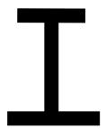
I形

L形

T形

矩形

梯形
图 1：可用的形状选项。

有关每种轮廓形状的详细信息，请参阅 Beam Cross-Section Library。

## 通用轮廓

通用轮廓直接指定截面的工程属性。您可以通过为面积、惯性矩、扭转常数以及（如果适用）扇性矩和翘曲常数指定值来创建通用轮廓。有关更多信息，请参阅 Using a General Beam Section to Define the Section Behavior。

您创建的每个轮廓都有其自己的名称，并且独立于任何特定梁截面；您可以根据需要将单个轮廓引用到任意多个梁截面中。在将梁截面和梁方向分配给部件后，您可以使用部件显示选项来查看基于形状或通用梁轮廓的理想化表示。显示梁轮廓对于检查是否已将正确的轮廓分配给特定区域以及分配的梁方向是否导致轮廓的预期方向非常有用。有关更多信息，请参阅 Controlling beam profile display。

## 定义截面

截面包含有关部件或部件区域的属性的信息。截面定义中所需的信息取决于所讨论区域的类型。例如，如果区域是可变形的线、壳或二维实体，则必须为该区域分配一个提供有关该区域横截面几何形状信息的截面。同样，刚性区域需要一个描述其质量属性的截面。大多数截面必须引用材料名称。梁截面还必须引用轮廓名称。

当您将截面分配给部件时，Abaqus/CAE 会自动将该截面分配给该部件的每个实例。因此，当您对这些部件实例进行网格划分时创建的单元将具有该截面中指定的属性。

截面是独立于任何特定区域、部件或装配体创建和命名的。您可以根据需要将单个截面分配给任意多个不同的区域。您可以使用 Property 模块来创建实体截面、壳截面、梁截面、流体截面和其他截面。

## 实体截面

实体截面定义了二维、三维和轴对称实体区域的截面属性。

均质实体截面。均质实体截面由材料名称组成。此外，如果该截面将用于二维区域，您还必须指定截面厚度。（即使该截面将被分配给三维区域，您也可以选择指定平面应力或平面应变厚度。如果该区域类型不需要厚度信息，Abaqus/CAE 将忽略该信息。）

有关更多信息，请参阅 Creating homogeneous solid sections。

*   广义平面应变截面。广义平面应变截面由材料名称、厚度以及绕全局 1 轴和 2 轴的楔角组成。您只能将广义平面应变截面分配给二维平面区域。

有关更多信息，请参阅 Creating generalized plane strain sections。

*   欧拉截面。欧拉截面由材料名称列表组成。此列表指定了欧拉域中可能存在的所有材料。您只能将欧拉截面分配给欧拉部件。
如需更多信息，请参阅创建欧拉截面。关于欧拉分析的概述，请参阅欧拉分析。

• 复合实体截面。复合实体截面由多层材料组成。对于每一层材料，您必须指定材料名称、厚度和方向。

如需更多信息，请参阅创建复合实体截面。

电磁实体截面。电磁实体截面适用于电磁模型，由材料名称组成。此外，如果截面将用于二维区域，您还必须指定截面厚度。（即使截面将分配给三维区域，您也可以选择指定平面应力或平面应变厚度。如果该区域类型不需要，Abaqus/CAE 会忽略厚度信息。）

如需更多信息，请参阅创建电磁实体截面。

## 壳截面

壳截面定义了壳区域的截面属性。壳用于模拟其中一维（厚度）远小于其他二维且厚度方向应力可忽略的结构。您可以在壳截面中定义一层或多层加固件（钢筋）。如需更多信息，请参阅理解壳截面中的钢筋。

均匀壳截面。均匀壳截面由壳厚度、材料名称、截面泊松比和可选的钢筋层组成。您可以选择在分析前提供截面属性数据，或者让 Abaqus 在分析过程中从截面积分点计算（积分）截面行为。如果选择后者，则提供了控制截面积分和沿厚度方向温度变化的选项。

如需更多信息，请参阅创建均匀壳截面。

复合壳截面。复合壳截面由多层材料、截面泊松比和可选的钢筋层组成。对于每一层材料，您必须指定材料名称、厚度和方向。您可以选择在分析前提供截面属性数据，或者让 Abaqus 在分析过程中从截面积分点计算（积分）截面行为。如果选择后者，则提供了控制截面积分和沿厚度方向温度变化的选项。

如需更多信息，请参阅创建复合壳截面。

• 薄膜截面。薄膜代表空间中的薄表面，它们在面内提供强度，但没有弯曲刚度。薄膜截面由材料名称、薄膜厚度、截面泊松比和可选的钢筋层组成。

如需更多信息，请参阅创建薄膜截面。

• 表面截面。表面截面代表空间中的表面，它们没有固有刚度，行为类似于零厚度的膜单元。表面截面由可选的钢筋层组成。

如需更多信息，请参阅创建表面截面。

通用壳刚度截面。通用壳刚度截面允许您通过直接指定刚度矩阵和热膨胀响应来定义壳的力学响应。通用壳刚度截面由截面刚度矩阵和缩放模数组成。您还可以选择指定热膨胀系数和截面中的热应力。

如需更多信息，请参阅创建通用壳刚度截面。

## 梁截面

梁用于二维和三维建模，模拟提供轴向强度和弯曲刚度的细长、杆状结构。梁代表其横截面相对于长度假设为小的结构。您只能将梁截面分配给线区域。此外，您必须为所有具有梁截面的区域指定梁截面方向。

梁截面。梁截面由截面泊松比和对截面形状的引用组成。根据您选择在分析前还是在分析期间计算（积分）截面刚度，还需要附加信息。

关于截面形状的信息，请参阅定义截面形状。关于梁截面的更多信息，请参阅创建梁截面。

桁架截面。桁架与梁类似，用于二维和三维建模，模拟提供轴向强度但没有弯曲刚度的细长、杆状结构。桁架截面由材料名称和横截面积组成。

如需更多信息，请参阅创建桁架截面。

您可以使用部件显示选项沿线区域查看梁或桁架截面形状的理想化表示。如需更多信息，请参阅控制梁截面形状显示。

## 其他截面

您可以创建的其他截面包括垫片截面、内聚截面、声学无限截面和声学界面截面。

垫片截面（仅适用于 Abaqus/Standard 分析）。垫片用于模拟位于结构部件之间的薄密封部件。垫片截面用于为密封部件提供压力-闭合行为。垫片截面由材料名称、初始垫片厚度、初始间隙、初始空隙和横截面积组成。

如需更多信息，请参阅创建垫片截面和垫片。

内聚截面。内聚截面用于模拟有限厚度的粘合剂、用于脱粘应用的可忽略厚度的薄粘合层以及垫片。没有专门的垫片行为（通常以压力与闭合的关系来定义）。内聚截面由材料名称、响应、初始厚度和平面外厚度组成。

如需更多信息，请参阅创建内聚截面和粘接接头与粘合界面。

声学无限截面。声学无限截面用于模拟涉及外部域的小压力变化的声学介质。声学无限截面由声学介质材料名称组成。此外，如果截面将用于二维区域，您还必须指定截面厚度。（即使截面将分配给三维区域，您也可以选择指定平面应力或平面应变厚度。如果该区域类型不需要，Abaqus/CAE 会忽略厚度信息。）

如需更多信息，请参阅创建声学无限截面。

声学界面截面。声学界面截面用于将声学介质耦合到结构模型。声学界面截面由声学介质材料名称组成。此外，如果截面将用于二维区域，您还必须指定截面厚度。（即使截面将分配给三维区域，您也可以选择指定平面应力或平面应变厚度。如果该区域类型不需要，Abaqus/CAE 会忽略厚度信息。）

如需更多信息，请参阅创建声学界面截面。

## 警告：

您分配给部件的截面类型必须与在网格模块中分配给该部件实例的单元类型一致。例如，如果在属性模块中将桁架截面分配给了线部件，那么在网格模块中应将桁架单元类型（而不是梁单元类型）分配给该部件的任何实例。

## 定义复合材料铺层

您可以使用复合材料铺层来模拟包含多个铺层的部件，其中每个铺层由材料、厚度和参考方向定义。复合材料铺层类似于复合壳或复合实体截面。复合材料截面中的铺层与复合材料铺层中的铺层相同；然而，复合材料截面始终包含相同数量的铺层。相比之下，复合材料铺层可以在不同区域包含不同数量的铺层。当您分析模型时，Abaqus/CAE 会将复合材料铺层转换为其组成的复合材料截面。Abaqus/CAE 允许您定义三种类型的复合材料铺层——壳、连续壳和实体。如需更多信息，请参阅复合材料铺层。

## 理解壳截面中的钢筋

您可以通过为每个钢筋层指定唯一的层名称，在壳截面中定义一层或多层加固件（钢筋）。您还需要选择构成每个钢筋层的材料名称，并指定每根钢筋的横截面积、间距以及每个层中钢筋的方向。

要定义每个钢筋层的方向，您可以指定一个方向角或一个方向名称。钢筋层的角度方向是相对于钢筋参考方向定义的。您可以使用分配菜单将钢筋参考方向分配给壳区域。如果您指定方向名称，则必须提供用户子程序 ORIENT。如需更多信息，请参阅定义钢筋层和分配钢筋参考方向。
在分析步骤（Step）模块中，您必须请求输出钢筋，才能将钢筋输出数据包含在Abaqus写入输出数据库的数据中，以及在可视化（Visualization）模块中查看钢筋方向图。在可视化（Visualization）模块中，Abaqus/CAE将钢筋层作为截面点进行输出，您可以创建材料方向图来显示钢筋方向。

有关钢筋的更多信息，请参阅定义增强层（Defining Reinforcement）。

## 附加信息

•   理解输出请求（Understanding output requests）
•   按类别选择截面点数据（Selecting section point data by category）
•   绘制材料方向图（Plotting material orientations）

## 我可以为部件分配哪些属性？

创建截面（Section）后，您可以为部件分配以下属性：

## 截面（Section）

您可以将截面分配给部件的某个区域。截面分配管理器（Section Assignment Manager）允许您查看、创建、编辑、抑制、恢复和删除截面分配。在属性（Property）模块中，Abaqus/CAE将有截面分配的区域显示为绿色。如果存在重叠的截面分配，Abaqus/CAE将该区域显示为黄色。

## 梁截面方向（Beam Section Orientation）

您可以将梁截面方向分配给线区域。通过定义横截面的大致局部1方向，可以为梁截面分配方向。

## 材料方向（Material Orientation）

您可以将材料方向分配给壳体区域和实体区域。全局坐标系决定了默认的材料方向。您可以通过选择现有的基准坐标系或离散场，或者通过定义离散方向来定义材料方向。对于Abaqus/Standard分析，您可以在用户子程序中定义材料方向。

## 钢筋参考方向（Rebar Reference Orientation）

钢筋层的角度方向是相对于钢筋参考方向定义的。您可以将钢筋参考方向分配给壳体区域。全局坐标系决定了默认的钢筋参考方向。您可以通过从视口中选择一个现有的基准坐标系，然后选择基准坐标系上一个近似壳体法线方向的轴，来定义钢筋参考方向。

## 单元法线（Element Normal）

您可以将壳体/膜法线方向分配给孤立单元、壳体区域和膜区域，以及具有线区域的轴对称部件。壳体/膜法线会影响分配给该区域的材料方向。如果反转壳体区域的法线，材料2方向也将被反转。材料2方向的反转对分析结果没有影响。但是，在解释壳体的截面点输出时应谨慎。

## 单元切向（Element Tangent）

您可以将梁/桁架切向方向分配给孤立单元和线区域。梁截面方向取决于梁切向方向。如果反转切向方向，局部2方向也将被反转，因此在解释结果时应谨慎，特别是在识别梁截面点位置时。

您可以使用属性（Property）模块主菜单栏中的分配（Assign）菜单为部件分配属性。您可以通过以下方式选择要分配属性的区域：

•   在视口中直接选择区域。
•   逐个选择单元或使用角度方法选择（为孤立单元分配壳体法线）。
使用集合（Set）工具集创建一个包含部件区域或孤立单元的集合。（集合（Set）工具集可从主菜单栏的工具（Tools）菜单中访问。）然后，您可以将属性分配给由该集合定义的区域或单元。

如果您将截面分配给某个区域，然后重命名或删除该截面，则该截面将不再应用于该区域。如果模型的某个区域缺少截面属性，您的分析作业将失败，作业（Job）模块会报告此问题。

然而，被重命名或删除的截面的原始名称将继续与分配给它们的区域相关联，直到您执行以下操作之一：

•   为该区域分配一个不同的截面。
•   创建一个具有原始截面名称且适用于该区域类型的新截面（例如，为壳体区域创建壳体截面）；新截面中定义的属性将自动应用于该区域。
•   如果您重命名了截面，请将该截面的名称改回其原始名称。

（您可以使用查询（Query）工具集确定分配给该区域的截面名称；有关更多信息，请参阅理解查询工具集的作用。）

同样，如果您在截面定义中引用了一个材料，然后重命名或删除了该材料，则该截面将变为无效；该截面中定义的属性将不再应用于分配了该截面的区域。然而，被重命名或删除的材料的原始名称将继续与引用这些材料的截面相关联；因此，您可以使用与上述类似的技术来恢复截面。

有关为模型分配属性和管理截面分配的详细说明，请参阅以下部分：

分配截面（Assigning a section）
管理截面分配（Managing section assignments）
分配梁方向（Assigning a beam orientation）
分配材料方向或钢筋参考方向（Assigning a material orientation or rebar reference orientation）
•   分配壳体/膜法线方向（Assigning shell/membrane normal directions）
分配梁/桁架切向方向（Assigning beam/truss tangent directions）
使用离散方向定义材料方向和复合材料铺层方向（Using discrete orientations for material orientations and composite layup orientations）

## 理解属性模块编辑器

当您创建或编辑材料、型材或截面时，必须在相应的编辑器中输入数据。例如，当您创建材料时，必须在材料编辑器中输入数据。本节提供有关每种编辑器类型的信息。

## 本节内容：

创建材料（Creating materials）
创建型材（Creating profiles）
创建截面（Creating sections）
创建复合材料铺层（Creating composite layups）
选择材料行为（Selecting material behaviors）
指定材料参数和数据（Specifying material parameters and data）
评估超弹性、超弹性和粘弹性材料行为（Evaluating hyperelastic, hyperfoam and viscoelastic material behavior）

## 创建材料（Creating materials）

要创建材料，请从主菜单栏中选择材料->创建（Material->Create）。将出现一个编辑材料（Edit Material）对话框，您可以在其中输入材料名称并创建或编辑材料属性。材料编辑器如图1所示。

## 注意：

创建材料后，无法使用材料编辑器重命名；您必须使用材料->重命名（Material->Rename）来更改现有材料的名称。

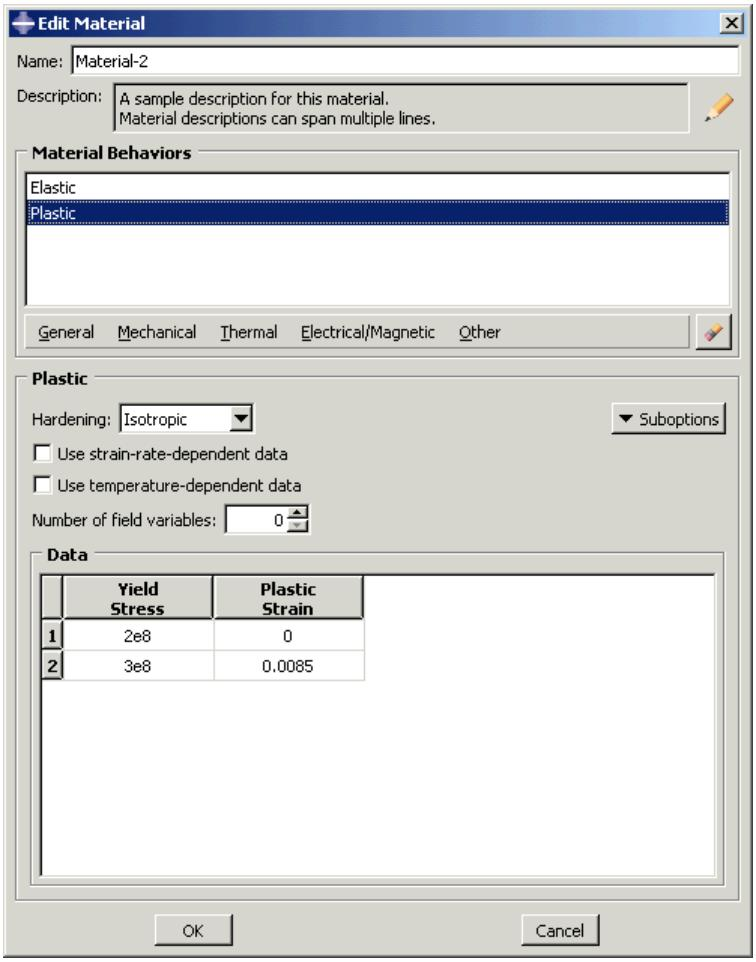
图1：材料编辑器。

材料编辑器包括以下部分：

## 材料行为（Material Behaviors）列表

您已包含在材料定义中的行为列表。

## 行为（Behavior）菜单

位于行为列表下方的一组菜单，用于选择材料行为。

## 行为定义（Behavior definition）区域

窗口的下半部分，显示与所选行为关联的参数、表格数据字段和子选项。

## 注意：

您可以通过从主菜单栏选择帮助->根据上下文（Help->On Context），然后点击感兴趣的编辑器功能，来获取此处未讨论的编辑器特定方面的帮助。

## 附加信息

•   创建或编辑材料（Creating or editing a material）
•   浏览和修改材料行为（Browsing and modifying material behaviors）
•   指定材料参数和数据（Specifying material parameters and data）

## 创建型材（Creating profiles）

要创建型材，请从主菜单栏中选择型材->创建（Profile->Create）。将出现一个创建型材（Create Profile）对话框，您可以在其中输入型材名称并选择型材类型。完成此信息输入后，在创建型材（Create Profile）对话框中点击继续（Continue）以显示型材编辑器，该编辑器允许您创建和编辑型材。

所有型材编辑器都会显示型材形状的示意图以及文本字段，您可以在其中输入定义型材所需的所有数据。例如，工字型型材编辑器如图1所示。该编辑器包含工字型型材的示意图以及可输入每个尺寸的数据字段。

图1：工字型型材编辑器。

创建型材后，您可以在梁截面定义中引用该型材。例如，图2所示的梁截面编辑器中选择了一个名为SupportBeam的箱型型材。

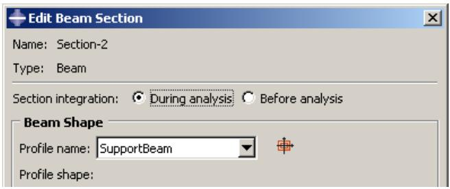
图2：在梁截面编辑器中指定型材名称。

有关型材的更多信息，请参阅定义型材（Defining profiles）。

## 附加信息

•   定义型材（Defining profiles）
•   梁截面库（Beam Cross-Section Library）

## 创建截面（Creating sections）

您可以使用属性（Property）模块创建以下类型的截面：

•   均质实体截面（Homogeneous solid sections）
•   广义平面应变截面（Generalized plane strain sections）
•   欧拉截面（Eulerian sections）
•   复合实体截面（Composite solid sections）
• 电磁实体截面 (Electromagnetic solid sections)  
• 均质壳截面 (Homogeneous shell sections)  
• 复合壳截面 (Composite shell sections)  
• 膜截面 (Membrane sections)  
• 面截面 (Surface sections)  
• 通用壳刚度截面 (General shell stiffness sections)  
• 梁截面 (Beam sections)  
• 桁架截面 (Truss sections)  
• 垫片截面 (Gasket sections)  
• 内聚力截面 (Cohesive sections)  
• 声学无限截面 (Acoustic infinite sections)  
• 声学界面截面 (Acoustic interface sections)

要创建截面，请从主菜单栏选择 **Section->Create**。将出现一个 **Create Section** 对话框，您可以在其中命名截面并指定要创建的截面类型。指定截面名称和类型后，在 **Create Section** 对话框中单击 **Continue** 以显示截面编辑器，该编辑器允许您创建和编辑截面。

截面编辑器的格式根据您定义的截面类型而有所不同。例如，均质壳截面编辑器如图 1 所示。

  
图 1：均质壳截面编辑器。

## 注意：

您可以通过从主菜单栏选择 **Help->On Context**，然后单击感兴趣的编辑器功能，来显示此处未讨论的编辑器特定方面的帮助。将出现一个帮助窗口，其中包含来自本指南的相关章节。

一些编辑器包含一个 **Rebar Layers** 选项（ 图标），如图 1 所示。如果您单击此图标，将出现另一个对话框，您可以在其中输入有关钢筋层的数据，如图 2 所示。

  
图 2：钢筋层对话框。

## 注意：

要为 **Rebar Layers** 对话框中的项目显示上下文相关帮助，您必须选择感兴趣的项目，然后按 **[F1]**。（在选项对话框显示时，主菜单栏中的 **Help** 菜单不可用。）

输入定义截面所需的所有数据后，您可以单击 **OK** 以关闭截面编辑器并保存截面。

有关使用截面编辑器的详细说明，请参见以下章节：

创建均质实体截面  
创建广义平面应变截面  
创建欧拉截面  
创建复合实体截面  
创建电磁实体截面  
创建均质壳截面  
创建复合壳截面  
创建膜截面  
创建面截面  
创建通用壳刚度截面  
创建梁截面  
创建桁架截面  
创建垫片截面  
创建内聚力截面

创建声学无限截面  
创建声学界面截面  
定义钢筋层  
创建轮廓

## 其他信息

• 定义截面  
• 创建和编辑截面

## 创建复合层合板

您可以使用 **Property** 模块创建以下类型的复合层合板：

• 壳 (Shell)  
• 连续壳 (Continuum shell)  
• 实体 (Solid)

要创建复合层合板，请从主菜单栏选择 **Composite->Create**。将出现一个 **Create Composite Layup** 对话框，您可以在其中命名层合板、指定初始铺层数并指定要创建的复合层合板类型。输入此信息后，在 **Create Composite Layup** 对话框中单击 **Continue** 以显示复合层合板编辑器，该编辑器允许您创建和编辑层合板。

复合层合板编辑器的格式根据您定义的层合板类型而有所不同。例如，壳复合层合板编辑器如图 1 所示。

  
图 1：壳复合层合板编辑器。

## 注意：

您可以通过从主菜单栏选择 **Help->On Context**，然后单击感兴趣的编辑器功能，来显示此处未讨论的编辑器特定方面的帮助。将出现一个帮助窗口，其中包含来自本指南的相关章节。

输入定义层合板所需的所有数据后，您可以单击 **OK** 以关闭编辑器并保存复合层合板。

有关使用复合层合板编辑器的详细说明，请参见以下章节：

创建常规壳复合层合板  
创建连续壳复合层合板  
创建实体复合层合板

## 其他信息

• 定义复合层合板  
• 创建和编辑复合层合板

## 选择材料行为

材料编辑器包含几个菜单，允许您将 Abaqus/Standard 或 Abaqus/Explicit 中可用的大多数材料行为添加到材料定义中。

（有关 Abaqus/CAE 中可用的材料行为信息，请参见 Abaqus 关键字浏览器表和来自输入文件读取器的关键字支持。）

材料编辑器菜单反映了所有材料行为分为五个类别：通用 (General)、力学 (Mechanical)、热学 (Thermal)、电/磁 (Electrical/Magnetic) 和其他 (Other)。图 1 显示了 **Mechanical** 菜单下可用的弹性行为。

  
图 1：Mechanical 菜单下的弹性行为。

行为列表不会改变以排除对您正在运行的分析类型无效的行为。此外，Abaqus/CAE 不会检查您在编辑器中输入的数据是否有效，或您的材料是否适合您的分析类型。例如，如果您请求动态分析，Abaqus/Standard 或 Abaqus/Explicit 要求您指定模型中所用材料的密度，以便计算模型的质量和惯性属性。如果您在材料定义中未提供材料密度，Abaqus/CAE 允许您创建材料；但是，当您提交分析作业时，Abaqus/CAE 将报告错误。

当您选择一种行为时，该行为的名称将出现在编辑器顶部的 **Material Behaviors** 列表中，并且该行为成为您材料定义的一部分。例如，图 2 中的列表反映了已选择 **Elastic** 和 **Plastic** 行为，以及 **Elastic** 行为的 **Fail Stress** 子选项。

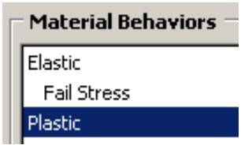  
图 2：材料行为列表。

像 **Elastic** 和 **Plastic** 这样的行为是主行为。测试数据和子选项（如 **Fail Stress**）出现在相应主行为下方，并缩进以表明其从属位置。

如果您想从材料定义中删除某个行为或子选项，您可以从 **Material Behaviors** 列表中选择该行为或子选项，然后单击

如果您正在创建新材料，所选行为列表最初为空。当您选择行为时，行为名称将出现在列表中；如果行为太多无法一次全部看到，列表右侧将出现滚动条。

## 其他信息

• 浏览和修改材料行为  
• 指定材料参数和数据

## 指定材料参数和数据

当您选择一种行为时，行为定义区域会更改为显示所选行为的所有关联参数和数据项。参数显示在行为描述区域的顶部，数据项显示在底部。

根据您的分析要求，您可以选择接受或更改默认参数值；例如，您可以使用弹性表单上的 **Type** 组合框选择是否使用各向同性弹性，如图 1 所示。

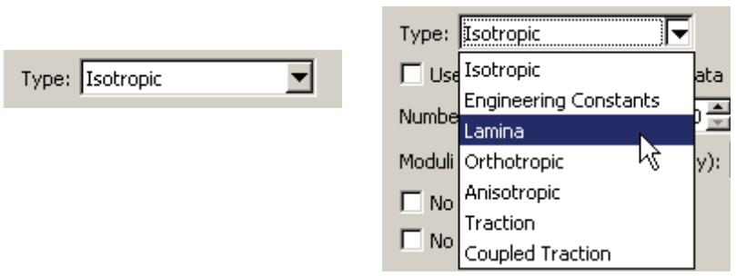  
图 1：Type 组合框。

包含其余所需材料数据字段的表格出现在参数区域下方；例如，图 2 显示了当您选择各向同性弹性时出现的表格。

  
图 2：各向同性弹性表格。

根据您设置参数的方式，不同的字段变为可用。例如，当您选择层合板弹性而不是各向同性弹性时，将出现图 3 中的表格。

  
图 3：层合板弹性表格。

您可以使用键盘将数据输入表格。或者，您可以在表格中的任意位置单击鼠标按钮 3 来查看用于指定表格数据的选项列表。例如，有一个选项可以从文件自动输入数据。另一个选项可以根据表中的数据创建 X-Y 数据对象；您可以在 **Visualization** 模块中绘制 X-Y 数据，并直观地检查其有效性。有关每个选项的详细信息，请参见输入表格数据。
关于材料编辑器中具体功能的详细信息，请参阅以下章节：

创建或编辑材料  
浏览和修改材料行为  
输入应变率相关数据  
输入温度相关数据  
指定场变量相关性  
• 选择和修改子选项或测试数据  
显示超弹性材料行为的 X–Y 图  
显示黏弹性材料行为的 X–Y 图  
显示超泡沫材料行为的 X–Y 图

## 附加信息

• 浏览和修改材料行为

## 评估超弹性、超泡沫和黏弹性材料行为

Abaqus/CAE 提供了便捷的**评估 (Evaluate)** 选项，允许您查看超弹性、超泡沫或黏弹性材料预测的行为，并帮助您选择合适的材料公式。

您可以评估任何超弹性或超泡沫材料，但黏弹性材料仅在其定义于时间域且包含超弹性、超泡沫和/或弹性材料数据时才能被评估和查看。如果您的材料定义包含在频率域中定义的黏弹性数据，则无法在 Abaqus/CAE 中评估其黏弹性材料行为，但其材料评估数据将被写入数据 (.dat) 文件。

**评估 (Evaluate)** 选项提示 Abaqus/CAE 使用现有材料执行一个或多个标准测试。（有关超弹性、超泡沫和黏弹性材料的标准测试信息，请分别参阅《超弹性》、《弹性体泡沫中的超弹性行为》和《线性黏弹性》。）标准测试完成后，Abaqus/CAE 进入可视化模块 (Visualization module)，并在新的视口中以 X–Y 图的形式显示测试结果。（有关 X–Y 图的更多信息，请参阅《X–Y 绘图》。）Abaqus/CAE 还会显示一个信息对话框，其中包含每个超弹性应变能势的稳定极限和系数，以及黏弹性响应的黏弹性材料参数。评估信息保存在 `material_name_i.dat` 文件中，其中 `i` 从 1 开始，并在对相同材料进行后续评估时递增。您可以查看评估结果，并根据需要调整材料定义。

要启动评估过程，请从主菜单栏选择 `材料 (Material)` -> `评估 (Evaluate)` -> `材料名称 (material name)`。或者，您可以在材料管理器 (Material Manager) 中选择感兴趣的材料，然后单击 **评估 (Evaluate)**。此时会出现“评估材料 (Evaluate Material)”对话框，您可以在其中指定希望 Abaqus/CAE 如何执行标准测试。

• 有关评估超弹性材料行为的详细说明，请参阅显示超弹性材料行为的 X–Y 图。  
有关评估超泡沫材料行为的详细说明，请参阅显示超泡沫材料行为的 X–Y 图。  
• 有关评估黏弹性材料行为的详细说明，请参阅显示黏弹性材料行为的 X–Y 图。

## 注意：

材料评估过程会生成与材料同名的作业 (jobs)；因此，这些材料名称必须遵守与作业名称相同的规则（有关命名对象的更多信息，请参阅使用基本对话框组件）。

**评估 (Evaluate)** 选项在以下场景中特别有用：

## 比较测试数据与特定应变能势预测的行为

当您使用实验数据定义超弹性或超泡沫材料时，您还需要指定要应用于数据的应变能势 (strain energy potential)。Abaqus 使用实验数据来计算指定应变能势所需的系数。然而，验证材料定义预测的行为与实验数据之间是否存在可接受的相关性非常重要。

您可以使用**评估 (Evaluate)** 选项，基于您在材料定义中指定的应变能势，使用实验数据计算材料响应。测试完成后，Abaqus/CAE 进入可视化模块 (Visualization module) 并显示测试结果的 X–Y 图。每个图都包含实验数据以及每个评估的应变能势的曲线。Abaqus/CAE 还会打开一个对话框，其中包含每个应变能势的稳定极限和系数。

例如，图 1 中的 X–Y 图显示了使用 Ogden N=3 应变能势进行的平面测试结果。

  
图 1：平面测试结果。

此外，以下信息将报告到数据 (.dat) 文件中：

• 为应变能势计算的系数。  
• 测试期间检测到的任何材料不稳定性。

分析成功完成后，数据 (.dat) 文件的路径将显示在 Abaqus/CAE 主窗口的消息区域中。

## 评估多个应变能势

如果您正在使用实验数据定义超弹性材料，但不确定应指定哪个应变能势，可以在材料编辑器的**应变能势 (Strain energy potential)** 列表中选择 **未知 (Unknown)**。然后，您可以使用**评估 (Evaluate)** 选项，使用实验数据执行涉及多个应变能势的标准测试。

测试完成后，Abaqus/CAE 进入可视化模块 (Visualization module)，为每个测试显示一个 X–Y 图，并显示一个包含每个应变能势稳定极限和系数的对话框。每个图都包含实验数据以及每个评估的应变能势的曲线。您可以直观地比较应变能势曲线和实验数据曲线，并选择拟合效果最佳的应变能势。

一旦确定哪个应变能势与实验数据拟合最佳，您必须返回到属性模块 (Property module) 中的材料编辑器，并将**应变能势 (Strain energy potential)** 选择从**未知 (Unknown)** 更改为您选择的应变能势。

## 查看由系数预测的行为

如果您获得了特定应变能势的系数（通过上述评估一个或多个超弹性应变能势，或从其他来源获得），您可能希望验证该应变能势预测的行为是否可接受地匹配您的实验数据或满足其他标准。

您可以使用**评估 (Evaluate)** 选项，使用您在材料定义中提供的系数绘制应变能势的曲线。如果材料定义还包括实验数据，该数据的曲线也会出现在图中。

## 查看黏弹性材料的响应曲线

如果您有剪切或体积测试结果，您可能希望验证 Abaqus 预测的蠕变和松弛行为是否可接受地匹配您的实验数据或满足其他标准。同样，如果您有频率数据，您可能希望验证预测的剪切和体积模量的存储和损耗分量是否匹配您的数据。

您可以使用**评估 (Evaluate)** 选项，使用您在材料定义中提供的系数绘制曲线。如果材料定义包含实验数据，这些数据的曲线也会出现在图中。产生的曲线类型取决于材料定义。对于使用 Prony 系列、时间域的蠕变测试数据或松弛测试数据定义的黏弹性材料，您可以生成蠕变和松弛曲线随时间的变化图。对于使用频率数据定义的黏弹性材料（对于时间域），您可以生成剪切和体积模量的存储和损耗分量随频率对数刻度的变化图。

## 调整材料数据

如果您对测试数据与材料预测行为之间的拟合度不满意，可以返回到属性模块 (Property module) 调整测试数据，然后再次评估材料。您可以重复此过程，直到对材料行为满意为止。在某些情况下，可以使用此方法来优化超弹性材料定义中包含的系数值。有关更多信息，请参阅《类橡胶材料的超弹性行为》和《弹性体泡沫中的超弹性行为》中的“提高测试数据拟合的准确性和稳定性”部分，分别适用于超弹性材料和超泡沫材料。

有关评估材料的详细说明，请参阅以下章节：

显示超弹性材料行为的 X–Y 图  
显示超泡沫材料行为的 X–Y 图  
显示黏弹性材料行为的 X–Y 图

有关 Abaqus 中可用应变能势的更多信息，请参阅《类橡胶材料的超弹性行为》中的“应变能势”。
## 使用材料库

您可以使用材料库来维护一套一致的材料属性数据，供所有 Abaqus/CAE 分析模型使用。材料库仅在 Property module（属性模块）中可用。

本节提供了有关访问、使用和管理材料库的信息。

## 本节内容:

材料库  
管理材料库  
从材料库向模型添加材料

## 材料库

材料库为存储材料属性数据提供了一种便捷方式，以便在多次分析中使用。您可以创建一个或多个库来保存和组织与某个项目、一组项目或整个公司相关的材料数据。

使用材料库可以让您维护一套一致的材料属性，并快速将材料添加到模型中。

材料库工具位于 Property module（属性模块）的 Model Tree（模型树）区域。

材料库被视为 Abaqus/CAE 的插件，但它们无需使用 Plug-ins（插件）菜单即可自动加载。材料库的文件扩展名为 .lib，并存储在位于 Abaqus/CAE 安装目录、您的主目录或当前目录（您启动 Abaqus/CAE 的目录）内的 abaqus_plugins 目录中。您还可以在 abaqus_v6.env 文件或 Abaqus 求解器 custom_v6.env 文件中使用 plugin_central_dir 环境变量来指定一个或多个附加目录路径。（有关插件目录位置的更多信息，请参阅插件文件存储在哪里？）Abaqus/CAE 会在指定插件位置的所有子目录中搜索材料库文件。

默认情况下，Abaqus/CAE 以树形格式显示材料库，类似于 Model Tree（模型树）。在这种格式下，您可以展开和折叠类别，以帮助找到所需的材料。图 1 显示了一个包含金属材料的简单材料库。它被组织成铝、铜和钢类别；铝类别已被展开。您也可以将材料库视为按字母顺序排列的材料名称列表，忽略类别。

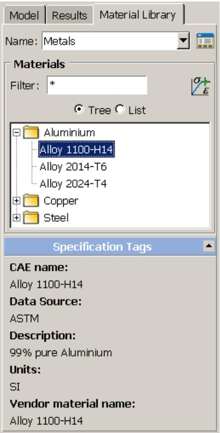  
图 1：材料库。

您可以使用材料列表上方的 Filter（筛选器）来搜索包含特定字符的材料名称。筛选器可以包含 Abaqus 材料名称中允许的任何字符（有关对象命名的更多信息，请参阅使用基本对话框组件）。筛选器不适用于类别名称，因此筛选结果可能会导致出现“空”类别。

该工具会打开 Material Library Manager（材料库管理器），您可以在其中创建、编辑、重命名和重新组织材料库。您还可以使用管理器来创建、编辑、重命名和删除 Specification Tags（规格标签），以帮助识别库中的材料。

\+ 图 1 显示了预定义的 Specification Tags（规格标签）。该工具将选定的材料从库中复制到当前模型。

## 其他信息

• 管理材料库  
• 从材料库向模型添加材料

## 管理材料库

Material Library Manager（材料库管理器）允许您创建、编辑和重命名材料库、库类别和库材料。

默认的 Specification Tags（规格标签）指示材料数据的来源、描述、度量单位和供应商材料名称。您可以为库中的每个材料创建、编辑、重命名和删除规格标签。材料属性和类别按字母顺序呈现，与 Abaqus/CAE 主窗口中库的默认视图相同；材料类别首先出现，然后是未归类的材料。您可以使用管理器将材料从模型复制到库，或从库复制到模型。Material Library Manager（材料库管理器）如图 1 所示。

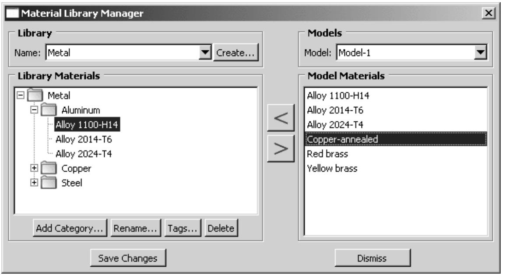  
图 1：材料库管理器。

在使用材料库时，建议您仔细考虑材料和类别名称。您可以创建多个名称完全相同的类别和/或材料。例如，您可以为一个标准等级的钢材创建多个完全相同的条目，每个条目包含不同单位的属性。使用合适的类别名称，您可以轻松识别每个材料。但是，如果您以列表格式显示库，则相同的条目都会出现在列表中。修改材料名称以包含单位信息可能会更容易识别所需的材料。例如，您可以将一种材料命名为 Steel 1020 US，另一种命名为 Steel 1020 SI。或者，您可以单击材料库管理器中的 Tags（标签），在主窗口材料列表下方出现的 Specification Tags（规格标签）中注明单位。在材料库中重命名材料只会更改库中的名称，不会更改从 Abaqus/CAE 模型复制或复制到其中的底层材料名称。从库添加到模型的材料仍将保留旧名称。

您无法在材料库管理器中查看或编辑材料属性。要查看或编辑材料的属性，您必须将材料添加到模型，并使用 Edit Material（编辑材料）对话框（有关更多信息，请参阅创建或编辑材料）。

1.  从 Model Tree（模型树）区域的 Material Library（材料库）选项卡中，单击 Material Library Manager（材料库管理器）图标

位于 Name（名称）字段的右侧。

Abaqus/CAE 将显示 Material Library Manager（材料库管理器）。

2.  从管理器顶部，单击 Create（创建）以创建新的材料库，或选择一个库名称以编辑现有库。

3.  如果您在上一步中选择了 Create（创建），则会出现 Create Material Library（创建材料库）对话框。

    a. 输入新库的名称。  
    b. 选择 Home（主目录）或 Current（当前目录）以选择保存该库的 abaqus_plugins 目录位置。  
    c. 单击 OK（确定）。

    Abaqus/CAE 会创建一个空的材料库文件，并在管理器中将其打开进行编辑。如果需要，Abaqus/CAE 还会创建指定的 abaqus_plugins 目录。有关更多信息，请参阅材料库。

4.  要编辑当前材料库，请从管理器左侧的 Library Materials（库材料）列表中选择一个项目，然后从以下选项中选择：

    •   如果您想创建类别来组织库中的材料，请单击 Add Category（添加类别）。将出现 Create Category（创建类别）对话框。

        1.  输入类别的名称。  
        2.  在 Create Category（创建类别）对话框中单击 OK（确定）。

        Abaqus/CAE 将创建新类别。

        该类别将出现在与您所选项目相同的库层级。例如，如果您选择了库名称，则新类别会与任何其他类别一起直接显示在库名称下方；如果您选择了现有类别，则新类别会显示在该类别内部。

    •   如果您想重命名所选项目，请单击 Rename（重命名）。在出现的对话框中输入新名称，然后单击 OK（确定）。

        

        ## 注意:

        重命名库会更改其在 Abaqus/CAE 中显示的名称；它不会更改库 (.lib) 文件的名称。

    •   如果您想编辑当您展开材料库底部的 Specification Tags（规格标签）字段时出现的信息，请单击 Tags（标签）。这些标签包含材料的来源、描述、单位和供应商名称。默认情况下，供应商名称标签包含材料名称，其他标签各自包含“Imported from CAE”。您可以使用标签来澄清具有相同名称或类似属性的材料的预期用途。  
    •   如果您想从库中移除材料或空类别，请选中它并单击 Delete（删除）。您可以使用 [Ctrl] + 单击 和 [Shift] + 单击 的组合来选择多个项目。

        

        ## 注意:

        您无法在 Abaqus/CAE 内部删除材料库；您必须从系统上的保存位置删除库文件。

5.  使用位于 Library Materials（库材料）列表和 Model Materials（模型材料）列表之间的箭头，将材料数据从库复制到模型，或反之亦然。

    当您复制材料时，Abaqus/CAE 会将新材料放置在所选类别（如果有）的末尾，或库的末尾。

    a.  从 Material Library Manager（材料库管理器）中的 Models（模型）列表中，选择您想要向其（或从其）复制材料的模型。  
    b.  从 Library Materials（库材料）列表或 Model Materials（模型材料）列表中选择所需的材料。您可以使用 [Ctrl] + 单击 和 [Shift] + 单击 的组合来选择多个项目。

    c.  如果您要将材料复制到库中，请在 Library Materials（库材料）列表中选择您希望 Abaqus/CAE 放置该材料的类别。  
    d.  单击相应的箭头以复制材料。
Abaqus/CAE 将新材料添加到所选库分类的末尾，或模型的材料列表末尾。

您在材料库管理器中所做的更改会立即显示在管理器对话框中。但是，在您点击“保存更改”之前，这些更改不会提交到库文件中。在您关闭材料库管理器之前，Abaqus/CAE 不会更新主窗口中的库视图。

## 更多信息

* 材料库  
* 将材料从库添加到您的模型

要查看材料库，请在 Property 模块的模型树区域中选择“材料库”选项卡。如果存在多个库，请从选项卡页面顶部的列表中选择一个。在默认的树视图中，展开分类可以查看每个分类内的材料。要隐藏分类并按字母顺序查看当前库中的所有材料，请选择“列表视图”。

要将库中的材料添加到当前模型，请在树或列表视图中高亮显示材料名称，然后点击材料列表右上角的“+添加材料”图标。或者，您也可以在库中双击材料名称将其添加到模型。

1.  点击主窗口左侧模型树区域顶部的“材料库”。

提示：如果未显示模型树，请从主菜单栏中选择 视图->显示模型树。

2.  从“名称”列表中选择一个库名。

如果在会话开始时 Abaqus/CAE 未找到任何材料库，您可以创建一个新库。有关更多信息，请参阅管理材料库。

Abaqus/CAE 显示库内容。默认情况下，库以树形格式显示，其中材料可能被分成不同分类，类似于模型树。

3.  使用以下任一方法在库中找到所需材料：

*   在树视图中展开分类以查看其内容。
*   打开“列表”开关以隐藏分类并查看库中的所有材料。
*   在“筛选器”字段中输入字符串，仅显示名称中包含该字符串的材料。

4.  点击材料名称以选中它。

5.  如有需要，点击“规格标签”（位于材料列表下方）右侧的箭头，以查看所选材料的更多信息。

6.  点击材料列表右上角的“添加材料”图标，将该材料添加到当前模型。

将材料添加到模型后，使用“编辑材料”对话框查看或编辑材料属性。使用 Property 模块中的其他工具将材料与截面关联，并将截面分配给模型的一部分。

## 更多信息

* Property 模块  
* 材料库  
* 管理材料库

## 使用 Property 模块工具箱

您可以通过主菜单栏或 Property 模块工具箱访问所有 Property 模块工具。图 1 显示了 Property 模块工具箱中所有属性工具的图标。

  
图 1：Property 模块工具箱。

## 创建和编辑材料

本节分别描述了材料编辑器的每个功能。

## 本节内容：

创建或编辑材料  
浏览和修改材料行为  
输入应变率相关数据  
输入温度相关数据  
指定场变量相关性  
选择和修改子选项或测试数据  
显示超弹性材料行为的 X-Y 图  
显示粘弹性材料行为的 X-Y 图  
显示超泡沫材料行为的 X-Y 图

## 创建或编辑材料

您使用“编辑材料”对话框创建新材料或编辑现有材料。当您从主菜单栏选择 材料->创建 时，可以为材料输入您选择的名称或接受默认名称，您可以提供材料的描述，并定义材料属性。当您选择 材料->编辑 时，可以重新定义材料描述或属性，但必须使用 材料->重命名 来更改现有材料的名称。

使用“材料行为”列表下方的菜单栏向材料添加属性。某些菜单项包含子菜单；例如，下图显示了在 机械->弹性 菜单项下可用的行为：

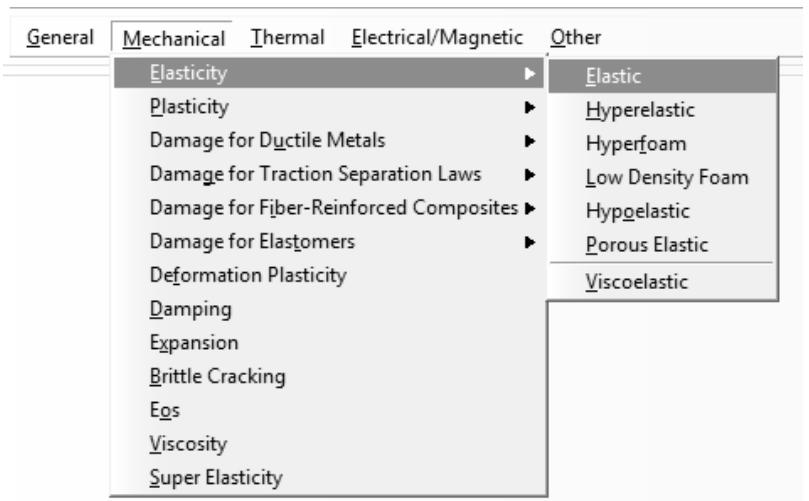

## 注意：

要显示特定材料行为的信息，请点击并按住该行为，然后按 F1。将出现一个包含与该行为相关的参数和数据信息的帮助窗口。

使用“材料行为”列表选择要编辑的现有材料行为。

警告：Abaqus/CAE 在您提交作业进行分析之前，不会检查是否存在缺失或无效的材料行为。（任何警告和错误均由 Job 模块报告。）因此，您必须小心为分析所需的所有材料行为提供有效数据。

1.  使用以下任一方法显示材料编辑器：

*   从主菜单栏选择 材料->创建。

提示：您也可以在“材料管理器”中点击“创建”，或在 Property 模块工具箱中选择创建材料工具。

*   从主菜单栏选择 材料->编辑->材料名称。

提示：您也可以在“材料管理器”中选择一个材料并点击“编辑”。

将出现“编辑材料”对话框。

2.  如果您正在创建新材料，请输入您选择的材料名称。有关命名对象的更多信息，请参阅使用基本对话框组件。
3.  如有需要，为材料输入描述。

a. 在“编辑材料”对话框中点击。
    材料描述编辑器出现。

b. 在材料描述编辑器中，输入您想记录的关于该材料的信息。
    c. 点击“确定”保存描述并关闭材料描述编辑器。

当您提交作业时，Abaqus/CAE 使用注释行将材料描述写入输入文件；材料描述不会写入输出数据库。有关更多信息，请参阅向您的 Abaqus/CAE 模型添加描述。

4.  使用菜单栏或“材料行为”列表分别选择新的或现有的材料行为。对话框中的行为定义区域将更改为显示与所选材料行为相关的所有参数和数据。
5.  编辑参数和数据以完成材料定义。
6.  如果您希望移除某个材料行为，请选中它并点击菜单栏右侧的图标。
7.  完成材料定义编辑后，点击“确定”保存材料并关闭对话框。

## 更多信息

* 理解 Property 模块编辑器  
* 创建和编辑材料

## 浏览和修改材料行为

材料编辑器窗口顶部的已选行为列表显示了构成当前材料的行为和子选项；该列表会随着您添加和删除行为而更新。

下图显示了如果定义了一个带有基于应力的失效极限的弹塑性材料，该列表可能的样子：

使用已选行为列表，您可以按如下方式添加、删除或更改材料：

## 添加材料行为

从紧邻已选行为列表下方的菜单中选择定义材料所需的行为。当您选择一个行为时，其名称出现在列表中，并且与该行为相关的参数和数据出现在编辑器窗口底部的数据区域中。子选项显示在相应主行为下方，并缩进以表示其从属位置。

## 删除材料行为

在已选行为列表中，点击您要删除的行为或子选项；然后点击位于行为列表右下角附近的图标。此过程将从行为列表和材料定义中同时移除该行为。如果您删除了一个在列表中显示有子选项的行为，其子选项也会被删除。

## 更改材料参数或数据

在已选行为列表中，点击您要更改其数据的行为。当与该行为相关的参数和数据出现在窗口底部的数据区域时，进行所需的更改。
## 其他信息

• 理解属性模块编辑器

## 输入应变率相关数据

如果您的材料包含应变率相关性，您可以输入数据来定义材料属性如何随应变率变化。

1.  在材料编辑器中勾选 **Use strain-rate-dependent data**（使用应变率相关数据）。
    
    表格数据区域中将出现一个标记为 **Rate**（速率）的列。

2.  为每一行填入适当的值。要使用特殊表格编辑选项或从 ASCII 文件读取数据，请单击鼠标右键。（有关更多信息，请参阅输入表格数据。）

## 其他信息

• 理解属性模块编辑器

## 输入温度相关数据

如果您的材料包含温度相关性，您可以输入数据来定义材料属性如何随温度升高而变化。

1.  在材料编辑器中勾选 **Use temperature-dependent data**（使用温度相关数据）。
    表格数据区域中将出现一个标记为 **Temp**（温度）的列。

2.  为每一行填入适当的值。要使用特殊表格编辑选项或从 ASCII 文件读取数据，请单击鼠标右键。（有关更多信息，请参阅输入表格数据。）

## 其他信息

• 理解属性模块编辑器

## 指定场变量依赖性

材料编辑器中的 **Number of field variables**（场变量数量）文本字段允许您指定给定材料行为所需引用的场变量数量。每个场变量的列将出现在编辑器数据区域的表格中。

1.  使用以下任一方法，在 **Number of field variables** 框中将场变量数量更改为所需值：
    
    • 点击文本字段右侧的箭头来增加或减少场变量数量。
    • 在文本字段中直接输入数字。
    
    两种方法都会将场变量列添加到数据区域的表格中。

2.  在表格的每个单元格中输入适当的数据。您可以使用键盘向表格中输入数据。或者，您可以在表格中任意位置单击鼠标右键，查看用于指定表格数据的选项列表。有关每个选项的详细信息，请参阅输入表格数据。）

## 其他信息

• 理解属性模块编辑器

## 选择和修改子选项或测试数据

如果当前行为有可用的子选项或测试数据，则数据区域右上角将出现 **Suboptions**（子选项）、**Test Data**（测试数据）或 **Uniaxial Test Data**（单轴测试数据）菜单。当您从菜单中选择一个选项时，将出现 **Suboption Editor**（子选项编辑器）或 **Test Data Editor**（测试数据编辑器），您可以在其中输入所需数据。

## 注意：

要为 **Suboption Editor**（子选项编辑器）或 **Test Data Editor**（测试数据编辑器）中的特定按钮、文本字段和其他选项显示上下文帮助，您必须先选中感兴趣的选项，然后按 **[F1]**。（编辑器显示时，主菜单栏中的 **Help**（帮助）菜单不可用。）有关使用 **[F1]** 获取帮助的详细信息，请参阅显示上下文帮助。

1.  点击数据区域右上角的 **Suboptions**（子选项）、**Test Data**（测试数据）或 **Uniaxial Test Data**（单轴测试数据），然后从出现的列表中选择您想要的选项。
    将出现一个单独的对话框，显示适用于您选择的 **Suboption Editor**（子选项编辑器）或 **Test Data Editor**（测试数据编辑器）。

2.  在编辑器内输入所需数据，然后点击 **OK** 以返回到材料编辑器。

您可以使用键盘向子选项或测试数据表格中输入数据。或者，您可以在表格中任意位置单击鼠标右键，查看用于指定表格数据的选项列表。例如，有一个选项可以从表中的数据创建 X-Y 数据对象；您可以在可视化模块中绘制 X-Y 数据并目视检查其有效性。还有另一个选项用于自动从文件输入数据。有关每个选项的详细信息，请参阅输入表格数据。

## 其他信息

• 理解属性模块编辑器

## 显示超弹性材料行为的 X-Y 曲线图

Abaqus/CAE 允许您通过使用选定的应变能势自动创建响应曲线来评估超弹性材料行为。曲线拟合完成后，Abaqus/CAE 将打开可视化模块并显示测试结果的 X-Y 曲线图，以及一个包含每个应变能势稳定性极限的对话框。您可以查看结果并根据需要调整材料。有关更多信息，请参阅评估超弹性、超泡沫和粘弹性材料行为。

1.  从主菜单栏中，选择 **Material->Evaluate->材料名称**。您选择的材料必须包含超弹性材料数据。

提示：您也可以在 **Material Manager**（材料管理器）中选择材料的名称，然后点击 **Evaluate**（评估）。

将出现一个 **Evaluate Material**（评估材料）对话框。

2.  如果您选择的超弹性材料还包含粘弹性材料数据，请勾选 **Perform hyperelastic evaluation**（执行超弹性评估）（如果尚未选中）。

    如果需要，您还可以评估材料的粘弹性行为。有关更多信息，请参阅显示粘弹性材料行为的 X-Y 曲线图。

3.  在 **Available Input Data**（可用输入数据）字段中，执行以下操作：

    a. 选择您需要的 **Source**（源）选项：
        • 如果您希望 Abaqus 根据材料定义中指定的实验数据计算必要的应变能势系数，请选择 **Test data**（测试数据）。
        • 如果您希望 Abaqus 使用材料定义中指定的系数，请选择 **Coefficients**（系数）。

    b. 如果您在上一步中选择了 **Test data**，请指定您希望 Abaqus 用于计算应变能势系数的一种或多种测试数据类型。（仅列出您已在材料定义中指定数据的数据类型。）

    c. 如果您打算评估 Marlow 应变能势，请指定 Abaqus 将用于定义偏应力响应的测试数据类型。您还可以指定是使用压缩、拉伸还是两种类型的测试数据，以及是否应使用体积测试数据来定义体积响应。（有关更多信息，请参阅 Marlow 形式。）

    

    ## 注意：

    如果您的超弹性材料模型包括横向名义应变、温度相关数据或场变量，则 Marlow 将是唯一可用于评估的应变能势。

4.  从 **Standard Tests**（标准测试）列表中，选择一个或多个您希望使用材料定义中的数据计算响应的测试。

5.  对于您选择的每个测试，输入一个最小和最大应变值，这将是应力-应变响应曲线的上限和下限。

6.  点击 **Strain Energy Potentials**（应变能势）选项卡，并执行以下操作：

    • 如果您选择了 **Test data** 作为数据源，将显示所有可用应变能势的列表。从列表中选择一个或多个您希望 Abaqus 应用于实验数据的应变能势。有关 Abaqus 中可用应变能势的更多信息，请参阅应变能势。
    • 如果您选择了 **Coefficients** 作为数据源，将显示材料定义中指定的应变能势名称。您可以直接查看信息并继续下一步。

7.  如果您评估的材料还包含粘弹性材料属性，请点击 **Viscoelastic**（粘弹性）选项卡；您可以勾选掉 **Perform viscoelastic evaluation**（执行粘弹性评估），或选择粘弹性评估选项。有关更多信息，请参阅显示粘弹性材料行为的 X-Y 曲线图。

8.  点击 **OK** 开始响应计算。

    如果在提取材料系数期间由于非线性曲线拟合问题导致评估失败，Abaqus/CAE 将显示一个包含数据 (.dat) 文件名称的对话框；该数据文件的路径会打印在消息区域。该数据文件提供了每个遇到问题的详细信息。（有关数据文件的更多信息，请参阅关于输出。）

    如果 Abaqus 成功完成测试，Abaqus/CAE 将进入可视化模块，并在新的视口中显示测试结果的 X-Y 曲线图。（有关 X-Y 曲线图的信息，请参阅 X-Y 绘图。）数据对象将出现在 **X-Y Data Manager**（X-Y 数据管理器）中；您可以将它们复制到输出数据库或在可视化模块中执行您可以对其他 X-Y 数据执行的任何任务。

    此外，Abaqus/CAE 将显示一个信息对话框，其中包含每个超弹性应变能势的稳定性极限和系数。如果执行了粘弹性评估，该对话框还将显示粘弹性材料参数。Abaqus/CAE 在消息区域显示包含所有材料评估信息的数据 (.dat) 文件的路径。

9.  如果需要，返回 **Property**（属性）模块以编辑材料数据或评估其他材料。
例如，如果之前为超弹性材料设置的应变能势（Strain energy potential）为“未知”（Unknown），您可以使用评估结果，通过最佳应变能势来完成材料定义。

## 附加信息

• 类橡胶材料的超弹性行为

Abaqus/CAE 允许您通过基于材料定义创建松弛和蠕变曲线（用于 Prony 级数系数、松弛测试数据或蠕变测试数据）或剪切模量和体积模量曲线（用于频率数据）来评估粘弹性材料行为。

曲线拟合完成后，Abaqus/CAE 会打开可视化（Visualization）模块，并显示测试结果的 X–Y 图以及一个包含材料参数的对话框。您可以查看结果并根据需要调整材料。更多信息，请参见评估超弹性、超泡沫和粘弹性材料行为。

1.  从主菜单栏中，选择 Material->Evaluate->材料名称。您选择的材料必须包含与超弹性材料数据和/或弹性材料数据一起定义的时域粘弹性材料数据。

    

    提示：您也可以在材料管理器（Material Manager）中选择材料名称，然后单击“评估”（Evaluate）。

    将出现“评估材料”（Evaluate Material）对话框。

2.  如果您选择了同时包含超弹性材料数据的粘弹性材料，请单击“粘弹性”（Viscoelastic）选项卡；如果尚未选中，请切换开启“执行粘弹性评估”（Perform viscoelastic evaluation）。

    如果需要，您也可以评估材料的超弹性行为。更多信息，请参见显示超弹性材料行为的 X–Y 图。

3.  在“可用输入数据”（Available Input Data）字段中，执行以下操作：

    a. 选择您需要的“来源”（Source）选项：
        如果您希望 Abaqus 使用材料定义中指定的实验数据来计算粘弹性响应，请选择“测试数据”（Test data）。
        如果您希望 Abaqus 使用材料定义中指定的系数来计算粘弹性响应，请选择“系数”（Coefficients）。如果材料是使用用于时间域的 Prony 级数、松弛测试数据或蠕变测试数据定义的，Abaqus 将使用超弹性或弹性系数数据。如果材料是使用用于时间域的频率数据定义的，Abaqus 将使用粘弹性材料定义中指定的频率系数。

    b. 如果您在上一步中选择了“测试数据”，请切换开启您希望 Abaqus 在计算材料响应时使用的测试数据类型。（列表中仅显示您已在材料定义中指定了数据的数据类型。）

        

    ## 注意：

    组合数据（Combined data）不能与剪切（Shear）或体积（Volumetric）数据同时选择。

4.  在“归一化响应图”（Normalized Response Plots）字段中，切换开启“应力松弛”（Stress Relaxation）和/或“蠕变”（Creep）以定义 Abaqus 将计算的响应模式；并输入归一化响应曲线的时间段。

    如果粘弹性是使用时域中的频率数据定义的，则“归一化响应图”字段不可用。相反，Abaqus 将在对数频率尺度上生成剪切模量和体积模量响应曲线。

    

    ## 注意：

    当您使用频率数据评估粘弹性材料时，Abaqus 通过将 Prony 级数项从时域转换到频域来获得剪切模量和体积模量的表达式。建议您独立验证数据将在其中使用的域中的材料模型。更多信息，请参见各向同性粘弹性材料参数的确定。

5.  单击“确定”（OK）开始响应计算。

    如果在提取材料系数期间因非线性曲线拟合问题导致评估失败，Abaqus/CAE 会显示一个包含数据 (.dat) 文件名的对话框；数据文件的路径会打印在消息区。该数据文件提供了遇到的每个问题的详细信息。（有关数据文件的更多信息，请参见关于输出。）

    如果 Abaqus 成功完成测试，Abaqus/CAE 将进入可视化（Visualization）模块，并在新的视口中显示测试结果的 X–Y 图。（有关 X–Y 图的信息，请参见 X–Y 绘图。）数据对象将出现在 X–Y 数据管理器（X–Y Data Manager）中；您可以将它们复制到输出数据库，或执行您可以在可视化模块中对其他 X–Y 数据执行的任何任务。

    此外，Abaqus/CAE 会显示一个信息对话框，其中包含粘弹性材料参数以及如果执行了超弹性评估则包含每个超弹性应变能势的稳定极限和系数。Abaqus/CAE 还会在消息区显示包含所有材料评估信息的数据 (.dat) 文件的路径。

6.  如果需要，返回属性（Property）模块以编辑材料数据或评估其他材料。

## 附加信息

• 时域粘弹性

Abaqus/CAE 允许您通过自动创建响应曲线来评估超泡沫材料行为。曲线拟合完成后，Abaqus/CAE 会打开可视化（Visualization）模块，并显示测试结果的 X–Y 图以及一个包含每个应变能势的稳定极限的对话框。

您可以查看结果并根据需要调整材料。更多信息，请参见评估超弹性、超泡沫和粘弹性材料行为。

1.  从主菜单栏中，选择 Material->Evaluate->材料名称。您选择的材料必须包含超泡沫材料数据。

    

    提示：您也可以在材料管理器（Material Manager）中选择材料名称，然后单击“评估”（Evaluate）。

    将出现“评估材料”（Evaluate Material）对话框。

2.  如果您选择了同时包含粘弹性或超弹性材料数据的超泡沫材料，如果尚未选中，请切换开启“执行超泡沫评估”（Perform hyperfoam evaluation）。

    如果需要，您也可以评估材料的粘弹性行为。更多信息，请参见显示粘弹性材料行为的 X–Y 图。

3.  在“可用输入数据”（Available Input Data）字段中，执行以下操作：

    a. 选择您需要的“来源”（Source）选项：
        如果您希望 Abaqus 从材料定义中指定的实验数据计算必要的系数，请选择“测试数据”（Test data）。
        • 如果您希望 Abaqus 使用材料定义中指定的系数，请选择“系数”（Coefficients）。

    b. 如果您在上一步中选择了“测试数据”，请指定您希望 Abaqus 在计算系数时使用的一种或多种测试数据类型。（列表中仅显示您已在材料定义中指定了数据的数据类型。）

4.  从“标准测试”（Standard Tests）列表中，选择您希望使用材料定义中的数据进行响应计算的一项或多项测试。
5.  对于您选择的每个测试，输入一个最小和最大应变值，这将成为应力-应变响应曲线的上下限。
6.  如果您评估的材料还包括粘弹性材料属性，请单击“粘弹性”（Viscoelastic）选项卡；您可以关闭“执行粘弹性评估”（Perform viscoelastic evaluation），或选择粘弹性评估选项。更多信息，请参见显示粘弹性材料行为的 X–Y 图。
7.  单击“确定”（OK）开始响应计算。

    如果在提取材料系数期间因非线性曲线拟合问题导致评估失败，Abaqus/CAE 会显示一个包含数据 (.dat) 文件名的对话框；数据文件的路径会打印在消息区。该数据文件提供了遇到的每个问题的详细信息。（有关数据文件的更多信息，请参见关于输出。）

    如果 Abaqus 成功完成测试，Abaqus/CAE 将进入可视化（Visualization）模块，并在新的视口中显示测试结果的 X–Y 图。（有关 X–Y 图的信息，请参见 X–Y 绘图。）数据对象将出现在 X–Y 数据管理器（X–Y Data Manager）中；您可以将它们复制到输出数据库，或执行您可以在可视化模块中对其他 X–Y 数据执行的任何任务。

    此外，Abaqus/CAE 会显示一个包含稳定极限和系数的信息对话框。如果执行了粘弹性评估，该对话框还会显示粘弹性材料参数。Abaqus/CAE 会在消息区显示包含所有材料评估信息的数据 (.dat) 文件的路径。

8.  如果需要，返回属性（Property）模块以编辑材料数据或评估其他材料。

## 附加信息

• 弹性泡沫中的超弹性行为

## 定义一般材料数据

本节描述如何指定一般材料数据。

有关更多信息，请参见以下部分：

• 密度
• 关于用户子程序和工具
• Abaqus/Explicit 中的用户自定义数据正则化  
• 用户自定义力学材料行为  
• 用户自定义热学材料行为  
USDFLD  
UVARM  

## 本节内容：  

指定材料质量密度  
指定解相关状态变量  
在 Abaqus/Explicit 中正则化用户自定义材料数据  
为用户材料定义常数  
在材料点定义场变量  
指定用户变量数量  

## 指定材料质量密度  

您可以将密度定义为温度和场变量的函数。对于声学、热传递、耦合温度-位移以及耦合热-电单元，密度会持续更新为与当前温度和场变量对应的值。然而，对于所有其他单元，密度仅是温度和场变量初始值的函数，并且只随体积变化而变化。如果分析过程中温度和场变量发生变化，Abaqus 不会更新密度值。  

有关更多信息，请参见 Density。  

1. 在“编辑材料”对话框的菜单栏中，选择 General -> Density。  
（有关显示“编辑材料”对话框的信息，请参见 Creating or editing a material。）  

2. 点击“分布”字段右侧的箭头，并从出现的列表中选择您所需的选项：  

• 选择 Uniform 以定义在整个材料中均匀分布的密度。  
选择标记为 (A) 的分析场或标记为 (D) 的离散场，以定义空间变化的密度。选择列表中仅提供对密度有效的分析场和离散场。有关更多信息，请参见 The Analytical Field toolset 和 The Discrete Field toolset。  

或者，您可以点击 创建一个新的离散场。  

  

3. 勾选“使用温度相关数据”复选框，以将密度定义为温度的函数。  
数据表中会出现一个标记为“温度”的列。  

4. 点击“场变量数量”字段右侧的箭头，以增加或减少密度所依赖的场变量数量。  

5. 在数据表中输入以下数据：  

## 质量密度  

质量密度。（单位为 $\mathrm { M L } ^ { - 3 }$。）  

## 温度  

温度。  

## 场 n  

预定义的场变量。  

有关如何输入数据的详细信息，请参见 Entering tabular data。  

6. 点击“确定”关闭“编辑材料”对话框。或者，您可以从“编辑材料”对话框的菜单中选择另一种材料行为进行定义（有关更多信息，请参见 Browsing and modifying material behaviors）。  

## 指定解相关状态变量  

解相关状态变量是用户子程序中您可以定义为随分析解演化的值。  

如果您在用户子程序中引用材料定义，可以使用“编辑材料”对话框来指定应用该材料的点或节点所需的解相关变量数量。有关更多信息，请参见 About User Subroutines and Utilities。  

1. 在“编辑材料”对话框的菜单栏中，选择 General -> Depvar。  
（有关显示“编辑材料”对话框的信息，请参见 Creating or editing a material。）  

2. 点击“解相关状态变量数量”字段右侧的箭头，指定您希望在每个适用的积分点或接触副节点上分配空间的解相关状态变量数量。  

3. 如果适用，在标记为“控制单元删除的变量编号”的字段中输入控制单元删除标志的状态变量编号。有关更多信息，请参见 Deleting Elements from a Mesh Using State Variables。  

4. 点击“确定”关闭“编辑材料”对话框。或者，您可以从“编辑材料”对话框的菜单中选择另一种材料行为进行定义（有关更多信息，请参见 Browsing and modifying material behaviors）。  

## 在 Abaqus/Explicit 中正则化用户自定义材料数据  

将材料数据作为独立变量的函数进行插值，需要在分析过程中对材料数据值进行表查找。表查找在 Abaqus/Explicit 中频繁发生，如果插值基于规则数据，则最为经济。  

如有必要，Abaqus/Explicit 使用误差容差来正则化输入数据。每个独立变量范围内的间隔数量选择，使得分段线性正则化数据与您定义的每个点之间的误差小于容差乘以因变量的范围。  

有关更多信息，请参见 Regularizing User-Defined Data in Abaqus/Explicit。  

1. 在“编辑材料”对话框的菜单栏中，选择 General -> Regularization。  
（有关显示“编辑材料”对话框的信息，请参见 Creating or editing a material。）  

2. 在“Rtol”字段中，输入您希望 Abaqus 用于正则化材料数据的容差。默认值为 0.03。  

3. 指定您希望如何插值应变率相关数据：  

• 选择 Logarithmic 以使用对数间隔而非均匀间隔来插值应变率数据。此选项通常能更好地匹配典型的应变率相关曲线。  

• 选择 Linear 以使用均匀间隔进行应变率数据的插值。  

4. 点击“确定”关闭“编辑材料”对话框。或者，您可以从“编辑材料”对话框的菜单中选择另一种材料行为进行定义（有关更多信息，请参见 Browsing and modifying material behaviors）。  

## 为用户材料定义常数  

以下用户子程序允许您创建用户自定义的材料模型：  

• UMAT：用于 Abaqus/Standard 中的力学材料模型。  
• VUMAT：用于 Abaqus/Explicit 中的力学材料模型。  
• UMATHT：用于 Abaqus/Standard 中的热学材料模型。  
• VUMATHT：用于 Abaqus/Explicit 中的热学材料模型。  

您可以在“编辑材料”对话框中输入这些子程序所需的常数。有关更多信息，请参见以下章节：  

• 用户自定义力学材料行为  
• 用户自定义热学材料行为  

1. 在“编辑材料”对话框的菜单栏中，选择 General -> User Material。（有关显示“编辑材料”对话框的信息，请参见 Creating or editing a material。）  

2. 如果您正在执行 Abaqus/Standard 分析，点击“用户材料类型”字段右侧的箭头，并选择您正在为其定义常数的用户材料类型。  

3. 如果您正在执行 Abaqus/Standard 分析，勾选“使用非对称材料刚度矩阵”复选框，如果材料刚度矩阵 $\partial \Delta \sigma / \partial \Delta \varepsilon$ 不对称 $^ { \mathrm { o r , } }$，或者对于热本构模型，如果 $\partial \mathbf { f } / \partial ( \partial \theta / \partial \mathbf { x } )$ 不对称。此参数使 Abaqus/Standard 使用其非对称方程求解过程。  

4. 如果您正在定义力学或热力学材料，在数据表中输入“力学常数”。有关如何输入数据的详细信息，请参见 Entering tabular data。  

5. 如果您正在定义热学或热力学材料，在数据表中输入“热学常数”。有关如何输入数据的详细信息，请参见 Entering tabular data。  

6. 点击“确定”关闭“编辑材料”对话框。或者，您可以从“编辑材料”对话框的菜单中选择另一种材料行为进行定义（有关更多信息，请参见 Browsing and modifying material behaviors）。  

## 在材料点定义场变量  

在 Abaqus/Standard 中，您可以使用用户子程序 USDFLD 引入对解变量的依赖性。该子程序允许您将材料点处的场变量定义为时间、Abaqus/Standard 输出变量标识符 中列出的任何可用材料点量以及材料方向的函数。因此，定义为这些场变量函数的材料属性可能依赖于解。  

用户子程序 USDFLD 在材料定义包含对该用户子程序引用的每个点处被调用。  

1. 在“编辑材料”对话框的菜单栏中，选择 General -> User Defined Field。  
（有关显示“编辑材料”对话框的信息，请参见 Creating or editing a material。）  

2. 点击“确定”关闭“编辑材料”对话框。或者，您可以从“编辑材料”对话框的菜单中选择另一种材料行为进行定义（有关更多信息，请参见 Browsing and modifying material behaviors）。  

## 指定用户变量数量  

您可以为用户子程序 UVARM 中定义的用户自定义输出变量在每个材料计算点分配空间。  

1. 在“编辑材料”对话框的菜单栏中，选择 General -> User Output Variables。（有关显示“编辑材料”对话框的信息，请参见 Creating or editing a material。）
2. 点击“每个材料点场的用户定义变量数量”(Number of user-defined variables at each material point field) 右侧的箭头，以指定您希望在每个材料计算点分配多少个用户定义变量的空间。可以使用任意数量的用户定义输出变量。
3. 单击 **确定** (OK) 以关闭 **编辑材料** (Edit Material) 对话框。或者，您可以从 **编辑材料** (Edit Material) 对话框的菜单中选择要定义的其他材料行为（有关更多信息，请参阅 浏览和修改材料行为）。

## 定义力学材料模型

本节描述如何指定力学材料模型和相关材料数据。

有关力学材料模型的更多信息，请参阅以下章节：

- 弹性力学属性  
- 非弹性力学属性  
- 渐进损伤与失效  
- 其他材料属性

## 本节内容：

定义弹性
定义塑性
定义损伤
定义其他力学模型

您使用 **编辑材料** (Edit Material) 对话框来创建弹性材料并指定其弹性材料属性。

您可以创建以下弹性材料模型：

弹性
- 各向同性超弹性
- 各向异性超弹性
- 超泡沫
- 低密度泡沫
- 亚弹性
- 多孔弹性
- 黏弹性

有关更多信息，请参阅 弹性行为。

## 本节内容：

创建线弹性材料模型
创建各向同性超弹性材料模型
创建各向异性超弹性材料模型
创建超泡沫材料模型
创建低密度泡沫材料模型
创建亚弹性材料模型
创建多孔弹性材料模型
创建黏弹性材料模型

## 创建线弹性材料模型

线弹性是 Abaqus 中可用的最简单的弹性形式。

线弹性模型可以定义各向同性、正交各向异性或各向异性材料行为，并且适用于小弹性应变。有关如何定义线弹性材料模型的详细信息，请参阅 指定弹性材料属性。

提供了失效理论可与线弹性一起使用。它们可用于获取后处理输出请求。

## 本节内容：

指定弹性材料属性
为弹性模型定义基于应力的失效准则
为弹性模型定义基于应变的失效准则

## 指定弹性材料属性

线弹性材料模型适用于小弹性应变（通常小于 5%）；可以是各向同性、正交各向异性或完全各向异性的；并且其属性可以依赖于温度和/或其他场变量。有关更多信息，请参阅 线弹性行为。

1. 从 **编辑材料** (Edit Material) 对话框的菜单栏中，选择 **力学** (Mechanical) -> **弹性** (Elasticity) -> **弹性** (Elastic)。（有关如何显示 **编辑材料** (Edit Material) 对话框的信息，请参阅 创建或编辑材料。）  
2. 从 **类型** (Type) 字段中，选择您将要提供来指定弹性材料属性的数据类型。

- 选择 **各向同性** (Isotropic) 以指定各向同性弹性属性，如 定义各向同性弹性 中所述。  
- 选择 **工程常数** (Engineering Constants) 通过给出工程常数来指定正交各向异性弹性属性，如 通过指定工程常数定义正交各向异性弹性 中所述。  
- 选择 **层板** (Lamina) 在平面应力条件下指定正交各向异性弹性属性，如 平面应力中定义正交各向异性弹性 中所述。  
- 选择 **正交各向异性** (Orthotropic) 直接指定正交各向异性弹性属性，如 通过指定弹性刚度矩阵中的项定义正交各向异性弹性 中所述。  
- 选择 **各向异性** (Anisotropic) 以指定各向异性弹性属性，如 定义完全各向异性弹性 中所述。  
- 选择 **牵引** (Traction) 以指定翘曲单元的正交各向异性弹性属性，如 为 1-自由度翘曲单元定义正交各向异性弹性 中所述，或为内聚单元定义解耦弹性属性，如 为内聚单元定义基于牵引力和分离的弹性 中所述。  
- 选择 **耦合牵引** (Coupled Traction) 以指定内聚单元的耦合弹性属性，如 为内聚单元定义基于牵引力和分离的弹性 中所述。  
- 选择 **剪切** (Shear) 以指定线性各向同性偏量材料模型。有关更多信息，请参阅 偏量行为。  
- 选择 **双层板** (Bilamina) 在平面应力条件下指定拉伸和压缩模量不同的正交各向异性弹性，如 在平面应力中定义拉伸和压缩模量不同的正交各向异性弹性 中所述。

3. 若要定义依赖于温度的行为数据，请启用 **使用与温度相关的数据** (Use temperature-dependent data)。数据表中会出现一个标为 **Temp** 的列。  
4. 若要定义依赖于场变量的行为数据，请点击 **场变量数量** (Number of field variables) 字段右侧的箭头来增加或减少场变量的数量。数据表中会出现场变量列。  
5. 如果您正在定义黏弹性材料的弹性行为，请点击 **模量时间尺度（用于黏弹性）** (Moduli time scale (for viscoelasticity)) 字段右侧的箭头来指定是长期还是瞬时弹性响应。  
6. 如果您希望修改弹性材料响应使得不能产生压缩应力，请启用 **无压缩** (No compression)。有关详细信息，请参阅 无压缩或无拉伸。  
7. 如果您希望修改弹性材料响应使得不能产生拉伸应力，请启用 **无拉伸** (No tension)。有关详细信息，请参阅 无压缩或无拉伸。  
8. 在 **数据** (Data) 表中输入材料属性。

- 对于 **各向同性** (Isotropic) 数据，输入杨氏模量 $E$ 和泊松比 $\nu$。  
- 对于 **工程常数** (Engineering Constants) 数据，输入主方向上的广义杨氏模量 $\mathcal{E}_1$、$\mathcal{E}_2$、$E_3$；主方向上的泊松比 $\nu_{12}$、$\nu_{13}$、$\nu_{23}$；以及主方向上的剪切模量 $G_{12}$、$G_{13}$、$G_{23}$。  
- 对于 **层板** (Lamina) 数据，输入杨氏模量 $E_1$、$E_2$；泊松比 $\nu_{12}$；以及剪切模量 $G_{12}$、$G_{13}$、$G_{23}$。$G_{13}$ 和 $G_{23}$ 剪切模量是定义壳体横向剪切行为所必需的。  
- 对于 **正交各向异性** (Orthotropic) 数据，输入 9 个弹性刚度参数：$D_{1111}$、$D_{1122}$ 等（单位为 $\mathrm{FL}^{-2}$）。  
- 对于 **各向异性** (Anisotropic) 数据，输入 21 个弹性刚度参数：$D_{1111}$、$D_{1122}$ 等（单位为 $\mathrm{FL}^{-2}$）。  
- 对于 **牵引** (Traction) 数据，您的输入取决于您正在建模的单元类型。  
    - 对于使用翘曲单元建模的实心截面 Timoshenko 梁单元，输入杨氏模量 $E$ 和材料方向上的剪切模量 $G_1$ 和 $G_2$。  
    - 对于具有解耦牵引力的内聚单元，输入法向和两个局部剪切方向的弹性模量 $E_{nn}$、$E_{ss}$ 和 $E_{tt}$。  
- 对于 **耦合牵引** (Coupled Traction) 数据，输入六个弹性模量：$E_{nn}$、$E_{ss}$、$E_{tt}$、$E_{ns}$、$E_{nt}$ 和 $E_{st}$。  
- 对于 **剪切** (Shear) 数据，输入剪切模量。  
- 对于 **双层板** (Bilamina) 数据，输入拉伸杨氏模量 $E_{1+}$、$E_{2+}$；拉伸泊松比 $\nu_{12+}$；剪切模量 $G_{12}$、$G_{13}$；压缩杨氏模量 $E_{1-}$、$E_{2-}$；以及压缩泊松比 $\nu_{12-}$。  

9. 若要定义材料的平面应力正交各向异性失效准则（如果需要），请单击 **子选项** (Suboptions)。有关详细信息，请参阅以下章节：  
    - 为弹性模型定义基于应力的失效准则  
    - 为弹性模型定义基于应变的失效准则  

10. 单击 **确定** (OK) 以创建材料并关闭 **编辑材料** (Edit Material) 对话框。或者，您可以从 **编辑材料** (Edit Material) 对话框的菜单中选择要定义的其他材料行为（有关更多信息，请参阅 浏览和修改材料行为）。

## 为弹性模型定义基于应力的失效准则

使用 **子选项编辑器** (Suboption Editor) 定义弹性材料模型基于应力失效准则的应力极限。有关更多信息，请参阅 平面应力正交各向异性失效准则。

1. 按照 指定弹性材料属性 中的描述创建一个线弹性材料模型。  
2. 从 **编辑材料** (Edit Material) 对话框的 **子选项** (Suboptions) 菜单中，选择 **失效应力** (Fail Stress)。  
   **子选项编辑器** (Suboption Editor) 随即出现。  
3. 若要定义依赖于温度的行为数据，请启用 **使用与温度相关的数据** (Use temperature-dependent data)。  
   数据表中会出现一个标为 **Temp** 的列。
4. 要定义依赖于场变量的行为数据，请单击“场变量数”字段右侧的箭头以增加或减少场变量的数量。
   场变量列将出现在数据表中。
5. 在数据表中，输入应力极限：

## 纤维方向拉伸应力

纤维方向的拉伸应力极限，$\pmb { X } _ { t }$ 。

## 纤维方向压缩应力

纤维方向的压缩应力极限，$\pmb { X _ { c } }$

## 横向拉伸应力

横向的拉伸应力极限，$\pmb { Y _ { t } }$ 。

## 横向压缩应力

横向的压缩应力极限，$\mathbf { \nabla } \mathbf { Y } _ { \mathbf { c } } .$

## 剪切强度

X–Y平面内的剪切强度，S。

## 交叉乘积项系数

交叉乘积项系数，$\stackrel { * } { f } ( - 1 . 0 \leq \stackrel { * } { f } \leq 1 . 0 )$ 。此值仅用于 Tsai-Wu 理论，如果提供了 $\sigma _ { b i a x }$ 则忽略。默认值为零。

## 应力极限

双轴应力极限，$\sigma _ { b i a x }$ 。此值仅用于 Tsai-Wu 理论。如果此条目非零，
则忽略 $\stackrel { * } { f }$ 。

您可能需要展开对话框才能看到数据表中的所有列。有关如何输入数据的详细信息，请参阅输入表格数据。

6. 单击“确定”返回到“编辑材料”对话框。

## 为弹性模型定义基于应变的失效度量

使用“子选项编辑器”为弹性材料模型定义基于应变的失效度量的应变极限。有关更多信息，请参阅平面应力正交各向异性失效度量。

1. 按照“指定弹性材料属性”中的描述创建一个线性弹性材料模型。
2. 从“编辑材料”对话框的“子选项”菜单中，选择“失效应变”。
3. 要定义依赖于温度的行为数据，请勾选“使用温度相关数据”。数据表中将出现一个标记为“温度”的列。
4. 要定义依赖于场变量的行为数据，请单击“场变量数”字段右侧的箭头以增加或减少场变量的数量。场变量列将出现在数据表中。
5. 在数据表中，输入应变极限：

## 纤维方向拉伸应变

纤维方向的拉伸应变极限，$\pmb { X } _ { \pmb { \varepsilon } t }$

## 纤维方向压缩应变

纤维方向的压缩应变极限，$\pmb { X } _ { \pmb { \varepsilon } \pmb { c } } .$

## 横向拉伸应变

横向的拉伸应变极限，$\pmb { Y } _ { \varepsilon t }$

## 横向压缩应变

横向的压缩应变极限，$Y _ { \varepsilon c } .$

## 剪切应变

X–Y平面内的剪切应变极限，$\pmb { S _ { \pmb { \varepsilon } } }$ 。

您可能需要展开对话框才能看到数据中的所有列。有关如何输入数据的详细信息，请参阅输入表格数据。

6. 单击“确定”返回到“编辑材料”对话框。

## 创建各向同性超弹性材料模型

各向同性超弹性模型描述了几乎不可压缩材料的行为，这些材料在高达大应变时表现出瞬时弹性响应。
有关更多信息，请参阅类橡胶材料的超弹性行为。

## 本节内容：

定义各向同性超弹性材料
输入材料参数以定义各向同性超弹性材料
提供测试数据以定义各向同性超弹性材料
为各向同性超弹性材料模型指定单轴测试数据
为各向同性超弹性材料模型指定双轴测试数据
为各向同性超弹性材料模型指定平面测试数据
为各向同性超弹性材料模型指定体积测试数据
为各向同性超弹性材料模型定义滞后行为

## 定义各向同性超弹性材料

各向同性超弹性材料用“应变能势”来描述，该势函数将材料中每单位参考体积（初始构型中的体积）存储的应变能定义为该点材料应变的函数。
Abaqus 提供了几种应变能势形式来模拟近似不可压缩的各向同性弹性体。有关超弹性材料的更多信息，请参阅类橡胶材料的超弹性行为。

定义各向同性超弹性材料时，您可以选择直接指定材料参数，或允许 Abaqus 根据您提供的测试数据计算参数。详细说明请参阅以下章节：

*   输入材料参数以定义各向同性超弹性材料
*   提供测试数据以定义各向同性超弹性材料

## 输入材料参数以定义各向同性超弹性材料

您可以直接提供超弹性应变能势的参数作为温度的函数。

1.  从“编辑材料”对话框的菜单栏中，选择 机械 -> 弹性 -> 超弹性。（有关显示“编辑材料”对话框的信息，请参阅创建或编辑材料。）
2.  选择“各向同性”作为材料类型。
3.  单击“应变能势”字段右侧的箭头，然后选择您需要的应变能势。

## Arruda-Boyce

Arruda-Boyce 模型也称为八链模型。有关更多信息，请参阅 Arruda-Boyce 形式。

## Marlow

有关更多信息，请参阅 Marlow 形式。

## Mooney-Rivlin

Mooney-Rivlin 模型等效于使用 N=1 的多项式模型。有关更多信息，请参阅 Mooney-Rivlin 形式。

## Neo Hooke

Neo Hookean 模型等效于使用 N=1 的简化多项式模型。有关更多信息，请参阅 Neo-Hookean 形式。

## Ogden

有关更多信息，请参阅 Ogden 形式。

## 多项式

有关更多信息，请参阅多项式形式。

## 简化多项式

简化多项式模型等效于使用多项式模型，其中对于 $j \neq 0$ 有 $C _ { i j } = 0$ 。有关更多信息，请参阅简化多项式形式。

## 用户定义

您可以在用户子程序 UHYPER 中定义应变能势对应变不变量的导数。此方法仅适用于 Abaqus/Standard 分析。有关更多信息，请参阅《Abaqus/Standard 用户子程序规范》。

## Van der Waals

Van der Waals 模型也称为 Kilian 模型。有关更多信息，请参阅 Van Der Waals 形式。

## Yeoh

Yeoh 模型等效于使用 N=3 的简化多项式模型。有关更多信息，请参阅 Yeoh 形式。

## 未知

如果您使用实验数据定义各向同性超弹性材料，还可以选择暂时不指定特定的应变能势。您可以使用“评估”选项为材料数据识别最佳的应变能势，并再次显示材料编辑器以完成材料定义；有关更多信息，请参阅评估超弹性、超泡沫和粘弹性材料行为。

4.  选择“系数”作为“输入源”。此“输入源”选项对于 Marlow 模型或未知的应变能势无效。
5.  如果您正在定义粘弹性材料的超弹性行为，请单击“模量时间尺度（用于粘弹性）”字段右侧的箭头以指定长期或瞬时弹性响应。
6.  如果您选择了“用户定义”作为应变能势，请执行以下步骤：
    *   勾选“包含可压缩性”以指示由用户子程序 UHYPER 定义的材料是可压缩的。否则，Abaqus 假设材料是不可压缩的。
    *   指定用户子程序 UHYPER 中作为数据所需的“属性值数量”。

7.  如果您选择了 Ogden、多项式或简化多项式作为应变能势，请单击“应变能势阶数”字段左侧的箭头以选择一个值。
8.  要定义依赖于温度的行为数据，请勾选“使用温度相关数据”。数据表中将出现一个标记为“温度”的列。
9.  在数据表中，输入对应于所选应变能势的材料属性。

## Arruda-Boyce

输入 $\mu, \lambda_m$ 和 $D$ 。

## Mooney-Rivlin

输入 $c_{10}$ , $c_{01}$ 和 $D_1$ 。

## Neo Hooke

输入 $c_{10}$ 和 $D_1$ 。

## Ogden

输入 $\mu _ { i } , \alpha _ { i }$ 和 $D _ { i }$ ，其中 i 从 1 到 N，N 是为“应变能势阶数”指定的值。

## 多项式

输入 $c _ { i j }$ ，其中 $i + j$ 从 1 到 N，以及 $D _ { i }$ ，其中 i 从 1 到 N，N 是为“应变能势阶数”指定的值。

## 简化多项式

输入 $c _ { i 0 }$ 和 $D _ { i }$ ，其中 i 从 1 到 N，N 是为“应变能势阶数”指定的值。

## Van der Waals

输入 $\mu, \lambda _ { m }, a, \beta$ 和 $D$ 。

## Yeoh

输入 $c_{10}, c_{20}, c_{30}, D_1, D_2$ 和 $D_3$ 。
## Yeoh

输入 $C _ { 1 0 } , C _ { 2 0 } , C _ { 3 0 } , D _ { 1 } , D _ { 2 } , \mathrm { 以及 } D _ { 3 }$。

10. 如果需要，从 Suboptions 菜单中选择 Hysteresis 来定义滞回行为。详情请参见“定义各向同性超弹性材料模型的滞回行为”。
11. 单击 OK 以创建材料并关闭 Edit Material 对话框。或者，您可以从 Edit Material 对话框的菜单中选择要定义的其他材料行为（更多信息请参见浏览和修改材料行为）。

**通过提供测试数据定义各向同性超弹性材料**

Abaqus 可以根据您在 Test Data Editor 中输入的测试数据计算材料参数。

1.  从 Edit Material 对话框的菜单栏中，选择 Mechanical->Elasticity->Hyperelastic。（有关显示 Edit Material 对话框的信息，请参见创建和编辑材料。）
2.  选择 Isotropic 作为材料类型。
3.  单击 Strain energy potential 字段右侧的箭头，并选择您需要的应变能势。

## Arruda-Boyce
Arruda-Boyce 模型也称为八链模型。更多信息，请参见 Arruda-Boyce 形式。

## Marlow
更多信息，请参见 Marlow 形式。

## Mooney-Rivlin
Mooney-Rivlin 模型等同于使用 N=1 的多项式模型。更多信息，请参见 Mooney-Rivlin 形式。

## Neo Hooke
Neo-Hookean 模型等同于使用 N=1 的简化多项式模型。更多信息，请参见 Neo-Hookean 形式。

## Ogden
更多信息，请参见 Ogden 形式。

## Polynomial
更多信息，请参见 Polynomial 形式。

## Reduced Polynomial
简化多项式模型等同于使用 $C _ { i j } = 0$ (当 ${ \bf \nabla } _ { j } \neq { \bf 0 }$ ) 的多项式模型。更多信息，请参见 Reduced Polynomial 形式。

## User-defined
您可以在用户子程序 UHYPER 中定义应变能势对应变不变量的导数。此方法仅适用于 Abaqus/Standard 分析。更多信息，请参见 Abaqus/Standard 中的用户子程序规范。

## Van der Waals
Van der Waals 模型也称为 Kilian 模型。更多信息，请参见 Van Der Waals 形式。

## Yeoh
Yeoh 模型等同于使用 N=3 的简化多项式模型。更多信息，请参见 Yeoh 形式。

## Unknown
如果您使用实验数据定义各向同性超弹性材料，您也可以选择暂时不指定特定的应变能势。您可以使用 Evaluate 选项来确定材料数据的最佳应变能势，然后重新显示材料编辑器以完成材料定义；更多信息，请参见评估超弹性、超泡沫和粘弹性材料行为。

4.  选择 Test data 作为 Input source，表示将根据材料试样的简单测试数据来计算材料常数。
5.  如果您正在定义粘弹性材料的超弹性行为，请单击 Moduli time scale (for viscoelasticity) 字段右侧的箭头以指定长期或瞬时弹性响应。
6.  如果您选择了 Marlow 作为应变能势，请根据您的选择指定定义偏量响应的 Data 和定义体积响应的 Data 选项。

    •   偏量响应由步骤 8 中描述的 Uniaxial、Biaxial 或 Planar 测试数据定义。
    •   体积响应由以下方法之一定义：
        Ignore test data：Abaqus/Standard 假设完全不可压缩行为，而 Abaqus/Explicit 假设与泊松比 0.475 相对应的可压缩性。
        Volumetric test data：直接指定体积测试数据，如步骤 8 所述。
        Poisson's ratio：为各向同性超弹性材料指定泊松比的值。
        Lateral nominal strain：作为单轴、双轴或平面测试数据的一部分指定横向名义应变，如步骤 8 所述。

7.  如果您选择了 Ogden、Polynomial 或 Reduced Polynomial 作为应变能势，请单击 Strain energy potential order 字段左侧的箭头以选择一个值。

8.  如果您选择了 Van der Waals 作为应变能势，请选择指定 Beta 的方法：

    •   选择 Fitted value 以通过测试数据的非线性最小二乘拟合来确定的值。
    •   选择 Specify，并输入一个值以直接指定。允许值为 ${ \bf 0 } \le \beta \le { \bf 1 }$ 。如果只有一种类型的测试数据可用，建议将设为 =0。

9.  您可以为多达四种简单测试指定实验应力-应变数据：单轴、等双轴、平面，以及（如果材料可压缩）体积压缩测试。使用 Test Data 菜单指定实验数据。有关详细信息，请参阅以下章节：

    •   为各向同性超弹性材料模型指定单轴测试数据
    •   为各向同性超弹性材料模型指定双轴测试数据
    •   为各向同性超弹性材料模型指定平面测试数据
    •   为各向同性超弹性材料模型指定体积测试数据

10. 如果需要，从 Suboptions 菜单中选择 Hysteresis 来定义滞回行为。详情请参见“定义各向同性超弹性材料模型的滞回行为”。

11. 单击 OK 以创建材料并关闭 Edit Material 对话框。或者，您可以从 Edit Material 对话框的菜单中选择要定义的其他材料行为（更多信息请参见浏览和修改材料行为）。

**为各向同性超弹性材料模型指定单轴测试数据**

使用 Test Data Editor 指定单轴测试数据，Abaqus 可以据此校准超弹性材料系数。更多信息，请参见橡胶类材料的超弹性行为。

1.  如“通过提供测试数据定义各向同性超弹性材料”中所述，创建一个各向同性超弹性材料模型。
2.  从 Edit Material 对话框的 Test Data 菜单中，选择 Uniaxial Test Data。

    将显示一个 Test Data Editor。

3.  如果您希望 Abaqus 对应力-应变数据应用平滑滤波器，请切换开启 Apply smoothing。如果您使用 Marlow 模型，特别推荐此选项。
4.  如果您已请求数据平滑，请单击 Apply smoothing 字段右侧的箭头以指定 Abaqus 将在其周围拟合最小二乘多项式的每个数据点左右的数据点数量。
5.  如果您正在定义 Marlow 模型，您可以选择以下选项：

    •   要包含横向名义应变数据，请切换开启 Include lateral nominal strain。

        数据表中将出现一个标记为 Lateral Nominal Strain 的列。

    •   要定义依赖于温度的行为数据，请切换开启 Use temperature-dependent data。数据表中将出现一个标记为 Temp 的列。
    •   要定义依赖于场变量的行为数据，请单击 Number of field variables 字段右侧的箭头以增加或减少场变量的数量。

        数据表中将出现场变量列。

6.  在数据表中输入测试数据：

    ## Nominal Stress
    名义应力，$\sigma$。

    ## Nominal Strain
    名义应变，$\epsilon$。

    ## Lateral Nominal Strain
    名义横向应变，$\epsilon_{\text{lateral}}$。

    ## Temp
    温度，$\theta$。

    ## Field n
    预定义的场变量。

    您可能需要展开对话框才能看到数据表中的所有列。有关如何输入数据的详细信息，请参见输入表格数据。

7.  单击 OK 返回 Edit Material 对话框。

## 为各向同性超弹性材料模型指定双轴测试数据

使用 Test Data Editor 指定双轴测试数据，Abaqus 可以据此校准超弹性材料系数。更多信息，请参见橡胶类材料的超弹性行为。

1.  如“通过提供测试数据定义各向同性超弹性材料”中所述，创建一个各向同性超弹性材料模型。
2.  从 Edit Material 对话框的 Test Data 菜单中，选择 Biaxial Test Data。

    将显示一个 Test Data Editor。

3.  如果您希望 Abaqus 对应力-应变数据应用平滑滤波器，请切换开启 Apply smoothing。如果您使用 Marlow 模型，特别推荐此选项。
4.  如果您已请求数据平滑，请单击 Apply smoothing 字段右侧的箭头以指定 Abaqus 将在其周围拟合最小二乘多项式的每个数据点左右的数据点数量。
5.  如果您正在定义 Marlow 模型，您可以选择以下选项：

    •   要包含横向名义应变数据，请切换开启 Include lateral nominal strain。

        数据表中将出现一个标记为 Lateral Nominal Strain 的列。

    •   要定义依赖于温度的行为数据，请切换开启 Use temperature-dependent data。数据表中将出现一个标记为 Temp 的列。
• 要定义依赖于场变量的行为数据，请单击“场变量数量”字段右侧的箭头以增加或减少场变量的数量。数据表中将出现场变量列。

6. 在数据表中输入测试数据：

## 名义应力
名义应力，。

## 名义应变
名义应变，。

## 横向名义应变
横向名义应变，。

## 温度
温度，。

## 场变量 n
预定义的场变量。

您可能需要展开对话框才能看到数据表中的所有列。有关如何输入数据的详细信息，请参阅*输入表格数据*。

7. 单击**确定**返回到**编辑材料**对话框。

## 为各向同性超弹性材料模型指定平面测试数据
使用**测试数据编辑器**来指定平面测试数据，Abaqus可以利用这些数据来标定超弹性材料系数。更多信息，请参阅*橡胶类材料的超弹性行为*。

1. 按照*提供测试数据以定义各向同性超弹性材料*中的描述，创建一个各向同性超弹性材料模型。
2. 在**编辑材料**对话框的**测试数据**菜单中，选择**平面测试数据**。将出现**测试数据编辑器**。

3. 如果您希望Abaqus对数据应用平滑滤波器，请勾选**应用平滑**。如果您使用的是Marlow模型，则特别推荐此选项。
4. 如果您请求了数据平滑，请单击**应用平滑**字段右侧的箭头，以指定Abaqus将在每个数据点左右两侧的多少个数据点范围内拟合一个最小二乘多项式。
5. 如果您定义的是Marlow模型，可以选择以下选项：

    • 要包含横向名义应变数据，请勾选**包含横向名义应变**。数据表中将出现一个标记为**横向名义应变**的列。
    • 要定义依赖于温度的行为数据，请勾选**使用温度相关数据**。数据表中将出现一个标记为**温度**的列。
    • 要定义依赖于场变量的行为数据，请单击**场变量数量**字段右侧的箭头以增加或减少场变量的数量。数据表中将出现场变量列。

6. 在数据表中输入测试数据：

    ## 名义应力
    名义应力，。
    
    ## 名义应变
    名义应变，。
    
    ## 横向名义应变
    横向名义应变，。
    
    ## 温度
    温度，。
    
    ## 场变量 n
    预定义的场变量。

    您可能需要展开对话框才能看到数据表中的所有列。有关如何输入数据的详细信息，请参阅*输入表格数据*。

7. 单击**确定**返回到**编辑材料**对话框。

## 为各向同性超弹性材料模型指定体积测试数据
使用**测试数据编辑器**来指定体积测试数据，Abaqus可以利用这些数据来标定超弹性材料系数。更多信息，请参阅*橡胶类材料的超弹性行为*。

1. 按照*提供测试数据以定义各向同性超弹性材料*中的描述，创建一个各向同性超弹性材料模型。
2. 在**编辑材料**对话框的**测试数据**菜单中，选择**体积测试数据**。将出现**测试数据编辑器**。

3. 如果您希望Abaqus对数据应用平滑滤波器，请勾选**应用平滑**。如果您使用的是Marlow模型，则特别推荐此选项。
4. 如果您请求了数据平滑，请单击**应用平滑**字段右侧的箭头，以指定Abaqus将在每个数据点左右两侧的多少个数据点范围内拟合一个最小二乘多项式。
5. 如果您定义的是Marlow模型，可以选择以下选项：

    • 要定义依赖于温度的行为数据，请勾选**使用温度相关数据**。数据表中将出现一个标记为**温度**的列。
    • 要定义依赖于场变量的行为数据，请单击**场变量数量**字段右侧的箭头以增加或减少场变量的数量。数据表中将出现场变量列。

6. 在数据表中输入测试数据：

    ## 压力
    总压应力，p。
    
    ## 体积比
    体积比（当前体积/原始体积），J。
    
    ## 温度
    温度，。
    
    ## 场变量 n
    预定义的场变量。

    您可能需要展开对话框才能看到数据表中的所有列。有关如何输入数据的详细信息，请参阅*输入表格数据*。

7. 单击**确定**返回到**编辑材料**对话框。

## 为各向同性超弹性材料模型定义滞后行为
使用**子选项编辑器**来定义各向同性超弹性材料的应变率相关响应，该材料在循环载荷下表现出显著的滞后现象。更多信息，请参阅*弹性体中的滞后*。

1. 按照*输入材料参数以定义各向同性超弹性材料*或*提供测试数据以定义各向同性超弹性材料*中的描述，创建一个各向同性超弹性材料模型。
2. 在**编辑材料**对话框的**子选项**菜单中，选择**滞后**。将出现**子选项编辑器**。

在**子选项编辑器**的数据表中，输入蠕变行为数据：

    ## 应力缩放因子
    应力缩放因子，S。
    
    ## 蠕变参数
    蠕变参数，A。
    
    ## 有效应力指数
    有效应力指数，m。
    
    ## 蠕变应变指数
    蠕变应变指数，。

    您可能需要展开对话框才能看到数据表中的所有列。有关如何输入数据的详细信息，请参阅*输入表格数据*。

3. 单击**确定**返回到**编辑材料**对话框。

## 创建各向异性超弹性材料模型
各向异性超弹性模型为表现出高度各向异性非线性弹性行为的材料（如生物医学软组织和纤维增强弹性体）提供了建模能力。更多信息，请参阅*各向异性超弹性行为*。

在Abaqus/CAE中，材料的局部方向向量是正交的，并与分配的材料方向的轴对齐。最佳实践是使用Abaqus/CAE中的离散方向来分配方向。有关定义离散方向的信息，请参阅*为材料方向和复合材料铺层方向使用离散方向*。

1. 在**编辑材料**对话框的菜单栏中，选择**力学** -> **弹性** -> **超弹性**。（有关如何显示**编辑材料**对话框，请参阅*创建或编辑材料*。）
2. 选择**各向异性**作为材料类型。
3. 单击**应变能势**字段右侧的箭头，然后选择您想要的应变能势形式。

    ## Fung-各向异性
    对于完全各向异性的基于应变的Fung模型，您必须指定21个独立分量。更多信息，请参阅*广义Fung形式*。
    
    ## Fung-正交各向异性
    对于正交各向异性的基于应变的Fung模型，您必须指定9个独立分量。更多信息，请参阅*广义Fung形式*。
    
    ## Holzapfel
    这种基于不变量的应变能势形式用于模拟具有分布胶原纤维取向的动脉层。更多信息，请参阅*Holzapfel-Gasser-Ogden形式*。
    
    ## 用户
    您可以使用用户子程序直接定义基于应变或基于不变量的应变能势形式。更多信息，请参阅*用户定义形式：基于应变*和*用户定义形式：基于不变量*。

4. 要定义依赖于场变量的材料参数，请单击**场变量数量**字段右侧的箭头以增加或减少场变量的数量。数据表中将出现场变量列。
5. 对于Fung-各向异性、Fung-正交各向异性和Holzapfel形式的应变能势，请勾选**使用温度相关系数**以定义依赖于温度的材料参数。数据表中将出现一个标记为**温度**的列。
6. 如果您定义的是粘弹性材料的超弹性行为，请单击**模量**字段右侧的箭头，以指定是**长期**还是**瞬时**弹性响应。有关更多信息，请参阅*粘弹性*。
7. 对于Holzapfel应变能势，请单击**局部方向数量**字段右侧的箭头，以增加或减少材料中的首选局部方向（或纤维方向）的数量。默认（且最小）值为1。有关更多信息，请参阅下面的*创建各向异性超弹性材料模型*和*Holzapfel-Gasser-Ogden形式*。

8. 对于用户定义的应变能势，您必须指定以下选项：
    • 选择**应变**或**不变量**作为您的用户子程序定义的形式。
    • 选择**不可压缩**或**可压缩**作为您的用户子程序定义的材料类型。有关更多信息，请参阅*可压缩性*。
    • 指定您的用户子程序中作为数据所需的**属性值数量**。

9. 在数据表中输入与所选应变能势对应的材料参数。
## Fung-各向异性模型

请输入 , , , , , , , , , , , , , , , , , , , , , (单位：$\mathrm { F L } ^ { - 2 }$ ) 和 (单位：$\mathrm { F } ^ { - 1 } \mathrm { L } ^ { 2 }$ )。

## Fung-正交各向异性模型

请输入 , , , , , , , , , (单位：$\mathrm { F L } ^ { - 2 }$ ) 和 (单位：$\mathrm { F } ^ { - 1 } \mathrm { L } ^ { 2 }$ )。

## Holzapfel模型

请输入 $\pmb { C } _ { 1 0 }$ (单位：$\mathrm { F L } ^ { - 2 }$ )、(单位：$\mathrm { F } ^ { - 1 } \mathrm { L } ^ { 2 }$ )、$\pmb { k } _ { 1 }$ (单位：${ \mathrm { F L } } ^ { - 2 }$ )、$\pmb { k _ { 2 } }$ 和纤维分散参数 $( \mathbf { 0 } \leq \pmb { \kappa } \leq \mathbf { 1 } / \mathbf { 3 } )$。

您可能需要展开对话框以查看数据表中的所有列。有关如何输入数据的详细信息，请参见输入表格数据。

10.  单击 **确定** 以创建材料并关闭 **编辑材料** 对话框。或者，您可以从 **编辑材料** 对话框的菜单中选择要定义的另一种材料行为（有关更多信息，请参阅浏览和修改材料行为）。

## 创建泡沫超弹材料模型

您可以创建泡沫超弹材料模型来描述孔隙率允许极大体积变化的多孔固体。

有关泡沫超弹材料的更多信息，请参阅弹性体泡沫的超弹性行为。

## 本节内容：

*   定义泡沫超弹材料
*   输入材料参数以定义超弹性泡沫材料
*   提供测试数据以定义超弹性泡沫材料模型
*   指定超弹性泡沫材料模型的单轴测试数据
*   指定超弹性泡沫材料模型的双轴测试数据
*   指定超弹性泡沫材料模型的简单剪切测试数据
*   指定超弹性泡沫材料模型的平面测试数据
*   指定超弹性泡沫材料模型的体积测试数据

## 定义泡沫超弹材料

定义泡沫超弹材料时，您可以选择直接指定材料参数，或允许 Abaqus 根据您提供的测试数据进行计算。

有关详细说明，请参阅以下章节：

*   输入材料参数以定义超弹性泡沫材料
*   提供测试数据以定义超弹性泡沫材料模型

有关泡沫超弹材料的更多信息，请参阅弹性体泡沫的超弹性行为。

## 输入材料参数以定义超弹性泡沫材料

您可以直接将超弹性泡沫应变能势函数的参数指定为温度的函数。

1.  在 **编辑材料** 对话框的菜单栏中，选择 **力学 -> 弹性 -> Hyperfoam**（显示 **编辑材料** 对话框的信息，请参见创建或编辑材料）。
2.  点击 **应变能势阶次** 字段右侧的箭头以增加或减少应变能势的阶次，N。
3.  要指定与温度相关的材料参数，请勾选 **使用温度相关数据**。

    数据表中将出现一个标记为 **Temp** 的列。

4.  如果您正在定义粘弹性材料的泡沫超弹行为，请点击 **模量时间尺度（用于粘弹性）** 字段右侧的箭头来指定长期或瞬时弹性响应。
5.  在 **数据表** 中，输入材料参数：

    *   mui、alphai 和 nui

        材料参数 , 和 。

    *   **Temp**

        温度。

您可能需要展开对话框以查看 **数据表** 中的所有列。有关如何输入数据的详细信息，请参见输入表格数据。

6.  单击 **确定** 以创建材料并关闭 **编辑材料** 对话框。或者，您可以从 **编辑材料** 对话框的菜单中选择要定义的另一种材料行为（有关更多信息，请参阅浏览和修改材料行为）。

## 提供测试数据以定义超弹性泡沫材料模型

Abaqus 可以根据您在测试数据编辑器中输入的测试数据计算材料参数。

1.  在 **编辑材料** 对话框的菜单栏中，选择 **力学 -> 弹性 -> Hyperfoam**（显示 **编辑材料** 对话框的信息，请参见创建或编辑材料）。
2.  勾选 **使用测试数据（必须指定子选项）**。
3.  点击 **应变能势阶次** 字段右侧的箭头以增加或减少应变能势的阶次，N。
4.  指定您希望如何定义泊松效应：
    *   如果您想输入在整个计算过程中保持不变的泊松比，请勾选 **使用恒定泊松比**。
    *   如果您希望根据体积测试数据和/或其他测试数据中的横向应变来定义泊松效应，请取消勾选 **使用恒定泊松比**。
5.  如果您正在定义粘弹性材料的泡沫超弹行为，请点击 **模量时间尺度（用于粘弹性）** 字段右侧的箭头来指定长期或瞬时弹性响应。
6.  使用 **测试数据** 菜单指定实验数据，Abaqus 可以据此计算材料参数。有关详细说明，请参阅以下章节：
    *   指定超弹性泡沫材料模型的单轴测试数据
    *   指定超弹性泡沫材料模型的双轴测试数据
    *   指定超弹性泡沫材料模型的简单剪切测试数据
    *   指定超弹性泡沫材料模型的平面测试数据
    *   指定超弹性泡沫材料模型的体积测试数据
7.  单击 **确定** 以创建材料并关闭 **编辑材料** 对话框。或者，您可以从 **编辑材料** 对话框的菜单中选择要定义的另一种材料行为（有关更多信息，请参阅浏览和修改材料行为）。

### 指定超弹性泡沫材料模型的单轴测试数据

使用 **测试数据编辑器** 指定单轴测试数据，Abaqus 可以用其标定超弹性泡沫材料系数。有关更多信息，请参阅弹性体泡沫的超弹性行为。

1.  按照“提供测试数据以定义超弹性泡沫材料模型”中的描述创建超弹性泡沫材料模型。
2.  在 **编辑材料** 对话框的 **子选项** 菜单中，选择 **单轴测试数据**。

    将出现 **测试数据编辑器**。

3.  在 **数据表** 中，输入单轴测试数据：

    *   **名义应力**

        名义应力，$\pmb { T } _ { \pmb { U } }$。

    *   **名义应变**

        名义应变，。

    *   **横向名义应变**

        名义横向应变，$\epsilon _ { 2 } = \epsilon _ { 3 }$。如果您已经在 **编辑材料** 对话框中输入了恒定的泊松比，则此参数不是必需的。

    您可能需要展开对话框以查看 **数据表** 中的所有列。有关如何输入数据的详细信息，请参见输入表格数据。

4.  单击 **确定** 返回到 **编辑材料** 对话框。

### 指定超弹性泡沫材料模型的双轴测试数据

使用 **测试数据编辑器** 指定双轴测试数据，Abaqus 可以用其标定泡沫超弹材料系数。有关更多信息，请参阅弹性体泡沫的超弹性行为。

1.  按照“提供测试数据以定义超弹性泡沫材料模型”中的描述创建超弹性泡沫材料模型。
2.  在 **编辑材料** 对话框的 **子选项** 菜单中，选择 **双轴测试数据**。

    将出现 **测试数据编辑器**。

3.  在 **数据表** 中，输入测试数据：

    *   **名义应力**

        名义应力，$\pmb { T } _ { \pmb { L } }$。

    *   **名义应变**

        名义应变，。

    *   **横向名义应变**

        名义横向应变，。如果您已经在 **编辑材料** 对话框中输入了恒定的泊松比，则此参数不是必需的。

    您可能需要展开对话框以查看 **数据表** 中的所有列。有关如何输入数据的详细信息，请参见输入表格数据。

4.  单击 **确定** 返回到 **编辑材料** 对话框。

### 指定超弹性泡沫材料模型的简单剪切测试数据

使用 **测试数据编辑器** 指定简单剪切测试数据，Abaqus 可以用其标定泡沫超弹材料系数。有关更多信息，请参阅弹性体泡沫的超弹性行为。

1.  按照“提供测试数据以定义超弹性泡沫材料模型”中的描述创建超弹性泡沫材料模型。
2.  在 **编辑材料** 对话框的 **子选项** 菜单中，选择 **简单剪切测试数据**。

    将出现 **测试数据编辑器**。

3.  在 **数据表** 中，输入测试数据：

    *   **名义应力**

        名义剪应力，$\pmb { T _ { S } }$。

    *   **名义应变**

        名义剪应变，。

    *   **名义横向应力**

        名义横向应力，（垂直于具有剪应力的边）。此应力值是可选的，但强烈建议提供。如果提供，将获得更精确的材料响应。

    您可能需要展开对话框以查看 **数据表** 中的所有列。有关如何输入数据的详细信息，请参见输入表格数据。

4.  单击 **确定** 返回到 **编辑材料** 对话框。
## 为超弹性泡沫材料模型指定平面试验数据

使用测试数据编辑器指定平面试验数据，Abaqus 可以据此校准超弹性泡沫材料的系数。单独的平面试验数据是不够的；您还必须在材料定义中包含单轴和/或双轴试验数据。更多信息请参见以下章节：

*   弹性体泡沫中的超弹性行为  
    为超弹性泡沫材料模型指定单轴试验数据”  
    为超弹性泡沫材料模型指定双轴试验数据”

1.  按照 “提供试验数据以定义超弹性泡沫材料模型” 中的描述创建超弹性泡沫材料模型。
2.  在编辑材料对话框的子选项菜单中，选择 **Planar Test Data**。  
    将出现一个 **测试数据编辑器**。
3.  在数据表中，输入试验数据：

## 名义应力

名义应力， $\pmb { T } _ { \pmb { L } }$

## 名义应变

加载方向上的名义应变， $\epsilon _ { P }$ 。

## 名义横向应变

名义横向应变， 。如果您已在编辑材料对话框中输入了常数泊松比，则此参数是不必要的。

您可能需要展开对话框才能看到数据表中的所有列。有关如何输入数据的详细信息，请参见输入表格数据。

4.  单击 **确定** 返回到编辑材料对话框。

## 为超弹性泡沫材料模型指定体积试验数据

使用测试数据编辑器指定体积试验数据，Abaqus 可以据此校准超弹性泡沫材料的系数。更多信息，请参见类橡胶材料的超弹性行为。

1.  按照 “提供试验数据以定义超弹性泡沫材料模型” 中的描述创建超弹性泡沫材料模型。
2.  在编辑材料对话框的 **测试数据** 菜单中，选择 **体积试验数据**。  
    将出现一个 **测试数据编辑器**。
3.  在数据表中，输入试验数据：

## 压力

压力， p。

## 体积比

体积比（当前体积/原始体积）， J。

您可能需要展开对话框才能看到数据表中的所有列。有关如何输入数据的详细信息，请参见输入表格数据。

4.  单击 **确定** 返回到编辑材料对话框。

## 创建低密度泡沫材料模型

您可以创建一个材料模型来描述一种低密度、高度可压缩且具有显著速率敏感性行为的弹性体泡沫（例如聚氨酯泡沫）。

Abaqus 从您在测试数据编辑器中输入的试验数据计算材料参数。您必须提供拉伸和压缩的单轴试验数据。您的试验数据必须针对不同的应变率值指定单轴应力-应变曲线。

## 本节内容：

*   指定低密度泡沫材料属性  
*   为低密度泡沫材料模型指定单轴拉伸试验数据  
*   为低密度泡沫材料模型指定单轴压缩试验数据

## 指定低密度泡沫材料属性

在编辑材料对话框中输入属性，如下所述。有关低密度泡沫材料的更多信息，请参见低密度泡沫。

1.  在编辑材料对话框的菜单栏中，选择 **机械->弹性->低密度泡沫**。
    （有关显示编辑材料对话框的信息，请参见创建或编辑材料。）

2.  选择 **应变率测量**。
    *   选择 **体积（默认）** 以使用名义体积应变率，该应变率在体积守恒变形模式（例如简单剪切）下不会产生速率敏感行为。
    *   选择 **主方向** 使 Abaqus 使用沿每个主方向评估的应变率。
    有关更多详细信息，请参见 Abaqus/Explicit 中的应变率。

3.  切换开启 **在最大应变率外推应力应变曲线** 以激活基于（对应变率的）斜率的应变率外推。有关更多详细信息，请参见应力应变曲线的外推。

4.  切换开启 **最大允许主拉应力** 以输入泡沫材料能够承受的截止值。Abaqus 计算得到的最大主拉应力将被强制保持在此值或以下。有关更多详细信息，请参见 Abaqus/Explicit 中的拉伸截止和失效。

5.  如果您为 **最大允许主拉应力** 指定了值，切换开启 **移除超过最大值的单元** 以使 Abaqus 删除达到最大主拉应力的任何单元。这是一种模拟破裂的简单方法。

6.  您可以接受 **松弛系数** 的默认值，或为 mu0、mu1 和 alpha 输入新值。有关这些材料参数的详细描述，请参见 Abaqus/Explicit 中的松弛系数。

7.  要定义材料的单轴试验数据，请单击 **单轴试验数据**。有关详细信息，请参见以下章节：

    为低密度泡沫材料模型指定单轴拉伸试验数据”  
    为低密度泡沫材料模型指定单轴压缩试验数据”

8.  单击 **确定** 以创建材料并关闭编辑材料对话框。或者，您可以从编辑材料对话框的菜单中选择另一种材料行为进行定义（有关更多信息，请参见浏览和修改材料行为）。

## 为低密度泡沫材料模型指定单轴拉伸试验数据

使用测试数据编辑器指定用于拉伸的单轴试验数据。

1.  按照 “指定低密度泡沫材料属性” 中的描述创建低密度泡沫材料模型。
2.  在编辑材料对话框的 **单轴试验数据** 菜单中，选择 **单轴拉伸试验数据**。  
    将出现一个 **测试数据编辑器**。
3.  要指定依赖于温度的试验数据，请切换开启 **使用温度相关数据**。  
    数据表中将出现标有 **Temp** 的列。
4.  要指定依赖于场变量的试验数据，请单击 **场变量数量** 字段右侧的箭头以增加或减少场变量的数量。  
    数据表中将出现场变量列。
5.  在数据表中，输入试验数据：

## 名义应力

名义应力， 。

## 名义应变

名义应变， 。

## 名义应变率

名义应变率， 。（提供正值以指定加载响应，提供负值以指定卸载响应。）

## Temp

温度， 。

## 场变量 n

预定义的场变量。

您可能需要展开对话框才能看到数据表中的所有列。有关如何输入数据的详细信息，请参见输入表格数据。

6.  单击 **确定** 返回到编辑材料对话框。

## 为低密度泡沫材料模型指定单轴压缩试验数据

使用测试数据编辑器指定用于压缩的单轴试验数据。

1.  按照 “指定低密度泡沫材料属性” 中的描述创建低密度泡沫材料模型。
2.  在编辑材料对话框的 **单轴试验数据** 菜单中，选择 **单轴压缩试验数据**。  
    将出现一个 **测试数据编辑器**。
3.  要指定依赖于温度的试验数据，请切换开启 **使用温度相关数据**。  
    数据表中将出现标有 **Temp** 的列。
4.  要指定依赖于场变量的试验数据，请单击 **场变量数量** 字段右侧的箭头以增加或减少场变量的数量。  
    数据表中将出现场变量列。
5.  在数据表中，输入试验数据：

## 名义应力

输入名义应力的绝对值， $\pmb { T } _ { U }$

## 名义应变

输入名义应变的绝对值， $\epsilon \sigma$ 。

## 名义应变率

名义应变率， $\dot { \epsilon } _ { U }$ 。（提供正值以指定加载响应，提供负值以指定卸载响应。）

## Temp

温度， 。

## 场变量 n

预定义的场变量。

您可能需要展开对话框才能看到数据表中的所有列。有关如何输入数据的详细信息，请参见输入表格数据。

6.  单击 **确定** 返回到编辑材料对话框。

## 创建次弹性材料模型

您可以创建一个次弹性材料定义来描述非线性、小应变弹性材料。您可以选择直接在材料编辑器中输入次弹性材料参数，或在用户子程序 UHYPEL 中定义材料参数。用户子程序 UHYPEL 允许您指定与温度相关的数据。

有关更多信息，请参见以下章节：

*   次弹性行为  
*   UHYPEL

1.  在编辑材料对话框的菜单栏中，选择 **机械->弹性->次弹性**。（有关显示编辑材料对话框的信息，请参见创建或编辑材料。）

2.  选择以下选项之一来指定材料参数：

    *   切换开启 **使用用户子程序 UHYPEL**。
    *   在 **数据** 区域输入材料参数：

## 杨氏模量

瞬时杨氏模量， E。

## 泊松比

瞬时泊松比， 。

I1
第一应变不变量， 。
I2

第二应变不变量，.

I3

第三应变不变量，.

您可能需要展开对话框才能看到数据表中的所有列。有关如何输入数据的详细信息，请参阅“输入表格数据”。

3.  单击“确定”以创建材料并关闭“编辑材料”对话框。或者，您可以从“编辑材料”对话框的菜单中选择另一种材料行为进行定义（有关更多信息，请参阅“浏览和修改材料行为”）。

## 创建多孔弹性材料模型

多孔弹性材料模型定义了多孔材料的弹性参数。有关更多信息，请参阅“多孔材料的弹性行为”。

1.  在“编辑材料”对话框的菜单栏中，选择 Mechanical->Elasticity->Porous Elastic。（有关显示“编辑材料”对话框的信息，请参阅“创建或编辑材料”）。
2.  单击“剪切”字段右侧的箭头，选择一个选项来定义多孔材料的偏弹性行为：
    *   选择“G”以指定恒定的剪切模量。在这种情况下，剪切行为不受材料压实的影响。
        *   数据表中将出现“剪切模量”列。
    *   选择“泊松比”以允许 Abaqus 根据体积模量和泊松比计算瞬时剪切模量。在这种情况下，随着材料的压实，弹性剪切刚度会增加。
        *   数据表中将出现“泊松比”列。
3.  要定义依赖于温度的行为数据，请切换“使用与温度相关的数据”开关。数据表中将出现一个标有“温度”的列。
4.  要定义依赖于场变量的行为数据，请单击“场变量数量”字段右侧的箭头来增加或减少场变量的数量。
    *   数据表中将出现场变量列。
5.  在数据表中输入材料参数：

## 对数体积模量

对数体积模量，。（无量纲。）

## G

剪切模量，G。如果您从“剪切”选项列表中选择了“G”，请输入此值。

## 泊松比

泊松比，。如果您从“剪切”选项列表中选择了“泊松比”，请输入此值。

## 拉伸极限

弹性拉伸极限，$\pmb { p } _ { t } ^ { e l }$。（此值不能为负。）

## 温度

温度，。

## 场 n

预定义的场变量。

您可能需要展开对话框才能看到数据表中的所有列。有关如何输入数据的详细信息，请参阅“输入表格数据”。

6.  单击“确定”以创建材料并关闭“编辑材料”对话框。或者，您可以从“编辑材料”对话框的菜单中选择另一种材料行为进行定义（有关更多信息，请参阅“浏览和修改材料行为”）。

## 创建粘弹性材料模型

您可以将材料的粘弹性行为定义为频率的函数（用于稳态小振动分析）或折减时间的函数（用于瞬态分析）。

有关更多信息，请参阅以下章节：

*   时域粘弹性
*   频域粘弹性

## 本节内容：

定义粘弹性材料
定义时域粘弹性
为时域粘弹性指定热流变简单（TRS）温度依赖性
定义频域粘弹性
指定剪切试验数据
指定体积试验数据
指定组合试验数据

## 定义粘弹性材料

您可以在“编辑材料”对话框中定义粘弹性。

有关详细说明，请参阅以下章节：

定义时域粘弹性
定义频域粘弹性

有关粘弹性的更多信息，请参阅“时域粘弹性”和“定义频域粘弹性”。

## 定义时域粘弹性

此类材料模型描述了材料的各向同性率相关行为，其中由内部阻尼效应引起的耗散损失必须在时域中进行建模。

Abaqus 假定时域粘弹性由 Prony 级数展开定义。您可以直接指定 Prony 级数中每一项的 Prony 级数参数。或者，Abaqus 可以使用您提供的依赖于时间的蠕变试验数据、依赖于时间的松弛试验数据或依赖于频率的循环试验数据来计算 Prony 级数中的项。

有关时域粘弹性的更多信息，请参阅“时域粘弹性”。

1.  在“编辑材料”对话框的菜单栏中，选择 Mechanical->Elasticity->Viscoelastic。（有关显示“编辑材料”对话框的信息，请参阅“创建或编辑材料”）。
2.  单击“域”字段右侧的箭头，选择“时间”。
3.  单击“时间”字段右侧的箭头，选择您希望用于确定粘弹性材料参数的选项：
    *   选择“Prony”，如果您想直接输入 Prony 级数中每一项的参数。
    *   选择“蠕变试验数据”，如果您希望 Abaqus 根据您提供的蠕变试验数据计算 Prony 级数中的参数。如果选择此选项，您必须在“试验数据编辑器”中输入剪切试验数据和/或体积试验数据。
    *   选择“松弛试验数据”，如果您希望 Abaqus 根据松弛试验数据计算 Prony 级数参数。如果选择此选项，您必须在“试验数据编辑器”中输入剪切试验数据和/或体积试验数据。
    *   选择“频率数据”，如果您希望 Abaqus 根据依赖于频率的循环试验数据计算 Prony 级数参数。
4.  如果您从“时间”选项列表中选择了任何试验数据选项，您可以指定与 Prony 级数参数校准相关的两个附加参数：
    *   单击“Prony 级数最大项数”字段右侧的箭头来指定 Prony 级数中的最大项数 (N)。Abaqus 将执行最小二乘拟合，从 N=1 到 NMAX，直到针对误差容限找到收敛的最低 N 值。
    *   在“允许的平均均方根误差”字段中，输入最小二乘拟合中数据点的误差容限。
5.  如果您从“时间”选项列表中选择了“Prony”，请在数据表中输入 Prony 参数。
    *   g_i Prony
        剪切松弛或剪切牵引松弛模量比，$\overline { { \pmb { g } } } _ { i } ^ { P }$。
    *   k_i Prony
        体积松弛或法向牵引松弛模量比，$\overline { { k } } _ { i } ^ { P }$。
    *   tau_i Prony
        松弛时间，。

    您可能需要展开对话框才能看到数据表中的所有列。有关如何输入数据的详细信息，请参阅“输入表格数据”。

6.  如果您从“时间”选项列表中选择了“频率数据”，请在数据表中输入依赖于频率的试验数据。
    *   Omega g\* real
        的实部。
    *   Omega g\* imag
        的虚部。
    *   Omega k\* real
        的实部。
    *   Omega k\* imag
        的虚部。
    *   频率
        频率，f，单位为每时间周期。

    您可能需要展开对话框才能看到数据表中的所有列。有关如何输入数据的详细信息，请参阅“输入表格数据”。

7.  如果适用，请单击“试验数据”以指定用于定义粘弹性行为的试验数据。有关详细信息，请参阅以下章节：
    *   指定剪切试验数据
    *   指定体积试验数据
    *   指定组合试验数据

8.  要指定热流变简单（TRS）温度效应，请使用“子选项”菜单。有关详细信息，请参阅“为时域粘弹性指定热流变简单（TRS）温度依赖性”。

9.  单击“确定”以创建材料并关闭“编辑材料”对话框。或者，您可以从“编辑材料”对话框的菜单中选择另一种材料行为进行定义（有关更多信息，请参阅“浏览和修改材料行为”）。

## 为时域粘弹性指定热流变简单（TRS）温度依赖性

您可以输入 Williams-Landel-Ferry 近似的参数或使用用户子程序 UTRS 来定义平移函数。有关时域粘弹性中温度效应的更多信息，请参阅“时域粘弹性”。

1.  按照“定义时域粘弹性”中的描述创建时域粘弹性材料。
2.  在“编辑材料”对话框的“子选项”菜单中，选择“Trs”。
    *   将出现“子选项编辑器”。
3.  单击“平移函数”字段右侧的箭头，选择您希望的选项。
    *   选择“WLF”以使用 Williams-Landel-Ferry 近似定义平移函数。
    *   选择“用户子程序 UTRS”以使用用户子程序 UTRS 定义平移函数。
4.  如果您从“平移函数”选项列表中选择了“WLF”，请在数据表中输入所需数据：
    *   Theta 0
        参考温度，$\pmb { \theta _ { 0 } }$。
    *   C1
        校准常数，$C _ { 1 }$。
    *   C2
        校准常数，$C _ { 2 }$。
您可能需要展开对话框才能看到数据表中的所有列。有关如何输入数据的详细信息，请参阅输入表格数据。

5.  单击“确定”返回“编辑材料”对话框。

## 定义频率域粘弹性

此材料模型描述了小振幅、稳态谐振荡中的频率相关材料行为。在这些情况下，由内部阻尼效应引起的耗散损失必须在频率域中建模。

材料行为的耗散部分通过给出 $\pmb{g}^{*}$ 和 $k^{*}$（对于可压缩材料）作为频率函数的实部和虚部来定义。模量可以通过以下三种方式之一定义为频率的函数：幂律、表格输入，或剪切和体积松弛模量的Prony级数表达式。

有关频率域粘更多信息，请参阅频率域粘弹性。

1.  在“编辑材料”对话框的菜单栏中，选择 **力学->弹性->粘弹性**。（有关显示“编辑材料”对话框的信息，请参阅创建或编辑材料。）
2.  单击“域”字段右侧的箭头，然后选择**频率**。
3.  单击“频率”字段右侧的箭头，然后选择您希望用于确定粘弹性材料参数的选项：
    *   选择**公式**以通过幂律公式定义频率依赖性。
    *   选择**表格**以表格形式定义频率响应。您必须提供 $\pmb{g}^{*}$ 和 $k^{*}$ 的实部和虚部（其中 $\omega$ 是圆频率）作为每单位时间循环次数的函数。
    *   如果您希望 Abaqus 根据无量纲剪切和体积松弛模量的时域 Prony 级数描述来计算频率依赖性，请选择 **Prony**。
    *   如果您希望 Abaqus 根据您提供的蠕变试验数据计算 Prony 级数中的参数，请选择**蠕变试验数据**。如果选择此选项，您必须在测试数据编辑器中输入剪切试验数据和/或体积试验数据。
    *   如果您希望 Abaqus 根据松弛试验数据计算 Prony 级数参数，请选择**松弛试验数据**。如果选择此选项，您必须在测试数据编辑器中输入剪切试验数据和/或体积试验数据。

4.  如果您从“频率”选项列表中选择了**蠕变试验数据**或**松弛试验数据**，则可以指定与 Prony 级数参数校准相关的两个附加参数：
    *   单击“Prony 级数中的最大项数”字段右侧的箭头，以指定 Prony 级数中的最大项数 (N)。Abaqus 将从 N=1 到 NMAX 执行最小二乘拟合，直到相对于误差容限收敛到最低的 N。
    *   在“允许的平均均方根误差”字段中，输入最小二乘拟合中数据点的误差容限。

5.  如果您从“频率”选项列表中选择了**表格**，则可以指定两个附加选项：

## 类型

此参数指定您定义的是连续材料属性还是有效厚度方向垫片属性。

*   如果您正在定义连续材料属性，请选择**各向同性**。当粘弹性材料模型用于任何其材料响应使用连续材料属性建模的连续体、结构或专用单元时，此选择是合适的。
*   如果您正在定义有效厚度方向垫片属性，请选择**牵引**。此选项仅支持其行为直接使用垫片行为模型建模的垫片单元。

## 预载荷

此参数指定用于定义频率域粘弹性材料属性或有效厚度方向垫片属性的预载荷性质。

*   选择**单轴**以指定材料属性对应于单轴试验。
*   选择**体积**以指定材料属性对应于体积试验。此设置不能用于定义有效厚度方向垫片属性。
*   选择**单轴和体积**以指定材料属性对应于两种类型的试验。此设置不能用于定义有效厚度方向垫片属性。
*   如果您选择不指定预载荷参数，请选择**无**。

6.  如果您从“频率”选项列表中选择了**公式**，请在数据表中输入以下数据：

## g1\*real

${\pmb{g}}_{1}^{*}$ 的实部。

## g1\*imag

${\pmb{g}}_{1}^{*}$ 的虚部。

## a

a 的值。

## k1\*real

$k_{1}^{*}$ 的实部。

## k1\*imag

$k_{1}^{*}$ 的虚部。如果材料是不可压缩的，则忽略此值。

## b

b 的值。如果材料是不可压缩的，则忽略此值。

您可能需要展开对话框才能看到数据表中的所有列。有关如何输入数据的详细信息，请参阅输入表格数据。

7.  如果您从“频率”选项列表中选择了**表格**，请输入与您的“类型”和“预载荷”选择相关的数据（以下参数并非全部适用）：

## Omega ${\mathfrak{g}}^{\star}$ real

$\omega\Re(g^{*})$ 的实部。 $\left(\omega\Re(g^{*}) = G_{s}/G_{\infty}\right)$

## Omega ${\mathfrak{g}}^{\star}$ imag

$\omega\Im(g^{*})$ 的虚部。 $\left(\omega\Im(g^{*}) = 1 - G_{s}/G_{\infty}\right)$

## Omega $\big\mathbf{k}^{\star}$ real

$\omega k^{*}$ 的实部。 $\left(\omega\Re(k^{*}) = \mathbf{K}_{\ell}/\mathbf{K}_{\infty}\right)$ 如果材料是不可压缩的，则忽略此值。

## Omega $\big\mathbf{k}^{\star}$ imag

$\omega k^{*}$ 的虚部。 $(\omega\Im(k^{*}) = 1 - \mathbb{K}_{s}/\mathbb{K}_{\infty})$ 如果材料是不可压缩的，则忽略此值。

## 频率

频率，f，单位为每单位时间的循环次数。

## 损耗模量

单轴或体积损耗模量。

## 储能模量

单轴或体积储能模量。

## 单轴应变

单轴名义应变（定义单轴预载荷水平）。

## 体积比

体积比，J（当前体积/原始体积；定义体积预载荷水平）。

## 归一化损耗模量

无预载荷厚度方向垫片行为的 $\omega\Re(g^{*})$。 $\left(\omega\Re(g^{*}) = G_{\ell}/G_{\infty}\right)$

## 归一化剪切模量

无预载荷厚度方向垫片行为的 $\omega\Im(g^{*})$。 $(\omega\Im(g^{*}) = 1 - G_{s}/G_{\infty})$

您可能需要展开对话框才能看到所有列。有关如何输入数据的详细信息，请参阅输入表格数据。

8.  如果您从“频率”选项列表中选择了 **Prony**，请在数据表中输入以下数据：

## g\_i Prony

$\overline{{\pmb{g}}}_{i}^{P}$ ，剪切松弛模量 Prony 级数展开式中第 i 项的模量比。

## k\_i Prony

$\overline{{\pmb{k}}}_{i}^{P}$ ，体积松弛模量 Prony 级数展开式中第 i 项的模量比。

## tau\_i Prony

$\tau_{i}^{P}$ ，Prony 级数展开式中第 i 项的松弛时间。

您可能需要展开对话框才能看到数据表中的所有列。有关如何输入数据的详细信息，请参阅输入表格数据。

9.  如果适用，请使用“测试数据”菜单指定用于定义粘弹性行为的测试数据。有关详细信息，请参阅以下章节：
    *   指定剪切试验数据
    *   指定体积试验数据
    *   指定组合试验数据

10. 单击“确定”以创建材料并关闭“编辑材料”对话框。或者，您可以从“编辑材料”对话框的菜单中选择另一种材料行为进行定义（有关更多信息，请参阅浏览和修改材料行为）。

## 指定剪切试验数据

您可以使用测试数据编辑器指定归一化剪切蠕变柔量或松弛模量作为时间的函数。有关使用剪切试验数据定义粘弹性材料行为的信息，请参阅时域粘弹性，或频率域粘弹性。

1.  按照“定义时域粘弹性”或“定义频率域粘弹性”中所述创建粘弹性材料模型。
2.  在“编辑材料”对话框的“测试数据”菜单中，选择**剪切试验数据**。

    将出现一个测试数据编辑器。

3.  在“长期归一化剪切柔量或模量”字段中，为蠕变试验数据输入长期归一化剪切柔量 $j_{s}(\infty)$，或为松弛试验数据输入长期归一化剪切模量 $g_{R}(\infty)$。
4.  在数据表中输入以下数据：

## js 或 gR

对于蠕变试验数据，为归一化剪切柔量 $j_{s}(t)$，($j_{s}(t) \geq 1$)；对于松弛试验数据，为归一化剪切松弛模量 $g_{R}(t)$，($0 \leq g_{R}(t) \leq 1$)。
## 时间

时间，t。

有关如何输入数据的详细信息，请参阅“输入表格数据”。

5. 单击“确定”返回到“编辑材料”对话框。

## 指定体积试验数据

您可以使用“测试数据编辑器”来指定归一化体积蠕变柔量或松弛模量作为时间的函数。有关使用体积试验数据定义粘弹性材料行为的信息，请参阅“时域粘弹性”或“频域粘弹性”。

1.  如“定义时域粘弹性”或“定义频域粘弹性”中所述，创建粘弹性材料模型。
2.  在“编辑材料”对话框的“测试数据”菜单中，选择“体积试验数据”。
    随后将显示一个“测试数据编辑器”。
3.  在“长期归一化体积柔量或模量”字段中，输入长期归一化体积柔量 $j _ { K } \left( \infty \right)$ （用于蠕变试验数据）或长期归一化体积模量 $k _ { R } \left( \infty \right)$ （用于松弛试验数据）。
4.  在数据表中，输入以下数据：

## jK 或 kR

归一化体积柔量 $j _ { K } \left( t \right) , \quad \left( j _ { K } \left( t \right) \geq 1 \right)$ （用于蠕变试验数据）或归一化体积模量 $k _ { R } \left( t \right)$ ， $( 0 \leq k _ { R } \left( t \right) \leq 1 )$ （用于松弛试验数据）。

## 时间

时间，t。 $( t > 0 )$

有关如何输入数据的详细信息，请参阅“输入表格数据”。

5.  单击“确定”返回到“编辑材料”对话框。

## 指定组合试验数据

您可以使用“测试数据编辑器”同时指定归一化的剪切和体积蠕变柔量或松弛模量作为时间的函数。有关使用组合试验数据定义粘弹性材料行为的信息，请参阅“时域粘弹性”或“频域粘弹性”。

1.  如“定义时域粘弹性”或“定义频域粘弹性”中所述，创建粘弹性材料模型。
2.  在“编辑材料”对话框的“测试数据”菜单中，选择“组合试验数据”。随后将显示一个“测试数据编辑器”。
3.  在“长期归一化剪切柔量或模量”字段中，输入长期归一化剪切柔量 $j _ { S } \left( \infty \right)$ （用于蠕变试验数据）或长期归一化剪切模量 $g _ { R } \left( \infty \right)$ （用于松弛试验数据）。
4.  在“长期归一化体积柔量或模量”字段中，输入长期归一化体积柔量 $j _ { K } \left( \infty \right)$ （用于蠕变试验数据）或长期归一化体积模量 $k _ { R } \left( \infty \right)$ （用于松弛试验数据）。
5.  在数据表中，输入以下数据：

## js 或 gR

归一化剪切柔量 $( t ) , ( \mathit { \Omega } ( j s \left( t \right) \geq 1 ) )$ （用于蠕变试验数据）或归一化剪切松弛模量 $( t ) , \left( \left( 0 \leq g _ { R } \left( t \right) \leq 1 \right) \right)$ （用于松弛试验数据）。

## jK 或 kR

归一化体积柔量 $\left( j \kappa \left( t \right) \geq 1 \right)$ （用于蠕变试验数据）或归一化体积模量 $k _ { R } \left( t \right)$ $( 0 \leq k _ { R } \left( t \right) \leq 1 )$ （用于松弛试验数据）。

## 时间

时间，t。

有关如何输入数据的详细信息，请参阅“输入表格数据”。

6.  单击“确定”返回到“编辑材料”对话框。

## 定义塑性

您使用“编辑材料”对话框来创建塑性材料并指定其材料属性。

您可以创建以下塑性材料模型：

*   经典金属塑性
*   帽盖塑性
*   铸铁塑性
*   粘土塑性
*   混凝土损伤塑性
*   混凝土弥散开裂
*   可压碎泡沫塑性
*   Drucker-Prager 塑性
*   Mohr-Coulomb 塑性
*   多孔金属塑性
    *   蠕变
    *   膨胀
    *   粘性

有关更多信息，请参阅“非弹性行为”。

## 本节内容：

*   定义经典金属塑性
*   定义帽盖塑性
*   定义铸铁塑性
*   定义粘土塑性
*   定义混凝土损伤塑性
*   定义混凝土弥散开裂
*   定义可压碎泡沫塑性
*   定义 Drucker-Prager 塑性
*   定义 Mohr-Coulomb 塑性
*   定义多孔金属塑性
*   定义蠕变定律
*   定义膨胀
*   定义双层粘塑性模型的粘性分量

## 定义经典金属塑性

经典金属塑性模型允许您定义金属在相对较低温度下的屈服和非弹性流动，在此条件下加载相对单调，且蠕变效应不重要。

有关更多信息，请参阅“经典金属塑性”。

## 本节内容：

*   为经典金属塑性指定硬化行为
*   使用各向同性硬化模型定义经典金属塑性
*   使用线性运动学循环硬化模型定义经典金属塑性
*   使用 Johnson-Cook 硬化模型定义经典金属塑性
*   指定用户子程序 UHARD 定义经典金属塑性
*   使用非线性各向同性/运动学循环硬化模型定义经典金属塑性
*   定义非线性各向同性/运动学硬化模型的各向同性硬化分量
*   使用屈服应力比率定义与速率相关的屈服
*   定义各向异性屈服和蠕变
*   在塑性和蠕变计算中使用橡树岭国家实验室 (ORNL) 本构模型
*   为 ORNL 模型指定循环屈服应力数据
*   指定弹塑性材料的退火温度
*   定义拉伸失效

## 为经典金属塑性指定硬化行为

当您使用“编辑材料”对话框定义材料的经典塑性行为时，必须选择一个选项来指定硬化行为。

可用的硬化选项如下：

<table><tr><td>选项</td><td>硬化行为</td></tr><tr><td>各向同性 (Isotropic)</td><td>模型硬化，其中屈服面在所有方向上均匀变化大小，使得随着塑性应变的发生，所有应力方向上的屈服应力增加（或减少）</td></tr><tr><td>运动学 (Kinematic)</td><td>模型具有恒定硬化速率的材料循环加载</td></tr><tr><td>Johnson-Cook</td><td>在 Abaqus/Explicit 中模拟各向同性硬化，其中屈服应力作为等效塑性应变、应变率和温度的解析函数提供</td></tr><tr><td>用户 (User)</td><td>通过用户子程序 UHARD 描述各向同性硬化的屈服应力</td></tr><tr><td>组合 (Combined)</td><td>模型具有非线性各向同性/运动学硬化的材料循环加载</td></tr></table>

有关选择“硬化 (Hardening)”选项的一般信息，请参阅“硬化”。

*   使用各向同性硬化模型定义经典金属塑性
*   使用线性运动学循环硬化模型定义经典金属塑性
*   使用 Johnson-Cook 硬化模型定义经典金属塑性
*   指定用户子程序 UHARD 定义经典金属塑性
*   使用非线性各向同性/运动学循环硬化模型定义经典金属塑性

## 使用各向同性硬化模型定义经典金属塑性

各向同性硬化模型适用于涉及宏观塑性应变的情况，或适用于在整个分析过程中每个点的应变在应变空间中基本方向相同的情况。

1.  在“编辑材料”对话框的菜单中，选择“力学 (Mechanical)->塑性 (Plasticity)->塑性 (Plastic)”。
    （有关显示“编辑材料”对话框的信息，请参阅“创建或编辑材料”。）
2.  单击“硬化 (Hardening)”字段右侧的箭头，并选择“各向同性 (Isotropic)”。
3.  如果要输入显示不同等效塑性应变率下的屈服应力值与等效塑性应变关系的试验数据，请选择“使用与应变率相关的数据 (Use strain-rate-dependent data)”。
    数据表中会出现一个“速率 (Rate)”列。
    或者，如果要使用屈服应力比率定义应变率依赖性，则必须从“子选项 (Suboptions)”菜单中选择“速率相关 (Rate Dependent)”。有关详细信息，请参阅“使用屈服应力比率定义与速率相关的屈服”。有关速率依赖性的背景信息，请参阅“速率相关屈服”。
4.  选择“使用与温度相关的数据 (Use temperature-dependent data)”以定义依赖于温度的行为数据。
    数据表中会出现一个标记为“温度 (Temp)”的列。
5.  要定义依赖于场变量的行为数据，请单击“场变量数量 (Number of field variables)”字段右侧的箭头以增加或减少场变量的数量。
6.  在数据表中输入以下数据：

## 屈服应力 (Yield Stress)

开始屈服时的应力。

## 塑性应变 (Plastic Strain)

塑性应变。

## 速率 (Rate)

应力-应变曲线适用的等效塑性应变率，$\dot { \bar { \varepsilon } } ^ { p l }$ 。

## 温度 (Temp)
温度。

## Field n（场变量n）

预定义场变量。

您可能需要展开对话框才能看到数据表中的所有列。有关如何输入数据的详细信息，请参阅输入表格数据。

7. 如果需要，请使用子选项菜单输入其他数据。

详细信息请参见以下章节：
定义具有屈服应力比的率相关屈服  
指定弹塑性材料的退火温度  
定义拉伸失效

8. 单击确定以创建材料并关闭编辑材料对话框。或者，您可以从编辑材料对话框的菜单中选择另一种材料行为进行定义（更多信息请参阅浏览和修改材料行为）。

**使用线性运动学循环硬化模型定义经典金属塑性**

使用线性运动学模型定义恒定的循环硬化速率。更多信息请参见循环载荷下的金属模型。

1.  在编辑材料对话框的菜单栏中，选择力学->塑性->塑性。（有关显示编辑材料对话框的信息，请参阅创建或编辑材料。）
2.  单击硬化字段右侧的箭头，并选择运动学。
3.  开启使用温度相关数据以定义依赖于温度的行为数据。数据表中会出现一个标记为Temp的列。
4.  在数据表中输入以下数据：

## Yield Stress（屈服应力）

开始屈服时的应力。

## Plastic Strain（塑性应变）

塑性应变。

## Temp（温度）

温度。

您可能需要展开对话框才能看到数据表中的所有列。有关如何输入数据的详细信息，请参阅输入表格数据。

5.  如果需要，请使用子选项菜单输入其他数据。详细信息请参见以下章节：
定义各向异性屈服和蠕变”  
在塑性和蠕变计算中使用橡树岭国家实验室(ORNL)本构模型”  
为ORNL模型指定循环屈服应力数据”  
指定弹塑性材料的退火温度”

6.  单击确定以创建材料并关闭编辑材料对话框。或者，您可以从编辑材料对话框的菜单中选择另一种材料行为进行定义（更多信息请参阅浏览和修改材料行为）。

**使用Johnson-Cook硬化模型定义经典金属塑性**

Johnson-Cook塑性模型特别适用于模拟金属的高应变率变形。该模型是米塞斯塑性的一种特定类型，包含了硬化规律和率依赖性的解析形式。它通常用于绝热瞬态动力学分析。更多信息请参见Johnson-Cook塑性。

1.  在编辑材料对话框的菜单中，选择力学->塑性->塑性。
（有关显示编辑材料对话框的信息，请参阅创建或编辑材料。）
2.  单击硬化字段右侧的箭头，并选择Johnson-Cook。
3.  在数据表中输入以下数据：

A, B, n, 和 m

在转变温度或以下测得的材料参数。

## Melting Temp（熔化温度）

熔化温度，$\pmb { \theta } _ { \mathbf { m e l t } }$ ，高于此温度材料熔化并表现得像流体。

## Transition Temp（转变温度）

转变温度，$\pmb { \theta } _ { \mathrm { t r a n s i t i o n } }$ 。在转变温度或以下，屈服应力的表达式不存在温度依赖性。

您可能需要展开对话框才能看到数据表中的所有列。有关如何输入数据的详细信息，请参阅输入表格数据。

4.  如果需要，请使用子选项菜单输入其他数据。

详细信息请参见以下章节：
定义具有屈服应力比的率相关屈服  
指定弹塑性材料的退火温度  
定义拉伸失效

5.  单击确定以创建材料并关闭编辑材料对话框。或者，您可以从编辑材料对话框的菜单中选择另一种材料行为进行定义（更多信息请参阅浏览和修改材料行为）。

## 指定用户子程序UHARD以定义经典金属塑性

用户子程序UHARD允许您定义各向同性塑性或组合硬化模型的屈服面尺寸和硬化参数。

1.  在编辑材料对话框的菜单栏中，选择力学->塑性->塑性。（有关显示编辑材料对话框的信息，请参阅创建或编辑材料。）
2.  单击硬化字段右侧的箭头，并选择用户。
3.  在数据表中，输入用户子程序UHARD作为数据所需的硬化属性数量。
4.  单击确定以创建材料并关闭编辑材料对话框。或者，您可以从编辑材料对话框的菜单中选择另一种材料行为进行定义（更多信息请参阅浏览和修改材料行为）。

**使用非线性各向同性/运动学循环硬化模型定义经典金属塑性**

该模型的演化规律由两个组成部分构成：

• 一个非线性运动学硬化分量，通过背应力$\pmb{\alpha}$描述屈服面在应力空间中的平移。
• 一个各向同性硬化分量，描述定义屈服面尺寸的等效应力${ \pmb \sigma } ^ { \mathbf { 0 } }$随塑性变形的变化。

您可以通过从编辑材料对话框的硬化选项列表中选择组合并输入所需数据来定义运动学硬化分量。

您可以通过从子选项菜单中选择循环硬化并在出现的子选项编辑器中输入数据来定义各向同性硬化分量。

关于循环硬化的更多信息，请参阅循环载荷下的金属模型。

1.  在编辑材料对话框的菜单栏中，选择力学->塑性->塑性。（有关显示编辑材料对话框的信息，请参阅创建或编辑材料。）
2.  单击硬化字段右侧的箭头，并选择组合。
3.  单击数据类型字段右侧的箭头，并指定您希望如何定义模型的运动学硬化分量：
选择半循环以提供从单向拉伸或压缩实验的前半循环获得的应力-应变数据。
• 选择参数以直接指定运动学硬化参数$C _ { k }$和$\gamma _ { k}$。
选择稳定化以提供从经历对称应变循环的试样稳定循环中获得的应力-应变数据。

4.  要指定模型中包含的背应力数量，请单击背应力数量字段右侧的箭头。默认的背应力数量为1。允许的最大背应力数量为10。
如果从数据类型选项列表中选择了参数，表中会出现额外的列以指定多个背应力的运动学硬化参数。

5.  开启使用温度相关数据以定义依赖于温度的行为数据。数据表中会出现一个标记为Temp的列。
6.  要定义依赖于场变量的行为数据，请单击场变量数量字段右侧的箭头以增加或减少场变量的数量。
7.  如果从数据类型选项列表中选择了稳定化，您可以选择开启使用应变范围相关数据。如果不同应变范围下的应力-应变曲线形状显著不同，此选项很有用。
8.  在数据表中，输入与您数据类型选择相关的数据（并非以下所有参数都适用）：

## Yield Stress（屈服应力）

开始屈服时的应力。

## Plastic Strain（塑性应变）

塑性应变。

## Yield Stress At Zero Plastic Strain（零塑性应变时的屈服应力）

零塑性应变时的屈服应力，${ \pmb { \sigma } } | _ { \bf 0 }$ 。

## Kinematic Hard Parameter C1（运动学硬化参数C1）

运动学硬化参数，$C _ { 1 }$ 。

## Gamma 1（Gamma 1）

运动学硬化参数，$\gamma _ { 1 }$ 。

## Kinematic Hard Parameter Ck and Gamma k（运动学硬化参数Ck和Gamma k）

用于多个背应力的运动学硬化参数$C _ { k }$和$\gamma _ { k}$。

## Temp（温度）

温度。

## Field n（场变量n）

预定义场变量。

## Strain Range（应变范围）

获得应力-应变曲线的应变范围。

您可能需要展开对话框才能看到数据表中的所有列。有关如何输入数据的详细信息，请参阅输入表格数据。

9.  要定义模型的各向同性硬化分量，请从子选项菜单中选择循环硬化，并在出现的子选项编辑器中输入所需数据。详细信息请参见定义非线性各向同性/运动学硬化模型的各向同性硬化分量”。
10. 如果需要，请使用子选项菜单中的其他选项输入其他数据。详细信息请参见以下章节：
• 定义各向异性屈服和蠕变  
指定弹塑性材料的退火温度

11. 单击“确定”（OK）以创建材料并关闭“编辑材料”（Edit Material）对话框。或者，您可以从“编辑材料”（Edit Material）对话框的菜单中选择另一种材料行为进行定义（有关更多信息，请参阅浏览和修改材料行为）。

**定义非线性各向同性/运动硬化模型的各向同性硬化分量**

子选项编辑器（Suboption Editor）允许您定义非线性各向同性/运动硬化模型的弹性域演化。有关更多信息，请参阅以下章节：

*   承受循环载荷的金属模型
*   使用非线性各向同性/运动循环硬化模型定义经典金属塑性

1.  按照使用非线性各向同性/运动循环硬化模型定义经典金属塑性中的描述创建材料模型。
2.  在“编辑材料”（Edit Material）对话框的“子选项”（Suboptions）菜单中，选择“循环硬化”（Cyclic Hardening）。  
    将出现子选项编辑器（Suboption Editor）。
3.  打开“使用温度相关数据”（Use temperature-dependent data）以定义依赖于温度的数据。  
    数据表中将出现一个标为“Temp”的列。
4.  要定义依赖于场变量的数据，请单击“场变量数”（Number of field variables）字段右侧的箭头以增加或减少场变量的数量。
5.  指定您希望如何定义各向同性硬化分量：

    *   如果要输入指数定律的材料参数，请打开“使用参数”（Use parameters）。
    *   如果要以表格形式定义屈服面尺寸随等效塑性应变的演化，请关闭“使用参数”（Use parameters）。

6.  如果您打开了“使用参数”（Use parameters），请在数据表中输入以下数据：

    ## Equiv Stress
    定义零塑性应变时弹性范围尺寸的等效应力。

    ## Q-infinity
    各向同性硬化参数 $Q_{\infty}$ 。

    ## Hardening Param b
    各向同性硬化参数 b。

    ## Temp
    温度。

    ## Field n
    预定义的场变量。

    您可能需要展开对话框才能看到数据表中的所有列。有关如何输入数据的详细信息，请参阅输入表格数据。

7.  如果您关闭了“使用参数”（Use parameters），请在数据表中输入以下数据：

    ## Equiv Stress
    定义弹性范围尺寸的等效应力。

    ## Equiv Plastic Strain
    等效塑性应变。

    ## Temp
    温度。

    ## Field n
    预定义的场变量。

    您可能需要展开对话框才能看到数据表中的所有列。有关如何输入数据的详细信息，请参阅输入表格数据。

8.  单击“确定”（OK）返回到“编辑材料”（Edit Material）对话框。

**使用屈服应力比定义率相关屈服**

当屈服强度依赖于应变率且预期应变率较大时，Abaqus 允许您精确地定义材料的屈服行为。您可以通过两种方式定义应变率依赖性：

*   直接输入不同应变率下的硬化曲线，如以下章节所述：
    使用各向同性硬化模型定义经典金属塑性
    定义 Drucker-Prager 硬化
*   单独定义屈服应力比以指定率依赖性，如下述过程所述。

有关应变率依赖性的更多信息，请参阅率相关屈服。

1.  按照以下其中一个章节中的描述创建材料模型：
    使用各向同性硬化模型定义经典金属塑性
    使用 Johnson-Cook 硬化模型定义经典金属塑性
    定义 Drucker-Prager 硬化

2.  在“编辑材料”（Edit Material）对话框的“子选项”（Suboptions）菜单中，选择“率相关”（Rate Dependent）。  
    将出现子选项编辑器（Suboption Editor）。

3.  单击“硬化”（Hardening）字段右侧的箭头，并选择一种定义硬化依赖性的方法：

    *   选择“幂律”（Power Law）以使用 Cowper-Symonds 过应力定律定义屈服应力比。
    *   选择“表格”（Tabular）以表格形式直接输入屈服应力比作为等效塑性应变率的函数。
    *   选择“Johnson-Cook”以使用分析形式的 Johnson-Cook 公式定义 R。

4.  如果适用，打开“使用温度相关数据”（Use temperature-dependent data）以定义依赖于温度的数据。数据表中将出现一个标为“Temp”的列。

5.  如果适用，单击“场变量数”（Number of field variables）字段右侧的箭头以增加或减少数据所依赖的场变量数量。

6.  如果您从“硬化”（Hardening）选项列表中选择了“幂律”（Power Law），请在数据表中输入以下数据：

    ## Mulitiplier
    材料参数 D。

    ## Exponent
    材料参数 n。

    ## Temp
    温度。

    ## Field n
    预定义的场变量。

    您可能需要展开对话框才能看到数据表中的所有列。有关如何输入数据的详细信息，请参阅输入表格数据。

7.  如果您从“硬化”（Hardening）选项列表中选择了“屈服比”（Yield Ratio），请在数据表中输入以下数据：

    ## Yld Stress Ratio
    屈服应力比，$\scriptstyle R = { \overline { { \sigma } } } / \sigma ^ { 0 }$ 。

    ## Eq Plastic Strain Rate
    $\dot { \bar { \varepsilon } } ^ { p l } \left( \mathrm { o r } \left| \dot { \varepsilon } _ { a x i a l } ^ { p l } \right| \right.$（或在单轴压缩中对于可压缩泡沫模型的 $\left| \dot { \varepsilon } _ { a x i a l } ^ { p l } \right|$）。

    ## Temp
    温度。

    ## Field n
    预定义的场变量。

    您可能需要展开对话框才能看到数据表中的所有列。有关如何输入数据的详细信息，请参阅输入表格数据。

8.  如果您从“硬化”（Hardening）选项列表中选择了“Johnson-Cook”，请在数据表中输入以下数据：

    ## C
    与温度和场变量无关的材料常数 C。

    ## Epsilon dot zero
    与温度和场变量无关的材料常数 $\dot{\varepsilon}_0$ 。

    有关如何输入数据的详细信息，请参阅输入表格数据。

9.  单击“确定”（OK）返回到“编辑材料”（Edit Material）对话框。

**定义各向异性屈服和蠕变**

Abaqus 提供了各向异性屈服和蠕变模型，适用于在不同方向上表现出不同屈服或蠕变行为的材料。您可以通过指定应用于 Hill 势函数的应力比来定义各向异性屈服或蠕变。有关更多信息，请参阅 Hill 各向异性屈服/蠕变。

1.  按照以下其中一个章节中的描述创建材料模型
    使用各向同性硬化模型定义经典金属塑性
*   使用线性运动循环硬化模型定义经典金属塑性
    使用非线性各向同性/运动循环硬化模型定义经典金属塑性
    定义蠕变定律
    定义双层粘塑性模型的粘性分量
*   定义粘土塑性

2.  在“编辑材料”（Edit Material）对话框的“子选项”（Suboptions）菜单中，选择“势”（Potential）。  
    将出现子选项编辑器（Suboption Editor）。

3.  打开“使用温度相关数据”（Use temperature-dependent data）以定义依赖于温度的数据。  
    数据表中将出现一个标为“Temp”的列。

4.  单击“场变量数”（Number of field variables）字段右侧的箭头以增加或减少数据所依赖的场变量数量。

5.  在数据表中输入以下数据：

    ## R11, R22, R33, R12, R13, and R23
    屈服或蠕变应力比。

    ## Temp
    温度。

    ## Field n
    预定义的场变量。

    您可能需要展开对话框才能看到数据表中的所有列。有关如何输入数据的详细信息，请参阅输入表格数据。

6.  单击“确定”（OK）返回到“编辑材料”（Edit Material）对话框。

**在塑性和蠕变计算中使用橡树岭国家实验室 (ORNL) 本构模型**

Abaqus/Standard 中的 ORNL 本构模型适用于 304 型和 316 型不锈钢，如核标准 NE F9–5T(1981) 中所规定。本构理论被解耦为一个率无关塑性响应和一个率相关蠕变响应，每个响应均由单独的本构定律控制。有关更多信息，请参阅 ORNL – 橡树岭国家实验室本构模型 和 ORNL 本构理论。

1.  按照以下其中一个章节中的描述创建材料模型：
    使用线性运动循环硬化模型定义经典金属塑性
    定义蠕变定律

2.  在“编辑材料”（Edit Material）对话框的“子选项”（Suboptions）菜单中，选择“Ornl”。  
    将出现子选项编辑器（Suboption Editor）。

3.  在“运动学偏移饱和速率”（Saturation rates for kinematic shift）字段中，输入参数 A 的值，该参数等于由蠕变应变引起的运动学偏移饱和速率。此参数由核标准第 4.3.3 节第 3 条的方程 (15) 定义。默认值为 0.3。将 A 设为 0.0 以使用该标准的 1986 年修订版。

4.  在“运动学偏移率相对于蠕变应变”（Rate of kinematic shift wrt creep strain）字段中，输入参数 H 的值，该参数等于运动学偏移相对于蠕变应变的速率。此参数由核标准第 4.3.2 节第 1 条的方程 (7) 定义。将 H 设为 0.0 以使用该标准的 1986 年修订版。如果您省略此参数，Abaqus 将根据 1981 年修订版标准的第 4.3.3 节第 3 条确定 H 的值。
5. 如果需要，勾选 **Invoke reset procedure**（调用重置程序）以调用核标准第4.3.5节中描述的可选重置程序。

6. 单击 **OK** 返回到 **Edit Material**（编辑材料）对话框。

## 为 ORNL 模型指定循环屈服应力数据

您可以使用 **Suboption editor**（子选项编辑器）来指定 ORNL 本构模型的第十循环屈服应力和硬化值。此选项仅当您也遵循 **使用橡树岭国家实验室（ORNL）本构模型进行塑性和蠕变计算** 中描述的程序时才相关。

1. 按照 **使用线性运动循环硬化模型定义经典金属塑性** 中的描述创建材料模型。
2. 在 **Edit Material** 对话框的 **Suboptions**（子选项）菜单中，选择 **Cycled Plastic**（循环塑性）。将出现一个 **Suboption Editor**。
3. 勾选 **Use temperature-dependent data**（使用温度相关数据）以定义依赖于温度的数据。**Data**（数据）表中将出现一个标为 **Temp** 的列。
4. 在 **Data** 表中，输入屈服应力、塑性应变以及（如果适用）温度的值。有关如何输入数据的详细信息，请参阅 **输入表格数据**。
5. 单击 **OK** 返回到 **Edit Material** 对话框。

## 指定弹性塑性材料的退火温度

当材料点的温度超过其退火温度时，Abaqus 假设该材料点失去了其硬化记忆。您可以指定退火温度，并且如果需要，可以根据场变量来定义它。更多信息，请参阅 **退火或熔化**。

1. 按照以下某个章节中的描述创建材料模型：
   - **使用各向同性硬化模型定义经典金属塑性**
   - **使用线性运动循环硬化模型定义经典金属塑性**
   - **使用非线性各向同性/运动循环硬化模型定义经典金属塑性**
   - **使用 Johnson-Cook 硬化模型定义经典金属塑性**

2. 在 **Edit Material** 对话框的 **Suboptions** 菜单中，选择 **Anneal Temperature**（退火温度）。
   将出现一个 **Suboption Editor**。

3. 单击 **Number of field variables**（场变量数量）字段右侧的箭头以增加或减少退火温度所依赖的场变量数量。

4. 在 **Data** 表中输入以下数据：

   **Anneal Temperature**
   退火温度值， $\vartheta _ { 0 }$ 。

   **Field n**
   预定义的场变量。

   有关如何输入数据的详细信息，请参阅 **输入表格数据**。

5. 单击 **OK** 返回到 **Edit Material** 对话框。

## 定义拉伸失效

拉伸失效模型使用静水压力应力作为失效度量，以模拟动态层裂（材料的碎裂）或压力截断。

更多信息，请参阅 **拉伸失效模型**。

1. 按照以下某个章节中的描述创建材料模型：
   - **使用各向同性硬化模型定义经典金属塑性**
   - **使用 Johnson-Cook 硬化模型定义经典金属塑性**

2. 在 **Edit Material** 对话框的 **Suboptions** 菜单中，选择 **Tensile Failure**（拉伸失效）。
   将出现一个 **Suboption Editor**。

3. 单击 **Number of field variables** 字段右侧的箭头以增加或减少静水截断应力所依赖的场变量数量。

4. 选择 **Use temperature-dependent data** 以定义依赖于温度的数据。
   **Data** 表中将出现一个标为 **Temp** 的列。

5. 为失效的材料点指定失效选择。
   - 选择 **Allow element deletion when the failure criterion is met**（当满足失效准则时允许单元删除）以允许移除单元。
   - 指定压力应力和偏应力的行为。
     1. 从 **Pressure**（压力）列表中，选择压力应力的行为。
        - 选择 **BRITTLE**（脆性）以要求当满足失效准则时压力应力为压缩。
        - 选择 **DUCTILE**（韧性）以当满足失效准则时，通过静水截断应力限制压力应力。
     2. 从 **Shear**（剪切）列表中，选择偏应力的行为。
        - 选择 **BRITTLE** 以当满足失效准则时将偏应力设为零。
        - 选择 **DUCTILE** 以指定当满足失效准则时偏应力不受影响。

6. 在 **Data** 表中输入以下数据：

   **Hydrostatic cutoff stress**
   静水截断应力值， $\sigma _ { \text {cutoff} }$ （拉伸为正）。

   **Temp**
   温度。

   **Field n**
   预定义的场变量。

   有关如何输入数据的详细信息，请参阅 **输入表格数据**。

7. 单击 **OK** 返回到 **Edit Material** 对话框。

## 定义盖帽塑性

Abaqus 允许您为使用修正的 Drucker-Prager/盖帽塑性模型的弹性塑性材料定义屈服面参数。

更多信息，请参阅 **修正的 Drucker-Prager/盖帽模型**。

## 本节内容：
- 指定盖帽塑性行为
- 为盖帽塑性模型定义硬化参数
- 为盖帽塑性模型定义蠕变参数

## 指定盖帽塑性行为

您可以使用修正的 Drucker-Prager/盖帽塑性模型来模拟表现出压力依赖性屈服的地质材料。添加盖帽屈服面有助于在材料发生剪切屈服时控制体积膨胀，并提供一种表示塑性压实的非弹性硬化机制。您还可以在 Abaqus/Standard 分析中定义与塑性行为耦合的非弹性时间相关（蠕变）行为。

有关盖帽塑性的更多信息，请参阅 **修正的 Drucker-Prager/盖帽模型**。

1. 在 **Edit Material** 对话框的菜单栏中，选择 **Mechanical（力学）-> Plasticity（塑性）-> Cap Plasticity（盖帽塑性）**。（有关显示 **Edit Material** 对话框的信息，请参阅 **创建或编辑材料**。）
2. 勾选 **Use temperature-dependent data** 以定义依赖于温度的数据。
   **Data** 表中将出现一个标为 **Temp** 的列。
3. 单击 **Number of field variables** 字段右侧的箭头以增加或减少数据所依赖的场变量数量。
4. 在 **Data** 表中输入以下数据：

   **Material Cohesion**
   材料内聚力， $d$ ，在 $p$ – $t$ 平面（Abaqus/Standard）或 $p$ – $q$ 平面（Abaqus/Explicit）。（单位 $\mathrm { FL } ^ { - 2 }$ 。）

   **Angle of Friction**
   材料内摩擦角， $\beta$ ，在 $p$ – $t$ 平面（Abaqus/Standard）或 $p$ – $q$ 平面（Abaqus/Explicit）。以度为单位输入值。

   **Cap Eccentricity**
   盖帽偏心率参数， $R$ 。其值必须大于零（通常 $0.0001 \leq R \leq 1000.0$ ）。

   **Init Yld Surf Pos**
   初始盖帽屈服面位置， $\varepsilon _ { \text {vol} } ^ { pl } | _ { 0 }$ 。

   **Transition Surf Rad**
   过渡表面半径参数， $\alpha$ 。其值应是一个比 1 小的小数。如果将此字段留空，默认值为 0.0（即无过渡表面）。如果材料模型中包含蠕变属性，则必须将 $\alpha$ 设为零。

   **Flow Stress Ratio**
   三轴拉伸流动应力与三轴压缩流动应力之比， $K$ 。 $K$ 的值应使得 $0.778 \leq K \leq 1.0$ 。如果将此字段留空或输入值 0.0，Abaqus 默认使用值 1.0。如果材料模型中包含蠕变属性，则应将 $K$ 设为 1.0。此参数仅适用于 Abaqus/Standard 分析。

   **Temp**
   温度。

   **Field n**
   预定义的场变量。

5. 要定义盖帽塑性模型的硬化部分，请从 **Suboptions** 菜单中选择 **Cap Hardening**（盖帽硬化）。详细说明请参阅 **为盖帽塑性模型定义硬化参数**。
6. 如果您想指定盖帽蠕变行为，请从 **Suboptions** 菜单中选择以下选项之一：
   - 选择 **Cap Creep Cohesion**（盖帽蠕变内聚力）以选择一种遵循剪切失效塑性中活动的塑性类型的内聚力蠕变机制。
   - 选择 **Cap Creep Consolidation**（盖帽蠕变固结）以选择一种遵循盖帽塑性区域中活动的塑性类型的固结机制。

   详细说明请参阅 **为盖帽塑性模型定义蠕变参数**。有关盖帽蠕变行为的更多信息，请参阅 **蠕变公式**。

7. 单击 **OK** 以创建材料并关闭 **Edit Material** 对话框。或者，您可以从 **Edit Material** 对话框的菜单中选择另一种要定义的材料行为（有关更多信息，请参阅 **浏览和修改材料行为**）。

## 为盖帽塑性模型定义硬化参数

为此模型指定的硬化曲线以静水压力屈服的意义来解释：静水压力屈服应力被定义为体积非弹性应变的表格函数，并且（如果需要）是温度和其他预定义场变量的函数。您定义的数值范围应足以包括材料在分析过程中将承受的有效压力应力的所有值。

更多信息，请参阅 **修正的 Drucker-Prager/盖帽模型**。
1. 按照“指定帽盖塑性行为”中的说明创建材料模型。
2. 在“编辑材料”对话框的“子选项”菜单中，选择“帽盖硬化”。
   会出现一个“子选项编辑器”。
3. 开启“使用依赖温度的数据”以定义依赖于温度的数据。
   数据表中会出现一个标为“Temp”的列。
4. 点击“场变量数”字段右侧的箭头，以增加或减少数据所依赖的场变量数量。
5. 在数据表中输入以下数据：

## 屈服应力 (Yield Stress)
静水压力屈服应力。（第一个表格值必须大于零，且数值必须随体积非弹性应变的增加而增加。）

## 体积塑性应变 (Vol Plas Strain)
对应的体积非弹性应变的绝对值。

## 温度 (Temp)
温度。

## 场变量 n (Field n)
预定义场变量。

您可能需要展开对话框才能看到数据表中的所有列。有关如何输入数据的详细信息，请参见输入表格数据。

6. 单击“确定”返回“编辑材料”对话框。

## 为帽盖塑性模型定义蠕变参数

帽盖蠕变模型在不同的加载区域有两种可能的活动机制：一种是粘结机制，遵循剪切失效塑性区域中有效的塑性类型；另一种是固结机制，遵循帽盖塑性区域中有效的塑性类型。

有关更多信息，请参见蠕变公式。

1. 按照“指定帽盖塑性行为”中的说明创建材料模型。
2. 在“编辑材料”对话框的“子选项”菜单中，选择“帽盖蠕变粘结”或“帽盖蠕变固结”。（有关这两种蠕变机制的详细信息，请参见蠕变公式。）
   会出现一个“子选项编辑器”。
3. 点击“法则”字段右侧的箭头，然后选择所需的蠕变法则。有关每种蠕变法则所需的数据，请参见指定蠕变法则。
4. 要定义依赖于温度的行为数据，请开启“使用依赖温度的数据”。数据表中会出现一个标为“Temp”的列。
5. 要定义依赖于场变量的行为数据，请点击“场变量数”字段右侧的箭头，以增加或减少场变量的数量。
   数据表中会出现场变量列。
6. 如果选择了“时间”、“SinghM”或“时间幂”蠕变法则，请指定是使用总时间还是蠕变时间。有关更多信息，请参见时间依赖行为。
7. 单击“确定”返回“编辑材料”对话框。

## 定义铸铁塑性

铸铁塑性模型描述了灰口铸铁的力学行为，灰口铸铁是一种微观结构由钢基体中的石墨片组成的材料。模型定义包括塑性泊松比以及关于压缩和拉伸下硬化的信息。有关更多信息，请参见铸铁塑性。

1. 在“编辑材料”对话框的菜单栏中，选择“力学”->“塑性”->“铸铁塑性”。

   （有关显示“编辑材料”对话框的信息，请参见创建或编辑材料。）

2. 显示“塑性”选项卡页，并执行以下操作：

   a. 开启“使用依赖温度的数据”以定义依赖于温度的数据。

      数据表中会出现一个标为“Temp”的列。

   b. 点击“场变量数”字段右侧的箭头，以增加或减少数据所依赖的场变量数量。

   c. 在数据表中输入以下数据：

## 塑性泊松比 (Plastic Poisson's Ratio)
塑性“泊松比”$\nu _ { p l }$ 的值，其中 $- 1 . 0 < \nu _ { p l } \leq 0 . 5 .$。（无量纲。）默认值为 。

## 温度 (Temp)
温度，。

## 场变量 n (Field n)
预定义场变量。

有关如何输入数据的详细信息，请参见输入表格数据。

3. 显示“压缩硬化”选项卡页，并执行以下操作：

   a. 开启“使用依赖温度的数据”以定义依赖于温度的数据。

      数据表中会出现一个标为“Temp”的列。

   b. 点击“场变量数”字段右侧的箭头，以增加或减少数据所依赖的场变量数量。

   c. 在数据表中输入以下数据：

## 压缩屈服应力 (Sigmac)
压缩屈服应力，$\pmb { \sigma _ { c } } .$

## 压缩塑性应变 (Epsilonc)
对应塑性应变的绝对值。（输入的第一个表格值必须始终为零。）

## 温度 (Temp)
温度。

## 场变量 n (Field n)
预定义场变量。

您可能需要展开对话框才能看到数据表中的所有列。有关如何输入数据的详细信息，请参见输入表格数据。

4. 显示“拉伸硬化”选项卡页，并执行以下操作：

   a. 开启“使用依赖温度的数据”以定义依赖于温度的数据。
      数据表中会出现一个标为“Temp”的列。
   b. 点击“场变量数”字段右侧的箭头，以增加或减少数据所依赖的场变量数量。
   c. 在数据表中输入以下数据：

## 拉伸屈服应力 (Sigmat)
单轴拉伸下的屈服应力，$\sigma _ { t } .$

## 拉伸塑性应变 (Epsilont)
对应的塑性应变。（输入的第一个表格值必须始终为零。）

## 温度 (Temp)
温度。

## 场变量 n (Field n)
预定义场变量。

您可能需要展开对话框才能看到数据表中的所有列。有关如何输入数据的详细信息，请参见输入表格数据。

5. 单击“确定”以创建材料并关闭“编辑材料”对话框。或者，您可以从“编辑材料”对话框的菜单中选择要定义的其他材料行为（有关更多信息，请参见浏览和修改材料行为）。

## 定义黏土塑性

黏土塑性模型允许您为使用扩展剑桥黏土塑性模型的弹塑性材料指定材料行为的塑性部分。

有关更多详细信息，请参见临界状态（黏土）塑性模型。

## 本节内容：

指定黏土塑性行为  
为黏土塑性模型定义压缩黏土硬化  
为黏土塑性模型定义拉伸黏土硬化  
为黏土塑性模型指定软化正则化

## 指定黏土塑性行为

Abaqus/Standard 黏土塑性模型描述了无黏性土的非弹性响应。该模型与实验观测到的饱和黏土行为相当吻合。您可以通过以下方式定义非弹性材料行为：一个依赖于三个应力不变量的屈服函数；一个关联流动假设以定义塑性应变率；以及一个应变硬化理论，它根据非弹性体积应变改变屈服面的尺寸。

有关更多信息，请参见临界状态（黏土）塑性模型。

1. 在“编辑材料”对话框的菜单栏中，选择“力学”->“塑性”->“黏土塑性”。（有关显示“编辑材料”对话框的信息，请参见创建或编辑材料。）
2. 点击“硬化”字段右侧的箭头，然后选择所需的硬化法则形式：
   • 选择“指数”以指定指数硬化/软化法则。
   • 选择“表格”以指定分段线性的硬化/软化关系。
   有关更多信息，请参见硬化法则。

3. 如果您选择了硬化法则的“指数”形式，则可以选择输入“截距”的值。该参数对应于 ${ e } _ { 1 }$，即在孔隙比与压力应力对数图中，初始固结线与孔隙比轴的截距。

   如果为“截距”指定了值，Abaqus 将忽略在数据表中为初始屈服面尺寸 ${ \pmb a } _ { \mathbf { 0 } }$ 指定的任何值。

4. 开启“使用依赖温度的数据”以定义依赖于温度的数据。
   数据表中会出现一个标为“Temp”的列。
5. 点击“场变量数”字段右侧的箭头，以增加或减少数据所依赖的场变量数量。
6. 如果您选择了硬化法则的“指数”形式，请在数据表中输入以下数据：

## 对数塑性体积模量 (Log Plas Bulk Mod)
对数塑性体积模量，（无量纲）。

## 应力比 (Stress Ratio)
临界状态下的应力比，M。

## 初始屈服面尺寸 (Init Yld Surf Size)
初始屈服面尺寸，（单位为 $\mathrm { F L } ^ { - 2 }$）。如果您为“截距”指定了值，Abaqus 将忽略此数据项。

## 湿屈服面尺寸 (Wet Yld Surf Size)
定义临界状态“湿”侧屈服面尺寸的参数，$\beta .$。如果省略此值或设为零，则假定值为 1.0。

## 流动应力比 (Flow Stress Ratio)
三轴拉伸与三轴压缩下的流动应力之比，K。
$0 . 7 7 8 \leq K \leq 1 . 0$。如果此值留空或设为零，则假定值为 1.0。

## 温度 (Temp)
温度。

## 场变量 n (Field n)
预定义场变量。
您可能需要展开对话框才能看到数据表中的所有列。有关如何输入数据的详细信息，请参阅输入表格数据。

7. 如果您选择了硬化定律的表格形式，请在数据表中输入以下数据：

## 应力比
临界状态处的应力比，M。

## 初始体积塑性应变
初始体积塑性应变，$\left. \varepsilon _ { \mathrm { v o l } } ^ { p l } \right. _ { 0 }$，对应于 ${ \pmb p } _ { { \pmb c } } | _ { 0 }$。

## 湿屈服面尺寸
定义临界状态“湿”侧屈服面大小的参数。如果省略此值或将其设置为零，则假定值为 1.0。

## 流动应力比
三轴拉伸中的流动应力与三轴压缩中的流动应力之比，K。
$0 . 7 7 8 \leq K \leq 1 . 0$。如果留空此值或将其设置为零，则假定值为 1.0。

## 温度
温度。

## 场变量 n
预定义的场变量。

您可能需要展开对话框才能看到数据表中的所有列。有关如何输入数据的详细信息，请参阅输入表格数据。

8. 如果您选择了硬化定律的表格形式，请从子选项菜单中选择压缩黏土硬化，以提供静水压缩屈服应力作为体积塑性塑性应变的函数，从而定义 Cam-黏土塑性屈服面的分段线性硬化/软化。有关详细说明，请参阅“为黏土塑性模型定义压缩黏土硬化”。
9. 如果您选择了硬化定律的表格形式，请从子选项菜单中选择拉伸黏土硬化，以提供静水拉伸屈服应力作为体积塑性塑性应变的函数，从而定义 Cam-黏土塑性屈服面的分段线性硬化/软化。有关详细说明，请参阅“为黏土塑性模型定义拉伸黏土硬化”。
10. 如果需要，请从子选项菜单中选择势函数以指定各向异性屈服行为。更多信息，请参阅定义各向异性屈服和蠕变。
11. 如果需要，请从子选项菜单中选择软化正则化，以指定一种正则化方案来减轻结果的潜在网格无关性。有关详细说明，请参阅为黏土塑性模型指定软化正则化。
12. 单击OK以创建材料并关闭编辑材料对话框。或者，您可以从编辑材料对话框的菜单中选择另一种要定义的材料行为（有关更多信息，请参阅浏览和修改材料行为）。

## 为黏土塑性模型定义压缩黏土硬化

子选项编辑器允许您提供静水压缩屈服应力作为体积塑性应变的函数，以定义 Cam-黏土塑性屈服面的分段线性硬化/软化。有关此硬化定律形式的更多信息，请参阅分段线性形式。

1. 如指定黏土塑性行为中所述创建材料模型。
2. 在编辑材料对话框的子选项菜单中，选择压缩黏土硬化。
   出现子选项编辑器。
3. 打开使用温度相关数据以定义依赖于温度的数据。
   数据表中出现一个标记为Temp的列。
4. 单击场变量数量字段右侧的箭头以增加或减少数据所依赖的场变量数量。
5. 在数据表中，输入以下数据：

## 屈服应力
屈服时静水压力应力的值，。以正值给出，并且必须随体积塑性应变的增加而增加。

## 体积塑性应变
相应的压缩体积塑性应变的绝对值。（第一个表格值必须始终为零。）

## 温度
温度。

## 场变量 n
预定义的场变量。

您可能需要展开对话框才能看到数据表中的所有列。有关如何输入数据的详细信息，请参阅输入表格数据。

6. 单击OK返回编辑材料对话框。

## 为黏土塑性模型定义拉伸黏土硬化

子选项编辑器允许您提供静水拉伸屈服应力作为体积塑性应变的函数，以定义 Cam-黏土塑性屈服面的分段线性硬化/软化。有关此硬化定律形式的更多信息，请参阅分段线性形式。

1. 如指定黏土塑性行为中所述创建材料模型。
2. 在编辑材料对话框的子选项菜单中，选择拉伸黏土硬化。
   出现子选项编辑器。
3. 打开使用温度相关数据以定义依赖于温度的数据。
   数据表中出现一个标记为Temp的列。
4. 单击场变量数量字段右侧的箭头以增加或减少数据所依赖的场变量数量。
5. 在数据表中，输入以下数据：

## 屈服应力
屈服时静水压力应力的值，。可以是零或负值，并且必须随体积塑性应变的增加而减小。

## 体积塑性应变
相应的压缩体积塑性应变的绝对值。（第一个表格值必须始终为零。）

## 温度
温度。

## 场变量 n
预定义的场变量。

您可能需要展开对话框才能看到数据表中的所有列。有关如何输入数据的详细信息，请参阅输入表格数据。

6. 单击OK返回编辑材料对话框。

## 为黏土塑性模型指定软化正则化

子选项编辑器允许您指定一种正则化方案，以减轻 Cam-黏土塑性模型在塑性变形增加时可能表现出应变局部化导致的结果网格依赖性。更多信息，请参阅软化正则化。

1. 如指定黏土塑性行为中所述创建材料模型。
2. 在编辑材料对话框的子选项菜单中，选择软化正则化。
   出现子选项编辑器。
3. 打开使用温度相关数据以定义依赖于温度的数据。
   数据表中出现一个标记为Temp的列。
4. 单击场变量数量字段右侧的箭头以增加或减少数据所依赖的场变量数量。
5. 在数据表中，输入以下数据：

## 裂缝带长度
裂缝带长度，$l _ { c } ^ { ( m ) }$。此值必须大于零。

## 指数
指数，$\pmb { n _ { r } }$。此值必须大于零。

## 界限
正则化幅度的界限，$\pmb { f _ { m a x } }$。此值必须大于零。

## 温度
温度。

## 场变量 n
预定义的场变量。

您可能需要展开对话框才能看到数据表中的所有列。有关如何输入数据的详细信息，请参阅输入表格数据。

6. 单击OK返回编辑材料对话框。

## 定义混凝土损伤塑性

混凝土损伤塑性模型提供了一种通用能力，用于在所有类型的结构中模拟混凝土和其他准脆性材料。

该模型结合使用各向同性损伤弹性概念与各向同性拉伸和压缩塑性来表示混凝土的非弹性行为。更多信息，请参阅混凝土损伤塑性。

## 本节内容：
定义混凝土损伤塑性模型
定义混凝土压缩损伤
定义混凝土拉伸损伤

## 定义混凝土损伤塑性模型

混凝土损伤塑性模型基于标量（各向同性）损伤的假设，设计用于混凝土承受任意加载条件（包括循环加载）的应用。该模型考虑了在拉伸和压缩两种情况下由塑性应变引起的弹性刚度退化。它还考虑了循环加载下的刚度恢复效应。

更多信息，请参阅混凝土损伤塑性。

1. 在编辑材料对话框的菜单栏中，选择 Mechanical->Plasticity->Concrete Damaged Plasticity。
   （有关显示编辑材料对话框的信息，请参阅创建或编辑材料。）
2. 如有必要，单击Plasticity选项卡以显示Plasticity选项卡页面。
3. 打开使用温度相关数据以定义依赖于温度的数据。
   数据表中出现一个标记为Temp的列。
4. 单击场变量数量字段右侧的箭头以增加或减少数据所依赖的场变量数量。
5. 在数据表中输入以下数据：

## 膨胀角
膨胀角，，在 p-q 平面中。以度为单位输入值。

## 偏心率
流动势函数偏心率，。偏心率是一个小的正数，定义了双曲流动势函数接近其渐近线的速率。默认值为。
## fb0/fc0

, 初始等双轴压缩屈服应力与初始单轴压缩屈服应力之比。默认值为

## K

$\pmb { K } _ { c } ,$ 在初始屈服时，对于任何给定的压力不变量 $p$（其中最大主应力为负，$\widehat { \pmb { \sigma } } _ { \mathbf { m a x } } < \mathbf { 0 }$），拉伸子午线，，上的第二应力不变量与压缩子午线，，上的第二应力不变量之比。它必须满足条件

$0 . 5 < K _ { c } \leq 1 . 0$ 。默认值为 $\mathbf { 2 / 3 }$。

## 粘性参数

粘性参数，，用于 Abaqus/Standard 分析中混凝土本构方程的粘塑性正则化。此参数在 Abaqus/Explicit 中被忽略。默认值为。（单位为。）

## Temp

温度。

## Field n

预定义的场变量。

6.  单击“压缩行为”选项卡以显示“压缩行为”选项卡页面。（有关压缩硬化的信息，请参阅“定义压缩行为”。）
7.  如果压缩应力数据是应变率的函数，请切换启用“使用应变率相关数据”。
8.  切换启用“使用温度相关数据”以定义依赖于温度的数据。
    数据表中将出现一个标为“Temp”的列。
9.  单击“场变量数量”字段右侧的箭头，以增加或减少数据所依赖的场变量数量。
10. 在数据表中输入以下数据：

## 屈服应力

压缩中的屈服应力，${ \pmb \sigma } _ { \pmb { c } }$。（单位为 $\mathbf { F L } ^ { - 2 }$）

## 非弹性应变

$\tilde { \varepsilon } _ { c } ^ { i n }$

## 速率

非弹性（压碎）应变率，$\pmb { \dot { \tilde { \varepsilon } } } _ { c } ^ { i n }$。（单位为 $\mathbf { T } ^ { - 1 }$）

## Temp

温度。

## Field n

预定义的场变量。

11. 如果需要，从“子选项”菜单中选择“压缩损伤”以表格形式指定损伤。（如果省略损伤数据，模型将表现为塑性模型。）详情请参阅“定义混凝土压缩损伤”。
12. 单击“拉伸行为”选项卡以显示“拉伸行为”选项卡页面。（有关拉伸硬化的信息，请参阅“定义拉伸硬化”。）
13. 单击“类型”字段右侧的箭头，选择定义开裂后行为的方法：
    •   选择“应变”以通过输入失效后应力/开裂应变关系来指定开裂后行为。
        选择“位移”以通过输入失效后应力/开裂位移关系来定义开裂后行为。
    •   选择“GFI”以通过输入失效应力和断裂能来定义开裂后行为。

14. 如果开裂后应力依赖于应变率，请切换启用“使用应变率相关数据”。

15. 切换启用“使用温度相关数据”以定义依赖于温度的数据。

    数据表中将出现一个标为“Temp”的列。

16. 单击“场变量数量”字段右侧的箭头，以增加或减少数据所依赖的场变量数量。
17. 在数据表中，输入与步骤 13 中您的“类型”选择相关的数据（以下并非全部适用）：

## 屈服应力

如果您从“类型”选项列表中选择了“应变”或“位移”，请输入开裂后的剩余正应力，$\sigma _ { t }$。（单位为 $\mathbf { F L } ^ { - 2 }$）

如果您从“类型”选项列表中选择了“GFI”，请输入失效应力，$\pmb { \sigma } _ { t 0 }$。（单位为 $\mathbf { F L ^ { - 2 } }$。）

## 开裂应变

直接开裂应变，$\tilde { \varepsilon } _ { t } ^ { c k }$。

## 位移

直接开裂位移，$u _ { t } ^ { c k }$。（单位为 L。）

## 断裂能

断裂能，$G _ { f }$。（单位为 $\mathbf { F L } ^ { - 1 }$。）

## 速率

如果您从“类型”选项列表中选择了“应变”，请输入直接开裂应变率，$\boldsymbol { \dot { \tilde { \varepsilon } } } _ { t } ^ { c k }$。（单位为 $\mathbf { T } ^ { - 1 }$）

如果您从“类型”选项列表中选择了“位移”或“GFI”，请输入直接开裂位移率，$\dot { \pmb u } _ { t } ^ { c k }$。（单位为 $\bf { L } \bf { T } ^ { - 1 }$。）

## Temp

温度。

## Field n

预定义的场变量。

您可能需要展开对话框以查看数据表中的所有列。有关如何输入数据的详细信息，请参阅“输入表格数据”。

18. 如果需要，从“子选项”菜单中选择“拉伸损伤”以表格形式指定损伤。（如果省略损伤数据，模型将表现为塑性模型。）详情请参阅“定义混凝土拉伸损伤”。
19. 单击“确定”以创建材料并关闭“编辑材料”对话框。或者，您可以从“编辑材料”对话框的菜单中选择其他材料行为进行定义（有关更多信息，请参阅“浏览和修改材料行为”）。

## 定义混凝土压缩损伤

您可以定义单轴压缩损伤变量 $d _ { c }$ 作为非弹性（压碎）应变的表格函数。有关更多信息，请参阅“定义损伤和刚度恢复”。

1.  按照“定义混凝土损伤塑性模型”中所述创建材料模型。
2.  在“压缩行为”选项卡页面的“子选项”菜单中，选择“压缩损伤”。将出现一个“子选项编辑器”。
3.  在“拉伸恢复”字段中，输入刚度恢复系数  的值，该系数决定了当载荷从压缩变为拉伸时恢复的拉伸刚度量。
    如果 $\pmb { w _ { t } } = 1$，材料完全恢复拉伸刚度；如果 ${ \pmb w } _ { t } = { \bf 0 }$，则没有刚度恢复。中间值 $( 0 \leq w _ { t } \leq 1 )$ 会导致拉伸刚度的部分恢复。默认值为 0.0。
4.  切换启用“使用温度相关数据”以定义依赖于温度的数据。
    数据表中将出现一个标为“Temp”的列。
5.  单击“场变量数量”字段右侧的箭头，以增加或减少数据所依赖的场变量数量。
6.  在数据表中输入以下数据：

## 损伤参数

压缩损伤变量，$d _ { c }$

## 非弹性应变

非弹性（压碎）应变，$\tilde { \varepsilon } _ { c } ^ { i n }$

## Temp

温度。

## Field n

预定义的场变量。

7.  单击“确定”返回“编辑材料”对话框。

## 定义混凝土拉伸损伤

您可以定义单轴拉伸损伤变量 $\scriptstyle { d _ { t } }$ 作为开裂应变或开裂位移的表格函数。有关更多信息，请参阅“定义损伤和刚度恢复”。

1.  按照“定义混凝土损伤塑性模型”中所述创建材料模型。
2.  在“拉伸行为”选项卡页面的“子选项”菜单中，选择“拉伸损伤”。
    将出现一个“子选项编辑器”。

3.  单击“类型”字段右侧的箭头，选择定义拉伸损伤变量的方法：
    •   选择“应变”以将拉伸损伤变量指定为开裂应变的函数。
    •   选择“位移”以将拉伸损伤变量指定为开裂位移的函数。

4.  在“压缩恢复”字段中，输入刚度恢复系数 $\scriptstyle w _ { c }$ 的值，该系数决定了当载荷从拉伸变为压缩时恢复的压缩刚度量。

    如果 ${ \pmb w _ { c } = 1 }$，材料完全恢复压缩刚度；如果 ${ \pmb w } _ { \pmb { c } } = { \pmb 0 }$，则没有刚度恢复。中间值 $( 0 \leq w _ { c } \leq 1 )$ 会导致压缩刚度的部分恢复。默认值为，这对应于假设当裂缝闭合时，压缩刚度不受拉伸损伤的影响。

5.  切换启用“使用温度相关数据”以定义依赖于温度的数据。
    数据表中将出现一个标为“Temp”的列。

6.  单击“场变量数量”字段右侧的箭头，以增加或减少数据所依赖的场变量数量。

7.  在数据表中，输入与步骤 3 中您的“类型”选择相关的数据（以下并非全部适用）：

## 损伤参数

拉伸损伤变量，$\pmb { d } _ { t }$

## 开裂应变

直接开裂应变，$\tilde { \varepsilon } _ { t } ^ { c k }$

## 位移

直接开裂位移，$u _ { t } ^ { c k }$。（单位为 L。）

## Temp

温度。

## Field n

预定义的场变量。

8.  单击“确定”返回“编辑材料”对话框。

## 定义混凝土弥散开裂

您可以使用混凝土弥散开裂模型在 Abaqus/Standard 分析中定义弹性范围之外素混凝土的特性。

有关更多信息，请参阅“混凝土弥散开裂”。
## 本节内容：

指定混凝土弥散开裂模型
为混凝土弥散开裂模型定义受拉硬化
为混凝土弥散开裂模型定义剪力保持
为混凝土弥散开裂模型定义破坏面的形状

## 指定混凝土弥散开裂模型

混凝土弥散开裂模型允许您定义混凝土在相对单调加载和较低围压下的行为。Abaqus 假设开裂是行为中最重要的方面，因此开裂和开裂后行为的表示主导了整个建模过程。更多信息，请参阅《混凝土弥散开裂》。

1. 在“编辑材料”对话框的菜单栏中，选择“力学”->“塑性”->“混凝土弥散开裂”。

（有关如何显示“编辑材料”对话框的信息，请参阅创建或编辑材料。）

2. 打开“使用与温度相关的数据”开关，以定义依赖于温度的数据。

数据表中将出现一个标记为“Temp”的列。

3. 点击“场变量数量”字段右侧的箭头，以增加或减少数据所依赖的场变量数量。
4. 在数据表中输入以下数据：

## 压缩应力 (Comp Stress)

压缩应力的绝对值。（单位为 ${ \mathrm { F L } } ^ { - 2 } .$）

## 塑性应变 (Plastic Strain)

塑性应变的绝对值。在每个温度和场变量值下给出的第一个应力-应变点必须在零塑性应变处，它将定义该温度和场变量下的初始屈服点。

## 温度 (Temp)

温度。

## 场变量 n (Field n)

预定义的场变量。

您可能需要展开对话框才能看到数据表中的所有列。有关如何输入数据的详细信息，请参阅输入表格数据。

5. 从“子选项”菜单中选择“受拉硬化”，以模拟裂缝上直接应变的破坏后行为。详见“为混凝土弥散开裂模型定义受拉硬化”。
6. 如果需要，从“子选项”菜单中选择“剪力保持”，以定义混凝土开裂时剪切刚度如何减小。详见“为混凝土弥散开裂模型定义剪力保持”。
7. 如果需要，从“子选项”菜单中选择“破坏比率”，以定义破坏面的形状。详见“为混凝土弥散开裂模型定义破坏面的形状”。
8. 单击“确定”以创建材料并关闭“编辑材料”对话框。或者，您可以从“编辑材料”对话框的菜单中选择另一种材料行为进行定义（更多信息，请参阅浏览和修改材料行为）。

## 为混凝土弥散开裂模型定义受拉硬化

您可以使用受拉硬化来模拟裂缝上直接应变的破坏后行为，该行为允许您定义开裂混凝土的应变软化行为。此行为还可以以简单方式模拟钢筋与混凝土相互作用的影响。

您可以通过破坏后应力-应变关系或应用断裂能开裂准则来指定受拉硬化。更多信息，请参阅《受拉硬化》。

混凝土弥散开裂模型需要受拉硬化信息。

1. 按照“指定混凝土弥散开裂模型”中所述创建材料模型。
2. 从“子选项”菜单中，选择“受拉硬化”。

将出现一个“子选项编辑器”。

3. 点击“类型”字段右侧的箭头，并选择一种定义开裂后行为的方法：

• 选择“位移”，以输入开裂后线性强度损失直至应力为零的位移值。
• 选择“应变”，以直接输入破坏后的应力-应变关系。

4. 打开“使用与温度相关的数据”开关，以定义依赖于温度的数据。

数据表中将出现一个标记为“Temp”的列。

5. 点击“场变量数量”字段右侧的箭头，以增加或减少数据所依赖的场变量数量。
6. 在数据表中，根据第 3 步您的“类型”选择输入相关数据（以下并非全部适用）：

## 位移 (Disp)

开裂后线性强度损失直至应力为零时的位移 。（单位为 L。）

## sigma/sigma_c

剩余应力与开裂应力的比值。

## epsilon-epsilon_c

直接应变减去开裂时直接应变的绝对值。

## 温度 (Temp)

温度。

## 场变量 n (Field n)

预定义的场变量。

您可能需要展开对话框才能看到数据表中的所有列。有关如何输入数据的详细信息，请参阅输入表格数据。

7. 单击“确定”返回到“编辑材料”对话框。

## 为混凝土弥散开裂模型定义剪力保持

随着混凝土开裂，其剪切刚度会减小。您可以通过指定剪切模量的减小量（作为裂缝张开应变的函数）来定义此效果。您还可以为闭合裂缝指定一个降低的剪切模量。更多信息，请参阅《开裂剪力保持》。

如果您没有为混凝土弥散开裂模型定义剪力保持，Abaqus/Standard 会自动假设剪切响应不受开裂影响（完全剪力保持）。这种假设通常是合理的：在许多情况下，整体响应并不强烈依赖于剪力保持的大小。

1. 按照“指定混凝土弥散开裂模型”中所述创建材料模型。
2. 从“子选项”菜单中，选择“剪力保持”。

将出现一个“子选项编辑器”。

3. 打开“使用与温度相关的数据”开关，以定义依赖于温度的数据。
数据表中将出现一个标记为“Temp”的列。
4. 点击“场变量数量”字段右侧的箭头，以增加或减少数据所依赖的场变量数量。
5. 在数据表中输入以下数据：

## Rho_close

乘子因子 $\varrho ^ { \mathrm { c l o s e } }$，它定义了闭合裂缝剪切的模量，作为未开裂混凝土弹性剪切模量的分数。默认值为 1.0。

## Eps_max

裂缝上的最大直接应变 ${ \pmb \varepsilon } ^ { \tt m a x }$。默认值为一个非常大的数（完全剪力保持）。

## 温度 (Temp)

温度。

## 场变量 n (Field n)

预定义的场变量。

您可能需要展开对话框才能看到数据表中的所有列。有关如何输入数据的详细信息，请参阅输入表格数据。

6. 单击“确定”返回到“编辑材料”对话框。

## 为混凝土弥散开裂模型定义破坏面的形状

您可以指定破坏比率来定义破坏面的形状。如果您不定义破坏面的形状，Abaqus 将使用下面列出的默认值。

1. 按照“指定混凝土弥散开裂模型”中所述创建材料模型。
2. 从“子选项”菜单中，选择“破坏比率”。

将出现一个“子选项编辑器”。

3. 打开“使用与温度相关的数据”开关，以定义依赖于温度的数据。
数据表中将出现一个标记为“Temp”的列。
4. 点击“场变量数量”字段右侧的箭头，以增加或减少数据所依赖的场变量数量。
5. 在数据表中输入以下数据：

## 比率 1 (Ratio 1)

双轴压缩极限应力与单轴压缩极限应力的比值。默认值为 1.16。

## 比率 2 (Ratio 2)

破坏时单轴拉伸应力与破坏时单轴压缩应力比值的绝对值。默认值为 0.09。

## 比率 3 (Ratio 3)

双轴压缩极限应力处塑性应变主分量大小与单轴压缩极限应力处塑性应变的比值。默认值为 1.28。

## 比率 4 (Ratio 4)

当另一个非零主应力分量处于极限压缩应力值时，平面应力中开裂时的拉伸主应力值与单轴拉伸下拉伸开裂应力的比值。默认值为 1/3。

## 温度 (Temp)

温度。

## 场变量 n (Field n)

预定义的场变量。

您可能需要展开对话框才能看到数据表中的所有列。有关如何输入数据的详细信息，请参阅输入表格数据。

6. 单击“确定”返回到“编辑材料”对话框。

## 定义可压碎泡沫塑性

可压碎泡沫模型不仅允许您定义通常用作能量吸收结构的压碎泡沫，还可以定义泡沫以外的其他压碎材料。

更多信息，请参阅《可压碎泡沫塑性模型》。

## 本节内容：

指定可压碎泡沫模型
定义可压碎泡沫硬化
为可压碎泡沫塑性模型定义率相关性

## 指定可压碎泡沫模型

您可以使用可压碎泡沫模型来模拟由于胞壁屈曲过程导致的泡沫材料在压缩中增强的变形能力。
本模型基于以下假设：所产生的变形不能瞬时恢复，对于短时事件可将其理想化为塑性行为。更多信息请参阅"可压缩泡沫塑性模型"。

1. 在"编辑材料"对话框的菜单栏中，选择 Mechanical（力学）->Plasticity（塑性）->Crushable Foam（可压缩泡沫）。
   
   （有关如何显示"编辑材料"对话框的信息，请参阅"创建或编辑材料"。）

2. 点击"Hardening"（硬化）字段右侧的箭头，并选择一种硬化模型：
   *   选择 **Volumetric**（体积）以指定一个模型，该模型假设屈服面由材料经历的体积压缩塑性应变控制。
   *   选择 **Isotropic**（各向同性）以指定一个使用椭圆形屈服面的模型，该屈服面在 p-q 应力平面中以原点为中心。屈服面以自相似方式演化，其演化由等效塑性应变控制。

3. 打开"Use temperature-dependent data"（使用与温度相关的数据）开关，以定义与温度相关的数据。
   数据表中将出现一个标为"Temp"（温度）的列。

4. 点击"Number of field variables"（场变量数量）字段右侧的箭头，以增加或减少数据所依赖的场变量数量。

5. 在数据表中，根据您在步骤2中选择的"Hardening"（硬化）选项输入相关数据（以下内容并非全部适用）：

## 压缩屈服应力比 (Compression Yield Stress Ratio)
   压缩载荷的屈服应力比，$k = \sigma _ { c } ^ { 0 } / p _ { c } ^ { 0 } ; 0 < k < 3$ 。输入单轴压缩初始屈服应力与静水压初始屈服应力的比值。

## 静水压屈服应力比 (Hydrostatic Yield Stress Ratio)
   静水压载荷的屈服应力比，$k _ { t } = p _ { t } / p _ { c } ^ { 0 } ; k _ { t } \ge 0$ 。输入静水拉伸屈服应力与静水压初始屈服应力的比值，以正值提供。默认值为 1.0。

## 塑性泊松比 (Plastic Poisson's Ratio)
   塑性泊松比，$\nu _ { p } ; - 1 < \nu _ { p } \leq 0 . 5$。

## Temp (温度)
   温度。

## Field n (场 n)
   预定义的场变量。

   您可能需要展开对话框才能看到数据表中的所有列。有关如何输入数据的详细信息，请参阅"输入表格数据"。

6. 从"Suboptions"（子选项）菜单中选择"Foam Hardening"（泡沫硬化）以定义可压缩泡沫模型的硬化数据。详情请参阅"定义可压缩泡沫硬化"。
7. 如果需要，从"Suboptions"（子选项）菜单中选择"Rate Dependent"（率相关）以指定与应变率相关的材料行为。详情请参阅"为可压缩泡沫塑性模型定义率相关性"。
8. 点击"OK"创建材料并关闭"编辑材料"对话框。或者，您也可以在"编辑材料"对话框的菜单中选择要定义的其他材料行为（更多信息请参阅"浏览和修改材料行为"）。

## 定义可压缩泡沫硬化 (Defining crushable foam hardening)
   您必须提供可压缩泡沫硬化数据以完成可压缩泡沫塑性定义。更多信息请参阅"可压缩泡沫塑性模型"。

1. 按照"指定可压缩泡沫模型"中所述创建材料模型。
2. 从"Suboptions"（子选项）菜单中，选择"Crushable Foam Hardening"（可压缩泡沫硬化）。
   将出现一个"Suboption Editor"（子选项编辑器）。
3. 打开"Use temperature-dependent data"（使用与温度相关的数据）开关，以定义与温度相关的数据。
   数据表中将出现一个标为"Temp"（温度）的列。
4. 点击"Number of field variables"（场变量数量）字段右侧的箭头，以增加或减少数据所依赖的场变量数量。
5. 在数据表中输入以下数据：

## 屈服应力 (Yield Stress)
   单轴压缩屈服应力，$\pmb { \sigma _ { c } }$ ，以正值提供。

## 体积塑性应变 (Vol Plastic Strain)
   对应的塑性应变的绝对值。（输入的第一个表格值必须始终为零。）

## Temp (温度)
   温度。

## Field n (场 n)
   预定义的场变量。

   您可能需要展开对话框才能看到数据表中的所有列。有关如何输入数据的详细信息，请参阅"输入表格数据"。

6. 点击"OK"返回"编辑材料"对话框。

## 为可压缩泡沫塑性模型定义率相关性 (Defining rate dependence for a crushable foam plasticity model)
   随着应变率的增加，许多材料会表现出屈服应力的增加。对于许多可压缩泡沫材料，当应变率在 0.1–1 /秒 范围内时，这种屈服应力的增加变得重要；如果应变率在 10–100 /秒 范围内，就像通常发生在高能量动态事件中一样，则可能非常重要。

   关于应变率相关性的更多信息，请参阅"可压缩泡沫塑性模型"和"率相关屈服"。

1. 按照"指定可压缩泡沫模型"中所述创建材料模型。
2. 在"编辑材料"对话框的"Suboptions"（子选项）菜单中，选择"Rate Dependent"（率相关）。
   将出现一个"Suboption Editor"（子选项编辑器）。
3. 点击"Hardening"（硬化）字段右侧的箭头，并选择一种定义硬化相关性的方法：
   *   选择 **Power Law**（幂律）以使用 Cowper-Symonds 过应力定律定义屈服应力比。
   *   选择 **Tabular**（表格）以表格形式直接输入作为等效塑性应变率函数的屈服应力比。
4. 如果适用，打开"Use temperature-dependent data"（使用与温度相关的数据）开关，以定义与温度相关的数据。
   数据表中将出现一个标为"Temp"（温度）的列。
5. 如果适用，点击"Number of field variables"（场变量数量）字段右侧的箭头，以增加或减少数据所依赖的场变量数量。
6. 如果您从"Hardening"（硬化）选项列表中选择了"Power Law"（幂律），请在数据表中输入以下数据：

## 乘数 (Multiplier)
   材料参数，D。

## 指数 (Exponent)
   材料参数，n。

## Temp (温度)
   温度。

## Field n (场 n)
   预定义的场变量。

   您可能需要展开对话框才能看到数据表中的所有列。有关如何输入数据的详细信息，请参阅"输入表格数据"。

7. 如果您从"Hardening"（硬化）选项列表中选择了"Yield Ratio"（屈服比），请在数据表中输入以下数据：

## 屈服应力比 (Yld Stress Ratio)
   屈服应力比，$\scriptstyle R = { \overline { { \sigma } } } / \sigma ^ { 0 }$ 。

## 等效塑性应变率 (Eq Plastic Strain Rate)
   $\dot { \bar { \varepsilon } } ^ { p l } \left( \mathrm { o r } \left| \dot { \varepsilon } _ { a x i a l } ^ { p l } \right| \right.$ 对于单轴压缩，用于可压缩泡沫模型）。

## Temp (温度)
   温度。

## Field n (场 n)
   预定义的场变量。

   您可能需要展开对话框才能看到数据表中的所有列。有关如何输入数据的详细信息，请参阅"输入表格数据"。

8. 点击"OK"返回"编辑材料"对话框。

## 定义 Drucker-Prager 塑性 (Defining Drucker-Prager plasticity)
   您可以定义一个 Drucker-Prager 模型来模拟摩擦材料，这些材料通常是颗粒状的土壤和岩石，并表现出压力相关的屈服行为。

   更多信息请参阅"扩展 Drucker-Prager 模型"。

## 本节内容 (In this section):
   *   定义 Drucker-Prager 模型 (Defining a Drucker-Prager model)
   *   定义 Drucker-Prager 硬化 (Defining Drucker-Prager hardening)
   *   定义 Drucker-Prager 蠕变 (Defining Drucker-Prager creep)
   *   为 Drucker-Prager 材料模型指定三轴试验数据 (Specifying triaxial test data for a Drucker-Prager material model)

## 定义 Drucker-Prager 模型 (Defining a Drucker-Prager model)
   扩展的 Drucker-Prager 塑性模型系列描述了颗粒材料或聚合物的行为，其中屈服行为取决于等效压力应力。非弹性变形有时可能与摩擦机制有关，例如颗粒之间的滑动。更多信息请参阅"扩展 Drucker-Prager 模型"。

1. 在"编辑材料"对话框的菜单栏中，选择 Mechanical（力学）->Plasticity（塑性）->Drucker Prager。（有关如何显示"编辑材料"对话框的信息，请参阅"创建或编辑材料"。）
2. 点击"Shear criterion"（剪切准则）字段右侧的箭头，并指定您要定义哪个屈服准则。更多信息请参阅以下章节：
   *   线性 Drucker-Prager 模型 (Linear Drucker-Prager Model)
   *   双曲线和通用指数模型 (Hyperbolic and General Exponent Models)

3. 如果您正在执行 Abaqus/Standard 分析，请为"Flow potential eccentricity"（流动势能离心率）输入一个值。
   离心率是一个小的正数，定义了双曲线流动势能接近其渐近线的速率。对于指数模型，默认值为 $\epsilon = 0 . 1$；如果 $\psi = \beta$，则对于双曲线模型，将其设置为 $\epsilon = \left( d _ { \vphantom { \epsilon } } ^ { \prime } \vert _ { 0 } - p _ { t } \vert _ { 0 } \tan \beta \right) / \left( \overline { { \sigma } } \vert _ { 0 } \tan \beta \right)$ 以确保关联流动。更多信息请参阅"扩展 Drucker-Prager 模型"。

4. 如果您从"Shear criterion"（剪切准则）选项列表中选择了"Exponent Form"（指数形式），您可以打开"Use Suboption Triaxial Test Data"（使用子选项三轴试验数据）开关，以请求 Abaqus 根据不同围压水平下的三轴试验数据计算材料常数。更多信息请参阅"通用指数模型"。
5. 打开"Use temperature-dependent data"（使用与温度相关的数据）开关，以定义与温度相关的数据。数据表中将出现一个标为"Temp"（温度）的列。
6. 点击"Number of field variables"（场变量数量）字段右侧的箭头，以增加或减少数据所依赖的场变量数量。
7. 在数据表中，输入与您所选剪切准则相关的数据（以下内容并非全部适用）：

## 摩擦角 (Angle of Friction)

如果在剪切准则选项列表中选择了“线性”(Linear)，请在 p-t 平面中输入材料摩擦角 $\beta$。

如果在剪切准则选项列表中选择了“双曲线”(Hyperbolic)，请在 p-q 平面中输入高围压下的材料摩擦角 $\beta$。

以度为单位输入值。

## 流动应力比 (Flow Stress Ratio)

三轴拉伸流动应力与三轴压缩流动应力的比值，K。

$0.778 \leq K \leq 1.0$。 如果您将此字段留空或输入值 0.0，Abaqus 将使用默认值 1.0。如果您计划定义蠕变行为，请将 K 设为 1.0。

## 剪胀角 (Dilation Angle)

如果在剪切准则选项列表中选择了“线性”(Linear)，请在 p-t 平面中输入剪胀角 。

如果在剪切准则选项列表中选择了“双曲线”(Hyperbolic) 或“指数形式”(Exponent Form)，请在 p-q 平面中输入高围压下的剪胀角 。

以度为单位输入值。

## 初始拉伸强度 (Init Tension)

初始静水拉伸强度，$\pmb{p}_{t}|_{0}$。（单位为 $\mathrm{FL}^{-2}$。）

## a

材料常数 a。

## b

指数 b。为确保屈服面凸性， ${\pmb{b}} \geq {\bf{1}}$。

您可能需要展开对话框以查看数据表中的所有列。有关如何输入数据的详细信息，请参阅“输入表格数据”。

8. 从子选项菜单中选择“Drucker Prager Hardening”，以指定 Drucker-Prager 模型的硬化数据。有关详细信息，请参阅“定义 Drucker-Prager 硬化”。
9. 如果需要，从子选项菜单中选择“Drucker Prager Creep”，以指定 Drucker-Prager 模型的蠕变数据。此选项仅在您从剪切准则选项列表中选择了“线性”(Linear) 并且正在执行 Abaqus/Standard 分析时才有效。有关详细信息，请参阅“定义 Drucker-Prager 蠕变”。
10. 如果您在步骤 4 中勾选了“使用子选项三轴测试数据”(Use Suboption Triaxial Test Data)，请从子选项菜单中选择“Triaxial Test Data”以输入三轴测试数据。有关详细信息，请参阅“为 Drucker-Prager 材料模型指定三轴测试数据”。
11. 单击“确定”(OK) 以创建材料并关闭“编辑材料”(Edit Material) 对话框。或者，您可以从“编辑材料”(Edit Material) 对话框的菜单中选择另一种要定义的材料行为（有关更多信息，请参阅“浏览和修改材料行为”）。

## 定义 Drucker-Prager 硬化

使用子选项编辑器为 Drucker-Prager 模型指定硬化数据。有关 Drucker-Prager 硬化的更多信息，请参阅“硬化和率相关性”。

1. 如“定义 Drucker-Prager 模型”中所述创建材料模型。
2. 在“编辑材料”(Edit Material) 对话框的子选项菜单中，选择“Drucker Prager Hardening”。
   将出现子选项编辑器。
3. 选择您选择的硬化行为类型。
   屈服面随塑性变形的发展是根据等效应力来描述的，您可以选择将其定义为单轴压缩屈服应力、单轴拉伸屈服应力或剪切（粘聚力）屈服应力。
4. 如果您想要输入显示不同等效塑性应变率下的屈服应力值与等效塑性应变关系的数据，请勾选“使用应变率相关数据”(Use strain-rate-dependent data)。
   数据表中将出现“速率”(Rate) 列。
   或者，如果您想要使用屈服应力比来定义应变率相关性，则必须从“编辑材料”(Edit Material) 对话框的子选项菜单中选择“Rate Dependent”。有关详细信息，请参阅“使用屈服应力比定义率相关屈服”。有关率相关性的背景信息，请参阅“率相关屈服”。
5. 勾选“使用温度相关数据”(Use temperature-dependent data) 以定义依赖于温度的数据。
   数据表中将出现一个标记为“温度”(Temp) 的列。
6. 单击“场变量数量”(Number of field variables) 字段右侧的箭头以增加或减少数据所依赖的场变量数量。
7. 在数据表中输入以下数据：

## 屈服应力 (Yield Stress)

屈服应力。

## 绝对塑性应变 (Abs Plastic Strain)

相应塑性应变的绝对值。（输入的第一个表格值必须始终为零。）

## 速率 (Rate)

该硬化曲线适用的等效塑性应变率，$\dot{\overline{\varepsilon}}^{pl}$。

## 温度 (Temp)

温度。

## 场变量 n (Field n)

预定义场变量。

您可能需要展开对话框以查看数据表中的所有列。有关如何输入数据的详细信息，请参阅“输入表格数据”。

8. 单击“确定”(OK) 返回到“编辑材料”(Edit Material) 对话框。

## 定义 Drucker-Prager 蠕变

您可以在 Abaqus/Standard 分析中定义根据扩展 Drucker-Prager 模型表现出塑性的材料的经典“蠕变”行为。此类材料的蠕变行为与塑性行为密切相关（通过蠕变流动势的定义和测试数据的定义），因此您必须在材料定义中包含 Drucker-Prager 塑性和 Drucker-Prager 硬化数据。

您输入的蠕变数据必须与定义 Drucker-Prager 硬化时选择的“硬化行为类型”(Hardening behavior type) 一致（有关详细信息，请参阅“定义 Drucker-Prager 硬化”）。

有关更多信息，请参阅“线性 Drucker-Prager 模型的蠕变模型”。

1. 如“定义 Drucker-Prager 模型”中所述创建材料模型。
2. 在“编辑材料”(Edit Material) 对话框的子选项菜单中，选择“Drucker Prager Creep”。将出现子选项编辑器。

3. 单击“定律”(Law) 字段右侧的箭头，然后选择您选择的蠕变定律选项：

   *   选择“应变”(Strain) 以选择应变硬化幂律。
   *   选择“时间”(Time) 以选择时间硬化幂律。
   *   选择“SinghM”以选择 Singh-Mitchell 类型定律。
   *   选择“用户”(User) 以使用用户子程序 CREEP 指定蠕变定律。

   有关更多信息，请参阅“指定蠕变定律”。

4. 勾选“使用温度相关数据”(Use temperature-dependent data) 以定义依赖于温度的数据。

   数据表中将出现一个标记为“温度”(Temp) 的列。

5. 单击“场变量数量”(Number of field variables) 字段右侧的箭头以增加或减少数据所依赖的场变量数量。

6. 如果您选择了“应变”(Strain) 或“时间”(Time) 蠕变定律选项，请在数据表中输入以下数据：

   ## A、n 和 m

   蠕变材料参数。

   ## 温度 (Temp)

   温度。

   ## 场变量 n (Field n)

   预定义场变量。

   您可能需要展开对话框以查看数据表中的所有列。有关如何输入数据的详细信息，请参阅“输入表格数据”。

7. 如果您选择了“SinghM”蠕变定律选项，请在数据表中输入以下数据：

   ## A、alpha、m 和 t1

   蠕变材料参数 A, $\alpha$, 和 m。

   ## 温度 (Temp)

   温度。

   ## 场变量 n (Field n)

   预定义场变量。

   您可能需要展开对话框以查看数据表中的所有列。有关如何输入数据的详细信息，请参阅“输入表格数据”。

8. 单击“确定”(OK) 返回到“编辑材料”(Edit Material) 对话框。

## 为 Drucker-Prager 材料模型指定三轴测试数据

Abaqus 可以使用三轴测试数据来标定定义 Drucker-Prager 塑性“指数形式”(Exponent Form) 的材料参数。有关更多信息，请参阅“通用指数模型”。

1. 如“定义 Drucker-Prager 模型”中所述创建材料模型。
2. 在“编辑材料”(Edit Material) 对话框的子选项菜单中，选择“Triaxial Test Data”。

   将出现子选项编辑器。

3. 如果已知且固定为输入值，则输入“材料常数 a”(Material constant a)、“材料常数 b”(Material constant b) 和“材料常数 pt”(Material constant pt) 的值。或者，如果您希望 Abaqus 根据三轴测试数据标定这些值，可以将一个或多个字段留空。
4. 在数据表中输入以下数据：

   ## 围压 (Confining Stress)

   围压的符号和大小，$\sigma_{1} = \sigma_{2}$

   ## 加载方向应力 (Loading Dirn Stress)

   加载方向应力的符号和大小，$\sigma_{3}$。

   有关如何输入数据的详细信息，请参阅“输入表格数据”。

5. 单击“确定”(OK) 返回到“编辑材料”(Edit Material) 对话框。

## 定义 Mohr-Coulomb 塑性

您可以将 Mohr-Coulomb 塑性模型用于岩土工程设计应用。该模型使用经典的 Mohr-Coulomb 屈服准则：在子午面中是一条直线，在偏平面中是一个不规则的六边形截面。然而，Abaqus 的 Mohr-Coulomb 模型具有完全光滑的流动势，而不是经典的六边形金字塔：流动势在子午面中是双曲线，并且它使用了 Menétrey 和 Willam 提出的光滑偏截面。有关更多信息，请参阅“Mohr-Coulomb 塑性”。

1. 在“编辑材料”(Edit Material) 对话框的菜单栏中，选择“力学”(Mechanical) -> “塑性”(Plasticity) -> “Mohr Coulomb Plasticity”。

   （有关如何显示“编辑材料”(Edit Material) 对话框的信息，请参阅“创建或编辑材料”。）

2. 如有必要，单击“塑性”(Plasticity) 选项卡以显示“塑性”(Plasticity) 选项卡页。
3. 选择您希望如何定义偏心率（Deviatoric eccentricity, e）：
   •   选择**计算默认值（Calulated default）**允许 Abaqus 根据您在数据表中指定的摩尔-库仑摩擦角（Mohr-Coulomb Friction Angle）φ 来计算偏心率，公式为 $e = \left( 3 - \sin \phi \right) / \left( 3 + \sin \phi \right)$。
   •   选择**指定（Specify）**，并在提供的字段中输入一个偏心率值。e 的取值范围为 $1 / 2 < e \leq 1$。

4. 输入子午线偏心率（Meridional eccentricity, ε）的值。
    子午线偏心率是一个小的正数，用于定义流动势逼近其渐近线的速率。

5. 勾选**使用依赖于温度的数据（Use temperature-dependent data）**以定义依赖于温度的数据。
   数据表中会出现一个名为 **Temp** 的列。

6. 点击**场变量数量（Number of field variables）**字段右侧的箭头，以增加或减少数据所依赖的场变量数量。

7. 在数据表中输入以下数据：

## 摩擦角（Friction Angle）
在 $\scriptstyle p - R _ { m c } q$ 平面中高围压下的摩擦角（Friction angle, φ）。以度为单位输入数值。

## 剪胀角（Dilation Angle）
在 $p { - } R _ { m w } q$ 平面中高围压下的剪胀角（Dilation angle, ψ）。以度为单位输入数值。

## 温度（Temp）
温度（Temperature）。

## 场变量 n（Field n）
预定义的场变量（Predefined field variables）。

您可能需要展开对话框以查看数据表中的所有列。有关如何输入数据的详细信息，请参阅**输入表格数据（Entering tabular data）**。

8. 点击**内聚力（Cohesion）**选项卡以显示“内聚力”选项卡页面。

9. 勾选**使用依赖于温度的数据（Use temperature-dependent data）**以定义依赖于温度的数据。
   数据表中会出现一个名为 **Temp** 的列。

10. 点击**场变量数量（Number of field variables）**字段右侧的箭头，以增加或减少数据所依赖的场变量数量。

11. 在数据表中输入以下数据：

## 内聚屈服应力（Cohesion Yield Stress）
内聚屈服应力（Cohesion yield stress）。

## 绝对塑性应变（Abs Plastic Strain）
相应塑性应变的绝对值（Absolute value of the corresponding plastic strain）。（输入的第一个表格值必须始终为零。）

## 温度（Temp）
温度（Temperature）。

## 场变量 n（Field n）
预定义的场变量（Predefined field variables）。

您可能需要展开对话框以查看数据表中的所有列。有关如何输入数据的详细信息，请参阅**输入表格数据（Entering tabular data）**。

12. 如果需要，勾选**指定拉伸截止点（Specify tension cutoff）**，然后点击**拉伸截止点（Tension Cutoff）**选项卡，以指定拉伸截止应力数据，用于限制材料模型在接近拉伸区域的承载能力。

13. 勾选**使用依赖于温度的数据（Use temperature-dependent data）**以定义依赖于温度的数据。
   数据表中会出现一个名为 **Temp** 的列。

14. 点击**场变量数量（Number of field variables）**字段右侧的箭头，以增加或减少数据所依赖的场变量数量。

15. 在数据表中输入以下数据：

## 拉伸截止应力（Tension Cutoff Stress）
单轴拉伸屈服应力（Yield stress in uniaxial tension），$\pmb { \sigma } _ { t }$ 。

## 拉伸塑性应变（Tensile Plastic Strain）
相应的塑性应变（Corresponding plastic strain）。（输入的第一个表格值必须始终为零。）

## 温度（Temp）
温度（Temperature）。

## 场变量 n（Field n）
预定义的场变量（Predefined field variables）。

您可能需要展开对话框以查看数据表中的所有列。有关如何输入数据的详细信息，请参阅**输入表格数据（Entering tabular data）**。

16. 点击**确定（OK）**以创建材料并关闭**编辑材料（Edit Material）**对话框。或者，您可以从**编辑材料（Edit Material）**对话框的菜单中选择另一种材料行为进行定义（更多信息请参阅**浏览和修改材料行为（Browsing and modifying material behaviors）**）。

## 定义多孔金属塑性（Defining porous metal plasticity）

对于含有稀疏空洞且相对密度大于0.9的材料，您可以使用多孔金属塑性（porous metal plasticity）模型。
更多信息请参阅**多孔金属塑性（Porous Metal Plasticity）**。

## 本节内容：
定义多孔金属塑性模型（Defining a porous metal plasticity model）  
定义多孔材料失效准则（Defining porous material failure criteria）  
在多孔材料中定义孔洞形核（Defining void nucleation in a porous material）

## 定义多孔金属塑性模型（Defining a porous metal plasticity model）

多孔金属塑性模型描述了以孔洞形核和生长为形式表现出损伤的材料。您也可以将此模型用于某些在高相对密度下（相对密度定义为固体材料体积与材料总体积之比）的粉末金属工艺模拟。该模型基于包含孔洞形核的 Gurson 多孔金属塑性理论，适用于相对密度大于 0.9 的材料。该模型适用于相对单调的加载情况。
更多信息请参阅**多孔金属塑性（Porous Metal Plasticity）**。

1. 在**编辑材料（Edit Material）**对话框的菜单栏中，选择 **力学（Mechanical） -> 塑性（Plasticity） -> 多孔金属塑性（Porous Metal Plasticity）**。
   （有关如何显示**编辑材料（Edit Material）**对话框的信息，请参阅**创建或编辑材料（Creating or editing a material）**。）

2. 输入材料初始**相对密度（Relative density）**的值。

3. 勾选**使用依赖于温度的数据（Use temperature-dependent data）**以定义依赖于温度的数据。
   数据表中会出现一个名为 **Temp** 的列。

4. 点击**场变量数量（Number of field variables）**字段右侧的箭头，以增加或减少数据所依赖的场变量数量。

5. 在数据表中输入以下数据：

## q1、q2 和 q3
材料参数 q₁, q₂, q₃ 。

对于典型金属，文献中报道的参数范围是 ${ \pmb q } _ { 1 } = 1 . 0$ 到 1.5，$q_{2} = 1 . 0$ ，并且 $\pmb { q _ { 3 } } = \pmb { q _ { 1 } ^ { 2 } } = 1 . 0$ 到 2.25（参见**圆棒拉伸颈缩（Necking of a round tensile bar）**）。当 $q _ { 1 } = q _ { 2 } = q _ { 3 } = 1 . 0$ 时，即可恢复原始的 Gurson 模型。

## 温度（Temp）
温度（Temperature）。

## 场变量 n（Field n）
预定义的场变量（Predefined field variables）。

您可能需要展开对话框以查看数据表中的所有列。有关如何输入数据的详细信息，请参阅**输入表格数据（Entering tabular data）**。

6. 如果需要，从**子选项（Suboption）**菜单中选择**多孔失效准则（Porous Failure Criteria）**，以指定用于 Abaqus/Explicit 分析的材料失效准则。详情请参阅**定义多孔材料失效准则（Defining porous material failure criteria）**。

7. 如果需要，从**子选项（Suboption）**菜单中选择**孔洞形核（Void Nucleation）**，以定义多孔材料中孔洞的形核。详情请参阅**在多孔材料中定义孔洞形核（Defining void nucleation in a porous material）**。

8. 点击**确定（OK）**以创建材料并关闭**编辑材料（Edit Material）**对话框。或者，您可以从**编辑材料（Edit Material）**对话框的菜单中选择另一种材料行为进行定义（更多信息请参阅**浏览和修改材料行为（Browsing and modifying material behaviors）**）。

## 定义多孔材料失效准则（Defining porous material failure criteria）

您可以使用**子选项编辑器（Suboption Editor）**来定义多孔金属塑性模型中的失效。更多信息请参阅 **Abaqus/Explicit 中的失效准则（Failure Criteria in Abaqus/Explicit）**。

1. 如**定义多孔金属塑性模型（Defining a porous metal plasticity model）**中所述创建一个材料模型。
2. 在**编辑材料（Edit Material）**对话框的**子选项（Suboptions）**菜单中，选择**多孔失效准则（Porous Failure Criteria）**。
   随即出现**子选项编辑器（Suboption Editor）**。
3. 输入完全失效时的**总空洞体积分数（Total volume void fraction at total failure）**，$f _ { F } > 0$ 的值。默认值为 1。
4. 输入**临界空洞体积分数（Critical void volume fraction）**（快速丧失应力承载能力的阈值），${ \pmb f } _ { c } \geq { \pmb 0 }$ 的值。默认值为 $f _ { F }$。
5. 点击**确定（OK）**返回**编辑材料（Edit Material）**对话框。

## 在多孔材料中定义孔洞形核（Defining void nucleation in a porous material）

您可以使用**子选项编辑器（Suboption Editor）**来定义多孔金属塑性模型中孔洞的形核。更多信息请参阅**孔洞生长与形核（Void Growth and Nucleation）**。

1. 如**定义多孔金属塑性模型（Defining a porous metal plasticity model）**中所述创建一个材料模型。
2. 在**编辑材料（Edit Material）**对话框的**子选项（Suboptions）**菜单中，选择**孔洞形核（Void Nucleation）**。
   随即出现**子选项编辑器（Suboption Editor）**。
3. 勾选**使用依赖于温度的数据（Use temperature-dependent data）**以定义依赖于温度的数据。
   数据表中会出现一个名为 **Temp** 的列。
4. 点击**场变量数量（Number of field variables）**字段右侧的箭头，以增加或减少数据所依赖的场变量数量。
5. 在数据表中输入以下数据：

## 均值（Mean）
形核应变正态分布的均值（Mean value of the nucleation-strain normal distribution），${ \pmb \varepsilon } _ { N }$ 。

## 标准差（Standard Deviation）
形核应变正态分布的标准差（Standard deviation of the nucleation-strain normal distribution），$s_{N}$ 。

## 体积分数（Volume Fraction）
形核孔洞的体积分数（Volume fraction of nucleating voids），$\pmb { f } _ { N }$ 。

## 温度（Temp）
温度（Temperature）。

## 场变量 n（Field n）
预定义的场变量（Predefined field variables）。

您可能需要展开对话框以查看数据表中的所有列。有关如何输入数据的详细信息，请参阅**输入表格数据（Entering tabular data）**。

6. 点击**确定（OK）**返回**编辑材料（Edit Material）**对话框。

## 定义蠕变法则（Defining a creep law）

在 Abaqus/Standard 分析中，您可以在用户子程序中定义经典的偏差金属蠕变行为，或者通过提供蠕变法则的参数来定义。
您可以在用户子程序 CREEP 中定义蠕变行为。
更多信息请参阅**率相关塑性：蠕变和膨胀（Rate-Dependent Plasticity: Creep and Swelling）**。

1. 在**编辑材料（Edit Material）**对话框的菜单栏中，选择 **力学（Mechanical） -> 塑性（Plasticity） -> 蠕变（Creep）**。
   （有关如何显示**编辑材料（Edit Material）**对话框的信息，请参阅**创建或编辑材料（Creating or editing a material）**。）
2. 点击**法则（Law）**字段右侧的箭头，然后选择您需要的蠕变法则。有关每种蠕变法则所需数据的信息，请参阅**蠕变行为（Creep Behavior）**。
3. 要定义依赖于温度的行为数据，请勾选**使用温度相关数据**。数据表中会出现一个标记为 **Temp** 的列。
4. 要定义依赖于场变量的行为数据，请单击**场变量数量**字段右侧的箭头来增加或减少场变量的数量。数据表中会出现场变量列。
5. 如果需要，请从**子选项**菜单中选择 **Ornl**，以实现由橡树岭国家实验室本构模型指定的蠕变规则。更多信息请参阅在塑性和蠕变计算中使用橡树岭国家实验室本构模型。
6. 如果需要，请从**子选项**菜单中选择 **Potential**，以指定各向异性蠕变行为。更多信息请参阅定义各向异性屈服和蠕变。
7. 单击**确定**以创建材料并关闭**编辑材料**对话框。或者，您可以在**编辑材料**对话框的菜单中选择另一种材料行为进行定义（更多信息请参阅浏览和修改材料行为）。

## 定义膨胀

您可以以表格形式输入膨胀数据。

此外，用户子程序 CREEP 提供了一种非常通用的能力，用于实现诸如蠕变和膨胀模型之类的粘塑性模型。

更多信息请参阅体积膨胀行为。

## 本节内容：

定义体积膨胀模型  
定义各向异性膨胀

## 定义体积膨胀模型

与蠕变定律一样，体积膨胀定律通常很复杂，最方便的做法是在用户子程序 CREEP 中指定。但是，您也可以在**编辑材料**对话框中输入表格形式的膨胀数据。更多信息请参阅体积膨胀行为。

1. 在**编辑材料**对话框的菜单栏中，选择 **Mechanical->Plasticity->Swelling**。（关于如何显示**编辑材料**对话框，请参阅创建或编辑材料。）
2. 单击 **Law** 字段右侧的箭头，并选择一个用于指定膨胀数据的选项：

    * 选择 **Input**，在**编辑材料**对话框中输入表格数据。
    * 选择 **User-defined**，在用户子程序 CREEP 中定义膨胀行为。

3. 如果您在第 2 步中选择了 **Input**，请勾选**使用温度相关数据**以定义依赖于温度的数据。

    数据表中会出现一个标记为 **Temp** 的列。

4. 如果您在第 2 步中选择了 **Input**，请单击**场变量数量**字段右侧的箭头来增加或减少数据所依赖的场变量数量。
5. 如果您在第 2 步中选择了 **Input**，请在数据表中输入以下数据：

    **应变率**
    体积膨胀应变率。

    **Temp**
    温度。

    **场变量 n**
    预定义场变量。

6. 如果需要，请从**子选项**菜单中选择 **Ratios** 以定义各向异性膨胀。详细信息请参阅定义各向异性膨胀。
7. 单击**确定**以创建材料并关闭**编辑材料**对话框。或者，您可以在**编辑材料**对话框的菜单中选择另一种材料行为进行定义（更多信息请参阅浏览和修改材料行为）。

## 定义各向异性膨胀

您可以在**子选项编辑器**中指定比率，以定义每个材料方向的膨胀率。更多信息请参阅体积膨胀行为。

1. 按照“定义体积膨胀模型”中所述创建材料模型。
2. 在**编辑材料**对话框的**子选项**菜单中，选择 **Ratios**。
    将出现一个**子选项编辑器**。
3. 勾选**使用温度相关数据**以定义依赖于温度的数据。
    数据表中会出现一个标记为 **Temp** 的列。
4. 单击**场变量数量**字段右侧的箭头来增加或减少数据所依赖的场变量数量。
5. 在数据表中输入以下数据：

    **r11, r22, 和 r33**
    各向异性膨胀比率， 、 和 。

    **Temp**
    温度。

    **场变量 n**
    预定义场变量。

    您可能需要展开对话框才能看到数据表中的所有列。有关如何输入数据的详细信息，请参阅输入表格数据。

6. 单击**确定**以返回到**编辑材料**对话框。

## 定义双层粘塑性模型的粘性分量

Abaqus/Standard 中的双层粘塑性模型适用于模拟材料中观察到的显著时间相关行为以及塑性。对于金属，这通常发生在高温下。

该模型由三部分组成：弹性、塑性和粘性。您可以通过选择蠕变定律并输入粘性参数来定义材料的粘性行为。更多信息请参阅双层粘塑性。

1. 在**编辑材料**对话框的菜单栏中，选择 **Mechanical->Plasticity->Viscous**。（关于如何显示**编辑材料**对话框，请参阅创建或编辑材料。）
2. 单击 **Law** 字段右侧的箭头，并选择所需的蠕变定律。每种蠕变定律所需的数据请参阅粘性行为和蠕变行为。
3. 要定义依赖于温度的行为数据，请勾选**使用温度相关数据**。数据表中会出现一个标记为 **Temp** 的列。
4. 要定义依赖于场变量的行为数据，请单击**场变量数量**字段右侧的箭头来增加或减少场变量的数量。数据表中会出现场变量列。
5. 如果需要，请从**子选项**菜单中选择 **Potential** 以定义各向异性粘性。详细信息请参阅定义各向异性屈服和蠕变。
6. 单击**确定**以创建材料并关闭**编辑材料**对话框。或者，您可以在**编辑材料**对话框的菜单中选择另一种材料行为进行定义（更多信息请参阅浏览和修改材料行为）。

## 定义损伤

您使用**编辑材料**对话框来指定材料损伤起始准则和相关的损伤演化。

一旦满足起始准则，Abaqus 就会应用相关的损伤演化定律来确定材料退化。您可以在 Abaqus/CAE 中指定以下类型的损伤：

*   延性
*   FLD
*   FLSD
*   Johnson-Cook
*   最大或二次名义应变
*   最大或二次名义应力
*   最大主应力或应变
*   M-K
*   MSFLD
*   剪切
*   Hosford-Coulomb
*   Hashin
*   LaRC05
*   Mullins 效应

您可以定义多个损伤起始准则和损伤演化模型，以准确表示材料的行为。当满足损伤起始准则时，材料损伤开始。Abaqus 使用与起始准则关联的损伤演化定义来评估损伤程度。如果您没有定义损伤演化，Abaqus 将继续评估损伤起始准则，以提供分析超过起始点程度的指示。

除了损伤起始和演化，Abaqus/Standard 还使用粘性正则化方案来改善纤维增强复合材料（Hashin 损伤模型）损伤时的收敛性。

有关材料损伤的更多信息，请参阅渐进损伤与失效。

## 本节内容：

延性损伤
成形极限图 (FLD) 损伤
成形极限应力图 (FLSD) 损伤
Johnson-Cook 损伤
最大或二次名义应变损伤
最大或二次名义应力损伤
最大主应力或应变损伤
Marciniak-Kuczynski (M-K) 损伤
Müschenborn-Sonne 成形极限图 (MSFLD) 损伤
剪切损伤
Hosford-Coulomb 损伤
Hashin 损伤

LaRC05 损伤
Mullins 效应
损伤演化
损伤稳定化

## 延性损伤

延性损伤起始准则是一个用于预测延性金属中由于空洞形核、增长和聚结而开始损伤的模型。该模型假设损伤开始时的等效塑性应变是应力三轴度和应变率的函数。延性准则可与 Mises、Johnson-Cook、Hill 和 Drucker-Prager 塑性模型（包括状态方程）结合使用。

1.  在**编辑材料**对话框的菜单栏中，选择 **Mechanical->Damage for Ductile Metals->Ductile Damage**。
    （关于如何显示**编辑材料**对话框，请参阅创建或编辑材料。）
2.  输入材料参数 **累积幂次**，其值等于幂次系数 **N**。
3.  要定义依赖于罗德角的材料损伤数据，请勾选**使用罗德角相关数据**。数据表中会出现一个标记为 **lode-dependent** 的列。
4.  要定义依赖于温度的材料损伤数据，请勾选**使用温度相关数据**。
    数据表中会出现一个标记为 **Temp** 的列。
5.  要定义依赖于场变量的行为数据，请单击**场变量数量**字段右侧的箭头来增加或减少场变量的数量。
字段变量列会显示在数据表中。
6. 在数据表中输入损伤参数：

## 断裂应变

损伤起始时的等效断裂应力。

## 应力三轴度

应力三轴度定义为 $\pmb { \eta } = - \pmb { p } / \pmb { q } ,$，其中 p 是静水压力，q 是 Mises 等效应力。

## 应变率

等效塑性应变率，$\dot { \bar { \varepsilon } } ^ { p l }$ 。

## 温度

温度，。

## 场变量 n

预定义的场变量。

您可能需要展开对话框才能看到数据表中的所有列。有关如何输入数据的详细信息，请参阅输入表格数据。

7. 选择 子选项->损伤演化 以定义损伤开始后发生的材料退化。

更多信息，请参阅损伤演化。

8. 单击确定 退出材料编辑器。

• 韧性金属的损伤起始

## 成形极限图(FLD)损伤

成形极限图（FLD）是在主（面内）对数应变空间中绘制的成形极限应变图。FLD 损伤起始准则旨在预测板材成形中颈缩不稳定性的开始。板材在颈缩开始前能承受的最大应变称为成形极限应变。

该模型无法评估由弯曲变形引起的损伤。更多信息，请参阅韧性金属的损伤起始。

1. 在编辑材料对话框的菜单栏中，选择 力学->韧性金属损伤->FLD 损伤。
（有关显示编辑材料对话框的信息，请参阅创建或编辑材料。）
2. 要定义与温度相关的材料损伤数据，请勾选 使用与温度相关的数据。
数据表中会出现一个名为“温度”的列。
3. 要定义与场变量相关的行为数据，请单击“场变量数”字段右侧的箭头以增加或减少场变量的数量。
数据表中会出现场变量列。
4. 在数据表中输入损伤参数：

## 最大主应变

面内主极限应变的最大值。

## 最小主应变

面内主极限应变的最小值。

## 温度

温度，。

## 场变量 n

预定义的场变量。

您可能需要展开对话框才能看到数据表中的所有列。有关如何输入数据的详细信息，请参阅输入表格数据。

5. 选择 子选项->损伤演化 以定义损伤开始后发生的材料退化。

更多信息，请参阅损伤演化。

6. 单击确定 退出材料编辑器。

## 成形极限应力图(FLSD)损伤

FLSD 损伤起始准则旨在预测板材成形中颈缩不稳定性的开始。基于应变的成形极限曲线（如 FLD 准则中使用的）被转换为基于应力的曲线，以减少对加载路径的依赖。这提高了 FLSD 损伤模型在任意加载条件下的性能。

与 FLD 准则类似，该模型无法评估由弯曲变形引起的损伤。更多信息，请参阅韧性金属的损伤起始。

1. 在编辑材料对话框的菜单栏中，选择 力学->韧性金属损伤->FLSD 损伤。
（有关显示编辑材料对话框的信息，请参阅创建或编辑材料。）

2. 要定义与温度相关的材料损伤数据，请勾选 使用与温度相关的数据。

数据表中会出现一个名为“温度”的列。

3. 要定义与场变量相关的行为数据，请单击“场变量数”字段右侧的箭头以增加或减少场变量的数量。

数据表中会出现场变量列。

4. 在数据表中输入损伤参数：

## 最大主应力

面内主极限应力的最大值。

## 最小主应力

面内主极限应力的最小值。

## 温度

温度，。

## 场变量 n

预定义的场变量。

您可能需要展开对话框才能看到数据表中的所有列。有关如何输入数据的详细信息，请参阅输入表格数据。

5. 选择 子选项->损伤演化 以定义损伤开始后发生的材料退化。

更多信息，请参阅损伤演化。

6. 单击确定 退出材料编辑器。

## Johnson-Cook 损伤

Johnson-Cook 损伤起始准则是韧性金属损伤准则模型的一个特例，用于预测韧性金属中因空洞形核、生长和合并而导致的损伤开始。

该模型假设损伤起始时的等效应变是应力三轴度和应变率的函数。Johnson-Cook 准则可与 Mises、Johnson-Cook、Hill 和 Drucker-Prager 塑性模型结合使用，包括状态方程。

1. 在编辑材料对话框的菜单栏中，选择 力学->韧性金属损伤->Johnson-Cook 损伤。

（有关显示编辑材料对话框的信息，请参阅创建或编辑材料。）

2. 输入材料参数“累积幂”，其值等于幂系数 N。
3. 在数据表中输入损伤参数：

$$
d _ {1} \text {-} d _ {5}
$$

失效参数。

## 熔化温度

$$
\theta_ {\mathrm{melt}}.
$$

## 过渡温度

$$
\theta_ {\text {transition}}.
$$

## 参考应变率

$$
\dot{\varepsilon}_{0}
$$

您可能需要展开对话框才能看到数据表中的所有列。有关如何输入数据的详细信息，请参阅输入表格数据。

4. 选择 子选项->损伤演化 以定义损伤开始后发生的材料退化。

更多信息，请参阅损伤演化。

5. 单击确定 退出材料编辑器。

• 韧性损伤
• 韧性金属的损伤起始

## 最大或二次名义应变损伤

Maxe 和 Quade 损伤起始准则用于预测内聚单元中的损伤起始，其中内聚层是通过牵引-分离关系定义的。

两种形式都评估给定应变值与三个方向中的每个方向上的峰值名义应变值之间的应变比。 , , 和 分别表示当变形完全垂直于界面或完全在第一或第二剪切方向时名义应变的峰值。Maxe 准则基于三个比值的最大值，而 Quade 准则基于所有三个比值的二次组合。

1. 在编辑材料对话框的菜单栏中，选择 力学->牵引分离定律损伤->Maxe 损伤 或 Quade 损伤。

（有关显示编辑材料对话框的信息，请参阅创建或编辑材料。）

2. 如果您使用扩展有限元法（XFEM）建模断裂，可以在满足损伤起始准则时指定裂纹扩展方向。裂纹可以沿垂直于局部 1 方向（默认）或平行于局部 1 方向扩展。
3. 输入“容差”。该值应等于损伤起始准则必须满足的容差。
4. 要为裂纹扩展定义单独的容差，请勾选“扩展容差”并输入“扩展容差”。

如果包含此参数但未指定值，请保持勾选状态以使用默认值。

5. 要为不稳定裂纹扩展定义单独的容差，请勾选“不稳定扩展容差”并输入“不稳定扩展容差”。

如果包含此参数但未指定值，请保持勾选状态以使用无穷大。

6. 选择“位置”字段右侧的箭头，并选择计算裂纹尖端前方应力/应变场的方法，以确定是否满足损伤起始准则并确定裂纹扩展方向（如果需要）：

• 选择“形心”以使用单元形心处的应力/应变。
• 选择“裂纹尖端”以使用外推至裂纹尖端的应力/应变。
选择“组合”以使用外推至裂纹尖端的应力/应变来确定是否满足损伤起始准则，并使用单元形心处的应力/应变来确定裂纹扩展方向（如果需要）。

7. 要定义与有效分离率相关的材料损伤数据，请勾选“使用与速率相关的数据”。

数据表中会出现一个名为“与速率相关”的列。

8. 要定义与温度相关的材料损伤数据，请勾选“使用与温度相关的数据”。

数据表中会出现一个名为“温度”的列。

9. 要定义与场变量相关的行为数据，请单击“场变量数”字段右侧的箭头以增加或减少场变量的数量。
数据表中会显示场变量列。

10. 在数据表中输入损伤参数：

## 名义应变 纯法向模式

纯法向模式下损伤起始时的名义应变。

## 名义应变 纯剪切模式 第一方向

纯剪切模式下损伤起始时的名义应变，该模式仅涉及沿第一剪切方向的分离。

## 名义应变 纯剪切模式 第二方向

纯剪切模式下损伤起始时的名义应变，该模式仅涉及沿第二剪切方向的分离。

## 温度

温度，。

## 场变量 n

预定义场变量。

您可能需要展开对话框才能看到数据表中的所有列。有关如何输入数据的详细信息，请参阅输入表格数据。

11. 选择 子选项->损伤演化 以定义损伤开始后发生的材料退化。

更多信息，请参阅损伤演化。

12. 选择 子选项->内聚损伤稳定化 以输入粘性系数并改善模型收敛性。

更多信息，请参阅损伤稳定化。

13. 单击 确定 退出材料编辑器。

• 使用牵引-分离描述定义内聚力单元的本构响应

## 最大或二次名义应力损伤

Maxs 和 Quads 损伤起始准则用于预测内聚力单元的损伤起始，其中内聚层通过牵引-分离定义。这两种形式都评估给定应力值与三个方向上峰值名义应力值之间的应力比率。、 和 分别代表当变形纯法向于界面或纯第一或第二剪切方向时的名义应力峰值。Maxs 准则基于三个比率的最大值，而 Quads 准则基于所有三个比率的二次组合。

1. 在编辑材料 对话框的菜单栏中，选择 力学->牵引分离定律损伤->Maxs 损伤 或 Quads 损伤。

（有关显示编辑材料 对话框的信息，请参阅创建或编辑材料。）

2. 如果您使用扩展有限元方法 (XFEM) 来建模断裂，您可以选择当损伤起始准则满足时的裂纹扩展方向。裂纹可以沿垂直于单元局部 1 方向（默认）或平行于单元局部 1 方向的路径扩展。
3. 输入容差。该值应等于必须满足损伤起始准则的容差。
4. 要定义用于裂纹扩展的单独容差，请开启 增长容差 并输入 增长容差。

如果包含此参数但未指定值，请保持开关开启以使用默认值。

5. 要定义用于不稳定裂纹扩展的单独容差，请开启 不稳定增长容差 并输入 不稳定增长容差。

如果包含此参数但未指定值，请保持开关开启以使用无穷大。

6. 选择 位置 字段右侧的箭头，并选择用于计算裂纹尖端前方应力/应变场以确定是否满足损伤起始准则以及确定裂纹扩展方向（如果需要）的方法：

• 选择 质心 以使用单元质心处的应力/应变。
• 选择 裂纹尖端 以使用外推到裂纹尖端的应力/应变。
选择 组合 以使用外推到裂纹尖端的应力/应变来确定是否满足损伤起始准则，并使用单元质心处的应力/应变来确定裂纹扩展方向（如果需要）。

7. 要定义取决于有效分离率的材料损伤数据，请开启 使用速率相关数据。

数据表中会出现一个标记为 速率相关 的列。

8. 要定义取决于温度的材料损伤数据，请开启 使用温度相关数据。

数据表中会出现一个标记为 温度 的列。

9. 要定义取决于场变量的行为数据，请单击 场变量数量 字段右侧的箭头以增加或减少场变量的数量。

数据表中会显示场变量列。

10. 在数据表中输入损伤参数：

## 最大名义应力 纯法向模式

纯法向模式下损伤起始时的名义应力。

## 最大名义应力 纯剪切模式 第一方向

纯剪切模式下损伤起始时的名义应力，该模式仅涉及沿第一剪切方向的分离。

## 最大名义应力 纯剪切模式 第二方向

纯剪切模式下损伤起始时的名义应力，该模式仅涉及沿第二剪切方向的分离。

## 温度

温度，。

## 场变量 n

预定义场变量。

您可能需要展开对话框才能看到数据表中的所有列。有关如何输入数据的详细信息，请参阅输入表格数据。

11. 选择 子选项->损伤演化 以定义损伤开始后发生的材料退化。

更多信息，请参阅损伤演化。

12. 选择 子选项->内聚损伤稳定化 以输入粘性系数并改善模型收敛性。

更多信息，请参阅损伤稳定化。

13. 单击 确定 退出材料编辑器。

• 使用牵引-分离描述定义内聚力单元的本构响应

## 最大主应力或应变损伤

Maxps 和 Maxpe 损伤起始准则用于预测 XFEM 富集区域内的损伤起始。

1. 在编辑材料 对话框的菜单栏中，选择 力学->牵引分离定律损伤->Maxps 损伤 或 Maxpe 损伤。

（有关显示编辑材料 对话框的信息，请参阅创建或编辑材料。）

2. 输入容差。该值应等于必须满足损伤起始准则的容差。
3. 要定义用于裂纹扩展的单独容差，请开启 增长容差 并输入 增长容差。

如果包含此参数但未指定值，请保持开关开启以使用默认值。

4. 要定义用于不稳定裂纹扩展的单独容差，请开启 不稳定增长容差 并输入 不稳定增长容差。

如果包含此参数但未指定值，请保持开关开启以使用无穷大。

5. 选择 位置 字段右侧的箭头，并选择用于计算裂纹尖端前方应力/应变场以确定是否满足损伤起始准则以及确定裂纹扩展方向（如果需要）的方法：

• 选择 质心 以使用单元质心处的应力/应变。
• 选择 裂纹尖端 以使用外推到裂纹尖端的应力/应变。
选择 组合 以使用外推到裂纹尖端的应力/应变来确定是否满足损伤起始准则，并使用单元质心处的应力/应变来确定裂纹扩展方向（如果需要）。
选择 非局部 以使用外推到裂纹尖端的应力/应变来确定是否满足损伤起始准则，并使用富集区域内裂纹尖端周围一组单元的平均应力/应变来确定裂纹扩展方向（如果需要）。

6. 要定义取决于温度的材料损伤数据，请开启 使用温度相关数据。

数据表中会出现一个标记为 温度 的列。

7. 要定义取决于场变量的行为数据，请单击 场变量数量 字段右侧的箭头以增加或减少场变量的数量。
   数据表中会显示场变量列。
8. 输入 Angsmooth。该值应等于最大允许差值（以度为单位），低于此差值时，裂纹面法向量被包含在移动最小二乘近似中以平滑裂纹法向量，从而获得沿裂纹前缘的裂纹扩展方向，该参数仅能与富集单元中的 `Position=Nonlocal` 配合使用。
9. 输入 R Crack Direction。该值应等于围绕裂纹尖端的半径，在此半径内的单元被包含在计算平均应力/应变以及用于获得裂纹扩展方向的沿裂纹前缘平滑各裂纹面法向量的过程中，该参数仅能与 `Position=Nonlocal` 配合使用。
10. 选择 IniSmooth 字段右侧的箭头，该参数仅能与富集单元中的 `Position=Nonlocal` 配合使用：

    选择 是 以表示单元中预先存在的裂纹面法向量被包含在移动最小二乘近似中，以平滑裂纹法向量从而获得沿裂纹前缘的裂纹扩展方向。

    选择 否 以表示单元中预先存在的裂纹面法向量被排除在用于平滑裂纹法向量以获得沿裂纹前缘裂纹扩展方向的移动最小二乘近似之外。
11. 选择 Smoothing 字段右侧的箭头，此选项仅在 Position=Nonlocal 时可用：

• 选择 None 表示直接使用积分点的应力/应变进行平均。  
• 选择 Nodal 表示将应力/应变组装到单元节点，然后插值到积分点进行平均。

12. 选择 Npoly 字段右侧的箭头，此选项用于指定移动最小二乘近似中多项式的项数，用于平滑裂纹法线，仅在富集单元的 Position=Nonlocal 时可用：

• 选择 Least Square 以设置 NPOLY=0 并抑制移动最小二乘近似。  
• 选择 Linear 以设置 NPOLY=4 并使用线性多项式近似。  
• 选择 Quadratic 以设置 NPOLY=7 并使用二次多项式近似。  
• 选择 Cubic 以设置 NPOLY=10 并使用三次多项式近似。

13. 选择 Weighting Method 字段右侧的箭头，此选项仅在 Position=Nonlocal 时可用：

• 选择 Uniform 以使用均匀权重函数对应力/应变进行平均。  
• 选择 Gauss 以使用高斯权重函数对应力/应变进行平均。  
• 选择 Cubic Spline 以使用三次样条权重函数对应力/应变进行平均。  
• 选择 User 以使用用户定义的权重函数对应力/应变进行平均。

14. 在数据表中输入损伤参数：

## 最大主应力或最大主应变

损伤起始时的最大主应力或应变。

## 温度

温度，。

## 场变量 n

预定义的场变量。

您可能需要展开对话框以查看数据表中的所有列。有关如何输入数据的详细信息，请参阅输入表格数据。

15. 选择 子选项->损伤演化 以定义损伤开始后发生的材料退化。

更多信息，请参阅损伤演化。”

16. 选择 子选项->损伤稳定(粘性) 以输入粘性系数并改善模型收敛性。

更多信息，请参阅损伤稳定。”

17. 单击确定退出材料编辑器。

• 使用扩展有限元方法将不连续性建模为富集特征

## Marciniak-Kuczynski (M-K) 损伤

M-K 损伤起始准则用于预测任意加载路径下的板材成形极限。该模型通过在板材中引入厚度不均匀性（以凹槽形式）来模拟缺陷。当凹槽中的变形与原始板材厚度中的变形之比超过临界值时，即发生损伤。默认情况下，Abaqus 在每个时间增量步评估相对于材料局部 1 方向成 0°、45°、90° 和 135° 等间距角的四个凹槽，并使用最坏的结果来确定损伤起始。M-K 准则可与 Mises 和 Johnson-Cook 塑性模型结合使用，包括运动硬化。

更多信息，请参阅延性金属的损伤起始。

1. 在“编辑材料”对话框的菜单栏中，选择 力学->延性金属损伤->M-K 损伤。  
（有关显示“编辑材料”对话框的信息，请参阅创建或编辑材料。）

2. 要定义依赖于温度的材料损伤数据，请启用使用温度相关数据。

数据表中将出现一个标记为 Temp 的列。

3. 要定义依赖于场变量的行为数据，请点击“场变量数”字段右侧的箭头来增加或减少场变量的数量。

数据表中将出现场变量列。

4. 如有需要，修改临界变形严重程度因子 $F _ { e q } , F _ { n n }$ 和 ${ \pmb { F } } _ { n t }$

严重程度因子的默认值均为 10，与凹槽区域相对于名义厚度区域的等效塑性应变、法向应变和切向应变之比相关。Abaqus/Explicit 会忽略设置为 0 的严重程度因子。如果所有这些参数都设置为零，则 M-K 准则仅基于平衡方程和相容性方程的不收敛。

5. 选择频率——计算 M-K 准则之间的增量步数。

使用默认频率 1 可能计算成本较高，因为 Abaqus 会在每个增量步评估每个凹槽。

6. 选择缺陷数——要评估的角度凹槽位置数。

凹槽位置是等间距的，相对于材料的局部 1 方向，从 $0 ^ { \circ }$ 开始，到 $\frac { ( n - 1 ) } { n }$ 结束。

7. 在数据表中输入损伤参数：

## 凹槽尺寸

凹槽处的厚度与名义材料厚度之比。

## 角度

相对于局部材料方向 1 方向的起始角度（以度为单位）。

## 温度

温度，。

## 场变量 n

预定义的场变量。

您可能需要展开对话框以查看数据表中的所有列。有关如何输入数据的详细信息，请参阅输入表格数据。

8. 选择 子选项->损伤演化 以定义损伤开始后发生的材料退化。

更多信息，请参阅损伤演化。”

9. 单击确定退出材料编辑器。

## Müschenborn-Sonne 成形极限图 (MSFLD) 损伤

MSFLD 损伤起始准则用于预测任意加载路径下的板材成形极限。该模型基于等效塑性应变工作，并假设成形极限曲线代表可达到的最高等效塑性应变之和。该方法需要将原始成形极限曲线（不考虑预变形效应）从主应变-次应变空间转换为等效塑性应变,

, 与主应变率之比 ${ \alpha } = \dot { \varepsilon } _ { \mathrm { m i n o r } } / \dot { \varepsilon } _ { \mathrm { m a j o r } }$ 的空间。

弯曲变形引起的损伤无法使用此模型进行评估。更多信息，请参阅延性金属的损伤起始。

1. 在“编辑材料”对话框的菜单栏中，选择 力学->延性金属损伤->MSFLD 损伤。  
（有关显示“编辑材料”对话框的信息，请参阅创建或编辑材料。）

2. 选择以下定义方式之一：

• 选择 MSFLD 以输入等效塑性应变和次主应变率与主应变率之比的形式的数据。  
选择 FLD 以输入主应变和次主应变以及等效塑性应变的形式的数据，并让 Abaqus 将数据转换为 Müschenborn-Sonne 形式。

3. 输入材料参数“累积幂”等于幂系数 N 的值。

4. 如有需要，您可以更改 $( \mathbf { 0 } < \omega \leq \mathbf { 1 } )$ 的值。Omega 用于过滤主应变率之比，防止该比率因应变方向（变形路径）的突然变化而跳升到更高的值；默认值为 。

5. 要定义依赖于温度的材料损伤数据，请启用使用温度相关数据。

数据表中将出现一个标记为 Temp 的列。

6. 要定义依赖于场变量的行为数据，请点击“场变量数”字段右侧的箭头来增加或减少场变量的数量。

数据表中将出现场变量列。

7. 在数据区域输入损伤参数（后跟 MSFLD 或 FLD 的参数仅用于相应的定义类型）：

## 起始塑性应变 (MSFLD)

局部颈缩起始时的等效塑性应变。

## 主应变比 (MSFLD)

次主应变与主主应变之比，。

## 主主应变 (FLD)

损伤起始时的主主应变。

## 次主应变 (FLD)

损伤起始时的次主应变。

## 塑性应变率

等效塑性应变率。

## 温度

温度，。

## 场变量 n

预定义的场变量。

您可能需要展开对话框以查看数据表中的所有列。有关如何输入数据的详细信息，请参阅输入表格数据。

8. 选择 子选项->损伤演化 以定义损伤开始后发生的材料退化。

更多信息，请参阅损伤演化。”

9. 单击确定退出材料编辑器。

• 延性金属的损伤起始

## 剪切损伤

剪切损伤起始准则是一种用于预测因剪切带局部化导致损伤起始的模型。该模型假设损伤起始时的等效塑性应变是剪切应力比和应变率的函数。剪切准则可与 Mises、Johnson-Cook、Hill 和 Drucker-Prager 塑性模型结合使用，包括状态方程。

1. 在“编辑材料”对话框的菜单栏中，选择 力学->延性金属损伤->剪切损伤。
（关于显示“编辑材料”对话框的信息，请参阅创建或编辑材料。）

2. 输入材料参数 $\pmb { k _ { s } }$  
3. 输入材料参数“累积幂次”，其值等于幂指数 N。  
4. 若要定义依赖于温度的材料损伤数据，请勾选“使用温度相关数据”。

数据表中会出现一个标为“Temp”的列。

5. 若要定义依赖于场变量的行为数据，请点击“场变量数量”字段右侧的箭头以增加或减少场变量的数量。

数据表中会出现场变量列。

6. 在数据表中输入损伤参数：

## 断裂应变

损伤起始时的等效断裂应变。

## 剪切应力比

剪切应力比定义为 $\pmb { \theta _ { s } } = \left( \pmb { q } + \pmb { k _ { s } } \pmb { p } \right) / \tau _ { \mathrm { m a x } }$ ，其中 q 是 Mises 等效应力，p 是压力应力，$\tau _ { \tt m a x }$ 是最大剪切应力。

## 应变率

等效塑性应变率 $\dot { \bar { \varepsilon } } ^ { p l }$ 。

## Temp

温度。

## Field n

预定义的场变量。

您可能需要展开对话框才能看到数据表中的所有列。有关如何输入数据的详细信息，请参阅输入表格数据。

7. 选择“子选项”->“损伤演化”以定义损伤开始后发生的材料退化。

更多信息，请参阅损伤演化。

8. 单击“确定”退出材料编辑器。

• 韧性金属的损伤起始

## Hosford-Coulomb 损伤

Hosford-Coulomb 损伤起始准则是韧性准则的一个特例，其中损伤起始时的等效塑性应变是应力三轴度、材料参数和应变率的函数。

Hosford-Coulomb 准则可以与 Mises、Johnson-Cook、Hill 和 Drucker-Prager 塑性模型结合使用。它也可以与任何其他起始准则一起指定；每个起始准则都是独立处理的。

1. 在“编辑材料”对话框的菜单栏中，选择“力学”->“韧性金属损伤”->“Hosford-Coulomb 损伤”。  
（关于显示“编辑材料”对话框的信息，请参阅创建或编辑材料。）  
2. 输入材料参数“累积幂次”，其值等于幂指数 N。  
3. 若要定义依赖于温度的材料损伤数据，请勾选“使用温度相关数据”。  
数据表中会出现一个标为“Temp”的列。  
4. 若要定义依赖于场变量的行为数据，请点击“场变量数量”字段右侧的箭头以增加或减少场变量的数量。  
数据表中会出现场变量列。

5. 在数据表中输入损伤参数：

a

材料参数 a。

b

材料参数 b。

c

材料参数 c。

n

材料参数 n。

d

材料参数 d。

参考应变率。

## Temp

温度。

## Field n

预定义的场变量。

您可能需要展开对话框才能看到数据表中的所有列。有关如何输入数据的详细信息，请参阅输入表格数据。

6. 选择“子选项”->“损伤演化”以定义损伤开始后发生的材料退化。

更多信息，请参阅损伤演化。

7. 单击“确定”退出材料编辑器。

• 韧性金属的损伤起始

## Hashin 损伤

Hashin 损伤模型预测弹性脆性材料中的各向异性损伤。它主要用于纤维增强复合材料，并考虑了四种不同的失效模式：纤维拉伸、纤维压缩、基体拉伸和基体压缩。

更多信息，请参阅纤维增强复合材料的损伤起始。

1. 在“编辑材料”对话框的菜单栏中，选择“力学”->“纤维增强复合材料损伤”->“Hashin 损伤”。

（关于显示“编辑材料”对话框的信息，请参阅创建或编辑材料。）

2. 选择使用 1973 年提出的模型和使用 1980 年的模型。（更多信息，请参阅纤维增强复合材料的损伤起始。）  
3. 若要定义依赖于温度的材料损伤数据，请勾选“使用温度相关数据”。

数据表中会出现一个标为“Temp”的列。

4. 若要定义依赖于场变量的行为数据，请点击“场变量数量”字段右侧的箭头以增加或减少场变量的数量。

数据表中会出现场变量列。

5. 在数据表中输入损伤参数：

## 纵向拉伸强度

纵向拉伸强度。

## 纵向压缩强度

纵向压缩强度。

## 横向拉伸强度

横向拉伸强度。

## 横向压缩强度

横向压缩强度。

## 纵向剪切强度

纵向剪切强度。

## 横向剪切强度

横向剪切强度。

## Temp

温度。

## Field n

预定义的场变量。

您可能需要展开对话框才能看到数据表中的所有列。有关如何输入数据的详细信息，请参阅输入表格数据。

6. 选择“子选项”->“损伤演化”以定义损伤开始后发生的材料退化。

更多信息，请参阅损伤演化。

7. 选择“子选项”->“损伤稳定性”以输入粘性系数并改善模型收敛性。

更多信息，请参阅损伤稳定性。

8. 单击“确定”退出材料编辑器。

## LaRC05 损伤

LaRC05 损伤 3D 模型预测聚合物基纤维增强复合材料。它主要用于单向纤维增强复合材料，并考虑了四种不同的失效模式：基体开裂、纤维扭结、纤维劈裂和纤维拉伸。

1. 在“编辑材料”对话框的菜单栏中，选择“力学”->“纤维增强复合材料损伤”->“LaRC05 损伤”。

（关于显示“编辑材料”对话框的信息，请参阅创建或编辑材料。）

2. 输入“容差”。

该值应等于损伤起始准则必须满足的容差范围。

3. 若要定义依赖于温度的材料损伤数据，请勾选“使用温度相关数据”。

数据表中会出现一个标为“Temp”的列。

4. 若要定义依赖于场变量的行为数据，请点击“场变量数量”字段右侧的箭头以增加或减少场变量的数量。

数据表中会出现场变量列。

5. 在数据表中输入损伤参数：

## 纵向拉伸强度

纵向拉伸强度。

## 纵向压缩强度

纵向压缩强度。

## 横向拉伸强度

横向拉伸强度。

## 横向压缩强度

横向压缩强度。

## 面内剪切强度

面内剪切强度。

## 纯压缩断裂平面角

纯压缩时的断裂平面角。

## 纯压缩失效时错位角

纯压缩失效时的错位角。

## 横向剪切强度

横向剪切强度。

# 纵向剪切摩擦系数

纵向剪切摩擦系数。

## 横向剪切摩擦系数

横向剪切摩擦系数。

## Temp

温度。

## Field n

预定义的场变量。

您可能需要展开对话框才能看到数据表中的所有列。有关如何输入数据的详细信息，请参阅输入表格数据。

6. 选择“子选项”->“损伤演化”以定义损伤开始后发生的材料退化。

更多信息，请参阅损伤演化。

7. 选择“子选项”->“损伤稳定性”以输入粘性系数并改善模型收敛性。

更多信息，请参阅损伤稳定性。

8. 单击“确定”退出材料编辑器。

• 纤维增强复合材料的损伤起始

## Mullins 效应

Mullins 效应材料行为模拟了填充橡胶弹性体在准静态循环载荷下的应力软化。Abaqus 提供了三种方法来定义材料中的 Mullins 效应：

• 直接将 Mullins 效应参数指定为温度和/或场变量的函数。  
• 使用实验卸载-重新加载试验数据来标定 Mullins 效应参数。  
• 在 Abaqus/Standard 中使用用户子程序 UMULLINS，在 Abaqus/Explicit 中使用 VUMULLINS。

有关 Mullins 效应的更多信息，包括 Mullins 系数 , , 和 的含义，请参阅弹性体中的应力软化。

1. 在“编辑材料”对话框的菜单栏中，选择“力学”->“弹性体损伤”->“Mullins 效应”。

（关于显示“编辑材料”对话框的信息，请参阅创建或编辑材料。）
2. 要仅使用材料常数定义 Mullins 数据，请执行以下步骤：

a. 在 **Definition** 字段中，选择 **Constants**。
b. 要定义依赖于温度的材料损伤数据，请切换开启 **Use temperature-dependent data**。
   **Data** 表中会出现一个标记为 **Temp** 的列。
c. 要定义依赖于场变量的行为数据，请点击 **Number of field variables** 字段右侧的箭头以增加或减少场变量的数量。
   **Data** 表中会出现场变量列。
d. 在 **Data** 表中输入损伤参数：

   **r**
   Mullins 效应模型中的系数值。必须大于 1。

   **m**
   Mullins 效应模型中的系数值。必须大于或等于零，并且 和 的值不能同时为零。

   **beta**
   Mullins 效应模型中的系数值。必须大于或等于零，并且 和 的值不能同时为零。

   **Temp**
   温度， 。

   **Field n**
   预定义的场变量。

   如果您的数据中包含温度值，您可以指定多行材料数据。您可能需要展开对话框以查看 **Data** 表中的所有列。有关如何输入数据的详细信息，请参阅 Entering tabular data。

3. 要通过指定实验卸载-重新加载测试数据来校准 Mullins 效应的参数，请执行以下步骤：

   a. 在 **Definition** 字段中，选择 **Test Data Input**。

   b. 如果需要，可以从 **Define Parameters** 选项中为损伤参数 、 和 中的一个或两个输入值。对于这种类型的 Mullins 效应定义，Abaqus/CAE 会使用您提供的测试数据来计算剩余的损伤参数。

   要为损伤参数提供值，请将其切换开启并在相应字段中指定其值：

   **r**
   Mullins 效应模型中的系数值。必须大于 1。

   **m**
   Mullins 效应模型中的系数值。必须大于或等于零，并且 和 的值不能同时为零。

   **beta**
   Mullins 效应模型中的系数值。必须大于或等于零，并且 和 的值不能同时为零。

   c. 在 **Edit Material** 对话框的 **Add Test** 菜单中，选择 **Biaxial Test**、**Planar Test** 或 **Uniaxial Test** 以将所选类型的卸载-重新加载曲线添加到材料模型中。

   您可以为材料模型添加每种测试的多个版本。Abaqus/CAE 会根据测试类型和创建顺序为您创建的每个测试命名，因此您定义的前两个单轴材料测试将命名为 **Uniaxial Test 1** 和 **Uniaxial Test 2**。

   d. 在 **Test data** 表中，为选定的测试输入测试数据：

   **Nominal Stress**
   名义应力， 。

   **Nominal Strain**
   名义应变， 。

   有关如何输入表格数据的详细信息，请参阅 Entering tabular data。

   e. 重复前两个步骤以指定额外的数据校准测试。

   f. 如果您想删除某个校准测试，请在 **Tests** 列表中高亮其名称，然后点击 **Delete Test**。当您删除一个测试时，Abaqus/CAE 会将该测试从列表中移除，并重命名现有测试，以便测试编号保持连续。例如，如果您创建了三个双轴测试并删除了第一个 (**Biaxial Test 1**)，则 **Biaxial Test 2** 会重命名为 **Biaxial Test 1**，**Biaxial Test 3** 会重命名为 **Biaxial Test 2**。

4. 要通过在 Abaqus/Standard 的 UMULLINS 和 Abaqus/Explicit 的 VUMULLINS 用户子程序中指定损伤变量来定义 Mullins 效应，请执行以下步骤：

   a. 在 **Definition** 字段中，选择 **User Defined**。

   b. 在 **Mullins Properties** 字段中，输入值以指定此用户定义超弹性材料的材料属性数组。Abaqus/CAE 使用此数组来填充传递给用户子程序 UMULLINS 和 VUMULLINS 的变量 PROPS。

   有关更多信息，请参阅以下章节：
   *   Specifying general job settings
   *   UMULLINS
   *   VUMULLINS

5. 点击 **OK** 退出材料编辑器。

## 损伤演化

损伤演化定义定义了当一个或多个损伤起始准则满足时材料如何退化。

多种损伤演化形式可能同时作用于材料——每种形式对应一个已定义的损伤起始准则。

下面的过程包含了 Property 模块中所有可用损伤演化类型的数据条目。选择项会根据当前的损伤起始形式而变化。

1.  在 **Edit Material** 对话框中创建损伤起始准则时，选择 **Suboptions -> Damage Evolution** 以指定相关的损伤演化参数。

   （有关输入损伤起始准则的信息，请参阅 Defining damage。）

2.  选择损伤演化的 **Type**：

    **Displacement**
    位移损伤演化将损伤定义为损伤起始后总位移（对于内聚单元中的弹性材料）或塑性位移（对于整体弹塑性材料）的函数。此类型对应于 **Data** 表中的 **Displacement at Failure** 字段。

    **Energy**
    能量损伤演化根据损伤起始后失效所需的能量（断裂能）来定义损伤。此类型对应于 **Data** 表中的 **Fracture Energy** 字段。

3.  选择 **Softening** 方法：

    **Linear**
    线性软化为线性弹性材料指定线性软化应力-应变响应，或为弹塑性材料指定损伤变量随变形的线性演化。线性软化是默认方法。

    **Exponential**
    指数软化为线性弹性材料指定指数软化应力-应变响应，或为弹塑性材料指定损伤变量随变形的指数演化。

    **Tabular**
    表格软化以表格形式指定损伤变量随变形的演化，仅当您为类型选择 **Displacement** 时可用。**Data** 表中的 **Displacement at Failure** 字段将被 **Damage Variable** 字段和 **Displacement** 字段替换，您可以添加额外的行来定义位移。

4.  选择 **Mixed mode behavior**（仅适用于与内聚单元相关的材料）：

    **Mode-Independent**
    模式无关是默认选择。

    **Tabular**
    表格混合模式行为直接以内聚单元的剪切-法向模式混合比为函数，指定断裂能或位移（总位移或塑性位移）。当您使用内聚单元并选择 **Displacement** 类型时，必须使用此方法。

    **Power Law**
    幂律混合模式行为通过幂律混合模式断裂准则，以内聚单元的模式混合比为函数指定断裂能；仅当您使用内聚单元并选择 **Energy** 类型时可用。**Data** 表中的 **Fracture Energy** 字段将被法向模式以及第一和第二方向剪切模式分量的断裂能替换。

    **BK**
    BK 混合模式行为通过 Benzeggagh-Kenane 混合模式断裂准则，以模式混合比为函数指定断裂能。其 **Data** 表条目与 **Power Law** 相同。

5.  选择 **Degradation** 以确定当多种损伤演化形式激活时，Abaqus 如何组合损伤演化：

    **Maximum**
    最大退化形式表示当前损伤演化机制将以最大意义与其他损伤演化机制交互，以确定来自多种机制的总损伤。最大退化是默认选择。

    **Multiplicative**
    乘法退化形式表示当前损伤演化机制将以乘法方式与其他使用此形式定义的损伤演化机制交互，以确定来自多种机制的总损伤。使用最大退化定义的其他损伤演化机制将与那些使用乘法形式的组合进行交互。

6.  选择与 **Mixed mode behavior** 定义一起使用的 **Mode Mix Ratio**（用于内聚单元）：

    **Energy**
    能量混合模式比根据不同模式下的断裂能之比来定义模式混合比。此定义是默认值，当您为 **Mixed mode behavior** 选择 **Power Law** 或 **BK** 时必须使用它。

    **Traction**
    牵引混合模式比根据牵引分量之比来定义模式混合比。

7.  当您为内聚单元的 **Mixed mode behavior** 选择 **Power Law** 或 **BK** 时，切换开启 **Power** 并在幂律或 Benzeggagh-Kenane 准则中输入指数，该指数定义了内聚单元断裂能随模式混合比的变化。

8.  对于 Hashin 损伤演化模型，**Data** 表包含以下字段：

    *   **Fiber Tensile Fracture Energy**
    *   **Fiber Compressive Fracture Energy**
    *   **Matrix Tensile Fracture Energy**
    *   **Matrix Compressive Fracture Energy**

    有关更多信息，请参阅 Damage Evolution and Element Removal for Fiber-Reinforced Composites。
9. 要定义依赖于有效分离速率的损伤演化数据，请勾选 **Use rate-dependent data**。

   数据表中将出现一列标题为 **rate-dependent**。

10. 要定义依赖于温度的损伤演化数据，请勾选 **Use temperature-dependent data**。

    数据表中将出现一列标题为 **Temp**。

11. 要定义依赖于场变量的损伤演化数据，请点击 **Number of field variables** 字段右侧的箭头以增加或减少场变量的数量。

    数据表中将出现对应的场变量列。

12. 在数据表中输入损伤演化参数。

    您可能需要展开对话框以查看数据表中的所有列。有关如何输入数据的详细信息，请参阅 **Entering tabular data**。

13. 点击 **OK** 以保存损伤演化数据并返回到材料编辑器。

    • **Damage Evolution and Element Removal for Ductile Metals**
    • **Damage Evolution and Element Removal for Fiber-Reinforced Composites**
    • **Connector Damage Behavior**

## 损伤稳定化

此选项用于指定用于牵引分离定律和纤维增强材料的损伤模型的粘性正则化方案中使用的粘性系数。粘性正则化旨在改善材料失效时的收敛性。

## 为牵引分离定律定义损伤稳定化

损伤稳定化可用于以下牵引分离定律的损伤模型：

• **Maxe** 和 **Quade** 损伤模型。（有关在 Abaqus/CAE 中输入 **Maxe** 和 **Quade** 损伤起始准则的信息，请参阅 **Maximum or quadratic nominal strain damage**。）
• **Maxs** 和 **Quads** 损伤模型。（有关在 Abaqus/CAE 中输入 **Maxs** 和 **Quads** 损伤起始准则的信息，请参阅 **Maximum or quadratic nominal stress damage**。）
• **Maxps** 和 **Maxpe** 损伤模型。（有关在 Abaqus/CAE 中输入 **Maxps** 和 **Maxpe** 损伤起始准则的信息，请参阅 **Maximum principal stress or strain damage**。）

您可以通过输入粘性系数来为牵引分离定律定义损伤稳定化。

## 为纤维增强材料定义损伤稳定化

损伤稳定化可用于以下纤维增强材料的损伤模型：

• **Hashin** 损伤模型。（有关在 Abaqus/CAE 中输入 **Hashin** 损伤起始准则的信息，请参阅 **Hashin damage**。）

更多信息，请参阅 **Viscous Regularization**。

您可以通过为每种潜在失效模式输入粘性系数来为纤维增强材料定义损伤稳定化：

• **Fiber tensile failure** (纤维拉伸失效)
• **Fiber compressive failure** (纤维压缩失效)
• **Matrix tensile failure** (基体拉伸失效)
• **Matrix compressive failure** (基体压缩失效)

每个粘性系数应远小于增量大小。

您可以模拟变形塑性、阻尼、热膨胀、脆性开裂、状态方程、粘性、超弹性和压溃应力。

## 本节内容：

定义变形塑性
定义阻尼
定义热膨胀
定义脆性开裂
定义状态方程
定义粘性
定义超弹性
定义压溃应力
定义塑性校正

## 定义变形塑性

Abaqus/Standard 提供了一种变形理论的 Ramberg-Osgood 塑性模型，用于在延性金属的断裂力学应用中开发完全塑性解。该模型最常应用于小位移分析的静态加载，其中模型的某一部分必须发展为完全塑性解。

更多信息，请参阅 **Deformation Plasticity**。

1. 从 **Edit Material** 对话框的菜单栏中，选择 **Mechanical -> Deformation Plasticity**。（有关显示 **Edit Material** 对话框的信息，请参阅 **Creating or editing a material**。）
2. 勾选 **Use temperature-dependent data** 以定义依赖于温度的数据。数据表中将出现一列标题为 **Temp**。
3. 在数据表中输入以下数据：

## Young's Modulus

杨氏模量，E，定义为零应力下应力-应变曲线的斜率。

## Poisson's Ratio

泊松比，。

## Yield Stress

屈服应力，。

## Exponent

硬化指数，n，用于塑性（非线性项）。

## Yield Offset

屈服偏移，。

## Temp

温度。

您可能需要展开对话框以查看数据表中的所有列。有关如何输入数据的详细信息，请参阅 **Entering tabular data**。

4. 点击 **OK** 以创建材料并关闭 **Edit Material** 对话框。或者，您可以从 **Edit Material** 对话框的菜单中选择要定义的另一种材料行为（更多信息，请参阅 **Browsing and modifying material behaviors**）。

## 定义阻尼

您可以为 Abaqus/Standard 中基于模态的分析和直接积分动力学分析以及 Abaqus/Explicit 中的显式动力学分析定义阻尼。更多信息，请参阅 **About Dynamic Analysis Procedures** 和 **Material Damping**。

1. 从 **Edit Material** 对话框的菜单栏中，选择 **Mechanical -> Damping**。
   （有关显示 **Edit Material** 对话框的信息，请参阅 **Creating or editing a material**。）
2. 在 **Alpha** 字段中，输入 $\alpha _ { R }$ 因子的值以创建瑞利质量比例阻尼。默认值为 0。（单位为 T⁻¹。）
3. 在 **Beta** 字段中，输入 $\beta _ { R }$ 因子的值以创建瑞利刚度比例阻尼。默认值为 0。（单位为 T。）
4. 在 **Composite** 字段中，输入临界阻尼分数的值，用于计算该材料的模态复合阻尼因子。默认值为 0。（此值仅适用于 Abaqus/Standard 分析。）
5. 在 **Structural** 字段中，输入用于创建虚刚度比例阻尼的因子值。默认值为 0。
6. 点击 **OK** 以创建材料并关闭 **Edit Material** 对话框。或者，您可以从 **Edit Material** 对话框的菜单中选择要定义的另一种材料行为（更多信息，请参阅 **Browsing and modifying material behaviors**）。

## 定义热膨胀

您可以通过在 **Edit Material** 对话框中输入热膨胀系数来定义热膨胀，或者，如果热应变是场变量和状态变量的复杂函数，则使用用户子程序 UEXPAN。更多信息，请参阅 **Thermal Expansion**。

1. 从 **Edit Material** 对话框的菜单栏中，选择 **Mechanical -> Expansion**。
   （有关显示 **Edit Material** 对话框的信息，请参阅 **Creating or editing a material**。）
2. 点击 **Type** 字段右侧的箭头，并指定热膨胀的方向依赖性。
3. 如果您希望在用户子程序 UEXPAN 中定义热应变增量，请勾选 **Use user subroutine UEXPAN**。
4. 如果勾选了 **Use user subroutine UEXPAN**，请点击 **OK** 以创建材料并关闭 **Edit Material** 对话框。或者，您可以从 **Edit Material** 对话框的菜单中选择要定义的另一种材料行为（更多信息，请参阅 **Browsing and modifying material behaviors**）。
   如果您选择直接在 **Edit Material** 对话框中指定热膨胀系数，请执行本过程中的剩余步骤。

5. 如果热膨胀依赖于温度或场变量，请输入参考温度 ${ \pmb \theta } ^ { \pmb 0 }$ 的值。

6. 勾选 **Use temperature-dependent data** 以定义依赖于温度的数据。

   数据表中将出现一列标题为 **Temp**。

7. 点击 **Number of field variables** 字段右侧的箭头以增加或减少数据所依赖的场变量数量。

8. 在数据表中输入适用的数据：

## Expansion Coeff alpha

各向同性热膨胀系数，。（单位为 $\pmb { \theta } ^ { - 1 }$。）

## alpha11, alpha22, and alpha33

三个值，用于定义正交各向异性热膨胀，、和。（单位为 $\pmb { \theta } ^ { - 1 }$。）

## alpha11, alpha22, alpha33, alpha12, alpha13, and alpha23

六个值，用于定义各向异性热膨胀，，，，，和 $\mathbf { \alpha } \mathbf { \alpha } \mathbf { \alpha } \mathbf { \alpha } \mathbf { \alpha } \mathbf { \alpha } \mathbf { \alpha } \mathbf { \alpha } \mathbf { \alpha } \mathbf { \alpha } \mathbf { \alpha } \mathbf { \alpha } \mathbf { \alpha } \mathbf { \alpha } \mathbf { \alpha } \mathbf { \alpha } \mathbf { \alpha } \mathbf { \alpha } \mathbf { \alpha } \mathbf { \alpha } \mathbf { \alpha } \mathbf { \alpha } \mathbf { \alpha } \mathbf { \alpha } \mathbf { \alpha } \mathbf { \alpha } \mathbf { \alpha } \mathbf { \alpha } \mathbf { \alpha } \mathbf { \alpha } \mathbf { \alpha } \mathbf { \alpha } \mathbf { \alpha } \mathbf { \alpha } \mathbf { \alpha } \mathbf { \alpha } \mathbf { \alpha } \mathbf { \alpha } \mathbf { \alpha } \mathbf { \alpha } \mathbf { \alpha } \mathbf { \alpha } \mathbf { \alpha } \mathbf { \alpha } \mathbf { \alpha } \mathbf { \alpha } \mathbf { \alpha } \mathbf { \alpha } \mathbf { \alpha } \mathbf { \alpha } \mathbf { \alpha } \mathbf { \alpha } \mathbf { \alpha \alpha } \mathbf { \alpha } \mathbf { \alpha \alpha } \mathbf { \alpha } \mathbf { \alpha \alpha } \mathbf { \alpha \alpha } \mathbf { \alpha \alpha } \mathbf { \alpha \alpha } \mathbf { \alpha \alpha } \mathbf { \alpha \alpha \alpha } \mathbf \mathbf { \alpha \alpha } \mathbf { \alpha \alpha \alpha \alpha \alpha \mathbf } \mathbf  \alpha \alpha \alpha \alpha \alpha \mathbf \alpha \alpha \alpha \mathbf \alpha \alpha \alpha \alpha \mathbf \alpha \alpha \alpha \mathbf \alpha \alpha \alpha \alpha \mathbf \alpha \alpha \alpha \alpha \mathbf \alpha \alpha \alpha \mathbf \alpha \alpha \alpha \alpha \mathbf \alpha \alpha \alpha \alpha \alpha \mathbf \alpha \alpha \alpha \alpha \mathbf \alpha \alpha \alpha \alpha \mathbf \alpha \alpha \alpha \alpha \alpha \mathbf \alpha \alpha \alpha \alpha \alpha \mathbf \alpha \alpha \alpha \alpha \alpha \alpha \alpha \mathbf \alpha \alpha \alpha \alpha \alpha \alpha \alpha \mathbf \alpha \alpha \alpha \alpha \alpha \alpha \alpha \alpha \alpha \alpha \alpha \alpha \alpha \alpha \alpha \alpha \alpha \alpha \alpha \alpha \alpha \alpha \alpha \alpha \alpha \alpha \alpha \alpha \alpha \alpha \alpha \alpha \alpha \alpha \alpha \alpha \alpha \alpha \alpha \alpha \alpha \alpha \alpha \alpha \alpha \alpha \alpha \alpha \alpha \alpha \alpha \alpha \alpha \alpha \alpha \alpha \alpha \alpha \alpha \alpha \alpha \alpha \alpha \alpha \alpha \alpha \alpha \alpha \alpha \alpha \alpha \alpha \alpha \alpha \alpha \alpha \alpha \alpha \alpha \alpha \alpha \alpha \alpha \alpha \alpha \alpha \alpha \alpha \alpha \alpha \alpha \alpha \alpha \alpha \alpha \alpha \alpha \alpha \alpha $。（单位为 $\pmb { \theta } ^ { - 1 }$。）
## Temp

温度。

## Field n

预定义场变量。

您可能需要展开对话框才能看到数据表中的所有列。有关如何输入数据的详细信息，请参阅输入表格数据。

9. 单击 OK 以创建材料并关闭 Edit Material 对话框。或者，您可以从 Edit Material 对话框的菜单中选择另一个材料行为进行定义（有关更多信息，请参阅浏览和修改材料行为）。

## 定义脆性开裂

您可以在 Abaqus/Explicit 中使用脆性开裂模型，用于混凝土行为主要由拉伸开裂主导且压缩失效不重要的应用。

有关更多信息，请参阅混凝土的开裂模型。

## 本节内容：

定义脆性开裂模型  
定义脆性剪切  
定义脆性失效

## 定义脆性开裂模型

Abaqus/Explicit 中的脆性开裂模型在脆性行为主导且可以假设材料在压缩下为线弹性的应用中最为准确。您可以将此模型用于普通混凝土以及其他材料，如陶瓷或脆性岩石，但它主要用于钢筋混凝土结构的分析。有关更多信息，请参阅混凝土的开裂模型。

1.  在 Edit Material 对话框的菜单栏中，选择 Mechanical->Brittle Cracking。

    （有关显示 Edit Material 对话框的信息，请参阅创建或编辑材料。）

2.  单击 Type 字段右侧的箭头，选择一种定义开裂后行为的方法：

    • 选择 Strain 通过直接输入失效后的应力-应变关系来指定开裂后行为。
    选择 Displacement 通过直接输入失效后的应力/位移关系来定义开裂后行为。
    • 选择 GFI 通过输入失效应力和 I 型断裂能来定义开裂后行为。

3.  打开 Use temperature-dependent data 开关以定义依赖于温度的数据。

    数据表中会出现一个标为 Temp 的列。

4.  单击 Number of field variables 字段右侧的箭头以增加或减少数据所依赖的场变量数量。

5.  如果您从 Type 选项列表中选择了 Strain 或 Displacement，请在数据表中输入以下数据：

## 开裂后的直接应力

开裂后的剩余直接应力，$\pmb { \sigma } _ { t } ^ { I }$ 。 （单位为 $\mathbf { F L ^ { -2 } } $ 。）

## 直接开裂应变

直接开裂应变，$e _ { n n } ^ { c k }$ 。 （如果您从 Type 选项列表中选择了 Strain，请输入此值。）

## 直接开裂位移

直接开裂位移，$u _ { n } ^ { c k }$ 。 （单位为 L。） （如果您从 Type 选项列表中选择了 Displacement，请输入此值。）

## Temp

温度。

## Field n

预定义场变量。

您可能需要展开对话框才能看到数据表中的所有列。有关如何输入数据的详细信息，请参阅输入表格数据。

6.  如果您从 Type 选项列表中选择了 GFI，请在数据表中输入以下数据：

## 失效应力

失效应力，$\pmb { \sigma } _ { t u } ^ { I }$ 。 （单位为 $\mathbf { F L } ^ { -2 } $ 。）

## I 型断裂能

I 型断裂能，$G _ { f } ^ { I }$ 。 （单位为 $\mathbf { F L } ^ { -1 } $ 。）

## Temp

温度。

## Field n

预定义场变量。

您可能需要展开对话框才能看到数据表中的所有列。有关如何输入数据的详细信息，请参阅输入表格数据。

7.  从 Suboptions 菜单中选择 Brittle Shear 以定义材料的开裂后剪切行为。有关详细信息，请参阅定义脆性剪切。
8.  如果需要，从 Suboptions 菜单中选择 Brittle Failure 以指定脆性失效准则。有关详细信息，请参阅定义脆性失效。
9.  单击 OK 以创建材料并关闭 Edit Material 对话框。或者，您可以从 Edit Material 对话框的菜单中选择另一个材料行为进行定义（有关更多信息，请参阅浏览和修改材料行为）。

## 定义脆性剪切

开裂模型的一个重要特性是，虽然裂纹萌生仅基于 I 型断裂，但开裂后的行为同时包括 II 型和 I 型。

II 型剪切行为基于一个普遍观察：剪切行为取决于裂纹张开的程度。更具体地说，随着裂纹张开，开裂后的剪切模量会降低。因此，Abaqus/Explicit 提供了一个剪切保持模型，其中开裂后的剪切刚度定义为裂纹张开应变的函数。

您必须提供开裂后的剪切数据才能完成脆性开裂模型的定义。有关更多信息，请参阅剪切保持模型。

1.  按照“定义脆性开裂模型”中的描述创建材料模型。
2.  在 Edit Material 对话框的 Suboptions 菜单中，选择 Brittle Shear。
    将出现一个 Suboption Editor。
3.  单击 Type 字段右侧的箭头，选择一种指定开裂后剪切行为的方法：
    选择 Retention Factor 通过直接输入剪切保持因子-裂纹张开应变关系来指定开裂后的剪切行为。
    • 选择 Power Law 通过输入幂律剪切保持模型的材料参数来指定开裂后的剪切行为。
4.  打开 Use temperature-dependent data 开关以定义依赖于温度的数据。
    数据表中会出现一个标为 Temp 的列。
5.  单击 Number of field variables 字段右侧的箭头以增加或减少数据所依赖的场变量数量。
6.  如果您从 Type 选项列表中选择了 Retention Factor，请在数据表中输入以下数据：

## 剪切保持因子

剪切保持因子， 。

## 裂纹张开应变

裂纹张开应变， 。

## Temp

温度。

## Field n

预定义场变量。

您可能需要展开对话框才能看到数据表中的所有列。有关如何输入数据的详细信息，请参阅输入表格数据。

7.  如果您从 Type 选项列表中选择了 Power Law，请在数据表中输入以下数据：

## e 和 p

材料参数 $e _ { m a x } ^ { c k }$ 和 $p$ 。

## Temp

温度。

## Field n

预定义场变量。

您可能需要展开对话框才能看到数据表中的所有列。有关如何输入数据的详细信息，请参阅输入表格数据。

8.  单击 OK 返回到 Edit Material 对话框。

## 定义脆性失效

当一个材料点处的一个、两个或所有三个局部直接开裂应变或位移分量达到定义的失效应变或位移值时，该材料点失效，并且所有应力分量被设置为零。如果一个单元中的所有材料点都失效，则该单元将从网格中移除。有关更多信息，请参阅脆性失效准则。

1.  按照“定义脆性开裂模型”中的描述创建材料模型。
2.  在 Edit Material 对话框的 Suboptions 菜单中，选择 Brittle Failure。

    将出现一个 Suboption Editor。

3.  从 Failure criteria 列表中选择一个选项：

    选择 Unidirectional 表示当任何局部直接开裂应变（或位移）分量达到失效值时，单元将被移除。
    • 选择 Bidirectional 表示当任何两个直接开裂应变（或位移）分量达到失效值时，单元将被移除。
    • 选择 Tridirectional 表示当所有三个可能的直接开裂应变（或位移）分量都达到失效值时，单元将被移除。

4.  打开 Use temperature-dependent data 开关以定义依赖于温度的数据。

    数据表中会出现一个标为 Temp 的列。

5.  单击 Number of field variables 字段右侧的箭头以增加或减少数据所依赖的场变量数量。
6.  在数据表中输入以下数据：

## 直接开裂失效应变或位移

您输入的值取决于您在 Edit Material 对话框中选择的用于指定开裂后行为的方法（如“定义脆性开裂模型”中所述）。

如果您选择了 Strain，请输入直接开裂失效应变， 。

如果您选择了 Displacement 或 GFI，请输入直接开裂失效位移， 。 （单位为 L。）

## Temp

温度。

## Field n

预定义场变量。

7.  单击 OK 返回到 Edit Material 对话框。

## 定义状态方程

Edit Material 对话框允许您以状态方程的形式定义流体动力学模型。

## 本节内容：

定义状态方程  
定义点火与增长状态方程  
为状态方程定义塑性压实行为
# 为爆炸材料定义爆轰点
# 为状态方程定义拉伸失效

## 定义状态方程

您可以使用“编辑材料”对话框来定义一种流体动力学材料模型，其中材料的体积强度由状态方程确定。

更多信息，请参见状态方程。

1. 在“编辑材料”对话框的菜单中，选择 `Mechanical` -> `Eos`。
   （关于如何显示“编辑材料”对话框，请参见创建或编辑材料。）

2. 单击“类型”字段右侧的箭头，并选择您想要定义的状态方程类型：
   - 选择 `Ideal Gas` 以定义理想气体状态方程。更多信息，请参见理想气体状态方程。
   - 选择 `JWL` 以定义 Jones-Wilkins-Lee 爆炸状态方程。更多信息，请参见 JWL 高爆炸药状态方程。
   - 选择 `Us-Up` 以定义线性 $U _ { s } - U _ { p }$ 状态方程。更多信息，请参见 Mie-Grüneisen 状态方程。
   - 选择 `Ignition and growth` 以定义一个模拟冲击起爆和爆轰波传播的状态方程。更多信息，请参见点火增长状态方程。
   - 选择 `Tabular` 以定义一个能量线性的表格化状态方程。更多信息，请参见表格化状态方程。

3. 如果您在第 2 步中选择了 `Ideal Gas`，请在“数据”表中输入以下数据：

   **气体常数** (Gas Constant)
   气体常数，R。（单位：$\mathbf { J } \mathbf { M } ^ { - 1 } \mathbf { K } ^ { - 1 } . )$)

   **环境压力** (Ambient Pressure)
   环境压力，$\pmb { p } _ { \pmb { A } } ( \mathrm { Units ~ of ~ F L } ^ { - 2 } )$。

   关于如何输入数据的详细信息，请参见输入表格数据。

4. 如果您在第 2 步中选择了 `JWL`，请在“数据”表中输入以下数据：

   **爆轰波速** (Detonation Wave Speed)
   爆轰波速，$C _ { d }$。（单位：$\mathrm { L T } ^ { - 1 } . )$)

   **A 和 B** (A and B)
   材料常数 A 和 B。（单位：FL−2。）

   **omega、R1 和 R2** (omega, R1, and R2)
   材料常数 $\omega$、$R_1$ 和 $R_2$。（无量纲。）

   **爆轰能量密度** (Detonation Energy Dens)
   爆轰能量密度。（单位：JM−1。）

   **预爆轰体积模量** (Pre-deton Bulk Modulus)
   预爆轰体积模量，$K _ { p d }$。（单位：${ \mathrm { F L } } ^ { - 2 } \cdot$)

   关于如何输入数据的详细信息，请参见输入表格数据。

5. 如果您在第 2 步中选择了 `Us-Up`，请在“数据”表中输入以下数据：

   **c0**
   参考声速。（单位：$\mathrm { L T ^ { - 1 } } . )$)

   **s**
   $U _ { s } - U _ { p }$ 曲线的斜率，s。（无量纲。）

   **Gamma0**
   Grüneisen 比，$\gamma_0$。（无量纲。）

   关于如何输入数据的详细信息，请参见输入表格数据。

6. 如果您在第 2 步中选择了 `Tabular`，请在“数据”表中输入以下数据。体积应变值必须按降序排列（即从最大拉伸状态到最大压缩状态）。

   **f1**
   （单位：FL−2。）

   **f2**
   （无量纲。）

   **epsilon_vol**
   体积应变 ${ \pmb \varepsilon } _ { \text{vol} }$。（无量纲。）

   关于如何输入数据的详细信息，请参见输入表格数据。

7. 如果您在第 2 步中选择了 `Ignition and growth`，请参阅定义点火增长状态方程以获取详细说明。
8. 如果您在第 2 步中选择了 `JWL`，请从“子选项”菜单中选择 `Detonation Point` 以定义爆炸材料的爆轰点。详细说明请参见为爆炸材料定义爆轰点。
9. 如果您在第 2 步中选择了 `Us-Up` 或 `Tabular`，您可以从“子选项”菜单中选择 `Eos Compaction` 来为韧性多孔材料指定塑性压实行为。详细说明请参见为状态方程定义塑性压实行为。
10. 如果您在第 2 步中选择了 `JWL`、`Us-Up` 或 `Tabular`，您可以从“子选项”菜单中选择 `Tensile Failure` 来指定拉伸失效模型和准则。详细说明请参见为状态方程定义拉伸失效。

11. 单击“确定”关闭“编辑材料”对话框。或者，您可以从“编辑材料”对话框的菜单中选择另一种材料行为进行定义（更多信息，请参见浏览和修改材料行为）。

## 定义点火增长状态方程

点火增长状态方程模拟固体高爆炸材料的冲击起爆和爆轰波传播。

更多信息，请参见点火增长状态方程。

1. 如定义状态方程中所述，定义一个点火增长状态方程。
2. 在“爆轰能量”字段中，为 $\pmb { { \cal E } } _ { d }$ 输入一个值。默认值为 0。
3. 在“固相”选项卡页面的“数据”表中，为未反应的固体炸药输入以下材料常数：

   **A 和 B** (A and B)
   材料常数 A 和 B。（单位：${ \mathrm { F L } } ^ { - 2 } .$ )

   **omega、R1 和 R2** (omega, R1, and R2)
   材料常数 $\omega$、$R_1$ 和 $R_2$（无量纲。）

   关于如何输入数据的详细信息，请参见输入表格数据。

4. 在“气相”选项卡页面的“数据”表中，为反应后的气体产物输入以下材料常数：

   **A 和 B** (A and B)
   材料常数 A 和 B。（单位：$\mathrm { F L } ^ { - 2 } . )$)

   **omega、R1 和 R2** (omega, R1, and R2)
   材料常数 $\omega$、$R_1$ 和 $R_2$。（无量纲。）

   关于如何输入数据的详细信息，请参见输入表格数据。

5. 在“反应速率”选项卡页面的“数据”表中输入以下数据：

   **I**
   常数。（单位：T−1。）

   **a**
   产物余容。（无量纲。）

   **b**
   未反应分数的指数（点火项）。（无量纲。）

   **x**
   指数（点火项）。（无量纲。）

   **G1**
   第一燃烧速率系数。（单位取决于压力单位。）

   **c**
   未反应分数的指数（增长项）。（无量纲。）

   **d**
   已反应分数的指数（增长项）。（无量纲。）

   **y**
   压力指数（增长项）。（无量纲。）

   **G2**
   第二燃烧速率系数。（单位取决于压力单位。）

   **e**
   未反应分数的指数（完成项）。（无量纲。）

   **g**
   已反应分数的指数（完成项）。（无量纲。）

   **z**
   压力指数（完成项）。（无量纲。）

   **Fig(max)**
   初始已反应分数。（无量纲。）

   **FG1(max)**
   **FG2(min)**

   关于如何输入数据的详细信息，请参见输入表格数据。

6. 在“气体特性”选项卡页面，输入反应后气体产物的比热数据。
   a. 切换开启“使用温度相关数据”以定义依赖于温度的数据。“数据”表中将出现一列标签为 `Temp` 的列。
   b. 单击“场变量数”字段右侧的箭头，以增加或减少数据所依赖的场变量数量。
   c. 在“数据”表中输入以下数据：

   **比热** (Specific Heat)
   反应后气体产物的单位质量比热。（单位：$\mathbf { J } \mathbf { M } ^ { - 1 } \pmb { \theta } ^ { - 1 } . )$)

   **Temp**
   温度。

   **Field n**
   预定义的场变量。

   您可能需要展开对话框以查看“数据”表中的所有列。关于如何输入数据的详细信息，请参见输入表格数据。

7. 单击“确定”以创建材料并关闭“编辑材料”对话框。或者，您可以从“编辑材料”对话框的菜单中选择另一种材料行为进行定义（更多信息，请参见浏览和修改材料行为）。

## 为状态方程定义塑性压实行为

如果您定义了线性 $U _ { s } - U _ { p }$ 或表格化状态方程（如定义状态方程中所述），您可以使用“子选项编辑器”为韧性多孔材料指定塑性压实行为。更多信息，请参见 P-alpha 状态方程。

1. 如定义状态方程中所述，定义一个 $U _ { s } - U _ { p }$ 或表格化状态方程。
2. 在“编辑材料”对话框的“子选项”菜单中，选择 `Eos Compaction`。
   将出现一个“子选项编辑器”。
3. 在“多孔材料中的参考声速”字段中，为 $\pmb { c _ { e } }$ 输入一个值。（单位：$\mathrm { L T ^ { - 1 } } .$ )  
4. 在“卸载材料的孔隙率值”字段中，为 $\pmb { n _ { 0 } }$ 输入一个值。（无量纲。）  
5. 在“初始化塑性行为所需的压力”字段中，为 $\pmb { p _ { e } }$ 输入一个值。（单位：${ \mathrm { F L } } ^ { - 2 } .$ )  
6. 在“所有孔隙被压碎时的压实压力”字段中，为 $\pmb { p } \pmb { s }$ 输入一个值。（单位：$\mathrm { F L } ^ { - 2 } . )$  
7. 单击“确定”返回“编辑材料”对话框。

## 为爆炸材料定义爆轰点

您可以为爆炸材料定义任意数量的爆轰点。必须定义这些点的坐标以及爆轰延迟时间。每个材料点会响应其感知到的第一个爆轰点。更多信息，请参见 JWL 高爆炸药状态方程。
1. 定义一个Jones-Wilkins-Lee (JWL) 状态方程，具体方法参见“定义状态方程”部分。  
2. 在**编辑材料**对话框的**子选项**菜单中，选择**起爆点**。

将出现一个**子选项编辑器**。

3. 在**数据**表中输入以下数据：

X  
起爆点的第1坐标。

Y  
起爆点的第2坐标。

Z  
起爆点的第3坐标。

## 起爆延迟时间
起爆延迟时间（总时间，定义参见《约定》）。默认值为0。有关如何输入数据的详细信息，请参见“输入表格数据”。

4. 点击**确定**返回到**编辑材料**对话框。

## 定义状态方程的拉伸失效
状态方程的拉伸失效模型使用静水压力应力作为失效度量，以模拟动态层裂（材料的破碎）或压力截止。

更多信息，请参见“拉伸失效模型”。

1. 定义一个Jones-Wilkins-Lee (JWL)、Us-Up或表格型状态方程，具体方法参见“定义状态方程”部分。  
2. 在**编辑材料**对话框的**子选项**菜单中，选择**拉伸失效**。

将出现一个**子选项编辑器**。

3. 点击**场变量数**字段右侧的箭头，可增加或减少静水截止应力所依赖的场变量数量。  
4. 选择**使用温度相关数据**以定义依赖于温度的数据。

在**数据**表中将出现一个标记为**温度**的列。

5. 为失效的材料点指定失效选择。

*   当满足失效准则时，选择**允许删除单元**以允许移除单元。  
*   为压应力和偏应力指定行为。

    1. 从**压力**列表中，选择压应力的行为。

        *   选择**脆性**，则当满足失效准则时，要求压应力为压应力状态。  
        *   选择**韧性**，则当满足失效准则时，通过静水截止应力限制压应力。

    2. 从**剪切**列表中，选择偏应力的行为。

        *   选择**脆性**，则当满足失效准则时，将偏应力设置为零。  
        *   选择**韧性**，则当满足失效准则时，偏应力不受影响。

6. 在**数据**表中输入以下数据：

## 静水截止应力
静水截止应力的值（拉伸为正值）。

## 温度
温度。

## 场变量 n
预定义的场变量。

有关如何输入数据的详细信息，请参见“输入表格数据”。

7. 点击**确定**返回到**编辑材料**对话框。

## 定义粘度
您可以为材料定义牛顿粘度。更多信息，请参见“粘度”。

1. 在**编辑材料**对话框的菜单栏中，选择**力学 -> 粘度**。  
   (有关如何显示**编辑材料**对话框的信息，请参见“创建或编辑材料”。)  
2. 打开**使用温度相关数据**开关，以定义依赖于温度的数据。  
   在**数据**表中将出现一个标记为**温度**的列。  
3. 点击**场变量数**字段右侧的箭头，可增加或减少数据所依赖的场变量数量。  
4. 在**数据**表中输入以下数据：

## 动力粘度
动力粘度。

## 温度
温度。

## 场变量 n
预定义的场变量。

您可能需要展开对话框才能看到**数据**表中的所有列。有关如何输入数据的详细信息，请参见“输入表格数据”。

5. 点击**确定**以创建材料并关闭**编辑材料**对话框。或者，您可以从**编辑材料**对话框的菜单中选择另一种材料行为进行定义（更多信息，请参见“浏览和修改材料行为”）。

## 定义超弹性
您可以使用超弹性材料模型来模拟经历固相-固相、马氏体相变并表现出超弹性响应的镍钛诺型材料。

该模型还可用于模拟奥氏体向单变体马氏体的应力诱导转变、马氏体向奥氏体的应力诱导转变、马氏体的重新定向以及形状设定过程。

## 本节内容：
定义超弹性模型  
定义超弹性硬化  
定义超弹性硬化修改

## 定义超弹性模型
超弹性材料的超弹性模型和塑性模型基于相变材料的单轴应力-应变响应。

此类材料（例如镍钛诺）在无载荷条件下处于奥氏体相。假设奥氏体遵循各向同性线弹性。在加载材料时，当应力超过某一阈值，奥氏体相开始转变为马氏体。

在超弹性模型中，也假设马氏体遵循各向同性线弹性。在相变过程中，弹性性能根据奥氏体和马氏体的弹性常数计算得出。

在超弹性材料的塑性模型中，假设马氏体遵循弹塑性响应，其弹性由线弹性模型表征，塑性行为由Drucker-Prager模型表示。马氏体在完全转变后表现出塑性行为。

1. 在**编辑材料**对话框的菜单栏中，选择**力学 -> 超弹性**。（有关如何显示**编辑材料**对话框的信息，请参见“创建或编辑材料”。）  
2. 打开**非关联**开关以指定体积转变应变 $\varepsilon _ { V } ^ { L }$。否则，Abaqus假设体积转变应变等于单轴转变应变 $\varepsilon ^ { L }$。  
3. 在**数据**表中输入以下数据：

## 杨氏模量（马氏体）
马氏体的杨氏模量，${ \pmb { { E } } } _ { M }$。

## 泊松比（马氏体）
马氏体的泊松比，${ \pmb { \nu } } _ { { \pmb { M } } }$。

## 转变应变
单轴转变应变，$\varepsilon ^ { L }$

## 开始转变（加载）
在拉伸加载期间开始转变时的应力，$\pmb { \sigma } _ { t L } ^ { S }$

## 结束转变（加载）
在拉伸加载期间结束转变时的应力，$\sigma _ { t L } ^ { E }$

## 开始转变（卸载）
在拉伸卸载期间开始反向转变时的应力，$\pmb { \sigma } _ { t U } ^ { S }$

## 结束转变（卸载）
在拉伸卸载期间结束反向转变时的应力，$\pmb { \sigma } _ { t U } ^ { E }$

## 压缩中开始转变（加载）
在压缩加载期间开始转变时的应力（取正值），

$$
\sigma_ {c L} ^ {S}.
$$

## 参考温度
参考温度，$\pmb { T _ { 0 } }$。

## 加载
$\left( { \frac { \delta \sigma } { \delta T } } \right) _ { L }$

## 卸载
$\left( \frac { \delta \sigma } { \delta T } \right) _ { U }$

您可能需要展开对话框才能看到**数据**表中的所有列。有关如何输入数据的详细信息，请参见“输入表格数据”。

4. 从**子选项**菜单中选择**超弹性硬化**以定义马氏体的分段线性硬化。详情请参见“定义超弹性硬化”。  
5. 从**子选项**菜单中选择**超弹性硬化修改**，以指定超弹性材料的转变应力水平随塑性应变的变化。详情请参见“定义超弹性硬化修改”。  
6. 点击**确定**以创建材料并关闭**编辑材料**对话框。或者，您可以从**编辑材料**对话框的菜单中选择另一种材料行为进行定义（更多信息，请参见“浏览和修改材料行为”）。

*   超弹性  
*   超弹性材料的塑性模型

## 定义超弹性硬化
您通过指定屈服应力对总应变的依赖性来定义马氏体的分段线性硬化。

1. 如“定义超弹性模型”中所述创建材料模型。  
2. 在**编辑材料**对话框的**子选项**菜单中，选择**超弹性硬化**。  
   将出现一个**子选项编辑器**。

3. 在**数据**表中输入以下数据：

## 屈服应力
屈服应力。

## 总应变
总应变。

有关如何输入数据的详细信息，请参见“输入表格数据”。

4. 点击**确定**返回到**编辑材料**对话框。

*   超弹性材料的塑性模型

## 定义超弹性硬化修改
您指定超弹性材料的转变应力水平随塑性应变的变化。您可以指定描述转变应力水平随塑性应变变化的数据，或者可以使用用户子程序来定义此依赖性。

1. 如“定义超弹性模型”中所述创建材料模型。
2. 按照“定义超级弹性硬化”中的描述定义超级弹性硬化。  
3. 在“编辑材料”对话框的“子选项”菜单中，选择“超级弹性硬化修改”。

将出现一个子选项编辑器。

4. 要指定描述转变应力水平随塑性应变变化的数据，请在“数据”表中输入以下数据：

## 转变开始（加载）

拉伸加载过程中转变开始的应力，$\pmb { \sigma } _ { t L } ^ { S }$ 。

## 转变结束（加载）

拉伸加载过程中转变结束的应力，$\pmb { \sigma } _ { t L } ^ { E }$

## 转变开始（卸载）

拉伸卸载过程中逆转变开始的应力，$\pmb { \sigma } _ { t U } ^ { S }$

## 转变结束（卸载）

拉伸卸载过程中逆转变结束的应力，$\sigma _ { t U } ^ { E }$

## 塑性应变

塑性应变。

您可能需要展开对话框才能看到“数据”表中的所有列。有关如何输入数据的详细信息，请参阅输入表格数据。

5. 开启“用户”开关，以在用户子程序 USUPERELASHARDMOD（用于 Abaqus/Standard）或 VUSUPERELASHARDMOD（用于 Abaqus/Explicit）中定义转变应力水平对塑性应变的依赖性，并执行以下操作：

a. 点击“属性数量”字段右侧的箭头，以增加或减少您要在数据表中指定的硬化属性数量。

b. 在“数据”表中，输入硬化属性。

您可能需要展开对话框才能看到“数据”表中的所有列。有关如何输入数据的详细信息，请参阅输入表格数据。

6. 点击“确定”以返回“编辑材料”对话框。

• 超弹性材料的塑性模型

## 定义压溃应力

您可以使用压溃应力材料模型来指定在 CZone 功能的活跃压溃前沿处材料的压缩压溃应力大小。

更多信息请参阅 CZone 压溃应力。

## 本节内容：

定义压溃应力模型  
定义压溃应力速度因子

## 定义压溃应力模型

压溃应力可以看作是压溃体在压溃界面处的应力。压溃应力被指定为材料属性，但不直接影响与单元积分点相关的本构计算；相反，压溃应力限制了活跃压溃界面处的接触压力大小。更多信息请参阅 CZone 分析。

在压溃应力模型中，复合材料可以是恒定的，也可以根据压溃单元的局部 x 方向与投影到单元平面上的接触法向之间的角度变化。

1. 在“编辑材料”对话框的菜单栏中，选择“力学”->“压溃应力”。  
（有关显示“编辑材料”对话框的信息，请参阅创建或编辑材料。）  
2. 开启“使用与温度相关的数据”以定义依赖于温度的数据。  
“数据”表中将出现一个标记为“温度”的列。  
3. 点击“场变量数量”字段右侧的箭头，以增加或减少数据所依赖的场变量数量。  
4. 在“数据”表中输入以下数据：

## 压溃应力

压溃应力。

## 材料角度（度）

材料角度，单位为度。

## 温度

温度。

## 场 n

预定义的场变量。

您可以展开对话框以查看“数据”表中的所有列。有关如何输入数据的详细信息，请参阅输入表格数据。

5. 从“子选项”菜单中选择“速度因子”以定义压溃界面处的接近速度如何影响材料的抗压溃能力（详见定义压溃应力速度因子）。  
6. 点击“确定”以创建材料并关闭“编辑材料”对话框。或者，您可以从“编辑材料”对话框的菜单中选择要定义的其他材料行为（更多信息请参阅浏览和修改材料行为）。

## 定义压溃应力速度因子

您可以指定压溃界面处的接近速度对材料抗压溃能力的影响。

1. 按照“定义压溃应力模型”中的描述创建材料模型。  
2. 在“编辑材料”对话框的“子选项”菜单中，选择“速度因子”。  
将出现一个子选项编辑器。

3. 在“数据”表中输入以下数据：

## 缩放因子

缩放因子。

## 相对速度

两个表面之间的相对速度。

有关如何输入数据的详细信息，请参阅输入表格数据。

4. 点击“确定”以返回“编辑材料”对话框。

## 定义塑性修正

您可以使用塑性修正材料模型来估算具有线性弹性的材料的弹塑性响应。

## 本节内容：

定义 Ramberg-Osgood 模型  
定义表格模型

## 定义 Ramberg-Osgood 模型

Ramberg-Osgood 模型基于这样的观察：当在对数尺度上绘制时，应力与塑性应变的响应是线性的。

总应变被分解为弹性分量和塑性分量。

1. 在“编辑材料”对话框的菜单栏中，选择“力学”->“塑性修正”。（有关显示“编辑材料”对话框的信息，请参阅创建或编辑材料。）  
2. 将“定义”选择为“Ramberg-Osgood”，以为塑性修正的评估定义此塑性响应。  
3. 开启“使用与温度相关的数据”以定义依赖于温度的数据。“数据”表中将出现一个标记为“温度”的列。  
4. 点击“场变量数量”字段右侧的箭头，以增加或减少数据所依赖的场变量数量。  
5. 在“数据”表中输入以下数据：

材料常数 K, n。

## 温度

温度。

## 场 n

预定义的场变量。

您可以展开对话框以查看“数据”表中的所有列。有关如何输入数据的详细信息，请参阅输入表格数据。

6. 点击“确定”以创建材料并关闭“编辑材料”对话框。或者，您可以从“编辑材料”对话框的菜单中选择要定义的其他材料行为（更多信息请参阅浏览和修改材料行为）。

## 定义表格模型

塑性修正的表格模型允许您通过提供屈服应力作为等效塑性应变的函数来直接指定硬化曲线。

1. 在“编辑材料”对话框的菜单栏中，选择“力学”->“塑性修正”。（有关显示“编辑材料”对话框的信息，请参阅创建或编辑材料。）  
2. 将“定义”选择为“表格”，以为塑性修正的评估定义此塑性响应。  
3. 开启“使用与温度相关的数据”以定义依赖于温度的数据。“数据”表中将出现一个标记为“温度”的列。  
4. 点击“场变量数量”字段右侧的箭头，以增加或减少数据所依赖的场变量数量。  
5. 在“数据”表中输入以下数据：

## 屈服应力

屈服应力。

## 塑性应变

塑性应变。

## 温度

温度。

## 场 n

预定义的场变量。

您可以展开对话框以查看“数据”表中的所有列。有关如何输入数据的详细信息，请参阅输入表格数据。

6. 点击“确定”以创建材料并关闭“编辑材料”对话框。  
7. 可选：或者，您可以从“编辑材料”对话框的菜单中选择要定义的其他材料行为（更多信息请参阅浏览和修改材料行为）。

## 定义热材料模型

本节描述如何定义热材料模型。

## 本节内容：

指定导热系数  
包含内部生热导致的体积热流  
指定非弹性热分数  
指定焦耳热分数  
指定潜热数据  
定义比热  
为垫片/内聚单元定义热导  
为内聚单元定义热辐射

您可以使用“编辑材料”对话框来指定各向同性、正交各向异性或完全各向异性的导热系数。更多信息请参阅导热系数。

1. 在“编辑材料”对话框的菜单栏中，选择“热”->“导热系数”。  
（有关显示“编辑材料”对话框的信息，请参阅创建或编辑材料。）  
2. 点击“类型”字段右侧的箭头，并指定导热系数的方向依赖性。  
3. 开启“使用与温度相关的数据”以将导热系数定义为温度的函数。  
“数据”表中将出现一个标记为“温度”的列。  
4. 点击“场变量数量”字段右侧的箭头，以增加或减少导热系数所依赖的场变量数量。
5. 在数据表中输入适用的数据：

## 传导率

各向同性传导率，k。（单位为 $\mathbf { J } \mathbf { T } ^ { -1 } \mathbf { L } ^ { -1 } \pmb { \theta } ^ { -1 } . $）

## k11、k22 和 k33

各向异性传导率 $\pmb { k _ { 11 } } , \pmb { k _ { 22 } }$ 和 k33 的三个值。（单位为 $\mathbf { J } \mathbf { T } ^ { -1 } \mathbf { L } ^ { -1 } \pmb { \theta } ^ { -1 } .$）

## k11、k12、k22、k13、k23 和 k33

各向异性传导率 k11、k12、k22、k13、k23 和 k33 的六个值。（单位为 $\mathbf { J } \mathbf { T } ^ { -1 } \mathbf { L } ^ { -1 } \pmb { \theta } ^ { -1 } .$）

## 温度

温度。

## 场变量 n

预定义的场变量。

您可能需要展开对话框才能查看数据表中的所有列。有关如何输入数据的详细信息，请参阅输入表格数据。

6. 单击确定以关闭编辑材料对话框。或者，您可以从编辑材料对话框的菜单中选择另一种材料行为进行定义（更多信息，请参阅浏览和修改材料行为）。

## 包含由内部热生成产生的体积热流

您可以结合用户子程序定义由内部热生成产生的热流。

用户子程序 HETVAL 允许您为热传递、耦合热-电或耦合温度-位移分析定义由内部热生成产生的热流。用户子程序 VHETVAL 允许您为耦合温度-位移分析定义由内部热生成产生的热流。

Abaqus/Standard 调用用户子程序 HETVAL，Abaqus/Explicit 调用 VHETVAL，针对材料定义中引用了用户子程序的每个点。

1. 从编辑材料对话框的菜单栏中，选择 Thermal->Heat Generation。
（有关显示编辑材料对话框的信息，请参阅创建或编辑材料。）
2. 单击确定以关闭编辑材料对话框。或者，您可以从编辑材料对话框的菜单中选择另一种材料行为进行定义（更多信息，请参阅浏览和修改材料行为）。
3. 进入作业模块，并为感兴趣的分析作业显示作业编辑器。（更多信息，请参阅创建、编辑和操作作业。）
4. 在作业编辑器中，单击通用选项卡，并指定包含用户子程序 HETVAL 或 VHETVAL 的文件。更多信息，请参阅指定通用作业设置。

## 注意：

您只能在作业编辑器中指定一个用户子程序文件；如果您的分析涉及多个用户子程序，您必须将它们合并到一个文件中，然后指定该文件。

• HETVAL
• VHETVAL

## 指定非弹性热分数

您可以指定非弹性热分数，以在绝热或完全耦合热-应力分析中将非弹性能量耗散作为热源。

非弹性热分数通常用于模拟涉及大量非弹性应变的高速制造过程，其中材料因变形而产生的加热显著影响温度相关的材料属性。生成的热量在热平衡方程中被视为体积热流源项。

有关更多信息，请参阅以下部分：

• 作为热源的非弹性能量耗散
• 绝热分析

1. 从编辑材料对话框的菜单栏中，选择 Thermal->Inelastic Heat Fraction。（有关显示编辑材料对话框的信息，请参阅创建或编辑材料。）

2. 在分数字段中，输入作为每单位体积热流出现的非弹性耗散率的分数。如果需要，该分数可以包含单位转换因子。默认值为 0.9。

3. 单击确定以关闭编辑材料对话框。或者，您可以从编辑材料对话框的菜单中选择另一种材料行为进行定义（更多信息，请参阅浏览和修改材料行为）。

## 指定焦耳热分数

焦耳加热出现在电流流过导体时耗散的能量转化为热能的过程中。焦耳热分数是在耦合热-电问题中以热量形式释放的耗散电能的分数。

有关更多信息，请参阅以下部分：

• 耦合热-电分析
• 指定因电流产生的热能量

1. 从编辑材料对话框的菜单栏中，选择 Thermal->Joule Heat Fraction。（有关显示编辑材料对话框的信息，请参阅创建或编辑材料。）

2. 在分数字段中，输入以热量形式释放的电能的分数，包括任何单位转换因子。默认值为 1.0。

3. 单击确定以关闭编辑材料对话框。或者，您可以从编辑材料对话框的菜单中选择另一种材料行为进行定义（更多信息，请参阅浏览和修改材料行为）。

## 指定潜热数据

材料的潜热模拟了材料在相变过程中内能的巨大变化。假设潜热在从较低（固相线）温度到较高（液相线）温度的范围内释放。

如果相变发生在已知的温度范围内，您可以直接在编辑材料对话框中输入固相线和液相线温度。否则，您必须使用用户子程序来模拟其影响。有关更多信息，请参阅潜热。

1. 从编辑材料对话框的菜单栏中，选择 Thermal->Latent Heat。

（有关显示编辑材料对话框的信息，请参阅创建或编辑材料。）

2. 在数据表中输入以下数据：

## 潜热

每单位质量的潜热。（单位为 $\mathbf { J } \mathbf { M } ^ { -1 } .$）

## 固相线温度

发生相变的温度范围的下限。

## 液相线温度

发生相变的温度范围的上限。

有关如何输入数据的详细信息，请参阅输入表格数据。

3. 单击确定以关闭编辑材料对话框。或者，您可以从编辑材料对话框的菜单中选择另一种材料行为进行定义（更多信息，请参阅浏览和修改材料行为）。

## 定义比热

您可以将材料的每单位质量比热定义为温度和场变量的函数。如果可能，您应使用潜热定义而非比热定义来模拟相变期间内能的巨大变化。有关更多信息，请参阅以下部分：

• 比热
指定潜热数据

1. 从编辑材料对话框的菜单栏中，选择 Thermal->Specific Heat。（有关显示编辑材料对话框的信息，请参阅创建或编辑材料。）

2. 选择比热类型：

• 对于 Abaqus/Standard 或 Abaqus/Explicit 中的结构模型，请使用恒容比热（Use Constant Volume）。

3. 打开使用温度相关数据（Use temperature-dependent data）开关以将比热定义为温度的函数。数据表中会出现一个标记为“温度”的列。

4. 单击场变量数（Number of field variables）字段右侧的箭头以增加或减少比热所依赖的场变量数量。

5. 在数据表中输入以下数据：

## 比热

每单位质量的比热。（单位为 $\mathbf { J } \mathbf { M } ^ { -1 } \pmb { \theta } ^ { -1 } . )$

## 温度

温度

## 场变量 n

预定义的场变量。

有关如何输入数据的详细信息，请参阅输入表格数据。

6. 单击确定以关闭编辑材料对话框。或者，您可以从编辑材料对话框的菜单中选择另一种材料行为进行定义（更多信息，请参阅浏览和修改材料行为）。

## 定义垫片/内聚单元的热导率

您可以使用编辑材料对话框定义耦合温度-位移垫片单元以及耦合温度-位移内聚单元的顶表面和底表面之间的热交互。

有关更多信息，请参阅：

• 定义内聚单元的热交互
• 定义垫片单元的热交互

1. 从编辑材料对话框的菜单中，选择 Thermal->Gap Conductance。
（有关显示编辑材料对话框的信息，请参阅创建或编辑材料。）
2. 打开使用压力相关数据（Use pressure-dependent data）开关以将间隙热导率参数定义为压力的函数。
3. 单击场变量数（Number of field variables）字段右侧的箭头以增加或减少间隙热导率所依赖的场变量数量。
4. 在数据表中输入以下数据：
## 间隙电导率

间隙电导率或内聚分离，k。

## 间隙间距、间隙压力或闭合量

间隙间距、间隙压力（如果勾选了“使用压力相关数据”）或闭合量（用于耦合温度-位移衬垫单元）。

## 场变量 n

预定义的场变量。

有关如何输入数据的详细信息，请参见输入表格数据。

5.  勾选“用户自定义”以在用户子程序 GAPCON 中定义间隙电导率。其他参数设置和任何数据行将被忽略。
6.  点击“确定”关闭“编辑材料”对话框。或者，您可以从“编辑材料”对话框的菜单中选择要定义的另一种材料行为（有关更多信息，请参阅浏览和修改材料行为）。

## 为粘性单元定义热辐射

您可以使用“编辑材料”对话框来定义当表面被狭窄间隙隔开时，顶面和底面之间的辐射传热。有关更多信息，请参阅为粘性单元定义热相互作用。

1.  在“编辑材料”对话框的菜单中，选择 Thermal -> Gap Radiation。
    （有关显示“编辑材料”对话框的信息，请参阅创建或编辑材料。）
2.  输入“次表面发射率”和“主表面发射率”的值。
3.  在“数据”表中输入以下数据：

## 有效视角因子

有效视角因子。

## 间隙间距

间隙间距。

根据需要重复此数据行，以定义视角因子对间隙间距的依赖关系。有关如何输入数据的详细信息，请参见输入表格数据。

4.  点击“确定”关闭“编辑材料”对话框。或者，您可以从“编辑材料”对话框的菜单中选择要定义的另一种材料行为（有关更多信息，请参阅浏览和修改材料行为）。

## 定义电学和磁学材料模型

本节描述如何定义电学或磁学材料模型。

## 本节内容:

定义电导率
定义介电材料属性
定义压电特性
定义磁导率

## 定义电导率

如果您在耦合热电分析或耦合热电-结构分析中使用材料，则必须定义材料的电导率。对于时谐涡流分析，材料的电导率必须用于定义导体的电磁响应。您可以指定各向同性、正交各向异性或完全各向异性的电导率。有关更多信息，请参阅以下部分：

*   电导率
*   耦合热电分析
*   全耦合热电-结构分析
*   涡流分析

1.  在“编辑材料”对话框的菜单栏中，选择 Electrical/Magnetic -> Electrical Conductivity。
    （有关显示“编辑材料”对话框的信息，请参阅创建或编辑材料。）
2.  点击“类型”字段右侧的箭头，指定电导率的方向依赖性。
3.  勾选“使用频率相关数据”以定义随频率变化的电导率。“数据”表中将出现一个标有“频率”的列。
4.  勾选“使用温度相关数据”以将电导率定义为温度的函数。
    “数据”表中将出现一个标有“温度”的列。
5.  点击“场变量数”字段右侧的箭头，以增加或减少电导率所依赖的场变量数量。
6.  在“数据”表中输入适用的数据：

## 电导率

各向同性电导率。（单位：${ \mathrm { C T } } ^ { - 1 } { \mathrm { L } } ^ { - 1 } \varphi ^ { - 1 } \ . )$

s11(E), s22(E), and s33(E)

正交各向异性电导率的三个值，$\sigma _ { 1 1 } ^ { E } , \sigma _ { 2 2 } ^ { E }$ 和 $\pmb { \sigma } _ { 3 3 } ^ { E }$ 。（单位：${ \mathrm { C T } } ^ { - 1 } { \mathrm { L } } ^ { - 1 } \varphi ^ { - 1 } .$）

s11(E), s12(E), s22(E), s13(E), s23(E), and s33(E)

各向异性电导率的六个值，$\sigma _ { 1 1 } ^ { E } , \sigma _ { 1 2 } ^ { E } , \sigma _ { 2 2 } ^ { E } , \sigma _ { 1 3 } ^ { E } , \sigma _ { 2 3 } ^ { E }$ 和 $\pmb { \sigma } _ { 3 3 } ^ { E }$ 。（单位：${ \bf C T } ^ { - 1 } { \bf L } ^ { - 1 } \varphi ^ { - 1 } .$）

## 频率

频率，单位为 周期/时间。

## 温度

温度。

## 场变量 n

预定义的场变量。

您可能需要展开对话框以查看“数据”表中的所有列。有关如何输入数据的详细信息，请参见输入表格数据。

7.  点击“确定”关闭“编辑材料”对话框。或者，您可以从“编辑材料”对话框的菜单中选择要定义的另一种材料行为（有关更多信息，请参阅浏览和修改材料行为）。

## 定义介电材料属性

“编辑材料”对话框允许您为全约束材料定义介电属性（电容率），以用于耦合压电分析。有关更多信息，请参阅压电行为。

1.  在“编辑材料”对话框的菜单栏中，选择 Electrical/Magnetic -> Dielectric (Electrical Permittivity)。
    （有关显示“编辑材料”对话框的信息，请参阅创建或编辑材料。）
2.  点击“类型”字段右侧的箭头，指定介电常数的方向依赖性。
3.  勾选“使用温度相关数据”以将介电常数定义为温度的函数。
    “数据”表中将出现一个标有“温度”的列。
4.  点击“场变量数”字段右侧的箭头，以增加或减少介电常数所依赖的场变量数量。
5.  在“数据”表中输入适用的数据：

## 介电常数

各向同性行为的介电常数。（单位：$\mathrm { C } \varphi ^ { - 1 } \mathrm { L } ^ { - 1 } . )$

## D11, D22, and D33

$D _ { 1 1 } ^ { \varphi ( \varepsilon ) } , D _ { 2 2 } ^ { \varphi ( \varepsilon ) }$ $D _ { 3 3 } ^ { \varphi ( \varepsilon ) }$ $\mathrm { C } \varphi ^ { - 1 } \mathrm { L } ^ { - 1 } . )$

## D11, D12, D22, D13, D23, D33

定义各向异性行为的六个值，$D _ { 1 1 } ^ { \varphi ( \varepsilon ) } , D _ { 1 2 } ^ { \varphi ( \varepsilon ) } , D _ { 2 2 } ^ { \varphi ( \varepsilon ) } , D _ { 1 3 } ^ { \varphi ( \varepsilon ) } , D _ { 2 3 } ^ { \varphi ( \varepsilon ) } , D _ { 3 3 } ^ { \varphi ( \varepsilon ) }$ 。（单位：$\mathrm { C } \varphi ^ { - 1 } \mathrm { L } ^ { - 1 } . )$

## 温度

温度。

## 场变量 n

预定义的场变量。

您可能需要展开对话框以查看“数据”表中的所有列。有关如何输入数据的详细信息，请参见输入表格数据。

6.  点击“确定”关闭“编辑材料”对话框。或者，您可以从“编辑材料”对话框的菜单中选择要定义的另一种材料行为（有关更多信息，请参阅浏览和修改材料行为）。

您可以通过提供应力系数 $e _ { m i j } ^ { \varphi } ,$ 或应变系数 $d _ { m k l } ^ { \varphi }$ 来定义压电材料属性。有关更多信息，请参阅压电行为。

1.  在“编辑材料”对话框的菜单栏中，选择 Electrical/Magnetic -> Piezoelectric。
    （有关显示“编辑材料”对话框的信息，请参阅创建或编辑材料。）
2.  勾选“使用温度相关数据”以将压电属性定义为温度的函数。
    “数据”表中将出现一个标有“温度”的列。
3.  点击“场变量数”字段右侧的箭头，以增加或减少压电属性所依赖的场变量数量。
4.  在“数据”表中，输入压电应力或应变系数矩阵。有关更多信息，请参阅指定压电材料属性。如果适用，输入温度和场变量的值。

有关如何输入数据的详细信息，请参见输入表格数据。

5.  点击“确定”关闭“编辑材料”对话框。或者，您可以从“编辑材料”对话框的菜单中选择要定义的另一种材料行为（有关更多信息，请参阅浏览和修改材料行为）。

## 定义磁导率

对于时谐涡流分析，您必须定义材料的磁导率。您可以指定各向同性、正交各向异性或完全各向异性的磁导率。有关更多信息，请参阅以下部分：

*   磁导率
*   涡流分析

1.  在“编辑材料”对话框的菜单栏中，选择 Electrical/Magnetic -> Magnetic Permeability。
    （有关显示“编辑材料”对话框的信息，请参阅创建或编辑材料。）
2.  勾选“使用非线性 B-H 曲线指定”以定义非线性磁导率。
标签为 B 和 H 的列替代了数据表中用于线性数据的磁导率列。

3. 单击 Type 字段右侧的箭头，指定磁导率的方向依赖性。

4. 开启 Use frequency-dependent data，以定义随频率变化的磁导率。

数据表中将出现一个名为 Frequency 的列。

## 注意：

频率依赖性不适用于非线性磁导率。

5. 开启 Use temperature-dependent data，以定义磁导率作为温度的函数。

数据表中将出现一个名为 Temp 的列。

6. 单击 Number of field variables 字段右侧的箭头，增加或减少磁导率所依赖的场变量数量。

7. 在数据表中输入适用的数据：

## B

磁通密度矢量的强度。

对于各向同性非线性磁导率，您必须提供一组值；对于正交各向异性非线性磁导率，您必须为主方向的每个方向提供一组值。

## H

磁场矢量的强度。

对于各向同性非线性磁导率，您必须提供一组值；对于正交各向异性非线性磁导率，您必须为主方向的每个方向提供一组值。

## Magnetic Permeability

各向同性线性磁导率。（单位：$\mathrm { F A } ^ { - 2 } . \mathrm { ) }$）

## mu11(E), mu22(E), 和 mu33(E)

正交各向异性线性磁导率的三个值，分别为 $\pmb { \mu _ { 1 1 } }$, $\pmb { \mu _ { 2 2 } }$, 和 $\pmb { \mu _ { 3 3 } }$。（单位：$\mathrm { F A } ^ { - 2 } \cdot \mathrm { \Omega }$）

## mu11(E), mu12(E), mu22(E), mu13(E), mu23(E), 和 mu33(E)

各向异性线性磁导率的六个值，分别为 $\pmb { \mu _ { 1 1 } }$, $\pmb { \mu _ { 1 2 } }$, $\pmb { \mu _ { 2 2 } }$, $\pmb { \mu _ { 1 3 } }$, $\pmb { \mu _ { 2 3 } }$, 和 $\pmb { \mu _ { 3 3 } }$。（单位：FA−2。）

## Frequency

频率，单位为 周期/时间。

## Temp

温度。

## Field n

预定义的场变量。

您可能需要展开对话框才能看到数据表中的所有列。有关如何输入数据的详细信息，请参阅 Entering tabular data。

8. 单击 OK 关闭 Edit Material 对话框。或者，您也可以从 Edit Material 对话框的菜单中选择另一种要定义的材料行为（有关更多信息，请参阅 Browsing and modifying material behaviors）。

## 定义其他类型的材料模型

本节介绍如何定义其他类型的材料模型。

## 本节内容：

定义声学介质  
定义质量扩散  
定义流体填充的多孔材料  
定义垫片行为

您可以定义声学介质，以在纯声学分析或耦合声学-结构分析中模拟声音传播问题。有关更多信息，请参阅 Acoustic Medium。

1. 在 Edit Material 对话框的菜单栏中，选择 Other->Acoustic Medium。  
（有关如何显示 Edit Material 对话框的信息，请参阅 Creating or editing a material。）  
2. 显示 Bulk Modulus 选项卡。  
3. 开启 Use temperature-dependent data，以将体积模量定义为温度的函数。数据表中将出现一个名为 Temp 的列。  
4. 单击 Number of field variables 字段右侧的箭头，增加或减少体积模量所依赖的场变量数量。  
5. 在数据表中输入以下数据：

## Bulk Modulus

体积模量，$\mathbf { K } _ { f }$。（单位：$\mathrm { F L } ^ { - 2 } . \mathrm { ) }$）有关更多信息，请参阅 Defining an Acoustic Medium。

## Temp

温度。

## Field n

预定义的场变量。

有关如何输入数据的详细信息，请参阅 Entering tabular data。

6. 如果需要，显示 Volumetric Drag 选项卡，并开启 Include volumetric drag。有关更多信息，请参阅 Volumetric Drag。  
如果您想省略体积阻力数据，请跳到步骤 11。

7. 开启 Use temperature-dependent data，以将体积阻力数据定义为温度的函数。

数据表中将出现一个名为 Temp 的列。

8. 单击 Number of field variables 字段右侧的箭头，增加或减少体积阻力数据所依赖的场变量数量。

9. 在数据表中输入以下数据：

## Volumetric Drag

体积阻力系数。（单位：$\mathrm { F T L } ^ { - 4 } . )$）

## Frequency

频率。（周期/时间。）频率依赖性仅在 Abaqus/Standard 的频率域分析过程中激活。

## Temp

温度。

## Field n

预定义的场变量。

有关如何输入数据的详细信息，请参阅 Entering tabular data。

10. 单击 OK 关闭 Edit Material 对话框。或者，您也可以从 Edit Material 对话框的菜单中选择另一种要定义的材料行为（有关更多信息，请参阅 Browsing and modifying material behaviors）。

您可以使用 Edit Material 对话框来定义质量扩散的某些方面。

## 本节内容：

定义扩散率  
定义一般的温度驱动质量扩散  
定义压力驱动质量扩散  
定义溶解度

## 定义扩散率

扩散率定义了一种材料在另一种材料中的扩散或运动。质量扩散的控制方程是 Fick 方程的扩展：它们允许扩散物质在基体材料中具有非均匀的溶解度，并允许由温度和压力梯度驱动的质量扩散。有关更多信息，请参阅以下章节：

• Diffusivity  
• Mass Diffusion Analysis

1. 在 Edit Material 对话框的菜单栏中，选择 Other->Mass Diffusion->Diffusivity。（有关如何显示 Edit Material 对话框的信息，请参阅 Creating or editing a material。）  
2. 单击 Type 字段右侧的箭头，指定扩散率的方向依赖性。  
3. 选择一个 Law 选项，以指定如何定义扩散率行为：

• 选择 General 以选择通用的质量扩散行为。  
• 选择 Fick 以选择 Fick 扩散定律。

有关更多信息，请参阅 Defining Diffusivity。

4. 开启 Use temperature-dependent data，以将扩散率数据定义为温度的函数。数据表中将出现一个名为 Temp 的列。  
5. 单击 Number of field variables 字段右侧的箭头，增加或减少扩散率数据所依赖的场变量数量。  
6. 在数据表中输入适用的数据：

## D

各向同性扩散率。（单位：L2T−1。）

## D11, D22, 和 D33

正交各向异性扩散率项。（单位：L2T−1。）

## D11, D12, D22, D13, D23, D33

各向异性扩散率项。（单位：L2T−1。）

## Concentration

扩散物质的质量浓度。

## Temp

温度。

## Field n

预定义的场变量。

您可能需要展开对话框才能看到数据表中的所有列。有关如何输入数据的详细信息，请参阅 Entering tabular data。

7. 要描述温度驱动的扩散，请从 Suboptions 菜单中选择 Soret Effect。（此选项仅在步骤 3 中选择了 General 时有效。）有关详细说明，请参阅 Defining general temperature-driven mass diffusion。  
8. 要描述压力驱动的质量扩散，请从 Suboptions 菜单中选择 Pressure Effect。有关详细说明，请参阅 Defining pressure-driven mass diffusion。  
9. 单击 OK 关闭 Edit Material 对话框。或者，您也可以从 Edit Material 对话框的菜单中选择另一种要定义的材料行为（有关更多信息，请参阅 Browsing and modifying material behaviors）。

## 定义一般的温度驱动质量扩散

Soret 效应因子 $\kappa _ { \vartheta }$ 控制温度驱动的质量扩散。您可以将 Soret 效应因子定义为浓度、温度和/或场变量的函数。有关更多信息，请参阅 Diffusivity。

## 注意：

只有当您在扩散率定义中选择了通用的质量扩散行为时，才能指定 Soret 效应因子。（如果您选择了 Fick 扩散定律，Soret 效应因子将自动计算。）有关更多信息，请参阅 Fick's Law。

1. 按照 Defining diffusivity 中的说明定义扩散率。  
2. 在 Edit Material 对话框的 Suboptions 菜单中，选择 Soret Effect。  
将出现一个 Suboption Editor。  
3. 开启 Use temperature-dependent data，以将 Soret 效应因子定义为温度的函数。  
数据表中将出现一个名为 Temp 的列。  
4. 单击 Number of field variables 字段右侧的箭头，增加或减少 Soret 效应因子定义中包含的场变量数量。  
5. 在数据表中输入以下数据：

## kappa\_s

Soret 效应因子，$\kappa _ { \vartheta }$。（单位：$\mathrm { F ^ { 1 / 2 } L ^ { - 1 } } . )$）

## Concentration

扩散物质的质量浓度。
## Temp
温度。

## Field n
预定义场变量。

6. 点击 **OK** 返回到 **Edit Material** 对话框。

## 定义压力驱动的质量扩散
压力应力因子 $\kappa _ { p }$ 控制由等效压力应力梯度驱动的质量扩散。您可以将压力应力因子定义为浓度、温度和/或场变量的函数。有关更多信息，请参阅 **Diffusivity**。

1.  如 **Defining diffusivity** 中所述定义扩散率。
2.  在 **Edit Material** 对话框的 **Suboptions** 菜单中，选择 **Pressure Effect**。
    将出现一个子选项编辑器。
3.  开启 **Use temperature-dependent data** 以将压力应力因子定义为温度的函数。
    数据表中将出现一个标有 **Temp** 的列。
4.  点击 **Number of field variables** 字段右侧的箭头以增加或减少压力应力因子定义中包含的场变量数量。
5.  在数据表中输入以下数据：

## kappa_p
压力应力因子 $\kappa _ { p }$。（单位：$\mathrm { L F } ^ { - 1 / 2 }$）

## Concentration
扩散材料的质量浓度。

## Temp
温度。

## Field n
预定义场变量。

6.  点击 **OK** 返回到 **Edit Material** 对话框。

## 定义溶解度
溶解度 *s* 用于定义质量扩散过程中扩散相的“归一化浓度” $\phi$：

$$
\phi = c / s,
$$

其中 *c* 为浓度。归一化浓度通常也称为扩散材料的“活度”，归一化浓度的梯度（以及温度和压力应力的梯度）驱动扩散过程。有关更多信息，请参阅以下章节：
*   Diffusivity
*   Mass Diffusion Analysis

1.  在 **Edit Material** 对话框的菜单栏中，选择 **Other** -> **Mass Diffusion** -> **Solubility**。（有关如何显示 **Edit Material** 对话框，请参阅 **Creating or editing a material**。）
2.  开启 **Use temperature-dependent data** 以将溶解度定义为温度的函数。数据表中将出现一个标有 **Temp** 的列。
3.  点击 **Number of field variables** 字段右侧的箭头以增加或减少溶解度所依赖的场变量数量。
4.  在数据表中输入以下数据：

## Solubility
溶解度。（单位：$\mathrm { P L F } ^ { - 1 / 2 }$）

## Temp
温度。

## Field n
预定义场变量。

有关如何输入数据的详细信息，请参阅 **Entering tabular data**。

5.  点击 **OK** 关闭 **Edit Material** 对话框。或者，您可以从 **Edit Material** 对话框的菜单中选择另一种要定义的材料行为（有关更多信息，请参阅 **Browsing and modifying material behaviors**）。

您可以为充满流体的多孔材料定义特定属性。

这种类型的多孔介质在耦合孔隙流体扩散/应力分析（**Coupled Pore Fluid Diffusion and Stress Analysis**）中考虑。

## 本节内容：
定义溶胀凝胶
定义湿胀
定义各向异性膨胀
定义渗透率
定义孔隙流体膨胀
定义多孔体积模量
定义吸附
定义跨越间隙表面的法向流动
定义跨越间隙表面的切向流动
定义跨越间隙表面的热对流

## 定义溶胀凝胶
您可以模拟在部分饱和多孔介质中，溶胀并捕获润湿液体的凝胶颗粒的生长。有关更多信息，请参阅 **Swelling Gel**。

1.  在 **Edit Material** 对话框的菜单栏中，选择 **Other** -> **Pore Fluid** -> **Gel**。（有关如何显示 **Edit Material** 对话框，请参阅 **Creating or editing a material**。）
2.  在数据表中输入以下数据：

r_a(dry)
完全干燥时的凝胶颗粒半径，$\pmb { r _ { a } ^ { \mathrm { d r y } } }$。（单位：L。）

r_a(f)
完全溶胀后的凝胶颗粒半径，$\boldsymbol { r } _ { a \cdot } ^ { f }$。（单位：L。）

k_a
单位体积内的凝胶颗粒数量，$\pmb { k _ { a } }$。（单位：$\mathrm { L } ^ { - 3 }$。）

tau_1
凝胶颗粒长期溶胀的松弛时间常数。（单位：T。）

3.  点击 **OK** 关闭 **Edit Material** 对话框。或者，您可以从 **Edit Material** 对话框的菜单中选择另一种要定义的材料行为（有关更多信息，请参阅 **Browsing and modifying material behaviors**）。

## 定义湿胀
**Edit material** 对话框允许您在部分饱和流动条件下，定义多孔介质固体骨架的饱和驱动体积膨胀。您可以在耦合润湿液体流动和多孔介质应力分析中使用此类型的材料定义。有关更多信息，请参阅以下章节：
*   Moisture Swelling
*   Coupled Pore Fluid Diffusion and Stress Analysis

1.  在 **Edit Material** 对话框的菜单栏中，选择 **Other** -> **Pore Fluid** -> **Moisture Swelling**。（有关如何显示 **Edit Material** 对话框，请参阅 **Creating or editing a material**。）
2.  在数据表中输入以下数据：

## Strain
湿胀体积应变 $\varepsilon ^ { m s }$。

## Saturation
饱和度 *s*。此值必须在 ${ \bf 0 . 0 } \leq s \leq { \bf 1 . 0 }$ 范围内。有关如何输入数据的详细信息，请参阅 **Entering tabular data**。

3.  如果您想定义各向异性膨胀，请从 **Suboptions** 菜单中选择 **Ratios**。详细说明请参阅 **Defining anisotropic swelling**。
4.  点击 **OK** 关闭 **Edit Material** 对话框。或者，您可以从 **Edit Material** 对话框的菜单中选择另一种要定义的材料行为（有关更多信息，请参阅 **Browsing and modifying material behaviors**）。

## 定义各向异性膨胀
您可以通过定义比率 $r_1$、$r_2$ 和 $r_3$（使得其中两个或三个比率不同）来在湿胀行为中包含各向异性。湿胀应变方向的方向取决于用户指定的局部方向（请参阅 **Orientations**）。

1.  如 **Defining moisture swelling** 中所述定义湿胀行为。
2.  在 **Edit Material** 对话框的 **Suboptions** 菜单中，选择 **Ratios**。
    将出现一个子选项编辑器。
3.  开启 **Use temperature-dependent data** 以将各向异性比率定义为温度的函数。
    数据表中将出现一个标有 **Temp** 的列。
4.  点击 **Number of field variables** 字段右侧的箭头以增加或减少各向异性比率定义中包含的场变量数量。
5.  在数据表中，输入各向异性比率 $r_1$、$r_2$ 和 $r_3$。如果适用，输入温度和场变量的值。
    有关如何输入数据的详细信息，请参阅 **Entering tabular data**。
6.  点击 **OK** 返回到 **Edit Material** 对话框。

## 定义渗透率
渗透率描述了特定润湿液体流过多孔介质单位面积的体积流量与有效流体压力梯度之间的关系。

您可以使用 **Edit Material** 对话框定义渗透率的某些方面。

有关更多信息，请参阅 **Permeability**。

## 本节内容：
在 Abaqus/Standard 分析中定义渗透率
定义渗透率对饱和度的依赖性
定义渗透率对速度的依赖性

## 在 Abaqus/Standard 分析中定义渗透率
在 Abaqus/Standard 中进行有效应力/润湿液体扩散分析时，您必须指定润湿液体的渗透率。有关更多信息，请参阅 **Permeability**。

1.  在 **Edit Material** 对话框的菜单栏中，选择 **Other** -> **Pore Fluid** -> **Permeability**。（有关如何显示 **Edit Material** 对话框，请参阅 **Creating or editing a material**。）
2.  点击 **Type** 字段右侧的箭头，并指定渗透率的方向依赖性。
3.  输入 **Specific weight of wetting liquid** 的值。
4.  开启 **Use temperature-dependent data** 以将渗透率定义为温度的函数。数据表中将出现一个标有 **Temp** 的列。
5.  在数据表中输入适用的数据：

k
完全饱和介质的各向同性渗透率 *k*。（单位：LT⁻¹。）

k11, k22, and k33
正交各向异性渗透率的三个值 $k_{11}$、$k_{22}$ 和 $k_{33}$。（单位：LT⁻¹。）

k11, k12, k22, k13, k23, and k33
各向异性渗透率的六个值 $k_{11}$、$k_{12}$、$k_{22}$、$k_{13}$、$k_{23}$ 和 $k_{33}$。（单位：LT⁻¹。）

## Void Ratio
孔隙比 *e*。

## Temp
温度。

有关如何输入数据的详细信息，请参阅 **Entering tabular data**。

6.  如果您想定义渗透率对饱和度的依赖性，请从 **Suboptions** 菜单中选择 **Saturation Dependence**。详细说明请参阅 **Defining the saturation dependence of permeability**。
7.  如果您想定义渗透率对速度的依赖性，请从 **Suboptions** 菜单中选择 **Velocity Dependence**。详细说明请参阅 **Defining the velocity dependence of permeability**。
8. 单击 OK 关闭编辑材料对话框。或者，您可以从编辑材料对话框的菜单中选择另一种材料行为进行定义（有关更多信息，请参阅浏览和修改材料行为）。

## 其他信息

• 渗透率  
• 耦合孔隙流体扩散和应力分析

## 定义渗透率对饱和度的依赖性

您可以通过指定 $k _ { s }$ 来定义渗透率 $\pmb{k}$ 对饱和度 $s$ 的依赖性。Abaqus/Standard 默认假设 ${ \pmb k } _ { s } = s ^ { 3 }$ （当 $s < 1.0$ 时）；$k _ { s } = 1 . 0$ （当 $\pmb { s } \geq 1 . 0$ 时）。${ { k } _ { s } } \left( s \right)$ 的表格定义必须为 $\pmb { s } \geq \pmb { 1 } . \pmb { 0 }$ 指定 $k _ { s } = 1 . 0$。

有关更多信息，请参阅渗透率。

1. 定义渗透率，如“在 Abaqus/Standard 分析中定义渗透率”中所述。  
2. 在编辑材料对话框的子选项菜单中，选择**饱和度依赖性**。将出现一个子选项编辑器。  
3. 在数据表中输入以下数据：

k\_s
    渗透率对润湿液体饱和度的依赖性。

## 饱和度
    流体饱和度（对于完全饱和的介质为 1；对于完全干燥的介质为 0）。有关如何输入数据的详细信息，请参阅输入表格数据。

4. 单击 OK 返回编辑材料对话框。

## 定义渗透率对速度的依赖性

渗透率通常由 Forchheimer 定律定义，该定律考虑了渗透率随流体流速变化的情况。子选项编辑器允许您将速度系数定义为材料孔隙比的函数。有关更多信息，请参阅渗透率。

1. 定义渗透率，如“在 Abaqus/Standard 分析中定义渗透率”中所述。  
2. 在编辑材料对话框的子选项菜单中，选择**速度依赖性**。
    将出现一个子选项编辑器。

3. 在数据表中输入以下数据：

## Beta
    速度系数，$\gamma$。

## 孔隙比
    孔隙比，$e$。

有关如何输入数据的详细信息，请参阅输入表格数据。

4. 单击 OK 返回编辑材料对话框。

## 定义孔隙流体膨胀

您可以使用编辑材料对话框定义多孔介质中孔隙流体的热膨胀。有关更多信息，请参阅热膨胀。

1. 在编辑材料对话框的菜单栏中，选择**其他**->**孔隙流体**->**孔隙流体膨胀**。（有关显示编辑材料对话框的信息，请参阅创建或编辑材料。）  
2. 在**参考温度**字段中，如果热膨胀系数是温度或场变量的函数，请输入参考温度值。  
3. 打开**使用温度相关数据**开关，将膨胀系数定义为温度的函数。
    数据表中将出现一个标记为 **Temp** 的列。

4. 单击**场变量数量**字段右侧的箭头，增加或减少膨胀系数所依赖的场变量数量。  
5. 在数据表中输入以下数据：

## 膨胀系数
    热膨胀系数，$\alpha$。（单位为 $\pmb { \theta } ^ { -1 }$。）

## Temp
    温度。

## Field n
    预定义的场变量。

有关如何输入数据的详细信息，请参阅输入表格数据。

6. 单击 OK 关闭编辑材料对话框。或者，您可以从编辑材料对话框的菜单中选择另一种材料行为进行定义（有关更多信息，请参阅浏览和修改材料行为）。

## 定义多孔体积模量

您可以定义固体颗粒和渗透流体的体积模量，以便在多孔介质分析中考虑它们的可压缩性。有关更多信息，请参阅多孔体积模量。

1. 在编辑材料对话框的菜单栏中，选择**其他**->**孔隙流体**->**多孔体积模量**。（有关显示编辑材料对话框的信息，请参阅创建或编辑材料。）  
2. 打开**使用温度相关数据**开关，将体积模量定义为温度的函数。数据表中将出现一个标记为 **Temp** 的列。  
3. 在数据表中输入以下数据：

## 颗粒体积模量
    固体颗粒的体积模量。（单位为 $\mathrm { F L } ^ { -2 }$。）

## 流体体积模量
    渗透流体的体积模量。（单位为 $\mathrm { F L } ^ { -2 }$。）

## Temp
    温度。

有关如何输入数据的详细信息，请参阅输入表格数据。

4. 单击 OK 关闭编辑材料对话框。或者，您可以从编辑材料对话框的菜单中选择另一种材料行为进行定义（有关更多信息，请参阅浏览和修改材料行为）。

## 定义吸附

您可以在耦合润湿液体流动和多孔介质应力分析中定义部分饱和多孔介质的吸收和解吸行为。有关更多信息，请参阅吸附。

1. 在编辑材料对话框的菜单栏中，选择**其他**->**孔隙流体**->**吸附**。（有关显示编辑材料对话框的信息，请参阅创建或编辑材料。）  
2. 显示**吸收**选项卡页面。  
3. 单击**定律**字段右侧的箭头，并指定您希望如何定义吸收行为：
    • 选择 **Log** 以通过分析对数形式定义吸收行为。  
    • 选择 **Tabular** 以表格形式定义吸收行为。

4. 如果在上一步中选择了 **Log**，请在数据表中输入以下数据：

## A
    A。此值必须为正。（无量纲。）

## B
    B。此值必须为正。（单位为 $\mathrm { L } ^ { 2 } \mathrm { F } ^ { -1 }$。）

## s0
    $s _ { 0 }$。此值必须在范围 $0 . 0 1 \leq s _ { 0 } < s _ { 1 } < 0 . 9$ 内。默认值为 0.01。

## s1
    $s _ { 1 }$。此值必须在范围 $0 . 0 1 \leq s _ { 0 } < s _ { 1 } < 0 . 9$ 内。默认值为 0.01 加上一个非常小的正数（因为 $s _ { 1 }$ 不能等于 $s _ { 0 }$）。

5. 如果在第 3 步中选择了 **Tabular**，请在数据表中输入以下数据：

## 孔隙压力
    孔隙压力，$u _ { w }$，条件为 $u _ { w } \le 0 . 0$。（单位为 $\mathrm { F L } ^ { -2 }$。）

## 饱和度
    饱和度，$s$。此值必须在范围 $0 . 0 1 \leq s \leq 1 . 0$ 内。

6. 如果您希望在吸附定义中包含解吸行为，请显示**解吸**选项卡页面，并打开**包含解吸**开关。否则，跳至第 12 步。  
7. 单击**定律**字段右侧的箭头，并指定您希望如何定义解吸行为：
    • 选择 **Log** 以通过分析对数形式定义解吸行为。  
    • 选择 **Tabular** 以表格形式定义解吸行为。

8. 打开**包含扫描线**开关，通过一条恒定斜率的扫描线（$( d u _ { w } / d s ) | _ { s }$）定义吸收和解吸之间的行为。此斜率应大于吸收或解吸行为任何段的斜率。
    如果定义吸附行为时未指定扫描线斜率，Abaqus 将使用吸收和解吸行为定义中提供的最大 $d u _ { w } / d s$ 值的 1.05 倍作为斜率。

9. 如果打开了**包含扫描线**，请在**斜率**字段中输入扫描线的斜率值。

10. 如果在第 7 步中选择了 **Log**，请在数据表中输入以下数据：

## A
    A。此值必须为正。（无量纲。）

## B
    B。此值必须为正。（单位为 ${ \mathrm { L } } ^ { 2 } { \mathrm { F } } ^ { -1 }$。）

## s0
    $s _ { 0 }$。此值必须在范围 $0 . 0 1 \leq s _ { 0 } < s _ { 1 } < 0 . 9$ 内。默认值为 0.01。

## s1
    $s _ { 1 }$。此值必须在范围 $0 . 0 1 \leq s _ { 0 } < s _ { 1 } < 0 . 9$ 内。默认值为 0.01 加上一个非常小的正数（因为 $s _ { 1 }$ 不能等于 $s _ { 0 }$）。

11. 如果在第 7 步中选择了 **Tabular**，请在数据表中输入以下数据：

## 孔隙压力
    孔隙压力，$u _ { w }$，条件为 $u _ { w } \le 0 . 0$。（单位为 $\mathrm { F L } ^ { -2 }$。）

## 饱和度
    饱和度，$s$。此值必须在范围 $0 . 0 1 \leq s \leq 1 . 0$ 内。

12. 单击 OK 关闭编辑材料对话框。或者，您可以从编辑材料对话框的菜单中选择另一种材料行为进行定义（有关更多信息，请参阅浏览和修改材料行为）。

## 定义跨间隙表面的法向流动

您可以通过为孔隙流体材料定义流体泄漏系数来模拟跨间隙表面的法向流动。该系数定义了内聚单元中间节点与其相邻表面节点之间的压力-流速关系。流体泄漏系数可解释为内聚单元表面上的有限层材料的渗透率。有关更多信息，请参阅以下部分：
• 定义cohesive单元间隙内流体的本构响应
• UFLUIDLEAKOFF

1. 在“编辑材料”对话框的菜单栏中，选择“其他”->“孔隙流体”->“流体泄漏”。（有关显示“编辑材料”对话框的信息，请参阅创建或编辑材料。）

2. 单击“类型”字段右侧的箭头，指定您希望如何定义流体泄漏系数：

• 选择“系数”以直接在“编辑材料”对话框中输入系数。
• 选择“用户”以在用户子程序 UFLUIDLEAKOFF 中定义系数。如果选择此选项，请跳到步骤 6。

3. 开启“使用依赖于温度的数据”开关，以将流体泄漏系数定义为温度的函数。

数据表中将出现一个名为“Temp”的列。

4. 单击“场变量数”字段右侧的箭头，以增加或减少流体泄漏系数所依赖的场变量数量。

5. 在数据表中输入以下数据：

## 顶部系数

单元上表面的流体泄漏系数。

## 底部系数

单元下表面的流体泄漏系数。

## 温度

温度。

## 字段 n

预定义的场变量。

有关如何输入数据的详细信息，请参阅输入表格数据。

6. 单击“确定”关闭“编辑材料”对话框。或者，您可以从“编辑材料”对话框的菜单中选择要定义的另一种材料行为（有关更多信息，请参阅浏览和修改材料行为）。

## 定义跨越间隙表面的切向流

您可以使用“编辑材料”对话框定义孔隙压力cohesive单元的切向流本构参数。有关更多信息，请参阅定义cohesive单元间隙内流体的本构响应。

1. 在“编辑材料”对话框的菜单栏中，选择“其他”->“孔隙流体”->“间隙流”。（有关显示“编辑材料”对话框的信息，请参阅创建或编辑材料。）
2. 单击“类型”字段右侧的箭头，指定您希望如何定义流动参数：

• 选择“牛顿”以定义牛顿流体的粘度。
• 选择“幂律”以定义幂律流体的一致性系数和指数。
• 选择“宾汉塑性体”以定义宾汉塑性流体的一致性系数和屈服应力。
• 选择“赫歇尔-布尔克利”以定义赫歇尔-布尔克利流体的一致性系数、指数和屈服应力。

3. 开启“使用依赖于温度的数据”开关，以将流动参数定义为温度的函数。数据表中将出现一个名为“Temp”的列。
4. 单击“场变量数”字段右侧的箭头，以增加或减少流动参数所依赖的场变量数量。
5. 如果在步骤 2 中选择了“牛顿”，您可以开启“最大渗透率”开关以输入 Abaqus 可以使用的最大渗透率值。
6. 如果在步骤 2 中选择了“牛顿”，在数据表中输入以下数据：

## 粘度

孔隙流体粘度， 。

## 温度

温度。

## 字段 n

预定义的场变量。

有关如何输入数据的详细信息，请参阅输入表格数据。

7. 如果在步骤 2 中选择了“幂律”，在数据表中输入以下数据：

## 一致性系数

流体一致性系数，K。

## 指数

幂律指数， 。

## 温度

温度。

## 字段 n

预定义的场变量。

有关如何输入数据的详细信息，请参阅输入表格数据。

8. 如果在步骤 2 中选择了“宾汉塑性体”，在数据表中输入以下数据：

## 一致性系数

流体一致性系数，K。

## 指数

幂律指数， 。

## 屈服应力

屈服应力， 。

## 温度

温度。

## 字段 n

预定义的场变量。

有关如何输入数据的详细信息，请参阅输入表格数据。

9. 如果在步骤 2 中选择了“赫歇尔-布尔克利”，在数据表中输入以下数据：

## 一致性系数

流体一致性系数，K。

## 屈服应力

屈服应力， 。

## 温度

温度。

## 字段 n

预定义的场变量。

有关如何输入数据的详细信息，请参阅输入表格数据。

10. 单击“确定”关闭“编辑材料”对话框。或者，您可以从“编辑材料”对话框的菜单中选择要定义的另一种材料行为（有关更多信息，请参阅浏览和修改材料行为）。

## 定义跨越间隙表面的热对流

您可以使用“编辑材料”对话框定义与间隙流相关的对流换热以及间隙流体cohesive单元之间的热对流。有关更多信息，请参阅定义cohesive单元的热对流。

1. 在“编辑材料”对话框的菜单栏中，选择“其他”->“孔隙流体”->“间隙对流”。（有关显示“编辑材料”对话框的信息，请参阅创建或编辑材料。）
2. 单击“类型”字段右侧的箭头，指定您希望如何定义努塞尔数：

• 选择“热流”以定义对流换热的恒定热流解。
• 选择“温度”以定义对流换热的恒定温度解。
• 选择“表格”以将努塞尔数指定为温度和/或场变量的函数。

3. 如果在步骤 2 中选择了“表格”，开启“使用依赖于温度的数据”开关，以将努塞尔数定义为温度的函数。

数据表中将出现一个名为“Temp”的列。

4. 单击“场变量数”字段右侧的箭头，以增加或减少流动参数所依赖的场变量数量。
5. 如果在步骤 2 中选择了“表格”，在数据表中输入以下数据：

## 努塞尔数

努塞尔数。

## 温度

温度。

## 字段 n

预定义的场变量。

有关如何输入数据的详细信息，请参阅输入表格数据。

6. 单击“确定”关闭“编辑材料”对话框。或者，您可以从“编辑材料”对话框的菜单中选择要定义的另一种材料行为（有关更多信息，请参阅浏览和修改材料行为）。

您可以使用“编辑材料”对话框定义垫片行为。

## 本节内容：

定义垫片厚度方向的行为
为平均压力输出指定垫片接触面积或接触宽度
定义垫片的弹性横向剪切行为
定义垫片的膜行为

## 定义垫片厚度方向的行为

Abaqus/Standard 将厚度方向的变形量测量为垫片单元底面和顶面之间的闭合量；因此，厚度方向行为必须始终根据闭合量来定义。在所有情况下，您都可以将厚度方向行为定义为温度和/或场变量的函数。有关更多信息，请参阅以下各节：

• 定义垫片的厚度方向行为
• 使用垫片行为模型直接定义垫片行为

1. 在“编辑材料”对话框的菜单栏中，选择“其他”->“垫片”->“垫片厚度行为”。

（有关显示“编辑材料”对话框的信息，请参阅创建或编辑材料。）

2. 单击“类型”字段右侧的箭头，指定您希望如何定义垫片厚度方向行为：

• 选择“弹塑性”以定义弹塑性模型。有关更多信息，请参阅定义非线性弹塑性模型。
• 选择“损伤”以定义损伤弹性模型。有关更多信息，请参阅定义带损伤的非线性弹性模型。

3. 单击“单位”字段右侧的箭头，指定用于定义厚度方向行为的单位系统：

• 选择“应力”以根据压力与闭合量的关系定义厚度方向行为。此选项适用于所有垫片单元类型。
选择“力”以根据力与闭合量的关系或单位长度力与闭合量的关系定义厚度方向行为，具体取决于使用此行为的单元类型。此选项仅适用于连接单元和三维线单元。

如果选择此选项，您可以从“子选项”菜单中选择“接触面积”来定义接触面积或接触宽度与闭合量的曲线，以便通过变量 CS11 输出平均压力。有关详细说明，请参阅“为平均压力输出指定垫片接触面积或接触宽度”。

有关选择单位系统的更多信息，请参阅选择用于定义厚度方向行为的单位系统。

4. 显示“加载”选项卡。

5. 单击“屈服起始方法”字段右侧的箭头，并选择定义屈服起始的方法：

选择“相对斜率下降”将屈服起始定义为加载曲线的斜率从该点之前记录的最大斜率下降一定百分比的点。在提供的字段中输入相对下降值。默认值为 0.1（或 10%）。
选择 **Closure value** 以指定发生屈服时的闭合值。在提供的字段中输入闭合值。

6. 在 **Tensile stiffness factor**（拉伸刚度系数）字段中，输入定义拉伸刚度的初始压缩刚度分数。默认值为 0.001。更多信息，请参阅 **厚度方向行为的数值稳定化**。

7. 切换开启 **Use temperature-dependent data**（使用温度相关数据）以将垫片厚度行为定义为温度的函数。
**Data table**（数据表）中会出现一个标为 **Temp** 的列。

8. 点击 **Number of field variables**（场变量数量）字段右侧的箭头，以增加或减少垫片厚度行为所依赖的场变量数量。
9. 在 **Data table**（数据表）中，以压力与闭合值、力与闭合值或单位长度力与闭合值的形式定义加载行为。如果适用，请输入温度和场变量的值。有关如何输入数据的详细信息，请参阅 **输入表格数据**。
10. 显示 **Unloading**（卸载）选项卡页面，如果需要，切换开启 **Include user-specified unloading curves**（包含用户指定的卸载曲线）。用户指定的卸载曲线是在默认卸载曲线之外附加的，默认卸载曲线是屈服开始点之前的加载曲线的缩放部分。
    如果保持此选项关闭，请跳至步骤 13。

11. 切换开启 **Use temperature-dependent data**（使用温度相关数据）以将卸载曲线定义为温度的函数。**Data table**（数据表）中会出现一个标为 **Temp** 的列。

12. 点击 **Number of field variables**（场变量数量）字段右侧的箭头，以增加或减少卸载曲线所依赖的场变量数量。

13. 在 **Data table**（数据表）中，指定卸载曲线：
    如果您在步骤 2 中选择了 **Damage**（损伤），请提供压力（或力或单位长度力）与弹性闭合值的数据点，直至给定的最大闭合值。如果适用，请输入温度和场变量的值。更多信息，请参阅 **定义带损伤的非线性弹性模型**。
    如果您在步骤 2 中选择了 **Elastic-Plastic**（弹塑性），请为每个给定的塑性闭合值（按闭合值升序排列）提供压力（或力或单位长度力）与闭合值（弹性加塑性）的数据点。更多信息，请参阅 **定义非线性弹塑性模型**。
    有关如何输入数据的详细信息，请参阅 **输入表格数据**。

14. 点击 **OK** 以关闭 **Edit Material**（编辑材料）对话框。或者，您可以从 **Edit Material** 对话框的菜单中选择另一种材料行为进行定义（有关更多信息，请参阅 **浏览和修改材料行为**）。

## 为平均压力输出指定垫片接触面积或接触宽度

当您以力或单位长度力与闭合值的形式定义垫片的厚度方向行为时，Abaqus/Standard 会将厚度方向的力或单位长度力作为输出变量 S11 提供。在这种情况下，您可以定义一个接触宽度或接触面积与闭合值的曲线，该曲线将用于获取每个积分点的平均“接触”压力作为输出变量 CS11。
更多信息，请参阅 **为平均接触压力输出定义接触面积**。

1. 按照 **定义垫片的厚度方向行为** 中所述，定义垫片厚度方向的行为。
2. 在 **Edit Material**（编辑材料）对话框的 **Suboptions**（子选项）菜单中，选择 **Contact Area**（接触面积）。
   将出现一个 **Suboption Editor**（子选项编辑器）。
3. 切换开启 **Use temperature-dependent data**（使用温度相关数据）以将数据定义为温度的函数。
   **Data table**（数据表）中会出现一个标为 **Temp** 的列。
4. 点击 **Number of field variables**（场变量数量）字段右侧的箭头，以增加或减少数据所依赖的场变量数量。
5. 在 **Data table**（数据表）中，定义接触面积或接触宽度与闭合值的曲线。如果适用，请包含温度和场变量数据。有关如何输入数据的详细信息，请参阅 **输入表格数据**。
6. 点击 **OK** 返回 **Edit Material**（编辑材料）对话框。

## 定义垫片的弹性横向剪切行为

Abaqus/Standard 通过测量垫片单元顶部和底部之间沿局部 2 或 3 方向的相对位移来定义垫片的横向剪切。您可以使用 **Edit Material**（编辑材料）对话框指定弹性横向刚度，即单位位移的应力（或力，或单位长度力）。更多信息，请参阅 **定义垫片的横向剪切行为**。

1. 在 **Edit Material**（编辑材料）对话框的菜单栏中，选择 **Other -> Gasket -> Gasket Transverse Shear Elastic**（其他 -> 垫片 -> 垫片横向剪切弹性）。
   （有关显示 **Edit Material** 对话框的信息，请参阅 **创建或编辑材料**。）

2. 点击 **Units**（单位）字段右侧的箭头，并选择您将用于定义横向剪切行为的单位系统：
   • 选择 **Stress**（应力）以单位位移的应力定义横向剪切刚度。
   • 选择 **Force**（力）以单位位移的力或单位位移的单位长度力定义横向剪切刚度，具体取决于此行为所关联的单元类型。
   您为横向剪切行为选择的单位系统必须与为厚度方向行为选择的单位系统一致（请参阅 **定义垫片的厚度方向行为**）。更多信息，请参阅 **选择定义横向剪切行为的单位系统**。

3. 切换开启 **Use temperature-dependent data**（使用温度相关数据）以将剪切刚度定义为温度的函数。**Data table**（数据表）中会出现一个标为 **Temp** 的列。

4. 点击 **Number of field variables**（场变量数量）字段右侧的箭头，以增加或减少剪切刚度所依赖的场变量数量。

5. 在 **Data table**（数据表）中，指定剪切刚度。如果适用，请包含温度和场变量数据。有关如何输入数据的详细信息，请参阅 **输入表格数据**。

6. 点击 **OK** 以关闭 **Edit Material**（编辑材料）对话框。或者，您可以从 **Edit Material** 对话框的菜单中选择另一种材料行为进行定义（有关更多信息，请参阅 **浏览和修改材料行为**）。

## 定义垫片的膜行为

您可以通过提供杨氏模量和泊松比来定义垫片的线性弹性行为。这些数据可以是温度和/或场变量的函数。如果您不指定垫片的线性弹性行为，则垫片没有膜刚度。在这种情况下，您必须确保单元节点在垫片厚度方向正交的方向上得到充分约束。

1. 在 **Edit Material**（编辑材料）对话框的菜单栏中，选择 **Other -> Gasket -> Gasket Membrane Elastic**（其他 -> 垫片 -> 垫片膜弹性）。
   （有关显示 **Edit Material** 对话框的信息，请参阅 **创建或编辑材料**。）
2. 切换开启 **Use temperature-dependent data**（使用温度相关数据）以将数据定义为温度的函数。
   **Data table**（数据表）中会出现一个标为 **Temp** 的列。
3. 点击 **Number of field variables**（场变量数量）字段右侧的箭头，以增加或减少数据所依赖的场变量数量。
4. 在 **Data table**（数据表）中，输入杨氏模量和泊松比数据。如果适用，请包含温度和场变量数据。有关如何输入数据的详细信息，请参阅 **输入表格数据**。
5. 点击 **OK** 以关闭 **Edit Material**（编辑材料）对话框。或者，您可以从 **Edit Material** 对话框的菜单中选择另一种材料行为进行定义（有关更多信息，请参阅 **浏览和修改材料行为**）。

## 创建和编辑截面

本节描述如何使用截面编辑器创建和编辑截面。

## 本节内容：

创建均质实体截面  
创建广义平面应变截面  
创建欧拉截面  
创建复合实体截面  
创建电磁实体截面  
创建均质壳截面  
创建复合壳截面  
创建膜截面  
创建表面截面  
创建通用壳刚度截面  
创建梁截面  
创建桁架截面  
创建垫片截面  
创建粘性截面  
创建声学无限截面  
创建声学界面截面  
定义钢筋层  
创建轮廓

## 创建均质实体截面

均质实体截面用于定义二维、三维和轴对称实体区域的截面属性。更多信息，请参阅 **实体（连续体）单元**。

1. 从主菜单栏中，选择 **Section -> Create**（截面 -> 创建）。
   将出现一个 **Create Section**（创建截面）对话框。
   
   **提示**：您也可以在 **Section Manager**（截面管理器）中点击 **Create**（创建），或在 **Property**（属性）模块工具箱中选择创建截面工具。
   

2. 输入截面名称。有关命名对象的更多信息，请参阅 **使用基本对话框组件**。
3. 选择截面类别 (Section Category) 为实心 (Solid)，截面类型 (Section Type) 为均质 (Homogeneous)，然后单击Continue。将出现实心截面编辑器 (Solid Section Editor)。

4. 为实心截面选择材料。如有需要，可单击创建材料；更多信息，请参阅创建或编辑材料。
5. 输入截面平面应力/应变厚度 (Plane stress/strain thickness) 的值。如果截面将用于二维区域，您必须指定截面厚度。如果区域类型不需要厚度信息，Abaqus/CAE 会忽略它。
6. 单击OK保存更改并关闭实心截面编辑器 (Solid Section Editor)。

## 创建广义平面应变截面

广义平面应变截面用于定义二维平面区域的截面属性。

您必须创建一个参考点来指示广义平面应变单元所需的参考节点。除了材料和参考点处的截面厚度外，您还可以指定关于全局1轴和2轴的楔角，如图1所示。更多信息，请参阅广义平面应变单元 (Generalized Plane Strain Elements)。

图 1: 广义平面应变截面定义。

1. 从主菜单栏中选择截面 (Section) -> 创建 (Create)。
    将出现创建截面 (Create Section) 对话框。
    

    提示：您也可以在截面管理器 (Section Manager) 中单击创建 (Create)，或在属性 (Property) 模块工具箱中选择创建截面工具。
    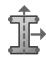

2. 输入截面名称。关于命名对象的更多信息，请参阅使用基本对话框组件。
3. 选择截面类别 (Section Category) 为实心 (Solid)，截面类型 (Section Type) 为广义平面应变 (Generalized Plane Strain)，然后单击Continue。
    将出现广义平面应变截面编辑器 (Generalized Plane Strain Section Editor)。

4. 为截面选择材料。如有需要，可单击创建材料；更多信息，请参阅创建或编辑材料。
5. 输入参考点处材料厚度 (Material Thickness at the reference point) 的值。
6. 输入关于全局1轴的楔角 (Wedge angle about global 1-axis) 的值，即参考点处绕全局1轴的旋转角度（弧度）。
7. 输入关于全局2轴的楔角 (Wedge angle about global 2-axis) 的值，即参考点处绕全局2轴的旋转角度（弧度）。

8. 单击OK保存更改并关闭广义平面应变截面编辑器 (Generalized Plane Strain Section Editor)。

## 附加信息

• 参考点
• 创建截面
• 选择单元的维度 (Choosing the Element's Dimensionality)

欧拉截面用于指定欧拉域中可能存在的材料。欧拉截面只能分配给欧拉类型的部件，并且必须将单个欧拉截面分配给整个欧拉部件。

欧拉截面不会在欧拉部件内创建材料；它只提供部件内可能存在的材料列表。默认情况下，欧拉部件仅包含空腔。创建欧拉截面后，您可以使用材料分配预定义场向部件添加材料（参见定义材料分配字段）。更多信息，请参阅欧拉分析 (Eulerian Analysis)。有关在 Abaqus/CAE 中建模欧拉分析的概述，请参阅欧拉分析 (Eulerian analyses)。

1. 从主菜单栏中选择截面 (Section) -> 创建 (Create)。
    将出现创建截面 (Create Section) 对话框。
    

    提示：您也可以在截面管理器 (Section Manager) 中单击创建 (Create)，或在属性 (Property) 模块工具箱中选择创建截面工具。
    

2. 输入截面名称。关于命名对象的更多信息，请参阅使用基本对话框组件。
3. 选择截面类别 (Section Category) 为实心 (Solid)，截面类型 (Section Type) 为欧拉 (Eulerian)，然后单击Continue。将出现欧拉截面编辑器 (Eulerian Section Editor)。
4. 欧拉截面中存在的每种材料在材料实例 (Material Instances) 表中由一行表示。要向表中添加行，请在某行上单击鼠标右键，然后从出现的菜单中选择在之前插入行 (Insert Row Before) 或在之后插入行 (Insert Row After)。
5. 对于材料实例 (Material Instances) 表中的每一行，输入以下数据：

## 基础材料 (Base Material)
欧拉部件中可能存在的一种材料。单击基础材料 (Base Material) 列，然后单击出现的箭头以显示可用材料列表，并选择相应的材料。

## 实例名称 (Instance Name)
用于在装配相关模块中引用基础材料的名称，例如，当您使用材料分配预定义场定义欧拉域的初始组成时（参见定义材料分配字段）。系统会为每个材料实例名称创建单独的输出（参见查看欧拉分析的输出）。在某些情况下，可能需要为引用相同基础材料的多个唯一材料实例名称创建名称；例如，如果您希望模型中包含相同基础材料的不同区域的输出数据是分开的。Abaqus/CAE 在您选择基础材料时会自动创建一个材料实例名称；但是，如果需要，您可以覆盖此默认实例名称。

6. 单击OK保存更改并关闭欧拉截面编辑器 (Eulerian Section Editor)。

## 创建复合实心截面

复合实心截面用于定义由不同方向、不同材料的层组成的三维区域的截面属性。更多信息，请参阅在 Abaqus/Standard 中定义复合实心单元 (Defining Composite Solid Elements in Abaqus/Standard)。

复合实心截面仅可用于 Abaqus/Standard。复合实心截面必须仅分配给仅具有位移自由度的三维实体单元。复合实心单元主要用于建模方便。在大多数情况下，您应该将复合截面建模为壳或连续壳。但是，在以下情况下应使用复合实心截面：

• 当横向剪切效应占主导时。
• 当您不能忽略法向应力时。
• 当您需要精确的层间应力时，例如在复杂载荷或几何形状的局部区域附近。

如果您分配复合实心截面的区域在其厚度方向包含多个单元，则每个单元将包含数据表中定义的所有材料层，并且分析结果将与预期不符。

1. 从主菜单栏中选择截面 (Section) -> 创建 (Create)。
    将出现创建截面 (Create Section) 对话框。
    

    提示：您也可以在截面管理器 (Section Manager) 中单击创建 (Create)，或在属性 (Property) 模块工具箱中选择创建截面工具。
    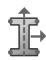

2. 输入截面名称。关于命名对象的更多信息，请参阅使用基本对话框组件。
3. 选择截面类别 (Section Category) 为实心 (Solid)，截面类型 (Section Type) 为复合 (Composite)，然后单击Continue。将出现复合实心截面编辑器 (Composite Solid Section Editor)。
4. （可选）输入铺层名称。Abaqus/CAE 将在层叠图中显示此名称。关于命名对象的更多信息，请参阅使用基本对话框组件。
5. 如果截面中的材料层关于中心层对称，请切换启用对称层 (Symmetric layers)。在数据表中输入材料层，从底层（第一行）开始，到中心层结束。在分析过程中，Abaqus 会通过以相反的顺序重复输入的层（包括中心层）附加到截面顶部来扩展截面定义。如果您为材料层命名，则每个生成的层都会在层叠图和输出数据库中通过在其原始名称前添加 Sym_ 来标记。
6. 复合实心截面的每一层在数据表中由一行表示。
    

    **注意：**
    复合层的堆叠方向由分配给实心区域的材料方向决定。有关更多信息，请参阅分配材料方向 (Assigning a material orientation)。

    要向表中添加行，请在某行上单击鼠标右键，然后从出现的菜单中选择

    **在之前插入行 (Insert Row Before)**

    或

    **在之后插入行 (Insert Row After)**。

    对于每一层，输入以下数据：

    **材料 (Material)**
    形成此层的材料的名称。单击材料 (Material) 列，然后单击出现的箭头以显示可用材料列表，并选择形成该层的材料。

    **单元相对厚度 (Element Relative Thickness)**
    该层在每个单元内的相对厚度。Abaqus 根据单元几何形状确定整体截面厚度，定义截面的位置不同，单元几何形状可能不同。因此，您为每层指定的厚度值是相对于每个单元的厚度的。一层的实际厚度等于单元厚度乘以该层占总厚度的分数。您不必使用物理单位来指定各层的厚度比，并且各层的相对厚度之和不必等于一。有关更多信息，请参阅创建复合铺层 (Creating a composite layup)。
## 方向角

方向。方向可以指定为角度（以度为单位）或方向名称。方向角沿法线方向逆时针为正，并相对于截面方向定义进行测量。

如果指定方向名称，Abaqus/CAE 会假定为用户定义的方向。您必须提供用户子程序 `ORIENT`，其中包含指定方向名称的用户定义方向定义。您不能使用离散场定义可变方向角；要在复合材料实体中定义逐层的方向分布，必须使用复合材料铺层编辑器（请参阅*创建和编辑复合材料铺层*）。

## 积分点

厚度方向的积分点数量。您只能指定奇数。

## 铺层名称

层的名称。在可视化模块（Visualization module）中查看复合材料铺层以及在层堆叠图（ply stack plot）中查看时，Abaqus/CAE 将显示此名称。

为复合材料实体截面中的层命名是可选的。但是，如果您为任何层提供了名称，则必须为截面中的所有层提供名称。

7.  单击 **OK** 保存更改并关闭复合材料实体截面编辑器。

## 创建电磁实体截面

电磁实体截面用于定义二维和三维实体区域的截面属性，并且只能分配给电磁模型中的电磁单元。有关更多信息，请参阅*实体（连续体）单元*。

1.  从主菜单栏中，选择 **Section->Create**。

    出现“创建截面”对话框。

    

    **提示**：您也可以在截面管理器（Section Manager）中单击 **Create**，或在**属性（Property）**模块工具箱中选择创建截面工具。

    

2.  输入截面名称。有关命名对象的更多信息，请参阅*使用基本对话框组件*。
3.  选择 **Solid** 作为截面类别（Category），选择 **Electromagnetic, Solid** 作为截面类型（Type），然后单击 **Continue**。

    出现电磁实体截面编辑器。

4.  为电磁实体截面选择一个材料。如果需要，请单击创建材料；有关更多信息，请参阅*创建或编辑材料*。
5.  输入截面的**平面应力/应变厚度**（Plane stress/strain thickness）值。如果截面将用于二维区域，则必须指定截面厚度。如果区域类型不需要厚度信息，Abaqus/CAE 将忽略该信息。
6.  单击 **OK** 保存更改并关闭电磁实体截面编辑器。

本节介绍如何创建均匀壳截面（homogeneous shell section）。

壳截面的行为是根据壳截面对拉伸、弯曲、剪切和扭转的响应来定义的。有关更多信息，请参阅*壳截面行为*。

创建壳截面时，必须选择一种截面积分方法。您可以选择在分析前提供截面属性数据（预积分壳截面），也可以让 Abaqus 在分析过程中通过截面积分点计算（积分）截面行为。

在分析过程中积分的壳截面允许通过壳厚度方向的数值积分来计算截面行为，从而在材料建模方面提供完全的通用性。可以在厚度方向定义任意数量的材料点，并且材料响应可以因点而异。这种类型的壳截面通常用于具有非线性材料行为的截面。它必须用于提供传热功能的壳单元。有关更多信息，请参阅*使用分析过程中积分的壳截面定义截面行为*。

可以使用预积分壳截面定义线性弯矩-曲率和力-膜应变关系。在这种情况下，所有计算都根据截面力和力矩进行。截面属性由弹性材料指定；或者，您也可以基于对壳预期行为的假设应用一种理想化方法。如果壳的响应是线弹性的，并且其行为不依赖于温度或预定义场变量的变化，请使用预积分壳截面。有关更多信息，请参阅*使用广义壳截面定义截面行为*。

## 本节内容：

*   创建均匀壳截面
*   为均匀壳截面指定基本属性
*   为均匀壳截面指定高级属性

## 创建均匀壳截面

您可以创建均匀壳截面。

1.  从主菜单栏中，选择 **Section->Create**。

    出现“创建截面”对话框。

    

    **提示**：您也可以在截面管理器（Section Manager）中单击 **Create**，或在**属性（Property）**模块工具箱中选择创建截面工具。

    

2.  输入截面名称。有关命名对象的更多信息，请参阅*使用基本对话框组件*。
3.  选择 **Shell** 作为截面类别（Category），选择 **Homogeneous** 作为截面类型（Type），然后单击 **Continue**。
    出现壳截面编辑器。
4.  选择**截面积分方法**（Section integration method）。
    选择 **During analysis**（在分析过程中）以指定在分析过程中积分的均匀壳截面的属性。
    选择 **Before analysis**（在分析前）以指定预积分均匀壳截面的属性。

## 为均匀壳截面指定基本属性

在**基本**（Basic）选项卡页面上：

1.  指定**壳厚度**（Shell thickness）。

    选择 **Value**，并输入壳厚度的值。在连续体壳中，此值用于估算某些截面属性，例如沙漏刚度，这些属性稍后将使用根据单元几何形状计算的实际厚度进行计算。
    选择 **Element distribution**（单元分布）；并选择标记为 **(A)** 的解析场或标记为 **(D)** 的基于单元的离散场，以定义空间变化的基于单元的壳厚度。或者，您可以单击创建一个新的解析场，或单击创建一个新的离散场。有关更多信息，请参阅*解析场工具集*和*离散场工具集*。

    选择 **Nodal distribution**（节点分布）；并选择标记为 **(A)** 的解析场或标记为 **(D)** 的基于节点的离散场，以定义空间变化的基于节点的壳厚度。

    或者，您可以单击创建一个新的解析场，或单击创建一个新的离散场。有关更多信息，请参阅*解析场工具集*和*离散场工具集*。

2.  为壳截面选择一个材料。如果需要，请单击创建材料；有关更多信息，请参阅*创建或编辑材料*。可以将线性或非线性材料行为与截面定义关联。但是，如果材料响应是线性的，则更经济的方法是使用广义壳截面。
3.  如果您正在为分析前积分的均匀壳截面指定属性，您可以指定一种**理想化**（Idealization）方法，该方法基于对壳预期行为的假设应用于截面。有关更多信息，请参阅*理想化截面响应*。

    *   选择 **No idealization**（无理想化）以考虑根据材料分配确定的壳截面的完整刚度。
    *   选择 **Membrane only**（仅膜）如果壳的主要响应将是面内拉伸；弯曲刚度项将从壳刚度计算中消除。
    *   选择 **Bending only**（仅弯曲）如果壳的主要响应将是纯弯曲；膜刚度项将从壳刚度计算中消除。

4.  如果您正在为分析过程中积分的均匀壳截面指定属性，请选择**厚度积分规则**（Thickness integration rule）。

    *   选择 **Simpson** 以使用辛普森法则（Simpson's rule）进行壳截面积分。
    *   选择 **Gauss** 以使用高斯求积法（Gauss quadrature）进行壳截面积分。

    有关更多信息，请参阅*定义壳截面积分*。

5.  如果您正在为分析过程中积分的均匀壳截面指定属性，请输入**厚度积分点**（Thickness integration points）数量。通过厚度方向的积分点默认数量，辛普森法则积分是 5 个，高斯求积积分是 3 个。要指定积分点数量的新值，您可以直接键入数字，或在**厚度积分点**文本字段中单击箭头。

    *   如果您使用辛普森积分规则，您只能指定 3 到 15 之间的奇数。
    *   如果您使用高斯积分规则，您可以指定 2 到 15 之间的数字。

## 为均匀壳截面指定高级属性

在**高级**（Advanced）选项卡页面上：

1.  指定**截面泊松比**（Section Poisson's ratio）以定义壳厚度行为。
• 在允许大变形分析中产生有限膜应变的常规壳单元中，指定截面泊松比会导致壳厚度随膜应变的变化而改变：

开启“使用分析默认值”可使用默认值。在 Abaqus/Standard 中，默认值为 0.5，这将强制单元膜应变行为不可压缩。在 Abaqus/Explicit 中，默认是根据单元材料定义来计算厚度变化。

开启“指定值”，并输入泊松比的值。该值必须介于 -1.0 和 0.5 之间。值为 0.0 将强制壳厚度保持不变，负值会导致壳厚度在拉伸膜应变下增加。

• 在连续壳单元中，指定截面泊松比定义了小位移和大位移分析中的厚度行为：

开启“使用分析默认值”表示厚度变化基于单元材料定义。

开启“指定值”，并输入泊松比的值，使壳厚度随膜应变的变化而改变。该值必须介于 -1.0 和 0.5 之间。连续壳不能使用 0.5 的值。值为 0.0 将强制壳厚度保持不变，负值会导致壳厚度在拉伸膜应变下增加。

2. 对于连续壳单元，开启“厚度模量”，并输入有效厚度模量的值。如果不指定厚度模量，Abaqus 将尝试基于初始弹性材料属性计算它。

3. 如果您正在为分析过程中积分的均质壳截面指定属性，请选择一种定义截面内“温度变化”的方法：

选择“线性穿过厚度”表示指定参考面上的温度以及穿过截面的温度梯度。您可以使用“加载”模块来指定这些温度。
选择“在 n 个值上分段线性”以在提供的文本字段中输入穿过截面的温度点（值）的数量。您可以使用“加载”模块来指定每个点的温度。

4. 开启“密度”，并输入壳的单位表面积的质量值。壳的质量除了所选材料的贡献外，还包括密度的贡献。

5. 对于大多数壳截面，Abaqus 将计算单元公式所需的横向剪切刚度值。如果需要，开启“指定值”来自“横向剪切刚度”选项，以在截面定义中包含非默认的横向剪切刚度效应，并输入 $\pmb { K } _ { 1 1 }$（截面在第一方向上的剪切刚度）、$\pmb { K } _ { 1 2 }$（截面剪切刚度的耦合项）和 $\pmb { K } _ { 2 2 }$（截面在第二方向上的剪切刚度）的值。如果 $\pmb { K } _ { 1 1 }$ 或 $\pmb { K _ { 2 2 } }$ 的值被省略或给定为零，则非零值将用于两者。

6. 如果您正在为分析过程中积分的均质壳截面指定属性，请单击

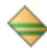

（位于壳截面编辑器底部）以定义壳截面中的钢筋层，如“定义钢筋层”中所述。

7. 单击“确定”以保存更改并关闭壳截面编辑器。

## 创建复合壳截面

本节描述如何创建复合壳截面。

壳截面行为由壳截面对拉伸、弯曲、剪切和扭转的响应来定义。更多信息，请参阅“壳截面行为”。复合壳截面由不同材料、不同方向的层组成。

创建壳截面时，必须选择截面积分方法。您可以选择在分析前提供截面属性数据（预积分壳截面），或者让 Abaqus 在分析过程中通过截面积分点计算（积分）截面行为。

分析过程中积分的壳截面允许通过壳厚度的数值积分来计算截面行为，从而在材料建模方面提供完全的通用性。可以定义任意数量的材料点，并且材料响应可以逐点变化。此类壳截面通常用于具有非线性材料行为的截面。它必须与提供传热功能的壳一起使用。更多信息，请参阅“使用分析过程中积分的壳截面来定义截面行为”。

可以使用预积分壳截面定义线性的弯矩-弯曲和力-膜应变关系。在这种情况下，所有计算都基于截面力和力矩进行。截面属性由弹性材料层指定；您也可以根据对壳的预期行为或组成的假设应用理想化。如果壳的响应是线性弹性的，并且其行为不依赖于温度或预定义场变量的变化，请使用预积分壳截面。更多信息，请参阅“使用通用壳截面来定义截面行为”。

## 本节内容：

创建复合壳截面
指定复合壳截面的基本属性
指定复合壳截面的高级属性

## 创建复合壳截面

您可以创建复合壳截面。

1. 从主菜单栏中，选择“截面”->“创建”。

将出现“创建截面”对话框。

提示：您也可以单击“截面管理器”中的“创建”，或在“属性”模块工具箱中选择创建截面工具。

2. 输入截面名称。有关命名对象的更多信息，请参阅“使用基本对话框组件”。
3. 选择“壳”作为截面“类别”，选择“复合”作为截面“类型”，然后单击“继续”。壳截面编辑器随即出现。
4. 选择“截面积分方法”。选择“分析期间”以指定在分析过程中积分的复合壳截面的属性。选择“分析前”以指定预积分复合壳截面的属性。
5. 输入层合名称。Abaqus/CAE 在层叠图中显示此名称。有关命名对象的更多信息，请参阅“使用基本对话框组件”。

6. 单击壳截面编辑器底部的按钮，以定义壳截面中的钢筋层，如“定义钢筋层”中所述。

7. 单击“确定”以保存更改并关闭壳截面编辑器。

## 指定复合壳截面的基本属性

您可以指定复合壳截面的基本属性。

在“基本”选项卡页面上：

1. 输入层合名称。有关命名对象的更多信息，请参阅“使用基本对话框组件”。
2. 如果您正在为分析前积分的复合壳截面指定属性，请根据对壳的预期行为或组成的假设指定要应用于截面的“理想化”。更多信息，请参阅“理想化截面响应”。

• 选择“无理想化”以考虑壳截面的完整刚度，该刚度由材料分配和层组成确定。
如果不知道复合壳中材料层的确切堆叠顺序，请选择“涂抹属性”。每个指定层的贡献在整个壳厚度上被涂抹，从而产生独立于堆叠顺序的一般响应。
如果壳的主要响应是面内拉伸，请选择“仅膜”；壳刚度计算中将消除弯曲刚度项。
• 如果壳的主要响应是纯弯曲，请选择“仅弯曲”；壳刚度计算中将消除膜刚度项。

3. 如果您正在为分析过程中积分的复合壳截面指定属性，请选择“厚度积分规则”。

• 选择“Simpson”以使用 Simpson 规则进行壳截面积分。
• 选择“高斯”以使用高斯求积进行壳截面积分。

有关更多信息，请参阅“定义壳截面积分”。

4. 如果截面中的材料层关于中心层对称，请开启“对称层”。在数据表中输入材料层，从第一行的底层开始，到中心层结束。在分析过程中，Abaqus 通过按相反顺序重复输入的层（包括中心层）到截面顶部来向截面定义追加层。每个生成的层在层叠图和输出数据库中通过在重复层的原始名称前添加 Sym_ 来标记。
5. 复合材料壳截面的每一层由数据表中的一行表示。要向表格添加行，请在行上点击鼠标按钮三，并从出现的菜单中选择“在行前插入”或“在行后插入”。对于每一层，请输入以下数据：

## 材料 (Material)

构成此层的材料的名称。在“材料”列中单击，然后单击出现的箭头以显示可用材料列表，并选择构成该层的材料。

## 厚度 (Thickness)

层厚度。对于实体壳单元，Abaqus根据单元几何形状确定厚度，并且对于给定的截面定义，厚度可能在模型中有所不同。因此，您指定的厚度值仅为每层的相对厚度。一层的实际厚度是单元厚度乘以该层占总厚度的比例。您不必使用物理单位来指定层的厚度比，并且层的相对厚度之和不必等于一。Abaqus使用壳厚度来估计某些截面属性，例如沙漏刚度，这些属性稍后将根据单元几何形状计算。

## 方向角 (Orientation Angle)

方向，可以是引用截面方向定义，也可以是以度为单位的方向角。方向角（）是绕法线方向逆时针测量的，并相对于截面方向定义。

如果截面方向的两个局部方向中的任何一个不在壳的表面上，则在截面方向已投影到壳表面后应用。如果未定义截面方向，则相对于默认的壳局部方向测量。

如果您指定一个方向名称，Abaqus/CAE 会假定为用户定义的方向。您必须提供用户子程序 ORIENT，其中包含为指定方向名称定义的用户定义方向。您不能使用离散场定义可变方向角；要在复合材料壳中定义逐层方向分布，必须使用复合材料铺层编辑器（参见创建和编辑复合材料铺层）。

## 积分点 (Integration Points)

厚度方向上的积分点数量，如果您正在为在分析过程中积分的复合材料壳截面指定属性。

对于 Simpson 规则积分，默认积分点数为 3；对于 Gauss 积分，默认积分点数为 2。

• 如果您使用 Simpson 积分规则，只能指定奇数。  
• 如果您使用 Gauss 积分规则，可以指定小于或等于 7 的数字。

## 铺层名称 (Ply Name)

层的名称。当您在可视化模块中查看复合材料铺层以及在铺层堆叠图中时，Abaqus/CAE 会显示此名称。

## 为复合材料壳截面指定高级属性

您可以为复合材料壳截面指定高级属性。

在“高级”选项卡页面上：

1. 指定壳厚度 (Shell thickness)。

• 选择“使用截面厚度”以使用从各个层厚度计算出的厚度。  
选择“单元分布”；并选择标记为 (A) 的解析场或标记为 (D) 的基于单元的离散场，以定义空间变化的基于单元的壳厚度。或者，您可以单击创建新的解析场或单击创建新的离散场。有关更多信息，请参见解析场工具集和离散场工具集。

选择“节点分布”；并选择标记为 (A) 的解析场或标记为 (D) 的基于节点的离散场，以定义空间变化的基于节点的壳厚度。
以创建新的解析场或单击创建新的离散场。有关更多信息，请参见解析场工具集和离散场工具集。

2. 指定截面泊松比 (Section Poisson's ratio) 以定义壳厚度行为。

在允许大变形分析中有限膜应变的常规壳单元中，指定截面泊松比会导致壳厚度随膜应变而变化：

打开“使用分析默认值”开关以使用默认值。在 Abaqus/Standard 中，默认值为 0.5，这将强制单元在膜应变下具有不可压缩行为。在 Abaqus/Explicit 中，默认行为是基于单元材料定义来确定厚度的变化。

打开“指定值”开关，并输入泊松比的值。该值必须在 -1.0 到 0.5 之间。值为 0.0 将强制壳厚度恒定，负值将导致壳厚度在拉伸膜应变下增加。

• 在实体壳单元中，指定截面泊松比可定义小位移和大位移分析的厚度行为：

打开“使用分析默认值”开关以表明厚度变化基于单元材料定义。

打开“指定值”开关，并输入泊松比的值，以使壳厚度随膜应变而变化。该值必须在 -1.0 到 0.5 之间。值 0.5 不能与实体壳一起使用。值为 0.0 将强制壳厚度恒定，负值将导致壳厚度在拉伸膜应变下增加。

3. 对于实体壳单元，打开“厚度模量 (Thickness modulus)”开关，并输入有效厚度模量的值。如果您未指定厚度模量，Abaqus 将尝试根据初始弹性材料属性计算它。

4. 如果您正在为在分析过程中积分的复合材料壳截面指定属性，请选择一种定义截面温度变化的方法：

选择“沿厚度线性变化”以表明指定了参考表面处的温度以及沿截面的温度梯度。您可以使用“载荷”模块来指定这些温度。

选择“在 n 个值上分段线性”，并在提供的文本字段中输入沿截面的温度点（值）数量。您可以使用“载荷”模块指定每个点的温度。

5. 打开“密度 (Density)”开关，并输入壳的单位表面积质量的值。壳的质量包括来自密度的贡献以及所选材料的任何贡献。  
6. 对于大多数壳截面，Abaqus 将计算单元公式所需的横向剪切刚度值。如果需要，可以从“横向剪切刚度 (Transverse Shear Stiffnesses)”选项中打开“指定值”开关，以在截面定义中包含非默认横向剪切刚度效应，并输入以下值：$\pmb { K } _ { 1 1 }$ ，截面在第一方向上的剪切刚度；${ \pmb K } _ { 1 2 }$ ，截面剪切刚度的耦合项；和 $K _ { 2 2 }$ ，截面在第二方向上的剪切刚度。如果省略 $\pmb { K } _ { 1 1 }$ 或 $\pmb { K _ { 2 2 } }$ 中的任一值或将其设为零，则非零值将同时用于两者。

## 创建膜截面

膜截面用于定义空间中薄表面的截面属性，这些表面在面内提供强度但没有弯曲刚度。有关更多信息，请参见膜单元。

1. 从主菜单栏中，选择“截面 (Section)”->“创建 (Create)”。

将出现“创建截面”对话框。

提示：您也可以在“截面管理器”中单击“创建”，或在“属性”模块工具箱中选择创建截面工具。

2. 输入截面名称。有关命名对象的更多信息，请参见使用基本对话框组件。  
3. 选择“壳 (Shell)”作为截面类别，选择“膜 (Membrane)”作为截面类型，然后单击“继续”。膜截面编辑器将出现。  
4. 为膜截面选择一种材料。如果需要，可以单击“创建”来创建材料；有关更多信息，请参见创建或编辑材料。  
5. 指定膜厚度 (Membrane thickness)。

• 选择“值 (Value)”，并输入膜厚度的值。  
• 选择“单元分布 (Element distribution)”；并选择标记为 (A) 的解析场或标记为 (D) 的基于单元的离散场，以定义空间变化的基于单元的
以创建新的离散场。有关更多信息，请参见解析场工具集和离散场工具集。

6. 指定截面泊松比 (Section Poisson's ratio) 以定义膜厚度将如何随变形而变化。

打开“使用分析默认值”开关以使用默认值。在 Abaqus/Standard 中，默认值为 0.5，这将强制单元具有不可压缩行为。在 Abaqus/Explicit 中，默认行为是基于单元材料定义来确定厚度的变化。
打开**指定值**开关，并输入泊松比的值。该值必须在 −1.0 和 0.5 之间。值为 0.0 会强制保持恒定厚度，负值则会导致厚度在响应拉伸膜应变时增加。

7.  在膜截面编辑器底部点击以定义膜截面中的钢筋层，如**定义钢筋层**中所述。
8.  点击**确定**以保存更改并关闭膜截面编辑器。

**表面截面**用于定义空间中表面的截面属性，这些表面没有固有刚度，表现为零厚度的膜。更多信息，请参见**表面单元**。

1.  从主菜单栏中，选择**截面** -> **创建**。
    
    将出现**创建截面**对话框。
    
    
    
    **提示：** 您也可以在**截面管理器**中点击**创建**，或在**属性**模块工具箱中选择创建截面工具。
    
    
    
2.  输入截面名称。有关命名对象的更多信息，请参见**使用基本对话框组件**。
3.  将**类别**选择为**壳**，将**类型**选择为**表面**，然后点击**继续**。
    将出现表面截面编辑器。
4.  若要为模型引入额外质量，请打开**密度**开关并输入单位面积的质量密度。

5.  点击以在表面截面中定义钢筋层，如**定义钢筋层**中所述。

6.  点击**确定**以保存更改并关闭表面截面编辑器。

## 创建通用壳刚度截面

壳截面的行为根据截面对拉伸、弯曲、剪切和扭转的响应来定义。

通用壳刚度截面允许您直接根据刚度矩阵和热膨胀响应来指定壳截面属性。这些数据完全定义了壳截面的力学响应，因此截面定义中无需材料引用。当您知道适用的刚度和热应力矩阵的项时，通用壳刚度截面提供了一种高效且灵活的方法来定义壳响应。更多信息，请参见**为传统壳直接指定等效截面属性**。

通用壳刚度截面不能用于变厚度壳或连续壳。与其他预积分壳截面一样，通用壳刚度截面不通过其厚度进行积分，也不提供传热功能。在 Abaqus/Standard 分析中，通用壳刚度截面无法输出应力和应变。

更多信息，请参见**壳截面行为**。

## 本节内容：

创建通用壳刚度截面  
指定通用壳刚度截面的依赖项  
指定通用壳刚度截面的高级属性

## 创建通用壳刚度截面

您可以创建一个通用壳刚度截面。

1.  从主菜单栏中，选择**截面** -> **创建**。
    
    将出现**创建截面**对话框。
    
    
    
    **提示：** 您也可以在**截面管理器**中点击**创建**，或在**属性**模块工具箱中选择创建截面工具。
    
    
    
2.  输入截面名称。有关命名对象的更多信息，请参见**使用基本对话框组件**。
3.  将**类别**选择为**壳**，将**类型**选择为**通用壳刚度**，然后点击**继续**。
    
    将出现通用壳刚度截面编辑器。
    
4.  在**刚度**选项卡页面上，在数据表中输入壳刚度矩阵的对称下半部分。第一行包含矩阵元素 $D _ { 1 1 }$ 到 $D _ { 1 6 }$，第二行包含矩阵元素 $\pmb { D _ { 2 2 } }$ 到 $D _ { 2 6 }$，依此类推；最后一行包含矩阵元素 $D _ { 6 6 }$。更多信息，请参见**输入表格数据**。

## 指定通用壳刚度截面的依赖项

**依赖项**选项卡页面允许您定义壳截面上的热应力。您还可以将依赖于温度和场变量的缩放系数应用于壳刚度矩阵和热应力。有关定义壳刚度依赖项所用方程的详细信息，请参阅**为传统壳直接指定等效截面属性**。

在**依赖项**选项卡页面上：

1.  如果要定义作为温度函数的热膨胀系数，请打开**指定参考温度**开关，并在提供的字段中输入参考温度 ${ \pmb \theta } ^ { 0 }$。
2.  要定义壳截面上的热应力，请打开**应用热应力**开关，并在提供的表中输入应力分量：${ \varepsilon } _ { 1 1 }$ (Sigma11)，$\pmb { \varepsilon _ { 2 2 } }$ (Sigma22)，(Gamma12)，$\kappa _ { 1 1 }$ (K11)，(K22)，和 $\kappa _ { 1 2 }$ (K12)。
3.  要定义依赖于温度的缩放系数，请打开**使用依赖于温度的数据**。**缩放系数**数据表中将出现一列标记为 **Temp**。
4.  要定义依赖于场变量的缩放系数，请点击**场变量数**右侧的箭头来增加或减少场变量的数量。**缩放系数**数据表中将出现场变量列。
5.  在**缩放系数**数据表中，输入刚度矩阵的**缩放模量 (Y)** 和热应力的**热膨胀系数 ( )**。

## 指定通用壳刚度截面的高级属性

您可以为通用壳刚度截面指定高级属性。

在**高级**选项卡页面上：

1.  指定**截面泊松比**以定义壳厚度行为。指定截面泊松比会导致壳厚度随膜应变而变化。
    *   打开**使用分析默认值**以使用默认值 0.5，这将强制单元在膜应变下呈现不可压缩行为。
    *   打开**指定值**，并输入泊松比的值。该值必须在 −1.0 和 0.5 之间。值为 0.0 会强制保持恒定的壳厚度，负值则会导致壳厚度在响应拉伸膜应变时增加。

2.  打开**密度**，并输入壳的单位表面面积质量值。壳的质量由该密度确定。

3.  对于大多数壳截面，Abaqus 会计算单元公式所需的横向剪切刚度值。如果需要，请从**横向剪切刚度**选项中打开**指定值**，以在截面定义中包含非默认的横向剪切刚度效应，并输入 $\pmb { K } _ { 1 1 }$（截面在第一方向的剪切刚度）、${ \pmb K } _ { 1 2 }$（截面剪切刚度的耦合项）和 $\pmb { K _ { 2 2 } }$（截面在第二方向的剪切刚度）的值。如果 $\pmb { K } _ { 1 1 }$ 或 $\pmb { K } _ { 2 2 }$ 中任一值被省略或给定为零，则非零值将同时用于两者。

4.  点击**确定**以保存更改并关闭通用壳刚度截面编辑器。

## 创建梁截面

梁截面的行为根据截面对拉伸、弯曲、剪切和扭转的响应来定义。

更多信息，请参见**梁截面行为**。

当您创建梁截面时，必须选择一种截面积分方法。您可以选择在分析前提供截面属性数据（通用梁截面），或让 Abaqus 在分析过程中根据截面积分点计算（积分）横截面行为。

## 本节内容：

指定在分析期间积分的梁截面的属性  
指定通用梁截面的属性

## 指定在分析期间积分的梁截面的属性

在分析期间积分的梁截面允许通过数值积分应力来计算横截面行为，从而在分析过程中定义梁的响应。材料行为在截面上的每个点独立评估。当截面的非线性仅由非线性材料响应引起时，应使用此类型的梁截面。更多信息，请参见**使用分析期间积分的梁截面来定义截面行为**。

1.  从主菜单栏中，选择**截面** -> **创建**。
    
    将出现**创建截面**对话框。
    
    
    
    **提示：** 您也可以在**截面管理器**中点击**创建**，或在**属性**模块工具箱中选择创建截面工具。
    
    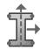
2. 输入截面名称。有关对象命名的更多信息，请参阅使用基本对话框组件。  
3. 在截面类别（Category）中选择梁（Beam），在截面类型（Type）中选择梁（Beam），然后点击继续（Continue）。

梁截面编辑器随即出现。

4. 选择分析过程中（During analysis）作为截面积分方法（Section integration method）。  
5. 为梁截面选择一个截面轮廓。如果需要，点击创建截面轮廓；有关更多信息，请参阅创建截面轮廓。

截面轮廓形状（Profile shape）字段将更新以反映您的选择。

6. 在基本（Basic）选项卡页面上：

a. 选择要用于此梁截面定义的材料名称（Material name）。如果需要，点击创建材料；有关更多信息，请参阅创建和编辑材料。  
b. 输入截面泊松比（Section Poisson's ratio）的值，以提供由于梁轴应变引起的截面均匀应变（从而使梁被拉伸时横截面积发生变化）。此值必须在 -1.0 和 0.5 之间。值为 0.5 将强制不可压缩行为。

c. 选择定义截面内温度变化的方法：

选择线性梯度（Linear by gradients）表示指定截面原点温度和截面内的温度梯度。您可以使用载荷模块（Load module）来指定这些温度。  
选择从温度点插值（Interpolated from temperature points）表示梁截面轮廓的形状决定了温度点的数量和位置。（有关温度点的更多信息，请参阅梁横截面库。）您可以使用载荷模块（Load module）来指定这些点中每一点的温度。

7. 在刚度（Stiffness）选项卡页面上，执行以下操作：

a. 选择使用一致质量矩阵公式（Use consistent mass matrix formulation）以让 Abaqus 使用基于挠度三次插值和转动二次插值的 McCalley-Archer 一致质量矩阵来计算梁截面的质量公式。如果关闭此选项，Abaqus 将使用集中质量公式进行计算。  
b. 开启指定横向剪切（Specify transverse shear）以在截面定义中包含非默认横向剪切刚度效应，并指定细长补偿（Slenderness compensation）：

• 选择使用分析产品默认值（Use analysis product default）以让 Abaqus 根据梁截面的弹性材料定义计算剪切刚度和细长补偿因子。

• 选择值（Value）以直接指定横向剪切刚度效应。

在提供的字段中输入细长补偿因子。  
在提供的字段中输入截面的 $\pmb { K _ { 2 3 } }$ 和 ${ \pmb K } _ { 1 3 }$ 剪切刚度值。

8. 在流体惯性（Fluid Inertia）选项卡页面上，开启指定流体惯性效应（Specify fluid inertia effects）以模拟梁浸入流体中的惯性效应。有关详细信息，请参阅浸入流体引起的附加惯性。

a. 指定梁是完全浸入（Fully submerged）还是部分浸入（Half submerged）流体。如果选择部分浸入，则单位长度的附加惯性将减少一半。  
b. 指定流体密度（Fluid density）。  
c. 在截面半径（Section radius）字段中输入被浸湿横截面的有效半径。  
d. 指定 $C _ { A }$ ，即梁横向运动（Lateral motions）的附加质量系数。  
e. 指定 $C _ { A - E }$ ，即梁沿轴向运动（Motions along beam axis）的附加质量系数。  
f. 如果梁截面原点与被浸湿横截面的形心不同，请指定形心相对于截面原点的 X 和 Y 坐标。

9. 点击确定（OK）保存更改并关闭梁截面编辑器。

## 为通用梁截面指定属性

在通用梁截面中，横截面属性仅在预处理期间计算一次。分析过程中的所有截面计算均基于预先计算的值进行。通用梁截面不需要材料定义。当梁的响应是线性的，或者当梁是非线性且非线性不仅仅源于材料非线性（例如在截面塌陷的情况下）时，使用此类型的梁截面。有关更多信息，请参阅使用通用梁截面定义截面行为。

1. 从主菜单栏中，选择截面（Section）-> 创建（Create）。

将出现一个创建截面（Create Section）对话框。

提示：您也可以在截面管理器（Section Manager）中点击创建（Create），或在属性（Property）模块工具箱中选择创建截面工具。

2. 输入截面名称。有关对象命名的更多信息，请参阅使用基本对话框组件。  
3. 在截面类别（Category）中选择梁（Beam），在截面类型（Type）中选择梁（Beam），然后点击继续（Continue）。梁截面编辑器随即出现。  
4. 选择分析前（Before analysis）作为截面积分方法（Section integration method）。  
5. 从沿梁长度的梁形状（Beam shape along length）选项中，执行以下操作之一：

• 要沿梁的整个长度保持相同的横截面轮廓，选择恒定（Constant）并从梁形状（Beam Shape）选项中选择一个梁截面轮廓。如果需要，点击 $\nRightarrow$ 创建一个截面轮廓；有关更多信息，请参阅创建截面轮廓。

• 要在梁的两端定义不同的横截面轮廓，选择锥形（Tapered）并分别从梁起始（Beam Start）和梁结束（Beam End）选项中选择起始和结束轮廓。如果需要，点击 $\nRightarrow$ 创建一个截面轮廓；有关更多信息，请参阅创建截面轮廓。起始和结束轮廓必须是相同的形状。

锥形梁仅支持 Abaqus/Standard 分析。Abaqus/CAE 在起始和结束轮廓之间线性缩放梁轮廓。

6. 从材料定义类型（Material definition type）选项中，执行以下操作之一：

• 要使用预定义的材料名称指定截面的材料定义，选择材料名称（Material name）。  
• 要通过创建新材料来指定截面的材料定义，选择表格（Table）。

7. 如果选择了通用截面轮廓，您可以通过指定沿截面轴移动截面形心和/或剪切中心的距离和方向来偏移梁截面相对于其节点的位置。根据需要，为形心（Centroid）和/或剪切中心（Shear Center）输入局部 - 和 - 坐标。

8. 在基本（Basic）选项卡页面上：

• 如果将材料定义类型（Material definition type）选择为表格（Table），请执行以下操作：  
a. 要定义截面的热膨胀系数，请开启使用热膨胀数据（Use thermal expansion data）。数据表中将出现一列标记为热膨胀（Thermal Expansion）的列。  
b. 要定义依赖于温度的截面数据，请开启使用温度相关数据（Use temperature-dependent data）。数据表中将出现一列标记为温度（Temperature）的列。

c. 要定义依赖于场变量的截面数据，请点击场变量数量（Number of field variables）字段右侧的箭头以增加或减少场变量的数量。

数据表中将出现场变量列。

d. 在数据表中输入截面的杨氏模量（Young's Modulus）和扭转剪切模量（torsional Shear Modulus）的值。

e. 输入截面泊松比（Section Poisson's ratio）的值，以提供由于梁轴应变引起的截面均匀应变（从而使梁被拉伸时横截面积发生变化）。此值必须在 -1.0 和 0.5 之间。值为 0.5 将强制不可压缩行为。默认值为 0。

f. 要为梁截面定义密度，请开启指定截面材料密度（Specify section material density）并在提供的字段中输入一个值。在 Abaqus/Explicit 分析中需要此值。在 Abaqus/Standard 分析中，仅在需要质量时（例如在动态分析或重力载荷中）才需要此值。

g. 如果热膨胀系数依赖于温度，请开启指定参考温度（Specify reference temperature）并在提供的字段中输入热膨胀的值。

• 如果将材料定义类型（Material definition type）选择为材料名称（Material name），请执行以下操作：

a. 选择要用于此梁截面定义的材料名称（Material name）。

b. 输入截面泊松比（Section Poisson's ratio）的值，以提供由于梁轴应变引起的截面均匀应变（从而使梁被拉伸时横截面积发生变化）。此值必须在 -1.0 和 0.5 之间。值为 0.5 将强制不可压缩行为。

9. 在阻尼（Damping）选项卡页面上，指定阻尼属性，以在截面的动态响应中包含质量和刚度比例阻尼：

a. 在 Alpha 字段中输入一个值，作为在直接积分动力学中创建质量比例阻尼的因子。在模态动力学中会忽略此值。

b. 在 Beta 字段中输入一个值，作为在直接积分动力学中创建刚度比例阻尼的 $\beta _ { R }$ 因子。在模态动力学中会忽略此值。

c. 在复合（Composite）字段中输入一个值，作为用于计算模态复合阻尼因子的临界阻尼分数（用于模态动力学）。此值仅适用于 Abaqus/Standard 分析，在直接积分动力学中会被忽略。

10. 在刚度（Stiffness）选项卡页面上，执行以下操作：
a. 选择 **Use consistent mass matrix formulation**（使用一致质量矩阵公式）可让 Abaqus 使用基于挠度三次插值和转动二次插值的 McCalley-Archer 一致质量矩阵来计算梁截面的质量公式。如果禁用此选项，Abaqus 将使用集中质量公式进行计算。

b. 启用 **Specify transverse shear**（指定横向剪切）以在截面定义中包含非默认的横向剪切刚度效应，并指定 **Slenderness compensation**（长细比补偿）：
   • 选择 **Use analysis product default**（使用分析产品默认值）可让 Abaqus 根据梁截面的弹性材料定义计算剪切刚度和长细比补偿因子。
   • 选择 **Value**（值）可直接指定横向剪切刚度效应。
   在提供的字段中输入长细比补偿因子。
   • 在提供的字段中输入截面的 $\pmb { K _ { 2 3 } }$ 和 $\pmb { K } _ { 1 3 }$ 剪切刚度值。

11. 在 **Fluid Inertia**（流体惯性）选项卡页面上，启用 **Specify fluid inertia effects**（指定流体惯性效应）以模拟梁浸没在流体中的惯性效应。有关详情，请参见 Additional Inertia due to Immersion in Fluid。
   a. 指定梁是 **Fully submerged**（完全浸没）还是 **Half submerged**（半浸没）在流体中。如果选择半浸没，则每单位长度的附加质量减少一半。
   b. 指定 **Fluid density**（流体密度）。
   c. 在 **Section radius**（截面半径）字段中输入被浸湿横截面的有效半径。
   d. 指定 $C _ { A }$，即梁侧向运动的附加质量系数。
   e. 指定 $C _ { A - E }$，即梁沿轴向运动的附加质量系数。
   f. 如果梁横截面原点与被浸湿横截面的形心不同，请指定形心相对于横截面原点的 X 和 Y 坐标。

12. 在 **Output Points**（输出点）选项卡页面上，您可以定位梁截面中需要应力和应变输出的点。在提供的字段中输入所需数量截面点的局部 $\pmb { x } _ { 1 }$ 和 ${ \pmb x } _ { 2 }$ 位置。

13. 单击 **OK** 保存更改并关闭梁截面编辑器。

## 创建桁架截面

桁架截面用于定义二维和三维中细长、杆状结构的截面属性，这些结构提供轴向强度但没有弯曲刚度。有关更多信息，请参见 Truss Elements。

1. 从主菜单栏中，选择 **Section->Create**。
   将出现 **Create Section**（创建截面）对话框。
   
   提示：您也可以在 Section Manager（截面管理器）中单击 **Create**（创建），或在 Property 模块工具箱中选择创建截面工具。
   
2. 输入截面名称。有关命名对象的更多信息，请参见 Using basic dialog box components。
3. 选择 **Beam** 作为截面 **Category**（类别），选择 **Truss** 作为截面 **Type**（类型），然后单击 **Continue**（继续）。
   桁架截面编辑器将出现。
4. 为桁架截面选择一种材料。如果需要，可单击创建材料；有关更多信息，请参见 Creating or editing a material。
5. 为 **Cross-sectional area**（横截面面积）输入一个值。
6. 单击 **OK** 保存更改并关闭桁架截面编辑器。

垫片截面用于定义位于结构部件之间的薄密封部件的截面属性。有关更多信息，请参见 Defining the Gasket Behavior Directly Using a Gasket Behavior Model。Gaskets 部分描述了涉及垫片的分析的整个建模过程。

1. 从主菜单栏中，选择 **Section->Create**。
   将出现 **Create Section** 对话框。
   
   提示：您也可以在 Section Manager 中单击 **Create**，或在 Property 模块工具箱中选择创建截面工具。
   
2. 输入截面名称。有关命名对象的更多信息，请参见 Using basic dialog box components。
3. 选择 **Other** 作为截面 **Category**，选择 **Gasket** 作为截面 **Type**，然后单击 **Continue**。
   垫片截面编辑器将出现。
4. 为垫片截面选择一种材料。如果需要，可单击创建材料；有关更多信息，请参见 Creating or editing a material。
5. 指定 **Stabilization stiffness**（稳定化刚度），用于稳定在所有节点处均未受支撑的垫片单元，例如延伸到相邻部件之外的那些单元。
   • 启用 **Use default**（使用默认值）可使用默认值 ${ 1 0 } ^ { - 9 }$ 乘以厚度方向的初始压缩刚度。此默认值通常适用。
   • 启用 **Specify**（指定），并以应力 $( \mathrm { F L } ^ { - 2 } )$ 为单位输入所需的稳定化刚度值。
6. 指定垫片的 **Initial thickness**（初始厚度）。
   • 启用 **Use nodal coordinates**（使用节点坐标）可从节点坐标获取初始垫片厚度。
   • 启用 **Specify**，并输入初始垫片厚度的值。
7. 为 **Initial gap**（初始间隙）输入一个值，这是产生压力所需的垫片闭合量。
8. 为 **Initial void**（初始空隙）输入一个值，这是垫片中的层间空间。
9. 根据垫片单元类型，为 **Cross-sectional area**（横截面面积）、width（宽度）或 out-of-plane thickness（面外厚度）输入一个值。对于二维和三维连接单元，应给出单元的横截面面积。对于轴对称连接单元和三维线单元，应给出单元的宽度。对于通用二维单元，需要面外厚度。对于三维面单元，不需要额外的量来定义单元几何形状。
10. 单击 **OK** 保存更改并关闭垫片截面编辑器。

## 创建内聚截面

内聚截面用于定义两个粘合部件之间界面处的粘合层的截面属性。有关更多信息，请参见 About Cohesive Elements。Adhesive joints and bonded interfaces 部分描述了涉及内聚截面的分析的整个建模过程。

1. 从主菜单栏中，选择 **Section->Create**。
   将出现 **Create Section** 对话框。
   
   提示：您也可以在 Section Manager 中单击 **Create**，或在 Property 模块工具箱中选择创建截面工具。
   
2. 输入截面名称。有关命名对象的更多信息，请参见 Using basic dialog box components。
3. 选择 **Other** 作为截面 **Category**，选择 **Cohesive** 作为截面 **Type**，然后单击 **Continue**。
   内聚截面编辑器将出现。
4. 为内聚截面选择一种材料。如果需要，可单击创建材料；有关更多信息，请参见 Creating or editing a material。
5. 为定义内聚截面本构行为选择一种 **Response**（响应）：
   • 选择 **Traction Separation**（牵引-分离）如果响应直接由牵引和分离定义。使用此选项模拟可忽略厚度的粘合剂层（脱粘）。
   • 选择 **Continuum**（连续）以模拟包含一个直接（张开应变）和两个横向剪切分量的应变状态。使用此选项模拟具有有限厚度的粘合层。
   • 选择 **Gasket**（垫片）以指定应力状态为单轴。
6. 指定内聚截面的 **Initial thickness**（初始厚度）。
   • 启用 **Use analysis default**（使用分析默认值）可使用 **Traction Separation** 或 **Continuum** 响应的分析默认值。**Gasket** 响应没有默认值可用。
   • 启用 **Use nodal coordinates** 可从节点坐标获取初始厚度。
   • 启用 **Specify**，并输入初始厚度的值。
7. 为截面的 **Out-of-plane thickness**（面外厚度）输入一个值。如果截面将用于二维区域，您必须指定截面厚度。如果区域类型不需要，Abaqus/CAE 会忽略厚度信息。
8. 单击 **OK** 保存更改并关闭内聚截面编辑器。

声学无限截面用于定义二维、三维和轴对称区域的截面属性，这些区域模拟经历微小压力变化的声学介质。当您希望提高涉及外部域的分析的准确性时，可以使用声学无限截面。您必须创建一个参考点以指示声学无限单元所需的参考节点。有关更多信息，请参见 Infinite Elements。

## 指定声学无限截面属性

1. 从主菜单栏中，选择 **Section->Create**。
   将出现 **Create Section** 对话框。
   
   提示：您也可以在 Section Manager 中单击 **Create**，或在 Property 模块工具箱中选择创建截面工具。
   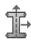
2. 输入截面名称。有关对象命名的更多信息，请参阅使用基本对话框组件。  
3. 在截面类别中选择“Other”，在截面类型中选择“Acoustic infinite”，然后点击“Continue”。截面编辑器将出现。  
4. 为声学无限单元截面选择一种声学介质材料。如果需要，可点击创建材料；更多信息请参阅创建或编辑材料。  
5. 输入截面平面应力/应变厚度的值。如果截面将用于二维区域，则必须指定截面厚度。如果区域类型不需要厚度信息，Abaqus/CAE 将忽略该信息。  
6. 要定义用于解析无限方向声场变化所使用的九阶多项式的数量，请点击“Order”字段右侧的箭头以减少将要使用的多项式数量（仅适用于 Abaqus/Explicit 分析）。默认值为 10，这也是 Abaqus/Standard 中始终使用的值。  
7. 点击“OK”保存更改并关闭截面编辑器。

## 创建用于声学无限单元的参考点

您必须创建一个参考点，用于确定声学无限单元每个节点处的“半径”和“节点射线”。您可以在“Part”模块或“Property”模块中，使用创建参考点中描述的过程创建与零件关联的参考点。有关更多信息，请参阅定义声学无限单元的参考点和厚度。

## 创建声学界面截面

声学界面截面用于定义模拟经历微小压力变化的声学介质的二维、三维和轴对称区域的截面属性。当您希望将声学介质与结构模型耦合时，可以使用声学界面截面。有关更多信息，请参阅声学界面单元。

1. 从主菜单栏中，选择 Section -> Create。

   将出现“Create Section”对话框。

   

   提示：您也可以在“Section Manager”中点击“Create”，或在“Property”模块工具箱中选择创建截面工具。

   

2. 输入截面名称。有关对象命名的更多信息，请参阅使用基本对话框组件。  
3. 在截面类别中选择“Other”，在截面类型中选择“Acoustic interface”，然后点击“Continue”。截面编辑器将出现。

4. 为声学界面截面选择一种声学介质材料。如果需要，可点击创建材料；更多信息请参阅创建或编辑材料。  
5. 输入截面平面应力/应变厚度的值。如果截面将用于二维区域，则必须指定截面厚度。如果区域类型不需要厚度信息，Abaqus/CAE 将忽略该信息。  
6. 点击“OK”保存更改并关闭截面编辑器。

当您创建均质壳截面、复合壳截面、膜截面或表面截面时，可以使用“Rebar Layers”选项定义一层或多层加强件（钢筋）。您可以从截面编辑器访问“Rebar Layers”对话框。有关更多信息，请参阅定义钢筋。

1. 在壳、膜或表面截面编辑器的“Options”字段中，点击

   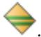

   将出现“Rebar Layers”对话框。

2. 指定钢筋几何的类型。
   - 选择“Constant”表示恒定的钢筋间距。  
   - 选择“Angular”表示钢筋间距在柱坐标系中随径向位置变化。  
   - 选择“Lift equation–based”表示钢筋间距和方向由轮胎提升方程确定。

3. 在表格中，为每个钢筋层输入一行数据。
   每行应包含以下信息：
   - 钢筋层的名称。  
   - 形成钢筋层的材料名称。在“Material”列中点击，然后点击出现的箭头以显示可用材料列表，并选择形成钢筋层的材料。  
   - 每根钢筋的横截面积。  
   - 截面平面内的钢筋间距。对于角度钢筋间距，以度为单位指定间距角。对于基于提升方程的间距，在未硫化几何中指定间距。  
   - 钢筋相对于钢筋参考方向1方向的角度方向（以度为单位）。对于基于提升方程的间距，在未硫化几何中指定角度。

   或者，您可以指定方向名称，此时 Abaqus/CAE 将假定为用户定义的方向。您必须提供包含指定方向名称的用户定义方向定义的用户子程序 ORIENT。

   - 钢筋在壳厚度方向的位置，从壳的中面测量，沿壳正法线方向为正（不适用于膜截面或表面截面）。

   - 弦延伸比，e（仅适用于基于提升方程的间距）。

   - 半径，，描述钢筋在未硫化几何中的位置，相对于柱坐标系中的旋转轴测量（仅适用于基于提升方程的间距）。

4. 点击“OK”返回截面编辑器。

## 附加信息

- 创建截面  
- 定义钢筋

## 创建型材

要创建型材，您必须选择型材类型并在“Edit Profile”对话框中输入定义该型材所需的所有数据。

## 本节内容：

选择型材类型  
定义箱型型材  
定义管道型材  
定义圆形型材  
定义矩形型材  
定义六边形型材  
定义梯形型材  
定义工字型型材  
定义L型型材  
定义T型型材  
定义任意型材  
定义广义型材  
定义槽钢型材  
定义帽型型材

## 选择型材类型

“Create Profile”对话框允许您指定要定义的型材类型。您可以通过提供几何数据来定义基于形状的型材，Abaqus 可以从中计算截面的工程属性。或者，您可以通过直接提供截面的工程属性来定义广义型材。

有关更多信息，请参阅梁截面行为。

在将梁截面和梁方向分配给零件后，您可以使用零件显示选项查看基于形状或广义梁型材的理想化表示。显示梁型材有助于检查是否将正确的型材分配给了特定区域，以及分配的梁方向是否导致型材的预期方向。有关更多信息，请参阅控制梁型材显示。

1. 从主菜单栏中，选择 Profile -> Create。

   将出现“Create Profile”对话框。

   

   提示：您也可以在“Profile Manager”中点击“Create”，或在“Property”模块工具箱中选择创建型材工具。

   

2. 输入型材名称。有关对象命名的更多信息，请参阅使用基本对话框组件。  
3. 选择型材形状，然后点击“Continue”。

   将出现您所选型材形状的“Edit Profile”对话框。

4. 在“Edit Profile”对话框中，输入所需的型材数据。详情请参阅以下各节：
   - 定义箱型型材  
   - 定义管道型材  
   - 定义圆形型材  
   - 定义矩形型材  
   - 定义六边形型材  
   - 定义梯形型材  
   - 定义工字型型材  
   - 定义L型型材  
   - 定义T型型材  
   - 定义任意型材  
   - 定义广义型材  
   - 定义槽钢型材  
   - 定义帽型型材

## 附加信息

- 定义型材  
- 定义截面  
- 梁截面库  
- 使用通用梁截面定义截面行为

## 定义箱型型材

通过提供矩形空心箱的几何数据来定义箱型型材。

1. 显示“Edit Profile”对话框，如选择型材类型中所述。  
2. 在“Width (a)”字段中，输入平行于局部1轴的线段的长度。  
3. 在“Height (b)”字段中，输入平行于局部2轴的线段的长度。  
4. 点击“Thickness”字段右侧的箭头，并指定您希望如何定义每条线段的厚度：

   - 如果箱型的四条线段厚度相同，请选择“Uniform”。如果选择此选项，请在下方的“Thickness”字段中输入线段厚度。
*   选择 **Individual** 以单独输入每个分段的值。如果选择此选项，请输入以下内容：
    -   在 **t1** 字段中，输入图表中标记为 $\mathfrak { t } _ { 1 }$ 的分段厚度。
    -   在 **t2** 字段中，输入图表中标记为 $\mathbf { t } _ { 2 }$ 的分段厚度。
    -   在 **t3** 字段中，输入图表中标记为 $\mathbf { t } _ { 3 }$ 的分段厚度。
    -   在 **t4** 字段中，输入图表中标记为 $\mathrm { t } _ { 4 }$ 的分段厚度。

5.  单击 **OK** 保存轮廓并关闭 **Edit Profile** 对话框。

## 附加信息

*   定义轮廓
*   定义截面
*   梁截面库

## 定义管道轮廓

通过提供空心圆的几何数据并选择薄壁管道或厚壁管道的积分方案来定义管道轮廓。

1.  显示 **Edit Profile** 对话框，如选择轮廓类型中所述。
2.  在 **Integration scheme** 选项中，指定 **thin-walled pipe** 或 **thick-walled pipe**。
3.  在 **Radius** 字段中，输入从管道中心到管壁外边缘的圆半径。
4.  在 **Thickness** 字段中，输入管壁的厚度。
5.  单击 **OK** 保存轮廓并关闭 **Edit Profile** 对话框。

## 附加信息

*   定义轮廓
*   定义截面
*   梁截面库

## 定义圆形轮廓

通过提供实心圆的几何数据来定义圆形轮廓。

1.  显示 **Edit Profile** 对话框，如选择轮廓类型中所述。
2.  在 **r** 字段中，输入圆的半径。
3.  单击 **OK** 保存轮廓并关闭 **Edit Profile** 对话框。

## 附加信息

*   定义轮廓
*   定义截面
*   梁截面库

## 定义矩形轮廓

通过提供实心矩形的几何数据来定义矩形轮廓。

1.  显示 **Edit Profile** 对话框，如选择轮廓类型中所述。
2.  在 **a** 字段中，输入平行于局部 1 轴的矩形边长。
3.  在 **b** 字段中，输入平行于局部 2 轴的矩形边长。
4.  单击 **OK** 保存轮廓并关闭 **Edit Profile** 对话框。

## 附加信息

*   定义轮廓
*   定义截面
*   梁截面库

## 定义六边形轮廓

通过提供空心六边形的几何数据来定义六边形轮廓。

1.  显示 **Edit Profile** 对话框，如选择轮廓类型中所述。
2.  在 **r** 字段中，输入外接圆半径。
3.  在 **t** 字段中，输入壁厚。
4.  单击 **OK** 保存轮廓并关闭 **Edit Profile** 对话框。

## 附加信息

*   定义轮廓
*   定义截面
*   梁截面库

## 定义梯形轮廓

通过提供实心梯形的几何数据来定义梯形轮廓。

1.  显示 **Edit Profile** 对话框，如选择轮廓类型中所述。
2.  在 **a** 字段中，输入平行于局部 1 轴的梯形下边缘长度。
3.  在 **b** 字段中，输入平行于局部 2 轴的梯形高度。
4.  在 **c** 字段中，输入平行于局部 1 轴的梯形上边缘宽度。
5.  在 **d** 字段中，输入梯形下边缘与局部截面轴之间的距离。
6.  单击 **OK** 保存轮廓并关闭 **Edit Profile** 对话框。

## 附加信息

*   定义轮廓
*   定义截面
*   梁截面库

## 定义工字形轮廓

通过提供工字形梁截面的几何数据来定义工字形轮廓。

1.  显示 **Edit Profile** 对话框，如选择轮廓类型中所述。
2.  在 **l** 字段中，输入下翼缘下边缘与局部截面轴之间的距离。
3.  在 **h** 字段中，输入工字形的高度，从下边缘到上边缘。
4.  在 **b1** 字段中，输入平行于 1 轴的下翼缘宽度。
5.  在 **b2** 字段中，输入平行于 1 轴的上翼缘宽度。
6.  在 **t1** 字段中，输入下翼缘的厚度。
7.  在 **t2** 字段中，输入上翼缘的厚度。
8.  在 **t3** 字段中，输入连接上下翼缘的分段厚度。
9.  单击 **OK** 保存轮廓并关闭 **Edit Profile** 对话框。

## 附加信息

*   定义轮廓
*   定义截面
*   梁截面库

## 定义 L 形轮廓

通过提供 L 形梁截面的几何数据来定义 L 形轮廓。

1.  显示 **Edit Profile** 对话框，如选择轮廓类型中所述。
2.  在 **a** 字段中，输入平行于局部 1 轴的翼缘长度。
3.  在 **b** 字段中，输入平行于局部 2 轴的翼缘长度。
4.  在 **t1** 字段中，输入平行于局部 1 轴的翼缘厚度。
5.  在 **t2** 字段中，输入平行于局部 2 轴的翼缘厚度。
6.  单击 **OK** 保存轮廓并关闭 **Edit Profile** 对话框。

## 附加信息

*   定义轮廓
*   定义截面
*   梁截面库

## 定义 T 形轮廓

通过提供 T 形梁截面的几何数据来定义 T 形轮廓。

1.  显示 **Edit Profile** 对话框，如选择轮廓类型中所述。
2.  在 **b** 字段中，输入平行于 1 轴的分段长度。
3.  在 **h** 字段中，输入 T 形的高度，从下边缘到上边缘。
4.  在 **l** 字段中，输入下边缘与局部截面轴之间的距离。
5.  在 **tf** 字段中，输入平行于局部 1 轴的分段厚度。
6.  在 **tw** 字段中，输入平行于局部 2 轴的分段厚度。
7.  单击 **OK** 保存轮廓并关闭 **Edit Profile** 对话框。

## 附加信息

*   定义轮廓
*   定义截面
*   梁截面库

## 定义任意轮廓

您可以创建任意轮廓来模拟简单薄壁开口或闭口截面的形状。您通过输入一系列由直线段连接的点来定义轮廓。

更多信息，请参阅任意、薄壁、开口和闭口截面。

1.  显示 **Edit Profile** 对话框，如选择轮廓类型中所述。
2.  在数据表中，输入 **Point 1** 的局部坐标。
    关于如何输入数据的详细信息，请参阅输入表格数据。
3.  输入 **Point 2** 的局部坐标。连接 **Point 1** 和 **Point 2** 的直线在数据表中标记为 **Segment 1-2**。
4.  为 **Segment 1-2** 输入 **Thickness**。
5.  输入 **Point 3** 的局部坐标。**Point 2** 和 **Point 3** 之间的直线在数据表中标记为 **Segment 2-3**。
6.  为 **Segment 2-3** 输入 **Thickness**。

## 注意：

对于任意截面的每个单独分段，围绕连接分段端点的直线没有弯曲刚度。因此，任意截面必须至少包含两个分段。

7.  如有必要，输入额外点的局部坐标，并为生成的分段提供厚度。
8.  单击 **OK** 保存轮廓并关闭 **Edit Profile** 对话框。

## 附加信息

*   定义轮廓
*   定义截面
*   梁截面库

## 定义广义轮廓

当您创建广义轮廓时，您直接在 **Edit Profile** 对话框中提供截面的工程属性。

更多信息，请参阅梁截面行为。

1.  显示 **Edit Profile** 对话框，如选择轮廓类型中所述。
2.  在 **Area** 字段中，输入轮廓形状的面积。
3.  在 **I11** 字段中，输入绕截面 1 轴弯曲的惯性矩。
4.  在 **I12** 字段中，输入交叉弯曲的惯性矩。
5.  在 **I22** 字段中，输入绕截面 2 轴弯曲的惯性矩。
6.  在 **J** 字段中，输入扭转常数。
7.  如果轮廓描述的是开口截面梁，请输入以下内容：
    *   在 **Gamma O** 字段中，输入扇性矩 $\bf { { \Gamma } } _ { 0 } ^ { \mathrm { { } } } .$
    *   在 **Gamma W** 字段中，输入翘曲常数。
8.  单击 **OK** 保存轮廓并关闭 **Edit Profile** 对话框。

## 附加信息

*   定义轮廓
*   定义截面
*   使用通用梁截面定义截面行为

## 定义槽形轮廓

通过提供槽形截面的几何数据来定义槽形轮廓。

1.  显示 **Edit Profile** 对话框，如选择轮廓类型中所述。
2.  在 **l** 字段中，输入下翼缘下边缘与局部截面 1 轴之间的距离。
3.  在 **h** 字段中，输入槽形截面的高度，从下边缘到上边缘。
4. 在 b1 字段中，输入槽钢截面下翼缘的宽度。  
5. 在 b2 字段中，输入槽钢截面上翼缘的宽度。  
6. 在 t1 字段中，输入槽钢截面下翼缘的厚度。  
7. 在 t2 字段中，输入槽钢截面上翼缘的厚度。  
8. 在 t3 字段中，输入连接上下翼缘的腹板段的厚度。  
9. 在 o 字段中，输入腹板段左边缘到槽钢截面局部 2 轴的距离。  
10. 单击“确定”保存截面轮廓并关闭“编辑截面轮廓”对话框。

## 附加信息

• 定义截面轮廓  
• 定义截面  
• 梁截面库

## 定义帽型截面轮廓

通过提供帽型截面的几何数据来定义帽型截面轮廓。

1. 显示“编辑截面轮廓”对话框，如选择截面轮廓类型中所述。  
2. 在 l 字段中，输入底翼缘下边缘到局部截面 1 轴的距离。  
3. 在 h 字段中，输入帽型截面的高度，从底边缘到顶边缘。  
4. 在 b 字段中，输入帽型截面的底部宽度。  
5. 在 b1 字段中，输入帽型截面上翼缘的宽度。  
6. 在 b2 字段中，输入帽型截面下翼缘的宽度。  
7. 在 t1 字段中，输入帽型截面上翼缘的厚度。  
8. 在 t2 字段中，输入帽型截面下翼缘的厚度。  
9. 在 t3 字段中，输入连接上下翼缘的段的厚度。  
10. 单击“确定”保存截面轮廓并关闭“编辑截面轮廓”对话框。

## 附加信息

• 定义截面轮廓  
• 定义截面  
• 梁截面库

## 创建和编辑复合材料铺层

本节介绍如何创建复合材料铺层。

## 本节内容：

在定义复合材料铺层时使用铺层表  
创建传统壳复合材料铺层  
创建连续壳复合材料铺层  
创建实体复合材料铺层

## 在定义复合材料铺层时使用铺层表

当您创建复合材料铺层（用于壳、连续壳或实体）时，使用铺层表中的一行来输入有关铺层中某一层的信息。

行数决定了铺层中的层数，铺层表的第一行对应于铺层的底层。

铺层表的每一行要求提供以下信息：

• 该铺层是否激活。  
• 铺层名称。  
• 该铺层被指定的区域。  
• 该铺层使用的材料名称。  
• 铺层厚度。  
• 指定铺层参考方向的坐标系。  
• 相对于参考方向的旋转角度。

• 如果您正在指定在分析期间进行积分的复合材料铺层的属性，则需指定该铺层中的积分点数量。

有关在 Abaqus/CAE 中处理表格的一般信息，请参见输入表格数据。

当您在表格中输入铺层数据时，铺层区域会高亮显示，并且视口中的模型上会显示铺层方向。您可以修改显示以关闭高亮显示、显示铺层方向或选择要显示的方向向量。

在某些情况下，当 Abaqus/CAE 尝试在系统的奇点处（即，用户选择的坐标系与来自几何或单元的几何法线无法解析为 Abaqus/CAE 中有效的显示方向）为复合材料铺层中的铺层方向绘制坐标系时，坐标系将被绘制为塌陷状态。

如果铺层方向是使用离散场指定的，则铺层或铺层方向的显示均不可用。对于连续壳单元，Abaqus/CAE 不会将显示的方向投影到中面曲面上。在这两种情况下，您可以执行数据检查并在“可视化”模块中查看输出数据库以验证方向。有关更多信息，请参见执行模型数据检查。

有多种工具可用于从铺层表中添加或删除铺层。大多数工具显示为铺层表上方的图标。某些工具只能通过在铺层表上单击鼠标按钮 3 并从出现的上下文菜单中选择项目来访问。提供以下工具：

## 编辑

编辑所选表格单元格的内容。例如，您可以从视口中的部件中选择一个区域、选择一种材料或输入厚度。在大多数情况下，您可以选择多个单元格，Abaqus/CAE 会将您的更改应用于每个所选单元格。您可以选择列标题以选择整列。

“编辑”工具可从上下文菜单中获得。或者，您可以双击“区域”、“材料”或“CSYS”列中的单元格来编辑该单元格。您也可以双击列标题以对列中的所有单元格应用相同的编辑。

## 上移/下移铺层

在铺层表中将所选铺层向上或向下移动一行。单击可将所选铺层向上移动一行，或单击可将所选铺层向下移动一行。

## 在前/后复制铺层

通过在所选铺层之前或之后复制所选铺层来创建新铺层。单击可在所选铺层之前复制所选铺层，或单击可在所选铺层之后复制所选铺层。

## 在前/后插入行

在每个所选铺层之前或之后插入一个空行。单击可在所选铺层之前插入一个空行，或单击 $\fallingdotseq$ 可在所选铺层之后插入一个空行。

## 删除铺层

删除所选铺层。单击可删除所选铺层。

## 阵列铺层

使用阵列模式复制所选铺层。单击可对阵列所选铺层。

阵列铺层复制到的位置可以是铺层中的第一个或最后一个铺层，或者是所选铺层中的第一个或最后一个铺层。您也可以通过选择要在其下方复制的铺层名称来指定复制位置。如果您选择要在其下方复制的铺层名称，您可以选择将复制的铺层插入铺层表或覆盖任何现有铺层。

阵列模式可以是以下之一：

## N 副本

对所选铺层进行指定数量的副本。

## 对称性

所选铺层的单个副本。复制的铺层会重新排序，使得原始铺层的顺序和复制铺层的顺序关于指定位置对称。

## 反转铺层

反转两个或多个相邻所选铺层的顺序。单击可反转所选铺层的顺序。

## 从文件读取

从 ASCII 文件读取铺层数据。数据可以用空格、制表符或逗号分隔。您可以指定 Abaqus/CAE 应从铺层表的哪一行和哪一列开始读取数据。表格的第一列是抑制状态（true 或 false）。

“从文件读取”工具仅可从上下文菜单中获得。

## 注意：

文件中“区域”列的数据指的是部件中的一个命名集。区域的名称区分大小写。因此，您在文件中使用的区域名称必须与部件中现有集合的名称完全相同。“CSYS”列中的数据也是如此——您在文件中使用的坐标系名称必须与部件中现有基准坐标系的名称完全相同。

## 写入文件

将整个铺层表写入指定的文件。Abaqus/CAE 使用逗号分隔数据。

“写入文件”工具仅可从上下文菜单中获得。

可用的选项是上下文相关的；例如，如果您正在编辑铺层表的第一行，则图标和上下文菜单中的“上移铺层”选项不会出现。

## 附加信息

• 指定传统壳复合材料铺层所选层的显示  
• 指定连续壳复合材料铺层所选层的显示  
• 指定实体复合材料铺层所选层的显示

本节介绍如何创建传统壳复合材料铺层。

传统壳复合材料铺层由不同材料、不同方向的铺层组成。一个铺层可以在不同区域包含不同数量的铺层。有关更多信息，请参见复合材料铺层。Abaqus 使用仅离散化每层参考表面的传统壳单元对壳复合材料铺层进行建模。壳截面行为根据壳截面对拉伸、弯曲、扭转和横向剪切的响应来定义。有关更多信息，请参见壳截面行为。

当您创建传统壳复合材料铺层时，必须选择截面积分方法。您可以选择在分析前提供截面属性数据（预积分壳截面），或者让 Abaqus 在分析期间根据截面积分点计算（积分）截面行为。
在分析过程中集成的常规壳复合材料铺层允许通过壳厚度方向的数值积分来计算截面行为，从而在材料建模中提供完全的通用性。厚度方向上可以定义任意数量的材料点，并且材料响应可以因点而异。通常当复合材料铺层包含非线性材料行为时，会使用在分析过程中积分的壳单元。要模拟热传递，必须使用在分析过程中积分的壳单元。有关更多信息，请参阅使用在分析过程中积分的壳截面来定义截面行为。

可以使用预积分的复合材料铺层来定义线性弯矩-弯曲和力-膜应变关系。在这种情况下，所有计算都基于截面力和弯矩进行。截面属性通过弹性材料指定；可选地，您也可以基于对预期行为或铺层组成的假设应用一种理想化方法。如果铺层的响应是线弹性的，并且其行为不依赖于温度或预定义场变量的变化，则应使用预积分的复合材料铺层。有关更多信息，请参阅使用通用壳截面来定义截面行为。

创建常规壳复合材料铺层后，您可以使用铺层堆叠图查看穿过铺层区域的芯样本的图形表示。有关更多信息，请参阅查看铺层堆叠图。

## 本节内容：

创建常规壳复合材料铺层  
指定常规壳复合材料铺层的铺层  
指定常规壳复合材料铺层的偏移量  
指定常规壳复合材料铺层的壳参数  
指定常规壳复合材料铺层所选铺层的显示方式

## 创建常规壳复合材料铺层

您可以定义一个由一种或多种材料的铺层组成的常规壳复合材料铺层。

对于铺层的每个铺层，您需要指定名称、材料、厚度、方向和积分点数量。此外，您需要选择该铺层分配的区域。有关更多信息，请参阅壳截面行为。

1.  从主菜单栏中，选择 Composite -> Create。
    将出现一个 Create Composite Layup 对话框。
    

    提示：您也可以在 Composite Layup Manager 中点击 Create，或在 Property 模块工具箱中选择 create composite layup 工具。

2.  输入复合材料铺层名称。Abaqus/CAE 将在铺层堆叠图中显示此名称。有关命名对象的更多信息，请参阅使用基本对话框组件。  
3.  指定初始铺层计数。当复合材料铺层编辑器出现时，它将包含每个铺层对应的一行；但是，您可以随后使用编辑器添加或删除铺层。铺层表的第一行对应于铺层堆叠的最底部铺层。  
4.  选择 Conventional Shell 作为 Element Type，然后点击 Continue。
    将出现复合材料铺层编辑器。

5.  输入铺层堆叠的描述。Abaqus/CAE 将在复合材料铺层管理器中显示此描述。  
6.  执行以下操作之一来指定铺层方向：

    • 选择 Part global 以使用零件的坐标系，并选择代表法线方向的轴。
    • 选择 Coordinate system 以选择现有坐标系（或创建新坐标系并选择它），然后执行以下操作：
        1.  选择代表法线方向的轴。
        2.  指定额外旋转。选定的坐标系将围绕所选轴旋转此角度。您可以指定一个角度，也可以选择现有的标量离散字段来定义一个在铺层上空间变化的角度。Abaqus/CAE 只允许您选择有效的离散字段，对于额外旋转，这些是应用于单元的标量离散字段。您也可以通过点击创建新的离散字段。有关更多信息，请参阅离散字段工具集。
            

    • 选择 Discrete 以定义离散方向，然后执行以下操作：
        1.  点击
            
        2.  在出现的 Edit Discrete Orientation 对话框中，使用在用于材料方向和复合材料铺层方向的离散方向中描述的步骤定义法线轴和主轴。
        3.  指定额外旋转。方向将围绕所选法线轴旋转此角度。您可以指定一个角度，也可以选择或创建一个标量离散字段来定义一个在铺层上空间变化的角度。Abaqus/CAE 只允许您选择有效的离散字段，对于额外旋转，这些是应用于单元的标量离散字段。您也可以通过点击创建新的离散字段。有关更多信息，请参阅离散字段工具集。
            

    • 选择 User-defined 以在用户子程序 ORIENT 中定义方向。此选项仅对 Abaqus/Standard 分析有效。有关更多信息，请参阅以下部分：
        指定常规作业设置  
        ORIENT

    • 选择一个方向离散字段的名称，以指定一个在铺层上空间变化的坐标系。您也可以通过点击 Definition 字段右侧的按钮来创建新的离散字段。有关更多信息，请参阅离散字段工具集。选择离散字段后，您必须执行以下操作：
        1.  选择代表法线方向的轴。
        2.  指定额外旋转。选定的坐标系将围绕所选轴旋转此角度。您可以指定一个角度，也可以选择或创建一个标量离散字段来定义一个在铺层上空间变化的角度。

    铺层方向是任何使用默认方向系统（在铺层表的 CSYS 列中显示为 <Layup>）的铺层的参考方向。此方向用于各个铺层中的材料计算和应力输出、截面力输出以及横向剪切刚度。您可以通过指定参考方向和/或旋转角度，为连续壳复合材料铺层的各个铺层指定不同的方向。有关更多信息，请参阅理解复合材料铺层和方向。

7.  选择以下截面积分方法之一：
    • 选择 During analysis 以指定在分析过程中积分的壳复合材料铺层的属性。
    • 选择 Before analysis 以指定预积分的壳复合材料铺层的属性。

8.  如果您正在为在分析之前积分的复合材料铺层指定属性，请指定基于对预期行为或铺层组成的假设而应用于壳的理想化方法。有关更多信息，请参阅理想化截面响应。

    • 选择 No idealization 以考虑由材料分配和铺层组成确定的壳的完整刚度。
    • 选择 Smear all layers 如果您不知道复合材料铺层中铺层的精确堆叠顺序。每个指定铺层的贡献被平均分布在整个铺层厚度上，产生独立于堆叠顺序的一般响应。
    • 选择 Membrane only 如果壳的主要响应将是面内拉伸；弯曲刚度项将从壳刚度计算中消除。
    • 选择 Bending only 如果壳的主要响应将是纯弯曲；膜刚度项将从壳刚度计算中消除。

9.  如果您正在为在分析过程中积分的复合材料铺层指定属性，请选择 Thickness integration rule。

    • 选择 Simpson 以使用辛普森法则进行壳截面积分。
    • 选择 Gauss 以使用高斯求积进行壳截面积分。
    有关更多信息，请参阅定义壳截面积分。

10. 完成定义壳复合材料铺层后，点击 OK 以保存更改并关闭编辑器。

## 指定常规壳复合材料铺层的铺层

复合材料铺层由一系列铺层组成。您选择铺层分配的区域，并指定每个铺层的名称、材料、厚度、方向和积分点数量。

您必须指定在整个模型中唯一的铺层名称，以确保基于铺层的结果的正确显示。使用铺层表上方的图标或在铺层表上点击鼠标右键以查看允许您编辑表格单元格内容以及操作表中数据的菜单；例如，您可以添加和删除铺层、复制铺层以及反转铺层。您也可以从文件将数据读入表中或将表中的数据写入文件。有关更多信息，请参阅定义复合材料铺层时使用铺层表。
1. 在复合材料层合板编辑器中，单击**铺层 (Plies)** 标签页。  
2. 如果复合材料层合板中的铺层关于中心芯材对称，请开启**使计算截面对称 (Make calculated sections symmetric)**。在铺层表中输入铺层信息，从第一行的底部铺层开始，到中心铺层结束。在分析过程中，Abaqus 将通过以相反顺序重复已输入的铺层（包括中心铺层）来补充铺层定义，直至层合板顶部。每个生成的铺层在铺层堆叠图和输出数据库中，通过在重复铺层的原始名称前添加 `Sym_` 进行标记。

如果层合板中任何铺层的厚度或旋转角是使用离散场定义的，则不能使用此选项。

3. 对于每个铺层，在铺层表中输入以下数据：

## 铺层名称 (Ply Name)

铺层的名称。当您在可视化 (Visualization) 模块中查看复合材料层合板以及在铺层堆叠图中查看时，Abaqus/CAE 会显示此名称。

## 区域 (Region)

选择分配铺层的区域。您可以从视口 (viewport) 中选择面，或者选择引用面的集合 (set)。如果显示的是网格化依赖部件，您可以从视口选择壳单元，或选择单元集 (element set)。要从视口选择单元，必须显示原生网格，并且必须使用**选择 (Selection)** 工具栏来启用**二维单元 (2D Elements)** 的选择。您也可以从网格部件中选择壳单元。有关更多信息，请参阅显示原生网格和基于对象类型筛选选择。

## 材料 (Material)

此铺层的材料名称。单击鼠标按钮 3，从出现的菜单中选择**编辑材料 (Edit Material)**，然后执行以下操作之一：

• 从可用材料列表中选择所需材料。
• 单击以创建新材料。

## 厚度 (Thickness)

铺层厚度。直接在表中输入均匀厚度，或者单击鼠标按钮 3 并选择**编辑厚度 (Edit Thickness)** 来执行以下操作：

• 选择**指定值 (Specify Value)** 以输入铺层的均匀厚度。
• 选择**分布 (Distribution)** 并选择标量离散场 (scalar discrete field) 或解析场 (analytical field)，以指定铺层上空间变化的厚度。

## 坐标系 (Coordinate system)

要定义用作铺层参考方向基准的坐标系，请执行以下操作：

1. 单击鼠标按钮 3，并从出现的菜单中选择**编辑坐标系 (Edit CSYS)**。

## 注意：

如果从菜单中选择**编辑方向 (Edit Orientation)**，您可以同时定义坐标系和旋转角。

2. 选择基准方向。您可以选择基准层合板方向，或者选择一个坐标系。如果选择坐标系，则必须选择定义法线方向的轴。

## 旋转角 (Rotation Angle)

铺层参考方向的附加旋转（绕法线方向逆时针）。直接在表中输入均匀旋转，或者单击鼠标按钮 3 并选择**编辑旋转角 (Edit Rotation Angle)** 来执行以下操作：

• 选择预定义角度（0、45、90 或 −45 度）以定义均匀旋转。
• 选择**均匀 (Uniform)**，并输入**角度 (Angle)** 以定义均匀旋转。
• 选择标量离散场以定义铺层上空间变化的旋转。您也可以通过单击来创建新的离散场。

## 积分点 (Integration Points)

如果要为分析期间集成的复合材料层合板指定属性，则为积分点的数量。

## 指定常规壳复合材料层合板的偏移量

大多数情况下，您可以使用单元的中面来表示参考面。但是，在某些情况下，您需要将参考面定义为从单元中面偏移。

例如，从 CAD 系统导入的模型可能假设壳位于单元的顶面或底面。此外，对于壳厚度至关重要的接触问题，您可以指定壳偏移以定义更精确的表面几何形状。偏移值定义为从参考面到中面测量的总厚度的一部分。

正的偏移值在单元正法线方向。当偏移设置为等于 0.5 时，单元的顶面即为参考面。当偏移设置为等于 –0.5 时，底面即为参考面。默认偏移为 0，表示单元的中面即为参考面。图 1 显示了向单元顶面的偏移。

  
a) 偏移量= 0  
参考面与中面重合  
b) 偏移量= −0.5 (SNEG)  
参考面为底面  
c) 偏移量= +0.5 (SPOS)  
参考面为顶面

图 1: 向单元顶面的偏移。

有关更多信息，请参阅定义常规壳单元的初始几何形状。您可以使用离散场对具有连续变化偏移量的单元进行建模。有关更多信息，请参阅离散场工具集。

1. 在复合材料层合板编辑器中，单击**偏移 (Offset)** 标签页。  
2. 执行以下操作之一：

• 选择**中面 (Middle surface)**、**顶面 (Top surface)** 或**底面 (Bottom surface)** 来表示参考面。
• 选择**指定偏移比 (Specify offset ratio)**，并输入一个数字。
• 选择**分布 (Distribution)**，并选择一个现有的标量离散场，该离散场定义了铺层上空间变化的偏移量。Abaqus/CAE 仅允许您选择有效的离散场，对于偏移量，这些是应用于单元的标量离散场。您也可以通过单击来创建新的离散场。有关更多信息，请参阅离散场工具集。
• 选择**来自几何 (From Geometry)** 以使用几何截面的厚度。

## 指定常规壳复合材料层合板的壳参数

1. 在复合材料层合板编辑器中，单击**壳参数 (Shell Parameters)** 标签页。  
2. 指定**壳厚度 (Shell thickness)**。

• 选择**使用截面厚度 (Use section thickness)** 以使用根据各铺层厚度计算的厚度。
• 选择**单元分布 (Element distribution)**；然后选择解析场（标有 (A)）或基于单元的离散场（标有 (D)），以定义空间变化的基于单元的壳厚度。或者，您可以单击 $f ( x )$ 创建新的解析场或单击创建新的离散场。有关更多信息，请参阅解析场工具集和离散场工具集。
• 选择**节点分布 (Nodal distribution)**；然后选择解析场（标有 (A)）或基于节点的离散场（标有 (D)），以定义空间变化的基于节点的壳厚度。
或者，您可以单击 $f ( x )$ 创建新的解析场或单击创建新的离散场。有关更多信息，请参阅解析场工具集和离散场工具集。
• 选择**根据几何确定总体厚度 (Determine overall thickness from geometry)** 以让 Abaqus/CAE 根据几何体上定义的厚度计算偏移量。您必须在**偏移 (Offset)** 标签页上选择**来自几何 (From Geometry)**。

3. 指定**截面泊松比 (Section Poisson's ratio)** 以定义壳厚度行为。在允许大变形分析中有限膜应变的常规壳单元中，指定截面泊松比会导致壳厚度随膜应变而变化。

• 选择**使用分析默认值 (Use analysis default)** 以使用默认值。在 Abaqus/Standard 中，默认值为 0.5，这将强制单元的膜应变不可压缩行为。在 Abaqus/Explicit 中，默认是基于单元材料定义来计算厚度变化。
• 选择**指定值 (Specify value)**，并为泊松比输入一个值。该值必须在 −1.0 和 0.5 之间。值为 0.0 将强制壳厚度恒定，负值将导致壳厚度在拉伸膜应变下增加。

4. 如果要为分析期间集成的复合材料层合板指定属性，请选择定义**截面温度变化 (Temperature variation through the section)** 的方法：

• 选择**沿厚度线性变化 (Linear through thickness)** 表示指定了参考面处的温度以及沿铺层的温度梯度或梯度。您可以使用**载荷 (Load)** 模块来指定这些温度。
• 选择**分段线性，超过 n 个值 (Piecewise linear over n values)** 并在提供的文本字段中输入沿铺层的温度点数（值）。您可以使用**载荷 (Load)** 模块指定这些点中每一点的温度。

5. 开启**密度 (Density)**，并输入一个密度值。铺层的质量包括来自密度的贡献以及所选材料的任何贡献。
6. 对于大多数壳截面，Abaqus 会计算单元公式所需的横向剪切刚度值。如果需要，从**横向剪切刚度 (Transverse Shear Stiffnesses)** 选项中开启**指定值 (Specify values)**，以在截面定义中包含非默认的横向剪切刚度效应，并输入 $\pmb { K } _ { 1 1 }$（截面在第一方向上的剪切刚度）、${ \pmb K } _ { 1 2 }$（截面剪切刚度的耦合项）和 $\pmb { K } _ { 2 2 }$（截面在第二方向上的剪切刚度）的值。如果 $\pmb { K } _ { 1 1 }$ 或 $\pmb { K _ { 2 2 } }$ 中任一值被省略或给定为零，则非零值将用于两者。有关更多信息，请参阅定义横向剪切刚度。
## 指定传统壳复合材料铺层的选定铺层显示方式

1.  在复合材料铺层编辑器 (Composite Layup editor) 中，单击 Display 选项卡。
2.  选择 Abaqus/CAE 如何高亮显示您在铺层表 (ply table) 中选择的铺层：

    *   选择 **On** 以高亮显示选定的铺层。
    *   选择 **Off** 以停止高亮显示选定的铺层。如果模型中有大量铺层，您可能希望关闭高亮显示以提高性能。

3.  选择 Abaqus/CAE 在选定铺层上显示的方向：
    *   选择 **Ply** 以显示选定铺层上的铺层方向。
    *   选择 **Layup** 以显示选定铺层上的铺层方向。
    *   选择 **None** 以停止显示方向。

4.  指定您希望在选定铺层上显示的方向矢量。您可以切换 1-方向、2-方向、3-（或法向）方向以及参考方向（该方向显示铺层材料方向旋转前的 1-方向）的矢量显示。

本节介绍如何创建连续壳复合材料铺层。

Abaqus 使用连续壳单元对连续壳复合材料铺层进行建模，这些单元完全离散化每个铺层，但其运动学行为基于壳理论。连续壳复合材料铺层由不同方向、不同材料的铺层组成。一个铺层在不同区域可以包含不同数量的铺层。有关更多信息，请参阅“复合材料铺层”。

连续壳复合材料铺层预期在其厚度方向上只包含一个单元，并且该单个单元包含在铺层表中定义的多个铺层。如果您分配连续壳复合材料铺层的区域包含多个单元，则每个单元都将包含铺层表中定义的铺层，分析结果将不会如预期。

您可以选择铺层中连续壳单元的堆叠方向，这使得 Abaqus 能够更精确地模拟厚度方向上的响应。此外，连续壳复合材料铺层考虑了双面接触和厚度变化，这比传统壳复合材料铺层提供了更精确的接触建模。有关更多信息，请参阅“壳截面行为”。

创建连续壳复合材料铺层时，您必须选择一种截面积分方法。您可以选择在分析前提供截面属性数据（预积分连续壳复合材料铺层），或者让 Abaqus 在分析过程中从积分点计算（积分）截面行为。

分析期间积分的连续壳复合材料铺层允许通过连续壳厚度方向的数值积分来计算截面行为，从而在材料建模方面提供完全的通用性。可以在厚度方向上定义任意数量的材料点，并且材料响应可以逐点变化。通常，当复合材料铺层包含非线性材料行为时，您会使用分析期间积分的连续壳单元。您必须使用分析期间积分的连续壳单元来模拟传热。有关更多信息，请参阅“使用分析期间积分的壳截面来定义截面行为”。

可以使用预积分连续壳复合材料铺层来定义线性弯矩-弯曲应变和力-膜应变关系。在这种情况下，所有计算都基于截面力和力矩进行。截面属性由弹性材料指定；可选地，您还可以基于对铺层预期行为或构成的假设应用理想化。如果铺层的响应是线性弹性的，并且其行为不依赖于温度或预定义场变量的变化，则应使用预积分连续壳复合材料铺层。有关更多信息，请参阅“使用通用壳截面定义截面行为”。

创建连续壳复合材料铺层后，您可以使用铺层堆叠图 (ply stack plot) 查看穿过铺层某个区域的岩芯样本的图形表示。有关更多信息，请参阅“查看铺层堆叠图”。

## 本节内容：

创建连续壳复合材料铺层  
指定连续壳复合材料铺层的铺层  
指定连续壳复合材料铺层的壳参数  
指定连续壳复合材料铺层的选定铺层显示方式

## 创建连续壳复合材料铺层

您可以定义一个具有指定堆叠方向的连续壳复合材料铺层，该铺层由一种或多种材料的铺层组成。对于铺层中的每个铺层，您需要指定名称、材料、相对厚度、方向和积分点数量。此外，您还需要选择分配该铺层的区域。有关更多信息，请参阅“定义复合材料壳截面”。

1.  从主菜单栏中，选择 Composite -> Create。
    将出现一个 Create Composite Layup 对话框。

    

    **提示**：您也可以在复合材料铺层管理器 (Composite Layup Manager) 中单击 Create，或者在 Property 模块工具箱中选择创建复合材料铺层工具。

2.  输入一个复合材料铺层名称。Abaqus/CAE 会在铺层堆叠图中显示此名称。有关命名对象的更多信息，请参阅“使用基本对话框组件”。
3.  指定初始铺层数。当复合材料铺层编辑器出现时，它将包含每个铺层的一行；但是，您可以随后使用编辑器添加或删除铺层。
4.  选择 **Continuum Shell** 作为 Element Type，然后单击 Continue。
    将出现复合材料铺层编辑器。

5.  输入铺层的描述。Abaqus/CAE 会在复合材料铺层管理器中显示此描述。
6.  执行以下操作之一来指定铺层方向：
    *   选择 **Part global** 以使用部件的坐标系，并选择代表法向 (Normal) 方向的轴。
    *   选择 **Coordinate system** 以选择现有坐标系（或创建一个新坐标系并选择它），然后执行以下操作：
        1.  选择代表法向方向的轴。
        2.  指定一个附加旋转。所选坐标系绕选定轴旋转此角度。您可以指定一个角度，也可以选择一个定义空间上随铺层变化的角度的现有标量离散场。Abaqus/CAE 只允许您选择有效的离散场，对于附加旋转，这些是应用于单元的标量离散场。您也可以通过单击  创建一个新的离散场。有关更多信息，请参阅“离散场工具集”。

    *   选择 **Discrete** 以定义离散方向，然后执行以下操作：
        1.  单击 
        2.  在出现的 Edit Discrete Orientation 对话框中，使用“使用离散方向定义材料方向和复合材料铺层方向”中描述的过程定义法向轴和主轴。
        3.  选择代表法向方向的轴。
        4.  指定一个附加旋转。方向绕选定的法向轴旋转此角度。您可以指定一个角度，也可以选择或创建一个定义空间上随铺层变化的角度的标量离散场。Abaqus/CAE 只允许您选择有效的离散场，对于附加旋转，这些是应用于单元的标量离散场。您也可以通过单击  创建一个新的离散场。有关更多信息，请参阅“离散场工具集”。
    *   选择 **User-defined** 以在用户子程序 ORIENT 中定义方向。此选项仅对 Abaqus/Standard 分析有效。有关更多信息，请参阅以下章节：
        指定通用作业设置  
        ORIENT
    *   选择一个方向离散场的名称，以指定一个空间上随铺层变化的坐标系。您也可以通过单击 Definition 字段右侧的  创建一个新的离散场。有关更多信息，请参阅“离散场工具集”。选择离散场后，您必须执行以下操作：
        1.  选择代表法向方向的轴。
        2.  指定一个附加旋转。所选坐标系绕选定轴旋转此角度。您可以指定一个角度，也可以选择或创建一个定义空间上随铺层变化的角度的标量离散场。

铺层方向是任何使用默认方向系统（在铺层表的 CSYS 列中显示为 <Layup>）的铺层的参考方向。此方向将用于各个铺层中的材料计算和应力输出、截面力输出以及横向剪切刚度。您可以通过指定参考方向和/或旋转角来为连续壳复合材料铺层的各个铺层指定不同的方向。有关更多信息，请参阅“理解复合材料铺层和方向”。
7. 选择以下选项之一，以指定实体壳（continuum shell）单元的堆叠方向：
- 单元方向1（Element direction 1）
- 单元方向2（Element direction 2）
- 单元方向3（Element direction 3）
- 铺层方向（Layup orientation）。堆叠方向即为铺层方向的法线方向。

您可以使用查询工具集（Query toolset）来确定网格堆叠方向。但是，显示的方向仅考虑了扫掠路径；它们没有考虑如上所述的堆叠方向更改。有关查询工具集的更多信息，请参阅使用查询工具集查询模型。有关网格堆叠方向的更多信息，请参阅定义堆叠和厚度方向。

8. 选择以下截面积分方法（Section integration methods）之一：
- 选择“在分析过程中”（During analysis）以指定在分析期间进行积分的实体壳复合材料铺层属性。
- 选择“在分析之前”（Before analysis）以指定预积分的实体壳复合材料铺层属性。

9. 如果您正在为分析前集成的复合材料铺层指定属性，请基于关于铺层预期行为或组成的假设，指定要应用于壳体的理想化（Idealization）方法。更多信息，请参阅理想化截面响应。
- 选择“无理想化”（No idealization）以考虑由材料分配和铺层组成所确定的壳体的完全刚度。
- 如果您不知道复合材料铺层中各铺层的确切堆叠顺序，请选择“平滑属性”（Smeared properties）。每个指定铺层的贡献将被平滑到整个铺层厚度上，从而产生独立于堆叠顺序的一般响应。
- 如果壳体的主要响应将是面内拉伸，则选择“仅膜行为”（Membrane only）；弯曲刚度项将从壳体刚度计算中消除。
- 如果壳体的主要响应将是纯弯曲，则选择“仅弯曲行为”（Bending only）；膜刚度项将从壳体刚度计算中消除。

10. 如果您正在为分析期间集成的复合材料铺层指定属性，请选择“厚度积分规则”（Thickness integration rule）。
- 选择“辛普森”（Simpson）以使用辛普森法则（Simpson's rule）进行壳截面积分。
- 选择“高斯”（Gauss）以使用高斯求积法（Gauss quadrature）进行壳截面积分。
更多信息，请参阅定义壳截面积分。

11. 定义完实体壳复合材料铺层后，单击“确定”（OK）以保存更改并关闭编辑器。

## 指定实体壳复合材料铺层的铺层

一个复合材料铺层由一系列铺层组成。您可以为铺层指定分配区域，并指定每个铺层的名称、材料、相对厚度、方向和积分点数量。您必须在整个模型范围内指定唯一的铺层名称，以确保基于铺层的结果正确显示。使用铺层表上方的图标，或在铺层表上单击鼠标右键，可查看一个菜单，允许您编辑表格单元格的内容并操作表中的数据；例如，您可以添加和删除铺层、复制铺层以及反向排列铺层。您还可以从文件读取数据到表中，或将表中的数据写入文件。更多信息，请参阅定义复合材料铺层时使用铺层表。

1. 在“复合材料铺层编辑器（Composite Layup editor）”中，单击“铺层（Plies）”选项卡。
2. 如果复合材料铺层中的铺层关于中心芯层对称，请开启“使计算截面对称”（Make calculated sections symmetric）。在铺层表中输入铺层，从第一行的底部铺层开始，到中心铺层结束。在分析过程中，Abaqus 会通过以相反顺序重复输入的铺层（包括中心铺层）来追加铺层到铺层定义中。每个生成的铺层在铺层堆叠图和输出数据库中将通过在重复铺层的原始名称前添加“Sym_”来标记。

如果铺层中任何铺层的旋转角是使用离散场定义的，则不能使用此选项。

3. 对于每个铺层，在铺层表中输入以下数据：

## 铺层名称（Ply Name）
铺层的名称。当您在可视化模块中查看复合材料铺层以及在铺层堆叠图中查看时，Abaqus/CAE 会显示此名称。

## 区域（Region）
选择分配该铺层的区域。您可以从视口选择单元，也可以选择一个引用单元的集合。如果显示的是网格化的从属部件，您可以从视口选择实体单元或选择一个单元集合。要从视口选择单元，必须显示原生网格，并且必须使用“选择（Selection）”工具栏启用从视口选择3D单元。您也可以从网格部件选择实体单元。更多信息，请参阅显示原生网格和根据对象类型过滤选择。

## 材料（Material）
此铺层的材料名称。单击鼠标右键，从出现的菜单中选择“编辑材料（Edit Material）”，然后执行以下操作之一：
- 从可用材料列表中选择所需的材料。
- 单击创建新材料。

## 单元相对厚度（Element Relative Thickness）
每个单元内铺层的相对厚度。
对于实体壳单元，Abaqus 根据单元几何形状确定整体截面厚度，在定义截面的位置，不同单元的厚度可能不同。因此，您为每个铺层指定的厚度值是相对于每个单元厚度的。铺层的实际厚度是单元厚度乘以该铺层占总厚度的比例。您不必使用物理单位来指定铺层的厚度比，并且铺层相对厚度的总和也不必为一。更多信息，请参阅创建复合材料铺层。

## 坐标系（Coordinate system）
要定义将用作铺层参考方向基础的坐标系，请执行以下操作：
1. 单击鼠标右键，从出现的菜单中选择“编辑坐标系（Edit CSYS）”。

2. 选择基本方向。您可以选择基本铺层方向，也可以选择一个坐标系。如果选择坐标系，您必须选择定义法线方向的轴。

## 旋转角（Rotation Angle）
铺层参考方向的额外旋转（绕法线方向逆时针）。直接在表中输入统一旋转角度，或单击鼠标右键并选择“编辑旋转角（Edit Rotation Angle）”执行以下操作：
- 选择一个预定义角度（0、45、90 或 -45 度）以定义统一旋转。
- 选择“统一（Uniform）”并输入一个“角度（Angle）”以定义统一旋转。
- 选择一个标量离散场以定义空间上在铺层内变化的旋转。您也可以通过单击创建新的离散场。

## 积分点（Integration Points）
如果您正在为分析期间集成的复合材料铺层指定属性，则指定积分点数量。

## 指定实体壳复合材料铺层的壳参数

您可以指定实体壳复合材料铺层的壳参数。
1. 在“复合材料铺层编辑器（Composite Layup editor）”中，单击“壳参数（Shell Parameters）”选项卡。
2. 指定“截面泊松比（Section Poisson's ratio）”以定义壳厚度行为：
    - 开启“使用分析默认值（Use analysis default）”以使用默认值。在 Abaqus/Standard 中，默认值为 0.5，这将强制单元对于膜应变具有不可压缩行为。在 Abaqus/Explicit 中，默认是基于单元材料定义来计算厚度变化。
    - 开启“指定值（Specify value）”，并输入一个泊松比值。该值必须介于 -1.0 和 0.5 之间。值为 0.0 将强制壳厚度恒定，负值将导致壳厚度在拉伸膜应变下增加。
3. 开启“厚度模量（Thickness modulus）”，并输入一个厚度模量值。如果不输入值，Abaqus 将假设有效厚度模量为基于材料定义的初始面内剪切模量的两倍。
4. 如果您正在为分析期间集成的复合材料铺层指定属性，请选择定义“温度沿截面变化（Temperature variation through the section）”的方法：
    - 选择“沿厚度线性变化（Linear through thickness）”表示指定了参考面温度以及穿过铺层的温度梯度。您可以使用载荷模块（Load module）指定这些温度。
    - 选择“在 n 个值上分段线性（Piecewise linear over n values）”，并在提供的文本字段中输入穿过铺层的温度点（值）数量。您可以使用载荷模块指定这些点中每个点的温度。
5. 开启“密度（Density）”，并输入一个密度值。铺层的质量除了所选材料的任何贡献外，还包括密度的贡献。
6. 对于大多数连续壳复合材料铺层，Abaqus会计算单元公式所需的横向剪切刚度值。如果需要，请在横向剪切刚度选项中切换“指定值”，以在复合材料铺层定义中包含非默认的横向剪切刚度效果，并输入以下值：$\pmb { K } _ { 1 1 }$，第一方向上的剪切刚度；${ \pmb K } _ { 1 2 }$，剪切刚度中的耦合项；以及$\pmb { K _ { 2 2 } }$，第二方向上的剪切刚度。如果$\pmb { K } _ { 1 1 }$或$\pmb { K _ { 2 2 } }$中的任一值被省略或设为零，则非零值将同时用于两者。更多信息，请参见定义横向剪切刚度。

## 指定连续壳复合材料铺层中选定铺层的显示

您可以指定连续壳复合材料铺层中选定铺层的显示。

1.  在复合材料铺层编辑器中，单击“显示”选项卡。  
2.  选择Abaqus/CAE如何高亮显示您在铺层表中选定的铺层：

    *   选择“开”以高亮显示选定的铺层。  
    *   选择“关”以停止高亮显示选定的铺层。如果模型中包含大量铺层，您可能需要关闭高亮显示以提高性能。

3.  选择Abaqus/CAE在选定铺层上显示哪个方向：

    *   选择“铺层”以在选定铺层上显示铺层方向。  
    *   选择“铺层”以在选定铺层上显示铺层叠层方向。  
    *   选择“无”以停止显示方向。

4.  指定您希望在选定铺层上显示的方向矢量。您可以切换显示1-方向、2-方向和3-（或法向）方向上的矢量，以及显示铺层材料方向旋转前的1-方向的参考方向。

本节介绍如何创建实体复合材料铺层。

在大多数情况下，您应该将复合材料实体建模为壳或连续壳复合材料铺层。但是，在以下情况下应使用实体复合材料铺层：

*   当横向剪切效应占主导时。  
*   当您不能忽略法向应力时。  
*   当您需要精确的层间应力时，例如在复杂载荷或几何形状的局部区域附近。

实体复合材料铺层预期在其厚度方向上只有单个单元，并且该单个单元包含在铺层表中定义的多个铺层。如果您将实体复合材料铺层分配给的区域包含多个单元，那么每个单元都将包含铺层表中定义的铺层，并且分析结果将不符合预期。

## 本节内容：

创建实体复合材料铺层  
指定实体复合材料铺层的铺层  
指定实体复合材料铺层中选定铺层的显示

## 创建实体复合材料铺层

在Abaqus/Standard中，实体单元可以包含几层不同的材料，用于分析层压复合材料实体；然而，在Abaqus/Explicit中，实体单元只能由单一均质材料组成。复合材料实体的使用仅限于仅有位移自由度的三维砖单元。复合材料实体单元主要用于建模的便利性。它们通常不会提供比复合材料壳单元更精确的解。更多信息，请参见在Abaqus/Standard中定义复合材料实体单元和在Abaqus/Standard中使用实体单元建模厚复合材料。

1.  从主菜单栏中，选择“复合材料”->“创建”。

    将出现一个“创建复合材料铺层”对话框。

    

    **提示：** 您也可以在复合材料铺层管理器中单击“创建”，或在“特性”模块工具箱中选择创建复合材料铺层工具。

2.  输入复合材料铺层名称。有关命名对象的更多信息，请参见使用基本对话框组件。  
3.  指定初始铺层数。当复合材料铺层编辑器出现时，它将包含每个铺层的一行；但是，您可以随后使用编辑器添加或删除铺层。  
4.  选择“实体”作为“单元类型”，然后单击“继续”。  
    将出现复合材料铺层编辑器。  
5.  输入叠层的描述。Abaqus/CAE在复合材料铺层管理器中显示此描述。  
6.  执行以下操作之一以指定叠层方向：

    *   选择“坐标系”以选择现有坐标系（或创建新坐标系并选择它），然后执行以下操作：

        1.  选择表示“旋转轴”的轴。  
        2.  指定附加旋转。所选坐标系绕所选轴旋转此角度。您可以指定一个角度，也可以选择一个现有的标量离散场，该场定义了在叠层上空间变化的角度。Abaqus/CAE只允许您选择有效的离散场，对于附加旋转，这些是应用于单元的标量离散场。

            您也可以通过单击 创建一个新的离散场。有关更多信息，请参见离散场工具集。

    *   选择“离散”以定义离散方向，然后执行以下操作：

        1.  单击
        2.  在出现的“编辑离散方向”对话框中，使用在使用离散方向进行材料方向和复合材料铺层方向中描述的过程定义法向轴和主轴。  
        3.  选择表示“旋转轴”的轴。  
        4.  指定附加旋转。方向绕所选法向轴旋转此角度。您可以指定一个角度，也可以选择或创建一个标量离散场，该场定义了在叠层上空间变化的角度。Abaqus/CAE只允许您选择有效的离散场，对于附加旋转，这些是应用于单元的标量离散场。

            您也可以通过单击 创建一个新的离散场。有关更多信息，请参见离散场工具集。

    *   选择“用户定义”以在用户子程序ORIENT中定义方向。此选项仅对Abaqus/Standard分析有效。更多信息，请参见以下部分：

        指定常规作业设置  
        ORIENT

    *   选择方向离散场的名称，以指定在叠层上空间变化的坐标系。您也可以通过单击“定义”字段右侧的 创建一个新的离散场。有关更多信息，请参见离散场工具集。选择离散场后，您必须执行以下操作：

        1.  选择表示“旋转轴”的轴。  
        2.  指定附加旋转。所选坐标系绕所选轴旋转此角度。您可以指定一个角度，也可以选择或创建一个标量离散场，该场定义了在叠层上空间变化的角度。

    叠层方向是任何使用默认方向系统（在铺层表的CSYS列中显示为<Layup>）的铺层的参考方向。此方向将用于单个铺层的材料计算和应力输出、截面力输出以及横向剪切刚度。您可以通过指定参考方向和/或旋转角来为实体复合材料铺层的单个铺层指定不同的方向。有关更多信息，请参见理解复合材料铺层和方向。

7.  选择以下项之一，以指定实体单元相对于一对单元面的堆叠方向：

    *   单元方向1  
    *   单元方向2  
    *   单元方向3

    您可以使用查询工具集来确定网格堆叠方向。然而，显示的方向仅考虑扫掠路径；它们不考虑上述堆叠方向的更改。有关查询工具集的更多信息，请参见使用查询工具集查询模型。有关网格堆叠方向的更多信息，请参见定义堆叠和厚度方向。

## 指定实体复合材料铺层的铺层

复合材料铺层由一系列铺层组成。您选择分配铺层的区域，并指定每个铺层的名称、材料、厚度、方向和积分点数量。您必须指定在整个模型中唯一的铺层名称，以确保基于铺层的结果正确显示。使用铺层表上方的图标或在铺层表上单击鼠标按钮3，可以看到一个菜单，允许您编辑表格单元格的内容并操作表中的数据；例如，您可以添加和删除铺层、创建铺层模式和反转铺层。您还可以从文件读取数据到表中，或将数据从表写入到文件中。有关更多信息，请参见定义复合材料铺层时使用铺层表。

1.  在复合材料铺层编辑器中，单击“铺层”选项卡。  
2.  如果复合材料铺层中的铺层关于中心芯对称，请切换“使计算截面对称”。在铺层表中输入铺层，从第一行的底部铺层开始，到中心铺层结束。在分析过程中，Abaqus通过以相反顺序重复输入的铺层（包括中心铺层）来将铺层附加到叠层定义顶部。每个生成的铺层在铺层堆叠图和输出数据库中的标签是在其原始名称前添加Sym\_。
此选项无法用于铺层中任意铺层的旋转角是通过离散场定义的情况。

3. 对于每个铺层，在铺层表中输入以下数据：

## 铺层名称

铺层的名称。当您在 Visualization 模块中查看复合材料铺层时，Abaqus/CAE 会显示此名称。

## 区域

选择铺层所分配到的区域。您可以从视窗中选择单元，也可以选择引用某个单元集的集合。如果显示的是基于网格的关联部件，您可以从视窗中选择实体单元，或选择一个单元集。要从视窗中选择单元，必须显示原生网格，并且必须使用选择工具栏启用从视窗中选择 3D 单元的功能。您也可以从网格部件中选择实体单元。有关更多信息，请参见 *显示原生网格* 和 *基于对象类型过滤选择*。

## 材料

此铺层材料的名称。单击鼠标第3键，从出现的菜单中选择 Edit Material，并执行以下操作之一：

• 从可用材料列表中选择所需材料。  
单击可创建新材料。

## 单元相对厚度

铺层的相对厚度。

对于实体单元，Abaqus 根据部件几何体确定厚度，并且在给定铺层中，厚度可能在整个模型中变化。因此，您指定的厚度值仅是每个铺层的相对厚度。铺层的实际厚度等于单元厚度乘以该铺层所占总厚度的比例。您无需使用物理单位来指定铺层的厚度比，并且铺层相对厚度之和也不必为一。

## 坐标系

要定义用作铺层参考方向基础的坐标系，请执行以下操作：

1. 单击鼠标第3键，从出现的菜单中选择 Edit CSYS。

## 注意：

如果从菜单中选择 Edit Orientation，则可以同时定义坐标系和旋转角。

2. 选择基础方向。您可以选择基础铺层方向，或选择一个坐标系。如果选择坐标系，必须选择定义法线方向的轴。

## 旋转角

铺层参考方向的额外旋转（绕法线方向逆时针）。直接在表格中输入均匀旋转，或单击鼠标第3键并选择 Edit Rotation Angle 以执行以下操作：

• 选择一个预设角度（0、45、90 或 -45 度）来定义均匀旋转。  
• 选择 Uniform，并输入一个 Angle 来定义均匀旋转。  
• 选择一个标量离散场来定义在铺层上空间变化的旋转。您也可以通过单击创建新的离散场

## 积分点

贯穿铺层要使用的积分点数量。此数量必须为奇数。

## 指定实体复合材料铺层中选定铺层的显示方式

您可以指定实体复合材料铺层中选定铺层的显示方式。

1. 在复合材料铺层编辑器中，单击 Display 选项卡。  
2. 选择 Abaqus/CAE 如何高亮显示您在铺层表中选择的铺层：

• 选择 On 可高亮显示选定的铺层。  
• 选择 Off 可停止高亮显示选定的铺层。如果您的模型中有大量铺层，您可能希望关闭高亮显示以提高性能。

3. 选择 Abaqus/CAE 在选定铺层上显示的方向：

• 选择 Ply 可在选定铺层上显示铺层方向。  
• 选择 Layup 可在选定铺层上显示铺层方向。  
• 选择 None 可停止显示方向。

4. 指定您希望在选定铺层上显示哪些方向矢量。您可以切换显示 1-方向、2-方向和 3-（或法线）方向的矢量，以及显示铺层材料方向旋转前的 1-方向的参考方向。

## 为部件分配截面、方向、法线和切线

本节描述如何使用 Assign 菜单为部件分配属性以及如何管理截面分配。

## 本节内容：

分配截面  
管理截面分配  
分配梁方向  
分配材料方向或钢筋参考方向  
分配壳/膜法线方向  
分配梁/桁架切线方向

## 分配截面

您可以通过首先创建一个截面，然后选择 Assign->Section 将截面分配给部件；部件的某个区域（包括其蒙皮或加筋条）；或一个单元集，来为部件分配截面属性。

您分配给部件的截面属性会自动分配给装配体中该部件的所有实例。在 Property 模块中，Abaqus/CAE 用绿色标记一个区域以表示该区域有截面分配，或者如果存在重叠的截面分配，则用黄色标记该区域。如果您删除了截面分配中使用的截面，Abaqus/CAE 用红色标记该区域以表示未找到该截面。

注意：分配的顺序可能很重要；当截面分配重叠时，最后一次分配将优先。

您还可以使用截面分配管理器来查看、创建、编辑、抑制、恢复和删除截面分配。有关更多信息，请参见 *管理截面分配*。您可以使用查询工具集来验证您是否已将正确的截面分配给选定的区域。有关更多信息，请参见 *使用查询工具集获取分配信息*。

您可以在模型中的任何位置创建重叠的截面分配，但包含欧拉部件的区域除外。欧拉部件只能分配一个截面分配，并且即使其原始截面分配被抑制，您也不能对欧拉部件应用第二个截面分配。

当您从输入文件导入网格时，与该网格关联的一些截面属性也可能被导入；在这些情况下，可能无需为部件分配截面属性。有关更多信息，请参见 *从 Abaqus 输入文件导入模型*。

1. 如果您要分配截面的部件在当前视窗中不可见，请在上下文栏中的部件列表中单击所需部件的名称。

您选择的部件将出现在当前视窗中。

2. 从主菜单栏中，选择 Assign->Section。

Property 模块工具箱。

3. 从视窗中选择部件的区域，然后单击鼠标第2键表示您已完成选择。（有关更多信息，请参见 *在视窗中选择对象*。）如果当前视窗中存在欧拉部件，Abaqus/CAE 会自动选择整个部件。

提示：您可以使用选择工具栏中的工具来限制在视窗中可选择的对象类型。有关更多信息，请参见 *使用选择选项*。

如果您选择 Skins 作为对象类型，可以将截面分配给整个蒙皮或其一个或多个面。在提示区，选择（拾取整个蒙皮）或（拾取部分蒙皮），然后在视窗中进行选择。如果选定部件有多个蒙皮，Abaqus/CAE 在您选择时将在提示区显示模糊拾取选项。

如果您选择 Stringers 作为对象类型，可以将截面分配给整个加筋条或其一条或多条边。在提示区，选择（拾取整个加筋条）或（拾取部分加筋条），然后在视窗中进行选择。如果选定部件有多个加筋条，Abaqus/CAE 在您选择时将在提示区显示模糊拾取选项。

如果您希望从现有集合列表中选择，请执行以下操作：

a. 单击提示区右侧的 Sets。

Abaqus/CAE 显示区域选择对话框，其中包含可用部件集和单元集的列表。

b. 选择所需的集合，然后单击 Continue。

注意：默认的选择方法基于您最近采用的选择方法。要切换到另一种方法，请单击提示区右侧的按钮——Select in Viewport 或 Sets。

将出现编辑截面对话框。此对话框包含一个现有截面列表，这些截面可以分配给选定的区域或集合。例如，如果您选择了实体区域，任何现有的实体截面都会出现在编辑截面对话框中。此外，该对话框包含一个创建截面按钮以及所显示截面的截面类型、材料和区域。
4. 在 Edit Section Assignment（编辑截面分配）对话框中，选择您感兴趣的截面，然后点击 OK（确定）。

Abaqus/CAE 将所选截面分配给部件或集合，并将所选区域着色为绿色，以指示该区域已有截面分配。如果该区域存在重叠的截面分配，Abaqus/CAE 会将该区域着色为黄色。

注意：分配的顺序可能很重要；当截面分配重叠时，最后一次分配将具有优先权。

5. 分配截面厚度：

## 来自截面

使用截面定义中定义的厚度。

## 来自几何

使用几何截面的厚度。

6. 如果您将均质或复合截面分配给壳，可以定义用于壳偏移的方法。单击 Definition（定义）字段右侧的箭头，并从出现的列表中选择您想要的选项：

• 选择 Middle surface（中面）、Top surface（顶面）或 Bottom surface（底面）来表示参考面。  
选择 Specify value（指定值），并在 Offset ratio（偏移比）字段中输入一个正数或负数距离（作为壳厚度的分数），该距离是从中面到壳的参考面。

正偏移将使生成的节点和单元更靠近壳的顶面，而负偏移将使它们更靠近底面。偏移量超过 ±0.5 将导致节点位于壳表面之外。

选择一个现有的标量离散场，该离散场定义了在整个截面上空间变化的偏移。Abaqus/CAE 仅允许您选择有效的离散场，对于偏移，这些离散场是应用于单元的标量离散场。此选项仅适用于 Abaqus/Standard 分析。

或者，您可以点击创建新的离散场。（有关更多信息，请参阅《离散场工具集》。）

选择 From geometry（来自几何）以让 Abaqus/CAE 根据几何上定义的厚度计算偏移。如果在 Thickness（厚度）字段中选择了 From geometry，则此选项是默认选项。您不能在 Abaqus/Explicit 分析中使用此选项来计算偏移。

7. 如果您想将截面分配给其他区域，请重复步骤 3 和 4。完成截面分配后，使用以下方法之一退出截面分配模式：

• 如果您正从视口中选择部件区域，请点击鼠标按键 2 或在提示区中点击 Done（完成）。  
如果您正从 Region Selection（区域选择）对话框中选择预先存在的集合，请点击 Cancel（取消）关闭对话框，然后点击鼠标按键 2 或在提示区中点击 Done（完成）。

## 附加信息

• 在视口中选择对象  
• 创建和编辑截面  
• 管理截面分配  
• 分配厚度和偏移

## 管理截面分配

截面分配管理器（Section Assignment Manager）允许您查看、创建、编辑、抑制、恢复和删除截面分配。管理器按创建顺序列出截面分配，并显示与每个截面分配关联的截面名称、截面类型、材料名称和区域。在 Property（属性）模块中，Abaqus/CAE 将区域着色为绿色以指示该区域有截面分配，或者如果存在重叠的截面分配，则将该区域着色为黄色。

## 注意：

分配的顺序可能很重要；当截面分配重叠时，最后一次分配将具有优先权。

1. 从主菜单栏，选择 Section（截面）->Assignment Manager（分配管理器）。  
2. 从管理器底部，选择以下选项之一：

• 如果您想创建新的截面分配，请点击 Create（创建），并按照《分配截面》中描述的步骤操作。新的截面分配将出现在管理器中。  
如果您想编辑截面分配，请在管理器中选择该截面分配，然后点击 Edit（编辑）。将出现 Edit Section Assignment（编辑截面分配）对话框，并且当前分配该截面的区域将在视口中高亮显示。

1. 如果需要，为该截面分配选择一个不同的截面。  
2. 点击  为该截面分配选择一个新的区域。  
3. 从视口中或从现有集合列表中选择区域，然后点击鼠标按键 2 表示选择完成。  
4. 点击 OK（确定）关闭 Edit Section Assignment（编辑截面分配）对话框。

• 如果您想删除一个截面分配，请在管理器中选择该截面分配，然后点击 Delete（删除）。

3. 在管理器的左列中，点击绿色的复选标记可抑制一个截面分配，或者点击红色的“X”可恢复一个被抑制的截面分配。

## 注意：

抑制和恢复连接器截面分配将同时抑制或恢复相应的连接器方向。

Abaqus/CAE 将更新所选部件或区域的颜色，以反映修改后的截面分配状态。

4. 点击 Dismiss（关闭）关闭截面分配管理器（Section Assignment Manager）对话框。

## 附加信息

• 定义截面  
• 创建和编辑截面  
• 分配截面

## 分配梁方向

在将梁截面分配给部件的线框区域或其加劲肋之后，您必须通过定义截面的近似局部 1 方向来分配梁方向。

您分配给部件的梁方向会自动分配给该部件在装配中的所有实例。您可以使用查询工具集（Query toolset）来验证您是否已将正确的梁方向分配给所选区域。有关更多信息，请参阅《使用查询工具集获取分配信息》。

1. 如果您要分配方向的部件在当前视口中不可见，请单击上下文栏中 Parts（部件）列表中所需部件的名称。

所选部件将出现在当前视口中。

2. 从主菜单栏，选择 Assign（分配）->Beam Section Orientation（梁截面方向）。

提示：您也可以点击 Property（属性）模块工具箱中的  工具。

3. 从视口中选择部件的线框区域，然后点击鼠标按键 2 表示选择完成。（有关更多信息，请参阅《在视口中选择对象》。）

提示：您可以使用 Selection（选择）工具栏中的工具来限制您可以在视口中选择的对象类型。有关更多信息，请参阅《使用选择选项》。

如果您将 Stringers（加劲肋）作为对象类型，您可以将梁方向分配给整个加劲肋或其一条或多条边。在提示区中，选择 （拾取整个加劲肋）或 （拾取部分加劲肋），然后在视口中进行选择。如果所选部件有多个加劲肋，Abaqus/CAE 将在您进行选择时在提示区显示模糊拾取选项。

如果您希望从现有集合列表中进行选择，请执行以下操作：

a. 点击提示区右侧的 Sets（集合）。

Abaqus/CAE 显示 Region Selection（区域选择）对话框，其中包含可用部件集合的列表。仅包含线框的部件集合将出现在列表中。

b. 选择您感兴趣的部件集合，然后点击 Continue（继续）。

## 注意：

默认的选择方法基于您最近使用的选择方法。要切换到另一种方法，请点击提示区右侧的按钮——Select in Viewport（在视口中选择）或 Sets（集合）。

4. Abaqus/CAE 提示您输入表示近似  方向（截面的局部 1 方向）的向量。有关定义  方向的更多信息，请参阅《梁单元截面方向》。

## 注意：

如果部件是在二维建模空间中创建的，则  方向始终垂直于 X-Y 平面 (0.0, 0.0, −1.0)。

Abaqus/CAE 在所选的线框区域上显示生成的 $( \mathbf { n _ { 1 } } , \mathbf { n _ { 2 } } , \mathbf { t } )$ 坐标系。

5. 如果显示的 ( , , ) 坐标系正确，请在提示区中点击 OK（确定）确认您的选择。

如果您希望更改梁方向，请点击 Previous（上一步）按钮 ↑ 并输入新的  方向。

6. 如果您想将梁方向分配给其他线框区域，请重复步骤 3 到 5。  
7. 点击鼠标按键 2 表示您已完成梁方向分配。

## 附加信息

• 创建和编辑截面  
• 在视口中选择对象  
• 绘制材料方向  
• 梁单元截面方向

## 分配材料方向或钢筋参考方向

您可以分配材料方向或钢筋参考方向。
## 本节内容：

分配材料方向  
分配加强筋参考方向

## 分配材料方向

全局坐标系决定了默认的材料方向。但是，您可以通过选择一个基准坐标系或离散场，或者通过定义一个离散方向，为壳体、实体部件、区域、蒙皮或加强筋指定特定的材料方向。对于 Abaqus/Standard 分析，您可以在用户子程序 ORIENT 中定义局部坐标系。基准坐标系可以是笛卡尔坐标系、圆柱坐标系或球坐标系；并且如果需要，您可以对坐标系应用额外的旋转。更多信息，请参见 Orientations。

在 Abaqus/CAE 试图在系统奇点（即用户选择的坐标系与几何或单元的几何法线无法解析为有效方向以在 Abaqus/CAE 中显示的点）处绘制材料方向的坐标系时，该坐标系将显示为坍缩状。

对于连续壳单元，Abaqus/CAE 不会将显示的材料方向投影到中面表面上。您可以执行数据检查并在可视化模块中查看输出数据库，以验证材料方向。更多信息，请参见 对模型执行数据检查。

您分配给部件或区域的材料方向会自动分配给装配体中该部件的所有实例。您可以使用查询工具集来验证是否已为所选区域分配了正确的材料方向。更多信息，请参见 使用查询工具集获取分配信息。

您可以通过在模型树中的材料方向上单击鼠标右键，并从出现的列表中选择抑制或恢复选项，来编辑、抑制和恢复先前定义的材料方向。更多信息，请参见 抑制和恢复对象。

1. 如果要分配材料方向的部件在当前视口中不可见，请在上下文栏的部件列表中单击所需部件的名称。
   所选部件将出现在当前视口中。

2. 从主菜单栏中，选择 分配->材料方向。

   

   **提示：** 您也可以单击属性模块工具箱中的工具。

3. 从视口中选择壳或实体区域，然后单击鼠标中键表示您已完成选择。（更多信息，请参见 在视口中选择对象。）

   

   **提示：** 您可以使用选择工具栏中的工具来限制可在视口中选择的对象类型。有关更多信息，请参见 使用选择选项。

   如果选择“蒙皮”作为对象类型，您可以将材料方向分配给整个蒙皮或其一个或多个面。在提示区域，选择（拾取整个蒙皮）或（拾取部分蒙皮），然后在视口中进行选择。如果所选部件有多个蒙皮，Abaqus/CAE 将在您进行选择时在提示区域显示模糊拾取选项。

   如果选择“加强筋”作为对象类型，您可以将材料方向分配给整个加强筋或其一条或多条边。在提示区域，选择（拾取整个加强筋）或（拾取部分加强筋），然后在视口中进行选择。如果所选部件有多个加强筋，Abaqus/CAE 将在您进行选择时在提示区域显示模糊拾取选项。

   如果您希望从现有集合列表中选择，请执行以下操作：

   a. 单击提示区域右侧的“集合”。
      Abaqus/CAE 将显示“区域选择”对话框，其中包含可用部件集合的列表。仅包含壳或实体的部件集合将出现在列表中。

   b. 选择感兴趣的部件集合，然后单击“继续”。

      

   **注意：** 默认选择方法基于您最近使用的选择方法。要切换到另一种方法，请单击提示区域右侧的“在视口中选择”或“集合”。

4. 如果您想使用现有的基准坐标系指定材料方向，请执行以下操作：

   a. 选择基准坐标系。
      • 在视口中选择一个坐标系。
      • 按名称选择基准坐标系。单击提示区域的“基准坐标系列表”，从列表中选择一个名称，然后单击“确定”。
      Abaqus/CAE 将显示为该区域指定的材料方向结果，并出现“编辑材料方向”对话框。

   b. 选择轴1、轴2或轴3来指定坐标系轴。
      • 对于壳区域，在对话框的“法线方向”部分指定近似壳体法线的坐标系轴。
      • 对于实体区域，在对话框的“附加旋转方向”部分指定发生可选附加旋转的坐标系轴。

   c. 如果需要，您可以使用以下方法之一，提供材料方向绕壳体法线（对于壳区域）或绕基准坐标系的局部轴（对于实体区域）的附加旋转：
      • 选择“角度”，并以度为单位输入附加旋转的值。
      • 选择“分布”，并选择一个现有的标量离散场，该场定义一个在区域内空间变化的角度。或者，您可以单击创建新的离散场。（有关更多信息，请参见 离散场工具集。）
      Abaqus/CAE 应用附加旋转（如果有），并显示应用于该区域的材料方向结果。

5. 如果您想使用全局坐标系（默认）或在离散方向、用户子程序或离散场中指定材料方向，请从提示区域单击“使用默认方向”或其他方法。您也可以使用此过程选择现有的基准坐标系或创建新的基准坐标系。

   a. 在出现的“编辑材料方向”对话框中，单击“定义”字段右侧的箭头，然后选择以下之一：
      • 选择“坐标系”，并单击从视口中选择坐标系或按名称选择。或者，您可以单击创建新的基准坐标系。
      • 选择“全局”以使用全局坐标系或将先前分配的材料方向重置回全局坐标系。
      • 选择“离散”，并单击定义离散方向。在出现的“编辑离散方向”对话框中，使用为材料方向和复合材料铺层方向使用离散方向中描述的过程定义法线轴和主轴。
      • 选择“用户定义”以在用户子程序 ORIENT 中定义方向。此选项仅对 Abaqus/Standard 分析有效。有关更多信息，请参见以下部分：
        指定通用作业设置
        ORIENT
      • 选择离散场以定义空间变化的方向。或者，您可以单击“定义”字段右侧的来创建新的离散场。（有关更多信息，请参见 离散场工具集。）

      

   b. 选择轴1、轴2或轴3来指定坐标系轴。
      • 对于壳区域，在对话框的“法线方向”部分指定近似壳体法线的坐标系轴。
      • 对于实体区域，在对话框的“附加旋转方向”部分指定发生可选附加旋转的坐标系轴。

   c. 如果需要，您可以使用以下方法之一，提供材料方向绕壳体法线（对于壳区域）或绕基准坐标系的局部轴（对于实体区域）的附加旋转：
      • 选择“角度”，并以度为单位输入附加旋转的值。
      • 选择“分布”，并选择一个现有的标量离散场，该场定义一个在区域内空间变化的角度。或者，您可以单击创建新的离散场。（有关更多信息，请参见 离散场工具集。）
      Abaqus/CAE 应用附加旋转（如果有），并显示应用于该区域的材料方向结果。

   d. 选择以下之一以指定连续壳单元或实体单元的堆叠方向：
      • 单元等参方向 1
      • 单元等参方向 2
      • 单元等参方向 3（从底部到顶部）
      • 材料方向的法线方向（仅适用于连续壳）。堆叠方向是材料方向的 3 方向。

      如果所选区域已划分网格，Abaqus/CAE 将为每个单元显示材料堆叠方向。
6. 在对话框中点击 OK。

## 附加信息

• 创建和编辑截面
• 在视口内选择对象
• 绘制材料方向
• 离散场工具集
• 控制基准显示
• 实体（连续）单元
• 关于壳单元

## 指定钢筋参考方向

钢筋层的角度方向是相对于钢筋参考方向定义的。全局坐标系决定了默认的钢筋参考方向。然而，您可以通过从视口中选择一个现有的基准坐标系，然后选择基准坐标系上近似壳体法线方向的轴，为壳体部件、区域、蒙皮或加劲肋指定一个钢筋参考方向。

基准坐标系可以是直角坐标系、圆柱坐标系或球坐标系；如果需要，还可以对坐标系应用额外的旋转。更多信息，请参见“方向”。

您为部件或区域指定的钢筋参考方向会自动分配给该部件在装配中的所有实例。您可以使用查询工具集验证您是否为选定区域指定了正确的钢筋参考方向。更多信息，请参见“使用查询工具集获取指定信息”。

1. 如果您要指定钢筋参考方向的部件在当前视口中不可见，请在上下文栏中的部件列表中单击所需部件的名称。

选定的部件将显示在当前视口中。

2. 从主菜单栏中，选择“指定（Assign）”->“钢筋参考方向（Rebar Reference Orientation）”。

提示：您也可以在属性（Property）模块工具箱中单击

工具。

3. 从视口中选择区域，然后单击鼠标键2表示您已完成选择。（更多信息，请参见“在视口内选择对象”。）

提示：您可以使用选择工具栏中的工具来限制在视口中可选择的对象类型。更多信息，请参见“使用选择选项”。

如果您选择蒙皮（Skins）作为对象类型，可以将钢筋参考方向指定给整个蒙皮或其一个或多个面。从提示区，选择（选取整个蒙皮）或（选取部分蒙皮），然后在视口中进行选择。如果选定的部件有多个蒙皮，Abaqus/CAE 在您进行选择时会在提示区显示不明确的选择选项。

如果您选择加劲肋（Stringers）作为对象类型，可以将钢筋参考方向指定给整个加劲肋或其一个或多个边。从提示区，选择（选取整个加劲肋）或（选取部分加劲肋），然后在视口中进行选择。如果选定的部件有多个加劲肋，Abaqus/CAE 在您进行选择时会在提示区显示不明确的选择选项。

如果您更愿意从现有集合列表中选择，请执行以下操作：

a. 单击提示区右侧的“集合（Sets）”。

Abaqus/CAE 显示“区域选择（Region Selection）”对话框，其中包含可用集合的列表。

b. 选择感兴趣的部件集，然后单击“继续（Continue）”。

注意：默认的选择方法基于您最近使用的选定方法。要切换回另一种方法，请单击提示区右侧的“在视口中选择（Select in Viewport）”或“集合（Sets）”。

4. 使用以下方法之一在选定区域指定局部坐标系：
• 在视口中选择一个坐标系。
• 通过名称选择基准坐标系。单击提示区中的“基准坐标系列表（Datum CSYS List）”，从列表中选择一个名称，然后单击“确定（OK）”。
• 单击“使用默认方向（Use Default Orientation）”以使用全局坐标系。

Abaqus/CAE 显示为该区域指定的最终钢筋方向，并出现“编辑钢筋方向（Edit Rebar Orientation）”对话框。

5. 选择“轴1（Axis 1）”、“轴2（Axis 2）”或“轴3（Axis 3）”以指定坐标系轴。
• 对于壳体区域，在对话框的“法线方向（Normal Direction）”部分指定近似壳体法线的坐标系轴。
• 对于实体区域，在对话框的“附加旋转方向（Additional Rotation Direction）”部分指定围绕其发生可选附加旋转的坐标系轴。

6. 如果需要，您可以为钢筋参考方向提供相对于壳体法线（对于壳体区域）或相对于基准坐标系局部轴（对于实体区域）的额外旋转。选择“角度（Angle）”，并输入以度为单位的额外旋转值。

Abaqus/CAE 应用额外旋转（如有），并显示应用于该区域的最终钢筋参考方向。

7. 在对话框中点击“确定（OK）”。

## 附加信息

• 创建和编辑截面
• 在视口内选择对象
• 控制基准显示
• 关于壳单元

## 指定壳/膜法线方向

当您创建具有壳体区域的部件或具有线区域的轴对称部件时，Abaqus 会为这些区域的法线指定一个方向。您可以反转这些区域的法线方向。此外，您也可以为导入的部件或选定的孤儿单元反转法线方向。

您也可以为蒙皮增强件反转法线；但是，如果在一个几何部件的表面上定义了多个蒙皮，您无法在不反转该表面所有蒙皮法线的情况下仅反转其中一个蒙皮的法线。如果带有多个蒙皮的表面是网格部件的一个特征，您可以反转单个蒙皮的法线，而不反转该表面上定义的其他蒙皮的法线。

当您反转区域的法线方向时，定义材料方向的局部法线也会反转。您可以使用查询工具集验证所选区域的材料方向是否正确。更多信息，请参见“使用查询工具集获取指定信息”。

1. 如果您要指定法线的部件在当前视口中不可见，请在上下文栏中的部件列表中单击所需部件的名称。

选定的部件将显示在当前视口中。

2. 从主菜单栏中，选择“指定（Assign）”->“单元法线（Element Normal）”。

提示：您也可以在属性（Property）模块工具箱中单击 < 工具，或在网格（Mesh）模块中选择“网格（Mesh）”->“方向（Orientation）”->“法线（Normal）”。

Abaqus/CAE 使用着色渲染样式显示部件。壳体的面法线与壳体法线重合的一侧（顶面）显示为棕色；相反的一侧（底面）显示为紫色。

3. 如果选定的部件是基于几何的，请使用以下方法之一选择您要反转其法线的区域：

从视口中选择区域并单击鼠标键2。（更多信息，请参见“在视口内选择对象”。）

提示：您可以使用选择工具栏中的工具来限制在视口中可选择的对象类型。更多信息，请参见“使用选择选项”。

如果您选择蒙皮（Skins）作为对象类型，可以将截面指定给整个蒙皮或其一个或多个面。从提示区，选择（选取整个蒙皮）或（选取部分蒙皮），然后在视口中进行选择。如果选定的部件有多个蒙皮，Abaqus/CAE 在您进行选择时会在提示区显示不明确的选择选项。

• 要从现有集合列表中选择，请执行以下操作：

1. 单击提示区右侧的“集合（Sets）”。

Abaqus/CAE 显示“区域选择（Region Selection）”对话框，其中包含可用部件集的列表。

2. 选择感兴趣的部件集，然后单击“继续（Continue）”。

## 注意：

默认的选择方法基于您最近使用的选定方法。要切换回另一种方法，请单击提示区右侧的“在视口中选择（Select in Viewport）”或“集合（Sets）”。

Abaqus/CAE 反转所选区域的壳/膜法线方向。

4. 如果选定的部件是网格部件，请使用以下方法之一选择您要反转其法线的壳体单元：

## 选择单个单元：

1. 单击提示区中“选择方法（Selection method）”字段旁边的箭头，从出现的列表中选择“逐个（Individually）”。
2. 选择您要翻转法线的单元。
3. [Shift] + 单击其他单元以将其添加到选择中。
4. 如有必要，[Ctrl] + 单击已选中的单元以取消选择它们。
5. 选择完单元后，单击鼠标按钮2。

## 指定现有单元集

1.  单击提示区右侧的 Sets（集）。

    Abaqus/CAE 将显示 Region Selection（区域选择）对话框，其中包含您已创建的单元集列表。

2.  选择您要编辑的单元集，然后单击 Continue（继续）。

    

## 注意：

默认选择方法基于您最近使用的选择方法。要切换到另一种方法，请单击提示区右侧的 Select in Viewport（在视口中选择）或 Sets（集）。

## 使用角度方法选择单元：

1.  从提示区的字段中，选择 by angle（按角度）。
2.  输入一个角度（从 0° 到 90°），并选择一个单元面。Abaqus/CAE 将从所选面开始选择所有相邻的壳单元，直到单元面之间的角度等于或超过您输入的角度。（有关更多信息，请参阅使用角度和特征边方法选择多个对象。）
3.  使用 by angle（按角度）方法后，您可以 [Shift] + 单击其他单元将其添加到选择中，或 [Ctrl] + 单击已选单元将其从选择中移除。（有关更多信息，请参阅组合选择技术。）
4.  选择完单元后，单击鼠标按钮2。

    

    **提示：** 您可以使用 Selection（选择）工具栏中的工具来限制可在视口中选择的对象类型。有关更多信息，请参阅在视口中选择对象。

5.  在提示区中，选择用于反转壳/膜法线方向的方法：

    *   单击 **Flip All**（全部反转）以反转所有选定单元的法线。
    *   单击 **Select Normal**（选择法线）以更改选定单元的法线，使其指向您指定的参考单元的法线方向。

6.  如果在上一步中选择了 **Select Normal**（选择法线），请执行以下操作：
    a. 在视口中，选择参考单元。
    b. 在提示区中，单击 **OK**。

    Abaqus/CAE 将更改选定单元的法线，使其指向与参考单元法线相同的方向。

7.  根据需要重复上述步骤以反转其他壳/膜法线。完成法线方向分配后，使用以下方法之一退出分配模式：
    *   如果您正在从视口中选择零件区域或单元，请单击鼠标按钮2或单击提示区中的 **Done**（完成）。
    *   如果您正在从 Region Selection（区域选择）对话框中选择现有集，请单击 **Cancel**（取消）关闭对话框，然后单击鼠标按钮2或单击提示区中的 **Done**（完成）。

    Abaqus/CAE 将恢复到开始反转壳/膜法线过程之前所选的渲染样式。

## 附加信息

*   创建和编辑截面
*   在视口中选择对象

## 分配梁/桁架切线方向

当您创建具有线区域的零件时，Abaqus 会为这些区域分配默认的切线方向。梁截面方向取决于切线方向。您可以反转梁或桁架的切线方向以获得所需的梁截面方向。

您可以使用查询工具集来验证所选区域的梁截面方向是否正确。有关更多信息，请参阅使用查询工具集获取分配信息。

您也可以反转加劲肋的切线方向；但是，如果几何零件的边上定义了多个加劲肋，则在不反转该边上定义的所有加劲肋切线的情况下，无法反转其中单个加劲肋的切线。如果具有多个加劲肋的边是网格零件的特征，则可以反转单个加劲肋的切线，而无需反转该边上定义的其他加劲肋的切线。

1.  如果您要分配切线的零件未显示在当前视口中，请在上下文栏的 **Part**（零件）列表中单击所需零件的名称。
    所选零件将出现在当前视口中。

2.  从主菜单栏中，选择 **Assign（分配）-> Element Tangent（单元切线）**。

    

    **提示：** 您也可以单击 Property（属性）模块工具箱中的工具，或在 Mesh（网格）模块中选择 **Mesh（网格）-> Orientation（方向）-> Tangent（切线）**。

    Abaqus/CAE 在每个区域的中心处显示一个箭头，指示切线方向。

3.  使用以下方法之一选择要反转其切线的区域：
    *   从视口中选择区域，然后单击鼠标按钮2。（有关更多信息，请参阅在视口中选择对象。）

        

        **提示：** 您可以使用 Selection（选择）工具栏中的工具来限制可在视口中选择的对象类型。有关更多信息，请参阅使用选择选项。

        如果选择 Stringers（加劲肋）作为对象类型，您可以将梁/桁架切线方向分配给整个加劲肋或其一条或多条边。从提示区中选择 （拾取整个加劲肋） 或 （拾取部分加劲肋），然后在视口中进行选择。如果所选零件有多个加劲肋，Abaqus/CAE 将在您进行选择时在提示区中显示模糊拾取选项。

    *   要从现有集列表中选择，请执行以下操作：
        1.  单击提示区右侧的 **Sets**（集）。
            Abaqus/CAE 将显示 Region Selection（区域选择）对话框，其中包含可用零件集的列表。
        2.  选择感兴趣的零件集，然后单击 **Continue**（继续）。

    Abaqus/CAE 将反转所选区域的切线方向。

    

    **注意：** 默认选择方法基于您最近使用的选择方法。要切换到另一种方法，请单击提示区右侧的 **Select in Viewport**（在视口中选择）或 **Sets**（集）。

4.  根据需要重复上一步以反转其他切线方向。完成切线方向分配后，使用以下方法之一退出分配模式：
    *   如果您正在从视口中选择零件区域，请单击鼠标按钮2或单击提示区中的 **Done**（完成）。
    *   如果您正在从 Region Selection（区域选择）对话框中选择现有集，请单击 **Cancel**（取消）关闭对话框，然后单击鼠标按钮2或单击提示区中的 **Done**（完成）。

## 附加信息

*   创建和编辑截面
*   在视口中选择对象

## 使用离散方向定义材料方向和复合材料铺层方向

离散方向在每个网格单元的质心处定义空间变化的方向。该方向可以基于零件的拓扑结构，允许您定义连续变化的方向。您定义法向轴和主轴，Abaqus/CAE 使用这些轴构建一个右手笛卡尔坐标系。对于二维和轴对称零件，法向轴始终是平面外方向，代表坐标系的正 3 轴。离散方向可用于材料方向和复合材料铺层方向。

有多种选择方法可用于定义所需的轴。基准轴和向量值方法定义恒定的轴方向，而区域选择方法允许变化的方向。例如，您可能希望选择一个曲面，并让法线跟随曲线的形状。

Abaqus/CAE 使用您指定的法向轴和主轴以及以下算法来计算离散方向：

1.  Abaqus/CAE 保持法向轴方向不变，并将指定的主轴方向用作构造方向。如果指定的主轴方向与法向轴方向形成 90° 角，则最终的主轴方向将与指定的方向相同。否则，将调整主轴方向以形成笛卡尔系统。
2.  如果您通过选择曲面或面来定义法向轴，Abaqus/CAE 将找到曲面或面上的最近点，并使用该点处的曲面法线作为法向轴方向 $(\widehat{N})$。
3.  如果您通过选择边来定义主轴，Abaqus/CAE 将找到边上的最近点，并使用该点处的边切线作为主轴构造方向 $(\widehat{P_{1}})$。
4.  Abaqus/CAE 通过计算主轴方向与法向轴方向的叉积来计算副轴方向 $(\widehat{\pmb{S}} = \widehat{\pmb{P}_{1}} \times \widehat{\pmb{N}})$。
5.  Abaqus/CAE 通过计算副轴方向与法向轴方向的叉积来计算最终的主轴方向 $(\widehat{P} = \widehat{\pmb{S}} \times \widehat{\pmb{N}})$。
1. 要显示**编辑离散方向**对话框，请执行以下步骤：

    a.  分配材料方向或创建复合材料铺层。

    •   使用**分配材料方向或钢筋参考方向**中描述的步骤显示**编辑材料方向**对话框。
    •   使用**创建和编辑复合材料铺层**中描述的任一步骤显示复合材料铺层编辑器。

    b.  单击**定义**字段右侧的箭头，并从出现的列表中选择**离散**。

    c.  单击
    
    

2.  对于三维部件，选择您希望**法向轴**方向在最终方向中所代表的坐标系轴。

3.  对于三维部件，使用以下方法之一定义方向的法向轴：

    •   选择**表面/面**以选择区域，并执行以下操作：
        1.  单击
            
        2.  从提示区域，选择**单独选择**或**按角度选择**并输入角度。有关更多信息，请参见**使用角度和特征边方法选择多个对象**。
        3.  通过在视口中选择区域或单击提示区域中的**表面**或**集合**并选择现有表面或集合，来定义材料方向法向轴的区域。

    •   选择**基准轴**以选择基准几何，并执行以下操作：
        1.  要创建基准轴，请单击并在视口中选择定义该轴的两个点。
        2.  单击 **.**
        3.  选择定义材料方向法向轴的基准轴。

    •   选择**向量 (i,j,k)**，并输入向量分量的值。

    Abaqus/CAE在视口中显示箭头，指示您的选择和轴方向；例如，标记为N-3的箭头。如有必要，您可以单击**翻转方向**以获得所需方向。

4.  选择您希望**主轴**方向在最终方向中所代表的坐标系轴。

5.  使用以下方法之一定义方向的主轴：

    •   选择**边**以选择区域，并执行以下操作：
        1.  单击 **.**
        2.  从提示区域，选择**单独选择**或**按边角度选择**并输入角度。
        3.  通过在视口中选择区域或单击提示区域中的**集合**并选择现有集合，来定义材料方向主轴的区域。

    •   选择**基准轴**以选择基准几何，并执行以下操作：
        1.  要创建基准轴，请单击并在视口中选择定义该轴的两个点。
        2.  单击 **.**
        3.  选择定义材料方向主轴的基准轴。

    •   选择**向量 (i,j,k)**，并输入向量分量的值。

    Abaqus/CAE在视口中显示箭头，指示您的选择和轴方向；例如，标记为P-1的箭头。如有必要，您可以单击以获得所需方向。

6.  单击**继续**以保存离散方向定义并关闭**编辑离散方向**对话框。

## 附加信息

•   创建常规壳复合材料铺层
•   创建连续壳复合材料铺层
•   创建实体复合材料铺层
•   分配材料方向

## 创建材料校准

本节描述如何将材料数据导入Abaqus，过滤和处理数据，并使用数据来指定Abaqus材料行为。

## 本节内容：

什么是材料校准？
创建和编辑校准数据集
处理校准数据
定义校准行为

## 什么是材料校准？

材料校准是从材料测试数据集中推导Abaqus材料行为（如弹性和塑性）的过程。您可以通过三个通用步骤创建材料校准：

•   创建数据集或将数据集导入Abaqus/CAE。
•   使用过滤器和工具处理这些数据集，这些工具使您能够缩放、平滑和截断数据，并在名义形式和真实形式之间转换数据。
•   从您的数据集中推导材料属性，例如杨氏模量、泊松比或Mullins效应。

要开始新的材料校准，请在模型树中双击**校准**。在出现的**创建校准**对话框中，输入校准名称并单击**确定**。Abaqus/CAE将新校准添加到模型树。

您可以从文本（.txt）文件导入材料数据，并在数据表中自定义这些数据。您还可以指定数量类型来描述数据，例如应力/应变或力/位移。

1.  从模型树中，展开**校准**并双击**数据集**。
    **创建数据集**对话框出现。

2.  要从文件导入数据集，请执行以下操作：
    a.  单击**导入数据集**。
        **从文本文件读取数据**对话框出现。
    b.  导航到要导入的文件。有关文件选择的更多信息，请参见**使用文件选择对话框**。
    c.  如果导入文件中的数据是由空格、制表符或逗号以外的字符分隔的，请切换到**其他**，并在**分隔符**字段中输入分隔字符。
    d.  从**数据集类型**选项中，选择描述您导入数据的输出变量配对。默认类型是**应力/应变**。
    e.  如果需要，指定Abaqus/CAE应从中导入数据的字段编号。默认情况下，Abaqus/CAE从数据集中的第一个和第二个字段读取数据。
    f.  如果需要，将**数据集形式**指定为**真实**以真实形式导入材料数据。默认情况下，来自文本文件的材料数据以名义（或工程）形式导入。
    Abaqus/CAE在对话框的表格中显示导入的数据和所选的数量类型。

3.  如果需要，通过添加、删除或修改行来自定义表格中显示的数据。有关表格数据输入的更多信息，请参见**输入表格数据**。
4.  单击**确定**以创建新数据集并关闭**创建数据集**对话框。
    Abaqus/CAE在模型树的**数据集**容器中显示新数据集，并在视口中绘制数据。

## 处理校准数据

校准数据处理选项使您能够在使用材料数据定义材料行为之前对其进行清理。

## 本节内容：

在名义形式和真实形式之间转换校准数据
缩放校准数据
平滑校准数据
截断和移动校准数据

## 在名义形式和真实形式之间转换校准数据

**转换**选项使您能够将校准数据集中的数据从名义形式转换为真实形式，反之亦然。Abaqus/CAE使用**应力和应变度量**中描述的算法执行转换。

1.  在模型树中，右键单击要转换的数据集，并从出现的菜单中选择**处理**。
    **数据集处理**对话框出现。

2.  选择**转换**，然后单击**继续**。
    **更改数据集形式**对话框出现。

3.  选择您希望将所选数据集转换为的形式。选项为**名义（工程）形式**和**真实形式**。
4.  如果需要，您可以在执行数据转换时保留原始数据集并创建新数据集。您还可以自定义新创建数据集的名称。
5.  单击**确定**。
    Abaqus/CAE对数据执行所选的形式转换。

## 缩放校准数据

**缩放**选项使您能够对校准数据集中的任一列应用不同的缩放因子。

1.  在模型树中，右键单击要转换的数据集，并从出现的菜单中选择**处理**。
    **数据集处理**对话框出现。

2.  选择**缩放**，然后单击**继续**。
    **缩放数据集**对话框出现。

3.  通过编辑**列1**或**列2**字段中的值，为数据集中的任一列指定缩放因子。
4.  如果需要，单击**预览**以查看缩放因子值创建的新数据值。
    Abaqus/CAE反映数据集中每一列的新缩放因子。

5.  如果需要，您可以在执行数据转换时保留原始数据集并创建新数据集。您还可以自定义新创建数据集的名称。
6.  单击**确定**。
    Abaqus/CAE对数据执行所选的缩放操作。

## 平滑校准数据

**平滑**选项使您能够对校准数据集进行操作，以产生具有更平滑曲线的数据。结果数据集与原始数据集具有相同的X坐标值。Abaqus/CAE使用指数移动平均算法来平滑数据；该算法也由`smooth2X–Y`操作符使用。有关更多信息，请参见**平滑X–Y数据对象**。

1.  在模型树中，右键单击要转换的数据集，并从出现的菜单中选择**处理**。
    **数据集处理**对话框出现。
2. 选择 **Smooth**，并单击 **Continue**。

将出现 Smooth Data Set（平滑数据集）对话框。

3. 在 **Weight** 字段中，为平滑参数指定一个值。您可以为曲线指定一个介于 0 和 1 之间的平滑因子；值越小，曲线越平滑。默认平滑因子为 0.75。
4. 如果需要，您可以在执行数据转换时保留原始数据集并创建新数据集。您还可以自定义新创建数据集的名称。
5. 单击 **OK**。

Abaqus/CAE 将对数据集进行平滑处理。

## 截取和偏移标定数据

Truncate and Shift（截取和偏移）选项使您能够从标定数据集中排除 X 坐标值小于或大于用户指定值的数据点，或包含位于两个指定 X 坐标值之间的数据点。

1. 在 Model Tree（模型树）中，右键单击要转换的数据集，并从出现的菜单中选择 **Process**。

将出现 Data Set Processing（数据集处理）对话框。

2. 选择 **Truncate and Shift**，并单击 **Continue**。

将出现 Truncate Data Set（截取数据集）对话框。

3. 指定数据集左侧或右侧的截取点，或同时指定数据集两侧的截取点。您可以通过在视口中拖动滑块或在相应的 X 轴字段中输入值来设置截取点。
4. 使用以下任一技术偏移选定的数据点子集：

   • 启用 **Offset first point to (0,0)** 开关，将选定的数据点子集偏移，使其最左侧的点位于 (0,0)。
   通过在 **Offset X-axis** 或 **Offset Y-axis** 字段中指定值，沿任一轴偏移选定的数据点子集。

5. 如果需要，您可以在执行数据转换时保留原始数据集并创建新数据集。您还可以自定义新创建数据集的名称。
6. 单击 **OK**。

Abaqus/CAE 执行指定的截取或偏移操作。

本节介绍如何从标定数据集中提取材料行为常数。

您还可以添加对自定义标定行为的支持，这些行为将作为 Calibration Behavior（标定行为）对话框中的新选项出现。更多信息，请参阅 Dassault Systèmes 知识库中的“在 Abaqus/CAE 中创建自定义材料标定插件”，网址为 http://support.3ds.com/knowledge-base/。

当 Abaqus/CAE 计算材料属性并从体积试验以外的试验数据绘制材料响应曲线时，它会假设材料是完全不可压缩的。

## 本节内容：

*   标定各向同性弹性材料行为的数据
*   标定各向同性弹塑性材料行为的数据
*   标定具有永久变形的超弹性数据

## 标定各向同性弹性材料行为的数据

各向同性弹性标定行为使您能够从标定数据集中推导各向同性弹性数据（杨氏模量和泊松比），并将这些材料常数应用于模型中材料定义的弹性材料属性。

1.  从 Model Tree（模型树）中，展开 **Calibrations** 容器并双击 **Behaviors**。
    将出现 Create Calibration Behavior（创建标定行为）对话框。
2.  输入材料标定行为的名称，选择 **Elastic Isotropic**，并单击 **Continue**。
    将出现 Edit Behavior（编辑行为）对话框。

3.  从 Parameter Set 1（参数集 1）选项中，执行以下操作以计算杨氏模量的值：

    a. 从 **Data set** 列表中，选择您希望用来计算杨氏模量的数据。

    b. 单击

    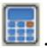

    Abaqus/CAE 计算杨氏模量并将其值显示在杨氏模量标签的右侧。

4.  从 Parameter Set 2（参数集 2）选项中，执行以下操作以计算泊松比的值：

    a. 从 **Data set** 列表中，选择您希望用来计算泊松比的数据。

    b. 单击

    

    Abaqus/CAE 计算泊松比并将其值显示在泊松比标签的右侧。

5.  从 **Material** 列表中，选择您希望应用此标定行为的材料定义；或单击为此标定行为创建新的材料定义。有关定义新材料模型的更多信息，请参阅创建或编辑材料。

6.  单击 **OK** 以将各向同性弹性行为保存到选定的材料模型。

    Abaqus/CAE 将新行为添加到模型树，并将指定的杨氏模量和泊松比添加到指定材料的弹性材料属性中。

## 附加信息

*   创建线性弹性材料模型

## 标定各向同性弹塑性材料行为的数据

各向同性弹塑性标定行为使您能够推导各向同性弹性和塑性材料行为。

1.  从 Model Tree（模型树）中，展开 **Calibrations** 容器并双击 **Behaviors**。

    将出现 Create Calibration Behavior（创建标定行为）对话框。

2.  输入材料标定行为的名称，选择 **Elastic Plastic Isotropic**，并单击 **Continue**。

    将出现 Edit Behavior（编辑行为）对话框。

3.  从 Elastic-Plastic Data（弹塑性数据）选项中，执行以下操作：

    a. 展开 **Data set** 列表，并选择您希望用来计算第一组标定值的数据。

    b. 从 Ultimate point（极限点）选项中，单击  自动计算极限点，或单击  并从视口中选择极限点。

    Abaqus/CAE 在视口中绘制极限点，并在对话框中显示其坐标。

    c. 从 Yield point（屈服点）选项中，单击  并从视口中拾取屈服点。

    Abaqus/CAE 在视口中绘制一条从原点到屈服点的线，在对话框中显示屈服点的坐标，并计算杨氏模量，将其值显示在杨氏模量标签的右侧。

    d. 通过执行以下任一操作选择此材料标定的塑性点：

    • 向右拖动 **Plastic points**（塑性点）滑块以计算更多塑性点，或向左拖动滑块以计算较少塑性点。
    单击  从视口中拾取塑性点。

    Abaqus/CAE 将塑性数据点添加到对话框中的表格。如果您想进一步自定义塑性数据，可以编辑这些数据。

4.  从 Poisson's Ratio Data（泊松比数据）选项中，执行以下操作：

    a. 从 **Data set** 列表中，选择您希望用来计算泊松比的数据。

    b. 单击 。

    Abaqus/CAE 计算泊松比，将其值显示在泊松比字段中，并在视口中绘制它。如果需要，您可以通过更改字段中的值来调整计算出的泊松比值。

5.  从 **Material** 列表中，选择您希望应用此标定行为的材料定义；或单击  为此标定行为创建新的材料定义。有关定义新材料模型的更多信息，请参阅创建或编辑材料。

6.  单击 **OK**。

    Abaqus/CAE 更新新的标定行为。如果您指定了材料定义，Abaqus/CAE 会将各向同性弹塑性标定行为参数映射到该材料定义的弹性和塑性材料行为。

    

## 注意：

    当您将数据从标定行为映射到材料定义时，所选材料中的任何弹性或塑性材料行为都将被覆盖。

## 附加信息

*   创建线性弹性材料模型
*   定义经典金属塑性

## 标定具有永久变形的超弹性数据

具有永久变形的超弹性标定行为使您能够从弹性体和热塑性塑料的加载、卸载和重新加载的单轴和双轴数据集中提取塑性、超弹性材料行为和 Mullins 效应。您可以从单轴试验、双轴试验或这两种类型的试验中提取数据。标定过程包括以下步骤：

1.  将单轴和/或双轴试验数据文件作为新数据集上传到 Abaqus/CAE 中。
2.  从您提供的数据文件中提取加载、卸载和重新加载循环以及永久变形数据，并为每个循环的加载、卸载和重新加载阶段创建单独的数据集。
3.  如果需要，选择任何您希望从材料行为计算中排除的数据循环。
4.  从视口中选择屈服点，如果需要，编辑主加载数据集上的各个点以创建更平滑的曲线。永久变形曲线基于当前的屈服点，因此当您选择新的屈服点时，这些曲线也会改变。
5. 确定要用于推导材料行为的测试数据集并指定主要曲线选项后，您可以从选定数据推导材料行为。Abaqus/CAE 会将塑性、超弹性和马林斯效应材料行为映射到您选择的材料。

1.  从模型树（Model Tree）中，展开“Calibrations”容器，然后双击“Behaviors”。

    “Create Calibration Behavior”（创建校准行为）对话框出现。

2.  输入材料校准行为的名称，选择“Hyperelasticity with permanent set”（具有永久变形的超弹性），然后单击“Continue”。

    “Edit Behavior”（编辑行为）对话框出现。

3.  在“Uniaxial”（单轴）或“Biaxial”（双轴）标签页上执行以下步骤：

    a.  选择要提取数据以校准马林斯效应（Mullins effect）的循环。默认情况下，Abaqus/CAE 会提取最后的卸载和重载曲线。
    选择“Last cycle found”（找到最后循环）以从提供的测试数据中每个应变级别提取最后的卸载和重载曲线。
    *   选择“First cycle found”（找到最初循环）以从提供的测试数据中每个应变级别提取最初的卸载和重载曲线。

    b.  展开“Data set list”（数据集列表），并选择您想要计算单轴或双轴数据测试校准值的数据。

    ## c. 单击
    

    Abaqus/CAE 提取主要加载曲线、每个循环应变级别的指定卸载和重载曲线以及永久变形曲线，然后为每个循环应变级别的每个分量创建新的校准数据集。每个新数据集在“Uniaxial Test Data Sets”（单轴测试数据集）或“Biaxial Test Data Sets”（双轴测试数据集）选项中可用，并绘制在视区中。

    d.  打开您想要包含在材料校准计算中的单独加载、卸载或重载数据集。当您打开一个数据集时，Abaqus/CAE 会在视区中显示其对应的 X–Y 曲线。您可以选择以下任意一项：

    *   选择“All”（全部）以包含在所选测试数据文件中找到的所有原始数据。
    *   选择“Primary”（主要）以包含来自主要加载曲线的数据。
    *   选择“Unloading”（卸载）以包含来自每个循环应变级别的卸载曲线数据，或展开此容器以选择单独的卸载曲线。
    *   选择“Reloading”（重载）以包含来自每个循环应变级别的重载曲线数据，或展开此容器以选择单独的重载曲线。
    *   选择“Permanent Set”（永久变形）以包含来自两条永久变形曲线的数据，或展开此容器以选择应力或应变相关的永久变形分量。

    e.  在“Yield Point”（屈服点）选项中，执行以下任一操作：

    *   单击 $\bowtie$ ，然后在视区中从主曲线上选择屈服点。
    *   单击 ，然后输入“Strain”（应变）或“Stress”（应力）值；Abaqus/CAE 会从主曲线计算另一个值并填充剩余的字段。

4.  如果需要，从“Uniaxial”（单轴）或“Biaxial”（双轴）标签页提取第二个数据集。
5.  如果您提取了单轴和双轴测试数据，Abaqus/CAE 默认会在材料行为的计算中同等应用这些数据。如果您希望某个数据集在这些计算中具有更大的权重，请在“Options”标签页上执行以下步骤：

    a.  在“Material Properties”（材料特性）选项中，将“Weight”（权重）滑块拖向您希望在材料行为计算中分配更大权重的数据类型（单轴或双轴）。
    b.  指定相对权重的选择是基于线性插值还是对数插值。

6.  从“Material”（材料）列表中，选择您想要应用此校准行为的材料定义；或单击 为此校准行为创建新的材料定义。有关定义新材料模型的更多信息，请参见“Creating or editing a material”（创建或编辑材料）。

7.  单击“OK”。

    Abaqus/CAE 更新新的校准行为，并将具有永久变形的超弹性校准行为参数映射到该材料定义的“Hyperelastic”（超弹性）、“Plastic”（塑性）和“Mullins Effect”（马林斯效应）材料行为。

    

    ## 注意：
    当您将数据从校准行为映射到材料定义时，所选材料中任何现有的超弹性、塑性或马林斯效应材料行为都将被覆盖。

    ## 附加信息
    *   定义经典金属塑性
    *   类橡胶材料的超弹性行为
    *   类橡胶材料中的应力软化

## 在 Property 模块中使用 Special 菜单

您可以使用 Property（特性）模块中的“Special”（特殊）菜单来定义以下工程特征：

*   **蒙皮 (Skin)。** 蒙皮加强件定义了粘合到现有部件表面的蒙皮，并指定其工程特性。有关更多信息，请参见“蒙皮和桁条加强件”。
*   **惯性 (Inertia)。** 您可以在部件的某个点定义集中质量、转动惯量和热容。您还可以定义质量和惯性比例阻尼。在 Abaqus/Standard 分析中，您可以定义复合阻尼。有关更多信息，请参见“惯性”。
*   **弹簧/阻尼器 (Springs/Dashpots)。** 您可以定义表现出与场变量无关的相同线性行为的弹簧和阻尼器。您还可以在相同的点集上定义弹簧和阻尼器行为。在 Abaqus/Explicit 或 Abaqus/Standard 分析中，您可以模拟连接两个点、沿着两点之间作用线的弹簧和阻尼器。在 Abaqus/Standard 分析中，您还可以模拟连接两点、作用在固定方向的弹簧和阻尼器，或将点连接到地面的弹簧和阻尼器。有关更多信息，请参见“弹簧和阻尼器”。

## 附加信息
*   创建和编辑蒙皮加强件
*   定义点质量和转动惯量
*   定义热容
*   创建连接两点的弹簧和阻尼器
*   创建连接点到地面的弹簧和阻尼器

## 使用查询工具集获取分配信息

您可以使用查询工具集来显示以下信息：

*   您已分配截面的所有区域的列表。
*   分配给选定区域的截面的名称。
*   关于需要截面分配的区域的信息。
*   分配给选定线框区域的梁方向。
*   分配给选定壳体和实体区域的材料方向。
*   复合材料叠层或复合材料截面中铺层的图形表示。
*   分配给选定壳体区域的钢筋参考方向。
*   分配给所有壳体和轴对称线框区域的壳体/膜法线方向。
*   分配给所有线框区域的梁/桁架切线方向。
*   包含不相交区域的复合材料叠层和铺层。

1.  从主菜单栏中，选择“Tools”->“Query”。

    

    **提示：** 您也可以通过单击查询工具集中的 工具来查询模型。

    Abaqus/CAE 显示“Query”（查询）对话框。

    您可以请求通用查询或模块特定查询。“Shell element normals”（壳单元法线）和“Beam element tangents”（梁单元切线）查询是通用查询。有关通用查询显示的信息的讨论，请参见“获取有关模型的通用信息”。“Section assignments”（截面分配）、“Regions missing sections”（缺少截面的区域）、“Beam orientations”（梁方向）、“Material orientations”（材料方向）、“Rebar orientations”（钢筋方向）、“Ply stack plot”（铺层堆叠图）和“Disjoint ply regions”（不相交的铺层区域）查询是 Property 模块特有的。

2.  从“Property Module Queries”（Property 模块查询）列表中，选择感兴趣的特性。

3.  在视区中选择要查询的区域。

    

    **提示：** 您可以通过在提示区中单击选择过滤工具 □ ，然后在出现的对话框中单击您选择的选择过滤器来限制在视区中可选择的对象类型。有关更多信息，请参见“使用选择选项”。

4.  选择要查询的区域后，将显示以下信息：

    ## 截面分配查询
    Abaqus/CAE 在消息区中显示分配给所选区域的一个或多个截面的名称。如果您查询的区域具有被抑制的截面分配，Abaqus/CAE 将报告该区域没有截面分配。

    ## 缺少截面的区域
    如果您的部件的任何区域需要截面分配但尚未分配，Abaqus/CAE 将在视区中突出显示这些区域，并提示您将这些区域保存为集合。如果您希望将这些区域保存为命名集合，请从出现的对话框中打开“Save regions in a set”（将区域保存在集合中）；如果需要，可以自定义默认集合名称。

    ## 梁截面方向查询
    Abaqus/CAE 在消息区中显示分配给所选梁区域的梁方向的名称。此外，部件中每个梁区域的 - 方向会出现在消息区中。
## 材料方向查询

Abaqus/CAE 在消息区域中显示分配给选定区域的材料方向类型。对于 GLOBAL、SYSTEM 和 DISCRETE 类型，Abaqus/CAE 会在视口中显示材料方向三轴组。此外，消息区域还会显示零件中每个区域的材料方向相关信息。

## 钢筋方向查询

Abaqus/CAE 在消息区域中显示分配给选定区域的钢筋方向名称。此外，消息区域还会显示零件中每个区域的钢筋参考方向相关信息。

## 铺层堆叠图

Abaqus/CAE 会创建一个新视口，并显示穿过复合材料铺层或复合材料剖面的核心样本的图形表示。图像显示了铺层中的各个铺层及其细节，例如其纤维方向、厚度、参考平面和积分点。更多信息，请参阅“查看铺层堆叠图”。

## 不连续铺层区域

Abaqus/CAE 在消息区域中显示包含不连续区域的复合材料铺层名称及其内部的铺层名称。

5.  要退出查询过程，请点击提示区域中的取消按钮。

## 附加信息

• 创建和编辑剖面  
• 了解查询工具集的作用

---

[上一个：零件模块](part-module.md) · [下一个：装配模块](assembly-module.md)
