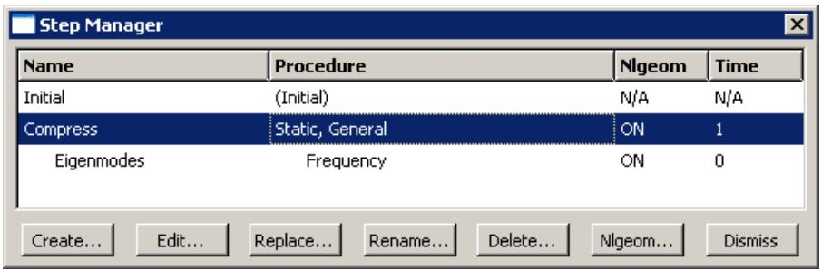

# Step 模块

## 理解 Step 模块的作用

您可以使用 Step 模块执行以下任务：

## 创建分析步

在一个模型中，您定义一个包含一个或多个分析步的序列。步序列为捕获模型载荷和边界条件的变化、模型各部分之间相互作用方式的变化、部件的移除或添加，以及在分析过程中可能发生的任何其他变化提供了一种便捷的方式。此外，分析步允许您更改分析程序、数据输出和各种控制设置。您还可以使用分析步来定义关于非线性基础状态的线性扰动分析。您可以使用替换功能来更改现有分析步的分析程序。

## 指定输出请求

Abaqus 将分析结果写入输出数据库；您通过创建传播到后续分析步的输出请求来指定输出。一个输出请求定义了在分析步期间将输出哪些变量、从模型的哪个区域输出，以及以何种频率输出。例如，您可能请求在某个步结束时输出整个模型的位移场，并同时请求在约束点处输出反作用力的历史数据。

## 指定自适应网格

您可以定义自适应网格区域并指定这些区域的自适应网格控制。

## 指定分析控制

您可以自定义通用求解控制和求解器控制。

## 进入和退出 Step 模块

您可以在 Abaqus/CAE 会话期间随时通过点击上下文栏中"模块"列表中的"Step"来进入 Step 模块。主菜单栏上将出现"Step"、"Output"、"Other"和"Tools"菜单。如果当前视口包含的内容不是装配体，那么当您启动 Step 模块时，视口中的内容将消失。

要退出 Step 模块，请从"模块"列表中选择任何其他模块。在退出模块之前无需保存您的分析步或输出请求；当您通过从主菜单栏选择"文件"->"保存"或"文件"->"另存为"来保存模型数据库时，它们将自动保存。

## 理解分析步

本节提供分析步的概述。

有关分析步的更多信息，请参见"定义分析"。

## 本节内容：

什么是分析步？  
线性和非线性程序  
分析步序列限制  
什么是步替换？  
用 Abaqus/Explicit 程序替换 Abaqus/Standard 程序，反之亦然

## 什么是分析步？

Abaqus/CAE 模型使用以下两种类型的分析步：

## 初始步

Abaqus/CAE 在模型的分析步序列开头创建一个特殊的初始步，并将其命名为"Initial"。Abaqus/CAE 仅为您的模型创建一个初始步，并且它不能被重命名、编辑、替换、复制或删除。

初始步允许您定义在分析最开始时适用的边界条件、预定义场和相互作用。例如，如果某个边界条件或相互作用在整个分析过程中都适用，通常在初始步中应用此类条件会很方便。同样，当第一个分析步是线性扰动步时，在初始步中应用的条件构成扰动基础状态的一部分。

## 分析步

初始步之后是一个或多个分析步。每个分析步都与一个特定程序相关联，该程序定义了在该步期间要执行的分析类型，例如静态应力分析或瞬态传热分析。您可以在分析步之间以任何有意义的方式更改分析程序，因此您在执行分析时具有很大的灵活性。由于模型的状态（应力、应变、温度等）在所有通用分析步中都会更新，因此每个新分析步的响应中总是包含先前历史的影响。

您可以定义的分析步数量没有限制，但对分析步序列存在限制。（有关更多信息，请参见"分析步序列限制"。）

您可以使用"Step"菜单中的项目来创建分析步，选择并定义该步期间使用的分析程序，以及管理现有分析步。或者，您可以从主菜单栏选择"Step"->"管理器"来显示"Step管理器"。

例如，考虑以下对管道系统某个部分的分析：

## 初始步：

应用边界条件以固定管道的左端，并仅允许右端进行轴向移动。

## 步 1：压缩

在管道的右端施加压缩力。此步是一个通用分析步。

## 步 2：本征模态

计算管道在压缩状态下的振动频率和模态。此步是一个线性扰动步。

图 1 显示了创建这些步后的"Step管理器"。

  
图 1："Step管理器"。

该管理器列出了分析中的所有步以及每个步的一些突出细节。步 2 "本征模态"被缩进显示，表明它是一个基于步 1 "压缩"结束时模型状态的线性扰动步。

有关创建、编辑和替换分析步的详细信息，请参阅以下章节：

"Step管理器"  
创建分析步  
编辑分析步  
替换分析步  
重置分析步编辑器中的默认值  
分析步编辑器  
"增量"选项卡

## 附加信息

• 理解分析步  
• 定义分析

## 线性和非线性程序

"Step管理器"通过缩进线性扰动步的名称和程序描述来区分通用非线性步和线性扰动步。通用非线性分析步定义顺序事件：一个通用步结束时的模型状态为下一个通用步的开始提供初始状态。线性扰动分析步提供关于最后一个通用非线性步结束时所达到状态的模型线性响应。当您在"创建分析步"对话框中选择程序时，使用"程序类型"字段在"通用"和"线性扰动"步之间进行选择。

对于分析中的每个步，"Step管理器"还会指示 Abaqus 是否会考虑大位移和变形引起的非线性效应。如果模型在某个步中由于载荷引起的位移相对较小，则其影响可能小到可以忽略。然而，在模型上的载荷导致大位移的情况下，几何非线性效应可能变得重要。步的"Nlgeom"设置决定了 Abaqus 是否会在该步中考虑几何非线性。

对于 Abaqus/Explicit 步，默认情况下"Nlgeom"设置是打开的，而对于 Abaqus/Standard 步，默认情况下是关闭的。分析步序列和当前的"Nlgeom"设置决定了您是否可以在特定步中更改"Nlgeom"设置。例如，如果 Abaqus 已经在考虑几何非线性，那么"Nlgeom"设置将为所有后续步切换为打开，您无法将其关闭。在允许的情况下，以下方法允许您更改某个步的"Nlgeom"设置：

• 点击分析步编辑器中的"Basic"选项卡，并切换"Nlgeom"设置。  
• 从主菜单栏选择"Step"->"Nlgeom"。  
• 在"Step管理器"中点击"Nlgeom"。

有关更多信息，请参见"考虑几何非线性"，或参见"通用和扰动程序"。

## 附加信息

• 理解分析步

## 分析步序列限制

当您从主菜单栏选择"Step"->"创建"时，将出现一个"创建分析步"对话框，您可以在其中指定正在创建的分析步的程序类型。类似地，当您从主菜单栏选择"Step"->"替换"时，将出现一个"替换分析步"对话框，您可以在其中为现有分析步指定新的程序类型。在"创建分析步"和"替换分析步"对话框中可供选择的程序类型取决于以下因素：

• 模型类型。  
• 您已关联到现有分析步的程序。  
• 新建或替换的步在分析步序列中的位置。

例如，当您在分析中创建第一个步时，您可以从有效的程序类型列表中进行选择；Abaqus/Standard 和 Abaqus/Explicit 程序类型都会出现在列表中。但是，一旦您创建了第一个步，"创建分析步"对话框中的有效程序类型列表将更改，仅包含与第一个步兼容的程序。例如，如果第一个步是 Abaqus/Standard 步，则 Abaqus/Explicit 程序将不再出现在列表中。

## 什么是步替换？

在定义模型并执行分析后，您可能希望使用不同的程序运行另一个分析，而无需重新定义模型中的对象，如载荷、边界条件和相互作用。您可以使用替换功能将现有分析步的分析程序替换为 Abaqus/Standard 或 Abaqus/Explicit 允许的任何程序；例如，您可以从"静态，通用"程序更改为"动态，显式"程序，或从"静态，通用"程序更改为"静态，Riks"程序。在从主菜单栏选择"Step"->"替换"后，您选择要替换的步以及该步的新分析程序。"编辑分析步"对话框将出现，其中包含新分析程序的默认值。您可以修改这些默认值，并在分析步编辑器中指定可选设置的值。
当替换一个分析步骤时，Abaqus/CAE 会将所有兼容的、依赖于步骤的对象复制到新步骤中。如果某些对象与新步骤不兼容，Abaqus/CAE 会尽可能替换为一个等效对象，并将剩余的对象抑制或删除。因此，在替换步骤之前，您可能需要复制模型。Abaqus/CAE 会在消息区域显示在步骤替换过程中被抑制或删除的对象列表。例如，如果您将一个包含 Abaqus/Standard 自接触、压力载荷和惯性释放载荷的 Static, General 步骤替换为一个 Dynamic, Explicit 步骤，Abaqus/CAE 将执行以下操作：

*   在 Dynamic, Explicit 步骤中，将 Abaqus/Standard 自接触替换为 Abaqus/Explicit 自接触。
*   将压力载荷复制到 Dynamic, Explicit 步骤中。
*   抑制惯性释放载荷。惯性释放载荷仅适用于 Abaqus/Standard 分析步骤。

替换步骤后，您应验证先前定义的属性、单元类型、作业以及初始步骤中的边界条件和预定义场对于模型是否仍然有效。在 **作业 (Job)** 模块中，您可以在 **作业管理器 (Job Manager)** 中点击 **写入输入文件 (Write Input)** 来生成输入文件，然后检查输入文件是否有错误。

您可以使用替换功能，通过用相同分析类型的步骤替换现有步骤，来将步骤设置重置为默认值。

## 附加信息

*   抑制和恢复对象
*   理解分析步骤
*   步骤序列限制
*   替换一个分析步骤
*   在步骤编辑器中重置默认值
*   仅写入输入文件

## 将 Abaqus/Standard 分析步骤替换为 Abaqus/Explicit 分析步骤，反之亦然

如果您希望将 Abaqus/Standard 分析步骤替换为 Abaqus/Explicit 分析步骤，或反之，则模型中只能有一个分析步骤，这样所需的过程类型才会出现在 **替换步骤 (Replace Step)** 对话框中。如果您的模型包含多个步骤，您可以使用步骤相关管理器将对象移动到单个步骤中。然后，您可以删除其他步骤，并用新的分析步骤替换剩余的步骤。

例如，如果您想将一个包含四个 Static, General 步骤的模型从 Abaqus/Standard 分析更改为 Abaqus/Explicit 分析，您可以使用 **载荷管理器 (Load Manager)** 将所有载荷移动到四个步骤中的一个。类似地，您可以使用 **相互作用管理器 (Interaction Manager)** 移动相互作用。然后，您可以删除其他三个步骤，并用一个 Dynamic, Explicit 步骤替换剩余的步骤。如果需要，您可以创建额外的 Abaqus/Explicit 步骤，并使用步骤相关管理器将在步骤替换期间复制的对象移动到相应的 Abaqus/Explicit 步骤中。

更多信息，请参阅 修改步骤相关对象的历史记录。

## 附加信息

*   更改对象在步骤中的状态
*   步骤序列限制
*   什么是步骤替换？
*   替换一个分析步骤

## 理解输出请求

本节概述输出请求。

## 本节内容：

*   什么是输出请求？
*   场输出和历程输出有什么区别？
*   输出请求的传播
*   输出请求管理器
*   创建和修改输出请求

## 什么是输出请求？

Abaqus 分析产品会在步骤的每个增量步计算许多变量的值。通常您只对所有这些计算数据中的一小部分感兴趣。您可以通过创建输出请求来指定要写入输出数据库的数据。一个输出请求包含以下信息：

*   感兴趣的变量或变量分量。
*   模型的区域以及将数值写入输出数据库的积分点。
*   变量或分量数值写入输出数据库的频率。

当您创建第一个步骤时，Abaqus/CAE 会根据该步骤的分析过程选择一组默认的输出变量。默认情况下，会从模型中的每个节点或积分点以及默认截面点请求输出。此外，Abaqus/CAE 会选择将变量写入输出数据库的默认频率。您可以编辑这些默认输出请求或创建和编辑新的输出请求。

默认的输出请求和您修改过的输出请求会传播到分析中的后续步骤中。如果您有一个大型模型，其中包含默认的输出请求并请求从大量帧中输出，那么生成的输出数据库将会非常大。您可以使用 C++ 程序从大型输出数据库中提取数据，并将仅选定的帧复制到第二个输出数据库中。更多信息，请参阅 通过保留特定帧的数据来减少输出数据库中的数据量。

分析完成后，您可以使用 **可视化 (Visualization)** 模块读取输出数据库并以图形方式显示写入其中的数据。

关于创建和编辑输出请求的详细说明，请参阅以下部分：

*   创建一个输出请求
*   修改场输出请求
*   修改历程输出请求

## 附加信息

*   理解输出请求

## 场输出和历程输出有什么区别？

当您创建输出请求时，可以选择场输出或历程输出。

## 场输出

Abaqus 从空间上分布在整个模型或模型一部分的数据生成场输出。在大多数情况下，您使用 **可视化 (Visualization)** 模块，通过变形图、云图或符号图来查看场输出数据。Abaqus 在分析过程中生成的场输出量通常很大。因此，您通常要求 Abaqus 以较低的频率将场数据写入输出数据库；例如，在每个步骤之后或在分析结束时。

当您创建场输出请求时，您可以在等间距的时间间隔内或每隔指定时间长度指定输出频率。对于 Abaqus/Standard 分析过程，您还可以以增量步指定输出频率，请求在每个步骤的最后一个增量步后输出，或根据一组时间点请求输出。对于 Abaqus/Explicit 分析过程，您还可以请求每个时间增量步输出场输出，或根据一组时间点请求。

当您创建场输出请求时，Abaqus 会将所选变量的每个分量写入输出数据库。例如，如果您使用实体单元来模拟一个末端受载的悬臂梁，您可以在加载步骤的最后一个增量步后，请求整个模型的应力（所有六个分量）和位移（所有六个分量）数据。然后，您可以使用 **可视化 (Visualization)** 模块查看最终加载状态下的应力和挠度云图。

## 历程输出

Abaqus 从模型中特定点的数据生成历程输出。在大多数情况下，您使用 **可视化 (Visualization)** 模块通过 X-Y 图来显示历程输出。输出的频率取决于您希望如何使用分析生成的数据，并且频率可能非常高。例如，为诊断目的生成的数据可能会在每个增量步后写入输出数据库。您还可以将历程输出用于与整个模型或模型一部分相关的数据；例如，整个模型的能量。

当您创建历程输出请求时，您可以在等间距的时间间隔内或每隔指定时间长度指定输出频率。对于 Abaqus/Standard 分析过程，您还可以以增量步指定输出频率，请求在每个步骤的最后一个增量步后输出，或根据一组时间点请求输出。对于 Abaqus/Explicit 分析过程，您还可以请求以时间增量步进行历程输出。

当您创建历程输出请求时，您可以指定 Abaqus/CAE 将写入输出数据库的变量的各个分量。例如，如果您模拟一个末端受载的悬臂梁的响应，您可能会在加载步骤的每个增量步后请求以下输出：

*   梁根部单个节点的主应力。
*   梁端部单个节点的垂直位移。

然后，您可以使用 **可视化 (Visualization)** 模块查看随着载荷增加，梁根部应力与梁端部位移的 X-Y 图。

## 输出请求的传播

当您在分析中创建第一个步骤时，Abaqus/CAE 会根据您为该步骤选择的分析过程生成默认的场和历程输出请求。这些默认输出请求会传播到后续步骤中。**场输出请求管理器 (Field Output Requests Manager)** 和 **历程输出请求管理器 (History Output Requests Manager)** 是步骤相关的管理器，用于显示输出请求在步骤之间的传播和状态。
一般分析步中请求的输出与线性摄动步中请求的输出相互独立。此外，输出请求的传播行为在一般分析步和线性摄动步之间也有所不同。

## 一般分析步

Abaqus/CAE 会为模型中的第一个一般分析步创建一个默认的场输出请求，该默认输出请求将传播到所有后续的一般分析步。同样地，如果您创建新的输出请求或修改默认输出请求，新的或修改后的请求将传播到后续的一般分析步。

如果您在步骤序列中插入一个新的普通分析步，来自前一个普通分析步的输出请求将传播到新步骤。

## 线性摄动步

Abaqus/CAE 会为模型中的第一个线性摄动步创建一个默认的场输出请求，该默认输出请求将传播到所有使用相同分析过程的后续线性摄动步；例如，所有的频率分析。同样地，如果您创建新的输出请求或修改默认输出请求，新的或修改后的请求将传播到使用相同分析过程的后续步骤。

如果您在步骤序列中插入一个新的线性摄动步，来自前一个使用相同分析过程的线性摄动步的输出请求将传播到新步骤。如果您创建了一个使用不同分析过程的线性摄动步，Abaqus/CAE 会创建一个新的默认输出请求。该新的默认输出请求将传播到所有使用相同分析过程的后续线性摄动步。

您应该了解以下行为：

如果在现有普通分析步序列的开头插入一个新的普通分析步，Abaqus/CAE 不会为新步骤创建默认输出请求。同样地，如果在相同过程类型的现有线性摄动步序列的开头插入一个新的线性摄动步，Abaqus/CAE 也不会为新步骤创建默认输出请求。在这两种情况下，您必须为新步骤创建一个新的输出请求。或者，您可以使用输出请求管理器将后续步骤的输出请求移动到新步骤。
• 如果删除包含新输出请求的步骤（普通或线性摄动步），Abaqus/CAE 会从该请求已传播到的所有后续步骤中删除该输出请求。
• 如果一个步骤不包含输出请求，Abaqus/CAE 在生成输入文件时会在作业（Job）模块中显示警告。

## 输出请求管理器

Abaqus/CAE 为场输出请求和历程输出请求分别提供了管理器。输出请求管理器是步骤相关的管理器，这意味着它们包含有关分析中每个步骤中每个输出请求状态的信息，并允许您控制请求在步骤序列中的传播。更多信息，请参见《什么是步骤相关管理器？》。

场输出请求管理器（Field Output Requests Manager）和历程输出请求管理器（History Output Requests Manager）包含您已创建的所有输出请求的列表。例如，场输出请求管理器如图 1 所示。

图 1：场输出请求管理器。

在您选择步骤后，这两个管理器中的创建（Create）按钮允许您在该步骤期间创建新的输出请求。同样，编辑（Edit）、复制（Copy）、重命名（Rename）和删除（Delete）按钮允许您编辑、复制、重命名和删除选定的输出请求。您也可以使用主菜单栏中的输出（Output）->场输出请求（Field Output Requests）和输出（Output）->历程输出请求（History Output Requests）子菜单来启动创建、编辑、复制、重命名和删除操作。

您可以使用场输出请求管理器和历程输出请求管理器中的复制（Copy）按钮（或相应的菜单命令或模型树）来复制输出请求。您可以将输出请求从任何步骤复制到任何有效的步骤，但有一些限制。更多详细信息，请参见《使用管理器对话框复制步骤相关对象》。

左移（Move Left）、右移（Move Right）、激活（Activate）和取消激活（Deactivate）按钮允许您在分析过程中控制输出请求的传播。更多信息，请参见《修改步骤相关对象的历史》。

您可以使用管理器左侧列中的图标来抑制（suppress）输出请求或恢复（resume）先前被抑制的输出请求。抑制和恢复操作也可以通过主菜单栏中的输出（Output）->场输出请求（Field Output Requests）和输出（Output）->历程输出请求（History Output Requests）子菜单进行。更多信息，请参见《抑制和恢复对象》。

## 附加信息

• 什么是步骤相关管理器？
• 场输出和历程输出有什么区别？

## 创建和修改输出请求

要创建输出请求，请从主菜单栏中选择输出（Output）->场输出请求（Field Output Requests）->创建（Create）或输出（Output）->历程输出请求（History Output Requests）->创建（Create）。

此时会出现一个编辑器，您可以在其中输入定义输出请求所需的所有信息。编辑器的顶部显示以下内容：

• 输出请求的名称。
• 您正在创建或修改输出请求的步骤名称。
• 与该步骤关联的分析过程名称。

例如，场输出请求编辑器如图 1 所示。

图 1：场输出请求编辑器。

编辑器的域（Domain）部分允许您选择要生成输出的区域。您可以请求 Abaqus 将场数据写入输出数据库，针对以下对象：

整个模型
• 整个模型，仅包括外部节点和单元（用于 Abaqus/Standard 或 Abaqus/Explicit 分析中的三维模型）

• 一个集合
• 一个螺栓载荷
• 一个皮肤（skin）
• 一个加劲条（stringer）
• 一个紧固件
• 一个组装好的紧固件集
• 一个相互作用
• 一个复合材料铺层
• 一个子结构

同样，您可以请求 Abaqus 将历程数据写入输出数据库，针对以下对象：

• 整个模型
• 一个集合
• 一个螺栓载荷
• 一个皮肤（skin）
• 一个加劲条（stringer）
• 一个紧固件
• 一个组装好的紧固件集
• 一个围道积分（contour integral）
• 一个通用接触面（仅用于 Abaqus/Explicit 分析步）
• 一个积分输出截面（仅用于 Abaqus/Explicit 分析步）
• 一个相互作用
• 弹簧/阻尼器
• 一个复合材料铺层

编辑器的频率（Frequency）部分允许您指定输出写入输出数据库的频率。选择以下之一：

• 最后一个增量（Last increment）：仅请求在步骤的最后一个增量后输出。此输出频率仅在您选择 Abaqus/Standard 分析过程时可用。
每 n 个增量（Every n increments）：请求在指定数量的增量后输出。如果您以增量为单位指定频率，Abaqus 也会在步骤的最后一个增量后输出。当您选择 Abaqus/Standard 分析过程时，此输出频率可用。
• 每个时间增量（Every time increment）：请求在每个时间增量输出。当您选择 Abaqus/Explicit 分析过程时，此输出频率可用于场输出。
• 每 n 个时间增量（Every n time increments）：请求在指定数量的时间增量输出。当您选择 Abaqus/Explicit 分析过程时，此输出频率可用于历程输出。
• 均匀的时间间隔（Evenly spaced time intervals）：请求在若干个均匀间隔的时间点输出。
• 每 x 个时间单位（Every x units of time）：请求在经过特定时间长度后输出。
根据时间点（From time points）：请求根据您指定的一组时间点进行输出。当您选择 Abaqus/Standard 分析过程时，此输出频率可用于场输出和历程输出；当您选择 Abaqus/Explicit 分析过程时，此输出频率可用于场输出。

编辑器的单元输出位置（Element output position）部分允许您选择所选场输出值的写入位置。选择以下之一：

• 节点处平均（Averaged at nodes）（仅用于 Abaqus/Standard 分析步）
• 质心处（Centroidal）
• 积分点处（Integration points）（默认）
• 节点处（Nodes）

编辑器的输出变量（Output Variables）部分包含适用于步骤过程和所选域的变量类别列表。选择以下之一：

从下面的列表选择（Select from list below）：从下方的复选框列表中请求变量。您可以单击类别名称旁边的复选框以选择该类别内的所有变量，也可以单击类别名称旁边的箭头以显示该类别内的变量列表，然后选择单个变量。
• 预选默认值（Preselected defaults）：请求该过程的默认输出变量。
• 全部（All）：请求该过程的所有输出变量。
• 编辑变量（Edit variables）：从下方的文本字段请求变量。您可以手动编辑此字段并输入或删除变量名称。

## 注意：

除了当前的分析过程，模型的其他方面（如指定的区域）也可能影响输出变量。例如，如果一个输出变量适用于当前的分析过程，但不适用于网格中使用的单元类型，Abaqus 将在分析过程中移除该变量。

如果您使用 **Field Output Request** 编辑器选择一个向量或张量变量包含在场输出请求中，Abaqus 会在步骤执行期间自动将该变量的所有分量写入输出数据库。例如，如果您在一个三维模型中选择向量 U，Abaqus 会将三个位移分量 U1、U2、U3 以及三个旋转分量 UR1、UR2、UR3 一起输出到输出数据库。

相反，如果您使用 **History Output Request** 编辑器选择一个向量或张量变量包含在历史输出请求中，该编辑器允许您选择该变量的单个分量。在历史输出请求中指定单个分量很有用，因为这些变量通常输出得非常频繁——可能与每个增量步一样频繁。

如果您的模型包含钢筋，您必须启用 **Output for rebar** 选项，才能将钢筋输出包含在 Abaqus 写入输出数据库的数据中，并在 **Visualization** 模块中查看钢筋方向图。更多信息，请参见 Understanding rebar in shell sections。

该编辑器还允许您指定输出获取的截面点。如果您请求来自复合材料层叠的输出，您可以为层叠的每一层指定输出获取的截面点。更多信息，请参见 Requesting output from a composite layup。

例如，在图 1 中，用户正在编辑一个与 **Static, General** 分析过程关联的场输出请求。用户选择了 **Stresses** 类别中的所有变量。这些变量将包含在名为 **Side Load** 的步骤的输出请求中。Abaqus 将在每个增量步从默认截面点写入输出。

有关选择输出变量和分量的详细说明，请参见以下部分：

• Modifying field output requests  
• Modifying history output requests

创建输出请求后，您可以通过以下方式修改它：

• 选择 **Output -> Field Output Requests -> Edit** 或 **Output -> History Output Requests -> Edit** 以显示场输出或历史输出请求编辑器。  
• 选择 **Output -> Field Output Requests -> Manager** 或 **Output -> History Output Requests -> Manager** 以显示场输出或历史输出请求管理器。使用管理器可以修改输出请求的按步变化历史。（有关更多信息，请参见 What are step-dependent managers?）

如果您在创建请求的步骤中修改输出请求，您可以修改域、输出变量、钢筋输出选项、截面点和输出频率。但是，如果您在请求传播进入的步骤中修改输出请求，则只能修改输出变量和输出频率。

当您请求围道积分的输出时，**History Output Request** 编辑器仅允许您选择输出频率、围道积分的数量以及围道积分计算的类型。更多信息，请参见 Requesting contour integral output。

## 其他信息

• Understanding output requests

## 理解集成输出、重启动输出、诊断输出和监控输出

本节解释 **Step** 模块中可用的附加输出控制。

## 本节内容：

Integrated output requests  
Restart output requests  
Diagnostic printing  
Degree of freedom monitor requests

## 集成输出请求 (Integrated output requests)

要获取变量（如作用在接触表面上的合力或通过表面之间绑定约束传递的力）的历史输出，您必须引用一个集成输出截面来标识需要输出的表面。

（参见 Integrated Output。）此外，集成输出截面定义可以提供一个局部坐标系来表示向量输出量，和/或一个参考节点作为计算跨越该表面总力矩的锚点。

默认情况下，集成输出截面锚定在全局原点，并且不跟随其定义表面的运动。您可以定义一个参考点作为输出截面的锚点，并指定该参考点如何跟踪表面的平均运动。该参考点不得连接到有限元模型的任何其他部分。

与坐标系和/或参考节点关联的集成输出截面可以独立于集成输出请求使用，以跟踪表面的平均运动。

您可以通过从主菜单栏选择 **Output -> Integrated Output Sections -> Create** 来定义集成输出截面。有关详细说明，请参见 Defining integrated output sections。有关为集成输出截面请求输出的信息，请参见 Modifying history output requests。

## 其他信息

• Defining integrated output sections  
• Understanding output requests  
• Understanding integrated, restart, diagnostic, and monitor output

## 重启动输出请求 (Restart output requests)

您可以使用 Abaqus 创建的重启动文件从先前分析的指定步骤继续分析。本节描述如何控制重启动数据的输出。有关如何在后续作业中使用重启动数据的讨论，请参见 Restarting an analysis 和 What are the model attributes?。

默认情况下，Abaqus/Standard 分析不写入重启动信息，而 Abaqus/Explicit 分析仅在每个步骤的开始和结束时写入重启动信息。但是，系统会自动为分析中的每个步骤创建默认的重启动请求。您可以通过在 **Step** 模块的主菜单栏中选择 **Output -> Restart Requests** 来调用 **Edit Restart Requests** 对话框，该对话框允许您指定希望重启动信息写入的频率。

您可以指定 Abaqus 将数据写入重启动文件的频率；但是，不同分析产品之间重启动的行为有所不同。

## Abaqus/Standard

您可以按增量步或按时间间隔请求频率。对于 Abaqus/Standard 步骤，您可以选择输出是在精确的时间间隔写入还是在最接近的近似值处写入。

## Abaqus/Explicit

对于 Abaqus/Explicit 分析，您指定 Abaqus 将数据写入重启动文件的等间距时间间隔数。此外，对于 Abaqus/Explicit 步骤，您可以选择输出是在精确的时间间隔写入还是在最接近的近似值处写入。但是，您无法避免为 Abaqus/Explicit 步骤写入重启动文件信息；时间间隔数必须设置为一或更大。

对于 Abaqus/Standard 或 Abaqus/Explicit 分析，您可以请求将写入重启动文件的数据覆盖来自上一个增量步的数据。如果选择此选项，Abaqus 将仅在重启动文件中保留每个步骤一个增量步的信息，从而最小化文件大小。默认情况下，Abaqus 不覆盖数据。

有关更多信息，请参见 Restarting an analysis 和 Restarting an Analysis。有关请求重启动输出的详细说明，请参见 Configuring restart output requests。

您可以使用 `abaqus restartjoin` 执行过程从重启动分析创建的输出数据库中提取数据，并将数据附加到第二个输出数据库。有关更多信息，请参见 Joining Output Database (.odb) Files from Restarted Analyses。

## 其他信息

• Understanding output requests  
• Understanding integrated, restart, diagnostic, and monitor output

## 诊断输出 (Diagnostic printing)

如果您的模型分析失败或产生意外结果，您可以通过查看写入以下文件的选定诊断信息来检查其逐迭代的进度：

## 对于 Abaqus/Standard 分析：

诊断信息写入消息 (.msg) 文件，信息的一个子集写入输出数据库 (.odb) 文件。您可以在 **Visualization** 模块的输出数据库中查看诊断信息（有关更多信息，请参见 Viewing diagnostic output）。默认情况下，信息在每次迭代期间写入；您可以通过指定输出频率为零来要求 Abaqus 停止将诊断信息写入消息文件。

## 对于 Abaqus/Explicit 分析：

诊断信息写入状态 (.sta) 文件。有关此信息写入频率的信息，请参见 About Output。

您可以通过在主菜单栏选择 **Output -> Diagnostic Print** 来显示 **Edit Diagnostic Print** 对话框。
有关请求诊断打印的详细说明，请参阅**配置诊断打印**。

## 注意：

对诊断打印请求的更改**不会**影响 Abaqus/Standard 分析期间写入输出数据库的诊断信息。

## 附加信息

• 理解输出请求  
• 理解集成、重启动、诊断和监控输出  
• 查看诊断输出

## 自由度监控请求

您可以请求 Abaqus 在分析过程中的特定增量步，将一个选定点的自由度值写入状态文件 (.sta)，并且对于 Abaqus/Standard 分析，还会写入消息文件 (.msg)。此外，该自由度值随时间变化的曲线图将显示在一个新的视口中，该视口会在您提交分析时自动生成。（有关更多信息，请参阅监控分析作业的进展。）您可以利用此信息监控求解进度。

您必须通过选择现有的几何集、节点集或在视口中选择一个点，来指定要监控的顶点或节点。指定点之后，您必须指明要监控该顶点或节点的哪个自由度、希望信息在视口中显示的频率以及希望其打印到状态和消息文件的频率。

有关监控自由度的详细说明，请参阅**配置监控请求**。

## 附加信息

• 配置监控请求  
• 理解输出请求  
• 理解集成、重启动、诊断和监控输出

## 理解ALE自适应网格划分

任意拉格朗日-欧拉 (ALE) 自适应网格划分允许您在整个分析过程中维持高质量网格，即使发生大变形或材料损失，因为网格可以独立于材料移动。自适应网格划分仅移动节点；网格拓扑保持不变。自适应网格划分仅适用于耦合温度-位移 (Coupled temp-displacement)、动态显式 (Dynamic, Explicit)、动态温度-位移显式 (Dynamic, Temp-disp, Explicit)、土体 (Soils) 和静力通用 (Static, General) 分析步。

您可以通过从主菜单栏选择**其他 -> ALE自适应网格区域**来定义模型中希望应用自适应网格划分的区域。如有必要，您可以选择**其他 -> ALE自适应网格控制**或**其他 -> ALE自适应网格约束**来自定义自适应网格控制或添加区域自适应网格约束。目前，对于任何特定的分析步，您只能定义一个ALE自适应网格区域。

有关自适应网格划分的详细信息，请参阅 **ALE自适应网格划分**。

有关定义自适应网格区域的详细说明，请参阅以下章节：

定义ALE自适应网格区域  
指定ALE自适应网格约束  
指定ALE自适应网格划分的控制

## 如何自定义 Abaqus 分析控制？

本节说明如何调整控制 Abaqus 分析的参数。

## 本节内容：

通用求解控制  
求解器控制

## 通用求解控制

您可以自定义众多控制 Abaqus 中收敛和时间积分精度算法的变量。默认的求解控制通常效果很好，但自定义这些控制可能会带来更具成本效益的求解方案，或帮助您为特别困难的分析获得解。

## 注意：

这些选项仅适用于通用 Abaqus/Standard 分析步。

您可以通过从主菜单栏选择**其他 -> 通用求解控制**来访问求解控制。有关更多信息，请参阅**分析收敛控制**。

## 警告：

求解控制适用于经验丰富的分析师，使用时需格外小心。这些控制的默认设置适用于大多数非线性分析。不当更改这些值可能会大大增加分析的计算时间或产生不准确的结果。

有关设置通用求解控制的详细说明，请参阅**自定义通用求解控制**。

## 求解器控制

您可以自定义控制迭代线性方程组求解器的变量。

## 注意：

迭代线性方程组求解器仅可用于静力通用 (Static, General)、静力线性摄动 (Static, Linear perturbation)、粘性 (Visco)、传热 (Heat transfer)、地应力 (Geostatic) 和土体 (Soils) 分析步。

您可以通过从主菜单栏选择**其他 -> 求解器控制**来访问求解器控制。有关更多信息，请参阅**迭代线性方程组求解器**。

有关设置求解器控制的详细说明，请参阅**自定义求解器控制**。

## 使用 Step 模块工具箱

您可以通过主菜单栏访问所有 Step 模块工具；此外，您还可以通过 Step 模块工具箱访问这些工具。图 1 显示了 Step 模块工具箱中工具的图标。

  
图 1：Step 模块工具箱。

## 使用步骤管理器

本节描述如何使用步骤管理器来创建、编辑和操作分析步。

（有关管理器的通用信息，请参阅**管理对象**。）

## 本节内容：

步骤管理器  
创建分析步  
编辑分析步  
替换分析步  
重置步骤编辑器中的默认值  
考虑几何非线性

## 步骤管理器

您使用步骤管理器来创建、编辑和操作与当前模型关联的分析步。要启动步骤管理器，请从主菜单栏选择**步骤 -> 管理器**。步骤管理器对话框中的列显示关于每个分析步的以下信息：

## 名称

分析步的名称。线性摄动步的名称相对于通用步的名称是缩进的。

## 分析过程

创建分析步时为此步选择的分析过程。您可以在创建分析步后更改分析过程。单击**替换**为所选分析步选择新的过程类型。**分析过程**列还指示热学和土体分析步是假设为稳态还是瞬态条件，或者两者都不适用。

## 几何非线性

分析步是否考虑几何非线性。您使用**几何非线性**按钮来控制特定分析步的**几何非线性**设置。一旦您为某个分析步设置了**几何非线性**选项，该设置将对所有后续分析步保持有效。

## 时间

分析步的时间周期。时间周期的默认值为 1.0 个时间单位。单击**编辑**以显示步骤编辑器，以便您修改时间周期。

您使用步骤管理器对话框底部的按钮来创建一个跟随所选分析步的新分析步，或操作所选分析步。您使用**取消**按钮关闭步骤管理器对话框。您可以使用主菜单栏中**步骤**菜单的下拉菜单执行相同的任务。

您可以抑制一个分析步，以将该过程从分析中排除。被抑制的分析步将从上下文栏、重启动请求对话框和诊断打印对话框中移除。在该分析步中创建的任何依赖于步骤或传播的属性都会被自动抑制并在分析期间被忽略。恢复该分析步后，每个属性的状态将恢复到原始状态。例如，抑制并恢复一个分析步不会恢复之前被抑制的关联载荷。只要分析步顺序保持有效，您可以随时抑制或恢复分析步。

## 警告：

如果您使用步骤管理器或**步骤**菜单删除一个分析步，与该分析步关联的对象（例如边界条件或输出请求）也会被删除。如果您使用步骤管理器或**步骤**菜单替换一个分析步，与新分析过程不兼容的对象将尽可能被替换为等效对象，否则将被删除。

## 附加信息

• 抑制和恢复对象  
• 理解分析步  
• 使用步骤管理器

## 创建分析步

您可以创建 Abaqus 分析产品允许的任何过程序列；**创建分析步**对话框中的过程列表会更新，仅显示新分析步可用的过程。例如，如果您的第一个分析步包含静力应力/位移过程，则不能在其后紧跟着包含传热过程的新分析步。

1. 从主菜单栏，选择**步骤 -> 创建**。

**创建分析步**对话框将出现。

提示：您可以通过两种其他方式启动创建过程：
在 Step Manager（步骤管理器）中点击 **Create**（创建）。（您可以通过从主菜单栏选择 **Step -> Manager** 来显示 Step Manager。）
• 在 Step 模块工具栏中点击工具按钮。

2. 如果需要，使用 **Name**（名称）文本字段更改新步骤的名称。
所有步骤必须具有唯一名称，并且您不能将步骤命名为 “Initial”。

3. 从现有步骤列表中，选择要在其后插入新步骤的步骤。

4. 点击 **Procedure type**（过程类型）字段旁的箭头，并从出现的列表中选择 **General**（通用）或 **Linear perturbation**（线性摄动）。
对话框的下半部分将显示可用过程的列表。

5. 选择所需的过程，然后点击 **Continue**（继续）。
**Edit Step**（编辑步骤）对话框将出现。

6. 使用 **Edit Step** 对话框将设置从其默认值修改为其他值，并为可选设置提供值。（有关特定编辑器功能的详细帮助，请从主菜单栏选择 **Help -> On Context**，然后点击感兴趣的功能。）

7. 点击 **OK**。
Abaqus/CAE 将关闭 **Edit Step** 对话框，新步骤将出现在 Step Manager 中。

## 其他信息

• 理解步骤
• 通用和摄动过程

## 编辑步骤

您可以使用步骤编辑器来编辑与现有步骤关联的分析过程设置。

1. 从主菜单栏，选择 **Step -> Edit -> 步骤名称**。
步骤编辑器将出现。

提示：您也可以在 Step Manager 中选择步骤名称并点击 **Edit**（编辑）。

2. 使用步骤编辑器中的选项卡修改设置。（有关特定编辑器功能的详细帮助，请从主菜单栏选择 **Help -> On Context**，然后点击感兴趣的功能。）
3. 点击 **OK** 关闭步骤编辑器并保存新设置。

## 其他信息

• 理解步骤

## 替换步骤

您可以使用任何 Abaqus 分析产品允许的过程来替换现有过程；**Replace Step**（替换步骤）对话框中的过程列表会更新，以仅显示修订后步骤可用的过程。例如，您可以从 **Static, General**（静态，通用）过程更改为 **Static, Riks**（静态，Riks）过程。Abaqus/CAE 会将兼容的步骤相关对象复制到新步骤，如果可能则替换等效对象，并删除剩余对象。

替换步骤后，您应验证先前定义的属性、单元类型、作业以及初始步骤中的边界条件和场对于模型是否仍然有效。有关更多信息，请参阅什么是步骤替换？。

1. 从主菜单栏，选择 **Step -> Replace -> 步骤名称**。
**Replace Step** 对话框将出现。

提示：您也可以在 Step Manager 中选择步骤名称并点击 **Replace**（替换）。

2. 点击 **New procedure type**（新过程类型）字段旁的箭头，并从出现的列表中选择 **General** 或 **Linear perturbation**。
对话框的下半部分将显示可用过程的列表。

3. 选择新过程，然后点击 **Continue**。
**Edit Step** 对话框将出现。

4. 使用 **Edit Step** 对话框将设置从其默认值修改为其他值，并为可选设置提供值。（有关特定编辑器功能的详细帮助，请从主菜单栏选择 **Help -> On Context**，然后点击感兴趣的功能。）

5. 点击 **OK**。
如果步骤相关对象与新步骤不兼容，Abaqus/CAE 将在消息区域显示在步骤替换期间被删除的对象列表，并关闭 **Edit Step** 对话框。

## 其他信息

• 理解步骤

当您创建、编辑或替换步骤时，使用步骤编辑器来配置分析过程设置。您可以通过使用与现有步骤相同的过程类型替换现有步骤来重置步骤编辑器中的设置为其默认值。

1. 从主菜单栏，选择 **Step -> Replace -> 步骤名称**。
**Replace Step** 对话框将出现，当前过程在可用过程列表中被高亮显示。

提示：您也可以在 Step Manager 中选择步骤名称并点击 **Replace**。

2. 点击 **Continue**。
**Edit Step** 对话框将出现，并显示过程设置的默认值。

3. 使用 **Edit Step** 对话框将设置从其默认值修改为其他值，并为可选设置提供值。（有关特定编辑器功能的详细帮助，请从主菜单栏选择 **Help -> On Context**，然后点击感兴趣的功能。）
4. 点击 **OK**。
Abaqus/CAE 将步骤相关对象复制到新步骤，并关闭 **Edit Step** 对话框。

## 考虑几何非线性

步骤的 **Nlgeom**（几何非线性）设置决定 Abaqus 是否在该步骤中考虑几何非线性。对于 Abaqus/Explicit 步骤，**Nlgeom** 设置默认为开启；对于 Abaqus/Standard 步骤，**Nlgeom** 设置默认为关闭。

步骤的顺序和当前的 **Nlgeom** 设置决定您是否可以更改特定步骤中的 **Nlgeom** 设置。例如，如果 Abaqus 已经考虑几何非线性，则 **Nlgeom** 设置将为所有后续步骤切换为开启，并且您无法将其关闭。同样，在线性摄动步骤期间，您无法更改 **Nlgeom** 设置。有关更多信息，请参阅线性和非线性过程。

## 注意：

当您创建步骤时，可以在步骤编辑器中点击 **Basic**（基本）选项卡，并选择 **On**（开启）或 **Off**（关闭）作为 **Nlgeom** 设置。

1. 要显示 **Edit Nlgeom** 对话框并在适用的地方更改设置，请执行以下操作之一：
• 从主菜单栏，选择 **Step -> Nlgeom**。
• 从主菜单栏，选择 **Step -> Edit -> 步骤名称**。
步骤编辑器出现。从 **Basic** 选项卡上的 **Nlgeom** 字段，点击

• 从主菜单栏，选择 **Step -> Manager**。
Step Manager 出现。从管理器底部的按钮中，点击 **Nlgeom**。

2. 在 **Edit Nlgeom** 对话框中，点击感兴趣的步骤名称以开启或关闭该步骤的 **Nlgeom**。
如果某步骤的 **Nlgeom** 已开启，**Nlgeom** 列中会出现一个复选标记。如果某步骤的 **Nlgeom** 已关闭，则没有复选标记。

3. 点击 **OK** 关闭 **Edit Nlgeom** 对话框。

## 其他信息

• 理解步骤

## 使用步骤编辑器

本节描述步骤编辑器以及步骤编辑器中出现的选项。

## 本节内容：
步骤编辑器
增量选项卡

## 步骤编辑器

当您创建、编辑或替换步骤时，步骤编辑器会显示一组选项卡页面，允许您配置所选过程的设置。这些页面对于每个过程都是唯一的；例如，当您配置 **Static, General** 过程时，步骤编辑器会显示 **Basic**（基本）、**Incrementation**（增量）和 **Other**（其他）选项卡。您可以通过这些选项卡页面配置的设置包括步骤的时间周期、最大增量数、增量大小、默认载荷随时间的变化以及是否考虑几何非线性。

Abaqus 将您在 **Basic** 选项卡上的 **Description**（描述）字段中输入的文本存储在输出数据库中，并由可视化模块显示在状态块中。

如果您想将过程设置重置为其默认值，可以使用与现有步骤相同的过程类型替换该步骤。有关更多信息，请参阅重置步骤编辑器中的默认值。

有关编辑器特定功能的详细帮助，请选择 **Help -> On Context**，然后点击感兴趣的功能。

## 其他信息

• 理解步骤
• 使用步骤编辑器

## 增量选项卡

当您配置通用过程时，您在步骤编辑器的 **Basic** 选项卡中输入步骤的总时间周期。您使用 **Incrementation** 选项卡来配置 Abaqus 将用于将步骤的总时间周期划分为增量的方法。对于通用静态步骤以及许多其他类型的步骤，您可以在 **Incrementation** 选项卡页面上设置以下选项：

## 时间增量

• 当您选择 **Automatic time incrementation**（自动时间增量）时，Abaqus 使用为初始增量大小输入的值开始增量计算。后续时间增量的大小根据解的收敛速度进行调整。此选项是默认选择。
• 当您选择 **Fixed time incrementation**（固定时间增量）时，Abaqus 在整个步骤中使用为初始增量大小输入的值。

## 警告：

选择 **Fixed time incrementation** 可能会阻止解收敛，不建议使用。

## 最大增量数

Abaqus 将步骤中的增量数限制为您为 **Maximum number of increments**（最大增量数）输入的值。如果步骤超过此增量数，分析将停止，诊断信息将报告给作业模块并写入消息文件。默认情况下，Abaqus/CAE 将最大增量数设置为 100。
## 初始增量大小

Abaqus 使用输入的**初始增量大小**值来启动分析步。

## 最小增量大小

仅当使用自动时间增量进行分析时，Abaqus 才会检查**最小增量大小**。如果 Abaqus 需要一个比此值更小的时间增量才能达到收敛解，它将终止分析，向 **Job 模块**报告，并将诊断信息写入消息文件。如果不输入最小增量大小，Abaqus 将使用总时间段的 10⁻⁵ 倍。

## 最大增量大小

仅当使用自动时间增量进行分析时，Abaqus 才会检查**最大增量大小**。在分析过程中，Abaqus 不会将增量大小增加到超过此值。如果不指定此值，Abaqus/CAE 将其设置为总时间段的值（动态隐式分析程序除外，其默认最大增量大小取决于各种分析设置；请参阅配置动态隐式分析程序）。

## 注意：

必须为上述每个增量选项输入一个值。如果删除了某个增量选项的默认值但未能提供另一个值，Abaqus/CAE 不允许您创建该分析步。

有关**增量**选项卡页面上其他项目的详细信息，请单击 **Help->On Context**，然后单击感兴趣的项目。

## 附加信息

• 了解分析步  
• 使用分析步编辑器

## 配置分析程序设置

**Edit Step** 对话框允许您为特定分析步配置分析程序设置。本节为每个分析程序提供说明。

## 本节内容：

配置通用分析程序  
配置线性摄动分析程序

## 配置通用分析程序

您可以配置通用分析程序以分析线性或非线性响应。您可以在 Abaqus/Standard 或 Abaqus/Explicit 分析中包含通用分析程序。

有关更多信息，请参阅通用分析程序和摄动分析程序。

本节提供了使用分析步编辑器配置不同类型通用分析程序的说明。

## 本节内容：

配置静态、通用分析程序  
配置静态、Riks 分析程序  
配置动态、显式分析程序  
配置热传导分析程序  
配置动态、隐式分析程序  
配置完全耦合的热传导和应力同步分析程序  
配置完全耦合的热传导和电同步分析程序  
配置完全耦合的热传导、电和结构同步分析程序  
配置直接循环分析程序  
配置使用显式积分的动态完全耦合热应力分析程序  
配置地应力场分析程序  
配置质量扩散分析程序  
配置充满流体的多孔介质的有效应力分析程序  
配置具有时间相关材料响应的瞬态静态应力/位移分析程序  
配置退火分析程序

## 配置静态、通用分析程序

静态应力分析程序是一种忽略惯性效应的分析程序。该分析可以是线性的或非线性的，并忽略时间相关的材料效应。有关更多信息，请参阅静态应力分析。

## 创建或编辑静态、通用分析程序

1.  按照创建分析步（分析程序类型：通用；静态、通用）或编辑分析步中概述的步骤显示 **Edit Step** 对话框。
2.  在 **Basic**、**Incrementation** 和 **Other** 选项卡页面上，配置诸如分析步的时间段、最大增量数、增量大小、默认载荷随时间的变化以及是否考虑几何非线性等设置，如下列程序所述。

## 在 Basic 选项卡页面上配置设置

1.  在 **Edit Step** 对话框中，显示 **Basic** 选项卡页面。
2.  在 **Description** 字段中，输入分析步的简要描述。Abaqus 将您输入的文本存储在输出数据库中，并且 **Visualization 模块** 在状态块中显示该文本。
3.  在 **Time period** 字段中，输入分析步的时间段。有关更多信息，请参阅时间段。
4.  选择一个 **Nlgeom** 选项：
    *   切换 **NlgeomOff** 以在当前分析步中执行几何线性分析。
    *   切换 **NlgeomOn** 以指示 Abaqus/Standard 在分析步中考虑几何非线性。一旦打开 Nlgeom，它将在分析的所有后续分析步中保持活动状态。

    有关更多信息，请参阅线性和非线性分析程序。

5.  如果您预期问题存在局部不稳定性（如表面起皱、材料不稳定性或局部屈曲），请选择一种自动稳定方法。Abaqus/Standard 可以通过在整个模型中应用阻尼来稳定此类问题。有关更多信息，请参阅不稳定问题，以及使用恒定阻尼因子自动稳定静态问题。

    单击 **Automatic stabilization** 右侧的箭头，并选择定义阻尼因子的方法：
    *   选择 **Specify dissipated energy fraction** 以允许 Abaqus/Standard 根据您提供的消散能分数计算阻尼因子。在相邻字段中输入消散能分数的值（默认值为 $2.0 \times 10^{-4}$）。有关更多信息，请参阅基于消散能分数计算阻尼因子。
    *   选择 **Specify damping factor** 以直接输入阻尼因子。在相邻字段中输入阻尼因子的值。有关更多信息，请参阅直接指定阻尼因子。
    *   选择 **Use damping factors from previous general step** 以使用前一分析步结束时的阻尼因子作为当前分析步变阻尼方案的初始因子。这些因子将覆盖在当前分析步中计算或直接指定的任何初始阻尼因子。如果前一通用分析步没有关联的阻尼因子（例如，如果前一分析步未使用任何稳定措施，或者当前分析步是分析的第一个分析步），Abaqus 将使用自适应稳定来确定所需的阻尼因子。

6.  使用自动稳定时，Abaqus 可以在分析步过程中使用相同的阻尼因子，也可以根据收敛历史以及阻尼消散的应变能与总应变能的比率，在空间和时间上改变阻尼因子。有关更多信息，请参阅自适应自动稳定方案。如果选择了 **Specify dissipated energy fraction**，自适应稳定是可选的，并且默认开启。如果选择了 **Specify damping factor**，自适应稳定是可选的，并且默认关闭。如果选择了 **Use damping factors from previous general step**，则自适应稳定是必需的。

    要使用自适应稳定，请切换 **Use adaptive stabilization with max. ratio of stabilization to strain energy (if necessary)**，并在相邻字段中输入每个增量中阻尼消散能与总应变能比率的允许精度容差值。默认值 0.05 在大多数情况下是合适的。

7.  如果您正在执行绝热应力分析，请切换 **Include adiabatic heating effects**。此选项仅适用于具有 Mises 屈服面的各向同性金属塑性材料。有关更多信息，请参阅绝热分析。
8.  配置完静态通用分析步的设置后，单击 **OK** 关闭 **Edit Step** 对话框。

## 在 Incrementation 选项卡页面上配置设置

1.  在 **Edit Step** 对话框中，显示 **Incrementation** 选项卡页面。

    （有关显示 **Edit Step** 对话框的信息，请参阅创建分析步或编辑分析步。）

2.  选择一种 **Type** 选项：
    *   选择 **Automatic** 以允许 Abaqus/Standard 根据计算效率选择时间增量的大小。
    *   选择 **Fixed** 以指定由用户直接控制增量。Abaqus/Standard 使用您指定的增量大小作为整个分析步的常数增量大小。

3.  在 **Maximum number of increments** 字段中，输入分析步中增量数的上限。如果在 Abaqus/Standard 达到分析步的完整解之前超过此最大值，分析将停止。
4.  如果在步骤 2 中选择了 **Automatic**，请为增量大小输入值：
    a. 在 **Initial** 字段中，输入初始时间增量。Abaqus/Standard 会根据需要在整个分析步过程中修改此值。
    b. 在 **Minimum** 字段中，输入允许的最小时间增量。如果 Abaqus/Standard 需要一个小于此值的时间增量，它将终止分析。
    c. 在 **Maximum** 字段中，输入允许的最大时间增量。
5. 如果您在步骤2中选择了“固定”（Fixed），请在“增量大小”（Increment size）字段中输入恒定时间增量的值。
6. 完成静态通用分析步的设置配置后，单击“确定”（OK）关闭“编辑分析步”（Edit Step）对话框。

## 配置“其他”选项卡页面上的设置

1.  在“编辑分析步”（Edit Step）对话框中，显示“其他”（Other）选项卡页面。
    （有关如何显示“编辑分析步”对话框，请参阅“创建分析步”或“编辑分析步”。）

2.  选择一种“方程求解器方法”（Equation Solver Method）选项：
    *   选择“直接”（Direct）以使用默认的直接稀疏求解器。
    *   选择“迭代”（Iterative）以使用迭代线性方程求解器。迭代求解器通常对于具有数百万自由度的大块状结构最有用。更多信息，请参阅“迭代线性方程求解器”。

3.  选择一种“矩阵存储”（Matrix storage）选项：
    *   选择“使用求解器默认值”（Use solver default）以允许 Abaqus/Standard 决定是否需要对称或非对称矩阵存储和求解方案。
    *   选择“非对称”（Unsymmetric）将 Abaqus/Standard 限制为非对称存储和求解方案。
    *   选择“对称”（Symmetric）将 Abaqus/Standard 限制为对称存储和求解方案。
    有关矩阵存储的更多信息，请参阅 Abaqus/Standard 中的“矩阵存储和求解方案”。

## 4. 选择一种“求解技术”（Solution technique）：
    *   选择“完全牛顿法”（Full Newton）以使用牛顿法作为求解非线性平衡方程的数值技术。更多信息，请参阅 Abaqus/Standard 中的“非线性求解方法”。
    *   选择“拟牛顿法”（Quasi-Newton）以使用拟牛顿技术求解非线性平衡方程。在某些情况下，该技术可以节省大量计算成本。通常，当系统规模很大且刚度矩阵在迭代间变化不大时，它最为成功。此技术仅可用于对称方程组。
    如果您选择此技术，请为“在重新构成内核矩阵之前允许的迭代次数”（Number of iterations allowed before the kernel matrix is reformed）输入一个值。允许的最大迭代次数为 25。默认迭代次数为 8。
    更多信息，请参阅“拟牛顿求解技术”。

5.  单击“转换严重不连续性迭代”（Convert severe discontinuity iterations）字段右侧的箭头，并选择处理非线性分析期间严重不连续性的选项：
    *   选择“关闭”（Off）以强制在迭代期间发生严重不连续性时进行新的迭代，而不管穿透量和力误差的大小。此选项还会更改某些时间增量参数，并使用不同的标准来决定是进行另一次迭代还是以更小的增量大小重新尝试。
    *   选择“开启”（On）以使用局部收敛标准来确定是否需要新的迭代。Abaqus/Standard 将确定与严重不连续性相关的最大穿透量和估计的力误差，并检查这些误差是否在容差范围内。因此，如果严重不连续性较小，解可能收敛。
    *   选择“从前一分析步传播”（Propagate from previous step）以使用在前一个通用分析步中指定的值。该值以括号形式显示在字段右侧。
    有关严重不连续性的更多信息，请参阅 Abaqus/Standard 中的“严重不连续性”。

6.  选择一种“默认载荷随时间变化”（Default load variation with time）选项：
    *   选择“瞬时”（Instantaneous）如果您希望载荷在分析步开始时瞬时施加，并在整个分析步期间保持恒定。
    *   选择“沿分析步线性增加”（Ramp linearly over step）如果载荷大小要沿分析步线性变化，从前一分析步结束时的值变化到载荷的全部大小。

7.  单击“每个增量开始时对前一状态的外推”（Extrapolation of previous state at start of each increment）字段右侧的箭头，并选择确定增量解初始猜测值的方法：
    *   选择“线性”（Linear）表示过程本质上是单调的，且 Abaqus/Standard 应使用前一增量解在时间上 100% 的线性外推来开始当前增量的非线性方程求解。
    *   选择“抛物线”（Parabolic）表示过程应使用前两个增量解在时间上的二次外推来开始当前增量的非线性方程求解。
    *   选择“无”（None）以抑制任何外推。
    更多信息，请参阅“解的外推”。

8.  如果需要使用变形理论塑性进行“完全塑性”分析，请打开开关“当区域`区域名称`完全塑性时停止”（Stop when region `region name` is fully plastic）。如果打开此选项，请输入要监控其完全塑性行为的区域的名称。
    当单元集中所有本构计算点的解均为完全塑性（定义为等效应变达到偏移屈服应变的10倍）时，分析步结束。但是，如果超过了您在“增量”选项卡页面上指定的最大增量数或在“基本”选项卡页面上指定的时间段，分析步可能会在此点之前结束。

9.  如果您在“增量”选项卡页面上选择了“固定时间增量”（Fixed time incrementation），则可以打开“达到最大迭代次数后接受解”（Accept solution after reaching maximum number of iterations）开关。此选项指示 Abaqus/Standard 在达到允许的最大迭代次数后接受该增量的解，即使不满足平衡容差。如果使用此选项，通常需要非常小的增量和最少两次迭代。

## 警告：
不建议使用此方法；仅当您透彻理解如何以这种方式解释获得的结果时，才可在特殊情况下使用它。

10. 如果需要使用时间域粘弹性获得完全松弛的长期弹性解，或使用两层粘塑性获得长期弹塑性解，请打开“使用时间域材料特性获得长期解”（Obtain long-term solution with time-domain material properties）开关。此参数仅与时间域粘弹性和两层粘塑性材料相关。

11. 完成静态通用分析步的设置配置后，单击“确定”（OK）关闭“编辑分析步”（Edit Step）对话框。

## 配置静态 Riks 分析过程

几何非线性静态问题有时涉及屈曲或坍塌行为，其中载荷-位移响应呈现负刚度，结构必须释放应变能以保持平衡。改进的 Riks 方法允许您在响应的不稳定阶段找到静态平衡状态。
您可以将此方法用于载荷大小由单一标量参数控制的情况。它也适用于求解病态问题，如极限载荷问题或表现出软化的几乎不稳定问题。更多信息，请参阅“不稳定屈曲和后屈曲分析”。

## 创建或编辑静态 Riks 分析过程

1.  按照“创建分析步”（分析过程类型：通用；静态，Riks）或“编辑分析步”中概述的步骤显示“编辑分析步”（Edit Step）对话框。
2.  在“基本”（Basic）、“增量”（Incrementation）和“其他”（Other）选项卡页面上，配置诸如停止标准、最大增量数、弧长增量大小以及是否考虑几何非线性等设置，如下述步骤所述。

## 配置“基本”选项卡页面上的设置

1.  在“编辑分析步”（Edit Step）对话框中，显示“基本”（Basic）选项卡页面。
2.  在“描述”（Description）字段中，输入分析步的简短描述。Abaqus 将您输入的文本存储在输出数据库中，并由可视化模块在状态块中显示。
3.  选择一个“几何非线性”（Nlgeom）选项：
    *   关闭“几何非线性”（NlgeomOff）以在当前分析步期间执行几何线性分析。
    *   打开“几何非线性”（NlgeomOn）以指示 Abaqus/Standard 在分析步期间应考虑几何非线性。一旦打开“几何非线性”，它将在分析的所有后续分析步中保持活动状态。
    更多信息，请参阅“线性和非线性分析过程”。
4.  如果您正在进行绝热应力分析，请打开“包含绝热加热效应”（Include adiabatic heating effects）。此选项仅适用于具有 Mises 屈服面的各向同性金属塑性材料。更多信息，请参阅“绝热分析”。
5.  由于加载大小是解的一部分，您需要一种方法来指定分析步何时完成。选择以下一个或两个选项：
    *   打开“最大载荷比例因子”（Maximum load proportionality factor）以输入载荷比例因子 `λ` 的最大值。Abaqus/Standard 使用此值在载荷超过一定大小时终止分析步。更多信息，请参阅“比例加载”。
    *   打开“最大位移”（Maximum displacement）以输入特定自由度（DOF）处的最大位移值。您还必须指定 Abaqus/Standard 将监控其终止位移的“节点区域”（Node Region）。如果超过此最大位移，Abaqus/Standard 将终止分析步。
    如果您未指定这两个终止条件中的任何一个，分析将继续进行您在“增量”选项卡页面上指定的增量数。
## 在增量（Incrementation）选项卡页面上配置设置

1. 在“编辑步骤（Edit Step）”对话框中，显示“增量（Incrementation）”选项卡页面。

    (有关如何显示“编辑步骤”对话框的信息，请参阅创建步骤或编辑步骤。)

2. 选择一个“类型（Type）”选项：

    选择**自动（Automatic）**以允许 Abaqus/Standard 根据计算效率选择弧长增量的大小。  
    选择**固定（Fixed）**以指定用户对增量的直接控制。Abaqus/Standard 将在整个步骤中使用您指定的恒定弧长增量作为增量大小。对于 Riks 分析，不推荐使用此方法，因为它会阻止 Abaqus/Standard 在遇到严重非线性时减小弧长。

    更多信息，请参阅增量。

3. 在“最大增量数（Maximum number of increments）”字段中，输入步骤中增量数目的上限。如果在 Abaqus/Standard 完成该步骤的完整解之前超出此最大值，分析将停止。

4. 如果您在步骤 2 中选择了**自动（Automatic）**，请输入“弧长增量（Arc length increment）”的值：

    a. 在“初始（Initial）”字段中，输入在缩放的荷载-位移空间中沿静态平衡路径的初始弧长增量，$\Delta l _ { i n }$。  
    b. 在“最小（Minimum）”字段中，输入最小弧长增量，$\Delta l _ { m i n }$。如果输入零，Abaqus 将采用建议的初始弧长与总弧长的 $\mathrm { i } 0 ^ { -5 }$ 倍两者中的较小值作为默认值。  
    c. 在“最大（Maximum）”字段中，输入最大弧长增量，$\Delta l _ { m a x }$。如果未指定此值，则不施加上限。  
    d. 在“估计总弧长（Estimated total arc length）”字段中，输入与此步骤相关的总弧长比例因子，$l _ { p e r i o d }$。如果此项为零或未指定，Abaqus/Standard 将假设一个默认值为 。

5. 如果您在步骤 2 中选择了**固定（Fixed）**，请在“弧长增量（Arc length increment）”字段中输入恒定弧长增量的值。

## 在其他（Other）选项卡页面上配置设置

1. 在“编辑步骤（Edit Step）”对话框中，显示“其他（Other）”选项卡页面。

    (有关如何显示“编辑步骤”对话框的信息，请参阅创建步骤或编辑步骤。)

2. 选择一个“矩阵存储（Matrix storage）”选项：

    选择**使用求解器默认值（Use solver default）**以允许 Abaqus/Standard 决定是否需要对称或非对称的矩阵存储和求解方案。  
    • 选择**非对称（Unsymmetric）**以将 Abaqus/Standard 限制为非对称存储和求解方案。  
    • 选择**对称（Symmetric）**以将 Abaqus/Standard 限制为对称存储和求解方案。

    有关矩阵存储的更多信息，请参阅 Abaqus/Standard 中的矩阵存储与求解方案。

3. 单击“处理严重不连续迭代（Convert severe discontinuity iterations）”字段右侧的箭头，并选择一个处理非线性分析中严重不连续性的选项：

    选择**关闭（Off）**以强制在迭代期间如果发生严重不连续性则进行新的迭代，而不管穿透和力误差的大小。此选项还会更改一些时间增量参数，并使用不同的标准来决定是进行另一次迭代还是使用更小的增量大小进行新的尝试。  
    选择**开启（On）**以使用局部收敛标准来确定是否需要新的迭代。Abaqus/Standard 将确定与严重不连续性相关的最大穿透和估计力误差，并检查这些误差是否在容差范围内。因此，如果严重不连续性很小，解可能收敛。  
    • 选择**从前一步传播（Propagate from previous step）**以使用前一个一般分析步骤中指定的值。此值显示在字段右侧的括号中。

    有关严重不连续性的更多信息，请参阅 Abaqus/Standard 中的严重不连续性。

4. 单击“增量开始时前一状态的外推（Extrapolation of previous state at start of each increment）”字段右侧的箭头，并选择一个用于确定增量解初始猜测值的方法：

    选择**线性（Linear）**以指示该过程本质上是单调的，并且 Abaqus/Standard 应使用先前增量解的 1% 线性外推来开始当前增量的非线性方程求解。  
    • 选择**无（None）**以抑制任何外推。

    （抛物线（Parabolic）选项与 Riks 分析无关。）有关更多信息，请参阅解的外推。

5. 如果需要使用变形理论塑性进行“全塑性”分析，请勾选**当区域区域名称全塑性时停止（Stop when region region name is fully plastic）**。如果勾选此选项，请输入需要监视其全塑性行为的区域名称。

    当单元集中所有本构计算点处的解均为全塑性（由等效应变为偏移屈服应变的 10 倍定义）时，步骤结束。但是，如果在“增量”选项卡页面上指定的最大增量数被超过，步骤可以在此点之前结束。

6. 如果您在“增量”选项卡页面上选择了**固定时间增量（Fixed time incrementation）**，可以勾选**达到最大迭代次数后接受解（Accept solution after reaching maximum number of iterations）**。此选项指示 Abaqus/Standard 在完成允许的最大迭代次数后接受某个增量的解，即使平衡容差未被满足。如果使用此选项，通常需要非常小的增量和至少两次迭代。

## 警告：

不推荐使用此方法；您应仅在您充分理解如何解释以这种方式获得的结果的特殊情况下使用它。

7. 勾选**使用时域材料属性获得长期解（Obtain long-term solution with time-domain material properties）**，以获得时域粘弹性材料的完全松弛长期弹性解或两层粘塑性材料的长期弹塑性解。此参数仅适用于时域粘弹性和两层粘塑性材料。

    完成静态 Riks 步骤的设置配置后，单击 **OK** 关闭“编辑步骤（Edit Step）”对话框。

## 配置动态显式过程

显式动力分析对于具有相对较短动态响应时间的大型模型分析以及极其不连续事件或过程的分析具有计算效率高的优势。此类分析允许定义非常通用的接触条件，并使用一致的大变形理论。有关更多信息，请参阅显式动力分析。

## 创建或编辑动态显式过程

1. 按照创建步骤（过程类型：通用；动态，显式）或编辑步骤中概述的程序，显示“编辑步骤（Edit Step）”对话框。  
2. 在“基本（Basic）”、“增量（Incrementation）”、“质量缩放（Mass scaling）”和“其他（Other）”选项卡页面上，配置步骤的时间周期、最大时间增量、增量大小、质量缩放定义和体积粘度参数等设置，如下所述。

## 在基本（Basic）选项卡页面上配置设置

1. 在“编辑步骤（Edit Step）”对话框中，显示“基本（Basic）”选项卡页面。  
2. 在“描述（Description）”字段中，输入分析步骤的简短描述。Abaqus 将您输入的文本存储在输出数据库中，并由可视化（Visualization）模块在状态块中显示。  
3. 在“时间周期（Time period）”字段中，输入步骤的时间周期。  
4. 选择一个“Nlgeom”选项：

    • 勾选 **NlgeomOff** 以在当前步骤期间执行几何线性分析。  
    勾选 **NlgeomOn** 以指示 Abaqus/Explicit 在步骤期间应考虑几何非线性。一旦您勾选了 Nlgeom，它将在分析的所有后续步骤中处于活动状态。

    有关更多信息，请参阅线性和非线性过程。

5. 如果您正在进行绝热应力分析，请勾选**包含绝热加热效应（Include adiabatic heating effects）**。此选项仅适用于金属塑性。有关更多信息，请参阅绝热分析。

## 在增量（Incrementation）选项卡页面上配置设置

1. 在“编辑步骤（Edit Step）”对话框中，显示“增量（Incrementation）”选项卡页面。

    (有关如何显示“编辑步骤”对话框的信息，请参阅创建步骤或编辑步骤。)

2. 选择一个“类型（Type）”选项：

    选择**自动（Automatic）**以允许 Abaqus/Explicit 自动确定时间增量。有关更多信息，请参阅自动时间增量。  
    选择**固定（Fixed）**以使用固定的时间增量方案。固定的时间增量大小由步骤的初始单元稳定性估计或用户指定的时间增量决定。有关更多信息，请参阅固定时间增量。

3. 如果您选择了**自动时间增量（Automatic time incrementation）**，请执行以下步骤：

    a. 选择一个“稳定增量估计器（Stable increment estimator）”选项：

        选择**全局（Global）**以允许全局估计器在步骤进行过程中确定稳定性极限。自适应的全局估计算法使用当前的膨胀波速确定整个模型的最大频率。此算法会持续更新最大频率的估计值。全局估计器通常允许超过逐单元值的时间增量。
选择**逐单元**以允许 Abaqus/Explicit 使用每个单元中的当前膨胀波速度来确定逐单元估计。

逐单元估计是保守的；它给出的稳定时间增量将小于基于整个模型最大频率的真实稳定性极限。通常，诸如边界条件和运动接触等约束会起到压缩特征值谱的作用，而逐单元估计并未考虑这一点。

b. 默认情况下，对于三维连续体单元和平面应力公式单元，使用“改进的”单元稳定时间增量估计方法。这种方法通常比更传统的方法得到更大的单元稳定时间增量。关闭**改进的时间增量方法**可停用此“改进”方法。

c. 选择一个**最大时间增量**选项：

*   选择**无限制**，如果您不希望对时间增量施加上限。
*   选择**值**以输入允许的最大时间增量的值。在提供的字段中输入该值。

有关更多信息，请参阅自动时间增量。

4. 如果您选择了**固定时间增量**，请选择确定增量大小的选项：
    *   选择**用户定义的时间增量**以直接指定时间增量大小。在提供的字段中输入该时间增量大小。
    *   选择**使用逐单元时间增量估计器**，在整个分析步中使用初始逐单元稳定性极限大小的时间增量。分析步开始时每个单元中的膨胀波速度用于计算固定时间增量大小。

有关更多信息，请参阅固定时间增量。

5. 如果需要，输入一个**时间缩放因子**以调整 Abaqus/Explicit 计算的稳定时间增量。（如果您为固定时间增量方案指定了**用户定义的时间增量**，则此选项不可用。）有关更多信息，请参阅缩放时间增量。

## 在质量缩放标签页上配置设置

1.  在**编辑分析步**对话框中，显示**质量缩放**标签页。有关质量缩放的背景信息，请参阅质量缩放。
    （有关显示**编辑分析步**对话框的信息，请参阅创建分析步或编辑分析步。）

2.  选择以下选项之一来指定质量缩放：
    *   选择**使用来自上一分析步的缩放质量和“贯穿整个分析步”定义**，如果您希望上一分析步的质量缩放定义延续到当前分析步。如果选择此选项，可以跳过此过程的其余步骤。
    *   选择**使用以下缩放定义**以为此分析步创建一个或多个新的质量缩放定义。如果选择此选项，请完成此过程的其余步骤。

3.  在**数据表**底部，单击**创建**。
    将出现一个**编辑质量缩放**对话框。

4.  指定您要创建的质量缩放定义类型：
    *   选择**半自动质量缩放**以为任何类型的分析（批量金属轧制除外）定义质量缩放。
    *   选择**自动质量缩放**以为批量金属轧制分析定义质量缩放。有关更多信息，请参阅批量金属轧制分析的自动质量缩放。
    *   选择**重新初始化质量**以将单元的质量重新初始化为其原始值。此选项允许您防止上一分析步中的缩放质量用于当前分析步。有关更多信息，请参阅将质量矩阵恢复到原始状态。
    *   选择**在整个分析步中禁用质量缩放**以在此分析步中禁用上一分析步中的所有可变质量缩放定义。有关更多信息，请参阅无进一步缩放的连续质量矩阵。

5.  如果您选择了**半自动质量缩放**、**自动质量缩放**或**重新初始化质量**，请指明您希望将质量缩放定义应用到的区域：
    *   选择**整个模型**将质量缩放定义应用于模型中的所有单元。
    *   选择**集合**将质量缩放定义应用于特定的单元集。在提供的字段中输入集合名称。

6.  如果您选择了**半自动质量缩放**，请指明在分析步期间您希望 Abaqus/Explicit 何时缩放单元质量：
    *   选择**在分析步开始时**仅在分析步开始时执行固定质量缩放。有关更多信息，请参阅固定质量缩放。
    *   选择**贯穿整个分析步**在分析步期间定期缩放单元的质量。有关更多信息，请参阅可变质量缩放。

7.  如果您选择了**半自动质量缩放**，请指明您希望 Abaqus/Explicit 如何缩放单元质量：
    *   打开**按因子缩放**以在分析步开始时，使用您在提供的字段中输入的值对单元进行一次缩放。有关更多信息，请参阅直接定义缩放因子。
    *   打开**缩放至目标时间增量为 n** 以在提供的字段中输入所需的单元稳定时间增量。单击**缩放单元质量**字段右侧的箭头，并选择您希望 Abaqus/Explicit 如何应用该目标时间增量：
        *   选择**均匀满足目标**以平等缩放单元的质量，使得缩放后的单元中最小的单元稳定时间增量等于目标值。
        *   选择**仅当低于最小目标时**以仅对单元稳定时间增量小于目标值的单元质量进行缩放。
        *   选择**非均匀等于目标**以缩放所有单元的质量，使它们都具有相同的、等于目标值的单元稳定时间增量。

    有关更多信息，请参阅定义所需的逐单元稳定时间增量。

    如果您同时打开了**按因子缩放**和**缩放至目标时间增量为 n**，Abaqus/Explicit 会首先使用您输入的因子值缩放质量，然后可能再次缩放，具体取决于您输入的目标时间增量值以及您选择的用于应用该目标的选项。

8.  如果您选择了**自动质量缩放**，请输入以下值：
    *   在**进给速度**字段中，输入在稳态条件下工件在轧制方向上的估计平均速度。
    *   在**挤出单元长度**字段中，输入轧制方向上的平均单元长度。
    *   在**截面中的节点**字段中，输入工件横截面中的节点数。增加此值会减少质量缩放的量。

    有关更多信息，请参阅批量金属轧制分析的自动质量缩放。

9.  如果您选择了**半自动质量缩放**（贯穿整个分析步）或**自动质量缩放**，请指明在分析步期间您希望 Abaqus/Explicit 何时执行质量缩放计算：
    *   选择**每 n 个增量**以指定 Abaqus/Explicit 执行质量缩放计算的频率（以增量为单位）。在提供的字段中输入所需的频率。
        例如，如果输入值 5，Abaqus/Explicit 会在分析步开始时以及增量 5、10、15 等时缩放质量。
    *   选择**在 n 个相等间隔处**以指定在分析步期间 Abaqus/Explicit 执行质量缩放计算的间隔数。在提供的字段中输入所需的值。
        例如，如果输入值 2，Abaqus/Explicit 会在分析步开始时、分析步中间点之后的下一个增量以及分析步的最后一个增量时缩放质量。

10. 单击**确定**以关闭**编辑质量缩放**对话框，并返回到**编辑分析步**对话框的**质量缩放**标签页。
    您刚刚创建的质量缩放定义将出现在**数据表**中。

11. 如果需要，重复步骤 3 到 10 以创建其他质量缩放定义。

12. 创建一个或多个质量缩放定义后，您可以根据需要编辑或删除它们。在**数据表**中选择特定的质量缩放定义，然后单击**数据表**底部的**编辑**或**删除**。

## 在其他标签页上配置设置

1.  在**编辑分析步**对话框中，显示**其他**标签页。
    （有关显示**编辑分析步**对话框的信息，请参阅创建分析步或编辑分析步。）

2.  为**线性体积粘性参数**输入一个值。Abaqus/Explicit 默认包含线性体积粘性。

3.  为**二次体积粘性参数**输入一个值。这种形式的体积粘性压力仅存在于实体连续体单元中，并且仅当体积应变率是压缩时才应用。有关更多信息，请参阅体积粘性。

完成动态、显式分析步的设置配置后，单击**确定**以关闭**编辑分析步**对话框。

## 配置热传递过程

您可以执行非耦合热传递分析，以模拟具有通用、温度相关导热性的固体热传导、内能（包括潜热效应）以及通用对流和辐射边界条件（包括腔体辐射）。有关更多信息，请参阅非耦合热传递分析。
## 创建或编辑热传递过程

1.  按照“创建分析步（过程类型：通用；热传递）”或“编辑分析步”中概述的步骤，显示“编辑分析步”对话框。
2.  在“基本”、“增量”和“其他”选项卡页面上，配置诸如分析步的时间周期、每个增量的最大允许温度变化以及方程求解器偏好等设置，具体操作如以下过程所述。

## 在“基本”选项卡页面上配置设置

1.  在“编辑分析步”对话框中，显示“基本”选项卡页面。
2.  在“描述”字段中，输入对分析步的简短描述。Abaqus 会将您输入的文本存储在输出数据库中，并且该文本将在可视化模块的状态块中显示。

3.  选择一个“响应”选项：

    *   选择**稳态**可在控制热传递方程中省略内部能量项（比热项）。更多信息，请参见稳态分析。
    *   选择**瞬态**可在纯传导单元中使用后向欧拉法进行时间积分。对于线性问题，此方法是无条件稳定的。更多信息，请参见瞬态分析。

    

## 注意：

选择“响应”选项后，会出现一条消息，通知您 Abaqus/Standard 已根据您的响应选择，自动选取了“其他”选项卡页面上的“默认载荷随时间变化”选项。点击“关闭”以关闭消息对话框。

4.  在“时间周期”字段中，输入分析步的时间周期。

## 在“增量”选项卡页面上配置设置

1.  在“编辑分析步”对话框中，显示“增量”选项卡页面。
    （有关显示“编辑分析步”对话框的信息，请参见“创建分析步”或“编辑分析步”。）

2.  选择一个“类型”选项：

    *   如果希望 Abaqus/Standard 自动确定合适的增量大小，请选择**自动**。
    *   选择**固定**可直接由用户控制增量划分。Abaqus/Standard 会将您指定的增量大小作为整个分析步中的恒定增量大小。

3.  在“最大增量数”字段中，输入分析步中增量数量的上限。如果在 Abaqus/Standard 达到分析步的完整解之前超过此最大值，分析将停止。
4.  如果在第 2 步中选择了**自动**，请为“增量大小”输入值：

    a. 在“初始”字段中，输入初始时间增量。Abaqus/Standard 会根据需要在整个分析步中修改此值。
    b. 在“最小”字段中，输入允许的最小时间增量。如果 Abaqus/Standard 需要一个比此值更小的时间增量，它将终止分析。
    c. 在“最大”字段中，输入允许的最大时间增量。

5.  如果在第 2 步中选择了**固定**，请在“增量大小”字段中输入恒定时间增量的值。

6.  如果在“基本”选项卡页面上选择了**瞬态**分析，请执行以下操作：

    a. 如果希望当每个温度自由度处的温度变化率小于您指定的速率时分析结束，请勾选 **当温度变化小于 n 时结束分析步**。如果勾选此选项，请在提供的字段中输入所需的温度变化率。
    b. 如果在第 2 步中选择了**自动**，请为“每个增量的最大允许温度变化”输入一个值。Abaqus/Standard 会限制时间步长，以确保在分析步的任何增量期间，在任何节点（通过边界条件、MPC 等约束了温度自由度的节点除外）处不超过该值。

7.  如果在第 2 步中选择了**自动**，并且正在进行腔体辐射分析，请为“每个增量的最大允许发射率变化”输入一个值或接受默认值 0.1。如果超过此值，Abaqus/Standard 将缩减增量，直到最大发射率变化小于指定值。更多信息，请参见 Abaqus/Standard 中的腔体辐射。

## 在“其他”选项卡页面上配置设置

1.  在“编辑分析步”对话框中，显示“其他”选项卡页面。
    （有关显示“编辑分析步”对话框的信息，请参见“创建分析步”或“编辑分析步”。）

2.  选择一个“方程求解器方法”选项：

    *   选择**直接**以使用默认的直接稀疏求解器。
    *   选择**迭代**以使用迭代线性方程求解器。迭代求解器通常对于具有数百万自由度的块状结构最有用。更多信息，请参见迭代线性方程求解器。

3.  选择一个“矩阵存储”选项：

    *   选择**使用求解器默认**，允许 Abaqus/Standard 决定是否需要对称或非对称的矩阵存储和求解方案。
    *   选择**非对称**可将 Abaqus/Standard 限制为使用非对称存储和求解方案。
    *   选择**对称**可将 Abaqus/Standard 限制为使用对称存储和求解方案。

    有关矩阵存储的更多信息，请参见 Abaqus/Standard 中的矩阵存储和求解方案。

4.  选择一个“求解技术”选项：

    *   选择**完全 Newton** 以使用 Newton 方法作为求解非线性平衡方程的数值技术。更多信息，请参见 Abaqus/Standard 中的非线性求解方法。
    *   选择**准 Newton** 以使用准 Newton 技术求解非线性平衡方程。在某些情况下，此技术可以节省大量的计算成本。通常，当系统规模较大且刚度矩阵在迭代之间变化不大时，它最为成功。此技术仅可用于对称方程组。

    如果选择此技术，请为“重新生成核矩阵前允许的迭代次数”输入一个值。允许的最大迭代次数为 25。默认迭代次数为 8。

    有关更多信息，请参见准 Newton 求解技术。

5.  点击“转换严重不连续迭代”字段右侧的箭头，并选择一个处理非线性分析中严重不连续性的选项：

    *   选择**关闭**，可在迭代过程中发生严重不连续时强制进行新的迭代，而不考虑穿透和力误差的大小。此选项还会更改某些时间增量参数，并使用不同的标准来决定是进行另一次迭代，还是使用更小的增量大小进行新的尝试。
    *   选择**开启**以使用局部收敛标准来确定是否需要新的迭代。Abaqus/Standard 将确定与严重不连续相关的最大穿透和估计的力误差，并检查这些误差是否在容差范围内。因此，如果严重不连续性很小，解可能会收敛。
    *   选择**从前一分析步传递**以使用上一个通用分析步中指定的值。此值显示在字段右侧的括号中。

    有关严重不连续性的更多信息，请参见 Abaqus/Standard 中的严重不连续性。

6.  Abaqus/Standard 会自动根据您在“基本”选项卡页面上的响应选择，选取“默认载荷随时间变化”选项。建议您保持“默认载荷随时间变化”的选择不变。

7.  点击“每个增量开始时对前一状态的外推”字段右侧的箭头，并选择一种确定增量解首次猜测的方法：

    *   选择**线性**以指示过程本质上是单调的，Abaqus/Standard 应使用前一个增量解的 100% 线性外推（在时间上）来开始当前增量的非线性方程求解。
    *   选择**抛物线**以指示过程应使用前两个增量解的二次外推（在时间上）来开始当前增量的非线性方程求解。
    *   选择**无**以抑制任何外推。

    有关更多信息，请参见解的外推。

完成热传递分析步的设置后，点击**确定**以关闭“编辑分析步”对话框。

## 配置动态隐式过程

Abaqus/Standard 中的通用线性或非线性动态分析使用隐式时间积分来计算系统的瞬态动态响应。有关隐式动态分析的详细信息，请参见使用直接积分的隐式动态分析或隐式动态分析。

## 创建或编辑动态隐式过程

1.  按照“创建分析步（过程类型：通用；动态隐式）”或“编辑分析步”中概述的步骤，显示“编辑分析步”对话框。
2.  在“基本”、“增量”和“其他”选项卡页面上，配置诸如分析步的时间周期、增量大小以及方程求解器偏好等设置，具体操作如以下过程所述。

## 在“基本”选项卡页面上配置设置

1.  在“编辑分析步”对话框中，显示“基本”选项卡页面。
2. 在“描述”字段中，输入分析步骤的简短描述。Abaqus 将您输入的文本存储在输出数据库中，并由可视化模块在状态块中显示该文本。
3. 在“时间周期”字段中，输入该步骤的时间周期。
4. 选择一个**Nlgeom**选项：
    *   切换**NlgeomOff**以在当前步骤期间执行几何线性分析。
    *   切换**NlgeomOn**表示 Abaqus/Standard 应在此步骤中考虑几何非线性。一旦您打开了**Nlgeom**，它将在分析的所有后续步骤中处于活动状态。

    更多信息，请参阅线性和非线性过程。

5. 选择一个**Application**选项。应用设置会调整各种数值设置（例如阻尼和时间增量），以最有效和准确地捕捉您分析的预期行为。
    *   **瞬态保真应用**——例如卫星系统的分析——使用小的时间增量来精确解析结构的振动响应，并将数值能量耗散保持在最低限度。
    *   **适度耗散应用**——包括各种插入、冲击和成形分析——使用一些能量耗散（通过塑性、粘性阻尼或数值效应）来减少求解噪声并改善收敛行为，而不会显著降低求解精度。
    *   **准静态应用**主要引入惯性效应来正则化不稳定性行为，其分析的主要焦点是最终的静态响应。尽可能采用大的时间增量以最小化计算成本，并且在加载历史的某些阶段可能使用相当大的数值耗散来获得收敛。
    *   **分析产品默认值**取决于模型中是否存在接触：涉及接触的分析被视为适度耗散应用；不涉及接触的分析被视为瞬态保真应用。

6. 如果您正在执行绝热应力分析，请切换打开**包含绝热加热效应**。此选项仅适用于具有 Mises 屈服面的各向同性金属塑性材料。更多信息，请参阅绝热分析。

## 在“增量”选项卡页面上配置设置

1.  在“编辑步骤”对话框中，显示“增量”选项卡页面。
    （有关显示“编辑步骤”对话框的信息，请参阅创建步骤或编辑步骤。）

## 2. 选择一个**Type**选项：
    *   选择**Automatic**以允许 Abaqus/Standard 根据计算效率选择增量的大小。
    *   选择**Fixed**以指定用户直接控制增量。Abaqus/Standard 将使用您指定的增量大小作为整个步骤中的恒定增量大小。

    

## 警告：
    通常不建议使用固定增量；它应仅在特殊情况下使用，此时您对如何解释以此方式获得的结果有深入理解。使用固定时间增量解决冲击事件尤为困难。

3.  在“最大增量数”字段中，输入该步骤中增量数量的上限。如果在此最大值之前 Abaqus/Standard 未达到该步骤的完整解，分析将停止。
4.  如果您在步骤 2 中选择了**Automatic**，请执行以下操作：
    a.  输入**增量大小**的值：
        *   在“初始”字段中，输入初始时间增量。Abaqus/Standard 会根据需要在整个步骤中修改此值。
        *   在“最小”字段中，输入允许的最小时间增量。如果 Abaqus/Standard 需要的增量小于此值，它将终止分析。
    b.  指定**最大增量大小**：
        *   选择**指定**以直接输入最大增量大小。
        *   选择**分析应用默认值**以基于应用设置自动设置最大增量大小：
            *   对于瞬态保真应用，默认最大增量为步骤时间周期除以 100。
            *   对于适度耗散应用，默认最大增量为步骤时间周期除以 10。
            *   对于准静态应用，默认最大增量为步骤时间周期。
    c.  **半增量残差容差**代表时间增量中途的平衡残差误差（不平衡力）。如果半增量残差很小，表明解的精度很高，并且可以安全地增加时间步长；反之，如果半增量残差很大，则应减少解中使用的时间步长。更多信息，请参阅数值详情。
        您必须指定适当的**半增量残差**：
        *   切换打开**抑制计算**以跳过半增量残差容差检查，从而降低求解成本。
        *   选择**分析产品默认值**以基于应用设置自动设置半增量残差容差：
            *   对于涉及接触的瞬态保真应用，默认半增量残差容差是时间平均力和力矩值的 10,000 倍。
            *   对于不涉及接触的瞬态保真应用，默认半增量残差容差是时间平均力和力矩值的 1000 倍。
            *   对于适度耗散和准静态应用，半增量残差容差检查被抑制。
        *   选择**指定比例因子**以输入作为应用于时间平均力和力矩值的比例因子的半增量残差容差。
        *   选择**指定值**以直接输入半增量残差容差值。

5.  如果您在步骤 2 中选择了**Fixed**，请执行以下操作：
    a.  在“增量大小”字段中，输入恒定时间增量的值。
    b.  如果需要，请切换打开**抑制计算**以跳过半增量残差容差检查并降低求解成本。

## 在“其他”选项卡页面上配置设置

1.  在“编辑步骤”对话框中，显示“其他”选项卡页面。
    （有关显示“编辑步骤”对话框的信息，请参阅创建步骤或编辑步骤。）

2.  选择一个**矩阵存储**选项：
    *   选择**使用求解器默认值**以允许 Abaqus/Standard 决定是否需要对称或非对称矩阵存储和求解方案。
    *   选择**非对称**以将 Abaqus/Standard 限制为非对称存储和求解方案。
    *   选择**对称**以将 Abaqus/Standard 限制为对称存储和求解方案。

    有关矩阵存储的更多信息，请参阅 Abaqus/Standard 中的矩阵存储和求解方案。

3.  选择一个**求解技术**：
    *   选择**完全 Newton**以使用 Newton 法作为求解非线性平衡方程的数值技术。更多信息，请参阅 Abaqus/Standard 中的非线性求解方法。
    *   选择**准 Newton**以使用准 Newton 技术求解非线性平衡方程。这种技术在某些情况下可以节省大量计算成本。通常，当系统规模很大且刚度矩阵在迭代之间变化不大时，它最为成功。您只能对对称方程组使用此技术。
        如果您选择此技术，请为**核矩阵重构前允许的迭代次数**输入一个值。允许的最大迭代次数为 25。默认迭代次数为 8。
        更多信息，请参阅准 Newton 求解技术。

4.  点击**转换严重不连续迭代**字段右侧的箭头，并选择一个处理非线性分析期间严重不连续性的选项：
    *   选择**关闭**：如果在迭代期间发生严重不连续性，无论穿透和力误差的大小如何，都会强制进行新的迭代。此选项还会更改一些时间增量参数，并使用不同的标准来决定是进行另一次迭代还是使用更小的增量大小进行新的尝试。
    *   选择**打开**以使用局部收敛标准来决定是否需要新的迭代。Abaqus/Standard 将确定与严重不连续性相关的最大穿透和估计的力误差，并检查这些误差是否在容差范围内。因此，如果严重不连续性很小，解可能会收敛。
    *   选择**从前一步骤传播**以使用前一个通用分析步骤中指定的值。此值显示在字段右侧的括号中。

    有关严重不连续性的更多信息，请参阅 Abaqus/Standard 中的严重不连续性。

5.  选择一个**默认载荷随时间变化**选项：
    *   如果您希望载荷在步骤开始时瞬时施加并在整个步骤中保持恒定，请选择**瞬时**。
    *   如果载荷大小要在步骤上线性变化，从前一步骤结束时的值变化到载荷的全部大小，请选择**随步骤线性增加**。

6.  点击**每个增量开始时前一状态的外推**字段右侧的箭头，并选择一种确定增量解初始猜测值的方法：
• 选择 **None** 以抑制任何外推。  
选择 **Linear** 表示该过程本质上是单调的，Abaqus/Standard 应使用上一个增量解在时间上 100% 的线性外推，作为当前增量的非线性方程求解的开始。  
选择 **Parabolic** 表示该过程应使用前两个增量解在时间上的二次位移外推，作为当前增量的非线性方程求解的开始。  
选择 **Velocity parabolic** 表示该过程应使用前一个增量解在时间上的二次速度外推，作为当前增量的非线性方程求解的开始。  
选择 **Analysis product default**，以根据应用设置自动选择外推方法：

对于瞬态保真度应用，Abaqus/Standard 使用基于速度的二次外推法。  
对于中等耗散和准静态应用，Abaqus/Standard 使用线性外推法。

更多信息，请参见 **Extrapolation of the Solution**。

7. 对于瞬态保真度应用，指定 **Alpha**，即隐式算子中的数值（人工）阻尼控制参数：

• 选择 **Analysis product default** 以设置  = −0.05，表示轻微的数值阻尼。  
选择 **Specify** 以输入  的非默认值。允许的值为零（无阻尼）到 −0.5（ = −0.333 提供最大阻尼）。

对于中等耗散应用， 不能从默认值 −0.41421 修改。在准静态应用中不使用该参数。

8. 指示 Abaqus/Standard 应如何处理**步开始时的初始加速度计算**：

• 选择 **Allow** 以在动态步开始时计算模型的实际加速度。  
• 选择 **Bypass** 以基于以下标准设置初始加速度：

如果当前步是第一个动态步，Abaqus/Standard 假设当前步的初始加速度为零。  
如果紧接的前一步也是动态步，Abaqus/Standard 使用前一步结束时的加速度来继续新的步。

此方法仅在加载在新步开始时没有突然变化的情况下才适用。更多信息，请参见 **Controlling Calculation of Accelerations at the Beginning of a Dynamic Step**。

选择 **Analysis product default**，以根据用于该步的应用设置确定初始加速度（此选项仅在 **Basic** 标签页上的 **Application** 选项也设置为 **Analysis product default** 时可用）：

- 对于瞬态保真度应用，将计算实际的初始加速度。  
对于中等耗散应用，将根据上面为 **Bypass** 选项描述的标准设置实际的初始加速度。

9. 如果您在 **Incrementation** 标签页上选择了 **Fixed time incrementation**，可以勾选 **Accept solution after reaching maximum number of iterations**。此选项指示 Abaqus/Standard 在达到允许的最大迭代次数后，即使未满足平衡容差，也接受该增量的解。如果使用此选项，通常需要非常小的增量和至少两次迭代。

## 警告：

不推荐使用此方法；您应仅在特殊情况且对如何解释以此方式获得的结果有充分了解时才使用它。

配置好步的设置后，单击 **OK** 以关闭 **Edit Step** 对话框。

## 配置完全耦合的同步热应力传递和应力分析过程

当应力分析依赖于温度分布，而温度分布又取决于应力解时，您必须配置完全耦合的温度-位移分析。例如，金属加工问题可能包括由于材料非弹性变形而产生的显著加热，这反过来又会改变材料属性。对于此类情况，热解和力学解必须同时获得，而不是顺序获得。更多信息，请参见 **Fully Coupled Thermal-Stress Analysis**。

## 创建或编辑耦合温度-位移过程

1. 按照创建步（过程类型：**General; Coupled temp-displacement**）或编辑步中概述的程序显示 **Edit Step** 对话框。  
2. 在 **Basic**、**Incrementation** 和 **Other** 标签页上，按照以下程序中描述的方法配置设置，例如步的时间周期、增量大小和求解技术首选项。

## 在基本标签页上配置设置

1. 在 **Edit Step** 对话框中，显示 **Basic** 标签页。  
2. 在 **Description** 字段中，输入分析步的简短描述。Abaqus 将您输入的文本存储在输出数据库中，可视化模块在状态块中显示该文本。  
3. 指示您想要 **Steady-state** 还是 **Transient** 响应。有关更多信息，请参见以下部分：

• **Steady-State Analysis**  
• **Transient Analysis**

## 注意：

选择 **Response** 选项后，会出现一条消息，通知您 Abaqus/Standard 已选择与您的 **Response** 选择相对应的 **Default load variation with time** 选项（位于 **Other** 标签页上）。单击 **Dismiss** 以关闭消息对话框。

4. 在 **Time period** 字段中，输入步的时间周期。  
5. 选择一个 **Nlgeom** 选项：

• 勾选 **NlgeomOff** 以在当前步期间执行几何线性分析。  
勾选 **NlgeomOn** 表示 Abaqus/Standard 应在步期间考虑几何非线性。一旦您勾选了 **Nlgeom**，它将在分析的所有后续步中保持活动状态。

更多信息，请参见 **Linear and nonlinear procedures**。

6. 如果您预期问题存在局部不稳定性，如表面起皱、材料不稳定或局部屈曲，请选择自动稳定方法。Abaqus/Standard 可以通过在整个模型中应用阻尼来稳定此类问题。更多信息，请参见 **Unstable Problems** 和 **Automatic Stabilization of Static Problems with a Constant Damping Factor**。

单击 **Automatic stabilization** 右侧的箭头，并选择定义阻尼系数的方法：

选择 **Specify dissipated energy fraction** 以允许 Abaqus/Standard 根据您提供的耗散能分数计算阻尼系数。在相邻字段中输入耗散能分数的值（默认值为 $2 . 0 \times 1 0 ^ { - 4 }$）。更多信息，请参见 **Calculating the Damping Factor Based on the Dissipated Energy Fraction**。

选择 **Specify damping factor** 以直接输入阻尼系数。在相邻字段中输入阻尼系数的值。更多信息，请参见 **Directly Specifying the Damping Factor**。  
选择 **Use damping factors from previous general step**，以使用前一步结束时的阻尼系数作为当前步可变阻尼方案的初始系数。这些系数将覆盖在当前步中计算或直接指定的任何初始阻尼系数。如果前一个常规步没有关联的阻尼系数（例如，如果前一步未使用任何稳定措施或当前步是分析的第一步），Abaqus 将使用自适应稳定来确定所需的阻尼系数。

7. 使用自动稳定时，Abaqus 可以在步过程中使用相同的阻尼系数，也可以根据收敛历史以及阻尼耗散能与总应变能的比率，在空间和时间上改变步过程中的阻尼系数。更多信息，请参见 **Adaptive Automatic Stabilization Scheme**。如果您选择了 **Specify dissipated energy fraction**，则自适应稳定是可选的，并且默认开启。如果您选择了 **Specify damping factor**，则自适应稳定是可选的，并且默认关闭。如果您选择了 **Use damping factors from previous general step**，则自适应稳定是必需的。

要使用自适应稳定，请勾选 **Use adaptive stabilization with max. ratio of stabilization to strain energy (if necessary)**，并在相邻字段中输入一个值，该值是每个增量中阻尼耗散能与总应变能比率的允许精度容差。默认值 0.05 在大多数情况下应该是合适的。

8. 如果需要，勾选 **Include creep/swelling/viscoelastic behavior**。如果您保持此选项关闭，则表示即使定义了蠕变或粘弹性材料属性，在此步期间也不会发生蠕变或粘弹性响应。
## 在增量步选项卡页面配置设置

1. 在编辑分析步对话框中，显示增量步选项卡页面。
   (有关显示编辑分析步对话框的信息，请参阅创建分析步或编辑分析步。)

2. 选择类型选项：
   *   选择**Automatic**（自动），如果您希望Abaqus/Standard自行确定合适的时间增量尺寸。
   *   选择**Fixed**（固定），以指定用户对增量步的直接控制。Abaqus/Standard将使用您指定的增量大小作为整个分析步中的常量增量大小。

3. 在**最大增量步数**字段中，输入该分析步增量数目的上限。如果在Abaqus/Standard完成该分析步的完整求解之前超过了此最大值，分析将停止。

4. 如果您在步骤2中选择了**Automatic**（自动），请为**增量大小**输入值：
    a. 在**初始**字段中，输入初始时间增量。Abaqus/Standard会根据需要在整个分析步中修改此值。
    b. 在**最小值**字段中，输入允许的最小时间增量。如果Abaqus/Standard需要比此值更小的时间增量，它将终止分析。
    c. 在**最大值**字段中，输入允许的最大时间增量。

5. 如果您在步骤2中选择了**Fixed**（固定），请在**增量大小**字段中输入常量时间增量的值。

6. 如果您在步骤2中选择了**Automatic**（自动），并且在基本选项卡页面上选择了**瞬态响应**，请执行以下操作：
    a. 为**每个增量步允许的最大温度变化**输入一个值。Abaqus/Standard会限制时间步长，以确保在分析步的任何增量中，该值在任何节点都不会被超过。
    b. 如果您在基本选项卡页面上勾选了**包含蠕变/膨胀/粘弹性行为**，请勾选**蠕变/膨胀/粘弹性应变误差容限**，以输入根据增量开始和结束时的蠕变应变率计算出的蠕变应变增量的最大差值。此值控制蠕变积分的精度。有关更多信息，请参阅由蠕变响应控制的自动增量步。

7. 如果您在基本选项卡页面上勾选了**包含蠕变/膨胀/粘弹性行为**，请选择一个**蠕变/膨胀/粘弹性积分**选项：
    *   选择**Explicit/Implicit**（显式/隐式），如果您希望允许Abaqus/Standard调用隐式积分方案。对于大多数耦合热-应力分析，后向差分算子（隐式方法）的无条件稳定性是理想的。
    *   选择**Explicit**（显式），如果您希望限制Abaqus/Standard使用显式积分。显式积分在计算上可能成本更低，并且简化了在用户子程序CREEP中实现用户自定义蠕变定律的过程。
   有关更多信息，请参阅由蠕变响应控制的自动增量步。

## 在其他选项卡页面配置设置

1. 在编辑分析步对话框中，显示其他选项卡页面。
   (有关显示编辑分析步对话框的信息，请参阅创建分析步或编辑分析步。)

2. 选择一个**矩阵存储**选项：
    *   选择**使用求解器默认设置**，允许Abaqus/Standard决定是否需要对称或非对称矩阵存储和求解方案。
    *   选择**非对称**，将Abaqus/Standard限制为非对称存储和求解方案。（如果您选择**Full Newton**求解技术，这是唯一可用的矩阵存储选项。）
    *   选择**对称**，将Abaqus/Standard限制为对称存储和求解方案。
   有关矩阵存储的更多信息，请参阅Abaqus/Standard中的矩阵存储与求解方案。

3. 选择一种**求解技术**：
    *   选择**Full Newton**（完全牛顿法），使用牛顿法作为求解非线性平衡方程的数值技术。有关更多信息，请参阅Abaqus/Standard中的非线性求解方法。
    *   选择**分离**，指定将完全耦合过程中各个场的线性化方程解耦，并针对每个场分别求解。此选项为在机械解和热解同时演化但两者之间耦合较弱的意义上是完全耦合的分析提供了成本较低的求解方法。有关更多信息，请参阅近似实现。

4. 点击**转换严重不连续迭代**字段右侧的箭头，并选择一个处理非线性分析过程中严重不连续性的选项：
    *   选择**关闭**，如果在迭代过程中发生严重不连续性，无论穿透和力误差的大小如何，都会强制进行新的迭代。此选项还会更改一些时间增量参数，并使用不同的标准来决定是进行另一次迭代还是使用更小的增量尺寸进行新的尝试。
    *   选择**开启**，使用局部收敛标准来确定是否需要新的迭代。Abaqus/Standard将确定与严重不连续性相关的最大穿透和估计的力误差，并检查这些误差是否在容差范围内。因此，如果严重不连续性很小，解可能会收敛。
    *   选择**从前一分析步传播**，使用在前一个通用分析步中指定的值。该值出现在字段右侧的括号中。
   有关严重不连续性的更多信息，请参阅Abaqus/Standard中的严重不连续性。

5. Abaqus/Standard会自动选择与您在基本选项卡页面上的**响应**选择相对应的**默认载荷随时间变化**选项。建议您保持**默认载荷随时间变化**的选择不变。

6. 点击**每个增量开始时前一状态的外推**字段右侧的箭头，并选择一种确定增量解第一个猜测值的方法：
    *   选择**线性**，表示该过程本质上是单调的，Abaqus/Standard应使用前一个增量解的时间100%线性外推来开始当前增量的非线性方程求解。
    *   选择**抛物线**，表示该过程应使用前两个增量解的时间二次外推来开始当前增量的非线性方程求解。
    *   选择**无**，以抑制任何外推。
   有关更多信息，请参阅解的外推。

完成分析步的设置配置后，单击**确定**关闭编辑分析步对话框。

## 配置完全耦合的热-电同步过程

焦耳热产生于流经导体的电流耗散的能量转化为热能时。Abaqus/Standard提供了一个完全耦合的热-电过程来分析此类问题；耦合的热-电方程在节点上同时求解温度和电势。有关更多信息，请参阅耦合热-电分析。

## 创建或编辑一个耦合热-电过程

1.  按照创建分析步（过程类型：通用；耦合热-电）或编辑分析步中概述的步骤，显示编辑分析步对话框。
2.  在基本、增量步和其他选项卡页面上，配置诸如分析步时间周期、增量尺寸和求解技术偏好等设置，如下列过程所述。

## 在基本选项卡页面配置设置

1.  在编辑分析步对话框中，显示基本选项卡页面。
2.  在**描述**字段中，输入分析步的简要描述。Abaqus会将您输入的文本存储在输出数据库中，并且该文本将由可视化模块在状态块中显示。
3.  选择一个**响应**选项：
    *   选择**稳态**，以在控制热传递方程中忽略内能项（比热项）。在电学问题中只考虑直流电，并假设系统的电容可以忽略不计。（电学瞬态效应非常迅速，可以忽略。）有关更多信息，请参阅稳态分析。
    *   选择**瞬态**，执行与非耦合热传递分析中使用的相同后向欧拉法的时间积分。该方法对于线性问题是无条件稳定的。有关更多信息，请参阅瞬态分析。

## 注意：

在您选择一个**响应**选项后，会出现一条消息，通知您Abaqus/Standard已选择了与您的响应选择相对应的**默认载荷随时间变化**选项（位于其他选项卡页面）。单击**关闭**关闭消息对话框。

4.  在**时间周期**字段中，输入该分析步的时间周期。

## 在增量步选项卡页面配置设置

1.  在编辑分析步对话框中，显示增量步选项卡页面。
    (有关显示编辑分析步对话框的信息，请参阅创建分析步或编辑分析步。)
2. 选择类型（Type）选项：
    • 如果希望 Abaqus/Standard 自动确定合适的时间增量大小，请选择“自动”（Automatic）。
    选择“固定”（Fixed）以指定用户直接控制增量。Abaqus/Standard 将使用您指定的增量大小作为整个分析步中的恒定增量大小。

3. 在“最大增量数”（Maximum number of increments）字段中，输入该分析步中增量数的上限。如果 Abaqus/Standard 在达到该分析步的完整解之前超过此上限，分析将停止。

4. 如果您在步骤 2 中选择了“自动”（Automatic），请为“增量大小”（Increment size）输入值：
    a. 在“初始”（Initial）字段中，输入初始时间增量。Abaqus/Standard 将根据需要在整个分析步中修改此值。
    b. 在“最小值”（Minimum）字段中，输入允许的最小时间增量。如果 Abaqus/Standard 需要的时间增量小于此值，它将终止分析。
    c. 在“最大值”（Maximum）字段中，输入允许的最大时间增量。

5. 如果您在步骤 2 中选择了“固定”（Fixed），请在“增量大小”（Increment size）字段中输入恒定时间增量的值。

6. 如果您在“基础”（Basic）选项卡页面上选择了“瞬态分析”（Transient analysis），请执行以下操作：
    如果您希望当每个温度自由度的温度变化速率小于您指定的速率时分析结束，请勾选“当温度变化小于 n 时结束分析步”（End step when temperature change is less than n）。如果勾选此选项，请在提供的字段中输入所需的温度变化速率。
    • 如果您在步骤 2 中选择了“自动”（Automatic），请为“每个增量的最大允许温度变化”（Max. allowable temperature change per increment）输入一个值。Abaqus/Standard 将限制时间步长，以确保在分析步的任何增量期间，任何节点（除具有边界条件的节点外）的温度变化不超过此值。

7. 如果您在步骤 2 中选择了“自动”（Automatic）并且正在执行空腔辐射分析，请为“每个增量的最大允许发射率变化”（Max. allowable emissivity change per increment）输入一个值，或接受默认值 0.1。如果超过此值，Abaqus/Standard 将缩减增量，直到发射率的最大变化小于指定值。有关更多信息，请参见 Abaqus/Standard 中的空腔辐射（Cavity Radiation）。

## 在“其他”（Other）选项卡页面上配置设置

1. 在“编辑分析步”（Edit Step）对话框中，显示“其他”（Other）选项卡页面。
    （有关显示“编辑分析步”（Edit Step）对话框的信息，请参见创建分析步（Creating a step）或编辑分析步（Editing a step）。）

2. 选择矩阵存储（Matrix storage）选项：
    • 选择“使用求解器默认值”（Use solver default）以允许 Abaqus/Standard 决定是否需要对称或非对称矩阵存储和求解方案。
    选择“非对称”（Unsymmetric）以将 Abaqus/Standard 限制为非对称存储和求解方案。（如果选择完全牛顿（Full Newton）求解技术，这是唯一可用的矩阵存储选项。）
    • 选择“对称”（Symmetric）以将 Abaqus/Standard 限制为对称存储和求解方案。
    有关矩阵存储的更多信息，请参见 Abaqus/Standard 中的矩阵存储和求解方案（Matrix Storage and Solution Scheme）。

3. 选择求解技术（Solution technique）：
    选择“完全牛顿”（Full Newton）以使用牛顿法作为求解非线性平衡方程的数值技术。有关更多信息，请参见 Abaqus/Standard 中的非线性求解方法（Nonlinear solution methods）。
    选择“分离”（Separated）以指定完全耦合过程中各个场的线性化方程应解耦并为每个场单独求解。此选项为在电气和热解同时演变但两者耦合较弱意义上的完全耦合分析提供了计算成本较低的解。有关更多信息，请参见近似实现（Approximate Implementation）。

4. 点击“处理严重不连续迭代次数”（Convert severe discontinuity iterations）字段右侧的箭头，并选择处理非线性分析期间严重不连续性的选项：
    选择“关闭”（Off）以强制进行新的迭代（如果在迭代期间发生严重不连续性），无论穿透和力误差的大小如何。此选项还会更改一些时间增量参数，并使用不同的标准来决定是进行另一次迭代还是使用更小的增量大小进行新的尝试。
    选择“开启”（On）以使用局部收敛标准来确定是否需要新的迭代。Abaqus/Standard 将确定与严重不连续性相关的最大穿透和估计力误差，并检查这些误差是否在容差范围内。因此，如果严重不连续性很小，解可能会收敛。
    选择“从前一分析步传播”（Propagate from previous step）以使用前一个通用分析步中指定的值。此值显示在字段右侧的括号中。
    有关严重不连续性的更多信息，请参见 Abaqus/Standard 中的严重不连续性（Severe Discontinuities）。

5. Abaqus/Standard 会自动选择对应于您在“基础”（Basic）选项卡页面上“响应”（Response）选择的“默认载荷随时间变化”（Default load variation with time）选项。建议您不要更改“默认载荷随时间变化”的选择。

6. 点击“每个增量开始时外推前一状态”（Extrapolation of previous state at start of each increment）字段右侧的箭头，并选择一种确定增量解首次猜测的方法：
    选择“线性”（Linear）以表示该过程本质上是单调的，Abaqus/Standard 应使用前一个增量解的 100% 时间线性外推来开始当前增量的非线性方程求解。
    选择“抛物线”（Parabolic）以表示该过程应使用前两个增量解的二次时间外推来开始当前增量的非线性方程求解。
    • 选择“无”（None）以抑制任何外推。
    有关更多信息，请参见解的外推（Extrapolation of the Solution）。

完成分析步的设置配置后，单击“确定”（OK）关闭“编辑分析步”（Edit Step）对话框。

## 配置完全耦合、同时进行热传导、电和结构的过程

完全耦合的热-电-结构分析是耦合热-位移分析和耦合热-电分析的结合。温度和电自由度之间的耦合源于温度相关的电导率和内部热产生（焦耳热），后者是电流密度的函数。温度和位移自由度之间的耦合源于温度相关的材料属性、热膨胀和内部热产生（后者是材料非弹性变形的函数）。电和位移自由度之间的耦合出现在电流在接触面之间流动的问题中。

有关更多信息，请参见完全耦合热-电-结构分析（Fully Coupled Thermal-Electrical-Structural Analysis）。

## 创建或编辑耦合热-电-结构过程

1. 按照创建分析步（创建分析步）（Procedure type: General; Coupled thermal-electric-structural）或编辑分析步（Editing a step）中概述的过程显示“编辑分析步”（Edit Step）对话框。
2. 在“基础”（Basic）、“增量”（Incrementation）和“其他”（Other）选项卡页面上，按照以下过程所述配置设置，例如分析步的时间周期、增量类型和求解技术首选项。

## 在“基础”（Basic）选项卡页面上配置设置

1. 在“编辑分析步”（Edit Step）对话框中，显示“基础”（Basic）选项卡页面。
2. 在“描述”（Description）字段中，输入分析步的简短描述。Abaqus 会将您输入的文本存储在输出数据库中，并且该文本会在可视化模块的状态块中显示。

3. 选择“响应”（Response）选项：
    选择“稳态”（Steady-state）以省略控制热传导方程中的内部能量项（比热项）。假定为静态位移解。在电学问题中仅考虑直流电，并且假设系统电容可忽略不计。（电瞬态效应非常快，可以忽略。）有关更多信息，请参见稳态分析（Steady-State Analysis）。
    选择“瞬态”（Transient）以执行瞬态分析。与稳态响应一样，忽略电瞬态效应并假定为静态位移解。您可以在瞬态分析中直接控制时间增量，或者 Abaqus/Standard 可以自动控制它。通常首选自动时间增量。有关更多信息，请参见瞬态分析（Transient Analysis）。

4. 在“时间周期”（Time period）字段中，输入分析步的时间周期。

5. 选择“Nlgeom”选项：
    • 切换“Nlgeom 关闭”（NlgeomOff）以在当前分析步中执行几何线性分析。
    切换“Nlgeom 开启”（NlgeomOn）以指示 Abaqus/Standard 应在分析步中考虑几何非线性。一旦您开启了 Nlgeom，它将在分析的所有后续分析步中处于活动状态。
    有关更多信息，请参见线性和非线性过程（Linear and nonlinear procedures）。

6. 如果您预计问题存在局部不稳定性（如表面起皱、材料不稳定性或局部屈曲），请选择自动稳定方法。Abaqus/Standard 可以通过在整个模型中施加阻尼来稳定此类问题。有关更多信息，请参见不稳定问题（Unstable Problems），以及具有恒定阻尼因子的静态问题的自动稳定（Automatic Stabilization of Static Problems with a Constant Damping Factor）。
点击 **Automatic stabilization**（自动稳定化）右侧的箭头，选择定义阻尼因子的方法：

- 选择 **Specify dissipated energy fraction**（指定耗散能量分数）以允许 Abaqus/Standard 根据您提供的耗散能量分数计算阻尼因子。在相邻字段中输入耗散能量分数的值（默认为 $2 . 0 \times 1 0 ^ { - 4 }$）。更多信息，请参阅 *Calculating the Damping Factor Based on the Dissipated Energy Fraction*。
- 选择 **Specify damping factor**（指定阻尼因子）直接输入阻尼因子。在相邻字段中输入阻尼因子的值。更多信息，请参阅 *Directly Specifying the Damping Factor*。
- 选择 **Use damping factors from previous general step**（使用先前通用分析步的阻尼因子）将先前分析步结束时的阻尼因子用作当前分析步中可变阻尼方案的初始因子。这些因子会覆盖当前分析步中计算或直接指定的任何初始阻尼因子。如果先前通用分析步没有关联的阻尼因子（例如，如果先前分析步未使用任何稳定化或当前分析步是分析的第一步），Abaqus 将使用自适应稳定化来确定所需的阻尼因子。

7. 使用自动稳定化时，Abaqus 可以在分析步过程中使用相同的阻尼因子，也可以根据收敛历史以及阻尼耗散能量与总应变能的比率，在分析步期间空间上和时间上变化阻尼因子。更多信息，请参阅 *Adaptive Automatic Stabilization Scheme*。如果您选择了 **Specify dissipated energy fraction**，则自适应稳定化是可选的，并且默认处于开启状态。如果您选择了 **Specify damping factor**，则自适应稳定化是可选的，并且默认处于关闭状态。如果您选择了 **Use damping factors from previous general step**，则自适应稳定化是必需的。

要使用自适应稳定化，请切换启用 **Use adaptive stabilization with max. ratio of stabilization to strain energy (if necessary)**（使用自适应稳定化，最大稳定化与应变能之比（必要时）），并在相邻字段中输入每个增量中阻尼耗散能量与总应变能之比的允许精度容差值。默认值 0.05 在大多数情况下应该是合适的。

8. 如果需要，切换启用 **Include creep/swelling/viscoelastic behavior**（包含蠕变/肿胀/黏弹性行为）。如果您保持此选项关闭，则表明即使定义了蠕变或黏弹性材料属性，在此分析步中也不会发生蠕变或黏弹性响应。

## 在 Incrementation（增量）选项卡页面上配置设置

1. 在 **Edit Step**（编辑分析步）对话框中，显示 **Incrementation**（增量）选项卡页面。

（有关如何显示 **Edit Step** 对话框的信息，请参阅 *Creating a step* 或 *Editing a step*。）

2. 选择 **Type**（类型）选项：
    - 选择 **Automatic**（自动）以允许 Abaqus/Standard 确定合适的时间增量大小。
    - 选择 **Fixed**（固定）以指定直接的用户控制增量。Abaqus/Standard 将使用您指定的增量大小作为整个分析步中的恒定增量大小。

3. 在 **Maximum number of increments**（最大增量数）字段中，输入分析步中增量数量的上限。如果在 Abaqus/Standard 到达分析步的完整解之前超过了此最大值，分析将停止。

4. 如果在第 2 步中选择了 **Automatic**，请输入 **Increment size**（增量大小）的值：
    a. 在 **Initial**（初始）字段中，输入初始时间增量。Abaqus/Standard 会根据需要在整个分析步中修改此值。
    b. 在 **Minimum**（最小）字段中，输入允许的最小时间增量。如果 Abaqus/Standard 需要小于此值的时间增量，它将终止分析。
    c. 在 **Maximum**（最大）字段中，输入允许的最大时间增量。

5. 如果在第 2 步中选择了 **Fixed**，请在 **Increment size** 字段中输入恒定时间增量的值。

6. 如果在第 2 步中选择了 **Automatic**，并且在 **Basic**（基本）选项卡页面上选择了 **Transient response**（瞬态响应），请执行以下操作：
    a. 输入 **Max. allowable temperature change per increment**（每个增量允许的最大温度变化）的值。Abaqus/Standard 将限制时间步长，以确保在分析步的任何增量期间，任何节点（具有边界条件的节点除外）都不会超过此值。
    b. 如果您在 **Basic** 选项卡页面上切换启用了 **Include creep/swelling/viscoelastic behavior**，请切换启用 **Creep/swelling/viscoelastic strain error tolerance**（蠕变/肿胀/黏弹性应变误差容差），以输入根据增量开始和结束时的蠕变应变率计算的蠕变应变增量之间的最大差异。此值控制蠕变积分的精度。更多信息，请参阅 *Automatic Incrementation Controlled by the Creep Response*。

7. 如果您在 **Basic** 选项卡页面上切换启用了 **Include creep/swelling/viscoelastic behavior**，请选择 **Creep/swelling/viscoelastic integration**（蠕变/肿胀/黏弹性积分）选项：
    - 选择 **Explicit/Implicit**（显式/隐式）以允许 Abaqus/Standard 调用隐式积分方案。对于大多数热-应力耦合分析，后向差分算子（隐式方法）的无条件稳定性是理想的。
    - 选择 **Explicit**（显式）以限制 Abaqus/Standard 仅使用显式积分。显式积分在计算上可能成本更低，并简化了用户子程序 CREEP 中用户定义蠕变定律的实现。

更多信息，请参阅 *Automatic Incrementation Controlled by the Creep Response*。

## 在 Other（其他）选项卡页面上配置设置

1. 在 **Edit Step** 对话框中，显示 **Other** 选项卡页面。

（有关如何显示 **Edit Step** 对话框的信息，请参阅 *Creating a step* 或 *Editing a step*。）

2. 选择 **Matrix storage**（矩阵存储）选项：
    - 选择 **Use solver default**（使用求解器默认值）以允许 Abaqus/Standard 决定是否需要对称或非对称矩阵存储和求解方案。
    - 选择 **Unsymmetric**（非对称）以限制 Abaqus/Standard 使用非对称存储和求解方案。
    - 选择 **Symmetric**（对称）以限制 Abaqus/Standard 使用对称存储和求解方案。

有关矩阵存储的更多信息，请参阅 *Matrix Storage and Solution Scheme in Abaqus/Standard*。

3. 点击 **Convert severe discontinuity iterations**（转换严重不连续性迭代）字段右侧的箭头，并选择处理非线性分析中严重不连续性的选项：
    - 选择 **Off**（关闭）以强制在迭代期间发生严重不连续性时开始新的迭代，无论穿透和力误差的大小如何。此选项还会更改一些时间增量参数，并使用不同的标准来决定是进行另一次迭代还是以较小的增量大小进行新的尝试。
    - 选择 **On**（开启）以使用局部收敛标准来确定是否需要新的迭代。Abaqus/Standard 将确定与严重不连续性相关的最大穿透和估计力误差，并检查这些误差是否在容差范围内。因此，如果严重不连续性很小，解可能会收敛。
    - 选择 **Propagate from previous step**（从先前分析步传播）以使用先前通用分析步中指定的值。此值显示在字段右侧的括号中。

有关严重不连续性的更多信息，请参阅 *Severe Discontinuities in Abaqus/Standard*。

4. Abaqus/Standard 会自动选择与您在 **Basic** 选项卡页面上的 **Response**（响应）选择相对应的 **Default load variation with time**（默认载荷随时间变化）选项。建议您保持 **Default load variation with time** 的选择不变。
5. 点击 **Extrapolation of previous state at start of each increment**（每个增量开始时先前状态的外推）字段右侧的箭头，并选择确定增量解首次猜测值的方法：
    - 选择 **Linear**（线性）以指示该过程本质上是单调的，Abaqus/Standard 应使用先前增量解的 100% 线性（时间）外推来开始当前增量的非线性方程求解。
    - 选择 **Parabolic**（二次）以指示该过程应使用先前两个增量解的二次（时间）外推来开始当前增量的非线性方程求解。
    - 选择 **None**（无）以抑制任何外推。

更多信息，请参阅 *Extrapolation of the Solution*。

完成分析步的设置配置后，单击 **OK** 关闭 **Edit Step** 对话框。

## 配置直接循环过程

直接循环过程是一种准静态分析，它结合使用傅里叶级数和材料非线性行为的时间积分，以迭代方式获得结构的稳定循环响应。为了避免与瞬态分析相关的相当大的数值开销，可以直接使用直接循环过程来计算结构的循环响应。该方法的基础是构建一个位移函数，该函数描述了结构在周期为 T 的载荷循环中所有时间 t 的响应。更多信息，请参阅 *Direct Cyclic Analysis*。

Abaqus/Standard 假定直接循环过程为几何线性行为。更多信息，请参阅 *Linear and nonlinear procedures*。
## 创建或编辑直接循环分析步骤

1.  按照“创建分析步骤（分析类型：通用；直接循环）”或“编辑分析步骤”中概述的步骤显示 **Edit Step** 对话框。
2.  在 **Basic**、**Incrementation**、**Fatigue** 和 **Other** 标签页上，配置诸如循环时间周期、最大增量数、增量大小、低循环疲劳选项和方程求解器首选项等设置，如后续过程所述。

## 在 Basic 标签页上配置设置

1.  在 **Edit Step** 对话框中，显示 **Basic** 标签页。
2.  在 **Description** 字段中，输入分析步骤的简短描述。Abaqus 会将您输入的文本存储在输出数据库中，并由可视化（Visualization）模块在状态块中显示。
3.  在 **Cycle time period** 字段中，输入单个加载循环的时间。
4.  打开 **Use displacement Fourier coefficients from previous direct cyclic step** 选项，以指示当前步骤是先前直接循环步骤的延续。有关更多详细信息，请参见 **直接循环分析**。

## 在 Incrementation 标签页上配置设置

1.  在 **Edit Step** 对话框中，显示 **Incrementation** 标签页。
    （有关显示 **Edit Step** 对话框的信息，请参见 **创建分析步骤** 或 **编辑分析步骤**。）
2.  选择一个 **Type** 选项：
    *   选择 **Automatic** 以允许 Abaqus/Standard 根据计算效率选择时间增量的大小。
    *   选择 **Fixed** 以指定直接用户控制增量。Abaqus/Standard 在整个步骤中使用您指定的恒定增量大小。
3.  在 **Maximum number of increments** 字段中，输入单个加载循环中增量数的上限。如果在 Abaqus/Standard 达到步骤的完整解之前超过此最大值，分析将停止。有关更多详细信息，请参见 **控制循环时间周期内的增量**。
4.  如果您在第 2 步中选择了 **Automatic**，请输入 **Increment size** 的值：
    *   a. 在 **Initial** 字段中，输入初始时间增量。Abaqus/Standard 会根据需要在整个步骤中修改此值。
    *   b. 在 **Minimum** 字段中，输入允许的最小时间增量。如果 Abaqus/Standard 需要的时间增量小于此值，它将终止分析。
    *   c. 在 **Maximum** 字段中，输入允许的最大时间增量。
5.  如果您在第 2 步中选择了 **Fixed**，请在 **Increment size** 字段中输入恒定时间增量的值。
6.  在 **Maximum number of iterations** 字段中，输入循环迭代次数的上限。有关更多详细信息，请参见 **控制修正牛顿法中的迭代**。
7.  在 **Number of Fourier terms** 字段中，为 **Initial** 和 **Maximum** 傅里叶项数以及项数 **Increment** 输入值。获得精确解所需的傅里叶项数取决于载荷随时间的变化以及结构响应随时间的变化。通常，更多的傅里叶项可以提供更精确的解，但代价是额外的数据存储和计算时间。每个值必须大于 0 且小于 100。有关更多信息，请参见 **控制傅里叶表示**。
8.  如果您在第 2 步中选择了 **Automatic**，请选择以下一个或两个选项：
    *   打开 **Max. allowable temperature change per increment** 以输入在一个增量中允许的最大温度变化。Abaqus/Standard 将限制时间增量，以确保在步骤的任何增量期间，任何节点的温度变化不超过此值。
    *   打开 **Creep/swelling/viscoelastic strain error tolerance** 以输入根据增量开始和结束时的状态计算得到的蠕变应变增量之间的最大差异，从而控制蠕变积分的时间积分精度。
    有关这些选项的更多详细信息，请参见 **自动增量**。
9.  打开 **Evaluate structure response at time points** 以定义评估响应的特定时间点。单击此字段右侧的箭头，并从出现的列表中选择一组时间点。或者，单击 **定义必须评估响应的时间点** 以获取更多详细信息。

## 在 Fatigue 标签页上配置设置

1.  在 **Edit Step** 对话框中，显示 **Fatigue** 标签页。
    （有关显示 **Edit Step** 对话框的信息，请参见 **创建分析步骤** 或 **编辑分析步骤**。）
2.  打开 **Include low-cycle fatigue analysis** 以使用直接循环方法获得承受周期性载荷的结构的稳定响应。单个直接循环分析可以包含多个循环。该分析基于连续介质损伤方法，模拟体材料中本构点的渐进损伤和失效。它也可用于模拟层压复合材料界面的分层/脱粘扩展。有关更多详细信息，请参见 **使用直接循环方法进行低循环疲劳分析**。
3.  在 **Cycle increment size** 字段中，为损伤外推向前推进的循环数的 **Minimum** 和 **Maximum** 增量输入值。每个值必须大于 0。有关更多详细信息，请参见 **体材料中的损伤外推技术**。
4.  在 **Maximum number of cycles** 字段中，选择以下选项之一以指定步骤中允许的总循环数：
    *   选择 **Default** 以使用等于损伤外推循环数的最大增量的一半加一的值。
    *   选择 **Value**，并输入一个数字。
    有关更多详细信息，请参见 **Abaqus/Standard 中的低循环疲劳分析**。
5.  在 **Damage extrapolation tolerance** 字段中，输入一个值或接受默认值 1.0。最大外推损伤增量将受此值限制。有关更多详细信息，请参见 **使用连续介质损伤力学方法时控制体材料中损伤外推的精度**。

## 在 Other 标签页上配置设置

1.  在 **Edit Step** 对话框中，显示 **Other** 标签页。
    （有关显示 **Edit Step** 对话框的信息，请参见 **创建分析步骤** 或 **编辑分析步骤**。）
2.  为方程求解器选择一个 **Matrix storage** 选项：
    *   选择 **Use solver default** 以允许 Abaqus/Standard 决定是否需要对称或非对称矩阵存储和求解方案。
    *   选择 **Unsymmetric** 以将 Abaqus/Standard 限制为非对称存储和求解方案。
    *   选择 **Symmetric** 以将 Abaqus/Standard 限制为对称存储和求解方案。
    有关矩阵存储的更多信息，请参见 **Abaqus/Standard 中的矩阵存储和求解方案**。
3.  单击 **Convert severe discontinuity iterations** 字段右侧的箭头，并选择一个处理非线性分析期间严重不连续性的选项：
    *   选择 **Off** 以强制在迭代期间出现严重不连续性时进行新迭代，而不考虑穿透和力误差的大小。此选项还会更改某些时间增量参数，并使用不同的标准来决定是进行另一次迭代还是使用更小的增量大小进行新的尝试。
    *   选择 **On** 以使用局部收敛标准来确定是否需要新的迭代。Abaqus/Standard 将确定与严重不连续性相关的最大穿透和估计的力误差，并检查这些误差是否在容差范围内。因此，如果严重不连续性很小，解可能会收敛。
    *   选择 **Propagate from previous step** 以使用先前通用分析步骤中指定的值。此值显示在字段右侧的括号中。
    有关严重不连续性的更多信息，请参见 **Abaqus/Standard 中的严重不连续性**。
4.  单击 **Extrapolation of previous state at start of each increment** 字段右侧的箭头，并选择一种确定增量解首次猜测值的方法：
    *   选择 **Linear** 以表示该过程本质上是单调的，并且 Abaqus/Standard 应使用先前增量解在时间上 100% 线性外推来开始当前增量的非线性方程求解。
    *   选择 **Parabolic** 以表示该过程应使用先前两个增量解在时间上的二次外推来开始当前增量的非线性方程求解。
    *   选择 **None** 以抑制任何外推。
    有关更多信息，请参见 **解的外推**。
    配置完直接循环步骤的设置后，单击 **OK** 关闭 **Edit Step** 对话框。

## 使用显式积分配置动态完全耦合热应力分析步骤

当应力分析依赖于温度分布且温度分布依赖于应力解时，必须配置完全耦合的温度-位移分析。对于这种情况，热和力的解必须同时获得，而不是按顺序获得。在 Abaqus/Explicit 中，完全耦合的热应力分析包括惯性效应并模拟瞬态热响应。有关更多信息，请参见 **Abaqus/Explicit 中的完全耦合热应力分析**。
创建或编辑使用显式积分的温度-位移耦合分析步

1.  按照创建分析步（过程类型：通用；动态，温度-位移，显式）或编辑分析步中概述的步骤显示“编辑分析步”对话框。
2.  在“基本”、“增量”、“质量缩放”和“其他”选项卡页面上，按照以下所述过程配置设置，例如分析步的时间周期、增量大小、质量缩放定义和体积粘度参数。

## 配置“基本”选项卡页面上的设置

1.  在“编辑分析步”对话框中，显示“基本”选项卡页面。
2.  在“描述”字段中，输入分析步的简短描述。Abaqus 将您输入的文本存储在输出数据库中，并且该文本在可视化模块的状态块中显示。
3.  在“时间周期”字段中，输入分析步的时间周期。

4.  选择一个“Nlgeom”选项：

    *   切换 **NlgeomOff** 以在当前分析步中执行几何线性分析。
    *   切换 **NlgeomOn** 以指示 Abaqus/Explicit 在分析步中考虑几何非线性。一旦您切换打开了 **Nlgeom**，它将在分析的所有后续分析步中保持激活状态。

    更多信息，请参阅线性与非线性分析过程。

## 配置“增量”选项卡页面上的设置

1.  在“编辑分析步”对话框中，显示“增量”选项卡页面。

    （有关显示“编辑分析步”对话框的信息，请参阅创建分析步或编辑分析步。）

2.  选择一个“类型”选项：

    *   选择 **Automatic**（自动）以允许 Abaqus/Explicit 自动确定时间增量。更多信息，请参阅自动时间增量。
    *   选择 **Fixed**（固定）以使用固定的时间增量方案。固定的时间增量大小由分析步的初始单元稳定性估计或用户指定的时间增量确定。更多信息，请参阅固定时间增量。

3.  如果您选择了**自动**时间增量，请执行以下步骤：

    a. 选择一个“稳定增量估计器”选项：

        *   选择 **Global**（全局）以允许全局估计器在分析步进行过程中确定稳定性限制。自适应的全局估计算法使用当前的膨胀波速来确定整个模型的最大频率。此算法会持续更新最大频率的估计值。全局估计器通常允许的时间增量会超过逐单元值。
        *   选择 **Element-by-element**（逐单元）以允许 Abaqus/Explicit 使用每个单元中的当前膨胀波速来确定逐单元估计。

        *   逐单元估计是保守的；它给出的稳定时间增量将小于基于整个模型最大频率的真实稳定性限制。通常，边界条件和运动接触等约束会压缩特征值频谱，而逐单元估计并未考虑这一点。

    b. 默认情况下，对于三维连续体单元和具有平面应力公式的单元，使用“改进的”方法来估计单元稳定时间增量。此方法通常会比更传统的方法产生更大的单元稳定时间增量。关闭 **Improved Dt Method**（改进Dt方法）可以停用此“改进”方法。

    c. 选择一个“最大时间增量”选项：

        *   如果您不想对时间增量施加上限，请选择 **Unlimited**（无限制）。
        *   选择 **Value**（值）以输入允许的最大时间增量值。在提供的字段中输入该值。

        更多信息，请参阅自动时间增量。

4.  如果您选择了**固定**时间增量，请选择一个确定增量大小的选项：

    *   选择 **User-defined time increment**（用户定义的时间增量）以直接指定时间增量大小。在提供的字段中输入该时间增量大小。
    *   选择 **Use element-by-element time increment estimator**（使用逐单元时间增量估计器）以在整个分析步中使用初始逐单元稳定性限制大小的时间增量。使用分析步开始时每个单元中的膨胀波速来计算固定的时间增量大小。

    更多信息，请参阅固定时间增量。

5.  如果需要，输入一个**时间缩放因子**来调整 Abaqus/Explicit 计算的稳定时间增量。（如果您为固定时间增量方案指定了**用户定义的时间增量**，则此选项不可用。）更多信息，请参阅时间增量缩放。

## 配置“质量缩放”选项卡页面上的设置

1.  在“编辑分析步”对话框中，显示“质量缩放”选项卡页面。有关质量缩放的背景信息，请参阅质量缩放。

    （有关显示“编辑分析步”对话框的信息，请参阅创建分析步或编辑分析步。）

2.  选择以下指定质量缩放的选项之一：

    *   如果您希望前一个分析步的质量缩放定义延续到当前分析步，请选择 **Use scaled mass and “throughout step” definitions from the previous step**（使用前一个分析步的缩放质量和“贯穿分析步”定义）。如果您选择此选项，则可以跳过此过程的剩余步骤。
    *   选择 **Use scaling definitions below**（使用下面的缩放定义）以为此分析步创建一个或多个新的质量缩放定义。如果您选择此选项，请完成此过程的剩余步骤。

3.  在数据表底部，单击 **Create**（创建）。

    将出现“编辑质量缩放”对话框。

4.  指定您想要创建的质量缩放定义类型：

    *   选择 **Semi-automatic mass scaling**（半自动质量缩放）以定义除体积金属成形以外的任何分析类型的质量缩放。
    *   选择 **Automatic mass scaling**（自动质量缩放）以为体积金属成形分析定义质量缩放。更多信息，请参阅体积金属成形分析的自动质量缩放。
    *   选择 **Reinitialize mass**（重新初始化质量）以将单元的质量重新初始化为其原始值。此选项允许您防止在当前分析步中使用前一个分析步的缩放质量。更多信息，请参阅将质量矩阵恢复到原始状态。
    *   选择 **Disable mass scaling throughout step**（贯穿分析步禁用质量缩放）以在此分析步中禁用所有来自先前分析步的可变质量缩放定义。更多信息，请参阅连续质量矩阵且无进一步缩放。

5.  如果您选择了**半自动质量缩放**、**自动质量缩放**或**重新初始化质量**，请指示您希望将质量缩放定义应用于哪个区域：

    *   选择 **Whole model**（整个模型）以将质量缩放定义应用于模型中的所有单元。
    *   选择 **Set**（集合）以将质量缩放定义应用于特定的单元集。单击 **Set** 字段右侧的箭头，然后选择感兴趣的集合名称。

6.  如果您选择了**半自动质量缩放**，请指示在分析步期间，您希望 Abaqus/Explicit 何时缩放单元质量：

    *   选择 **At beginning of step**（在分析步开始时）以仅在分析步开始时执行固定质量缩放。更多信息，请参阅固定质量缩放。
    *   选择 **Throughout step**（贯穿分析步）以在分析步期间定期缩放单元质量。更多信息，请参阅可变质量缩放。

7.  如果您选择了**半自动质量缩放**，请指示您希望 Abaqus/Explicit 如何缩放单元质量：

    *   打开 **Scale by factor**（按比例缩放）以在分析步开始时，通过您在提供的字段中输入的值对单元进行一次缩放。更多信息，请参阅直接定义缩放因子。
    *   打开 **Scale to target time increment of n**（缩放至目标时间增量 n）以在提供的字段中输入期望的单元稳定时间增量。单击 **Scale element mass**（缩放单元质量）字段右侧的箭头，然后选择您希望 Abaqus/Explicit 如何应用该目标时间增量：
        *   选择 **Uniformly to satisfy target**（均匀地以满足目标）以均匀地缩放单元质量，使得缩放后单元的最小单元稳定时间增量等于目标值。
        *   选择 **If below minimum target**（如果低于最小目标）以仅缩放那些单元稳定时间增量小于目标值的单元的质量。
        *   选择 **Nonuniformly to equal target**（非均匀地以等于目标）以缩放所有单元的质量，使它们都具有相同的单元稳定时间增量，等于目标值。

    更多信息，请参阅定义期望的逐单元稳定时间增量。

    如果您同时打开了 **Scale by factor** 和 **Scale to target time increment**，Abaqus/Explicit 会首先根据您输入的缩放因子缩放质量，然后可能再次缩放，具体取决于您输入的目标时间增量值以及您选择的用于应用该目标的选项。

8.  如果您选择了**自动质量缩放**，请输入以下值：

    a. 在 **Feed rate**（进料速率）字段中，输入稳态条件下工件在轧制方向的估计平均速度。
    b. 在 **Extruded element length**（挤压单元长度）字段中，输入轧制方向的平均单元长度。
    c. 在 **Nodes in cross-section**（横截面中的节点数）字段中，输入工件横截面中的节点数。增加此值会减少质量缩放的量。

    更多信息，请参阅体积金属成形分析的自动质量缩放。
9. 如果您选择了整个分析步内的半自动质量缩放 (Semi-automatic mass scaling throughout the step) 或自动质量缩放 (Automatic mass scaling)，请指定您希望 Abaqus/Explicit 在分析步过程中何时执行质量缩放计算：

    *   选择每 n 个增量 (Every n increments) 以指定 Abaqus/Explicit 执行质量缩放计算的频率（以增量数为单位）。在提供的字段中输入所需的频率。
        *   例如，如果您输入值 5，Abaqus/Explicit 将在分析步开始时以及第 5、10、15 等个增量处缩放质量。
    *   选择在 n 个相等间隔处 (At n equal intervals) 以指定分析步过程中 Abaqus/Explicit 执行质量缩放计算的时间间隔数量。在提供的字段中输入所需的值。
        *   例如，如果您输入值 2，Abaqus/Explicit 将在分析步开始时、紧接在分析步中间点之后的增量以及分析步的最终增量处缩放质量。

10. 单击确定 (OK) 关闭编辑质量缩放 (Edit mass scaling) 对话框，并返回到编辑分析步 (Edit Step) 对话框的质量缩放 (Mass scaling) 选项卡页面。
    您刚才创建的质量缩放定义将出现在数据表 (Data table) 中。

11. 如果需要，重复步骤 3 到 10 以创建其他质量缩放定义。

12. 一旦您创建了一个或多个质量缩放定义，您可以根据需要编辑或删除它们。在数据表 (Data table) 中选择特定的质量缩放定义，然后单击数据表底部的编辑 (Edit) 或删除 (Delete)。

## 在其他 (Other) 选项卡页面上配置设置

1.  在编辑分析步 (Edit Step) 对话框中，显示其他 (Other) 选项卡页面。
    （有关显示编辑分析步 (Edit Step) 对话框的信息，请参见创建分析步或编辑分析步。）

2.  为线性体积粘性 (Linear bulk viscosity) 参数输入一个值。线性体积粘性默认包含在 Abaqus/Explicit 中。

3.  为二次体积粘性 (Quadratic bulk viscosity) 参数输入一个值。这种形式的体积粘性压力仅存在于实体连续单元中，并且仅当体积应变率为压缩时才应用。有关更多信息，请参见体积粘性 (Bulk Viscosity)。

完成分析步的设置配置后，单击确定 (OK) 关闭编辑分析步 (Edit Step) 对话框。

## 配置地应力场分析步

地应力场分析步 (Geostatic stress field procedure) 允许您验证初始地应力场是否与施加的载荷和边界条件平衡。它还允许您在必要时进行迭代以获得平衡；或者，您可以允许 Abaqus 在初始状态未知的情况下自动计算平衡。此类分析步通常是岩土工程分析的第一步，其后跟随耦合孔隙流体扩散/应力或静态分析步。有关更多信息，请参见地应力状态 (Geostatic Stress State)。

## 创建或编辑地应力场分析步

1.  按照创建分析步（分析步类型：通用；地应力场 (Creating a step (Procedure type: General; Geostatic))）或编辑分析步 (Editing a step) 中概述的步骤显示编辑分析步 (Edit Step) 对话框。
2.  在基本 (Basic) 和其他 (Other) 选项卡页面上，配置设置，例如包含大位移的非线性效应控制和方程求解器首选项，如下列过程所述。

## 在基本 (Basic) 选项卡页面上配置设置

1.  在编辑分析步 (Edit Step) 对话框中，显示基本 (Basic) 选项卡页面。
2.  在描述 (Description) 字段中，输入分析步的简短描述。Abaqus 将您输入的文本存储在输出数据库中，可视化 (Visualization) 模块在状态块中显示该文本。

3.  选择一个 Nlgeom 选项：
    *   切换 NlgeomOff (Toggle NlgeomOff) 以在当前分析步中执行几何线性分析。
        切换 NlgeomOn (Toggle NlgeomOn) 以指示 Abaqus/Standard 在分析步中应考虑几何非线性。一旦您切换 NlgeomOn，它将在分析的所有后续分析步中处于活动状态。

    有关更多信息，请参见线性和非线性分析步 (Linear and nonlinear procedures)。

## 在增量 (Incrementation) 选项卡页面上配置设置

1.  在编辑分析步 (Edit Step) 对话框中，显示增量 (Incrementation) 选项卡页面。
    （有关显示编辑分析步 (Edit Step) 对话框的信息，请参见创建分析步或编辑分析步。）

2.  选择一个类型 (Type) 选项：
    *   选择自动 (Automatic) 如果您希望 Abaqus/Standard 确定合适的时间增量大小。
    *   选择固定 (Fixed) 以使用固定的增量大小。
        如果选择固定 (Fixed)，增量 (Incrementation) 选项卡页面上将没有更多可用条目。

3.  如果您在步骤 2 中选择了自动增量 (Automatic incrementation)，请输入增量大小 (Increment size) 和最大位移变化 (Max. displacement change) 的值：
    a. 在初始 (Initial) 字段中，输入初始时间增量。Abaqus/Standard 会在整个分析步中根据需要修改此值。
    b. 在最小 (Minimum) 字段中，输入允许的最小时间增量。如果 Abaqus/Standard 需要小于此值的时间增量，它将终止分析。
    c. 在最大 (Maximum) 字段中，输入允许的最大时间增量。
    d. 在最大位移变化 (Max. displacement change) 字段中，输入在 Abaqus/Standard 为初始应力状态未知或为近似值的模型计算平衡状态时可接受的最大位移量。

## 在其他 (Other) 选项卡页面上配置设置

1.  在编辑分析步 (Edit Step) 对话框中，显示其他 (Other) 选项卡页面。
    （有关显示编辑分析步 (Edit Step) 对话框的信息，请参见创建分析步或编辑分析步。）

2.  选择一个方程求解器方法 (Equation Solver Method) 选项：
    *   选择直接 (Direct) 以使用默认的直接稀疏求解器。
        选择迭代 (Iterative) 以使用迭代线性方程求解器。迭代求解器通常对于具有数百万自由度的块状结构最有用。有关更多信息，请参见迭代线性方程求解器 (Iterative Linear Equation Solver)。

3.  选择一个矩阵存储 (Matrix storage) 选项：
    *   选择使用求解器默认值 (Use solver default) 以允许 Abaqus/Standard 决定是否需要对称或非对称矩阵存储和求解方案。
    *   选择非对称 (Unsymmetric) 以将 Abaqus/Standard 限制为非对称存储和求解方案。
    *   选择对称 (Symmetric) 以将 Abaqus/Standard 限制为对称存储和求解方案。

    有关矩阵存储的更多信息，请参见 Abaqus/Standard 中的矩阵存储和求解方案 (Matrix Storage and Solution Scheme in Abaqus/Standard)。

4.  选择一个求解技术 (Solution technique)：
    *   选择完全牛顿法 (Full Newton) 以使用牛顿法作为求解非线性平衡方程的数值技术。有关更多信息，请参见 Abaqus/Standard 中的非线性求解方法 (Nonlinear solution methods in Abaqus/Standard)。
    *   选择拟牛顿法 (Quasi-Newton) 以使用拟牛顿技术求解非线性平衡方程。在某些情况下，此技术可以节省大量计算成本。通常，当系统很大且刚度矩阵在迭代之间变化不大时，它最为成功。您只能将此技术用于对称方程组。

        如果选择此技术，请输入在重新形成核矩阵之前允许的迭代次数 (Number of iterations allowed before the kernel matrix is reformed) 的值。允许的最大迭代次数为 25。默认迭代次数为 8。

        有关更多信息，请参见拟牛顿求解技术 (Quasi-Newton solution technique)。

5.  单击转换严重不连续迭代 (Convert severe discontinuity iterations) 字段右侧的箭头，并选择一个选项以处理非线性分析期间的严重不连续性：
    *   选择关闭 (Off) 以在迭代期间发生严重不连续性时强制进行新的迭代，无论穿透和力误差的大小如何。此选项还会更改一些时间增量参数，并使用不同的标准来决定是进行另一次迭代还是使用更小的增量大小进行新的尝试。
    *   选择开启 (On) 以使用局部收敛标准来确定是否需要新的迭代。Abaqus/Standard 将确定与严重不连续性相关的最大穿透和估计力误差，并检查这些误差是否在容差范围内。因此，如果严重不连续性很小，解可能会收敛。
    *   选择从前一分析步传播 (Propagate from previous step) 以使用前一个通用分析步中指定的值。该值以括号形式显示在字段右侧。

    有关严重不连续性的更多信息，请参见 Abaqus/Standard 中的严重不连续性 (Severe Discontinuities in Abaqus/Standard)。

完成分析步的设置配置后，单击确定 (OK) 关闭编辑分析步 (Edit Step) 对话框。

## 配置质量扩散分析步

质量扩散分析 (Mass diffusion analysis) 建模一种材料在另一种材料中的瞬态或稳态扩散，例如氢在金属中的扩散。质量扩散的控制方程是菲克方程的扩展：它们允许扩散物质在基体材料中具有非均匀溶解度，并允许由温度和压力梯度驱动的质量扩散。有关更多信息，请参见质量扩散分析 (Mass Diffusion Analysis)。

## 创建或编辑质量扩散分析步

1.  按照创建分析步（分析步类型：通用；质量扩散 (Creating a step (Procedure type: General; Mass diffusion))）或编辑分析步 (Editing a step) 中概述的步骤显示编辑分析步 (Edit Step) 对话框。
2.  在基本 (Basic)、增量 (Incrementation) 和其他 (Other) 选项卡页面上，配置设置，例如稳态或瞬态响应以及自动或固定增量，如下列过程所述。
## 在基本选项卡页面上配置设置

1.  在 Edit Step 对话框中，显示基本选项卡页面。
2.  在 **Description** 字段中，输入分析步骤的简短描述。Abaqus 将您输入的文本存储在输出数据库中，该文本将由 Visualization 模块显示在状态块中。
3.  选择 **Response** 选项：
    *   选择 **Steady-state** 以指定分析直接提供稳态解。在稳态分析中，控制扩散方程中忽略了浓度随时间的变化率。有关更多信息，请参阅稳态分析。
    *   选择 **Transient** 以使用后向 Euler 方法执行时间积分。对于线性问题，该方法是无条件稳定的。有关更多信息，请参阅瞬态分析。

    

## 注意：

选择 **Response** 选项后，会出现一条消息，通知您 Abaqus/Standard 已选择了与您的响应选择相对应的 **Default load variation with time** 选项（位于其他选项卡页面上）。单击 **Dismiss** 关闭消息对话框。

4.  在 **Time period** 字段中，输入该步骤的时间段。

## 在增量选项卡页面上配置设置

1.  在 Edit Step 对话框中，显示增量选项卡页面。
    （有关显示 Edit Step 对话框的信息，请参阅创建步骤或编辑步骤。）
2.  选择 **Type** 选项：
    *   选择 **Automatic** 以让 Abaqus/Standard 确定合适的时间增量大小。
    *   选择 **Fixed** 以指定对增量的直接用户控制。Abaqus/Standard 在整个步骤中使用您指定的增量大小作为常量增量大小。
3.  在 **Maximum number of increments** 字段中，输入该步骤中增量数量的上限。如果在 Abaqus/Standard 完成该步骤的完整解之前超过此最大值，分析将停止。
4.  如果您在步骤 2 中选择了 **Automatic** 增量控制，请为 **Increment size** 输入值：
    a.  在 **Initial** 字段中，输入初始时间增量。Abaqus/Standard 会根据需要在整个步骤中修改此值。
    b.  在 **Minimum** 字段中，输入允许的最小时间增量。如果 Abaqus/Standard 需要的增量小于此值，它将终止分析。
    c.  在 **Maximum** 字段中，输入允许的最大时间增量。
5.  如果您在步骤 2 中选择了 **Fixed** 增量控制，请在 **Increment size** 字段中为常量时间增量输入一个值。
6.  如果您在步骤 2 中选择了 **Automatic** 增量控制，并且在基本选项卡页面上选择了 **Transient** 分析，请执行以下操作：
    a.  在 **End step when normalized concentration change is less than n** 字段中输入一个值。当所有节点的归一化浓度变化率小于您输入的速率时，分析将结束。
    b.  在 **Max. allowable normalized concentration change** 字段中输入一个值。Abaqus/Standard 会限制时间步长，以确保在该步骤的任何增量期间，任何节点（具有边界条件的节点除外）都不会超过此值。

要在其他选项卡页面上配置设置：

a.  在 Edit Step 对话框中，显示其他选项卡页面。
    （有关显示 Edit Step 对话框的信息，请参阅创建步骤或编辑步骤。）
b.  接受 **Unsymmetric matrix storage and solution scheme** 的选择。此方案是唯一对质量扩散分析有效的 **Matrix storage** 选项。有关矩阵存储的更多信息，请参阅 Abaqus/Standard 中的矩阵存储和求解方案。
c.  单击 **Convert severe discontinuity iterations** 字段右侧的箭头，选择一个处理非线性分析中严重不连续性的选项：
    *   选择 **Off** 以在迭代期间发生严重不连续性时强制进行新的迭代，无论穿透和力误差的大小如何。此选项还会更改一些时间增量参数，并使用不同的标准来决定是进行另一次迭代还是使用较小的增量大小进行新的尝试。
    *   选择 **On** 以使用局部收敛标准来确定是否需要新的迭代。Abaqus/Standard 将确定与严重不连续性相关的最大穿透和估计力误差，并检查这些误差是否在容差范围内。因此，如果严重不连续性很小，解可能会收敛。
    *   选择 **Propagate from previous step** 以使用上一个通用分析步骤中指定的值。此值显示在字段右侧的括号中。

    有关严重不连续性的更多信息，请参阅 Abaqus/Standard 中的严重不连续性。

d.  Abaqus/Standard 自动选择与您在基本选项卡页面上的 **Response** 选择相对应的 **Default load variation with time** 选项。建议您保持 **Default load variation with time** 的选择不变。
e.  单击 **Extrapolation of previous state at start of each increment** 字段右侧的箭头，选择一种确定增量解首次猜测值的方法：
    *   选择 **Linear** 以指示该过程本质上是单调的，Abaqus/Standard 应使用上一个增量解的 100% 线性（时间）外推来开始当前增量的非线性方程求解。
    *   选择 **Parabolic** 以指示该过程应使用前两个增量解的二次（时间）外推来开始当前增量的非线性方程求解。
    *   选择 **None** 以抑制任何外推。

    有关更多信息，请参阅解的外推。

完成步骤设置的配置后，单击 **OK** 关闭 Edit Step 对话框。

## 为流体填充的多孔介质配置有效应力分析

耦合孔隙流体扩散/应力分析允许您模拟通过多孔介质的单相、部分或完全饱和流体流动。有关更多信息，请参阅耦合孔隙流体扩散和应力分析。

## 创建或编辑耦合孔隙流体扩散/应力过程

1.  按照创建步骤（过程类型：通用；Soils）或编辑步骤中概述的程序显示 Edit Step 对话框。
2.  在基本、增量和其他选项卡页面上，按照以下过程所述配置设置，例如稳态或瞬态孔隙流体响应以及自动或固定增量控制。

## 在基本选项卡页面上配置设置

1.  在 Edit Step 对话框中，显示基本选项卡页面。
2.  在 **Description** 字段中，输入分析步骤的简短描述。Abaqus 将您输入的文本存储在输出数据库中，该文本将由 Visualization 模块显示在状态块中。
3.  选择 **Pore fluid response** 选项：
    *   选择 **Steady-state** 以指定润湿液体连续性方程中没有瞬态效应。稳态解对应于连续体中恒定的润湿液体速度和单位体积内恒定的润湿液体体积。有关更多信息，请参阅稳态分析。
    *   选择 **Transient consolidation** 以使用后向差分算子来积分连续性方程。该算子提供无条件稳定性，因此时间积分方面唯一需要关注的是精度。有关更多信息，请参阅瞬态分析。

    

## 注意：

选择 **Pore fluid response** 选项后，会出现一条消息，通知您 Abaqus/Standard 已选择了与您的孔隙流体响应选择相对应的 **Default load variation with time** 选项和 **Matrix storage** 选项（两者均位于其他选项卡页面上）。单击 **Dismiss** 关闭消息对话框。

4.  在 **Time period** 字段中，输入该步骤的时间段。
5.  选择 **Nlgeom** 选项：
    *   切换 **NlgeomOff** 以在当前步骤中执行几何线性分析。
    *   切换 **NlgeomOn** 以指示 Abaqus/Standard 应在该步骤中考虑几何非线性。一旦切换 **Nlgeom** 打开，它将在分析的所有后续步骤中处于活动状态。

    有关更多信息，请参阅线性和非线性过程。

6.  如果预期问题存在局部不稳定性（如表面起皱、材料不稳定性或局部屈曲），请选择自动稳定方法。Abaqus/Standard 可以通过在整个模型中应用阻尼来稳定此类问题。有关更多信息，请参阅不稳定问题，以及使用恒定阻尼因子自动稳定静态问题。

    单击 **Automatic stabilization** 右侧的箭头，选择定义阻尼因子的方法：
    *   选择 **Specify dissipated energy fraction** 以允许 Abaqus/Standard 根据您提供的耗散能量分数计算阻尼因子。在相邻字段中输入耗散能量分数的值（默认为 $2.0 \times 10^{-4}$）。有关更多信息，请参阅基于耗散能量分数计算阻尼因子。
选择**指定阻尼系数**可直接输入阻尼系数。在相邻字段中输入阻尼系数的值。更多信息，请参阅 *直接指定阻尼系数*。  
选择**使用上一通用分析步的阻尼系数**可将上一步骤结束时的阻尼系数作为当前步骤可变阻尼方案的初始系数。这些系数将覆盖当前步骤中计算或直接指定的任何初始阻尼系数。如果上一通用分析步没有关联的阻尼系数（例如，如果上一步未使用任何稳定化，或者当前步骤是分析的第一个步骤），Abaqus 将使用自适应稳定化来确定所需的阻尼系数。

7.  使用自动稳定化时，Abaqus 可以在分析步过程中使用相同的阻尼系数，也可以根据收敛历史以及阻尼耗散的能量与总应变能的比值，在分析步过程中对阻尼系数进行空间和时间上的调整。更多信息，请参阅 *自适应自动稳定化方案*。  
    如果您选择了**指定耗散能比例**，则自适应稳定化是可选的，并且默认为开启。  
    如果您选择了**指定阻尼系数**，则自适应稳定化是可选的，并且默认为关闭。  
    如果您选择了**使用上一通用分析步的阻尼系数**，则自适应稳定化是必需的。

    要使用自适应稳定化，请打开**使用自适应稳定化，最大稳定化与应变能比值（如有必要）**，并在相邻字段中输入每个增量步中阻尼耗散的能量与总应变能比值的允许精度容差。默认值 0.05 在大多数情况下是适用的。

8.  如果需要，请打开**包含蠕变/膨胀/粘弹性行为**。如果保持此选项关闭，即表示在此分析步期间不会发生蠕变或粘弹性响应，即使已经定义了蠕变或粘弹性材料属性。

## 在“增量”选项卡页面上配置设置

1.  在 **编辑分析步** 对话框中，显示 **增量** 选项卡页面。

    （有关如何显示 **编辑分析步** 对话框，请参阅 *创建分析步* 或 *编辑分析步*。）

2.  选择 **类型** 选项：

    *   选择 **自动**，如果您希望 Abaqus/Standard 确定合适的时间增量大小。  
        选择 **固定**，以直接用户控制增量方式。Abaqus/Standard 将使用您指定的增量大小作为整个分析步中的恒定增量大小。

    

    ## 注：
    通常不建议在此情况下使用固定增量，因为典型扩散分析中的时间增量在模拟过程中可能会增加数个数量级；自动增量通常是更好的选择。

3.  在 **最大增量数** 字段中，输入该分析步中增量数的上限。如果在 Abaqus/Standard 达到该分析步的完整解之前超过此最大值，分析将停止。
4.  如果您在步骤 2 中选择了 **自动**，请输入 **增量大小** 的值：

    a. 在 **初始** 字段中，输入初始时间增量。Abaqus/Standard 将根据需要在整个分析步过程中修改此值。  
    b. 在 **最小** 字段中，输入允许的最小时间增量。如果 Abaqus/Standard 需要小于此值的时间增量，它将终止分析。  
    c. 在 **最大** 字段中，输入允许的最大时间增量。

5.  如果您在步骤 2 中选择了 **固定**，请在 **增量大小** 字段中输入恒定时间增量的值。
6.  如果您在 **基本** 选项卡页面上选择了 **瞬态固结响应**，请打开**当孔隙压力变化率小于 n 时结束分析步**以输入孔隙压力变化率的最小值。如果所有孔隙压力的变化率都低于您输入的值，分析将结束。
7.  如果您在步骤 2 中选择了 **自动**，请执行以下操作：

    a. 如果您在 **基本** 选项卡页面上选择了 **瞬态固结响应**，请输入 **每个增量的最大孔隙压力变化** 的值。Abaqus/Standard 将限制时间步长，以确保在该分析步的任何增量期间，任何节点（边界条件节点除外）的值都不会超过此值。

    b. 如果您在 **基本** 选项卡页面上打开了**包含蠕变/膨胀/粘弹性行为**，请打开**蠕变/膨胀/粘弹性应变误差容差**以输入从增量开始和结束时的蠕变应变率计算得到的蠕变应变增量之间的最大差值。此值控制蠕变积分的精度。更多信息，请参阅 *指定自动增量的容差*。

## 在“其他”选项卡页面上配置设置

1.  在 **编辑分析步** 对话框中，显示 **其他** 选项卡页面。

    （有关如何显示 **编辑分析步** 对话框，请参阅 *创建分析步* 或 *编辑分析步*。）

2.  选择 **方程求解器方法** 选项：

    *   选择 **直接** 以使用默认的直接稀疏求解器。  
        选择 **迭代** 以使用迭代线性方程求解器。迭代求解器通常对于拥有数百万自由度的块状结构最为有用。更多信息，请参阅 *迭代线性方程求解器*。

3.  选择 **矩阵存储** 选项：

    *   选择 **使用求解器默认** 以允许 Abaqus/Standard 决定是否需要对称或非对称矩阵存储和求解方案。  
    *   选择 **非对称** 以限制 Abaqus/Standard 使用非对称存储和求解方案。

    

    ## 注：
    稳态耦合方程是强非对称的；因此，对于稳态分析步骤，会自动选择非对称矩阵求解和存储方案（参见 *定义分析*）。

    *   选择 **对称** 以限制 Abaqus/Standard 使用对称存储和求解方案。

    有关矩阵存储的更多信息，请参阅 *Abaqus/Standard 中的矩阵存储和求解方案*。

4.  选择 **求解技术**：

    选择 **完全 Newton** 以使用牛顿法作为求解非线性平衡方程的数值技术。更多信息，请参阅 *Abaqus/Standard 中的非线性求解方法*。  
    选择 **拟 Newton** 以使用拟牛顿技术求解非线性平衡方程。该技术在某些情况下可以节省大量计算成本。通常，当系统规模较大且刚度矩阵在迭代之间变化不大时，它最为成功。您只能对对称方程组使用此技术。

    如果您选择此技术，请输入 **重新形成核心矩阵之前允许的迭代次数** 的值。允许的最大迭代次数为 25。默认迭代次数为 8。

    有关更多信息，请参阅 *拟牛顿求解技术*。

5.  点击**转换严重不连续迭代**字段右侧的箭头，并选择处理非线性分析期间严重不连续性的选项：

    选择 **关闭** 以强制在迭代期间发生严重不连续性时进行新的迭代，无论穿透和力误差的大小如何。此选项还会更改一些时间增量参数，并使用不同的标准来决定是进行另一次迭代还是尝试使用更小的增量大小。  
    选择 **开启** 以使用局部收敛标准来确定是否需要新的迭代。Abaqus/Standard 将确定与严重不连续性相关的最大穿透和估计的力误差，并检查这些误差是否在容差范围内。因此，如果严重不连续性很小，解可能会收敛。  
    *   选择 **从上一步传播** 以使用上一个通用分析步中指定的值。该值显示在字段右侧的括号中。

    有关严重不连续性的更多信息，请参阅 *Abaqus/Standard 中的严重不连续性*。

6.  Abaqus/Standard 会自动选择对应于您在 **基本** 选项卡页面上 **孔隙流体响应** 选择的 **默认载荷随时间变化** 选项。建议您不要更改 **默认载荷随时间变化** 的选择。

7.  点击**每个增量开始时的上一状态外推**字段右侧的箭头，并选择确定增量解初始猜测值的方法：

    选择 **线性** 以表示该过程本质上是单调的，Abaqus/Standard 应使用前一增量解在时间上 100% 线性外推来开始当前增量的非线性方程求解。  
    选择 **抛物线** 以表示该过程应使用前两个增量解在时间上的二次外推来开始当前增量的非线性方程求解。
• 选择 **None** 以抑制任何外推。

更多信息，请参见 **Solution Extrapolation**。

完成步骤的设置后，单击 **OK** 以关闭 **Edit Step** 对话框。

## 配置具有时间相关材料响应的瞬态、静态应力/位移分析

您可以使用准静态应力分析来分析具有时间相关材料响应（蠕变、膨胀、粘弹性和双层粘塑性）的问题。当惯性效应可以忽略时，此类分析有效。它可以是线性的或非线性的。更多信息，请参见 **Quasi-Static Analysis**。

## 创建或编辑准静态应力分析过程

1.  按照 **创建步骤（过程类型：General；Visco）** 或 **编辑步骤** 中概述的程序显示 **Edit Step** 对话框。
2.  在 **Basic**、**Incrementation** 和 **Other** 选项卡页面上，配置以下程序中描述的设置，例如时间周期、自动或固定增量以及方程求解器首选项。

## 在 **Basic** 选项卡页面上配置设置

1.  在 **Edit Step** 对话框中，显示 **Basic** 选项卡页面。
2.  在 **Description** 字段中，输入分析步骤的简要描述。Abaqus 将您输入的文本存储在输出数据库中，并且 Visualization 模块在状态块中显示该文本。
3.  在 **Time period** 字段中，输入步骤的时间周期。
4.  选择 **Nlgeom** 选项：
    • 切换 **NlgeomOff** 以在当前步骤期间执行几何线性分析。
    • 切换 **NlgeomOn** 以指示 Abaqus/Standard 在步骤期间应考虑几何非线性。一旦您打开 **Nlgeom**，它将在分析的所有后续步骤中处于活动状态。

    更多信息，请参见 **Linear and Nonlinear Procedures**。

5.  如果您预计问题存在局部不稳定性（例如表面起皱、材料不稳定或局部屈曲），请选择一种自动稳定方法。Abaqus/Standard 可以通过在整个模型中施加阻尼来稳定此类问题。更多信息，请参见 **Unstable Problems** 和 **Automatic Stabilization of Static Problems with a Constant Damping Factor**。

    单击 **Automatic stabilization** 右侧的箭头，并选择定义阻尼因子的方法：
    • 选择 **Specify dissipated energy fraction** 以允许 Abaqus/Standard 根据您提供的耗散能量分数计算阻尼因子。在相邻字段中输入耗散能量分数的值（默认值为 $2 . 0 \times \mathrm { i } 0 ^ { - 4 } )$。更多信息，请参见 **Calculating the Damping Factor Based on the Dissipated Energy Fraction**。
    • 选择 **Specify damping factor** 以直接输入阻尼因子。在相邻字段中输入阻尼因子的值。更多信息，请参见 **Directly Specifying the Damping Factor**。
    • 选择 **Use damping factors from previous general step** 以使用上一步骤结束时的阻尼因子作为当前步骤可变阻尼方案中的初始因子。这些因子将覆盖当前步骤中计算或直接指定的任何初始阻尼因子。如果前一个通用步骤没有关联的阻尼因子（例如，如果前一步骤不使用任何稳定化或当前步骤是分析的第一步），Abaqus 将使用自适应稳定化来确定所需的阻尼因子。

6.  当使用自动稳定化时，Abaqus 可以在整个步骤过程中使用相同的阻尼因子，也可以根据收敛历史以及阻尼耗散能量与总应变能之比在空间和时间上变化阻尼因子。更多信息，请参见 **Adaptive Automatic Stabilization Scheme**。如果您选择了 **Specify dissipated energy fraction**，则自适应稳定化是可选的且默认开启。如果您选择了 **Specify damping factor**，则自适应稳定化是可选的且默认关闭。如果您选择了 **Use damping factors from previous general step**，则自适应稳定化是必需的。

    要使用自适应稳定化，请切换 **Use adaptive stabilization with max. ratio of stabilization to strain energy (if necessary)**，并在相邻字段中输入一个值，该值为每个增量中阻尼耗散能量与总应变能之比的允许精度容差。默认值 0.05 在大多数情况下应该是合适的。

## 在 **Incrementation** 选项卡页面上配置设置

1.  在 **Edit Step** 对话框中，显示 **Incrementation** 选项卡页面。
    （有关显示 **Edit Step** 对话框的信息，请参见 **创建步骤** 或 **编辑步骤**。）
2.  选择 **Type** 选项：
    • 选择 **Automatic** 如果您希望 Abaqus/Standard 根据积分精度自动选择时间增量。您指定的 **Creep/swelling/viscoelastic strain error tolerance** 参数限制了一个增量上允许的最大非弹性应变率变化。几乎所有情况都推荐使用自动增量。
    • 选择 **Fixed** 以指定用户直接控制增量。Abaqus/Standard 使用您指定的增量大小作为整个步骤中的常量增量大小。
3.  在 **Maximum number of increments** 字段中，输入步骤中增量数目的上限。如果在 Abaqus/Standard 完成该步骤的完整解之前超过了此最大值，分析将停止。
4.  如果您在步骤 2 中选择了 **Automatic**，请执行以下操作：
    a. 输入 **Increment size** 的值：
        • 在 **Initial** 字段中，输入初始时间增量。Abaqus/Standard 将根据需要在步骤中修改此值。
        • 在 **Minimum** 字段中，输入允许的最小时间增量。如果 Abaqus/Standard 需要的时间增量小于此值，它将终止分析。
        • 在 **Maximum** 字段中，输入允许的最大时间增量。
    b. 在 **Creep/swelling/viscoelastic strain error tolerance** 字段中，输入根据增量开始和结束时的蠕变应变率计算的蠕变应变增量的最大差值。此值控制蠕变积分的精度。更多信息，请参见 **Automatic Incrementation**。
5.  如果您在步骤 2 中选择了 **Fixed**，请在 **Increment size** 字段中输入常量时间增量的值。
6.  选择 **Creep/swelling/viscoelastic integration** 选项：
    • 选择 **Explicit/Implicit** 如果您希望允许 Abaqus/Standard 调用隐式积分方案。对于非常低应力水平下的蠕变，向后差分算子（隐式方法）的无条件稳定性是理想的。
    • 选择 **Explicit** 如果您希望限制 Abaqus/Standard 仅使用显式积分。显式积分的计算成本可能更低，并且简化了在用户子程序 **CREEP** 中用户定义蠕变定律的实现。

    更多信息，请参见 **Selecting Explicit Creep Integration**。

## 在 **Other** 选项卡页面上配置设置

1.  在 **Edit Step** 对话框中，显示 **Other** 选项卡页面。
    （有关显示 **Edit Step** 对话框的信息，请参见 **创建步骤** 或 **编辑步骤**。）
2.  选择 **Equation Solver Method** 选项：
    • 选择 **Direct** 以使用默认的直接稀疏求解器。
    • 选择 **Iterative** 以使用迭代线性方程求解器。迭代求解器通常对具有数百万自由度的块状结构最有用。更多信息，请参见 **Iterative Linear Equation Solver**。
3.  选择 **Matrix storage** 选项：
    • 选择 **Use solver default** 以允许 Abaqus/Standard 决定是否需要对称或非对称矩阵存储和求解方案。
    • 选择 **Unsymmetric** 以限制 Abaqus/Standard 使用非对称存储和求解方案。
    • 选择 **Symmetric** 以限制 Abaqus/Standard 使用对称存储和求解方案。

    关于矩阵存储的更多信息，请参见 **Matrix Storage and Solution Scheme in Abaqus/Standard**。
4.  选择 **Solution technique**：
    • 选择 **Full Newton** 以使用牛顿法作为求解非线性平衡方程的数值技术。更多信息，请参见 **Nonlinear solution methods in Abaqus/Standard**。
    • 选择 **Quasi-Newton** 以使用准牛顿技术求解非线性平衡方程。在某些情况下，此技术可以节省大量计算成本。通常，当系统很大且刚度矩阵在迭代之间变化不大时，它最为成功。您只能将此技术用于对称方程组。

    如果您选择此技术，请在 **Number of iterations allowed before the kernel matrix is reformed** 字段中输入一个值。允许的最大迭代次数为 25。默认迭代次数为 8。

    更多信息，请参见 **Quasi-Newton solution technique**。
5.  单击 **Convert severe discontinuity iterations** 字段右侧的箭头，并选择一个选项以处理非线性分析期间的严重不连续性：

翻译日期：2026-06-16
选择 Off 可在迭代过程中出现严重不连续性时强制进行新的迭代，而不管穿透和力误差的大小。此选项还会更改某些时间增量参数，并使用不同的标准来确定是进行新的迭代，还是使用更小的增量大小进行新的尝试。  
选择 On 可使用局部收敛标准来确定是否需要进行新的迭代。Abaqus/Standard 将确定与严重不连续性相关的最大穿透和估计力误差，并检查这些误差是否在容差范围内。因此，如果严重不连续性较小，解可能会收敛。  
• 选择 Propagate from previous step 可使用上一个通用分析步骤中指定的值。该值显示在字段右侧的括号中。

有关严重不连续性的更多信息，请参阅 Abaqus/Standard 中的严重不连续性。

6. 为 **Default load variation with time** 选择一个选项：

• 选择 **Instantaneous**，如果您希望在步骤开始时瞬时施加载荷，并在整个步骤中保持恒定。

选择 **Ramp linearly over step**，如果载荷大小需要在线性步骤中变化，从上一个步骤结束时的值变化到载荷的全部大小。

7. 单击 **Extrapolation of previous state at start of each increment** 字段右侧的箭头，并选择一种方法来确定增量解的第一个猜测值：

选择 **Linear** 表示过程本质上是单调的，Abaqus/Standard 应使用上一个增量解的 100% 线性外推（在时间上）来开始当前增量的非线性方程求解。  
选择 **Parabolic** 表示过程应使用上两个增量解的二次外推（在时间上）来开始当前增量的非线性方程求解。  
• 选择 **None** 以禁止任何外推。

有关更多信息，请参见解的外推。

完成步骤设置配置后，单击 **OK** 关闭编辑步骤对话框。

## 配置退火过程

退火过程旨在模拟金属加热到高温时发生的应力和塑性应变的松弛。

从物理角度看，退火是将金属部件加热到高温，以使微观结构再结晶，消除由材料冷加工引起的位错。

退火过程可以在动态、显式过程或使用显式积分的动态全耦合热-应力过程之后创建（参见配置动态、显式过程和配置使用显式积分的动态全耦合热-应力过程）。在退火过程中，Abaqus/Explicit 将所有适当的状态变量设置为零。这些变量包括应力、背应力、塑性应变和速度。对于金属多孔塑性，孔隙体积分数也被设置为零，因此材料变得完全致密。

退火步骤没有时间尺度；因此，时间不会前进。退火过程是瞬时发生的。退火过程不需要任何数据。

有关更多信息，请参阅退火。

1. 按照创建步骤（过程类型：通用；退火）或编辑步骤中概述的过程显示编辑步骤对话框。  
2. 在 **Description** 字段中，输入分析步骤的简短描述。Abaqus 将您输入的文本存储在输出数据库中，可视化模块在状态块中显示该文本。  
3. 为 **Post-anneal reference temperature** 选择一个选项：

• 选择 **Maintain current**，在退火完成后保持模型中所有节点的当前温度。  
选择 **Value** 以指定退火完成后模型中所有节点将被设置到的最终温度。在提供的字段中输入该值。

4. 单击 **OK** 关闭编辑步骤对话框。

## 配置线性扰动分析过程

您可以配置线性扰动过程来分析线性问题。

线性扰动过程仅在 Abaqus/Standard 中可用。线性扰动方法允许在响应依赖于预载荷或模型的非线性响应历史的情况下，广泛应用线性分析技术。有关更多信息，请参见通用和扰动过程。

本节提供了使用步骤编辑器配置不同类型的线性扰动过程的说明。

## 本节内容：

配置静态、线性扰动过程  
配置频率过程  
配置屈曲过程  
配置复频率过程  
配置模态动力学过程  
配置随机响应过程  
配置响应谱过程  
配置直接求解稳态动态过程  
配置基于模态的稳态动态分析  
配置基于子空间的稳态动态分析  
配置子结构生成过程  
配置时谐电磁分析

## 配置静态、线性扰动过程

线性分析步骤中的响应是关于基态的线性扰动响应。基态是模型在最后一个通用分析步骤结束时的当前状态，该步骤位于线性扰动步骤之前。如果分析的第一步是扰动步骤，则基态由初始条件确定。

有关更多信息，请参见线性扰动分析步骤。

## 创建或编辑静态、线性扰动过程

1. 按照创建步骤（过程类型：线性扰动；静态，线性扰动）或编辑步骤中概述的过程显示编辑步骤对话框。  
2. 在基本和其他选项卡页面上，按照以下过程中描述的步骤描述步骤并输入方程求解器首选项。

## 配置静态、线性扰动过程

1. 在编辑步骤对话框中，显示**基本**选项卡页面。  
2. 在 **Description** 字段中，输入分析步骤的简短描述。Abaqus 将您输入的文本存储在输出数据库中，可视化模块在状态块中显示该文本。  
3. 显示**其他**选项卡页面。  
4. 选择 **Equation Solver** 方法选项：

• 选择 **Direct** 以使用默认的直接稀疏求解器。  
选择 **Iterative** 以使用迭代线性方程求解器。迭代求解器通常对具有数百万自由度的块状结构最有用。有关更多信息，请参见迭代线性方程求解器。

5. 选择 **Matrix storage** 选项：

选择 **Use solver default** 允许 Abaqus/Standard 决定是否需要对称或非对称矩阵存储和求解方案。  
• 选择 **Unsymmetric** 限制 Abaqus/Standard 使用非对称存储和求解方案。  
• 选择 **Symmetric** 限制 Abaqus/Standard 使用对称存储和求解方案。

有关矩阵存储的更多信息，请参见 Abaqus/Standard 中的矩阵存储和求解方案。

6. 选择 **Solution technique** 选项：

选择 **Full Newton** 以使用牛顿法作为求解非线性平衡方程的数值技术。  
选择 **LCP Contact** 以激活线性化接触能力来求解接触状态和接触应力。此选项仅可在具有小滑动、无摩擦接触的静态扰动步骤中指定。

如果选择此技术，请输入 **Gap distance** 值以指定一个区域，在该区域内潜在的接触约束将暴露给 LCP 求解器，以及 **Scale factor** 用于在 **Gap distance** 中指定的初始间隙距离或内部计算的（接触）成对间隙距离。默认值为 1.0。

7. 完成静态、线性扰动步骤的设置配置后，单击 **OK** 关闭编辑步骤对话框。

## 配置频率过程

本节提供了配置频率提取过程的详细说明。

## 本节内容：

定义频率提取过程  
为频率提取过程使用 Lanczos 特征值求解器  
为频率提取过程使用 AMS 特征值求解器  
为频率提取过程使用子空间迭代特征值求解器

## 定义频率提取过程

当您为频率过程配置了一个步骤时，Abaqus/Standard 在该步骤期间执行特征值提取过程，以计算系统的固有频率和相应的模态振型。

配置频率步骤时，您必须选择以下特征值提取方法之一：

## Lanczos

Lanczos 方法是默认方法，因为它具有通用功能。但是，此方法通常比 AMS 方法慢。有关更多信息，请参见 Lanczos 特征值求解器和特征值提取。
关于Lanczos特征值提取方法设置配置的详细说明，请参阅使用Lanczos特征求解器进行频率提取过程。

## 自动多级子结构法（AMS）

AMS方法是Abaqus/Standard的一个附加分析功能。AMS方法比Lanczos方法更快，特别是当您需要对具有大量自由度的系统提取大量特征模态时。然而，AMS方法存在若干限制。更多信息，请参阅自动多级子结构（AMS）特征求解器。

关于AMS提取方法设置配置的详细说明，请参阅使用AMS特征求解器进行频率提取过程。

## 子空间迭代法

对于子空间迭代过程，您只需指定所需的特征值数量；Abaqus/Standard会选择一个合适的向量数进行迭代。您还可以指定感兴趣的最高频率；Abaqus/Standard将提取特征值，直到达到请求的特征值数量或最后提取的频率超过感兴趣的最高频率。更多信息，请参阅特征值提取。

关于子空间迭代提取方法设置配置的详细说明，请参阅使用子空间迭代特征求解器进行频率提取过程。

关于频率提取过程的背景信息，请参阅固有频率提取。

## 使用Lanczos特征求解器进行频率提取过程

编辑分析步对话框提供“基本”和“其他”选项卡页，您可以在其中指定Lanczos特征求解器的设置。

您可以按照创建分析步（过程类型：线性摄动；频率）或编辑分析步中概述的程序来显示编辑分析步对话框。

**在“基本”选项卡页上配置设置**

1.  在编辑分析步对话框中，显示“基本”选项卡页。
2.  在“描述”字段中，输入分析步的简短描述。Abaqus将您输入的文本存储在输出数据库中，并且该文本将由可视化模块显示在状态块中。
3.  从特征求解器选项列表中，选择**Lanczos**。
4.  选择一个“请求的特征值数量”选项，以指示您希望计算多少个特征值：
    *   如果您希望Abaqus/Standard计算由您输入的最大频率值（以及可选的最小频率值）确定的范围内的所有特征值，请选择**频率范围内所有**。
    *   如果您希望计算特定数量的特征值，请选择**值**。在提供的字段中输入该值。
5.  打开**频率偏移（周期/时间）^2** 以指定正或负的偏移平方频率，S。如果您打开此选项，请在提供的字段中输入频率偏移值。更多信息，请参阅频率偏移。
6.  打开**最低感兴趣频率（周期/时间）** 以指定Abaqus/Standard计算特征值的频率范围的下限。如果您打开此选项，请在提供的字段中输入最低频率值。
    如果您打算在并行模式下使用Lanczos求解器，则此选项为必需。
7.  打开**最高感兴趣频率（周期/时间）** 以指定Abaqus/Standard计算特征值的频率范围的上限。如果您打开此选项，请在提供的字段中输入最高频率值。
    如果您打算在并行模式下使用Lanczos求解器，则此选项为必需。
8.  如果模型包含耦合在一起的声学和结构单元，或ASI型单元，您可以打开**在适用时包含声学-结构耦合**，以在频率提取过程中包含声学-结构耦合的影响。（此选项默认为打开状态。）更多信息，请参阅结构-声学耦合。
9.  指定您对块大小的偏好：
    *   选择**默认**使用默认的块大小7，这通常是合适的。
    *   选择**值**以输入特定的块大小。在提供的字段中输入该值。通常，Lanczos方法的块大小应等于期望的最大特征值重数。
    更多信息，请参阅Lanczos特征求解器。
10. 指定您对**最大块Lanczos步数**的偏好：
    *   选择**默认**以允许Abaqus/Standard确定每次Lanczos运行中的块Lanczos步数。默认值通常是合适的。
    *   选择**值**以输入每次Lanczos运行中Lanczos步数的限制。在提供的字段中输入该值。通常，如果某种类型的特征问题收敛缓慢，提供更多的块Lanczos步数将降低分析成本。另一方面，如果您知道某种类型的问题收敛很快，提供更少的块Lanczos步数将减少使用的内存量。
11. 打开**使用基于SIM的线性动力学过程**以激活高性能、基于模态的线性动力学分析功能。如果在此步骤中提取的特征模态将用于后续的基于模态或基于子空间的线性动力学过程，则SIM功能可为具有最小输出请求的大型模型提供更高的效率。更多信息，请参阅使用SIM架构进行模态叠加动力学分析。
12. 如果您打开了**使用基于SIM的线性动力学过程**，Abaqus将投射模型中定义的结构和粘性阻尼算子，以便在后续的稳态动力学步骤中使用。要停用阻尼算子的投射，请关闭**投射阻尼算子**。停用阻尼算子可能会提高频率提取步骤的性能；但是，结构和粘性材料阻尼在随后的稳态动力学步骤中将被忽略。更多信息，请参阅使用SIM架构进行基于模态的稳态和瞬态线性动力学分析中的阻尼。
13. 打开**包含残余模态**以请求Abaqus/Standard基于紧接在前的静态、线性摄动步骤中指定的载荷计算残余模态。更多信息，请参阅残余模态。

**在“其他”选项卡页上配置设置**

1.  在编辑分析步对话框中，显示“其他”选项卡页。
2.  接受默认的**矩阵存储**设置。由于Abaqus/Standard仅为对称矩阵提供特征值提取，因此具有特征频率提取或特征值屈曲预测过程的分析步始终使用对称矩阵存储和求解方案。您无法更改此设置。在此类步骤中，Abaqus/Standard将对刚度矩阵的所有贡献进行对称化。
3.  选择一个特征向量归一化选项：
    *   选择**位移**以对特征向量进行归一化，使每个向量中最大的位移、旋转或声压项为1。
    *   选择**质量**以相对于结构的质量矩阵对特征向量进行归一化（对特征向量进行缩放，使得每个向量的广义质量为1）。
    如果您在“基本”选项卡页上打开了**使用基于SIM的线性动力学过程**，则只有质量归一化可用。更多信息，请参阅归一化。
4.  打开**在频率处计算依赖属性**，以在特征值提取期间计算粘弹性、弹簧和阻尼器的频率相关属性。如果您打开此选项，请在提供的字段中输入所需的计算频率。更多信息，请参阅计算频率相关材料属性。

完成频率分析步的设置配置后，单击**确定**关闭编辑分析步对话框。

## 使用AMS特征求解器进行频率提取过程

编辑分析步对话框提供“基本”和“其他”选项卡页，您可以在其中指定AMS特征求解器的设置。

您可以按照创建分析步（过程类型：线性摄动；频率）或编辑分析步中概述的程序来显示编辑分析步对话框。

**在“基本”选项卡页上配置设置**

1.  在编辑分析步对话框中，显示“基本”选项卡页。
2.  在“描述”字段中，输入分析步的简短描述。Abaqus将您输入的文本存储在输出数据库中，并且该文本将由可视化模块显示在状态块中。
3.  从特征求解器选项列表中，选择**AMS**。
4.  结构和声学区域的耦合不影响使用AMS特征求解器的频率提取过程：结构和声学模态将被计算，如同未耦合一样。默认情况下，Abaqus投射模型中定义的声学-结构耦合算子，以便在后续的稳态动力学步骤中使用。要停用投射，请关闭**在适用时投射声学-结构耦合**。停用耦合算子可能会提高分析速度，但随后的稳态动力学步骤中将忽略结构-声学耦合。
5. 对于同时包含结构单元和声学单元的模型，Abaqus 在计算声学特征值时默认使用与计算结构特征值相同的频率范围。如需为两个区域指定不同的频率范围，请输入**声学范围因子 (Acoustic range factor)**。Abaqus 会将此因子乘以**最高关注频率 (Maximum frequency of interest)**，以确定声学区域的不同最大频率。两个区域的最低频率保持相同。

6. 勾选**最低关注频率（周期/时间） (Minimum frequency of interest (cycles/time))**，以指定 Abaqus/Standard 计算特征值时频率范围的下限。如勾选此选项，请在提供的字段中输入最低频率值。

7. 在**最高关注频率（周期/时间） (Maximum frequency of interest (cycles/time))** 字段中，输入 Abaqus/Standard 提取所有模态时频率范围的上限。

8. 如果您希望将特征向量计算限制在特定区域的节点内，请勾选**限制保存特征向量的区域 (Limit region of saved eigenvectors)**。如勾选此选项，请点击所提供字段右侧的箭头以选择感兴趣的区域。

9. 默认情况下，Abaqus 会投影模型中定义的任何结构或粘性阻尼算子，以用于后续的稳态动力学分析步。如需禁用这些算子的投影，请取消勾选**投影阻尼算子 (Project damping operators)**。禁用阻尼算子可能会提高频率提取分析步的性能；但是，随后在稳态动力学分析步中将忽略结构和粘性材料阻尼。更多信息，请参见 *使用 SIM 架构进行基于模态的稳态与瞬态线性动力学分析中的阻尼*。

10. 勾选**包含残余模态 (Include residual modes)** 以请求 Abaqus/Standard 基于模型对名义（或单位）载荷的静态响应计算残余模态。

    如果勾选此选项，请指定您希望计算残余模态的区域及自由度 (DOF)。Abaqus/Standard 将为每个请求的自由度计算一个残余模态。

    更多信息，请参见 *残余模态*。

**在“其他”选项卡页面上配置设置**

1.  在**编辑分析步 (Edit Step)** 对话框中，显示**其他 (Other)** 选项卡页面。
2.  接受默认的**矩阵存储 (Matrix storage)** 设置。由于 Abaqus/Standard 仅为对称矩阵提供特征值提取，因此使用特征频率提取或特征值屈曲预测过程的分析步始终使用对称矩阵存储和求解方案。您无法更改此设置。在此类分析步中，Abaqus/Standard 将对称化刚度矩阵的所有贡献项。
3.  在**子结构特征值问题的截断乘子 (Cutoff multiplier for substructure eigenproblems)** 字段中，输入 $A M S _ { \mathrm { c u t o f f _ { 1 } } }$，即子结构特征值问题的截断频率，定义为最高关注频率的乘子。默认值为 5。
4.  在**约化特征值问题的第一个截断乘子 (First cutoff multiplier for reduced eigenproblems)** 字段中，输入 $A M S _ { \mathrm { c u t o f f } _ { 2 } }$，即约化特征值问题的第一个截断频率，定义为最高关注频率的乘子。
    默认值为 1.6。 . $A M S _ { \mathrm { c u t o f f _ { 2 } } } \leq A M S _ { \mathrm { c u t o f f _ { 1 } } }$
5.  在**约化特征值问题的第二个截断乘子 (Second cutoff multiplier for reduced eigenproblems)** 字段中，输入 $A M S _ { \mathrm { c u t o f f _ { 3 } } }$，即约化特征值问题的第二个截断频率，定义为最高关注频率的乘子。
    默认值为 1.3。 $\mathbf { 1 . 0 } \leq A M S _ { \mathrm { c u t o f f _ { 3 } } } \leq A M S _ { \mathrm { c u t o f f _ { 2 } } }$
    更多信息，请参见 *自动多级子结构 (AMS) 特征求解器*。

完成频率分析步的设置配置后，单击**确定 (OK)** 以关闭**编辑分析步 (Edit Step)** 对话框。

**使用子空间迭代特征值求解器进行频率提取**

**编辑分析步 (Edit Step)** 对话框提供了**基本 (Basic)** 和**其他 (Other)** 选项卡页面，您可以在其中指定子空间迭代特征值求解器的设置。

您可以按照 *创建分析步（过程类型：线性扰动；频率）* 或 *编辑分析步* 中概述的过程来显示**编辑分析步 (Edit Step)** 对话框。

**在“基本”选项卡页面上配置设置**

1.  在**编辑分析步 (Edit Step)** 对话框中，显示**基本 (Basic)** 选项卡页面。
2.  在**描述 (Description)** 字段中，输入分析步的简要描述。Abaqus 会将您输入的文本存储在输出数据库中，并且该文本将由**可视化 (Visualization)** 模块在状态块中显示。
3.  从**特征值求解器选项 (Eigensolver options)** 列表中，选择**子空间迭代 (Subspace)**。
4.  在**请求的特征值数量 (Number of eigenvalues requested)** 字段中，输入您希望 Abaqus/Standard 计算的特征值数量。
5.  勾选**频率偏移（周期/时间）² (Frequency shift (cycles/time)\*\*2)** 以指定一个正或负的偏移平方频率，S。如勾选此选项，请在提供的字段中输入频率偏移值。更多信息，请参见 *频率偏移*。
6.  勾选**最高关注频率（周期/时间） (Maximum frequency of interest (cycles/time))** 以指定 Abaqus/Standard 计算特征值时频率范围的上限。如勾选此选项，请在提供的字段中输入最高频率值。
    Abaqus/Standard 将提取特征值，直到达到请求的特征值数量或最后提取的频率超过最高关注频率。
7.  为**每次迭代使用的向量数 (Vectors used per iteration)** 输入一个值。通常，向量数越多收敛越快，但内存需求也越大。因此，如果您知道某类特征值问题收敛缓慢，使用此选项提供更多向量可能会降低分析成本。
8.  为**最大迭代次数 (Maximum number of iterations)** 输入一个值。默认值为 30。

**在“其他”选项卡页面上配置设置**

1.  在**编辑分析步 (Edit Step)** 对话框中，显示**其他 (Other)** 选项卡页面。
2.  接受默认的**矩阵存储 (Matrix storage)** 设置。由于 Abaqus/Standard 仅为对称矩阵提供特征值提取，因此使用特征频率提取或特征值屈曲预测过程的分析步始终使用对称矩阵存储和求解方案。您无法更改此设置。在此类分析步中，Abaqus/Standard 将对称化刚度矩阵的所有贡献项。
3.  选择特征向量的归一化选项：

    选择**位移 (Displacement)** 以将特征向量归一化，使得每个向量中的最大位移、旋转或声压分量为单位 1。
    选择**质量 (Mass)** 以相对于结构的质量矩阵对特征向量进行归一化（特征向量被缩放，使得每个向量的广义质量为单位 1）。

    更多信息，请参见 *归一化*。

4.  勾选**在指定频率计算依赖属性 (Evaluate dependent properties at frequency)** 以在特征值提取期间计算粘弹性、弹簧和阻尼器的频率相关属性。如勾选此选项，请在提供的字段中输入所需的计算频率。更多信息，请参见 *计算频率相关的材料属性*。

完成频率分析步的设置配置后，单击**确定 (OK)** 以关闭**编辑分析步 (Edit Step)** 对话框。

## 配置屈曲分析过程

特征值屈曲分析通常用于估算刚性结构的临界屈曲载荷（经典特征值屈曲）。此类分析是线性扰动过程，屈曲载荷是相对于结构的基态计算的。更多信息，请参见 *特征值屈曲预测*。

## 创建或编辑屈曲分析过程

1.  按照 *创建分析步（过程类型：线性扰动；屈曲）* 或 *编辑分析步* 中概述的过程，显示**编辑分析步 (Edit Step)** 对话框。
2.  在**基本 (Basic)** 选项卡页面上，配置设置，如特征值提取方法、最大迭代次数等，如下列过程所述。

**其他 (Other)** 选项卡页面显示默认的矩阵存储选项。您无法更改此设置，因为 Abaqus/Standard 仅为对称矩阵提供特征值提取。在特征值屈曲预测过程中，Abaqus/Standard 会将刚度矩阵的所有贡献项对称化。

## 在“基本”选项卡页面上配置设置

1.  在**编辑分析步 (Edit Step)** 对话框中，显示**基本 (Basic)** 选项卡页面。
2.  在**描述 (Description)** 字段中，输入分析步的简要描述。Abaqus 会将您输入的文本存储在输出数据库中，并且该文本将由**可视化 (Visualization)** 模块在状态块中显示。
3.  选择 **Lanczos 特征值求解器 (Lanczos eigensolver)** 或**子空间迭代特征值求解器 (Subspace iteration eigensolver)**。

    当需要为具有大量自由度的系统提取大量特征模态时，Lanczos 方法通常更快。但是，该方法确实存在一些限制（请参见**基本 (Basic)** 选项卡页面底部的警告）。当仅需要少量（少于 20 个）特征模态时，子空间迭代方法可能更快。更多信息，请参见 *选择特征值提取方法*。
4. 在“请求的特征值数量”字段中，输入您希望估算的特征值数量。对实际特征值数量的显著过高估计可能会创建非常大的文件。如果您低估了实际特征值数量，Abaqus/Standard 将发出相应的警告消息。

5. 如果您选择了 Lanczos 特征值求解器，请执行以下操作：

    a. 启用“感兴趣的最小特征值”以输入 Abaqus/Standard 将提取的特征值范围的下限。如果启用此选项，请在提供的字段中输入该值。
    b. 启用“感兴趣的特征值最大值”以输入 Abaqus/Standard 将提取的特征值范围的上限。如果启用此选项，请在提供的字段中输入该值。如果您指定了特征值范围，Abaqus/Standard 将提取特征值，直到在给定范围内提取了请求的特征值数量，或已提取了给定范围内的所有特征值。

    c. 选择一个“分块大小”选项：

        • 选择“默认”使用默认的分块大小 7，这通常是合适的。
        • 选择“值”在提供的字段中输入特定的分块大小。通常，Lanczos 方法的分块大小应尽可能与预期的最大特征值重数一样大。

        更多信息，请参见“选择特征值提取方法”。

    d. 指定您对“最大 Lanczos 分块步数”的偏好：

        • 选择“默认”以允许 Abaqus/Standard 确定每次 Lanczos 运行中的 Lanczos 分块步数。默认值通常是合适的。
        • 选择“值”以输入每次 Lanczos 运行中 Lanczos 步数的限制。通常，如果特定类型的特征问题收敛缓慢，提供更多 Lanczos 分块步数将降低分析成本。另一方面，如果您知道特定类型的问题收敛很快，减少 Lanczos 分块步数将减少核心内存的使用量。

6. 如果您选择了子空间特征值求解器，请执行以下操作：

    a. 启用“感兴趣的特征值最大值”以输入 Abaqus/Standard 将提取的特征值范围的上限。如果启用此选项，请在提供的字段中输入该值。Abaqus/Standard 将提取特征值，直到提取了请求的特征值数量，或最后提取的特征值超过了“感兴趣的特征值最大值”。
    b. 在“每次迭代使用的向量数”字段中输入一个值。通常，向量越多，收敛越快，但内存需求也越大。因此，如果您知道特定类型的特征问题收敛缓慢，通过此选项提供更多向量可能会降低分析成本。
    c. 在“最大迭代次数”字段中输入一个值。默认值为 30。

7. 单击“确定”以保存分析步并关闭“编辑分析步”对话框。

## 配置复频率过程

复频率过程执行特征值提取，以计算系统的复特征值和相应的复振型。这是一个线性扰动过程，并要求您在复特征值提取之前执行特征频率提取过程（在“配置频率过程”中描述）。更多信息，请参见“复特征值提取”。

## 创建或编辑复频率过程

1. 按照“创建分析步（过程类型：线性扰动；复频率）”或“编辑分析步”中概述的程序，显示“编辑分析步”对话框。
2. 在“基本”和“其他”选项卡页面上，配置设置，例如请求的特征值数量和矩阵求解器偏好，如下述程序所述。

## 在“基本”选项卡页上配置设置

1. 在“编辑分析步”对话框中，显示“基本”选项卡页面。
2. 在“描述”字段中，输入分析步的简短描述。Abaqus 将您输入的文本存储在输出数据库中，并且该文本由可视化模块在状态块中显示。
3. 选择一个选项来指定“请求的特征值数量”：

    • 如果您希望 Abaqus/Standard 报告投影子空间中所有可用的特征模态（基于在前一频率步中计算的所有特征模态形成），请选择“全部”。
    • 选择“值”以输入您希望 Abaqus/Standard 报告的特定特征模态数量。

4. 启用“频率偏移（周期/时间）”以指定复特征值提取过程的偏移点 S（S 0）。Abaqus/Standard 按 的升序报告复特征模态 ，因此虚部最接近给定偏移点的模态将首先被报告。当关注特定频率范围时，此功能非常有用。默认为无偏移。
5. 启用“感兴趣的最小频率（周期/时间）”以指定 Abaqus/Standard 报告特征模态的频率范围下限。
6. 启用“感兴趣的频率最大值（周期/时间）”以指定 Abaqus/Standard 报告特征模态的频率范围上限。
7. 启用“包含摩擦引起的阻尼效应”以包含摩擦引起的对阻尼矩阵的贡献。更多信息，请参见“具有滑动摩擦的接触条件”。

## 在“其他”选项卡页上配置设置

1. 在“编辑分析步”对话框中，显示“其他”选项卡页面。
    （有关显示“编辑分析步”对话框的信息，请参见“创建分析步”或“编辑分析步”。）

2. 选择一个“矩阵求解器”选项：

    • 选择“使用求解器默认值”以允许 Abaqus/Standard 决定是否需要对称或非对称的矩阵存储和求解方案。
    • 选择“非对称”以将 Abaqus/Standard 限制为非对称存储和求解方案。
    • 选择“对称”以将 Abaqus/Standard 限制为对称存储和求解方案。

    关于矩阵存储的更多信息，请参见“Abaqus/Standard 中的矩阵存储和求解方案”。

3. 启用“在频率下评估相关属性”以输入 Abaqus/Standard 将评估频率相关材料属性的频率。更多信息，请参见“评估频率相关材料属性”。

完成分析步设置的配置后，单击“确定”以关闭“编辑分析步”对话框。

## 配置模态动力学过程

瞬态模型动力学分析基于给定的与时间相关的载荷，给出模型作为时间函数的响应。结构的响应基于系统模态的子集，该子集必须首先使用特征频率提取过程（在“配置频率过程”中描述）提取。更多信息，请参见“瞬态模态动力学分析”。

## 创建或编辑模态动力学过程

1. 按照“创建分析步（过程类型：线性扰动；模态动力学）”或“编辑分析步”中概述的程序，显示“编辑分析步”对话框。
2. 在“基本”和“阻尼”选项卡页面上，配置设置，例如是否从前一步的结果中继承初始条件，以及在特定模态或频率下的阻尼，如下述程序所述。

## 在“基本”选项卡页上配置设置

1. 在“编辑分析步”对话框中，显示“基本”选项卡页面。
2. 在“描述”字段中，输入分析步的简短描述。Abaqus 将您输入的文本存储在输出数据库中，并且该文本由可视化模块在状态块中显示。
3. 指示您是否希望从前一步（紧前步骤）继承初始条件：

    • 如果您希望 Abaqus/Standard 从前一步（紧前步骤）继承初始条件（该步骤必须是另一个模态动力学步或静态扰动步），请选择“使用初始条件（如果适用）”：
        - 如果紧前步骤是模态动力学步，则位移和速度都从该步骤的结束状态继承，并用作当前步的初始条件。
        - 如果紧前步骤是静态扰动步，则位移从该步骤继承。如果已定义初始速度（初始条件），它们将被使用；否则，初始速度将为零。

    • 如果您希望模态动力学步以零初始位移开始，请选择“零初始条件”。如果您已定义了初始速度，Abaqus/Standard 将使用它们；否则，初始速度将为零。

4. 在“时间周期”字段中，输入该步骤的时间周期。
5. 在“时间增量”字段中，输入所需时间增量大小的值。

## 在“阻尼”选项卡页上配置设置

1. 在“编辑分析步”对话框中，显示“阻尼”选项卡页面。

    （有关显示“编辑分析步”对话框的信息，请参见“创建分析步”或“编辑分析步”。）

2. 指示您希望如何提供阻尼值：
• 选择**按模态范围指定阻尼**，为特定模态范围提供阻尼值。  
选择**按频率范围指定阻尼**，在特定频率点提供阻尼值。Abaqus/Standard 会在指定的频率点之间线性插值模态的阻尼系数。

如果在“阻尼”选项卡页面上省略了阻尼数据，Abaqus/Standard 将假设阻尼值为零。更多信息，请参阅“指定模态阻尼”。

3.  如果您在步骤2中选择了“模态”，则选择以下一个或多个选项来定义阻尼：

    •   显示**直接模态**选项卡页面，为特定模态范围指定临界阻尼系数 $\xi$，并执行以下操作：
    
        1.  启用**使用直接阻尼数据**。
        2.  在数据表中输入以下内容：
        
            •   起始模态：一个范围内的最低模态编号。
            •   终止模态：一个范围内的最高模态编号。
            •   临界阻尼系数：临界阻尼系数 $\xi$。

    •   显示**复合模态**选项卡页面，使用先前频率步骤中计算的阻尼系数来选择复合模态阻尼。（频率步骤中执行的阻尼计算使用了材料定义中提供的阻尼数据）。执行以下操作：
    
        1.  启用**使用复合阻尼数据**。
        2.  在数据表中输入以下内容：
        
            •   起始模态：一个范围内的最低模态编号。
            •   终止模态：一个范围内的最高模态编号。

    •   显示**瑞利**选项卡页面来定义瑞利阻尼，并执行以下操作：
    
        1.  启用**使用瑞利阻尼数据**。
        2.  在数据表中输入以下内容：
        
            •   起始模态：一个范围内的最低模态编号。
            •   终止模态：一个范围内的最高模态编号。
            •   Alpha：质量比例阻尼 $\alpha$。
            •   Beta：刚度比例阻尼 $\beta$。

    有关如何输入数据的详细信息，请参阅“输入表格数据”。

4.  如果您在步骤2中选择了“频率”，则选择以下一个或两个选项来定义阻尼：

    显示**直接模态**选项卡页面，为特定频率范围指定临界阻尼系数 $\xi$。执行以下操作：

    1.  启用**使用直接阻尼数据**。
    2.  在数据表中输入以下内容：
    
        •   频率：频率值，单位为周期/时间。
        •   临界阻尼系数：临界阻尼系数 $\xi$。

    •   显示**瑞利**选项卡页面来定义瑞利阻尼，并执行以下操作：
    
        1.  启用**使用瑞利阻尼数据**。
        2.  在数据表中输入以下内容：
        
            •   频率：频率值，单位为周期/时间。
            •   Alpha：质量比例阻尼 $\mathbf { \alpha } _ { \mathbf { \alpha } } \mathbf { \alpha } _ { \mathbf { \alpha } }$。
            •   Beta：刚度比例阻尼 $\beta _ { M }$。

    有关如何输入数据的详细信息，请参阅“输入表格数据”。

5.  如果需要，重复步骤2–4以创建多个阻尼定义。

## 配置随机响应过程

随机响应分析是一种线性摄动过程，它提供了模型对用户定义的随机激励的线性化动态响应。此类分析使用先前特征频率提取过程（在“配置频率过程”中描述）中提取的一组模态来计算响应变量的功率谱密度及其相应的均方根值。更多信息，请参阅“随机响应分析”。

## 创建或编辑随机响应过程

1.  按照“创建步骤（过程类型：线性摄动；随机响应）”或“编辑步骤”中概述的程序，显示**编辑步骤**对话框。
2.  在**基本**和**阻尼**选项卡页面上，按照以下过程所述配置频率范围和阻尼定义等设置。
3.  Mises 等效应力的功率谱密度和 Mises 等效应力的均方根是在**可视化**模块中计算的。要获取这些数据，您必须请求特定的场输出和历程输出。

    a.  按照“创建输出请求”中所述显示输出请求编辑器。
    b.  对于先前频率步骤的场输出请求，选择应力分量和不变量（S）输出变量。
    c.  对于随机响应步骤的历程输出请求，执行以下操作：
    
        •   选择**集**作为域，并从列表中选择所需的集。
        •   要获取 Mises 等效应力的功率谱密度，选择**MISES** 输出变量。
        •   要获取 Mises 等效应力的均方根，选择**RMISES** 输出变量。
    
    d.  您可以在**可视化**模块中查看 MISES 和 RMISES 输出变量。
    
        •   要获取 MISES 和 RMISES 输出变量的云图，请参阅“选择主场输出变量”。
        可以在单元节点和唯一节点输出变量位置获取 MISES 和 RMISES 输出变量的 X-Y 数据图。要获取这些图，请参阅“从输出数据库场输出中读取 X-Y 数据”。

## 在“基本”选项卡页面上配置设置

1.  在**编辑步骤**对话框中，显示**基本**选项卡页面。
2.  在**描述**字段中，输入分析步骤的简短描述。Abaqus 将您输入的文本存储在输出数据库中，并且该文本由**可视化**模块显示在状态块中。
3.  选择**缩放**选项，以指示您希望将感兴趣的频率范围划分为**对数**刻度还是**线性**刻度。
4.  在数据表中输入以下数据：

## 下限频率
频率范围的下限或单个频率，单位为周期/时间。

## 上限频率
频率范围的上限，单位为周期/时间。如果输入零，Abaqus/Standard 将假设结果仅需要在**下限频率**列中指定的频率处。

## 点数
在特征频率之间、应计算响应的点数（包括端点）。这些区间包括：从频率范围的下限到范围内的第一个特征频率；每个特征频率到特征频率的间隔内；以及从范围内的最高特征频率到频率范围的上限。如果给定的值小于二（或省略），则假定默认值为 20 个点。只有使用足够的点以便 Abaqus/Standard 能够在频率范围内精确积分，才能获得准确的 RMS 值。

## 偏差
偏差参数。仅当您请求 4 个或更多频率点的结果时，此参数才有用。它用于将结果点偏置到每个间隔的末端，以便在那里获得更好的分辨率，因为每个间隔的末端是响应幅度变化最快的特征频率。默认偏差参数为 3.0。更多信息，请参阅“偏差参数”。

有关如何输入数据的详细信息，请参阅“输入表格数据”。

## 在“阻尼”选项卡页面上配置设置

1.  在**编辑步骤**对话框中，显示**阻尼**选项卡页面。

    （有关显示**编辑步骤**对话框的信息，请参阅“创建步骤”或“编辑步骤”。）

2.  指定您希望如何提供阻尼值：

    •   选择**按模态范围指定阻尼**，为特定模态范围提供阻尼值。  
        选择**按频率范围指定阻尼**，在特定频率点提供阻尼值。Abaqus/Standard 会在指定的频率点之间线性插值模态的阻尼系数。

    如果在“阻尼”选项卡页面上省略了阻尼数据，Abaqus/Standard 将假设阻尼值为零。更多信息，请参阅“指定阻尼”。

3.  如果您在步骤2中选择了“模态”，则选择以下一个或多个选项来定义阻尼：

    显示**直接模态**选项卡页面，为特定模态范围指定临界阻尼系数 $\xi$，并执行以下操作：

    1.  启用**使用直接阻尼数据**。
    2.  在数据表中输入以下内容：
    
        •   起始模态：一个范围内的最低模态编号。
        •   终止模态：一个范围内的最高模态编号。
        •   临界阻尼系数：临界阻尼系数 $\xi$。

    显示**复合模态**选项卡页面，使用先前频率步骤中计算的阻尼系数来选择复合模态阻尼。（频率步骤中执行的阻尼计算使用了材料定义中提供的阻尼数据）。执行以下操作：

    1.  启用**使用复合阻尼数据**。
    2.  在数据表中输入以下内容：
    
        •   起始模态：一个范围内的最低模态编号。
        •   终止模态：一个范围内的最高模态编号。

    •   显示**瑞利**选项卡页面来定义瑞利阻尼，并执行以下操作：
    
        1.  启用**使用瑞利阻尼数据**。
        2.  在数据表中输入以下内容：
        
            •   起始模态：一个范围内的最低模态编号。
            •   终止模态：一个范围内的最高模态编号。
            •   Alpha：质量比例阻尼 $\alpha$。
            •   Beta：刚度比例阻尼 $\beta$。
• Beta：与刚度成正比的阻尼， $\beta _ { M }$ 。

显示 **Structure**（结构）选项卡页面以定义与内部力成正比但与速度方向相反的阻尼。执行以下操作：

1. 勾选 **Use structural damping data**（使用结构阻尼数据）。
2. 在数据表中输入以下内容：
    • **Start Mode**（起始模态）：某个范围内的最低模态阶数。
    • **End Mode**（结束模态）：某个范围内的最高模态阶数。
    • **Damping Constant**（阻尼常数）：阻尼因子， $s$ 。

有关如何输入数据的详细信息，请参阅 **Entering tabular data**（输入表格数据）。

4. 如果在步骤2中选择了 **Frequencies**（频率），请为定义阻尼选择以下一个或多个选项：

    • 显示 **Direct modal**（直接模态）选项卡页面，以指定特定频率范围的临界阻尼分数 $\zeta$ 。执行以下操作：
        1. 勾选 **Use direct damping data**（使用直接阻尼数据）。
        2. 在数据表中输入以下内容：
            • **Frequency**（频率）：以周期/时间为单位的频率值。
            • **Critical Damping Fraction**（临界阻尼分数）：临界阻尼分数 $\zeta$ 。

    • 显示 **Rayleigh**（瑞利）选项卡页面以定义瑞利阻尼，并执行以下操作：
        1. 勾选 **Use Rayleigh damping data**（使用瑞利阻尼数据）。
        2. 在数据表中输入以下内容：
            • **Frequency**（频率）：以周期/时间为单位的频率值。
            • **Alpha**：与质量成正比的阻尼， $\alpha$ 。
            • **Beta**：与刚度成正比的阻尼， $\beta$ 。

显示 **Structure**（结构）选项卡页面以定义与内部力成正比但与速度方向相反的阻尼。执行以下操作：

1. 勾选 **Use structural damping data**（使用结构阻尼数据）。
2. 在数据表中输入以下内容：
    • **Frequency**（频率）：以周期/时间为单位的频率值。
    • **Damping Constant**（阻尼常数）：阻尼因子， $s$ 。

有关如何输入数据的详细信息，请参阅 **Entering tabular data**（输入表格数据）。

5. 如果需要，请重复步骤2–4以创建多个阻尼定义。

完成步骤的设置后，单击 **OK** 关闭 **Edit Step**（编辑分析步）对话框。

您可以在 **Visualization**（可视化）模块中查看 Mises 等效应力的均方根，从 **Field Output**（场输出）对话框查看 RMISES 输出变量，或从 ODB 场输出创建 X-Y 数据。有关查看场输出的更多信息，请参阅 **Selecting the field output to display**（选择要显示的场输出）和 **Reading X-Y data from output database field output**（从输出数据库场输出读取 X-Y 数据）。

## 配置响应谱分析步

您可以使用响应谱分析来估算结构对特定基础运动的峰值响应（位移、应力等）。该方法仅是近似方法，但对于初步设计研究来说，通常是一种有用且经济的方法。响应谱过程基于使用系统模态的一个子集，该子集必须首先通过使用频率提取过程（在“配置频率过程”中描述）来提取。更多信息，请参阅 **Response Spectrum Analysis**（响应谱分析）。

## 创建或编辑响应谱过程

1. 按照“创建分析步（过程类型：线性摄动；响应谱）”或“编辑分析步”中概述的过程显示 **Edit Step**（编辑分析步）对话框。
2. 在 **Basic**（基本）和 **Damping**（阻尼）选项卡页面上，配置阻尼系数和组合多方向激励的方法等设置，如下述过程所述。

## 在基本选项卡页面上配置设置

1. 在 **Edit Step**（编辑分析步）对话框中，显示 **Basic**（基本）选项卡页面。
2. 在 **Description**（描述）字段中，输入分析步的简短描述。Abaqus 将您输入的文本存储在输出数据库中，**Visualization**（可视化）模块会在状态块中显示该文本。
3. 单击 **Excitations**（激励）字段右侧的箭头，选择方向求和方法。

    • 对于以下选项，Abaqus/Standard 先对方向激励分量求和，然后执行模态求和：
        选择 **Single direction**（单个方向）以代数方式对单个方向的方向激励分量求和。
        选择 **Multiple direction absolute sum**（多个方向绝对值求和）以代数方式对多个方向的方向激励分量求和。

    • 对于以下选项，Abaqus/Standard 先执行模态求和，然后对方向激励分量求和：
        选择 **Multiple direction square root of the sum of squares**（多个方向平方和的平方根）以使用平方和的平方根方法对多个方向的方向激励分量求和。
        选择 **Multiple direction thirty percent rule**（多个方向百分之三十规则）使用30%规则对多个方向的方向激励分量求和。
        选择 **Multiple direction forty percent rule**（多个方向百分之四十规则）使用40%规则对多个方向的方向激励分量求和。

    有关更多信息，请参阅 **Directional Summation Methods**（方向求和方法）。

4. 单击 **Summations**（求和）字段右侧的箭头，选择模态求和方法。有关每种方法的信息，请参阅 **Modal Summation Methods**（模态求和方法）。

5. 在 **First direction**（第一方向）选项卡页面（以及适用时在 **Second direction**（第二方向）和 **Third direction**（第三方向）选项卡页面上），执行以下操作：

    a. 在 **Use response spectrum**（使用响应谱）字段中，选择用于计算 $D$ 响应的频谱幅值。或者，您可以单击 创建新的幅值。（有关更多信息，请参阅“定义频谱”。）

    b. 输入方向余弦 **X**、**Y** 和 **Z**。

    c. 在 **Scale factor**（比例因子）字段中，输入响应谱中幅值的乘数因子。

    d. 在 **Time duration**（时间持续期）字段中，输入生成频谱的动态事件的时间持续期。此设置仅在指定 **Double sum combination**（双求和组合）模态求和方法时适用。

    对于多方向激励，您可以选择在 **Third direction**（第三方向）选项卡页面上勾选 **Apply third direction**（应用第三方向）以包含第三方向的数据。

## 在阻尼选项卡页面上配置设置

1. 在 **Edit Step**（编辑分析步）对话框中，显示 **Damping**（阻尼）选项卡页面。

    （有关显示 **Edit Step** 对话框的信息，请参阅“创建分析步”或“编辑分析步”。）

2. 指定您希望如何提供阻尼值：

    • 选择 **Specify damping over ranges of Modes**（按模态范围指定阻尼）以提供特定模态范围的阻尼值。
    选择 **Specify damping over ranges of Frequencies**（按频率范围指定阻尼）以提供特定频率下的阻尼值。Abaqus/Standard 会在指定频率之间对某个模态的阻尼系数进行线性插值。

    如果您省略 **Damping**（阻尼）选项卡页面上的阻尼数据，Abaqus/Standard 将假定阻尼值为零。有关更多信息，请参阅 **Specifying Damping**（指定阻尼）。

3. 如果在步骤2中选择了 **Modes**（模态），请为定义阻尼选择以下一个或多个选项：

    • 显示 **Direct modal**（直接模态）选项卡页面，以指定特定模态范围的临界阻尼分数 $\zeta$ 。执行以下操作：
        1. 勾选 **Use direct damping data**（使用直接阻尼数据）。
        2. 在数据表中输入以下内容：
            • **Start Mode**（起始模态）：某个范围内的最低模态阶数。
            • **End Mode**（结束模态）：某个范围内的最高模态阶数。
            • **Critical Damping Fraction**（临界阻尼分数）：临界阻尼分数 $\zeta$ 。

    • 显示 **Composite modal**（复合模态）选项卡页面，以使用前一个频率分析步中计算的阻尼系数选择复合模态阻尼。（频率分析步中执行的阻尼计算使用材料定义中提供的阻尼数据。）执行以下操作：
        1. 勾选 **Use composite damping data**（使用复合阻尼数据）。
        2. 在数据表中输入以下内容：
            • **Start Mode**（起始模态）：某个范围内的最低模态阶数。
            • **End Mode**（结束模态）：某个范围内的最高模态阶数。

    • 显示 **Rayleigh**（瑞利）选项卡页面以定义瑞利阻尼，并执行以下操作：
        1. 勾选 **Use Rayleigh damping data**（使用瑞利阻尼数据）。
        2. 在数据表中输入以下内容：
            • **Start Mode**（起始模态）：某个范围内的最低模态阶数。
            • **End Mode**（结束模态）：某个范围内的最高模态阶数。
            • **Alpha**：与质量成正比的阻尼， $\alpha$ 。
            • **Beta**：与刚度成正比的阻尼， $\beta$ 。

    有关如何输入数据的详细信息，请参阅 **Entering tabular data**（输入表格数据）。

4. 如果在步骤2中选择了 **Frequencies**（频率），请为定义阻尼选择以下一个或两个选项：

    • 显示 **Direct modal**（直接模态）选项卡页面，以指定特定频率范围的临界阻尼分数 $\zeta$ 。执行以下操作：
        1. 勾选 **Use direct damping data**（使用直接阻尼数据）。
        2. 在数据表中输入以下内容：
            • **Frequency**（频率）：以周期/时间为单位的频率值。
            • **Critical Damping Fraction**（临界阻尼分数）：临界阻尼分数 $\zeta$ 。

    • 显示 **Rayleigh**（瑞利）选项卡页面以定义瑞利阻尼，并执行以下操作：
        1. 勾选 **Use Rayleigh damping data**（使用瑞利阻尼数据）。
        2. 在数据表中输入以下内容：
            • **Frequency**（频率）：以周期/时间为单位的频率值。
            • **Alpha**：与质量成正比的阻尼， $\alpha$ 。
            • **Beta**：与刚度成正比的阻尼， $\beta$ 。

    有关如何输入数据的详细信息，请参阅 **Entering tabular data**（输入表格数据）。

5. 如果需要，请重复步骤2–4以创建多个阻尼定义。

完成步骤的设置后，单击 **OK** 关闭 **Edit Step**（编辑分析步）对话框。

## 配置直接求解稳态动态过程

在直接求解稳态动态过程中，Abaqus/Standard 使用系统的质量、阻尼和刚度矩阵，直接根据模型的物理自由度计算稳态谐波响应。有关更多信息，请参阅 **Direct-Solution Steady-State Dynamic Analysis**（直接求解稳态动态分析）。
## 创建或编辑直接求解稳态动态过程

1. 按照创建步骤（过程类型：线性扰动；稳态动态，直接）或编辑步骤中概述的步骤，显示“编辑步骤”对话框。
2. 在“基本”和“其他”选项卡页面上，按照以下程序所述配置设置，例如频率范围和方程求解器首选项。

## 在“基本”选项卡页面上配置设置

1. 在“编辑步骤”对话框中，显示“基本”选项卡页面。
2. 在“描述”字段中，输入分析步骤的简短描述。Abaqus 将您输入的文本存储在输出数据库中，并且该文本由可视化模块显示在状态块中。
3. 选择以下选项之一：
   - 如果希望 Abaqus/Standard 忽略阻尼项，请选择 **Compute real response only**。此选项可以显著减少计算时间。
   - 如果希望包含阻尼项并允许复数系统矩阵进行因式分解，请选择 **Compute complex response**。

   有关更多信息，请参阅阻尼。

4. 选择 **Scale** 选项以指示是否希望使用对数或线性比例划分感兴趣的频率范围。
5. 如果希望使用系统的特征频率细分感兴趣的频率范围，请切换开启 **Use eigenfrequencies to subdivide each frequency range**。此选项需要一个先前的频率步骤。有关更多信息，请参阅选择请求输出的频率区间类型。
6. 切换开启 **Include friction-induced damping effects** 以包含摩擦引起的对阻尼矩阵的贡献。有关更多信息，请参阅带有滑动摩擦的接触条件。
7. 在数据表中输入以下数据：

   **Lower Frequency**
   频率范围的下限或单个频率，单位为周期/时间。

   **Upper Frequency**
   频率范围的上限，单位为周期/时间。如果输入零，Abaqus/Standard 将假设仅需要“Lower Frequency”列中指定频率的结果。

   **Number of Points**
   在频率范围内应给出结果的点数。

   如果切换开启了 **Use eigenfrequencies to subdivide each frequency range**，这是从频率范围下限到范围内的第一个特征频率；在每个特征频率到特征频率的区间内；以及从范围内的最高特征频率到频率范围上限，应给出结果的点数（包括端点）。

   如果切换关闭了 **Use eigenfrequencies to subdivide each frequency range**，这是频率范围内的总点数（包括端点）。

   **Bias**
   偏差参数。仅当您请求在 4 个或更多频率点上显示结果时，此参数才适用。它用于将结果点偏向区间末端，以便在那里获得更好的分辨率。如果您切换开启了 **Use eigenfrequencies to subdivide each frequency range**，则推荐使用此选项，因为每个区间的末端是响应幅度变化最快的特征频率。

   有关更多信息，请参阅偏差参数。

   有关如何输入数据的详细信息，请参阅输入表格数据。

## 在“其他”选项卡页面上配置设置

1. 在“编辑步骤”对话框中，显示“其他”选项卡页面。
   （有关显示“编辑步骤”对话框的信息，请参阅创建步骤或编辑步骤。）

2. 选择 **Matrix storage** 选项：
   - 选择 **Use solver default** 以允许 Abaqus/Standard 决定是否需要对称或非对称矩阵存储和求解方案。
   - 选择 **Unsymmetric** 以将 Abaqus/Standard 限制为非对称存储和求解方案。
   - 选择 **Symmetric** 以将 Abaqus/Standard 限制为对称存储和求解方案。

   有关矩阵存储的更多信息，请参阅 Abaqus/Standard 中的矩阵存储和求解方案。

完成步骤的配置设置后，单击 **OK** 关闭“编辑步骤”对话框。

## 配置基于模态的稳态动态分析

您可以配置基于模态的稳态动态分析，以计算系统对谐波激励的稳态动态线性化响应。Abaqus/Standard 根据系统的特征频率和模态计算响应，这些特征频率和模态必须首先使用特征频率提取过程（在配置频率过程中描述）提取。这种类型的过程在计算上比直接求解或基于子空间的稳态分析更便宜，但精度较低，尤其是在存在显著材料阻尼的情况下。有关更多信息，请参阅基于模态的稳态动态分析。

**创建或编辑基于模态的稳态动态过程**

1. 按照创建步骤（过程类型：线性扰动；稳态动态，模态）或编辑步骤中概述的步骤，显示“编辑步骤”对话框。
2. 在“基本”和“阻尼”选项卡页面上，按照以下程序所述配置设置，例如频率范围和阻尼定义。

**在“基本”选项卡页面上配置设置**

1. 在“编辑步骤”对话框中，显示“基本”选项卡页面。
2. 在“描述”字段中，输入分析步骤的简短描述。Abaqus 将您输入的文本存储在输出数据库中，并且该文本由可视化模块显示在状态块中。
3. 选择 **Scale** 选项以指示是否希望使用对数或线性比例划分感兴趣的频率范围。
4. 如果希望使用系统的特征频率细分感兴趣的频率范围，请切换开启 **Use eigenfrequencies to subdivide each frequency range**。有关更多信息，请参阅选择请求输出的频率区间类型。
5. 在数据表中输入以下数据：

   **Lower Frequency**
   频率范围的下限或单个频率，单位为周期/时间。

   **Upper Frequency**
   频率范围的上限，单位为周期/时间。如果输入零，Abaqus/Standard 将假设仅需要“Lower Frequency”列中指定频率的结果。

   **Number of Points**
   在频率范围内应给出结果的点数。

   如果切换开启了 **Use eigenfrequencies to subdivide each frequency range**，这是从频率范围下限到范围内的第一个特征频率；在每个特征频率到特征频率的区间内；以及从范围内的最高特征频率到频率范围上限，应给出结果的点数（包括端点）。

   如果切换关闭了 **Use eigenfrequencies to subdivide each frequency range**，这是频率范围内的总点数（包括端点）。

   **Bias**
   偏差参数。仅当您请求在 4 个或更多频率点上显示结果时，此参数才适用。它用于将结果点偏向区间末端，以便在那里获得更好的分辨率。如果您切换开启了 **Use eigenfrequencies to subdivide each frequency range**，则推荐使用此选项，因为每个区间的末端是响应幅度变化最快的特征频率。

   有关更多信息，请参阅偏差参数。

   有关如何输入数据的详细信息，请参阅输入表格数据。

**在“阻尼”选项卡页面上配置设置**

1. 在“编辑步骤”对话框中，显示“阻尼”选项卡页面。
   （有关显示“编辑步骤”对话框的信息，请参阅创建步骤或编辑步骤。）

2. 指示您希望如何提供阻尼值：
   - 选择 **Specify damping over ranges of Modes** 为特定的模态范围提供阻尼值。
   - 选择 **Specify damping over ranges of Frequencies** 在特定频率处提供阻尼值。Abaqus/Standard 在指定频率之间线性插值模态的阻尼系数。

   如果您在“阻尼”选项卡页面上省略阻尼数据，Abaqus/Standard 将假设阻尼值为零。有关更多信息，请参阅指定模态阻尼。

3. 如果在步骤 2 中选择了 **Modes**，请选择以下一个或多个选项来定义阻尼：
   - 显示 **Direct modal** 选项卡页面，为特定的模态范围指定临界阻尼比，ζ。执行以下操作：
     1. 切换开启 **Use direct damping data**。
     2. 在数据表中输入以下内容：
        - **Start Mode**: 范围的最低模态编号。
        - **End Mode**: 范围的最高模态编号。
        - **Critical Damping Fraction**: 临界阻尼比，ζ。

   - 显示 **Composite modal** 选项卡页面，使用前面的频率步骤中计算的阻尼系数选择复合模态阻尼。（频率步骤中执行的阻尼计算使用材料定义中提供的阻尼数据）。执行以下操作：
1. 勾选 **Use composite damping data**。
2. 在数据表中输入以下内容：
   *   **Start Mode**：某一范围的最低阶模态的模态编号。
   *   **End Mode**：某一范围的最高阶模态的模态编号。

*   显示 **Rayleigh** 选项卡页以定义瑞利阻尼，并执行以下操作：

    1.  勾选 **Use Rayleigh damping data**。
    2.  在数据表中输入以下内容：
        *   **Start Mode**：某一范围的最低阶模态的模态编号。
        *   **End Mode**：某一范围的最高阶模态的模态编号。
        *   **Alpha**：质量比例阻尼系数，.
        *   **Beta**：刚度比例阻尼系数，.

*   显示 **Structural** 选项卡页以定义与内力成正比但方向与速度相反的阻尼。执行以下操作：

    1.  勾选 **Use structural damping data**。
    2.  在数据表中输入以下内容：
        *   **Start Mode**：某一范围的最低阶模态的模态编号。
        *   **End Mode**：某一范围的最高阶模态的模态编号。
        *   **Damping Constant**：阻尼因子，s。

有关如何输入数据的详细信息，请参见 **Entering tabular data**。

4.  如果您在步骤 2 中选择了 **Frequencies**，请选择以下一个或多个选项来定义阻尼：

    显示 **Direct modal** 选项卡页以指定特定频率范围的临界阻尼分数，. 执行以下操作：

    1.  勾选 **Use direct damping data**。
    2.  在数据表中输入以下内容：
        *   **Frequency**：频率值，单位为周/时间。
        *   **Critical Damping Fraction**：临界阻尼分数，.

    *   显示 **Rayleigh** 选项卡页以定义瑞利阻尼，并执行以下操作：

        1.  勾选 **Use Rayleigh damping data**。
        2.  在数据表中输入以下内容：
            *   **Frequency**：频率值，单位为周/时间。
            *   **Alpha**：质量比例阻尼系数，.
            *   **Beta**：刚度比例阻尼系数，.

    显示 **Structural** 选项卡页以定义与内力成正比但方向与速度相反的阻尼。执行以下操作：

    1.  勾选 **Use structural damping data**。
    2.  在数据表中输入以下内容：
        *   **Frequency**：频率值，单位为周/时间。
        *   **Damping Constant**：阻尼因子，s。

有关如何输入数据的详细信息，请参见 **Entering tabular data**。

5.  如果需要，重复步骤 2–4 以创建多个阻尼定义。

完成步骤的设置配置后，单击 **OK** 关闭 **Edit Step** 对话框。

## 配置基于子空间的稳态动态分析

您可以配置基于子空间的稳态动态分析，以计算系统对谐波激励的稳态动态线性化响应。此类过程基于将稳态动态方程投影到模态子空间上进行直接求解。您必须首先使用特征频率提取过程提取模态（在配置频率过程 "中描述）。更多信息，请参见 **Subspace-Based Steady-State Dynamic Analysis**。

## 创建或编辑基于子空间的稳态动态过程

1.  按照 **Creating a step (Procedure type: Linear perturbation; Steady-state dynamics, Subspace)** 或 **Editing a step** 中概述的程序显示 **Edit Step** 对话框。
2.  在 **Basic** 和 **Other** 选项卡页上，按照以下过程中的描述配置频率范围和矩阵求解器首选项等设置。

## 配置 Basic 选项卡页上的设置

1.  在 **Edit Step** 对话框中，显示 **Basic** 选项卡页。
    （有关如何显示 **Edit Step** 对话框的信息，请参见 **Creating a step** 或 **Editing a step**。）
2.  在 **Description** 字段中，输入分析步骤的简短描述。Abaqus 会将您输入的文本存储在输出数据库中，并且该文本将由可视化模块在状态块中显示。
3.  选择以下选项之一：
    *   选择 **Compute real response only**，如果您希望 Abaqus/Standard 忽略阻尼项。此选项可以减少计算时间。
    *   选择 **Compute complex response**，如果您希望包含阻尼项并允许复数系统矩阵进行因式分解。
4.  选择一个 **Scale** 选项，以指示您希望使用 **Logarithmic**（对数）还是 **Linear**（线性）刻度来划分感兴趣的频率范围。
5.  勾选 **Include friction-induced damping effects** 以包含摩擦诱导的阻尼矩阵贡献。有关更多信息，请参见 **Contact Conditions with Sliding Friction**。
6.  如果您希望使用系统的特征频率来细分感兴趣的频率范围，请勾选 **Use eigenfrequencies to subdivide each frequency range**。有关更多信息，请参见 **Selecting the Type of Frequency Interval for Which Output Is Requested**。
7.  单击 **Projection** 字段右侧的箭头，然后选择一个选项来控制子空间投影的频率：
    *   选择 **Evaluate at each frequency** 以在您指定的每个频率上将动态方程投影到子空间上。此方法计算成本最高。
    *   选择 **Constant** 以仅使用在所有范围的中心频率以及您指定的各个频率点评估的模型属性执行一次投影。此方法成本最低。但是，仅当材料属性不强烈依赖于频率时，才应选择此方法。
    *   选择 **Interpolate at eigenfrequencies** 以在请求的频率范围内的每个提取的特征频率处以及范围外紧邻的特征频率处执行投影。然后，在请求的每个频率点处插值投影的质量、刚度和阻尼矩阵。
    *   选择 **As a function of property changes** 以根据作为频率函数的材料属性变化，选择执行模态子空间投影的频率。如果选择此选项，请执行以下操作：
        1.  在 **Max. damping change** 字段中，输入在执行新投影之前阻尼材料属性的最大相对变化。
        2.  在 **Max. stiffness change** 字段中，输入在执行新投影之前刚度材料属性的最大相对变化。
    *   选择 **Interpolate at lower and upper frequency limits** 以在最后一个频率范围的下限和上限处执行投影。此方法只能与 SIM 架构一起使用。
8.  在 **Data** 表中输入以下数据：

    ## Lower Frequency
    频率范围的下限或单个频率，单位为周/时间。

    ## Upper Frequency
    频率范围的上限，单位为周/时间。如果输入零，Abaqus/Standard 假定仅需要在 **Lower Frequency** 列中指定的频率处的结果。

    ## Number of Points
    应在其中给出结果的频率范围内的点数。
    *   如果您勾选了 **Use eigenfrequencies to subdivide each frequency range**，则此值为从频率范围下限到范围内第一个特征频率；在每个特征频率到特征频率的间隔内；以及从范围内最高特征频率到频率范围上限处应给出结果的点数（包括端点）。
    *   如果您未勾选 **Use eigenfrequencies to subdivide each frequency range**，则此值为频率范围内的总点数（包括端点）。

    ## Bias
    偏差参数。仅当您请求 4 个或更多频率点的结果时，此参数才有用。它用于将结果点向区间末端偏置，以便在该处获得更好的分辨率。如果您已勾选 **Use eigenfrequencies to subdivide each frequency range**，建议使用此选项，因为每个区间的末端是响应幅度变化最剧烈的特征频率。
    有关更多信息，请参见 **The Bias Parameter**。
    有关如何输入数据的详细信息，请参见 **Entering tabular data**。

## 配置 Other 选项卡页上的设置

1.  在 **Edit Step** 对话框中，显示 **Basic** 选项卡页。
    （有关如何显示 **Edit Step** 对话框的信息，请参见 **Creating a step** 或 **Editing a step**。）
2.  选择一个 **Matrix solver** 选项：
    *   选择 **Use solver default** 以允许 Abaqus/Standard 决定是否需要对称或非对称矩阵存储和求解方案。
    *   选择 **Unsymmetric** 以将 Abaqus/Standard 限制为非对称存储和求解方案。
    *   选择 **Symmetric** 以将 Abaqus/Standard 限制为对称存储和求解方案。
    有关矩阵存储的更多信息，请参见 **Matrix Storage and Solution Scheme in Abaqus/Standard**。

## 配置子结构生成过程

您可以配置子结构生成过程以控制为子结构生成的数据。

在包含模型实例的模型中，不能有子结构生成步骤。

## 创建或编辑子结构生成过程

1.  按照 **Creating a step (Procedure type: Linear perturbation; Substructure generation)** 或 **Editing a step** 中概述的程序显示 **Edit Step** 对话框。
2. 在“基本”、“选项”和“阻尼”选项卡页面上，配置子结构生成选项和阻尼规格等设置。

## 在“基本”选项卡页面上配置设置

1.  在“编辑分析步”对话框中，显示“基本”选项卡页面。
    （有关如何显示“编辑分析步”对话框的信息，请参阅创建分析步或编辑分析步。）
2.  在“描述”字段中，输入分析步的简短描述。Abaqus 将您输入的文本存储在输出数据库中，并且该文本由可视化模块显示在状态块中。
3.  在“子结构标识符”字段中，输入 1 到 9999 之间的整数，用于在模型中唯一标识此子结构。Abaqus 在将子结构标识符存储到模型数据库时，会在您指定的数字前加上“Z”。
4.  如有必要，切换开启“评估恢复矩阵用于”以在分析中启用选择性恢复，并执行以下操作之一：
    *   选择“整个模型”以启用整个模型的选择性恢复。
    *   选择“区域”，然后从列表中选择一个节点集或元素集，以启用模型中单个集合的选择性恢复。

## 在“选项”选项卡页面上配置设置

1.  在“编辑分析步”对话框中，显示“选项”选项卡页面。
    （有关如何显示“编辑分析步”对话框的信息，请参阅创建分析步或编辑分析步。）
2.  在“生成选项”中，执行以下任何操作：
    *   切换开启“计算重力载荷向量”以在子结构生成期间计算子结构的重力载荷向量。
    *   切换开启“计算缩减质量矩阵”以生成子结构的缩减质量矩阵。
    *   切换开启“计算缩减结构阻尼矩阵”以生成子结构的缩减结构阻尼矩阵。
    *   切换开启“计算缩减粘性阻尼矩阵”以生成子结构的缩减粘性阻尼矩阵。
    *   切换开启“在频率处评估频率相关属性”以在子结构生成过程中评估频率相关材料属性。如果您开启此选项，还可以指定用于频率相关属性的自定义频率。
3.  如果您要为生成耦合声学-结构子结构指定保留的特征模态，请切换开启“指定保留特征模态通过”，然后选择“模态范围”或“频率范围”。
4.  如果您按模态范围指定保留的特征模态，请在数据表中输入以下数据以生成特征模态列表：

    ## 起始模态
    第一个模态编号。

    ## 结束模态
    结束模态编号。

    ## 增量
    起始和结束模态之间的模态编号增量。

    有关如何输入数据的详细信息，请参阅输入表格数据。

5.  如果您按频率范围指定保留的特征模态，请在数据表中输入以下数据：

    ## 下限频率
    频率范围的下限或单一频率，单位为周期/时间。

    ## 上限频率
    频率范围的上限，单位为周期/时间。

    有关如何输入数据的详细信息，请参阅输入表格数据。

## 在“阻尼”选项卡页面上配置设置

1.  在“编辑分析步”对话框中，显示“阻尼”选项卡页面。
    （有关如何显示“编辑分析步”对话框的信息，请参阅创建分析步或编辑分析步。）
2.  从“全局阻尼比”选项中，指定此分析步中将应用全局阻尼的“场”：
    *   选择“无”以排除全局阻尼的影响。
    *   选择“全部”以对模型中的所有位移、旋转和声学场应用全局阻尼。
    *   选择“声学”以仅对模型中的声学场应用全局阻尼。
    *   选择“力学”以仅对模型中的位移和旋转场应用全局阻尼。
3.  如果您选择了除“无”以外的任何“场”设置，请执行以下任何操作：
    *   对于“Alpha”选项，指定第一个 Rayleigh 阻尼比的值。
    *   对于“Beta”选项，指定第二个 Rayleigh 阻尼比的值。
    *   对于“结构”选项，指定结构阻尼比的值。
4.  从“粘性阻尼”选项中，选择以下选项之一：
    *   选择“无”以在使用级别完全排除粘性阻尼的影响。
    *   选择“单元”以仅激活子结构的生成的凝聚粘性阻尼矩阵。
    *   选择“系数”以仅激活 Rayleigh 粘性阻尼。
    *   选择“组合”以激活组合的生成和 Rayleigh 粘性阻尼矩阵。
5.  从“结构阻尼”选项中，选择以下选项之一：
    *   选择“无”以排除结构阻尼矩阵。
    *   选择“单元”以仅激活子结构的生成的凝聚结构阻尼矩阵。
    *   选择“系数”以仅激活刚度比例结构阻尼矩阵。
    *   选择“组合”以激活组合的生成和刚度比例阻尼矩阵。
6.  完成子结构生成分析步的设置后，单击“确定”关闭“编辑分析步”对话框。

## 配置时间谐波电磁分析

时间谐波电磁分析在电磁模型中有效。在时间谐波电磁（或涡流）分析中，您指定一个或多个激励频率、一个或多个频率范围，或激励频率和范围的组合，以直接在给定激励频率下获得时间谐波解。有关更多信息，请参阅涡流分析。

## 创建或编辑时间谐波电磁过程

1.  按照创建分析步（过程类型：线性扰动；电磁，时间谐波）或编辑分析步中概述的过程显示“编辑分析步”对话框。
2.  在“基本”和“其他”选项卡页面上，配置频率范围和方程求解器首选项等设置，如下列过程所述。

## 在“基本”选项卡页面上配置设置

1.  在“编辑分析步”对话框中，显示“基本”选项卡页面。
2.  在“描述”字段中，输入分析步的简短描述。Abaqus 将您输入的文本存储在输出数据库中，并且该文本由可视化模块显示在状态块中。
3.  在数据表中输入以下数据：

    ## 下限频率
    频率范围的下限或单一频率，单位为周期/时间。

    ## 上限频率
    频率范围的上限，单位为周期/时间。如果输入零，Abaqus/Standard 假定仅需要“下限频率”列中指定频率处的结果。

    ## 点数
    频率范围内需要给出结果的点数。最小值为 2。如果省略此值，则采用默认值 20 个点。

    有关如何输入数据的详细信息，请参阅输入表格数据。

## 在“其他”选项卡页面上配置设置

1.  在“编辑分析步”对话框中，显示“其他”选项卡页面。
    （有关如何显示“编辑分析步”对话框的信息，请参阅创建分析步或编辑分析步。）
2.  选择一个“矩阵存储”选项：
    *   选择“使用求解器默认值”以允许 Abaqus/Standard 决定是否需要对称或非对称矩阵存储和求解方案。
    *   选择“非对称”以限制 Abaqus/Standard 使用非对称存储和求解方案。
    *   选择“对称”以限制 Abaqus/Standard 使用对称存储和求解方案。

    有关矩阵存储的更多信息，请参阅 Abaqus/Standard 中的矩阵存储和求解方案。

完成分析步的设置后，单击“确定”关闭“编辑分析步”对话框。

## 定义输出请求

本节说明如何定义和编辑输出请求。

## 本节内容：
创建输出请求  
修改场输出请求  
修改历史输出请求

## 创建输出请求

当您在步骤序列中创建第一个分析步时，Abaqus/CAE 会根据您为该分析步选择的分析过程生成默认的场输出和历史输出请求。这些输出请求将传播到分析中的后续分析步。有关更多信息，请参阅输出请求的传播。您可以使用输出请求编辑器来编辑在其创建分析步中的默认输出请求。您也可以使用输出请求编辑器来创建新的输出请求。新的输出请求将覆盖任何传播的请求。

1.  从主菜单栏中，选择 Output -> Field Output Requests -> Create 或 Output -> History Output Requests -> Create。

    

    提示：您也可以使用模块工具箱中的 和 工具来创建场输出和历史输出请求。有关“分析步”模块工具箱中工具的示意图，请参阅使用“分析步”模块工具箱。

    Abaqus/CAE 显示“创建场输出”或“创建历史输出”对话框。

2.  在对话框中，执行以下操作：
    a. 键入输出请求的名称或接受默认名称。
b. 单击 **Step** 文本框旁的箭头，从出现的列表中选择步骤。Abaqus/CAE 会在所选步骤期间创建输出请求。创建输出请求后，您可以使用输出请求管理器将其移动到更早或稍后的步骤。

c. 单击 **Continue**。

Abaqus/CAE 将显示 **Edit Field Output Request** 或 **Edit History Output Request** 对话框。

3. 在编辑器中，输入定义输出请求所需的数据。有关使用编辑器的更多信息，请参阅 **Modifying field output requests** 或 **Modifying history output requests**。

4. 配置好输出请求后，单击 **OK** 以保存数据并退出编辑器。

## 附加信息

• Understanding output requests  
• Defining output requests

## 修改场输出请求

您可以使用场输出编辑器来修改现有的场输出请求。

如果您在某个步骤中修改了一个已传播到该步骤的场输出请求，则只能修改输出变量和输出频率。

1. 从主菜单栏中，选择 **Output->Field Output Request->Manager**。

    Abaqus/CAE 将显示 **Field Output Requests Manager**。该管理器指示输出请求是在哪个步骤中创建的，以及传播到了哪些步骤。

2. 从管理器中的场输出请求列表中，选择您要修改该请求的步骤。
3. 在 **Field Output Requests Manager** 右侧的按钮中，单击 **Edit**。

    Abaqus/CAE 将显示 **Edit Field Output Request** 编辑器。编辑器顶部的信息指示以下内容：

    • 输出请求的名称。
    • 您正在编辑该输出请求的步骤的名称。
    • 与该步骤关联的分析过程。

4. 如果您在创建输出请求的步骤中编辑它，则可以更改变量将从中输出的区域。在编辑器顶部，单击 **Domain** 文本框旁的箭头，并选择以下选项之一：

    • 选择 **Whole model**，以请求 Abaqus 将整个模型的场数据写入输出数据库。勾选 **Exterior only** 可仅请求在外部节点和单元上输出；此选项仅适用于 Abaqus/Standard 或 Abaqus/Explicit 分析中的三维模型。
    • 选择 **Set**，以请求 Abaqus 仅将您指定的命名区域的场数据写入输出数据库。单击箭头，并从出现的集合列表中选择名称。
    • 选择 **Bolt load**，以请求 Abaqus 仅将您指定的螺栓载荷的场数据写入输出数据库。单击箭头，并从出现的螺栓载荷列表中选择名称。
    • 选择 **Composite layup**，以请求 Abaqus 仅将您指定的复合材料铺层的场数据写入输出数据库。单击箭头，并从出现的复合材料铺层列表中选择名称。
    • 选择 **Fastener**，以请求 Abaqus 仅将您指定的紧固件的场数据写入输出数据库。单击箭头，并从出现的紧固件列表中选择名称。
    • 选择 **Substructure**，以请求 Abaqus 仅将您指定的子结构集合的场数据写入输出数据库。单击以打开 **Select Substructure Sets** 对话框，然后选择您想要写入场数据的子结构集合。通过单击集合名称时使用 [Ctrl] 或 [Shift] 键可以选择多个集合。您可以使用名称过滤器来仅显示与指定模式匹配的子结构集合，例如属于特定子结构零件实例的集合。
    • 选择 **Interaction**，以请求 Abaqus 仅将您指定的相互作用的场数据写入输出数据库。单击箭头，并从出现的面对面接触和自接触相互作用列表中选择名称。
    • 选择 **Skin**，以请求 Abaqus 仅将您指定的蒙皮增强的场数据写入输出数据库。单击箭头，并从出现的蒙皮列表中选择名称。
    • 选择 **Stringer**，以请求 Abaqus 仅将您指定的桁条增强的场数据写入输出数据库。单击箭头，并从出现的桁条列表中选择名称。

5. 指定所需的输出频率：

    • 选择 **Last increment** 以仅请求最后一个增量步的场输出。此输出频率仅在您选择 Abaqus/Standard 分析过程时可用。
    • 选择 **Every n increments** 以请求 Abaqus 在增量步中写入场数据到输出数据库。然后您可以在出现的 **n** 字段中指定增量步数。如果您以增量步指定频率，Abaqus 也会在步骤的最后一个增量步之后写入输出。此输出频率在您选择 Abaqus/Standard 分析过程时可用。
    • 选择 **Every time increment** 以请求 Abaqus 在每个时间增量步将场数据写入输出数据库。此输出频率仅在您选择 Abaqus/Explicit 分析过程时可用。
    • 选择 **Evenly spaced time intervals** 以请求 Abaqus 在多个均匀间隔的时间点将场数据写入输出数据库。然后您可以在出现的 **Intervals** 字段中指定间隔数。
    • 选择 **Every x units of time** 以请求 Abaqus 每隔特定长度的时间将场数据写入输出数据库。然后您可以在出现的 **x** 字段中指定时间长度。
    • 选择 **From time points** 以请求 Abaqus 根据一组时间点将场数据写入输出数据库。然后您可以从出现的 **Time Points** 列表中选择一组时间点，或单击 about creating a set of time points。此输出频率在您选择 Abaqus/Standard 或 Abaqus/Explicit 分析过程时可用。

6. 如果您请求在 **Evenly spaced time intervals**、**Every x units of time** 或 **From time points** 输出，您还可以从 **Timing** 字段中选择 **Output at exact times**，以调整时间增量步大小以精确匹配时间间隔。

7. 指定所需的单元输出位置：

    • 选择 **Integration points** 以请求在计算场输出的积分点处输出（这是默认设置）。
    • 选择 **Centroidal** 以请求在每个单元的质心处输出场数据。
    • 选择 **Nodes** 以请求在每个单元的节点处输出场数据。
    • 选择 **Averaged at nodes** 以请求将场数据外推到每个单元的节点，然后与具有相同属性类型的周围单元的值进行平均。

8. 在编辑器的 **Output Variables** 部分，选择以下变量选择方法之一：

    ## 从下方列表选择

        选择此方法以从下方的变量类别列表中选择感兴趣的输出变量。使用以下技术选择特定变量：
        • 单击所需变量类别旁的箭头。从出现的变量列表中，选择您选择的变量。
        • 勾选所需的变量类别。此操作将选择或取消选择该类别内的所有变量。

        当类别内的所有变量都被选中时，变量类别旁边的复选框会完全填充。如果只选择了该类别内的部分变量，则该框会半填充。

    ## 预选默认值

        选择此方法以允许 Abaqus/CAE 选择适合该步骤分析过程的预选（默认）输出变量集。

    ## 全部

        选择此方法以自动选择列表中每个变量类别内的所有允许的输出变量。

    ## 编辑变量

        选择此方法以在变量类别列表上方的文本字段中输入或删除输出变量。

    

    ## 注意：

    除了当前分析过程外，模型的其他方面也可能影响预选的默认输出变量。例如，如果选定的输出变量对分析过程有效但对网格中使用的单元类型无效，Abaqus 将在分析期间移除该变量。

9. 如果您的区域设置为 **Whole model**、**Set**、**Skin** 或 **Stringer**，请执行以下操作：

    a. 如果您的模型包含钢筋，并且您在创建输出请求的步骤中进行编辑，则可以在 Abaqus 写入输出数据库的场数据中包含钢筋的输出。在编辑器底部，勾选 **Output for rebar** 并选择出现的以下选项之一：

    ## 包含

        选择 **Include** 以请求 Abaqus 将钢筋的输出与基础材料的输出一起写入输出数据库。

    ## 仅

        选择 **Only** 以请求 Abaqus 仅将钢筋的输出写入输出数据库。

    如果您想在 Visualization 模块中查看钢筋方向，必须勾选 **Output for rebar**。
b. 如果在创建输出请求的分析步中编辑该输出请求，可以更改用于输出变量的截面点。在编辑器底部，选择以下选项之一：

## 使用默认值

选择"使用默认值"可请求Abaqus将场数据从默认截面点写入输出数据库。Abaqus根据属性模块(Property module)中选择的截面来选择默认截面点。（默认截面点通常是截面的外侧纤维。）有关更多信息，请参见属性模块。

## 指定

选择"指定"可输入Abaqus将为其向输出数据库写入场数据的截面点。指定的截面点仅在选定的输出请求期间使用；对于后续输出请求，Abaqus将恢复使用默认截面点。

c. 关闭“包含局部坐标方向”(Include local coordinate directions)选项，可通过从保存的数据中排除材料方向来减小输出数据库的大小。

10. 如果您的域设置为螺栓载荷(Bolt load)或相互作用(Interaction)，请关闭“包含局部坐标方向”(Include local coordinate directions)选项，可通过从保存的数据中排除材料方向来减小输出数据库的大小。

## 注意:

如果从输出数据库中排除局部坐标方向，Abaqus/CAE将在默认坐标系中显示来自该输出数据库的所有分析结果。

11. 如果您的域设置为复合材料层压板(Composite layup)，请指定用于输出变量的截面点。有关更多信息，请参见从复合材料层压板请求输出。

## 注意:

默认情况下，Abaqus/CAE仅从复合材料层压板的顶部和底部写入场输出数据，不生成来自铺层的数据。因此，如果您的模型包含复合材料层压板，并且您需要来自各个铺层的数据，则必须创建新的输出请求或编辑默认输出请求，并指定用于输出变量的截面点。

在编辑器底部，选择以下选项之一：

## 选定

选择“为每个铺层选定点”(Selected points for each ply)可请求Abaqus将来自选定复合材料层压板中每个铺层的顶部、中部和/或底部截面点的场数据写入输出数据库。

## 全部

选择“所有铺层中的所有截面点”(All section points in all plies)可请求Abaqus将来自选定复合材料层压板中所有铺层的所有截面点的场数据写入输出数据库。

## 指定

选择“指定”(Specify)可输入Abaqus将为其向输出数据库写入场数据的截面点。截面点按顺序编号，从第一个铺层的顶部到最后一个铺层的底部。指定的截面点仅在选定的输出请求期间使用；对于后续输出请求，Abaqus将恢复使用默认截面点。

12. 如果您在创建Abaqus/Explicit分析步骤的输出请求时进行编辑，可以应用过滤器以从场输出中去除高频数据。

在编辑器底部，打开“应用过滤器”(Apply filter)开关，然后选择默认的“抗混叠”(Antialiasing)过滤器，或选择使用过滤器工具集(Filter toolset)创建的已命名过滤器。有关更多信息，请参见过滤器工具集。

13. 定义完输出请求后，单击“确定”(OK)保存更改。

## 其他信息

• 理解输出请求  
• 定义输出请求  
• 属性模块

## 修改历史输出请求

您可以使用历史输出编辑器来修改现有的历史输出请求。

如果在传播了历史输出请求的分析步中修改该请求，则只能修改输出变量和输出频率。

1. 从主菜单栏中，选择Output→History Output Request→Manager。

Abaqus/CAE将显示历史输出请求管理器。该管理器会指示输出请求是在哪个分析步中创建的，以及它被传播到了哪些分析步。

2. 从管理器的历史输出请求列表中，选择您希望修改请求的分析步。  
3. 在历史输出请求管理器的右侧按钮中，单击“编辑”(Edit)。

Abaqus/CAE将显示编辑历史输出请求编辑器。编辑器顶部的信息指示以下内容：

• 输出请求的名称。  
• 您正在编辑输出请求的分析步名称。  
• 与该分析步关联的分析过程。

4. 如果在创建输出请求的分析步中编辑该请求，可以更改用于输出变量的区域。在编辑器顶部，单击“区域”(Domain)文本字段旁的箭头，然后选择以下选项之一：

• 选择“整个模型”(Whole model)可请求Abaqus将整个模型的历史数据写入输出数据库。  
选择“集合”(Set)可请求Abaqus仅将您指定的命名区域的历史数据写入输出数据库。单击箭头，然后从出现的集合列表中选择名称。  
选择“螺栓载荷”(Bolt load)可请求Abaqus仅将您指定的螺栓载荷的历史数据写入输出数据库。单击箭头，然后从出现的螺栓载荷列表中选择名称。  
选择“复合材料层压板”(Composite layup)可请求Abaqus仅将您指定的复合材料层压板中铺层的历史数据写入输出数据库。单击箭头，然后从出现的复合材料层压板列表中选择名称。  
选择“围线积分”(Contour integral)可请求Abaqus仅将您指定的围线积分的历史数据写入输出数据库。单击箭头，然后从出现的围线积分列表中选择名称。

当您请求来自围线积分的输出时，历史输出请求编辑器仅允许您选择输出频率、围线积分数量以及围线积分计算类型。有关更多信息，请参见请求围线积分输出。

选择“紧固件”(Fastener)可请求Abaqus仅将您指定的紧固件的历史数据写入输出数据库。单击箭头，然后从出现的紧固件列表中选择名称。  
选择“通用接触面”(General contact surface)可请求Abaqus仅将您指定的通用接触面的历史数据写入输出数据库（此选项仅适用于Abaqus/Explicit分析）。单击箭头，然后从出现的面列表中选择面。历史输出将仅为通用接触域内的面写入。  
选择“集成输出截面”(Integrated output section)可请求Abaqus仅将您指定的集成输出截面的历史数据写入输出数据库。单击箭头，然后从出现的截面列表中选择名称。有关创建集成输出截面的信息，请参见定义集成输出截面。

选择“相互作用”(Interaction)可请求Abaqus仅将您指定的相互作用的历史数据写入输出数据库。单击箭头，然后从出现的面-面接触和自接触相互作用列表中选择名称。  
选择“蒙皮”(Skin)可请求Abaqus仅将您指定的蒙皮增强件的历史数据写入输出数据库。单击箭头，然后从出现的蒙皮列表中选择名称。  
选择“弹簧/阻尼器”(Spring/Dashpot)可请求Abaqus仅将您指定的弹簧/阻尼器的历史数据写入输出数据库。单箭头，然后从出现的弹簧/阻尼器列表中选择名称。  
选择“加劲肋”(Stringer)可请求Abaqus仅将您指定的加劲肋增强件的历史数据写入输出数据库。单击箭头，然后从出现的加劲肋列表中选择名称。

5. 指定所需的输出频率：

选择“最后增量”(Last increment)可仅为最后一个增量请求历史输出。此输出频率仅在选择Abaqus/Standard分析过程时可用。  
选择“每n个增量”(Every n increments)可请求Abaqus以增量方式将历史数据写入输出数据库。然后您可以在出现的“n”字段中指定增量数。如果以增量为单位指定频率，Abaqus也会在分析步的最后一个增量后写入输出。当选择Abaqus/Standard分析过程时，此输出频率可用。  
选择“每n个时间增量”(Every n time increments)可请求Abaqus以时间增量为单位将历史数据写入输出数据库。然后您可以在出现的“n”字段中指定时间增量数。此输出频率仅在选择Abaqus/Explicit分析过程时可用。  
选择“均匀间隔的时间间隔”(Evenly spaced time intervals)可请求Abaqus在多个均匀间隔的时间点将历史数据写入输出数据库。然后您可以在出现的“间隔”(Intervals)字段中指定间隔数。  
选择“每x个时间单位”(Every x units of time)可请求Abaqus每隔特定长度的时间将历史数据写入输出数据库。然后您可以在出现的“x”字段中指定时间长度。
根据时间点选择，请求Abaqus按照一组时间点将历史数据写入输出数据库。随后，您可以从出现的时间点列表中选择一组时间点，

或点击 创建一组时间点。此输出频率仅在您选择Abaqus/Standard分析过程时可用。

6.  如果您选择了Abaqus/Standard分析过程，并请求在**均匀时间间隔**、**每x个时间单位**或**从时间点**进行输出，您还可以在**计时**字段中选择**在精确时间输出**，以调整时间增量大小以精确匹配时间间隔。
7.  从**输出变量**字段，选择要输出的变量和变量分量：

## 从下面的列表中选择

选择此方法可从变量类别列表中选择您感兴趣的输出变量。使用以下技术选择特定变量：

在编辑器的上半部分，单击所需变量类别旁边的箭头。从出现的变量列表中，选择您需要的变量。如果感兴趣的变量具有分量，单击该变量旁边的箭头并选择您感兴趣的分量。要选择或取消选择变量的所有分量，请切换该变量本身。

切换所需的变量类别，以选择或取消选择该类别内的所有变量和变量分量。

当某个变量类别内的所有变量及其所有分量均被选中时，该变量类别名称旁边的复选框会完全填充。如果只选择了该类别内的部分变量或变量分量，复选框将半填充。同样，当某个变量的所有分量均被选中时，该变量名称旁边的复选框会完全填充。如果只选择了该变量的部分分量，复选框将半填充。

## 预选默认值

选择此方法，允许Abaqus/CAE选择一组适合该分析步骤过程的预选（默认）输出变量和分量。

## 全部

选择此方法可自动选择列表中每个变量类别内所有允许的输出变量和变量分量。

## 编辑变量

选择此方法可在位于变量类别列表上方的文本字段中输入或删除输出变量和分量。

## 注意：

除了当前的分析过程外，模型的其他方面也可能影响预选的默认输出变量。例如，如果某个输出变量对分析过程有效，但对网格中使用的单元类型无效，Abaqus将在分析过程中移除该变量。

8.  如果您希望包含传感器输出，当可用时，请切换开启**包含传感器**。此选项在域为**集**时可用。
9.  切换**对矢量值输出使用全局方向**。此选项在域为**集**时可用。

当**对矢量值输出使用全局方向**开启时，节点历史输出将按全局方向请求。

当**对矢量值输出使用全局方向**关闭时，节点历史输出将按节点变换定义的局部方向请求。

10. 如果您的域设置为**整个模型**、**集**、**蒙皮**或**加劲条**，请执行以下操作：

    a. 如果您的模型包含钢筋，并且您在创建输出请求的步骤中编辑了它，您可以将钢筋的输出包含在Abaqus写入输出数据库的场数据中。在编辑器底部，切换开启**钢筋输出**，并从出现的选项中选择一个：

        ## 包含
        选择**包含**，请求Abaqus除了基础材料的输出外，还将钢筋的输出写入输出数据库。

        ##
        选择**仅输出**，请求Abaqus仅将钢筋的输出写入输出数据库。

        如果您希望在可视化模块中查看钢筋方向，您必须开启**钢筋输出**。

    b. 如果您在创建输出请求的步骤中编辑了它，您可以更改将从中输出变量的截面点。在编辑器底部，选择以下之一：

        ## 使用默认值
        选择**使用默认值**，请求Abaqus将场数据从默认截面点写入输出数据库。Abaqus根据属性模块中选择的截面选择默认截面点。（默认截面点通常是截面的外层纤维。）更多信息，请参见《属性模块》。

        ## 指定
        选择**指定**，输入Abaqus将从中写入场数据到输出数据库的截面点。指定的截面点仅用于选定的输出请求；对于后续输出请求，Abaqus将恢复使用默认截面点。

11. 如果您的域设置为**复合铺层**，请指定将从中输出变量的截面点。

    

    ## 注意：

    默认情况下，Abaqus/CAE仅从复合铺层的顶部和底部写入场输出数据，不生成来自各铺层的数据。因此，如果您的模型包含复合铺层，并且您需要来自单个铺层的数据，您必须创建一个新的输出请求或编辑默认输出请求，并指定将从中输出变量的截面点。

    在编辑器底部，选择以下之一：

    ## 选定
    选择**每个铺层选定的点**，请求Abaqus将场数据从每个铺层的顶部、中部和/或底部截面点写入输出数据库。

    ## 全部
    选择**所有铺层中所有截面点**，请求Abaqus将场数据从所有铺层的所有截面点写入输出数据库。

    ## 指定
    选择**指定**，输入Abaqus将从中写入场数据到输出数据库的截面点。截面点从第一个铺层的顶部到最后一个铺层的底部顺序编号。例如，如果您有三个铺层，每个铺层有三个截面点，并且您希望从每个铺层的中部截面点输出，您将输入2,5,8。指定的截面点仅用于选定的输出请求；对于后续输出请求，Abaqus将恢复使用默认截面点。

12. 如果您在创建输出请求的步骤中编辑了Abaqus/Explicit分析过程的输出请求，您可以应用过滤器从历史输出中去除高频数据。

    在编辑器底部，切换开启**应用过滤器**，并选择默认的**抗混叠过滤器**或选择一个使用**过滤器**工具集创建的命名过滤器。更多信息，请参见《过滤器工具集》。

13. 完成输出请求的定义后，单击**确定**保存更改。

## 附加信息

• 理解输出请求  
• 定义输出请求  
• 属性模块

## 请求专门输出

本节描述如何请求和配置专门输出。

## 本节内容：

定义积分输出截面  
配置重启动输出请求  
配置诊断打印  
配置监视器请求  
定义时间点

从主菜单栏选择**输出**>**积分输出截面**以创建积分输出截面。更多信息，请参见《积分输出截面定义》。

1.  从主菜单栏，选择**输出**>**积分输出截面**>**创建**。

    出现**创建积分输出截面**对话框。

2.  在对话框中，输入输出截面的名称或接受默认名称。
3.  使用以下任一方法选择要定义积分输出截面的表面：

    • 在视口中选择一个表面。完成选择后，单击鼠标键2。

    如果模型包含网格和几何体的组合，请在提示区中单击以下之一：

    - 单击**几何**以在几何体上定义截面。  
    - 单击**网格**以在原生或孤儿网格面上定义截面。

    • 要从现有表面列表中选择，请执行以下操作：

    1. 在提示区右侧单击**表面**。

        Abaqus/CAE显示**区域选择**对话框，其中包含可用表面的列表。

    2. 选择感兴趣的表面，然后单击**继续**。

    

    ## 注意：

    默认的选择方法基于您最近使用的选择方法。要切换到另一种方法，请在提示区右侧单击**在视口中选择**或**表面**。

    出现积分输出截面编辑器。您正在定义截面的表面在视口中被高亮显示。

4.  默认情况下，积分输出截面锚定在全局原点。要定义截面将锚定的参考点，请选择**在参考点锚定**，然后单击**编辑**。
5. 如果参考点未与模型物理连接，您可以调整其初始位置并指定其应遵循与集成输出截面关联的曲面的平均运动。默认情况下，参考点不会跟踪曲面的平均运动。

• 要将参考点重新定位到初始配置中曲面的中心，请启用 **Move point to center of surface**（将点移动到曲面中心）。
• 要指定参考点应随曲面的平均运动同时进行平移和旋转，请在 **Point motion**（点运动）中选择 **Average translation and rotation**（平均平移和旋转）。
• 要指定参考点应随曲面的平均平移而平移，但不进行任何旋转，请在 **Point motion**（点运动）中选择 **Average translation**（平均平移）。

6. 默认情况下，集成输出截面的坐标系初始化为全局坐标系。若要选择局部坐标系，请点击 **CSYS** 字段旁边的。

7. 如果需要，请启用 **Project orientation onto surface**（将方向投影到曲面），以将坐标系（全局或局部）投影到截面曲面上。

8. 点击 **OK** 关闭集成输出截面编辑器。

## 附加信息

• 集成输出请求

从主菜单栏选择 **Output -> Restart Requests** 来配置写入重启文件的信息。有关更多信息，请参阅“重新开始分析”。

1. 从主菜单栏，选择 **Output -> Restart Requests**。

   将出现 **Edit Restart Requests**（编辑重启输出请求）对话框，其中列出了当前模型中的所有分析步。

2. 在对话框中，选择分析步并指定 Abaqus 写入重启信息的频率。执行以下操作：

## Abaqus/Standard

对于 Abaqus/Standard 分析步，以增量数或时间间隔输入频率：

• 要在每固定数量的增量后写入重启信息，请在 **Frequency**（频率）列中输入该数字。
• 要在分析步中指定数量的等间距时间点写入重启信息，请在 **Intervals**（间隔）列中输入该数字。

重启信息将在指定时间间隔之后立即结束的增量处写入。在 Abaqus/Standard 分析中，您可以启用 **Time Marks**（时间标记）列，以在时间间隔指定的精确时间写入重启信息。

默认情况下，Abaqus/Standard 分析步不写入重启信息（即频率设置为零）。

## Abaqus/Explicit

对于 Abaqus/Explicit 分析步，输入写入重启信息的等间距时间 **Intervals**（间隔）数量。默认情况下，Abaqus/Explicit 仅在每个分析步的开始和结束时写入重启信息（即间隔设置为一）。您无法避免为 Abaqus/Explicit 分析步写入重启文件；间隔数量必须设置为一或更大。

默认情况下，Abaqus/Explicit 在指定时间间隔之后立即结束的增量处写入重启信息。启用 **Time Marks**（时间标记）列，以在时间间隔指定的精确时间写入重启信息。

3. 对于 Abaqus/Standard 或 Abaqus/Explicit 分析，您可以请求在重启文件中仅保留每个分析步的一个增量信息，或保留所有指定增量的信息。

• 启用 **Overlay**（覆盖）列，以请求在重启文件中每个分析步仅保留一个增量的信息，从而最小化文件大小。当分析步完成时，将保留最后一个增量的信息。
• 禁用 **Overlay**（覆盖）列，以请求在重启文件中保留所有指定增量或时间间隔的信息。

只有在频率大于零时，才能使用 **Overlay** 列。

4. 对分析中的每个分析步重复步骤 2 和 3。

5. 完成重启输出请求配置后，点击 **OK** 关闭 **Edit Restart Requests**（编辑重启输出请求）对话框。

## 附加信息

• 重启输出请求

## 配置诊断打印

选择 **Output -> Diagnostic Print**（输出 -> 诊断打印）来配置 Abaqus 写入消息文件（对于 Abaqus/Standard）或状态文件（对于 Abaqus/Explicit）并在分析过程中向作业模块报告的诊断消息。

如果您的模型分析失败或产生意外结果，您可以检查这些消息并查看分析描述。（有关更多信息，请参阅“诊断打印”。）

Abaqus/Standard 还会将大部分诊断信息写入输出数据库，供可视化模块使用。但是，写入输出数据库的诊断信息不受诊断打印设置的影响。（有关更多信息，请参阅“查看诊断输出”。）

1. 从主菜单栏，选择 **Output -> Diagnostic Print**。
   将出现 **Edit Diagnostic Print**（编辑诊断打印）对话框，其中列出了当前模型中的所有分析步。
2. 在 **Frequency**（频率）列中，指定您希望为每个分析步写入诊断打印数据的频率。（此选项不适用于 Abaqus/Explicit 分析。）
3. 在其他列中单击，以在特定分析步期间请求特定的诊断信息。
   出现复选标记表示该类型的诊断打印在分析步期间已启用。再次单击该列可关闭诊断打印。
4. 完成诊断打印配置后，点击 **OK** 退出 **Edit Diagnostic Print**（编辑诊断打印）对话框。

## 附加信息

• 诊断打印
• 请求专用输出
• 查看诊断输出

## 配置监控请求

使用 **DOF Monitor**（自由度监控）对话框可以在分析过程中监控某点的一个自由度。Abaqus 会将该点的自由度值报告给作业模块、状态文件（`jobname.sta`），以及对于 Abaqus/Standard 分析，报告给消息文件（`jobname.msg`）。有关更多信息，请参阅“自由度监控请求”。

1. 从主菜单栏，选择 **Output -> DOF Monitor**。

   将出现 **DOF Monitor**（自由度监控）对话框。

2. 在对话框中，启用 **Monitor a degree of freedom throughout the analysis**（在整个分析过程中监控一个自由度）。

   如果启用了 **Monitor a degree of freedom throughout the analysis**，对话框中的监控选项将变为可用。

3. 点击 **Region** 字段旁边的，使用以下方法之一选择要监控的点：

   • 使用现有集合定义该点。在提示区右侧，点击 **Points**。从出现的 **Region Selection**（区域选择）对话框中选择一个现有集合，然后点击 **Continue**。（如果您在 **DOF Monitor** 对话框中点击 **OK** 时选择了一个包含多个顶点或节点的集合，Abaqus/CAE 将显示一条错误消息。）

   

   **注意：**
   默认选择方法基于您最近使用的方法。要切换回另一种方法，请在提示区右侧点击 **Select in Viewport** 或 **Points**。

   • 使用鼠标在视口内选择一个点。（有关更多信息，请参阅“在当前视口内选择对象”。）

   您选择的点将在视口中以红色高亮显示。

4. 在 **Degree of freedom**（自由度）字段中，输入您要监控的自由度。
5. 如果您正在执行 Abaqus/Standard 分析，请在 **Print to the message file every n increments**（每 n 个增量打印到消息文件）字段中，输入您希望 Abaqus 将自由度值写入消息文件的频率。

   （没有选项可以控制写入状态文件的频率，因为该频率由 Abaqus 确定。有关更多信息，请参阅“关于输出”。）

6. 点击 **OK** 保存您的请求并退出对话框。

## 附加信息

• 自由度监控请求
• 请求专用输出
• 监控分析作业进度

## 定义时间点

您可以定义命名的时间点集合，这些时间点描述了您希望请求 Abaqus 写入场输出或历史输出数据的所有分析时刻。通过请求在指定时间点输出，您可以创建不规则的采样，专注于在分析的关键点收集数据。

**Create Time Points**（创建时间点）对话框提供了两种定义时间点集合的方法。您可以通过在对话框表格部分中每行单独输入每个值来指定每个时间点。或者，您可以选择 **Specify using delimiters**（使用分隔符指定）来定义多个时间范围，并为每个范围指定不同的增量作为采样率。例如，您可以在 0 到 1 秒的时间范围内每 0.1 秒创建一个时间点，然后将增量更改为 0.05 秒，用于 1 到 2 秒的时间范围。单独定义和时间范围定义方法是互斥的；例如，您无法将单独的时间点添加到通过时间范围方法指定的一系列时间点中。

## 注意：

您也可以从 ASCII 文件中导入一组时间点，可以逐个导入或使用时间范围导入到模型数据库中。数据导入后，您可以编辑这些时间点。

创建时间点对话框以表格形式显示一组时间点数据。您可以通过添加、删除和清除数据行或编辑单个数据点或时间范围来修改这些集合。创建一组时间点后，您可以编辑其内容，或者复制、重命名或删除该集合。如果您重命名或删除了已请求场输出或历程输出的时间点集合，Abaqus/CAE 会发出错误消息。

1. 打开创建时间点对话框。
   
   从主菜单栏中，选择 Output->Time Points->Create。

2. 输入此时间点集合的名称，然后单击 OK。
   
   编辑时间点对话框随即出现。

3. 要从 ASCII 文件中读取时间点数据，请执行以下步骤：
   
   1. 在对话框的表格部分单击鼠标键 3，然后从出现的列表中选择 Read from File。
      
      读取 ASCII 文件数据对话框随即出现。
      
      
   
   2. 单击 ，并使用 ASCII 文件选择对话框导航到要导入的文件。选定文件后单击 OK。
   
   3. 如果需要，您可以修改时间点表中数据导入的起始位置。默认情况下，导入的起始行和起始列值均为 1；如果需要使用附加的行和列值来自定义导入的数据，请修改其中一个值。
   
   4. 单击 OK 将数值导入到时间点表中。

4. 选择以下两种时间点定义方法之一：
   
   *   要逐个定义时间点，请在行 1 中输入一个时间点，然后为集合中的每个附加时间点添加新行和时间点。逐个输入的时间点必须按顺序输入。
   *   要使用分隔符指定时间点，请选择 Specify using delimiters，然后为您想要创建的每个时间点系列输入起始时间、结束时间和增量。有关表格数据输入的更多信息，请参阅输入表格数据。

5. 单击 OK 以保存您的时间点集合。

## 附加信息

*   定义输出请求
*   请求特殊输出

## 自定义 ALE 自适应网格划分

本节说明如何在特定的分析步中配置 ALE 自适应网格划分。

## 本节内容：

*   定义 ALE 自适应网格区域
*   指定 ALE 自适应网格约束
*   指定 ALE 自适应网格控制

## 定义 ALE 自适应网格区域

您可以定义模型中希望应用 ALE 自适应网格划分的区域，并可以指定该区域的自适应网格划分频率和强度。有关更多信息，请参阅以下各节：

*   关于 ALE 自适应网格划分
*   在 Abaqus/Explicit 中定义 ALE 自适应网格域
*   在 Abaqus/Standard 中定义 ALE 自适应网格域

## 注意：

您只能为任何特定的分析步定义一个自适应网格域。

1. 从主菜单栏中，选择 Other->ALE Adaptive Mesh Domain->Manager。
   Abaqus/CAE 显示 ALE 自适应网格域管理器，其中显示了模型中定义的分析步以及与每个分析步关联的自适应网格控制。
2. 在 ALE 自适应网格域管理器中，选择您将配置自适应网格划分的分析步，然后单击 Edit。
   Abaqus/CAE 显示 ALE 自适应网格域编辑器。
3. 在编辑器的顶部，选择 Use the ALE adaptive mesh domain below。
4. 单击 Region 字段旁边的 ，并使用以下方法之一选择要进行网格划分的区域：
   *   使用现有集合定义区域。在提示区域的右侧，单击 Sets。从出现的区域选择对话框中选择一个现有集合，然后单击 Continue。
   *   使用鼠标在视口中选择一个区域。（有关更多信息，请参阅在当前视口中选择对象。）单击鼠标键 2 表示选择完成。
   
   Abaqus/CAE 在视口中以红色高亮显示选定的区域。
   
   

## 注意：

默认的选择方法基于您最近使用的选择方法。要恢复到另一种方法，请单击提示区域右侧的 Select in Viewport 或 Sets。

5. 如果您想指定非默认的自适应网格控制，请打开 ALE Adaptive mesh controls 开关，并选择要关联到该区域的自适应网格控制的名称。
   如果您尚未创建网格控制，可以单击 ALE Adaptive mesh controls 字段右侧的 + 来定义要分配给自适应网格域的控制。请参阅指定 ALE 自适应网格控制。
6. 输入 Abaqus 划分该区域网格的频率（Frequency），以增量数表示。
7. 输入每个增量的重新网格化扫描（Remeshing sweeps）次数。在这种情况下，增量是上面 Frequency 设置定义的每个自适应网格增量。
8. 对于 Abaqus/Explicit 分析步中的自适应网格划分，请输入 Abaqus/Explicit 在分析步开始时将应用的初始重新网格化扫描（Initial remeshing sweeps）次数。
9. 单击 OK 保存设置并关闭 ALE 自适应网格域编辑器。
   ALE 自适应网格域管理器显示与该分析步关联的自适应网格控制。
10. 单击 Dismiss 关闭 ALE 自适应网格域管理器。

## 附加信息

*   ALE 自适应网格划分
*   集合和面工具集

## 指定 ALE 自适应网格约束

您可以为自适应网格域定义关于网格运动的 ALE 自适应网格约束。ALE 自适应网格约束可以规定自适应网格域中节点的独立网格运动，也可以指定必须跟随材料的节点。有关更多信息，请参阅以下各节：

*   关于 ALE 自适应网格划分
*   在 Abaqus/Explicit 中定义 ALE 自适应网格域
*   在 Abaqus/Standard 中定义 ALE 自适应网格域

1. 从主菜单栏中，选择 Other->ALE Adaptive Mesh Constraint->Create。
   Abaqus/CAE 显示 ALE 自适应网格约束编辑器。
2. 输入 ALE 自适应网格约束的名称。
3. 选择要在其中创建约束的分析步。
4. 选择网格运动的类型，Displacement/Rotation 或 Velocity/Angular velocity，然后单击 Continue。
5. 使用以下方法之一选择要约束的区域：
   *   使用现有集合定义区域。在提示区域的右侧，单击 Sets。从出现的区域选择对话框中选择一个现有集合，然后单击 Continue。
   *   使用鼠标在视口中选择一个区域。（有关更多信息，请参阅在当前视口中选择对象。）单击鼠标键 2 表示选择完成。
   
   Abaqus/CAE 在视口中以红色高亮显示选定的区域。
   
   

## 注意：

默认的选择方法基于您最近使用的选择方法。要恢复到另一种方法，请单击提示区域右侧的 Select in Viewport 或 Sets。

   编辑 ALE 自适应网格约束对话框随即出现。

6. 如果您正在编辑现有网格约束，可以通过单击编辑器顶部的 来编辑应用该约束的区域。使用步骤 5 中描述的区域选择技术。
7. 如果您想更改应用约束的坐标系 (CSYS)，请单击 并使用以下方法之一：
   *   在视口中选择一个现有的基准坐标系。
   *   按名称选择一个现有的基准坐标系。
     1. 从提示区域中，单击 Datum CSYS List 以显示基准坐标系列表。
     2. 从列表中选择一个名称，然后单击 OK。
   *   从提示区域中单击 Use Global CSYS 以恢复到全局坐标系。
   此坐标系编辑选项仅在创建约束的分析步中可用。
8. 单击 Motion 字段右侧的箭头，并指定您是希望规定独立于基础材料的网格运动，还是定义必须跟随基础材料的节点。
   如果您正在进行 Abaqus/Standard 分析，还可以选择在用户子程序 UMESHMOTION 中定义网格运动。
9. 如果您在步骤 8 中选择了 Independent of underlying material，请打开您要约束的自由度开关。文本字段将变为可用，您可以在其中为该自由度指定值。关闭某个自由度的开关可使该自由度不受约束。
10. 如果您在步骤 8 中选择了 Independent of underlying material，请单击 Amplitude 字段右侧的箭头，并从出现的列表中选择您需要的幅值。或者，您可以单击 Create 创建一个新的幅值。（有关更多信息，请参阅幅值工具集。）
11. 点击 **OK** 保存命名约束并关闭编辑器。

## 附加信息

• ALE 自适应网格划分

## 为 ALE 自适应网格划分指定控制

您可以为应用于自适应网格域的自适应网格划分和对流算法指定控制。有关更多信息，请参阅《Abaqus/Explicit 中的 ALE 自适应网格划分和重映射》和《Abaqus/Standard 中的 ALE 自适应网格划分和重映射》。

## 本节内容：

为 Abaqus/Standard 分析指定 ALE 自适应网格控制
为 Abaqus/Explicit 分析指定 ALE 自适应网格控制

## 为 Abaqus/Standard 分析指定 ALE 自适应网格控制

您可以使用 **Edit ALE Adaptive Mesh Controls** 对话框来自定义应用于自适应网格域的自适应网格划分和对流算法的各个方面。有关更多信息，请参阅《Abaqus/Standard 中的 ALE 自适应网格划分和重映射》。

1.  从主菜单栏中，选择 **Other->ALE Adaptive Mesh Controls->Create**。
    将出现 **Create ALE Adaptive Mesh Controls** 对话框。
2.  在对话框中，键入 ALE 自适应网格控制的名称，然后点击 **Continue**。
    将出现 **Edit ALE Adaptive Mesh Controls** 对话框。
3.  点击 **Smoothing algorithm** 字段右侧的箭头，并选择一种计算自适应网格平滑的方法：
    *   选择 **Determined by analysis product** 以接受您正在使用的分析产品（此处为 Abaqus/Standard）的默认设置。
    *   选择 **Enhanced algorithm based on evolving geometry** 以使用几何增强形式的基本平滑算法作为缓解畸变的技术。这些形式是启发式的，并且仅基于节点位置。由于其启发式性质，几何增强可能并不总是能改善网格平滑效果。
    *   选择 **Conventional smoothing** 以使用平滑算法的传统形式。
    有关自适应网格平滑的更多信息，请参阅《ALE 自适应网格扫描算法》。
4.  Abaqus/Standard 中新网格的计算基于两种基本平滑方法的某种组合：原始构型投影平滑和体积平滑。您必须在 **Volumetric** 和 **Original configuration projection** 字段中为每种方法指定权重因子。有关更多信息，请参阅《组合平滑方法》。
5.  在 **Initial feature angle** 字段中，输入初始几何特征角度 $\pmb \theta _ { I }$（以度为单位，$( 0 ^ { \circ } \leq \theta _ { I } \leq 1 8 0 ^ { \circ } )$）。该角度用于检测几何边和角。默认值为 $\pmb { \theta _ { I } } = \mathbf { 3 0 } ^ { \circ }$。设置 $\pmb { \theta } _ { I } = \mathbf { 1 8 0 } ^ { \circ }$ 将确保不检测或强制任何几何边或角。有关更多信息，请参阅《控制几何边和角的检测》。
6.  在 **Transition feature angle** 字段中，输入过渡几何特征角度 $\pmb { \theta } _ { T }$（以度为单位，$( 0 ^ { \circ } \leq \theta _ { T } \leq 1 8 0 ^ { \circ } )$）。该角度用于确定何时应停用几何边和角以允许跨它们进行重网格划分。默认值为 $\pmb { \theta _ { T } = 3 0 } ^ { \circ }$。设置 $\pmb \theta _ { T } = { \bf 0 } ^ { \circ }$ 将确保不会停用任何几何边或角。有关更多信息，请参阅《控制几何边和角的激活与停用》。
7.  点击 **OK** 保存命名的控制集并关闭编辑器。

## 为 Abaqus/Explicit 分析指定 ALE 自适应网格控制

您可以使用 **Edit ALE Adaptive Mesh Controls** 对话框来自定义应用于自适应网格域的自适应网格划分和对流算法的各个方面。有关更多信息，请参阅《Abaqus/Explicit 中的 ALE 自适应网格划分和重映射》。

1.  从主菜单栏中，选择 **Other->ALE Adaptive Mesh Controls->Create**。
    将出现 **Create ALE Adaptive Mesh Controls** 对话框。
2.  在对话框中，键入 ALE 自适应网格控制的名称，然后点击 **Continue**。
    将出现 **Edit ALE Adaptive Mesh Controls** 对话框。
3.  选择网格平滑的 **Priority**（优先级）：
    *   选择 **Improve aspect ratio** 以执行自适应网格划分，该方法以扩散初始网格梯度为代价，最小化单元畸变并改善单元纵横比。此目标建议用于具有中等到大整体变形的问题。有关更多信息，请参阅《指定均匀网格平滑目标》。
    *   选择 **Preserve initial mesh grading** 以执行自适应网格划分，该方法在分析演进时尝试保持初始网格梯度，同时减少畸变。此目标仅建议用于具有合理结构化梯度网格、经受低到中等整体变形的自适应网格域。有关更多信息，请参阅《指定梯度网格平滑目标》。
4.  点击 **Smoothing algorithm** 字段右侧的箭头，并选择一种计算自适应网格平滑的方法：
    *   选择 **Determined by analysis product** 以接受您正在使用的分析产品（此处为 Abaqus/Explicit）的默认设置。
    *   选择 **Enhanced algorithm based on evolving geometry** 以使用几何增强形式的基本平滑算法作为缓解畸变的技术。
    *   选择 **Conventional smoothing** 以使用平滑算法的传统形式。
    有关自适应网格平滑的更多信息，请参阅《网格平滑方法》。
5.  选择一个 **Meshing predictor**（网格预测器）选项：
    *   选择 **Current deformed position** 以基于当前节点位置执行自适应网格划分。此方法建议用于所有类 Lagrangian 问题以及畸变非常大的问题。有关更多信息，请参阅《在 Lagrangian 域中定位节点》。
    *   选择 **Position from previous ALE adaptive mesh increment** 以基于上一自适应网格增量结束时的节点位置执行自适应网格划分。此技术建议用于类 Eulerian 问题，其中材料流动相对于整体变形是显著的。有关更多信息，请参阅《在 Eulerian 域中定位节点》。
6.  在 **Curvature refinement** 字段中，输入曲率细化权重的值。一个合适的值可确保在高度弯曲的边界附近有足够的网格细化。默认值适用于各种问题。有关更多信息，请参阅《基于凹边界曲率的求解相关网格划分》。
7.  Abaqus/Explicit 中新网格的计算基于三种基本平滑方法的某种组合：体积平滑、Laplacian 平滑和等势平滑。您必须在 **Volumetric**、**Laplacian** 和 **Equipotential** 字段中为每种方法指定权重因子。有关更多信息，请参阅《网格平滑方法》。
8.  在 **Initial feature angle** 字段中，输入初始几何特征角度 $\pmb { \theta } _ { I }$（以度为单位，$( 0 ^ { \circ } \leq \theta _ { I } \leq 1 8 0 ^ { \circ } )$）。该角度用于检测几何边和角。默认值为 $\pmb { \theta } _ { I } = 3 \mathbf { 0 } ^ { \circ }$。设置 $\pmb { \theta } _ { I } = \mathbf { 1 8 0 } ^ { \circ }$ 将确保不检测或强制任何几何边或角。
9.  在 **Transition feature angle** 字段中，输入过渡几何特征角度 ${ \pmb \theta } _ { T }$（以度为单位，$( 0 ^ { \circ } \leq \theta _ { T } \leq 1 8 0 ^ { \circ } )$）。该角度用于确定何时应停用几何边和角以允许跨它们进行重网格划分。默认值为 $\pmb { \theta _ { T } = 3 0 } ^ { \circ }$。设置 $\pmb \theta _ { T } = { \bf 0 } ^ { \circ }$ 将确保不会停用任何几何边或角。
10. 在 **Mesh constraint angle** 字段中，输入网格约束角度 $\pmb { \theta } _ { C }$（以度为单位，$( 5 ^ { \circ } \leq \theta _ { C } \leq 8 5 ^ { \circ } )$）。默认值为 $\pmb { \theta } \ b { c } = \mathbf { 6 0 } ^ { \circ }$。
    当自适应网格约束应用于 Lagrangian 或滑动边界区域上的节点时，如果边界区域的法线与规定约束方向之间的角度小于 $\pmb { \theta } _ { C }$，分析将终止。当自适应网格约束应用于属于 Lagrangian 或活动几何边的节点时，如果规定约束与垂直于该边的平面之间的角度小于 $\pmb { \theta } _ { C }$，分析将终止。
11. 选择在执行自适应网格划分后重映射求解变量的算法：
    *   选择 **First order** 以使用基于供体单元差分的一阶方法。
    *   选择 **Second order** 以使用基于 Van Leer 工作的二阶方法。
    有关更多信息，请参阅《单元变量的对流方法》。
12. 选择一种对流动量的方法：
• 选择 Element center projection（元素中心投影）作为计算成本最低的方法。  
选择 Half-index shift（半索引偏移）作为计算成本较高但可能表现出更好色散特性的方法。

有关更多信息，请参见 Momentum Advection（动量对流）。

13. 单击 OK（确定）以保存命名的控制集并关闭编辑器。

## 定制 Abaqus 分析控制

本节介绍如何定制 Abaqus 分析控制。

## 本节内容：

定制通用求解控制  
定制求解器控制

通用求解控制编辑器允许您修改用于收敛和时间积分精度的算法。

有关更多信息，请参见 Analysis Convergence Controls（分析收敛控制）。

## 注意：

此选项仅适用于通用的 Abaqus/Standard 分析步。

1. 从主菜单栏中，选择 Other->General Solution Controls->Manager（其他->通用求解控制->管理器）。

Abaqus/CAE 将显示通用求解控制管理器，其中列出模型中定义的分析步以及与每个分析步关联的通用求解控制。

2. 在通用求解控制管理器中，选择所需的分析步，然后单击 Edit（编辑）。

出现通用求解控制编辑器。

3. 选择指定求解控制的选项：

选择 Propagate from previous step（从上一步传播），如果您希望上一步的求解控制设置在当前步骤中继续有效。  
选择 Reset all parameters to their system-defined defaults（将所有参数重置为其系统定义默认值），如果您希望编辑器中所有选项卡页面上的所有参数都恢复为其默认值。  
• 选择 Specify（指定），如果您希望为此步骤输入特定参数的新值。

4. 如果需要，显示 Field Equations（场方程）选项卡页面以定义场方程的容差：

a. 如果您希望选择要为其定义求解控制参数的特定方程类型，请选择 Specify individual fields（指定单个场）。否则，选择 Apply to all applicable fields（应用于所有适用场）以将您输入的值应用于所有场。

b. 为以下一个或多个参数输入新值：

• $\mathcal{R}_n^\alpha.$ ，收敛时最大残差与相应平均通量范数之比的收敛准则。默认 $\pmb{R_n^\alpha} = \mathbf{5\times10^{-3}}$ 。  
• $C_n^\alpha.$ ，最大解修正量与最大相应增量解值之比的收敛准则。默认 $C_n^\alpha = 10^{-2}$ 。  
• $\tilde{\pmb{q}}_0^\alpha$ ，此步骤的时间平均通量的初始值。默认值是先前步骤的时间平均通量，或者如果这是步骤 1 则为 ${\bf10^{-2}}$ 。  
• $\tilde{q}_u^\alpha.$ ，用户定义的平均通量。当定义此值时，对于所有 t，$\tilde{q}^\alpha(t) = \tilde{q}_u^\alpha$ 。

其余项目很少需要从其默认值进行重置：

• $R_P^\alpha$ ，在 $I_P^\alpha$ 次迭代后使用的替代残差收敛准则。默认 $\pmb{R_P^\alpha = 2\times10^{-2}}$ 。

• $\pmb{\epsilon}^{\pmb{\alpha}}$ ，与 $\tilde{\pmb{q}}^\alpha$ 比较的零通量准则。默认 $\epsilon^\alpha = 10^{-5}$ 。

$C_\epsilon^\alpha$ ，当模型中存在零通量时，最大解修正量与最大相应增量解值之比的收敛准则。默认 $C_\epsilon^\alpha = 10^{-3}$ 。

$\mathcal{R}_l^\alpha$ ，在一次迭代中接受收敛的最大残差与相应平均通量范数之比的收敛准则（即线性情况）。默认 $R_l^\alpha = 10^{-8}$ 。  
• $C_f$ ，当两个活动场之一幅值可忽略时，用于缩放它们之间关系的场转换比率。默认 $C_f = 1.0$ 。  
$\epsilon_l^\alpha.$ ，与当前步骤期间模型中最大通量 $\tilde{q}_{\mathrm{max}}^\alpha$ 的时间平均值比较的零通量准则。默认 $\epsilon_l^\alpha = 10^{-5}$ 。  
$\epsilon_d^\alpha.$ ，与模型中的特征单元长度比较的零位移增量（和/或如果步骤的“转换严重不连续迭代”设置为“开”时的零穿透）准则。此项仅用于位移场和翘曲自由度平衡方程。默认 $\epsilon_d^\alpha = 10^{-8}$ 。

您可以随时单击 System-defined Defaults for this Page（此页面的系统定义默认值）将此选项卡页面上的所有参数恢复为其系统定义默认值。有关更多信息，请参见 Defining Tolerances for Field Equations（定义场方程的容差）。

5. 如果需要，显示 Time Incrementation（时间增量）选项卡页面以设置时间增量控制参数：

a. 开启 Discontinuous analysis（不连续分析）以设置 $\pmb{I_0} = \pmb{8}$ 和 ${\bar{\cal{I}}}_R = 10$ 。这些设置有助于避免时间增量的过早缩减。  
b. 为以下一个或多个参数输入新值：

$\scriptstyle{I_0}.$ ，在检查残差是否在两次连续迭代中增加之前进行的平衡迭代次数（无严重不连续）。最小值为 ${\cal{I}}_0 = 3$ 。默认 $I_0 = 4$ 。如果开启了 Discontinuous analysis（不连续分析），${{I}_0} = 8$ 且无法更改。  
${\cal{I}}_R.$ ，开始进行对数收敛速率检查的连续平衡迭代次数（无严重不连续）。默认 ${\cal{I}}_R = 8.$ 如果开启了 Discontinuous analysis（不连续分析），$I_R = 10$ 且无法更改。如果使用固定时间增量，则不检查对数收敛速率。

其余项目很少需要从其默认值进行重置：

• ${\pmb{I}}_{\pmb{P}}.$ ，在此连续平衡迭代次数（无严重不连续）之后，使用残差容差 $\scriptstyle R_p$ 代替 $\scriptstyle{\mathbf{}}R_n$ 。默认 $\pmb{I_P = 9}$ 。  
• $I_C,$ ，基于对数收敛速率预测，连续平衡迭代（无严重不连续）次数的上限。默认 $I_C = 16$ 。  
• $\pmb{I}_{\pmb{L}}.$ ，超过此次数连续平衡迭代（无严重不连续）将减小下一个增量的大小。默认 $\pmb{I_L} = \pmb{10}$ 。  
• $\scriptstyle{I_G}.$ ，为增加时间增量，在连续增量中允许的最大连续平衡迭代次数（无严重不连续）。默认 $I_G = 4.$ 。

• $\pmb{I_S}.$ ，如果步骤的 Convert severe discontinuity iterations（转换严重不连续迭代）设置为 Off（关），则在一个增量中允许的最大严重不连续迭代次数。默认 $\pmb{I_S} = \pmb{12}$ 。如果步骤的 Convert severe discontinuity iterations（转换严重不连续迭代）设置为 On（开），则不使用此参数。  
• $\pmb{I_A}$ ，为一个增量允许的最大缩减次数。默认 ${\pmb{I}}_{\pmb{A}} = {\pmb{5}}.$ 。  
$\scriptstyle{I_J}$ ，如果步骤的 Convert severe discontinuity iterations（转换严重不连续迭代）设置为 Off（关），则在两个连续增量中允许的最大严重不连续迭代次数，用于增加时间增量。默认 $\mathbf{\mathit{I}}_J = 5$ 。如果步骤的 Convert severe discontinuity iterations（转换严重不连续迭代）设置为 $\mathbf{On}$（开），则不使用此参数。  
• ${\pmb{I}}_{\pmb{T}}.$ ，必须在没有任何缩减的情况下满足时间积分精度度量的连续增量的最小次数，以允许时间增量增加。默认 $\pmb{I_T} = \pmb{3}$ 。允许的最大值 $I_T = 10$ 。  
$\pmb{I_S^c}.$ ，如果步骤的 Convert severe discontinuity iterations（转换严重不连续迭代）设置为 On（开），则在一个增量中允许的最大严重不连续迭代次数。默认 $I_S^c = 50$ 。此参数仅作为防止默认收敛准则失败的保护措施，很少需要更改。如果步骤的 Convert severe discontinuity iterations（转换严重不连续迭代）设置为 Off（关），则不使用此参数。  
• $D_f,$ 当解似乎发散时使用的缩减因子。默认 $D_f = 0.25$ 。  
• $\scriptstyle D_C$ ，当对数收敛速率预测需要过多平衡迭代时使用的缩减因子。默认 $\begin{array}{r}{D_C = 0.5.}\end{array}$ 。
• $\scriptstyle { D _ { B } }$，当前增量中使用过多平衡迭代 $( I _ { L } )$ 时，用于下一个增量的缩减因子。默认值 $D _ { B } = 0 . 7 5$。
• $\scriptstyle { D _ { A } }$，当超过时间积分精度容差时使用的缩减因子。默认值 $\pmb { { \cal D } } _ { \pmb { A } } = \mathbf { 0 . 8 5 }$。
• $\pmb { D } _ { \pmb { S } }$，当因严重不连续 $( \pmb { I } _ { \pmb { S } } )$ 导致过多迭代时使用的缩减因子。默认值 $\mathbf { \ } D _ { S } = \mathbf { 0 . 2 5 }$。
• $D _ { H }$，当单元计算出现问题（例如大位移问题中过度扭曲）时使用的缩减因子。默认值 $D _ { H } = 0 . 2 5$。
• $\scriptstyle D _ { D }$，当两个连续增量在少量平衡迭代 $( I _ { G } )$ 内收敛时的增加因子。默认值 $D _ { D } = 1 . 5$。
• $W _ { G }$，在 $\scriptstyle { I _ { T } }$ 个增量上计算的平均时间积分精度度量与相应容差的比值，用于判断下一个允许的时间增量是否可以增大。默认值 ${ \pmb W } _ { G } = { \bf 0 . 7 5 }$。
$\scriptstyle D _ { G }$，当下一个时间增量的增加因子，作为在 $\scriptstyle { I _ { T } }$ 个连续增量期间时间积分精度度量低于容差的 $W _ { G }$ 倍时，在 $\scriptstyle { I _ { T } }$ 个增量上计算的平均积分精度度量与相应容差的比值。默认值 $D _ { G } = 0 . 8$。
• $D _ { M }$，除动力应力分析和扩散主导过程外的所有情况的最大时间增量增加因子。默认值 $D _ { M } = 1 . 5$。
• $D _ { M } , \mathrm { d y n }$，动力应力分析的最大时间增量增加因子。默认值 $D _ { M } = 1 . 2 5$。
• $D _ { M }$ , diff，扩散主导过程（蠕变、瞬态热传递、土壤固结、瞬态质量扩散）的最大时间增量增加因子。默认值 $D _ { M } = 2 . 0$。
$D _ { L }$，建议的下一个时间增量与 $D _ { M }$ 倍当前时间增量的最小比值，用于确定在瞬态问题中是否采用建议的时间增量。此参数旨在避免系统矩阵过度分解，且应小于 1.0。默认值 ${ \pmb { { \cal D } } } _ { \pmb { { \cal L } } } = \mathbf { 0 . 9 5 }$。
• $D _ { E }$，建议的下一个时间增量与上一个成功时间增量的最小比值，用于进行解向量的外推。默认值 $D _ { E } = 0 . 1$。
• $D _ { R }$，对于条件稳定的时间积分过程，时间增量与稳定性限制的最大允许比值。默认值为 1.0。
• $\scriptstyle D _ { F }$，当时间增量超过上述因子乘以稳定性限制时，用作当前时间增量的稳定性限制的分数。此值不能超过 1.0。默认值 0.95。
$\scriptstyle { D _ { T } }$，在即将到达时间点或步骤结束时间之前，直接用于时间增量的增加因子。此参数用于避免有时为命中时间点或完成步骤所必需的小时间增量，且必须大于或等于 1.0。如果在步骤中请求在精确时间输出或重启数据，则默认值 $D _ { T } = 1 . 2 5 ;$ 否则，默认值 $D _ { T } = 1 . 0 .$。

您可以随时点击 **System-defined Defaults for this Page** 将此选项卡页上的所有参数恢复为其系统定义的默认值。有关更多信息，请参阅控制时间增量方案。

6. 如果需要，显示 **Constraint Equations** 选项卡页，并为以下一个或多个值输入新值：

• $\pmb { T } ^ { v o l }$，混合实体单元的体积应变兼容性容差。默认值 $\pmb { T } ^ { v o l } = \pmb { 1 0 } ^ { - 5 }$。
• $\pmb { T } ^ { a x i a l }$，混合梁单元的轴向应变兼容性容差。默认值 $\pmb { T ^ { a x i a l } } = \pmb { 1 0 ^ { - 5 } }$。
• $T ^ { t s h e a r }$，混合梁单元的横向剪切应变兼容性容差。默认值 $T ^ { t s h e a r } = 1 0 ^ { - 5 }$。

${ \pmb T } ^ { c o n t }$，接触和滑移兼容性容差。如果步骤的 **Convert severe discontinuity iterations** 设置为 **On**，则接触或滑移约束中的最大误差与最大位移增量的比值必须小于此容差。

如果步骤的 **Convert severe discontinuity iterations** 设置为 **Off**，则此项仅用于在接触相互作用属性中指定了软化接触的情况。软接触约束间隙的误差与接触压力为零时用户指定间隙的比值必须小于此容差，适用于 $\pmb { p } > \pmb { p } ^ { 0 }$，其中 $\pmb { p } ^ { 0 }$ 是间隙为零时的压力值。默认值 $\mathbf { \mathit { T } } ^ { c o n t } = 5 \times 1 0 ^ { - 3 }$。

• ${ \pmb T } ^ { s o f t }$，低压下的软接触兼容性容差。此容差仅在步骤的 **Convert severe discontinuity iterations** 设置为 **Off** 时使用，它类似于 ${ \pmb T } ^ { c o n t }$ 对于软化接触的情况，但它表示 ${ \pmb p } = { \bf 0 . 0 }$ 时的容差。实际容差将在 $\mathbf { 0 } \leq \mathbf { p } \leq \mathbf { p } ^ { 0 }$ 范围内在 $T ^ { c o n t }$ 和 $T ^ { s o f t }$ 之间进行线性插值。默认值 $T ^ { s o f t } = 0 . 1$。

$\pmb { T } ^ { d i s p }$，分布耦合单元的位移兼容性容差。分布耦合位移兼容性误差与耦合布置特征长度的度量比值必须小于此容差。此特征长度是耦合节点布置主回转半径平均值的两倍。默认值 $T ^ { d i s p } = 1 0 ^ { - 5 }$。
• ${ \pmb T } ^ { r o t }$，分布耦合单元的旋转兼容性容差。默认值 $\pmb { T } ^ { r o t } = \pmb { 1 0 } ^ { - 5 }$。

您可以随时点击 **System-defined Defaults for this Page** 将此选项卡页上的所有参数恢复为其系统定义的默认值。有关更多信息，请参阅定义约束方程的容差。

7. 如果需要，显示 **Line Search Control** 选项卡页，并为以下一个或多个值输入新值：

$N ^ { l s }$，线性搜索迭代的最大次数。对于使用牛顿法的步骤，默认值 $N ^ { l s } = 0$；对于使用拟牛顿法的步骤，默认值 $N ^ { l s } = 5$。激活线性搜索算法的建议值为 $N ^ { t s } = 5$。指定 $N ^ { l s } = 0$ 可强制停用该方法。
$\pmb { s } _ { m a x } ^ { l s }$，最大校正比例因子。默认值 $s _ { m a x } ^ { l s } = 1 . 0 .$
$s _ { m i n } ^ { l s }$ min，最小校正比例因子。默认值 $s _ { m i n } ^ { l s } = 0 . 0 0 0 1$。
• $f _ { s } ^ { l s }$，线性搜索终止时的残差缩减因子。默认值 $f _ { s } ^ { l s } = 0 . 2 5$。
• $\eta ^ { l s }$，新旧校正比例因子的比值，低于此值时线性搜索终止。默认值 $\eta ^ { l s } = 0 . 1 0 .$。

您可以随时点击 **System-defined Defaults for this Page** 将此选项卡页上的所有参数恢复为其系统定义的默认值。有关更多信息，请参阅激活“线性搜索”算法。

8. 如果需要，显示 **VCCT Linear Scaling** 选项卡页，并输入 $\beta$ 的值。默认值为 $\beta = 0 . 9 .$。

对于大多数使用 VCCT 或增强 VCCT 准则的裂纹扩展模拟，直到裂纹开始扩展的点之前，变形可能几乎是线性的；过了这个点，分析变得高度非线性。在这种情况下，可以使用线性缩放来有效地减少达到裂纹开始扩展的时间。有关更多信息，请参阅 Abaqus/Standard 中用于加速 VCCT 收敛的线性缩放。

9. 如果需要，显示 **Direct Cyclic** 选项卡页，并为以下一个或多个值输入新值：

• $I _ { P I }$，首次施加周期性条件的迭代次数。默认值 $\pmb { I _ { P I } } = \pmb { 1 }$。
• $C R _ { n } ^ { \alpha }$，稳态检测准则，定义为傅里叶级数任何项上最大残差系数与相应平均通量范数的比值。默认值 $C R _ { n } ^ { \alpha } = 5 \times 1 0 ^ { - 3 }$。
${ C U _ { n } ^ { \alpha } }$，稳态检测准则，定义为傅里叶级数任何项上位移系数的最大校正量与最大位移系数的比值。默认值 $C U _ { n } ^ { \alpha } = 5 \times 1 0 ^ { - 3 }$。

• $C R _ { 0 } ^ { \alpha }$，塑性棘轮效应检测准则，定义为傅里叶级数常数项上最大残差系数与相应平均通量范数的比值。默认值 $C R _ { 0 } ^ { \alpha } = 5 \times 1 0 ^ { - 3 }$
$C U _ { 0 } ^ { \alpha }$ ，用于检测塑性棘轮效应的准则，即傅里叶级数中常数项位移系数的最大修正值与最大位移系数之比。默认 $C U _ { 0 } ^ { \alpha } = 5 \times 1 0 ^ { - 3 }$。

您可以随时点击“此页使用系统默认值”，将此选项卡页上的所有参数恢复为其系统定义的默认值。有关更多信息，请参阅《直接循环分析中的求解精度控制》。

10. 单击“确定”以保存您的自定义设置并关闭编辑器。

## 附加信息

• 通用求解控制

求解器控制编辑器允许您修改控制迭代线性方程组求解器的参数。有关更多信息，请参阅《迭代线性方程组求解器》。

## 注意：

求解器控制仅适用于以下分析步骤：静力，通用；静力，线性扰动；粘性；热传递；地应力；和土壤分析。

1. 从主菜单栏中，选择“其他”->“求解器控制”->“管理器”。

   Abaqus/CAE 将显示“求解器控制管理器”，其中显示了模型中定义的分析步以及与每个分析步关联的求解器控制。

2. 在“求解器控制管理器”中，选择要设置的分析步，然后单击“编辑”。

   将出现“编辑求解器控制”对话框。

3. 选择您希望如何指定求解器控制：

   如果您希望前一个分析步的求解器控制设置在当前分析步中保持有效，请选择“从前一分析步继承”。
   如果您希望编辑器中的所有参数恢复为默认值，请选择“将所有参数重置为其系统定义的默认值”。
   • 如果您希望为此分析步中的特定参数输入新值，请选择“指定”。

4. 输入指定自定义求解器控制所需的数据：

   • 在“相对容差”字段中，输入收敛的相对容差值。
   • 在“最大迭代次数”字段中，输入线性求解器的最大迭代次数值。
   • 在“ILU 分解填充级别”字段中，输入不完全 LU 分解的填充级别（0 到 3）。此设置仅适用于地应力和土壤分析步骤。

   有关这些参数的更多信息，请参阅《设置迭代线性求解器的控制》。

5. 单击“确定”以保存您的自定义设置并关闭编辑器。

## 附加信息

• 求解器控制
• 配置分析过程设置

---

[上一章：装配模块](assembly-module.md) · [下一章：相互作用模块](interaction-module.md)
