# 使用工具集

## 使用工具集

本节介绍如何使用 Abaqus/CAE 中的各个工具集（Visualization（可视化）模块中的工具集除外）。

Visualization（可视化）模块中的工具集在《查看结果》中讨论。

## 本节内容：

- The Amplitude toolset（幅值工具集）
- The Analytical Field toolset（解析场工具集）
- The Attachment toolset（附着工具集）
- The CAD Connection toolset（CAD 连接工具集）
- The Customize toolset（自定义工具集）
- The Datum toolset（基准工具集）
- The Discrete Field toolset（离散场工具集）
- The Edit Mesh toolset（编辑网格工具集）
- The Feature Manipulation toolset（特征操作工具集）
- The Filter toolset（过滤器工具集）
- The Free Body toolset（自由体工具集）
- The Options toolset（选项工具集）
- The Geometry Edit toolset（几何编辑工具集）
- The Partition toolset（分割工具集）
- The Query toolset（查询工具集）
- The Reference Point toolset（参考点工具集）
- The Set and Surface toolsets（集合与表面工具集）
- The Stream toolset（流线工具集）
- The Virtual Topology toolset（虚拟拓扑工具集）

## The Amplitude toolset（幅值工具集）

幅值允许您使用步长时间或总时间，在整个分析步中或整个分析过程中指定载荷、位移和某些相互作用属性的任意时间或频率变化。幅值工具集允许您创建和管理幅值。

## 本节内容：

- 理解幅值工具集的作用
- 理解幅值编辑器
- 选择要定义的幅值类型
- 使用表格数据定义幅值曲线
- 使用等间距数据定义幅值曲线
- 使用周期数据定义幅值曲线
- 使用调制数据定义幅值曲线
- 使用指数衰减数据定义幅值曲线
- 定义解相关幅值曲线
- 使用平滑步数据定义幅值曲线
- 定义频谱
- 定义用户自定义幅值曲线
- 定义 PSD 定义

## 理解幅值工具集的作用

幅值工具集允许您创建 Abaqus/Standard 或 Abaqus/Explicit 支持的任何类型的幅值。

在幅值工具集中创建的幅值始终涉及相对数据，而直接在输入文件中定义的幅值可以涉及相对或绝对数据。（有关更多信息，请参阅《幅值曲线》中的“指定相对或绝对数据”。）您还可以使用幅值工具集定义用于响应谱分析的频谱。

从主菜单中选择 Tools->Amplitude->Create 可创建新的幅值定义；从同一菜单中选择 Edit 可修改现有定义。这两个命令都会打开幅值编辑器，该编辑器允许您选择选项并提供定义幅值所需的数据。

您还可以以绘制 X-Y 数据大致相同的方式绘制幅值数据。有关使用幅值绘图器插件的更多信息，请参阅《绘制幅值数据》。

## 附加信息

- 幅值曲线
- 响应谱分析

## 理解幅值编辑器

您通过在幅值编辑器中输入数据来创建幅值；您可以使用键盘输入数据，也可以从文件中读取数据。（有关更多信息，请参阅《输入表格数据》。）

编辑器顶部面板显示幅值的名称和幅值类型。编辑器的其余部分格式取决于您正在创建的幅值类型。例如，用于创建周期幅值的编辑器如图 1 所示。


<details>
<summary>文本图像</summary>

Edit Amplitude（编辑幅值）
Name（名称）: Road test data（道路测试数据）
Type（类型）: Periodic（周期）
Time Span（时间跨度）: Step time（步长时间）
Circular frequency（圆频率）:
Starting time（开始时间）:
Initial amplitude（初始幅值）:
A B
1
OK Cancel（确定 取消）
</details>

图 1：幅值编辑器。

## 附加信息

- 幅值曲线
- 响应谱分析
- 输入表格数据

## 选择要定义的幅值类型

从主菜单栏中选择 Tools->Amplitude->Create 可创建幅值。有关幅值的详细信息，请参阅《幅值曲线》和《指定频谱》。

1. 从主菜单栏中选择 Tools->Amplitude->Create。


提示：您也可以通过在模型树的 Amplitudes（幅值）容器上单击鼠标按钮 3，或在 Amplitude Manager（幅值管理器）中单击 Create（创建）来创建幅值。

出现 Create Amplitude（创建幅值）对话框。

2. 在 Name（名称）字段中，输入幅值的名称。有关命名对象的信息，请参阅《使用基本对话框组件》。
3. 选择要创建的幅值 Type（类型）：

- 选择 Tabular（表格）将幅值曲线定义为在时间尺度上方便点处的值表。Abaqus 会根据需要在这些值之间进行线性插值。有关更多信息，请参阅《定义表格数据》。
- 选择 Equally spaced（等间距）以在从指定时间值开始的固定时间间隔处给出幅值列表。Abaqus 会在每个时间间隔之间进行线性插值。有关更多信息，请参阅《定义等间距数据》。
- 选择 Periodic（周期）将幅值 $a$ 定义为傅里叶级数：
  $$
  a = A _ {0} + \sum_ {n = 1} ^ {N} \left[ A _ {n} \cos n \omega (t - t _ {0}) + B _ {n} \sin n \omega (t - t _ {0}) \right] \text {for} t \geq t _ {0},
  $$
  $$
  a = A _ {0} \quad \text {for} t <   t _ {0},
  $$
  其中 $\mathbf { { \pmb t 0 } } , N , \omega , A _ { 0 } , A _ { n }$ 和 $B _ { n } , n = 1 , 2 . . . N$ 是用户定义的常数。有关更多信息，请参阅《定义周期数据》。
- 选择 Modulated（调制）将幅值 $a$ 定义为：
  $$
  a = A _ {0} + A \sin \omega_ {1} (t - t _ {0}) \sin \omega_ {2} (t - t _ {0}) \quad \text { for } t > t _ {0},
  $$
  $$
  a = A _ {0} \quad \text { for   } t \leq t _ {0},
  $$
  其中 $A _ { 0 } , A , t _ { 0 } , \omega _ { 1 }$ 和 ${ \pmb { \omega _ { 2 } } }$ 是用户定义的常数。有关更多信息，请参阅《定义调制数据》。
- 选择 Decay（衰减）将幅值 $a$ 定义为：
  $$
  a = A _ {0} + A \exp \left(- \left(t - t _ {0}\right) / t _ {d}\right) \quad \text { for } t \geq t _ {0},
  $$
  $$
  a = A _ {0} \quad \text { for   } t <   t _ {0},
  $$
  其中 $A _ { 0 } , A , t _ { 0 }$ 和 $\pmb { t _ { d } }$ 是用户定义的常数。有关更多信息，请参阅《定义指数衰减》。
- 选择 Solution dependent（解相关）基于解相关变量计算幅值。有关更多信息，请参阅《为超塑性成形分析定义解相关幅值》。
- 选择 Smooth step（平滑步）在两个连续数据点 $( t _ { i } , A _ { i } )$ 和 $( t _ { i + 1 } , A _ { i + 1 } )$ 之间将幅值 $a$ 定义为：
  $$
  a = A _ {i} \quad + \quad (A _ {i + 1} - A _ {i}) \xi^ {3} (1 0 - 1 5 \xi + 6 \xi^ {2}) \quad \text {for} t _ {i} \leq t \leq t _ {i + 1},
  $$
  其中 $\pmb { \xi } = \left( { { t - t _ { i } } } \right) / \left( { { t _ { i + 1 } } - { t _ { i } } } \right)$。有关更多信息，请参阅《定义平滑步数据》。
- 选择 Actuator（执行器）通过逻辑建模程序的协同仿真在任何给定时间导入执行器幅值的当前值。有关更多信息，请参阅《通过协同仿真定义执行器幅值》。定义幅值曲线不需要额外数据。
- 选择 Spectrum（频谱）定义用于响应谱分析的频谱。有关更多信息，请参阅《指定频谱》。
- 选择 User（用户）在用户子程序 UAMP（Abaqus/Standard）或 VUAMP（Abaqus/Explicit）中定义幅值曲线。有关更多信息，请参阅《通过用户子程序定义幅值》。
- 选择 PSD definition（PSD 定义）定义频率函数，该函数定义随机响应分析步中随机载荷的频率相关性。该幅值曲线表示随机噪声源的功率谱密度函数。PSD 幅值可以在随机响应步的基运动边界条件的相关定义中引用。有关更多信息，请参阅《定义频率函数》。

## 4. 单击 Continue（继续）。

出现 Edit Amplitude（编辑幅值）对话框，您可以在其中输入定义幅值曲线所需的所有数据。有关详细说明，请参阅以下各节：

- 使用表格数据定义幅值曲线
- 使用等间距数据定义幅值曲线
- 使用周期数据定义幅值曲线
- 使用调制数据定义幅值曲线
- 使用指数衰减数据定义幅值曲线
- 定义解相关幅值曲线
- 使用平滑步数据定义幅值曲线
- 定义频谱
- 定义用户自定义幅值曲线
- 定义 PSD 定义

## 附加信息

- 幅值曲线
- 理解幅值编辑器
- 输入表格数据

## 使用表格数据定义幅值曲线

使用表格定义方法将幅值曲线定义为在时间尺度上方便点处的值表。Abaqus 会根据需要在这些值之间进行线性插值。有关更多信息，请参阅《定义表格数据》。

1. 按《选择要定义的幅值类型》中所述显示 Edit Amplitude（编辑幅值）对话框。
2. 单击 Time span（时间跨度）字段右侧的箭头，并指定您希望如何将幅值定义为时间的函数：
- 选择 **Step time**（分析步时间）表示从每个分析步开始测量的时间。  
- 选择 **Total time**（总时间）表示在所有非扰动分析步中累积的总时间。  

3. 指定您希望如何定义 **Smoothing**（平滑）：  

选择 **Use solver default**（使用求解器默认值）以接受 Abaqus/Standard 中的默认值 0.25 和 Abaqus/Explicit 中的默认值 0.0。  
选择 **Specify**（指定）以在相邻输入框中输入平滑参数的值。建议对于包含较大时间间隔的幅值定义使用 0.05 的值，以避免严重偏离指定的定义。  

**Smoothing** 参数是每个时间点前后时间间隔的一部分，在此期间分段线性时间变化被平滑的二次时间变化替代。此参数仅在需要时间导数时适用（例如在直接积分动态分析中的位移或速度边界条件），对于此选项的所有其他用途将被忽略。  

4. 显示 **Amplitude Data**（幅值数据）选项卡页，并输入表格数据。有关如何输入数据的详细信息，请参阅 **Entering tabular data**（输入表格数据）。  
5. 如果需要，显示 **Baseline Correction**（基线修正）选项卡页。  

当您使用幅值定义来定义时间域中的加速度历史（例如地震记录）时，对加速度记录在时间上的积分可能导致事件结束时相对较大的位移。这种行为通常是由于仪器误差或采样频率不足以捕获实际加速度历史而发生的。在 Abaqus/Standard 中，可以通过使用“基线修正”来补偿此情况。更多信息，请参阅 **Baseline Correction in Abaqus/Standard**（Abaqus/Standard 中的基线修正）。  

6. 单击 **Correction**（修正）字段右侧的箭头，然后选择以下选项之一：  

- 选择 **None**（无）表示不进行基线修正。  
- 选择 **Single interval**（单一区间）将整个幅值定义时间视为一个修正区间。  
- 选择 **Multiple intervals**（多个区间）将整个幅值定义时间视为多个修正区间。如果选择此选项，请输入定义不同修正区间的时间点（即，在第一行输入定义第一个修正区间结束和第二个修正区间开始的时间点；在第二行输入定义第二个修正区间结束和第三个修正区间开始的时间点，依此类推）。  

7. 单击 **OK** 保存您的幅值定义并关闭 **Edit Amplitude**（编辑幅值）对话框。  

## 使用等间距数据定义幅值曲线  

使用等间距定义方法，在从指定时间值开始的固定时间间隔处提供幅值列表。Abaqus 在每个时间间隔之间进行线性插值。更多信息，请参阅 **Defining Equally Spaced Data**（定义等间距数据）。  

1. 按 **Selecting an amplitude type to define**（选择要定义的幅值类型）中所述显示 **Edit Amplitude**（编辑幅值）对话框。  
2. 单击 **Time span**（时间范围）字段右侧的箭头，并指定您希望如何将幅值定义为时间的函数：  

- 选择 **Step time**（分析步时间）表示从每个分析步开始测量的时间。  
- 选择 **Total time**（总时间）表示在所有非扰动分析步中累积的总时间。  

3. 指定您希望如何定义 **Smoothing**（平滑）：  

选择 **Use solver default**（使用求解器默认值）以接受 Abaqus/Standard 中的默认值 0.25 和 Abaqus/Explicit 中的默认值 0.0。  
选择 **Specify**（指定）以在相邻输入框中输入平滑参数的值。建议对于包含较大时间间隔的幅值定义使用 0.05 的值，以避免严重偏离指定的定义。  

**Smoothing** 参数是每个时间点前后时间间隔的一部分，在此期间分段线性时间变化被平滑的二次时间变化替代。此参数仅在需要时间导数时适用（例如在直接积分动态分析中的位移或速度边界条件），对于此选项的所有其他用途将被忽略。  

4. 显示 **Amplitude Data**（幅值数据）选项卡页。  
5. 在 **Fixed interval**（固定间隔）输入框中，输入您将提供幅值数据的固定时间或频率间隔。  
6. 在数据表的 **Time/Frequency**（时间/频率）列的第一行中，输入您将输入第一个幅值的时间（或最低频率）。  
7. 为每个时间或频率输入 **Amplitude**（幅值）值。有关如何输入数据的详细信息，请参阅 **Entering tabular data**（输入表格数据）。  
8. 如果需要，显示 **Baseline Correction**（基线修正）选项卡页。  

当您使用幅值定义来定义时间域中的加速度历史（例如地震记录）时，对加速度记录在时间上的积分可能导致事件结束时相对较大的位移。这种行为通常是由于仪器误差或采样频率不足以捕获实际加速度历史而发生的。在 Abaqus/Standard 中，可以通过使用“基线修正”来补偿此情况。更多信息，请参阅 **Baseline Correction in Abaqus/Standard**（Abaqus/Standard 中的基线修正）。  

9. 单击 **Correction**（修正）字段右侧的箭头，然后选择以下选项之一：  

- 选择 **None**（无）表示不进行基线修正。  
- 选择 **Single interval**（单一区间）将整个幅值定义时间视为一个修正区间。  
- 选择 **Multiple intervals**（多个区间）将整个幅值定义时间视为多个修正区间。如果选择此选项，请输入定义不同修正区间的时间点（即，在第一行输入定义第一个修正区间结束和第二个修正区间开始的时间点；在第二行输入定义第二个修正区间结束和第三个修正区间开始的时间点，依此类推）。  

10. 单击 **OK** 保存您的幅值定义并关闭 **Edit Amplitude**（编辑幅值）对话框。  

# 使用周期数据定义幅值曲线  

选择 **Periodic**（周期）将幅值 \( a \) 定义为傅里叶级数：  

$$
a = A _ {0} + \sum_ {n = 1} ^ {N} \left[ A _ {n} \cos n \omega \left(t - t _ {0}\right) + B _ {n} \sin n \omega \left(t - t _ {0}\right) \right] \quad \text{for} \quad t \geq t _ {0},
$$

$$
a = A _ {0} \quad \text{for} \quad t < t _ {0},
$$

其中 \(\mathbf { \Delta } t _ { 0 } , N , \omega , A _ { 0 } , A _ { n } \) 和 \( B _ { n } , n = 1 , 2 . . . N _ { \mathrm { ~ } } \) 是用户定义的常数。更多信息，请参阅 **Defining Periodic Data**（定义周期数据）。  

1. 按 **Selecting an amplitude type to define**（选择要定义的幅值类型）中所述显示 **Edit Amplitude**（编辑幅值）对话框。  
2. 单击 **Time span**（时间范围）字段右侧的箭头，并指定您希望如何将幅值定义为时间的函数：  

- 选择 **Step time**（分析步时间）表示从每个分析步开始测量的时间。  
- 选择 **Total time**（总时间）表示在所有非扰动分析步中累积的总时间。  

3. 在 **Circular frequency**（圆频率）输入框中，输入角频率 \(\omega\)，单位为弧度每时间。  
4. 在 **Starting time**（开始时间）输入框中，输入 \( t _ { 0 } \)。  
5. 在 **Initial amplitude**（初始幅值）输入框中，输入 \( A _ { 0 } \)，即傅里叶级数中的常数项。  
6. 在数据表中，输入 \( A \)（余弦项系数）和 \( B \)（正弦项系数）的值。有关如何输入数据的详细信息，请参阅 **Entering tabular data**（输入表格数据）。  
7. 单击 **OK** 保存您的幅值定义并关闭 **Edit Amplitude**（编辑幅值）对话框。  

## 使用调制数据定义幅值曲线  

使用调制定义方法将幅值 \( a \) 定义为：  

$$
a = A _ {0} + A \sin \omega_ {1} (t - t _ {0}) \sin \omega_ {2} (t - t _ {0}) \quad \text{ for } t > t _ {0},
$$

$$
a = A _ {0} \quad \text{ for } t \leq t _ {0},
$$

其中 \( A \)、\( \omega_1 \)、\( \omega_2 \) 和 \( t_0 \) 是用户定义的常数。更多信息，请参阅 **Defining Modulated Data**（定义调制数据）。  

1. 按 **Selecting an amplitude type to define**（选择要定义的幅值类型）中所述显示 **Edit Amplitude**（编辑幅值）对话框。  
2. 单击 **Time span**（时间范围）字段右侧的箭头，并指定您希望如何将幅值定义为时间的函数：  
- 选择 **Step time**（分析步时间）表示从每个分析步开始测量的时间。  
- 选择 **Total time**（总时间）表示在所有非扰动分析步中累积的总时间。  

3. 在 **Initial amplitude**（初始幅值）输入框中，输入 \( A_0 \)。  
4. 在 **Amplitude**（幅值）输入框中，输入 \( A \)。  
5. 在 **Starting time**（开始时间）输入框中，输入 \( t_0 \)。  
6. 在 **Circular frequency 1**（圆频率 1）输入框中，输入 \( \omega_1 \)。  
7. 在 **Circular frequency 2**（圆频率 2）输入框中，输入 \( \omega_2 \)。  
8. 单击 **OK** 保存您的幅值定义并关闭 **Edit Amplitude**（编辑幅值）对话框。  

## 使用指数衰减数据定义幅值曲线  

使用指数衰减定义方法将幅值 \( a \) 定义为：  

$$
a = A _ {0} + A \exp \left(- (t - t _ {0}) / t _ {d}\right) \quad \text{for} \quad t \geq t _ {0},
$$

$$
a = A _ {0} \quad \text{for} \quad t < t _ {0},
$$

其中 \( A_0 \)、\( A \)、\( t_0 \) 和 \( t_d \) 是用户定义的常数。更多信息，请参阅 **Defining Exponential Decay**（定义指数衰减）。
1. 如选择幅值类型以定义中所述，显示 Edit Amplitude 对话框。
2. 单击 Time span 字段右侧的箭头，指定您希望如何将幅值定义为时间的函数：

• 选择 Step time 表示从每个分析步开始测量的时间。

• 选择 Total time 表示在所有非摄动分析步中累积的总时间。

3. 在 Initial amplitude 字段中，输入 $\scriptstyle A _ { 0 }$。
4. 在 Amplitude 字段中，输入 A。
5. 在 Starting time 字段中，输入指数函数的开始时间 $\scriptstyle t _ { 0 }$。
6. 在 Decay time 字段中，输入指数函数的衰减时间 $\mathbf { \Delta } \mathbf { t } _ { d }$。
7. 单击 OK 保存幅值定义并关闭 Edit Amplitude 对话框。

## 定义解依赖幅值曲线

使用解依赖定义方法基于解依赖变量计算幅值。更多信息，请参阅定义用于超塑性成型分析的解依赖幅值。

1. 如选择幅值类型以定义中所述，显示 Edit Amplitude 对话框。
2. 单击 Time span 字段右侧的箭头，指定您希望如何将幅值定义为时间的函数：

• 选择 Step time 表示从每个分析步开始测量的时间。
• 选择 Total time 表示在所有非摄动分析步中累积的总时间。

3. 在 Initial amplitude 字段中，输入初始幅值。幅值以该初始值开始，然后根据解的进度进行修改。
4. 在 Min amplitude 字段中，输入最小幅值。
5. 在 Max amplitude 字段中，输入最大幅值。最大值通常是用于结束分析的控制机制。
6. 单击 OK 保存幅值定义并关闭 Edit Amplitude 对话框。

## 使用平滑步数据定义幅值曲线

使用平滑步定义方法在两个连续数据点 $( t _ { i } , A _ { i } )$ 和 $( t _ { i + 1 } , A _ { i + 1 } )$ 之间定义幅值 $a$ 为：

$$
a = A _ {i} \quad + \quad (A _ {i + 1} - A _ {i}) \xi^ {3} (1 0 - 1 5 \xi + 6 \xi^ {2}) \quad \text {for} t _ {i} \leq t \leq t _ {i + 1},
$$

其中 $\pmb { \xi } = \left( { t - t _ { i } } \right) / \left( t _ { i + 1 } - t _ { i } \right)$。此定义旨在从一个幅值平滑地过渡到另一个幅值。更多信息，请参阅定义平滑步数据。

1. 如选择幅值类型以定义中所述，显示 Edit Amplitude 对话框。
2. 单击 Time span 字段右侧的箭头，指定您希望如何将幅值定义为时间的函数：

• 选择 Step time 表示从每个分析步开始测量的时间。
• 选择 Total time 表示在所有非摄动分析步中累积的总时间。

3. 在数据表中输入表格数据。有关如何输入数据的详细信息，请参阅输入表格数据。
4. 单击 OK 保存幅值定义并关闭 Edit Amplitude 对话框。

## 定义频谱

使用频谱方法定义在响应谱分析中使用的频谱。更多信息，请参阅指定频谱。

1. 如选择幅值类型以定义中所述，显示 Edit Amplitude 对话框。
2. 单击 Specification units 字段右侧的箭头，指定定义频谱的单位。

• 选择 Displacement、Velocity 或 Acceleration 分别以位移单位、速度单位或加速度单位定义频谱。
• 选择 Gravity 以 g 单位指定加速度频谱。

3. 如果选择了 Gravity，输入重力加速度值。
4. 在数据表中，输入 Magnitude（频谱幅值）、Frequency（使用该幅值的频率，单位为循环/时间）和 Damping（相关阻尼，表示为临界阻尼比）。有关如何输入数据的详细信息，请参阅输入表格数据。
5. 单击 OK 保存幅值定义并关闭 Edit Amplitude 对话框。

## 定义用户定义幅值曲线

使用用户定义方法在用户子程序 UAMP (Abaqus/Standard) 或 VUAMP (Abaqus/Explicit) 中定义幅值曲线。更多信息，请参阅通过用户子程序定义幅值。

1. 如选择幅值类型以定义中所述，显示 Edit Amplitude 对话框。
2. 在 Number of variables 字段中，输入必须与此幅值定义一起存储的解依赖状态变量的数量。
3. 在用户子程序 UAMP（用于 Abaqus/Standard）或 VUAMP（用于 Abaqus/Explicit）中定义幅值。更多信息，请参阅以下部分：

指定通用作业设置  
UAMP  
• VUAMP

4. 单击 OK 保存幅值定义并关闭 Edit Amplitude 对话框。

## 定义 PSD 定义

使用 PSD 定义方法定义随机响应分析步中随机载荷的频率依赖性。更多信息，请参阅定义频率函数。

1. 如选择幅值类型以定义中所述，显示 Edit Amplitude 对话框。
2. 单击 Specification units 字段右侧的箭头，指定定义曲线的单位。

• 选择 Power 直接以功率单位定义频率函数。
• 选择 Decibel 以分贝单位定义频率函数。
• 选择 Gravity (base motion) 如果频率函数将以 g 单位定义基础运动。如果选择这些单位，您必须定义重力加速度。

3. 如果选择了 Decibel 单位，为 Reference power 输入一个值。
4. 如果选择了 Gravity 单位，为 Reference gravity 输入一个值。
5. 在数据表中输入或导入函数的数据值：

• 函数的实部和虚部，以分贝或单位²/频率为单位。
• 频率，单位为循环/时间，或频率带号（用于 Decibel 单位）。

有关如何输入数据的详细信息，请参阅输入表格数据。

6. 如果您将在用户子程序 UPSD 中提供 PSD 函数，请勾选 Specify data in an external user subroutine。
7. 单击 OK 保存幅值定义并关闭 Edit Amplitude 对话框。

Abaqus/CAE 提供两种类型的分析字段：表达式字段和映射字段。

您可以使用分析字段为选定的属性、载荷、交互和预定义场定义空间变化的值，例如压力载荷中压力在区域上的变化。分析字段工具集允许您在 Property 模块、Interaction 模块或 Load 模块中创建和管理分析字段。

## 本节内容：

使用分析字段工具集  
使用分析表达式字段  
使用分析映射字段  
显示使用分析字段的交互和规定的条件的符号  
显示符号以可视化映射源数据  
创建表达式字段  
创建映射字段

## 使用分析字段工具集

分析字段工具集允许您创建和管理分析字段。使用数学表达式定义的分析字段称为表达式字段。使用外部数据源（例如点云数据）定义的分析字段称为映射字段。分析字段使用全局坐标系或局部坐标系的坐标指示空间中的点。

在 Property 模块、Interaction 模块或 Load 模块中，从主菜单栏选择 Tools->Analytical Field->Create 以创建新的分析字段。选择 Edit 以修改现有的分析字段。

## 使用分析表达式字段

分析表达式字段定义解析函数——特殊类型的数学函数。

您可以在许多规定的条件中使用表达式字段来定义空间变化的参数。更多信息，请参阅以下部分：

使用交互编辑器  
使用载荷编辑器  
使用边界条件编辑器  
使用预定义场编辑器

## 本节内容：

构建有效的表达式  
表达式中的运算和函数  
计算表达式字段

## 构建有效的表达式

表达式字段描述选定交互和规定的条件（例如压力幅值）的参数在空间某一点处的变化。您通过在表达式字段编辑器中构建数学表达式来创建表达式字段。要定位表达式字段编辑器，从主菜单栏选择 Tools->Analytical Field->Create。

表达式字段使用全局坐标系或局部坐标系的坐标指示空间中的点。在表达式字段编辑器中，这些坐标列为 Parameter Names。默认情况下，表达式使用全局坐标系的坐标（X、Y 和 Z 参数名称）构建。可用的参数名称取决于您选择的坐标系类型，如表 1 所示。对于圆柱坐标系和球坐标系，Th 和 P 的值以弧度为单位，在 到 的范围内进行计算。
表 1：表达式字段编辑器中坐标系类型与参数名的关系。

<table><tr><td>坐标系类型</td><td>参数</td><td>参数名</td></tr><tr><td>矩形或全局（默认）</td><td>X、Y 和 Z 轴</td><td>X, Y, Z</td></tr><tr><td>圆柱形</td><td>R、θ 和 Z 轴</td><td>R, Th, Z</td></tr><tr><td>球形</td><td>R、θ 和 φ 轴</td><td>R, Th, P</td></tr></table>

表达式由一个或多个参数名和一个或多个运算符组成。您可以通过从列表中选择参数名和运算符，或者直接在表达式窗口中键入参数名和运算符，在编辑器的表达式窗口中构建数学表达式。参数名和运算符区分大小写。表达式使用 Python 所需的语法；包含错误的条目将生成标准 Python 错误。有关受支持的运算符的信息，请参阅表达式中的运算符和函数。

以下示例演示了有效的表达式。

## 示例 1

要定义沿表面线性距离的空间变化，请在编辑器的表达式窗口中键入：

$$
4. 5 * X + 2. 7 5
$$

其中 X 是表示沿表面距离的参数名。

## 示例 2

要在圆柱坐标系中定义更复杂的空间变化，请在编辑器的表达式窗口中键入：

$$
\mathrm{R} + \sin (\text {Th*pi / 2})
$$

有关详细信息，请参阅创建表达式字段。

## 表达式中的运算符和函数

本节列出了表达式字段编辑器中可用的运算符和函数。

假定三角函数的参数为弧度，范围从 到 。可以使用返回适当值的正确内联 Python 语句，包括 math 模块中的函数，如下所列。

有关更多信息，请参阅 Python 官方主页 (http://www.python.org) 上的 math 模块文档。从主菜单栏中选择“帮助”->“关于 Abaqus”以获取 Abaqus/CAE 使用的 Python 版本。

数学运算：

<table><tr><td>+</td><td>加</td></tr><tr><td>-</td><td>减</td></tr><tr><td>*</td><td>乘</td></tr><tr><td>/</td><td>除</td></tr><tr><td>%</td><td>返回整数除法的余数。</td></tr><tr><td>1/A</td><td>返回 A 的倒数。</td></tr><tr><td>ceil(A)</td><td>返回 A 的上取整，即大于或等于 A 的最小整数值。</td></tr><tr><td>fabs(A)</td><td>返回绝对值。</td></tr><tr><td>floor(A)</td><td>返回 A 的下取整，即小于或等于 A 的最大整数值。</td></tr><tr><td>fmod(A,B)</td><td>返回 fmod(A, B)，由平台 C 库定义。C 标准的意图是 fmod(A, B) 在数学上（无限精度）精确等于 A - n * B，其中 n 为某个整数，使得结果与 A 具有相同的符号且幅度小于 abs(B)。</td></tr><tr><td>frexp(A)[ ]</td><td>返回 A 的尾数和指数，表示为对 (m, e)。m 是浮点数，e 是整数，使得 A = m * 2 ** e 精确成立。使用方括号指定在表达式求值中使用的返回值的索引。</td></tr><tr><td>modf(A)[ ]</td><td>返回 A 的小数部分和整数部分。使用方括号指定在表达式求值中使用的返回值的索引。</td></tr></table>

三角函数：

<table><tr><td>acos(A)</td><td>返回反余弦。</td></tr><tr><td>asin(A)</td><td>返回反正弦。</td></tr><tr><td>atan(A)</td><td>返回反正切。</td></tr><tr><td>cos(A)</td><td>返回余弦。</td></tr><tr><td>cosh(A)</td><td>返回双曲余弦。</td></tr><tr><td>hypot(A,B)</td><td>返回欧几里得范数，sqrt(A*A+B*B)。这是从原点到点 (A, B) 的向量的长度。</td></tr><tr><td>sin(A)</td><td>返回正弦。</td></tr><tr><td>sinh(A)</td><td>返回双曲正弦。</td></tr><tr><td>tan(A)</td><td>返回正切。</td></tr><tr><td>tanh(A)</td><td>返回双曲正切。</td></tr></table>

幂函数和对数函数：

<table><tr><td>exp(A)</td><td>返回以 e 为底、A 为指数的自然指数，$e^{A}$。</td></tr><tr><td>ldexp(A,B)</td><td>返回 A * ($2^{B}$)。</td></tr><tr><td>log(A)</td><td>返回自然对数。</td></tr><tr><td>log10(A)</td><td>返回以 10 为底的对数。</td></tr><tr><td>pow(A,B)</td><td>将变量提升到某次幂。</td></tr><tr><td>sqrt(A)</td><td>返回平方根。</td></tr></table>

常数：

<table><tr><td>pi</td><td>数学常数 π。</td></tr><tr><td>e</td><td>数学常数 e。</td></tr></table>

## 附加信息

• 构建有效表达式  
• 创建表达式字段

## 计算表达式字段

如果您为交互或规定的条件指定了表达式字段，Abaqus/CAE 必须将表达式字段求值作为确定要提交给分析的值的第一步。表达式作为 Python 输入进行求值；包含错误的条目将生成标准 Python 错误。对于圆柱和球形坐标系，Th 和 P 的值以弧度计算，范围从 到 。Abaqus/CAE 在写入输入文件时计算表达式字段。

Abaqus/CAE 根据您在创建交互或规定的条件时选择的区域类型，在模型的不同位置计算表达式字段。表 1 指示了 Abaqus/CAE 用于计算表达式字段的模型位置。

表 1：表达式字段计算位置。

<table><tr><td>区域类型</td><td>表达式字段计算位置</td></tr><tr><td>节点或顶点</td><td>在节点或顶点处</td></tr><tr><td>边</td><td>在每个单元边的中点</td></tr><tr><td>表面或面</td><td>区域中包含的每个单元面的质心</td></tr><tr><td>体</td><td>单元的质心</td></tr></table>

接着，Abaqus/CAE 将您为空间变化参数（如压力大小）指定的大小乘以在每个单元或节点处计算的表达式值，以确定提交给分析的最终值。表达式字段应用于交互或规定条件中的大小，包括复数大小的实部和虚部。梁和壳的梯度值（例如温度梯度）不受表达式字段的影响。在分析过程中，Abaqus 将应用您为交互或规定的条件指定的任何幅值。

## 分析场和基准坐标系

在 Abaqus/CAE 中，当分析场使用局部坐标系时，该场是基于相对于装配全局坐标系的变换进行计算的。如果分析场是在“载荷”模块中创建的，并且选择了实例级基准坐标系（例如 Part-1-1.Datum-1），则会计算实例装配变换。如果分析场是在“属性”模块中创建的，并且选择了部件级基准坐标系（例如 Datum-1），则不会计算实例装配变换。

## 使用分析映射字段

分析映射字段允许您从外部数据源定义空间变化的参数值。

## 本节内容：

关于分析映射字段  
用于映射的点云数据文件格式  
用于点云映射字段的坐标系  
从输出数据库文件进行网格到网格的映射  
支持的映射单元

## 关于分析映射字段

在 Abaqus/CAE 中，映射字段用于在空间中的不同点提供所选载荷、交互、属性等的值。

例如，您可以通过提供不同坐标下的厚度或压力值来定义空间变化的壳厚度或压力载荷。参数值可以从第三方 CAE 应用程序生成的点云数据文件或 Abaqus 输出数据库 (.odb) 文件中读取。

映射字段允许您导入离散和不连续的参数数据，并将其应用于您的 Abaqus/CAE 模型。Abaqus/CAE 将这些值应用于当前模型，将输入的 X、Y 和 Z 坐标映射到模型中的位置。Abaqus/CAE 将源数据映射到目标模型上，然后 Abaqus 计算在分析过程中使用的分布参数值。参数值也称为场值或场数据；例如，表面上不同点的压力值。

当您从点云数据创建映射字段时，您可以为源数据区域分配一个局部坐标系，以简化空间中点的三维定义。局部坐标系可以是矩形、圆柱形或球形。例如，对于矩形坐标系，X、Y 和 Z 坐标将在该局部坐标系中进行解释。
仅标量数据值可用于映射字段。每个字段数据值均以标量值形式从源区域映射到目标区域。Abaqus/CAE 的映射算法纯属几何映射，不考虑守恒映射等物理因素。

映射字段可用于定义表 1 中所示的属性和特性。

表 1：支持映射字段的属性和特性。

<table><tr><td>类别</td><td>属性/特性</td></tr><tr><td rowspan="6">载荷</td><td>体浓度通量</td></tr><tr><td>体热通量</td></tr><tr><td>压力</td></tr><tr><td>表面浓度通量</td></tr><tr><td>表面热通量</td></tr><tr><td>表面孔隙流体流动</td></tr><tr><td rowspan="6">边界条件</td><td>声压</td></tr><tr><td>电势</td></tr><tr><td>标准化浓度</td></tr><tr><td>质量流率</td></tr><tr><td>孔隙压力</td></tr><tr><td>温度</td></tr><tr><td rowspan="4">预定义场</td><td>节点温度</td></tr><tr><td>孔隙压力</td></tr><tr><td>饱和度</td></tr><tr><td>孔隙比</td></tr><tr><td rowspan="3">相互作用</td><td>集中薄膜条件</td></tr><tr><td>表面薄膜条件</td></tr><tr><td>表面辐射</td></tr><tr><td>其他</td><td>密度（材料密度分布）</td></tr><tr><td></td><td>壳厚度（壳截面的单元分布或节点分布）</td></tr></table>

您在特性、载荷、预定义场或相互作用中指定的幅值将用作映射字段数据值的乘数。您还可以缩放源数据坐标；例如，以考虑单位不匹配的情况（即米转换为毫米）。

当您使用映射字段施加载荷、相互作用或预定义场时，可以在视口中显示符号，以可视化场值的位置和幅值。但是，您必须先对模型进行网格划分，才能看到这些符号。

Abaqus/CAE 提供了一组映射容差控制，允许您调整源数据点可以偏离目标点的程度。根据每个源点与网格化模型目标上最近节点的距离，Abaqus/CAE 需要决定是使用还是丢弃每个源点。

映射字段不支持输出请求频率时间点。


注意：当使用映射字段施加压力载荷时，您必须请求场输出变量 P 的输出，才能在可视化（Visualization）模块中可视化映射的压力值。在分析过程中，输出变量名称 P 会自动更改为 PDLOAD；请参阅 Abaqus/Standard 输出变量标识符或 Abaqus/Explicit 输出变量标识符。

点云数据文件必须是纯文本文件，且格式为以下两种之一：XYZ 或 Grid。

XYZ 格式的点云数据文件必须包含一组坐标处的所需场值。对于直角坐标系，点必须由 X、Y 和 Z 坐标给出。如果使用柱坐标系或球坐标系的局部坐标系，则必须使用相应的坐标。Grid 格式包含三维网格点处的场值。Abaqus/CAE 会进行插值，以填补网格数据文件中的任何缺失场值。

## 本节内容：

XYZ 格式  
Grid 格式

## XYZ 格式

XYZ 格式的点云数据文件必须包含多行数据。对于直角坐标系，每行必须包含 X、Y 和 Z 坐标，后跟该点处的场值。每行中的值可以用空格、制表符或逗号的任意组合分隔；每个空格、制表符或逗号都被视为单个字段分隔符。

逗号分隔值（CSV）是一种常用格式，如下例所示：

```csv
X1,Y1,Z1,value
X2,Y2,Z2,value
X3,Y3,Z3,value
etc.
```

如果使用柱坐标系或球坐标系的局部坐标系，则必须在数据文件中给出相应的坐标；请参阅点云映射字段的坐标系。

图 1 展示了一个导入到编辑映射字段（Edit Mapped Field）对话框中的 XYZ 格式点云数据示例。  
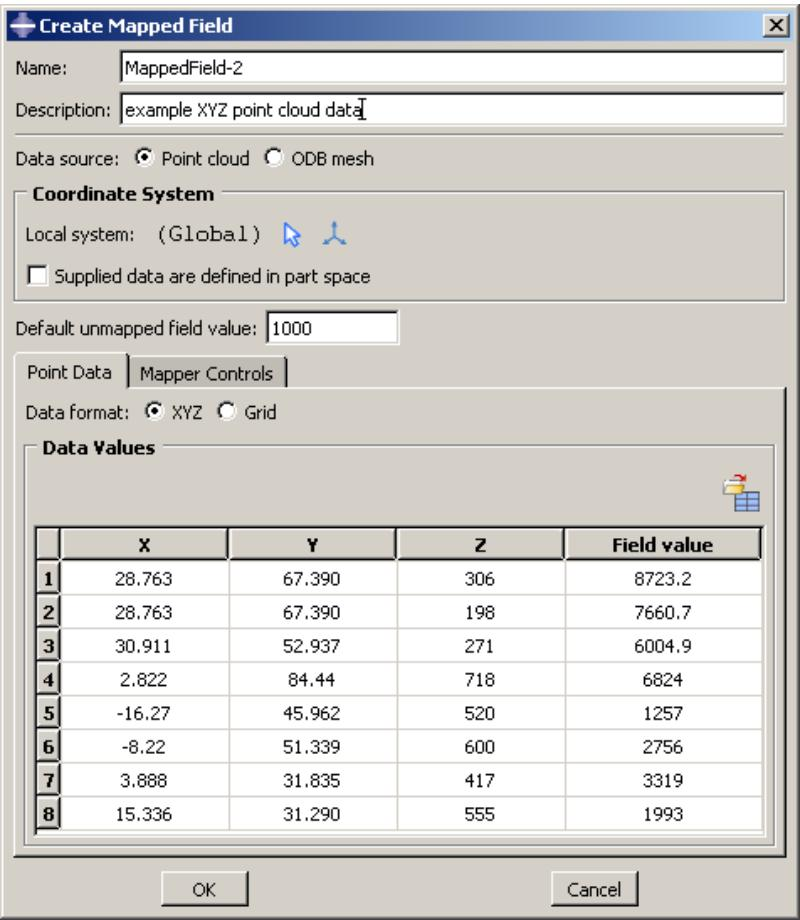

<details>
<summary>文本图像</summary>

创建映射字段
名称: MappedField-2
描述: XYZ 点云数据示例
数据源: 点云 ODB 网格
坐标系
局部系统: (全局) 提供的数据在部件空间中定义
默认未映射字段值: 1000
点数据映射器控制
数据格式: XYZ Grid
数据值
X Y Z 字段值
1 28.763 67.390 306 8723.2
2 28.763 67.390 198 7660.7
3 30.911 52.937 271 6004.9
4 2.822 84.44 718 6824
5 -16.27 45.962 520 1257
6 -8.22 51.339 600 2756
7 3.888 31.835 417 3319
8 15.336 31.290 555 1993
确定 取消
</details>

图 1：XYZ 格式的点云数据。

## Grid 格式

Grid 格式的点云数据文件定义三维网格点处的场值。对于直角坐标系，这是一个平面或立方体网格。图 1 展示了一个导入到编辑映射字段（Edit Mapped Field）对话框中的 Grid 格式点云数据的简单示例。


<details>
<summary>文本图像</summary>

编辑映射字段
名称: MappedField-1
描述: 平面网格数据格式示例
坐标系
局部系统: (全局)
提供的数据在部件空间中定义
坐标缩放因子
无 均匀 非均匀
默认未映射字段值: 0
点数据映射器控制
数据格式: XYZ Grid
场数据
网格平面: XY
Z
-1
-2
0
1
2
3
4
5
↓X Y→
1
9.32
9.98
11.2
12.9
15
2
9.01
9.38
10.2
11.7
13.6
3
8.39
8.46
8.1
7.41
7.09
4
8.07
8.73
7.88
7.39
6.21
5
7.55
7.55
7.28
7
6.66
确定 取消
</details>

图 1：Grid 格式的点云数据。

网格数据由一组文件组成，每个文件包含一个单一的平面。例如，您可以有一个用于 Z=3 平面的文件。该文件将包含一个 X 和 Y 坐标网格以及每个点处的场值；例如：

```csv
a, -2, -1, 0, 1, 2
-2, 0.146, 0.141, 0.139, 0.137, 0.131
-1, 0.141, 0.121, 0.116, 0.111, 0.100
 0, 0.139, 0.116, 0.105, 0.101, 0.094
 1, 0.133, 0.129, 0.122, 0.114, 0.107
 2, 0.128, 0.120, 0.111, 0.102, 0.090
```

在此文件中，X 坐标出现在第一（左侧）列，Y 坐标出现在第一（顶部）行，从第二个位置开始。第一个位置包含一个虚拟值，当您将文件导入到创建映射字段（Create Mapped Field）对话框的数据表中时，Abaqus/CAE 会忽略该值。在上面的示例文件中，虚拟值是字符 a；您可以在此位置使用任何值，因为它将被忽略。

网格数据文件每行中的值可以用空格、制表符或逗号的任意组合分隔；每个空格、制表符或逗号都被视为单个字段分隔符。

您的完整网格数据文件集必须包含每个平面的一个文件；例如，Z=0、Z=1、Z=2、Z=3 处的 X-Y 平面。也可以使用 Y-Z、X-Z、Y-X、Z-Y 和 Z-X 平面。您可以在创建映射字段（Create Mapped Field）对话框中选择不同的网格平面。

如果您的网格数据文件有任何缺失的场值，Abaqus/CAE 会进行插值以填补缺失的点；您无需在创建映射字段（Create Mapped Field）对话框中填写这些缺失值。

如果使用柱坐标系或球坐标系的局部坐标系，则必须在网格数据文件中给出相应的坐标；请参阅点云映射字段的坐标系。

## 点云映射字段的坐标系

映射字段使用全局坐标系或局部坐标的坐标来指示空间中的点。对于点云数据源，当映射数据坐标被解释并应用于特性、载荷、预定义场或相互作用时，可能涉及不同的坐标系。当使用参考柱坐标系或球坐标系的解析场值（网格格式的点云数据）来映射场变量时，Abaqus/CAE 会将柱坐标系或球坐标系中的值转换为笛卡尔坐标系中相应的离散值。

## 源数据局部坐标系

三维坐标和场值均在局部坐标系中定义。您可以在创建映射字段（Create Mapped Field）对话框中指定要使用的坐标系。这是一个装配体级别（非部件级别）的坐标系。

如果使用直角坐标系（默认），Abaqus/CAE 使用 X、Y 和 Z 坐标来解释源数据点。如果指定柱坐标系或球坐标系，Abaqus/CAE 将按照表 1 所示解释坐标。创建映射字段（Create Mapped Field）对话框的数据表中显示的列取决于您选择的局部坐标系类型。对于柱坐标系和球坐标系，Th 和 P 的值以度为单位输入，并在分析期间转换为范围在
以下是符合您要求的简体中文翻译：

---

to .

表 1：映射场的坐标系类型和坐标名称。

<table><tr><td>坐标系类型</td><td>坐标</td><td>数据表中显示的列</td></tr><tr><td>直角坐标系或全局坐标系（默认）</td><td>X-, Y-, 和 Z-轴</td><td>X, Y, Z</td></tr><tr><td>圆柱坐标系</td><td>R-, θ-, 和 Z-轴</td><td>R, Th, Z</td></tr><tr><td>球坐标系</td><td>R-, θ-, 和 φ-轴</td><td>R, Th, P</td></tr></table>

## 在部件空间中定义的源数据

您可以通过在 Create Mapped Field 对话框中勾选 **Supplied data are defined in part space** 来选择此选项。源数据及其局部坐标系均在目标模型区域的部件级坐标系中进行解释。

## 从输出数据库文件进行网格到网格映射

当数据源是 Abaqus 输出数据库（.odb）文件时，场输出变量值必须在视口中显示。此技术称为网格到网格映射（mesh-to-mesh mapping）。场输出变量值可以位于节点、单元质心或积分点处。在此类映射中，源数据的几何区域是网格连接数据，例如单元面或单元集。

要选择要使用的确切源数据，请打开所需的输出数据库文件，并在 Visualization（可视化）模块中显示未变形的轮廓图。您也可以使用变形图，但数据仍从未变形的网格映射。选择您希望映射的值的场输出变量、分析步和帧。当您在模型数据库（.cae）文件中的目标模型中创建新的映射场时，请指定显示的视口作为数据源。视口的当前状态将被视为要映射到目标模型上的一组值的快照；即，在分析的特定分析步和帧中显示的特定场输出变量。

例如，您可能会在以下工作流程中使用网格到网格映射：

1.  在 Abaqus 中设置并运行热分析，以生成包含节点温度（输出变量 NT）的输出数据库。
2.  在 Visualization（可视化）模块中打开输出数据库（.odb）文件，并在分析的 Step-3, Frame 0 处显示输出变量 NT。
3.  打开包含您的主目标模型的模型数据库（.cae）文件。在 Load（载荷）模块的主菜单栏中选择 **Tools->Analytical Field->Create**，以从节点温度值创建映射场。在 Create Mapped Field 对话框中，选择包含输出数据库的视口作为源数据。
4.  对您的主模型进行网格划分（或重新划分网格）。
5.  创建一个温度预定义场，并选择映射解析场来定义温度分布。Abaqus/CAE 将源数据点及其关联的温度映射到目标模型中的点上。
6.  设置并运行后续分析。

输出数据库网格上的源数据可以位于节点、积分点或整个单元处。支持非相似网格。

所选视口中的当前设置将用于映射。这些设置如下：
*   主场输出变量
*   分析步/增量
*   在 Result Options 对话框中选择的平均化选项
*   截面点（顶部或底部）
*   等等。

以下视口设置不支持用于网格到网格映射：
*   显示组
*   变换
*   在 Result Options 对话框中按单元集或显示组进行平均化
*   单元面数据
*   当前会话中的用户数据（但保存在输出数据库文件中的数据是受支持的）

当您从输出数据库数据创建映射场并关闭 Create Mapped Field 对话框时，源数据将保存到映射场对象中，但视口本身不会被保存。创建映射场后在视口中进行的任何更改都不会反映在映射数据中。使用网格到网格映射创建映射场后，您无法编辑源数据网格规范；您只能编辑现有映射场以更改默认字段值或映射器控制选项。

体积网格到网格映射只能使用节点温度和材料密度来执行。当映射目标是基于网格的节点区域时，您必须指定目标是表面还是体积区域。对于表面与体积区域，Abaqus/CAE 使用不同的映射算法。

## 映射支持的单元

映射场只能在使用受支持单元类型的模型网格中使用。支持最常用的单元，包括壳单元。

下面按代表性单元类型的拓扑结构（形状、节点数和积分点数）列出了受支持的单元类别。任何具有相同拓扑结构的类似单元都支持映射。支持的代表性单元如下：
*   S3, S4, S4R, S8R, STRI65
*   C3D4, C3D6, C3D8, C3D8R, C3D10, C3D15, C3D20, C3D20R
*   CPE3, CPE4, CPE6, CPE8
*   CAX3, CAX4, CAX6, CAX8

以下类别的单元不受支持，不能用于目标模型网格或输出数据库源网格：
*   表面单元
*   刚体单元
*   解析刚性面单元
*   内聚力单元
*   复合实体单元
*   连续壳单元
*   圆柱单元
*   欧拉单元
*   垫圈单元
*   内部单元
*   带扭转的单元
*   使用修正二次插值的单元

## 显示使用解析场的交互和规定条件的符号

当您将交互或规定条件应用于区域时，可以在视口中显示代表该交互或规定条件的符号。

默认情况下，使用解析场分布的交互和规定条件的符号会根据计算值进行缩放。对于箭头以外的符号，每个符号内部会显示一个加号 (+) 或减号 (−)，以指示该位置交互或规定条件的大小是正还是负。您可以使用 Assembly Display Options 对话框中的 Attribute display options 关闭符号缩放。有关更多信息，请参阅控制属性显示。

当解析场在其部分区域的计算值为零时，Abaqus/CAE 会为交互和规定条件显示缩小的符号。这些缩小的符号明显小于默认符号大小。有关更多信息，请参阅理解规定条件符号类型、颜色和大小。

## 本节内容：
*   表达式场显示符号详细信息
*   映射场显示符号详细信息

## 表达式场显示符号详细信息

在网格上用于符号显示的点与分析期间计算表达式场的位置重合。在几何上，当符号沿边缘或模型表面均匀分布时，Abaqus/CAE 会随机选择一组点用于符号显示。用于符号显示的点可能与计算表达式场的位置重合，也可能不重合。

在某些情况下，表达式场可能因错误（例如，除以零）而无法在给定点进行计算。当这种情况发生时，消息区会出现一条消息，指示计算表达式场时发生错误。作为指示存在错误的视觉提示，即使已打开基于表达式场值缩放符号的设置，视口中显示的符号也不会再进行缩放。您可以尝试通过更改符号密度设置来消除计算错误，这会提示 Abaqus/CAE 选择一组不同的点用于符号显示。有关更改符号密度设置的更多信息，请参阅控制属性显示。

## 映射场显示符号详细信息

要能够看到代表映射场的符号，您必须在应用载荷、交互或预定义场之前先对模型进行网格划分。

映射场上用于符号显示的点是分析中将使用的原生或孤立网格节点或单元。如果不存在原生网格，符号将不按比例显示。此外，如果由于错误（例如，不支持的单元类型或不正确的容差）导致映射失败，符号也将不按比例显示。

在这些情况下，消息区会出现一条消息，指示计算错误。作为指示存在错误的视觉提示，视口中显示的符号不再进行缩放，并显示在关闭缩放时它们应在的位置。您可以尝试通过重新划分网格或更改符号密度设置来修复映射，这会提示 Abaqus/CAE 选择一组不同的点用于符号显示。有关更改符号密度设置的更多信息，请参阅控制属性显示。
## 可视化映射源数据的符号显示

您可以将映射源数据与其所应用的载荷、相互作用或预定义场分开绘制。仅支持针对从XYZ格式点云数据创建的解析映射字段绘制源数据。

1. 从模型树中，展开**字段**容器和**解析字段**容器以显示映射字段对象。
2. 在映射字段对象上点击鼠标右键（鼠标按键3），并从出现的菜单中选择**绘制源数据**。

显示的符号代表源数据点的位置和相对大小（字段值）。大小使用彩虹色谱进行颜色编码，从红色（最大值）到蓝色（最小值），如图1所示。

  
图1：用于可视化映射源数据的颜色编码。

## 创建表达式字段

在**属性**模块、**相互作用**模块或**载荷**模块中，从主菜单栏选择**工具 -> 解析字段 -> 创建**，以使用表达式创建解析字段。使用数学表达式定义的解析字段称为表达式字段。

1. 使用以下任一方法打开**创建表达式字段**对话框：
    *   从主菜单栏，选择**工具 -> 解析字段 -> 创建**。


    *   **提示：** 您也可以在**解析字段管理器**中点击**创建**。
    *   在**相互作用**模块的相互作用编辑器中，点击**定义**或**发射率分布**字段旁边的 `f(x)`。
    *   在**载荷**模块的载荷或预定义场编辑器中，点击**分布**字段旁边的 `f(x)`。

2. 选择**表达式字段**作为**类型**，然后点击**继续**。
3. 在**名称**文本字段中，输入表达式字段的名称。有关命名对象的信息，请参阅使用基本对话框组件。
4. 在**描述**文本字段中，输入表达式字段的描述。
5. 如果要更改表达式字段的局部坐标系，请点击**编辑**并使用以下任一方法：
    *   在视口中选择一个现有的基准坐标系。
    *   按名称选择一个现有的基准坐标系。
        1. 从提示区中，点击**基准坐标系列表**以显示基准坐标系列表。
        2. 从列表中选择一个名称，然后点击**确定**。
    *   从提示区中点击**使用全局坐标系**以恢复为全局坐标系。

6. 在编辑器的表达式窗口中，使用以下操作的组合来构建您的表达式：
    *   从编辑器左侧的列表中选择一个参数名称。可用的参数名称取决于您选择的坐标系类型：
        *   **直角坐标：** X、Y 和 Z 分别是 X轴、Y轴 和 Z轴 上的值。
        *   **柱坐标：** R、Th 和 Z 分别是 R轴、θ轴 和 Z轴 上的值。
        *   **球坐标：** R、Th 和 P 分别是 R轴、θ轴 和 φ轴 上的值。
        参数名称将出现在表达式窗口中。
    *   从编辑器右侧的**运算符**列表中选择一个操作、函数或常数。更多信息，请参阅表达式中的操作和函数。
        所选的操作、函数或常数将出现在表达式窗口中。
    *   在表达式窗口中使用标准的鼠标和键盘编辑技术来定位光标和配置您的表达式。参数名称和运算符区分大小写。
    *   如有必要，请调整表达式的语法；可能需要括号。
    *   点击**清除表达式**以清除表达式窗口中的整个表达式。

7. 点击**确定**以创建表达式字段并退出编辑器。

## 其他信息

*   使用相互作用编辑器
*   使用载荷编辑器
*   使用边界条件编辑器
*   使用预定义场编辑器
*   解析字段工具集

## 创建映射字段

在**属性**模块、**相互作用**模块或**载荷**模块中，从主菜单栏选择**工具 -> 解析字段 -> 创建**，以创建解析映射字段。

从外部数据源定义的解析字段称为映射字段。外部数据源可以是点云数据文件或Abaqus输出数据库（.odb）文件。有关映射字段的概述，请参阅使用解析映射字段。

## 本节内容：

*   从点云数据创建映射字段
*   从输出数据库网格数据创建映射字段
*   映射字段的搜索控制

## 从点云数据创建映射字段

您可以通过读取由第三方CAE应用程序生成的点云数据文件中的参数值来创建映射字段。在使用以下过程创建映射字段之前，您必须准备好点云数据文件以便导入。

1. 使用以下任一方法打开**创建映射字段**对话框：
    *   从主菜单栏，选择**工具 -> 解析字段 -> 创建**。


    *   **提示：** 您也可以在**解析字段管理器**中点击**创建**。
    *   在**相互作用**模块的相互作用编辑器中，点击**定义**或**发射率分布**字段旁边的 `f(x)`。
    *   在**载荷**模块的载荷或预定义场编辑器中，点击**分布**字段旁边的 `f(x)`。

2. 选择**映射字段**作为**类型**，然后点击**继续**。
3. 在**名称**文本字段中，输入映射字段的名称。有关命名对象的信息，请参阅使用基本对话框组件。在**描述**文本字段中，输入映射字段的描述。
4. 选择**点云**作为**数据源**，以导入您从其他CAE应用程序生成的点云数据文件。这些文件必须包含您的字段值和坐标，格式为XYZ格式或Grid格式，如用于映射的点云数据文件格式中所述。
5. 对于点云数据源，您可以选择为源数据区域指定一个局部坐标系，以简化点在空间中的三维定义。点击并使用以下任一方法：
    *   在视口中选择一个现有的基准坐标系。
    *   按名称选择一个现有的基准坐标系。
        1. 从提示区中，点击**基准坐标系列表**以显示基准坐标系列表。
        2. 从列表中选择一个名称，然后点击**确定**。
    *   从提示区中点击**使用全局坐标系**以恢复为全局坐标系。
    *   点击以创建一个新的基准坐标系。

    当您指定一个局部坐标系时，源数据坐标将在该坐标系中定义，该坐标系是装配体级（而非部件级）坐标系。更多信息，请参阅点云映射字段的坐标系。

6. 如果需要，切换开启**提供的数据在部件空间中定义**，以指示源数据及其局部坐标系都在目标模型区域的部件级坐标系中定义。
7. 如果需要，选择以下任一选项以输入**比例因子**并缩放源数据坐标；例如，以处理单位不匹配（即米到毫米）：
    *   选择**均匀**，并输入一个单一的比例因子。
    *   选择**非均匀**，并分别为X、Y和Z坐标输入比例因子。

8. 输入**默认未映射字段值**的值，或接受默认值零。Abaqus/CAE将在任何无法从中找到源点进行映射的目标点处分配此值。请参阅映射字段的搜索控制。
9. 在**点数据**选项卡页上，选择以下数据格式之一：
    *   如果您的数据文件包含直角坐标X、Y和Z以及对应的字段值，请选择**XYZ**。有关此格式的详细信息，请参阅XYZ格式。点击以浏览并选择要导入的数据文件。有关从文件读取数据的更多信息，请参阅输入表格数据。

        如果您的局部坐标系是柱坐标或球坐标而不是直角坐标，Abaqus/CAE期望您的数据文件包含相应的坐标类型。请参阅点云映射字段的坐标系。

    *   如果您的数据文件包含在三维点网格中定义的字段值，请选择**Grid**。有关此格式的详细信息，请参阅Grid格式。

        在**字段数据**表中，指定平面，然后按如下方式导入字段值：
        1.  选择数据组织所在的网格平面，例如直角坐标系中的XY、YZ、XZ、YX、ZY或ZX。
        2.  点击 $^ +$ 在左侧框架中添加一个平面。输入平面高度，点击**确定**，然后在表中输入字段值或点击从文件导入。例如，在Z=2处添加一个平面，然后导入该平面内不同X和Y坐标处的字段值。
        3.  对于同一网格平面内的其他平面高度重复此操作；例如，在Z=3、Z=4等处。您可以在**数据值**表中使用以下编辑工具：

<table><tr><td></td><td>添加平面</td></tr><tr><td></td><td>编辑平面</td></tr><tr><td>[AWGW]</td><td>复制平面</td></tr><tr><td></td><td>删除平面</td></tr></table>
有关从文件读取数据的更多信息，请参见输入表格数据。

10. 在“映射器控制”选项卡页面上，您可以调整搜索容差参数。请参见映射字段的搜索控制。
11. 单击“确定”以创建映射字段并关闭对话框。

当您稍后使用映射字段施加载荷、交互或预定义字段时，您可以在视口中显示符号以可视化字段值的位置和幅度。但是，您必须先对模型进行网格划分才能看到这些符号。

## 附加信息

- 使用交互编辑器
- 使用载荷编辑器
- 使用边界条件编辑器

- 分析场工具集

您可以通过从 Abaqus 输出数据库 (.odb) 文件中读取参数值来创建映射字段。当映射数据源是 Abaqus 输出数据库时，字段值必须在可视化模块中显示为云图。有关网格到网格映射的概述，请参见从输出数据库文件进行网格到网格映射。

1. 从输出数据库创建映射字段时，您必须同时在不同的视口中打开并显示两个文件：
   - 包含您的主要目标模型用于映射的模型数据库 (.cae) 文件，以及
   - 包含先前在相同（或类似）模型上运行的分析中的场输出变量数据的输出数据库 (.odb) 文件。

2. 选择要使用的源数据。
   a. 在“可视化”模块中，打开包含源数据的输出数据库文件。
   b. 在一个视口中显示未变形的云图。您也可以使用变形图，但数据仍然是从未变形的网格中读取的。
   c. 选择您想要映射的数值的场输出变量，位于分析的特定步骤和帧。有关云图的详细信息，请参见生成云图。

3. 在包含主要（目标）模型的模型数据库中，使用以下方法之一打开“创建映射字段”对话框：
   - 从主菜单栏中，选择“工具”->“分析场”->“创建”。


## 提示：您也可以在“分析场管理器”中单击“创建”。

- 在“交互”模块的交互编辑器中，单击“定义”或“发射率分布”字段旁的 $f ( x )$。
- 在“载荷”模块的载荷、边界条件或预定义字段编辑器中，单击“分布”字段旁的 $f ( x )$。

4. 选择“映射字段”作为“类型”，然后单击“继续”。

5. 在“名称”文本字段中，输入映射字段的名称。有关命名对象的信息，请参见使用基本对话框组件。在“描述”文本字段中，输入映射字段的描述。

6. 选择“ODB 网格”作为“数据源”。

7. 如果需要，选择以下选项之一以输入“比例因子”并缩放源数据坐标；例如，以解决单位不匹配问题（即米到毫米）：
   - 选择“均匀”，并输入单个比例因子。
   - 选择“非均匀”，并为 X、Y 和 Z 坐标分别输入比例因子。

8. 为“默认未映射字段值”输入一个值，或接受默认值零。对于任何目标点，如果 Abaqus/CAE 找不到用于映射的源点，它将分配此值。请参见映射字段的搜索控制。

9. 在“ODB 网格数据”选项卡页面上，从打开的视口列表中选择要映射的“视口”。

   Abaqus/CAE 使用所选视口的当前绘图状态作为要映射到模型数据库 (.cae) 文件中目标模型的值集；即在分析的特定步骤和帧中显示的特定场输出变量。

10. 在“映射器控制”选项卡页面上，您可以调整搜索容差参数。请参见映射字段的搜索控制。
11. 单击“确定”以创建映射字段并关闭对话框。

使用网格到网格映射创建映射字段后，您无法编辑源数据网格规范；您只能编辑现有映射字段以更改默认字段值或映射器控制。

当您稍后使用映射字段施加载荷、交互或预定义字段时，您可以在视口中显示符号以可视化字段值的位置和幅度。但是，您必须先对模型进行网格划分才能看到这些符号。

## 附加信息

- 使用交互编辑器
- 使用载荷编辑器
- 使用边界条件编辑器
- 分析场工具集

## 映射字段的搜索控制

在“创建映射字段”对话框的“映射器控制”选项卡页面上，您可以调整搜索容差参数。对于点云数据源与输出数据库网格源，搜索控制略有不同。

Abaqus/CAE 尝试将您的所有源数据点及其关联的字段值映射到目标模型中的点。根据每个源点与网格化模型目标上最近节点的距离远近，Abaqus/CAE 必须决定是使用还是丢弃每个源点。这些决策基于您在“映射器控制”选项卡页面上选择的搜索容差距离值。

## 点云映射字段的搜索控制

正法向和负法向容差值定义了源数据点可以偏离目标模型外表面多远。目标模型表面是在未变形的有限元模型中进行插值的。默认情况下，每个源数据点必须位于通过将目标模型中的平均单元特征尺寸乘以 0.05 计算出的距离内。该距离是沿目标表面的正法向量测量的（参见图 1）。


<details>
<summary>text_image</summary>
源数据点
正法向
表面法线
负法向
表面法线
目标表面
</details>

图 1：正法向搜索距离。

您可以更改容差距离值以控制哪些源数据点将被包括或忽略。您可以将容差值定义为网格化模型中平均单元尺寸的相对分数，或定义为以模型中使用的长度单位测量的绝对距离。

对于任何 Abaqus/CAE 无法映射源点的目标点，它将替换在“创建映射字段”对话框中输入的“默认未映射字段值”。默认值为零。默认字段值适用于点云数据源和输出数据库网格源。

对于点云数据源，“映射器控制”选项卡页面上提供以下选项和搜索容差值：

## 容差类型

如果您选择“相对”（默认），则容差值被解释为网格化模型中平均单元特征尺寸的一个分数（不是百分比）。如果您选择“绝对”，则容差值被视为以模型中使用的长度单位测量的精确距离。

## 正法向搜索距离容差

在此距离内（沿目标表面基础几何体的正法向量测量）的任何源点都将被映射并包括在分析中（参见图 1）。此容差仅适用于表面（非体积）目标映射。默认值为网格化模型中平均单元特征尺寸的 0.05。

## 负法向搜索距离容差

在此距离内（沿目标表面基础几何体的负法向量测量）的任何源点都将被映射并包括在分析中。此容差仅适用于表面（非体积）目标映射。默认值为网格化模型中平均单元特征尺寸的 0.15。

## 邻域搜索距离容差

位于邻域搜索容差之外的任何源数据点将被忽略并且不用于分析。此容差适用于表面和体积目标映射。

Abaqus/CAE 使用距离加权算法在网格化目标模型上插值场数据值。Abaqus/CAE 总是尝试在目标上插值源值。如果 Abaqus/CAE 找到任何无法进行插值的点，则会使用距离加权算法，该算法将采用邻域搜索距离内的节点。距离加权不考虑任何其他现有容差（正/负法向搜索容差或边界搜索容差）。您可以通过使用非常小的邻域搜索距离来停用距离加权，在这种情况下，Abaqus/CAE 在这些节点上应用“默认未映射字段值”。

在尝试将源点映射到目标点时，Abaqus/CAE 会进行三次遍历。Abaqus/CAE：

1. 尝试在目标上插值字段值。第一次遍历时忽略邻域搜索容差。
2. 使用距离加权算法采用邻域搜索容差内的源点。
3. 对于任何未映射的目标点，Abaqus/CAE 将应用默认的未映射字段值。

## 输出数据库字段的搜索控制

法向容差值定义了源数据点可以偏离目标模型外表面的距离。默认情况下，每个源数据点必须位于一个距离内，该距离通过目标模型的平均单元特征尺寸乘以 0.05 计算得出。此距离沿目标表面的法向矢量测量。容差值被解释为网格模型中平均单元特征尺寸的一个分数（而非百分比）。

您可以更改默认容差值，以确定哪些源数据点将被包含或丢弃。

对于任何 Abaqus/CAE 无法映射源点的目标点，它将替换在创建映射字段对话框中输入的默认未映射字段值。默认值为零。此默认字段值同时应用于点云数据源和输出数据库网格源。

对于输出数据库源，在映射器控制选项卡页面上提供以下选项和搜索容差值：

## 法向搜索距离容差

任何在此距离内的源点，沿目标表面基础几何体的正法向矢量测量，都将被映射并包含在分析中。此容差适用于表面和体积目标映射。默认值为网格模型中平均单元特征尺寸的 0.05 倍。

## 边界搜索距离容差

此容差指定了源数据点必须位于的平面内距离，该距离位于网格化目标模型单元区域之外（见图 2）。将此容差从默认值 0.01（平均单元尺寸的倍数）增加，实际上允许您为了映射目的扩展每个目标单元面。当源数据是比目标模型网格更粗糙的网格时，增加此容差可能有所帮助。

当字段值映射到目标模型时，会进行插值。边界搜索容差同时适用于表面映射和体积映射。

源数据点的插值表面  
要映射到的目标网格表面  
源数据点  
目标网格中的节点

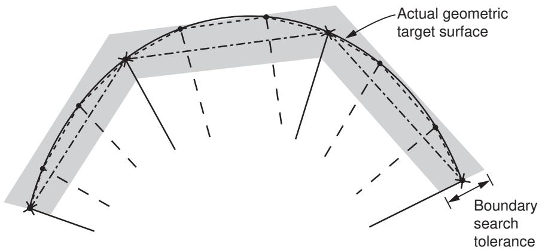

<details>
<summary>text_image</summary>

实际的几何目标表面  
边界搜索容差
</details>

图 2: 边界搜索距离。

## 体积到表面的映射控制

创建映射字段对话框的映射器控制选项卡页面包含“目标表面的映射算法”选项，该选项允许您选择“表面”或“体积”映射。

您的目标区域必须是三种类型之一：体、表面或网格中的一组节点。如果目标是体，Abaqus/CAE 始终执行体积映射。然而，如果目标是表面或一组节点，您必须选择希望 Abaqus/CAE 用于应用源数据的算法。选择“表面”会使 Abaqus/CAE 使用表面投影算法，将源数据投影到目标表面形心或节点。选择“体积”会使 Abaqus/CAE 使用体积插值算法，将源数据插值到目标单元形心或节点。这两种算法的区别仅在于来自源体积的字段值如何应用到目标表面。

为了映射算法的目的，目标表面或体积在 Abaqus/CAE 的几何模型或网格上下文中定义：

*   几何模型中的体是三维实体单元
*   网格中的体由单元组成
*   三维几何模型中的表面是几何面
*   网格中的“表面”由单元面组成

您对表面与体积算法的选择也适用于当您映射到节点且目标节点由节点集（基于网格）定义时。但是，如果目标节点由模型几何体定义，Abaqus/CAE 对几何面始终使用表面映射，对几何体使用体积映射。

目标区域是您在主模型中应用载荷、相互作用、边界条件或预定义场的位置。如果您在两个不同的属性中应用相同的映射字段源，当目标区域类型不同时，它们可能表现出不同的行为。

点云数据源的体积到表面控制

表 1 描述了 Abaqus/CAE 对点云数据源执行体积或表面映射的情况，以及您何时必须在两者之间做出选择。

表 1: 点云数据源的体积与表面映射案例。

<table><tr><td rowspan="2">点云数据源</td><td colspan="3">目标区域类型</td></tr><tr><td>几何体（三维单元或节点）</td><td>壳或表面/面¹</td><td>节点集</td></tr><tr><td>点云数据</td><td>体积</td><td>体积或表面</td><td>体积或表面</td></tr><tr><td colspan="4"> $^{1}$  为了映射算法的目的，表面可以是三维单元的一个面。</td></tr></table>

输出数据库源的体积到表面控制

表 2 描述了 Abaqus/CAE 对输出数据库源执行体积或表面映射的情况，以及您何时必须在两者之间做出选择。

表 2: 输出数据库源的体积与表面映射案例。

<table><tr><td rowspan="2">输出数据库源</td><td colspan="3">目标区域类型</td></tr><tr><td>几何体（三维单元或节点）</td><td>壳或表面/面¹</td><td>节点集</td></tr><tr><td>节点数据</td><td>体积</td><td>体积或表面</td><td>体积或表面</td></tr><tr><td>基于单元的数据²</td><td>体积</td><td>体积或表面</td><td>体积或表面</td></tr><tr><td>基于表面的数据</td><td>不适用（错误）</td><td>表面</td><td>表面</td></tr><tr><td colspan="4"> $^{1}$  为了映射算法的目的，表面可以是三维单元的一个面。</td></tr><tr><td colspan="4"> $^{2}$  可视化模块中的输出数据库平均控制会影响基于单元的源数据的连续性。</td></tr></table>

如果目标区域是壳或表面，体积算法将整个源体积（在输出数据库中）的字段值插值到目标表面区域。或者，表面算法仅将来自源体积表面的字段值投影到目标表面区域。

当目标表面可以引用三维单元面时，表面算法将输出数据库源数据投影到目标表面形心或节点。体积算法将源数据插值到目标单元形心或节点。

附件工具集允许您创建附着点和附着线，可用于定义模型中的紧固件和其他组件。

附件工具集在部件、属性、装配和相互作用模块中可用。本章描述附件工具集以及使用该工具集创建的编辑功能。

## 本节内容：

理解附着点和线  
理解投影方法  
通过拾取或从文件读取创建附着点  
通过选择方向和间距创建附着点  
基于边创建附着点图案  
通过投影点创建附着线  
编辑附着点和线  
移除附着点和线

## 理解附着点和线

您使用附件工具集向模型添加附着点和线。您使用附着点来定义基于点的紧固件、惯性、弹簧、阻尼器、载荷或边界条件，或连接器定义中的连接器点；并使用附着线来定义离散紧固件。紧固件模拟点对点连接（例如点焊、铆钉和螺栓），并在关于紧固件中描述。您可以在装配体或部件上创建附着点。您只能在装配体上创建附着线。

您可以通过从主菜单栏选择“工具”->“附件”并选择一个可用的菜单选项来使用附件工具集创建附着点和线。在相互作用模块中，您可以使用模块工具箱中的工具来创建附着点和线。三个附着点工具也可以在属性模块和部件模块的工具箱中找到。附件工具集提供以下工具来创建附着点：

## + 通过拾取或从文件读取创建附着点

此工具允许您通过从视口拾取每个点或从文件读取点的坐标来创建附着点。有关详细说明，请参阅通过拾取或从文件读取创建附着点。
## 通过选择方向和间距创建附着点

此工具允许您通过定义一条直线并指定沿直线的点数量或沿直线的点间距来创建附着点。详细说明，请参阅通过选择方向和间距创建附着点。

## 通过选择边和偏移创建附着点

此工具允许您通过选择单条边或多条相连的边，然后定义图案参数，在边上、面上或沿方向上创建简单的附着点图案。详细说明，请参阅基于边创建附着点图案。

如果需要，可以将点移动到指定面上，如理解投影方法中所述。

附着工具集提供以下工具用于创建附着线：

## 通过投影点创建附着线

此工具允许您通过指定点然后将其投影穿过多个面来创建附着线。附着线连接一个或多个面。您只能在装配体上创建附着线；不能在零件上创建附着线。创建附着线是一个三步过程：

1.  选择要投影的点。
2.  将点沿表面法线方向或沿指定方向投影到源面上。
3.  从投影点与源面的交点处，将附着线沿源面法线方向投影到目标面上，投影距离为指定值。

详细说明，请参阅通过投影点创建附着线。

附着点和线是特征，当您更改模型时（例如，在添加切割特征之后）它们会重新生成。重新生成可能会影响附着点和线的投影，并改变附着特征创建的紧固点和线的总数。此外，包含附着件的集合也可能受到影响。因此，在更改模型后，您应确认您的附着点和线按预期工作。您还应检查已应用于附着点和线的所有规定条件（例如载荷和边界条件）是否未发生改变。

## 理解投影方法

附着工具集提供三个用于创建附着点的工具。这些工具提供了便捷的点生成方法，例如沿边读取、从文件中读取每个点的坐标，或沿直线对点进行等距分布。但在某些情况下，在某个位置定义附着点然后将其投影到所需面上可能更容易。因此，Abaqus/CAE 提供投影选项作为在面上定位附着点的一种方法。

附着工具集提供以下技术，通过将点投影到所需面上来创建附着点：

• 将每个点投影到其最近的面上。
选择投影向量的起点和终点。Abaqus/CAE 沿向量投影每个点，并在该点首次与面相交处创建附着点。

图 1 展示了将点投影到选定面上的两种技术。


<details>
<summary>流程图</summary>


```mermaid
graph LR
  A["投影到最近的面"] --> B["选定的点"]
  B --> C["附着点"]
  C --> D["沿指定方向投影"]
```
</details>

图 1：将点投影到选定面上。

有关紧固件如何使用附着点的更多信息，请参阅关于紧固件。

## 附加信息

• 理解附着点和线
• 关于紧固件

## 通过拾取或从文件读取创建附着点

您可以通过从视口拾取每个点或从文件读取点的坐标来定位附着点。如果需要，可以通过将指定的点投影到选定面上来创建附着点。您可以使用附着点来定义基于点的紧固件的位置。有关更多信息，请参阅关于紧固件。

1.  从主菜单栏中，选择 Tools->Attachment->Points From File/By Picking。

    Abaqus/CAE 显示“创建附着点”对话框。

    

    提示：您也可以使用位于 Interaction 模块工具箱或 Property 模块工具箱中的附着工具区域的 + 工具，通过拾取或从文件读取来创建附着点。有关工具箱中附着工具的示意图，请参阅理解附着点和线。

2.  在对话框中，使用以下方法之一在表格中输入每个附着点的坐标：

    选择从视口中的零件或装配体上拾取一个点。您可以从零件中选择任何现有点，包括顶点、基准点、特征点、参考点和孤立网格节点。您也可以在提示区域出现的文本字段中输入点的 X、Y 和 Z 坐标。
    • 点击读取一个包含每个点的 X、Y 和 Z 坐标的 ASCII 文件。
    点击从表格中删除选定的行。

    有关更多信息，请参阅输入表格数据。

    如果附着点是在零件上创建的，则您提供的坐标相对于零件的坐标系。如果附着点是在装配体上创建的，则坐标相对于装配体的全局坐标系。

3.  要将指定的点投影到选定的面上，请显示“投影”选项卡页，并执行以下操作：

    a.  打开 Project onto faces 开关。

    b.  点击 ，并选择将要投影到的面。这些面可以是平面或非平面。

    c.  选择投影点的方法。

        选择 Proximity 以允许 Abaqus/CAE 从每个点向选定面上最近的点绘制向量。

        选择 Direction 以定义用于投影点的向量。点击 以选择向量的起点和终点。

    有关更多信息，请参阅理解投影方法。

4.  默认情况下，Abaqus/CAE 会创建一个包含这些附着点的集合。如果需要，您可以修改集合名称。如果您不想创建包含附着点的集合，请关闭 Create set with name 开关。

5.  点击 OK 以创建附着点。

    Abaqus/CAE 显示附着点。您不能修改附着点；必须删除点并创建新点。

## 附加信息

• 理解附着点和线
• 关于紧固件

## 通过选择方向和间距创建附着点

您可以通过选择一个起点和一个方向并指定点的间距来定位附着点。如果需要，可以通过将指定的点投影到选定面上来创建附着点。您可以使用附着点来定义基于点的紧固件的位置。有关更多信息，请参阅关于紧固件。

1.  从主菜单栏中，选择 Tools->Attachment->Points Along Direction。

    

    提示：您也可以使用位于 Interaction 模块工具箱或 Property 模块工具箱中的附着工具区域的 工具，通过选择方向和间距来创建附着点。有关工具箱中附着工具的示意图，请参阅理解附着点和线。

2.  从当前视口中，选择一个代表起点的点。您也可以在提示区域出现的文本字段中输入点的 X、Y 和 Z 坐标。

    Abaqus/CAE 显示“沿方向创建附着点”对话框。

3.  在对话框中，使用以下任一方法选择指定点创建方向的方法：

    • 选择 End point 并点击 以选择一个指定方向向量终点的点。
    • 选择 Straight line 并点击 以选择一条指定方向向量的直线。

4.  执行以下任一操作以指定沿方向向量的点间距：

    选择 Number of points between start and end points，并输入所需的点数。（此选项仅当您选择终点来指定方向向量时可用。）

    • 选择 Spacing，并输入每个附着点之间的距离。

    执行以下任一操作以指定要创建的点数：

    选择 Number of points along direction，并输入所需的点数。附着点可以延伸到方向向量终点之外。点击 可以反转方向向量。

    选择 Auto-fit points between start and end points 以允许 Abaqus/CAE 确定在指定间距下，起点和终点之间可以创建多少个点。
5. 默认情况下，Abaqus/CAE 会在方向向量的两端创建额外的附着点。如果需要，可关闭“在起点处”和/或“在终点处”选项，以防止 Abaqus/CAE 创建这些额外的点。

6. 要将指定点投影到选定面上，请显示“投影”选项卡页面，并执行以下操作：

a. 勾选“投影到面上”。

b. 点击 $\ Q$ ，并选择要将点投影到其上的面。这些面可以是平面或非平面。

c. 选择投影点的方法。

选择“接近”（Proximity），允许 Abaqus/CAE 从每个点向选定面上的最近点绘制一条向量。

• 选择“方向”（Direction）以定义投影点所沿的向量。点击以选择向量的“起点”和“终点”。

更多信息，请参见理解投影方法。

7. 默认情况下，Abaqus/CAE 会创建一个包含这些附着点的集合。如果需要，您可以修改集合名称。如果您不想创建包含附着点的集合，请关闭“创建名为...的集合”（Create set with name）选项。
8. 点击“确定”（OK）以创建附着点。Abaqus/CAE 会显示这些附着点。有关编辑附着点的信息，请参见编辑通过选择方向和间距创建的附着点。

## 附加信息

• 理解附着点与附着线
• 关于紧固件

## 基于边创建附着点阵列

您可以沿单个边或相连的边，以简单的阵列形式放置附着点。然后，您可以在相邻的面上或沿指定方向，以行阵列的形式放置这些点。如果需要，您可以将指定的点投影到选定面上。您可以使用这些附着点来定义基于点的紧固件的位置。更多信息，请参见关于紧固件。

1. 从主菜单栏，选择“工具”->“附着”->“基于边偏移的点”（Tools->Attachment->Points Offset From Edges）。


提示：您也可以使用位于“属性”（Property）模块或“相互作用”（Interaction）模块工具箱中附着工具旁的工具，通过选择边和偏移来创建附着点。有关工具箱中附着工具的更多信息，请参见理解附着点与附着线。

2. 从当前视口中，选择要分配附着点的边。只要这些边是相连且不分支的，您可以选择多条边。您可以点击提示区右侧的“集合”（Sets）按钮，以使用先前定义的集合。

如果边的选择形成了一个封闭环，请从视口中选择生成点的起始顶点。

会出现一个红色箭头，指示从起点生成点的方向。

3. 在提示区，如有必要，点击“翻转”（Flip）以反转点生成的方向，然后点击“是”（Yes）。

Abaqus/CAE 将显示“基于边偏移创建附着点”（Create Attachment Points Offset From Edges）对话框。

4. 在对话框中，指定沿边的点。

• 选择“按数量”（Select by number），以定义沿选定边的附着点数量。Abaqus/CAE 会自动沿边对这些点进行间距布置。

1. 输入沿边的点的数量。
2. 输入第一个附着点距起点的理想偏移。
3. 输入最后一个附着点距终点的理想偏移。

• 选择“按间距”（Select by spacing），以定义附着点之间的距离。

1. 输入点之间的间距。
2. 输入第一个附着点距起点的理想偏移。
3. 指定沿边的点的数量，或选择“自动调整”（Auto-fit）让 Abaqus/CAE 确定附着点的数量。如果您指定了点的数量，Abaqus/CAE 将只创建起点和终点之间的点；任何超出终点的点都不会被创建。

5. 如果需要，通过指定以下内容来定义附着点的行阵列模式：

• 输入阵列中的行数。默认值 1 将创建单行附着点。
• 输入一个间距值，以定义阵列各行之间的距离。
• 输入阵列第一行距边的偏移距离。默认值 0 将把阵列的第一行创建在边上。

• 选择“正交于面”（Orthogonal to faces）作为偏移方法，并点击以选择一个相邻面，将阵列放置在该面上。
• 选择“沿方向”（Along direction）作为偏移方法，并点击以指定方向向量的起点和终点。

6. 要将指定点投影到选定面上，请显示“投影”选项卡页面并执行以下操作：

a. 勾选“投影到面上”。

b. 点击，并选择要将点投影到其上的面。这些面可以是平面或非平面。

c. 选择投影点的方法。

选择“接近”（Proximity），允许 Abaqus/CAE 从每个点向选定面上的最近点绘制一条向量。
选择“方向”（Direction）以定义投影点所沿的向量。点击以选择向量的“起点”和“终点”。

更多信息，请参见理解投影方法。

7. 默认情况下，Abaqus/CAE 会创建一个包含附着点的集合。如果需要，您可以修改集合名称。如果您不想创建包含附着点的集合，请关闭“创建名为...的集合”（Create set with name）选项。
8. 点击“确定”（OK）以创建附着点。

Abaqus/CAE 会显示这些附着点。有关编辑附着点的信息，请参见编辑通过基于边的阵列创建的附着点。

## 附加信息

• 理解附着点与附着线
• 关于紧固件

## 通过投影点创建附着线

放置附着线是一个三步过程：

1. 选择要投影的点。
2. 将这些点沿指定方向投影到源面上。
3. 从投影点与源面的交点出发，沿源面的法线方向，将附着线投影到目标面上，投影距离为指定距离或投影到指定数量的目标面。

您可以使用附着线来定义离散紧固件的位置。更多信息，请参见关于紧固件。

1. 从主菜单栏，选择“工具”->“附着”->“通过投影点创建线”（Tools->Attachment->Lines by Projecting Points）。


提示：您也可以使用位于“相互作用”（Interaction）模块工具箱中附着工具旁的工具，通过投影点来创建附着线。有关工具箱中附着工具的图示，请参见理解附着点与附着线。

2. 从当前视口中，选择要投影的点，并在提示区点击“完成”（Done）。您可以选择顶点、参考点或附着点。
3. 从当前视口中，选择要将点投影到其上的源面，并在提示区点击“完成”（Done）。附着线起始于方向向量与源面相交的地方。
4. 从当前视口中，选择将被附着线相交的目标面，并在提示区点击“完成”（Done）。附着线从起点沿源面的法线方向绘制，并终止于最远的目标面。

Abaqus/CAE 将显示“通过投影点创建附着线”（Create Attachment Lines By Projecting Points）对话框。如果需要，您可以使用该对话框编辑点以及源面和目标面。

5. 在对话框中，选择投影点的方法：

选择“接近”（Proximity），允许 Abaqus/CAE 从每个点向选定面上的最近点绘制一条向量。
选择“方向”（Direction）以定义投影点所沿的向量。点击以选择向量的“起点”和“终点”。

6. 要更改目标面，请显示“目标”（Target）选项卡页面，并执行以下操作：

a. Abaqus/CAE 会显示一个箭头，指示源面上的点将投影到目标面的方向。点击以反转箭头的方向。

b. 选择确定投影向量长度的方法：

• 选择“沿方向最大投影”（Maximum projections along direction），并输入附着线将相交的目标面的最大数量。
• 选择“投影向量最大长度”（Maximum length of projection vector），并输入附着线的最大长度。

7. 默认情况下，Abaqus/CAE 会创建一个包含附着线端点的集合。如果需要，您可以修改集合名称。如果您不想创建包含端点的集合，请关闭“创建名为...的集合”（Create set with name）选项。

8. 点击“确定”（OK）以创建附着线。

Abaqus/CAE 会显示这些附着线。有关编辑附着线的信息，请参见编辑通过投影点创建的附着线。

## 附加信息

• 理解附着点与附着线
• 关于紧固件

## 编辑附着点与附着线

您可以编辑通过选择方向和间距创建的附着点、通过沿边或偏移于边阵列创建的附着点，以及通过投影点创建的附着线的多个参数。
您无法编辑通过拾取或从文件读取创建的附件点。在零件（Part）模块或特性（Property）模块中创建的附件特征只能在这两个模块中进行编辑；在装配（Assembly）模块或相互作用（Interaction）模块中创建的附件特征只能在这两个模块中进行编辑。默认情况下，当编辑过程结束时，Abaqus/CAE 会重新生成模型。

## 本节内容：

编辑通过选择方向和间距创建的附件点  
编辑基于边创建的图案附件点  
编辑通过投影点创建的附件线

## 编辑通过选择方向和间距创建的附件点

您可以编辑通过选择方向和间距创建的附件点。

1. 从主菜单栏，选择 特征（Feature）-> 编辑（Edit）。


提示：您也可以通过点击模块工具箱中的工具来编辑特征。

2. 选择要修改的附件点特征。您可以从当前视口或从模型树（Model Tree）中直接选择该特征。
   此时将出现“编辑沿方向的附件点特征”（Edit Attachment Points Along Direction Feature）对话框。

3. 选择指定点沿方向向量间距的方法：
   • 选择“起始点与结束点之间的点数”（Number of points between start and end points），并输入所需的点数。（仅当您选择了一个终点来指定方向向量时，此选项才可用。）
   • 选择“间距”（Spacing），并输入每个附件点之间的距离。

执行以下任一操作来指定要创建的点数：
   • 选择“沿方向的点数”（Number of points along direction），并输入所需的点数。附件点可以延伸到方向向量的终点之外。
   • 选择“在起始点和终点之间自动拟合点”（Auto-fit points between start and end points），允许 Abaqus/CAE 根据指定的间距确定可在起始点和终点之间创建的点数。（仅当您选择了一个终点来指定方向向量时，此选项才可用。）

4. 切换“在起始点处”（At start point）和/或“在终点处”（At end point）选项，以在起始点和终点添加或移除附件点。“在终点处”选项仅当您选择了终点来指定方向向量时才可用。
5. 如果需要，切换“确定时重新生成”（Regenerate on OK）以控制编辑过程结束时的模型重新生成。

## 附加信息

• 理解附件点和线  
• 关于紧固件

您可以编辑基于边创建的图案附件点。

1. 从主菜单栏，选择 特征（Feature）-> 编辑（Edit）。


提示：您也可以通过点击模块工具箱中的工具来编辑特征。

2. 选择要修改的附件点特征。您可以从当前视口或从模型树（Model Tree）中直接选择该特征。
   此时将出现“编辑基于边偏移的附件点特征”（Edit Attachment Points Offset From Edges Feature）对话框。

3. 执行以下任一操作来指定沿边的点：
   • 选择“按数量”（Select by number）以定义沿所选边的附件点数量。Abaqus/CAE 会自动沿边对这些点进行间隔。
     1. 输入沿边的点数。
     2. 输入第一个附件点距离起始点的所需偏移量。
     3. 输入最后一个附件点距离终点的所需偏移量。

   • 选择“按间距”（Select by spacing）以定义附件点之间的距离。
     1. 输入点之间的间距。
     2. 输入第一个附件点距离起始点的所需偏移量。
     3. 指定沿边的点数，或选择“自动拟合”（Auto-fit）让 Abaqus/CAE 确定附件点的数量。如果您指定了点数，Abaqus/CAE 将仅在起始点和终点之间创建点；任何超出终点的点都不会被创建。

4. 如果需要，通过指定以下参数来定义附件点的行图案：
   • 输入图案中的行数。值为 1 将创建单行附件点。
   • 输入“间距”（Spacing）值以定义图案各行之间的距离。
   • 输入图案第一行距离边的偏移距离。值为 0 将在边上创建图案的第一行。

5. 如果需要，切换“确定时重新生成”（Regenerate on OK）以控制编辑过程结束时的模型重新生成。

## 附加信息

• 理解附件点和线  
• 关于紧固件

## 编辑通过投影点创建的附件线

您可以编辑通过投影点创建的附件线。

1. 从主菜单栏，选择 特征（Feature）-> 编辑（Edit）。


提示：您也可以通过点击模块工具箱中的工具来编辑特征。

2. 选择要修改的附件线特征。您可以从当前视口或从模型树（Model Tree）中直接选择该特征。
   此时将出现“编辑附件线特征”（Edit Attachment Lines Feature）对话框。

3. 选择确定投影向量长度的方法。
   • 选择“沿方向的最大投影”（Maximum projections along direction），并输入附件线将相交的目标面的最大数量。
   • 选择“投影向量的最大长度”（Maximum length of projection vector），并输入附件线的最大长度。

4. 如果需要，切换“确定时重新生成”（Regenerate on OK）以控制编辑过程结束时的模型重新生成。

## 附加信息

• 理解附件点和线  
• 关于紧固件

## 移除附件点和线

您可以从模型中移除附件点和线。被移除的附件点或线会出现在模型树（Model Tree）中，作为零件或装配下的特征（Features）容器中的一个“移除附件”（Remove Attachments）特征，具体取决于创建附件点或线所在的模块。您可以抑制或删除“移除附件”特征来恢复被移除的附件点或线。在零件（Part）模块或特性（Property）模块中创建的附件点只能在这两个模块中移除；在装配（Assembly）模块或相互作用（Interaction）模块中创建的附件点和线只能在这两个模块中移除。

1. 从主菜单栏，选择 工具（Tools）-> 附件（Attachment）-> 移除附件（Remove attachments）。
2. 从当前视口，选择要移除的附件点或线。您可以点击提示区域右侧的“集”（Sets）来移除先前定义的集。
3. 如果您处于零件（Part）模块或特性（Property）模块中，在提示区域点击“完成”（Done）以表明您已完成选择要移除的附件点。
   选定的附件点将从模型中移除，并且在模型树中的零件下会创建一个“移除附件”（Remove Attachments）特征。

4. 如果您处于相互作用（Interaction）模块或装配（Assembly）模块中，请执行以下操作：
   a. 在提示区域，点击“完成”（Done）以表明您已完成选择要移除的附件点或线。
   b. 在出现的对话框中，执行以下操作之一：
      • 点击“是”（Yes）继续，并从模型中移除选定的附件点或线。
        此时会在模型树中的装配下创建一个“移除附件”（Remove Attachments）特征。
      • 点击“否”（No）返回视口，以修改要移除的附件点或线的选择。
      • 点击“取消”（Cancel）退出此过程，而不移除任何附件点或线。

5. 如果需要，选择要移除的其他附件特征。
6. 点击鼠标键 2 以退出移除附件过程。

## 附加信息

• 理解附件点和线  
• 关于紧固件

## CAD 连接工具集

CAD 连接（CAD Connection）工具集由 Abaqus/CAE 的可选附加关联接口使用，用于创建从 Abaqus/CAE 到另一个 CAD 系统的连接。

您可以使用该 CAD 系统来修改模型或更改其位置，并且可以使用已建立的连接在 Abaqus/CAE 中快速更新模型。您也可以在 Abaqus/CAE 中修改某些几何特征，并使用 CAD 连接将修改更新回原始 CAD 系统模型。

## 本节内容：

创建 CAD 连接  
在导入的模型中更新几何参数

## 创建 CAD 连接

您可以使用 CAD 连接（CAD Connection）工具集来创建从 Abaqus/CAE 到另一个运行关联接口插件的 CAD 系统的连接。

您可以使用该连接将模型从 CAD 系统导出到 Abaqus/CAE 的装配（Assembly）模块。您也可以使用该连接将 Abaqus/CAE 中导入模型的某些几何修改导出回 CAD 系统（请参见“在导入的模型中更新几何参数”）。关联接口插件适用于以下 CAD 系统：

• CATIA V6  
• CATIA V5  
• SOLIDWORKS  
• Pro/ENGINEER  
• NX (Unigraphics)

图 1 展示了并发的 CATIA V5 和 Abaqus/CAE 会话，并说明了应用程序之间的通信。

<details>
<summary>流程图</summary>

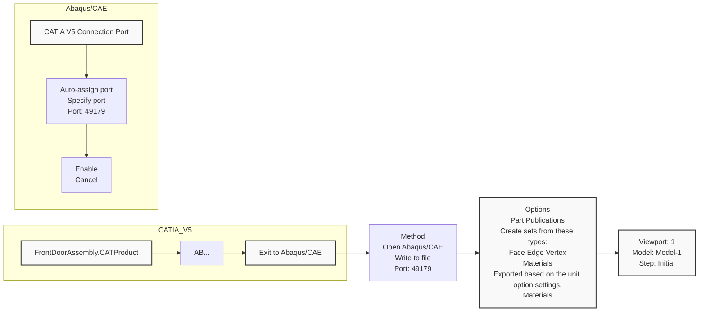
```mermaid
graph LR
  subgraph CATIA_V5
  A1["FrontDoorAssembly.CATProduct"] --> B1["AB..."]
  B1 --> C1["Exit to Abaqus/CAE"]
  end

  subgraph Abaqus_CAE["Abaqus/CAE"]
  D1["CATIA V5 Connection Port"] --> E1["Auto-assign port\nSpecify port\nPort: 49179"]
  E1 --> F1["Enable\nCancel"]
  end

  C1 --> G1["Method\nOpen Abaqus/CAE\nWrite to file\nPort: 49179"]
  G1 --> H1["Options\nPart Publications\nCreate sets from these types:\nFace Edge Vertex\nMaterials\nExported based on the unit option settings.\nMaterials"]
  H1 --> I1["Viewport: 1\nModel: Model-1\nStep: Initial"]

  style A1 fill:#f9f9f9,stroke:#333,stroke-width:2px
  style C1 fill:#f9f9f9,stroke:#333,stroke-width:2px
  style D1 fill:#f9f9f9,stroke:#333,stroke-width:2px
  style H1 fill:#f9f9f9,stroke:#333,stroke-width:2px
  style I1 fill:#f9f9f9,stroke:#333,stroke-width:2px
```
</details>

图 1：使用 CATIA V5 关联接口进行关联导入。

使用 CAD 连接将模型从运行关联接口插件的 CAD 系统传输到 Abaqus/CAE 称为关联导入。有关各个关联接口插件的更多信息，包括支持关联导入的 CAD 软件包及其支持的版本号，请参阅以下资源：

• SIMULIA 安装指南  
https://www.3ds.com/products-services/simulia/products/abaqus/add-ons/cad-associative-interfaces  
• 达索系统知识库 http://support.3ds.com/knowledge-base/

1. 在装配模块的主菜单栏中，选择 Tools->CAD Interfaces->CAD System。CAD System 是您正在连接的 CAD 系统的名称；您可以与 CATIA V6、CATIA V5、SOLIDWORKS、NX 和 Pro/ENGINEER 建立连接。  
2. 在出现的对话框中，执行以下操作之一：

## 自动分配端口 (Auto-assign port)

选择 Auto-assign port，然后单击 Enable 以从 Abaqus/CAE 打开一个端口。

Abaqus/CAE 将在消息区域显示它分配的端口号。当您从 CAD 系统导出模型时，数据将通过此连接端口号进行传输。

## 指定端口 (Specify port)

选择 Specify port，然后输入一个端口号来指定一个端口。该数字必须在 1025 到 65535 之间。如果您正在重新打开一个连接，可以使用 Abaqus/CAE 首次分配端口时显示的端口号。

## 禁用端口 (Disable port)

如果连接已经启用，您可以从对话框中单击 Disable 来禁用连接。

3. 使用 CAD 连接工具集从 Abaqus/CAE 创建到运行关联接口插件的另一个 CAD 系统的连接后，您可以执行以下操作将装配体导出到 Abaqus/CAE 会话：

## CATIA V6

## CATIA V6R2013x 或更早版本

从主菜单栏选择 Tools->Associative Export->Export to Abaqus/CAE。

## CATIA V6R2014 或更高版本

选择 Share->Export->Associative Export->Export to Abaqus/CAE。

更详细的说明可在《SIMULIA Associative Interface for Abaqus/CAE 用户指南》中找到；该指南在安装 SIMULIA Associative Interface for Abaqus/CAE 应用后可用。

## CATIA V5

从 CATIA V5 主菜单栏选择 Abaqus->Export to Abaqus/CAE。在出现的 Export to Abaqus/CAE 对话框中，选择 Open Abaqus/CAE，然后单击 OK。更详细的说明可在《CATIA V5 Associative Interface 用户指南》中找到；您可以在达索系统知识库 http://support.3ds.com/knowledge-base/ 中找到关于此指南的信息。

## SOLIDWORKS

从 SOLIDWORKS 主菜单栏选择 Abaqus->Export to Abaqus/CAE。在出现的 Export to Abaqus/CAE 对话框中，打开 Open in Abaqus/CAE 开关，然后单击绿色对勾。更详细的说明可在《SOLIDWORKS Associative

Interface 用户指南》中找到；您可以在达索系统知识库 http://support.3ds.com/knowledge-base/ 中找到关于此指南的信息。

## Pro/ENGINEER

从 Pro/ENGINEER 主菜单栏选择 Abaqus->Open in CAE。更详细的说明可在《Pro/ENGINEER Associative Interface 用户指南》中找到；您可以在达索系统知识库 http://support.3ds.com/knowledge-base/ 中找到关于此指南的信息。

## NX

从 NX 主菜单栏选择 Abaqus->Open in /CAE。更详细的说明可在《Abaqus/CAE Associative Interface for NX 用户指南》中找到；您可以从 Elysium, Inc. 网站下载此指南。

有关关联导入的更多信息，请参阅我能用关联接口做什么？。

## 更新导入模型中的几何参数

参数更新功能允许进行双向关联导入，您可以在已导入 Abaqus/CAE 的模型中修改几何特征的尺寸，然后将新的尺寸传播回原始 CAD 系统的模型文件中。此双向导入功能目前仅适用于 CATIA V5 关联接口、CATIA V6 关联接口和 Pro/ENGINEER 关联接口。

要使用参数更新功能，您必须首先使用 CAD 系统（CATIA V5、CATIA V6 或 Pro/ENGINEER）来指明哪些模型尺寸可以在 Abaqus/CAE 内修改。可修改的尺寸必须基于特征级别的参数来定义，这些参数会随模型一起导入 Abaqus/CAE。例如，一个参数可能与模型中孔的半径相关联；修改该参数的值也会修改孔的半径。每个参数名称必须以字符串 ABQ\_ 开头才能被导入 Abaqus/CAE。此外，为避免覆盖具有相同名称的现有参数，每个参数名称必须是唯一的。

CATIA V5 关联接口、CATIA V6 关联接口和 Pro/ENGINEER 关联接口使用一个特殊的参数文件（.par\_abq）将参数传递给 Abaqus/CAE。有关在导入的 CATIA V5、CATIA V6 或 Pro/ENGINEER 模型中定义可修改参数的更多信息，请参阅《CATIA V5 关联接口》、《CATIA V6 关联接口》或《Pro/ENGINEER 关联接口用户指南》。这些指南可从达索系统知识库 http://support.3ds.com/knowledge-base/ 获取。

您可以使用 Abaqus/CAE 中的 CAD 参数 (CAD Parameters) 对话框为导入的参数分配新值。当您更改参数值时，关联的几何特征将在 Abaqus/CAE 模型和保存的 CAD 模型中重新生成。此对话框还允许您在更改 CAD 参数后保持 CAD 软件在后台运行。让 CAD 软件在后台运行可以提高双向参数更新的性能，但此选项会占用您 CAD 软件的一个许可证直至会话结束。

1. 执行以下操作之一：

• 使用 CATIA V5 关联接口从 CATIA V5 导入模型。  
• 使用 CATIA V6 关联接口从 CATIA V6 导入模型。  
• 使用 Pro/ENGINEER 关联接口从 Pro/ENGINEER 导入模型。

2. 打开 CAD 参数 (CAD Parameters) 对话框：

• 在部件模块中，选择 Tools->CAD Parameters。  
• 在装配模块中，选择 Tools->CAD Interfaces->CAD Parameters。

CAD 参数对话框将显示所有可以修改的参数。

3. 如果您从 CATIA V5 或 Pro/ENGINEER 导入参数，单击某个参数名称可在视口中高亮显示受该参数影响的模型部分。  
4. 要修改参数值，请单击 Value 列中的相应单元格，并输入新值。  
5. 如果您从 Pro/ENGINEER 导入参数，您可以打开 Keep CAD software running in the background after parameter update 开关。如果您执行双向导入或进行额外的更新，此选项可以提高性能。  
6. 当您更改了所有必要的参数值后，执行以下操作之一：

单击 Update 以根据新的参数值在 Abaqus/CAE 中重新生成模型。保存的 Pro/ENGINEER 零件 (.prt) 文件中的几何图形也会随之更新。执行更新时，原始模型不得在 Pro/ENGINEER 中打开。  
单击鼠标按钮 3，然后选择 Write to File 可以创建一个更新的参数文件而不更新模型几何图形。此文件可用于通过 Abaqus 脚本接口手动更新参数。有关参数文件的更多信息，请参阅《Pro/ENGINEER 关联接口用户指南》。

单击 Defaults 可将 CAD 参数表中的所有参数重置为当前 Abaqus/CAE 模型中的值。

## 附加信息

• 我能用关联接口做什么？  
• 创建 CAD 连接

## 自定义工具集 (The Customize toolset)

自定义工具集允许您更改 Abaqus/CAE 某些方面的行为和外观。

## 本节内容：

配置工具栏的可见性
配置键盘快捷键  
自定义工具栏  
在自定义工具栏中配置图标  
使用“自定义”工具集  

## 配置工具栏的可见性  

使用“自定义”工具集，您可以从 Abaqus/CAE 显示界面中移除单个工具栏。隐藏不常使用的工具栏可以减少屏幕上的杂乱。您始终可以通过替代方法（例如主菜单栏、模块特定工具箱或键盘快捷键）访问隐藏工具栏中的功能。  

更改工具栏可见性有三种方式：  

## 关闭浮动工具栏  

您可以通过单击工具栏标题栏中的“X”来隐藏浮动工具栏。有关浮动工具栏与固定工具栏的解释，请参阅工具栏组件。  

要恢复浮动工具栏的显示，必须使用下面描述的技术之一。  

## 使用主菜单栏  

要隐藏可见工具栏，请从主菜单栏中选择 **视图->工具栏->工具栏名称**。使用相同的过程可以恢复隐藏工具栏的显示。当前正在显示的工具栏在菜单列表中其名称旁边会有一个勾选标记。  

## 使用“自定义”对话框  

使用“自定义”对话框，您可以一次更改多个工具栏的可见性。通过从主菜单栏中选择 **工具->自定义** 打开“自定义”对话框。在“工具栏”选项卡页面上，切换关闭您想要隐藏的任何工具栏；切换打开您想要使其可见的任何工具栏。  

## 配置键盘快捷键  

您可以使用“自定义”工具集来编辑默认的键盘快捷键、为 Abaqus/CAE 中的其他功能添加新快捷键，以及显示所有当前已定义快捷键的列表。  

键盘快捷键是单个按键或组合键，您可以用来启动 Abaqus/CAE 中的功能；例如，[Ctrl] + S 保存当前模型。  

默认情况下，已为常见功能定义了几个键盘快捷键。从主菜单栏中选择 **工具->自定义**；显示出现的对话框的“功能”选项卡页面以访问键盘编辑器。  

  

提示：键盘快捷键仅在当前模块中允许其功能时才处于活动状态，并且仅当应用程序焦点不在模型树、结果树、消息区或命令行界面中时才有效。如果某个快捷键似乎不起作用，请确认该功能在当前模块中是否被允许，或者通过单击视口标题栏将焦点切换到视口。  

Abaqus/CAE 允许将以下键和组合键指定为键盘快捷键：  
• 除 F1 键外的任何功能键，  
• [Alt] + [Shift] + 任意键，或  
• [Ctrl] + 任意键（[Ctrl] + A 除外，它仅限于在选择过程中用于全选选项）。您还可以将 [Alt] 或 [Shift] 添加到任何包含 [Ctrl] 键的键盘快捷键中。  

然而，并非所有键都有资格包含在键盘组合中；您不能指定包含功能键或字母数字小键盘上键的键盘组合。  

• 根据对象类型过滤选择  

## 自定义工具栏  

“自定义”工具集允许您创建包含 Abaqus/CAE 中大多数已定义功能快捷方式的自定义工具栏。自定义工具栏可用于将常用工具集中在一处、为没有现有快捷方式的功能创建工具，或为常见过程提供易于访问的控件（例如，创建部件、实例化部件和网格划分部件功能都可以成为同一工具栏的一部分）。自定义工具栏在所有模块中均可见。如果某个工具是模块特定功能的快捷方式，则 Abaqus/CAE 会在调用该工具时自动切换到相应的模块。  

自定义工具栏的内容和位置在不同会话之间保存。  

要创建自定义工具栏，请从主菜单栏中选择 **工具->自定义**。有关创建自定义工具栏的详细说明，请参阅创建和修改自定义工具栏。  

## 在自定义工具栏中配置图标  

您可以更改分配给自定义工具栏中工具的默认图标。如果您创建了一个没有默认图标分配的工具，则可以为该工具分配一个新图标。如果某个工具出现在多个自定义工具栏中，则该工具的图标分配将适用于所有自定义工具栏。默认的 Abaqus/CAE 工具栏和工具箱中的图标无法更改，并且不受自定义图标分配的影响。  

要更改或添加图标分配，请从主菜单栏中选择 **工具->自定义**。在出现的对话框的“功能”选项卡页面上，选择一个工具的功能，然后单击“选择”以将新图标分配给该工具。  

分配图标时，您可以从当前在 Abaqus/CAE 中使用的任何图标中进行选择。您还可以导入用户图标。用户图标必须是以下格式之一：位图 (.bmp)、GIF (.gif)、PNG (.png) 或 XPM (.xpm)。图标图像应大小合适——Abaqus/CAE 中工具栏图标的标淮尺寸为 24 × 24 像素。您无法缩放用户图标在 Abaqus/CAE 中显示的大小；如果您增加图标大小缩放因子（如缩放图标大小中所述），则只有 Abaqus/CAE 图标会增大。  

Abaqus/CAE 会在您的主目录中创建一个名为 abaqus\_icons 的目录来存储导入的用户图标图像。如果您从该目录中删除了图像文件，Abaqus/CAE 将为使用已删除图像文件的任何工具恢复默认图标分配。  

可以将相同的图标分配给多个工具。要区分使用相同图标的工具的功能，请将光标在工具上停留片刻；将出现一个包含工具功能描述的小框，即“工具提示”。  

## 使用“自定义”工具集  

“自定义”工具集的所有功能均可通过“自定义”对话框访问。  

在任何模块中，从主菜单栏中选择 **工具->自定义** 或 **视图->工具栏->自定义** 以打开“自定义”对话框。  

本节介绍如何使用“自定义”对话框的功能。  

## 本节内容：  

隐藏工具栏  
创建、修改和删除键盘快捷键  
显示现有键盘快捷键  
创建和修改自定义工具栏  
更改图标分配  
将工具栏恢复为默认设置  

## 隐藏工具栏  

从主菜单栏中选择 **工具->自定义** 以设置 Abaqus/CAE 中工具栏的可见性。有关隐藏工具栏的其他方法，请参阅配置工具栏的可见性。  

1. 在任何模块的主菜单栏中，选择 **工具->自定义**。  
   “自定义”对话框出现。  
2. 在“工具栏”选项卡页面上，勾选您想要显示的任何工具栏的名称；取消勾选您想要隐藏的任何工具栏的名称。  
3. 当您根据需要设置了所有工具栏的可见性后，单击 **Dismiss** 以关闭“自定义”对话框。  

## 附加信息  

• 工具栏组件  
• 配置工具栏的可见性  
• 使用“自定义”工具集  

## 创建、修改和删除键盘快捷键  

您可以为 Abaqus/CAE 中的特定功能分配键盘快捷键。  

有关可接受的按键组合信息，请参阅配置键盘快捷键。  

1. 在任何模块的主菜单栏中，选择 **工具->自定义**。  
2. 在打开的“自定义”对话框中，单击 **功能** 选项卡。  
3. 从“模块/工具集”列表中，选择您的功能所属的 Abaqus/CAE 模块或工具集。  
   Abaqus/CAE 会用选定模块或工具集中的可用功能填充“功能”列表。  
4. 选择您想要为其创建、修改或删除键盘快捷键的功能。  
5. 执行以下步骤之一：  

## 创建或修改键盘快捷键：  

输入您想要使用的功能键或组合键，然后单击 **分配**。  

新的键盘快捷键出现在“当前快捷键”字段中。  

## 删除键盘快捷键：  

单击 **删除**。  

Abaqus/CAE 会删除键盘快捷键分配并清除“当前快捷键”字段。  

## 附加信息  

• 配置键盘快捷键  
• 使用“自定义”工具集  

## 显示现有键盘快捷键  

“快捷键列表”对话框显示当前在 Abaqus/CAE 中分配的所有键盘快捷键及其映射的功能的列表。  

1. 在任何模块的主菜单栏中，选择 **工具->自定义**。  
2. 在打开的“自定义”对话框中，单击 **功能** 选项卡。  
3. 要显示现有键盘快捷键的列表，请单击 **显示所有分配**。  

从出现的“快捷键列表”对话框中，您可以查看所有当前已定义的键盘快捷键。  

## 附加信息  

• 配置键盘快捷键  
• 创建、修改和删除键盘快捷键  
• 使用“自定义”工具集  

## 创建和修改自定义工具栏  

您可以创建新的工具栏、更改现有自定义工具栏的内容、重命名自定义工具栏或删除自定义工具栏。
选择 Tools->Customize 以编辑 Abaqus/CAE 中的自定义工具栏。

## 附加信息

• 工具栏的组成  
• 自定义工具栏  
• 使用 Customize 工具集  

## 创建或修改自定义工具栏

1. 在任意模块的主菜单栏中，选择 Tools->Customize。  
将出现 Customize 对话框。

2. 要创建新的自定义工具栏：

a. 在 Toolbars 选项卡页面上，单击 Create。  
b. 在出现的对话框中，为新工具栏输入一个名称，然后单击 OK。  
Abaqus/CAE 将在主窗口中创建一个空的浮动工具栏。

3. 显示 Functions 选项卡页面。

4. 从 Module/Toolset 列表中，选择您的目标功能所属的 Abaqus/CAE 模块或工具集。

在自定义工具栏中，您应该使用当 Module/Toolset 列表中选中 Visualization Display Options 时可用的渲染样式 Functions，而不是 View Manipulation 可用的那些。

Abaqus/CAE 将用所选模块或工具集中的可用功能填充 Functions 列表。

5. 在 Functions 列表中，找到您想要添加到工具栏的功能。单击并将该功能拖动到自定义工具栏上；光标将变为加号符号 。释放鼠标按钮即可将该功能添加到工具栏。

您可以将功能拖动到新的或现有的自定义工具栏上。

6. 如果需要，为所选功能添加或修改图标分配。详见更改图标分配。

7. 要从自定义工具栏中移除功能，单击工具栏上的图标并将其拖离工具栏；光标将变为减号符号 。释放鼠标按钮即可从工具栏中删除该图标。


## 注意：

您可以随时使用此过程从自定义工具栏中移除图标。无需打开 Customize 对话框。

8. 重复步骤 4 到 7，直到工具栏包含所有所需的功能。  
9. 单击 Dismiss 关闭 Customize 对话框。

## 重命名自定义工具栏

1. 在任意模块的主菜单栏中，选择 Tools->Customize。

将出现 Customize 对话框。

2. 显示 Toolbars 选项卡页面。  
3. 选择要更改名称的工具栏，然后单击 Rename。  
4. 在出现的对话框中，为工具栏输入新名称，然后单击 OK。  
5. 单击 Dismiss 关闭 Customize 对话框。

## 删除自定义工具栏

1. 在任意模块的主菜单栏中，选择 Tools->Customize。将出现 Customize 对话框。  
2. 显示 Toolbars 选项卡页面。  
3. 选择要删除的工具栏名称，然后单击 Delete。  
4. 单击 Dismiss 关闭 Customize 对话框。

选择 Tools->Customize 以更改自定义工具栏上与特定工具或功能关联的图标。

1. 在任意模块的主菜单栏中，选择 Tools->Customize。

将出现 Customize 对话框。

2. 显示 Functions 选项卡页面。

3. 从 Module/Toolset 列表中，选择您的目标功能所属的 Abaqus/CAE 模块或工具集。

Abaqus/CAE 将用所选模块或工具集中的可用功能填充 Functions 列表。

4. 从 Functions 列表中，选择要更改其图标的功能。

5. 在对话框右下角的 Icon 字段中，单击 Select。

将出现 Select Icon 对话框。

6. 要使用现有的 Abaqus/CAE 图标，从 Abaqus Icons 选项卡页面的显示中选择图标图像，然后单击 OK。

Abaqus/CAE 将更新所有自定义工具栏中所选功能的图标。

7. 要使用自定义图标：

a. 显示 User Icons 选项卡页面。

b. 要从 User Icons 选项卡页面的选择显示中移除自定义图标，选择图标图像并单击 Delete。

c. 如果您想使用的图标已在显示中，请跳到步骤“e”。

如果您想要的图标不在显示中，请单击 Import 导入图标图像。

d. 在出现的 Select an Icon 对话框中，选择一个图像文件用作图标。有关可接受的图标图像文件信息，请参阅配置自定义工具栏中的图标。有关使用 Select an Icon 对话框的信息，请参阅使用文件选择对话框。

e. 从 User Icons 选项卡页面的显示中选择图标图像，然后单击 OK。

Abaqus/CAE 将更新所有自定义工具栏中所选功能的图标。


## 注意：

您无法修改默认 Abaqus/CAE 工具栏和工具箱中的图标。非默认图标分配仅适用于自定义工具栏中的工具。

8. 单击 Dismiss 关闭 Customize 对话框。

## 附加信息

• 自定义工具栏  
• 配置自定义工具栏中的图标  
• 使用 Customize 工具集  

## 将工具栏恢复到默认设置

Customize 对话框中的 Reset 按钮可将所有工具栏恢复到其原始设置。重置工具栏：

• 将所有默认 Abaqus/CAE 工具栏恢复到其原始可见性设置；  
• 将所有默认 Abaqus/CAE 工具栏重新定位到主菜单栏下方的原始位置；并且  
• 删除所有自定义工具栏。

这些设置不会立即生效；您必须重启 Abaqus/CAE 才能看到更改。在您单击 Reset 按钮后、重启 Abaqus/CAE 前对工具栏设置所做的任何更改都将不会被保存。

1. 在任意模块的主菜单栏中，选择 Tools->Customize。

将出现 Customize 对话框。

2. 在 Toolbars 选项卡页面上，单击 Reset。

3. 重启 Abaqus/CAE。

## 附加信息

• 工具栏的组成  
• 使用 Customize 工具集  

基准是当模型本身不包含所需几何时，帮助您推进建模过程的构造辅助工具。您可以使用 Datum 工具集来创建这些构造辅助工具。

本节说明如何使用 Datum 工具集来创建和定位基准点、基准轴、基准平面和基准坐标系。

## 本节内容：

了解基准几何的作用  
使用 Datum 工具集  
为何基准坐标系如此重要？  
将基准理解为特征  
基准创建技术  
创建基准点  
创建基准轴  
创建基准平面  
创建基准坐标系  

## 了解基准几何的作用

在建模过程中，您可能会发现需要模型中不存在的特定几何元素，例如顶点或边。您可以使用 Datum 工具集来创建所需的几何元素，这称为基准。

您可以创建基准点、基准轴、基准平面或基准坐标系。

• 当提示选择点时，您可以从部件中选择点、基准点或基准坐标系的原点。  
• 当提示选择边时，您可以从部件中选择边、基准轴或基准坐标系的一根轴。  
• 当提示选择面时，您可以从部件中选择面或基准平面。  
• 当提示选择坐标系时，您必须选择基准坐标系。

关于如何使用基准平面作为草图平面的一个例子涉及图1所示的部件。


<details>
<summary>text_image</summary>

base
feature
</details>

图1：创建草图平面。

要向曲面中拉伸一个盲切，您需要在一个与曲面相切的平面上绘制轮廓。所需的平面并不存在，但您可以使用 Datum 工具集创建一个平面，并在生成的平面上进行草绘。基准平面和生成的切特征如图2所示。


<details>
<summary>text_image</summary>

datum
plane
sketched profile
blind
cut feature
</details>

图2：生成的特征。

Abaqus/CAE 不会在基准几何上生成网格，基准几何对模型的分析没有影响；它只是帮助您构建复杂几何的便利工具。如果您想要向模型本身添加几何，例如沿边的顶点或穿过实体的平面，应使用 Partition 工具集。

您通过相对于现有几何（如顶点、平面和边）或其他基准几何来定义基准。您可以在 Part 或 Property 模块中在部件上创建基准，也可以在其他模块中在装配体上创建基准。例如，您可以在 Part 模块中定义一条穿过部件上两个选定的点的基准轴，并在 Assembly 模块中使用该轴对齐部件的实例。您可以创建依赖或独立的基准特征；并且像所有特征一样，它可以被编辑、删除、抑制和恢复。当重新生成装配体或部件时，会重新生成依赖基准。您还可以使用显示组在视口中显示或隐藏基准几何。

## 附加信息

• 将基准理解为特征
• 使用显示组来显示模型的子集

## 使用基准工具集

您可以在任何模块中通过主菜单栏或模块工具箱访问基准工具集。

从主菜单栏中选择 **工具**->**基准** 以显示 **创建基准** 对话框，并从对话框顶部的 **类型** 选项中选择要创建的基准类型——**点**、**轴**、**平面** 或 **坐标系 (CSYS)**。**方法** 列表将随之更改以反映您要创建的基准类型。从 **方法** 列表中选择所需的基准工具，然后按照提示区域中的提示来创建基准。

您也可以从模块工具箱访问基准工具集；图 1 显示了模块工具箱中所有基准工具的隐藏图标。


<details>
<summary>流程图</summary>

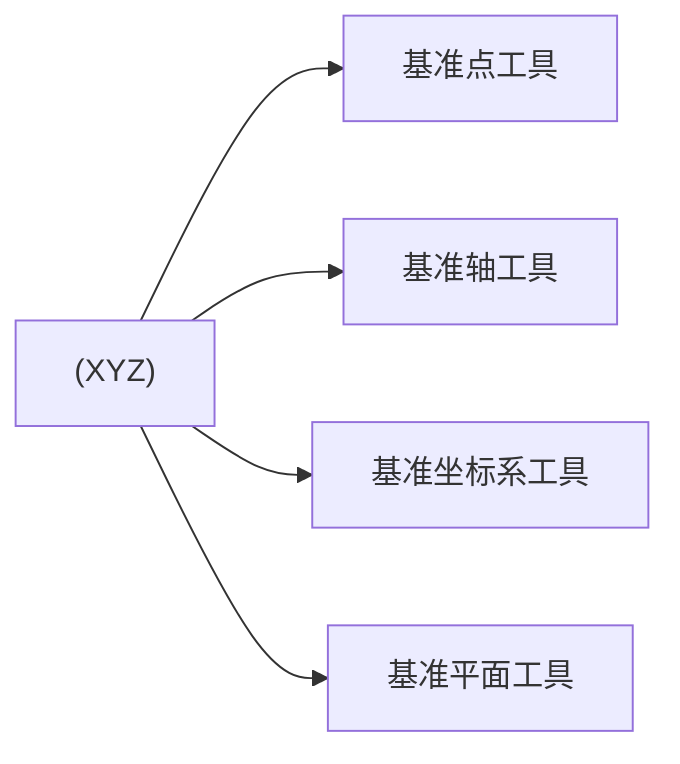
```mermaid
graph LR
  A["(XYZ)"] --> B["基准点工具"]
  A --> C["基准轴工具"]
  A --> D["基准坐标系工具"]
  A --> E["基准平面工具"]
```
</details>

图 1：基准工具。

要查看包含每个基准工具定义的简短工具提示，请将鼠标悬停在该工具上片刻。有关使用工具箱和选择隐藏图标的信息，请参阅 **使用包含隐藏图标的工具箱和工具栏**。

• 基准创建技术  
• 在 **部件** 模块中使用基准工具集  
• 在 **装配** 模块中使用基准几何  
• 控制基准显示

## 为什么基准坐标系如此重要？

基准坐标系在 Abaqus/CAE 中广泛使用；例如，用于定义材料和连接器方向、耦合约束、惯性释放载荷和边界条件的方向，以及用于定位和对齐部件实例。

此外，当提示选择点时，您可以选择基准坐标系的原点；当提示选择边时，您可以选择基准坐标系的一个轴。

Abaqus/CAE 提供了三种创建基准坐标系的方法：

• **三点法**  
• **从坐标系偏移**  
• **两线法**

更多信息，请参阅 **创建基准坐标系的方法**。与其他类型的基准不同，您可以在创建基准坐标系时为其命名。与所有基准一样，您可以使用 **模型树** 重命名基准坐标系。

## 附加信息

• 理解基准作为特征

## 理解基准作为特征

基准是基于特征的建模过程中有用的构造辅助工具，它本身也是一个特征。因此，您可以使用 **特征操作工具集** 来删除、抑制和恢复基准。

默认情况下，基准被创建为依赖特征；但是，您可以在创建时选择使基准独立。对于独立基准，基准与用于创建它的任何特征之间不存在父子关系。基准一旦创建，就无法从依赖更改为独立，反之亦然。Abaqus/CAE 会随部件或装配一起重新生成依赖基准，并考虑到底层几何的任何更改。如果您抑制或删除依赖基准的父特征，则该基准也会被抑制或删除。

您可以编辑定义基准的任何数值参数；例如，用于定义基准点的 X、Y 和 Z 坐标。但是，基准始终由创建它时您选择的相同底层几何定义；如果您需要使用不同的几何来定义基准，则必须删除该基准并创建一个新基准。

您可以在 **部件** 或 **特性** 模块中在部件上创建基准，或在其他模块中在装配上创建基准。如果在部件上创建依赖基准，则该基准将随 **装配** 模块中的部件实例一起移动。如果您通过从部件实例中选择实体在装配上创建依赖基准，则该基准将随 **装配** 模块中的实例一起移动。但是，如果您在 **装配** 上通过在提示区域中输入坐标来创建基准，则当实例移动时，该基准保持固定。

当您修改特征时，应注意您的依赖基准与被修改特征之间的任何父子关系。例如，考虑图 1，它显示了一条依赖基准轴穿过两个圆弧的中点。定义基准轴位置的圆弧中点是基准轴的父特征。

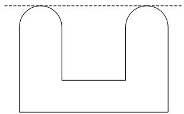

<details>
<summary>自然图像</summary>

一个带有两条弯曲臂的 U 形物体的简单线条图，上方有一条水平虚线（无文本或符号）
</details>

图 1：原始基准轴位于两个中点之间。

如果您修改部件，Abaqus/CAE 会重新生成基准轴，使其仍然穿过这两个中点，如图 2 所示。


<details>
<summary>自然图像</summary>

纯几何图，包含两个弯曲形状和一条对角虚线（无文本或符号）
</details>

图 2：部件修改后的基准轴。

## 附加信息

• **特征操作工具集**

## 基准创建技术

本节概述了创建每种类型基准的方法。

## 本节内容：

创建基准点的方法  
创建基准轴的方法  
创建基准平面的方法  
创建基准坐标系的方法

## 创建基准点的方法

当您从 **创建基准** 对话框中选择 **点** 时，**方法** 列表将显示创建基准点的方法。

可用方法如下：


## 输入坐标

输入基准点的 X、Y 和 Z 坐标，如图 1 所示。详细说明请参阅 **通过输入坐标创建基准点**。

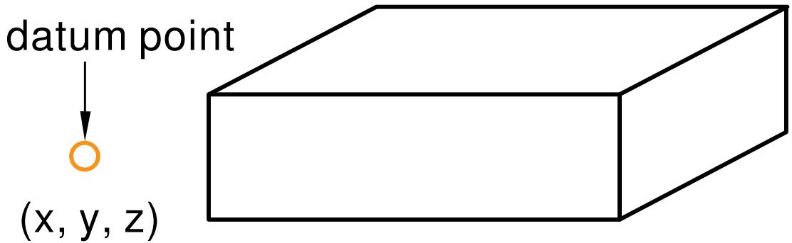

<details>
<summary>文本图像</summary>

基准点
(x, y, z)
</details>

图 1：通过输入坐标创建基准点。


## 从点偏移

以相对于所选点的 X、Y 和 Z 坐标偏移的形式输入基准点的位置，如图 2 所示。详细说明请参阅 **在距离所选点的偏移处创建基准点**。


<details>
<summary>文本图像</summary>

所选点
(x, y, z)
(0, -10, 0)
偏移基准点
</details>

图 2：通过从点偏移创建基准点。

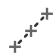

## 两点之间的中点

在模型上选择两个点；Abaqus/CAE 会在两个所选点之间的中点处创建基准点，如图 3 所示。详细说明请参阅 **在两点之间的中点处创建基准点**。

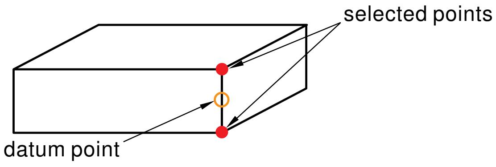

<details>
<summary>流程图</summary>


```mermaid
graph LR
  A["基准点"] --> B["所选点"]
  B --> A
  B --> C["所选点"]
  C --> A
```
</details>

图 3：通过选择两个端点创建基准点。


## 从两条边偏移

在模型上选择两条边；然后输入基准点到每条边的距离，如图 4 所示。详细说明请参阅 **在距离两条边的指定距离处创建基准点**。

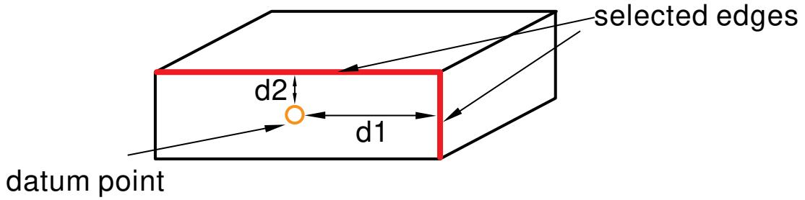

<details>
<summary>流程图</summary>


```mermaid
graph LR
  A["基准点"] --> B["d2"]
  B --> C["d1"]
  C --> D["所选边"]
  D --> A
```
</details>

图 4：将基准点定位在距离两条边的指定距离处。

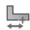

## 输入参数

在模型上选择一条边，并以代表边长度百分比的参数值形式输入基准点的位置。边上的箭头表示参数值从起始顶点（对应边参数值为零）到结束顶点（对应值为一）增加的方向，如图 5 所示。详细说明请参阅 **通过输入边参数创建基准点**。


<details>
<summary>流程图</summary>


```mermaid
graph LR
  A["基准点"] --> B["所选边"]
  B --> C["节点"]
  C --> A
```
</details>

图 5：将基准点定位在沿边的指定距离处。

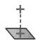

## 将点投影到面/平面
选择要投影的点以及投影所用的面或平面。Abaqus/CAE 会在该面或平面与一条通过所选点并垂直于该面/平面的直线的相交处创建基准点，如图 6 所示。该基准点也标记了所选点与所选面或平面之间的最短距离。详细操作说明，请参见 **通过将点投影到面或平面上创建基准点**。

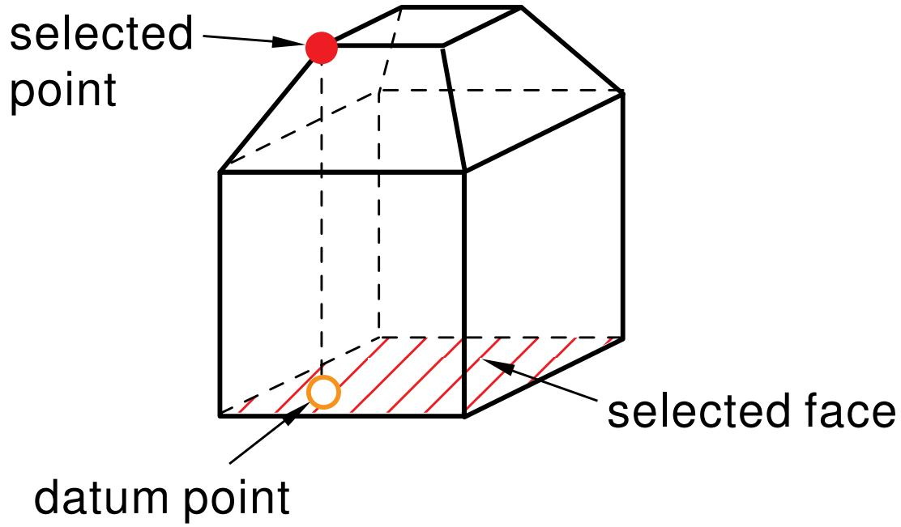

<details>
<summary>text_image</summary>

选择的点
基准点
选择的面
</details>

图 6：通过将点投影到面上来创建基准点。


## 在边/基准轴上投影点

选择模型上的一个点以及投影所用的边或基准轴。Abaqus/CAE 会在该边或基准轴与一条通过所选点并垂直于该边/基准轴的直线的相交处创建基准点，如图 7 所示。该基准点也标记了所选点与所选边或基准轴之间的最短距离。详细操作说明，请参见 **通过将点投影到边或基准轴上创建基准点**。

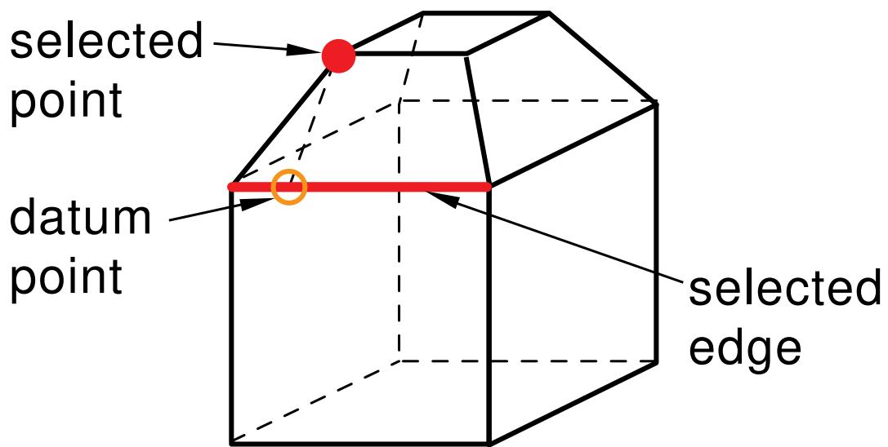

<details>
<summary>text_image</summary>

选择的点
基准点
选择的边
</details>

图 7：通过将点投影到边上创建基准点。

## 附加信息

• 创建基准点
• 控制基准显示

## 创建基准轴的方法

当您从 **创建基准** 对话框中选择 **轴** 时，**方法** 列表将显示创建基准轴的方法。

以下方法可用：

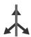

## 主轴

选择三个主轴之一，基准轴必须与其共线，如图 1 所示。详细操作说明，请参见 **沿主轴创建基准轴**。

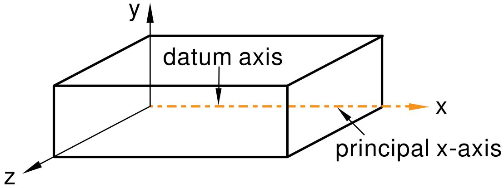

<details>
<summary>text_image</summary>

基准轴
主 X 轴
</details>

图 1：将基准轴定义为三个主轴之一。


## 两个平面的交线

选择两个不平行的平面。Abaqus/CAE 会在两个平面（或两个平面的延伸）的相交处创建基准轴，如图 2 所示。详细操作说明，请参见 **沿两个平面的交线创建基准轴**。

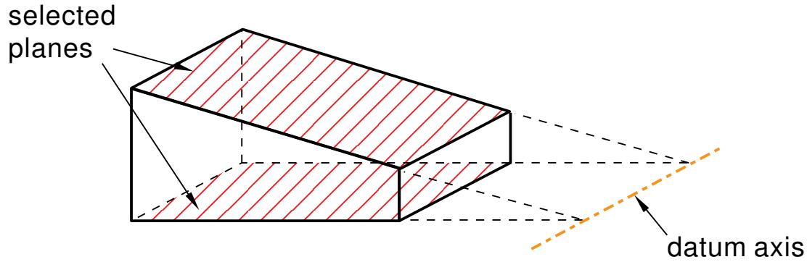

<details>
<summary>text_image</summary>

选择的平面
基准轴
</details>

图 2：将基准轴定义为两个平面的交线。

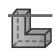

## 直边

选择模型上的一条直边，基准轴必须与其共线，如图 3 所示。详细操作说明，请参见 **沿直边创建基准轴**。

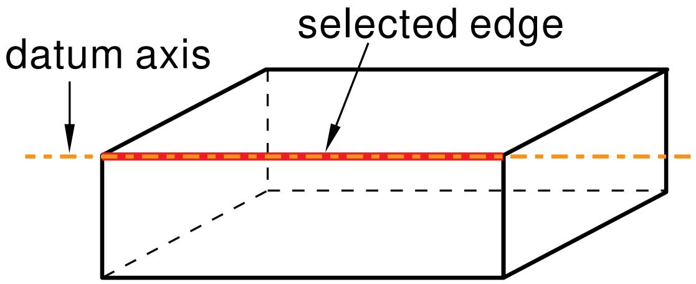

<details>
<summary>text_image</summary>

基准轴
选择的边
</details>

图 3：将基准轴定义为模型上的一条直边。


## 两点

选择模型上的任意两个点，基准轴必须通过它们，如图 4 所示。详细操作说明，请参见 **通过两点创建基准轴**。

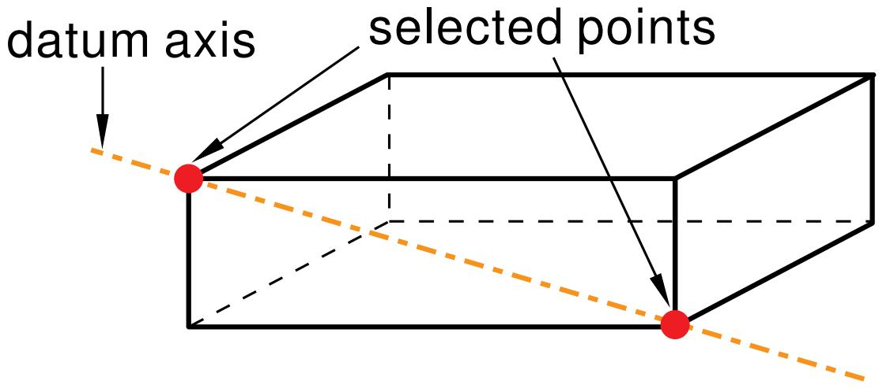

<details>
<summary>text_image</summary>

基准轴
选择的点
</details>

图 4：通过选择两个点定义基准轴。

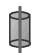

## 圆柱体轴线

选择模型上的一个圆柱面。Abaqus/CAE 会创建一个沿该圆柱面轴线的基准轴，如图 5 所示。详细操作说明，请参见 **沿圆柱体轴线创建基准轴**。

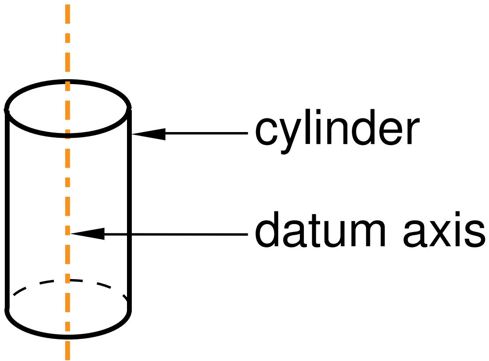

<details>
<summary>text_image</summary>

圆柱体
基准轴
</details>

图 5：将基准轴定义为圆柱体的轴线。


## 垂直于平面，通过点

选择一个平面和一个不在该平面上的点。Abaqus/CAE 会创建一个垂直于该平面并通过该点的基准轴，如图 6 所示。详细操作说明，请参见 **创建垂直于平面并通过点的基准轴**。


<details>
<summary>text_image</summary>

选择的平面
选择的点
基准轴
</details>

图 6：通过选择一个点和一个平面定义基准轴。

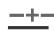

## 平行于直线，通过点

选择模型的一条边和一个位于该边外的点。Abaqus/CAE 会创建一个平行于该边并通过该点的基准轴，如图 7 所示。详细操作说明，请参见 **创建平行于直线并通过点的基准轴**。

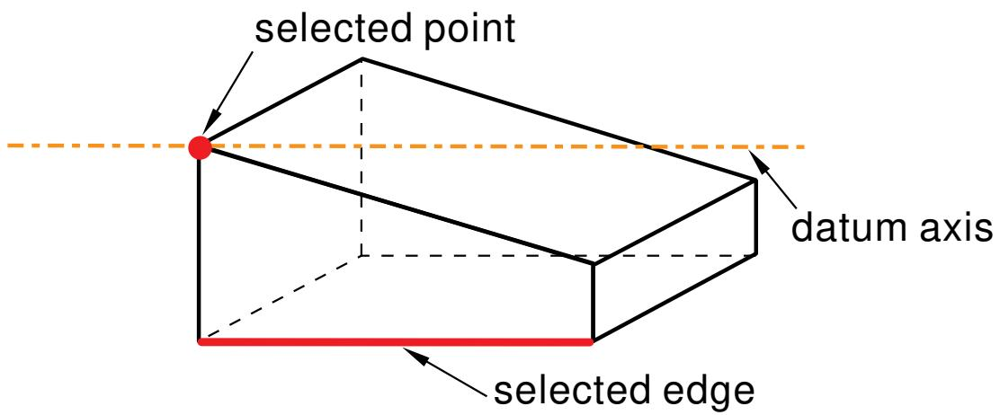

<details>
<summary>text_image</summary>

选择的点
基准轴
选择的边
</details>

图 7：通过选择一个点和一条边定义基准轴。

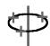

## 圆上的三个点

选择模型上定义圆的三个点。Abaqus/CAE 会沿该圆的轴线创建基准轴，如图 8 所示。详细操作说明，请参见 **创建沿三个点定义的圆的轴线的基准轴**。


<details>
<summary>flowchart</summary>


```mermaid
graph LR
  A["基准轴"] --> B["选择的点"]
  C["定义的圆"] --> B
  B -.-> C
```
</details>

图 8：将基准轴定义为圆的轴线。

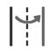

## 从直线旋转

选择一条边和一个旋转轴，并指定边将要旋转的角度。Abaqus/CAE 通过将边绕指定轴旋转指定角度来创建基准轴，如图 9 所示。详细操作说明，请参见 **通过旋转现有边指定角度来创建基准轴**。

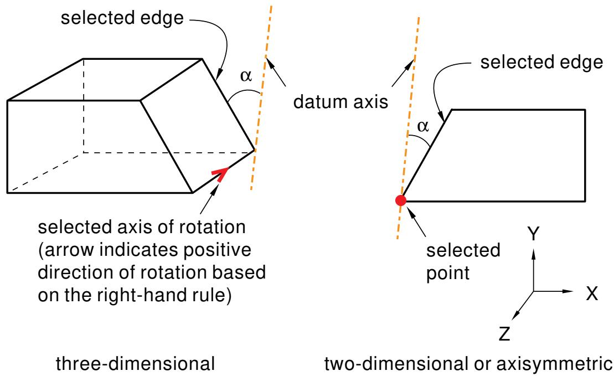

<details>
<summary>text_image</summary>

选择的边
α
基准轴
选择的边
α
选择的点
Y
X
Z
选择的旋转轴
(箭头表示基于右手法则的正旋转方向)
三维
二维或轴对称
</details>

图 9：通过将边旋转指定角度定义基准轴。

## 附加信息

• 创建基准轴
• 控制基准显示

当您从 **创建基准** 对话框中选择 **平面** 时，**方法** 列表将显示创建基准平面的方法。

以下方法可用：


## 从主平面偏移

选择三个主平面之一；并以从所选平面偏移的形式提供基准平面的位置，如图 1 所示。正值表示沿垂直于所选平面的轴的正方向偏移；例如，沿垂直于 Y-Z 平面的 X 轴。详细操作说明，请参见 **创建从主平面偏移的基准平面**。


<details>
<summary>text_image</summary>

基准平面
y
d
x
z
</details>

图 1：通过从三个主平面之一偏移来创建基准平面。

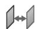

## 从平面偏移

选择模型上的任何平面；并通过指定法线方向以及沿该法线从所选平面的偏移量来提供基准平面的位置，如图 2 所示。您可以通过输入值或选择一个点来指定偏移。详细操作说明，请参见 **在从所选平面偏移的位置创建基准平面**。

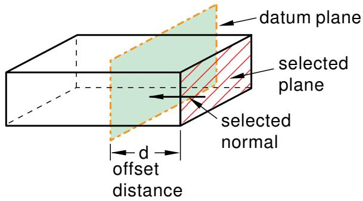

<details>
<summary>text_image</summary>

基准平面
选择的平面
选择的法线
d
偏移距离
</details>

图 2：通过从任何平面偏移来创建基准平面。


## 三个点

选择基准平面必须经过的三个点，如图3所示。详细说明请参见创建穿过三个点的基准平面。


<details>
<summary>text_image</summary>

选中的点
基准平面
</details>

图3：通过选择三个点创建基准平面。


## 直线和点

选择一条边和一个点，基准平面必须经过它们，如图4所示。详细说明请参见创建穿过一条直线和一个点的基准平面。

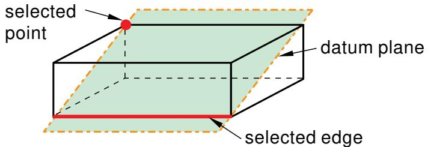

<details>
<summary>text_image</summary>

选中的
点
基准平面
选中的边
</details>

图4：通过选择一个点和一条边创建基准平面。


## 点和法线

选择一个点和一条边；基准平面经过该点，并与所选边垂直，如图5所示。详细说明请参见创建穿过一个点并垂直于一条边的基准平面。


<details>
<summary>text_image</summary>

基准平面
选中的点
选中的边
</details>

图5：通过选择一个点和一条法向边创建基准平面。

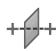

## 两点之间的中点

选择两个点。Abaqus/CAE会在两个选定点之间且垂直于连接它们的直线上创建一个基准平面，如图6所示。详细说明请参见在两点之间的中点创建基准平面并垂直于连接两点的直线。


<details>
<summary>text_image</summary>

基准平面
选中的点
</details>

图6：将基准平面定位在两个点之间的中点。


## 从平面旋转

选择一个面和一个旋转轴，并指定面将被旋转的角度。Abaqus/CAE通过将面绕旋转轴旋转指定角度来创建一个基准平面，如图7所示。详细说明请参见通过将现有面旋转指定角度来创建基准平面。

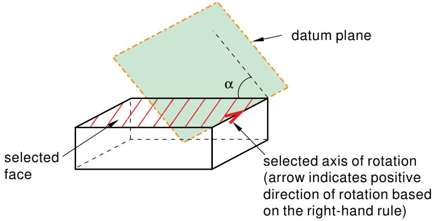

<details>
<summary>text_image</summary>

基准平面
α
选中的面
选中的旋转轴
（箭头指示基于右手定则
的旋转正方向）
</details>

图7：通过将面旋转指定角度定义基准平面。

## 附加信息

• 创建基准平面

## 创建基准坐标系的方法

当您在“创建基准”对话框中选择 CSYS 时，方法列表会显示创建基准坐标系的方法。

基准坐标系在Abaqus/CAE中广泛使用；例如，用于定义材料方向和连接器方向。为了帮助您跟踪基准坐标系，您可以在创建它们时为系统命名，名称会显示在模型树中其条目旁边。

可用的方法如下：


## 三个点

通过选择原点以及可选的两个附加点来定义直角坐标系、圆柱坐标系或球坐标系。对于直角坐标系，第二个点定义X轴，X-Y平面经过第二个和第三个点，如图1所示。这是创建基准坐标系最通用的工具，应尽可能使用。详细说明请参见创建由三个点定义的基准坐标系。

  
图1：通过选择原点和两个点定位直角基准坐标系。

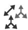

## 从坐标系偏移

选择一个坐标系；并通过指定偏移量来提供直角坐标系、圆柱坐标系或球坐标系基准的位置，如涉及直角坐标系的图2示例所示。您可以通过输入值或选择一个点来指定偏移量。详细说明请参见在另一个坐标系偏移处创建基准坐标系。

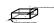  
图2：通过从另一个坐标系偏移来定位直角基准坐标系。

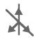

## 两条直线

选择定义直角坐标系、圆柱坐标系或球坐标系的两条边。对于直角坐标系，第一条边定义X轴，X-Y平面经过第二条边，如图3所示。详细说明请参见创建由两条直线定义的基准坐标系。

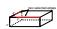  
图3：通过选择两条边定位直角基准坐标系。

## 附加信息

• 创建基准平面  
• 控制基准显示

## 创建基准点

本节描述可用于创建基准点的工具。

## 本节内容：

通过输入坐标创建基准点  
在选定的点偏移处创建基准点  
在两点之间的中点创建基准点  
在距两条边指定距离处创建基准点  
通过输入边参数创建基准点  
通过将点投影到面上或平面上创建基准点  
通过将点投影到边或基准轴上创建基准点

## 通过输入坐标创建基准点

您可以通过输入其X、Y和Z坐标来定位基准点。

下图显示了通过输入坐标创建基准点的示例。

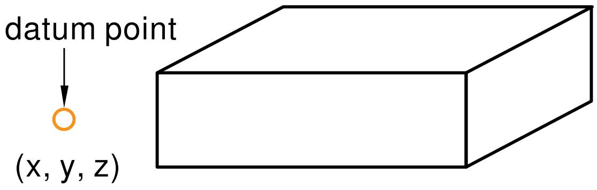

<details>
<summary>text_image</summary>

基准点
(x, y, z)
</details>

1. 从主菜单栏中，选择工具->基准。

   “创建基准”对话框出现。该对话框概述了您可以创建的基准几何体类型。

   Abaqus/CAE在提示区显示提示以指导您完成操作步骤。

   

## (xYz)

提示：您也可以使用位于模块工具箱中的工具创建基准点。有关工具箱中基准工具的图示，请参见使用基准工具集。

2. 从对话框顶部的类型列表中，选择点。

   方法列表显示了可用于创建基准点的方法。

3. 从方法列表中，选择输入坐标。  
4. 在提示区出现的文本字段中，输入您要创建的基准点的X、Y和Z坐标。如果该基准与组件关联，则您提供的坐标是相对于组件的全局坐标系的。如果该基准与部件关联，则坐标是相对于部件的坐标系的。如果您不确定部件坐标系的位置或方向，请首先在部件的原点创建一个默认坐标系。更多信息，请参见创建由三个点定义的基准坐标系。

   基准点出现。您可以通过从主菜单栏选择特征->编辑并选择该基准来修改基准点的坐标。

## 附加信息

• 创建基准点的方法  
• 基准创建技巧  
• 控制基准显示

## 在选定的点偏移处创建基准点

您可以通过选择模型上的一个点并输入从该点偏移的X、Y和Z坐标来定位基准点。

下图显示了在选定的点偏移处创建基准点的示例。

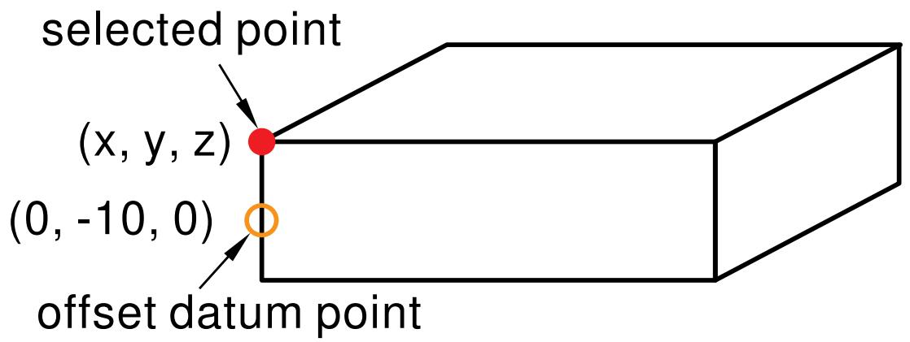

<details>
<summary>text_image</summary>

选中的点
(x, y, z)
(0, -10, 0)
偏移的基准点
</details>

1. 从主菜单栏中，选择工具->基准。

   “创建基准”对话框出现。该对话框概述了您可以创建的基准几何体类型。

   Abaqus/CAE在提示区显示提示以指导您完成操作步骤。

   

\+ 提示：您也可以使用位于模块工具箱中的工具创建基准点。有关工具箱中基准工具的图示，请参见使用基准工具集。
2. 从对话框顶部的类型列表中，选择 **Point**。  
**Method** 列表显示了可用于创建基准点的方法。  
3. 从 **Method** 列表中，选择 **Offset from point**。  
4. 如果需要，在提示区中选择 **Make Independent** 以将基准创建为独立特征。  
5. 在当前视口中，从零件或装配体中选择一个点。  
6. 在提示区出现的文本字段中，输入相对于所选点的偏移的 X、Y 和 Z 坐标。

基准点随即出现。您可以通过从主菜单栏选择 **Feature -> Edit** 并选择该基准点来修改偏移坐标。

## 其他信息

• 创建基准点的方法  
• 基准创建技术  
• 控制基准显示

## 在两个点之间创建中点基准点

您可以通过在模型上选择两个点来定位基准点；Abaqus/CAE 会在两个选定的点之间创建中点基准点。

下图展示了在两个点之间创建中点基准点的示例。


<details>
<summary>流程图</summary>

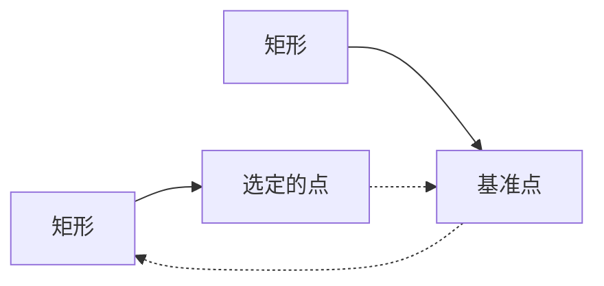
```mermaid
graph LR
  A["矩形"] --> B["选定的点"]
  C["矩形"] --> D["基准点"]
  B -.-> D
  D -.-> A
```
</details>

1. 从主菜单栏，选择 **Tools -> Datum**。

**Create Datum** 对话框随即出现。该对话框列出了您可以创建的基准几何体的类型。

Abaqus/CAE 在提示区显示提示信息，引导您完成整个过程。


提示：您也可以使用位于模块工具箱中的 **工具** 来创建基准点。有关工具箱中基准工具的图示，请参阅使用基准工具集。

2. 从对话框顶部的类型列表中，选择 **Point**。

**Method** 列表显示了可用于创建基准点的方法。

3. 从 **Method** 列表中，选择 **Midway between 2 points**。  
4. 如果需要，在提示区中选择 **Make Independent** 以将基准创建为独立特征。  
5. 在当前视口中，从零件或装配体中选择两个点。

基准点随即出现。您不能修改使用此方法创建的基准点；您必须删除旧点并创建一个新点。

## 其他信息

• 创建基准点的方法  
• 基准创建技术  
• 控制基准显示

## 在距离两条边指定距离处创建基准点

您可以通过在模型上选择两条边并输入基准点到每条边的距离来定位基准点。

下图展示了在距离两条边指定距离处创建基准点的示例。

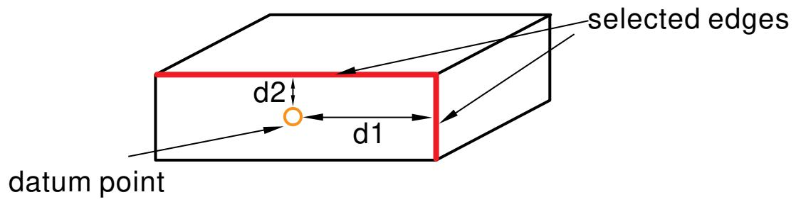

<details>
<summary>流程图</summary>


```mermaid
graph LR
  A["基准点"] --> B["d2"]
  B --> C["d1"]
  C --> D["选定的边"]
  D --> A
```
</details>

1. 从主菜单栏，选择 **Tools -> Datum**。

**Create Datum** 对话框随即出现。该对话框列出了您可以创建的基准几何体的类型。

Abaqus/CAE 在提示区显示提示信息，引导您完成整个过程。


有关工具箱中基准工具的图示，请参阅使用基准工具集。

2. 从对话框顶部的类型列表中，选择 **Point**。  
**Method** 列表显示了可用于创建基准点的方法。  
3. 从 **Method** 列表中，选择 **Offset from 2 edges**。  
4. 如果需要，在提示区中选择 **Make Independent** 以将基准创建为独立特征。  
5. 在当前视口中，从零件或装配体中选择要在其上创建基准点的平面。  
6. 在指定平面上选择一条直边，然后输入基准点距离该边的距离。  
7. 在该平面上选择第二条直边，然后输入基准点距离该边的距离。

基准点随即出现。您可以通过从主菜单栏选择 **Feature -> Edit** 并修改基准点到每条边的距离来修改基准点的位置。

## 其他信息

• 创建基准点的方法  
• 基准创建技术  
• 控制基准显示

## 通过输入边参数创建基准点

您可以通过在模型上选择一条边并输入代表边长百分比的参数值来定位基准点。

沿边的一个箭头指示了从起始顶点（对应边参数值 0）到结束顶点（对应值 1）参数值增加的方向。

下图展示了通过输入边参数创建基准点的示例。

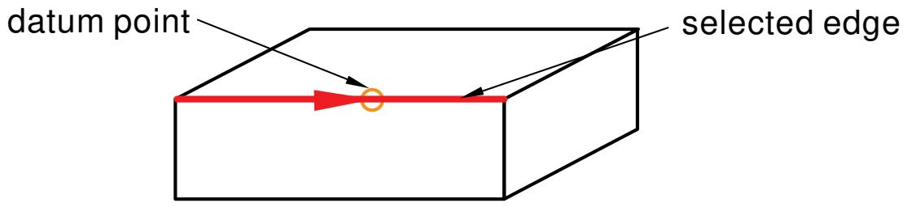

<details>
<summary>流程图</summary>


```mermaid
graph LR
  A["基准点"] --> B["选定的边"]
  B --> C["节点"]
  C --> A
```
</details>

1. 从主菜单栏，选择 **Tools -> Datum**。

**Create Datum** 对话框随即出现。该对话框列出了您可以创建的基准几何体的类型。

Abaqus/CAE 在提示区显示提示信息，引导您完成整个过程。


位于模块工具箱中的 **工具**。有关工具箱中基准工具的图示，请参阅使用基准工具集。

2. 从对话框顶部的类型列表中，选择 **Point**。

**Method** 列表显示了可用于创建基准点的方法。

3. 从 **Method** 列表中，选择 **Enter parameter**。

4. 如果需要，在提示区中选择 **Make Independent** 以将基准创建为独立特征。

5. 在当前视口中，从零件或装配体中选择要在其上定位基准点的边。

选定的边上会出现一个箭头，指示参数值增加的方向。

6. 在提示区的文本字段中，输入边参数的值。

基准点随即出现。您可以通过从主菜单栏选择 **Feature -> Edit** 并修改边参数的值来修改基准点的位置。

## 其他信息

• 创建基准点的方法  
• 基准创建技术  
• 控制基准显示

## 通过将点投影到面或平面上创建基准点

您可以通过在模型上选择一个点以及一个用于投影该点的面或平面来定位基准点。Abaqus/CAE 会在选定的面或平面与一条垂直于该面或平面并通过选定的点的直线相交处创建基准点。

下图展示了通过将点投影到面上创建基准点的示例。


<details>
<summary>text_image</summary>

选定的点
基准点
选定的面
</details>

1. 从主菜单栏，选择 **Tools -> Datum**。

**Create Datum** 对话框随即出现。该对话框列出了您可以创建的基准几何体的类型。

Abaqus/CAE 在提示区显示提示信息，引导您完成整个过程。


提示：您也可以使用位于模块工具箱中的 **工具** 来创建基准点。有关工具箱中基准工具的图示，请参阅使用基准工具集。

2. 从对话框顶部的类型列表中，选择 **Point**。  
**Method** 列表显示了可用于创建基准点的方法。  
3. 从 **Method** 列表中，选择 **Project point on face/plane**。  
4. 如果需要，在提示区中选择 **Make Independent** 以将基准创建为独立特征。  
5. 在当前视口中，从零件或装配体中选择一个点。  
6. 选择一个面或平面，用于投影该点。选择可以是平面、非平面或基准平面。

基准点随即出现。您不能修改使用此方法创建的基准点；您必须删除旧点并创建一个新点。

## 其他信息

• 创建基准点的方法  
• 基准创建技术  
• 控制基准显示

## 通过将点投影到边或基准轴上创建基准点

您可以通过在模型上选择一个点以及一条边或基准轴来投影该点以定位基准点。

Abaqus/CAE 会在选定的边或基准轴与一条垂直于它并通过选定的点的直线相交处创建基准点。

下图展示了通过将点投影到边上创建基准点的示例。

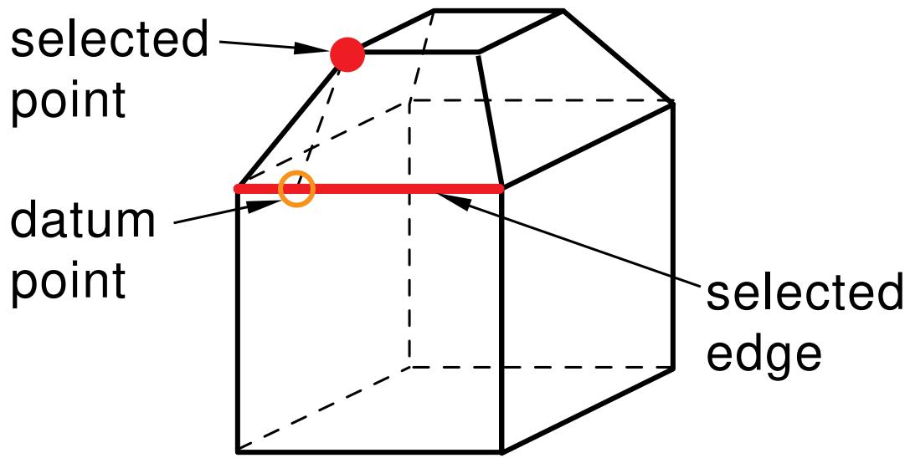

<details>
<summary>text_image</summary>

选定的点
基准点
选定的边
</details>

1. 从主菜单栏，选择 **Tools -> Datum**。

**Create Datum** 对话框随即出现。该对话框列出了您可以创建的基准几何体的类型。
Abaqus/CAE 在提示区域显示提示信息，以指导您完成操作步骤。


提示：您也可以使用位于模块工具箱中的工具来创建基准点。有关工具箱中基准工具的图示，请参阅使用基准工具集。

2.  从对话框顶部的类型列表中，选择 Point（点）。
    Method（方法）列表显示了可用于创建基准点的方法。
3.  从 Method（方法）列表中，选择 Project point on edge/datum axis（将点投影到边/基准轴上）。
4.  如果需要，可从提示区域选择 Make Independent（创建为独立特征），以将基准创建为独立特征。
5.  从当前视口中的部件或装配体中，选择一个点。
6.  选择要在其上投影该点的边或基准轴。

基准点出现。您无法修改以此方法创建的基准点；必须删除旧点并创建一个新点。

## 附加信息

• 创建基准点的方法
• 基准创建技术
• 控制基准显示

## 创建基准轴

本节描述了可用于创建基准轴的工具。

## 本节内容：

沿主轴创建基准轴
沿两个平面的交线创建基准轴
沿直边创建基准轴
通过两个点创建基准轴
沿圆柱体的轴线创建基准轴
创建垂直于平面并通过一个点的基准轴
创建平行于一条直线并通过一个点的基准轴
创建沿由三个点定义的圆的轴线运行的基准轴
通过旋转现有边指定角度创建基准轴

## 沿主轴创建基准轴

您可以通过选择三个主轴之一来定义为基准轴，从而定位基准轴。

下图显示了通过选择主轴创建基准轴的示例。


<details>
<summary>text_image</summary>

y
基准轴
x
z
主 x 轴
</details>

1.  从主菜单栏中，选择 Tools->Datum（工具->基准）。

    Create Datum（创建基准）对话框出现。该对话框概述了您可以创建的基准几何类型。

    Abaqus/CAE 在提示区域显示提示信息，以指导您完成操作步骤。


工具箱中基准工具的图示，请参阅使用基准工具集。

2.  从对话框顶部的类型列表中，选择 Axis（轴）。
    Method（方法）列表显示了可用于创建基准轴的方法。
3.  从 Method（方法）列表中，选择 Principal axis（主轴）。
4.  选择您的基准轴必须经过的主 X-、Y- 或 Z-轴。

基准轴出现。您无法修改以此方法创建的基准轴；必须删除旧轴并创建一个新轴。

## 附加信息

• 创建基准轴的方法
• 基准创建技术
• 控制基准显示

## 沿两个平面的交线创建基准轴

您可以通过选择两个非平行的平面表面来定位基准轴。

Abaqus/CAE 在两个平面相交处，或两个平面的投影相交处，创建基准轴。

下图显示了在两个平面的交线处创建基准轴的示例。

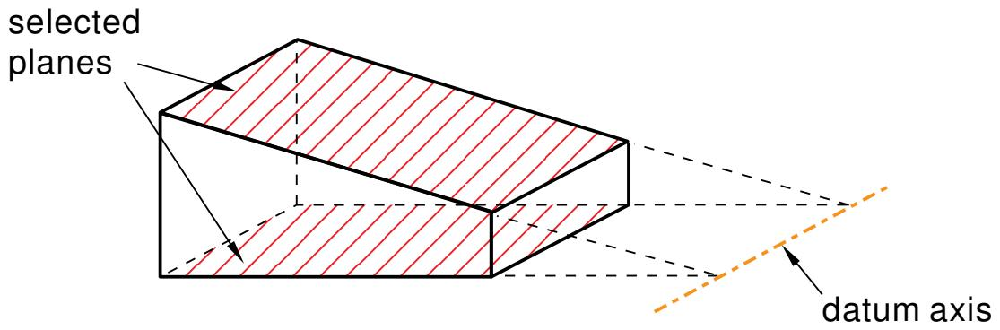

<details>
<summary>text_image</summary>

选定的
平面
基准轴
</details>

1.  从主菜单栏中，选择 Tools->Datum（工具->基准）。

    Create Datum（创建基准）对话框出现。该对话框概述了您可以创建的基准几何类型。

    Abaqus/CAE 在提示区域显示提示信息，以指导您完成操作步骤。


提示：您也可以使用位于模块工具箱中的工具来创建基准轴。有关工具箱中基准工具的图示，请参阅使用基准工具集。

2.  从对话框顶部的类型列表中，选择 Axis（轴）。
    Method（方法）列表显示了可用于创建基准轴的方法。
3.  从 Method（方法）列表中，选择 Intersection of 2 planes（两个平面的交线）。
4.  如果需要，可从提示区域选择 Make Independent（创建为独立特征），以将基准创建为独立特征。
5.  从当前视口中的部件或装配体中，选择一个平面。
6.  选择一个不与第一个平面平行的第二个平面。

基准轴出现。您无法修改以此方法创建的基准轴；必须删除旧轴并创建一个新轴。

## 附加信息

• 创建基准轴的方法
• 基准创建技术
• 控制基准显示

您可以通过选择模型上的一条直边来定义为基准轴，从而定位基准轴。

下图显示了沿模型上的一条直边创建基准轴的示例。


<details>
<summary>text_image</summary>

基准轴
选定的边
</details>

1.  从主菜单栏中，选择 Tools->Datum（工具->基准）。

    Create Datum（创建基准）对话框出现。该对话框概述了您可以创建的基准几何类型。

    Abaqus/CAE 在提示区域显示提示信息，以指导您完成操作步骤。


提示：您也可以使用位于模块工具箱中的工具来创建基准轴。有关工具箱中基准工具的图示，请参阅使用基准工具集。

2.  从对话框顶部的类型列表中，选择 Axis（轴）。
    Method（方法）列表显示了可用于创建基准轴的方法。
3.  从 Method（方法）列表中，选择 Straight edge（直边）。
4.  如果需要，可从提示区域选择 Make Independent（创建为独立特征），以将基准创建为独立特征。
5.  从当前视口中的部件或装配体中，选择一条直边。

基准轴出现。您无法修改以此方法创建的基准轴；必须删除旧轴并创建一个新轴。

## 附加信息

• 创建基准轴的方法
• 基准创建技术
• 控制基准显示

## 通过两个点创建基准轴

您可以通过选择模型上的任意两个点（基准轴将通过这两个点）来定位基准轴。

下图显示了通过两个点创建基准轴的示例。


<details>
<summary>text_image</summary>

基准轴
选定的点
</details>

1.  从主菜单栏中，选择 Tools->Datum（工具->基准）。

    Create Datum（创建基准）对话框出现。该对话框概述了您可以创建的基准几何类型。

    Abaqus/CAE 在提示区域显示提示信息，以指导您完成操作步骤。


提示：您也可以使用位于模块工具箱中的工具来创建基准轴。有关工具箱中基准工具的图示，请参阅使用基准工具集。

2.  从对话框顶部的类型列表中，选择 Axis（轴）。
    Method（方法）列表显示了可用于创建基准轴的方法。
3.  从 Method（方法）列表中，选择 2 points（两点）。
4.  如果需要，可从提示区域选择 Make Independent（创建为独立特征），以将基准创建为独立特征。
5.  从当前视口中的部件或装配体中，选择两个点。

基准轴出现。您无法修改以此方法创建的基准轴；必须删除旧轴并创建一个新轴。

## 附加信息

• 创建基准轴的方法
• 基准创建技术
• 控制基准显示

## 沿圆柱体的轴线创建基准轴

您可以通过选择模型上的圆柱面或圆锥面来定位基准轴。

Abaqus/CAE 创建一条位于该面轴线上的基准轴。

下图显示了沿圆柱体的轴线创建基准轴的示例。

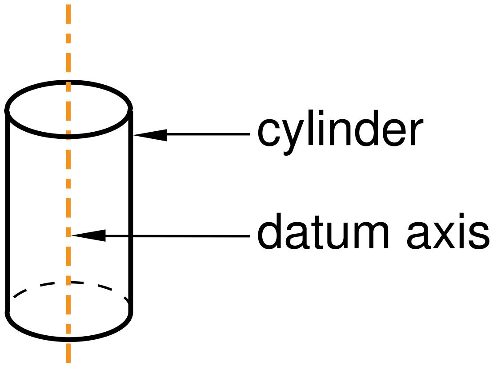

<details>
<summary>text_image</summary>

圆柱体
基准轴
</details>

1.  从主菜单栏中，选择 Tools->Datum（工具->基准）。

    Create Datum（创建基准）对话框出现。该对话框概述了您可以创建的基准几何类型。

    Abaqus/CAE 在提示区域显示提示信息，以指导您完成操作步骤。


提示：您也可以使用位于模块工具箱中的工具来创建基准轴。有关工具箱中基准工具的图示，请参阅使用基准工具集。


2.  从对话框顶部的类型列表中，选择 Axis（轴）。
    Method（方法）列表显示了可用于创建基准轴的方法。
3.  从 Method（方法）列表中，选择 Axis of cylinder（圆柱体的轴线）。
4.  如果需要，可从提示区域选择 Make Independent（创建为独立特征），以将基准创建为独立特征。
5. 在当前视口中，从部件或装配体中选择一个圆柱面或圆锥面。

将显示基准轴。您无法修改以此方法创建的基准轴；必须删除旧轴并创建新轴。

## 附加信息

• 创建基准轴的方法  
• 基准创建技巧  
• 控制基准显示

## 创建垂直于平面并经过点的基准轴

您可以通过选择一个平面和一个不在该平面上的点来定位基准轴。

Abaqus/CAE 将创建一条垂直于该平面并经过该点的基准轴。

下图展示了创建垂直于平面并经过点的基准轴的示例。

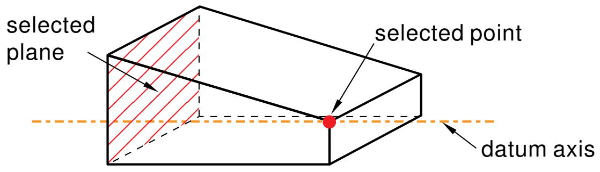

<details>
<summary>text_image</summary>

selected
plane
selected point
datum axis
</details>

1. 从主菜单栏中，选择 Tools->Datum。

   将出现 Create Datum 对话框。该对话框概述了您可以创建的基准几何类型。

   Abaqus/CAE 在提示区域显示提示，指导您完成操作过程。

   

   提示：您也可以使用位于模块工具箱中的 工具来创建基准轴。有关工具箱中基准工具的示意图，请参阅使用基准工具集。

2. 从对话框顶部的类型列表中，选择 Axis。  
   Method 列表显示了您可以用来创建基准轴的方法。  
3. 从 Method 列表中，选择 Normal to plane, thru point。  
4. 如果需要，从提示区域选择 Make Independent 以将基准创建为独立特征。  
5. 在当前视口中，从部件或装配体中选择一个平面。  
6. 在当前视口中，从部件或装配体中选择一个点。

   将显示基准轴。您无法修改以此方法创建的基准轴；必须删除旧轴并创建新轴。

## 附加信息

• 创建基准轴的方法  
• 基准创建技巧  
• 控制基准显示

## 创建平行于直线并经过点的基准轴

您可以通过选择模型的一条边和该边外的一点来定位基准轴。

Abaqus/CAE 将创建一条平行于该边并经过该点的基准轴。

下图展示了创建平行于直线并经过点的基准轴的示例。


<details>
<summary>text_image</summary>

selected point
datum axis
selected edge
</details>

1. 从主菜单栏中，选择 Tools->Datum。

   将出现 Create Datum 对话框。该对话框概述了您可以创建的基准几何类型。

   Abaqus/CAE 在提示区域显示提示，指导您完成操作过程。

   

   提示：您也可以使用位于模块工具箱中的 -+一 工具来创建基准轴。有关工具箱中基准工具的示意图，请参阅使用基准工具集。

2. 从对话框顶部的类型列表中，选择 Axis。  
   Method 列表显示了您可以用来创建基准轴的方法。  
3. 从 Method 列表中，选择 parallel to line, thru point。  
4. 如果需要，从提示区域选择 Make Independent 以将基准创建为独立特征。  
5. 在当前视口中，从部件或装配体中选择一条边。  
6. 在当前视口中，从部件或装配体中选择一个点。

   将显示基准轴。您无法修改以此方法创建的基准轴；必须删除旧轴并创建新轴。

## 附加信息

• 创建基准轴的方法  
• 基准创建技巧  
• 控制基准显示

## 创建沿由三点定义的圆的轴线的基准轴

您可以通过选择模型上定义圆的三个点来定位基准轴。

Abaqus/CAE 将创建一条沿该圆轴线的基准轴。

下图展示了创建沿由三点定义的圆的轴线的基准轴的示例。


<details>
<summary>flowchart</summary>

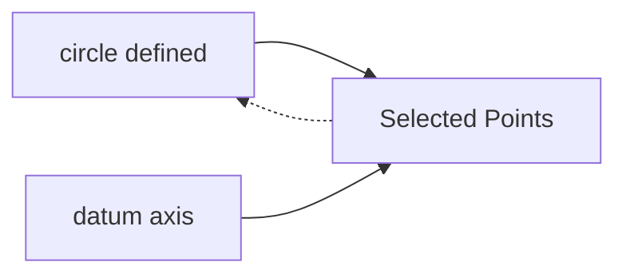
```mermaid
graph LR
  A["circle defined"] --> B["Selected Points"]
  C["datum axis"] --> B
  B -.-> A
```
</details>

1. 从主菜单栏中，选择 Tools->Datum。

   将出现 Create Datum 对话框。该对话框概述了您可以创建的基准几何类型。

   Abaqus/CAE 在提示区域显示提示，指导您完成操作过程。

   

中 提示：您也可以使用位于模块工具箱中的 工具来创建基准轴。有关工具箱中基准工具的示意图，请参阅使用基准工具集。

2. 从对话框顶部的类型列表中，选择 Axis。

   Method 列表显示了您可以用来创建基准轴的方法。

3. 从 Method 列表中，选择 Three points on circle。  
4. 如果需要，从提示区域选择 Make Independent 以将基准创建为独立特征。  
5. 在当前视口中，从部件或装配体中选择三个点。

   将显示基准轴。您无法修改以此方法创建的基准轴；必须删除旧轴并创建新轴。

## 附加信息

• 创建基准轴的方法  
• 基准创建技巧  
• 控制基准显示

## 通过将现有边旋转指定角度来创建基准轴

您可以通过将选定的边或基准轴绕选定的旋转轴旋转指定角度来定义基准轴。

下图展示了通过将现有边旋转指定角度来创建基准轴的示例。


<details>
<summary>text_image</summary>

selected edge
α
datum axis
selected edge
α
selected point
Y
X
Z
selected axis of rotation
(arrow indicates positive
direction of rotation based
on the right-hand rule)
three-dimensional
two-dimensional or axisymmetric
</details>

1. 从主菜单栏中，选择 Tools->Datum。

   将出现 Create Datum 对话框。该对话框概述了您可以创建的基准几何类型。

   Abaqus/CAE 在提示区域显示提示，指导您完成操作过程。

   

   提示：您也可以使用位于模块工具箱中的 工具来创建基准轴。有关工具箱中基准工具的示意图，请参阅使用基准工具集。

2. 从对话框顶部的类型列表中，选择 Axis。  
   Method 列表显示了您可以用来创建基准轴的方法。  
3. 从 Method 列表中，选择 Rotate from line。  
4. 如果需要，从提示区域选择 Make Independent 以将基准创建为独立特征。  
5. 在当前视口中，从部件或装配体中选择要旋转的边或基准轴。  
6. 指定旋转的技术取决于部件或装配体的建模空间：

## 对于二维或轴对称部件或装配体：

1. 选择一个顶点或基准点作为旋转中心。您也可以使用提示区域出现的文本框输入旋转中心的精确坐标。

2. 在提示区域的文本框中，输入旋转角度。正值表示绕 Z 轴逆时针旋转。

   将显示基准轴。

## 对于三维部件或装配体：

1. 选择一条边或一个基准轴来表示旋转轴。

   Abaqus/CAE 会沿着选定的边显示一个箭头，使用右手定则指示旋转的正方向。

2. 在提示区域出现的文本框中，输入旋转角度。

   将显示基准轴。

您可以通过从主菜单栏选择 Feature->Edit 并选择基准轴来修改旋转角度。如果更改角度的符号，Abaqus/CAE 将反转旋转方向。

## 附加信息

• 创建基准轴的方法  
• 基准创建技巧  
• 控制基准显示

## 创建基准平面

本节描述了可用于创建基准平面的工具。

## 本节内容：

创建从主平面偏移的基准平面  
创建从选定平面偏移的基准平面  
创建通过三点的基准平面  
创建通过一条直线和一个点的基准平面  
创建通过一点并垂直于一条边的基准平面  
在两点之间创建中平面并垂直于连接两点的直线  
通过将现有面旋转指定角度来创建基准平面

## 创建从主平面偏移的基准平面

您可以通过选择模型上的任何平面（包括另一个基准平面）并指定从该选定平面的偏移量来定位基准平面；您可以通过输入值或选择一个点来指定偏移量。
下图展示了从主平面偏移创建基准平面的示例。


<details>
<summary>text_image</summary>

y
z
d
x
基准平面
</details>

1.  从主菜单栏中，选择 **工具（Tools）-> 基准（Datum）**。
    随即出现 **创建基准（Create Datum）** 对话框。该对话框概述了您可以创建的基准几何体类型。
    Abaqus/CAE 会在提示区显示提示信息，引导您完成整个操作过程。

    

    模块工具箱中的工具。有关工具箱中基准工具的图示，请参阅 **使用基准工具集（Using the Datum toolset）**。

2.  从对话框顶部的类型列表中，选择 **平面（Plane）**。
    **方法（Method）** 列表指示了可用于创建基准平面的方法。
3.  从 **方法（Method）** 列表中，选择 **从主平面偏移（Offset from principal plane）**。
4.  从提示区的按钮中，选择主平面。
5.  在提示区的文本字段中，输入相对于所选主平面的偏移距离。偏移值可以是正数或负数。正值将沿垂直于所选平面的正主轴方向偏移基准平面。
    基准平面随即出现。您可以通过从主菜单栏选择 **特征（Feature）-> 编辑（Edit）** 并修改偏移值来调整基准平面的位置。

## 附加信息

• 创建基准平面的方法
• 基准创建技术
• 控制基准显示

## 通过从所选平面偏移创建基准平面

您可以通过选择模型上的任意平面（包括另一个基准平面）并指定相对于所选平面的偏移距离来定位基准平面；您可以通过输入数值或选择一个点来指定偏移距离。

下图展示了从另一个平面偏移创建基准平面的示例。


<details>
<summary>text_image</summary>

基准平面
所选平面
所选法线
d
偏移距离
</details>

1.  从主菜单栏中，选择 **工具（Tools）-> 基准（Datum）**。
    随即出现 **创建基准（Create Datum）** 对话框。该对话框概述了您可以创建的基准几何体类型。
    Abaqus/CAE 会在提示区显示提示信息，引导您完成整个操作过程。

    

    工具箱中基准工具的图示，请参阅 **使用基准工具集（Using the Datum toolset）**。

2.  从对话框顶部的类型列表中，选择 **平面（Plane）**。
    **方法（Method）** 列表指示了可用于创建基准平面的方法。
3.  从 **方法（Method）** 列表中，选择 **从平面偏移（Offset from plane）**。
4.  如果需要，从提示区选择 **设为独立（Make Independent）** 以将基准创建为独立特征。
5.  从当前视口中的部件或装配体中，选择一个平面。
6.  从提示区的按钮中，选择以下之一：

## 输入值（Enter Value）

1.  出现一个箭头，指示偏移方向。
2.  如有必要，单击 **反向（Flip）** 以反转箭头。单击 **确定（OK）** 以接受指示的偏移方向。
3.  在提示区的文本字段中，输入相对于所选平面的偏移距离。偏移值可以是正数或负数。正值将沿箭头指示的方向偏移基准平面。

## 选择点（Select Point）

从当前视口中的部件或装配体中，选择一个点以定义相对于所选平面的偏移距离。

基准平面随即出现。您可以通过从主菜单栏选择 **特征（Feature）-> 编辑（Edit）** 并修改偏移值来调整基准平面的位置。

## 附加信息

• 创建基准平面的方法
• 基准创建技术
• 控制基准显示

## 创建通过三个点的基准平面

您可以通过选择基准平面必须经过的三个点来定位基准平面。

下图展示了创建通过三个点的基准平面的示例。

## 所选点


<details>
<summary>text_image</summary>

基准平面
</details>

1.  从主菜单栏中，选择 **工具（Tools）-> 基准（Datum）**。
    随即出现 **创建基准（Create Datum）** 对话框。该对话框概述了您可以创建的基准几何体类型。
    Abaqus/CAE 会在提示区显示提示信息，引导您完成整个操作过程。

    

    提示：您也可以使用模块工具箱中的工具创建基准平面。有关工具箱中基准工具的图示，请参阅 **使用基准工具集（Using the Datum toolset）**。

2.  从对话框顶部的类型列表中，选择 **平面（Plane）**。
    **方法（Method）** 列表指示了可用于创建基准平面的方法。
3.  从 **方法（Method）** 列表中，选择 **3 个点（3 points）**。
4.  如果需要，从提示区选择 **设为独立（Make Independent）** 以将基准创建为独立特征。
5.  从当前视口中的部件或装配体中，选择三个点。

    基准平面随即出现。您无法修改以此方法创建的基准平面；您必须删除旧平面并创建一个新平面。

## 附加信息

• 创建基准平面的方法
• 基准创建技术
• 控制基准显示

## 创建通过一条线和一个点的基准平面

您可以通过选择一条边和一个点来定位基准平面，该基准平面必须经过这条边和这个点。

下图展示了创建通过一条线和一个点的基准平面的示例。

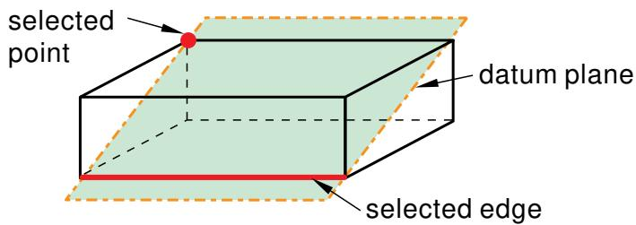

<details>
<summary>text_image</summary>

所选
点
基准平面
所选边
</details>

1.  从主菜单栏中，选择 **工具（Tools）-> 基准（Datum）**。
    随即出现 **创建基准（Create Datum）** 对话框。该对话框概述了您可以创建的基准几何体类型。
    Abaqus/CAE 会在提示区显示提示信息，引导您完成整个操作过程。

    

    提示：您也可以使用模块工具箱中的工具创建基准平面。有关工具箱中基准工具的图示，请参阅 **使用基准工具集（Using the Datum toolset）**。

2.  从对话框顶部的类型列表中，选择 **平面（Plane）**。
    **方法（Method）** 列表指示了可用于创建基准平面的方法。
3.  从 **方法（Method）** 列表中，选择 **直线和点（Line and point）**。
4.  如果需要，从提示区选择 **设为独立（Make Independent）** 以将基准创建为独立特征。
5.  从当前视口中的部件或装配体中，选择一条直边。
6.  从当前视口中的部件或装配体中，选择一个点。

    基准平面随即出现。您无法修改以此方法创建的基准平面；您必须删除旧平面并创建一个新平面。

## 附加信息

• 创建基准平面的方法
• 基准创建技术
• 控制基准显示

## 创建通过一个点且垂直于一条边的基准平面

您可以通过选择一个点和一条边来定位基准平面；该基准平面通过这个点，并垂直于所选的边。

下图展示了创建通过一个点且垂直于一条边的基准平面的示例。


<details>
<summary>text_image</summary>

基准平面
所选点
所选边
</details>

1.  从主菜单栏中，选择 **工具（Tools）-> 基准（Datum）**。
    随即出现 **创建基准（Create Datum）** 对话框。该对话框概述了您可以创建的基准几何体类型。
    Abaqus/CAE 会在提示区显示提示信息，引导您完成整个操作过程。

    

    提示：您也可以使用模块工具箱中的工具创建基准平面。有关工具箱中基准工具的图示，请参阅 **使用基准工具集（Using the Datum toolset）**。

2.  从对话框顶部的类型列表中，选择 **平面（Plane）**。
    **方法（Method）** 列表指示了可用于创建基准平面的方法。
3.  从 **方法（Method）** 列表中，选择 **点和法线（Point and normal）**。
4.  如果需要，从提示区选择 **设为独立（Make Independent）** 以将基准创建为独立特征。
5.  从当前视口中的部件或装配体中，选择一个点。
6.  从当前视口中的部件或装配体中，选择一条边。

    基准平面随即出现。您无法修改以此方法创建的基准平面；您必须删除旧平面并创建一个新平面。

## 附加信息

• 创建基准平面的方法
• 基准创建技术
• 控制基准显示

## 创建位于两个点中间且垂直于连接两点直线的基准平面

您可以通过选择两个点来定位基准平面。

Abaqus/CAE 会创建一个位于两个所选点中间且垂直于连接两点直线的基准平面。

下图展示了创建位于两个点中间且垂直于连接两点直线的基准平面的示例。


<details>
<summary>text_image</summary>

基准平面
选定的点
</details>

1. 从主菜单栏中，选择 工具->基准。

   创建基准 对话框出现。该对话框概述了可以创建的基准几何体类型。

   Abaqus/CAE 在提示区显示提示以指导您完成操作过程。

   

   提示：您也可以使用位于模块工具箱中的工具来创建基准平面。有关工具箱中基准工具的图示，请参阅使用基准工具集。

2. 从对话框顶部的类型列表中，选择 平面。

   方法 列表显示了可用于创建基准平面的方法。

3. 从 方法 列表中，选择 两点之间中点。
4. 如果需要，从提示区选择 创建为独立特征，将基准创建为独立特征。
5. 从当前视口中的部件或装配体中，选择两个点。

   基准平面出现。您无法修改使用此方法创建的基准平面；必须删除旧平面并创建新平面。

## 附加信息

• 创建基准平面的方法
• 基准创建技术
• 控制基准显示

## 通过将现有面旋转指定角度来创建基准平面

您可以通过将选定的面或基准平面围绕选定的旋转轴旋转指定角度来定义基准平面。

下图显示了通过将现有面旋转指定角度来创建基准平面的示例。


<details>
<summary>text_image</summary>

基准平面
α
选定的面
选定的旋转轴
（箭头表示基于右手定则的
旋转正方向）
</details>

1. 从主菜单栏中，选择 工具->基准。

   创建基准 对话框出现。该对话框概述了可以创建的基准几何体类型。

   Abaqus/CAE 在提示区显示提示以指导您完成操作过程。

   

   提示：您也可以使用位于模块工具箱中的工具来创建基准平面。有关工具箱中基准工具的图示，请参阅使用基准工具集。

2. 从对话框顶部的类型列表中，选择 平面。
   方法 列表显示了可用于创建基准平面的方法。
3. 从 方法 列表中，选择 从平面旋转。
4. 如果需要，从提示区选择 创建为独立特征，将基准创建为独立特征。
5. 从当前视口中的部件或装配体中，选择要旋转的面或基准平面。
6. 选择任意边或基准轴来表示旋转轴。您选择用于旋转轴的边或基准轴不必与您选择要旋转的面或基准平面共面。

   Abaqus/CAE 沿选定边显示一个箭头，指示使用右手定则的旋转正方向。

7. 在提示区出现的文本框中，键入旋转角度。

   基准平面出现。您可以通过从主菜单栏选择 特征->编辑 并选择该基准平面来修改旋转角度。如果更改角度的符号，Abaqus/CAE 将反转旋转方向。

## 附加信息

• 创建基准平面的方法
• 基准创建技术

• 控制基准显示

## 创建基准坐标系

本节描述了可用于创建基准坐标系的工具。

## 本节内容：

创建由三点定义的基准坐标系
创建相对于另一坐标系有偏移的基准坐标系
创建由两条线定义的基准坐标系

## 创建由三点定义的基准坐标系

您可以通过选择定义原点的点、X- 或 R-轴上的点或 X–Y 或 R–平面内的点来定位矩形、柱坐标系或球坐标系基准坐标系。

下图显示了创建由三点定义的矩形基准坐标系的示例。

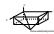

当 Abaqus/CAE 提示您选择点时，您可以选择基准坐标系的原点。当 Abaqus/CAE 提示您选择边时，您可以选择基准坐标系的一个轴。

1. 从主菜单栏中，选择 工具->基准。

   创建基准 对话框出现。该对话框概述了可以创建的基准几何体类型。

   Abaqus/CAE 在提示区显示提示以指导您完成操作过程。

   

   提示：您也可以使用位于模块工具箱中的 $t = \frac { t } { 2 }$ 工具来创建基准坐标系。有关工具箱中基准工具的图示，请参阅使用基准工具集。

2. 从对话框顶部的类型列表中，选择 CSYS。

   方法 列表显示了可用于创建基准坐标系的方法。

3. 从 方法 列表中，选择 3 点。

   Abaqus/CAE 显示 创建基准 CSYS 对话框。

4. 从对话框中，输入基准坐标系的名称。

   为帮助跟踪基准坐标系，Abaqus/CAE 在模型树中显示其名称。此外，您可以使用模型树来重命名基准坐标系。

5. 从对话框中，选择以下基准坐标系之一：

   • 矩形：X-、Y- 和 Z-轴分别与 1-、2- 和 3- 全局轴对齐。
   • 柱坐标系：R-、- 和 Z-轴分别与 1-、2- 和 3- 全局轴对齐。
   • 球坐标系：R-、- 和 -轴分别与 1-、2- 和 3- 全局轴对齐。

6. 从 创建基准 CSYS 对话框中，单击 继续。

   Abaqus/CAE 显示一个默认的基准坐标系。基准坐标系的原点位于部件或装配体的原点。此外，默认基准坐标系的轴与部件或装配体的坐标系对齐。

7. 如果需要，从提示区选择 创建为独立特征，将基准创建为独立特征。

8. 要在不同位置或以不同方向创建基准坐标系，请执行以下操作：

   a. 从当前视口中的部件或装配体中，选择将定义基准坐标系原点的点或输入原点的坐标。

      Abaqus/CAE 在选定的点处显示一个临时基准坐标系。该基准坐标系的轴与全局坐标系的轴对齐。

   b. 从提示区，在文本字段中按 [Enter] 以接受临时基准坐标系的默认方向，或选择（或输入坐标）一个将位于 X- 或 R-轴上的点。

      Abaqus/CAE 重新计算临时基准坐标系的方向。

   c. 从提示区，在文本字段中按 [Enter] 以接受临时基准坐标系的新方向，或选择（或输入坐标）一个将位于 X–Y 或 R–平面内的点。

      Abaqus/CAE 创建基准坐标系。您不能移动或旋转基准坐标系。

## 附加信息

• 创建基准坐标系的方法
• 基准创建技术
• 控制基准显示

## 创建相对于另一坐标系有偏移的基准坐标系

您可以通过选择一个坐标系并指定偏移来定位矩形、柱坐标系或球坐标系基准坐标系；您可以通过输入值或选择一个点来指定偏移。

下图显示了创建相对于默认坐标系有偏移的矩形基准坐标系的示例。


当 Abaqus/CAE 提示您选择点时，您可以选择基准坐标系的原点。当 Abaqus/CAE 提示您选择边时，您可以选择基准坐标系的一个轴。

1. 从主菜单栏中，选择 工具->基准。

   创建基准 对话框出现。该对话框概述了可以创建的基准几何体类型。

   Abaqus/CAE 在提示区显示提示以指导您完成操作过程。

   

   提示：您也可以使用位于模块工具箱中的工具来创建基准坐标系。有关工具箱中基准工具的图示，请参阅使用基准工具集。

   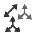

2. 从对话框顶部的类型列表中，选择 CSYS。

   方法 列表显示了可用于创建基准坐标系的方法。
3. 从方法列表中，选择 **从坐标系偏移 (Offset from CSYS)**。

Abaqus/CAE 将显示 **创建基准坐标系 (Create Datum CSYS)** 对话框。

4. 在对话框中，输入基准坐标系的名称。

为了帮助您跟踪基准坐标系，Abaqus/CAE 会在模型树中显示其名称。此外，您也可以使用模型树来重命名基准坐标系。

5. 在对话框中，选择以下基准坐标系之一：

*   **直角坐标 (Rectangular)**：X、Y、Z 轴分别与全局 1、2、3 轴对齐。
*   **柱坐标 (Cylindrical)**：R、θ、Z 轴分别与全局 1、2、3 轴对齐。
*   **球坐标 (Spherical)**：R、θ、φ 轴分别与全局 1、2、3 轴对齐。

6. 在 **创建基准坐标系 (Create Datum CSYS)** 对话框中，点击 **继续 (Continue)**。

7. 如果需要，从提示区选择 **设为独立 (Make Independent)**，将该基准创建为独立特征。

8. 在当前视口中，选择一个基准坐标系。

9. 从提示区的按钮中，选择以下之一：

## 输入值 (Enter Value)

在提示区的文本字段中，输入相对于所选默认坐标系的偏移 X、Y、Z 坐标。

## 选择点 (Select Point)

在当前视口中的零件或装配体上，选择一个点以定义相对于所选默认坐标系的偏移。

基准坐标系随即出现。您无法移动或旋转基准坐标系。

## 附加信息

*   创建基准坐标系的方法
*   基准创建技术
*   控制基准显示

## 通过两条线创建基准坐标系

您可以通过选择两条边来定位直角、柱或球基准坐标系。

第一条边定义 X 轴或 R 轴，X–Y 或 R–θ 平面通过第二条边。

下图显示了通过两条线创建直角基准坐标系的示例。


当 Abaqus/CAE 提示您选择一条边时，您可以选择一个基准坐标系的轴。

1.  从主菜单栏，选择 **工具 (Tools) -> 基准 (Datum)**。

    将出现 **创建基准 (Create Datum)** 对话框。该对话框概述了您可以创建的基准几何类型。

    Abaqus/CAE 会在提示区显示提示信息，引导您完成操作。

    

    **提示**：您也可以使用位于模块工具箱中的 **基准坐标系 (Datum CSYS)** 工具创建基准坐标系。有关工具箱中基准工具的图示，请参阅使用基准工具集。

2.  从对话框顶部的类型列表中，选择 **CSYS**。

    **方法 (Method)** 列表显示了可用于创建基准坐标系的方法。

3.  从方法列表中，选择 **两条线 (2 lines)**。

    Abaqus/CAE 将显示 **创建基准坐标系 (Create Datum CSYS)** 对话框。

4.  在对话框中，输入基准坐标系的名称。

    为了帮助您跟踪基准坐标系，Abaqus/CAE 会在模型树中显示其名称。此外，您也可以使用模型树来重命名基准坐标系。

5.  在对话框中，选择以下基准坐标系之一：

    *   **直角坐标 (Rectangular)**：X、Y、Z 轴分别与全局 1、2、3 轴对齐。
    *   **柱坐标 (Cylindrical)**：R、θ、Z 轴分别与全局 1、2、3 轴对齐。
    *   **球坐标 (Spherical)**：R、θ、φ 轴分别与全局 1、2、3 轴对齐。

6.  在 **创建基准坐标系 (Create Datum CSYS)** 对话框中，点击 **继续 (Continue)**。

7.  如果需要，从提示区选择 **设为独立 (Make Independent)**，将该基准创建为独立特征。

8.  在当前视口中的零件或装配体上，选择一条将定义基准坐标系 X 轴或 R 轴的直边。

9.  选择一条将位于 X–Y 或 R–θ 平面内的直边。

    基准坐标系随即出现。您无法移动或旋转基准坐标系。

## 附加信息

*   创建基准坐标系的方法
*   基准创建技术
*   控制基准显示

## 离散字段工具集

离散字段是一种空间变化的场，其值与节点或单元相关联。离散字段工具集允许您创建和管理离散字段。

## 本节内容：

*   使用离散字段工具集
*   创建离散字段
*   评估离散字段
*   为材料体积分数创建离散字段

## 使用离散字段工具集

离散字段工具集允许您定义空间变化的参数。离散字段中的参数可以与指定的单元或节点相关联。例如，您可以定义空间变化的厚度或方向（笛卡尔、柱坐标或球坐标）。离散字段工具集在 **属性 (Property)** 模块、**相互作用 (Interaction)** 模块和 **载荷 (Load)** 模块中可用。

从主菜单栏选择 **工具 (Tools) -> 离散字段 (Discrete Field) -> 创建 (Create)** 来创建新的离散字段；选择同一菜单下的 **编辑 (Edit)** 来更改现有的离散字段。这两个命令都会打开离散字段编辑器，允许您将数据与单元或节点关联。

## 创建离散字段

离散字段工具集在 **属性 (Property)** 模块、**相互作用 (Interaction)** 模块和 **载荷 (Load)** 模块中可用。从主菜单栏选择 **工具 (Tools) -> 离散字段 (Discrete Field) -> 创建 (Create)** 来创建离散字段。

1.  从主菜单栏，选择 **工具 (Tools) -> 离散字段 (Discrete Field) -> 创建 (Create)**。

    

    **提示**：您也可以在 **离散字段管理器 (Discrete Field Manager)** 中点击 **创建 (Create)**。

2.  在 **名称 (Name)** 文本字段中，输入离散字段的名称。有关命名对象的信息，请参阅使用基本对话框组件。
3.  在 **描述 (Description)** 文本字段中，输入离散字段的描述。
4.  选择 **单元 (Elements)** 或 **节点 (Nodes)** 来指定将应用该场的实体类型。
5.  选择数据类型。

    *   选择 **标量 (Scalar)** 以输入标量场数据。
    *   **方向 (Orientation)** 选项适用于与单元关联的场。选择 **方向 (Orientation)**，并执行以下操作：

        1.  选择坐标系类型 — **笛卡尔 (Cartesian)**、**柱坐标 (Cylindrical)** 或 **球坐标 (Spherical)**。
        2.  切换开启 **提供的方向在零件空间中定义 (Supplied orientation directions are defined in part space)**，以指定方向在零件或零件实例级别定义。当您在零件空间中定义方向时，Abaqus 会使用零件实例变换将方向值从零件的坐标系转换到装配体坐标系。切换关闭此选项以指定方向在装配体级别定义。

    *   选择 **规定的条件 (Prescribed condition)** 以在场数据中包含自由度值。

6.  输入默认分量值。有关 Abaqus 如何使用默认值的信息，请参阅评估离散字段。标量离散字段需要一个默认分量值。方向离散字段需要六个默认分量值。规定的条件离散字段需要六个默认分量值以及最多六个自由度值。
7.  在 **场数据 (Field Data)** 表中，输入以下值：

    *   单元或节点编号及其关联的分量值。
        当创建将与装配体级或历史对象（如载荷或相互作用）一起使用的离散字段时，您必须按照命名约定中所述，指定节点或单元编号的完整名称。例如，您需要使用 `Part_instance_name.EID` 的格式来指定零件实例名称和单元 ID，例如 `PART-2–1.20`。
    *   对于规定的条件离散字段，输入自由度值。

    在表格上点击鼠标按钮 3 可查看菜单，该菜单允许您执行以下操作：

    *   剪切、复制和粘贴值
    *   插入和删除行
    *   清除表格单元格或整个表格
    *   从逗号分隔文件读取或写入

    更多信息，请参阅输入表格数据。

8.  点击 **确定 (OK)** 以创建离散字段并退出编辑器。

## 附加信息

*   定义截面
*   复合材料层叠

## 评估离散字段

如果您为规定的条件指定了离散字段，Abaqus/CAE 会在写入输入文件时评估该离散字段。

如果某个单元或节点同时出现在为规定的条件选定的区域和离散字段中，Abaqus/CAE 会将该规定的条件的幅值乘以每个单元或节点处的值，以确定提交给分析的最终值。材料分配预定义场是唯一的例外；该规定的条件没有幅值。
*   如果某个单元或节点出现在为规定的条件选定的区域中，但未出现在离散字段中，则该规定的条件的幅值将乘以默认值，然后提交给分析。

表 1 总结了如何确定写入输入文件的标量离散字段的值。
表 1：评估标量离散场。

<table><tr><td>所选区域中的单元或节点是否用于预设条件？</td><td>离散场中的单元或节点？</td><td>写入输入文件的值</td></tr><tr><td>是</td><td>是</td><td>预设条件的大小 × 离散场中指定的大小</td></tr><tr><td>是</td><td>否</td><td>预设条件的大小 × 离散场中指定的默认值</td></tr><tr><td>否</td><td>是</td><td>不写入输入文件</td></tr></table>

对于具有多个自由度的预设条件，例如位移，会使用预设条件离散场；评估离散场变得更加复杂。对于可以激活单个自由度的预设条件，仅考虑预设条件中激活的自由度；任何在预设条件中未激活的自由度将被忽略。预设条件中为每个自由度指定的大小，将乘以离散场中指定的大小或该自由度在离散场中的默认值。

例如，如果您为 Node-set-1（包含节点 Part-2–1.10、Part-2–1.20 和 Part-2–1.30）定义了一个如图 1 所示的位移边界条件，以及一个如图 2 所示的预设条件离散场，则提交到输入文件的值如表 2 所示。


<details>
<summary>text_image</summary>

编辑边界条件
名称: BC-1
类型: Displacement/Rotation
分析步: Step-1 (Static, General)
区域: Node-set-1
坐标系: (Global)
分布: (D) DiscField-1 f(x)
U1:
U2:
U3: 10
UR1: 100 弧度
UR2:
UR3:
幅值: (Ramp)
注: 位移值将在后续分析步中保持。
确定 取消
</details>

图 1：激活了两个自由度的位移边界条件。

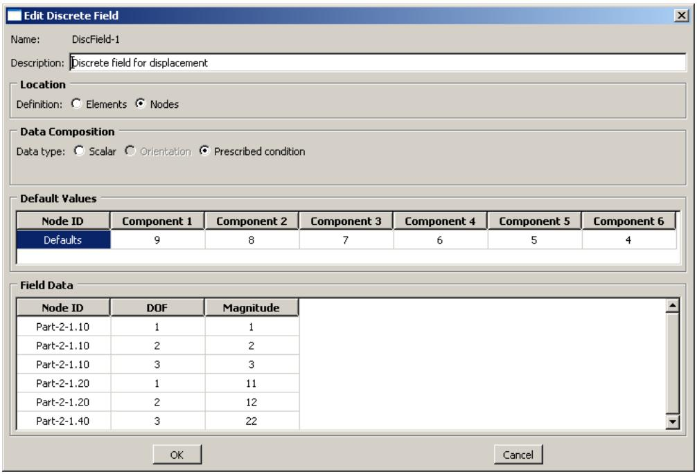

<details>
<summary>text_image</summary>

编辑离散场
名称: DiscField-1
描述: 位移的离散场
位置
定义: 单元 节点
数据组合
数据类型: 标量 方向 预设条件
默认值
节点 ID	分量 1	分量 2	分量 3	分量 4	分量 5	分量 6
默认值	9	8	7	6	5	4
场数据
节点 ID	自由度	大小
Part-2-1.10	1	1
Part-2-1.10	2	2
Part-2-1.10	3	3
Part-2-1.20	1	11
Part-2-1.20	2	12
Part-2-1.40	3	22
确定	取消
</details>

图 2：用于定义空间变化位移边界条件的预设条件离散场。

表 2：评估预设条件离散场的结果。

<table><tr><td>节点 ID</td><td>自由度</td><td>写入输入文件的值</td></tr><tr><td>Part-2-1.10</td><td>3 (U3)</td><td>30</td></tr><tr><td>Part-2-1.10</td><td>4 (UR1)</td><td>600</td></tr><tr><td>Part-2-1.20</td><td>3 (U3)</td><td>70</td></tr><tr><td>Part-2-1.20</td><td>4 (UR1)</td><td>600</td></tr><tr><td>Part-2-1.30</td><td>3 (U3)</td><td>70</td></tr><tr><td>Part-2-1.30</td><td>4 (UR1)</td><td>600</td></tr><tr><td>Part-2-1.40</td><td>3 (U3)</td><td>无</td></tr></table>

边界条件和预定义场中结果为零大小的自由度仍会被写入输入文件；然而，载荷中结果为零大小的自由度不会写入输入文件。

创建将用于装配级和历史对象（如载荷或相互作用）的离散场时，必须指定节点或单元编号的完整名称，如命名约定中所述。

## 创建用于材料体积分数的离散场

体积分数工具用于创建表示两个部件实例之间在逐单元基础上重叠的离散场。其中一个部件实例必须是网格化的欧拉部件。另一个部件实例作为参考几何。创建的离散场将欧拉部件中的每个单元与一个体积分数关联起来，该分数基于参考部件实例在该单元内占据的空间量。此离散场可用于在欧拉模型中分配材料（参见为欧拉部件实例分配材料）。有关在欧拉模型中使用体积分数工具的概述，请参阅使用体积分数工具。

体积分数工具在相互作用模块和载荷模块中可用。从主菜单栏选择工具->离散场->体积分数工具，使用体积分数工具创建离散场。

1. 从主菜单栏选择工具->离散场->体积分数工具。
2. 在视口中，选择一个网格化的欧拉部件实例。创建的离散场将与此欧拉部件中的单元关联。


## 警告：

您不应在使用体积分数工具后重新生成或编辑欧拉部件网格。对网格的任何更改——包括从重播或日志文件重新生成——都可能使创建的离散场失效。

3. 在视口中，选择一个与先前选择的欧拉部件实例相交的参考部件实例。此部件实例必须是三维实体或三维壳。参考部件实例不能包含自由边或内部分割面（自由或非流形边）。


## 注：

如果参考实例由网格化的几何组成，Abaqus/CAE 始终使用部件实例的网格化表示来计算体积分数。如果参考实例部分网格化，则仅考虑部件网格化的部分进行体积分数计算。

将出现“体积分数工具”对话框。

4. 在“名称”文本字段中，输入离散场的名称。有关命名对象的信息，请参阅使用基本对话框组件。
5. 在“描述”文本字段中，输入离散场的描述。
6. 要更改欧拉实例或参考实例，请单击“编辑”，然后在视口中选择新的部件实例。
7. 指定体积分数计算的“精度”（低、中或高）。较低的精度会导致工具运行更快。
8. 指定“材料位置”：
   - 选择“参考实例内部”意味着材料将分配给被参考实例占据或包围的区域。此区域内的所有欧拉元素都会被分配一个非零值。
   - 选择“参考实例外部”意味着材料将分配给未被参考实例占据或包围的区域。所有未被参考实例完全占据或包围的元素都会被分配一个非零值。

9. 指定介于 0 到 1 之间的“缩放系数”。离散场中的所有值都乘以此缩放系数。默认缩放系数为 1。

10. 要创建连接到离散场中具有非零体积分数元素的所有节点集，请选中“节点集”，并为该集输入名称。
11. 要创建连接到离散场中具有非零体积分数元素的所有单元集，请选中“单元集”，并为该集输入名称。
12. 单击“确定”以创建离散场并关闭“体积分数工具”对话框。

## 附加信息

*   为欧拉部件实例分配材料
*   使用体积分数工具
*   使用离散场工具集

您可以使用网格模块中的编辑网格工具集来改进网格质量。您可以修改孤立体网格，也可以修改原生 Abaqus 网格。

## 本节内容：

使用编辑网格工具集可以做什么？
网格划分策略和网格编辑技术
使用网格编辑工具
编辑节点
编辑单元
编辑整个网格
编辑和细化孤立体网格
在编辑网格工具集中撤销或重做更改

编辑孤立体网格、网格化部件和装配中网格化部件实例有什么区别？

## 使用编辑网格工具集可以做什么？

本节描述如何使用编辑网格工具集在网格模块中修改网格。

当您修改包含孤立体单元和节点的网格时，所有工具都可用；然而，只有少数工具可用于修改绑定到几何的网格节点或单元，包括装配中的网格化部件实例。

## 本节内容：

操作节点
操作单元
操作网格
细化网格

## 操作节点

编辑网格工具集提供以下工具，允许您操作网格中的节点：

创建节点。您可以在全局坐标系或您指定的基准坐标系中指定新节点的坐标。
编辑节点。您可以指定节点的新坐标，既可以在全局坐标系中指定，也可以在您指定的基准坐标系中指定。或者，您可以指定相对于当前位置的偏移量。您可以编辑单个节点，也可以同时编辑多个节点。

拖动节点。您可以点击并在模型中拖动节点。一次只能拖动一个节点，并且可以使用“投影到几何体”（Project to geometry）选项将外部节点投影到与其关联的几何体上。当您拖动节点时，单元质量检查（element quality checks）会自动激活，以显示单元错误和警告。有关单元质量检查的更多信息，请参见“验证单元质量”（Verifying element quality）。

投影节点。您可以指定一个顶点、边或面，Abaqus/CAE 会将节点从其当前位置投影到选定的实体上。您可以投影单个节点，也可以同时投影多个节点。您还可以将节点投影到其他节点、单元边、单元面、基准点、基准轴或基准平面上。

删除节点。与被删除节点关联的所有单元也会被删除。此外，您可以选择删除任何在删除选定节点及其关联单元后将变得不与任何单元关联的剩余节点。

合并选定节点。如果您只选择两个节点进行合并，Abaqus/CAE 会在选定节点的中点处创建一个新节点。如果选择两个以上的节点，您可以指定“节点合并容差”（Node merging tolerance），即节点将被合并的最大距离。Abaqus/CAE 会删除距离小于指定距离的节点，并用一个新的节点替换它们。新节点的位置是合并到该新节点的节点组的平均位置。

当 Abaqus/CAE 移除重复节点时，您可以选择同时移除具有相同连接关系的重复单元。您也可以在装配（Assembly）模块中合并零件实例，并且在此过程中可以选择合并节点；有关更多信息，请参见“合并和切割零件实例”（Merging and cutting part instances）。

平滑选定节点。您可以选择外部节点，Abaqus/CAE 会根据周围的节点平滑这些节点的位置。您可以平滑零件或装配上原生网格的任何外部节点，只要它们不是区域边界的一部分；您也可以平滑位于平面网格面内的外部孤立网格节点。
调整二阶单元的中间节点（midside node）的位置，以考虑断裂力学分析中裂纹尖端的奇异性。您可以选择节点并输入一个介于 0 到 1 之间的偏置参数（bias parameter）。Abaqus/CAE 会沿着相连的单元边移动中间节点，到达基于您输入的参数确定的位置。例如，如果您输入参数 0.25，Abaqus/CAE 会将中间节点的位置从选定节点向单元边长度四分之一处偏置。

有关更多信息，请参见“小应变分析中控制裂纹尖端奇异性”（Controlling the singularity at the crack tip for a small-strain analysis），以及“使用传统有限元方法为小应变分析构建断裂力学网格”（Constructing a Fracture Mechanics Mesh for Small-Strain Analysis with the Conventional Finite Element Method）。

• 重新编号孤立网格内的选定节点。您可以通过指定起始编号和增量，或者通过将现有编号偏移一个指定值来重新编号选定的节点。


提示：“网格编辑撤消”（Mesh Edit Undo）功能可以回滚您对网格中节点所做的任何更改。有关更多信息，请参见“在编辑网格工具集中撤消或重做更改”（Undoing or redoing a change in the Edit Mesh toolset）。

有关每种节点操作技术的详细说明，请参见“编辑节点”（Editing nodes）。

## 操作单元

编辑网格工具集提供了以下工具，允许您操作网格中的单元：

创建单元。您必须指定要创建的单元形状，并且必须按照该单元形状的适当顺序选择节点。
• 删除单元。您可以选择删除在删除选定单元后将变得不与任何单元关联的任何节点。
• 翻转壳单元的表面法线方向。
• 折叠四边形或三角形单元的一条选定边。折叠边对于从四边形和三角形单元中去除细长单元（slivers）非常有用，如图 1 所示。

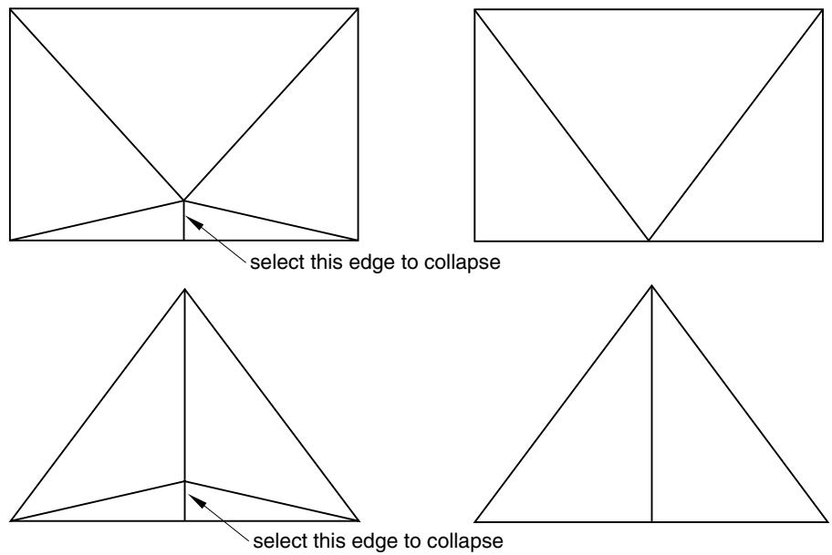
图 1: 折叠边以从四边形和三角形单元中去除细长单元。

当您预览四面体边界网格时，可以折叠三角形单元的选定边以去除细长单元。在某些情况下，当使用前沿推进算法（advancing front algorithm）创建全四边形网格时，Abaqus/CAE 可能会生成具有短边的四边形单元。您可以折叠该短边并创建一个形状良好的三角形单元，如图 2 所示。

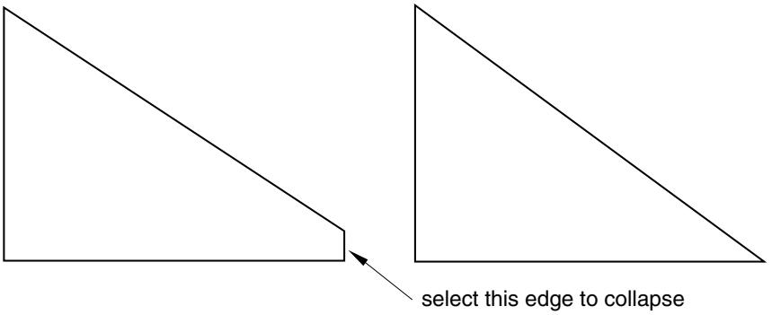

<details>
<summary>text_image</summary>

select this edge to collapse
</details>

图 2: 折叠四边形单元的一条边。

• 将四边形或三角形单元的一条选定边分割成两部分。您可以在其中点处分割该边，或者点击分割位置。您可以组合使用多种工具来清理网格。例如，

图 3 说明了如何分割一条边，然后折叠生成的边以去除一个狭长的三角形单元。
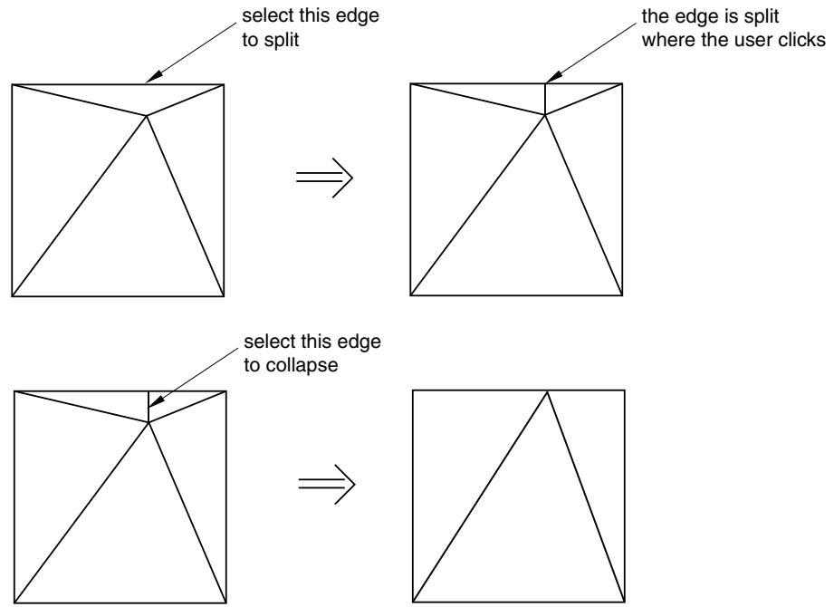
图 3: 分割和折叠三角形单元的边。

如果您在网格（Mesh）模块中编辑原生网格，Abaqus/CAE 会将新节点投影到几何体上。因此，您可以使用此工具来改进弯曲边周围的粗糙网格，如图 4 所示。


图 4: 通过分割边来改进孔周围的网格。

交换一对相邻三角形单元的对角线，如图 5 所示。如果相邻三角形单元阶次相同，您可以交换一阶或二阶相邻三角形单元的对角线。此外，相邻三角形单元必须具有一致的法线。如果需要，您可以翻转法线使其一致。


<details>
<summary>natural_image</summary>

Two geometric diagrams showing a square divided vertically into two triangles, one solid and one outlined, with no text or symbols present.
</details>

图 5: 交换一对相邻三角形单元的对角线。

将一个四边形单元分割成两个三角形单元，如图 6 所示。您不能分割 5 节点四边形单元，也不能分割垫片单元（gasket element）。


<details>
<summary>text_image</summary>

Diagram showing transformation of diamond shapes from left to right, with equivalence indicated by right arrow
</details>

图 6: 将四边形单元分割成两个三角形单元。

将两个相邻的三角形单元合并为一个四边形单元，如图 7 所示。您可以合并一阶或二阶单元，但不能合并两者混合的单元。此外，只有当相邻三角形单元具有一致的法线时才能合并单元。如果需要，您可以翻转法线使其一致。

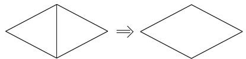

<details>
<summary>natural_image</summary>

Two diamond shapes side by side, one divided vertically and the other unlabelled (no text or symbols)
</details>

图 7: 将两个相邻的三角形单元合并为一个四边形单元。

定向连续壳（continuum shell）、内聚（cohesive）、圆柱形（cylindrical）或垫片（gasket）网格的堆叠方向（stack direction）。您只能堆叠六面体（hexahedral）、楔形（wedge）和四边形（quadrilateral）单元以形成连续壳、内聚、圆柱形或垫片网格。因此，您可以使用此工具仅定向六面体、楔形和四边形单元的堆叠方向。如果您已将圆柱形单元或二阶垫片单元分配给该区域，则必须在重新定向堆叠方向之前将分配更改为传统单元。然后，您可以通过重新分配圆柱形单元或二阶垫片单元将该区域转换回圆柱形或垫片网格。
• 重新编号孤立网格内的选定单元。您可以通过指定起始编号和增量，或者通过将现有编号偏移一个指定值来重新编号选定的单元。


提示：“网格编辑撤消”（Mesh Edit Undo）功能可以回滚您对网格中单元所做的任何更改。有关更多信息，请参见“在编辑网格工具集中撤消或重做更改”（Undoing or redoing a change in the Edit Mesh toolset）。
有关操作单元的详细说明，请参阅编辑单元。

## 操作网格

编辑网格工具集提供了以下工具，供您操作网格：

创建实体单元层，这些单元层沿所选现有网格单元面的法向偏移生成，如图 1 所示。此工具适用于使用实体单元为类壳部件划分网格。您可以指定所有单元层的总厚度以及要创建的单元层数。第一层单元可以与现有单元合并，也可以按指定距离偏移。所选单元面可以来自壳单元或实体单元，但不能同时来自两者。如果选择的是壳单元面，您可以选择在 Abaqus/CAE 生成实体单元层后是否删除这些壳单元。


<details>
<summary>natural_image</summary>

带孔的两个机械支架的三维线框模型，标注为“实体偏移网格”（支架本身没有文字或符号）
</details>

图 1：创建实体单元层。

您应使用此工具生成连续壳单元（continuum shell）和内聚单元（cohesive element），因为 Abaqus/CAE 生成的实体单元是从其偏移的表面法向堆叠而成的。

创建壳单元层，这些单元层沿所选现有网格单元面的法向偏移生成，如图 2 所示。

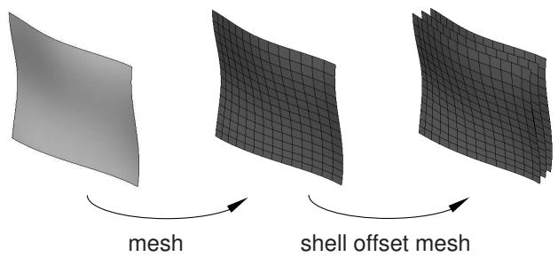

<details>
<summary>flowchart</summary>


```mermaid
graph LR
  A["表面"] -->|"网格"| B["网格网格"]
  B -->|"壳偏移网格"| C["网格网格"]
```
</details>

图 2：创建壳单元层。

此工具与上一个工具类似；但是，您不是指定单元层的总厚度，而是指定单元层之间的距离。您应使用此工具来创建现有壳网格的偏移副本，并创建多层复合材料模型或增强件。

包裹网格。您可以将平面的孤立网格绕全局 Z 轴在指定半径处包裹。包裹过程会将平面网格上点 $(x, y)$ 处的节点重新定位到 $(r, \pmb{\theta}, z)$，其中 $r$ 是指定半径，$\pmb{\theta} = \frac{\pmb{x}}{r}$，且 $z = $。
合并边。您可以指定网格中期望的最小单元边尺寸。Abaqus/CAE 会合并长度小于指定长度的单元边的端节点。默认情况下，Abaqus/CAE 会检查网格部件中的所有单元边，但您可以指定一个不同的单元域。

对于结构化网格，您可以指定一个厚度方向或参考边来限制考虑合并的边方向。如果选择厚度方向，Abaqus/CAE 将使用方向向量来测量单元，而不是仅测量节点之间的距离。如果单元的取向使得方向在拓扑上不明确，Abaqus/CAE 会高亮显示这些单元，以便您可以选择一个排除它们的域，或者添加一条参考边来进一步定义所需的边。当您选择参考边时，无论是否选择厚度方向，Abaqus/CAE 都只考虑拓扑上与参考边平行的边进行合并。参考边只能应用于结构化网格的单个部分中；如果需要参考边，多个独立部分必须在单独的合并操作中处理。

您不能对包含二次单元的单元域合并小边。

拉伸边。您可以指定您希望在模型中出现的最小单元边尺寸，Abaqus/CAE 会通过向外调整节点，有效地从相邻边中取用部分来将较小的边拉伸到指定的最小长度。如果调整其节点会导致相邻单元边过短，Abaqus/CAE 将无法增加边的长度。但是，如果您添加一个厚度方向，Abaqus/CAE 将拉伸该方向上的所有单元，使其达到最小尺寸。

此工具的选项与合并边工具相同；您可以指定一个单元域（而非整个网格部件），并且可以在结构化网格内使用厚度方向或参考边，仅拉伸满足您方向标准的那些边。您不能对包含二次单元的单元域拉伸边。


## 注意：

指定非整个网格的单元域时请谨慎。Abaqus/CAE 仅考虑拉伸所选域内的那些单元边。如果存在短单元边靠近域边界，Abaqus/CAE 在拉伸域内的边之前，不会检查域外相邻边的长度。拉伸域边界处的边可能导致域外出现短边或反向单元。

将三角形单元转换为四面体单元。您可以将一个封闭的三维三角形壳单元网格转换为四面体实体单元网格。三角形壳单元必须完全包围一个可以用实体单元填充的体积。
将实体孤立网格单元转换为壳孤立网格单元。此工具在部件的自由面上创建三角形或四边形壳单元。对于具有未合并节点（创建裂缝特征）的网格部件或具有不兼容网格的连接面的网格部件，Abaqus/CAE 会在界面两侧都创建壳单元。
合并单元层。您可以选择一组相邻单元并沿指定方向将它们合并。每个合并后的单元将具有父单元的组合形状和相同的单元类型。选择要合并的单元后，您在这些单元内选择一条边来指示合并方向，如图 3 左侧所示。顶层两层单元是通过按拓扑选择方法选择的（更多信息，请参阅使用拓扑方法选择多个单元）；为清晰起见，图中未显示选择。

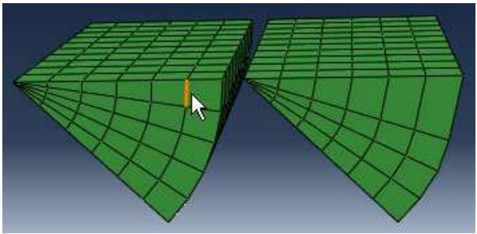

<details>
<summary>natural_image</summary>

绿色曲面的三维线框模型，带有光标指针，没有文字或符号
</details>

图 3：合并单元层。

您不必选择整个单元层进行合并。但是，如果您不选择整个层，Abaqus/CAE 会警告您新单元将与周围网格不兼容。然后您可以选择继续或取消合并过程。您不能合并二次单元。

细分单元层。您可以选择一组单元并通过等分单元边来拆分它们。Abaqus/CAE 会提示您选择一条边、一个面或所有方向，以指示将沿哪个方向创建新图层，并输入从每个单元边进行的划分数。您不能细分二次单元。
复制网格图案。您可以将二维网格图案应用于同一部件或装配体上的类似几何目标。选择源网格和目标几何图形后，您选择几个节点并将其映射到几何图形上的点，然后 Abaqus/CAE 完成映射过程，将网格图案应用于目标。
关联网格与几何图形。您可以将孤立网格或自下而上网格实体与选定的几何实体关联。Abaqus/CAE 会提示您选择一个顶点、边或面，然后选择要与几何图形关联的节点、单元边或单元面。关联可用于将载荷应用于网格，或在孤立网格单元与几何图形之间的界面处创建兼容的网格。
• 删除网格关联。您可以删除顶点、边、面或整个几何区域的网格-几何关联。您也可以删除原生网格的关联，以创建模型某部分的孤立网格。
插入内聚缝。您可以在裂缝区域打开成对的连接单元，并插入一层孔隙压力内聚单元，这些单元在间隙区域中作为孤立单元创建。Abaqus/CAE 会创建几个集合和表面，以帮助您在后续过程（例如截面分配）中进行选择。


提示：编辑网格撤消功能可以回滚您对网格所做的任何更改。有关更多信息，请参阅撤消或重做编辑网格工具集中的更改。

此外，更改所有节点和单元的标签，描述了如何对部件或装配体中所选部件实例的所有节点和/或单元重新编号。

有关操作网格的详细说明，请参阅编辑整个网格。

## 细化网格

编辑网格工具集提供了以下工具，供您细化三角形单元的平面网格：
设置尺寸。您可以为重新网格化过程指定全局单元尺寸。Abaqus/CAE 会更改新网格的密度以反映新的目标单元尺寸。如果网格包含线性或二次单元，您可以更改单元尺寸。
移除尺寸。您可以在重新网格化过程期间保持全局单元尺寸。Abaqus/CAE 会保持沿部件边界的单元边，同时改善内部网格质量。如果网格包含线性或二次单元，您可以细化网格。
• 重新网格化。您可以对包含线性或二次三角形单元的平面网格进行重新网格化。


提示：网格编辑撤消 (Mesh Edit Undo) 功能可以回滚任何网格细化更改。更多信息，请参见“撤消或重做编辑网格工具集中的更改”。

有关网格细化的详细说明，请参见“编辑和细化独立网格”。

## 在编辑独立网格、网格化部件与装配体中的网格化部件实例时，有何区别？

在网格 (Mesh) 模块中，您可以显示包含独立网格和原生网格组件组合的部件，也可以显示装配体。您可以使用编辑网格 (Edit Mesh) 工具集中的所有工具来编辑独立网格；但是，在编辑装配体中的网格化部件实例时，您只能使用以下工具：

• 编辑、拖动、投影、合并和平滑节点
• 删除单元
• 折叠单元边
• 拆分四边形或三角形单元的边
• 交换一对相邻三角形单元的对角线
• 将四边形单元拆分为两个三角形单元
• 将两个三角形单元合并为一个四边形单元

如果您选择的是装配体中的部件而不是部件实例，则可以使用上述网格编辑工具以及以下附加工具：

• 创建节点和单元
• 偏移网格层以创建实体或壳层
• 将网格与几何体关联
• 删除网格关联性
• 复制网格模式

通常，您不能使用编辑网格工具集来修改依赖部件实例的网格。但是，您可以编辑、拖动和投影依赖部件实例的节点；Abaqus/CAE 会修改原始网格化部件，并且您的修改会显示在该部件的所有依赖实例上。

您可以在网格模块中创建独立网格，或者从输出数据库或 Abaqus 输入文件导入独立网格。您可以在部件 (Part) 模块中向独立网格添加几何特征。独立网格的实例始终是依赖实例；因此，您不能使用编辑网格工具集来编辑装配体中的独立网格实例。但是，您可以显示用于创建该实例的原始独立网格并编辑该部件。更多信息，请参见“依赖部件实例与独立部件实例有何区别？”。

网格编辑撤消功能可以回滚您对网格所做的任何更改。更多信息，请参见“撤消或重做编辑网格工具集中的更改”。

## 网格化策略和网格编辑技巧

本节描述使用编辑网格工具集改进网格的策略以及可用于创建所需网格的技巧。

## 本节内容：

改进网格的策略
在 Abaqus/CAE 中使用偏移网格
减少网格偏移过程中的单元扭曲和折叠
允许在偏移实体网格中分支
从薄实体模型创建中平面壳网格
使用工具组合对导入的实体部件进行四面体网格划分

## 改进网格的策略

如果您拥有复杂的装配体，则应在提交分析作业之前，选择“网格 (Mesh)->验证 (Verify)”来验证网格质量。网格验证工具可以执行以下操作：

• 高亮显示不符合指定标准（如长宽比）的选定形状的单元。
• 打印网格统计信息，如所选形状的单元总数、高亮显示的单元数以及选择标准的平均值和最差值。
• 高亮显示未通过包含在 Abaqus/Standard 和 Abaqus/Explicit 输入文件处理器中的网格质量测试的单元。

如果网格验证工具提示您应该尝试提高网格质量，那么在转向编辑网格工具集之前，您应首先尝试以下方法：

• 更改种子分布
• 添加或修改分区
• 更改网格化技术

此外，您可以尝试在部件模块中修改部件，或者尝试使用虚拟拓扑 (Virtual Topology) 工具集并重新生成网格。您应将编辑网格工具集视为网格化过程的最后一步，并仅使用它对节点和单元进行微小调整。如果您对网格进行更改，Abaqus/CAE 会尝试保留属性，例如载荷和边界条件。如果您修改了部件，当您返回网格模块时，Abaqus/CAE 会删除该网格；因此，您将丢失对网格所做的任何编辑。

## 在 Abaqus/CAE 中使用偏移网格

编辑网格工具集中的偏移网格工具在 Abaqus/CAE 中有许多用途，如下所述：

## 连续壳网格

您可以使用实体偏移网格工具对本质上是加厚壳的薄实体进行网格划分，例如金属板材、复合材料或模制塑料组件。实体偏移网格工具可用于创建连续壳单元，因为 Abaqus/CAE 会一致地定向厚度方向上的单元。更多信息，请参见“使用连续壳单元对部件进行网格划分”。

## 内聚单元

您可以为二维模型的四边形单元分配内聚单元。对于三维模型，您可以使用实体偏移网格工具在网格上生成一层内聚单元。偏移网格工具生成的单元方向与垂直于厚度方向的堆叠方向一致，并且它是快速创建一层内聚单元的便捷工具。更多信息，请参见“在现有三维网格中嵌入内聚单元”。

## 皮肤增强件

如果您的皮肤可以定义为单层，则在属性 (Property) 模块中创建皮肤是首选方法。但是，您可以使用壳偏移网格工具创建使用多层增强层的皮肤。更多信息，请参见“使用偏移网格创建皮肤增强件”。

您还可以将实体偏移网格工具与网格模块中的网格生成工具结合使用，方法如下：

1. 在网格模块中创建部分网格。
2. 使用实体偏移网格工具完成网格。

您可以创建包含来自偏移网格的单元的集合。您可以创建一个包含偏移单元的单个集合，也可以为每一层偏移单元创建单独的集合。此外，如果您正在创建实体偏移网格，则可以从偏移网格的顶部和底部创建曲面，前提是第一层单元未嵌入原始网格中。您可以在后续过程中使用这些集合和曲面来帮助您从偏移网格中选择单元。例如，在为偏移单元层分配截面时，您可以选择一个集合。同样，在将一层内聚单元的一侧连接到周围块体材料时，您可以选择一个曲面。

## 减少网格偏移过程中的单元扭曲和折叠

Abaqus/CAE 通过以下方式创建偏移网格：

• 将节点沿现有网格曲面的法线方向偏移，
• 沿法线方向向外构建单元。

当您从凹面网格曲面创建偏移网格时，单元往往会收敛，如图 1 所示。

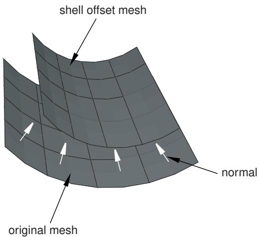

<details>
<summary>text_image</summary>

壳偏移网格
法线
原始网格
</details>

图 1：从凹面偏移时单元收敛。

因此，单元可能会折叠或反转，而偏移量的幅度受到曲率程度和单元大小的组合限制，如图 2 所示。


<details>
<summary>text_image</summary>

原始网格
壳偏移网格
</details>

图 2：在凹面区域偏移小单元时，单元可能会折叠或反转。

您可以通过在偏移网格 (Offset Mesh) 对话框中选择“拐角处保持恒定厚度”来尝试避免单元折叠和单元反转。选择此选项后，Abaqus/CAE 会从尖锐拐角向外传播的偏移单元进行锥形处理。所得单元具有恒定的节点偏移距离，而不是单元面层之间的恒定距离。图 3 展示了要求拐角处保持恒定厚度对偏移网格模式的影响。
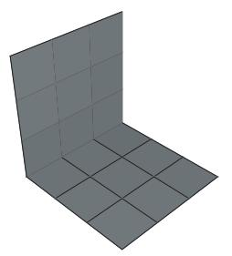

<details>
<summary>natural_image</summary>

没有文本或符号的立方体的三维线框图
</details>

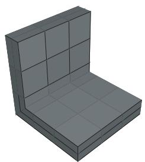

<details>
<summary>natural_image</summary>

带网格图案的灰色三维L形结构的三维渲染图（无文本或符号）
</details>

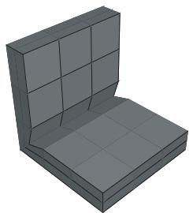

<details>
<summary>natural_image</summary>

带有弯曲底座的灰色三维渲染矩形块的三维渲染图，无文本或符号。
</details>


<details>
<summary>natural_image</summary>

折叠式太阳能电池板的三维示意图，无文本或符号
</details>

用于生成偏移量的表面

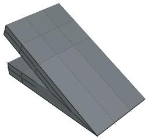

<details>
<summary>natural_image</summary>

带有三角形面的两个灰色几何块的三维渲染图，无文本或符号。
</details>

未使用“拐角处保持恒定厚度”选项进行偏移

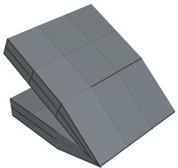

<details>
<summary>natural_image</summary>

带有网格状面的几何结构的三维渲染图，无文本或符号。
</details>

使用“拐角处保持恒定厚度”选项进行偏移
图 3：选择拐角处保持恒定厚度对偏移网格模式的影响。

对于实体和壳偏移网格，对偏移网格模式的影响是相似的。您也可以通过在凹区域使用更大的单元尺寸来减少单元扭曲。但是，只有在能够重新生成您正在偏移的网格时，您才能控制单元尺寸。

相反，当您从凸网格表面创建偏移网格时，单元往往会向外发散，如图 4 所示。


<details>
<summary>text_image</summary>

壳偏移网格
法线
原始网格
</details>

图 4：从凸表面偏移时，单元会发散。

## 允许在偏移实体网格中处理分支

如果一个部件具有“分支”，如图 1 所示，则创建偏移实体网格并不简单，因为分支区域中偏移的方向是模糊的。


<details>
<summary>natural_image</summary>

带有平面和带阴影角的网格的三维示意图（无文本或符号）
</details>

图 1：分支区域中偏移的方向是模糊的。

为了帮助您对该配置进行网格划分，Abaqus/CAE 提供了一个选项，可以将分支区域中的单元复制到一个集合中。

然后，您可以执行以下操作：

1.  使用显示组从孤立网格中移除包含分支区域单元的集合。
2.  从剩余的非分支区域创建偏移实体网格，如图 2 所示。


<details>
<summary>natural_image</summary>

带网格图案的两块矩形木板的三维插图，无文本或符号。
</details>

图 2：从非分支区域创建偏移实体网格。

3.  使用显示组仅显示包含分支的集合，如图 3 所示。


<details>
<summary>natural_image</summary>

矩形棱柱或外壳的三维渲染图，无文本或符号。
</details>

图 3：使用显示组仅显示包含分支的集合。

4.  从分支区域的一侧创建偏移实体网格。请注意偏移方向要正确（Abaqus/CAE 通过给单元面着色来指示偏移方向）。此外，在完成分支偏移之前，不要删除基础壳单元。

5.  从分支区域的另一侧创建偏移实体网格，如图 4 所示。

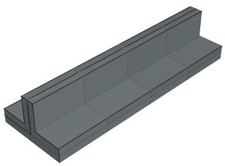

<details>
<summary>natural_image</summary>

带有内部通道且不可见文本或符号的矩形机械部件的三维渲染图。
</details>

图 4：分支区域中的偏移网格。

6.  使用显示组同时显示两个区域。
7.  使用“编辑网格”工具集中的“合并节点”工具，合并步骤 2、4 和 5 中创建的偏移网格。

## 从薄实体模型创建中平面壳网格

您可以使用偏移网格工具，按照以下过程从薄实体模型创建中平面壳网格：

1.  使用“部件”模块中的“从实体创建壳”工具将实体部件转换为壳。
2.  使用“几何编辑”工具集中的“移除面”工具，隔离部件上表面或下表面的一组面。
3.  用壳单元对简化模型进行网格划分，并创建网格部件。
4.  创建偏移壳网格，并指定一个对应于模型厚度一半的“初始偏移量”。

## 使用工具组合为导入的实体部件划分四面体单元网格

在某些情况下，您可能无法为导入的实体部件划分四面体单元网格，因为表面网格中存在非常薄的三角形单元，或者某些细长面无法用三角形进行网格划分。以下过程说明了如何组合使用“网格”模块中的工具来成功为部件划分网格：

1.  执行以下操作之一：
    *   从四面体边界网格开始。转到“网格”模块，在实体上创建一个四面体边界网格。
    *   从线性三角形网格开始。
2.  通过从主菜单栏选择 形状 -> 壳 -> 从实体 将实体部件转换为壳部件。
3.  转到“网格”模块，并用线性三角形单元为壳部件划分网格。
4.  从主菜单栏选择 网格 -> 创建网格部件 以创建一个作为孤立网格的新部件。有关更多信息，请参阅创建网格部件。
5.  将显示对象更改为孤立网格。
6.  从主菜单栏选择 工具 -> 编辑网格，并执行以下操作以清理网格：
    1.  从“类别”字段中，选择“网格”。
    2.  从“方法”列表中，选择“收缩边”。

    清理网格将自动合并短单元边上的节点并移除收缩的单元。有关更多信息，请参阅收缩线性孤立网格的短边。

7.  使用“编辑网格”工具集手动修复任何剩余的不良单元或间隙。有关更多信息，请参阅编辑单元。
8.  从主菜单栏选择 工具 -> 编辑网格，并选择“转换”以将线性三角形的壳网格替换为线性四面体的实体网格。有关更多信息，请参阅将三角形壳网格转换为实体四面体网格。
9.  转到“装配”模块，选择 实例 -> 替换 以用孤立网格的实例替换原始的壳部件实例。
10. 如果您希望孤立网格使用二阶四面体单元，您可以在“网格”模块中为孤立网格指定二次单元类型。

## 使用网格编辑工具

本节概述了“编辑网格”工具集中可用的工具。

您可以通过从主菜单栏选择 网格 -> 编辑 来访问这些工具。Abaqus/CAE 将显示“编辑网格”对话框。您也可以使用位于“网格”模块工具箱底部的工具来显示“编辑网格”对话框。

## 节点编辑工具

以下工具可用于编辑节点：

*   创建节点。有关更多信息，请参阅创建节点。
*   编辑节点。有关更多信息，请参阅编辑选定节点的位置。
*   拖动节点。有关更多信息，请参阅拖动节点。
*   投影节点。有关更多信息，请参阅投影节点。
*   删除节点。有关更多信息，请参阅删除节点。
*   合并节点。有关更多信息，请参阅合并节点。
*   调整中间节点。有关更多信息，请参阅调整中间节点的位置。
*   平滑外部节点。有关更多信息，请参阅平滑外部节点。
*   重新编号节点。有关更多信息，请参阅重新编号节点。

## 单元编辑工具

以下工具可用于编辑单元：

*   创建单元。有关更多信息，请参阅创建单元。
*   删除单元。有关更多信息，请参阅删除单元。
*   翻转法线。有关更多信息，请参阅反转壳单元的表面法线方向。
*   定向堆叠方向。有关更多信息，请参阅定向堆叠方向。
*   收缩边。有关更多信息，请参阅收缩四边形或三角形单元的边。
*   分割边。有关更多信息，请参阅分割四边形或三角形单元的边。
*   交换对角线。有关更多信息，请参阅交换一对相邻三角形单元的对角线。
• 拆分（Split）。更多信息，请参阅拆分四边形单元。
• 合并（Combine）。更多信息，请参阅合并三角形单元。
• 为单元重新编号（Renumber elements）。更多信息，请参阅为单元重新编号。

## 网格编辑工具

以下工具可用于编辑整个网格：

• 偏移实体（Offset solid）。更多信息，请参阅生成从现有网格偏移的实体单元层。
• 偏移壳体（Offset shell）。更多信息，请参阅生成从现有网格偏移的壳单元层。
• 包裹（Wrap）。更多信息，请参阅将网格围绕Z轴包裹。
• 折叠（Collapse）。更多信息，请参阅折叠线性孤立网格的短边。
• 增长（Grow）。更多信息，请参阅增长线性孤立网格的短边。
• 转换（Convert）。更多信息，请参阅将三角形壳网格转换为实体四面体网格，以及将实体孤立网格转换为壳孤立网格。
• 合并（Merge）。更多信息，请参阅合并单元。
• 细分（Subdivide）。更多信息，请参阅细分单元。
• 复制网格图案（Copy mesh pattern）。更多信息，请参阅复制网格图案。
• 查看和编辑网格-几何关联性（View and edit mesh-geometry associativity）。更多信息，请参阅查看和编辑网格-几何关联性。
• 删除网格-几何关联性（Delete mesh-geometry associativity）。更多信息，请参阅删除网格-几何关联性。
• 插入内聚缝（Insert cohesive seams）。更多信息，请参阅插入内聚缝。

## 网格细化工具

以下工具可用于细化网格：

• 设置尺寸（Set size）。
• 移除尺寸（Remove size）。
• 重新划分网格（Remesh）。

更多信息，请参阅编辑和细化孤立网格。

## 网格编辑的撤销和重做

您可以撤销和重做使用"编辑网格"工具集中的工具进行的多项更改，并控制可用的撤销级别数。更多信息，请参阅在"编辑网格"工具集中撤销或重做更改。

## 编辑节点

本节描述如何使用"编辑网格"工具集编辑构成孤立网格和Abaqus/CAE原生网格的节点。

## 本节内容：

创建节点
编辑选定节点的位置
拖动节点
投影节点
删除节点
合并节点
调整中间节点的位置
平滑外部节点
为节点重新编号
选择要编辑的节点

## 创建节点

从主菜单栏选择 网格->编辑，通过在全局坐标系或局部坐标系中输入其坐标来创建节点。

1.  进入网格（Mesh）模块。
2.  在上下文栏的**对象（Object）**字段中，选择**部件（Part）**，并从列表中选择一个部件。
3.  从主菜单栏中，选择**网格（Mesh）->编辑（Edit）**。

Abaqus/CAE 将显示"编辑网格（Edit Mesh）"对话框。


提示：您也可以使用位于网格（Mesh）模块工具箱底部的工具来显示"编辑网格（Edit Mesh）"对话框。

4.  在对话框中，执行以下操作：
    a. 在**类别（Category）**字段中，选择**节点（Node）**。
    b. 从**方法（Method）**列表中，选择**创建（Create）**。

    Abaqus/CAE 将显示现有节点。在隐藏和着色模式下，仅显示可见节点。

5.  如果需要，您可以在创建的基准坐标系而不是全局坐标系中输入新节点的坐标：
    a. 在提示区中，单击**选择（Select）**。
    b. 在视口中，选择要与新节点坐标关联的基准坐标系。（更多信息，请参阅创建基准坐标系。）

6.  在提示区的**坐标（Coordinates）**字段中，输入新节点的坐标。

    Abaqus/CAE 将创建新节点。


提示：如果您在创建节点时出错，请单击"编辑网格（Edit Mesh）"对话框中的**撤销（Undo）**以移除最近创建的节点。

7.  根据需要重复步骤3和4以创建更多节点。
8.  完成节点创建后，单击提示区中的**取消（cancel）**按钮退出该过程。

## 其他信息

• 我能用"编辑网格"工具集做什么？

## 编辑选定节点的位置

您可以编辑来自网格化部件、装配中的网格化部件实例或孤立网格的一个或多个选定节点的位置。

此外，如果您选择多个节点进行编辑，您可以为每个节点的特定坐标分配一个单一值。例如，您可以选择一组节点，并为每个节点分配一个X轴坐标值10.0。

这在您希望将节点定位在同一平面时特别有用；例如，在定义气缸盖或发动机缸体的配合面时。

通常，您不能使用"编辑网格"工具集编辑从属部件实例；但是，您可以编辑从属部件实例的节点。Abaqus/CAE 会移动原始网格的节点，您的修改将出现在该部件的所有从属实例上。


## 注意：

您可以直接从"编辑节点（Edit Nodes）"对话框的**撤销（Undo）**部分撤销或重做对节点位置所做的更改。此对话框中的**撤销（Undo）**和**重做（Redo）**按钮仅提供对节点位置更改的回滚控制；如果您想撤销或重做其他网格编辑操作，请使用"编辑网格（Edit Mesh）"对话框。有关编辑网格撤销的更多信息，请参阅在"编辑网格"工具集中撤销或重做更改。

1.  进入网格（Mesh）模块，并执行以下操作之一：
    *   从上下文栏的**对象（Object）**字段中，选择**装配（Assembly）**。
    *   从上下文栏的**对象（Object）**字段中，选择**部件（Part）**，并从列表中选择一个部件。

2.  从主菜单栏中，选择**网格（Mesh）->编辑（Edit）**。

    Abaqus/CAE 将显示"编辑网格（Edit Mesh）"对话框。


提示：您也可以使用位于网格（Mesh）模块工具箱底部的工具来显示"编辑网格（Edit Mesh）"对话框。

3.  在对话框中，执行以下操作：
    a. 在**类别（Category）**字段中，选择**节点（Node）**。
    b. 从**方法（Method）**列表中，选择**编辑（Edit）**。

    Abaqus/CAE 将显示现有节点。在隐藏和着色模式下，仅显示可见节点。

4.  从提示区中，选择选择方法并选择要编辑的节点。更多信息，请参阅选择要编辑的节点。


提示：您可以使用**选择（Selection）**工具栏更改拾取行为。更多信息，请参阅在视口中选择对象。

    Abaqus/CAE 将显示"编辑节点（Edit Nodes）"对话框以及所选节点沿每个轴的坐标最小值和最大值。

5.  如果需要，您可以在创建的基准坐标系而不是全局坐标系中输入节点的新坐标：
    a. 在"编辑节点（Edit Nodes）"对话框的顶部，单击**选择（Select）**。
    b. 在视口中，选择要与新节点坐标关联的基准坐标系。（更多信息，请参阅创建基准坐标系。）

6.  要通过偏移指定选定节点的新位置，请从**指定方式（Specification method）**选项中选择**偏移（Offsets）**，然后执行以下操作之一：

    ### 输入值
    在对话框中直接输入相对于当前位置的1-、2-和3-分量偏移值。

    ### 测量偏移向量
    在视口中单击并拾取两个点。Abaqus/CAE 将根据您从第一个选定的点到第二个选定的点的向量分量来填充偏移的1-、2-和3-分量。

7.  要通过坐标指定选定节点的新位置，请从**指定方式（Specification method）**选项中选择**坐标（Coordinates）**，然后执行以下操作之一：

    ### 输入值
    在对话框中直接输入1-、2-和3-分量。值**As is**表示至少有两个选定节点沿特定轴的坐标不同；单击分量字段右侧的箭头，然后选择**指定（Specify）**来指定一个值。

    ### 测量坐标
    单击 **ITIIT'** 并从视口中拾取新点。

8.  如果您正在网格（Mesh）模块中编辑Abaqus/CAE原生网格边界上的节点，Abaqus/CAE 会先将节点移动到新位置，然后将其投影回它们最初所在的几何体上。因此，位于某个曲面上的节点将保持在该曲面上，但位置不同。关闭**投影到几何体（Project to geometry）**开关，可以独立于底层几何体将节点移动到新位置。
9.  单击**确定（OK）**或**应用（Apply）**将节点移动到新位置。如果您单击**确定（OK）**，Abaqus/CAE 会移动节点并提示您选择要编辑的新节点。如果您单击**应用（Apply）**，Abaqus/CAE 会移动节点；但是，节点保持选定状态，您可以继续指定新位置。


提示：如果您在编辑节点时出错，请单击"编辑网格（Edit Mesh）"对话框中的**撤销（Undo）**以撤销编辑。Abaqus/CAE 将节点恢复到其原始位置。
10. 根据需要重复上述步骤，以编辑其他节点。

11. 完成节点编辑后，单击**取消**以关闭**编辑节点**对话框。

## 附加信息

• 我可以使用网格编辑工具集做什么？

## 拖拽节点

您可以在已划分网格的部件、装配体中的已划分网格的部件实例或孤立网格上拖拽节点。拖拽提供了一种快速重新定位节点并提高单元质量的方法。当您激活节点拖拽功能时，

Abaqus/CAE 会自动激活求解器单元质量检查，将带有警告的单元高亮显示为黄色，并将带有错误的单元高亮显示为品红色。您还可以在 Abaqus/CAE 拖拽节点时自动执行的测试中包含形状度量或尺寸度量测试。高亮显示会在您将节点拖到新位置时更新；因此，您可以立即看到是否正在改善单元质量。通常，您不能使用网格编辑工具集修改依附部件实例的网格；但是，您可以拖拽依附部件实例的节点。Abaqus/CAE 会修改原始网格的节点，您的修改会显示在该部件的所有依附实例上。

拖拽节点不会改变其关联性。在拖拽前与几何特征关联的节点在拖拽后仍将与该特征关联；未关联的节点在您将其拖到几何图形上后仍将保持未关联状态。

1. 进入**网格**模块，并执行以下操作之一：
   • 从上下文工具栏的**对象**字段中，选择**装配体**。
   • 从上下文工具栏的**对象**字段中，选择**部件**，然后从列表中选择一个部件。

2. 从主菜单栏中，选择**网格 -> 编辑**。
   Abaqus/CAE 将显示**编辑网格**对话框。


   **提示：** 您也可以使用位于**网格**模块工具箱底部的  工具来显示**编辑网格**对话框。

3. 在对话框中，执行以下操作：
   a. 在**类别**字段中，选择**节点**。
   b. 从**方法**列表中，选择**拖拽**。
      Abaqus/CAE 将显示现有节点。

4. 如果需要，单击提示区中的**单元失效准则**，以在 Abaqus/CAE 拖拽节点时自动执行的测试中包含形状度量或尺寸度量。

5. 从提示区，切换**投影到几何体**开关以控制外部节点的拖拽行为。
   • 如果开启**投影到几何体**，Abaqus/CAE 会将拖拽的外部节点约束到其关联的几何体上。只要节点保持在基础几何面上，您就可以在网格面上拖拽该节点。同样，您只能沿着创建边的折线拖拽边节点，并且不能拖拽与顶点关联的节点。在孤立网格区域，您可以拖拽任何节点；但不能将节点拖拽到网格的外边缘之外。
   • 如果关闭**投影到几何体**，Abaqus/CAE 会将拖拽的节点约束到一个平行于计算机屏幕并通过节点原始位置的平面上。因此，您可以在拖拽节点之前使用视图操作工具来更改可用的拖拽位置。如果您拖拽内部节点，也会是此行为，因为它们不受几何特征的约束。

6. 将光标放在要移动的节点上，按住鼠标左键不放，将节点拖拽到新位置。
   当您释放鼠标左键时，Abaqus/CAE 会在消息区显示节点编号和新坐标。

7. 根据需要重复上述步骤，以拖拽其他节点。

## 附加信息

• 我可以使用网格编辑工具集做什么？
• 验证单元质量

## 投影节点

您可以将一个或多个选中的节点从已划分网格的部件、装配体中的已划分网格的部件实例或孤立网格投影到选定的顶点、边、面、节点、单元边、单元面、基准点、基准轴或基准平面上。如果您想将自底向上网格上的节点移动到附近的几何体上，这尤其有用。通常，您不能使用网格编辑工具集修改依附部件实例的网格；但是，您可以投影依附部件实例的节点。Abaqus/CAE 会投影原始网格的节点，您的修改会显示在该部件的所有依附实例上。

投影节点不会改变其关联性。在投影前与几何特征关联的节点在投影后仍将与该特征关联；未关联的节点在您将其投影到几何图形上后仍将保持未关联状态。

1. 进入**网格**模块，并执行以下操作之一：
   • 从上下文工具栏的**对象**字段中，选择**装配体**。
   • 从上下文工具栏的**对象**字段中，选择**部件**，然后从列表中选择一个部件。

2. 从主菜单栏中，选择**网格 -> 编辑**。
   Abaqus/CAE 将显示**编辑网格**对话框。


   **提示：** 您也可以使用位于**网格**模块工具箱底部的  工具来显示**编辑网格**对话框。

3. 在对话框中，执行以下操作：
   a. 在**类别**字段中，选择**节点**。
   b. 从**方法**列表中，选择**投影**。
      Abaqus/CAE 将显示现有节点。在隐藏和着色模式下，仅显示可见节点。

4. 从提示区，选择选择方法并选择要投影的节点。更多信息，请参见**选择要编辑的节点**。


   **提示：** 您可以使用**选择**工具栏来更改拾取行为。更多信息，请参见**在视口中选择对象**。

5. 选择一个顶点、边、面、节点、单元边、单元面、基准点、基准轴或基准平面，Abaqus/CAE 将把选中的节点移动到该位置。
   Abaqus/CAE 将选定的实体颜色显示为品红色。

6. 在提示区选择**是**以确认您的选择。
   Abaqus/CAE 使用最短距离算法将选中的节点投影到新位置。如果您选择了边、面、单元边或单元面，Abaqus/CAE 会将节点投影到延伸选定边或面所创建的轴或平面上。


   **提示：** 如果您在编辑节点时出错，请在**编辑网格**对话框中单击**撤消**以撤消编辑。Abaqus/CAE 会将节点恢复到其原始位置。

   如果您选择**否**，则您的节点和实体选择将被取消，过程从步骤 4 继续。

7. 根据需要重复上述步骤，以投影其他节点。

## 附加信息

• 我可以使用网格编辑工具集做什么？

从主菜单栏中选择**网格 -> 编辑**以删除孤立网格节点。Abaqus/CAE 还会删除与被删节点相关的任何单元。如果您要删除的节点和相关单元属于现有的节点集或单元集，则这些集会相应更新。

1. 进入**网格**模块。
2. 从上下文工具栏的**对象**字段中，选择**部件**，然后从列表中选择一个部件。此工具仅适用于删除孤立网格节点。
3. 从主菜单栏中，选择**网格 -> 编辑**。
   Abaqus/CAE 将显示**编辑网格**对话框。


   **提示：** 您也可以使用位于**网格**模块工具箱底部的  工具来显示**编辑网格**对话框。

4. 在对话框中，执行以下操作：
   a. 在**类别**字段中，选择**节点**。
   b. 从**方法**列表中，选择**删除**。
      如果未显示**删除**方法，则所选部件中没有孤立节点。
      Abaqus/CAE 将显示现有节点。在隐藏和着色模式下，仅显示可见节点。

5. 在视口中，选择要删除的节点。您可以按住 **[Shift]** 并单击单个节点以将其添加到选择中，或按住 **[Ctrl]** 并单击已选中的节点以将其从选择中移除。


   **提示：** 您可以使用**选择**工具栏来更改拾取行为。更多信息，请参见**在视口中选择对象**。

   如果您希望从现有节点集的列表中选择，请执行以下操作：
   a. 单击提示区右侧的**集**。
      Abaqus/CAE 将显示**区域选择**对话框，其中包含您已创建的节点集列表。
   b. 选择要删除的节点集，然后单击**继续**。


## 注意：

默认的选择方法基于您最近使用的选择方法。要切换到另一种方法，请单击提示区右侧的**在视口中选择**或**集**。

Abaqus/CAE 将显示选中的节点以及与选中节点相关的单元。（您选中的节点以及与这些节点相关的任何单元都将被删除。）
6. 选择要删除的节点后，单击鼠标按钮 2。  
7. 与所选节点关联的单元也可能与未选中的节点关联。如果删除这些节点及其关联的单元后，那些未选中的节点将不再与任何单元关联，那么在提示区中单击 Yes，可以让 Abaqus/CAE 同时删除这些未选中的节点。


提示：如果在删除节点时出错，请单击 Edit Mesh 对话框中的 Undo 以撤销删除操作。Abaqus/CAE 将恢复被删除的一个或多个节点。

8. 根据需要重复上述步骤以删除更多节点。  
9. 删除节点完成后，单击鼠标按钮 2 或提示区中的取消按钮以退出此过程。

## 附加信息

• 使用 Edit Mesh 工具集可以做什么？

## 合并节点

从主菜单栏选择 Mesh -> Edit 以合并节点。如果仅选择两个节点进行合并，Abaqus/CAE 将在所选节点的中点处创建一个新节点。如果选择两个以上的节点，您可以指定节点之间的最大距离，Abaqus/CAE 将合并距离小于指定距离的节点。您还可以选择移除具有相同连接关系的重复单元。

1.  进入 Mesh（网格）模块。  
2.  在上下文工具栏的 Object（对象）字段中选择 Part（部件），并从列表中选择一个部件。此工具仅适用于操作包含孤立网格节点或使用自底向上网格划分方法创建的节点的部件。  
3.  从主菜单栏，选择 Mesh -> Edit。

Abaqus/CAE 显示 Edit Mesh 对话框。


提示：您也可以使用位于 Mesh（网格）模块工具箱底部的工具来显示 Edit Mesh 对话框。

4.  在对话框中，执行以下操作：

    a. 在 Category（类别）字段中，选择 Node（节点）。  
    b. 在 Method（方法）列表中，选择 Merge（合并）。

5.  从提示区中，选择选择方法并选择要合并的节点。有关更多信息，请参阅“选择要编辑的节点”。


提示：您可以使用 Selection（选择）工具栏来更改拾取行为。有关更多信息，请参阅“在视口内选择对象”。

6.  如果您仅选择了两个节点进行合并，Abaqus/CAE 将在所选节点的中点处创建一个新节点。

7.  如果您选择了两个以上的节点进行合并，请执行以下操作：

    a. 在提示区中，输入 Node merging tolerance（节点合并容差）以指定您希望合并的节点之间的最大距离。  
    b. 如果您为 Node merging tolerance 输入的值过大，Abaqus/CAE 可能检测到来自同一单元的重复节点。Abaqus/CAE 不会合并来自同一单元的节点，但过大的容差可能导致网格扭曲。如果 Node merging tolerance 过大，Abaqus/CAE 将询问您是否继续合并所选节点。

    • 单击 Yes 继续。  
    • 单击 No 取消合并过程。

    c. Abaqus/CAE 以洋红色高亮显示所有将被合并的节点，并询问您是否希望继续。

    • 单击 Yes 继续。  
    • 单击 No 取消合并过程。

    Abaqus/CAE 合并距离小于指定距离的节点，并用一个单一的新节点替换它们。新节点的位置是合并到该新节点中的节点组的平均位置。

您也可以在 Assembly（装配）模块中合并部件实例。有关更多信息，请参阅“对部件实例执行布尔运算”。

如果您之前创建了包含节点集或单元集，而这些节点或单元被合并操作删除，Abaqus/CAE 将相应地更新您的集合。


提示：如果在合并节点时出错，请单击 Edit Mesh 对话框中的 Undo 以撤销合并操作。Abaqus/CAE 将节点恢复到合并前的状态。

8.  根据需要重复上述步骤以合并更多节点。  
9.  合并节点完成后，单击鼠标按钮 2 或提示区中的取消按钮以退出此过程。

## 附加信息

• 使用 Edit Mesh 工具集可以做什么？

从主菜单栏选择 Mesh -> Edit 以调整二阶单元的中节点位置。

您可以使用此工具在断裂力学分析中考虑裂纹尖端处的奇异性。但是，此工具允许您编辑任何二阶单元；它不会检查您是否正在编辑断裂力学分析所需的退化四边形或楔形单元。有关更多信息，请参阅“控制小应变分析中裂纹尖端的奇异性”和“使用传统有限元方法为小应变分析构建断裂力学网格”。

您可以选择节点并输入一个介于 0 和 1 之间的偏差参数。Abaqus/CAE 将沿着连接的单元边移动中节点，其位置基于您输入的参数。例如，如果您输入参数 0.25，Abaqus/CAE 会将中节点的位置向远离所选节点的方向偏移单元边长度的四分之一。

1.  进入 Mesh（网格）模块。  
2.  在上下文工具栏的 Object（对象）字段中选择 Part（部件），并从列表中选择一个部件。此工具仅适用于操作包含孤立网格节点的部件。  
3.  从主菜单栏，选择 Mesh -> Edit。

Abaqus/CAE 显示 Edit Mesh 对话框。


提示：您也可以使用位于 Mesh（网格）模块工具箱底部的工具来显示 Edit Mesh 对话框。

4.  在对话框中，执行以下操作：

    a. 在 Category（类别）字段中，选择 Node（节点）。  
    b. 在 Method（方法）列表中，选择 Adjust midside（调整中间节点）。

    Abaqus/CAE 显示现有节点。在隐藏线模式和着色模式下，仅显示可见节点。

5.  选择节点，沿着连接的单元边调整中节点的位置将朝向这些节点。您可以选择节点，也可以选择单元边。如果选择单元边，Abaqus/CAE 将选择该单元边上的节点。

    您可以 [Shift] + 单击单个节点以将其添加到选择中，或 [Ctrl] + 单击已选中的节点以将其从选择中移除。


    提示：您可以使用 Selection（选择）工具栏来更改拾取行为。有关更多信息，请参阅“在视口内选择对象”。

    如果您希望从现有节点集列表中选择，请执行以下操作：

    a. 单击提示区右侧的 Sets（集合）。

    Abaqus/CAE 显示 Region Selection（区域选择）对话框，其中包含您已创建的节点集列表。

    b. 选择节点集，然后单击 Continue（继续）。


## 注意：

默认选择方法基于您最近使用的选择方法。要切换到另一种方法，请单击提示区右侧的 Select in Viewport（在视口中选择）或 Sets（集合）。

6.  在提示区中，输入偏差参数的值。您必须输入一个介于 0 和 1 之间的值。

    Abaqus/CAE 将沿着连接的单元边移动中节点到指定位置。


    提示：如果在调整节点时出错，请单击 Edit Mesh 对话框中的 Undo 以撤销调整。Abaqus/CAE 将节点恢复到其先前位置。

7.  根据需要重复步骤 4 和 5 以调整更多中节点。  
8.  调整节点完成后，单击提示区中的取消按钮以退出此过程。

## 附加信息

• 使用 Edit Mesh 工具集可以做什么？  
• 控制小应变分析中裂纹尖端的奇异性  
• 使用传统有限元方法为小应变分析构建断裂力学网格

从主菜单栏选择 Mesh -> Edit 以平滑部件或装配体表面上的节点位置。节点平滑操作可以改善网格密度的过渡或改善局部网格质量，而无需重新划分该区域或手动重新定位节点。您可以在使用表面作为自底向上网格或扫掠网格的源之前，使用节点平滑来改善其上的网格。

Abaqus/CAE 在您选择的每个节点上应用拉普拉斯平滑算法。所选节点被重新定位，以使它们与相邻节点的距离相等，从而创建一个更平滑的表面网格。

您只能选择部件或装配体的外部节点进行平滑。边界节点不会被平滑操作重新定位。

1.  进入 Mesh（网格）模块，并执行以下操作之一：

    • 在上下文工具栏的 Object（对象）字段中，选择 Assembly（装配）。
• 从上下文栏的“对象”字段中，选择“部件”，并从列表中选择一个部件。

2. 从主菜单栏中，选择网格->编辑。

Abaqus/CAE 显示“编辑网格”对话框。


提示：您也可以使用位于网格模块工具箱底部的工具来显示“编辑网格”对话框。

3. 在对话框中，执行以下操作：

a. 在“类别”字段中，选择“节点”。
b. 从“方法”列表中，选择“平滑”。

Abaqus/CAE 显示现有节点。在隐藏和着色模式下，仅显示可见节点。

4. 选择要平滑的节点。

您可以按住 [Shift] 并单击单个节点以将其添加到选择集中，或按住 [Ctrl] 并单击已选择的节点以将其从选择集中移除。


提示：您可以使用“选择”工具栏来更改拾取行为。更多信息，请参阅在视口内选择对象。

如果您更希望从现有的节点集列表中选择，请执行以下操作：

a. 单击提示区域右侧的“集”。

Abaqus/CAE 显示“区域选择”对话框，其中包含您已创建的节点集列表。

b. 选择节点集，然后单击“继续”。


注意：默认的选择方法基于您最近使用的选择方法。要切换回另一种方法，请单击提示区域右侧的“在视口中选择”或“集”。

5. 在提示区域中，单击“完成”。

Abaqus/CAE 平滑所选节点的位置。


提示：如果希望将节点恢复到先前的位置，请在“编辑网格”对话框中单击“撤消”以撤消平滑操作。

6. 根据需要重复步骤 4 和 5 以平滑其他节点。

您可以对同一节点多次应用平滑。经过几次迭代后，除非其他周围的节点被移动，否则该节点将不再被平滑算法移动。

7. 完成节点调整后，单击提示区域中的“取消”按钮退出该过程。

## 附加信息

• 我可以使用编辑网格工具集做什么？

## 重新编号节点

编辑网格工具集允许您重新编号节点。

从主菜单中选择网格->编辑，以对孤立网格的选定节点进行重新编号。您可以通过指定起始节点标签和增量，或者通过将现有节点标签偏移指定值来进行重新编号。（有关重新编号 Abaqus/CAE 原生网格的节点，请参阅更改所有节点和单元的标签。）

1. 进入网格模块。

此工具仅可用于处理不包含任何几何体的部件。您可以在部件或装配体上下文中工作。但是，对部件实例应用的任何重新编号都在部件级别进行，因此会影响该部件的所有实例。

2. 从主菜单中，选择网格->编辑。

Abaqus/CAE 显示“编辑网格”对话框。


提示：您也可以使用位于网格模块工具箱底部的工具来显示“编辑网格”对话框。

3. 在对话框中，执行以下操作：

a. 在“类别”字段中，选择“节点”。
b. 从“方法”列表中，选择“重新编号”。

Abaqus/CAE 显示“节点重新编号”对话框。如果在视口中显示单个网格部件，“部件标签范围”会显示整个部件的节点标签范围。

4. 执行以下任一操作以指定重新编号方法：

选择“按起始标签”，并输入第一个节点标签的值以及用于编号后续节点的增量。
• 选择“按偏移”，并输入将用于偏移现有节点标签的值。

5. 使用以下方法之一选择您想要重新编号的节点：

## 选择部件的所有节点

选择“全部”（在部件上下文中）或“部件”（在装配体上下文中）以重新编号部件的所有孤立网格节点。如果视口中存在多个网格部件实例，请单击


按钮以选择部件实例。

## 使用无序方法选择节点

1. 选择“指定”和“无序”，以任意顺序选择节点。
2. 单击“选择”以选择要重新编号的节点。
3. 从提示区域中，选择选择方法并选择要重新编号的节点。更多信息，请参阅选择要编辑的节点。

## 使用有向路径方法选择节点

1. 选择“指定”和“有向路径”，以从选定的起始节点到选定的终止节点，沿特征边重新编号节点。
2. 单击“选择”以选择要重新编号的节点。
3. 选择起始节点。Abaqus/CAE 显示沿特征边的所有节点。如果需要，修改角度以重新定义 Abaqus/CAE 定义特征边的方式。
4. 从提示区域选择“完成”。起始节点以紫色显示。
5. 选择终止节点。起始节点和终止节点必须位于同一特征边上。

## 使用序列方法选择节点

1. 选择“指定”和“序列”，以根据您选择节点的顺序来重新编号节点。
2. 单击“选择”以选择要重新编号的节点。
3. 按顺序选择起始节点和每个后续节点。
4. 完成选择节点后，单击鼠标按钮 2。

“部件标签范围”将显示重新编号后节点的节点标签范围。

6. 单击“确定”或“应用”以重新编号节点。如果单击“应用”，Abaqus/CAE 将重新编号节点；但是，节点仍处于选定状态，您可以继续对其重新编号。
7. 根据需要重复前述步骤以重新编号其他节点。
8. 完成节点重新编号后，单击“取消”以关闭“节点重新编号”对话框。

## 附加信息

• 更改所有节点和单元的标签
• 我可以使用编辑网格工具集做什么？

当您选择要编辑的节点时，Abaqus/CAE 会在提示区域显示一个菜单，允许您选择用于选择节点的技术。这些技术允许您选择单个节点或相邻节点组。

1. 使用以下方法之一选择您想要编辑的节点：

## 选择单个节点：

1. 从提示区域的菜单中，选择“逐个”。
2. 选择一个您想要重新编号的节点，或拖动选择一组节点。
3. 按住 [Shift] 并单击其他节点以将其添加到选择集中。
4. 如果需要，按住 [Ctrl] 并单击已选择的节点以将其从选择集中移除。

## 使用角度方法选择节点：

1. 从提示区域的菜单中，选择“按角度”。
2. 输入一个角度（从 0° 到 90°），并选择一个节点。
   Abaqus/CAE 会选择与选定节点相邻的所有单元面上的节点，直到这些单元面之间的角度等于或超过您输入的角度。（有关更多信息，请参阅使用角度和特征边方法选择多个对象。）
3. 使用“按角度”方法后，您可以按住 [Shift] 并单击其他节点以将其添加到选择集中，或按住 [Ctrl] 并单击已选择的节点以将其从选择集中移除。（有关更多信息，请参阅组合选择技术。）

## 使用特征边方法选择节点：

1. 从提示区域的菜单中，选择“按特征边”。
2. 输入一个角度（从 0° 到 90°）。
   Abaqus/CAE 通过查找所有单元边（其中两个相邻单元面之间的角度大于指定的角度）来识别模型中的所有特征边。
3. 选择一个单元边或节点。
   Abaqus/CAE 将沿穿过选定单元边或节点的特征边进行选择。如果另一条特征边以大于上一步指定的角度与之相交，则该特征边会被截断。
4. Abaqus/CAE 选择沿特征边的所有节点。（有关更多信息，请参阅使用角度和特征边方法选择多个对象。）或者，您可以选择多条特征边相交处的节点，Abaqus/CAE 将选择沿所有这些特征边的节点。
5. 使用“按特征边”方法后，您可以按住 [Shift] 并单击其他节点以将其添加到选择集中，或按住 [Ctrl] 并单击已选择的节点以将其从选择集中移除。（有关更多信息，请参阅组合选择技术。）

## 通过指定现有节点集来选择节点：

1. 单击提示区域右侧的“集”。Abaqus/CAE 显示“区域选择”对话框，其中包含您已创建的节点集列表。
2. 选择您想要重新编号的节点集，然后单击“继续”。


## 注意：
默认选择方法基于您最近使用过的选择方法。要切换回另一种方法，请点击提示区域右侧的“在视口中选择”或“集合”。

2. 完成节点选择后，从提示区域中选择“完成”。

## 附加信息

• 在当前视口中选择对象  
• 使用“编辑网格”工具集可以做什么？

## 编辑单元

本节描述如何使用“编辑网格”工具集来编辑构成孤立网格和 Abaqus/CAE 原生网格的单元。

## 本节内容：

创建单元  
删除单元  
反转壳单元的表面法线方向  
定位堆叠方向  
折叠四边形或三角形单元的边  
分割四边形或三角形单元的边  
交换一对相邻三角形单元的对角线  
分割四边形单元  
合并三角形单元  
重新编号单元  
选择要编辑的单元

## 创建单元

从主菜单栏选择“网格”>“编辑”以从选定节点创建单元。

1. 进入“网格”模块。
2. 从上下文栏的“对象”字段中，选择“部件”，并从列表中选择一个部件。
3. 从主菜单栏选择“网格”>“编辑”。

Abaqus/CAE 将显示“编辑网格”对话框。


提示：您也可以使用位于“部件”模块和“网格”模块工具箱底部的工具来显示“编辑网格”对话框。

4. 在对话框中，执行以下操作：

a. 在“类别”字段中，选择“单元”。
b. 从“方法”列表中，选择“创建”。

Abaqus/CAE 将显示现有节点。在隐藏和着色模式下，仅显示可见节点。

5. 在提示区域，点击“单元形状”字段旁的箭头，并从出现的列表中选择您需要的单元形状。
6. 在视口中，选择将定义单元的节点。您必须为上一步中指定的单元形状选择所需数量的节点。此外，您必须按特定顺序选择节点。在提示区域右侧，点击“提示”以查看单元形状和连通性的图示。例如，当您创建一个 10 节点四面体单元时，Abaqus/CAE 将显示下图：


<details>
<summary>流程图</summary>

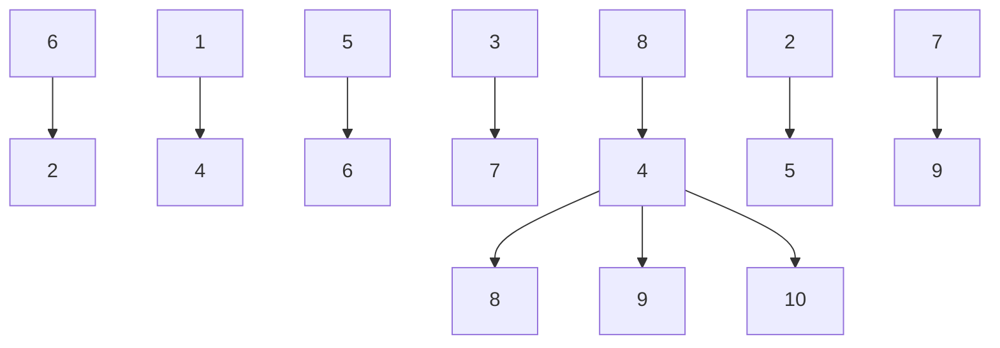
```mermaid
graph TD
  1["1"] --> 4["4"]
  n4["4"] --> 8["8"]
  n4 --> 9["9"]
  n4 --> 10["10"]
  3["3"] --> 7["7"]
  5["5"] --> 6["6"]
  n6["6"] --> 2["2"]
  n2["2"] --> n5["5"]
  n7["7"] --> n9["9"]
  n8["8"] --> n4
```
</details>

选择所需数量的节点后，Abaqus/CAE 将创建新单元。


提示：如果在创建单元时出错，请点击“编辑网格”对话框中的“撤消”以移除最近创建的单元。

7. 根据需要重复上述步骤以创建更多单元。如果更改了单元形状，请再次点击“提示”按钮以更新单元形状和连通性图示。
8. 完成单元创建后，点击鼠标键 2 或提示区域中的“取消”按钮退出该过程。

## 附加信息

• 使用“编辑网格”工具集可以做什么？

从主菜单栏选择“网格”>“编辑”以删除单元。您可以指示 Abaqus/CAE 在删除单元后，删除任何不再与任何单元关联的节点。如果您删除的单元和关联节点属于现有的单元集或节点集，这些集合将相应更新。

1. 进入“网格”模块。
2. 从上下文栏的“对象”字段中，选择“部件”，并从列表中选择一个部件。此工具仅可用于处理孤立网格单元或使用自底向上网格划分程序创建的单元。
3. 从主菜单栏选择“网格”>“编辑”。

Abaqus/CAE 将显示“编辑网格”对话框。


提示：您也可以使用位于“网格”模块工具箱底部的工具来显示“编辑网格”对话框。

4. 在对话框中，执行以下操作：

a. 在“类别”字段中，选择“单元”。
b. 从“方法”列表中，选择“删除”。

5. 如果您希望在删除选定单元后，删除任何不再与任何单元关联的节点，请在提示区域中启用“删除关联的未引用节点”。
6. 选择要删除的单元。您可以 [Shift] + 点击单元以将其添加到选择中，或 [Ctrl] + 点击已选单元以将其从选择中移除。


提示：您可以使用“选择”工具栏来更改拾取行为。更多信息，请参见在视口中选择对象。

如果您希望从现有单元集列表中进行选择，请执行以下操作：

a. 点击提示区域右侧的“集合”。
Abaqus/CAE 将显示“区域选择”对话框，其中包含您已创建的单元集列表。
b. 选择要删除的单元集，然后点击“继续”。


注意：默认选择方法基于您最近使用过的选择方法。要切换回另一种方法，请点击提示区域右侧的“在视口中选择”或“集合”。

Abaqus/CAE 将显示选定的单元。

7. 完成要删除的单元选择后，点击鼠标键 2。

Abaqus/CAE 将删除选定的单元。此外，如果您启用了“删除关联的未引用节点”，Abaqus/CAE 还会删除在选定单元删除后将不再与任何单元关联的节点。这些单元和节点也会从任何现有集合中移除。


提示：如果在删除单元时出错，请点击“编辑网格”对话框中的“撤消”以撤消删除操作。Abaqus/CAE 将恢复被删除的单元。

8. 根据需要重复上述步骤以删除更多单元。

9. 完成单元删除后，点击鼠标键 2 或提示区域中的“取消”按钮退出该过程。

## 附加信息

• 使用“编辑网格”工具集可以做什么？

从主菜单栏选择“网格”>“编辑”以反转选定壳单元的表面法线。这些单元可以是四边形或三角形。在反转表面法线的过程中，Abaqus/CAE 使用着色渲染样式显示部件，并且每个壳单元的正面和背面以不同颜色显示。如果您更改某个区域中表面法线的方向，Abaqus/CAE 不会更改应用于该区域的规定条件或命名曲面的方向。

1. 进入“网格”模块。
2. 从上下文栏的“对象”字段中，选择“部件”，并从列表中选择一个部件。
3. 从主菜单栏选择“网格”>“编辑”。

Abaqus/CAE 将显示“编辑网格”对话框。


提示：您也可以使用位于“网格”模块工具箱底部的工具来显示“编辑网格”对话框。

4. 在对话框中，执行以下操作：

a. 在“类别”字段中，选择“单元”。
b. 从“方法”列表中，选择“翻转法线”。

Abaqus/CAE 将使用着色渲染样式显示部件。每个单元的正面显示为棕色，背面显示为紫色。

5. 从提示区域，选择区域类型：“几何”或“网格”，并启用“高亮显示冲突边”以在具有冲突法线的连接单元之间显示或隐藏黄色边框。
6. 从提示区域，选择选择方法并选择要反转其法线的壳区域或孤立壳单元。更多信息，请参见选择要编辑的单元。
7. 完成区域或单元选择后，从提示区域选择“完成”。

如果您选择了几何区域，Abaqus/CAE 将更改单元的法线并返回到步骤 5。

8. 如果您选择了孤立单元，请选择一种反转表面法线的方法：
• 点击“全部翻转”以反转所有选定单元的法线。
• 点击“选择法线”以更改选定单元的法线，使其指向与您指定的参考单元的法线相同的方向。

9. 如果您在上一步中选择了“选择法线”，请执行以下操作：

a. 在视口中，选择参考单元。
b. 在提示区域，点击“确定”。

Abaqus/CAE 将更改选定单元的法线，使其指向与参考单元法线相同的方向，并返回到步骤 5，以便您可以进行更多选择。
10. 点击鼠标按键 2 退出该操作。

Abaqus/CAE 将恢复到启动反转法线操作之前所选的渲染样式。


提示：如果您在反转孤立元素的法线时出错，请在“编辑网格”对话框中点击“撤消”以撤消更改。Abaqus/CAE 将恢复所选元素的原始法线。

如果您在反转几何区域中本征元素的法线时出错，请选择该区域并再次反转法线。

## 其他信息

• 使用编辑网格工具集可以做什么？

从主菜单栏选择“网格”->“编辑”，以定向连续壳单元、内聚单元、圆柱形或垫片网格中元素的堆叠方向。您只能定向六面体、楔形体和四边形单元，因为只有这些单元才能堆叠形成连续壳、内聚、圆柱形或垫片网格。如果您已将圆柱形单元或二阶垫片单元分配给该区域，则必须先将分配更改为常规单元，然后才能重新定向堆叠方向。之后，您可以通过重新分配圆柱形单元或二阶垫片单元将该区域转换回圆柱形或垫片网格。如果您更改了某区域中元素的堆叠方向，Abaqus/CAE 不会更改应用于该区域的规定条件或命名面的方向。

1. 进入“网格”模块。  
2. 在上下文栏的“对象”字段中，选择“部件”并从列表中选择一个部件。此工具仅可用于处理孤立网格元素。要更改本征元素的堆叠方向，请参阅应用网格堆叠方向。

3. 从主菜单栏选择“网格”->“编辑”。

Abaqus/CAE 将显示“编辑网格”对话框。


提示：您也可以使用位于网格模块工具箱底部的工具来显示“编辑网格”对话框。

4. 在对话框中，执行以下操作：

a. 在“类别”字段中，选择“单元”。  
b. 从“方法”列表中，选择“定向堆叠方向”。

对于六面体和楔形体单元，Abaqus/CAE 将网格堆叠的底面涂为紫色，顶面涂为棕色。类似地，箭头指示四边形单元的方向。此外，Abaqus/CAE 会以红色高亮显示方向不一致的单元面和边。更多信息，请参见连续壳单元、使用几何和网格工具创建包含内聚单元的模型、垫片和圆柱实体的扫掠网格划分。

5. 在视口中，选择要定向的单元。您可以 [Shift] + 点击单个单元以将其添加到选择中，或 [Ctrl] + 点击已选单元以将其从选择中移除。


提示：您可以使用“选择”工具栏来更改拾取行为。更多信息，请参见在视口中选择对象。

6. 选择完要定向的单元后，点击鼠标按键 2。  
7. 如果您的部件使用六面体或楔形体单元划分网格，请从所选单元中选择一个面。Abaqus/CAE 使用所选面来表示参考方向的顶面。如果您的部件使用四边形单元划分网格，请从所选单元中选择一条边。Abaqus/CAE 将单元定向朝向所选边。


提示：如果您在定向单元时出错，请在“编辑网格”对话框中点击“撤消”以撤消更改。Abaqus/CAE 将恢复这些单元的原始方向。

8. 根据需要重复上述步骤以定向更多单元。

9. 完成单元定向后，点击鼠标按键 2 或提示区中的“取消”按钮以退出该操作。

## 其他信息

• 使用编辑网格工具集可以做什么？  
• 关于壳单元  
• 使用几何和网格工具创建包含内聚单元的模型  
• 连续壳单元  
• 垫片

## 折叠四边形或三角形单元的边

编辑网格工具集允许您将特定单元边两端的两个节点替换为一个节点。

从主菜单栏选择“网格”->“编辑”，以折叠四边形或三角形单元的选定边。实际上，您是将单元边两端的两个节点替换为一个节点。您可以选择两种方法来定位该单节点：

## 方向

选择“方向”以在指定方向上折叠单元边。从提示区的按钮中，选择“翻转”以更改 Abaqus/CAE 折叠单元的方向。下图展示了“方向”方法如何折叠单元边以及更改方向的效果：

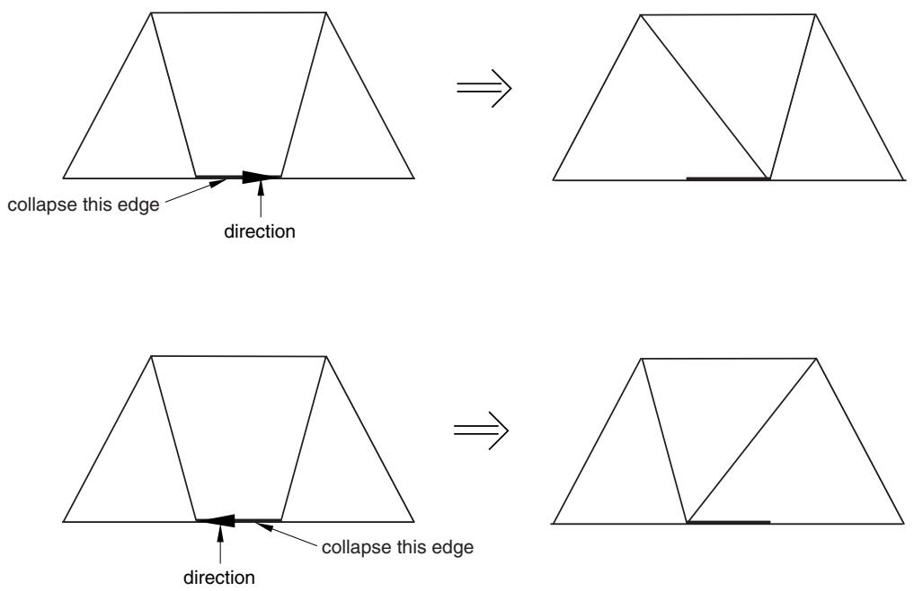

## 平均

选择“平均”以折叠单元边并重新调整剩余的单元边，使其在折叠边的中点处相交。下图展示了“平均”方法如何折叠单元边：


<details>
<summary>text_image</summary>

折叠此边
</details>

1. 进入“网格”模块。  
2. 在上下文栏的“对象”字段中，选择“部件”并从列表中选择一个部件。  
3. 从主菜单栏选择“网格”->“编辑”。

Abaqus/CAE 将显示“编辑网格”对话框。


提示：您也可以使用位于网格模块工具箱底部的工具来显示“编辑网格”对话框。

4. 在对话框中，执行以下操作：

a. 在“类别”字段中，选择“单元”。  
b. 从“方法”列表中，选择“折叠边（三角形/四边形）”。

5. 从提示区的菜单中，选择 Abaqus/CAE 将用于折叠边的方法。

• 选择“方向”以在指定方向上折叠单元边。  
选择“平均”以折叠单元边并重新调整剩余单元，使其在折叠边的中点处相交。

6. 选择要折叠的单元边。您只能选择单条边。

Abaqus/CAE 将高亮显示所选边，并提示您确认是否要折叠该边。

7. 在提示区的按钮中，点击“是”以折叠所选边。

Abaqus/CAE 将提示您选择下一条要折叠的边。

8. 根据需要重复上述步骤以折叠更多边。

9. 完成边的折叠后，点击鼠标按键 2 或提示区中的“取消”按钮以退出该操作。


提示：如果您在折叠边时出错，请在“编辑网格”对话框中点击“撤消”以撤消更改。Abaqus/CAE 将把网格恢复到操作前的状态。

## 其他信息

• 使用编辑网格工具集可以做什么？

## 拆分四边形或三角形单元的边

编辑网格工具集允许您将四边形或三角形单元的边拆分为两部分。

从主菜单栏选择“网格”->“编辑”，以将四边形或三角形单元的边拆分为两部分。下图展示了如何拆分一条边，然后折叠产生的边以移除一个狭长的三角形单元：


<details>
<summary>flowchart</summary>


```mermaid
graph LR
  A["选择要拆分的此边"] --> B["边在用户点击处被拆分"]
  B --> C["选择要折叠的此边"]
  C --> D["最终结果"]
```
</details>

当您拆分四边形单元时，Abaqus/CAE 会根据角度测量创建能产生最佳形状单元的边。您无法选择 Abaqus/CAE 会创建哪些边。但是，在 Abaqus/CAE 拆分边之后，您可以使用“交换对角线（三角形）”工具来更改对角线；更多信息，请参见交换相邻三角形单元对的对角线。

1. 进入“网格”模块并执行以下操作之一：

• 在上下文栏的“对象”字段中，选择“装配”。  
• 在上下文栏的“对象”字段中，选择“部件”并从列表中选择一个部件。

2. 从主菜单栏选择“网格”->“编辑”。

Abaqus/CAE 将显示“编辑网格”对话框。


提示：您也可以使用位于网格模块工具箱底部的工具来显示“编辑网格”对话框。

3. 在对话框中，执行以下操作：

a. 在“类别”字段中，选择“单元”。  
b. 从“方法”列表中，选择“拆分边（三角形/四边形）”。
4. 从提示区的菜单中，选择用于确定分割沿边位置的方法。您可以选择**中点**或**拾取位置**。

5. 如果选择**中点**来确定位置，请选择要分割的边。您只能选择一条单边。

   Abaqus/CAE 将高亮显示它将在中点处分割所选边而插入的边。

6. 如果选择**拾取位置**来确定位置，请在所需分割位置的边上单击。

   Abaqus/CAE 将高亮显示它将在拾取位置处分割所选边而插入的边。

7. 从提示区中，单击**分割边**。

   Abaqus/CAE 会分割该边，并提示您选择下一条要分割的边。

   

   **提示：** 如果您在分割单元边时犯了错误，请在**编辑网格**对话框中单击**撤销**以撤销分割操作。

8. 根据需要重复上述步骤以分割其他边。

9. 完成分割边后，按鼠标键2或单击提示区中的**取消**按钮退出该过程。

## 附加信息

*   我能用**编辑网格**工具集做什么？

## 交换相邻三角形单元的对角线

**编辑网格**工具集允许您交换一对相邻三角形单元的对角线。

从主菜单栏中选择**网格 -> 编辑**来交换一对相邻三角形单元的对角线，如下图所示：


<details>
<summary>text_image</summary>

展示菱形形状变换的图表，可能说明了数学或逻辑关系。
</details>

相邻的三角形单元必须具有一致的法线。如有必要，您可以使用**编辑网格**工具集来翻转法线；有关更多信息，请参见反转壳单元的表面法线方向。

1.  进入**网格**模块，并执行以下操作之一：

    *   从上下文栏的**对象**字段中，选择**装配体**。
    *   从上下文栏的**对象**字段中，选择**部件**，然后从列表中选择一个部件。

2.  从主菜单栏中，选择**网格 -> 编辑**。

    Abaqus/CAE 显示**编辑网格**对话框。

    

    **提示：** 您也可以使用位于**网格**模块工具箱底部的工具来显示**编辑网格**对话框。

3.  在对话框中，执行以下操作：

    a. 在**类别**字段中，选择**单元**。
    b. 从**方法**列表中，选择**交换对角线 (三角形)**。

4.  选择要交换的相邻三角形单元的边。您只能选择一条单边。

    Abaqus/CAE 高亮显示所选边，并提示您确认是否要交换该边。

5.  单击**是**以交换单元边。

    Abaqus/CAE 提示您选择下一条要交换的单元边。

    

    **提示：** 如果您在交换对角线时犯了错误，请在**编辑网格**对话框中单击**撤销**以撤销更改。Abaqus/CAE 将恢复两个相邻单元中的原始对角线。

6.  完成交换对角线后，按鼠标键2或单击提示区中的**取消**按钮退出该过程。

## 附加信息

*   我能用**编辑网格**工具集做什么？

## 分割四边形单元

**编辑网格**工具集允许您将四边形单元分割成两个三角形单元。

从主菜单栏中选择**网格 -> 编辑**来将四边形单元分割成两个三角形单元，如下图所示：

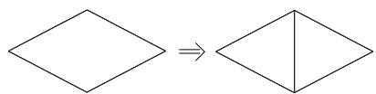

<details>
<summary>text_image</summary>

展示两个菱形形状变换的图表，箭头表示等价关系。
</details>

您无法分割5节点的四边形单元，也无法分割四边形形状的垫片单元。您可以选择多个四边形单元进行分割，只要它们属于同一个部件。

1.  进入**网格**模块，并执行以下操作之一：

    *   从上下文栏的**对象**字段中，选择**装配体**。
    *   从上下文栏的**对象**字段中，选择**部件**，然后从列表中选择一个部件。

2.  从主菜单栏中，选择**网格 -> 编辑**。

    Abaqus/CAE 显示**编辑网格**对话框。

    

    **提示：** 您也可以使用位于**网格**模块工具箱底部的工具来显示**编辑网格**对话框。

3.  在对话框中，执行以下操作：

    a. 在**类别**字段中，选择**单元**。
    b. 从**方法**列表中，选择**分割 (四边形转三角形)**。

4.  选择要分割的四边形单元。您可以使用在当前视口中选择对象中描述的任何选择技术。

    如果您的选择中包含非四边形的单元，Abaqus/CAE 会自动将其从选择中移除。

    Abaqus/CAE 高亮显示它将用于将每个四边形单元分割成两个三角形单元的对角线，并提示您继续。Abaqus/CAE 根据角度测量值选择能创建最佳形状单元的对角线。您无法选择 Abaqus/CAE 使用四边形的哪条对角线来分割单元。但是，在 Abaqus/CAE 分割单元后，您可以使用**交换对角线 (三角形)**工具来更改对角线；有关更多信息，请参见交换相邻三角形单元的对角线。

5.  单击**是**以分割所选单元。

    Abaqus/CAE 提示您选择更多要分割的单元。

    

    **提示：** 如果您在分割四边形单元时犯了错误，请在**编辑网格**对话框中单击**撤销**以撤销更改。

6.  完成分割单元后，按鼠标键2或单击提示区中的**取消**按钮退出该过程。

## 附加信息

*   我能用**编辑网格**工具集做什么？

## 合并三角形单元

**编辑网格**工具集允许您将两个相邻的三角形单元合并成一个四边形单元。

从主菜单栏中选择**网格 -> 编辑**来将两个相邻的三角形单元合并成一个四边形单元，如下图所示：

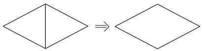

<details>
<summary>text_image</summary>

展示两个菱形形状变换的图表，箭头表示等价关系。
</details>

您可以合并一阶或二阶单元，但不能合并两者的组合。此外，只有当相邻的三角形单元具有一致的法线时，您才能合并它们。如有必要，您可以使用**编辑网格**工具集来翻转法线；有关更多信息，请参见反转壳单元的表面法线方向。

1.  进入**网格**模块，并执行以下操作之一：

    *   从上下文栏的**对象**字段中，选择**装配体**。
    *   从上下文栏的**对象**字段中，选择**部件**，然后从列表中选择一个部件。

2.  从主菜单栏中，选择**网格 -> 编辑**。

    Abaqus/CAE 显示**编辑网格**对话框。

    

    **提示：** 您也可以使用位于**网格**模块工具箱底部的工具来显示**编辑网格**对话框。

3.  在对话框中，执行以下操作：

    a. 在**类别**字段中，选择**单元**。
    b. 从**方法**列表中，选择**合并 (三角形转四边形)**。

4.  选择要合并的第一个三角形单元。

5.  选择要合并的第二个三角形单元。第二个单元必须与第一个单元相邻，并且必须与第一个单元阶次相同。

    Abaqus/CAE 指示它将如何将两个相邻的三角形单元合并成一个四边形单元，并提示您继续。

6.  单击**是**以合并单元。

    Abaqus/CAE 提示您选择下一对要合并的单元。

    

    **提示：** 如果您在合并三角形单元时犯了错误，请在**编辑网格**对话框中单击**撤销**以撤销更改。Abaqus/CAE 将恢复两个三角形单元。

7.  完成合并单元后，按鼠标键2或单击提示区中的**取消**按钮退出该过程。

## 附加信息

*   我能用**编辑网格**工具集做什么？

## 重新编号单元

**编辑网格**工具集允许您重新编号单元。

从主菜单栏中选择**网格 -> 编辑**来重新编号选定的单元。您可以通过指定起始标签和增量，或者通过将现有标签偏移指定值来重新编号选定的单元。（有关重新编号 Abaqus/CAE 原生网格单元的信息，请参见更改所有节点和单元的标签。）

1.  进入**网格**模块。

    此工具仅适用于处理不包含任何几何的部件。您可以在部件或装配体上下文中工作。但是，应用于部件实例的任何重新编号都在部件级别应用，因此会影响该部件的所有实例。
2. 从主菜单中，选择网格->编辑。

Abaqus/CAE 将显示编辑网格对话框。


提示：您也可以使用网格模块工具箱底部的工具来显示编辑网格对话框。

3. 在对话框中，执行以下操作：
    a. 在类别字段中，选择元素。
    b. 从方法列表中，选择重新编号。

Abaqus/CAE 将显示元素重新编号对话框。如果视口中只显示一个网格部件，则部件标签范围将显示整个部件的元素标签范围。

4. 选择以下任一方法来指定重新编号方法：
    *   选择按起始标签，并输入第一个元素的标签值以及用于后续元素编号的增量。
    *   选择按偏移量，并输入用于偏移现有元素标签的值。

5. 使用以下一种方法选择您想要重新编号的元素：

## 选择部件的所有元素
    在部件上下文中选择全部或在装配上下文中选择部件，以重新编号部件的所有孤立网格元素。如果视口中有多个网格部件实例，请点击
    按钮选择一个部件实例。

## 使用无序方法选择元素
    1. 选择指定和无序，以任意顺序选择元素。
    2. 点击选择以选择要重新编号的元素。
    3. 从提示区域，选择选择方法并选择要重新编号的元素。有关更多信息，请参见选择要编辑的元素。

## 使用定向路径方法选择元素
    1. 选择指定和定向路径，以沿着一条边从选定的起始元素到选定的结束元素重新编号元素。
    2. 点击选择以选择要重新编号的元素。
    3. 选择起始元素。Abaqus/CAE 将显示沿着特征边的所有元素。如果需要，可修改角度以重新定义 Abaqus/CAE 定义特征边的方式。
    4. 从提示区域选择完成。
    5. 选择结束元素。起始和结束元素必须位于同一特征边上。

## 使用序列方法选择元素
    1. 选择指定和序列，根据您选择元素的顺序来重新编号元素。
    2. 点击选择以选择要重新编号的元素。
    3. 选择起始元素。Abaqus/CAE 将显示沿着特征边的所有元素。如果需要，可修改角度以重新定义 Abaqus/CAE 定义特征边的方式。
    4. 从提示区域选择完成。起始元素以紫色显示。
    5. 选择结束元素。起始和结束元素必须位于同一特征边上。

部件标签范围将显示已重新编号元素的元素标签范围。

6. 点击确定或应用以重新编号元素。如果点击应用，Abaqus/CAE 将重新编号元素；但是，元素保持选中状态，您可以继续重新编号它们。
7. 根据需要重复上述步骤以重新编号其他元素。
8. 完成元素重新编号后，点击取消以关闭元素重新编号对话框。

## 附加信息
*   更改所有节点和元素的标签
*   我可以使用编辑网格工具集做什么？

当您选择要编辑的元素时，Abaqus/CAE 会在提示区域显示一个菜单，允许您选择用于选择元素的技术。这些技术使您能够选择单个节点或相邻元素组。

1. 使用以下一种方法选择您想要编辑的元素：

## 选择单个元素
    1. 从提示区域的菜单中，选择逐个。
    2. 选择一个您想要重新编号的元素，或拖动选择一组元素。
    3. [Shift] + 点击其他元素以将其添加到您的选择中。
    4. 如有必要，[Ctrl] + 点击已选元素以将其从选择中移除。

## 使用角度方法选择元素
    1. 从提示区域的菜单中，选择按角度。
    2. 输入一个角度（从 0° 到 90°），并选择一个元素。Abaqus/CAE 将选择与所选元素相邻的元素面上的所有元素，直到这些元素面之间的角度等于或大于您输入的角度。（有关更多信息，请参见使用角度和特征边方法选择多个对象。）
    3. 使用按角度方法后，您可以 [Shift] + 点击其他元素以将其添加到选择中，或 [Ctrl] + 点击已选元素以将其从选择中移除。（有关更多信息，请参见组合选择技术。）

## 使用特征边方法选择元素
    1. 从提示区域的菜单中，选择按特征边。
    2. 输入一个角度（从 0° 到 90°）。Abaqus/CAE 通过查找所有相邻元素面之间的角度大于指定角度的元素边来识别模型中的所有特征边。
    3. 选择一条元素边。Abaqus/CAE 将沿着通过所选元素边或节点的特征边进行跟踪。如果另一条特征边以大于上一步指定角度的角度与之相交，则该特征边将被截断。
    4. Abaqus/CAE 将选择沿着特征边的所有元素。（有关更多信息，请参见使用角度和特征边方法选择多个对象。）或者，您可以选择多条特征边相交处的节点，Abaqus/CAE 将选择沿着所有这些特征边的元素。
    5. 使用按特征边方法后，您可以 [Shift] + 点击其他元素以将其添加到选择中，或 [Ctrl] + 点击已选元素以将其从选择中移除。（有关更多信息，请参见组合选择技术。）

## 指定现有元素集
    1. 点击提示区域右侧的集合。Abaqus/CAE 将显示区域选择对话框，其中包含您已创建的元素集列表。
    2. 选择您想要重新编号的元素集，然后点击继续。


## 注意：
    默认选择方法基于您最近使用的选择方法。要切换到另一种方法，请点击提示区域右侧的选择视口中的或集合。

2. 完成元素选择后，从提示区域选择完成。

## 附加信息
*   在当前视口中选择对象
*   我可以使用编辑网格工具集做什么？

## 编辑整个网格
本节介绍如何使用编辑网格工具集对包含孤立网格组件、Abaqus/CAE 原生网格组件或两者组合的网格执行全局编辑。

## 本节内容：
*   生成偏移自现有网格的实体单元层
*   生成偏移自现有网格的壳单元层
*   将网格缠绕到 Z 轴
*   坍塌线性孤立网格的短边
*   增长线性孤立网格的短边
*   将三角形壳网格转换为实体四面体网格
*   将实体孤立网格转换为壳孤立网格
*   合并元素
*   细分元素
*   复制网格样式
*   查看和编辑网格-几何关联性
*   删除网格-几何关联性
*   插入内聚缝

## 生成偏移自现有网格的实体单元层
编辑网格工具集允许您生成实体单元层，这些层沿着从现有网格选定的单元面的法线方向偏移。

从主菜单栏选择网格->编辑，以生成沿着从现有网格选定的单元面的法线方向偏移的实体单元层，如下图所示：

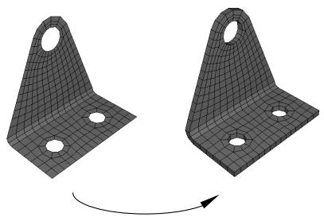

<details>
<summary>natural_image</summary>

两个带有孔的 3D 线框机械零件，以及一个表示旋转的弯曲箭头（无文本或符号）
</details>

实体偏移网格

1. 进入网格模块。
2. 从上下文栏的对象字段中，选择部件并从列表中选择一个部件。
3. 从主菜单栏，选择网格->编辑。

Abaqus/CAE 将显示编辑网格对话框。


提示：您也可以使用网格模块工具箱底部的工具来显示编辑网格对话框。

4. 在对话框中，执行以下操作：
    a. 在类别字段中，选择网格。
    b. 从方法列表中，选择偏移（创建实体层）。

5. 使用以下一种方法选择 Abaqus/CAE 将从中生成实体单元层的单元面。您可以选择壳单元面或实体单元面，但不能同时选择两者。如果选择壳单元面，则相邻壳单元的表面法线方向必须一致。您可以使用翻转法线工具反转壳单元的表面法线方向。有关更多信息，请参见反转壳单元的表面法线方向。
## 逐个选择单元

1.  从提示区的菜单中，选择“逐个选择”。
2.  选择单元面。
3.  按住 **[Shift]** 键并单击其他单元面，将其添加到选择集中。
4.  如有必要，按住 **[Ctrl]** 键并单击已选中的单元面，以取消选择它们。
5.  完成单元面选择后，单击**鼠标中键**。

## 指定现有曲面

1.  点击提示区右侧的“曲面”。
    Abaqus/CAE 将显示“区域选择”对话框，其中包含您已创建的曲面列表。
2.  选择曲面，然后点击“继续”。曲面必须仅包含四边形或三角形面。


## 注意：

默认选择方法基于您最近使用的方法。要切换到另一种方法，请点击提示区右侧的“在视口中选择”或“曲面”。

## 使用角度方法选择单元

1.  从提示区的菜单中，选择“按角度选择”。
2.  输入一个角度值（0° 到 90° 之间），并选择一个单元面。Abaqus/CAE 会从所选单元面开始，选择所有相邻单元面，直到单元面之间的夹角等于或超过您输入的角度。（有关更多信息，请参阅使用角度和特征边方法选择多个对象。）
3.  使用“按角度选择”方法后，您可以按住 **[Shift]** 键并单击其他单元面将其添加到选择集中，或按住 **[Ctrl]** 键并单击已选中的单元面将其从选择集中移除。（有关更多信息，请参阅组合选择技巧。）
4.  完成单元面选择后，单击**鼠标中键**。

6.  在出现的“偏移网格 - 实体层”对话框中，执行以下操作：

    a. 如果您选择了壳单元面进行偏移，可以选择颜色来指示所需的偏移方向。可供选择的两种颜色分别对应于所选单元面的两侧。您也可以选择“两者”以指示 Abaqus/CAE 应在所选壳单元的两侧都创建实体单元层。
    b. 输入所有层组合的“总厚度”。输入的值必须为正数。但是，如果您要创建用于内聚分析的零厚度单元，则可以输入值 0。
    c. 输入“层数”。
    d. 如有需要，勾选“指定初始偏移量”，并输入初始偏移值。负的初始偏移量表示单元之间存在过盈。
    e. 如果进行偏移的曲面包含尖角，请勾选“在拐角处保持恒定厚度”。如果您预计生成的偏移单元可能会塌陷或反转，也应勾选此选项。有关更多信息，请参阅在网格偏移过程中减少单元畸变和塌陷。
    f. 要使实体单元第一层的节点与所选单元面的节点共享，请勾选“与基础壳/曲面共享节点”。此选项仅在实体单元第一层未从所选单元面偏移时可用。
    g. 要在创建实体单元层后删除所选的壳单元，请勾选“删除基础壳单元”。此选项仅在您选择了孤立壳单元面进行偏移时可用。
    h. 如果要创建一个包含实体偏移网格中所有单元的集合，请勾选“为新单元创建集合”。
    i. 如果要创建包含实体偏移网格每一层单元的单独集合，请勾选“为每层创建单独集合”。Abaqus/CAE 在为每层创建单独集合时，会在集合名称前缀后附加“层-层编号”。
    j. 如果实体偏移网格的全部或部分不会嵌入到现有网格中，您可以通过勾选“创建顶面和底面”从偏移网格的顶面和底面创建曲面。Abaqus/CAE 在创建这两个曲面时，会在名称前缀后附加“BottomSurf”和“TopSurf”。
    k. 如有需要，为单个集合输入新名称，或为单独集合和/或曲面输入新的前缀。

7.  Abaqus/CAE 创建垂直于所选单元面方向偏移的实体单元层。完成实体单元层的生成后，单击**鼠标中键**或提示区中的“取消”按钮退出该过程。


**提示：** 如果在生成单元层时出错，请点击“编辑网格”对话框中的“撤消”来撤消更改。Abaqus/CAE 会将网格恢复到操作前的状态。

编辑孤立网格后，应始终验证基于节点、单元和曲面的特征（例如截面指派、载荷和相互作用），以确保它们已正确应用于修改后的网格。

## 其他信息

*   使用偏移网格创建表面加强层
*   粘接接头和粘合界面
*   在 Abaqus/CAE 中使用偏移网格
*   在网格偏移过程中减少单元畸变和塌陷
*   允许在偏移实体网格中进行分支
*   从薄实体模型创建中面壳网格

## 从现有网格生成偏移壳单元层

“编辑网格”工具集允许您生成壳单元层，这些层垂直于从现有网格中选择的单元面进行偏移。

从主菜单栏选择 **网格 -> 编辑**，以生成垂直于从现有网格中选择的单元面方向偏移的壳单元层，如下图所示：


<details>
<summary>流程图</summary>


```mermaid
graph LR
  A["网格开始"] --> B["网格网格"]
  B --> C["壳偏移网格"]
  C --> D["网格结束"]
```
</details>

1.  进入“网格”功能模块。
2.  从上下文栏的“对象”字段中，选择“部件”，然后从列表中选择一个部件。
3.  从主菜单栏中，选择 **网格 -> 编辑**。
    Abaqus/CAE 将显示“编辑网格”对话框。


**提示：** 您也可以使用位于“网格”功能模块工具箱底部的“编辑网格”工具来显示“编辑网格”对话框。

4.  在对话框中，执行以下操作：
    a. 在“类别”字段中，选择“网格”。
    b. 从“方法”列表中，选择“偏移（创建壳层）”。

5.  使用以下方法之一选择 Abaqus/CAE 用于生成壳单元层的单元面。您可以选择壳单元面或实体单元面，但不能同时选择两者。如果选择壳单元面，则相邻壳单元的曲面法线方向必须一致。您可以使用“翻转法线”工具翻转壳单元的曲面法线方向。有关更多信息，请参阅翻转壳单元的曲面法线方向。

## 逐个选择单元

1.  从提示区的菜单中，选择“逐个选择”。
2.  选择单元面。
3.  按住 **[Shift]** 键并单击其他单元面，将其添加到选择集中。
4.  如有必要，按住 **[Ctrl]** 键并单击已选中的单元面，以取消选择它们。
5.  完成单元面选择后，单击**鼠标中键**。

## 指定现有曲面

1.  点击提示区右侧的“曲面”。
    Abaqus/CAE 将显示“区域选择”对话框，其中包含您已创建的曲面列表。
2.  选择曲面，然后点击“继续”。曲面必须仅包含四边形或三角形面。


## 注意：

默认选择方法基于您最近使用的方法。要切换到另一种方法，请点击提示区右侧的“在视口中选择”或“曲面”。

## 使用角度方法选择单元

1.  从提示区的菜单中，选择“按角度选择”。
2.  输入一个角度值（0° 到 90° 之间），并选择一个单元面。Abaqus/CAE 会从所选单元面开始，选择所有相邻单元面，直到单元面之间的夹角等于或超过您输入的角度。（有关更多信息，请参阅使用角度和特征边方法选择多个对象。）
3.  使用“按角度选择”方法后，您可以按住 **[Shift]** 键并单击其他单元面将其添加到选择集中，或按住 **[Ctrl]** 键并单击已选中的单元面将其从选择集中移除。（有关更多信息，请参阅组合选择技巧。）
4.  完成单元面选择后，单击**鼠标中键**。

6.  在出现的“偏移网格 - 壳层”对话框中，执行以下操作：

    a. 如果您选择了壳单元面进行偏移，可以选择颜色来指示所需的偏移方向。可供选择的两种颜色分别对应于所选单元面的两侧。您也可以选择“两者”以指示 Abaqus/CAE 应在所选壳单元的两侧都创建壳单元层。
b. 输入层间距。您可以输入 0；例如，如果您想创建共享节点的多层蒙皮增强。  
c. 输入层数。  
d. 如果需要，勾选“指定初始偏移”，并输入初始偏移值。负的初始偏移表示单元间的过盈。  
e. 如果您进行偏移的曲面包含锐角，请勾选“转角处保持恒定厚度”。如果您预计生成的偏移单元可能会坍塌或反转，也应勾选此选项。更多信息，请参见“减少网格偏移过程中的单元畸变和坍塌”。  
f. 要将壳单元的第一层的节点与所选单元面的节点共享，请勾选“与基础壳/曲面共享节点”。仅当壳单元的第一层未从所选单元面偏移时，此选项才可用。  
g. 要在创建壳单元层后删除所选的壳单元，请勾选“删除基础壳单元”。仅当您选择了要进行偏移的孤立壳单元面时，此选项才可用。  
h. 如果要创建一个包含壳偏移网格中所有单元的单个集合，请勾选“为新单元创建一个集合”。  
i. 如果要为壳偏移网格的每一层的单元创建单独的集合，请勾选“为每一层创建单独的集合”。当为每一层创建单独的集合时，Abaqus/CAE 会在集合名称前缀后附加 Layer-层号。  
j. 如果需要，为单个集合输入新名称，或为单独的集合输入新的前缀。

7. Abaqus/CAE 沿所选单元面的法向创建偏移的壳单元层。当您完成生成壳单元层后，单击鼠标按钮 2 或在提示区中单击取消按钮退出该过程。


提示：如果您在生成单元层时出错，请单击“编辑网格”对话框中的“撤消”以撤消更改。Abaqus/CAE 会将网格恢复到操作前的状态。

在编辑孤立网格后，您应始终验证基于节点、单元和曲面的特征（例如截面分配、载荷和交互），以确保它们正确应用于修改后的网格。

## 附加信息

• 使用偏移网格创建蒙皮增强  
• 粘合接头和粘合界面  
• 在 Abaqus/CAE 中使用偏移网格  
• 减少网格偏移过程中的单元畸变和坍塌

## 沿 Z 轴包裹网格

使用 Abaqus 脚本接口方法 wrapMesh 将平面孤立网格包裹在由全局 Z 轴和指定半径定义的圆柱曲面上。

平面网格必须位于 X-Y 平面内，并且零件的建模空间应为三维。如果需要，您可以通过在模型树中右键单击零件并从出现的菜单中选择“编辑”来更改零件的建模空间。

包裹过程会将平面网格上位于点 ( , ) 的节点移动到 $( r , \pmb \theta , z )$，其中  是指定的半径，$\begin{array} { r } { \pmb { \theta } = \frac { \pmb { x } } { r } } \end{array}$，且 $\scriptstyle z = y ,$ 如图 1 所示。位于 (0, 0) 的平面孤立网格上的点将被映射到圆柱曲面上的 ( , 0, 0) 位置。


<details>
<summary>text_image</summary>

y
Δx
A
(0,0)
Δy
x
包裹
Δx
z
A
r
x
Δy
y
(r,0,0)
</details>

图 1：包裹平面孤立网格。

由于只有零件实例可以被定位，并且只有零件可以被包裹，因此如果您想创建一个在装配体中被包裹并正确定向的孤立网格实例，则需要一些规划。以下步骤将帮助您实现所需目标：

1. 使用装配模块中的工具在装配体中平移和/或旋转平面孤立网格的实例。  
2. 使用网格模块中的“创建网格零件”工具，从重新定向的实例创建平面网格零件。  
3. 包裹重新定向的网格零件。  
4. 创建包裹零件的实例，并使用装配模块中的工具在装配体中平移和/或旋转该实例。

如果您尝试创建 360° 完整包裹，离散化近似可能会导致接缝边缘的节点之间出现小间隙。您必须使用合并节点工具，通过将节点对合并为单个节点来缝合接缝；更多信息，请参见“合并节点”。

下面展示了一个使用 Abaqus 脚本接口包裹网格的示例：

```txt
model = mdb.models['Model-1']
part = model.parts['Part-1']
part.wrapMesh(radius=5.0)
```

您可以使用命令行界面输入 Abaqus 脚本接口命令，如使用 Python 解释器中所述。

## 附加信息

• 我可以使用编辑网格工具集做什么？

• 编辑网格命令

## 折叠线性孤立网格的短边

从主菜单栏选择 网格->编辑 以折叠线性孤立网格的选定边。您可以指定应被折叠的单元边的最小长度，Abaqus/CAE 将合并比指定长度短的单元边的端节点。您可以指定除整个网格之外的单元域，还可以指定方向和/或参考边以仅折叠符合这些条件的边。仅当单元域仅包含线性单元时，才能折叠网格。

1. 进入网格模块。在上下文栏的“对象”字段中选择“零件”，并从列表中选择一个零件。  
2. 从主菜单栏中，选择 网格->编辑。

Abaqus/CAE 显示“编辑网格”对话框。


提示：您也可以使用网格模块工具箱底部的 工具显示“编辑网格”对话框。

3. 在“类别”字段中，选择“网格”。  
4. 在“方法”列表中，选择“折叠短边”。

Abaqus/CAE 显示“折叠短边”对话框。

5. 输入“边容差”以指定单元边的最小长度，表示您想要折叠比该容差短的单元边。默认值约为零件中平均单元大小的 10%。  
6. 如果需要，勾选“指定”并单击“选择”以选择整个网格之外的单元域。  
7. 如果需要，勾选“厚度方向”并输入方向矢量，或单击箭头图标通过拾取视口中的点来创建矢量。

Abaqus/CAE 使用方向矢量来测量单元，而不仅仅是测量节点之间的距离。当您使用方向矢量时，折叠操作必须限制在所选单元的特定边上，以避免折叠垂直于预期方向的边。如果单元的方向使得该方向在拓扑上不明确，Abaqus/CAE 会高亮显示这些单元，以便您可以选择一个排除它们的单元域，或添加一个参考边来进一步定义所需的边。

8. 如果需要，勾选“参考边”并单击“选择”以选择参考边。

当您使用参考边时，Abaqus/CAE 仅检查在拓扑上与所选边平行的那些单元边是否存在短边。


## 注意：

如果您的单元域包含未连接的单元部分，您只能在域的一个连续部分内选择参考边。您可能需要在较小的单元域上多次使用“折叠短边”工具以达到所需的结果。

## 9. 单击“确定”。

Abaqus/CAE 高亮显示将要被折叠边的单元。在提示区单击“是”以折叠边，或单击“否”返回到“折叠短边”对话框。

如果没有任何单元边比指定的最小长度短，Abaqus/CAE 将显示一条错误消息，指出最短的单元长度。


提示：如果您在网格中折叠短边时出错，请单击“编辑网格”对话框中的“撤消”以撤消更改。Abaqus/CAE 会恢复原始网格。

在编辑孤立网格后，您应始终验证基于节点、单元和曲面的特征（例如截面分配、载荷和交互），以确保它们正确应用于修改后的网格。

## 附加信息

• 我可以使用编辑网格工具集做什么？

## 增长线性孤立网格的短边

从主菜单栏选择 网格->编辑 以增长线性孤立网格的选定边。您可以指定应被增长的单元边的最小长度，Abaqus/CAE 将移动比指定长度短的单元边的端节点。您可以指定除整个网格之外的单元域，还可以指定方向和/或参考边以仅增长符合这些条件的边。仅当单元域仅包含线性单元时，才能在网格中增长边。
1. 进入**网格**模块。在上下文栏的**对象**字段中选择**部件**，并从列表中选择一个部件。
2. 从主菜单栏中选择**网格->编辑**。

Abaqus/CAE 将显示**编辑网格**对话框。


**提示：** 您也可以使用位于**网格**模块工具箱底部的工具来显示**编辑网格**对话框。

3. 从**类别**字段中选择**网格**。
4. 从**方法**列表中选择**生长短边**。

Abaqus/CAE 将显示**生长短边**对话框。

5. 输入**边容差**以指定单元边的最小长度，这表示您希望生长那些短于该容差的单元边。默认值大约是部件中平均单元尺寸的10%。
6. 如果需要，勾选**指定**并单击**选择**以选择除整个网格以外的单元域。


## 注意：

Abaqus/CAE 完全不会检查指定域外部的边。如果所选域的相邻位置存在短单元边，并且域内的某条边生长了，重新定位的节点可能会使域外的单元变得过小，甚至可能导致单元反转。

7. 如果需要，勾选**厚度方向**并输入一个方向矢量，或者单击箭头图标通过在视窗中拾取点来创建一个矢量。

Abaqus/CAE 使用该方向矢量来测量单元，而不仅仅是测量节点之间的距离。当您使用方向矢量时，生长操作必须限制在所选单元的特定边上，以避免生长垂直于预期方向的边。如果单元的取向使得方向在拓扑上存在歧义，Abaqus/CAE 会高亮显示这些单元，以便您可以选择一个不包含它们的域，或者添加一条参考边来进一步定义所需的边。

8. 如果需要，勾选**参考边**并单击**选择**以选择一条参考边。

当您使用参考边时，Abaqus/CAE 仅检查那些在拓扑上与所选边平行的单元边是否存在短边。


## 注意：

如果您的单元域包含不相连的单元段，则只能在该域的单个连续部分内选择参考边。您可能需要对较小的单元域多次使用**生长短边**工具才能达到预期结果。

## 9. 单击**确定**。

Abaqus/CAE 将高亮显示其边将被生长的单元。在提示区单击**是**以生长边，或单击**否**返回到**生长短边**对话框。

如果没有任何单元边短于指定的最小长度，Abaqus/CAE 将显示一条错误消息，指出最短的单元长度。


**提示：** 如果您在网格中收缩短边时犯了错误，请在**编辑网格**对话框中单击**撤消**以撤销更改。Abaqus/CAE 将恢复原始网格。

编辑孤儿网格后，您应始终验证基于节点、单元和表面的特征，例如截面分配、载荷和相互作用，以确保它们已正确应用于修改后的网格。

## 附加信息

• 我可以使用**编辑网格**工具集做什么？

## 将三角形壳网格转换为实体四面体网格

从主菜单栏选择**网格->编辑**，将闭合的三角形单元三维壳体转换为实体四面体单元网格。原始的壳部件必须使用三角形单元进行网格划分，这些单元应完全包围一个体积，且没有间隙。

1. 进入**网格**模块。
2. 在上下文栏的**对象**字段中选择**部件**，并从列表中选择一个部件。此工具仅适用于孤儿网格单元。
3. 从主菜单栏中选择**网格->编辑**。

Abaqus/CAE 将显示**编辑网格**对话框。


**提示：** 您也可以使用位于**网格**模块工具箱底部的工具来显示**编辑网格**对话框。


4. 从**类别**字段中选择**网格**。
5. 从**方法**列表中选择**将三角形转换为四面体**。
6. 从提示区出现的按钮中，单击**是**。

Abaqus/CAE 将三角形网格转换为四面体网格。


**提示：** 您可以通过在**编辑网格**对话框中单击**撤消**来恢复转换前的三角形网格状态。

编辑孤儿网格后，您应始终验证基于节点、单元和表面的特征，例如截面分配、载荷和相互作用，以确保它们已正确应用于修改后的网格。

## 附加信息

• 我可以使用**编辑网格**工具集做什么？

## 将实体孤儿网格转换为壳孤儿网格

从主菜单栏选择**网格->编辑**，将实体孤儿网格转换为壳孤儿网格。**将实体转换为壳**工具在部件的自由单元面上创建三角形或四边形单元；即那些不与其他面共享其所有节点的单元面。如果您的部件包含具有不同单元形状或不同几何阶数的单元的连接面，Abaqus/CAE 将在界面的两侧创建壳单元。同样，如果您的实体网格部件包含引用不同重合节点（例如代表裂纹的节点）的相邻单元面，Abaqus/CAE 将在界面的两侧创建壳单元。

1. 进入**网格**模块。
2. 在上下文栏的**对象**字段中选择**部件**，并从列表中选择一个部件。此工具仅适用于孤儿网格单元。
3. 从主菜单栏中选择**网格->编辑**。

Abaqus/CAE 将显示**编辑网格**对话框。


**提示：** 您也可以使用位于**网格**模块工具箱底部的工具来显示**编辑网格**对话框。

4. 从**类别**字段中选择**网格**。
5. 从**方法**列表中选择**将实体转换为壳**。
6. 从提示区出现的按钮中，单击**是**。

Abaqus/CAE 将实体网格转换为壳网格。


**提示：** 您可以通过在**编辑网格**对话框中单击**撤消**来恢复转换前的实体网格状态。

编辑孤儿网格后，您应始终验证基于节点、单元和表面的特征，例如截面分配、载荷和相互作用，以确保它们已正确应用于修改后的网格。

## 附加信息

• 我可以使用**编辑网格**工具集做什么？

## 合并单元

从主菜单栏选择**网格->编辑**以合并相邻的孤儿网格单元。合并后的单元具有与原始单元相同的单元类型和基本形状。仅当单元域仅包含线性单元时，才能合并网格中的单元。

1. 进入**网格**模块。在上下文栏的**对象**字段中选择**部件**，并从列表中选择一个包含孤儿网格单元的部件。
2. 从主菜单栏中选择**网格->编辑**。

Abaqus/CAE 将显示**编辑网格**对话框。


**提示：** 您也可以使用位于**网格**模块工具箱底部的工具来显示**编辑网格**对话框。

3. 从**类别**字段中选择**网格**。
4. 从**方法**列表中选择**合并层**。
5. 选择要合并的单元。您可以使用以下任何方法：

    *   从视窗中选择单元。您可以按角度、按特征边或按拓扑（更多信息，请参见在当前视窗中选择对象）单独选择单元。完成选择后，单击鼠标键 2。
    *   选择一个或多个现有单元集。单击提示区右侧的**集**以显示包含可用集列表的**区域选择**对话框。从列表中选择一个或多个集，然后单击**继续**。

    被合并的单元必须彼此相邻。


## 注意：

默认的选择方法基于您最近使用的选取方法。要切换回另一种方法，请单击提示区右侧的**在视窗中选择**或**集**。

6. 选择一个单元边以指示合并方向。

Abaqus/CAE 尝试合并单元。如果合并单元将在网格中产生不兼容性，Abaqus/CAE 将高亮显示发生不兼容性的节点，并询问您是否继续。单击**是**以合并单元，或单击**否**以清除您的选择并返回到步骤 4。


提示：如果在合并网格中的单元时出错，请单击“编辑网格”对话框中的“撤消”以撤销更改。Abaqus/CAE 将恢复原始网格。

编辑孤立网格后，应始终验证基于节点、单元和表面的特性，例如截面指派、载荷和相互作用，以确保它们已正确应用到修改后的网格上。

## 附加信息

• 使用“编辑网格”工具集可以做什么？

从主菜单栏中选择“网格”->“编辑”可细分一个或多个选定的孤立网格单元。要细分的单元必须是相连的。您可以选择一条边、一个面（实体单元）或“所有方向”来沿一个、两个或所有方向细分单元——对于壳单元是两个方向，对于实体单元是三个方向。您还必须指定要进行的划分数。Abaqus/CAE 将在每个方向上将单元均匀地划分为指定数量的细分。新单元与原始单元具有相同的单元类型。仅当单元域仅包含线性单元时，您才能细分网格中的单元。

1. 进入“网格”模块。在上下文栏的“对象”字段中选择“部件”，并从列表中选择一个包含孤立网格单元的部件。
2. 从主菜单栏中，选择“网格”->“编辑”。

Abaqus/CAE 显示“编辑网格”对话框。


提示：您也可以使用位于“网格”模块工具箱底部的工具显示“编辑网格”对话框。

3. 在“类别”字段中，选择“网格”。
4. 在“方法”列表中，选择“细分层”。
5. 选择要细分的单元。您可以使用以下任一方法：

从视口中选择单元。您可以逐个选择单元，按角度、特征边或拓扑结构选择（更多信息，请参见在当前视口中选择对象）。完成选择后，单击鼠标键2。
选择一个或多个现有单元集。单击提示区域右侧的“集”以显示包含可用集列表的“区域选择”对话框。从列表中选择一个或多个集，然后单击“继续”。

所选单元必须构成单个连接集。


## 注意：

默认选择方法基于您最近使用的选择方法。要切换到另一种方法，请单击提示区域右侧的“在视口中选择”或“集”。

6. 选择一个单元边以指示单个细分方向；选择实体单元的一个面以指示两个方向；在提示区域中选择“所有方向”以指示所有方向——对于壳单元是两个方向，对于实体单元是三个方向。

Abaqus/CAE 尝试细分单元。如果细分单元将在网格中产生不相容性，Abaqus/CAE 将显示一个对话框，指出生成的网格将是非协调的。单击“是”以细分单元，或单击“否”以清除选择并返回到步骤4。


提示：如果在细分网格中的单元时出错，请单击“编辑网格”对话框中的“撤消”以撤销更改。Abaqus/CAE 将恢复原始网格。

编辑孤立网格后，应始终验证基于节点、单元和表面的特性，例如截面指派、载荷和相互作用，以确保它们已正确应用到修改后的网格上。

## 附加信息

• 使用“编辑网格”工具集可以做什么？

## 复制网格模式

从主菜单栏中选择“网格”->“编辑”可将二维网格模式复制到目标面上。模式的单元必须构成一个可以覆盖几何面的连接集。目标面必须是与模式相同的装配或部件的一部分，并且目标面必须至少包含与模式一样多的环。

1. 进入“网格”模块，并执行以下操作之一：

• 在上下文栏的“对象”字段中，选择“装配”。
• 在上下文栏的“对象”字段中，选择“部件”，并从列表中选择一个部件。

2. 从主菜单栏中，选择“网格”->“编辑”。

Abaqus/CAE 显示“编辑网格”对话框。


提示：您也可以使用位于“网格”模块工具箱底部的工具显示“编辑网格”对话框。

3. 在“类别”字段中，选择“网格”。
4. 在“方法”列表中，选择“复制网格模式”。
5. 选择源网格。您可以使用以下任一方法：

从视口中选择单元。您可以逐个选择单元，按面角度或面曲率选择（更多信息，请参见在当前视口中选择对象）。完成选择后，单击鼠标键2。
选择一个现有表面。单击提示区域右侧的“表面”以显示包含可用表面列表的“区域选择”对话框。从列表中选择一个表面，然后单击“继续”。

所选单元必须构成单个连接的二维面。


## 注意：

默认选择方法基于您最近使用的选择方法。要切换到另一种方法，请单击提示区域右侧的“在视口中选择”或“表面”。

6. 选择目标面。

目标面必须是与源相同的装配或部件的一部分，并且该面必须至少包含与源一样多的环。

7. 在“复制网格模式”对话框中，将源网格上的节点位置与目标面上的点关联起来。

您应至少将源网格外边缘（主环）上的三个节点与目标几何体上的点关联起来。

a. 在“复制网格模式”对话框中单击以将节点和点添加到表格中。
b. 从源网格中选择所需的节点，并在提示区域中单击“完成”。
c. 选择目标面上的相应点。

当您进行选择时，Abaqus/CAE 会以粉色突出显示当前节点。当您为每个节点都选择了一个点后，“复制网格模式”对话框将显示选择情况。

d. 突出显示表格中的一个位置，然后单击以编辑该位置。


提示：您无法编辑节点。要更改节点选择，请使用行，然后添加新的节点和位置来替换它。


删除突出显示的行。

e. 在对话框中单击“确定”。

Abaqus/CAE 将剩余节点映射到目标面上，并显示复制的网格模式。如果将剩余节点映射到目标时出现问题，Abaqus/CAE 将显示错误消息以帮助您解决这些问题。


提示：如果复制的网格模式不符合您的期望，请单击“编辑网格”对话框中的“撤消”以将其移除。

## 附加信息

• 使用“编辑网格”工具集可以做什么？

## 查看和编辑网格-几何关联性

您可以通过从主菜单栏中选择“网格”->“将网格与几何体关联”并选择一个顶点、边或面来查看或编辑孤立网格或自底向上网格单元与底层几何体之间的关联。该顶点、边或面应界定一个自底向上区域或一组孤立单元。通过自顶向下技术生成的单元会自动与区域几何体关联；您无法查看或编辑这些原生网格单元与相应区域几何体之间的关联性。

1. 进入“网格”模块。在上下文栏的“对象”字段中选择“部件”，并从列表中选择一个包含孤立网格或自底向上单元的部件。
2. 从主菜单栏中，选择“网格”->“将网格与几何体关联”。

Abaqus/CAE 在提示区域中显示提示以指导您完成过程。


提示：您也可以单击“网格”模块工具箱中的工具，或者您可以单击工具以显示“编辑网格”对话框——网格关联方法位于对话框中的“网格”类别下。（有关“网格”模块工具箱的更多信息，请参见使用“网格”模块工具箱。）


3. 选择一个几何实体——顶点、边或面——您想要查看或编辑其关联性。Abaqus/CAE 会以黄色突出显示与所选几何体关联的任何节点、单元边或单元面。如果没有以黄色突出显示的内容，则网格的任何部分都未与所选实体关联。
4. 使用以下选择技术来更改网格-几何关联性（更多信息，请参见在视口中选择对象）：
a. 单击节点、元素边或元素面以取消任何现有选择并开始选择新项目。  
b. 按住 **[Shift]** 并单击可将节点、元素边或元素面添加到当前选择中，或按住 **[Ctrl]** 并单击可取消选择项目。  
c. 使用提示区域中可用的“按角度选择”方法，根据元素面之间的夹角来选择元素面。  
d. 您可以使用选择工具栏中的工具来限制可在视口中选择的对象类型。


## 注意：

在某些情况下，您可能需要拾取内部网格面或边来创建正确的网格-几何关联。为了允许您选择内部对象，即使“选择离屏幕最近的对象”选项处于活动状态，Abaqus/CAE 也不会将您的关联性选择限制在此（有关更多信息，请参阅“基于对象位置筛选选择”）。因此，您需要确保不会无意中关联不需要的元素，特别是在使用拖拽选择多个对象时。

5. 完成选择要关联的网格对象后，单击“完成”。

Abaqus/CAE 保存新的关联性。

6. 重复步骤 3 至 5 以验证或更改其他区域的关联性，或单击提示区域中的取消按钮

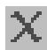

以结束关联性操作。

## 附加信息

• 在视口中选择对象  
• 自底向上网格划分  
• 网格-几何关联  
• 使用网格模块工具箱  
• 我可以使用编辑网格工具集做什么？

## 删除网格-几何关联性

您可以通过从主菜单栏选择 **网格 (Mesh) -> 删除网格关联性 (Delete Mesh Associativity)** 并选择顶点、边或面来删除节点、元素边或元素与底层几何体之间的关联。如果您删除了 Abaqus/CAE 几何体与网格之间的关联，受影响的网格组件将成为孤立网格节点和元素。如果您正在处理一个复杂的部件，并希望在更改其他区域的几何体时保持某些网格部分不变，这可能很有用。

1. 进入网格模块 (Mesh)。在上下文栏的对象 (Object) 字段中选择“部件 (Part)”，并从列表中选择一个部件。
2. 从主菜单栏选择 **网格 (Mesh) -> 删除网格关联性 (Delete Mesh Associativity)**。

Abaqus/CAE 在提示区域显示提示，引导您完成操作。


提示：您也可以单击网格模块工具箱中的工具，或单击工具以显示编辑网格 (Edit Mesh) 对话框——删除关联性方法位于对话框的网格 (Mesh) 类别中。（有关网格模块工具箱的更多信息，请参阅“使用网格模块工具箱”。）


3. 选择一个或多个您想要删除其关联性的几何实体——顶点、边、面或整个区域。

您可以使用拖拽选择、**[Shift] + 单击**和 **[Ctrl] + 单击**的组合来选择几何实体。有关更多信息，请参阅“在当前视口中选择对象”。


## 注意：

要删除原生网格区域的关联性并创建孤立网格，您必须选择整个区域。

4. 如果需要，您可以在提示区域中关闭 **从边界实体删除关联 (Delete association from bounding entities)**。

默认情况下，当您删除某个区域的关联性时，Abaqus/CAE 也会删除节点、元素边和面与相应顶点、边和面之间的关联。

5. 完成选择几何实体后，单击“完成”。

Abaqus/CAE 将几何实体高亮显示为红色，关联的网格实体高亮显示为黄色，以便您确认选择。

6. 单击 **“是” (Yes)** 删除网格关联，或单击 **“否” (No)** 取消选择。

7. 重复步骤 3 至 6 以删除其他区域的关联性，或单击提示区域中的取消按钮结束操作。

## 附加信息

• 在视口中选择对象  
• 自底向上网格划分  
• 网格-几何关联  
• 使用网格模块工具箱  
• 我可以使用编辑网格工具集做什么？

从主菜单栏选择 **网格 (Mesh) -> 编辑 (Edit)** 以在裂纹区域插入孔压内聚单元，这允许您对流体流入相邻材料进行建模。您可以选择面（实体单元）、元素面（三维孤立网格）、边（壳）或元素边（二维孤立网格）来标识裂纹区域。裂纹周围的区域在插入内聚缝之前必须已划分网格。默认情况下，Abaqus/CAE 会创建几个集合和表面，以帮助您在后续过程中（例如截面分配）进行选择。

1. 进入网格模块 (Mesh)。在上下文栏的对象 (Object) 字段中选择“部件 (Part)”，并从列表中选择一个包含裂纹区域的部件。
2. 从主菜单栏选择 **网格 (Mesh) -> 编辑 (Edit)**。

Abaqus/CAE 显示编辑网格 (Edit Mesh) 对话框。


提示：您也可以使用位于网格模块工具箱底部的工具来显示编辑网格 (Edit Mesh) 对话框。

3. 在类别 (Category) 字段中，选择 **网格 (Mesh)**。
4. 在方法 (Method) 列表中，选择 **插入内聚缝 (Insert cohesive seams)**。
5. 选择代表裂纹区域的面（对于三维对象）或边（对于二维对象）。您可以使用以下任何方法：

    *   从视口中选择面或边。您可以单独选择面、按角度选择，或者对于原生网格，按面曲率选择。您可以单独选择边或按边角度选择（有关更多信息，请参阅“在当前视口中选择对象”）。完成选择后单击鼠标键 2。
    *   单击提示区域右侧的 **集合/表面 (Sets/Surfaces)**（对于原生网格）或 **表面 (Surfaces)**（对于孤立网格）以显示区域选择 (Region Selection) 对话框，其中包含可用集合或表面的列表。从列表中选择一个或多个集合或表面，然后单击 **继续 (Continue)**。


## 注意：

默认选择方法基于您最近使用的选择方法。要恢复到另一种方法，请单击提示区域右侧的 **在视口中选择 (Select in Viewport)** 或 **集合/表面 (Sets/Surfaces)**（或 **表面 (Surfaces)**）。

6. 默认情况下，Abaqus/CAE 会创建几个集合和表面。单击提示区域右侧的 **选项 (Options)** 以选择要创建的集合或表面，并且如果需要，可以更改默认的集合或表面名称。
7. 在选项 (Options) 对话框底部的按钮中，执行以下操作：

    *   单击 **确定 (OK)** 保存您的设置并关闭对话框。
    *   单击 **默认 (Defaults)** 将集合和表面选择及名称重置为默认值。
    *   单击 **清除 (Clear)** 清除所有集合和表面选择及名称。
    *   单击 **取消 (Cancel)** 关闭对话框。

8. 在提示区域单击 **完成 (Done)**。

Abaqus/CAE 插入孔压内聚单元并创建指定的集合和表面。

## 附加信息

• 我可以使用编辑网格工具集做什么？

## 编辑和细化孤立网格

您可以使用编辑网格 (Edit Mesh) 工具集来细化孤立网格。

您可以在有或没有指定全局单元尺寸的情况下细化平面三角形网格。

从主菜单栏选择 **网格 (Mesh) -> 编辑 (Edit)** 以细化平面三角形网格。您可以使用以下方法重新划分部件的网格：

## 使用指定的全局单元尺寸

在重新划分部件网格之前，您可以选择为整个部件分配一个目标单元尺寸。然后，您可以重新划分部件的网格，新网格的密度将反映新的目标单元尺寸。例如，当图 3 中的部件使用 15.0 的全局单元尺寸重新划分网格时，图 1 显示了得到的网格。

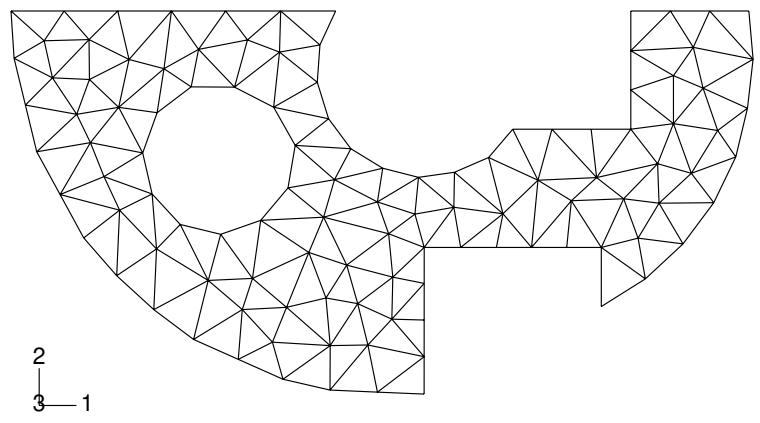

<details>
<summary>natural_image</summary>

具有三角形面片的抽象几何网格结构，无文本或符号
</details>

图 1：全局单元尺寸为 15.0。  
图 2 显示了使用 8.0 的全局单元尺寸重新划分网格的部件。


<details>
<summary>natural_image</summary>

对称的几何网格结构，具有三角形节点和中心圆孔，无文本或符号
</details>

图 2：全局单元尺寸为 8.0。

## 未指定全局单元尺寸

如果未指定全局单元尺寸，Abaqus/CAE 会在改进部件内部网格质量的同时，保持部件边界上的单元边。所得的网格拓扑与原始网格拓扑不同。例如，图 3 显示了一个扭曲的网格。


<details>
<summary>natural_image</summary>

抽象几何网格结构，具有三角形节点和一个中心圆形空洞，无文本或符号
</details>

图 3：扭曲的网格。

当零件被重新划分网格时，网格质量会显著提高，如图 4 所示。

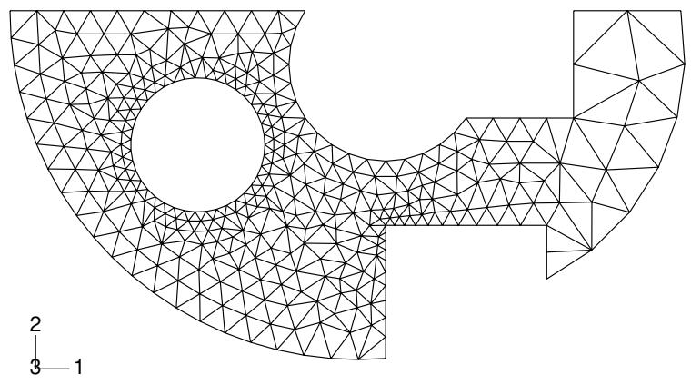

<details>
<summary>natural_image</summary>

机械或结构部件的纯几何网格示意图，具有三角形节点和一个中心圆孔（无文本或符号）
</details>

图 4：在未指定全局单元尺寸的情况下重新划分零件。

## 附加信息

• 我可以使用编辑网格工具集做什么？

## 使用指定的全局单元尺寸细化平面三角形网格

1. 进入网格模块。
2. 从上下文栏的“对象”字段中，选择“部件”，并从列表中选择一个仅包含孤立网格单元的部件。
   提示：要细化混合部件内的孤立网格单元，请抑制几何特征，并在完成细化操作后恢复它们。


3. 从主菜单栏中，选择网格->编辑。

   Abaqus/CAE 显示“编辑网格”对话框。


   提示：您也可以使用位于网格模块工具箱底部的工具来显示“编辑网格”对话框。

4. 在对话框中，从“类别”字段中选择“细化”。
5. 从“方法”列表中，选择“设置尺寸”。
6. 在提示区中，键入您选择的全局单元尺寸，然后按 [Enter]。
   Abaqus/CAE 显示一个圆圈，指示在您重新划分零件后单元的大小。
7. 从“方法”列表中，选择“重新划分网格”。
8. 从提示区中出现的按钮中，单击“是”。
   Abaqus/CAE 尝试细化网格。如果在细化网格时出错，请单击“编辑网格”对话框中的“撤消”以撤消细化。

## 不使用指定的全局单元尺寸细化平面三角形网格

1. 进入网格模块。
2. 从上下文栏的“对象”字段中，选择“部件”，并从列表中选择一个包含孤立网格单元的部件。
   提示：要细化混合部件内的孤立网格单元，请抑制几何特征，并在完成细化操作后恢复它们。


3. 从主菜单栏中，选择网格->编辑。

   Abaqus/CAE 显示“编辑网格”对话框。


   提示：您也可以使用位于网格模块工具箱底部的工具来显示“编辑网格”对话框。

4. 在对话框中，从“类别”字段中选择“细化”。
5. 从“方法”列表中，选择“移除尺寸”。
6. 从“方法”列表中，选择“重新划分网格”。
7. 从提示区中出现的按钮中，单击“是”。

   Abaqus/CAE 尝试细化网格。如果在细化网格时出错，请单击“编辑网格”对话框中的“撤消”以撤消细化。

## 在编辑网格工具集中撤消或重做更改

本节介绍如何使用编辑网格工具集中的工具撤消或重做对网格所做的更改。本节还说明了如何配置存储编辑网格操作回滚信息的缓存。

这些主题也适用于撤消和重做自下而上的网格划分操作（有关自下而上网格划分的更多信息，请参阅自下而上网格划分）。

## 本节内容：

*   编辑网格工具集中对撤消和重做的支持
*   撤消或重做网格编辑操作
*   启用撤消和管理缓存

## 编辑网格工具集中对撤消和重做的支持

Abaqus/CAE 支持对编辑网格工具集中的任何工具以及使用自下而上网格划分技术生成的网格进行多级撤消和重做。

此功能意味着单次撤消会移除您对网格的最新更改，第二次撤消会移除次新的更改，依此类推。类似地，单次重做会恢复最近撤消的网格更改。下图显示“编辑网格”对话框的“撤消”部分在“撤消”和“重做”按钮旁边包含简短描述，突出显示如果您单击按钮将撤消或重做的网格更改。


<details>
<summary>text_image</summary>

撤消
撤消 编辑节点
重做 删除单元 设置...
</details>

当撤消功能被禁用时，描述空间中会出现一条说明，指出撤消功能已在“设置”下禁用。要重新启用撤消，请参阅启用撤消和管理缓存。

Abaqus/CAE 通过在内存缓存中记录您的网格编辑和自下而上网格划分操作历史来支持撤消操作。此缓存的允许大小、网格大小以及您执行的网格编辑类型共同决定了允许多少级别的撤消。例如，如果您的网格有 100,000 个单元，并且您定义的最大缓存大小为 0.5 百万个单元，那么 Abaqus/CAE 可以提供至少五级撤消。诸如创建或移动节点等操作不需要大的缓存即可撤消。


提示：您可以通过运行“部件网格”或“实例网格”查询来确定网格中的单元数量。有关更多信息，请参阅查询模型。

大型缓存可能会占用大量内存，因此请考虑您的部件或部件实例需要多少级撤消。如果您想确保对任何网格编辑操作至少有一级撤消，请指定至少与您的部件或部件实例中的单元数量一样大的缓存大小。

“编辑网格”和“创建自下而上网格”对话框的“撤消”部分中出现的撤消和重做选项特定于所选的部件、部件实例或装配。当您切换到不同的项目并编辑其网格时，撤消选项会更改以反映所选项目的历史记录。Abacus/CAE 会更新按钮的状态及其描述，以反映新选中的部件、部件实例或装配的历史记录。

1. 进入网格模块。
2. 从主菜单栏中，选择网格->编辑。

   Abaqus/CAE 显示“编辑网格”对话框。


   提示：您也可以使用位于网格模块工具箱底部的工具来显示“编辑网格”对话框。

   此对话框的“撤消”部分包括“撤消”和“重做”按钮，每个按钮旁边都有关于单击它时将撤消或重做的网格编辑操作的描述。

3. 单击“撤消”以撤消指示的网格编辑操作，或单击“重做”以重做指示的网格编辑操作。

   Abaqus/CAE 执行指示的更改。

4. 继续编辑网格或撤消或重做更改；完成后关闭“编辑网格”对话框。


## 注意：

当您执行新的网格编辑操作或任何其他更改网格的操作时，受影响的部件或部件实例的任何重做信息都将丢失。如果您删除区域网格、应用自上而下的网格划分，或者添加分区（如果添加的分区需要删除部分网格），撤消和重做信息也会被删除。

## 附加信息

• 自下而上网格划分
• 我可以使用编辑网格工具集做什么？
• 启用撤消和管理缓存

## 启用撤消和管理缓存

启用撤消是全局且持久的；启用此设置后，您将能够在会话期间对任何部件或装配网格撤消网格编辑更改。该设置在您的下一次 Abaqus/CAE 会话中仍然保持启用状态。禁用撤消会释放与该设置关联的任何内存，并导致任何部件或装配上任何现有的撤消或重做缓存丢失。

1. 进入网格模块。
2. 从主菜单栏中，选择网格->编辑。

   Abaqus/CAE 显示“编辑网格”对话框。


   提示：您也可以使用位于网格模块工具箱底部的工具来显示“编辑网格”对话框。

3. 单击“设置”。

   出现“网格编辑撤消设置”对话框。

4. 打开“启用撤消”以启用网格编辑操作的撤消功能。
5. 在“最大总缓存大小”字段中输入一个值，单位为百万个单元，然后单击“确定”。

## 附加信息

• 自下而上网格划分
• 我可以使用编辑网格工具集做什么？
• 撤消或重做网格编辑操作

您通过创建一系列特征在 Abaqus/CAE 中构建模型。

有关特征和基于特征的建模的详细讨论，请参阅部件与特征之间的关系以及在装配模块中操作特征。本章介绍如何使用特征操作工具集来修改和管理模型中的现有特征，以及如何调整特征再生的性能。
## 本节内容：

使用特征操作工具集  
使用模型树管理特征  
调整特征再生  
修改和操作特征

## 使用特征操作工具集

您可以通过从主菜单栏选择“特征（Feature）”，或者在模型树（Model Tree）中的某个特征上点击鼠标右键来访问特征操作工具集（Feature Manipulation toolset）。您也可以从模块工具箱访问特征工具。图 1 显示了模块工具箱中所有特征工具的图标。


<details>
<summary>流程图</summary>

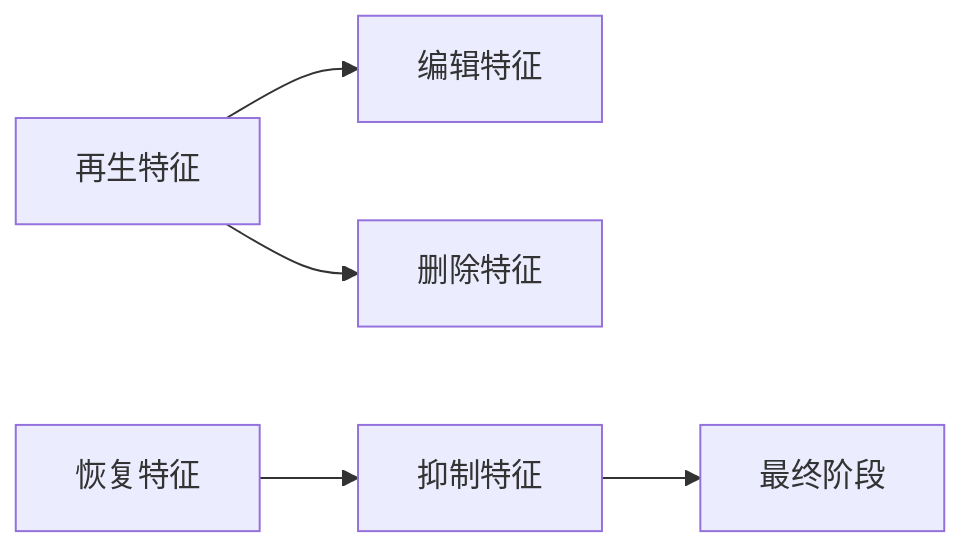
```mermaid
graph LR
  A["再生特征"] --> B["编辑特征"]
  A --> C["删除特征"]
  D["恢复特征"] --> E["抑制特征"]
  E --> F["最终阶段"]
```
</details>

图 1：特征工具。

以下列表描述了如何使用“编辑（Edit）”、“再生（Regenerate）”、“抑制（Suppress）”、“恢复（Resume）”和“删除（Delete）”工具来修改特征或控制特征在部件或装配件中的外观。


## 编辑特征

您只能在“部件（Part）”模块中编辑部件的特征。您对部件所做的任何更改都会自动应用到该部件在装配件中的每个实例。同样，您只能在“装配（Assembly）”和“网格（Mesh）”模块中编辑装配件的特征。有关应用于编辑分区和基准几何体的限制信息，请参阅理解基准作为特征和理解分区。


## 再生特征

再生是在模型的某个特征被修改后重新计算模型几何体的过程。默认情况下，在您编辑了部件或装配件的某个特征后，Abaqus/CAE 会自动再生该部件或装配件。但是，您可以通过切换特征编辑器（Feature Editor）中的“确定时再生（Regenerate on OK）”选项来关闭或打开，以控制是否自动再生特征。更多信息，请参阅编辑特征。

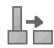

## 抑制特征

当您在复杂模型中处理多个特征时（例如，在探索设计备选方案时），Abaqus/CAE 允许您暂时禁用某些特征，以简化显示或加快再生速度。被抑制的特征不可见，并且不能被分区或网格化。此外，在再生部件或装配件时，Abaqus/CAE 会忽略所有被抑制的特征。您可以编辑被抑制的特征，但在您恢复该特征之前，您的更改不会对部件或装配件产生影响。抑制一个特征也会抑制其所有子特征。（有关父特征和子特征的信息，请参阅部件与特征之间的关系。）

当您提交作业进行分析时，Abaqus/CAE 不会在其生成的输入文件中包含被抑制的特征。但是，Abaqus/CAE 会在输入文件中包含引用被抑制特征或被抑制特征区域的规定条件。为确保分析成功完成，您应执行以下操作之一：

•   恢复被抑制的特征。
•   编辑规定条件，并将该规定条件应用到其他区域。
•   删除该规定条件。

如果您想让装配件中的某个部件实例暂时不可见，可以通过在“装配件显示选项（Assembly Display Options）”对话框中选择选项来隐藏该部件实例。更多信息，请参阅控制实例可见性。

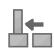

## 恢复特征

当您恢复一个被抑制的特征时，它会重新出现在部件或装配件的显示中，并在模型中重新建立。如果您在该特征被抑制时对其进行了编辑，恢复该特征会促使 Abaqus/CAE 自动再生模型以考虑您的更改。当您恢复一个特征时，您可以选择同时恢复其所有子特征。（您不能只恢复一个子特征而不恢复其父特征。）

## 调整再生性能

调整特征再生性能需要在保存状态的便利性和内存消耗对性能的影响之间取得平衡。在大多数情况下，默认设置会带来可接受的再生性能；但是，您可以通过从主菜单栏选择“特征（Feature）->选项（Options）”来调整再生速度。更多信息，请参阅调整特征再生。


## 删除特征

删除特征会从模型中永久移除该特征。如果您删除了一个父特征，其所有子特征也将被删除且无法恢复。

此外，当您将部件复制到新部件时，可以将所有特征和参数信息简化为部件的简单定义。如果在复制部件时简化了特征列表，那么当您后续修改新部件时，Abaqus/CAE 将再生得更快；但是，您将无法再修改新部件的任何参数。要复制部件，请在“部件（Part）”模块的主菜单栏中选择“部件（Part）->复制（Copy）”。

## 其他信息

•   修改和操作特征
•   复制部件

## 使用模型树管理特征

模型树（Model Tree），如图 1 所示，包含模型中所有可用特征的列表。您可以在模型树中的某个特征上点击鼠标右键，并使用出现的菜单来管理特征。


<details>
<summary>文本图像</summary>

部件 (9)
diskLink
特征 (2)
来自 SAT-1 的部件
diskLinkRefPt
集合
表面
蒙皮
加筋条
截面赋值
方向
复合材料铺层
工程特征
网格（空）
largeDisk
特征 (2)
来自 SAT-1 的部件
largeDiskRefPt
集合
表面
蒙皮
加筋条
截面赋
方向
复合材料铺
工程特
网格（空）
raceWay
特征 (1)
切换上下文 Ctrl+空间
编辑...
重命名...
抑制
恢复
删除...
Del
查询
显示父特征
显示子特征
</details>

图 1：模型树。

您必须使用模型树来操作装配约束、被抑制的特征或失败的特征，因为它们在视窗中不可见。您还可以同时选择多个特征进行删除、抑制或恢复。当您在模型树中选择特征时，它们会在视窗中高亮显示（如果它们可见）。此外，任何特征的父特征或子特征也可以在视窗中高亮显示。

模型树会显示模型中每个特征的状态。每个特征名称前的图标表示其状态：

黄色对勾表示该特征已被修改但尚未再生。如果某个部件被数据库升级锁定，所有活动特征都会显示此状态，直到部件解锁后它们被再生。Abaqus/CAE 还会在您编辑过但后续未再生的特征旁边显示黄色对勾。
•   挂锁图标表示部件或装配件已被用户或数据库升级锁定。
•   红色 “X” 表示该特征已被抑制。
•   红色 “!” 表示该特征再生失败。部件名称旁的红色 “!” 表示该部件无效。

要获取有关特征的更多信息，请在模型树中的特征上点击鼠标右键，并从出现的菜单中选择“查询（Query）”。信息将显示在消息区域。

## 其他信息

•   使用特征操作工具集
•   在装配（Assembly）模块中操作特征
•   修改和操作特征

## 调整特征再生

本节描述了如何使用“特征选项（Feature Options）”对话框中的设置来调整特征再生。您可以通过从主菜单栏选择“特征（Feature）->选项（Options）”来打开“特征选项（Feature Options）”对话框。在大多数情况下，默认设置会带来可接受的再生性能。只有当 Abaqus/CAE 再生部件或装配件花费很长时间，或者内存消耗过大时，您才应修改特征选项。

“特征选项（Feature Options）”对话框中的设置仅适用于当前模型，并保存在模型数据库中。如果您切换到不同的模型，Abaqus/CAE 将恢复为默认设置或与新模型关联的任何修改设置。

## 本节内容：

什么是再生？
什么是几何状态？
什么是缓存？
什么是自相交检查？
位置约束是如何再生的？

## 什么是再生？

每当您修改部件的一个特征时，Abaqus/CAE 都必须再生该部件。同样，为了将修改后的特征纳入该部件的任何实例中，当您进入与装配相关的模块时，Abaqus/CAE 也会再生装配件中的特征。但是，为了节省时间，Abaqus/CAE 会确定需要再生的最小特征数量，并且仅再生受修改影响的特征。如果您的部件和装配件相对简单，您不会注意到 Abaqus/CAE 执行此再生。然而，在更复杂的模型中，再生可能会导致性能下降。触发再生的特征修改包括使用特征操作工具集（Feature Manipulation toolset）编辑、抑制、恢复和删除特征。
模型树用黄色对勾标记表示特征需要再生，如使用模型树管理特征中所述。您随时可以通过主菜单栏的**Feature→Regenerate**命令，或在模型树的**Features**容器上点击鼠标按钮3，强制Abaqus/CAE再生装配体的一部分。

## 什么是几何状态？

几何状态指的是零件或装配体的内部几何表示；例如，定义拓扑结构以及这些曲线和曲面连通性的曲线和曲面的方程。几何状态是此内部表示的快照。Abaqus/CAE存储此快照，并在您操作模型和后续再生特征期间，定期在内存中创建几何状态。

如果Abaqus/CAE不保存几何状态，再生将从您创建的第一个特征开始，持续到所有需要再生的特征，使得再生过程非常耗时。通过保存状态，Abaqus/CAE可以确定哪个状态最接近被修改的特征。再生从该点开始，并持续到所有需要再生的特征。因此，再生速度可以显著提高。

理想情况下，为了获得最大的再生性能，您应在每次修改特征后都保存几何状态。然而，存储每个状态会消耗大量内存并影响整体性能。决定保存多少状态需要在再生速度和内存消耗之间进行权衡。

默认情况下，Abaqus/CAE会为每个零件和装配体自动保存最多五个几何状态。如果Abaqus/CAE已存储了指定数量的状态，它会在保存最新状态之前删除一个较旧的状态。您可以使用**Options**对话框中的**Geometry Caching for Fast Regeneration**选项来更改Abaqus/CAE自动保存的状态数量。Abaqus/CAE使用内部逻辑来决定何时创建几何状态；您无法控制状态何时被创建。

## 什么是缓存？

缓存是内存的一部分。Abaqus/CAE使用以下与特征相关的缓存来存储几何状态：

*   **Current part cache** 包含当前零件的几何状态快照。Abaqus会为模型中的每个零件创建一个零件缓存。
*   **All part caches** 包含当前模型中所有零件的几何状态快照。
*   **Assembly cache** 包含装配体的几何状态快照。Abaqus会为模型创建一个装配体缓存。

如果您发现Abaqus/CAE在工作站上消耗了过多的内存并影响了系统性能，您可以使用**Options**对话框中的**Clear**按钮来清除与零件和装配体缓存关联的内存。清除此内存将提高性能；然而，几何状态的快照将被删除，再生过程将变慢。如果您关闭了缓存几何状态的选项，Abaqus/CAE不会清除已存储的状态。此外，Abaqus/CAE为每个模型存储一个单独的缓存。因此，您可以通过删除当前未在工作的模型的缓存来释放更多内存。

如果您花了很多时间对零件进行一系列更改，并且确认您的设计是正确的，您可以通过点击**Options**对话框中的**Cache current state**来手动将当前状态保存到内存中。这样，Abaqus/CAE就可以恢复到此状态，并再生任何后续的添加或修改。但是，如果您继续自动缓存几何状态，在保存了最大数量的几何状态后，Abaqus/CAE可能会删除您手动保存的状态。或者，您可以关闭自动缓存几何状态的选项，并在重要时间点手动保存状态。

**Options**对话框中的**Geometry Caching for Fast Regeneration**选项显示了在三个与特征相关的缓存中存储了多少几何状态。一个缓存可以包含您手动保存的几何状态和Abaqus/CAE自动保存的状态的组合。您可以查询**Current part cache**和**Assembly cache**来确定几何状态相对于特征序列的定位。

## 什么是自相交检查？

自相交检查是用于帮助确保您在Abaqus/CAE中创建的复杂几何体可用于分析的测试。

如果一个特征的面与该特征的其他面相交，Abaqus/CAE会显示一个警告，指出存在无效相交，并且不会创建该特征。自相交的特征可能无法划分网格，并可能导致分析问题。Abaqus/CAE允许您在特征创建期间检查自相交；然而，检查过程会减慢特征的创建速度。此外，检查自相交也会减慢特征的再生速度。完成测试所需的时间随您尝试创建或再生的特征的复杂性而变化。

**Feature Options**对话框允许您开启和关闭自相交检查。默认情况下，**Perform self-intersection checks**是关闭的。通常，只有当您创建具有复杂几何形状的特征（例如放样特征）时才可能发生自相交（有关更多信息，请参见什么是放样？和自相交检查）。如果您知道您的特征不会自相交，或者您计划在后续操作中移除自相交，则可以保持**Perform self-intersection checks**关闭以加快特征再生速度。

## 位置约束如何再生？

默认情况下，当Abaqus/CAE再生装配体时，它会先再生所有位置约束，然后再再生可能依赖于位置的其他特征，例如分区和基准。

但是，如果位置约束使用了通过在**Assembly**模块中从零件实例选择而创建的实体（例如通过分区创建的面或穿过两个顶点的基准轴），Abaqus/CAE会改变其行为，并按照您创建它们的顺序再生特征。因此，您在位置约束之前创建的分区和基准可能不会随可移动实例一起移动。

如果您正在与装配体相关的模块中工作，**Feature Options**对话框包含一个**Constraints**字段，允许您控制此再生行为。有关更多信息，请参见调整再生性能。

## 修改和操作特征

本节描述如何使用特征操作工具集。

## 本节内容：

*   编辑特征
*   重命名特征
*   抑制特征
*   恢复被抑制的特征
*   删除特征
*   再生零件或装配体
*   调整再生性能
*   使用模型树获取特征信息

## 编辑特征

从主菜单栏选择**Feature→Edit**以修改选定特征的几何信息。您也可以通过在模型树中的特征上点击鼠标按钮3，然后从出现的菜单中选择**Edit**来编辑特征。

您可以对特征进行的更改取决于其创建方式。您可以更改定义特征的任何数值参数，并且在适用的情况下，可以更改截面草图。但是，您无法修改通过在屏幕上拾取几何实体（如点和边）而创建的特征。例如，您可以修改以下参数：

*   拉伸的深度
*   倒圆角的半径
*   基准点的坐标
*   拉伸实体的形状

如果您无法使用特征操作工具集进行所需的更改，则必须删除该特征并创建一个包含更改的新特征。

1.  从主菜单栏，选择**Feature→Edit**。

    

    提示：您也可以通过点击位于模块工具箱中的  工具来编辑特征。

2.  选择要修改的特征。您可以直接从当前视口或从模型树中选择特征。有关更多信息，请参见在视口中选择对象和使用模型树和结果树。

    特征编辑器随即出现。

3.  通过执行以下操作之一来编辑特征：
    *   在**Parameters**字段中，为所需参数输入新值。
    *   选择**Edit Section Sketch**以启动草图编辑器并对草图进行更改。有关使用草图编辑器的信息，请参见草图模块。

4.  点击**OK**以在模型中实现更改。

    如果您正在编辑零件特征，该零件会立即再生以纳入您的更改，装配体将在您下次进入显示装配体的模块时再生。如果您正在编辑装配体特征，装配体会立即再生。


注意：默认情况下，Abaqus/CAE 会在您每次编辑特征时重新生成零件或装配体。如果您希望推迟零件或装配体的重新生成，请在特征编辑器中单击 OK 前切换关闭 **Regenerate on OK**。当您准备好重新生成零件或装配体时，请从主菜单栏选择 **Feature->Regenerate**。

## 附加信息

• 使用特征操作工具集

## 重命名特征

您可以通过在模型树中的特征上单击鼠标按键 3，并从出现的菜单中选择 **Rename** 来重命名特征。

1.  在模型树中的特征上单击鼠标按键 3，并从出现的菜单中选择 **Rename**。**Rename Features** 对话框将出现。
2.  输入特征的新名称。
3.  + 单击 **OK** 完成特征重命名。
模型树将显示新名称。

## 附加信息

• 使用特征操作工具集

## 抑制特征

从主菜单栏选择 **Feature->Suppress** 以抑制选定的特征。抑制特征等同于暂时将其从零件或装配体中移除。被抑制的特征在重新生成零件或装配体时仍保持抑制状态。您也可以通过在模型树中的特征上单击鼠标按键 3，并从出现的菜单中选择 **Suppress** 来抑制特征。

您不能抑制基础特征。此外，如果您抑制了父特征，其所有子特征也会自动被抑制。被抑制的特征可以通过从主菜单栏选择 **Feature->Resume** 来恢复，或者通过在模型树中的特征上单击鼠标按键 3。当您恢复一个被抑制的特征时，除非您选择其子特征，否则子特征不会被恢复。为了帮助您选择特征的子特征，您可以在模型树中的特征上单击鼠标按键 3，并从出现的菜单中选择 **Show children**。

1.  从主菜单栏，选择 **Feature->Suppress**。


提示：您也可以使用模块工具箱中的工具来抑制特征。

2.  选择一个或多个要抑制的特征。您可以从当前视口或从模型树中选择特征。更多信息，请参见 “在视口中选择对象” 和 “使用模型树和结果树”。

Abaqus/CAE 将高亮显示选定的特征。如果您选择了具有子特征的特征，Abaqus/CAE 也会高亮显示这些子特征。

如果您从视口中选择了特征，完成选择后请在提示区单击 **Done**。

3.  如果您从视口中选择了特征，请在提示区单击 **Yes**。如果您从模型树中选择了特征，请在其中一个特征名称上单击鼠标按键 3，并从出现的菜单中选择 **Suppress**。

选定的特征及任何子特征将从视口中消失。

4.  要退出抑制过程，您可以：
    •   单击提示区中的取消按钮，或
    •   在 Abaqus/CAE 窗口的任意位置单击鼠标按键 2，或
    •   从 **Feature** 菜单选择另一个操作。

## 附加信息

• 使用特征操作工具集
• 恢复被抑制的特征

## 恢复被抑制的特征

从主菜单栏选择 **Feature->Resume** 以恢复被抑制的特征。您也可以通过在模型树中选择特征，单击鼠标按键 3，并从出现的菜单中选择 **Resume** 来恢复一组特征。

恢复特征会将其完全恢复到零件或装配体中。您可以恢复您最后抑制的特征、所有被抑制的特征或仅恢复选定的特征。当您恢复一个子特征时，Abaqus/CAE 也会自动恢复其父特征。然而，当您恢复一个父特征时，除非您选择其子特征，否则子特征不会被恢复。为了帮助您选择特征的子特征，您可以在模型树中的特征上单击鼠标按键 3，并从出现的菜单中选择 **Show children**。

1.  从主菜单栏，选择 **Feature->Resume**。


提示：您也可以使用模块工具箱中的工具来恢复特征。

2.  执行以下操作之一：
    •   单击 **Last Set** 以恢复最近被抑制的特征及其所有父特征。
    •   单击 **All** 以恢复所有被抑制的特征。
    •   从模型树中选择要恢复的特征。您可以选择多个特征进行恢复。

恢复的特征将重新出现在视口中。

## 附加信息

• 使用特征操作工具集
• 抑制特征

## 删除特征

从主菜单栏选择 **Feature->Delete** 以删除选定的特征。您也可以通过在模型树中的特征上单击鼠标按键 3，并从出现的菜单中选择 **Delete** 来删除特征。

当您删除父特征时，也会删除其所有子特征。已删除的特征无法恢复。

1.  从主菜单栏，选择 **Feature->Delete**。


提示：您也可以使用模块工具箱中的工具来删除特征。

2.  选择一个或多个要删除的特征。您可以从当前视口或从模型树中选择特征。更多信息，请参见 “在视口中选择对象” 和 “使用模型树和结果树”。

Abaqus/CAE 将高亮显示选定的特征。如果您选择了具有子特征的特征，Abaqus/CAE 也会高亮显示这些子特征。

如果您从视口中选择了特征，完成选择后请在提示区单击 **Done**。

3.  如果您从视口中选择了特征，请在提示区单击 **Yes**。如果您从模型树中选择了特征，请在特征上单击鼠标按键 3，并从出现的菜单中选择 **Delete**。

选定的特征及任何子特征将被删除。

4.  要退出删除过程，您可以：
    •   单击提示区中的取消按钮，或
    •   在 Abaqus/CAE 窗口的任意位置单击鼠标按键 2，或
    •   从 **Feature** 菜单选择另一个操作。

## 附加信息

• 使用特征操作工具集

## 重新生成零件或装配体

当您修改复杂零件或装配体中的特征时，推迟重新生成直到完成所有更改可能会更方便，因为重新生成可能很耗时。（更多信息，请参见编辑特征。）当您准备好重新生成零件或装配体时，可以从主菜单栏选择 **Feature->Regenerate**。您也可以通过在模型树中的特征上单击鼠标按键 3，并从出现的菜单中选择 **Regenerate** 来重新生成特征。

1.  从主菜单栏，选择 **Feature->Regenerate**。


提示：您也可以使用模块工具箱中的工具来重新生成特征。

Abaqus/CAE 将重新生成零件或装配体。

2.  如果重新生成失败，将出现一个对话框。在这种情况下，您可以选择以下选项之一：
    •   + 单击 **Undo Changes** 以返回到原始零件或装配体并放弃所有更改。
    •   + 单击 **Keep Changes** 以继续重新生成，抑制那些重新生成失败的特征。


## 注意：

如果您纠正了失败原因，因失败而被抑制的特征会自动恢复。

## 附加信息

• 使用特征操作工具集
• 抑制特征

## 调优重新生成性能

**Feature Options** 对话框提供设置，使您能够控制 Abaqus/CAE 是否执行自相交检查，并在装配体（Assembly）模块中，控制 Abaqus/CAE 重新生成位置约束相对于其他特征的顺序。调整这些选项可以帮助您加快零件或装配体的特征重新生成。从主菜单栏选择 **Feature->Options** 以显示 **Feature Options** 对话框。您也可以通过在模型树中的特征上单击鼠标按键 3，并从出现的菜单中选择 **Options** 来调优重新生成。

在大多数情况下，默认设置将产生可接受的重新生成性能。只有当 Abaqus/CAE 重新生成零件或装配体耗时很长时，您才应修改特征选项。更多信息，请参见调优特征重新生成。


## 注意：

Abaqus/CAE 在 **Options** 对话框的 **Memory** 标签页上提供了对其他性能调优选项的访问。此页面上的选项使您能够指定内核内存限制，设置 Abaqus/CAE 在缩减内存模式下运行的阈值，并控制内存缓存中的几何状态。更多信息，请参见自定义内存限制和重新生成选项。
1. 从主菜单栏中，选择 Feature->Options。  
Abaqus/CAE 将显示“Feature Options”对话框。  
2. 如果您知道您的特征不会自相交，或者您计划在后续操作中移除自相交，您可以切换关闭“Perform self-intersection checks”以加快特征重新生成的速度。更多信息，请参阅 什么是自相交检查？。  
3. 如果需要，修改确定 Abaqus/CAE 如何重新生成位置约束的行为。更多信息，请参阅 位置约束是如何重新生成的？。  
4. 单击 OK 以更改当前模型的特征选项。

特征选项仅适用于当前模型，并保存在模型数据库中。

如果需要，您还可以在 Options 对话框的“Memory”选项页中更改缓存设置，以改变 Abaqus/CAE 自动缓存在内存中的几何状态数量；清除与零件和装配体缓存相关联的内存；或缓存零件的当前状态。更多信息，请参阅 自定义内存限制和重新生成选项。

## 使用模型树获取特征信息

模型树显示特征名称以及指示其状态（活动、抑制、修改或失败）的图标。此外，您可以通过在模型树中用鼠标键3（通常为右键）单击特征，并从出现的菜单中选择，来显示特定特征的信息。

1. 在模型树中用鼠标键3单击特征。  
2. 从出现的菜单中，选择以下选项之一：

• 选择“Show Parents”或“Show Children”以在当前视口中显示该特征的父特征或子特征。Abaqus/CAE 也会选中这些父特征或子特征。  
• 选择“Query”以显示详细信息。Abaqus/CAE 显示所选特征的以下信息：

- 名称和描述；例如，实体拉伸  
状态 — 活动或抑制  
其父特征的名称（如果有）  
其子特征的名称（如果有）  
- 定义该特征的任何参数值

查询信息会出现在消息区，并且也以注释形式写入重播文件（abaqus.rpy）。

## 其他信息

• 使用特征操作工具集

在分析模型期间，过滤器允许您在期望的数据范围内不失分辨率地移除多余的场输出数据或历史输出数据（噪声）。您也可以在将数据保存到输出数据库（.odb）文件之前，使用过滤器过滤场输出或历史输出；因此，过滤器也可以减小输出数据库的大小。

Filter（过滤器）工具集允许您在 Step（分析步）模块中创建和管理过滤器。

## 本节内容：

过滤场和历史数据  
为场和历史数据应用边界值  
创建过滤器

## 过滤场和历史数据

您可以在 Abaqus/CAE 中创建过滤器，并将其应用于 Abaqus/Explicit 分析的场输出请求或历史输出请求。Abaqus 在分析运行时过滤数据；在分析期间过滤（“实时”过滤）可以通过在数据保存前排除高频数据来减小输出数据库的大小。实时过滤也避免了结果数据中潜在的混叠问题。混叠是有效结果数据的损失；如果采样频率（保存数据的频率）低于结果中预期最高频率的两倍，则会发生混叠。例如，如果正弦波仅在两个点采样，混叠的结果将看起来像一条直线，而至少采样四个点才能重现曲线的形状。

Filter 工具集允许您创建以下用于 Abaqus/Explicit 场输出请求和历史输出请求的过滤器：

• Butterworth  
• Type I Chebyshev  
• Type II Chebyshev

有关这些过滤器的更具体信息，请参阅 Abaqus/Explicit 中的过滤输出和操作输出。不同过滤器类型的区别在于它们从接受低频数据到拒绝高于过滤器截止频率的数据的过渡能力。理想的过滤器会阻止所有高于截止频率的数据，并具有平坦的响应（对接受的数据无影响）；“实际”过滤器在截止频率附近有一个过渡带，其中一些数据被接受，并且它们通常对接受的数据有一些影响。Butterworth 过滤器提供最大平坦响应幅度，但过渡带比 Chebyshev 过滤器更宽（过渡更慢）。Chebyshev 过滤器在响应幅度中引入了振荡（纹波），但它们的过渡带比 Butterworth 过滤器更窄。两种类型的 Chebyshev 过滤器在响应纹波出现的位置上有所不同；纹波因子指示您为了换取更好的过滤器响应而允许的振荡程度。您还可以指定过滤器的阶数，它决定了过滤器过渡带的大小：阶数越高，过渡带越窄，尽管计算成本随着阶数的增加而增加。过滤器阶数必须是正的偶数整数，且不大于 20。

除了可以使用 Filter 工具集定义的过滤器外，Abaqus 还包含一个默认的抗混叠过滤器。Abaqus 根据分析期间场输出或历史输出保存的时间间隔自动设置抗混叠过滤器的截止频率。当您定义过滤器时，必须根据您对解中预期频率的了解来指定截止频率。无论您是设置截止频率还是 Abaqus 计算它，都不会执行检查以确保截止频率是合适的。如果截止频率设置得太低，有效数据将被过滤掉；如果设置得太高（高于采样频率的一半），则不会执行任何过滤。

从主菜单中选择 Tools->Filter->Create 以创建新的过滤器定义；从同一菜单中选择 Edit 以修改现有定义。这两个命令都会打开过滤器编辑器，允许您选择选项并提供定义过滤器所需的数据。

要将过滤器应用于分析，请将其包含在 Abaqus/Explicit 分析过程的场输出请求或历史输出请求中（更多信息，请参阅 定义输出请求）。

## 其他信息

• Abaqus/Explicit 中的过滤输出和操作输出

## 为场和历史数据应用边界值

过滤器定义中的边界值使您能够研究特定输出请求的最大值或最小值，并为输出请求返回的变量值建立上限或下限。您可以为过滤和未过滤的数据建立边界值；要在过滤器定义中指定这些值而不对您的数据执行 Butterworth 过滤或任何类型的 Chebyshev 过滤，请定义一个 Operator 过滤器，它允许您在输出请求上实现边界值而不以任何其他方式更改输出数据。

Abaqus/CAE 提供三种类型的边界值：

• 最大边界值返回输出请求中每个输出间隔内变量的最高值。  
• 最小边界值返回输出请求中每个输出间隔内变量的最低值。  
• 绝对最大边界值返回输出请求中每个输出间隔内变量的最高绝对值。

此外，您可以设置边界值的限制，该限制决定了 Abaqus/CAE 为使用此过滤器的变量记录的最高值或最低值。如果需要，当输出请求中的任何变量达到此限制值时，您可以停止分析。

默认情况下，张量或矢量的每个分量被单独过滤，并且最大值、最小值或绝对最大值以及限制值会针对每个分量分别报告。但是，您可以直接将过滤器应用于不变量。

## 创建过滤器

从主菜单栏中选择 Tools->Filter->Create 以创建过滤器。

有关过滤器的更多信息，包括 Abaqus 自动创建的默认过滤器类型，请参阅 过滤场和历史数据。

1. 从主菜单栏中，选择 Tools->Filter->Create。


提示：您也可以通过在过滤器管理器中单击 Create 来创建过滤器。

将出现“Create Filter”对话框。

2. 在“Name”字段中，输入过滤器的名称。有关命名对象的信息，请参阅 使用基本对话框组件。  
3. 从“Type”列表中选择以下之一，然后单击 Continue：

• Butterworth  
• Type I Chebyshev  
• Type II Chebyshev  
• Operator

将出现“Edit Filter”对话框。

4. 如果您选择了 Butterworth 过滤器类型或 Chebyshev 过滤器类型之一，请执行以下步骤：
a. 输入截止频率（Cutoff frequency）。


## 注：

Abaqus 不执行任何检查来确保截止频率是否合适。如果截止频率设置得过低，结果中的有效数据将被过滤掉；如果设置得过高，则不会执行任何过滤。

b. 输入滤波器的阶数（Order），该值必须是不大于 20 的正偶数。

5. 如果您选择了某种切比雪夫（Chebyshev）滤波器类型，请接受默认的纹波因子（ripple factor）或输入一个值。纹波因子决定了您为了在通过和被拒绝的数据之间获得更快的转换而允许的数据振荡幅度。更多信息，请参阅 Abaqus/Explicit 中的《过滤输出和处理输出》。
6. 如果需要，请指定您希望过滤数据的绑定值（bounding value）类型。

   • 选择**最大值**（Maximum）以输出输出请求中每个变量在每个输出区间内的最大值。
   • 选择**最小值**（Minimum）以输出输出请求中每个变量在每个输出区间内的最小值。
   • 选择**绝对最大值**（Absolute maximum）以输出输出请求中每个变量在每个输出变量内的最大绝对值。

   您也可以选择**无**（None）来关闭此滤波器所有与绑定值相关的输出请求。

7. 如果需要，请通过在**绑定值限制**（Bounding value limit）字段中输入一个值来为绑定值请求指定限制。此值限制了 Abaqus/CAE 为此滤波器使用的变量所记录的最高或最低值。

   您也可以在达到绑定值限制时停止分析。开启**达到限制时停止分析**（Stop analysis upon reaching limit）可在使用此滤波器的变量的最小或最大值等于限制值时停止作业。

8. 如果您为绑定值类型选择了**最小值**（Minimum）、**最大值**（Maximum）或**绝对最大值**（Absolute Maximum），您可以直接将滤波器应用于不变量（invariant）。要过滤该不变量，请在**不变量**（Invariant）中选择**第一不变量**（First）或**第二不变量**（Second）。
9. 点击**确定**（OK）以创建滤波器。

要将滤波器应用于分析，请在为 Abaqus/Explicit 分析过程创建输出请求时选择**应用滤波器**（Apply filter）。更多信息，请参阅修改场输出请求或修改历史输出请求。

## 附加信息

• 过滤场数据和历史数据
• 将绑定值应用于场数据和历史数据
• Abaqus/Explicit 中的过滤输出和处理输出
• 修改场输出请求
• 修改历史输出请求

## 自由体工具集（The Free Body toolset）

自由体截面（Free body cuts）显示穿过模型选定表面传递的合力与合力矩。自由体截面只是简单地在某个截面上积分单元的内力；因此，对于包含因粘性接触或其他来源造成的表面牵引力的截面，它们不能准确使用。自由体工具集仅在**可视化**模块（Visualization）中可用，并且只有在输出数据库的当前分析步和帧包含单元力节点输出（NFORC）时才能创建自由体截面。

本章解释如何使用自由体工具集来创建和删除自由体截面、在视口中显示或隐藏它们，以及自定义其外观的多个方面。

Abaqus/CAE 还允许您生成报告或创建 X–Y 数据对象，这些对象描述会话中所有活动自由体截面中的力和矩。请分别参阅生成表格报告和从所有活动自由体截面读取 X–Y 数据。

Abaqus/CAE 提供另外两种方法来显示自由体数据：

• 您可以通过为平面视图截面开启自由体显示，来显示穿过模型任意平面的合力和合力矩。更多信息，请参阅理解视图截面。
• 您可以在符号图中显示自由体节点力，以确定哪些节点由于施加载荷而存在力或力矩不平衡，或者可视化内部截面上的节点力分布。更多信息，请参阅生成自由体节点力的符号图。

## 本节内容：

Abaqus/CAE 中自由体截面上的合力与合力矩
创建或编辑自由体截面
自由体截面的选择方法
显示、隐藏和高亮自由体截面
自定义自由体截面显示

## Abaqus/CAE 中自由体截面上的合力与合力矩

Abaqus/CAE 中的自由体截面是模型的一个区域，您希望在该区域上显示合力和合力矩。一旦您定义了截面，Abaqus/CAE 将显示矢量，这些矢量表示穿过您所选区域的合力和合力矩的大小和方向。力矢量用单箭头表示，力矩矢量用双箭头表示，如图 1 中的示例所示；默认情况下，力矢量为红色，力矩矢量为蓝色。


<details>
<summary>线框图</summary>

| 点   | 值       |
| ---- | -------- |
| 左箭头 | 3.224e+04 |
| 右箭头 | 4.594e+03 |
| 右箭头 | 4.461e+03 |
| 右箭头 | 2.753e+04 |
</details>

图 1: 合力与合力矩显示。

您可以使用与定义显示组（display groups）非常相似的过程来定义构成截面的节点和单元。Abaqus/CAE 允许您通过包含表面、显示组以及按编号指定的单元或节点来指定截面的组成部分；并且您可以从视口中拾取项目，可以按特征角度拾取，也可以单独拾取。有关详细说明，请参阅创建或编辑自由体截面。在定义了自由体截面的物理组成部分之后，您可以设置求和点（关于该点计算合力矩）的位置，并可以指示在分量形式下显示矢量时所应用的坐标系变换。

截面只能沿网格边界创建；您不能沿任意平面指定截面。只能在**可视化**模块（Visualization）中创建和显示自由体截面。

## 创建或编辑自由体截面

要创建自由体截面，请选择构成自由体截面的节点和单元；也就是说，选择您希望研究其合力和合力矩的模型表面。

Abaqus/CAE 提供了几种为截面选择节点和单元的方法：

• 对于三维对象，您可以选择单个单元面（element faces）包含到截面中。连接到所选面节点的所有单元的贡献都将被考虑在内。
  对于二维或三维对象，您可以选择单个单元边（element edges）包含到截面中。每条边都为 Abaqus/CAE 提供一个单元定义和两个或三个包含在截面中的节点。连接到所选边节点的所有单元的贡献都将被考虑在内。
  对于任何类型的模型，您可以单独选择想要包含的节点和单元。建议使用此方法从几何区域（例如梁端）选择节点和单元，因为在这些区域使用边或面选择节点和单元可能很笨拙或困难。仅考虑所选单元的贡献。

您也可以在视图截面上显示自由体截面。更多信息，请参阅理解视图截面。

当您使用单元面或单元边定义截面时，Abaqus/CAE 提供三种额外的选择方法，使您能够为此定义选择节点和单元：

• 您可以通过在视口中拾取组件来选择面或边，可以单独拾取，也可以按角度拾取。
• 您可以选择输出数据库中定义的表面集（surface set）。
• 您可以选择一个或多个显示组（display groups）作为表面定义的一部分。

当您通过单独选择节点和单元来定义截面时，您可以通过在**自由体截面**（Free Body Cross-Section）对话框中直接输入其标签来指定您希望包含在定义中的节点或单元。

Abaqus/CAE 还允许您自定义自由体截面的求和点（summation point），即计算合力矩所依据的三维位置。默认情况下，求和点位于参与自由体计算的单元面的面积质心处，但您可以将求和点移动到截面节点的质心位置或模型中的任何三维位置。

您还可以调整自由体截面的分量矢量显示方向。在许多情况下，自由体截面最理想的坐标系是其中一个轴垂直于模型表面，另一个轴与表面相切的坐标系。这种“法向和切向”坐标系在内部创建并默认用于显示分量矢量。但是，您可以更改为使用会话中可用的任何自定义坐标系，或者可以创建一个新的基准坐标系（datum coordinate system）。
编辑自由体切割时，Abaqus/CAE 允许您更改自由体横截面中包含的分量、求和点设置以及分量分解设置。但是，您无法更改用于定义自由体切割的选择方法；例如，如果您使用三维单元面定义了自由体切割，则后续对该自由体切割的编辑也将使用此方法。

默认情况下，自由体切割仅在当前会话期间保留。如果您希望保留已定义的自由体切割以便在后续会话中使用，可以将其保存到 XML 文件、模型数据库或输出数据库中。更多信息，请参见管理会话对象和会话选项。

1.  定位创建或编辑自由体切割的选项：

    *   要创建自由体切割，请在可视化模块的主菜单中选择工具 -> 自由体切割 -> 创建。
    
    
    
    提示：您也可以使用可视化模块工具箱中的工具创建自由体切割。
    
    要编辑自由体切割，请在可视化模块的主菜单中选择工具 -> 自由体切割 -> 编辑，然后选择您想要编辑的自由体切割。
    
    
    
    提示：您也可以使用自由体切割管理器编辑自由体切割。从主菜单栏中，选择工具 -> 自由体切割 -> 管理器，然后在出现的对话框中点击编辑。
    
    将打开自由体横截面对话框，您可以在此自定义构成横截面的边、面、或单元与节点。

2.  如果您正在创建自由体切割，请从“选择方法”选项中选择以下之一，然后点击确定：

    *   选择基于视图切割，以根据当前视图切割计算并显示自由体切割。如果您选择此选择方法，Abaqus/CAE 将打开视图切割管理器，您可以在其中显示和定位模型的视图切割，并自定义相关自由体切割的显示。更多信息，请参见自定义活动视图切割上合力和合力矩的显示和计算。
    *   选择 2D 单元边，以通过选择单元边来隐式（或间接）指定节点和单元。此方法推荐用于二维模型。
    *   选择 3D 单元面，以通过选择单元面来隐式（或间接）指定节点和单元。此方法推荐用于三维模型。
    *   选择单元和节点，以单独为您的自由体横截面选择单元或节点。
    
    将打开自由体横截面对话框，您可以在此选择构成横截面的边、面、或单元与节点。

3.  从对话框左上角的“项”列表中，选择曲面、显示组、单元或节点作为用于自由体横截面的模型组件类型。
    
    Abaqus/CAE 将刷新“方法”列表。

4.  从“方法”列表中选择一种选择方法；和/或通过从视口拾取、从对话框右侧出现的列表中选择项目、或在对话框右侧输入数据来选择自由体横截面的具体项目。
    
    有关选择选项的更多信息，请参见自由体横截面的选择方法。
    
    某些项目可以在视口中高亮显示以验证您的选择。如果可用，可以切换“在视口中高亮显示项目”选项。

5.  完成选择后，点击确定以关闭自由体横截面对话框。
    
    将打开编辑自由体切割对话框。

6.  如果需要，可以自定义所选自由体切割的求和点或坐标系转换选项。
    
    a.  从“求和点选项”中，选择自由体切割中向量的起始三维位置。
        *   选择切割质心，将求和点自动放置在对自由体计算有贡献的单元面的面积质心处。
        
        
        
        **注意：**
        当视图切割穿过壳时，质心基于长度乘以壳厚度。
        当视图切割穿过梁时，质心位于节点连接线上。
        
        *   选择节点平均值，将求和点自动放置在自由体切割中包含的所有节点的平均变形坐标处。
        *   选择用户定义，并在空间中指定自定义三维位置，或点击从视口选择求和点。求和点将在视口中高亮显示。
    
    b.  从“分量分解选项”中，您可以指定当向量以分量形式显示时发生的坐标系转换。（有关以分量形式显示力和力矩向量的更多信息，请参见自定义自由体切割的常规显示选项。）
        *   选择法向和切向，以根据所选曲面的法向和切向来定向分量向量。
        *   选择坐标系（CSYS）和一个坐标系，以将分量向量转换到自定义坐标系。或者，您可以点击创建来创建一个新的基准坐标系。
        
        仅当在自由体绘图选项对话框中选择了分量向量显示时，“分量分解选项”才会影响自由体切割的显示。

## 7. 点击确定。

Abaqus/CAE 创建自由体切割并在视口中显示它。

## 其他信息

*   显示、隐藏和高亮自由体切割
*   自定义自由体切割显示

## 自由体横截面的选择方法

您可以使用以下选择方法来指定将包含在自由体横截面中的项目：

*   要通过直接从视口拾取来指定边或面，请从“项”列表中选择曲面，然后从“方法”列表中选择从视口拾取。Abaqus/CAE 将自动进入拾取模式并提示您为显示组选择项目。有关在视口中拾取项目的更多信息，请参见在视口中选择对象。
    
    在视口中完成拾取项目后，单击提示区中的完成。
    
    单击对话框中的编辑选择、添加选择或删除选择以进一步修改您的视口选择。

*   要通过编号指定单元或节点，请从“方法”列表中选择单元标签或节点标签。从自由体横截面对话框右侧的“部件实例”字段的列表中选择节点或单元所属的部件实例的名称。在“标签”字段中，输入一个由逗号分隔的单元或节点编号列表，或者输入一个数字范围（可选择后跟增量）；例如，1:10 或 1:10:2。
    
    当您使用“单元和节点”选择方法创建自由体横截面时，可以通过编号指定单元或节点。

*   要指定单元集、节点集或曲面集，请从“方法”列表中选择单元集、节点集或曲面集。可用的集合名称列表将出现在自由体横截面对话框的右侧。从此列表中选择一个或多个集合名称（有关更多信息，请参见从列表和表格中选择多个项目）。

*   如果您从“项”列表中选择了显示组，则模型中可用的显示组列表将出现在自由体横截面对话框的右侧。从此列表中选择一个或多个显示组名称（有关更多信息，请参见从列表和表格中选择多个项目）。

## 显示、隐藏和高亮自由体切割

您可以通过切换自由体切割管理器中的“显示”复选框在当前视口中单独显示或隐藏自由体切割，您也可以通过单击全部开启或全部关闭来显示或隐藏会话中的所有自由体切割。活动的自由体切割会显示在视口中并包含在自由体切割报告中；有关报告自由体切割数据的更多信息，请参见生成表格数据报告。管理器显示会话中定义的所有自由体切割，并指示每个切割当前是否显示。

您可以通过在结果树的自由体切割容器下选择它们的快捷方式来在视口中高亮显示一个或多个自由体切割。

默认情况下，当您将自由体切割定义保存到文件以供将来使用时，Abaqus/CAE 不会保留哪些自由体切割当时处于活动状态的记录。如果您希望保留自由体切割活动状态的记录，请在将会话对象保存到文件时打开“活动视图切割和自由体列表”选项。有关更多信息，请参见管理会话对象和会话选项。

## 自定义自由体切割显示

本节介绍如何使用自由体绘图选项对话框中的设置来自定义自由体切割的内容和外观。

您可以通过在 Abaqus/CAE 可视化模块的主菜单栏中选择选项 -> 自由体来打开自由体绘图选项对话框。
您在自由体图选项对话框中所做的更改将仅应用于当前视口中所有活动的自由体切割，包括那些显示在视图切割上的部分。每个视口拥有独立的自由体图选项设置，这为显示自由体切割提供了更大的灵活性。例如，您可以在一个视口中仅显示模型自由体切割的合力矢量，而在另一个不同的视口中仅显示相同模型和自由体切割的合力矩矢量。

您还可以通过编辑 Abaqus 环境文件 (`abaqus_v6.env`) 来控制自由体图选项对话框中显示的默认设置。更多信息，请参阅环境文件设置。

## 本节内容：

自定义自由体切割的常规显示选项
自定义矢量分量颜色
显示或隐藏单个分量矢量
缩放自由体切割的矢量长度
自定义自由体切割中的标签显示

## 自定义自由体切割的常规显示选项

自由体图选项对话框的“常规”选项卡页面上的选项使您能够切换自由体切割的力矢量和力矩矢量的显示。您还可以通过仅显示合矢量或显示力值和力矩值在 x、y 或 z 方向上的分量矢量来自定义矢量显示。

1.  找到“常规”选项。
    在“可视化”模块的主菜单栏中，选择“选项”->“自由体”。

2.  打开“显示力”开关以显示当前视口中所有自由体切割的力矢量。
3.  打开“显示力矩”开关以显示当前视口中所有自由体切割的力矩矢量。
4.  打开“使用等长箭头”开关以使用相同长度的箭头显示所有力和力矩值。未选择此选项时，力和力矩矢量将根据其大小按比例显示长度。
5.  从“矢量显示选项”中，选择以下选项之一：
    *   选择“合矢量”以仅显示合力和合力矩矢量。
    *   选择“分量”以显示力和力矩在 x、y 或 z 方向上的分量矢量。
6.  单击“确定”以在当前视口中实施更改并关闭自由体图选项对话框。

默认情况下，您的更改将在当前会话期间保存，并将影响该视口中所有后续的自由体切割绘图。如果您希望为后续会话保留更改，请将它们保存到文件中。更多信息，请参阅保存自定义设置以供后续会话使用。

## 自定义矢量分量颜色

您可以调整 Abaqus/CAE 用于显示合矢量以及 1、2 或 3 方向上每个分量矢量的颜色。这些设置对于力矢量和力矩矢量是独立可用的；自由体图选项对话框为“力”和“力矩”矢量颜色提供了相同（但独立）的选项。默认情况下，合力和分量矢量为红色，合力矩和分量矢量为蓝色。

1.  找到“颜色”选项。
    在“可视化”模块的主菜单栏中，选择“选项”->“自由体”，然后在出现的对话框中单击“颜色和样式”选项卡。“颜色”选项出现在页面的顶部。

2.  单击“力”选项卡或“力矩”选项卡，分别设置力矢量或力矩矢量的颜色。
3.  更改其中一个矢量的颜色：
    a. 单击合矢量或某个分量矢量的颜色样本 ( )。
       Abaqus/CAE 将显示“选择颜色”对话框。
    b. 使用“选择颜色”对话框中的方法之一选择新颜色。更多信息，请参阅自定义颜色。
    c. 单击“确定”关闭“选择颜色”对话框。
       颜色样本和选定的矢量将更改为选定的颜色。
       重复这些步骤以更改一个或多个其他矢量的颜色。

4.  单击“确定”以实施更改并关闭自由体图选项对话框。

默认情况下，您的更改将在当前会话期间保存，并将影响该视口中所有后续的自由体切割绘图。如果您希望为后续会话保留更改，请将它们保存到文件中。更多信息，请参阅保存自定义设置以供后续会话使用。

## 显示或隐藏单个分量矢量

当自由体切割配置为显示 1、2 或 3 方向上的单个分量矢量而不是合矢量时，您可以显示或隐藏这些单个分量矢量中的每一个。这些设置对于力矢量和力矩矢量是独立可用的；例如，您可以隐藏 3 方向上力的分量矢量，但显示同一方向上力矩的分量矢量。

切换单个分量矢量的显示不会改变合矢量的显示。合矢量仍然使用所有三个分量进行显示。

1.  找到“颜色和样式”选项。
    在“可视化”模块的主菜单栏中，选择“选项”->“自由体”，然后在出现的对话框中单击“颜色和样式”选项卡。
2.  单击“力”选项卡或“力矩”选项卡，分别显示或隐藏力矢量或力矩矢量的单个分量矢量。“分量”选项出现在页面的中间。
3.  打开“1”、“2”或“3”选项开关，以将选定的分量包含在矢量显示中。
4.  单击“确定”以实施更改并关闭自由体图选项对话框。默认情况下，您的更改将在当前会话期间保存，并将影响该视口中所有后续的自由体切割绘图。如果您希望为后续会话保留更改，请将它们保存到文件中。更多信息，请参阅保存自定义设置以供后续会话使用。

## 缩放自由体切割的矢量长度

“缩放”选项使您能够调整自由体切割中显示的矢量的长度。Abaqus/CAE 将矢量长度计算为模型大小或视口大小的百分比。如果显示了多个自由体切割，Abaqus/CAE 将使用最大的力矢量或力矩矢量作为长度计算的基础。您可以更改百分比值以增大或减小矢量的大小，并且可以选择模型或视口作为矢量长度计算的基础。您还可以为力矢量和力矩矢量的显示设置不同的矢量缩放值；自由体图选项对话框为“力”和“力矩”矢量缩放提供了相同（但独立）的选项。

1.  找到“颜色和样式”选项。
    在“可视化”模块的主菜单栏中，选择“选项”->“自由体”，然后在出现的对话框中单击“颜色和样式”选项卡。
2.  单击“力”选项卡或“力矩”选项卡，分别更改力矢量或力矩矢量的矢量缩放设置。“缩放”选项位于页面的下三分之一处。
3.  从“基准”选项中，选择“屏幕大小”或“模型大小”。
4.  拖动“百分比”滑块，将矢量长度设置为屏幕或模型大小的百分比。
5.  单击“确定”以实施更改并关闭自由体图选项对话框。

默认情况下，您的更改将在当前会话期间保存，并将影响该视口中所有后续的自由体切割绘图。如果您希望为后续会话保留更改，请将它们保存到文件中。更多信息，请参阅保存自定义设置以供后续会话使用。

## 自定义自由体切割中的标签显示

单击“标签”选项卡可自定义与自由体切割中的矢量一起出现的数字标签的显示。您可以分别自定义力矢量和力矩矢量标签的外观；自由体图选项对话框为“力”和“力矩”矢量标签提供了相同（但独立）的选项。

您可以打开和关闭数字标签的显示，并可以自定义这些标签的以下设置：
*   标签的文本颜色。
*   标签的字体。
*   标签的格式（科学计数法、定点或工程记数法）。
*   标签值显示的小数位数。

此外，您可以设置标签显示的阈值。如果某个矢量的值小于阈值，Abaqus/CAE 将隐藏其标签。

1.  找到“标签”选项。
    在“可视化”模块的主菜单栏中，选择“选项”->“自由体”，然后在出现的对话框中单击“标签”选项卡。
2.  单击“力”选项卡或“力矩”选项卡，分别自定义力矢量或力矩矢量的标签显示。
3.  打开“矢量符号旁显示值”开关，以显示所选类型矢量的矢量标签。
4.  选择所选类型矢量的矢量标签颜色。
    a. 单击“文本颜色”颜色样本。
       Abaqus/CAE 将显示“选择颜色”对话框。
    b. 使用“选择颜色”对话框中的方法之一选择新颜色。更多信息，请参阅自定义颜色。
c. 单击OK关闭“选择颜色”对话框。

5. 为所选类型的矢量设置矢量标签的字体。

   a. 单击Set Font。  
   Abaqus/CAE 显示“选择字体”对话框。

   b. 使用“选择字体”对话框中的方法选择新的字体、大小和样式。更多信息，请参阅“自定义字体”。

   c. 单击OK关闭“选择字体”对话框。

6. 要更改所选矢量类型的矢量标签格式，请单击Number Format箭头并选择以下格式之一：

   选择Scientific以科学计数法显示图例值，该格式将图例值表示为介于1到10之间的小数值乘以10的幂。选择此格式时，数字501,000在图例中显示为5.01e5。  
   • 选择Fixed以不使用指数值的方式显示图例值。选择此格式时，数字501,000在图例中显示为501000.00。  
   选择Engineering以选择工程计数法，该格式以类似于科学计数法的格式表示值，但仅允许指数值为3的倍数。选择此格式时，数字501,000在图例中显示为501E3。

7. 单击Decimal places箭头，指定每个标签所需的小数位数。

8. 为所选类型的矢量标签指定一个Threshold值。数值小于此阈值的矢量，其标签将在视口中隐藏。矢量标签显示的默认阈值为1E-006。  
9. 单击OK以应用更改并关闭“自由体图选项”对话框。默认情况下，您的更改将在会话期间保存，并影响该视口中所有后续的自由体截面图。如果您希望保留更改以供后续会话使用，请将其保存到文件中。更多信息，请参阅“保存自定义设置以供后续会话使用”。

## 选项工具集

选项工具集允许您控制内存和再生选项，配置视图操作快捷键，并指定图标的缩放比例。

## 本节内容：

自定义内存限制和再生选项  
使用视图操作快捷键  
缩放图标大小

## 自定义内存限制和再生选项

几何状态是零件或独立零件实例内部表示的快照。将几何状态保存在内存缓存中可以加快再生性能；然而，保存的状态可能会消耗大量内存并降低整体性能。

“选项”对话框的“内存”选项卡上的选项允许您控制分配给 Abaqus 内核的内存大小，指定内存使用百分比（达到此百分比时，Abaqus/CAE 将以低内存模式运行），并调整保存状态带来的便利性与增加内存消耗导致的性能下降之间的平衡。从主菜单栏中选择Tools->Options以显示“选项”对话框，然后单击“内存”选项卡。

在大多数情况下，默认设置将产生可接受的再生性能。仅当 Abaqus/CAE 再生零件或装配体所需时间过长时，您才应修改特征选项。更多信息，请参阅“调整特征再生”。

1. 在任何模块的主菜单栏中，选择Tools->Options。  
   出现“选项”对话框。  
2. 显示“内存”选项卡。  
3. 如果需要，以兆字节为单位指定新的Kernel memory limit。如果此设置为零，则不对内核内存施加限制。  
4. 选中Run in reduced memory mode when memory reaches复选框，并指定一个内核内存限制的百分比，超过此百分比后 Abaqus/CAE 将以低内存模式运行。Abaqus/CAE 通过将几何数据分页到磁盘或删除非活动零件中可在需要时自动再生的数据来减少内存。  
5. 如果需要，更改 Abaqus/CAE 自动缓存在内存中的几何状态数量。理想情况下，为了获得最佳再生性能，您应在每次修改特征后保存几何状态。但是，存储大量几何状态会消耗大量内存并阻碍整体性能。决定保存多少状态是在再生速度和内存消耗之间进行的权衡。更多信息，请参阅“什么是几何状态？”。  
6. 如果您发现 Abaqus/CAE 在您的工作站上消耗大量内存并影响系统性能，可以使用“选项”对话框中的Clear按钮清除与零件和装配体缓存关联的内存。清除这些内存将提高性能；但是，几何状态的快照将被擦除，再生速度将变慢。更多信息，请参阅“什么是缓存？”。  
7. 如果您想将当前状态保存在内存中，请在“选项”对话框中单击Cache current state。Abaqus/CAE 可以返回到此状态并再生任何后续的添加或修改。

“选项”对话框会显示缓存中存储了多少个几何状态。单击Query可确定几何状态相对于当前零件缓存或装配体缓存中特征序列的位置。当 Abaqus/CAE 以低内存模式运行时，如果内存消耗高于指定阈值，几何状态可能会被删除。

8. 单击OK以更改当前模型的内存限制和再生性能选项。这些选项仅适用于当前会话，不会保存在模型数据库中。

## 使用视图操作快捷键

您可以使用键盘和鼠标操作的组合来访问平移、旋转和放大视图操作工具。这些快捷键可以使您在执行其他任务时（例如，选择单元以定义集合）更轻松、更少中断地操作模型的视图。只要按住相关的键盘和鼠标按钮组合，Abaqus/CAE 就会激活指定的视图操作工具；要退出视图操作工具，请释放相关的键盘和鼠标按钮。

除了默认的 Abaqus/CAE 快捷键外，您还可以配置视图操作快捷键以模仿其他五种常见的 CAD 应用程序，如表 1 所述。通过从主菜单栏中选择Tools->Options并更改View Manipulation选项来更改快捷键配置。您的配置将为未来的 Abaqus/CAE 会话保存。

表 1：可用配置的视图操作快捷键（“MB”代表“鼠标按钮”）。

<table><tr><td>应用程序</td><td>平移</td><td>旋转</td><td>缩放</td></tr><tr><td>Abaqus/CAE（默认）</td><td>[Ctrl][Alt][MB2]</td><td>[Ctrl][Alt][MB1]</td><td>[Ctrl][Alt][MB3]</td></tr><tr><td>CATIA V5</td><td>[MB2]</td><td>[MB2][MB3]；或 [MB2][MB1]</td><td>[MB2][MB3]，然后释放 [MB3]；或 [MB2][MB1]，然后释放 [MB1]</td></tr><tr><td>SOLIDWORKS</td><td>[Ctrl][MB2]</td><td>[MB2]</td><td>[Shift][MB2]</td></tr><tr><td>HyperView</td><td>[Ctrl][MB3]</td><td>[Ctrl][MB1]</td><td>[Ctrl][MB2]</td></tr><tr><td>Pro/ENGINEER Wildfire</td><td>[Shift][MB2]</td><td>[MB2]</td><td>[Ctrl][MB2]</td></tr><tr><td>UGS NX</td><td>[MB2][MB3]</td><td>[MB2]</td><td>[MB2][MB1]</td></tr></table>


## 注意：

HyperView 的旋转组合键 ([Ctrl][MB1]) 与 Abaqus/CAE 使用此组合键在视口中取消选择对象的操作冲突。为了进行复杂的视口选择（其中取消选择单个对象可能很有用），建议您选择其他快捷键配置之一。

非默认的视图操作快捷键配置会改变放大工具的行为。在默认的 Abaqus/CAE 配置中，放大工具通过水平拖动光标来操作；在所有其他配置中，放大工具通过垂直拖动光标来操作。

在默认的 Abaqus/CAE 快捷键配置中，您可以通过在按住其他快捷键的同时按住 [Shift] 键来访问平移、旋转和放大工具的替代模式（详见“视图操作工具”）。此约定与一些非默认配置中的快捷键组合冲突；因此，使用非默认快捷键时，您无法访问视图操作工具的替代模式。无论您的快捷键配置如何，如果您使用标准方法（从主菜单栏的“视图”菜单中选择工具或在“视图操作”工具栏中单击工具）访问视图操作工具，替代模式始终可用。

1. 在任何模块的主菜单栏中，选择Tools->Options。
Options 对话框随即出现。

2. 显示 **View Manipulation** 标签页。
3. 选择你想要模仿其视图操作快捷键的 **Application**。不同应用程序的快捷键汇总请参阅表 1。
4. 点击 **OK** 应用你指定的配置并关闭 Options 对话框。

## 图标大小缩放

工具栏和工具箱中图标的默认大小为 24 × 24 像素。Model Tree 和 Results Tree 中图标的默认大小为 16 × 16 像素。你可以指定一个缩放因子来增大或减小这些图标的大小，使其以适合你显示分辨率的大小呈现。例如，将图标大小缩放因子增加到 1.5，会促使 Abaqus/CAE 以 36 × 36 像素显示工具栏和工具箱图标，并以 24 × 24 像素显示 Model Tree 和 Results Tree 图标。

图标的大小更改会在你重启 Abaqus/CAE 时生效。你选择的缩放因子会保存下来，用于未来的 Abaqus/CAE 会话。

1. 在任何模块的主菜单栏中，选择 **Tools->Options**。Options 对话框随即出现。
2. 显示 **Icons** 标签页。
3. 点击 **Scale factor** 字段右侧的箭头来增大或减小 Abaqus/CAE 中图标的大小。最大缩放因子为 3；最小缩放因子为 0.5。
4. 点击 **OK** 应用你指定的配置并关闭 Options 对话框。你必须重启 Abaqus/CAE 会话才能看到更改。

## 几何编辑工具集

**Geometry Edit** 工具集在 **Part** 模块中提供了一组工具，允许你创建或编辑零件的几何形状。

你可以使用这些工具来编辑零件中使其无效或不精确的区域。

## 本节内容：

编辑技术
编辑技术
什么是缝合？
几何修复策略
从孤立单元创建零件
编辑和修复边
编辑和修复面
编辑零件

## 编辑技术

你可以在 **Part** 模块中使用 **Geometry Edit** 工具集来编辑或修复零件的几何形状。**Geometry Edit** 工具集使你能够编辑导入的零件以提高其精度和有效性；然而，Abaqus/CAE 并不要求零件必须完全精确。此外，你还可以使用 **Geometry Edit** 工具集从零件中移除细小特征。你可以使用 **Geometry Edit** 工具集来编辑边、面或整个零件。**编辑技术** 部分概述了每种分区类型可用的方法。Abaqus/CAE 将大多数编辑操作存储为特征。因此，你可以通过使用 **Feature Manipulation** 工具集删除或抑制相应的特征来撤销编辑。

你可以通过从主菜单选择 **Tools->Geometry Edit**，然后在出现的 **Geometry Edit** 对话框中选择所需工具来访问编辑工具。你也可以通过 **Part** 模块工具箱访问 **Geometry Edit** 工具。图 1 显示了 **Part** 模块工具箱中所有 **Geometry Edit** 工具的隐藏图标。


图 1:**Geometry Edit** 工具集工具箱。

要查看包含每个 **Geometry Edit** 工具简短描述的工具提示，请将鼠标悬停在工具上片刻。更多信息，请参阅使用包含隐藏图标的工具箱和工具栏。

## 编辑技术

本节概述了不同的编辑技术。

## 本节内容：

编辑边的方法
编辑面的方法
编辑整个零件的方法

## 编辑边的方法

从主菜单选择 **Tools->Geometry Edit** 以显示 **Geometry Edit** 对话框。

当你在对话框中选择 **Edge** 时，**Tool** 列表将显示以下编辑边的方法：

## 缝合 (Stitch)


如果零件作为一组断开的面导入，你可以缝合由此产生的微小边间隙。同样，从零件中移除小面或小碎片后，你也可以缝合由此产生的间隙。你可以在 Abaqus/CAE 缝合零件中所有间隙时执行全局缝合操作，或者你可以拾取想要缝合的边，缝合间隙小于用户指定公差的边，或者同时使用这两个选项。你应该仅在间隙较小时对整个零件执行全局缝合操作，并且这个过程可能很耗时。更多信息，请参阅什么是缝合？。你可以使用 **Query** 工具集来高亮显示任何自由边。更多信息，请参阅使用几何诊断工具。

## 修复小元素 (Repair small)

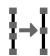

你可以修复选定的小边。Abaqus/CAE 会移除这些小边并编辑相邻的边以创建封闭的几何图形。

## 合并 (Merge)


你可以选择一系列相连的边，Abaqus/CAE 会将它们合并为一条边，并删除边上的冗余顶点。图 1 说明了合并边的效果。

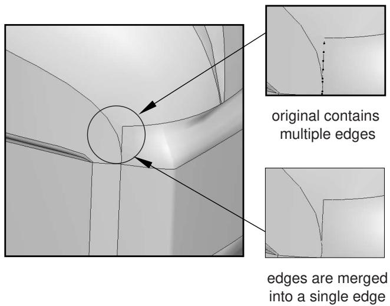

<details>
<summary>text_image</summary>

original contains
multiple edges
edges are merged
into a single edge
</details>

图 1：合并边。

## 移除冗余实体 (Remove redundant entities)


导入的零件可能包含位于连续边上的冗余顶点。同样，导入的零件可能包含作为内部边的冗余边。冗余顶点和边不会改变零件的形状或面积，并且不是完整定义所必需的，如图 2 所示。

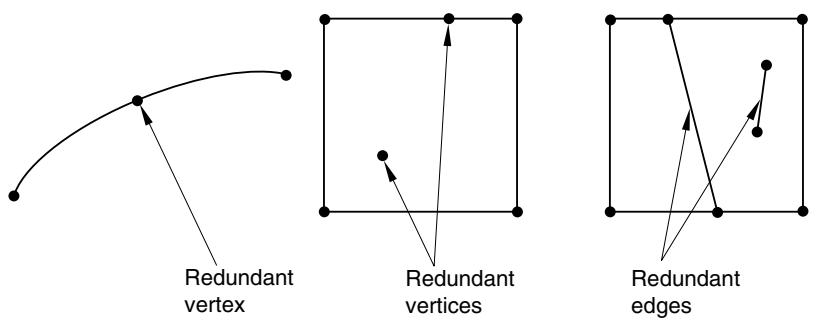
图 2：冗余边和顶点。

## 修复无效元素 (Repair invalid)

在极少数情况下，导入零件后，Abaqus 会报告其某些边无效。**Repair invalid** 工具将尝试通过重新计算定义这些边的数据来修复无效的边。如果 **Query** 工具集指示零件仅包含无效边，你也应该使用此工具。

## 移除线 (Remove wire)

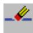

你可以移除选定的线边。Abaqus/CAE 会移除这些线边。

## 编辑面的方法

当你在 **Geometry Edit** 对话框中选择 **Face** 时，**Tool** 列表将显示以下修复面的方法：

## 移除 (Remove)


你可以从三维实体或壳体，或从二维平面零件中移除选定的面（包括倒角、圆角和孔）。选择要移除的面后，Abaqus/CAE 会寻找定义特征的相邻面。你可以移除整个特征，也可以只移除选定的面。当你从三维实体零件中移除一个或多个面时，Abaqus/CAE 会将该零件转换为壳体。

## 覆盖边 (Cover edges)

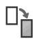

你可以通过选择新面的一条或多条边在三维零件上创建一个面。Abaqus/CAE 遍历相邻边并计算新面的位置。如果你选择了没有通过公共环路连接的多条边，Abaqus/CAE 会创建多个面，每条边环路对应一个面。Abaqus/CAE 将新面创建为壳体。如果这些新壳体形成一个封闭零件，你可以使用从壳体到实体的工具将该零件转换为实体。

## 替换 (Replace)

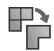

在某些情况下，当你导入零件时，Abaqus/CAE 可能无法准确地重建某些面。例如，平面面可能显得波浪状或扭曲，或者 Abaqus/CAE 可能创建了对网格密度有很大影响的小面。你可以选择相连的面，Abaqus/CAE 会将它们替换为一个面。新面的分段最少，并且比原始面更平滑。图 1 说明了替换选定面的效果。

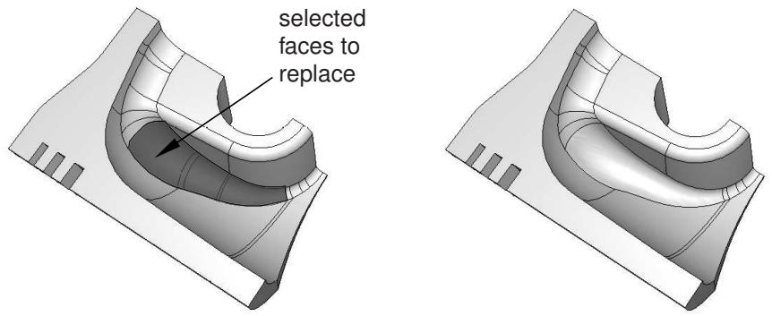
图 1：替换选定面的效果。

或者，你可以用通过延伸相邻面形成的单一面来替换选定的面。你可以使用此工具从导入的零件中移除凸台和细节，如图 2 所示。


<details>
<summary>text_image</summary>

selected
faces to
replace
</details>

图 2：替换选定面并延伸相邻面的效果。

## 修复小元素 (Repair small)

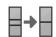

你可以修复选定的小面。Abaqus/CAE 会移除这些小面并编辑相邻的面以创建封闭的几何图形。图 3 说明了修复小面的效果。
原始小面


<details>
<summary>natural_image</summary>
显示一个机械零件的技术图，其中有两个嵌入视图突出显示特定特征（无文本或符号）
</details>

小面已移除

## 修复碎片

图 3：修复小面。


可以将碎片视为一个小的、尖锐的多余材料块。您可以从三维实体或壳体的面、或从二维平面部件上移除不需要的碎片。您必须选择包含要移除碎片的面，并从该面上选择两个点。Abaqus/CAE 会在两点之间绘制一条线，将所选面分成两个区域。第一个区域是将保留的面；第二个区域是将被移除的碎片。图 4 说明了移除碎片的效果。

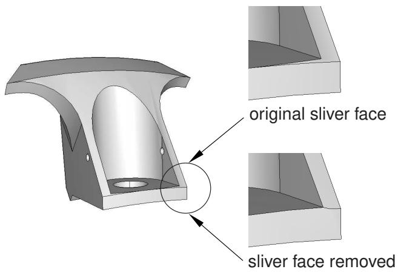

<details>
<summary>text_image</summary>
原始碎片面
碎片面已移除
</details>

图 4：移除碎片。

## 修复法线


您可以修复壳体和实体导入部件的面法线，并且可以在流形部件（每个边仅由一个或两个面共享的部件）和非流形部件上执行这些修复。该工具对实体部件和壳体部件有不同的用途。

## 实体

在少数情况下，查询工具集报告导入的实体部件的体积为负值，因为面法线表明它在源自的 CAD 系统中是里朝外的。修复面法线工具将翻转法线，使实体恢复正常方向。

## 壳体

导入的壳体部件可能包含法线指向相反方向的面。修复面法线工具将对齐壳体部件上的所有法线。如果面法线已经对齐，此工具将翻转所有法线，使其保持对齐但指向相反方向。


## 注意：

在属性模块中使用单元法线赋值指定的单元法线方向，指定了相对于几何法线的相对单元法线方向。这些单元法线将在修复面法线操作后使用新的几何法线进行更新。

当您对非流形壳体部件执行修复时，无法在单次操作中对齐部件中所有面的法线；您必须逐个选择面以翻转其法线方向。您可以在修复壳体部件之前，使用查询对话框中的壳体单元法线选项进行查询，以评估面法线的方向。

## 偏移


您可以通过选择要偏移的面，然后指定偏移距离或选择目标面和距离计算方法，在三维部件上创建面。偏移方向与源面的面法线方向相反，偏移量可以是正的或负的。Abaqus/CAE 使用与草图模块中偏移相同的流程创建新面（更多信息，请参见偏移对象）。


## 注意：

无论采用何种偏移距离计算方法，Abaqus/CAE 都会应用恒定的偏移来创建新面。您无法使用此方法创建与两个会聚或发散面等距的面。

## 延伸

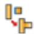

您可以通过指定延伸距离或选择目标面来控制延伸距离，从而延伸现有面。Abaqus/CAE 用延伸的面特征替换现有面。

## 混合

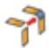

您可以创建新面，这些新面混合了模型中现有边的轮廓，在这些边之间形成面。您可以选择通过使用每条边与现有面相切、计算边之间的最短路径，或指定一条线作为路径来创建新面。

## 从单元面创建面


您可以从孤立单元面创建新的几何面。Abaqus/CAE 基于所选单元面的节点位置创建新的几何面。在单元边方向发生显著变化的边节点处会创建顶点。

## 编辑整个部件的方法

当您从几何编辑对话框中选择部件时，工具列表将显示以下用于修复整个部件的方法：

## 转换为解析表示


Abaqus/CAE 会尝试将边、面和体的内部定义更改为可以解析表示的更简单形式。例如，一个几乎平面的面将被转换为代表该平面的方程。转换为解析表示通常提供以下优势：

• 部件的处理速度更快。
• 转换后的实体在特征操作期间可用。例如，拉伸操作需要一个平面和一条直线边。
• 几何形状得到改善。
• 如果您随后需要缝合部件，缝合操作更有可能成功。

## 转换为精确表示


Abaqus/CAE 提供两种将实体转换为精确几何的方法：

• 如果选择收紧间隙，Abaqus/CAE 会尝试提高模型中面、边和顶点的精度。此方法速度更快，但不会执行完整的几何计算。
• 如果选择重新计算几何，Abaqus/CAE 会尝试更改相邻实体，使其几何形状精确匹配。重新计算几何通常会得到精确的几何形状；但是，此操作可能很耗时，并且会增加导入部件的复杂性，这意味着部件的处理速度会变慢。此外，如果部件包含许多复杂曲面，转换为精确表示可能会失败。如果可能，您应该返回生成原始文件的 CAD 应用程序并提高精度。

## 什么是缝合？

当您选择此选项时，Abaqus/CAE 会尝试沿自由边连接相邻的面。缝合的目的通常是创建实体部件。缝合边通常会产生有效的几何。Abaqus/CAE 通过调整基础曲面直到边相交，来缝合修剪曲面之间的间隙。图 1 说明了缝合过程。

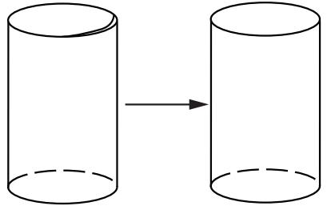

<details>
<summary>natural_image</summary>
两个圆柱体的简单线条图，有一个实体箭头指示方向（无文本或符号）
</details>

为了缝合相交边之间的间隙，Abaqus/CAE 会调整基础曲面，直到两个相邻的面共享同一条边。
图 1：缝合边直至它们相交。

Abaqus/CAE 会尝试从一组修剪曲面中识别实体的边。如果每个修剪曲面的边接近相邻曲面的边（在用户指定的公差范围内），Abaqus/CAE 就会缝合这些修剪曲面。缝合的最终结果是一个 B-rep 实体，其中边的定义在两个相交曲面之间共享。有关 B-rep 实体的更多信息，请参见实体建模器如何表示实体？。当存在线或内部面时，缝合会失败。

当您导入 IGES 或 VDA-FS 格式的部件时，Abaqus/CAE 默认会缝合该部件。然而，由于 IGES 和 VDA-FS 格式部件的内部公差，小特征的生成表示可能与原始文件中预期的几何形状不匹配。

在某些情况下，缝合 IGES 或 VDA-FS 格式的部件会导致 Abaqus/CAE 导入一个本应作为单独部件导入的单个部件。如果您将导入的部件复制到新部件，您可以选择将断开连接的区域分离为单独的部件。更多信息，请参见复制部件。

## 几何修复策略

几何编辑工具集中的工具通常用于修复导入到 Abaqus/CAE 中的几何。修复操作的目标是创建一个没有无效实体的部件，并创建一个边和面数量最少的部件，以避免影响网格生成。如果您无法创建有效的部件，可以忽略其无效性。更多信息，请参见处理无效部件。理想情况下，部件不应有小边或小面。您不必创建精确的部件，如果可能，应继续使用不精确的部件。具有不精确几何的部件可以进行网格划分。然而，在极少数情况下，其他操作可能在不精确几何的部件上失败；例如，其他网格划分功能、添加几何特征和分区操作。如果您无法使用不精确的部件，并且无法使部件变得精确，您应该返回生成原始文件的 CAD 应用程序并提高精度。更多信息，请参见什么是有效且精确的部件？。
Abaqus/CAE 提供了许多不同的编辑工具，通常很难决定使用哪个工具以及以什么顺序使用。一般来说，修复导入零件的几何形状是一门需要实践和经验的艺术。最佳方法取决于零件的复杂性以及您在对零件进行网格划分和分析时希望保留多少细节。

以下指南将帮助您制定修复零件的有效方法：

## 使用几何诊断工具

使用几何诊断工具来查询零件中的无效和不精确实体、自由边、短边、小面和尖锐的拐角角度。

## 使用选择组

您可以使用鼠标按钮3创建临时选择组，以便更容易地组合使用几何诊断工具和修复工具。您可以使用几何诊断工具高亮显示无效和不精确几何形状的区域，并将该区域复制到一个选择组中。然后，在指定要修复的区域时，您可以将该选择组粘贴到几何编辑工具集中。

## 使用显示组

使用显示组选择性地移除面和单元，以帮助您查看复杂零件的内部，并确定哪些实体被几何诊断工具高亮显示。

## 采用渐进式方法

对选定的面和边的小集合使用修复工具，并在继续之前检查修复过程的结果是否正确。

## 保持实体完整

尽量不要通过从实体中移除面而将实体转换为壳。为避免移除面，请对“面”使用**替换**工具，对“边”和“面”使用**修复小**工具。

## 避免创建线框

如果您的零件是实体或壳体，请尽量不要执行可能导致产生线框的操作。Abaqus/CAE 难以从线框重建面。

## 移除圆角和倒角

使用**替换**工具和**延伸相邻面**选项从零件中移除圆角和倒角，并延伸相邻面以闭合由此产生的间隙。

## 移除相切相交的面

使用**替换**工具或**修复小**工具来修复近似相切的面。您应该使用**修复小**工具来移除相对较小的面。**修复小**工具只是延伸剩余的面直到它们相交。在此过程中，小面会被删除，尽管结果可能不精确。对于相对较大且相切相交的面，请使用**替换**工具。**替换**工具使用底层点来用近似曲面替换原始面。

## 检查零件的有效性

如果您的零件无效，您可以通过在模型树中的零件上单击鼠标按钮3并从出现的菜单中选择**更新有效性**来检查修复操作是否已使零件有效。检查有效性可能是一个耗时的操作，您应该等到完成零件编辑后再检查其有效性。如果零件已经是有效的，则任何修复操作都不会使其无效。

## 修复后再创建分区

如果您的零件包含分区，几何编辑工具集可能会在修复操作期间删除它们。为避免此问题，您应该等到完成零件编辑后再对其进行分区。

## 从孤立网格单元创建零件

您可以使用几何编辑工具集中的工具从孤立网格单元的面创建几何形状。当您拥有一个需要修改的网格化零件，但无法获得其部分或全部几何时，此技术非常有用。决定是向孤立网格添加几何特征、从头开始重新创建零件几何形状，还是从孤立单元反向工程几何形状，取决于许多因素，包括：

•   现有零件的复杂性
•   要添加特征的复杂性
•   修改现有孤立网格的难度程度
•   为整个零件创建新网格的意愿

其他因素，例如项目的时间限制和导出模型几何形状的能力，也可能影响您的决策。

从孤立网格创建零件的目标是创建符合原始设计意图的几何形状，同时为当前和未来的修改提供一个平台。该几何形状还必须适用于通过与当前网格完全关联或创建新网格来生成原生网格。

以下指南将帮助您为孤立网格创建几何形状：

## 创建新的几何面

使用**从单元面创建面**工具为模型创建外表面几何形状。每次使用该工具都会从选定的外部孤立单元面创建一个单一的壳面。该工具包含几种用于选择多个孤立单元边界面的独特方法，并且它会自动将新创建的面缝合到任何相邻的几何体上。更多信息，请参阅**从单元面创建面**。当您完成面创建后，所有外部孤立单元面都应被几何面覆盖。

## 移除多余的边和面

使用几何编辑工具集中的其他工具来移除多余的边、小面以及任何会限制生成高质量网格的特征。如有必要，将零件转换为精确几何。更多信息，请参阅**修复几何形状的策略**。

## 转换为实体

如果您正在处理实体零件，请使用**从壳创建实体**工具来填充创建的壳面内部的空间。

## 分区并划分网格

抑制或删除孤立网格，并为零件创建新的网格。

## 修复后再创建分区

如果您的零件包含分区，几何编辑工具集可能会在修复操作期间删除它们。为避免此问题，您应该等到完成零件编辑后再对其进行分区。

## 编辑和修复边

本节描述可用于修复边的工具。

## 在本节中：

将边缝合以创建面  
修复小边  
合并边  
移除冗余实体  
修复无效边  
移除线框边

您可以通过自动缝合自由边之间的任何间隙来创建新面。缝合间隙允许您替换先前删除的小面、圆角或倒角。缝合间隙的操作作为零件的一个特征存储；因此，您可以使用模型树删除缝合并恢复到原始零件。更多信息，请参阅**什么是缝合？**。

您可以在流形零件（每条边仅由一两个面共享的零件）或非流形零件中缝合间隙。

1.  从主菜单栏中，选择 **Tools -> Geometry Edit**。
    Abaqus/CAE 显示 **Geometry Edit** 对话框。
    
    **提示：** 您也可以使用位于 **Part** 模块工具箱中编辑工具内的工具来缝合边。有关工具箱中编辑工具的示意图，请参阅**编辑技术**。
2.  在对话框中，选择 **Edge** 类别和 **Stitch** 方法。
3.  在出现的警告对话框中，单击 **OK**。
4.  如果需要，在提示区域为缝合操作指定缝合公差。Abaqus/CAE 将只缝合小于您指定公差值的间隙。
5.  执行以下操作之一：
    *   如果您想单独选择用于缝合操作的边，请勾选 **Pick edges**，然后单击鼠标按钮2，接着指定要选择的边。您选择的所有边都必须是自由边，因为当选择 **Pick edges** 时，Abaqus/CAE 仅尝试流形缝合。如果您选择任何被多个面共享的边，缝合操作将失败。
        
        **提示：** 您可以单独选择边，指定一个包含边的现有集合，或使用角度方法选择边。有关在视口中选择几何对象的更多信息，请参阅**在当前视口中选择对象**。
    *   如果您想在整个模型范围内缝合边，请取消勾选 **Pick edges**，然后单击鼠标按钮2。当 **Pick edges** 取消勾选时，Abaqus/CAE 可以尝试对整个模型同时进行流形和非流形缝合。如果模型的任何边被多个面共享，则生成的模型将是非流形的。
6.  Abaqus/CAE 尝试根据您的规格缝合零件。如果修复成功，Abaqus/CAE 会提示您更新零件的有效性。
7.  如果您已经编辑了零件，您应该通过在模型树中的零件上单击鼠标按钮3并从出现的菜单中选择 **Update validity** 来检查其有效性。

## 附加信息

•   有效零件、精确零件和公差
•   编辑面的方法

## 修复小边

您可以从零件中修复选定的 **小边**。Abaqus/CAE 会移除这些小边并修复相邻的边和面，以创建一个封闭的几何形状。修复小边的操作作为零件的一个特征存储；因此，您可以使用模型树删除或抑制该操作。
1.  从主菜单栏中选择 Tools->Geometry Edit。

    Abaqus/CAE 会显示 Geometry Edit 对话框。

    

    $1 + 1$ 模块工具箱。有关工具箱中编辑工具的图示，请参阅“编辑技术”。

2.  从对话框中，选择 Edge 类别和 Repair small（修复小边）方法。
3.  选择您想要修复的边。您可以从视口选择边，或者选择一个包含这些边的现有集合。

    

    ## 注意：

    默认的选择方法基于您最近使用的选区方法。要切换到另一种方法，请单击提示区域右侧的 Select in Viewport（在视口中选择）或 Sets（集合）。

    您可以结合使用拖动选择、[Shift] + 单击、[Ctrl] + 单击以及角度方法来选择多个小边进行修复。更多信息，请参阅“在当前视口中选择对象”。

    

    提示：如果您无法选择所需的边，可以使用 Selection 工具栏来更改选择行为。更多信息，请参阅“使用选择选项”。

4.  单击鼠标按钮 2 表示您已完成小边的选择。

    Abaqus/CAE 会从部件中移除所选的小边，并提示您更新部件的有效性。

5.  执行以下操作之一：

    *   单击 Yes 以更新部件的有效性。（每当您修复小边时，都应更新部件的有效性。）
    *   单击 No 以跳过更新并继续您的修复。
    *   单击 Cancel 以取消当前修复操作中的更改。

    您也可以随时通过在模型树中右键单击部件，并从出现的菜单中选择 Update validity 来更新部件的有效性。

    ## 其他信息

    *   有效部件、精确部件和容差
    *   编辑边的方法

    ## 合并边

    您可以将部件中选定的边合并为一条边。合并边也会移除多余的顶点和边。当您选择一条边进行合并时，Abaqus/CAE 会搜索所有连接的边，直到遇到一个分支，并将这些连接的边附加到您的选择中。合并边的操作作为部件的一个特征存储；因此，您可以使用模型树来删除或抑制该操作。

1.  从主菜单栏中选择 Tools->Geometry Edit。

    Abaqus/CAE 会显示 Geometry Edit 对话框。

    

    工具箱。有关工具箱中编辑工具的图示，请参阅“编辑技术”。

2.  从对话框中，选择 Edge 类别和 Merge（合并）方法。
3.  选择您想要合并的边。Abaqus/CAE 会搜索所有连接的边，直到遇到一个分支，并选择所有连接的边。

    您可以从视口选择边，或者选择一个包含这些边的现有集合。

    

    ## 注意：

    默认的选择方法基于您最近使用的选区方法。要切换到另一种方法，请单击提示区域右侧的 Select in Viewport（在视口中选择）或 Sets（集合）。

    您可以结合使用拖动选择、[Shift] + 单击、[Ctrl] + 单击以及角度方法来选择多条边进行合并。更多信息，请参阅“在当前视口中选择对象”。

    

    提示：如果您无法选择所需的边，可以使用 Selection 工具栏来更改选择行为。更多信息，请参阅“使用选择选项”。

4.  单击鼠标按钮 2 表示您已完成边的选择。

    如果可能，Abaqus/CAE 会将选定的边合并为单条边。如果没有边可以合并，Abaqus/CAE 会显示错误消息；否则，Abaqus/CAE 会提示您更新部件的有效性。

5.  执行以下操作之一：

    *   单击 Yes 以更新部件的有效性。（每当您合并边时，都应更新部件的有效性。）
    *   单击 No 以跳过更新并继续您的修复。
    *   单击 Cancel 以取消当前修复操作中的更改。

    您也可以随时通过在模型树中右键单击部件，并从出现的菜单中选择 Update validity 来更新部件的有效性。

    ## 其他信息

    *   有效部件、精确部件和容差
    *   编辑边的方法

    ## 移除多余实体

    您可以使用 Remove redundant entities（移除多余实体）工具从选定区域移除多余的顶点和边。

    一个导入的部件可能包含未连接到边上或沿直线边放置的多余顶点。同样，一个导入的部件可能包含未连接到面或内部边的多余边。多余的顶点和边不会改变部件的形状或面积，并且对于完整定义不是必需的，如下图所示：

    

    <details>
    <summary>流程图</summary>

    ```mermaid
    graph LR
      A["曲线"] --> B["多余顶点"]
      B --> C["多余顶点"]
      C --> D["多余边"]
      D --> E["曲线"]
    ```
    </details>

    Query 工具集提供了一组几何诊断工具，允许您定位无效和不精确几何的区域。更多信息，请参阅“在部件模块中使用 Query 工具集”。移除多余实体的操作作为部件的一个特征存储；因此，您可以使用模型树来恢复您删除的顶点和边。

1.  从主菜单栏中选择 Tools->Geometry Edit。

    Abaqus/CAE 会显示 Geometry Edit 对话框。

    

    提示：如果您正在使用 Part 模块，您也可以使用模块工具箱中与编辑工具位于一起的工具来移除多余实体。有关 Part 模块工具箱中编辑工具的图示，请参阅“编辑技术”。

    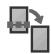

2.  从对话框中，选择 Edge 类别和 Remove redundant entities（移除多余实体）方法。
3.  选择 Abaqus/CAE 应从中移除多余边和顶点的区域。您可以从视口选择该区域，或者选择一个包含该区域的现有集合。

    

    ## 注意：

    默认的选择方法基于您最近使用的选区方法。要切换到另一种方法，请单击提示区域右侧的 Select in Viewport（在视口中选择）或 Sets（集合）。

4.  如果您不希望移除顶点，请从提示区域中关闭 Remove redundant edge vertices（移除多余边顶点）选项。
5.  从提示区域中，单击 Done。

    Abaqus/CAE 会从选定区域移除多余实体，并提示您更新部件的有效性。

6.  执行以下操作之一：

    *   单击 Yes 以更新部件的有效性。（每当您移除多余实体时，都应更新部件的有效性。）
    *   单击 No 以跳过更新并继续您的编辑。
    *   单击 Cancel 以取消当前编辑操作中的更改。

    您也可以随时通过在模型树中右键单击部件，并从出现的菜单中选择 Update validity 来更新部件的有效性。

    ## 其他信息

    *   有效部件、精确部件和容差
    *   编辑边的方法

    ## 修复无效边

    在导入部件后，在极少数情况下，Abaqus 会报告其所有边均无效。Repair invalid（修复无效）工具尝试通过重新计算定义边的数据来修复无效边，这有助于修复某些类型的无效问题。如果在自动修复部件后只剩下无效边，您也应该使用此工具。

    Query 工具集提供了一组几何诊断工具，用于确定部件是否包含无效边。更多信息，请参阅“在部件模块中使用 Query 工具集”。修复无效边的操作作为部件的一个特征存储；因此，您可以使用模型树来删除或抑制该操作。

1.  从主菜单栏中选择 Tools->Geometry Edit。

    Abaqus/CAE 会显示 Geometry Edit 对话框。

    

    提示：您也可以使用 Part 模块工具箱中与编辑工具位于一起的工具来修复无效边。有关工具箱中编辑工具的图示，请参阅“编辑技术”。

2.  从对话框中，选择 Edge 类别和 Repair invalid（修复无效）方法。

    Abaqus/CAE 会修复无效边，并提示您更新部件的有效性。

3.  执行以下操作之一：
点击“是”以更新部件的有效性。（每当修复无效边时，都应更新部件的有效性。）  
• 点击“否”以跳过更新并继续您的修复。  
• 点击“取消”以取消当前修复操作中的更改。

您也可以随时通过在模型树中用鼠标按钮3点击该部件并从出现的菜单中选择“更新有效性”来更新部件的有效性。

## 附加信息
• 有效部件、精确部件和公差  
• 编辑边的方法

您可以从部件中移除选定的线边。线边是指线状边，与实体或壳特征的边相对。移除线边的操作将作为部件的一个特征存储；因此，您可以使用模型树来删除或抑制该操作。

1.  从主菜单栏中，选择“工具”->“几何编辑”。

    Abaqus/CAE 显示“几何编辑”对话框。

    

    提示：您也可以使用位于“零件”模块工具箱中与编辑工具在一起的工具来移除线边。有关工具箱中编辑工具的图示，请参见“编辑技术”。

2.  在对话框中，选择“边”类别和“移除线”方法。  
3.  选择您想要移除的线边。您可以从视口选择边，或者选择包含这些边的现有集合。

    

## 注意：
默认选择方法基于您最近采用的选择方法。要恢复为另一种方法，请单击提示区右侧的“在视口中选择”或“集合”。

您可以使用拖动选择、[Shift] + 单击、[Ctrl] + 单击和角度方法的组合来选择多条线边进行移除。更多信息，请参见“在当前视口中选择对象”。


提示：如果无法选择所需的边，您可以使用选择工具栏来更改选择行为。更多信息，请参见“使用选择选项”。

4.  单击鼠标按钮2以指示您已完成线边的选择。

    Abaqus/CAE 移除线边，并提示您更新部件的有效性。

5.  执行以下操作之一：

    点击“是”以更新部件的有效性。（每当移除线边时，都应更新部件的有效性。）  
    • 点击“否”以跳过更新并继续您的修复。  
    • 点击“取消”以取消当前修复操作中的更改。

您也可以随时通过在模型树中用鼠标按钮3点击该部件并从出现的菜单中选择“更新有效性”来更新部件的有效性。

## 附加信息
• 有效部件、精确部件和公差  
• 编辑边的方法

## 编辑和修复面
本节描述可用于修复面的工具。

## 本节内容：
移除面  
用新面覆盖边  
替换面  
修复小面  
修复狭长面  
修复面法向  
偏移面  
延伸面  
混合面  
从单元面创建面

## 移除面
为了使部件有效或精确，您可以使用移除面工具从三维实体或壳，或者从二维平面部件中移除选定的面。

在您选择要移除的面之后，Abaqus/CAE 会查找定义特征的相邻面。您可以移除整个特征，也可以仅移除选定的面。当您从实体部件中移除一个或多个面时，Abaqus/CAE 会将该部件中的所有单元转换为壳，如下图所示：


<details>
<summary>自然图像</summary>

两个三维机械零件图，显示阶梯状和矩形部件，没有文字或符号
</details>

查询工具集提供了一组几何诊断工具，可让您定位无效和不精确几何的区域。更多信息，请参见在“零件”模块中使用查询工具集。移除面的操作将作为部件的一个特征存储；因此，您可以使用模型树来恢复您删除的面。

1.  从主菜单栏中，选择“工具”->“几何编辑”。

    Abaqus/CAE 显示“几何编辑”对话框。

    

    提示：您也可以使用位于“零件”模块工具箱中与编辑工具在一起的工具来移除面。有关工具箱中编辑工具的图示，请参见“编辑技术”。

2.  在对话框中，选择“面”类别和“移除”方法。  
3.  选择您想要移除的面。您可以从视口选择面，或者选择包含这些面的现有集合。

    

## 注意：
默认选择方法基于您最近采用的选择方法。要恢复为另一种方法，请单击提示区右侧的“在视口中选择”或“集合”。

您可以使用拖动选择、[Shift] + 单击、[Ctrl] + 单击和角度方法的组合来选择多个面进行移除。更多信息，请参见“在当前视口中选择对象”。


提示：如果无法选择所需的面，您可以使用选择工具栏来更改选择行为。更多信息，请参见“使用选择选项”。

4.  单击鼠标按钮2以指示您已完成面的选择。

    

## 注意：
如果您正在从实体部件中移除一个或多个面，Abaqus/CAE 会提示您移除这些面将导致实体被转换为壳，并提示您是否继续。

Abaqus/CAE 移除选定的面。

## 附加信息
• 有效部件、精确部件和公差  
• 编辑面的方法

您可以通过选择新面将覆盖的边来创建一个面。选定的边必须形成一个闭环。Abaqus/CAE 将新面创建为壳。如果新壳形成一个封闭部件，您可以使用从壳创建实体工具将该部件转换为实体。更多信息，请参见“从壳创建实体特征”。覆盖边的操作将作为部件的一个特征存储；因此，您可以使用模型树来删除您创建的面。Abaqus/CAE 通过将面投影到由选定边形成的平面上来创建新面。因此，如果最终得到的面非常凸，您不应使用“覆盖边”工具。

1.  从主菜单栏中，选择“工具”->“几何编辑”。

    Abaqus/CAE 显示“几何编辑”对话框。

    

    提示：您也可以使用位于“零件”模块工具箱中与编辑工具在一起的工具来创建面。有关工具箱中编辑工具的图示，请参见“编辑技术”。

2.  在对话框中，选择“面”类别和“覆盖边”方法。  
3.  选择形成环并定义新面边的边。您可以从视口选择边，或者选择包含这些边的现有集合。您可以选择多个环，Abaqus/CAE 将创建多个面。但是，这些环不应是同心的。

    

## 注意：
默认选择方法基于您最近采用的选择方法。要恢复为另一种方法，请单击提示区右侧的“在视口中选择”或“集合”。

4.  从提示区，单击“完成”。

    Abaqus/CAE 创建新面。

5.  如果您已完成部件的编辑，您应该通过在模型树中用鼠标按钮3点击该部件并从出现的菜单中选择“更新有效性”来检查其有效性。

## 附加信息
• 有效部件、精确部件和公差  
• 编辑面的方法

## 替换面
如果导入部件的面看起来未正确形成，您可以用基于底层几何由 Abaqus/CAE 生成的新面替换它们。因为 Abaqus/CAE 依赖于底层几何，如果最终得到的面非常凸，您不应使用“替换”工具。如果您选择要替换多个面，这些面必须是相连的。

或者，您可以通过延伸相邻面来替换一个面。该工具对于从您的部件中移除凸台或小凸起非常有用。

1.  从主菜单栏中，选择“工具”->“几何编辑”。

    Abaqus/CAE 显示“几何编辑”对话框。

    

    提示：您也可以使用位于“零件”模块工具箱中与编辑工具在一起的工具来替换面。有关工具箱中编辑工具的图示，请参见“编辑技术”。
2. 从对话框中选择 **Face** 类别和 **Replace** 方法。  
3. 选择要替换的面。这些面必须相连。您可以从视口选择面，或点击鼠标按钮 3 从临时选择组粘贴面到您的选择中（详情请参阅什么是选择组？）。  

您可以结合使用拖动选择、[Shift] + 单击、[Ctrl] + 单击和角度方法来选择多个面进行替换。更多信息，请参阅在当前视口内选择对象。  


提示：如果无法选择所需的面，您可以使用选择工具栏更改选择行为。更多信息，请参阅使用选择选项。

4. 在提示区域，切换启用 **Extend neighboring faces**（延伸相邻面），用一个通过延伸相邻面形成的单一面替换选定的面。  
5. 点击鼠标按钮 2 表示已完成面的选择。

Abaqus/CAE 将替换选定的面。

6. 如果您已完成零件的编辑，应通过右键单击模型树中的零件并从出现的菜单中选择 **Update validity**（更新有效性）来检查其有效性。

## 附加信息

• 有效零件、精确零件和公差  
• 编辑面的方法

您可以修复零件中选定的小面。Abaqus/CAE 会移除这些小面并修复相邻的边和面以创建闭合的几何体。修复小面的操作存储为零件的一个特征；因此，您可以使用模型树来删除或抑制该操作。

1. 从主菜单栏中，选择 **Tools -> Geometry Edit**（工具 -> 几何编辑）。

Abaqus/CAE 显示 **Geometry Edit**（几何编辑）对话框。


提示：您也可以使用 $\boxplus + \boxed { - }$ 工具修复小面，该工具位于 **Part**（部件）模块工具箱的编辑工具中。有关工具箱中编辑工具的图示，请参阅编辑技术。

2. 从对话框中选择 **Face** 类别和 **Repair small** 方法。  
3. 选择要修复的面。您可以从视口选择面，或选择一个包含这些面的现有集合。


## 注意：

默认选择方法基于您最近使用的选择方法。要切换到另一种方法，请点击提示区域右侧的 **Select in Viewport**（在视口中选择）或 **Sets**（集合）。

您可以结合使用拖动选择、[Shift] + 单击、[Ctrl] + 单击和角度方法来选择多个小面进行修复。更多信息，请参阅在当前视口内选择对象。


提示：如果无法选择所需的面，您可以使用选择工具栏更改选择行为。更多信息，请参阅使用选择选项。

4. 点击鼠标按钮 2 表示已完成小面的选择。

Abaqus/CAE 修复小面并提示您更新零件的有效性。

5. 执行以下操作之一：

点击 **Yes**（是）以更新零件的有效性。（每当您修复小面时，都应更新零件的有效性。）  
• 点击 **No**（否）跳过更新并继续您的修复操作。  
• 点击 **Cancel**（取消）取消当前修复操作中的更改。

您也可以随时通过右键单击模型树中的零件并从出现的菜单中选择 **Update validity**（更新有效性）来更新零件的有效性。

## 附加信息

• 有效零件、精确零件和公差  
• 编辑面的方法

## 修复窄条

您可以将窄条视为面中的一块多余材料。您可以修复不需要的窄条，并将其从三维实体或壳体的面中，或从二维平面零件中移除。您必须选择包含要修复的窄条的面以及该面上的两个点。Abaqus/CAE 使用这两个点将选定的面划分为两个区域。然后，它删除较小的区域（窄条）并保留较大的区域。如果较小的区域相对于其相邻区域较大，则操作失败。修复窄条的操作存储为零件的一个特征；因此，您可以使用模型树来删除或抑制该操作。

1. 从主菜单栏中，选择 **Tools -> Geometry Edit**（工具 -> 几何编辑）。

Abaqus/CAE 显示 **Geometry Edit**（几何编辑）对话框。


提示：您也可以使用该工具移除窄条，该工具位于 **Part**（部件）模块工具箱的编辑工具中。有关工具箱中编辑工具的图示，请参阅编辑技术。

2. 从对话框中选择 **Face** 类别和 **Repair sliver** 方法。  
3. 选择要修复的面。您可以从视口选择面，或选择一个包含该面的现有集合。


## 注意：

默认选择方法基于您最近使用的选择方法。要切换到另一种方法，请点击提示区域右侧的 **Select in Viewport**（在视口中选择）或 **Sets**（集合）。


提示：如果无法选择所需的面，您可以使用选择工具栏更改选择行为。更多信息，请参阅使用选择选项。

4. 选择定义窄条一个角的点。  
5. 选择定义窄条对角的第二个点。  
6. Abaqus/CAE 在选定的两个点之间绘制一条线，并移除由此产生的小面。

## 附加信息

• 有效零件、精确零件和公差  
• 编辑面的方法

您可以修复导入的壳体和实体零件的面法向，并且可以在流形零件（每条边仅由一个或两个面共享的零件）或非流形零件上执行这些修复。

如果 Abaqus 报告导入零件的体积为负，则意味着该实体已被翻转。修复法向工具将翻转法向并使实体恢复正常。

导入的壳体零件可能包含法向指向相反方向的面。修复法向工具将对齐壳体零件上所有选定面的法向。如果面法向已经对齐，此工具将翻转所有选定的法向，使其保持对齐但指向相反方向。


## 注意：

Abaqus/CAE 不会翻转在 **Property**（属性）模块中使用 **Element Normal**（单元法向）分配选项手动分配给壳体面的法向。

当您修复非流形壳体零件时，无法在一次操作中翻转零件中所有面的法向；您必须单独选择每个面来翻转其法向方向。在修复壳体零件之前，使用 **Query**（查询）对话框中的 **Shell element normals**（壳体单元法向）选项执行查询，可以帮助您评估面法向的方向。

**Query** 工具集提供了一组几何诊断工具，用于计算实体零件的体积并显示壳体和膜的法向。更多信息，请参阅在 **Part**（部件）模块中使用 **Query**（查询）工具集。修复面法向的操作存储为零件的一个特征；因此，您可以使用模型树来删除或抑制该操作。

1. 从主菜单栏中，选择 **Tools -> Geometry Edit**（工具 -> 几何编辑）。

Abaqus/CAE 显示 **Geometry Edit**（几何编辑）对话框。


提示：您也可以使用该工具修复面法向，该工具位于 **Part**（部件）模块工具箱的编辑工具中。有关工具箱中编辑工具的图示，请参阅编辑技术。

2. 从对话框中选择 **Face** 类别和 **Repair normals** 方法。  
3. 从提示区域选择以下选项之一：

• 点击 **Entire Part**（整个零件）以修复零件中每个方向错误的面的法向。  
• 点击 **Select Faces**（选择面）以选择零件中的单个面。

4. 如果您正在选择零件中的单个面，请从视口中选择要修复法向的面，然后从提示区域点击 **Done**（完成）。

您可以结合使用拖动选择、[Shift] + 单击和 [Ctrl] + 单击来选择零件中的面，也可以使用角度方法或面曲率方法来选择面。更多信息，请参阅在当前视口内选择对象。

Abaqus/CAE 修复面法向。

## 附加信息

• 有效零件、精确零件和公差  
• 编辑面的方法

## 偏移面

您可以通过从现有面偏移来创建面。Abaqus/CAE 将新创建的面作为壳体。偏移操作存储为零件的一个特征；因此，您可以使用模型树来删除您创建的面。在创建中面模型时可以使用偏移面；有关信息，请参阅中面建模。”
你可以使用目标面来计算偏移距离，如 Figure 1 所示，或者你也可以直接指定一个偏移距离。


<details>
<summary>text_image</summary>

Selected face
Offset face
Target face
</details>

Figure 1: 发散面之间的恒定偏移距离。

无论你选择哪种偏移距离计算方法，Abaqus/CAE 都会以恒定的偏移距离从所选面创建所有新面，如图所示。但是，如果你使用目标面来计算偏移距离，Abaqus/CAE 会利用所选面和目标面来计算偏移面上每个节点的厚度和偏移距离，使得偏移面的行为近似于原始截面的行为。你可以在网格划分部件后，通过显示原生网格并在 Part Display Options（部件显示选项）对话框中打开 **Render shell thickness**（渲染壳厚度）并设置 **Scale factor**（比例因子）为 1 来查看这些计算的结果。

你可以使用 **Assign thickness and Offset**（指定厚度和偏移）工具来查看和编辑壳厚度值（更多信息，请参阅“Assigning thicknesses and offsets”），或者你也可以在给新面指定截面时为它们指定一个厚度。

1.  从主菜单栏，选择 **Tools** > **Geometry Edit**。

    Abaqus/CAE 将显示 **Geometry Edit**（几何编辑）对话框。

    

    **提示：** 你也可以使用位于 Part（部件）模块工具箱中编辑工具区域的偏移面工具。要查看工具箱中编辑工具的示意图，请参阅“Editing techniques”。

2.  从对话框中，选择 **Face**（面）类别和 **Offset**（偏移）方法。
3.  选择要偏移的面。你可以单独选择面，也可以按面角度或曲率选择；你还可以选择一个包含这些面的现有集合。有关在视口中选择对象的更多信息，请参阅“Selecting objects within the current viewport”。

    

    ## 注意：

    默认的选择方法基于你最近使用过的选择方法。要切换到另一种方法，请点击提示区域右侧的 **Select in Viewport**（在视口中选择）或 **Sets**（集合）。

4.  在提示区域中，点击 **Done**（完成）。

    Abaqus/CAE 将显示 **Offset Faces**（偏移面）对话框。

5.  选择一个可用选项来确定偏移距离：

    

    ## 注意：

    无论采用何种计算方法，Abaqus/CAE 都会对这些面应用恒定的偏移，如 Figure 1 所示。你必须使用其他方法来创建位于收敛或发散面之间的新面。

    ### **Use target faces to compute distance**（使用目标面计算距离）

    选择一个或多个目标面。Abaqus/CAE 通过在多个点处采样面来计算要偏移的面与目标面之间的距离。使用以下距离选项之一：

    *   选择 **Half the average distance**（平均距离的一半），使新面偏移此量。
    *   选择 **Fraction distance to closest point on face**（到面上最近点的距离分数），并输入一个值。Abaqus/CAE 将新面偏移到目标面上最近点的距离乘以输入值。
    *   选择 **Fraction distance to farthest point on face**（到面上最远点的距离分数），并输入一个值。Abaqus/CAE 将新面偏移到目标面上最远点的距离乘以输入值。

    你可以使用与步骤 3 相同的方法选择目标面。如果你的原始面是中面模型参考表示的一部分，你可以点击 **Auto Select**（自动选择）让 Abaqus/CAE 从参考表示的另一侧选择合适的面。潜在目标面之间的不同距离可能导致选择结果仅部分匹配原始面。如果需要，点击 **Edit**（编辑）以修改视口中的选择。

    ### **Distance**（距离）

    输入一个偏移距离，或者选择测量并输入视口中对象之间的距离。

    对于分数值或实际距离，负值表示沿面法线方向偏移；正值表示沿相反方向偏移。如果你不确定法线方向，请使用 **Shell element normals**（壳单元法线）通用查询来查看模型中壳的法线方向。更多信息，请参阅“Obtaining general information about the model”。实体的法线指向外部，因此正偏移将在部件内部创建一个面，除非偏移距离大于部件的厚度。

6.  如果模型包含参考表示，请切换 **Auto trim to reference representation**（自动修剪到参考表示）来控制 Abaqus/CAE 是否将偏移面与参考表示匹配。

    如果此选项被打开，Abaqus/CAE 将沿着偏移面的自由边延伸它们，并在它们与参考表示相交的地方进行修剪。

    

    ## 注意：

    对于复杂的面，面延伸可能会失败。如果面延伸失败，Abaqus/CAE 会指示错误，并修剪任何与参考表示相交的未延伸面。

7.  点击 **OK**（确定）。

    Abaqus/CAE 在距原始面规定距离处创建新面，然后过程将从步骤 3 重新开始。

8.  要退出偏移过程，可以：

    *   点击提示区域中的取消按钮，或
    *   在 Abaqus/CAE 窗口中的任意位置点击鼠标键 2，或
    *   从 **Geometry Edit** 工具集或 **Part**（部件）模块的工具中选择另一个操作。

## 附加信息

*   有效部件、精确部件和公差
*   使用偏移面工具进行中面建模
*   编辑面的方法

## 延伸面

你可以通过延伸现有面来编辑面。延伸操作作为部件的一个特征存储；因此，如果使用了距离方法，你可以使用 Model Tree（模型树）来编辑距离参数，或者删除延伸的面。

Figure 1 展示了使用目标面来延伸一个面。上面的图像显示了完整的部件，其中包含一个中央平面面，该平面面与周围面之间有一个小间隙。周围面大约包围了平面面的两侧半。平面面被选中进行延伸，周围面被用作目标面。选中的面沿着会与目标面相交的三个侧面延伸。下面两张图片详细展示了当所选面在左侧超出目标面末端时，你可以如何控制延伸。在左下图中，使用了 **Trim to extended underlying target surfaces**（修剪到底层延伸的目标面）选项，使得所选面的整个左侧边缘均匀延伸——就好像目标面延伸到了所选面的全部高度。在右下图中，面只延伸到目标面结束的位置。

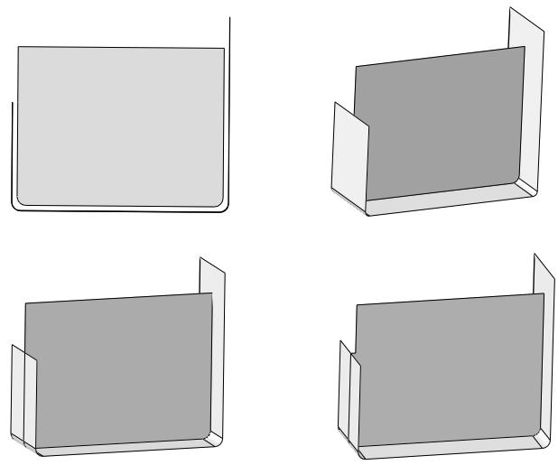
Figure 1: 延伸面时切换 **Trim to extended underlying target surfaces** 选项的效果：初始带间隙模型（左上和右上），选项开启（左下），选项关闭（右下）。

1.  从主菜单栏，选择 **Tools** > **Geometry Edit**。

    Abaqus/CAE 将显示 **Geometry Edit**（几何编辑）对话框。

    

    **提示：** 你也可以使用位于 **Part**（部件）模块工具箱中编辑工具区域的延伸面工具。要查看工具箱中编辑工具的示意图，请参阅“Editing techniques”。

2.  从对话框中，选择 **Face**（面）类别和 **Extend**（延伸）方法。

    Abaqus/CAE 将显示 **Extend Faces**（延伸面）对话框。

3.  选择以下方法之一来延伸面：

    *   打开 **Specify edges of faces to extend**（指定要延伸面的边），然后选择一条或多条边，仅沿着选定的边延伸由这些边界定的面。
    *   打开 **Specify faces to extend**（指定要延伸的面），然后选择面以沿着它们所有的自由边延伸它们。

    点击 **Select**（选择）以指定要延伸的边或面。

    你可以单独选择边，也可以按边角度选择；你可以单独选择面，也可以按面角度或曲率选择。有关在视口中选择对象的更多信息，请参阅“Selecting objects within the current viewport”。你还可以选择现有的边或面集合。

    

    ## 注意：

    默认的选择方法基于你最近使用过的选择方法。要切换到另一种方法，请点击提示区域右侧的 **Select in Viewport**（在视口中选择）或 **Sets**（集合）。

4.  在提示区域中，点击 **Done**（完成）。
5.  选择以下可用方法之一来确定延伸距离：

    ### **Distance**（距离）

    输入一个延伸距离，或者选择测量并输入视口中对象之间的距离。

    ### **Up to target faces**（达到目标面）

    选择一个或多个目标面以限制延伸。

    Abaqus/CAE 将目标面高亮显示为黄色。

    如果需要，请打开 **Trim to extended underlying target surfaces**（修剪到底层延伸的目标面），让 Abaqus/CAE 暂时延伸目标面，以创建与你想延伸的面的相交。
## 最多参考表示（Up to reference representation）

Abaqus/CAE 使用参考表示的面来限制延伸。如果模型不包含参考表示，则此选项不可用。

## 6. 单击 OK。

如果您在步骤 5 中选择的目标面未能完全包围要延伸的面，Abaqus/CAE 将显示会与目标面相交的边（这是您在步骤 3 中所做选择的一个子集），并提供仅延伸这些边而非您原始选择的选项。Abaqus/CAE 会创建延伸面特征。如果您使用了目标面或参考表示来限制延伸，Abaqus/CAE 会在延伸面与限制面相交处对其进行修剪。延伸面特征将替换视口中的原始面，并且过程将从步骤 3 重新开始，使用最近使用的选择方法。

## 7. 要退出延伸过程，可以：

• 单击提示区中的取消按钮，或者  
• 在 Abaqus/CAE 窗口的任意位置单击鼠标键 2，或者  
• 从几何编辑工具集或零件模块中的工具选择另一个操作。

## 附加信息

• 有效零件、精确零件和公差  
• 使用延伸面工具进行中面建模  
• 编辑面的方法

## 混合面（Blend faces）

您可以创建混合面来连接模型中的现有面。

Abaqus/CAE 使用新的面来封闭两组连接边之间的空间。您可以选择使新面与选定边相切、使用边之间的最短路径连接边，或指定新面在选定边之间必须遵循的路径。图 1 显示了两个面，其中选定的边已高亮显示。在此示例中，切线方法创建一个与两个原始面均相切的光滑半径面，最短路径方法创建一个平面，而指定路径方法创建一个具有选定线框边轮廓的面。


<details>
<summary>natural_image</summary>

纯3D示意图，包含五个带角度的金属支架，一个紫色波浪线连接其中一个支架（无文字或符号）
</details>

图 1：使用切线、最短路径和指定路径方法创建混合面。

您也可以创建混合面来连接边和面。Abaqus/CAE 使用最短路径方法在选定边和面之间创建混合面。当您在边与现有面之间创建混合面特征时，新面总是与现有面垂直。自由边会根据需要进行延伸或缩短，以便与面的边相交。图 2 显示了选定的边以及通过将它们与一个平面混合创建的特征。中心边的端点是从平面垂直投影而来的，左右边的外端点则被延伸以与平面的边相接。

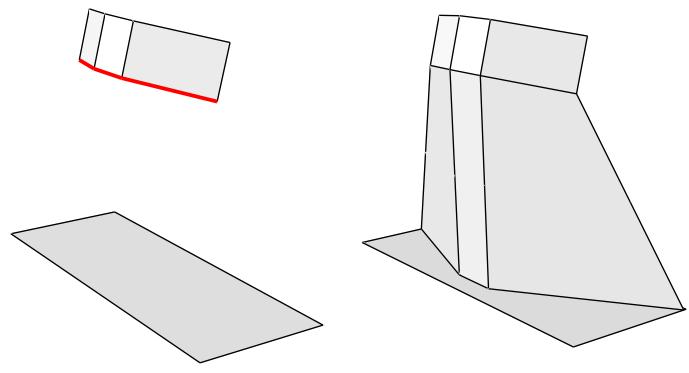

<details>
<summary>natural_image</summary>

三个3D几何形状，无文字或符号：左侧为红色曲线，中间为实心灰色平面，右侧为灰色楔形3D模型（无文字或符号）
</details>

图 2：在边和面之间创建混合面。

混合操作作为零件的一个特征存储；因此，您可以使用模型树删除您创建的面。

1.  从主菜单栏中，选择 Tools -> Geometry Edit。
    Abaqus/CAE 显示“几何编辑”对话框。

    

    提示：您也可以使用位于零件模块工具箱中编辑工具旁边的工具来混合面。有关工具箱中编辑工具的图示，请参见编辑技术。

2.  在对话框中，选择 Face（面）类别和 Blend（混合）方法。
3.  为混合面的第一侧选择边。

    您可以逐个选择边，或按边角度选择。有关在视口中选择对象的更多信息，请参见在当前视口中选择对象。您也可以选择一个现有的边集。

    

## 注意：

默认选择方法基于您最近使用的另一种方法。要切换回另一种方法，请单击提示区右侧的 Select in Viewport（在视口中选择）或 Sets（集）。

    从提示区中，单击 Done（完成）。

4.  为混合面的第二侧选择边或面。

    如果您为第二侧选择了面，则步骤 3 中选择的边必须在面上具有垂直投影，否则 Abaqus/CAE 将无法为您的选择创建混合面。

    从提示区中，单击 Done（完成）以完成选择，并打开“混合面”对话框。

5.  选择一种可用的混合方法：

## 切线（Tangent）

Abaqus/CAE 将创建与包含第一侧和第二侧边的面相切的混合面。要使用此方法，步骤 3 和步骤 4 中选择的边必须是自由边（即仅属于一个特征面），以便 Abaqus/CAE 计算相切性。

## 最短路径（Shortest path）

Abaqus/CAE 将创建使用第一侧和第二侧边之间最短路径连接它们的混合面。如果您为混合的第二侧选择了一个或多个面，则这是唯一可用的混合方法。

## 指定路径（Specify path）

指定边之间的路径。单击 Select（选择）以选择连接第一侧某条边的端点到第二侧某条边的端点的现有边或线框特征。Abaqus/CAE 将使用所选路径的轮廓创建混合面。

6.  单击 Preview（预览）以预览基于当前选择将生成的混合面。
7.  单击 OK。
    Abaqus/CAE 创建混合面特征。混合过程将从步骤 3 重新开始，使用最近使用的选择方法。

8.  要退出混合过程，可以：

    • 单击提示区中的取消按钮，或者  
    • 在 Abaqus/CAE 窗口的任意位置单击鼠标键 2，或者
    • 从几何编辑工具集或零件模块中的工具选择另一个操作。

## 附加信息

• 有效零件、精确零件和公差  
• 编辑面的方法

## 从单元面创建面（Create face from element faces）

您可以根据零件中的孤立单元面创建几何面。Abaqus/CAE 基于选定单元面的节点位置创建一个新的几何面。在单元边方向发生显著变化的边节点处会创建顶点。新面在模型中显示为与其他几何面类似，并且 Abaqus/CAE 会将新面与零件中的相邻面缝合在一起。默认情况下，新面与网格关联；您可以选择更改此行为。在模型树中，新面显示为 Face from mesh（从网格创建的面）特征。一旦创建了几何面，您无法更改构成它的单元面组；但是，您可以删除该面并创建一个新面，并且可以缝合在几何面原始创建时未缝合在一起的面。

新的几何面与模型中现有的孤立单元面共享空间。这可能导致某些区域显示为未网格化的灰色几何体颜色，而其他区域则显示为深绿色且可见的孤立网格单元边。这类似于自下而上网格区域的外观，其中棕褐色区域颜色和青色网格颜色同时出现。您可以在模型树中抑制孤立网格以仅查看新几何体。

在从孤立网格面创建几何体时，请记住您打算如何使用生成的几何体。您希望创建的面将成为修改和网格划分的良好基础。例如，当您选择孤立单元面时，您的选择应在任何尖角或其他特征处结束，以便几何面也将在那里结束，从而创建逻辑特征边。如果您选择的单元面跨越了尖角，Abaqus/CAE 将创建一个包含该角的单一几何面——这种几何体可能难以或无法使用现有的自上而下网格划分技术进行网格划分。


## 注意：

当您处理实体孤立单元时，包含一个角两侧的单元面（来自同一个孤立单元的多次选择）的选择不能用于创建单一几何面。

当 Abaqus/CAE 创建几何面时，它默认会缝合边之间的小间隙以及解析曲面之间的小间隙。您可以自定义决定是否缝合这两种情况下小间隙的容差值，并且可以完全关闭对边之间小间隙的缝合。将大部分或全部缝合操作延迟到建模过程后期可能是一种更有效的建模选项，因为每次缝合操作都非常耗费处理器资源。解析曲面的拟合不能延迟；您必须在创建新几何面之前执行此步骤。
1. 从主菜单栏中，选择 **工具** -> **几何编辑**。

Abaqus/CAE 将显示**几何编辑**对话框。


提示：您也可以使用 **从单元面** 工具，该工具位于 **Part** 模块工具箱中的编辑工具中。有关工具箱中编辑工具的示意图，请参阅编辑技巧。

2. 从对话框中，选择**面**类别和 **从单元面** 方法。
3. 为新的几何面选择单元面。

您可以逐个选择单元面，也可以按角度、限制角度、层或解析形状进行选择。有关在视口内选择对象的更多信息，请参阅在当前视口内选择对象。您也可以选择现有表面。您不能从二维或轴对称部件中选择单元面。


## 注意：

默认的选择方法基于您最近使用过的选择方法。要切换到另一种方法，请单击提示区域右侧的**在视口中选择**或**表面**。

4. 如果您希望控制拼接、解析曲面拟合和网格关联选项，请单击提示区域中的 **选项**，并在出现的对话框中执行以下任何操作：

• 勾选 **按公差拼接**，以对您创建的几何面中的节点应用拼接，并指定拼接公差值。
• 在 **按公差拟合解析曲面** 字段中，指定您希望用于拼合选择中的解析曲面的拼接公差值。
• 默认情况下，Abaqus/CAE 会将几何面与网格关联。要更改此行为，请取消勾选 **将面与网格关联**。

单击 **确定** 关闭对话框。

5. 在提示区域中，单击 **完成**。

Abaqus/CAE 将创建几何面特征。该过程将使用最近使用的选择方法从步骤 3 重新开始。

6. 要退出该过程，可以

• 单击提示区域中的取消按钮，或者
• 在 Abaqus/CAE 窗口的任意位置单击鼠标键 2，或者
• 从**几何编辑**工具集或 **Part** 模块的工具中选择其他操作。

## 附加信息

• 有效部件、精确部件和公差
• 从孤立单元创建部件
• 编辑面的方法

## 编辑部件

本节描述可用于修复整个部件的工具。

## 本节内容：

转换为解析表示
转换为精确表示

## 转换为解析表示

当您将部件转换为其解析表示时，Abaqus/CAE 会尝试将边、面和体的内部定义更改为可以用解析方式表示的更简单形式。例如，一个接近平面的面将被转换为表示该平面的方程。转换为解析表示通常提供以下优势：

• 部件处理速度更快。
• 转换后的实体可在特征操作期间使用。
• 几何图形得到改进。
• 如果您随后需要拼接边，拼接操作更可能成功。

操作完成后，您可以使用 **查询** 工具集中的几何诊断工具来定位任何无效和不精确几何区域。有关更多信息，请参阅在 Part 模块中使用查询工具集。

1. 从主菜单栏中，选择 **工具** -> **几何编辑**。

Abaqus/CAE 将显示**几何编辑**对话框。


提示：您也可以使用 **转换为解析表示** 工具，该工具位于 **Part** 模块工具箱中的编辑工具中。有关工具箱中编辑工具的示意图，请参阅编辑技巧。

2. 从对话框中，选择**部件**类别和 **转换为解析表示** 方法。
3. 在出现的警告对话框中，单击 **确定**。

Abaqus/CAE 将尝试将部件转换为其解析表示。

4. 如果您已完成部件的编辑，应通过在模型树中的部件上单击鼠标键 3 并从出现的菜单中选择**更新有效性**来检查其有效性。

## 附加信息

• 有效部件、精确部件和公差
• 编辑整个部件的方法

## 转换为精确表示

当您将部件转换为精确表示时，Abaqus/CAE 会尝试更改相邻实体，使它们的几何图形精确匹配。转换为精确表示通常会减少部件中不精确实体的数量，但对于某些部件，这种转换可能会增加不精确实体的数量。即使不精确实体的数量增加，修复后部件的最大公差通常也会降低；但是，当不精确实体数量增加时，您应考虑抑制或删除“转换为精确表示”操作。

“转换为精确表示”操作可能很耗时，并且可能会增加导入部件的复杂性；因此部件的后续处理可能会变慢。此操作也可能导致无效实体。

1. 从主菜单栏中，选择 **工具** -> **几何编辑**。

Abaqus/CAE 将显示**几何编辑**对话框。


提示：您也可以使用 **转换为精确表示** 工具，该工具位于 **Part** 模块工具箱中的编辑工具中。有关工具箱中编辑工具的示意图，请参阅编辑技巧。

2. 从对话框中，选择**部件**类别和 **转换为精确表示** 方法。
3. 在出现的警告对话框中，单击 **确定**。
4. 为转换选择以下方法之一：

## 收紧间隙

Abaqus/CAE 尝试减少部件中节点和边之间的间隙，但不执行完整的几何计算。此选项提供更快但不完整的转换。

## 重新计算几何

Abaqus/CAE 尝试更改相邻实体，使它们的几何图形精确匹配。重新计算几何通常会产生精确的几何图形；但是，此操作可能很耗时，并且会增加导入部件的复杂性，这意味着部件的处理速度会变慢。此外，如果部件包含许多复杂曲面，转换为精确表示很可能会失败。如果可能，您应返回到生成原始文件的 CAD 应用程序并提高精度。

选择方法后，Abaqus/CAE 将尝试将部件转换为其精确表示。如果转换成功，Abaqus/CAE 将提示您更新部件的有效性。

5. 如果您已完成部件的编辑，应通过在模型树中的部件上单击鼠标键 3 并从出现的菜单中选择**更新有效性**来检查其有效性。

## 附加信息

• 有效部件、精确部件和公差
• 编辑整个部件的方法

## 分区工具集

您使用**分区工具集**将部件或装配体划分为区域。

区域在整个建模过程中使用；例如，用于指示载荷位置、材料属性变化或网格边界。

本章解释如何使用**分区工具集**在边、面或体上创建和定位分区。

## 本节内容：

理解分区的作用
使用分区工具集
理解分区
分区技术
对边进行分区
对面进行分区
对体进行分区

## 理解分区的作用

在建模过程中，您可能会发现需要选择模型中不存在的特定区域。此类区域可用于定义材料边界、指示载荷和约束的位置，并帮助细化网格。您使用**分区工具集**将模型划分为区域。

分区可以在边、面和体上创建。沿边的分区会创建一个新顶点，而通过面和体的分区则分别创建新的边和面。在所有情况下，分区的作用是细分被分区的几何图形。图 1 展示了对边、面和体进行分区。

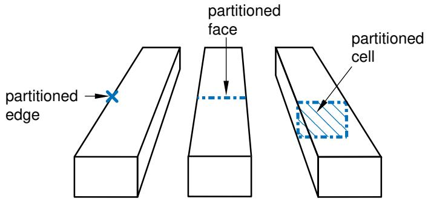

<details>
<summary>text_image</summary>

partitioned edge
partitioned face
partitioned cell
</details>

图 1：对边、面和体进行分区。

您通过定义引用现有几何图形的分区来对边、面和体进行分区。您可以在 **Part** 模块或 **Property** 模块中对部件进行分区，也可以在对装配体进行操作的模块中对装配体进行分区。例如，您可以在 **Mesh** 模块中对装配体的面进行分区，并可以为生成的内部边设置种子以细化网格。分区是一个特征；并且，与所有特征一样，它可以被编辑、删除、抑制、恢复和查询。同样，当装配体或部件重新生成时，分区也会重新生成。
## 使用分区工具集

您可以通过从菜单栏选择 **Tools->Partition** 来访问分区工具集。此时将出现 **Create Partition** 对话框，您可以从对话框顶部 **Type** 区域的按钮中选择要分区的几何体类型——边、面或体。**Method** 列表将随之更改，以反映您可以创建的分区类型。从 **Method** 列表中选择所需的分区工具，并按照提示区域的提示创建分区。大多数工具允许您在一次操作中对多个边、面或体进行分区。您可以使用拖动选择、**[Shift] + 点击**、**[Ctrl] + 点击** 以及角度方法来选择要分区的边、面或体。更多信息，请参阅 *在当前视口内选择对象*。

分区技术，概述了可用于每种分区类型的方法。关于在零件和部件上创建分区的更多信息，请参阅 *在Part模块中使用分区工具集* 和 *对部件进行分区*。

您也可以从模块工具箱访问分区工具集；图1显示了模块工具箱中所有分区工具的隐藏图标。


<details>
<summary>流程图</summary>

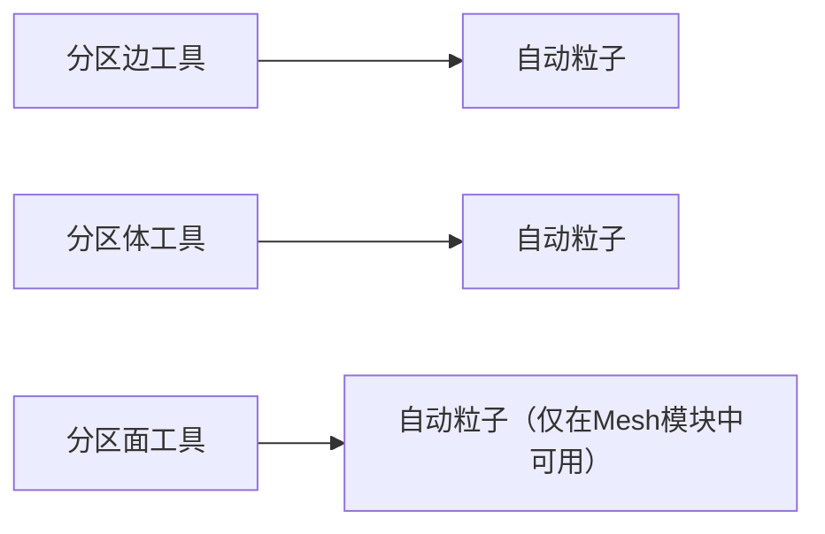
```mermaid
graph LR
  A["分区边工具"] --> B["自动粒子"]
  C["分区体工具"] --> D["自动粒子"]
  E["分区面工具"] --> F["自动粒子（仅在Mesh模块中可用）"]
```
</details>

图1：分区工具。

要查看包含每个分区工具简短描述的工具提示，请将鼠标悬停在工具上片刻。更多信息，请参阅 *使用包含隐藏图标的工具箱和工具栏*。

## 理解分区

本节描述了在使用分区工具集之前您应理解的基本概念。

## 本节内容：
为何进行分区？
分区作为特征

## 为何进行分区？

决定何时使用分区工具集取决于您将如何使用所生成的区域，如下列表所述：

## 对零件进行分区

在 **Part** 或 **Property** 模块中使用分区工具集将零件划分为多个区域。您可以在 **Property** 模块中使用生成的区域来应用截面定义，这些定义包括截面几何信息以及材料属性信息。在 **Part** 模块和 **Property** 模块中创建的分区与零件相关联，并在部件中该零件的每个实例中都可用；但是，您不能修改或删除零件实例中的分区。

## 对部件进行分区

在与部件相关的模块中使用分区工具集，将部件中的零件实例划分为多个区域。您可以使用生成的区域执行以下操作：

• 将载荷、边界条件和预定义场应用于区域。
• 将输出请求与区域关联。
• 通过添加可以设置种子的内部边，来更精细地控制网格划分过程。
• 将复杂的三维区域细分为更简单的区域，以便自动网格生成器能够进行网格划分。

在部件中创建的分区仅与部件相关联，而非与原始零件相关联，并且在所有操作于部件的模块中都可用。它们不会出现在同一零件的其他实例中，并且在 **Part** 或 **Property** 模块中不可用。

## 其他信息

• 理解分区
• 分区技术

## 分区作为特征

每个零件的几何形状由一组特征构造而成；分区只是您添加到零件中的一个额外几何特征。由于分区是特征，因此可以使用 **Feature Manipulation** 工具集对其进行编辑、删除、抑制和恢复。

如果您创建一个分区，然后修改底层零件或部件的几何形状，Abaqus/CAE 将会重新生成该分区以及所有其他特征。此外，重新生成的分区的几何形状取决于您用于创建该分区的方法。以下示例说明了底层几何形状的更改可能会导致分区在部件重新生成时发生移动或形状改变。

1. 用户使用两个选定的点（两个圆的圆心）之间的线对面进行分区，如图1所示。


<details>
<summary>文字图像</summary>

选定面
分区
</details>

图1：两个选定点之间的分区。

2. 用户修改了部件，定义分区的选定点的位置发生了变化。当 Abaqus/CAE 重新生成部件时，分区仍然定义为两个圆心之间的线，如图2所示。


<details>
<summary>文字图像</summary>

分区
</details>

图2：重新生成后的分区。

您可以使用 **Feature Manipulation** 工具集对某些分区进行有限的修改：

您可以输入一个参数来直接对边进行分区，并定位对分区面的贝塞尔曲线。该参数必须介于0和1之间，表示边长度的一个分数；**Feature Manipulation** 工具集允许您编辑您提供的值。
• 您可以在面上绘制一个分区草图；**Feature Manipulation** 工具集允许您编辑该草图。

如果您需要更改无法使用 **Feature Manipulation** 工具集修改的分区，则必须删除该分区并重新创建。

## 其他信息

• 修改和操作特征
• 理解分区
• 分区技术

## 分区技术

本节概述了不同的分区技术。

## 本节内容：
对边进行分区的方法
对体进行分区的方法
对体进行分区的方法

## 对边进行分区的方法

从主菜单栏选择 **Tools->Partition** 以显示 **Create Partition** 对话框。

当您在 **Create Partition** 对话框中选择 **Edge** 时，**Method** 列表将显示以下对边进行分区的方法：

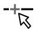

## 通过位置指定参数

在边上的任意位置拾取一个点。详细说明，请参阅 *使用“通过位置指定参数”方法对边进行分区*。

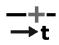

## 输入参数

在提示区域输入一个参数，如图1所示。沿边的箭头指示参数值从起始顶点（对应于边参数值0）到终止顶点（对应于值1）的增加方向。详细说明，请参阅 *使用“输入参数”方法对边进行分区*。

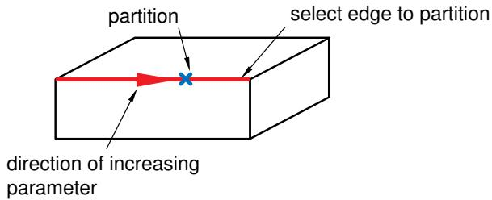

<details>
<summary>文字图像</summary>

分区
选择要分区的边
参数增加方向
</details>

图1：输入参数以对边进行分区。


## 选择中点/基准点

选择边的中点或边上的一个基准点，如图2所示。详细说明，请参阅 *使用“拾取中点/基准点”方法对边进行分区*。

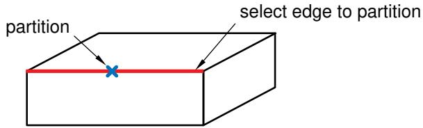

<details>
<summary>文字图像</summary>

分区
选择要分区的边
</details>

图2：选择中点或基准点以对边进行分区。


## 使用基准平面

选择一个基准平面。Abaqus/CAE 在基准平面与边的交点处创建分区，如图3所示。使用基准平面对一组选定边进行分区是用于对齐一组分区的有用技术。详细说明，请参阅 *使用基准平面对边进行分区*。

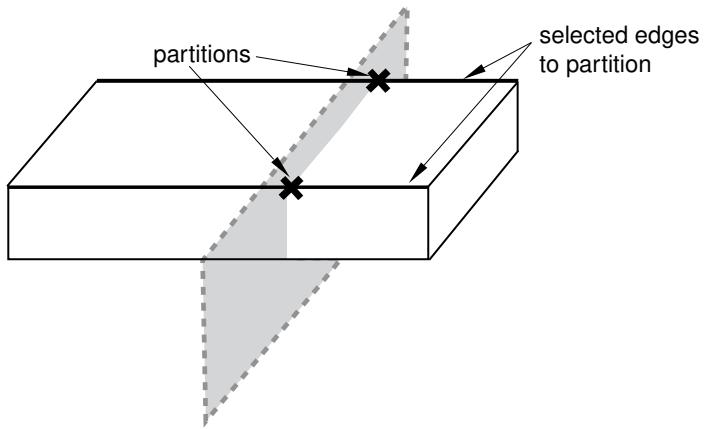

<details>
<summary>文字图像</summary>

分区
选定要进行分区的边
</details>

图3：选择基准平面以对边进行分区。

## 其他信息

• 分区技术
• 对边进行分区
• 理解分区

当您在 **Create Partition** 对话框中选择 **Face** 时，**Method** 列表将显示以下对体进行分区的方法：


## 绘制平面分区

使用 Sketcher 绘制分区来对选定的面进行分区，如图1所示。详细说明，请参阅 *使用草图方法对体进行分区*。

您可以直接在要分区的面上绘制草图，也可以在第二个面或基准平面上绘制草图，然后将草图投影到您想要分区的面上。有关从基准平面投影草图的示例，请参阅 *在Part模块中使用基准工具集*。


<details>
<summary>文本图像</summary>

分区
选择要分区的面
草图
</details>

图 1：使用 Sketcher 进行面分区。

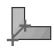

## 两点间最短路径

沿连接两个选定点的最短路径对面进行分区；如果被分区的面是曲面，则生成的分区也将是弯曲的，如图 2 所示。可以选择不与被分区面关联的点；例如，这些点可以位于不同的面甚至不同的部件实例上。详细说明请参阅 使用最短路径方法进行面分区。

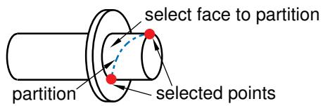

<details>
<summary>文本图像</summary>

选择要分区的面
分区
选定点
</details>

图 2：使用两点间最短路径进行面分区。


## 使用基准平面

使用与基准平面延伸的交集对面进行分区，如图 3 所示。详细说明请参阅 使用基准平面方法进行面分区。

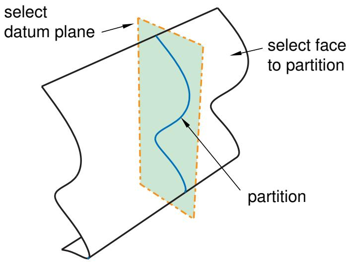

<details>
<summary>文本图像</summary>

选择基准平面
选择要分区的面
分区
</details>

图 3：使用基准平面进行面分区。


## 垂直于两条边的曲线路径

沿垂直于面的两条边的贝塞尔曲线对面进行分区，如图 4 所示。通过在两条边上的任意位置选择两个点来定位曲线。两条边所夹的圆弧必须小于 180°。详细说明请参阅 使用曲线路径方法进行面分区。

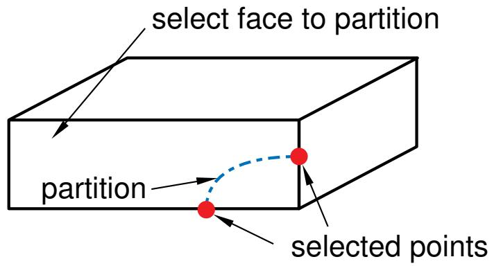

<details>
<summary>文本图像</summary>

选择要分区的面
分区
选定点
</details>

图 4：使用贝塞尔曲线进行面分区。


## 延伸另一个面

使用与另一个面的延伸的交集对面进行分区，如图 5 所示。被延伸的面可以是平面、圆柱面、圆锥面或球面；并且它不必属于包含要分区的面的部件。详细说明请参阅 使用延伸面方法进行面分区。


<details>
<summary>文本图像</summary>

选择要延伸的面
选择要分区的面
分区
</details>

图 5：使用另一个面的延伸进行面分区。

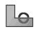

## 通过其他面相交

使用目标面与一个或多个其他面的交集对面进行分区，如图 6 所示。这些面可以是相交的或相切的。详细说明请参阅 使用相交方法进行面分区。


<details>
<summary>流程图</summary>

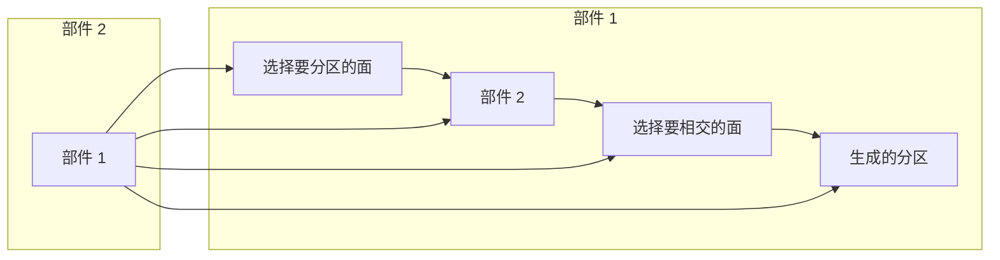
```mermaid
graph LR
  subgraph Part1["部件 1"]
    direction TB
  A["选择要分区的面"] --> B["部件 2"]
  B --> C["选择要相交的面"]
  C --> D["生成的分区"]
  end
  subgraph Part2["部件 2"]
    direction TB
  E["部件 1"] --> A
  E --> B
  E --> C
  E --> D
  end
```
</details>

图 6：使用面的交集进行面分区。


## 投影边

通过投影模型中的边对面进行分区，如图 7 所示。分区是使用从被分区面到分区边的垂直投影创建的。您可以选择仅使用投影，或者在必要时延伸投影边的端点以完成面分区。详细说明请参阅 使用投影边方法进行面分区。

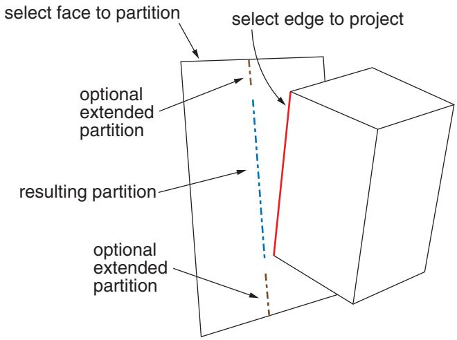

<details>
<summary>流程图</summary>


```mermaid
graph LR
  A["选择要分区的面"] --> B["可选的延伸分区"]
  C["选择要投影的边"] --> D["生成的分区"]
  B --> D
  D --> E["可选的延伸分区"]
```
</details>

图 7：通过投影边进行面分区。


## 自动分区

当使用自由网格划分技术对面进行四边形单元网格划分时，网格模块会在对面进行网格划分之前，内部将面划分为具有三到五个逻辑边的区域。更多信息，请参阅 使用四边形和四边形主导单元进行自由网格划分。然而，如果您想在生成网格之前查看并可能修改自动生成的区域，可以使用自动分区工具在不进行网格划分的情况下对面进行分区。此工具仅在网格模块中可用。详细说明请参阅 使用自动生成方法进行面分区。

## 其他信息

• 分区技术  
• 理解分区  
• 面分区

当您从创建分区对话框中选择单元格时，方法列表将显示以下分区单元格的方法：


## 定义切割平面

通过用一个平面切割单元格来分区单元格；该平面将完全穿过单元格。使用以下三种方法之一来定义切割平面：

• 选择切割平面上的一个点；然后选择一条边或基准轴，该轴定义此平面的法线，如图 1 所示。

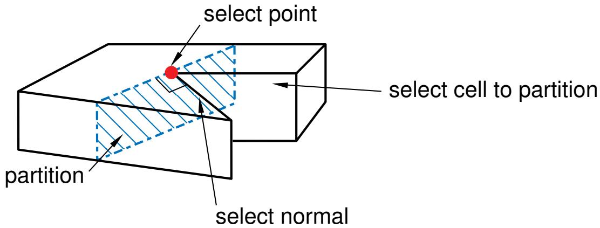

<details>
<summary>文本图像</summary>

选择点
选择要分区的单元格
分区
选择法线
</details>

图 1：用点和法线定义切割平面。

• 选择三个不同的、不共线的点，如图 2 所示。

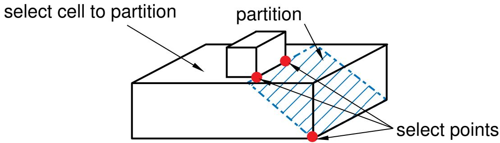

<details>
<summary>文本图像</summary>

选择要分区的单元格
分区
选择点
</details>

图 2：用三个点定义切割平面。

• 选择一条边和边上的一点；切割平面将在该点处垂直于该边，如图 3 所示。


<details>
<summary>文本图像</summary>

选择要分区的单元格
分区
选择边
选择点
</details>

图 3：用边和点定义切割平面。

详细说明请参阅 使用切割平面方法进行单元格分区。


## 使用基准平面

使用与基准平面延伸的交集对单元格进行分区，如图 4 所示。详细说明请参阅 使用基准平面方法进行单元格分区。

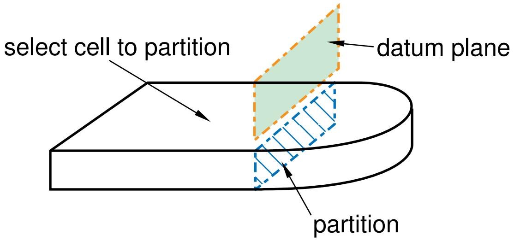

<details>
<summary>文本图像</summary>

选择要分区的单元格
基准平面
分区
</details>

图 4：使用基准平面对单元格进行分区。


## 延伸面

通过用壳体切割单元格来分区单元格，该壳体是一个面的延伸几何体，如图 5 所示。被延伸的面可以是平面、圆柱面、圆锥面或球面。详细说明请参阅 使用延伸面方法进行单元格分区。


<details>
<summary>文本图像</summary>

选择要分区的单元格
分区
选择面
</details>

图 5：使用面的延伸对单元格进行分区。


## 拉伸/扫掠边

通过沿选定的路径（称为扫掠路径）扫掠选定的边（形成扫掠轮廓）来对单元格进行分区。您可以选择任意数量的边进行扫掠，但所有边必须位于同一平面上，并且必须属于同一部件实例。

使用以下两种方法之一来定义扫掠路径：

通过无限延伸扫掠轮廓（沿作为扫掠路径的选定直边或基准轴的方向）来创建穿过单元格的直线分区；该分区是在被扫掠的边穿过选定单元格的位置创建的，如图 6 所示。扫掠路径必须是直的，并且垂直于被扫掠的一组边。


<details>
<summary>流程图</summary>


```mermaid
graph LR
  A["选择要分割的单元"] --> B["分割"]
  B --> C["选择4条边进行扫掠"]
  C --> D["选择扫掠路径"]
  D --> A
```
</details>

图6：沿方向扫掠轮廓。

通过将扫掠轮廓沿选定边或平行于选定边进行延伸，从而在单元内创建直线或曲线分割。分割仅延伸到选定边的范围；分割将在扫掠边穿过所选单元的位置创建，如图7所示。扫掠路径必须从包含待扫掠边的平面开始，且其切线必须垂直于同一平面。


<details>
<summary>流程图</summary>

```mermaid
graph LR
  A["选择要扫掠的边"] --> B["选择要分割的单元"]
  B --> C["选择扫掠路径"]
  C --> D["分割"]
```
</details>

图7：沿边扫掠轮廓。

详细说明请参见使用挤出/扫掠方法分割单元。


## 使用N边补丁

通过一个由连接边环路形成的面补丁来分割单元。边可以是曲线或直线，必须相连，并且必须与待分割的单元属于同一个部件。此外，该补丁必须完全穿过单元。可从以下方法中选择来定义补丁：

## 选择边

您可以从以下方法中选择构成N边补丁的边：

## 环路

选择单条边，并允许Abaqus/CAE搜索一个连续的连接边环路来分割单元，如图8所示。生成的补丁可以有任意数量的边。

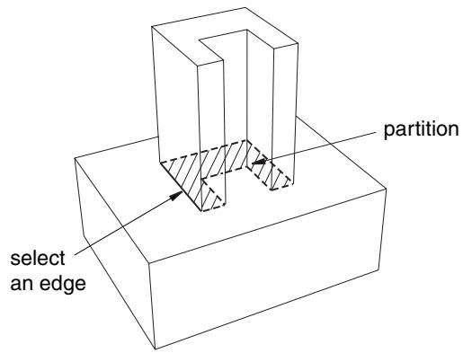

<details>
<summary>文字图片</summary>

分割
选择
一条边
</details>

图8：选择一条边后，允许Abaqus/CAE定义补丁。

## 边

手动选择将分割单元的边。您可以选择任意数量的边，并且所选边必须形成一个闭合环路。

## 选择角点

选择三个、四个或五个定义补丁角的点。如果其中两个点由一条现有边连接，生成的分割将遵循该边的曲线，如图9所示。这些点必须在待分割单元的边界边上。


<details>
<summary>文字图片</summary>

选择点
分割
选择要分割的单元
</details>

图9：用角点定义补丁。

详细说明请参见使用N边补丁方法分割单元。


## 草图平面分割

通过使用草图器绘制分割来分割选定的单元，如图10所示。在大多数情况下，您会在与所选单元相交的基准平面上进行草图绘制。您也可以选择一个现有面在其上绘制草图，并将草图绘制在面边界之外。Abaqus/CAE将在草图与单元相交的位置创建分割。

  
图10：使用草图器分割单元。

详细说明请参见使用草图平面分割方法分割单元。

## 附加信息

• 分割技术  
• 理解分割  
• 分割单元

## 分割边

本节描述可用于分割选定边的工具。

## 本节内容：

使用按位置指定参数方法分割边  
使用输入参数方法分割边  
使用拾取中点/基准点方法分割边  
使用基准平面方法分割边

## 使用按位置指定参数方法分割边

您可以通过沿边的长度方向，在分割位置点击边来分割选定的边。Abaqus/CAE会将该位置转换为一个参数。因此，您可以使用特征操作工具集来修改分割的位置。

1. 从主菜单栏中，选择 Tools -> Partition。

将出现“创建分割”对话框。Abaqus/CAE会在提示区显示提示，引导您完成操作过程。


提示：您也可以使用模块工具箱中位于分割边工具组内的工具，使用“指定参数”方法来分割边。有关工具箱中分割工具的图示，请参见使用分割工具集。

2. 从对话框顶部的“类型”单选按钮中，选择“边”。  
   “方法”列表将显示可用于分割边的方法。  
3. 从方法列表中，选择“按位置指定参数”。  
4. 沿边任意位置点击。

Abaqus/CAE 会高亮显示该边以及您拾取的沿边位置。

5. 如果分割位置不正确，请再次沿边点击。  
6. 如果分割位置正确，请在提示区点击“创建分割”。

Abaqus/CAE 创建分割。

## 附加信息

• 分割技术  
• 分割边的方法

沿选定边的箭头从起点（对应于边参数值0）指向终点（对应于参数值1）。分割将根据参数值确定的位置，在选定边上创建，如下图所示：


<details>
<summary>文字图片</summary>

分割
选择要分割的边
</details>

参数递增方向

要修改通过输入参数创建的分割，请使用特征操作工具集更改参数。

1. 从主菜单栏中，选择 Tools -> Partition。

将出现“创建分割”对话框。Abaqus/CAE会在提示区显示提示，引导您完成操作过程。


$\frac { - + - } {  \tt t }$ 位于模块工具箱的分割边工具组中。有关工具箱中分割工具的图示，请参见使用分割工具集。

2. 从对话框顶部的“类型”单选按钮中，选择“边”。

   “方法”列表将显示可用于分割边的方法。

3. 从方法列表中，选择“输入参数”。  
4. 如果部件或装配体包含多条边，请选择要分割的边。您可以结合使用拖动选择、[Shift] + 点击、[Ctrl] + 点击以及角度方法来选择多条要分割的边。有关更多信息，请参见在当前视口内选择对象。


提示：如果您无法选择所需的边，可以使用选择工具栏来更改选择行为。有关更多信息，请参见使用选择选项。

Abaqus/CAE 会高亮显示选定的边，箭头指示参数值递增的方向。

5. 在提示区，点击“完成”表示您已完成边的选择。  
6. 在提示区，输入所需的边参数值，该值介于0和1之间。  
7. 在提示区，点击“创建分割”。

Abaqus/CAE 创建分割。

## 附加信息

• 分割技术  
• 分割边的方法

## 使用拾取中点/基准点方法分割边

您可以通过选择边的中点或沿边的一个基准点来分割选定的边。

下图展示了通过选择边的中点或沿边的一个基准点来分割选定边的示例。


<details>
<summary>文字图片</summary>

分割
选择要分割的边
</details>

您不能直接修改通过选择现有点创建的分割。但是，如果您随后移动该点，分割将随该点一起移动。

1. 从主菜单栏中，选择 Tools -> Partition。

将出现“创建分割”对话框。Abaqus/CAE会在提示区显示提示，引导您完成操作过程。


提示：您也可以使用模块工具箱中位于分割边工具组内的工具，使用“拾取中点/基准点”方法来分割边。有关工具箱中分割工具的图示，请参见使用分割工具集。

2. 从对话框顶部的“类型”单选按钮中，选择“边”。
您可以在“方法”列表中查看可用于对边进行分区的方法。

3. 从方法列表中，选择 **Select midpoint/datum point**。
4. 选择要分区的边。

Abaqus/CAE 将高亮显示所选边。

5. 选择边的中点或沿边的基准点。

Abaqus/CAE 将高亮显示分区位置。

6. 在提示区域中，点击 **Create Partition**。

Abaqus/CAE 创建分区。

## 其他信息

• 选择视口内的对象  
• 分区技术  
• 对边进行分区的方法

您可以通过使用基准平面切割来分区选定的边

下图展示了通过基准平面切割来分区选定边的示例。


<details>
<summary>text_image</summary>

分区
选定边
进行分区
</details>

1. 从主菜单栏中，选择 **Tools->Partition**。

将出现“创建分区”对话框。Abaqus/CAE 会在提示区域显示提示，引导您完成操作过程。


提示：您也可以使用位于模块工具箱中分区边工具下的工具，通过基准平面方法对边进行分区。有关工具箱中分区工具的图示，请参阅使用分区工具集。

2. 从对话框顶部的“类型”单选按钮中，选择 **Edge**。

“方法”列表将显示可用于对边进行分区的方法。

3. 从方法列表中，选择 **Use datum plane**。
4. 如果零件或装配体包含多条边，请选择要分区的边。您可以结合使用拖动选择、[Shift] + 单击、[Ctrl] + 单击和角度方法来选择多条要分区的边。更多信息，请参阅在当前视口中选择对象。


提示：如果无法选择所需的边，可以使用“选择”工具栏更改选择行为。更多信息，请参阅使用选择选项。

Abaqus/CAE 将高亮显示选定的边。

5. 选择一个现有的基准平面。如果所需位置不存在基准平面，请使用“基准”工具集创建一个。

Abaqus/CAE 将高亮显示选定的基准平面。

6. 在提示区域中，点击 **Create Partition**。

Abaqus/CAE 创建分区。

## 其他信息

• 分区技术  
• 对边进行分区的方法

## 对面进行分区

本节介绍用于分区选定面的工具。

## 本节内容：

使用草图方法对面进行分区  
使用最短路径方法对面进行分区  
使用基准平面方法对面进行分区  
使用曲线路径方法对面进行分区  
使用延伸面方法对面进行分区  
使用相交方法对面进行分区  
使用投影边方法对面进行分区  
使用自动生成方法对面进行分区

您可以通过使用草图器绘制分区的几何形状来分区选定的面。当您需要创建形状无法通过任何其他分区工具实现的分区时，可以使用草图器。绘制分区具有其他优势：

• 如果您想更改分区的形状或位置，可以使用“特征操作”工具集修改草图。  
• 您可以精确标注草图尺寸，并可以使用“特征操作”工具集修改尺寸。

如果要分区的面是平面且位于同一平面上，您可以直接在该平面上绘制草图。您的草图可以超出所选面的边界，但分区不会延伸到面的边缘之外。下图说明了平面上绘制的分区：

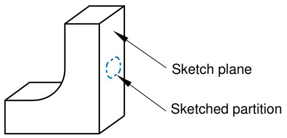

<details>
<summary>text_image</summary>

草图平面
绘制的分区
</details>

如果任何要分区的面是非平面或不位于同一平面上，则必须选择一个平面或基准平面作为绘制基准。Abaqus/CAE 通过将草图投影到要分区的面上来创建分区。您可以指定投影的方向以及投影距离（垂直于草图平面）。下图说明了使用在基准平面上绘制的草图投影来对非平面进行分区：


<details>
<summary>text_image</summary>

投影分区
草图平面
草图
基准平面
</details>

1. 从主菜单栏中，选择 **Tools->Partition**。

将出现“创建分区”对话框。Abaqus/CAE 会在提示区域显示提示，引导您完成操作过程。


提示：您也可以使用位于模块工具箱中分区面工具下的工具，通过草图方法对面进行分区。有关工具箱中分区工具的图示，请参阅使用分区工具集。

2. 从对话框顶部的“类型”单选按钮中，选择 **Face**。

“方法”列表将显示可用于对面进行分区的方法。

3. 从方法列表中，选择 **Sketch**。

如果零件或装配体只包含一个面，Abaqus/CAE 将进入草图器。

4. 如果零件或装配体包含多个面，请选择要分区的面并单击鼠标按钮2。您可以结合使用拖动选择、[Shift] + 单击、[Ctrl] + 单击和角度方法来选择多个要分区的面。更多信息，请参阅在当前视口中选择对象。


提示：如果无法选择所需的面，可以使用“选择”工具栏更改选择行为。更多信息，请参阅使用选择选项。

• 如果零件或装配体是二维或轴对称的，Abaqus/CAE 将进入草图器并高亮显示选定的面。  
如果零件或装配体是三维的且选定的面是平面，请选择一条边以及该边在草图器网格上的方向。该边不能垂直于草图平面。默认情况下，选定的边将显示为垂直并位于草图器网格的右侧。要选择边的不同方向，请单击对话框右侧的箭头，然后从出现的列表中选择一个方向。


提示：如果零件或装配体没有提供所需方向的边，您可以创建一个基准轴。然后，您可以选择基准轴来控制零件在草图器网格上的方向。

Abaqus/CAE 将高亮显示选定的边，进入草图器，并旋转零件，直到选定的平面或基准平面与草图器网格平面对齐，且选定的边以所需方向与网格对齐。Abaqus/CAE 将高亮显示选定的面。

• 如果零件或装配体是三维的且选定的面是非平面或不位于同一平面上，请执行以下操作：

1. 选择一个平面或基准平面作为绘制基准。Abaqus/CAE 将高亮显示选定的面。  
2. 从提示区域的按钮中，选择一种方法来确定 Abaqus/CAE 将草图沿草图平面法线方向投影多远。投影草图延伸穿过所选面的任何地方都会创建分区。这三种方法如下图所示：

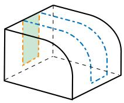  
贯穿全部


<details>
<summary>natural_image</summary>

3D diagram of a curved rectangular prism with a highlighted green section and dimension label '60' (no text or symbols beyond the label)
</details>

输入值

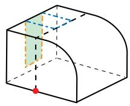  
选择点

• 如果您选择了“贯穿全部”方法，Abaqus/CAE 会要求您选择草图的投影方向。  
如果您选择了“输入值”方法，Abaqus/CAE 会要求您选择用于投影草图的距离和方向。Abaqus/CAE 提供的默认距离会生成一个完全贯穿所选面的分区（结果与选择“贯穿全部”相同）。“特征操作”工具集允许您在创建分区后修改投影距离。

• 如果您选择了“选择点”方法，Abaqus/CAE 会要求您选择草图要投影到的点；该点同时定义了方向和投影距离。
3. 在绘图器网格上选择一条边及其方向。该边不得与草图平面垂直。默认情况下，选定的边将垂直显示在绘图器网格的右侧。要为边选择不同的方向，请单击对话框右侧的箭头，然后从出现的列表中选择一个方向。


提示：如果零件或装配体中没有能提供所需方向的边，您可以创建一个基准轴。然后，您可以选择该基准轴来控制零件在绘图器网格上的方向。

Abaqus/CAE 将高亮显示选定的边，进入绘图器，并旋转零件，直到选定的平面或基准平面与绘图器网格平面对齐（投影方向指向屏幕内），并且选定的边以所需方向与网格对齐。Abaqus/CAE 将高亮显示选定的面。

5. 使用绘图器绘制分割线。从主菜单栏中，单击“完成”以指示您已完成分割线的绘制。
6. 在提示区中，单击“创建分割”。

Abaqus/CAE 将创建分割。

## 附加信息

• 绘图模块  
• 分割技术  
• 面分割方法

## 使用最短路径方法分割面

您可以使用在选定两点之间形成最短可能路径的直线或曲线来分割选定的面。

这些点可以是顶点、中点、弧心或基准点。如果被分割的面不是平面，则路径将是弯曲的，如下图所示：

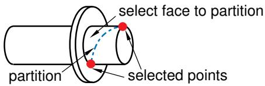

<details>
<summary>text_image</summary>

选择要分割的面
分割
选定的点
</details>

1. 从主菜单栏中，选择“工具”->“分区”。

将出现“创建分区”对话框。Abaqus/CAE 将在提示区显示提示信息，以指导您完成操作步骤。


提示：您也可以使用位于模块工具箱中分区面工具旁的工具来使用最短路径方法分割面。有关工具箱中分区工具的示意图，请参见使用分区工具集。

2. 从对话框顶部的“类型”单选按钮中，选择“面”。

“方法”列表将显示可用于分割面的方法。

3. 从方法列表中，选择“2点间的最短路径”。
4. 如果零件或装配体包含多个面，请选择要分割的面。您可以结合使用拖动选择、[Shift] + 单击、[Ctrl] + 单击以及角度方法来选择多个要分割的面。有关更多信息，请参见在当前视口中选择对象。


提示：如果无法选择所需的面，您可以使用“选择”工具栏来更改选择行为。有关更多信息，请参见使用选择选项。

Abaqus/CAE 将高亮显示选定的面。

5. 选择定义路径起点和终点的顶点、中点、弧心或基准点。Abaqus/CAE 将高亮显示这些点。
6. 在提示区中，单击“创建分区”。Abaqus/CAE 将创建分割。

## 附加信息

• 分割技术  
• 面分割方法

您可以通过用基准平面切割来分割选定的面。

下图显示了通过用基准平面切割来分割选定面的示例。


<details>
<summary>text_image</summary>

选择基准平面
选择要分割的面
分割
</details>

1. 从主菜单栏中，选择“工具”->“分区”。

将出现“创建分区”对话框。Abaqus/CAE 将在提示区显示提示信息，以指导您完成操作步骤。


提示：您也可以使用位于模块工具箱中分区面工具旁的工具来使用基准平面方法分割面。有关工具箱中分区工具的示意图，请参见使用分区工具集。

2. 从对话框顶部的“类型”单选按钮中，选择“面”。

“方法”列表将显示可用于分割面的方法。

3. 从方法列表中，选择“使用基准平面”。
4. 如果零件或装配体包含多个面，请选择要分割的面。您可以结合使用拖动选择、[Shift] + 单击、[Ctrl] + 单击以及角度方法来选择多个要分割的面。有关更多信息，请参见在当前视口中选择对象。


提示：如果无法选择所需的面，您可以使用“选择”工具栏来更改选择行为。有关更多信息，请参见使用选择选项。

Abaqus/CAE 将高亮显示选定的面。

5. 选择一个现有的基准平面。如果所需位置不存在基准平面，请使用“基准”工具集创建基准。

Abaqus/CAE 将高亮显示选定的基准平面。

6. 在提示区中，单击“创建分区”。

Abaqus/CAE 将创建分割。

## 附加信息

• 分割技术  
• 面分割方法

您可以使用垂直于限定面的两条边的曲线来分割面。

这两条边不必是连续的，但它们必须限定该面并且所夹的角度小于 180 度，如下图所示：


<details>
<summary>flowchart</summary>

```mermaid
graph LR
  A["分割"] --> B["选择要分割的面"]
  B --> C["选定的点"]
  C -.-> A
```
</details>

您首先选择要分割的面，然后选择以下两种方法之一来定义分割沿两条边的位置；Abaqus/CAE 会绘制一条连接这两点的贝塞尔曲线。您可以通过以下任一方式在选定的边上定位分割：

输入一个介于零和一之间的参数值，其中零代表边的起点，一代表终点。这种方法允许您精确定位分割在边上的任何位置。此外，您随后可以使用“特征操作”工具集编辑您输入的两个参数来修改分割位置。
• 单击边的中点或基准点。如果您使用此方法定位弯曲分割，则以后将无法修改该分割。

1. 从主菜单栏中，选择“工具”->“分区”。

将出现“创建分区”对话框。Abaqus/CAE 将在提示区显示提示信息，以指导您完成操作步骤。


提示：您也可以使用位于模块工具箱中分区面工具旁的工具来使用曲线路径方法分割面。有关工具箱中分区工具的示意图，请参见使用分区工具集。

2. 从对话框顶部的“类型”单选按钮中，选择“面”。
“方法”列表将显示可用于分割面的方法。
3. 从方法列表中，选择“垂直于2条边的曲线路径”。
4. 选择要分割的面。

Abaqus/CAE 将高亮显示选定的面。

5. 从提示区的按钮中，选择以下方法之一来定位曲线：

• 输入参数
• 拾取

6. 选择限定所选面的任一条边。


提示：如果无法选择所需的边，您可以使用“选择”工具栏来更改选择行为。有关更多信息，请参见使用选择选项。

Abaqus/CAE 将高亮显示选定的边。

7. 执行以下操作之一：

• 如果您选择了“输入参数”方法，请输入一个介于零和一之间的值。选定边上的一个箭头表示参数值增加的方向。
• 如果您选择了“拾取”方法，请单击选定边的中点或一个基准点。

8. 选择限定该面的第二条边，并重复上一步。两条选定边所夹的角度必须小于 180 度。
9. 在提示区中，单击“创建分区”。

Abaqus/CAE 将创建分割。

## 附加信息

• 分割技术  
• 面分割方法

您可以通过延伸另一个面使其切割选定的面来分割选定的面。

延伸一个面类似于创建一个与该面重合的无限平面。Abaqus/CAE 会在这个无限平面切割您试图分割的选定面的任何地方创建一个分割，如下图所示：
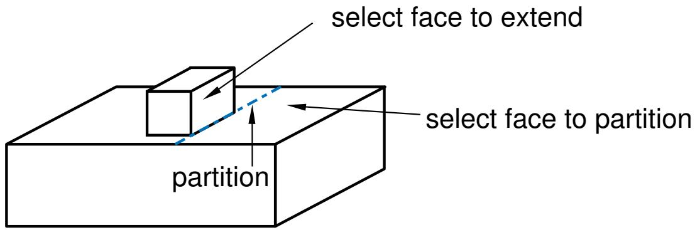

<details>
<summary>text_image</summary>

选择要延伸的面
选择要分割的面
分割
</details>

如果无限平面无法与任何选定的面相交，Abaqus/CAE 将显示一条错误消息。被延伸的面无需与被分割的面属于同一个部件；例如，在 Assembly（装配）模块中，您可以通过延伸第二个部件实例的面来分割第一个部件实例的面。如果部件或装配仅包含一个面，Abaqus/CAE 将显示一条错误消息。

1.  从主菜单栏中，选择 Tools -> Partition。
    将出现 Create Partition 对话框。Abaqus/CAE 会在提示区显示提示信息，引导您完成整个过程。

    

    **提示：** 您也可以使用延伸面的方法，通过位于模块工具箱中分割面工具区域的 `Extend face` 工具来分割面。有关工具箱中分割工具的图示，请参阅使用分割工具集。

2.  在对话框顶部的 Type 单选按钮中，选择 Face。
    Method 列表将显示可用于分割面的方法。

3.  从方法列表中，选择 Extend another face。
4.  选择要分割的面。您可以使用拖动选择、[Shift] + 单击、[Ctrl] + 单击以及角度方法的组合来选择多个要分割的面。有关更多信息，请参阅在当前视口中选择对象。

    

    **提示：** 如果无法选择所需的面，可以使用 Selection（选择）工具栏更改选择行为。有关更多信息，请参阅使用选择选项。
    Abaqus/CAE 将高亮显示选定的面。

5.  选择一个面，将其延伸以创建所需的分割。
    Abaqus/CAE 将高亮显示选定的面。

6.  在提示区中，单击 Create Partition。
    Abaqus/CAE 将创建分割。

## 附加信息

• 分割技术
• 分割面的方法

## 使用相交方法分割面

您可以使用所选面与一个或多个其他面的相交或连接关系来分割这些面。

下图展示了使用所选面与一个或多个其他面的相交或连接关系来分割这些面的示例。

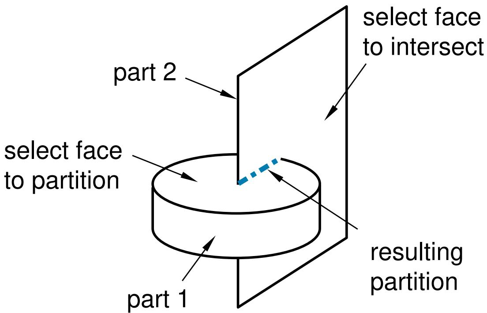

<details>
<summary>flowchart</summary>

```mermaid
graph LR
  subgraph Part1["部件 1"]
    direction TB
  A["选择要分割的面"] --> B["选择要相交的面"]
  B --> C["结果分割"]
  end
  subgraph Part2["部件 2"]
    direction TB
  D["部件 2"] --> A
  E["结果分割"] --> A
  end
```
</details>

这些面无需属于同一个部件；例如，在 Assembly（装配）模块中，您可以使用一个部件实例的面与另一个部件实例的面的相交关系来分割该面。生成的区域对于定义部件实例之间的接触或约束交互特别有用。如果部件或装配仅包含一个面，Abaqus/CAE 将显示一条错误消息。

下图显示了您可能会在三个部件实例的交点处创建的两个分割：


1.  从主菜单栏中，选择 Tools -> Partition。
    将出现 Create Partition 对话框。Abaqus/CAE 会在提示区显示提示信息，引导您完成整个过程。

    

    **提示：** 您也可以使用相交方法，通过位于模块工具箱中分割面工具区域的 `Intersect faces` 工具来分割面。有关工具箱中分割工具的图示，请参阅使用分割工具集。

2.  在对话框顶部的 Type 单选按钮中，选择 Face。
    Method 列表将显示可用于分割面的方法。
3.  从方法列表中，选择 Intersect by other faces。
4.  选择要分割的面。您可以使用拖动选择、[Shift] + 单击、[Ctrl] + 单击以及角度方法的组合来选择多个要分割的面。有关更多信息，请参阅在当前视口中选择对象。

    

    **提示：** 如果无法选择所需的面，可以使用 Selection（选择）工具栏更改选择行为。有关更多信息，请参阅使用选择选项。
    Abaqus/CAE 将高亮显示选定的面。

5.  选择与要分割的面相连接或相交的面。
    Abaqus/CAE 将高亮显示选定的面。

6.  在提示区中，单击 Create Partition。
    Abaqus/CAE 将创建分割。

## 附加信息

• 分割技术
• 分割面的方法

## 使用投影边方法分割面

您可以使用所选面与一条或多条边的投影的相交或连接关系来分割这些面。

下图展示了使用所选面与一条或多条边的投影的相交或连接关系来分割这些面的示例。

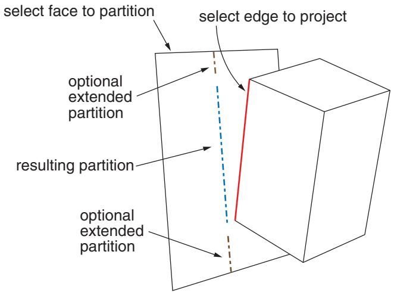

<details>
<summary>flowchart</summary>

```mermaid
graph LR
  A["选择要分割的面"] --> B["可选的延伸分割"]
  C["选择要投影的边"] --> D["选择要投影的边"]
  B --> E["结果分割"]
  E --> D
  D --> F["可选的延伸分割"]
```
</details>

Abaqus/CAE 通过从被分割面向所选边作垂直投影来创建分割；非平面面或在锐边处连接的面（导致垂直投影不连续）可能会显著改变投影边的形状。如图所示，您可以创建一个在投影边端点处结束的分割，或者您可以延伸投影边以达到面边界。如果延伸分割，Abaqus/CAE 将沿着投影边的切线方向延伸其自由端，以达到被分割面的边界边。

面和边无需属于同一个部件；例如，在 Assembly（装配）模块中，您可以使用从第二个部件实例投影的边来分割属于第一个部件实例的面。被分割的面必须是活动模型表示的一部分。边可以是活动表示的一部分，也可以是用于中面模型的参考表示的一部分。

1.  从主菜单栏中，选择 Tools -> Partition。
    将出现 Create Partition 对话框。Abaqus/CAE 会在提示区显示提示信息，引导您完成整个过程。

    

    **提示：** 您也可以使用投影边方法，通过位于模块工具箱中分割面工具区域的 `Project edges` 工具来分割面。有关工具箱中分割工具的图示，请参阅使用分割工具集。

2.  在对话框顶部的 Type 单选按钮中，选择 Face。
    Method 列表将显示可用于分割面的方法。

3.  从方法列表中，选择 Project edges。
4.  选择要分割的面。您可以使用拖动选择、[Shift] + 单击、[Ctrl] + 单击以及角度方法的组合来选择多个要分割的面。有关更多信息，请参阅在当前视口中选择对象。

    

    **提示：** 如果无法选择所需的面，可以使用 Selection（选择）工具栏更改选择行为。有关更多信息，请参阅使用选择选项。
    Abaqus/CAE 将高亮显示选定的面。

5.  选择要投影到面上的边。如果需要，打开 Extend edges（延伸边）开关，让 Abaqus/CAE 延伸投影的边，以防止新的面分割中出现间隙。

    

## 注意：

您也可以通过在模型树中编辑已完成的分割特征来打开或关闭 Extend edges 参数。
    Abaqus/CAE 将高亮显示选定的边。

6.  在提示区中，单击 Create Partition。
    Abaqus/CAE 将投影选定的边以创建分割。

## 附加信息

• 分割技术
• 分割面的方法

## 使用自动生成方法分割面

Mesh（网格）模块能够自动对任何二维面进行网格划分。

使用四边形单元的自动网格划分首先从内部将面分割成具有三到五条边的区域，如下图所示：


<details>
<summary>natural_image</summary>

以中央圆形为中心的抽象几何图，周围环绕着较小的矩形和放射状线条（无文本或符号）
</details>
</details>

然后，在每个区域上生成网格，如下图所示：

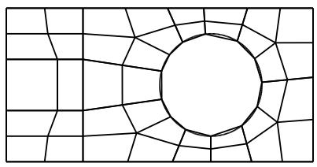

<details>
<summary>natural_image</summary>

带有放射状线条和中心圆的抽象几何图案（无文本或符号）
</details>

通常情况下，当您对一个面进行网格划分时，这两个步骤似乎是在一个步骤中完成的。然而，为了获得对网格划分过程的更多控制，您可以使用分区工具集（Partition toolset）中的自动分区工具（automatic partitioning tool）单独执行分区步骤。

由于自动分区工具与网格划分相关联，它仅在网格（Mesh）模块中可用。在您自动分区面之后，您可以通过布种（seeding）或手动添加或删除分区来获得对网格的额外控制。

1.  从主菜单栏中，选择工具（Tools）->分区（Partition）。
    将出现“创建分区”（Create Partition）对话框。Abaqus/CAE 在提示区显示提示，指导您完成整个过程。


提示：您也可以使用自动生成功法，通过模块工具箱（module toolbox）中与分区面工具（partition face tools）位于一起的工具来分区面。有关工具箱中分区工具的示意图，请参阅使用分区工具集（Using the Partition toolset）。

2.  在对话框顶部的类型（Type）单选按钮中，选择面（Face）。
    方法（Method）列表显示可用于分区面的方法。

3.  从方法列表中，选择自动分区（Auto-partition）。

4.  如果部件或装配体包含多个面，请选择要分区的面。您可以结合使用拖动选择、[Shift] + 单击、[Ctrl] + 单击和角度方法来选择多个要分区的面。有关更多信息，请参阅在当前视口内选择对象（Selecting objects within the current viewport）。


提示：如果您无法选择所需的面，可以使用选择工具栏（Selection toolbar）来更改选择行为。有关更多信息，请参阅使用选择选项（Using the selection options）。

    Abaqus/CAE 会高亮显示所选的面。

5.  在提示区中，单击创建分区（Create Partition）。
    Abaqus/CAE 创建分区。

## 附加信息

•   分区技术（Partitioning techniques）  
•   分区面的方法（Methods for partitioning faces）

## 分区体（Partitioning cells）

本节描述用于分区体（cell）的分区工具。

## 本节内容：

使用切割平面法分区体（Using the cutting plane method to partition cells）  
使用基准平面法分区体（Using the datum plane method to partition cells）  
使用延伸面法分区体（Using the extended face method to partition cells）  
使用拉伸/扫掠法分区体（Using the extrude/sweep method to partition cells）  
使用 N 边形面片法分区体（Using the N-sided patch method to partition a cell）  
使用草绘平面分区法分区体（Using the sketch planar partition method to partition a cell）

## 使用切割平面法分区体

您可以通过一个平面切割所选的体来对其进行分区。首先选择要分区的体，然后选择三种方法之一来定义用于分区的平面。这三种方法是：

•   选择一个点和任意直边。切割平面将通过该点，并垂直于该边。  
•   选择三个点。切割平面将通过所有三个点。  
•   选择一条直边或曲边以及边上的一个点。切割平面将通过该点，并在所选点处垂直于该边。

以下过程说明了这三种方法。

1.  从主菜单栏中，选择工具（Tools）->分区（Partition）。
    将出现“创建分区”（Create Partition）对话框。Abaqus/CAE 在提示区显示提示，指导您完成整个过程。


提示：您也可以使用平面法，通过模块工具箱（module toolbox）中与分区体工具（partition cell tools）位于一起的工具来分区体。有关工具箱中分区工具的示意图，请参阅使用分区工具集（Using the Partition toolset）。

2.  在对话框顶部的类型（Type）单选按钮中，选择体（Cell）。  
    方法（Method）列表显示可用于分区体的方法。

3.  从方法列表中，选择定义切割平面（Define cutting plane）。

4.  如果部件或装配体包含多个体，请选择要分区的体。您可以结合使用拖动选择、[Shift] + 单击和 [Ctrl] + 单击来选择多个要分区的体。


提示：如果您无法选择所需的体，可以使用选择工具栏（Selection toolbar）来更改选择行为。有关更多信息，请参阅使用选择选项（Using the selection options）。

    Abaqus/CAE 会高亮显示所选的体。

5.  在提示区中，单击以下方法之一来定义切割平面：

    使用点和法向（Point & normal）方法，沿着通过一个选定点并垂直于一条选定直边或基准轴（datum axis）的平面来分区选定的体，如下图所示：


<details>
<summary>text_image</summary>

选择点
选择要分区的体
分区
选择法向
</details>

•   使用 3 点（3 Points）方法，沿着通过三个选定点的平面来分区选定的体，如下图所示：

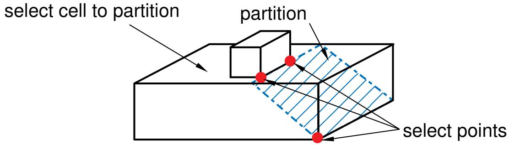

<details>
<summary>text_image</summary>

选择要分区的体
分区
选择点
</details>

    这三个点可以位于部件或装配体上的任何位置，但它们必须是不同的点，并且不能共线。

    使用边的法向（Normal to edge）方法，沿着垂直于一条选定边并通过边上一个选定点的平面来分区选定的体。该边可以是直边或曲边，并且不必是正在分区的体的一部分，但您不能选择基准轴。当您想要垂直于曲边分区体时，此方法非常有用，如下图所示：

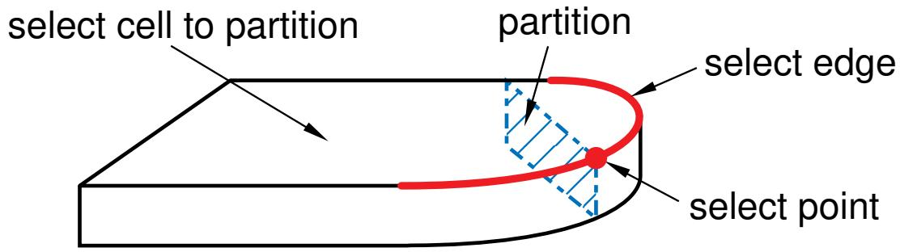

<details>
<summary>text_image</summary>

选择要分区的体
分区
选择边
选择点
</details>

6.  按照提示区中的提示选择点和边。点可以是顶点、中点、圆弧中心或基准点（datum points）。

7.  在提示区中，单击创建分区（Create Partition）。
    Abaqus/CAE 创建分区。

## 附加信息

•   分区技术（Partitioning techniques）  
•   分区体的方法（Methods for partitioning cells）

## 使用基准平面法分区体

您可以通过一个基准平面（datum plane）切割所选的体来对其进行分区。

下图展示了通过基准平面切割所选体进行分区的示例。


<details>
<summary>text_image</summary>

选择要分区的体
基准平面
分区
</details>

1.  从主菜单栏中，选择工具（Tools）->分区（Partition）。
    将出现“创建分区”（Create Partition）对话框。Abaqus/CAE 在提示区显示提示，指导您完成整个过程。


提示：您也可以使用基准平面法，通过模块工具箱（module toolbox）中与分区体工具（partition cell tools）位于一起的工具来分区体。有关工具箱中分区工具的示意图，请参阅使用分区工具集（Using the Partition toolset）。

2.  在对话框顶部的类型（Type）单选按钮中，选择体（Cell）。  
    方法（Method）列表显示可用于分区体的方法。

3.  从方法列表中，选择使用基准平面（Use datum plane）。

4.  如果部件或装配体包含多个体，请选择要分区的体。您可以结合使用拖动选择、[Shift] + 单击和 [Ctrl] + 单击来选择多个要分区的体。


提示：如果您无法选择所需的体，可以使用选择工具栏（Selection toolbar）来更改选择行为。有关更多信息，请参阅使用选择选项（Using the selection options）。

    Abaqus/CAE 会高亮显示所选的体。

5.  选择一个现有的基准平面。如果所需位置没有基准平面，请使用基准工具集（Datum toolset）创建基准。
    Abaqus/CAE 会高亮显示选定的基准平面。

6.  在提示区中，单击创建分区（Create Partition）。
    Abaqus/CAE 创建分区。

## 附加信息

•   分区技术（Partitioning techniques）

•   分区体的方法（Methods for partitioning cells）

## 使用延伸面法分区体

您可以通过延伸另一个面直到其切割所选的体来分区这些体。

延伸一个面类似于创建一个与该面重合的无限平面。Abaqus/CAE 会在这个无限平面切割您正在分区的体的任何地方创建一个分区，如下图所示：

选择面  


<details>
<summary>text_image</summary>

选择要分区的体
分区
</details>
</details>

如果无限平面无法与单元相交，Abaqus/CAE 会显示错误消息。延伸的面不必属于与待分区单元相同的部件；例如，在 Assembly 模块中，您可以通过延伸第二个部件的面来对第一个部件实例的单元进行分区。

1. 从主菜单栏中，选择 Tools -> Partition。
将出现 Create Partition 对话框。Abaqus/CAE 在提示区显示提示，指导您完成此过程。


提示：您也可以使用基准平面方法通过工具对单元进行分区，该工具位于模块工具箱的分区单元工具中。有关工具箱中分区工具的示意图，请参阅使用分区工具集。

2. 在对话框顶部的 Type 单选按钮中，选择 Cell。
Method 列表显示可用于对单元进行分区的方法。
3. 从方法列表中，选择 Extend face。
4. 如果部件或装配体包含多个单元，请选择要分区的单元。您可以使用拖动选择、[Shift] + 单击和 [Ctrl] + 单击的组合来选择多个要分区的单元。


提示：如果无法选择所需的单元，可以使用 Selection 工具栏更改选择行为。更多信息，请参阅使用选择选项。

Abaqus/CAE 会高亮显示选定的单元。

5. 选择将延伸以创建所需分区的面。

Abaqus/CAE 会高亮显示选定的面。


提示：如果无法选择所需的面，可以使用 Selection 工具栏更改选择行为。更多信息，请参阅使用选择选项。

6. 在提示区中，单击 Create Partition。

Abaqus/CAE 将创建分区。

## 附加信息

•   分区技术
•   对单元进行分区的方法

## 使用拉伸/扫掠方法对单元进行分区

您可以使用扫掠工具将二维轮廓（称为扫掠轮廓）扫掠通过三维部件或部件实例，从而创建复杂的三维分区。使用扫掠工具是一个两阶段的操作。首先，您通过选择要扫掠的边来定义扫掠轮廓，然后选择要沿着扫掠选定边的路径（称为扫掠路径）。您可以选择两种方法来定义扫掠路径：

•   沿方向拉伸
•   沿边扫掠

这两种方法如下图所示。

1. 从主菜单栏中，选择 Tools -> Partition。
将出现 Create Partition 对话框。Abaqus/CAE 在提示区显示提示，指导您完成此过程。


提示：您也可以使用拉伸/扫掠方法通过工具对单元进行分区，该工具位于模块工具箱的分区单元工具中。有关工具箱中分区工具的示意图，请参阅使用分区工具集。

2. 在对话框顶部的 Type 单选按钮中，选择 Cell。
Method 列表显示可用于对单元进行分区的方法。
3. 从方法列表中，选择 Extrude/sweep edges。
4. 如果部件或装配体包含多个单元，请选择要分区的单元。您可以使用拖动选择、[Shift] + 单击和 [Ctrl] + 单击的组合来选择多个要分区的单元。


提示：如果无法选择所需的单元，可以使用 Selection 工具栏更改选择行为。更多信息，请参阅使用选择选项。

Abaqus/CAE 会高亮显示选定的单元。

5. 要创建扫掠轮廓，请选择要通过单元扫掠的边。这些边必须全部属于同一部件、位于同一平面上并且彼此连接。

Abaqus/CAE 会高亮显示选定的边。

6. 在提示区的按钮中，单击以下方法之一来定义扫掠路径：

使用 Extrude along direction 方法通过沿直线边或基准轴（即扫掠路径）在选定方向上拉伸选定的边（即扫掠轮廓）来对单元进行分区。扫掠路径必须垂直于包含扫掠轮廓的平面。分区将沿选定方向无限延伸通过选定的单元。沿方向拉伸扫掠轮廓以对单元进行分区如下图所示：

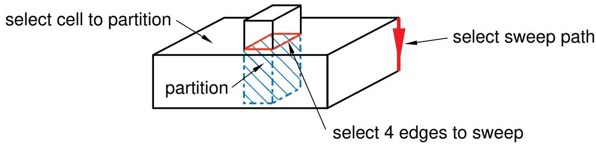

<details>
<summary>流程图</summary>

```mermaid
graph LR
  A["选择要分区的单元"] --> B["分区"]
  B --> C["选择4条要扫掠的边"]
  C --> D["选择扫掠路径"]
```
</details>

Abaqus/CAE 会高亮显示扫掠轮廓。

使用 Sweep along edge 方法通过沿直线或曲线边（即扫掠路径）扫掠选定的边（即扫掠轮廓）来对单元进行分区。扫掠路径必须起始于包含扫掠轮廓的平面，并且其切线必须垂直于该平面。生成的分区将仅延伸到扫掠路径的长度。沿边扫掠扫掠轮廓以对单元进行分区如下图所示：

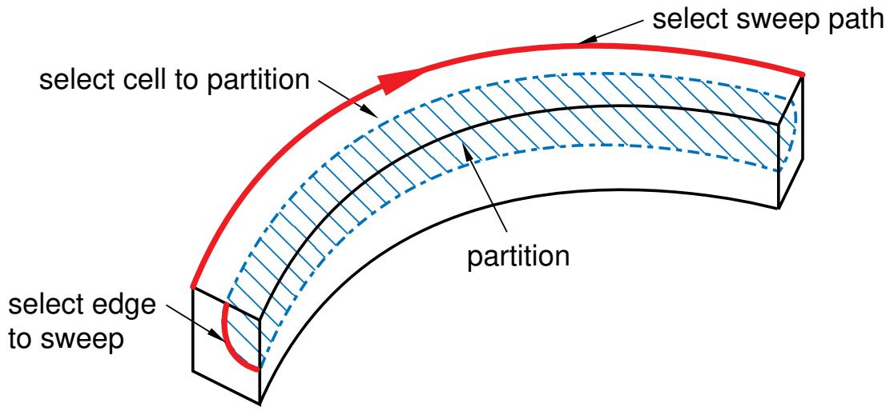

<details>
<summary>流程图</summary>

```mermaid
graph LR
  A["选择要扫掠的边"] --> B["选择要分区的单元"]
  B --> C["选择扫掠路径"]
  C --> D["分区"]
```
</details>

Abaqus/CAE 会高亮显示扫掠路径。

7. 在提示区中，单击 Create Partition。

Abaqus/CAE 将创建分区。

## 附加信息

•   分区技术
•   对单元进行分区的方法

## 使用 N 边面片方法对单元进行分区

您可以通过创建一个将单元划分为多个区域的面片来对单元进行分区。您可以使用边或角点来定义面片。如果选择一条边，Abaqus/CAE 将搜索一条连接边的连续环来定义一个可行的面片。如果选择角点，您可以选择三个、四个或五个点来定义分区。与其他单元分区工具不同，N 边面片生成的分区不会延伸到面片之外。因此，N 边面片方法可用于创建不延伸到单元其余部分的孤立分区。

如果您选择了一条曲线边，或者选择由一条曲线边连接的两个点，则生成的 N 边面片的相应边将遵循该边的轮廓。但是，如果选择的点之间没有边连接，面片将简单地连接这些点；面片将不遵循单元的轮廓，分区可能不完整。

1. 从主菜单栏中，选择 Tools -> Partition。
将出现 Create Partition 对话框。Abaqus/CAE 在提示区显示提示，指导您完成此过程。


提示：您也可以使用 N 边面片方法通过工具对单元进行分区，该工具位于模块工具箱的分区单元工具中。有关工具箱中分区工具的示意图，请参阅使用分区工具集。

2. 在对话框顶部的 Type 单选按钮中，选择 Cell。

Method 列表显示可用于对单元进行分区的方法。

3. 从方法列表中，选择 N-sided patch。
4. 如果部件或装配体包含多个单元，请选择要分区的单元。


提示：如果无法选择所需的单元，可以使用 Selection 工具栏更改选择行为。更多信息，请参阅使用选择选项。

Abaqus/CAE 会高亮显示选定的单元。


提示：使用 Previous 按钮 ( ) 撤销过程中的步骤。

5. 在提示区的按钮中，选择定义 N 边面片的方法：

使用 Select Edges 方法通过从一系列选定边定义一个 N 边面片来对单元进行分区。使用提示区中的文本字段选择选择边的方法：

## Loop

选择一条边，并允许 Abaqus/CAE 搜索一条连接边的连续环来对单元进行分区，如下图所示：

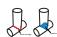

您选择的边必须在要分区的单元的边界上，并且 Abaqus/CAE 必须能够从一系列连接边形成一个闭合环。生成的面片可以有任意数量的边。Abaqus/CAE 会高亮显示将形成面片的环。

## Edges

手动选择将用于对单元进行分区的边。您选择的边必须在要分区的单元的边界上。您可以选择任意数量的边，并且选定的边必须形成一个闭合环。
使用选择角点方法，通过定义一个三至五个选定点构成的 N 边形面片来分割单元。Abaqus/CAE 按照您选择点的顺序连接这些点来创建面片；因此，选择点的顺序至关重要。这些点可以是顶点、中点或基准点，并且必须位于被分割单元的边界边上。如果两个点之间有一条弯曲边，则面片将沿着该曲线的轮廓生成，如下图所示：

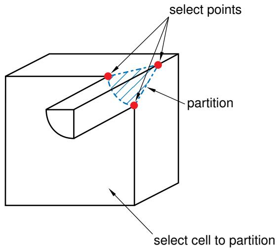

<details>
<summary>text_image</summary>

选择点
分割
选择要分割的单元
</details>

Abaqus/CAE 将高亮显示选定点以及将构成面片的边。

6. 执行以下操作之一：

• 如果高亮显示的边表明 Abaqus/CAE 将创建所需的分割，请在提示区中单击创建分割。

Abaqus/CAE 将创建分割。

• 要更改边的选择，请单击上一步按钮（ ↑ ）以撤销上一步操作。

## 附加信息

• 分割技术
• 分割单元的方法

## 使用草图平面分割方法分割单元

您可以使用草图模块（Sketcher）绘制一个平面分割的几何形状，来分割选定的单元。当您需要创建一个使用其他任何分割工具都无法实现的形状的分割时，您可以使用草图模块。草绘分割可用于创建将用于断裂力学分析的裂纹面。

您必须在一个平面上进行草绘。在大多数情况下，您将在一个与所选单元相交的基准平面上绘制分割。下图展示了一个在基准平面上绘制的平面分割：


1. 从主菜单栏中，选择工具（Tools）-> 分割（Partition）。

将出现创建分割（Create Partition）对话框。Abaqus/CAE 会在提示区显示提示信息，引导您完成整个过程。


提示：您也可以使用位于模块工具箱中分割单元工具内的工具，通过草图平面分割方法来分割单元。有关工具箱中分割工具的图示，请参阅使用分割工具集。

2. 在对话框顶部的类型（Type）单选按钮中，选择单元（Cell）。

方法（Method）列表将显示可用于分割单元的方法。

3. 从方法列表中，选择草图平面分割（Sketch planar partition）。

如果部件或装配仅包含一个单元，Abaqus/CAE 将进入草图模块。

4. 如果部件或装配包含多个单元，请选择要分割的单元，然后单击鼠标键 2。


提示：如果无法选择所需的单元，您可以使用选择工具栏来更改选择行为。有关更多信息，请参阅使用选择选项。

5. 选择要在其上进行草绘的平面。如果没有合适的平面，您可以选择一个基准平面。

选定的面将在视口中高亮显示。

6. 选择一条边及其在草图模块网格上的方向。该边不能与草图平面垂直。默认情况下，选定的边将显示为垂直状态并位于草图模块网格的右侧。要为该边选择不同的方向，请单击对话框右侧的箭头，并从出现的列表中选择一个方向。


提示：如果部件或装配没有能提供所需方向的边，您可以创建一个基准轴。然后，您可以选择该基准轴来控制部件在草图模块网格上的方向。

Abaqus/CAE 将高亮显示选定的边，进入草图模块，并旋转部件，直到选定的平面或基准平面与草图模块网格平面对齐，并且选定的边按照所需的方向与网格对齐。Abaqus/CAE 将高亮显示选定的面。

7. 使用草图模块绘制平面分割。从主菜单栏中，单击完成（Done）以表明您已完成分割的绘制。
8. 在提示区中，单击创建分割（Create Partition）。

Abaqus/CAE 将创建分割。

## 附加信息

• 草图模块
• 分割技术
• 分割单元的方法

## 查询工具集

查询工具集允许您获取有关模型的信息。

## 本节内容：

了解查询工具集的作用
查询模型

## 了解查询工具集的作用

查询工具集允许您获取有关模型的信息。

在大多数情况下，Abaqus/CAE 会在消息区显示请求的信息，并且相同的信息也会写入重放文件中。从主菜单栏选择工具（Tools）-> 查询（Query）以使用查询工具集，或者选择查询工具集中的查询工具。

查询（Query）对话框分为两个部分。对话框的顶部包含常规查询，这些查询在除作业模块（Job module）之外的每个模块中都可用，而查询工具集在作业模块中完全不可用。对话框的底部包含特定于模块的查询；当您在模块之间切换时，Abaqus/CAE 会显示适用于当前模块内容的查询。

## 本节内容：

常规查询
特定于模块的查询

## 常规查询

无论您使用哪个模块，您始终可以使用查询工具集获取关于模型的常规信息，尽管查询工具集在作业模块中不可用。

可视化模块（Visualization module）中的常规查询与其他模块中的类似，但由于某些选择方法的差异以及结果中包含未变形和已变形模型数据，将在可视化模块中的查询模型部分单独讨论。对于所有其他模块，查询工具集中的常规查询（General Queries）项提供下面讨论的常规信息。

在大多数情况下，Abaqus/CAE 会在消息区显示请求的信息，并且相同的信息也会写入重放文件中。从主菜单栏选择工具（Tools）-> 查询（Query）以使用查询工具集，或者选择查询工具集中的工具。

查询（Query）对话框分为两个部分。对话框的顶部包含常规查询，这些查询在除作业模块（Job module）之外的每个模块中都可用，而查询工具集在作业模块中完全不可用。对话框的底部包含特定于模块的查询；当您在模块之间切换时，Abaqus/CAE 会显示适用于当前模块内容的查询。

对于需要网格可用的工具，您可以使用视图（View）-> 部件显示选项（Part Display Options）或视图（View）-> 装配体显示选项（Assembly Display Options）菜单项来显示原始网格。

## 点/节点

选定的点或节点的坐标。您可以选择一个局部坐标系（CSYS）来显示坐标。

## 距离

两个选定的点、节点、边、面或这些对象的组合之间的距离。您可以选择一个局部坐标系（CSYS）来显示拾取点的坐标以及结果的分量。

## 角度

两条边或两个面、一条边和一个面或三个点之间的角度

## 特征

对于选定的特征：

• 特征名称
• 描述
• 状态（特征是否被抑制或是否未能重新生成）
• 父特征名称
• 子特征名称
• 参数

## 壳单元法向

显示壳/膜法向方向

## 梁单元切向

显示梁/桁架切向方向

此外，如果当前视口包含网格，查询工具集还提供以下信息：

## 网格堆叠方向

对于您可以在连续壳、内聚、圆柱形或垫圈网格中使用的六面体、楔形和四边形单元，Abaqus/CAE 会指示网格堆叠方向。对于六面体和楔形单元，Abaqus/CAE 将顶面涂成棕色，底面涂成紫色。对于四边形单元，箭头指示单元的方向。此外，Abaqus/CAE 会高亮显示任何方向不一致的单元面和边。


## 注意：

查询结果不考虑在属性模块（Property module）中定义实体复合材料铺层或复合材料壳铺层时对网格堆叠方向所做的更改。

## 网格

对于装配体、部件或部件实例、几何区域或单元：

• 所选区域中的节点和单元总数
• 每种单元形状的单元数量

默认情况下，Abaqus/CAE 在消息区显示网格信息，但您可以通过切换提示区中的显示详细报告（Display detailed report）选项，在网格统计（Mesh statistics）对话框中以表格形式显示此信息。网格统计对话框还允许您按部件实例或按单元类型显示网格信息。
## 单元

对于选定的单元：

- 单元标签
- 单元拓扑；例如，线性六面体
- Abaqus 单元名称；例如，C3D8I
- 节点连接关系

## 网格间隙/相交

对于选定的部件或部件实例：

- 显示具有不兼容界面的边界面的单元边
- 显示具有裂纹或间隙的边界面的单元边
- 显示与其他面相交的边界面的单元边

## 质量属性

对于装配体、选定的部件或部件实例、几何区域、实体单元、壳、实体面、梁或桁架，Abaqus/CAE 会返回以下部分或全部信息：

- 表面积（仅对壳单元和实体面显示）
- 面积形心
- 体积
- 体积形心
- 质量
- 质心
- 关于质心或指定点的惯性矩

有关此查询的更多信息，请参阅查询质量属性。

## 几何诊断

- 无效、不精确或微小的几何体
- 拓扑

## 集合

对于选定的集合：

- 几何集合：组件、索引、实例名称、集合名称、集合类型、组件总数
- 单元集合：单元标签、单元类型、连接关系、实例名称、集合名称、集合类型、单元总数
- 节点集合：节点标签、节点坐标、共享该节点的单元、实例名称、集合名称、集合类型、节点总数

## 面

对于选定的面：

- 几何面：索引、侧、实例名称、面名称、面类型、面总数
- 网格面：单元标签、单元类型、连接关系、侧、实例名称、面名称、面类型、面总数

## 几何面法向

在全局笛卡尔坐标系中，平面面的表面法向分量，或对于曲面，在面上选定的点处的法向分量。您可以选择一个局部坐标系 (CSYS) 来显示法向。如果在曲面上输入评估点的坐标，应在局部坐标系（如果已选择）中输入坐标。

## 单元面法向

在全局笛卡尔坐标系中，单元面的表面法向分量。您可以选择一个局部坐标系 (CSYS) 来显示法向。

## 高级距离

常规的距离查询允许您查找两个选定单一实体之间的距离，而高级距离查询允许您查找实体组之间的最小距离。这些实体可以是节点、单元、顶点、边、面或胞元，您可以从视口或通过集合选择它们。您可以选择一个局部坐标系 (CSYS) 来显示最近点的坐标和结果分量。

更多信息，请参阅获取模型的一般信息。

- 自定义网格显示

## 模块专用查询

除了通用查询外，您还可以查询特定于您正在使用的模块的模型信息。Abaqus/CAE 在查询工具集的底部、“模块名称 模块查询”下显示这些模块专用查询。查询工具集可以提供以下模块专用信息：

## 部件模块

“部件模块查询”下的项目提供有关当前部件的以下模块专用信息：

## 部件属性

- 名称
- 建模空间
- 类型（可变形体或刚体）

## 重新生成警告

如果选定部件中的任何集合或面无法重新生成（因为它们的底层几何体已被修改或删除），Abaqus/CAE 会显示集合或面名称、原始面数以及查询期间找到的面数。

## 子结构统计

Abaqus/CAE 显示有关选定子结构部件的以下信息：部件中的保留节点数、特征模态数和子结构载荷数；子结构中恢复矩阵、重力载荷向量、约化质量矩阵、约化结构阻尼矩阵和约化粘性阻尼矩阵的可用性；以及子结构的质量属性。

更多信息，请参阅在部件模块中使用查询工具集。

## 属性模块

“属性模块查询”下的项目提供有关当前部件的以下模块专用信息：

## 截面指派

指派给选定区域的截面

## 缺少截面的区域

需要指派截面的区域

## 梁方向

指派给选定线框区域的梁方向（Abaqus/CAE 在选定线框区域上显示 ( , , ) 轴系）

## 材料方向

指派给选定区域的材料方向

## 钢筋方向

指派给选定区域的钢筋参考方向

## 铺层堆叠图

Abaqus/CAE 创建一个新视口，并显示通过复合材料铺层或复合材料截面区域的芯样图形表示。该图像显示铺层中的各层以及每层的详细信息，例如其纤维方向、厚度、参考平面和积分点。

## 不连续的铺层区域

Abaqus/CAE 在消息区域中显示包含不连续区域的复合材料铺层及其内部铺层的名称。

更多信息，请参阅使用查询工具集获取指派信息，以及查看铺层堆叠图。

## 装配模块

“装配模块查询”下的项目提供有关选定部件实例的以下模块专用信息：

## 实例属性

名称、类型和建模空间

## 实例位置

- 原点相对于全局坐标系的位置
- 施加到实例上的平移和旋转的总和
- 施加的平移和旋转约束数

更多信息，请参阅使用查询工具集查询装配体。

## 分析步模块

在分析步模块中，查询工具集仅提供通用信息。

## 相互作用模块

“相互作用模块查询”下的项目提供有关选定线框的以下模块专用信息：

- 连接器指派信息

更多信息，请参阅使用查询工具集获取连接器指派信息。

## 载荷模块

在载荷模块中，查询工具集仅提供通用信息。

## 网格模块

“网格模块查询”下的项目提供有关部件或部件实例的以下模块专用信息：

- 自由边/非流形边
- 未划分网格的区域
- 未关联的几何体

更多信息，请参阅获取网格信息。

## 作业模块

在作业模块中，任何 Abaqus/CAE 工具集都不可用。

## 可视化模块

“可视化模块查询”下的项目提供以下模块专用信息：

- 探测值。当您在当前视口周围移动光标时，Abaqus/CAE 会在“探测值”对话框中显示信息。探测模型图会显示模型数据和分析结果；探测 X-Y 图会显示 X-Y 曲线数据。更多信息，请参阅探测模型。
- 应力线性化。应力线性化是将通过一个截面的应力分离为恒定膜应力和线性弯曲应力。Abaqus/CAE 执行应力线性化计算并以 X-Y 图的形式显示结果。更多信息，请参阅计算线性化应力。
- 活动单元或节点。Abaqus/CAE 显示当前视口中所有活动节点或活动单元的标签号。更多信息，请参阅查询活动节点或单元标签。
- 铺层堆叠图。Abaqus/CAE 创建一个新视口，并显示通过复合材料铺层或复合材料截面区域的芯样图形表示。该图像显示铺层中的各层以及每层的详细信息，例如其纤维方向、厚度、参考平面和积分点。更多信息，请参阅查看铺层堆叠图。

## 草图模块

“草图模块查询”下的项目提供有关选定约束或草图的以下信息：

## 约束

- 约束类型
- 受约束的实体名称

此外，受约束的实体在草图中会高亮显示。

## 详细信息

- 几何体数量

- 顶点数量
- 约束数量
- 尺寸数量
- 未约束的自由度数量

## 查询模型

本节介绍如何使用查询工具集获取有关模型的信息。

## 本节内容：

使用查询工具集查询模型
获取模型的一般信息
查询质量属性
使用几何诊断工具

## 使用查询工具集查询模型

您可以使用查询工具集获取当前视口中模型几何体以及定义模型的特征的一般信息。

此外，您还可以获取特定于您正在使用的模块的信息；例如，如果您正在使用网格模块，查询工具集可以提供有关网格、节点和单元的信息。

1.  从主菜单栏中，选择工具 -> 查询。


提示：您也可以通过点击查询工具集中的工具来查询模型。

Abaqus/CAE 将显示查询对话框。

2. 从查询对话框中，选择以下之一：

• 通用查询

点/节点  
距离  
- 角度  
特征  
壳单元法向  
梁单元切向  
网格堆叠方向  
网格  
单元  
- 网格间隙/交叉  
- 质量属性  
几何诊断  
集合  
面  
几何面法向  
单元面法向

更多信息，请参见获取模型的一般信息。

• 特定模块查询。有关每个模块可用信息的完整列表，请参见理解查询工具集的作用。

3. 对于壳法向、梁切向、网格间隙和网格堆叠方向，Abaqus/CAE 使用箭头和高亮显示在视口中显示请求的信息。

对于所有其他查询，Abaqus/CAE 会在提示区显示提示，引导您完成剩余步骤。Abaqus/CAE 在消息区显示请求的信息。要调整消息区大小，请拖动上边缘；要查看已滚动出消息区的信息，请使用右侧的滚动条。显示在消息区的信息也会写入重放文件中。

4. 完成信息请求后，点击提示区中的取消按钮。

## 附加信息

• 获取模型的一般信息  
• 理解查询工具集的作用

## 获取模型的一般信息

您可以使用查询工具集获取有关模型的一般信息，包括点/节点坐标；单元标签、拓扑和节点连接；以及质量属性。

要获取模型的一般信息，请从主菜单选择工具->查询，或点击查询工具集中的工具。对于需要网格可用的工具，您可以使用查看->部件显示选项或查看->装配体显示选项菜单项来显示原生网格。在出现的查询对话框的通用查询字段中选择以下之一：

## 点/节点

选择一个点或节点。Abaqus/CAE 显示该点的 X、Y 和 Z 坐标。您可以选择要在其中显示坐标的局部坐标系。

## 距离

选择两个点或节点。在部件、特性和网格模块中，您可以选择点、边或面。您可以选择一个局部坐标系来显示拾取点的坐标和结果的分量。Abaqus/CAE 显示以下信息：

• 每个实体的 X、Y 和 Z 坐标。  
• 实体之间的绝对距离。  
• 两个实体之间向量的 X、Y 和 Z 分量。

非点实体之间的距离始终是两个实体内两点之间的最短距离。

## 角度

在提示区选择面/曲线或3点。

• 如果您选择了面/曲线，选择两条边或两个面，或者选择一个边和一个面。根据您的选择，Abaqus/CAE 显示以下之一：  
    - 两条边之间的角度。  
    - 两个面法向之间的角度。  
    - 边与面法向之间的角度。

当您选择一条边时，Abaqus/CAE 沿该边显示一个箭头。当您选择一个面时，Abaqus/CAE 在该面上显示一个箭头，指示面的法向。角度定义为其中一条边或面必须扫过以使两个箭头对齐的角度。角度始终为正且小于或等于 180°。

• 如果您选择了3点，选择三个点/节点或输入节点标签。

## 特征

在模型树中的某个特征上点击鼠标按钮3，并从出现的菜单中选择查询。Abaqus/CAE 显示有关所选特征的以下信息：

• 名称和描述；例如，实体拉伸。  
• 状态，如果该特征被抑制或重新生成失败。

• 其父特征的名称（如果有）。  
• 其子特征的名称（如果有）。  
• 定义该特征的任何参数的值。

## 壳单元法向

• 对于具有壳区域的部件，Abaqus/CAE 使用着色渲染样式显示部件或装配体。壳的表面法向与壳法向重合的一侧（顶面）为棕色；相反的一侧（底面）为紫色。  
• 对于具有线框区域的轴对称部件，Abaqus/CAE 显示青色箭头指示法向的方向。

您可以使用特性模块中的指派菜单或网格模块中的网格->方向->法向菜单来反转法向方向。更多信息，请参见指定壳/膜法向方向。

## 梁单元切向

Abaqus/CAE 显示青色箭头指示梁切向的方向。

您可以使用特性模块中的指派菜单或网格模块中的网格->方向->法向菜单来反转切向方向。更多信息，请参见指定梁/桁架切向方向。

## 网格堆叠方向

您只能使用此工具查询六面体、楔形和四边形单元，因为只有这些单元可以堆叠形成连续壳、内聚单元、圆柱形或垫片网格。对于六面体和楔形单元，Abaqus/CAE 将顶面着色为棕色，底面着色为紫色。类似地，箭头指示四边形单元的方向。此外，Abaqus/CAE 会高亮显示任何方向不一致的单元面和边。更多信息，请参见使用几何和网格工具创建具有内聚单元的模型、连续壳、圆柱体的扫掠网格划分和垫片。

如果该区域是原生 Abaqus 网格，您可以通过更改扫掠路径的方向来更改网格堆叠方向。对于实体区域，您可以分配一个独立于扫掠路径的新网格堆叠方向。如果该区域是孤立网格，您可以使用编辑网格工具集来更改网格堆叠方向。更多信息，请分别参见指定扫掠路径、应用网格堆叠方向和定向堆叠方向。


## 注意：

查询结果不考虑在特性模块中定义实体复合材料层叠或复合材料壳层叠时对网格堆叠方向所做的更改。

## 网格

对于装配体、部件或部件实例、几何区域或单元，Abaqus/CAE 显示以下信息：

• 所选区域中的节点和单元总数  
• 每种单元形状的单元数

默认情况下，Abaqus/CAE 在消息区显示网格信息，但您可以通过切换提示区中的显示详细报告复选框，在网格统计信息对话框中以表格格式显示此信息。

网格统计信息对话框还允许您按部件实例或单元类型显示网格信息。

## 单元

• 单元标签  
• 单元拓扑；例如，线性六面体  
• Abaqus 单元名称；例如，C3D8I  
• 节点连接。

## 网格间隙/交叉

选择网格部件或部件实例，并输入节点与单元面之间的最大距离。Abaqus/CAE 会高亮显示与边界面相交的单元边，以及距离边界面小于指定距离的单元边。

## 质量属性

此查询显示有关表面积、面积形心、体积、体积形心、质量、质心以及关于质心或指定点的惯性矩的信息。更多信息，请参见查询质量属性。

## 几何诊断

• 无效、不精确或小几何  
• 拓扑

## 集合

从提供的集合列表中选择一个集合。如果需要，切换高亮显示集合以在视口中高亮显示该集合。点击完成。

Abaqus/CAE 在消息区显示有关所选集合的以下信息，具体取决于您的选择：

• 几何集合：分量、索引、实例名称、集合名称、集合类型、总分量数  
• 单元集合：单元标签、单元类型、连接、实例名称、集合名称、集合类型、总单元数  
• 节点集合：节点标签、节点坐标、共享该节点的单元、实例名称、集合名称、集合类型、总节点数

## 面

从提供的面列表中选择一个面。如果需要，切换高亮显示面以在视口中高亮显示该面。点击完成。

Abaqus/CAE 在消息区显示有关所选面的以下信息，具体取决于您的选择：

• 几何面：索引、侧、实例名称、面名称、面类型、总面数  
• 网格面：单元标签、单元类型、连接、侧、实例名称、面名称、面类型、总面数

## 几何面法向

选择一个面。如果需要，选择坐标系。对于曲面，系统会提示您选择点或输入要评估法向的点的 X、Y 和 Z 坐标。如果在曲面上输入评估点的坐标，您应该在局部坐标系（如果已选择）中输入坐标。您可以选择参考点、附着点或顶点。全局笛卡尔坐标系中的表面法向分量会显示在消息区。如果您选择了坐标系，法向将在给定的坐标系中显示。
## 单元面法线

选择一个单元。如有需要，选择坐标系（CSYS）。全局笛卡尔坐标系下的表面法线分量将显示在消息区。如果您选择了坐标系，则法线将在给定的坐标系中显示。

## 附加信息

• 使用查询工具集查询模型  
• 理解查询工具集的作用  
• 自定义网格显示

## 查询质量属性

质量属性查询会为您的选择显示：表面积和面积形心、体积和体积形心、质量和质心，以及绕质心或指定点的惯性矩。

显示的数据取决于您的选择。例如，如果您选择实体部件的一个面，Abaqus/CAE 会在消息区显示该面的表面积和面积形心。如果您选择整个部件，Abaqus/CAE 会显示该部件的体积和体积形心、质量和质心，以及绕质心或指定点的惯性矩。如果部件是壳体，Abaqus/CAE 还会在质量属性输出中包含壳体一侧的表面积和面积形心。

Abaqus/CAE 中计算的质量属性考虑了质量在整个模型连续体中的分布，而 Abaqus 求解器则根据模型的离散化来计算质量属性。与 Abaqus 分析的数据文件（.dat）中提供的质量属性相比，在质量属性查询中获得的惯性矩值可能存在显著差异，特别是对于网格粗糙的有限元模型。

在可视化（Visualization）模块中，即使视区中显示的是变形后的形状，质量属性也总是基于模型数据（未变形形状）计算。

如果您查询的区域包含占据几何体空间但未与任何几何体关联的网格，则体积/面积在计算中将被有效重复计算。您应该查询未划分网格的区域和/或未关联的几何体以避免此问题。

您无法查询分配了欧拉（Eulerian）截面的部件的质量属性。但是，如果欧拉部件没有分配欧拉截面，您可以查询其质量属性。

您可以在模型部分未完全定义的情况下查询模型的质量属性。例如，如果您的选择包含一个未分配截面的部件实例，Abaqus/CAE 会将该部件实例的面积纳入质量属性计算，但会将其排除在体积、体积形心、质量、质心和惯性矩的计算之外。Abaqus/CAE 还会在数据中附加一条警告消息，表明数据不完整；在本例中，该消息会指出您选择的一部分缺少截面分配。此方法使您能够在建模过程的不同阶段检查模型的各个方面，而不会显示有关质量相关量的误导性信息。

在以下情况下，Abaqus/CAE 会随质量属性数据一起返回警告消息：

## 质量属性查询未考虑的几何体

Abaqus/CAE 为壳体、实体、桁架和旋转惯性单元计算质量属性；并且在可视化模块以外的其他模块中执行。Abaqus/CAE 不为具有广义截面的梁通用截面（beam general section）计算质量属性，但会为其他截面计算质量属性。Abaqus/CAE 也会将点质量和非结构质量单元纳入其质量属性计算中。如果您的选择包含其他几何体，如轴对称单元、弹簧、连接器或垫片（或者在可视化模块中，如果您的选择包含点质量和非结构质量单元），Abaqus/CAE 会将该几何体排除在计算之外。

在可视化模块中排除点质量和非结构质量单元意味着质量属性结果在可视化模块中可能与其他模块不同。

## 不合格的厚度值

如果您的选择包含一个缺少厚度值或厚度值为零的截面定义，Abaqus/CAE 会将该选择排除在质量、质心和惯性矩的计算之外。同样，Abaqus/CAE 不会考虑具有可变厚度（使用节点厚度或场厚度定义）的区域或使用不适用于所指定相应截面的厚度值的区域。

## 未定义或定义不当的密度

如果您的选择包含一个未提供密度值或密度定义不当的区域，Abaqus/CAE 会将该区域排除在质量属性查询的所有质量相关计算之外。该区域的面积和体积数据将包含在最终计算中。

## 缺少截面分配

如果您的选择包含一个未分配截面的区域，Abaqus/CAE 会将该区域排除在质量属性查询的所有质量相关计算之外。该区域的面积和体积数据将包含在最终计算中。

## 包含壳体偏移或加强件

计算体积形心或表面积时，Abaqus/CAE 不考虑壳体偏移值，Abaqus/CAE 也会将模型中的任何加强件排除在所有质量属性计算之外。如果您的查询包含壳体偏移或加强件，Abaqus/CAE 会返回查询结果并附带相应的警告消息。

## 复合截面

当您的质量属性查询选择包含具有复合截面的部件或区域时，Abaqus/CAE 在质量属性查询中使用位于单元上的涂抹属性来计算与质量和体积相关的值。

## 包含非结构质量实体

Abaqus/CAE 不考虑线体上的非结构质量，例如质量-长度值。此外，当几何体未划分网格时，Abaqus/CAE 无法像对已划分网格的几何体那样准确地计算质心和惯性矩值。

1.  从主菜单选择工具->查询（Tools->Query）以使用查询工具集，或选择查询工具集中的工具。  
2.  单击质量属性（Mass properties）。

提示区将出现附加选项。

3.  如有需要，单击选项（Options）以修改查询选项。

    a. 在质量属性查询选项（Mass Properties Query Options）对话框中，您可以修改精度、密度、厚度参数以及计算惯性矩所围绕的点。您可以单击重置（Reset）将选项恢复为先前存储的值。  
    b. 单击确定（OK）保存更改并关闭对话框。

4.  如果您的选择包含原生网格（native mesh），您可以查询该几何体或该原生网格的质量属性。要查询原生网格的质量属性，请在提示区单击选项（Options），然后在出现的对话框中勾选“可用时使用网格以获得精确属性”（Use mesh when available for accurate properties）。

5.  对于包含复杂几何体的选择，Abaqus/CAE 计算体积属性可能需要很长时间。您可以通过指示 Abaqus/CAE 在达到特定相对精度时停止计算来减少计算时间。在提示区单击选项（Options），然后从出现的对话框中选择“低”（Low）、“中”（Medium）或“高”（High）相对精度。更高的相对精度会产生更准确的结果，但计算时间更长。相对精度设置仅适用于几何体选择，不适用于网格选择。

6.  如果您的选择包含厚度或密度缺失或定义不当的区域，您可以为这些区域的质量属性计算提供厚度或密度值。向查询提供这些值不会改变模型本身的这些值。

    在提示区单击选项（Options），然后在相应字段中提供大于零的值。

7.  如果您想查询整个装配体的质量属性，选择查询整个装配体（Query entire assembly）并单击完成（Done）。

    Abaqus/CAE 在消息区显示以下信息：体积、体积形心、质量、质心，以及绕质心或指定点的惯性矩。如果装配体包含壳体特征，Abaqus/CAE 还会报告壳体面一侧的表面积和面积形心。

8.  如果您想查询整个部件的质量属性（当部件在部件（Part）模块或属性（Property）模块中显示时），选择查询整个部件（Query entire part）并单击完成（Done）。

    Abaqus/CAE 在消息区显示该部件的体积、体积形心、质量、质心，以及绕质心或指定点的惯性矩。如果部件包含壳体特征，Abaqus/CAE 还会报告壳体面一侧的表面积和面积形心。

9.  如果您想查询装配体中一个或多个部件实例的质量属性，高亮选择部件实例（Select part instances），在视区中高亮选择一个或多个部件实例，然后单击完成（Done）。
Abaqus/CAE 在消息区域显示部件实例或多个实例的体积、体积质心、质量、质心以及关于质心或指定点的转动惯量。如果您查询的部件实例或多个部件实例包含壳特征，Abaqus/CAE 还将报告壳面一侧的表面积和面积质心。

10. 如果您想查询装配、部件或部件实例中一个或多个几何区域的质量属性，请高亮显示 **选择几何区域**，在视口中高亮显示一个或多个区域，然后点击 **完成**。

Abaqus/CAE 在消息区域显示区域或多个区域的体积、体积质心、质量、质心以及关于质心或指定点的转动惯量。如果您查询的区域或多个区域包含壳特征，Abaqus/CAE 还将报告壳面一侧的表面积和面积质心。

11. 如果您想查询装配、部件或部件实例中一个或多个面的质量属性，请高亮显示 **选择几何区域**，在视口中高亮显示一个或多个区域，然后点击 **完成**。

a. 从提示区域，高亮显示 **选择几何区域**。
b. 从 **选择** 工具栏的对象类型列表中，选择 **面**。
c. 从视口中选择一个或多个面，然后点击 **完成**。

Abaqus/CAE 显示所选面的总表面积。您可以查询多个壳面或多个面，但不能同时查询壳面和几何面。

12. 如果您想查询装配、部件或部件实例中一个或多个单元的质量属性，请高亮显示 **选择单元**，在视口中高亮显示一个或多个单元，然后点击 **完成**。

Abaqus/CAE 在消息区域显示区域或多个区域的体积、体积质心、质量、质心以及关于质心或指定点的转动惯量。如果您查询的区域或多个区域包含壳特征，Abaqus/CAE 还将报告壳面一侧的表面积和面积质心。

13. 如果您想查询装配、部件或部件实例中一个或多个单元面的质量属性，请执行以下步骤：

a. 从提示区域，高亮显示 **选择单元**。
b. 从 **选择** 工具栏的对象类型列表中，选择 **单元面**。
c. 从视口中选择一个或多个单元面，然后点击 **完成**。

Abaqus/CAE 显示所选单元面的总表面积。您可以查询多个单元面以及来自多个壳面或多个面的单元面，但不能同时查询来自壳面和几何面的单元面。

您也可以在 **可视化** 模块中使用通用查询，包括查询质量属性。更多信息，请参阅在 **可视化** 模块中查询模型。

本节描述如何使用几何诊断工具在当前视口中的部件或部件实例中定位以下内容：

## 几何

• **无效实体**：Abaqus/CAE 高亮显示部件或部件实例中几何无效的区域。
打开 **更新有效性** 开关，可以更新所选部件或部件实例的状态。如果无效的部件变为有效，它会在模型树中被标记为有效。如果有效的部件变为无效，Abaqus/CAE 会显示一条警告消息，允许您忽略无效状态并继续使用该部件。
• **不精确实体**：Abaqus/CAE 高亮显示部件中几何不精确的区域。

有关无效几何的更多信息，请参阅什么是有效且精确的部件？和使用无效部件。

## 拓扑

• **自由边**：Abaqus/CAE 高亮显示部件或部件实例的自由边，包括壳边和线边。实体部件不应包含任何自由边。
• **实体单元格**：Abaqus/CAE 高亮显示部件或部件实例的实体单元格。
• **壳面**：Abaqus/CAE 高亮显示部件或部件实例的壳面。
• **线边**：Abaqus/CAE 高亮显示部件或部件实例的线边。线边是线体，与实体或壳特征的边不同。

## 小几何

短边、小面和具有小面角角度的面等小实体可能会影响网格质量。您可以使用以下工具来定位这些区域：

• **短于指定长度的边**：Abaqus/CAE 高亮显示短于指定长度的边。指定长度必须大于或等于 1×10−6。
• **小于指定面积的面**：Abaqus/CAE 高亮显示小于指定面积的面。指定面积必须大于或等于 1×10−12。
• **面角角度小于指定角度**：Abaqus/CAE 高亮显示两条边相交角度小于指定角度的面。指定角度必须小于 90°。Abaqus/CAE 使用长宽比高的单元来划分具有小面角的面，这会影响网格质量。

1. 从主菜单栏中，选择 **工具 -> 查询**，或点击 **查询** 工具集中的工具以启动 **查询** 工具集。
2. 在 **查询** 对话框中，选择 **几何诊断**。如果视口包含多个部件实例，请选择要查询的部件实例。
   Abaqus/CAE 显示 **几何诊断** 对话框。
3. 打开所需的几何诊断选项开关，并在需要时指定新值。
4. 点击 **高亮显示**。

Abaqus/CAE 高亮显示您选择的相应无效、不精确或小几何的任何区域。如果部件尺寸相对较大，即使是高亮显示的短边和小面也可能不可见。为了帮助您找到这些短边和小面，Abaqus/CAE 会在高亮区域周围显示标记。
• 如果您选择了 **更新有效性**，Abaqus/CAE 还会检查并更新部件或装配的有效性状态。对于复杂几何，有效性检查的计算成本可能很高。
• 如果对于特定的诊断工具未找到任何区域，Abaqus/CAE 会在消息区域显示一条消息。

5. 如果需要，可以在提示区域点击 **创建集合** 来创建一个包含高亮区域的几何集。在出现的对话框中，输入集合的名称，然后点击 **继续**。

**几何编辑** 工具集提供了用于修复无效或不精确区域的工具。**几何编辑** 工具集允许您在选择要修复的区域时指定一个集合。


## 注意：

您可以通过打开 **应用于参考表示** 开关来查看参考表示的几何诊断。但是，参考表示中的项目将被排除在创建的几何集之外，因为参考表示无法被修复。更多信息，请参阅理解参考表示。

## 附加信息

• 导入和导出几何数据与模型
• 编辑技巧
• **集合和表面** 工具集

本章描述 **参考点** 工具集。

## 本节内容：

什么是参考点？
参考点用于什么？
创建参考点

## 什么是参考点？

参考点是您在部件上创建的一个点。您也可以在装配上创建参考点。您可以将参考点放置在空间中的任何位置，当您的模型中需要一个没有顶点的点时，参考点非常有用；例如，在孔的中心处。与顶点不同，当生成网格时，**网格** 模块会忽略参考点。

您可以在 **部件** 模块中使用 **参考点** 工具集，通过从主菜单栏选择 **工具 -> 参考点** 来创建一个与部件关联的参考点。当您创建装配时，该参考点会出现在装配中该部件的每个实例上。一个部件只能包含一个参考点，Abaqus/CAE 将其标记为 RP。如果您试图指定第二个点，Abaqus/CAE 会询问您是否要删除原始点。

或者，您可以在 **装配**、**相互作用** 或 **载荷** 模块中使用 **参考点** 工具集，通过从主菜单栏选择 **工具 -> 参考点** 在装配上创建一个参考点。在 **相互作用** 模块中，您可以使用模块工具箱中的工具来创建参考点。装配可以包含多个参考点，Abaqus/CAE 将它们标记为 RP-1、RP-2、RP-3 等。更多信息，请参阅创建参考点。如果需要，您可以关闭参考点符号和参考点标签的显示；更多信息，请参阅控制参考点显示。

## 参考点用于什么？

您可以将参考点用于以下用途：

如果部件是使用广义平面应变单元建模的可变形平面部件，则必须创建一个参考点以指示所需的参考节点。更多信息，请参阅创建广义平面应变截面。有关广义平面应变单元的更多信息，请参阅选择单元的维度。
• 如果部件是离散刚性部件或解析刚性部件，则使用参考点来指示刚体参考点。施加到参考点上的约束或运动将应用于整个刚性部件。

刚体参考点的位置会影响施加力矩或运动的方式；此外，刚体参考点的位置还会影响力矩反作用的解释。如果您的模型包含涉及旋转的动态分析，则刚体的旋转惯量规范必须与其刚体参考点的位置保持一致。

在**Interaction**（相互作用）模块中创建刚体约束时，必须引用装配中的参考点。刚体约束会将装配中某个区域的运动约束到参考点的运动。您可以创建一个包含该参考点的集合并为其命名，然后引用该集合；或者，也可以直接从当前视口选择参考点。您还可以在**Load**（载荷）模块中将载荷和边界条件应用于参考点。

在某些情况下，您可能希望将参考点定位在质心处，可以使用**Query**（查询）工具集找到质心。您可以使用**Property**（属性）模块将质量和旋转惯量截面属性分配给参考点。该截面还可以包含可选的阻尼数据。

• 您可以向参考点施加约束；例如，方程约束、耦合约束和显示体约束。

在**Assembly**（装配）模块或**Interaction**（相互作用）模块中创建装配级别的线特征时，可以使用参考点。如果您希望将连接器连接到空间中的某个点，参考点将非常有用。您可以在所需位置创建一个参考点，然后使用刚体约束将部件实例连接到该参考点。当您将连接器连接到这样的参考点时，连接器实际上被连接到了部件实例。

## 创建参考点

从主菜单栏中，选择**Tools->Reference Point**可在部件或装配上创建参考点。一个部件只能包含一个参考点，并且该参考点会出现在装配中该部件的每个实例上。或者，您可以使用**Assembly**（装配）、**Interaction**（相互作用）或**Load**（载荷）模块在装配上创建多个参考点。更多信息，请参见*什么是参考点？*。

1. 从主菜单栏中，选择**Tools->Reference Point**。


提示：在**Interaction**（相互作用）模块中，您可以使用模块工具箱 $\bigstar ^ { \mathsf { R P } }$ 中的工具来创建参考点。

2. 选择一个点作为参考点。您可以使用以下任一技术来定位参考点：
   *   从部件中选择任何现有的顶点，包括基准点。如果需要移动参考点，您必须编辑该顶点或基准点。或者，您可以删除参考点并选择新的顶点或基准点。
   *   输入一个向量的分量，该向量表示参考点的 X、Y 和 Z 坐标。如果需要移动参考点，可以使用**Feature Manipulation**（特征操作）工具集编辑其坐标。

Abaqus/CAE 会在所需位置显示参考点及其标签。如果您在**Part**（部件）模块中的部件上创建参考点，Abaqus/CAE 会将其标记为 RP。如果您在装配上创建参考点，Abaqus/CAE 会将其标记为 RP-1、RP-2、RP-3 等。您可以通过在**Model Tree**（模型树）中的特征上点击鼠标按钮 3，并从出现的菜单中选择**Rename**（重命名）来更改参考点标签。如果需要，您可以关闭参考点符号和参考点标签的显示；更多信息，请参见*控制参考点显示*。

## 附加信息

• 刚性部件
• 参考点
• 重命名特征
• 什么是参考点？
• 参考点有什么用途？

当您需要指定模型的某个区域（例如，施加载荷或定义接触）时，可以从视口中选择该区域，也可以定义一个包含该区域的集合或表面。您可以使用**Set**（集合）和**Surface**（表面）工具集来创建和管理集合与表面。

**Set**（集合）和**Surface**（表面）工具集可从除**Visualization**（可视化）模块外所有模块的主菜单栏中的**Tools**菜单获取。

## 本节内容：

理解 **Set**（集合）和 **Surface**（表面）工具集的作用
理解集合和表面
使用 **Set**（集合）和 **Surface**（表面）工具集

## 理解 **Set**（集合）和 **Surface**（表面）工具集的作用

**Set**（集合）和 **Surface**（表面）工具集是允许您创建和管理集合与表面的工具集合。您可以使用这些工具执行以下任务：

## 创建

通过选择一组实体（例如面和边）来创建集合或表面。

## 编辑

通过选择要添加或删除的实体来修改集合或表面。

## 重命名

用新名称替换现有集合或表面的当前名称。

## 删除

从模型中删除集合或表面。

此外，您可以使用**Model Tree**（模型树）将一组选定的集合和表面合并到一个新的集合或表面中。有关创建和操作集合与表面的详细说明，请参见以下各节：

创建、编辑、复制、重命名和删除集合与表面
创建集合
创建表面
对集合或表面执行布尔运算
编辑集合和表面
将对象（如载荷和截面）与集合和表面关联

## 理解集合和表面

本节描述有关集合和表面的基本概念。

## 本节内容：

什么是集合？
部件集合和装配集合有何区别？
什么是表面？
几何集合和表面的重新生成
指定区域的特定侧面或端部

## 什么是集合？

集合是您可以对其执行各种操作的命名区域或实体集合。

例如，一旦创建了集合，您就可以使用它来执行以下任务：

• 在 **Property**（属性）模块中分配截面属性。
• 在 **Interaction**（相互作用）模块中使用接触节点集和表面创建接触对。
• 在 **Load**（载荷）模块中定义载荷和边界条件。
• 在 **Step**（分析步）模块中请求来自模型特定区域的输出。

您可以创建以下类型的集合：

## 几何集合

几何集合包含您从以下类型的部件或这些部件的实例中选择的几何对象（单元、面、边和顶点）：

• 原生部件（使用 **Part**（部件）模块中的工具创建的部件）
• 从文件导入的部件。

您从当前视口选择要包含在集合中的实体。根据部件的形状和建模空间，您可以在集合中包含单元、面、边和顶点的任意组合。但是，某些过程只能使用特定类型的对象执行。因此，您选择的集合必须仅包含对该过程有效的对象类型。例如，集中力只能施加到顶点上；因此，您施加集中力的集合只能包含顶点。

## 节点集和单元集

节点集和单元集包含您选择的节点和单元。您可以从在**Mesh**（网格）模块中已网格化的原生 Abaqus 部件上的节点和单元、从孤立网格节点和单元，或者从任何部件实例的节点和单元创建节点集和单元集。一个集合可以包含来自单个部件或多个部件实例的节点或单元。使用**Set**（集合）工具集创建的集合可以包含节点或单元，但不能同时包含两者。但是，您可以通过合并集合或导入包含具有相同名称的多个集合的输出数据库或输入文件来创建包含混合节点和单元的集合。集合中的原生节点和单元允许您请求输出或将载荷添加到特定区域，而无需删除网格并分割几何。然而，对网格的任何更改——包括从重播或日志文件重新生成它——可能会使网格集合的原生部分失效或更改。

有关网格部件和孤立网格节点与单元的更多信息，请参见*可以从 Abaqus/CAE 导入和导出哪些类型的文件？*、*从 Abaqus 输入文件导入模型*、*从输出数据库导入模型*和*创建网格部件*。

如果重命名或删除集合，与该集合关联的任何对象（如截面或载荷）将失效。但是，如果将重命名后的集合的名称改回其原始名称，或者使用原始名称重新创建已删除的集合，则与该集合关联的对象将恢复。

## 附加信息

• 使用 **Set**（集合）和 **Surface**（表面）工具集

## 部件集合和装配集合有何区别？

您从部件创建的集合或从装配中的部件实例创建的集合，其用途不同：
## 部件集合

部件集合是在与部件相关的模块（Part 或 Property）中创建的集合。当您从上下文栏中选择 Part 对象时，Mesh 模块也充当与部件相关的模块。当您从输出数据库导入孤立网格时，也会自动将任何集合作为部件集合导入。部件集合在模型树中出现在与其关联的部件下的 Set 容器中。在 Part 和 Property 模块中，只有部件集合在集合管理器中可见。您在 Part 模块中不直接使用部件集合；但是，在 Property 模块中，您可以将截面赋予由部件集合指定的区域。如果您将截面赋予由部件集合定义的区域，Abaqus 会将该截面赋予应用到该部件在装配体中的所有实例。

当您在 Assembly 模块中创建部件实例时，您可以引用之前创建的任何部件集合；然而，与装配体相关的模块仅提供对这些集合的只读访问权限，并且您无法从与装配体相关的模块中的集合管理器访问部件集合。来自实例化部件的集合出现在模型树中的装配体下。您可以在某个过程中（例如，在施加载荷或边界条件时）通过单击提示区域最右侧的 Set 按钮，并从出现的区域选择对话框中选择集合，来选择符合条件的部件集合。Abaqus 为集合命名的方式为 part\_instance\_name.set\_name。您无法从与装配体相关的模块中的集合管理器访问部件集合。

## 装配集合

装配集合是在与装配体相关的模块（Assembly、Step、Interaction 或 Load）中创建的集合。当您从上下文栏中选择 Assembly 对象时，Mesh 模块也充当与装配体相关的模块。装配集合出现在模型树中装配体下的 Set 容器中，与来自实例化部件的任何集合一起。在与装配体相关的模块中，只有装配集合在集合管理器中可见。您可以使用装配集合来指示装配体中希望施加载荷或边界条件或获取输出结果的区域。装配集合可以包含来自多个部件实例的区域。

装配集合指向装配体本身，而非单个部件实例。因此，如果您删除集合中包含的部件实例，Abaqus/CAE 不会删除该装配集合。您必须手动删除该装配集合。

单个部件不能包含与现有集合同名的几何集合、节点集合或单元集合；但是，不同的部件可以包含同名的集合。所有装配集合的名称必须唯一。

## 附加信息

• 什么是集合？  
• 使用集合和表面工具集

## 什么是表面？

表面是面和边的集合，或者是单元面和边的集合。当过程需要面时，您可以选择表面；例如，在施加分布载荷（如压力载荷）和定义接触相互作用时。您可以选择内部表面；例如，在使用实体偏移网格工具时。

在壳体模型上创建表面时，必须选择表面的哪一侧是所需面；您也可以选择两侧。类似地，如果在单线模型上创建表面，必须选择单线的哪一端是所需面；您也可以选择单线的圆周。更多信息，请参见指定区域的特定面或端。

您可以定义包含壳体边缘或单元边的表面。您可以在 Abaqus/Explicit 通用接触相互作用中使用基于边的表面。您还可以使用基于边的表面将两个壳体沿两条边连接在一起，或者连接两个相交形成"T"形的壳体。

您可以创建两种不同类型的表面：

## 几何表面

通过从原生或导入几何中选择几何对象（面和边）来创建几何表面。当创建分析输入文件时，输入文件中的表面定义会指定与表面几何关联的单元边（对于轴对称部件实例）或面。

## 网格表面

通过从网格中选择单元面（对于三维区域）或边（对于二维区域）来创建网格表面。向网格添加表面使您能够请求输出或向特定区域添加载荷，而无需删除网格和对几何进行分区。但是，如果您对网格进行任何更改（包括从重播或日志文件重新生成网格），网格表面中的原生单元面或边可能会失效或内容可能会更改。

如果您重命名或删除表面，任何与该表面关联的对象（如载荷或相互作用）将变为无效。但是，如果将重命名后的表面名称更改回其原始名称，或者使用原始名称重新创建已删除的表面，则与该表面关联的对象将恢复。

如果使用虚拟拓扑工具集创建虚拟面和边，则可以在创建集合和表面时选择这些虚拟面和边。此外，如果现有集合或表面包含您使用虚拟拓扑工具集忽略的边或顶点，则该边或顶点将从集合或表面中移除。类似地，如果现有集合或表面包含您合并的面或边，Abaqus/CAE 会将原始面和边替换为新的合并面和边。仅当您合并的所有面和边都是同一集合的成员时，这才成立。更多信息，请参见我可以对包含虚拟拓扑的部件或部件实例做什么？。

## 附加信息

• 选择内部表面  
• 使用集合和表面工具集  
• 在 Abaqus/Standard 中定义接触对  
• 在 Abaqus/Explicit 中定义接触对  
• 力学接触属性

## 几何集合和表面的重新生成

当您更改模型的底层几何时，几何集合和表面会自动重新生成。但是，如果您显著更改模型的几何形状，先前包含在集合或表面中的对象可能无法识别。

例如，如果您删除或抑制部件的某个特征，与该特征关联的集合和表面将被修改：

如果该特征的组件是集合或表面中唯一的对象，则该集合或表面仍会出现在集合管理器中，但为空。您可以编辑该集合，使其包含新的几何。
• 如果该特征的组件与其他对象一起包含在集合或表面中，则该集合或表面不再包含该特征的组件，但仍包含所有其他对象。
• 如果您先抑制然后恢复某个特征，则与该特征关联的集合和表面也会恢复，以及赋予这些集合和表面的任何对象（如载荷或相互作用）。

## 附加信息

• 什么是集合？  
• 什么是表面？  
• 使用集合和表面工具集

## 指定区域的特定面或端

当您从壳体、单线或三维部件的内部面创建表面定义时，必须指定要包含在表面定义中的部件的哪一侧。当您从壳体或面选择侧边时，Abaqus/CAE 使用不同颜色的面来表示两侧，并提示您选择与您想要选择的一侧对应的颜色。在此过程中，模型显示变为半透明，以使被遮挡或内部的侧面可见。当您选择单线的侧边时，Abaqus/CAE 使用不同颜色的箭头来表示部件的两侧。

当您编辑表面定义时，侧面会根据您先前的选择着色，如下所述。

## 从壳体选择侧边

为了区分壳体的两侧，Abaqus/CAE 将壳体一侧涂成棕色，另一侧涂成紫色。您通过单击提示区域中的“棕色”或“紫色”按钮来选择特定侧边（参见图 1）。


<details>
<summary>text_image</summary>

为壳体或内部面选择一侧: Brown(棕色) Purple(紫色) Both sides(两侧)
</details>

图 1：选择表面的侧边。

您也可以选择“两侧”，这将定义一个双面表面，包含壳体的棕色侧和紫色侧。双面表面仅可在以下情况下使用：

• 在 Abaqus/Explicit 分析中使用三维壳体、膜和刚体进行接触相互作用  
• 在 Abaqus/Standard 分析中使用小滑动、面-面接触公式进行接触相互作用

考虑图 2 中的锥形壳体。


<details>
<summary>text_image</summary>

Purple(紫色)
Brown(棕色)
</details>

图 2：颜色表示壳体的侧边。
Abaqus/CAE 将圆锥体的外侧面显示为紫色，内侧面显示为棕色。因此，要选择圆锥体的外侧，需在提示区中点击 Purple；要选择内侧，则点击 Brown。

如果作为表面定义的一部分选择了多个壳面，您可以分别控制每个面的颜色编码。Abaqus/CAE 包含一个“翻转表面”选项，允许您在创建表面定义之前反转任何单个面的朝向（见图 3）。

<table><tr><td>Choose a side for the shell or internal faces:</td><td>Brown</td><td>Purple</td><td>Both sides</td><td>Flip a surface</td></tr></table>

## 图 3：“翻转表面”选项适用于多面壳表面。

使用此选项可将所有所需侧面变为相同颜色，然后从提示区中选择该颜色。如果选择“Both Sides”，Abaqus/CAE 将选择所有已选面的两侧，无论您先前是否翻转过任何表面。

在图 4 的模型中，两个圆头端都被选为表面的一部分。


<details>
<summary>text_image</summary>

Brown
Purple
</details>

图 4：表面选择中包含了两个面。

最初，Abaqus/CAE 将两个面的凸面都着色为棕色。然而，所需的表面实际上是由一个凸面和一个凹面组成的。要实现此表面，请点击“Flip a surface”，然后选择模型右侧的那个面。Abaqus/CAE 仅反转此面的颜色编码，如图 5 所示。

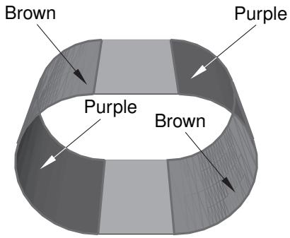

<details>
<summary>text_image</summary>

Brown
Purple
Purple
Brown
</details>

图 5：翻转一个表面。

在提示区中点击 Brown；Abaqus/CAE 将表面定义在模型中所有棕色面的一侧。

在编辑现有表面定义时，您可以通过选择 Brown 或 Purple 重新选择侧面。Brown 表示您之前用于创建表面的那侧，Purple 表示另一侧。例如，如果您先前选择了 Purple 侧来创建表面，那么在编辑期间该侧现在将显示为 Brown。

## 在内部表面上选择侧面

当您选择一个内部面来创建表面时，表面的哪一侧是模糊的。例如，图 6 中高亮显示的面可能是单元 A 的右侧，也可能是单元 B 的左侧。

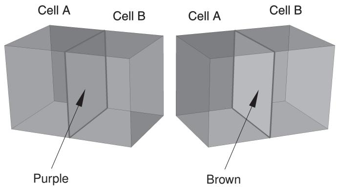  
图 6：在内部面上定义表面。

Abaqus/CAE 使用与上述相同的棕色/紫色颜色编码界面来确定您打算选择的表面的哪一侧。点击 Purple 可在单元 A 的右侧定义表面；点击 Brown 可在单元 B 的左侧定义表面。

## 从线框选择侧面

如果您正在选择一个三维线框部件实例的表面，Abaqus/CAE 会显示线框为红色，并带有图 7 中所示的箭头。

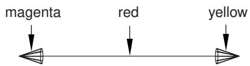

<details>
<summary>text_image</summary>

magenta
red
yellow
</details>

图 7：箭头表示三维线框的端部。

您可以选择带洋红色箭头的一端、带黄色箭头的一端，或者部件的周向表面（由红色线框表示）（见图 8）。


<details>
<summary>text_image</summary>

Choose a surface type: End (Magenta) End (Yellow) Circumferential
</details>

图 8：选择端面或周向表面。

如果线框部件是二维的，Abaqus/CAE 使用图 9 中所示的箭头来区分表面的两侧。

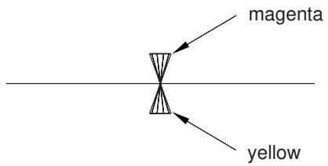

<details>
<summary>text_image</summary>

magenta
yellow
</details>

图 9：箭头表示二维线框的顶部和底部表面。

您通过选择箭头颜色来确定表面侧，如图 10 所示。

  
图 10：选择表面的侧。

Choose a side for the edges:

Magenta

Yellow

如果部件是轴对称壳，则使用箭头指示部件的内表面和外表面（见图 11）。选择选项与图 10 相同。


<details>
<summary>text_image</summary>

magenta
yellow
</details>

图 11：箭头指示轴对称壳的内表面和外表面。

在编辑在线框上创建的现有表面定义时，您可以通过选择洋红色或黄色箭头重新选择侧面。洋红色表示您之前用于创建表面的那侧，黄色表示另一侧。例如，如果您先前选择了黄色侧来创建表面，那么在编辑期间该侧现在将显示为洋红色。

## 附加信息

• 什么是表面？
• 使用集合和表面工具集
• 选择内部表面

## 使用集合和表面工具集

本节概述了您可以使用集合和表面工具集执行的各种任务，并描述了每个任务的过程。

## 本节内容：

创建、编辑、复制、重命名和删除集合与表面
创建集合
创建无序节点集
创建表面
对集合或表面执行布尔操作
编辑集合和表面
将对象（如载荷和截面）与集合和表面关联

## 创建、编辑、复制、重命名和删除集合与表面

您可以创建、编辑、重命名和删除集合或表面定义。

要创建、编辑、重命名和删除集合或表面定义，请使用以下方法之一：

• 主菜单栏中 Tools->Set 和 Tools->Surface 子菜单下列出的 Create、Edit、Copy、Rename 和 Delete 项。
Edit、Copy、Rename 和 Delete 菜单项包含子菜单，列出了当前模型中的所有集合或表面。Set 子菜单会根据您所在的模块而有所不同：在 Part 和 Property 模块中，仅列出零件集合。在 Mesh 模块中，根据上下文栏中选择的是零件还是装配，可能列出零件或装配集合。在所有其他模块中，仅列出装配集合。
集合和表面管理器。这些管理器包含与 Set 和 Surface 子菜单下列出的相同功能，但具有方便的浏览器，可显示集合和表面及其类型（例如几何体或网格）。Set 管理器在 Part 和 Property 模块中显示零件集合，在 Mesh 模块中根据上下文栏中的当前对象选择显示零件或装配集合，在所有其他模块中显示装配集合。


注意：由于特征或网格修改而变为空的集合和表面仍将出现在列表中。有关更多信息，请参阅几何集和表面的重新生成。

模型树会在任何空的集合或表面名称旁边显示一个感叹号 (!)。您也可以将光标悬停在模型树中的集合或表面名称上，以查看包含其所含项目数量的工具提示。

要显示管理器，请从主菜单栏中选择 Tools->Set->Manager 或 Tools->Surface->Manager。

您可以通过模型树复制导入的集合和表面，但无法通过 Tools->Set 和 Tools->Surface 子菜单或集合和表面管理器复制导入的集合和表面。


警告：当您删除一个集合或表面时，与该集合或表面关联的任何对象（如载荷或相互作用）将变为无效。

## 附加信息

• 管理对象

## 创建集合

集合工具集允许您创建几何集以及节点集和单元集。

当您使用 Abaqus/CAE 创建的原生零件工作时，会创建一个几何集。您可以在 Part 模块或 Property 模块中处理零件时创建零件集合。当您在 Assembly 模块中实例化该零件时，可以引用您先前创建的任何零件集合。最后，当您在与装配相关的模块（Assembly、Interaction、Load 和 Mesh）中工作时，会创建一个装配集合。有关更多信息，请参阅零件集和装配集有何不同？

此外，您可以创建零件集或装配集。当您在 Part 模块或 Property 模块中处理零件时，会创建零件集。当您在 Assembly 模块中实例化该零件时，可以引用您先前创建的任何零件集。最后，当您在与装配相关的模块（Assembly、Interaction、Load 和 Mesh）中工作时，会创建装配集。有关更多信息，请参阅零件集和装配集有何不同？。
1. 从主菜单栏中，选择 Tools->Set->Create。


## 提示：您也可以在 Set Manager 中单击 Create。

将出现 Create Set 对话框。该对话框根据当前视口中显示的部件或装配，列出您可以创建的集合类型。

2. 在对话框中：

a. 为集合输入名称。在不同部件上创建的部件集可以使用相同的名称；但是，装配集的名称必须唯一。
b. 如有必要，选择集合类型。

默认情况下，节点集总是按照节点标签的顺序进行排序。您可以打开 Make unsorted set 选项来创建一个未排序的节点集，从而更轻松地控制节点集内容。有关更多信息，请参阅创建未排序的节点集。

c. 单击 Continue。

如果您在原生部件上创建节点集或单元集，Abaqus/CAE 会自动显示网格（如果尚未显示）。如果您在部件实例或包含原生和孤立网格组件的部件上创建节点集或单元集，则必须使用 Visible Objects 工具栏中的 Show native mesh 工具来显示并选择网格原生部分中的项目。

3. 在视口中选择您想要包含在集合中的实体。


## 提示：您可以使用 Selection 工具栏来限制您在视口中可以选择的实体类型。有关更多信息，请参阅在视口中选择对象。

选择实体完成后，单击鼠标按键 2。

## 其他信息

*   什么是集合？
*   在视口中选择对象

## 创建未排序的节点集

您可以使用 Set 工具集来创建未排序的节点集。

默认情况下，节点集总是按照节点标签的顺序进行排序。您可以创建一个未排序的节点集，从而更轻松地控制节点集内容。

您可以从在 Mesh 模块中划分过网格的部件上的原生 Abaqus 节点、从孤立网格节点或从任何部件实例的节点创建未排序的节点集。

1. 从主菜单栏中，选择 Tools->Set->Create。


## 提示：您也可以在 Set Manager 中单击 Create。

将出现 Create Set 对话框。该对话框根据当前视口中显示的部件或装配，列出您可以创建的集合类型。

2. 在对话框中：

a. 为集合输入名称。在不同部件上创建的部件集可以使用相同的名称；但是，装配集的名称必须唯一。
b. 选择 Node 作为集合类型，并打开 Make unsorted set。
c. 单击 Continue。

如果您在原生部件上创建节点集，Abaqus/CAE 会自动显示网格（如果尚未显示）。如果您在部件实例或包含原生和孤立网格组件的部件上创建节点集，则必须使用 Visible Objects 工具栏中的 Show native mesh 工具来显示并选择网格原生部分中的项目。

3. 在出现的 Create Unsorted Node Set 对话框中，为集合指定节点。

使用以下任一技术：

从视口中选择节点
a. 选择以下方法之一，将选择项插入到集合定义表中：
    *   选择 Individual 以逐个选择节点。
    *   选择 Along edges 以沿着特征边选择节点。Abaqus/CAE 会为节点选择建议一个方向（由箭头指示），并提示您确认该方向。如有必要，您可以翻转方向。
    *   选择 Free 以使用在当前视口中选择对象中描述的多种常规选择方法中的任何一种来选择节点。

    单击 Add Before 或 Add After 开始进行选择。
b. 如果需要，重复上一步以添加更多节点。
    Add Before 和 Add After 按钮决定您的选择项将相对于集合定义表中当前高亮显示的行添加在何处。
c. 在提示区域中单击 Done。

    Abaqus/CAE 将显示 Create Unsorted Node Set 对话框；您集合中的部件实例和节点列在集合定义表中。

直接在表中输入节点标签
在 Set Definition 表中，使用标准的键盘和鼠标编辑技术来插入、修改或删除部件实例名称和节点标签表达式。如果您不知道模型中的部件实例名称，请使用 Query 工具集在视口中查询节点。如需特殊的表编辑选项，请按鼠标按键 3。（有关更多信息，请参阅输入表格数据。）节点标签表达式可以是以下任一种：
    *   单个节点标签；例如，5。
    *   由起始和结束节点标签（可选后跟一个增量）指定的节点范围；例如，5:10 或 5:10:2。

    选择集合定义表中的行，并打开 Highlight nodes in selected row 以查看节点选择情况。

4. 如果需要，可以根据排序表达式对集合定义表的部分或全部内容进行排序。

a. 在集合定义表中选择一行或多行。
b. 指定以下设置以对所选行的内容进行排序：
    *   排序顺序：选择 Ascending 或 Descending。
    *   局部坐标系：如果需要，选择或创建一个坐标系。
    *   在提供的字段中输入一个表达式。可以使用任何有效的 Python 表达式，引用一个或多个有效参数："Label"、"X"、"Y"、"Z"、"R"、"Th" 或 "P"。（实际的有效参数取决于所选的局部坐标系（如有），并在对话框中有所指示。）例如，简单表达式 "X" 将根据每个节点的 X 坐标对指定节点进行排序。更复杂的示例包括 "X*Y" 和 "Z if Label < 1000 else Label"。
c. 单击 Apply。所选行的内容将根据表达式和排序顺序进行排序。行本身不会被重新排序；您可以使用表中的鼠标右键菜单根据需要上下移动行。

5. 单击 OK 以确认集合定义。

Surface 工具集允许您创建几何表面或网格表面。几何表面可以由几何面和边组成；网格表面可以由单元面和边组成。

1. 从主菜单栏中，选择 Tools->Surface->Create。


## 提示：您也可以在 Surface Manager 中单击 Create。

将出现 Create Surface 对话框。该对话框列出了您正在创建的表面类型。

2. 在对话框中：

a. 为表面输入名称。在不同部件上创建的表面可以使用相同的名称；但是，装配表面的名称必须唯一。有关命名对象的信息，请参阅使用基本对话框组件。
b. 如有必要，选择表面类型。
c. 单击 Continue。

如果您在原生部件上创建网格表面，Abaqus/CAE 会自动显示网格（如果尚未显示）。

3. 在视口中选择您想要包含在表面中的实体。如果您正在创建几何表面，Abaqus/CAE 只允许您选择面和边。同样，如果您正在创建网格表面，Abaqus/CAE 只允许您选择单元面和单元边。您可以选择内部实体包含在表面中。有关更多信息，请参阅选择内部表面。要创建基于边的表面，您必须选择壳的边或单元的边。有关更多信息，请参阅什么是表面？。

4. 选择实体完成后，单击鼠标按键 2。

5. 如果您正在从原生部件创建几何表面，您必须指定所选面的侧面或所选线的端部。有关更多信息，请参阅指定区域的特定侧面或端部以及理解几何对象与物理对象之间的对应关系。

## 其他信息

*   什么是表面？
*   在视口中选择对象
*   在 Abaqus/Standard 中定义接触对
*   在 Abaqus/Explicit 中定义接触对
*   力学接触属性

## 对集合或表面执行布尔运算

您可以从 Model Tree 中选择一组集合或表面，并使用布尔运算符将它们组合成单个集合或表面。以下运算符可用：

## 并集 (Union)

使用 Union 运算符合并所选项的内容，以创建一个集合或表面。

## 交集 (Intersection)

使用 Intersection 运算符创建一个包含所有所选项共有项目的集合或表面。

## 差集 (Difference)

使用 Difference 运算符通过减法创建一个集合或表面。您必须指定“第一个”集合或表面，Abaqus/CAE 会从该集合或表面中减去其余所选项。

例如，您可以使用 Union 运算符将部件实例线性阵列中的所有顶面合并到一个表面中。

1. 从 Model Tree 中，展开与部件或装配关联的 Sets 或 Surfaces 容器。
2. 选择所有所需的集合或曲面。您可以结合使用拖动选择、[Shift] + 单击和 [Ctrl] + 单击来选择所需的集合或曲面。不能将集合与曲面组合选择。有关更多信息，请参阅拖动选择多个对象。  
3. 在模型树上单击鼠标按钮 3，并从出现的菜单中选择 Boolean（布尔运算）。Abaqus/CAE 将显示 Sets Boolean（集合布尔运算）或 Surfaces Boolean（曲面布尔运算）对话框。  
4. 在对话框中，输入新集合或曲面的名称，并选择所需的运算符。  
5. 如果选择了 Difference（差集）运算符，请单击 First set（第一个集合）或 First surface（第一个曲面）字段右侧的箭头，并指定 Abaqus/CAE 将从中减去其余选择项的集合或曲面。  
6. 单击 OK。

Abaqus/CAE 将创建新的集合或曲面，并在模型树中显示出来。

## 附加信息

• 使用集合与曲面工具集  
• 在视口内选择对象

您可以通过在视口中重新选择实体来编辑现有集合或曲面。

1. 从主菜单栏，选择 Tools->Set->Edit->set of your choice（工具->集合->编辑->选择的集合）或 Tools->Surface->Edit->surface of your choice（工具->曲面->编辑->选择的曲面）。


## 注意：

您也可以在集合管理器或曲面管理器中选择相关集合或曲面的名称后，单击 Edit（编辑）。

集合或曲面在视口中高亮显示，Abaqus/CAE 将提示您为集合重新选择对象。

2. 在视口中，重新选择要包含在集合或曲面中的实体。使用 [Shift] + 单击和 [Ctrl] + 单击来更改视口中选中的实体。


提示：您可以使用选择工具栏来限制在视口中可选择的实体类型。有关更多信息，请参阅在视口内选择对象。”

完成实体选择后，单击鼠标按钮 2。

如果您正在编辑几何集合，则只能为该集合选择几何对象。类似地，如果正在编辑节点或单元集合，则只能分别选择节点或单元。如果您正在编辑从输出数据库或包含节点和单元的输入文件导入的集合，或者使用包含节点、单元和几何的布尔并集运算符创建的集合，Abaqus/CAE 将提示您选择将要重新选择的实体类型。如果重新选择节点，Abaqus/CAE 将保留集合中任何原始单元和几何体。根据需要重复此步骤以编辑每种类型的实体。

3. 如有必要，指定要包含在曲面中的区域的侧或端，然后单击鼠标按钮 2。（有关更多信息，请参阅指定区域的特定侧或端。）

## 附加信息

• 使用集合与曲面工具集  
• 在视口内选择对象

## 关联对象（如载荷和截面）到集合和曲面

当您选择要应用对象（如载荷或截面）的区域时，可以选择以下技术：

## 在视口中高亮显示选择项

在当前视口中单击实体；例如，一个面或一组顶点。使用 [Shift] + 单击和 [Ctrl] + 单击将实体追加到您的选择中。


提示：您可以使用选择工具栏来限制可选择的实体类型。有关更多信息，请参阅在视口内选择对象。

## 集合或曲面

使用您通过集合或曲面工具集创建的现有集合或曲面。如果选择使用现有集合或曲面，将出现区域选择对话框。此对话框包含适合您正在应用的对象的集合或曲面列表。

单击提示区域中的相应按钮可以在两种技术之间切换。有关更多信息，请参阅使用集合与曲面工具集。您还可以使用选择组来加速您的选择过程。您可以将选定的实体复制到选择组中，也可以从选择组中将实体粘贴到您的选择中。有关更多信息，请参阅什么是选择组？。

## 流线工具集

流线是与流动速度矢量瞬时相切的曲线，流是一组流线，使您能够在流体流动分析中可视化速度或涡量数据。流线工具集仅在可视化模块中可用。

本章解释如何使用流线工具集创建、修改和删除流；在视口中显示或隐藏它们；以及自定义其外观的多个方面。

## 本节内容：

理解流线显示  
创建流线  
显示和隐藏流线  
自定义流线显示

## 理解流线显示

流线追踪了与节点矢量场相切的路径，流是一组流线，使您能够可视化从矢量场中特定位置发出的数据。图 1 显示了一个包含 12 条流线的示例流，显示了流体流动分析中的速度数据。


<details>
<summary>热图</summary>

| 颜色 | 速度 V, 大小 |
| --- | --- |
| 红色 | +1.375e+01 |
| 橙色 | +1.261e+01 |
| 黄橙色 | +1.146e+01 |
| 黄色 | +1.032e+01 |
| 浅绿色 | +9.170e+00 |
| 绿色 | +8.023e+00 |
| 蓝绿色 | +6.877e+00 |
| 蓝色 | +5.731e+00 |
| 青色 | +4.585e+00 |
| 浅蓝色 | +3.439e+00 |
| 蓝色 | +2.292e+00 |
| 深蓝色 | +1.146e+00 |
| 深蓝色 | +0.000e+00 |
</details>

图 1：通过歧管的流分析显示速度数据的 12 点流。

您可以通过首先定义一个耙（rake）来创建流，耙是一条线段，沿其长度指定了一系列点，这些点控制 Abaqus/CAE 显示流体流动分析流线的位置。耙放置在流体流动的感兴趣区域中；当您在视口中创建并显示流时，Abaqus/CAE 会显示与耙上点数相对应的流线数量。流线沿耙均匀分布，除非使用非平凡路径定义的耙；有关流耙定义的更多信息，请参阅创建流线。

流线形状由当前选定的流变量驱动，通常是速度或涡量。要更改当前流变量，请参阅选择流场输出变量。流线颜色由当前选定的主要变量驱动。有关自定义流线颜色选项的更多信息，请参阅自定义流线颜色。

您必须为要显示流动数据的每个部件实例单独定义流耙。Abaqus/CAE 仅为单个部件实例计算流数据，不会跨不同部件实例显示流线。

## 创建流线

流定义有两个组成部分：您想用作研究速度或涡量数据的“耙”的线段位置或路径定义，以及您想在该耙上显示流体流动数据流线的点数。您可以通过从视口中拾取节点、在对话框中输入坐标或选择会话中的某个路径定义来指定耙位置。边列表路径不能用于流定义。

您无法将流保存到输出数据库文件中。如果要保留已定义的流，请在 Abaqus/CAE 中将定义该流的过程记录为宏。有关宏的更多信息，请参阅管理宏。

1. 在可视化模块的主菜单栏中，选择 Tools->Stream->Create（工具->流线->创建）。


提示：您也可以使用可视化模块工具箱中的工具创建流。

出现 Create Stream（创建流线）对话框。

2. 如果需要，在 Name（名称）字段中为流定义指定一个自定义名称。  
3. 如果需要，增加或减少 Number of points（点数）字段中指定的点数。默认情况下，Abaqus/CAE 创建一个具有五个点的耙。  
4. 在 Specification（规格）选项中，选择 By nodes（按节点）、By coordinates（按坐标）或 By path（按路径）。  
5. 要指定流耙的位置，请执行以下操作之一：

## 直接从视口中选择节点

1. 单击


Abaqus/CAE 提示您选择第一个点。

2. 选择耙的起始节点。  
3. 选择耙的结束节点。

Abaqus/CAE 会用您的选择填充 Start（起点）和 End（终点）字段。

## 在对话框中输入坐标

1. 在 Start (X, Y, Z)（起点 (X, Y, Z)）字段中，输入耙起点的坐标。  
2. 在 End (X, Y, Z)（终点 (X, Y, Z)）字段中，输入耙终点的坐标。
## 指定路径作为流线耙

从**路径名称**列表中，选择您希望用作流线耙的路径。

6.  点击 **确定**。

Abaqus/CAE 会创建流线定义并在视口中显示它。

## 附加信息

•   显示和隐藏流线
•   自定义流线显示

## 显示和隐藏流线

您可以在当前视口中通过切换**流线管理器**中的 **显示** 复选框来单独显示或隐藏流线，也可以通过点击**全部开启**或**全部关闭**来显示或隐藏会话中的所有流线。该管理器显示会话中定义的所有流线，并指示每条流线当前是否显示。此外，您可以通过切换每条流线的**上游**或**下游**复选框来显示或隐藏其上游或下游分量。

流线管理器还显示会话中每条流线在耙上的点数。您可以直接从管理器中编辑此流线定义的点数，但在圆形路径上定义的流线或使用包含三个或更多点或节点的路径定义创建的流线除外。

## 自定义流线显示

本节描述如何使用**流线绘图选项**对话框中的设置来自定义流线的颜色、线型和箭头。

您可以通过在 Abaqus/CAE 的**可视化**模块主菜单栏中选择 **选项 > 流线** 来打开**流线绘图选项**对话框。

您在**流线绘图选项**对话框中所做的更改仅适用于当前视口中的所有活动流线。每个视口都有独立的流线选项，这使得您可以在每个视口中以不同方式显示流线。例如，您可以在一个视口中使用统一颜色显示流线，并在另一个不同的视口中使用基于当前主变量的带状等值线来显示更粗的流线。

您还可以通过编辑 Abaqus 环境文件（`abaqus_v6.env`）中的 `onCaeStartup()` 函数来控制**流线绘图选项**对话框中出现的默认设置。有关更多信息，请参阅*在环境文件中使用 Abaqus 脚本接口命令*。

## 本节内容：

自定义流线颜色
自定义流线粗细和箭头

## 自定义流线颜色

您可以调整 Abaqus/CAE 用于显示当前视口中活动流线的颜色。**流线绘图选项**对话框使您能够以以下方式显示流线：
*   沿其整个长度使用单一的、统一的颜色，
*   沿流线长度变化的连续等值线色谱，或者
*   沿流线长度变化的带状等值线色谱。

连续等值线显示没有实体色带的渐变色，而带状等值线显示多个颜色恒定的等值线间隔。流线的等值线反映当前主变量的值，并受**等值线绘图选项**对话框中指定的等值线设置的影响。有关等值线选项的更多信息，请参阅*自定义等值线图*。

为统一颜色显示选择的颜色也决定了 Abaqus/CAE 显示指示流动方向的流线箭头的颜色。有关切换箭头显示的更多信息，请参阅*自定义流线粗细和箭头*。

1.  找到**颜色**选项。在**可视化**模块主菜单栏中选择 **选项 > 流线**。**颜色**选项出现在页面顶部。
2.  要指定颜色选项，请选择 **统一颜色**、**连续等值线** 或 **带状等值线**。
3.  如果您选择 **统一颜色**，请执行以下附加步骤来选择颜色：
    1.  点击颜色样本 ( )。
        Abaqus/CAE 显示**选择颜色**对话框。
    2.  使用**选择颜色**对话框中的一种方法来选择新颜色。有关更多信息，请参阅*自定义颜色*。
    3.  点击 **确定** 以关闭**选择颜色**对话框。
        颜色样本和视口中的所有流线都会更改为所选颜色。
4.  点击 **确定** 以应用您的更改并关闭**流线绘图选项**对话框。

您可以通过更改流线粗细、添加指示流体流动方向的箭头，以及在启用箭头显示时自定义方向箭头的数量，来调整当前视口中流线的显示。Abaqus/CAE 使用**颜色**选项中选择的统一颜色显示方向箭头；有关更多信息，请参阅*自定义流线颜色*。箭头大小会随着您增加或减小流线粗细而改变。

1.  找到**样式**选项。
    在**可视化**模块主菜单栏中选择 **选项 > 流线**。**样式**选项出现在对话框底部。
2.  拖动**线粗细**滑块以使流线变细或变粗。
3.  打开 **跨流线统一粗细** 以使用统一粗细显示当前视口中的所有流线。
4.  打开 **显示方向箭头** 以沿流线显示方向箭头。
5.  拖动**每条流线上近似箭头数**滑块以增加或减少每条流线上显示的方向箭头数量。
6.  点击 **确定** 以应用您的更改并关闭**流线绘图选项**对话框。

## 虚拟拓扑工具集

虚拟拓扑工具集允许您在网格划分部件或部件实例时忽略某些细节，例如非常小的面和边。

## 本节内容：

什么是虚拟拓扑？
我能用虚拟拓扑工具集做什么？
我可以对包含虚拟拓扑的部件或部件实例做什么？
如果我可以用虚拟拓扑，为什么还要修复部件？
基于几何参数创建虚拟拓扑
使用虚拟拓扑工具集

## 什么是虚拟拓扑？

在某些情况下，部件或部件实例包含一些细节，例如非常小的面和边。这些特征对于组件的精密加工和包装设计可能很重要；然而，如果它们对所研究问题的力学影响很小，那么在数值分析中它们可能是多余的。实际上，这些小细节可能会过度约束网格的生成，导致质量差的网格或过高的网格密度。在某些情况下，如果小面和边出现在需要细网格的感兴趣区域，它们可能很重要。但在大多数情况下，这些细节对分析没有任何贡献，并且您希望 Abaqus/CAE 在网格生成过程和分析过程中忽略它们。

模型的拓扑结构是其由面、边和顶点组成的结构。虚拟拓扑工具集允许您操纵此拓扑结构，并为网格划分目的创建一个简化形式。这种简化形式与真实模型不同，称为“虚拟拓扑”。通过操纵产生的面和边被称为“虚拟的”。类似地，包含虚拟面和边的部件和部件实例也被称为“虚拟的”。

虚拟拓扑工具集允许您通过将小面与相邻面合并，或通过将小边与相邻边合并来移除小细节。要合并的面或边可以直接指定，或者您可以选择要忽略的边和顶点。

例如，图 1 展示了一个活塞，其中在混合曲面相交处存在一些小细节。这些细节导致网格密集，并包含一些细长的条状单元。您可以使用虚拟拓扑来忽略这些小细节，从而得到如图 2 所示的质量更好、更均匀的网格。

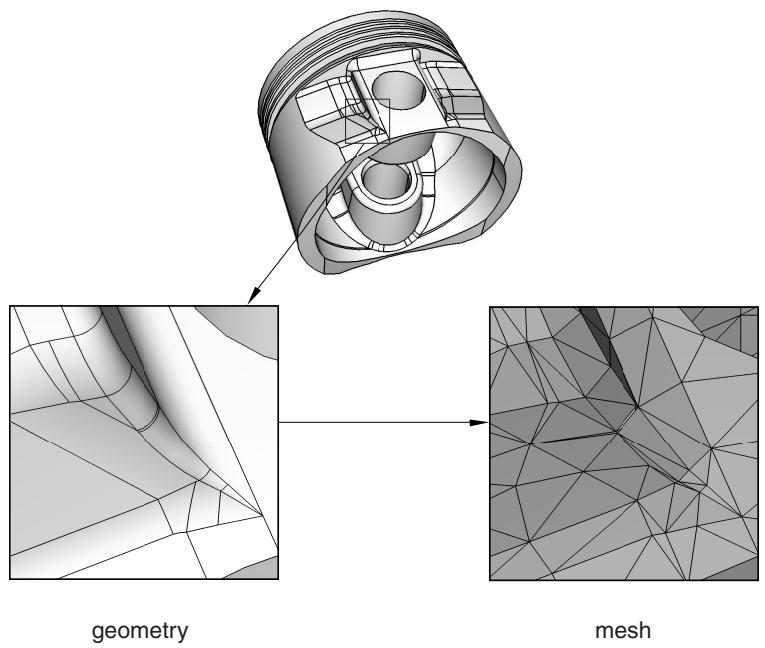

<details>
<summary>流程图</summary>

```mermaid
graph LR
  A["输入圆柱体"] --> B["几何"]
  B --> C["网格"]
```
</details>

图 1：小细节导致包含细长条状单元的密集网格。


<details>
<summary>流程图</summary>

```mermaid
graph LR
  A["输入部件"] --> B["几何状态"]
  B --> C["网格状态"]
```
</details>

图 2：使用虚拟拓扑忽略小细节可以得到质量更好、更均匀的网格。

Abaqus/CAE 以处理标准几何体的相同方式处理虚拟拓扑。例如，您可以执行以下操作：
*   对虚拟拓扑进行分区。
*   在虚拟拓扑上使用**几何编辑**工具集。
*   在虚拟拓扑上使用**部件**模块工具，例如拉伸、扫掠和混合。

例如，图 3 显示了图 2 中包含虚拟拓扑的活塞在**部件**模块中使用拉伸切割工具进行切割后的状态。


<details>
<summary>自然图像</summary>

一个具有曲面和中心开孔的机械部件的 3D CAD 模型（无文本或符号）
</details>

图 3：包含虚拟拓扑的部件被切割。


## 注意：

当您将包含虚拟拓扑的部件导出为 ACIS 文件时，Abaqus/CAE 会从导出的部件中移除虚拟拓扑。

## 虚拟拓扑工具集可以做什么？

虚拟拓扑工具集仅在网格 (Mesh) 模块中可用。您可以对部件应用虚拟拓扑，也可以对装配中的独立实例应用虚拟拓扑。虚拟拓扑工具集允许您执行以下操作：

## 合并面或边

您可以选择两个或多个面或边，Abaqus/CAE 会将它们合并为一个虚拟面或虚拟边。如果您合并两个面，则当 Abaqus 生成网格时，这两个面之间的任何边都将被忽略。类似地，如果您合并两条边，则当网格生成时，这两条边之间的任何顶点都将被忽略。

## 忽略边或顶点

您可以选择 Abaqus/CAE 将忽略的边或顶点。忽略两个面之间的边等同于合并这两个面。类似地，忽略两条边之间的顶点等同于合并这两条边；但是，当您有大量面和边需要合并时，您会发现合并工具很有用。使用忽略来创建虚拟拓扑与使用合并创建虚拟拓扑具有相同的效果——当 Abaqus 生成网格时，被忽略的边或顶点将不被考虑。

## 自动合并或忽略实体

您可以指定一组几何参数，Abaqus/CAE 将使用这些参数来创建虚拟拓扑。您还可以选择要应用所选参数的区域——面、部件、部件实例或整个装配。虚拟拓扑参数位于“创建虚拟拓扑” (Create Virtual Topology) 对话框中，该对话框还包含可用于测量和高亮显示实体以及预览虚拟拓扑的工具。完成后，Abaqus/CAE 会创建一个包含所有更改的单个虚拟拓扑特征。

## 恢复实体

与其删除或抑制可能包含您想要忽略的实体以及一些您需要使用的实体的虚拟拓扑特征，不如使用“恢复实体” (Restore Entities) 工具来高亮显示所有已被忽略的实体，并选择您希望重新激活的实体。

为了保持网格质量，要合并的边和面应具有接近 180° 的小夹角。建议的角度在 120° 到 240° 之间。您可以使用角度方法来仅选择具有小夹角的相邻面。更多信息，请参阅 *使用角度和特征边方法选择多个对象*。如果某些边或顶点处的夹角超出此范围，Abaqus/CAE 会显示警告，并允许您从选择中移除这些边或顶点。如果您选择保留锐边，则生成的网格可能不会位于一个光滑的表面上。图 1 展示了一个在非光滑虚拟表面上的网格。

  
图 1: 当您对锐边和顶点应用虚拟拓扑时，生成的网格可能会显著偏离原始表面。

您只能在边由两个相邻面共享或嵌入一个面中时忽略该边。例如，您不能忽略壳的自由边或由三个面共享的边，如图 2 所示。


<details>
<summary>text_image</summary>

A
B
B
边 A 可以
被忽略
边 B 不能
被忽略
</details>

图 2: 某些边不能被忽略。

类似地，您只能在顶点由两条相邻边共享或嵌入一个面中时忽略该顶点。例如，您不能忽略线自由端的顶点或线与面相交处的顶点，如图 3 所示。

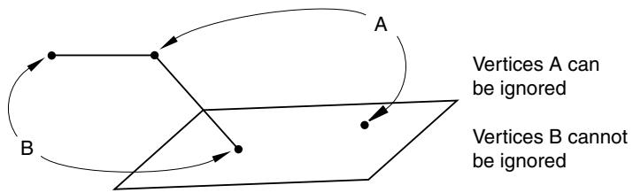

<details>
<summary>text_image</summary>

A
顶点 A 可以
被忽略
顶点 B 不能
被忽略
</details>

图 3: 某些顶点不能被忽略。

Abaqus/CAE 不支持在包含虚拟拓扑（合并面或合并边）的区域上使用所有的网格划分技术。具体来说，Abaqus/CAE 不支持以下情况：

• 使用中轴算法 (medial axis algorithm) 进行四边形或以四边形为主的单元的二维自由网格划分。
• 使用中轴算法进行三维扫掠网格划分。
• 如果要进行网格划分的区域不受四个角约束，则进行二维结构网格划分。
• 如果要进行网格划分的区域不受六个面约束，则进行三维结构网格划分。

如果您需要对依赖实例应用虚拟拓扑，您可以创建原始部件的副本，然后创建该副本的独立实例。然后，您可以用新的独立实例替换依赖实例，并对替换后的实例应用虚拟拓扑。更多信息，请参阅 *什么是依赖和独立部件实例的区别？*。

您或许可以通过将目标侧的多个面合并成一个面来使部件可进行扫掠网格划分；更多信息，请参阅 *三维实体的扫掠网格划分*。然而，如果您将许多面合并成一个面，网格划分过程可能会变慢，并且生成的网格可能不可接受。如果您尝试将大量面合并成一个面，Abaqus/CAE 会显示警告，并允许您更改选择。

Abaqus/CAE 根据您选择中面的累积数量来计算正在合并的面数。例如，如果您尝试合并两个面，而每个面已经包含五个合并的面，则面的累积数量将是十个。

## 如何处理包含虚拟拓扑的部件或部件实例？

Abaqus/CAE 将虚拟拓扑存储为相应部件或装配的特征。因此，您可以使用模型树 (Model Tree) 来重命名、抑制、恢复和删除虚拟拓扑特征。您不能编辑虚拟拓扑特征。您可以恢复使用虚拟拓扑忽略或合并的实体。恢复实体会在模型树中创建更多新的虚拟拓扑特征——原始虚拟拓扑特征保持不变。

您可以创建包含虚拟面和边的集合 (sets) 和面 (surfaces)。此外，如果现有集合或面包含您忽略的边或顶点，则该边或顶点将从集合或面中移除。类似地，如果现有集合或面包含您合并的面或边，则 Abaqus/CAE 会用新的合并面和边替换原始的面和边。这仅在您合并的所有面和边都是同一集合的成员时成立。

虚拟拓扑不会被导出；例如，如果您将包含虚拟拓扑的装配导出为 ACIS 文件，Abaqus/CAE 会从导出的模型中移除虚拟拓扑。当您在装配 (Assembly) 模块中创建装配时，您无法合并或切割包含虚拟拓扑的部件实例。

## 如果可以使用虚拟拓扑，为什么还要修复部件？

引入虚拟拓扑是创建干净、形状良好的网格的一种便捷方法。重点是忽略那些在分析结果不是特别重要的区域中导致单元扭曲的小几何细节。虚拟拓扑放宽了网格必须符合每条边或每个顶点的要求，并允许您获得细节更少的更简单模型。但是，虚拟拓扑不会改变部件实例的基本几何形状。

当您合并两个面以形成虚拟面时，Abaqus/CAE 会更新显示以反映被忽略的边。然而，为了形成新虚拟面的基础，Abaqus/CAE 会保持被合并面的基本几何形状。网格中的节点将放置在基本几何形状上。因此，粗网格将在虚拟面上插值，而细网格将趋向于收敛到被合并面的基本几何形状。虚拟拓扑允许网格定义由网格参数（如种子大小）控制，并有助于将网格从几何约束（如小面）中解放出来。

相比之下，您使用几何编辑工具集 (Geometry Edit toolset) 来纠正部件从第三方应用程序导入时通常引入的小缺陷。您使用几何编辑工具集来纠正基本几何形状；例如，缝合小间隙并删除自相交的面并重新创建有效的替换面。您还可以使用几何编辑工具集来移除冗余的拓扑，例如多余的顶点和边。几何编辑工具集会修改实际的几何形状，并且几何限制会约束您如何应用修复工具；例如，只有当顶点位于两条边共同的曲线上时，您才能移除多余的顶点。

当您导出虚拟部件实例时，虚拟拓扑会丢失，因为虚拟面、边或顶点不是真实的几何形状。例如，虚拟面是对基本合并面集合的抽象引用。
因此，如果您需要从零件中移除细小特征并希望在导出零件时保留所做的更改，应使用几何编辑工具集。

## 基于几何参数创建虚拟拓扑

您可以使用“创建虚拟拓扑”对话框中的控件，根据一组几何参数自动忽略不必要的模型细节。您可以控制以下参数，以确定 Abaqus/CAE 将哪些特征与周围几何体合并：

• 边长度  
• 面尺寸  
• 面纵横比  
• 面拐角角度  
• 表示小阶梯特征的面的厚度  
• 用于合并相邻边或面的拐角角度  
• 用于将圆角（倒角或圆弧角）与周围面合并的角度和半径控制  
• 冗余实体  

当所选参数被超过时，Abaqus/CAE 会尝试通过合并相邻的边和面来简化模型。

冗余实体参数只能开启或关闭——没有其他设置。冗余实体不会增加模型的几何形状。冗余实体包括：

• 位于现有面内部的边  
• 将本应连续的平面或曲面分隔开的边  
• 位于面内部的顶点  
• 将两条直边或光滑曲线分隔开，但未连接新边的顶点  

例如，图 1 包含四条冗余边和一个冗余顶点。虚拟拓扑会将这些边与周围面合并，并将该顶点与周围边合并，最终只留下基础的盒子。

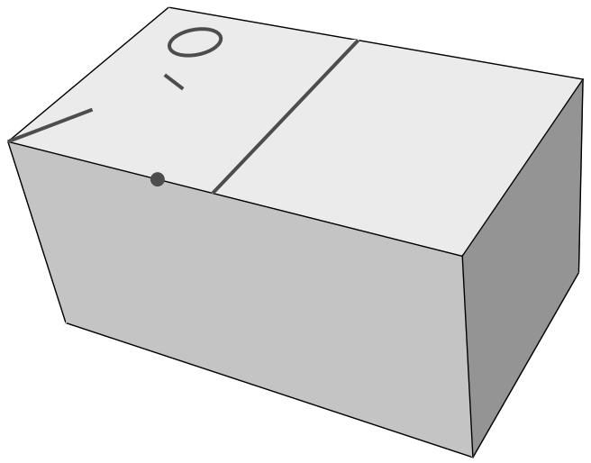

<details>
<summary>natural_image</summary>

Simple 3D diagram of a rectangular box with a top-left corner and a small circle on top, no text or symbols present.
</details>

图 1：冗余边和顶点。

请注意，冗余实体可能定义了 Abaqus/CAE 内其他工具使用的区域。例如，图 1 中的圆边可能定义了用于施加压力载荷的面。“创建虚拟拓扑”对话框中的控件完全基于几何参数；您应仔细审查使用虚拟拓扑所做的更改，确保未更改 Abaqus/CAE 模型定义其他部分所需的任何实体。

默认情况下，对话框中的所有虚拟拓扑参数均处于活动状态，如图 2 所示。边长度、面尺寸、阶梯特征和圆角半径的默认值是根据所选零件或零件实例的大小计算的；其他准则无量纲，并提供了合适的默认值。您可以关闭希望虚拟拓扑忽略的实体的控件。例如，如果存在一些对模型至关重要的小面，请关闭“小于以下值的面”控件。


<details>
<summary>text_image</summary>

Create Virtual Topology
Candidate Entities to Merge
✓ Edges shorter than: 0.18
✓ Faces smaller than: 0.16
✓ Faces with aspect ratio larger than: 10
✓ Faces with corner angle smaller than: 10
✓ Faces representing stair features thinner than: 0.036
✓ Redundant edges and vertices:
Curvature Controls for Combined Entities
Angular tolerance for sharp edges/vertices (deviation from 180 degrees):
● Use defaults (30 degrees) ○ Specify:
Note: Sharp edges/vertices will be retained, except for stair features.
✓ Keep blends if the following two conditions are met:
Subtended angle larger than: 60
Radius smaller than: 0.9
Tip...
Create	Preview	Defaults	Dismiss
</details>

图 2：“创建虚拟拓扑”对话框。

为了帮助您审查潜在的更改，对话框中的每个参数都包含工具，您可以使用它们在视口中测量和高亮显示满足相应几何准则的实体。如果高亮显示的实体与其他准则或模型要求冲突，则可能不会被更改。要使用这些工具，请单击“创建虚拟拓扑”对话框中每个参数右侧的图标。测量实体工具允许您测量视口中的实体。Abaqus/CAE 会在消息区域显示测量值；您可以利用这些测量值为模型调整参数限制。高亮显示工具（如“高亮显示短边”）指示满足当前参数设置的实体。对于“创建虚拟拓扑”对话框中的“待合并候选实体”区域，高亮显示工具指示可能与周围几何体合并的实体。

高亮显示工具不会考虑参数组合或模型中可能阻止高亮显示的特征与周围几何体合并的任何其他因素。例如，小阶梯特征必须满足两个参数才能通过自动虚拟拓扑进行替换：

• 阶梯高度或厚度必须小于指定值。  
• 分隔阶梯面与周围面的对角线与 $180^\circ$ 的偏差角度必须大于为尖角边/顶点指定的角度容差（下面将在曲率控制部分解释）。

图 3 显示了构成阶梯特征的角度和面尺寸。如果使用高亮显示工具查看潜在的面，Abaqus/CAE 在选择要高亮显示的面时不会考虑角度测量值。  


<details>
<summary>text_image</summary>

Diagram showing a 3D rectangular block with an inset highlighting a geometric shape labeled 'x' and angles α and β.
</details>

图 3：面厚度（阶梯高度）x，以及角度 α 和 β 构成了一个阶梯特征。

“创建虚拟拓扑”对话框中的“合并实体的曲率控制”区域用于合并拐角角度和圆角实体。曲率控制参数和高亮显示工具指示使用当前设置将被保留（而非被虚拟拓扑替换）的边、顶点或圆角。以下示例说明了 Abaqus/CAE 如何解释用于拐角角度和圆角的曲率控制参数。

## 尖角边/顶点的角度容差（偏离180度）

拐角角度是模型中形成边或顶点的任意两个相邻面或边之间的夹角。如果拐角角度足够接近 $180^\circ$，可以被视为平直，Abaqus/CAE 会考虑使用虚拟拓扑来忽略相关的边或顶点。默认参数设置认为，如果角度偏离 $180^\circ$ 小于 $30^\circ$，则为平直。图 4 显示了合并面如何影响生成的网格。上部的两张图使用了较小的角度，因此生成的网格是几何体的近似值。如下面两张图所示，增加合并面之间的角度会导致近似效果逐渐变差。拐角角度参数也适用于二维零件边之间的面拐角角度，以及形成小阶梯特征的角度。


提示：要保留所有拐角角度，请指定 $0^\circ$ 的偏差。

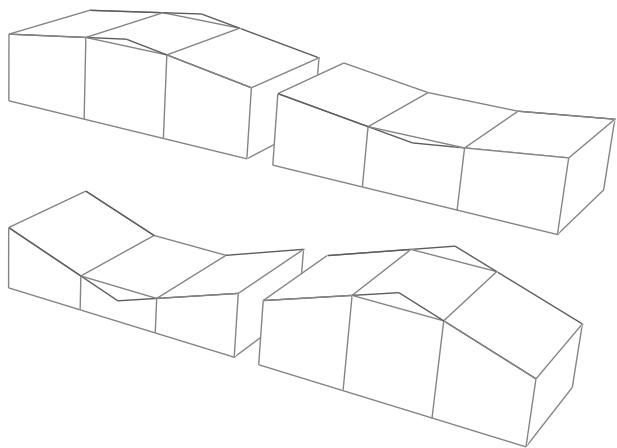

<details>
<summary>natural_image</summary>

Three isometric line drawings of 3D rectangular blocks with no text or symbols
</details>

图 4：随着被虚拟拓扑替换的拐角角度（峰值和谷值）进一步偏离180°，网格与几何体之间的对应关系逐渐变差。

## 保留具有大张角和小半径的圆角

圆角——圆弧或倒角——必须满足两个参数才能避免被虚拟拓扑考虑。这是因为仅凭张角或圆角半径之一就可能形成一个网格能很好近似的特征，但将大角度与小半径结合会导致近似效果很差。图 5 说明了如果两个不同的圆角角度与周围几何体合并，网格将如何近似它们。两个零件的圆角半径相同，但上图中较大的张角导致拐角处的网格出现凹凸。

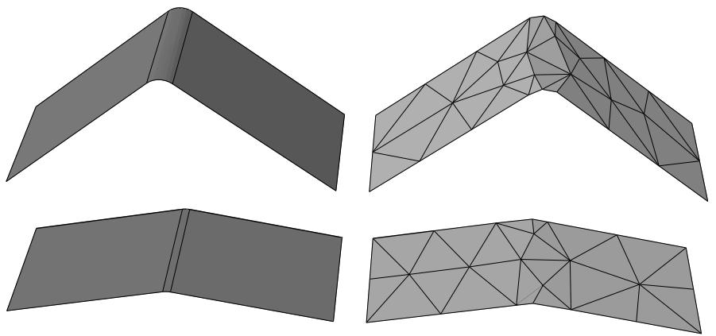

<details>
<summary>natural_image</summary>

Four 3D geometric diagrams showing different top-down views of a folded structure with triangular mesh patterns (no text or symbols)
</details>

图 5：大的圆角角度（上图）在被虚拟拓扑替换时，可能导致网格出现凹凸。

在图 6 中，两个零件的张角相同，但上图中较小的圆角半径导致网格质量较差。


<details>
<summary>自然图像</summary>
四个显示不同角度和三角结构的3D几何图形，无文字或符号。
</details>

图6：较小的圆角半径（上图）当被虚拟拓扑替换时，可能会产生质量较差的网格。

关于如何使用 Create Virtual Topology 对话框的详细说明，请参阅自动创建虚拟拓扑。

## 使用虚拟拓扑工具集

本节说明如何在网格划分前使用虚拟拓扑工具集移除零件或零件实例的细小特征，以及如何在不删除虚拟拓扑的情况下恢复这些特征。

## 本节内容：

自动创建虚拟拓扑  
合并面  
合并边  
忽略边和顶点  
恢复被虚拟拓扑替换的实体

## 自动创建虚拟拓扑

您可以通过主菜单栏选择 Tools->Virtual Topology->Automatic Create 来打开 Create Virtual Topology 对话框。使用对话框中的控件来合并面、合并边或忽略模型中的实体。

1.  从上下文栏的 Object 字段中，选择一个零件或装配体。
2.  从主菜单栏中，选择 Tools->Virtual Topology->Automatic Create。


提示：您也可以使用模块工具箱中的  工具自动创建虚拟拓扑，该工具位于 Mesh 模块工具箱中。

3.  选择需要考虑虚拟拓扑的目标区域。

默认的选择方法是零件或零件实例，具体取决于您在第1步中选择的是零件还是装配体。如果需要，您可以在提示区更改选择方法以选择面。

您可以结合使用拖选、[Shift] + 单击和 [Ctrl] + 单击来选择装配体中的多个零件实例，或零件/装配体中的多个面。您还可以使用角度法或面曲率法选择多个面。更多信息，请参阅在当前视口中选择对象。

Abaqus/CAE 将打开 Create Virtual Topology 对话框。

4.  关闭您不希望 Abaqus/CAE 在创建虚拟拓扑时考虑的任何标准。

5.  如果需要，点击每个包含尺寸参数的控件旁边的 TTrT 工具，以测量视口中的实体。

按照提示区的指示进行选择。您可以在一次操作中测量多条边的长度或多个面的面积。完成后，在提示区点击 Done（如果需要）。

Abaqus/CAE 将在消息区显示测量值。如果您选择了多个实体，Abaqus/CAE 将显示平均值、最小值和最大值。使用这些测量值来验证或调整对话框中的虚拟拓扑控件。

6.  点击对话框右侧的高亮工具，查看根据相应参数可能被虚拟拓扑替换的实体。例如，该工具会高亮显示目标区域中小于当前短边长度设置的边。如果高亮显示的实体是模型的组成部分，或者合并它们会违反曲率控制参数，则它们将不会被替换。


## 注意：

用于曲率控制（角和平滑过渡）的高亮工具显示的是根据当前设置将被保留的实体。

7.  当您对控制设置感到满意时，点击 Preview 高亮显示所有将被虚拟拓扑替换的实体。


## 注意：

对于大型零件或装配体，或任何包含大量待替换项的选择集，预览功能可能需要一些时间。或者，您可以使用第6步中提到的高亮工具快速查看符合参数设置的实体。

8.  点击 Create，根据所选的参数设置创建虚拟拓扑。

Abaqus/CAE 将高亮显示在您当前选择下将变得冗余的所有边或顶点，并提示您选择是否也要将它们合并。Abaqus/CAE 会在模型树中创建一个 Auto virtual topology 特征来合并或忽略所选实体。

9.  如果第3步中选择的目标区域仍然有效，您可以重复步骤4到8，在相同的区域上创建更多虚拟拓扑，或者点击 Dismiss 关闭 Create Virtual Topology 对话框。

如果所选的目标区域因虚拟拓扑而失效，Abaqus/CAE 将关闭 Create Virtual Topology 对话框，并返回到步骤3让您选择新的目标区域。

您可以使用模型树，通过删除或抑制 Auto virtual topology 对象来恢复所选实体；您也可以使用 Restore Entities 工具来恢复部分实体，同时保留其余的虚拟拓扑特征。有关恢复单个实体的更多信息，请参阅恢复被虚拟拓扑替换的实体。

## 合并面

您可以通过主菜单栏选择 Tools->Virtual Topology->Combine Faces 来合并选定的面。在网格生成期间，Abaqus/CAE 会将合并后的面视为单个面，并忽略任何被移除的边和顶点。

1.  从上下文栏的 Object 字段中，选择一个零件或装配体。
2.  从主菜单栏中，选择 Tools->Virtual Topology->Combine Faces。


提示：您也可以使用 Mesh 模块工具箱中的  工具来合并面。

3.  选择您想要合并的面。

您可以结合使用拖选、[Shift] + 单击、[Ctrl] + 单击和角度法来选择多个面进行合并。更多信息，请参阅在当前视口中选择对象。


提示：如果您无法选择所需的面，可以使用选择工具栏更改选择行为。更多信息，请参阅使用选择选项。

4.  如果所选面任何边的端点处的顶点也可以被忽略，Abaqus/CAE 会高亮显示这些顶点并询问您是否要将它们包含在选择中。点击 Yes 以忽略高亮的顶点。点击 No 以保留高亮的顶点。

Abaqus/CAE 会将选定的面和顶点合并。您可以使用模型树，通过删除或抑制虚拟拓扑特征来恢复选定的面和顶点；您也可以使用 Restore Entities 工具选择要恢复的面和顶点，同时保留其余的虚拟拓扑特征。有关恢复单个实体的更多信息，请参阅恢复被虚拟拓扑替换的实体。

您可以通过主菜单栏选择 Tools->Virtual Topology->Combine Edges 来合并选定的边。在网格生成期间，Abaqus/CAE 会将合并后的边视为单条边，并忽略任何被移除的顶点。

1.  从上下文栏的 Object 字段中，选择一个零件或装配体。
2.  从主菜单栏中，选择 Tools->Virtual Topology->Combine Edges。


$\nsupseteq$

3.  选择您想要合并的边。

您可以结合使用拖选、[Shift] + 单击、[Ctrl] + 单击和角度法来选择多条边进行合并。更多信息，请参阅在当前视口中选择对象。


提示：如果您无法选择所需的边，可以使用选择工具栏更改选择行为。更多信息，请参阅使用选择选项。

Abaqus/CAE 会将选定的边合并。您可以使用模型树或 Restore Entities 工具来恢复选定的边。有关恢复单个实体的更多信息，请参阅恢复被虚拟拓扑替换的实体。

## 忽略边和顶点

您可以通过主菜单栏选择 Tools->Virtual Topology->Ignore Entities 来忽略选定的边和顶点。Abaqus/CAE 会从装配体中移除这些选定实体，并在生成网格时忽略它们。

1.  从上下文栏的 Object 字段中，选择一个零件或装配体。
2.  从主菜单栏中，选择 Tools->Virtual Topology->Ignore Entities。


提示：您也可以使用 Mesh 模块工具箱中的  工具来忽略边和顶点。

3.  选择您想要忽略的边和顶点的组合。
你可以通过拖拽选择、[Shift] + 单击、[Ctrl] + 单击以及角度方法的组合来选择多个要删除的边或顶点。更多详细信息，请参阅在当前视口中选择对象。


提示：如果无法选择所需的边或顶点，可以使用选择工具栏来更改选择行为。更多详细信息，请参阅使用选择选项。

4. 如果所选边端点的顶点也可以忽略，Abaqus/CAE 会高亮显示这些顶点并询问是否要将它们包含在选择中。单击“是”以忽略高亮显示的顶点。单击“否”以保留高亮显示的顶点。

Abaqus/CAE 会忽略所选的边和顶点。你可以使用模型树或“恢复实体”工具来恢复所选的实体。有关恢复单个实体的更多信息，请参阅恢复被虚拟拓扑替换的实体。

## 恢复被虚拟拓扑替换的实体

你可以从主菜单栏中选择“工具”->“虚拟拓扑”->“恢复实体”，来恢复先前被虚拟拓扑替换的边和顶点。使用恢复工具允许你选择单个实体进行恢复，而不是删除或抑制虚拟拓扑特征（那样会恢复所有实体）。

1.  从上下文栏的“对象”字段中，选择一个部件或装配体。
2.  从主菜单栏中，选择“工具”->“虚拟拓扑”->“恢复实体”。


提示：你也可以使用位于网格模块工具箱中的工具来恢复实体。

Abaqus/CAE 会用蓝色高亮显示所有已被虚拟拓扑替换的实体。

3.  选择你希望恢复的实体组合。

你可以使用拖拽选择、[Shift] + 单击和 [Ctrl] + 单击的组合来选择多个要恢复的实体。更多详细信息，请参阅在当前视口中选择对象。

4.  单击鼠标按钮 2，或在提示区中单击“完成”。

Abaqus/CAE 会在模型树中创建一个“恢复被忽略的几何”特征来恢复所选的实体——虚拟拓扑特征不会被更改。如果还有更多可以恢复的实体，Abaqus/CAE 会继续执行选择过程。

5.  当你完成实体恢复后，单击鼠标按钮 2 或提示区中的取消按钮。

## 自定义模型显示

本部分说明如何自定义模型显示。

## 本节内容：

自定义几何和网格显示
对几何和网格元素进行颜色编码
使用显示组显示模型的子集
叠加多个图表
剖切模型

本章说明如何自定义几何和网格显示。

可视化模块有其自己的一组选项来自定义模型外观；更多信息，请参阅

自定义图表显示和自定义视口注释。

## 本节内容：

使用几何和网格显示选项
选择渲染样式
控制边可见性
控制曲线细化
定义网格特征边
控制子结构部件的透明度
控制梁截面显示
控制壳厚度显示
控制基准显示
控制单个坐标系的显示
控制参考点显示
自定义网格显示
控制模型光照
控制实例可见性
控制属性显示
保存显示选项设置

## 使用几何和网格显示选项

你可以使用“部件显示选项”、“装配体显示选项”和“ODB 显示选项”菜单来自定义几何和网格显示。

根据你当前使用的模块，Abaqus/CAE 会为你提供以下菜单选项之一来自定义几何和网格显示：

## 视图->部件显示选项

在几何相关模块中，你可以使用此菜单项来控制几何渲染样式、边可见性、曲线细化、单元和节点标签，以及各种类型基准几何的可见性。

## 视图->装配体显示选项

在装配体相关模块中，你可以使用此菜单项来控制装配体渲染样式、边可见性，以及各种类型基准几何的可见性。你也可以用它来控制同一装配体相关模块中网格、单元和节点标签、部件实例、载荷、边界条件和预定义场的显示。

## 视图->ODB 显示选项

此菜单项仅适用于可视化模块。更多信息，请参阅自定义图表显示。

你可以通过从主菜单栏选择“文件”->“保存选项”来保存当前的显示选项，并将其应用于未来的 Abaqus/CAE 会话。更多信息，请参阅保存显示选项设置。

---

[上一节：查看结果](viewing-results.md) · [下一节：自定义模型显示](customizing-model-display.md)
