# 查看结果

## 查看结果

本部分描述如何使用可视化模块（也作为 Abaqus/Viewer 单独授权）来查看您的模型和分析结果。

## 本节内容:

可视化模块基础  
查看诊断输出  
选择要绘制的模型数据和分析结果  
绘制未变形和变形形状  
绘制分析结果的等值线图  
以符号形式绘制分析结果  
绘制材料方向  
X–Y 图  
沿路径查看结果  
动画化绘图  
在可视化模块中查询模型  
探测模型  
计算线性化应力  
查看层叠铺层图  
生成表格数据报告  
自定义绘图显示  
自定义视口注释

## 可视化模块基础

您可以使用可视化模块查看您的模型和分析结果。

## 本节内容:

理解可视化模块的作用  
进入和退出可视化模块  
理解绘图状态和绘图自定义  
理解可视化模块中的工具集  
理解可视化模块性能

## 理解可视化模块的作用

可视化模块提供有限元模型和结果的图形显示。它从当前模型数据库或模型获取模型信息，从输出数据库获取模型和结果信息。您可以通过修改分析步模块中的输出请求来控制将哪些信息放入输出数据库。（有关更多信息，请参见什么是输出请求？）您可以使用等值线图或符号图查看来自模型数据库的数据；您可以通过生成本节描述的任何一种绘图来查看来自输出数据库的模型和结果数据。


## 未变形形状

未变形形状绘图显示模型的初始形状或基态。

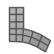

## 变形形状

变形形状绘图根据节点变量（如位移）的值显示模型的形状。

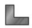

## 等值线图

对于输出数据库，等值线图显示在分析的特定步骤和帧上某个分析变量（如应力或应变）的值。对于当前模型数据库中的模型，等值线图显示模型选定步骤上的载荷、预定义场或相互作用的值。可视化模块将这些值表示为模型上自定义颜色的线、色带或着色面。

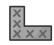

## 符号图

对于输出数据库，符号图显示在分析的特定步骤和帧上某个特定向量或张量变量的大小和方向。对于当前模型数据库中的模型，符号图显示模型特定步骤上的载荷、预定义场或相互作用的大小和方向。可视化模块在模型上的位置将这些值表示为符号（例如，箭头）。


## 材料方向

材料方向绘图在分析的特定步骤和帧上显示模型中单元的材料方向。可视化模块在单元积分点处将材料方向表示为材料方向三向轴。


## X–Y 数据

X–Y 图是一个变量相对于另一个变量的二维图形。


## 时间历程动画

时间历程动画快速连续地显示一系列绘图，产生类似电影的效果。各个绘图根据实际结果值随时间的变化而变化。


## 比例因子动画

比例因子动画快速连续地显示一系列绘图，产生类似电影的效果。各个绘图根据应用于特定变形的比例因子而变化。


## 谐波动画

谐波动画快速连续地显示一系列绘图，产生类似电影的效果。各个绘图根据应用于所显示复数结果的角度而变化。

附加功能包括：

## 可视化诊断信息

诊断信息帮助您确定模型中不收敛的原因。您可以查看分析每个阶段的信息，并使用 Abaqus/CAE 在视口中突出显示模型上的问题区域。

## 理解探测

当您在模型或模型绘图上移动光标时，探测会显示模型数据和分析结果；探测 X–Y 图会显示图形点的坐标。您可以将此信息写入文件。

## 沿路径绘制结果

路径是您通过指定模型中一系列点来定义的线。您可以以 X–Y 图的形式查看沿路径的结果。

## 应力线性化

应力线性化是将通过截面的应力分离为恒定的膜应力和线性弯曲应力。您将截面指定为通过模型的路径，可视化模块以 X–Y 图的形式显示线性化应力。

## 切割模型

视图切割允许您切片通过模型，以便您可以可视化模型的内部或选定截面。您可以定义平面、圆柱形或球形视图切割。此外，您可以沿恒定的等值线变量值定义视图切割。

## X–Y 和场输出报告

X–Y 报告是 X 和 Y 数据值的表格列表；场输出报告是场输出值的表格列表。

## 可视化复合材料铺层中的铺层

铺层叠层图是复合材料铺层中铺层的图形表示。该图像显示了铺层中的各个铺层及其每个铺层的详细信息，如纤维方向、厚度和参考平面。您也可以在创建复合材料铺层时在属性模块中创建铺层叠层图。

## 绘图自定义

可视化模块提供了许多选项，可用于自定义您的绘图。

## 进入和退出可视化模块

您可以通过单击上下文栏中模块列表中的"可视化"，在 Abaqus/CAE 会话期间随时进入可视化模块。主菜单栏上将出现"结果"、"绘图"、"动画"、"报告"、"选项"和"工具"菜单；并且当前视口的标题栏将显示当前输出数据库的名称（如果存在）。

您也可以通过打开现有的输出数据库来进入可视化模块。要打开输出数据库，请从主菜单栏选择"文件->打开"（有关更多信息，请参见打开模型数据库或输出数据库），或者在作业管理器中选定作业有可用结果时单击"结果"。当您使用这些方法之一进入可视化模块时，Abaqus/CAE 会在当前视口中显示来自该输出数据库的模型绘图。

要退出可视化模块，请从模块列表中选择任何其他模块，或者通过从主菜单栏选择"文件->退出"来结束会话。当您结束会话时，Abaqus/CAE 会关闭所有文件和窗口。Abaqus 仅在会话持续时间内保存您的绘图选项。

## 理解绘图状态和绘图自定义

本节描述如何通过选择绘图自定义选项来自定义绘图的外观。

## 本节内容:

什么是绘图状态？  
激活绘图状态  
自定义您的绘图  
自定义多个视口

## 什么是绘图状态？

可视化模块提供了几种不同类型的绘图，用于查看您的模型和结果。这些绘图类型包括：

未变形形状  
变形形状  
等值线图  
符号图  
材料方向  
历程或 X–Y 数据  
时间历程动画  
比例因子动画  
谐波动画

每种绘图类型对应一种绘图状态。绘图状态很重要，因为可视化模块提供的一些自定义选项仅适用于特定的绘图状态。

## 附加信息

• 激活绘图状态  
• 自定义您的绘图

## 激活绘图状态

绘图状态结合了所有活动的自定义选项，以在视口中生成绘图。某些选项对所有绘图类型通用，某些选项仅在您选择叠加变形和未变形模型形状时应用，还有一些选项特定于当前绘图类型。您通过生成相应类型的绘图来进入特定的绘图状态。例如，如果您生成未变形绘图，则当前视口将处于未变形绘图状态。视口的绘图状态会持续存在，Abaqus/CAE 会根据您对自定义选项所做的任何更改来更新它，直到您在该视口中生成其他状态的绘图为止。如果您创建多个视口，每个视口可以包含不同的绘图状态。此外，您可以通过为单个绘图类型同时绘制未变形和变形形状，或在视口中显示多个绘图类型，来选择在单个视口中允许多个绘图状态。
## 其他信息

•   自定义您的绘图

## 自定义您的绘图

可视化（Visualization）模块提供了众多自定义选项，可通过主菜单栏中的视口（Viewport）、选项（Options）和视图（View）菜单访问。这些选项分为三类：

## 与绘图状态相关的选项

绘图类型（Plot type）选项仅影响特定的绘图状态（plot state）。这些是独立的选项，分别影响等值线图（contour）、符号图（symbol）、材料方向图（material orientation plots）、X-Y 曲线（X–Y curves）、X-Y 图表（X–Y graphs）、时间历程动画（time history animations）、比例因子动画（scale factor animations）以及谐波动画（harmonic animations）。

## 与绘图状态无关的选项

与绘图状态无关的选项（Plot state–independent options）是那些影响所有绘图的公共选项。这些是通用选项，用于控制视点（viewpoint）、图形（graphics）、单项着色（individual item coloring）、显示体（display body）外观以及诸如绘图图例（plot legends）、模型标签（model labels）和显示模型标题与状态的文本块（text blocks）等一般特征。

## 叠加选项

叠加选项（Superimpose options）是一组特殊的与绘图状态无关的选项，仅当您选择将未变形图（undeformed plot）叠加在变形图（deformed plot）、等值线图、符号图或材料方向图上时才会影响未变形图状态。这些选项允许您控制许多常见的自定义选项，以便在同时显示两种形状时区分未变形图和变形图。

与绘图状态相关的选项影响诸如等值线间隔、限制和颜色（例如，等值线图的色谱或材料方向图的坐标轴颜色）等绘图属性。您可以使用与该状态关联的选项，分别控制每个绘图状态的这些属性。例如，要选择等值线类型，必须使用“等值线绘图选项”（Contour plot options）。为此，您可以从主菜单栏选择 Options->Contour。或者，您可以使用工具箱中的“等值线选项”（Contour Options）工具。这些选项工具提供了对与绘图状态相关和与绘图状态无关的自定义选项的快速访问。

与绘图状态相关的选项仅影响关联状态下的绘图。如果您从“材料方向绘图选项”（material orientation plot options）对话框中选择坐标轴颜色，这些颜色将只影响材料方向图。如果当前视口中存在材料方向图，当您在“材料方向绘图选项”对话框中点击“应用”（Apply）或“确定”（OK）时，您会看到更改的效果。但是，如果当前视口不包含材料方向图，在您生成一个之前，您不会看到更改的效果。

与绘图状态无关的选项影响所有绘图状态下的绘图。例如，如果您从主菜单栏选择 Viewport->Viewport Annotation Options 来抑制视图三轴（view triad）的显示，那么视图三轴将在所有绘图中被抑制。“通用绘图选项”（Common Plot Options）对话框中的设置也是与绘图状态无关的；当您在此对话框中更改渲染样式（render style）时，新的渲染样式将用于所有绘图。

叠加选项影响您在某个绘图状态中将未变形图叠加到变形图上时的未变形图。例如，您可以独立设置渲染样式、边显示（edge display）和填充颜色（fill color）；并且可以在同时显示未变形和变形形状符号图时，在两者之间应用偏移。

从主菜单栏选择 File->Save Options 可保存您的与绘图状态相关、与绘图状态无关以及叠加自定义选项。保存自定义选项允许您将它们应用于后续的 Abaqus/CAE 会话。更多信息，请参阅“保存显示选项设置”（Saving your display options settings）。有关可视化模块中可用绘图自定义选项的更多信息，请参阅“自定义绘图显示”（Customizing plot display）。

## 自定义多个视口

当您创建新视口时，它最初会继承当前视口的自定义选项。例如，如果您为当前视口中的绘图设置了“填充”（Filled）渲染样式，然后创建一个新视口，则新视口中后续的绘图将以填充渲染样式显示。新视口继承当前视口的绘图状态——直到您更改自定义选项、绘图状态或输出数据库之前，新视口看起来与创建时处于活动状态的视口完全相同。

新视口建立后，其绘图状态和任何后续自定义设置默认与其他视口无关。多个视口可以各自处于不同的绘图状态；如果您使用多个视口，必须首先将特定视口指定为当前视口才能更改其显示。您应用的自定义选择仅影响当前视口。当您将某个视口指定为当前视口时，选项对话框会刷新以显示与该视口关联的选项状态。有关使用视口的更多信息，请参阅“使用视口”（Working with viewports）。

您还可以在会话中链接多个视口，以同时操纵多个对象并在不同视口中显示相同的绘图状态和相同的绘图选项。更多信息，请参阅“链接视口以便进行视图操作”（Linking viewports for view manipulation）。

## 其他信息

•   激活绘图状态

## 理解可视化模块中的工具集

可视化（Visualization）模块中的工具集（Toolsets）为数据显示提供了额外的控制。

除非另有说明，本节描述的工具集仅用于对来自输出数据库（output database）的模型和结果数据进行后处理；仅有部分选定工具集可用于来自当前模型数据库（current model database）的模型数据。

以下工具集在可视化模块中可用：

•   **颜色编码工具集** 允许您自定义单个单元的边和填充颜色。更多信息，请参阅“在可视化模块中为节点或单元着色”（Coloring nodes or elements in the Visualization module）。
•   **坐标系工具集** 允许您创建用于后处理的局部坐标系（local coordinate systems）。更多信息，请参阅“在后处理期间创建坐标系”（Creating coordinate systems during postprocessing）。
•   **创建集合工具集** 允许您在后处理期间创建节点集（node sets）和单元集（element sets）。更多信息，请参阅“在后处理期间创建节点集和单元集”（Creating node and element sets during postprocessing）。
•   **显示组工具集** 允许您从模型或输出数据库中有选择地绘制一个或多个项目。更多信息，请参阅“使用显示组显示模型的子集”（Using display groups to display subsets of your model）。
•   **场输出工具集** 允许您对输出数据库中可用的场输出（field output）执行操作。更多信息，请参阅“创建和保存新的场输出”（Creating and saving new field output）。
•   **自由体工具集** 允许您创建和删除自由体切割（free body cuts），在视口中显示或隐藏它们，并自定义其外观的若干方面。更多信息，请参阅“自由体工具集”（The Free Body toolset）。
•   **作业诊断工具集** 允许您访问在 Abaqus/Standard 分析作业期间写入输出数据库的诊断信息。更多信息，请参阅“查看诊断输出”（Viewing diagnostic output）。
•   **路径工具集** 允许您在模型中指定一条路径（path），沿该路径可以获取和查看 X-Y 数据。更多信息，请参阅“沿路径查看结果”（Viewing results along a path）。
•   **查询工具集** 允许您获取有关模型的信息，无论是来自当前模型数据库的数据还是来自输出数据库的数据。更多信息，请参阅“在可视化模块中查询模型”（Querying the model in the Visualization module）。
•   **流线工具集** 允许您显示流线（streamlines）以研究流体流动分析中的速度或涡量（vorticity）。更多信息，请参阅“流线工具集”（The Stream toolset）。
•   **视图切割工具集** 允许您创建穿过模型的切割，以便您可以可视化模型的内部或选定部分。此功能可用于来自当前模型数据库或输出数据库的模型数据。更多信息，请参阅“切割模型”（Cutting through a model）。
•   **XY 数据工具集** 允许您创建和操作 X-Y 数据对象（X–Y data objects）。更多信息，请参阅“X-Y 绘图”（X–Y plotting）。

## 理解可视化模块的性能

通常，可视化模块中后处理和图形结果显示的速度对于大多数模型来说都非常令人满意。然而，通常需要在高性能水平和详细的结果绘图之间取得平衡。

根据您的后处理需求，您可能希望以牺牲性能为代价来修改默认显示选项。有许多可用选项可能会影响图形显示的速度。

为了最大化可视化模块的性能，我们建议如下：

•   在后处理期间将结果缓存在内存中，以加快屏幕上图像的生成速度。请参阅“理解结果缓存”（Understanding results caching）。
•   尽可能使用纹理映射等值线方法（texture-mapped contour method）。同样，避免使用纹理映射方法不支持的显示选项：线型等值线（line-type contours）、等值线边（contour edges）、CAXA 或 SAXA 单元，或围绕质心收缩单元（shrinking elements about their centroid）。如果使用此类显示选项，Abaqus/CAE 将覆盖用户对纹理映射等值线的设置，并改用较慢的细分方法（tessellated method）。请参阅“理解等值线如何渲染”（Understanding how contours are rendered）。
谨慎选择要显示的模型标签和符号。绘制的模型实体越多，屏幕刷新所需时间就越长。这也适用于单元边。参见 控制模型实体的显示。  
• 使用较高的结果平均阈值。结果越连续，等值线显示速度越快。参见 理解结果值平均。  
使用状态场输出变量，而不是基于结果值创建显示组，以获得高性能的时间历史动画。Abaqus/CAE 在显示每个结果帧时都会重新计算基于结果的显示组，因此使用此类显示组会降低动画性能。状态场输出变量允许您从模型图中移除符合基于结果失效准则的单元。参见 选择状态场输出变量。  
• 不要使用远程显示。Abaqus/CAE 的此配置不受支持；其使用完全由用户自行决定。使用远程显示永远无法实现性能优化。

在某些情况下，由于您机器上的物理内存限制，针对非常大的模型进行基于单元的结果绘图时，性能可能无法达到最优。增加物理内存或退出其他占用内存的应用程序有助于恢复最佳性能。

## 查看诊断输出

Abaqus/CAE 提供了一个可视化的诊断工具，帮助您理解作业的收敛行为。您可以使用诊断输出来评估分析结果的质量，或定位模型中收敛问题的来源。

本章解释如何在 Abaqus/CAE 中定位和使用诊断输出。

## 本节内容：
- 理解作业诊断  
- 生成诊断信息  
- 解释诊断信息  
- 访问诊断信息

## 理解作业诊断

Abaqus 在尝试分析您的模型时，会将诊断信息写入输出数据库，同时也会写入您请求的任何其他输出。

输出数据库中的诊断信息是写入消息文件和状态文件的诊断信息的一个子集。您可以使用“作业诊断”对话框来访问在 Abaqus/Standard 或 Abaqus/Explicit 分析作业期间写入输出数据库的诊断信息。

对于 Abaqus/Standard 分析，诊断信息可用于作业以及每个分析步、增量步、尝试和迭代。图 1 显示了 Abaqus/Standard 分析迭代的接触诊断。您可以选择要查看的接触信息类型，并可以选择一列来对表格数据进行排序。

  
图 1：作业诊断对话框。

对于 Abaqus/Explicit 分析，诊断信息可用于作业以及每个分析步。由于典型的 Abaqus/Explicit 分析包含大量增量步，诊断信息仅针对摘要（心跳）增量步以及生成诊断信息的任何其他增量步进行记录。摘要增量步之间的间隔取决于 CPU 时间和分析中指定的输出量。诊断数据会写入状态文件和输出数据库。

您可以使用“作业诊断”对话框来确定分析何时结束以及是否发出了任何警告。如果在作业期间发出了警告，您可以查看这些警告并评估您的结果是否可能受到影响。“作业诊断”对话框还提供更详细的信息，以解释大多数警告和错误的含义或可能原因，并且如果警告与节点或单元相关，还可以帮助您在视口中的模型上定位它们。

您可以在分析期间或分析结束后查看诊断信息。但是，“作业诊断”对话框不会自动更新。如果您在分析运行时查看诊断信息，您必须随着分析的进展关闭并重新打开输出数据库，才能显示任何新的诊断信息。

## 生成诊断信息

Abaqus 在分析作业期间生成诊断信息；Abaqus/CAE 读取存储在输出数据库中的诊断信息。因此，您可以使用“作业诊断”对话框来查看仅针对在输出数据库中生成信息的分析过程的收敛信息。作业诊断信息会为以下 Abaqus/Standard 分析过程存储在输出数据库中：

• 热-力耦合 (Coupled temp-displacement)  
• 地应力平衡 (Geostatic)  
• 土体 (Soils)  
• 静力，通用 (Static, General)  
• 静力，线性摄动 (Static, Linear perturbation)  
• 静力，Riks (Static, Riks)  
• 粘性 (Visco)

其他 Abaqus/Standard 分析过程的诊断信息位于消息文件中，无法在 Abaqus/CAE 中查看。

对于所有 Abaqus/Explicit 分析过程，诊断信息在 Abaqus/CAE 中均可用。退火过程不生成任何诊断数据，因此不会为退火步显示诊断信息。

默认情况下，对于 Abaqus/Standard 和 Abaqus/Explicit 中受支持的分析过程，详细的诊断信息会保存到输出数据库。如果您不希望包含诊断信息，请使用关键词编辑器 (Keywords Editor) 编辑输入文件，在模型数据中添加以下行：

```txt
*OUTPUT, DIAGNOSTICS=NO
```

您也可以使用关键词编辑器，通过为关键词 \*DIAGNOSTICS 添加一行或多行并指定所需的参数值，来更改 Abaqus/Explicit 的默认诊断输出参数。

有关使用关键词编辑器的更多信息，请参见 将不受支持的关键词添加到您的 Abaqus/CAE 模型。

## 解释诊断信息

本节描述“作业诊断”对话框中的各个页面（可用的页面取决于分析类型和结果）。

在典型的 Abaqus/Standard 分析中，载荷以增量步的形式施加到模型上，Abaqus 会尝试计算模型对每个增量载荷的响应。Abaqus 通过执行迭代来进一步细分响应计算，以逼近某个增量步的结果。如果迭代没有逼近解（收敛），Abaqus 会停止并尝试再次求解，这次使用更小的载荷增量。如果 Abaqus 进行了太多次尝试仍未找到解，分析将结束。有关载荷增量的更多信息，请参见 分析求解与控制。

在 Abaqus/Explicit 分析中，增量划分基于大量微小的时步增量。时步增量的大小是根据模型中单元的尺寸估算的稳定时间增量大小确定的。Abaqus/Explicit 使用中心差分时间积分规则来积分运动方程，因此在每个增量步中不需要多次尝试和迭代。

查看诊断信息可以帮助您确定收敛问题的原因，以便您可以对模型进行必要的修正。即使在达到收敛解时，诊断信息也能指出潜在问题和改进领域。通过对可用诊断信息的适当解释，您可以改进模型以获得符合您分析意图的结果。

## 本节内容：
- 诊断摘要  
- 增量划分  
- 警告和错误  
- 残差  
- 接触  
- 单元  
- 其他

## 诊断摘要

“作业诊断”对话框中的“摘要”页面始终可用。摘要包括作业历史树中当前高亮项的属性，以及对话框其他页面中可用的诊断信息指示。对于 Abaqus/Standard 分析，每个作业、分析步、增量步、尝试和迭代所显示的信息，或对于 Abaqus/Explicit 分析，每个作业、分析步和增量步所显示的信息各不相同，从作业到迭代，信息变得越来越具体。

## 作业

当您首次打开“作业诊断”对话框时，作业项在作业历史树中高亮显示，并且“摘要”页面可见。显示作业名称和状态以及分析代码和版本。对于 Abaqus/Explicit 作业，还会显示 Abaqus/Explicit 精度（单精度或双精度）以及用于并行作业执行的域数量。如果存在警告或错误，还会显示其各自总数。

## 分析步

每个分析步的摘要显示分析步名称、分析步编号、分析过程以及该分析步中的警告数量（如果有）。根据分析过程的不同，摘要中可能还会显示其他信息作为分析步摘要的一部分。例如，通用非线性分析步的摘要还将包括已完成的分析步时间、已完成的增量步数量、所使用的时步增量方法（自动或固定）、分析步期间是否考虑了几何非线性，以及每个增量步开始时用于前一个状态的外推类型。更多信息请参见 分析步模块。
## 增量

每个增量的摘要显示增量编号以及该增量内的警告数量（如有）。对于 Abaqus/Standard 分析，还会显示尝试次数。增量摘要也会指示收敛状态；如果增量已收敛，则会显示增量大小和已完成的步长时长。

## 尝试

在 Abaqus/Standard 分析中，每次尝试的摘要会显示尝试编号、尝试大小、警告数量（如有）以及迭代次数。严重不连续迭代和平衡迭代会分别列出，并附有总迭代次数。如果 Abaqus 无法找到解，它会缩减增量大小并开始新的尝试；如果 Abaqus 执行了缩减，尝试摘要会指出缩减的原因。Abaqus/Explicit 分析中不存在尝试。

## 迭代

在 Abaqus/Standard 分析中，迭代摘要会显示收敛状态。如果迭代未收敛，摘要会指示其他页面（警告、残差、接触和单元），这些页面提供关于未满足收敛准则的详细信息。Abaqus/Explicit 分析中不存在迭代。

## 附加信息

• 查看诊断输出  
• 解读诊断信息  
• 关于收敛与时间积分准则

## 增量控制

作业诊断对话框中的“增量控制”页面显示 Abaqus 在分析过程中使用的增量控制设置和最终采用的增量方案。仅当在作业历史树中选中某个步骤时，才会显示增量控制页面。

状态表的内容取决于您查看的是 Abaqus/Standard 还是 Abaqus/Explicit 分析步骤的诊断信息。对于 Abaqus/Standard 步骤，该表显示每个增量，以及尝试次数、严重不连续和平衡迭代次数、总迭代次数、步长时长和增量大小。对于 Abaqus/Explicit 步骤，该表显示所有汇总增量以及记录了诊断信息的任何附加增量。每个增量还会列出关键单元、该单元的稳定时间增量、已用步长时长、总时间和动能。有关 Abaqus/Explicit 增量控制诊断的更多信息，请参阅显式动态分析。

如果您选择一列数据并单击“绘制所选列”，Abaqus/CAE 会创建一个 X-Y 图，其中 X 轴为增量编号（第一列），Y 轴为所选列。


## 注意：

您无法绘制关键单元编号。

## 附加信息

• 查看诊断输出  
• 使用步骤编辑器

## 警告和错误

作业诊断对话框中的“警告”和“错误”页面均显示分析过程中遇到的非预期情况的详细信息。警告包含可能导致分析结果可疑的情况信息。错误包含导致 Abaqus 提前终止分析的情况信息。

“警告”页面的内容取决于作业历史树中选中的项目；如果选中作业本身，则“警告”页面会显示为整个作业保存到输出数据库中的所有警告。如果您在作业历史树中选中某个步骤、增量、尝试或迭代，Abaqus/CAE 仅显示与所选项目相关的警告信息。“错误”页面仅在选中作业项目时可用；它显示为整个作业保存到输出数据库中的所有错误信息。


## 注意：

只有 Abaqus/Standard 和 Abaqus/Explicit 写入消息和状态文件中的警告和错误的一个子集会被保存到输出数据库中，以便通过作业诊断对话框访问。

每个“警告”或“错误”页面都包含一个“摘要”表，该表简洁地描述了与您在作业历史树中选中的项目相关的所有问题。如果存在多种问题类型，您可以根据共同的“问题类别”过滤问题列表。

“警告”和“错误”页面的“详细信息”区域显示与“摘要”表中所选项目对应的更多信息。根据您选择的警告或错误类型，Abaqus/CAE 会显示一段陈述或一个提供问题详细信息的表格。如果“详细信息”区域显示包含节点和单元的表格信息，您可以切换“在视口中高亮显示选择”，并选择项目以在当前视口中查看它们。

图 1 显示了 Abaqus/Standard 分析步骤的“警告”页面；第一个警告发生在步骤上，其余警告指示了它们发生的增量编号。在此例中，“详细信息”部分包含数值奇异性的耦合释放变化。

  
图 1：“警告”页面。

## 附加信息

• 查看诊断输出  
• 显式动态分析  
• 关于收敛与时间积分准则  
• 过约束检查  
• Abaqus/Standard 中接触建模的常见困难

## 残差

作业诊断对话框中的“残差”页面显示有关 Abaqus/Standard 用于确定迭代是否已产生平衡解的量的信息。

残差表示作用于模型的内力和外力之间的差值。如果残差很小，Abaqus 就认为该迭代已收敛。用于判断解是否收敛的容差非常重要。容差必须足够小以提供准确的解，但又必须足够大以便在合理的迭代次数内获得解。在接受迭代收敛之前，Abaqus 还要求对主求解变量和约束方程兼容性误差的修正也必须很小。

当平衡迭代不收敛时，在最终迭代期间出现最大残差的节点通常是开始寻找问题的最佳位置。有许多条件可能导致平衡迭代不收敛；诊断问题根源需要一定的经验。

残差信息（包括每次迭代中的最大残差值）以表格形式汇总在包含残差诊断的每次尝试中。您在“方程”和“变量”字段中的选择控制表中的数据。您可以通过选择“绘制所选列”来绘制表中的列。当您找到有问题的迭代后，在作业历史树中选中它。然后，您可以从该迭代的“残差”页面中选择项目，并单击“在视口中高亮显示选择”以在当前视口中查看相关区域。

## 附加信息

• 查看诊断输出  
• 通用求解控制  
• 直接线性方程求解器  
• 求解非线性问题  
• 关于收敛与时间积分准则

## 接触

作业诊断对话框中的“接触”页面显示模型中接触状态发生变化的区域信息，这些变化阻止了 Abaqus 接受 Abaqus/Standard 步骤的解。“接触”页面也可以指示诊断信息，例如初始接触过盈量和 Abaqus/Explicit 步骤的调整。

Abaqus/Standard 接触信息可用于作业历史树中后缀为 (SDI)（严重不连续迭代）的任何迭代。接触信息也可能在其他迭代中可用，当接触影响分析时，例如存在粘滑摩擦行为。使用接触信息来定位模型中 Abaqus 无法建立正确条件的区域。您可能需要编辑接触控制来解决接触问题。有关更多信息，请参阅自定义接触控制。

接触信息（包括每次迭代中的问题总数）以表格形式汇总在包含接触诊断的每次尝试中。您在“描述”字段中的选择控制表中的数据，您可以通过选择“绘制所选列”来绘制表中的列。当您找到有问题的迭代后，在作业历史树中选中它。然后，您可以从该迭代的“接触”页面中选择项目，并单击“在视口中高亮显示选择”以在当前视口中查看相关区域。单击列标题可对迭代的“详细信息”字段中的信息进行排序。

对于 Abaqus/Explicit 步骤，接触摘要可能包括诊断信息，例如初始过盈量、未解决的初始过盈量和初始接触调整的数量。您在“描述”字段中的选择控制表中的数据。例如，如果您选择“初始过盈量”或“未解决的初始过盈量”，该表会列出过盈的节点和单元、节点穿透的单元面以及过盈量。您可以从“详细信息”字段中选择项目，并单击“在视口中高亮显示选择”以在当前视口中查看接触节点和单元。
## 附加信息

• 自定义接触控制  
• 查看诊断输出  
• 关于收敛性与时间积分标准  
• Abaqus/Standard 分析中的接触诊断  
• Abaqus/Standard 中接触建模的常见困难

## 单元

作业诊断对话框中的**单元**页面显示模型中存在问题的区域信息，这些区域的单元和材料点计算可能阻止 Abaqus 为 Abaqus/Standard 分析步找到收敛的解。Abaqus/Explicit 则会显示关键单元的信息——即具有最低稳定时间增量极限的单元。


## 注意：

只有 Abaqus/Standard 和 Abaqus/Explicit 写入消息文件和状态文件的单元和材料点诊断信息的一个子集可以通过作业诊断对话框访问。

勾选 **在视口中高亮显示选择** 以在当前视口中定位单元。您在**单元诊断**和**详细信息**字段中的选择将决定 Abaqus/CAE 将高亮显示的单元。

## 附加信息

• 查看诊断输出  
• 关于收敛性与时间积分标准  
• Abaqus/Standard 中接触建模的常见困难

## 其他

作业诊断对话框中的**其他**页面仅在您从作业历史记录树中为 Abaqus/Standard 分析选择一个分析步时才会出现。它显示用于分析的矩阵求解器信息以及网格中的特征单元长度信息。根据过程类型，还会提供其他相关信息，例如模型的质量和质心。这些参考信息可以帮助您确定问题的可能原因或严重程度。例如，如果总质量或质心不正确，则**属性**模块中的材料定义、截面或截面分配可能存在问题。

## 附加信息

• 查看诊断输出  
• 关于收敛性与时间积分标准  
• Abaqus/Standard 中接触建模的常见困难

## 访问诊断信息

您可以使用作业诊断对话框访问 Abaqus 在分析作业期间写入输出数据库的诊断信息。

1. 从**可视化**模块的主菜单栏中，选择**工具->作业诊断**。

   作业诊断对话框随即出现。

2. 单击作业历史记录树中的“+”符号以展开树，查看作业历史记录中的分析步、增量、尝试和迭代。
3. 单击作业历史记录树中的某个项目以将其高亮显示。

   Abaqus/CAE 会在对话框右侧显示附加选项卡，包含与所选项目相关的诊断信息。

4. 单击对话框右侧的选项卡。Abaqus/CAE 会显示与树中所选项目对应的各种类型的诊断信息。以下各节描述了每个选项卡页面中可用的信息：

   诊断摘要
   警告与错误
   残差
   接触
   单元
   其他

5. 单击**关闭**以关闭作业诊断对话框。

Abaqus/CAE 从当前模型数据库获取模型数据，并从输出数据库获取模型数据和分析结果。要生成未变形图，结果不必可用；在这种情况下，来自数据检查运行的输出数据库信息就足够了。

本章说明如何选择用于显示的模型数据和分析结果。

## 本节内容：

从输出数据库选择结果  
从当前模型数据库选择结果  
选择结果步骤与帧  
自定义结果中步骤和帧的显示  
选择要显示的场输出变量  
选择结果选项  
创建并保存新的场输出变量  
后处理期间创建坐标系  
后处理期间创建节点和单元集

## 从输出数据库选择结果

Abaqus/CAE 从输出数据库读取分析结果。

输出数据库结果由您在分析过程中保存为场输出变量和历程输出变量的内容组成。例如，如果您每10个增量后将数据写入输出数据库的场输出部分，那么现在您只能选择10个增量间隔处的结果。这些增量间隔称为帧。

除了您已保存的分析结果，您还可以对输出数据库的场输出进行操作以创建新的结果。您可以将输出数据库场输出变量以及您创建的场输出变量的值显示为变形图、云图、符号图或X–Y图；显示为沿模型路径获得的X–Y数据；通过探测任何模型图或X–Y图；或以表格报告的形式。此外，您可以根据场输出值显示模型的子集，并且可以根据这些值对模型的一部分进行颜色编码。

您可以将输出数据库历程输出值显示为X–Y图。

使用主菜单栏上的**结果**菜单访问影响结果的选项；提供以下菜单项：

• **分析步/帧**：控制 Abaqus/CAE 获取结果的分析步和帧。
• **活动分析步/帧**：控制 Abaqus/CAE 在逐帧遍历结果、动画显示和绘制X–Y图时所显示的分析步和帧的子集。
• **截面点**：控制哪些截面点为积分点变量提供结果。
• **场输出**：**场输出**对话框包含以下选项卡：

   - **主变量**：控制 Abaqus/CAE 显示结果所针对的变量以及（如果适用）不变量或分量。
     **变形变量**：控制 Abaqus/CAE 用于显示变形模型形状的变量。
   - **符号变量**：控制 Abaqus/CAE 用于符号图的向量或张量变量，以及可选的分量。
   - **状态变量**：控制根据指定的基于结果的失效准则从模型图中移除单元。

• **历程输出**：选择用于X–Y绘图的历程输出。

• **选项**：**结果选项**对话框包含以下选项卡：

   **计算**：显示场输出或不连续性，控制基于单元的场输出结果的平均化，以及控制区域边界处结果的计算。
   **转换**：将坐标系转换应用于场输出结果。
   **复数形式**：控制 Abaqus/CAE 显示复数结果的数值形式。
   **缓存**：控制在后处理期间是否将分析结果缓存到内存中，以及应多久检查一次输出数据库是否有更新结果。

## 附加信息

• 打开模型数据库或输出数据库  
• 选择结果步骤与帧  
• 自定义结果中步骤和帧的显示  
• 选择要显示的场输出变量  
• 选择结果选项  
• 创建并保存新的场输出变量

## 从当前模型数据库选择结果

Abaqus/CAE 可以从当前模型数据库中的任意模型读取选定数据。

当您在**可视化**模块中选择一个模型时，Abaqus/CAE 会使该模型中指定的载荷、预定义场、边界条件和相互作用的子集可用于选择作为场输出变量。一旦选定，您就可以在分析的特定步骤中绘制所选项目的云图或符号图。Abaqus/CAE 为模型数据库中的每个步骤创建一个虚拟帧。

只有您在模型中可以定义的载荷、预定义场、边界条件和相互作用的子集可供可视化；并且本节中的属性只有在其传播状态为**在此步骤中创建**、**从前一步骤传播**或**在此步骤中修改**时才能显示。以下属性可以在**可视化**模块的云图或符号图中显示：

## 支持的载荷

除非另有说明，以下载荷对于除用户自定义分布以外的所有分布都支持显示。Abaqus/CAE 在**可视化**模块中显示载荷时，不考虑与载荷定义相关的任何幅值数据。Abaqus/CAE 在每个可在当前步骤中显示的载荷名称前显示 (L)。

• 集中力  
• 弯矩  
• 集中电荷  
• 集中热流率  
• 表面电荷  
• 集中浓度流率  
• 表面热流率（除总热流外的所有分布）  
• 表面浓度流率  
• 压强载荷（除总力外的所有分布）

如果您使用用户指定的坐标系定义了载荷，则修改后的方向也会在**可视化**模块中体现。Abaqus/CAE 还会自定义显示任何使用表达式场作为其自定义分布的载荷；不支持显示具有映射场的载荷。
## 预定义场

Abaqus/CAE 会在当前步骤中可用于显示的每个预定义场名称前显示 (P)。

• 温度（除“来自结果或输出数据库文件”的分布外的所有分布，且仅限“截面恒定”变化类型）
• 速度（仅限平移速度分量）

如果您使用表达式场或映射场定义了预定义场，自定义分布也会在可视化（Visualization）模块中得到体现。

## 边界条件

Abaqus/CAE 会在当前步骤中可用于显示的每个边界条件名称前显示 (B)。对于包含自由度的边界条件，例如位移/旋转，您可以在选择该边界条件后选择要显示的单个自由度。适用的各个可显示分量如下括号内所示。

您可以显示任何支持分布参数的边界条件的数据：

• 位移/旋转（平移和旋转变位）
• 速度/角速度（平移和角速度）
• 加速度/角加速度（平移和角加速度）
• 流体入口/出口
• 流体壁面
• 温度
• 孔隙压力
• 电势
• 归一化浓度
• 声压
• 连接器材料流

## 交互作用

Abaqus/CAE 会在当前步骤中可用于显示的每个交互作用名称前显示 (I)。表面膜条件（膜系数和汇温度）是唯一受支持的交互作用。

## 附加信息

• 打开模型数据库或输出数据库
• 选择结果步骤和帧
• 自定义结果中步骤和帧的显示
• 选择要显示的场输出
• 选择结果选项
• 创建并保存新的场输出

## 选择结果步骤和帧

您可以控制 Abaqus/CAE 从输出数据库获取模型数据和结果所使用的步骤和帧。

您可以使用“步骤/帧”(Step/Frame) 对话框选择特定的步骤和帧，也可以使用上下文栏中提供的控件逐步浏览帧。如果启用了视口链接，您可以在视口之间链接帧显示。更多信息，请参阅链接视口。


注意：如果您正在可视化模块中显示来自当前模型数据库的模型数据，您可以使用“步骤/帧”(Step/Frame) 对话框选择特定的步骤，但帧控件将被禁用。模型数据库数据不包含单独的帧。

## 本节内容：

选择特定的结果步骤和帧
逐步浏览帧

## 选择特定的结果步骤和帧

您可以选择 Abaqus 从输出数据库获取模型数据和结果所使用的特定步骤和帧，也可以选择 Abaqus 从当前模型数据库中的模型获取模型数据所使用的特定步骤。

在输出数据库中，可用的步骤和帧包括已保存分析结果的那些；在模型数据库中，所有步骤均可用于数据显示。要查看您在 Abaqus/CAE 会话期间创建的任何场输出变量（如有），必须选择“结果”(Result)->“步骤/帧”(Step/Frame)->“会话步骤”(Session Step)。要查看分析中定义的任何参数化形状变化（如有），必须选择“结果”(Result)->“步骤/帧”(Step/Frame)->“步骤 0”(Step 0)。

可以打开一个仍在进行中的分析的输出数据库。随着分析向完成推进，每次关闭然后重新打开“步骤/帧”(Step/Frame) 对话框时，已完成的步骤和帧列表都会更新。

有关逐步浏览结果帧的信息，请参阅逐步浏览帧。

1.  定位“步骤/帧”(Step/Frame) 选项。
    从主菜单栏中，选择“结果”(Result)->“步骤/帧”(Step/Frame)。将出现“步骤/帧”(Step/Frame) 对话框。
    对话框的“步骤”(Step) 部分列出了可用的步骤，如果选择了输出数据库，对话框的“帧”(Frame) 部分会列出当前输出数据库的可用帧。

    

## 注：

您也可以通过单击“场输出”(Field Output) 对话框中的 来访问这些选项。

2.  从“步骤”(Step) 列表中，单击要显示的步骤。
    所选步骤将高亮显示，Abaqus/CAE 会刷新“帧”(Frame) 列表，仅显示所选步骤的可用帧。

3.  从“帧”(Frame) 列表中，单击要显示的帧。选择“帧 0”(Frame 0) 以显示当前步骤的基态；例如，用于绘制初始应力等值线图。
    所选帧将高亮显示。

4.  当前视口中的模型图将更新，显示您在所选步骤和帧下的模型。如果处于活动状态，状态块中的文本将更新以标识所选的步骤和帧。有关状态块的更多信息，请参阅自定义状态块。
    Abaqus 会刷新“场输出”(Field Output) 对话框，列出所选帧可用的变量。（您可以通过单击“步骤/帧”(Step/Frame) 对话框底部的“场输出”(Field Output) 按钮来访问“场输出”(Field Output) 对话框。）Abaqus 还会刷新所有标识了当前步骤和帧的对话框。
    您所做的更改将在会话期间保存。

## 附加信息

• 选择要绘制的模型数据和分析结果
• 自定义结果中步骤和帧的显示
• 通过对场进行操作来创建场输出

## 逐步浏览帧

您可以使用上下文栏中提供的“输出数据库帧”(ODB Frame) 控制按钮逐步浏览结果帧。

任何已保存分析结果且设置为活动的帧均可用。有关选择特定结果帧的信息，请参阅选择特定的结果步骤和帧。有关激活结果步骤和帧的信息，请参阅激活和停用步骤和帧。

逐步浏览帧数据仅适用于输出数据库。

1.  定位“输出数据库帧”(ODB Frame) 按钮。当您显示未变形图、变形图、等值线图或符号图时，这些按钮会出现在上下文栏的右侧。

    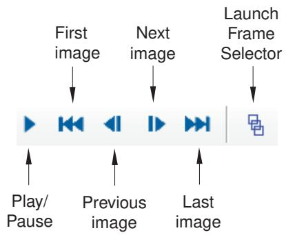

2.  单击以下某个帧按钮：

    •   “第一帧”(First)：显示当前步骤的第一个活动帧的结果。如果您已经显示步骤的第一帧的结果，则此按钮无效。
        “上一帧”(Previous)：显示上一个活动帧的结果。如果您当前正在显示步骤的第一帧的结果，Abaqus/CAE 将显示上一步骤的最后一个活动帧的结果。如果您已经显示第一步的第一帧的结果，则此按钮无效。
        “下一帧”(Next)：显示下一帧的结果。如果您当前正在显示步骤的最后一个活动帧的结果，Abaqus/CAE 将显示下一步骤的第一帧的结果。如果您已经显示最后一步的最后一帧的结果，则此按钮无效。
    •   “最后一帧”(Last)：显示当前步骤的最后一帧的结果。如果您已经显示步骤的最后一帧的结果，则此按钮无效。
        “帧选择器”(Frame Selector)：启动“帧选择器”(Frame Selector) 对话框，使您能够通过输入帧号或拖动滑块到想要显示的帧来直接导航到特定的帧。更多信息，请参阅在动画中导航到特定帧。

    当前视口中的模型图将更新，显示您在所选步骤和帧下的模型。如果处于活动状态，状态块中的文本将更新以标识所选的步骤和帧。Abaqus 会刷新“步骤/帧”(Step/Frame) 对话框，高亮显示所选的步骤和帧，并刷新“场输出”(Field Output) 对话框，列出您所选帧可用的变量。Abaqus 还会刷新所有标识了当前步骤和帧的对话框。

3.  继续单击帧按钮以逐步浏览可用的帧。

## 附加信息

• 选择要绘制的模型数据和分析结果
• 自定义结果中步骤和帧的显示
• 自定义状态块

## 自定义结果中步骤和帧的显示

您可以通过仅激活这些步骤和帧的一个子集，或者通过更改一个或多个步骤的持续时间或弧长，来自定义输出数据库中步骤和帧的显示。

当您通过逐帧浏览数据、动画数据以及从场数据生成 X–Y 历史数据来检查输出数据时，Abaqus/CAE 仅显示活动的步骤和帧。

## 本节内容：

激活和停用步骤和帧
更改步骤的周期

您可以通过激活输出数据库中步骤和帧的一个子集来自定义分析结果的显示。当您通过逐步浏览帧、动画数据或从场数据创建 X–Y 历史数据来检查分析结果时，Abaqus/CAE 仅显示活动的步骤和帧。活动的步骤和帧子集在您的整个会话期间保持不变，并适用于模型数据库结果的每次显示。
你可以通过“结果树”（Results Tree）或“激活的步骤/帧”（Active Steps/Frames）对话框来激活或停用步骤或帧。这两种工具还允许你通过单击每个步骤名称左侧的“加号”和“减号”图标来展开或折叠步骤。展开一个步骤会显示其包含的帧，这样你就可以选择激活部分帧而不是整个步骤。

结果树和“激活的步骤/帧”对话框还提供视觉提示，用以指示输出数据库中步骤或帧的激活状态。结果树会用红色的“X”标记在帧快捷方式左侧来标识不活跃的帧；未以这种方式显示的帧当前处于激活状态。在“激活的步骤/帧”对话框中，步骤和帧的状态通过出现在加/减号与步骤名称之间区域的复选标记来指示。步骤显示绿色复选标记意味着其所有帧均已激活；单个帧显示绿色复选标记意味着该帧已激活；浅灰色背景上的深灰色复选标记意味着该步骤的某些帧已激活；当没有显示复选标记时，则该步骤完全处于未激活状态。当步骤容器折叠时，此视觉提示可帮助你评估步骤的激活状态。图1显示了“激活的步骤/帧”对话框，其中包含两个完全激活的步骤、一个部分激活的步骤和两个未激活的步骤。

  
图1：“激活的步骤/帧”对话框。

“激活的步骤/帧”对话框中的每一行还提供以下关于步骤的信息：

•   “步骤名称”（Step Name）和“描述”（Description）列反映了创建模型时为该步骤定义的值。
•   “时间”（Time）列的值提供步骤的起始时间或描述步骤的性质。对于基于时间的步骤，此列显示该步骤的起始时间。如果步骤不是基于时间的，则此列描述该步骤是模态（Modal）、频率（Frequency）还是弧长（Arc，Riks分析）步骤。
•   “周期”（Period）列的值也取决于步骤类型。对于基于时间的步骤，周期是该步骤的总持续时间。对于Riks分析步骤，周期是该步骤的总弧长。模态和频率步骤在此列显示一个短横线（-），表示周期不适用于此步骤。

你可以修改基于时间和Riks分析步骤的周期值，前提是周期不等于0。更多信息，请参阅更改步骤的周期。

“激活的步骤/帧”对话框提供了两种激活步骤和帧的方法：你可以使用对话框中“选择辅助工具”（Selection Aids）部分的过滤工具来激活一组步骤或帧，也可以通过在对话框下部单击其所在行来激活单个步骤和帧。使用选择辅助工具激活步骤或帧会清除你当前激活的步骤和帧子集。如果你计划手动选择步骤和帧，请在使用选择辅助工具选择子集之后进行。

## 选择辅助工具

选择辅助工具过滤选项允许你根据多个选择标准选择步骤和帧的子集。

•   “选择来源”（Select from）选项定义了搜索的候选步骤和帧集。你可以搜索输出数据库中的所有步骤，也可以仅在当前在“激活的步骤/帧”对话框下部选定的步骤或帧子集中搜索。
•   “选择依据”（Select by）选项指定你希望搜索匹配步骤和帧的变量。你可以搜索在特定时间范围内发生的任何步骤或帧。对于频率提取步骤，你可以搜索在模型表现出特定频率期间的任何步骤或帧。或者，你可以按帧号搜索帧。
•   “全局范围”（Global range）字段允许你指定搜索的上下限以及匹配步骤或帧之间的增量。例如，如果你想激活帧0（下限）到帧20（上限）之间的所有偶数编号帧，请在增量中输入2。
•   你还可以通过选择“取消选择基础状态帧”（Unselect base state frames）来停用输出数据库中的基础状态帧。此选项仅在输出数据库包含线性摄动步骤时可用。
•   某些步骤可能具有重复前一步骤最终帧的初始帧。取消选择这些重复的首帧可以使你的数据分析更顺畅、更真实。选择“取消选择重复的首帧”（Unselect duplicate first frames）可取消选择整个数据库所有步骤中重复的首帧。

## 手动选择步骤和帧

你可以通过在“激活的步骤/帧”对话框下部单击行来激活和停用单个步骤和帧。单击一个步骤会激活或停用其所有帧，而单击一个帧只会激活或停用该帧。如果你单击并拖动跨过多个步骤或帧，Abaqus/CAE会将所有选中的步骤或帧的激活状态反转。


提示：你也可以从结果树激活或停用步骤和帧。高亮显示你想要切换的步骤或帧，单击鼠标按键3，然后选择“全部激活”（Activate all）或“全部停用”（Deactivate all）来更改所选步骤内所有帧的激活状态，或选择“激活”（Activate）或“停用”（Deactivate）来更改所选帧的激活状态。

结果树用帧快捷方式左侧的红色“X”表示不活跃的帧。无法停用的用户定义会话步骤用红色的感叹号标识；这些步骤不会显示在“激活的步骤/帧”对话框中。

在对话框中手动激活和停用步骤和帧可以补充和完善你使用选择辅助工具所做的选择。此外，在对话框下部单击鼠标按键3可以访问以下手动选择快捷方式：

•   “全部展开”（Expand All）展开所有步骤容器（已选和未选的），以显示输出数据库中每个步骤的帧。
•   “全部折叠”（Collapse All）折叠输出数据库中所有已选和未选的步骤容器。
•   “全部选择”（Select All）选择输出数据库中每个步骤的每个帧。
•   “全部取消选择”（Deselect All）取消选择输出数据库中每个步骤的每个帧。
•   “重置选择”（Reset Selection）将活动的步骤和帧恢复到你上次单击“应用”（Apply）时处于活动状态的子集。
•   “重置周期”（Reset Periods）将周期值恢复到你上次单击“应用”时处于活动状态的设置。

1.  定位“激活的步骤/帧”对话框。

    从主菜单栏中，选择 Result -> Active Steps/Frames。“激活的步骤/帧”对话框出现。

    对话框的下部显示输出数据库中的步骤，对于已展开的步骤，则显示其帧。在本次会话中首次检查输出数据库的步骤和帧时，所有步骤和帧均处于激活状态。

2.  从对话框的“选择辅助工具”部分，为你的搜索选择数据集、变量和全局范围值。

3.  单击“更新选择”（Update Selection）。

    Abaqus/CAE更新活动的步骤和帧子集。

4.  在对话框下部手动激活或停用步骤。你可以通过单击相应行来切换单个步骤或帧的激活状态，也可以通过单击并拖动多行来切换多行的激活状态。

5.  单击“应用”（Apply）。

    Abaqus/CAE使用新选定的活动步骤和帧子集更新所有显示此输出数据库的视口。

## 附加信息

•   选择结果步骤和帧
•   更改步骤的周期
•   从输出数据库场输出读取X–Y数据
•   动画绘制

## 更改步骤的周期

步骤周期值的含义取决于该步骤是Riks分析步骤还是基于时间的步骤。对于Riks分析步骤，周期指定该步骤的总弧长。对于基于时间的步骤，周期指定该步骤的总持续时间，因此更改此值会影响该步骤的显示时长，并更改所有后续步骤的起始时间。更改单个步骤的时间周期也会改变整个动画或逐帧显示的持续时间，影响基于时间的动画的自动计算起始和结束时间，并影响此模型动画与其他模型同步的方式。如果你想同步在共同时间线不同时间点发生的不同模型中的事件，可能需要调整时间周期。

对周期值的更改在会话持续期间有效。Abaqus/CAE不会将这些更改保存到输出数据库中。

如果值等于0，则你无法编辑Riks分析或基于时间步骤的周期值。此外，模态和频率提取步骤没有周期值；Abaqus/CAE在此类步骤的“周期”列中显示一个不可编辑的短横线（-）。


提示：如果您希望将周期值重置为输出数据库的设置，请在窗口下部单击鼠标按钮 3，然后选择“重置周期”。

1.  定位“活动步骤/帧”对话框。
    从主菜单栏中，选择**结果** -> **活动步骤/帧**。此时会出现“活动步骤/帧”对话框。
    对话框的下部显示输出数据库中的步骤，对于展开的步骤，则显示其中的帧。在会话期间第一次检查输出数据库的步骤和帧时，所有步骤和帧都是活动的。

2.  从该对话框的下部，单击某个步骤的“周期”列中的值，然后在字段中输入新值。对您希望自定义的每个步骤周期重复此更改。

3.  单击 **应用**。
    Abaqus/CAE 会使用修订后的周期和时间值更新所有显示此输出数据库的视口。

## 其他信息

*   选择结果步骤和帧
*   从输出数据库场输出读取 X–Y 数据
*   动画绘制

## 选择要显示的场输出

本节介绍如何选择要显示的场输出变量。
要了解如何选择输出数据库历史输出以生成 X–Y 图，请参阅《从输出数据库历史输出读取 X–Y 数据》。要了解如何选择输出数据库场输出以生成 X–Y 图，请参阅《从输出数据库场输出读取 X–Y 数据》。

## 本节内容：

选择场输出变量
使用场输出工具栏
选择主场输出变量
选择变形场输出变量
选择符号场输出变量
选择状态场输出变量
选择流线场输出变量
选择复数结果
选择截面点数据
选择接触输出

## 选择场输出变量

等值线图、模型探测、基于等值面的视图切割以及沿模型路径的结果 X–Y 图都会显示在分析的特定步骤和帧处特定场输出变量的值。
同样，当您基于结果形成显示组或指定颜色编码，或者当您显示来自当前模型数据库中的载荷或预定义场时，这些结果都与特定的场输出变量相关。其值被显示的变量称为 **主场输出变量**。

变形图根据分析的特定步骤和帧处节点变量（例如位移）的值显示模型的形状。其值被显示的变量称为 **变形场输出变量**。

符号图显示在分析的特定步骤和帧处特定矢量或张量变量的幅值和方向。符号图还可以显示来自当前模型数据库的模型中所选载荷或预定义场的幅值和方向。其值被显示的变量称为 **符号场输出变量**。

您可以为所选场输出变量指定基于结果的单元失效准则，并从模型图中移除满足失效准则的单元。您为其定义失效准则的变量称为 **状态场输出变量**。

您可以为流线显示指定速度或涡量数据。您为其显示这些数据的变量称为 **流线场输出变量**。

您可以选择在未变形或变形模型形状上显示等值线和符号图。当使用变形模型形状时，等值线或符号分别表示主场输出变量或符号场输出变量的值，而底层模型的形状则由变形场输出变量的值决定。

1.  定位“场输出”选项。
    从主菜单栏中，选择**结果** -> **场输出**。此时会出现“场输出”对话框。

    

    提示：您也可以通过单击任何出现该按钮的对话框中的“场输出”按钮，或通过在“场输出”工具栏中单击来访问这些选项。

2.  按照以下各节所述，选择您想要的主场输出、变形场输出、符号场输出和状态场输出变量：
    *   选择主场输出变量
    *   选择变形场输出变量
    *   选择符号场输出变量
    *   选择状态场输出变量
    *   选择流线场输出变量
    *   选择复数结果
    *   选择截面点数据
    *   选择接触输出

    当前视口中的模型图会更改为显示您选择的变量。如果处于活动状态，图例和状态块中的文本会更改为标识与绘图关联的变量。有关图例和状态块的更多信息，请参阅《自定义图例》和《自定义状态块》。此外，Abaqus 会刷新所有标识当前选定变量的对话框。

## 其他信息

*   选择要绘制的模型数据和分析结果
*   使用场输出工具栏
*   创建或编辑视图切割

## 使用场输出工具栏

您可以使用“场输出”工具栏来访问“场输出”对话框的基本功能。从工具栏中，您可以：
*   选择要操作的场输出变量类型（**主变量**、**变形** 或 **符号**）；
*   从可用场输出变量的列表中选择变量名称；
*   选择细化级别（如果可用），例如所选主变量的不变量和分量；以及
*   选择视口的绘图状态是否应与工具栏选择同步。

**状态** 和 **流线** 变量类型是唯一无法从工具栏中选择的场输出。**状态** 和 **流线** 变型类型在“场输出”对话框中可用；状态变量允许您指定 Abaqus/CAE 用于从模型显示中移除失效单元的准则，流线变量决定在流体流动数据分析中流线显示的场输出。要打开“场输出”对话框，请单击位于“场输出”工具栏左侧的


。


图 1：“场输出”工具栏。

当您从工具栏进行选择时，Abaqus/CAE 会更新当前视口以显示输出；如果需要更改绘图状态且绘图状态同步切换开关 ( ↔ ) 已启用，则视口绘图状态也会更新。例如，选择**主变量**作为变量类型，如果视口尚未包含等值线图，则会将绘图状态更改为在变形模型上显示等值线。如果禁用同步，Abaqus/CAE 仍会在当前视口中显示您新选择的场输出变量，但不会更改绘图状态。

## 其他信息

*   选择要绘制的模型数据和分析结果
*   选择场输出变量

您可以为等值线图、模型探测、基于等值面的视图切割以及沿模型路径获取结果选择要显示的变量；此变量称为 **主场输出变量**。Abaqus/CAE 还使用主场输出变量来形成显示组、应用基于结果的颜色编码，以及显示来自当前模型数据库中模型的载荷、预定义场或相互作用。

当选择输出数据库时，Abaqus/CAE 默认会列出当前步骤和帧所有可用的变量供您选择。描述左侧的星号 (*) 表示该变量包含复数结果。

当选择当前模型数据库中的模型时，Abaqus/CAE 默认会列出模型当前步骤中所有可用的载荷、预定义场、边界条件和相互作用供您选择。所有这些可选项前面都有一个带括号的字母，以按类别区分它们：(L) 表示载荷，(P) 表示预定义场，(B) 表示边界条件，(I) 表示相互作用。仅复数载荷或预定义场的实部可用于显示。

使用“场输出”对话框中的“主变量”选项来选择您想要的变量，以及适用的不变量或分量。有关各个输出变量标识符的信息，请参阅《输出变量》。

1.  定位控制主场输出变量的选项。
    从主菜单栏中，选择**结果** -> **场输出**。在出现的对话框中单击**主变量**选项卡。
    此时会出现“主变量”选项。

    

    提示：您也可以通过单击任何出现该按钮的对话框中的“场输出”按钮来访问这些选项。
要查看所列变量的完整说明，请通过拖动对话框的一个角来增加其宽度。

2. 要控制哪些变量出现在名称和描述列表中：

a. 切换“仅列出具有结果的变量”以显示一个受变量存储位置限制的列表。限制列表有助于您通过仅呈现例如积分点数量的变量来选择变量。

当“仅列出具有结果的变量”开启时，过滤选项将在下拉菜单中可用。

b. 单击“仅列出具有结果的变量”箭头以显示过滤选项。

c. 单击说明您希望包含在“名称和描述”列表中的变量位置的文本。

该文本将出现在“仅列出具有结果的变量”框中，并且“名称和描述”列表将刷新以仅包含具有该位置的变量。

3. 从“名称和描述”列表中，单击您想要的分析变量的名称。列表中描述左侧的星号表示该变量包含复数结果。

选定的变量将高亮显示。如果适用，对话框底部的“分量”和“不变量”列表将分别刷新以显示可用的分量或不变量。

4. 如果“分量”或“不变量”列表中列出了项目，请单击您想要的分量或不变量。选定的分量或不变量将高亮显示。


注意：对于 S 和 E 场输出，有两个不变量，“最大主值（绝对值）”和“最大面内主值（绝对值）”，它们仅在可视化（Visualization）模块中可用。“最大主值（绝对值）”是当比较所有主值的绝对值时最大的主值。“最大面内主值（绝对值）”是比较所有面内主值的绝对值时最大的主值。计算“最大面内主值（绝对值）”时不考虑面外主值。

5. 当处于活动状态时，当前视口中的等值线图会更改以显示您指定的分析变量的值。如果处于活动状态，图例和状态块中的文本会更改以标识与该图关联的变量。有关图例和状态块的更多信息，请参阅自定义图例和自定义状态块。此外，Abaqus 会刷新标识了当前主变量的所有对话框。

您的更改将在会话持续期间保存。

## 附加信息

• 选择要绘制的模型数据和分析结果

您可以通过生成变形图或选择变形模型作为等值线图或符号图的基础形状来显示变形模型。变形模型的形状基于您选择的特定变形场输出变量的值。“输出变量”列表中描述左侧的星号表示该变量包含复数结果。有关各个输出变量标识符的信息，请参阅输出变量。

1. 定位控制变形场输出变量的选项。

从主菜单栏中，选择 结果（Result）->场输出（Field Output）。在出现的对话框中，单击“变形变量（Deformed Variable）”选项卡。

“变形变量”选项变为可用。


提示：您也可以通过单击任何出现该按钮的对话框中的“场输出（Field Output）”按钮来访问这些选项。

Abaqus/CAE 按名称和描述列出了在输出数据库的当前步骤和帧中可用于变形图（节点向量数量）的所有变量。要查看所列变量的完整说明，请通过拖动对话框的一个角来增加其宽度。

2. 从“名称和描述”列表中，单击您想要的变形场变量。列表中描述左侧的星号表示该变量包含复数结果。  
选定的变量将高亮显示。

3. 当前视口中变形模型的形状会更改以反映您指定的变形场输出变量的值。如果处于活动状态，状态块中的文本会更改以标识与该图关联的变量。有关状态块的更多信息，请参阅自定义状态块。

您的更改将在会话持续期间保存。

## 附加信息

• 选择要绘制的模型数据和分析结果

## 选择符号场输出变量

您可以选择向量或张量变量分量，并可以选择一个分量来显示符号图；此变量称为符号场输出变量。

当选择输出数据库时，Abaqus/CAE 默认列出在输出数据库的当前步骤和帧中所有可用的向量和张量变量供您选择；在向量变量符号图中显示合矢量值，在张量变量符号图中显示所有主分量。描述左侧的星号表示该变量包含复数结果。

当选择当前模型数据库中的模型时，Abaqus/CAE 默认列出在模型的当前步骤中所有可用的载荷、预定义场、边界条件和相互作用。所有这些可选项目前面都有一个括号中的字母，以按类别区分它们：（L）表示载荷，（P）表示预定义场，（B）表示边界条件，（I）表示相互作用。

使用“场输出（Field Output）”对话框中的“符号变量（Symbol Variable）”选项来选择您想要的变量及其特定分量。有关各个输出变量标识符的信息，请参阅输出变量。

当您在符号图中显示向量变量时，可以从以下选项中选择：
• 显示代表变量合矢量值的箭头。例如，图 1 左侧显示了总位移的符号图。
• 显示代表变量特定分量值的箭头。例如，图 1 右侧显示了 1 方向位移的符号图。

  
图 1：显示总位移（左）和 1 方向位移（右）的符号图。

同样，当您在符号图中显示张量变量时，可以从以下选项中选择：
• 显示代表变量每个主分量的箭头。例如，图 2 左侧显示了最大、中间和最小主应力的符号图。
• 显示代表变量特定主分量的箭头。例如，图 2 右侧显示了仅最大主应力的符号图。


  
图 2：显示所有三个主分量的符号图（左），以及仅显示最大主应力的符号图（右）。

• 显示代表变量每个正应力分量的箭头。例如，图 3 左侧显示了所有正应力分量的符号图。
• 显示代表变量特定正应力分量的箭头。例如，图 3 右侧显示了仅 S22 的符号图。


  
图 3：显示所有正应力分量的符号图（左），以及仅显示 S22 的符号图（右）。

1. 定位控制符号场输出变量的选项。

从主菜单栏中，选择 结果（Result）->场输出（Field Output）。在出现的对话框中，单击“符号变量（Symbol Variable）”选项卡。

“符号变量”选项出现。


提示：您也可以通过单击任何出现该按钮的对话框中的“场输出（Field Output）”按钮来访问这些选项。

要查看所列变量的完整说明，请通过拖动对话框的一个角来增加其宽度。

2. 要控制哪些变量出现在名称和描述列表中：

a. 切换“仅列出具有结果的变量”以显示一个受变量存储位置限制的列表。限制列表有助于您通过仅呈现例如积分点数量的变量来选择变量。

当“仅列出具有结果的变量”开启时，过滤选项将在下拉菜单中可用。

b. 单击“仅列出具有结果的变量”箭头以显示过滤选项。

c. 单击说明您希望包含在“名称和描述”列表中的变量位置的文本。

该文本将出现在“仅列出具有结果的变量”框中，并且“名称和描述”列表将刷新以仅包含具有该位置的变量。
3. 从**名称和描述**列表中，单击所需分析变量的名称。列表中描述左侧的星号表示该变量包含复数结果。

选中的变量将被高亮显示。对话框底部的**矢量分量**、**张量分量**和**分量**列表将刷新，分别显示可用的矢量分量、张量分量和分量。

4. 如果您正在创建矢量变量符号图，请选择要绘制的分量。

   - 选择**合成量**可显示表示该变量合成量的箭头。
   - 选择**选定分量**并选择您想要显示的分量，以显示表示该变量特定分量的箭头。

5. 如果您正在创建张量变量符号图，请选择要绘制的分量。

   - 选择**所有主分量**可显示表示所有可用主分量的箭头。
   - 选择**选定主分量**并选择您想要显示的分量，仅显示表示特定主分量的箭头。
   - 选择**所有直接分量**可显示表示所有三个直接分量的箭头。
   - 选择**选定直接分量**并选择您想要显示的分量，仅显示表示特定直接分量的箭头。

   

   **注意**：对于 S 和 E 场输出，存在两个不变量：**最大主分量 (绝对值)** 和**最大面内主分量 (绝对值)**，它们仅在**可视化**模块中可用。**最大主分量 (绝对值)** 是当比较所有主分量的绝对值时的最大主值。**最大面内主分量 (绝对值)** 是当比较所有面内主分量的绝对值时的最大主值。计算**最大面内主分量 (绝对值)** 时不考虑面外主值。

6. 单击**应用**以实施您的更改。

   当前视口中的符号图将更新，以显示您指定的分析变量的值。如果处于活动状态，图例和状态块中的文本将更新，以标识与该图关联的变量。有关图例和状态块的更多信息，请参见自定义图例和自定义状态块。

   您的更改将在当前会话期间保存。

## 其他信息

*   选择要绘制的模型数据和分析结果

您可以为选定的场输出变量指定基于结果的单元失效准则；此变量称为**状态场输出变量**。当您启用状态场输出变量时，满足指定准则的单元被视为失效，并从模型图中移除。使用**场输出**对话框中的**状态变量**选项来启用状态变量；选择变量（如果适用，还包括不变量或分量）；并指定基于结果的失效准则。如果需要，您可以将状态场输出变量应用于未变形形状图。默认情况下，当模型以未变形状态显示时，不会移除失效单元。

默认情况下，除非输出变量 STATUS 出现在输出数据库中，否则状态场输出变量不会启用。在这种情况下，默认会启用状态场输出变量，选择输出变量 STATUS，并将失效准则设置为移除值小于或等于 0.5 的单元（单元的状态为 1.0 表示单元处于活动状态，0.0 表示单元未活动）。值为 0.0 的单元不会显示在当前视口的模型图中。

选择状态场输出变量时，Abaqus/CAE 会列出可供您选择的、在当前输出数据库的当前分析步和帧中可用的所有变量（基于表面的场输出变量除外）。描述左侧的星号表示该变量包含复数结果。有关各个输出变量标识符的信息，请参见输出变量。

1.  找到控制状态场输出变量的选项。

    a. 从主菜单栏中，选择**结果** -> **场输出**。在出现的对话框中单击**状态变量**选项卡。
    b. 切换**使用状态变量**以禁用或启用状态变量的使用。

    当**使用状态变量**开启时，状态变量被启用，**状态变量**选项变为可用。

    

    **提示**：您也可以通过单击任何包含**场输出**按钮的对话框中的该按钮来访问这些选项。

    要查看所列变量的完整描述，请通过拖动一个角来增加对话框的宽度。

2.  切换**应用于未变形状态**以将状态场输出变量应用于未变形形状图。如果您的模型不包含变形，则必须打开此设置以应用状态场输出变量。
3.  要控制哪些变量出现在**名称和描述**列表中：

    a. 切换**仅列出具有结果的变量**以显示受变量存储位置限制的列表。限制列表有助于您通过仅显示例如积分点量来选择变量。
       当**仅列出具有结果的变量**开启时，下拉菜单中将出现过滤器选项。
    b. 单击**仅列出具有结果的变量**箭头以显示过滤器选项。
    c. 单击指示您希望包含在**名称和描述**列表中的变量位置的文本。

       该文本出现在**仅列出具有结果的变量**框中，**名称和描述**列表将刷新，仅包含具有该位置的变量。

4.  从**名称和描述**列表中，单击所需分析变量的名称。列表中描述左侧的星号表示该变量包含复数结果。

    选中的变量将被高亮显示。如果适用，对话框底部的**不变量**和**分量**列表将刷新，分别显示可用的不变量或分量。

5.  如果**不变量**或**分量**列表中列有项目，请单击您想要的不变量或分量。选中的不变量或分量将被高亮显示。

    

    **注意**：对于 S 和 E 场输出，存在两个不变量：**最大主分量 (绝对值)** 和**最大面内主分量 (绝对值)**，它们仅在**可视化**模块中可用。**最大主分量 (绝对值)** 是当比较所有主分量的绝对值时的最大主值。**最大面内主分量 (绝对值)** 是当比较所有面内主分量的绝对值时的最大主值。计算**最大面内主分量 (绝对值)** 时不考虑面外主值。

6.  在**移除单元**字段中选择过滤方法以指定失效准则。如果单元的任何结果值满足指定准则，则该单元被视为失效并从模型图中移除。将单元输出量与指定准则进行比较；不会对单元数据进行外推或平均。如果选择了节点量，并且给定节点的值满足指定准则，则所有连接到失效节点的单元都将被移除。

    - 选择并在**最大值**字段中输入一个值，以移除值小于或等于该指定值的单元。
    - 选择并在**最小值**字段中输入一个值，以移除值大于或等于该指定值的单元。
    - 选择 **(范围内)** 并在**最小值**和**最大值**字段中输入范围的上限和下限值，以移除值在指定范围之间（包括端点）的单元。
    - 选择 **(范围外)** 并在**最小值**和**最大值**字段中输入范围的上限和下限值，以移除值在指定范围之外的单元。

7.  单击**应用**以实施您的更改。

    当前视口中的模型图将更新，移除所选状态场输出变量值满足指定准则的单元。如果处于活动状态，图例和状态块中的文本将更新，以标识与该图关联的变量。有关图例和状态块的更多信息，请参见自定义图例和自定义状态块。

    您的更改将在当前会话期间保存。

## 其他信息

*   选择要绘制的模型数据和分析结果

## 选择流线场输出变量

您可以指定计算流线数据的变量；此变量称为**流线场输出变量**。对于大多数分析，可以使用速度 (V) 进行流线数据计算。只有以节点为中心的矢量结果可以与流线迹线关联。

选择流线场输出变量时，Abaqus/CAE 会列出所有存储在节点位置、并在当前输出数据库的当前分析步和帧中可用的矢量变量。
1.  定位控制流场输出变量的选项。

    从主菜单栏中，选择 **Result -> Field Output**。在出现的对话框中，点击 **Stream Variable** 选项卡。

    

    提示：您也可以通过点击任何出现此按钮的对话框中的 **Field Output** 按钮来访问这些选项。

    要查看所列变量的完整描述，可通过拖动对话框的一个角来增加其宽度。

2.  从 **Name** 和 **Description** 列表中，点击您想要的分析变量的名称。

    所选变量将被高亮显示。

3.  点击 **Apply** 以应用您的更改。

    Abaqus/CAE 将基于所选的流场输出变量重新计算当前视口中的流线。您对流场输出变量的选择也会在会话期间得到保存。

## 其他信息

*   选择要绘制的模型数据和分析结果

## 选择复数结果

默认情况下，Abaqus/CAE 会列出输出数据库当前步骤和帧中所有可用的变量供您选择。如果当前步骤是稳态动力学分析，则输出变量（如应力 S 或位移 U）的值可以是具有实部和虚部的复数。使用 **Field Output** 对话框中的 **Primary Variable**、**Deformed Variable**、**Symbol Variable**、**Status Variable** 和 **Stream Variable** 选项来选择您想要显示的复数变量。如果某个变量包含复数结果，其描述将以星号开头。有关单个输出变量标识符的信息，请参见输出变量。

您可以通过变形图、等值线图或符号图、模型探测、沿模型路径获取结果以及基于结果形成显示组或指定颜色编码来显示复数结果。在这些情况下，您可以从几种数值形式中选择，以显示复数结果的不同方面。您可以使用谐波动画来动画显示复数结果。在谐波动画期间，每个复数的实部和虚部用于计算并显示代表半周期（0° 到 180°）或全周期（-180° 到 180°）的一系列角度下的结果值。

## 其他信息

*   选择要绘制的模型数据和分析结果
*   生成谐波动画

如果您的模型包含壳、梁或复合材料叠层，在显示等值线图、符号图或材料方向图时，您可以查看来自选定截面点的数据。

您可以按类别或铺层选择截面点，这将应用于链接的视口。此链接也适用于包络图。有关更多信息，请参见链接视口。

您可以选择以下任一选择方法：

## 按类别

对于模型中的每个截面，您首先选择一个截面点的活动位置（底部、顶部或两者）。然后，您从此类别的可用截面点列表中进行选择。例如，您可以选择显示来自每个截面中点的数据。可用的截面点与您在 **Step** 模块中创建场输出请求时所要求的截面点相关。您还可以显示包含所有截面点中该场输出变量关键值（最大或最小）的截面点的图。有关更多信息，请参见按类别选择截面点数据。

## 按铺层

对于包含复合材料叠层的模型，您首先选择一个铺层，然后选择一个位置来显示场输出变量。您可以指定所选铺层中的以下位置之一作为截面点位置：最底部的截面点、中间或唯一的截面点、最顶部的截面点，或同时包含最顶部和最底部的截面点。有关更多信息，请参见按铺层选择截面点数据。

## 本节内容：

按类别选择截面点数据
按铺层选择截面点数据

## 按类别选择截面点数据

当您显示等值线图时，可以使用 **Section Points** 对话框来控制 Abaqus 从中获取积分点结果和材料方向的截面点，方法是选择一个类别以及代表底部和顶部位置的截面点。

薄膜、壳和表面单元中的钢筋层被视为用于输出目的的截面点；每个钢筋层都有一个唯一的名称。例如，您可以请求来自模型中某些壳体的顶部表面的截面点的结果，来自模型中某些梁的中点截面点的结果，或来自模型中某些膜单元中指定钢筋层的结果。

显示两个截面点输出的等值线图，其外观根据壳的类型而有所不同。在常规壳中，两个等值线显示为双面壳，每一侧具有不同的等值线；而在连续壳（或复合实体）中，两个等值线显示为在每个截面点位置处的两个不同的二维等值线前沿。轴对称壳由扫掠形成三维表面的线单元组成，它们不表现出上述两种行为，因为它们不被视为三维壳；相反，这些壳仅在单个截面点处显示输出。

在许多情况下，截面点的位置是根据其相对于截面中点的位置来描述的。对于二维梁，这个相对位置报告为从截面中点到截面顶部或底部表面距离的一个分数。对于壳，这个相对位置报告为从截面中点到截面的 SPOS 或 SNEG 表面距离的一个分数。钢筋层则通过其唯一名称来表示。

对于具有三维截面的梁，截面点的相对位置可以报告为从截面中点到以下位置距离的一个分数：

*   截面的顶部或底部（沿截面的局部 2 轴）或
*   截面的左侧或右侧（沿截面的局部 1 轴）。

对于圆形梁，截面点位置定义为相对于截面半径和从正 1 轴绕截面中点旋转的角度的相对位置。

有关不同截面类型中截面点位置的更多信息，请参见以下内容：

*   梁单元
*   壳单元

有关钢筋层的更多信息，请参见定义钢筋。

Abaqus/CAE 提供以下方法来选择要显示的截面点：

*   显示一个类别的单元和一个位置。单元类别的示例包括单元类型和材料。位置可以是顶部或底部表面，或两者。
*   显示包含关键值（绝对最大值、最大值或最小值）的截面点。Abaqus/CAE 在每个单元的所有截面点中搜索关键值。生成的图称为包络图。

## 其他信息

*   选择要绘制的模型数据和分析结果

使用类别和位置选择截面点

1.  显示所需场输出变量的等值线图。有关更多信息，请参见生成等值线图。
2.  定位 **Section Points** 对话框。

    从主菜单栏中，选择 **Result -> Section Points**。

    **Section Points** 对话框出现。

3.  从 **Selection method** 字段中，选择 **Categories**。

    每个类别中的单元共享公共的截面属性，例如：

    *   与此类别中单元相关联的截面类型。
    *   包含在截面定义中的材料名称或复合材料规格。
    *   穿过截面的截面点数量。
    *   横截面几何形状（仅限梁）。

4.  从 **Active locations** 字段中，选择 **Bottom** 或 **Top** 以仅激活 **Bottom Location** 或 **Top Location** 截面点。对于三维壳或复合实体上积分点变量的等值线图，选择 **Top and bottom** 以同时显示两个截面点的输出。只有这种类型的等值线图可以同时显示两个截面点的输出；在所有其他情况下，当您选择 **Top and bottom** 时，Abaqus/CAE 仅在 **Bottom Location** 截面点处显示输出。

    Abaqus/CAE 仅在活动位置显示输出。**Bottom Location** 和 **Top Location** 字段显示您可以为所选类别显示输出的两个截面点。默认情况下，这些字段分别显示 SNEG 和 SPOS 截面点。

5.  在 **Category** 表中，选择您想要更改输出位置的单元类别，并选择位置。如果您从 **Active locations** 字段中选择了 **Top and bottom**，请选择两个位置。
您已选类别与位置的截面点将显示在对话框下半部分的 **Available Section Points in Cross-Section（截面可用点）** 字段中。如果您选择了多个类别，则列表中仅显示所有选定类别共有的位置。

6.  在 **Available Section Points in Cross-Section（截面可用点）** 字段中，选择要显示的截面点位置。

7.  点击 **Apply（应用）** 以查看您的设置。

当前视口中的模型图将更新，显示来自指定截面点的数值。如果激活了图例，图例也会更新以标识指定的截面点。关于图例的信息，请参阅 **Customizing the legend（自定义图例）**。

后续的等高线图、符号图、材料方向图、表格报告、模型探测以及沿路径的 X-Y 数据对象的结果将从您指定的截面点获取。

8.  点击 **OK（确定）** 以选择截面点并退出对话框。

## 选择包含临界值的截面点

1.  显示所需场输出变量的等高线图。更多信息，请参阅 **Producing a contour plot（生成等高线图）**。
2.  找到 **Section Points（截面点）** 对话框。
    从主菜单栏中，选择 **Result -> Section Points**。
    **Section Points（截面点）** 对话框随即出现。
3.  在 **Selection method（选择方法）** 单选按钮中，选择 **Categories（类别）**。
4.  在 **Active locations（活动位置）** 单选按钮中，选择 **Envelope（包络）**。
5.  在对话框的 **Criteria（准则）** 字段中，选择确定包含临界值的截面点的准则（**absolute maximum（绝对最大值）**、**maximum（最大值）** 或 **minimum（最小值）**）。

6.  在 **Position（位置）** 字段中，选择 Abaqus/CAE 用于确定包含临界值的截面点的算法。

    •   如果选择 **Integration point（积分点）**，Abaqus/CAE 将比较每个截面所有积分点处的值。
    •   如果选择 **Centroid（质心）**，Abaqus/CAE 将比较每个截面质心处的平均值。
    •   如果选择 **Element nodal（单元节点）**，Abaqus/CAE 将比较外推到每个截面节点处的值。

7.  点击 **Apply（应用）** 以查看您的设置。

当前视口中的模型图将显示网格中每个单元的临界截面点及其值。关于图例的信息，请参阅 **Customizing the legend（自定义图例）**。

8.  如果您正在显示复合材料铺层，可以通过为等高线图选择层选项来确定 Abaqus/CAE 如何显示临界截面点。

    a.  从主菜单中，选择 **Options -> Contour**。
    b.  在出现的 **Contour Plot Options（等高线图选项）** 对话框中，单击 **Other（其他）** 选项卡。
    c.  在选项卡页面底部的选项中，执行以下操作：

        •   切换开启 **Show labels of plies that match criteria（显示符合准则的层标签）**，以在等高线图中查看临界层的标签。
        •   切换开启 **Color by plies that match criteria（按符合准则的层着色）**，将等高线显示的值从场输出变量更改为层名称。等高线图将更新以显示模型中的临界层。图例将更新以显示正在显示的层的名称。

9.  点击 **OK（确定）** 保留设置并退出对话框。

## 按层选择截面点数据

您可以使用 **Section Points（截面点）** 对话框，通过选择特定的层以及在该层内的位置，来控制 Abaqus 从中获取积分点结果和材料方向的截面点。

在所选层顶部和底部显示输出的等高线图，其外观会因复合材料铺层的类型而异。在传统的壳复合材料铺层中，两个等高线显示为双面壳，每一面有不同的等高线。在连续壳复合材料铺层或实体复合材料铺层中，两个等高线显示为在各自截面点位置处的不同二维等高线前沿。

1.  显示所需场输出变量的等高线图。更多信息，请参阅 **Producing a contour plot（生成等高线图）**。
2.  找到 **Section Points（截面点）** 对话框。
    从主菜单栏中，选择 **Result -> Section Points**。
    **Section Points（截面点）** 对话框随即出现。
3.  在 **Selection method（选择方法）** 单选按钮中，选择 **Plies（层）**。
4.  为了方便选择，可在 **Name filter（名称过滤器）** 字段中输入过滤模式，然后按 [Enter] 键应用过滤器。
    如果激活了视口链接，您可以切换开启 **Show common list between linked viewports（显示链接视口之间的公共列表）**，以仅显示所有链接视口共有的层。
5.  从铺层的层列表中，选择所需的层。
6.  在 **Ply result location（层结果位置）** 单选按钮中，执行以下操作之一：

    •   选择 **Bottommost（最底部）** 以选择所选层中最底部的截面点。
    •   选择 **Middle/Single section point（中间/单一截面点）** 以选择所选层的中间截面点或唯一截面点。中间截面点是截面内可用位置的中间点，而不是所有位置的中间点。例如，如果仅在顶部（TOP）和底部（BOTTOM）有结果，则可用位置数为 2，“中间”将对应于顶部（TOP）位置。
    •   选择 **Topmost（最顶部）** 以选择所选层中最顶部的截面点。
    •   选择 **Topmost and bottommost（最顶部和最底部）** 以同时选择所选层中最顶部和最底部的截面点。

7.  点击 **Apply（应用）** 以查看您的设置。

    当前视口中的模型图将更新，显示来自指定层在指定位置的数值。如果激活了图例，图例也会更新以标识这些层。关于图例的信息，请参阅 **Customizing the legend（自定义图例）**。

8.  点击 **OK（确定）** 保留设置并退出对话框。

## 附加信息

*   **Selecting model data and analysis results to plot（选择要绘制的模型数据和分析结果）**
*   **Linking viewports（链接视口）**

## 选择接触输出

对于 CPRESS、COPEN、CSLIP、CSHEAR1 和 CSHEAR2 等非运动学标量输出变量的接触输出数据，将从所有基于实体单元的曲面整合到一个单一的数据集中。

重叠曲面的数据会被合并。如果为膜或壳单元请求接触输出，则 SPOS 和 SNEG 曲面的数据将包含在单独的数据集中。当接触曲面为双面或基于节点时，将为每个接触曲面对创建单独的接触输出数据集。

Abaqus/CAE 用于在整合数据集中合并重叠小平面数据的方法取决于输出变量：

*   对于变量 CPRESS、CSHEAR 和 CSLIP，Abaqus/CAE 在模型中为所选变量使用最大值（正或负）。
*   对于变量 COPEN，Abaqus/CAE 使用接触开口的最小值，这可以反映模型中的最小开口量，或者如果存在过盈，则为最大的过盈值。
*   对于矢量变量 CNORMF 和 CSHEARF，Abaqus/CAE 计算各个曲面对的所有矢量值之和，并将合成矢量存储在整合数据集中。
*   对于变量 CSTATUS，Abaqus/CAE 在主面和从面的节点上分配四种接触状态之一。

Abaqus/CAE 在整合数据集中使用以下设置：

*   **Sticking（粘着）**：如果任何重叠区域处于接触且粘着状态，
*   **Slipping（滑移）**：如果任何重叠区域处于接触且滑移状态，
*   **Bonded（绑定）**：如果任何重叠区域处于接触且绑定状态，并且
*   **Not in contact（未接触）**：如果区域未接触。

Abaqus/CAE 中显示的每个数据集的变量名称指明了接触输出所适用的区域。例如，对于单个接触曲面对（针对双面或基于节点的接触曲面）的 CPRESS 数据集命名为 `CPRESS SECONDARY NAME/MAIN NAME`；膜或壳曲面 SPOS 或 SNEG 侧接触的数据集分别命名为 `CPRESS SPOS` 和 `CPRESS SNEG`；所有其他曲面变量输出命名为 `CPRESS`。

任何单个接触曲面对的接触输出数据（不包含来自其他接触对的累加贡献）可以通过 **Create Field Output（创建场输出）** 对话框或用于输出数据库的 **Abaqus Scripting Interface（Abaqus 脚本接口）** 访问；这些数据集的名称形式为 `CPRESS SECONDARY NAME/MAIN NAME`。

由于 CPRESS、CSHEAR1 和 CSHEAR2 与模型中定义的特定曲面相关联，因此在探测这些输出变量结果时，这些曲面必须包含在当前显示组中。这些变量只能在节点处进行探测。

## 附加信息

*   **Selecting model data and analysis results to plot（选择要绘制的模型数据和分析结果）**
*   **Accessing an Output Database（访问输出数据库）**

## 选择结果选项

Abaqus/CAE 提供了几种方法来显示存储在输出数据库中的场输出结果。其中一些方法要求最初保存在输出数据库中单元质心或积分点位置的场输出数据被计算到节点位置。此类计算适用于线型和带型等高线图、在节点位置的探测、基于结果值形成显示组或颜色编码，以及沿路径提取基于单元的 X-Y 数据。您可以控制一些与这些计算相关的选项，例如如何对基于单元的结果进行平均。
此外，您还可以选择对场输出结果应用坐标系转换；对于复杂结果，您可以选择多种显示形式：幅值、相位角、实部分量、虚部分量或指定角度处的值；您还可以选择是否将结果缓存在内存中以提高性能。

选择 **结果->选项** 以找到控制结果计算、结果转换、复杂结果显示和结果缓存的选项。本节讨论结果计算以及影响这些计算的选项。

## 本节内容：

*   了解结果的计算方式
*   了解结果值平均
*   了解复杂结果
*   了解结果缓存
*   显示场输出值或不连续性
*   控制结果平均
*   控制区域边界处的计算
*   将结果转换到新坐标系
*   控制复杂结果的形式
*   控制结果缓存

## 了解结果的计算方式

显示存储在输出数据库中的结果所需的计算，取决于结果是基于节点的量（如位移或速度）还是基于单元的量（如应力或应变）。

## 基于节点的场输出结果的计算方式

基于节点的场输出变量在模型创建期间会连同应用的任何节点转换一起写入输出数据库的各个节点。为了显示节点场输出变量，Abaqus/CAE 会从输出数据库中读取包含在图中的每个节点所需的值。默认情况下，这些值在全局坐标系中显示；您可以选择对结果应用节点转换或应用用户指定的坐标系转换。最终值将用于生成等值线图、节点探查值、基于结果的显示组或颜色编码，或沿路径的 X-Y 数据。

## 基于单元的场输出结果的计算方式

基于单元的场输出变量写入输出数据库的位置（积分点、单元形心或单元节点）取决于变量本身。为了显示基于单元的场输出变量，Abaqus/CAE 会从输出数据库中读取连接到包含在图中的所有节点的所有单元的值。然后对这些值进行计算以生成等值线图、节点探查结果、基于结果的显示组或颜色编码，或沿路径的 X-Y 数据。

对于保存在积分点或单元形心的结果，应用的第一个计算是外推。（保存在单元节点的结果不需要外推。）仅对于等值线图，您可以选择“薄片型”外推，在这种情况下，下文讨论的其余计算不适用。要了解有关薄片型外推的更多信息，请参阅了解等值线值的计算方式。对于所有其他结果显示方法，Abaqus/CAE 使用适合单元类型和形状的权重将结果外推到节点。

外推值通常不如在积分点计算的值准确。因此，建议在需要此类单元结果的精确节点值的节点周围进行足够精细的网格划分。在解释外推到节点的输出变量时，您应特别小心那些中节点位于四分之一点区域之外的二阶单元，例如在二维中一条边被退化或在三维中一个面被退化的情况。

单元张量量的外推是在局部材料坐标系中对各个张量分量进行的。两个或多个单元共有的节点会收到来自所有相关单元的外推值。根据模型的特性，这些贡献可能来自多个结果区域。如果一个节点的所有贡献都来自单个结果区域，则会在进一步的计算中根据需要组合这些值。如果收到来自多个结果区域的贡献，您可以选择尊重区域边界，在进一步的计算中将贡献分开，或者忽略区域边界并组合这些值。输出数据库中的默认结果区域复制了在分析前用于为模型分配截面属性的区域。或者，您可以选择单元集或显示组用作结果区域。更多信息，请参阅控制区域边界处的计算。

如果请求不变量或分量，您可以指定 Abaqus/CAE 是应使用来自每个单元的外推数据还是使用来自所有相关单元的组合数据来计算不变量。默认情况下，不变量在外推结果组合（平均）之前进行计算。不变量或分量的等值线图可能受 Abaqus 执行计算的顺序影响。例如，冯·米塞斯应力的值可能超过非弹性材料的屈服应力；此外，不变量结果可能没有考虑到材料方向在非等参有限元内变化的情况。如果在平均之后计算不变量，Abaqus 通过平均相关单元的方向来确定节点处的方向；如果相关单元之间的方向不同，分量值将受到影响。

如果您选择单元集来定义结果区域，并且将在平均之后计算不变量，则您选择的单元集必须包含兼容的单元。兼容的单元

*   具有相同的基本单元类型（连续体、壳、梁等），
*   使用相同阶次的插值函数（一阶单元与二阶单元），并且
*   具有相同的积分方案（缩减积分、完全积分等）。

最后，计算取决于您选择显示场输出值还是不连续性；不连续性是相邻单元之间场输出值的差异。

*   **场输出**：对于场输出值的显示，在两个或多个单元共有的节点处计算的不变量或分量将根据相关结果区域的兼容性以及您选择的选项进行条件平均。更多信息，请参阅了解结果值平均。
    **不连续性**：对于不连续性的显示，在两个或多个单元共有的节点处计算的不变量或分量将进行比较以确定最大差异，具体取决于相关结果区域的兼容性以及您选择的选项。仅与一个单元关联的节点以及从所有相关单元接收到等效值的节点，在不连续性图中将显示为零值。

更多信息，请参阅显示场输出值或不连续性。

## 结果转换的计算方式

基于节点和单元的结果都可以转换到用户指定的坐标系，并且可以对基于坐标和距离的节点向量结果应用角度转换；有关对结果应用转换的信息，请参阅将结果转换到新坐标系。

三维连续体单元的基于单元的结果以及所有基于节点的结果都根据结果的位置转换到指定的坐标系。转换后结果的 1、2 和 3 方向分别对应于直角坐标系的 X、Y 和 Z 方向；圆柱坐标系的 R、Θ 和 Z 方向；以及球坐标系的 R、Θ 和 Φ 方向。

二维连续体单元、壳单元和膜单元的基于单元的结果通过在单元结果位置绕单元法线旋转结果来进行转换。转换后结果的 2 方向由直角 Y 方向或圆柱/球坐标 Θ 方向在单元平面上的投影确定。如果用户定义坐标系的 Y 或 Θ 方向与单元法线形成的角度小于 30°，则会投影 Y 或 Θ 轴之后的下一个轴（按坐标轴的循环排列顺序）到单元平面上以形成局部材料 2 方向，并显示警告消息。这种结果转换方法不同于 Abaqus/Standard 和 Abaqus/Explicit 用于计算局部方向的方法（请参阅方向）。

梁单元和桁架单元的基于单元的结果无法转换；它们始终在局部单元方向系统中显示。此外，钢筋以及 CAXA、SAX 或 SAXA 单元的单元结果也不会被转换。

当您将结果转换到用户指定的坐标系时，您可以控制坐标系转换的以下附加方面：
您可以选择在变换计算中包含或排除当前变形的影响。变形效应不会缩放；Abaqus/CAE 使用变形比例因子 1.0 进行这些计算。在变换中包含变形效应可以改变基于节点的坐标系方向、坐标系在壳单元和膜单元上的投影方向，以及位置相关圆柱坐标系和位置相关球坐标系的方向。  
• 您可以调整结果以考虑坐标系的刚体变换。您可以调整主要变量结果或同时调整主要变量和变形变量结果的显示。

刚体变换有助于理解存在大刚体位移时的相对位移。刚体变换会对模型应用变换，以抵消用户指定的随节点运动的坐标系（有关更多信息，请参阅《在后处理期间创建坐标系》）在节点从一帧变形到另一帧时的位移和旋转。刚体变换被确定为将指定坐标系的节点从其当前位置变换回其原始位置所需的平移和旋转。

您可以对基于坐标和距离的节点矢量结果应用角度变换。角度变换以 R、和 Z 计算圆柱坐标系的分量，并以 R、和 计算球坐标系的分量。

对于包含场输出变量 SORIENT 的输出以及包含复合材料截面的结果，您可以应用铺层方向变换。张量和矢量场将被变换为复合材料截面定义中定义的铺层方向。

## 理解结果值平均

结果值平均适用于显示基于单元的场输出变量，例如应力或应变，使用以下任一方法：

• 线型或带状云图，  
• 在节点位置探测，  
• 根据结果值形成显示组或颜色编码，  
• 从场中提取 X–Y 数据，  
• 沿路径提取 X–Y 数据，或  
• 生成场数据报告。

基于节点的场输出变量（如位移）、拼合云图和不连续图的显示不涉及值平均。

共用于两个或多个单元的节点的外推数据库值是有条件地进行平均的。您可以使用以下选项控制 Abaqus/CAE 对节点值进行平均的程度：

• 选择结果区域，并选择是否跨区域边界进行平均。  
• 选择是否将壳和膜特征边视为用于平均的区域边界。  
• 包含或排除未显示单元的贡献。  
• 选择在平均之前还是之后计算不变量并提取分量。  
• 选择阈值以基于贡献单元值的差异控制平均（仅当您选择在平均之前计算不变量时，此选项才可用）。

当贡献单元位于同一结果区域时，Abaqus/CAE 对共用于两个或多个单元的节点的值进行平均。默认结果区域与您将截面分配给模型时定义的区域相同；您也可以使用保存的单元集或显示组定义自定义结果区域。您可以选择 Abaqus/CAE 是否对共用于两个或多个结果区域的节点的值进行平均。您可以抑制跨区域的平均（使用区域边界）以强调区域边界的任何不连续性，或者您可以请求跨区域的平均（忽略区域边界）以产生更连续的效果。例如，图 1 显示了左侧使用区域边界和右侧跨区域边界进行平均的云图。

  
图 1：使用区域边界和跨区域边界进行平均的云图。

如果您选择跨区域进行平均，则平均程度由您指定的阈值控制，如下所示：

$$
\text{相对节点变化率} = \frac{\left(\text{节点最大值} - \text{节点最小值}\right)}{\left(\text{活动区域最大值} - \text{活动区域最小值}\right)}
$$

如果图中包含的每个节点的相对节点变化率小于您的平均阈值，则贡献单元的值在该节点进行平均。如果相对节点变化率超过您的设置，则不进行平均。当您决定跨区域进行平均时，除非您将平均限制为显示的单元，否则平均阈值将根据整个模型或所有显示结果的值变化来考虑。设置较高的平均阈值将允许您平滑除相对于整个模型或所有显示结果的最极端不连续性之外的所有不连续性。

如果您选择不跨区域进行平均，则每个区域内节点值的平均程度由您指定的平均阈值控制，如下所示：

$$
\text{相对节点变化率} = \frac{\left(\text{节点最大值} - \text{节点最小值}\right)}{\left(\text{区域内最大值} - \text{区域内最小值}\right)}
$$

如果图中包含的每个节点的相对节点变化率小于您的平均阈值，则贡献单元的值在该节点进行平均。如果相对节点变化率超过您的设置，则不进行平均。当您抑制跨区域的平均时，平均阈值将根据每个区域内的值变化来考虑，而不是根据整个模型或所有显示结果的值变化来考虑。

应用的平均阈值越低，显示的值就越能描绘单个单元的结果。相反，较高的平均阈值会产生更平滑的效果，单元之间的明显不连续性更少。

当结合使用基于阈值的平均与从基于单元的场中提取 X–Y 数据时，您可能需要调整阈值。提取 X–Y 数据时使用的单元区域将缩减为仅包含连接到指定节点的单元。

如果您选择在平均之后计算不变量并提取分量，

• Abaqus/CAE 不会应用平均阈值；  
• 在平均之前，张量在每个节点处被变换到平均方向；并且  
• 如果使用结果区域，则这些区域必须包含兼容的单元。

有关更多信息，请参阅《理解结果的计算方式》。

选择 **结果->选项** 可找到影响平均的选项。控制结果平均和在区域边界处控制计算提供了有关使用平均选项的详细信息。

## 理解复数结果

如果当前分析步是稳态动力学分析，则输出变量（如应力 (S) 或位移 (U)）的值可能是具有实部和虚部的复数。复数结果在分析过程中以实数和虚数数据对的形式保存。

当您使用 Abaqus/CAE 显示复数结果时，可以选择以下任何形式查看分析数据：

• **幅值** 显示结果值的实部和虚部的合成幅值。  
• **相角** 显示正水平轴与绘制点（实部，虚部）之间的角度。此选择仅对标量或矢量和张量分量有效。  
• **实部** 仅显示实部分量。此选项是默认设置。  
• **虚部** 仅显示复数结果的虚部分量系数。  
**指定角度处的值** 显示在您指定的角度下结果值的实部和虚部的合成值。当角度为 $0^{\circ}$ 时，显示结果的实部；当角度为 −90° 时，显示结果的虚部。  
• **包络：最小值** 通过将角度从 $0^{\circ}$ 变化到 360°，显示结果值的实部和虚部的合成值的最小值。  
• **包络：最大值** 通过将角度从 $0^{\circ}$ 变化到 360°，显示结果值的实部和虚部的合成值的最大值。  
• **包络：最大绝对值** 通过将角度从 $0^{\circ}$ 变化到 360°，显示结果值的实部和虚部的合成值的最大绝对值。

**幅值** 是在计算任何不变量之后计算的，因此幅值是实部和虚部不变量分量平方和的平方根。类似地，其他复数形式也在不变量之后计算。**指定角度处的值** 和复数包络值是例外；它们在不变量之前计算，以保留正确的物理意义。
您也可以选择使用谐波动画（harmonic animation）来展示复杂结果。此技术通过一系列角度显示角度处的值，以动画形式呈现复数场输出（complex field output）。Abaqus/CAE 会根据您的指定生成从 $0 ^ { \circ }$ 到 180° 或从 −180° 到 180° 的角度范围，并在每个角度显示复数结果的值。

幅值和相位角与实部和虚部分量的关系由常用表达式给出。例如，位移的实部和虚部分量 $\scriptstyle { U _ { r } }$ 和 $U _ { i \cdot }$ 与幅值 $\overline { { \boldsymbol { \tau } } } .$ 和相位角 $\phi$ 的关系如下：

$$
U _ {r} = \overline {{U}} \cos \phi
$$

以及

$$
U _ {i} = \overline {{U}} \sin \phi .
$$

复数结果代表如下形式的时域变化：

$$
\begin{array}{l} U (t) = U _ {r} \cos \Omega t - U _ {i} \sin \Omega t, \\ = \overline {{U}} \cos (\Omega t + \phi), \\ \end{array}
$$

其中 $\pmb { \Omega }$ 是激励频率。当您请求谐波动画时，会显示此时域变化。在选定角度 $\theta$ 处的结果值是通过使用该角度得到的，因此

$$
\begin{array}{l} U (\theta) = U _ {r} \cos \theta - U _ {i} \sin \theta , \\ = \overline {{U}} \cos (\theta + \phi). \\ \end{array}
$$

给定变量的幅值 $\overline { { \pmb { U } } }$ 在 $\pmb \theta = - \phi .$ 时显示。从 −180° 到 $1 8 0 ^ { \circ }$ 的步进对应一个完整的动画周期。

## 附加信息

• 选择复数结果
• 控制复数结果的形式
• 谐波动画

## 理解结果缓存

缓存是系统内存的一部分。您可以在后处理期间选择将分析结果存储在缓存中，以加快屏幕上图像的生成速度。当结果被缓存后，Abaqus/CAE 可以在无需重新计算显示值或频繁访问输出数据库（output database）文件的情况下绘制结果。这可以显著提高性能。然而，缓存结果会增加内存使用量。如果您发现 Abaqus/CAE 在您的工作站上消耗大量内存，从而阻碍了系统性能，您可以禁用结果缓存选项以清除与结果缓存相关的内存。清除这些内存可以提高整体性能；但是，结果显示将会变慢。切换到新的输出变量或输出数据库将自动清除当前的结果缓存。有关更多信息，请参阅控制结果缓存。

Abaqus/CAE 可以在分析作业仍在运行且数据库持续更新时，显示来自输出数据库的数据。在大多数可视化模块（Visualization module）操作之后以及在动画期间，Abaqus/CAE 会监控输出数据库以查找更新的结果，并相应地更新当前视口。如果您正在显示来自远程输出数据库的数据，当通过网络监控数据库所需的时间较长时，Abaqus/CAE 的性能可能会下降。为了提高性能，您可以降低 Abaqus/CAE 监控输出数据库更新的频率，或者您可以禁用监控。有关更多信息，请参阅访问远程计算机上的输出数据库。

## 附加信息

• 控制结果缓存

## 显示场输出值或不连续性

对于基于单元的场输出变量（element-based field output variables），例如应力或应变，您可以选择显示场输出值本身，或者显示相邻单元之间场输出值的差异。此选择适用于线型和带型等值线图（line- and banded-type contours）、在节点位置探测（probing at nodal locations）、基于结果值形成显示组和颜色编码，或沿路径提取 X-Y 数据。

默认设置是显示 **Field output values**。如果您选择显示 **Discontinuities**，则 **Averaging threshold** 不适用。

图 1 在左侧显示了场输出值的等值线图，在右侧显示了值不连续性的等值线图。


图 1：显示场输出值和值不连续性的等值线图。

1.  宾位要绘制的量（Quantity to Plot）选项。
    从主菜单栏中，选择 **Result** -> **Options**；然后在出现的对话框中单击 **Computation** 选项卡。**Quantity to Plot** 选项位于页面顶部。
2.  单击 **Field output** 或 **Discontinuities** 以选择您想要绘制的量。
3.  Abaqus 将根据您的规格在当前视口中显示结果。

默认情况下，您的更改会在整个会话期间保存，并将影响所有后续的结果显示。如果您想将更改保留到后续会话，请将其保存到文件。有关更多信息，请参阅保存自定义设置以供后续会话使用。

## 附加信息

• 理解结果是如何计算的

您可以控制基于单元的场输出结果（如应力或应变）的平均（averaging）方式。平均适用于创建线型和带型等值线图、在节点位置探测、基于结果值形成显示组和颜色编码，或沿路径提取 X-Y 数据。

单元值首先被外推到节点。两个或多个单元共享的节点将接收多个贡献值。要控制多个贡献值的平均，您可以：

• 启用或抑制平均。
• 定义结果区域并选择是否跨越它们进行平均。
• 将壳和膜特征边（shell and membrane feature edges）作为附加区域边界包含在平均中，或将其排除。
• 抑制对未显示单元的平均。
• 选择 Abaqus/CAE 在平均之前还是之后计算不变量（invariants）。
• 设置平均阈值（averaging threshold）。

平均阈值控制平均的程度；当 Abaqus/CAE 在平均之前计算不变量或提取分量时可用。如果节点处的贡献值之间的相对差异大于您设置的阈值百分比，Abaqus/CAE 将不会平均贡献值，并且您的结果在该节点将显示为不连续。使用较高的百分比可以产生更平滑、更连续的效果。

有关跨区域平均的信息，请参阅控制区域边界处的计算。

1.  宾位 **Averaging** 选项。
    从主菜单栏中，选择 **Result** -> **Options**；然后在出现的对话框中单击 **Computation** 选项卡。**Averaging** 选项会出现。
2.  要控制 Abaqus/CAE 是否在共享节点处平均来自多个单元的输出，请切换 **Average element output at nodes**。
    抑制平均以识别场输出中的不连续性，或基于外推的、未平均的结果建立等值线限制。
3.  切换关闭 **Use region boundaries** 可忽略区域边界并在整个模型范围内平均结果。
4.  如果使用区域边界，请指定结果区域以设置边界。有关更多信息，请参阅控制区域边界处的计算。


提示：要查看当前结果区域，请使用属性选择（attribute selection）的 **Averaging regions** 方法对未变形图或变形图进行颜色编码。（有关更多信息，请参阅在可视化模块中为所有几何体着色。）

5.  如果使用区域边界，Abaqus/CAE 默认将壳和膜特征边（shell and membrane feature edges）作为附加区域边界。要更改用于创建特征边的最小角度，请单击并在 **ODB Display Options** 对话框中更改 **Feature Angle** 设置。特征边对应于未变形的模型，不会为模型变形重新计算。（有关更多信息，请参阅定义模型特征边。）

    要跨特征边平均结果，请切换关闭 **Include shell/membrane feature edge boundaries**。

6.  要控制 Abaqus/CAE 是基于所有贡献单元还是仅基于当前显示组中的单元来平均节点结果，请切换 **Average only displayed elements**。
7.  选择 Abaqus 是在指定区域上平均结果之前还是之后计算不变量（标量）和提取分量。
    默认情况下，Abaqus 在平均之前计算标量；如果您选择在平均之后计算结果，Abaqus 将平均所有结果及其方向，以保持计算不变量的有效基础。


提示：要在等值线图中查看节点平均方向（nodal-averaged orientations），您可以使用 **Contour Plot Options** 对话框显示它们的标签。有关更多信息，请参阅显示节点平均方向。

8.  如果您在平均之前计算标量，可以设置 **Averaging Threshold (%)** 以控制相邻单元之间的平均。值为 0 表示抑制所有平均；值为 100 表示平均所有结果。
9.  单击 **Apply** 以实施您的更改。
Abaqus 根据您的规格说明计算当前视口中显示的结果值的平均值。如果等高线图例处于活动状态，它会变为显示您指定的平均阈值。有关等高线图例的更多信息，请参见自定义图例。

默认情况下，您所做的更改会保存在会话期间，并会影响后续所有结果的显示。如果您希望保留这些更改以供后续会话使用，请将其保存到文件。有关更多信息，请参见保存自定义设置以供后续会话使用。

## 附加信息

• 理解结果值平均

输出数据库中的默认结果区域与在分析前用于为模型指定截面属性的区域相同。或者，您可以选择单元集或显示组用作结果区域。您可以控制位于两个或多个结果区域共有节点上的计算。选择忽略区域边界可以在计算上组合结果以获得更平滑、更连续的效果。选择不忽略区域边界则可以视觉上强调模型的不连续性。有关在区域间进行平均和不进行平均时的等高线图示例，请参见图 1；当您选择忽略区域边界时，即发生跨区域平均。

1.  定位区域边界选项。

    从主菜单栏中，选择 **Result->Options**；然后在出现的对话框中单击 **Computation** 选项卡。**Region Boundaries** 选项出现在 **Averaging** 控件中。

2.  要控制在两个或多个结果区域共有节点上的计算，请切换 **Use region boundaries**。

    使用区域边界意味着在计算节点平均值或计算不连续性时，不组合相邻结果区域的值。

3.  选择以下选项之一来定义结果区域：

    

    提示：要查看当前结果区域，请使用属性选择方法 **Averaging regions** 对未变形或变形图进行颜色编码。（有关更多信息，请参见在可视化模块中为所有几何体着色。）

## 输出数据库 (ODB) 区域

    默认情况下，结果区域与保存在输出数据库 (.odb) 文件中的截面指定区域相同。有关更多信息，请参见为部件指定截面、方向、法线和切线。

## 单元集

    通过选择单元集来指定结果区域。

## 显示组

    通过选择显示组来指定结果区域。

    

## 注意：

    如果所需的显示组不存在，请选择 **Tools->Display Group->Create** 来创建它们（有关更多信息，请参见创建或编辑显示组）。

    区域边界是使用在选择时定义的显示组来定义的。如果您随后修改或删除了显示组，除非您重新定义它们，否则区域边界不会改变。

4.  如果您选择了 **Element sets** 或 **Display groups** 方法来设置区域边界，请完成以下步骤：

    a. 单击
    
    Abaqus/CAE 将打开 **Specify Averaging Regions** 对话框。

    b. 从对话框左侧的列表中，单击所需的区域以将其在列表中高亮显示。使用 [Shift] + 单击和 [Ctrl] + 单击可以选择多个项目。

    c. 单击对话框中间的右箭头按钮，将高亮显示的项目复制到 **Selection** 列。要移动整个列表，请单击双右箭头按钮。
    d. 要移除区域选择，请在 **Selection** 列中将其高亮显示并使用左箭头按钮。

    任何未包含在区域边界选择中的单元都将使用“无结果”颜色进行着色（有关更多信息，请参见为无结果的单元着色）。重叠的选择将被合并。

5.  默认情况下，Abaqus/CAE 使用特征边作为额外的区域边界。要更改用于创建特征边的最小角度，请单击并更改 **ODB Display Options** 对话框中的 **Feature Angle** 设置。特征边对应于未变形的模型，并且不会针对模型变形重新计算。（有关更多信息，请参见定义模型特征边。）

    要跨特征边对结果进行平均，请关闭 **Include shell/membrane feature edge boundaries**。

6.  单击 **Apply** 以实施您的更改。

    Abaqus 根据您的规格说明计算当前视口中显示的结果值。默认情况下，您所做的更改会保存在会话期间，并会影响后续所有结果的显示。如果您希望保留这些更改以供后续会话使用，请将其保存到文件。有关更多信息，请参见保存自定义设置以供后续会话使用。

## 附加信息

• 理解结果的计算方式

## 将结果转换到新的坐标系

默认情况下，Abaqus/CAE 在预处理期间定义的坐标系中显示基于单元的场输出结果，并在全局坐标系中显示基于节点的场输出结果。

如果您在预处理期间定义了节点变换，则可以选择将这些变换应用于基于节点的结果。或者，您可以选择将基于单元和基于节点的结果都转换到用户指定的坐标系，或将角变换应用于基于坐标和基于距离的节点矢量结果。

对于位移、速度和加速度等派生自节点坐标的矢量量，Abaqus/CAE 使用最终量（保存的矢量）而非原始坐标将结果转换到请求的坐标系。例如，柱面位移分量是通过将位移矢量投影到当前的 r 或 θ 方向来计算的。相比之下，取变换后节点坐标的微分会产生不同的结果。

当您将结果转换到局部坐标系时，Abaqus/CAE 会根据需要旋转全局直角坐标系，使其在感兴趣的点与局部坐标系对齐。变换后的结果在旋转后的全局直角坐标系中报告。

对于转换到用户指定的坐标系，Abaqus/CAE 在默认情况下（当变形效果可用时）会包含当前变形的影响。如果您希望转换计算仅考虑未变形状态，可以排除这些影响。变形效果不会缩放；Abaqus/CAE 使用 1.0 的变形比例因子执行这些计算。在转换中包含变形效果可能会改变基于节点的坐标系的方向、壳和膜元上坐标系的投影，以及位置相关的柱坐标系和位置相关的球坐标系的方向。有关更多信息，请参见结果的转换。

当您选择用户指定的坐标系进行转换时，您还可以调整主要变量结果或主要变量和变形变量的结果的显示，以考虑坐标系的刚体变换。显示考虑刚体变换的变形，使您能够相对于移动的用户定义坐标系直观地查看模型的相对位移。有关选择结果变量的更多信息，请参见选择主要场输出变量和选择变形场输出变量。

您可以对基于坐标和基于距离的节点矢量结果应用角变换。角变换计算柱坐标系中的 R、θ 和 Z 分量以及球坐标系中的 R、θ 和 Φ 分量。

您可以对包含来自场输出变量 SORIENT 的输出并包含复合材料层合截面的结果应用层合方向变换。只要请求了单元材料方向（这是默认设置），SORIENT 就会包含在内。张量和矢量场将被转换到复合材料层合截面定义中定义的层合方向。

1.  定位 **Transform Type** 选项。

    从主菜单栏中，选择 **Result->Options**；然后在出现的对话框中单击 **Transformation** 选项卡。**Transform Type** 选项出现。

2.  选择用于结果的转换类型。

    选择 **Default** 以使用为您的模型定义的默认坐标系。基于节点的结果在全局坐标系中显示。基于单元的结果在为模型定义的局部方向中显示；如果未定义，则使用全局坐标系。对于二维连续体单元、壳单元和膜单元，使用全局坐标系或局部方向的投影。
    选择 **Nodal** 以考虑在节点处定义的局部方向。基于单元的结果在默认坐标系中显示（如上所述）。为模型定义的节点变换会应用于基于节点的结果；如果未定义，则使用全局坐标系。
**MiMo 翻译结果：**

•   选择 User-specified（用户指定），将整个模型的结果转换到指定的坐标系中。
    为便于选择，可在 Name filter（名称过滤器）字段中输入过滤模式，并按 [Enter] 键应用过滤。
    从出现的坐标系列表中选择要应用的变换，或单击并从视口中选择坐标系。在模型生成期间或后处理期间定义的坐标系均可使用。标有星号的系统已保存到当前输出数据库。

•   选择 Angular（角度），将坐标和距离相关的节点矢量结果转换为 R、θ、Z 或 R、θ、φ 形式。从出现的柱坐标系和球坐标系列表中选择要应用的变换，或单击并从视口中选择坐标系。在模型生成期间或后处理期间定义的坐标系均可使用。标有星号的系统已保存到当前输出数据库。

•   选择 Layup orientation（铺层方向），将张量和矢量场转换为复合材料截面定义中指定的铺层方向。

3.  如果选择了用户指定的坐标系，您还可以在变换到该坐标系时包含变形的影响。
    打开 Include effects of deformation (when available)（包含变形影响（如可用））以包含变形影响，或关闭此选项以排除变形影响，仅在变换中考虑未变形状态。

4.  如果选择了用户指定的坐标系，您还可以对主变量和变形变量的呈现应用刚体变换。
    在 Rigid Body Transformations（刚体变换）选项中，执行以下操作之一：
    •   打开 Primary variable（主变量），将刚体变换应用于主变量结果。
    •   打开 Primary variable and Deformed variable（主变量和变形变量），将刚体变换应用于两个变量的结果。

5.  Abaqus 将在当前视口中以指定的坐标系显示结果。角度分量以弧度给出。角度变换分量结果使用 (AT: 坐标系名称) 标识，刚体变换分量结果使用 (RT: 坐标系名称) 标识，以区别于使用默认变换类型获得的结果。
    默认情况下，您的更改将在会话期间保存，并影响后续所有结果的显示。如果您希望保留更改以供后续会话使用，请将其保存到文件中。有关更多信息，请参阅 保存自定义设置以供后续会话使用。

## 其他信息
•   了解结果的计算方式
•   在后处理期间创建坐标系
•   为什么基准坐标系如此重要？
•   通过对场进行操作来创建场输出

## 控制复数结果的形式
如果当前分析步是稳态动力学分析，输出变量（如应力 (S) 或位移 (U)）的值可能是包含实部和虚部的复数。您可以在 Abaqus/CAE 中绘制模型图或从模型中探测值时，控制复数的显示形式。

您可以选择查看分析结果的大小、相角、实部、虚部、选定角度下的值或复包络值。所选形式将应用于 Abaqus/CAE 当前会话中除谐波动画外的所有复数结果，直到您做出新的选择。谐波动画根据定义，始终使用“特定角度下的值”形式，而不管当前的数值形式如何。

1.  定位 Numeric Form（数值形式）选项。
    从主菜单栏中，选择 Result->Options；然后在出现的对话框中单击 Complex Form（复数形式）选项卡。将出现 Numeric Form（数值形式）选项。

2.  选择用于复数的形式：
    •   Magnitude（大小）：显示结果值的实部和虚部的综合大小。
    •   Phase angle（相角）：显示正水平轴与代表复数的绘图点（实部，虚部）之间的角度。此选择仅对标量或矢量和张量分量有效。
    •   Real（实部）：仅显示复数结果值的实部。此选项是默认设置。
    •   Imaginary（虚部）：仅显示复数结果值虚部的系数。
    •   Value at angle（特定角度下的值）：显示在您指定的角度下结果实部和虚部的综合值。当角度为 0° 时，显示结果的实部；当角度为 -90° 时，显示结果的虚部。
    •   Envelope: Min（包络：最小值）：通过将角度从 0° 变化到 360°，显示结果实部和虚部综合值的最小值。
    •   Envelope: Max（包络：最大值）：通过将角度从 0° 变化到 360°，显示结果实部和虚部综合值的最大值。
    •   Envelope: Max absolute（包络：最大绝对值）：通过将角度从 0° 变化到 360°，显示结果实部和虚部综合值的最大绝对值。

3.  Abaqus 将根据您的设置更新当前视口中的显示。默认情况下，您的更改将在会话期间保存，并影响后续所有结果的显示。如果您希望保留更改以供后续会话使用，请将其保存到文件中。有关更多信息，请参阅 保存自定义设置以供后续会话使用。

## 其他信息
•   选择复数结果
•   理解复数结果

## 控制结果缓存
您可以选择在后处理期间将分析结果存储在缓存中，以加快屏幕上图像的生成速度。但是，缓存结果会消耗系统内存，并可能降低整体性能。切换到新的输出变量或输出数据库将自动清除当前的结果缓存。

要提高性能，您可以降低 Abaqus/CAE 监视输出数据库更新的频率，或者完全禁用监视。如果您正在显示来自远程输出数据库的数据，并且通过网络监视数据库所花费的时间较长，则 Abaqus/CAE 的性能可能会下降。有关更多信息，请参阅 访问远程计算机上的输出数据库。

1.  定位 Results Caching（结果缓存）选项。
    从主菜单栏中，选择 Result->Options；然后在出现的对话框中单击 Caching（缓存）选项卡。

2.  使用 Caching Options（缓存选项）字段来加快屏幕上图像的生成速度。
    a. 打开 Cache deformed variable results（缓存变形变量结果），将当前输出数据库的变形变量结果存储在内存中。
    b. 打开 Cache primary variable results（缓存主变量结果），将当前输出数据库的主变量结果存储在内存中。
    c. 打开 Cache cut fields（缓存切割场），将用于显示切割模型的值存储在内存中。

3.  使用 ODB Access Options（ODB 访问选项）字段来提高访问输出数据库时的性能。
    a. 关闭 Check for ODB file updates（检查 ODB 文件更新），以阻止 Abaqus/CAE 监视输出数据库的更新。
    b. 输入检查输出数据库更新的最小时间间隔（以秒为单位）。较大的数字将降低 Abaqus/CAE 检查输出数据库更新的频率。

4.  默认情况下，您的更改将在会话期间保存，并影响后续所有结果的显示。如果您希望保留更改以供后续会话使用，请将其保存到文件中。有关更多信息，请参阅 保存自定义设置以供后续会话使用。

## 其他信息
•   理解结果缓存

## 创建并保存新的场输出
输出数据库中最初可用的场输出和历程输出仅限于您在分析期间保存的变量。您可以通过对场输出进行操作来创建新的结果，从而扩充这些分析结果。

创建后，您可以将新的场输出保存到输出数据库。如果您希望将会话中的场输出保存到文件，必须以写入权限打开输出数据库文件。

可以使用以下方法创建并保存新的场输出：
•   从主菜单栏选择 Tools->Field Output->Create From Fields（工具->场输出->从场创建），或使用工具箱中的 Create Field Output From Fields（从场创建场输出）工具，通过操作各个现有场输出变量来创建新的场输出变量。
•   从主菜单栏选择 Tools->Field Output->Create From Frames（工具->场输出->从帧创建），或使用工具箱中的 Create Field Output From Frames（从帧创建场输出）工具，通过组合多个输出数据库帧的结果来创建新的场输出。
•   从主菜单栏选择 Tools->Field Output->Save Fields（工具->场输出->保存场），以保存新的场输出。

有关选择和绘制输出数据库场输出的信息，请参阅 选择场输出变量。

## 本节内容：
*（注意：原文到此结束，没有列出具体小节内容）*
构建有效的场输出表达式
对场输出使用运算
组合多个帧的结果
通过对场运算创建场输出
通过对帧运算创建场输出
保存会话期间创建的场输出

## 构建有效的场输出表达式

要通过对各个现有场输出变量进行运算来定义新的场输出变量，您需要在“创建场输出”对话框的表达式文本字段中构建一个算术表达式。

表达式由一个或多个现有的场输出变量标签组成，并可选择性地包含一个或多个运算符、变换和标量。有关支持的运算符的信息，请参阅“对场输出使用运算”。表达式将作为 Python 输入进行评估；包含语法错误的条目将生成非特定的 Python 异常。

“创建场输出”对话框按变量名和由 Abaqus/CAE 创建的唯一“标签”列出场输出。给定场输出变量的标签由步骤和帧号组成，后接输出变量名；例如，s1f1\_RF 是步骤 1、帧 1 的反作用力。此标签使您能够在单个表达式中组合来自不同步骤和帧的输出。

场输出变量可能包含不同且可能不兼容的数据类型。“创建场输出”对话框将每个场输出变量的类型列为三种通用类型之一：标量、矢量和张量。张量类型进一步细分为五个子类型，描述张量的维度和可用的分量。以下规则适用：

• 表达式中只能出现相同的数据对象类型和子类型。
• 对复数数据的运算仅使用实部。
• 两个矢量对象之间或两个张量对象之间不支持乘法和除法运算。
对张量的运算是针对 Abaqus/CAE 从输出数据库读取的张量分量数据进行的。随后，结果场输出变量的显示可能在外推分量或计算的不变量中产生意外值。例如，如果应力张量的分量为负，则将绝对值运算应用于应力张量将产生正的应力分量值，但压力（在应用绝对值运算之后计算的不变量）的值可能为负。类似地，将正弦运算应用于应力张量将产生范围在 {−1, 1} 内的分量值，但用于计算此类分量等值线值的外推可能产生超出此范围的值。
• 不支持对关联到不同区域的场进行运算。

以下示例演示了有效的场输出表达式：

## 示例 1

要通过求两个增量之间应力场的差值来创建场输出变量，请在“创建场输出”对话框的表达式文本字段中键入：

```txt
s1f2_S - s1f1_S
```

s1f2\_S 和 s1f1\_S 是代表特定步骤中两个不同增量的应力场的场输出变量。此方程的结果是一个表示两个增量之间应力场差值的场输出变量。

## 示例 2

要通过将声压表示为声压函数的分贝值来创建场输出变量，请在“创建场输出”对话框的表达式文本字段中键入：

```txt
20.0 * log10(s1f1_POR/Pref)
```

Pref 是参考压力。此方程的结果是一个代表以分析变量 POR 为函数的分贝压力的场输出变量。

## 示例 3

要通过将张量结果变换到用户指定的坐标系来创建场输出变量：

1.  在“创建场输出”对话框右侧的“函数”列表中，选择“变换”。
2.  从场输出变量列表中选择一个张量结果；例如，s1f10\_S。
3.  选择要应用的坐标系变换；例如，一个名为 CSYS-1 的固定坐标系。
    表达式 s1f10\_S.getTransformedField(datumCsys=o\_CSYS\_1) 将出现在表达式文本字段中。

此方程的结果是一个表示应力张量 s1f10\_S 变换到 CSYS-1 坐标系的场输出变量。

## 其他信息

• 通过对场运算创建场输出
• 在后处理期间创建坐标系
• 了解结果是如何计算的

## 对场输出使用运算

本节列出了您可以使用“创建场输出”对话框对各个场输出变量执行的操作，以及每个操作接受的参数。

三角函数的参数假定为弧度。

以下键用于对函数参数进行分类：

## 场输出操作的文本键：

<table><tr><td>A</td><td>参数可以是场输出变量、浮点数或整数。</td></tr><tr><td>F</td><td>参数必须是浮点数。</td></tr><tr><td>FO</td><td>参数必须是场输出变量。</td></tr></table>

## 场输出运算：

<table><tr><td>+</td><td>执行加法。</td></tr><tr><td>-</td><td>执行减法或一元取负。</td></tr><tr><td>*</td><td>执行乘法。</td></tr><tr><td>/</td><td>执行除法。</td></tr><tr><td>abs(A)</td><td>取绝对值。</td></tr><tr><td>acos(A)</td><td>取反余弦。</td></tr><tr><td>asin(A)</td><td>取反正弦。</td></tr><tr><td>atan(A)</td><td>取反正切。</td></tr><tr><td>cos(A)</td><td>取余弦。</td></tr><tr><td>degreeToRadian(A)</td><td>将度转换为弧度。</td></tr><tr><td>exp(A)</td><td>取自然指数。</td></tr><tr><td>exp10(A)</td><td>取以10为底的指数。</td></tr><tr><td>log(A)</td><td>取自然对数。</td></tr><tr><td>log10(A)</td><td>取以10为底的对数。</td></tr><tr><td>power(FO,F)</td><td>将场输出对象提高到指定幂次。</td></tr><tr><td>radianToDegree(A)</td><td>将弧度转换为度。</td></tr><tr><td>sin(A)</td><td>取正弦。</td></tr><tr><td>sqrt(A)</td><td>取平方根。</td></tr><tr><td>tan(A)</td><td>取正切。</td></tr></table>

## 其他信息

• 构建有效的场输出表达式
• 通过对场运算创建场输出

## 组合多个帧的结果

要通过组合多个输出数据库帧的结果来定义新的场输出，请使用“从帧创建场输出”对话框。

您可以从涉及帧的以下操作中选择：

• 对所有帧求和值
• 在所有帧中查找最小值
• 在所有帧中查找最大值

“从帧创建场输出”对话框最初不包含输出。您选择要考虑的输出数据库帧；然后可以组合这些帧的所有可用结果，或者您可以选择要组合的单个场输出变量。如果您选择对所选帧的值求和，Abaqus/CAE 将创建代表所选结果线性组合的新场输出变量。或者，您可以选择让 Abaqus/CAE 确定所选帧范围内所选结果的最小值或最大值。Abaqus 不会对帧操作的物理有效性执行一致性检查；例如，允许对包含具有不同边界条件的载荷工况结果的两个帧进行线性叠加，即使组合结果可能没有物理意义。

对张量的运算是以局部坐标系执行的（如果可用）；否则使用全局系统。Abaqus/CAE 假定局部坐标系在涉及张量的非一元运算中是一致的。

图 1 显示了通过组合多个载荷工况的结果来创建场输出的示例（有关载荷工况的更多信息，请参阅“载荷工况”）。通过对所选载荷工况的结果求和来创建一个新的“载荷工况”；您可以为新的载荷工况指定名称，如图所示。

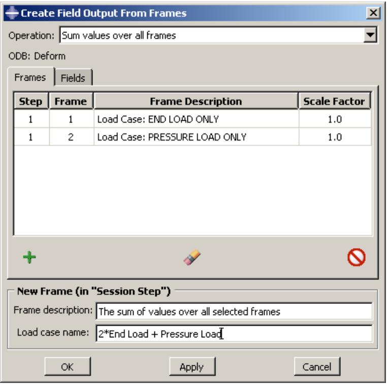  
图 1：通过组合多个载荷工况的结果来创建场输出。

## 其他信息

• 通过对帧运算创建场输出

## 通过对场运算创建场输出

您可以使用输出数据库中可用的场输出来计算新结果，从而创建场输出。例如，您可能创建新的场输出变量来显示两个增量之间应力场的差异。有关详细示例，请参阅“构建有效的场输出表达式”。

您通过对输出数据库中的分析结果进行运算来从场创建新的场输出变量。您可以像显示输出数据库场输出变量一样显示您创建的场输出变量：以变形图、等值线图或符号图的形式；通过探测任何模型或 X-Y 图；作为沿模型路径获得的 X-Y 数据；或以表格报告的形式。您创建的场输出变量将保存在会话步骤中，直到您结束会话或关闭产生该场输出的输出数据库。您也可以将场输出保存到输出数据库，在这种情况下，您必须以写入权限打开输出数据库。


注意：使用复数结果创建的场输出将仅包含数据的实部。您无法创建包含复数结果虚部的场输出。

如果您创建的场输出提取了张量变量的不变量标量分量，例如张量变量的Mises应力或其主应力之一，那么所得场输出的云图可能与不变量的原始云图不同。产生这种差异是因为这些云图的计算方式不同。Abaqus/CAE通过首先将张量外推到节点，计算不变量值，然后平均节点处的值来计算原始不变量。对于场输出，Abaqus/CAE将不变量值外推到单元节点并进行平均，这可能导致不同的云图。


注意：一些场输出变量，如PEEQ和PEMAG，在积分点处始终具有正值。对于这些变量，将结果从积分点外推到单元节点可能会导致某些节点处出现负值。为了避免这些负值结果，Abaqus/CAE在内部将这些场的单元节点值限制在0.0，并将负值重置为0.0。如果您对这些场输出变量进行运算以创建新的场输出，Abaqus/CAE不会为新的结果场输出在0.0处限制值，因此云图可能会显示一些负值。

1. 定位从场创建场输出的选项。

从主菜单栏中，选择 Tools->Field Output->Create From Fields。

将出现 Create Field Output 对话框。


提示：您也可以使用工具箱中的工具来指定场输出。

2. 新场输出变量的默认名称将出现在 Name 文本字段中。要提供更有意义的名称，请用您选择的名称替换此默认名称（如果愿意，可以包含空格）。  
3. 使用以下过程的组合在表达式文本字段中构建您的表达式：

a. 从 Create Field Output 对话框右侧的菜单中选择一个函数。

*   选择 Operators 对选定的场输出应用内置算术运算符。
*   选择 Transformation 对选定的场输出应用坐标系变换。
*   选择 Scalar 从选定的场输出中提取标量分量。

菜单下方的列表将随之更新以反映您的选择。

b. 从 Create Field Output 对话框左侧的列表中选择场输出变量。

您可以选择分析中任何步骤和帧的场输出。


提示：将光标悬停在输出变量表中分隔每列的垂直线上，然后拖动以增加列宽以查看完整文本。

选定的场输出变量将出现在表达式文本字段中。

c. 从 Create Field Output 对话框右侧的列表中选择运算符、变换或标量。

选定的函数将出现在表达式文本字段中。


## 注意：

如果您从变换列表中选择了一个动态坐标系（即跟随模型中节点移动的系统），则在表达式文本字段的变换函数内会出现 `deformationField=`。您必须选择一个Abaqus/CAE将用于计算坐标系位置的变形场输出变量。

d. 在表达式文本字段中使用标准的鼠标和键盘编辑技术来定位光标并配置您的表达式。  
e. 如有必要，请调整表达式的语法：可能需要括号。  
f. 如果您犯了错误并希望重新开始，请单击 Clear Expression。

有关更多信息，请参阅 构建有效的场输出表达式。

4. 单击 OK 以创建您的新场输出变量并关闭对话框。

Abaqus将创建一个新的场输出变量，默认情况下该变量包含在会话步骤（session step）的帧 0 中，并且可从 Field Output 对话框获取。当前的结果图（如果有）不受影响。

## 附加信息

*   选择特定的结果步骤和帧
*   构建有效的场输出表达式
*   对场输出使用运算
*   在后处理期间创建坐标系
*   了解结果是如何计算的
*   将结果转换到新坐标系
*   保存在会话期间创建的场输出

## 通过对帧进行运算创建场输出

您可以通过组合输出数据库中可用的多个帧的结果来创建场输出。

例如，您可能创建新的场输出来显示对多个载荷工况的组合响应。有关详细示例，请参阅 组合来自多个帧的结果。

您可以在指定的帧上对场输出求和，并且可以在指定的帧上找到最小值或最大值。您可以用与输出数据库场输出变量相同的方式显示您创建的场输出：以变形图、云图或符号图的形式；通过探测任何模型图或 X-Y 图；作为沿模型路径获得的 X-Y 数据；或在表格报告中。您创建的场输出保存在会话步骤中，直到您结束会话或关闭该场输出源自的输出数据库。您还可以将场输出保存到输出数据库，在这种情况下，您必须以写入权限打开该输出数据库。


## 注意：

使用复数结果创建的场输出将仅包含数据的实部。您无法创建包含复数结果虚部的场输出。

1. 定位从帧创建场输出的选项。

从主菜单栏中，选择 Tools->Field Output->Create From Frames。

将出现 Create Field Output From Frames 对话框。


提示：您也可以使用工具箱中的工具从帧创建场输出。

默认情况下，此对话框中的 Frames 和 Fields 页面为空。

2. 从 Operation 字段的列表中选择您希望执行的操作。

3. 单击以选择将包含在操作中的帧。

将出现 Add Frames 对话框。

4. 从 Step 字段的列表中选择分析步骤。

将显示该步骤可用帧的列表。

5. 选择您希望包含在操作中的单个帧（有关更多信息，请参阅 从列表和表格中选择多个项目），或单击 Select All 以包含所有可用帧。

6. 在 Add Frames 对话框中单击 OK 或 Apply。

您选择的帧将出现在 Create Field Output From Frames 对话框的 Frames 字段中。您可以使用 Frames 字段底部的按钮（移除选中项）和按钮（移除全部）根据需要修改您的帧选择。您也可以继续从 Add Frames 对话框中添加帧。

7. 如果您选择了求和（sum）操作，Create Field Output from Frames 对话框的 Frames 字段中还会出现一个 Scale Factor 列。每个帧的默认比例因子为 1.0。您可以通过单击 Scale Factor 列并输入新的比例因子值来修改所选帧的比例因子。

8. 单击 Create Field Output From Frames 对话框中的 Fields 选项卡，以选择将包含在操作中的场输出。

将显示所选帧可用的场输出变量，以及有关输出变量类型（张量、向量或标量）的信息。如果您选择了最小值（minimum）或最大值（maximum）操作，还将提供张量和向量变量的不变量/分量信息以及选择输出位置（Position）的选项。默认情况下，所有可用的输出变量在 Select 列中都有一个复选标记。

a. 单击 Select 列以取消选择您不希望包含在操作中的输出变量。  
b. 如果您选择了最小值或最大值操作，您可以单击 Invariant/Component 列，并从右侧出现的列表中选择您希望用于确定最小或最大场结果的不变量或分量。例如，如果您为应力变量选择了 Mises 不变量，Abaqus/CAE 将创建一个新的应力场输出变量，其中每一点的应力张量取自发生最大 Mises 值的帧（在步骤5中选择的帧列表内）。  
c. 如果您选择了最小值或最大值操作，您可以单击 Position 列，并选择用于存储新场输出的输出位置。例如，如果您想通过查找最大值从积分点应力创建新的场输出，您可以选择将场输出存储在 Element Nodal（单元节点）位置，以确保云图显示预期的结果。
d. 根据需要使用**全选**、**全部取消选择**和**默认**按钮修改您的场输出选择。

9. 您可以接受 Abaqus/CAE 提供的默认帧描述，也可以在**帧描述**字段中提供您自己的描述。
10. 默认情况下，Abaqus/CAE 不会为新的场输出提供载荷工况名称；如果您的新场输出代表分析中的附加载荷工况，您可以在**载荷工况名称**字段中提供一个名称。此名称仅用于组织目的。
11. 在**从帧创建场输出**对话框中单击**确定**以创建新的场输出并关闭对话框。

Abaqus 对选定帧上的选定场输出进行操作，以创建新的场输出，该输出包含在会话步骤的新会话帧中，并可从**场输出**对话框中使用。新变量的描述表明了它们是通过何种操作推导得出的。当前的结果绘图（如果有）不受影响。

当您选择最小值或最大值操作时，Abaqus 还会为每个结果创建一个场输出变量，指示从中获得每个最小值或最大值的帧。（帧通过其在选定帧列表中的索引来标识。）此变量名为 outputVariable\_Index，可在会话步骤的同一帧中使用，其查询或绘图方式与其他场输出变量相同。


提示：outputVariable\_Index 在**单元节点**、**节点**或**质心**位置效果更好，因为在积分点位置创建的 outputVariable\_Index 的绘图会受到外推和平均的影响，可能导致不正确的绘图。要了解更多信息，请参阅：理解结果如何计算

## 附加信息

•   选择特定的结果步骤和帧
•   创建并保存新的场输出
•   保存会话期间创建的场输出

## 保存会话期间创建的场输出

您可以将会话期间创建的场输出保存到输出数据库。

如果您想要将会话中的场输出保存到文件，则必须以写入权限打开一个输出数据库文件。如果您通过操作输出数据库中的分析结果创建了新的场输出，您可以将该场输出保存到输出数据库中的现有步骤，也可以创建一个新步骤。

1.  找到保存场输出的选项。

    从主菜单栏中，选择**工具**->**场输出**->**保存场**。

    **保存会话场输出变量**对话框将出现。您在会话期间创建的场输出将显示在表格中。

2.  在**目标步骤**字段中，选择您希望保存场输出的步骤。
3.  在**目标帧**字段中，选择您希望保存场输出的帧。
4.  从表格中选择您想要保存到输出数据库的场输出。
5.  如果您想要在输出数据库文件中创建一个新步骤，请单击**创建步骤**。
6.  在随后出现的**创建 Odb 步骤**对话框中，执行以下操作：

    a. 为新步骤输入名称和描述。

    b. 在**域**字段中，选择以下选项之一以指定步骤的域：
    •   **时间**，并输入时间段
    •   **频率**
    •   **弧长**
    •   **模态**

    c. 单击**确定**以创建该步骤。

7.  单击**确定**以保存这些场。

## 附加信息

•   打开模型数据库或输出数据库
•   通过对场进行操作创建场输出
•   通过对帧进行操作创建场输出

## 后处理期间创建坐标系

您可以在可视化模块中创建局部（或“会话”）坐标系，用于后处理目的：场输出结果可以变换到指定的用户定义坐标系中。

这些用户定义的坐标系可以固定在空间中，也可以随指定的节点在模型变形时移动。会话坐标系仅在您的会话期间持续存在，并且仅对单个输出数据库可用；但是，您可以将会话坐标系保存到其关联的输出数据库文件中，以便在后续的 Abaqus 会话中使用。

您可以从**坐标系管理器**或当前输出数据库的**结果树**中的**会话坐标系**容器重命名或删除会话坐标系。您还可以通过使用**结果树**中的快捷方式或将它们添加到显示组来显示、突出显示和隐藏单个坐标系。有关将会话坐标系和基于输出数据库的坐标系添加到显示组的更多信息，请参阅管理显示组。

有关控制后处理期间所有坐标系显示的信息，请参阅控制模型实体的显示。有关控制后处理期间单个坐标系显示的信息，请参阅管理显示组。有关结果变换的信息，请参阅将结果变换到新坐标系和通过对场进行操作创建场输出。

## 本节内容：

创建坐标系的方法
创建固定坐标系
创建遵循三个节点的坐标系
创建遵循圆上三个节点的坐标系
创建遵循单个节点的坐标系
将坐标系保存到输出数据库文件

## 创建坐标系的方法

在可视化模块中从主菜单栏选择**工具**->**坐标系**->**创建**以定义局部坐标系。

您可以选择坐标系的类型，并根据提示区中的提示定义坐标系轴。以下坐标系类型可用：
•   **固定系统**
•   **遵循 3 个节点的系统**
•   **遵循圆上 3 个节点的系统**
•   **遵循单个节点的系统**

您可以使用**结果树**中的**会话坐标系**容器或**坐标系管理器**来重命名或删除用户定义的坐标系，或将坐标系保存到输出数据库文件中以供后续 Abaqus/CAE 会话使用。

您通过指定原点和两个点来定义固定坐标系。从原点到点 1 的线是 X 轴（对于直角坐标系）或 R 轴（对于圆柱或球坐标系）；包含原点、点 1 和点 2 的平面是 X-Y 平面（对于直角坐标系）或 R-θ 平面（对于圆柱或球坐标系）。无论模型如何运动，该坐标系都保持在空间中固定。

您可以在视口中选择单个节点，或在提示区中输入点的 X、Y 和 Z 坐标。当您在视口中选择节点时，当前绘图状态的节点坐标用于确定坐标系的方向；也就是说，使用的是未变形或变形形状上节点的真实坐标（应用于变形形状的任何变形比例因子将被忽略）。

1.  从主菜单栏中，选择**工具**->**坐标系**->**创建**。

    **创建坐标系**对话框将出现。

    

    提示：您也可以使用工具箱中的工具或当前输出数据库的**结果树**中的**会话坐标系**容器来创建坐标系。

2.  在**创建坐标系**对话框中：

    a. 接受坐标系的默认名称，或在文本字段中输入您选择的名称。
    b. 勾选**固定系统**以指定坐标系的运动。
    c. 选择以下之一作为坐标系类型：
    •   **直角坐标系**：X、Y 和 Z 轴分别解释为 1、2 和 3 轴。
    •   **圆柱坐标系**：R、θ 和 Z 轴分别解释为 1、2 和 3 轴。
    •   **球坐标系**：R、θ 和 φ 轴分别解释为 1、2 和 3 轴。

## d. 单击**继续**。

Abaqus/CAE 将在提示区显示提示，帮助您定义坐标系轴。

3.  在视口中选择一个节点作为原点；或在提示区中输入原点的 X、Y 和 Z 坐标。
4.  在视口中选择一个节点位于 X 轴（对于直角坐标系）或 R 轴（对于圆柱或球坐标系）上；或在提示区中输入该点的 X、Y 和 Z 坐标。
5.  在视口中选择一个节点位于 X-Y 平面（对于直角坐标系）或 R-θ 平面（对于圆柱或球坐标系）内；或在提示区中输入该点的 X、Y 和 Z 坐标。

    该坐标系将出现在视口中、**坐标系管理器**的列表中以及当前输出数据库的**结果树**的**会话坐标系**容器下。Abaqus 仅保存用户定义的坐标系，直到输出数据库被关闭，除非您将其保存到输出数据库文件。坐标系创建后无法编辑；您可以重命名或删除尚未保存到输出数据库的坐标系。
## 附加信息

• 将坐标系保存到输出数据库文件
• 控制模型实体的显示

## 通过三个节点创建跟随节点运动的坐标系

您可以通过指定三个节点来定义附着在模型节点上的坐标系。从节点1（原点）到节点2的直线是X轴（对于直角坐标系）或R轴（对于柱坐标系或球坐标系）；包含这三个节点的平面是X-Y平面（对于直角坐标系）或R-θ平面（对于柱坐标系或球坐标系）。坐标系的运动由这三个节点的平移运动定义。

跟随模型节点运动的坐标系的视觉显示会根据所应用的变形比例因子进行更新；然而，基于这些坐标系的结果变换使用的是实际的、而非缩放后的变形。

1.  从主菜单栏中，选择 **Tools（工具）-> Coordinate System（坐标系）-> Create（创建）**。

    **Create Coordinate System（创建坐标系）** 对话框出现。

    

    **提示：** 您也可以使用工具箱中的工具或当前输出数据库结果树中的 **Session Coordinate Systems（会话坐标系）** 容器来创建坐标系。

2.  在 **Create Coordinate System（创建坐标系）** 对话框中：

    a.  接受坐标系的默认名称，或在文本字段中输入您选择的名称。
    b.  启用 **System following 3 nodes（系统跟随3个节点）** 以指定坐标系的运动。
    c.  选择以下之一作为坐标系类型：
        *   **Rectangular（直角）**：X、Y 和 Z 轴分别解释为 1、2 和 3 轴。
        *   **Cylindrical（柱）**：R、θ 和 Z 轴分别解释为 1、2 和 3 轴。
        *   **Spherical（球）**：R、θ 和 φ 轴分别解释为 1、2 和 3 轴。

3.  单击 **Continue（继续）**。

    Abaqus/CAE 在提示区域显示提示，帮助您定义坐标系轴。

4.  在视口中选择一个节点作为原点。
5.  在视口中选择一个节点，使其位于X轴上（对于直角坐标系）或R轴上（对于柱坐标系或球坐标系）。
6.  在视口中选择一个节点，使其位于X-Y平面内（对于直角坐标系）或R-θ平面内（对于柱坐标系或球坐标系）。

    该坐标系会出现在视口中、坐标系管理器的列表中以及当前输出数据库结果树的 **Session Coordinate Systems（会话坐标系）** 容器下。Abaqus 仅在输出数据库关闭前保存用户定义的坐标系，除非您将它们保存到输出数据库文件。一旦坐标系被创建，您就无法对其进行编辑；您可以重命名或删除未保存到输出数据库的坐标系。

## 附加信息

• 将坐标系保存到输出数据库文件
• 控制模型实体的显示

您可以通过选择位于圆弧上的三个节点来定义附着在模型上的坐标系。当模型不包含空心圆柱体的轴线或空心球体中心的任何节点，但您希望在这些位置定义坐标系时，此方法非常有用。由这三个节点定义的圆的圆心是坐标系的原点。从原点到节点1的直线定义了X轴（对于直角坐标系）或R轴（对于柱坐标系或球坐标系）；因此，您选择节点的顺序决定了θ角增加的方向。三个共线节点无效。圆的法线平行于Z轴（对于直角坐标系或柱坐标系）或φ轴（对于球坐标系）。坐标系的运动由这三个节点的平移运动定义。

跟随模型节点运动的坐标系的视觉显示会根据所应用的变形比例因子进行更新；然而，基于这些坐标系的结果变换使用的是实际的、而非缩放后的变形。

1.  从主菜单栏中，选择 **Tools（工具）-> Coordinate System（坐标系）-> Create（创建）**。

    **Create Coordinate System（创建坐标系）** 对话框出现。

    

    **提示：** 您也可以使用工具箱中的工具或当前输出数据库结果树中的 **Session Coordinate Systems（会话坐标系）** 容器来创建坐标系。

2.  在 **Create Coordinate System（创建坐标系）** 对话框中：

    a.  接受坐标系的默认名称，或在文本字段中输入您选择的名称。
    b.  启用 **System following 3 nodes on a circle（系统跟随圆上的3个节点）** 以指定坐标系的运动。
    c.  选择以下之一作为坐标系类型：
        *   **Rectangular（直角）**：X、Y 和 Z 轴分别解释为 1、2 和 3 轴。
        *   **Cylindrical（柱）**：R、θ 和 Z 轴分别解释为 1、2 和 3 轴。
        *   **Spherical（球）**：R、θ 和 φ 轴分别解释为 1、2 和 3 轴。

3.  单击 **Continue（继续）**。

    Abaqus/CAE 在提示区域显示提示，帮助您定义坐标系轴。

4.  在视口中选择位于圆弧上的三个节点。

    该坐标系会出现在视口中、坐标系管理器的列表中以及当前输出数据库结果树的 **Session Coordinate Systems（会话坐标系）** 容器下。Abaqus 仅在输出数据库关闭前保存用户定义的坐标系，除非您将它们保存到输出数据库文件。一旦坐标系被创建，您就无法对其进行编辑；您可以重命名或删除未保存到输出数据库的坐标系。

## 附加信息

• 将坐标系保存到输出数据库文件
• 控制模型实体的显示

## 创建跟随单个节点运动的坐标系

您可以定义一个附着在模型上单个节点的坐标系。指定的节点是坐标系的原点。节点上存在的自由度（平动和转动）决定了在分析的每个步骤和帧中坐标系轴的方向。如果该节点只有平动自由度，坐标系将始终与全局坐标系平行。

跟随模型节点运动的坐标系的视觉显示会根据所应用的变形比例因子进行更新；然而，基于这些坐标系的结果变换使用的是实际的、而非缩放后的变形。

1.  从主菜单栏中，选择 **Tools（工具）-> Coordinate System（坐标系）-> Create（创建）**。

    **Create Coordinate System（创建坐标系）** 对话框出现。

    

    **提示：** 您也可以使用工具箱中的工具或当前输出数据库结果树中的 **Session Coordinate Systems（会话坐标系）** 容器来创建坐标系。

2.  在 **Create Coordinate System（创建坐标系）** 对话框中：

    a.  接受坐标系的默认名称，或在文本字段中输入您选择的名称。
    b.  启用 **System following a single node（系统跟随单个节点）** 以指定坐标系的运动。
    c.  选择以下之一作为坐标系类型：
        *   **Rectangular（直角）**：X、Y 和 Z 轴分别解释为 1、2 和 3 轴。
        *   **Cylindrical（柱）**：R、θ 和 Z 轴分别解释为 1、2 和 3 轴。
        *   **Spherical（球）**：R、θ 和 φ 轴分别解释为 1、2 和 3 轴。

3.  单击 **Continue（继续）**。

    Abaqus/CAE 在提示区域显示提示，帮助您定义坐标系轴。

4.  在视口中选择该节点。

    该坐标系会出现在视口中、坐标系管理器的列表中以及当前输出数据库结果树的 **Session Coordinate Systems（会话坐标系）** 容器下。Abaqus 仅在输出数据库关闭前保存用户定义的坐标系，除非您将它们保存到输出数据库文件。一旦坐标系被创建，您就无法对其进行编辑；您可以重命名或删除未保存到输出数据库的坐标系。

## 附加信息

• 将坐标系保存到输出数据库文件
• 控制模型实体的显示

## 将坐标系保存到输出数据库文件

在后处理期间定义的坐标系默认仅在关联的输出数据库文件关闭前可用。如果您希望它们在未来的 Abaqus/CAE 会话中可用，则必须将这些坐标系保存到输出数据库文件中。分析期间定义的局部坐标系会自动写入输出数据库。您只能向输出数据库追加数据；您不能以任何其他方式修改文件的内容（即，一旦坐标系被保存到输出数据库，就无法对其进行修改、重命名或删除）。


## 注意：

默认情况下，Abaqus/CAE 以只读模式打开输出数据库文件。如果要向其中保存任何数据（例如坐标系），则必须选择以写入权限打开输出数据库文件（有关更多信息，请参阅打开模型数据库或输出数据库）。

1. 从主菜单栏中，选择 **工具（Tools）-> 坐标系（Coordinate System）-> 管理器（Manager）**。
    出现**坐标系管理器（Coordinate System Manager）**。默认情况下，**当前会话（Current session）**处于切换开启状态，并列出在当前会话期间为当前输出数据库定义的坐标系。
2. 选择您希望保存的用户定义坐标系，然后点击对话框右侧的**移至 ODB（Move to ODB）**按钮。
    如果当前输出数据库文件是以写入权限打开的，则选定的坐标系将从**当前会话（Current session）**列表移动到**当前 ODB（Current ODB）**列表。要查看已保存到当前输出数据库文件的坐标系列表，请切换开启**当前 ODB（Current ODB）**。

## 在后处理期间创建节点集和单元集

您可以在可视化模块（Visualization module）中创建节点集和单元集。

从主菜单栏中选择 **工具（Tools）-> 创建集（Create Set）**。只有当输出数据库（.odb）文件是以写入权限打开时，您才能创建和保存集。

此外，以下规则适用：

•   您只能在根装配体实例（rootAssembly instance）上创建集；但是，该实例的名称不能为 ASSEMBLY。
•   您不能编辑或删除在输出数据库中创建的集。

1.  在可视化模块（Visualization module）的主菜单栏中，选择 **工具（Tools）-> 创建集（Create Set）**。
2.  在出现的**创建集（Create Set）**对话框中，执行以下操作：
    a.  为集输入一个名称。
    b.  选择 **节点（Node）** 或 **单元（Element）** 作为集类型。
    c.  点击 **继续（Continue）**。
    d.  从视口中选择节点或单元。您可以单独选择节点和单元，按角度、按特征边选择，也可以按拓扑结构选择单元。
    e.  点击 **完成（Done）**。

新创建的集将出现在**结果树（Results Tree）**中。

•   打开模型数据库或输出数据库
•   使用角度和特征边方法选择多个对象
•   使用拓扑方法选择多个单元

本节说明未变形形状图和变形形状图的绘制以及叠加图。

打开输出数据库后，Abaqus/CAE 会立即显示模型的未变形形状。对于常规分析步骤，未变形图显示的是模型未经任何变形的形状。对于线性摄动分析步骤，未变形图显示的是模型的基础状态。变形图根据节点变量（如位移）的值显示模型的形状。未变形形状和变形形状也用于显示 Abaqus/CAE 中可用的其他绘图状态。您可以在未变形形状或变形形状上查看等值线、符号或材料方向，或者将它们叠加以查看形状之间的差异。

## 本节内容：

理解未变形形状图
理解变形形状图
使用通用绘图选项
生成未变形形状图
生成变形形状图
叠加变形和未变形模型图

## 理解未变形形状图

Abaqus/CAE 从输出数据库中获取生成未变形图所需的信息。打开输出数据库后，Abaqus/CAE 会立即显示模型的未变形绘图状态。

您可以使用与绘图状态无关的选项来自定义您的图。从主菜单栏中选择 **选项（Options）-> 通用（Common）** 以选择与绘图状态无关的自定义选项。

默认情况下，Abaqus/CAE 在输出数据库中最后一个分析步的最后一帧显示您的未变形模型。如果您的模型在分析步之间发生变化（例如由于接触面的添加或移除，或者载荷或边界的施加），您可能希望查看默认分析步之外的未变形模型。您可以通过从主菜单栏中选择 **结果（Result）-> 分析步/帧（Step/Frame）** 来选择查看未变形模型的分析步。有关更多信息，请参阅选择结果分析步和帧。

您还可以使用 Abaqus/CAE 将未变形和变形模型形状组合成一个图。有关更多信息，请参阅叠加变形和未变形模型图。组合形状可以为评估变形提供背景。

## 附加信息

•   生成未变形形状图

## 理解变形形状图

变形图根据节点变量（如位移）的值显示模型的形状。您可以选择 Abaqus/CAE 用于显示结果的节点变量（称为变形场输出变量），并且可以选择这些结果的分析步和帧。

如果您不选择变形场输出变量，Abaqus/CAE 会尝试选择一个默认值。Abaqus/Standard 和 Abaqus/Explicit 中的大多数分析过程默认将位移写入输出数据库；在这些情况下，Abaqus/CAE 选择位移作为用于默认变形变量的节点矢量。一些过程（例如传热分析）默认不将位移写入输出数据库；因此，Abaqus/CAE 不会为这些过程选择默认变形变量。如果输出数据库不包含可用于计算变形形状的任何变量，Abaqus/CAE 将无法显示变形图。

从输出数据库获取生成变形图所需的信息后，Abaqus/CAE 通过调整每个节点的坐标来计算变形模型的形状，调整依据是：

•   变形场输出变量（请参阅选择变形场输出变量）。
•   分析步和帧（请参阅选择特定的结果分析步和帧）。
•   均匀或非均匀变形比例因子（请参阅缩放变形）。
•   应用于变形场输出变量的任何用户定义的刚体变换（请参阅将结果转换到新坐标系）。

与未变形图形状类似，您可以使用与绘图状态无关的选项来自定义变形形状图。从主菜单栏中选择 **选项（Options）-> 通用（Common）** 以选择与绘图状态无关的自定义选项。

您还可以使用 Abaqus/CAE 将未变形和变形模型形状组合成一个图。组合形状可以为评估变形提供背景。如果选择叠加未变形和变形模型形状，您可以使用**叠加图（Superimpose plot）**选项来分别控制未变形形状和变形形状的显示。


提示：如果您想在不显示等值线、符号或材料方向的情况下显示一个或两个形状，请使用**允许多个绘图状态（Allow Multiple Plot States）**工具。您还可以使用此工具从可视化模块（Visualization module）工具箱中的工具选择任何绘图状态组合（有关更多信息，请参阅显示多个绘图状态）。

## 使用通用绘图选项

您可以使用通用绘图选项来自定义未变形图和变形图的外观。

这些通用选项也与视图菜单（View menu）中的其他与绘图状态无关的选项以及等值线、符号和材料方向绘图的相关及无关自定义选项结合使用。从主菜单栏中选择


**选项（Options）-> 通用（Common）** 或使用工具箱中的工具 来访问**通用绘图选项（Common Plot Options）**对话框。点击以下选项卡来自定义当前视口中图的外观：

•   **基本（Basic）**：选择渲染样式、边可见性和变形比例因子（仅限变形图）。
•   **颜色与样式（Color & Style）**：控制模型边的颜色和样式、模型面的颜色、边样式和边厚度。
•   **标签（Labels）**：控制单元、面和节点标签以及节点符号；并控制探针注释标签。
•   **法线（Normals）**：控制单元和表面法线。
•   **其他（Other）**：**其他（Other）**页面包含以下选项卡：
    -   **缩放（Scaling）**：控制模型缩放和收缩。
    -   **透明度（Translucency）**：控制着色和填充渲染样式的透明度。

如果您选择叠加未变形和变形模型形状，则通用选项控制变形形状的显示，而叠加图选项控制未变形形状的显示（有关更多信息，请参阅叠加变形和未变形模型图）。与绘图状态相关的选项可能会覆盖某些通用选项；例如，等值线绘图的颜色选项将始终覆盖通用颜色选项。

要了解如何自定义图的渲染样式和其他显示特征，请参阅自定义绘图显示。

## 生成未变形形状图

对于常规分析步骤，未变形图显示的是模型未经任何变形的形状。对于线性摄动分析步骤，未变形图显示的是模型的基础状态。由于不需要分析结果，因此仅由数据检查运行（datacheck run）生成的输出数据库就足以生成未变形形状图。模型和分析特征（例如表面定义）可能导致未变形模型的外观在分析步之间有所不同；您可以选择显示未变形图的分析步和帧。有关更多信息，请参阅选择结果分析步和帧。
默认情况下，当您打开一个输出数据库（output database）时，Abaqus/CAE 会显示分析最后一个分析步（step）和帧（frame）的未变形图状态（undeformed plot state）。该图使用当前会话的默认显示选项生成（有关保存显示选项的信息，请参阅保存显示选项设置）。要为已打开的输出数据库生成未变形图，请从主菜单栏选择 绘图（Plot）->未变形图（Undeformed Shape），或使用工具箱（toolbox）中的工具。

1. 使用 文件（File） 菜单打开包含模型数据的输出数据库。
2. 使用 结果（Result） 菜单选择要显示的结果分析步。
3. 选择您想要的与绘图状态无关的自定义选项。

每次您在结果或绘图状态无关的对话框中点击 应用（Apply） 时，Abaqus 会自动刷新您的未变形图。

## 生成变形图

变形图（deformed plot）根据变形场变量（deformed field variable）的值，显示您的模型在指定分析结果步骤和帧处的形状。有关选择步骤和帧的更多信息，请参阅选择特定的结果分析步和帧。有关选择变形场变量的更多信息，请参阅选择变形场输出变量。要了解如何显示与变形图关联的最小值和最大值，请参阅自定义图例（Customizing the legend）。

1. 使用 文件（File） 菜单打开包含分析结果的输出数据库。
2. 使用 结果（Result） 菜单选择以下内容：
   a. Abaqus 获取数值的步骤和帧。
   b. Abaqus 获取数值的变形场变量。分析过程中保存的变量均可用。
   c. Abaqus 显示复数结果时使用的数字格式。
3. 选择您想要的与绘图状态无关的自定义选项。
4. 从主菜单栏选择 绘图（Plot）->变形图（Deformed Shape） 以显示变形图。


提示：您也可以使用工具箱中的工具生成变形图。

当前视窗（viewport）显示了在指定步骤和帧的输出数据库中，指定变形场变量的自定义变形图。如果状态块（state block）处于活动状态，则会更改以显示所显示变量的名称。

每次您在结果或绘图状态无关的对话框中点击 应用（Apply） 时，Abaqus 会自动刷新您的变形图。

## 其他信息

*   生成未变形图
*   使用通用绘图选项

## 叠加变形图和未变形图

您可以将变形和未变形的模型形状组合在单个图中。组合这些形状为显示和解释云图、符号或材料方向提供了上下文。图 1 展示了一个叠加模型形状的示例。

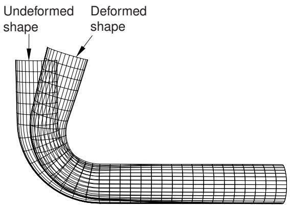
图 1：变形图叠加在未变形图上。

要生成叠加图，请从主菜单栏选择 绘图（Plot）->云图（Contours）、符号（Symbols）或材料方向（Material Orientations）->在两者上（On Both Shapes），或使用工具箱中的和工具。要在不包含云图、符号或材料方向的情况下叠加未变形和变形形状，或为相同结果显示任何绘图类型的组合，请使用工具并从工具箱中选择所有所需的绘图类型（更多信息，请参阅显示多个绘图状态）。

1. 从主菜单栏选择 选项（Options）->叠加（Superimpose） 以自定义未变形图的外观。


提示：您也可以使用工具箱中的工具自定义未变形图。

2. 点击以下选项卡修改选项：
    *   基本（Basic）：选择渲染样式和边可见性。
    *   颜色与样式（Color & Style）：控制模型边颜色和样式、模型面颜色、边样式和边厚度。
    *   标签（Labels）：控制单元、面和节点标签以及节点符号。
    *   法线（Normals）：控制单元和面法线。
    *   其他（Other）：其他页面包含以下选项卡：
        -   缩放（Scaling）：控制模型缩放和收缩。
        -   半透明（Translucency）：控制着色和填充渲染样式的半透明度。
        -   偏移（Offset）：控制未变形和变形形状之间的偏移。

有关自定义绘图显示特性的更详细信息，请参阅自定义绘图显示（Customizing plot display）。

Abaqus/CAE 使用叠加绘图选项代替通用绘图选项来在视窗中显示未变形图。

3. 要为变形图自定义类似选项，请选择 选项（Options）->通用（Common） 或使用工具箱中的1234工具。
4. 如果云图、符号或材料方向处于活动状态，请使用相关的绘图状态相关选项来自定义未变形图和变形图的显示。
5. 在每个选项对话框中点击 应用（Apply） 以在视窗中实施您的更改。

您的叠加绘图选项更改将在会话期间保存，并将影响后续所有同时显示两个模型形状的绘图中的未变形图。

## 其他信息

*   生成未变形图
*   生成变形图
*   使用通用绘图选项
*   自定义绘图显示

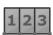

本节解释云图（contour）绘制。

云图（contour plot）显示在指定步骤和帧的分析变量的值。此外，云图可用于显示当前模型数据库（current model database）中模型在指定分析步的属性值，例如载荷或预定义场。Abaqus/CAE 将这些值表示为自定义彩色线条、彩色色带、彩色面、彩色等值面或模型上的刻度线。

## 本节内容：

*   理解云图绘制
*   使用云图绘图选项
*   生成云图
*   生成线性梁截面应力云图
*   自定义云图

## 理解云图绘制

本节讨论云图值的计算和渲染以及云图范围的计算。

## 本节内容：

*   关于云图绘制
*   理解云图值如何计算
*   理解云图如何渲染
*   理解云图范围

## 关于云图绘制

云图显示存储在输出数据库中的结果，或显示当前模型数据库中模型的属性。

每个云图显示以下值：对于输出数据库，云图显示在分析的特定步骤和帧中某个场输出变量（field output variable）的值；对于当前模型数据库中的模型，云图显示选定属性（如载荷）在您分析的特定步骤中的值。这些值在模型的表面上显示为彩色线条、彩色色带或被子式彩色面，或者显示为将线云图延伸到模型内部的等值面，具体取决于您选择的自定义选项。如果当前视窗中没有可见单元，则无法生成云图。

线型、色带型、被子型和等值面型云图如图 1 所示。


图 1：从左至右：显示为彩色线条、彩色色带、彩色面和彩色等值面的云图。

与其他单元一样，线型单元（beam，一维单元，衬垫连接单元和三维线衬垫单元，以及二维接触面）的云图默认沿线单元绘制。线型云图不推荐用于线型单元。刻度线（tick mark）云图提供了一种在梁和其他线型单元上可视化的替代方法。云图显示为在两组垂直于单元的线之间绘制的曲线，如图 2 所示。云图级别由这些法线上的“刻度线”指示。


图 2：刻度线云图。

解读云图的关键是绘图图例（plot legend）。图例指示了云图值与云图颜色之间的对应关系。

默认情况下，Abaqus/CAE 将图例中最小值和最大值之间的差值均匀划分为 12 个区间。如果需要，您可以更改区间数量。每个区间都关联一种颜色。对于线型或等值面型云图，每条彩色线或面都对应模型中一组场输出变量具有图例所示值的位置。对于色带型云图，每个彩色云图色带都对应于图例指示的边界内的一系列值。对于被子型云图，每个彩色单元面对应于该颜色图例指示的边界内的一个单一值。对于刻度线云图，每个彩色刻度线对应于图例指示的一个单一值。
Abaqus/CAE 对接触状态（CSTATUS）的等高线图遵循不同的约定。该变量描述主面和从面的单个节点是否接触，如果接触，该点处的表面是粘着还是滑动。因为每个节点有三种可用的状态设置——粘着、滑动或打开——Abaqus/CAE 使用三个等高线区间来显示接触状态数据，并根据节点的接触状态对其周围区域进行着色来渲染等高线图。

连接器向量输出的分量根据请求的输出是场输出还是历史输出，相对于不同的坐标系进行解析。有关如何解释场图中向量分量值的信息，请参见《在 Visualization 模块中显示连接器和连接器输出》。

要了解如何生成等高线图，请参见《生成等高线图》。

## 理解等高线值的计算方式

从输出数据库中存储的结果生成等高线图所需的计算，取决于等高线图显示的是基于节点的量（如位移或速度）的值，还是基于单元的量（如应力或应变）的值。本节仅适用于输出数据库数据的等高线图。

## 如何计算基于节点的场输出变量的等高线值

对于基于节点的场输出变量的等高线图，等高线值直接从输出数据库上的量获取。然后这些值无需进一步计算即可用于在模型表面生成彩色线条或色带。

## 如何计算基于单元的场输出变量的等高线值

对于基于单元的场输出变量的等高线图，Abaqus/CAE 对输出数据库结果进行计算以形成等高线值。计算根据以下标准而变化：

•  您选择绘制的量（场输出或间断），
•  您选择的平均选项，
•  您选择的结果区域，
•  图中包含的单元的兼容性，以及
•  您请求的等高线图类型（线、带状或拼合）。

从主菜单栏中选择 Result->Field Output 以选择场输出变量。要了解更多关于此主题的信息，请参见《选择要显示的场输出》。

从主菜单栏中选择 Result->Options 以选择要绘制的量、平均选项、结果区域，并控制在计算基于单元的等高线值期间不兼容单元的处理。要了解更多关于这些主题的信息，请参见《选择结果选项》。

从主菜单栏中选择 Options->Contour->Basic 以选择所需的等高线图类型。选择线、带状、拼合或等值面类型的等高线图包含有关选择等高线类型的详细说明。

您请求的等高线图类型决定了对从输出数据库读取的结果所应用的外推。对于基于单元的变量值的线、带状和等值面类型的等高线图，Abaqus/CAE 将结果外推到节点。默认情况下，在 Abaqus/CAE 执行任何必要的变换并计算任何请求的标量分量或不变量后，会进行条件平均；如果需要，您可以在结果平均后计算不变量。对于基于单元的变量值的拼合类型等高线图，Abaqus/CAE 将结果外推到模型表面的单元面，然后取加权和以生成每个面的单个值。由于拼合等高线值是针对每个单元面单独计算，不跨越单元边界进行平均，因此拼合等高线图是显示逐单元结果的有效手段。您只能为基于单元的场输出变量选择拼合类型等高线图。

## 理解等高线的渲染方式

等高线值使用两种方法之一绘制在单元面上：纹理映射或网格化。纹理映射是一种高性能渲染方法，本质上是将等高线值的图像（纹理）覆盖在模型的图像上，类似于包装礼物的过程。网格化是一种将任意等高线值转换为重复的不同形状（如三角形或简单多边形）图案的方法；形状值按面计算，对于大型模型可能需要较长时间。纹理映射是默认且首选的方法，将最大限度地提高 Abaqus/CAE 的性能。尽管某些图形适配器不能正确支持纹理映射，但 Abaqus/CAE 可以在软件中模拟纹理映射。但是，线型和等值面等高线、等高线边界的显示、围绕质心缩小单元以及 CAXA 或 SAXA 单元上的等高线仅受网格化方法支持。

使用纹理映射或网格化生成的等高线图之间的差异很小；您可能会看到四边形单元面上等高线带的外观略有不同。纹理映射有时会引入精度问题；例如，如果等高线值正好在某个极限上，颜色可能会显示为略高于或低于该值。


## 注意：

如果您在强光下显示网格化等高线，等高线中的颜色可能与图例中显示的颜色不匹配，因为光线可能会使表面小平面上的某些颜色变淡。有关更多信息，请参见《控制模型光照》。

有关选择等高线方法的详细信息，请参见《选择等高线方法》。

## 理解等高线范围

等高线图中显示的最小值和最大值可以由 Abaqus/CAE 计算，或者您可以指定它们。

您可以决定指定一个或两个范围限制；例如，消除极值或在固定的边界范围内检查变化。

等高线仅显示在模型的可见表面上；但是，根据等高线图的类型和您选择的结果选项，Abaqus/CAE 可能会根据当前显示组中的所有单元或模型中的所有单元计算等高线值。（有关更多信息，请参见《选择结果选项》。）因此，报告的最小值和最大值可能出现在内部单元上。您可以通过使用显示组仅在图中显示内部单元，或通过将所有单元围绕其质心缩小，使得内部单元在外部单元的主体之间可见，来显示模型内部的等高线。

Abaqus/CAE 根据显示的场输出变量类型（节点或单元）、等高线图类型（拼合与线或带状）以及您选择的选项，以不同方式计算最小值和最大值。对于节点场输出变量的等高线图，范围是最大值和最小值节点值。对于拼合类型等高线图，范围是最大值和最小值单元面值。对于单元场输出变量的线、带状或等值面类型等高线图，Abaqus/CAE 根据当前平均标准定义的外推、平均值确定最小值和最大值。对于单元场输出变量，等高线最大值和最小值可以在单元面、积分点和单元质心以及节点处给出。

当 Abaqus/CAE 对在节点平均的值计算最小值和最大值时，范围基于用于创建绘图的值。在这种情况下，图例边界可能会随您更改平均标准而变化。要了解如何控制平均标准，请参见《控制结果平均》。

您还可以控制等高线图动画的每一帧使用哪个等高线范围：第一帧和最后一帧计算的范围、当前帧计算的范围、每一帧单独重新计算的范围，或动画中所有帧计算的范围。基于动画中所有帧计算范围需要完整遍历动画序列一次，以建立用于后续遍历的等高线范围。

有关控制等高线范围的详细信息，请参见《设置等高线范围》。要了解如何显示与等高线图相关的最小值和最大值，请参见《自定义图例》。

## 使用等高线图选项

您可以使用等高线图选项来自定义等高线图的外观。

□ 从主菜单栏中选择 Options->Contour 或在工具箱中点击以访问 Contour Plot Options 对话框。点击以下选项卡来自定义当前视口中等高线图的外观：

•  Basic：选择等高线类型（包括是否为线单元显示刻度线）、等高线区间和等高线方法。
•  Color & Style：Color & Style 页面包含以下选项卡：

    Model Edges：控制模型边缘的颜色。
等值线图（Spectrum）：选择等值线颜色，并控制图例中显示数值的顺序。  
线（Line）：对于线型等值线，控制每条线的样式和粗细。  
- 分带（Banded）/ 等值面（Isosurface）：对于分带型或等值面型等值线，控制等值线边缘的颜色、样式和粗细。

• 范围（Limits）：控制等值线范围的计算以及最大值和最小值等值线值的标注显示。  
• 其他（Other）：控制刻度标记图显示选项、节点平均矢量或张量方向的显示，以及截面点或包络图的显示。

其他选项，如渲染样式、边可见性、变形缩放系数和半透明度，位于“通用绘图选项”（Common Plot Options）对话框中。如果您选择在未变形和已变形形状上同时绘制等值线，可以使用“叠加绘图选项”（Superimpose Plot Options）来自定义未变形形状的外观。有关叠加绘图的更多信息，请参阅叠加显示已变形和未变形模型图。要了解如何自定义等值线图的渲染样式和底层模型，请参阅自定义绘图显示。关于结果值的计算，请参阅理解结果是如何计算的。

## 附加信息

• 自定义等值线图

## 生成等值线图

等值线图可以显示输出数据库中指定分析步和帧的某个分析变量的值，或者显示当前模型数据库中模型在指定分析步的所选属性的值。Abaqus/CAE 将这些值表示为自定义颜色的线条、色带、着色面或着色的等值面绘制在模型上，或者以彩色刻度标记绘制在垂直于模型的线条上。有关选择分析变量的更多信息，请参阅选择主要场输出变量。有关选择特定分析步和帧的更多信息，请参阅选择特定的结果分析步和帧。要了解如何显示与等值线图相关的最小值和最大值，请参阅自定义图例。

如果您的模型包含梁单元，可能需要执行一些额外步骤才能正确显示等值线。请参阅生成线性梁截面应力的等值线图。

如果您要绘制来自模型数据库的数据，请仅指定主要场变量。

1.  使用“文件”（File）菜单打开包含模型数据或分析结果的模型数据库或输出数据库。
2.  如果您要绘制来自模型数据库的数据，请切换到“可视化”（Visualization）模块，展开结果树（Results Tree）中的“模型数据库”（Model Database）容器，并选择要使用的模型。

3.  使用“结果”（Result）菜单进行以下选择：

    a. 要显示的分析步和帧（如果选择的是模型数据库，则只需选择分析步）。
    b. 要显示的主要场输出变量。
    c. 要显示的变形场输出变量（仅适用于在已变形形状上绘制等值线）。
    d. 要绘制的量和平均选项（仅适用于输出数据库）。

4.  选择您想要的与绘图状态无关的选项和等值线图自定义选项。

5.  如果您选择的场输出变量包含复数，请在“结果选项”（Result Options）对话框中选择“复数形式”（Complex Form）选项卡以控制要显示的数值形式。复数形式选项仅适用于输出数据库。

6.  从主菜单栏中，选择“绘图”（Plot）->“等值线图”（Contours），然后选择是在未变形形状、已变形形状还是两者上绘制等值线。


提示：您也可以使用工具箱中的已变形 、未变形 或叠加 等值线工具来生成等值线图。

当前视口将显示指定场输出变量在当前输出数据库的指定分析步和帧处，或在当前模型数据库中所选模型的指定分析步处的自定义等值线图。

每次您在分析步和帧选择器、场输出选项、与绘图状态无关的选项、叠加绘图选项（如果适用）或等值线图选项对话框中单击“应用”（Apply）时，Abaqus 会自动刷新您的等值线图。

## 附加信息

• 使用等值线图选项
• 选择要绘制的模型数据和分析结果

## 生成线性梁截面应力的等值线图

如果您的模型包含梁几何结构，并且当前会话启用了梁渲染，您可以将沿梁截面的场输出结果显示为等值线。对于节点量和单元积分点量，Abaqus/CAE 显示的等值线在梁截面厚度方向上是恒定的。对于基于单元的数据，等值线反映当前选定的截面点。

您也可以创建基于截面力（SF）和截面力矩（SM）数据的等值线图，以显示更真实的梁内应力分布，Abaqus/CAE 使用线弹性固体力学理论计算这些数据。图 1 显示了工字梁截面应力分布的示例。


图 1: 为工字梁截面显示的线性梁截面应力。

仅当所选分析步和帧包含来自积分输出量截面力（SF）和截面力矩（SM）的数据时，梁应力等值线图才可用。此外，这些图仅适用于 Abaqus/CAE 中的部分型材：

• 薄壁箱型材
• 薄壁管型材
• 圆形型材
• 矩形型材
• 工字型材
• 角型材
• T 型材

BEAM\_STRESS 输出不适用于随机响应和响应谱分析过程。

Abaqus/CAE 在计算梁截面渲染时不包括特征频率提取的梁单元法线，因此您无法在这些图中可视化梁单元的扭转和面外模态。但是，由于梁单元具有扭转刚度，因此会计算梁单元的扭转模态；此信息可在数据（.dat）文件中找到。

1.  使用“文件”（File）菜单打开包含分析结果的输出数据库。

2.  使用“结果”（Result）菜单进行以下选择：

    a. 要显示的分析步和帧。
    b. 要显示的主要场输出变量。
    c. 要显示的变形场输出变量（仅适用于在已变形形状上绘制等值线）。
    d. 要绘制的量和平均选项。

3.  选择您想要的与绘图状态无关的选项和等值线图自定义选项。

4.  从“输出变量”（Output Variable）选项中，选择 BEAM\_STRESS。

5.  选择您想要显示等值线数据的不变量或分量：

    • 从“不变量”（Invariant）选项中选择 Mises 以显示 von Mises 应力。
    • 从“分量”（Component）选项中选择 S11 以显示沿梁的轴向应力。
    从“分量”（Component）选项中选择 S12 以显示由剪力和扭转引起的沿局部梁截面 2 轴的剪应力。
    从“分量”（Component）选项中选择 S13 以显示由剪力和扭转引起的沿局部梁截面 1 轴的剪应力。

6.  从主菜单栏中，选择“绘图”（Plot）->“等值线图”（Contours），然后选择是在未变形形状、已变形形状还是两者上绘制等值线。


提示：您也可以使用工具箱中的已变形 、未变形 或叠加 等值线工具来生成等值线图。

当前视口将显示指定场输出变量在当前输出数据库的指定分析步和帧处的自定义等值线图。

每次您在分析步和帧选择器、场输出选项、与绘图状态无关的选项、叠加绘图选项（如果适用）或等值线图选项对话框中单击“应用”（Apply）时，Abaqus 会自动刷新您的等值线图。

## 附加信息

• 使用等值线图选项
• 选择要绘制的模型数据和分析结果
• 生成线性梁截面应力的等值线图

## 自定义等值线图

本节介绍如何自定义等值线图。Abaqus/CAE 提供了众多选项供您控制等值线的类型、范围、间隔和颜色。

要了解如何自定义等值线图的渲染样式、半透明度或模型边缘特征，请参阅自定义绘图显示。有关向等值线图添加节点平均方向的信息，请参阅显示节点平均方向。有关自定义包络图的信息，请参阅按类别选择截面点数据。关于结果值的计算，请参阅理解结果是如何计算的。

## 本节内容：

选择线型、分带型、镶拼型或等值面型等值线
设置线型等值线样式
自定义分带型和等值面型等值线
使用刻度标记等值线图绘制线状单元
自定义刻度标记等值线图
选择等值线方法
设置等值线范围
标注最小值和最大值等值线值
控制 Abaqus/CAE 如何计算等值线限值  
自定义等值线颜色  
创建新的颜色谱  
自定义等值线间距

## 选择线型、带状、蒙皮型或等值面型等值线

您可以选择线型 (Line)、带状 (Banded) 或等值面型 (Isosurface) 等值线来显示节点（如位移）或单元（如应力）的场输出变量值。线型等值线将数值表示为模型表面上自定义颜色的线条。带状等值线将数值表示为彩色填充的条带。等值面等值线是线型等值线在模型内部的延伸。基于单元的变量值的线型、带状和等值面等值线通过将结果外推到节点并有条件地平均来计算。平均取决于您的模型特性和您选择的选项。线型等值线不推荐用于线形单元，例如梁。

您只能为单元场输出变量选择蒙皮型 (Quilt) 等值线。变量值被外推到模型表面上的单元面，单元之间不进行平均。蒙皮等值线对于逐个单元评估结果很有用。对于具有非对称变形的轴对称单元（CAXA 或 SAXA），每个单元只绘制一种颜色。

带状等值线是默认选项。您必须选择线型、带状或等值面型等值线来生成以下绘图：
• 基于节点的场输出值。
• 在单元间平均的基于单元的场输出值。
• 基于单元的结果不连续性，而非场输出值。

图 1 显示了线型、带状、蒙皮型和等值面型等值线图的外观。  
  
图 1：从左至右：线型、带状、蒙皮型和等值面型等值线。

1. 定位“等值线类型 (Contour Type)”选项。

□ 从主菜单栏选择 Options -> Contour 或单击工具箱中的 ；然后在出现的对话框中单击“基本 (Basic)”选项卡。“等值线类型”选项位于页面左上角。

2. 单击 Line、Banded、Quilt 或 Isosurface 以选择所需的等值线类型。
3. 单击“应用 (Apply)”以实施更改。

当前视口中的等值线图将更改为显示您指定的等值线类型。

默认情况下，您的更改会保存在整个会话期间，并将影响所有后续等值线图。如果您希望为后续会话保留更改，请将其保存到文件。有关更多信息，请参阅保存自定义设置以供后续会话使用。

## 附加信息

• 了解等值线值的计算方式  
• 样式化线型等值线  
• 自定义带状和等值面型等值线

## 样式化线型等值线

Abaqus/CAE 将线型等值线显示为模型表面上自定义颜色的线条。您可以样式化单个等值线以使其易于区分。

当颜色不可用时（例如，用于黑白硬拷贝打印），此选项特别有用。图 1 显示了一个具有自定义等值线的等值线图。


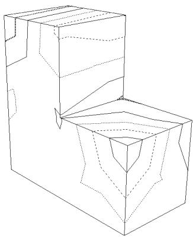  
图 1：具有自定义等值线的线型等值线图。

您可以通过参考等值线图例中的位置，一次自定义一个颜色（间隔）的彩色线条。间隔编号 1 是从等值线图例底部开始的第一条彩色线。有关等值线图例的信息，请参阅自定义图例。

1. 定位“线 (Line)”选项。

从主菜单栏选择 Options -> Contour 或单击工具箱中的 。在出现的对话框中单击“颜色与样式 (Color & Style)”选项卡；然后单击“线 (Line)”选项卡。“线”选项出现。

2. 要选择要自定义的间隔，请单击“间隔 (Interval)”箭头，直到所需的间隔编号出现在“间隔”框中。


## 注意：

“样式 (Style)”和“线宽 (Thickness)”按钮会分别更改以显示此间隔的当前样式和线宽。“间隔”框上下的数字会更改以对应相邻的间隔编号。“样式”和“线宽”按钮上下的区域会分别更改以显示这些相邻间隔的样式和线宽。

3. 选择间隔线的样式：

a. 单击“样式 (Style)”按钮以显示样式选项。
b. 单击所需的样式。
指定的样式显示在“样式”按钮上。

4. 选择间隔线的线宽：

a. 单击“线宽 (Thickness)”按钮以显示线宽选项。
b. 单击所需的线宽。
指定的线宽显示在“线宽”按钮上。

5. 重复步骤 2 到 4 以自定义其他间隔。

6. 单击“应用 (Apply)”以实施更改。

当前视口中的线型等值线图的等值线将更改为反映您的样式和线宽规范。如果等值线图例处于活动状态，它也将更改为显示您的选择。有关等值线图例的更多信息，请参阅自定义图例。此外，如果存在刻度标记轴，它们也将更改为显示您的选择。有关刻度标记等值线的更多信息，请参阅使用刻度标记等值线图对线形单元进行等值线绘制。

默认情况下，您的更改会保存在整个会话期间，并将影响所有后续等值线图。如果您希望为后续会话保留更改，请将其保存到文件。有关更多信息，请参阅保存自定义设置以供后续会话使用。

## 附加信息

• 了解等值线绘制  
• 自定义等值线图  
• 自定义等值线间隔

## 自定义带状和等值面型等值线

Abaqus/CAE 将带状等值线显示为模型表面上的彩色条带，并将等值面等值线通过延伸线型等值线穿过模型以创建表面来显示。您可以显示或抑制每个等值线带或等值面边缘的线条；这些线条称为等值线边。在带状等值线图中，等值线边在视觉上分隔了用于表示等值线值的颜色；对于等值面，分隔通常更明显，等值线边的显示更具装饰性。您可以进一步自定义等值线边的颜色、样式和线宽。例如，在图 1 中，左侧的等值线图抑制了等值线边，而右侧的图显示了等值线边。


## 注意：

等值线边不适用于连续间隔等值线图。

  
图 1：抑制和显示等值线边的带状等值线图。

1. 定位“带状/等值面 (Banded / Isosurface)”选项。

从主菜单栏选择 Options -> Contour 或单击工具箱中的 。在出现的对话框中单击“颜色与样式 (Color & Style)”选项卡；然后单击“带状/等值面 (Banded / Isosurface)”选项卡。“带状/等值面”选项出现。

2. 切换“显示等值线边 (Show contour edges)”以显示或抑制等值线边。

当“显示等值线边”开启时，等值线边选项变为可用。

3. 选择等值线边的颜色：

a. 单击颜色样本 。

Abaqus/CAE 显示“选择颜色 (Select Color)”对话框。

b. 使用“选择颜色”对话框中的方法之一选择新颜色。有关更多信息，请参阅自定义颜色。

c. 单击“确定 (OK)”关闭“选择颜色”对话框。

颜色样本更改为所选颜色。在您单击“等值线图选项”对话框中的“确定”或“应用”之前，新颜色不会出现在视口中。

4. 选择等值线边的样式：

a. 单击“样式 (Style)”按钮以显示等值线边样式选项。
b. 单击所需的边缘样式。

指定的边缘样式显示在“样式”按钮上。

5. 选择等值线边的线宽：

a. 单击“线宽 (Thickness)”按钮以显示等值线边线宽选项。
b. 单击所需的边缘线宽。
指定的边缘线宽显示在“线宽”按钮上。

6. 单击“应用 (Apply)”以实施更改。

当前视口中的带状等值线图的等值线边将更改为反映您的规范。

默认情况下，您的更改会保存在整个会话期间，并将影响所有后续等值线图。如果您希望为后续会话保留更改，请将其保存到文件。有关更多信息，请参阅保存自定义设置以供后续会话使用。

## 附加信息

• 选择线型、带状、蒙皮型或等值面型等值线  
• 自定义等值线间隔  
• 了解等值线绘制

## 使用刻度标记等值线图对线形单元进行等值线绘制

绘制在线形单元上的等值线难以清晰可视化。为了更好地查看线形单元（梁、一维单元、垫片连接单元、三维线垫片单元和二维接触面）的等值线，您可以选择使用刻度标记等值线图来显示等值线。
刻度线等值线图显示了在垂直于实际单元的一组线条之间绘制的等值线曲线。等值级数通过这些法线上的“刻度线”表示。只有当等值线曲线落在您指定的范围内时，Abaqus 才会显示该曲线。有关限制绘图范围的更多信息，请参阅设置等值线限制。

图 1 展示了刻度线等值线图的外观。
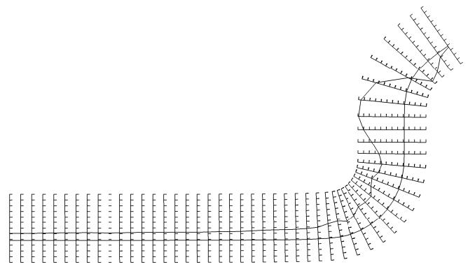
图 1：刻度线等值线图。

法线（即刻度线坐标轴）绘制在节点处。在部件边界处，会绘制两条刻度线坐标轴。在部件内部，如果两个相邻线单元之间的角度小于指定的特征角度，则会在共享该节点的单元平均法线方向绘制一条单一的刻度线坐标轴。否则，对于共享该节点的每个单元，都会沿其法线方向绘制一条刻度线坐标轴。计算平均法线时，仅考虑已显示的相同类型单元。

1.  **找到 Contour Type（等值线类型）选项。**

    从主菜单栏选择 `Options` -> `Contour`，或在工具箱中点击；然后在出现的对话框中点击 `Basic` 选项卡。Contour Type（等值线类型）选项位于页面的左上角。

2.  **切换 `Show tick marks for line elements`（显示线单元的刻度线）。**

3.  **点击 `Apply`（应用）以实施您的更改。**

当前视口中的等值线图将变为显示模型中线单元的刻度线图。

默认情况下，您的更改会在会话持续期间保存，并将影响后续的所有等值线图。如果您希望在后续会话中保留更改，请将其保存到文件。有关更多信息，请参阅保存自定义设置以供后续会话使用。

## 附加信息

*   理解等值线图绘制
*   自定义刻度线等值线图

当您选择在模型中显示线状元素的刻度线时，Abaqus/CAE 会在垂直于单元绘制的线（坐标轴）上通过刻度线指示等值级数，并在坐标轴之间显示等值线曲线。您可以指定刻度线坐标轴的长度、等值线曲线的颜色、将与单元相交的等值值（刻度线），以及将在梁单元上绘制坐标轴的法线方向。此外，对于线型等值线图，您应用于单个等值线的样式选择将显示在刻度线坐标轴上。有关更多信息，请参阅设置线型等值线样式。

1.  **找到 Tick Marks（刻度线）选项。**

    从主菜单栏选择 `Options` -> `Contour`，或在工具箱中点击。在出现的对话框中点击 `Other`（其他）选项卡；然后点击 `Tick Marks`（刻度线）选项卡。Tick Marks（刻度线）选项随即出现。

2.  **要选择将在梁单元上绘制刻度线坐标轴的法线方向，请切换 Orientation（方向）字段中的 N1 或 N2 按钮。**

    

## 注意：

当在除梁以外的线单元上显示刻度线等值线图时，此选项将被忽略。在这种情况下，刻度线坐标轴将沿单元法线方向绘制。

3.  **选择刻度线坐标轴的长度：**

    a. 点击 `Axis length`（坐标轴长度）按钮以显示长度选项：Short（短）、Medium（中）或 Long（长）。
    b. 点击您想要的长度。

    指定的长度将显示在 Axis length（坐标轴长度）按钮上。

4.  **选择将与单元相交的等值值：**

    a. 在 `Base Value`（基准值）字段中输入所需的基准等值值。

    输入的值将被检查以确定其是否在等值线范围内。如果它高于最大等值值，则使用最大等值值作为基准值；如果它低于最小等值值，则使用最小等值值作为基准值。默认情况下，使用零作为基准值。

5.  **选择刻度线曲线的颜色：**

    a. 点击颜色样本。

        Abaqus/CAE 显示 Select Color（选择颜色）对话框。

    b. 使用 Select Color（选择颜色）对话框中的一种方法选择新颜色。有关更多信息，请参阅自定义颜色。
    c. 点击 `OK` 关闭 Select Color（选择颜色）对话框。

    颜色样本变为所选颜色。新颜色在您点击 Contour Plot Options（等值线图选项）对话框中的 `OK` 或 `Apply` 之前不会出现在视口中。

6.  **点击 `Apply`（应用）以实施您的更改。**

当前视口中刻度线等值线图的等值线将发生变化以反映您的设置。

默认情况下，您的更改会在会话持续期间保存，并将影响后续的所有等值线图。如果您希望在后续会话中保留更改，请将其保存到文件。有关更多信息，请参阅保存自定义设置以供后续会话使用。

## 附加信息

*   理解等值线图绘制
*   自定义等值线图

## 选择等值线方法

等值值使用纹理映射或曲面细分方法绘制在单元面上。纹理映射是默认且首选的方法，它将最大限度地提高 Abaqus/CAE 的性能。尽管某些图形适配器不能正确支持纹理映射，但 Abaqus/CAE 可以在软件中模拟纹理映射。然而，某些显示选项仅由曲面细分方法支持；在这种情况下，Abaqus/CAE 会自动覆盖用户对纹理映射等值线的设置。

1.  **找到 Contour Method（等值线方法）选项。**

    从主菜单栏选择 `Options` -> `Contour`，或在工具箱中点击；然后在出现的对话框中点击 `Basic`（基本）选项卡。Contour Method（等值线方法）选项位于页面底部。

2.  **选择以下渲染方法之一：**

    *   **Texture-mapped（纹理映射）。** 此选项使用高性能图形渲染功能在每个单元面上绘制等值值。如果您的系统图形参数被配置为禁用纹理映射（请参阅调整显卡），Abaqus/CAE 将在软件中模拟纹理映射。
    *   **Tessellated（曲面细分）。** 此选项使用曲面细分过程在每个单元面上绘制等值值。

3.  **点击 `Apply`（应用）以实施您的更改。**

当前视口中的等值线图将变为使用您指定的等值线方法。默认情况下，您的更改会在会话持续期间保存，并将影响后续的所有等值线图。如果您希望在后续会话中保留更改，请将其保存到文件。有关更多信息，请参阅保存自定义设置以供后续会话使用。

## 附加信息

*   理解等值线如何渲染
*   自定义等值线图

## 设置等值线限制

默认情况下，Abaqus/CAE 会自动计算等值线图中显示值的范围。

您可以控制 Abaqus/CAE 显示的最小值和最大值；例如，消除极值或检查固定范围内的变化。

等值线限制一旦设置，将在会话持续期间保持有效。要了解如何显示与等值线图相关的最小值和最大值，请参阅自定义图例。

如果您使用自定义等值线间隔值，可以覆盖等值线限制；有关更多信息，请参阅自定义等值线间隔。当您使用自定义等值线间隔时，Abaqus/CAE 会将您在“编辑间隔”对话框中指定的最大和最小间隔值用作等值线图的等值线限制。

如果您指定了等值线限制，随后又修改了限制，等值线间隔数越少，您的限制修改导致等值线图发生变化的可能性就越大。

1.  **找到 Contour Limits（等值线限制）选项。**

    从主菜单栏选择 `Options` -> `Contour`，或在工具箱中点击；然后在出现的对话框中点击 `Limits`（限制）选项卡。Contour Limits（等值线限制）选项变为可用。

2.  **在标记为 Max（最大值）的区域中，选择以下选项之一：**

    *   选择 `Auto-compute`（自动计算）以请求 Abaqus 计算最大等值值。
    *   选择 `Specify`（指定）以自行指定最大值；然后在 `Specify`（指定）文本字段中输入您选择的最大值。

3.  **在标记为 Min（最小值）的区域中，选择以下选项之一：**

    *   选择 `Auto-compute`（自动计算）以请求 Abaqus 计算最小等值值。
    *   选择 `Specify`（指定）以自行指定最小值；然后在 `Specify`（指定）文本字段中输入您选择的最小值。

4.  **点击 `Apply`（应用）以实施您的更改。**

在当前视口的等值线图中，Abaqus 将显示您指定的限制范围内的等值值。等值线图例（如果处于活动状态）将更改以显示您指定的限制。如果您指定的最大值小于实际最大值，或者您指定的最小值大于实际最小值，Abaqus 会在图例中分别显示实际的最大值或最小值。有关等值线图例的更多信息，请参阅自定义图例。要了解如何控制超过限制的值的颜色，请参阅自定义等值线颜色。

默认情况下，您的更改会在会话持续期间保存，并将影响后续的所有等值线图。如果您希望在后续会话中保留更改，请将其保存到文件。有关更多信息，请参阅保存自定义设置以供后续会话使用。
## 附加信息

• 理解等高线限制  
• 注释最小和最大等高线值  
• 控制 Abaqus/CAE 如何计算等高线限制

## 注释最小和最大等高线值

默认情况下，Abaqus/CAE 通过等高线颜色的变化来指示最小和最大等高线值的大致位置。实际位置可能在模型显示区域的任何部分，使用所选色谱的极端值。您可以切换打开 **显示位置** 来注释最小和/或最大等高线值的节点位置。注释的形式分别为 **Min: value** 和 **Max: value**，并带有一条指向最小值或最大值出现处的节点、面（对于拼凑图）或单元形心的线。

显示最小值或最大值注释会激活等高线图例和 **显示最小/最大值** 选项（更多信息，请参阅 **自定义图例**）。注释是自动创建的，您无法使用 **注释管理器** 进行编辑。注释的字体和颜色与图例文本匹配，节点符号由 **通用绘图选项** 对话框中的节点符号设置决定。如果显示最小和最大等高线值并且激活了视图切割，那么最小值和最大值的位置会相对于视口显示进行更新。等高线图例也会更新以反映新的界限。


## 注意:

最小和最大位置不会在叠加图中显示。

1.  找到 **显示位置** 复选框。

□ 从主菜单栏选择 **Options->Contour** 或在工具箱中点击 ；然后在出现的对话框中点击 **Limits □.** 选项卡。

2.  分别在 **最小值** 和 **最大值** 区域切换打开 **显示位置**，以在模型上注释每个位置。  
3.  点击 **应用** 以在视口中实现您的更改。

Abaqus/CAE 会激活等高线图例，包括 **显示最小/最大值** 选项。无论您是注释了一个还是两个值，图例都会同时显示最小值和最大值。

4.  如果需要，使用 **视口注释选项** 来自定义注释字体和颜色（由图例文本选项控制），在图例中隐藏最小值和最大值，或隐藏整个图例。使用 **通用绘图选项** 对话框的 **标签** 选项卡页面上的符号和大小选项来编辑显示的节点符号。

默认情况下，您的更改在会话期间保存，并将影响后续所有等高线图。如果您想将更改保留以供后续会话使用，请将其保存到文件。更多信息，请参阅 **保存自定义设置以供后续会话使用**。

## 附加信息

• 理解等高线图绘制  
• 自定义等高线图  
• 自定义模型标签  
• 自定义图例

## 控制 Abaqus/CAE 如何计算等高线限制

默认情况下，Abaqus/CAE 会自动计算等高线图中显示的最小值和最大值。如果您已经为最小值和最大值都设置了限制，则自动计算不适用。

对于节点场输出变量的等高线图，限制是最小和最大节点值。对于拼凑型等高线图，限制是最小和最大单元面值。

对于线型、带状或等值面型单元场输出变量的等高线图，限制基于从各个单元外推到节点并在节点处平均的值。范围可能会因结果平均选项的更改而变化。要了解如何控制平均选项，请参阅 **控制结果平均**。

对于等高线图的动画，您可以控制动画每一帧中使用的等高线限制。您可以选择始终使用第一帧和最后一帧的自动计算限制，始终使用当前帧的自动计算限制，或者为每一帧重新计算限制。

1.  找到 **自动计算限制** 选项。

从主菜单栏选择 **Options->Contour** 或在工具箱中点击 ；然后在出现的对话框中点击 **Limits** 选项卡。**自动计算限制** 选项位于页面下半部分。

2.  为动画等高线限制选择以下选项之一：

• 选择 **使用第一帧和最后一帧限制** 以使用第一帧和最后一帧的自动计算等高线限制作为动画每一帧的限制。  
• 选择 **使用当前帧限制** 以使用当前帧的自动计算等高线限制作为动画每一帧的限制。  
选择 **为每一帧重新计算限制** 以根据每一帧的结果值重新计算动画每一帧的等高线限制。  
• 选择 **使用所有帧的限制** 以根据动画的所有帧重新计算自动计算的等高线限制。

3.  点击 **应用** 以实现您的更改。

当前视口中为等高线图生成的动画的每一帧的等高线限制将根据您选择的选项来确定。如果激活了等高线图例，它将更改为显示 Abaqus 计算的限制。

默认情况下，您的更改在会话期间保存，并将影响后续所有等高线图。如果您想将更改保留以供后续会话使用，请将其保存到文件。更多信息，请参阅 **保存自定义设置以供后续会话使用**。

## 附加信息

• 理解等高线限制  
• 设置等高线限制  
• 选择线型、带状、拼凑型或等值面型等高线

## 自定义等高线颜色

默认情况下，Abaqus/CAE 使用 **彩虹** 色谱来表示等高线值，红色代表最大值，蓝色代表最小值。您可以选择其他色谱或创建新的色谱来使用。

有关创建新色谱的更多信息，请参阅 **创建新的色谱**。

如果您的结果包含循环数据，其中正负极值是等价的，请选择 **环绕** 色谱。该色谱两端均为绿色，可以正确显示结果，例如复数的相位角，其中 180° 和 −180° 是相同的。

默认情况下，等高线图图例以降序显示值，最大值在顶部。您可以选择反转顺序，以升序显示值，最小值在顶部。

对于非刻度标记等高线图，您还可以选择 Abaqus 用于表示超出您为绘图指定限制的值（如果有）的颜色。默认情况下，Abaqus 以灰色阴影显示此类值。（对于刻度标记等高线图，Abaqus 仅在您指定的限制内显示等高线曲线本身。）您可以选择从等高线图例中隐藏这些超出绘图指定限制的值。有关限制绘图范围的更多信息，请参阅 **设置等高线限制**。

1.  找到 **色谱** 选项。

从主菜单栏选择 **Options->Contour** 或在工具箱中点击 □ 。在出现的对话框中点击 **颜色与样式** 选项卡；然后点击 **色谱** 选项卡。**色谱** 选项将出现。

2.  要选择绘图限制范围内的值的颜色，请选择一个色谱名称，或点击 以创建并使用新的色谱。有关创建新色谱的信息，请参阅 **创建新的色谱**。


提示：或者，您也可以从 **结果树** 中选择或创建等高线色谱。点击 **色谱** 容器以创建新的色谱，或点击 **结果树** 中任何色谱的名称以使用该色谱显示模型。

3.  要在等高线图图例中以升序显示值，最小值在顶部，请切换打开 **反转等高线图例范围**。  
4.  要在等高线图图例中隐藏超出指定限制的值，请切换打开 **为等高线图例使用指定限制**。  
5.  要控制超出绘图限制的值的颜色，请执行以下操作之一：

点击 **指定**；然后点击 **大于最大值** 或 **小于最小值** 颜色样本以打开 **选择颜色** 对话框。选择新颜色，然后点击 **确定** 关闭 **选择颜色** 对话框并更新颜色样本。（有关更多信息，请参阅 **自定义颜色**。）

或者，

• 点击 **使用色谱最小/最大值** 以接受此类值使用色谱的最小和最大等高线颜色。

6.  点击 **应用** 以实现您的更改。

当前视口中的等高线将更改为您指定的颜色。如果激活了等高线图例，等高线颜色与等高线值的对应关系将出现在图例中。有关等高线图例的更多信息，请参阅 **自定义图例**。

默认情况下，您的更改在会话期间保存，并将影响后续所有等高线图。如果您想将更改保留以供后续会话使用，请将其保存到文件。更多信息，请参阅 **保存自定义设置以供后续会话使用**。
## 附加信息

•  理解轮廓图绘制  
•  自定义轮廓图  
•  创建新的颜色频谱  
•  为无结果单元着色

Abaqus/CAE 提供了七种预定义的颜色频谱，您可以使用它们来自定义轮廓图中的颜色。如果您更喜欢一组不同的颜色或不同的排列方式，可以创建新的颜色频谱并将其颜色应用到轮廓图中。

创建和编辑颜色频谱的过程类似。当您创建新的颜色频谱时，Abaqus/CAE 会用您最后修改或应用到轮廓图的颜色频谱的内容来填充“创建频谱”对话框。如果您在当前会话中尚未修改过频谱或创建过轮廓图，Abaqus/CAE 将使用预定义“彩虹”颜色频谱中的颜色来填充新的颜色频谱。然后，您可以通过添加、修改、移动和删除颜色来编辑此新颜色频谱，以获得所需的内容和排列。

一个频谱必须至少包含两种颜色，并且可以包含任意多种颜色。在许多情况下，您选择的颜色频谱中的颜色数量可能与轮廓间隔的数量不匹配，因此 Abaqus/CAE 无法将颜色与轮廓间隔进行一对一对应分配。在这种情况下，Abaqus/CAE 会执行以下操作之一：

如果您的频谱颜色数量多于当前的轮廓间隔数量，Abaqus/CAE 会从频谱中采样颜色来创建轮廓图。例如，当频谱包含 24 种颜色但只选择了 12 个间隔时，轮廓图将显示频谱中的每隔一种颜色。  
如果您的频谱颜色数量少于当前的轮廓间隔数量，Abaqus/CAE 会在频谱颜色之间进行插值，以确定用于轮廓间隔的附加颜色。所有用户定义的颜色频谱都遵循 HSV 插值方案，而“红到蓝”预定义频谱遵循 RGB 插值方案。这种差异意味着“红到蓝”预定义频谱和用户定义的频谱可能包含相同的两种颜色——红色和蓝色，但由于它们的插值方案会创建不同的中间间隔值，因此行为可能不同。通常，HSV 插值比 RGB 插值更符合人类直觉。

颜色频谱是会话特定的定义；因此，它们在您的会话期间可在任何视口中使用，但不会保存到输出数据库 (`.odb`) 中。您可以编辑任何颜色频谱的颜色和排列，也可以重命名、复制或删除任何用户创建的颜色频谱。Abaqus/CAE 不允许您重命名或删除七种预定义的颜色频谱。Abaqus/CAE 提供了从主菜单栏和从结果树访问颜色频谱的途径。

1.  定位到“创建频谱”对话框。

    从主菜单栏中，选择 Tools -> Spectrum -> Create。

    将出现“创建频谱”对话框。

2.  为此新的颜色频谱指定名称。  
3.  要向颜色频谱中插入新颜色：

    1.  高亮显示颜色频谱中您希望新颜色在其之前或之后的颜色。
    2.  点击 Insert Before 或 Insert After，以在指定位置添加新颜色。

        “选择颜色”对话框将打开。

    3.  选择一种颜色，然后点击 OK 关闭“选择颜色”对话框。

        Abaqus/CAE 会将新颜色添加到所选位置。

4.  要更改颜色频谱中的某个颜色，请双击该颜色，然后从出现的“选择颜色”对话框中选择新颜色。  
5.  要在颜色频谱中移动颜色，请高亮显示该颜色，然后点击 Move Up 或 Move Down 将该颜色向所选方向移动一步。  
6.  要从频谱中删除颜色，请高亮显示该颜色并点击 Delete。

7.  继续添加、更改、移动和删除颜色，直到颜色频谱包含您所需的颜色并按所需的顺序排列。  
8.  点击 OK。

    Abaqus/CAE 会添加新的颜色频谱，使其可用于自定义轮廓图。

## 附加信息

•  理解轮廓图绘制  
•  自定义轮廓图  
•  自定义轮廓颜色  
•  为无结果单元着色

## 自定义轮廓间隔

Abaqus/CAE 将轮廓值最小值和最大值之间的范围均匀划分为若干间隔。您可以自定义间隔的数量以及间隔是用离散颜色还是连续颜色表示。

默认情况下，有 12 个离散着色的间隔。图 1 显示了一个带状轮廓图，左侧具有九个均匀轮廓间隔，右侧具有连续轮廓。

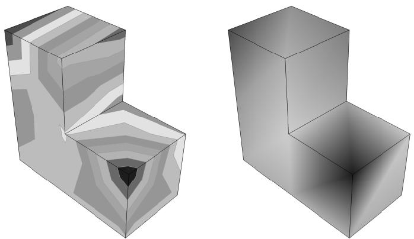  
图 1：显示均匀轮廓间隔和连续轮廓间隔的轮廓图。

当您使用离散间隔表示轮廓图时，还可以控制间隔值之间的渐进类型。如果选择均匀间隔类型，Abaqus/CAE 会在间隔值之间创建均匀的算术级数；如果选择对数间隔类型，Abaqus/CAE 会在间隔值之间创建对数级数。此外，您可以创建一组具有自定义渐进方式的新轮廓间隔，其中包含您希望包含的任何值。您也可以只提供几个间隔值，并在您定义的值之间插值出额外的间隔。您提供的间隔值在“编辑间隔”对话框中必须按从上到下的降序排列。

如果选择自定义间隔，Abaqus/CAE 将覆盖“轮廓图选项”对话框“限制”区域中指定的轮廓限制，并使用最大和最小间隔值作为自定义轮廓限制。更多信息，请参阅设置轮廓限制。

如果选择自定义轮廓间隔并随后修改了间隔，轮廓间隔数量越少，您对间隔的修改导致轮廓图发生变化的可能性就越大。

如果激活了轮廓图例，它将比您选择的间隔数量多出两个间隔。Abaqus/CAE 会在图例的顶部和底部添加间隔，以指示任何超出轮廓图限制的值。有关轮廓图例的更多信息，请参阅自定义图例。

本节介绍如何自定义轮廓间隔以及如何编辑您使用的轮廓间隔。

1.  定位到“轮廓间隔”选项。

    从主菜单栏中，选择 Options -> Contour；然后在出现的对话框中点击 Basic 选项卡。“轮廓间隔”选项位于页面的左侧。

2.  选择 Continuous 或 Discrete 以分别请求连续或离散轮廓间隔。

    连续间隔仅适用于带状类型轮廓。Abaqus 用平滑、无界限的颜色频谱表示您的轮廓值。

    当选择 Discrete 间隔时，“轮廓间隔”滑块变得可用。

3.  对于离散间隔，执行以下任务：

    1.  通过将“轮廓间隔”滑块拖动到您想要的间隔数（介于 2 和 24 之间）来选择间隔数量。
    2.  从“间隔类型”列表中选择以下选项之一：

        •  选择 Uniform 以在轮廓图中使用值的算术级数。  
        •  选择 Log 以在轮廓图中使用值的对数级数。  
        •  选择 User-defined 以在轮廓图中使用自定义的一组值。

    3.  要为自定义间隔类型自定义间隔值，点击

        “编辑间隔”对话框将出现，其中包含一组默认的轮廓间隔，您可以通过以下任何方式进行修改：

        •  点击其所在行并输入新值来编辑任何间隔值。您必须在对话框中按从上到下的降序提供间隔值。  
        点击 Insert Before 或 Insert After 可在所选间隔之前或之后插入另一个间隔。新插入的间隔没有值，因此您必须直接在相应的行中输入值或通过插值来提供间隔值。  
        •  点击 Delete 可从集合中删除所选间隔。  
        点击 Interpolate 可为集合中所有空白间隔计算插值间隔值。Abaqus/CAE 使用算术级数进行插值。  
        •  点击 Clear Values 可清除所选间隔的值。

        完成轮廓间隔集合的设置后，点击 OK 关闭“编辑间隔”对话框。

4.  点击 Apply 以在视口中实施您的更改。

    当前视口中的轮廓以及（如果激活的）轮廓图例将发生变化，以反映您选择的间隔选项。

默认情况下，您的更改将在会话持续时间内保存，并会影响所有后续轮廓图。如果您希望将更改保留用于后续会话，请将它们保存到文件。更多信息，请参阅保存自定义设置以供后续会话使用。
## 其他信息

• 了解等值线图  
• 自定义等值线图  
• 设置等值线限制  
• 自定义图例

符号图显示在分析的指定步骤和帧中特定矢量或张量变量的大小和方向。此外，符号图可用于显示当前模型数据库中模型在指定步骤下的载荷或预定义场等属性的大小和方向。

Abaqus/CAE 将值表示为符号（例如箭头），放置在模型上的相应位置。本节将解释符号绘图。

## 本节内容：

了解符号绘图  
使用符号绘图选项  
生成结果符号绘图  
生成自由体节点力符号图  
自定义符号图外观

## 了解符号绘图

符号图允许您直观地查看矢量和张量变量结果的大小和方向。此外，符号图可用于显示当前模型数据库中模型在指定步骤下的载荷或预定义场等属性的大小和方向。

每个矢量和张量结果值表示为在模型中获得该结果或该属性所在位置绘制的箭头；代表节点量的箭头出现在节点处，代表积分点量的箭头出现在积分点处。（您无法创建存储于节点处的单元量的符号图。）

例如，图 1 显示了主应力张量的符号图。


  
图 1：主应力符号图。

当您使用视图切割穿透模型时，符号绘图的行为会发生轻微变化。如果您显示视图切割以查看节点输出变量的符号图，Abaqus/CAE 会从最接近视图切割表面的节点插值数值，并将这些插值后的矢量箭头绘制在视图切割表面上。Abaqus/CAE 仅对节点输出变量执行此插值，当您显示切割下方或上方的模型部分时，不会在切割表面上执行任何插值。有关视图切割功能的更多信息，请参见了解视图切割。

箭头的相对大小表示结果值的大小。箭头的方向表示结果的整体方向。在张量图中，箭头指向箭杆内部的箭头表示压缩值；箭头指向箭杆外部的箭头表示拉伸值。

符号图图例显示每种箭头颜色如何对应特定的值范围。要了解如何显示与符号图关联的最小值和最大值，请参见自定义图例。

默认情况下，Abaqus/CAE 在符号图中绘制变量的所有结果值。最大值显示为图中最大的箭头，所有其他箭头均按与该箭头大小的比例进行缩放。但是，您可以使用符号绘图选项对话框来限制图中显示的值范围。

• 当您指定特定的最大值时，图中仅显示绝对值小于或等于该最大值的箭头。  
图中最大的箭头将代表小于或等于您指定限制的最大绝对结果值。图中的所有其他箭头将按与该箭头大小的比例进行缩放。  
• 当您指定特定的最小值时，图中仅显示绝对值大于该最小值的箭头。

连接器矢量输出的分量根据所请求的输出是场输出还是历史输出，相对于不同的坐标系进行解析。有关如何在场图中解释矢量分量值的信息，请参见在可视化模块中显示连接器和连接器输出。

## 其他信息

• 设置矢量和张量限制

## 使用符号绘图选项

您可以使用符号绘图选项来自定义符号图的外观。

对于来自输出数据库的数据，请使用“场输出”对话框中的“符号变量”选项来选择要绘制的矢量或张量量以及可选的分量。


注意：如果您从当前模型数据库中选择了模型，符号图将显示主变量，而不是符号变量。除非您绘制来自输出数据库的数据，否则更改符号变量不会产生任何效果。

从主菜单栏选择“选项”->“符号”或单击工具箱中的图标以访问“符号绘图选项”对话框。单击以下选项卡以自定义当前视口中符号图的外观：

• 颜色与样式：“颜色与样式”页面包含以下选项卡：

矢量：选择自定义代表矢量变量的结果值或选定分量值的箭头的外观。  
张量：选择自定义代表张量变量的所有主分量、所有直接分量或选定分量的箭头的外观。张量箭头可以显示在单元积分点、形心或节点处。如果箭头显示在节点处，标量总是在平均后计算。

• 限制：“限制”页面包含以下选项卡：

- 矢量：选择指定矢量值的最小值和最大值，或让 Abaqus/CAE 自动计算这些值。  
- 张量：选择指定张量值的最小值和最大值，或让 Abaqus/CAE 自动计算这些值。

• 标签：“标签”页面包含以下选项卡：

矢量：选择显示矢量值的数值标签，并自定义用于矢量值的颜色、字体、字号、数字格式和小数位数。  
张量：选择显示张量值的数值标签，并自定义用于张量值的颜色、字体、字号、数字格式和小数位数。

其他选项，如渲染样式、边可见性、变形比例因子和透明度，位于“通用绘图选项”对话框中。如果您选择在未变形和变形形状上都绘制符号，可以使用“叠加绘图选项”来自定义未变形形状的外观。要了解如何自定义符号图的渲染样式和其他显示特性，请参见自定义绘图显示。有关张量和场输出变量的更多信息，请参见选择场输出变量。有关选择结果步骤的更多信息，请参见选择特定结果步骤和帧。

## 其他信息

• 自定义符号图外观

## 生成结果符号绘图

符号图显示输出数据库中指定步骤和帧的矢量或张量变量的大小和方向，或当前模型数据库中模型在指定步骤下模型属性的大小和方向。Abaqus/CAE 将值表示为符号（例如箭头），放置在模型上的相应位置。有关张量和场输出变量的更多信息，请参见选择场输出变量。有关选择结果步骤的更多信息，请参见选择特定结果步骤和帧。要了解如何显示与符号图关联的最小值和最大值，请参见自定义图例。

1. 打开包含您的模型数据或分析结果的模型数据库或输出数据库。  
2. 如果您正在绘制来自模型数据库的数据，请切换到“可视化”模块，展开“结果树”中的“模型数据库”容器，然后选择要使用的模型。  
3. 选择要显示的结果步骤和帧（如果选择了当前模型数据库，则仅选择步骤）。  
4. 对于输出数据库，选择要显示的符号场输出变量。对于模型数据库，选择主场输出变量作为要显示的变量。  
符号绘图状态被激活。  
5. 选择您想要的绘图状态相关的和符号图自定义选项。  
6. 如果您选择的场输出包含复数，请在“结果选项”对话框中选择“复数形式”选项卡以控制要显示的数字形式。此选项仅适用于输出数据库的绘图。  
7. 对于输出数据库数据的绘图，从主菜单栏选择“绘图”->“符号”以修改是在变形模型形状、未变形形状还是两者上绘制符号。


提示：您也可以使用工具箱中的变形、未变形或叠加符号工具生成符号图。

当前视口会更新为显示在指定输出数据库的指定步骤和帧下，指定场输出变量的自定义符号图。
每次您点击步长和帧选择器对话框、与绘图状态无关的选项、叠加绘图选项（如适用）或符号绘图选项对话框中的"应用"时，Abaqus 都会自动刷新您的符号图。

## 其他信息

• 使用符号绘图选项

## 生成自由体节点力的符号图

您可以创建一个符号图，显示模型中单个节点处自由体节点力的总和。符号场输出变量 FREEBODY 是节点处各 NFORCn 分量的总和，但向量的方向是反向的。默认情况下，FREEBODY 输出变量还会考虑显示的单元；相比之下，NFORC1 的等值线图会考虑整个模型。

FREEBODY 符号图表示作用在当前显示组所代表对象上的不平衡力。这种对当前显示组的敏感性在其他任何上下文中（例如等值线图）都不会体现。

1.  打开包含您的分析结果且其中包含 NFORC 数据的输出数据库。
2.  选择要显示的结果步长和帧。
3.  如果需要，使用显示组聚焦于模型的子集。
4.  选择 FREEBODY 作为要显示的符号场输出变量。

符号图状态被激活。

5.  选择您想要的与绘图状态无关的选项和符号绘图自定义选项。
6.  从主菜单栏中，选择 绘图->符号 以修改是在变形模型形状、未变形形状还是两者上绘制符号。


提示：您也可以使用工具箱中的变形、未变形或叠加符号工具来生成符号图。

当前视口将更改为显示当前输出数据库在指定步长和帧下，针对当前显示组的自定义自由体节点力符号图。

每次您点击步长和帧选择器对话框、与绘图状态无关的选项、叠加绘图选项（如适用）或符号绘图选项对话框中的"应用"时，Abaqus 都会自动刷新您的符号图。

## 其他信息

• 选择符号场输出变量  
• 使用符号绘图选项  
• Abaqus/CAE 中自由体截面的合力与合力矩

## 自定义符号图外观

本节说明如何自定义符号图向量和张量箭头的样式，如何选择显示的量，以及如何控制图中显示的最小和最大值。

要了解如何自定义符号图的渲染样式和底层模型属性，请参阅自定义绘图显示。

## 本节内容：

自定义符号图箭头  
设置向量和张量限制  
自定义向量和张量标签

## 自定义符号图箭头

您可以自定义符号图向量和张量箭头的颜色、最大箭头长度、箭杆粗细和箭头外观。当您为节点向量符号自定义箭头颜色时，可以选择为图中所有箭头指定单一颜色，或者根据箭头长度以不同颜色显示箭头。您可以使用模型尺寸或屏幕尺寸作为计算最大箭头长度的基础。

对于单元输出变量的张量符号图，箭头通常以三种不同的颜色显示。

1.  找到向量或张量的"颜色与样式"选项。

从主菜单栏中选择 选项->符号 或在工具箱中点击；然后在出现的对话框中点击"颜色与样式"选项卡。

• 如果您正在创建向量符号图，请点击"向量"选项卡。  
• 如果您正在创建张量符号图，请点击"张量"选项卡。

您所选符号类型的选项将出现。

2.  要以单一颜色显示图中的所有箭头，请选择"统一"，然后执行以下操作之一：

    对于向量图，点击"统一颜色"样本，并选择您希望变量或变量分量箭头显示的颜色。（有关更多信息，请参阅自定义颜色。）  
    • 对于在张量图中绘制所有主分量，点击标有"最大主应力"、"中间主应力"和"最小主应力"的颜色样本；并选择您希望每种箭头类型显示的颜色。  
    • 对于在张量图中绘制所有直接分量，点击标有"11"、"22"和"33"的颜色样本；并选择您希望每种箭头类型显示的颜色。  
    • 对于仅绘制一个主分量或直接分量，点击标有"颜色"的颜色样本，并选择您希望该分量箭头显示的颜色。

3.  要使用与箭头长度相对应的颜色显示图中的所有箭头，请选择"光谱"。您可以从"光谱名称"列表中选择一个预定义的颜色光谱或定义一个新的光谱；有关选择和定义颜色光谱的更多信息，请参阅自定义等值线颜色和创建新的颜色光谱。您还可以拖动"间隔数"滑块来更改可用于为符号图中各种箭头着色的间隔数；有关等值线间隔选择的更多信息，请参阅自定义等值线间隔。

4.  拖动"大小"滑块以更改箭头长度。箭头大小范围从 0 到 30；默认箭头大小为 6。

    您的选择决定了图中表示最大向量或张量值的箭头大小。图中的所有其他向量和张量箭头将按比例缩放到该大小。


## 注意：

Abaqus/CAE 为向量和张量维护一个大小设置；您不能独立更改其中一个的大小。

5.  从"基准"选项中，选择"屏幕尺寸"或"模型尺寸"作为计算最大箭头长度的基础。如果选择"屏幕尺寸"，当您更改视口大小时，Abaqus/CAE 会调整箭头大小；如果选择"模型尺寸"，当您放大或缩小时，Abaqus/CAE 会调整箭头大小。
6.  点击"粗细"字段旁的箭头，并选择您想要的箭杆粗细。
7.  点击"箭头"字段旁的箭头，并选择您想要的箭头设计。

8.  如果您正在创建张量图，请自定义张量箭头的位置，以便将它们显示在模型的"积分点"、"质心"或"节点值"处。


## 注意：

如果您为张量变量选择"节点"选项，则结果平均选项"先计算标量再平均"将无效；标量始终在平均后计算。

9.  如果需要，您可以显示符号图中箭头的一个较小子集，以澄清包含许多箭头的图的呈现。将"符号密度"滑块拖动到"高"和"低"之间的值。
10. 点击"应用"以实施您的更改。

当前视口中的符号图向量或张量箭头将更改为反映您的设置。

默认情况下，您的更改会在会话期间保存，并影响所有后续符号图。如果您希望为后续会话保留更改，请将它们保存到文件中。有关更多信息，请参阅保存自定义设置以供后续会话使用。

## 其他信息

• 自定义颜色  
• 自定义符号图外观

## 设置向量和张量限制

默认情况下，Abaqus/CAE 会将变量的所有结果值包含在符号图中。但是，您可以使用"符号绘图选项"对话框来限制图中出现的值的范围。

当您指定一个特定的最大值时，只有代表小于或等于该最大值的箭头会出现在图中。当您指定一个特定的最小值时，只有代表大于该最小值的箭头会出现在图中。更改最大或最小值也会反映在符号图图例中。

要了解如何显示与符号图关联的最小值和最大值，请参阅自定义图例。

1.  找到"限制"选项。

    从主菜单栏中选择 选项->符号 或在工具箱中点击；然后在出现的对话框中点击"限制"选项卡。点击"向量"选项卡或"张量"选项卡；您所选变量类型的符号绘图"限制"选项将变为可用。

2.  在页面上半部分标有"最大"的区域中，选择以下选项之一：

    • 选择"自动计算"以使用最大的结果值作为最大值。  
    • 选择"指定"以自行指定最大值；然后在"指定"文本字段中输入您选择的最大值。

3.  在页面下半部分标有"最小"的区域中，选择以下选项之一：

    • 选择"自动计算"以使用最小的结果值作为最小值。  
    • 选择"指定"以自行指定最小值；然后在"指定"文本字段中输入您选择的最小值。
4. 单击 **Apply** 以应用您的更改。

当前视口中的符号图将更改，以仅显示您指定范围内的变量值对应的箭头。

默认情况下，您对符号图选项的更改将在当前会话期间保存，并影响当前视口以及从当前视口创建的任何新视口中的所有后续符号图。如果您希望在后续会话中保留这些更改，请将其保存到文件中。更多信息，请参阅 **保存自定义设置以供后续会话使用**。

## 其他信息

• **理解符号绘图**

您可以在符号图中每个矢量或张量箭头旁显示一个标签，以数值形式表示其值。您还可以通过更改这些标签的颜色、字体、字号、数字格式和小数位数来自定义它们。

1.  定位 **Labels** 选项。

    从主菜单栏选择 **Options->Symbol** 或在工具箱中点击 ；然后在出现的对话框中单击 **Labels** 选项卡。单击 **Vector** 选项卡或 **Tensor** 选项卡；您选择的变量类型的符号图 **Labels** 选项将变为可用。
2.  切换启用 **Display value next to vector symbol**，为所选类型的矢量显示矢量标签。
3.  为所选类型的矢量选择矢量标签的颜色。
    a. 单击 **Text color** 颜色样本 。Abaqus/CAE 将显示 **Select Color** 对话框。
    b. 使用 **Select Color** 对话框中的某种方法选择新颜色。更多信息，请参阅 **自定义颜色**。
    c. 单击 **OK** 关闭 **Select Color** 对话框。
4.  为所选类型的矢量选择矢量标签的字体。
    a. 单击 **Set Font**。Abaqus/CAE 将显示 **Select Font** 对话框。
    b. 使用 **Select Font** 对话框中的某种方法选择新字体、大小和样式。更多信息，请参阅 **自定义字体**。
    c. 单击 **OK** 关闭 **Select Font** 对话框。
5.  要更改所选矢量类型的矢量标签格式，请单击 **Number Format** 箭头并选择以下格式之一：
    *   选择 **Scientific** 以科学记数法显示图例值，该方法将图例值表示为 1 到 10 之间的十进制值乘以 10 的幂。当您为数字 501,000 选择此格式时，该值在图例中显示为 5.01e5。
    *   选择 **Fixed** 以不使用指数值显示图例值。当您选择此格式时，数字 501,000 在图例中显示为 501000.00。
    *   选择 **Engineering** 以选择工程记数法，该方法以类似于科学记数法的格式表示值，但仅允许指数为 3 的倍数。当您选择此格式时，数字 501,000 在图例中显示为 501E3。
6.  单击 **Decimal places** 箭头以指定每个标签所需的小数位数。
7.  单击 **Apply** 以应用您的更改。

当前视口中的符号图将更改，以显示具有您所选格式的标签。

默认情况下，您对符号图选项的更改将在当前会话期间保存，并影响当前视口以及从当前视口创建的任何新视口中的所有后续符号图。如果您希望在后续会话中保留这些更改，请将其保存到文件中。更多信息，请参阅 **保存自定义设置以供后续会话使用**。

## 其他信息

• **理解符号绘图**

## 绘制材料方向

材料方向图显示模型中单元在积分点处的材料方向。

材料方向在分析的指定步（step）和帧（frame）处绘制，并且对于壳单元，是在指定的截面点（section point）处绘制。材料方向图还可以创建以显示薄膜、壳和表面单元中增强材料（钢筋方向）的材料方向。Abaqus/CAE 将材料方向表示为三向图（triads）。本节解释材料方向绘图。

## 本节内容：

*   理解材料方向绘图
*   使用材料方向图选项
*   生成材料方向图
*   自定义材料方向图三向图

## 理解材料方向绘图

材料方向图允许您可视化模型中单元的材料方向。

Abaqus/CAE 在单元积分点处绘制一个三向图以指示材料方向。例如，图 1 显示了一个材料方向图。


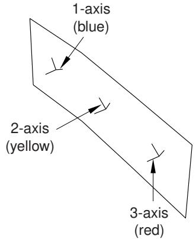  
图 1：材料方向图。

材料方向仅适用于在所选截面点处请求了场输出的单元。有效的单元包括所有壳单元，以及您定义了局部方向的实体单元。材料方向在分析的当前步和帧以及壳单元的当前截面点选择处显示。如果同时为顶部和底部截面点位置启用显示，Abaqus/CAE 仅显示底部位置的材料方向。对于小应变壳单元，材料方向不会随模型的变形而旋转（有关更多信息，请参阅 **关于壳单元**）。材料方向图也可以为薄膜、壳和表面单元中的增强层创建。

## 其他信息

• **按类别选择截面点数据**

## 使用材料方向图选项

您可以使用材料方向图选项来自定义材料方向三向图的外观。

从主菜单栏选择 **Options->Material Orientation** 或在工具箱中点击 ，以访问 **Material Orientation Plot Options** 对话框。使用该对话框中的选项来控制材料方向三向图轴的可见性、颜色、长度、粗细和箭头外观。

其他选项，例如渲染样式（render style）、边可见性（edge visibility）、变形缩放系数（deformation scale factor）和透明度（translucency），位于 **Common Plot Options** 对话框中。如果您选择同时在未变形和变形形状上绘制材料方向，可以使用 **Superimpose Plot Options** 来自定义未变形形状的外观。有关自定义叠加图的更多信息，请参阅 **叠加变形和未变形模型图**。要了解如何自定义材料方向图的渲染样式和其他显示特征，请参阅 **自定义绘图显示**。有关选择结果步的更多信息，请参阅 **选择特定的结果步和帧**。有关选择截面点位置的更多信息，请参阅 **按类别选择截面点数据**。

## 其他信息

• **自定义材料方向图三向图**

## 生成材料方向图

材料方向图显示模型中单元在指定步、帧和指定截面点处的材料方向。Abaqus/CAE 在单元积分点处将材料方向表示为三向图。有关选择结果步的更多信息，请参阅 **选择特定的结果步和帧**。有关选择截面点位置的更多信息，请参阅 **按类别选择截面点数据**。

1.  打开包含分析结果的输出数据库。
2.  选择要显示的**结果步和帧**。
3.  选择要显示的**截面点**。
4.  选择您想要的绘图状态无关（plot state–independent）选项和材料方向图自定义选项。
5.  从主菜单栏，选择 **Plot->Material Orientations**，并选择是在未变形形状、变形形状还是两者上绘制材料方向。


提示：您也可以使用工具箱中的变形 、未变形 或叠加材料方向 工具来生成材料方向图。

当前视口将更改以显示自定义的材料方向图。

每次您在步和帧选择器、截面点选择器、绘图状态无关选项、叠加绘图选项（如果适用）或材料方向图选项对话框中单击 **Apply** 时，Abaqus 都会自动刷新您的材料方向图。

## 其他信息

• **使用材料方向图选项**

## 自定义材料方向图三向图

本节解释如何自定义材料方向图三向图的样式。

要了解如何自定义材料方向图的渲染样式和底层模型属性，请参阅 **自定义绘图显示**。

您可以自定义材料方向图三向图轴的颜色、长度、粗细和箭头外观。您还可以抑制一个或多个三向图轴的显示；并且对于具有复合截面（composite sections）的结果，您可以使用整个铺层（layup）的材料方向或其单独铺层（plies）之一来显示结果。
1. 从主菜单栏中选择 选项->材料方向，或点击 The triad options appear.  
2. 切换每个坐标轴左侧的按钮，以显示或隐藏它们。  
3. 点击颜色样本，为您绘图中可见的三轴坐标系选择所需的一种或多种颜色。  
4. 拖动“大小”滑块，以增大或减小绘图中材料方向三轴坐标系的坐标轴长度。坐标轴长度范围为 0 到 30；默认长度为 6。


## 注意：

您可以使用 Abaqus 脚本接口指定大于 30 的坐标轴长度值。请参阅使用 Python 解释器。

5. 在“基准”选项中，选择“屏幕大小”或“模型大小”作为计算材料方向三轴坐标系中坐标轴长度的基准。如果选择“屏幕大小”，当您更改视口大小时，Abaqus/CAE 会调整三轴坐标系的大小；如果选择“模型大小”，当您缩放视图时，Abaqus/CAE 会调整三轴坐标系的大小。  
6. 点击“线宽”字段旁边的箭头，选择您想要的坐标轴线宽。  
7. 点击“箭头”字段旁边的箭头，选择您想要的箭头设计。  
8. 如果需要，您可以显示材料方向三轴坐标系的一个较小的子集，以在包含许多三轴坐标系的绘图中清晰呈现。将“符号密度”滑块拖动到“高”和“低”之间的某个值。  
9. 当选择“截面 / 层合板”时，将绘制基于 SORIENT 输出变量的材料方向。如果您的结果包含来自 SORIENT 输出变量的场输出以及来自具有复合材料截面单元的输出，请指定您要使用的材料方向。选择“材料 / 铺层”以使用各自的材料方向显示每个铺层，或选择“截面 / 层合板”以使用复合材料层合板定义中指定的方向显示整个复合材料层合板。  
10. 点击“应用”以实施您的更改。

当前视口中的材料方向绘图三轴坐标系将随之更改以反映您的设置。

默认情况下，您的更改将在整个会话期间保存，并将影响所有后续的材料方向绘图。如果您希望将更改保留用于后续会话，请将其保存到文件中。更多信息，请参阅保存自定义设置以供后续会话使用。

## 附加信息

• 自定义颜色  
• 自定义绘图显示

本章解释了 X-Y 绘图的概念，并详细说明了如何创建 X-Y 数据对象以及如何生成和自定义 X-Y 绘图。

## 本节内容：

理解 X-Y 绘图  
指定和保存 X-Y 数据对象  
生成 X-Y 绘图  
操作已保存的 X-Y 数据对象  
自定义 X-Y 绘图坐标轴  
自定义 X-Y 曲线外观  
自定义 X-Y 绘图外观  
自定义 X-Y 绘图标题  
自定义 X-Y 绘图图例的外观  
自定义 X-Y 绘图的边框和填充颜色

## 理解 X-Y 绘图

X-Y 数据对象是 Abaqus/CAE 存储在两列中的二维数据数组。

您可以将 X-Y 数据以图形形式显示在 X-Y 绘图中，或以表格形式显示在 X-Y 报告中。此外，您可以探测 X-Y 绘图以显示图形点的 X 和 Y 坐标。本节讨论 X-Y 数据对象以及可用于创建它们的各种方法。有关 X-Y 报告的更多信息，请参阅生成表格数据报告；有关探测 X-Y 绘图的信息，请参阅探测模型。

## 本节内容：

什么是 X-Y 数据对象，什么是 X-Y 绘图？  
理解如何指定 X-Y 数据对象  
理解“Temp”和其他 X-Y 数据对象名称  
理解量类型

## 什么是 X-Y 数据对象，什么是 X-Y 绘图？

X-Y 数据对象是 Abaqus/CAE 存储在两列——X 列和 Y 列——中的有序对集合。X-Y 数据可以来自输出数据库或 ASCII 文件，或者您可以使用键盘输入数据。此外，您可以通过组合现有的 X-Y 数据对象来派生 X-Y 数据。例如，您可以将一个包含应力值与时间关系的 X-Y 数据对象与第二个包含应变值与时间关系的 X-Y 数据对象组合，以生成一个包含等效时间下应力与应变关系的 X-Y 数据对象。您可以保存 X-Y 数据对象；并且可以编辑、复制、重命名和删除它们。

默认情况下，您保存的 X-Y 数据对象仅在会话期间保留。如果您希望在后续会话中使用 X-Y 数据对象，可以使用 文件->保存会话对象 选项将它们保存到 XML 文件、模型数据库或输出数据库中；或者，您可以使用 XY 数据管理器中的“复制到 ODB”按钮将它们复制到输出数据库文件中。

Abaqus/CAE 可以以 X-Y 绘图的形式显示 X-Y 数据。X-Y 绘图是一个变量相对于另一个变量的二维图形。X-Y 绘图的例子包括温度与时间、载荷与位移、应力与应变。您可以在一个 X-Y 绘图中显示多个 X-Y 数据对象，并且可以使用自定义选项来控制每个数据对象的外观以及 X-Y 绘图各个组成部分的整体外观。这些组成部分包括坐标轴；图例（将绘图中的每条 X-Y 曲线与其代表的 X-Y 数据对象关联起来的关键）；以及 X-Y 曲线。图 1 显示了一个显示三个 X-Y 数据对象的 X-Y 绘图。

  
图 1：显示三个数据对象的 X-Y 绘图。

## 附加信息

• 管理会话对象和会话选项  
• 生成 X-Y 绘图  
• 指定和保存 X-Y 数据对象  
• 管理会话对象和会话选项  
• 将会话 X-Y 数据对象复制到输出数据库文件

## 理解如何指定 X-Y 数据对象

要指定 X-Y 数据对象，首先选择数据源，然后提供任何必要的详细信息。可能的来源有：

## ODB 历史输出

选择此方法通过从输出数据库读取历史输出结果来指定 X-Y 数据对象。您可以指定从输出数据库读取哪些变量、从分析的哪些步骤读取以及读取数据的频率；例如，您可以每隔三个数据点读取一次。您还可以为任何复数值输出数据指定数值形式。更多信息，请参阅从输出数据库历史输出读取 X-Y 数据。

## ODB 场输出

选择此方法通过从输出数据库读取场输出结果来指定 X-Y 数据对象。您可以指定从输出数据库读取哪些变量以及为哪些单元或节点读取数据。Abaqus/CAE 从当前激活的步骤和帧中提取结果；有关更多信息，请参阅激活和停用步骤和帧。您还可以为任何复数值输出数据指定数值形式。更多信息，请参阅从输出数据库场输出读取 X-Y 数据。

## 厚度

选择此方法通过读取模型壳区域厚度方向上单元的场输出结果来指定 X-Y 数据对象。Abaqus/CAE 从当前步骤和帧中提取结果。您可以指定从输出数据库读取哪些变量以及为哪些单元读取数据。更多信息，请参阅通过壳厚度读取 X-Y 数据。

## 自由体

选择此方法通过读取会话中所有活动自由体的场输出结果来指定 X-Y 数据对象。Abaqus/CAE 从当前步骤和帧中提取结果，并显示节点力 (NFORC) 输出变量的结果。更多信息，请参阅从所有活动自由体切割读取 X-Y 数据。

## 操作 X-Y 数据

选择此方法通过操作先前保存的 X-Y 数据对象来派生新的 X-Y 数据对象。您通过对现有数据应用函数和数学运算来指定新的 X-Y 数据对象。函数的一个例子是“合并”。如果您将一个包含应力与时间关系的 X-Y 数据对象与一个包含应变与时间关系的 X-Y 数据对象进行“合并”，您将得到一个包含等效时间下应力与应变关系的 X-Y 数据对象。更多信息，请参阅操作已保存的 X-Y 数据对象。

## ASCII 文件

选择此方法从现有文本文件读取 X 和 Y 值。该文件可以包含两列以上的数据，以逗号、空格或制表符分隔；您可以指定哪些列对应于 X 和 Y 轴数据。此外，您可以指定从文件读取数据的频率；例如，每隔三行。更多信息，请参阅从 ASCII 文件读取 X-Y 数据。

## 键盘

选择此方法在简单的表编辑器中手动输入 X 和 Y 值。在此方法中，Abaqus 支持几种特殊的编辑技术，以及一个从文件读取数据的选项。有关此主题的更多信息，请参阅从键盘输入 X-Y 数据。
## 路径 (Path)

选择此方法可通过读取沿模型路径位置上的场输出结果来指定 X–Y 数据对象。Abaqus 从输出数据库获取结果。您可以指定构成路径的点、单元或边，以及获取结果的步骤、帧和变量。更多信息，请参阅**沿路径查看结果**。

此外，在**属性**模块中使用表格编辑器创建材料时，您也可以创建 X–Y 数据对象。更多信息，请参阅**输入表格数据**。

指定好 X–Y 数据对象后，您可以将其保存或以 X–Y 图的形式显示。保存 X–Y 数据对象使您能够后续绘图、编辑、重命名、删除或对其进行操作；也允许您将 X–Y 数据对象复制到输出数据库文件，以便在后续 Abaqus 会话中使用。对于来自输出数据库历史输出以外来源的 X–Y 数据，您必须先保存数据，才能后续生成包含多个数据对象的 X–Y 图。已保存的 X–Y 数据对象仅在当前会话期间保留。要使 X–Y 数据对象在会话之间持久存在，您必须将其复制到输出数据库文件。

如果您在早期会话中已将 X–Y 数据对象复制到输出数据库文件，则在当前会话中打开该文件时即可访问该对象。您可以像任何其他指定对象一样，以 X–Y 图的形式显示该 X–Y 数据对象。要编辑、重命名、删除或操作在先前会话中创建的数据对象，您必须将其加载到当前会话。

## 理解“Temp”和其他 X–Y 数据对象名称

默认情况下，当您保存或绘图一个 X–Y 数据对象时，Abaqus/CAE 会自动为其命名。此名称是标识和引用 X–Y 数据对象的重要方式。

X–Y 数据对象名称出现在以下情况：

•   当您绘制 X–Y 数据时，X–Y 图图例会按名称标识图中出现的所有 X–Y 数据对象。
•   当您从主菜单栏选择 **工具 -> XY 数据** 时，**管理器**、**编辑**、**复制**、**重命名**、**删除** 和 **绘图** 工具会按名称列出在会话期间创建的所有 X–Y 数据对象。
•   当您自定义代表 X–Y 数据对象的曲线外观时，您首先需要从 **XY 曲线选项** 对话框中列出的对象中按名称选择 X–Y 数据对象。

在大多数情况下，Abaqus/CAE 能够为您的 X–Y 数据对象提供一个有意义的默认名称。当您保存 X–Y 数据对象时，Abaqus/CAE 会显示默认名称，并让您有机会用自选名称覆盖此默认值。保存后，您可以随时通过重命名来为 X–Y 数据对象提供新名称。有关重命名的信息，请参阅**使用管理器对话框管理对象**。

X–Y 数据对象名称有三种基本形式，如下所示：

## Temp-n

如果您通过点击以下任意对话框中的 **绘图** 按钮生成 X–Y 图：

•   **从 ASCII 文件读取 XY 数据**
•   **从键盘输入 XY 数据**
•   **从路径读取 XY 数据**
•   **操作 XY 数据** 对话框中的 **绘制表达式**

Abaqus/CAE 将根据模式 `Temp-1`、`Temp-2` 等为您的 X–Y 数据命名。此名称表示该图代表在对话框中配置的数据，这些数据被视为临时数据，无论您是否点击了 **另存为** 进行保存。

反之，如果图例中出现 `Temp-n`，则您正在绘图临时数据。您无法编辑、复制、重命名、删除、操作或生成临时数据的报告。要执行其中任何操作，您必须首先保存数据。您可以为临时数据选择曲线样式首选项，但如果在未保存的情况下重新绘制数据，曲线样式将恢复为默认值。要了解如何保存数据，请参阅**保存 X–Y 数据对象**。

## XYData-n

如果您使用 **从 ASCII 文件读取 XY 数据** 或 **从键盘输入 XY 数据** 对话框中提供的 **另存为** 按钮创建新的 X–Y 数据对象，Abaqus/CAE 会根据模式 `XYData-1`、`XYData-2` 等为您的 X–Y 数据建议一个默认名称。要建立一个更有意义的名称，您可以使用 **另存为 XY 数据** 对话框用自选名称覆盖此默认值。

要定位 **从 ASCII 文件读取 XY 数据** 或 **从键盘输入 XY 数据** 对话框，请从主菜单栏选择 **工具 -> XY 数据 -> 创建**；然后在出现的对话框中点击所需选项，并点击 **继续**。

## 有意义的名称

您可以通过在保存数据时指定名称或后续重命名，为您的 X–Y 数据对象建立一个有意义的名称（自选名称）。当您保存数据时，Abaqus/CAE 在 **另存为 XY 数据** 对话框中显示默认名称；您可以覆盖此默认值。Abaqus/CAE 会为从 **历史输出** 或 **从 ODB 场输出读取 XY 数据** 对话框创建的 X–Y 数据生成有意义的默认名称。

## 理解量类型

量类型是描述 X–Y 数据对象中一列数据的类别。Abaqus/CAE 包含超过 80 个预定义的量类型，描述 Abaqus 中每个变量的输出，包括常用的类型如温度、时间、应力和应变。与每列关联的量类型出现在 X–Y 报告中，并作为该数据对象 X–Y 图中的默认轴标签。

当您从场输出数据或历史输出数据创建 X–Y 数据对象时，Abaqus/CAE 自动使用输出数据库中指定的量类型。当您通过从 ASCII 文件加载数据或直接从键盘输入数据创建 X–Y 数据对象时，可以在创建对象时为每列指定量类型。无论哪种情况，您都可以通过在 **编辑 XY 数据** 对话框中编辑数据对象来更改与任一列关联的量类型。

## 指定和保存 X–Y 数据对象

本节解释指定和保存 X–Y 数据对象的各种方法。X–Y 数据对象可以来源于分析结果、外部文件、键盘输入或对先前保存的 X–Y 数据对象的操作。

有关通过获取沿模型路径的场输出结果来指定 X–Y 数据对象的信息，请参阅**沿路径查看结果**；有关通过操作现有 X–Y 数据来指定 X–Y 数据对象的信息，请参阅**操作已保存的 X–Y 数据对象**。

## 本节内容：

*   从输出数据库历史输出读取 X–Y 数据
*   从输出数据库场输出读取 X–Y 数据
*   读取沿壳体厚度方向的 X–Y 数据
*   从所有活动自由体切割读取 X–Y 数据
*   从 ASCII 文件读取 X–Y 数据
*   从键盘输入 X–Y 数据
*   保存 X–Y 数据对象
*   将会话 X–Y 数据对象复制到输出数据库文件
*   将 X–Y 数据对象加载到当前会话
*   编辑 X–Y 数据对象中的单个数据点

## 从输出数据库历史输出读取 X–Y 数据

您可以从输出数据库的历史输出中读取 X–Y 数据。可用数据包括分析期间保存的历史输出。

从这些输出中，您可以选择以下内容：

•   某个位置的某个变量——例如，节点 1 处的 U1（X 方向位移）；
•   感兴趣的一个或多个步骤；
•   这些步骤内帧的模式——例如，每第 10 帧；
•   时间基准。

然后，Abaqus/CAE 从输出数据库中读取您指定帧处的 X–Y 数据对。如果您选择了多个变量，Abaqus/CAE 默认读取数据对并为每个变量创建单独的 X–Y 数据对象。当您保存历史输出变量时，可以选择先操作数据；Abaqus/CAE 将操作结果保存为新的 X–Y 数据对象。

对于基于时间的分析，X 值取自分析开始以来的总时间，或者在重启分析的情况下，取自上次延续分析开始以来的总时间。或者，您可以使用步骤时间作为时间基准。Y 值取自该时间点您指定位置变量的值。

Abaqus/Standard 分析的历史输出在向输出数据库写入 10 个增量后可用；Abaqus/Explicit 分析的历史输出在向输出数据库写入 100 个增量后，或在基于 CPU 时间触发 Abaqus/Explicit 心跳后可用，以先发生者为准。

1.  定位历史输出选项。

    从主菜单栏选择 **工具 -> XY 数据 -> 创建**，然后选择 **ODB 历史输出**。

    

    **提示**：您也可以通过从主菜单栏选择 **结果 -> 历史输出** 来指定历史输出。

    **历史输出** 对话框随即出现。

    

## 注意：

**历史输出** 对话框列出了分析期间保存的所有历史输出，给出变量名及其保存位置。如果此列表为空，则表示历史输出不可用。
2. 如果“变量”选项卡尚未选中，请单击该选项卡。选择一个或多个您希望读取的变量。变量按字母顺序与其位置一起列出。默认设置是读取列表中的第一个条目。有关在对话框中选择多个项目的更多信息，请参见“从列表和表格中选择多个项目”。

如果您的输出数据库包含许多历史输出变量，您可以使用过滤器来减少显示的输出变量名称数量。单击名称过滤器字段旁边的图标可查看有效过滤器语法的示例。

指定的变量和位置将高亮显示。

3. 如果视口链接已激活，您可以切换“显示链接视口之间的公共列表”来仅显示所有链接视口共有的变量。

4. 单击“步骤/帧”以更改 Abaqus/CAE 读取 X–Y 数据所依据的步骤、帧或时间基础。有关更多信息，请参见“激活和停用步骤与帧”。

5. 如果数据包含复数，您可以使用“结果选项”对话框选择显示形式。有关 Abaqus/CAE 中复数形式的更多信息，请参见“控制复数结果的形式”。

6. 要评估和显示数据，请单击“绘图”。

当前视口中会出现一个 X–Y 图。该图代表您在对话框中配置的数据，无论您是否单击了“另存为”进行保存，Abaqus 都将其视为临时数据。

7. 要保存您配置的数据，请单击“另存为”。任何复数数据都会以当前复数形式保存，而不是作为完整的复数保存。


## 注意：

要绘制保存的 X–Y 数据，请从主菜单栏选择“工具”->“XY 数据”->“绘图”，然后从右侧弹出菜单中选择 X–Y 数据。

在出现的“另存 XY 数据为”对话框中，您可以在保存前对数据执行各种数学、三角函数、对数、指数或其他运算（有关更多信息，请参见“保存 X–Y 数据对象”）。

8. 完成后，单击“关闭”以关闭“历史输出”对话框。

## 其他信息

•   保存 X–Y 数据对象
•   理解“Temp”和其他 X–Y 数据对象名称
•   控制复数结果的形式
•   链接视口

## 从输出数据库场输出读取 X–Y 数据

您可以从输出数据库中的场输出读取 X–Y 数据。

可用数据包括分析期间保存的场输出。从此输出中，您可以选择以下内容：

•   特定输出位置处的变量——例如，积分点处的 S11（11 方向的应力）；以及
•   单个位置或一组位置（单元或节点）。

然后，Abaqus/CAE 从输出数据库中读取当前活动步骤和帧下的 X–Y 数据对。如果您选择了多个变量或多个位置，Abaqus/CAE 会读取数据对并为每个变量/位置对创建一个单独的 X–Y 数据对象。对于所有基于时间的分析，X 值取自分析开始的总时间。Y 值取自指定位置变量的相应值。

在节点处提取的基于单元的场数据受当前结果平均设置的控制。但是，如果您请求了唯一节点位置，则结果平均始终为 100%，以获得节点处的唯一值。有关更多信息，请参见“理解结果值平均”。

在读取任何输出位置处基于单元的场输出的 X–Y 数据时，如果输出数据库中存在相同的位置，Abaqus/CAE 会从该指定位置读取场值。

1.  定位“来自 ODB 场输出的 XY 数据”选项。

    从主菜单栏选择“工具”->“XY 数据”->“创建”，然后选择“ODB 场输出”。

    “来自 ODB 场输出的 XY 数据”对话框出现。

    

    注意：“来自 ODB 场输出的 XY 数据”对话框列出了分析期间保存的所有场输出（四元数变量除外）。如果此列表为空，则表示场输出不可用。

2.  单击“位置”箭头以显示可用于列出变量的位置选项；然后选择所需的位置。

    变量列表会刷新，仅显示可在该选定位置读取的变量。

3.  使用列表中每个变量旁边的复选框或页面底部的“编辑”文本字段，选择要读取的场输出变量。

## 使用复选框方法：

1.  要选择一个变量及其所有分量，请单击该变量的复选框。
2.  要选择某个变量的各个分量，请单击该变量复选框旁边的箭头以列出其分量；然后单击各个分量的复选框进行选择。

## 使用编辑方法：

在“编辑”文本字段中，输入要读取的变量和分量的名称。要使变量有效，它必须在输出数据库的当前位置可用。

4.  单击“单元/节点”选项卡。

    “单元/节点”选项出现。

5.  从对话框左上方的“项目”列表中，选择“单元”或“节点”。

    Abaqus 会刷新对话框底部的“选择方法”列表和右侧的项目列表。

6.  选择要为其读取输出数据的特定单元或节点。

    •   要通过直接从视口拾取来指定单元或节点：

        1.  从“选择方法”列表中选择“从视口拾取”。

            Abaqus/CAE 进入拾取模式。提示区域出现“选择显示组的项目（项目为单元或节点）”。

        2.  从视口中选择一个或多个项目（有关更多信息，请参见“在视口中选择对象”）。项目在视口中高亮显示。

            

        ## 注意：

        如果您在提示区域单击“完成”，Abaqus/CAE 将退出拾取模式，并且您的选择将消失；您必须从列表中选择一种“选择方法”。

    •   要通过编号指定单元或节点：

        1.  从“选择方法”列表中选择“单元标签”或“节点标签”。

            “部件实例”和“标签”字段出现。

        2.  从“部件实例”字段的列表中选择您要获取结果的部件实例名称。在“标签”字段中输入由逗号分隔的单元或节点编号列表，或输入编号范围（例如 1:4）。
        3.  通过单击“在视口中高亮项目”来验证您的选择。

    •   要通过集名称指定单元或节点：

        1.  从“选择方法”列表中选择“单元集”或“节点集”。

            Abaqus 会刷新右侧的项目列表。如果此列表为空，则表示没有满足您选择条件的项目。

            

        ## 注意：

        此列表不包括 Abaqus/CAE 生成的内部集。

        2.  从项目列表中选择一个或多个集名称。（有关更多信息，请参见“从列表和表格中选择多个项目”。）如果您的模型包含许多集，您可以使用过滤器来减少显示的集名称数量。单击过滤器字段旁边的图标可查看有效过滤器语法的示例。

        3.  通过切换“在视口中高亮项目”来验证您的选择。

    •   要指定属于内部集（Abaqus/CAE 创建的集）的单元或节点：

        1.  从“选择方法”列表中选择“内部集”。

            Abaqus 会刷新右侧的项目列表。如果此列表为空，则表示没有满足您选择条件的项目。

        2.  从项目列表中选择一个或多个集名称。（有关更多信息，请参见“从列表和表格中选择多个项目”。）如果您的模型包含许多内部集，您可以使用过滤器来减少显示的集名称数量。单击过滤器字段旁边的图标可查看有效过滤器语法的示例。

        3.  通过切换“在视口中高亮项目”来验证您的选择。

    下表总结了在“变量”页面指定的输出位置对单元或节点数据可用性的限制：

    <table><tr><td>输出位置</td><td>可用于</td></tr><tr><td>积分点</td><td>单元</td></tr><tr><td>质心</td><td>单元</td></tr><tr><td>单元节点</td><td>单元或节点</td></tr><tr><td>唯一节点</td><td>节点</td></tr></table>

7.  单击“活动步骤/帧”以更改 Abaqus/CAE 读取 X–Y 数据所依据的步骤或帧。有关更多信息，请参见“激活和停用步骤与帧”。
8.  如果数据包含复数，您可以使用“结果选项”对话框选择显示形式。有关 Abaqus/CAE 中复数形式的更多信息，请参见“控制复数结果的形式”。
9.  要评估和显示数据，请单击“绘图”。
    当前视口中会出现一个 X–Y 图。该图代表您在对话框中配置的数据，无论您是否单击了“保存”进行保存，Abaqus 都将其视为临时数据。
10. 要保存您已配置的数据，请单击“保存”。任何复数形式的数据都将保存为当前的复数形式，而非完整的复数。


## 注意：

要绘制您保存的X-Y数据，请从主菜单栏中选择“工具”->“XY数据”->“绘制”，然后从弹出菜单中选择X-Y数据。

11. 完成后，单击“取消”关闭对话框。

## 附加信息

• 保存X-Y数据对象  
• 理解“Temp”及其他X-Y数据对象名称  
• 控制复数结果的形式

您可以从存储在模型壳体或复合实体区域厚度方向上单元中的场输出数据中读取X-Y数据。可用的数据由分析期间保存的场输出组成。从这些输出中，您可以选择以下内容：

• 输出位置处的一个变量——例如，在积分点处的S11（11方向应力）；以及  
• 一个单元或一个单元集合。

然后，Abaqus/CAE在当前步骤和帧处从输出数据库读取X-Y数据对。如果您选择了多个变量或多个位置，Abaqus/CAE将读取数据对，并为每个变量/位置组合创建一个单独的X-Y数据对象。Y值取自模型厚度方向。X值取自指定位置处变量的对应值。

1. 找到“厚度”选项。

从主菜单栏中选择“工具”->“XY数据”->“创建”，然后选择“厚度”。

“XY数据来自壳体厚度”对话框将出现。


## 注意：

“XY数据来自壳体厚度”对话框列出了分析期间保存的所有场输出（四元数变量除外）。如果此列表为空，则表示没有可用的场输出。

2. 单击“位置”箭头以显示可用于选择的变量位置列表；然后选择所需位置。

变量列表将刷新，仅显示在所选位置可读取的变量。

3. 使用列表中每个变量旁边的复选框或页面底部的“编辑”文本字段，选择要读取的场输出变量。

## 使用复选框方法：

1. 要选择一个变量及其所有分量，请单击该变量的复选框。  
2. 要在变量的各个分量中进行选择，请单击该变量复选框旁的箭头以列出其分量；然后单击各个分量的复选框进行选择。

## 使用编辑方法：

在“编辑”文本字段中，输入要读取的变量和分量的名称。要有效，变量必须在当前输出数据库中对应的位置可用。

4. 单击“单元”选项卡。

“单元”选项将出现。

5. 选择要为其读取输出数据的特定单元。

• 要通过直接从视口拾取来指定单元：

1. 从“选择方法”列表中选择“从视口拾取”。

Abaqus/CAE进入拾取模式。提示区域将显示“为显示组选择单元”。

2. 从视口选择一个或多个单元（更多信息，请参见“在视口中选择对象”）。单元将在视口中高亮显示。


## 注意：

如果您在提示区域单击“完成”，Abaqus/CAE将退出拾取模式，您的选择将消失；您必须从列表中选择一种“选择方法”。

• 要通过单元编号指定单元：

1. 从“选择方法”列表中选择“单元标签”。

“部件实例”和“单元标签”字段将出现。

2. 从“部件实例”字段的列表中选择您要获取其结果的部件实例的名称。在“单元标签”字段中输入以逗号分隔的单元编号列表或一个范围，例如 1:4。  
3. 通过单击“在视口中高亮显示项目”来验证您的选择。

• 要通过集合名称指定单元：

1. 从“选择方法”列表中选择“单元集”。

Abaqus将刷新右侧的项目列表。如果此列表为空，则表示没有符合您选择标准的项目。


## 注意：

此列表不包括Abaqus/CAE生成的内部集合。

2. 从项目列表中选择一个或多个集合名称。（有关更多信息，请参见“从列表和表格中选择多个项目”。）如果您的模型包含许多集合，您可以使用过滤器来减少显示的集合名称数量。单击“过滤器”字段旁边的“提示”按钮可查看有效过滤语法的示例。

3. 通过切换“在视口中高亮显示项目”来验证您的选择。

• 要指定属于内部集合（由Abaqus/CAE创建的集合）的单元：

1. 从“选择方法”列表中选择“内部集合”。  
Abaqus将刷新右侧的项目列表。如果此列表为空，则表示没有符合您选择标准的项目。  
2. 从项目列表中选择一个或多个集合名称。（有关更多信息，请参见“从列表和表格中选择多个项目”。）如果您的模型包含许多内部集合，您可以使用过滤器来减少显示的集合名称数量。单击“过滤器”字段旁边的“提示”按钮可查看有效过滤语法的示例。  
3. 通过切换“在视口中高亮显示项目”来验证您的选择。

6. 如果数据包含复数，您可以使用“结果选项”对话框选择显示的形式。有关Abaqus/CAE中复数形式的更多信息，请参见“控制复数结果的形式”。

7. 要计算并显示数据，请单击“绘制”。

当前视口中将出现一个X-Y图。该图代表了您在对话框中配置的数据，Abaqus将这些数据视为临时数据，无论您是否单击“保存”将其保存。

8. 要保存您已配置的数据，请单击“保存”。任何复数形式的数据都将保存为当前的复数形式，而非完整的复数。


## 注意：

要绘制您保存的X-Y数据，请从主菜单栏中选择“工具”->“XY数据”->“绘制”，然后从弹出菜单中选择X-Y数据。

9. 完成后，单击“取消”关闭对话框。

## 附加信息

• 保存X-Y数据对象  
• 理解“Temp”及其他X-Y数据对象名称  
• 复合材料铺层

## 从所有活动的自由体切割读取X-Y数据

您可以从会话中定义的所有活动自由体切割读取X-Y数据。可供选择的数据包括以下内容：

• 来自力、力矩和热流率的数据；以及  
• 如果您选择力或力矩，则包括合成幅值以及在1、2和3方向上的各个分量；以及  
• 如果您选择热流率（仅对基于视图切割的自由体切割有效），则包括合成幅值。

然后，Abaqus/CAE通过在所有相关时间帧处执行自由体计算来计算X-Y数据对，并创建显示力、力矩或热流率数据随时间变化的X-Y数据对象。Abaqus/CAE为您选择的每种力或力矩及其分量组合创建一个单独的X-Y数据对象；如果您同时打开力和力矩选项以及所有四个分量选项，Abaqus/CAE将为会话中的每个活动自由体切割创建八个X-Y数据对象。您可以在“自由体切割管理器”中激活和停用自由体切割；有关更多信息，请参见“显示、隐藏和高亮显示自由体切割”。

1. 找到“自由体”选项。

从主菜单栏中选择“工具”->“XY数据”->“创建”，然后选择“自由体”。

“XY数据来自自由体”对话框将出现。

2. 单击“活动步骤/帧”以更改Abaqus/CAE读取X-Y数据所依据的步骤或帧。有关更多信息，请参见“激活和停用步骤和帧”。  
3. 从“实体”选项中，打开“力”、“力矩”、“热流率”或所有这些选项，以显示所选实体或实体的X-Y数据。“热流率”选项仅对基于视图切割的自由体切割有效。  
4. 从“力/力矩分量”选项中，打开您希望包含在力和力矩的X-Y数据集中的向量分量。选项包括合成幅值和每个方向上的各个分量值。对于热流率，仅包含合成幅值。  
5. 要计算并显示数据，请单击“绘制”。

您在对话框中配置的数据的X-Y图将出现在当前视口中。

6. 要将您配置的数据保存为一个或多个X-Y数据对象，请单击“保存”。X-Y数据对象仅保存在当前会话中。


## 注意：

要绘制您保存的X-Y数据，请从主菜单栏中选择“工具”->“XY数据”->“绘制”，然后从菜单中选择X-Y数据。

7. 完成后，单击“取消”关闭对话框。

## 附加信息

• 保存X-Y数据对象
• 理解“Temp”及其他X–Y数据对象名称  
• 显示、隐藏和高亮自由体切割

您可以从包含以逗号、制表符或空格分隔的数值数据列的ASCII文本文件中读取X–Y数据。

该文件可以包含两列以上的数据；您可以指定哪些列（字段）对应X轴和Y轴数据。您也可以指定从文件中读取哪些行。

1.  定位从ASCII文件读取XY数据的选项：
    从主菜单栏中选择**工具->XY数据->创建**。在出现的对话框中单击**ASCII文件**；然后单击**继续**。
    
    
    
    **提示：** 您也可以通过在XY数据管理器中单击**创建**或使用工具栏中的 **区Y** 工具来指定X–Y数据。
    
    “从ASCII文件读取XY数据”对话框将出现。
    
2.  通过以下任一方式输入您的ASCII文件名：
    *   在对话框顶部的**文件**窗口中键入名称，或
    *   单击**选择**以筛选和浏览现有文件名。
    
    “ASCII文件选择”对话框将出现。
    
    筛选并浏览现有文件。找到所需文件后，单击其名称以选中；然后单击**确定**。
    
3.  指定要读取文件的哪些列。列之间可以用空格、制表符或逗号分隔。多个连续的空格、制表符和/或逗号将被视为单个字段分隔符。
    a.  要指定读取文件中哪一列作为X值，请在**从字段读取X值**框中输入一个整数。默认是字段1，即第一列。
    b.  要指定读取文件中哪一列作为Y值，请在**从字段读取Y值**框中输入一个整数。默认是字段2，即第二列。
    
4.  要为X列或Y列中的值分配量类型，请展开X列或Y列的**量类型**列表，并从出现的列表中选择量类型。
    
5.  指定要读取文件的哪些行；默认是所有行。
    *   单击**全部读取**以读取文件的每一行，或
    *   单击**跳过**；然后在**读取间隔行数**框中输入要跳过的文件行数。值为0表示读取所有行；值为1表示每隔一行读取一次。读取总是从第一行开始。
    
6.  要评估和显示数据，请单击**绘图**。
    
    当前视口中将出现一个X–Y图。该图代表您在对话框中配置的数据，无论您是否已单击**另存为**将其保存，Abaqus都将其视为临时数据。
    
7.  要保存您配置的数据，请单击**另存为**。
    
    
    
    **注意：** X–Y数据对象具有六位有效数字的精度；因此，当您保存X–Y数据对象时，仅保留六位有效数字。
    
    要绘制您保存的X–Y数据对象，请从主菜单栏选择**工具->XY数据->绘图**，并从弹出式菜单中选择X–Y数据对象。
    
8.  完成后，单击**关闭**以关闭对话框。

## 附加信息

*   保存X–Y数据对象
*   理解“Temp”及其他X–Y数据对象名称
*   理解量类型

## 从键盘输入X–Y数据

您可以直接从键盘指定X–Y数据。
为此，您需要在一个简单的表格编辑器中输入X值和Y值。

1.  定位从键盘输入XY数据的选项：
    从主菜单栏中选择**工具->XY数据->创建**。在出现的对话框中单击**键盘**；然后单击**继续**。
    
    
    
    **提示：** 您也可以通过在XY数据管理器中单击**创建**或使用工具栏中的 **区Y** 工具来指定X–Y数据。
    
    “从键盘输入XY数据”对话框将出现。
    
2.  使用标准键盘和鼠标编辑技术，在“从键盘输入XY数据”表中插入、修改或删除X和Y值。对于特殊的表格编辑选项或要从ASCII文件读取数据，请按下鼠标按钮3。（有关更多信息，请参见输入表格数据。）
3.  要为X列或Y列中的值分配量类型，请展开X列或Y列的**量类型**列表，并从出现的列表中选择量类型。
4.  要评估和显示数据，请单击**绘图**。
    
    当前视口中将出现一个X–Y图。该图代表您在对话框中配置的数据，无论您是否已单击**另存为**将其保存，Abaqus都将其视为临时数据。
    
5.  要保存您配置的数据，请单击**另存为**。
    
    
    
    **注意：** X–Y数据对象具有六位有效数字的精度；因此，当您保存X–Y数据对象时，仅保留六位有效数字。
    
    要绘制您保存的X–Y数据对象，请从主菜单栏选择**工具->XY数据->绘图**，并从弹出式菜单中选择X–Y数据对象。
    
6.  完成后，单击**取消**以关闭对话框。

## 附加信息

*   保存X–Y数据对象
*   理解“Temp”及其他X–Y数据对象名称
*   理解量类型

## 保存X–Y数据对象

Abaqus/CAE 提供了多个对话框来帮助您指定X–Y数据。
这些对话框中的每一个都包含一个**另存为**按钮，您可以使用它来保存您创建的X–Y数据对象。您必须保存您的X–Y数据才能执行以下任一操作：

*   生成包含来自历史输出以外任何来源的多个X–Y数据对象的X–Y图。
*   编辑、复制、重命名、删除或对您的X–Y数据进行操作。对于历史输出，您可以在保存过程中或在数据保存后对其进行操作。
*   为您的X–Y数据建立持久的曲线样式首选项。
*   生成X–Y数据报告。
*   将您的X–Y数据复制到输出数据库文件。

Abaqus/CAE 还会保存为您的X–Y数据对象中每列指定的量类型，只要您选择的量类型是“从ASCII文件读取XY数据”、“从键盘输入XY数据”和“编辑XY数据”对话框中可用的预设量类型之一即可。如果您通过对X–Y数据对象进行操作来推导出不同的量类型，Abaqus/CAE 将不会在保存的X–Y数据对象中记录该非标准量类型。

保存的数据仅在当前会话期间持续。要将您的X–Y数据对象保存超过会话持续时间，您必须将数据保存到文件。您可以将您的X–Y数据对象复制到输出数据库（二进制）文件，或将其写入报告（ASCII）文件。有关将X–Y数据复制到输出数据库文件的信息，请参见将会话X–Y数据对象复制到输出数据库文件。有关将X–Y数据写入报告文件的信息，请参见生成表格数据报告。

1.  指定您的X–Y数据。
    a.  从主菜单栏中选择**工具->XY数据->创建**。
        “创建XY数据”对话框将出现。
        
        
        
        **提示：** 您也可以通过在数据管理器中单击**创建**或使用工具栏中的 **区** 工具来指定X–Y数据。
        
    b.  从列表中选择数据源，然后单击**继续**。
        Abaqus 将显示相应的对话框。
    c.  在对话框中输入必要的数据或信息。
    
2.  为当前 Abaqus 会话保存您的数据。
    a.  单击**另存为**或**保存**（根据可用情况）。
        如果您正在保存场数据，请执行以下任一操作：
        *   要保存数据集而不做更改，请在**保存操作**列表中保留默认选项 **原样**。
            您可以选择执行**保存操作**列表中提供的任何数学、三角函数、对数、指数或其他运算。选定的运算将在保存数据集之前对数据执行。
            
            
            
            **注意：** 在数据集上执行运算后，坐标轴标签会根据结果维度的更改自动重新定义。您可以保留默认标签，也可以通过从“编辑XY数据”对话框的**量类型**菜单中选择所需的量类型来自定义它们。
            
    b.  接受默认名称，或在文本字段中输入您选择的数据对象名称。
        
        
        
        **注意：** 如果您从“从ODB场输出读取XY数据”对话框保存数据，则必须接受默认名称。如果您在“历史输出”对话框中选择了多个历史输出变量，每个X–Y数据集将以默认名称保存，该默认名称是历史输出名称的缩写形式。
        
    c.  如果您正在保存历史数据，请执行以下任一操作：
        *   要保存数据集而不做更改，请在**保存操作**列表中保留默认选项 **原样**。
        *   如果您选择了单个历史输出变量，您可以选择执行**保存操作**列表中提供的任何数学、三角函数、对数、指数或其他运算。选定的运算将在保存数据之前对数据执行。
        *   如果您选择了两个历史输出变量，您可以选择执行**保存操作**列表中可用的任何双操作数运算：
```txt
append((XY,XY))
avg((XY,XY))
combine((XY,XY))
maxEnvelope((XY,XY))
minEnvelope((XY,XY))
power((XY,XY))
rng((XY,XY)) (范围)
srss((XY,XY)) (平方和的平方根)
sum((XY,XY))
```

• 如果您选择了三个或更多历史输出变量，您可以选择在“保存操作”列表中执行任何可用的多操作数操作：

```txt
- append((XY,XY,...))
- avg((XY,XY,...))
- maxEnvelope((XY,XY,...))
- minEnvelope((XY,XY,...))
- rng((XY,XY,...))
- srss((XY,XY,...))
- sum((XY,XY,...))
- vectorMagnitude((XY,XY,XY))
```

d. 如果可用，勾选“在确定时绘图”以在点击“确定”后绘制X-Y数据集。

e. 如果可用，勾选“交换变量”以交换操作顺序。

f. 如果可用，勾选“应用到链接的视口”以在所有链接的视口中保存X-Y数据。

视口编号将附加到X-Y数据集名称之后；例如，XyData-1_VP1，XyData-1_VP2，等等。

g. 点击“确定”关闭对话框。

## 3. 点击“取消”或“关闭”（根据可用选项）以关闭输出对话框。

## 附加信息

• 了解如何指定X-Y数据对象  
• 将会话X-Y数据对象复制到输出数据库文件  
• 将X-Y数据对象加载到当前会话  
• 使用X-Y数据操作  
• 链接视口

## 将会话X-Y数据对象复制到输出数据库文件

您必须保存X-Y数据对象才能在会话中操作数据；然而，保存的数据仅在其创建的会话期间持续存在。如果您希望数据在另一个会话中可用，必须将保存的数据复制到文件。

您可以将数据复制到输出数据库文件，或写入报告文件。（有关将X-Y数据写入报告文件的信息，请参见生成表格数据报告。）输出数据库文件是二进制文件，因此将大量数据保存到此文件以供将来使用非常高效。您只能将数据追加到输出数据库；无法以任何其他方式修改文件内容。在后续会话中，可以轻松地将数据从输出数据库文件读入Abaqus/CAE。您可以将数据复制到您具有写权限的任何输出数据库文件，包括任何当前打开的输出数据库文件。


注意：默认情况下，Abaqus/CAE以只读方式打开输出数据库文件。如果您希望将任何X-Y数据对象复制到其中，必须选择以写权限打开输出数据库文件（有关更多信息，请参见打开模型数据库或输出数据库）。

1. 从主菜单栏中，选择 工具 -> XY数据 -> 管理器。

XY数据管理器出现。


提示：您也可以从工具箱中的 `XY Data` 工具访问XY数据管理器。

2. 从先前保存的X-Y数据对象列表中，选择您希望复制的X-Y数据对象，然后点击“复制到ODB”。

“将会话XYData复制到ODB”对话框出现。

3. 在相应的文本字段中输入您选择的文件名，或点击“选择”从现有文件名中选择。  
4. 接受X-Y数据对象的默认名称，或在文本字段中输入您选择的名称；然后点击“确定”。

## 附加信息

• 了解如何指定X-Y数据对象  
• 保存X-Y数据对象  
• 将X-Y数据对象加载到当前会话

## 将X-Y数据对象加载到当前会话

当您创建X-Y数据对象时，必须保存它才能在会话中操作数据。然后，您可以将X-Y数据对象复制到输出数据库文件，以便在后续会话中访问它。XY数据管理器列出了来自两个来源的可用X-Y数据对象：当前会话或当前输出数据库文件。如果您在之前的会话中创建了X-Y数据对象并将其复制到输出数据库文件，则必须将该X-Y数据对象加载到当前会话才能对其进行操作。

1. 从主菜单栏中，选择 工具 -> XY数据 -> 管理器。

XY数据管理器出现。


提示：您也可以从工具箱中的 `XY Data` 工具访问XY数据管理器。

2. 将“当前ODB: odb_name”作为“数据源”勾选，以查看与当前打开的输出数据库文件关联的X-Y数据对象列表。  
3. 选择一个要加载的X-Y数据对象。  
4. 点击“加载到会话”。  
5. 将“当前会话”作为“数据源”勾选。

加载的X-Y数据对象将被列为可用；您现在可以编辑、复制、重命名或删除此X-Y数据对象。

## 附加信息

• 了解如何指定X-Y数据对象  
• 保存X-Y数据对象  
• 将会话X-Y数据对象复制到输出数据库文件

您可以编辑会话中任何X-Y数据对象中的单个记录，包括临时数据对象。Abaqus/CAE在“编辑XY数据”对话框中以表格格式呈现数据。

1. 找到“编辑XY数据”选项：

从主菜单栏中，选择 工具 -> XY数据 -> 编辑 -> XY数据对象，其中“XY数据对象”是您会话中已保存的X-Y数据对象。“编辑XY数据”对话框出现，并以表格格式呈现X-Y数据。

2. 要编辑任何数据点，请在相应单元格中单击并更改值。  
3. 要为X或Y列中的值分配量类型，请展开X或Y列的“量类型”列表，并从出现的列表中选择量类型。  
4. 要保存您配置的数据，请点击“保存”。

## 附加信息

• 保存X-Y数据对象  
• 理解“Temp”和其他X-Y数据对象名称  
• 理解量类型

## 生成X-Y图

要生成X-Y图，您首先需要指定一个X-Y数据对象。然后，您可以选择简单地绘制指定的X-Y数据对象，或者保存该数据对象以便稍后绘制。

如果启用了视口链接，您可以跨视口链接绘图显示。

历史和场数据对象可以包含复数；您可以使用“结果选项”对话框控制复数的显示形式。当您绘制变量时，复数形式的缩写会附加到Y轴标题上，并成为保存变量名称的一部分。例如，如果S-Mises是选定的场输出变量，而Magnitude是复数形式，则Y轴标题为S-Mises CPX: Mg。有关Abaqus/CAE中复数形式的更多信息，请参见控制复数结果的形式。

使用以下方法之一生成X-Y图：

## 要根据输出数据库生成历史数据的X-Y图：

从主菜单栏中选择 工具 -> XY数据 -> 创建 以启动“创建XY数据”对话框；然后选择“ODB历史输出”。点击“继续”。在出现的对话框中，选择一个或多个要绘制的变量以及感兴趣的步骤或步骤；然后点击“绘图”。


提示：要从结果树启动“创建XY数据”对话框，在XYData容器上点击鼠标按钮3，并从出现的列表中选择“创建”。

您也可以通过从主菜单栏选择 结果 -> 历史输出 来指定历史输出。

## 要根据输出数据库生成场数据的X-Y图：

从主菜单栏中选择 工具 -> XY数据 -> 创建；然后选择“ODB场输出”。点击“继续”。在出现的对话框中，选择一个或多个要绘制的变量、读取数据的位置或位置，以及感兴趣的步骤或步骤；然后点击“绘图”。

## 要沿通过模型的路径生成输出数据库结果的X-Y图：

要指定通过模型的路径，从主菜单栏中选择 工具 -> 路径 -> 创建；然后配置出现的对话框。有关更多信息，请参见创建通过模型的路径。

创建路径后，从主菜单栏中选择 工具 -> XY数据 -> 创建。选择“路径”作为X-Y数据对象的来源，然后点击“继续”。配置出现的对话框，然后点击“绘图”。有关更多信息，请参见沿路径获取X-Y数据。

## 要生成新数据的X-Y图（非来自输出数据库）：

从主菜单栏中选择 工具 -> XY数据 -> 创建。选择“操作XY数据”、“ASCII文件”或“键盘”作为X-Y数据对象的来源；然后点击“继续”。在出现的对话框中，输入您的X-Y数据对象；然后点击“绘图”（或在“操作XY数据”对话框中点击“绘图表达式”）。

## 要绘制一个或多个已保存X-Y数据对象的X-Y图：

• 要显示单个X-Y数据对象，从主菜单栏中选择 工具 -> XY数据 -> 绘图；并从右侧弹出菜单中选择X-Y数据对象。  
• 要在单个X-Y图上显示多个X-Y数据对象，从主菜单栏中选择 工具 -> XY数据 -> 管理器。从出现的对话框中选择X-Y数据对象；然后点击“绘图”。

您也可以从结果树执行这些操作中的任一项。要使用结果树显示单个X-Y数据对象，展开XYData容器，在您想要绘制的X-Y数据对象上点击鼠标按钮3，并从出现的列表中选择“绘图”。要使用结果树显示多个X-Y数据对象，突出显示XYData容器下的多个X-Y对象，在其中一个突出显示的对象上点击鼠标按钮3，并从出现的列表中选择“绘图”。
## 附加信息

• 了解如何指定 X–Y 数据对象  
• 了解 “Temp” 和其他 X–Y 数据对象名称  
• 控制复杂结果的形式  
• 链接视口

## 操作已保存的 X–Y 数据对象

您可以通过对先前保存的 X–Y 数据对象进行操作来派生新的 X–Y 数据。本节讨论如何对 X–Y 数据进行操作，并介绍您可以执行的每种可能操作。

您也可以在保存过程中对历史数据进行操作。更多信息，请参阅保存 X–Y 数据对象。

## 本节内容：

了解如何操作已保存的 X–Y 数据对象  
了解 X–Y 数据插值与外推  
操作已保存的 X–Y 数据对象  
使用 X–Y 数据操作  
在 X–Y 数据对象上使用加法  
在 X–Y 数据对象上使用取反或减法  
在 X–Y 数据对象上使用乘法  
在 X–Y 数据对象上使用除法  
对 X–Y 数据对象取绝对值  
求两个或多个 X–Y 数据对象的平均值  
求 X–Y 数据对象的当前平均值  
对 X–Y 数据对象求导  
对 X–Y 数据对象进行曲线拟合  
对 X–Y 数据对象进行积分  
对 X–Y 数据对象进行插值  
对 X–Y 数据对象进行线性化  
对 X–Y 数据对象进行归一化  
对 X–Y 数据对象取平方根  
对两个或多个 X–Y 数据对象的平方和取平方根  
对两个或多个 X–Y 数据对象求和  
计算向量幅值  
对 X–Y 数据对象应用三角函数  
对 X–Y 数据对象取指数  
对 X–Y 数据对象应用对数函数  
对 X–Y 数据对象进行幂运算  
对 X–Y 数据对象应用巴特沃斯滤波  
对 X–Y 数据对象应用切比雪夫 I 型或 II 型滤波  
减小 X–Y 数据对象的样本量  
对 X–Y 数据对象应用 SAE 滤波  
对 X–Y 数据对象应用正弦-巴特沃斯滤波  
对 X–Y 数据对象进行平滑处理  
求 X–Y 数据对象的当前最大值  
求 X–Y 数据对象的当前最小值  
求 X–Y 数据对象的当前范围  
求两个或多个 X–Y 数据对象的当前最大值  
求两个或多个 X–Y 数据对象的当前最小值  
求两个或多个 X–Y 数据对象的当前范围

追加两个或多个 X–Y 数据对象  
合并两个 X–Y 数据对象  
转换 X–Y 数据对象使用的角度单位  
交换 X–Y 数据对象的顺序  
截断 X–Y 数据对象末端的数据

## 了解如何操作已保存的 X–Y 数据对象

您可以通过对先前保存的 X–Y 数据对象进行操作来派生新的 X–Y 数据。您通过构建数学表达式来定义新数据。该表达式可以包含先前保存的 X–Y 数据对象的名称、内置函数和数学运算符。表达式的一个示例可能是：`currentMax(“XYData-1”)+2.5`。Abaqus/CAE 将计算该表达式以派生新的 X–Y 数据。

要构建表达式，请使用“操作 XY 数据”对话框。此对话框列出了可用于您表达式的数据对象名称和运算符。您可以点击以选择列出的数据对象和运算符；使用键盘输入数值；并使用标准鼠标和键盘编辑技术（如退格、复制和粘贴）来配置您的表达式。该表达式可以包含任何语法有效的受支持操作序列。以下语法规则适用：

• 函数的多个参数必须用逗号分隔。  
• 数据对象名称必须用引号括起来。  
• 必须使用括号来分组函数参数。

括号也可用于控制数学求值或提高视觉清晰度。如果您的表达式包含无效语法或由于数学原因无法求值（例如，求值需要除以零），Abaqus/CAE 会通知您。


提示：当您在“历史输出”对话框中选择多个变量并单击“另存为”时，您可以选择在保存 X–Y 数据之前应用一个更常用的运算符。

默认情况下，Abaqus/CAE 会执行检查以验证您创建的数学表达式。如果您的表达式包含大量 X–Y 数据点，此验证可能很耗时。您可以切换到“跳过检查”以跳过这组检查程序。

## 附加信息

• 了解 X–Y 数据插值与外推  
• 操作已保存的 X–Y 数据对象  
• 使用 X–Y 数据操作

## 了解 X–Y 数据插值与外推

当您合并多个 X–Y 数据对象时，Abaqus/CAE 会根据需要执行 X–Y 数据插值和外推。您可以通过使用 X–Y 数据操作或请求多个数据对象出现在 X–Y 报告中的单个表中来合并多个 X–Y 数据对象。

X–Y 数据操作的完整列表见“使用 X–Y 数据操作”。几个接受两个或多个先前保存的 X–Y 数据对象作为输入参数的 X–Y 数据操作要求数据对象具有匹配的 X 坐标值。此类操作的示例是 `combine` 和 `sum` 函数。

类似地，出现在同一 X–Y 报告表中的数据对象也需要匹配的 X–Y 值。有关将 X–Y 数据对象合并到单个报告表中的信息，请参阅控制报告布局、宽度、格式和坐标系。

如果要合并的 X 坐标值不匹配，Abaqus/CAE 会计算额外的数据点以允许对象对齐。对于每个不匹配的 X 坐标值，Abaqus/CAE 通过创建一个匹配的 X 坐标值并按如下方式计算 Y 坐标值来构造一个数据对：

• 如果缺失的 X 坐标位于数据对象可用的最小和最大 X 坐标范围内，则通过线性插值计算新的 Y 坐标值。  
如果缺失的 X 坐标位于数据对象可用的最小或最大 X 坐标范围之外，则通过假设 Y 坐标值在这些极值点之外保持不变来计算新的 Y 坐标值。

这些额外的数据点仅存在以执行操作，并且不会作为输入参数数据对象的一部分保存。

## 附加信息

• 使用 X–Y 数据操作  
• 生成表格数据报告

## 操作已保存的 X–Y 数据对象

要通过对先前保存的 X–Y 数据对象进行操作来定义新的 X–Y 数据对象，请从主菜单栏选择“工具”->“XY 数据”->“创建”；然后在出现的对话框中选择“操作 XY 数据”。

1.  定位到“操作 XY 数据”对话框。

    从主菜单栏，选择“工具”->“XY 数据”->“创建”。在出现的对话框中单击“操作 XY 数据”；然后单击“继续”。“操作 XY 数据”对话框将出现。

2.  构建您的表达式：

    a. 单击对话框中的数据对象名称和内置函数以选择它们。单击对话框底部附近的“添加到表达式”以将数据对象添加到表达式中；选择内置函数时，它们会自动出现在表达式中。  
       对于多个连续的数据对象名称选择，可以使用拖动选择。  
       数据对象名称之间会自动插入逗号。  
    b. 使用标准鼠标和键盘编辑技术来定位光标并配置您的表达式。  
    c. 如有必要，调整表达式的语法：数据对象名称必须用引号括起来，逗号必须分隔函数参数，并且可能需要括号。

3.  要保存您的新 X–Y 数据对象，请单击“另存为”。

    “另存 XY 数据为”对话框将出现。为您的数据提供一个名称；然后单击“确定”。

4.  要绘制您配置的表达式，请单击“绘制表达式”。

    当前视口中将出现一个 X–Y 绘图。该绘图代表对话框中的表达式，Abaqus 将其视为临时数据，无论您是否已保存新的 X–Y 数据对象。

5.  要绘制您新的、已保存的 X–Y 数据对象，请从主菜单栏选择“工具”->“XY 数据”->“绘制”，并从向右拉出的菜单中选择 X–Y 数据对象。

6.  要清除（擦除）表达式，请单击“清除表达式”。

7.  完成后，单击“取消”关闭对话框。

## 附加信息

• 了解如何操作已保存的 X–Y 数据对象  
• 使用 X–Y 数据操作  
• 保存 X–Y 数据对象

## 使用 X–Y 数据操作

您可以通过对先前保存的 X–Y 数据对象进行操作来派生新的 X–Y 数据。此概述列出了您可以对 X–Y 数据执行的操作。您也可以在保存过程中对历史数据进行操作。更多信息，请参阅保存 X–Y 数据对象。

以下键用于对函数参数进行分类：

## X–Y 操作的文本键：

<table><tr><td>A</td><td>参数可以是 X-Y 数据对象、浮点数或整数。</td></tr><tr><td>X</td><td>参数必须是 X-Y 数据对象。</td></tr><tr><td>I</td><td>参数必须是整数。</td></tr><tr><td>F</td><td>参数必须是浮点数。</td></tr></table>
以下是各X–Y数据操作对应章节的索引。

## 数学运算：

<table><tr><td>+</td><td>在X-Y数据对象上使用加法</td></tr><tr><td>-</td><td>在X-Y数据对象上使用取反或减法</td></tr><tr><td>*</td><td>在X-Y数据对象上使用乘法</td></tr><tr><td>/</td><td>在X-Y数据对象上使用除法</td></tr><tr><td>1/A</td><td>在X-Y数据对象上使用除法</td></tr><tr><td>abs(A)</td><td>求取X-Y数据对象的绝对值</td></tr><tr><td>avg(X,X,...)</td><td>求两个或多个X-Y数据对象的平均值</td></tr><tr><td>currentAvg(X)</td><td>求X-Y数据对象的当前平均值</td></tr><tr><td>differentiate(X)</td><td>对X-Y数据对象进行微分</td></tr><tr><td>fit(X)</td><td>对X-Y数据对象执行曲线拟合</td></tr><tr><td>integrate(X)</td><td>对X-Y数据对象进行积分</td></tr><tr><td>interpolate(X)</td><td>对X-Y数据对象进行插值</td></tr><tr><td>linearize(X,CONSTANT)</td><td>对X-Y数据对象进行线性化</td></tr><tr><td>linearize(X,LINEAR)</td><td>对X-Y数据对象进行线性化</td></tr><tr><td>normalize(X)</td><td>对X-Y数据对象进行归一化</td></tr><tr><td>sqrt(A)</td><td>求取X-Y数据对象的平方根</td></tr><tr><td>srss(X,X,...)</td><td>求取两个或多个X-Y数据对象的平方和的平方根</td></tr><tr><td>sum(A,A,...)</td><td>对两个或多个X-Y数据对象求和</td></tr><tr><td>vectorMagnitude(X,X,X)</td><td>计算向量大小</td></tr></table>

## 三角函数运算：

更多信息，请参见将三角函数应用于X–Y数据对象。

<table><tr><td>cos(A)</td><td>对X-Y数据对象取余弦值。</td></tr><tr><td>acos(A)</td><td>对X-Y数据对象取反余弦值。</td></tr><tr><td>cosh(A)</td><td>对X-Y数据对象取双曲余弦值。</td></tr><tr><td>sin(A)</td><td>对X-Y数据对象取正弦值。</td></tr><tr><td>asin(A)</td><td>对X-Y数据对象取反正弦值。</td></tr><tr><td>sinh(A)</td><td>对X-Y数据对象取双曲正弦值。</td></tr><tr><td>tan(A)</td><td>对X-Y数据对象取正切值。</td></tr><tr><td>atan(A)</td><td>对X-Y数据对象取反正切值。</td></tr><tr><td>tanh(A)</td><td>对X-Y数据对象取双曲正切值。</td></tr></table>

对数和指数运算：

<table><tr><td>exp(A)</td><td>对X-Y数据对象取指数</td></tr><tr><td>log(A)</td><td>将对数函数应用于X-Y数据对象</td></tr><tr><td>log10(A)</td><td>将对数函数应用于X-Y数据对象</td></tr><tr><td>power(A,A)</td><td>对X-Y数据对象进行幂运算</td></tr></table>

滤波和平滑运算：

<table><tr><td>butterworthFilter(X,F)</td><td>对X-Y数据对象应用巴特沃斯滤波</td></tr><tr><td>chebyshev1Filter(X,F,F)</td><td>对X-Y数据对象应用切比雪夫I型或II型滤波</td></tr><tr><td>chebyshev2Filter(X,F,F)</td><td>对X-Y数据对象应用切比雪夫I型或II型滤波</td></tr><tr><td>decimateFilter(X,I)</td><td>减少X-Y数据对象的采样点数量</td></tr><tr><td>saeGeneralFilter(X,F)</td><td>对X-Y数据对象应用SAE滤波</td></tr><tr><td>sae60Filter(X,F)</td><td>对X-Y数据对象应用SAE滤波</td></tr><tr><td>sae100Filter(X,F)</td><td>对X-Y数据对象应用SAE滤波</td></tr><tr><td>sae180Filter(X,F)</td><td>对X-Y数据对象应用SAE滤波</td></tr><tr><td>sae600Filter(X,F)</td><td>对X-Y数据对象应用SAE滤波</td></tr><tr><td>sae1000Filter(X,F)</td><td>对X-Y数据对象应用SAE滤波</td></tr><tr><td>sineButterworthFilter(X,F)</td><td>对X-Y数据对象应用正弦-巴特沃斯滤波</td></tr><tr><td>smooth(X,I)</td><td>对X-Y数据对象进行平滑处理</td></tr><tr><td>smooth2(X,F)</td><td>对X-Y数据对象进行平滑处理</td></tr></table>

范围和大小相关运算：

<table><tr><td>currentMax(X)</td><td>查找X-Y数据对象的当前最大值</td></tr><tr><td>currentMin(X)</td><td>查找X-Y数据对象的当前最小值</td></tr><tr><td>currentRng(X)</td><td>查找X-Y数据对象的当前范围</td></tr><tr><td>maxEnvelope(A,A,...)</td><td>查找两个或多个X-Y数据对象的当前最大值</td></tr><tr><td>minEnvelope(A,A,...)</td><td>查找两个或多个X-Y数据对象的当前最小值</td></tr><tr><td>rng(A,A,...)</td><td>查找两个或多个X-Y数据对象的当前范围</td></tr></table>

其他运算：

<table><tr><td>append(X,X,...)</td><td>追加两个或多个X-Y数据对象</td></tr><tr><td>combine(X,X)</td><td>合并两个X-Y数据对象</td></tr></table>

<table><tr><td>degreeToRadian(A)</td><td>转换X-Y数据对象使用的角度单位</td></tr><tr><td>radianToDegree(A)</td><td>转换X-Y数据对象使用的角度单位</td></tr><tr><td>swap(X)</td><td>交换X-Y数据对象的顺序</td></tr><tr><td>truncate(X,F)</td><td>截断X-Y数据对象两端的数据</td></tr></table>

## 补充信息

• 了解如何对已保存的X–Y数据对象进行操作  
• 对已保存的X–Y数据对象进行操作

## 在X–Y数据对象上使用加法

您可以对先前保存的X–Y数据对象使用加法运算，以生成一个新的X–Y数据对象。

使用数学符号 `+` 对先前保存的X–Y数据对象（有序数对的集合）进行操作，以生成一个新的X–Y数据对象。`+` 运算符接受两个可交换的参数，并且可以通过以下两种方式之一应用：

## 向X–Y数据对象添加标量：

此方法生成一个新的X–Y数据对象，其X坐标值与原始X–Y数据对象相同。Abaqus/CAE通过将标量加到每个原始Y坐标上，来计算新的Y坐标。例如，如果

$$
\mathrm{XYData} = [ (1, 1), (2, 2), (3, 3) ],
$$

那么

$$
(\text {XYData} + 5) = [ (1, 6), (2, 7), (3, 8) ].
$$

## 将一个X–Y数据对象添加到另一个X–Y数据对象：

此方法生成一个新的X–Y数据对象，其X坐标包含第一个数据对象的所有X坐标以及对齐两个对象所需的任何额外X坐标。Abaqus/CAE通过插值和外推来计算额外的X–Y数据对。新数据对象的Y坐标是第一个数据对象的Y坐标加上第二个数据对象的Y坐标。例如，设

$$
\text {XYData1} = [ (1, 1), (2, 2), (3, 3) ],
$$

和

$$
\mathrm{XYData2} = [ (4, 4), (5, 5) ].
$$

为对齐，Abaqus/CAE计算第一个和第二个数据对象的值为：

$$
\text {XYData1 extrapolated} = [ (1, 1), (2, 2), (3, 3), (4, 3), (5, 3) ],
$$

和

$$
\text {XYData2 extrapolated} = [ (1, 4), (2, 4), (3, 4), (4, 4), (5, 5) ];
$$

那么

$$
(\text {XYData1} + \text {XYData2}) = [ (1, 5), (2, 6), (3, 7), (4, 7), (5, 8) ].
$$

图1展示了上述示例。

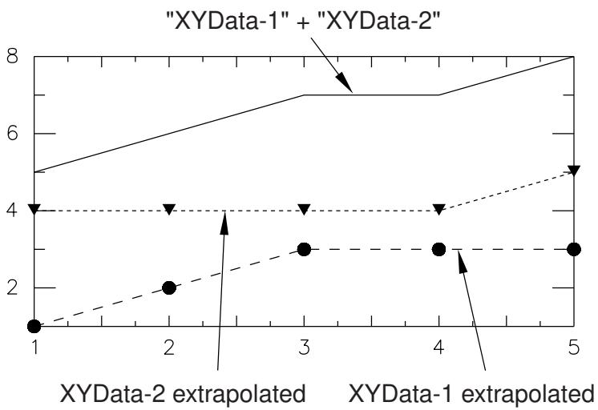  
图1：展示数据对象加法的X–Y图。


## 注意：

`+` 符号的此应用与 `sum` 函数具有相同的行为。

1.  定位到Operate on XY Data（操作XY数据）对话框。  
    从主菜单栏，选择Tools -> XY Data -> Create。在出现的对话框中点击Operate on XY data（操作XY数据），然后点击Continue（继续）。Operate on XY Data（操作XY数据）对话框出现。  
2.  从XY Data choices（XY数据选项）中，点击要操作的X–Y数据对象的名称，然后点击Add to Expression（添加到表达式）。您可以从本会话中先前保存的所有X–Y数据对象中选择（在XY Data字段中按字母顺序列出）。  
    X–Y数据对象名称出现在表达式窗口中。
3.  从列出的Operators（运算符）中，点击 `+`。
    `+` 符号出现在表达式窗口中数据对象名称之后。
4.  要指定第二个参数，请执行以下操作之一：
    在表达式窗口中，使用鼠标和键盘输入一个标量作为 `+` 运算符的第二个参数，或者  
    • 从XY Data choices（XY数据选项）中，点击一个数据对象名称作为表达式窗口中 `+` 运算符的参数，然后点击Add to Expression（添加到表达式）。
5.  要继续构建您的表达式，请将光标定位在表达式窗口中，输入或选择您想要包含的函数、运算符和X–Y数据。  
6.  要计算并显示您的表达式，请点击Plot Expression（绘制表达式）。  
7.  要保存新的X–Y数据对象，请点击Save As（另存为），然后在出现的对话框中提供一个名称。
    保存数据对象使其可在本会话中用于未来的操作，并可用于包含多个数据对象的X–Y图中。
8.  完成后，点击Cancel（取消）关闭对话框。

## 补充信息

• 了解X–Y数据插值和外推
• 求和两个或多个 X-Y 数据对象  
• 追加两个或多个 X-Y 数据对象  
• 合并两个 X-Y 数据对象  
• 使用 X-Y 数据操作

使用数学符号 – 对先前保存的 X–Y 数据对象（有序对集合）执行取反或减法运算，以产生新的 X–Y 数据对象。

要执行取反运算，请在单个 X–Y 数据对象前使用 – 运算符。取反会生成一个新的 X–Y 数据对象，其 X 坐标值与原始 X–Y 数据对象相同。Abaqus/CAE 计算的新 Y 坐标为每个原始 Y 坐标的负值。

要执行减法运算，有三种方法可供选择：

## 从 X–Y 数据对象中减去标量：

此方法生成一个新的 X–Y 数据对象，其 X 坐标值与原始 X–Y 数据对象相同。Abaqus/CAE 计算的新 Y 坐标为每个原始 Y 坐标减去该标量。例如，如果

$$
\mathrm{XYData} = [ (1, 6), (2, 7), (3, 8) ],
$$

则

$$
(\text {XYData} - 5) = [ (1, 1), (2, 2), (3, 3) ].
$$

## 从标量中减去 X–Y 数据对象：

此方法生成一个新的 X–Y 数据对象，其 X 坐标值与原始 X–Y 数据对象相同。Abaqus/CAE 计算的新 Y 坐标为该标量减去每个原始 Y 坐标。例如，如果

$$
\mathrm{XYData} = [ (1, 6), (2, 7), (3, 8) ],
$$

则

$$
(5 - \text {XYData}) = [ (1, - 1), (2, - 2), (3, - 3) ].
$$

## 从一个 X–Y 数据对象中减去另一个 X–Y 数据对象：

此方法生成一个新的 X–Y 数据对象，其 X 坐标为第一个数据对象的所有 X 坐标以及对齐两个对象所需的任何附加 X 坐标。Abaqus/CAE 通过插值和外推法计算附加的 X–Y 数据对。新数据对象的 Y 坐标为第一个数据对象的 Y 坐标减去第二个数据对象的 Y 坐标。例如，设

$$
\text {XYData1} = [ (4, 4), (5, 5) ]
$$

和

$$
\mathrm{XYData2} = [ (1, 1), (2, 2), (3, 3) ].
$$

为了对齐，Abaqus/CAE 计算第一个和第二个数据对象的值为：

$$
\text {XYData1 外推后} = [ (1, 4), (2, 4), (3, 4), (4, 4), (5, 5) ]
$$

和

$$
\text {XYData2 外推后} = [ (1, 1), (2, 2), (3, 3), (4, 3), (5, 3) ];
$$

则

$$
(\text {XYData1} - \text {XYData2}) = [ (1, 3), (2, 2), (3, 1), (4, 1), (5, 2) ].
$$

图 1 显示了上述示例的 X–Y 图。  
  
图 1：演示数据对象减法的 X–Y 图。

1.  找到“操作 XY 数据”对话框。

    从主菜单栏中，选择 工具->XY 数据->创建。在出现的对话框中单击“操作 XY 数据”；然后单击继续。“操作 XY 数据”对话框出现。

2.  从列出的运算符中，单击 –。

    符号 – 出现在表达式窗口中。

3.  使用鼠标和键盘将光标定位在表达式窗口中；然后指定必要的参数。可用的 X–Y 数据对象包括在本会话中先前保存的所有对象（在 XY 数据字段中按字母顺序列出）。

    ## 要使用取反

    从 XY 数据选项中，单击要取反的 X–Y 数据对象的名称，然后单击“添加到表达式”。

    ## 要使用减法

    *   使用键盘输入标量参数，或
    *   从 XY 数据选项中，单击要操作的 X–Y 数据对象的名称，然后单击“添加到表达式”。

    参数将出现在表达式窗口中。

4.  要继续构建表达式，请将光标定位在表达式窗口中，然后输入或选择要包含的函数、运算符和 X–Y 数据。

5.  要计算并显示表达式，请单击“绘图表达式”。

6.  要保存新的 X–Y 数据对象，请单击“另存为”，然后在出现的对话框中提供一个名称。

    保存数据对象后，它将在本会话的后续操作中可用，并可用于包含多个数据对象的 X–Y 图中。

7.  完成后，单击“取消”关闭对话框。

## 附加信息

*   理解 X–Y 数据插值和外推法
*   使用 X–Y 数据操作

## 对 X–Y 数据对象使用乘法

使用数学符号 * 操作先前保存的 X–Y 数据对象（有序对集合）以产生新的 X–Y 数据对象。* 运算符接受两个可交换的参数，可以通过以下两种方式之一应用：

## 将标量与 X–Y 数据对象相乘：

此方法生成一个新的 X–Y 数据对象，其 X 坐标值与原始 X–Y 数据对象相同。Abaqus/CAE 计算的新 Y 坐标为该标量乘以每个原始 Y 坐标。例如，如果

$$
\mathrm{XYData} = [ (1, 1), (2, 2), (3, 3) ],
$$

则

$$
(\text {XYData} * 5) = [ (1, 5), (2, 1 0), (3, 1 5) ].
$$

## 将一个 X–Y 数据对象与另一个 X–Y 数据对象相乘：

此方法生成一个新的 X–Y 数据对象，其 X 坐标为第一个数据对象的所有 X 坐标以及对齐两个对象所需的任何附加 X 坐标。Abaqus/CAE 通过插值和外推法计算附加的 X–Y 数据对。新数据对象的 Y 坐标为第一个数据对象的 Y 坐标乘以第二个数据对象的 Y 坐标。例如，设

$$
\text {XYData1} = [ (1, 1), (2, 2), (3, 3) ]
$$

和

$$
\mathrm{XYData2} = [ (4, 4), (5, 5) ].
$$

为了对齐，Abaqus/CAE 计算第一个和第二个数据对象的值为：

$$
\text {XYData1 外推后} = [ (1, 1), (2, 2), (3, 3), (4, 3), (5, 3) ]
$$

和

$$
\text {XYData2 外推后} = [ (1, 4), (2, 4), (3, 4), (4, 4), (5, 5) ];
$$

则

$$
(\text {XYData1} * \text {XYData2}) = [ (1, 4), (2, 8), (3, 1 2), (4, 1 2), (5, 1 5) ].
$$

图 1 显示了上述示例的 X–Y 图。

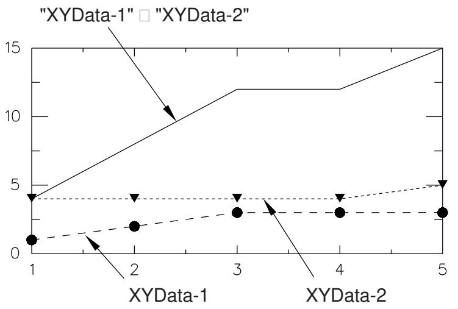  
图 1：演示数据对象乘法的 X–Y 图。

1.  找到“操作 XY 数据”对话框。

    从主菜单栏中，选择 工具->XY 数据->创建。在出现的对话框中单击“操作 XY 数据”；然后单击继续。“操作 XY 数据”对话框出现。

2.  从 XY 数据选项中，单击要操作的 X–Y 数据对象的名称，然后单击“添加到表达式”。您可以从本会话中先前保存的所有 X–Y 数据对象中选择（在 XY 数据字段中按字母顺序列出）。

    X–Y 数据对象名称出现在表达式窗口中。

3.  从列出的运算符中，单击 *。

    符号 * 出现在表达式窗口中数据对象名称之后。

4.  要指定第二个参数，请执行以下操作之一：

    使用鼠标和键盘在表达式窗口中将标量作为 * 运算符的第二个参数输入，或
    *   从 XY 数据选项中，单击表达式窗口中 * 运算符的数据对象参数名称，然后单击“添加到表达式”。

5.  要继续构建表达式，请将光标定位在表达式窗口中，然后输入或选择要包含的函数、运算符和 X–Y 数据。

6.  要计算并显示表达式，请单击“绘图表达式”。

7.  要保存新的 X–Y 数据对象，请单击“另存为”，然后在出现的对话框中提供一个名称。

    保存数据对象后，它将在本会话的后续操作中可用，并可用于包含多个数据对象的 X–Y 图中。

8.  完成后，单击“取消”关闭对话框。

## 附加信息

*   理解 X–Y 数据插值和外推法
*   使用 X–Y 数据操作

## 对 X–Y 数据对象使用除法

使用数学符号 / 操作先前保存的 X–Y 数据对象（有序对集合）以产生新的 X–Y 数据对象。/ 运算符接受两个不可交换的参数，可以通过以下三种方式之一应用：

## 将标量除以 X–Y 数据对象：

此方法生成一个新的 X–Y 数据对象，其 X 坐标值与原始 X–Y 数据对象相同。Abaqus/CAE 计算的新 Y 坐标为该标量除以每个原始 Y 坐标。例如，如果

$$
\mathrm{XYData} = [ (1, 2), (2, 1 0), (3, 2 0) ],
$$

则

$$
(2 / \text {XYData}) = [ (1, 1), (2,. 2), (3,. 1) ].
$$


## 注意：

为了方便，“操作 XY 数据”对话框提供了一个倒数函数 1/A。

## 将 X–Y 数据对象除以标量：

此方法生成一个新的 X–Y 数据对象，其 X 坐标值与原始 X–Y 数据对象相同。Abaqus/CAE 计算的新 Y 坐标为每个原始 Y 坐标除以该标量。例如，如果

$$
\mathrm{XYData} = [ (1, 2), (2, 1 0), (3, 2 0) ],
$$

则

$$
(\text {XYData} / 2) = [ (1, 1), (2, 5), (3, 1 0) ].
$$

## 将一个 X–Y 数据对象除以另一个 X–Y 数据对象：

此方法生成一个新的 X–Y 数据对象，其 X 坐标为第一个数据对象的所有 X 坐标以及对齐两个对象所需的任何附加 X 坐标。Abaqus/CAE 通过插值和外推法计算附加的 X–Y 数据对。新数据对象的 Y 坐标为第一个数据对象的 Y 坐标除以第二个数据对象的 Y 坐标。例如，设
$$
\text{XYData1} = [ (4, 4), (5, 5) ]
$$

以及

$$
\mathrm{XYData2} = [ (1, 1), (2, 2), (3, 3) ].
$$

为了对齐，Abaqus/CAE 计算第一个和第二个数据对象的值为：

$$
\text{XYData1 外推值} = [ (1, 4), (2, 4), (3, 4), (4, 4), (5, 5) ]
$$

以及

$$
\text{XYData2 外推值} = [ (1, 1), (2, 2), (3, 3), (4, 3), (5, 3) ];
$$

然后

$$
(\text{XYData1} / \text{XYData2}) = [ (1, 4), (2, 2), (3, 1. 3 3), (4, 1. 3 3), (5, 1. 6 6) ].
$$

图 1 显示了上述示例的 X-Y 绘图。  
  
图 1: 说明数据对象除法的 X-Y 绘图。

1. 定位 Operate on XY Data 对话框。从主菜单栏，选择 Tools->XY Data->Create。在出现的对话框中，点击 Operate on XY data；然后点击 Continue。Operate on XY Data 对话框出现。  
2. 从列出的 Operators 中，点击 /。符号 / 出现在表达式窗口中。  
3. 要为 / 运算符指定两个参数，使用鼠标和键盘将光标定位在表达式窗口中；然后执行以下操作之一：

• 使用键盘输入标量参数，或

从 XY Data 选择中，点击要操作的 X-Y 数据对象的名称，然后点击 Add to Expression。您可以从本次会话中之前保存的所有 X-Y 数据对象中选择（在 XY Data 字段中按字母顺序列出）。

参数出现在表达式窗口内。

4. 要继续构建表达式，将光标定位在表达式窗口中，并输入或选择您想包含的函数、运算符和 X-Y 数据。  
5. 要计算并显示您的表达式，点击 Plot Expression。  
6. 要保存您的新 X-Y 数据对象，点击 Save As，然后在出现的对话框中提供一个名称。

保存您的数据对象使其在本次会话的未来操作中可用，并可供包含多个数据对象的 X-Y 绘图使用。

7. 完成后，点击 Cancel 关闭对话框。

## 附加信息

• 理解 X-Y 数据插值和外推  
• 使用 X-Y 数据操作

## 计算 X-Y 数据对象的绝对值

使用 abs 函数对一个先前保存的 X-Y 数据对象（一组有序对）进行操作，以生成一个新的 X-Y 数据对象。新的 X-Y 数据对象具有与原始 X-Y 数据对象相同的 X 坐标值，但新的 Y 坐标计算为原始 Y 坐标的绝对值。

图 1 显示了使用 abs 函数生成的 X-Y 绘图示例。  
  
图 1: 使用 abs 函数生成的 X-Y 绘图。

1. 定位 Operate on XY Data 对话框。  
从主菜单栏，选择 Tools->XY Data->Create。在出现的对话框中，点击 Operate on XY data；然后点击 Continue。Operate on XY Data 对话框出现。  
2. 从列出的 Operators 中，点击 abs(A)。  
函数 abs 出现在表达式窗口中。  
3. 从 XY Data 选择中，点击要操作的 X-Y 数据对象的名称，然后点击 Add to Expression。您可以从本次会话中之前保存的所有 X-Y 数据对象中选择（在 XY Data 字段中按字母顺序列出）。  
X-Y 数据对象名称出现在表达式窗口中 abs 函数的括号内。  
4. 要继续构建表达式，将光标定位在表达式窗口中，并输入或选择您想包含的函数、运算符和 X-Y 数据。  
5. 要计算并显示您的表达式，点击 Plot Expression。  
6. 要保存您的新 X-Y 数据对象，点击 Save As，然后在出现的对话框中提供一个名称。  
保存您的数据对象使其在本次会话的未来操作中可用，并可供包含多个数据对象的 X-Y 绘图使用。  
7. 完成后，点击 Cancel 关闭对话框。

## 附加信息

• 使用 X-Y 数据操作

使用 avg 函数对两个或多个先前保存的 X-Y 数据对象（每个对象是一组有序对）进行操作，以生成一个新的 X-Y 数据对象。新的 X-Y 数据对象的 X 坐标包含所有输入数据对象的 X 坐标以及对齐输入数据对象所需的任何额外 X 坐标。Abaqus/CAE 通过插值和外推计算额外的 X-Y 数据对。Abaqus/CAE 计算新数据对象的 Y 坐标为当前 X 坐标下所有输入 Y 坐标的平均值。此操作的参数是可交换的。

图 1 展示了使用 avg 函数可以生成的 X-Y 绘图类型。  
  
图 1: 使用 avg 函数生成的 X-Y 绘图。

有关如何查找单个 X-Y 数据对象的当前平均值，请参见查找 X-Y 数据对象的当前平均值。

1. 定位 Operate on XY Data 对话框。  
从主菜单栏，选择 Tools->XY Data->Create。在出现的对话框中，点击 Operate on XY data；然后点击 Continue。Operate on XY Data 对话框出现。  
2. 从列出的 Operators 中，点击 avg(X,X,...)。  
函数 avg 出现在表达式窗口中。  
3. 从 XY Data 选择中，点击要操作的两个或多个 X-Y 数据对象的名称，然后点击 Add to Expression。您可以从本次会话中之前保存的所有 X-Y 数据对象中选择（在 XY Data 字段中按字母顺序列出）。  
X-Y 数据对象名称以逗号分隔的形式出现在表达式窗口中 avg 函数的括号内。  
4. 要继续构建表达式，将光标定位在表达式窗口中，并输入或选择您想包含的函数、运算符和 X-Y 数据。  
5. 要计算并显示您的表达式，点击 Plot Expression。  
6. 要保存您的新 X-Y 数据对象，点击 Save As，然后在出现的对话框中提供一个名称。  
保存您的数据对象使其在本次会话的未来操作中可用，并可供包含多个数据对象的 X-Y 绘图使用。

7. 完成后，点击 Cancel 关闭对话框。

## 附加信息

• 查找 X-Y 数据对象的当前平均值  
• 使用 X-Y 数据操作

使用 currentAvg 函数对一个先前保存的 X-Y 数据对象（一组有序对）进行操作，以生成一个新的 X-Y 数据对象。新的 X-Y 数据对象具有与原始 X-Y 数据对象相同的 X 坐标值，但新的 Y 坐标计算为截至并包括当前 X 坐标在内的所有 Y 坐标的平均值。

图 1 显示了使用 currentAvg 函数生成的 X-Y 绘图示例。

  
图 1: 使用 currentAvg 函数生成的 X-Y 绘图。


## 注意：

新 X-Y 数据对象的最后一个值代表原始 X-Y 数据对象的整体平均 Y 坐标。

有关如何查找两个或多个 X-Y 数据对象的平均值，请参见查找两个或多个 X-Y 数据对象的平均值。

1. 定位 Operate on XY Data 对话框。  
从主菜单栏，选择 Tools->XY Data->Create。在出现的对话框中，点击 Operate on XY data；然后点击 Continue。Operate on XY Data 对话框出现。  
2. 从列出的 Operators 中，点击 currentAvg(X)。  
函数 currentAvg 出现在表达式窗口中。  
3. 从 XY Data 选择中，点击要操作的 X-Y 数据对象的名称，然后点击 Add to Expression。您可以从本次会话中之前保存的所有 X-Y 数据对象中选择（在 XY Data 字段中按字母顺序列出）。  
X-Y 数据对象名称出现在表达式窗口中 currentAvg 函数的括号内。  
4. 要继续构建表达式，将光标定位在表达式窗口中，并输入或选择您想包含的函数、运算符和 X-Y 数据。  
5. 要计算并显示您的表达式，点击 Plot Expression。  
6. 要保存您的新 X-Y 数据对象，点击 Save As，然后在出现的对话框中提供一个名称。  
保存您的数据对象使其在本次会话的未来操作中可用，并可供包含多个数据对象的 X-Y 绘图使用。

7. 完成后，点击 Cancel 关闭对话框。

## 附加信息

• 查找两个或多个 X-Y 数据对象的平均值  
• 使用 X-Y 数据操作

使用 differentiate 函数对一个先前保存的 X-Y 数据对象（一组有序对）进行操作，以生成一个新的 X-Y 数据对象。新的 X-Y 数据对象具有与原始 X-Y 数据对象相同的 X 坐标值，但新的 Y 坐标计算为原始 Y 坐标的数值导数。

Abaqus/CAE 使用原始 X-Y 数据对象的三点抛物线段计算导数。第一个点和最后一个点的值分别计算为相关抛物线在起点和终点的梯度。每个剩余点的斜率使用由两个相邻点定义的抛物线的中点进行计算。
图 1 展示了使用微分函数 (differentiate function) 生成的 XY 图表示例。

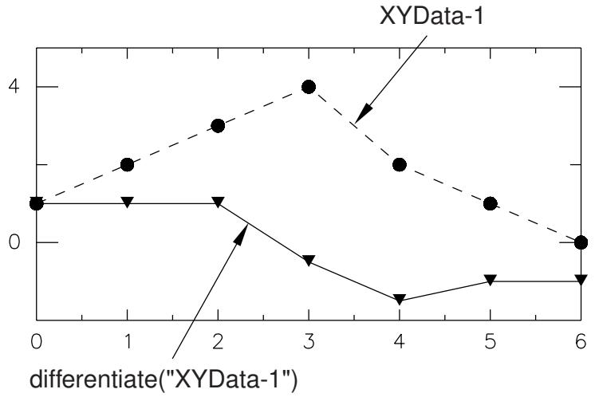  
图 1: 使用微分函数 (differentiate function) 生成的 XY 图表。

1.  找到“操作 XY 数据”(Operate on XY Data) 对话框。
    从主菜单栏中，选择 工具 (Tools) -> XY 数据 (XY Data) -> 创建 (Create)。在出现的对话框中点击“操作 XY 数据”(Operate on XY data)；然后点击 继续 (Continue)。“操作 XY 数据”(Operate on XY Data) 对话框随即出现。
2.  从列出的算子 (Operators) 中，点击 differentiate(X)。
    微分函数 (differentiate function) 出现在表达式窗口 (expression window) 中。
3.  从 XY 数据 (XY Data) 选项中，点击要操作的 XY 数据对象的名称，然后点击 添加到表达式 (Add to Expression)。您可以从本次会话中之前保存的所有 XY 数据对象中选择（按字母顺序列在 XY 数据 (XY Data) 字段中）。
    XY 数据对象名称出现在表达式窗口中微分函数括号内。
4.  要继续构建表达式，请将光标定位在表达式窗口中，然后键入或选择您想要包含的函数、算子和 XY 数据。
5.  要计算并显示表达式，请点击 绘制表达式 (Plot Expression)。
6.  要保存新的 XY 数据对象，请点击 另存为 (Save As)，然后在出现的对话框中提供一个名称。
    保存您的数据对象可使其在本次会话的未来操作中可用，并可包含在包含多个数据对象的 XY 图表中。
7.  完成后，点击 取消 (Cancel) 关闭对话框。

## 附加信息

*   积分 XY 数据对象 (Integrating an X–Y data object)
*   使用 XY 数据操作 (Using X–Y data operations)

使用拟合函数 (fit function) 操作先前保存的 XY 数据对象（一组有序对），以生成一个新的 XY 数据对象。新的 XY 数据对象包含沿着最适合先前保存的 XY 数据对象的曲线，以规则间隔分布的点。拟合函数 (fit function) 提供了两种曲线拟合算法：线性最小二乘拟合 (linear least squares fit) 和样条插值 (spline interpolation)。

图 1 和图 2 展示了使用每种曲线拟合算法的拟合函数 (fit function) 生成的 XY 图示例。

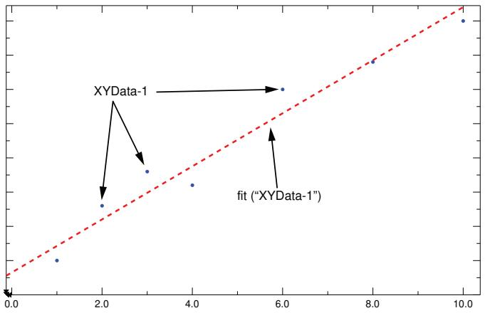  
图 1: 使用拟合函数 (fit function) 并选择线性最小二乘法选项 (linear least squares) 生成的 XY 图表。

  
图 2: 使用拟合函数 (fit function) 并选择样条插值选项 (spline interpolation) 生成的 XY 图表。

1.  找到“操作 XY 数据”(Operate on XY Data) 对话框。
    从主菜单栏中，选择 工具 (Tools) -> XY 数据 (XY Data) -> 创建 (Create)。在出现的对话框中点击“操作 XY数据”(Operate on XY data)；然后点击 继续 (Continue)。“操作 XY 数据”(Operate on XY Data) 对话框随即出现。
2.  从列出的算子 (Operators) 中，点击 fit(X)。
    拟合函数 (fit function) 出现在表达式窗口 (expression window) 中，默认选择线性最小二乘拟合 (linear least squares fit) 选项。
3.  从 XY 数据 (XY Data) 选项中，点击要操作的 XY 数据对象的名称，然后点击 添加到表达式 (Add to Expression)。您可以从本次会话中之前保存的所有 XY 数据对象中选择（按字母顺序列在 XY 数据 (XY Data) 字段中）。
    XY 数据对象名称出现在表达式窗口中拟合函数括号内。
4.  要继续构建表达式，请将光标定位在表达式窗口中，然后键入或选择您想要包含的函数、算子和 XY 数据。您可以通过对以下选项进行更改来定制拟合函数本身：
    *   如果您想执行样条插值 (spline interpolation)，请将 typeOfFit 选项设置为 SPLINE_INTERPOLATION。
    *   如果您想为新的 XY 数据对象指定自定义的点数，请追加 numFitPoints=数字。默认情况下，Abaqus/CAE 使用 2 个点定义线性最小二乘拟合 (linear least squares fit)，使用 100 个点定义样条插值 (spline interpolation)。
5.  要计算并显示表达式，请点击 绘制表达式 (Plot Expression)。
6.  要保存新的 XY 数据对象，请点击 另存为 (Save As)，然后在出现的对话框中提供一个名称。
    保存您的数据对象可使其在本次会话的未来操作中可用，并可包含在包含多个数据对象的 XY 图表中。
7.  完成后，点击 取消 (Cancel) 关闭对话框。

## 附加信息

*   积分 XY 数据对象 (Integrating an X–Y data object)
*   使用 XY 数据操作 (Using X–Y data operations)

使用积分函数 (integrate function) 操作先前保存的 XY 数据对象（一组有序对），以生成一个新的 XY 数据对象。新的 XY 数据对象具有与原始 XY 数据对象相同的 X 坐标值，但新的 Y 坐标是原始 Y 坐标的数值积分（使用梯形法则）计算得出的。

图 1 展示了使用积分函数 (integrate function) 生成的 XY 图示例。

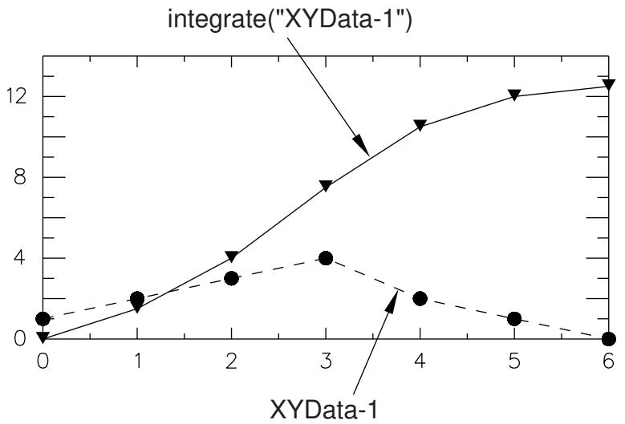  
图 1: 使用积分函数 (integrate function) 生成的 XY 图表。

1.  找到“操作 XY 数据”(Operate on XY Data) 对话框。
    从主菜单栏中，选择 工具 (Tools) -> XY 数据 (XY Data) -> 创建 (Create)。在出现的对话框中点击“操作 XY 数据”(Operate on XY data)；然后点击 继续 (Continue)。“操作 XY 数据”(Operate on XY Data) 对话框随即出现。
2.  从列出的算子 (Operators) 中，点击 integrate(X)。
    积分函数 (integrate function) 出现在表达式窗口 (expression window) 中。
3.  从 XY 数据 (XY Data) 选项中，点击要操作的 XY 数据对象的名称，然后点击 添加到表达式 (Add to Expression)。您可以从本次会话中之前保存的所有 XY 数据对象中选择（按字母顺序列在 XY 数据 (XY Data) 字段中）。
    XY 数据对象名称出现在表达式窗口中积分函数括号内。
4.  要继续构建表达式，请将光标定位在表达式窗口中，然后键入或选择您想要包含的函数、算子和 XY 数据。
5.  要计算并显示表达式，请点击 绘制表达式 (Plot Expression)。
6.  要保存新的 XY 数据对象，请点击 另存为 (Save As)，然后在出现的对话框中提供一个名称。
    保存您的数据对象可使其在本次会话的未来操作中可用，并可包含在包含多个数据对象的 XY 图表中。
7.  完成后，点击 取消 (Cancel) 关闭对话框。

## 附加信息

*   微分 XY 数据对象 (Differentiating an X–Y data object)
*   使用 XY 数据操作 (Using X–Y data operations)

## 插值 XY 数据对象 (Interpolating an X–Y data object)

使用插值函数 (interpolate function) 操作先前保存的 XY 数据对象（一组有序对），以生成一个新的 XY 数据对象。对具有非均匀数据的 XY 数据对象进行插值，将生成一个新的 XY 数据对象，其中新的、插值的 Y 坐标值出现在 X 轴的规则增量上。默认情况下，数据以等于源数据中最小 X 增量的增量进行插值。

图 1 展示了使用插值函数 (interpolate function) 生成的 XY 图表示例，并叠加了原始数据。
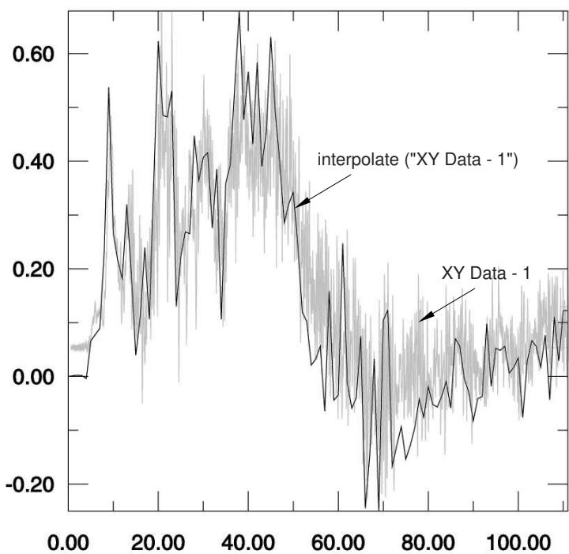  
图 1: 使用插值函数 (interpolate function) 生成的 XY 图表。

XY 数据对象的名称是插值函数 (interpolate function) 唯一必需的参数。以下是可选参数的说明：

*   插值数据点之间的 X 轴增量 (xIncrement)。如果您未为此参数指定值或指定了非正值，Abaqus/CAE 将使用原始数据集的最小 X 增量。
*   指定插值方案的符号常量 (interpolation)。此参数的有效值为：QUADRATIC，指定拉格朗日二阶插值方案 (Lagrange second-order interpolation scheme)；CUBIC_SPLINE，指定三次样条插值方案 (cubic spline interpolation scheme)；以及 LINEAR，指定线性插值方案 (linear interpolation scheme)。默认值为 QUADRATIC。
*   通往第一个数据点的原始数据曲线斜率 (startslope)。此参数的默认值为 0.0（水平斜率），仅当 interpolation=CUBIC_SPLINE 时使用。
*   超出最终数据点的原始数据曲线斜率 (endslope)。此参数的默认值为 0.0（水平斜率），仅当 interpolation=CUBIC_SPLINE 时使用。

1.  找到“操作 XY 数据”(Operate on XY Data) 对话框。
    从主菜单栏中，选择 工具 (Tools) -> XY 数据 (XY Data) -> 创建 (Create)。在出现的对话框中点击“操作 XY 数据”(Operate on XY data)；然后点击 继续 (Continue)。“操作 XY 数据”(Operate on XY Data) 对话框随即出现。
2.  从列出的算子 (Operators) 中，点击 interpolate(X)。
    插值函数 (interpolate function) 出现在表达式窗口 (expression window) 中。
3.  从 XY 数据 (XY Data) 选项中，点击要操作的 XY 数据对象的名称，然后点击 添加到表达式 (Add to Expression)。您可以从本次会话中之前保存的所有 XY 数据对象中选择（按字母顺序列在 XY 数据 (XY Data) 字段中）。
    XY 数据对象名称出现在表达式窗口中插值函数括号内。
4.  要继续构建表达式，请将光标定位在表达式窗口中，然后键入或选择您想要包含的函数、算子和 XY 数据。
5.  要计算并显示表达式，请点击 绘制表达式 (Plot Expression)。
6.  要保存新的 XY 数据对象，请点击 另存为 (Save As)，然后在出现的对话框中提供一个名称。
保存数据对象可使其在当前会话的后续操作中可用，并可用于包含多个数据对象的X–Y图中。

7. 完成后，点击 **Cancel** 关闭对话框。

## 其他信息

•   使用 X–Y 数据操作

## 线性化 X–Y 数据对象

使用 `linearize` 函数将先前保存的 X–Y 数据对象（一组有序数对）的 Y 值分离为常数或线性分量。`linearize` 函数生成的新 X–Y 数据对象恰好包含两个点。

图 1 展示了使用 `linearize` 函数生成的 X–Y 图表示例。

`linearize("XYData-1," LINEAR)`

  
图 1：使用 `linearize` 函数的常数和线性形式生成的 X–Y 图。


## 注意：

输入到 `linearize` 函数的 X–Y 数据对象的 X 值必须是等间距的。

1.  找到 **Operate on XY Data** 对话框。
    从主菜单栏中选择 **Tools->XY Data->Create**。在出现的对话框中点击 **Operate on XY data**；然后点击 **Continue**。**Operate on XY Data** 对话框随即出现。
2.  从列出的 **Operators** 中，点击 `linearize(X, CONSTANT)` 或 `linearize(X, LINEAR)`，分别应用线性化来创建一个常数 Y 项或对 Y 项进行线性化。
    `linearize` 函数出现在表达式窗口中。
3.  从 **XY Data** 选择中，点击要操作的 X–Y 数据对象的名称，然后点击 **Add to Expression**。您可以从本次会话中先前保存的所有 X–Y 数据对象中选择（在 **XY Data** 字段中按字母顺序列出）。
    X–Y 数据对象名称出现在表达式窗口的 `linearize` 函数括号内。
4.  要继续构建表达式，请将光标定位在表达式窗口中，输入或选择要包含的函数、运算符和 X–Y 数据。
5.  要计算并显示表达式，请点击 **Plot Expression**。
6.  要保存新的 X–Y 数据对象，请点击 **Save As**，然后在出现的对话框中提供一个名称。
    保存数据对象可使其在当前会话的后续操作中可用，并可用于包含多个数据对象的 X–Y 图中。
7.  完成后，点击 **Cancel** 关闭对话框。

## 其他信息

•   使用 X–Y 数据操作

## 归一化 X–Y 数据对象

使用 `normalize` 函数对先前保存的 X–Y 数据对象（一组有序数对）进行操作，以生成一个新的 X–Y 数据对象。此操作类似于对向量进行归一化。新的 X–Y 数据对象具有与原始 X–Y 数据对象相同的 X 坐标值。Abaqus/CAE 通过将每个原始 Y 坐标除以所有原始 Y 坐标值的均方根（平方和的平方根）来计算新的 Y 坐标。

图 1 说明了使用 `normalize` 函数可以生成的 X–Y 图类型。

  
图 1：使用 `normalize` 函数生成的 X–Y 图。

1.  找到 **Operate on XY Data** 对话框。
    从主菜单栏中选择 **Tools->XY Data->Create**。在出现的对话框中点击 **Operate on XY data**；然后点击 **Continue**。**Operate on XY Data** 对话框随即出现。
2.  从列出的 **Operators** 中，点击 `normalize(X)`。
    `normalize` 函数出现在表达式窗口中。
3.  从 **XY Data** 选择中，点击要操作的 X–Y 数据对象的名称，然后点击 **Add to Expression**。您可以从本次会话中先前保存的所有 X–Y 数据对象中选择（在 **XY Data** 字段中按字母顺序列出）。
    X–Y 数据对象名称出现在表达式窗口的 `normalize` 函数括号内。
4.  要继续构建表达式，请将光标定位在表达式窗口中，输入或选择要包含的函数、运算符和 X–Y 数据。
5.  要计算并显示表达式，请点击 **Plot Expression**。
6.  要保存新的 X–Y 数据对象，请点击 **Save As**，然后在出现的对话框中提供一个名称。
    保存数据对象可使其在当前会话的后续操作中可用，并可用于包含多个数据对象的 X–Y 图中。
7.  完成后，点击 **Cancel** 关闭对话框。

## 其他信息

•   计算两个或多个 X–Y 数据对象的平方和的平方根
•   使用 X–Y 数据操作

使用 `sqrt` 函数对先前保存的 X–Y 数据对象（一组有序数对）进行操作，以生成一个新的 X–Y 数据对象。新的 X–Y 数据对象具有与原始 X–Y 数据对象相同的 X 坐标值，但新的 Y 坐标计算为原始 Y 坐标的平方根。

图 1 提供了使用 `sqrt` 函数生成的 X–Y 图示例。

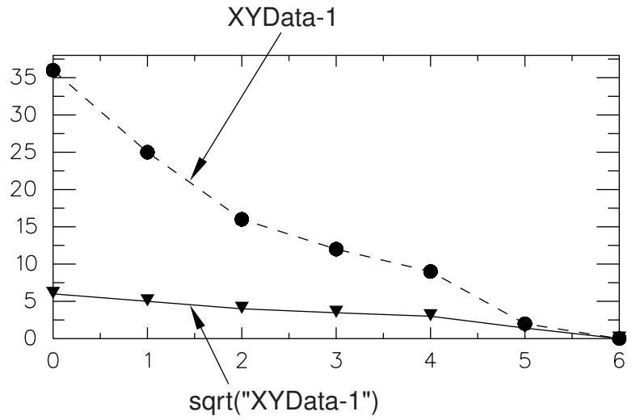  
图 1：使用 `sqrt` 函数生成的 X–Y 图。

1.  找到 **Operate on XY Data** 对话框。
    从主菜单栏中选择 **Tools->XY Data->Create**。在出现的对话框中点击 **Operate on XY data**；然后点击 **Continue**。**Operate on XY Data** 对话框随即出现。
2.  从列出的 **Operators** 中，点击 `sqrt(A)`。
    `sqrt` 函数出现在表达式窗口中。
3.  从 **XY Data** 选择中，点击要操作的 X–Y 数据对象的名称，然后点击 **Add to Expression**。您可以从本次会话中先前保存的所有 X–Y 数据对象中选择（在 **XY Data** 字段中按字母顺序列出）。
    X–Y 数据对象名称出现在表达式窗口的 `sqrt` 函数括号内。
4.  要继续构建表达式，请将光标定位在表达式窗口中，输入或选择要包含的函数、运算符和 X–Y 数据。
5.  要计算并显示表达式，请点击 **Plot Expression**。
6.  要保存新的 X–Y 数据对象，请点击 **Save As**，然后在出现的对话框中提供一个名称。
    保存数据对象可使其在当前会话的后续操作中可用，并可用于包含多个数据对象的 X–Y 图中。
7.  完成后，点击 **Cancel** 关闭对话框。

## 其他信息

•   计算两个或多个 X–Y 数据对象的平方和的平方根
•   使用 X–Y 数据操作

## 计算两个或多个 X–Y 数据对象的平方和的平方根

使用 `srss` 函数对两个或多个先前保存的 X–Y 数据对象（每个对象都是一组有序数对）执行平方和的平方根运算，以生成一个新的 X–Y 数据对象。例如，使用此函数可以找到两个或多个 X–Y 数据对象在匹配的 X 坐标处的总幅值。

新的 X–Y 数据对象的 X 坐标为第一个数据对象的所有 X 坐标以及对齐其余对象所需的任何附加 X 坐标。Abaqus/CAE 通过插值和外推计算额外的 X–Y 数据对。新数据对象的 Y 坐标是所有输入 X–Y 数据对象在匹配的 X 坐标处的 Y 坐标的平方和的平方根。此函数的参数是可交换的。

图 1 说明了使用 `srss` 函数可以生成的 X–Y 图类型。

  
图 1：使用 `srss` 函数生成的 X–Y 图。

1.  找到 **Operate on XY Data** 对话框。
    从主菜单栏中选择 **Tools->XY Data->Create**。在出现的对话框中点击 **Operate on XY data**；然后点击 **Continue**。**Operate on XY Data** 对话框随即出现。
2.  从列出的 **Operators** 中，点击 `srss(X,X,...)`。
    `srss` 函数出现在表达式窗口中。
3.  从 **XY Data** 选择中，点击要操作的两个或多个 X–Y 数据对象的名称，然后点击 **Add to Expression**。您可以从本次会话中先前保存的所有 X–Y 数据对象中选择（在 **XY Data** 字段中按字母顺序列出）。
    X–Y 数据对象名称出现在表达式窗口的 `srss` 函数括号内，并用逗号分隔。
4.  要继续构建表达式，请将光标定位在表达式窗口中，输入或选择要包含的函数、运算符和 X–Y 数据。
5.  要计算并显示表达式，请点击 **Plot Expression**。
6.  要保存新的 X–Y 数据对象，请点击 **Save As**，然后在出现的对话框中提供一个名称。
    保存数据对象可使其在当前会话的后续操作中可用，并可用于包含多个数据对象的 X–Y 图中。
7.  完成后，点击 **Cancel** 关闭对话框。

## 其他信息

•   理解 X–Y 数据插值和外推
•   计算 X–Y 数据对象的平方根
• 归一化 X-Y 数据对象  
• 使用 X-Y 数据操作  

## 对两个或多个 X-Y 数据对象求和

使用 `sum` 函数对两个或多个先前保存的 X-Y 数据对象（每个对象是一组有序数对）进行操作，以生成一个新的 X-Y 数据对象。`sum` 函数接受两个或多个可交换参数。


## 注意：

此函数的行为与 `+` 符号相同。更多信息，请参阅在 X-Y 数据上使用加法。

1. 找到“操作 XY 数据”对话框。  
从主菜单栏中，选择“工具”->“XY 数据”->“创建”。在出现的对话框中，单击“操作 XY 数据”，然后单击“继续”。将出现“操作 XY 数据”对话框。  
2. 从列出的运算符中，单击 `sum(A,A,...)`。  
`sum` 函数将出现在表达式窗口中。  
3. 从 XY 数据选项中，单击要相加的两个或多个 X-Y 数据对象的名称，然后单击“添加到表达式”。您可以从当前会话中先前保存的所有 X-Y 数据对象中进行选择（在 XY 数据字段中按字母顺序列出）。  
X-Y 数据对象的名称将出现在表达式窗口中 `sum` 函数括号内，用逗号分隔。  
4. 要继续构建表达式，请将光标定位在表达式窗口中，然后输入或选择要包含的函数、运算符和 X-Y 数据。  
5. 要计算并显示您的表达式，请单击“绘制表达式”。  
6. 要保存新的 X-Y 数据对象，请单击“另存为”，然后在出现的对话框中提供一个名称。  
保存数据对象使其在当前会话中可用于未来的操作，并可用于包含多个数据对象的 X-Y 图中。  
7. 完成后，单击“取消”关闭对话框。

## 附加信息

• 在 X-Y 数据对象上使用加法  
• 合并两个或多个 X-Y 数据对象  
• 组合两个 X-Y 数据对象  
• 使用 X-Y 数据操作  

使用 `vectorMagnitude` 函数对最多三个先前保存的 X-Y 数据对象（每个对象是一组有序数对）执行平方和的平方根运算，以生成一个新的 X-Y 数据对象。此函数与 `srss` 函数（参见计算两个或多个 X-Y 数据对象平方和的平方根）基本相同，区别在于该运算最多可在三个数据对象上执行。您可以通过计算三个向量分量的平方和的平方根来使用此函数绘制向量的总幅值。

新的 X-Y 数据对象以其 X 坐标为第一个数据对象的所有 X 坐标以及对齐剩余对象所需的任何附加 X 坐标。Abaqus/CAE 通过插值和外推计算额外的 X-Y 数据对。新数据对象的 Y 坐标是在匹配的 X 坐标处，所有输入 X-Y 数据对象 Y 坐标的平方和的平方根。此函数的参数是可交换的。

图 1 展示了使用 `vectorMagnitude` 函数可以生成的 X-Y 图类型。

`vectorMagnitude("XYData-1","XYData-2","XYData-3")`

  
图 1：使用 `vectorMagnitude` 函数生成的 X-Y 图。

1. 找到“操作 XY 数据”对话框。  
从主菜单栏中，选择“工具”->“XY 数据”->“创建”。在出现的对话框中，单击“操作 XY 数据”，然后单击“继续”。将出现“操作 XY 数据”对话框。  
2. 从列出的运算符中，单击 `vectorMagnitude(X,X,X)`。  
`vectorMagnitude` 函数将出现在表达式窗口中。  
3. 从 XY 数据选项中，单击要对其进行操作的三个 X-Y 数据对象的名称，然后单击“添加到表达式”。您可以从当前会话中先前保存的所有 X-Y 数据对象中进行选择（在 XY 数据字段中按字母顺序列出）。  
X-Y 数据对象的名称将出现在表达式窗口中 `vectorMagnitude` 函数括号内，用逗号分隔。

4. 要继续构建表达式，请将光标定位在表达式窗口中，然后输入或选择要包含的函数、运算符和 X-Y 数据。  
5. 要计算并显示您的表达式，请单击“绘制表达式”。  
6. 要保存新的 X-Y 数据对象，请单击“另存为”，然后在出现的对话框中提供一个名称。

保存数据对象使其在当前会话中可用于未来的操作，并可用于包含多个数据对象的 X-Y 图中。

7. 完成后，单击“取消”关闭对话框。

## 附加信息

• 理解 X-Y 数据插值和外推  
• 计算 X-Y 数据对象的平方根  
• 归一化 X-Y 数据对象  
• 使用 X-Y 数据操作  

## 将三角函数应用于 X-Y 数据对象

使用三角函数 `cos`、`cosh`、`acos`、`sin`、`sinh`、`asin`、`tan`、`tanh` 和 `atan` 对先前保存的 X-Y 数据对象（一组有序数对）进行操作，以生成一个新的 X-Y 数据对象。新的 X-Y 数据对象具有与原始 X-Y 数据对象相同的 X 坐标值，但新的 Y 坐标被计算为每个原始 Y 坐标的三角函数值。三角函数的参数假定为弧度制。

例如，如果

$$
\mathrm{XYData} = [ (0, 0), (1, 1. 5 7 1), (2, 3. 1 4) ],
$$

那么

$$
\sin (\text {XYData}) = [ (0, 0), (1, 1), (2, 0. 0 0 1 5 9) ].
$$

图 1 显示了上述示例的 X-Y 图。  
  
图 1：使用 `sin` 函数生成的 X-Y 图。  
1. 找到“操作 XY 数据”对话框。

从主菜单栏中，选择“工具”->“XY 数据”->“创建”。在出现的对话框中，单击“操作 XY 数据”，然后单击“继续”。将出现“操作 XY 数据”对话框。

2. 从列出的运算符中，单击以下三角函数之一：

<table><tr><td>sin(A)</td><td>计算您的 X-Y 数据对象的正弦值。</td></tr><tr><td>sinh(A)</td><td>计算您的 X-Y 数据对象的双曲正弦值。</td></tr><tr><td>asin(A)</td><td>计算您的 X-Y 数据对象的反正弦值。您的 Y 数据值必须在 [-1, 1] 范围内。</td></tr><tr><td>cos(A)</td><td>计算您的 X-Y 数据对象的余弦值。</td></tr><tr><td>cosh(A)</td><td>计算您的 X-Y 数据对象的双曲余弦值。</td></tr><tr><td>acos(A)</td><td>计算您的 X-Y 数据对象的反余弦值。您的 Y 数据值必须在 [-1, 1] 范围内。</td></tr><tr><td>tan(A)</td><td>计算您的 X-Y 数据对象的正切值。</td></tr><tr><td>tanh(A)</td><td>计算您的 X-Y 数据对象的双曲正切值。</td></tr><tr><td>atan(A)</td><td>计算您的 X-Y 数据对象的反正切值。</td></tr></table>

您选择的三角函数将出现在表达式窗口中。

3. 从 XY 数据选项中，单击要对其进行操作的 X-Y 数据对象的名称，然后单击“添加到表达式”。您可以从当前会话中先前保存的所有 X-Y 数据对象中进行选择（在 XY 数据字段中按字母顺序列出）。  
X-Y 数据对象的名称将出现在表达式窗口中三角函数括号内。  
4. 要继续构建表达式，请将光标定位在表达式窗口中，然后输入或选择要包含的函数、运算符和 X-Y 数据。  
5. 要计算并显示您的表达式，请单击“绘制表达式”。  
6. 要保存新的 X-Y 数据对象，请单击“另存为”，然后在出现的对话框中提供一个名称。

保存数据对象使其在当前会话中可用于未来的操作，并可用于包含多个数据对象的 X-Y 图中。

7. 完成后，单击“取消”关闭对话框。

## 附加信息

• 转换 X-Y 数据对象使用的角度单位  
• 使用 X-Y 数据操作  

使用 `exp` 函数对先前保存的 X-Y 数据对象（一组有序数对）进行操作，以生成一个新的 X-Y 数据对象。新的 X-Y 数据对象具有与原始 X-Y 数据对象相同的 X 坐标值，但新的 Y 坐标被计算为原始 Y 坐标的指数。

图 1 显示了使用 `exp` 函数生成的 X-Y 图示例。

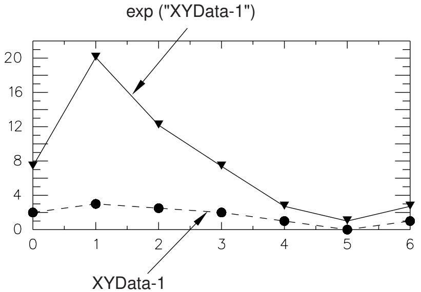  
图 1：使用 `exp` 函数生成的 X-Y 图。

1. 找到“操作 XY 数据”对话框。  
从主菜单栏中，选择“工具”->“XY 数据”->“创建”。在出现的对话框中，单击“操作 XY 数据”，然后单击“继续”。将出现“操作 XY 数据”对话框。  
2. 从列出的运算符中，单击 `exp(A)`。  
`exp` 函数将出现在表达式窗口中。  
3. 从 XY 数据选项中，单击要对其进行操作的 X-Y 数据对象的名称，然后单击“添加到表达式”。您可以从当前会话中先前保存的所有 X-Y 数据对象中进行选择（在 XY 数据字段中按字母顺序列出）。
X–Y 数据对象名称出现在表达式窗口的 exp 函数括号内。
4.  若要继续构建表达式，请将光标定位在表达式窗口中，然后键入或选择您想要包含的函数、运算符和 X–Y 数据。
5.  要计算并显示您的表达式，请单击“Plot Expression”（绘制表达式）。
6.  要保存您的新 X–Y 数据对象，请单击“Save As”（另存为），然后在出现的对话框中提供一个名称。
    保存数据对象使其可用于本次会话中的后续操作，以及包含在包含多个数据对象的 X–Y 图中。
7.  完成后，请单击“Cancel”（取消）关闭对话框。

## 其他信息

•   将 X–Y 数据对象提升到某个幂次
•   使用 X–Y 数据操作

## 对 X–Y 数据对象应用对数函数

使用对数函数 log 和 log10 对先前保存的 X–Y 数据对象（一组有序对）进行操作，以生成一个新的 X–Y 数据对象。新的 X–Y 数据对象具有与原始 X–Y 数据对象相同的 X 坐标值，但新的 Y 坐标是通过计算每个原始 Y 坐标的对数函数值而得出的。例如，如果

$$
\mathrm{XYData} = [ (1, 1), (2, 2. 7 1), (3, 7. 3 9) ],
$$

那么

$$
\log (\text {XYData}) = [ (1, 0), (2, 1. 0), (3, 2. 0) ].
$$

图 1 展示了上述示例。

图 1：使用 log 函数生成的 X–Y 图。

1.  定位“Operate on XY Data”（对 XY 数据操作）对话框。
    从主菜单栏中，选择 Tools->XY Data->Create。在出现的对话框中单击“Operate on XY data”（对 XY 数据操作）；然后单击“Continue”（继续）。将出现“Operate on XY Data”（对 XY 数据操作）对话框。
2.  从列出的运算符中，单击 log(A) 或 log10(A) 以分别应用自然对数或以 10 为底的对数函数。
    您选择的对数函数将出现在表达式窗口中。
3.  从“XY Data”（XY 数据）选项中，单击要操作的 X–Y 数据对象的名称，然后单击“Add to Expression”（添加到表达式）。您可以从本次会话中先前保存的所有 X–Y 数据对象中进行选择（在“XY Data”字段中按字母顺序列出）。
    X–Y 数据对象名称出现在表达式窗口的对数函数括号内。
4.  要继续构建表达式，请将光标定位在表达式窗口中，然后键入或选择您想要包含的函数、运算符和 X–Y 数据。
5.  要计算并显示您的表达式，请单击“Plot Expression”（绘制表达式）。
6.  要保存您的新 X–Y 数据对象，请单击“Save As”（另存为），然后在出现的对话框中提供一个名称。
    保存数据对象使其可用于本次会话中的后续操作，以及包含在包含多个数据对象的 X–Y 图中。

7.  完成后，请单击“Cancel”（取消）关闭对话框。

## 其他信息

•   使用 X–Y 数据操作

## 将 X–Y 数据对象提升到某个幂次

使用幂函数对先前保存的 X–Y 数据对象（一组有序对）进行操作，以生成一个新的 X–Y 数据对象。幂函数需要两个参数，其中至少一个必须是 X–Y 数据对象。此函数可以通过三种方式应用：

## 将标量提升到 X–Y 数据对象的幂次：power(scalar, data object name)。

此方法生成一个新的 X–Y 数据对象，其 X 坐标值与原始 X–Y 数据对象相同。Abaqus/CAE 计算新的 Y 坐标为标量提升到每个原始 Y 坐标的幂次。例如，如果

$$
\mathrm{XYData} = [ (1, 1), (2, 2), (3, 3) ],
$$

那么

$$
\mathrm{power} (2, \mathrm{XYData}) = [ (1, 2), (2, 4), (3, 8) ].
$$

## 将 X–Y 数据对象提升到标量的幂次：power(data object name, scalar)。

此方法生成一个新的 X–Y 数据对象，其 X 坐标值与原始 X–Y 数据对象相同。Abaqus/CAE 计算新的 Y 坐标为每个原始 Y 坐标提升到标量的幂次。例如，如果

$$
\mathrm{XYData} = [ (2, - 2), (3, 3), (4, - 4) ],
$$

那么

$$
\mathrm{power} (\mathrm{XYData}, 2) = [ (2, 4), (3, 9), (4, 1 6) ].
$$

## 将 X–Y 数据对象提升到另一个 X–Y 数据对象的幂次：power(data object name, data object name)。

此方法生成一个新的 X–Y 数据对象，其 X 坐标为第一个数据对象的所有 X 坐标以及为对齐两个对象所需的任何额外 X 坐标。Abaqus/CAE 通过插值和外推计算额外的 X–Y 数据对。新数据对象的 Y 坐标为第一个数据对象的 Y 坐标提升到第二个数据对象的 Y 坐标的幂次。例如，设

$$
\text {XYData1} = [ (1, 1), (2, 2), (4, 2), (5, 1) ],
$$

和

$$
\mathrm{XYData2} = [ (0, 1), (3, 2), (5, 6) ].
$$

为对齐，Abaqus/CAE 计算第一个和第二个数据对象的值为：

$$
\text {XYData1 extrapolated} = [ (0, 1), (1, 1), (2, 2), (3, 2), (4, 2), (5, 1) ],
$$

和

$$
\text {XYData2 extrapolated} = [ (0, 1), (1, 1. 3 3), (2, 1. 6 6), (3, 2), (4, 4), (5, 6) ];
$$

那么

$$
\operatorname{power} (\text {XYData1}, \text {XYData2}) = [ (0, 1), (1, 1), (2, 3. 1 7), (3, 4), (4, 1 6), (5, 1) ].
$$

图 1 显示了上述示例的图。


图 1：一个数据对象提升到另一个数据对象的幂次的 X–Y 图。

1.  定位“Operate on XY Data”（对 XY 数据操作）对话框。
    从主菜单栏中，选择 Tools->XY Data->Create。在出现的对话框中单击“Operate on XY data”（对 XY 数据操作）；然后单击“Continue”（继续）。将出现“Operate on XY Data”（对 XY 数据操作）对话框。

2.  从列出的运算符中，单击 power(A,A)。

    幂函数出现在表达式窗口中。

3.  从“XY Data”（XY 数据）选项中，单击要操作的 X–Y 数据对象的名称，然后单击“Add to Expression”（添加到表达式）。您可以从本次会话中先前保存的所有 X–Y 数据对象中进行选择（在“XY Data”字段中按字母顺序列出）。

    X–Y 数据对象名称出现在表达式窗口的幂函数括号内。

4.  要指定下一个参数，请执行以下操作之一：

    使用鼠标和键盘在表达式窗口中将标量作为幂函数的第一个或第二个参数输入，具体取决于您想要执行的操作，并用逗号分隔两个参数，或
    •   从“XY Data”（XY 数据）选项中，单击表达式窗口中幂函数的数据对象参数名称，然后单击“Add to Expression”（添加到表达式）。

5.  要继续构建表达式，请将光标定位在表达式窗口中，然后键入或选择您想要包含的函数、运算符和 X–Y 数据。
6.  要计算并显示您的表达式，请单击“Plot Expression”（绘制表达式）。
7.  要保存您的新 X–Y 数据对象，请单击“Save As”（另存为），然后在出现的对话框中提供一个名称。

    保存数据对象使其可用于本次会话中的后续操作，以及包含在包含多个数据对象的 X–Y 图中。

8.  完成后，请单击“Cancel”（取消）关闭对话框。

## 其他信息

•   计算 X–Y 数据对象的指数
•   理解 X–Y 数据插值和外推
•   使用 X–Y 数据操作

## 对 X–Y 数据对象应用巴特沃斯滤波

使用 butterworthFilter 函数对先前保存的 X–Y 数据对象（一组有序对）执行巴特沃斯滤波操作，以生成一个新的 X–Y 数据对象。此滤波操作可用于，例如，去除高频噪声。

巴特沃斯滤波器的传递函数在《Abaqus/Explicit 输出滤波与操作》中有所展示。

图 1 展示了使用 butterworthFilter 操作可以生成的 X–Y 图类型。


图 1：使用 butterworthFilter 操作生成的 X–Y 图。

butterworthFilter 函数需要两个参数：X–Y 数据对象的名称 (name) 和截止频率 (cutoffFrequency)，即滤波器开始衰减至少一半输入信号的频率。可选参数说明如下：

•   您要使用的滤波器阶数 (filterOrder)。此参数必须是正偶数整数值；默认值为 2。
    一个符号常量，指定在数据信号开始时要应用的投影和预充计算方法 (startCondition)。此参数的有效值为 ZERO（应用常数为零的投影和预充）；CONSTANT（应用等于 X–Y 数据对象中第一个数据点的常数投影和预充）；MIRROR（应用等效于通过第一个数据点的垂直线反射 X–Y 数据对象的投影和预充）；REVERSE\_MIRROR（应用等效于同时通过第一个数据点的垂直线和水平线反射 X–Y 数据对象的投影和预充）；以及 TANGENTIAL（应用与前两个数据点相切的线性投影和预充）。默认值为 CONSTANT。
一个用于指定在数据信号结束处（endCondition）应用的投影和预充电计算方法的符号常量。此参数的有效值包括：ZERO，应用零值恒定投影和预充电；CONSTANT，应用等于X-Y数据对象中最后一个数据点的恒定投影和预充电；MIRROR，应用等效于将X-Y数据对象关于通过最后一个数据点的垂直线进行反射的投影和预充电；REVERSE\_MIRROR，应用等效于将X-Y数据对象关于通过最后一个数据点的垂直线和水平线均进行反射的投影和预充电；以及TANGENTIAL，应用与最后两个数据点相切的线性投影和预充电。默认值为CONSTANT。

一个用于指定插值方案（interpolation）的符号常量。此参数的有效值包括：QUADRATIC，指定拉格朗日二阶插值方案；CUBIC\_SPLINE，指定三次样条插值方案；以及LINEAR，指定线性插值方案。默认值为QUADRATIC。
• 导向第一个数据点的原始数据曲线斜率（startslope）。此参数的默认值为0.0（水平斜率），仅在interpolation=CUBIC\_SPLINE时使用。
• 延伸至最后一个数据点之后的原始数据曲线斜率（endslope）。此参数的默认值为0.0（水平斜率），仅在interpolation=CUBIC\_SPLINE时使用。
• 一个布尔值，用于指定是否对滤波后的数据执行反向传递（backwardPass）。此参数的默认值为True。当此参数设置为False时，endCondition参数将被忽略。

您的X-Y数据对象必须具有恒定的时间步长才能被滤波。如果时间步长不是恒定的，Abaqus/CAE将通过插值在恒定间隔处计算额外的点。用于Butterworth滤波的恒定时间步长由待滤波的X-Y数据对象中的最小时间步长定义。

1. 定位“操作XY数据”对话框。
从主菜单栏，选择Tools->XY Data->Create。在出现的对话框中单击“操作XY数据”（Operate on XY data）；然后单击Continue。将出现“操作XY数据”对话框。
2. 从列出的运算符中，单击butterworthFilter(X,F)。
butterworthFilter函数将出现在表达式窗口中。
3. 从“XY数据”选项中，单击要操作的X-Y数据对象的名称，然后单击“添加到表达式”（Add to Expression）。您可以从本会话中先前保存的所有X-Y数据对象中选择（在XY Data字段中按字母顺序列出）。
X-Y数据对象名称将出现在表达式窗口中butterworthFilter函数括号内。
4. 将光标定位在表达式窗口中第二个逗号之前，然后输入截止频率的值。
5. 要继续构建您的表达式，请将光标定位在表达式窗口中，然后输入或选择要包含的函数、运算符和X-Y数据。
6. 要计算并显示您的表达式，请单击“绘制表达式”（Plot Expression）。
7. 要保存您的新X-Y数据对象，请单击“另存为”（Save As），然后在出现的对话框中提供一个名称。
保存您的数据对象可使其在本次会话的后续操作中可用，并可用于包含多个数据对象的X-Y图中。
8. 完成后，单击“取消”（Cancel）关闭对话框。

## 其他信息

• 理解X-Y数据插值与外推
• 使用X-Y数据操作
• 对X-Y数据对象应用正弦-Butterworth滤波
• 平滑X-Y数据对象
• Abaqus/Explicit中的输出滤波与输出操作

## 对X-Y数据对象应用Chebyshev I型或II型滤波

使用chebyshev1Filter或chebyshev2Filter函数对先前保存的X-Y数据对象（一组有序数对）应用Chebyshev I型或II型滤波操作，以生成新的X-Y数据对象。此滤波操作可用于例如去除高频噪声。

Chebyshev滤波器的传递函数在Abaqus/Explicit中的输出滤波与输出操作中给出。

图1展示了使用chebyshev1Filter操作可以生成的X-Y图类型。

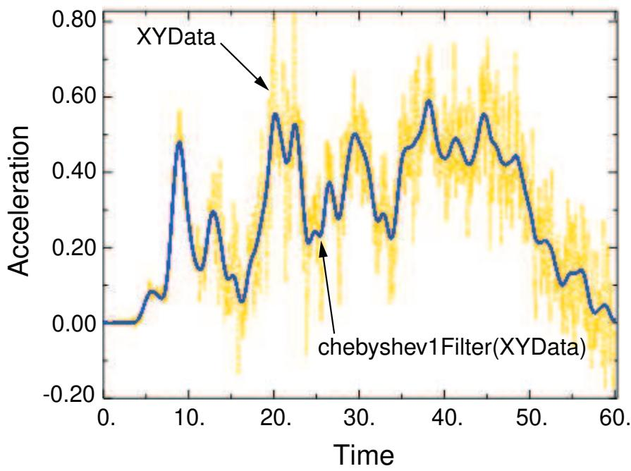  
图1：使用chebyshev1Filter操作生成的X-Y图。

chebyshev1Filter和chebyshev2Filter函数使用相同的语法并需要相同的参数集。以下参数是必需的：X-Y数据对象的名称（name）；截止频率（cutoffFrequency），即滤波器衰减至少一半输入信号以上的频率；以及纹波系数（rippleFactor），一个浮点数，表示为了获得改进的滤波器响应所允许的振荡量。Chebyshev I型和II型滤波都需要大于0的纹波系数；此外，Chebyshev II型滤波要求该值小于1。Chebyshev I型滤波对纹波系数值没有上限要求。

两种类型的Chebyshev滤波器在其响应纹波发生的位置以及对纹波系数值的处理上有所不同；有关Chebyshev I型和II型输出与典型Butterworth滤波器输出的比较，请参见Abaqus/Explicit中的输出滤波与输出操作。

可选参数描述如下：

• 要使用的滤波器阶数（filterOrder）。此参数必须为正的偶整数值；默认值为2。
一个用于指定在数据信号开始处（startCondition）应用的投影和预充电计算方法的符号常量。此参数的有效值包括：ZERO，应用零值恒定投影和预充电；CONSTANT，应用等于X-Y数据对象中第一个数据点的恒定投影和预充电；MIRROR，应用等效于将X-Y数据对象关于通过第一个数据点的垂直线进行反射的投影和预充电；REVERSE\_MIRROR，应用等效于将X-Y数据对象关于通过第一个数据点的垂直线和水平线均进行反射的投影和预充电；以及TANGENTIAL，应用与前两个数据点相切的线性投影和预充电。默认值为CONSTANT。

一个用于指定在数据信号结束处（endCondition）应用的投影和预充电计算方法的符号常量。此参数的有效值包括：ZERO，应用零值恒定投影和预充电；CONSTANT，应用等于X-Y数据对象中最后一个数据点的恒定投影和预充电；MIRROR，应用等效于将X-Y数据对象关于通过最后一个数据点的垂直线进行反射的投影和预充电；REVERSE\_MIRROR，应用等效于将X-Y数据对象关于通过最后一个数据点的垂直线和水平线均进行反射的投影和预充电；以及TANGENTIAL，应用与最后两个数据点相切的线性投影和预充电。默认值为CONSTANT。
一个用于指定插值方案（interpolation）的符号常量。此参数的有效值包括：QUADRATIC，指定拉格朗日二阶插值方案；CUBIC\_SPLINE，指定三次样条插值方案；以及LINEAR，指定线性插值方案。默认值为QUADRATIC。
• 导向第一个数据点的原始数据曲线斜率（startslope）。此参数的默认值为0.0（水平斜率），仅在interpolation=CUBIC\_SPLINE时使用。
• 延伸至最后一个数据点之后的原始数据曲线斜率（endslope）。此参数的默认值为0.0（水平斜率），仅在interpolation=CUBIC\_SPLINE时使用。
• 一个布尔值，用于指定是否对滤波后的数据执行反向传递（backwardPass）。此参数的默认值为True。当此参数设置为False时，endCondition参数将被忽略。

您的X-Y数据对象必须具有恒定的时间步长才能被滤波。如果时间步长不是恒定的，Abaqus/CAE将通过插值在恒定间隔处计算额外的点。用于Chebyshev I型或II型滤波的恒定时间步长由待滤波的X-Y数据对象中的最小时间步长定义。

1. 定位“操作XY数据”对话框。
从主菜单栏，选择Tools->XY Data->Create。在出现的对话框中单击“操作XY数据”（Operate on XY data）；然后单击Continue。将出现“操作XY数据”对话框。
2. 从列出的运算符中，分别单击chebyshev1Filter(X,F,F)或chebyshev2Filter(X,F,F)进行Chebyshev I型或II型滤波。
chebyshev1Filter 或 chebyshev2Filter 函数会出现在表达式窗口中。
3. 在 XY 数据选项中，单击要操作的 X–Y 数据对象的名称，然后单击“添加到表达式”。您可以从本次会话中先前保存的所有 X–Y 数据对象中进行选择（在 XY 数据字段中按字母顺序列出）。
X–Y 数据对象名称会出现在表达式窗口中 chebyshev1Filter 或 chebyshev2Filter 函数的括号内。
4. 将光标置于表达式窗口中第二个逗号之前，并键入截止频率的值。
5. 将光标置于表达式窗口中第三个逗号之前，并键入纹波因子的正值。对于 chebyshev2Filter 函数，此值必须小于 1。
6. 要继续构建您的表达式，请将光标置于表达式窗口中，然后键入或选择要包含的函数、运算符和 X–Y 数据。
7. 要计算并显示您的表达式，请单击“绘图表达式”。
8. 要保存新的 X–Y 数据对象，请单击“另存为”，然后在出现的对话框中提供一个名称。
保存数据对象可使其在本次会话中可用于未来操作，也可用于包含多个数据对象的 X–Y 绘图。

9. 完成后，单击“取消”关闭对话框。

## 附加信息

• 理解 X–Y 数据插值和外推
• 使用 X–Y 数据操作
• 对 X–Y 数据对象应用正弦-巴特沃斯滤波
• 平滑 X–Y 数据对象
• 在 Abaqus/Explicit 中过滤输出和操作输出

使用 decimateFilter 函数可将一个大型、先前保存的 X–Y 数据对象（一组有序对）缩减为一个更小的、具有代表性的样本。decimateFilter 函数是一个抗混叠滤波器，它以用户定义的采样频率选择点，以生成新的 X–Y 数据对象。

decimateFilter 函数需要两个参数：X–Y 数据对象的名称（name）和抽取因子（decimationFactor），即采样率要增加的倍数。抽取因子必须是大于 1 的整数值。该函数还接受一个可选参数，用于指定新采样率与 decimateFilter 函数在抽取前使用的截止频率之比（cutoffFactor）。截止因子必须是 2 或更大的整数值。默认值为 3。

1. 定位“操作 XY 数据”对话框。
   从主菜单栏中，选择“工具”->“XY 数据”->“创建”。在出现的对话框中单击“操作 XY 数据”；然后单击“继续”。将出现“操作 XY 数据”对话框。
2. 在列出的运算符中，单击 `decimateFilter(X,I)`。
   decimateFilter 函数会出现在表达式窗口中。
3. 在 XY 数据选项中，单击要操作的 X–Y 数据对象的名称，然后单击“添加到表达式”。您可以从本次会话中先前保存的所有 X–Y 数据对象中进行选择（在 XY 数据字段中按字母顺序列出）。
   X–Y 数据对象名称会出现在表达式窗口中 decimateFilter 函数的括号内。
4. 将光标置于表达式窗口中第二个逗号之前，并键入抽取因子的值。
5. 如果需要，将光标置于表达式窗口中第三个逗号之前，并键入截止因子的值。
6. 要计算并显示您的表达式，请单击“绘图表达式”。
7. 要保存新的 X–Y 数据对象，请单击“另存为”，然后在出现的对话框中提供一个名称。
   保存数据对象可使其在本次会话中可用于未来操作，也可用于包含多个数据对象的 X–Y 绘图。
8. 完成后，单击“取消”关闭对话框。

## 附加信息

• 使用 X–Y 数据操作
• 平滑 X–Y 数据对象

## 对 X–Y 数据对象应用 SAE 滤波

使用 SAE 滤波函数之一对先前保存的 X–Y 数据对象（一组有序对）执行 SAE 滤波操作，以生成新的 X–Y 数据对象。例如，您可以使用这些函数来去除高频噪声。

SAE 滤波操作执行两遍、零相移、二阶巴特沃斯滤波。Abaqus/CAE 允许的 SAE 滤波类别为 60、100、180、600 和 1000，如 SAE 标准 J211 (OCT88) 中所定义。Abaqus/CAE 的可视化模块使用从美国国家公路交通安全管理局 (NHTSA) 获取的信号分析软件。有关更多信息，请参阅 NHTSA 网站上的信号分析软件安装包文档（在 http://www.nhtsa.gov/ 上搜索 NVS Software Applications）。

Abaqus/CAE 提供以下两种类型的 SAE 滤波函数：

• 通用运算符 `saeGeneralFilter` 使用通用滤波类别，可以对用户指定的截止频率的数据进行滤波。
• 类别特定的运算符针对五种支持的 SAE 滤波类别进行滤波：`sae60Filter`、`sae100Filter`、`sae180Filter`、`sae600Filter` 和 `sae1000Filter`。由于它们使用特定的滤波类别，因此这些运算符不支持指定截止频率。

您的 X–Y 数据对象必须具有恒定的时间步长才能进行滤波。如果时间步长不是恒定的，Abaqus/CAE 将通过插值在恒定间隔处计算额外的点。用于 SAE 滤波的恒定时间步长由要滤波的 X–Y 数据对象中的最小时间步长定义。

图 1 展示了使用 `saeGeneralFilter` 操作可以生成的 X–Y 图类型。


图 1：使用 `saeGeneralFilter` 操作生成的 X–Y 图。

`saeGeneralFilter` 函数需要两个参数：X–Y 数据对象的名称（name）和截止频率（cutoffFrequency），即滤波器衰减至少一半输入信号的频率。

类别特定的滤波器也需要两个参数：X–Y 数据对象的名称（name）和时间比例因子（timeScaleFactor），即正在滤波的数据集 X 值的乘数。例如，值 1 表示时间单位为秒，值 0.001 表示时间单位为毫秒。

可选参数描述如下：

一个符号常量，指定用于计算在数据信号开始处应用的投影和预充电的方法（startCondition）。此参数的有效值包括：`ZERO`（应用零常数投影和预充电）；`CONSTANT`（应用等于 X–Y 数据对象中第一个数据点的常数投影和预充电）；`MIRROR`（应用相当于围绕通过第一个数据点的垂直线反射 X–Y 数据对象的投影和预充电）；`REVERSE_MIRROR`（应用相当于围绕通过第一个数据点的垂直线和水平线同时反射 X–Y 数据对象的投影和预充电）；以及 `TANGENTIAL`（应用与前两个数据点相切的线性投影和预充电）。默认值为 `CONSTANT`。
一个符号常量，指定用于计算在数据信号结束处应用的投影和预充电的方法（endCondition）。此参数的有效值包括：`ZERO`（应用零常数投影和预充电）；`CONSTANT`（应用等于 X–Y 数据对象中最后一个数据点的常数投影和预充电）；`MIRROR`（应用相当于围绕通过最后一个数据点的垂直线反射 X–Y 数据对象的投影和预充电）；`REVERSE_MIRROR`（应用相当于围绕通过最后一个数据点的垂直线和水平线同时反射 X–Y 数据对象的投影和预充电）；以及 `TANGENTIAL`（应用与最后两个数据点相切的线性投影和预充电）。默认值为 `CONSTANT`。
一个符号常量，指定插值方案（interpolation）。此参数的有效值包括：`QUADRATIC`（指定拉格朗日二阶插值方案）；`CUBIC_SPLINE`（指定三次样条插值方案）；以及 `LINEAR`（指定线性插值方案）。默认值为 `QUADRATIC`。
• 通向第一个数据点的原始数据曲线的斜率（startslope）。此参数的默认值为 0.0（表示水平斜率），仅当 interpolation=CUBIC_SPLINE 时使用。
• 延续经过最后一个数据点的原始数据曲线的斜率（endslope）。此参数的默认值为 0.0（表示水平斜率），仅当 interpolation=CUBIC_SPLINE 时使用。
一个布尔值，指定是否对滤波后的数据执行后向传递（backwardPass）。此参数的默认值为 True。当此参数设置为 False 时，将忽略 endCondition 参数。
Abaqus/CAE 参考下表中的值来确定特定类别的 SAE 滤波算子的截断频率乘数（CM）。

<table><tr><td>SAE 类</td><td>截断频率乘数 (CM)</td></tr><tr><td>60</td><td>100</td></tr><tr><td>100</td><td>165</td></tr><tr><td>180</td><td>300</td></tr><tr><td>600</td><td>1000</td></tr><tr><td>1000</td><td>1650</td></tr></table>

然后，Abaqus/CAE 使用截断频率乘数和用户指定的时间比例因子（TSF）来计算截断频率，如下所示：

$$
\text {截断频率} = C M \times T S F
$$

1.  找到“操作 XY 数据”对话框。
    从主菜单栏中，选择 **工具 -> XY 数据 -> 创建**。在出现的对话框中单击 **操作 XY 数据**；然后单击 **继续**。将出现“操作 XY 数据”对话框。

2.  从列出的算子中，单击 **saeGeneralFilter(X,F)** 进行一般 SAE 滤波，或单击特定类别的 SAE 滤波函数之一。
    您选择的滤波函数将出现在表达式窗口中。

3.  从 XY 数据选择中，单击要操作的 X–Y 数据对象的名称，然后单击 **添加到表达式**。您可以从本次会话中先前保存的所有 X–Y 数据对象中选择（在 XY 数据字段中按字母顺序列出）。
    X–Y 数据对象名称将出现在表达式窗口中的函数括号内。

4.  如果您选择了 **saeGeneralFilter(X,F)**，请将光标定位在表达式窗口中并输入截断频率的值。
5.  如果您选择了特定类别的 SAE 滤波器，请将光标定位在表达式窗口中并输入时间比例因子的值。
6.  要继续构建表达式，请将光标定位在表达式窗口中，然后输入或选择您想要包含的函数、算子和 X–Y 数据。
7.  要计算并显示您的表达式，请单击 **绘制表达式**。
8.  要保存您的新 X–Y 数据对象，请单击 **另存为**，然后在出现的对话框中提供一个名称。
    保存数据对象可使其在本次会话的未来操作中以及在包含多个数据对象的 X–Y 图表中可用。

9.  完成后，单击 **取消** 关闭对话框。

## 附加信息

•   理解 X–Y 数据的插值与外推
•   使用 X–Y 数据操作
•   将正弦-巴特沃斯滤波应用于 X–Y 数据对象
•   平滑 X–Y 数据对象

## 将正弦-巴特沃斯滤波应用于 X–Y 数据对象

使用 **sineButterworthFilter** 函数对先前保存的 X–Y 数据对象（有序对的集合）应用正弦-巴特沃斯滤波操作，以产生新的 X–Y 数据对象。此滤波操作可用于例如去除高频噪声。

Abaqus/CAE 使用一个正弦-巴特沃斯滤波器，其传递函数 $\left| H ( f ) \right| ^ { 2 }$ 具有以下形式：

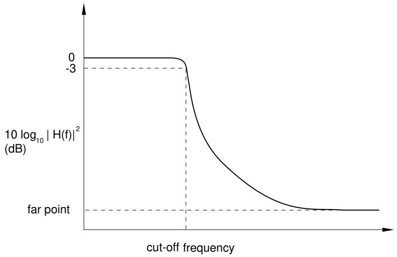

为了将滤波器应用于曲线，该曲线必须具有在时间上等间距分布的数据点。因此，要滤波的曲线将以给定频率（采样频率）进行重新采样。对于包含频率内容远高于截断频率的数据的曲线，默认采样频率将不足。使用非常高的采样频率将创建具有大量数据点的曲线。

**sineButterworthFilter** 需要两个参数：X–Y 数据对象的名称（**name**）和截断频率（**cutoffFrequency**），即滤波器衰减至少一半输入信号的频率以上。可选参数描述如下：

•   要使用的滤波器阶数（**filterOrder**）。此参数必须是正的偶数值；默认值为 6。
•   一个符号常量，指定在数据信号开始时要应用的投影和预充电的计算方法（**startCondition**）。此参数的有效值为：
    *   **ZERO**，应用恒定的零投影和预充电；
    *   **CONSTANT**，应用等于 X–Y 数据对象第一个数据点的恒定投影和预充电；
    *   **MIRROR**，应用等效于将 X–Y 数据对象关于通过第一个数据点的垂直线进行反射的投影和预充电；
    *   **REVERSE\_MIRROR**，应用等效于将 X–Y 数据对象关于通过第一个数据点的垂直线和水平线进行反射的投影和预充电；
    *   **TANGENTIAL**，应用与前两个数据点相切的线性投影和预充电。
    默认值为 **CONSTANT**。
•   一个符号常量，指定在数据信号结束时要应用的投影和预充电的计算方法（**endCondition**）。此参数的有效值为：
    *   **ZERO**，应用恒定的零投影和预充电；
    *   **CONSTANT**，应用等于 X–Y 数据对象最后一个数据点的恒定投影和预充电；
    *   **MIRROR**，应用等效于将 X–Y 数据对象关于通过最后一个数据点的垂直线进行反射的投影和预充电；
    *   **REVERSE\_MIRROR**，应用等效于将 X–Y 数据对象关于通过最后一个数据点的垂直线和水平线进行反射的投影和预充电；
    *   **TANGENTIAL**，应用与最后两个数据点相切的线性投影和预充电。
    默认值为 **CONSTANT**。
•   一个符号常量，指定插值方案（**interpolation**）。此参数的有效值为：
    *   **QUADRATIC**，指定拉格朗日二阶插值方案；
    *   **CUBIC\_SPLINE**，指定三次样条插值方案；
    *   **LINEAR**，指定线性插值方案。
    默认值为 **QUADRATIC**。
•   原始数据曲线在第一个数据点前的斜率（**startslope**）。此参数的默认值为 0.0（水平斜率），仅当 **interpolation=CUBIC\_SPLINE** 时使用。
•   原始数据曲线在最后一个数据点后的斜率（**endslope**）。此参数的默认值为 0.0（水平斜率），仅当 **interpolation=CUBIC\_SPLINE** 时使用。
•   一个布尔值，指定是否对滤波后的数据执行向后传递（**backwardPass**）。此参数的默认值为 **True**。当此参数设置为 **False** 时，**endCondition** 参数将被忽略。

您的 X–Y 数据对象必须具有恒定的时间步长才能进行滤波。如果时间步长不是恒定的，Abaqus/CAE 将通过插值计算等间隔的额外点。恒定的时间步长根据采样频率按照以下关系计算：

$$
\text {恒定时间步长} = \frac{1}{2 \times \text {采样频率}}
$$

图 1 展示了使用 **sineButterworthFilter** 操作可以产生的 X–Y 图表类型。

图 1：使用 **sineButterworthFilter** 操作产生的 X–Y 图表。

1.  找到“操作 XY 数据”对话框。
    从主菜单栏中，选择 **工具 -> XY 数据 -> 创建**。在出现的对话框中单击 **操作 XY 数据**；然后单击 **继续**。将出现“操作 XY 数据”对话框。
2.  从列出的算子中，单击 **sineButterworthFilter(X,F)**。
    **sineButterworthFilter** 函数将出现在表达式窗口中。
3.  从 XY 数据选择中，单击要操作的 X–Y 数据对象的名称，然后单击 **添加到表达式**。您可以从本次会话中先前保存的所有 X–Y 数据对象中选择（在 XY 数据字段中按字母顺序列出）。
    X–Y 数据对象名称将出现在表达式窗口中的 **sineButterworthFilter** 函数括号内。
4.  将光标定位在表达式窗口中第二个逗号之前，并输入截断频率的值。
5.  要继续构建表达式，请将光标定位在表达式窗口中，然后输入或选择您想要包含的函数、算子和 X–Y 数据。
6.  要计算并显示您的表达式，请单击 **绘制表达式**。
7.  要保存您的新 X–Y 数据对象，请单击 **另存为**，然后在出现的对话框中提供一个名称。
    保存数据对象可使其在本次会话的未来操作中以及在包含多个数据对象的 X–Y 图表中可用。
8.  完成后，单击 **取消** 关闭对话框。

## 附加信息

•   理解 X–Y 数据的插值与外推
•   使用 X–Y 数据操作
•   将 SAE 滤波应用于 X–Y 数据对象
•   平滑 X–Y 数据对象

## 平滑 X–Y 数据对象

使用 **smooth** 函数或 **smooth2** 函数对先前保存的 X–Y 数据对象（有序对的集合）进行操作，以产生具有更平滑曲线的新 X–Y 数据对象。新的 X–Y 数据对象具有与原始 X–Y 数据对象相同的 X 坐标值。在每个 X 坐标处，Abaqus/CAE 计算新的 Y 坐标作为原始数据对象相邻 Y 坐标的平均值。此计算称为“移动平均值”。这两个函数使用不同的算法来计算该移动平均值：
`smooth` 函数使用简单移动平均法计算新的 Y 坐标值，这意味着每个新的 Y 坐标是若干邻近点的未加权平均值。您可以指定要包含在平均计算中的邻近点数量；数值越大，曲线越平滑。Abaqus/CAE 将您指定的数值解释为在当前 X 坐标两侧各使用的点数。默认值为 2，这意味着 Abaqus/CAE 对 5 个值求平均来计算每个新的 Y 坐标。
`smooth2` 函数使用指数移动平均法计算新的 Y 坐标值，这意味着邻近点对结果 Y 坐标值具有指数级增大的影响。您可以为曲线指定一个介于 0 和 1 之间的平滑因子（smoothing factor）；数值越小，曲线越平滑。默认平滑因子为 0.75。

图 1 展示了使用 `smooth` 和 `smooth2` 函数可以生成的 X-Y 图类型。

图 1：使用 `smooth` 和 `smooth2` 函数生成的 X-Y 图。

1.  定位到“Operate on XY Data”对话框。
    从主菜单栏中，选择 **Tools -> XY Data -> Create**。在出现的对话框中点击 **Operate on XY data**；然后点击 **Continue**。“Operate on XY Data”对话框将出现。
2.  从列出的 **Operators** 中，点击 **smooth(X, I)** 或 **smooth2(X, F)**。
    `smooth` 或 `smooth2` 函数将出现在表达式窗口中。
3.  从 **XY Data** 选择中，点击要操作的 X-Y 数据对象的名称，然后点击 **Add to Expression**。您可以从本会话中先前保存的所有 X-Y 数据对象中进行选择（在 XY Data 字段中按字母顺序列出）。
    该 X-Y 数据对象的名称将出现在表达式窗口中 `smooth` 或 `smooth2` 函数的括号内。
4.  将光标定位在表达式窗口中第二个逗号之前，然后输入以下值：

    *   对于 `smooth` 函数，输入一个整数值，表示在给定点两侧各包含在平均值计算中的点数。
    *   对于 `smooth2` 函数，输入一个介于 0 和 1 之间的十进制值，以确定曲线的平滑因子。数值越小，曲线越平滑。

5.  若要继续构建表达式，请将光标定位在表达式窗口中，然后键入或选择您想要包含的函数、运算符和 X-Y 数据。
6.  若要计算并显示您的表达式，请点击 **Plot Expression**。
7.  若要保存您的新 X-Y 数据对象，请点击 **Save As**，然后在出现的对话框中提供一个名称。

    保存您的数据对象使其可在本会话中用于未来的操作，并可用于包含多个数据对象的 X-Y 图中。

8.  完成后，点击 **Cancel** 关闭对话框。

## 附加信息

*   对 X-Y 数据对象应用 sine-Butterworth 滤波
*   对 X-Y 数据对象应用 SAE 滤波
*   使用 X-Y 数据操作
*   减少 X-Y 数据对象的样本大小

## 查找 X-Y 数据对象的当前最大值

使用 `currentMax` 函数对先前保存的 X-Y 数据对象（一组有序数对）进行操作，以生成一个新的 X-Y 数据对象。新的 X-Y 数据对象具有与原始 X-Y 数据对象相同的 X 坐标值，但新的 Y 坐标计算为当前 X 坐标处或之前的最大 Y 坐标值。

图 1 展示了一个使用 `currentMax` 函数生成的 X-Y 图示例。


图 1：使用 `currentMax` 函数生成的 X-Y 图。


## 注意：

新 X-Y 数据对象的最后一个值代表原始 X-Y 数据对象的整体最大 Y 坐标。

有关如何查找两个或多个 X-Y 数据对象的当前最大值的信息，请参阅查找两个或多个 X-Y 数据对象的当前最大值。

1.  定位到“Operate on XY Data”对话框。
    从主菜单栏中，选择 **Tools -> XY Data -> Create**。在出现的对话框中点击 **Operate on XY data**；然后点击 **Continue**。“Operate on XY Data”对话框将出现。
2.  从列出的 **Operators** 中，点击 **currentMax(X)**。
    `currentMax` 函数将出现在表达式窗口中。
3.  从 **XY Data** 选择中，点击要操作的 X-Y 数据对象的名称，然后点击 **Add to Expression**。您可以从本会话中先前保存的所有 X-Y 数据对象中进行选择（在 XY Data 字段中按字母顺序列出）。
    该 X-Y 数据对象的名称将出现在表达式窗口中 `currentMax` 函数的括号内。
4.  若要继续构建表达式，请将光标定位在表达式窗口中，然后键入或选择您想要包含的函数、运算符和 X-Y 数据。
5.  若要计算并显示您的表达式，请点击 **Plot Expression**。
6.  若要保存您的新 X-Y 数据对象，请点击 **Save As**，然后在出现的对话框中提供一个名称。
    保存您的数据对象使其可在本会话中用于未来的操作，并可用于包含多个数据对象的 X-Y 图中。

7.  完成后，点击 **Cancel** 关闭对话框。

## 附加信息

*   查找两个或多个 X-Y 数据对象的当前最大值
*   使用 X-Y 数据操作

## 查找 X-Y 数据对象的当前最小值

使用 `currentMin` 函数对先前保存的 X-Y 数据对象（一组有序数对）进行操作，以生成一个新的 X-Y 数据对象。新的 X-Y 数据对象具有与原始 X-Y 数据对象相同的 X 坐标值，但新的 Y 坐标计算为当前 X 坐标处或之前的最小 Y 坐标值。

图 1 展示了一个使用 `currentMin` 函数生成的 X-Y 图示例。


图 1：使用 `currentMin` 函数生成的 X-Y 图。


## 注意：

新 X-Y 数据对象的最后一个值代表原始 X-Y 数据对象的整体最小 Y 坐标。

有关如何查找两个或多个 X-Y 数据对象的当前最小值的信息，请参阅查找两个或多个 X-Y 数据对象的当前最小值。

1.  定位到“Operate on XY Data”对话框。
    从主菜单栏中，选择 **Tools -> XY Data -> Create**。在出现的对话框中点击 **Operate on XY data**；然后点击 **Continue**。“Operate on XY Data”对话框将出现。
2.  从列出的 **Operators** 中，点击 **currentMin(X)**。
    `currentMin` 函数将出现在表达式窗口中。
3.  从 **XY Data** 选择中，点击要操作的 X-Y 数据对象的名称，然后点击 **Add to Expression**。您可以从本会话中先前保存的所有 X-Y 数据对象中进行选择（在 XY Data 字段中按字母顺序列出）。
    该 X-Y 数据对象的名称将出现在表达式窗口中 `currentMin` 函数的括号内。
4.  若要继续构建表达式，请将光标定位在表达式窗口中，然后键入或选择您想要包含的函数、运算符和 X-Y 数据。
5.  若要计算并显示您的表达式，请点击 **Plot Expression**。
6.  若要保存您的新 X-Y 数据对象，请点击 **Save As**，然后在出现的对话框中提供一个名称。
    保存您的数据对象使其可在本会话中用于未来的操作，并可用于包含多个数据对象的 X-Y 图中。

7.  完成后，点击 **Cancel** 关闭对话框。

## 附加信息

*   查找两个或多个 X-Y 数据对象的当前最小值
*   使用 X-Y 数据操作

## 查找 X-Y 数据对象的当前范围

使用 `currentRng` 函数对先前保存的 X-Y 数据对象（一组有序数对）进行操作，以生成一个新的 X-Y 数据对象。新的 X-Y 数据对象具有与原始 X-Y 数据对象相同的 X 坐标值，但新的 Y 坐标计算为当前 X 坐标处或之前的最小 Y 坐标值与最大 Y 坐标值之差。

图 1 展示了一个使用 `currentRng` 函数生成的 X-Y 图示例。

图 1：使用 `currentRng` 函数生成的 X-Y 图。


## 注意：

新 X-Y 数据对象的最后一个值代表原始 X-Y 数据对象的整体 Y 坐标范围。

有关如何查找两个或多个 X-Y 数据对象的当前范围的信息，请参阅查找两个或多个 X-Y 数据对象的当前范围。

1.  定位到“Operate on XY Data”对话框。
    从主菜单栏中，选择 **Tools -> XY Data -> Create**。在出现的对话框中点击 **Operate on XY data**；然后点击 **Continue**。“Operate on XY Data”对话框将出现。
2.  从列出的 **Operators** 中，点击 **currentRng(X)**。
currentRng 函数出现在表达式窗口中。  
3. 在 XY 数据选项中，点击要操作的 XY 数据对象的名称，然后点击添加到表达式。您可以从本次会话中先前保存的所有 XY 数据对象中选择（在 XY 数据字段中按字母顺序列出）。  
XY 数据对象的名称将显示在表达式窗口中 currentRng 函数的括号内。  
4. 要继续构建表达式，请将光标定位在表达式窗口中，然后输入或选择您希望包含的函数、运算符和 XY 数据。  
5. 要计算并显示您的表达式，请点击绘制表达式。  
6. 要保存新的 XY 数据对象，请点击另存为，然后在出现的对话框中提供一个名称。

保存数据对象使其可在本次会话中用于后续操作，并可包含在包含多个数据对象的 XY 图中。

7. 完成后，点击取消以关闭对话框。

## 附加信息

• 查找两个或多个 XY 数据对象的当前范围  
• 使用 XY 数据操作

## 查找两个或多个 XY 数据对象的当前最大值

使用 maxEnvelope 函数对两个或多个先前保存的 XY 数据对象（每个对象是有序对的集合）进行操作，以生成一个新的 XY 数据对象。新的 XY 数据对象的 X 坐标是所有输入数据对象的所有 X 坐标以及对齐输入数据对象所需的任何附加 X 坐标。Abaqus/CAE 通过插值和外推计算额外的 XY 数据对。新数据对象的 Y 坐标是所有输入 XY 数据对象在当前 X 坐标处的最大 Y 坐标。此操作的参数是可交换的。

图 1 展示了使用 maxEnvelope 函数可以生成的 XY 图类型。  
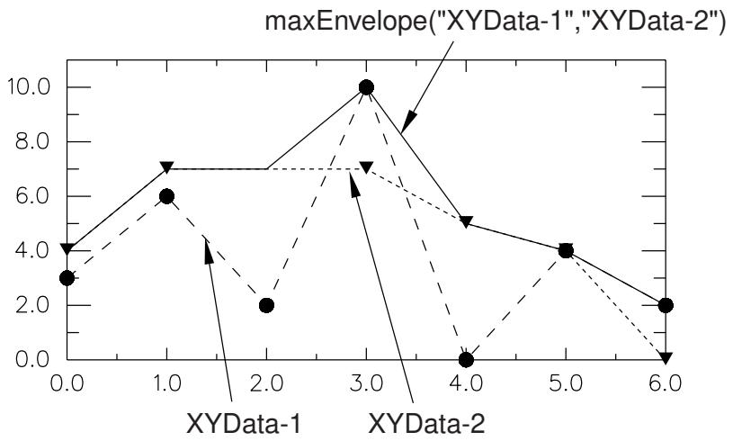  
图 1: 使用 maxEnvelope 函数生成的 XY 图。

有关如何查找单个 XY 数据对象当前最大值的信息，请参见查找 XY 数据对象的当前最大值。

1. 定位操作 XY 数据对话框。  
从主菜单栏中，选择工具 -> XY 数据 -> 创建。在出现的对话框中点击操作 XY 数据；然后点击继续。操作 XY 数据对话框将出现。  
2. 从列出的运算符中，点击 maxEnvelope(A,A,...)。  
maxEnvelope 函数将出现在表达式窗口中。  
3. 在 XY 数据选项中，点击要操作的两个或多个 XY 数据对象的名称，然后点击添加到表达式。选项包括本次会话中先前保存的所有 XY 数据对象，按字母顺序列出。  
XY 数据对象的名称将显示在表达式窗口中 maxEnvelope 函数的括号内，以逗号分隔。  
4. 要继续构建表达式，请将光标定位在表达式窗口中，然后输入或选择您希望包含的函数、运算符和 XY 数据。  
5. 要计算并显示您的表达式，请点击绘制表达式。  
6. 要保存新的 XY 数据对象，请点击另存为，然后在出现的对话框中提供一个名称。  
保存数据对象使其可在本次会话中用于后续操作，并可包含在包含多个数据对象的 XY 图中。

7. 完成后，点击取消以关闭对话框。

## 附加信息

• 查找 XY 数据对象的当前最大值  
• 理解 XY 数据插值与外推  
• 使用 XY 数据操作

## 查找两个或多个 XY 数据对象的当前最小值

使用 minEnvelope 函数对两个或多个先前保存的 XY 数据对象（每个对象是有序对的集合）进行操作，以生成一个新的 XY 数据对象。新的 XY 数据对象的 X 坐标是所有输入数据对象的所有 X 坐标以及对齐输入数据对象所需的任何附加 X 坐标。Abaqus/CAE 通过插值和外推计算额外的 XY 数据对。新数据对象的 Y 坐标是所有输入 XY 数据对象在当前 X 坐标处的最小 Y 坐标。此操作的参数是可交换的。

图 1 展示了使用 minEnvelope 函数可以生成的 XY 图类型。  
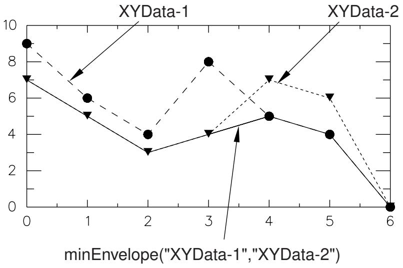  
图 1: 使用 minEnvelope 函数生成的 XY 图。

有关如何查找单个 XY 数据对象当前最小值的信息，请参见查找 XY 数据对象的当前最小值。

1. 定位操作 XY 数据对话框。  
从主菜单栏中，选择工具 -> XY 数据 -> 创建。在出现的对话框中点击操作 XY 数据；然后点击继续。操作 XY 数据对话框将出现。  
2. 从列出的运算符中，点击 minEnvelope(A,A,...)。  
minEnvelope 函数将出现在表达式窗口中。  
3. 在 XY 数据选项中，点击要操作的两个或多个 XY 数据对象的名称，然后点击添加到表达式。选项包括先前保存的所有 XY 数据对象，按字母顺序列出。  
XY 数据对象的名称将显示在表达式窗口中 minEnvelope 函数的括号内，以逗号分隔。  
4. 要继续构建表达式，请将光标定位在表达式窗口中，然后输入或选择您希望包含的函数、运算符和 XY 数据。  
5. 要计算并显示您的表达式，请点击绘制表达式。  
6. 要保存新的 XY 数据对象，请点击另存为，然后在出现的对话框中提供一个名称。  
保存数据对象使其可在本次会话中用于后续操作，并可包含在包含多个数据对象的 XY 图中。

7. 完成后，点击取消以关闭对话框。

## 附加信息

• 查找 XY 数据对象的当前最小值  
• 理解 XY 数据插值与外推  
• 使用 XY 数据操作

## 查找两个或多个 XY 数据对象的当前范围

使用 rng 函数对两个或多个先前保存的 XY 数据对象（每个对象是有序对的集合）进行操作，以生成一个新的 XY 数据对象。新的 XY 数据对象的 X 坐标是所有输入数据对象的所有 X 坐标以及对齐输入数据对象所需的任何附加 X 坐标。Abaqus/CAE 通过插值和外推计算额外的 XY 数据对。Abaqus/CAE 计算的新数据对象 Y 坐标是当前 X 坐标处的最小 Y 坐标与最大 Y 坐标之间的差值。此操作的参数是可交换的。

图 1 展示了使用 rng 函数可以生成的 XY 图类型。  
  
图 1: 使用 rng 函数生成的 XY 图。

有关如何查找单个 XY 数据对象当前范围的信息，请参见查找 XY 数据对象的当前范围。

1. 定位操作 XY 数据对话框。  
从主菜单栏中，选择工具 -> XY 数据 -> 创建。在出现的对话框中点击操作 XY 数据；然后点击继续。操作 XY 数据对话框将出现。  
2. 从列出的运算符中，点击 rng(A,A,...)。  
rng 函数将出现在表达式窗口中。  
3. 在 XY 数据选项中，点击要操作的两个或多个 XY 数据对象的名称，然后点击添加到表达式。选项包括本次会话中先前保存的所有 XY 数据对象，按字母顺序列出。  
XY 数据对象的名称将显示在表达式窗口中 rng 函数的括号内，以逗号分隔。  
4. 要继续构建表达式，请将光标定位在表达式窗口中，然后输入或选择您希望包含的函数、运算符和 XY 数据。  
5. 要计算并显示您的表达式，请点击绘制表达式。  
6. 要保存新的 XY 数据对象，请点击另存为，然后在出现的对话框中提供一个名称。  
保存数据对象使其可在本次会话中用于后续操作，并可包含在包含多个数据对象的 XY 图中。

7. 完成后，点击取消以关闭对话框。

## 附加信息

• 查找 XY 数据对象的当前范围  
• 理解 XY 数据插值与外推  
• 使用 XY 数据操作

## 追加两个或多个 XY 数据对象

使用 append 函数链接两个或多个先前保存的 XY 数据对象（有序对的集合），以生成一个新的 XY 数据对象。新的 XY 数据对象包含您指定的、按指定顺序串联的数据对象。

图 1 显示了一个 XY 图，该图是通过将 Y 值范围从 1 到 -1 的 XY 数据对象追加到 Y 值范围从 0.5 到 -0.5 的 XY 数据对象而创建的。


图 1：使用追加 (append) 函数生成的 X–Y 图。

1.  定位到“对 XY 数据进行操作”(Operate on XY Data) 对话框。  
    从主菜单栏中，选择工具 (Tools)->XY 数据 (XY Data)->创建 (Create)。在出现的对话框中点击“对 XY 数据进行操作”(Operate on XY data)；然后点击继续 (Continue)。此时将出现“对 XY 数据进行操作”(Operate on XY Data) 对话框。  
2.  从列出的运算符中，点击 append(X,X,...)。  
    append 函数将出现在表达式窗口中。  
3.  从 XY 数据选项中，按照您希望 Abaqus 连接它们的顺序，点击要追加的 X–Y 数据对象的名称，然后点击“添加到表达式”(Add to Expression)。您可以从本次会话中先前保存的 X–Y 数据对象中进行选择（按字母顺序列在 XY 数据字段中）。  
    X–Y 数据对象名称将出现在表达式窗口中 append 函数括号内，并用逗号分隔。  
4.  要继续构建表达式，请将光标定位到表达式窗口，然后输入或选择您希望包含的函数、运算符和 X–Y 数据。  
5.  要计算并显示您的表达式，请点击“绘制表达式”(Plot Expression)。  
6.  要保存您新的 X–Y 数据对象，请点击“另存为”(Save As)，然后在出现的对话框中提供一个名称。  
    保存您的数据对象后，可以在本次会话中用于未来的操作，也可以包含在包含多个数据对象的 X–Y 图中。  

7.  完成后，点击“取消”(Cancel) 以关闭对话框。

## 附加信息

•   合并两个 X–Y 数据对象  
•   对 X–Y 数据对象使用加法  
•   对两个或多个 X–Y 数据对象求和  
•   使用 X–Y 数据操作

## 合并两个 X–Y 数据对象

使用 combine 函数来合并两个先前保存的 X–Y 数据对象（有序对集合），以生成一个新的 X–Y 数据对象。新的 X–Y 数据对象包含数据对，这些数据对由第一个数据对象的 Y 坐标值和第二个数据对象的 Y 坐标值组合而成，其中两个数据对象的 X 坐标值相匹配。例如，

$$
\text {XYData1} = [ (1, 4), (2, 4), (3, 4), (4, 5), (5, 6) ]
$$

和

$$
\text {XYData2} = [ (1, 9), (2, 8), (3, 7), (4, 6), (5, 4) ];
$$

那么

$$
\operatorname{combine} (\text {XYData1}, \text {XYData2}) = [ (4, 9), (4, 8), (4, 7), (5, 6), (6, 4) ].
$$

此操作的参数是非交换的。如果两个数据对象的 X 坐标值不匹配，Abaqus/CAE 会计算缺失的数据点，以使 X–Y 数据对象能够对齐。有关如何计算缺失数据点的更多信息，请参阅理解 X–Y 数据插值与外推。

此函数的一个典型应用是合并一个具有时间 X 值和载荷 Y 值的数据对象与一个具有时间 X 值和位移 Y 值的数据对象，以生成一个具有位移 X 值和载荷 Y 值的数据对象。另一个示例是合并一个具有时间 X 值和应力 Y 值的数据对象与一个具有时间 X 值和应变 Y 值的数据对象，以生成一个具有应变 X 值和应力 Y 值的数据对象，如图 1 所示。

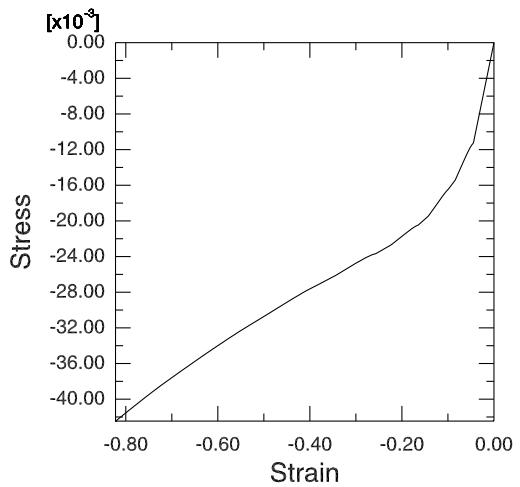  
图 1：应力-应变 X–Y 图。

1.  定位到“对 XY 数据进行操作”(Operate on XY Data) 对话框。  
    从主菜单栏中，选择工具 (Tools)->XY 数据 (XY Data)->创建 (Create)。在出现的对话框中点击“对 XY 数据进行操作”(Operate on XY data)；然后点击继续 (Continue)。此时将出现“对 XY 数据进行操作”(Operate on XY Data) 对话框。  
2.  从列出的运算符中，点击 combine(X,X)。  
    combine 函数将出现在表达式窗口中。  
3.  从 XY 数据选项中，按照您希望 Abaqus 合并它们的顺序，点击要合并的两个 X–Y 数据对象的名称，然后点击“添加到表达式”(Add to Expression)。选项包括本次会话中先前保存的所有 X–Y 数据对象，按字母顺序列出。  

    X–Y 数据对象名称将出现在表达式窗口中 combine 函数括号内，并用逗号分隔。

4.  要继续构建表达式，请将光标定位到表达式窗口，然后输入或选择您希望包含的函数、运算符和 X–Y 数据。  
5.  要计算并显示您的表达式，请点击“绘制表达式”(Plot Expression)。  
6.  要保存您新的 X–Y 数据对象，请点击“另存为”(Save As)，然后在出现的对话框中提供一个名称。  
    保存您的数据对象后，可以在本次会话中用于未来的操作，也可以包含在包含多个数据对象的 X–Y 图中。  
7.  完成后，点击“取消”(Cancel) 以关闭对话框。

## 附加信息

•   理解 X–Y 数据插值与外推  
•   追加两个或多个 X–Y 数据对象  
•   对 X–Y 数据对象使用加法  
•   对两个或多个 X–Y 数据对象求和  
•   使用 X–Y 数据操作

## 转换 X–Y 数据对象使用的角度单位

使用 degreeToRadian 或 radianToDegree 函数对先前保存的 X–Y 数据对象（有序对集合）进行操作，以生成一个新的 X–Y 数据对象。新的 X–Y 数据对象与原始 X–Y 数据对象具有相同的 X 坐标值。Abaqus/CAE 通过将每个原始的 Y 坐标值从度转换为弧度或从弧度转换为度来计算新的 Y 坐标值，具体取决于您指定的函数。

1.  定位到“对 XY 数据进行操作”(Operate on XY Data) 对话框。  
    从主菜单栏中，选择工具 (Tools)->XY 数据 (XY Data)->创建 (Create)。在出现的对话框中点击“对 XY 数据进行操作”(Operate on XY data)；然后点击继续 (Continue)。此时将出现“对 XY 数据进行操作”(Operate on XY Data) 对话框。  
2.  从列出的运算符中，点击 degreeToRadian 以将度转换为弧度，或点击 radianToDegree 以将弧度转换为度。  
    相应的函数将出现在表达式窗口中。  
3.  从 XY 数据选项中，点击要操作的 X–Y 数据对象的名称，然后点击“添加到表达式”(Add to Expression)。您可以从本次会话中先前保存的所有 X–Y 数据对象中进行选择（按字母顺序列在 XY 数据字段中）。  
    X–Y 数据对象名称将出现在表达式窗口中的函数括号内。  
4.  要继续构建表达式，请将光标定位到表达式窗口，然后输入或选择您希望包含的函数、运算符和 X–Y 数据。  
5.  要计算并显示您的表达式，请点击“绘制表达式”(Plot Expression)。  
6.  要保存您新的 X–Y 数据对象，请点击“另存为”(Save As)，然后在出现的对话框中提供一个名称。  
    保存您的数据对象后，可以在本次会话中用于未来的操作，也可以包含在包含多个数据对象的 X–Y 图中。  
7.  完成后，点击“取消”(Cancel) 以关闭对话框。

## 附加信息

•   使用 X–Y 数据操作

使用 swap 函数交换先前保存的 X–Y 数据对象（有序对集合）的 X 和 Y 值，以生成一个新的 X–Y 数据对象。新的 X–Y 数据对象的 X 坐标值是原始 X–Y 数据对象的 Y 坐标值，其 Y 坐标值是原始数据对象的 X 坐标值。

图 1 说明了可以使用 swap 函数生成的 X–Y 图的类型。

  
图 1：使用 swap 函数生成的 X–Y 图。

1.  定位到“对 XY 数据进行操作”(Operate on XY Data) 对话框。  
    从主菜单栏中，选择工具 (Tools)->XY 数据 (XY Data)->创建 (Create)。在出现的对话框中点击“对 XY 数据进行操作”(Operate on XY data)；然后点击继续 (Continue)。此时将出现“对 XY 数据进行操作”(Operate on XY Data) 对话框。  
2.  从列出的运算符中，点击 swap(X)。  
    swap 函数将出现在表达式窗口中。  
3.  从 XY 数据选项中，点击要操作的 X–Y 数据对象的名称，然后点击“添加到表达式”(Add to Expression)。您可以从本次会话中先前保存的所有 X–Y 数据对象中进行选择（按字母顺序列在 XY 数据字段中）。  
    X–Y 数据对象名称将出现在表达式窗口中 swap 函数括号内。  
4.  要继续构建表达式，请将光标定位到表达式窗口，然后输入或选择您希望包含的函数、运算符和 X–Y 数据。  
5.  要计算并显示您的表达式，请点击“绘制表达式”(Plot Expression)。  
6.  要保存您新的 X–Y 数据对象，请点击“另存为”(Save As)，然后在出现的对话框中提供一个名称。  
    保存您的数据对象后，可以在本次会话中用于未来的操作，也可以包含在包含多个数据对象的 X–Y 图中。  
7.  完成后，点击“取消”(Cancel) 以关闭对话框。

## 附加信息

•   使用 X–Y 数据操作

## 截断 X–Y 数据对象末端的数据

使用 truncate 函数对先前保存的 X–Y 数据对象（有序对集合）进行操作，以生成一个排除那些 X 坐标值小于用户指定最小值的数据点，或排除那些 X 坐标值大于用户指定最大值的数据点的新 X–Y 数据对象。

图 1 说明了使用 truncate 函数在最大值为 7 处截断的 X–Y 图。


图 1：使用截断函数生成的 X–Y 图。

1.  定位到“对 XY 数据进行操作”对话框。
    从主菜单栏中，选择 工具 -> XY 数据 -> 创建。在出现的对话框中，单击“对 XY 数据进行操作”，然后单击继续。“对 XY 数据进行操作”对话框随即出现。

2.  从列出的运算符中，单击 truncate(X,F)。
    截断函数出现在表达式窗口中。

3.  从“XY 数据”选择列表中，单击要操作的 X–Y 数据对象名称，然后单击“添加到表达式”。您可以从本次会话中先前保存的所有 X–Y 数据对象中进行选择（在“XY 数据”字段中按字母顺序列出）。
    X–Y 数据对象名称出现在表达式窗口中截断函数的括号内。

4.  指定一个 X 坐标值，数据点中高于或低于该值的点将从 X–Y 数据对象中移除。要指定最大值，请将光标置于表达式窗口中第二个逗号之前，并输入一个数字作为最大值。要指定最小值，请在表达式窗口中的表达式后追加 startX=value。

5.  如有需要，自定义截断顺序值，该值决定 Abaqus/CAE 是否应在您指定的截断边界或边界处创建新的数据点，以及如果创建，应如何计算这些新数据点。选择以下选项之一：
    •   若 truncOrder=2（默认值），Abaqus/CAE 将对数据执行分段线性拟合，以在每个边界处确定一个新的数据点，并将新点包含在新的 X–Y 数据对象中。
    •   若 truncOrder=3，Abaqus/CAE 将对数据执行样条插值，以在每个边界处确定一个新的数据点，并将新点包含在新的 X–Y 数据对象中。
    •   若 truncOrder=1，Abaqus/CAE 不会在边界值处创建任何新点。

6.  如有需要，自定义截断容差值。如果您选择在截断边界处包含插值点，当 Abaqus/CAE 发现已有的数据点已经非常接近边界时，截断容差值将阻止创建这些新数据点。默认情况下，截断容差（truncTol）为 0.005，即 X–Y 数据对象中相邻数据点之间在 X 方向上平均距离的百分之零点五。如果 Abaqus/CAE 发现有数据点比截断容差值更接近截断边界，则不会在该边界处创建新的插值数据点。

7.  要继续构建表达式，请将光标定位在表达式窗口中，然后输入或选择您想要包含的函数、运算符和 X–Y 数据。
8.  要计算并显示您的表达式，请单击“绘图表达式”。
9.  要保存您的新 X–Y 数据对象，请单击“另存为”，然后在出现的对话框中提供一个名称。
    保存数据对象可使其在本次会话的后续操作中可用，并可用于包含多个数据对象的 X–Y 图中。
10. 完成后，单击“取消”关闭对话框。

## 附加信息

*   使用 X–Y 数据操作

## 自定义 X–Y 图坐标轴

本节说明如何使用“轴选项”对话框来自定义 X–Y 图的坐标轴外观。

## 本节内容：

*   使用 X–Y 图坐标轴选项
*   绘制具有不同变量的多个 X–Y 数据对象
*   自定义 X–Y 图坐标轴比例
*   自定义 X–Y 图坐标轴范围
*   自定义 X–Y 图坐标轴刻度模式
*   自定义 X–Y 图坐标轴刻度线
*   自定义 X–Y 图坐标轴标题
*   自定义 X–Y 图坐标轴的放置
*   自定义 X–Y 图坐标轴标签
*   自定义 X–Y 图坐标轴颜色和样式

## 使用 X–Y 图坐标轴选项

您可以使用坐标轴选项来自定义 X–Y 图中坐标轴的外观。

图 1 标识了您可以自定义的 X–Y 图特征。


图 1：X–Y 图的特征。

Abaqus/CAE 提供了对这些选项的访问，您可以在“可视化”模块的以下位置打开“轴选项”对话框：
*   从主菜单栏中，选择 选项 -> XY 选项 -> 轴。
+++ *   从“可视化”模块工具箱中，单击 $\begin{array}{c} { \big . } { \begin{array} { l } { \operatorname { \mathrm { * } } \\ { \operatorname { \mathrm { * } } \end{array} } } \end{array} } { \mathrm { ~ ! + + + } } $
*   从结果树中，展开“X 轴”或“Y 轴”容器，高亮显示您想要修改的一个或多个坐标轴，单击鼠标按钮 3，然后从出现的列表中选择“轴选项”。
*   当 X–Y 图显示在视口中时，双击图中的某个坐标轴。

仅当没有活动的过程时，X–Y 图中的项目才是可选择的；您可能需要取消当前过程以激活 X–Y 图中的组件。

您可以单击以下选项卡来自定义所选坐标轴的外观：
*   比例：选择坐标轴比例和限制，并自定义刻度线的出现。
*   刻度线：控制刻度线的外观和位置。
*   标题：指定坐标轴标题的内容和外观。
*   坐标轴：选择坐标轴的放置、颜色、样式和粗细，并控制数值坐标轴标签。

## 附加信息

*   绘制具有不同变量的多个 X–Y 数据对象
*   自定义 X–Y 图坐标轴比例
*   自定义 X–Y 图坐标轴范围
*   自定义 X–Y 图坐标轴刻度模式
*   自定义 X–Y 图坐标轴刻度线
*   自定义 X–Y 图坐标轴标题
*   自定义 X–Y 图坐标轴的放置
*   自定义 X–Y 图坐标轴标签
*   自定义 X–Y 图坐标轴颜色和样式

## 绘制具有不同变量的多个 X–Y 数据对象

当您在同一张 X–Y 图上绘制具有不同变量的 X–Y 数据对象时，Abaqus/CAE 会为这些数据对象中使用的每种数量类型显示一个坐标轴。在图 1 所示的 X–Y 图中，绘制了三个 X–Y 数据对象：ALLKE 和 ALLSE 分别显示随时间变化的动能和应变能，而 Displacement 显示所选节点的位移随时间变化。生成的图在 X 方向上仅包含一个坐标轴“时间”，因为所有三条 X–Y 曲线沿此轴共享此数量类型。在 Y 方向上，由于这些 X–Y 数据对象使用不同的数量类型，X–Y 图显示了独立的“能量”和“位移”坐标轴。


图 1：在 Y 方向上显示两个坐标轴的 X–Y 图。

当您在同一张 X–Y 图上绘制多条曲线时，Abaqus/CAE 会将图中两个坐标轴的最小值和最大值设置为您在图中包含的第一个 X–Y 数据对象的最小值和最大值。该 X–Y 数据对象列在 X–Y 图图例以及“曲线选项”对话框的“曲线”区域中的第一位。

当 X–Y 图在 X 或 Y 方向上显示多个坐标轴时，您可以将它们对齐到 X–Y 图的同一侧、相对侧，或者将其中一个或两个放置在 X–Y 图的中间。您还可以独立操作这些 X–Y 坐标轴的比例或外观，以使其差异在视口中更加明显。

## 附加信息

*   自定义 X–Y 图坐标轴比例
*   自定义 X–Y 图坐标轴范围
*   自定义 X–Y 图坐标轴刻度线
*   自定义 X–Y 图坐标轴标题
*   自定义 X–Y 图坐标轴标签
*   自定义 X–Y 图坐标轴颜色和样式

## 自定义 X–Y 图坐标轴比例

单击“比例”选项卡，为 X–Y 图的 X 轴和 Y 轴选择线性、对数或基于分贝的比例。您显示的所有 X 轴和 Y 轴的比例是独立的。默认情况下，Abaqus/CAE 对所有坐标轴使用线性比例。

## 基于分贝的比例

您可以使用两种基于分贝的比例之一对特定坐标轴上的数据进行重新缩放。每种比例适用于特定类型的波数据：10 dB 比例适用于显示波功率或强度数据；20 dB 比例适用于波幅数据。

当您选择基于分贝的坐标轴比例时，您还可以调整分贝参考值。调整此值使您能够根据此 X–Y 数据对象中数据的环境条件以及模型中的单位来重新缩放您的数据对象。默认值为 1。您可能希望调整此值以在不同环境中或波在不同介质（如水）中传播时显示数据。

1.  定位到比例选项。
    选择 选项 -> XY 选项 -> 轴；或单击 ，它位于“可视化”模块工具箱的 X–Y 绘图工具中。在出现的对话框中单击“比例”选项卡。

2.  从“X 轴”或“Y 轴”字段中，高亮显示一个或多个坐标轴。
3.  选择以下坐标轴比例选项之一：

## 线性
所选坐标轴以线性递进方式显示。

## 对数
选中的轴以10为底的对数刻度显示。

## 10 dB

选中的轴以10 dB刻度显示。**dB Reference** 字段变为可用，您可以在此轴上输入基于10 dB数据的分贝参考值。

## 20 dB

选中的轴以20 dB刻度显示。**dB Reference** 字段变为可用，您可以在此轴上输入基于20 dB数据的分贝参考值。

4. 点击 **Dismiss** 关闭 **Axis Options** 对话框。

## 附加信息

• 使用X–Y绘图轴选项

点击 **Scale** 选项卡以自定义X–Y绘图的X轴和Y轴范围。默认情况下，Abaqus/CAE基于绘图中包含的最小和最大数据点计算轴的最小值和最大值。

1. 找到轴的 **Max** 和 **Min** 选项。

选择 **Options->XY Options->Axis**；或点击 ，它位于 **Visualization** 模块工具箱中的X–Y绘图工具旁。在出现的对话框中点击 **Scale** 选项卡。

**Max** 和 **Min** 选项出现在 **Scale** 页面的中间。

2. 从 **X Axis** 或 **Y Axis** 字段中，高亮显示一个或多个轴。  
3. 在 **Max** 字段中输入一个值，或切换启用该字段旁的 **Auto-compute**，以将选中轴的最大值设置为最高的可用数据点。

Abaqus/CAE更新选中的轴。

4. 在 **Min** 字段中输入一个值，或切换启用该字段旁的 **Auto-compute**，以将选中轴的最小值设置为最低的可用数据点。

Abaqus/CAE更新选中的轴。

5. 点击 **Dismiss** 关闭 **Axis Options** 对话框。

## 附加信息

• 使用X–Y绘图轴选项

## 自定义X–Y绘图轴刻度模式

点击 **Scale** 选项卡以自定义X–Y绘图的X轴和Y轴的刻度模式。刻度模式选项使您能够控制沿任一轴出现的主要刻度线和次要刻度线的数量。默认情况下，Abaqus/CAE基于绘图中包含的最小和最大数据点计算轴的最小值和最大值。

1. 找到 **Tick Mode** 选项。

**Visualization** 模块工具箱。在出现的对话框中点击 **Scale** 选项卡。

**Tick Mode** 选项出现在 **Scale** 页面的底部。

2. 从 **X Axis** 或 **Y Axis** 字段中，高亮显示一个或多个轴。  
3. 选择计算选中轴上主要刻度线间距的方法。

从 **Major** 选项中，选择以下之一：

## Automatic

Abaqus计算选中轴上主要刻度线之间的间距，并进行四舍五入以提供合理的间隔。

## By increment

**Tick increment** 文本字段变为可用，您可以输入选中轴上主要刻度线之间的增量。

## By count

**Number of ticks per decade** 字段变为可用，您可以增加或减少选中轴在最小值和最大值之间出现的主要刻度线总数。

4. 指定次要刻度线的数量。

从 **Minor ticks** 选项中，点击 **Ticks per increment** 箭头（适用于线性或基于分贝的轴）或 **Ticks per decade** 箭头（适用于对数轴），以指定每个主要刻度线之间的次要刻度线数量。

5. 点击 **Dismiss** 关闭 **Axis Options** 对话框。

## 附加信息

• 使用X–Y绘图轴选项

## 自定义X–Y绘图轴刻度线

您可以自定义X–Y绘图轴刻度线。

点击 **Tick Marks** 选项卡以控制X–Y绘图中沿X轴和Y轴出现的主要刻度线和次要刻度线的长度、粗细、样式和颜色。主要和次要刻度线的数量是分开控制的；参见 **自定义X–Y绘图轴刻度模式**。您可以独立控制X轴和Y轴的刻度线。主要和次要刻度线的示例如图1所示。

  
图1: 标有主要和次要刻度线的X–Y绘图。

主要刻度线控制X–Y绘图主要网格和数字轴标签的放置位置。次要刻度线是较短、无标签的标记，控制次要网格线的放置位置。

默认情况下，Abaqus/CAE自动计算刻度线数量。您可以通过给出刻度线之间的增量或刻度线总数来指定主要刻度线。您只能通过给出每个主要刻度线之间的总数来指定次要刻度线。

刻度线的颜色由轴的颜色控制。更多信息，请参见 **自定义X–Y绘图轴颜色和样式**。

1. 找到轴的 **Tick Marks** 选项。

选择 **Options->XY Options->Axis**；或点击 ，它位于 **Visualization** 模块工具箱中的X–Y绘图工具旁。在出现的对话框中点击 **Tick Marks** 选项卡。

2. 从 **X Axis** 或 **Y Axis** 字段中，高亮显示一个或多个轴。  
3. 选择放置轴刻度线的位置。

从 **Placement** 选项中，选择以下之一：

## None

Abaqus完全隐藏选中轴的刻度线。

## Inside

Abaqus在轴与X–Y曲线同侧显示刻度线。

## Outside

Abaqus在轴与X–Y曲线相对的一侧显示刻度线。

## Across

Abaqus显示跨越选中轴两侧的刻度线。

4. 指定刻度线的长度。

点击 **Length** 箭头以增加或减少刻度线的长度。Abaqus/CAE增加主要和次要刻度线的长度。

5. 选择线型。

从 **Style** 列表中，点击所需的线型（实线、虚线等）。

指定的线型出现在选中轴的刻度线上，并显示在 **Style** 列表中。

6. 选择线宽。

从 **Thickness** 列表中，点击所需的线宽。

指定的线宽出现在选中轴的刻度线上，并显示在 **Thickness** 列表中。

7. 选择线颜色：

a. 点击颜色样本 

Abaqus/CAE显示 **Select Color** 对话框。

b. 使用 **Select Color** 对话框中的一种方法选择新颜色。更多信息，请参见 **自定义颜色**。

c. 点击 **OK** 关闭 **Select Color** 对话框。

选中轴的刻度线更改为选定的颜色。

8. 点击 **Dismiss** 关闭 **Axis Options** 对话框。

## 附加信息

• 自定义X–Y绘图轴标签  
• 使用X–Y绘图轴选项

点击 **Title** 选项卡以自定义X–Y绘图中沿X轴和Y轴显示的标题。您可以自定义以下内容：

• 作为每个标题显示的文本。  
• 每个标题的颜色。  
• 每个标题的字体。

1. 找到轴的 **Title** 选项。

选择 **Options->XY Options->Axis**；或点击 ，它位于 **Visualization** 模块工具箱中的X–Y绘图工具旁。在出现的对话框中点击 **Title** 选项卡。

2. 从 **X Axis** 或 **Y Axis** 字段中，高亮显示一个或多个轴。

3. 要为选中轴指定非默认的标题文本，请在该字段中输入标题。您可以通过切换启用 **Use default** 来恢复默认标题。

4. 选择轴标题的字体。

a. 点击 。

Abaqus/CAE显示 **Select Font** 对话框。

b. 使用 **Select Font** 对话框中的一种方法选择新的字体、大小和样式。更多信息，请参见 **自定义字体**。  
c. 点击 **Apply** 查看字体选择的效果。  
d. 点击 **OK** 关闭 **Select Font** 对话框。  
X–Y绘图标题更改为选定的字体、大小和样式。

5. 选择轴标题的颜色。

a. 点击颜色样本 。

Abaqus/CAE显示 **Select Color** 对话框。

b. 使用 **Select Color** 对话框中的一种方法选择新颜色。更多信息，请参见 **自定义颜色**。

c. 点击 **OK** 关闭 **Select Color** 对话框。选中轴的轴标题更改为选定的颜色。

6. 点击 **Dismiss** 关闭 **Axis Options** 对话框。

## 附加信息

• 自定义X–Y绘图轴标签  
• 使用X–Y绘图轴选项

## 自定义X–Y绘图轴的放置位置

点击 **Axes** 选项卡以自定义X–Y绘图的X轴和Y轴的放置位置。本节描述 **Placement** 选项，它控制轴本身的放置位置；要自定义轴标签的位置，请参见 **自定义X–Y绘图轴标签**。

1. 找到 **Placement** 选项。

选择 **Options->XY Options->Axis**；或点击 ，它位于 **Visualization** 模块工具箱中的X–Y绘图工具旁。在出现的对话框中点击 **Axes** 选项卡。轴的 **Placement** 选项出现在 **Axes** 页面的顶部。

2. 从 **X Axis** 或 **Y Axis** 字段中，高亮显示一个或多个轴。  
3. 从 **Axes** 页面顶部的 **Placement** 选项中，选择以下之一：

## Min Edge

Abaqus/CAE仅将轴放置在X–Y绘图的最小边。对于X轴，最小边是视口的底部；对于Y轴，最小边是视口的左侧。
## 最大边（Max Edge）

Abaqus/CAE 仅将坐标轴放置在 X-Y 图的最大边。对于 X 轴，最大边是视口的顶部；对于 Y 轴，最大边是视口的右侧。

## 最小/最大边（Min/Max Edge）

Abaqus/CAE 将所选坐标轴放置在 X-Y 图的最大边和最小边。对于 X 轴，Abaqus/CAE 将所选坐标轴放置在视口的顶部和底部；对于 Y 轴，Abaqus/CAE 将所选坐标轴放置在视口的左侧和右侧。

## 中心（Center）

Abaqus/CAE 将坐标轴放置在 X-Y 图的中心。

4. 点击 **Dismiss**（关闭）以关闭 **Axis Options**（轴选项）对话框。

## 附加信息

• 自定义 X-Y 图坐标轴刻度线  
• 自定义 X-Y 图坐标轴标题  
• 使用 X-Y 图坐标轴选项

您可以自定义 X-Y 图坐标轴标签。

点击 **Axes**（坐标轴）选项卡来自定义 X-Y 图沿 X 轴和 Y 轴出现的主要刻度线旁的数字标签。坐标轴标签示例见图 1。

  
图 1: 标注了坐标轴标签的 X-Y 图。

您可以自定义以下内容：

• 标签的格式（自动、十进制、工程或科学计数法）。  
• 标签中的小数位数或有效数字位数。  
• 标签相对于主要刻度线的出现频率。  
• 标签的字体。

标签的颜色由坐标轴的颜色控制。有关更多信息，请参阅自定义 X-Y 图坐标轴颜色和样式。

1. 找到 **Labels**（标签）选项。

选择 **Options**->**XY Options**->**Axis**；或点击 ，该按钮位于 **Visualization**（可视化）模块工具箱的 X-Y 绘图工具中。在出现的对话框中点击 **Axes**（坐标轴）选项卡。

坐标轴的 **Labels**（标签）选项出现在 **Axes**（坐标轴）页面的中间位置。

2. 从 **X Axis**（X 轴）或 **Y Axis**（Y 轴）字段中，高亮显示一个或多个坐标轴。

3. 指定您希望坐标轴标签出现的位置。

从 **Labels**（标签）选项中的 **Placement**（位置）列表，选择以下之一：

## 无（None）

Abaqus/CAE 为所选坐标轴隐藏坐标轴标签。

## 内侧（Inside）

Abaqus/CAE 将坐标轴标签显示在坐标轴与 X-Y 曲线相同的一侧。

## 外侧（Outside）

Abaqus/CAE 将坐标轴标签显示在坐标轴与 X-Y 曲线相对的一侧。

4. 点击 **Frequency**（频率）箭头指定标签相对于每个主要刻度线的打印频率。例如，如果您选择频率为 2，则标签将沿坐标轴每两个主要刻度线出现一次。如果您选择频率为 0，则沿坐标轴将不显示任何标签。您可以请求的标签频率最多比主要刻度线数量多一。

5. 从 **Labels**（标签）选项中，选择所选标签的格式。

a. 点击 **Format**（格式）按钮显示 X 轴标签格式选项。  
b. 选择以下之一：

## 自动（Automatic）

非常大的值和非常小的值以科学计数法表示。所有剩余的值不使用指数，并使用指定的有效数字位数表示。

## 十进制（Decimal）

所有值不使用指数，并使用指定的有效数字位数表示。

## 工程（Engineering）

大于或等于 1000 的值（或小于或等于 0.001 的值）表示为 1 到 999 之间的数字乘以 10 的 n 次幂，其中 n 是 3 的倍数（例如，20.5E+03 或 17.76E+06）。所有剩余的值使用指定的有效数字位数表示。

## 科学（Scientific）

所有值表示为 1 到 10 之间的数字乘以适当的 10 的幂（例如，2.05E+04 或 1.776E+07）。

6. 点击 **Precision**（精度）箭头指定每个标签中所需的有效数字位数（对于非十进制格式）或小数位数（对于十进制格式）。  
7. 选择坐标轴标签的字体。

a. 点击


Abaqus/CAE 显示 **Select Font**（选择字体）对话框。

b. 使用 **Select Font**（选择字体）对话框中的方法之一选择新的字体、大小和样式。有关更多信息，请参阅自定义字体。  
c. 点击 **Apply**（应用）查看您字体选择的效果。

d. 点击 **OK**（确定）关闭 **Select Font**（选择字体）对话框。坐标轴标签将更改为所选的字体、大小和样式。

8. 选择坐标轴标签的颜色。

a. 点击颜色样本 Abaqus/CAE 显示 **Select Color**（选择颜色）对话框。

b. 使用 **Select Color**（选择颜色）对话框中的方法之一选择新的颜色。有关更多信息，请参阅自定义颜色。

c. 点击 **OK**（确定）关闭 **Select Color**（选择颜色）对话框。坐标轴标签将更改为所选的颜色。

9. 点击 **Dismiss**（关闭）以关闭 **Axis Options**（轴选项）对话框。

## 附加信息

• 自定义 X-Y 图坐标轴刻度线  
• 自定义 X-Y 图坐标轴标题  
• 使用 X-Y 图坐标轴选项

## 自定义 X-Y 图坐标轴颜色和样式

点击 **Axes**（坐标轴）选项卡来自定义 X-Y 图图形坐标轴的颜色和粗细。您的选择将同时应用于 X 轴和 Y 轴；无法单独自定义坐标轴。

1. 找到 **Style**（样式）选项。

选择 **Options**->**XY Options**->**Axis**；或点击 ，该按钮位于 **Visualization**（可视化）模块工具箱的 X-Y 绘图工具中。在出现的对话框中点击 **Axes**（坐标轴）选项卡。

坐标轴的 **Style**（样式）选项出现在 **Axes**（坐标轴）页面的底部。

2. 从 **X Axis**（X 轴）或 **Y Axis**（Y 轴）字段中，高亮显示一个或多个坐标轴。  
3. 选择线条样式。

从 **Style**（样式）列表中，点击所需的线条样式（实线、虚线等）。

指定的线条样式将显示在所选坐标轴上，并出现在 **Style**（样式）列表中。

4. 选择线条粗细。

从 **Thickness**（粗细）列表中，点击所需的线条粗细。

指定的线条粗细将显示在所选坐标轴上，并出现在 **Thickness**（粗细）列表中。

5. 选择线条颜色：

a. 点击颜色样本 。

Abaqus/CAE 显示 **Select Color**（选择颜色）对话框。

b. 使用 **Select Color**（选择颜色）对话框中的方法之一选择新的颜色。有关更多信息，请参阅自定义颜色。  
c. 点击 **OK**（确定）关闭 **Select Color**（选择颜色）对话框。

坐标轴线将更改为所选的颜色。

6. 点击 **Dismiss**（关闭）以关闭 **Axis Options**（轴选项）对话框。

## 附加信息

• 自定义 X-Y 图坐标轴刻度线  
• 自定义 X-Y 图坐标轴标签  
• 使用 X-Y 图坐标轴选项

## 自定义 X-Y 曲线外观

本节介绍如何使用 **Curve Options**（曲线选项）对话框来自定义代表所选 X-Y 数据对象的曲线的外观。

仅出现在最近一次 X-Y 图中的曲线可供自定义。

## 本节内容：

使用选项自定义 X-Y 曲线外观  
选择要自定义的一条或多条 X-Y 曲线  
自定义 X-Y 图图例  
自定义 X-Y 曲线外观  
自定义 X-Y 曲线上使用的符号  
编辑 X-Y 图的自动颜色列表

## 使用选项自定义 X-Y 曲线外观

要自定义 X-Y 曲线外观，请展开 **Results Tree**（结果树）中的 **Curves**（曲线）容器，高亮显示您要修改的曲线，然后点击鼠标按钮 3 并从出现的列表中选择 **Curve Options**（曲线选项）。

您可以自定义每条曲线的线条样式、符号样式和图例文本。

仅出现在最近一次 X-Y 图中的曲线可供自定义。您可以自定义以下内容：

• 出现在图例中描述数据的文本。有关更多信息，请参阅自定义 X-Y 图图例。  
• 代表数据（曲线）的线条外观。有关更多信息，请参阅自定义 X-Y 曲线外观。  
• 沿曲线的符号外观。有关更多信息，请参阅自定义 X-Y 曲线上使用的符号。

1. 找到 **Curve Options**（曲线选项）对话框。您可以使用以下任一方法打开此对话框：

• 从主菜单栏，选择 **Options**->**XY Options**->**Curve**。

• 从 **Visualization**（可视化）模块工具箱，点击

• 从 **Results Tree**（结果树），展开 **Charts**（图表）容器，高亮显示您要修改的一个或多个图表，点击鼠标按钮 3，然后从出现的列表中选择 **Chart Options**（图表选项）。

2. 使用曲线选项来选择并自定义当前视口中 X-Y 曲线的外观。

3. 完成 X-Y 曲线外观的自定义后，点击 **Dismiss**（关闭）以关闭 **Curve Options**（曲线选项）对话框。

## 附加信息

• 选择要自定义的一条或多条 X-Y 曲线  
• 自定义 X-Y 图图例  
• 自定义 X-Y 曲线外观  
• 自定义 X-Y 曲线上使用的符号

要自定义一条曲线，您首先选择它，然后选择自定义选项。使用 **Curve Options**（曲线选项）对话框中的 **Curves**（曲线）字段选择要自定义的一条或多条 X-Y 曲线。**Curves**（曲线）字段列出显示的 X-Y 曲线，并通过名称标识每条曲线。有关曲线命名约定的信息，请参阅理解“Temp”及其他 X-Y 数据对象名称。

选择要自定义的一条或多条 X-Y 曲线后，您即可使用 **Attributes**（属性）框架中的选项来控制代表数据的线条和符号，并输入将出现在图例中的文本。
1. 定位Curves字段。

Curves字段位于对话框的顶部。

2. 选择一条或多条要定制的X–Y曲线。有关在对话框中选择多个项目的更多信息，请参见从列表和表格中选择多个项目。


## 注意：

要使一条X–Y曲线可供选择，您必须先绘制它。

如果您选择了一条曲线，Attributes（属性）框架将显示该曲线的当前属性。

如果您选择了多条曲线，Abaqus/CAE将把Legend（图例）文本字段显示为空。Attributes（属性）框架中的显示会根据所选曲线是否具有相同属性而有所不同。如果属性相同，Abaqus/CAE会显示它们；如果属性不同，Abaqus/CAE将显示以下内容：
• Show和Show symbol复选框为灰色。
• 线条Color和符号Color文本字段显示术语As is。
• Style、Thickness、Symbol和Size按钮为空白。
• Frequency文本字段为空白。

3. 从Attributes（属性）字段，您可以控制以下内容：
• 图例中描述数据的文本。有关更多信息，请参见定制X–Y绘图图例。
• 表示数据（曲线）的线条外观。有关更多信息，请参见定制X–Y曲线的外观。
• 沿曲线的符号外观。有关更多信息，请参见定制X–Y曲线上使用的符号。

## 定制X–Y绘图图例

X–Y绘图的图例提供了一个密钥，用于将绘图中包含的每条曲线与其代表的X–Y数据对象关联起来。每个图例条目包含一个在绘图中显示的颜色和样式的线段。默认情况下，图例条目还包含声明曲线所代表的X–Y数据名称的文本。您可以使用Curve Options（曲线选项）来自定义此文本。

图例的其余特征由Viewport Annotation Options（视口注释选项）对话框中的选项控制。有关自定义图例以及将X–Y最小值和最大值报告包含在图例中的信息，请参见定制图例。

1. 定位X–Y曲线的Attributes（属性）选项。

Attributes（属性）框架位于Curve Options（曲线选项）对话框的底部。

2. 在Curves（曲线）选项中，选择一条或多条您希望修改其图例文本的曲线。
3. 在Legend Text（图例文本）字段中，输入自定义的图例文本。您也可以通过勾选Use default（使用默认值）来恢复默认的图例文本。
4. 单击Dismiss（关闭）以关闭Curve Options（曲线选项）对话框。

## 附加信息

• 选择一条或多条X–Y曲线进行定制

您可以定制X–Y曲线的外观。

使用Curve Options（曲线选项）对话框来定制用于在X–Y绘图中表示X–Y数据对象的线条的颜色、样式和粗细。图1说明了定制X–Y数据曲线的一些方式。

  
图1：具有定制曲线的X–Y绘图。

您选择的颜色、样式和粗细会沿曲线显示并在图例中出现。定制选项仅在Show（显示）切换开启时可用。

默认情况下，Abaqus/CAE通过参考X–Y自动颜色列表来为绘图中的X–Y曲线着色。您可以从Edit XY-Auto-Colors（编辑XY自动颜色）对话框修改此列表；请参见编辑X–Y绘图的自动颜色列表。

1. 定位Show（显示）选项。

Show（显示）选项出现在Curve Options（曲线选项）对话框的右下角。

2. 从Curves（曲线）字段中，选择您希望定制其属性的一条或多条X–Y曲线。


## 注意：

要使一条X–Y曲线可供选择，您必须先绘制它。

您选择的定制选项将应用于您选择的所有曲线；如果您想要改变多条曲线的外观，则必须逐个定制它们。

3. 切换Show（显示）以显示或抑制代表每条选定X–Y曲线的线条。

当Show（显示）开启时，曲线会被显示，且线条属性选项会被启用。

4. 选择线条颜色：
   a. 单击颜色样本。
      Abaqus/CAE显示Select Color（选择颜色）对话框。
   b. 使用Select Color（选择颜色）对话框中的一种方法来选择新颜色。有关更多信息，请参见定制颜色。
   c. 单击OK（确定）以关闭Select Color（选择颜色）对话框。
      选定的X–Y曲线变为选定的颜色。

5. 选择线条样式：
   a. 单击Style按钮以显示线条样式选项（实线、虚线等）。
   b. 从样式列表中，单击所需的线条样式。
      选定的X–Y曲线变为选定的样式。

6. 选择线条粗细：
   a. 单击Thickness按钮以显示线条粗细选项。
   b. 从粗细列表中，单击所需的线条粗细。
      选定的X–Y曲线变为指定的粗细。

7. 单击Dismiss（关闭）以关闭Axis Options（坐标轴选项）对话框。

## 附加信息

• 选择一条或多条X–Y曲线进行定制

您可以定制X–Y曲线上使用的符号。

使用Curve Options（曲线选项）对话框来定制用于表示X–Y曲线上数据点的符号的外观。例如，在图1中，左边的绘图使用默认符号，而右边的绘图使用定制符号。

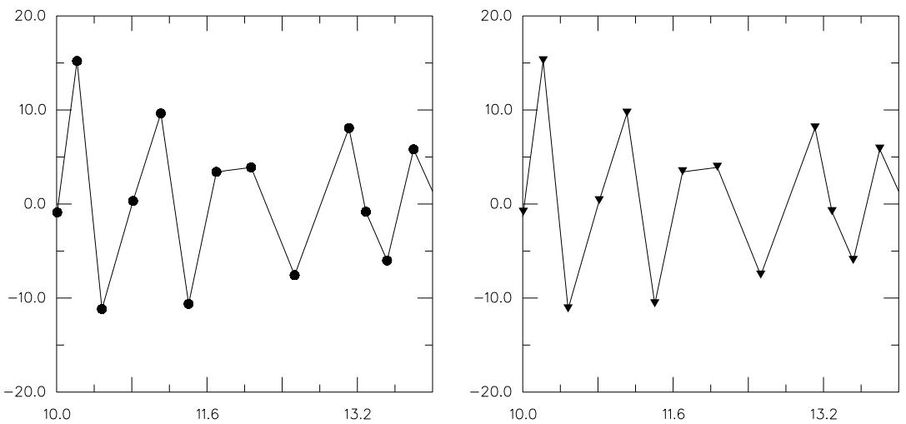  
图1：具有不同数据点符号的X–Y绘图。

您选择的符号会沿曲线显示并在图例中出现。定制选项仅在Show symbol（显示符号）切换开启时可用。

1. 定位Attributes（属性）选项。

Attributes（属性）选项出现在Curve Options（曲线选项）对话框的下半部分。

2. 从Curves（曲线）字段中，选择您希望定制其符号的一条或多条X–Y曲线。


## 注意：

要使一条X–Y曲线可供选择，您必须先绘制它。

您选择的定制选项将应用于您选择的所有曲线；如果您想要改变多条曲线上的符号，则必须逐个定制它们。

3. 切换Show symbol（显示符号）以显示或抑制代表每条选定X–Y曲线数据点的符号。

当Show symbol（显示符号）开启时，符号会被显示，且符号属性会被启用。

4. 选择符号颜色：
   a. 单击颜色样本
      Abaqus/CAE显示Select Color（选择颜色）对话框。
   b. 使用Select Color（选择颜色）对话框中的一种方法来选择新颜色。有关更多信息，请参见定制颜色。
   c. 单击OK（确定）以关闭Select Color（选择颜色）对话框。
      颜色样本变为选定的颜色。在您单击XY Plot Options（XY绘图选项）对话框中的OK（确定）或Apply（应用）之前，新颜色不会出现在视口中。

5. 选择符号：
   a. 单击Symbol按钮以显示符号选项。
   b. 从符号列表中，单击所需的符号。
      指定的符号出现在选定的X–Y曲线上。

6. 选择符号大小：
   a. 单击Size按钮以显示符号大小选项。
   b. 从符号大小选项中，单击所需的符号大小。
      指定的符号大小出现在选定的X–Y曲线上。

7. 选择符号的频率。
   在Frequency（频率）文本字段中输入一个整数，以选择符号沿曲线出现的频率。例如，如果您输入频率为二，Abaqus将在每隔一个数据点处显示符号。不允许值零；要抑制符号的显示，请关闭Show symbol（显示符号）。

8. 单击Dismiss（关闭）以关闭Curve Options（曲线选项）对话框。

## 附加信息

• 选择一条或多条X–Y曲线进行定制

Abaqus/CAE通过参考X–Y自动颜色列表中的颜色定义，自动为X–Y曲线分配颜色。此列表为X–Y曲线提供颜色的方式与通用Auto Colors（自动颜色）列表用于为几何体和网格单元着色的方式相同，但这两个颜色列表是独立的实体。

本节描述如何编辑X–Y自动颜色列表以修改X–Y曲线的默认颜色分配集。您也可以从Curve Options（曲线选项）对话框更改单个X–Y曲线的颜色分配。请参见定制X–Y曲线的外观。

1. 在Results Tree（结果树）中，右键单击XY Plots容器，然后从出现的列表中选择Edit XY-Auto-Colors（编辑XY自动颜色）。
   Abaqus/CAE显示Edit XY-Auto-Colors（编辑XY自动颜色）对话框。

2. 要在X–Y自动颜色列表中插入新颜色：
   1. 突出显示X–Y自动颜色列表中您希望位于要添加颜色之前或之后的颜色。
   2. 单击Insert Before（在之前插入）或Insert After（在之后插入）以在X–Y自动颜色列表中的指定位置添加新颜色。
      Select Color（选择颜色）对话框打开。
   3. 按照定制颜色中描述的步骤选择一种颜色；然后单击OK（确定）以关闭Select Color（选择颜色）对话框。
      Abaqus/CAE在选定的位置添加新颜色。
3. 要更改 X–Y 自动颜色列表中的某个颜色，请双击该颜色并从随即出现的“选择颜色”对话框中选择一个新颜色。  
4. 要在 X–Y 自动颜色列表中移动某个颜色，请高亮显示该颜色，然后单击“上移”或“下移”，将该颜色沿所选方向移动一步。  
5. 要从 X–Y 自动颜色列表中删除某个颜色，请高亮显示该颜色并单击“删除”。  
6. 继续添加、更改、移动和删除颜色，直到 X–Y 自动颜色列表按所需的顺序包含您想要的颜色。  
7. 单击“确定”。

Abaqus/CAE 将使用修订后的 X–Y 自动颜色列表为后续任何 X–Y 曲线的颜色编码着色。

## 自定义 X–Y 图表外观

本节介绍如何使用“图表选项”对话框来自定义网格线的显示，并调整 X–Y 图表的整体形状、大小和位置。

## 本节内容：

自定义 X–Y 图表的网格线  
自定义 X–Y 图表的边框和填充颜色  
自定义 X–Y 图表的大小和形状  
自定义 X–Y 图表的位置

您可以为 X–Y 图表自定义网格线。

单击“网格显示”选项卡以控制 X–Y 图表主要网格线和次要网格线的外观。主要和次要网格线的示例如图 1 所示。

  
图 1：标有主要和次要网格线的 X–Y 图表。

如果您的 X–Y 图表在同一方向上使用了多个轴，Abaqus/CAE 将仅为图表中第一条曲线的轴绘制网格线。

“网格显示”选项为四组网格线中的每一组提供独立控制；即，独立控制任意方向上的主要网格线和次要网格线。您可以显示或隐藏这四组中的任何一组，并可以修改这四组网格线中任意一组的颜色、样式或线宽。


## 注意：

主要网格线源于主刻度线，次要网格线源于次刻度线。要控制网格线之间的间距，您必须调整刻度线的间距。

1. 定位轴网格显示选项。

选择 `Options->XY Options->Chart`；或单击 ，它位于 Visualization（可视化）模块工具箱的 X–Y 绘图工具中。在出现的对话框中单击“网格显示”选项卡。

2. 从“图表”字段中选择一个或多个要自定义的 X–Y 图表。

3. 在“X 网格线”选项中，切换开启“主要”或“次要”选项，分别显示主要或次要垂直网格线。

当“主要”或“次要”开启时，该类型网格线的线条样式、颜色和线宽选项变为可用。

4. 在“Y 网格线”选项中，切换开启“主要”或“次要”，分别显示主要或次要水平网格线。  
5. 重复以下步骤来自定义水平主要和次要网格线以及垂直主要和次要网格线：

a. 选择网格线的颜色：

1. 单击颜色样本 。
   
   Abaqus/CAE 显示“选择颜色”对话框。

2. 使用“选择颜色”对话框中的一种方法选择新颜色。有关更多信息，请参阅自定义颜色。  
3. 单击“确定”关闭“选择颜色”对话框。

   所选网格线变为指定颜色。

b. 选择线条样式：

1. 展开样式列表以显示线条样式选项（实线、虚线等）。样式列表是两个未标注列表选项中上方的那个。  
2. 从样式列表中，单击所需的线条样式。

   所选网格线变为指定样式。

c. 选择线宽：

1. 展开线宽列表以显示线宽选项（细、中、粗等）。线宽列表是两个未标注列表选项中下方的那个。  
2. 从线宽列表中，单击所需的线宽。

   所选网格线变为指定线宽。

6. 单击“关闭”以关闭“图表选项”对话框。

## 附加信息

• 选择要自定义的一条或多条 X–Y 曲线

单击“网格显示”选项卡以访问 X–Y 图表的“网格区域”选项。这些选项使您能够自定义 X–Y 图表中的网格，即绘制曲线的矩形区域。您可以在网格周围添加边框，或用背景颜色填充网格。


## 注意：

您也可以控制整个 X–Y 图表的边框和背景颜色设置，这包括 X–Y 图表网格及其所有轴覆盖的视口部分。Abaqus/CAE 在整个 X–Y 图表的背景之上显示网格的背景颜色。有关更多信息，请参阅自定义 X–Y 图表的边框和填充颜色。

1. 定位“网格区域”选项。

选择 `Options->XY Options->Chart`；或单击 ，它位于 Visualization（可视化）模块工具箱的 X–Y 绘图工具中。在出现的对话框中单击“网格显示”选项卡。

   “网格区域”选项位于“网格显示”页面的底部。

2. 从窗口顶部选择一个或多个 X–Y 图表。  
3. 切换开启“显示边框”以在整个网格区域周围显示边框。  
4. 如果需要，通过执行以下步骤更改边框颜色：

   a. 单击紧邻“显示边框”标签右侧的颜色样本 。Abaqus/CAE 显示“选择颜色”对话框。  
   b. 使用“选择颜色”对话框中的一种方法选择新颜色。有关更多信息，请参阅自定义颜色。  
   c. 单击“确定”关闭“选择颜色”对话框。颜色样本和网格边框变为所选颜色。

5. 切换开启“填充”以用显示在“填充”标签右侧的颜色填充网格区域。  
6. 如果需要，通过执行以下步骤更改网格区域的填充颜色：

   a. 单击紧邻“填充”标签右侧的颜色样本 。Abaqus/CAE 显示“选择颜色”对话框。  
   b. 使用“选择颜色”对话框中的一种方法选择新颜色。有关更多信息，请参阅自定义颜色。  
   c. 单击“确定”关闭“选择颜色”对话框。网格区域变为所选颜色。

7. 单击“关闭”以关闭“图表选项”对话框。

## 附加信息

• 自定义 X–Y 图表的边框和填充颜色

## 自定义 X–Y 图表的大小和形状

使用“图表选项”对话框中的“大小”选项来自定义 X–Y 图表的大小和形状。

1. 定位图表选项。

选择 `Options->XY Options->Chart`；或单击 ，它位于 Visualization（可视化）模块工具箱的 X–Y 绘图工具中。在出现的对话框中单击“网格位置”选项卡。

2. 从“图表”字段中选择一个或多个您希望自定义其大小或形状的 X–Y 图表。  
3. 选择以下 X–Y 图表大小和形状选项之一：

## 适合图表

Abaqus/CAE 将整个视口用选定的 X–Y 图表填充，并调整图表形状以匹配视口尺寸。

## 正方形

“大小”滑块变为可用，您可以拖动该滑块来增大或减小正方形 X–Y 图表的大小。

## 手动

“X”和“Y”滑块变为可用，您可以拖动这些滑块沿任一轴增大或减小 X–Y 图表的大小。

4. 单击“关闭”以关闭“图表选项”对话框。

## 附加信息

• 选择要自定义的一条或多条 X–Y 曲线

使用“图表选项”对话框中的“位置”选项来自定义 X–Y 图表在视口中的位置。

1. 定位位置选项。

选择 `Options->XY Options->Chart`；或单击 ，它位于 Visualization（可视化）模块工具箱的 X–Y 绘图工具中。在出现的对话框中单击“网格位置”选项卡。

2. 从“图表”字段中选择一个或多个您希望自定义其位置或形状的 X–Y 图表。  
3. 选择以下 X–Y 图表定位选项之一：

## 自动对齐

此选项使您能够将选定的 X–Y 图表在视口中对齐到九个位置之一：其中心、四个角中的任何一个，或沿四条边中的任意一条居中。展开“对齐”列表，然后从列表中图形化表示的选项中选择一个。

## 手动

此选项使您能够将 X–Y 图表原点定位在视口中特定的 X–Y 位置。拖动“X”和“Y”滑块以在视口中水平或垂直移动 X–Y 图表的左下角。当这些滑块的值设置为 0 时，X–Y 图表原点将放置在视口的左下角。

4. 单击“关闭”以关闭“图表选项”对话框。

## 附加信息

• 选择要自定义的一条或多条 X–Y 曲线

## 自定义 X–Y 图表标题

本节介绍如何使用“绘图标题选项”对话框为 X–Y 图表创建标题，并自定义标题在视口中的外观和位置。

## 本节内容：

自定义 X–Y 图表标题的内容  
自定义 X–Y 图表标题的位置
# 为X–Y图标题添加边界框和填充颜色

使用 **Plot Title Options** 中的 **Text** 选项来为 X–Y 图创建并显示自定义标题。

1.  **定位用于图表标题的 Text 选项。**

    xxxx 选择 **Options** -> **XY Options** -> **Plot Title**；或单击 ，该按钮位于 **Visualization** 模块工具箱的 X–Y 绘图工具中。

2.  如果尚未选中，请单击 **Title** 选项卡。
3.  使用以下方法之一为 X–Y 图选择标题：

    *   要显示 X–Y 图的默认名称，请勾选 **Use default**。
    *   要显示自定义标题，请取消勾选 **Use default**，在 **Title** 字段中输入标题，然后按 **Enter**。

4.  选择图表标题的字体。

    a.  单击

    

    Abaqus/CAE 将显示 **Select Font** 对话框。

    b.  使用 **Select Font** 对话框中的方法之一来选择新字体、大小和样式。更多信息，请参阅自定义字体。
    c.  单击 **Apply** 查看字体选择的效果。
    d.  单击 **OK** 关闭 **Select Font** 对话框。

    X–Y 图标题将更改为所选的字体、大小和样式。

5.  为 X–Y 图标题选择颜色。

    a.  单击颜色样本 。

    Abaqus/CAE 将显示 **Select Color** 对话框。

    b.  使用 **Select Color** 对话框中的方法之一来选择新颜色。更多信息，请参阅自定义颜色。
    c.  单击 **OK** 关闭 **Select Color** 对话框。

    图表标题文本将更改为所选颜色。

## 其他信息

*   选择一个或多个 X–Y 曲线进行自定义

## 自定义 X–Y 图标题的位置

使用 **Plot Title Options** 中的 **Position** 选项将 X–Y 图标题放置在视口中的特定位置。

1.  **定位 Position 选项。**

    xxxx 选择 **Options** -> **XY Options** -> **Plot Title**；或单击 ，该按钮位于 **Visualization** 模块工具箱的 X–Y 绘图工具中。在出现的对话框中单击 **Area** 选项卡。

2.  勾选 **Inset** 以将图表标题图例显示在 X–Y 图内部。如果取消勾选 **Inset**，Abaqus/CAE 会将图表标题和 X–Y 图放置在视口的独立区域内。
3.  选择以下两种方法之一来定位图表标题：

## 自动对齐 (Auto-align)

此选项允许您将图表标题定位在视口中的九个位置之一：中心、四个角中的任一个，或沿四条边中的任一条居中。展开 **Alignment** 列表，然后选择列表中以图形方式表示的选项之一。

## 手动 (Manual)

此选项允许您将图表标题定位在视口中特定的 X–Y 位置。拖动 X 和 Y 滑块以在视口中水平或垂直移动标题。当这两个值都等于 0 时，图表标题定位在视口的左下角；当两个值都等于 100 时，图表标题定位在右上角。

## 其他信息

*   选择一个或多个 X–Y 曲线进行自定义

使用 **Plot Title Options** 中的 **Bounding Box** 选项在 X–Y 图标题周围绘制一个矩形框，或用背景色填充图表标题后面的区域。

1.  **定位 Bounding Box 选项。**

    xxxx 选择 **Options** -> **XY Options** -> **Plot Title**；或单击 ，该按钮位于 **Visualization** 模块工具箱的 X–Y 绘图工具中。在出现的对话框中单击 **Area** 选项卡。**Bounding Box** 选项出现在对话框底部。

2.  从对话框顶部的 **Charts** 字段中选择一个或多个 X–Y 图。
3.  执行以下步骤以显示和修改边界框：

    a.  勾选 **Show border** 以在图例周围显示边框。
    b.  为边界框线条选择颜色。

        1.  单击颜色样本 。

            Abaqus/CAE 将显示 **Select Color** 对话框。

        2.  使用 **Select Color** 对话框中的方法之一来选择新颜色。更多信息，请参阅自定义颜色。
        3.  单击 **OK** 关闭 **Select Color** 对话框。

            边界框线条将更改为所选颜色。

4.  控制边界框填充颜色：

    a.  勾选 **Fill** 以在边界框中显示背景颜色。
    b.  选择要显示在边界框背景中的填充颜色。

        1.  单击颜色样本

            Abaqus/CAE 将显示 **Select Color** 对话框。

        2.  使用 **Select Color** 对话框中的方法之一来选择新颜色。更多信息，请参阅自定义颜色。
        3.  单击 **OK** 关闭 **Select Color** 对话框。

            边界框背景将更改为所选颜色。

## 其他信息

*   选择一个或多个 X–Y 曲线进行自定义

## 自定义 X–Y 图图例的外观

本节解释如何使用 **Chart Legend Options** 对话框来自定义 X–Y 图图例的外观和内容。您还可以在 X–Y 图图例上显示标题，并可以在图例上包含最小和最大 X–Y 值的报告。

## 本节内容：

*   显示或隐藏 X–Y 图图例
*   自定义 X–Y 图图例的标题
*   向 X–Y 图图例添加最小值和最大值
*   自定义图例的位置
*   自定义 X–Y 图图例的边框和填充

X–Y 图图例提供了一个键，用于将图中包含的每条曲线与其所代表的 X–Y 数据对象关联起来。每个图例条目包含一个线段，其颜色和样式与图中显示的相同。默认情况下，图例条目还包含文本，说明曲线所代表的 X–Y 数据对象的描述。您可以使用 **Chart Legend Options** 显示或隐藏图例。

1.  **定位 Chart Legend Options。**

    选择 **Options** -> **XY Options** -> **Chart Legend**；或单击 $\sharp { \left[ \begin{array} { l } { + + } \\ { + } \\ { + } \end{array} \right] } _ { \ell }$ ，该按钮位于 **Visualization** 模块工具箱的 X–Y 绘图工具中。

    

    **提示**：当显示 X–Y 图时，您也可以通过双击视口中的图例直接打开此对话框。当活动过程生效时，您不能直接从视口选择 X–Y 图中的组件；在从 X–Y 图中选择项目之前，请取消当前过程。

2.  如果尚未选中，请单击 **Contents** 选项卡。
3.  勾选 **Show legend** 以显示图例，或取消勾选以隐藏图例。
4.  单击 **Dismiss** 关闭 **Chart Legend Options** 对话框。

## 其他信息

*   选择一个或多个 X–Y 曲线进行自定义

## 自定义 X–Y 图图例的标题

使用 **Title** 选项来显示或隐藏 X–Y 图图例的标题，并自定义其内容。

1.  **定位 Text 选项。**

    选择 **Options** -> **XY Options** -> **Chart Legend**；或单击 ，该按钮位于 **Visualization** 模块工具箱的 X–Y 绘图工具中。

    

    **提示**：当显示 X–Y 图时，您也可以通过双击视口中的图例直接打开此对话框。当活动过程生效时，您不能直接从视口选择 X–Y 图中的组件；在从 X–Y 图中选择项目之前，请取消当前过程。

    图例的 **Text** 选项出现在 **Contents** 页面的下半部分。

2.  从 **Charts** 字段中选择您希望自定义其图例的一个或多个 X–Y 图。

    

    **注意**：
    要使某个 X–Y 曲线可被选择，您必须首先绘制它。

3.  如果尚未选中，请单击 **Contents** 选项卡。
4.  如果需要，在 **Title** 字段中为 X–Y 图图例输入标题。
5.  选择 X–Y 图图例标题的字体。

    a.  单击

    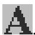

    Abaqus/CAE 将显示 **Select Font** 对话框。

    b.  使用 **Select Font** 对话框中的方法之一来选择新字体、大小和样式。更多信息，请参阅自定义字体。
    c.  单击 **Apply** 查看字体选择的效果。
    d.  单击 **OK** 关闭 **Select Font** 对话框。

    X–Y 图图例标题将更改为所选的字体、大小和样式。

6.  选择 X–Y 图图例标题的颜色。

    a.  单击颜色样本 。

    Abaqus/CAE 将显示 **Select Color** 对话框。

    b.  使用 **Select Color** 对话框中的方法之一来选择新颜色。更多信息，请参阅自定义颜色。
    c.  单击 **OK** 关闭 **Select Color** 对话框。

    X–Y 图图例标题文本将更改为所选颜色。

7.  单击 **Dismiss** 关闭 **Chart Legend Options** 对话框。

## 其他信息

*   选择一个或多个 X–Y 曲线进行自定义

您可以在图表图例上包含一个关于图中最小和最大 X–Y 值的报告，并且可以自定义这些值的格式和精度。

1.  **定位 Chart Legend Options。**

    选择 **Options** -> **XY Options** -> **Chart Legend**；或单击 ，该按钮位于 **Visualization** 模块工具箱的 X–Y 绘图工具中。


提示：当显示 X–Y 图时，您也可以直接双击视口中的图例来打开此对话框。当过程处于活动状态时，您无法直接从视口中的 X–Y 图选择组件；请先取消当前过程，然后再从 X–Y 图中选择项目。

2. 在 Charts 字段中，选择您希望定制其图例的一个或多个 X–Y 图。
3. 如果尚未选中，请单击 Contents 选项卡。
4. 打开 Show min/max 开关以在图例中报告 X–Y 的最小值和最大值。
5. 为图例中显示的最小值和最大值选择以下数字格式之一：

## Automatic（自动）

非常大的值和非常小的值采用科学计数法表示。所有其余值不使用指数，并使用指定的有效数字位数表示。

## Decimal（十进制）

所有值不使用指数，并使用指定的有效数字位数表示。

## Engineering（工程）

大于或等于 1000（或小于或等于 0.001）的值表示为一个介于 1 到 999 之间的数字乘以 10 的 n 次方，其中 n 是 3 的倍数（例如，20.5E+03 或 17.76E+06）。所有其余值使用指定的有效数字位数表示。

## Scientific（科学）

所有值表示为一个介于 1 到 10 之间的数字乘以 10 的适当次方（例如，2.05E+04 或 1.776E+07）。

6. 单击 Precision 箭头指定每个标签所需的有效数字位数（非十进制格式）或小数位数（十进制格式）。
7. 单击 Dismiss 关闭 Chart Legend Options（图表图例选项）对话框。

## 其他信息

• 选择一条或多条 X–Y 曲线进行定制

## 定制图例位置

您可以通过在视口中拖动图例，或者通过在 Chart Legend Options 对话框的 Position 选项中指定视口位置，来移动 X–Y 图图例。仅当 Abaqus/CAE 没有活动过程时才能拖动图例；如果无法拖动图例或无法从视口中选择任何其他 X–Y 图组件，请取消当前过程。

1. 找到 Chart Legend Options（图表图例选项）。

选择 Options->XY Options->Chart Legend；或单击 ，它位于 Visualization（可视化）模块工具箱的 X–Y 绘图工具中。


提示：当显示 X–Y 图时，您也可以直接双击视口中的图例来打开此对话框。当过程处于活动状态时，您无法直接从视口中的 X–Y 图选择组件；请先取消当前过程，然后再从 X–Y 图中选择项目。

2. 在 Charts 字段中，选择您希望移动其图例的一个或多个 X–Y 图。
3. 如果尚未选中，请单击 Area 选项卡。
4. 打开 Inset 开关以在 X–Y 图网格内显示 X–Y 图图例。如果关闭 Inset，Abaqus/CAE 会将图例和 X–Y 图放置在视口的单独区域中。
5. 选择以下定位选项之一：

## Auto-align（自动对齐）

此选项使您能够将图例与视口中的九个位置之一对齐：其中心、四个角中的任意一个，或沿四条边的中心。展开 Alignment 列表，然后从列表中图形化描绘的选项中选择一个。

## Manual（手动）

此选项使您能够在视口中的特定 X–Y 位置放置图例。拖动 X 和 Y 滑块以在视口中水平或垂直移动图例。当这些滑块的值设置为 0 时，图例被放置在视口的左下角。

6. 单击 Dismiss 关闭 Chart Legend Options（图表图例选项）对话框。

## 其他信息

• 选择一条或多条 X–Y 曲线进行定制

使用 Chart Legend Options 对话框中的 Bounding Box（边界框）选项，通过添加边框或用指定颜色填充来定制图例的外观。

1. 找到 Chart Legend Options（图表图例选项）。

选择 Options->XY Options->Chart Legend；或单击 ，它位于 Visualization（可视化）模块工具箱的 X–Y 绘图工具中。


提示：当显示 X–Y 图时，您也可以直接双击视口中的图例来打开此对话框。当过程处于活动状态时，您无法直接从视口中的 X–Y 图选择组件；请先取消当前过程，然后再从 X–Y 图中选择项目。

2. 在 Charts 字段中，选择您希望定制其图例的一个或多个 X–Y 图。


## 注意：

要使某条 X–Y 曲线可供选择，您必须首先绘制它。

3. 如果尚未选中，请单击 Area 选项卡。
4. 执行以下步骤以显示和修改边界框：

a. 打开 Show border 开关以在图例周围显示边框。
b. 为边界框线条选择颜色。

1. 单击颜色样本 。

Abaqus/CAE 显示 Select Color（选择颜色）对话框。

2. 使用 Select Color 对话框中的方法之一选择新颜色。更多信息，请参见 Customizing colors（定制颜色）。
3. 单击 OK 关闭 Select Color 对话框。

边界框线条变为所选颜色。

5. 控制边界框填充颜色：

a. 打开 Fill 开关以在边界框中显示背景色。
b. 选择一种填充颜色作为边界框的背景显示。

1. 单击颜色样本 。

Abaqus/CAE 显示 Select Color（选择颜色）对话框。

2. 使用 Select Color 对话框中的方法之一选择新颜色。更多信息，请参见 Customizing colors（定制颜色）。
3. 单击 OK 关闭 Select Color 对话框。

边界框背景变为所选颜色。

6. 单击 Dismiss 关闭 Chart Legend Options（图表图例选项）对话框。

## 其他信息

• 选择一条或多条 X–Y 曲线进行定制

## 定制 X–Y 图的边框和填充颜色

使用 Plot Options 对话框中的选项，为您会话中的一个或多个 X–Y 图创建自定义边框颜色和自定义背景填充颜色。默认情况下，X–Y 图没有边框，并填充为浅灰色背景颜色。您可能希望调整边框颜色以区分叠加图中使用的不同 X–Y 图；如果绘制中使用的 X–Y 曲线在默认背景下不够突出，您可能希望调整填充颜色。


1. 选择 Options->XY Options->Plot Options；或单击 ，它位于 Visualization（可视化）模块工具箱的 X–Y 绘图工具中。

Plot Options 对话框打开。

2. 在 Plots 框中，突出显示您想要修改的一个或多个 X–Y 图。此框列出绘图名称及其显示的视口。
3. 打开 Show border 开关以在 X–Y 图周围显示边框。
4. 如果需要，请通过执行以下步骤更改 X–Y 图边框的颜色：

a. 单击紧邻 Show border 标签右侧的颜色样本 。

Abaqus/CAE 显示 Select Color（选择颜色）对话框。

b. 使用 Select Color 对话框中的方法之一选择新颜色。更多信息，请参见 Customizing colors（定制颜色）。
c. 单击 OK 关闭 Select Color 对话框。

颜色样本和 X–Y 图边框更改为所选颜色。

5. 打开 Fill 开关以使用 Fill 标签右侧显示的颜色填充 X–Y 图。
6. 如果需要，请通过执行以下步骤更改 X–Y 图填充颜色：

a. 单击紧邻 Fill 标签右侧的颜色样本 。

Abaqus/CAE 显示 Select Color（选择颜色）对话框。

b. 使用 Select Color 对话框中的方法之一选择新颜色。更多信息，请参见 Customizing colors（定制颜色）。
c. 单击 OK 关闭 Select Color 对话框。

X–Y 图填充颜色更改为所选颜色。

## 沿路径查看结果

路径是通过指定模型中的一系列点或边而定义的一系列连接线。您可以以 X–Y 图的形式查看沿路径的结果。本章解释如何沿路径查看结果。

## 本节内容：

理解沿路径的结果
通过模型创建路径
沿路径获取 X–Y 数据

## 理解沿路径的结果

要查看沿模型路径的结果，首先选择 Tools->Path 来指定路径，然后选择 Tools->XY Data 来获取沿路径的 X–Y 数据。

## 本节内容：

路径规范
Abaqus/CAE 如何获取沿路径的结果

## 路径规范

路径是通过指定模型中一系列点或线段而定义的一条线。这些点可以是节点或坐标位置；线段可以是单元边或连接单元边端点的线。路径可以跨越多个部件实例。Abaqus/CAE 提供四种不同类型的路径：
## 节点列表

构成路径的点仅由节点位置组成。您使用节点标签和节点标签范围来指定这些点。节点标签是引用特定节点的一种持久性方式；也就是说，随着模型变形，节点标签不会改变。因此，构成节点列表路径的节点标签同样适用于未变形或变形的模型形状。然而，节点标签是特定于部件实例的。换言之，您可以为多个部件实例拥有相同的节点标签；因此，当您使用节点标签时，必须指定您指的是哪个部件实例。有关更多信息，请参阅*创建或编辑节点列表路径*。

## 点列表

构成路径的点由模型内的坐标位置组成。这些位置可能与节点位置重合，也可能不重合。点列表坐标在空间中保持固定，并且独立于您的模型。例如，在未变形形状上与节点位置重合的坐标，在变形形状上可能不与任何位置重合。同样地，点列表坐标独立于特定的部件实例。有关更多信息，请参阅*创建或编辑点列表路径*。

## 边列表

构成路径的点由连接模型内节点的边组成。您可以通过从视窗中选择单个单元边，或者通过选择起始边和方向并让 Abaqus/CAE 自动将路径延伸到特征边的末端或您选择的端点来指定边。边由模型中的单元定义。因此，构成边列表路径的边同样适用于未变形或变形的模型形状。然而，单元标签是特定于部件实例的。换言之，您可以为多个部件实例拥有相同的单元标签；因此，当您使用边时，必须指定您指的是哪个部件实例。有关更多信息，请参阅*创建或编辑边列表路径*。

## 圆形

构成路径的点由模型内的坐标位置组成。您可以在 Abaqus/CAE 中创建两种类型的圆形路径：周向路径和径向路径。周向路径位于圆或圆弧的边缘上；径向路径位于半径上。您可以通过选择定义圆或圆弧的坐标，然后定义路径的起点、终点和路径上的点数来指定任何一种类型的路径。一旦定义了原始圆或圆弧，您可以选择新的半径长度来创建任何与原始路径共享相同圆心的路径。您可以使用周向路径来获取模型弯曲部分的横截面结果，如图 1 所示。

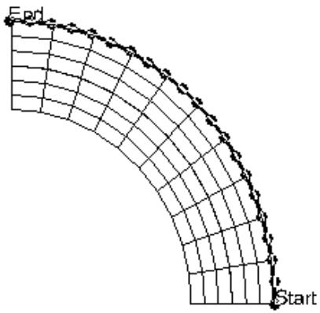  
图 1：周向路径。

您可以使用径向路径来获取从曲线内表面到外表面的结果，如图 2 所示；径向路径非常适合用于应力线性化（有关应力线性化的更多信息，请参阅*计算线性化应力*）。

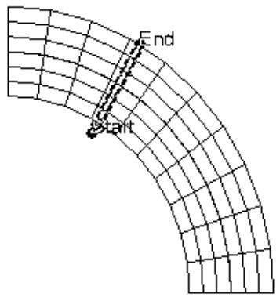  
图 2：径向路径。

您可以通过从视窗中拾取节点或在提示区域中输入值来选择坐标；无论哪种情况，坐标在空间中保持固定，并且独立于您的模型。例如，在未变形形状上与节点位置重合的坐标，在变形形状上可能不与任何位置重合。同样地，圆形路径的坐标定义独立于特定的部件实例。有关更多信息，请参阅*创建或编辑圆形路径*。

Abaqus/CAE 按照您指定的顺序连接您指定的节点、点或边来形成路径。

创建路径后，您可以从主菜单栏中选择**工具 (Tools) -> 路径 (Path)** 来编辑、复制、重命名、删除或绘制它。绘制路径本身是一种验证您是否已指定预期线的视觉方式；要沿路径查看结果，您必须形成 X-Y 数据对并生成 X-Y 图。有关管理路径的更多信息，请参阅*使用管理器对话框管理对象*；有关生成路径数据的 X-Y 图的更多信息，请参阅*沿路径获取 X-Y 数据*。

## Abaqus/CAE 如何沿路径获取结果

Abaqus/CAE 以 X-Y 数据对的形式沿路径获取结果。

Abaqus 根据构成路径的点确定数据对的 X 值。这些点定义了获取数据的模型位置。Abaqus 根据这些模型位置的分析结果确定数据对的 Y 值。

在计算数据对时，Abaqus/CAE 仅考虑当前显示组中的实体。

## 路径数据 X 值

您可以选择仅根据为路径指定的点形成 X 值，或者额外包括路径与模型相交的所有位置。（相交发生在路径穿过单元面、单元边、表面面或表面边的地方。如果相交点位于实际数据点的用户指定距离内，则可以从路径定义中省略单个相交点。您可以使用 Abaqus 脚本接口命令设置此相交容差值；有关更多信息，请参阅 *Session 对象*。）

您还可以选择 Abaqus/CAE 将构成路径的点解释为未变形或变形模型形状上的位置。当选择变形模型形状时，Abaqus/CAE 将节点的变形坐标计算为基准坐标与该节点变形量乘以视窗特定变形比例因子的总和。节点列表标签和边列表表示模型位置，并且同样适用于未变形或变形的模型形状。点列表和圆形路径坐标是独立于模型几何形状的固定位置。对于与您选择的模型形状不重合的点，Abaqus 不会形成数据对。

构成路径的节点标签或点坐标通常不适合直接用作 X 值。Abaqus/CAE 提供了多个选项，供您将这一系列点转换为有用的 X 值以及后续的 X-Y 图坐标轴标签。您可以选择以下选项之一将路径点转换为 X 值：

• **真实距离**：X 值对应于每个点沿路径在模型空间坐标中的实际距离，从零开始。  
• **归一化距离**：X 值对应于每个点沿路径的距离占路径总长度的分数。  
• **序列 ID**：X 值对应于每个点在路径结果列表中出现的顺序。  
• **X, Y 或 Z 距离**：X 值对应于每个点沿路径在您指定的单个坐标方向上的实际距离，从零开始。此选项特别适用于生成轴对称模型中结果与半径的关系图。  
• **X, Y 或 Z 坐标**：X 值对应于每个点沿您指定的轴到原点的距离。

## 路径数据 Y 值

您可以通过选择 Abaqus/CAE 获取结果所用的结果步骤、帧和场输出变量，以及通过控制 Abaqus/CAE 计算某些类型结果的方式来控制数据对的 Y 值，如下所述：

• 对于要在节点位置获取的基于节点的场输出变量（如位移），Abaqus/CAE 直接从输出数据库读取结果，无需进一步计算。  
• 对于要在节点位置获取的基于单元的场输出变量（如应力或应变），Abaqus/CAE 从输出数据库读取结果，将这些值外推到节点，然后根据您选择的选项有条件地平均多个贡献。  
• 对于要在不与节点位置重合的路径点获取的基于节点和基于单元的变量，Abaqus/CAE 通过使用单元形状的几何近似将值从节点插值到请求位置来计算值。您无法控制此计算。

基于单元的变量的平均选项和复数数值的复数形式选项位于**结果选项 (Result Options)** 对话框中。平均将多个贡献减少为单个值。当您选择结果选项以部分或完全抑制平均时，接收多个贡献的路径点会产生多个数据对。这样的数据对共享相同的 X 值，但每个贡献都有一个单独的 Y 值。根据您的路径和模型的特性，可能需要以下技术来避免多个数据对共享相同的 X 值：

• 设置结果选项以完全启用平均。  
• 设置结果选项在计算值时忽略区域边界。  
• 避免路径穿过区域不连续处。  
• 避免路径沿着分隔不连续区域的线。
• 在获取路径上的结果之前，使用显示组来隔离单独的区域。
• 避免使用包含一个或多个空间点的点列表路径，这些点在视觉上位于高度变形的单元和大角度圆柱单元之外，但由于等参映射，在数学上位于单元内部。此类空间点往往被两个或多个单元共享，从而导致多个 Y 值。

有关值平均的更多信息，请参阅理解结果值平均。

如果选定的场输出变量包含复数结果，则数据对的 Y 值会受当前复数形式的影响。当您绘制路径时，Y 轴标题会附加复数形式的缩写。例如，如果 S-Misss 是选定的场输出变量，Magnitude 是复数形式，则 Y 轴标题为 S-Misss CPX:Mg。其他复数形式的缩写方式类似。有关复数形式的更多信息，请参阅控制复数结果的形式。

Abaqus/CAE 不会为没有指定分析步、帧或场输出变量结果的点生成数据对。

## 在模型中创建路径

路径是您通过指定模型中一系列点或线段来定义的线；这些点可以是节点或坐标位置，线段可以是单元边或连接单元边端点的线。

## 本节内容：
创建或编辑节点列表路径  
创建或编辑点列表路径  
创建或编辑边列表路径  
创建或编辑圆形路径

## 创建或编辑节点列表路径

路径是您通过指定模型中一系列点来定义的线。在节点列表路径中，所有点都是节点位置。

有关在路径中包含除节点以外的位置的信息，请参阅在模型中创建路径。

您通过将部件实例名称、节点标签和节点标签范围输入表格来创建节点列表路径。您可以使用以下过程中描述的编辑技术，通过从视口或节点集中直接选择节点来创建路径。或者，您也可以通过直接在表格中输入值来创建节点列表路径。如果您不知道模型中的部件实例名称，请使用查询工具集在视口中查询节点。为了帮助确定感兴趣的节点标签，您可能希望在创建路径之前生成一个显示节点符号和节点编号的模型图。有关更多信息，请参阅自定义模型标签。

1.  宾位路径创建和编辑选项。

使用以下技术创建或编辑节点列表路径：

创建新路径

a. 从主菜单栏中，选择工具（Tools）->路径（Path）->创建（Create）。出现创建路径（Create Path）对话框。
b. Abaqus/CAE 在名称（Name）文本字段中显示路径的默认名称。要提供更有意义的名称，请将此默认名称替换为您选择的名称（如果需要，可包含空格）。
c. 在创建路径（Create Path）对话框中，单击节点列表（Node list）；然后单击继续（Continue）。

编辑现有路径

a. 从主菜单栏中，选择工具（Tools）->路径（Path）->编辑（Edit）。从出现的菜单中，选择要编辑的路径。


提示：您也可以使用路径管理器（Path Manager）编辑路径。从主菜单栏中，选择工具（Tools）->路径（Path）->管理器（Manager）以显示管理器。选择要编辑的路径，然后从管理器右侧的按钮中单击编辑（Edit）。

出现编辑节点列表路径（Edit Node List Path）对话框。

2.  指定路径上的节点。

使用以下任何技术：

直接从视口中选择节点

a. 单击添加在前（Add Before）或添加在后（Add After）开始进行视口选择。

Abaqus/CAE 提示您选择要插入路径的节点（Select nodes to be inserted into the path），并关闭编辑节点列表路径（Edit Node List Path）对话框。

b. 从视口中选择一个或多个节点（有关更多信息，请参阅在视口中选择对象）。如果所需节点存在于多个部件实例中，请切换关闭选择工具栏中最接近屏幕的实体（Select the Entity Closest to the Screen）工具。如果您进行了不明确的选择，部件实例名称和节点标签将以高亮显示节点 实例.节点（Highlighting Node Instance.Node）的形式出现在视口的左下角。使用下一个（Next）和上一个（Previous）按钮循环查看可能的选择，然后单击确定（OK）确认您的选择。

Abaqus/CAE 在您选择节点时高亮显示它们，并显示节点标签和路径连接性。


## 注意：

您只能选择当前显示组中的节点。

c. 完成后，在提示区中单击完成（Done）。

Abaqus/CAE 显示编辑节点列表路径（Edit Node List Path）对话框；路径定义表中列出了路径中的部件实例和节点。

d. 如果需要，重复上述步骤以添加更多节点。

添加在前（Add Before）和添加在后（Add After）按钮决定您的选择将添加到路径定义表中当前高亮行的哪个位置。

从节点集中选择节点

a. 单击添加在前（Add Before）或添加在后（Add After）开始进行节点集选择。

选择节点集（Select Node Sets）对话框在左侧的表格中显示当前输出数据库中可用的节点集。

b. 要限制列表以便于选择，请在过滤器（Filter）字段中输入过滤器模式，然后按 [Enter] 键应用过滤器。

Abaqus/CAE 仅列出符合您规范的节点集。

c. 从节点集列表中，选择一个或多个要包含在路径中的节点集。

使用对话框中间的前两个箭头将选定的节点集移入或移出对话框右侧的表格。
• 使用对话框中间的后两个箭头将所有节点集移入或移出对话框右侧的表格。

d. 完成选择后，单击确定（OK）。

Abaqus/CAE 显示编辑节点列表路径（Edit Node List Path）对话框；路径定义表中列出了路径中的部件实例和节点。

e. 如果需要，重复上述步骤以添加更多节点。

添加在前（Add Before）和添加在后（Add After）按钮决定您的选择将添加到路径定义表中当前高亮行的哪个位置。

直接在表格中输入节点标签

a. 在路径定义（Path Definition）表中，使用标准的键盘和鼠标编辑技术插入、修改或删除部件实例名称和节点标签表达式。如果您不知道模型中的部件实例名称，请使用查询工具集在视口中查询节点。对于特殊的表格编辑选项或从 ASCII 文件读取数据，请按鼠标键 3。（有关更多信息，请参阅输入表格数据。）节点标签表达式可以是以下之一：

• 单个节点标签；例如，5。
• 通过起始和结束节点标签指定的节点范围，后跟可选的增量；例如，5:10 或 5:10:2。


## 注意：

如果您从 ASCII 文件读取节点标签，必须从第一列开始读取表格值，并且每行必须包含一个部件实例名称和一个节点标签表达式。部件实例名称区分大小写，必须用引号括起来，如下所示：“INSTANCE\_NAME”

b. 在每个节点标签表达式后，按 [Enter] 键。

Abaqus 高亮显示路径中包含的所有节点，并显示节点标签和路径连接性。

3.  完成节点选择后，单击确定（OK）。

如果您创建了新路径，Abaqus/CAE 会将路径名称添加到路径管理器（Path Manager）列表中。默认情况下，Abaqus/CAE 会在当前会话期间保存您指定的路径。如果您想保留路径以供后续会话使用，请将其保存为 XML 文件、模型数据库或输出数据库；有关更多信息，请参阅管理会话对象和会话选项。

## 附加信息

• 理解沿路径的结果  
• 获取沿路径的 X-Y 数据

## 创建或编辑点列表路径

路径是您通过指定模型中一系列点来定义的线。在点列表路径中，所有点都是模型坐标位置。这些位置可能与节点重合，也可能不重合。

有关其他路径指定形式的信息，请参阅在模型中创建路径。

您通过将点的坐标输入表格来创建点列表路径。对于与节点位置重合的点，您可以指定节点标签或在视口中选择节点，Abaqus 会将节点的未变形坐标输入表格。您也可以选择一个节点列表路径将节点坐标输入表格。为了帮助确定哪些节点标签是您感兴趣的，您可能希望在创建路径之前生成一个显示节点符号和节点编号的模型图。有关更多信息，请参阅自定义模型标签。
1. 定位路径创建与编辑选项。

使用以下技术创建或编辑点列表路径：

创建新路径

a. 从主菜单栏中，选择 Tools->Path->Create。将出现 Create Path 对话框。
b. Abaqus 会在 Name 文本字段中显示路径的默认名称。要提供更有意义的名称，请用您选择的名称替换此默认值（如果需要，可以包含空格）。
c. 在 Create Path 对话框中，点击 Point list；然后点击 Continue。

编辑现有路径

a. 从主菜单栏中，选择 Tools->Path->Edit。在出现的菜单中，选择您要编辑的路径。


提示：您也可以使用 Path Manager 来编辑路径。从主菜单栏中，选择 Tools->Path->Manager 以显示管理器。选择您要编辑的路径，然后点击管理器右侧按钮中的 Edit。

Edit Point List Path 对话框将出现。

2. 在 Point Coordinates 表中，使用标准键盘和鼠标编辑技术来输入、修改或删除坐标。

要输入坐标，请使用以下任何一种技术：

键入点的坐标值

a. 将值指定为以空格或逗号分隔的 X-, Y-, Z-坐标；例如，1.0, 3.4, 2.0。

b. 按 [Enter]。

通过查询节点包含节点位置的坐标

a. 选择 Node query。

b. 选择要确定节点坐标的部分实例。点击 Part instance 字段旁边的箭头以查看可用部分实例的列表。

要获取节点的坐标，请执行以下操作之一：

• 在 Node label 字段中键入节点标签，然后按 [Enter] 或点击 Query。

• 点击 Select from Viewport，然后选择一个节点。

Abaqus 将显示该节点的未变形 X-, Y- 和 Z- 坐标。

c. 要在当前高亮行的前一行、后一行或替换当前高亮行，将这些坐标输入到路径定义表中，请分别点击 Add Before、Add After 或 Replace。

对于特殊的表格编辑选项或从 ASCII 文件读取数据，请按鼠标按钮 3。（更多信息，请参阅 Entering tabular data。）

包含来自节点列表路径的节点坐标

a. 选择 Node list path。
b. 选择您要输入其节点坐标的节点路径列表。点击 Node list path 字段旁边的箭头以查看可用路径的列表。
c. 要在当前高亮行的前一行、后一行或替换当前高亮行，将这些坐标输入到路径定义表中，请分别点击 Add Before、Add After 或 Replace。

在当前视口的模型图上，Abaqus 会高亮显示路径中包含的所有点，并显示路径连接性。

3. 完成后，点击 OK。

如果您创建了新路径，Abaqus/CAE 会将路径名称添加到 Path Manager 列表中。默认情况下，Abaqus/CAE 会为您在当前会话期间指定的路径保存。如果您希望保留路径以在后续会话中使用，请将其保存到 XML 文件、模型数据库或输出数据库；更多信息，请参阅 Managing session objects and session options。

## 附加信息

• Understanding results along a path
• Obtaining X–Y data along a path

## 创建或编辑边列表路径

路径是一条线，您可以通过在模型中指定一系列线段来定义它。在边列表路径中，这些线段由单元边和连接单元边端点的线定义。

有关在路径中包含边以外位置的信息，请参阅 Creating a path through your model。

您可以通过将部分实例名称和边标签输入到表中来创建边列表路径。每个边标签由单元编号、面编号、边编号和沿边的方向组成。可以使用三种方法的组合从视口中选择边以输入到表中：

• 选择单个单元边。
• 选择一条单元边和一个沿特征边的方向，让 Abaqus/CAE 自动添加该特征端点之前的所有剩余边。
• 选择一条单元边和一个节点，让 Abaqus/CAE 选择它们之间沿单元边的最短距离路径。

您也可以直接编辑表，使用视口来跟踪进度。但是，边标签的某些部分取决于单元类型、方向和所需的连接性，这些通过从视口进行选择更容易确定。

1. 定位路径创建与编辑选项。

要创建新路径：

a. 从主菜单栏中，选择 Tools->Path->Create。Create Path 对话框将出现。
b. Abaqus 会在 Name 文本字段中显示路径的默认名称。要提供更有意义的名称，请用您选择的名称替换此默认值（如果需要，可以包含空格）。
c. 在 Create Path 对话框中，点击 Edge list；然后点击 Continue。

要编辑现有路径：

a. 从主菜单栏中，选择 Tools->Path->Edit。在出现的菜单中，选择您要编辑的路径。


提示：您也可以使用 Path Manager 来编辑路径。从主菜单栏中，选择 Tools->Path->Manager 以显示管理器。选择您要编辑的路径，然后点击管理器右侧按钮中的 Edit。

Edit Edge List Path 对话框将出现。

2. 要通过在视口中选择边来创建或编辑路径，请点击 Add Before 或 Add After 开始进行选择。

Abaqus/CAE 会提示您 Select edges to be inserted into the path，并关闭 Edit Edge List Path 对话框。

3. 使用提示区域中的选择方法来选择边。有三种可用的边选择方法：

## 逐个选择

按顺序选择单个单元边，即它们在路径中出现的顺序；选择的边不必相邻。如果需要，点击提示区域中的 Flip 可以反转您最后选择的边的连接性。

## 按特征边选择

选择一条位于特征边上的起始边；Abaqus/CAE 将自动选择您的选择位置与该特征边端点之间的所有边。点击 Flip 可以反转您选择的边的连接性以及用于自动选择的方向。

## 按最短距离选择

选择一条起始边和一个端点（节点）；Abaqus/CAE 将自动选择定义您选择位置之间最短路径的单元边。点击 Flip 可以反转您选择的边的连接性以及用于自动边选择的方向。如果存在多条相同距离的路径，Abaqus/CAE 会选择其中一条。


## 注意：

您选择的边和节点必须位于同一个部分实例上。

如果所需的边存在于多个部分实例中，请在 Selection 工具栏中关闭 Select the Entity Closest to the Screen 工具。如果您进行了不明确的选择，部分实例名称和边标签（不带方向值）将以 HighLighting Element Edge Element.Face.Edge 的形式出现在视口左下角。使用 Next 和 Previous 按钮循环显示可能的选择，然后点击 OK 确认您的选择。

Abaqus 会在您选择边时高亮显示它们，并显示节点标签和路径连接性。此外，Abaqus 会将路径中的第一个节点标记为 Start，最后一个节点标记为 End。

4. 完成选择后，在提示区域中点击 Done。

Abaqus/CAE 显示 Edit Edge List Path 对话框；您路径中的部分实例和边列在路径定义表中。

5. 如果需要，请重复上述步骤以添加更多边。

Add Before 和 Add After 按钮决定您的选择将添加到路径定义表中当前高亮行的前面还是后面。

6. 如果需要，您可以使用标准键盘和鼠标编辑技术在 Path Definition 表中插入、修改或删除部分实例名称和边标签。边标签的格式为（单元编号、面编号、边编号、方向）。


提示：使用 Query 工具集查询视口中的节点以获取部分实例名称。使用与绘图状态无关的选项在视口中显示单元和面标签。（更多信息，请参阅 Customizing model labels。）边的编号是按逆时针方向围绕面，从单元外部看。方向（-1 或 1）取决于您所需的路径连接性。

对于特殊的表格编辑选项或从 ASCII 文件读取数据，请按鼠标按钮 3。（更多信息，请参阅 Entering tabular data。）

7. 编辑 Path Definition 表后，按 [Enter]。

Abaqus 更新视口中显示的路径。

8. 完成边选择后，点击 OK。

如果您创建了新路径，Abaqus/CAE 会将路径名称添加到 Path Manager 列表中。默认情况下，Abaqus/CAE 会为您在当前会话期间指定的路径保存。如果您希望保留路径以在后续会话中使用，请将其保存到 XML 文件、模型数据库或输出数据库；更多信息，请参阅 Managing session objects and session options。
## 附加信息

• 理解沿路径的结果  
• 沿路径获取 X–Y 数据

路径是通过指定模型中一系列点来定义的线。在圆形路径中，所有点都是位于圆周或圆的半径上的模型坐标位置。有关其他形式的路径规范信息，请参阅 *创建通过模型的路径*。

您可以通过选择节点或输入坐标来定义圆，从而创建圆形路径。定义圆后，使用圆的边缘或半径来定义弯曲的周向路径或笔直的径向路径。

1.  定位路径创建和编辑选项。

    要创建新路径：

    a. 从主菜单栏中，选择 **Tools->Path->Create**。**Create Path** 对话框出现。  
    b. Abaqus 在 **Name** 文本字段中显示路径的默认名称。要提供更有意义的名称，请用您选择的名称替换此默认名称（如果愿意，可包含空格）。  
    c. 在 **Create Path** 对话框中，单击 **Circular**；然后单击 **Continue**。

    要编辑现有路径：

    a. 从主菜单栏中，选择 **Tools->Path->Edit**。从出现的菜单中，选择您要编辑的路径。

    

    **提示**：您也可以使用路径管理器（Path Manager）来编辑路径。从主菜单栏中，选择 **Tools->Path->Manager** 以显示管理器。选择要编辑的路径，然后单击管理器右侧的按钮中的 **Edit**。

    **Edit Circular Path** 对话框出现。

2.  选择路径类型：**Circumferential**（周向）或 **Radial**（径向）。

    Abaqus/CAE 更新对话框以反映您正在创建的路径类型。**Circumferential Path** 位于圆的边缘，需要半径、起始角和结束角来定义其位置和长度。**Radial Path** 位于圆的半径上，需要径向角、起始值和结束值来定义其位置和长度。

3.  在对话框的 **Circle Definition** 部分，选择 **Origin and axis** 或 **3 Points on Arc** 作为定义圆的方法。

    **Origin and axis** 方法使用两个点定义旋转轴，并使用圆平面上的一个点来定义默认半径长度和旋转起点。**Three points on arc** 方法将圆拟合到三个边缘点。

4.  单击 **Select from Viewport** 以选择节点或输入坐标来定义圆。

    Abaqus/CAE 关闭 **Edit Circular Path** 对话框，并在提示区显示提示以指导您完成过程。

5.  从视口中选择节点，或使用提示区中的文本字段将每个点指定为由空格或逗号分隔的 X、Y、Z 坐标；例如，1.0, 3.4, 2.0。

    Abaqus/CAE 打开 **Edit Circular Path** 对话框；您选择的坐标出现在圆定义表中。如果您选择了节点，则使用的坐标对应于模型的当前变形状态。

    在当前视口的模型图上，Abaqus 高亮显示路径中包含的所有点，并显示路径连接性。

6.  您可以如下方式编辑 **Circle Definition** 中的单个点：

    a. 将光标悬停在点的坐标上。  
    b. 单击鼠标按钮 3，并选择 **Edit selection**。  
    c. 在视口中选择一个节点，或在提示区中编辑坐标。

    当您做出选择或输入新坐标时，Abaqus/CAE 返回到 **Edit Circular Path** 对话框，并在视口中显示重新定义的圆。

7.  选择要包含在路径中的分段数。

    Abaqus/CAE 修改视口中的路径以显示所选数量的等长分段。

8.  如下完成圆形路径的编辑或创建：

    **周向路径**

    选择 **Radius**，并选择旋转的 **Start angle** 和 **End angle**。默认情况下，Abaqus 使用您定义的圆的半径，并从您在圆上选择的第一个点（如果您选择原点和轴方法，则是圆上唯一点）开始旋转 360°。

    **径向路径**

    选择 **Radial Angle**、**Start Radius** 和 **End Radius**。默认径向角（0°）是从圆心到您在圆周上选择的第一个点（如果您选择原点和轴方法，则是圆上唯一点）的角度。默认起始半径为 0.0（圆心），默认结束半径等于圆的半径。

9.  完成后，单击 **OK**。

    如果您创建了新路径，Abaqus/CAE 会将路径名称添加到路径管理器列表中。默认情况下，Abaqus/CAE 在会话期间保存您指定的路径。如果您希望保留路径以供后续会话使用，请将其保存到 XML 文件、模型数据库或输出数据库；更多信息，请参阅 *管理会话对象和会话选项*。

## 附加信息

• 理解沿路径的结果  
• 沿路径获取 X–Y 数据

## 沿路径获取 X–Y 数据

本节说明如何沿路径获取 X–Y 数据。

## 本节内容：

选择要获取数据的路径位置  
控制数据对 X 值  
控制数据对 Y 值

## 选择要获取数据的路径位置

Abaqus/CAE 以 X–Y 数据对的形式获取沿路径的结果。数据对的 X 值定义要获取数据的模型位置；Y 值是这些位置的分析结果。

在计算数据对时，Abaqus 仅考虑当前显示组中的实体。

Abaqus 根据您为路径指定的点计算数据对的 X 值。您可以选择仅基于您指定的点形成 X 值，也可以选择另外包含路径与模型相交的所有位置。（相交发生在路径穿过单元面、单元边、表面面或表面边的地方。）

您还可以选择 Abaqus 将构成路径的点解释为未变形模型形状上的位置还是变形模型形状上的位置。对于节点列表路径，构成路径的节点标签同样适用于未变形和变形模型形状。然而，点列表路径坐标在空间中是固定的，并且独立于您的模型。例如，与未变形形状上的节点位置重合的坐标可能与变形形状上的任何位置都不重合。使用点列表路径坐标和变形模型获得的值受变形缩放因子的影响。Abaqus 不会为与您的模型不重合的坐标位置形成数据对。

1.  定位 **XY Data from Path** 选项。从主菜单栏中，选择 **Tools->XY Data->Create**。从出现的对话框中，选择 **Path**；然后单击 **Continue**。**XY Data from Path** 对话框出现。  
2.  单击 **Path** 箭头以选择要获取数据的路径。当前视口中的模型图更改为高亮显示您选择的路径。  
3.  单击 **Undeformed** 或 **Deformed** 以选择 Abaqus 将构成路径的点分别解释为未变形模型形状上的位置还是变形模型形状上的位置。  
4.  选择 **Project onto mesh** 并指定公差，以从不位于网格上或网格内的点位置获取数据。

    位于路径点之间或插值位置的路径点被投影到网格中的单元面上。如果投影距离小于指定公差，则从投影位置提取数据。此选项对一维单元（如梁）和表面变量（如 CPRESS）没有影响。

5.  从 **Point Locations** 选项中，选择以下任一选项：

    选择 **Path points** 仅获取构成路径的点处的数据。通过启用 **Include intersections**，您可以在路径与模型相交的位置以及构成路径的点处获取 X–Y 数据。  
    选择 **Uniform spacing** 以沿路径在规则、插值间隔处获取数据，但不一定在构成路径定义的点处。您可以更改 **Number of intervals** 字段中指定的值，以增加或减少沿路径获取插值数据的位置数量。

6.  要评估和显示数据，请单击 **Plot**。

    当前视口中出现 X–Y 图。该图表示您在对话框中配置的数据，Abaqus 将其视为临时数据，无论您是否已单击 **Save As** 保存它。

7.  要保存您配置的数据，请单击 **Save As**。

    

## 注意：

    要绘制已保存的 X–Y 数据对象，请从主菜单栏中选择 **Tools->XY Data->Plot** 并从弹出式菜单中选择 X–Y 数据对象。

8.  完成后，单击 **Cancel** 关闭对话框。

## 附加信息

• 理解沿路径的结果
• 在模型中创建路径  
• 控制数据对 X 值  
• 控制数据对 Y 值  
• X–Y 绘图

## 控制数据对 X 值

Abaqus 沿路径以 X–Y 数据对的形式获取结果，并根据您为路径指定的点以及（可选）路径与模型相交的其他点来计算数据对 X 值。有关更多信息，请参阅选择获取数据的路径位置。

构成路径的节点标签或点坐标通常不适合直接用作 X 值。Abaqus 提供了几个选项，让您将这一系列点转换为有用的 X 值以及后续的 X–Y 图坐标轴标签。

1. 找到 XY Data from Path（从路径获取 XY 数据）选项。

从主菜单栏中，选择 **Tools** -> **XY Data** -> **Create**。在出现的对话框中，选择 **Path**；然后单击 **Continue**。将出现 **XY Data from Path** 对话框。

2. 在对话框顶部，单击 **Path** 箭头以选择要获取数据的路径。

当前视口中的模型图将更改，以突出显示您选择的路径。

3. 在 **X-Values** 字段中，选择以下选项之一将路径点转换为 X 值：

• **True distance**（实际距离）：X 值对应于每个点沿路径在模型空间坐标中的实际距离，从零开始。  
• **Normalized distance**（归一化距离）：X 值对应于每个点沿路径的距离与路径总长度的比值。  
• **Sequence ID**（序列 ID）：X 值对应于每个点在路径结果列表中出现的顺序。  
**X, Y, or Z distance**（X、Y 或 Z 距离）：X 值对应于每个点沿您指定的单个坐标方向上的实际距离，从零开始。此选项特别适用于在轴对称模型中生成结果相对于半径的图。  
• **X, Y, or Z coordinate**（X、Y 或 Z 坐标）：X 值对应于每个点沿您指定的轴到原点的距离。

4. 要评估和显示数据，请单击 **Plot**。

当前视口中将出现一个 X–Y 图。该图表示您在对话框中配置的数据，无论您是否单击了 **Save As** 保存它，Abaqus 都将这些数据视为临时数据。

5. 要将您配置的 X–Y 数据对保存为 X–Y 数据对象，请单击 **Save As**。


## 注意：

要绘制已保存的 X–Y 数据对象，请从主菜单栏中选择 **Tools** -> **XY Data** -> **Plot**，然后从弹出菜单中选择该 X–Y 数据对象。

6. 完成后，单击 **Cancel** 关闭对话框。

## 附加信息

• 理解沿路径的结果  
• 控制数据对 Y 值  
• X–Y 绘图

Abaqus 沿路径以 X–Y 数据对的形式获取结果。数据对 X 值定义获取数据的模型位置；Y 值基于这些位置的分析结果。您可以通过选择 Abaqus 获取结果的结果步、帧和场输出变量；通过控制 Abaqus 如何对某些类型的结果进行平均；以及通过选择复数结果的显示形式（如适用）来控制这些 Y 值。

1. 找到 XY Data from Path（从路径获取 XY 数据）选项。

从主菜单栏中，选择 **Tools** -> **XY Data** -> **Create**。在出现的对话框中，选择 **Path**；然后单击 **Continue**。将出现 **XY Data from Path** 对话框。

2. 在对话框顶部，单击 **Path** 箭头以选择要获取数据的路径。

当前视口中的模型图将更改，以突出显示您选择的路径。

3. **Y-Values** 字段标识 Abaqus 将获取结果的步、帧和场输出变量。

• 要更改步或帧，请单击 **Step/Frame**。有关更多信息，请参阅选择结果步和帧。  
• 要更改场输出变量，请单击 **Field Output**。有关更多信息，请参阅选择主场输出变量。  
• 要移除重复的 XY 数据对，请切换打开 **Remove duplicate XY pairs**。  
从节点列表路径提取结果时，切换打开 **Include all elements** 可以包含连接到所选节点的所有单元的值，无论其是否沿路径方向。  
基于单元的场输出值的平均受当前视口的结果选项设置控制。要查看或更改这些设置，请从主菜单栏中选择 **Result** -> **Options**。有关更多信息，请参阅控制结果平均。  
复数的值形式受当前视口的结果选项设置控制。要查看或更改这些设置，请从主菜单栏中选择 **Result** -> **Options**。有关更多信息，请参阅控制复数结果的形式。

Abaqus 会根据您对步、帧、场输出变量或结果选项所做的任何更改来刷新 **Y-Values** 字段以及当前视口中的变形图、等值线图或符号图。

4. 要评估和显示数据，请单击 **Plot**。

当前视口中将出现一个 X–Y 图。该图表示您在对话框中配置的数据，无论您是否单击了 **Save As** 保存它，Abaqus 都将这些数据视为临时数据。

5. 要将您配置的 X–Y 数据对保存为 X–Y 数据对象，请单击 **Save As**。


## 注意：

要绘制已保存的 X–Y 数据对象，请从主菜单栏中选择 **Tools** -> **XY Data** -> **Plot**，然后从弹出菜单中选择该 X–Y 数据对象。

6. 完成后，单击 **Cancel** 关闭对话框。

## 附加信息

• 理解沿路径的结果  
• 控制数据对 X 值

• X–Y 绘图

动画是 Abaqus/CAE 快速连续显示的一系列图像，产生类似电影的效果。

## 本节内容：

理解动画  
基于对象的动画  
保存动画文件  
控制动画回放

## 理解动画

Abaqus/CAE 提供两种动画方式：基于对象的动画和基于图像的动画。

## 基于对象的动画

基于对象的动画是显示一系列变形图、等值线图、符号图或材料方向图。Abaqus/CAE 可以生成三种不同类型的此类图的序列。这三种序列类型称为“时间历史动画”、“比例因子动画”和“简谐动画”。

时间历史动画生成一系列变形图、等值线图、符号图或材料方向图，这些图根据实际的分析结果随时间变化。比例因子动画生成一系列图像，这些图像仅在一个变形图、等值线图或符号图的缩放比例上有所不同。简谐动画生成一系列图像，这些图像表示根据施加角度变化的复数值。要更好地理解这三种动画类型，请分别参阅时间历史动画、比例因子动画和简谐动画。

当基于对象的动画播放时，您可以动态更改显示特征，例如视图、任何视口注释和与绘图状态相关的自定义选项。

## 基于图像的动画

基于图像的动画是动画文件的回放。您在 Abaqus/CAE 中通过首先在一个或多个视口中播放基于对象的动画，然后从主菜单栏中选择 **Animate** -> **Save As** 来创建动画文件。保存后，您的动画可以在 Abaqus/CAE 外部使用行业标准的动画软件播放。您可以选择将基于图像的动画文件保存为各种格式，例如 MP4 或 QuickTime。

在 Abaqus/CAE 内部，您也可以通过选择动画文件作为背景电影来显示基于图像的动画。激活后，背景电影将在可视化模块的视口中显示。有关更多信息，请参阅显示和自定义背景电影。


注意：Abaqus/CAE 还允许您将动画保存为 VRML 格式，这会创建动画的三维演绎。由于这些文件是三维的，它们严格来说不是基于图像的；但是，您可以像播放 QuickTime 等其他格式的文件一样播放和分发 VRML 格式的动画文件。

通常，从文件回放动画比基于对象的动画提供更好的性能，特别是对于大型模型。当基于图像的动画播放时，您无法更改其显示特征。

## 本节内容：

时间历史动画  
比例因子动画  
简谐动画

## 时间历史动画

在时间历史动画中，Abaqus/CAE 通过为活动步和帧的输出数据库中找到的每个指定帧重新绘制变形图、等值线图、符号图或材料方向图来创建序列中的图像。时间历史动画中的每个图像显示实际的分析结果。时间历史动画中每个图像的变形比例因子保持恒定。结果帧可以顺序绘制，也可以根据时间间隔从活动帧中选择。
如果您正在动画显示等值线图，场输出值的显示方式取决于您选择的选项。默认行为是，图例中的值基于第一个和最后一个动画帧的最小值和最大值固定。有关如何设置等值线范围的信息，请参阅**设置等值线范围**。

## 其他信息

•   自定义结果中分析步和帧的显示
•   生成时间历史动画
•   激活和停用分析步和帧

## 比例因子动画

在比例因子动画中，Abaqus/CAE 从输出数据库的单个分析步和帧创建序列中所有变形图、等值线图或符号图图像。Abaqus/CAE 会根据您的指定，生成从 0 到 1 或从 -1 到 1 的动画比例因子。通过将动画比例因子的范围应用于图中显示的场输出值来形成各个图像。这使得场输出看起来随时间演变，尽管所有图像都源自您结果中的单个分析步和帧。（要查看结果随时间的实际演变，您必须生成时间历史动画。）

如果您正在动画显示等值线图，场输出值的显示方式取决于您选择的选项。默认行为是，图例中的值基于所选结果分析步和帧的缩放后的最小值和最大值固定。有关如何设置等值线范围的信息，请参阅**设置等值线范围**。有关如何自定义图例的信息，请参阅**自定义图例**。

## 其他信息

•   生成比例因子动画
•   自定义比例因子或调和动画

## 调和动画

调和动画仅对包含复数的场输出有效。在调和动画中，Abaqus/CAE 从输出数据库的单个分析步和帧创建序列中所有变形图、等值线图或符号图图像。Abaqus/CAE 根据您的指定，生成从 0° 到 180° 或从 -180° 到 180° 的角度，并显示在这些角度下的复数场输出值。这使得场输出看起来随时间演变，尽管所有图像都源自您结果中的单个分析步和帧。（要查看结果随时间的实际演变，您必须生成时间历史动画。）调和动画对于模拟特征值分析计算出的振动模态很有用。

如果您正在动画显示等值线图，场输出值的显示方式取决于您选择的选项。默认行为是，图例中的值基于实部的范围固定。有关如何设置等值线范围的信息，请参阅**设置等值线范围**。有关如何自定义图例的信息，请参阅**自定义图例**。有关复数结果的更多信息，请参阅**理解复数结果**。

## 其他信息

•   生成调和动画

## 基于对象的动画

本节介绍如何生成和自定义 Abaqus/CAE 基于对象的时间历史、比例因子和调和动画。

## 本节内容：

生成和自定义基于对象的动画
生成时间历史动画
生成比例因子动画
生成调和动画
自定义比例因子或调和动画
自定义动画的基础图

## 生成和自定义基于对象的动画

在时间历史动画中，您可以自定义 Abaqus/CAE 包含在动画中的分析步和帧。在比例因子或调和动画中，您可以自定义模型的表观运动。

对于所有三种类型的动画，您可以自定义基础的变形图、等值线图、符号图或材料方向图。

在基于对象的动画播放之前或期间的任何时候，您都可以自定义作为动画基础的变形图、等值线图、符号图或材料方向图。例如，您可以切换图例显示、调整变形比例因子或选择不同的场输出变量。使用**视图**、**结果**和**选项**菜单来自定义动画的基础图。

## 其他信息

•   生成时间历史动画
•   生成比例因子动画
•   生成调和动画

## 生成时间历史动画

按时间历史动画会生成一系列根据实际分析结果随时间变化的图。您可以选择动画显示变形图、等值线图、符号图或材料方向图。

1.  使用**文件**菜单打开包含您分析结果的输出数据库。
2.  要绘制 Abaqus 默认选择之外的变量，请使用**结果**菜单。

    •   对于变形图或材料方向图的动画，选择 Abaqus 从中获取时间序列值的变形场输出变量。
    •   对于等值线图或符号图的动画，选择要显示的主场输出变量或符号场输出变量。如果您希望将动画的等值线图或符号图显示在变形图上，请选择变形场变量。有关场输出变量选择的更多信息，请参阅**选择场输出变量**。

3.  要自定义 Abaqus/CAE 包含在动画中的分析步和帧，请定位**活动分析步/帧**对话框。

    从主菜单栏中，选择 **结果 -> 活动分析步/帧**。有关激活分析步和帧的更多信息，请参阅**自定义结果中分析步和帧的显示**。

4.  使用**选项**和**视图**菜单选择您需要的自定义选项。这些可能包括变形、等值线、符号、方向和视图选项。
5.  要启动动画，请从主菜单栏中选择 **动画 -> 时间历史**。

    

    **提示：** 您也可以使用工具箱中的 `` 工具来生成时间历史动画。

动画在所有动画视口中开始，动画控制出现在上下文栏的右侧。Abaqus 现在处于时间历史动画绘图状态。在此状态下，每当你在**结果**、**选项**或**视图**菜单对话框中点击**应用**或**确定**时，Abaqus 会自动刷新您的图形。所有动画视口都将保持时间历史动画状态，直到您在其他状态下（例如未变形或变形状态）生成图形。有关如何控制动画的信息，请参阅**控制动画播放**。

## 其他信息

•   自定义结果中分析步和帧的显示
•   控制动画播放

按比例因子动画会生成一系列从输出数据库的单个分析步和帧创建的图像。这些图像可以包括变形图、等值线图或符号图。对于变形图以及变形图上的等值线图和符号图，图像会因应用于变形的比例因子不同而变化。对于等值线图和符号图，图像也会因应用于场输出的比例因子不同而变化。

1.  使用**文件**菜单打开包含您分析结果的输出数据库。
2.  使用**结果**菜单选择要绘制的分析结果，包括分析步和帧、变形场输出变量，以及对于等值线图或符号图动画，选择要绘制的主场输出变量或符号场输出变量。有关场输出变量选择的更多信息，请参阅**选择场输出变量**。
3.  使用**选项**和**视图**菜单选择您需要的自定义选项。
4.  要启动动画，请从主菜单栏中选择 **动画 -> 比例因子**。

    

    **提示：** 您也可以使用工具箱中的 `` 工具来生成比例因子动画。

动画在所有动画视口中开始，动画控制出现在上下文栏的右侧。Abaqus 现在处于比例因子动画绘图状态。在此状态下，每当你在**结果**、**选项**或**视图**菜单对话框中点击**应用**或**确定**时，Abaqus 会自动刷新您的图形。所有动画视口都将保持比例因子动画状态，直到您在其他状态下（例如未变形或变形状态）生成图形。有关自定义基础模型形状的更多信息，请参阅**自定义模型形状**。

## 其他信息

•   比例因子动画
•   控制动画播放
•   自定义比例因子或调和动画

## 生成调和动画

调和动画生成一系列从输出数据库的单个分析步和帧创建的图像。这些图像可以包括变形图、等值线图或符号图。对于变形图以及变形图上的等值线图和符号图，图像会因应用于变形值的角度不同而变化。对于等值线图和符号图，图像会因应用于场输出的角度不同而变化；结果的实部和虚部都会被使用。
默认情况下，Abaqus/CAE 在谐波动画期间显示帧计数器。当查看复数结果时，帧计数器表示当前角度。

1.  使用 **File** 菜单打开包含分析结果的输出数据库。  
2.  使用 **Result** 菜单选择要绘制的分析结果，包括步骤和帧、变形场输出变量，以及对于轮廓图或符号图动画，选择要绘制的主场输出变量或符号场输出变量。有关场输出变量选择的更多信息，请参见选择场输出变量。  
3.  使用 **Options** 和 **View** 菜单选择您想要的自定义选项。  
4.  要启动动画，请从主菜单栏选择 **Animate->Harmonic**。


**提示**：您也可以使用工具箱中的工具生成谐波动画。

动画在所有动画视口中开始，动画控件出现在提示区域。Abaqus 现在处于谐波动画绘图状态。在此状态下，每当您在 **Result**、**Options** 或 **View** 菜单对话框中单击 **Apply** 或 **OK** 时，Abaqus 会自动刷新您的绘图。所有动画视口将保持在谐波动画状态，直到您在其他状态（例如未变形、已变形）下生成绘图。有关自定义基础模型形状的更多信息，请参见自定义模型形状。

## 附加信息

•   谐波动画  
•   控制动画播放  
•   自定义比例因子或谐波动画

您可以通过选择比例因子范围 **Half cycle** 和扩展范围 **Full cycle** 来定制动画模型的外观运动。例如，扩展范围可用于可视化通过模态分析获得的振动模态。您还可以更改动画中的帧（单独图像）数量。更多的帧数可以产生更平滑的动画。

在比例因子动画中，Abaqus/CAE 将比例因子范围除以帧数来计算动画比例因子值。这些值被应用于每个坐标方向上的变形比例因子以及场输出变量值，以产生动画序列中的每个图像。

在谐波动画中，Abaqus/CAE 将角度范围除以帧数来计算动画角度值。这些值被用于计算该角度下的场输出变量值，并产生动画序列中的每个图像。

1.  定位 **Scale Factor/Harmonic** 选项。

    从主菜单栏，选择 **Options->Animation**；然后在出现的对话框中单击 **Scale Factor/Harmonic** 选项卡。**Scale Factor/Harmonic** 选项将出现。

2.  要控制范围，单击您想要的 **Relative Scaling**：

    **Full cycle**：对于比例因子动画（实数），此选择对应范围为 -1 到 1；对于谐波动画（具有实部和虚部的复数），此选择对应范围为 -180° 到 180°。  
    **Half cycle**：对于比例因子动画（实数），此选择对应范围为 0 到 1；对于谐波动画（具有实部和虚部的复数），此选择对应范围为 0 到 180°。

3.  要选择动画中的单独图像数量，单击 **Frames** 箭头。

    指定的帧数将出现在 **Frames** 框中。

4.  单击 **Apply** 以应用您的更改。

    所有动画视口中的比例因子或谐波动画将发生变化，以反映您指定的相对缩放和帧数。

    您的更改将在当前会话期间保存，并将影响谐波或比例因子动画状态下的所有后续绘图。

## 附加信息

•   比例因子动画  
•   生成比例因子动画  
•   谐波动画  
•   生成谐波动画  
•   自定义动画的基础绘图  
•   缩放变形

## 自定义动画的基础绘图

时间历史、比例因子和谐波动画都快速连续显示一系列变形形状、轮廓、符号或（仅适用于时间历史动画）材料方向绘图。在动画播放之前或期间的任何时候，您都可以自定义动画所基于的变形形状、轮廓、符号或材料方向绘图。例如，您可以切换图例、调整变形比例因子或选择不同的场输出变量。使用 **View**、**Result** 和 **Options** 菜单来自定义动画的基础绘图。

1.  定位适用于当前绘图状态的自定义选项。

    •   对于轮廓图动画，从主菜单栏选择 **Options->Contour**。  
    •   对于符号图动画，从主菜单栏选择 **Options->Symbol**。  
    •   对于材料方向图动画，从主菜单栏选择 **Options->Material Orientation**。

2.  从出现的对话框中，选择您想要的依赖于绘图状态的自定义选项。有关更多信息，请参见自定义绘图。  
3.  通过选择 **Options->Common**、**Options->Superimpose**、**Viewport->Viewport Annotation Options**、**View->Graphics Options** 或 **View->ODB Display Options** 来设置您想要的独立于绘图状态的自定义选项。  
4.  通过选择 **Result->Field Output** 来选择要动画化的结果变量。  
5.  选择要动画化的结果步骤和帧：

    •   对于比例因子或谐波动画，通过选择 **Result->Step/Frame** 来选择要动画化的单个步骤和帧。  
    •   对于时间历史动画，通过选择 **Result->Active Steps/Frames** 来选择要动画化的步骤和帧。

## 保存动画文件

您可以将正在一个或多个视口中播放的动画保存到文件中。保存后，您的动画可以使用行业标准动画软件播放。本节说明如何将动画保存到文件以及如何控制该文件的格式。

## 本节内容：

保存动画  
选择动画文件格式

## 保存动画

您可以通过先在一个或多个视口中播放动画，然后从主菜单栏选择 **Animate->Save As** 来将动画保存到文件。

您可以选择保存所有或仅选定的视口。您可以保存的视口可以处于任何绘图状态（例如，变形、X-Y 或动画）。对于当前处于动画绘图状态的视口，Abaqus/CAE 会保存动画的所有帧，从第一帧开始；无论您在执行保存时动画是否正在播放，这都没有影响。如果您保存包含动画的多个视口，Abaqus/CAE 会将它们全部保存为单个基于图像的动画。Abaqus/CAE 通过重复帧数少于其他动画的任何动画的最后一帧来同步文件中的多个动画。

1.  生成一个或多个时间历史、比例因子或谐波动画。

    有关更多信息，请参见基于对象的动画。

2.  从主菜单栏，选择 **Animate->Save As**。

    **Save Image Animation** 对话框出现。

3.  对于 MP4、AVI、QuickTime 或 GIF 格式，使用 **Selection** 字段选择要保存的视口：

    a. 单击 **Capture** 字段旁边的箭头以保存 **All Viewports**（默认）或 **Current Viewport**。  
    b. 切换 **Capture viewport decorations** 以控制 Abaqus/CAE 是否保存可见的视口装饰。

    对于 VRML 或 Compressed VRML 格式，保存的动画将仅显示当前视口并省略视口装饰。

4.  使用 **Settings** 字段指定动画文件的名称和格式：

    

    a. 单击以过滤和浏览文件名，或在 **File name** 字段中输入您选择的文件名。有关更多信息，请参见使用文件选择对话框。  
    b. 从 **Format** 选项中，为您的文件选择 MP4（默认）、AVI、QuickTime、GIF、VRML 或 Compressed VRML 格式。要了解更多关于这些格式选项的信息，请参见选择动画文件格式。

5.  对于 MP4、AVI、QuickTime 或 GIF 格式，使用 **Frame Rate** 字段指定保存的动画中每秒显示的帧数。

    您可以通过在 **Rate** 字段中输入值来指定任何正整数作为帧速率，或者拖动滑块选择 1 到 50 帧/秒之间的帧速率。默认情况下，帧速率与播放器页面当前选择的帧速率匹配。

6.  单击 **Apply** 以保存您的动画。

    Abaqus/CAE 根据您的规范将画布视口捕获到文件。

## 附加信息

•   保存动画文件

## 选择动画文件格式

您可以选择将动画保存为 MP4（默认）、AVI、QuickTime (MOV)、动态 GIF 或虚拟现实建模语言 (VRML) 格式的文件。

对于 VRML、AVI 和 QuickTime 格式，您可以选择压缩和未压缩文件。对于 MP4、AVI 和 QuickTime 格式，还提供额外的图像大小和压缩选项。
当您以MP4格式保存动画时，如果系统上可以找到支持H.264编码的FFmpeg程序安装，您可以使用H.264编解码器压缩文件。否则，文件将使用MPEG-4（Part 2）编解码器进行编码。对于H.264编码，FFmpeg程序的位置应包含在启动Abaqus/CAE时的PATH环境变量中。有关FFmpeg的更多信息，请访问 https://ffmpeg.org。

在Windows系统上以AVI格式保存动画时，您可以使用系统上的任何编解码器压缩文件，并可以设置文件的质量级别。这些选项在Linux系统上不可用。

## 改善VRML动画的播放效果

VRML或压缩VRML格式的动画可能需要进一步自定义才能在客户端计算机上正确播放。客户端计算机上的几个组件决定了VRML播放的质量，包括图形硬件、VRML插件软件以及为插件软件选择的设置。当这些组件与创建VRML动画的计算机上的组件不同时，客户端计算机上的VRML播放可能会出现显示问题，例如视口注释中的文本模糊。您可以通过配置客户端计算机上的插件设置或使用不同的视口注释设置创建VRML动画的新版本来改善特定VRML文件的客户端播放效果。

要自定义客户端计算机上的VRML显示，请在客户端计算机上打开VRML插件的设置，并启用任何抗锯齿设置。启用抗锯齿可以帮助使VRML图像或动画中的文本更清晰，但可能会降低性能。  
要创建新的VRML动画，请返回Abaqus/CAE，增加视口中每个视口注释的文本大小或选择不同的字体，然后保存VRML动画的新副本。有关更改字体和字号的更多信息，请参阅“自定义视口注释”。

## 附加信息

• 保存动画

## 选择VRML或压缩VRML格式

1.  定位动画文件格式选项。在主菜单栏中，选择 Animate->Save As；将出现“Save Image Animation”对话框。  
2.  在“Format”选项中，选择 VRML 或 压缩VRML 格式。对于这两种VRML格式，Abaqus/CAE会禁用“Selection”和“Frame Rate”字段；您无法为VRML或压缩VRML动画自定义这些设置。

## 选择MP4格式

1.  定位动画文件格式选项。在主菜单栏中，选择 Animate->Save As；将出现“Save Image Animation”对话框。  
2.  在“Format”选项中，选择 MP4。  
3.  要选择其他MP4格式选项，请点击

将出现“MP4 Options”对话框。

4.  在“MP4 Options”对话框中，选择以下方法之一来指定动画图像的大小（以像素为单位）：

点击 Use size on screen 以使用屏幕上的图像大小。（Abaqus/CAE在“MP4 Options”对话框中显示当前图像大小。）此方法是默认方法。  
点击 Use settings below 以设置宽度或高度；然后在“Width”或“Height”字段中输入您选择的值。您只需指定一个尺寸；Abaqus/CAE会计算另一个尺寸以保持视口的宽高比。

5.  在“MP4 Options”对话框中指定您首选的编码方式。

    a.  从“Codec”列表中，选择 H.264 / AVC 或 MPEG-4 Part 2。H.264 / AVC 被视频编辑和播放软件广泛支持，并且通常提供更优的压缩与质量平衡，但仅当您的系统上找到了启用了H.264编码的FFmpeg安装时才可用，如上所述。

    b.  拖动“Quality”滑块以指定文件的压缩质量。最高值100将生成质量最高、压缩程度最小的动画文件。

6.  点击 OK 关闭“MP4 Options”对话框。

您的选项设置将在会话期间保存。

## 选择AVI格式

1.  定位动画文件格式选项。

    在主菜单栏中，选择 Animate->Save As；将出现“Save Image Animation”对话框。

2.  在“Format”选项中，选择 AVI。

3.  要选择其他AVI格式选项，请点击

    

    将出现“AVI Options”对话框。

4.  在“AVI Options”对话框中，选择以下方法之一来指定动画图像的大小（以像素为单位）：

    点击 Use size on screen 以使用屏幕上的图像大小。（Abaqus/CAE在选项对话框中显示当前图像大小。）此方法是默认方法。  
    点击 Use settings below 以设置宽度或高度；然后在“Width”或“Height”字段中输入您选择的值。您只需指定一个尺寸；Abaqus/CAE会计算另一个尺寸以保持视口的宽高比。

5.  对于Linux系统，在“AVI Options”对话框中指定文件应压缩（游程编码）还是未压缩（原始）。

    从“AVI Options”对话框的“Compression”列表中，选择 Rle (8 bits/pixel)、Raw (8 bits/pixel) 或 Raw (32 bits/pixel)。选择 Rle (8 bits/pixel) 压缩或 Raw (8 bits/pixel) 可能会导致颜色损失。

6.  对于Windows系统，在“AVI Options”对话框中指定文件应压缩还是未压缩（原始）。如果您选择压缩文件，您可以选择Abaqus/CAE预定义的压缩器之一或系统上可用的视频编解码器之一。您可以指定保存的动画文件的压缩质量。

    a.  从“Codec”列表中，选择以下之一：

        选择 None - 8 bits/pixel 以使用减少的颜色集创建原始动画。选择此选项可能会导致颜色损失。  
        • 选择 None - 24 bits/pixel 以创建没有任何压缩的原始动画文件。  
        • 选择一个视频编解码器。“Codec”列表显示您系统上可用的每个编解码器。

        一些视频编解码器包含可配置的选项，使您可以更改视频文件的某些方面。当您选择一个允许此配置的编解码器时，“Configure”按钮将变为活动状态。您也可以在选中编解码器时点击“About”按钮了解有关特定编解码器的更多信息。

    b.  要配置编解码器，请点击“Configure”，然后从出现的对话框中选择配置选项。每个可配置的视频编解码器提供不同的配置选项；例如，某些编解码器允许您控制动画的透明度或创建可缩放的文件。

        

        注意：使用Python脚本以MPEG-4编解码器压缩保存AVI格式动画时可能会遇到问题。为避免这些问题，您可以使用本过程描述的GUI，或者您可以配置Xvid编解码器以关闭编码状态窗口（Xvid configuration->Other options->Encoder: 切换关闭 Display encoding status）。

    c.  拖动“Quality”滑块以指定文件的压缩质量。最高值100将生成质量最高、压缩程度最小的动画文件。

7.  点击 OK 关闭“AVI Options”对话框。

您的选项设置将在会话期间保存。

## 选择QuickTime格式

1.  定位动画文件格式选项。  
    在主菜单栏中，选择 Animate->Save As；将出现“Save Image Animation”对话框。

2.  在“Format”选项中，选择 QuickTime。

3.  要选择其他QuickTime格式选项，请点击

    

    将出现“QuickTime Options”对话框。

4.  在“QuickTime Options”对话框中，选择以下方法之一来指定动画图像的大小（以像素为单位）：

    点击 Use size on screen 以使用屏幕上的图像大小。（Abaqus/CAE在“QuickTime Options”对话框中显示当前图像大小。）此方法是默认方法。

    点击 Use settings below 以设置宽度或高度；然后在“Width”或“Height”字段中输入您选择的值。您只需指定一个尺寸；Abaqus/CAE会计算另一个尺寸以保持视口的宽高比。

5.  在“QuickTime Options”对话框中指定文件应压缩（游程编码）还是未压缩（原始）。

    从“Compression”列表中，选择 Raw (24 bits/pixel) 或 Rle (24 bits/pixel)。Rle (24 bits/pixel) 压缩是一种游程编码形式，提供无损压缩且不会降低图像质量。

6.  点击 OK 关闭“QuickTime Options”对话框。

您的选项设置将在会话期间保存。

## 选择GIF格式

1.  定位动画文件格式选项。  
    在主菜单栏中，选择 Animate->Save As；将出现“Save Image Animation”对话框。

2.  在“Format”选项中，选择 GIF。

3.  要选择其他GIF格式选项，请点击


将出现 GIF 选项 (GIF Options) 对话框。

4. 在 GIF 选项 (GIF Options) 对话框中，选择以下方法之一来指定动画图像的尺寸（以像素为单位）：
    - 点击 **Use size on screen** 以使用屏幕上的图像尺寸。（Abaqus/CAE 会在 GIF 选项 (GIF Options) 对话框中指示当前图像尺寸。）此方法为默认设置。
    - 点击 **Use settings below** 以设置宽度或高度；然后在 **Width** 或 **Height** 字段中输入您选择的值。您只需指定一个尺寸；Abaqus/CAE 会计算另一个尺寸以保持视口的宽高比。

5. 点击 **OK** 以关闭 GIF 选项 (GIF Options) 对话框。

您的选项设置将在本次会话期间保存。

## 控制动画播放

在基于对象的动画期间，您可以控制播放的速度和重复，并可以停止、重新开始和逐步浏览您的动画。

大多数行业标准动画软件都支持相同的基于图像的动画功能，但可用的选项取决于您选择的应用程序。对于基于对象的动画，还有一个额外选项：您可以在动画播放时显示或抑制状态信息。

如果您使用多个视口来显示动画，您可以将各个视口包含在共同的动画时间线中或从中排除。默认情况下，您创建的每个新视口都会包含在同步中。

本节说明如何控制动画播放。

## 本节内容：

- 停止、重新开始和逐步浏览动画
- 导航到动画中的特定帧
- 控制动画速度和重复
- 显示动画帧计数器
- 自定义 X–Y 图的动画
- 控制多个视口中的动画
- 自定义同步视口的时间历程

## 停止、重新开始和逐步浏览动画

您可以使用播放器控件 (movie player controls) 来播放和暂停动画，在动画图像中向前或向后逐步浏览，以及跳到动画序列中的第一幅或最后一幅图像。

在动画期间，播放器控件 (movie player controls) 会出现在上下文栏 (context bar) 的右侧。


如果您在多个视口中显示动画，播放器控件 (movie player controls) 会停止、重新开始和逐步浏览所有同步视口中的帧。

您也可以使用播放器控件 (movie player controls) 中最右侧的按钮来启动帧选择器 (Frame Selector) 对话框，该对话框允许您直接导航到动画中的特定帧。此工具将在“导航到动画中的特定帧”中讨论。

1. 找到上下文栏 (context bar) 右侧的播放器控件 (movie player controls)。
2. 点击播放器控件 (movie player controls) 以执行您想要的功能。这些控件在上下文栏 (context bar) 中按其出现顺序从左至右排列如下所示：
    - **Play/Pause** 播放或暂停。当您的动画正在播放时，此按钮显示暂停符号；当暂停时，此按钮显示播放符号。
    - **First image** 停止播放并显示动画序列中的第一幅图像。
    - **Previous image** 停止播放并跳到动画序列中的上一幅图像。
    - **Next image** 停止播放并跳到动画序列中的下一幅图像。
    - **Last image** 停止播放并显示动画序列中的最后一幅图像。
    - **Launch Frame Selector** 打开帧选择器 (Frame Selector) 对话框，从中您可以导航到动画的特定帧。

## 附加信息

- 控制动画播放
- 导航到动画中的特定帧
- 控制多个视口中的动画

帧选择器 (Frame Selector) 对话框允许您快速导航到当前视口中输出数据库的特定帧。此工具提供了两种控制当前帧的方法：您可以在对话框左侧的字段中直接输入帧索引或时间值，或者您可以将对话框右侧的滑块拖动到所需的帧或时间。

对话框中的标签是上下文相关的，取决于当前是否正在显示动画、动画的类型，以及对于时间历程动画，其时间历程是基于帧的还是基于时间的。

当在当前视口中没有显示动画时，帧选择器 (Frame Selector) 标签会显示步骤名称。当前步骤的名称出现在对话框左侧字段的上方。输出数据库中第一个和最后一个活动步骤的名称出现在滑块上方。在下面的示例中，当前帧是提取频率 (Extract frequencies) 步骤的第 20 帧，第一个步骤是提取频率 (Extract frequencies)，最后一个步骤是瞬态模态动力学 (Transient modal dynamics)。


对于比例系数或谐波动画，帧选择器 (Frame Selector) 标签显示当前帧的帧索引，滑块显示第一个和最后一个活动帧的帧索引。对话框在字段上方显示“Frame”（帧），在滑块上方显示第一个和最后一个活动帧的编号。
对于时间历程动画，当您选择基于帧的时间历程时，帧选择器 (Frame Selector) 标签显示帧信息；当您选择基于时间的时间历程时，则显示时间信息。在后一种情况下，对话框在字段上方显示“Time”（时间），在滑块上方显示第一个和最后一个活动帧的时间值。有关选择时间历程选项的更多信息，请参见自定义同步视口的时间历程。

1. 打开帧选择器 (Frame Selector) 对话框。
    - 从上下文栏 (context bar) 右侧的播放器控件 (movie player controls) 中，点击该按钮。将出现帧选择器 (Frame Selector) 对话框。

2. 选择以下方法之一来指定您想要显示的帧：
    - 在帧选择器 (Frame Selector) 字段中直接输入一个数字。
        您可以输入整个输出数据库中的总帧编号（用于比例系数动画、谐波动画或基于帧的时间历程动画）；您可以输入时间（用于基于时间的时间历程动画）；或者当没有显示动画时，您可以输入当前步骤内的帧编号。
    - 将滑块拖动到您想要显示的帧索引或时间值。当您拖动滑块时，当前视口会发生变化。

## 附加信息

- 控制动画播放
- 停止、重新开始和逐步浏览动画

## 控制动画速度和重复

您可以控制基于对象的动画播放速度，并可以选择播放一次或重复播放动画。

如果您选择重复播放动画，您可以选择三种重复模式之一：循环 (loop)、反向循环 (loop backward) 或往返 (swing)。循环 (loop) 通过从动画最后一帧跳到开头来重复。反向循环 (loop backward) 反向播放动画，并通过从第一帧跳到结尾来重复。往返 (swing) 通过从头到尾播放，然后再从尾到头播放来平滑重复。

您在创建基于图像的动画之前指定的速度控制设置，决定了当在行业标准动画软件中回放动画文件（例如 MP4 或 QuickTime）时使用的默认帧速率。

1. 在提示区 (prompt area)，点击动画选项 (Animation Options)；然后在出现的对话框中点击播放器 (Player) 选项卡。
2. 要控制动画的播放速度，请将帧率 (Frame rate) 滑块拖动到您想要的速率。
3. 要控制动画序列中图像的重复：
    - 点击 **Play once** 以禁止重复。
    - 点击 **Loop** 以按从第一幅到最后一幅的顺序重复播放图像。
    - 点击 **Loop backward** 以按从最后一幅到第一幅的顺序重复播放图像。
    - 点击 **Swing** 以从头到尾播放图像，然后从尾到头反向播放，并重复此过程。
4. 点击 **Apply** 以应用您的更改。
    所有动画视口中的动画都将根据您的规范进行更改。

您的更改将在本次会话期间保存，并将影响此状态下的所有后续绘图。

## 附加信息

- 停止、重新开始和逐步浏览动画

## 显示动画帧计数器

对于基于对象的动画，您可以显示或抑制动画帧计数信息，该信息显示在视口的右上角，由以下内容组成：
- 比例系数动画中每幅图像的比例系数，
- 谐波动画中每幅图像的相位角，或
- 时间历程动画中每幅图像的步骤和帧（该步骤内的绘图编号）。

除了完全关闭之外，您无法自定义计数器的内容或外观。

与每个动画步骤和帧关联的步骤和增量由状态块 (state block) 给出。比例系数动画中的所有图像都基于单个步骤和帧。有关自定义状态块 (state block) 的更多信息，请参见自定义状态块。
1.  找到“显示帧计数器(Show frame counter)”选项。  
    在提示区域，单击“动画选项(Animation Options)”；然后在出现的对话框中单击“播放器(Player)”选项卡。“显示帧计数器(Show frame counter)”选项位于该页面底部附近。

2.  切换“显示帧计数器(Show frame counter)”以显示或隐藏动画帧计数信息。

3.  单击“应用(Apply)”以使更改生效。

所有动画视图口中的动画将根据您的设置进行更改。当“显示帧计数器(Show frame counter)”处于开启状态时，Abaqus/CAE 会在所有动画视图口的右上角显示状态信息。此信息会针对动画序列中的每一帧进行更新。您可能需要停止播放才能阅读该信息。

您的更改将在当前会话期间保存，并将影响此状态下所有后续绘图。

## 附加信息

• 停止、重启和逐帧浏览动画

## 自定义 X-Y 绘图的动画

您可以自定义时间追踪器线和符号的外观。

当您动画化一个时间相关的 X-Y 绘图时，Abaqus/CAE 会在绘图中添加一条垂直线，该线沿 X 轴移动以突出显示当前时间。绘图还会在每条 X-Y 曲线上距离当前时间最近的数据点处显示一个彩色符号；除非某条曲线在当前显示的时间点包含一个数据点，否则时间追踪器符号不会出现在时间追踪器线与 X-Y 曲线的精确交点处。

对于坐标轴不是时间而是从输出数据库结果获取的 X-Y 绘图（例如，通过组合两个时间相关的 X-Y 数据对象），Abaqus/CAE 也会添加一条垂直线。在这种情况下，仅当绘图中只有一条曲线时才会添加该线。

下图显示了带有时间追踪器线和符号的 X-Y 绘图。

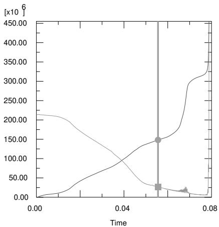

默认情况下，时间追踪器线和符号使用您为当前会话选择的高亮方法进行显示；有关更多信息，请参阅选择高亮方法。但是，您可以通过更改时间追踪器线的颜色、粗细和样式，以及时间追踪器符号的颜色、形状和大小来自定义其外观。或者，您也可以完全抑制任一时间追踪器组件。默认高亮方法能提供最佳性能。


## 注意：

这些线和符号选项仅控制时间追踪器的外观。您还可以自定义用于显示 X-Y 曲线本身的线和符号；请参阅自定义 X-Y 曲线的外观。

1.  定位 XY 选项。  
    在提示区域，单击“动画选项(Animation Options)”；然后在出现的对话框中单击“XY”选项卡。

2.  如果您想自定义 X-Y 绘图时间追踪器的外观，请关闭“使用高亮方法绘制(Draw using highlight method)”开关。

3.  切换“显示线条(Show line)”以显示或隐藏时间追踪器线。  
    当“显示线条(Show line)”处于开启状态时，时间追踪器线会被显示，并且线条属性选项将启用。

4.  选择时间追踪器线样式：

    a. 单击“样式(Style)”按钮以显示线型选项（实线、虚线等）。

    b. 从样式列表中，单击所需的线型。

    指定的线型将出现在“样式(Style)”按钮上。

5.  选择时间追踪器线粗细：

    a. 单击“粗细(Thickness)”按钮以显示线粗细选项。  
    b. 从粗细列表中，单击所需的线粗细。  
    指定的粗细将出现在“粗细(Thickness)”按钮上。

6.  选择时间追踪器线颜色：

    a. 单击颜色样本。

    Abaqus/CAE 将显示“选择颜色(Select Color)”对话框。

    b. 使用“选择颜色(Select Color)”对话框中的一种方法选择新颜色。有关更多信息，请参阅自定义颜色。

    c. 单击“确定(OK)”关闭“选择颜色(Select Color)”对话框。

    颜色样本将更改为所选颜色。

7.  切换“显示符号(Show symbol)”以显示或隐藏代表每条所选 X-Y 曲线数据点当前值的符号。

    当“显示符号(Show symbol)”处于开启状态时，符号会被显示，并且符号属性将启用。

8.  选择符号：

    a. 单击“符号(Symbol)”按钮以显示符号选择列表。  
    b. 从符号列表中，单击所需的符号。  
    指定的符号将出现在“符号(Symbol)”按钮上。

9.  选择时间追踪器符号颜色：

    a. 单击颜色样本。

    Abaqus/CAE 将显示“选择颜色(Select Color)”对话框。

    b. 使用“选择颜色(Select Color)”对话框中的一种方法选择新颜色。有关更多信息，请参阅自定义颜色。

    c. 单击“确定(OK)”关闭“选择颜色(Select Color)”对话框。

    颜色样本将更改为所选颜色。

10. 选择时间追踪器符号大小：

    a. 单击“大小(Size)”按钮以显示符号大小选项。  
    b. 从符号大小选项中，单击所需的符号大小。  
    指定的符号大小将出现在“大小(Size)”按钮上。

11. 单击“应用(Apply)”。

    当前视图口将显示您选择的颜色、粗细、样式和符号。

## 附加信息

• 自定义同步视图口的时间历程

## 控制多个视图口中的动画

默认情况下，Abaqus/CAE 会动画化会话中所有支持动画的视图口中的数据。所有动画都是同步的，因此当您逐帧检查数据、动画化模型绘图或动画化时间相关的 X-Y 绘图时，这些视图口会一起播放、停止和递增。

您可以激活和停用单个视图口的动画，这使您能够仅为会话中支持动画的视图口的一个子集显示动画。从“链接视图口管理器(Linked Viewports Manager)”中，打开“链接视图口(Link viewports)”和“动画(Animation)”开关，并使用“链接视图口管理器(Linked Viewports Manager)”的“链接视图口(Linked Viewports)”部分来取消选择您希望保持独立的视图口。

1.  使用以下方法之一链接视图口：

    • 从主菜单中，选择“视图口(Viewport)->链接视图口(Link Viewports)”。

    

    提示：您可以通过单击“视图口”工具栏中的按钮来激活或停用链接的视图口。

    • 从主菜单中，选择“视图口(Viewport)->链接视图口管理器(Linked Viewports Manager)”并打开“链接视图口(Link viewports)”开关。

    

    提示：您也可以通过单击“视图口”工具栏中的按钮来显示“链接视图口管理器(Linked Viewports Manager)”。

2.  在“链接视图口管理器(Linked Viewports Manager)”中，确保“动画(Animation)”已打开，并且在“链接视图口(Linked Viewports)”表中选择了所需的视图口。  
3.  如果您在“链接视图口管理器”中进行了更改，请单击“应用(Apply)”。或者，单击“确定(OK)”以应用您的更改并关闭管理器。  
4.  使用任何方法启动时间历程、比例因子和简谐动画。

## 附加信息

• 自定义同步视图口的时间历程

## 自定义同步视图口的时间历程

时间历程设置控制当您显示时间历程动画时，Abaqus/CAE 使用基于帧的历程还是基于时间的历程。基于帧的同步允许所有同步的视图口一次递增一帧，而基于时间的同步允许视图口根据公共时间线显示数据。

当您选择基于时间的动画时，您还可以自定义公共时间线的三个方面：

•   时间步长，控制每次递增数据显示时经过的时间量。  
•   最小时间，这是将包含数据的最早点。如果自动计算最小时间，Abaqus/CAE 将包含从公共时间线开始处起的数据。  
•   最大时间，这是将包含数据的最晚点。如果自动计算最大时间，Abaqus/CAE 将包含直到公共时间线结束处的数据。

1.  找到“时间历程(Time History)”选项。  
    在提示区域，单击“动画选项(Animation Options)”；然后在出现的对话框中单击“时间历程(Time History)”选项卡。  
2.  从页面顶部的选项中，选择“基于帧(Frame-based)”或“基于时间(Time-based)”。  
3.  如果需要，更改“时间增量(Time increment)”值。时间增量仅适用于基于时间的动画。  
4.  如果需要，通过在相应的“指定(Specify)”字段中输入值来自定义“最小时间(Min time)”和“最大时间(Max time)”。这些值仅适用于基于时间的动画。  
5.  单击“应用(Apply)”。

## 附加信息

• 更改分析步的周期  
• 控制多个视图口中的动画

## 在可视化模块中查询模型

本节说明如何使用查询工具集获取有关网格的常规信息和特定的可视化模块信息。

## 本节内容：

理解可视化模块中的查询工具集  
使用查询工具集

## 理解可视化模块中的查询工具集

查询工具集允许您获取有关模型的常规信息。

可视化模块在消息区域显示请求的信息，并且相同的信息会写入重放文件。

从主菜单栏选择“工具(Tools)->查询(Query)”，或从查询工具集中选择工具以使用查询工具集。“常规查询(General Queries)”下的项目提供以下信息：
## 节点（Node）

您可以获取所选节点的标签、变形和未变形坐标以及位移信息。您还可以选择一个局部坐标系（Local CSYS）来显示坐标。

## 距离（Distance）

您可以获取两个所选节点之间的未变形和变形距离，以及节点间的相对位移。您还可以选择一个局部坐标系来显示拾取点的坐标和结果分量。

## 角度（Angle）

• 您可以获取三个所选节点形成的未变形和变形角度。您选择的第二个节点是该角度的顶点。
• 您可以获取两条边、两个面或一条边与一个面之间的夹角。

## 单元（Element）

您可以获取所选单元的网格类型、材料、截面、连接关系以及积分点位置的当前场输出变量。此查询仅在选择输出数据库时可用。

## 网格（Mesh）

您可以获取当前输出数据库的名称、模型中的节点和单元数量以及单元类型。

## 质量属性（Mass properties）

您可以获取输出数据库中整个模型或部分模型的基本质量属性。在Visualization模块中，质量属性总是基于模型数据（未变形形状）计算。此查询仅在选择输出数据库时可用。Abaqus/CAE将返回以下信息：

体积（Volume）  
• 体积质心（Volume centroid）  
• 质量（Mass）  
• 质心（Center of mass）  
• 关于质心或指定点的惯性矩（Moments of inertia about the center of mass or about a specified point）

## 单元面法向（Element face normal）

您可以获取单元面的表面法向分量。您可以选择一个局部坐标系来显示法向。

## 高级距离（Advanced distance）

常规距离查询允许您查找两个选定单个实体之间的距离，而高级距离查询则允许您查找实体组之间的最小距离。这些实体可以是节点、单元、顶点、边、面或体，您可以从视口或通过集合选择它们。您可以选择一个局部坐标系来显示最近点的坐标和结果分量。

有关一般模型查询的更多信息，请参见在Visualization模块中查询模型。

Visualization模块查询（Visualization Module Queries）下的项目提供以下信息：

## 探测值（Probe values）

当您将光标移过当前视口时，Abaqus/CAE会在探测值（Probe Values）对话框中显示信息。探测模型图会显示模型数据和分析结果；探测X-Y图会显示X-Y曲线数据。有关探测的更多信息，请参见探测模型。

## 应力线性化（Stress linearization）

应力线性化是将通过截面的应力分解为恒定的膜应力和线性弯曲应力的过程。Abaqus执行应力线性化计算并以X-Y图的形式显示结果。应力线性化仅对输出数据库可用。有关应力线性化的更多信息，请参见计算线性化应力。

## 活动单元和节点（Active elements and nodes）

Abaqus/CAE显示当前视口中所有活动节点或活动单元的标签编号。更多信息，请参见查询活动节点或单元标签。

## 铺层堆叠图（Ply stack plot）

Abaqus/CAE创建一个新视口并显示复合材料铺层的代表性图像。该图像显示铺层中的铺层以及每个铺层的详细信息，例如其纤维方向、厚度、参考平面和积分点。铺层堆叠图仅对输出数据库可用。更多信息，请参见查看铺层堆叠图。

• 探测模型（Probing the model）
• 计算线性化应力（Calculating linearized stresses）
• 查看铺层堆叠图（Viewing a ply stack plot）

## 使用查询工具集（Using the Query toolset）

您可以使用查询工具集（Query toolset）来获取一般模型信息。

## 本节内容：

在Visualization模块中查询模型（Querying the model in the Visualization module）
查询活动节点或单元标签（Querying active node or element labels）

## 在Visualization模块中查询模型

1.  找到查询（Query）对话框。
    从主菜单栏中，选择工具（Tools）->查询（Query），或单击查询工具集中的工具。查询（Query）对话框随即出现。

2.  要获取特定节点的信息，请执行以下操作：
    a. 从查询（Query）对话框的通用查询（General Queries）字段中选择节点（Node）。
       Abaqus/CAE在提示区显示一条提示。
    b. 从视口中选择一个节点。
       该节点的未变形和变形X、Y、Z坐标以及节点位移出现在信息区。出现在信息区的相同信息也会写入重放文件。
    c. 从视口中选择一个局部坐标系（Local CSYS）以在局部坐标系中显示节点坐标。如果未选择局部坐标系，节点坐标将在全局笛卡尔坐标系中显示。


## 注意：

要调整信息区的大小，请拖动其上边缘；要查看已滚动出信息区的信息，请使用右侧的滚动条。

3.  要获取两个节点之间的距离信息，请执行以下操作：
    a. 从查询（Query）对话框的通用查询（General Queries）字段中选择距离（Distance）。
       Abaqus/CAE在提示区显示一条提示。
    b. 从视口中选择两个节点。
       以下信息出现在信息区：
       • 每个节点的未变形和变形X、Y、Z坐标以及节点位移。
       • 节点之间的绝对未变形距离和变形距离。
       • 两个节点之间未变形和变形向量的X、Y、Z分量。
       • 节点之间的绝对相对位移。
       • 两个节点之间相对位移的X、Y、Z分量。
    c. 从视口中选择一个局部坐标系，以在局部坐标系中显示拾取节点的坐标和结果分量。将使用最后选择的坐标系进行计算。如果未选择任何局部坐标系，结果将在全局笛卡尔坐标系中显示。

4.  要获取角度信息，请从查询（Query）对话框的通用查询（General Queries）字段中选择角度（Angle），然后从提示区选择3个节点（3 Nodes）或面/边（Face/Edge）。
    • 如果您选择了3个节点（3 Nodes），请从视口中选择三个节点。您选择的第二个节点是该角度的顶点。
      以下信息出现在信息区：
      每个节点的未变形和变形X、Y、Z坐标以及节点位移。
      - 节点之间的绝对未变形角度和变形角度。
    • 如果您选择了面/边（Face/Edge），请选择两个面或两条边，或者选择一个面和一条边。所选面/边之间的夹角显示在信息区。

5.  要获取输出数据库中特定单元的信息，请执行以下操作：
    a. 从查询（Query）对话框的通用查询（General Queries）字段中选择单元（Element）。
       Abaqus/CAE在提示区显示一条提示。
    b. 从视口中选择一个单元。
       以下信息出现在信息区：
       • 单元的标签、单元类型、材料和截面。
       • 连接单元的标签。
       • 积分点位置的当前场输出变量。

6.  要获取网格的一般信息，请从查询（Query）对话框的通用查询（General Queries）字段中选择网格（Mesh）。
    以下信息出现在信息区：
    • 当前输出数据库的名称。
    • 节点数量。
    • 单元数量。
    • 单元类型。

7.  要获取输出数据库中质量属性的一般信息，请执行以下操作：
    a. 从查询（Query）对话框的通用查询（General Queries）字段中选择质量属性（Mass properties）。
       Abaqus/CAE在提示区显示一条提示，用于上次使用的选择方法，或者如果这是当前会话中第一次使用质量属性查询，则显示“所有单元（All elements）”。
    b. 从提示区的列表中选择以下选择方法之一：
       • 所有单元（All elements）
       • 从视口选择单元（Select elements from viewport）
       • 部件实例（Part instances）
       • 单元集（Element sets）
       • 截面（Sections）
       • 材料（Materials）
       • 单元类型（Element types）
       • 显示组（Display groups）
       Abaqus/CAE会根据您选择的选择方法在提示区显示额外的选择字段。
    c. 如下完成您的选择：
       • 如果您在上一步中选择的是所有单元（All elements），请单击完成（Done）以执行查询。
         如果您在上一步中选择的是从视口选择单元（Select elements from viewport），请从视口中进行选择（更多信息，请参见“在视口中选择对象”）。您可以在提示区选择一个部件实例并输入单个单元编号以获取该单元的质量信息。
         对于其余的选择方法，请从提示区的列表中选择部件实例、单元集、截面、材料、单元类型或显示组名称，或从视口中进行选择。
         当您从提示区选择一个对象或当您单击完成（Done）以完成视口选择时，Abaqus/CAE会在信息区显示您所选内容的质量属性。
d. 如果您的选择中有任何项目密度或厚度定义不当，请单击提示区域中的“选项”以显示“质量属性查询选项”对话框，并指定一个值供 Abaqus/CAE 替换未定义的量。

在对话框中单击“确定”以保存输入并关闭对话框，或单击“重置”以恢复到之前的设置。

Abaqus/CAE 会在消息区域显示所选项目的质量属性。可用的属性如下：

• 表面积（仅用于壳单元）  
• 面积中心  
• 体积  
• 体积中心  
• 质量  
• 质心  
• 关于质心或指定点的惯性矩

8. 要获取表面法向分量，请执行以下操作：

a. 从“查询”对话框的“常规查询”字段中选择“单元面法向”。

   Abaqus/CAE 在提示区域显示提示。

b. 在视口中选择一个单元面，然后单击“完成”。

   该单元面在全局笛卡尔坐标系中的表面法向分量将出现在消息区域。

c. 从视口中选择一个局部坐标系（CSYS）以在局部坐标系中显示表面法向分量。如果未选择任何局部坐标系，表面法向分量将在全局笛卡尔系统中显示。

   如果您在未变形形状和变形形状上查询同一单元面，表面法向分量将会不同。

9. 完成信息请求后，关闭“查询”对话框。

## 附加信息

• 理解可视化模块中的查询工具集  
• 查询质量属性

## 查询活动节点或单元标签

您可以使用查询工具集来请求当前视口中所有活动节点或活动单元的标签编号。活动节点和单元是当前显示组中的实体，减去任何因活动视图剖分而从显示中移除的实体。Abaqus/CAE 会在提示区域显示每个适用零件实例的标签编号，并将标签编号打印到重播文件中。

当您请求活动节点或单元时，Abaqus/CAE 仅显示标签编号；它不提供任何其他节点或单元数据及结果。要显示有关单个节点或单元的更多信息，请分别参见“探测节点”或“探测单元”。

1.  定位可视化模块查询选项。

    从主菜单栏中，选择“工具”->“查询”，或单击查询工具集中的工具。将出现“查询”对话框，“可视化模块查询”显示在对话框的下部。

2.  单击“活动节点”或“活动单元”。

    在提示区域，Abaqus/CAE 会列出模型中每个零件实例的所有活动节点或活动单元的标签列表。

## 附加信息

• 探测节点  
• 探测单元

## 探测模型

本章解释如何使用可视化模块中的查询工具集来探测模型图和 X-Y 图以获取输出数据，以及探测 Abaqus/CAE 模型以获取属性值。

有关将选定的探测值写入文件的信息，请参见生成表格数据报告。

## 本节内容：

理解探测  
使用查询工具集探测模型

## 理解探测

本节解释探测模型图和 X-Y 图。

当您在可视化模块工具箱中单击工具时，Abaqus/CAE 进入探测模式，并在您将光标移过当前视口中的模型时，在“探测值”对话框中显示信息。您也可以使用查询工具栏中的工具进入探测模式。探测模型图会显示模型数据和分析结果；探测 X-Y 图会显示 X-Y 曲线数据；从当前模型数据库探测模型会显示模型数据以及诸如载荷和预定义场等属性的值。您可以将此信息写入文件。

“探测值”对话框底部的数据表包含两个动态显示行（行标题正上方的行和表中首先出现的粗体数据行）以及一系列额外的存储行。Abaqus/CAE 会持续更新动态行，以在您将光标移过当前视口中的模型时显示探测值，并且您可以通过单击列标题来更改顶部显示行中显示的值。Abaqus/CAE 仅在您通过在视口中单击、指定节点或单元标签，或选择特定显示组中的节点或单元来选择感兴趣的值时，才会用额外的行更新表。值会累积在对话框的底部区域，直到您删除它们、清除表或取消探测模式。您还可以将选定的值添加到新的显示组，并且可以使用该位置的场输出值标注单个节点或单元。

## 模型或模型图的探测

如果当前视口包含模型图（未变形图、变形图、等值线图、符号图或材料方向图）或来自当前模型数据库的模型，Abaqus/CAE 允许您探测所选模型或输出数据库的结果。“探测值”对话框标识 Abaqus/CAE 将获取值的分析步、帧和场输出变量。要了解如何更改分析步、帧或场输出变量，请参见“选择结果分析步和帧”以及“选择主场输出变量”。

当您探测三维壳或复合实体的模型图时，Abaqus/CAE 返回的结果取决于您在“截面点”对话框中选择的活动位置。当活动位置设置为“顶部”时，Abaqus/CAE 返回顶部位置截面点的结果；当活动位置设置为“底部”或“顶部和底部”时，返回底部位置截面点的结果。有关截面点的更多信息，请参见“选择截面点数据”。

对于模型图，您可以选择获取基于节点或基于单元的数据和结果，如下所示：

## 探测节点

当您选择探测节点并将光标置于当前视口中的节点位置时，Abaqus/CAE 会高亮显示该节点，并在数据表中显示以下关于该节点的信息：

• 节点的标签，  
• 节点的原始坐标，  
• 节点的变形坐标（使用当前变形场输出变量），  
• 共享该节点的单元，以及  
• 当前场输出变量（如果当前场输出变量是张量或矢量，则包括分量值）。如果在当前视口中选择了模型，当前场输出变量将反映所选节点处模型属性（如载荷）的值。

无论当前主变量最初是保存在输出数据库的节点、中心点还是积分点位置，您都可以在节点显示场输出。Abaqus/CAE 通过根据您选择的选项外推到节点并进行平均，来为中心点和积分点数据计算节点值。如果节点引用了未平均的单元数据，则与该被探测节点相关的所有单元数据都将被显示。有关平均的更多信息，请参见“理解结果值平均”。

您还可以显示或隐藏在视口中为您选择的每个节点出现的标注。探测标注显示节点的标签以及该节点处当前场输出变量的结果。您可以自定义探测标注文本的字体和颜色。

## 探测单元

当您选择探测单元并将光标置于当前视口中的单元上时，Abaqus/CAE 会高亮显示该单元，并在数据表中显示以下关于该单元的信息：

• 单元的标签，  
• 单元的连接性，以及  
• 当前场输出变量（如果当前场输出变量是张量或矢量，则包括分量值）。如果在当前视口中选择了模型，当前场输出变量将反映所选单元处模型属性（如载荷）的值。

仅当当前主变量是基于单元的变量（如应力或应变）时，您才可以在单元显示场输出。您可以选择计算场输出结果的输出位置：积分点、中心点、单元节点或单元面。对于这些输出位置中的每一个，Abaqus/CAE 都是基于逐个单元计算探测结果，不进行平均。

您还可以显示或隐藏在视口中为您选择的每个单元出现的标注。探测标注显示单元的标签以及该单元处当前场输出变量的结果。您可以自定义探测标注文本的字体和颜色。

无论模型的渲染样式如何，只有可见的单元才能被探测。如有必要，您可以创建显示组或使用视图剖分来显示原本不可用的内部单元。
当单元被裂纹贯穿时，裂纹单元将分裂为两部分，每一部分均由一个实域和一个虚域组成。当您探测裂纹单元时，仅会报告来自单元其中一部分的贡献。更多信息，请参阅可视化部分。

## X–Y 图探针

如果当前视口包含一个 X–Y 图，Abaqus/CAE 将显示探针值作为 X–Y 图例文本、曲线中每个点的序列标识符以及曲线点的 X 和 Y 坐标。您可以选择仅显示构成 X–Y 数据对象的曲线点，或通过插值来显示曲线上的任意点。如果 X–Y 数据名称与 X–Y 图例文本不同，则“探针值”对话框中的“图例”值将显示 X–Y 数据名称加在图例文本之前。更多信息，请参阅探测 X–Y 图。

## 使用查询工具集探测模型

您可以使用查询工具集来探测模型和 X–Y 图，并将得到的探针值写入文件。

有关将选定的探针值写入文件的信息，请参阅生成表格数据报告。

## 本节内容：

使用探针选项  
探测节点  
探测单元  
探测 X–Y 图

## 使用探针选项

您可以使用查询工具集中的探针选项来指定在探测模型或 X–Y 图时希望获取的值。

在可视化模块工具箱中点击以访问“探针值”对话框。使用此对话框中的选项来控制当前视口中的探测行为。

## 获取来自当前模型数据库的模型数据

使用“场输出”对话框选择步骤和场输出变量。对于模型数据，您选择的场输出变量实际上是模型中某个属性的值，例如载荷或预定义场。

## 获取模型图数据

使用“场输出”对话框选择步骤、帧和场输出变量。使用“结果选项”对话框选择控制探针数据和 Abaqus/CAE 显示结果的计算方法。

## 获取模型和 X–Y 图数据

使用“探针值”选项选择您在探测时希望获取的信息类型。

## 附加信息

• 探测节点  
• 探测单元  
• 探测 X–Y 图

## 探测节点

您可以使用查询工具集来获取节点数据，以及选定模型中的属性值或选定模型图的分析结果。当您将光标置于当前视口中模型或模型图上的某个节点上时，Abaqus/CAE 会高亮显示该节点。您可以选择在数据表中显示关于该节点的以下信息：

• 节点的标签，  
• 节点的原始坐标，  
• 节点的变形坐标（使用当前变形场输出变量），  
• 共享该节点的单元，以及  
• 当前场输出变量（如果当前场输出变量是张量或矢量，则包括分量值）。如果当前视口中选中了模型，则当前场输出变量反映所选节点处模型属性（如载荷）的值。


## 注意：

您可以通过在数据表中单击鼠标右键，选择“编辑可见列”，并在出现的对话框中切换任何列的显示状态来显示或隐藏表中的列。

您也可以通过直接输入节点标签来获取节点数据，并且可以获取包含在所选显示组中的所有节点的数据。这些方法使您无需将光标定位到模型图上的位置即可探测节点数据。

当您将节点添加到数据表时，可以勾选该行的复选框以在视口中为该节点显示探针注释，或者可以勾选标题行中的复选框以显示所有选定节点的探针注释。探针注释会显示节点的标签以及该节点在当前场输出变量下的结果。您可以自定义注释文本的字体和颜色。

为了帮助在视口中定位节点，您可能需要在使用查询工具集之前生成一个显示节点符号的模型图。更多信息，请参阅自定义节点符号。

1. 定位“探针值”对话框。

   在可视化模块工具箱中，点击

   

   “探针值”对话框随即出现。

2. 选择控制探针数据和 Abaqus/CAE 将显示结果的步骤、帧、场输出变量和结果选项。如果您正在探测来自当前模型数据库的数据，则帧选择不可用，并且您选择的场输出变量是当前视口中显示模型的属性。

   在“探针值”对话框中，“场输出”字段标识当前的步骤、帧和场输出变量。

   • 要更改步骤或帧，请点击 $= \sqrt { 4 0 }$  
   $\fallingdotseq$ • 要更改场输出变量，请点击。  
   • 要更改结果选项，请从主菜单选择“结果”->“选项”。

3. 在对话框的“探针值”部分，执行以下操作：

   a. 点击“探针”箭头，然后选择“节点”。

   b. 如果当前主输出变量是张量或矢量变量，请点击“分量”箭头并执行以下任一操作：
      对于张量变量，选择“已选”仅显示变量的选定分量，选择“所有直接”在查询中包含张量变量的所有直接分量，或选择“所有主不变量”在查询中包含张量变量的所有主不变量。  
      • 对于矢量变量，选择“已选”仅显示变量的选定分量，或选择“全部”在查询中包含矢量张量变量的所有分量。

   

   ## 注意：

   如果您为张量变量选择“所有直接”或“所有主不变量”选项，则结果平均选项“计算标量前先平均”无效；标量或不变量始终在平均之后计算。

   可用的节点信息类型显示在数据表的列中。

4. 在数据表的任意位置点击鼠标右键，从出现的列表中选择“编辑可见列”，并勾选您希望作为列显示在数据表中的节点信息类型。

   当勾选所需的信息类型时，Abaqus/CAE 会将该类型数据作为一列显示在数据表中。但是，所有列，无论可见与否，都会包含在探针值输出文件中。

   

   ## 注意：

   场输出仅在当前主变量是基于单元的变量（如应力或应变）时可用。

5. 要指定要探测的节点，请选择“从视口选择”、“键入标签”或“选择显示组”，并使用以下技术之一：

   直接从视口选择节点：
   a. 将光标移动到探测当前视口中的模型图。  
   当您将光标置于某个节点上时，Abaqus/CAE 会在数据表的第一行显示您所请求项目的值。  
   b. 要选择和累积感兴趣的值，并允许随后将这些值写入文件，请在将光标置于节点上时单击鼠标左键。  
   Abaqus/CAE 会将数据表第一行的数据存储到数据表的存储行中。

   直接将节点标签输入到表中：
   a. 点击“部件实例”箭头，然后选择您要从中选择节点标签的部件实例。  
   b. 输入您要包含的一个或多个节点标签。您可以通过用逗号分隔它们来同时指定多个节点标签。

   选择包含在显示组中的节点：
   a. 点击“显示组”箭头，然后选择包含您要纳入查询的节点的显示组。  
   如果更改了显示组的选择，Abaqus/CAE 会用新选中的显示组中的节点替换数据表的内容。  
   b. 如果需要，可以通过从视口选择或通过节点标签键入来将额外的节点追加到您的列表中。

6. 重复节点选择步骤，直到“探针值”对话框中的数据表包含您想要查询的所有节点。  
7. 要从数据表中删除数据或清除或排序表格，请点击鼠标右键。更多信息，请参阅输入表格数据。  
8. 要使用数据表中的节点创建显示组，请执行以下操作：

   a. 在数据表中点击鼠标右键，并从出现的菜单中选择“创建显示组”。

      “创建显示组”对话框随即出现。

   b. 为新的显示组输入一个名称，然后点击“确定”。

9. 要为数据表中的任何节点显示探针注释，请勾选对应于您要注释的节点所在行的复选框，或勾选标题行中的复选框以显示所有选定节点的探针注释。


## 注意：

您可以在通用绘图选项对话框中自定义节点探测标注的颜色和字体。更多信息，请参阅使用通用绘图选项。

10. 要保存您选择的数据，请单击写入文件。更多信息，请参阅生成表格数据报告。
11. 要退出探测模式，请执行以下任一操作：
    * 单击提示区域中的取消按钮。
    * 单击探测值对话框中的取消。
    * 单击鼠标键 2。
    * 生成其他模式（例如未变形模式、变形模式）下的绘图。

## 附加信息
* 控制结果平均
* 模型或模型绘图的探测
* 探测单元
* 查询活动节点或单元标签

## 探测单元

您可以使用查询工具集获取单元数据以及所选模型中的属性值或所选模型绘图的分析结果。当您将光标置于当前视口中模型或模型绘图的单元上时，Abaqus/CAE 会高亮显示该单元。您可以选择在数据表中显示以下关于该单元的信息：
* 单元的标签，
* 单元的连接性，以及
当前的场输出变量（如果当前的场输出变量是张量或矢量，则包括分量值）。如果在当前视口中选择了一个模型，则当前的场输出变量将反映所选单元处模型属性（如载荷）的值。

您也可以通过直接输入单元标签来获取单元数据，并且可以获取所选显示组中包含的所有单元的数据。这些方法使您无需将光标置于模型绘图中的单元位置即可探测其数据。

只有外部单元可以被查询。如有必要，您可以创建一个显示组或使用视图切割来显示原本不可用的内部单元。更多信息，请参阅使用显示组显示模型的子集。

当您将单元添加到数据表时，您可以切换该行的复选框以在视口中为该单元显示探测标注，或者切换标题行的复选框以显示所有选中单元的探测标注。探测标注显示单元的标签以及当前场输出变量在该单元处的结果。您可以自定义标注文本的字体和颜色。

为了帮助在视口中定位单元，您可能希望在使用查询工具集之前生成一个所有单元边都可见的模型绘图。更多信息，请参阅控制单元和曲面边的可见性。

1.  找到探测值对话框。
    在可视化模块工具箱中，单击
    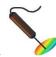
    探测值对话框随即出现。

2.  选择 Abaqus/CAE 将获取其值的步骤、帧和场输出变量。如果您正在探测来自当前模型数据库的数据，则帧选择不可用，并且您选择的场输出变量是当前视口中显示的模型的一个属性。
    在探测值对话框中，场输出字段标识了当前的步骤、帧和场输出变量。
    * 要更改步骤或帧，请单击 。
    * 要更改场输出变量，请单击 。
    * 要更改结果选项，请从主菜单栏中选择结果->选项。

3.  在对话框的探测值部分，执行以下操作：
    a. 单击探测箭头，并选择单元。
    b. 如果当前主输出变量是张量或矢量变量，请单击分量箭头，并执行以下任一操作：
        * 对于张量变量，选择“已选”仅显示变量的所选分量，选择“所有直接”在查询中包含张量变量的所有直接分量，或选择“所有主值”在查询中包含张量变量的所有主不变量。
        * 对于矢量变量，选择“已选”仅显示变量的所选分量，或选择“所有”在查询中包含矢量张量变量的所有分量。
    c. 要选择显示场输出变量的输出位置，请单击位置箭头，并选择积分点、质心、单元节点或单元面。
        
        **注意：**
        如果您为张量变量选择了“所有直接”或“所有主值”选项，并且选择了“单元节点”输出位置，则结果平均选项“平均前计算标量”无效；标量或不变量总是在平均后计算。
    可用的单元信息类型显示在数据表的列中。

4.  在数据表的任意位置单击鼠标键 3，从出现的列表中选择编辑可见列，并切换您想要在数据表中显示为列的单元信息类型。
    当所需信息类型被切换开启时，Abaqus/CAE 会将该类型数据显示为数据表中的一列。然而，所有列（无论可见与否）都将包含在探测值输出文件中。
    
    **注意：**
    只有当当前主变量是基于单元的变量（如应力或应变）时，场输出才可用。

5.  要选择您想要探测的单元，请选择“从视口选择”、“键入标签”或“选择显示组”，并使用以下技术之一：
    * 从视口直接选择单元：
        a. 移动光标以探测当前视口中的模型绘图。
            当您将光标置于某个单元上时，Abaqus/CAE 会在探测值对话框数据表的第一行中显示您所请求项目。
        b. 要选择并积累感兴趣的值，并允许后续将这些值写入文件，请在将光标置于某个单元上时单击鼠标键 1。
            Abaqus/CAE 会将数据表第一行的数据存储到数据表的存储行中。
    * 直接在表中输入单元标签：
        a. 单击部件实例箭头，然后选择您想要从中选择单元标签的部件实例。
        b. 输入单元标签或标签。您可以通过用逗号分隔来同时指定多个单元标签。
    * 选择包含在显示组中的单元：
        a. 单击显示组箭头，然后选择包含您想要包含在查询中的单元的显示组。
            
            **注意：**
            如果您更改了显示组的选择，Abaqus/CAE 会用新选中的显示组中的单元替换数据表的内容。如果您想向列表中追加其他单元，必须从视口选择它们或通过单元标签键入。

6.  重复单元选择步骤，直到探测值对话框中的数据表包含您想要查询的所有单元。

7.  要从数据表中删除数据或清除或排序表格，请单击鼠标键 3。更多信息，请参阅输入表格数据。

8.  要使用数据表中的单元创建显示组，请执行以下操作：
    a. 在数据表中单击鼠标键 3，然后从出现的菜单中选择创建显示组。
        创建显示组对话框随即出现。
    b. 输入新显示组的名称，然后单击确定。

9.  要为数据表中的任何单元显示探测标注，请切换与您想要标注的单元相对应行的复选框，或切换标题行的复选框以显示所有选中单元的探测标注。
    
    **注意：**
    您可以在通用绘图选项对话框中自定义单元探测标注的颜色和字体。更多信息，请参阅使用通用绘图选项。

10. 要保存您选择的数据，请单击写入文件。更多信息，请参阅生成表格数据报告。
11. 要退出探测模式，请执行以下任一操作：
    * 单击提示区域中的取消按钮。
    * 单击探测值对话框中的取消。
    * 单击鼠标键 2。
    * 生成其他模式（例如未变形模式、变形模式）下的绘图。

## 附加信息
* 控制结果平均
* 模型或模型绘图的探测
* 探测节点
* 查询活动节点或单元标签

## 探测 X–Y 图

您可以使用查询工具集获取有关 X–Y 图中曲线的信息。
当您将光标置于当前视口中的 X–Y 曲线上时，Abaqus/CAE 会高亮显示最近的曲线点，并在探测值对话框中显示曲线图例文本、点的序列标识以及该点的 X 和 Y 坐标。Abaqus/CAE 还会用一个符号高亮显示所选曲线点，并在符号旁边显示该曲线点的 X 和 Y 坐标。这些符号和坐标会保留在 X–Y 图上，直到您退出探测模式。您可以选择仅显示构成 X–Y 数据对象的曲线点，或通过插值显示曲线上的任意点。
在探针模式下选择一个点时，Abaqus/CAE 会将当前点的图例文本、序列标识以及 X 和 Y 坐标添加到数据表中，该表显示在探针值（Probe Values）对话框的底部。您可以清除或排序此表、删除单个行，并将这些数据写入文件。如果 X–Y 数据名称与 X–Y 曲线图例文本不同，则探针值（Probe Values）对话框中的图例（Legend）值会显示 X–Y 数据名称，后跟图例文本。

当探针模式处于活动状态时，Abaqus/CAE 还会通过沿 X 和 Y 轴运行的箭头来跟踪光标在 X–Y 图中的位置。这些箭头分别跟踪光标的当前 X 和 Y 位置，使您能够更精确地选择曲线点。

为了帮助定位 X 和 Y 数据点，您可能希望在使用查询工具集之前生成一个显示曲线符号的 X–Y 图。有关更多信息，请参阅自定义 X–Y 曲线上使用的符号。

1.  定位探针值（Probe Values）对话框。

    在可视化模块（Visualization module）工具箱中，单击 。将出现探针值（Probe Values）对话框。

2.  在对话框顶部，切换**在点之间插值（Interpolate between points）**以启用或禁用沿曲线任意点的探针值显示。

    启用插值时，Abaqus/CAE 通过在括号中列出包围的 X–Y 数据对象点来显示任意点的序列标识。

3.  选择您希望包含在查询中的信息类型。

    在数据表的任意位置单击鼠标键 3，从出现的列表中选择**编辑可见列（Edit Visible Columns）**，并切换开启您希望包含在查询中并作为列显示在数据表中的信息类型。当某种信息类型被开启时，Abaqus/CAE 可以在所选单元的以下两个位置显示该类型的数据：当您在视口中将鼠标悬停在单元上或选择单元时显示在数据表中，以及显示在探针值输出文件中。

4.  移动光标以探测当前视口中的 X–Y 图。

    当您将光标定位在曲线点上时，Abaqus/CAE 会在曲线本身上显示当前点的 X 和 Y 坐标，并显示光标沿 X–Y 图 X 和 Y 轴的当前位置。

5.  要选择和累积感兴趣的值并允许后续将这些值写入文件，请在将光标定位在曲线点上时单击鼠标键 1。

    Abaqus/CAE 会将当前点的图例文本、序列标识以及 X 和 Y 坐标存储到数据表中。Abaqus/CAE 还会在视口中通过在您选择的曲线点放置一个符号并在该点旁显示 X 和 Y 坐标来标记您选择的点。

6.  要从数据表中删除数据或清除或排序表格，请单击鼠标键 3。有关更多信息，请参阅输入表格数据。

7.  要保存您选择的数据，请单击**写入文件（Write to File）**。有关更多信息，请参阅生成表格数据报告。

8.  要退出探针模式，请执行以下操作之一：

    -   在提示区（prompt area）单击取消（cancel）按钮。
    -   在探针值（Probe Values）对话框中单击**取消（Cancel）**。
    -   单击鼠标键 2。
    -   在其他模式（例如，未变形模式、变形模式）下生成图。

## 附加信息

• X–Y 图探针

线性化应力的计算是高级 Abaqus 用户的一项功能。它最常用于二维轴对称模型。

有关线性化应力结果量和所使用计算方法的详细信息，请参阅计算应力分量。

## 本节内容：

理解应力线性化  
应力线性化示例  
获取线性化应力结果

## 理解应力线性化

应力线性化是将通过一个截面的应力分离为恒定的膜应力和线性弯曲应力。应力线性化仅适用于输出数据库。

要在 Abaqus/CAE 中线性化应力，需使用以下过程：

-   您定义通过模型的一个截面。您可以通过选择模型中的节点、空间中的坐标或已保存的路径来指定截面的端点。
-   Abaqus/CAE 通过在两个端点之间插值来定义应力线，以获得沿直线的用户指定数量的等间距点。
    您可以将应力线保存为路径；保存的路径包括端点以及应力线上的每个间隔点。如果您将应力线保存为路径，Abaqus/CAE 始终会创建一个点列表路径，无论您用于定义端点的方法如何。
-   指定的应力结果在沿该线的等间距点处获得，使用由该线定义的局部坐标系。
-   Abaqus/CAE 执行应力线性化计算并将结果以 X–Y 图的形式显示。您可以选择保存数据和/或将其写入文件。

如果您跨多个部件实例进行应力线性化，对于存在于多个部件实例中的任何点，结果将被平均。

要获取沿一条线的线性化应力，请从主菜单栏选择**工具（Tools）->查询（Query）**，然后从可视化模块查询（Visualization Module Queries）选项中选择**应力线性化（Stress linearization）**。

## 本节内容：

定义应力线  
应力结果的提取

## 定义应力线

您可以通过选择模型中的节点、空间中的点或已保存的路径来定义要获取线性化应力的截面的端点。您可以通过直接从视口选择节点或输入节点标签来选择模型中的节点，并通过输入点坐标来定义空间中的点。如果您选择已保存的路径，Abaqus/CAE 会使用该路径的端点作为应力线的端点——路径上的其他点将被忽略。（有关路径的更多信息，请参阅沿路径查看结果。）

节点标签是引用部件实例中给定节点的持久方式；也就是说，节点标签不会随着模型的变形而改变。因此，如果您使用节点标签或已保存的节点列表路径来指定截面的端点，这些点将同样适用于未变形或变形的模型形状。然而，空间中的点保持固定，并且独立于您的模型。例如，在未变形形状上与节点位置重合的坐标可能不会与变形形状上的任何位置重合。如果您使用空间中的坐标、点列表路径或径向路径来指定截面的端点，请确保针对正确的形状指定坐标。边列表路径不能用于定义应力线。

为了获得轴对称模型的最佳结果，选择的端点应垂直于模型的内表面和外表面以及中平面（参见图 1）。

  
图 1：推荐的应力路径。

截面可以从一个表面延伸到另一个表面，也可以完全位于模型内部。截面还可以穿过多个部件实例。选择截面的端点时还应考虑以下准则：

-   避免穿越空间不连续性的路径。
-   避免沿分隔不连续性的直线设置路径。
-   在指定截面之前使用显示组来隔离单独的区域。

如果截面延伸穿过空间不连续性，例如部件实例中的孔或部件实例之间的间隙，将会给出错误消息。

在您选择截面的端点之后，您可以指定线应被分割成的段数，或者接受默认数量。Abaqus/CAE 通过在两个端点之间插值来定义应力线，以获得沿直线的指定数量的等间距点。

## 应力结果的提取

应力线上每个点的应力是通过使用结果选项（Result Options）对话框中定义的平均标准（有关指定平均标准的更多信息，请参阅控制结果平均）对唯一的节点应力值进行插值来获得的。Abaqus/CAE 使用由应力线定义的局部坐标系来获得应力结果。局部 x 轴沿应力线；它起源于应力线上的第一个点，并由连接应力线上第一个和第二个点的向量定义。局部 y 轴和 z 轴确定如下：

## 对于二维模型：

局部 y 轴是通过全局 z 轴与局部 x 轴的向量乘积获得的。局部 z 轴与全局 z 轴相同。

## 对于三维模型：

## 如果局部 x 轴平行于全局 y 轴：

如果正的局部 x 轴沿正的全局 y 轴方向，局部 y 轴将是全局 x 轴的负方向。如果正的局部 x 轴沿负的全局 y 轴方向，局部 y 轴将是全局 x 轴方向。局部 z 轴是通过局部 x 轴和局部 y 轴的向量乘积获得的。
## 如果局部 x 轴不与全局 y 轴平行：

局部 z 轴通过局部 x 轴与全局 y 轴的向量乘积获得。局部 y 轴通过局部 z 轴与局部 x 轴的向量乘积获得。

然后对这些应力进行线性化。对于非轴对称和轴对称模型，应力线性化的计算方法不同。有关这些计算的更多信息，请参阅计算应力分量。

Abaqus 以 X–Y 图表的形式显示线性化后的应力。每个应力分量呈现三条独立的曲线，分别代表：

1.  应力线上实际的应力分布。
2.  线性化的膜应力。
3.  线性化膜应力与线性化弯曲应力之和。

此外，每个应力分量的线性化应力输出以及线性化应力的应力不变量计算都会写入报告文件。

## 应力线性化示例

图 1 显示了为压力容器的轴对称模型定义的一条应力线的示例。

图 1：穿过压力容器轴对称模型的应力线。

应力线 Section\_A\_B 定义为穿过容器壁。图 2 和图 3 分别显示了用于对未变形模型形状的 S22 应力分量进行线性化的基本设置和计算。


图 2：应力线性化基本规格。


图 3：应力线性化计算。

当您在应力线性化对话框中点击 OK 或 Apply 时，Abaqus/CAE 会创建一个 S22 应力分量（方向垂直于应力线）以及所得线性化应力的 X–Y 图，如图 4 所示。


图 4：线性化应力图。

以下输出也会写入名为 linearStress.rpt 的文件中：

Statically Equivalent Linear Stress Distribution across a Section, written on Thu Sep 09 11:20:19 2010

Source

```txt
ODB: Job-1.odb
Step: Step-1
Frame: Increment      1: Step Time =   1.000
```

```txt
Linearized Stresses for stress line 'Section_A_B'
  Start point, Point 1 - (18.429651260376, 26.8930339813232, 0)
  End point, Point 2   - (22.0184745788574, 30.3756923675537, 0)
  Number of intervals  - 40
```
COMPONENT RESULTS

<table><tr><td></td><td>S11</td><td>S22</td><td>S33</td><td>S12</td></tr><tr><td>0</td><td>-462.376</td><td>1550.19</td><td>1450.75</td><td>74.7673</td></tr><tr><td>0.125021</td><td>-453.722</td><td>1542.06</td><td>1445.35</td><td>74.6265</td></tr><tr><td>0.250043</td><td>-445.068</td><td>1533.93</td><td>1439.95</td><td>74.4865</td></tr><tr><td>0.375064</td><td>-436.413</td><td>1525.8</td><td>1434.55</td><td>74.3473</td></tr><tr><td>0.500086</td><td>-427.759</td><td>1517.67</td><td>1429.15</td><td>74.2089</td></tr><tr><td>0.625107</td><td>-419.114</td><td>1509.55</td><td>1423.76</td><td>74.0714</td></tr><tr><td>0.750128</td><td>-410.46</td><td>1501.42</td><td>1418.36</td><td>73.9345</td></tr><tr><td>0.87515</td><td>-401.806</td><td>1493.3</td><td>1412.96</td><td>73.7983</td></tr><tr><td>1.00017</td><td>-393.152</td><td>1485.17</td><td>1407.56</td><td>73.663</td></tr><tr><td>1.12519</td><td>-384.497</td><td>1477.04</td><td>1402.16</td><td>73.5284</td></tr><tr><td>1.25021</td><td>-375.842</td><td>1468.92</td><td>1396.76</td><td>73.3946</td></tr><tr><td>1.37524</td><td>-367.187</td><td>1460.79</td><td>1391.37</td><td>73.2615</td></tr><tr><td>1.50026</td><td>-358.531</td><td>1452.67</td><td>1385.97</td><td>73.1293</td></tr><tr><td>1.62528</td><td>-348.574</td><td>1443.22</td><td>1379.7</td><td>72.8307</td></tr><tr><td>1.7503</td><td>-333.79</td><td>1428.85</td><td>1370.22</td><td>71.77</td></tr><tr><td>1.87532</td><td>-319.007</td><td>1414.48</td><td>1360.74</td><td>70.7052</td></tr><tr><td>2.00034</td><td>-304.227</td><td>1400.1</td><td>1351.26</td><td>69.6367</td></tr><tr><td>2.12536</td><td>-289.448</td><td>1385.72</td><td>1341.78</td><td>68.5648</td></tr><tr><td>2.25039</td><td>-274.656</td><td>1371.33</td><td>1332.29</td><td>67.4908</td></tr><tr><td>2.37541</td><td>-259.847</td><td>1356.91</td><td>1322.81</td><td>66.4061</td></tr><tr><td>2.50043</td><td>-245.037</td><td>1342.49</td><td>1313.32</td><td>65.3195</td></tr><tr><td>2.62545</td><td>-230.228</td><td>1328.07</td><td>1303.83</td><td>64.2284</td></tr><tr><td>2.75047</td><td>-215.421</td><td>1313.64</td><td>1294.34</td><td>63.1328</td></tr><tr><td>2.87549</td><td>-200.613</td><td>1299.2</td><td>1284.84</td><td>62.0327</td></tr><tr><td>3.00051</td><td>-185.807</td><td>1284.76</td><td>1275.34</td><td>60.9282</td></tr><tr><td>3.12554</td><td>-171.002</td><td>1270.32</td><td>1265.84</td><td>59.8191</td></tr><tr><td>3.25056</td><td>-156.197</td><td>1255.88</td><td>1256.34</td><td>58.7056</td></tr><tr><td>3.37558</td><td>-149.216</td><td>1248.82</td><td>1251.71</td><td>57.583</td></tr><tr><td>3.5006</td><td>-143.031</td><td>1242.52</td><td>1247.58</td><td>56.4609</td></tr><tr><td>3.62562</td><td>-136.844</td><td>1236.21</td><td>1243.45</td><td>55.34</td></tr><tr><td>3.75064</td><td>-130.658</td><td>1229.91</td><td>1239.32</td><td>54.2204</td></tr><tr><td>3.87566</td><td>-124.471</td><td>1223.61</td><td>1235.19</td><td>53.1021</td></tr><tr><td>4.00069</td><td>-118.283</td><td>1217.31</td><td>1231.06</td><td>51.985</td></tr><tr><td>4.12571</td><td>-112.095</td><td>1211.02</td><td>1226.93</td><td>50.8691</td></tr><tr><td>4.25073</td><td>-105.907</td><td>1204.72</td><td>1222.8</td><td>49.7545</td></tr><tr><td>4.37575</td><td>-99.7185</td><td>1198.42</td><td>1218.67</td><td>48.6412</td></tr><tr><td>4.50077</td><td>-93.5296</td><td>1192.13</td><td>1214.55</td><td>47.529</td></tr><tr><td>4.62579</td><td>-87.3403</td><td>1185.83</td><td>1210.42</td><td>46.4182</td></tr><tr><td>4.75081</td><td>-81.1506</td><td>1179.54</td><td>1206.3</td><td>45.3086</td></tr><tr><td>4.87584</td><td>-74.9605</td><td>1173.25</td><td>1202.17</td><td>44.2002</td></tr><tr><td>5.00086</td><td>-68.77</td><td>1166.96</td><td>1198.05</td><td>43.0931</td></tr><tr><td>Membrane(Average) Stress</td><td>-253.255</td><td>1342.83</td><td>1317.88</td><td>62.6971</td></tr><tr><td>BendingStress, Point 1</td><td>-209.122</td><td>218.613</td><td>140.324</td><td>0</td></tr><tr><td colspan="5">Membrane plus</td></tr></table>

<table><tr><td>Bending, Point 1</td><td>-462.376</td><td>1561.45</td><td>1458.2</td><td>62.6971</td></tr><tr><td>Bending Stress, Point 2</td><td>184.485</td><td>-206.054</td><td>-140.324</td><td>0</td></tr><tr><td>Membrane plus Bending, Point 2</td><td>-68.77</td><td>1136.78</td><td>1177.55</td><td>62.6971</td></tr><tr><td>Peak Stress, Point 1</td><td>0</td><td>-11.2522</td><td>-7.44933</td><td>12.0701</td></tr><tr><td>Peak Stress, Point 2</td><td>0</td><td>30.1809</td><td>20.4932</td><td>-19.604</td></tr></table>

INVARIANT RESULTS

<table><tr><td colspan="6">Bending components in equation for computingmembrane plus bending stress invariants are: S22</td></tr><tr><td></td><td>Max. Prin.</td><td>Mid. Prin.</td><td>Min. Prin.</td><td>Tresca Stress</td><td>Mises Stress</td></tr><tr><td>Membrane(Average) Stress</td><td>1345.29</td><td>1317.88</td><td>-255.714</td><td>1601.01</td><td>1587.48</td></tr><tr><td>Membrane plusBending, Point 1</td><td>1563.61</td><td>1317.88</td><td>-255.418</td><td>1819.03</td><td>1709.46</td></tr><tr><td>Membrane plusBending, Point 2</td><td>1317.88</td><td>1139.6</td><td>-256.077</td><td>1573.95</td><td>1492.82</td></tr><tr><td>Peak Stress,Point 1</td><td>132.875</td><td>-10.5186</td><td>-209.855</td><td>342.73</td><td>298.128</td></tr><tr><td>Peak Stress,Point 2</td><td>186.936</td><td>27.7292</td><td>-119.831</td><td>306.767</td><td>265.732</td></tr></table>

S22 对应于图 4 中所示的 S22 应力。曲线 Section\_A\_B\_S22 中绘制的实际应力值并未出现在报告中。线性化膜应力和膜加弯曲应力曲线是根据 S22 的显示值生成的。报告的不变量是从选定的线性化分量计算得出的。

## 获取线性化应力结果

您可以获取模型沿一条线的线性化应力。Abaqus/CAE 将沿该线的应力结果分离为恒定的膜应力和线性弯曲应力，并以 X–Y 图表的形式显示结果。

1.  定位应力线性化选项。
    从主菜单栏中，选择 Tools->Query 或单击查询工具集中的工具。将出现查询对话框。
2.  选择应力线性化。
    将出现应力线性化对话框。
3.  在应力线名称字段中，为应力线提供一个名称。此名称将用作线性化结果的前缀。
4. 要保存将生成的X–Y数据，请勾选 **Save XY data**。该数据将在您的Abaqus/CAE会话期间可用。  
5. 要将端点和间隔点保存为路径，请勾选 **Save stress line to path**。应力线的点将以与该应力线同名的点列表路径形式保存，在您的Abaqus/CAE会话期间有效。  
6. 通过选择节点或空间中的点，或选择一条已保存的路径，来选取应力线的端点。

## 手动

这是默认方法。您可以直接从视窗选择节点，或者输入节点标签或空间中的点坐标。

## 从视窗直接选择节点：

点击 **Start** 和 **End** 字段右侧，然后在视窗中点击所需的节点。

节点标签（包括部件实例名称）将出现在应力线起点和终点的文本字段中。

## 输入节点标签或空间中的点：

1. 在 **Start** 文本字段中，输入一个部件实例名称和节点标签，或者空间中一个点的坐标。部件实例名称和节点标签的格式必须为 `Instance.Node`；指定坐标值时，将X、Y和Z坐标用空格或逗号分隔。  
    如果您不知道模型中的部件实例名称，请使用前述方法直接从视窗选择一个节点。或者，您可以选择 **Tools->Query**  
    或点击 **Query** 工具集中的工具并选择 **Probe values** 方法来确定实例名称和节点标签（更多信息，请参见 Understanding probing）。

2. 重复上一步以完成 **End** 文本字段。

## 从路径选择

勾选 **From a path**，然后从出现的列表中选择一个路径名称；您不能使用边列表路径来定义应力线的端点。（有关路径的更多信息，请参见 Viewing results along a path。）

Abaqus/CAE使用所保存路径的端点作为应力线的端点。这些点的定义方式与其在路径中最初定义的方式相同——节点列表路径提供模型上的节点，而点列表路径或圆形列表路径则提供空间中点的坐标。

无论您使用哪种方法选择端点，Abaqus都会在视窗中高亮显示该应力线并标记起点和终点。如果您选择了节点或节点列表路径来定义应力线端点，视窗中的标签将指示节点编号。


## 注意：

如果您在步骤5中选择将应力线保存为路径，Abaqus/CAE总是会保存一个点列表路径——即使您选择了节点、节点标签或节点列表路径来定义应力线。

7. 选择要获取应力结果的模型形状。默认是获取变形后模型形状的结果。勾选 **Undeformed** 以获取未变形模型形状的结果。  
8. 指定应力线应被划分的间隔数。在 **Number of intervals on stress line** 文本字段中输入一个大于0的正整数。如果您不输入数字，Abaqus将使用默认的间隔数。  
9. 选择 **Use Maximum Stress Value** 以使用某点处的最大可用值。默认情况下，Abaqus/CAE会使用某点处多个可用值的平均值。  
10. 默认情况下，Abaqus/CAE会将线性化应力值（包括所有可用的应力分量和计算得到的线性化应力不变量）写入一个名为 `linearStress.rpt` 的文件。如果您不想写入此报告，可以在对话框的 **Report** 区域中取消勾选 **Write to file**。您可以通过在 **File name** 字段中输入新名称或点击


并从出现的现有文件列表中选择来指定报告文件的新名称。

如果您将报告写入一个现有文件，默认情况下新数据将被追加到该文件；如果您希望覆盖文件，请取消勾选 **Append to file**。

11. 点击 **Computations** 选项卡。  
12. 通过勾选每个薄膜和弯曲分量，选择要进行线性化的应力分量。  
13. 选择用于计算不变量的弯曲分量。  
14. 对于轴对称模型，输入您的模型中平面在应力线位置处的面内曲率半径的近似值。默认值为 **Infinite**，这意味着没有曲率。要指定曲率半径，请点击 **Specify** 并在文本字段中输入一个数字。  
15. 对于轴对称模型，输入您的模型中平面在应力线位置处的面外曲率半径的近似值。默认值为 **Compute**，这允许Abaqus基于轴对称形状和所选应力线的位置计算半径。要指定曲率半径，请点击 **Specify** 并在文本字段中输入一个数字。  
16. 对于非轴对称模型，选择Abaqus是否应使用曲率校正。如果选择了曲率校正，请指定一个局部坐标系或使用默认的（全局）坐标系；如果您为曲率校正使用局部坐标系，您也可以使用该局部坐标系来确定应力线方向。  
17. 点击 **OK**。

一个类似于图1所示的X–Y图将出现在视窗中。

<table><tr><td>—</td><td>stresstest-S11</td></tr><tr><td>—</td><td>stresstest-S11-Bending</td></tr><tr><td>—</td><td>stresstest-S11-Membrane</td></tr><tr><td>—</td><td>stresstest-S22</td></tr><tr><td>—</td><td>stresstest-S22-Bending</td></tr><tr><td>—</td><td>stresstest-S22-Membrane</td></tr><tr><td>—</td><td>stresstest-S33</td></tr><tr><td>—</td><td>stresstest-S33-Bending</td></tr><tr><td>—</td><td>stresstest-S33-Membrane</td></tr></table>

  
图1：应力线性化结果。

附加信息

• X–Y 绘图

层叠图显示来自复合材料模型选定区域的铺层。您可以在 **Property** 模块或 **Visualization** 模块中创建层叠图。本章描述层叠图绘制。

## 本节内容：

理解层叠图  
自定义层叠图

## 理解层叠图

层叠图是来自复合材料模型选定区域的铺层的图形表示。实际上，层叠图就像是所选区域铺层的岩芯样本。该区域可以来自复合材料铺层定义或复合材料截面。

您可以自定义层叠图的外观。例如，图像可以显示铺层的顺序、每个铺层中的纤维方向、每个铺层中的材料、铺层的相对厚度以及参考面的位置。图1展示了层叠图的一个例子。

  
图1：层叠图。

阶梯状的外观没有对应的物理意义；它只是一种允许您查看一个区域内所有铺层的机制。例如，铺层并不是在每一级阶梯处结束。

层叠图中的三元组代表单元方向系统，它显示了壳法线或堆叠方向（3方向）以及铺层的1方向和2方向。纤维总是绘制在1–2平面内，与1方向成一定角度。在实体复合材料铺层定义中，铺层中的纤维并不总是平行于1–2平面运行（例如，如果铺层方向的3方向和单元堆叠方向未对齐）。在这种情况下，层叠图中的纤维并不是复合材料中纤维的真实描绘，而是对复合材料截面或铺层定义中旋转角度的图形表示：层叠图中绘制的角度是铺层表中指定的、绕单元堆叠方向轴测量的旋转角度。更多信息，请参见 Understanding composite layups and orientations。

对于基于用户定义坐标系或旋转角度分布的铺层方向，层叠图不绘制纤维。Abaqus/CAE在此类铺层上显示一个星号（用于坐标系）或插入符号（用于旋转角度分布），表示无法绘制能准确代表该铺层纤维方向的1–2平面内的线。类似地，如果您使用离散场分布来定义铺层的厚度，Abaqus/CAE会基于铺层定义中其他均匀铺层的平均厚度在层叠图中绘制该铺层，并在图旁显示离散场名称（如果厚度标签已开启）。

当您使用传统壳单元对复合材料建模时，了解参考面的位置非常重要。网格将放置在参考面上，并且接触是相对于参考面定义的。层叠图允许您查看参考面相对于复合材料中其他铺层的位置，如图2所示。
  
图2：铺层堆叠图中的参考面。

在您创建复合材料铺层（composite layup）或将复合材料截面（composite section）分配给一个区域后，您可以在Property（属性）模块中显示铺层堆叠图（ply stack plot）。在您使用复合材料铺层或复合材料截面分析模型后，您也可以在Visualization（可视化）模块中显示铺层堆叠图。更多信息，请参见定义复合材料铺层和创建复合材料壳截面。

要生成铺层堆叠图，请从主菜单栏选择**Tools->Query**，并在出现的对话框中选择**Ply stack plot**。显示铺层堆叠图后，您可以通过单击提示区的**Ply Stack Plot Options**按钮或单击工具箱中的工具（在Visualization（可视化）模块中）来定制其外观。有关定制铺层堆叠图的详细说明，请参见定制铺层堆叠图。

## 定制铺层堆叠图

本节解释如何使用**Ply Stack Plot Options**（铺层堆叠图选项）对话框来定制铺层堆叠图的外观。

## 本节内容：

使用铺层堆叠图选项  
定制基本铺层堆叠图选项  
定制铺层堆叠图中纤维的外观  
定制铺层堆叠图中的参考面  
定制铺层堆叠图中的标签

## 使用铺层堆叠图选项

理解铺层堆叠图描述了如何创建铺层堆叠图。显示铺层堆叠图后，您可以通过单击提示区的**Ply Stack Plot Options**按钮来定制其外观。或者，您可以执行以下操作：

• 在Property（属性）模块中，选择**View->Ply Stack Plot Options**。  
• 在Visualization（可视化）模块中，选择**Options->Ply Stack Plot**或单击工具箱中的工具。

Abaqus/CAE将显示**Ply Stack Plot Options**对话框，允许您执行以下操作：

• 选择在铺层堆叠图中显示哪些铺层以及如何显示铺层。更多信息，请参见定制基本铺层堆叠图选项。  
• 选择是否在铺层堆叠图中显示纤维以及纤维的外观。更多信息，请参见定制铺层堆叠图中纤维的外观。  
• 选择是否在铺层堆叠图中显示参考面以及参考面的外观。更多信息，请参见定制铺层堆叠图中的参考面。  
• 定制在铺层堆叠图中显示的文本和符号。更多信息，请参见定制铺层堆叠图中的标签。

## 定制基本铺层堆叠图选项

单击**Basic**（基本）选项卡以选择在铺层堆叠图中显示哪些铺层以及铺层的排列方式。如果您的复合材料铺层包含许多铺层，铺层堆叠图可能会变得混乱且难以解释。为了使铺层堆叠图更具可读性，基本铺层堆叠图选项允许您仅查看可管理数量的铺层。

1.  找到基本选项。

    1.  单击提示区的**Ply Stack Plot Options**按钮，或执行以下操作之一：
        • 在Property（属性）模块中，选择**View->Ply Stack Plot Options**。
        • 在Visualization（可视化）模块中，选择**Options->Ply Stack Plot**或单击工具箱中的工具。

    2.  在出现的**Ply Stack Plot Options**对话框中，单击**Basic**选项卡。

2.  在**Display**（显示）选项中，执行以下操作：
    • 选择渲染样式——着色（shaded）、填充（filled）或线框（wireframe）。
    • 选择是否显示每个铺层的边缘以及边缘的样式和厚度。
    • 选择是将铺层显示为从最后一个铺层向第一个铺层递减的“阶梯”图像，还是显示为关于中心铺层（或多层）对称的图像。

3.  在**Visible Plies**（可见铺层）选项中，选择要显示哪些铺层。当您修改显示参数时，Abaqus/CAE会更新铺层堆叠图，这使您能够快速方便地显示复合材料中的铺层。您可以选择以下内容：
    • 显示指定的铺层，从**Start ply**（起始铺层）开始，到**End ply**（结束铺层）结束。
    • 显示**Number of plies**（铺层数量），从**Start ply**开始。单击**Increment by Number**（按数量递增）可以将**Start**值递增**Number of plies**，而不是1。这允许您的铺层堆叠图成为一个在铺层上增量移动的窗口，每次增量显示下一组相邻铺层。
    • 显示**Number of plies**，以**Center ply**（中心铺层）为中心。单击**Increment by Number**可以将**Center**值递增**Number of plies**，而不是1。这允许您的铺层堆叠图成为一个在铺层上增量移动的窗口，每次增量显示下一组相邻铺层。
    • 显示**Number of plies**，以**Center ply**为中心。拖动**Center**滑块在铺层上移动。

4.  选择**Even**（偶数）和**Odd**（奇数）铺层的颜色：
    a. 单击颜色样本。
        Abaqus/CAE将显示**Select Color**（选择颜色）对话框。
    b. 使用**Select Color**对话框中的一种方法选择新颜色。有关更多信息，请参见定制颜色。
    c. 单击**OK**关闭**Select Color**对话框。
        颜色样本将更改为所选颜色。

    Abaqus/CAE根据所显示的铺层（而非实际铺层编号）应用您的颜色选择。例如，如果您显示的是第2、3、4层；Abaqus/CAE将对第2层和第4层应用奇数颜色，对第3层应用偶数颜色。

## 5. 单击**Apply**（应用）以实施您的更改。
   铺层堆叠图将更改以反映您的规格。

默认情况下，您的更改在会话期间保存，并将影响该视口中所有后续的铺层堆叠图。如果您希望在后续会话中保留您的更改，请将其保存到文件中。有关更多信息，请参见保存自定义设置以供后续会话使用。

## 定制铺层堆叠图中纤维的外观

单击**Fiber**（纤维）选项卡以选择是否在铺层堆叠图中显示纤维以及纤维的外观。纤维始终绘制在1-2平面内，并与1方向成一定角度。有关更多信息，请参见理解复合材料铺层和方向。

如果您使用坐标系来定义铺层的方向，Abaqus/CAE在不知道单元空间方向的情况下无法确定单元内的方向。因此，Abaqus/CAE会用星号（*）代替铺层纤维，以表示无法在代表纤维方向的1-2平面内绘制线条。出于同样的原因，如果铺层的方向是使用离散场分布定义的，Abaqus/CAE也无法绘制准确代表纤维方向的线条；铺层纤维处的脱字符（^）表示铺层方向中的附加旋转是使用离散场定义的。

在实体复合材料铺层中，铺层中的纤维并非总是平行于1-2平面运行（例如，如果铺层方向的3方向与单元堆叠方向不对齐）。由于铺层堆叠图中的纤维始终绘制在1-2平面内，因此它们并非实体复合材料中纤维的真实描绘。相反，纤维是复合材料截面或铺层定义中旋转角度的图形表示：铺层堆叠图中绘制的角度是铺层表中指定的关于单元堆叠方向轴线的旋转角度。

1.  找到纤维选项。
    1.  单击提示区的**Ply Stack Plot Options**按钮，或执行以下操作之一：
        • 在Property（属性）模块中，选择**View-> Ply Stack Plot Options**。
        • 在Visualization（可视化）模块中，选择**Options->Ply Stack Plot**或单击工具箱中的工具。
    2.  在出现的**Ply Stack Plot Options**对话框中，单击**Fiber**选项卡。

2.  执行以下操作：
    • 打开**Show fibers**（显示纤维）开关以在铺层堆叠图中显示纤维。
    • 选择代表铺层堆叠图中纤维的线条的颜色、样式和厚度。
    • 拖动**Spacing**（间距）滑块以更改显示的纤维数量。

3.  单击**Apply**以实施您的更改。
    铺层堆叠图将更改以反映您的规格。

默认情况下，您的更改在会话期间保存，并将影响该视口中所有后续的铺层堆叠图。如果您希望在后续会话中保留您的更改，请将其保存到文件中。有关更多信息，请参见保存自定义设置以供后续会话使用。

单击**Reference Plane**（参考平面）选项卡以选择是否在铺层堆叠图中显示参考面，并控制参考面的外观。传统的壳单元使用参考面来定义部件的几何形状。因此，您只能在壳体复合材料上显示参考面；不能在连续壳复合材料铺层或实体复合材料铺层上显示参考面。此外，如果铺层的偏移是通过分布定义的，Abaqus/CAE则无法显示参考面。

1.  找到参考面选项。
    1.  单击提示区的**Ply Stack Plot Options**按钮，或执行以下操作之一：
        • 在Property（属性）模块中，选择**View-> Ply Stack Plot Options**。
        • 在Visualization（可视化）模块中，选择**Options->Ply Stack Plot**或单击工具箱中的工具。
• 在**Property（属性）**模块中，选择 **View -> Ply Stack Plot Options**。

• 在**Visualization（可视化）**模块中，选择 **Options -> Ply Stack Plot**，或点击工具箱中的工具。

2. 在出现的 **Ply Stack Plot Options** 对话框中，点击 **Reference Plane** 选项卡。

2. 执行以下操作：

   • 打开 **Show reference surface** 开关，以在铺层堆叠图中显示参考平面。  
   • 选择参考表面的颜色和透明度。  
   • 打开 **Show reference outline** 开关，以显示参考表面边缘周围的线条。选择线条的颜色、样式和粗细。

3. 点击 **Apply** 以应用您的更改。

铺层堆叠图将随之改变，以反映您的设置。

默认情况下，您的更改会在本次会话期间保存，并影响该视口内所有后续的铺层堆叠图。如果您希望在后续会话中保留这些更改，请将它们保存到文件中。更多信息，请参阅 *保存自定义设置以供后续会话使用*。

## 自定义铺层堆叠图中的标签

点击 **Labels** 选项卡，可以自定义铺层堆叠图中显示的文本和符号；例如，材料和铺层名称、状态块以及积分点。

1. 找到标签选项。

   1. 从提示区点击 **Ply Stack Plot Options** 按钮，或执行以下操作之一：

      • 在**Property（属性）**模块中，选择 **View -> Ply Stack Plot Options**。

      • 在**Visualization（可视化）**模块中，选择 **Options -> Ply Stack Plot**，或点击工具箱中的工具。

   2. 在出现的 **Ply Stack Plot Options** 对话框中，点击 **Labels** 选项卡。

2. 选择铺层堆叠图中所有文本的字体。

   a. 点击 **Set Font for All Labels**，显示 **Select Font** 对话框。

   b. 使用字体选择器对话框设置您想要的字体属性。

   c. 点击 **OK**，关闭 **Select Font** 对话框并返回 **Ply Stack Plot Options** 对话框。

3. 打开一个选项的开关以显示它。

4. 选择文本的颜色：

   a. 点击颜色样本。

      Abaqus/CAE 显示 **Select Color** 对话框。

   b. 使用 **Select Color** 对话框中的一种方法选择新颜色。更多信息，请参阅 *自定义颜色*。

   c. 点击 **OK**，关闭 **Select Color** 对话框。

      颜色样本变为所选颜色。

5. 点击 **Apply** 以应用您的更改。

铺层堆叠图将随之改变，以反映您的设置。

默认情况下，您的更改会在本次会话期间保存，并影响该视口内所有后续的铺层堆叠图。如果您希望在后续会话中保留这些更改，请将它们保存到文件中。更多信息，请参阅 *保存自定义设置以供后续会话使用*。

您可以生成 X–Y 数据对象、场输出结果、探测值或自由体截面的表格数据报告。Abaqus/CAE 会将报告写入您指定的文件名。生成表格报告可以将数据值保存超出会话持续时间，或用于打印这些值。此外，您可以在后续的 Abaqus/CAE 会话中将表格报告用作 ASCII 输入。

本章介绍如何生成和自定义表格报告。

## 本节内容：

生成表格报告  
使用表格报告选项  
选择报告数据  
指定报告文件名  
控制报告布局、宽度、格式和坐标系  
对场输出数据排序  
格式化报告值  
报告数据值、最小值、最大值和总计

## 生成表格报告

您可以生成 X–Y 数据对象、场输出结果、自由体截面和探测值的表格报告。

要生成 X–Y 数据对象、场输出结果或自由体截面的表格报告，您首先需要指定报告内容、格式和目标。当您应用这些自定义选择时，Abaqus/CAE 会生成报告。

要生成探测值的报告，您首先需要生成并探测一个模型或 X–Y 绘图。在探测过程中，您可以选择感兴趣的探测值，并将选定的值写入文件。

根据您的选择，您的报告可能包含负的单元标签。负标签表示由 Abaqus/CAE 创建的内部单元。这些单元被赋予负标签，以便您轻松区分它们与定义模型时创建的单元。

## 生成 X–Y 数据、场输出结果或自由体截面的报告

1. 从主菜单栏选择 **Report -> XY**、**Report -> Field Output** 或 **Report -> Free Body Cut**。此时会出现 **Report XY Data**、**Report Field Output** 或 **Report Free Body Cut** 对话框。  
2. 使用选项自定义报告内容、格式和目标。  
3. 完成后，点击 **Apply** 以生成报告。

## 生成探测值的报告

1. 从主菜单栏选择 **Tools -> Query**，然后在出现的对话框中点击 **Probe values**。出现 **Probe Values** 对话框。  
2. 移动光标以探测当前视口中的模型或 X–Y 绘图。  
3. 要选择并在 **Probe Values** 对话框底部的数据表中累积感兴趣的值，请在探测时点击鼠标键 1。  
4. 完成后，点击 **Write to File** 以访问报告文件选项并生成报告。

## 使用表格报告选项

您可以自定义表格报告的特性，例如要包含的对象、报告布局和排序顺序。选择 **Report -> XY**、**Report -> Field Output** 或 **Report -> Free Body Cut**，以分别自定义和生成 X–Y 数据对象、场输出变量值或自由体截面的表格列表。选择 **Tools -> Query** 以生成探测值的表格报告。下表列出了您可以自定义的表格报告特性以及您可以找到信息的章节。

您可以自定义：

• 要包含在报告中的 X–Y 数据对象或场输出变量。请参阅 *选择报告数据*。
要包含在报告中的自由体截面。Abaqus/CAE 会在自由体截面报告中包含当前输出数据库中的所有活动自由体截面。您可以从 **Free Body Cut Manager** 激活和抑制自由体截面。请参阅 *显示、隐藏和高亮自由体截面*。
• 要包含在报告中的探测值。请参阅 *探测模型*。
• 报告写入的文件名。请参阅 *指定报告文件名*。
• 报告的布局和宽度。请参阅 *控制报告布局、宽度、格式和坐标系*。
• 场输出或探测值的排序方式。对于场输出，请参阅 *对场输出数据排序*；对于探测值，请参阅 *输入表格数据*。
• 报告值的格式和有效数字。请参阅 *格式化报告值*。
• 是否包含最小值和最大值摘要或列总计。请参阅 *报告数据值、最小值、最大值和总计*。
• 报告中复数结果的形式。请参阅 *控制复数结果的形式*。

## 选择报告数据

本节介绍如何选择要包含在 X–Y 数据报告中的 X–Y 数据对象，如何选择要包含在场输出报告中的场输出变量，以及如何选择自由体截面报告要使用的选项和阈值。

要了解如何控制探测值表格报告的内容，请参阅 *探测模型*。

## 本节内容：

选择 X–Y 数据对象  
选择场输出变量  
选择场输出截面点  
选择自由体截面报告的选项和阈值

您可以选择一个或多个 X–Y 数据对象包含在您的 X–Y 报告中。

1. 找到 X–Y 报告 **XY Data** 选项。  
   从主菜单栏选择 **Report -> XY**；然后在出现的对话框中点击 **XY Data** 选项卡。

2. 从可用数据对象列表中选择要包含在报告中的 X–Y 数据对象。默认情况下，会列出所有先前保存的 X–Y 数据对象。选择以下选项之一来调整此列表的内容：

   • 点击 **All XY data** 浏览所有先前保存的 X–Y 数据对象。  
   • 点击 **XY plot in current viewport** 仅浏览当前视口中 X–Y 数据图中包含的 X–Y 数据对象。

   Abaqus/CAE 列出您请求的 X–Y 数据对象。

3. 要限制列表以便于选择，请在 **Name filter** 字段中输入过滤器模式，然后按 [Enter] 键应用过滤器。点击文本字段右侧可显示有关如何构建过滤器的信息。

   Abaqus/CAE 仅列出符合您规格的 X–Y 数据对象。

4. 从 X–Y 数据对象名称和描述列表中，选择一个或多个数据对象包含在您的报告中。有关在对话框中选择多个项目的更多信息，请参阅 *从列表和表格中选择多个项目*。

要生成您的报告，请在 **Report XY Data** 对话框中的 **Setup** 页面上配置任何所需的自定义选项；然后点击 **Apply**。完成后，点击 **Cancel** 关闭对话框。

## 其他信息

• 使用表格报告选项

## 选择场输出变量

您可以选择一个或多个场输出变量包含在您的表格报告中。
您可以生成报告的变量取决于您已保存到输出数据库的那些变量。您可以为当前分析步/帧或多个分析步/帧生成报告。

Abaqus/CAE 可以计算并报告给定变量在多个位置的值。可能的报告位置包括：积分点、质心、单元节点和唯一节点。

单元节点和唯一节点位置都涉及在模型的节点处报告结果；然而，报告唯一节点值在每个节点只产生一个值，而报告单元节点值则对在该节点有贡献的每个单元产生一个值。对于基于节点的变量（如位移），仅提供唯一节点值。对于基于单元的变量（如应力），必须进行外推和平均以获得唯一节点值。平均阈值的使用以及跨区域和材料边界的平均控制将影响为基于单元的结果所报告的单元节点值（更多信息，请参阅选择结果选项）。

下表总结了可以根据变量保存到输出数据库时所用的位置，报告哪些输出位置：

<table><tr><td></td><td colspan="4">报告位置</td></tr><tr><td>输出数据库位置</td><td>积分点</td><td>质心</td><td>单元节点</td><td>唯一节点</td></tr><tr><td>积分点</td><td>是</td><td>是</td><td>是</td><td>是</td></tr><tr><td>质心</td><td>否</td><td>是</td><td>是</td><td>是</td></tr><tr><td>单元节点</td><td>否</td><td>否</td><td>是</td><td>是</td></tr><tr><td>唯一节点</td><td>否</td><td>否</td><td>否</td><td>是</td></tr></table>

接触面变量（如 CNORMF、CSHEARF、CPRESS、COPEN、CSLIP、CSHEAR1 和 CSHEAR2）只能在单元节点位置进行报告。

当为任何输出位置的基于单元的场输出生成场输出报告时，如果输出数据库中存在相同的位置，Abaqus/CAE 会写入来自指定位置的场值。

有关选择报告输出变量的截面点位置的信息，请参阅选择场输出截面点。

1.  **找到场输出报告的选项。**
    从主菜单栏中，选择 Report（报告）-> Field Output（场输出）。

2.  **选择 Abaqus/CAE 从中读取场输出数据的分析步/帧。**

    选择 Specify（指定）以使用当前分析步/帧。要更改当前分析步或帧，请单击 。有关更多信息，请参阅选择结果分析步和帧。
    选择 All active steps/frames（所有活动分析步/帧）以使用所有活动分析步/帧。单击 Active Steps/Frames（活动分析步/帧）以更改 Abaqus/CAE 从中读取场输出数据的分析步或帧。有关更多信息，请参阅激活和取消激活分析步和帧。

3.  **单击 Variable（变量）选项卡以显示 Output Variables（输出变量）选项。**

4.  **单击 Position（位置）箭头以显示可供选择用于列出变量的可能位置；然后选择所需的位置。** 多个变量只有在同一位置报告时才能合并到一个表中。

    变量列表将刷新，仅显示可以在所选位置报告的那些变量。

5.  **使用列表中每个变量旁边的复选框（此方法是默认方法）或页面底部的 Edit（编辑）文本框，选择要包含在报告中的场输出变量。**

    

## 注意：

    如果您想指定一个用于报告值的单独截面点，则必须使用复选框方法。

## 要使用复选框方法：

    1.  要选择一个变量及其所有分量，请单击该变量的复选框。
    2.  要在变量的各个分量之间进行选择，请单击该变量复选框旁边的箭头以列出其分量；然后单击各个分量的复选框以将其选中。

## 要使用编辑方法：

    在 Edit（编辑）文本框中，输入要包含在报告中的变量和分量的名称。要有效，变量必须在输出数据库中可用且可在当前位置报告。

    要生成报告，请配置 Setup（设置）页面上的其余选项，该页面也位于 Report Field Output（报告场输出）对话框中；然后单击 Apply（应用）。完成后，单击 Cancel（取消）关闭对话框。

## 附加信息

*   选择结果分析步和帧
*   使用表格报告选项

## 选择场输出截面点

    如果您的场输出报告包含截面点变量，您可以选择 Abaqus/CAE 报告这些变量值的截面点。默认设置是在所有可用截面点处报告值。

    1.  **找到截面点选项。**
        从主菜单栏中，选择 Report（报告）-> Field Output（场输出）；然后在出现的对话框中单击 Variables（变量）选项卡。
    2.  **使用复选框方法选择截面变量。**
    3.  **在对话框底部的 Section point（截面点）标签处，执行以下操作之一：**
        *   单击 All（全部）以在所有可用截面点处报告值，或
        *   单击 Single（单个）以指示您将选择一个用于报告值的截面点。

        如果您已选择至少一个单元截面点变量，则截面点 Settings（设置）按钮将变为可用。

    4.  **要选择一个或多个截面点，请单击 Settings（设置）。**

        将出现 Field Report Section Point Settings（场报告截面点设置）对话框。使用此对话框选择所需的截面点。有关更多信息，请参阅按类别选择截面点数据。

    5.  **单击 OK（确定）以应用您的截面点选择并关闭 Field Report Section Point Settings（场报告截面点设置）对话框。**

    要生成报告，请配置 Setup（设置）页面上的其余选项，该页面也位于 Report Field Output（报告场输出）对话框中；然后单击 Apply（应用）。完成后，单击 Cancel（取消）关闭对话框。

## 附加信息

*   选择场输出变量
*   使用表格报告选项

## 为自由体切割报告选择选项和阈值

    您可以创建关于会话中所有活动自由体切割的合力和合力矩的表格报告。您可以通过切换自由体切割管理器中其 Show（显示）复选框来激活或抑制单个自由体切割；有关更多信息，请参阅显示、隐藏和突出显示自由体切割。Abaqus/CAE 报告关于全局坐标系的合力和合力矩数据，而不管在自由体切割或视图切割的 Component Resolution（分量分解）选项中选择的设置如何。

    您可以为当前分析步/帧或多个分析步/帧生成报告。您还可以在报告中为力数据和力矩数据指定自定义阈值；小于这些阈值的力和力矩在报告中将报告为零。选择合适的阈值使您能够生成更清晰的报告数据；例如，将小的报告值（如 1.234E-17）替换为 0 使报告数据更易于阅读。力和力矩值的默认阈值均为 1E-006。

    1.  **找到自由体切割报告的选项。**
        从主菜单栏中，选择 Report（报告）-> Free Body Cut（自由体切割）。
    2.  **选择 Abaqus/CAE 从中读取自由体切割数据的分析步/帧。**

        *   选择 Specify（指定）以使用当前分析步/帧。要更改当前分析步或帧，请单击 。有关更多信息，请参阅选择结果分析步和帧。
        选择 All active steps/frames（所有活动分析步/帧）以使用所有活动分析步/帧。单击 Active Steps/Frames（活动分析步/帧）以更改 Abaqus/CAE 从中读取自由体切割数据的分析步或帧。有关更多信息，请参阅激活和取消激活分析步和帧。

    3.  **从 File（文件）选项中，指定报告文件名。** 有关具体说明，请参阅指定报告文件名。
    4.  **从 Output Format（输出格式）选项中，指定报告数据的呈现格式。** 有关具体说明，请参阅控制报告布局、宽度、格式和坐标系。
    5.  **如果需要，从 Thresholds（阈值）选项中指定力的阈值和力矩的阈值。** Abaqus/CAE 将报告小于这些阈值的力和力矩值报告为零。

    要生成报告，请单击 Apply（应用）。完成后，单击 Cancel（取消）关闭对话框。

## 附加信息

*   选择场输出变量
*   使用表格报告选项

## 指定报告文件名

    Abaqus/CAE 将您的表格数据报告写入您选择的文件名。如果您选择将报告写入现有文件，您可以进一步指定是将新信息追加到当前文件内容，还是覆盖该文件。默认是追加新信息。

    1.  **找到 File（文件）选项。**

## 对于 X-Y 数据或场输出的报告：

    从主菜单栏中，选择 Report（报告）-> XY 或 Report（报告）-> Field Output（场输出）；然后在出现的对话框中单击 Setup（设置）选项卡。File（文件）选项位于页面顶部。

## 对于自由体切割的报告：
在主菜单栏中，选择报告->自由体切割。文件选项位于页面顶部。

## 关于探测值报告：

在主菜单栏中，选择工具->查询，然后在弹出的对话框中点击探测值。将出现“探测值”对话框。

将光标移动到当前视口中的模型或X–Y图上进行探测，然后点击鼠标左键以将感兴趣的值存储到对话框中。完成后，点击写入文件。将出现“报告探测值”对话框；文件选项位于对话框顶部。

2. 要使用标准文件浏览器选择文件名，请点击选择。
将出现“文件选择”对话框。使用该对话框筛选和浏览现有文件。有关使用此对话框的更多信息，请参阅使用文件选择对话框。完成后，点击确定关闭对话框。

3. 在名称字段中，输入您的报告将要写入的文件名。
4. 切换“追加到文件”以将此报告追加到您指定文件的当前内容（如果有）。当“追加到文件”处于关闭状态时，现有文件内容将被覆盖。

要生成报告，请配置对话框中的其余选项；然后点击应用（用于X–Y、场输出或自由体切割）或确定（用于探测值报告）。完成后，点击取消关闭对话框。

## 其他信息

• 使用表格报告选项

## 控制报告布局、宽度、格式和坐标系

提供了一些选项，用于格式化报告布局以便于阅读和导出。

对于X–Y数据、场输出或探测值的表格报告，您可以限制表格的宽度；例如，限制为您的打印机支持的字符数。

X–Y数据报告可以包含一个或多个X–Y数据对象。类似地，场输出报告可以包含一个或多个变量。对于这两种类型的报告，如果您包含多个项目，您可以选择将每个项目呈现在其各自的表格中，或者将项目合并到单个表格中。如果将多个项目合并到一个表格中，会形成额外的数据列，表格的宽度也会增加。

要将X–Y数据对象合并到单个表格中，Abaqus/CAE会对数据对象的X值进行对齐。如果任何数据对象没有匹配的X值，您可以选择让Abaqus/CAE通过插值和外推来计算缺失点。要了解更多关于插值和外推的信息，请参阅理解X–Y数据插值和外推。

对于场输出报告，Abaqus/CAE会为当前显示组中的每个区域创建一个独立的表格（根据您的规范，是单变量表格还是合并变量表格）。区域是指模型中具有兼容材料、截面属性和单元类型的部分。Abaqus/CAE会识别与报告中每个表格相关联的区域。（有关显示组的更多信息，请参阅使用显示组显示模型子集；有关区域的更多信息，请参阅理解结果值平均。）

对于场输出和自由体切割，Abaqus/CAE使您能够生成带注释格式或逗号分隔值格式的报告输出。在带注释格式中，结果的呈现方式便于阅读；在CSV格式中，结果旨在导出并在电子表格应用程序中读取。

您还可以在定义自由体切割的全局坐标系或局部坐标系中报告自由体切割的数据。

1. 找到“输出格式”选项。

## 关于X–Y数据或场输出的报告：

在主菜单栏中，选择报告->XY或报告->场输出；然后在出现的对话框中点击设置选项卡。“输出格式”选项位于页面中央。

## 关于自由体切割的报告：

在主菜单栏中，选择报告->自由体切割。“输出格式”选项位于页面中央。

## 关于探测值的报告：

在主菜单栏中，选择工具->查询，然后在出现的对话框中点击探测值。将出现“探测值”对话框。

将光标移动到当前视口中的模型或X–Y图上进行探测，然后点击鼠标左键以将感兴趣的值存储到对话框中。完成后，点击写入文件。将出现“报告探测值”对话框；“输出格式”选项位于对话框中央。

2. 对于X–Y数据报告，选择您需要的布局选项：

• 选择“所有X–Y数据使用单一表格”，将所有选定的数据对象合并到一个表格中。

切换“在X值之间插值”（如有必要），让Abaqus计算缺失点。当此选项关闭时，缺失点（如果有）将在表格中显示为“无值”。

• 选择“每个X–Y数据使用独立表格”，使每个选定的数据对象出现在其各自的表格中。

3. 对于场输出报告，选择您需要的格式：

选择“带注释格式”，以在报告开头包含诸如步/帧和输出位置之类的数据。场输出仅写入其可用的步/帧下。

切换“每个场输出变量使用独立表格”，使每个选定的输出变量出现在其各自的表格中。

选择“逗号分隔值”，以生成包含单个标题（列出所有选定的场输出变量）的报告，并将所有区域和实例的场值合并到一个表格中。如果在特定步/帧中任何选定的场输出不可用，则在该场对应的表列中会出现“无值”的条目。

选择此格式时，无法使用为每个场输出变量使用独立表格、指定页面宽度、包含列总计以及包含最小值和最大值摘要的选项。

要包含每个值（如适用）处的局部坐标系信息，请在“数据选项”区域中切换“单元方向”。指定的坐标系列可能不遵守页面宽度。

4. 对于X–Y数据报告或场输出报告，选择您需要的“页面宽度”（字符）选项：

• 选择“无限制”以允许无限的表格宽度。

• 选择“指定”以限制表格宽度。然后，在“指定”文本字段中，输入表格宽度上可出现的最大字符数。

5. 对于自由体切割报告，执行以下操作：

• 选择“普通带注释格式”或“逗号分隔值”作为报告格式。

• 选择“全局坐标系”或“局部坐标系”作为自由体切割的坐标系。

要生成报告，请配置对话框中的其余选项；然后点击应用（用于X–Y、场输出或自由体切割报告）或确定（用于探测值报告）。完成后，点击取消关闭对话框。

## 其他信息

• 使用表格报告选项  
• 格式化报告值  
• 理解X–Y数据插值和外推

## 排序场输出数据

对于表格形式的场输出报告，您可以选择根据表格中任何单列的值对所有数据进行排序，并且可以选择按升序或降序排序。

您使用“报告场输出”对话框中的“变量”选项来控制Abaqus/CAE在表中包含哪些列。（有关更多信息，请参阅选择场输出变量。）该表为您选择的每个场输出变量提供一列，并附加列以标识场输出的来源；例如，如果您的表包含唯一节点量，Abaqus/CAE会提供一个“节点标签”（节点编号）列。

报告中使用负单元标签来区分Abaqus/CAE创建的内部单元与您在定义模型时创建的单元。如果您的报告包含内部单元，并且您选择按单元标签排序，这些单元将被分组在报告的顶部或底部。

有关对探测值的表格报告中的数据进行排序的信息，请参阅输入表格数据。

1. 找到场输出报告排序选项。
在主菜单栏中，选择报告->场输出；然后在出现的对话框中点击设置选项卡。“排序依据”选项位于页面中部。
2. 点击“排序依据”箭头以显示列选择列表。
3. 从列表中选择要排序的列。
4. 点击“升序”或“降序”以选择排序顺序。

要生成报告，请配置对话框中的其余选项；然后点击应用。完成后，点击取消关闭对话框。

## 其他信息

• 使用表格报告选项

## 格式化报告值

您可以指定表格数据报告中显示的有效数字位数（用于X–Y数据报告、场输出报告和探测值报告）或小数位总数（用于自由体切割报告）。对于X–Y数据报告、场输出报告和探测值报告，默认的有效数字位数为6；对于自由体切割报告，默认的小数位数为3。更多的位数能提供更高的精度，但会占用更多空间并增加表格的宽度；使用的小数位数或小数位数决定了表中每列的宽度。此外，您可以为数据值选择以下数字格式之一：
## 自动 (Automatic)

极大值和极小值会以科学记数法表示。其余所有数值均不使用指数，并按指定的有效位数显示。此格式适用于 X–Y 数据报告、场输出报告和探针值报告。

## 工程 (Engineering)

大于或等于 1000（或小于或等于 0.001）的数值会表示为一个介于 1 到 999 之间的数，再乘以 10 的 n 次幂，其中 n 是 3 的倍数（例如，20.5E+03 或 17.76E+06）。其余所有数值均按指定的有效位数表示。

## 定点 (Fixed)

所有数值均不使用指数表示。选择此格式时，数字 501,000 在图例中会显示为 501000.00。此数字格式仅适用于自由体截面报告，并且如果您更改“小数位数”选项，图例数值的显示方式可能会有所不同。

## 科学 (Scientific)

所有数值均表示为一个介于 1 到 10 之间的数，再乘以 10 的适当幂次（例如，2.05E+04 或 1.776E+07）。

对于 X–Y 数据报告、场输出报告和探针值报告，默认格式为工程格式；对于自由体截面报告，默认格式为科学格式。

1.  定位输出格式选项。

## 对于 X–Y 数据或场输出报告：

从主菜单栏中，选择 **Report** -> **XY** 或 **Report** -> **Field Output**；然后在出现的对话框中点击 **Setup** 选项卡。输出格式选项位于页面中央。

## 对于自由体截面报告：

从主菜单栏中，选择 **Report** -> **Free Body Cut**。输出格式选项位于页面中央。

## 对于探针值报告：

从主菜单栏中，选择 **Tools** -> **Query**，然后在出现的对话框中点击 **Probe values**。将出现“Probe Values”对话框。

移动光标以探测当前视口中的模型或 X–Y 图，然后点击鼠标左键将感兴趣的值存储在对话框中。完成后，点击 **Write to File**。将出现“Report Probe Values”对话框；输出格式选项位于对话框中央。

2.  指定报告中数值的精度级别：
    *   对于 X–Y、场输出或探针值报告，在“有效位数”文本字段中指定此值。
    *   对于自由体截面报告，在“小数位数”文本字段中输入此值。

您也可以点击相应字段旁的箭头，直到出现所需的数字。

3.  点击 **Number Format** 按钮，并从出现的列表中选择您需要的数字格式。

要生成报告，请配置对话框中的其余选项；然后点击 **Apply**（对于 X–Y、场输出或自由体截面报告）或 **OK**（对于探针值报告）。完成后，点击 **Cancel** 关闭对话框。

## 附加信息

*   使用表格报告选项

## 报告数据值、最小值、最大值和总计

您可以选择在报告中包含最小值和最大值摘要或列总计。

对于 X–Y 数据或场输出的表格报告，您可以包含或抑制 X–Y 数据或场输出值、列最小值和最大值摘要以及列总计。默认情况下，Abaqus/CAE 在 X–Y 数据报告中仅包含实际数据值。在场输出值报告中，Abaqus/CAE 默认包含数据值以及列摘要和总计。

对于探针值的表格报告，Abaqus/CAE 始终在报告中包含实际数据值。您可以对任何有意义的列包含或抑制列最小值和最大值摘要以及列总计。

1.  定位“Data”或“Data Values”选项。

## 对于 X–Y 数据或场输出报告：

从主菜单栏中，选择 **Report** -> **XY** 或 **Report** -> **Field Output**；然后在出现的对话框中点击 **Setup** 选项卡。“Data”选项位于页面底部。

## 对于探针值报告：

从主菜单栏中，选择 **Tools** -> **Query**，然后在出现的对话框中点击 **Probe values**。将出现“Probe Values”对话框。

移动光标以探测当前视口中的模型或 X–Y 图，然后点击鼠标左键将感兴趣的值存储在对话框中。完成后，点击 **Write to File**。将出现“Report Probe Values”对话框；“Data Values”选项位于对话框底部。

2.  对于 X–Y 数据报告或场输出报告，您必须选择以下一项或多项以包含在报告中。如果您生成逗号分隔值 (CSV) 格式的场输出报告，则包含列总计和最小/最大值摘要的选项不可用。
    *   切换 **XY data** 或 **Field output** 分别包含实际 X–Y 数据或场输出值。关闭此选项将导致报告仅包含您请求的列总计或最小/最大数据。
    *   切换 **Column totals** 以包含每列的总计。
    *   切换 **Column min/max** 以包含每列中出现的最小值和最大值摘要。

要生成报告，请配置对话框中的其余选项；然后点击 **Apply**（对于 X–Y 报告或场输出报告）或 **OK**（对于探针值报告）。完成后，点击 **Cancel** 关闭对话框。

## 附加信息

*   使用表格报告选项

本章介绍如何通过选择各种绘图状态相关和绘图状态无关的选项来自定义绘图的外观。

使用显示组显示模型子集以及叠加多个绘图描述了在视口中自定义模型显示的附加方法。

## 本节内容：

选择绘图显示选项
自定义渲染样式、透明度和填充颜色
自定义单元边和表面边
自定义模型形状
自定义模型标签
显示多个绘图状态
显示单元法线和表面法线
自定义显示体的外观
自定义相机移动
控制模型实体的显示
控制 Visualization 模块中约束的显示
自定义通用模型显示

## 选择绘图显示选项

您可以自定义模型在未变形、变形、等值线、符号和材料方向绘图中的外观。

对于未变形和变形绘图状态，所有应用于模型形状的自定义选项都是绘图状态无关的。也就是说，Abaqus/CAE 会将这些自定义应用于所有未变形和变形绘图，包括那些同时显示等值线、符号或材料方向的绘图。绘图状态无关选项控制渲染样式和填充颜色；单元边和表面边；单元颜色；模型标签、节点符号和显示体的外观；相机的移动；各种模型实体的显示；弯曲边的平滑度；无结果单元的颜色；以及模型扫掠和拉伸。使用主菜单栏中的 **Options** 菜单从这些绘图状态无关的自定义选项中进行选择。

从主菜单栏中选择 **Tools** -> **Color Code** 可以为单个单元着色。从主菜单栏中选择 **Options** -> **Display Body** 可以自定义模型中所有显示体的外观。从主菜单栏中选择 **View** -> **View Options** 可以自定义相机的移动。要从其余的绘图状态无关选项中进行选择，请从主菜单栏中选择 **View** -> **ODB Display Options**。如果您选择将变形模型形状叠加在相同绘图状态的未变形形状上，请从主菜单栏中选择 **Options** -> **Superimpose**，以独立于变形形状来自定义未变形形状。与其他绘图状态无关的自定义一样，这些绘图选项会应用于所有绘图状态下的叠加绘图。


## 注意：

在视口中显示模型标签和/或符号会增加刷新绘图和动画显示所需的时间。

除了绘图状态无关的自定义选项，您还可以为等值线、符号和材料方向绘图状态选择绘图状态相关选项。绘图状态相关选项对于每种绘图类型是唯一的。例如，您可以自定义等值线颜色谱、符号的大小和样式，以及材料方向三轴的显示。如果类似的自定义（例如在通用绘图选项和等值线绘图选项中模型边的颜色）可以同时使用无关和相关绘图选项进行设置，则绘图状态相关选项将覆盖无关选项。

## 本节内容：

保存自定义设置以供后续会话使用
可用的自定义选项

## 保存自定义设置以供后续会话使用

默认情况下，绘图显示自定义仅持续当前会话，但您可以将自定义保存到文件中，以便在后续会话中应用。Abaqus/CAE 提供以下方法来保留绘图显示自定义：
## 将自定义设置保存到显示选项文件

从主菜单栏选择 文件->保存显示选项，可将所有与绘图状态相关及与绘图状态无关的自定义选项保存为显示选项。显示选项存储在名为 abaqus_2025.gpr 的文件中，Abaqus/CAE 会在启动时自动加载该文件中的设置，并作为整个会话期间的新默认设置。对于绘图状态自定义，将显示选项保存到文件使您能够存储诸如渲染样式、预设条件的可见性、各种类型的基准几何图形，以及网格、单元和节点标签的显示等设置。

更多信息，请参阅 保存显示选项设置。

## 将自定义设置保存到 XML 文件、模型数据库或输出数据库

从主菜单栏选择 文件->保存会话对象，可将选定的与绘图状态相关及与绘图状态无关的自定义选项保存到 XML 文件、模型数据库或输出数据库中。使用此方法时，您可以保存所有自定义选项，也可以仅保存与一个或多个绘图状态相关的自定义选项。例如，您可以将您在常规绘图选项和等值线绘图选项中所做的自定义设置保存到一个文件中。

如果您将自定义设置保存到模型数据库或输出数据库，那么当您打开该文件时，将使用这些设置。当您从 XML 文件加载自定义设置时，这些自定义设置将成为您会话的新设置。您可以通过选择 文件->加载会话对象 来从文件加载设置。

更多信息，请参阅 管理会话对象和会话选项。

## 可用的自定义选项

有许多可用的选项可用于自定义模型在未变形、变形、等值线、符号和材料方向绘图中的显示方式。

Abaqus/CAE 提供以下自定义选项：

## 渲染样式

渲染样式是 Abaqus/CAE 显示模型所采用的样式。渲染样式是一个与绘图状态无关的选项；也就是说，您需要为所有未变形、变形、等值线、符号和材料方向绘图一次性设置它。但是，您可以为叠加图中使用的未变形形状设置不同的渲染样式值。渲染样式选项包括线框、填充、隐藏和光源着色。更多信息，请参阅 自定义渲染样式、透明度和填充颜色。

## 单元和曲面边的样式与可见性

边样式是指单元和曲面边的线型和粗细；边可见性是指 Abaqus/CAE 显示这些边的程度。边样式和可见性选项与绘图状态无关，但您可以为叠加图中使用的未变形形状进行不同的设置。更多信息，请参阅 自定义单元和曲面边。

## 单元和曲面边的颜色

您可以使用与绘图状态无关的“颜色与样式”选项来控制单元和曲面边的整体颜色。此外，您可以使用与绘图状态无关的 Color Code 对话框来自定义单个单元和曲面的边颜色。默认情况下，Color Code 的选择会覆盖整体颜色。有关整体边着色的更多信息，请参阅 选择整体单元和曲面边颜色。要了解有关单个项边着色的更多信息，请参阅 自定义单个对象的显示颜色。单个项边着色仅适用于线框和隐藏渲染样式绘图。

## 单元面和曲面的填充颜色

您可以使用与绘图状态无关的“颜色与样式”选项来控制单元面和曲面的整体填充颜色。此外，您可以使用与绘图状态无关的 Color Code 对话框来自定义单个单元的面颜色。默认情况下，Color Code 的选择会覆盖整体颜色。有关整体填充颜色的更多信息，请参阅 选择整体填充颜色。要了解有关单个项颜色填充的更多信息，请参阅 自定义单个对象的显示颜色。单个项填充着色仅适用于填充和着色渲染样式绘图。

## 模型标签和节点符号

您可以更改单元、节点和面标签的可见性、自定义其颜色和字体，以及更改节点符号的颜色和样式。所有这些选项都与绘图状态无关。更多信息，请参阅 自定义模型标签。

## 单元和曲面法线

您可以选择显示代表模型中单元或曲面法线的箭头。这些箭头在所有绘图状态下都可见，您可以控制箭头的大小、颜色和箭头样式。更多信息，请参阅 显示单元和曲面法线。

## 显示体外观

您可以自定义模型中所有显示体的渲染样式；边的可见性、颜色和样式；填充颜色；缩放；以及透明度。当应用于显示体时，这些选项与绘图状态无关。更多信息，请参阅 自定义显示体的外观。

## 相机移动

您可以选择一个坐标系，并将该坐标系的运动与相机匹配。您还可以使相机跟随所选坐标系的旋转。如果您在影片模式下使用相机，还可以将相机定位在模型坐标系的原点。更多信息，请参阅 自定义相机移动。

## 实体显示

您可以控制代表各种模型实体的符号的显示，包括边界条件、连接器、坐标系和点单元。实体显示选项与绘图状态无关。更多信息，请参阅 控制模型实体的显示。

## 约束显示

您可以控制在“交互”模块中应用的分析约束的显示；例如，绑定约束或运动耦合约束。更多信息，请参阅 在“可视化”模块中控制约束的显示。

## 通用模型显示选项

Abaqus/CAE 提供了其他几个与绘图状态无关的通用模型显示选项。这些选项包括：

• 扫掠/拉伸 用于控制二维模型的三维显示。更多信息，请参阅 扫掠和拉伸您的模型。
• 镜像/阵列 用于模拟完整模型的显示，即使仅分析了模型的代表性部分。更多信息，请参阅 使用镜像和阵列显示结果。
• 曲线与曲面 用于控制二次和三次单元边和曲面的显示方式。更多信息，请参阅 细化曲边和曲面。
• 无结果单元 用于控制在等值线绘图中没有结果的单元（例如，刚性面）的颜色。更多信息，请参阅 为无结果的单元着色。
• 理想化 用于控制梁截面、壳厚度和热流体管单元的显示。更多信息，请参阅 后处理的梁截面显示控制 和 后处理的壳厚度显示控制，以及 控制热流体管单元的显示。
• 模型更改 用于控制因模型更改交互而停用的部件的可见性。更多信息，请参阅 查看已移除的单元。

## 自定义渲染样式、透明度和填充颜色

本节说明如何自定义模型的渲染样式、透明度和填充颜色。

## 本节内容：

选择渲染样式
自定义透明度
选择整体填充颜色

## 选择渲染样式

渲染样式是 Abaqus/CAE 显示模型所采用的样式。渲染样式与绘图状态无关；也就是说，您需要为所有未变形、变形、等值线、符号和材料方向绘图一次性设置它。

您还可以设置第二种渲染样式，当变形形状叠加在未变形形状上时，Abaqus/CAE 将把该样式应用于未变形形状。可选的渲染样式包括线框、隐藏、填充和着色；这些样式如图 1 所示。以下是对这些选项的解释。


图 1：显示渲染样式选项的模型。从左到右：线框、填充、隐藏和光源着色渲染样式。

## 线框

显示模型边；内部和外部边都可能可见。线框绘图产生类似框架的视觉效果，其中模型面不被显示。

## 填充

显示“涂”有均匀颜色的模型面。填充绘图产生实体外观而非框架外观，其中仅外部面可见。

## 隐藏

显示线框绘图，但被模型遮挡的边不可见。隐藏绘图产生实体外观而非框架外观。

## 着色

显示填充绘图，其中光源似乎指向模型。着色绘图产生高度三维的视觉效果。

1. 找到常规或叠加“渲染样式”选项。常规渲染样式始终应用于变形形状；当未变形形状在任何绘图状态（未变形、等值线、符号或材料方向）下单独绘制时，它也会应用于未变形形状。当未变形形状与变形形状一起绘制时，则应用叠加渲染样式。
从主菜单栏中，选择 Options->Common 或 Superimpose；然后在出现的对话框中点击 Basic 选项卡。此时渲染样式选项变为可用。

2. 从渲染样式列表中，选择您想要的渲染样式。


提示：您也可以通过点击渲染样式工具栏中的线框、隐藏、填充或着色图标来为当前绘图状态（不包括显示体和叠加时的未变形形状）选择渲染样式。


## 注意：

在着色、填充和隐藏渲染样式下，如果激活透明度，符号和材料方向图更容易查看。

3. 点击 Apply 以应用您的更改。

渲染样式将更改以反映您的设置。

默认情况下，您的更改在本次会话期间保存，并将影响当前视口以及从当前视口创建的任何新视口中的所有后续绘图。如果您希望保留所应用的更改以供后续会话使用，请将它们保存到文件中。更多信息，请参阅保存自定义设置以供后续会话使用。

## 附加信息

*   自定义透明度
*   选择渲染样式

## 自定义透明度

透明度选项控制模型的透明程度，它们适用于除线框外的所有渲染样式的绘图。透明度与绘图状态无关；也就是说，您为所有未变形、变形、轮廓、符号和材料方向图设置一次透明度。您还可以设置当变形形状叠加在未变形形状上时，Abaqus/CAE 将应用于未变形形状的透明度。

对于着色符号和材料方向图，如果开启透明度，位于模型内部的符号绘图箭头和材料方向三元组更容易查看。

1.  找到通用或叠加的透明度选项。通用透明度设置始终适用于变形形状；当未变形形状在任何绘图状态（未变形、变形、轮廓、符号或材料方向）下单独绘制时，它也适用于未变形形状。当未变形形状与变形形状一起绘制时，则应用叠加透明度样式。

    从主菜单栏中，选择 Options->Common 或 Superimpose。在出现的对话框中点击 Other 选项卡；然后点击 Transparency 选项卡。透明度选项将出现。

2.  切换开启 Apply translucency 以激活透明度选项。
3.  选择透明度百分比。

    将滑块拖动到您想要的透明度百分比。值为 .00 表示完全透明绘图；1.00 表示不透明绘图。默认透明度为 .30。

4.  点击 Apply 以应用您的更改。

    透明度将更改以反映您的设置。

    默认情况下，您的更改在本次会话期间保存，并将影响当前视口以及从当前视口创建的任何新视口中的所有后续绘图。如果您希望保留所应用的更改以供后续会话使用，请将它们保存到文件中。更多信息，请参阅保存自定义设置以供后续会话使用。

## 附加信息

*   自定义渲染样式、透明度和填充颜色
*   为无结果的单元着色

## 选择整体填充颜色

填充颜色是 Abaqus/CAE 显示模型面的颜色。此颜色与绘图状态无关；也就是说，您为所有未变形、变形、符号和材料方向图设置一次填充颜色。您还可以设置当变形形状叠加在未变形形状上时，Abaqus/CAE 将应用于未变形形状的填充颜色。填充颜色仅适用于填充和光源着色渲染样式的绘图；不适用于轮廓绘图。

您可以为整个模型选择一种显示颜色，也可以选择性地为选定的项目（例如特定单元）覆盖此显示颜色。例如，您可以将模型显示为绿色，并将一组单元显示为红色。有关单个项目着色的更多信息，请参阅自定义单个对象的显示颜色。

1.  找到通用或叠加的填充颜色选项。通用填充颜色始终适用于变形形状；当未变形形状在任何绘图状态（未变形、变形、符号或材料方向）下单独绘制时，它也适用于未变形形状。当未变形形状与变形形状一起绘制时，则应用叠加填充颜色。

    从主菜单栏中，选择 Options->Common 或 Superimpose；然后在出现的对话框中点击 Color & Style 选项卡。

    Fill color in filled/shaded plots 选项位于 Color & Style 页面的中心。

2.  选择填充颜色：

    a. 点击 Fill color in filled/shaded plots 颜色样本。

        Abaqus/CAE 将显示 Select Color 对话框。

    b. 使用 Select Color 对话框中的一种方法选择新颜色。更多信息，请参阅自定义颜色。

    c. 点击 OK 关闭 Select Color 对话框。

        颜色样本将更改为所选颜色。新颜色在您点击 Plot Options 对话框中的 OK 或 Apply 之前不会出现在视口中。

3.  切换关闭 Allow color code selections to override options in this dialog 以使用上面指定的填充颜色显示所有单元。切换开启它以使用单个项目的颜色选择覆盖此颜色。默认为开启。更多信息，请参阅自定义单个对象的显示颜色。

4.  点击 Apply 以应用您的更改。

    填充颜色将更改以反映您的设置。

    默认情况下，您的更改在本次会话期间保存，并将影响当前视口以及从当前视口创建的任何新视口中的所有后续绘图。如果您希望保留所应用的更改以供后续会话使用，请将它们保存到文件中。更多信息，请参阅保存自定义设置以供后续会话使用。

## 自定义单元和表面边

本节说明如何自定义模型中单元和表面边的外观。

## 本节内容：

*   控制单元和表面边的可见性
*   定义模型特征边
*   选择整体单元和表面边颜色
*   自定义单元和表面边样式

## 控制单元和表面边的可见性

您可以控制 Abaqus/CAE 显示单元和表面边的程度。边可见性与绘图状态无关；也就是说，您为所有未变形、变形、符号和材料方向图设置一次。您还可以设置当变形形状叠加在未变形形状上时，Abaqus/CAE 将应用于未变形形状的边可见性。以下选项可用于控制边显示：所有边、外部边、特征边、自由边和无边。前四个选项如图 1 所示。

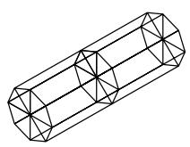  
所有边

  
外部边

  
特征边

  
自由边


图 1：显示边选项的模型。


## 注意：

如果您的输出数据库同时包含均质实体单元和复合实体单元或连续壳单元，Abaqus/CAE 会在均质实体几何形状与复合几何形状或连续壳几何形状之间的边界处显示自由边或特征边。

1.  找到通用或叠加的可见边选项。通用可见边设置始终适用于变形形状；当未变形形状在任何绘图状态（未变形、变形、轮廓、符号或材料方向）下单独绘制时，它也适用于未变形形状。当未变形形状与变形形状一起绘制时，则应用叠加可见边设置。

    从主菜单栏中，选择 Options->Common 或 Superimpose；然后在出现的对话框中点击 Basic 选项卡。可见边选项位于 Basic 页面的右侧。

2.  要选择您想要显示的单元和表面边，请点击以下之一：

## 所有边

显示所有单元和表面边。要查看模型内部的单元边，还必须将渲染样式设置为线框。

## 外部边

仅显示模型外部的边。

## 特征边

仅显示计算得出的位于模型外部的特征边。特征边位于法向差异超过“特征角度”的单元之间。特征角度在 View->ODB Display Options->General 对话框中设置；更多信息，请参阅定义模型特征边。
## 自由边
显示仅属于单个单元的边。自由边显示对于定位网格中潜在的孔洞或裂缝特别有用。

## 无边
隐藏所有边的显示。此选项仅适用于填充或阴影渲染样式的图。


## 注意：

当单元被复制（即共享所有相同的角节点）时，Abaqus/CAE 不会在自由边或特征边图中显示这些单元的边。

## 3. 单击 Apply 应用您的更改。

边的可见性将根据您的设定进行更改。

您的更改将在本次会话期间保存，并影响当前视口以及从当前视口创建的任何新视口中的所有后续绘图。

默认情况下，您的更改将在本次会话期间保存，并影响当前视口以及从当前视口创建的任何新视口中的所有后续绘图。如果您想保留所应用的更改以供后续会话使用，请将其保存到文件中。更多信息，请参阅 *为后续会话保存自定义设置*。

## 附加信息

• 定义模型特征边  
• 选择整体单元和表面边颜色  
• 自定义单元和表面边样式  
• 控制边可见性

## 定义模型特征边

通用和叠加绘图选项决定了哪些模型边出现在所有绘图状态中。当您指定仅显示特征边时，Abaqus/CAE 将确定哪些边满足此标准。特征边位于法线差异超过“特征角”的单元之间。您可以自定义特征角。较大的角度将减少特征边的数量；相反，较小的角度将使更多的边可见。默认值为 20°。特征角的设置适用于所有绘图状态。但是，无论特征角设置如何，对于解析刚性表面，所有线段边都会被绘制。

在图 1 中，左侧图显示特征角设置为 0° 时的特征边，中间图显示同一模型但特征角设置为 15° 时的特征边，右侧图显示特征角设置为 30° 时的模型。

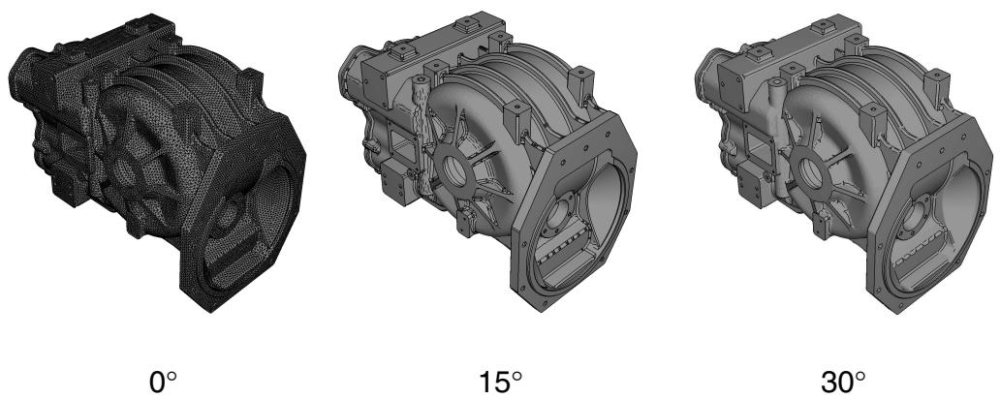  
图 1：显示 0°、15° 和 30° 特征角的绘图。

1.  找到 **Feature Angle** 选项。  
    从主菜单栏中，选择 **View->ODB Display Options**。在出现的对话框中单击 **General** 选项卡。**Feature Angle** 选项位于 **General** 页面底部。  
2.  将 **Feature Angle** 滑块拖动到所需特征角。  
3.  单击 **Apply** 应用您的更改。

所有绘图状态的特征边将根据您的特征角设定进行更新。默认情况下，您的特征角设定将在本次会话期间保存。如果您想为后续会话保留此更改，请将其保存到文件中。更多信息，请参阅 *为后续会话保存自定义设置*。

## 附加信息

• 控制单元和表面边可见性  
• 定义网格特征边

您可以自定义 Abaqus/CAE 显示单元和表面边的颜色。等值线图除外，边颜色与绘图状态无关；也就是说，您只需为所有未变形、变形、符号和材料方向图设置一次。您可以为某些渲染样式选择不同的边颜色，并且可以设置当变形形状叠加在未变形形状上时 Abaqus/CAE 将应用于未变形形状的边颜色。对于等值线图，您可以为某些等值线类型选择不同的边颜色。

您可以为整个模型选择一种显示颜色，或者可以选择性地覆盖选定项目（例如特定单元）的此显示颜色。例如，您可以将模型显示为绿色，同时将一组单元显示为红色。有关单个项目着色的更多信息，请参阅 *自定义单个对象的显示颜色*。

1.  找到您想要自定义的边颜色选项（通用、叠加或等值线）。

    •   对于除叠加和等值线图之外的所有绘图：
        从主菜单栏中，选择 **Options->Common**；然后在出现的对话框中单击 **Color & Style** 选项卡。
        **Color** 选项位于 **Color & Style** 页面顶部。

    •   对于等值线图：
        从主菜单栏中，选择 **Options->Contour**；然后在出现的对话框中单击 **Color & Style** 选项卡。单击 **Model Edges** 选项卡。

    •   对于叠加绘图中的未变形形状：
        从主菜单栏中，选择 **Options->Superimpose**；然后在出现的对话框中单击 **Color & Style** 选项卡。
        **Color** 选项位于 **Color & Style** 页面顶部。

2.  选择用于线框和隐藏渲染样式绘图以及线型等值线图的单元和表面边的颜色。（对于所有这些绘图，Abaqus/CAE 不显示模型面。）

    a.  单击颜色样本，其标签为 **Edges in wireframe/hidden plots** 或 **In line plots**。
        Abaqus/CAE 显示 **Select Color** 对话框。
    b.  使用 **Select Color** 对话框中的某种方法选择新颜色。有关更多信息，请参阅 *自定义颜色*。
    c.  单击 **OK** 关闭 **Select Color** 对话框。
        颜色样本变为所选颜色。在您单击 **Plot Options** 对话框中的 **OK** 或 **Apply** 之前，新颜色不会出现在视口中。

3.  选择用于填充和阴影渲染样式绘图以及条带和拼合型等值线图的单元和表面边的颜色。（对于所有这些绘图，Abaqus/CAE 显示模型面。）

    a.  单击颜色样本，其标签为 **Edges in filled/shaded plots** 或 **In banded/quilt plots**。
        Abaqus/CAE 显示 **Select Color** 对话框。
    b.  使用 **Select Color** 对话框中的某种方法选择新颜色。有关更多信息，请参阅 *自定义颜色*。
    c.  单击 **OK** 关闭 **Select Color** 对话框。
        颜色样本变为所选颜色。在您单击 **Plot Options** 对话框中的 **OK** 或 **Apply** 之前，新颜色不会出现在视口中。

4.  切换 **Allow color code selections to override options in this dialog** 开关。关闭此选项可使用上面指定的颜色显示所有边。打开此选项可使用颜色代码选择覆盖此颜色。默认值为打开。此选项不适用于等值线图。  
5.  单击 **Apply** 应用您的更改。

边颜色将根据您的设定进行更改。如果您为线框、隐藏或线图指定的边颜色与视口背景颜色相同，Abaqus/CAE 将使用对比色绘制边，以便您的绘图不会消失。在填充或绘图阴影中以视口背景颜色绘制的边，如果您缩小视图或面太小以至于边开始重叠，可能会遮挡相应的模型面。

默认情况下，您的更改将在本次会话期间保存，并影响当前视口以及从当前视口创建的任何新视口中的所有后续绘图。如果您想为后续会话保留所应用的更改，请将其保存到文件中。更多信息，请参阅 *为后续会话保存自定义设置*。

## 附加信息

• 控制单元和表面边可见性  
• 自定义单元和表面边样式  
• 选择背景颜色

## 自定义单元和表面边样式

您可以自定义 Abaqus/CAE 显示单元和表面边的样式和粗细。

例如，图 1 左侧显示默认单元边的绘图，右侧显示自定义边的绘图。边样式选项与绘图状态无关；也就是说，您只需为所有未变形、变形、符号和材料方向图设置一次。您还可以设置当变形形状叠加在未变形形状上时 Abaqus/CAE 将应用于未变形形状的边样式选项。

  
图 1：显示默认和自定义单元边的模型。

1.  找到通用或叠加的 **Edge Attributes** 选项。通用边属性始终应用于变形形状；当在任何绘图状态（未变形、变形、等值线、符号或材料方向）中单独绘制未变形形状时，它们也适用。当未变形形状与变形形状一起绘制时，应用叠加边属性。

    从主菜单栏中，选择 **Options->Common** 或 **Superimpose**。在出现的对话框中单击 **Other** 选项卡；然后在出现的对话框中单击 **Color & Style** 选项卡。
    **Edge Attributes** 选项位于 **Color & Style** 页面底部。

2.  选择单元和表面边的样式：

    a.  单击 **Style** 按钮以显示边样式选项。  
    b.  单击您想要的边样式。  
        指定的边样式出现在 **Style** 按钮上。

3.  选择单元和表面边的粗细：
a. 单击 **Thickness**（厚度）按钮以显示边缘厚度选项。  
b. 单击所需的边缘厚度。  
指定的边缘厚度将显示在 **Thickness**（厚度）按钮上。

4. 单击 **Apply**（应用）以实施更改。

单元和表面边缘样式将根据您的规范进行更改。

默认情况下，您的更改将在会话持续期间保存，并影响当前视口及从当前视口创建的任何新视口中的所有后续绘图。如果您希望将所应用的更改保留用于后续会话，请将其保存到文件中。有关更多信息，请参阅 **Saving customizations for use in subsequent sessions**（保存自定义设置以用于后续会话）。

## 附加信息

• 控制单元和表面边缘可见性  
• 选择整体单元和表面边缘颜色

## 自定义模型形状

本节说明如何自定义模型的形状。

## 本节内容：

缩放变形  
缩放坐标并收缩模型

变形是变形场输出变量的值；例如，位移或速度。Abaqus/CAE 通过将变形应用于未变形的节点坐标来计算变形形状。您可以缩放变形以放大、缩小或以其他方式扭曲变形模型形状。例如，图 1 左侧显示了变形形状轮廓图，右侧显示了相同的绘图但变形被放大了 15 倍。

  
图 1：显示默认和放大变形值的轮廓图。

变形缩放是独立于绘图状态的；也就是说，您为所有变形图、轮廓图、符号图和材料方向图中的变形形状设置一次缩放。默认缩放对于大位移分析是均匀因子 1.00。对于小变形分析——例如，扰动分析——Abaqus/CAE 将缩放变形，使最大变形为最大模型尺寸的 10%。

1. 从主菜单栏中，选择 **Options->Common**（选项->公共）。在出现的对话框中单击 **Basic**（基本）选项卡。**Deformation Scale Factor**（变形比例因子）选项位于 **Basic**（基本）页面的左下角。  
2. 选择以下比例因子选项之一：

单击 **Auto-compute**（自动计算）以请求 Abaqus 自动计算并均匀地将单个比例因子应用于变形值的所有 X、Y 和 Z 分量。  
单击 **Uniform**（均匀）以指定并均匀地将单个比例因子应用于变形值的所有 X、Y 和 Z 分量。

当 **Uniform**（均匀）开启时，**Value**（值）规格框变为可用。单击 **Value**（值）框，并输入您的比例因子。

单击 **Nonuniform**（非均匀）以指定应用于变形值的 X、Y 和 Z 分量的单独比例因子。

当 **Nonuniform**（非均匀）开启时，X、Y 和 Z 分量比例因子规格框变为可用。对于您想要缩放的每个分量，单击该分量（X、Y 或 Z）比例因子框并输入您的比例因子。

3. 单击 **Apply**（应用）以实施更改。

变形形状将根据您的规范进行更改。如果状态块处于活动状态，它将更改以显示当前变形比例因子。

您的更改将在会话持续期间保存，并影响所有后续变形形状绘图。

默认情况下，您的更改将在会话持续期间保存，并影响所有后续变形形状绘图。如果您希望将所应用的更改保留用于后续会话，请将其保存到文件中。

有关更多信息，请参阅 **Saving customizations for use in subsequent sessions**（保存自定义设置以用于后续会话）。

## 附加信息

• 缩放坐标并收缩模型

您可以通过缩放来放大、缩小或以其他方式扭曲模型的形状，并且可以围绕每个单元的质心收缩每个单元。缩放会修改每个 X、Y 和 Z 方向上的所有节点坐标。收缩围绕其质心均匀地减小每个单元的大小。例如，图 1 中所示的单元已按因子 0.40 收缩。

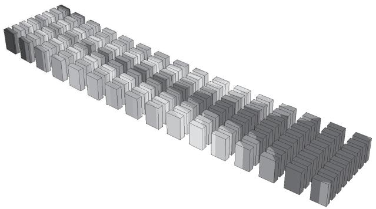  
图 1：显示收缩效果的单元。

缩放和收缩选项是独立于绘图状态的；也就是说，您为所有未变形图、变形图、轮廓图、符号图和材料方向图设置一次。您还可以设置当变形形状叠加在未变形形状上时，Abaqus/CAE 将应用于未变形形状的缩放和收缩选项。

1. 找到公共或叠加缩放选项。公共缩放选项始终应用于变形形状；当未变形形状在任何绘图状态（未变形、变形、轮廓、符号或材料方向）中单独绘制时，它们应用于未变形形状。当未变形形状与变形形状一起绘制时，叠加缩放选项适用。

从主菜单栏中，选择 **Options->Common**（选项->公共）或 **Superimpose**（叠加）；然后在出现的对话框中单击 **Other**（其他）选项卡。单击 **Scaling**（缩放）选项卡；**Scaling**（缩放）选项出现。

2. 切换 **Shrink elements**（收缩单元）以请求或抑制围绕其质心收缩每个单元。

a. 当 **Shrink elements**（收缩单元）开启时，**Factor**（因子）滑块变为可用。  
b. 将 **Factor**（因子）滑块拖动到所需的收缩因子。

值为 0.00 表示不收缩。值为 0.90 将所有单元收缩为点。

3. 切换 **Scale coordinates**（缩放坐标）以请求或抑制通过节点坐标 X、Y 和 Z 方向对模型进行缩放。

a. 当 **Scale coordinates**（缩放坐标）开启时，比例因子变为可用。分别单击 **X**、**Y** 和 **Z** 框以输入 X、Y 和 Z 节点坐标的缩放因子。

4. 单击 **Apply**（应用）以实施更改。

模型显示将根据您的规范进行更改。

默认情况下，您的更改将在会话持续期间保存，并影响当前视口及从当前视口创建的任何新视口中的所有后续绘图。如果您希望将所应用的更改保留用于后续会话，请将其保存到文件中。有关更多信息，请参阅 **Saving customizations for use in subsequent sessions**（保存自定义设置以用于后续会话）。

## 附加信息

• 缩放变形

## 自定义模型标签

本节说明如何自定义未变形图、变形图、轮廓图、符号图和材料方向图的单元标签、面标签、节点标签和节点符号的外观。

## 本节内容：

设置标签字体  
自定义单元标签  
自定义面标签  
自定义节点标签  
自定义节点符号  
显示节点平均方向

## 设置标签字体

Abaqus/CAE 使用单一字体显示所有单元、面和节点标签。您可以设置此字体的属性（字族、大小、粗体、斜体）用于所有绘图状态，并且可以单独设置它们以用于叠加绘图中的未变形形状。

1. 找到公共或叠加标签字体选项。公共字体选项始终应用于变形形状；当未变形形状在任何绘图状态（未变形、变形、轮廓、符号或材料方向）中单独绘制时，它们应用于未变形形状。当未变形形状与变形形状一起绘制时，叠加标签字体选项适用。

从主菜单栏中，选择 **Options->Common**（选项->公共）或 **Superimpose**（叠加）；然后在出现的对话框中单击 **Labels**（标签）选项卡。字体选项位于 **Labels**（标签）页面的顶部。

2. 单击 **Set Font for All Model Labels**（设置所有模型标签的字体）。

**Select Font**（选择字体）对话框出现。

3. 使用 **Select Font**（选择字体）对话框设置所需的字体属性。  
4. 设置好所需的字体属性后，单击 **OK**（确定）。

**Select Font**（选择字体）对话框关闭。

5. 单击 **Apply**（应用）以实施更改。

单元、面和节点标签将根据您的规范进行更改。

默认情况下，您的更改将在会话持续期间保存，并影响当前视口及从当前视口创建的任何新视口中的所有后续绘图。如果您希望将所应用的更改保留用于后续会话，请将其保存到文件中。有关更多信息，请参阅 **Saving customizations for use in subsequent sessions**（保存自定义设置以用于后续会话）。

## 附加信息

• 自定义单元标签  
• 自定义面标签  
• 自定义节点标签

## 自定义单元标签

单元标签是标识每个单元的数字标签（单元编号）。例如，图 1 中的单元被标记。

  
图 1：显示单元标签的模型。

单元标签是独立于绘图状态的；也就是说，您为所有未变形图、变形图、轮廓图、符号图和材料方向图设置一次。您还可以设置当变形形状叠加在未变形形状上时，Abaqus/CAE 将在未变形形状上显示的单元标签。切换 **Show element labels**（显示单元标签）以显示或抑制单元标签并选择其颜色。

1. 找到公共或叠加单元标签选项。公共单元标签选项始终应用于变形形状；当未变形形状在任何绘图状态（未变形、变形、轮廓、符号或材料方向）中单独绘制时，它们应用于未变形形状。当未变形形状与变形形状一起绘制时，叠加单元标签选项适用。
从主菜单栏中，选择Options->Common或Superimpose；然后在出现的对话框中点击Labels选项卡。

2. 切换Show element labels（显示单元标签）以显示或隐藏数字单元标签。

当Show element labels（显示单元标签）开启时，单元标签颜色选项变为可用。

3. 选择单元标签的颜色：

a. 点击颜色样本

Abaqus/CAE将显示Select Color（选择颜色）对话框。

b. 使用Select Color（选择颜色）对话框中的一种方法选择新颜色。更多信息，请参见Customizing colors（自定义颜色）。

c. 点击OK关闭Select Color（选择颜色）对话框。

颜色样本变为所选颜色。

4. 点击Apply（应用）以实施您的更改。

标签将根据您的设置进行更改。

默认情况下，您的更改会在当前会话期间保存，并影响当前视口以及从当前视口创建的任何新视口中的所有后续绘图。如果您希望保留所应用的更改以供后续会话使用，请将它们保存到文件中。更多信息，请参见Saving customizations for use in subsequent sessions（保存自定义设置以供后续会话使用）。

## 附加信息

• 设置标签字体

## 自定义面标签

面标签标识每个单元内面的顺序。例如，图1中显示了面标签。

  
图1：显示面标签的模型。

面标签与绘图状态无关；即，您只需为所有未变形、变形、等值线、符号和材料方向绘图设置一次。您还可以设置当变形形状叠加显示时，Abaqus/CAE将在未变形形状上显示的面标签。切换Show face labels（显示面标签）以显示或隐藏单元标签并选择其颜色。

1. 定位通用或叠加面标签选项。通用面标签选项始终应用于变形形状；当未变形形状在任何绘图状态（未变形、变形、等值线、符号或材料方向）下单独绘图时，它们也适用于未变形形状。当未变形形状与变形形状一起绘图时，叠加面标签选项适用。

从主菜单栏中，选择Options->Common或Superimpose；然后在出现的对话框中点击Labels选项卡。

2. 切换Show face labels（显示面标签）以显示或隐藏数字面标签。

当Show face labels（显示面标签）开启时，面标签颜色选项变为可用。

3. 选择面标签的颜色：

a. 点击颜色样本

Abaqus/CAE将显示Select Color（选择颜色）对话框。

b. 使用Select Color（选择颜色）对话框中的一种方法选择新颜色。更多信息，请参见Customizing colors（自定义颜色）。

c. 点击OK关闭Select Color（选择颜色）对话框。

颜色样本变为所选颜色。

4. 点击Apply（应用）以实施您的更改。

标签将根据您的设置进行更改。

默认情况下，您的更改会在当前会话期间保存，并影响当前视口以及从当前视口创建的任何新视口中的所有后续绘图。如果您希望保留所应用的更改以供后续会话使用，请将它们保存到文件中。更多信息，请参见Saving customizations for use in subsequent sessions（保存自定义设置以供后续会话使用）。

## 附加信息

• 设置标签字体

## 自定义节点标签

节点标签是标识每个节点的数字标签（节点编号）。例如，图1中显示了节点标签。

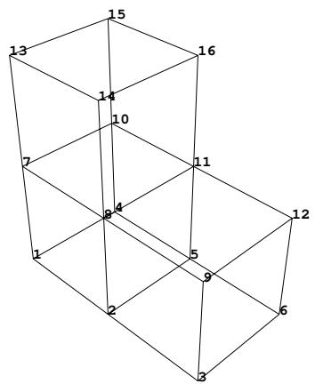  
图1：显示节点标签的模型。

节点标签与绘图状态无关；即，您只需为所有未变形、变形、等值线、符号和材料方向绘图设置一次。您还可以设置当变形形状叠加显示时，Abaqus/CAE将在未变形形状上显示的节点标签。切换Show node labels（显示节点标签）以显示或隐藏节点标签并选择其颜色。

1. 定位通用或叠加节点标签选项。通用节点标签选项始终应用于变形形状；当未变形形状在任何绘图状态（未变形、变形、等值线、符号或材料方向）下单独绘图时，它们也适用于未变形形状。当未变形形状与变形形状一起绘图时，叠加节点标签选项适用。

从主菜单栏中，选择Options->Common或Superimpose；然后在出现的对话框中点击Labels选项卡。

2. 切换Show node labels（显示节点标签）以显示或隐藏数字节点标签。

当Show node labels（显示节点标签）开启时，节点标签颜色选项变为可用。

3. 选择节点标签的颜色：

a. 点击颜色样本。

Abaqus/CAE将显示Select Color（选择颜色）对话框。

b. 使用Select Color（选择颜色）对话框中的一种方法选择新颜色。更多信息，请参见Customizing colors（自定义颜色）。

c. 点击OK关闭Select Color（选择颜色）对话框。

颜色样本变为所选颜色。

4. 点击Apply（应用）以实施您的更改。

标签将根据您的设置进行更改。

默认情况下，您的更改会在当前会话期间保存，并影响当前视口以及从当前视口创建的任何新视口中的所有后续绘图。如果您希望保留所应用的更改以供后续会话使用，请将它们保存到文件中。更多信息，请参见Saving customizations for use in subsequent sessions（保存自定义设置以供后续会话使用）。

## 附加信息

• 设置标签字体

## 自定义节点符号

节点符号（圆形、方形、三角形等）标识每个节点的位置。例如，图1中使用实心圆来表示节点。

  
图1：显示节点符号的模型。

节点符号与绘图状态无关；即，您只需为所有未变形、变形、等值线、符号和材料方向绘图设置一次。您还可以设置当变形形状叠加显示时，Abaqus/CAE将在未变形形状上显示的节点符号。切换Show node symbols（显示节点符号）以显示或隐藏节点标签并选择其颜色。

1. 定位通用或叠加节点符号选项。通用节点符号选项始终应用于变形形状；当未变形形状在任何绘图状态（未变形、变形、等值线、符号或材料方向）下单独绘图时，它们也适用于未变形形状。当未变形形状与变形形状一起绘图时，叠加节点符号选项适用。从主菜单栏中，选择Options->Common或Superimpose；然后在出现的对话框中点击Labels选项卡。

2. 切换Show node symbols（显示节点符号）以显示或隐藏节点符号。

当Show node symbols（显示节点符号）开启时，节点符号颜色、类型和大小选项变为可用。

3. 选择节点符号的颜色：

a. 点击颜色样本

Abaqus/CAE将显示Select Color（选择颜色）对话框。

b. 使用Select Color（选择颜色）对话框中的一种方法选择新颜色。更多信息，请参见Customizing colors（自定义颜色）。

c. 点击OK关闭Select Color（选择颜色）对话框。

颜色样本变为所选颜色。在您点击Plot Options（绘图选项）对话框中的OK或Apply之前，新颜色不会显示在视口中。

4. 选择节点符号的类型（圆形、方形、三角形等）：

a. 点击Symbol（符号）按钮以显示节点符号类型选项。

b. 点击您想要的符号类型。指定的符号类型将显示在Symbol（符号）按钮上。

5. 选择节点符号的大小：

a. 点击Size（大小）按钮以显示节点符号大小选项。  
b. 点击Small（小）、Medium（中）或Large（大）。  
指定的符号大小将显示在Size（大小）按钮上。

6. 点击Apply（应用）以实施您的更改。

符号将根据您的设置进行更改。

默认情况下，您的更改会在当前会话期间保存，并影响当前视口以及从当前视口创建的任何新视口中的所有后续绘图。如果您希望保留所应用的更改以供后续会话使用，请将它们保存到文件中。更多信息，请参见Saving customizations for use in subsequent sessions（保存自定义设置以供后续会话使用）。

## 附加信息

• 自定义节点标签

## 显示节点平均方向

对于线型和带型等值线图，单元结果会从单元质心或积分点外推并有条件地平均到节点以创建绘图。您可以使用Result Options（结果选项）对话框来控制Abaqus/CAE如何对模型应用平均。一个选项允许您在每个节点上对结果进行平均后计算不变量（标量）和提取分量；当您选择按此顺序计算结果时，Abaqus/CAE会从相邻单元之一中应用矢量或张量方向作为每个节点的方向。在Contour Plot Options（等值线图选项）对话框的Other（其他）选项卡下，切换Show nodal-averaged vector/tensor orientations when computing scalars after averaging（在平均后计算标量时显示节点平均的矢量/张量方向）以显示或隐藏等值线图上的平均方向。启用此选项后，Abaqus/CAE会在每个节点绘制一个三轴图，指示所绘矢量或张量的节点平均方向。默认情况下，1轴显示为青色，2轴显示为黄色，3轴显示为红色。您可以使用与Customizing material orientation plot triads（自定义材料方向绘图三轴图）中描述的相同步骤来自定义这些三轴图的外观。
如果您选择在对节点结果进行平均之前计算标量，方向将不会被平均，也不会出现在您的云图中。

## 附加信息

• 选择结果选项

## 显示多个绘图状态

除了可以为单个绘图状态（例如云图）叠加显示未变形和变形形状外，您还可以选择在视口中显示多个绘图状态。

通过在工具箱中开启 **允许多个绘图状态**，您可以选择当前输出数据库所选分析步和帧的未变形和变形绘图形状与云图、符号和材料方向的任意组合。Abaqus/CAE 使用 **通用绘图选项** 显示变形绘图，使用 **叠加绘图选项** 结合其他与绘图状态无关和相关的选项显示未变形绘图。

如果您关闭 **允许多个绘图状态**，Abaqus/CAE 将按照以下顺序结合最后显示的绘图状态来选择要显示的单个绘图状态：

• 未变形
• 变形
• 云图
• 符号
• 材料方向

例如，如果您显示云图和材料方向，当您关闭 **允许多个绘图状态** 时，Abaqus/CAE 会保留云图。这个顺序与绘图状态在 **绘图** 菜单中列出并在工具箱中显示的顺序相同。

要显示更复杂的绘图组合，您必须使用叠加绘图。叠加绘图允许您将动画或 X-Y 绘图与上面列出的静态绘图状态一起显示。您还可以使用叠加绘图来绘制来自多个分析步、帧或输出数据库的结果。有关更多信息，请参阅叠加多个绘图。

## 附加信息

• 使用通用绘图选项
• 叠加变形和未变形模型绘图

## 显示单元和表面法线

当您创建未变形或变形绘图时，可以选择在绘图中显示箭头，以指示单元或表面法线的方向。您可以显示梁、管道、框架单元、接触表面、膜、刚性单元、刚性表面、壳、三维实体和桁架的法线方向。（有关特定类型单元或表面的法线方向信息，请参阅 Abaqus Elements Guide。）

1.  找到通用或叠加法线选项。当单独绘制未变形和变形形状时，应用通用法线选项。当未变形形状与变形形状一起绘制时，应用叠加法线选项。

    从主菜单栏中，选择 **选项** -> **通用** 或 **叠加**；然后在出现的对话框中单击 **法线** 选项卡。

2.  开启 **显示法线**。

    **法线** 选项变为可用。

3.  开启 **在单元上** 以显示模型中单元上的法线，或开启 **在表面上** 以显示模型中表面上的法线。
4.  在对话框中标记为 **颜色** 的区域中，选择您希望不同类型法线显示的颜色。
5.  在对话框中标记为 **样式** 的区域中：
    a.  单击 **长度** 字段旁边的箭头，并选择您选择的箭头长度。默认选择为 **中**。
    b.  单击 **线宽** 字段旁边的箭头，并选择您选择的箭头粗细。
    c.  单击 **箭头** 字段旁边的箭头，并选择您选择的箭头样式。

6.  单击 **应用** 以实施您的更改。

    视口中会出现箭头，指示模型中单元或表面的法线方向。通常，箭头出现在外单元面的质心处。

## 自定义显示体的外观

显示体是不参与分析但在后处理期间可见的部件实例。您可以在可视化模块中使用 **显示体选项** 自定义模型中此类部件实例的外观。可用于显示体的选项与 Abaqus/CAE 中所有绘图状态可用的选项类似：渲染样式；边可见性、颜色和样式；填充颜色；缩放；以及透明度都可以自定义。与通用绘图选项类似，显示体选项与绘图状态无关；即应用于显示体的选项会反映在所有绘图状态中。显示体选项适用于您模型中的所有显示体；要自定义单个显示体的外观，您可以基于部件实例创建显示组（请参阅创建或编辑显示组）。也可以将单独项目着色应用于单个显示体部件实例，以覆盖指定为通用显示体选项的边和/或填充颜色；有关更多信息，请参阅几何和网格元素的颜色编码。

要找到显示体选项，请从主菜单栏中选择 **选项** -> **显示体**。单击以下选项卡以自定义当前视口中所有显示体的外观：

• **基本**：选择渲染样式（选择渲染样式）和边可见性（控制单元和表面边的可见性）。


## 注意：

位于 **渲染样式** 工具栏中的渲染样式图标不适用于任何绘图状态中的显示体。此外，默认情况下，仅对显示体显示自由边，而对其他模型组件显示所有外边。

• **颜色与样式**：控制模型边颜色（选择整体单元和表面边颜色）、模型边样式（自定义单元和表面边样式）和模型填充颜色（选择整体填充颜色）。
• **其他**：**其他** 页面包含以下选项卡：
    - **缩放**：控制模型缩放和收缩（缩放坐标和收缩模型）。
    - **透明度**：控制着色渲染样式的透明度（自定义透明度）。

## 附加信息

• 定义显示体约束
• 显示体

## 自定义相机移动

您可以使用可视化模块中的 **视图选项** 自定义模型中的两组相机选项，如图 1 所示。

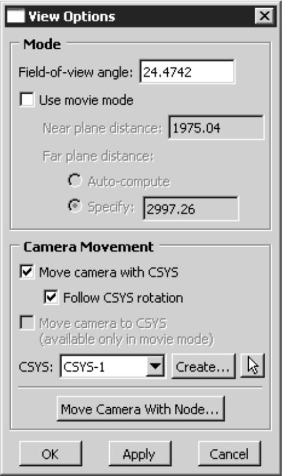
图 1：**视图选项** 对话框。

**模式** 选项在除草图模块外的所有 Abaqus/CAE 模块中可用；**模式** 选项在操作视图和控制透视中讨论，并且仅为当前会话保存。**相机移动** 选项仅在可视化模块中可用。它们控制相机相对于所选局部坐标系的位置和移动。您可以通过从主菜单栏中选择 **文件** -> **保存选项** 来保存 **相机移动** 选项的设置。

要找到视图选项，请从主菜单栏中选择 **视图** -> **视图选项**。要使用 **相机移动** 选项，您必须首先开启 **随坐标系移动相机**，然后使用以下方法之一选择一个局部坐标系：

• 从对话框中提供的列表中选择一个坐标系，
• 单击 **创建** 以创建一个新的局部坐标系，
• 单击 $\left. \left[ \frac { \mathsf { R } } { \mathsf { s } } \right] _ { \mathsf { t o } } \right.$ 从视口中选取一个局部坐标系，或
单击 **随节点移动相机** 或使用上下文栏中的按钮来创建跟随单个节点的矩形坐标系。


## 注意：

要将相机重置为跟随全局坐标系，请关闭 **随坐标系移动相机** 或单击上下文栏中的按钮。

您可以从以下相机移动选项中进行选择：

## 随坐标系移动相机

选择此选项可将所选坐标系的原点固定在视口中。如果您创建动画或更改 ODB 帧，Abaqus/CAE 会相对于所选局部坐标系的位置移动视口中的所有对象。如果所选局部坐标系不是移动坐标系，您将观察不到与将相机固定在（静止的）全局坐标系上的默认设置有任何差异。

如果您选择 **随坐标系移动相机**，建议您在尝试操作视图之前暂停当前视口中的任何动画。

## 跟随坐标系旋转

选择此选项可同时固定局部坐标系在视口中的位置和旋转。所有模型旋转都会被变换，使模型看起来绕所选坐标系旋转。此选项仅在 **随坐标系移动相机** 开启时可用。

## 将相机移动到坐标系

此选项仅在 **使用电影模式** 和 **随坐标系移动相机** 都开启时可用。**使用电影模式** 允许相机进入并穿过模型，而不是从远处查看模型（有关更多信息，请参阅相机模式和视图术语）。当您应用 **将相机移动到坐标系** 时，相机会移动到所选坐标系的原点。在您单击 **视图选项** 对话框中的 **应用** 后，Abaqus/CAE 会立即关闭此选项，以避免与某些也会重新定位相机的视图操作工具发生冲突。


注意：当您应用“移动摄像机到坐标系”操作时，Abaqus/CAE 可能在视口中显示空白视图。造成此空白视图最常见的原因是“近平面距离”设置；请应用较小的“近平面距离”值以查看靠近摄像机的模型部分。


警告：如果您在可视化模块中平移、旋转或缩放视图，建议您首先暂停视口中的任何动画。由于动画和视图操作都会影响视图，它们对 Abaqus/CAE 的指令可能会相互冲突并产生不理想的结果。

## 附加信息

• 理解摄像机模式和视图选项  
• 后处理期间创建坐标系

## 控制模型实体的显示

“ODB 显示选项”对话框中的“实体显示”选项允许您控制符号的显示。显示的符号代表模型中的以下实体：

• 分析期间施加的边界条件，  
• 模型中使用的连接器（可以单独控制端点的高亮显示、与每个连接器关联的局部方向轴的显示以及连接器类型标签的显示），  
• 写入当前输出数据库或在当前会话期间在可视化模块中创建的坐标系，以及  
• 点单元，包括参考点、质量和惯性单元、弹簧和阻尼器、点焊和分布耦合（DCOUP*）单元、示踪粒子、连续体粒子单元、离散粒子单元以及粒子单元边的渲染。

模型实体显示与绘图状态无关。Abaqus/CAE 显示当前步骤和帧的输出数据库中的模型实体符号。您只能通过更改符号大小来自定义模型实体符号在可视化模块中的外观。

有关代表边界条件的符号信息，请参阅理解代表指定条件的符号；有关代表连接器的符号信息，请参阅理解代表交互、约束和连接器的符号。有关在与装配相关的模块中控制这些实体显示的信息，请参阅控制属性的显示。


提示：您也可以使用显示组来控制连接器的显示；每个连接器都列为一个单元集。有关显示组的更多信息，请参阅创建或编辑显示组。

“渲染粒子单元边”选项允许显示粒子单元边的符号。您可以对粒子单元使用线框、隐藏线和填充渲染样式选项。

默认情况下，仅显示会话坐标系和参考点。模型实体的显示可能会显著影响性能。为了最大化 Abaqus/CAE 的性能，请谨慎选择要显示的实体。

1. 从主菜单栏中，选择 视图 -> ODB 显示选项。在出现的对话框中，单击“实体显示”选项卡。  
    实体显示选项变得可用。  
2. 切换您想要显示的实体。只有您选择的实体（如果它们已为当前模型定义）才会出现在视口中。  
3. 如果需要，将“符号大小”滑块向左或向右拖动，以修改视口中符号的大小。  
4. 单击“应用”以实现您的更改。

当前视口中的绘图将更改以反映您的规格。

默认情况下，您的更改将保存当前会话期间，并影响当前视口以及从当前视口创建的任何新视口中的所有后续绘图。如果您想保留您应用的更改以供后续会话使用，请将其保存到文件。有关更多信息，请参阅保存自定义设置以供后续会话使用。

## 附加信息

• 创建边界条件  
• 理解约束  
• 理解连接器  
• 后处理期间创建坐标系

• 为什么基准坐标系如此重要？

## 在可视化模块中控制约束的显示

在可视化模块中，您可以使用显示组和“ODB 显示选项”对话框选择性地控制分析约束的显示。这些控制在调试包含大量约束的模型时非常有用。通过打开和关闭某些约束的显示，您可以更容易地理解复杂模型。

显示或隐藏约束有两个级别的控制：

• 您必须首先将所需的约束添加到显示组，它们才能在视口中可见。您可以创建和编辑显示组以包含或排除不同的约束。有关显示组的更多信息，请参阅创建或编辑显示组。  
• 不同类型的约束可以在“ODB 显示选项”对话框的“约束”选项卡中被选择或隐藏。从主菜单栏中，选择 视图 -> ODB 显示选项 以访问这些选项。

以下类型的约束可以显示或隐藏：

• 绑定约束
• 刚体约束（仅限绑定和销钉）
• 壳到实体耦合
• 分布耦合
• 运动学耦合
• 多点约束


## 注意：

这些类型的约束是在交互模块中创建的，而不是在装配模块中。有关更多信息，请参阅理解约束。

表 1 显示了 Abaqus/CAE 如何显示每种类型的约束。  
表 1：约束在视口中的显示方式。

<table><tr><td>约束类型</td><td>视口中的显示</td></tr><tr><td>绑定</td><td>约束的主面和从面上的节点之间绘制的红色线条呈放射状分布。</td></tr><tr><td>刚体</td><td>刚体区域（单元、节点或面）在视口中高亮显示。</td></tr><tr><td>壳到实体耦合</td><td>壳边节点和实体面节点之间绘制的黄色线条呈放射状分布。</td></tr><tr><td>分布耦合</td><td>控制点和约束区域中的耦合点（节点）之间绘制的橙色线条呈放射状分布。</td></tr><tr><td>运动学耦合</td><td>控制点和约束区域中的耦合点（节点）之间绘制的紫色线条呈放射状分布。</td></tr><tr><td>多点约束（仅限 Abaqus/Explicit）</td><td>构成多点约束的节点用黄色线条连接。</td></tr></table>

您可以在“颜色代码”对话框中更改约束放射线的默认颜色。有关更多信息，请参阅在可视化模块中为约束着色。

## 附加信息

• 理解约束  
• 创建或编辑显示组

## 自定义通用模型显示

本节解释几个通用的模型显示选项。

## 本节内容：

扫描和拉伸模型  
使用镜像和图案显示结果  
细化弯曲边和面  
为无结果的单元着色  
后处理期间控制梁截面显示  
后处理期间控制壳厚度显示  
控制热流体管道单元的显示  
查看已移除的单元

## 扫描和拉伸模型

您可以将轴对称模型显示为平面的二维形状，或者将模型通过指定的角度进行“扫描”，产生三维视觉效果。

类似地，您可以仅查看循环对称结构的建模扇区，或者将该扇区进行“扫描”以查看整个模型的指定部分。（有关循环对称结构的更多信息，请参阅显示循环对称性的模型分析。）此外，您可以查看二维模型（或三维圆柱解析刚性面）为平面，或将其拉伸到指定的深度，产生三维视觉效果。扫描和拉伸对于显示二维单元和接触面的轮廓图特别有用。

轴对称解析刚性面可以围绕一个轴旋转（扫描），以下单元也可以：ACAXn, CAXn, CAXAn, CGAXn, DCAXn, DCCAXn, DSAXn, FAXn, MAXn, MGAXn, RAXn, SAXn, 和 SAXAn。包含三维轴对称解析刚性面或 CAXA 单元的模型默认会被扫描（默认的起始角度、结束角度和扇区数量因模型类型而异）。如果模型同时包含解析刚性面和 CAXA 单元，则默认只扫描 CAXA 单元。当您显示扫描后的轴对称单元的边界条件时，符号仅出现在原始节点上，而不出现在扫描后的节点上。

循环对称模型默认不进行扫描。当您在扫描后的循环对称模型上显示轮廓时，只有节点量可以在扫描扇区上绘制轮廓；积分点的标量、向量和张量量只能在原始扇区上绘制轮廓。
您可以沿 Z 方向拉伸 Abaqus 库中的解析刚性表面以及所有平面、二维单元。有关这些单元的列表，请参阅二维单元库。

图 1 显示了一个轴对称平面模型的平面视图（左）以及同一模型在具有 90° 轴对称扫掠角度和 10 个扫掠扇区时的视图（右）。

  
图 1：具有平面和扫掠显示的轴对称模型。

图 2 显示了一个循环对称风扇的原始建模扇区（左）和扫掠模型的扇区 1–4（右）。

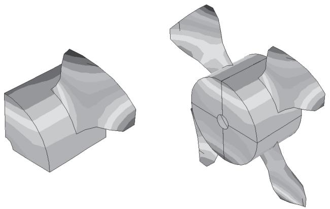  
图 2：循环对称模型：单扇区和多扇区扫掠视图。

图 3 显示了一个二维平面模型的平面视图（左）以及同一模型在拉伸深度为 0.1 时的显示（右）。
  
图 3：具有平面和拉伸显示的二维模型。

## 附加信息

• 使用镜像和阵列显示您的结果  
• 细化曲边和曲面

## 扫掠轴对称模型中的单元

1.  定位常规扫掠选项。

    从主菜单栏中，选择 View->ODB Display Options。在出现的对话框中单击 Sweep/Extrude 选项卡。常规扫掠选项位于页面的上部。

    

## 注意：

    如果您的模型中没有可扫掠的单元或解析刚性表面，常规扫掠选项将不可用。

2.  切换启用扫掠单元。
3.  通过在 Sweep from 字段中键入一个数字（以度为单位，默认为 0°）并在 To 字段中键入一个数字（以度为单位，所有模型的默认值为 180°）来指定扫掠角度。

    Abaqus/CAE 围绕旋转轴，从第一个指定角度到第二个指定角度逆时针扫掠二维模型。

4.  通过在 Number of segments 字段中键入一个正整数，或单击该字段旁边的箭头，来指定扫掠时沿圆周方向使用的分段数。使用的默认分段数根据模型类型而异。

    分段之间的角度会在对话框中自动更新。随着分段数的增加，模型中的曲线看起来更平滑（它们之间的角度减小）。但是，较少的分段数绘图速度更快。

5.  单击应用以实现您的更改。

    您的扫掠规格会反映在所有绘图状态中，并且默认情况下，它们会在当前会话期间保存。如果您希望保留所应用的更改以供后续会话使用，请将其保存到文件。有关更多信息，请参阅保存自定义设置以供后续会话使用。

    如果显示云图，轮廓将出现在所有扫掠面上。

    如果显示符号图，模型将按指定进行扫掠，但符号仅出现在原始平面模型面上。

## 扫掠轴对称模型中的解析刚性表面

1.  定位常规扫掠选项。

    从主菜单栏中，选择 View->ODB Display Options。在出现的对话框中单击 Sweep/Extrude 选项卡。常规扫掠选项位于页面的上部。

    

## 注意：

    如果您的模型中没有可扫掠的单元或解析刚性表面，常规扫掠选项将不可用。

2.  如果当前未激活，请启用扫掠解析刚性表面。
3.  通过在 Sweep from 字段中键入一个数字（以度为单位）并在 To 字段中键入一个数字（以度为单位，首次打开轴对称模型时的默认值为 180°，首次打开三维模型时的默认值为 360°）来指定扫掠角度。

    Abaqus/CAE 围绕旋转轴，从第一个指定角度到第二个指定角度逆时针扫掠解析刚性表面。

4.  通过在 Number of segments 字段中键入一个正整数，或单击该字段旁边的箭头，来指定扫掠解析刚性表面时沿圆周方向使用的分段数。默认情况下，Abaqus/CAE 对轴对称模型使用 10 个分段，对三维模型使用 20 个分段。

    分段之间的角度会在对话框中自动更新。随着分段数的增加，模型中的曲线看起来更平滑（它们之间的角度减小）。但是，较少的分段数绘图速度更快。

5.  单击应用以实现您的更改。

    您的扫掠规格会反映在所有绘图状态中，并在当前会话期间保存。如果您希望保留所应用的更改以供后续会话使用，请将其保存到文件。有关更多信息，请参阅保存自定义设置以供后续会话使用。

## 扫掠循环对称模型

1.  定位扇区扫掠选项。

    从主菜单栏中，选择 View->ODB Display Options。在出现的对话框中单击 Sweep/Extrude 选项卡。扇区扫掠选项位于页面的中部。

    

## 注意：

    如果您的模型中没有循环对称单元，扇区扫掠选项将不可用。

2.  切换启用扫掠循环对称扇区。
3.  单击 Sector selection 字段旁边的箭头，从以下可用的扫掠方法中进行选择：

## 按编号

    这是默认的扫掠方法。对话框中给出了模型中的扇区总数。您可以通过在 Sectors 字段中键入介于 1 和总扇区数之间的正整数（以逗号分隔）来指定应显示哪些扇区。扇区从原始扇区开始逆时针编号。

    Abaqus/CAE 仅显示指定的扇区（无论它们是否相邻）。

## 按角度

    对话框中给出了扇区角度（每个扇区之间的角度）。您可以通过在 Sweep from 字段中键入一个数字（以度为单位，默认为 0°）并在 To 字段中键入一个数字（以度为单位，默认为扇区角度）来指定以扇区角度为增量的扫掠角度。两个数字都应能被扇区角度整除。

    

    提示：您也可以使用文本字段旁边的箭头来指定角度。

    Abaqus/CAE 围绕旋转轴，按您指定的度数扫掠二维模型。如果您输入的扫掠角度不能被扇区角度整除，Abaqus/CAE 将向上舍入到下一个可整除的数字。

## 所有扇区

    如果您选择此扫掠方法，将显示所有扇区；换句话说，模型将围绕旋转轴扫掠 360°。

4.  单击应用以实现您的更改。

    您的扫掠规格会反映在所有绘图状态中，并在当前会话期间保存。如果您希望保留所应用的更改以供后续会话使用，请将其保存到文件。有关更多信息，请参阅保存自定义设置以供后续会话使用。

    如果显示云图，节点量的轮廓将出现在所有扫掠面上；积分点处标量、矢量和张量的轮廓仅出现在原始扇区上。

    如果显示符号图，模型将按指定进行扫掠，但符号仅出现在原始平面模型面上。

## 拉伸模型中的单元

1.  定位拉伸选项。

    从主菜单栏中，选择 View->ODB Display Options。在出现的对话框中单击 Sweep/Extrude 选项卡。拉伸选项位于页面的下部。

    

## 注意：

    如果您的模型中没有可拉伸的单元，拉伸选项将不可用。

## 2. 切换启用拉伸单元。

    当启用拉伸单元时，深度选项变为可用。

## 3. 通过在 Depth 字段中键入一个正数（以模型单位为单位）来指定拉伸深度。默认深度为 1.0。

    Abaqus/CAE 将您的模型沿负 z 方向延伸指定的单位数。

    使用视图操作旋转工具在三维视图中查看拉伸后的模型。

## 4. 单击应用以实现您的更改。

    您的拉伸规格会反映在所有绘图状态中，并在当前会话期间保存。如果您希望保留所应用的更改以供后续会话使用，请将其保存到文件。有关更多信息，请参阅保存自定义设置以供后续会话使用。

    如果显示云图，轮廓将出现在所有拉伸面上。

    如果显示符号图，模型将按指定进行拉伸，但符号仅出现在原始平面模型面上。

## 拉伸模型中的解析刚性表面
## 1. 定位拉伸选项。

从主菜单栏中选择 视图->ODB 显示选项。在弹出的对话框中，单击 扫掠/拉伸 选项卡。拉伸选项位于页面的下半部分。


## 注意：

如果你的模型中没有可以拉伸的单元或解析刚性面，则拉伸选项将不可用。

## 2. 如果当前未激活，请切换开启 “拉伸解析刚性面”。

当“拉伸解析刚性面”开启时，“深度”选项变为可用。

## 3. 为拉伸选择一个深度。

你可以通过选择“自动计算”来接受默认深度，或者通过在“指定”字段中键入一个正数（以模型单位为单位）来自定义深度。解析刚性面的默认拉伸深度是不拉伸边界框的最大值。

Abaqus/CAE 会将你的模型沿负 z 方向扩展指定的单位数。

使用视图操作旋转工具以三维方式查看拉伸后的模型。

## 4. 单击“应用”以实施你的更改。

你的拉伸规格将反映在所有绘图状态中，并在会话期间被保存。如果你想将应用的更改保留到后续会话，请将它们保存到文件中。有关更多信息，请参阅为后续会话保存自定义设置。

## 使用镜像和阵列显示结果

在草图模块中，你可以使用镜像和阵列来复制共同特征并完成特征的草图。同样，在可视化模块中，你可以复制代表模型中重复部分的分析结果，以可视化整个模型的结果。

要镜像结果，你可以选择坐标系以及最多三个对应于所选系统主平面的镜像面。要阵列结果，你可以选择坐标系并应用矩形或圆形阵列。你可以将镜像、矩形阵列和圆形阵列结合使用；并且你可以选择它们的应用顺序以产生所需的视图。


## 注意：

没有限制可以防止复制的结果遮挡视口中的原始数据或其他副本的部分。

镜像和阵列仅是一种可视化辅助工具。结果的任何数值表示，例如等值线图例，仅指示被分析的模型部分。在选择模型以及镜像和阵列设置时务必谨慎，以便显示的结果能准确模拟完整的模型。

图 1 显示了用于分析建模的塑料紧固件的四分之一（左），以及关于两个对称平面镜像后的同一模型以显示完整的紧固件（右）。（孔是扫掠轮廓，因此在镜像紧固件之前就显示完整。）

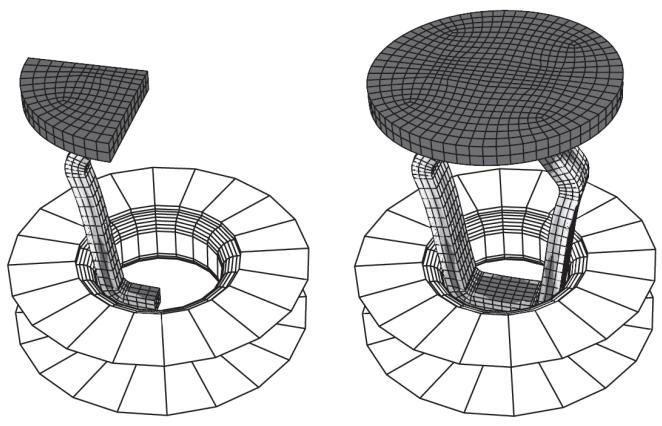  
图 1：四分之一对称模型（左）和完整紧固件显示（右）。  
图 2 显示了完整紧固件的矩形阵列。

  
图 2：紧固件的矩形阵列。

## 附加信息

•   扫掠和拉伸你的模型
•   细化曲边和曲面

## 镜像你的模型

1.  **定位镜像选项。**
    从主菜单栏中选择 视图->ODB 显示选项。在弹出的对话框中，单击 镜像/阵列 选项卡。镜像选项位于页面的上半部分。

2.  接受默认的全局坐标系，或者从“镜像坐标系”列表中选择一个坐标系。
    你可以选择输出数据库中存在的任何坐标系。如果不存在合适的坐标系，你可以使用在后处理期间创建坐标系中描述的方法之一创建新的坐标系。

3.  切换开启你希望 Abaqus/CAE 用来复制模型结果的镜像平面。

4.  如果你还希望 Abaqus/CAE 复制显示体，请切换开启“镜像显示体”。

5.  如果你将镜像与矩形或圆形阵列结合使用，请选择 Abaqus/CAE 用于创建副本的“操作顺序”。

6.  单击“应用”以实施你的更改。

    你的规格将反映在所有绘图状态中，并在会话期间被保存。如果你想将应用的更改保留到后续会话，请将它们保存到文件中。有关更多信息，请参阅为后续会话保存自定义设置。

    如果显示等值线图，等值线将出现在所有面上。

    如果显示符号或材料方向图，符号或材料方向将仅出现在原始模型面上。

## 阵列你的模型

1.  **定位阵列选项。**
    从主菜单栏中选择 视图->ODB 显示选项。在弹出的对话框中，单击 镜像/阵列 选项卡。阵列选项位于页面中部。

2.  接受默认的全局坐标系，或者从“阵列坐标系”列表中选择一个坐标系。
    你可以选择输出数据库中存在的任何坐标系。如果不存在合适的坐标系，你可以使用在后处理期间创建坐标系中描述的方法之一创建新的坐标系。

3.  按如下方式编辑矩形和圆形阵列参数：

    *   **矩形阵列**
        在所选坐标系的 X、Y 和 Z 方向上输入你想要显示的结果数量。
        -   输入每个方向上副本之间的偏移距离（以模型单位为单位）。

        要将副本相邻放置，每个方向的偏移必须与该方向的模型尺寸相同。

        

        **提示：** 如果你不知道模型尺寸，可以使用查询工具确定所需方向上第一个和最后一个模型节点之间的距离。（有关更多信息，请参阅理解可视化模块中的查询工具集。）

    *   **圆形阵列**
        选择旋转轴。
        -   输入你希望围绕所选轴显示的结果数量。
        -   如果需要，编辑 Abaqus/CAE 将用于定位副本的“总角度”。

        Abaqus/CAE 将原始结果放置在 0°。所有后续副本都根据总角度除以副本数进行定位。

4.  如果你同时使用矩形和圆形阵列，或者将阵列与镜像结合使用，请选择 Abaqus/CAE 用于创建副本的“操作顺序”。
5.  单击“应用”以实施你的更改。

    你的规格将反映在所有绘图状态中，并在会话期间被保存。如果你想将应用的更改保留到后续会话，请将它们保存到文件中。有关更多信息，请参阅为后续会话保存自定义设置。

    如果显示等值线图，等值线将出现在所有面上。

    如果显示符号或材料方向图，符号或材料方向将仅出现在原始模型面上。

## 细化曲边和曲面

如果你的模型包含二次单元、三次单元、2 节点弹簧单元或具有曲线段的解析刚性面，你可以控制 Abaqus/CAE 显示这些曲线模型组件的细化程度。同样，如果你的模型包含 2 节点阻尼器单元，你可以控制用于表示这些单元的符号的细化程度。在 ODB 显示选项对话框中单击“常规”选项卡，为曲边和曲面的显示选择从“超粗”到“超精”之间的细化级别。当你选择“超粗”细化时，Abaqus/CAE 使用直线显示曲线单元；中间节点对这些单元的显示形状没有影响。“超粗”细化将把弹簧和阻尼器视为直线。例如，在图 1 中，左侧未变形图使用了“超粗”细化级别，右侧同一模型的未变形图使用了“超精”细化级别。


## 注意：

随着细化级别的提高，显示性能将下降。“中等”设置应为大多数模型产生可接受的结果。

  
图 1：使用不同细化级别（超粗和超精）绘制的模型。

1.  **定位曲线与曲面选项。**
    从主菜单栏中选择 视图->ODB 显示选项。在弹出的对话框中，单击“常规”选项卡。曲线与曲面选项位于“常规”页面的顶部。

2.  单击“细化级别”按钮以显示细化选项。
3. 在细化列表中，单击所需的级别。超精细会产生最平滑的曲线，但可能降低绘图速度；相反，粗略细化会产生粗糙的外观，但绘图速度最快。

您指定的细化级别将显示在“细化级别”按钮上。

4. 单击“应用”以实施您的更改。

所有绘图状态下的曲线边和曲面都会随之更改，以反映您的细化设置，该设置在会话期间内保存。如果您希望将所应用的更改保留到后续会话，请将其保存到文件中。更多信息，请参阅保存自定义设置以供后续会话使用。

## 附加信息

• 拉伸和挤出模型

要生成等值线图，Abaqus/CAE 会从输出数据库中读取您指定的变量和帧的结果。某个特定变量和帧的结果可能不可用，或者可能不适用于图中包含的一个或多个单元。您可以为没有结果的单元指定显示颜色。默认颜色为白色。

例如，图 1 中的等值线图显示了在冲压变形过程中板材（坯料）上产生的 von Mises 应力（图中未显示冲头）。在这种情况下，对于没有结果的单元选择了灰色。模具单元显示为灰色是因为模具是刚性表面，没有应力结果。

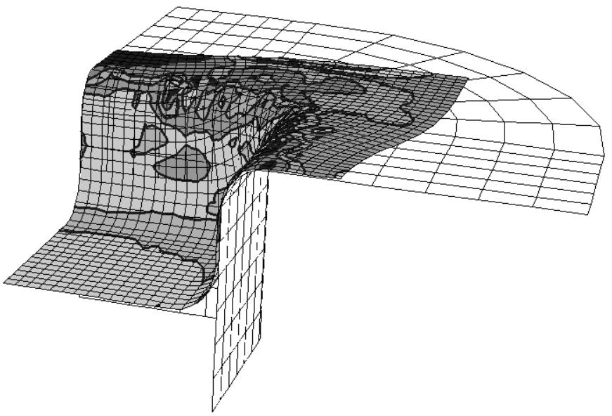
图 1：坯料和模具的等值线图。

1. 找到“无结果单元”选项。

从主菜单栏中，选择“视图”->“ODB 显示选项”。在出现的对话框中，单击“常规”选项卡。“无结果单元”选项位于“常规”页面的中央。

2. 单击颜色样本。

Abaqus/CAE 将显示“选择颜色”对话框。

3. 使用“选择颜色”对话框中的一种方法选择新颜色。更多信息，请参阅自定义颜色。

4. 单击“确定”关闭“选择颜色”对话框。

颜色样本将变为所选颜色。

5. 单击“应用”以实施您的更改。

等值线图中没有结果的单元（包括显示体）将更改，以反映您的颜色设置，该设置在会话期间内保存。如果您希望将所应用的更改保留到后续会话，请将其保存到文件中。更多信息，请参阅保存自定义设置以供后续会话使用。

## 附加信息

• 生成等值线图

• 自定义渲染样式、半透明度和填充颜色

## 控制后处理的梁截面显示

梁截面渲染仅在可视化模块中可用于未变形图、变形图和等值线图。对于变形图，当您更改变形比例因子时，Abaqus/CAE 会根据变形场输出变量缩放变形的位移分量，但不会使用变形的旋转分量缩放梁截面的扭转。

您可以通过在可视化模块中选择“视图”->“ODB 显示选项”来查看梁截面实际形状的显示。

梁截面的渲染需要输出数据库中存在梁方向数据。对于所有包含场输出的分析步，梁法线会自动写入输出数据库。对于包含几何非线性的分析，只有在模型中请求了节点输出时，才能在后处理期间显示梁截面。更多信息，请参阅使用在分析过程中积分的梁截面来定义截面行为。

Abaqus/CAE 不会渲染梁截面沿其长度方向的渐变。如果您的模型包含渐变梁截面，Abaqus/CAE 将使用梁的起始截面形状沿其整个长度进行渲染。有关渐变梁的更多信息，请参阅创建梁截面。

具有 BRADIUS 值的梁单元使用圆形梁截面渲染，其半径来自输出数据库中的 BRADIUS 字段。

显示梁截面有助于检查是否为特定区域分配了正确的截面，以及分配的梁方向是否导致了截面预期的方向。例如，图 1 显示了在示例：货用起重机中描述的轻型服务起重机上显示的箱形梁截面。

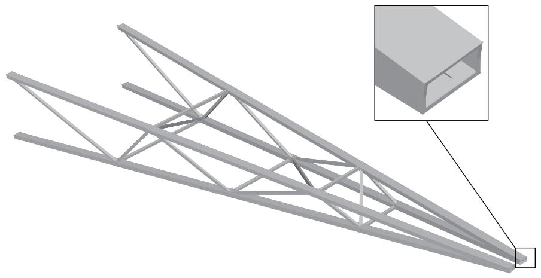
图 1：显示梁截面的货用起重机示例。


## 注意：

如果您的结果包含二次梁单元，Abaqus/CAE 在渲染梁截面时不会考虑这些单元的中间节点。

如果您为一条线段分配了通用梁截面，Abaqus/CAE 会将梁截面显示为椭圆形，其横截面积和惯性矩（$\pmb{I_{11}}$ 和 $\pmb{I_{22}}$）与您指定的值匹配。如果您为一条线段分配了桁架截面，Abaqus/CAE 会将桁架截面显示为圆形，其横截面积与您指定的值匹配。

Abaqus/CAE 根据当前的颜色编码和半透明度设置来渲染梁截面。当这些设置更改时，梁截面的颜色和半透明度也会随之更改。当梁截面显示时，Abaqus/CAE 会禁用模型的缩放和收缩。

1. 找到“渲染梁截面”选项。

从主菜单栏中，选择“视图”->“ODB 显示选项”。在出现的对话框中，单击“常规”选项卡。

2. 在对话框底部，打开“渲染梁截面”开关以显示梁截面。
3. 如果需要，对梁截面应用“缩放因子”以增大或减小其大小。默认值为 1。
4. 单击“确定”以实施您的更改并关闭对话框。

Abaqus/CAE 将以适当的尺寸和正确的方向显示梁截面形状。默认情况下，您的更改在会话期间内保存。如果您希望将所应用的更改保留到后续会话，请将其保存到文件中。更多信息，请参阅保存自定义设置以供后续会话使用。

## 附加信息

• 生成线性梁截面应力的等值线图
• 控制梁截面显示

## 控制后处理的壳厚度显示

壳厚度渲染在可视化模块中可用于所有绘图状态。

如果您在分析中使用壳单元对相对较薄的部件建模，您可以在后处理期间使用“视图”->“ODB 显示选项”来查看模型中这些壳单元的实际厚度。

对于变形图和等值线图，当您更改变形比例因子时，Abaqus/CAE 会缩放变形的位移分量，但不会缩放变形的旋转分量。对于等值线图，Abaqus/CAE 根据您选择的活动截面点位置应用颜色。如果当前活动的是顶部截面点或底部截面点，Abaqus/CAE 会将该截面点的等值线显示贯穿整个壳厚度；如果顶部和底部截面点当前都处于活动状态，Abaqus/CAE 会创建一个从顶部值到底部值贯穿壳厚度的线性等值线渐变。

在尺寸优化后显示壳厚度，可以让您查看随着优化的进行，结构设计区域内壳厚度的相应变化。

Abaqus/CAE 使用为模型未变形状态指定的壳厚度定义来确定用于后处理的壳厚度。如果您的模型在分析过程中经历大变形或大转动，则在变形图状态下可能无法很好地显示壳厚度。

显示壳厚度使您能够检查壳几何形状相对于模型其余部分的厚度。您可以对会话应用缩放因子来减小或增大壳厚度的显示。图 1 显示了对模型应用不同缩放因子的效果。

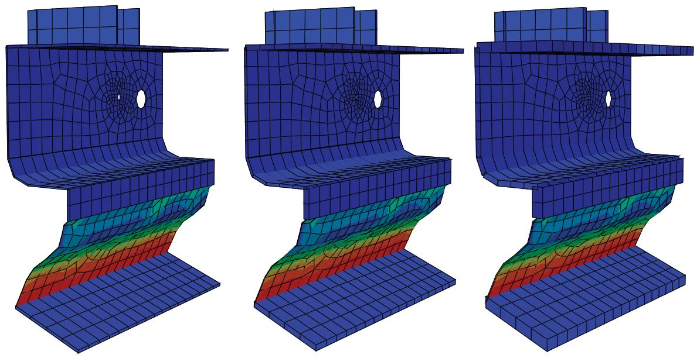
图 1：从左到右：壳厚度缩放因子设置为 0.5、1（默认）和 2。

Abaqus/CAE 仅为三维壳单元渲染壳厚度；对于轴对称壳单元（例如 SAX1 单元），不显示厚度。当显示壳厚度时，Abaqus/CAE 还会渲染壳几何形状的边缘，除非视口中显示了视图切割。Abaqus/CAE 根据当前的颜色编码和半透明度设置来渲染壳厚度。当这些设置更改时，壳厚度的颜色和半透明度也会随之更改。

1. 找到“渲染壳厚度”选项。

从主菜单栏中，选择“视图”->“ODB 显示选项”。在出现的对话框中，单击“常规”选项卡。

2. 在对话框底部，打开“渲染壳厚度”开关以显示模型中壳截面的壳厚度。
3. 如果需要，可对壳体厚度应用比例因子以增加或减少其厚度。默认值为 1，此时会按照壳体厚度设置进行逼真的渲染。
4.  + 点击 **确定** 以应用更改并关闭对话框。

Abaqus/CAE 会在选定的部件或装配中显示具有相应厚度的壳截面。默认情况下，您所做的更改将在当前分析会话期间保留。如果您希望将应用的更改保留以供后续会话使用，请将其保存到文件。更多信息，请参阅 *保存自定义设置以供后续会话使用*。

## 附加信息

* 控制壳体厚度显示

## 控制热流体管道单元的显示

在可视化 (Visualization) 模块中，热流体管道单元的渲染仅适用于未变形、已变形和等值线图。

热流体管道单元没有与之关联的变形；变形图和未变形图是相同的。

如果在您的分析中使用热流体管道单元来模拟流体在管道中的流动，您可以使用 **视图->ODB 显示选项** 来可视化流体管道以及流体压力、流体温度和壁温的等值线。为了清晰地可视化等值线和绘图形状，您应该创建一个仅包含热流体管道单元的显示组。

当您单独选择区域时，Abaqus/CAE 会将流体区域渲染为实心圆柱体，将内壁和外壁渲染为薄壁空心圆柱体。如果您选择同时渲染内壁和外壁，则会显示一个厚壁圆柱体。壁面的温度变化在端盖上是可见的。当您渲染多个区域时，只有最外层的区域在圆柱体表面可见；所有选定的区域都会在端盖处渲染。图 1 显示了流体管道内壁和外壁的节点温度 (NT11)。


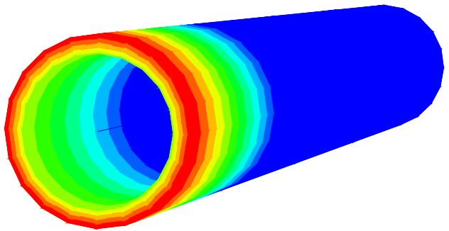  
图 1：流体管道热单元的渲染。

Abaqus/CAE 根据当前的颜色编码和透明度设置来渲染热流体管道单元。当这些设置改变时，热流体管道单元的颜色和透明度也会随之改变。当热流体管道单元被显示时，Abaqus/CAE 会禁用模型的缩放和收缩。

1.  找到 **流体管道热单元** 选项。
    从主菜单栏中，选择 **视图->ODB 显示选项**。在出现的对话框中，点击 **通用 (General)** 选项卡。
2.  在对话框底部，勾选 **流体管道热单元** 以渲染模型中的热流体管道单元。
3.  根据需要，勾选以下您想要渲染的区域：
    * 流体区域
    * 内壁
    * 外壁
4.  如果需要，可对每个选定区域的半径应用 **比例因子** 以增加或减少其厚度。默认值为 1。
5.  + 点击 **确定** 以应用更改并关闭对话框。

Abaqus/CAE 会在选定的部件或装配中显示热流体管道单元。默认情况下，您所做的更改将在当前分析会话期间保留。如果您希望将应用的更改保留以供后续会话使用，请将其保存到文件。更多信息，请参阅 *保存自定义设置以供后续会话使用*。

## 附加信息

* 选择绘图显示选项

## 查看移除的单元

您可以创建模型更改交互作用，以停用模型的选定组件（几何、单元、皮肤和加劲肋）。对于模型几何上的模型更改交互作用，皮肤、几何和单元可以从视口中移除。对于孤立网格上的模型更改交互作用，皮肤、加劲肋和单元可以从视口中移除。您可以从 **ODB 显示选项** 对话框控制这些被移除组件的可见性。

视口的行为取决于可见性切换开关的状态和绘图状态。在模型更改交互作用中停用的单元可以从视口中移除，适用于所有绘图状态。当从视口中移除停用单元的选项被关闭时，停用的单元在等值线图中显示为灰色，但在所有其他绘图状态下保持不变。如果显示梁截面轮廓的选项被关闭，无论移除单元的切换状态如何，Abaqus/CAE 都不会从视口中移除具有梁截面轮廓的停用单元。

1.  从主菜单栏中，选择 **视图->ODB 显示选项**。在出现的对话框中点击 **通用 (General)** 选项卡。**模型更改 (Model Change)** 显示选项位于 **通用 (General)** 页面的底部。
2.  勾选 **从视口中移除停用的单元 (Account for deactivated elements from the viewport)**。
3.  点击 **确定** 以应用更改并关闭对话框。

## 附加信息

* 定义模型更改交互作用

## 自定义视口注释

Abaqus/CAE 生成的视口注释包括图例、标题块、状态块、三维指南针和视图三轴；提供这些是为了帮助您识别和解释绘图内容。此外，您可以在视口中添加自定义文本和箭头注释（更多信息，请参阅 *管理画布上的视口*）。您可以使用 **视口注释选项** 来打开和关闭所有视口注释，也可以自定义 Abaqus/CAE 生成的注释的外观。

有关三维指南针的信息，请参阅 *三维指南针*。有关视图三轴的信息，请参阅 *自定义视图三轴*。

## 本节内容：

* 自定义图例
* 自定义标题块
* 自定义状态块
* 使用视口注释选项

## 自定义图例

图例是帮助您解释绘图的关键。例如，等值线图图例显示了每种等值线颜色代表的值；符号图图例显示了每种矢量颜色代表的值。X-Y 图图例通过标签引用每条曲线并显示曲线的样式。

图 1 显示了一个等值线图图例和一个符号图图例。
  
图 1：等值线图图例和符号图图例。

您可以显示或抑制所有绘图状态的图例，并且可以自定义以下内容：
* 图例的位置，
* 图例文本的字体和颜色，
* 图例轮廓框的外观，
* 是否显示绘图的最小值和最大值，
* 图例背景（图例后面的矩形区域）的外观，
* 显示的数字值的格式，以及
* 图例值显示的位数。

您无法直接指定图例的大小。但是，通过改变文本字体的大小或图例值的位数，您可以增加或减小图例的大小。

图例的内容取决于绘图类型和绘图状态特定选项（例如等值线间隔数）。有关等值线图图例内容的更多信息，请参阅 *理解等值线图*。

本节介绍如何为除 X-Y 图以外的所有绘图状态自定义图例。要自定义 X-Y 图图例，请参阅 *自定义 X-Y 图图例*。

1.  找到 **图例 (Legend)** 选项。
    从主菜单栏中，选择 **视口->视口注释选项**。
2.  要显示或抑制除 X-Y 图以外的所有绘图状态的图例，请在 **通用 (General)** 选项卡中勾选 **显示图例 (Show legend)**。
    当 **显示图例** 开启时，图例选项变为可用。
3.  点击 **图例 (Legend)** 选项卡。基本的图例选项位于 **图例 (Legend)** 页面的顶部。
4.  要显示或抑制环绕图例的轮廓框，请勾选 **显示边界框 (Show bounding box)**。这个“边界框”在视觉上将图例与底层绘图分开。
5.  要显示或抑制与等值线图相关的最小值和最大值，请勾选 **显示最小/最大值 (Show min/max values)**。
6.  设置图例左上角的位置。
    要控制 X 或 Y 位置，请分别点击 **% 视口 X (% Viewport X)** 或 **% 视口 Y (% Viewport Y)** 框。输入您希望的位置，作为当前视口总宽度的百分比。
7.  自定义图例文本字体。
    a. 点击 **设置字体 (Set Font)**。
        将出现 **选择字体 (Select Font)** 对话框。
    b. 使用 **选择字体 (Select Font)** 对话框选择您想要的字体特性。更多信息，请参阅 *自定义字体*。
    c. 完成后，点击 **确定** 以应用更改并关闭 **选择字体 (Select Font)** 对话框。
8.  选择图例文本的颜色。
    a. 点击颜色样本 。
        Abaqus/CAE 显示 **选择颜色 (Select Color)** 对话框。
    b. 使用对话框中的一种方法选择新颜色。更多信息，请参阅 *自定义颜色*。
    c. 点击 **确定** 关闭 **选择颜色 (Select Color)** 对话框。
        颜色样本变为所选颜色。
9.  要自定义背景，请点击以下之一：
• 匹配视口 以匹配背景与视口颜色。  
• 透明 以消除背景，仅显示文本。  
• 其他颜色 以显示其他背景颜色选项。

如果您选择了其他颜色：

a. 单击颜色样本 。  
Abaqus/CAE 显示选择颜色对话框。  
b. 使用选择颜色对话框中的一种方法选择新颜色。更多信息，请参见自定义颜色。  
c. 单击“确定”关闭选择颜色对话框。

颜色样本变为所选颜色。

10. 要更改图例值的格式，请单击格式箭头并选择以下格式之一：

选择科学计数法 以科学计数法显示图例值，该方法将图例值表示为 1 到 10 之间的十进制值乘以 10 的幂。例如，当您为此数字 501,000 选择此格式时，值在图例中显示为 5.01e5。  
• 选择固定 表示不使用指数值显示图例值。当您选择此格式时，数字 501,000 在图例中显示为 501000.00。  
选择工程计数法 表示工程计数法，其格式类似于科学计数法，但仅允许指数为 3 的倍数的值。当您选择此格式时，数字 501,000 在图例中显示为 501E3。


## 注意：

所有这三个示例都显示为两位小数。如果您更改了小数位数选项，您的图例值可能会以不同方式显示。

11. 要选择图例值中显示的位数，请单击小数位数箭头。对于科学计数法或固定格式的图例值，小数位数选项控制小数点右侧的位数。对于工程计数法格式的图例值，此选项控制指数值左侧的有效数字位数。对于所有格式，较大的小数位数值需要更多的显示空间。

指定的位数出现在小数位数框中。

12. 单击“应用”以实现您的更改。

在当前视口中，所有绘图的图例都会更改以反映您的规格，这些规格在会话期间保存。

## 自定义标题栏

标题栏包含标识当前绘图中模型和结果的文本。此文本表明：

• 输出数据库的名称（来自分析作业的名称）。  
• 模型的描述。  
• 用于生成输出数据库的产品名称（通常为 Abaqus/Standard 或 Abaqus/Explicit）和版本。  
• 输出数据库最后修改的日期。

您可以显示或抑制所有绘图状态的标题栏，并且可以显示或抑制包围标题栏的框的外观。此外，您可以控制标题栏的位置、文本字体、文本颜色以及标题栏背景的外观。您不能直接指定标题栏的大小。但是，通过改变文本字体的大小，您可以增加或减小标题栏的大小。标题栏的内容是固定的，无法自定义。

1. 找到标题栏选项。  
从主菜单栏中，选择视口 -> 视口注解选项。  
2. 要显示或抑制所有绘图状态的标题栏，请在“常规”选项卡中切换显示标题栏。  
当显示标题栏处于开启状态时，标题栏选项变为可用。  
3. 单击标题栏选项卡。基本的标题栏选项位于标题栏页面的顶部。  
4. 要显示或抑制包围标题栏的框，请切换显示边界框。此“边界框”在视觉上将标题栏与底层绘图分开。  
5. 确定标题栏左上角的位置。

要控制 X 或 Y 位置，请分别单击 % 视口 X 或 % 视口 Y 框。以当前视口总宽度的百分比形式输入您想要的位置。

6. 自定义标题栏文本字体。

a. 单击设置字体。出现选择字体对话框。

b. 使用选择字体对话框选择您想要的字体特性。更多信息，请参见自定义字体。

c. 完成后，单击“确定”以实现更改并关闭选择字体对话框。

7. 选择标题栏文本的颜色。

a. 单击颜色样本 。  
Abaqus/CAE 显示选择颜色对话框。  
b. 使用对话框中的一种方法选择新颜色。更多信息，请参见自定义颜色。  
c. 单击“确定”关闭选择颜色对话框。  
颜色样本变为所选颜色。

8. 要自定义背景，请单击以下选项之一：

• 匹配视口 以匹配背景与视口颜色。  
• 透明 以消除背景，仅显示文本。  
• 其他颜色 以显示其他背景颜色选项。

如果您选择了其他颜色：

a. 单击颜色样本 。

Abaqus/CAE 显示选择颜色对话框。

b. 使用选择颜色对话框中的一种方法选择新颜色。更多信息，请参见自定义颜色。

c. 单击“确定”关闭选择颜色对话框。

颜色样本变为所选颜色。

9. 单击“应用”以实现您的更改。

在当前视口中，所有绘图的标题栏都会更改以反映您的规格，这些规格在会话期间保存。

## 自定义状态块

状态块包含标识与当前绘图关联的分析结果的文本。此信息包括适用的步骤、帧、结果变量、变形放大因子、振型和特征值。

您可以显示或抑制所有绘图状态的状态块，并且可以显示或抑制包围状态块的框的外观。此外，您可以控制状态块的位置、文本字体、文本颜色以及状态块背景的外观。您不能直接指定状态块的大小。但是，通过改变文本字体的大小，您可以增加或减小状态块的大小。状态块的内容是固定的，无法自定义。

1. 找到状态块选项。  
从主菜单栏中，选择视口 -> 视口注解选项。  
2. 要显示或抑制所有绘图状态的状态块，请在“常规”选项卡中切换显示状态块。  
当显示状态块处于开启状态时，状态块选项变为可用。  
3. 单击状态块选项卡。基本的状态块选项位于状态块页面的顶部。  
4. 要显示或抑制包围状态块的框，请切换显示边界框。此“边界框”在视觉上将状态块与底层绘图分开。  
5. 确定状态块左上角的位置。

要控制 X 或 Y 位置，请分别单击 % 视口 X 或 % 视口 Y 框。以当前视口总宽度的百分比形式输入您想要的位置。

6. 自定义状态块文本字体。

a. 单击设置字体。  
出现选择字体对话框。  
b. 使用选择字体对话框选择您想要的字体特性。更多信息，请参见自定义字体。  
c. 完成后，单击“确定”以实现更改并关闭选择字体对话框。

7. 选择状态块文本的颜色。

a. 单击颜色样本  
Abaqus/CAE 显示选择颜色对话框。  
b. 使用对话框中的一种方法选择新颜色。更多信息，请参见自定义颜色。  
c. 单击“确定”关闭选择颜色对话框。  
颜色样本变为所选颜色。

8. 要自定义背景，请单击以下选项之一：

• 匹配视口 以匹配背景与视口颜色。  
• 透明 以消除背景，仅显示文本。  
• 其他颜色 以显示其他背景颜色选项。

如果您选择了其他颜色：

a. 单击颜色样本 。

Abaqus/CAE 显示选择颜色对话框。

b. 使用选择颜色对话框中的一种方法选择新颜色。更多信息，请参见自定义颜色。

c. 单击“确定”关闭选择颜色对话框。

颜色样本变为所选颜色。

9. 单击“应用”以实现您的更改。

在当前视口中，所有绘图的状态块都会更改以反映您的规格，这些规格在会话期间保存。

## 使用视口注解选项

使用视口注解选项来自定义所有绘图状态的图例、标题栏、状态块、3D 指南针和视图三轴架。此外，视口注解选项控制箭头和文本注解的显示。

1. 从主菜单栏中，选择视口 -> 视口注解选项。

出现视口注解选项对话框。它包含以下选项卡：

常规： 控制所有视口注解的显示——包括由 Abaqus/CAE 生成的以及您创建的任何箭头和文本注解。
• 三轴架 (Triad)：控制视图三轴架的外观和位置。  
• 图例 (Legend)：控制图例的外观和位置，以及是否显示最小值和最大值。  
• 标题栏 (Title Block)：控制标题栏的外观和位置。  
• 状态栏 (State Block)：控制状态栏的外观和位置。  

2. 使用**通用选项卡 (General tab)** 可控制当前视口中所有图表的视口注释显示。点击 **全部开启 (Set all on)** 可显示当前视口中的所有视口注释，或点击 **全部关闭 (Set all off)** 可隐藏当前视口中的所有视口注释。  

3. 使用对话框中的其余选项卡来自定义 Abaqus/CAE 生成的视口注释。要创建和自定义箭头及文本注释，请参阅 **使用视口箭头和文本注释**。  

## 附加信息  

• 什么是箭头和文本注释？  
• 自定义三维罗盘  
• 自定义视图三轴架  
• 自定义图例  
• 自定义标题栏  
• 自定义状态栏  

---

[上一章：建模技术](modeling-techniques.md) · [下一章：使用工具集](toolsets.md)
