# 第 2 章 - 仿真工作流

CST Studio Suite 粒子动力学仿真模块的设计目标是易于使用。不过，如果希望快速上手，仍然需要先了解一些基本内容。本章的主要目的，是概览该软件的功能。请仔细阅读本章，因为这可能是学习如何高效使用该软件的最快方式。

本章包含三个不同的工作流示例，分别用于粒子跟踪、Particle-in-Cell（PIC，粒子云网格法）以及尾场计算：

## 1. 工作流示例：粒子跟踪

1.1. 建立并仿真一个简单电子枪模型，包括一次粒子仿真（静态近似）  
1.2. 对模型进行参数研究，并对结构进行自动优化

## 2. 工作流示例：电磁 Particle-in-Cell

2.1. 建立并仿真一个简单输出腔

## 3. 工作流示例：尾场

3.1. 建立并仿真一个简单圆柱谐振腔

## 仿真工作流：粒子跟踪

下面的示例说明如何设置并运行一个简单的粒子跟踪仿真。仔细学习该示例，可以帮助你熟悉在 CST Studio Suite 中执行粒子跟踪仿真所需的许多标准操作。关于 Tracking 求解器可建模物理问题的更多信息，可参见第 3 章“求解器概述：粒子跟踪求解器”中的概览说明。

即使你并不打算使用该软件进行粒子跟踪仿真，也请认真阅读下面的说明。该示例中只有很小一部分内容是这种特定应用类型专有的；大多数考虑因素都是通用的，适用于所有求解器和应用领域。

在本示例末尾，你会看到一些说明，介绍静电计算和静磁计算的典型仿真流程之间的差异，并给出设置粒子跟踪与电子枪算法时的一些实用提示。

下面的说明始终采用基于菜单的方式，介绍如何打开某个对话框或启动某条命令。只要有对应的工具栏按钮，都会在命令说明旁显示出来。由于本手册篇幅有限，激活某条命令的最短方式（例如按快捷键，或从上下文菜单中激活命令）将不再列出。你应当经常打开上下文菜单，查看当前活动模式下可用的命令。

## 结构

通常，电子枪只是复杂设备中的一个组成部分，例如粒子加速器。电子枪用于产生准直的粒子束，从而为设备中的其他部件提供质量良好的束流。

该电子枪的工作方式非常简单。电子由阴极发射，粒子源基于空间电荷限制发射模型产生这些电子。随后，这些粒子由阳极加速并聚焦。阳极后方的一组磁体用于实现额外聚焦。

下图显示了所关注的结构。为了便于观察，该结构已被剖开。阳极和阴极由理想电导体（PEC）材料构成，而阳极上方的磁结构由铁和永磁体构成。

图中文字

铁
铁
磁体
磁体
磁体
阳极
阴极

在开始建立结构模型之前，我们先花一点时间讨论如何高效地描述该结构。

在 CST Studio Suite 中，用户可以定义背景材料的属性。凡是没有用特定材料填充的区域，都会自动由背景材料填充。对于本结构，只需要建立电子枪的阳极、阴极、两个铁盘和三个永磁体。背景属性将设置为真空。

因此，描述该结构的方法应如下所示：

1. 建立电子枪的阴极和阳极模型。  
2. 建立两个铁盘模型。  
3. 建立三个永磁体模型。

## 创建新工程

启动 CST Studio Suite 后，你会进入起始界面。该界面会显示最近打开的工程列表，并允许你选择最符合需求的应用。最简单的入门方式是配置一个工程模板，该模板定义了典型应用所需的重要基本设置。因此，请在 New and Recent 选项卡中的 New Project from Template 区域，单击 New Template 按钮。

接下来，应选择应用领域。本教程示例选择 Particle Dynamics，然后通过双击对应条目来选择工作流。

流程图

对于电子枪，请选择 Vacuum Electronic Devices  Particle Gun Particle Tracking。

最后，系统会要求你选择最适合该应用的单位。对于本示例，请按如下方式选择尺寸单位：

<table><tr><td>尺寸：</td><td>mm</td></tr><tr><td>频率：</td><td>Hz</td></tr><tr><td>时间：</td><td>s</td></tr></table>

对于本教程中的具体应用，其他设置可以保持不变。单击 Next 按钮后，可以为工程模板指定名称，并查看初始设置摘要：

图中文字

CST Studio Suite
创建工程模板
带电粒子动力学 | 真空电子器件 | 粒子枪 | 求解器 | 单位 | 摘要
请检查你的选择，然后单击“Finish”创建模板：
模板名称：Particle Gun
求解器	单位
Trk
粒子跟踪	- 尺寸：mm
	- 频率：Hz
	- 时间：s
	- 温度：°C
< Back	Finish	Cancel

最后，单击 Finish 按钮保存工程模板，并使用相应设置创建新工程。由于在 Particle Dynamics 应用领域中选择了该特定工程模板，CST Studio Suite 粒子动力学仿真模块会自动启动。

请注意：当你再次单击 File: New and Recent 时，会看到刚刚定义的模板出现在 Project Templates 区域下方。以后在同一应用领域创建其他工程时，只需单击该模板条目，即可用一组实用的基本设置启动 CST Studio Suite 粒子动力学仿真模块。无需每次都重新定义新模板。现在，只需单击相应模板，就能快速使用合理的初始设置启动软件。

请注意：为工程模板所做的所有设置，都可以在后续模型构建过程中修改。例如，单位可以在单位对话框中修改（Home: Settings Units），求解器类型可以通过 Home: Simulation Setup Solver 下拉列表选择。

## 打开 Tracking 快速入门指南

在线帮助系统中的一个有用功能是 QuickStart Guide，这是一个电子助手，可引导你完成仿真过程。如果它没有自动显示，可以在右上角 Help 按钮旁的下拉列表中选择 QuickStart Guide 来打开该助手。

随后，主视图右上角应显示如下对话框：

图中文字

QuickStart Guide
粒子跟踪分析：帮助
✓ 设置单位
✓ 设置背景材料
▶ 定义结构
✓ 设置边界条件
定义源
定义粒子源
启动求解器
分析结果
<< Back Close

由于工程模板已经设置了求解器类型、单位、背景材料和边界条件，因此 Particle Tracking Analysis 已被预先选中，并且其中一些条目标记为已完成。蓝色箭头始终指示当前问题定义所需的下一步。你不一定必须按此顺序执行各步骤，但建议在开始阶段遵循该指南，以确保所有必要步骤都已完成。

在执行本示例的各个步骤时，请留意该对话框。你可以随时关闭该助手。即使稍后重新打开窗口，它也会始终指示下一项必需步骤。

如果你不确定如何访问某项操作，请单击对应行。QuickStart Guide 随后会播放一段动画，显示相关菜单项的位置，或者打开对应的帮助页面。

## 定义单位

Particle Gun 模板已经为你应用了一些设置。该结构类型的默认设置为几何单位 mm，时间单位 s。你可以在单位对话框中修改这些设置（Home: Settings Units），但在本示例中，只需保留模板指定的设置即可。此外，所用单位也会显示在状态栏中：

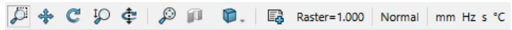

## 定义背景材料

如前所述，该结构将在真空中描述。Particle Gun 模板将材料类型 Normal 设置为默认背景材料。对于本示例，由于 Normal 材料类型的默认属性就是真空属性，因此不需要做任何更改。如果需要修改这些属性，可以在相应对话框中完成：Simulation: Settings Background。

## 建立结构模型

基本设置已经完成，现在可以开始建立结构。由于电子枪具有旋转对称性，因此可以采用一种特殊且非常高效的技术来设计该结构。首先创建阴极。

1. 打开 Rotate Profile 对话框 Modeling: Shapes Rotate Face，以创建阴极。  
2. 按 ESC 键显示该对话框。不要在工作平面中单击任何点。

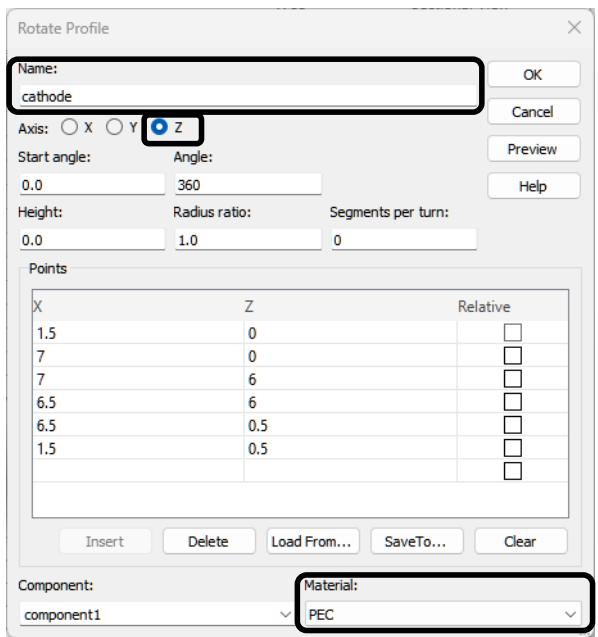

图中文字

Rotate Profile
名称：
cathode
轴：○ X ○ Y ● Z
起始角：角度：
0.0 360
高度：半径比：每圈分段数：
0.0 1.0 0
点
X Z 相对
1.5 0
7 0
7 6
6.5 6
6.5 0.5
1.5 0.5
Insert Delete Load From... SaveTo... Clear
部件：
component1 材料：
PEC

3. 输入名称 “cathode”，并选择 Z 作为旋转轴。将材料设置为 PEC。然后按下表输入多边形数据。

<table><tr><td>x</td><td>z</td></tr><tr><td>1.5</td><td>0.0</td></tr><tr><td>7.0</td><td>0.0</td></tr><tr><td>7.0</td><td>6.0</td></tr><tr><td>6.5</td><td>6.0</td></tr><tr><td>6.5</td><td>0.5</td></tr><tr><td>1.5</td><td>0.5</td></tr></table>

4. 在构建过程中，可以单击 Preview 按钮预览实体。这样可以方便地发现输入数据时可能出现的错误。

此时，对话框应与上图类似。单击 OK 按钮确认设置并构建阴极。

5. 结构会显示在工作平面中，此时阴极应如下所示：

自然图像

一个带中心孔的圆柱形机械零件的三维渲染图（无文字或符号）

阴极还有一部分尚未建立，即内部圆柱体。我们需要用该内部圆柱体定义粒子源。要创建该圆柱体，请打开 Cylinder 对话框 Modeling: Shapes Cylinder。按 ESC 键显示对话框。

图中文字

Cylinder
名称：
cathode_inner
方向：X Y Z
外半径：
0.0
X 中心：Y 中心：
0 0
Z 最小值：Z 最大值：
0 0.5
分段数：
0
部件：
component1
材料：
PEC

将名称改为 “cathode_inner”，输入外半径 1.5，并将 Zmax 设为 0.5。单击 OK 按钮确认修改。该圆柱体应正好嵌入实体阴极的孔中：

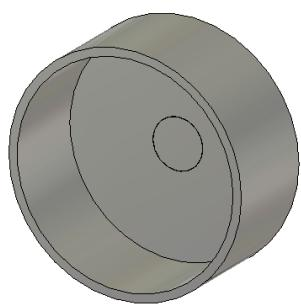

自然图像

一个带圆形切口和中心孔的圆柱形物体三维渲染图（无文字或符号）

6. 阴极的构建已经完全完成。接下来，我们将用与构建外部阴极相同的方法构建阳极。打开 Rotate Profile 对话框 Modeling: Shapes Rotate Face。  
7. 按 ESC 键显示该对话框。不要在工作平面中单击任何点。

8. 输入名称 “anode”，并选择 z 作为旋转轴。材料 PEC 应会自动选中。

图中文字

Rotate Profile
名称：
anode
轴：X Y Z
起始角：角度：
0.0 360
高度：半径比：每圈分段数：
0.0 1.0 0
点
X Z 相对
20 25
40 25
40 31
2.1 31
2.1 30
20 30
Insert Delete Load From... SaveTo... Clear
部件：材料：
component1 PEC

现在按下表输入多边形数据：

<table><tr><td>x</td><td>z</td></tr><tr><td>20.0</td><td>25.0</td></tr><tr><td>40.0</td><td>25.0</td></tr><tr><td>40.0</td><td>31.0</td></tr><tr><td>2.1</td><td>31.0</td></tr><tr><td>2.1</td><td>30.0</td></tr><tr><td>20.0</td><td>30.0</td></tr></table>

此时，对话框应与上图类似。单击 OK 按钮确认修改。阳极创建完成后，整个结构应如下所示（图中已旋转以便观察）：

自然图像

带有同心圆特征和中心孔的三维渲染机械零件（无文字或符号）

9. 你可能已经注意到，结构的磁性部分仍然缺失。首先，我们将构建三个真空圆盘，它们将作为永磁体使用。要创建一个圆盘，请打开 Cylinder 对话框 Modeling: Shapes Cylinder。按 ESC 键显示该对话框。  
10. 输入名称 “magnet”，外半径 32.8，内半径 5.8。z 范围从 31 mm 延伸到 37.9 mm。将材料改为 vacuum。单击 OK 按钮确认修改。

图中文字

Cylinder
名称：
magnet
方向：X Y Z
外半径：内半径：
32.8 5.8
X 中心：Y 中心：
0 0
Z 最小值：Z 最大值：
31 37.9
分段数：
0
部件：
component1
材料：
Vacuum

11. 由于同样的圆柱体需要出现三次，因此我们将使用变换对话框创建缺少的另外两个圆柱体。首先，在导航树中选择实体 “magnet”：NT: Components => component 1 magnet。

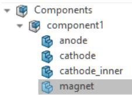

12. 打开 Transform Selected Object 对话框 Modeling: Tools Transform，以复制该圆柱体。

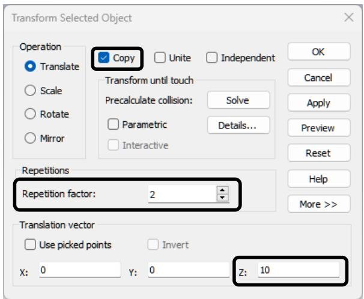

图中文字

Transform Selected Object
操作
平移
缩放
旋转
镜像
复制
合并
独立
OK
Cancel
Apply
Preview
Reset
重复
重复因子：2
More >>
平移矢量
使用拾取点
反向
X：0
Y：0
Z：10

勾选 Copy 复选框。然后输入 z 方向平移量 10。将 Repetition factor 改为 2，并单击 OK 按钮确认修改。此时结构应如下所示：

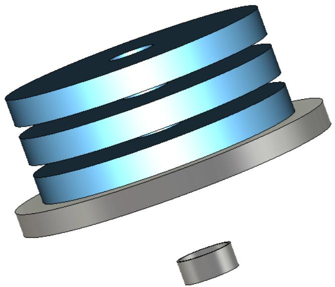

自然图像

带有分层蓝色和灰色部分的三维渲染机械部件，无可见文字或符号

13. 在定义铁盘之前，我们先创建一种新的简单铁材料。为此，打开材料对话框 Modeling: Materials New/Edit New Material。将 Material name 改为 “Iron”，将 Color 改为红色，并将 Mu 的值设为 100，如下图所示。这样，我们就快速定义了一种简单铁材料。单击 OK 按钮确认修改并退出该对话框。

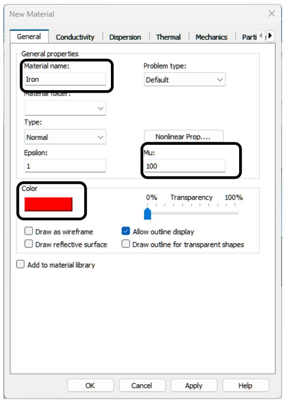

图中文字

New Material
General Conductivity Dispersion Thermal Mechanics Parti
常规属性
材料名称：
Iron
问题类型：
Default
材料文件夹：
类型：
Normal
Epsilon：
1
Nonlinear Prop....
Mu：
100
颜色
0% 透明度 100%
Draw as wireframe
Allow outline display
Draw reflective surface
Draw outline for transparent shapes
Add to material library
OK Cancel Apply Help

14. 铁盘的创建方式与磁体相同。打开 Cylinder 对话框 Modeling: Shapes Cylinder。按 ESC 键显示该对话框。

图中文字

Cylinder
名称：
iron
方向：X Y Z
外半径：内半径：
32.8 5.8
X 中心：Y 中心：
0 0
Z 最小值：Z 最大值：
37.9 41
分段数：
0
部件：
component1
材料：
Iron

15. 输入名称 “iron”，外半径 32.8，内半径 5.8。z 范围从 37.9 mm 延伸到 41 mm。将材料改为新材料 “Iron”。此时，对话框应与上图类似。  
16. 最后，单击 OK 按钮确认修改。为了创建第二个铁盘，我们将再次使用变换机制。在导航树中选择实体 “iron”。

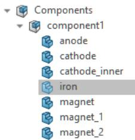

流程图

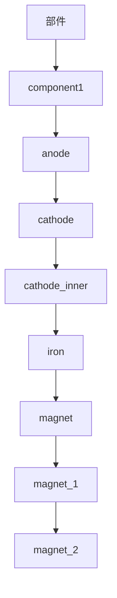

17. 打开 Transform Selected Object 对话框 Modeling: Tools Transform，以复制该圆柱体。

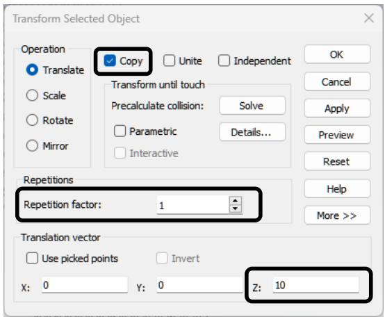

图中文字

Transform Selected Object
操作
平移
缩放
旋转
镜像
复制
合并
独立
OK
Cancel
Apply
Preview
Reset
重复
重复因子：1
平移矢量
使用拾取点
反向
X：0
Y：0
Z：10

18. 选择 Copy，并输入 z 方向平移量 10。单击 OK 按钮确认修改。现在，结构应如下所示：

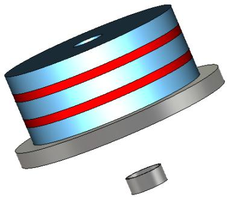

自然图像

带有分层结构和两个小圆柱形部件的三维渲染机械部件（无文字或符号）

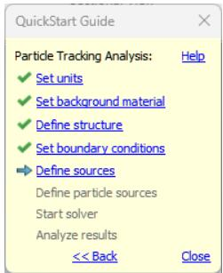

图中文字

QuickStart Guide
粒子跟踪分析：帮助
✓ 设置单位
✓ 设置背景材料
✓ 定义结构
✓ 设置边界条件
▶ 定义源
定义粒子源
启动求解器
分析结果
<< Back Close

19. 结构创建部分已经完成，现在可以开始定义源，即电势、磁体和粒子源。

祝贺你！你刚刚在 CST Studio Suite 中创建了第一个粒子跟踪结构。

## 定义电势和磁体

用于配置静电部分的所有部件都已定义完成，现在可以设置相应的电势。首先，定义阴极和阳极的电势：

1. 选择 Simulation: Sources and Loads Static Sources Electric Potential，并在工作平面中双击 “cathode” 实体的表面。按 Return 键完成选择并打开 Define Potential 对话框。

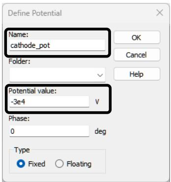

图中文字

Define Potential
名称：
cathode_pot
文件夹：
电势值：
-3e4
V
相位：
0 deg
类型
固定    浮动

2. 输入名称 “cathode_pot”，并输入数值 -3e4 V。照常单击 OK 按钮确认修改。  
3. 用同样方式定义阳极电势。选择 Simulation: Sources and Loads Static Sources Electric Potential，并双击阳极表面。按 Return 键完成选择并打开 Define Potential 对话框。  
4. 输入名称 “anode_pot”，并输入数值 0 V。单击 OK 按钮确认修改。

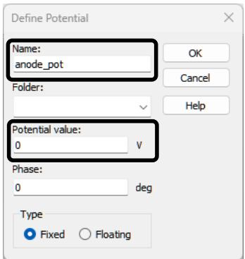

图中文字

Define Potential
名称：
anode_pot
文件夹：
电势值：
0
V
相位：
0 deg
类型
固定    浮动

5. 如果现在在导航树中选择 potential 文件夹，你的结构应如下图所示：

自然图像

带有红色和蓝色侧边指示的金属面板三维渲染图（无文字或符号）

注意：由于实体 “cathode” 和 “cathode_inner” 直接接触，因此二者具有相同电势。这意味着 “cathode_inner” 的电势同样为 -30 kV。

6. 电势定义完成后，我们将为三个真空圆盘创建三个永磁体。要定义第一个磁体，请选择 Simulation: Sources and Loads Static Sources Permanent Magnet。  
7. 然后选择要成为永磁体的实体。因此，双击名为 “magnet” 的真空圆盘。

自然图像

带有红色和灰色环带以及蓝色方向箭头的三维渲染机械部件（无文字或符号）

8. Define Magnet 对话框会打开。确保矢量分量设置为 X: 0、Y: 0、Z: 1，并且未勾选 Inverse direction。将剩余磁通密度输入为 0.02 T。其他设置保持不变，单击 OK 确认。

图中文字

Define Magnet
名称：magnet1
磁化方向
类型：Constant
方向
X：0
Y：0
Z：1
□ 反向
剩余磁通
Br (T)：0.02
材料信息
名称：Vacuum
Mu：1.0
Hc B (A/m)：1.592e+04

9. 按相同方式，为真空实体 “magnet_1” 和 “magnet_2” 定义 z 方向磁体。实体 “magnet_1” 应为三个圆盘中间的那个真空圆盘。

<table><tr><td>实体</td><td>名称</td><td>X</td><td>Y</td><td>Z</td><td>反向</td><td>Br (T)</td></tr><tr><td>magnet</td><td>magnet1</td><td>0</td><td>0</td><td>1</td><td> $\square$ </td><td>0.02</td></tr><tr><td>magnet_1</td><td>magnet2</td><td>0</td><td>0</td><td>1</td><td> $\checkmark$ </td><td>0.01</td></tr><tr><td>magnet_2</td><td>magnet3</td><td>0</td><td>0</td><td>1</td><td> $\square$ </td><td>0.01</td></tr></table>

10. 如果现在在导航树中选择 Permanent Magnets 文件夹，应看到如下图像：

图中文字

magnet3：0.01 T
magnet2：-0.01 T
magnet1：0.02 T

11. 电势和磁体定义现已完成。

在实际操作中，建议在定义粒子源之前先可视化并细化网格。原因是粒子源的发射点数量可能取决于网格设置。该问题将在后续“定义粒子源”一节中详细讨论。

## 可视化并细化网格

默认情况下，Particle Tracking 求解器使用六面体网格计算静电场和静磁场。对于本示例中这种与坐标轴对齐的结构，这是最佳选择。不过，特别是当粒子轨迹附近的表面为曲面时，四面体网格单元对这些表面的表示可能更合适，并能给出更精确的结果。为了将重点放在仿真工作流本身上，我们会在后面更专门的章节中讨论四面体网格。

结构分析所用网格会基于专家系统自动生成。不过，在某些情况下，检查网格可能有助于通过修改网格生成参数来提高仿真速度。

可通过进入网格视图来显示网格：Home: Mesh Mesh View。对于该结构，网格信息将如下显示：

自然图像

带有红色和蓝色环带的圆柱形机械部件三维 CAD 模型，外部包围线框网格（无文字或符号）

一次只能看到一个二维网格平面。你可以通过调整 Mesh: Sectional View Normal 下拉列表中的选项来修改网格平面的方向，也可以直接按 X/Y/Z 键。使用 Up/Down 光标键可沿平面法向移动该平面。当前平面位置会显示在 Mesh: Sectional View Position 字段中。

网格视图中会显示一些较粗的网格线。这些网格线表示重要平面（所谓吸附平面），专家系统认为这些平面上有必要布置网格线。可以通过选择 Simulation: Mesh Global Properties Specials Snapping，在 Special Mesh Properties 对话框中控制这些吸附平面。

在许多情况下，自动网格生成会产生合理的初始网格；但在本例中，我们将细化阴极区域的网格，以便为粒子束提供更细的网格分辨率。

1. 确认当前处于网格视图模式。在导航树中选择实体 cathode：NT: Components component1 cathode。

2. 打开对话框 Mesh: Mesh Control Local Properties，用于修改阴极的局部网格设置。在 General 选项卡中，从 Volume refinement 下拉列表选择 Absolute value。此时会出现 Use same setting in all three directions 复选框。取消勾选该复选框，并将 x 和 y 方向的步长改为 0.4。

图中文字

Local Mesh Properties - Hexahedral
General Snapping
名称：component1:cathode
✓ 纳入仿真
✓ 纳入包围盒
网格组：meshgroup1
✓ 使用全局细化设置
体积细化
绝对值
0.4 0.4 0
□ 在 x、y、z 方向使用相同设置
✓ 基于材料的细化
边细化
None
OK
Cancel
Help

3. 照常单击 OK 按钮确认修改。对话框关闭后，可以看到修改后的网格。

自然图像

网格背景上的红色水平条纹抽象几何图案（无文字或符号）

网格单元数量应为 497,536。可以从状态栏获取该信息。

现在可以通过 Mesh: Close Close Mesh View 离开网格检查模式。

## 定义粒子源

粒子源是部件上的一个成形表面，带电粒子在特定发射条件下从该表面进入计算域；该发射条件由发射模型设置决定。这样的源通常位于 PEC 实体表面，但也可以定义在任意材料的表面上。在本例中，粒子源将放置在内部阴极上。为了便于选择内部阴极的表面，需要隐藏一些实体。

1. 在导航树中选择 “cathode” 和 “cathode_inner”。使用 Shift 键进行多选。选择 View: Visibility Hide Hide Unselected。现在就可以定义粒子源了。

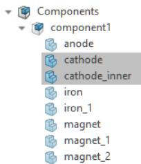

流程图

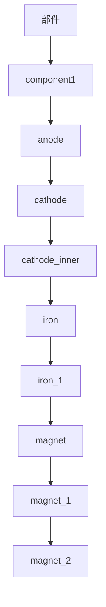

2. 选择 Simulation: Sources and Loads Particle Sources Particle Area Source，并双击实体 “cathode_inner” 的内表面将其选中。将鼠标光标移离该表面时，请确认该表面仍处于高亮状态。

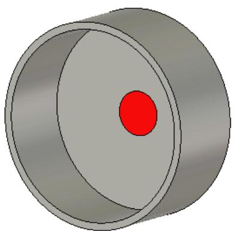

自然图像

带有红色中心和同心圆环的圆柱形物体三维渲染图（无文字或符号）

3. 选择发射表面后，按 Return 键打开 Define Particle Area Source 对话框。在这里，可以调整此前所选表面的粒子类型和粒子密度。将 Tracking emission model 改为 Space charge。预览中的蓝色点表示粒子发射点。可使用 Number of emission points 滑块影响其密度。增加发射点数量会使电流密度更加平滑。如果选择 Space charge 发射模型，应启用 Adjust density to mesh 复选框。否则，发射点数量可能过低，无法获得良好的仿真结果；这种情况下，在细化网格时需要手动增加发射点数量。

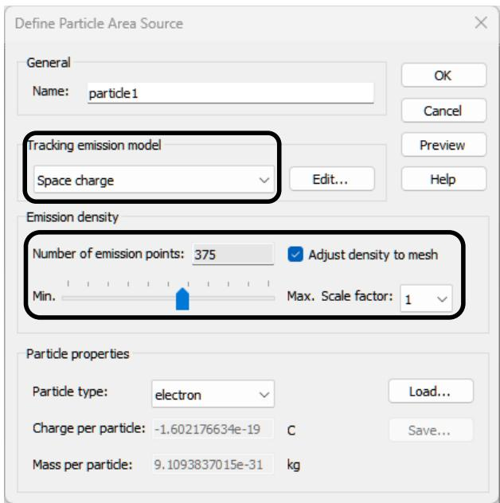

图中文字

Define Particle Area Source
General
名称：particle1
Tracking 发射模型
空间电荷
Edit...
Help
发射密度
发射点数量：375
根据网格调整密度
Min.
Max. 比例因子：1
粒子属性
粒子类型：electron
Load...
每个粒子的电荷：-1.602176634e-19 C
Save...
每个粒子的质量：9.1093837015e-31 kg

注意：如对话框下部所示，可以指定标准粒子类型或用户自定义粒子类型。粒子定义库允许你将此类用户自定义粒子定义导出到数据库，也可以从数据库导入。可通过 Load 和 Save 按钮访问该库。在本例中，我们保持默认粒子类型 electron。

4. 移动 Number of emission points 滑块，直到数量为 375。若需要精细控制，可在滑块获得焦点时使用左右方向键。要修改发射模型设置，请单击发射模型下拉列表旁的 Edit 按钮。SCL Emission Settings 对话框会打开：

图中文字

SCL Emission Settings
Potentials Kinetic Settings Emission I
发射电势：
cathode_pot -3e4 V
参考电势：
anode_pot 0 V
OK Cancel Help

5. 发射模型描述的是粒子要发射到自由空间中所需满足的条件。例如，只要存在垂直于发射表面的电场，空间电荷发射模型就允许粒子发射。如果尚未预先选中，请在对话框的 Potentials 选项卡中进行如下调整：将 emitting potential 改为 “cathode_pot”，将 reference potential 改为 “anode_pot”。单击 OK 按钮确认修改。此时粒子源应如下所示：

自然图像

显示同心圆形状以及中心蓝红点的示意图，无文字或符号

## 注意：

红色三角网格显示阴极表面的离散化，而蓝色点表示仿真中粒子的起始位置。在本例中，Space charge 发射模型要求起始位置从阴极表面稍微偏移一点。该偏移会根据阴极附近的网格自动完成。

6. 粒子源定义已经完成，现在可以再次单击 OK 按钮离开 Define Particle Area Source 对话框。  
7. 由于当前有一些实体被隐藏，我们必须取消隐藏，以便再次看到整个结构。选择 View: Visibility Show（下拉列表）Show All。为了选择结构内部的面，隐藏某些实体通常很有帮助。

现在，粒子源已经定义完成并准备发射。继续之前，请查看 QuickStart Guide，了解下一步操作。

图中文字

QuickStart Guide
粒子跟踪分析：帮助
✓ 设置单位
✓ 设置背景材料
✓ 定义结构
✓ 设置边界条件
✓ 定义源
✓ 定义粒子源
→ 启动求解器
分析结果
<< Back Close

“Set boundary conditions” 这一项已经被设为完成，因为边界由 Particle Gun 模板定义。不过，为了说明边界条件设置的基础，下一节仍会讨论边界条件。

## 定义边界条件

仿真只会在结构的包围盒内进行，即所谓计算域。你可以为计算域的每个平面（Xmin、Xmax、Ymin、Ymax、Zmin、Zmax）指定特定边界条件。这些边界条件反映了周围环境的相应行为。

边界条件在一个对话框中指定，可通过选择 Simulation: Settings Boundaries 打开。

图中文字

Boundary Conditions
边界	对称平面	边界电势
应用到所有方向
Xmin：open（add space If）✓	Xmax：open（add space If）✓
Ymin：open（add space If）✓	Ymax：open（add space If）✓
Zmin：open（add space If）✓	Zmax：open（add space If）✓
Open Boundary...
OK	Cancel	Help

当边界对话框打开时，边界条件会在结构视图中显示出来，如下一幅图所示。

你可以在对话框中修改边界条件，也可以在视图中以交互方式修改。通过在视图中双击边界符号选择某个边界，然后从上下文菜单中选择合适类型。

自然图像

紫色线框盒内圆柱形机械部件的三维渲染图（无可见文字或符号）

下表概述了可用边界条件，以及它们对电场和磁场切向分量、法向分量的影响：

<table><tr><td rowspan="2">边界类型</td><td colspan="2">电场分量</td><td colspan="2">磁场分量</td></tr><tr><td>切向分量</td><td>法向分量</td><td>切向分量</td><td>法向分量</td></tr><tr><td>electric</td><td>0</td><td>存在</td><td>存在</td><td>0</td></tr><tr><td>magnetic</td><td>存在</td><td>0</td><td>0</td><td>存在</td></tr><tr><td>tangential</td><td>存在</td><td>0</td><td>存在</td><td>0</td></tr><tr><td>normal</td><td>0</td><td>存在</td><td>0</td><td>存在</td></tr><tr><td>open</td><td>存在</td><td>存在</td><td>存在</td><td>存在</td></tr></table>

在本例中，我们希望在所有方向上使用开放边界。由于使用的是 Particle Dynamics 模板，默认边界已经设置为 open。

此外，在结构与开放边界之间还会添加一些额外空间。单击 Open Boundary 按钮检查该设置。

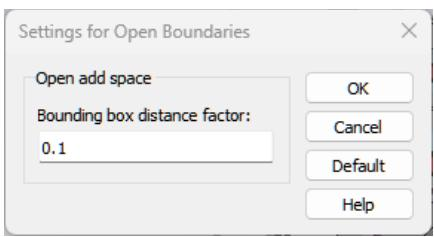

图中文字

Settings for Open Boundaries
开放边界附加空间
包围盒距离因子：
0.1
OK
Cancel
Default
Help

该额外空间的大小等于包围盒对角线长度乘以用户定义的因子，在本例中该因子为 0.1。该值也已在 Particle Dynamics 模板中定义。单击 Cancel 保持该设置不变。再次单击 Cancel 离开 Boundary Conditions 对话框。

注意：在结构与边界之间创建一定空间（背景材料）有两种方法。第一种方法如上所述。另一种方法是在 Background Properties 对话框中定义额外空间。你可以查看“定义背景材料”段落。

## 启动仿真

定义完所有必要参数后，就可以执行第一次仿真了。仿真从粒子跟踪求解器控制对话框中启动：Simulation: Solver Setup Solver。

图中文字

Particle Tracking
General
粒子源：all sources
将结果数据存储到缓存
Start
Close
Apply
粒子动力学
最大时间步数：10000
每个单元最小推进次数：5
时间步动态系数：1.2
Optimizer...
Par. Sweep...
Acceleration...
Specials...
网格
六面体，策略：Low Frequency
四面体，阶次：2nd（精度较好）
Curvature...
Help
电子枪迭代
启用电子枪迭代
相对精度：-20 dB
最大迭代次数：20
松弛参数：0.3
考虑自磁场
考虑的场
Active Field Factor Freq. Phase
✓ E-static 1.0 0.0 0
✓ M-static 1.0 0.0 0

在该对话框中，可以指定 Particle Tracking Solver 的设置并启动仿真过程。如果定义了多个粒子源，可以选择所有源都发射粒子的仿真，也可以选择只有单个源处于活动状态的仿真。启用 Enable gun iteration 选项以激活迭代式电子枪求解器算法，将 Relative accuracy 设置为 -20 dB，并将 Max. number of iterations 设置为 20。这样，Particle Tracking Solver 并不是只将粒子在计算域中跟踪一次。相反，求解器会迭代重复一次静电计算，然后跟踪粒子，直到相邻两次迭代之间的空间电荷偏差达到所需精度。

Considered fields 框列出了 Particle Tracking Solver 可用的所有电磁场。为了在跟踪过程中考虑某一特定场类型，需要勾选相应的 Active 复选框；在本例中，为 E-Static 和 M-Static 场勾选该项。
