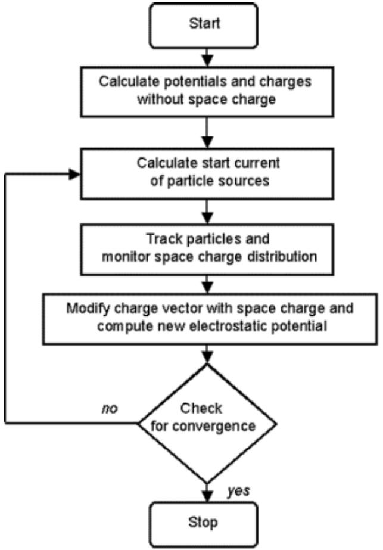
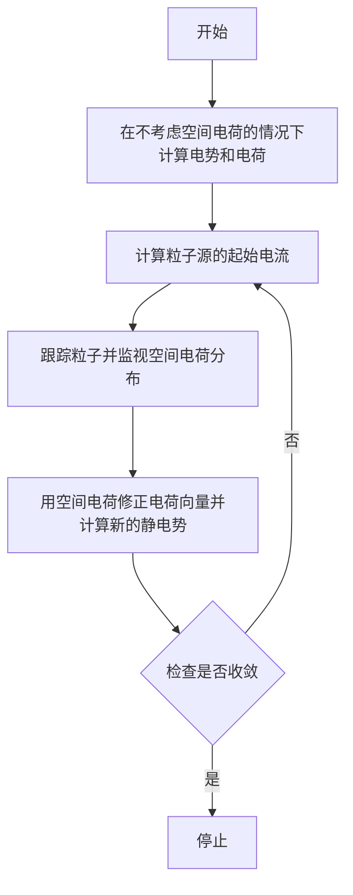
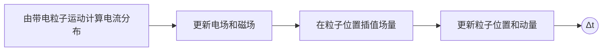
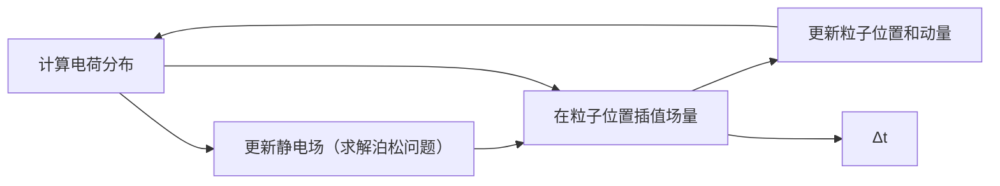
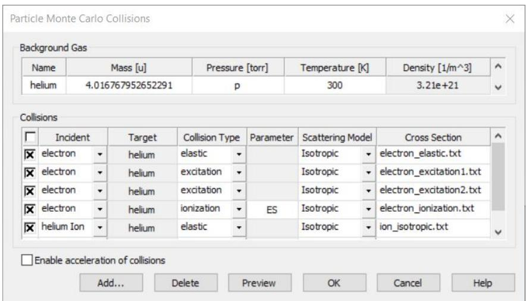
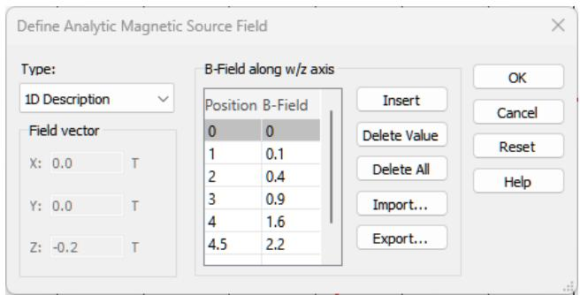
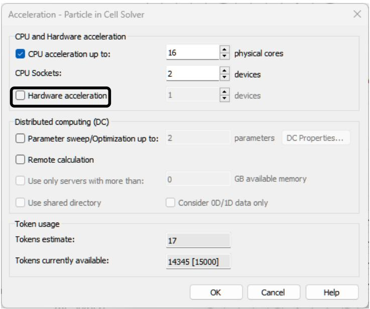

# 第 3 章 - 求解器概览

粒子动力学跨越极其广泛的时间尺度：从高频真空电子器件中的纳秒量级，到击穿现象中的微秒量级，再到等离子体腔体和准静态粒子枪中的毫秒量级。针对每一种应用，CST Particle Studio 都提供了合适的最优求解方案。

## 粒子跟踪求解器

粒子跟踪求解器及其电子枪迭代模式用于准静态粒子动力学。该求解器的典型应用是准静态电子枪。求解器基于对电磁场与带电粒子复杂相互作用的简化处理。静电场和静磁场主导带电粒子动力学，而粒子电荷和感应电流对电磁场的影响被忽略。因此问题可视为准静态问题。带电粒子按照电磁场中电荷的标准运动方程运动。在静态电场和磁场中，具有相同初始条件的每个粒子都会沿相同轨迹运动。因此，只需对每个源抽样有限数量的粒子轨迹，即可描述粒子动力学。就数值计算细节而言，粒子运动通过静态场进行积分。轨迹是从初始位置开始，直到粒子与结构或计算区域边界盒发生碰撞为止的粒子位置样本。该求解器可以使用六面体网格或四面体网格。

在电子枪迭代模式中，会考虑粒子空间电荷对静态电场的准静态影响。当带电粒子与电磁场之间存在弱耦合时，这种近似非常有用。每次迭代都会计算粒子轨迹和电场。当满足收敛准则时，迭代循环停止。电子枪迭代模式如下图所示。

流程图

在某些应用中，例如粒子具有相对论速度时，粒子携带的电流很大，其自感磁场会影响粒子轨迹。在这些情况下，可以考虑自感磁场。

## 粒子云网格求解器

电磁（EM）粒子云网格（PIC）求解器可对电磁场中的带电粒子动力学提供最详细、最完整的描述。它最适合快速带电粒子与高频电磁场之间的相互作用。典型应用包括高频真空电子器件，例如磁控管等振荡器，以及行波管等放大器。该求解器执行从纳秒量级到微秒量级的瞬态仿真。电磁场与带电粒子的相互作用通过考虑带电粒子与计算网格之间的双向耦合来计算。该求解器由基于网格的电磁求解器和粒子推进器组成。

整个系统使用蛙跳时间积分法进行时间积分。单个时间步包括对场和粒子随时间的积分。第一步对电磁场进行积分，此步骤会考虑运动带电粒子感应产生的电流密度。随后，通过将更新后的电磁场插值到粒子位置，对每个仿真粒子的运动方程进行时间积分。这个自洽循环会重复执行，直到达到最终仿真时间。

流程图

电磁 PIC 求解器的时间积分受到解析最快发生现象这一要求的限制。该限制取以下两个条件中较小的一个。首先，电磁求解器受 Courant-Friedrich-Lewy 条件的稳定性限制，需要网格足够细，以解析所有电磁波的传播。其次，还需要解析电子的最高回旋频率或等离子体频率。

## 静电粒子云网格求解器

粒子动力学发生在非常宽的时间尺度范围内。最快的粒子动力学通常由电子主导，可使用电磁（EM）粒子云网格求解器进行仿真。准静态动力学可使用粒子跟踪求解器及其电子枪迭代模式处理。对于中间时间尺度，即慢离子与快电子的相互作用同时发挥作用的情况，静电（ES）PIC 求解器可能非常适合。与 EM-PIC 求解器相比，它不受在具有小尺度变化的三维几何中传播电磁波通常所需的较小 Courant 时间步限制。在 ES-PIC 求解器中，时间步可以更大，此时仅受最快粒子动力学的限制，通常受等离子体频率限制。

为了理解 ES-PIC 求解器的必要性，有必要简要考察其余求解器中采用的物理建模。在 EM-PIC 求解器中，电磁场和粒子动力学是自洽描述的，因为麦克斯韦方程中的所有项都保留在方程格式中。该公式适用于粒子与电磁波之间相互作用占主导的问题，尤其适用于轻而高迁移率的电子，因为它们携带的粒子电流足以影响电磁波传播。然而，在许多应用中，总粒子电流的影响可以忽略，因此粒子不会影响电磁波传播，反之亦然。相反，主导效应是通过粒子空间电荷改变静电场。此外，与电子和电磁波相比，离子通常较慢。在这些情况下，电磁 PIC 求解器会带来过高的计算开销。另一方面，电子枪迭代模式下的粒子跟踪求解器也不太适合，因为带电粒子与静电场之间的耦合过强，难以用其公式充分描述。这些正是 ES-PIC 求解器具有优势的情况，因此它是研究静电效应的正确选择，例如击穿、鞘层形成、空间电荷补偿和静电波。

就数值计算细节而言，与 EM-PIC 求解器类似，ES-PIC 求解器也进行时间积分，并使用电磁场中电荷的标准运动方程计算粒子运动。与 EM-PIC 求解器不同，在 ES-PIC 求解器中假定粒子电流可以忽略。取而代之的是，使用粒子分布计算空间电荷密度，并在每个时间步用它求解泊松问题。这使得静电类型的快速粒子动力学仿真成为可能。相比之下，在粒子跟踪求解器中还额外假定空间电荷相对于粒子运动变化得非常缓慢。

流程图

## 尾场求解器

在粒子加速器中，运动粒子束团与周围环境的相互作用会在其“尾迹”中产生电磁场。例如，加速器周围结构中的几何或材料不连续性会激发所谓的尾场。这些场可能会对后续束团产生不利影响，甚至会使原始粒子束失稳。尾场求解器可用于分析此类电磁效应。

主要假设如下：a）粒子束沿直线运动；b）粒子束不受所产生尾场的影响。无限长束管通过在束流入口和出口处进行特殊处理来建模，其中不仅考虑粒子电流，也考虑相应的电磁场。

尾场求解器是一种带有特殊粒子束激励的时域求解器。得到的尾场用于计算一个虚拟粒子沿结构运动过程中受到的积分力。为执行该积分，可采用多种技术。标准结果包括尾势和尾阻抗。对于超相对论束流，这些结果是结构自身的属性。对于非超相对论束流，尾势和阻抗包含空间电荷的积分效应，因此取决于仿真管段长度。

尾场求解器也有助于分析束流位置监测器（BPM），此时关注的量是在 BPM 拾取电极处记录的信号。任意束团形状和束团序列也可以建模。

## 附加功能

本节介绍两个或更多求解器支持的功能。以下功能可用于 Tracking、ES-PIC 和 PIC 仿真。

## 粒子与材料的相互作用

粒子不仅可以与电磁场相互作用，也可以直接与材料相互作用。若要激活和编辑粒子-材料相互作用设置，可以通过 Modeling: Materials  New/Edit Edit Material properties 打开先前所选材料的对话框，并单击 Particles 选项卡。随后会显示下列 PIC 对话框。Tracking 和 ES-PIC 的可用选项略有不同，本节将对此进行说明。

系统隐含假定，在大多数应用中粒子在真空空间中运动。随后，粒子可能与任何非真空材料填充的形体发生碰撞。在某些情况下，使用具有非真空属性的材料对粒子运动空间进行建模是有用的。这可通过体透明功能实现。随后粒子可以在指定了该材料的体中运动。

图中文字

新建材料
常规 | 热 | 力学 | 粒子 | 密度 |
体透明设置
自动	透明	不透明
蒙特卡罗碰撞
启用	数据输入
属性
无
无
二次发射
薄片透明
特殊色散
确定	取消	应用	帮助

通过 Property 框中的下拉列表，可以选择粒子-材料相互作用的类型。可用选项包括：二次发射（由电子或离子诱导）、薄片透明和特殊色散。

当能量足够的初级入射粒子撞击表面并诱导二次粒子发射时，就会发生二次发射。在 Secondary emission model 框中，可以指定二次发射模型的参数。选项包括现象学概率模型（Furman）、启发式模型（Vaughan）以及基于导入二次电子产额的模型（Import）。后一种模型可用于离子诱导二次发射。

在某些应用中，存在非常薄的网格或箔片，部分粒子会被其吸收。这可用无限薄体，即所谓的薄片来表示，该薄片可对粒子呈透明状态。在 Sheet transparency 框中，可以指定透明度级别，该级别可以是常数，也可以依赖于能量。

在某些条件下，PIC 仿真可能受到一种数值不稳定性的破坏，这种不稳定性通常称为切伦科夫不稳定性。为了减轻其影响，可以在此处使用 Special Dispersion 属性定义一种特殊色散材料。

Tracking 和 ES-PIC 求解器不计算电磁波，因此 Special Dispersion 选项不可用。取而代之的是提供 Optically Induced Emission 选项。该发射模型描述通过光电效应产生的电子发射。

## 蒙特卡罗碰撞

蒙特卡罗碰撞（MCC）模块用于建模带电粒子与中性背景气体粒子之间的碰撞。该模型假定背景气体密度远高于等离子体密度。因此，气体的热力学状态不会因碰撞而改变。碰撞随机发生，并导致动量和能量传递。MCC 设置针对每种材料分别定义。可通过复选框 NT: Materials [Material Name]  Edit Material Properties...  Particles  Monte Carlo Collisions Enable 为特定材料 [Material Name] 启用蒙特卡罗碰撞。随后可通过 NT: Materials [Material Name]  Edit Material Properties...  Particles  Monte Carlo Collisions Data Input 进入设置配置对话框。背景材料的 MCC 配置可通过 Modeling: Materials  Background  Material Properties  Particles  Monte Carlo Collisions  Data Input 访问。

图中文字

粒子蒙特卡罗碰撞
背景气体
名称	质量 [u]	压力 [torr]	温度 [K]	密度 [1/m^3]
氦	4.016767952652291	p	300	3.21e+21
碰撞
入射粒子	靶粒子	碰撞类型	参数	散射模型	截面
电子	氦	弹性		各向同性	electron_elastic.txt
电子	氦	激发		各向同性	electron_excitation1.txt
电子	氦	激发		各向同性	electron_excitation2.txt
电子	氦	电离	ES	各向同性	electron_ionization.txt
氦离子	氦	弹性		各向同性	ion_isotropic.txt
启用碰撞加速
添加...	删除	预览	确定	取消	帮助

用户可以定义处于恒定物理状态和热力学平衡的单一背景气体。该气体占据所有由其所配置材料填充的仿真区域。对话框展示了 ES-PIC 求解器可用选项列表的一个示例。这组碰撞包括电子的弹性散射、激发和碰撞电离，以及离子的弹性散射和碰撞电离。MCC 计算可使用多线程加速，从而改善求解器性能并优化仿真时间。相比之下，PIC 求解器只能考虑电子碰撞电离模型。

## 粒子合并

粒子合并模块包含一种模型，可将相空间中彼此接近的四个粒子合并成两个新粒子，该功能可用于 ES-PIC 仿真。在合并步骤中，算法会确保电荷、动量和能量守恒。该算法在粒子数量呈指数增长的击穿仿真中特别有用。设置对话框可通过 Simulation: Setup Solver  Specials 打开。

## 耦合仿真

CST Studio Suite for Particle Dynamics Simulation 提供了多种选项，可将电磁场仿真链接到特定粒子计算。此外，Particle Interfaces 允许链接不同的跟踪或 PIC 仿真。最后，可以将碰撞粒子的损耗导出到后续热分析。通常，可以在单个项目中执行多个仿真，也可以通过导入和导出选项连接两个或更多项目。

## 考虑电磁场

CST Studio Suite for Particle Dynamics Simulation 专用于仿真带电粒子在电磁场中的运动。为完成该任务，可使用以下三种可能技术中的一种或多种：

1. 计算电磁场
2. 定义解析磁场
3. 导入电磁场 - ASCII 或来自其他项目

通常，PIC 或跟踪仿真中定义的所有场都会在用于粒子更新之前进行叠加。特别是对于 PIC 求解器，这些场会与基于麦克斯韦方程的自洽且随时间变化的场相叠加。

电磁场计算

CST Studio Suite for Particle Dynamics Simulation 能够使用其他 CST Studio Suite 三维电磁求解器的场作为输入，尤其是 CST Studio Suite for Low Frequency Simulation 和 CST Studio Suite for High Frequency Simulation。

静电求解器

CST Studio Suite for Low Frequency Simulation 的静电求解器用于计算静态电子枪中的加速场，或阴极射线管（CRT）中束流偏转单元的偏转静电场。

• 静磁求解器

CST Studio Suite for Low Frequency Simulation 的静磁求解器可预先计算各种磁体的场，例如螺线管、偶极磁铁、四极磁铁等，用于束流光学仿真。

本征模求解器

粒子也可以在由 CST Studio Suite for High Frequency Simulation 的本征模求解器计算得到的腔体谐振场中进行跟踪。

## 时域求解器

粒子也可以在由 CST Studio Suite for High Frequency Simulation 的时域求解器提供的频域三维场监视器中进行跟踪。典型应用是倍增放电分析。

若要了解这些电磁场求解器的介绍和/或更多信息，请参阅 CST Studio Suite for Low Frequency Simulation 和 CST Studio Suite for High Frequency Simulation 的 Workflow and Solver Overview。

## 解析磁场的定义

除可在粒子仿真之前或仿真期间计算场之外，CST Studio Suite for Particle Dynamics Simulation 还提供了为 Tracking、Electrostatic PIC 和 PIC 求解器定义并使用解析 H 场和 B 场分布的选项。

目前有三种不同类型的解析磁场分布可用：

• 整个计算域中的恒定磁场
• 整个计算域中的恒定磁通密度
• 旋转对称磁场，其特征是在当前活动的全局或局部坐标系的 Z/W 轴上定义的一维切向磁化矢量。只有当磁场 z 分量不是半径 r 的函数时，才能计算旋转对称磁场的 r 分量：

$$
B _ {r} (r, z) = - \frac {r}{2} \frac {\partial B _ {z} (z)}{\partial z}
$$

可以通过选择 Simulation: Sources and Loads Source field  Analytic Source Field 来定义这样的源。相应的对话框允许定义磁场矢量。也可以沿当前活动坐标系轴线定义磁场的一维描述：

图中文字

定义解析磁源场
类型：
一维描述
场矢量
X: 0.0 T
Y: 0.0 T
Z: -0.2 T
沿 w/z 轴的 B 场
位置	B 场
0	0
1	0.1
2	0.4
3	0.9
4	1.6
4.5	2.2
插入
删除值
全部删除
导入...
导出...
确定
取消
重置
帮助

沿轴线的切向场分量

折线图

| X | Y |
| --- | --- |
| 0 | ~0.0 |
| 1 | ~0.05 |
| 2 | ~0.35 |
| 3 | ~0.85 |
| 4 | ~1.5 |
| 4.5 | ~2.1 |
| 5 | ~2.4 |
| 6 | ~2.1 |
| 7 | ~1.5 |
| 8 | ~0.85 |
| 9 | ~0.35 |
| 10 | ~0.15 |
| 11 | ~0.05 |
| 12 | ~0.0 |
| 13 | ~0.0 |
| 14 | ~0.0 |
| 15 | ~0.0 |

热力图

| 颜色范围 | 数值 (Vs/m^2) |
| --- | --- |
| 红色 | 0.145 |
| 橙红色 | 0.119 |
| 橙色 | 0.0925 |
| 黄橙色 | 0.066 |
| 黄色 | 0.0396 |
| 浅绿色 | 0 |
| 绿色 | -0.0396 |
| 蓝绿色 | -0.066 |
| 青色 | -0.0925 |
| 蓝色 | -0.119 |
| 深蓝色 | -0.145 |

上图显示了沿 z 轴“测得”的切向场，以及所得 B 场的旋转对称场分布。

电磁场导入

在跟踪或 PIC 仿真中考虑场的第三种方式，是从 ASCII 文件或另一个 CST 项目导入场。因此，可以很方便地叠加多个场。若要定义一个或多个场导入项，请选择 Simulation: Sources and Loads  Source Field  Import External Field 打开对话框：

图中文字

导入外部场
外部场
✓ 仅使用本地副本 □ 更新本地副本 Mu: 1.0
激活	描述	相对路径	类型	系数	频率	相位	Shift_X	Shift_Y	Shift_Z	信号	偏移
✓	F: Ec1.txt	... ✓	E 场	1.0	3	180	0.0	0.0	0.0 [常量] ✓	0.0
✓	F: Hc1.txt	... ✓	H 场	1.0	3	180	0.0	0.0	0.0 [常量] ✓	0.0
导入...	删除	预览	场预览	确定	取消	帮助

该功能允许导入本征模、E 场、H 场或 B 场，甚至可以从基于不同网格的不同项目中导入。使用 Add from Project 选项创建场导入时，可以从 CST 项目文件中选取已有场分布。可以导入基于六面体（HEX）和/或四面体（TET）网格的场。Add from File 则提供导入 ASCII 文件或基于 HEX 网格的监视器文件的可能性。

单击 Preview 按钮后，可使用洋红色边框可视化导入数据与当前计算域的重叠区域。

自然图像

透明矩形框内包围着一个圆柱形机械部件的三维渲染图（未显示文字或符号）

可以将来自不同结构的场与粒子仿真组合使用，但必须谨慎，因为程序不会检查材料边界处场的一致性。

另一个有用之处在于，重新计算跟踪或 PIC 问题时无需重新计算场。这会带来仿真速度提升。

## 粒子接口

粒子接口允许连接来自不同 CST Studio Suite 项目的跟踪和/或 PIC 仿真。可用接口有两种类型：

• 导出接口
• 导入接口

假设有一个跟踪或电子枪项目，需要通过粒子接口链接到后续 PIC 或跟踪项目，则可按以下步骤定义适当连接：

1. 打开跟踪或电子枪项目。
2. 定义一个或多个导出接口：Simulation: Monitors  Particle 2D Monitor Particle Export Interface。
3. 运行跟踪或电子枪仿真。仿真完成后，粒子数据会自动导出到扩展名为 .pio 的文件中。该文件存储在项目的结果文件夹中。
4. 打开 PIC 或跟踪项目。
5. 通过导入粒子接口文件定义一个或多个导入接口：Simulation: Sources and Loads  Particle Sources  Particle Import Interface。可以旋转和平移接口平面。

图中文字

定义粒子导入接口
常规
名称：particle interface 1
接口文件
接口导入文件名
导入... 使用相对路径
使用本地接口副本
位置
法向：X Y Z
Xcut: 0.0
Ymin: 0.0 Ymax: 0.0
Zmin: 0.0 Zmax: 0.0
变换
新法向：X Y Z
反转方向
X-shift: 0.0
Y-shift: 0.0
Z-shift: 0.0
PIC 发射模型
DC 发射 编辑...
场抑制
W-length: 0.0

6. 运行后续 PIC 或跟踪仿真。

注意：也可以 ASCII 方式导入包含用户自定义粒子发射信息的文件。有关文件格式的更多信息可从在线帮助中获得。

## 粒子表面损耗导出

粒子求解器允许计算由粒子与物质相互作用引起的粒子表面损耗。该功能可用于 Tracking、ES-PIC 和 PIC。例如，这对于医疗应用以及收集极可能是一个有意义的选项。可通过打开 Simulation: Solver -> Setup Solver -> Specials -> PIC 激活该功能：

图中文字

特殊 PIC 求解器参数
PIC 常规 波导材料求解器
PIC 求解器设置
最小发射电流 0.0 A（每个粒子）
最小发射电荷 0.0 C（每个粒子）
忽略空间电荷效应
粒子表面损耗
计算损耗 使用求解器仿真时间
开始时间：0.0 结束时间：0.0
倍增放电
启用求解器停止
间隔数：3 间隔宽度：0.25
指数基数：1.1
确定 取消 帮助

由于热耦合需要平均功率，因此必须定义功率数据进行平均的时间段。默认情况下，该时间段设置为用户指定的仿真时间。粒子表面损耗会在求解器运行期间计算，并可在求解器完成后直接在结果树中可视化。也可以导出由电磁场引起的热损耗。这对于尾场或 PIC 计算是一个有意义的选项。有关热耦合的更多信息，请参阅 CST Studio Suite for Thermal and Mechanical Simulation 帮助。

## 加速功能

在带电粒子仿真的框架内，CST Studio Suite 提供了若干与硬件相关的仿真加速方式。所有求解器都支持使用多线程进行 CPU 加速。此外，电磁 PIC 求解器支持多 GPU 加速，静电 PIC 求解器支持单 GPU 加速，尾场求解器支持 MPI 集群并行化。

若要访问加速设置，例如对于 PIC 求解器，可选择 Simulation: Solver  Setup Solver  Acceleration。如果有 GPU，可以尝试启用 GPU 加速功能并重新启动求解器。

图中文字

加速 - 粒子云网格求解器
CPU 和硬件加速
✓ CPU 加速最多使用：16 个物理核心
CPU 插槽：2 个设备
☐ 硬件加速 1 个设备
分布式计算（DC）
☐ 参数扫描/优化最多：2 个参数 DC 属性...
☐ 远程计算
☐ 仅使用可用内存超过以下值的服务器：0 GB
☐ 使用共享目录 仅考虑 0D/1D 数据
令牌使用
令牌估计：17
当前可用令牌：14345 [15000]
确定 取消 帮助

有关不同加速功能以及所需硬件的更多详细信息，请参阅在线帮助（Simulation Acceleration 一节）或 GPU computing guide。GPU computing guide 可通过以下链接获取：http://updates.cst.com/downloads/GPU_Computing_Guide_2024.pdf。
