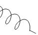
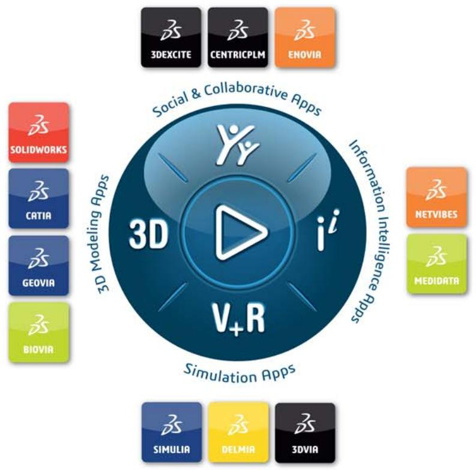
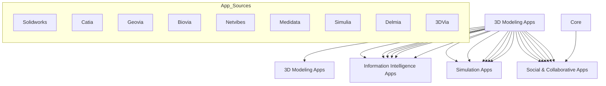

# Appendix

## Abaqus keyword browser table

Use the following table to determine which Abaqus/CAE module (or toolset) contains the functionality associated with a particular Abaqus keyword. To view documentation for the module (or toolset), click the module (or toolset) name shown in the table. Most currently unsupported keywords can be added to your model using the Keywords Editor.

To see keywords beginning with a particular letter of the alphabet, click that letter in the table below.

<table><tr><td>A</td><td>B</td><td>C</td><td>D</td><td>E</td><td>F</td><td>G</td><td>H</td><td>I</td><td>J</td><td>K</td><td>L</td><td>M</td></tr><tr><td>N</td><td>O</td><td>P</td><td>Q</td><td>R</td><td>S</td><td>T</td><td>U</td><td>V</td><td>W</td><td>X</td><td>Y</td><td>Z</td></tr></table>

Table 38: Keyword browser table.

<table><tr><td>Keyword</td><td>Purpose</td><td>Module</td><td>Products</td></tr><tr><td>*ACOUSTIC CONTRIBUTION</td><td>Request the computation of the acoustic contribution factors for the linear, eigenmode-based, steady-state dynamic procedure.</td><td>Unsupported</td><td>Abaqus/Standard</td></tr><tr><td>*ACOUSTIC FLOW VELOCITY</td><td>Specify flow velocities as a predefined field for acoustic elements.</td><td>Unsupported</td><td>Abaqus/Standard</td></tr><tr><td>*ACOUSTIC MEDIUM</td><td>Specify an acoustic medium.</td><td>Property module</td><td>Abaqus/StandardAbaqus/Explicit</td></tr><tr><td>*ACOUSTIC WAVE FORMULATION</td><td>Specify the type of formulation in acoustic problems with incident wave loading.</td><td>Model attribute</td><td>Abaqus/StandardAbaqus/Explicit</td></tr><tr><td>*ACTIVATE ELEMENTS</td><td>Activate elements within a step.</td><td>Unsupported</td><td>Abaqus/Standard</td></tr><tr><td>*ADAPTIVE MESH</td><td>Define an adaptive mesh domain.</td><td>Supported in the Step module; only one adaptive mesh domain can be defined per step.</td><td>Abaqus/StandardAbaqus/Explicit</td></tr><tr><td>*ADAPTIVE MESH CONSTRAINT</td><td>Specify constraints on the motion of the mesh for an adaptive mesh domain.</td><td>Displacement and velocity adaptive mesh constraints are supported in the Step module.</td><td>Abaqus/StandardAbaqus/Explicit</td></tr><tr><td>*ADAPTIVE MESH CONTROLS</td><td>Specify controls for the adaptive meshing and advection algorithms.</td><td>Step module</td><td>Abaqus/StandardAbaqus/Explicit</td></tr><tr><td>*ADAPTIVE MESH REFINEMENT</td><td>Activate adaptive mesh refinement in an Eulerian domain.</td><td>Unsupported</td><td>Abaqus/Explicit</td></tr><tr><td>*ADJUST</td><td>Adjust user-specified nodal coordinates to lie on a given surface or to make adjustments based on a user-specified distribution.</td><td>Interaction module</td><td>Abaqus/StandardAbaqus/Explicit</td></tr><tr><td>*ALLOWABLE STRESS</td><td>Specify the allowable stress of a composite at the initiation of damage in a multiscale material.</td><td>Unsupported</td><td>Abaqus/Standard</td></tr><tr><td>*AMPLITUDE</td><td>Define an amplitude curve.</td><td>Amplitude toolset; bubble loading is not supported. Similar functionality is available in the Interaction module.</td><td>Abaqus/StandardAbaqus/Explicit</td></tr><tr><td>*ANISOTROPIC HYPERELASTIC</td><td>Specify anisotropic hyperelastic properties for approximately incompressible materials.</td><td>Property module</td><td>Abaqus/StandardAbaqus/Explicit</td></tr><tr><td>*ANNEAL</td><td>Anneal the structure.</td><td>Step module</td><td>Abaqus/Explicit</td></tr><tr><td>*ANNEAL TEMPERATURE</td><td>Specify material properties for modeling annealing or melting.</td><td>Property module</td><td>Abaqus/StandardAbaqus/Explicit</td></tr><tr><td>*AQUA</td><td>Define fluid variables for use in loading immersed beam-type structures.</td><td>Unsupported</td><td>Abaqus/Aqua</td></tr><tr><td>*ASSEMBLY</td><td>Begin an assembly definition.</td><td>Assembly module</td><td>Abaqus/StandardAbaqus/Explicit</td></tr><tr><td>*ASYMMETRIC-AXISYMMETRIC</td><td>Define areas of integration for contact elements used with CAXAn or SAXAn elements.</td><td>Unsupported</td><td>Abaqus/Standard</td></tr><tr><td>*AXIAL</td><td>Used to define the axial behavior of beams.</td><td>Unsupported</td><td>Abaqus/StandardAbaqus/Explicit</td></tr><tr><td>*BASE MOTION</td><td>Define the base motion for linear, eigenmode-based, dynamic procedures.</td><td>Unsupported</td><td>Abaqus/Standard</td></tr><tr><td>*BASELINE CORRECTION</td><td>Include baseline correction.</td><td>Amplitude toolset</td><td>Abaqus/Standard</td></tr><tr><td>*BEAM ADDED INERTIA</td><td>Define additional beam inertia.</td><td>Unsupported</td><td>Abaqus/StandardAbaqus/Explicit</td></tr><tr><td>*BEAM FLUID INERTIA</td><td>Define additional beam inertia due to immersion in a fluid.</td><td>Property module</td><td>Abaqus/StandardAbaqus/Explicit</td></tr><tr><td>*BEAM GENERAL SECTION</td><td>Specify a beam section when numerical integration over the section is not required.</td><td>General beam sections with linear response are supported in the Property module.</td><td>Abaqus/StandardAbaqus/Explicit</td></tr><tr><td>*BEAM SECTION</td><td>Specify a beam section when numerical integration over the section is required.</td><td>Property module</td><td>Abaqus/StandardAbaqus/Explicit</td></tr><tr><td>*BEAM SECTION GENERATE</td><td>Generate beam section properties for a meshed cross-section.</td><td>Unsupported</td><td>Abaqus/Standard</td></tr><tr><td>*BEAM SECTION OFFSET</td><td>Define an offset for the beam cross-section origin.</td><td>Property module</td><td>Abaqus/StandardAbaqus/Explicit</td></tr><tr><td>*BIAXIAL TEST DATA</td><td>Used to provide biaxial test data (compression and/or tension).</td><td>Property module</td><td>Abaqus/StandardAbaqus/Explicit</td></tr><tr><td>*BLOCKAGE</td><td>Control contacting surfaces for blockage.</td><td>Unsupported</td><td>Abaqus/Explicit</td></tr><tr><td>*BOUNDARY</td><td>Specify boundary conditions.</td><td>Load module; fluid cavity pressure and generalized plane strain boundary conditions are not supported.</td><td>Abaqus/StandardAbaqus/Explicit</td></tr><tr><td>*BRITTLE CRACKING</td><td>Define brittle cracking properties.</td><td>Property module</td><td>Abaqus/Explicit</td></tr><tr><td>*BRITTLE FAILURE</td><td>Specify brittle failure criterion.</td><td>Property module</td><td>Abaqus/Explicit</td></tr><tr><td>*BRITTLE SHEAR</td><td>Define the postcracking shear behavior of a material used with the brittle cracking model.</td><td>Property module</td><td>Abaqus/Explicit</td></tr><tr><td>*BUCKLE</td><td>Obtain eigenvalue buckling estimates.</td><td>Step module</td><td>Abaqus/Standard</td></tr><tr><td>*BUCKLING ENVELOPE</td><td>Define a nondefault buckling envelope for buckling strut response of frame elements with PIPE sections.</td><td>Unsupported</td><td>Abaqus/Standard</td></tr><tr><td>*BUCKLING LENGTH</td><td>Define buckling length data for buckling strut response of frame elements with PIPE sections.</td><td>Unsupported</td><td>Abaqus/Standard</td></tr><tr><td>*BUCKLING REDUCTION FACTORS</td><td>Define buckling reduction factors for buckling strut response of frame elements with PIPE sections.</td><td>Unsupported</td><td>Abaqus/Standard</td></tr><tr><td>*BULK VISCOSITY</td><td>Modify bulk viscosity parameters.</td><td>Step module</td><td>Abaqus/Explicit</td></tr><tr><td>*C ADDED MASS</td><td>Specify concentrated added mass in a *FREQUENCY step.</td><td>Unsupported</td><td>Abaqus/Aqua</td></tr><tr><td>*CAP CREEP</td><td>Specify a cap creep law and material properties.</td><td>Property module</td><td>Abaqus/Standard</td></tr><tr><td>*CAP HARDENING</td><td>Specify Drucker-Prager/Cap plasticity hardening.</td><td>Property module</td><td>Abaqus/StandardAbaqus/Explicit</td></tr><tr><td>*CAP PLASTICITY</td><td>Specify the Modified Drucker-Prager/Cap plasticity model.</td><td>Property module</td><td>Abaqus/StandardAbaqus/Explicit</td></tr><tr><td>*CAPACITY</td><td>Define the molar heat capacity at constant pressure for an ideal gas species.</td><td>Interaction module</td><td>Abaqus/Explicit</td></tr><tr><td>*CAST IRON COMPRESSION HARDENING</td><td>Specify hardening in compression for the gray cast iron plasticity model.</td><td>Property module</td><td>Abaqus/StandardAbaqus/Explicit</td></tr><tr><td>*CAST IRON PLASTICITY</td><td>Specify plastic material properties for gray cast iron.</td><td>Property module</td><td>Abaqus/StandardAbaqus/Explicit</td></tr><tr><td>*CAST IRON TENSION HARDENING</td><td>Specify hardening in tension for the gray cast iron plasticity model.</td><td>Property module</td><td>Abaqus/StandardAbaqus/Explicit</td></tr><tr><td>*CAVITY DEFINITION</td><td>Define a cavity for thermal radiation.</td><td>Interaction module</td><td>Abaqus/Standard</td></tr><tr><td>*CECHARGE</td><td>Specify concentrated electric charges in piezoelectric analysis.</td><td>Load module</td><td>Abaqus/Standard</td></tr><tr><td>*CECURRENT</td><td>Specify concentrated current in an electric conduction analysis.</td><td>Load module</td><td>Abaqus/Standard</td></tr><tr><td>*CENTROID</td><td>Define the position of the centroid of the beam section.</td><td>Property module</td><td>Abaqus/StandardAbaqus/Explicit</td></tr><tr><td>*CFILM</td><td>Define film coefficients and associated sink temperatures at one or more nodes or vertices.</td><td>Interaction module</td><td>Abaqus/StandardAbaqus/Explicit</td></tr><tr><td>*CFLOW</td><td>Specify concentrated fluid flow.</td><td>Load module</td><td>Abaqus/Standard</td></tr><tr><td>*CFLUX</td><td>Specify concentrated fluxes in heat transfer or mass diffusion analyses.</td><td>Load module</td><td>Abaqus/StandardAbaqus/Explicit</td></tr><tr><td>*CHANGE FRICTION</td><td>Change friction properties.</td><td>Interaction module</td><td>Abaqus/Standard</td></tr><tr><td>*CHARACTERISTIC LENGTH</td><td>Define characteristic element length at a material point.</td><td>Unsupported</td><td>Abaqus/Explicit</td></tr><tr><td>*CLAY HARDENING</td><td>Specify hardening for the clay plasticity model.</td><td>Property module</td><td>Abaqus/StandardAbaqus/Explicit</td></tr><tr><td>*CLAY PLASTICITY</td><td>Specify the extended Cam-clay plasticity model.</td><td>Property module</td><td>Abaqus/StandardAbaqus/Explicit</td></tr><tr><td>*CLEARANCE</td><td>Specify a particular initial clearance value and a contact direction for the secondary nodes on a surface.</td><td>Interaction module</td><td>Abaqus/StandardAbaqus/Explicit</td></tr><tr><td>*CLOAD</td><td>Specify concentrated forces and moments.</td><td>Load module</td><td>Abaqus/StandardAbaqus/ExplicitAbaqus/Aqua</td></tr><tr><td>*CLUSTER MASS INERTIATABLE</td><td>Specify mass and inertia discrete particle clusters.</td><td>Unsupported</td><td>Abaqus/Explicit</td></tr><tr><td>*COHESIVE BEHAVIOR</td><td>Specify contact cohesive behavior properties.</td><td>Interaction module</td><td>Abaqus/StandardAbaqus/Explicit</td></tr><tr><td>*COHESIVE SECTION</td><td>Specify element properties for cohesive elements.</td><td>Property module</td><td>Abaqus/StandardAbaqus/Explicit</td></tr><tr><td>*COMBINATORIAL RULE</td><td>Define controls associated with combinatorial rules to derive interaction properties from surface properties.</td><td>Unsupported</td><td>Abaqus/Explicit</td></tr><tr><td>*COMBINED TEST DATA</td><td>Specify simultaneously the normalized shear and bulk compliances or relaxation moduli as functions of time.</td><td>Property module</td><td>Abaqus/StandardAbaqus/Explicit</td></tr><tr><td>*COMPLEX FREQUENCY</td><td>Extract complex eigenvalues and modal vectors.</td><td>Step module</td><td>Abaqus/Standard</td></tr><tr><td>*COMPOSITE MODAL DAMPING</td><td>Specify composite modal damping for modal analyses based on the SIM architecture.</td><td>Unsupported</td><td>Abaqus/Standard</td></tr><tr><td>*CONCENTRATION TENSOR</td><td>Define the concentration tensor for an inclusion in the aggregate.</td><td>Unsupported</td><td>Abaqus/Standard</td></tr><tr><td>*CONCRETE</td><td>Define concrete properties beyond the elastic range.</td><td>Property module</td><td>Abaqus/Standard</td></tr><tr><td>*CONCRETE COMPRESSION DAMAGE</td><td>Define compression damage properties for the concrete damaged plasticity model.</td><td>Property module</td><td>Abaqus/StandardAbaqus/Explicit</td></tr><tr><td>*CONCRETE COMPRESSION HARDENING</td><td>Define hardening in compression for the concrete damaged plasticity model.</td><td>Property module</td><td>Abaqus/StandardAbaqus/Explicit</td></tr><tr><td>*CONCRETE DAMAGED PLASTICITY</td><td>Define flow potential, yield surface, and viscosity parameters for the concrete damaged plasticity model.</td><td>Property module</td><td>Abaqus/StandardAbaqus/Explicit</td></tr><tr><td>*CONCRETE FAILURE</td><td>Specify material failure criteria and allow element deletion for the concrete damaged plasticity material model.</td><td>Unsupported</td><td>Abaqus/Explicit</td></tr><tr><td>*CONCRETE TENSION DAMAGE</td><td>Define postcracking damage properties for the concrete damaged plasticity model.</td><td>Property module</td><td>Abaqus/StandardAbaqus/Explicit</td></tr><tr><td>*CONCRETE TENSION STIFFENING</td><td>Define postcracking properties for the concrete damaged plasticity model.</td><td>Property module</td><td>Abaqus/StandardAbaqus/Explicit</td></tr><tr><td>*CONDUCTIVITY</td><td>Specify thermal conductivity.</td><td>Property module</td><td>Abaqus/StandardAbaqus/Explicit</td></tr><tr><td>*CONNECTOR BEHAVIOR</td><td>Begin the specification of a connector behavior.</td><td>Interaction module</td><td>Abaqus/StandardAbaqus/Explicit</td></tr><tr><td>*CONNECTOR CONSTITUTIVE REFERENCE</td><td>Define reference lengths and angles to be used in specifying connector constitutive behavior.</td><td>Interaction module</td><td>Abaqus/StandardAbaqus/Explicit</td></tr><tr><td>*CONNECTOR DAMAGE EVOLUTION</td><td>Specify connector damage evolution for connector elements.</td><td>Interaction module</td><td>Abaqus/StandardAbaqus/Explicit</td></tr><tr><td>*CONNECTOR DAMAGE INITIATION</td><td>Specify connector damage initiation criteria for connector elements.</td><td>Interaction module</td><td>Abaqus/StandardAbaqus/Explicit</td></tr><tr><td>*CONNECTOR DAMPING</td><td>Define connector damping behavior.</td><td>Interaction module</td><td>Abaqus/StandardAbaqus/Explicit</td></tr><tr><td>*CONNECTOR DERIVED COMPONENT</td><td>Specify user-defined components in connector elements.</td><td>Interaction module</td><td>Abaqus/StandardAbaqus/Explicit</td></tr><tr><td>*CONNECTOR ELASTICITY</td><td>Define connector elastic behavior.</td><td>Interaction module</td><td>Abaqus/StandardAbaqus/Explicit</td></tr><tr><td>*CONNECTOR FAILURE</td><td>Define a failure criterion for connector elements.</td><td>Interaction module</td><td>Abaqus/StandardAbaqus/Explicit</td></tr><tr><td>*CONNECTOR FRICTION</td><td>Define friction forces and moments in connector elements.</td><td>Interaction module</td><td>Abaqus/StandardAbaqus/Explicit</td></tr><tr><td>*CONNECTOR HARDENING</td><td>Define the plasticity initial yield value and hardening behavior in connector elements.</td><td>Interaction module</td><td>Abaqus/StandardAbaqus/Explicit</td></tr><tr><td>*CONNECTOR LOAD</td><td>Specify loads for available components of relative motion in connector elements.</td><td>Load module</td><td>Abaqus/StandardAbaqus/Explicit</td></tr><tr><td>*CONNECTOR LOCK</td><td>Define a locking criterion for connector elements.</td><td>Interaction module</td><td>Abaqus/StandardAbaqus/Explicit</td></tr><tr><td>*CONNECTOR MOTION</td><td>Specify the motion of available components of relative motion in connector elements.</td><td>Load module</td><td>Abaqus/StandardAbaqus/Explicit</td></tr><tr><td>*CONNECTOR PLASTICITY</td><td>Define plasticity behavior in connector elements.</td><td>Interaction module</td><td>Abaqus/StandardAbaqus/Explicit</td></tr><tr><td>*CONNECTOR POTENTIAL</td><td>Specify user-defined potentials in connector elements.</td><td>Interaction module</td><td>Abaqus/StandardAbaqus/Explicit</td></tr><tr><td>*CONNECTOR SECTION</td><td>Specify connector attributes for connector elements.</td><td>Interaction module</td><td>Abaqus/StandardAbaqus/Explicit</td></tr><tr><td>*CONNECTOR STOP</td><td>Specify connector stops for connector elements.</td><td>Interaction module</td><td>Abaqus/StandardAbaqus/Explicit</td></tr><tr><td>*CONNECTOR UNIAXIAL BEHAVIOR</td><td>Define uniaxial behavior in connector elements.</td><td>Interaction module</td><td>Abaqus/Explicit</td></tr><tr><td>*CONSTITUENT</td><td>Define a constituent in the multiscale material.</td><td>Unsupported</td><td>Abaqus/StandardAbaqus/Explicit</td></tr><tr><td>*CONSTRAINT CONTROLS</td><td>Reset overconstraint checking controls.</td><td>Unsupported</td><td>Abaqus/Standard</td></tr><tr><td>*CONTACT</td><td>Begin the definition of general contact.</td><td>Interaction module</td><td>Abaqus/StandardAbaqus/Explicit</td></tr><tr><td>*CONTACT CLEARANCE</td><td>Define contact clearance properties.</td><td>Unsupported</td><td>Abaqus/Explicit</td></tr><tr><td>*CONTACT CLEARANCE ASSIGNMENT</td><td>Assign contact clearances between surfaces in the general contact domain.</td><td>Unsupported</td><td>Abaqus/Explicit</td></tr><tr><td>*CONTACT CONTROLS</td><td>Specify additional controls for contact.</td><td>Interaction module</td><td>Abaqus/StandardAbaqus/Explicit</td></tr><tr><td>*CONTACT CONTROLS ASSIGNMENT</td><td>Assign contact controls for the general contact algorithm.</td><td>Unsupported</td><td>Abaqus/StandardAbaqus/Explicit</td></tr><tr><td>*CONTACT DAMPING</td><td>Define viscous damping between contacting surfaces.</td><td>Interaction module</td><td>Abaqus/StandardAbaqus/Explicit</td></tr><tr><td>*CONTACT EXCLUSIONS</td><td>Specify self-contact surfaces or surface pairings to exclude from the general contact domain.</td><td>Interaction module</td><td>Abaqus/StandardAbaqus/Explicit</td></tr><tr><td>*CONTACT FILE</td><td>Define results file requests for contact variables.</td><td>Unsupported; Abaqus/CAE reads output from the output database file only.</td><td>Abaqus/Standard</td></tr><tr><td>*CONTACT FORMULATION</td><td>Specify a nondefault contact formulation for the general contact algorithm.</td><td>Interaction module</td><td>Abaqus/StandardAbaqus/Explicit</td></tr><tr><td>*CONTACT INCLUSIONS</td><td>Specify self-contact surfaces or surface pairings to include in the general contact domain.</td><td>Interaction module</td><td>Abaqus/StandardAbaqus/Explicit</td></tr><tr><td>*CONTACT INITIALIZATION ASSIGNMENT</td><td>Assign contact initialization methods for general contact.</td><td>Interaction module</td><td>Abaqus/StandardAbaqus/Explicit</td></tr><tr><td>*CONTACT INITIALIZATION DATA</td><td>Define contact initialization methods for general contact.</td><td>Interaction module</td><td>Abaqus/StandardAbaqus/Explicit</td></tr><tr><td>*CONTACT INTERFERENCE</td><td>Prescribe time-dependent allowable interferences of contact pairs and contact elements.</td><td>Interaction module</td><td>Abaqus/Standard</td></tr><tr><td>*CONTACT MASS SCALING</td><td>Specify contact mass scaling during the step.</td><td>Interaction module</td><td>Abaqus/Explicit</td></tr><tr><td>*CONTACT OUTPUT</td><td>Specify contact variables to be written to the output database.</td><td>Step module</td><td>Abaqus/StandardAbaqus/Explicit</td></tr><tr><td>*CONTACT PAIR</td><td>Define surfaces that contact each other.</td><td>Interaction module</td><td>Abaqus/StandardAbaqus/Explicit</td></tr><tr><td>*CONTACT PERMEABILITY</td><td>Specify fluid permeability contact property.</td><td>Unsupported</td><td>Abaqus/Standard</td></tr><tr><td>*CONTACT PRINT</td><td>Define print requests for contact variables.</td><td>Unsupported</td><td>Abaqus/Standard</td></tr><tr><td>*CONTACT PROPERTY ASSIGNMENT</td><td>Assign contact properties for the general contact algorithm.</td><td>Interaction module</td><td>Abaqus/StandardAbaqus/Explicit</td></tr><tr><td>*CONTACT RESPONSE</td><td>Define contact responses for design sensitivity analysis.</td><td>Unsupported</td><td>Abaqus/Design</td></tr><tr><td>*CONTACT STABILIZATION</td><td>Define contact stabilization controls for general contact.</td><td>Interaction module</td><td>Abaqus/Standard</td></tr><tr><td>*CONTOUR INTEGRAL</td><td>Provide contour integral estimates.</td><td>Interaction module</td><td>Abaqus/Standard</td></tr><tr><td>*CONTROLS</td><td>Reset solution controls.</td><td>Step module</td><td>Abaqus/Standard</td></tr><tr><td>*CONWEP CHARGE PROPERTY</td><td>Define a CONWEP charge for incident waves.</td><td>Unsupported</td><td>Abaqus/Explicit</td></tr><tr><td>*CORRELATION</td><td>Define cross-correlation properties for random response loading.</td><td>Unsupported</td><td>Abaqus/Standard</td></tr><tr><td>*CO-SIMULATION</td><td>Identify that the current step is a co-simulation step in Abaqus.</td><td>Interaction module</td><td>Abaqus/StandardAbaqus/Explicit</td></tr><tr><td>*CO-SIMULATION REGION</td><td>Identify the interface regions in the Abaqus model and specify the fields to be exchanged during co-simulation.</td><td>Interaction module</td><td>Abaqus/StandardAbaqus/Explicit</td></tr><tr><td>*COUPLED CONSTITUTIVE RESPONSE</td><td>This option is used to introduce a user-defined constitutive behavior involving multiple physics fields.</td><td>Unsupported</td><td>Abaqus/Standard</td></tr><tr><td>*COUPLED TEMPERATURE-DISPLACEMENT</td><td>Fully coupled, simultaneous heat transfer and stress analysis.</td><td>Step module</td><td>Abaqus/Standard</td></tr><tr><td>*COUPLED THERMAL-ELECTRICAL</td><td>Fully coupled, simultaneous heat transfer and electrical analysis.</td><td>Step module</td><td>Abaqus/Standard</td></tr><tr><td>*COUPLED THERMAL-ELECTROCHEMICAL</td><td>Define a coupled thermal-electrochemical analysis.</td><td>Unsupported</td><td>Abaqus/Standard</td></tr><tr><td>*COUPLING</td><td>Define a surface-based coupling constraint.</td><td>Interaction module</td><td>Abaqus/StandardAbaqus/Explicit</td></tr><tr><td>*CRADIATE</td><td>Specify radiation conditions and associated sink temperatures at one or more nodes or vertices.</td><td>Interaction module</td><td>Abaqus/StandardAbaqus/Explicit</td></tr><tr><td>*CREEP</td><td>Define a creep law.</td><td>Property module</td><td>Abaqus/Standard</td></tr><tr><td>*CREEP STRAIN RATE CONTROL</td><td>Control loadings based on the maximum equivalent creep strain rate.</td><td>Unsupported</td><td>Abaqus/Standard</td></tr><tr><td>*CRUSH STRESS</td><td>Define the crush stress of a material.</td><td>Unsupported</td><td>Abaqus/Explicit</td></tr><tr><td>*CRUSH STRESS VELOCITY FACTOR</td><td>Define how the approach velocity at a crushing interface influences a material's resistance to crushing.</td><td>Unsupported</td><td>Abaqus/Explicit</td></tr><tr><td>*CRUSHABLE FOAM</td><td>Specify the crushable foam plasticity model.</td><td>Property module</td><td>Abaqus/StandardAbaqus/Explicit</td></tr><tr><td>*CRUSHABLE FOAM HARDENING</td><td>Specify hardening for the crushable foam plasticity model.</td><td>Property module</td><td>Abaqus/StandardAbaqus/Explicit</td></tr><tr><td>*CURE GLASS TRANSITION TEMPERATURE</td><td>This option is used to specify the glass transition temperature as a function of the degree of cure.</td><td>Unsupported</td><td>Abaqus/Standard</td></tr><tr><td>*CURE HEAT GENERATION</td><td>Define the specific heat of the reaction for cure modeling capabilities.</td><td>Unsupported</td><td>Abaqus/Standard</td></tr><tr><td>*CURE KINETICS</td><td>Define the reaction kinetics for cure modeling capabilities.</td><td>Unsupported</td><td>Abaqus/Standard</td></tr><tr><td>*CURE MAX CONVERSION</td><td>Define the maximum value of the degree of conversion for cure modeling capabilities.</td><td>Unsupported</td><td>Abaqus/Standard</td></tr><tr><td>*CURE SHRINKAGE</td><td>Define the cure shrinkage coefficients for cure modeling capabilities.</td><td>Unsupported</td><td>Abaqus/Standard</td></tr><tr><td>*CYCLED PLASTIC</td><td>Specify cycled yield stress data for the *ORNL model.</td><td>Property module</td><td>Abaqus/Standard</td></tr><tr><td>*CYCLIC</td><td>Define cyclic symmetry for a cavity radiation heat transfer analysis.</td><td>Interaction module</td><td>Abaqus/Standard</td></tr><tr><td>*CYCLIC HARDENING</td><td>Specify the size of the elastic range for the combined hardening model.</td><td>Property module</td><td>Abaqus/StandardAbaqus/Explicit</td></tr><tr><td>*CYCLIC SYMMETRY MODEL</td><td>Define the number of sectors and the axis of symmetry for a cyclic symmetric structure.</td><td>Interaction module</td><td>Abaqus/StandardAbaqus/Explicit</td></tr><tr><td>*D ADDED MASS</td><td>Specify distributed added mass in a *FREQUENCY step.</td><td>Unsupported</td><td>Abaqus/Aqua</td></tr><tr><td>*D EM POTENTIAL</td><td>Specify distributed surface magnetic vector potential.</td><td>Load module</td><td>Abaqus/Standard</td></tr><tr><td>*DAMAGE EVOLUTION</td><td>Specify material properties to define the evolution of damage.</td><td>Property module</td><td>Abaqus/StandardAbaqus/Explicit</td></tr><tr><td>*DAMAGE INITIATION</td><td>Specify material and contact properties to define the initiation of damage.</td><td>Property module</td><td>Abaqus/StandardAbaqus/Explicit</td></tr><tr><td>*DAMAGE STABILIZATION</td><td>Specify viscosity coefficients for the damage model for fiber-reinforced materials, surface-based cohesive behavior or cohesive behavior in enriched elements.</td><td>Property module</td><td>Abaqus/StandardAbaqus/Explicit</td></tr><tr><td>*DAMPING</td><td>Specify material damping.</td><td>Property module</td><td>Abaqus/StandardAbaqus/Explicit</td></tr><tr><td>*DAMPING CONTROLS</td><td>Specify damping controls.</td><td>Supported in the Step module only for substructure generation.</td><td>Abaqus/Standard</td></tr><tr><td>*DASHPOT</td><td>Define dashpot behavior.</td><td>Property module and Interaction module; supported only for linear behavior independent of field variables. For nonlinear behavior or to include field variables, model connectors in the Interaction module.</td><td>Abaqus/StandardAbaqus/Explicit</td></tr><tr><td>*DEBOND</td><td>Activate crack propagation capability and specify debonding amplitude curve.</td><td>Unsupported</td><td>Abaqus/Standard</td></tr><tr><td>*DECHARGE</td><td>Input distributed electric charges for piezoelectric analysis.</td><td>Load module</td><td>Abaqus/Standard</td></tr><tr><td>*DECURRENT</td><td>Specify distributed current densities in an electromagnetic analysis.</td><td>Load module</td><td>Abaqus/Standard</td></tr><tr><td>*DEFORMATION PLASTICITY</td><td>Specify the deformation plasticity model.</td><td>Property module</td><td>Abaqus/Standard</td></tr><tr><td>*DENSITY</td><td>Specify material mass density.</td><td>Property module</td><td>Abaqus/StandardAbaqus/Explicit</td></tr><tr><td>*DEPVAR</td><td>Specify solution-dependent state variables.</td><td>Property module</td><td>Abaqus/StandardAbaqus/Explicit</td></tr><tr><td>*DESIGN GRADIENT</td><td>Directly specify design gradients for design sensitivity analysis.</td><td>Unsupported</td><td>Abaqus/Design</td></tr><tr><td>*DESIGN PARAMETER</td><td>Specify design parameters with respect to which sensitivities are calculated.</td><td>Unsupported</td><td>Abaqus/Design</td></tr><tr><td>*DESIGN RESPONSE</td><td>Specify responses for design sensitivity analysis.</td><td>Unsupported</td><td>Abaqus/StandardAbaqus/Design</td></tr><tr><td>*DETONATION POINT</td><td>Define detonation points for a JWL explosive equation of state.</td><td>Property module</td><td>Abaqus/StandardAbaqus/Explicit</td></tr><tr><td>*DFLOW</td><td>Specify distributed seepage flows for consolidation analysis.</td><td>Load module</td><td>Abaqus/Standard</td></tr><tr><td>*DFLUX</td><td>Specify distributed fluxes in computational fluid dynamics and mass diffusion analyses and specify distributed fluxes and nonuniform concentrated fluxes in heat transfer analyses.</td><td>Load module</td><td>Abaqus/StandardAbaqus/Explicit</td></tr><tr><td>*DIAGNOSTICS</td><td>Control diagnostic messages.</td><td>Unsupported</td><td>Abaqus/StandardAbaqus/Explicit</td></tr><tr><td>*DIELECTRIC</td><td>Specify dielectric material properties.</td><td>Property module</td><td>Abaqus/Standard</td></tr><tr><td>*DIFFUSIVITY</td><td>Specify mass diffusivity or slurry concentration diffusivity.</td><td>Property module</td><td>Abaqus/Standard</td></tr><tr><td>*DIRECT CYCLIC</td><td>Obtain the stabilized cyclic response of a structure directly.</td><td>Step module</td><td>Abaqus/Standard</td></tr><tr><td>*DISCRETE ELASTICITY</td><td>Specify effective elastic material properties for discrete particles.</td><td>Unsupported</td><td>Abaqus/Explicit</td></tr><tr><td>*DISCRETE SECTION</td><td>Specify element properties for discrete elements.</td><td>Unsupported</td><td>Abaqus/Explicit</td></tr><tr><td>*DISPLAY BODY</td><td>Define a part instance that will be used for display only.</td><td>Interaction module</td><td>Abaqus/StandardAbaqus/Explicit</td></tr><tr><td>*DISTRIBUTING</td><td>Define a distributing coupling constraint.</td><td>Interaction module</td><td>Abaqus/StandardAbaqus/Explicit</td></tr><tr><td>*DISTRIBUTING COUPLING</td><td>Specify nodes and weighting for distributing coupling elements.</td><td>Unsupported; this option has been superseded by coupling constraints used in conjunction with the distributing option.</td><td>Abaqus/Standard</td></tr><tr><td>*DISTRIBUTION</td><td>Define spatial distributions.</td><td>Property module</td><td>Abaqus/StandardAbaqus/Explicit</td></tr><tr><td>*DISTRIBUTION TABLE</td><td>Define a distribution table.</td><td>Property module</td><td>Abaqus/StandardAbaqus/Explicit</td></tr><tr><td>*DLOAD</td><td>Specify distributed loads.</td><td>Load module</td><td>Abaqus/StandardAbaqus/ExplicitAbaqus/Aqua</td></tr><tr><td>*DOMAIN DECOMPOSITION</td><td>Define a region for domain decomposition and/or define constraints on the domain decomposition.</td><td>Unsupported</td><td>Abaqus/Explicit</td></tr><tr><td>*DRAG CHAIN</td><td>Specify parameters for drag chain elements.</td><td>Unsupported</td><td>Abaqus/Standard</td></tr><tr><td>*DRUCKER PRAGER</td><td>Specify the extended Drucker-Prager plasticity model.</td><td>Property module</td><td>Abaqus/StandardAbaqus/Explicit</td></tr><tr><td>*DRUCKER PRAGER CREEP</td><td>Specify a Drucker-Prager creep law and material properties.</td><td>Property module</td><td>Abaqus/Standard</td></tr><tr><td>*DRUCKER PRAGER HARDENING</td><td>Specify hardening for Drucker-Prager plasticity models.</td><td>Property module</td><td>Abaqus/StandardAbaqus/Explicit</td></tr><tr><td>*DSA CONTROLS</td><td>Set DSA solution controls.</td><td>Unsupported</td><td>Abaqus/Design</td></tr><tr><td>*DSECHARGE</td><td>Input distributed electric surface charges for piezoelectric analysis.</td><td>Load module</td><td>Abaqus/Standard</td></tr><tr><td>*DSECURRENT</td><td>Specify distributed current densities over a surface in an electromagnetic analysis.</td><td>Load module</td><td>Abaqus/Standard</td></tr><tr><td>*DSFLOW</td><td>Specify distributed seepage flows normal to a surface.</td><td>Load module</td><td>Abaqus/Standard</td></tr><tr><td>*DSFLUX</td><td>Specify distributed surface fluxes for heat transfer analysis.</td><td>Load module</td><td>Abaqus/StandardAbaqus/Explicit</td></tr><tr><td>*DSLOAD</td><td>Specify distributed surface loads.</td><td>Load module</td><td>Abaqus/StandardAbaqus/Explicit</td></tr><tr><td>*DYNAMIC</td><td>Dynamic stress/displacement analysis.</td><td>Step module</td><td>Abaqus/StandardAbaqus/Explicit</td></tr><tr><td>*DYNAMIC TEMPERATURE-DISPLACEMENT</td><td>Dynamic coupled thermal-stress analysis using explicit integration.</td><td>Step module</td><td>Abaqus/Explicit</td></tr><tr><td>*EIGENSTRAIN</td><td>Define your eigenstrain based on different physics.</td><td>Unsupported</td><td>Abaqus/Standard</td></tr><tr><td>*EL FILE</td><td>Define results file requests for element variables.</td><td>Unsupported; Abaqus/CAE reads output from the output database file only.</td><td>Abaqus/StandardAbaqus/Explicit</td></tr><tr><td>*EL PRINT</td><td>Define data file requests for element variables.</td><td>Unsupported</td><td>Abaqus/Standard</td></tr><tr><td>*ELASTIC</td><td>Specify elastic material properties.</td><td>Property module</td><td>Abaqus/StandardAbaqus/Explicit</td></tr><tr><td>*ELCOPY</td><td>Create elements by copying from an existing element set.</td><td>Not applicable; copying portions of sketches and instancing of parts serve similar purposes.</td><td>Abaqus/StandardAbaqus/Explicit</td></tr><tr><td>*ELECTRIC MACHINE LOAD</td><td>Define electromagnetic forces loads for an electric machine.</td><td>Unsupported</td><td>Abaqus/Standard</td></tr><tr><td>*ELECTRIC MACHINE PROPERTY</td><td>Define electric machine properties (or parameters) needed to apply electric machine loads.</td><td>Property module</td><td>Abaqus/Standard</td></tr><tr><td>*ELECTRICAL CONDUCTIVITY</td><td>Specify electrical conductivity.</td><td>Property module</td><td>Abaqus/Standard</td></tr><tr><td>*ELECTRICAL RESISTIVITY</td><td>Specify electrical resistivity.</td><td>Unsupported</td><td>Abaqus/Standard</td></tr><tr><td>*ELECTROMAGNETIC</td><td>Electromagnetic response.</td><td>Step module</td><td>Abaqus/Standard</td></tr><tr><td>*ELEMENT</td><td>Define elements by giving their nodes.</td><td>Mesh module</td><td>Abaqus/StandardAbaqus/Explicit</td></tr><tr><td>*ELEMENT MATRIX OUTPUT</td><td>Write element stiffness matrices and mass matrices to a file.</td><td>Unsupported</td><td>Abaqus/Standard</td></tr><tr><td>*ELEMENT OPERATOR OUTPUT</td><td>Write element operator output to a SIM document.</td><td>Unsupported</td><td>Abaqus/Standard</td></tr><tr><td>*ELEMENT OUTPUT</td><td>Define output database requests for element variables.</td><td>Step module</td><td>Abaqus/StandardAbaqus/Explicit</td></tr><tr><td>*ELEMENT PROGRESSIVE ACTIVATION</td><td>Define the progressive element activation feature and its properties.</td><td>Unsupported</td><td>Abaqus/Standard</td></tr><tr><td>*ELEMENT RECOVERY MATRIX</td><td>Generate modal recovery matrices for a substructure.</td><td>Unsupported</td><td>Abaqus/Standard</td></tr><tr><td>*ELEMENT RESPONSE</td><td>Define element responses for design sensitivity analysis.</td><td>Unsupported</td><td>Abaqus/StandardAbaqus/Design</td></tr><tr><td>*ELEMENT SOLUTION-DEPENDENT VARIABLES</td><td>Allocate space for element solution-dependent variables, and specify optional output names and descriptions for some or all variables allocated.</td><td>Unsupported</td><td>Abaqus/Standard</td></tr><tr><td>*ELEMENT USER OUTPUT VARIABLES</td><td>Specify the number of user-defined element output variables.</td><td>Unsupported</td><td>Abaqus/Standard</td></tr><tr><td>*ELGEN</td><td>Incremental element generation.</td><td>Not applicable; elements are generated when you meshthe model.</td><td>Abaqus/StandardAbaqus/Explicit</td></tr><tr><td>*ELSET</td><td>Assign elements to an element set.</td><td>Set toolset</td><td>Abaqus/StandardAbaqus/Explicit</td></tr><tr><td>*EMBEDDED ELEMENT</td><td>Specify an element or a group of elements that lie embedded in a group of “host” elements in a model.</td><td>Interaction module</td><td>Abaqus/StandardAbaqus/Explicit</td></tr><tr><td>*EMISSIVITY</td><td>Specify surface emissivity.</td><td>Interaction module</td><td>Abaqus/Standard</td></tr><tr><td>*END ASSEMBLY</td><td>End the definition of an assembly.</td><td>Assembly module</td><td>Abaqus/StandardAbaqus/Explicit</td></tr><tr><td>*END INSTANCE</td><td>End the definition of an instance.</td><td>Assembly module for part instances not imported from a previous analysis; Load module for part instances imported from a previous analysis</td><td>Abaqus/StandardAbaqus/Explicit</td></tr><tr><td>*END LOAD CASE</td><td>End the definition of a load case for multiple load case analysis.</td><td>Load module</td><td>Abaqus/Standard</td></tr><tr><td>*END PART</td><td>End the definition of a part.</td><td>Part module</td><td>Abaqus/StandardAbaqus/Explicit</td></tr><tr><td>*END STEP</td><td>End the definition of a step.</td><td>Step module</td><td>Abaqus/StandardAbaqus/Explicit</td></tr><tr><td>*ENERGY FILE</td><td>Write energy output to the results file.</td><td>Unsupported; Abaqus/CAE reads output from the output database file only.</td><td>Abaqus/StandardAbaqus/Explicit</td></tr><tr><td>*ENERGY OUTPUT</td><td>Define output database requests for whole model or element set energy data.</td><td>Step module</td><td>Abaqus/StandardAbaqus/Explicit</td></tr><tr><td>*ENERGY PRINT</td><td>Print a summary of the total energies.</td><td>Unsupported</td><td>Abaqus/Standard</td></tr><tr><td>*ENRICHMENT</td><td>Specify an enriched feature and the properties of the enrichment.</td><td>Interaction module</td><td>Abaqus/Standard</td></tr><tr><td>*ENRICHMENT ACTIVATION</td><td>Activate or deactivate an enriched feature.</td><td>Interaction module</td><td>Abaqus/Standard</td></tr><tr><td>*EOS</td><td>Specify an equation of state model.</td><td>Property module</td><td>Abaqus/Explicit</td></tr><tr><td>*EOS COMPACTION</td><td>Specify plastic compaction behavior for an equation of state model.</td><td>Property module</td><td>Abaqus/StandardAbaqus/Explicit</td></tr><tr><td>*EPJOINT</td><td>Define properties for elastic-plastic joint elements.</td><td>Unsupported</td><td>Abaqus/Standard</td></tr><tr><td>*EQUATION</td><td>Define linear multi-point constraints.</td><td>Interaction module</td><td>Abaqus/StandardAbaqus/Explicit</td></tr><tr><td>*EQUIVALENT RADIATED SURFACE PROPERTIES</td><td>Specify radiated surface properties.</td><td>Property module</td><td>Abaqus/Standard</td></tr><tr><td>*EULERIAN BOUNDARY</td><td>Define inflow and outflow conditions at Eulerian mesh boundaries.</td><td>Load module</td><td>Abaqus/Explicit</td></tr><tr><td>*EULERIAN MESH MOTION</td><td>Define the motion of an Eulerian mesh.</td><td>Load module</td><td>Abaqus/Explicit</td></tr><tr><td>*EULERIAN SECTION</td><td>Specify element properties for Eulerian elements.</td><td>Property module</td><td>Abaqus/Explicit</td></tr><tr><td>*EVENT SERIES</td><td>Define the event series data.</td><td>Unsupported</td><td>Abaqus/Standard</td></tr><tr><td>*EVENT SERIES TYPE</td><td>Define the type of an event series.</td><td>Unsupported</td><td>Abaqus/Standard</td></tr><tr><td>*EXPANSION</td><td>Specify thermal or field expansion.</td><td>Property module</td><td>Abaqus/StandardAbaqus/Explicit</td></tr><tr><td>*EXTERNAL FIELD</td><td>Import external fields to define distributions, initial conditions, and history-dependent fields or to perform a submodel analysis.</td><td>Unsupported</td><td>Abaqus/StandardAbaqus/Explicit</td></tr><tr><td>*EXTREME ELEMENT VALUE</td><td>Define element variables to be monitored.</td><td>Unsupported</td><td>Abaqus/Explicit</td></tr><tr><td>*EXTREME NODE VALUE</td><td>Define nodal variables to be monitored.</td><td>Unsupported</td><td>Abaqus/Explicit</td></tr><tr><td>*EXTREME VALUE</td><td>Define element and nodal variables to be monitored.</td><td>Unsupported</td><td>Abaqus/Explicit</td></tr><tr><td>*FABRIC</td><td>Specify the in-plane response of a fabric material.</td><td>Unsupported</td><td>Abaqus/Explicit</td></tr><tr><td>*FAIL STRAIN</td><td>Define parameters for strain-based failure measures.</td><td>Property module</td><td>Abaqus/StandardAbaqus/Explicit</td></tr><tr><td>*FAIL STRESS</td><td>Define parameters for stress-based failure measures.</td><td>Property module</td><td>Abaqus/StandardAbaqus/Explicit</td></tr><tr><td>*FAILURE RATIOS</td><td>Define the shape of the failure surface for a *CONCRETE model.</td><td>Property module</td><td>Abaqus/Standard</td></tr><tr><td>*FASTENER</td><td>Define mesh-independent fasteners.</td><td>Interaction module</td><td>Abaqus/StandardAbaqus/Explicit</td></tr><tr><td>*FASTENER PROPERTY</td><td>Prescribe mesh-independent fastener properties.</td><td>Interaction module</td><td>Abaqus/StandardAbaqus/Explicit</td></tr><tr><td>*FATIGUE</td><td>Define a fatigue crack growth analysis in bulk brittle materials and in brittle material interfaces.</td><td>Unsupported</td><td>Abaqus/Standard</td></tr><tr><td>*FIBER DISPERSION</td><td>Define the second-order orientation tensor of fiber in a composite material.</td><td>Unsupported</td><td>Abaqus/StandardAbaqus/Explicit</td></tr><tr><td>*FIELD</td><td>Specify predefined field variable values.</td><td>Load module</td><td>Abaqus/StandardAbaqus/Explicit</td></tr><tr><td>*FIELD IMPORT</td><td>Import external fields to apply over an analysis step in a sequentially coupled multiphysics analysis.</td><td>Unsupported</td><td>Abaqus/StandardAbaqus/Explicit</td></tr><tr><td>*FIELD MAPPER CONTROLS</td><td>Define controls for the mapper.</td><td>Unsupported</td><td>Abaqus/Standard</td></tr><tr><td></td><td></td><td></td><td>Abaqus/Explicit</td></tr><tr><td>*FIELD OPERATIONS</td><td>Define optional field operations to perform when importing a predefined field.</td><td>Unsupported</td><td>Abaqus/StandardAbaqus/Explicit</td></tr><tr><td>*FILE FORMAT</td><td>Specify format for results file output and invoke zero-increment results file output.</td><td>Unsupported; Abaqus/CAE does not use the results file.</td><td>Abaqus/Standard</td></tr><tr><td>*FILE OUTPUT</td><td>Define output written to the results file.</td><td>Unsupported; Abaqus/CAE reads output from the output database file only.</td><td>Abaqus/Explicit</td></tr><tr><td>*FILM</td><td>Define film coefficients and associated sink temperatures.</td><td>Interaction module</td><td>Abaqus/StandardAbaqus/Explicit</td></tr><tr><td>*FILM PROPERTY</td><td>Define a film coefficient as a function of temperature and field variables.</td><td>Interaction module</td><td>Abaqus/StandardAbaqus/Explicit</td></tr><tr><td>*FILTER</td><td>Define a filter and/or operator for output filtering and/or operating.</td><td>Filter toolset</td><td>Abaqus/Explicit</td></tr><tr><td>*FIXED MASS SCALING</td><td>Specify mass scaling at the beginning of the step.</td><td>Step module</td><td>Abaqus/Explicit</td></tr><tr><td>*FLEXIBLE BODY</td><td>Generate a flexible body from an Abaqus/Standard substructure or a natural frequency extraction.</td><td>Unsupported</td><td>Abaqus/Standard</td></tr><tr><td>*FLOW</td><td>Define seepage coefficients and associated sink pore pressures.</td><td>Unsupported</td><td>Abaqus/Standard</td></tr><tr><td>*FLUID BEHAVIOR</td><td>Define fluid behavior for a fluid cavity.</td><td>Interaction module</td><td>Abaqus/StandardAbaqus/Explicit</td></tr><tr><td>*FLUID BULK MODULUS</td><td>Define compressibility for a hydraulic fluid.</td><td>Interaction module</td><td>Abaqus/StandardAbaqus/Explicit</td></tr><tr><td>*FLUID CAVITY</td><td>Define a fluid cavity.</td><td>Interaction module</td><td>Abaqus/StandardAbaqus/Explicit</td></tr><tr><td>*FLUID DENSITY</td><td>Specify hydrostatic fluid density.</td><td>Interaction module</td><td>Abaqus/StandardAbaqus/Explicit</td></tr><tr><td>*FLUID EXCHANGE</td><td>Define fluid exchange.</td><td>Interaction module</td><td>Abaqus/StandardAbaqus/Explicit</td></tr><tr><td>*FLUID EXCHANGE ACTIVATION</td><td>Activate fluid exchange definitions.</td><td>Interaction module</td><td>Abaqus/Explicit</td></tr><tr><td>*FLUID EXCHANGE PROPERTY</td><td>Define the fluid exchange property for flow in or out of a fluid cavity.</td><td>Interaction module</td><td>Abaqus/StandardAbaqus/Explicit</td></tr><tr><td>*FLUID EXPANSION</td><td>Specify the thermal expansion coefficient for a hydraulic fluid.</td><td>Interaction module</td><td>Abaqus/StandardAbaqus/Explicit</td></tr><tr><td>*FLUID FLUX</td><td>Change the amount of fluid in a fluid-filled cavity.</td><td>Unsupported</td><td>Abaqus/StandardAbaqus/Explicit</td></tr><tr><td>*FLUID ID FIELD</td><td>Associate a fluid identifier with a predefined field variable in a multi-fluid definition.</td><td>Unsupported</td><td>Abaqus/Standard</td></tr><tr><td>*FLUID INFLATOR</td><td>Define a fluid inflator.</td><td>Interaction module</td><td>Abaqus/Explicit</td></tr><tr><td>*FLUID INFLATOR ACTIVATION</td><td>Activate fluid inflator definitions.</td><td>Interaction module</td><td>Abaqus/Explicit</td></tr><tr><td>*FLUID INFLATOR MIXTURE</td><td>Define gas species used for a fluid inflator.</td><td>Interaction module</td><td>Abaqus/Explicit</td></tr><tr><td>*FLUID INFLATOR PROPERTY</td><td>Define a fluid inflator property.</td><td>Interaction module</td><td>Abaqus/Explicit</td></tr><tr><td>*FLUID LEAKOFF</td><td>Define fluid leak-off coefficients for pore pressure cohesive elements and enriched elements.</td><td>Property module</td><td>Abaqus/Standard</td></tr><tr><td>*FLUID PIPE CONNECTOR LOSS</td><td>Specify fluid pipe connector element loss.</td><td>Unsupported</td><td>Abaqus/Standard</td></tr><tr><td>*FLUID PIPE CONNECTOR SECTION</td><td>Specify fluid pipe connector element section properties.</td><td>Unsupported</td><td>Abaqus/Standard</td></tr><tr><td>*FLUID PIPE CONNECTOR THERMAL LOSS</td><td>Define the method to solve for the convective heat transfer solution in thermal fluid pipe connector elements.</td><td>Unsupported</td><td>Abaqus/Standard</td></tr><tr><td>*FLUID PIPE CONNECTOR WALL</td><td>Specify wall geometry for thermal fluid pipe connector elements.</td><td>Unsupported</td><td>Abaqus/Standard</td></tr><tr><td>*FLUID PIPE FLOW LOSS</td><td>Specify fluid pipe element loss.</td><td>Unsupported</td><td>Abaqus/Standard</td></tr><tr><td>*FLUID PIPE SECTION</td><td>Specify fluid pipe element section properties.</td><td>Unsupported</td><td>Abaqus/Standard</td></tr><tr><td>*FLUID PIPE THERMAL</td><td>Define the method to solve for the convective heat transfer solution in the thermal fluid pipe elements.</td><td>Unsupported</td><td>Abaqus/Standard</td></tr><tr><td>*FLUID PIPE WALL</td><td>Specify wall geometry for thermal fluid pipe elements.</td><td>Unsupported</td><td>Abaqus/Standard</td></tr><tr><td>*FOUNDATION</td><td>Prescribe element foundations.</td><td>Interaction module</td><td>Abaqus/Standard</td></tr><tr><td>*FRACTURE CRITERION</td><td>Specify crack propagation criteria.</td><td>Property module and Interaction module</td><td>Abaqus/StandardAbaqus/Explicit</td></tr><tr><td>*FRAME SECTION</td><td>Specify a frame section.</td><td>Unsupported</td><td>Abaqus/Standard</td></tr><tr><td>*FREQUENCY</td><td>Extract natural frequencies and modal vectors.</td><td>Step module</td><td>Abaqus/Standard</td></tr><tr><td>*FRICTION</td><td>Specify a friction model.</td><td>Interaction module</td><td>Abaqus/StandardAbaqus/Explicit</td></tr><tr><td>*GAP</td><td>Specify clearance and local geometry for GAP-type elements.</td><td>Unsupported; similar functionality is available by modeling connectors.</td><td>Abaqus/Standard</td></tr><tr><td>*GAP CONDUCTANCE</td><td>Introduce heat conductance between interface surfaces.</td><td>Interaction module</td><td>Abaqus/StandardAbaqus/Explicit</td></tr><tr><td>*GAP CONVECTION</td><td>Define Nusselt number for gap convection.</td><td>Unsupported</td><td>Abaqus/Standard</td></tr><tr><td>*GAP DIFFUSIVITY</td><td>Specify ion or species diffusion contact properties.</td><td>Unsupported</td><td>Abaqus/Standard</td></tr><tr><td>*GAP ELECTRICAL CONDUCTANCE</td><td>Specify electrical conductance between surfaces.</td><td>Unsupported</td><td>Abaqus/Standard</td></tr><tr><td>*GAP FLOW</td><td>Define constitutive parameters for tangential flow in pore pressure cohesive elements and enriched elements.</td><td>Property module</td><td>Abaqus/Standard</td></tr><tr><td>*GAP HEAT GENERATION</td><td>Introduce heat generation due to energy dissipation at the interface.</td><td>Interaction module</td><td>Abaqus/StandardAbaqus/Explicit</td></tr><tr><td>*GAP RADIATION</td><td>Introduce heat radiation between surfaces.</td><td>Interaction module</td><td>Abaqus/StandardAbaqus/Explicit</td></tr><tr><td>*GAS SPECIFIC HEAT</td><td>Define reacted product's specific heat for an ignition and growth equation of state.</td><td>Property module</td><td>Abaqus/Explicit</td></tr><tr><td>*GASKET BEHAVIOR</td><td>Begin the specification of a gasket behavior.</td><td>Property module</td><td>Abaqus/Standard</td></tr><tr><td>*GASKET CONTACT AREA</td><td>Specify a gasket contact area or contact width for average pressure output.</td><td>Property module</td><td>Abaqus/Standard</td></tr><tr><td>*GASKET ELASTICITY</td><td>Specify elastic properties for the membrane and transverse shear behaviors of a gasket.</td><td>Property module</td><td>Abaqus/Standard</td></tr><tr><td>*GASKET SECTION</td><td>Specify element properties for gasket elements.</td><td>Property module</td><td>Abaqus/Standard</td></tr><tr><td>*GASKET THICKNESS BEHAVIOR</td><td>Specify a gasket thickness-direction behavior.</td><td>Property module</td><td>Abaqus/Standard</td></tr><tr><td>*GEL</td><td>Define a swelling gel.</td><td>Property module</td><td>Abaqus/Standard</td></tr><tr><td>*GEOSTATIC</td><td>Obtain a geostatic stress field.</td><td>Step module</td><td>Abaqus/Standard</td></tr><tr><td>*GLOBAL DAMPING</td><td>Specify global damping.</td><td>Supported in the Step module only for substructure generation.</td><td>Abaqus/Standard</td></tr><tr><td>*GLOBAL RESPONSE</td><td>Specify global design response.</td><td>Unsupported</td><td>Abaqus/Standard</td></tr><tr><td>*HEADING</td><td>Print a heading on the output.</td><td>Job module</td><td>Abaqus/StandardAbaqus/Explicit</td></tr><tr><td>*HEAT GENERATION</td><td>Include volumetric heat generation in heat transfer analyses.</td><td>Property module</td><td>Abaqus/StandardAbaqus/Explicit</td></tr><tr><td>*HEAT TRANSFER</td><td>Transient or steady-state uncoupled heat transfer analysis.</td><td>Step module</td><td>Abaqus/Standard</td></tr><tr><td>*HEATCAP</td><td>Specify a point capacitance.</td><td>Property module and Interaction module.</td><td>Abaqus/StandardAbaqus/Explicit</td></tr><tr><td>*HOURGLASS STIFFNESS</td><td>Specify nondefault hourglass stiffness.</td><td>Mesh module</td><td>Abaqus/Standard</td></tr><tr><td>*HYPERELASTIC</td><td>Specify elastic properties for approximately incompressible elastomers.</td><td>Property module</td><td>Abaqus/StandardAbaqus/Explicit</td></tr><tr><td>*HYPERFOAM</td><td>Specify elastic properties for a hyperelastic foam.</td><td>Property module</td><td>Abaqus/StandardAbaqus/Explicit</td></tr><tr><td>*HYPOELASTIC</td><td>Specify hypoelastic material properties.</td><td>Property module</td><td>Abaqus/Standard</td></tr><tr><td>*HYSTERESIS</td><td>Specify a rate-dependent elastomer model.</td><td>Property module</td><td>Abaqus/Standard</td></tr><tr><td>*IMPEDANCE</td><td>Define impedances for acoustic analysis.</td><td>Unsupported</td><td>Abaqus/StandardAbaqus/Explicit</td></tr><tr><td>*IMPEDANCE PROPERTY</td><td>Define the impedance parameters for an acoustic medium boundary.</td><td>Interaction module</td><td>Abaqus/StandardAbaqus/Explicit</td></tr><tr><td>*IMPERFECTION</td><td>Introduce geometric imperfections for postbuckling analysis.</td><td>Interaction module</td><td>Abaqus/StandardAbaqus/Explicit</td></tr><tr><td>*IMPORT</td><td>Import information from a previous Abaqus/Explicit or Abaqus/Standard analysis.</td><td>Supported for use in conjunction with part instances; importing selected part instances stored in an output database is supported using the File menu and importing the initial state of part instances is supported in the Load module.</td><td>Abaqus/StandardAbaqus/Explicit</td></tr><tr><td>*IMPORT CONTROLS</td><td>Specify the full-model input format, the tie constraint formation configuration, and the tolerance for error checking on shell normals.</td><td>Unsupported</td><td>Abaqus/StandardAbaqus/Explicit</td></tr><tr><td>*IMPORT ELSET</td><td>Import element set definitions from a previous Abaqus/Explicit or Abaqus/Standard analysis.</td><td>Unsupported</td><td>Abaqus/StandardAbaqus/Explicit</td></tr><tr><td>*IMPORT NSET</td><td>Import node set definitions from a previous Abaqus/Explicit or Abaqus/Standard analysis.</td><td>Unsupported</td><td>Abaqus/StandardAbaqus/Explicit</td></tr><tr><td>*IMPORT SURFACE</td><td>Import surface definitions from a previous Abaqus/Explicit or Abaqus/Standard analysis.</td><td>Unsupported</td><td>Abaqus/StandardAbaqus/Explicit</td></tr><tr><td>*INCIDENT WAVE</td><td>Define incident wave loading for a blast or scattering load on a boundary.</td><td>Unsupported; this option has been superseded by incident wave interactions.</td><td>Abaqus/StandardAbaqus/Explicit</td></tr><tr><td>*INCIDENT WAVE FLUID PROPERTY</td><td>Define the fluid properties associated with an incident wave.</td><td>Unsupported; this option has been superseded by incident wave interaction properties.</td><td>Abaqus/StandardAbaqus/Explicit</td></tr><tr><td>*INCIDENT WAVE INTERACTION</td><td>Define incident wave loading for a blast or scattering load on a surface.</td><td>Interaction module</td><td>Abaqus/StandardAbaqus/Explicit</td></tr><tr><td>*INCIDENT WAVE INTERACTION PROPERTY</td><td>Define the geometric data and fluid properties describing an incident wave.</td><td>Interaction module</td><td>Abaqus/StandardAbaqus/Explicit</td></tr><tr><td>*INCIDENT WAVE PROPERTY</td><td>Define the geometric data describing an incident wave.</td><td>Unsupported; this option has been superseded by incident wave interaction properties.</td><td>Abaqus/StandardAbaqus/Explicit</td></tr><tr><td>*INCIDENT WAVE REFLECTION</td><td>Define the reflection load on a surface caused by incident wave fields.</td><td>Unsupported</td><td>Abaqus/StandardAbaqus/Explicit</td></tr><tr><td>*INCLUDE</td><td>Reference an external file containing Abaqus input data.</td><td>Several input data options in Abaqus/CAE provide the capability to reference external files; for example, the material editor can read material properties from an ASCII file.</td><td>Abaqus/StandardAbaqus/Explicit</td></tr><tr><td>*INCREMENTATION OUTPUT</td><td>Define output database requests for time incrementation data.</td><td>Step module</td><td>Abaqus/StandardAbaqus/Explicit</td></tr><tr><td>*INELASTIC HEAT FRACTION</td><td>Define the fraction of the rate of inelastic dissipation that appears as a heat source.</td><td>Property module</td><td>Abaqus/StandardAbaqus/Explicit</td></tr><tr><td>*INERTIA RELIEF</td><td>Apply inertia-based load balancing.</td><td>Load module</td><td>Abaqus/Standard</td></tr><tr><td>*INITIAL CONDITIONS</td><td>Specify initial conditions for the model.</td><td>Load module</td><td>Abaqus/StandardAbaqus/ExplicitAbaqus/Aqua</td></tr><tr><td>*INSTANCE</td><td>Begin an instance definition.</td><td>Assembly module for part instances not imported from a previous analysis; Load module for part instances imported from a previous analysis</td><td>Abaqus/StandardAbaqus/Explicit</td></tr><tr><td>*INTEGRATED OUTPUT</td><td>Specify variables integrated over a surface to be written to the output database.</td><td>Step module</td><td>Abaqus/StandardAbaqus/Explicit</td></tr><tr><td>*INTEGRATED OUTPUT SECTION</td><td>Define an integrated output section over a surface with a local coordinate system and a reference point.</td><td>Step module</td><td>Abaqus/StandardAbaqus/Explicit</td></tr><tr><td>*INTERFACE</td><td>Define properties for contact elements.</td><td>Property module; supported for two-dimensional, three-dimensional, and axisymmetric acoustic interface elements. Contact elements are not supported.</td><td>Abaqus/Standard</td></tr><tr><td>*INTERFACE REACTION</td><td>Introduce an interface reaction between surfaces.</td><td>Unsupported</td><td>Abaqus/Standard</td></tr><tr><td>*INTERNAL FLUX GENERATION</td><td>This option is used to define user-defined internal source terms at the material integration point across multiple physics fields.</td><td>Unsupported</td><td>Abaqus/Standard</td></tr><tr><td>*ISOTROPIZATION PARAMETERS</td><td>Define isotropization parameters for a multiscale material.</td><td>Unsupported</td><td>Abaqus/Standard</td></tr><tr><td>*ITS</td><td>Define properties for ITS elements.</td><td>Unsupported; similar functionality (with the exception of friction) is available by modeling connectors.</td><td>Abaqus/Standard</td></tr><tr><td>*JOINT</td><td>Define properties for JOINTC elements.</td><td>Unsupported; similar functionality is available by modeling connectors.</td><td>Abaqus/Standard</td></tr><tr><td>*JOINT ELASTICITY</td><td>Specify elastic properties for elastic-plastic joint elements.</td><td>Unsupported</td><td>Abaqus/Standard</td></tr><tr><td>*JOINT PLASTICITY</td><td>Specify plastic properties for elastic-plastic joint elements.</td><td>Unsupported</td><td>Abaqus/Standard</td></tr><tr><td>*JOINTED MATERIAL</td><td>Specify the jointed material model.</td><td>Unsupported</td><td>Abaqus/Standard</td></tr><tr><td>*JOULE HEAT FRACTION</td><td>Define the fraction of electric energy released as heat.</td><td>Property module</td><td>Abaqus/Standard</td></tr><tr><td>*KAPPA</td><td>Specify the material parameters for mass diffusion driven by gradients of temperature and equivalent pressure stress.</td><td>Property module</td><td>Abaqus/Standard</td></tr><tr><td>*KINEMATIC</td><td>Define a kinematic coupling constraint.</td><td>Interaction module</td><td>Abaqus/StandardAbaqus/Explicit</td></tr><tr><td>*KINEMATIC COUPLING</td><td>Constrain all or specific degrees of freedom of a set of nodes to the rigid body motion of a reference node.</td><td>Unsupported; this option has been superseded by coupling constraints used in conjunction with the kinematic option.</td><td>Abaqus/Standard</td></tr><tr><td>*LATENT HEAT</td><td>Specify latent heats.</td><td>Property module</td><td>Abaqus/StandardAbaqus/Explicit</td></tr><tr><td>*LOAD CASE</td><td>Begin a load case definition for multiple load case analysis.</td><td>Load module</td><td>Abaqus/Standard</td></tr><tr><td>*LOADING DATA</td><td>Provide loading data for uniaxial behavior models in connectors or provide data from a uniaxial or a shear loading test for fabric materials.</td><td>Unsupported</td><td>Abaqus/Explicit</td></tr><tr><td>*LOW DENSITY FOAM</td><td>Specify properties for a low-density foam.</td><td>Property module</td><td>Abaqus/StandardAbaqus/Explicit</td></tr><tr><td>*M1</td><td>Define the first bending moment behavior of beams.</td><td>Unsupported</td><td>Abaqus/StandardAbaqus/Explicit</td></tr><tr><td>*M2</td><td>Define the second bending moment behavior of beams.</td><td>Unsupported</td><td>Abaqus/StandardAbaqus/Explicit</td></tr><tr><td>*MAGNETIC PERMEABILITY</td><td>Specify magnetic permeability.</td><td>Property module</td><td>Abaqus/Standard</td></tr><tr><td>*MAGNETOSTATIC</td><td>Magnetostatic analysis.</td><td>Unsupported</td><td>Abaqus/Standard</td></tr><tr><td>*MANIFEST</td><td>Specify the input files to execute in an evolution analysis.</td><td>Unsupported</td><td>Abaqus/Standard</td></tr><tr><td>*MAP SOLUTION</td><td>Map a solution from an old mesh to a new mesh.</td><td>Unsupported</td><td>Abaqus/Standard</td></tr><tr><td>*MASS</td><td>Specify a point mass.</td><td>Property module and Interaction module.</td><td>Abaqus/StandardAbaqus/Explicit</td></tr><tr><td>*MASS ADJUST</td><td>Adjust and/or redistribute the mass of an element set.</td><td>Unsupported</td><td>Abaqus/Explicit</td></tr><tr><td>*MASS DIFFUSION</td><td>Transient or steady-state uncoupled mass diffusion analysis.</td><td>Step module</td><td>Abaqus/Standard</td></tr><tr><td>*MASS FLOW RATE</td><td>Specify fluid mass flow rate in a heat transfer analysis.</td><td>Unsupported</td><td>Abaqus/Standard</td></tr><tr><td>*MATERIAL</td><td>Begin the definition of a material.</td><td>Property module</td><td>Abaqus/StandardAbaqus/Explicit</td></tr><tr><td>*MATRIX</td><td>Read in the stiffness or mass matrix for a linear user element.</td><td>Unsupported</td><td>Abaqus/Standard</td></tr><tr><td>*MATRIX ASSEMBLE</td><td>Define stiffness, mass, or damping matrices for a part of the model.</td><td>Unsupported</td><td>Abaqus/Standard</td></tr><tr><td>*MATRIX CHECK</td><td>Check the quality of the generated stiffness and mass matrices.</td><td>Unsupported</td><td>Abaqus/Standard</td></tr><tr><td>*MATRIX EXPORT</td><td>Write generated matrices to files in specific formats for selected workflows.</td><td>Unsupported</td><td>Abaqus/Standard</td></tr><tr><td>*MATRIX GENERATE</td><td>Generate global or element matrices.</td><td>Unsupported</td><td>Abaqus/Standard</td></tr><tr><td>*MATRIX INPUT</td><td>Read in a matrix for a part of the model.</td><td>Unsupported</td><td>Abaqus/Standard</td></tr><tr><td>*MATRIX OUTPUT</td><td>Output generated matrices in various forms.</td><td>Unsupported</td><td>Abaqus/Standard</td></tr><tr><td>*MEAN FIELD DAMAGE</td><td>Define the impact of microlevel damage on the behavior of the composite material at the macro level.</td><td>Unsupported</td><td>Abaqus/StandardAbaqus/Explicit</td></tr><tr><td>*MEAN FIELD HOMOGENIZATION</td><td>Begin the definition of a multiscale material modeled with mean-field homogenization.</td><td>Unsupported</td><td>Abaqus/StandardAbaqus/Explicit</td></tr><tr><td>*MEDIA TRANSPORT</td><td>Activate or deactivate a periodic media.</td><td>Unsupported</td><td>Abaqus/Explicit</td></tr><tr><td>*MEMBRANE SECTION</td><td>Specify section properties for membrane elements.</td><td>Property module</td><td>Abaqus/StandardAbaqus/Explicit</td></tr><tr><td>*MODAL DAMPING</td><td>Specify damping for modal dynamic analysis.</td><td>Step module</td><td>Abaqus/Standard</td></tr><tr><td>*MODAL DYNAMIC</td><td>Dynamic time history analysis using modal superposition.</td><td>Step module</td><td>Abaqus/Standard</td></tr><tr><td>*MODAL FILE</td><td>Write generalized coordinate (modal amplitude) data or eigendata to the results file during a mode-based dynamic or eigenvalue extraction procedure.</td><td>Unsupported; Abaqus/CAE reads output from the output database file only.</td><td>Abaqus/Standard</td></tr><tr><td>*MODAL OUTPUT</td><td>Write generalized coordinate (modal amplitude) data to the output database during a mode-based dynamic or complex eigenvalue extraction procedure.</td><td>Step module</td><td>Abaqus/Standard</td></tr><tr><td>*MODAL PRINT</td><td>Print generalized coordinate (modal amplitude) data during a mode-based dynamic procedure.</td><td>Unsupported</td><td>Abaqus/Standard</td></tr><tr><td>*MODEL CHANGE</td><td>Remove or reactivate elements and contact pairs.</td><td>Interaction module</td><td>Abaqus/Standard</td></tr><tr><td>*MOHR COULOMB</td><td>Specify the Mohr-Coulomb plasticity model.</td><td>Property module</td><td>Abaqus/StandardAbaqus/Explicit</td></tr><tr><td>*MOHR COULOMB HARDENING</td><td>Specify hardening for the Mohr-Coulomb plasticity model.</td><td>Property module</td><td>Abaqus/StandardAbaqus/Explicit</td></tr><tr><td>*MOISTURE SWELLING</td><td>Define moisture-driven swelling.</td><td>Property module</td><td>Abaqus/Standard</td></tr><tr><td>*MOLECULAR WEIGHT</td><td>Define the molecular weight of an ideal gas species.</td><td>Interaction module</td><td>Abaqus/StandardAbaqus/Explicit</td></tr><tr><td>*MONITOR</td><td>Define a degree of freedom to monitor.</td><td>Step module</td><td>Abaqus/StandardAbaqus/Explicit</td></tr><tr><td>*MOTION</td><td>Specify motions as a predefined field.</td><td>Unsupported</td><td>Abaqus/Standard</td></tr><tr><td>*MPC</td><td>Define multi-point constraints.</td><td>Interaction module</td><td>Abaqus/StandardAbaqus/Explicit</td></tr><tr><td>*MULLINS EFFECT</td><td>Specify Mullins effect material parameters for elastomers.</td><td>Property module</td><td>Abaqus/StandardAbaqus/Explicit</td></tr><tr><td>*MULTIPHYSICS LOAD</td><td>Specify a Butler-Volmer surface load to model solid electrodes.</td><td>Unsupported</td><td>Abaqus/Standard</td></tr><tr><td>*NCOPY</td><td>Create nodes by copying.</td><td>Not applicable; copying portions of sketches and instancing of parts serve similar purposes.</td><td>Abaqus/StandardAbaqus/Explicit</td></tr><tr><td>*NETWORK STIFFNESS RATIO</td><td>Specify stiffness ratios for viscoelastic networks.</td><td>Unsupported</td><td>Abaqus/StandardAbaqus/Explicit</td></tr><tr><td>*NFILL</td><td>Fill in nodes in a region.</td><td>Not applicable; nodes are generated when you mesh the model.</td><td>Abaqus/StandardAbaqus/Explicit</td></tr><tr><td>*NGEN</td><td>Generate incremental nodes.</td><td>Not applicable; nodes are generated when you mesh the model.</td><td>Abaqus/StandardAbaqus/Explicit</td></tr><tr><td>*NMAP</td><td>Map nodes from one coordinate system to another and rotate, translate, or scale the nodal coordinates.</td><td>Unsupported; meshing techniques in the Mesh module are usually preferable.</td><td>Abaqus/StandardAbaqus/Explicit</td></tr><tr><td>*NO COMPRESSION</td><td>Introduce a compressive failure theory (tension only materials).</td><td>Property module</td><td>Abaqus/StandardAbaqus/Explicit</td></tr><tr><td>*NO TENSION</td><td>Introduce a tension failure theory (compression only material).</td><td>Property module</td><td>Abaqus/StandardAbaqus/Explicit</td></tr><tr><td>*NODAL ENERGY RATE</td><td>Define critical energy release rates at nodes.</td><td>Unsupported</td><td>Abaqus/StandardAbaqus/Explicit</td></tr><tr><td>*NODAL THICKNESS</td><td>Define shell or membrane thickness at nodes.</td><td>Property module</td><td>Abaqus/StandardAbaqus/Explicit</td></tr><tr><td>*NODE</td><td>Specify nodal coordinates.</td><td>Mesh module</td><td>Abaqus/StandardAbaqus/Explicit</td></tr><tr><td>*NODE FILE</td><td>Define results file requests for nodal data.</td><td>Unsupported; Abaqus/CAE reads output from the output database file only.</td><td>Abaqus/StandardAbaqus/Explicit</td></tr><tr><td>*NODE OUTPUT</td><td>Define output database requests for nodal data.</td><td>Step module</td><td>Abaqus/StandardAbaqus/Explicit</td></tr><tr><td>*NODE PRINT</td><td>Define print requests for nodal variables.</td><td>Unsupported</td><td>Abaqus/Standard</td></tr><tr><td>*NODE RESPONSE</td><td>Define nodal responses for design sensitivity analysis.</td><td>Unsupported</td><td>Abaqus/Design</td></tr><tr><td>*NONLINEAR BH</td><td>Specify nonlinear magnetic behavior of a soft magnetic material.</td><td>Property module</td><td>Abaqus/Standard</td></tr><tr><td>*NONSTRUCTURAL MASS</td><td>Specify mass contribution to the model from nonstructural features.</td><td>Property module and Interaction module.</td><td>Abaqus/StandardAbaqus/Explicit</td></tr><tr><td>*NORMAL</td><td>Specify a particular normal direction.</td><td>Unsupported</td><td>Abaqus/StandardAbaqus/Explicit</td></tr><tr><td>*NSET</td><td>Assign nodes to a node set.</td><td>Set toolset</td><td>Abaqus/StandardAbaqus/Explicit</td></tr><tr><td>*ONE-STEP INVERSE</td><td>Perform a one-step inverse analysis of a sheet metal part.</td><td>Unsupported</td><td>Abaqus/Standard</td></tr><tr><td>*OPERATOR OUTPUT</td><td>Write operator output to a SIM document.</td><td>Unsupported</td><td>Abaqus/Standard</td></tr><tr><td>*ORIENTATION</td><td>Define a local axis system for material or element property definition, for kinematic coupling constraints, for free directions for inertia relief loads, or for connectors.</td><td>Property module, Interaction module, and Load module</td><td>Abaqus/StandardAbaqus/Explicit</td></tr><tr><td>*ORNL</td><td>Specify constitutive model developed by Oak Ridge National Laboratory.</td><td>Property module</td><td>Abaqus/Standard</td></tr><tr><td>*OUTPUT</td><td>Define output requests to the output database.</td><td>Step module</td><td>Abaqus/StandardAbaqus/Explicit</td></tr><tr><td>*PAPERBOARD HARDENING</td><td>Specify the hardening data of the in-plane paperboard plasticity model.</td><td>Unsupported</td><td>Abaqus/StandardAbaqus/Explicit</td></tr><tr><td>*PAPERBOARD PLASTICITY</td><td>Specify the in-plane paperboard plasticity model.</td><td>Unsupported</td><td>Abaqus/StandardAbaqus/Explicit</td></tr><tr><td>*PAPERBOARD THICKNESS COMPRESSION ELASTIC</td><td>Define the out-of-plane compression elasticity for the paperboard model.</td><td>Unsupported</td><td>Abaqus/StandardAbaqus/Explicit</td></tr><tr><td>*PAPERBOARD THICKNESS COMPRESSION PLASTICITY</td><td>Define the out-of-plane compression yield surface for the paperboard model.</td><td>Unsupported</td><td>Abaqus/StandardAbaqus/Explicit</td></tr><tr><td>*PAPERBOARD TRANSVERSE SHEAR PLASTICITY</td><td>Define the transverse shear yield surface for the paperboard model.</td><td>Unsupported</td><td>Abaqus/StandardAbaqus/Explicit</td></tr><tr><td>*PARAMETER</td><td>Define parameters for input parametrization.</td><td>Unsupported</td><td>Abaqus/StandardAbaqus/Explicit</td></tr><tr><td>*PARAMETER DEPENDENCE</td><td>Define dependence table for tabularly dependent parameters.</td><td>Unsupported</td><td>Abaqus/StandardAbaqus/Explicit</td></tr><tr><td>*PARAMETER SHAPE VARIATION</td><td>Define parametric shape variations.</td><td>Unsupported</td><td>Abaqus/StandardAbaqus/Explicit</td></tr><tr><td>*PARAMETER TABLE</td><td>Define a parameter table.</td><td>Unsupported</td><td>Abaqus/StandardAbaqus/Explicit</td></tr><tr><td>*PARAMETER TABLE TYPE</td><td>Define the type of parameter table.</td><td>Unsupported</td><td>Abaqus/Standard</td></tr><tr><td>*PART</td><td>Begin a part definition.</td><td>Part module</td><td>Abaqus/StandardAbaqus/Explicit</td></tr><tr><td>*PARTICLE GENERATOR</td><td>Specify a particle generator.</td><td>Unsupported</td><td>Abaqus/Explicit</td></tr><tr><td>*PARTICLE GENERATOR FLOW</td><td>Specify flow speed and mass flow rate per unit inlet area for a particle species.</td><td>Unsupported</td><td>Abaqus/Explicit</td></tr><tr><td>*PARTICLE GENERATOR INLET</td><td>Specify a particle generator inlet surface.</td><td>Unsupported</td><td>Abaqus/Explicit</td></tr><tr><td>*PARTICLE GENERATOR MIXTURE</td><td>Specify particle generator species mixture.</td><td>Unsupported</td><td>Abaqus/Explicit</td></tr><tr><td>*PARTICLE OUTLET</td><td>Specify a particle outlet.</td><td>Unsupported</td><td>Abaqus/Explicit</td></tr><tr><td>*PARTICLE OUTLET FLOW</td><td>Specify nonreflecting or pressure boundary conditions.</td><td>Unsupported</td><td>Abaqus/Explicit</td></tr><tr><td>*PERFECTLY MATCHED LAYER</td><td>Specify perfectly matched layer properties.</td><td>Unsupported</td><td>Abaqus/Standard</td></tr><tr><td>*PERIODIC</td><td>Define periodic symmetry for a cavity radiation heat transfer analysis.</td><td>Interaction module</td><td>Abaqus/Standard</td></tr><tr><td>*PERIODIC MEDIA</td><td>Specify a periodic media.</td><td>Unsupported</td><td>Abaqus/Explicit</td></tr><tr><td>*PERMANENT MAGNETIZATION</td><td>Specify permanent magnetization.</td><td>Unsupported</td><td>Abaqus/Standard</td></tr><tr><td>*PERMEABILITY</td><td>Define permeability for pore fluid flow.</td><td>Property module</td><td>Abaqus/Standard</td></tr><tr><td>*PHYSICAL CONSTANTS</td><td>Specify physical constants.</td><td>Model attribute</td><td>Abaqus/StandardAbaqus/Explicit</td></tr><tr><td>*PIEZOELECTRIC</td><td>Specify piezoelectric material properties.</td><td>Property module</td><td>Abaqus/Standard</td></tr><tr><td>*PIEZOELECTRIC DAMPING</td><td>Specify piezoelectric material damping for a piezoelectric material.</td><td>Unsupported</td><td>Abaqus/Standard</td></tr><tr><td>*PIEZORESISTIVITY</td><td>Specify piezoresistivity coefficients.</td><td>Unsupported</td><td>Abaqus/Standard</td></tr><tr><td>*PIPE-SOIL INTERACTION</td><td>Specify element properties for pipe-soil interaction elements.</td><td>Unsupported</td><td>Abaqus/Standard</td></tr><tr><td>*PIPE-SOIL STIFFNESS</td><td>Define constitutive behavior for pipe-soil interaction elements.</td><td>Unsupported</td><td>Abaqus/Standard</td></tr><tr><td>*PLANAR TEST DATA</td><td>Used to provide planar test (or pure shear) data (compression and/or tension).</td><td>Property module</td><td>Abaqus/StandardAbaqus/Explicit</td></tr><tr><td>*PLASTIC</td><td>Specify a metal plasticity model.</td><td>Property module</td><td>Abaqus/StandardAbaqus/Explicit</td></tr><tr><td>*PLASTIC AXIAL</td><td>Define plastic axial force for frame elements.</td><td>Unsupported</td><td>Abaqus/Standard</td></tr><tr><td>*PLASTIC M1</td><td>Define the first plastic bending moment behavior for frame elements.</td><td>Unsupported</td><td>Abaqus/Standard</td></tr><tr><td>*PLASTIC M2</td><td>Define the second plastic bending moment behavior for frame elements.</td><td>Unsupported</td><td>Abaqus/Standard</td></tr><tr><td>*PLASTIC TORQUE</td><td>Define the plastic torsional moment behavior for frame elements.</td><td>Unsupported</td><td>Abaqus/Standard</td></tr><tr><td>*PLASTICITY CORRECTION</td><td>Specify the plastic response used to compute Neuber and Glinka plasticity corrections.</td><td>Property module</td><td>Abaqus/Standard</td></tr><tr><td>*PLY FABRIC FAILURE</td><td>Defines the conditions that trigger material failure for the ply fabric damage model for bidirectional fabric-reinforced composites.</td><td>Unsupported</td><td>Abaqus/Explicit</td></tr><tr><td>*PLY FABRIC HARDENING</td><td>Specify hardening for the in-plane shear plasticity response of bidirectional fabric-reinforced composite materials.</td><td>Unsupported</td><td>Abaqus/Explicit</td></tr><tr><td>*PML COEFFICIENT</td><td>Specify perfectly matched layer coefficients.</td><td>Unsupported</td><td>Abaqus/Standard</td></tr><tr><td>*PORE FLUID PRESSURE</td><td>Specify a known pore fluid pressure field in a static or in an explicit dynamic stress analysis.</td><td>Unsupported</td><td>Abaqus/StandardAbaqus/Explicit</td></tr><tr><td>*POROUS BULK MODULI</td><td>Define bulk moduli for soils and rocks.</td><td>Property module</td><td>Abaqus/StandardAbaqus/Explicit</td></tr><tr><td>*POROUS ELASTIC</td><td>Specify elastic material properties for porous materials.</td><td>Property module</td><td>Abaqus/Standard</td></tr><tr><td>*POROUS ELECTRODE THEORY</td><td>Activate use of the electrochemistry framework to model a porous electrode.</td><td>Unsupported</td><td>Abaqus/Standard</td></tr><tr><td>*POROUS FAILURE CRITERIA</td><td>Define porous material failure criteria for a *POROUS METAL PLASTICITY model.</td><td>Property module</td><td>Abaqus/Explicit</td></tr><tr><td>*POROUS METAL PLASTICITY</td><td>Specify a porous metal plasticity model.</td><td>Property module</td><td>Abaqus/StandardAbaqus/Explicit</td></tr><tr><td>*POST OUTPUT</td><td>Postprocess for output from the restart file.</td><td>Unsupported</td><td>Abaqus/Standard</td></tr><tr><td>*POTENTIAL</td><td>Define the stress potential of a yield/creep model.</td><td>Property module</td><td>Abaqus/StandardAbaqus/Explicit</td></tr><tr><td>*PREPRINT</td><td>Select printout for the analysis input file processor.</td><td>Job module</td><td>Abaqus/StandardAbaqus/Explicit</td></tr><tr><td>*PRESSURE PENETRATION</td><td>Specify pressure penetration loads with surface-based contact.</td><td>Interaction module</td><td>Abaqus/Standard</td></tr><tr><td>*PRESSURE STRESS</td><td>Specify equivalent pressure stress as a predefined field for a mass diffusion analysis.</td><td>Unsupported</td><td>Abaqus/Standard</td></tr><tr><td>*PRESTRESS HOLD</td><td>Keep rebar prestress constant during initial equilibrium solution.</td><td>Unsupported</td><td>Abaqus/Standard</td></tr><tr><td>*PRE-TENSION SECTION</td><td>Associate a pre-tension node with a pre-tension section.</td><td>Load module</td><td>Abaqus/Standard</td></tr><tr><td>*PRINT</td><td>Request or suppress output to the message file in an Abaqus/Standard analysis or to the status file in an Abaqus/Explicit analysis.</td><td>Step module</td><td>Abaqus/StandardAbaqus/Explicit</td></tr><tr><td>*PROBABILITY DENSITY FUNCTION</td><td>Specify a probability density function.</td><td>Unsupported</td><td>Abaqus/Explicit</td></tr><tr><td>*PROPERTY TABLE</td><td>Define a property table.</td><td>Unsupported</td><td>Abaqus/StandardAbaqus/Explicit</td></tr><tr><td>*PROPERTY TABLE TYPE</td><td>Define the type of property table.</td><td>Unsupported</td><td>Abaqus/Standard</td></tr><tr><td>*PSD-DEFINITION</td><td>Define a cross-spectral density frequency function for random response loading.</td><td>Unsupported</td><td>Abaqus/Standard</td></tr><tr><td>*RADIATE</td><td>Specify radiation conditions in heat transfer analyses.</td><td>Interaction module</td><td>Abaqus/StandardAbaqus/Explicit</td></tr><tr><td>*RADIATION FILE</td><td>Define results file requests for cavity radiation heat transfer.</td><td>Unsupported; Abaqus/CAE reads output from the output database file only.</td><td>Abaqus/Standard</td></tr><tr><td>*RADIATION OUTPUT</td><td>Define output database requests for cavity radiation variables.</td><td>Step module</td><td>Abaqus/Standard</td></tr><tr><td>*RADIATION PRINT</td><td>Define print requests for cavity radiation heat transfer.</td><td>Unsupported</td><td>Abaqus/Standard</td></tr><tr><td>*RADIATION SYMMETRY</td><td>Define cavity symmetries for radiation heat transfer analysis.</td><td>Interaction module</td><td>Abaqus/Standard</td></tr><tr><td>*RADIATION VIEW FACTOR</td><td>Control cavity radiation and view factor calculations.</td><td>Interaction module</td><td>Abaqus/Standard</td></tr><tr><td>*RANDOM RESPONSE</td><td>Calculate response to random loading.</td><td>Step module</td><td>Abaqus/Standard</td></tr><tr><td>*RATE DEPENDENT</td><td>Define a rate-dependent viscoplastic model.</td><td>Property module</td><td>Abaqus/StandardAbaqus/Explicit</td></tr><tr><td>*RATIOS</td><td>Define anisotropic swelling.</td><td>Property module</td><td>Abaqus/Standard</td></tr><tr><td>*REACTION RATE</td><td>Define the reaction rate for an ignition and growth equation of state.</td><td>Property module</td><td>Abaqus/Explicit</td></tr><tr><td>*REBAR</td><td>Define rebar as an element property.</td><td>Unsupported</td><td>Abaqus/StandardAbaqus/Explicit</td></tr><tr><td>*REBAR LAYER</td><td>Define layers of reinforcement in membrane, shell, surface, and continuum elements.</td><td>Property module; supported only for membrane and shell elements.</td><td>Abaqus/StandardAbaqus/Explicit</td></tr><tr><td>*REBAR LINE</td><td>Define rebar reinforcement in beam elements.</td><td>Unsupported</td><td>Abaqus/StandardAbaqus/Explicit</td></tr><tr><td>*REDUCED BASIS GENERATE</td><td>Reduced basis generation analysis.</td><td>Unsupported</td><td>Abaqus/Standard</td></tr><tr><td>*REFLECTION</td><td>Define reflection symmetries for a cavity radiation heat transfer analysis.</td><td>Interaction module</td><td>Abaqus/Standard</td></tr><tr><td>*RELEASE</td><td>Release rotational degrees of freedom at one or both ends of a beam element.</td><td>Unsupported</td><td>Abaqus/Standard</td></tr><tr><td>*RESPONSE SPECTRUM</td><td>Calculate the response based on user-supplied response spectra.</td><td>Step module</td><td>Abaqus/Standard</td></tr><tr><td>*RESTART</td><td>Save and reuse data and analysis results.</td><td>Step module for saving restart data; Job module for performing a restart analysis</td><td>Abaqus/StandardAbaqus/Explicit</td></tr><tr><td>*RETAINED NODAL DOFS</td><td>Specify the degrees of freedom to retain as external to a substructure.</td><td>Load module</td><td>Abaqus/Standard</td></tr><tr><td>*RIGID BODY</td><td>Define a set of elements as a rigid body and define rigid element properties.</td><td>Part module and Interaction module</td><td>Abaqus/StandardAbaqus/Explicit</td></tr><tr><td>*RIGID SURFACE</td><td>Define an analytical rigid surface.</td><td>Part module</td><td>Abaqus/Standard</td></tr><tr><td>*ROTARY INERTIA</td><td>Define rigid body rotary inertia.</td><td>Property module and Interaction module.</td><td>Abaqus/StandardAbaqus/Explicit</td></tr><tr><td>*SCALE MASS</td><td>Specify scale factors and, for adjoint design sensitivity analysis, quantities that represent the derivatives of the scale factors divided by the scale factors for material mass.</td><td>Unsupported</td><td>Abaqus/Standard</td></tr><tr><td>*SCALE STIFFNESS</td><td>Specify scale factors and, for adjoint design sensitivity analysis, quantities that represent the derivatives of the scale factors divided by the scale factors for material stiffness.</td><td>Unsupported</td><td>Abaqus/Standard</td></tr><tr><td>*SCALE STRESS DESIGN</td><td>Specify scale factors and quantities that represent the derivatives of the scale factors divided by the scale factors for material stress design response.</td><td>Unsupported</td><td>Abaqus/Standard</td></tr><tr><td>*SCALE THERMAL CONDUCTIVITY</td><td>Specify scale factors for thermal conductivity.</td><td>Unsupported</td><td>Abaqus/Standard</td></tr><tr><td>*SECTION CONTROLS</td><td>Specify section controls.</td><td>Mesh module</td><td>Abaqus/StandardAbaqus/Explicit</td></tr><tr><td>*SECTION CURVATURE</td><td>Define the precurvatures and the pretorsion of the beam centerline for 3-DOF warping elements.</td><td>Unsupported</td><td>Abaqus/Standard</td></tr><tr><td>*SECTION FILE</td><td>Define results file requests of accumulated quantities on user-defined surface sections.</td><td>Unsupported</td><td>Abaqus/Standard</td></tr><tr><td>*SECTION INERTIA</td><td>Define inertia properties for meshed general beam sections.</td><td>Unsupported</td><td>Abaqus/StandardAbaqus/Explicit</td></tr><tr><td>*SECTION ORIGIN</td><td>Define a meshed cross-section origin.</td><td>Unsupported</td><td>Abaqus/Standard</td></tr><tr><td>*SECTION POINTS</td><td>Locate points in the beam section for which stress and strain output are required.</td><td>Property module</td><td>Abaqus/StandardAbaqus/Explicit</td></tr><tr><td>*SECTION PRINT</td><td>Define print requests of accumulated quantities on user-defined surface sections.</td><td>Unsupported</td><td>Abaqus/Standard</td></tr><tr><td>*SECTION STIFFNESS</td><td>Define stiffness properties for meshed general beam sections.</td><td>Unsupported</td><td>Abaqus/StandardAbaqus/Explicit</td></tr><tr><td>*SECTION TANGENT</td><td>Define the inclination of the tangent of the beam centerline with respect to the cross-section normal direction for 3-DOF warping elements.</td><td>Unsupported</td><td>Abaqus/Standard</td></tr><tr><td>*SELECT CYCLIC SYMMETRY MODES</td><td>Specify the cyclic symmetry modes in an eigenvalue analysis of a cyclic symmetric structure.</td><td>Interaction module</td><td>Abaqus/Standard</td></tr><tr><td>*SELECT EIGENMODES</td><td>Select the modes to be used in a modal dynamic, complex eigenvalue extraction, or substructure generation analysis.</td><td>Supported in the Step module only for substructure generation.</td><td>Abaqus/Standard</td></tr><tr><td>*SFILM</td><td>Define film coefficients and associated sink temperatures over a surface.</td><td>Interaction module</td><td>Abaqus/StandardAbaqus/Explicit</td></tr><tr><td>*SFLOW</td><td>Define seepage coefficients and associated sink pore pressures normal to a surface.</td><td>Unsupported</td><td>Abaqus/Standard</td></tr><tr><td>*SHEAR CENTER</td><td>Define the position of the shear center of a beam section.</td><td>Property module</td><td>Abaqus/StandardAbaqus/Explicit</td></tr><tr><td>*SHEAR FAILURE</td><td>Specify a shear failure model and criterion.</td><td>Unsupported</td><td>Abaqus/Explicit</td></tr><tr><td>*SHEAR RETENTION</td><td>Define the reduction of the shear modulus associated with crack surfaces in a *CONCRETE model as a function of the tensile strain across the crack.</td><td>Property module</td><td>Abaqus/Standard</td></tr><tr><td>*SHEAR TEST DATA</td><td>Used to provide shear test data.</td><td>Property module</td><td>Abaqus/StandardAbaqus/Explicit</td></tr><tr><td>*SHELL GENERAL SECTION</td><td>Define a general, arbitrary, elastic shell section.</td><td>Property module</td><td>Abaqus/StandardAbaqus/Explicit</td></tr><tr><td>*SHELL SECTION</td><td>Specify a shell cross-section.</td><td>Property module</td><td>Abaqus/StandardAbaqus/Explicit</td></tr><tr><td>*SHELL TO SOLID COUPLING</td><td>Define a surface-based coupling between a shell edge and a solid face.</td><td>Interaction module</td><td>Abaqus/StandardAbaqus/Explicit</td></tr><tr><td>*SIMPEDANCE</td><td>Define impedances of acoustic surfaces.</td><td>Interaction module</td><td>Abaqus/StandardAbaqus/Explicit</td></tr><tr><td>*SIMPLE SHEAR TEST DATA</td><td>Used to provide simple shear test data.</td><td>Property module</td><td>Abaqus/StandardAbaqus/Explicit</td></tr><tr><td>*SLIDE LINE</td><td>Specify slide line surfaces on which deformable structures may interact.</td><td>Unsupported; the Interaction module uses surface-based contact.</td><td>Abaqus/Standard</td></tr><tr><td>*SLOAD</td><td>Apply loads to a substructure.</td><td>Unsupported</td><td>Abaqus/Standard</td></tr><tr><td>*SOFT ROCK HARDENING</td><td>Specify hardening for the soft rock plasticity model.</td><td>Property module</td><td>Abaqus/StandardAbaqus/Explicit</td></tr><tr><td>*SOFT ROCK PLASTICITY</td><td>Specify the soft rock plasticity model.</td><td>Property module</td><td>Abaqus/StandardAbaqus/Explicit</td></tr><tr><td>*SOFTENING REGULARIZATION</td><td>Specify softening regularization for the clay plasticity model and the soft rock plasticity model.</td><td>Property module</td><td>Abaqus/StandardAbaqus/Explicit</td></tr><tr><td>*SOILS</td><td>Effective stress analysis for fluid-filled porous media.</td><td>Step module</td><td>Abaqus/Standard</td></tr><tr><td>*SOLID ELECTROLYTE THEORY</td><td>Activate use of the electrochemistry framework to model a solid electrolyte.</td><td>Unsupported</td><td>Abaqus/Standard</td></tr><tr><td>*SOLID SECTION</td><td>Specify element properties for solid, infinite, acoustic, particle, and truss elements.</td><td>Property module</td><td>Abaqus/StandardAbaqus/Explicit</td></tr><tr><td>*SOLUBILITY</td><td>Specify solubility.</td><td>Property module</td><td>Abaqus/Standard</td></tr><tr><td>*SOLUTION TECHNIQUE</td><td>Specify alternative solution methods.</td><td>Step module</td><td>Abaqus/Standard</td></tr><tr><td>*SOLVER CONTROLS</td><td>Specify controls for the iterative and direct linear solvers.</td><td>Step module</td><td>Abaqus/Standard</td></tr><tr><td>*SORPTION</td><td>Define absorption and exsorption behavior.</td><td>Property module</td><td>Abaqus/Standard</td></tr><tr><td>*SPECIFIC HEAT</td><td>Define specific heat.</td><td>Property module</td><td>Abaqus/StandardAbaqus/Explicit</td></tr><tr><td>*SPECTRUM</td><td>Define or create a response spectrum.</td><td>Amplitude toolset; supported only for defining a spectrum.</td><td>Abaqus/Standard</td></tr><tr><td>*SPH SURFACE BEHAVIOR</td><td>Define boundary surface interaction properties between SPH particles and Lagrangian surfaces.</td><td>Unsupported</td><td>Abaqus/Explicit</td></tr><tr><td>*SPRING</td><td>Define spring behavior.</td><td>Property module and Interaction module; supported only for linear behavior independent of fieldvariables. For nonlinear behavior or to include field variables, model connectors in the Interaction module.</td><td>Abaqus/StandardAbaqus/Explicit</td></tr><tr><td>*SRADIATE</td><td>Specify surface radiation conditions in heat transfer analysis.</td><td>Interaction module</td><td>Abaqus/StandardAbaqus/Explicit</td></tr><tr><td>*STATIC</td><td>Static stress/displacement analysis.</td><td>Step module</td><td>Abaqus/Standard</td></tr><tr><td>*STEADY STATE CRITERIA</td><td>Specify steady-state criteria for terminating a quasi-static unidirectional simulation.</td><td>Unsupported</td><td>Abaqus/Explicit</td></tr><tr><td>*STEADY STATE DETECTION</td><td>Specify steady-state requirements for terminating a quasi-static unidirectional simulation.</td><td>Unsupported</td><td>Abaqus/Explicit</td></tr><tr><td>*STEADY STATE DYNAMICS</td><td>Steady-state dynamic response based on harmonic excitation.</td><td>Step module</td><td>Abaqus/Standard</td></tr><tr><td>*STEADY STATE TRANSPORT</td><td>Steady-state transport analysis.</td><td>Unsupported</td><td>Abaqus/Standard</td></tr><tr><td>*STEP</td><td>Begin a step.</td><td>Step module</td><td>Abaqus/StandardAbaqus/Explicit</td></tr><tr><td>*STEP CONTROL</td><td>Control progress of the simulation based on the solution state.</td><td>Unsupported</td><td>Abaqus/Standard</td></tr><tr><td>*STEP CYCLING</td><td>Define a step or series of steps to be repeated.</td><td>Unsupported</td><td>Abaqus/Standard</td></tr><tr><td>*STEP CYCLING CONTROL</td><td>Specify sensor-based or contact wear-based criteria to control early termination of step cycling.</td><td>Unsupported</td><td>Abaqus/Standard</td></tr><tr><td>*SUBCYCLING</td><td>Define a subcycling zone.</td><td>Unsupported</td><td>Abaqus/Explicit</td></tr><tr><td>*SUBMODEL</td><td>Specify driven boundary nodes in submodeling analysis.</td><td>Load module and model attribute</td><td>Abaqus/StandardAbaqus/Explicit</td></tr><tr><td>*SUBMODEL CONDITIONS</td><td>Specify that submodel conditions are to be imposed on cut surfaces during this step.</td><td>Unsupported</td><td>Abaqus/Standard</td></tr><tr><td>*SUBMODEL CUT</td><td>Define a submodel cut surface.</td><td>Unsupported</td><td>Abaqus/Standard</td></tr><tr><td>*SUBSTRUCTURE CHANGE</td><td>Change substructure properties for the current analysis step.</td><td>Unsupported</td><td>Abaqus/Standard</td></tr><tr><td>*SUBSTRUCTURE DAMPING</td><td>Specify mass proportional and stiffness proportional damping for a substructure.</td><td>Unsupported</td><td>Abaqus/StandardAbaqus/AMS</td></tr><tr><td>*SUBSTRUCTURE DAMPING CONTROLS</td><td>Specify damping controls for a substructure property.</td><td>Unsupported</td><td>Abaqus/Standard</td></tr><tr><td>*SUBSTRUCTURE GENERATE</td><td>Substructure generation analysis.</td><td>Step module</td><td>Abaqus/Standard</td></tr><tr><td>*SUBSTRUCTURE LOAD CASE</td><td>Begin the definition of a substructure load case.</td><td>Unsupported</td><td>Abaqus/Standard</td></tr><tr><td>*SUBSTRUCTURE MATRIX OUTPUT</td><td>Write a substructure's recovery matrix, reduced stiffness matrix, mass matrix, load case vectors, and gravity load vectors to a file.</td><td>Unsupported</td><td>Abaqus/Standard</td></tr><tr><td>*SUBSTRUCTURE MODAL DAMPING</td><td>Specify damping for a substructure property.</td><td>Unsupported</td><td>Abaqus/Standard</td></tr><tr><td>*SUBSTRUCTURE OUTPUT</td><td>Output the solution in the substructure usage analysis.</td><td>Unsupported</td><td>Abaqus/Standard</td></tr><tr><td>*SUBSTRUCTURE PATH</td><td>Enter into a substructure to obtain output or return back from a previously entered substructure.</td><td>Unsupported</td><td>Abaqus/Standard</td></tr><tr><td>*SUBSTRUCTURE PROPERTY</td><td>Translate, rotate, and/or reflect substructures.</td><td>Unsupported</td><td>Abaqus/Standard</td></tr><tr><td>*SUPERELASTIC</td><td>Define the data for the superelastic model.</td><td>Property module</td><td>Abaqus/StandardAbaqus/Explicit</td></tr><tr><td>*SUPERELASTIC HARDENING</td><td>Specify hardening data for martensite.</td><td>Property module</td><td>Abaqus/StandardAbaqus/Explicit</td></tr><tr><td>*SUPERELASTIC HARDENING MODIFICATIONS</td><td>Specify the stress-strain response of superelastic materials as a function of plastic strain.</td><td>Property module</td><td>Abaqus/StandardAbaqus/Explicit</td></tr><tr><td>*SURFACE</td><td>Define a surface or region in a model.</td><td>Element-based surfaces are supported by the Surface toolset.Node-based surfaces are not supported; if node-based surfaces are imported into Abaqus/CAE, they are treated as sets.</td><td>Abaqus/StandardAbaqus/Explicit</td></tr><tr><td>*SURFACE BEHAVIOR</td><td>Define alternative pressure-overclosure relationships for contact.</td><td>Interaction module</td><td>Abaqus/StandardAbaqus/Explicit</td></tr><tr><td>*SURFACE FLAW</td><td>Define geometry of surface flaws.</td><td>Unsupported</td><td>Abaqus/Standard</td></tr><tr><td>*SURFACE INTERACTION</td><td>Define surface interaction properties.</td><td>Interaction module</td><td>Abaqus/StandardAbaqus/Explicit</td></tr><tr><td>*SURFACE PROPERTY</td><td>Define named surface properties for cavity radiation or contact-based wear.</td><td>Interaction module</td><td>Abaqus/StandardAbaqus/Explicit</td></tr><tr><td>*SURFACE PROPERTY ASSIGNMENT</td><td>Assign surface properties to a surface for the general contact algorithm.</td><td>Interaction module</td><td>Abaqus/StandardAbaqus/Explicit</td></tr><tr><td>*SURFACE SECTION</td><td>Specify section properties for surface elements.</td><td>Property module</td><td>Abaqus/StandardAbaqus/ExplicitAbaqus/Aqua</td></tr><tr><td>*SURFACE SMOOTHING</td><td>Define surface smoothing methods.</td><td>Interaction module</td><td>Abaqus/Standard</td></tr><tr><td>*SURFACE TENSION</td><td>Define the surface tension of an element-based surface.</td><td>Unsupported</td><td>Abaqus/Explicit</td></tr><tr><td>*SURFACE TENSION CONTACT ANGLE</td><td>Specify the surface tension contact angle property for a given contact interaction.</td><td>Unsupported</td><td>Abaqus/Explicit</td></tr><tr><td>*SWELLING</td><td>Specify time-dependent volumetric swelling.</td><td>Property module</td><td>Abaqus/Standard</td></tr><tr><td>*SYMMETRIC MODEL GENERATION</td><td>Create a three-dimensional model from an axisymmetric or partial three-dimensional model.</td><td>Unsupported</td><td>Abaqus/Standard</td></tr><tr><td>*SYMMETRIC RESULTS TRANSFER</td><td>Import results from an axisymmetric or partial three-dimensional analysis.</td><td>Unsupported</td><td>Abaqus/Standard</td></tr><tr><td>*SYSTEM</td><td>Specify a local coordinate system in which to define nodes.</td><td>Not applicable; instancing a part in the Assembly module creates a local coordinate system.</td><td>Abaqus/StandardAbaqus/Explicit</td></tr><tr><td>*TABLE COLLECTION</td><td>Define a table collection.</td><td>Unsupported</td><td>Abaqus/StandardAbaqus/Explicit</td></tr><tr><td>*TEMPERATURE</td><td>Specify temperature as a predefined field.</td><td>Load module</td><td>Abaqus/StandardAbaqus/Explicit</td></tr><tr><td>*TENSILE FAILURE</td><td>Specify a tensile failure model and criterion.</td><td>Property module</td><td>Abaqus/Explicit</td></tr><tr><td>*TENSION CUTOFF</td><td>Specify tension cutoff data for the Mohr-Coulomb plasticity model.</td><td>Property module</td><td>Abaqus/StandardAbaqus/Explicit</td></tr><tr><td>*TENSION STIFFENING</td><td>Define the retained tensile stress normal to a crack in a *CONCRETE model.</td><td>Property module</td><td>Abaqus/Standard</td></tr><tr><td>*THERMAL EXPANSION</td><td>Define the thermal expansion behavior of beams.</td><td>Unsupported</td><td>Abaqus/StandardAbaqus/Explicit</td></tr><tr><td>*TIE</td><td>Define surface-based tie and cyclic symmetry constraints orcoupled acoustic-structural interactions.</td><td>Interaction module</td><td>Abaqus/StandardAbaqus/Explicit</td></tr><tr><td>*TIME POINTS</td><td>Specify time points at which data are written to the output database file, or specify time points in the loading history at which the response of a structure will be evaluated in a direct cyclic analysis.</td><td>Step module</td><td>Abaqus/StandardAbaqus/Explicit</td></tr><tr><td>*TORQUE</td><td>Define the torsional behavior of beams.</td><td>Unsupported</td><td>Abaqus/StandardAbaqus/Explicit</td></tr><tr><td>*TORQUE PRINT</td><td>Print a summary of the total torque that can be transmitted across axisymmetric slide lines.</td><td>Unsupported</td><td>Abaqus/Standard</td></tr><tr><td>*TRACER PARTICLE</td><td>Define tracer particles for tracking the location of and results at material points during a step.</td><td>Unsupported</td><td>Abaqus/Explicit</td></tr><tr><td>*TRANSFORM</td><td>Specify a local coordinate system at nodes.</td><td>Define nodal coordinate systems for prescribed conditions in the Load module.</td><td>Abaqus/StandardAbaqus/Explicit</td></tr><tr><td>*TRANSPORT VELOCITY</td><td>Specify angular transport velocity.</td><td>Unsupported</td><td>Abaqus/Standard</td></tr><tr><td>*TRANSVERSE SHEAR</td><td>Specify the transverse shear moduli for computing the transverse shear stiffness of shells and beams.</td><td>Unsupported</td><td>Abaqus/StandardAbaqus/Explicit</td></tr><tr><td>*TRANSVERSE SHEAR STIFFNESS</td><td>Define transverse shear stiffness for beams and shells.</td><td>Property module</td><td>Abaqus/StandardAbaqus/Explicit</td></tr><tr><td>*TRIAXIAL TEST DATA</td><td>Provide triaxial test data.</td><td>Property module</td><td>Abaqus/StandardAbaqus/Explicit</td></tr><tr><td>*TRS</td><td>Used to define temperature-time shift for time history viscoelastic analysis.</td><td>Property module</td><td>Abaqus/StandardAbaqus/Explicit</td></tr><tr><td>*UEL PROPERTY</td><td>Define property values to be used with a user element type.</td><td>Actuator/sensor interaction properties can be defined in the Interaction module.</td><td>Abaqus/StandardAbaqus/Explicit</td></tr><tr><td>*UNDEX CHARGE PROPERTY</td><td>Define an UNDEX charge for incident waves.</td><td>Interaction module</td><td>Abaqus/StandardAbaqus/Explicit</td></tr><tr><td>*UNIAXIAL</td><td>Characterize fabric materials through loading and unloading test data.</td><td>Unsupported</td><td>Abaqus/Explicit</td></tr><tr><td>*UNIAXIAL TEST DATA</td><td>Used to provide uniaxial test data (compression and/or tension).</td><td>Property module</td><td>Abaqus/StandardAbaqus/Explicit</td></tr><tr><td>*UNIFORM</td><td>Define a uniform coupling constraint.</td><td>Unsupported</td><td>Abaqus/StandardAbaqus/Explicit</td></tr><tr><td>*UNIT SYSTEM</td><td>Define a unit system for an Abaqus model for translation to other solvers.</td><td>Unsupported</td><td>Abaqus/StandardAbaqus/Explicit</td></tr><tr><td>*UNLOADING DATA</td><td>Provide unloading data for uniaxial behavior models in connectors or unloading data from uniaxial and shear tests for fabrics.</td><td>Unsupported</td><td>Abaqus/Explicit</td></tr><tr><td>*USER DEFINED FIELD</td><td>Redefine field variables at a material point.</td><td>Property module</td><td>Abaqus/StandardAbaqus/Explicit</td></tr><tr><td>*USER ELEMENT</td><td>Introduce a user-defined element type.</td><td>Actuator/sensor interactions can be defined in the Interaction module.</td><td>Abaqus/StandardAbaqus/Explicit</td></tr><tr><td>*USER MATERIAL</td><td>Define material constants for use in subroutine UMAT, UMATHT, VUMAT, or VUMATHT.</td><td>Property module</td><td>Abaqus/StandardAbaqus/Explicit</td></tr><tr><td>*USER OUTPUT VARIABLES</td><td>Specify number of user variables.</td><td>Property module</td><td>Abaqus/Standard</td></tr><tr><td>*VARIABLE MASS SCALING</td><td>Specify mass scaling during the step.</td><td>Step module</td><td>Abaqus/Explicit</td></tr><tr><td>*VIEW FACTOR OUTPUT</td><td>Write radiation view factors to the results file in cavity radiation heat transfer analysis.</td><td>Unsupported</td><td>Abaqus/Standard</td></tr><tr><td>*VISCO</td><td>Transient, static, stress/displacement analysis with time-dependent material response (creep, swelling, and viscoelasticity).</td><td>Step module</td><td>Abaqus/Standard</td></tr><tr><td>*VISCOELASTIC</td><td>Specify dissipative behavior for use with elasticity.</td><td>Property module</td><td>Abaqus/StandardAbaqus/Explicit</td></tr><tr><td>*VISCOSITY</td><td>Specify material shear viscosity.</td><td>Property module</td><td>Abaqus/StandardAbaqus/Explicit</td></tr><tr><td>*VISCOUS</td><td>Specify viscous material properties for the two-layer viscoplastic model.</td><td>Property module</td><td>Abaqus/Standard</td></tr><tr><td>*VOID NUCLEATION</td><td>Define the nucleation of voids in a porous material.</td><td>Property module</td><td>Abaqus/StandardAbaqus/Explicit</td></tr><tr><td>*VOLUMETRIC TEST DATA</td><td>Provide volumetric test data.</td><td>Property module</td><td>Abaqus/StandardAbaqus/Explicit</td></tr><tr><td>*WAVE</td><td>Define gravity waves for use in immersed structure calculations.</td><td>Unsupported</td><td>Abaqus/Aqua</td></tr><tr><td>*WEAR SURFACE PROPERTIES</td><td>Specify wear properties to activate wear distance accumulation at contact surface nodes.</td><td>Unsupported</td><td>Abaqus/StandardAbaqus/Explicit</td></tr><tr><td>*WIND</td><td>Define wind velocity profile for wind loading.</td><td>Unsupported</td><td>Abaqus/Aqua</td></tr></table>

## Keyword support from the input file reader

To see keywords beginning with a particular letter of the alphabet, click that letter in the table below.

<table><tr><td>A</td><td>B</td><td>C</td><td>D</td><td>E</td><td>F</td><td>G</td><td>H</td><td>I</td><td>J</td><td>K</td><td>L</td><td>M</td></tr><tr><td>N</td><td>O</td><td>P</td><td>Q</td><td>R</td><td>S</td><td>T</td><td>U</td><td>V</td><td>W</td><td>X</td><td>Y</td><td>Z</td></tr></table>

• \*ACOUSTIC CONTRIBUTION  
Not supported  
• \*ACOUSTIC FLOW VELOCITY  
Not supported  
• \*ACOUSTIC MEDIUM  
BULK MODULUS, DEPENDENCIES, VOLUMETRIC DRAG  
• \*ACOUSTIC WAVE FORMULATION  
TYPE  
• \*ACTIVATE ELEMENTS  
Not supported  
• \*ADAPTIVE MESH  
CONTROLS, ELSET, FREQUENCY, INITIAL MESH SWEEPS, MESH SWEEPS, OP  
• \*ADAPTIVE MESH CONSTRAINT  
AMPLITUDE, CONSTRAINT TYPE, OP, TYPE, USER  
• \*ADAPTIVE MESH CONTROLS  
ADVECTION, CURVATURE REFINEMENT, GEOMETRIC ENHANCEMENT, INITIAL FEATUREANGLE, MESH CONSTRAINT ANGLE, MESHING PREDICTOR, MOMENTUM ADVECTION, NAME,RESET, SMOOTHING OBJECTIVE, TRANSITION FEATURE ANGLE  
• \*ADAPTIVE MESH REFINEMENT  
Not supported  
\*ADJUST  
NODE SET, SURFACE  
• \*ALLOWABLE STRESS  
Not supported  
• \*AMPLITUDE  
BEGIN, DEFINITION (All values except BUBBLE), FIXED INTERVAL, NAME, SMOOTH, TIME, VARIABLES  
• \*ANISOTROPIC HYPERELASTIC  
DEPENDENCIES, FORMULATION, LOCAL DIRECTIONS, MODULI, PROPERTIES, TYPE  
\*ANNEAL  
TEMPERATURE  
• \*ANNEAL TEMPERATURE

Not supported

• \*AQUA

Not supported

\*ASSEMBLY

NAME

• \*ASYMMETRIC-AXISYMMETRIC

Not supported

\*AXIAL

Not supported

\*BASE MOTION

Not supported

\*BASELINE CORRECTION

(No parameters)

\*BEAM ADDED INERTIA

Not supported

\*BEAM FLUID INERTIA

FULL, HALF

\*BEAM GENERAL SECTION

DENSITY, DEPENDENCIES, ELSET, LUMPED, MATERIAL, POISSON, SECTION (All values except MESHED, NONLINEAR GENERAL), TAPER, ZERO

\*BEAM SECTION

ELSET, MATERIAL, POISSON, SECTION (All values except ELBOW), TEMPERATURE

\*BEAM SECTION GENERATE

Not supported

\*BEAM SECTION OFFSET

(No parameters)

\*BIAXIAL TEST DATA

DEPENDENCIES, SMOOTH

\*BLOCKAGE

Not supported

\*BOUNDARY

AMPLITUDE, FIXED, IMAGINARY, INC, LOAD CASE, OP, REAL, SCALE, STEP, SUBMODEL, TIMESCALE, TYPE

\*BRITTLE CRACKING

DEPENDENCIES, TYPE

\*BRITTLE FAILURE

CRACKS, DEPENDENCIES

\*BRITTLE SHEAR

DEPENDENCIES, TYPE

\*BUCKLE

EIGENSOLVER

\*BUCKLING ENVELOPE

Not supported

\*BUCKLING LENGTH

Not supported

\*BUCKLING REDUCTION FACTORS

Not supported

• \*BULK VISCOSITY

(No parameters)

• \*C ADDED MASS

Not supported

• \*CAP CREEP

DEPENDENCIES, LAW, MECHANISM, TIME

• \*CAP HARDENING

DEPENDENCIES

• \*CAP PLASTICITY

DEPENDENCIES

• \*CAPACITY

DEPENDENCIES, TYPE

• \*CAST IRON COMPRESSION HARDENING

DEPENDENCIES

• \*CAST IRON PLASTICITY

DEPENDENCIES

• \*CAST IRON TENSION HARDENING

DEPENDENCIES

• \*CAVITY DEFINITION

AMBIENT TEMP, NAME, SET PROPERTY

• \*CECHARGE

AMPLITUDE, IMAGINARY, OP, REAL

• \*CECURRENT

AMPLITUDE, OP

\*CENTROID

(No parameters)

\*CFILM

AMPLITUDE, FILM AMPLITUDE, OP, REGION TYPE, USER

• \*CFLOW  
Not supported  
\*CFLUX  
AMPLITUDE, OP  
• \*CHANGE FRICTION  
INTERACTION, RESET  
• \*CHARACTERISTIC LENGTH  
Not supported  
• \*CLAY HARDENING  
DEPENDENCIES, TYPE  
• \*CLAY PLASTICITY  
DEPENDENCIES, HARDENING, INTERCEPT  
\*CLEARANCE  
BOLT, CPSET, HANDEDNESS, MAIN, NORMAL ADJUSTMENT, SECONDARY, TABULAR, VALUE  
• \*CLOAD  
AMPLITUDE, CYCLIC MODE, FOLLOWER, IMAGINARY, LOAD CASE, OP, REAL  
• \*CLUSTER MASS INERTIA TABLE  
Not supported  
\*COHESIVE BEHAVIOR  
DEPENDENCIES, ELIGIBILITY, REPEATED CONTACTS, TYPE  
• \*COHESIVE SECTION  
CONTROLS, ELSET, MATERIAL, ORIENTATION, RESPONSE, THICKNESS  
• \*COMBINATORIAL RULE  
Not supported  
• \*COMBINED TEST DATA  
SHRINF, VOLINF  
• \*COMPLEX FREQUENCY  
FRICTION DAMPING, PROPERTY EVALUATION  
• \*COMPOSITE MODAL DAMPING  
Not supported  
• \*CONCENTRATION TENSOR  
Not supported  
\*CONCRETE  
DEPENDENCIES  
• \*CONCRETE COMPRESSION DAMAGE  
DEPENDENCIES, TENSION RECOVERY  
• \*CONCRETE COMPRESSION HARDENING

## DEPENDENCIES

• \*CONCRETE DAMAGED PLASTICITY DEPENDENCIES

• \*CONCRETE FAILURE Not supported

• \*CONCRETE TENSION DAMAGE COMPRESSION RECOVERY, DEPENDENCIES

• \*CONCRETE TENSION STIFFENING DEPENDENCIES, TYPE

• \*CONDUCTIVITY DEPENDENCIES, TYPE

• \*CONNECTOR BEHAVIOR EXTRAPOLATION, INTEGRATION, NAME, REGULARIZE, RTOL

• \*CONNECTOR CONSTITUTIVE REFERENCE (No parameters)

• \*CONNECTOR DAMAGE EVOLUTION AFFECTED COMPONENTS, DEGRADATION, DEPENDENCIES, EXTRAPOLATION, REGULARIZE, RTOL, SOFTENING, TYPE

• \*CONNECTOR DAMAGE INITIATION COMPONENT, CRITERION, DEPENDENCIES, EXTRAPOLATION, RATE FILTER FACTOR, RATE INTERPOLATION, REGULARIZE, RTOL

• \*CONNECTOR DAMPING COMPONENT, DEPENDENCIES, EXTRAPOLATION, INDEPENDENT COMPONENTS, NONLINEAR, REGULARIZE, RTOL, TYPE

• \*CONNECTOR DERIVED COMPONENTDEPENDENCIES, EXTRAPOLATION, INDEPENDENT COMPONENTS, NAME, OPERATOR,REGULARIZE, RTOL, SIGN

• \*CONNECTOR ELASTICITY COMPONENT, DEPENDENCIES, EXTRAPOLATION, INDEPENDENT COMPONENTS, NONLINEAR, REGULARIZE, RIGID, RTOL

• \*CONNECTOR FAILURECOMPONENT, RELEASE

• \*CONNECTOR FRICTION COMPONENT, CONTACT FORCE, DEPENDENCIES, EXTRAPOLATION, INDEPENDENT COMPONENTS, PREDEFINED, REGULARIZE, RTOL, STICK STIFFNESS

• \*CONNECTOR HARDENING DEFINITION, DEPENDENCIES, EXTRAPOLATION, RATE FILTER FACTOR, RATE INTERPOLATION, REGULARIZE, RTOL, TYPE

• \*CONNECTOR LOAD AMPLITUDE, IMAGINARY, LOAD CASE, OP, REAL

• \*CONNECTOR LOCK COMPONENT, EXTRAPOLATION, LOCK, REGULARIZE, RTOL  
• \*CONNECTOR MOTION AMPLITUDE, FIXED, IMAGINARY, LOAD CASE, OP, REAL, TYPE, USER  
• \*CONNECTOR PLASTICITYCOMPONENT  
• \*CONNECTOR POTENTIALEXPONENT, OPERATOR  
• \*CONNECTOR SECTION BEHAVIOR, ELSET  
• \*CONNECTOR STOPCOMPONENT  
• \*CONNECTOR UNIAXIAL BEHAVIOR Not supported  
• \*CONSTITUENT Not supported  
• \*CONSTRAINT CONTROLS Not supported  
\*CONTACT OP  
• \*CONTACT CLEARANCE Not supported  
• \*CONTACT CLEARANCE ASSIGNMENT Not supported  
• \*CONTACT CONTROLS ABSOLUTE PENETRATION TOLERANCE, CPSET, FASTLOCALTRK, GLOBTRKINC, MAIN, RELATIVE PENETRATION TOLERANCE, RESET, SCALE PENALTY, SECONDARY, STABILIZE, STIFFNESS SCALE FACTOR, TANGENT FRACTION, WARP CHECK PERIOD, WARP CUT OFF (This option is supported for Abaqus/Explicit only; only one definition per step is supported.)  
• \*CONTACT CONTROLS ASSIGNMENT BEAM CROSS SECTION  
• \*CONTACT DAMPING DEFINITION, TANGENT FRACTION  
• \*CONTACT EXCLUSIONS (No parameters)  
• \*CONTACT FILE Not supported  
• \*CONTACT FORMULATION

FORMULATION, TYPE

• \*CONTACT INCLUSIONS ALL EXTERIOR

• \*CONTACT INITIALIZATION ASSIGNMENT (No parameters)

• \*CONTACT INITIALIZATION DATA ADJUST, INITIAL CLEARANCE, INTERFERENCE FIT, NAME, SEARCH ABOVE, SEARCH BELOW, SEARCH NSET, STEP FRACTION

• \*CONTACT INTERFERENCE AMPLITUDE, OP, SHRINK, TYPE (All values except ELEMENT)

• \*CONTACT MASS SCALING LOCATION

• \*CONTACT OUTPUT NSET, SURFACE, VARIABLE

• \*CONTACT PAIRADJUST, CPSET, GEOMETRIC CORRECTION, HCRIT, INTERACTION, MECHANICAL CONSTRAINT,NO THICKNESS, OP, SMALL SLIDING, SMOOTH, SUPPLEMENTARY CONSTRAINTS, TIED,TRACKING, TYPE, WEIGHT

• \*CONTACT PERMEABILITY Not supported

• \*CONTACT PRINT Not supported

• \*CONTACT PROPERTY ASSIGNMENT(No parameters)

• \*CONTACT RESPONSE Not supported

• \*CONTACT STABILIZATION Not supported

• \*CONTOUR INTEGRAL CONTOURS, CRACK NAME, CRACK TIP NODES, DIRECTION, FREQUENCY, NORMAL, OUTPUT, RESIDUAL STRESS STEP, SYMM, TYPE, XFEM

• \*CONTROLS ANALYSIS, FIELD, PARAMETERS, RESET, TYPE

\*CONWEP CHARGE PROPERTY(No parameters)

• \*CORRELATION Not supported

• \*CO-SIMULATION NAME, PROGRAM (All values except )

• \*CO-SIMULATION REGION  
EXPORT, IMPORT, TYPE  
• \*COUPLED CONSTITUTIVE RESPONSE  
Not supported  
• \*COUPLED TEMPERATURE-DISPLACEMENT  
ALLSDTOL, CETOL, CONTINUE, CREEP, DELTMX, FACTOR, STABILIZE, STEADY STATE  
• \*COUPLED THERMAL-ELECTRICAL  
DELTMX, END, MXDEM, STEADY STATE  
• \*COUPLED THERMAL-ELECTROCHEMICAL  
DELTMX, STEADY STATE  
• \*COUPLING  
CONSTRAINT NAME, INFLUENCE RADIUS, ORIENTATION, REF NODE, SURFACE  
\*CRADIATE  
AMPLITUDE, OP, REGION TYPE  
• \*CREEP  
DEPENDENCIES, LAW, TIME  
• \*CREEP STRAIN RATE CONTROL  
Not supported  
• \*CRUSH STRESS  
DEPENDENCIES  
• \*CRUSH STRESS VELOCITY FACTOR  
(No parameters)  
\*CRUSHABLE FOAM  
DEPENDENCIES, HARDENING  
• \*CRUSHABLE FOAM HARDENING  
DEPENDENCIES  
• \*CURE GLASS TRANSITION TEMPERATURE  
Not supported  
• \*CURE HEAT GENERATION  
Not supported  
• \*CURE KINETICS  
Not supported  
• \*CURE MAX CONVERSION  
Not supported  
• \*CURE SHRINKAGE  
Not supported  
• \*CYCLED PLASTIC

(No parameters)

• \*CYCLIC  
NC, TYPE  
• \*CYCLIC HARDENING DEPENDENCIES, PARAMETERS

• \*CYCLIC SYMMETRY MODEL N

• \*D ADDED MASS Not supported

• \*D EM POTENTIAL Not supported

\*DAMAGE EVOLUTION DEGRADATION, DEPENDENCIES, FAILURE INDEX, MIXED MODE BEHAVIOR, MODE MIX RATIO, POWER, RATE DEPENDENT, REF ENERGY, SOFTENING, TYPE

• \*DAMAGE INITIATIONACCUMULATION POWER, ALPHA, ANGLEMAX, ANGSMOOTH, CRITERION, DEFINITION,DEPENDENCIES, FAILURE MECHANISMS, FEQ, FNN, FNT, FREQUENCY, GROWTH TOLERANCE,INISMOOTH, KS, LODE DEPENDENT, NORMAL DIRECTION, NPOLY, NUMBER IMPERFECTIONS,OMEGA, PEINC, POSITION, PROPERTIES, R CRACK DIRECTION, RATE DEPENDENT, REFENERGY, SMOOTHING, TOLERANCE, UNSTABLE GROWTH TOLERANCE, WEIGHTING METHOD

• \*DAMAGE STABILIZATION (No parameters)

• \*DAMPING ALPHA, BETA, COMPOSITE, STRUCTURAL

• \*DAMPING CONTROLS STRUCTURAL, VISCOUS

• \*DASHPOT ELSET, ORIENTATION, RTOL

• \*DEBOND DEBONDING FORCE, FREQUENCY, MAIN, SECONDARY

• \*DECHARGE AMPLITUDE, IMAGINARY, OP, REAL

• \*DECURRENT AMPLITUDE, OP

• \*DEFORMATION PLASTICITY (No parameters)

• \*DENSITY DEPENDENCIES

\*DEPVAR

## DELETE

• \*DESIGN GRADIENT Not supported

\*DESIGN PARAMETER Not supported

\*DESIGN RESPONSE Not supported

\*DETONATION POINT (No parameters)

• \*DFLOW AMPLITUDE, OP

• \*DFLUX AMPLITUDE, OP

\*DIAGNOSTICS Not supported

• \*DIELECTRIC DEPENDENCIES, TYPE

• \*DIFFUSIVITY DEPENDENCIES, LAW, TYPE

• \*DIRECT CYCLIC CETOL, CONTINUE, DELTMX, FATIGUE, TIME POINTS

\*DISCRETE ELASTICITY Not supported

• \*DISCRETE SECTION Not supported

• \*DISPLAY BODY INSTANCE

• \*DISTRIBUTINGCOUPLING, ROTATIONAL COUPLING, WEIGHTING METHOD

• \*DISTRIBUTING COUPLING Not supported

• \*DISTRIBUTION LOCATION, NAME, TABLE

• \*DISTRIBUTION TABLE NAME

• \*DLOAD AMPLITUDE, CONSTANT RESULTANT, CYCLIC MODE, FOLLOWER, IMAGINARY, OP, ORIENTATION, REAL

• \*DOMAIN DECOMPOSITION  
Not supported  
\*DRAG CHAIN  
Not supported  
\*DRUCKER PRAGER  
DEPENDENCIES, ECCENTRICITY, SHEAR CRITERION, TEST DATA  
\*DRUCKER PRAGER CREEP  
DEPENDENCIES, LAW, TIME  
\*DRUCKER PRAGER HARDENING  
DEPENDENCIES, RATE, TYPE  
• \*DSA CONTROLS  
Not supported  
\*DSECHARGE  
AMPLITUDE, IMAGINARY, OP, REAL  
\*DSECURRENT  
AMPLITUDE, OP  
\*DSFLOW  
AMPLITUDE, OP  
\*DSFLUX  
AMPLITUDE, OP  
\*DSLOAD  
AMPLITUDE, CONSTANT RESULTANT, CYCLIC MODE, FOLLOWER, IMAGINARY, INC, OP, ORIENTATION, REAL, REF NODE, STEP, SUBMODEL  
\*DYNAMIC  
ADIABATIC, ALPHA, APPLICATION, DIRECT USER CONTROL, ELEMENT BY ELEMENT, EXPLICIT, FIXED TIME INCREMENTATION, HAFTOL, HALFINC SCALE FACTOR, IMPROVED DT METHOD, INITIAL, NOHAF, SCALE FACTOR, SUBSPACE  
\*DYNAMIC TEMPERATURE-DISPLACEMENT  
DIRECT USER CONTROL, ELEMENT BY ELEMENT, EXPLICIT, FIXED TIME INCREMENTATION, IMPROVED DT METHOD, SCALE FACTOR  
\*EIGENSTRAIN  
Not supported  
\*EL FILE  
Not supported  
\*EL PRINT  
Not supported  
\*ELASTIC  
DEPENDENCIES, MODULI, TYPE (All values except SHORT FIBER)

\*ELCOPY  
Not supported  
\*ELECTRIC MACHINE LOAD  
Not supported  
\*ELECTRIC MACHINE PROPERTY  
Not supported  
\*ELECTRICAL CONDUCTIVITY  
DEPENDENCIES, TYPE  
\*ELECTRICAL RESISTIVITY  
Not supported  
\*ELECTROMAGNETIC  
Not supported  
\*ELEMENT  
ELSET, FILE, TYPE  
\*ELEMENT MATRIX OUTPUT  
Not supported  
\*ELEMENT OPERATOR OUTPUT  
Not supported  
\*ELEMENT OUTPUT  
DIRECTIONS, ELSET, EXTERIOR, POSITION, REBAR, VARIABLE  
\*ELEMENT PROGRESSIVE ACTIVATION  
Not supported  
\*ELEMENT RECOVERY MATRIX  
Not supported  
\*ELEMENT RESPONSE  
Not supported  
\*ELEMENT SOLUTION-DEPENDENT VARIABLES  
Not supported  
\*ELEMENT USER OUTPUT VARIABLES  
Not supported  
\*ELGEN  
ALL NODES, ELSET  
\*ELSET  
ELSET, GENERATE, INSTANCE, INTERNAL  
\*EMBEDDED ELEMENT  
ABSOLUTE EXTERIOR TOLERANCE, EXTERIOR TOLERANCE, HOST ELSET, ROUNDOFFTOLERANCE  
\*EMISSIVITY

## DEPENDENCIES

\*END ASSEMBLY  
(No parameters)

\*END INSTANCE  
(No parameters)

\*END LOAD CASE  
(No parameters)

\*END PART  
(No parameters)

\*END STEP  
(No parameters)

\*ENERGY FILE  
Not supported

\*ENERGY OUTPUT  
ELSET, VARIABLE

\*ENERGY PRINT  
Not supported

\*ENRICHMENT

ELSET, ENRICHMENT RADIUS, INTERACTION, NAME, TYPE

\*ENRICHMENT ACTIVATION  
ACTIVATE, NAME, TYPE

\*EOS

DETONATION ENERGY, TYPE (All values except TABULAR)

• \*EOS COMPACTION  
(No parameters)

\*EPJOINT

Not supported

\*EQUATION

(No parameters. This option is supported if the data lines contain only node sets; the use of node labels for this option is not yet supported in Abaqus/CAE. In addition, the second node set (the fourth data item) can contain only a single node.)

• \*EQUIVALENT RADIATED SURFACE PROPERTIES

Not supported

\*EULERIAN BOUNDARY  
INFLOW, OP, OUTFLOW

\*EULERIAN MESH MOTION

ASPECT RATIO MAX, BUFFER, CONTRACT, ELSET, OP, ORIENTATION, SURFACE, VMAX FACTOR, VOLFRAC MIN

\*EULERIAN SECTION  
CONTROLS, ELSET  
\*EVENT SERIES  
Not supported  
\*EVENT SERIES TYPE  
Not supported  
\*EXPANSION  
DEPENDENCIES, PORE FLUID, TYPE (All values except SHORT FIBER), USER, ZERO  
\*EXTERNAL FIELD  
Not supported  
\*EXTREME ELEMENT VALUE  
Not supported  
\*EXTREME NODE VALUE  
Not supported  
\*EXTREME VALUE  
Not supported  
\*FABRIC  
Not supported  
\*FAIL STRAIN  
DEPENDENCIES  
\*FAIL STRESS  
DEPENDENCIES  
\*FAILURE RATIOS  
DEPENDENCIES  
• \*FASTENER  
ADJUST ORIENTATION, ATTACHMENT METHOD, COUPLING, ELSET, INTERACTION NAME,NUMBER OF LAYERS, ORIENTATION, PROPERTY, RADIUS OF INFLUENCE, REFERENCE NODESET, SEARCH RADIUS, UNSORTED, WEIGHTING METHOD  
\*FASTENER PROPERTY  
NAME  
\*FATIGUE  
Not supported  
• \*FIBER DISPERSION  
Not supported  
\*FIELD  
AMPLITUDE, BINC, BSTEP, EINC, ESTEP, FILE, INPUT, INTERPOLATE, OP, OUTPUT VARIABLE, USER, VARIABLE  
\*FIELD IMPORT

Not supported

• \*FIELD MAPPER CONTROLS Not supported

\*FIELD OPERATIONS Not supported

\*FILE FORMAT Not supported

\*FILE OUTPUT Not supported

\*FILM AMPLITUDE, FILM AMPLITUDE, OP

• \*FILM PROPERTYDEPENDENCIES, NAME

\*FILTERHALT, INVARIANT, LIMIT, NAME, OPERATOR, TYPE

• \*FIXED MASS SCALING DT, ELSET, FACTOR, TYPE

\*FLEXIBLE BODY TYPE

\*FLOW Not supp

\*FLUID BEHAVIOR NAME

• \*FLUID BULK MODULUS DEPENDENCIES

• \*FLUID CAVITY ADIABATIC, AMBIENT PRESSURE, BEHAVIOR, CHECK NORMALS, NAME, REF NODE, SURFACE

\*FLUID DENSITY (No parameters)

• \*FLUID EXCHANGE EFFECTIVE AREA, NAME, PROPERTY

• \*FLUID EXCHANGE ACTIVATION AMPLITUDE, BLOCKAGE, DELTA LEAKAGE AREA, OP, OUTFLOW ONLY

• \*FLUID EXCHANGE PROPERTYDEPENDENCIES, NAME, TYPE (All values except ENERGY FLUX, ENERGY RATE LEAKAGE,FABRIC LEAKAGE, ORIFICE, USER)

• \*FLUID EXPANSION DEPENDENCIES, ZERO

\*FLUID FLUX  
Not supported  
\*FLUID ID FIELD  
Not supported  
\*FLUID INFLATOR  
NAME, PROPERTY  
• \*FLUID INFLATOR ACTIVATION  
INFLATION TIME AMPLITUDE, MASS FLOW AMPLITUDE, OP  
\*FLUID INFLATOR MIXTURE  
NUMBER SPECIES, TYPE  
\*FLUID INFLATOR PROPERTY  
DISCHARGE COEFFICIENT, EFFECTIVE AREA, NAME, TANK VOLUME, TYPE  
\*FLUID LEAKOFF  
DEPENDENCIES, USER  
• \*FLUID PIPE CONNECTOR LOSS  
Not supported  
• \*FLUID PIPE CONNECTOR SECTION  
Not supported  
\*FLUID PIPE CONNECTOR THERMAL LOSS  
Not supported  
\*FLUID PIPE CONNECTOR WALL  
Not supported  
\*FLUID PIPE FLOW LOSS  
Not supported  
\*FLUID PIPE SECTION  
Not supported  
\*FLUID PIPE THERMAL  
Not supported  
• \*FLUID PIPE WALL  
Not supported  
• \*FOUNDATION  
(No parameters)  
\*FRACTURE CRITERION  
DEPENDENCIES, MIXED MODE BEHAVIOR, NORMAL DIRECTION, TOLERANCE, TYPE (All values except COD, CRACK LENGTH, CRITICAL STRESS, FATIGUE), UNSTABLE GROWTH TOLERANCE, VISCOSITY  
\*FRAME SECTION  
Not supported

• \*FREQUENCY  
ACOUSTIC COUPLING, DAMPING PROJECTION, EIGENSOLVER, NORMALIZATION, NSET,PROPERTY EVALUATION, RESIDUAL MODES, SIM  
\*FRICTION  
ANISOTROPIC BEHAVIOR, DEPENDENCIES, DEPVAR, ELASTIC SLIP, EXPONENTIAL DECAY,LAGRANGE, PROPERTIES, ROUGH, SHEAR TRACTION SLOPE, SLIP TOLERANCE, TAUMAX,TEST DATA, USER  
\*GAP  
Not supported  
• \*GAP CONDUCTANCE  
DEPENDENCIES, PRESSURE, USER  
• \*GAP CONVECTION  
DEPENDENCIES, TYPE  
\*GAP DIFFUSIVITY  
Not supported  
• \*GAP ELECTRICAL CONDUCTANCE  
DEPENDENCIES, PRESSURE, TYPE, USER  
\*GAP FLOW  
DEPENDENCIES, KMAX, TYPE  
• \*GAP HEAT GENERATION  
(No parameters)  
\*GAP RADIATION  
(No parameters)  
\*GAS SPECIFIC HEAT  
DEPENDENCIES  
• \*GASKET BEHAVIOR  
NAME  
• \*GASKET CONTACT AREA  
DEPENDENCIES  
• \*GASKET ELASTICITY  
COMPONENT, DEPENDENCIES, VARIABLE  
• \*GASKET SECTION  
BEHAVIOR, ELSET, MATERIAL, ORIENTATION, STABILIZATION STIFFNESS  
• \*GASKET THICKNESS BEHAVIOR  
DEPENDENCIES, DIRECTION, SLOPE DROP, TENSILE STIFFNESS FACTOR, TYPE, VARIABLE, YIELD ONSET  
\*GEL  
(No parameters)

• \*GEOSTATIC UTOL  
• \*GLOBAL DAMPING ALPHA, BETA, FIELD, STRUCTURAL  
• \*GLOBAL RESPONSE Not supported  
\*HEADING (No parameters)  
\*HEAT GENERATION 0 (No parameters)  
• \*HEAT TRANSFER DELTMX, END, MXDEM, STEADY STATE  
\*HEATCAP DEPENDENCIES, ELSET  
\*HOURGLASS STIFFNESS (No parameters)  
\*HYPERFOAM MODULI, N, POISSON, TEST DATA INPUT  
\*HYPOELASTIC USER  
\*HYSTERESIS (No parameters)  
\*IMPEDANCE Not supported  
\*IMPEDANCE PROPERTYDATA, NAME  
\*IMPERFECTION FILE, INC, INPUT, NSET, STEP, SYSTEM  
\*IMPORT Not suppor  
\*IMPORT CONTROLS Not supported  
\*IMPORT ELSET

\*HYPERELASTICARRUDA-BOYCE, BETA, MARLOW, MODULI, MOONEY-RIVLIN, N, NEO HOOKE, OGDEN,POISSON, POLYNOMIAL, PROPERTIES, REDUCED POLYNOMIAL, TEST DATA INPUT, TYPE,USER, VALANIS-LANDEL, VAN DER WAALS, YEOH

Not supported

\*IMPORT NSET

Not supported

\*IMPORT SURFACE

Not supported

\*INCIDENT WAVE

Not supported

\*INCIDENT WAVE FLUID PROPERTY

Not supported

\*INCIDENT WAVE INTERACTION

ACCELERATION AMPLITUDE, CONWEP, IMAGINARY, PRESSURE AMPLITUDE, PROPERTY,REAL, UNDEX

\*INCIDENT WAVE INTERACTION PROPERTY

NAME, TYPE

\*INCIDENT WAVE PROPERTY

Not supported

\*INCIDENT WAVE REFLECTION

Not supported

• \*INCLUDE

(No parameters)

\*INCREMENTATION OUTPUT

Not supported

• \*INELASTIC HEAT FRACTION

(No parameters)

\*INERTIA RELIEF

FIXED, ORIENTATION, REMOVE

\*INITIAL CONDITIONS

FILE, FULL TENSOR, GEOSTATIC, INC, MIDSIDE, NUMBER BACKSTRESSES, OUTPUT VARIABLE, REBAR, SECTION POINTS, STEP, TYPE (All values except ACOUSTIC STATIC PRESSURE, CONCENTRATION, MASS FLOW RATE, POROSITY, PRESSURE STRESS, RELATIVE DENSITY, SOLUTION, SPECIFIC ENERGY), USER, VARIABLE

\*INSTANCE

NAME, PART

\*INTEGRATED OUTPUT

SECTION, VARIABLE

• \*INTEGRATED OUTPUT SECTION

NAME, ORIENTATION, POSITION, PROJECT ORIENTATION, REF NODE MOTION, REF NODE,SURFACE

\*INTERFACE

ELSET, NAME

\*INTERFACE REACTION  
Not supported  
\*INTERNAL FLUX GENERATION Not supported  
\*ISOTROPIZATION PARAMETERS Not supported  
\*ITS Not supported

\*JOINT Not supported

• \*JOINT ELASTICITY Not supported

• \*JOINT PLASTICITY Not supported

• \*JOINTED MATERIAL Not supported

• \*JOULE HEAT FRACTION (No parameters)

\*KAPPA DEPENDENCIES, TYPE

\*KINEMATIC ALPHA

\*KINEMATIC COUPLING Not supported

\*LATENT HEAT (No parameters)

\*LOAD CASE NAME

\*LOADING DATA Not supported

• \*LOW DENSITY FOAM FAIL, RATE EXTRAPOLATION, STRAIN RATE, TENSION CUTOFF

\*M1 Not supported

\*M2

Not supported

• \*MAGNETIC PERMEABILITY Not supported

• \*MAGNETOSTATIC Not supported

\*MANIFEST Not supported

\*MAP SOLUTION Not supported

• \*MASS ALPHA, COMPOSITE, ELSET

\*MASS ADJUST Not supported

• \*MASS DIFFUSION DCMAX, END, STEADY STATE

• \*MASS FLOW RATE Not supported

• \*MATERIAL NAME, RTOL

\*MATRIX Not supported

\*MATRIX ASSEMBLE Not supported

• \*MATRIX CHECK Not supported

\*MATRIX EXPORT Not supported

\*MATRIX GENERATE Not supported

\*MATRIX INPUT Not supported

\*MATRIX OUTPUT Not supported

\*MEAN FIELD DAMAGE Not supported

\*MEAN FIELD HOMOGENIZATION Not supported

\*MEDIA TRANSPORT  
Not supported  
\*MEMBRANE SECTION  
CONTROLS, ELSET, MATERIAL, MEMBRANE THICKNESS, ORIENTATION, POISSON (All values except MATERIAL)  
\*MODAL DAMPING  
DEFINITION, MODAL, RAYLEIGH, STRUCTURAL  
\*MODAL DYNAMIC  
CONTINUE  
\*MODAL FILE  
Not supported  
\*MODAL OUTPUT  
VARIABLE  
\*MODAL PRINT  
Not supported  
• \*MODEL CHANGE  
ACTIVATE, ADD, REMOVE, TYPE  
\*MOHR COULOMB  
DEPENDENCIES, DEVIATORIC ECCENTRICITY, ECCENTRICITY  
\*MOHR COULOMB HARDENING  
DEPENDENCIES  
\*MOISTURE SWELLING  
(No parameters)  
\*MOLECULAR WEIGHT  
(No parameters)  
\*MONITOR  
DOF, FREQUENCY, NODE  
\*MOTION  
Not supported  
\*MPC  
MODE, USER  
\*MULLINS EFFECT  
BETA, DEPENDENCIES, M, PROPERTIES, R, TEST DATA INPUT  
\*MULTIPHYSICS LOAD  
Not supported  
\*NCOPY  
CHANGE NUMBER, MULTIPLE, NEW SET, OLD SET, POLE, REFLECT, SHIFT

• \*NETWORK STIFFNESS RATIO  
Not supported  
\*NFILL  
BIAS, NSET, SINGULAR, TWO STEP  
\*NGEN  
LINE, NSET  
\*NMAP  
Not supported  
\*NO COMPRESSION  
(No parameters)  
• \*NO TENSION  
(No parameters)  
\*NODAL ENERGY RATE  
Not supported  
• \*NODAL THICKNESS  
(No parameters)  
\*NODE  
NSET, SYSTEM  
\*NODE FILE  
Not supported  
\*NODE OUTPUT  
EXTERIOR, GLOBAL, NSET, VARIABLE  
\*NODE PRINT  
Not supported  
\*NODE RESPONSE  
Not supported  
\*NONLINEAR BH  
Not supported  
• \*NONSTRUCTURAL MASS  
DISTRIBUTION, ELSET, UNITS  
\*NORMAL  
Not supported  
\*NSET  
GENERATE, INSTANCE, INTERNAL, NSET  
• \*ONE-STEP INVERSE  
Not supported  
• \*OPERATOR OUTPUT

Not supported

• \*ORIENTATION DEFINITION, NAME, SYSTEM

• \*ORNL A, H, MATERIAL, RESET

• \*OUTPUT FIELD, FILTER, FREQUENCY, HISTORY, MODE LIST, NAME, NUMBER INTERVAL, OP, SENSOR, TIME INTERVAL, TIME MARKS, TIME POINTS, VARIABLE

• \*PAPERBOARD HARDENING Not supported

\*PAPERBOARD PLASTICITY Not supported

• \*PAPERBOARD THICKNESS COMPRESSION ELASTIC Not supported

• \*PAPERBOARD THICKNESS COMPRESSION PLASTICITY Not supported

• \*PAPERBOARD TRANSVERSE SHEAR PLASTICITY Not supported

\*PARAMETER Not supported

\*PARAMETER DEPENDENCE Not supported

\*PARAMETER SHAPE VARIATION Not supported

\*PARAMETER TABLE Not supported

\*PARAMETER TABLE TYPE Not supported

\*PART NAME

• \*PARTICLE GENERATOR Not supported

\*PARTICLE GENERATOR FLOW Not supported

\*PARTICLE GENERATOR INLET Not supported

• \*PARTICLE GENERATOR MIXTURE

Not supported

• \*PARTICLE OUTLET  
Not supported

• \*PARTICLE OUTLET FLOW  
Not supported

\*PERFECTLY MATCHED LAYER  
Not supported

\*PERIODIC  
NR, TYPE

• \*PERIODIC MEDIA

Not supported

• \*PERMANENT MAGNETIZATION

Not supported

\*PERMEABILITY  
SPECIFIC, TYPE

• \*PHYSICAL CONSTANTS

ABSOLUTE ZERO, STEFAN BOLTZMANN, UNIVERSAL GAS CONSTANT

\*PIEZOELECTRIC  
TYPE

• \*PIEZOELECTRIC DAMPING

Not supported

\*PIEZORESISTIVITY

Not supported

• \*PIPE-SOIL INTERACTION

Not supported

• \*PIPE-SOIL STIFFNESS

Not supported

\*PLANAR TEST DATA

DEPENDENCIES, SMOOTH

\*PLASTIC

DATA TYPE, DEPENDENCIES, EXTRAPOLATION, HARDENING, NUMBER BACKSTRESSES,PROPERTIES, RATE, SCALESTRESS, STATIC RECOVERY

\*PLASTIC AXIAL

Not supported

\*PLASTIC M1

Not supported

\*PLASTIC M2

Not supported

• \*PLASTIC TORQUE  
Not supported  
• \*PLASTICITY CORRECTION  
DEFINITION, DEPENDENCIES  
\*PLY FABRIC FAILURE  
Not supported  
\*PLY FABRIC HARDENING  
Not supported  
\*PML COEFFICIENT  
Not supported  
• \*PORE FLUID PRESSURE  
Not supported  
• \*POROUS BULK MODULI  
(No parameters)  
• \*POROUS ELASTIC  
DEPENDENCIES, SHEAR  
• \*POROUS ELECTRODE THEORY  
Not supported  
• \*POROUS FAILURE CRITERIA  
(No parameters)  
• \*POROUS METAL PLASTICITY  
DEPENDENCIES, RELATIVE DENSITY  
• \*POST OUTPUT  
Not supported  
\*POTENTIAL  
DEPENDENCIES  
\*PREPRINT  
CONTACT, ECHO, HISTORY, MODEL  
• \*PRESSURE PENETRATION  
AMPLITUDE, IMAGINARY, MAIN, OP, PENETRATION TIME, REAL, SECONDARY  
\*PRESSURE STRESS  
Not supported  
\*PRESTRESS HOLD  
Not supported  
\*PRE-TENSION SECTION  
ELEMENT, NODE, SURFACE  
\*PRINT

ALLKE, CONTACT, CRITICAL ELEMENT, FREQUENCY, MODEL CHANGE, PLASTICITY, RESIDUAL, SOLVE

• \*PROBABILITY DENSITY FUNCTION Not supported

• \*PROPERTY TABLE Not supported

• \*PROPERTY TABLE TYPE Not supported

• \*PSD-DEFINITION Not supported

• \*RADIATE AMPLITUDE, OP

\*RADIATION FILE Not supported

• \*RADIATION OUTPUT ELSET, VARIABLE

\*RADIATION PRINT Not supported

\*RADIATION SYMMETRY NAME

• \*RADIATION VIEW FACTOR BLOCKING, CAVITY, INTEGRATION, OFF, RANGE, REFLECTION, SYMMETRY, VTOL

\*RANDOM RESPONSE(No parameters)

• \*RATE DEPENDENT DEPENDENCIES, TYPE

• \*RATIOS DEPENDENCIES

\*REACTION RATE (No parameters)

\*REBAR Not supported

• \*REBAR LAYER GEOMETRY, ORIENTATION

\*REBAR LINE Not supported

\*REDUCED BASIS GENERATE

Not supported

\*REFLECTION TYPE

\*RELEASE

Not supported

• \*RESPONSE SPECTRUM COMP, SUM

• \*RESTART FREQUENCY, NUMBER INTERVAL, OVERLAY, TIME MARKS, WRITE

\*RETAINED NODAL DOFS SORTED (All values except YES)

• \*RIGID BODY ANALYTICAL SURFACE, ELSET, ISOTHERMAL, PIN NSET, POSITION, REF NODE, TIE NSET

\*RIGID SURFACE Not supported

• \*ROTARY INERTIA ALPHA, COMPOSITE, ELSET, ORIENTATION

\*SCALE MASS Not supported

• \*SCALE STIFFNESS Not supported

• \*SCALE STRESS DESIGN Not supported

• \*SCALE THERMAL CONDUCTIVITY Not supported

\*SECTION CONTROLS DISTORTION CONTROL, ELEMENT DELETION, HOURGLASS, INITIAL GAP OPENING, KINEMATIC SPLIT, LENGTH RATIO, LINEAR KINEMATIC CONVERSION, LKC RATIO, MAX DEGRADATION, NAME, SECOND ORDER ACCURACY, VISCOSITY, WEIGHT FACTOR

• \*SECTION CURVATURE Not supported

\*SECTION FILE Not supported

\*SECTION INERTIA Not supported

\*SECTION ORIGIN Not supported

\*SECTION POINTS

(No parameters)

\*SECTION PRINT Not supported  
\*SECTION STIFFNESS Not supported  
\*SECTION TANGENT Not supported  
• \*SELECT CYCLIC SYMMETRY MODES NMAX, NMIN  
• \*SELECT EIGENMODESDEFINITION, GENERATE  
\*SFILM AMPLITUDE, FILM AMPLITUDE, OP  
\*SFLOW Not supported  
\*SHEAR CENTER (No parameters)  
\*SHEAR FAILURE Not supported  
• \*SHEAR RETENTIONDEPENDENCIES  
\*SHEAR TEST DATA SHRINF  
\*SHELL GENERAL SECTION

BENDING ONLY, COMPOSITE, CONTROLS, DENSITY, DEPENDENCIES, ELSET, LAYUP,MATERIAL, MEMBRANE ONLY, NODAL THICKNESS, OFFSET, ORIENTATION, POISSON, SHELLTHICKNESS, SMEAR ALL LAYERS, STACK DIRECTION, SYMMETRIC, THICKNESS MODULUS,ZERO

\*SHELL SECTION

COMPOSITE, CONTROLS, DENSITY, ELSET, LAYUP, MATERIAL, NODAL THICKNESS, OFFSET,ORIENTATION, POISSON (All values except ELASTIC, MATERIAL), SECTION INTEGRATION,SHELL THICKNESS, STACK DIRECTION, SYMMETRIC, TEMPERATURE, THICKNESS MODULUS

• \*SHELL TO SOLID COUPLING  
CONSTRAINT NAME, INFLUENCE DISTANCE, POSITION TOLERANCE  
\*SIMPEDANCE  
NONREFLECTING, OP, PROPERTY  
\*SIMPLE SHEAR TEST DATA (No parameters)  
\*SLIDE LINE

Not supported

\*SLOAD  
AMPLITUDE, OP  
\*SOFT ROCK HARDENING  
DEPENDENCIES, SR, TYPE  
\*SOFT ROCK PLASTICITY  
DEPENDENCIES, ECCENTRICITY, FLOW EVALUATION  
\*SOFTENING REGULARIZATION  
DEPENDENCIES  
\*SOILS  
ALLSDTOL, CETOL, CONSOLIDATION, CONTINUE, CREEP, END, FACTOR, STABILIZE, UTOL  
\*SOLID ELECTROLYTE THEORY  
Not supported  
\*SOLID SECTION  
COMPOSITE, CONTROLS, ELSET, LAYUP, MATERIAL, ORIENTATION, REF NODE, STACKDIRECTION, SYMMETRIC  
• \*SOLUBILITY  
DEPENDENCIES  
• \*SOLUTION TECHNIQUE  
REFORM KERNEL, TYPE  
\*SOLVER CONTROLS  
Not supported  
\*SORPTION  
LAW, TYPE  
\*SPECIFIC HEAT  
DEPENDENCIES  
\*SPECTRUM  
ABSOLUTE, AMPLITUDE, CREATE, DAMPING GENERATE, EVENT TYPE, G, NAME, RELATIVE, TIME INCREMENT, TYPE  
\*SPH SURFACE BEHAVIOR  
Not supported  
\*SPRING  
ELSET, ORIENTATION, RTOL  
\*SRADIATE  
AMPLITUDE, OP  
\*STATIC  
ADIABATIC, ALLSDTOL, CONTINUE, DIRECT, FACTOR, FULLY PLASTIC, LONG TERM, RIKS, STABILIZE

• \*STEADY STATE CRITERIA  
Not supported  
\*STEADY STATE DETECTION  
Not supported  
\*STEADY STATE DYNAMICS  
DAMPING CHANGE, DIRECT, FREQUENCY SCALE, FRICTION DAMPING, INTERVAL, REALONLY, STIFFNESS CHANGE, SUBSPACE PROJECTION  
\*STEADY STATE TRANSPORT  
Not supported  
\*STEP  
AMPLITUDE, CONVERT SDI, EXTRAPOLATION, INC, NAME, NLGEOM, PERTURBATION, SOLVER,UNSYMM  
\*STEP CONTROL  
ACTION, DT REFINEMENT, NAME  
\*STEP CYCLING  
Not supported  
\*STEP CYCLING CONTROL  
Not supported  
\*SUBCYCLING  
Not supported  
\*SUBMODEL  
ABSOLUTE EXTERIOR TOLERANCE, EXTERIOR TOLERANCE, GLOBAL ELSET, SHELL THICKNESS, SHELL TO SOLID, TYPE  
\*SUBMODEL CONDITIONS  
Not supported  
\*SUBMODEL CUT  
Not supported  
\*SUBSTRUCTURE CHANGE  
Not supported  
\*SUBSTRUCTURE DAMPING  
Not supported  
• \*SUBSTRUCTURE DAMPING CONTROLS  
Not supported  
\*SUBSTRUCTURE GENERATE  
ELSET, GRAVITY LOAD, MASS MATRIX, NSET, OVERWRITE, PROPERTY EVALUATION, RECOVERY MATRIX, STRUCTURAL DAMPING MATRIX, TYPE, VISCOUS DAMPING MATRIX  
\*SUBSTRUCTURE LOAD CASE  
NAME  
\*SUBSTRUCTURE MATRIX OUTPUT

Not supported

\*SUBSTRUCTURE MODAL DAMPING Not supported

• \*SUBSTRUCTURE OUTPUT OP4, SIMNot supported

• \*SUBSTRUCTURE PATH ENTER ELEMENT, LEAVE

\*SUBSTRUCTURE PROPERTYELSET

• \*SUPERELASTIC NONASSOCIATED

\*SUPERELASTIC HARDENING Not supported

• \*SUPERELASTIC HARDENING MODIFICATIONS PROPERTIES, USER

• \*SURFACE COMBINE, CROP, FILLET RADIUS, INTERNAL, NAME, PROPERTY, TYPE (All values except USER)

• \*SURFACE BEHAVIOR AUGMENTED LAGRANGE, DIRECT, NO SEPARATION, PENALTY, PRESSURE-OVERCLOSURE

\*SURFACE FLAW Not supported

• \*SURFACE INTERACTIONDEPVAR, NAME, PAD THICKNESS, PROPERTIES, TRACKING THICKNESS, UNSYMM, USER

• \*SURFACE PROPERTYNAME

• \*SURFACE PROPERTY ASSIGNMENTPROPERTY (All values except GEOMETRIC CORRECTION)

• \*SURFACE SECTION DENSITY, ELSET

\*SURFACE SMOOTHING Not supported

\*SURFACE TENSION Not supported

• \*SURFACE TENSION CONTACT ANGLENot supported

\*SWELLING DEPENDENCIES, LAW

• \*SYMMETRIC MODEL GENERATION  
Not supported  
\*SYMMETRIC RESULTS TRANSFER  
Not supported  
\*SYSTEM  
(No parameters)  
• \*TABLE COLLECTION  
Not supported  
\*TEMPERATURE  
ABSOLUTE EXTERIOR TOLERANCE, AMPLITUDE, BINC, BSTEP, EINC, ESTEP, EXTERIOR TOLERANCE, FILE, INPUT, INTERPOLATE, MIDSIDE, OP, USER  
• \*TENSILE FAILURE  
DEPENDENCIES, ELEMENT DELETION, PRESSURE, SHEAR  
\*TENSION CUTOFF  
DEPENDENCIES  
\*TENSION STIFFENING  
DEPENDENCIES, TYPE  
\*THERMAL EXPANSION  
Not supported  
\*TIE  
ADJUST, CONSTRAINT RATIO, CYCLIC SYMMETRY, NAME, NO ROTATION, NO THICKNESS, POSITION TOLERANCE, TYPE  
• \*TIME POINTS  
GENERATE, NAME  
• \*TORQUE  
Not supported  
• \*TORQUE PRINT  
Not supported  
\*TRACER PARTICLE  
Not supported  
\*TRANSFORM  
NSET, TYPE  
• \*TRANSPORT VELOCITY  
Not supported  
\*TRANSVERSE SHEAR  
Not supported  
• \*TRANSVERSE SHEAR STIFFNESS  
(No parameters)

\*TRIAXIAL TEST DATA  
A, B, PT  
\*TRS  
DEFINITION  
• \*UEL PROPERTY  
Not supported  
• \*UNDEX CHARGE PROPERTY  
(No parameters)  
\*UNIAXIAL  
Not supported  
• \*UNIAXIAL TEST DATA  
DEPENDENCIES, DIRECTION, SMOOTH  
\*UNIFORM  
Not supported  
\*UNIT SYSTEM  
Not supported  
\*UNLOADING DATA  
Not supported  
• \*USER DEFINED FIELD  
SPECIFIED, USER (No parameters)  
\*USER ELEMENT  
Not supported  
\*USER MATERIAL  
CONSTANTS, EFFMOD, HYBRID FORMULATION, TYPE, UNSYMM  
\*USER OUTPUT VARIABLES  
(No parameters)  
\*VARIABLE MASS SCALING  
CROSS SECTION NODES, DT, ELSET, EXTRUDED LENGTH, FEED RATE, FREQUENCY, NUMBER INTERVAL, TYPE  
• \*VIEW FACTOR OUTPUT  
Not supported  
\*VISCO  
ALLSDTOL, CETOL, CONTINUE, CREEP, FACTOR, STABILIZE  
• \*VISCOELASTIC  
ERRTOL, FREQUENCY, NMAX, PRELOAD, TIME, TYPE  
\*VISCOSITY

DEFINITION (All values except CARREAU-YASUDA, CROSS, ELLIS-METER, HERSCHEL-BULKLEY, POWELL-EYRING, POWER LAW, TABULAR), DEPENDENCIES

• \*VISCOUS  
DEPENDENCIES, LAW, TIME  
• \*VOID NUCLEATION  
DEPENDENCIES  
• \*VOLUMETRIC TEST DATA  
DEPENDENCIES, SMOOTH, VOLINF  
\*WAVE  
Not supported  
\*WEAR SURFACE PROPERTIES  
\*WIND  
Not supported

DEPENDENCIES, FRIC COEF DEPENDENT, REFERENCE STRESS, UNITLESS WEAR COEF

## Special element types

Abaqus uses special element types to designate model features such as analytical rigid surfaces that are not part of the mesh. These element types appear in the output database. You may see them in the Visualization module while querying the model or creating display groups based on element type. Table 1 lists the element types generated by Abaqus.

Table 1: Special element types in the output database.

<table><tr><td>ARSC</td><td>Analytic rigid surface (cylindrical)</td></tr><tr><td>ARSR</td><td>Analytic rigid surface (rotational)</td></tr><tr><td>ARSSE</td><td>Analytic rigid surface (extruded)</td></tr><tr><td>ARSSS</td><td>Analytic rigid surface (segmented)</td></tr><tr><td>LSURF1</td><td>2-node line on two-dimensional surface</td></tr><tr><td>LSURF2</td><td>2-node line on axisymmetric surface</td></tr><tr><td>LSURF3</td><td>3-node line on three-dimensional surface</td></tr><tr><td>LSURF4</td><td>3-node line on two-dimensional surface</td></tr><tr><td>LSURF5</td><td>3-node line on axisymmetric surface</td></tr><tr><td>LSURF6</td><td>Quadratic triangular surface</td></tr><tr><td>PSURF1</td><td>Node (point) on two-dimensional surface</td></tr><tr><td>PSURF2</td><td>Node on axisymmetric surface</td></tr><tr><td>PSURF3</td><td>Node on three-dimensional surface</td></tr><tr><td>QSURF1</td><td>4-node facet on three-dimensional surface</td></tr><tr><td>QSURF2</td><td>8-node facet on three-dimensional surface</td></tr><tr><td>QSURF3</td><td>9-node facet on three-dimensional surface</td></tr><tr><td>RNODE2D</td><td>Reference node (two-dimensional)</td></tr><tr><td>RNODE3D</td><td>Reference node (three-dimensional)</td></tr><tr><td>TSURF1</td><td>3-node facet on three-dimensional surface</td></tr><tr><td>TSURF1</td><td>6-node facet on three-dimensional surface</td></tr></table>

## Special graphical symbols

Abaqus/CAE uses special graphical symbols to represent prescribed conditions; interactions; constraints; connectors; special engineering features; and spring and dashpot elements, reference nodes, and tracer particles in the Visualization module.

## In this section:

Symbols used to represent prescribed conditions  
Symbols used to represent interactions, constraints, and connectors  
Symbols used to represent special engineering features  
Symbols used in the Visualization module

## Symbols used to represent prescribed conditions

Table 1, Table 2, and Table 3 present the special graphical symbols used by Abaqus/CAE to represent loads, boundary conditions, and predefined fields, respectively. For information about symbol size and location, see Understanding symbols that represent prescribed conditions. For information on controlling the display of these symbols, see Controlling the display of attributes.

Table 1: Load symbol types and color.

<table><tr><td>Load category</td><td>Load type</td><td>Symbol</td><td>Color</td></tr><tr><td rowspan="16">Mechanical</td><td>Concentrated force</td><td>Arrow</td><td>Yellow</td></tr><tr><td>Moment</td><td>Arrow</td><td>Violet</td></tr><tr><td>Pressure</td><td>Arrow</td><td>Pink</td></tr><tr><td>Shell edge traction</td><td>Arrow</td><td>Pink</td></tr><tr><td>Shell edge moment</td><td>Arrow</td><td>Violet</td></tr><tr><td>Surface traction</td><td>Arrow</td><td>Pink</td></tr><tr><td>Pipe pressure</td><td>Arrow</td><td>Pink</td></tr><tr><td>Body force</td><td>Arrow</td><td>Yellow</td></tr><tr><td>Line</td><td>Arrow</td><td>Yellow</td></tr><tr><td>Gravity</td><td>Arrow</td><td>Yellow</td></tr><tr><td>Bolt load</td><td>Arrow</td><td>Yellow</td></tr><tr><td>Generalized plane strain</td><td>Arrow</td><td>Yellow</td></tr><tr><td>Rotational body force</td><td>Arrow</td><td>Green</td></tr><tr><td>Connector force</td><td>Arrow</td><td>Yellow</td></tr><tr><td>Connector moment</td><td>Arrow</td><td>Violet</td></tr><tr><td>Inertia relief</td><td>Sphere with arrow</td><td>Green</td></tr><tr><td rowspan="3">Thermal</td><td>Surface heat flux</td><td>Arrow</td><td>Green</td></tr><tr><td>Body heat flux</td><td>Square</td><td>Yellow</td></tr><tr><td>Concentrated heat flux</td><td>Square</td><td>Yellow</td></tr><tr><td>Acoustic</td><td>Inward volume acceleration</td><td>Square</td><td>Yellow</td></tr><tr><td rowspan="2">Fluid</td><td>Concentrated pore fluid flow</td><td>Square</td><td>Yellow</td></tr><tr><td>Surface pore fluid flow</td><td>Arrows</td><td>Blue</td></tr><tr><td rowspan="8">Electrical/Magnetic</td><td>Concentrated current</td><td>Square</td><td>Yellow</td></tr><tr><td>Surface current</td><td>Square</td><td>Green</td></tr><tr><td>Body current</td><td>Circle</td><td>Green</td></tr><tr><td>Surface current density</td><td>Arrow</td><td>Yellow</td></tr><tr><td>Body current density</td><td>Arrow</td><td>Green</td></tr><tr><td>Concentrated charge</td><td>Square</td><td>Yellow</td></tr><tr><td>Surface charge</td><td>Square</td><td>Green</td></tr><tr><td>Body charge</td><td>Circle</td><td>Green</td></tr><tr><td>Mass diffusion</td><td>Concentrated concentration flux</td><td>Square</td><td>White</td></tr><tr><td rowspan="2"></td><td>Surface concentration flux</td><td>Arrow</td><td>Yellow</td></tr><tr><td>Body concentration flux</td><td>Circle</td><td>Yellow</td></tr></table>

Table 2: Boundary condition symbol types and color.

<table><tr><td>Boundary condition category</td><td>Boundary condition type</td><td>Symbol</td><td>Color</td></tr><tr><td rowspan="14">Mechanical</td><td rowspan="2">Symmetry/Antisymmetry/Encastre</td><td rowspan="2">Arrow</td><td>Orange for components applied to degrees of freedom 1–3.</td></tr><tr><td>Blue for components applied to degrees of freedom 4–6.</td></tr><tr><td>Displacement/Rotation</td><td>Arrow</td><td>Orange for components applied to degrees of freedom 1–3.</td></tr><tr><td></td><td></td><td>Blue for components applied to degrees of freedom 4–6.</td></tr><tr><td rowspan="2">Velocity/Angular velocity</td><td rowspan="2">Arrow</td><td>Sandy brown for components applied to degrees of freedom 1–3.</td></tr><tr><td>Magenta for components applied to degrees of freedom 4–6.</td></tr><tr><td rowspan="2">Acceleration/Angular acceleration</td><td rowspan="2">Arrow</td><td>Yellow for components applied to degrees of freedom 1–3.</td></tr><tr><td>Blue for components applied to degrees of freedom 4–6.</td></tr><tr><td rowspan="2">Connector displacement</td><td rowspan="2">Arrow</td><td>Orange for components applied to degrees of freedom 1–3.</td></tr><tr><td>Blue for components applied to degrees of freedom 4–6.</td></tr><tr><td rowspan="2">Connector velocity</td><td rowspan="2">Arrow</td><td>Sandy brown for components applied to degrees of freedom 1–3.</td></tr><tr><td>Magenta for components applied to degrees of freedom 4–6.</td></tr><tr><td>Retained nodal DOFs (while being defined in Substructure generation step)</td><td>Arrow</td><td>Blue</td></tr><tr><td>Retained nodal DOFs (during substructure usage)</td><td>Cross</td><td>Blue</td></tr><tr><td rowspan="2">Electrical/Magnetic</td><td>Electrical potential</td><td>Square</td><td>Yellow</td></tr><tr><td>Magnetic vector potential</td><td>Arrow</td><td>Green</td></tr><tr><td rowspan="7">Other</td><td>Temperature</td><td>Square</td><td>Yellow</td></tr><tr><td>Pore pressure</td><td>Square</td><td>Yellow</td></tr><tr><td>Fluid cavity pressure</td><td>Circle</td><td>Yellow</td></tr><tr><td>Normalized concentration</td><td>Square</td><td>Yellow</td></tr><tr><td>Acoustic pressure</td><td>Square</td><td>Yellow</td></tr><tr><td>Connector material flow</td><td>Square</td><td>Yellow</td></tr><tr><td>Eulerian boundary</td><td>Arrow</td><td>Green</td></tr><tr><td rowspan="3"></td><td>Eulerian mesh motion</td><td>Square</td><td>Yellow</td></tr><tr><td>Submodel boundary condition</td><td>Square</td><td>Yellow</td></tr><tr><td>Submodel load</td><td>Circle</td><td>Yellow</td></tr></table>

Table 3: Predefined field symbol types and color.

<table><tr><td>Predefined field category</td><td>Predefined field type</td><td>Symbol</td><td>Color</td></tr><tr><td rowspan="3">Mechanical</td><td>Translational/rotational velocity</td><td>Arrow</td><td>Sandy brown</td></tr><tr><td>Stress/Geostatic stress</td><td>Circle</td><td>Blue</td></tr><tr><td>Hardening</td><td>Circle</td><td>Magenta</td></tr><tr><td rowspan="8">Other</td><td>Temperature</td><td>Square</td><td>Yellow</td></tr><tr><td>Field</td><td>Square</td><td>Yellow</td></tr><tr><td>Material assignment</td><td>Circle</td><td>Sandy brown</td></tr><tr><td>Initial state</td><td>Circle</td><td>Yellow</td></tr><tr><td>Saturation</td><td>Square</td><td>Green</td></tr><tr><td>Void ratio</td><td>Square</td><td>Sandy brown</td></tr><tr><td>Pore pressure</td><td>Square</td><td>Magenta</td></tr><tr><td>Fluid cavity pressure</td><td>Diamond</td><td>Green</td></tr></table>

## Symbols used to represent interactions, constraints, and connectors

Table 1, Table 2, and Table 3 present the special graphical symbols used by Abaqus/CAE to represent interactions, constraints, and connectors, respectively. For information about symbol size and location, see Understanding symbols that represent interactions, constraints, and connectors. For information on controlling the display of these symbols, see Controlling the display of attributes.

Table 1: Interaction symbol types and color.

<table><tr><td>Interactions</td><td>Symbol</td><td>Color</td></tr><tr><td>Surface-to-surface contact</td><td>Square</td><td>Yellow</td></tr><tr><td>Self-contact</td><td>Square</td><td>Yellow</td></tr><tr><td rowspan="2">Fluid cavity</td><td>Filled circle (cavity point)</td><td>Green</td></tr><tr><td>Square (cavity surface)</td><td>Green</td></tr><tr><td>Fluid exchange</td><td>Circle (large)</td><td>Yellow</td></tr><tr><td>Fluid inflator</td><td>Circle (large) (cavity point)</td><td>Yellow</td></tr><tr><td>Model change</td><td>Square</td><td>Yellow</td></tr><tr><td>Cyclic symmetry</td><td>Square</td><td>Yellow</td></tr><tr><td>Elastic foundation</td><td>Square</td><td>Yellow</td></tr><tr><td>Cavity radiation</td><td>Square</td><td>Yellow</td></tr><tr><td>Actuation/sensor</td><td>Square</td><td>Yellow</td></tr><tr><td>Standard-Explicit co-simulation</td><td>Filled circle</td><td>Magenta</td></tr><tr><td rowspan="3">Incident wave</td><td>Square</td><td>Yellow</td></tr><tr><td>Sphere (source point)</td><td>Yellow</td></tr><tr><td>Filled circle (standoff point)</td><td>Yellow</td></tr><tr><td>Acoustic impedance</td><td>Square</td><td>Yellow</td></tr><tr><td>Surface film condition</td><td>Square</td><td>Yellow</td></tr><tr><td>Concentrated film condition</td><td>Square</td><td>Yellow</td></tr><tr><td>Surface radiation</td><td>Square</td><td>Yellow</td></tr><tr><td>Concentrated radiation to ambient</td><td>Square</td><td>Yellow</td></tr><tr><td rowspan="2">Pressure penetration (2D)</td><td>Arrow</td><td>Green</td></tr><tr><td>Square (penetration region)</td><td>Green</td></tr><tr><td rowspan="2">Pressure penetration (3D)</td><td>Filled triangle</td><td>Green</td></tr><tr><td>Square (penetration region)</td><td>Green</td></tr></table>

Table 2: Constraint symbol types and color.

<table><tr><td>Constraints</td><td>Symbol</td><td>Color</td></tr><tr><td>Tie</td><td>Circle</td><td>Yellow</td></tr><tr><td>Rigid body</td><td>Circle</td><td>Yellow</td></tr><tr><td rowspan="2">Coupling</td><td>Circle</td><td>Pink</td></tr><tr><td>Lines</td><td>Gray</td></tr><tr><td>MPC constraint</td><td>Circle</td><td>Green</td></tr><tr><td></td><td>Lines</td><td>Green</td></tr><tr><td>Shell-to-solid coupling</td><td>Circle</td><td>Yellow</td></tr><tr><td>Embedded region</td><td>Circle</td><td>Yellow</td></tr><tr><td>Equation</td><td>Circle</td><td>Yellow</td></tr></table>

Table 3: Connector symbols and color.

<table><tr><td>Connector symbols</td><td>Color</td></tr><tr><td>Square (first points of wires)</td><td>Orange</td></tr><tr><td>Triangle (second points of wires)</td><td>Yellow</td></tr><tr><td>Orientation triad, if not the global coordinate system</td><td>Orange</td></tr><tr><td>Connection type label</td><td>Orange</td></tr><tr><td>Connector section assignment tag</td><td>Orange</td></tr></table>

## Symbols used to represent special engineering features

Special graphical symbols are used by Abaqus/CAE to represent special engineering features.

Table 1: Engineering feature symbol types and color.

<table><tr><td>Engineering feature</td><td>Type</td><td>Symbol</td><td>Color</td></tr><tr><td>Crack</td><td>Crack front</td><td>Cross</td><td>Green</td></tr><tr><td rowspan="4">Fastener</td><td>Assembled (attachment points only)</td><td>Square</td><td>Light green</td></tr><tr><td>Point based (positioning point only)</td><td>Square</td><td>Green</td></tr><tr><td rowspan="2">Discrete</td><td>Circle</td><td rowspan="2">Green</td></tr><tr><td>Lines</td></tr><tr><td rowspan="3">Inertia</td><td>Point mass/inertia</td><td>Filled square</td><td>Green</td></tr><tr><td>Heat capacitance</td><td>Filled square</td><td>Green</td></tr><tr><td>Nonstructural mass</td><td>Filled square</td><td>Green</td></tr><tr><td rowspan="6">Springs/Dashpots</td><td rowspan="3">Connect two points</td><td>Spheres with connecting line</td><td rowspan="3">Magenta</td></tr><tr><td>Label (K, C, or K+C)</td></tr><tr><td>Orientation triad, if not the global coordinate system</td></tr><tr><td rowspan="3">Connect points to ground</td><td>Sphere</td><td rowspan="3">Magenta</td></tr><tr><td>Label (K, C, or K+C)</td></tr><tr><td>Orientation triad, if not the global coordinate system</td></tr><tr><td rowspan="3">Topology and shape optimization</td><td>Design area</td><td>Diamond</td><td>Green</td></tr><tr><td>Geometric restriction</td><td>Circle</td><td>Magenta</td></tr><tr><td>Stop condition</td><td>Square</td><td>Yellow</td></tr></table>

## Symbols used in the Visualization module

Special graphical symbols are used by Abaqus/CAE in the Visualization module.

Table 1 presents the special graphical symbols used by the Visualization module. These special symbols appear when you produce an undeformed, deformed, contour, or symbol plot of a model containing any of these components. For information on customizing the color and size of these symbols, see Coloring all geometry in the Visualization module and Controlling the display of model entities, respectively.

Table 1: Special graphical symbols used by the Visualization module.

<table><tr><td rowspan="2"></td><td>Two-node dashpot elementsThe Visualization module displays two-node dashpot elements using the symbol shown. You can choose to display a straight line in place of this symbol by selectingExtra coarse refinement for all curved edges and faces in your model. For more information, seeRefining curved edges and faces.</td></tr><tr><td>Two-node spring elementsThe Visualization module displays two-node spring elements using the symbol shown. You can customize the appearance of the curves in this symbol using the options for refining curved edges and faces. The Visualization module displays a two-node spring element as a straight line when you selectExtra coarse refinement for all curved edges and faces in your model. For more information, seeRefining curved edges and faces.</td></tr><tr><td></td><td>Reference nodesThe Visualization module displays the reference node for a rigid surface as a cross. You cannot customize the shape of this symbol.</td></tr><tr><td>[S7KD]</td><td>Tracer particlesThe Visualization module displays a tracer particle as a cross within a square. You cannot customize the shape of this symbol.</td></tr></table>

In addition to the special symbols the Visualization module uses to display the model components listed above, you can choose to display symbols representing results, model entities (boundary conditions, connectors, coordinate systems, and point elements), and nodal locations. For more information, see the following sections:

Plotting analysis results as symbols  
Controlling the display of model entities  
Controlling the display of constraints in the Visualization module  
Customizing node symbols

## Element and output variable support

Most Abaqus elements are supported in the Visualization module, with the following limitations:

• User-defined normals are not supported for gasket elements.  
• Slide line elements applied to asymmetric-axisymmetric models are always displayed in the =0° plane, regardless of the specified for the element.  
Swept contour plots of CAXA elements may include colors that do not represent the current state at the nodes. Use of two Fourier modes improves the appearance, but for best results print the integration point values using Report->Field Output.

See What kinds of elements must be generated outside the Mesh module?, for a description of element support in the Mesh module of Abaqus/CAE.

Table 1 and Table 2 list the output variables that are not supported by the Visualization module or the output database.

Table 1: Unsupported Abaqus/Standard variables.

<table><tr><td>CHRGS</td><td>Current values of distributed electrical charges.</td></tr><tr><td>CONF</td><td>Number of cracks at a concrete material point.</td></tr><tr><td>CRACK</td><td>Unit normal to cracks in concrete.</td></tr><tr><td>CS11</td><td>Average contact pressure for link and three-dimensional line gasket elements.</td></tr><tr><td>DG, DGij</td><td>Deformation gradient.</td></tr><tr><td>DGP, DGPn</td><td>Principal stretches.</td></tr><tr><td>ECURS</td><td>Current values of distributed electrical currents.</td></tr><tr><td>FILM</td><td>Current values of *FILM conditions.</td></tr><tr><td>FLUXS</td><td>Current values of distributed (heat or concentration) fluxes.</td></tr><tr><td>FOUND</td><td>Current values of foundation pressures.</td></tr><tr><td>GPU, GPUn</td><td>Phase angle of generalized displacements for modal analysis.</td></tr><tr><td>GPV, GPVn</td><td>Phase angle of generalized velocities for modal analysis.</td></tr><tr><td>GPA, GPAn</td><td>Phase angle of generalized accelerations for modal analysis.</td></tr><tr><td>LOADS</td><td>Current values of distributed loads.</td></tr><tr><td>MAXSS</td><td>Maximum axial stress on a section.</td></tr><tr><td>PHCHG</td><td>Reactive charge magnitude and phase angle for steady-state dynamic analysis.</td></tr><tr><td>PHE, PHEij</td><td>Strain magnitude and phase angle for steady-state dynamic analysis.</td></tr><tr><td>PHEPG, PHEPGn</td><td>Electrical potential gradient vector magnitude and phase angle for steady-state dynamic analysis.</td></tr><tr><td>PHEFL, PHEFLn</td><td>Electrical flux vector magnitude and phase angle for steady-state dynamic analysis.</td></tr><tr><td>PHMFL</td><td>Mass flow rate magnitude and phase angle for steady-state dynamic analysis.</td></tr><tr><td>PHMFT</td><td>Total mass flow magnitude and phase angle for steady-state dynamic analysis.</td></tr><tr><td>PHPOT</td><td>Electrical potential magnitude and phase angle for steady-state dynamic analysis.</td></tr><tr><td>PHS, PHSij</td><td>Stress magnitude and phase angle for steady-state dynamic analysis.</td></tr><tr><td>PPOR</td><td>Fluid, pore, or acoustic pressure magnitude and phase angle for steady-state dynamic analysis.</td></tr><tr><td>PRF, PRFn, PRMn</td><td>Reaction force and moment magnitudes and phase angles for steady-state dynamic analysis.</td></tr><tr><td>PTU, PTUn, PTURn</td><td>Total displacement and rotation magnitudes and phase angles for mode-based steady-state dynamic analysis.</td></tr><tr><td>PU, PUn, PURn</td><td>Displacement and rotation magnitudes and phase angles for steady-state dynamic analysis.</td></tr><tr><td>RAD</td><td>Current values of *RADIATE.</td></tr><tr><td>SJP</td><td>Strain jumps at nodes. (Use the contour averaging options to obtain this variable.)</td></tr><tr><td>SOAREA</td><td>Area of the defined section.</td></tr><tr><td>SOCF</td><td>Center of the total force in the section.</td></tr><tr><td>SOD</td><td>Total mass flow across the section.</td></tr><tr><td>SOE</td><td>Total current across the section.</td></tr><tr><td>SOF</td><td>Total force in the section.</td></tr><tr><td>SOH</td><td>Total heat flux across the section.</td></tr><tr><td>SOM</td><td>Total moment in the section.</td></tr><tr><td>SOP</td><td>Total pore fluid volume flux across the section.</td></tr><tr><td>SS, SSn</td><td>Substresses for ITS elements.</td></tr><tr><td>SSAVGn</td><td>Average shell section stress component n.</td></tr><tr><td>TPFL</td><td>Total pore fluid volume flux leaving the secondary surface.</td></tr><tr><td>TPTL</td><td>Time integrated TPFL.</td></tr><tr><td colspan="2">Connector output for steady-state dynamic analysis.</td></tr><tr><td colspan="2">Element output for user elements.</td></tr></table>

Table 2: Unsupported Abaqus/Explicit variables.

<table><tr><td>BONDSTAT</td><td>Spot weld bond status for nodes.</td></tr><tr><td>BONDLOAD</td><td>Spot weld bond load for nodes.</td></tr><tr><td>CRACK</td><td>Crack orientations.</td></tr><tr><td>EIHEDEN</td><td>Internal heat energy density.</td></tr><tr><td>ESEDEN</td><td>Total elastic strain energy density.</td></tr><tr><td>SSAVGn</td><td>Average membrane or transverse shear stress component n.</td></tr></table>

flowchart

Our3DEXPERlENCEplatformpowersourbrandapplications,serving 12industries,and providesa rich portfolio of industry solution experiences.

moreinformation,visitwww.3ds.com

## Europe/MiddleEast/Africa

## Asia-Pacific

## Americas

DASSAULT SYSTEMES

---

[Previous: Using Plug-ins](plugins.md)
