# The Assembly Module

## The Assembly module

You use the Assembly module to create and modify the assembly.

A model contains one main assembly, which is composed of instances of parts from the model as well as instances of other models. The tutorial in Using Additional Techniques to Create and Analyze a Model in Abaqus/CAE contains examples of how you use the Assembly module to create part instances and position them relative to each other in a global coordinate system.

## In this section:

Understanding the role of the Assembly module  
Entering and exiting the Assembly module  
Working with part instances  
Working with model instances  
Creating the assembly  
Creating patterns of instances  
Performing Boolean operations on part instances  
Understanding toolsets in the Assembly module  
Using the Assembly module toolbox  
Creating and manipulating part and model instances  
Applying constraints to part and model instances  
Using the Query toolset to query the assembly

## Understanding the role of the Assembly module

When you create a part, it exists in its own coordinate system, independent of other parts in the model. In contrast, you use the Assembly module to create instances of your parts and to position the instances relative to each other in a global coordinate system, thus creating the assembly. You position part instances by sequentially applying position constraints that align selected faces, edges, or vertices or by applying simple translations and rotations.

You can also create instances of other models in your main model, allowing you to add complete subassemblies in addition to individual parts. Model instances are created in the exact same way as part instances and can be positioned and manipulated in a similar fashion.

An instance maintains its association with the original part or model. If the geometry of a part or model changes, Abaqus/CAE automatically updates all instances of the part or model to reflect these changes. You cannot edit the geometry of an instance directly.

Your main model can contain many parts and model subassemblies, and a part or model can be instanced many times in the main model assembly; however, a model contains only one top-level assembly. Loads, boundary conditions, predefined fields, and meshes are all applied to the complete assembly. Even if your model consists of only a single part, you must still create an assembly that consists of just a single instance of that part.

A part instance can be thought of as a representation of the original part. You can create either independent or dependent part instances. An independent instance is effectively a copy of the part. A dependent instance is only a pointer to the part, partition, or virtual topology; and as a result, you cannot mesh a dependent instance. However, you can mesh the original part from which the instance was derived, in which case Abaqus/CAE applies the same mesh to each dependent instance of the part.

A model instance is always dependent, not independent.

## Entering and exiting the Assembly module

You can enter the Assembly module at any time during an Abaqus/CAE session by clicking Assembly in the Module list located in the context bar. The Instance, Constraint, Feature, and Tools menus appear on the main menu bar.

To exit the Assembly module, select any other module from the Module list. You need not save your assembly before exiting the module; it will be saved automatically when you save the entire model by selecting File->Save or File->Save As from the main menu bar.

## Working with part instances

This section describes part instances, how they relate to the original part, how you link and exclude part instances, and how you use them to create the assembly.

## In this section:

Understanding the relationship between models, parts, instances, and assemblies  
What is the difference between a dependent and an independent part instance?  
How do I decide whether to create a dependent or an independent part instance?  
Changing from a dependent to an independent part instance or vice versa  
Linking part instances between models  
Excluding part instances from an analysis  
Sets and part instances

## Understanding the relationship between models, parts, instances, and assemblies

A model can contain many parts; however, it can contain only one top-level assembly. The assembly is composed of instances of the parts positioned relative to each other in a global coordinate system, as described in What is a part instance?. The top-level assembly can also contain model instances that effectively create subassemblies from other models.

The concept of parts, part instances, and the assembly is carried throughout the Abaqus/CAE modeling process:

1. You create a part in the Part module; each part is a distinct entity that can be modified and manipulated independently of other parts. Parts exist in their own coordinate system and have no knowledge of other parts.

2. You define section properties in the Property module and also associate a material with a section. You use the Property module to assign these section properties to a part or to a selected region of a part.

3. You create instances of your parts in the Assembly module, and you position those instances relative to each other in a global coordinate system to form the assembly. You can also add instances of other models in the assembly.

Abaqus/CAE allows you to create either independent or dependent part instances, as described in What is the difference between a dependent and an independent part instance?. Both independent and dependent part instances maintain their association with the original part. When you modify the original part in the Part module, Abaqus/CAE updates any instances of that part when you return to the Assembly module. You can instance a part many times and assemble multiple instances of the same part. Each instance of the part is associated with the section properties assigned to the part in the Property module.

4. You use the Interaction and Load modules to complete the definition of the model by, for example, defining contact and applying items such as loads and boundary conditions. The Interaction and Load modules operate on the assembly.

5. You use the Mesh module to mesh the assembly. You can do either of the following:

• Individually mesh each independent instance of a part in the assembly.  
• Mesh the original part. Abaqus/CAE then associates the mesh with each dependent instance of the part in the assembly.

The two meshing approaches are described in What is the difference between a dependent and an independent part instance?.

Creating a part or model instance, contains detailed instructions on creating part instances.

## What is the difference between a dependent and an independent part instance?

When you create a part instance, you can choose to create either a dependent part instance or an independent part instance. You can also edit a part instance and change it from dependent to independent or vice versa. When you create a model instance, it is always dependent.

## Dependent part instances

By default, Abaqus/CAE creates a dependent instance of a part. A dependent instance is only a pointer to the original part. In effect, a dependent instance shares the geometry and the mesh of the original part. As a result, you can mesh the original part, but you cannot mesh a dependent instance. When you mesh the original part, Abaqus/CAE applies the same mesh to all dependent instances of the part. Most modifications are not allowed on a dependent part instance; for example, you cannot add partitions or create virtual topology. However, operations that do not modify the geometry of a dependent part instance are still allowed; for example, you can create sets, apply loads and boundary conditions, and define connector section assignments. If you have already meshed a part or added virtual topology to the part, you can create only a dependent instance of the part.

If you apply an adaptive remeshing rule to a dependent part instance in the Mesh module, Abaqus/CAE remeshes the original part and applies the new mesh to each dependent instance of the part.

You cannot change the mesh attributes of an individual dependent part instance; for example, the mesh seeds, mesh controls, and element types. However, you can change the mesh attributes of the original part, and Abaqus/CAE propagates the changes to all dependent instances of the part. Although you have already meshed the original part and applied the same mesh to its dependent instances, the mesh is visible only in the Mesh module. You continue to work with the native Abaqus/CAE geometry in the Assembly, Interaction, and Load modules. In general, you cannot use the Edit Mesh toolset to edit the mesh of a dependent part instance; however, you can use the Edit Mesh toolset to edit and project the nodes of a dependent part instance. Abaqus/CAE moves the nodes of the original meshed part, and your modifications appear on all dependent instances of the part.

The advantages of dependent part instances are that they consume fewer memory resources and you need mesh the part only once. In addition, Abaqus/CAE instances a dependent part instance in the input file by writing a single set of nodal coordinates and element connectivity to define the part along with a transform to define each part instance.

## Independent part instances

In contrast, an independent part instance is a copy of the geometry of the original part. You cannot mesh a part from which you created an independent part instance; however, you can mesh the independent instance. In addition to meshing, you can perform most other operations on an independent instance; for example, you can add partitions and create virtual topology. The disadvantages of independent instances are that they consume more memory resources, and you must mesh each independent instance individually. In addition, Abaqus/CAE does not take advantage of instantiation in the input file with independent part instances—sets of nodal coordinates and element connectivity are written to the input file for each independent part instance.

You cannot create both a dependent and an independent instance of the same part. As a result, if you create a dependent instance of a part, all subsequent instances must be dependent. The same argument applies to independent instances. Instances of mesh parts are always dependent.

You can use the Model Tree to determine if an instance is dependent or independent. When you mesh an independent part instance, the mesh appears in the Model Tree under the part instance container, as shown in Figure 1. In addition, Figure 1 also illustrates that as you move the cursor over an instance, the information displayed by the Model Tree indicates whether the instance is dependent or independent.

  
Figure 1:The Model Tree indicates whether a part instance is dependent or independent.

## How do I decide whether to create a dependent or an independent part instance?

If your assembly contains a few part instances that are unrelated, dependent instances have little advantage over independent instances. Each part is different, and you must create an instance of each part. In contrast, if your assembly contains identical part instances, you can save time by assembling dependent instances of the part. When you subsequently mesh the original part, Abaqus/CAE applies that mesh to each dependent instance of the part in the assembly. In addition, dependent instances consume fewer memory resources and result in a smaller input file.

For example, Figure 1 illustrates an assembly of independent and dependent part instances. The pump housing is an independent part instance, and the eight bolts are dependent part instances. The figure on the left shows the assembly in the Assembly module. The figure on the right shows the assembly in the Mesh module. The user has meshed the part representing the bolt, and Abaqus/CAE associated the mesh with each dependent instance of the bolt.

  
Figure 1: Dependent part instances in the Assembly and Mesh modules.

You will find it more convenient to use dependent part instances when you use the linear or radial pattern tool to create a pattern of identical instances. When you mesh the original part, Abaqus/CAE applies the same mesh to each dependent instance in the pattern. In contrast, if you create a pattern of independent instances, you must mesh each instance individually.

Abaqus/CAE creates dependent instances by default. Unless your assembly contains only a few parts, it is recommended that you work with dependent instances because of the memory savings and the resulting performance gain.

## Changing from a dependent to an independent part instance or vice versa

The restrictions on dependent part instances may limit your ability to partition or mesh the assembly, or you may find that you wish to apply virtual topology to an instance. To switch between making a part instance dependent or independent, you can click mouse button 3 on the instance in the Model Tree and select Make Dependent or Make Independent from the menu that appears.

If you mesh a part and create a dependent instance of the part, Abaqus/CAE associates the mesh with the instance. If you subsequently change the instance from dependent to independent, Abaqus/CAE continues to associate the mesh with the independent instance. However, the reverse is not true. If you create an independent instance, mesh the instance, and subsequently convert the instance to dependent, Abaqus/CAE deletes the mesh from the dependent instance. The same applies to partitions and virtual topology. Abaqus/CAE deletes any partitions or virtual topology applied to an independent part instance when you change it to dependent.

In some cases, you can work around the restrictions on a dependent part instance by creating a copy of the original part and by creating an independent instance of the copy. You can then partition or mesh the new instance or apply virtual topology to it. Similarly, although you cannot create both a dependent and independent instance of the same part, you can create a copy of the part and create either type of instance from the copy.

## Linking part instances between models

You can link part instances between models. Linking part instances allows instances and parts to be updated automatically when you modify the instance or part in the original model.

In the Model Tree, select the part instances that you want to link (child instances) to part instances in another model. Click mouse button 3, select Link Instances, and specify the parent model and part instances to which you want to link each child instance. Similarly, you can unlink part instances that were previously linked. For detailed instructions, see Using the Model Tree to manipulate part instances.

If you select all instances of a part to be linked, the part is also linked automatically. The part and its features, sets, and surfaces are updated using the parent part. Assembly-level features and sets and surfaces are not copied. Instances are updated using the parent instances and retain sets and surfaces defined on them.

If you select only some of the instances of a part to be linked, a new part is created (with —LinkedCopy appended to the part name) before linking the instance and the new part to the parent model.

Linked part instances and parts are not editable. The position of the linked child instance is solely determined from the position of the parent instance and cannot be updated.

By default, linked part instances and parts are colored gray in the viewport. Icons are displayed in the Model Tree to indicate the linked status of parts and part instances and to indicate the linked and excluded status of part instances if the part instances are also excluded from the analysis, as shown in Figure 1. Beam-1 is a linked part instance, and Beam-2 is a linked and excluded part instance. For more information, see Excluding part instances from an analysis.

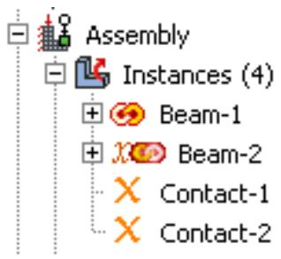  
Figure 1: Model Tree icons indicating linked and excluded status of part instances.

## Additional information

• Using the Model Tree to manipulate part instances

## Excluding part instances from an analysis

You can exclude part instances from the analysis so that they are not written to the input file when the analysis job is submitted. An excluded part instance participates in all operations other than the analysis.

In the Model Tree, select the part instances that you want to exclude from the analysis. Click mouse button 3, and select Exclude from Simulation. Similarly, you can include part instances that were previously excluded by selecting Include in Simulation. Constraints on the part instances are retained if you exclude the instances from the analysis and subsequently include them.

By default, part instances that are excluded from the analysis are colored dark gray in the viewport. Icons are displayed in the Model Tree to indicate the excluded status of part instances and to indicate the linked and excluded status of part instances if the part instances are also linked between models, as shown in Figure 1. Contact-1 and Contact-2 are part instances that are excluded from the analysis, and Beam-2 is a linked and excluded part instance. For more information, see Linking part instances between models.

## Additional information

• Using the Model Tree to manipulate part instances

## Sets and part instances

Part sets are transferred when you create a part instance from a part. For example, you might create a set from a region of a part and use the Property module to assign a section to that set. When you instance the part in the Assembly module, Abaqus creates part instance sets that refer to any part sets that you previously created. Abaqus provides read-only access to these part instance sets in assembly-related modules. You cannot access a part instance set from the Set Manager; however, you can select an eligible part instance set during a procedure by clicking the Set button and selecting the set from the Region Selection dialog box that appears. For more information, see Understanding sets and surfaces.

## Working with model instances

You can create instances of other models in your main model, allowing you to add complete subassemblies in addition to individual parts.

Model instances are created in the exact same way as part instances and can be positioned and manipulated in a similar fashion.

When you create a new model instance, the main assembly of the referenced model is instantiated in the assembly of the current working model. The instance produces a subassembly from the contents of the other model. Since the referenced model assembly might in turn contain other model instances as children, multiple levels of complex subassemblies are possible.

You must include the external model to be instantiated in the current model database (.cae) file to be available. If the model you want to instantiate is contained in a different model database, use File->Import->Model to import it into the current model database. A model database file can always contain multiple models.

Renaming model instances is not supported in Abaqus/CAE. You should take care when renaming models because Abaqus/CAE does not update the model instance name in the instantiated models.

## Characteristics of model instances

Model instances have the following characteristics:

• A particular model can be instantiated multiple times, and you can instantiate as many different models as desired.  
• Model instances are always dependent, not independent.  
• You can freely mix model instances with part instances.  
• Model instance subassemblies can contain either geometric parts or orphan mesh parts.  
Model instances can be positioned and oriented in the main assembly by using transformations (Translate, Translate To, Rotate) and positioning constraints. The transformations and constraints must be applied to a complete model instance subassembly, not to any of its children. If you select a child instance within a model instance, the transformation or constraint will be applied to the entire parent model instance.  
• Linear and radial patterns are not supported and cannot be used with model instances.  
• Part instance commands such as Suppress/Resume, Hide/Show, Delete, Show Parents/Children, and Switch Context can also be used on model instances.

You cannot use the Suppress and Delete commands on the child instances of a model instance; you can use them only on the model instance itself. If you suppress a child instance (part or model) in the original (referenced) model assembly, it is also suppressed in the main model. To see that the suppressed instance is correctly suppressed in the main model, you must use the Model list in the context bar to switch from the original (referenced) model to the main model. Moving to the main model in the Model Tree will not regenerate the model instance children consistently. (For information about the context bar, see Components of the main window.) The child instance must then be resumed in the original model.

• Replace, Exclude from Simulation, Merge/Cut, and Link Instances are not supported and cannot be used on model instances.

• The Partition toolset is not supported and cannot be used with model instances.

• The Query toolset is supported and can be used to determine the position and attributes of model instances.

All sets and surfaces defined in the referenced model are brought into the model instance, maintaining the Model Tree hierarchy of features. These sets and surfaces will be available in the main model.

Surface-to-surface contact and self-contact interactions defined in the initial step (along with their contact interaction properties) are the only history-level features defined in the referenced model that are brought into the model instance (although they are not visible in the model tree); other history-level features (such as steps, loads, boundary conditions, other interactions, and amplitudes) are not brought into the model instance. Some model-level features (fasteners and other engineering features) defined in the referenced model are not brought into the model instance.

Interactions in the main model depend on the interaction option used. Interaction copies to the main model are restricted based on the following patterns:

- For Abaqus/Explicit model instances, you cannot copy to any main model type.  
- For Abaqus/Standard or unknown model type instances, you can copy only to an Abaqus/Standard or an unknown usage main model type.  
• Model instances are supported and selectable in Display Groups and in the Instance tab of the Assembly Display Options.  
• The Virtual Topology toolset is not supported for model instances.

Any part-level attributes that are needed in your subassembly (referenced) model must be created and assigned in that original model and cannot be created in the main model assembly. For example, materials, sections, orientations, and skin/stringer assignments must be created in the original model. Meshing can be performed on the original independent part instances, and the meshes will appear in the model instance.

When you create a model instance, all the part instances of the referenced model assembly are added to the main model assembly as child part instances. Any suppressed part instances or instances that are excluded from the simulation will retain the same status in the subassembly.

If you modify or delete an existing part instance or model instance subassembly in the main model assembly, Abaqus/CAE automatically regenerates the child instances from all parent instances (parts and models) whenever you switch out of and back into the Assembly module of the main model.

If you try to create a new model instance from another model that in turn contains child model instances, any problems with model referencing circularity will be prevented by Abaqus/CAE.

Abaqus/CAE ensures consistency of the modeling space for model instances; if all instances in the main model are three-dimensional, any other models to be instantiated must also be three-dimensional.

## Model instance data saved in input files

When Abaqus/CAE generates the input (.inp) file for a model assembly that contains model instances, a single flattened assembly is generated. All model instance subassemblies are written as a flat list of instances under the single assembly block.

Most features from the original model of a model instance are saved in the input file, with some exceptions:

Surface-to-surface contact and self-contact interactions defined in the initial step are the only history-level features from a model instance subassembly that are saved in the input file. The contact interaction property name and surface names are prepended with the model instance name in the main assembly; for example:  
Model-level features from a model instance are saved in the input file; for example, materials, section assignments, connector section assignments, skins, stringers, and orientations. Materials and element controls defined in a model instance are prepended with the model name in the main assembly; for example,  
Connector sections assignments are prepended with the model instance name in the main assembly; for example: model-instance-name#Wire-3-Set-1  
Other model-level data such as initial conditions and amplitude definitions from a model instance are not saved in the input file.  
Engineering features such as mass and inertia elements, springs, and dashpots defined at the part level in the model instance are saved to the input file, but engineering features defined at the assembly level in the original model are not.

```txt
model-instance-name#contact-property-name
model-instance-name#Surf-1, model-instance-name#Surf-2
```

```txt
model-name#material-name
```

• Sets and surfaces from a model instance are saved in the input file. These set and surface names are also prepended with the model instance name in the main assembly; for example:  
• Constraints, reference points, attachment points, attachment lines, and wires from a model instance are saved in the input file.  
• For constraints the model instance name will be prepended to the constraint name; for example:  
• Attachment points, attachment lines, and wires will be available through sets created in the subassembly.

```txt
model-instance-name#Set-1
```

```txt
model-instance-name#constraint-name
```

The following limitations exist:

• Restart analysis is not supported for a model containing model instances.  
• Instances of models containing assembled fasteners are not supported.

## Creating the assembly

After you create a part instance or a model instance, you apply a succession of position constraints and positioning operations to position it relative to other instances in the global coordinate system. This section describes the tools that Abaqus/CAE provides to position and constrain part and model instances. This section also describes how you can replace a part instance.

## In this section:

The position tools in the Assembly module  
How the position constraint methods differ  
How conflicts can arise between position constraints, translations, and rotations  
Positioning a part or model instance using the Translate To tool  
Replacing an instance

## The position tools in the Assembly module

Each part exists in its own coordinate system in the Part module, and model instances are created in their own coordinate system. You use the Assembly module to position and orient instances of these parts and models relative to each other in a global coordinate system. Abaqus/CAE provides the following tools for positioning part and model instances:

## Auto-offset

When you create the first part or model instance in the Assembly module, Abaqus/CAE displays a triad indicating the origin and the orientation of the global coordinate system. Abaqus/CAE positions the first instance so that the origin of the part or model aligns with the origin of the global coordinate system and the axes are aligned. If you create additional instances, Abaqus/CAE continues to position the new instances such that their coordinate system aligns with the global coordinate system. Since this usually results in new instances overlapping existing ones, Abaqus/CAE allows you to apply an offset before it creates the instance. The offset is applied along the X-axis for three-dimensional and two-dimensional instances and along the Y-axis for axisymmetric instances.

## Basic positioning tools

Abaqus/CAE provides the following basic methods for positioning part and model instances:

• You can translate selected instances along a vector by specifying the coordinates of the start point and end point of the translation vector. You can use the following methods to determine the distance moved by the selected instances:  
- The selected instances move along the translation vector from the start point to the end point.  
The selected instances move along the translation vector from the start point toward the end point and continue to move until a selected face or edge is a specified distance from a face or edge selected from the fixed instances. For more information, see Positioning a part or model instance using the Translate To tool.  
• You can rotate selected instances about an axis. You specify the X-, Y-, and Z-coordinates of the start point and end point of the axis of rotation and the angle of rotation.

## Position constraint tools

A position constraint defines a relationship between two instances. Unlike a simple translation or rotation, you do not specify the position directly. Position constraints define a set of rules that must always be met by the part or model instances in the assembly; for example, a face that must be parallel to another face.

Position constraints defined in the Assembly module create constraints only on the initial positions of instances, whereas constraints defined in the Interaction module define constraints on the analysis degrees of freedom. In the Assembly module constraints are stored as features of the assembly. If you modify a part or move a part or model instance, Abaqus/CAE attempts to apply all existing position constraints when it regenerates the assembly.

Each of the position constraints is described in How the position constraint methods differ.

Creating the final assembly is an iterative process of creating instances, applying position constraints, and applying translations and rotations. After each repositioning, Abaqus/CAE displays a temporary image indicating the result of the operation. You can accept the new position, cancel the operation, or step back through the repositioning procedure

by clicking the Previous button in the prompt area.

You can use the Query toolset to obtain the coordinates of a vertex and to measure the distance between selected vertices. This may help you determine the vector along which you need to translate instances or the angle through which you need to rotate them. Using the Query toolset to query the assembly, contains detailed instructions on how to obtain information about the assembly.

## How the position constraint methods differ

A position constraint defines a relationship between two part or model instances—one that will move (the movable instance) and one that will remain stationary (the fixed instance). When you apply a position constraint, Abaqus/CAE computes a position for the movable instance that satisfies this relationship; you do not specify the position directly. You can apply the following position constraints to instances in the Assembly module:

• Parallel face (three-dimensional instances only)  
• Face to face (three-dimensional instances only)  
• Parallel edge  
• Edge to edge  
• Coaxial (three-dimensional instances only)  
• Coincident point  
• Parallel coordinate systems

In general, applying a single position constraint is not sufficient to define the precise location of a movable instance. You must apply several position constraints—usually three for a three-dimensional assembly and two for a two-dimensional assembly—to position an instance in the desired location. Part and model instances can overlap as a result of applying position constraints; Abaqus/CAE does not prevent overclosure between edges, faces, or cells. Similarly, Abaqus/CAE does not prevent you from overconstraining instances or duplicating a constraint.

The definition of a constraint feature includes all the faces and edges that you originally selected. If you subsequently modify a part or move a part or model instance, Abaqus/CAE automatically recalculates the constraint based on your original selection of faces and edges. As a result, one or more instances might move after the assembly is regenerated. For example, different edges might become parallel. For more information on features, see Manipulating features in the Assembly module and The Feature Manipulation toolset.

The following position constraints are provided by the Assembly module:

## Parallel Face

A parallel face position constraint causes a selected face of the movable instance to become parallel with a selected face of the fixed instance. However, the position constraint does not specify the precise location of the movable instance, and the distance between the parallel faces is arbitrary. To apply a parallel face position constraint between two instances, you do the following:

• Select the faces to be constrained to be parallel from the movable instance and the fixed instance, as shown in Figure 1.

  
Figure 1: Select the faces to become parallel.

• Abaqus/CAE displays arrows normal to the selected faces. You prescribe the orientation of the movable instance by selecting the direction of the arrow normal to its selected face. Figure 2 illustrates the result of applying the position constraint and the effect on the movable instance of reversing the direction of the arrow.

  
Figure 2:The result of applying a parallel face position constraint and the effect of changing the direction of the arrow normal to the selected face of the movable instance.

Abaqus/CAE rotates the movable instance until the two selected faces are parallel and the arrows are pointing in the same direction.

The faces you select from the movable and fixed instances must be planar. The parallel face position constraint can be applied only to three-dimensional instances.

## Face to Face

A face-to-face position constraint is similar to a parallel face position constraint except that you define the clearance between the parallel faces. The clearance is measured between the two selected faces, positive along the normal to the fixed instance. Other than this clearance, the precise location of the movable instance is not constrained. Assuming that you selected the same two faces shown in Figure 1, the effect of applying a face-to-face constraint is shown in Figure 3. Figure 3 also illustrates the effect on the movable instance of reversing the direction of the arrow normal to its selected face.

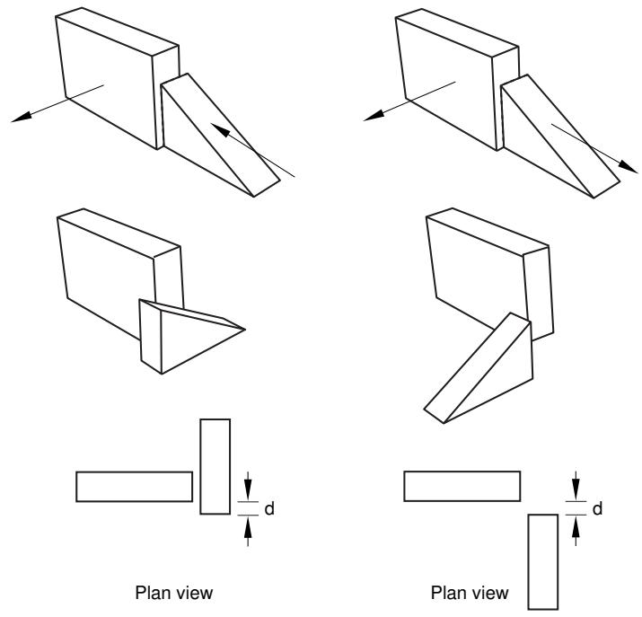  
Figure 3:The result of applying a face-to-face constraint and the effect of changing the direction of the arrow normal to the selected face of the movable instance.

Abaqus/CAE rotates the movable instance until the two selected faces are parallel and the arrows point in the same direction. In addition, the movable instance is translated to satisfy the clearance specified. The faces you select from the movable and fixed instances must be planar. The face-to-face position constraint can be applied only to three-dimensional instances.

## Parallel Edge

A parallel edge position constraint causes a selected edge of the movable instance to become parallel with a selected edge of the fixed instance. However, the position constraint does not specify the precise location of the movable instance, and the distance between the parallel edges is arbitrary. To apply a parallel edge position constraint between two instances, you do the following:

• Select the edges to be constrained to be parallel from the movable and fixed instance, as shown in Figure 4.

  
Figure 4: Select the edges to become parallel.

• Abaqus/CAE displays arrows along the selected edges. You prescribe the orientation of the movable instance by selecting the direction of the arrow along its selected edge. Figure 5 illustrates the result of applying the position constraint and the effect on the movable instance of reversing the direction of the arrow.

  
Figure 5:The result of applying a parallel edge constraint and the effect of changing the direction of the arrow along the selected edge of the movable instance.

Abaqus/CAE rotates the movable instance until the two selected edges are parallel and the arrows point in the same direction.

The edges you select from the movable and fixed instances must be straight. You can select an edge from an instance, or you can select a datum axis or one of the axes of a datum coordinate system. The parallel edge position constraint can be applied only to two-dimensional and three-dimensional instances. It has no effect on axisymmetric instances.

## Edge to Edge

An edge-to-edge position constraint is similar to a parallel edge position constraint except that the clearance between the parallel edges is defined by the constraint. Assuming that you selected the same two edges shown in Figure 4, the effect of applying an edge-to edge position constraint to a two-dimensional assembly is shown in Figure 6. Figure 6 also illustrates the effect on the movable instance of reversing the direction of the arrow along its selected edge.

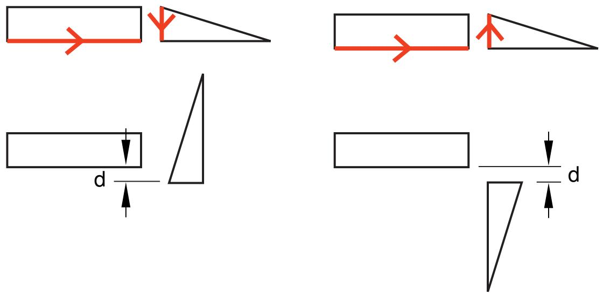  
Figure 6:The result of applying an edge-to-edge constraint and the effect of changing the direction of the arrow along the selected edge of the movable instance.

The modeling space of the assembly determines the behavior of Abaqus/CAE after you apply an edge-to-edge position constraint.

• If the assembly is three-dimensional, Abaqus/CAE positions the movable instance so that the edges are coincident.  
• If the assembly is two-dimensional, you can specify the clearance between the selected edges. The clearance is measured between the two selected edges, positive along the normal to the fixed instance.

Other than this behavior, the precise location of the movable instance is not constrained. The edge-to-edge position constraint can be applied to two-dimensional, three-dimensional, and axisymmetric instances.

## Coaxial

A coaxial position constraint causes a selected cylindrical or conical face of the movable instance to become coaxial with a selected cylindrical or conical face of the fixed instance. However, the coaxial position constraint does not constrain the precise location of the movable instance. To apply a coaxial position constraint between two instances, you do the following:

• Select the cylindrical or conical faces to be constrained to be coaxial from the movable and fixed instance, as shown in Figure 7.

  
Figure 7: Select the faces to become coaxial.

Abaqus/CAE displays arrows along the axis of revolution of the selected instances. You prescribe the orientation of the movable instance by selecting the direction of the arrow along its axis of revolution. Figure 8 illustrates the result of applying the coaxial position constraint.

  
Figure 8:The effect of applying a coaxial constraint.

Abaqus/CAE rotates and translates the movable instance until the two selected faces are coaxial and the arrows are pointing in the same direction. The coaxial position constraint can be applied only to three-dimensional instances.

## Coincident Point

A coincident point constraint causes a selected point on the movable instance to coincide with a selected point on the fixed instance. However, the coincident point constraint does not constrain the orientation of the movable instance. The orientation of the movable instance does not change after the constraint is applied, as shown in Figure 9. For detailed instructions, see Constraining two instances with coincident points.

Maintain relative
2. positions using CVJOIN  
Assemble instances1. using coincident points.  
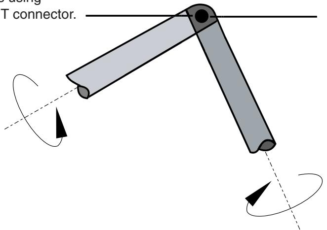  
Figure 9:The effect of applying a coincident point constraint.

## Parallel CSYS

A parallel coordinate systems constraint causes the axes of a datum coordinate system on the movable instance to become parallel with the axes of a datum coordinate system on the fixed instance. However, the parallel coordinate systems constraint does not specify the precise location of the movable instance. Figure 10 illustrates the effect of applying a parallel coordinate systems constraint and a coincident point constraint to two instances.

  
Figure 10:The effect of applying parallel coordinate systems and coincident point constraints.

The coordinate systems can be either rectangular (X-, Y-, and Z-axes), cylindrical (R-, -, and Z-axes), or spherical (R-, -, and -axes). For detailed instructions, see Constraining two instances with parallel coordinate systems.

You can use datums to position part and model instances. When you are prompted to select a face, you can also select a datum plane. When you are prompted to select an edge, you can also select a datum axis or one of the axes of a datum coordinate system. You can select a datum that you created in the Part module because the datum is associated with an instance of the part and moves with the part instance. However, if the position constraint uses a datum that you created in the Assembly module by selecting from a part instance (such as a face of a part instance), Abaqus/CAE changes its regeneration behavior and regenerates features in the order that you created them. For more information, see How are position constraints regenerated?. You cannot select a datum as the movable part instance if you created the datum in the Assembly module and it depends on more than one part instance; for example, a datum axis that runs through vertices of two part instances.

## How conflicts can arise between position constraints, translations, and rotations

In some situations attempting to apply a position constraint results in a conflict with existing position constraints. If that is the case, Abaqus/CAE displays an error message, and you can either apply a different position constraint or use the Feature Manipulation toolset to modify the existing position constraints.

Similarly, attempting to translate or rotate a part or model instance may result in a conflict with existing position constraints. If a conflict occurs, Abaqus/CAE does the following:

## Translation

Abaqus/CAE applies the components of translation only along the unconstrained degrees of freedom. If all of the degrees of freedom are constrained, Abaqus/CAE displays an error message and the translation fails.

## Rotation

Abaqus/CAE displays an error message, and the rotation fails.

If you experience conflicts with an existing position constraint, you can remove all the existing position constraints without changing the position of the instances by using Instance->Convert Constraints. You can then apply the new position constraint, translation, or rotation. You cannot restore position constraints that were removed. Alternatively, you can delete a position constraint, and Abaqus/CAE will move the instance back to its original position.

## Positioning a part or model instance using the Translate To tool

The Translate To tool positions two part or model instances by translating one instance along a user-defined vector defining the direction of motion until selected faces or edges of the movable instance are separated by a specified distance from selected faces or edges of the fixed instance.

When you use the Translate To tool to position instances in three-dimensional modeling space, you select faces to come into contact; for instances in two-dimensional or axisymmetric modeling space, you select edges to come into contact. In addition, when you use the Translate To tool to position axisymmetric instances, the translation vector must be parallel to the axis of revolution.

When you use the Translate To positioning tool, you can select more than one face or edge from both the fixed and the movable instances. Selecting multiple faces or edges is useful if you are not sure what part of the model will come in contact when the movable instance moves along the selected vector. However, for faster processing you should select as few faces or edges as possible.

To translate a movable part or model instance to a fixed instance, you do the following:

• Select faces or edges from the instance that will move and from the instance that will remain stationary.  
• Prescribe the motion of the movable instance by defining a translation vector. Figure 1 illustrates the selected edges and translation vector.

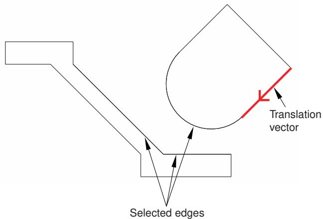  
Figure 1: Select the edges to contact, and define the translation vector.

• Define the desired clearance between the selected faces or edges. Figure 2 shows the effect of the contact constraint after specifying a clearance value of zero and a clearance value of d.

  
Figure 2:The effect of applying a contact constraint and specifying clearance values of zero and d.

To measure the clearance d, Abaqus/CAE first moves the instance along the translation vector until any pair of selected faces or edges come into contact. Abaqus/CAE then moves the instance along the translation vector a distance specified by the clearance value. The clearance can be zero or a positive or negative number; a negative value for the clearance results in overclosure between the selected faces or edges. When you use the Translate To tool, Abaqus/CAE calculates the position of the movable instance within a tolerance based on its size. If you want to avoid any possibility of overclosure, you should specify a small clearance value, rather than simply specifying zero.

Abaqus/CAE displays an error message and does not move the instance if contact between the selected faces or edges is not possible along the translation vector.

Even though you translate the movable instances until contact occurs with a fixed instance, the physical proximity of the selected surfaces is not enough to indicate any type of interaction between them. You must use the Interaction module to specify mechanical contact between surfaces. The Translate To positioning tool is satisfied only within a tolerance based on the size of your model. As a result, contact may not be precise unless it is applied between two planar surfaces.

Abaqus/CAE approximates a curved face with a set of faceted faces. Likewise, Abaqus/CAE approximates a curved edge with a set of faceted edges. The number of facets depends on the degree of curve refinement that you specified

when creating the part in the Part module. Use the box zoom tool edges in the assembly. When you are translating curved faces or curved edges, Abaqus/CAE computes the contact position using this faceted representation. You may wish to set the curve refinement to a finer setting based on the curvature of faces or edges that you know will be coming into contact. For more information, see Controlling curve refinement.

## Replacing an instance

You can replace a part/model instance with an instance of a second part/model. To be precise, you are replacing the part/model from which the part/model instance is created. Abaqus/CAE positions the new instance such that its origin is located at the origin of the original instance and their axes align. In addition, you can choose whether the new instance inherits all the constraints from the instance it replaced.

The replace operation does not change the attributes of the instance. For example, if the original instance is dependent, the instance that replaces it will also be dependent. As a result, if an independent instance of a part exists, you cannot use the replace procedure to create a dependent instance of the same part.

Replacing an instance is useful when you are replacing an instance with one that has similar geometry. For example, the new instance might have additional detail that was not present in the original instance. You can also replace a geometry-based part with a mesh representation of the same part. For example, you could replace a part with the mesh representation of the deformed part imported from an output database.

## Creating patterns of instances

You can create multiple copies of a selected instance in either a linear or radial pattern. You can specify the number of instances to create and the structure of the pattern, as described below.

## Linear pattern

A linear pattern positions the new instances linearly along a direction; for example, the X-direction. The origin of the selected instance and the origins of the new instances lie on the line specified by the direction. You can specify the number of instances and the spacing between the instances. In addition, you can change the orientation of the linear pattern by selecting a line from the assembly that represents the new direction.

You can create a matrix of copied instances by creating copies in a second direction; for example, the Y-direction. The options are the same as for the first direction; you can control the number of copies, the spacing, and the orientation. By default, the first direction is the X-axis and the second direction is the Y-axis. For example, Figure 1 illustrates how a part instance can be patterned in both the X- and Y-axes.

  
Figure 1: Instances patterned in two linear directions.

## Radial pattern

A radial pattern positions the new instances in a circular pattern. You can specify the number of instances, and you can specify the angle between the first and last copy, where a positive angle corresponds to a counterclockwise direction. For example, Figure 2 illustrates a radial pattern of the same instances that appear in Figure 1.

  
Figure 2: A radial pattern of instances.

By default, Abaqus/CAE creates the radial pattern about the Z-axis. Alternatively, you can select a line from the assembly that defines the axis of the circular pattern.

If you create a pattern of instances that are touching and you want to treat the pattern as a single part, you must use the Merge/Cut tool to merge all of the part instances in the pattern into a single part instance. For example, the instances in the radial pattern illustrated in Figure 2 overlapped each other and have been merged into a single part instance. For more information, see Performing Boolean operations on part instances. If you do not merge the part instances, the pattern may include duplicate faces or nodes where the instances touch.

If a part contains part-level sets or surfaces, Abaqus/CAE creates separate assembly-level sets and surfaces for each individual instance in a pattern (see How do part sets and assembly sets differ?, for further discussion of part- and assembly-level sets and surfaces). For example, if the top face of the original part in Figure 1 and Figure 2 is included in a part-level surface, Abaqus/CAE initially creates individual assembly-level surfaces for the top face of each instance in the patterned assembly. It is often helpful to merge these repeated sets and surfaces into a single set or surface. When you merge patterned part instances, Abaqus/CAE also merges any repeated sets or repeated surfaces into a single set or surface on the merged part and part instance. If you do not merge the patterned part instances, you can still merge sets or surfaces using the Boolean option in the Model Tree (see Performing Boolean operations on sets or surfaces, for instructions).

You will find it more convenient to use dependent instances when you create a linear or radial pattern of instances. When you mesh the original part, Abaqus/CAE applies the same mesh to each instance in the pattern. In contrast, if you create a pattern of independent instances, you must mesh each instance individually. For more information, see What is the difference between a dependent and an independent part instance?.

## Performing Boolean operations on part instances

This section describes how you merge and cut part instances.

You can select instances of parts that you created using Abaqus/CAE and merge them into a single instance.In addition, you can cut away the geometric portion of a part instance using the geometric portion of other part instances to make the cut. You can also merge instances of parts containing both geometry and orphan elements.

## In this section:

Merging and cutting part instances  
Merging and cutting independent and dependent part instances

## Merging and cutting part instances

Select Instance->Merge/Cut from the main menu bar to merge multiple instances of parts. The parts to be merged can contain any combination of geometry and orphan mesh nodes and elements; and there are options for merging the geometry, the mesh (orphan and native), or both. In addition, you can cut the geometric portion of a part instance using the geometric portion of one or more part instances to make the cut. Both merge and cut operations create a new part instance and a new part. When you merge or cut part instances, you can choose to suppress or delete the original part instances. The merge and cut operations are described in more detail below.

## Merge

You can select multiple part instances and merge them into a single part instance. For example, Figure 1 shows two part instances that model a 15-pin connector. The two part instances are positioned along a common face and then merged into a single part instance that can be meshed and analyzed.

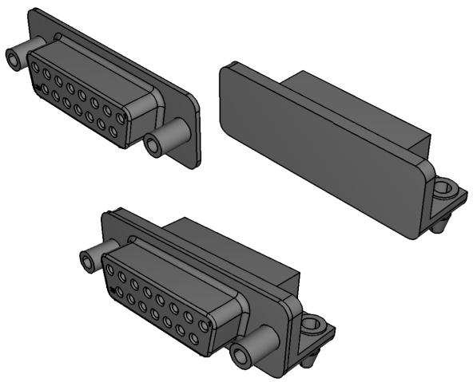  
Figure 1:Two part instances merged into a single part instance.

You can merge part instances even if the instances are not touching or overlapping. You can choose whether to remove or retain the intersecting boundaries between the merged part instances, as shown in Figure 2. If desired, you can use the Part Copy dialog box to create a mirror image of a part about one of the three principal planes. For more information, see Copying a part.

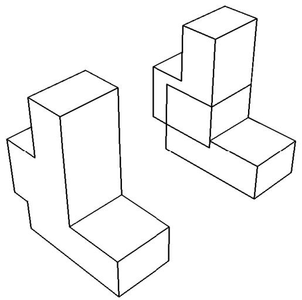  
Figure 2:The effect of removing and retaining intersecting boundaries.

If you merge meshes, you can specify the Node merging tolerance, which is the maximum distance between nodes that will be merged. Abaqus/CAE creates a compatible mesh by deleting nodes that are closer than the specified distance and replacing them with a single new node. The location of the new node is the average position of the deleted nodes. If the value that you entered for the Node merging tolerance is too large, Abaqus/CAE may detect duplicate nodes from the same element. Abaqus/CAE will not merge nodes from the same element. However, the large tolerance can result in a distorted mesh, and Abaqus/CAE asks if you want to continue or end the merging procedure. If no nodes are closer than the specified distance, Abaqus/CAE asks if you want to cancel the procedure or to create a single instance from the selected instances.

When you merge meshed part instances that intersect, you can choose whether to create duplicate elements as well as duplicate nodes. A duplicate element has the same connectivity as another element. By default, Abaqus/CAE deletes duplicate elements, and in most cases you should accept the default behavior. However, you must retain duplicate elements if you want to model a material with a combination of material properties that are not supported by Abaqus, as described in the discussion of stability in No Compression or No Tension.

You can choose between the following methods for merging the nodes:

## Boundary only

By default, Abaqus/CAE merges the meshed part instances only along their boundaries (defined by free faces for three-dimensional instances and by free edges for two-dimensional instances). Free faces and edges are those faces and edges that belong to only one geometric entity or element. Using this setting, Abaqus/CAE does not check for duplicate nodes in the interior of the parts, which speeds up the merging process. You should retain this default setting if three-dimensional part instances intersect at only a common face or if two-dimensional instances intersect at only a common edge.

## All

If the part instances overlap, you may want to merge all the nodes in the selected part instances.

## None

Alternatively, you can choose to merge none of the nodes, in which case Abaqus/CAE merges the part instances into a single instance but retains all the original nodes.

In many cases you will be merging part instances that do not intersect but share a common face; for example, the two part instances shown in Figure 3.

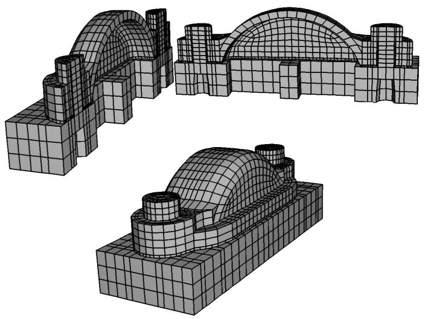  
Figure 3:Two meshed part instances merged into a single meshed part instance.

You can also merge selected nodes of a meshed part using the Edit Mesh toolset; for more information, see Manipulating nodes.

Although the resulting merged mesh may appear acceptable in the viewport, the mesh may contain small gaps between a node and an element face that are not readily apparent. The mesh may also contain merged faces that have an incompatible mesh pattern. You can use the Mesh gaps/intersections tool in the Query toolset to check for small gaps and incompatible faces. For more information, see Obtaining general information about the model.

When you merge part instances, any sets or surfaces on the original parts and part instances are mapped to the new part and part instance. If sets or surfaces from different parts have the same name, they are merged into a single set or surface on the merged part and part instance. If you choose to remove intersecting boundaries between the merged part instances, portions of sets or surfaces that lie on those boundary edges and faces are removed from the mapped sets and surfaces.

Section assignments from the original parts are also mapped to the new part. If parts in the original assembly intersect, Abaqus/CAE can map only a single section in the intersecting regions. Similarly, if parts are exactly touching or intersecting and the intersecting boundaries are removed during the merge, Abaqus/CAE maps only a single section to the entire merged part. In these intersecting situations, the section that gets mapped is dependent on a variety of factors and may not match your modeling intent. When merging intersecting regions, you should retain the intersecting boundaries; the boundaries preserve the original section assignments in nonintersecting regions and make it easier to modify mapped section assignments if necessary (for details, see Managing section assignments).


## Note:

Beam section assignments and rebar reference orientations are not mapped to the merged part. You must recreate them and any associated properties after the merge.

You might want to merge part instances for the following reasons:

If geometry in separate instances touches or overlaps but you do not merge the instances, Abaqus/CAE creates a separate mesh for each instance and you must apply tie constraints to effectively merge the nodes. In contrast, when you merge part instances, Abaqus/CAE creates a single combined mesh and you do not need to apply computationally expensive tie constraints. In effect, you have created a compatible mesh between the part instances. If you want to retain the concept of separate part instances, you can create partitions at the common interface of the merged instances.

• Merging part instances allows you to assign material properties to the single part created by the merge operation instead of to each part individually.  
• You can apply a display body constraint to a group of merged part instances instead of applying the constraint to each part instance individually.  
When you import a complex assembly, the assembly may appear in Abaqus/CAE as a large number of individual part instances that will be meshed individually. You can merge all the part instances into a single part instance, or you can merge groups of part instances into several separate part instances.

You have the following three options when merging part instances:

## Geometry

Merge only the geometry. Any orphan mesh portions of the instances being merged are deleted from the merged part and part instance.

## Mesh

Merge all native and orphan mesh components. Any geometry of the instances being merged is deleted from the merged part and part instance. The native mesh portion of the original parts becomes part of the orphan mesh in the new part.

## Both

Merge both the geometry and the orphan mesh. Any native meshes are deleted in the process of merging the geometry.

## Cut

You can select the geometric portion of a single part instance to be cut, and then you can select the geometry of one or more part instances that are touching or overlapping the part instance to be cut. Abaqus/CAE uses the geometry that will make the cut (the die) to cut away from the geometry of the instance to be cut (the blank). Geometry must touch or overlap to create a cut part and part instance. If the part instance being cut includes orphan mesh elements, they are unaffected by the cut operation.

When you cut a part instance, sets, surfaces, and section assignments from the original part and part instance are mapped to the new part and part instance. Portions of original sets and surfaces that lie within cut portions of the original geometry are removed from the mapped sets and surfaces.

The cut operation is useful if you want to create a mold from a part or vice versa. Figure 4 shows a bottle and a rectangular blank and how the cut process creates the mold.

  
Figure 4: A mold created from a blank and a die using the cut operation.

You cannot make a cut with a shell part instance. Therefore, before the cut operation was performed, the bottle was converted from a shell to a solid part in the Part module. For more information, see Creating a solid feature from a shell. In addition, the original part instances (the blank and the die) were suppressed after the cut operation. The cut operation is also useful for modeling a structure and an acoustic medium when you are performing an acoustic or shock analysis.


## Note:

You cannot merge or cut part instances that contain virtual topology. When you merge part instances, composite layups and material orientation of the original part are not mapped to the merged part.

For detailed instructions, see Merging or cutting part instances.

## Merging and cutting independent and dependent part instances

Merging selected part instances results in a new part instance and a new part. If you merge independent part instances, the resulting part instance is also independent. Similarly, if you merge dependent part instances, the resulting part instance is also dependent. Finally, if you merge a combination of independent and dependent part instances, the resulting part instance is dependent.

When you merge the meshes of meshed geometry and/or orphan mesh elements, the resulting part instance is always an orphan mesh part and it is always dependent. When you merge both the meshes and geometry of parts containing geometry and orphan mesh nodes and elements, the resulting part instance is a hybrid containing geometry and orphan nodes and elements, and it is always dependent.

Cutting the geometry of selected part instances also results in a new part instance and a new part. The discussion of merging the geometry of independent and dependent part instances applies to cutting the geometry of independent and dependent part instances; however, orphan mesh elements within a part instance cannot be cut or used to cut the geometry of another instance.

## Understanding toolsets in the Assembly module

The Assembly module provides several toolsets that allow you to modify the features that define the assembly. This section describes how these toolsets are used within the Assembly module.

For more detailed information about each toolset, refer to:

The Datum toolset  
The Feature Manipulation toolset  
The Partition toolset  
The Query toolset  
The Reference Point toolset  
The Set and Surface toolsets

The Display Group toolset is discussed in Using display groups to display subsets of your model.

## In this section:

Using datum geometry in the Assembly module  
Manipulating features in the Assembly module  
Partitioning the assembly  
Querying the assembly  
Creating reference points  
Using sets and surfaces in the Assembly module

## Using datum geometry in the Assembly module

Within the Assembly module, you use the Datum toolset to provide additional reference geometry (vertices, edges, and surfaces) that is not provided by the assembly. You use the reference geometry to help you define position constraints and to position part or model instances. For example, you can use a datum plane when creating a parallel face or face-to-face constraint if the desired surface does not exist. Similarly, you can use a datum axis when creating a parallel edge or edge-to-edge constraint if the desired edge does not exist. A datum is a parent feature of any constraint in which it was selected. Datums do not modify the geometry of a part or model instance; as a result, you can create datums that refer to both independent and dependent part instances.

Datum geometry that you create in the Part module is transferred along with the rest of the part's geometry when you create a part instance in the Assembly module. In addition, when you translate and rotate a part instance in the Assembly module, a datum created in the Part module is translated and rotated along with the instance. In contrast, a datum created in the Assembly module follows only the reference points that were used to create the datum. As a result if you translate and rotate a part instance, the behavior of the datum may not reflect your design intent. If you know that a datum should be associated with a part, you should create the datum in the Part module.

Figure 1 illustrates a model in which a deformable curved shell will be compressed between two rigid surfaces.  
  
Figure 1: An edge-to-edge constraint applied between a datum axis and a selected edge.

The shell is positioned easily by applying an edge-to-edge position constraint between a selected edge of the lower rigid surface (the fixed part instance) and a datum axis associated with the shell (the movable part instance). The datum axis was created with the deformable part in the Part module and moves along with the movable part instance when the position constraint is applied. In contrast, Figure 2 illustrates an edge-to-edge position constraint applied between three movable part instances and a fixed datum axis that provides reference geometry. In this example the datum axis was created along the X-axis of the assembly and is not associated with any part instance. Applying three edge-to-edge position constraints, one to each of the three part instances shown, would result in alignment of the three instances along the datum axis.

  
Figure 2: Edge-to-edge constraints applied between multiple parts and a fixed datum axis.

A datum is a feature of the assembly and is regenerated along with the rest of the assembly. You can make datum geometry invisible while still retaining it in the assembly by selecting View->Assembly Display Options from the main menu bar. For more information, see Controlling datum display.

The triad indicating the origin and the orientation of the global coordinate system is a datum coordinate system created by the Assembly module. You can suppress or delete it, but you cannot modify it.

## Additional information

• Understanding toolsets in the Assembly module  
• The Datum toolset

Along with datum geometry and partitions, part instances, model instances, and position constraints are considered to be features of the assembly and appear in the list of features in the Model Tree.

## Part instances

You can suppress, resume, and delete part instances. You can partition a part instance, but you cannot edit its shape or its features. To modify a part instance, you must edit the original part in the Part module; Abaqus/CAE automatically regenerates instances of a modified part when you return to the Assembly module.

You can make a part instance invisible while still retaining it in the assembly by selecting View->Assembly Display Options->Instance from the main menu bar. For more information, see Controlling instance visibility. This technique is not the same as suppressing a part instance; a suppressed part instance is removed from the assembly until you resume it. You can also use display groups to make part instances invisible; for more information, see Using display groups to display subsets of your model.

You can link part instances, and you can exclude part instances from an analysis; for more information, see Linking part instances between models and Excluding part instances from an analysis.

## Model instances

You can suppress, resume, and delete model instances. To modify a model instance, you must edit the original model's assembly.

You can make a model instance invisible while still retaining it in the assembly by selecting View->Assembly Display Options->Instance from the main menu bar. You can also use display groups to make model instances invisible.

## Position constraints

You can edit, suppress, resume, and delete position constraints. You can modify the following parameters of a position constraint:

• The direction of the arrow normal to the selected face or along the selected edge of the movable part instance.  
• The clearance between the selected face or edge of the movable part instance and the selected face or edge of the fixed part instance. The clearance parameter applies only to face-to-face, edge-to-edge, and contact constraints.

Translations and rotations are not stored as features and cannot be edited, suppressed, resumed, or deleted.

You can use the Feature Manipulation toolset to modify features of the assembly. When you are prompted to select a feature to modify, you can select a visible feature such as a part instance, a datum, or a partition from the viewport. However, to select a position constraint, you must select it from the Model Tree.

The following feature manipulation tools are available from the Feature Manipulation toolset:

## Edit

When you edit a feature, Abaqus/CAE displays the Edit Feature dialog box and you can modify the feature's parameters or the sketch that defined the feature. You cannot edit part instances; you must return to the Part module to modify the original part.

## Regenerate

When you modify features in a complex assembly, it may be convenient to postpone regeneration until you make all your changes, since regeneration can be time consuming. Select Feature->Regenerate when you are ready to regenerate the assembly.

## Rename

Rename a feature.

## Suppress

Suppressing a feature temporarily removes it from the definition of the assembly. A suppressed feature is invisible, cannot be meshed, and is not included in the analysis of the model. Suppressing a parent feature will suppress all of its child features.

## Resume

Resuming a feature restores a suppressed feature to the assembly. You can choose to resume all features, the set of features most recently suppressed, or just a selected feature.

## Delete

Deleting a feature removes it from the assembly; you cannot restore a deleted feature.

## Query

When you query a feature, Abaqus/CAE displays information in the message area and writes the same information to the replay file (abaqus.rpy) in the form of comments.

## Options

The Feature Options dialog box allows you to control whether Abaqus/CAE performs self-intersection checks and enables you to prioritize the regeneration of constraint features over other assembly features.

For a more detailed explanation of the Feature Manipulation toolset, see The Feature Manipulation toolset.

## Additional information

• Understanding toolsets in the Assembly module  
• The Feature Manipulation toolset

## Partitioning the assembly

Within the Assembly module, you can use the Partition toolset to partition the assembly into additional regions. You can use vertices, edges, and faces from one part instance to create a partition that divides a second part instance; for example, you might use the Extend Face method to partition a cell by extending a face of one part instance into a second part instance. Partitions cannot span part instances.

A partition in the assembly appears in every module that operates on the assembly. Partitions you create in the Part module are transferred along with the rest of the part's geometry when you create a part instance in the Assembly module. Partitions are features of the assembly, and they are regenerated along with the rest of the assembly. You cannot turn off the display of partitions. Partitions modify the geometry of a part instance; as a result, you cannot partition a dependent part instance.

The Partition toolset is not supported and cannot be used with model instances.

## Additional information

• Understanding toolsets in the Assembly module  
• The Partition toolset

## Querying the assembly

You can use the Query toolset to request either general information or module-specific information. For a discussion of the information displayed by general queries, see Obtaining general information about the model.

In addition, you can use the Assembly module-specific queries to determine the following attributes of a part instance or a model instance:

• Name, type, and modeling space  
• Origin  
• The sum of the translations and rotations applied to the instance

For more information, see Using the Query toolset to query the assembly.

## Creating reference points

From the main menu bar, select Tools->Reference Point to create a reference point on a part instance or a model instance. You can create multiple reference points on the assembly; Abaqus/CAE labels them RP-1, RP-2, RP-3, etc. For more information, see The Reference Point toolset.

Abaqus/CAE displays the reference point at the desired location along with its label. You can change the reference point label by clicking mouse button 3 on the feature in the Model Tree and selecting Rename from the menu that appears. If desired, you can turn off the display of the reference point symbol and the reference point label; for more information, see Controlling reference point display.

## Using sets and surfaces in the Assembly module

Sets created by selecting geometry from the assembly are called assembly sets, and you use the Set toolset to create and manage assembly sets. For example, you can select an assembly set to indicate where loads, boundary conditions, and interactions are applied. You can also use assembly sets to define regions of the model from which Abaqus/CAE will generate output during the analysis; for example, selected vertices or faces. Assembly sets can include regions from multiple part instances.

In contrast, part sets are created by selecting geometry from a part in the Part module or the Property module. When you instance a part in the Assembly module, you can refer to any part sets that you previously created; however, Abaqus provides only read-only access to these part sets in assembly-related modules. In addition, you cannot access a part set from the Set Manager in assembly-related modules; however, you can select an eligible part set during a procedure by clicking the Set button and selecting the set from the Region Selection dialog box that appears. For more information, see Understanding sets and surfaces.

You create surfaces by selecting faces or edges from the assembly, and you use the Surface toolset to create and manage surfaces. Typically you select a surface when a procedure is expecting a face; for example, when you are applying distributed loads, such as pressure loads, and defining contact interactions. For more information, see What is a surface?.

For model instances, any sets or surfaces defined in the original model are brought into the model instances, maintaining the Model Tree hierarchy of features.

## Additional information

• Understanding toolsets in the Assembly module  
• The Set and Surface toolsets

## Using the Assembly module toolbox

You can access all the Assembly module tools through either the main menu bar or through the Assembly module toolbox. Figure 1 shows the hidden icons for all the Assembly module tools in the toolbox.

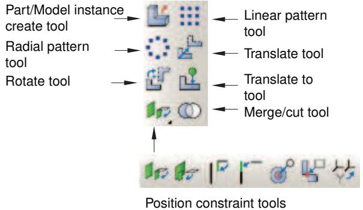  
Figure 1:The Assembly module tools.

To see a tooltip containing a brief definition of an Assembly module tool, hold the mouse over the tool for a moment. For information on using toolboxes and selecting hidden icons, see Using toolboxes and toolbars that contain hidden icons.

## Creating and manipulating part and model instances

This section describes how you use the Assembly module's Instance menu to create part and model instances and to position the instances relative to the global coordinate system.

You can also use the Instance menu to replace one part instance with another and to convert the constraints applied to a selected part instance to an absolute position. You can access additional functionality using the Model Tree.

## In this section:

Using the Instance menu  
Using the Model Tree to manipulate part instances  
Using the Model Tree to switch the context for part or model instances  
Creating a part or model instance  
Creating a linear pattern of instances  
Creating a radial pattern of instances  
Translating part or model instances  
Translating a part or model instance to another instance  
Rotating part or model instances  
Replacing an instance  
Converting constraints  
Merging or cutting part instances

## Using the Instance menu

Use the Instance menu to do the following:

Create instances of parts from the current model and add them to the assembly. You can also create instances of other models to add to the current assembly.  
• Create a linear pattern of part instances.  
• Create a radial pattern of part instances.  
Translate selected part or model instances along a specified vector.  
Translate selected part or model instances along a specified vector until they are a specified distance from another instance.  
Rotate selected part or model instances through a specified angle about a specified axis.  
Replace a part instance with a second part instance.  
Convert any position constraints to an absolute position.  
Merge or cut part instances.

You may find it more convenient to access the instance tools using the Assembly module toolbox. For a diagram of the tools in the Assembly toolbox, see Using the Assembly module toolbox.

## Additional information

• Using the Assembly module toolbox

• The Assembly module

## Using the Model Tree to manipulate part instances

You can access additional functionality for manipulating part instances using the Model Tree. After you select a part instance or multiple instances in the Model Tree, you can click mouse button 3 and select from the following options:

• To change a part instance from dependent to independent, select Make Independent from the menu that appears. Similarly, you can select Make Dependent from the menu to change a part instance from independent to dependent.  
• To link part instances, select Link Instances from the menu that appears to display the Link Instances dialog box and do the following:

1. For each child part instance, specify the model and part instance to which you want to link. By default, the dialog box displays all models in the model database other than the current model that have part instances with the same names as the selected instances. You can specify other values by clicking in the Model or Instance column of the table and selecting from the list of names displayed.

2. If you want the child part instances excluded from the input file that Abaqus/CAE generates when you submit the job for analysis, toggle on Also exclude child instances from simulation.

3. Click Link.

Icons appear in the Model Tree to indicate the linked status of the part instances. By default, linked part instances are colored gray in the viewport.

Similarly, you can select Unlink Instances from the menu to unlink part instances that were previously linked. For more information, see Linking part instances between models.

To exclude part instances from the analysis, select Exclude from Simulation from the menu that appears. Icons appear in the Model Tree to indicate the excluded status of the part instance. By default, part instances that are excluded from the analysis are colored dark gray in the viewport. Similarly, you can select Include in Simulation from the menu to include a part instance in an analysis for which it was previously excluded. For more information, see Excluding part instances from an analysis.  
• To ignore the invalid status of a part instance, select Ignore Invalidity. For more information, see Working with invalid parts.

## Additional information

• What is the difference between a dependent and an independent part instance?

• How do I decide whether to create a dependent or an independent part instance?

• Changing from a dependent to an independent part instance or vice versa

• Linking part instances between models

• Excluding part instances from an analysis

## Using the Model Tree to switch the context for part or model instances

You can use the Model Tree in the Assembly module or Mesh module to switch the context for part instances or for model instances and their child part instances.

In the Model Tree, select the instance for which you want to switch the context. If you select multiple instances, the context switches to the part or model for the first instance that you select. Click mouse button 3, and select Switch to part/model context. Abaqus/CAE switches the context as follows (depending on your selection):

• In the Assembly module, if you selected a part instance or a child part instance, the context switches to the Part module with the original part from which the instance was created displayed in the viewport.  
• In the Mesh module, if you selected a part instance or a child part instance, the context switches to display the original part from which the instance was created in the viewport.  
• If you selected a model instance, the context switches to display the original model from which the model instance was created in the viewport.

## Additional information

• Working with part instances  
• Working with model instances

## Creating a part or model instance

To create a part or model instance, select Instance->Create from the main menu bar and select the desired part or model from the Create Instance dialog box that appears.

You can select from any of the existing parts in the current model or any of the existing models in the current model database. You can create multiple instances of the same part or model, but you cannot assemble instances of parts or models that were created in different modeling spaces (three-dimensional, two-dimensional, or axisymmetric).

When you create the first instance,Abaqus/CAE displays a graphic symbol indicating the origin and orientation of the assembly's global coordinate system. This symbol is a datum coordinate system. If desired, you can hide it using the assembly display options; for more information, see Controlling datum display.

By default, Abaqus/CAE creates dependent part instances. A dependent instance is only a pointer to the geometry of the original part. As a result, many operations are not allowed on a dependent part instance; for example, you cannot add partitions, create virtual topology, or mesh the instance. In contrast, an independent part instance is a copy of the geometry of the original part. You can perform most operations on an independent instance; for example, you can add partitions, create virtual topology, and mesh the instance. You cannot create both an independent and a dependent instance of the same part. You can select a part instance from the Model Tree and change it from independent to dependent or vice versa. For more information, see What is the difference between a dependent and an independent part instance?.

When you create an instance, by default Abaqus/CAE positions the instance so that the origin of the original geometry aligns with the origin of the assembly coordinate system. When you create multiple instances, a new instance can be positioned over an existing instance. However, if you toggle on Auto-offset from other instances in the Create Instance dialog box, Abaqus/CAE translates each new instance along the X–axis until it does not overlap any existing instances. If the assembly is axisymmetric, Abaqus/CAE translates the new instance along the axis of revolution instead of along the X–axis.

1. From the main menu bar, select Instance->Create.

Abaqus/CAE displays the Create Instance dialog box.


Tip: You can also create an instance using the tool from the Assembly module toolbox. For a diagram of the tools in the Assembly toolbox, see Using the Assembly module toolbox.

2. Choose Parts or Models.

Depending on your choice, the Create Instance dialog box shows you a list of all the existing parts in the current model or all the other models in the model database.

3. Choose the desired parts or models from the list. You can use a combination of [Ctrl] + Click and [Shift] + Click to select multiple items.

A temporary image of the selected instances appears in the current viewport. Abaqus/CAE positions the temporary images so that their origins coincide with the origin of the global coordinate system.

4. By default, Abaqus/CAE creates Dependent part instances. If desired, toggle on Independent to create an independent part instance.  
5. If desired, toggle on Auto-offset from other instances to offset the new instances.  
6. Optional: Use the Name text field at the top of the dialog box to name the instance you are creating.

• If you do not specify a name, a name is generated automatically.  
• If multiple parts are selected, the name you specify is applied to the first selection. The other instance names are appended with the suffix “-1,” “-2,” “-3,” etc.  
• If you enter an existing name, Abaqus/CAE issues a warning in the CLI and generates a name.

7. If you are satisfied that you have selected the correct instances, click Apply.

Abaqus/CAE creates the instances and applies an auto-offset if selected.

8. To create additional instances, repeat this procedure from Step 2. When you have finished creating instances, click OK to close the Create Instance dialog box.

## Additional information

• Using the Instance menu  
• Working with part instances  
• Working with model instances

## Creating a linear pattern of instances

To create multiple copies of a selected instance in a linear pattern, select Instance->Linear Pattern from the main menu bar. You can create a pattern that extends in one direction (for example, horizontally or vertically), or you can create a pattern that extends in two directions (for example, both horizontally and vertically). You cannot edit a pattern after you create it. You can specify the following:

• The number of instances to create in each direction, including the selected instance. You can create any number of instances.  
• The spacing between each instance along the specified direction.  
• A line that defines the direction along which Abaqus/CAE generates the instances.

For more information, see Creating patterns of instances.

1. From the main menu bar, select Instance->Linear Pattern.


Tip: You can also create a linear pattern of instances using the tool from the Assembly module toolbox. For a diagram of the tools in the Assembly toolbox, see Using the Assembly module toolbox.

2. Select the instances that you want to copy.


Tip: To select more than one instance, hold down the [Shift] key as you click each instance or drag a rectangle around the instances. To unselect an instance, use [Ctrl] + Click. For more information, see Selecting objects within the viewport.

3. Click mouse button 2 to indicate that you have finished selecting instances.

Abaqus/CAE displays the Linear Pattern dialog box.

4. From the Linear Pattern dialog box, configure the pattern in Direction-1 (by default, Direction-1 is the X-direction):

a. Click the arrows to the right of Number to increase or decrease the number of copies to create, including the selected instances. The number of copies in the assembly updates when you click the arrows and provides a preview of the setting.

Alternatively, you can type in a number and press [Enter] to preview the setting. You can enter any number greater than or equal to 1. If you enter a value of 1, Abaqus/CAE displays only the selected instances and does not create any copies of the selected instances; in effect, you are disabling copies in Direction-1.

b. Enter the Spacing between each copy along the specified direction.

c. By default, Abaqus/CAE creates the copies along the X-direction. If you want to change the direction

in which Abaqus/CAE creates the copies, click and select a line from the assembly to define the new direction. You must pick a straight edge or a datum axis.

d. By default, Abaqus/CAE creates the copies in the positive direction. Click to reverse the direction in which Abaqus/CAE creates the copies.

5. To create copies in a second direction, enter a Number greater than 1 and specify the Spacing, the Direction, and the Flip direction for Direction-2 (by default, Direction-2 is the Y-direction). You must enter a Number greater than 1 for at least one direction.

6. In most cases you will want to preview the linear pattern that Abaqus/CAE will create as you enter values in the Linear Pattern dialog box. However, if you choose to create a large number of copies, the preview capability may impact the performance of Abaqus/CAE. In this case you should toggle off the Preview button.  
7. To copy more instances, repeat the above steps beginning with Step 1.

## Additional information

• Creating patterns of instances  
• Creating a radial pattern of instances

## Creating a radial pattern of instances

To create multiple copies of a selected instance in a radial pattern, select Instance->Radial Pattern from the main menu bar. You cannot edit a pattern after you create it. You can specify the following:

• The number of copies to create in the radial pattern, including the selected instances. You can create any number of instances.  
• The total angle between the original instance and the last copy in the pattern.  
• The position of the axis of the circular pattern.

For more information, see Creating patterns of instances.

1. From the main menu bar, select Instance->Radial Pattern.


Tip: You can also create a radial pattern of instances using the $\begin{array} { l } { \equiv ^ { \equiv } \equiv } \\ { = \equiv ^ { \equiv } \equiv ^ { \equiv } } \\ { \equiv \equiv ^ { \equiv } } \end{array}$ tool from the Assembly module toolbox. For a diagram of the tools in the Assembly toolbox, see Using the Assembly module toolbox.

2. Select the instances that you want to copy.


Tip: To select more than one instance, hold down the [Shift] key as you click each instance or drag a rectangle around the instances. To unselect an instance, use [Ctrl] + Click. For more information, see Selecting objects within the viewport.

3. Click mouse button 2 to indicate that you have finished selecting instances.

Abaqus/CAE displays the Radial Pattern dialog box.

4. From the Radial Pattern dialog box, configure the radial pattern:

a. Click the arrows to the right of Number to increase or decrease the number of copies to create, including the selected instances. The number of copies in the assembly updates when you click the arrows and provides a preview of the setting.  
Alternatively, you can type in a number and press [Enter] to preview the setting. You can enter any number greater than or equal to 2.  
b. Enter the Total angle between the original instances that you selected and the final copy. The angle must be between –360° and +360°. A positive angle corresponds to a counterclockwise direction.  
c. By default, Abaqus/CAE rotates the selected instance about the Z-axis to create the pattern. To

define a new axis of rotation, click and select a line from the assembly that represents the new axis of rotation. You can also select an axis from the global coordinate system triad.

5. In most cases you will want to preview the radial pattern that Abaqus/CAE will create as you enter values in the Radial Pattern dialog box. However, if you choose to create a large number of copies, the preview capability may impact the performance of Abaqus/CAE. In this case you should toggle off the Preview button.

6. To copy more instances, repeat the above steps beginning with Step 1.

## Additional information

• Creating patterns of instances  
• Creating a linear pattern of instances

## Translating part or model instances

Select Instance->Translate from the main menu bar to move selected part or model instances along a selected vector.

The direction and magnitude of the vector are arbitrary except that you can translate axisymmetric part instances only along the axis of rotation. If the translation conflicts with a previous position constraint; for example, a constraint that aligns two faces, Abaqus/CAE applies the components of translation only along the unconstrained degrees of freedom. If all of the degrees of freedom are constrained, Abaqus/CAE displays an error message and the translation fails.

When you create the first instance in your assembly, Abaqus/CAE displays a graphic indicating the origin and orientation of the assembly's default coordinate system. You can use this graphic to help you decide how to translate your part instances. In addition, you can use the Query toolset to review the sum of the translations and rotations previously applied to an instance and the distance between selected vertices. Translations and rotations are not considered features of the assembly and cannot be edited or deleted.

1. From the main menu bar, select Instance->Translate.


tool from the Assembly module toolbox. For a diagram of the tools in the Assembly toolbox, see Using the Assembly module toolbox.

Abaqus/CAE displays prompts in the prompt area to guide you through the procedure.

2. Select the part or model instances to translate. You can also click Instances on the right of the prompt area and select the instances to translate from the dialog box that appears.


Tip: If you are unable to select the desired instance, you can use the Selection toolbar to change the selection behavior. For more information, see Using the selection options.

You can use a combination of [Ctrl] + Click and [Shift] + Click to select multiple instances.

Abaqus/CAE highlights the selected instances.

3. Specify the translation vector using one of the following methods:

Select an axis or linear edge from the viewport, and enter a distance for the translation. Abaqus/CAE displays an arrow along the selected axis/edge, and, if needed, you can flip the direction to define the translation vector.  
Select the start and end points of the translation vector. You can select any existing vertices or datum points, or you can enter the coordinates in the text box in the prompt area. If you want to enter coordinates for a coordinate system other than the global coordinate system, click Select on the right side of the prompt area and select a local coordinate system. By default, the coordinate system applied to the start point is also applied to the end point.

Abaqus/CAE displays a temporary image indicating the translation that will be applied to the selected instance. You cannot edit or delete a translation after it is applied. Attempting to translate an instance may result in a conflict with existing position constraints. Abaqus/CAE applies the components of translation only along the unconstrained degrees of freedom. If all of the degrees of freedom are constrained, Abaqus/CAE displays an error message and the translation fails.

4. Do one of the following:

• If you are satisfied the translation is correct, click OK in the prompt area.

Abaqus/CAE translates the instance and positions it at the same location as the temporary image of the instance.

• If you are not satisfied with the translation, click the Previous button ) and specify a new translation vector.  
Click to cancel the procedure.

## Additional information

• Using the Instance menu  
• Creating the assembly

## Translating a part or model instance to another instance

Select Instance->Translate To from the main menu bar to position two instances by translating one instance along a vector defining the direction of motion until selected faces or edges of the movable instance are separated by a specified distance from selected faces or edges of the fixed instance.

Abaqus/CAE calculates the contact only within a tolerance based on the size of your model. As a result, contact may not be precise unless it is applied between two planar surfaces. If the selected faces or edges never contact when Abaqus/CAE translates the movable instance, the translation is not applied.

1. From the main menu, select Instance->Translate To.


Tip: You can also define a Translate To constraint using the tool in the Assembly module toolbox. For a diagram of the tools in the Assembly toolbox, see Using the Assembly module toolbox.

Abaqus/CAE displays prompts in the prompt area to guide you through the procedure.

2. Select the faces (for three-dimensional part instances) or edges (for two-dimensional part instances) from the part or model instance that will move and the instance that will remain fixed. You can select more than one face or edge from both the fixed and the movable instances. Selecting multiple faces or edges is useful if you are not sure what part of the model will come in contact when the movable instance moves along the selected vector. However, for faster processing you should select as few faces or edges as possible. You cannot select a datum plane.  
3. Specify the vector that defines the direction of motion using one of the following methods. If the instances are axisymmetric, the translation vector must be parallel to the axis of revolution.

Select an axis or linear edge from the viewport. Abaqus/CAE displays an arrow along the selected axis/edge, and, if needed, you can flip the direction to define the translation vector.  
Select the start and end points of the vector. You can select any existing vertices or datum points, or you can enter the coordinates in the text box in the prompt area. If you want to enter coordinates for a coordinate system other than the global coordinate system, click Select on the right side of the prompt area and select a local coordinate system. By default, the coordinate system applied to the start point is also applied to the end point.

4. In the text box that appears in the prompt area, enter a value for the clearance between the two selected faces; a negative value indicates overclosure. A translation is not saved as a feature, and you cannot change the clearance after you have completed the procedure.  
5. From the prompt area, click Preview.

Abaqus/CAE moves the movable part or model instance along the translation vector until the selected faces of the movable instance are separated by the specified clearance from the selected faces of the fixed instance.

6. If the new position of the instance is correct, click Done in the prompt area.

Attempting to translate an instance may result in a conflict with existing position constraints. Abaqus/CAE applies the components of translation only along the unconstrained degrees of freedom. If all of the degrees of freedom are constrained, Abaqus/CAE displays an error message and the translation fails. To avoid the conflict, you can try reversing the selection of the instance that will move and the instance that will remain fixed. Alternatively, you can convert the existing constraints to an absolute position and reapply the translation.

## Additional information

• Using the Constraint menu

• Creating the assembly  
• Converting constraints

## Rotating part or model instances

Select Instance->Rotate from the main menu bar to rotate selected part or model instances about a selected axis.

To rotate a three-dimensional instance, you must select two points that define the axis about which the instance will rotate. To rotate a two-dimensional instance, you must select a single point about which the instance will rotate. You cannot rotate axisymmetric instances. If the rotation conflicts with a previous position constraint (for example, a constraint that aligns two faces), Abaqus/CAE displays an error message and the rotation fails.

When you create the first instance in the assembly, Abaqus/CAE displays a graphic indicating the origin and orientation of the assembly's global coordinate system. You can use this graphic to help you decide how to rotate your part and model instances. In addition, you can use the Query toolset to review the sum of the translations and rotations previously applied to an instance and the distance between selected vertices. Rotations and translations are not considered features of the assembly and cannot be edited or deleted.

1. From the main menu bar, select Instance->Rotate.


Tip: You can also rotate an instance using the tool from the Assembly module toolbox. For a diagram of the tools in the Assembly toolbox, see Using the Assembly module toolbox.

Abaqus/CAE displays prompts in the prompt area to guide you through the procedure.

2. From the assembly, select the part or model instances to rotate. You can also click Instances on the right of the prompt area and select the instances to rotate from the dialog box that appears.


Tip: If you are unable to select the desired instance, you can use the Selection toolbar to change the selection behavior. For more information, see Using the selection options.

You can use a combination of [Ctrl] + Click and [Shift] + Click to select multiple instances.

Abaqus/CAE highlights the selected instances.

3. Specify the axis of rotation using one of the following methods:

• Select an axis or linear edge from the viewport.  
Select the start and end points of the rotation vector. You can select any existing vertices or datum points, or you can enter the coordinates in the text box in the prompt area. If you want to enter coordinates for a coordinate system other than the global coordinate system, click Select on the right side of the prompt area and select a local coordinate system. By default, the coordinate system applied to the start point is also applied to the end point.

4. In the text box that appears in the prompt area, enter the angle of rotation. A positive angle indicates a counterclockwise rotation; a negative angle indicates a clockwise rotation.

Abaqus/CAE displays a temporary image indicating the rotation that will be applied to the selected instances. You cannot edit or delete a rotation after it is applied. Attempting to rotate an instance may result in a conflict with existing position constraints. If a conflict occurs, Abaqus/CAE displays an error message and the rotation fails.

5. Do one of the following:

a. If you are satisfied that the rotation is correct, click OK in the prompt area. Abaqus/CAE rotates the instance and positions it at the same location as the temporary image of the instance.

b. If you are not satisfied with the rotation, click the Previous button ( ) and specify a new rotation.

c. Click ( ) to cancel the procedure.

## Additional information

• Using the Constraint menu  
• Creating the assembly

Select Instance->Replace from the main menu bar to replace a selected instance with an instance of another part/model. Abaqus/CAE positions the new instance so that its origin is located at the origin of the original instance and their axes align. In addition, you can choose whether the new instance inherits all the constraints from the instance it replaced.

The replace operation does not change the attributes of the instance. For example, if the original instance is dependent, the instance that replaces it will also be dependent. As a result, if an independent instance of a part exists, you cannot use the replace procedure to create a dependent instance of the same part.

Replacing an instance is most useful when you are replacing an instance with one that has similar geometry. For example, the new instance might have additional detail that was not present in the original instance.

You can only replace a part instance with a part instance and a model instance with a model instance.

1. From the main menu bar, select Instance->Replace to replace a selected instance.  
2. From the assembly, select the instance to replace. You can also click the Instance List button on the right of the prompt area and select the instance from the Instance List dialog box that appears.


Tip: If you are unable to select the desired instance, you can use the Selection toolbar to change the selection behavior. For more information, see Using the selection options.

Abaqus/CAE displays the Replace Instance dialog box with a list of all the parts/models in the model.

3. From the Replace Instance dialog box, select the part/model that will replace the selected part/model instance in the assembly.

Abaqus/CAE displays a temporary image of the new part instance in the assembly and positions it so that its origin is located at the origin of the original part instance and their axes align.

4. If the correct instance is selected, click OK in the Replace Instance dialog box.

If you have not applied any position constraints to the original instance, Abaqus/CAE replaces it with the new instance.

5. If you have applied position constraints to the original instance, you must choose one of the following buttons in the prompt area:

Click OK to position the new instance in the same location as the instance it is replacing. Abaqus/CAE removes any constraints that were applied to the original instance, while maintaining its position.  
Click Apply previous constraints if you want the new instance to inherit position constraints from the instance being replaced. Abaqus/CAE applies all the previous constraints that can be satisfied by the new instance; any constraints that cannot be satisfied are ignored.

Abaqus/CAE replaces the original part instance with the new part instance and the original model instance with the new model instance.

## Additional information

• Replacing an instance  
• Creating a part or model instance  
• Applying constraints to part and model instances  
• Working with part instances

## Converting constraints

To remove all the face, edge, coaxial, and contact constraints applied to a selected part or model instance while leaving the instance in its current position, select Instance->Convert Constraints from the main menu bar. The conversion is equivalent to applying a single translation and rotation to the instance that moves it from its original position to the current position. Any previous constraints no longer appear in the list of features and cannot be restored.

1. From the main menu bar, select Instance->Convert Constraints to convert any existing constraints to the current position.  
2. From the assembly, select the part or model instance whose constraints you want to convert. You can also click the Instance List button on the right of the prompt area and select the instance from the Instance List dialog box that appears.


Tip: If you are unable to select the desired instance, you can use the Selection toolbar to change the selection behavior. For more information, see Using the selection options.

The instance does not move, but Abaqus/CAE converts any existing constraints to the current position. You cannot restore the original face, edge, coaxial, and contact constraints.

## Additional information

• How the position constraint methods differ  
• How conflicts can arise between position constraints, translations, and rotations

To merge a selected group of part instances, select Instance->Merge/Cut from the main menu bar. You can merge the geometry of parts that you created in the Part module, you can merge the meshes of part instances (any native mesh becomes an orphan mesh), or you can merge both geometry and orphan mesh features. You can also merge selected nodes using the Edit Mesh toolset in the Mesh module; for more information, see Manipulating nodes. You can cut the geometry of a selected part instance using the geometry of one or more other part instances to make the cut; any orphan mesh nodes or elements within the instance being cut are retained in the new cut part instance.

The merge or cut operation creates both a new part instance in the assembly and a new part. You can choose to suppress the original part instances that you selected, or you can delete them from the assembly. For more information, see Performing Boolean operations on part instances.

You cannot use the Merge/Cut command on model instances.

1. From the main menu bar, select Instance->Merge/Cut.


Tip: You can also merge or cut part instances using the tool from the Assembly module toolbox. For a diagram of the tools in the Assembly toolbox, see Using the Assembly module toolbox.

Abaqus/CAE displays the Merge/Cut Instances dialog box.

2. Enter the name of the part that will be created by the operation.  
3. Select the type of operation:

• To merge the geometry of part instances, choose Merge and Geometry. Any native or orphan mesh nodes and elements are not included in the new part.  
• To merge the meshes of part instances, choose Merge and Mesh. Any geometry is not included in the new part, and any native mesh becomes an orphan mesh.  
• To merge both the geometry and mesh features of part instances, choose Merge and Both. Geometry is included in the new part, and any native mesh is deleted.  
• To cut part instances, choose Cut geometry.

4. Choose how you would like Abaqus/CAE to handle the original instances that are being merged or cut:

Choose Suppress to suppress the original part instances but retain them in the model database. After you complete the Merge/Cut operation, you can resume the original part instances if necessary (see Suppressing and resuming objects).  
Choose Delete to delete the original part instances from the model database. You cannot recover deleted part instances.

5. If you chose a Merge operation, do the following:

a. Choose the desired options:

## Geometry

By default, Abaqus/CAE removes the boundaries between intersecting part instances. If you want to retain the boundaries between intersecting part instances, choose Retain from the bottom of the Merge/Cut Instances dialog box. The effect of removing and retaining the boundaries is shown in Figure 1.

  
Figure 1:The effect of removing and retaining intersecting boundaries.

## Mesh

Choose the method that Abaqus/CAE will use to merge nodes:

Boundary only. By default, Abaqus/CAE merges the meshes only along their boundaries. Therefore, Abaqus/CAE does not check for duplicate nodes in the interior of the parts, which speeds up the merging process. You should retain this default setting if the part instances intersect at only a common face.  
• All. Merge all the nodes in the selected part instances. By default, Abaqus/CAE removes elements that have the same connectivity as an existing element. Toggle off Remove duplicate elements to retain duplicate elements.  
• None. Merge the part instances into a single part instance but retain the original nodes.

If applicable, enter the Node merging tolerance. Abaqus/CAE deletes nodes that are closer than the specified tolerance and replaces them with a single new node. The location of the new node is the average position of the group of nodes that were merged into the new node.

## b. Click Continue.

c. Select the part instances to merge. You can use a combination of [Ctrl] + Click and [Shift] + Click to select multiple part instances. You can also click the Instance List button on the right of the prompt area and select the instances from the Instance List dialog box that appears.


Tip: If you are unable to select the desired part instances, you can use the Selection toolbar to change the selection behavior. For more information, see Using the selection options.

The part instances do not have to be touching or overlapping.

d. Click mouse button 2 to indicate that you have finished selecting part instances.

e. If you are merging meshes and the value that you entered for the Node merging tolerance is too large, Abaqus/CAE may detect duplicate nodes from the same element. Abaqus/CAE will not merge nodes from the same element, but the large tolerance can result in a distorted mesh. If the Node merging tolerance is too large, Abaqus/CAE asks if you want to continue merging the part instances.

• Click Yes to continue.  
• Click No to cancel the merging procedure.

f. Abaqus/CAE highlights in magenta any nodes that will be merged and asks if you wish to proceed.

• Click Yes to continue.  
• Click No to cancel the merging procedure.

Abaqus/CAE merges the nodes that are closer than the specified tolerance and replaces them with a single new node. The location of the new node is the average position of the group of nodes that were merged into the new node. If no nodes are closer than the specified tolerance, Abaqus/CAE asks if you want to cancel the procedure or merge the selected instances into a single part instance.

Abaqus/CAE merges the selected instances, creates a new part instance and a new part, and modifies sets and surfaces to include the new part instance.

6. If you chose a Cut operation, do the following:

a. Click Continue.  
b. Select the geometry of the part instance to be cut. You can select only one part instance, and only the geometry is selected, even if the part includes orphan mesh nodes and elements.  
c. Select the part instances that will make the cut. The cutting geometry must touch or overlap the geometry of the part instance to be cut.  
d. Click mouse button 2 to indicate that you have finished selecting part instances.

Abaqus/CAE cuts the selected instance and creates a new part instance and a new part. Any orphan mesh on the part being cut is copied to the new instance and part.

## Additional information

• How the position constraint methods differ  
• How conflicts can arise between position constraints, translations, and rotations

## Applying constraints to part and model instances

This section describes how you use the Assembly module's Constraint menu to apply positioning constraints to part and model instances in the assembly.

## In this section:

Using the Constraint menu  
Constraining two instances with parallel planar faces  
Constraining two instances with parallel planar faces separated by a specified distance  
Constraining two instances with parallel edges  
Constraining two instances with parallel edges separated by a specified distance  
Constraining two instances with coaxial faces  
Constraining two instances with coincident points  
Constraining two instances with parallel coordinate systems

## Using the Constraint menu

Use the Constraint menu to apply a constraint that does the following:

Parallel Face. Positions a movable part or model instance so that a selected face is parallel to a selected face of a fixed instance.  
Face to Face. Positions a movable part or model instance so that a selected face is parallel to and a specified distance away from a selected face of a fixed instance.  
Parallel Edge. Positions a movable part or model instance so that a selected edge is parallel to a selected edge of a fixed instance.  
Edge to Edge. Positions a movable part or model instance so that a selected edge is parallel to and a specified distance away from a selected edge of a fixed instance.  
Coaxial. Positions a movable part or model instance so that the axis of revolution of a selected face is coincident with the axis of revolution of a selected face of a fixed instance.  
Coincident Point. Positions a movable part or model instance so that a selected point is coincident with a selected point of a fixed instance.  
Parallel CSYS. Positions a movable part or model instance so that a selected datum coordinate system associated with the instance is parallel to a selected datum system of a fixed instance.

Constraints position one instance relative to another; as a result, constraints cannot be applied until your assembly contains two or more part or model instances.

You may find it more convenient to access the constraint tools using the Assembly module toolbox. For a diagram of the tools in the Assembly toolbox, see Using the Assembly module toolbox.

## Additional information

• Creating the assembly  
• The Assembly module

## Constraining two instances with parallel planar faces

Select Constraint->Parallel Face from the main menu bar to apply a constraint that positions a movable instance so that a selected face is parallel to a selected face of a fixed instance. All position constraints are features of the assembly and can be suppressed or deleted using the Feature Manipulation toolset.

1. From the main menu, select Constraint->Parallel Face.


Tip: You can also apply the parallel face constraint using the tool in the Assembly module toolbox. For a diagram of the tools in the Assembly toolbox, see Using the Assembly module toolbox.

Abaqus/CAE displays prompts in the prompt area to guide you through the procedure.

2. Select a planar face from the part or model instance that will move and a planar face from the instance that will remain fixed, as shown in the following figure:

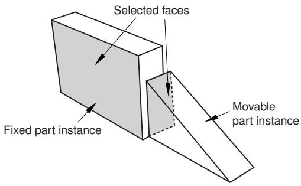

Abaqus/CAE displays arrows normal to the selected faces.

When Abaqus/CAE prompts you to select the face from the fixed instance, you can select a datum plane that was created in either the Part or Assembly module. In contrast, when you select the face from a movable part instance, you can select a datum plane that was created only in the Part module.

3. From the buttons in the prompt area, do one of the following:

• Click OK to accept the direction of the arrow on the face of the movable instance.  
• Click Flip to reverse the direction of the arrow on the face of the movable instance, and click OK.

Abaqus/CAE positions the movable part or model instance so that the two faces are parallel and the arrows point in the same direction. The orientation of the fixed instance remains unchanged. The effect of changing the direction of the arrow is illustrated in the following figure:


If the parallel face constraint conflicts with existing constraints, Abaqus/CAE displays an error message and cancels the operation. To avoid the conflict, you can try reversing the selection of the instance that will move and the instance that will remain fixed. Alternatively, you can delete the existing relative position constraints, apply absolute position constraints, and reapply the parallel face constraint.

## Additional information

• Using the Constraint menu  
• Creating the assembly  
• Converting constraints

## Constraining two instances with parallel planar faces separated by a specified distance

Select Constraint->Face to Face from the main menu bar to apply a constraint that positions a movable instance so that a selected face is parallel to and a specified distance away from a selected face of a fixed instance. The face-to-face constraint is a feature of the assembly and can be suppressed or deleted using the Feature Manipulation toolset. In addition, you can edit the clearance between the two selected faces.

1. From the main menu, select Constraint->Face to Face.


Tip: You can also apply the face-to-face constraint using the tool in the Assembly module toolbox. For a diagram of the tools in the Assembly toolbox, see Using the Assembly module toolbox.

Abaqus/CAE displays prompts in the prompt area to guide you through the procedure.

2. Select a planar face from the part or model instance that will move and a planar face from the instance that will remain fixed, as shown in the following figure:

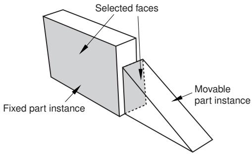

Abaqus/CAE displays arrows normal to the selected faces.

When Abaqus/CAE prompts you to select the face from the fixed instance, you can select a datum plane that was created in either the Part or Assembly module. In contrast, when you select a face from the movable part instance, you can select a datum plane that was created only in the Part module.

3. From the buttons in the prompt area, do one of the following:

• Click OK to accept the direction of the arrow on the face of the movable instance.  
• Click Flip to reverse the direction of the arrow on the face of the movable instance, and click OK.

The effect of changing the direction of the arrow is illustrated in the next step.

4. In the text field that appears in the prompt area, enter the distance between the selected faces, positive along the normal to the face of the fixed instance.

Abaqus/CAE positions the movable instance so that the two faces are parallel and the arrows point in the same direction. In addition, the movable instance is translated to satisfy the clearance specified. The orientation of the fixed instance remains unchanged. The effect of specifying the distance is illustrated in the following figure:

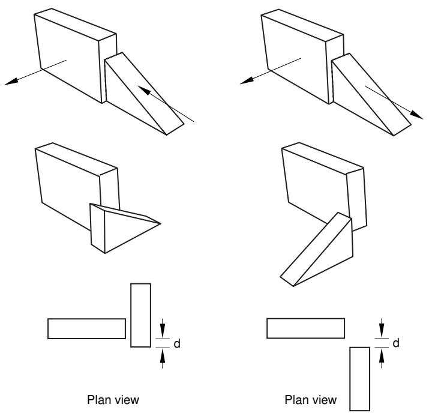

If the face-to-face constraint conflicts with existing constraints, Abaqus/CAE displays an error message and cancels the operation. To avoid the conflict, you can try reversing the selection of the instance that will move and the instance that will remain fixed. Alternatively, you can convert the existing constraints to an absolute position and reapply the face-to-face constraint.

## Additional information

• Using the Constraint menu  
• Creating the assembly  
• Converting constraints

## Constraining two instances with parallel edges

Select Constraint->Parallel Edge from the main menu bar to apply a constraint that positions a movable instance so that a selected edge is parallel to a selected edge of a fixed instance. All position constraints are features of the assembly and can be suppressed or deleted using the Feature Manipulation toolset.

1. From the main menu, select Constraint->Parallel Edge.


Tip: You can also apply the parallel edge constraint using the tool in the Assembly module toolbox. For a diagram of the tools in the Assembly toolbox, see Using the Assembly module toolbox.

Abaqus/CAE displays prompts in the prompt area to guide you through the procedure.

2. Select a straight edge from the instance that will move and a straight edge from the instance that will remain fixed, as shown in the following figure:


In addition to selecting an edge or a datum axis, you can also select one of the axes of a datum coordinate system.

Abaqus/CAE displays arrows along the selected edges.

When Abaqus/CAE prompts you to select the edge from the fixed instance, you can select a datum axis that was created in either the Part or Assembly module. In contrast, when you select the edge from a movable part instance, you can select a datum axis that was created only in the Part module.

3. From the buttons in the prompt area, do one of the following:

• Click OK to accept the direction of the arrow along the edge of the movable instance.  
Click Flip to reverse the direction of the arrow along the edge of the movable instance, and click OK.

Abaqus/CAE positions the movable instance so that the two edges are parallel and the arrows point in the same direction. The orientation of the fixed instance remains unchanged. The effect of changing the direction of the arrow is illustrated in the following figure:


If the parallel edge constraint conflicts with existing constraints, Abaqus/CAE displays an error message and cancels the operation. To avoid the conflict, you can try reversing the selection of the instance that will move and the instance that will remain fixed. Alternatively, you can convert the existing constraints to an absolute position and reapply the parallel edge constraint.

## Additional information

• Using the Constraint menu  
• Creating the assembly  
• Converting constraints

## Constraining two instances with parallel edges separated by a specified distance

Select Constraint->Edge to Edge from the main menu bar to apply a constraint that positions a movable instance so that a selected edge is parallel to a selected edge of a fixed instance. In addition, if the instances are two-dimensional, you must specify the distance between the selected edges; otherwise, Abaqus/CAE makes them coincident. All position constraints are features of the assembly and can be suppressed or deleted using the Feature Manipulation toolset. In addition, you can edit the clearance between the two selected edges, where applicable. For more information, see How the position constraint methods differ.

1. From the main menu, select Constraint->Edge to Edge.


Tip: You can also apply the edge-to-edge constraint using the tool in the Assembly module toolbox. For a diagram of the tools in the Assembly toolbox, see Using the Assembly module toolbox.

Abaqus/CAE displays prompts in the prompt area to guide you through the procedure.

2. Select a straight edge from the instance that will move and a straight edge from the instance that will remain fixed, as shown in the following figure:


In addition to selecting an edge or a datum axis, you can also select one of the axes of a datum coordinate system.

Abaqus/CAE displays arrows along the selected edges.

When Abaqus/CAE prompts you to select the edge from the fixed instance, you can select a datum axis that was created in either the Part or Assembly module. In contrast, when you select the edge from a movable part instance, you can select a datum axis that was created only in the Part module.

3. From the buttons in the prompt area, do one of the following:

• Click OK to accept the direction of the arrow along the edge of the movable instance.  
Click Flip to reverse the direction of the arrow along the edge of the movable instance and click OK.

The effect of changing the direction of the arrow is illustrated in the next step.

If the instances are three-dimensional, Abaqus/CAE positions the movable instance so that the selected edges are parallel and coincident.

4. If the instances are two-dimensional, you must specify the clearance between the selected edges. In the text field that appears in the prompt area, enter the distance from the edge of the movable instance to the edge of the fixed instance, positive along the normal to the edge of the fixed instance.

Abaqus/CAE positions the movable instance so that the two edges are parallel and the arrows point in the same direction. In addition, the movable instance is translated to satisfy the clearance specified. The orientation of the fixed instance remains unchanged. The effect of specifying the distance and changing the direction of the arrow is illustrated with two-dimensional instances in the following figure:


If the edge-to-edge constraint conflicts with existing constraints, Abaqus/CAE displays an error message and cancels the operation. To avoid the conflict, you can try reversing the selection of the instance that will move and the instance that will remain fixed. Alternatively, you can convert the existing constraints to an absolute position and reapply the edge-to-edge constraint.

## Additional information

• Using the Constraint menu  
• Creating the assembly  
• Converting constraints

## Constraining two instances with coaxial faces

Select Constraint->Coaxial from the main menu bar to apply a constraint that positions a movable instance so that the axis of revolution of a selected face is coincident with the axis of revolution of a selected face of a fixed instance. All position constraints are features of the assembly and can be suppressed or deleted using the Feature Manipulation toolset.

The selected faces of the movable and fixed instances must be either cylindrical or conical. In addition, the coaxial constraint can be applied only to three-dimensional instances. For more information, see How the position constraint methods differ.

1. From the main menu, select Constraint->Coaxial.


Tip: You can also apply the coaxial constraint using the tool in the Assembly module toolbox. For a diagram of the tools in the Assembly toolbox, see Using the Assembly module toolbox.

Abaqus/CAE displays prompts in the prompt area to guide you through the procedure.

2. Select cylindrical or conical faces from the instance that will move and the instance that will remain fixed, as shown in the following figure:


Abaqus/CAE displays arrows along the axis of revolution of the selected faces.

3. From the buttons in the prompt area, do one of the following:

• Click OK to accept the direction of the arrow along the axis of revolution of the face of the movable instance.  
Click Flip to reverse the direction of the arrow along the axis of revolution of the face of the movable instance, and click OK.

Abaqus/CAE positions the movable instance so that the two axes are coincident and the arrows point in the same direction. The orientation of the fixed instance remains unchanged. The effect of the coaxial constraint with the arrows selected as shown above is illustrated in the following figure:


If the coaxial constraint conflicts with existing constraints, Abaqus/CAE displays an error message and cancels the operation. To avoid the conflict, you can try reversing the selection of the instance that will move and the instance that will remain fixed. Alternatively, you can convert the existing constraints to an absolute position and reapply the coaxial constraint.

## Additional information

• Using the Constraint menu  
• Creating the assembly

## Constraining two instances with coincident points

Select Constraint->Coincident Point from the main menu bar to apply a constraint that positions a movable instance so that a selected point is coincident with a selected point of a fixed instance. All position constraints are features of the assembly and can be suppressed or deleted using the Feature Manipulation toolset.

1. From the main menu, select Constraint->Coincident Point.


Tip: You can also apply the coincident point constraint using the tool in the Assembly module toolbox. For a diagram of the tools in the Assembly toolbox, see Using the Assembly module toolbox.

Abaqus/CAE displays prompts in the prompt area to guide you through the procedure.

2. Select a point from the instance that will move and a point from the instance that will remain fixed. In addition to selecting a vertex or a midpoint, you can select a datum point, a reference point, or the origin of a datum coordinate system.

Abaqus/CAE moves the movable instance so that the selected points are coincident.

When Abaqus/CAE prompts you to select the point from the fixed instance, you can select a datum point or a reference point that was created in either the Part or Assembly module. In contrast, when you select the point from a movable part instance, you can only select a datum point or reference point that was created in the Part module.

If the coincident point constraint conflicts with existing constraints, Abaqus/CAE displays an error message and cancels the operation. To avoid the conflict, you can try reversing the selection of the instance that will move and the instance that will remain fixed. Alternatively, you can convert the existing constraints to an absolute position and reapply the coincident point constraint.

## Additional information

• Using the Constraint menu  
• Creating the assembly  
• Converting constraints

Select Constraint->Parallel CSYS from the main menu bar to apply a constraint that positions a movable instance so that a selected datum coordinate system is parallel to a selected datum coordinate system of a fixed instance. All position constraints are features of the assembly and can be suppressed or deleted using the Feature Manipulation toolset.

1. From the main menu, select Constraint->Parallel CSYS.


Tip: You can also apply the parallel coordinate systems constraint using the tool in the Assembly module toolbox. For a diagram of the tools in the Assembly toolbox, see Using the Assembly module toolbox.

Abaqus/CAE displays prompts in the prompt area to guide you through the procedure.

2. Select a datum coordinate system from the movable instance and a datum coordinate system from the fixed instance.

When Abaqus/CAE prompts you to select the datum coordinate system from the fixed instance, you can select a datum coordinate system that was created in either the Part or Assembly module. In contrast, when you select the datum coordinate system from a movable part instance, you can only select a datum coordinate system that was created in the Part module.

Abaqus/CAE rotates the movable instance so that the selected coordinate systems are parallel.

If the parallel coordinate systems constraint conflicts with existing constraints, Abaqus/CAE displays an error message and cancels the operation. To avoid the conflict, you can try reversing the selection of the instance that will move and the instance that will remain fixed. Alternatively, you can convert the existing constraints to an absolute position and reapply the parallel coordinate systems constraint.

## Additional information

• Using the Constraint menu  
• Creating the assembly  
• Converting constraints

## Using the Query toolset to query the assembly

Select Tools->Query from the main menu bar to start the Query toolset. You can use the Query toolset to request either general information or module-specific information. For a discussion of the information displayed by general queries, see Obtaining general information about the model. In addition, you can use the Assembly module-specific tools in the Query toolset to determine the attributes and position of a selected part or model instance.

1. From the main menu bar, select Tools->Query.


Tip: You can also select the tool in the Query toolset.

Abaqus/CAE displays the Query dialog box.

2. From the Query dialog box, click on one of the following:

## Instance Attributes

Select a part or model instance.

Abaqus/CAE displays the following in the message area:

• The name, modeling space, and type (deformable or rigid, dependent or independent) of the instance

## Instance Position

Select a part or model instance.

Abaqus/CAE displays the following in the message area:

• Position of the origin of the instance relative to the global coordinate system  
• The sum of the rotations applied to the instance relative to the assembly's global coordinate system  
• A list of the constraints applied to the instance

3. Close the Query dialog box when you are done querying the assembly.

## Additional information

• Creating the assembly

You can use the Step module to create and define the analysis steps and associated output requests.

## In this section:

Understanding the role of the Step module  
Entering and exiting the Step module  
Understanding steps  
Understanding output requests  
Understanding integrated, restart, diagnostic, and monitor output  
Understanding ALE adaptive meshing  
How can I customize the Abaqus analysis controls?  
Using the Step module toolbox  
Using the Step Manager  
Using the step editor  
Configuring analysis procedure settings  
Defining output requests  
Requesting specialized output  
Customizing ALE adaptive meshing  
Customizing the Abaqus analysis controls

---

[Previous: The Property Module](property-module.md) · [Next: The Step Module](step-module.md)
