# Customizing Model Display

## Choosing a render style

Render style is the style in which Abaqus/CAE displays your model.

You can use the View->Part Display Options and View->Assembly Display Options menu items to display your model in one of three render styles: wireframe, hidden, or shaded; these styles are shown in Figure 1. An explanation of these choices follows.

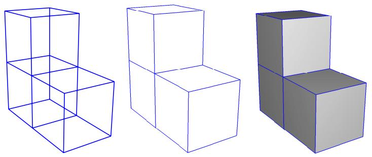

natural_image

Three 3D wireframe cubes with varying heights and shading, no text or symbols present

Figure 1: Model showing render style options. From left to right: the wireframe, hidden, and lightsource-shaded render styles.

## Wireframe

Displays model edges; both interior and exterior edges are potentially visible. Wireframe plots produce a frame-like visual effect in which model faces are not displayed. Wireframe is the most rapidly drawn render style.

## Hidden

Displays a wireframe plot in which edges obscured by the model are either not shown or are shown as dotted lines, depending on which option you select. (For more information on this option, see Controlling edge visibility.) Hidden plots produce a solid rather than frame-like appearance.

## Shaded

Displays a filled plot in which a light source appears to be directed at the model. Shaded plots produce a highly three-dimensional visual effect. Edges attached to faces in shaded plots are always drawn in black.

1. Locate the Render Style options.

From the main menu bar, select View->Part Display Options or View->Assembly Display Options. In the dialog box that appears, click the General tab.

2. From the top of the dialog box, click Wireframe, Hidden, or Shaded to select the style that you want.

Tip: You can also select the render style using the wireframe , hidden , and shaded icons located in the Render Style toolbar.

3. + Click OK to implement your changes and to close the dialog box.

Abaqus/CAE renders the display in the selected style, and your changes are saved for the duration of the session.

## Additional information

• Customizing geometry and mesh display  
• Choosing a render style

## Controlling edge visibility

You can control the visibility of geometry edges, reference representations, highlighted faces, and mesh edges.

Using the View->Part Display Options or View->Assembly Display Options menu items, you can control the visibility of the following:

## Geometry edges

If a part or part instance is displayed with the hidden render style, Abaqus/CAE suppresses obscured geometry edges by default. Alternatively, if you toggle on the Show dotted lines in hidden render style option,

Abaqus/CAE displays the obscured edges using a dotted line style.

If a part or part instance is displayed with the shaded render style, Abaqus/CAE displays the edges by default. Non-wire edges (edges attached to faces) are displayed in black. Alternatively, if you toggle off the Show edges in shaded render style option, Abaqus/CAE suppresses edge display.

If a three-dimensional part or part instance contains faces with curved edges, by default Abaqus/CAE displays gray “silhouette” edges originating from the faces, as shown in the hidden-line plot in Figure 1.

  
Figure 1: Hidden-line plot showing silhouette edges.

Unlike true edges, silhouette edges serve only as a visual aid; for example, you cannot select or partition a silhouette edge. Alternatively, if you toggle off the Show silhouette edges option, Abaqus/CAE displays only true edges.

Abaqus/CAE displays a curved part using a faceted representation of the part, and you use the Curve refinement option to specify the degree of faceting. For more information, see Controlling curve refinement.

## Reference representation

If you are creating a midsurface model and have assigned midsurface regions to cells in the solid model, the geometry of the selected cells is contained in the reference representation. By default, Abaqus/CAE displays the reference representation in the Part module. However, you can use the Show reference representation option to toggle display of the reference representation in all modules where the part or assembly is displayed. Toggle off Apply translucency to display the reference representation as opaque instead of the default translucent appearance. For more information on the reference representation, see Understanding the reference representation.

## Highlighted faces

You can control the style with which Abaqus/CAE displays the highlighted geometry faces of parts and assemblies. Figure 2 shows three views of a sample part with its front face selected: the left figure uses stippling as the selection method, the middle figure shows an example of isolines, and the right figure displays facet selection.

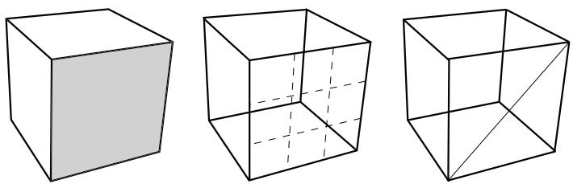  
Figure 2: Highlighting faces with Stippling, Isolines, and Facets.

The stippling method offers a performance advantage, particularly for large, complex parts and assemblies. Using isolines can allow you to see a part or assembly more easily in wireframe mode than the stippling method. Finally, displaying all of a part or assembly's facets can help you debug a mesh more effectively, because meshing depends on the orientation of facets in a part or assembly.

## Mesh edges

For mesh edges within a meshed part or a part imported from an output database, the visibility options are:

## All edges

Displays all element edges. To see element edges on the interior of the model, you must also set the render style to wireframe.

## Exterior edges

Displays only edges on the exterior of the model.

## Feature edges

Displays only edges on the exterior of the model that are calculated to be feature edges. Feature edges lie between elements that have normals that differ by more than the “feature angle.” For more information on controlling the feature angle, see Defining mesh feature edges.

## Free edges

Displays only edges that belong to a single element. Free edge display is particularly useful for locating potential holes or cracks in your mesh.

These options are shown in Figure 3.

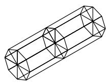  
All

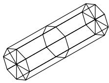

natural_image

Geometric line drawing of a 3D cylindrical prism with triangular faces (no text or symbols)

Exterior

  
Feature

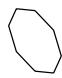  
Free

  
Figure 3: Model showing mesh edge display options.

If a mesh is displayed with the shaded render style, Abaqus/CAE displays the edges by default. Alternatively, if you toggle off the Show edges in shaded render style option, Abaqus/CAE suppresses edge display.

With the exception of showing hidden geometry edges as dotted lines, you cannot control the line style, color, or thickness of edges.

1. Locate the edge visibility options.  
From the main menu bar, select View->Part Display Options or View->Assembly Display Options. In the dialog box that appears, click the General tab.  
2. Select the desired Geometry edge settings.  
3. Select the desired Mesh Edges settings.  
4. + Click OK to implement your changes and to close the dialog box.  
Your changes are saved for the duration of the session.

## Additional information

• Defining mesh feature edges  
• Choosing a render style  
• Customizing geometry and mesh display

## Controlling curve refinement

Abaqus/CAE uses a faceted representation of a curved face or a curved edge when displaying a part or part instance. When you are working in the Part module, you can use the Curve refinement option from the Part Display Options dialog box to specify the degree of this faceting applied to the current part. You can select one of five faceting levels between extra coarse and extra fine. Set the refinement to Extra Coarse to speed up display of a large model. Set the refinement to Extra Fine if you want to create a very accurate display for printing. Abaqus/CAE applies the curve refinement setting only to the part in the current viewport.

In addition, Abaqus/CAE uses the faceted representation of a part instance in the Assembly module when determining contact between part instances and when determining the position of attachment lines. You use the Curve refinement option to control the accuracy of the contact detection tool and to help display the part geometry more accurately.

1. Locate the Curve refinement options.  
From the main menu bar, select View->Part Display Options. In the dialog box that appears, click the General tab.  
2. Select the desired curve refinement setting.  
3. + Click OK to implement your changes and to close the dialog box.  
Abaqus/CAE applies the curve refinement setting only to the part in the current viewport.

## Additional information

• Customizing geometry and mesh display

## Defining mesh feature edges

You can specify that only the feature edges of a meshed part are visible.

You use feature edges to mask the detail provided by a mesh; feature edges are typically the physical edges of the part being meshed and do not include all the additional element edges. Figure 1 shows a meshed part displayed at three different feature angles—0°, 5°, and 20°.

natural_image

3D wireframe model of a rectangular object with internal cutout, no text or symbols present

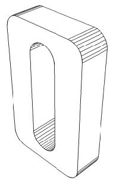

natural_image

Technical line drawing of a U-shaped mechanical component with internal grooves (no text or symbols)

5°

natural_image

Simple line drawing of a rectangular object with an oval cutout, no text or symbols present.

${ } ^ { 2 0 ^ { \circ } }$  
Figure 1: Plots showing feature angles of 0°, 5°, and $\bf { 2 0 ^ { \circ } }$ .

Feature edges are defined as adjacent edges with normals that differ by more than the “feature angle.” You can customize the feature angle when you select Feature mesh edge visibility. Larger angles will reduce the number of feature edges; conversely, smaller angles will cause more edges to be visible. The default mesh feature angle is 20°.

1. Locate the feature angle option.  
From the main menu bar, select View->Part Display Options or View->Assembly Display Options. In the dialog box that appears, click the General tab.  
2. From the bottom of the dialog box, select Feature edges from the list of mesh edges to show. Abaqus/CAE displays an Angle data field to the right of Feature.  
3. Click the Angle data entry field, and enter the desired feature angle.  
4. + Click OK to implement your changes and to close the dialog box. Your changes are saved for the duration of the session.

## Additional information

• Controlling edge visibility  
• Customizing geometry and mesh display

## Controlling translucency for substructure parts

You can specify that the substructure parts and part instances in your model be displayed with or without translucency. If you want to control the level of translucency for part and assembly display, see Changing the translucency.

1. Locate the substructure translucency control option.  
From the main menu bar, select View->Part Display Options or View->Assembly Display Options. In the dialog box that appears, click the General tab.  
2. From the middle of the dialog box, toggle on Always show substructure with translucency from the set of mesh-related options.  
3. + Click OK to implement your changes and to close the dialog box.  
Your changes are saved for the duration of the session.

## Additional information

• Customizing geometry and mesh display

## Controlling beam profile display

If you use wire parts to model beams, you must create a beam section that refers to a beam profile, and you must assign the beam section to the wire part. In addition, you must assign a beam orientation to the wire part. You can then use the View->Part Display Options and the View->Assembly Display Options menu items to view a realistic display of the beam profile in parts and the assembly in the current viewport.

When beam profiles are displayed, Abaqus/CAE disables both view cuts and scaling and shrinking of the model. Displaying beam profiles is useful for checking that the correct profile has been assigned to a particular region and that the assigned beam orientation results in the expected orientation of the profile. For example, Figure 1 shows the box beam profiles displayed on the light-service crane described in Example: cargo crane.

natural_image

3D rendering of a steel truss structure with an inset showing a rectangular component (no text or symbols)

Figure 1:The cargo crane example with beam profiles displayed.

If you assign a general beam section to a wire, Abaqus/CAE displays the beam profile as an ellipse with a cross-sectional area and moments of inertia $( I _ { 1 1 }$ and $\pmb { I _ { 2 2 } } )$ that match the values you specified. If you assign a truss section to a wire, Abaqus/CAE displays the truss profile as a circle with a cross-sectional area that matches the value you specified.

Abaqus/CAE does not render the tapering of beam profiles along their length. If your model includes tapered beam sections, Abaqus/CAE renders these beams using the beam's starting profile along its entire length. For more information about tapered beams, see Creating beam sections.

Abaqus/CAE renders beam profiles according to the current settings for color coding and translucency. When these settings change, the color and translucency of the beam profiles change as well.

1. Locate the Render beam profiles option.  
From the main menu bar, select View->Part Display Options or View->Assembly Display Options. In the dialog box that appears, click the General tab.  
2. From the bottom of the dialog box, toggle on Render beam profiles to display beam profiles.  
3. If desired, apply a Scale factor to the beam profiles to increase or decrease their size. The default value is 1.  
4. + Click OK to implement your changes and to close the dialog box.  
Abaqus/CAE displays the profile of the beam section with the appropriate dimensions and in the correct orientation. Your changes are saved for the duration of the session.

## Additional information

• Defining profiles

• Customizing geometry and mesh display  
• Controlling beam profile display for postprocessing

## Controlling shell thickness display

Displaying shell thickness enables you to examine the thickness of shell geometry relative to the rest of the model. You can apply a scale factor to reduce or increase the display of shell thickness for your session.

If you use shell elements to model relatively thin components in your analysis, you can use the View->Part Display Options and the View->Assembly Display Options menu options to view the actual thickness of these shell elements in your model. Figure 1 shows the effect of scale factor changes displayed on the stiffened plate model described in Example: blast loading on a stiffened plate.

  
Figure 1: From top to bottom: shell thickness scale factor settings of 1 (default), 2, and 4.

Abaqus/CAE renders shell thickness for three-dimensional shell elements only; thickness is not displayed for axisymmetric shell elements, such as SAX1 elements. When shell thickness is displayed, Abaqus/CAE also renders the edges of shell geometry unless a view cut is displayed in the viewport. Abaqus/CAE renders shell thickness according to the current settings for color coding and translucency. When these settings change, the color and translucency of the shell thickness change as well.

If a discrete field has been used to define shell thicknesses or the shell offset, the Render shell thickness option has no effect. The shells are always displayed with zero thickness and no offset.

1. Locate the Render shell thickness option.  
From the main menu bar, select View->Part Display Options or View->Assembly Display Options. In the dialog box that appears, click the General tab.  
2. From the bottom of the dialog box, toggle on Render shell thickness to display shell thicknesses for the shell sections in your model.  
3. If desired, apply a Scale factor to the shell thicknesses to increase or decrease their thickness. The default value is 1, which produces a realistic rendering of the shell thickness settings.  
4. + Click OK to implement your changes and to close the dialog box.

Abaqus/CAE displays the shell sections in the selected part or assembly with the appropriate thickness. Your changes are saved for the duration of the session.

## Additional information

• Defining sections  
• Customizing geometry and mesh display  
• Controlling shell thickness display for postprocessing

## Controlling datum display

You can use the View->Part Display Options and the View->Assembly Display Options menu items to control the display of datum geometry in parts and the assembly in the current viewport. You can control the display of each of the datum types—points, axes, planes, and coordinate systems—and you can toggle their display individually or all at once. Datum geometry that you choose not to display, although invisible, is still a feature of the part or assembly. For more information on datum geometry, see The Datum toolset. You can also control the display of reference points; for more information, see The reference point.

Datum geometry created on parts can be distracting when you are assembling instances of the part; turning off the display of datum geometry can result in a clearer display of the assembly. Similarly, turning off the display of datum geometry is useful for generating a clean printed image of a part or assembly.

1. Locate the Datum display options.

From the main menu bar, select View->Part Display Options or View->Assembly Display Options. Click the Datum tab in the dialog box that appears.

2. Toggle the appropriate buttons to control the display of:

• Datum points  
• Datum axes  
• Datum planes  
• Datum coordinate systems

Alternatively, click Show all datums to display all datum geometry in the viewport, or click Show no datums to hide all datum geometry in the viewport.

3. Click OK to implement your changes and to close the dialog box.

Your changes apply only to the current viewport and are saved for the duration of the session.

## Additional information

• Customizing geometry and mesh display

## Controlling the display of individual coordinate systems

You can highlight, display, and hide individual coordinate systems in the viewport. Abaqus/CAE provides the following display options during modeling and postprocessing:

## Controlling display of datum coordinate systems during modeling

All datum geometry you create, including datum coordinate systems, are considered features of the part or assembly to which they apply. Abaqus/CAE provides shortcuts for datum coordinate systems and other features in the Model Tree under the Features container for the part or assembly. You can highlight an individual datum coordinate system by clicking its shortcut in the Model Tree; when highlighted, a coordinate system is rendered in red in the viewport and its title is displayed. To hide or display the coordinate system in the viewport, click mouse button 3 on the shortcut and select Suppress or Resume.

You can also control the display of individual datum coordinate systems by adding them to display groups. See Managing display groups for more information.

## Controlling display of any coordinate system during postprocessing

In the Visualization module the available coordinate systems are divided into two groups: ODB coordinate systems, which are part of the output database file; and session coordinate systems, which are created during postprocessing. Session coordinate systems apply to one output database only and persist only for your Abaqus/CAE session, unless you move the session coordinate system to the output database. See Saving a coordinate system to an output database file.

You can highlight, display, or hide individual coordinate systems using either of the following techniques:

• All available coordinate systems have shortcuts in the Results Tree under the ODB Coordinate Systems and Session Coordinate Systems containers. You can click any shortcut to highlight that coordinate system in the viewport; when highlighted, a coordinate system is rendered in red in the viewport and its title is displayed. You can also display or hide any coordinate system by clicking mouse button 3 on the shortcut and selecting a Boolean operator from the list that appears.  
You can control the display of ODB coordinate systems and session coordinate systems by adding them to display groups, which can be displayed or hidden using the Boolean display options. See Managing display groups for more information.

The Coordinate System Manager also provides information about the ODB coordinate systems and session coordinate systems for the selected output database. You cannot change the display of coordinate systems from this manager, but you can rename or delete them. See Creating coordinate systems during postprocessing.

## Additional information

• Creating coordinate systems during postprocessing  
• Creating datum coordinate systems  
• Customizing geometry and mesh display

## Controlling reference point display

You can use the View->Part Display Options and the View->Assembly Display Options menu items to control the display of reference points in the current viewport on a part or on the assembly. Turning off the display of reference points is useful for generating a clean printed image of a part or the assembly. Even though you choose not to display reference points, they are still a feature of the part or assembly. For more information on reference points, see The reference point.

1. Locate the Datum display options.

From the main menu bar, select View->Part Display Options or View->Assembly Display Options. Click the Datum tab in the dialog box that appears.

2. Toggle the appropriate buttons to control the display of:

• Reference point labels  
• Reference point symbols

3. Click OK to implement your changes and to close the dialog box.

Your changes apply only to the current viewport and are saved for the duration of the session.

## Additional information

• Customizing geometry and mesh display

## Customizing mesh display

You can use the View->Part Display Options and the View->Assembly Display Options menu items to specify whether or not node and element labels are displayed on a meshed part or assembly. You can choose to display or suppress your native mesh and, if displayed, to do so only in the Mesh module or in all part-related or all assembly-related modules. If you display the native mesh, you can choose to also display the geometry of bottom-up meshed sections, non-bottom-up sections, or both along with the mesh. Displaying the geometry provides a visual indication of how well the mesh conforms to the geometry.

1. Locate the mesh display options.

From the main menu bar, select View->Part Display Options or View->Assembly Display Options. In the dialog box that appears, click the Mesh tab.

2. Toggle Show native mesh to display or suppress the native mesh.

When Show native mesh is on, you can also control the following options:

a. Select one or both of the following options to display geometry with the native mesh:

Toggle on Show bottom-up geometry to display the geometry of regions that have been assigned the bottom-up meshing technique. This option is on by default.  
• Toggle on Show non-bottom-up geometry to display the geometry of regions assigned all other meshing techniques. This option is off by default.

b. Select one of the following options to control the modules in which you can display the native mesh:

• Choose In the Mesh module only to display your native mesh only in the Mesh module.  
Choose In all part-related modules from the Part Display Options dialog box or In all assembly-related modules from the Assembly Display Options dialog box to display your native mesh in all modules that support the display of the part or assembly, respectively.

3. Toggle Show node labels and Show element labels to affect the display of these items.  
4. + Click OK to implement your changes and to close the dialog box.

Your changes are saved for the duration of the session.

## Additional information

• Customizing geometry and mesh display

## Controlling model lighting

You can use the View->Light Options menu item to control the lighting of your model. Lights affect the appearance of your model in the current viewport when the Shaded render style is used. You can control the intensity of the Ambient light and the Shininess of the model surface. You can also control the locations and intensities of up to eight additional positional lights. The combined effects of the light settings can be used to simulate different surface finishes and light conditions on your model. The default settings provide good contrast for viewing all features in most models.

The default settings provide good contrast for viewing all features in most models. Using the default settings is particularly important for tessellated, banded contour plots, for which intense light can fade the colors in the facets of the contour plot and display misleading results that do not match the colors in the plot legend. These changes to contour colors can also appear in printouts of banded contour plots if you print to file in EPS, PostScript, or SVG formats, because these three formats use tessellated contours by default. To print a banded contour plot to any of these formats without creating misleading contour colors, turn off shading before printing.

## Global settings

Ambient light is applied evenly to the entire scene and brightens a model from all directions. Low intensity ambient light allows the positional lighting to create shading that distinguish small features and surface contours from the rest of the model. High intensity ambient light removes shading and may make some model features difficult to see.

If your computer's graphics card supports OpenGL shading language (GLSL), Abaqus/CAE also reveals the global Shading options, from which you can enable Phong shading for your session. Phong shading renders more realistic shading on three-dimensional surfaces than the default option, Gouraud shading, but it can cause a noticeable performance impact on some systems. This performance impact occurs only when the mesh is hidden; if the mesh is displayed (either during modeling or postprocessing), Abaqus/CAE renders Phong lighting with no noticeable performance impact.

Shininess is the reflectivity of the model surface and is used to control the size of specular highlights from the positional lights. A very shiny surface reflects light like a mirror—the light reflects in one direction based on the incident angle of the light source. Therefore, a surface must be positioned correctly with respect to the light source to reflect light to your viewpoint. Surfaces that are less shiny reflect light more randomly, so a wider range of surface angles can reflect light to your viewpoint. Like high intensity ambient lighting, low shininess can obscure small features and contours of your model from view.

The Viewpoint option controls how specular lighting effects are calculated. An Infinite viewpoint assumes a constant vector for the direction from the camera to each point when calculating reflections and specular highlights at a point. A Local viewpoint calculates a separate direction vector for each point based on its position in the viewport. A Local viewpoint creates more realistic lighting effects but can decrease overall performance.

## Positional light settings

Positional lights provide a light bulb effect. A positional light is projected onto the model from the specified location, and its effects change as you rotate your model view. Positional lights work in conjunction with shininess to determine how your model reflects light.

The distance of the light from the model is equal to the distance from the camera to the model. You can position the lights by specifying their Latitude and Longitude on a hemisphere around the model. You can also specify the Type of light source being used. A Directional light is a planar light source; the angle of incident light on the model will be equivalent for all parallel surfaces. A Point light is a point light source; the angle of incident light depends on the location of the surface or point relative to the light. A Point light creates more realistic lighting effects but can decrease overall performance.

You can control two different qualities for positional lights: Diffuse intensity and Specular intensity. The Diffuse setting controls the intensity of a positional light. Unlike ambient light, surfaces that face toward the light position will brighten more readily than other surfaces in the model when increasing the diffuse intensity of a positional light. The Specular setting controls the brightness of those surfaces that are reflecting from the light toward the viewpoint. You should first set the position and diffuse intensity of the positional light to achieve the shading you desire. Then you can adjust the brightness of reflected light with the Specular slider.

1. Locate the lighting options.  
From the main menu bar, select View->Light Options.  
2. If the Shading options are displayed, select Gouraud or Phong shading.  
3. From the Viewpoint field, select Infinite or Local to define the viewpoint type.  
4. Use the slider to set the desired Ambient light intensity.  
5. Use the slider to set the desired Shininess for the model surface. A higher number corresponds to a shinier surface.  
6. Toggle on a number in the Lights field to add a positional light to the scene.

7. To change the settings for a positional light, click the associated number tab in the Lights field.

• From the Type field, select Directional or Point to define the light type.  
• Use the sliders to set the desired Latitude and Longitude for the light's position.  
• Use the slider to set the desired Diffuse intensity.  
• Use the slider to set the desired Specular intensity.

8. Click Defaults to revert all lighting to the default settings.

9. Click Dismiss to close the dialog box.

Your changes are saved for the duration of the session. To save the settings for future sessions, select File->Save Options from the main menu bar (see Saving your display options settings).

## Additional information

• Customizing geometry and mesh display

## Controlling instance visibility

By default, Abaqus/CAE displays all part instances included in the assembly. You can turn the display of all instances on or off, or you can toggle the display of individual instances. Part instances that you have suppressed or that do not belong to the current display group cannot be made visible using this dialog box; you must use the Feature Manipulation toolset or the Display Group toolset instead. For more information, see The Assembly module or Using display groups to display subsets of your model.

This section describes how to control instance visibility from the Assembly Display Options dialog box. You can also change instance visibility from the Model Tree or the viewport: from the Model Tree, highlight the part instances that you want to display or hide, click mouse button 3, and select Hide or Show; from the viewport, highlight the instances you want to hide, click mouse button 3, and select Hide Instance from the menu that appears.

1. Locate the Instance display options.

From the main menu bar, select View->Assembly Display Options. Click the Instance tab in the dialog box that appears. The Instance options become available; each part instance in the assembly is listed.

2. To control instance visibility, do any of the following:

• Click Set All On to make all (except suppressed) instances visible.  
• Click Set All Off to turn off the display of all instances.  
• Click individual instance names to toggle their appearance.

3. Click OK to implement your changes and to close the dialog box.

Your changes apply only to the current viewport and are saved for the duration of the session.

## Additional information

• Customizing geometry and mesh display

## Controlling the display of attributes

The Attribute display options in the Assembly Display Options dialog box allow you to control the display of symbols representing

• interactions, constraints, and connectors that you create in the Interaction module,  
• loads, boundary conditions, and predefined fields that you create in the Load module,  
engineering features that you create in the Property module and Interaction module, and  
• optimization attributes that you create in the Optimization module.

You can control when and how these attributes are displayed, and you can click Set all on or Set all off to display or hide all attributes, respectively. For information on the symbols representing each attribute, see Special graphical symbols.

For information on controlling the display of boundary conditions, coupling constraints, connectors, and point elements in the Visualization module, see Controlling the display of model entities.

1. Locate the Attribute display options.

From the main menu bar, select View->Assembly Display Options. Click the Attribute tab in the dialog box that appears. The Attribute options become available.

2. Click the Main tab to specify which attributes you want to display and in which modules you want them to appear.

a. Select the Show attribute in option.

Select Module in which it was created to display attributes only in the modules in which they are created. For example, loads would appear only in the Load module and interactions only in the Interaction module.  
• Select All assembly-related modules to display attributes in all modules that support the display of the assembly.

b. From the Show list, select the attributes that you want to display. Only those attributes that you select will appear in the viewport; for example, if you toggle on Loads and BCs, only load and boundary condition symbols will appear in the viewport. You can also select all categories and all types within each category by clicking Set all on, or you can deselect all categories and all types within each category by clicking Set all off.

3. Click the Symbol tab to control the size and density of attribute symbols. You can also reduce the number of attribute symbols displayed on orphan mesh regions to a fraction of the maximum allowable number.

a. Specify your Size preferences. The higher the size setting, the larger the symbols appear in the viewport.

• Drag the Arrows slider to specify the size of arrow symbols.  
• Drag the Other symbols slider to specify the size of all symbols other than arrows.  
Toggle off Scale symbols based on analytical field value to remove the symbol scaling for attributes that specify analytical fields. For more information, see Displaying symbols for interactions and prescribed conditions that use analytical fields.

b. If you are working with geometry, specify the desired density of the attribute symbols. The higher the density setting, the more symbols Abaqus uses to represent each attribute.

• Drag the Face density slider to control the density of symbols that appear on faces.

• Drag the Edge density slider to control the density of symbols that appear on edges.

The effect of changing a symbol density setting may vary depending on the size of the region in the viewport.

c. If you want to reduce the density of attribute symbols displayed on orphan mesh regions, enter a value between 0 and 1 in the Fraction of symbols displayed on orphan mesh regions field. The higher the fraction value, the more symbols Abaqus/CAE uses to represent each attribute. Choosing the default density of 1 prompts Abaqus/CAE to draw symbols on every mesh entity within the region.

4. Click the tab of the attribute of interest to specify which particular attribute categories and types you want to appear in the viewport.

For example, if you click the Load tab, a list of load categories appears. If you click the arrow next to one of the categories, a list of all the load types within that category appears.

Use the following techniques to specify the attribute categories and types that you want to display:

Click the arrow next to the category of interest. From the list of types that appear, select those types that you want to display.  
• Toggle the desired category. This action selects or deselects all types within that category.  
• Click Set All On to select all categories and all types within each category.  
• Click Set All Off to deselect all categories and all types within each category.

The check box next to a category label becomes a black check mark on a white background when all types in that category are selected. The check box becomes light gray and the check mark becomes dark gray if only some of the types within that category are selected.

## Note:

The attribute categories and types that you specify only appear in the viewport if you toggled on that attribute in Step 2.

5. Repeat the previous step as necessary to display specific categories and types of other attributes of interest.

6. At the bottom of the Assembly Display Options dialog box, click OK to implement your display settings in the current viewport and to close the dialog box.

## Additional information

• Customizing geometry and mesh display  
• Special graphical symbols

## Saving your display options settings

If you change your display options settings (for example, if you change the render style or turn off the display of datum planes), you can store the new settings for future sessions. Abaqus/CAE saves your settings in a file called abaqus\_2025.gpr. For more information, see Working with abaqus\_2025.gpr files.

From the main menu bar, select File->Save Display Options to save all the current display options settings. The Save Display Options dialog box appears and allows you to save the options in the current directory or in your home directory.

You can edit the abaqus\_2025.gpr file using API commands in the Abaqus Scripting Interface; for more information, see Editing display preferences and GUI settings. You can also delete the file to restore the default GUI and display options settings, and you can copy the file to other directories on your computer or transfer the file to a different computer. When you save your settings from abaqus\_2025.gpr, Abaqus/CAE always saves all the current settings and always overwrites all the settings that were previously saved. You cannot save only selected settings. You can use the noSavedOptions command line option to start Abaqus/CAE without loading the settings in abaqus\_2025.gpr. For more information, see Starting Abaqus/CAE (or Abaqus/Viewer).

Abaqus/CAE saves the following display options settings in abaqus\_2025.gpr:

• Part and assembly display options; for example, render style, the visibility of the various types of datum geometry and simulation attributes, and the display of mesh, element, and node labels.

## Note:

The settings in the Main tab of the Assembly Display Options dialog box are not saved in abaqus\_2025.gpr; however, the settings for the simulation attribute categories and types specified on other tabs (such as Interaction and Load) are saved in abaqus\_2025.gpr. For more information, see Controlling the display of attributes.

• Graphics options and viewport annotation options. Abaqus/CAE also saves the perspective setting.  
• Print options.  
• Display options in the Visualization module; for example, the contour type for contour plots and the render style and fill color in the common plot options.  
• Animation options in the Visualization module.  
• Other options in the Visualization module, such as probe, field report, X–Y plot, and X–Y report options.  
• Options selected in the Linked Viewports Manager.

This section explains how you can apply color coding to viewable geometry and mesh elements.

## In this section:

Understanding color coding  
Changing the initial color  
Changing the translucency  
Coloring geometry and mesh elements  
Coloring all geometry in the Visualization module  
Coloring nodes or elements in the Visualization module  
Coloring constraints in the Visualization module  
Customizing the display color of individual objects  
Displaying multiple color mappings  
Editing the colors in the Auto-Color List  
Saving and restoring custom color mappings

## Understanding color coding

This section discusses how to use color coding to distinguish between components in your model or output database.

## In this section:

Color coding concepts  
Color coding in the Visualization module

## Color coding concepts

You can distinguish between components in your model or output database by color coding the viewable geometry and mesh elements in the current viewport. Abaqus/CAE applies color coding according to Color Mappings that specify the colors assigned to each item for a particular type of object, such as parts, section assignments, boundary conditions, or display groups. In the example shown in Figure 1 the color mapping is by parts, and each row describes the color assigned to one of the three part definitions in this model. The Color Code dialog box thus provides a legend that describes all of the color coding currently displayed in the current viewport.

text_image

Color Code
Color code by: Parts
Color Mappings
Initial color:
Parts
Advanced
All
Active	Parts	Color
✓	Block			■
✓	Floor			□
✓	Packaging			■
Status	Color Mapping	Edit color:
Name filter:
Highlight items
OK	Apply	Defaults	Cancel

Figure 1:The Color Code dialog box.

Color coding is applied in two layers. All geometry and mesh elements are first colored with the Initial color, a customizable setting that is grey by default. (See Changing the initial color, for more information.) Abaqus/CAE then applies color coding on top of the initial color according to the colors and objects in the color mapping that you select. Areas will remain visible in the initial color if you apply a color mapping such as Boundary conditions, Loads, or Sets, for which Abaqus/CAE usually color codes only distinct points or surfaces in the model.

Abaqus/CAE automatically creates color mappings for all items in your model by associating the name of each item with a color in the Auto-Color List. The colors are selected by matching the Auto-Color List with an alphabetical listing of item names; thus, in the Parts example in Figure 1Block is color coded with the first color in the Auto-Color List, Floor is color coded with the second color, and so on. Color assignments depend on the item name only; therefore, resorting these items in the Color Code dialog box does not change the color assignments.

## Note:

If a region is shared by two or more items in the model, such as when a skin section is assigned to the surface and a solid section is assigned to the entire block, the common region will be colored with the color definition for the item whose name appears later in the alphabetical list. Abaqus/CAE overwrites the first color mapping color definition as each color assignment is displayed in the viewport.

Because each color mapping is a set of links between item names and color definitions, color mappings persist between modules in Abaqus/CAE and between a model database and its output databases. However, because Abaqus/CAE relies on object names for color coding, you cannot retain the color coding associated with an object when you rename that object. By contrast, Abaqus/CAE usually deletes an object's color definition when you delete the object definition from your model; the two exceptions are material and section definitions, whose color coding persists in the viewport even after you delete the definition. To refresh the color coding in the current viewport after you delete a material or section definition, you must either apply a color mapping or switch to a different module.

Abaqus/CAE also provides a default color mapping for each module. For example, when you display the Mesh defaults color mapping in the Mesh module, Abaqus/CAE color codes items in the viewport according to their meshability. Each module's default color mapping is available only in that module; you cannot color code objects in the Property module using the assignments in the Mesh defaults color mapping. Module default mappings cannot be edited, and the module default mappings correspond to the default colors that Abaqus/CAE uses if no color coding is applied.

Color mappings are viewport-specific and, in some cases, they persist between modules. Persistence of color coding between modules depends on whether you have the default color mapping displayed for your current module:

If the default color mapping for your module is selected, Abaqus/CAE automatically changes the color mapping as you switch modules. For example, if you select the Assembly defaults color mapping in the Assembly module and then switch to the Mesh module, Abaqus/CAE automatically applies the Mesh defaults color mapping.  
If a non-default color mapping is selected, Abaqus/CAE retains the color mapping as you switch modules. For example, if you select the Part instances color mapping in the Assembly module and then switch to the Mesh module, Abaqus/CAE continues to color code by part instance name rather than by meshability.

When you change the color mapping, Abaqus/CAE refreshes color coding only in the current viewport while retaining any color coding in other inactive, visible viewports. When you add a new viewport to your session, the new viewport inherits the color mappings of the previously current viewport.

Once color mappings are created, you can customize any color mapping (except the module defaults) by changing the colors assigned to any of its individual objects. You can also toggle the active status of individual objects in the color mapping, which controls whether an individual object is color coded in the current viewport. Objects whose color coding is inactive are rendered with the initial color. The Color Code dialog box also provides sorting and filtering tools that you can use to display a subset of the objects in a color mapping. These tools can help you focus your display when a color mapping has many objects.

## Color coding in the Visualization module

The color coding process is slightly different in the Visualization module than in other Abaqus/CAE modules. You control the overall edge and fill colors of your model using the Color & Style options in the Common Plot Options or Superimpose Plot Options dialog box. Using these options, you select a single color for all element and surface edges and a separate color for all element faces and surfaces. The colors you select apply uniformly to the entire model.

You can also control the colors of individual elements and part instances using the Color Code options. The Color Code dialog box allows you to select separate colors for individual items. You must use the Color Code options to execute any complex, nonuniform color scheme.

By default, individual item colors override the overall common or superimposed edge color and fill color. You can change this behavior by using the Color & Style options in the Common Plot Options or Superimpose Plot Options dialog box to specify whether individual or overall item colors should take precedence. (Individual item colors do not apply to contour plots.)

The Visualization module offers a smaller subset of color mappings than are available in the other modules. When an output database is displayed in the current viewport, the available color mappings for color coding are part instances, elements, nodes, constraints, materials, sections, display groups, averaging regions, internal sets, layups, and plies; when a model in the current model database is displayed, the only available color mapping is by part instance. However, you can control both the edge and fill colors when you customize colors for the individual objects in the current viewport, and you can choose to apply color coding to the entire model or to its nodes or elements only. In addition, settings in the Visualization module depend upon other options; when you specify an individual item color in the Color Code dialog box, Abaqus/CAE applies the color based on two characteristics of the current plot:

## Color precedence setting

Abaqus/CAE applies the color if, on the Color & Style page of the Common Plot Options or Superimpose Plot Options dialog box, Allow color code selections to override options in this dialog is toggled on.

## Render style

In the wireframe and hidden render styles, Abaqus/CAE displays only element edges. If the current plot uses the wireframe or hidden render style, Abaqus/CAE applies the individual item color to those edges.

In the filled and shaded render styles, Abaqus/CAE displays element faces as well as element edges. If the current plot uses the filled or shaded render style, Abaqus/CAE applies the individual item fill color to the element faces and the individual item edge color to the element edges.

In the filled and shaded render styles, line-type elements (such as beams) are treated as if their lines are faces. In the filled and shaded render styles, Abaqus/CAE applies the individual item fill color to the lines representing such an element.

## Changing the initial color

Abaqus/CAE begins the color coding process by applying an Initial color to the viewable geometry and mesh elements in the current viewport. By default, this initial color is grey, but you can customize the initial color by selecting one of the following from the Initial color field:

You can select the current color, which prompts Abaqus/CAE to retain the current colors displayed in the viewport. Selecting this option does not change any colors; therefore, this option is most useful when you do not want to change a geometry or mesh element color that you have already applied in the viewport.  
You can set the initial color to display the default color mappings for your selected module. This option is useful for resetting individual selections to their default colors without removing all color changes from the viewport. For example, when you choose this option in the Assembly module, Abaqus/CAE color codes components of the assembly according to the assembly module default settings: Display body, Geometry, Native mesh, and Orphan mesh.  
• You can select a custom color as the initial color.

If you are working in any module other than the Visualization module, you can use the translucency tool in the Color Code toolbar to make the initial color translucent and to select a level of translucency. For more information, see Changing the translucency.

## Note:

In the Visualization module, you control translucency from the Other page of the Common plot options or Superimpose plot options dialog box. See Customizing render style, translucency, and fill color, for more information.

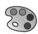

1. Click the tool in the Color Code toolbar.

Abaqus/CAE displays the Color Code dialog box.

2. Click and hold the Initial color sample, and then select one of the following choices from the list that appears:

• Select the equal sign (=) to select the current color.  
• Select the asterisk (\*) to select the default color mapping for the module.  
Select the color sample ( ) to select a custom color. Choosing the color sample symbol opens the Select Color dialog box for you to choose a new color. (For more information, see Customizing colors.)

3. Click Apply.

Abaqus/CAE displays the new initial color selection in the current viewport.

## Changing the translucency

By default, Abaqus/CAE displays geometry and mesh elements in the shaded render style using opaque colors. Interior features and features that are “behind” other objects in the viewport are not visible.

In some cases, Abaqus/CAE applies translucency to the model to help you select interior or hidden entities during a

procedure. You can also use the tool in the Color Code toolbar to toggle translucency on and off when it is not required by a procedure.

To set the percentage of translucency that Abaqus/CAE uses, click the arrow to the right of the tool. Abaqus/CAE displays a vertical slider. Drag the slider up to make the display colors more opaque or down to make them more transparent.

## Note:

In the Visualization module, you control translucency from the Other page of the Common plot options or Superimpose plot options dialog box. See Customizing render style, translucency, and fill color for more information.

## Coloring geometry and mesh elements

You can apply color coding to geometry and mesh elements from any module other than the Visualization module. If you want to apply color coding in the Visualization module, see either Coloring all geometry in the Visualization module, or Coloring nodes or elements in the Visualization module.

Abaqus/CAE applies color coding to the current viewport according to color mappings for specific types of objects, such as part instances, materials, sections, or display groups. This section describes how to examine the assignments in a particular color mapping and how to apply the assignments in a color mapping to the current viewport.

Abaqus/CAE provides two methods that you can use to apply color coding to predefined object types in the current viewport. You can quickly select a color mapping by choosing its name from the list immediately to the right of the

tool in the Color Code toolbar. Abaqus/CAE refreshes the current viewport with the color coding specified in that color mapping. Alternatively, you can select the color mapping from the Color Code dialog box. You must use the dialog box if you want to customize the color mapping. See Customizing the display color of individual objects, for a description of the options provided for changing the colors assigned to individual objects.

## Additional information

• Changing the initial color  
• Coloring nodes or elements in the Visualization module  
• Customizing the display color of individual objects

## Apply a color mapping using the toolbar list

1. Locate the list of color mappings.

The list resides immediately to the right of the

tool in the Color Code toolbar.

2. Select a color mapping from the list.

Abaqus/CAE color codes the geometry and mesh settings according to the colors displayed in the Color Code dialog box.

## Apply a color mapping using the Color Code dialog box

1. Click the tool in the Color Code toolbar.

Abaqus/CAE displays the Color Code dialog box, which displays the default color mappings for the current module.

2. If you are color coding geometry or mesh elements, select a color mapping from the Color Code by list. (If you are performing a different color coding operation, refer to either Coloring all geometry in the Visualization module, or Coloring nodes or elements in the Visualization module.)

Abaqus/CAE displays the selected color mapping in the Color Mapping portion of the dialog box.

3. Click Apply.

Abaqus/CAE color codes the current viewport according to the colors displayed in the Color Code dialog box.

## Coloring all geometry in the Visualization module

This section describes how to apply color coding to all viewable geometry in the current viewport when you are working in the Visualization module. To apply color coding to geometry and mesh elements from any of the other Abaqus/CAE modules, see Coloring geometry and mesh elements. To color code by selected nodes or elements in the Visualization module instead of the entire geometry, see Coloring nodes or elements in the Visualization module.

When an output database is selected in the Visualization module, you can select any of the following color mappings when you apply color coding to all of the geometry:

• Part instances  
Element sets  
• Materials  
• Sections  
• Element types  
• Averaging regions  
• Internal sets  
• Composite layups  
• Composite plies

When a model in the current model database is selected in the Visualization module, only the Part instances color coding option is available.

Abaqus/CAE lists all the items for the current selection method in the Color Mappings table. Once you select a color mapping in the Color Code dialog box, you can also customize the display color of its individual items. See Selecting multiple items from lists and tables, for more information. You make your selections directly from the table, and you can select multiple cells; for more information, see Selecting multiple items from lists and tables.

1. Click the tool in the Color Code toolbar.

Abaqus/CAE displays the Color Code dialog box, which displays the default color mappings for the current module.

2. From the Color Code list, select All.  
3. From the By list, select the name of the color mapping that you want to apply.  
4. Click Apply.

Abaqus/CAE color codes the current viewport according to the colors displayed in the Color Code dialog box.

## Coloring nodes or elements in the Visualization module

When an output database is selected in the current viewport, you can color code selected Nodes and Elements to customize the display of your results in a viewport. For step-by-step instructions on using the Color Code dialog box, see Coloring geometry and mesh elements. To color code by selected item attributes instead of nodes or elements, see Customizing the display color of individual objects.

For the Element and Node item types, your item choices vary with the method that you select from the By list at the top of the Color Code dialog box. Some selection methods require you to complete the information in the Color Mappings table. Regardless of whether the Color Mappings table is completed by Abaqus/CAE or by you, once it is complete, you can select multiple cells to change node and element colors, node symbol shapes, and node symbol sizes (see Selecting multiple items from lists and tables for more information).

When you change node and element colors, you must select the colors you want from the Select Color dialog box. Abaqus/CAE does not support automatic color coding for nodes and elements. In addition, the columns in the Color Mappings table are not sortable when you examine color mappings for Nodes and Elements; consider using the filter if you need to find node or element names from a large list.

The Color Code dialog box does not retain node and element color selections when you close the dialog box or switch viewports. You should consider saving color macros frequently when you change node and element colors; see Saving and restoring custom color mappings, for more information.

Choose from the following selection methods to color elements and nodes in your model:

## Pick from viewport

Select Pick from viewport to specify elements or nodes by picking them directly from the viewport. Click Edit Selection or Add Selection, respectively, to edit an existing row or to add a new row to the Color Mappings table. Abaqus/CAE automatically enters pick mode, and Select items for color coding appears in the prompt area. See Selecting objects within the viewport for more information on picking items in the viewport. Click Delete Selection to delete a highlighted row from the table.

## Element labels (Node labels)

Select Element labels or Node labels to specify elements or nodes by number. For each row in the Color Mappings table, select the name of the part instance to which the nodes or elements belong from the list in the Part instance column and type a list of element or node numbers separated by commas or a range of numbers such as 1:4 into the Labels field. If desired, you can specify a range using a number other than 1 as the operator; for example, 1:21:5 selects items labeled 1, 6, 11, 16, and 21.

## Result value

Select Result value to specify elements or nodes containing results within a given range of values.

The output variable to be considered is displayed at the bottom of the Color Mappings table, to the right of the Field Output button. To select a new result variable, click Field Output; see Selecting the field output to display for more information on the Field Output dialog box. Choose from the filtering methods in the Type cell; the symbols represent results below , inside , outside , or above the selected value or range. Enter the required value or values in the Min value and Max value cells to specify the range for the filter type that you selected. You can add rows to the table and select different filtering methods and result ranges, but all rows refer to the same field output variable. Every element (or node) in the model is used in the filtering process, regardless of the current active display group in the model.

## Note:

The bounds for filtering based on element or nodal output variables are always based on the values of a variable at the nodes. Therefore, element-based output quantities are extrapolated and averaged at the nodes before comparing them against the user-defined bounds. The averaging settings in the Result Options dialog box determine how element-based variables are calculated at the nodes. For example, consider a case where elements are filtered based on Mises stress using the default averaging threshold of 75%. After extrapolation to the nodes, the values are averaged according to this threshold. This conditional averaging may result in several distinct values of Mises stress at the node based on contributions from the various elements to which the node belongs. Any element whose Mises stress contribution falls within the user-defined bounds is included in the color coding selection.

## All elements (All nodes)

Select All elements or All nodes to select all items of the specified type in your model. No further item specification is necessary.

## Node sets

Select Node sets to specify a new color for node sets saved in your model. The Color Mappings table lists all the available set names. You can select element sets by using the All item type.

## Internal sets

Select Internal sets to specify internal (created by Abaqus/CAE) node or element sets. The Color Mappings table lists all the available set names.

## Display groups

Select Display groups to specify a saved display group. The Color Mappings table lists all the available display group names.

## Part instances

Select Part instances to specify a new color for all nodes in the selected part instance. The Color Mappings table lists all part instances in the model.

To select all the elements in a part instance, use the Part instances method for the All item type.

## Additional information

• Coloring geometry and mesh elements  
• Customizing the display color of individual objects

## Coloring constraints in the Visualization module

You can apply color coding to constraints displayed in the current viewport when you are working in the Visualization module and when an output database is selected.

To color code all geometry in the Visualization module, see Coloring all geometry in the Visualization module.

1. Click the tool in the Color Code toolbar.

Abaqus/CAE displays the Color Code dialog box, which displays the default color mappings for the current module.

2. From the Color Code list, select Constraints.  
3. In the Constraint Types list, edit any of the assigned colors.  
4. Click Apply.

Abaqus/CAE color codes the current viewport according to the selections in the Color Code dialog box.

## Customizing the display color of individual objects

This section describes how to customize the display of individual objects; these examples apply throughout Abaqus/CAE, including in the Visualization module. Once Abaqus/CAE creates the automatic color mappings for your viewport, you can customize the color display by changing any of the colors assigned to individual objects in the color mapping. The Color Code dialog box displays each object and its assigned color on the same row in the Color Mappings table. For each object, you can select a different color, activate or deactivate its display, and set (or revert to) the default colors for the selected objects. The Color Code dialog box also provides options that support the management of colors for each object: you can filter by object name, sort table columns, and highlight the selected object.

In the Visualization module, you can apply color coding to the entire viewport or to the nodes or the elements only. You cannot color code nodes or elements in a model database in the other Abaqus/CAE modules.

The following options are available for customizing the display color of individual objects:

## Changing the fill color for an individual item

The Color column displays the fill color assigned to each object. To choose a different color, either double-click the color sample in that row or highlight the color sample and click the Edit color color sample. Abaqus/CAE opens the Select Color dialog box, from which you can select a new fill color. (For more information about selecting custom colors, see Customizing colors.) When you click Apply, Abaqus/CAE refreshes the current viewport with your new fill color.

## Changing the edge color for an individual item (Visualization module only)

When you open the Color Code dialog box from the Visualization module, the dialog box includes the Edge column, which displays the edge color assigned to each object. You cannot customize the edge color in any other module.

To change the edge color for an individual item, either double-click the color sample in that row or highlight the color sample and click and hold the Edit color symbol (=, \*, or ). Abaqus/CAE opens the Select Color dialog box, from which you can select a new edge color. (For more information about selecting custom colors, see Customizing colors.) When you click Apply, Abaqus/CAE refreshes the current viewport with your new edge color.

## Activating and deactivating table rows

Abaqus/CAE displays color coding for active objects only; inactive objects are rendered with the initial color. Deactivating color coding for several objects in a color mapping can simplify your display and help you examine or debug a model.

## Note:

You cannot deactivate color coding for objects in the module default color mappings.

To toggle the activation status of color coding for an object, click Status and choose an activation or deactivation option from the list that appears. If you select Activate all or Deactivate all, Abaqus/CAE toggles the status of the Active column for all rows in the Color Mappings table. If you select Activate selected or Deactivate selected, Abaqus/CAE toggles the status of the Active column for the highlighted rows only. You can also select and deselect the checkboxes in the Active column to toggle the status of color coding for the objects in those rows. When you click Apply in the Color Code dialog box, Abaqus/CAE applies color coding to the current viewport for active rows only.

## Highlighting selected objects

Select the Highlight items checkbox to display a highlighted border around any items whose rows are selected in the Color Mappings table. Abaqus/CAE enables highlighting only for the following color mappings: Part instances, Sets, Surfaces, Internal sets, and Internal surfaces. You cannot highlight objects when you apply color coding to nodes or elements.

## Reverting to default colors and setting new defaults

After you make changes to the display color of individual objects, you can revert to the default color settings for the current color mapping by clicking Color Mapping, and then selecting Restore Defaults from the list that appears. Alternatively, if you want your changes to become the new default color mappings for your session, select Set As Defaults from the same list.

## Auto-coloring individual objects

You can apply auto-coloring to selected objects in a color mapping. Select the individual objects that you want to change, then select Auto-color Selected from the Color Mapping list. Abaqus/CAE applies color coding from the auto-color list according to the alphabetical order of the names in the selected rows.

## Sorting by columns

Click the column headings in the Color Mappings table to sort the table by the contents of the selected column. Click the same heading a second time to reverse the sorting order.

## Note:

You cannot sort by columns when you color code nodes or elements.

Changing the sort order of the objects in the Color Mappings table is for navigation only; their order in the dialog box has no effect on the colors that are selected for color coding. Abaqus/CAE assigns colors from the auto-color list to model definitions in alphabetical order, based on the names of the items in the color mapping.

## Filtering rows by name

If your selected color mapping contains many rows, you can use the Name filter to reduce the number of rows displayed. Click 日 next to the Name filter field to see examples of valid filtering syntax.

## Displaying multiple color mappings

You can apply color coding for two or three different color mappings to the viewport at the same time. Displaying multiple color mappings can reveal interactions between aspects of the model that might not be apparent when you display the color mappings separately. For example, you might want to display color mappings for both Boundary conditions and Loads in the same viewport.

To add another color mapping to the Color Mappings portion of the dialog box, click Advanced and select Add Mapping from the list that appears. Abaqus/CAE adds another tabbed color mapping to the dialog box, in which you can display any color mapping by selecting the mapping from the Color Code by list. Figure 1 shows the Color Code dialog box with the Boundary conditions and Loads color mappings displayed.

text_image

Color Code
Color code by: Boundary conditions
Color Mappings
Initial color:
Boundary Conditions Loads
Advanced
All
Active Boundary Conditions Color
✓ CenterBC
✓ LeftBC
✓ RightBC
Status Color Mapping Edit color:
Name filter:
Highlight items
OK Apply Defaults Cancel

Figure 1:The Color Code dialog box with multiple color mappings.

You can also remove a color mapping from the dialog box by clicking its tab and selecting Remove Current Mapping from the Advanced list.

When multiple color mappings are open, Abaqus/CAE applies color mappings for the leftmost color mapping first, before proceeding to the mapping or mappings to its right. You can display up to three color mappings at a time, but Abaqus/CAE does not permit you to reorder the tables. If you want to color code attributes in a different order, you must close each color mapping and then add the color mappings in the order in which you want Abaqus/CAE to display them in the viewport.

## Editing the colors in the Auto-Color List

When you create color mappings, Abaqus/CAE assigns colors to objects by referring to the color definitions in the Auto-Color List. You can modify the contents of this list by adding, removing, rearranging, and changing the colors.

Unlike color mappings, the Auto-Color List is common for all viewports.

1. Click the tool in the Color Code toolbar.

Abaqus/CAE displays the Color Code dialog box.

2. Click Advanced, and select Edit Auto-colors from the list that appears.

Abaqus/CAE displays the Edit Auto-Colors dialog box.

3. To insert a new color into the Auto-Color list:

1. Highlight the color in the Auto-Color list that you want to precede or follow the color that you add.

2. Click Insert Before or Insert After to add a new color in the indicated location in the Auto-Color list.

The Select Color dialog box opens.

3. Choose a color, and click OK to close the Select Color dialog box.

Abaqus/CAE adds the new color in the selected location.

4. To change one of the colors in the Auto-Color list, double-click the color and select a new color from the Select Color dialog box that appears.

5. To move a color within the Auto-Color list, highlight the color and click either Move Up or Move Down to move the color one step in the selected direction.

6. To delete a color from the Auto-Color list, highlight the color and click Delete.

7. Continue adding, changing, moving, and deleting colors until the Auto-Color list contains the colors you want in the desired order.

8. Click OK.

Abaqus/CAE uses the revised Auto-Color list for any subsequent color coding.

## Saving and restoring custom color mappings

Color mappings are session-specific settings that are not saved to the model database or output database by default. Abaqus/CAE provides two methods you can use to save your custom color coding definitions.

You can save your color mapping definitions as session options. Session options can be saved to the model database, to an output database, or to an XML file. When you save color mappings using this process, Abaqus/CAE records only the color mappings for the item currently selected in the Color Code dialog box. For example, when color mappings for part instances are displayed, those color mapping definitions are the only ones written to the selected file.  
You can create a color macro or write the selected color mapping to an ASCII file. A color macro records all of the color mappings and your initial color selection, and an ASCII file records the current color mapping only. You can run a color macro as you would any other macro; see Managing macros. Color macros record all of the color mappings you select, rather than just the ones currently displayed in the Color Code dialog box.

This section describes the macro-based method for saving color mapping definitions. For more information about saving color mappings as a session option, see Managing session objects and session options.

## Additional information

• Managing macros

## Save a color macro

1. Click the tool in the Color Code toolbar.

Abaqus/CAE displays the Color Code dialog box.

2. Click Advanced, and select Save Color Macro from the list that appears.

Abaqus/CAE displays the Create Macro dialog box, which indicates the location where the macro will be saved.

3. Enter a Name for this macro, and click OK.

Abaqus/CAE saves the macro, making it available for you to run from the Macro Manager dialog box.

## Read or write an ASCII file for a color mapping

1. Click the tool in the Color Code toolbar.

Abaqus/CAE displays the Color Code dialog box.

2. Click mouse button 3 with the cursor positioned over the Color Mappings table, then select one of the following choices from the list that appears:

• Select Write to File to select a file name and to save the current color mapping.  
• Select Read from File to select a file name and to read the contents of a saved color mapping.

## Using display groups to display subsets of your model

By default, Abaqus/CAE displays your entire model; however, you can choose to display subsets of your model by creating display groups.

These subsets can contain combinations of part instances, geometry (cells, faces, or edges), datum geometry (points, axes, planes, or coordinate systems), elements, nodes, and surfaces from the current model or output database. This chapter explains the concept of display groups and how you can manage them.

## In this section:

Understanding display groups  
Managing display groups

## Understanding display groups

A display group is a collection of selected model components and can contain the entire model or combinations of part instances, geometry (cells, faces, or edges), datum geometry (points, axes, planes, or coordinate systems), elements, nodes, surfaces, constraints, and output database coordinate systems.

Display groups allow you to reduce clutter on your screen and focus on areas of interest within your model, to access “hidden” components in complex models, and to decrease the amount of time needed to refresh the display in the current viewport. For example, you can use display groups to show contact surfaces but suppress elements or to produce a contour plot showing elements in the interior of your model that would otherwise be obscured. You can plot, save, edit, copy, rename, and delete display groups.

In the Visualization module you can plot more than one display group in the same viewport, and you can customize the plot options for each display group independently.

## In this section:

Understanding how to create display groups  
Understanding display group Boolean operations

## Understanding how to create display groups

A display group can contain combinations of model components: part instances, geometry (cells, faces, or edges), datum geometry (points, axes, planes, or coordinate systems), elements, nodes, surfaces, constraints, output database coordinate systems, or the entire model. In addition, you can create a display group by operating on previously saved display groups. However, while creating a display group, you can perform operations on only one type of model component at a time. Creating a display group containing selected components of more than one type is an incremental process. The model components that can be used to create a display group depend on the module in which you are working, as shown in Table 1 and Table 2.

Table 1: Model components that can be used to create display groups in the Part- and Assembly-related modules and in the Visualization module.

<table><tr><td>Modules</td><td>Available Model Components</td></tr><tr><td rowspan="7">Part-related (Part, Property)</td><td>Geometry (cells, faces, or edges)</td></tr><tr><td>Datum geometry (points, axes, planes, or coordinate systems)</td></tr><tr><td>Elements</td></tr><tr><td>Nodes</td></tr><tr><td>Reference points</td></tr><tr><td>Sets (geometry, element, or node)</td></tr><tr><td>Display groups</td></tr><tr><td rowspan="10">Assembly-related (Assembly, Step, Interaction, Load, Mesh)</td><td>Part instances</td></tr><tr><td>Geometry (cells, faces, or edges)</td></tr><tr><td>Datum geometry (points, axes, planes, or coordinate systems)</td></tr><tr><td>Assembly wires (connector wires)</td></tr><tr><td>Elements</td></tr><tr><td>Nodes</td></tr><tr><td>Reference points</td></tr><tr><td>Sets (geometry, element, or node)</td></tr><tr><td>Surfaces</td></tr><tr><td>Display groups</td></tr><tr><td rowspan="5">Visualization module</td><td>Part instances</td></tr><tr><td>Elements</td></tr><tr><td>Nodes</td></tr><tr><td>Surfaces</td></tr><tr><td>Display groups</td></tr></table>

Table 2: Model components that can be used to create display groups for output databases in the Visualization module.

<table><tr><td>Module</td><td>Available Model Components</td></tr><tr><td rowspan="2">Visualization</td><td>Part instances</td></tr><tr><td>Elements</td></tr><tr><td rowspan="9"></td><td>Nodes</td></tr><tr><td>Surfaces</td></tr><tr><td>Display groups</td></tr><tr><td>Coordinate systems</td></tr><tr><td>Tie constraints</td></tr><tr><td>Shell-to-solid coupling constraints</td></tr><tr><td>Distributing coupling constraints</td></tr><tr><td>Kinematic coupling constraints</td></tr><tr><td>Rigid body constraints</td></tr></table>

To create a display group, you first select the particular items of interest. You can then perform a Boolean operation on your selection and the contents of the current viewport. This sequence can be repeated as necessary to create the desired group. In addition, you can create a new display group by editing (for example, performing additional Boolean operations on) the contents of a previously saved display group.

You can save either the selection in the dialog box or the contents of the current viewport as a display group. By default, a display group persists only for the duration of the session. If you want to retain a display group for use in subsequent sessions, save it to an XML file, to the model database, or to an output database; for more information, see Managing session objects and session options. You can access a display group only in modules of the same type as the one in which it was created (see Table 1 and Table 2). For example, if you create and save a display group in the Part module, you will be able to access this display group only in the Part and Property modules.

A display group named All that contains all objects in the current part, assembly, or output database is created automatically by Abaqus/CAE. This display group appears in the display group manager for the current module and cannot be edited, copied, renamed, or deleted. It is not associated with a particular part, assembly, or output database. You can use this display group to quickly return to a plot of the entire part or model after performing Boolean operations.

## Additional information

• Creating or editing a display group  
• Controlling the display of constraints in the Visualization module

## Understanding display group Boolean operations

To create or edit a display group, you can perform Boolean operations on selected model components and the contents of the current viewport. Abaqus/CAE offers the following Boolean operations in the Display Group toolset: Replace, Add, Remove, Intersect, and Either.

As an example of a simple Boolean operation, assume the current viewport shows the entire model. If you select a single element set and then apply the Remove operation, that element set is eliminated from the display in the current viewport.

For each Boolean operation you perform to create or edit a display group, you can select only one type of model component: part instances, geometry (cells, faces, or edges), datum geometry (points, axes, planes, or coordinate systems), elements, nodes, surfaces, previously saved display groups, or the entire model. For a given display group, Abaqus/CAE initially assumes that you want to include all nodes connected to all elements in the group. However, if you select particular nodes, all subsequent operations on that display group include only the nodes you have selected.

An explanation of each of the Boolean operations follows. In the icons below, the circle on the left represents the items in the current viewport; the circle on the right represents your selection. The shaded portion represents the resulting display group. All of these Boolean operations except the last one, Replace All, are available in the Create Display Group dialog box; the Display Group toolbar provides access to the Replace, Remove, Either, and Replace All Boolean operations, as well as Undo and Redo operations.

## Replace

Use the Replace operator to replace the current viewport contents with your selection.

## Add

Use the Add operator to add your selection to the current viewport contents.

## Remove

Use the Remove operator to remove your selection from the current viewport contents. If your selection includes one or more elements or surfaces, the nodes connected to those items are also removed, provided that you have not specifically operated to include those nodes in the display group.

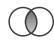

## Intersect

Use the Intersect operator to display only those items common to your selection and the display in the current viewport.

## Either

Use the Either operator to display only model components that are either in your selection or in the current viewport but not in both.

Note: From the Display Group toolbar, click Invert Display to hide all the model components that are displayed in the current display group or to display all the model components that are hidden. This operation is equivalent to selecting all the objects in the Create Display Group or Edit Display Group dialog box and clicking the Either button.

## Replace All

Use the Replace All operator to replace your display group and display all entities in the current viewport. This operator is available in the toolbar only.

When you select the (Replace Selected) or (Remove Selected) operators from the toolbar, Abaqus/CAE displays a list of model components in the prompt area. Select the type of model component that you want to replace or remove from the selected display group, then click one or more model components in the viewport to change the contents of the display group.

## Note:

The Replace Selected and Remove Selected operators perform the same actions as the Replace and Remove operators in the display group dialog boxes. The toolbar operators have different names to indicate that you must select model components from the viewport before using these operators to change the current display.

## Additional information

• Creating or editing a display group

## Managing display groups

The display group managers allow you to create a display group and to plot, edit, copy, rename, or delete a previously saved display group.

The display group manager for the current module lists only the display groups that you have saved in modules of the same type during the current session. The Part Display Group Manager in the part-related modules lists the model and part to which each display group belongs; the Assembly Display Group Manager in the assembly-related modules lists the model to which each display group belongs.

In the Visualization module you can plot multiple display groups in the same viewport. The ODB Display Group Manager in the Visualization module allows you to lock and unlock plotted display groups to selectively customize plot options. In addition, you can synchronize all plotted display groups to use the same plot options.

## In this section:

Creating or editing a display group  
Selection methods for creating or editing a display group  
Copying, renaming, and deleting a display group  
Plotting display groups  
Customizing display groups in the Visualization module  
Applying display groups to multiple viewports and models

To create a display group, you first select the particular items of interest. You can then perform Boolean operations on your selection and the contents of the current viewport. When you create a display group, you can choose at any time to save either the contents of the current viewport or the items selected in the dialog box (if applicable). You must save a display group to do any of the following:

• Plot the display group later in the session.  
• Apply the display group to a different model or to a different viewport.  
• Edit, copy, or rename the display group.  
• Plot multiple display groups in the same viewport in the Visualization module.

Saved display groups are available only during the current session and only when you are in modules of the same type as the module in which you created the display group.

## Note:

Saved display groups are not updated to reflect changes made to the model, such as adding, deleting, or suppressing features or partitioning a part; such changes may invalidate display groups created with respect to the original model.

You can edit the combination of model components in a previously saved display group. Editing a display group is similar to creating a display group: in both cases you can select model components and then apply Boolean operations on your selection and the contents of the current viewport. When you select a display group to edit, the contents of the current viewport update to show the selected display group. You use the display in the current viewport to determine the model components in the group you are editing; you cannot list the model components. When you are finished editing, all viewports that use the display group will be updated.

1. Locate the options for creating or editing a display group.

• To create a display group, select Tools->Display Group->Create from the main menu bar.

Tip: You can also create a display group by clicking the tool in the Display Group toolbar.

The Create Display Group dialog box appears.

To edit a previously saved display group, select Tools->Display Group->Edit from the main menu bar. From the menu that appears, select the display group you want to edit.

The Edit Display Group dialog box appears.

Tip: You can also use the display group manager to create or edit a display group. From the main menu bar, select Tools->Display Group->Manager to display the manager for the current module. To create a display group, click Create. To edit a display group, select it from the list and double-click on it or click Edit.

2. From the Item list at the top left of the dialog box, select the type of model component to use for the display group (as available for the current module): Cells, Faces, Edges, Datums, Assembly wires, Reference points, Elements, Nodes, Sets, Surfaces, Part instances, Display groups, Internal Sets, Internal Surfaces, Coordinate systems, Ties, Shell-to-solid couplings, Distributing couplings, Kinematic couplings, or Rigid bodies. You can select All to specify all objects in the current part, assembly, or output database when you are creating a new display group.

Abaqus/CAE refreshes the Method list and the right side of the dialog box. If you select All, these fields are empty and no further item specification is necessary. If the item that you select has only one selection method, Abaqus/CAE immediately enters the required selection mode. For example, if you select Cells, Abaqus/CAE immediately enters the viewport selection mode.

3. Choose a selection method from the Method list; and/or select the specific items for the display group by picking from the viewport, selecting items from the list that appears on the right side of the dialog box, or entering data in the right side of the dialog box. See Selection methods for creating or editing a display group, for more detailed information.

Tip: If your model contains many items of a particular type, you can use the filter to reduce the number of item names displayed on the right side of the Create Display Group dialog box. Click the Tip button next to the Filter field to see examples of valid filtering syntax.

Certain items can be highlighted in the viewport to verify your selection. Toggle Highlight items in viewport if available.

Toggle Show common list between linked viewports to display items common to all linked viewports in the Method list. For Part instances, viewports containing model databases or output databases are considered; for other model components, only viewports containing output databases are considered.

4. From the icons in the bottom portion of the dialog box, click the desired Boolean operation (see Understanding display group Boolean operations, for more information).

Abaqus/CAE carries out the selected Boolean operation on the model components you have selected in the dialog box and the contents of the current viewport.

5. Repeat steps beginning with Step 2 as needed to produce the desired display group.  
6. If you are creating a new display group, you can choose to save it at any time.

a. To save the contents of the current viewport as a display group, click Save As; then enter a name for the display group in the dialog box that appears, and click OK.

Abaqus/CAE saves the contents of the current viewport (regardless of what is selected in the dialog box) as a display group.

b. If model components are selected in the Create Display Group dialog box, you can save the selected components as a display group. Click Save Selection As; then enter a name for the display group in the dialog box that appears, and click OK.

Abaqus/CAE saves only the components selected in the dialog box (regardless of what is displayed in the current viewport) as a display group.

7. Click Dismiss to close the Create Display Group dialog box or OK to close the Edit Display Group dialog box.

## Additional information

• Understanding how to create display groups  
• Understanding display group Boolean operations  
• Selection methods for creating or editing a display group  
• Understanding result value averaging  
• Controlling edge visibility  
• Choosing background colors  
• Controlling the display of constraints in the Visualization module

## Selection methods for creating or editing a display group

You can use the following selection methods to specify the items that will be contained in a display group:

To specify geometry (cells, faces, or edges), assembly wires, or reference points by picking them directly from the viewport, select them from the Item list. (For datums, elements, and nodes, you must also select Pick from viewport from the Method list.) Abaqus/CAE automatically enters the pick mode, and Select items for the display group appears in the prompt area. See Selecting objects within the viewport for more information on picking items in the viewport.

Click Done in the prompt area when you have finished picking items in the viewport.

Click Edit selection, Add selection, or Delete selection in the dialog box to further modify your viewport selections.

To specify elements or nodes by number, select Element labels or Node labels from the Method list. Select the name of the part instance to which the nodes or elements belong from the list in the Part instance field on the right side of the Create Display Group dialog box. Type into the Labels field a list of element or node numbers separated by commas or a range of numbers optionally followed by an increment; for example, 1:10 or 1:10:2.  
To specify elements in the Visualization module by type, select Element type from the Method list. A list of the available element types in your model appears on the right side of the Create Display Group dialog box. Select one or more element types from this list (see Selecting multiple items from lists and tables for more information).  
To specify elements in the Visualization module by material or section, select Material assignment or Section assignment from the Method list. A list of the available materials or sections in your model appears on the right side of the Create Display Group dialog box. Select one or more materials or sections from this list (see Selecting multiple items from lists and tables for more information).

To specify elements in the Visualization module by layups or plies, select Composite Layups or Composite Plies from the Method list. A list of the available composite layups or plies in your model appears on the right side of the Create Display Group dialog box. Select one or more layups or plies from this list (see Selecting multiple items from lists and tables for more information).

To specify geometry, element, or node sets in part- and assembly-related modules or surfaces in assembly-related modules, select Set names or Surface names from the Method list. A list of the available set or surface names in your model appears on the right side of the Create Display Group dialog box. Select one or more set names from this list (see Selecting multiple items from lists and tables for more information).

To specify internal (created by Abaqus/CAE) sets in part- and assembly-related modules or internal surfaces in assembly-related modules, select Internal sets or Internal surfaces from the Item list. A list of the available set or surface names in your model appears on the right side of the Create Display Group dialog box. Select one or more set names from this list (see Selecting multiple items from lists and tables for more information).

To specify element, node, surface, or internal (created by Abaqus/CAE) sets in the Visualization module, select Element sets, Node sets, Surface sets, or Internal sets from the Method list. A list of the available set names in your model appears on the right side of the Create Display Group dialog box. Select one or more set names from this list (see Selecting multiple items from lists and tables for more information).

• To select all items of the specified type in your model, select All elements, All nodes, or All surfaces from the Method list. No further item specification is necessary.

If you selected Part instances or Display groups from the Item list, a list of the available part instances or display groups in your model appears on the right side of the Create Display Group dialog box. Select one or more part instance or display group names from this list (see Selecting multiple items from lists and tables for more information).

## Note:

In assembly-related modules you can also display a subset of the part instances in your model using the visibility options in the Instance tabbed page of the Assembly Display Options dialog box (see Controlling instance visibility). Part instances that have been toggled off in the Assembly Display Options dialog box cannot be made visible using display groups.

• To specify elements, nodes, or surfaces containing results within a given range of values in the Visualization module, select Result value.

The output variable to be considered is displayed at the top right side of the dialog box. To select a new result variable, click Field Output; see Selecting the field output to display for more information on the Field Output dialog box. Choose from the filtering methods in the Type field.

- If you select (inside) or (outside), enter values for the upper and lower bounds of the range of results in the Min value and Max value fields, respectively.  
- If you select , enter a value above which the results should fall in the Min value field.  
- If you select , enter a value below which the results should fall in the Max value field.

Every element (or node or surface) in the model is used in the filtering process, regardless of the current active display group in the model. If you choose a range of values for which no elements (or nodes or surfaces) exist, you will create an empty display group.

You can achieve better performance in time history animations using the status field output variable rather than the result-based display group functionality. The status field output variable allows you to remove elements that meet a specified result-based failure criteria from your model plots; see Selecting the status field output variable for more information.

## Note:

The bounds for filtering based on element, nodal, or surface output variables are always based on the values of a variable at the nodes. Therefore, element- and surface-based output quantities are extrapolated and averaged at the nodes before comparing them against the user-defined bounds. The averaging settings in the Result Options dialog box determine how element- and surface-based variables are calculated at the nodes. For example, consider a case where elements are filtered based on Mises stress using the default averaging threshold of 75%. After extrapolation to the nodes, the values are averaged according to this threshold. This conditional averaging may result in several distinct values of Mises stress at the node based on contributions from the various elements to which the node belongs. Any element whose Mises stress contribution falls within the user-defined bounds is included in the display group.

• To specify coordinate systems in the Visualization module, select Coordinate systems from the Item list, then select one of the following:

To specify coordinate systems that are part of the output database, select Odb systems from the Method list. A list of the output database coordinate systems appears in the right side of the Create Display Group dialog box.  
To specify coordinate systems that have been created during your session, select User systems from the Method list. A list of the user-defined coordinate systems appears in the right side of the Create Display Group dialog box.  
To specify coordinate systems from the output database and the session, select All from the Method list. A list of the output database coordinate systems and user-defined coordinate systems appears in the right side of the Create Display Group dialog box.

Select one or more coordinate systems from the list that appears (see Selecting multiple items from lists and tables for more information).

To specify analysis constraints in the Visualization module, select one of the following constraint types in the Item list: Ties, Shell-to-solid couplings, Distributing couplings, Kinematic couplings, or Rigid bodies.

## Additional information

• Creating or editing a display group

## Copying, renaming, and deleting a display group

To copy, rename, or delete a display group, use one of the following:

• The Copy, Rename, and Delete items listed under the Tools->Display Group menu on the main menu bar.  
The Copy, Rename, and Delete items contain submenus listing all the display groups you have saved in modules of the same type as the current module during the session.  
The display group manager dialog box for the current module. The display group manager dialog boxes contain functions identical to those listed under the Tools->Display Group menu on the main menu bar but with a convenient browser that lists all the display groups for the current module and session. To display the display group manager dialog box for the current module, select Tools->Display Group->Manager from the main menu bar.

## Note:

If you try to delete a display group that is shown in multiple viewports, Abaqus/CAE warns that the display groups in those viewports will be reset to the entire model.

## Additional information

• Managing display groups

## Plotting display groups

You can plot a display group for the model in the current viewport. In the Visualization module you can plot more than one display group in the same viewport.

Abaqus/CAE plots only the components in each display group that are valid for the current model. For example, if a display group references an element set called Fixture, the model in the current viewport should also contain an element set called Fixture. Abaqus/CAE ignores model components that are not valid.

## Additional information

• Managing display groups

## Plot a single display group in any module

1. From the main menu bar, select Tools->Display Group->Plot.  
2. From the menu that appears, select the display group that you want to plot.

Tip: You can also use the display group manager for the current module to plot a display group. From the main menu bar, select Tools->Display Group->Manager. Select the display group you want to plot, and click Plot from the buttons on the right side of the manager.

The model plot in the current viewport changes to show only the selected display group.

## Plot one or more display groups in the Visualization module

1. From the main menu bar, select Tools->Display Group->Manager.  
The ODB Display Group Manager appears with a list at the top of all display groups saved in the current session.  
2. Select one or more display groups from the list (see Selecting multiple items from lists and tables, for more information), and click Plot from the buttons on the right side of the manager.  
The model plot in the current viewport changes to show only the selected display groups, and the plotted display groups appear in the list of display group instances at the bottom of the ODB Display Group Manager.  
3. To add one or more display groups to the plot in the current viewport, select them from the list of saved display groups at the top of the ODB Display Group Manager, and click Add from the buttons on the right side of the manager.  
The selected display groups are added to the model plot in the current viewport and to the list of display group instances at the bottom of the ODB Display Group Manager.  
4. To remove a display group from the plot in the current viewport, select the instance from the list at the bottom of the ODB Display Group Manager, and click Remove from the buttons at the bottom of the manager.  
The selected display group is removed from the model plot in the current viewport and from the list of display group instances.  
5. You can customize plot state–dependent and independent options separately for each display group in the current viewport. For more information, see Customizing display groups in the Visualization module.

## Customizing display groups in the Visualization module

The ODB Display Group Manager in the Visualization module allows you to lock and unlock plotted display groups to selectively customize plot options. In addition, you can synchronize all plotted display groups to use the same plot options. For example, you can display a particular group of elements in the shaded render style with translucency and display the remainder of the model in the wireframe render style. Figure 1 shows another example of two display groups plotted in the same viewport using different plot states and plot options.

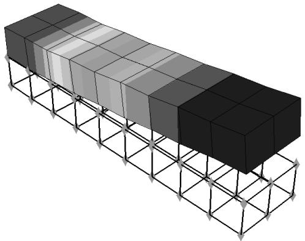

natural_image

3D diagram of a structural frame with layered blocks and triangular supports (no text or symbols)

Figure 1: Multiple customized display groups in one viewport.

When you plot a display group in the Visualization module, the display group appears (along with its current plot states) in the list of display group instances at the bottom of the ODB Display Group Manager. Plot state–dependent and independent options that you specify apply to all unlocked display group instances. You can lock a display group instance that you do not want to be affected by plot options.

Changing the plot state will not affect locked display group instances in the viewport. However, view manipulations and changes to the color coding will affect all display group instances, both locked and unlocked. In addition, the contents of a locked display group can be edited.

Display groups are plotted in the viewport in the order in which they appear in the list of display group instances; the first instance in the list is the topmost instance in the viewport. Therefore, if two display group instances contain the same components and those components overlap in the viewport, the plot options for the first instance in the list take precedence. You can rearrange the order of the instances in the list to control which plot options will be displayed.

1. Follow the procedure described in Plotting display groups, to plot multiple display groups in the same viewport.  
2. In the list of display group instances in the ODB Display Group Manager, click in the Lock column next to the display group name to lock the instances that you do not want to customize.

Locked display groups are indicated by a check mark in the Lock column.

3. Customize the plot options for the unlocked display group instance or instances as desired. (See Customizing plot display,” for more information.)  
4. When you have finished customizing the plot options for a display group instance, click in the Lock column next to the display group name to prevent your settings from being modified.  
5. Repeat Steps 3 and 4 as needed until you obtain the desired display in the viewport.  
6. If you want all display group instances to use the same plot state and plot options, select the instance that reflects the desired plot state and plot options, and click Sync Options from the buttons at the bottom of the manager.

All other unlocked display group instances will be synchronized to the selected display group's plot state and plot options.

7. To rearrange the order in which the display groups are plotted in the viewport, select an instance from the list at the bottom of the ODB Display Group Manager and click Move Up to move the instance up in the list or Move Down to move the instance down in the list.

The display in the current viewport is updated to reflect your change.

## Additional information

• Managing display groups

## Applying display groups to multiple viewports and models

You can use a single display group to view the same subset of different models, and you can view a display group in multiple viewports.

A single display group can apply to different models as long as the display group is valid for each model. For example, Figure 1 shows a single display group applied to two different models shown in two different viewports.

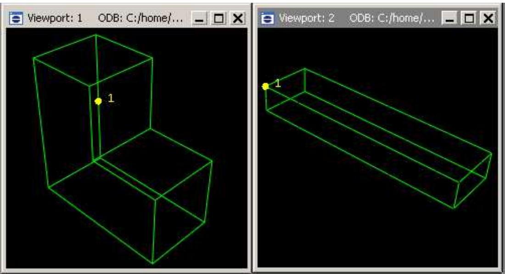  
Figure 1: A display group applied to two different models.

## Additional information

• Managing display groups

## Plot a previously saved display group in any viewport

1. Click on the viewport border to make the viewport current.  
2. From the main menu bar, select Tools->Display Group->Plot. Select the display group to plot from the menu that appears.  
Abaqus plots the display group in the current viewport. Abaqus plots only the components in the display group that are valid for the current model.

## Edit a previously saved display group in any viewport where it is displayed

1. Click on the viewport border to make the viewport current.  
2. From the main menu bar, select Tools->Display Group->Edit. Select the display group to edit from the menu that appears.  
The Edit Display Group dialog box appears.  
3. Select the desired model components, and apply the desired Boolean operations.  
During the editing process, the results of any Boolean operations appear only in the current viewport.  
4. Click OK to close the Edit Display Group dialog box.

Your editing changes are applied to all viewports that reference the selected display group. If the modified display group becomes invalid for one of the models (for example, by the inclusion of a node not contained in that model), Abaqus warns that part of the display group is now invalid.

This chapter explains the concept of overlaying plots and how you can create and manage such plots. By default, Abaqus/CAE displays only one plot at a time in the current viewport. A plot may display multiple plot states, such as the contours and material orientations of the same model. However, a single plot cannot display data from more than one output database nor can it display both the model and an X–Y plot in the same viewport. If you want to display data in this fashion, you must overlay individual plots in the same viewport.

## In this section:

Understanding how to overlay plots  
Producing and modifying overlay plots

## Understanding how to overlay plots

You can create a display that contains multiple plots in one viewport. For example, you may want to do any of the following:

• combine a contour plot and an X–Y plot  
• compare the deformed plot shapes from two different output database files in the same viewport  
• combine a time history animation with an animated X–Y plot displaying the change in several variables in the model over time

Overlay plots are useful, for example, for displaying data from both output databases in a co-simulation in the same viewport.

Overlay plots are composed of layers; each layer contains one plot, and the layers are stacked on top of each other to create the combined plot. Figure 1 shows a plot containing the deformed shape plots at four different increments of an analysis as well as an X–Y plot of the strain energy in the model versus time.

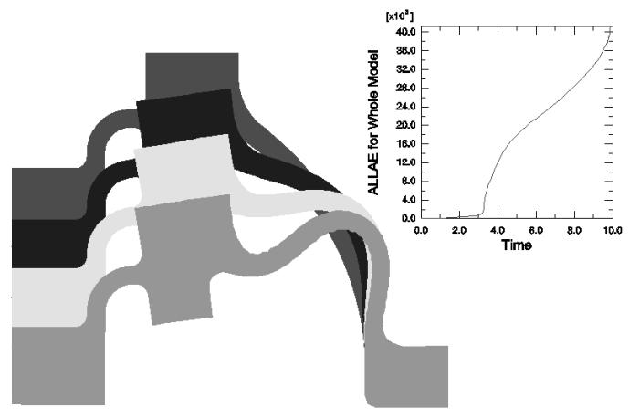

area_stacked

| Time | ALLAE for Whole Model (x10^8) |
| --- | --- |
| 0.0 | 0.0 |
| 2.0 | ~0.1 |
| 4.0 | ~1.5 |
| 6.0 | ~2.5 |
| 8.0 | ~3.5 |
| 10.0 | 40.0 |

Figure 1: Overlay plot.

By default, the viewport does not contain any layers; only one plot at a time is displayed. To overlay multiple plots, you create a layer for each individual plot as you interact with Abaqus/CAE. You then choose the layers to display in the current viewport. You can create as many layers as you would like; any number of layers can be displayed in the same viewport. In addition, you can open multiple output databases and automatically display the combined contents in an overlay plot in a single viewport.

Use the Overlay Plot Layer Manager to create, display, position, and delete layers. To access the manager, select

View->Overlay Plot from the main menu bar or click the Overlay Plot Layer Manager tool in the toolbox.

When you create a layer, it contains everything that is visible in the current viewport. You can change the contents of a layer, manipulate its view, reorder the layer with respect to the other layers in the overlay plot, and change the various display options that are applied to the contents. By default, layers are plotted directly on top of one another. Sometimes lines that appear directly on top of one another can create undesirable visual effects. You can offset the layers with respect to each other to avoid such display anomalies.

The settings in the Overlay Plot Layer Manager are applied to the contents of the current viewport only when you click Plot Overlay. Abaqus/CAE then enters the overlay plot state; when you click Plot Single in the Overlay Plot Layer Manager, the overlay plot disappears from the viewport and the display reverts back to the previous plot state.

You can also click the tool in the toolbox to switch between the single plot and overlay plot state at any time.

When you are in the overlay plot state, Abaqus/CAE displays your plots relative to an overlay plot coordinate system. As you create a layer, Abaqus/CAE assigns the view in which the layer was created to the overlay plot front (1–2) view. You can modify what is displayed in the overlay plot front view by manipulating the view for each individual layer, as described in Manipulating the view for an overlay plot. User-specified views defined in the overlay plot state are relative to the overlay plot coordinate system.

Columns in the Overlay Plot Layer Manager display the following information about each layer:

## Visible

A check mark in this column indicates that the layer is visible in the viewport when you are in the overlay plot state.

## Current

A check mark in this column indicates that the layer is current. Only one layer can be current at a time, although each layer can contain multiple plot states (for more information, see Displaying multiple plot states). Plot options are applied to only the current layer when you are in the overlay plot state; you can choose whether view manipulation options are applied to all existing layers or to only the current layer. The current layer is not necessarily the foremost layer in the viewport.

## Name

The name of the layer.

## Object

The name of the object contained in the layer; for example, an output database or an X–Y plot.

## Producing and modifying overlay plots

This section explains how to overlay multiple plots by creating layers and plotting them in the same viewport and how to modify an overlay plot once you have created it.

Each layer in an overlay plot is completely independent. You can change the output database, the plot state (or plot states), reorder the layers with respect to each other, manipulate the view for each individual layer, and change the various display options that are applied to the contents.

## In this section:

Producing an overlay plot  
Reordering the layers in an overlay plot  
Manipulating the view for an overlay plot  
Editing the layers in an overlay plot

## Producing an overlay plot

An overlay plot is a display that contains multiple plots in one viewport.

Overlay plots are composed of layers; you can open multiple output databases and create the layers automatically, or you can use the Overlay Plot Layer Manager to create layers manually.

You also use the Overlay Plot Layer Manager to configure your overlay plots.

Tip: You can also plot any combination of deformed and undeformed models shapes with or without contours,

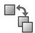

symbols, or materials orientations for a single output database by using the Allow Multiple Plot States tool. Since all the plot states are created on a single layer, the Allow Multiple Plot States tool is limited to displaying data from a single output database, step, and frame. For more information, see Displaying multiple plot states.

1. Determine the method to use for producing the overlay plot:

• Create layers automatically by opening multiple output databases.  
• Create layers manually.

2. To create layers automatically, do the following:

a. Select File->Open from the main menu bar.  
b. From the Open Database dialog box that appears, select Output Database (\*.odb\*) as the File Filter.  
c. Select the output databases to open, toggle on Append to layers, and click OK. For more details, see Opening a model database or an output database.

An overlay plot containing the combined contents of the output databases is automatically created in a viewport, and each output database is assigned to a separate layer. You can select View->Overlay Plot from the main menu bar to display the Overlay Plot Layer Manager and view the layers.

3. To create layers manually, do the following:

a. Create the first plot that you want to include in the display.  
b. Open the Overlay Plot Layer Manager by selecting View->Overlay Plot from the main menu bar.

Tip: You can also open the manager by clicking the Overlay Plot Layer Manager tool in the toolbox.

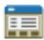

c. Click Create to create a layer that contains the plot shown in the current viewport.

The Create Viewport Layer dialog box appears.

d. Enter a name for the layer, and click OK.

The new layer appears in the Overlay Plot Layer Manager, with check marks in both the Visible and Current columns.

e. Create a new plot in the current viewport.

f. Repeat Step c through Step e to create as many layers as you would like to include in the plot. In the Create Viewport Layer dialog box for all layers after the first one, you can choose to copy the view from an existing layer by toggling on Copy view from and selecting a layer from the list. The new layers appear in the Overlay Plot Layer Manager as you create them; the most recently created layer will have a check mark in the Current column.

g. Check that the layers you want to include in the plot have a check mark in the Visible column, and click Plot Overlay.

The layers appear stacked on top of each other in the current viewport in the order in which they are listed in the Overlay Plot Layer Manager.

4. From the Overlay Plot Layer Manager, you can delete a layer by clicking in the Name or Object column to select the layer and clicking Delete.  
5. With the overlay plot displayed in the viewport, you can click Plot Single in the Overlay Plot Layer Manager to exit the overlay plot state.

The overlay plot disappears from the viewport, and the display returns to the previous plot state; but the Overlay Plot Layer Manager remains open. Click Dismiss to close the Overlay Plot Layer Manager.

Tip: You can also click the plot state at any time.

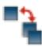

tool in the toolbox to switch between the single plot and overlay

## Additional information

• Understanding how to overlay plots  
• Producing and modifying overlay plots

Layers are plotted in the viewport in the order in which they are listed in the Overlay Plot Layer Manager. By default, the layers are plotted directly on top of one another, which can sometimes result in undesirable visual effects where the plots appear to overlap.

You can rearrange the order in which the layers are plotted, and you can apply a small offset to all the layers in the screen Z-direction (perpendicular to the plane of the screen) to separate them in the display and eliminate any undesirable visual effects. If you apply a positive offset, the layers are drawn in the viewport in the order shown in the Overlay Plot Layer Manager (the last layer in the manager is the topmost layer in the viewport). If you apply a negative offset, the drawing order is reversed. Figure 1 shows an example of an overlay plot with different offset values applied.

  
Figure 1: Overlay of undeformed and contour plots: positive offset on left, negative offset on right.

1. Create an overlay plot using the procedure described in Producing an overlay plot.  
2. Reorder the layers using one of the following methods:

Select the layer you wish to reorder by clicking in the Name or Object column in the Overlay Plot Layer Manager. Click Move Up to move the layer up in the manager; click Move Down to move the layer down in the manager.  
Drag the Layer offset slider to a positive or negative value to shift the layers in the positive or negative screen Z-direction. You may have to experiment with the offset values to achieve your desired display.

Abaqus/CAE applies your settings to the overlay plot in the current viewport.

3. With the overlay plot displayed in the viewport, you can click Plot Single in the Overlay Plot Layer Manager to exit the overlay plot state.

The overlay plot disappears from the viewport, and the display returns to the previous plot state; but the Overlay Plot Layer Manager remains open. Click Dismiss to close the Overlay Plot Layer Manager.

Tip: You can also click the plot state at any time.  
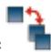

tool in the toolbox to switch between the single plot and overlay

## Additional information

• Understanding how to overlay plots  
• Producing and modifying overlay plots

## Manipulating the view for an overlay plot

While you are in the overlay plot state, you can choose whether view manipulations are applied to all existing layers or to only the current layer.

1. Create an overlay plot using the procedure described in Producing an overlay plot.  
2. In the Overlay Plot Layer Manager, toggle All or Current next to View manipulation layer to specify whether you want the view manipulations that you apply to affect all the layers or only the current layer.  
3. Use the view manipulation tools to position, orient, and magnify the objects in the viewport. (See Manipulating the view and controlling perspective,” for information on the view manipulation tools.)  
The view manipulations will be applied either to all the visible layers or to only the current layer, depending on your selection in Step 2. The 3D compass can be used only to manipulate all of the visible layers; it is not available when you are manipulating only the current layer.

4. With the overlay plot displayed in the viewport, you can click Plot Single in the Overlay Plot Layer Manager to exit the overlay plot state.

The overlay plot disappears from the viewport, and the display returns to the previous plot state; but the Overlay Plot Layer Manager remains open. Click Dismiss to close the Overlay Plot Layer Manager.

Tip: You can also click the plot state at any time.

tool in the toolbox to switch between the single plot and overlay

## Additional information

• Understanding how to overlay plots  
• Producing and modifying overlay plots

You can change the model, plot state, plot options, animation controls, or field output variable options for each layer in an overlay plot.

1. Create an overlay plot using the procedure described in Producing an overlay plot.  
2. Click in the Current column next to the layer that you want to modify.  
3. To change the model, open a new output database. (For more information, see Opening a model database or an output database.)  
4. To change the plot type, select a new plot type from the Plot menu or from the plot tools in the toolbox.  
5. To change the plot state-independent or plot state-dependent customization options, select new options from any of the following dialog boxes:

• Viewport Annotation Options  
• ODB Display Options  
• Result Options  
• Common Plot Options  
• Superimpose Plot Options  
• Contour Plot Options  
• Symbol Plot Options  
• Material Orientation Plot Options

For more information, see Using viewport annotation options, Selecting result options, or Customizing plot display.”

Click OK or Apply in each dialog box to implement your changes in the current layer of the overlay plot.

6. You can synchronize the visible layers by clicking any of the → icons under Layer Options in the Overlay Plot Layer Manager: View manipulation layer, Plot state layer, or Plot options layer.  
7. Change any of the animation options desired. For more information, see Object-based animation, and Controlling animation playback.  
8. Change the field output variable options desired. For more information, see Selecting field output variables.  
9. You can synchronize the field output variable options of the visible layers by clicking the icon next to Field Output layer.  
10. Repeat Step 2 through Step 8 for each layer that you wish to modify.  
11. With the overlay plot displayed in the viewport, you can click Plot Single in the Overlay Plot Layer Manager to exit the overlay plot state.  
The overlay plot disappears from the viewport, and the display returns to the previous plot state; but the Overlay Plot Layer Manager remains open. Click Dismiss to close the Overlay Plot Layer Manager.

Tip: You can also click the tool in the toolbox to switch between the single plot and overlay plot state at any time.

## Additional information

• Understanding how to overlay plots  
• Producing and modifying overlay plots

View cuts allow you to cut through a model so that you can visualize the interior or selected sections of the model and, for results data in the Visualization module, display its resultant forces and moments.

## In this section:

Understanding view cuts  
Managing view cuts

## Understanding view cuts

View cuts allow you to cut planar or deformable sections through a model to see the interior of the model. You can define and use view cuts during both modeling and postprocessing activities, though some aspects of view cut functionality are available only for one of these activities. This section describes the view cut functionality; unless otherwise noted, the view cut functionality described is available for both modeling and postprocessing.

Figure 1 shows how a planar view cut can be used to cut through a contour plot of a gearbox model in the Visualization module.  
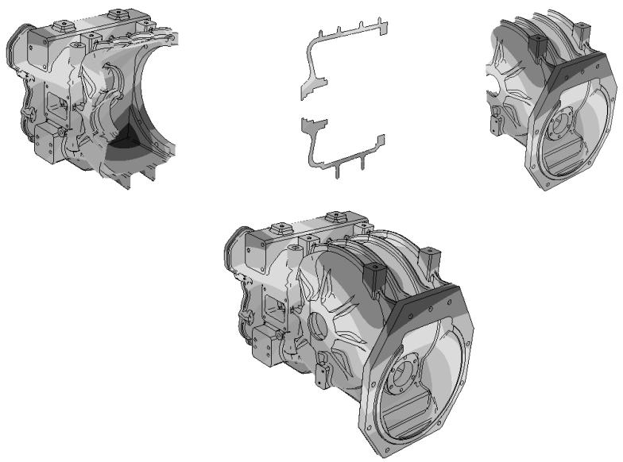

natural_image

Technical illustration of three mechanical components with cutaway views, showing internal structural details (no text or symbols)

Figure 1: Planar view cut through a contour plot of a gearbox model.Top, left to right: the model below the cut, on the cut, and above the cut; bottom: the entire model.

## View cut shapes

You can create view cuts based on a plane. In the Visualization module you can also create view cuts based on the following shapes:

• a cylinder,  
• a sphere, or  
• an isosurface corresponding to a constant value of a field variable or model attribute.

The types of shapes for view cut creation are illustrated in Figure 2.

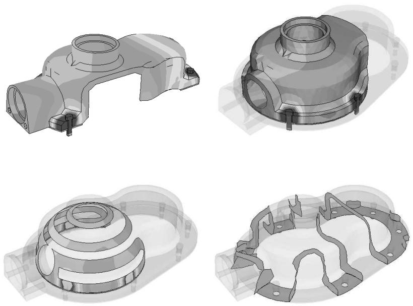  
Figure 2: View cuts based on planar, cylindrical, spherical, and isosurface shapes.

For isosurface cuts the result values are computed as described in Understanding how contour values are computed, for line- and banded-type contours. By default, Abaqus/CAE applies an averaging threshold of 100% for isosurface cuts to insure the continuous display of results at the cut location. You can apply an averaging threshold less than 100% by toggling off Override primary variable averaging when you create the isosurface cut. Abaqus/CAE then applies the averaging threshold specified in the Averaging options in the Result Options dialog box; for more information, see Controlling result averaging. Cuts along the X-, Y-, and Z-planes are created by default.

## Note:

Isosurface view cuts offer slightly different functionality and behavior than isosurface-type contour plots. An isosurface view cut always reflects the results of the primary variable that was active when the view cut was created; you cannot change the variable for which an isosurface view cut displays results. By contrast, isosurface-type contour plots always display data from the currently selected primary variable for your session. Because each isosurface view cut is tied to a single variable, you can investigate the locations where two isosurface view cuts intersect if you display multiple isosurface view cuts that are based on different output variables.

## Displaying the cut section

To display the cut section of your model, you activate a cut and choose whether to display the model on the cut, above the cut, and/or below the cut, as illustrated in Figure 1. The cut itself is never visible. For planar cuts the portion of the model below the cut is defined as that part located on the negative side of the plane (relative to the orientation of the normal to the plane). For cylindrical and spherical cuts the portion of the model below the cut is defined as that part located at radii less than the radius of the cut shape. For an isosurface cut the portion of the model below the cut is defined as that part located at isovalues less than the specified isovalue. By default, Abaqus/CAE displays the model on and below the cut. In the Visualization module, you can display the model above the cut and the model below the cut at the same time; in all other modules, only one of these display options is available at a time.

## Plot options

You can select different plot options for the portions of the model below the cut, on the cut, and above the cut; for example, in Figure 2 some portions of the model are displayed with translucency activated, while others are displayed with no translucency.

## Displaying multiple view cuts (Visualization module only)

Only one cut can be active (used to display the model in the current viewport) at a time in modules other than the Visualization module; in the Visualization module, however, you can display multiple view cuts at once. In addition, in the Visualization module you can activate view cuts on undeformed, deformed, contour (texture-mapped only), symbol, or material orientation plots. For symbol and material orientation plots, Abaqus/CAE displays symbols and material orientation triads at all integration points for each element included in the view, even if the element is partially cut.

## Animation of view cuts (results data only)

Plots with an active view cut can be animated for output database data in the Visualization module; the view cut will be updated for each animation frame. View cuts cannot be activated on tessellated contour plots; swept, shrunk, or extruded plots; or highly refined plots (medium, fine, or extra fine).

## Results caching

By default, Abaqus/CAE caches the result values used to generate images of a cut model in memory to improve performance. However, you can disable results caching for cut fields to decrease memory usage if necessary; see Controlling results caching, for more information.

## Following the deformation

For plots of the deformed model, you can choose to have the cut follow the deformation; i.e., the cut surface will be calculated relative to a reference frame, and the cut deformation will match the deformation of the model.

## Repositioning view cuts

You can reposition cuts on your model: planar cuts can be rotated or translated, while the other cut shapes can only be translated.

## View Cut Manager

You can select a cut (either active or inactive) in the View Cut Manager to position, edit, copy, rename, or delete it. Selecting a cut in the manager is not the same as activating the cut. A cut can be both selected and active, unselected and active, or selected and inactive; and you can display or hide a free body cut for the currently displayed view cut if it is active. You can specify free body options that are common to all view cuts or that are specific to a particular view cut. Figure 3 shows an example of the information displayed in the view cut manager in the Visualization module; in other modules, the free body display and cut-specific options are not included in this dialog box.

text_image

View Cut Manager
Show Name
on cut
below cut
close
close
close
close
close
close
close
close
close
close
close
close
close
close
close
close
close
close
close
close
close
close
close
close
close
close
close
close
close
close
close
close
close
close
close
close
close
close
close
close
close
close
close
close
close
close
close
close
close
close
cut-specific options
Model
active cut
selected cut
CylinderCut ✓ ✓ ✓ ✓ ✓ ✓ ✓ ✓ ✓ ✓ ✓ ✓ ✓ ✓ ✓ ✓ ✓ ✓ ✓ ✓ ✓ ✓ ✓ ✓ ✓ ✓ ✓ ✓ ✓ ✓ ✓ ✓ ✓ ✓ ✓ ✓ ✓ ✓ ✓ ✓ ✓ ✓ ✓ ✓ ✓ ✓ ✓ ✓ ✓ ✓ ✓ ✓ ✓ ✓ ✓ ✓ ✓ ✓ ✓ ✓ ✓ ✓ ✓ ✓ ✓ ✓ ✓ ✓ ✓ ✓ ✓ ✓ ✓ ✓ ✓ ✓ ✓ ✓ ✓ ✓ ✓ ✓ ✓ ✓ ✓ ✓ ✓ ✓ ✓ ✓ ✓ ✓ ✓ ✓ ✓ ✓ ✓ ✓ ✓ ✓✓
Create...
Edit...
Copy...
Rename...
Delete...
Options...
Dismiss
Allow for multiple cuts
Motion of Selected Cut
Translate
0 0.0447214
Position: -0.01 0 0.0447214
Sensitivity: 1 0 0.0447214

Figure 3:The View Cut Manager dialog box in the Visualization module.

## Resultant forces and moments on view cuts (results data only)

For view cuts of output database data in the Visualization module you can also display the resultant forces and moments, and you can compute these values based on a display group, an element set, or the entire model. You can display the resultant force and moment on a view cut only for solid geometry, composite solid sections, shell sections, or beam sections. For resultant forces and moments to be displayed, the output database must include element force nodal output (NFORC) for composite solid sections and section force (SF) and section moment (SM) output for shell sections and beam sections. Abaqus/CAE does not support display of resultant forces and moments on view cuts for axisymmetric models. You can display the resultant force and moment on a view cut for any of the displayed view cuts in your session. Abaqus/CAE updates the resultant force and moment vectors and summation point as you reposition the view cut or animate the model.

You may observe different values for the resultant forces and moments if you compare the values in the deformed and undeformed shape plots. These differences can occur because view cut–based free body force computations integrate the stress field over the area, and, if you toggle the plot state, the elements that are part of the view cut can change or the elemental deformations can change the area of the cross section.

By default, Abaqus/CAE displays vectors on the view cut only, showing the resultant force and moment across the view cut. However, you can also display a series of vectors that show resultant force and moment data at regular intervals in your model. This series of resultant force and moment vectors can run through the entirety of your model or within a user-specified region.

## XFEM-based view cut components (results data only)

Abaqus/CAE automatically creates and displays a view cut when you open an output database containing a crack calculated by the extended finite element method (XFEM). The view cut displays the model at the isosurface where the value of the signed distance function is zero, which corresponds with the surface of the XFEM crack. Boundary conditions are not displayed while an XFEM crack view cut is active.

The tools in the View Cut Manager operate as follows for XFEM cracks:

+ • The below cut check box displays the entire model, except for the XFEM crack.  
• The on cu t check box displays the isosurface where the value of the signed distance function is zero, which corresponds with the surface of an XFEM crack.  
• The above cut check box is not used by an XFEM crack.

## Optimization-based view cut components (results data only)

Abaqus/CAE automatically creates and displays a view cut when you open an output database created by an optimization process, for both topology and shape optimizations. By default, the view cut displays the model at the isosurface where the value of the material property is zero, which corresponds with elements that have a density and stiffness close to zero and consequently play an insignificant role in the strength of the model. Boundary conditions are not displayed while an optimization view cut is active.

The tools in the View Cut Manager operate as follows for optimizations:

• The below $\cot \boxed { \pm } \frac { 7 } { 1 }$ check box displays the material that has a property less than the value of the slider. By default, this is the material that is not contributing to the strength of the model.  
• The on cut check box displays the isosurface where the material has a property equal to the value of the slider.  
• The above cut check box displays the material that has a property greater than the value of the slider. By default, this is the material that continues to contribute to the strength of the model.

## Consideration for small faces

A view cut may display inconsistent results if the area of one or more faces of the part is less than 1E–6 because faceting of such small faces is not possible.

## Managing view cuts

The view cut manager allows you to create a view cut and to activate, reposition, edit, copy, rename, delete, or customize a previously created view cut.

When you display view cuts for output database data in the Visualization module, the manager also enables you to activate and deactivate display of the resultant forces and moments for the displayed view cut. This section describes how to create and manage view cuts and, for results data in the Visualization module, the display of their associated resultant force and moment vectors.

## In this section:

Creating or editing a view cut  
Displaying a cut section and its resultant force and moment vectors  
Allowing for multiple free body cuts  
Repositioning a view cut  
Copying, renaming, and deleting a view cut  
Customizing the cap color for a view cut  
Customizing the cut model display in the Visualization module  
Customizing display and calculation of resultant force and moment on the active view cuts  
Customizing slicing options

## Creating or editing a view cut

You can create view cuts based on a plane. In addition, in the Visualization module, you can create view cuts based on a cylinder, a sphere, or an isosurface corresponding to a constant value of any contour variable. Cuts along the X-, Y-, and Z-planes are created by default.

When you edit an isosurface view cut, Abaqus/CAE updates its definition so that it reflects the current result options and variable selection.

1. Locate the options for creating or editing a view cut.

• To create a view cut, select Tools->View Cut->Create from the main menu bar.

The Create Cut dialog box appears.

• To edit a previously created view cut, select Tools->View Cut->Edit from the main menu bar.

From the menu that appears, select the view cut you want to edit.

The Edit Cut dialog box appears.

Tip: You can also use the view cut manager to create or edit a view cut. From the main menu bar, select Tools->View Cut->Manager. To create a view cut, click Create. To edit a view cut, select it from the list and double-click on it or click Edit.

2. Type a name for the view cut. For more information on naming objects, see Using basic dialog box components. You cannot change the name in the Edit Cut dialog box, but you can rename a view cut (see Copying, renaming, and deleting a view cut).

3. If the Shape text field appears in the editor, select the cut shape. Click the arrow next to the Shape text field, and select a shape from the list that appears: Plane, Cylinder, Sphere, or Isosurface. The shape cannot be changed once the cut has been created.

The Shape text field can be edited only for view cuts created in the Visualization module.

4. If you select Isosurface as the cut shape, the cut will be created on a constant value of the current primary field output variable. Toggle on Override primary variable averaging to apply a variable averaging threshold of 100% for the selected view cut, or toggle off this option to use the variable averaging threshold specified in the Averaging options in the Result Options dialog box; for more information, see Controlling result averaging

Isosurface cuts cannot be created for variables stored on surfaces, since no information is available for the interior of the model. See Selecting the primary field output variable, for information on changing the primary field output variable.

5. By default, the cut is defined on the displayed frame, and the structure moves through the cut as it deforms. Toggle on Follow model deformation to define a Lagrangian cut; i.e., the cut is defined on a reference frame and deforms with the model when you display a different frame. Choose the Reference frame to be the First, Last, or Current frame of the analysis.

The Follow model deformation option is available only for view cuts in the Visualization module.

6. For planar, cylindrical, or spherical view cuts in the Visualization module, toggle on the method you wish to use to define the view cut values: Key-in or From CSYS (the latter option is available only if the output database contains a coordinate system or if you have created a coordinate system in the current session).

a. If you select the Key-in method, enter the coordinates for the following points, depending on the cut shape:

For Plane cuts, enter the coordinates for the origin; the normal axis; and, optionally, axis 2.• Axis 2 is an axis lying in the plane; the view cut can be rotated about this axis or about Axis 3, defined as the axis orthogonal to the normal axis and to Axis 2. See Repositioning a view cut.  
• For Cylinder cuts, enter the coordinates for the origin and the cylinder axis.  
• For Sphere cuts, enter the coordinates for the origin.

b. If you select the From CSYS method, choose a coordinate system from the list that appears (systems designated with an asterisk have been saved to the current output database), and select the following, depending on the cut shape:

For Plane cuts, select Axis 1, Axis 2, or Axis 3 of the coordinate system to be the normal axis. The cut can be rotated about either of the other two coordinate system axes; see Repositioning a view cut.  
• For Cylinder cuts, select Axis 1, Axis 2, or Axis 3 of the coordinate system to be the cylinder axis.  
• For Sphere cuts, the origin of the coordinate system will be the origin of the cut; you do not need to select anything else.

The From CSYS option is available only for view cuts in the Visualization module.

7. Click OK to close the Create Cut or Edit Cut dialog box.

When you create a new view cut, it is activated automatically (i.e., used to display the model in the current viewport). By default, the cut is positioned halfway through the model.

By default, view cuts persist only for the duration of your session. If you want to retain a view cut that you have defined to make it available in subsequent sessions, you can save it to an XML file, to the model database, or to an output database. For more information, see Managing session objects and session options.

## Additional information

• Creating coordinate systems during postprocessing  
• Understanding view cuts

## Displaying a cut section and its resultant force and moment vectors

To display the cut section of your model, you activate a view cut and choose whether to display the model on the cut, below the cut, and/or above the cut. The cut itself is not visible. In the Visualization module you can display the model both below the cut and above the cut; in all other modules, you can display one view or the other.

In the Visualization module you can activate multiple view cuts; in all other modules, only one view cut can be active at a time. For each view cut in the Visualization module, you can also display the resultant force and moment based on a display group, an element set, or the entire model. You can specify free body options that are common to all view cuts or that are specific to a particular view cut.

For view cuts displaying data from an output database, you can also display the resultant force and moment vectors at regular intervals through the model for the selected view cut. For more information, see Customizing display and calculation of resultant force and moment on the active view cuts.

The activation status of each view cut persists only for the duration of your session. If you want to retain this view cut activation status for subsequent sessions, you can save these data to an XML file, to the model database, or to an output database. For more information, see Managing session objects and session options.

1. From the main menu bar, select Tools->View Cut->Manager.

The View Cut Manager appears with a list of all the view cuts that have been created during the current session. A check mark appears in the Show column to the left of the active view cut.

2. Click the check box in the Show column to the left of the view cut you wish to activate or deactivate.

The active view cut is used to cut through the model in the current viewport.

Tip: You can also activate or deactivate a view cut using one of the following methods:

• In any module other than the Visualization module, click the tool in the View Cut toolbar.  
！ • In the Visualization module, click the tool in the toolbox.

If no view cut is active, selecting either of these tools will activate the first view cut in the list in the View Cut Manager (usually the default X-plane cut). If a view cut is active, selecting this tool will deactivate the cut.

3. Click the check boxes in the Model columns to the right of the view cut to display the model below

, on , and/or above the cut (these positions are not mutually exclusive).

The selected portion of the model is displayed in the viewport.

4. If you are working in the Visualization module, click the check box under the icon in the Model columns for the active view cut to display the resultant force and moment along that view cut, acting on the visible component. For example, you will see equal and opposite resultant force and moment vectors when you switch from the “Show below cut” option to the “Show above cut” option.

To specify free body options for a particular view cut, click the icon to the right of the view cut for which you want to specify options.

## Note:

The View Cut Options (common to all view cuts or specific to a particular view cut) enable you to control three aspects of the resultant force and moment display on view cuts. You can compute the resultant force and moment based on a display group, an element set, or the whole model; and you can adjust the summation point and component resolution. You can enable display of the resultant force and moment on a view cut for solid geometry, composite solid sections, shell sections, or beam sections. For resultant forces and moments to be displayed, the output database must include element force nodal output (NFORC) for composite solid sections and section force (SF) and section moment (SM) output for shell sections and beam sections. For more information, see Customizing display and calculation of resultant force and moment on the active view cuts.

5. In the Visualization module, toggle on Allow for multiple cuts to enable the display of multiple view cuts.

## Additional information

• Using the extended finite element method to model fracture mechanics  
• Creating or editing a view cut

## Allowing for multiple free body cuts

In the Visualization module you can display multiple view cuts on your model at the same time by toggling on Allow for multiple cuts. When you select this option, Abaqus/CAE displays the cutting surface for all view cuts in your session for which the Show checkbox is selected. You can reposition only the active view cut. In practice, you might want to activate and reposition each view cut in turn to place them in the locations you want to investigate. In addition, the cuts you display do not interact; for example, you cannot display only the portion of your model that lies between two parallel planar view cuts.

## Note:

Abaqus/CAE does not support display of multiple XFEM-based view cut components at the same time.

1. From the main menu bar, select Tools->View Cut->Manager.  
The View Cut Manager appears with a list of all the view cuts that have been created during the current session. A check mark appears in the Show column to the left of the active view cut.

2. Toggle on Allow for multiple cuts.

Abaqus/CAE displays the on-cut position for every view cut for which the Show checkbox is selected,

and Abaqus/CAE hides all free body cuts and disables the check boxes under the icon in the Model columns. You can show or hide individual view cuts from the current display by toggling their Show checkboxes.

## Additional information

• Using the extended finite element method to model fracture mechanics  
• Creating or editing a view cut

By default, when a view cut is first activated, Abaqus/CAE positions it halfway through the model. You can use the view cut manager to reposition cuts on the model. You can translate plane cuts along the normal axis or rotate them about the other two axes. You can redefine the radius of cylindrical or spherical cuts and the contour value used for isosurface cuts to reposition where they cut through the model. The positioning options in the view cut manager apply only to the selected cut, which may be different from the currently active cut.

In all modules except the Visualization module, Abaqus/CAE repositions the cutting plane back to the halfway point if you modify the model.

1. From the main menu bar, select Tools->View Cut->Manager.

The View Cut Manager appears with a list of all the view cuts that have been created during the current session.

2. Select a view cut in the manager by clicking on its name.

The selected view cut is highlighted in the manager.

3. To translate a Plane view cut:

1. Select Translate from the menu at the bottom of the view cut manager.  
2. Reposition the view cut using one of the following methods:

• Enter a value for the Position along the normal axis.  
• Drag the Position slider to select a value. The slider is available only if the view cut is currently active.  
Increase the Sensitivity of the slider for fine control over view cut repositioning. Each sensitivity increment focuses the slider's range of motion by a factor of 10, so a sensitivity setting of 100 enables you to reposition a view cut within 1/100 of the model.

Alternatively, you can double-click a location in the Sensitivity bar to reposition the view cut to a general location, then drag the Position slider to select a value.

The selected cut is translated by the specified value.

4. To rotate a Plane view cut:

1. Select Rotate from the menu at the bottom of the view cut manager.  
2. Select the axis of rotation (the 2- or 3-axis for a cut defined by the Key-in method or either of the two non-normal axes for a cut defined by the From CSYS method; see Creating or editing a view cut); and enter a value for the Angle of rotation, or use the slider to select a value.

The selected cut is rotated about the origin of the axis of rotation by the specified angle. Any translations applied to the view cut are ignored.

5. To reposition a Cylinder, Sphere, or Isosurface view cut, enter a value in the available text field, or use the slider to select a value. The slider is available only if the view cut is currently active; you can increase the slider's sensitivity for greater precision.

• For Cylinder cuts enter a value for the Radius of the cylinder.  
• For Sphere cuts enter a value for the Radius of the sphere.  
• For Isosurface cuts enter a value for the contour Value to which the cut should correspond.

The selected cut is repositioned as specified.

## Additional information

• Creating or editing a view cut

## Copying, renaming, and deleting a view cut

You can copy, rename, or delete a view cut using commands from the main menu bar or the view cut manager.

To copy, rename, or delete a view cut, use one of the following:

• The Copy, Rename, and Delete items listed under the Tools->View Cut menu on the main menu bar.  
The Copy, Rename, and Delete items contain submenus listing all the view cuts you have created.  
The view cut manager dialog box. The view cut manager contains functions identical to those listed under the Tools->View Cut menu on the main menu bar but with a convenient browser that lists all the view cuts. To display the view cut manager dialog box, select Tools->View Cut->Manager from the main menu bar.

## Note:

Abaqus/CAE creates a view cut when you open a model containing a crack calculated by the extended finite element method (XFEM) and when you open a model created by an optimization process. You cannot create, delete, or edit an XFEM view cut or an optimization view cut.

## Additional information

• Creating or editing a view cut

## Customizing the cap color for a view cut

In modules other than the Visualization module, you can customize the “cap” that appears when you display the portion of the cutting plane on the view cut.

The Cap Color options provide two choices for customizing the cap color:

• Select Specify and click to display the entire cap with a fixed color. Abaqus/CAE displays that color for all components on the cutting plane and does not change the color as you move the plane or change the color coding selections.  
Select Use body color to display the current colors of each component in the model on the cutting plane. Abaqus/CAE changes the coloring of the model components on the cutting plane dynamically as you reposition the plane or change the color coding selections.

## Note:

Abaqus/CAE displays different cap colors for different parts; however, Abaqus/CAE does not display a different cap color for different sections, materials, mesh defaults, etc., in the same part.

Abaqus/CAE hides the cap from the viewport if you toggle on translucency for your session; for more information, see Changing the translucency. In addition, Abaqus/CAE might hide the cap when you save or export the contents of the viewport, depending on the file format you select.

If you save a viewport image to a file and select a vector-based file format, Abaqus/CAE hides the cap in the resulting file. Abaqus/CAE creates a vector-based file when you save the image in SVG format or when you save the image in PS or EPS format and specify Vector as the Image format from the PS Options dialog box or the EPS Options dialog box.  
• If you export viewport data in either VRML or 3DXML format, Abaqus/CAE hides the cap in the exported file. The cap is included in the exported file for all other export formats.

1. From the main menu bar, select Tools->View Cut->Manager.

The View Cut Manager dialog box appears.

2. Click Options.

The View Cut Options dialog box appears.

3. From the list of Cap Color options, select one of the following:

Select Specify and click , then select a cap color from the Select Color dialog box that appears to display the selected color for the entire portion of the model displayed on the cut. For more information about selecting a new color, see Customizing colors.  
Select Use body color to color the cap using the current color coding settings for each component that intersects the view cut.

## 4. Click OK.

## Additional information

• Controlling the destination and appearance of printed images  
• Exporting geometry, model, and mesh data

## Customizing the cut model display in the Visualization module

You can use the view cut options to customize the appearance of a cut model in the Visualization module. You can select different options for the portions of the model below the cut, on the cut, and above the cut.

You can choose to apply the view cut options to the model or to use the current plot options. View cut options related to the cut model display are associated with the viewport rather than with an individual view cut; therefore, if the view cut options are applied to the model, any active cut will use them. Figure 1 illustrates how the view cut options can be used to customize the model on the cut plane.

natural_image

Side-view technical illustration of a vehicle chassis with a person sitting inside, showing structural details (no text or symbols)

Figure 1: Longitudinal view cut through a truck model with customized plot options on the cut plane.

1. From the main menu bar in the Visualization module, select Options->View Cut.

The View Cut Options dialog box appears.

Tip: You can also use the view cut manager to customize the cut options. From the main menu bar, select Tools->View Cut->Manager, and click Options in the view cut manager.

2. Select the portion of the model that you wish to customize by clicking one of the following tabs: Below Cut, On Cut, Above Cut.  
3. Toggle on Use these options to apply the view cut options to the selected portion of the model. Alternatively, toggle on Use current plot options to apply the common plot options or, if applicable, superimposed plot options to the selected portion of the model.  
4. Click the following tabs to customize the appearance of view cuts in the current viewport:

• Basic: Choose render style and edge visibility.  
• Color & Style: Control model edge color and style and model face color.  
• Other: The Other page contains the following tab:

Translucency: Control shaded render style translucency.

To learn how to customize the render style and other display characteristics of your view cut, see Customizing plot display.

## Customizing display and calculation of resultant force and moment on the active view cuts

You can use the free body options for view cuts in the Visualization module to customize how the resultant force and moment displayed on the active view cut are calculated and to customize the summation point and coordinate system transformation.

You can specify free body options that are common to all view cuts or that are specific to a particular view cut. Abaqus/CAE can calculate the resultant force and moment by cutting through a display group, an element set, or the whole model. You can also customize the content and appearance of all free body cuts in the current viewport; see Customizing general display options for free body cuts.

Display of resultant force and moment data is available for view cuts of output databases only. You cannot display this data for view cuts when a model from the current model database is displayed in the Visualization module.

You may observe different values for the resultant forces and moments if you compare the values in the deformed and undeformed shape plots. These differences can occur because view cut–based free body force computations integrate the stress field over the area, and, if you toggle the plot state, the elements that are part of the view cut can change or the elemental deformations can change the area of the cross section.

By default, Abaqus/CAE displays the resultant force and moment only once for each view cut for which you toggle on display of the resultant force and moment. If desired, you can also display a series of vectors that show the resultant force and moment data at regular intervals through the entire model or through a portion of the model.

1. From the main menu in the Visualization module, select Options->View Cut.

The View Cut Options dialog box appears.

Tip: You can also use the view cut manager to customize the cut options using one of the following methods:

• To specify options common to all view cuts, select Tools->View Cut->Manager from the main menu bar, and click Options.  
• To specify options for a particular view cut, select Tools->View Cut->Manager from the □ main menu bar, and click the icon to the right of the view cut for which you want to specify options.

2. Click the Free Body tab.  
3. If you are defining cut-specific options, select Use these options.  
4. From the Computation based on options:

Select Cutting through a display group and select a display group to compute the resultant force and moment based on a view cut through the selected display group. By default, the current display group is selected.  
Select Cutting through an element set and select an element set in the output database to compute the resultant force and moment based on a view cut through the selected set.  
Select Cutting through the whole model to compute the resultant force and moment based on a view cut through the entire model.

5. If desired, customize the summation point or the coordinate system transformation options for the resultant force and moment vectors arising from view cuts.

a. From the Summation point options, select the three-dimensional location from which the resultant force and moment vectors originate.

• Select Centroid of cut to place the summation point automatically at the centroid of the surface of the view cut.

## Note:

When the view cut cuts through a shell, the centroid is based on the length times the shell thickness.

When the view cut cuts through a beam, the centroid is at the nodal connectivity line.

Select User-defined, and specify a custom three-dimensional location in space or click to select the summation point from the viewport. The summation point is highlighted in the viewport.

b. From the Component resolution options, you can specify the coordinate system transformation that takes place when vectors are displayed in component form. (See Customizing general display options for free body cuts, for more information about displaying force and moment vectors in component form.)

Select Normal and tangential to orient the component vectors with the normal and the tangent of the surface you select.  
If desired, specify the Y-axis value of the tangent for the component vectors. This option enables you to enforce a uniform direction for the tangent vector when you display a series of free body cuts on view cut slices.  
Select CSYS and a coordinate system to transform the component vectors to a custom coordinate system. Alternatively, you can click Create to create a new datum coordinate system.

The Component resolution options affect the display of resultant forces and moments only when component vector display is selected in the Free Body Plot Options dialog box.

6. Toggle on Show heat flow rate if available to display the heat flow rate in terms of energy per time across the view cut.

7. If you want to customize the content and appearance of the free body cut displayed on the active view cut and those created using the Free Body toolset, click to access the Free Body Plot Options; this option is unavailable if you are defining cut-specific options. See Customizing general display options for free body cuts.

8. Click OK.

By default, view cuts persist only for the duration of your session. If you want to retain a view cut that you have defined to make it available in subsequent sessions, you can save it to an XML file, to a model database, or to an output database. For more information, see Managing session objects and session options.

9. Click Apply to implement your changes.

The view cuts change to reflect your specifications.

By default, your changes are saved for the duration of the session and will affect all subsequent view cuts in that viewport. If you want to retain your changes for subsequent sessions, save them to a file. For more information, see Saving customizations for use in subsequent sessions.

## Customizing slicing options

View cut slices are similar to the on-cut portion of a view cut, but they are displayed at a series of intervals along the range of the active view cut, rather than on just the cutting plane itself.

You can use the settings on the Slicing tabbed page in the Visualization module to display a series of view cut slices along the range of the active view cut. You can display view cut slices at regular intervals along the range of the active view cut, or you can display the slices along a predefined path in your session. When you enable slicing, you can also display the resultant force and moment at that location of the model.

You can specify slicing options that are common to all view cuts or that are specific to a particular view cut. View cut slicing can be enabled only when a single view cut is active and only in the Visualization module. However, if you define cut-specific slicing options and obtain reports for multiple active view cuts, the slicing options are considered in the free body computations. You can display slices for both translational and rotational view cut display. Slices are displayed along the entire range of the active view cut regardless of any repositioning of the view cut in the Motion of Selected Cut options in the View Cut Manager. For rotational view cuts, you can also rotate the slices and change their axis of rotation.

If you enable view cut slicing along a path in a model that has a great deal of folding or curvature, the cutting surfaces of the slices can sometimes cross different parts of your model at the same time. You can limit or eliminate this behavior by focusing on a subset of your model: either use a display group to hide a portion of your model or change the path definition so that slicing is displayed only along some of the curved parts.

1. From the main menu bar in the Visualization module, select Options->View Cut.

The View Cut Options dialog box appears.

Tip: You can also use the view cut manager to customize the cut options using one of the following methods:

• To specify options common to all view cuts, select Tools->View Cut->Manager from the main menu bar, and click Options.  
• To specify options for a particular view cut, select Tools->View Cut->Manager from the □ main menu bar, and click the icon to the right of the view cut for which you want to specify options.

2. Click the Slicing tab.  
3. If you are defining cut-specific options, select Use these options.  
4. Toggle on Display slicing to enable slicing for view cuts in your session.  
5. If you want to display view cut slices along the entire range of the view cut, select Step through the active view cut's range. If you display view cut slices or free body cuts in multiple locations for the selected view cut, you can also customize the minimum and maximum values of the line segment within which Abaqus/CAE will display the resultant forces and moments. By default, the minimum and maximum values are set to allow for distribution of slices throughout the entire model.  
6. If you want to display view cut slices along a predefined path, select Step along a predefined path, then do the following:

a. Select the path.  
b. Specify the locations where you want to display view cut slices using the Display slices at path nodes option:

• Toggle on this option to place the view cut slices at the nodes that comprise the path definition.  
• Toggle off this option to place the view cut slices at a number of regular intervals along the path. Specify the number of slices from the field and slider at the bottom of the dialog box.

c. Specify the location of the summation point for the resultant forces and moments using the Set free body summation point on the path option:

• Toggle on this option to place the summation point for the resultant forces and moments on the selected path.  
Toggle off this option to place the summation point for the resultant forces and moments at the location about which resultant moments are taken.

7. Click Apply to implement your changes.

The view cuts change to reflect your specifications.

By default, your changes are saved for the duration of the session and will affect all subsequent view cuts in that viewport. If you want to retain your changes for subsequent sessions, save them to a file.

For more information, see Saving customizations for use in subsequent sessions.

## Additional information

• Creating a path through your model

## Using plug-ins

This part of the guide describes how you can use plug-ins and the Plug-in toolset to extend the capabilities of Abaqus/CAE.

## In this section:

The Plug-in toolset  
Abaqus plug-ins

The Plug-in toolset loads plug-in files into Abaqus/CAE.

## In this section:

What is a plug-in?  
Where can I get plug-ins?  
How can I get information about a plug-in?  
An example of a Python module and a function  
What can I do with a GUI plug-in?  
How do I make a plug-in available from Abaqus/CAE?  
How are kernel plug-ins executed?  
Overwriting plug-ins  
How are GUI plug-ins executed?  
Hiding a plug-in's source code  
Displaying exceptions for imported plug-ins at startup  
Abaqus/CAE modules and plug-ins  
How can I provide information about a plug-in?

---

[Previous: Using Toolsets](toolsets.md) · [Next: Using Plug-ins](plugins.md)
