# Interacting with Abaqus/CAE

This guide is the main reference document for Abaqus/CAE, including Abaqus/Viewer.

## Abaqus/CAE

Abaqus/CAE is a complete Abaqus environment that provides a simple, consistent interface for creating, submitting, monitoring, and evaluating results from Abaqus/Standard and Abaqus/Explicit simulations. Abaqus/CAE is divided into modules, where each module defines a logical aspect of the modeling process; for example, defining the geometry, defining material properties, and generating a mesh. As you move from module to module, you build the model from which Abaqus/CAE generates an input file that you submit to the Abaqus/Standard or Abaqus/Explicit analysis product. The analysis product performs the analysis, sends information to Abaqus/CAE to allow you to monitor the progress of the job, and generates an output database. Finally, you use the Visualization module of Abaqus/CAE (also licensed separately as Abaqus/Viewer) to read the output database and view the results of your analysis.

## Abaqus/Viewer

Abaqus/Viewer provides graphical display of Abaqus finite element models and results. Abaqus/Viewer is incorporated into Abaqus/CAE as the Visualization module.

This part of the guide introduces you to the Abaqus/CAE working environment.

## In this section:

Introduction  
The basics of interacting with Abaqus/CAE  
Understanding Abaqus/CAE windows, dialog boxes, and toolboxes  
Managing viewports on the canvas  
Manipulating the view and controlling perspective  
Selecting objects within the viewport  
Configuring graphics display options  
Printing viewports

## Introduction

This guide is a complete reference to using Abaqus/CAE.

This section provides information about the contents of this guide and the typographical conventions used.

## Using this guide

This guide is a complete reference to using Abaqus/CAE (including Abaqus/Viewer, a subset of Abaqus/CAE that contains only the Visualization module).

In general, any references to the Visualization module throughout this guide apply equally to Abaqus/Viewer.

The Abaqus/CAE user interface is very intuitive and allows you to begin working without a great deal of preparation. However, you may find it useful to read through the tutorials at the end of the Getting Started with Abaqus/CAE guide before using the product for the first time. Only Viewing the Output from Your Analysis applies if you are running Abaqus/Viewer.

This guide is divided into the following parts:

Interacting with Abaqus/CAE contains general information on the user interface  
Working with Abaqus/CAE Model Databases, Models, and Files contains information on the various files created by and used with Abaqus/CAE  
Creating and analyzing a model using the Abaqus/CAE modules discusses each of the Abaqus/CAE modules in detail, except the Visualization module  
Modeling techniques discusses how to define special engineering features in an Abaqus/CAE model and discusses modeling techniques that span multiple Abaqus/CAE modules.  
Viewing results discusses the Visualization module (Abaqus/Viewer) in detail  
Using toolsets contains information on the toolsets in all Abaqus/CAE modules except the Visualization module (discussed in Viewing results)  
Customizing model display contains customization information  
• Using plug-ins discusses how you can use plug-ins and the Plug-in toolset to extend the capabilities of Abaqus/CAE.

Abaqus keyword browser table and Keyword support from the input file reader provide tables that you can use to determine which Abaqus/CAE module embodies the functionality of a particular Abaqus keyword, as well as whether a particular keyword is supported. Special element types lists element types used in Abaqus for model features that are not part of the mesh. Special graphical symbols explains how to interpret the special graphical symbols used by Abaqus/CAE. Element and output variable support lists the Abaqus output variables that are not supported by the Visualization module.

## Typographical conventions

This guide adheres to a set of typographical conventions so that you can recognize actions and items.

The following list illustrates each of the conventions:

• Text you enter from the keyboard or that Abaqus/CAE outputs: crankshaft\_steel, 1.35E10  
• Labels of items on the screen: Job Manager  
• Hyperlinks: click here  
• Keyboard actions: [Shift]  
• Keystroke combinations (two keys that must be pressed simultaneously): [Alt] + F  
• Compound keyboard/mouse actions: [Shift] + Click

• Text indicating that the user has a choice: odb\_file, Options->plot state  
• Menu selections and tabs within dialog boxes:

View->Graphics Options->Hardware

## Basic mouse actions

Figure 1 shows the mouse button orientation for a left-handed and a right-handed 3-button mouse.  
  
Figure 1: Mouse buttons.

The following terms describe actions you perform using the mouse:

## Click

Press and quickly release the mouse button. Unless otherwise specified, the instruction “click” means that you should click mouse button 1.

## Drag

Press and hold down mouse button 1 while moving the mouse.

## Point

Move the mouse until the cursor is over the desired item.

## Select

Point to an item and then click mouse button 1.

## [Shift] + Click

Press and hold the [Shift] key, click mouse button 1, and then release the [Shift] key.

## [Ctrl] + Click

Press and hold the [Ctrl] key, click mouse button 1, and then release the [Ctrl] key.

Abaqus/CAE is designed for use with a 3-button mouse. Accordingly, this guide refers to mouse buttons 1, 2, and 3 as shown in Figure 1. However, you can use Abaqus/CAE with a 2-button mouse as follows:

• The two mouse buttons are equivalent to mouse buttons 1 and 3 on a 3-button mouse.  
• Pressing both mouse buttons simultaneously is equivalent to pressing mouse button 2 on a 3-button mouse.


Tip: You are instructed to click mouse button 2 in procedures throughout this guide. Make sure that you configure mouse button 2 (or the wheel button) to act as a middle button click.

## The basics of interacting with Abaqus/CAE

Before you can begin creating and analyzing a model or interpreting analysis results, it is helpful to become familiar with the basics of interacting with Abaqus/CAE. This chapter introduces you to the user interface.

## In this section:

Starting and exiting Abaqus/CAE  
The Abaqus/CAE main window  
What is a module?  
What is a toolset?  
Using the mouse with Abaqus/CAE  
Getting help

## Starting and exiting Abaqus/CAE

This section explains how to start and how to exit Abaqus/CAE.

## In this section:

Starting Abaqus/CAE (or Abaqus/Viewer)  
Exiting an Abaqus/CAE session  
Working with abaqus\_2025.gpr files  
Saving model data from an inactive session

## Starting Abaqus/CAE (or Abaqus/Viewer)

When you create a model and analyze it, Abaqus/CAE generates a set of files containing the definition of your model, the analysis input, and the results of the analysis. In addition, Abaqus/CAE and Abaqus/Viewer generate replay files that reflect all your interactions with the application.

Consequently, before you run either product, you should move to a directory where you have permission to create files.

You execute Abaqus/CAE (or Abaqus/Viewer) by running the abaqus execution procedure and specifying the cae (or viewer) parameter:

```toml
abaqus cae or viewer[database = database-file][replay = replay-file][recover = journal-file][startup = startup-file][script = script-file][noGUI = noGUI-file][noenvstartup][noSavedOptions][noSavedGuiPrefs][noStartupDialog][custom = script-file][[guiTester][GUI-script]][guiRecord][guiNoRecord]
```

You can include the following options on the command line:

## database

This option specifies the name of the model database file or output database file to open. You can open either type of file in Abaqus/CAE; you can open only output database files in Abaqus/Viewer. To specify a model database file, include either the .cae file extension or no file extension in your file name. To specify an output database file when running Abaqus/CAE, include the .odb file extension in your file name. If you are running Abaqus/Viewer, you can omit the .odb file extension.

## replay

This option specifies the name of the file from which Abaqus/CAE commands are to be replayed. The commands in replay-file will execute immediately upon startup of Abaqus/CAE. You cannot use the replay option to execute a script with control flow statements. For more information, see Replaying an Abaqus/CAE session.

## recover

This option specifies the name of the file from which a model database is to be rebuilt; it is not available if you are running Abaqus/Viewer. The commands in journal-file (model\_database\_name.jnl) will execute immediately upon startup of Abaqus/CAE. For more information, see Recreating a saved model database, and Recreating an unsaved model database.

## startup

This option specifies the name of the file containing Python configuration commands to be run at application startup. Commands in this file are run after any configuration commands that have been set in the environment file. Abaqus/CAE does not echo the commands to the replay file when they are executed.

Arguments can be passed into the file by entering -- on the command line, followed by the arguments separated by one or more spaces. These arguments will be ignored by the Abaqus/CAE execution procedure, but they will be accessible within the script.

## script

Same as startup.

## noGUI

This option specifies the name of a file containing Python scripts to be run without the graphical user interface (GUI). This option is useful for automating pre- or post-analysis processing tasks without the added expense of running a display. Since no interface is provided, the scripts cannot include any user interaction. Abaqus/CAE runs the commands in the file and exits upon their completion. If no file extension is given, the default extension is .py. If you use the noGUI option, Abaqus/CAE ignores any other command line options that you provide.

Arguments can be passed into the file by entering -- on the command line, followed by the arguments separated by one or more spaces. These arguments will be ignored by the Abaqus/CAE execution procedure, but they will be accessible within the Python script. If you are using the noGUI option, you can use an argument to pass in a variable that would otherwise be provided by a command line option. For example, you can pass in the name of a file that would otherwise be specified by the script option.

A sample usage of the noGUI option is available in Abaqus/CAE Execution.

## noenvstartup

This option specifies that all configuration commands in the environment files should not be run at application startup. This option can be used in conjunction with the startup command to suppress all configuration commands except for those in the startup file.

## noSavedOptions

This option specifies that Abaqus/CAE should not apply the display options settings (for example, the render style and the display of datum planes) stored in the abaqus\_2025.gpr file. For more information, see Working with abaqus\_2025.gpr files, and Saving your display options settings.

## noSavedGuiPrefs

This option specifies that Abaqus/CAE should not apply the GUI options settings (for example, the size and location of the Abaqus/CAE main window or its dialog boxes) stored in the abaqus\_2025.gpr file.

## noStartupDialog

This option specifies that the Start Session dialog box for Abaqus/CAE or Abaqus/Viewer should not be displayed.

## custom

This option specifies the name of the file containing Abaqus GUI Toolkit commands. This option executes an application that is a customized version of Abaqus/CAE or Abaqus/Viewer. For more information, see Introduction.

## guiTester

This option starts a separate user interface containing the Abaqus Python development environment along with Abaqus/CAE or Abaqus/Viewer. The Abaqus Python development environment allows you to create, edit, step through, and debug Python scripts. For more information, see The Abaqus Python Development Environment.

You can specify a script as the argument for this option, which prompts Abaqus/CAE or Abaqus/Viewer to run a GUI script. Abaqus/CAE or Abaqus/Viewer closes when the end of the script is reached.

## guiRecord

This option enables you to record your actions in the Abaqus/CAE or Abaqus/Viewer user interface in a file named abaqus.guiLog. Creating a record of your actions in the GUI can help you capture and replay common activities in Abaqus/CAE or Abaqus/Viewer for demonstration or training purposes. You can replicate all of the actions from a .guiLog file in Abaqus/CAE or Abaqus/Viewer by running the file in the Abaqus Python Development Environment (PDE); for more information, see Running a script.

If desired, you can set guiRecord at startup by using the environment variable ABQ\_CAE\_GUIRECORD. The guiRecord option cannot be used with the guiTester option.

## guiNoRecord

This option enables you to disable user interface recording when the environment variable ABQ\_CAE\_GUIRECORD is set.

Abaqus/CAE begins. If you do not include the database, replay, recover, or noStartupDialog options, the Start Session dialog box appears. Choose one of the following session startup options:

## Create Model Database: With Standard/Explicit Model

Use this option (not available if you are running Abaqus/Viewer) to begin a new Abaqus/Standard or Abaqus/Explicit analysis (equivalent to choosing File->New Model Database->With Standard/Explicit Model from the main menu bar).

## Create Model Database: With Electromagnetic Model

Use this option (not available if you are running Abaqus/Viewer) to begin an electromagnetic analysis (equivalent to choosing File->New Model Database->With Electromagnetic Model from the main menu bar).

## Open Database

Use this option to open a previously saved model database or output database file (equivalent to choosing File->Open from the main menu bar).

## Run Script

Use this option to run a file containing Abaqus/CAE commands (equivalent to choosing File->Run Script from the main menu bar). For more information, see Creating and running your own scripts.

## Start Tutorial

Use this option to begin an introductory tutorial from the online documentation (equivalent to choosing Help->Getting Started from the main menu bar).

## Recent Files

Use this option to open one of the five model database files or output database files that were most recently opened in Abaqus/CAE (equivalent to choosing one of the recent files listed under the File menu).

## Exiting an Abaqus/CAE session

You can exit the Abaqus/CAE session at any time by selecting File->Exit from the main menu bar. If you made any changes to the current model database, Abaqus/CAE asks if you want to save the changes before exiting the session. Abaqus/CAE then closes the current model or output database and all windows and exits the session.

Abaqus/CAE saves your GUI settings; for example, the size of the main window and the size and location of dialog boxes. For more information, see Working with abaqus\_2025.gpr files, and Understanding Abaqus/CAE GUI settings. In addition, Abaqus/CAE automatically creates a file called abaqus.rpy that records your operations during the session; you can use this file to reproduce your operations. For more information on reproducing operations and on recovering interrupted sessions, see Recreating an unsaved model database.

## Additional information

• Understanding the files generated by creating and analyzing a model  
• Using the File menu

## Working with abaqus\_2025.gpr files

The abaqus\_2025.gpr file in your home directory stores GUI settings (such as the size of the main window) as well as display options settings (such as the render style). You can also store display options settings in an abaqus\_2025.gpr file in a directory other than your home directory. If you start Abaqus/CAE with noSavedOptions specified, Abaqus/CAE does not apply the display options settings (for example, the render style and the display of datum planes) stored in the abaqus\_2025.gpr file. For more information, see Starting Abaqus/CAE (or Abaqus/Viewer).

## When you start Abaqus/CAE

• GUI settings are read from the abaqus\_2025.gpr file in your home directory.  
• Display options settings are read from the abaqus\_2025.gpr file in the directory from which you start Abaqus/CAE.  
If no abaqus\_2025.gpr file is present but a .gpr file from an earlier release exists in that directory, Abaqus/CAE attempts to apply the settings specified in that file and creates an abaqus\_2025.gpr file to store the settings.  
If no .gpr file is present in that directory, the display options settings are read from the abaqus\_2025.gpr file in your home directory.

## During an Abaqus/CAE session

You can use File->Save Display Options to save display options settings to the abaqus\_2025.gpr file in your home directory or in the current directory. For more information, see Saving your display options settings. This save option does not apply to GUI settings.

## When you exit Abaqus/CAE

Your GUI settings are saved automatically to the abaqus\_2025.gpr file in your home directory. For more information, see Understanding Abaqus/CAE GUI settings.

You can edit the abaqus\_2025.gpr file using API commands in the Abaqus Scripting Interface; for more information, see Editing display preferences and GUI settings. You can also delete the file to restore the default GUI and display options settings.

## Saving model data from an inactive session

Abaqus/CAE and Abaqus/Viewer include an inactivity timer. If the applications are left inactive for an extended period of time, the license tokens are returned to the server to make them available to other users. Your session does not end if the server connection is lost or if new license tokens cannot be acquired. Instead, when no licenses are available, a dialog box appears listing your options. For both Abaqus/CAE and Abaqus/Viewer you can attempt to reacquire a license or you can exit the application. For Abaqus/CAE you also have the option to save the current model database. Saving the model allows you to preserve any completed model information that you did not already save; any partially completed information, such as for a procedure that was active at the time the license was lost, is not saved. Once you have saved the model database, only the reacquire and exit options remain in the dialog box. The save option is not provided in Abaqus/Viewer since all changes that affect the output database are saved immediately when you make them.

The default time limit is 60 minutes. You can change the time limit by using the cae\_timeout environment variable in the Abaqus environment file (abaqus\_v6.env). For more information on the environment file, see Using the Abaqus environment files.

## Additional information

• Saving the current model database without a license  
• License management parameters

## The Abaqus/CAE main window

This section provides an overview of the main window and explains how to operate and manipulate the elements of the window during a session.

## In this section:

Components of the main window  
Components of the main menu bar  
Components of the toolbars  
The context bar  
Components of the viewport

## Components of the main window

You interact with Abaqus/CAE through the main window, and the appearance of the window changes as you work through the modeling process. Figure 1 shows the components that appear in the main window.

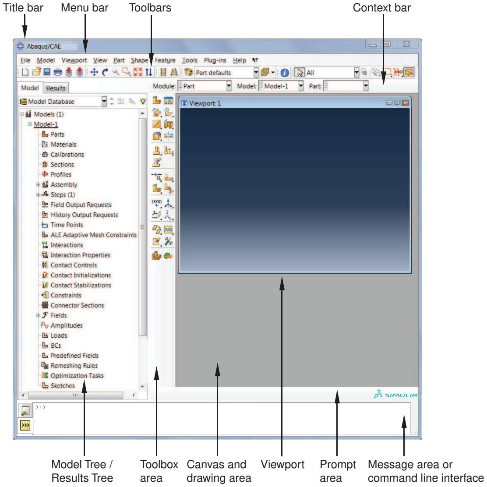  
Figure 1: Components of the main window.

The components are:

## Title bar

The title bar indicates the release of Abaqus/CAE you are running and the name of the current model database.

## Menu bar

The menu bar contains all the available menus; the menus give access to all the functionality in the product. Different menus appear in the menu bar depending on which module you selected from the context bar. For more information, see Components of the main menu bar.

## Toolbars

The toolbars provide quick access to items that are also available in the menus. For more information, see Components of the toolbars.

## Context bar

Abaqus/CAE is divided into a set of modules, where each module allows you to work on one aspect of your model; the Module list in the context bar allows you to move between these modules. Other items in the context bar are a function of the module you are working in. For example, the context bar allows you to retrieve an existing part while creating the geometry of the model or to change the output database associated with the current viewport. Similarly, in the Mesh module you can choose whether to display the assembly or a particular part. For more information, see The context bar.

## Model Tree

The Model Tree provides you with a graphical overview of your model and the objects that it contains, such as parts, materials, steps, loads, and output requests. In addition, the Model Tree provides a convenient, centralized tool for moving between modules and for managing objects. If your model database contains more than one model, you can use the Model Tree to move between models. When you become familiar with the Model Tree, you will find that you can quickly perform most of the actions that are found in the main menu bar, the module toolboxes, and the various managers. For more information, see The Model Tree.

## Results Tree

The Results Tree provides you with a graphical overview of your output databases and other session-specific data such as X–Y plots. If you have more than one output database open in your session, you can use the Results Tree to move between output databases. When you become familiar with the Results Tree, you will find that you can quickly perform most of the actions in the Visualization module that are found in the main menu bar and the toolbox. For more information, see The Results Tree.

## Toolbox area

When you enter a module, the toolbox area displays tools in the toolbox that are appropriate for that module. The toolbox allows quick access to many of the module functions that are also available from the menu bar. For more information, see Understanding and using toolboxes and toolbars.

## Canvas and drawing area

The canvas can be thought of as an infinite screen or bulletin board on which you post viewports; for more information, see Managing viewports on the canvas. The drawing area is the visible portion of the canvas. You can display the drawing area full screen using the View menu; you can also press [F11] to toggle between full screen mode and normal mode.

## Viewport

Viewports are windows on the canvas in which Abaqus/CAE displays your model. For more information, see Managing viewports on the canvas.

## Prompt area

The prompt area displays instructions for you to follow during a procedure; for example, it asks you to select the geometry as you create a set. In the Visualization module a set of buttons is displayed in the prompt area that allow you to move between the steps and the frames of your analysis. For more information, see Using the prompt area during procedures.

## Message area

Abaqus/CAE prints status information and warnings in the message area. To resize the message area, drag the top edge; to see information that has scrolled out of the message area, use the scroll bar on the right side. The message area is displayed by default, but it uses the same space occupied by the command line interface. If you

have recently used the command line interface, you must click in the bottom left corner of the main window to activate the message area.


## Note:

If new messages are added while the command line interface is active, Abaqus/CAE changes the background color surrounding the message area icon to red. When you display the message area, the background reverts to its normal color.

## Command line interface

You can use the command line interface to type Python commands and evaluate mathematical expressions using the Python interpreter that is built into Abaqus/CAE. The interface includes primary (>>>) and secondary (...) prompts to indicate when you must indent commands to comply with Python syntax. For more information on Python commands, see The basics of Python.

The command line interface is hidden by default, but it uses the same space occupied by the message area. Click in the bottom left corner of the main window to switch from the message area to the command line interface.

## Additional information

• The basics of interacting with Abaqus/CAE

## Components of the main menu bar

When you start a session, the menus listed below appear on the main menu bar. Abaqus/CAE displays additional menu options and provides access to toolsets depending on the current module in use.

## File

The items in the File menu allow you to create, open, and save model databases; open and close output databases; import and export files; save and load session objects and options; run scripts; manage macros; print viewports; and exit Abaqus/CAE. For more information, see Using the File menu.

## Model

The items in the Model menu allow you to open, copy, rename, and delete the models in the current model database. For more information, see Managing models.

## Viewport

The items in the Viewport menu allow you to create or manipulate viewports and viewport annotations. For more information, see Managing viewports on the canvas.

## View

The items in the View menu allow you to manipulate views, customize certain aspects of the appearance of your model or plots, control display performance, switch to full screen mode, and turn off the display of the Model Tree, the Results Tree, and individual toolbars. Some of the operations available in the view manipulation menu are also available in the View Manipulation toolbar. For more information, see:

Working with the Model Tree and the Results Tree  
Managing viewports on the canvas  
Manipulating the view and controlling perspective  
Configuring graphics display options  
Customizing plot display  
The Customize toolset  
Customizing geometry and mesh display

## Plug-ins

The items in the Plug-ins menu allow you to access the plug-ins distributed with Abaqus/CAE or plug-ins that you have downloaded or created. For more information, see The Plug-in toolset.

##

The items in the Help menu allow you to request context-sensitive help, search or browse the documentation, access the Learning Community, and obtain information about the release and licensing. For more information, see Getting help.

## Additional information

• Components of the main window

## Components of the toolbars

The toolbars contain convenient sets of tools for managing your files, filtering object selection, and viewing your model.

Items in a toolbar are shortcuts to functions that are also available from the main menu bar. By default, Abaqus/CAE displays all of the toolbars in a row underneath the main menu bar. Abaqus/CAE may place some toolbars in a second row depending on your display resolution and the size of the main window.

The toolbars are shown in the following figure:


You can change the location of a toolbar using the toolbar's grip, as indicated in the above figure. Clicking and dragging the grip moves the toolbar around the main window. If you release the toolbar grip while the toolbar is over one of the four available docking regions of the main window (see Figure 1), Abaqus/CAE “docks” the toolbar; a docked toolbar has no title bar and does not obstruct any other portion of the main window.

  
Figure 1: Available docking regions for toolbars.

If you release the toolbar grip while the toolbar is not near a docking region, Abaqus/CAE creates a floating toolbar with a title bar. A floating toolbar obstructs other items in the main window (see Figure 2); however, a floating toolbar can be positioned outside of the Abaqus/CAE main window.

  
Figure 2: Floating toolbars.

Clicking mouse button 3 on a toolbar grip displays a menu that lets you specify the location and format of the toolbar:

• Select Top to dock the toolbar in the top docking region.  
• Select Bottom to dock the toolbar in the bottom docking region.  
• Select Left to dock the toolbar in the left docking region.  
• Select Right to dock the toolbar in the right docking region.  
• Select Float to change a docked toolbar into a floating toolbar; this option is available only for docked toolbars.  
• Select Flip to change the orientation of a floating toolbar from horizontal to vertical, or vice versa; this option is available only for floating toolbars.

You can also hide toolbars and create custom toolbars that include shortcuts to additional functions. For more information, see The Customize toolset.

To obtain a short description of a tool in a toolbar, place the cursor over that tool for a moment; a small box containing a description, or “tooltip,” will appear. To obtain the name of a toolbar, place the cursor over the toolbar grip for a moment.

The Abaqus/CAE toolbars contain the following functionality:

## File


The File toolbar allows you to create, open, and save model databases; to open output databases; to print viewports; and to save and load session objects and options. For more information, see Working with Abaqus/CAE Model Databases, Models, and Files; Printing viewports; and Managing session objects and session options.

## Work Directories


The Work Directories toolbar allows you to change the current working directory. The list provided in the toolbar contains the five most recently used work directories. For more information, see Setting the work directory.

## Viewport


The Viewport toolbar allows you to create and align viewports, link viewports, and create viewport annotations. For more information, see Managing viewports and viewport annotations from the Viewport toolbar. The Viewport toolbar is not displayed by default.

## View Manipulation


The View Manipulation toolbar allows you to specify different views of the model or plot. For example, you can pan, rotate, or zoom the model or plot using these tools. For more information, see Manipulating the view and controlling perspective.

## View Options

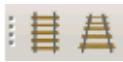

The View Options toolbar allows you to specify whether or not perspective is applied to your model. For more information, see Controlling perspective.

## Views


The Views toolbar allows you to apply a custom view to the model in the viewport. For more information, see Custom views. The Views toolbar is not displayed by default.

## Render Style


The Render Style toolbar allows you to specify whether the wireframe, hidden line, or shaded render style will be used to display your model. In the Visualization module the Render Style toolbar also includes the filled

render style tool. For more information, see Choosing a render style.

## Visible Objects


The Visible Objects toolbar allows you to switch between displaying the geometry of an Abaqus/CAE native part and the meshed representation of the same part, to toggle the display of seeds on and off, and to toggle the display of the reference representation on or off if the meshed representation and reference representation exist. For more information, see Displaying a native mesh, What are mesh seeds?, and Understanding the reference representation.

## Selection


The Selection toolbar allows you to enable or disable object selection by toggling on the arrow icon. You can use the list to the right of the arrow to limit the types of objects that you can select. The Selection toolbar is available only when there are no active procedures running in a viewport. For more information, see Selecting objects before choosing a procedure.

## Query


The Query toolset allows you to obtain information about the geometry and features of your model, to probe model and X–Y plots for output data, and to perform stress linearization on your results. For more information, see The Query toolset; Probing the model; and Calculating linearized stresses.

## Display Group


The Display Group toolbar allows you to selectively plot one or more model or output database items. For example, you can create a display group that contains only the elements belonging to specified sets in your model. For more information, see Using display groups to display subsets of your model.

## Color Code

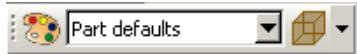

The Color Code toolbar allows you to customize the colors of items in the viewport and change the degree of their translucency.

For color coding, you can create color mappings that assign unique colors to different elements of a display. For example, when using a part instance color mapping, each part instance in a model will appear as a different color. For more information, see Color coding geometry and mesh elements.

For translucency, you can click the arrow to the right of the tool to reveal a slider, which you can drag to make the display colors more transparent or more opaque. For more information, see Changing the translucency.

## View Cut


The View Cut toolbar allows you to toggle the display of view cuts in modules other than the Visualization module and to customize their definition and display. For more information, see Cutting through a model. The View Cut toolbar is displayed by default; in the Visualization module, view cut options are available in the toolbox.

## Field Output

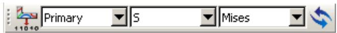

The Field Output toolbar allows you to control two aspects of field output variable display:

You can select the field output variable that you want to display in the current viewport. Selections include the type of field output variable (Primary, Deformed, or Symbol), the variable name, and if available, the invariants and components for the selected primary variable.  
• For changes in variable type, you can control whether Abaqus/CAE automatically synchronizes the plot state

in the current viewport with the new selection of variable type. If the tool is toggled on, Abaqus/CAE synchronizes the plot state if the newly selected field output variable requires a change in plot state; if this option is toggled off, Abaqus/CAE still updates the output variable displayed in the viewport but does not change the plot state in the current viewport.

The selections in the toolbar are limited, but the tool provides access to the Field Output dialog box, if needed. For more information about the options in the toolbar, see Using the field output toolbar.

## Additional information

• Components of the main window

## The context bar

The context bar is located above the canvas and drawing area; you can use it to do the following:

## Select the current module

The Module list on the context bar allows you to move between modules. (For more information, see What is a module?.) Figure 1 shows the context bar. To move to a different module, you can choose from the list (the arrow on the right) or click the up and down arrows (on the left) to move to the previous or next module.

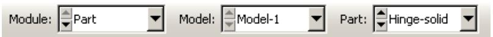  
Figure 1:The context bar in the Part module.


## Note:

Abaqus/Viewer contains only the Visualization module.

## Select module-specific items

As you move between modules, Abaqus/CAE displays additional items on the context bar that help you select the context of your current operations. For example, when you are in the Part module or Mesh module, Abaqus/CAE displays the Part list in the context bar. The Part list contains every part in your model; you can use it to retrieve a particular part. These lists also include the up and down navigation arrows that allow you to move to the previous or next item in the list.

The context bar also allows you to move between models in the model database or to change the output database associated with the current viewport. The additional items in the context bar are a function of the module in which you are working.

The items displayed in the context bar always refer to the current viewport, which is indicated by a dark gray title bar. For example, if you have different parts displayed in different viewports, the context bar indicates the name of the part displayed in the current viewport.

## Additional information

• What is a module?  
• What is an Abaqus/CAE model?

## Components of the viewport

Figure 1 shows the components of the viewport in the Visualization module.  
  
Figure 1: Components of the viewport.

The viewport title and the border around the viewport are called the viewport decorations. The legend, state block, title block, view orientation triad, and 3D compass are called the viewport annotations. The view orientation triad and 3D compass indicate the orientation of the model currently being displayed. You can change the view of the model by clicking and dragging on the 3D compass; the three perpendicular axes on the view orientation triad rotate with the compass to indicate the current view orientation. For more information, see The 3D compass, and Customizing the view triad. The legend, state block, and title block identify results you display using the Visualization module. For more information, see Customizing viewport annotations.

## Additional information

• Managing viewports on the canvas  
• Customizing viewport annotations

## What is a module?

Abaqus/CAE is divided into functional units called modules. Each module contains only those tools that are relevant to a specific portion of the modeling task. For example, the Mesh module contains only the tools needed to create finite element meshes, while the Job module contains only the tools used to create, edit, submit, and monitor analysis jobs. Abaqus/Viewer is a subset of Abaqus/CAE that contains only the Visualization module.

You can select a module from the Module list in the context bar. Alternatively, you can select a module by switching to the context of a selected object in the Model Tree; for more information, see The Model Tree. The order of the modules in the menu and in the Model Tree corresponds to the logical sequence you follow to create a model. In many circumstances you must follow this natural progression to complete a modeling task; for example, you must create parts before you create an assembly. Although the order of the modules follows a logical sequence, Abaqus/CAE allows you to select any module at any time, regardless of the state of your model.

The following list of the modules available within Abaqus/CAE briefly describes the modeling tasks you can perform in each module. The order of the modules in the list corresponds to the order of the modules in the context bar's Module list and in the Model Tree:

## Part

Create individual parts by sketching or importing their geometry. For more information, see The Part module.

## Property

Create section and material definitions and assign them to regions of parts. For more information, see The Property module.

## Assembly

Create and assemble part instances. For more information, see The Assembly module.

## Step

Create and define the analysis steps and associated output requests. For more information, see The Step module.

## Interaction

Specify the interactions, such as contact, between regions of a model. For more information, see The Interaction module.

## Load

Specify loads, boundary conditions, and fields. For more information, see The Load module.

## Mesh

Create a finite element mesh. For more information, see The Mesh module.

## Optimization

Create and configure an optimization task. For more information, see The Optimization module.

## Job

Submit a job for analysis and monitor its progress. For more information, see The Job module.

## Visualization

View analysis results and selected model data. For more information, see Viewing results.

## Sketch

Create two-dimensional sketches. For more information, see The Sketch module.

Modules can be classified by the objects that are displayed in the viewport. Parts are displayed when you are in the Part and Property modules; the assembly is displayed when you are in the Assembly, Step, Interaction, Load, Mesh, and Job modules; and output database results are displayed when you are in the Visualization module.

The contents of the main window change as you move between modules. Selecting a module from the Module list on the context bar or by switching to the context of a selected object in the Model Tree causes the context bar, module toolbox, and menu bar to change to reflect the functionality of the current module.

When you move between modules, Abaqus/CAE associates the current viewport with the module you select. You can have multiple viewports, and different viewports can be associated with different modules. As you select a viewport and make it current, the module associated with the viewport becomes the current module. For more information on moving between viewports, see Selecting viewports.

## Additional information

• The context bar  
• What is a viewport?

## What is a toolset?

A toolset is a functional unit that allows you to perform a specific modeling task.

When you enter most modules, a Tools menu appears in the main menu bar containing all of the toolsets relevant to that module.

In most cases the objects that you create with a toolset in one module are useful in other modules. For example, you can use the Set toolset to create sets in the Assembly module and then apply boundary conditions to those sets in the Load module. Most of the toolsets include manager menus and manager dialog boxes that allow you to edit, copy, rename, and delete the objects you create with the toolset.

The following toolsets are available in Abaqus/CAE:

• The Amplitude toolset allows you to define arbitrary time or frequency variations of load, displacement, and other prescribed variables. For more information, see The Amplitude toolset.  
The Analytical Field toolset allows you to create analytical fields that you can use to define spatially varying parameters for selected interactions and prescribed conditions. For more information, see The Analytical Field toolset.  
The Attachment toolset allows you to create attachment points and lines that you can use to define point-based and discrete fasteners, connector points for a connector, and regions for a coupling definition, point mass, load, or boundary condition. For more information, see The Attachment toolset.  
• The CAD Connection toolset allows you to create a connection that you can use for associative import of parts into Abaqus/CAE from CATIA and third-party CAD systems. For more information, see The CAD Connection toolset.  
• The Color Code toolset allows you to customize the edge and fill color of individual elements. For more information, see Color coding geometry and mesh elements.  
• The Coordinate System toolset allows you to create local coordinate systems for use in postprocessing. For more information, see Creating coordinate systems during postprocessing.  
• The Customize toolset allows you to control the appearance of Abaqus/CAE toolbars, to create customized toolbars, and to specify keyboard shortcuts for many Abaqus/CAE features. For more information, see The Customize toolset.  
• The Datum toolset allows you to create datum points, axes, planes, and coordinate systems for a variety of modeling tasks. For more information, see The Datum toolset.  
• The Discrete Field toolset allows you to create a spatially varying field where values are associated with nodes or elements. For more information, see The Discrete Field toolset.  
• The Display Group toolset allows you to selectively plot one or more model or output database items. For more information, see Using display groups to display subsets of your model.  
• The Edit Mesh toolset allows you to modify a mesh to improve mesh quality. For more information, see The Edit Mesh toolset.  
• The Feature Manipulation toolset allows you to modify and manage the existing features in your model. For more information, see The Feature Manipulation toolset.  
• The Field Output toolset allows you to perform operations on the field output available in an output database. For more information, see Creating and saving new field output.  
• The Filter toolset allows you to remove extraneous output data—noise—during the analysis of a model without a loss of resolution in the desired data range. For more information, see The Filter toolset.  
• The Free Body toolset allows you to create and customize free body cuts in the Visualization module of Abaqus/CAE. For more information, see The Free Body toolset.  
• The Geometry Edit toolset allows you to repair invalid and imprecise imported parts. For more information, see The Geometry Edit toolset.  
• The Partition toolset allows you to divide a part or assembly into regions. For more information, see The Partition toolset.

The Path toolset allows you to specify a path through your model along which you can obtain and view X–Y data. For more information, see Viewing results along a path.  
• The Query toolset allows you to obtain general information about your model and to probe model and X–Y plots for output data. For more information, see The Query toolset.  
• The Reference Point toolset allows you to create reference points associated with a part or assembly. For more information, see The Reference Point toolset.  
• The Set toolset and the Surface toolset allow you to define sets and surfaces from regions of a model. For more information, see The Set and Surface toolsets.  
• The Stream toolset allows you to display streamlines to investigate velocity or vorticity in a fluid flow analysis. For more information, see The Stream toolset.  
• The Virtual Topology toolset allows you to ignore details, such as very small faces and edges, when you are meshing a part or a part instance. For more information, see The Virtual Topology toolset.  
• The XY Data toolset allows you to create and operate on X–Y data objects. For more information, see X–Y plotting.

## Using the mouse with Abaqus/CAE

Many of the procedures in the Abaqus/CAE documentation involve using one or more of the three mouse buttons. The following list explains the importance of each mouse button when interacting with Abaqus/CAE:

## Mouse button 1

You use mouse button 1 to select objects in the viewport, to expand pull-down menus, and to select items from menus. The instructions “click,”“select,” and “drag” in the documentation refer to mouse button 1.

## Mouse button 2

Clicking mouse button 2 in the viewport signifies that you have finished the current task. For example:

Selecting entities from the model: when you create a node set, you select the nodes to include in the set. Clicking mouse button 2 indicates that your selection is complete and you are ready to create the set.  
• Using a tool: click mouse button 2 to indicate that you have finished with a view manipulation tool.

In addition, clicking mouse button 2 in the viewport is equivalent to clicking the highlighted button in the prompt area. For example, if you tried to select nodes from your model and Abaqus/CAE displayed the following prompt, clicking mouse button 2 would have the same effect as clicking OK:


If your mouse has a wheel as mouse button 2, you can scroll the wheel vertically to manipulate your view of the model or plot in the viewport. Scroll downward to magnify your view of the contents of the viewport, or scroll upward to reduce your view of the contents of the viewport.

## Mouse button 3

You press and hold mouse button 3 to access a popup menu that contains shortcuts to functions related to the current procedure. For example, when you press mouse button 3 in a viewport while creating a geometry set, Abaqus/CAE displays the following menu:

<table><tr><td>Selection OptionsDone</td></tr><tr><td>CopyPaste...</td></tr><tr><td>Previous StepCancel Procedure</td></tr></table>

If you use mouse button 3 in a viewport, most of the items in the popup menu duplicate the buttons in the prompt area. The mouse button 3 shortcut is also available for selections from the Model Tree and Results Tree, as described in Using popup menus in the Model Tree and the Results Tree.

## Getting help

The Abaqus/CAE HTML documentation is available through the Help menu on the main menu bar. This section provides a brief description of the HTML online documentation and explains how to use the Help menu to find information.

The features described in this section apply only to the HTML documentation, not the PDF-format guides.


## Note:

• On Windows platforms, the help system uses your default web browser to display the online documentation.  
On Linux platforms, the help system searches the system path for Firefox. If the help system cannot find Firefox, an error is displayed.

The browser\_type and browser\_path variables can be set in the environment file to modify this behavior. For more information, see System customization parameters.

## In this section:

Displaying context-sensitive help  
Browsing and searching the HTML guides  
Finding special sections of the online documentation  
Finding information about keywords  
Accessing the Learning Community  
Obtaining information about the release and licensing

## Displaying context-sensitive help

You can display detailed HTML help on any icon, menu, or dialog box that you use in Abaqus/CAE.

You can use the help tool on the main menu bar to display detailed HTML help on any icon, menu, or dialog box that you use in Abaqus/CAE. When you click the help tool and then click an item in the Abaqus/CAE window, a help window appears containing the section from the online documentation that is relevant to that item.

## Display help on an item in the main window or in a dialog box

1. Click the help tool on the main menu bar.


Tip: You can also select Help->On Context from the main menu bar.

The cursor changes to a question mark.

2. Position the cursor over the item about which you need help, and click mouse button 1.

A help window appears. The window contains the appropriate online documentation and links to associated topics.

## Display help using the [F1] key

Alternatively, you can use the [F1] key to display help on a particular item. In most cases you can gain access to context-sensitive help by using the Help menu, the help tool icon, or the [F1] key. However, you must use [F1] if you are seeking information about menu items or dialog boxes that do not allow access to the help tool.

1. Click the feature in the Abaqus/CAE window that you want help with. If the feature is part of a menu, do not release the mouse button.  
2. Press [F1].

A help window appears. The window contains the appropriate online documentation and links to associated topics. If you selected a menu item without releasing the mouse button, that menu disappears.


## Note:

Abaqus/CAE also provides brief “tooltips” that describe the function of tools in toolboxes and in the toolbars. To see a “tooltip,” position the cursor over a tool and leave it stationary for a short time.

## Browsing and searching the HTML guides

You can open and browse and search the entire HTML collection using the Help menu.

1. From the main menu bar, select Help->Search & Browse Guides.  
The documentation displays in your web browser open to a topic that contains an overview of the guides in the documentation.  
2. To view a particular guide, click Abaqus in the table of contents and click the title of interest.  
The guide that you selected opens in your browser window.  
3. Navigate through the guide's contents using any of the following techniques:

## Browsing

Expand and collapse the table of contents to vary the level of detail displayed. Click the topic of interest. You can also use the web browser functions to return to recently viewed pages.

## Searching

Use the search panel located in the navigation frame to search for specific words or phrases.

## Using hyperlinks

Use hyperlinks to move from one part of a guide to another or from one guide to another guide.

## Finding special sections of the online documentation

The following Help menu items allow you to display sections of the HTML documentation that you may find useful:

## On Module

Select Help->On Module to display the Abaqus/CAE User's Guide opened to the beginning of the chapter that describes the current module. If you have not yet entered a module, the guide will be opened to a description of the module concept. In either case, you are then free to read additional information as needed and to conduct text searches through the entire guide.

## On Help

Select Help->On Help to display the Abaqus/CAE User's Guide opened to the section that describes how to use the help system. You are also free to read additional information as needed and to conduct text searches through the entire guide.

## Getting Started

Select Help->Getting Started to display a section that provides basic information on how to work in the Abaqus/CAE window. This section also contains links to helpful tutorials in the Getting Started with Abaqus/CAE guide.

## Release Notes

Select Help->Release Notes to display the Abaqus Release Notes. Release notes detail new features of the software and provide a list of updates and enhancements.

## Finding information about keywords

The keyword browser is a scrollable table that contains the following information:

• The purpose of each keyword.  
• The Abaqus/CAE module or toolset that contains the functionality associated with each keyword.

To view the keyword browser, select Help->Keyword Browser from the main menu bar. For example, you could use the keyword browser to verify that the \*ELASTIC option allows you to specify elastic material properties and that the Property module is the Abaqus/CAE module associated with this keyword.

The keyword browser also contains hyperlinks to relevant sections in the online documentation. You can click a particular keyword in the table to display detailed information concerning the function of that keyword. You can also click the name of a module or toolset in the table to view related documentation in the Abaqus/CAE User's Guide.

1. From the main menu bar, select Help->Keyword Browser.  
The Abaqus/CAE User's Guide is opened to a table of Abaqus keywords and their associated modules.  
2. In the Keyword column, click the keyword of interest to view online documentation describing that keyword.  
3. In the Module column, click the module or toolset name of interest to view online documentation concerning that module or toolset.

## Accessing the Learning Community

You can access the Learning Community at https://www.3ds.com/products-services/simulia/simulia-academic-program/learning-community/. The Learning Community contains online tutorials and technical content. The community also hosts a question-and-answer area that enables the global community of users to share their expertise and learn how to leverage the latest features and enhancements available in the SIMULIA portfolio.

## Obtaining information about the release and licensing

The following Help menu items allow you to obtain additional information:

## About Abaqus

Select Help->About Abaqus to determine which release of Abaqus/CAE you are currently using. Abaqus also provides the location of release information for open source software used by Abaqus/CAE; for example, Python.

## About Licensing

Select Help->About Licensing to determine product license information. Abaqus displays your site identification and the name of your license server along with your license number and the total number of licenses available from your site.

This chapter explains how to interact with the various windows, dialog boxes, and toolboxes that appear throughout the Abaqus/CAE application.

## In this section:

Using the prompt area during procedures  
Interacting with dialog boxes  
Understanding and using toolboxes and toolbars  
Managing objects  
Working with the Model Tree and the Results Tree  
Understanding Abaqus/CAE GUI settings

## Using the prompt area during procedures

This section explains how to make use of the procedural steps that Abaqus/CAE displays in the prompt area.

## In this section:

What is a procedure?  
Following instructions and entering data in the prompt area  
Using mouse shortcuts with procedures

## What is a procedure?

Many tasks within Abaqus/CAE are broken into step-by-step procedures. For example, creating an arc in the Sketcher is a three-step procedure:

2. Pick the start point.  
3. Pick the end point.

1. Pick the center point for the arc.

Abaqus/CAE displays each step of a procedure in the prompt area near the bottom of the main window so that you do not need to remember all the steps and their order.

## Additional information

• Using the prompt area during procedures

## Following instructions and entering data in the prompt area

To use a procedure, simply follow the directions that appear in the prompt area near the bottom of the main window.

For example, follow the directions as shown here:


The button marked X in the above figure is the Cancel button; click this button to cancel the entire procedure at any time. The arrow to the left of the Cancel button is the Previous button; click it to end the current step of the procedure and return to the previous one. (The Previous button appears dimmed during the first step of any procedure.) If you prefer, you can place the cursor over the canvas and press mouse button 3; then select Previous Step or Cancel Procedure from the menu that appears.

A Stop button appears in the prompt area during certain time-consuming operations, such as part healing or meshing or the extraction of X–Y data from history for large models. You can click Stop to interrupt and cancel the operation.

Many procedures require textual or numeric data; for example, when creating a fillet using the Sketch module, you must first specify the fillet radius. When textual or numeric data are required, Abaqus/CAE displays a text field in the prompt area for you to fill in; usually the text box will already contain a default value, as shown here:


Position your cursor over the viewport, and enter data into the text field as follows:

• To accept the default value, press either [Enter] or mouse button 2.  
• To replace the default value, simply begin typing; you need not click the text field before typing. The default value disappears as soon as you begin to type.  
• To change a portion of the default value, first click the text field; then use the [Delete] key and the other keys on your keyboard to change the value.  
• To commit any changes, press [Enter] or mouse button 2.  
• You can also enter an expression in a text field in the prompt area. For more information, see Entering expressions.

Some procedures require you to choose from a number of options. For example, the Datum toolset may ask you to choose a principal axis. Such options are represented by buttons in the prompt area, as shown here:


Click the appropriate button to select the desired option.

In some procedures a default option is indicated by a border around the corresponding button; in the above example the border is drawn around the X-Axis button. To select the default option, click mouse button 2.

## Additional information

• Using the prompt area during procedures

## Using mouse shortcuts with procedures

Mouse shortcuts are available for many of the actions that take place in the prompt area. To use the shortcuts, first make sure that the cursor is in the current viewport.

• To commit the contents of any text field that appears in the prompt area, click mouse button 2.  
• To accept any default option depicted by a highlighted button in the prompt area, click mouse button 2.  
• To reveal a menu containing options identical to those in the prompt area, click mouse button 3. For example, given the following prompt:


Clicking mouse button 3 will reveal the following menu:

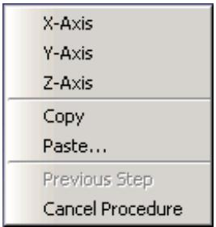

Items above the horizontal line correspond to the option buttons on the right side of the prompt area, while items below the line correspond to the Previous and Cancel buttons.

## Additional information

• Using the prompt area during procedures

## Interacting with dialog boxes

This section explains how to use the various dialog box components that appear within Abaqus/CAE.

## In this section:

Using basic dialog box components  
Entering expressions  
Using dimmed dialog box and toolbox components  
Disabling warning dialog boxes  
Understanding the OK, Apply, Defaults, Continue, Cancel, and Dismiss buttons  
Using dialog boxes separated by tabs  
Entering tabular data  
Customizing fonts  
Customizing colors  
Using file selection dialog boxes  
Selecting multiple items from lists and tables  
Using keyboard shortcuts

Dialog box components include text fields, numeric fields, combo boxes, radio buttons, check boxes, scroll bars, and sliders.

The following types of components are present in dialog boxes throughout Abaqus/CAE:

## Text fields

Text fields are areas in dialog boxes in which you can enter information. For example, when you save a display group, you must enter its name in the text field shown below:

Name: DisplayGroup-2

If you are entering a floating point number, most text fields allow you to enter an expression; for example, cos(2.5/(4.9\*pi)). The expression can be any valid Python expression. For more information, see Entering expressions.

Text fields are available whenever you need to name an object (such as a part, material, set, path, or X–Y data) or provide a description for an object (such as a material or step). In general, you should avoid using an asterisk (\*) in an object name or description.

Object names must adhere to the following rules:

• Part, model, instance, set, surface, feature, and job names can have up to 80 characters; other object names can have up to 38 characters. Instance names of models that have been instantiated as model instances in another model still have a 38-character limit. For imported sets/surfaces, parts, and model instances, the names are generated internally in Abaqus/CAE by combining part/instance/set names. You must ensure that the combined length will not exceed 80 characters; otherwise, the data check analysis will fail.  
• The name can include spaces and most punctuation marks and special characters.  
• The name must not begin with a number.  
• The name must not begin or end with an underscore or a space.  
• The name must not contain a period or double quotes.  
• The name must not contain a backslash.  
• The name cannot be Assembly, which is reserved for internal use by Abaqus/CAE.

Additional restrictions apply to model names, part names, and job names.

• When you name a model or a job, the name can begin with a number.  
• When you name a model, you cannot use the following characters:

$$
\$ \& ^ {*} \sim ! () [ ] \{\} |; ^ {\prime}, ^ {\prime \prime},.? / \backslash > <
$$

• When you name a part, the name should not be the same as the model name.  
• When you name a job, you cannot use the following characters:

$$
<   \text {space} > \& ^ {*} \sim ! () [ ] \{\} |:; ^ {\prime}, ^ {\prime \prime},.? / \backslash > <
$$

In addition, a job name cannot begin with a dash -.

The material evaluation procedure (Evaluating hyperelastic, hyperfoam and viscoelastic material behavior) generates jobs with the same names as the materials; therefore, these material names must adhere to the same rules as job names. In general, when you are specifying a name that will be used external to Abaqus/CAE, such as a file name, you should avoid any character that may have a reserved meaning on your platform.


## Note:

Abaqus/CAE retains the case of any text you enter in a text field. For example, if you create a material called Steel Alloy in the Edit Material dialog box in the Property module, the material will appear as Steel Alloy in the graphical user interface (material manager, section editor, Model Tree, etc.). In the graphical user interface, object names are case insensitive. For example, you cannot create a second material called steel alloy. Conversely, Python (which is used in the command line interface) is case sensitive, but you should not rely on this behavior to distinguish between objects.

## Numeric fields

Numeric fields are specialized text fields for integer input values. They have two opposing arrows directly to the right of the text area. You can enter a numeric value into the text field, or you can use the arrows to cycle up and down through a list of fixed values.


Unlike other text fields, numeric fields do not accept text or special characters.

Numeric fields often have upper and lower limits. If the value you enter exceeds the limits, Abaqus/CAE changes the entry to the closest acceptable value when you move to another field or try to apply the value.

## Combo boxes

Combo boxes are fields having an arrow directly to the right of the field. If you click this arrow, a list of the possible choices that you can enter in the field appears. For example, if you click the arrow to the right of the Module field in the context bar, a list of all the Abaqus/CAE modules appears, and you can select the module of your choice from the list.

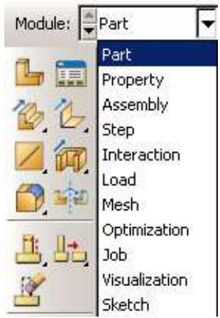

## Radio buttons

Radio buttons present a mutually exclusive choice. When an option is controlled by radio buttons, you can choose only one of the buttons at a time.

Drag mode: Fast (wireframe) C As is

## Check boxes

You can toggle a check box to turn a particular option off or on.

For example, the visibility of the triad in the current viewport depends on the status of the Show triad check box. If the box is toggled on, as shown below, the triad appears in the viewport.

show triad

If the box is toggled off, as shown below, the triad does not appear in the viewport.

□show triad

In some cases the option controlled by a check box can apply to more than one object. For example, a single Show line check box in the XY Curve Options dialog box individually controls the display of all X–Y curve lines in an X–Y plot. If you have toggled Show line on for some curves and off for others, that check box appears gray with a darker gray check mark, as shown below.

show line

## Scroll bars

Scroll bars appear in lists whose contents are too big to display; they allow you to scroll through the visible contents of the list as well as any contents that are hidden. Scrolling is often necessary when numerous items must be listed, as shown below.

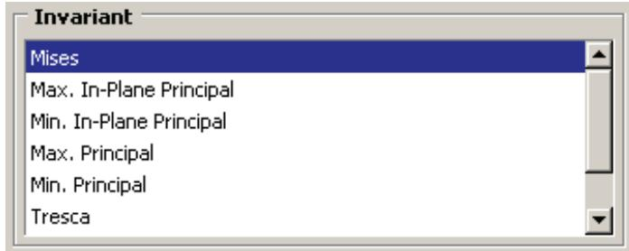

## Sliders

Sliders allow you to set the value of an option that has a continuous range of possible values. An example of a slider is shown in the following figure:


## Additional information

• Interacting with dialog boxes

## Entering expressions

If a field in a dialog box or in the prompt area is expecting a floating point number or a complex number, you can enter an arithmetic expression, as shown in Figure 1.

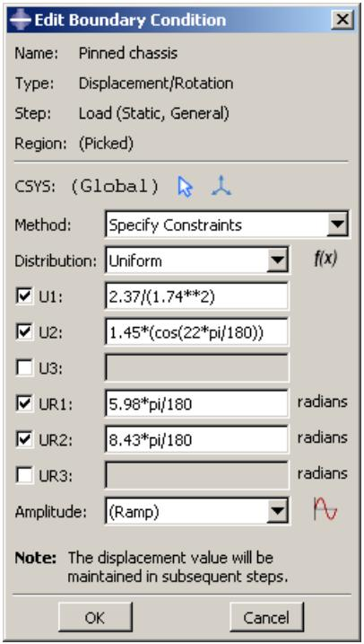  
Figure 1: An expression in a text field.

The expression is evaluated by the Python interpreter that is built into Abaqus/CAE. The arithmetic expression is replaced by its value; if you reopen a dialog that contained expressions, only the values are available. Variables like pi and functions like sin() are available because Abaqus/CAE imports the Python math module when you start a session. As a result, you can enter any expression that can be evaluated by Python's built-in functions or by the Python math module. For more information, see the documentation for built-in functions and the math module accessible from the official Python home page (http://www.python.org).

To make sure that your expression is evaluated as expected, you should be aware of the following:

• If you enter numbers as integers, Python will perform integer division and round down any remainder. For example, Python will interpret 3/2 as 1 and 1/2 as 0. In contrast, Python interprets 3./2 as 1.5 and 1/2. as 0.5.  
Python interprets numbers with leading zeros as octal numbers (for example, 0123 is interpreted as 83.0). However, Abaqus/CAE will ignore leading zeros in numbers in text fields before Python interprets them; such numbers are evaluated as decimals.  
• Python interprets e as the base of the natural logarithm; that is, e equates to 2.71828182846 and e+2 equates to 4.71828182846.  
• If the $\mathbf { \omega } ^ { \ast } \mathbf { e } ^ { \mathbf { \prime } \mathbf { \prime } }$ character is preceded by a number, Python interprets it as an exponent, not a natural logarithm. For example, Python interprets 2e+2 as $2 \times 1 0 ^ { 2 }$ and equates it to 200.  
• Python interprets $2 \mathsf { e } + \mathsf { a } \mathrm { s } 2 \times 1 0 ^ { 0 }$ and equates it to 2. Similarly, Python interprets $2 \in { + } { + } 1 1$ as $2 \times 1 0 ^ { 0 } ~ + ~ 1 1$ and equates it to 13.

If you are unsure how Python will interpret your expression, you can enter the expression on the command line; Abaqus/CAE will print the resulting interpreted value in the message area. To access the command line interface, click

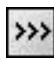

in the bottom left corner of the main window. For more information, see Components of the main window.

You can also test how Abaqus/CAE interprets an expression by entering abaqus python at an operating system prompt and entering the expression at the Python prompt that appears. The prompt line and some dialog boxes do not allow you to enter an expression. As an alternative, you can enter the expression on the command line or at the Python prompt and paste the resulting value in the prompt line or dialog box.

## Using dimmed dialog box and toolbox components

Some objects in dialog boxes and toolboxes are available only under certain circumstances. When an object is unavailable, it appears dimmed in the dialog box.

Items are usually dimmed as a result of some other setting in the dialog box. For example, if Use settings below is not selected, the image size options below it are not available and appear dimmed, as shown below.


Context-sensitive help is available even for dimmed options, although tooltips are not.

## Additional information

• Interacting with dialog boxes

## Disabling warning dialog boxes

Some dialog boxes can be disabled so that they will not appear again during the current Abaqus/CAE session.

For example, if you submit a job for analysis and job files with the same name already exist, Abaqus/CAE displays a dialog box asking if it is OK to overwrite the job files, as shown below.


If you toggle off Show this warning next time, the dialog box will be disabled for the remainder of the current Abaqus/CAE session.

## Additional information

• Interacting with dialog boxes

## Understanding the OK, Apply, Defaults, Continue, Cancel, and Dismiss buttons

When you are finished working with a dialog box, you can specify how to proceed by using different action buttons. For example, if you enter data in a dialog box, you can save the data and apply them by clicking OK. If the dialog box is part of an intermediate step of a procedure, you can click Continue to move on to the next step.

The following action buttons can appear in a dialog box:

## OK

Click OK to commit the current contents of a dialog box and to close the dialog box.

##

When you click Apply, any changes you have made in the dialog box take effect, but the dialog box remains displayed. This button is useful if you make changes in a dialog box and would like to see the effects of these changes before closing the dialog box.

## Defaults

If you want to revert back to the predefined default values after entering data or specifying preferences in a dialog box, you can click Defaults. This button affects only the information entered in the dialog box. It does not apply your changes or close the dialog box; therefore, to see the effect of reverting to the default values, you must click Apply or OK.

## Cancel

Click Cancel to close a dialog box without applying any of the changes that you made. If the dialog box appears in the middle of a procedure, clicking Cancel usually also cancels the procedure. In some cases clicking Cancel returns you to the previous step in the procedure.

## Continue

Dialog boxes that appear in the middle of a procedure contain Continue buttons. When you click Continue, you indicate that you have finished entering data in the current dialog box and would like to move on to the next step of the procedure. Continue causes the dialog box to be closed and all data in it to be saved unless you click Cancel at some point later in the procedure.

## Dismiss

Dismiss buttons appear in dialog boxes that contain data that you cannot modify. For example, some managers contain lists of objects that exist but no fields in which you can enter data or specify preferences. Dismiss buttons also appear in message dialog boxes. When you click Dismiss, the dialog box closes.

To close a toolbox or a dialog box that does not have a Cancel or Dismiss button, click the close button in the upper right corner of the toolbox or dialog box. Alternatively, you can close an active toolbox or dialog box by pressing [Esc].


## Note:

On Linux platforms, depending on your settings, [Esc] may be the only way to close a toolbox or dialog box. For more information, see Linux settings that affect Abaqus/CAE and Abaqus/Viewer.

## Additional information

• Interacting with dialog boxes

## Using dialog boxes separated by tabs

For the sake of organization and convenience, some dialog boxes are separated by tabs. Only one dialog box is visible at a time. To view a particular dialog box, click its labeled tab.

For example, Figure 1 displays the Common Plot Options dialog boxes.

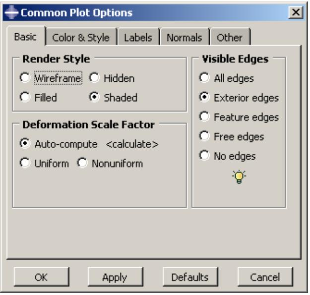  
Figure 1: Dialog boxes separated by tabs.

If you click the Color & Style tab, the dialog box containing the color and edge attributes options comes forward, obscuring the other four dialog boxes, as shown in Figure 2.

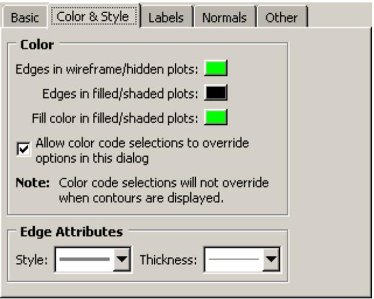  
Figure 2: Using tabs to display particular dialog boxes.

In addition, separated dialog boxes can exist within a single dialog box. In this case the tabs of the separated dialog boxes are aligned vertically but work the same way as tabs aligned horizontally. In Figure 3 the Other dialog box contains two dialog boxes separated by tabs: Scaling and Translucency.

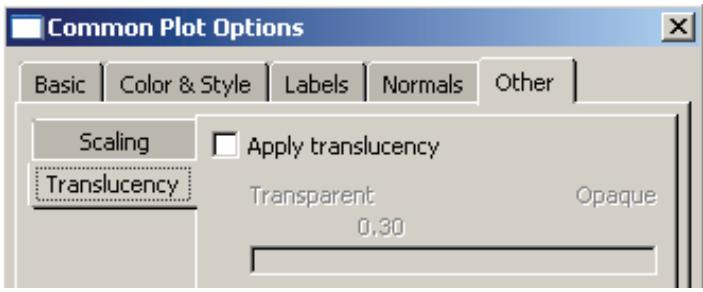  
Figure 3: Dialog box containing additional dialog boxes.

The action buttons in a dialog box apply to the whole set of dialog boxes, not just the one you are currently viewing. If you click Cancel, all of the unapplied changes you have made in the set of dialog boxes are canceled, not just those in the current dialog box. Likewise, clicking OK saves all changes that you have made in any of the dialog boxes.

## Additional information

• Interacting with dialog boxes

## Entering tabular data

Some operations require the entry of tabular data. For example, the XY Data toolset can produce plots of data that you enter in the dialog box shown in Figure 1.

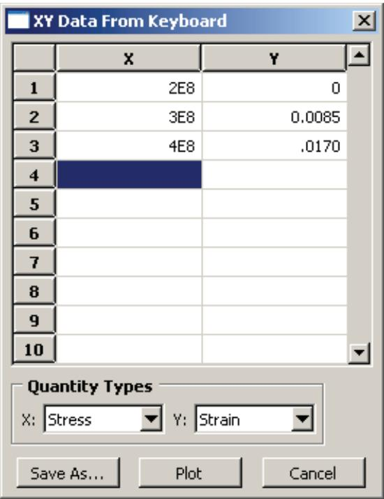  
Figure 1: X–Y data table.

Data tables are composed of input boxes, or cells, organized into rows and columns. You can type data into a table using the keyboard, or you can read data in from a file.

The following list describes techniques for entering and modifying tabular data:

## Entering data

Click any cell, and type the required data. You can press [Enter] to commit the data in a particular cell.

Abaqus/CAE does not allow you to enter character data in tables requiring numeric data; the program beeps if you attempt to enter character data in a numeric field. (The letter E that denotes scientific notation, as in 12.E6, is an exception to this rule.)

## Adding new rows

Use the menu that appears when you click mouse button 3 to add a new row before or after an existing row. Click mouse button 3 while holding the cursor over the row of interest; then select the item of your choice from the menu that appears:

• Select Insert Row Before to add a blank row above the current row.  
• Select Insert Row After to add a blank row below the current row.

Alternatively, you can add a blank row to the end of the table by clicking the cell in the last row and in the last column of the table and then pressing [Enter].

## Reading data from a file

You can enter data by reading it in from an ASCII file. Data fields within the file can be delimited by any combination of spaces, tabs, or commas; each space, tab, or comma is considered a single field delimiter. To enter data from a file, click mouse button 3 while holding the cursor over the target cell; then select Read From File from the menu that appears. The Read Data from ASCII File dialog box appears. In this dialog box, specify the following:

• In the File text field, enter the name of the file to read.  
Specify the row number and column number of the target cell in the Start reading values into table row and Start reading values into table column fields, respectively. (By default, Abaqus sets these fields to the cell your cursor was over when you clicked mouse button 3.)

Click OK. Abaqus reads data values from the file into the table according to your specifications.

## Moving from cell to cell

Use the [Enter] key to move from left to right between the cells in a row. When you have reached the end of the row, press [Enter] to move the cursor to the first cell in the following row.

In addition, you can use a combination of the [Tab] key and the up and down arrow keys to move from cell to cell. Use [Tab] to move to the right and [Shift][Tab] to move to the left; use the up and down arrows to move up and down. You can also simply click the cell of interest.

## Changing data

If a cell already contains data, clicking the cell highlights the data; as soon as you begin typing, the highlighted contents of the cell disappear and are replaced by whatever you type. You can also use the [Backspace] or [Delete] keys to delete highlighted data in a cell.

After clicking the cell once, you can click a second time to remove the highlighting and position the cursor within the cell. Use the [Backspace] key and the other keys on your keyboard to modify the data.

## Cutting, copying, and pasting data

Use the menu that appears when you click mouse button 3 to cut, copy, and paste data from one location in a table to another. You can cut or copy data in single cells, in rows or parts of rows, in columns or parts of columns, and in series of consecutive rows or columns.

First, drag the mouse over the cells containing the data that you want to cut or copy. All of the selected cells will become highlighted except the cell that you selected first. This cell becomes highlighted when you move the cursor outside the data table window or if you click mouse button 3.

Once you have selected the cells of interest, click mouse button 3 while holding the cursor over the selection; then select either Cut or Copy from the menu that appears. To paste the data, select the target cell, click mouse button 3, and select Paste from the menu that appears.

## Sorting data

Some data tables offer a sorting feature. (To determine if sorting is available for a particular table, hold the cursor over the table; then click mouse button 3. If it is available, Sort is listed in the menu that appears.)

To sort table data, click mouse button 3 while holding the cursor over the table; then click Sort. The Sort Table dialog box appears. In this dialog box, choose the following:

• In the Sort by text field, choose the column by which to sort.  
• Choose Ascending or Descending sort order.

Click OK or Apply. Abaqus sorts all rows according to data values in the specified column.

## Expanding and contracting columns

You can change the size of the columns in some tables. To expand or contract a column, move the cursor to the line that divides the headings of the columns you want to resize; a resize cursor will appear. Drag this cursor to the left or right to resize the two columns on either side of the dividing line.

You can also resize the last column in some tables by horizontally enlarging the dialog box that contains the table.

## Viewing data that extend beyond the edge of the dialog box

Use the horizontal and vertical scroll bars to view portions of a table that are outside the boundaries of the dialog box. In some cases scroll bars may not be available; instead, increase the size of the dialog box to display more data.

## Deleting rows of data

Click any cell within the row you want to delete, or select multiple cells in consecutive rows. Then, while holding the cursor over the dialog box containing the table, click mouse button 3 and select Delete Rows from the menu that appears. The row or rows disappear; if the rows are numbered, Abaqus/CAE automatically renumbers the remaining rows.

You cannot delete rows from tables that display matrices or tensors of fixed size, such as those used in the orthotropic or anisotropic elasticity data input forms in the Property module.

## Creating X–Y data from table data

While you are creating a material in the Property module, you can use the data in a table to create X–Y data. You can then use the Visualization module to plot the X–Y data and to visually check its validity. To create an X–Y data object, click mouse button 3 while holding the cursor over the table; then select Create XY Data from the menu that appears. The Create XY Data dialog box appears. In this dialog box, do the following:

• Enter the name of the X–Y data to create.  
• Specify the column number containing the X-values and the column number containing the Y-values.  
• Click OK. Abaqus reads the data values from the table into the X–Y data. Abaqus/CAE retains saved X–Y data only for the duration of the session.

To view the X–Y data, do the following:

• From the module list on the context bar, select Visualization.  
• From the main menu bar, select Tools->XY Data->Plot, and select the X–Y data from the pull-right menu.

For more information, see X–Y plotting.

## Clearing the table

You can delete all data from a table. While holding the cursor over the table, click mouse button 3 and select Clear Table from the menu that appears. The table data disappear.

## Additional information

• Interacting with dialog boxes

## Customizing fonts

The Select Font dialog box allows you to customize the font of certain kinds of text; for example, you can use this dialog box to customize the font that appears in viewport annotations. A similar dialog box is used to customize the font of the Visualization module labels and titles.

The Select Font dialog box allows you to specify and preview the following:

• Proportional or fixed fonts.  
• The font family.  
• The font size, in points.  
• Regular, bold, or italic font.

The available options vary depending on which fonts are installed on your system.

1. Display the Select Font dialog box for the text that you want to customize. For more information, see the following sections:

Customizing X–Y plot axes  
Customizing the X–Y plot legend  
Customizing viewport annotations”  
Setting the label font

2. Select the desired font and properties.  
A preview of the selected font appears in the Sample area of the Select Font dialog box.

3. In the Apply To field of the Select Font dialog box, toggle on the items to which the selected font will apply. The Apply To field does not appear unless there are multiple items to which the font can apply.

4. Click OK to accept your changes and to close the Select Font dialog box.

## Additional information

• Customizing viewport annotations  
• Setting the label font

## Customizing colors

The Select Color dialog box allows you to customize the color of many objects in Abaqus/CAE. For more information about the objects that you can change, see the following sections:

Customizing the view triad  
Choosing background colors  
Selecting overall element and surface edge color  
Coloring elements with no results  
Customizing the legend  
Customizing the title block  
Customizing the state block

The current color is displayed on the left side of the Select Color dialog box, below the eyedropper tool. You can use the methods in the Select Color dialog box to update the displayed color. The color is not updated elsewhere until you click OK to accept your changes and to close the Select Color dialog box. You can choose from the following methods of color selection:

## Color palette

Twenty-four common colors are displayed in boxes along the bottom of the dialog box. Click a color to select it; you cannot modify the palette to show different colors.

## Eyedropper tool

The eyedropper tool is located on the left side of the dialog box. When you click the eyedropper tool, the cursor changes to crosshairs. The next time you click mouse button 1 anywhere on the computer screen, Abaqus/CAE selects the color at the cursor position.


## Note:

The cursor returns to its normal form if you move it outside the Abaqus/CAE application window, but you can still select a color by clicking mouse button 1.

## Color wheel

The color wheel and brightness control are located in the Wheel tab. A black dot indicates the position of the currently selected color, regardless of the method that was used to select it. Click anywhere on the wheel to select a new color. Move the vertical slider to change the brightness; as you move the slider downward, Abaqus/CAE adds black to the selected color.

## RGB controls

RGB (Red, Green, and Blue) controls are located in the RGB tab. The RGB settings match the color displayed on the left side of the Select Color dialog box, regardless of the method that was used to select it. You can move the sliders or enter values from 0 to 255 to mix the three colors of light and produce the full color spectrum. 0, 0, 0 is black (no light); and 255, 255, 255 is white (full intensity, full spectrum light).

## HSV controls

HSV (Hue, Saturation, and Value) controls are located in the HSV tab. The HSV settings match the color displayed on the left side of the Select Color dialog box, regardless of the method that was used to select it. The Hue control ranges from 0 to 360, and changing the setting corresponds to moving the black dot around the perimeter of the color wheel (0 and 360 are both red). The Saturation control ranges from 0 to 100 and varies the amount of the selected color added to the background color. The Value control indicates the background color; 0 is black, 100 is white.

## CMY controls

CMY (Cyan, Magenta, and Yellow) controls are located in the CMY tab. The CMY settings match the color displayed on the left side of the Select Color dialog box, regardless of the method that was used to select it. You can move the sliders or enter values from 0 to 255 to mix the three colors of tint and produce the full color spectrum. The CMY controls work like adding tint to paint; 0, 0, 0 is white (no tint), and 255, 255, 255 is black (all tint).

## Color list

The color list is located in the List tab. You can choose from several hundred colors, including shades of gray. The color list provides you with a more extensive range of colors than the color palette, but it does not provide you with the full color spectrum.

1. Open the dialog box that contains the settings for the object that you want to change.  
2. Click the color sample for the object that you want to customize.

Abaqus/CAE displays the Select Color dialog box.

3. Use one of the methods in the dialog box to select a new color.

A preview of the selected color appears on the left side of the Select Color dialog box, below the eyedropper tool.

4. Click OK to accept your changes and to close the Select Color dialog box.

Abaqus/CAE returns you to the originating dialog box and updates the color sample to display the color that you selected.

When you click OK or Apply in the originating dialog box, Abaqus/CAE updates the color in the viewport.

## Additional information

• Customizing model labels  
• Customizing viewport annotations

## Using file selection dialog boxes

File selection dialog boxes allow you to select files from lists that are filtered based on file type or location. To use a file selection dialog box, you first choose the type of file to open and then specify the directory to list. Abaqus/CAE refreshes the dialog box to list only files that meet your criteria. From this list, you select the file to open.

The dialog box for selecting model databases or output databases is shown in Figure 1.

  
Figure 1: Selecting a model database or an output database.


## Note:

In Abaqus/Viewer you can open only output database files; therefore, Output Database (\*.odb) is the only type available in the File Filter field.

Similar file selection dialog boxes appear when you perform other File menu functions, such as importing a part or printing to a file.

Use the following techniques to select the file of your choice:

## Filtering the file list according to file type

File selection dialog boxes contain File Filter fields, which allow you to select the file extension of interest. For example, the File Filter selection in Figure 1 is Output Database (\*.odb). Therefore, only files with the extension .odb appear in the list in the center of the dialog box.

## Using wildcards to search for a file name

You can use a wildcard filter to search for partial names of files. A wildcard search is helpful when you have a large number of files stored in the same directory. Wildcard searches also override the file extensions (File Filter field, as described above), allowing you to open files saved with nonstandard file extensions.

To use a wildcard search, enter a partial file name into the File Name field using one of the following forms:

?

matches a single character

\*

matches zero or more characters

abc

matches a single character, but it must be one of the characters listed

^abc or !abc

matches a single character, but it must not be one of the characters listed

a-zA-Z

matches a single character, but it must be within the ranges provided

^a-zA-Z or !a-zA-Z

matches a single character, but it must not be within the ranges provided

pat1|pat2 or pat1,pat2

matches either pat1 or pat2

(pat1|pat2) or (pat1,pat2)

matches either pat1 or pat2, and the patterns may be nested

You can combine several wildcard filters to further narrow your search. For example, entering

[abc]\*.(cae,odb) will list all files beginning with a, b, or c and having a .cae or .odb file extension.

## Specifying the directory from which to select a file

By default, the Directory field shows the directory in which you started Abaqus/CAE. If you want to view a list of files from a different directory, you can click the directory name in the list to view directories within the current path or you can click the arrow next to the Directory field to access other paths that are available on your system. In addition, icons at the top of the dialog box allow you to do the following (keyboard shortcuts are shown in parentheses when available):

• Go up one directory level ([Backspace]).  
• Access your system default, or Home, directory ([Ctrl] + H).  
Access the Work directory ([Ctrl] + W). The work directory is the directory from which you started Abaqus/CAE unless you specified the directory using File->Set Work Directory.  
• Set or use Bookmarks to any directory on your system.  
• Create a new directory ([Ctrl] + N).

The Directory field includes a Network connectors item. If you have created and started a network ODB connector, you can use this item to access a remote directory and to open a remote output database. For more information, see Creating a network ODB connector.

## Selecting a file

To select and open a file, double-click the file name of interest from the list. You can also begin typing the file name; the cursor will reposition to the matching location in the file list, and the first file starting with the letters you typed will be selected. Alternatively, you can enter the entire directory path and file name of interest directly in the File Name field and then click OK. Icons at the top of the dialog box allow you to change the displayed file format to one of the following (keyboard shortcuts are shown in parentheses):

• A list ([Ctrl] + S).  
• Icons ([Ctrl] + B).  
• A detailed list ([Ctrl] + L).

The icon farthest to the right allows you to display or suppress “hidden” files.

## Selecting multiple items from lists and tables

In some Abaqus/CAE dialog boxes it is necessary to select an item from a list or a table before you can perform certain functions. For example, if you want to plot X–Y data, you must first select the data object of your choice from the list in the XY Data Manager, shown in Figure 1, and then click Plot.

  
Figure 1: Single item selected.

Some functions allow you to operate on more than one item. For example, if you wanted to delete the first two data objects in the manager shown in Figure 1, you could select them both and then click Delete.

To select a single item from a list, you need only click that item in the dialog box. To select a single item from a table, click the table row heading. To select multiple items, you can use the following techniques:

## Selecting consecutive items from a list or table

Click the first item of interest from a list or row heading from a table and then, while continuing to hold down mouse button 1, drag the cursor over the remaining items. Release the mouse button when all of the items of interest are selected. For example, consecutive items are selected in Figure 2.

  
Figure 2: Consecutive items selected.

Another way to select consecutive items is to click the first item of interest from a list or row heading from a table and then [Shift] + Click the last item of interest. All items between the first and the last are selected automatically.

## Selecting nonconsecutive items from a list or table

Click the first item of interest from a list or row heading from a table and then [Ctrl] + Click any other items you want to select. For example, nonconsecutive items are selected in Figure 3.

  
Figure 3: Nonconsecutive items selected.

## Canceling a selection

You can [Ctrl] + Click previously selected items to remove them from your selection. For example, if you [Ctrl] + ClickDisplacement in the list shown in Figure 3, that data object is no longer selected, as shown in Figure 4.

  
Figure 4: Individual item removed from selection.

Certain functions in a dialog box may become unavailable when you select multiple items. For example, the Edit, Copy, and Rename functions in the Data Manager shown in Figure 4 are valid only for individual data objects. When you select multiple data objects, these three functions become unavailable.

## Using keyboard shortcuts

You can use the keyboard instead of the mouse to perform most actions within the Abaqus/CAE main window and dialog boxes. The following actions have keyboard shortcuts:

## Context-sensitive help

Press [F1] to display context-sensitive help concerning the currently selected object in the Abaqus/CAE main window or dialog box. For more information on using [F1] for context-sensitive help, see Displaying context-sensitive help.

## Menus

You can display a particular menu by pressing the [Alt] + key in combination with the underlined character in that menu's name. For example, the letter V is underlined in the View menu in the main menu bar:


Therefore, you can type [Alt] + V to display the View menu.

## Menu items

Once the menu is displayed, you can select a particular menu item by continuing to press the [Alt] + key and pressing the underlined character in that menu item's name. For example, the letter n is underlined in Pan in the View menu:


Therefore, you can type [Alt] + V to display the View menu and then, without releasing the [Alt] + key, type n to select Pan.

## Model Tree and Results Tree

The Model Tree and Results Tree contain keyboard shortcuts that allow you to navigate through the tree and toggle its display on and off. For more information, see The Model Tree.

## Understanding and using toolboxes and toolbars

This section explains how to use the toolbox windows and toolbars to perform common functions within a module or toolset or on the canvas.

## In this section:

What are toolboxes and toolbars?  
Using toolboxes and toolbars that contain hidden icons

## What are toolboxes and toolbars?

Toolboxes and toolbars are collections of icons that provide quick access to commonly used Abaqus/CAE functions. For example, the Visualization module toolbox contains icons representing the tools used to generate different kinds of plots. The Visualization module toolbox is shown in Figure 1. All module toolboxes are available immediately to the left of the drawing area as soon as you enter the module.

  
Figure 1:The Visualization module toolbox.

Toolbars also contain collections of icons to access Abaqus/CAE functions. Toolbars provide access to supporting functions that help you save, manipulate, and make selections from a model; whereas toolboxes contain functions critical to creating or changing a model. In addition to tool icons, toolbars may also contain lists of options related to a tool. For example, the color mapping list in the Color Code toolbar contains various methods for coloring the objects displayed in the current viewport. You can also customize toolbar contents, move toolbars to new locations, or close them (for more information, see The Customize toolset). Toolboxes cannot be moved or hidden.

To obtain a short description of a tool, place the cursor over that tool for a moment; a small box containing a description, or “tooltip,” will appear. Tooltips are not available for icons that appear dimmed; to get information on those icons, use context-sensitive help instead.

## Additional information

• Understanding and using toolboxes and toolbars

## Using toolboxes and toolbars that contain hidden icons

In some toolboxes, such as the Job module toolbox, all tool icons are immediately visible; however, most toolboxes contain hidden icons to conserve space. Since there is more space above the canvas, and since you can move or hide toolbars to meet your needs, most toolbars do not contain hidden icons.

Any icon that includes a small triangle in its lower right corner conceals a group of icons whose function is closely related to that of the visible icon.

1. Click and hold any icon that includes a triangle in its lower right corner.

Icons for all the tools that are closely related to the original icon appear. For example, Figure 1 shows the top portion of the Part module toolbox with all of the icons revealed that are used for creating round or chamfered corners.

  
Figure 1: Part module toolbox with round and chamfer icons displayed.

2. Drag the cursor to the desired icon, and release the mouse button.

The selected icon replaces the icon that was visible originally, and you can begin using the corresponding tool immediately.

## Additional information

• Understanding and using toolboxes and toolbars

## Managing objects

Managers are dialog boxes you use to manage all objects of a given type associated with the current model or session; examples of such objects include materials, parts, steps, display groups, and X–Y data objects.

In addition, you can use the Model Manager to manage the models contained in the current model database. This section describes basic and step-dependent managers and how you can use them in Abaqus/CAE.

## In this section:

What are basic managers?  
What are step-dependent managers?  
Suppressing and resuming objects  
Understanding the status of an object in a step  
Terms describing object status  
Modifying the history of a step-dependent object  
Understanding modified step-dependent objects  
What happens when deleted objects are referred to?  
Managing objects using manager dialog boxes  
Managing objects using manager menus  
Copying step-dependent objects using manager dialog boxes  
Changing the status of an object in a step  
Editing step-dependent objects

## What are basic managers?

Basic managers consist of a list of objects and a series of buttons; you use the buttons to perform tasks on the objects you select from the list or to add new objects to the list.

Figure 1 shows the Material Manager, which is an example of a basic manager used in Abaqus/CAE.

  
Figure 1:The Material Manager.

The list box on the left shows all the materials that you have defined within the context of the current model. You use the buttons on the right to create new material definitions and to edit, copy, rename, and delete existing material definitions. The Dismiss button is used to close the manager dialog box.

Often, the manager provides more information about an object than just its name; for example, in the Job module, the Job Manager provides information about currently executing jobs and provides buttons that allow you to write input files, submit jobs, monitor the analysis, or view output files for a given job. The Job Manager is shown in Figure 2.

  
Figure 2:The Job Manager.

Most tasks you can perform with a manager can also be performed using the pull-down menus available from the main menu bar; for example, Figure 3 shows the menu items that correspond to the Job Manager.

  
Figure 3: Menu items that correspond to the Job Manager.

After you select a management operation from the main menu bar, the procedure is exactly the same as if you had clicked the corresponding button inside the manager dialog box. In addition, most of the tasks you can perform with a manager can be performed by clicking mouse button 3 on an object in the Model Tree. For more information, see Working with the Model Tree and the Results Tree.

The decision whether to use menus, dialog boxes, or the Model Tree is yours. In general, menus are more convenient if you are performing isolated operations; the advantages of manager dialog boxes become apparent when you are performing several operations in sequence, when you need to browse through a long list of objects, or when you need quick access to the additional information that is displayed by some managers. The Model Tree provides you with a graphical overview of your model and allows you to perform operations without changing modules. In addition, the Model Tree allows you to use drag-select to select multiple items; for example, you can select multiple sets to merge or multiple parts to delete.

## Additional information

• Managing objects  
• What are step-dependent managers?

## What are step-dependent managers?

Like the basic managers described in What are basic managers?, step-dependent managers contain a list of all of the objects of a certain type that you have created, as well as Create, Edit, Copy, Rename, and Delete buttons that you can use to manipulate existing objects and to create new ones.

However, the types of objects that appear in step-dependent managers are those that you can create and, in some cases, modify, suppress, and deactivate in particular analysis steps. Therefore, unlike basic managers, step-dependent managers contain additional information concerning the history of each object listed in the manager. Step-dependent managers display how these objects propagate from one step to another during the course of an Abaqus analysis. (For information on steps and multiple-step analyses, see Defining an Analysis.)

The following step-dependent managers exist in Abaqus/CAE:

## In the Load module:

• Load Manager  
• Boundary Condition Manager  
• Predefined Field Manager

## In the Interaction module:

• Interaction Manager

## In the Step module:

• Field Output Requests Manager  
• History Output Requests Manager  
• Adaptive Mesh Constraint Manager

For example, the Load Manager is shown in Figure 1.

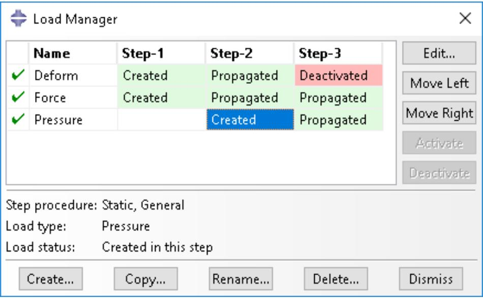  
Figure 1:The Load Manager.

This manager displays an alphabetical list of existing loads along the left side of the dialog box. The names of all the steps in the analysis appear along the top of the dialog box in the order of execution. The table formed by these two lists displays the status of each load in each step. (For information on creating and deleting steps, see The Step module.)

If you click one of the cells in the table, that cell becomes highlighted, and the following information related to the cell appears in the legend at the bottom of the manager:

• The type of analysis procedure carried out in the step in that column.  
• Information about the step-dependent object in that row.  
• The status of the step-dependent object in that step (the same information that appears in the cells of the table except in more detail in some cases).

You can use the icons in the column along the left side of the manager to suppress objects or to resume previously suppressed objects for an analysis. For more information, see Suppressing and resuming objects.

The buttons along the right side of the manager allow you to manipulate objects in the steps that you select. For example, if you click Edit in the Load Manager shown above, an editor appears in which you could modify the load named Force in Step-1. The other buttons—Move Left, Move Right, Activate, and Deactivate—allow you to change the status of an object in a particular step.


Note: The Activate and Deactivate buttons are not available in the Predefined Field Manager.

For more information, see Modifying the history of a step-dependent object, Changing the status of an object in a step, and Editing step-dependent objects.

You can resize the columns of the table by dragging the dividers between the column headings to the right or left. You can also increase the size of the dialog box by dragging the sides of the box. If the analysis includes many steps or many step-dependent objects, increasing the size of the dialog box allows you to view more rows and columns without having to use the scroll bars.

## Additional information

• The output request managers  
• Managing objects in the Interaction module  
• Managing prescribed conditions

## Suppressing and resuming objects

When performing an analysis, you may want to study the effects of different combinations of objects, such as loads, or you may want to temporarily exclude an object from the model, such as excluding a boundary condition or a constraint in a design analysis. You can create a model that includes all of the objects and then suppress the objects that you want to exclude from the model prior to the analysis. Suppressed objects are not written to the input file and are treated as deleted objects. You should review your model for any references to suppressed objects. For more information, see What happens when deleted objects are referred to?.

You can suppress step-dependent objects, constraints (in the Interaction module), section assignments (in the Property module), and features. After you create a suppressible object, the manager dialog box displays a green check mark in the column along the left side of the manager next to the name of the object. You can suppress an object from the manager by clicking the green check mark next to the object. For example, if you click the green check mark to the left of the load named Force in the Load Manager shown in Figure 1, the icon changes to a red “X” and the cells displaying the status of the load in each step are shaded gray to indicate that the load is suppressed, as shown in Figure 1.


## Note:

There is no manager associated with features; you can suppress or resume features using the popup menus in the Model Tree.

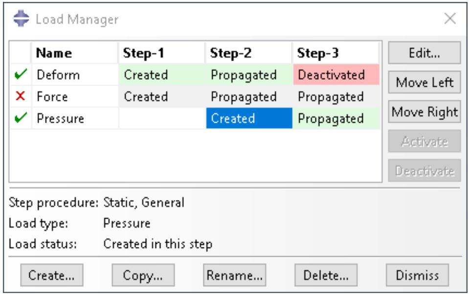  
Figure 1:The Load Manager indicates that the load named Force is suppressed.

You can also select Suppress->object in the appropriate menu from the main menu bar to suppress an object. For example, to suppress the load named Force shown in Figure 1, you would select Load->Suppress->Force from the main menu bar of the Load module.

You cannot edit suppressed objects; however, you can copy, rename, and delete them. Symbols for suppressed objects are not displayed in the viewport.

You can resume an object that was previously suppressed. If you attempt to resume an object that is not valid for a given procedure type, Abaqus/CAE displays an error message. You can use the manager or the Resume menu item from the main menu bar to resume the object. In the manager, click the red “X” to change the icon back to a green check mark and to remove the cell shading. Symbols for resumed objects are displayed in the viewport.

You can also use the Model Tree to suppress or resume an object by clicking mouse button 3 on the object and selecting Suppress or Resume from the menu that appears. The Model Tree displays a red “X” next to an object to indicate that it is suppressed. For more information, see The Model Tree.

## Additional information

• What are step-dependent managers?  
• The output request managers  
• Managing objects in the Interaction module  
• Managing prescribed conditions

## Understanding the status of an object in a step

A model can contain a sequence of analysis steps. When you create an object in a step, that object may or may not continue to be active in any of the following steps. The activity (or inactivity) of an object in any particular step is called its “status” in that step.

For example, Figure 1 shows the status of a load in a series of general static analysis steps.

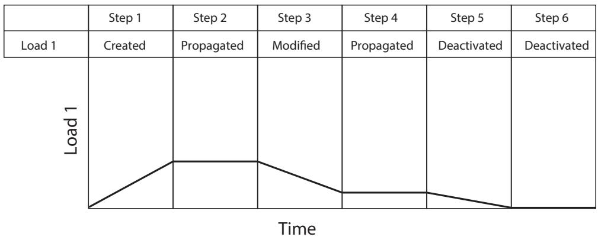  
Figure 1:The analysis history of a load.

The load in this example is created in Step 1; therefore, the status of the load in Step 1 is Created. Since Step 1 is a general static step, the load's magnitude is ramped up over the course of the step. If the load continues to be active in Step 2, its status in Step 2 is Propagated and its magnitude remains constant throughout that step. If you edit the load in Step 3, its status in Step 3 becomes Modified and its magnitude ramps to the new value over the course of the step. If the modified version of the load continues to be active in Step 4, its status in Step 4 (as in Step 2) is Propagated and the value is constant. If you deactivate the load in Step 5, its status in Step 5 is Deactivated and its magnitude ramps down to zero. The load remains deactivated in Step 6.

For detailed explanations of the terms used to describe object status, see Terms describing object status.

## Additional information

• What are step-dependent managers?

## Terms describing object status

Abaqus/CAE uses the following terms to describe the status of objects in particular steps:

## Created

The object was created and becomes active in this step. The point in the step at which a prescribed condition becomes active depends on the amplitude variation associated with that step. For more information, see “Prescribed conditions” in Defining an Analysis.

## Computed

The analysis products will compute the value of the object in this step.

## Modified

The definition of the object has been modified in this step. The variation of a prescribed condition over the course of the step depends on the amplitude variation associated with that step.

## Propagated

The object was created, modified, or computed in an earlier step of the analysis and continues to be active in this step.

## Deactivated

The object has been deactivated in this step or in a previous step. It will remain deactivated in all subsequent steps until you reactivate it. You cannot deactivate an object in the step in which it was created. The point in the step at which a prescribed condition becomes inactive depends on the amplitude variation associated with that step. For more information, see “Prescribed conditions” in Defining an Analysis.

You cannot deactivate predefined fields; a deactivated status for a predefined field means that the field has been reset to the value specified in the initial step. The point in the step at which an object resumes its initial value depends on the amplitude variation associated with that step. For more information, see “Prescribed conditions” in Defining an Analysis.

## N/A

The object does not have any effect on the calculations for this step.

The following terms apply only in linear perturbation steps:

## Built into base state

Any active object created in a preceding general analysis step will be part of the base state and cannot be changed during the linear perturbation step.

## Propagated from base state

Objects created in a previous general step will be part of the base state for this procedure but can be modified or deactivated by the user.

## Deactivated from base state

Objects created in a previous general step are deactivated in this linear perturbation step. The deactivated state applies only to the linear perturbation step and does not propagate to the remaining steps.

For information on linear perturbation steps, see General and Perturbation Procedures.

The following term applies only in modal dynamics steps:

## Built into modes

Boundary conditions that are active in a preceding frequency analysis step are used in the calculation of modes and will therefore be built into the modes for mode-based linear perturbation procedures and subspace dynamic procedures. During these mode-based and subspace dynamic procedures the boundary condition cannot be changed.

For information on modal dynamics steps, see Transient Modal Dynamic Analysis.

Figure 1 shows the color codes assigned to various object statuses. The table cells in step-dependent managers are colored accordingly to indicate the object status.

<table><tr><td>Color codes</td><td>Statuses</td></tr><tr><td></td><td>Created</td></tr><tr><td></td><td>Computed</td></tr><tr><td></td><td>Modified</td></tr><tr><td></td><td>Propagated</td></tr><tr><td></td><td>Deactivated</td></tr><tr><td></td><td>N/A</td></tr><tr><td></td><td>Built into base state</td></tr><tr><td></td><td>Modified from base state</td></tr><tr><td></td><td>Propagated from base state</td></tr><tr><td></td><td>Deactivated from base state</td></tr><tr><td></td><td>Built into modes</td></tr></table>

Figure 1: Color codes for object statuses.

## Modifying the history of a step-dependent object

You can modify the analysis history of an object by using the five buttons aligned along the right side of the step-dependent manager: Edit, Move Left, Move Right, Activate, and Deactivate. (For information on how to use these buttons, see Changing the status of an object in a step.) The use of these buttons may be restricted depending on the nature of each step and the status of the object in the steps.

The following list describes the rules for modifying the history of a step-dependent object:

## Changing the step in which an object becomes active

You can change the step in which an object becomes active by moving the Created status to that step. You can move the Created status of an object to any previous general step, or you can move the Created status to the following general step if its status in the following step is Propagated.

For example, you could select the Created status of Load1 in the load manager table below.

<table><tr><td></td><td>Step 1</td><td>Step 2</td><td>Step 3</td><td>Step 4</td><td>Step 5</td></tr><tr><td>Load1</td><td></td><td>Created</td><td>Propagated</td><td>Propagated</td><td>Propagated</td></tr></table>

If you moved the Created status to Step 1, the table would change as shown below.

<table><tr><td></td><td>Step 1</td><td>Step 2</td><td>Step 3</td><td>Step 4</td><td>Step 5</td></tr><tr><td>Load1</td><td>Created</td><td>Propagated</td><td>Propagated</td><td>Propagated</td><td>Propagated</td></tr></table>

If you moved the Created status to Step 3, the table would change as shown below.

<table><tr><td></td><td>Step 1</td><td>Step 2</td><td>Step 3</td><td>Step 4</td><td>Step 5</td></tr><tr><td>Load1</td><td></td><td></td><td>Created</td><td>Propagated</td><td>Propagated</td></tr></table>


## Note:

If an object is created in a linear perturbation step, its Created status cannot be moved.

## Modifying an object

You can modify an object when its status is Propagated; the object's status in that step changes to Modified.

## Moving the modifications of an object to another step

You can transfer the modifications of an object to another step by moving the object's modified status to that step. You can move the Modified status of an object to the previous general step or to the following general step if the status of the object in those steps is Propagated.

For example, you could select the Modified status of Load1 in the load manager table below.

<table><tr><td></td><td>Step 1</td><td>Step 2</td><td>Step 3</td><td>Step 4</td><td>Step 5</td></tr><tr><td>Load1</td><td></td><td>Created</td><td>Propagated</td><td>Modified</td><td>Propagated</td></tr></table>

If you moved the Modified status to Step 3, the table would change as shown below.

<table><tr><td></td><td>Step 1</td><td>Step 2</td><td>Step 3</td><td>Step 4</td><td>Step 5</td></tr><tr><td>Load1</td><td></td><td>Created</td><td>Modified</td><td>Propagated</td><td>Propagated</td></tr></table>

If you moved the Modified status to Step 5, the table would change as shown below.

<table><tr><td></td><td>Step 1</td><td>Step 2</td><td>Step 3</td><td>Step 4</td><td>Step 5</td></tr><tr><td>Load1</td><td></td><td>Created</td><td>Propagated</td><td>Propagated</td><td>Modified</td></tr></table>

## Deactivating an object

You can deactivate an object when its status is Propagated or Modified; the object's status in that step is shown as Deactivated, and the object is inactive in any following steps.


## Note:

You cannot deactivate predefined fields using the Predefined Field Manager; you must select Reset to initial in the predefined field editor (for example, see Defining a temperature field).


## Warning:

If you deactivate an object in a step in which its status is Modified, the modifications to the object are lost. If you later reactivate the object in that step, the original propagated version of the object becomes active in that step and in all subsequent steps.

## Reactivating an object

You can reactivate an object that has a Deactivated status; however, the Activate button is available only in the step in which the object is first deactivated (for example, Step 3 in the following table).

<table><tr><td></td><td>Step 1</td><td>Step 2</td><td>Step 3</td><td>Step 4</td><td>Step 5</td></tr><tr><td>Load1</td><td>Created</td><td>Propagated</td><td>Deactivated</td><td></td><td></td></tr></table>

When you reactivate the load in the example above, its status in Step 3 and in all following steps changes to Propagated.

The following rules apply to linear perturbation steps:

## Deactivating a boundary condition whose status is Propagated from base state

You can deactivate an object whose status is Propagated from base state; the object's status in the linear perturbation step changes to Deactivated from base state. The status Propagated from base state cannot be moved to other steps.

## Reactivating a boundary condition whose status is Deactivated from base state

You can reactivate an object whose status is Deactivated from base state; the object's status in the linear perturbation step changes to Propagated from base state. The status Propagated from base state cannot be moved to other steps.

## Objects whose status is Built into base state

The status Built into base state cannot be changed directly.

For information on linear perturbation steps, see General and Perturbation Procedures.

For information on the propagating behavior of output requests from general and linear perturbation analysis steps, see Propagation of output requests.

You can use the Model Tree to view the status of a step-dependent object, to edit the object, and to deactivate and reactivate the object. However, you must use the step-dependent manager to modify the history of an object by moving it right or left in the sequence of steps. For more information, see The Model Tree.

## Additional information

• What are step-dependent managers?

## Understanding modified step-dependent objects

When you edit an object in the step in which it was created, you change the definition of the object in all of the steps in which it is active. In some cases you can also edit an object in steps in which its status is Propagated or Modified. In these cases the object's definition varies according to the analysis step.

The effects of editing a step-dependent object are summarized below.

## If the status of the object is Created in the selected step:

• Modifications that you make to the object in this step become effective in this step and propagate through all subsequent steps in which the condition is active unless you modify the object again in a later step.  
• The status of the object remains Created in the selected step and also remains unchanged in all subsequent steps. For more information, see Understanding the status of an object in a step.

## If the status of the object is Propagated or Modified in the selected step:

• Modifications that you make to the object in this step become effective in this step and propagate through all subsequent steps in which the object is active.  
The status of the object becomes (or remains) Modified in this step and remains unchanged in all other steps. (In other words, if the status of the object in the following step was Propagated before modification, its status in the following step remains Propagated after modification.) For example, the load applied over a sequence of general static analysis steps in Figure 1 has been modified in Step 3; the modifications remain in effect in Step 4 even though the status in Step 4 is Propagated. For more information, see Understanding the status of an object in a step.  
• When you modify the data in any editor other than the Interaction editor, Abaqus/CAE indicates in the editor which data have been modified. These indications disappear if you change the data in the editor back to their original values.

In some cases you cannot edit a particular aspect of an object's definition because it must be consistent for the analysis to proceed correctly. For example, although you can modify the magnitude of a load in any analysis step, you cannot modify the region to which the load is applied. The areas in an editor that specify this kind of restricted data are unavailable in all steps except the one in which the object was created.

## Additional information

• What are step-dependent managers?

## What happens when deleted objects are referred to?

You should take care when deleting or renaming objects, such as materials and amplitudes, that may be referred to by other objects. For example, if you delete or rename a material, the sections that refer to the material become inconsistent. To resolve the missing reference, you can edit the section and refer to a new material, or you can create a new material with the same name as the deleted material.

Table 1 lists objects that are commonly referred to by other objects.  
Table 1: Objects that are commonly referred to by other objects.

<table><tr><td>This object</td><td>Can be referred to by these types of objects</td></tr><tr><td>Material</td><td>Section</td></tr><tr><td>Profile</td><td>Section, skin</td></tr><tr><td>Section</td><td>Section assignment</td></tr><tr><td>Interaction</td><td>Output request, contact controls</td></tr><tr><td>Interaction property</td><td>Interaction</td></tr><tr><td>Amplitude</td><td>Load, predefined field, boundary condition, interaction</td></tr><tr><td>Connector section</td><td>Connector section assignment</td></tr><tr><td>Region (set or surface)</td><td>Boundary condition, predefined field, load, interaction, constraint, connector section assignment, output request, section assignment, beam section orientation, material orientation, output request, DOF monitor, adaptive mesh domain</td></tr><tr><td>Load</td><td>Load case, output request</td></tr><tr><td>Boundary condition</td><td>Load case</td></tr><tr><td>Datum coordinate system</td><td>Boundary condition, connector section assignment, material orientation, constraint</td></tr><tr><td>Datum plane</td><td>Load</td></tr><tr><td>Datum axis</td><td>Load</td></tr><tr><td>Datum point</td><td>Constraint</td></tr><tr><td>Part instance</td><td>Constraint</td></tr><tr><td>Part</td><td>Part instance</td></tr></table>

Parts and part instances behave slightly differently. If you delete a part after you have instanced the part in the Assembly module, Abaqus/CAE suppresses the part instance in the assembly. You can delete the instance from the assembly. Alternatively, if you then create a new part that uses the same name, you can unsuppress the part instance to include it in the assembly. In addition, if you rename a part or a datum, objects that refer to the part or datum refer to the new name; and, as a result, the reference does not become inconsistent.

## Managing objects using manager dialog boxes

Abaqus/CAE provides you with a set of managers that list all the objects defined in the current model or session such as parts, stand-alone sketches, materials, sections, steps, display groups, and X–Y data objects. In addition, the Model Manager lists all the models defined in the current model database.


## Note:

For more information on specific managers and where they are located, see the documentation for the particular module in which you are interested.

Use the buttons in the manager dialog box to manage the list of objects.

1. To display a manager, do one of the following:

To display a manager associated with a module, select Manager from the appropriate menu on the main menu bar. For example, to display the Section Manager while you are working in the Property module, select Section->Manager from the main menu bar.  
To display a manager associated with a toolset, select Tools->Toolset->Manager from the main menu bar. For example, to display the Set Manager, select Tools->Set->Manager from the main menu bar.  
• To display a step-dependent manager associated with an object in the Model Tree, click mouse button 3 on the object and select Manager from the menu that appears.  
• To display the Model Manager, select Model->Manager from the main menu bar.

The manager appears and displays a list of objects in the current model or session. The list contains the name of each object and, in some cases, information about each object. For example, the Part Manager lists the name of each part, its status, its type, and the modeling space in which it was created.

2. To manage an existing object, select the object or objects of interest from the list in the manager and then click the appropriate button. (For example, to delete an object, select that object's name from the list and then click Delete.)

In most cases a dialog box appears; for example, when you click Rename, the dialog box asks for the new name of the selected object.

3. If a dialog box appears, provide the requested information and click OK.

4. Click Dismiss to close the manager.


Tip: You can also use the menus in the main menu bar to manage objects. For more information, see Managing objects using manager menus.

## Additional information

• Managing objects using manager menus

Like managers, pull-down menus from the main menu bar allow you to manage all the objects defined in the current model or session.

1. From the main menu bar, select one of the following:

To manage objects associated with a module, select the manager menu items in the appropriate menu in the main menu bar. For example, to edit a material in the Property module you would select Material->Edit->material of your choice from the main menu bar.  
To manage objects associated with a toolset, select the appropriate manager menu items in the Tools menu. For example, to delete a set, you would select Tools->Set->Delete->set of your choice from the main menu bar.  
• To manage all the models defined in the current model database, select the manager menu items in the Model menu in the main menu bar. For example, to copy a model, you would select Model->Copy->model of your choice from the main menu bar.

In most cases a dialog box appears; for example, when you rename an object, a dialog box appears that asks for the new name of the object.

2. If a dialog box appears, provide the requested information and click OK.


Tip: You can also use manager dialog boxes to manage objects. For more information, see Managing objects using manager dialog boxes.

## Additional information

• Managing objects using manager dialog boxes

## Copying step-dependent objects using manager dialog boxes

You use the Copy button in manager dialog boxes to copy a step-dependent object such as a load, boundary condition, interaction, predefined field, output request, or adaptive mesh constraint. You can copy an object from any step to any other valid step.

1. Open the appropriate manager, as described in Managing objects using manager dialog boxes.  
2. Select the object you want to copy by clicking in the corresponding table cell.  
3. Click Copy.

The corresponding Copy Object dialog box appears.

4. Enter a name for the new object.  
5. Choose the destination step from the Step list. By default, the object is copied into the step in which it was created.  
6. Click OK.

The object is copied to the selected destination step.

If the destination step type is different from the type of step in which the object was originally created, Abaqus/CAE may need to modify the object to make it compatible with the new step. For example, if a load was created in a static (general) step and you copy it into a steady-state dynamics (linear perturbation) step, Abaqus/CAE will add an imaginary component to the load value. Conversely, if a load from a steady-state dynamics step is copied to a static step, the imaginary component will be removed.

In addition, when you copy an object to a step other than the step in which it was created, any modifications made to the original object in one of its propagated states will be ignored in the copy.

Abaqus/CAE prevents you from copying an object into a step type where the object type is invalid. Abaqus/CAE also prevents you from copying a suppressed object or copying to a suppressed step.

## Changing the status of an object in a step

Step-dependent managers contain buttons that you can use, under certain circumstances, to alter the status of an object in a particular step. These buttons are labeled Move Left, Move Right, Activate, and Deactivate.

Whether or not you can change the status of an object in a step depends on the step's procedure and the object's status in the step. The manager allows you to make only valid changes to the history of an object. If the operation of one of the buttons would cause an invalid change in status, that button becomes unavailable. For more information, see Modifying the history of a step-dependent object.

The following list describes techniques for manipulating the status of a step-dependent object:

## To select the status that you want to change:

Click in the cell that is located in the row of the object of interest and in the column of the step of interest.

The status of the object in that step becomes highlighted, and, in most cases, some or all of the buttons on the right side of the dialog box become available. The availability of the buttons depends on the status of the object in the current step, in the preceding step, and in the following step.

For example, the Created status of Pressure in Step-3 is selected in the figure below:


Use the buttons that become available to manipulate the status of the object in the step that you have chosen, as described below.

## To move the status in the selected step to the preceding step:

Click Move Left to move the highlighted status from the selected to the preceding step.

For example, the Created status of Pressure in Step-3 is selected in the history shown above. If you clicked Move Left, the history would change as shown below:


The Created status of Pressure moves to Step-2 and is replaced by Propagated in Step-3.

## To move the status in the selected step to the following step:

Click Move Right to move the highlighted status from the selected step to the following step.

In the history shown below, for example, the Modified status of Pressure in Step-5 is selected.


If you clicked Move Right, the history would change as shown below:


The Modified status of Pressure moves to Step-6 (indicating that the modifications to Pressure become effective in Step-6), and Modified is replaced by Propagated in Step-5.

## To deactivate the object in the selected step:

Click Deactivate to deactivate the object in the selected step.

In the history shown below, for example, the Propagated status of Pressure in Step-4 is selected.

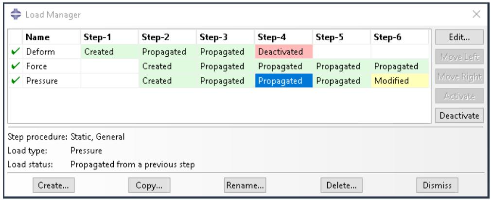

If you clicked Deactivate, the history would change as shown below:


The Propagated status of Pressure in Step-4 changes to Deactivated, and the pressure is inactive in all subsequent steps.


## Note:

You cannot deactivate predefined fields using the Predefined Field Manager; you must select Reset to initial in the predefined field editor (for example, see Defining a temperature field).


## Warning:

If you deactivate an object in a step in which its status is Modified, the modifications to the object are lost. If you later reactivate the object in that step, the original, unmodified version of the object becomes active in that step and in all subsequent steps.

## To reactivate the object in the selected step:

Click Activate to reactivate the object in the selected step.

In the history shown above, for example, the Deactivated status of Pressure in Step-4 is selected. If you clicked Activate, the history would change as shown below:


The Deactivated status of Pressure changes to Propagated in Step-4 and in any following steps.


## Note:

The Activate button is available only in the step in which an object is first deactivated.

You can use the Model Tree to view the status of a step-dependent object, to edit the object, and to deactivate and reactivate the object. However, you must use the step-dependent manager to modify the history of an object by moving it right or left in the sequence of steps. For more information, see The Model Tree.

## Additional information

• What are step-dependent managers?

## Editing step-dependent objects

You can use either menus, managers, or the Model Tree to edit step-dependent objects in a particular step. You cannot edit suppressed objects; you must resume the object before editing. For more information, see Suppressing and resuming objects. (For information about the status of modified objects, see Understanding modified step-dependent objects.)

## Additional information

• What are step-dependent managers?  
• Suppressing and resuming objects  
• Understanding modified step-dependent objects  
• Understanding symbols that represent prescribed conditions  
• Editing the region to which a prescribed condition is applied

## Edit step-dependent objects using menus

1. From the main menu bar, select Edit->object of your choice from the appropriate menu. For example, if you want to edit a load in the Load module, select Load->Edit->load of your choice.  
The appropriate editor appears. The region to which the object is applied becomes highlighted in the current viewport.  
2. In the editor, modify the object definition as desired, and click OK.

## Edit step-dependent objects using managers

1. In the manager, locate the cell of interest. The cell is located in the row of the object that you want to modify and in the column of the step of interest.  
2. In the manager, double-click the cell.


## Note:

Alternatively, you can click the cell of interest and then click Edit.

The appropriate editor appears. Abaqus/CAE highlights the region to which the object is applied.

3. In the editor, modify the object definition as desired, and click OK.

## Edit step-dependent objects using the Model Tree

1. In the Model Tree select the object of interest.  
2. Click mouse button 3 on the object and select Edit from the menu that appears The appropriate editor appears. Abaqus/CAE highlights the region to which the object is applied.  
3. In the editor, modify the object definition as desired, and click OK.

## Working with the Model Tree and the Results Tree

The Model Tree and Results Tree are convenient tools for navigating and managing your models and analysis results.

You can use the Model Tree to view a model and the items that it contains, and you can use the Results Tree to display analysis results from output databases as well as session-specific data such as X–Y plots. Both trees provides shortcuts to much of the functionality of the main menu bar, the module toolboxes, and the various managers. This section describes both the Model Tree and Results Tree.

## In this section:

The Model Tree  
The Results Tree  
Using popup menus in the Model Tree and the Results Tree  
Changing the view of the model

## The Model Tree

The Model Tree provides a visual description of the hierarchy of items in a model.

For example, Figure 1 shows the appearance of the Model Tree after completing the tutorial for a cantilever beam in Creating and Analyzing a Simple Model in Abaqus/CAE.

  
Figure 1:The Model Tree after completing the cantilever beam tutorial.

The Model Tree shares the left side of the Abaqus/CAE interface with the Results Tree and, in the Property module only, a material library. You can click the Model, Results, or Material Library tab to toggle the display between the Model Tree, the Results Tree, and a material library. See The Results Tree, and Using material libraries, respectively,

for more information about the Results Tree and material libraries. In addition, the tip button at the top of the Model Tree provides a quick summary of the functionality of the Model Tree and Results Tree along with a summary of the keyboard shortcuts described at the end of this section.

A complete Abaqus/CAE model contains all of the information required to perform an analysis; for example, all of the parts, materials, steps, and loads and the meshed representation of the assembly. A model also contains the jobs that are submitted to the Abaqus analysis products. For more information, see What does an Abaqus/CAE model contain?. All of these items are represented in the Model Tree.

Items in the Model Tree are represented by small icons; for example, the Steps icon, . In addition, parentheses next to an item indicate that the item is a container, and the number in the parentheses indicates the number of items in the container. You can click on the “plus” and “minus” signs in the Model Tree to expand and collapse a container. The right and left arrow keys perform the same operation.

For example, the Steps container contains all the steps in your model. In the example shown in Figure 1 expanding the Steps container reveals that the model contains two steps—the Initial step and the BeamLoad step. Expanding the BeamLoad step, as shown in Figure 2, reveals that the step has four containers, each of which contains a single item—Field Output Requests, History Output Requests, Loads, and BCs.

  
Figure 2: Containers in the BeamLoad step.

In addition, the step contains four empty containers—ALE Adaptive Mesh Constraints, Interactions, Predefined Fields, and Load Cases. You cannot delete an empty container from the Model Tree, although you can hide empty containers from view (see Changing the view of the model). Finally, expanding the Loads container, as shown in Figure 3, reveals a single load called Pressure that was created in this step.

  
Figure 3:The load in the Loads container.

The arrangement of the containers and items in the Model Tree reflects the order in which you are likely to create your model. A similar logic governs the order of modules in the module menu—you create parts before you create the assembly, and you create steps before you create loads. This arrangement is fixed—you cannot move items in the Model Tree. For more information, see What is a module?.

Abaqus/CAE underlines the current objects in the Model Tree and displays them in the context bar. The model you are working on is a current object. The current part or the current step is also a current object. When you select an item in the Model Tree, Abaqus/CAE highlights that item in the current viewport if the selected item belongs to the current objects. For example, if you select a load, Abaqus/CAE highlights the load in the current viewport if it was applied in the current step of the current model. Containers are not highlighted.

You can select multiple items in the Model Tree, and Abaqus/CAE highlights each of those items if they belong to the current objects. For example, you can select an interaction and a load in the current step of the current model, and Abaqus/CAE highlights both the interaction and the load in the assembly. As you move the cursor over an item, the Model Tree displays some information about the item, as shown in Figure 4. In most cases the same information is available from the item's manager.

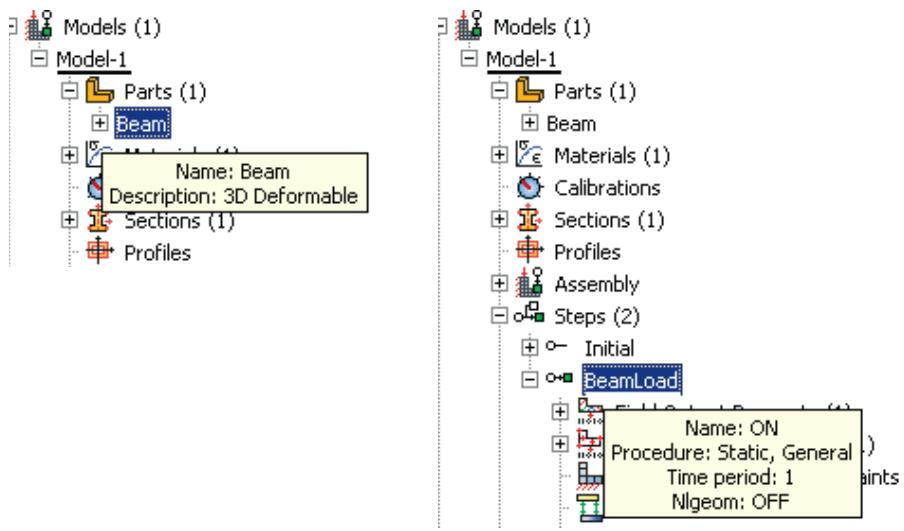  
Figure 4:The Model Tree displays information about the item under the cursor.

Pressing an alphabetic key (a–z) when the cursor is in the Model Tree selects the first item in the tree with a name beginning with that character. Pressing subsequent keys continues to match characters in an item’s name. Table 1 describes all of the keyboard shortcuts that are available for navigation in the Model Tree; you can use these shortcuts to navigate in the Results Tree as well.

Table 1: Keyboard shortcuts in the Model Tree and Results Tree.

<table><tr><td>Keyboard shortcut</td><td>Action</td></tr><tr><td>[Home]</td><td>Go to top of Model Tree or Results Tree</td></tr><tr><td>[End]</td><td>Go to bottom of Model Tree or Results Tree</td></tr><tr><td>Up arrow</td><td>Move up one item</td></tr><tr><td>Down arrow</td><td>Move down one item</td></tr><tr><td>Right arrow</td><td>Expand branch or move down one item</td></tr><tr><td>Left arrow</td><td>Collapse branch or move up one item</td></tr><tr><td>[Del]</td><td>Delete item</td></tr><tr><td>[F2]</td><td>Apply a filter to a container</td></tr></table>

The Model Tree provides most of the functionality of the main menu bar and the module managers. For example, if you double-click on the Parts container, you can create a new part (the equivalent of selecting Part->Create from the main menu bar). If you double-click on a part's feature, you can edit the feature (the equivalent of selecting Feature->Edit from the main menu bar).

You can drag the divider between the Model Tree and the canvas to change the width of the Model Tree. In addition, you can toggle off the display of the Model Tree by selecting View->Show Model Tree from the main menu bar. Pressing [Ctrl] + T has the same effect. To switch to the Results Tree, click the Results tab.

Step-dependent objects are objects that can be propagated between steps; for example, loads and interactions. For more information, see What are step-dependent managers?. Text next to a step-dependent object in the Model Tree, such as (Created) and (Propagated), indicates the status of the object. You can use the Model Tree to change the status of a step-dependent object by clicking mouse button 3 on the object and selecting an action from the menu that appears. The actions correspond to those available in the step-dependent managers. For more information, see Understanding modified step-dependent objects.

You can use the Model Tree to suppress a feature, a constraint (in the Interaction module), a section assignment (in the Property module), or a step-dependent object by clicking mouse button 3 on the item and selecting Suppress from the menu that appears. A red “X” appears next to the item in the Model Tree to indicate that it is suppressed. You can resume the item by clicking mouse button 3 on the item and selecting Resume. Abaqus/CAE removes the red “X” from the Model Tree to indicate that the item is no longer suppressed. The same information is displayed in the managers. For more information, see Suppressing and resuming objects.

## The Results Tree

The Results Tree provides a visual description of the output data available in your session, including all open output databases and session-specific data such as X–Y data and X–Y plots. In addition, the Results Tree enables you to navigate to viewable content in the current model database, such as the loads specified in one step of a particular model.

This tool shares the left side of the Abaqus/CAE interface with the Model Tree and, in the Property module only, a material library. You can click the Model, Results, or Material Library tab to toggle the display between the Model Tree, the Results Tree, and a material library. (For more information on material libraries, see Using material libraries.) The Results Tree also uses all of the same keyboard and navigational shortcuts as the Model Tree; see Table 1 for more information.

Figure 1 shows the appearance of the Results Tree after completing an analysis of the tutorial for the hinge model in Using Additional Techniques to Create and Analyze a Model in Abaqus/CAE. The Output Databases container displays all the output database files that are currently open in your session. In the example shown in Figure 1 the Output Databases container is expanded and reveals that only one output database is open—the PullHinge output database.

  
Figure 1:The Results Tree after completing an analysis of the hinge model tutorial.

Expanding PullHinge, as shown in Figure 2, reveals that this output database has the following containers: History Output, Steps, Instances, Materials, Sections, Element Sets, Node Sets, and Surface Sets. In addition, the output database contains two empty containers—Session Coordinate Systems and ODB Coordinate Systems. You cannot delete an empty container from the Results Tree, although you can hide empty containers from view (see Changing the view of the model).

  
Figure 2:The containers in the PullHinge output database.

Expanding the History Output container, as shown in Figure 3, reveals the sixteen output variables for which history output was requested in this analysis. Each variable listing also describes the region for which history output was requested; in this example every history output request was made for the whole model. You can click any of the history output variables in the Results Tree to plot the selected variable in the current viewport.

  
Figure 3:The History Output container of the Results Tree.

Each output database also includes a Steps container, which includes containers for each step in the output database and within the steps, every frame in the output database. You can use the Results Tree to display the model at any frame of the analysis, to activate or deactivate steps or frames in the analysis, or to display field output at the selected frame.

The Model Database container displays all the models in the current model database. You can expand each model to select the step with data that you want to investigate and to display or hide individual part instances. Figure 4 shows the hinge model with its Steps and Instances containers expanded.

  
Figure 4:The Model Database container of the Results Tree.

The other containers in the Results Tree provide shortcuts to data that persist only during your session. By using these shortcuts, you can create and manage contour spectrums; create and edit X–Y data and display X–Y plots, create and manage paths and display groups; and upload and display background images and movies.

## Using popup menus in the Model Tree and the Results Tree

Much of the power of the Model Tree and Results Tree comes from the popup menu that appears when you click mouse button 3 on an item. For example, Figure 1 shows the effect of clicking mouse button 3 on the Parts container in the Model Tree.

  
Figure 1: Clicking mouse button 3 on the Parts container in the Model Tree.

The Create menu item appears in bold font in Figure 1 because it is the default action. Double-clicking an item or selecting an item and pressing [Enter] invokes the default action. In most cases if an item is a container, the default action is to create a new item in the container. Similarly, if an item is not a container, the default action is to edit the item. For example, if you double-click the Parts container, Abaqus/CAE displays the Create Part dialog box and allows you to create a new part; if you double-click one of the parts within the container, Abaqus/CAE displays the Edit Part dialog box and allows you to edit the part you selected.

Some of the commands in the popup menu appear with all items in the Model Tree and Results Tree; other commands appear only with specific items or with items in one of the two trees. For example, the Switch Context command appears with all items in the Model Tree and Results Tree, including containers. The following commands appear with all containers in the Model Tree and Results Tree:

## Switch Context

If you select Switch Context, Abaqus/CAE makes the item current. In the Model Tree, where appropriate, Abaqus/CAE also switches to the module in which you can edit the item. For example, if you click mouse button 3 on the Materials container and select Switch Context, Abaqus/CAE switches to the Property module. For more information, see What is a module?. In the Results Tree you can also switch the context to an item in another output database.

Selecting a container and pressing [Ctrl][Space] have the same effect as selecting Switch Context from either tree.

## Filter

When you select Filter, Abaqus/CAE prompts you for a string of characters next to the container's name. After you press [Enter], Abaqus/CAE filters the contents of the container and displays only those items that match the specified character string. The filter is case-sensitive. For details on valid filtering syntax, click the tip button


at the top of the Model Tree or Results Tree. Figure 2 shows the effect of filtering a container.

  
Figure 2: Filtering a container in the Model Tree.

Items that are hidden by a filter cannot be manipulated from the Model Tree or Results Tree; however, these items are not removed from the model or output database. When a filter is in effect, the numbers in parentheses next to the container name indicate the number of visible items in the container followed by the total number of items (visible and hidden) in the container (see Figure 2). The filter string appears to the right of these numbers. To remove a filter, select Filter for the appropriate container, delete the filter string, and press [Enter].

Filters can be applied only to individual containers and persist only during your session. Selecting a container and pressing [F2] have the same effect as selecting Filter from either tree.

## Set As Root

If you select Set As Root, Abaqus/CAE moves the container to the pull-down menu above the Model Tree or Results Tree and displays everything under the selected container. For more information, see Changing the view of the model.

## Expand All Under

If you select Expand All Under, Abaqus/CAE expands all of the containers and items inside the selected container.

## Collapse All Under

If you select Collapse All Under, Abaqus/CAE collapses all of the containers and items inside the selected container.

## Group Children

When a container includes more than 30 items, Abaqus/CAE automatically groups the items into sets of 30. If you toggle off the Group Children option, Abaqus/CAE removes the groupings and lists all of the items on the same level in the container.

Selecting a container and pressing [Ctrl][G] have the same effect as selecting Group Children from either tree.

Many popup menu commands appear only with specific items. In the Model Tree these commands mirror the actions that you can perform with that item's manager; for example, create, edit, delete, rename, suppress, and resume. In the Results Tree some popup menus provide Boolean operators that enable you to control the display of items in the current viewport. These Boolean operators are the same five commands that are available for controlling display groups: replace, add, remove, intersect, and either. See Understanding display group Boolean operations, for more information.

Some menu commands are specific to one container in the Model Tree or Results Tree; for example, clicking mouse button 3 on a step allows you to toggle the Nlgeom setting, clicking mouse button 3 on a job allows you to submit the job for analysis, and clicking mouse button 3 on a history output variable allows you to add another variable to the existing plot. When you become familiar with the Model Tree and Results Tree, you will find that you can quickly perform most of the actions that are found in the main menu bar, the module toolboxes, and the various managers.

## Changing the view of the model

If you select Set As Root from a container's popup menu, Abaqus/CAE displays everything under the selected container in the Model Tree or Results Tree and displays the name of the container in the menu above the tree. This option is useful if, for example, you have a complex model or output database and correspondingly complex Model Tree or Results Tree. You can use Set As Root to simplify the Model Tree or Results Tree by displaying only the portion that you are working on. For example, Figure 1 shows a view of the Model Tree on the left and contrasts it with the effect of setting the Materials container as the root.

  
Figure 1:The effect of Set As Root on the Model Tree.

When you change the default root container, you can use the menu above the Model Tree and Results Tree to move up through its levels. In addition, Abaqus/CAE activates two icons above the Model Tree or Results Tree, as shown in Figure 1: the Set Root to Model Database icon in the Model Tree, the Set Root to Session Data icon in the Results Tree, and the Up One Level icon in both trees.

The Set Root to Model Database icon $a _ { 2 } = - \frac { 3 } { 2 }$ returns the Model Tree to the default view that shows Model Database at the top of the tree. The Set Root to Session Data icon $a _ { 2 } = - \frac { 3 } { 2 }$ 上 returns the Results Tree to the default view that shows Session Data at the top of the tree.  
The Up One Level icon 自 moves the root of the Model Tree or Results Tree up one level; for example, from the Materials container up one level to the Beam model that contains the Materials container.

If you click mouse button 3 on the background of the Model Tree or Results Tree, Abaqus/CAE displays a popup menu with the following options:

## Show Empty Containers

By default, Abaqus/CAE displays all of the containers in the Model Tree and Results Tree, whether or not they have items in them. By turning off the Show Empty Containers option, you can suppress the display of containers without any items in them. If you perform an action in Abaqus/CAE that adds an item to a previously empty container (for example, creating an interaction using the Interaction module toolbox), the container and item will reappear in the Model Tree or Results Tree. For a container to be suppressed from view, it must be completely empty; even if all items in a container are hidden because of a filter (see Using popup menus in the Model Tree and the Results Tree), that container is not suppressed by the Show Empty Containers option.

The state of the Show Empty Containers option persists between Abaqus/CAE sessions.

## Expand All

If you select Expand All, Abaqus/CAE expands all of the containers and items in the Model Tree or Results Tree.

## Collapse All

If you select Collapse All, Abaqus/CAE collapses all of the containers in the Model Tree or Results tree, leaving only top-level containers and items visible.

## Set Root to Displayed Object

If you select Set Root to Displayed Object, the container corresponding to the part visible in the current viewport becomes the root of the Model Tree (as described above). If an assembly is visible in the current viewport, the Assembly container for the appropriate model becomes the root of the Model Tree.

This option is available only in the Model Tree.

## Set Root to Model Database

If you select Set Root to Model Database, Abaqus/CAE returns the Model Tree to the default view that shows Model Database at the top of the tree. This option has the same effect as the Set Root to Model Database icon

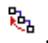

This option is available only in the Model Tree.

## Set Root to Session Data

If you select Set Root to Session Data, Abaqus/CAE returns the Results Tree to the default view that shows Session Data at the top of the tree. This option has the same effect as the Set Root to Session Data icon This option is available only in the Results Tree.

## Understanding Abaqus/CAE GUI settings

GUI settings are always saved automatically to a binary file in your home directory called abaqus\_2025.gpr when you exit Abaqus/CAE. For more information, see Working with abaqus\_2025.gpr files.

These GUI settings include the following:

• The size and location of the main window.  
• The size and location of a particular dialog box; for example, the Open Database and Create Part dialog boxes.  
• The location, orientation, and visibility of individual toolbars.  
• Custom toolbars.  
• Customized keyboard shortcuts.  
• The size of the message area and command line interface.  
• Whether the Model Tree and Results Tree are displayed. The width of the tree area is also stored.  
• Bookmarks to directories that you created when opening a file.

You cannot edit the abaqus\_2025.gpr file; however, you can delete it to restore the default GUI and display options settings.


## Warning:

Deleting the abaqus\_2025.gpr file resets all of the GUI settings listed above. You cannot restore the settings from a deleted abaqus\_2025.gpr file except by recreating them manually in Abaqus/CAE.

## Managing viewports on the canvas

The canvas can be thought of as an infinite screen or bulletin board on which you post viewports; you can imagine the canvas extending beyond the main window and your monitor.

The visible portion of the canvas is called the drawing area, and you can increase its size by increasing the size of the main window. You can display the drawing area full screen using the View menu; you can also press [F11] to toggle between full screen mode and normal mode.

You can position viewports anywhere on the canvas, and you can drag them outside the drawing area. When viewports are positioned outside the drawing area, you can cascade or tile the viewports to bring them back into view. Viewports are not part of a model and are not saved between sessions.

This chapter explains how to create and manipulate viewports, text annotations, and arrow annotations.

## In this section:

Understanding viewports  
Manipulating viewports and viewport annotations  
Displaying the drawing area in full screen mode  
Working with viewports  
Working with viewport arrow and text annotations  
Linking viewports for view manipulation  
Working with background images and movies in viewports

## Understanding viewports

Viewports are areas on the canvas where you can display models or analysis results. You can add arrow and text annotations to draw attention to or explain features within a viewport. You can create and manipulate viewports, text, and arrows using the Viewport menu.

## In this section:

What is a viewport?  
What are arrow and text annotations?

## What is a viewport?

While the canvas can be thought of as an infinite screen or bulletin board, viewports are simply display areas posted onto that screen on which you can display models or analysis results. You can have many viewports on the canvas. A viewport is similar to other windows on your workstation in that it can be moved, resized, minimized, and maximized; and it can overlap other viewports on the canvas. For more information, see Working with viewports.

You can easily create and delete viewports and control their size, position, and appearance. Figure 1 illustrates how you might use several viewports to view the results from your analysis.

  
Figure 1: Working with multiple viewports.

The view manipulation tools, such as zoom and rotate, operate on the viewport that contains the cursor. Other operations interact with the current viewport or with all viewports on the canvas.

## The current viewport

To change the contents of a viewport, you must first designate the desired viewport as current. The current viewport is indicated by a dark gray title bar. All work takes place within the current viewport. To choose another viewport as the current viewport, click on the border or title bar. The selected viewport moves in front of other viewports on the canvas, and the title bar color changes to blue. The title bar reverts to dark gray when you select an Abaqus/CAE tool or menu.


## Note:

On Windows platforms you can customize the colors used by Abaqus/CAE. For more information, see Common customizations on Windows platforms.

All viewports are associated with a certain model and module. When you create a new model or open an existing model or output database, that model becomes associated with the current viewport. You can create different viewports and associate each one with a different model, so designating each viewport as current results in

switching between the associated models. Similarly, you can work in multiple modules simultaneously by designating a new viewport as current before entering a different module.

## Additional information

• Components of the main window

## What are arrow and text annotations?

Arrow and text annotations are arrows and text strings that you create in a viewport to enhance the appearance and clarity of displayed models or results. You can create arrow annotations and text annotations independently, and you can create arrows and text together to automatically position text at the end of an arrow. The positions of annotations in a viewport are controlled by anchor points. You define each anchor point based on viewport geometry or model coordinates; the method you choose determines how Abaqus/CAE moves the annotations. If you manipulate the viewport, Abaqus/CAE repositions any annotations anchored to viewport geometry; similarly, if you manipulate the model, Abaqus/CAE moves any annotations anchored to the model. Figure 1 shows the use of arrows and text to describe details of a model.

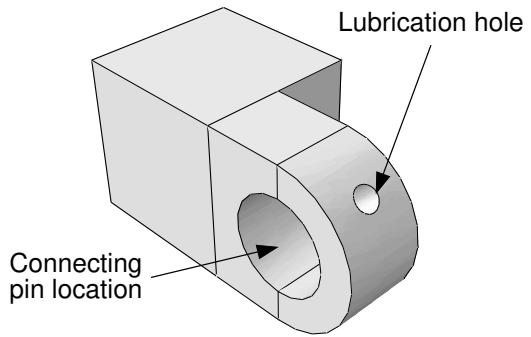  
Figure 1: Arrow and text annotations.

Annotation editing operations require you to first select one or more annotations. Use the Edit Annotations tool 网 from the Viewport toolbar to select arrow or text annotations from the current viewport. Abaqus/CAE highlights selected arrow or text annotations along with their anchor points, as shown in Figure 2.

  
Figure 2: Selected annotations: an arrow with no offsets, text with an offset, and an arrow with gaps at both ends and an offset between the tail and its anchor point.

Anchor points are shown as a small dot with an anchor symbol placed nearby. Dashed lines indicate an offset between the anchor point and the annotation; circular “handles” are the anchor connection points—if there is no offset, the connection point and anchor point are the same.

Arrow annotations have two anchor points (you can use the same coordinates for both points). You can add a gap between the arrow ends and the connection points. Adding a gap is comparable to leaving a space between dimension lines and object lines in the Sketcher or in a CAD drawing; it can increase the clarity of your annotation. Text annotations have a single anchor point. You can change the offsets by dragging the connection points, or the entire annotation, in the viewport.

Do not confuse the viewport annotations that you can create with the viewport annotations generated by Abaqus/CAE. The generated viewport annotations include the view orientation triad; the 3D compass; and, in the Visualization module, the legend, the title block, and the state block. You can modify some display aspects of the generated annotations, but you cannot modify their contents. For more information, see Customizing viewport annotations. In contrast, you have full control of all attributes related to arrow and text annotations including their colors, line styles, line thicknesses, arrowheads, fonts, anchor points, and any offsets between the anchor points and the annotations.

Abaqus/CAE saves arrow and text annotations in model and output databases; however, viewports are not saved. As a result, the arrow and text annotations in a database are not associated with a viewport. When you subsequently open a database that contains annotations, you must use the Annotation Manager to display a selected annotations in the current viewport. The Annotation Manager also allows you to copy annotations from a model database to an output database and vice versa. You cannot create annotations in a model database from the Visualization module; open the model database in a different module if you want to create annotations for it.

## Additional information

• Components of the main window  
• Working with viewports  
• Working with viewport arrow and text annotations

## Manipulating viewports and viewport annotations

This section explains how to manipulate viewports and viewport annotations using the options provided in the Viewport menu, the Viewport toolbar, and the Annotation Manager.

## In this section:

Managing viewports and viewport annotations from the main menu bar  
Managing viewports and viewport annotations from the Viewport toolbar  
The Annotation Manager

## Managing viewports and viewport annotations from the main menu bar

Use the Viewport menu, located on the main menu bar, to create, delete, modify, link, or rearrange viewports and to create or edit viewport annotations—both those that you create and those generated by Abaqus/CAE. If you prefer, you can select View->Toolbars->Viewport from the main menu bar to display a toolbar containing most of the functionality of the items in the Viewport menu.

The Viewport menu and toolbar allow you to do the following:

Create a viewport.  
Edit options for generated viewport annotations (triad, legend, title block, and state block).  
Create an arrow annotation.  
• Create a text annotation.  
• Create a combined arrow and text annotation.  
Edit arrow and text annotations.  
• Open the Annotation Manager to manipulate arrow and text annotations.


## Note:

The Annotation Manager provides several unique management functions; for more information, see The Annotation Manager.

• Open the Viewport Annotation Options to show or hide all annotations and to manipulate the viewport annotations generated by Abaqus/CAE.  
Link viewports.

In addition, the Viewport menu lists all the viewports in the session and allows you to delete the current viewport.

## Additional information

• Managing viewports on the canvas

## Managing viewports and viewport annotations from the Viewport toolbar

To display the Viewport toolbar, + select View->Toolbars->Viewport from the main menu bar. Figure 1 describes the tools available from the Viewport toolbar.

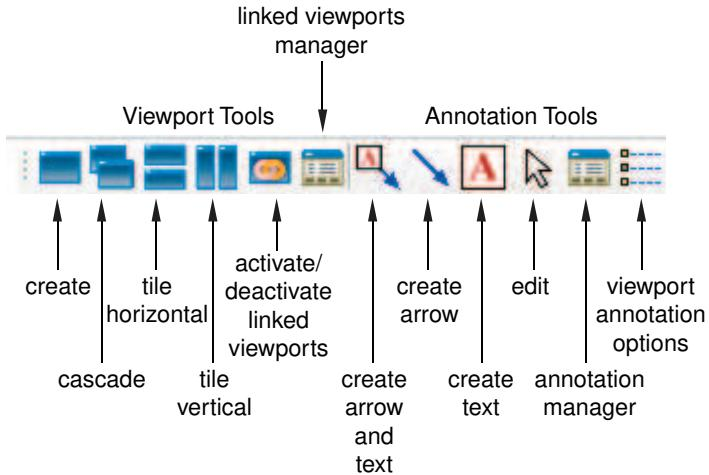  
Figure 1:The Viewport toolbar.

## Additional information

• Managing viewports on the canvas

## The Annotation Manager

The Annotation Manager is similar to other manager dialog boxes in Abaqus/CAE. It allows you to do the following:

• Create arrow, text, or combined arrow and text annotations.  
Edit an arrow or text annotation.  
• Copy or rename an annotation.  
• Delete annotations.

In addition, the Annotation Manager allows you to perform the following tasks that are not available from the Viewport menu or toolbar:

• Select the source—model database (MDB) or output database (ODB)—of annotations to manage.  
• Plot model database or output database annotations in the current viewport.  
• Hide model database or output database annotations in the current viewport.  
• Copy annotations from a model database to an output database and vice versa.  
• Highlight annotations in the viewport.  
• Rearrange the order of arrow and text annotations in the list.

You can display the Annotation Manager by selecting Viewport->Annotation Manager from the main menu bar


in the Viewport toolbar. The Annotation Manager is shown in Figure 1.

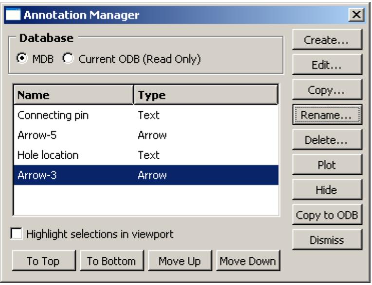  
Figure 1:The Annotation Manager.

For detailed instructions on using the Annotation Manager to create, edit, and manipulate annotations, see the following sections :

Annotating viewports  
Editing arrow annotation attributes  
Editing text annotation attributes  
Plotting annotations in the current viewport  
Copying viewport annotations to another database

Rearranging the annotation list order

## Additional information

• Managing viewports on the canvas

## Displaying the drawing area in full screen mode

The drawing area is the visible portion of the canvas. You can display the drawing area in full screen mode. If you are in the Visualization module, the Animation Controls are available as a separate toolbar; otherwise, no menu bars or toolbars are accessible in full screen mode. To make a toolbar accessible in full screen mode, you can click and drag the toolbar's grip to “undock” the toolbar prior to switching modes.

1. From the main menu bar, select View->Full Screen.


Tip: You can also press [F11] to toggle between full screen mode and normal mode.

The drawing area enlarges to fill the entire screen.

2. Click the restore button in the title bar to return the drawing area to its previous size.

## Additional information

• Managing viewports on the canvas

## Working with viewports

This section explains how to create and manage viewports and how to modify their appearance.

## In this section:

Creating new viewports  
Selecting viewports  
Moving viewports  
Resizing viewports  
Minimizing, maximizing, restoring, or deleting a viewport  
Cascading viewports  
Tiling viewports

## Creating new viewports

You can create new viewports at any time; there is no limit to the number of viewports or their position on the canvas.

From the main menu bar, select Viewport->Create.

Abaqus/CAE creates a new viewport in the drawing area. This viewport becomes the current viewport.

The new viewport size and position depend on the size of the current viewport and the drawing area. If the current viewport is maximized, Abaqus/CAE automatically maximizes the new viewport.


Tip: You can also create a new viewport by clicking in the Viewport toolbar.

## Additional information

• Managing viewports on the canvas

## Selecting viewports

Most of your interactions with the model—such as sketching a part, positioning a load, assembling part instances, generating a mesh, and customizing a plot state—take place in the current viewport. In addition, if you have multiple viewports displayed on the canvas, the current viewport indicates the model you are working on (the current model) and the module you are working in (the current module).

There are several ways that you can select a new viewport to be the current viewport:

• Click on the border or title bar of an existing viewport.  
• Select an existing viewport from the list in the Viewport menu.  
• Use [Ctrl][Tab]—or select Next or Previous from the Viewport menu—to cycle through all the viewports on the canvas.


## Note:

On Linux platforms [Ctrl][Tab] is used to switch applications; [Ctrl][F6] is an alternative keyboard shortcut.

• Create a new viewport.

The current viewport has a dark gray title bar as shown in the following figure:

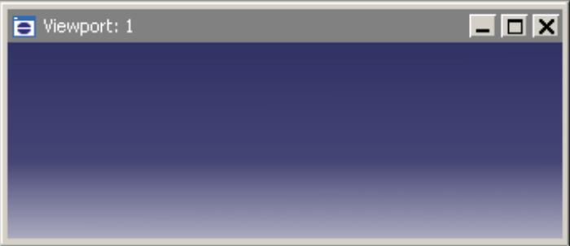

1. Move the cursor onto the border of the viewport.  
If the viewport is hidden, you may need to move other viewports to expose the one you want to select. For more information, see Moving viewports.

2. Click mouse button 1.

The viewport becomes the current viewport; the viewport also becomes selected and its title bar changes to blue to indicate that it is the selected viewport. If you click on a tool or menu, the viewport remains current but the title bar reverts to dark gray.


## Note:

On Windows platforms you can customize the colors used by Abaqus/CAE. For more information, see Common customizations on Windows platforms.

## Additional information

• Cascading viewports  
• Tiling viewports  
• Managing viewports on the canvas

## Moving viewports

You can move a selected viewport to any location on the canvas. This may be necessary to expose hidden viewports or simply to reduce clutter in the drawing area. To move a viewport, click anywhere on the viewport title bar and then drag it to the desired position.

1. Place the cursor anywhere on the viewport title bar.  
2. Click mouse button 1, and + drag the cursor to the new location.

The cursor changes to a four-headed arrow . An outline of the viewport indicates its new position as you drag.

3. Release mouse button 1.

The viewport moves to the new location, and it becomes the current viewport (if it was not previously).

## Additional information

• Selecting viewports  
• Managing viewports on the canvas

## Resizing viewports

You can change the size and shape of a viewport by dragging its borders.

1. Place the cursor anywhere on the viewport border that you want to move.  
The cursor changes to a set of opposing arrows. The direction of the arrows is dependent on the relative position between the cursor and the viewport.  
2. Click mouse button 1, and + drag the cursor to change the position of the borders.  
3. Release mouse button 1.  
The viewport is displayed with the new size, and it becomes the current viewport (if it was not previously).

## Additional information

• Selecting viewports  
• Managing viewports on the canvas

## Minimizing, maximizing, restoring, or deleting a viewport

Minimize, maximize, restore, and delete buttons are located in the top right corner of each viewport.

These buttons appear as shown in the following figure:


If necessary, Tile or Cascade viewports to reveal the minimize, maximize, restore, and delete buttons.

## The minimize button

When you click the minimize button, the viewport reduces to an abbreviated title bar in a default location toward the lower left of the drawing area. The minimize button changes to a restore button that is retained, along with the maximize and delete buttons, in the title bar. If you move a minimized viewport, the new location will be saved as its minimized location for the duration of the Abaqus/CAE session.

## The maximize button

When you click the maximize button, the viewport changes size and position to fill the canvas. The maximize button changes to a restore button and is moved, along with the minimize and delete buttons, to the right side of the main menu bar. The maximized viewport becomes the current viewport and is moved to the front of the canvas, hiding any other viewports in the drawing area. The information in the viewport title bar is displayed in the Abaqus/CAE title bar.

## The delete button

When you click the delete button or select Viewport->Delete Current from the main menu bar, the viewport is deleted from the canvas. You cannot restore a deleted viewport. If there is only one viewport on the canvas, Abaqus/CAE does not allow you to delete it. If you have created additional viewports on the canvas, Abaqus/CAE deletes the current viewport and selects one of the other viewports to be the current viewport. You cannot control which viewport Abaqus/CAE selects to be current.

## The restore button

The restore button replaces either the minimize button or maximize button, whichever you used most recently. When you click the restore button, Abaqus/CAE returns the viewport to its previous size and location. The restore button reverts to the minimize or maximize button that it had replaced. The restored viewport becomes the current viewport and is moved to the front of the canvas, hiding any other viewports in the drawing area.

## Additional information

• Working with viewports  
• Managing viewports on the canvas

## Cascading viewports

You can arrange the viewports on the canvas in a cascading pattern. This may be useful to expose hidden viewports or simply to reduce clutter in the drawing area. Abaqus/CAE arranges the viewports so that the title bars are visible but the contents may be hidden by another viewport.

1. Use the Minimize button in the upper right corner of a viewport to minimize any viewports that you do not want to cascade.  
2. From the main menu bar, select Viewport->Cascade.

Abaqus/CAE sets all the non-minimized viewports to the same size and arranges them from the upper left corner toward the lower right corner of the drawing area. The current viewport is always positioned at the front of the canvas; all other viewports are arranged in numerical order. Minimized viewports are positioned in front of any cascaded viewports except the current viewport.


Tip: You can also cascade non-minimized viewports by clicking


in the Viewport toolbar.

## Additional information

• Minimizing, maximizing, restoring, or deleting a viewport  
• Managing viewports on the canvas

## Tiling viewports

You can arrange the viewports on the canvas in a tile pattern. This may be useful to expose hidden viewports or simply to reduce clutter in the drawing area. Abaqus/CAE arranges the viewports so that the contents are visible but parts of the title bars may be hidden.

1. Use the Minimize button in the upper right corner of a viewport to minimize any viewports that you do not want to tile.  
2. Do one of the following:

• From the main menu bar, selectViewport->Tile Horizontally to tile the viewports while retaining the largest possible horizontal dimension.  
• From the main menu bar, selectViewport->Tile Vertically to tile the viewports while retaining the largest possible vertical dimension.

Abaqus/CAE sets all the non-minimized viewports to the same size and arranges them to fill the drawing area. All tiled viewports are arranged in numerical order. Minimized viewports are positioned in front of any tiled viewports except the current viewport.


Tip: You can also tile non-minimized viewports by clicking or in the Viewport toolbar.

## Additional information

• Managing viewports on the canvas

## Working with viewport arrow and text annotations

This section explains how to create, modify, and manage arrow and text annotations.

## In this section:

Annotating viewports  
Creating an arrow annotation  
Creating a text annotation  
Creating combined arrow and text annotations  
Manipulating annotations in the current viewport  
Editing arrow annotation attributes  
Editing text annotation attributes  
Plotting annotations in the current viewport  
Hiding annotations in the current viewport  
Copying viewport annotations to another database  
Rearranging the annotation list order

## Annotating viewports

Abaqus/CAE provides three types of viewport annotations that you can use to annotate models or results: text strings, arrows, and a combination arrow and text annotation. You use the Viewport menu to create these annotations, and you can position them anywhere on the viewport. Figure 1 shows text strings and arrows used to annotate a model. Arrow and text annotations are anchored to points in the viewport. The anchor points define the position of the annotation with respect to either the viewport size and shape or a point in the model coordinates. When you manipulate the model or resize the viewport, the annotations follow the position of their anchor points.

  
Figure 1: Arrow and text annotations.

Viewport arrow and text annotations are saved with the model database or with the output database when you exit the Abaqus/CAE session. You can also copy annotations from a model to an output database and vice versa.


Warning: You can always create or copy annotations to an output database; however, you can save them only if you opened the database with write privileges.

## Text

Text annotations can consist of any characters that can be displayed using the fonts available on your workstation. Abaqus/CAE does not restrict the length or number of text lines in an annotation. However, you must take the size of the viewport into consideration when creating text annotations; the text should fit in the desired viewport location. You can place text anywhere on the viewport, and you can move a text annotation or change its anchor point after you have created it. Each text annotation can be displayed using different fonts, colors, and backgrounds, but you cannot change these attributes within a single text annotation.

## Arrows

You can create arrows anywhere in the viewport; typically, an arrow will connect a text annotation to a point in model coordinates. Arrows can have one of several different line thicknesses, line styles, and endpoint styles and can be displayed in any color available on your workstation. You can use one or two anchor points to control the position of an arrow annotation. For example, you can anchor the arrowhead to a point on the model and the tail to a viewport location so that when the model is manipulated the arrow still points to the desired feature but the tail is stationary. You can modify and move an arrow after you have created it.

## Arrow and text combination

You can create a combined arrow and text annotation. This method uses a reduced set of options to create an arrow annotation, anchored at the arrowhead, with a text annotation positioned at the arrow's tail. This creation method is provided to simplify the addition of information about specific parts of a model or results. You cannot

edit the annotations' position during creation, except by using the Previous button ( ) in the prompt area.

However, once you create them, the arrow and text are saved independently; so you can edit them using all the options available for each annotation type.

In addition to the viewport annotations that you can create, Abaqus/CAE generates some annotations to provide the context of the view in a viewport. Abaqus/CAE generates the 3D compass and the view triad to show the orientation of the model in the viewport; in the Visualization module the legend, the title block, and the state block are generated to indicate various aspects of the analysis results in the viewport. The Viewport Annotation Options dialog box allows you to show or hide all viewport annotations—yours and those generated by Abaqus/CAE—you can also use it to edit the attributes of the generated annotations. For more information, see Customizing viewport annotations.

## Additional information

• What are arrow and text annotations?  
• Creating an arrow annotation  
• Creating a text annotation  
• Creating combined arrow and text annotations  
• Customizing viewport annotations

## Creating an arrow annotation

You can create an arrow to help annotate the contents of a viewport, and you can place the arrow anywhere on the viewport. Typically, you would use a combined arrow and text annotation to connect a text annotation to an object in a viewport, but you may want to add individual arrows if a text annotation applies to multiple locations or if you want full control over the anchor points and position without editing the arrow after you create it.

1. From the main menu bar, select Viewport->Create Annotation->Arrow.


Tip: You can also create an arrow annotation by clicking in the Viewport toolbar.

An anchor symbol appears in the viewport. The default anchor point changes as you create new annotations in the session. If this is the first arrow annotation, the anchor point is in the lower left corner of the viewport.

2. If desired, click Change Anchor in the prompt area and do one of the following:

• Choose a new anchor point in the viewport.  
• Select a viewport corner or center point from the list in the prompt area.  
Click Pick From Model in the prompt area, and select a node or vertex or enter the coordinates of the desired anchor point.


## Note:

If you anchor an annotation to a node or vertex, Abaqus/CAE uses the model coordinates of the selected point; the annotation will not follow model deformation in the Visualization module.

3. Choose one of the following options to position the endpoint of the arrow:

• To position the endpoint on the current anchor point, click On Anchor in the prompt area.  
• To position the endpoint anywhere on the viewport, move the cursor to the desired position, and + click mouse button 1.

By default, Abaqus/CAE creates an arrowhead at the first endpoint; the second endpoint does not have a symbol.

4. Repeat Steps 2 and 3 to anchor and position the second endpoint of the arrow annotation.

Abaqus/CAE opens an Arrow Editor dialog box.

5. Complete the information in the Arrow Editor dialog box to finalize the arrow annotation.

For more information, see Editing arrow annotation attributes.

6. Click Preview to view your changes in the viewport.

7. To finish creating your arrow annotation, click OK. Abaqus/CAE updates your changes in the viewport, closes the editor, and begins creating another arrow annotation starting at Step 2.

8. To stop creating arrow annotations, click mouse button 2 in the viewport or the button in the prompt area.

## Additional information

• What are arrow and text annotations?  
• The Annotation Manager  
• Manipulating annotations in the current viewport  
• Editing arrow annotation attributes

## Creating a text annotation

You can create one or more lines of text to annotate the contents of a viewport and place them anywhere on the viewport. Typically, you would use a combined arrow and text annotation to connect a text annotation to an object in a viewport, but you may also add text annotations to provide a title or other general information that applies to the entire model or results in the viewport.

1. From the main menu bar, select Viewport->Create Annotation->Text.


Tip: You can also create a text annotation by clicking in the Viewport toolbar.

An anchor symbol appears in the viewport with the annotation Text-n. The default anchor point changes as you create new annotations in the session. If this is the first text annotation, the anchor point is in the lower left corner of the viewport.

2. If desired, click Change Anchor in the prompt area and do one of the following:

• Choose a new anchor point in the viewport.  
• Select a viewport corner or center point from the list in the prompt area.  
Click Pick From Model in the prompt area, and select a node or vertex or enter the coordinates of the desired anchor point.


## Note:

If you anchor an annotation to a node or vertex, Abaqus/CAE uses the model coordinates of the selected point; the annotation will not follow model deformation in the Visualization module.

3. Choose one of the following options to position the text annotation in the viewport:

• To position the text on the current anchor point, click On Anchor in the prompt area.  
• To position the text anywhere on the viewport, move the cursor to the desired position, and + click mouse button 1.

Abaqus/CAE opens a Text Editor dialog box.

4. Complete the information in the Text Editor dialog box to finalize the text annotation.

For more information, see Editing text annotation attributes.

5. Click Preview to view your changes in the viewport.  
6. To finish creating your text annotation, click OK.

Abaqus/CAE updates your changes in the viewport, closes the editor, and begins creating another text annotation starting at Step 2.

7. To stop creating text annotations, click mouse button 2 in the viewport or the button in the prompt area.

## Additional information

• What are arrow and text annotations?  
• The Annotation Manager  
• Manipulating annotations in the current viewport

• Editing text annotation attributes

## Creating combined arrow and text annotations

You can create an arrow and a text annotation at the same time to relate the text to a particular feature or result in the viewport.

This method creates an arrow annotation with the anchor point at the arrowhead and a separate text annotation anchored at the same location and positioned at the arrow's tail. During creation, your annotation options are limited; for example, you cannot offset the arrowhead from the anchor point or select a second anchor point for the tail of the arrow (the text position).

Once you create them, Abaqus/CAE saves the arrow and text annotations independently so that you can edit them using all the options available for each annotation type as described in Editing arrow annotation attributes, and, Editing text annotation attributes, respectively. Since they are not linked, you can also move the arrow and text independently.


Tip: To move an arrow and text annotation while keeping the same relative positions, select both annotations and position the text in the desired location, then select only the arrow to edit the arrowhead position.

## Additional information

• What are arrow and text annotations?  
• Manipulating annotations in the current viewport

## Create combined arrow and text annotations

1. From the main menu bar, select Viewport->Create Annotation->Arrow & Text.


Tip: You can also create an arrow and text annotation by clicking in the Viewport toolbar.

2. Select the arrow target by choosing a model node or vertex in the viewport or entering model coordinates in the prompt area.  
Abaqus/CAE displays the anchor symbol and arrowhead at the selected point and the default text string Text–n appears at the cursor position.  
3. Position the text on the viewport; move the cursor to the desired text position and click mouse button 1.  
Abaqus/CAE displays the Arrow & Text Editor dialog box.  
4. Complete the information in the Arrow & Text Editor dialog box to finalize both annotations.  
Click Preview at any time to see your changes in the viewport; click OK to save the arrow and text annotations and to close the Arrow & Text Editor.

## Edit the text

1. Click the Text tab in the Arrow & Text Editor, if it is not already selected.  
2. To display or suppress a box outlining the text, toggle Show bounding box. The bounding box visually separates the text from the underlying model or results.  
3. Type the desired text.  
When typing a text annotation, you can use standard mouse and keyboard editing techniques such as backspace, copy, and paste; press [Enter] to start a new line.

4. To customize the background, click one of the following:

• Match viewport to match the background to the viewport color.  
• Transparent to eliminate the background and show only the text.

• Other color to reveal other background color options.

If you selected Other color:

a. Click the color sample .

Abaqus/CAE displays the Select Color dialog box.

b. Use one of the methods in the Select Color dialog box to select a new color. For more information, see Customizing colors.

c. Click OK to close the Select Color dialog box.

The color sample changes to the selected color.

5. Customize the text font.

a. Click Set Font.

The Select Font dialog box appears.

b. Use the Select Font dialog box to choose the font characteristics you want. For more information, see Customizing fonts.

c. When you are done, click OK to implement your changes and to close the Select Font dialog box.

6. Choose the text color.

a. Click the color sample .

Abaqus/CAE displays the Select Color dialog box.

b. Use one of the methods in the dialog box to select a new color. For more information, see Customizing colors.

c. Click OK to close the Select Color dialog box.

The color sample changes to the selected color.

7. Choose Left, Center, or Right justification to arrange the text within the bounding box area.

## Edit the arrow

1. Click the Arrow tab in the Arrow & Text Editor, if it is not already selected.

2. Select the desired line style; you can choose a solid line or several styles of dashed line for your arrow.

3. Select the desired line thickness.


## Note:

Changing the line thickness also changes the size of the arrowheads.

4. Select the desired arrowhead symbol.

5. Choose the arrow color.

a. Click the color sample .

Abaqus/CAE displays the Select Color dialog box.

b. Use one of the methods in the dialog box to select a new color. For more information, see Customizing colors.

c. Click OK to close the Select Color dialog box.

The color sample changes to the selected color.

## Manipulating annotations in the current viewport

To manipulate viewport arrow and text annotations, you must first select them. Use Viewport->Edit Annotations from the main menu bar to select arrow or text annotations from the current viewport.


## Note:

To manipulate the viewport annotations generated by Abaqus/CAE, use the Viewport Annotations Options dialog box (for more information, see Customizing viewport annotations”).

You can move, copy, edit, hide, or delete the selected annotations. You can also rearrange the order that Abaqus/CAE uses to display annotations; the order determines which annotation will be “in front” if viewport or model manipulations cause more than one annotation to appear in the same location.

1. From the main menu bar, select Viewport->Edit Annotations.


Tip: You can also edit an annotation by clicking in the Viewport toolbar. $\mathbb { A }$

2. Click an arrow or text annotation to select it. To select additional annotations, [Shift] + Click instead of clicking. For more information, see Selecting objects within the current viewport.

Abaqus/CAE highlights the selected annotations and their anchor points. Circular handles are the anchor connection points; they appear near each end of a selected arrow and at the reference point of a selected text annotation. Dashed lines indicate an offset between the anchors and the handles.

3. Do one of the following:

## To move or copy annotations:

If you selected text or multiple annotations, drag your selection to move it around the viewport. Press [Ctrl] before releasing mouse button 1 to copy the annotations instead of moving them. If you selected a single arrow annotation, drag the arrow shaft to move the arrow. You can drag annotations anywhere on the viewport, even outside the viewable area. Moving or copying annotations in the viewport does not change their anchor points.

## To move or copy the ends of an arrow annotation:

If you selected a single arrow annotation, notice that the circular handles are larger than when you select multiple annotations; this indicates that you can move each end of the arrow independently. Drag one of the circular handles to lengthen, reduce, or reorient the arrow. Press [Ctrl] before releasing mouse button 1 to create radial copies of the arrow instead of moving it. You can drag the endpoint anywhere on the viewport, even outside the viewable area. Moving or copying an arrow by dragging an endpoint does not change the arrow's anchor points.

## To edit an annotation:

Double-click an arrow or text annotation to open the Arrow Editor or Text Editor dialog box, respectively. If you prefer, you can also click mouse button 3 and select Edit from the popup menu.

• For an arrow annotation you can change the line style, line weight, or color; and you can change the offset, arrowhead style, and anchor point for each end of the arrow, as well as add a gap between the handle positions and the arrow endpoints. For more information, see Editing arrow annotation attributes.

For a text annotation you can edit the text; show or hide a box around the text; change the background color, font, font color, justification, and rotation; or change the reference point, anchor point, and offset. For more information, see Editing text annotation attributes.

## To hide selected annotations:

Click mouse button 3, and select Hide from the menu that appears.

Abaqus/CAE removes the selected annotations from the current viewport. To show the annotations again, you can plot them from the Annotation Manager. You can also hide or plot annotations by selecting them in the Model Tree, clicking mouse button 3, and selecting the desired option from the menu that appears.

## To delete selected annotations:

Press Backspace or Delete. Abaqus/CAE displays a warning dialog box; click Yes to delete the annotations.

Abaqus/CAE deletes the selected annotations from both the current viewport and the associated database.

## To rearrange the display order of annotations:

By default, Abaqus/CAE displays viewport annotations in the order that they are created or plotted in the viewport; the last annotation created or plotted will appear in front of any preexisting annotations. Changes in the display order will not affect the current view unless two or more annotations appear in the same location. All viewport annotations are displayed in front of the model.

Click mouse button 3, and select Bring to Front, Send to Back, Bring Forward, or Send Backward from the popup menu to change the display order. Alternatively, to move a single annotation to the front, plot it again from the Annotation Manager.

## Additional information

• What are arrow and text annotations?  
• The Annotation Manager

## Editing arrow annotation attributes

You can change the following attributes of arrow annotations:

• Name (use the Annotation Manager to rename existing annotations).  
• Line thickness and line style.  
• Color.  
• Anchor point and offset for each end.  
• Endpoint style.  
Gap between the endpoint and the arrowhead or tail position.

If you are creating a new annotation, Abaqus/CAE applies many of your customizations not only to the current annotation but also to any new annotations you subsequently create. If you are editing an existing annotation, Abaqus/CAE applies your changes only to the selected annotation.

You can also copy an arrow annotation and its attributes and edit them to create a new arrow annotation. For more information, see The Annotation Manager.

1. Use one of the following methods to access the Arrow Editor dialog box:

• Select an arrow annotation from the Annotation Manager, and click Edit.  
Select Viewport->Edit Annotations or $\bowtie$ in the Viewport toolbar, and double-click an arrow annotation in the viewport.  
Create a new arrow annotation in the viewport; Abaqus/CAE opens the editor after you select the endpoints in the viewport.

2. If you are creating a new annotation, you can edit the name of the arrow.

3. Select the desired line style; you can choose a solid line or several styles of dashed line for your arrow.

4. Select the desired line thickness.


## Note:

Changing the line thickness also changes the size of the arrowheads.

5. Choose the arrow color.

a. Click the color sample  
Abaqus/CAE displays the Select Color dialog box.  
b. Use one of the methods in the dialog box to select a new color. For more information, see Customizing colors.  
c. Click OK to close the Select Color dialog box.  
The color sample changes to the selected color.

6. Click the Start Point tab or the End Point tab.

Abaqus/CAE highlights the selected point and its anchor point in the viewport.

7. Select a new anchor point; the following methods are available:


Tip: To avoid changing the position of the annotation, use the Pick Anchor button to change the anchor point and recalculate the Offset between the anchor point and the annotation.

## Predefined

Select this method to anchor the annotation to a predefined point of viewport geometry. The available points are the viewport corners, the center, and the midpoint of each edge. The anchor point definition changes if you modify the viewport shape.

## % Viewport X,Y

Select this method to anchor your annotation to a point based on the position of the lower left viewport corner and the viewport size. Enter the anchor point as a percentage of the total width and height of the current viewport. As with the Predefined method, the anchor point definition changes if you modify the viewport shape.

## Model point X, Y, Z

Select this method to anchor your annotation to a point on the model. Enter the model coordinates of the new anchor point in the text field. The anchor point definition, and any annotation linked to it, changes if you manipulate the model. For example, if you rotate the model in the viewport, the anchor point and the arrow endpoint will rotate with it.

## Pick Anchor button

Select this method to change the anchor point without changing the current position of the annotation.

Abaqus/CAE hides the Arrow Editor dialog box and prompts you to select a point from the viewport. Alternatively, you can pick one of the predefined viewport points from the list in the prompt area or click Pick From Model to pick a model node or vertex from the viewport or to enter the coordinates of a model point in the prompt area.

Each selection type corresponds to one of the preceding anchor point selection methods. After you make your selection, the Arrow Editor dialog box reappears with your selection indicated in the appropriate anchor selection method and the offset value recalculated for the new anchor point.

8. Enter new X- and Y-values to change the Offset, in millimeters, between the endpoint and its anchor point.


## Note:

After you close the Arrow Editor, you can also change the Offset by dragging each endpoint, or the entire arrow, in the viewport. For more information, see Manipulating annotations in the current viewport.

9. Select the desired arrowhead symbol.

The defaults are a plain line for the Start Point and a filled arrow for the End Point.

10. If desired, add a Gap between the endpoint position and the start or end of the arrow annotation. Adding a gap is comparable to leaving a space between dimension lines and object lines in the Sketcher or in a CAD drawing; it can increase the clarity of your annotation. For example, you can indicate a specific point on a model and add a gap so that the arrowhead does not obscure the point.

11. Repeat Steps 7–10 to edit the remaining endpoint of the arrow.  
12. Click Apply to see your changes in the viewport.


## Note:

Once you have applied your changes in the viewport, you cannot recover the original settings except by recreating the annotation or editing the options again.

## 13. Click OK to close the Arrow Editor.

## Additional information

• What are arrow and text annotations?  
• The Annotation Manager

You can change the following attributes of text annotations:

• Bounding box display.  
• Background color.  
• Font style and color.  
• Justification.  
• Rotation angle.  
• Reference point location and offset.  
• Anchor point location.

• Name (use the Annotation Manager to rename existing annotations).

If you are creating a new annotation, Abaqus/CAE applies many of your customizations not only to the current annotation but also to any new annotations you subsequently create. If you are editing an existing annotation, Abaqus/CAE applies your changes only to the selected annotation.

You can also copy a text annotation and its attributes and edit them to create a new text annotation. For more information, see The Annotation Manager.

1. Use one of the following methods to access the Text Editor dialog box:

• Select a text annotation from the Annotation Manager, and click Edit.  
Select Viewport->Edit Annotations or $\bowtie$ in the Viewport toolbar, and double-click a text annotation in the viewport.  
Create a new text annotation in the viewport; Abaqus/CAE opens the editor after you select the text position in the viewport.

2. If you are creating a new annotation, you can edit the name of the text annotation.

3. To display or suppress a box outlining the text, toggle Show bounding box. The bounding box visually separates the text from the underlying model or results.

4. Type the desired text.

When typing a text annotation, you can use standard mouse and keyboard editing techniques such as backspace, copy, and paste; press [Enter] to start a new line.

5. To customize the background, click one of the following:

• Match viewport to match the background to the viewport color.  
• Transparent to eliminate the background and show only the text.  
• Other color to reveal other background color options.

If you selected Other color:

a. Click the color sample .

Abaqus/CAE displays the Select Color dialog box.

b. Use one of the methods in the Select Color dialog box to select a new color. For more information, see Customizing colors.

c. Click OK to close the Select Color dialog box.

The color sample changes to the selected color.

6. Customize the text font.

a. Click Set Font.

The Select Font dialog box appears.

b. Use the Select Font dialog box to choose the font characteristics you want. For more information, see Customizing fonts.  
c. When you are done, click OK to implement your changes and to close the Select Font dialog box.

7. Choose the text color.

a. Click the color sample

Abaqus/CAE displays the Select Color dialog box.

b. Use one of the methods in the dialog box to select a new color. For more information, see Customizing colors.  
c. Click OK to close the Select Color dialog box.

The color sample changes to the selected color.

8. Choose Left, Center, or Right justification to arrange the text within the bounding box area.  
9. Enter a rotation angle (in degrees) to orient the text; 0° is horizontal.

Abaqus/CAE rotates the text counterclockwise about the Reference Point.

10. Click the Location tab.  
11. Select a new Reference Point.

The reference point is the point where a text annotation is attached to its anchor point; Abaqus/CAE also uses the reference point as the center of rotation if you rotate the text. The following methods are available:

## Predefined

Select this method to use a predefined point of the text bounding box geometry as the reference point. The available points are the bounding box corners, the center, and the midpoint of each edge. The definition of the reference point changes if you modify the annotation text.

## % Text X, Y

Select this method to define the reference point based on the position of the lower left bounding box corner and the bounding box size. Enter the reference point as a percentage of the total width and height of the text bounding box. As with the Predefined method, the reference point definition changes if you modify the text.


## Note:

Abaqus/CAE determines the lower left corner position based on a 0° rotation angle. If you rotate the text, the corner position is also rotated accordingly.


Tip: You can select a reference point outside of the bounding box by entering values less than 0% or greater than 100%.

12. Enter new X- and Y-values to change the Offset, in millimeters, between the reference point and the anchor point.


## Note:

After you close the Text Editor, you can also change the offset by dragging the text annotation in the viewport. For more information, see Manipulating annotations in the current viewport.

13. Select a new anchor point; the following methods are available:


Tip: To avoid changing the position of the annotation, use the Pick Anchor button to change the anchor point and recalculate the Offset between the anchor point and the annotation.

## Predefined

Select this method to anchor the annotation to a predefined point of viewport geometry. The available points are the viewport corners, the midpoint of each edge, and the center of the viewport. The anchor point definition changes if you modify the viewport shape.

## % Viewport X,Y

Select this method to anchor your annotation to a point based on the position of the lower left viewport corner and the viewport size. Enter the anchor point as a percentage of the total width and height of the current viewport. As with the Predefined method, the anchor point definition changes if you modify the viewport shape.

## Model point X, Y, Z

Select this method to anchor your annotation to a point on the model. Enter the model coordinates of the new anchor point in the text field. The anchor point definition, and any annotation linked to it, changes if you manipulate the model. For example, if you rotate the model in the viewport, the anchor point and the arrow endpoint will rotate with it.

## Pick Anchor button

Select this method to change the anchor point without changing the current position of the annotation.

Abaqus/CAE hides the Arrow Editor dialog box and prompts you to select a point from the viewport. Alternatively, you can pick one of the predefined viewport points from the list in the prompt area or click Pick From Model to pick a model node or vertex from the viewport or to enter the coordinates of a model point in the prompt area.

Each selection type corresponds to one of the preceding anchor point selection methods. After you make your selection, the Text Editor dialog box reappears with your selection indicated in the appropriate anchor selection method and the offset value recalculated for the new anchor point.

14. Click Apply to see your changes in the viewport.


## Note:

Once you have applied your changes in the viewport, you cannot recover the original settings except by recreating the annotation or editing the options again.

## 15. Click OK to close the Text Editor.

## Additional information

• What are arrow and text annotations?  
• The Annotation Manager

## Plotting annotations in the current viewport

When you open a database that contains saved viewport annotations or create a new viewport for an open database, Abaqus/CAE does not automatically display your viewport arrow or text annotations. You can use the Annotation Manager to plot arrow and text annotations in the current viewport; you can also select the annotations in the Model Tree, click mouse button 3, and select Plot from the menu that appears.

Annotations generated by Abaqus/CAE are displayed according to the settings in the Viewport Annotation Options dialog box (for more information, see Customizing viewport annotations”).

1. From the main menu bar, select Viewport->Annotation Manager.


Tip: You can also display the Annotation Manager dialog box by clicking from the Viewport toolbar.


2. Click the MDB or ODB radio button to select the source of the annotations to be plotted.

a. If you have more than one output database open or are otherwise uncertain of the database files involved, position the cursor over the MDB or ODB radio button to display a tooltip containing the database path and file name.  
b. If necessary, change the active output database by displaying the desired database in the current viewport. Alternatively, you can open a new viewport to display the database or close all the other output databases.

Abaqus/CAE lists the annotations available in the selected database.

3. Select annotations from the list in the dialog box (for more information, see Selecting multiple items from lists and tables).


Tip: Toggle on Highlight selections in viewport to preview the selected annotations.

4. Click Plot.

Abaqus/CAE plots the selected annotations in the current viewport.

## Additional information

• What are arrow and text annotations?  
• The Annotation Manager

## Hiding annotations in the current viewport

If there are arrow and text annotations obscuring the model view in the viewport, you can use the Annotation Manager to hide them.

Annotations generated by Abaqus/CAE are displayed according to the settings in the Viewport Annotation Options dialog box (for more information, see Customizing viewport annotations”).

1. From the main menu bar, select Viewport->Annotation Manager.


Tip: You can also display the Annotation Manager dialog box by clicking from the Viewport toolbar.

2. Click the MDB or ODB radio button to select the source of the annotations to be hidden.

a. If you have more than one output database open or are otherwise uncertain of the database files involved, position the cursor over the MDB or ODB radio button to display a tooltip containing the database path and file name.  
b. If necessary, change the active output database by displaying the desired database in the current viewport. Alternatively, you can open a new viewport to display the database or close all the other output databases.

Abaqus/CAE lists the annotations available in the selected database.

3. Select annotations from the list in the dialog box (for more information, see Selecting multiple items from lists and tables).


Tip: Toggle on Highlight selections in viewport to preview the selected annotations.

4. Click Hide.

Abaqus/CAE hides the selected annotations in the current viewport.

## Additional information

• What are arrow and text annotations?  
• The Annotation Manager

You can copy viewport annotations that you created from a model database (MDB) to an output database (ODB), and vice versa. You cannot copy annotations from one output database to another. Annotations generated by Abaqus/CAE contain model- and results-specific information; this information is automatically available in every database and cannot be copied (for more information, see Customizing viewport annotations”).

1. From the main menu bar, select File->Open to open the desired model database and output database (.cae and .odb) file.


## Note:

You do not need to have write privileges for the database files to copy annotations; however, if you do not have write privileges, you cannot save the copied annotations.

2. From the main menu bar, select Viewport->Annotation Manager.


Tip: You can also display the Annotation Manager by clicking from the Viewport toolbar.

3. Click the MDB or ODB radio button to select the source of the annotations to be copied.

a. If you have more than one output database open or are otherwise uncertain of the database files involved, position the cursor over the MDB or ODB radio button to display a tooltip containing the database path and file name.  
b. If necessary, change the active output database by displaying the desired database in the current viewport. Alternatively, you can open a new viewport to display the database or close all the other output databases.

Abaqus/CAE lists the annotations available in the selected database.

4. Select annotations from the list in the dialog box (for more information, see Selecting multiple items from lists and tables).


Tip: Toggle on Highlight selections in viewport to preview the selected annotations.

5. Click the Copy to MDB or Copy to ODB button.

Abaqus/CAE copies the selected annotations.

## Additional information

• What are arrow and text annotations?  
• The Annotation Manager

## Rearranging the annotation list order

You can change the order of viewport annotations in the Annotation Manager list. Changing the order allows you to keep related annotations—such as text and an arrow that annotate the same area—together in the list. If you plot the multiple selections from the Annotation Manager list to a viewport, the display order is driven by the list order; that is, the annotation at the top of the list will also be in front of all the other annotations in the viewport. However, you can change the display order of annotations in each viewport independently, either by plotting individual annotations from the Annotation Manager or by selecting an annotation, clicking mouse button 3, and using the options in the popup menu. (For more information, see Manipulating annotations in the current viewport.)

1. From the main menu bar, select Viewport->Annotation Manager.


Tip: You can also display the Annotation Manager by clicking from the Viewport toolbar.

2. Select annotations from the list in the dialog box (for more information, see Selecting multiple items from lists and tables).


Tip: Toggle on Highlight selections in viewport to preview the selected annotations.

3. Use the buttons along the bottom of the Annotation Manager to rearrange the list.


## Note:

The Move Up and Move Down buttons are not available if you select multiple annotations from the list.

Abaqus/CAE moves the selected annotations within the list.

## Additional information

• What are arrow and text annotations?  
• The Annotation Manager  
• Manipulating annotations in the current viewport

## Linking viewports for view manipulation

This section explains how to link multiple Abaqus/CAE viewports for synchronized view manipulation.

## In this section:

Using linked viewports  
Linking viewports

## Using linked viewports

Linked viewports enable you to manipulate your view of objects in different viewports simultaneously.

When you manipulate an object in one linked viewport using any of the view manipulation tools described in Manipulating the view and controlling perspective, Abaqus/CAE performs the same action in all linked viewports in your session.

Abaqus/CAE allows only one set of linked viewports, so every viewport in your session is either independent or a part of the group of linked viewports. When you change the view in an independent viewport, Abaqus/CAE changes the view in that viewport only.

When using the standard view manipulation tools (see Understanding the view manipulation tools), the manipulations in the linked viewports are not dependent on the view orientation in each viewport. For example, panning the view to the left will pan the view to the left in all linked viewports, regardless of different view orientations in each viewport. When manipulating the view using the 3D compass (see The 3D compass), the manipulations in the linked viewports are dependent on the view orientation in each viewport. For example, panning the view along the X-axis will pan the view along the X-axis in all linked viewports; the view orientation in each viewport determines the direction of motion.

You can activate or deactivate viewport linking for your session from the Viewport menu, the Viewport toolbar, or the Linked Viewports Manager. If this option is deactivated, all viewports in your session are independent. By default, if this option is activated, all viewports in your session are linked. In the bottom portion of the Linked Viewports Manager, you can toggle off a viewport's checkbox to exclude it from the group of linked viewports. From the Linked Viewports Manager, you can control which characteristics the linked viewports share. By default, all of the characteristics are shared. Several of the linked viewport options are available in all modules; some of the options, such as displaying the same plot state in all linked viewports, are applicable only in the Visualization module.

Abaqus/CAE indicates linked viewports with a red chain link icon that appears on the left side of the viewport title bar, as shown in the two viewports below.

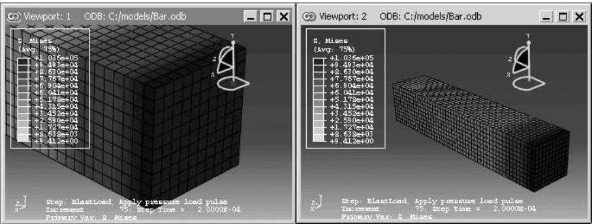

## Additional information

• Using the view manipulation tools  
• Understanding plot states and plot customization

## Linking viewports

You can control which viewports in your Abaqus/CAE session will be linked and the characteristics that the linked viewports will share.

Several of the linked viewport options are available in all modules; some of the options, such as displaying the same plot state in all linked viewports, are applicable only in the Visualization module.

1. Link viewports using one of the following methods:

• From the main menu bar, selectViewport->Link Viewports.


Tip: You can activate or deactivate linked viewports by clicking in the Viewport toolbar.

• From the main menu bar, selectViewport->Linked Viewports Manager and toggle on Link viewports.


Tip: You can also display the Linked Viewports Manager by clicking in the Viewport toolbar.

2. By default, all of the characteristics of the viewports are shared in linked viewports. From the Options portion of the Linked Viewports Manager, you can control which characteristics are shared.

Toggle on Animation to use the same animation settings in the linked viewports. After linking, when animation is started or stopped, the animation state of the current viewport will be applied to all viewports that are linked to the current one. This option applies only in the Visualization module.  
Toggle on Display groups to perform selected display group operations simultaneously in all linked viewports. If you select specific items for the display group by names or labels, the same display group operation is performed in all linked viewports that share the items specified. This option applies only in the Visualization module.  
Toggle on Field output to display results for the same field output variable in the linked viewports. When you change the field output variable for one of the linked viewports, Abaqus/CAE displays the newly selected field output variable in all viewports with output databases that contain that field output variable. This option applies only in the Visualization module.  
• Toggle on Frames to set the step and frame in the linked viewports. This option applies only in the Visualization module.

Select Frame navigation to set the step and frame in the linked viewports using the ODB Frame buttons (First, Previous, Next, and Last). For example, Next increments the frame number currently displayed in each of the linked viewports.

Select Frame selection to set the linked viewports to the same step and frame number by making a selection in the Step/Frame dialog box or the Frame Selector.

• Toggle on Plot options to display the same plot options in the linked viewports. This option applies only in the Visualization module.

• Toggle on Plot states to display the same plot state or states in the linked viewports. This option applies only in the Visualization module.

• Toggle on Rotation centers to use a common center of rotation across all linked viewports.

Toggle on Section points to share section point selection across viewports. Linking section point selection by category occurs only if all the section categories in the current viewport are present in the other linked viewports; for envelope plots, this restriction does not exist. This option applies only in the Visualization module.  
• Toggle on View cuts to display the same view cuts in all linked viewports. This option applies only in the Visualization module.  
• Toggle on View manipulations to enable simultaneous view manipulations in the linked viewports.  
Toggle on Viewport annotation options to display viewport annotations in the same way across all linked viewports. When you display, hide, or customize the display of a viewport annotation such as the legend in the Viewport Annotation Options dialog box, Abaqus/CAE applies that change across all linked viewports.  
Toggle on XY data from history output to share X–Y data created from history output across viewports. This option applies only in the Visualization module.

Use Select All to select all the options and Unselect All to clear all the selected options.

3. By default, all viewports in your session are linked when you link viewports. From the Linked Viewports portion of the Linked Viewports Manager, deselect the viewports that you want to remain independent.  
4. If you made changes in the Linked Viewports Manager, click OK to apply your changes and to close the manager.

The linked viewports exhibit the shared behavior you specified in the Options selections.

## Additional information

• Using the view manipulation tools  
• Understanding plot states and plot customization  
• Customizing viewport annotations  
• Creating or editing a display group  
• Reading X–Y data from output database history output  
• Saving an X–Y data object  
• Producing an X–Y plot  
• Selecting section point data  
• Selecting the results step and frame

## Working with background images and movies in viewports

This section explains how to display images and movies in the background of Abaqus/CAE viewports.

## In this section:

Using background images and movies  
Displaying a background image  
Displaying and customizing a background movie  
Customizing the appearance of background images and movies

## Using background images and movies

You can customize the viewports in your session by displaying an image or movie in the viewport background. Both background images and movies are viewport-specific, so you can display a different image or movie in each viewport in your session. Background images persist in a viewport as you change modules, while background movies appear in the Visualization module only. Abaqus/CAE displays images and movies on top of the existing viewport background, so if you have customized the color of the viewport background, the image or movie might obscure some or all of the custom background color.

You can use background images to help you while you create your model; for example, an image of a completed prototype can help you to align part instances in an assembly. Alternatively, a background image can serve as a watermark or display a logo when you generate images of your model.


Note: In the Sketch module you can display a second background image that can help you sketch parts more effectively. Abaqus/CAE displays the Sketcher background image on top of the module-wide background image when the Sketch module is selected and hides the Sketcher background image in all other modules. See Managing images in the Sketcher background.

Background movies can help you to compare the results of an Abaqus analysis with experimental results. For example, if you display a background movie that shows deformation in a prototype, you can animate the results from a similar Abaqus analysis and compare the animations in a single viewport.

Before you can display an image or movie in the viewport background, you must add the file to your Abaqus/CAE session. To add an image from the Image/Movie Options dialog box, click

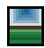

; then enter a name for the image or movie and provide its location. Images in the session are available in all modules, while movies are available in the Visualization module only. Both images and movies persist for your session only; they are not saved to the model database or output database.

Abaqus/CAE supports background images in the following formats: Bitmap (.bmp), PNG (.png), GIF (.gif), JPEG (.jpg, .jpeg), TIFF (.tif), XPM (.xpm), PCX (.pcx), ICO (.ico), TGA(.tga), and RGB (.rgb).

Abaqus/CAE supports background movies that satisfy the following two criteria:

The movie file's format must be supported on your Abaqus/CAE platform. For Linux systems Abaqus/CAE supports MP4 format (.mp4), Audio Video Interleave format (.avi), QuickTme format (.mov), and animated GIF format (.gif). For Windows systems Abaqus/CAE supports MP4, AVI, QuickTime, and animated GIF formats, as well as Mpeg movie format (.mpeg, .mpg, .mlv, .wm) and Windows Media Format (.asf, .wmv, .wm).  
The codec used to create the background movie file must be one of the codecs available for creating movie files in Abaqus/CAE. For example, you can display a QuickTime movie file in the viewport background only if it was created using one of the three codecs available for QuickTime movie creation in Abaqus/CAE: Raw 8, Raw 24 or RLE 24. The available codecs for creating each movie file format in Abaqus/CAE are described in Choosing the animation file format.

Additional considerations for selecting the codec used to create the background movie file:

• You need to create the movie file with a codec whose 64-bit version is available and installed on your computer so it can be read by Abaqus/CAE.  
Codecs on one computer might differ from the ones available on other computers. In particular, a movie file created on a 32-bit system using a 32-bit codec might not open in Abaqus/CAE if the 64-bit version of the codec is unavailable on that system.

• If the codec to read an AVI file is not installed on your computer, Abaqus/CAE reports information about the unsupported compression format and the color depth (number of color bits in a pixel).  
• Third-party software is available to convert to RLE or RAW AVI format, which can be read by Abaqus/CAE.

## Additional information

• Choosing background colors

## Displaying a background image

The viewport background image that you select is displayed in the current viewport only, and it remains visible in that viewport as you change modules. Because background images are viewport-specific, you can display different images in each viewport that either help you with different tasks or enable you to distinguish viewports more quickly.

While the module-wide background image appears in all modules, its appearance may be obscured by the Sketcher background image (in the Sketch module) or the background movie (in the Visualization module). When active, each of these viewport decorations are displayed on top of the module-wide background image in the selected module. You can also include the background image in a printout of a viewport; see Selecting which part of the image to print, for more information.

1. From the main menu bar, select View->Image/Movie Options.  
The Image/Movie Options dialog box opens with the Image page selected.  
2. Toggle Show image to display or hide the background image in the viewport.  
3. Select an image file to display:

• To display an image that has been defined for your session, expand the Image name list and select the image name.

• To add a new image, click ; then enter a name and specify a file location in the dialog box that

appears. You can either enter the file location directly in the File Name field or click to navigate to it in the Select Image File dialog box.

4. Click OK to apply your changes and to close the Image/Movie Options dialog box.

If desired, you can also customize the scale, positioning, or translucency of the background image; see Customizing the appearance of background images and movies.

## Additional information

• Displaying and customizing a background movie  
• Customizing the appearance of background images and movies

You can display some or all of a movie file in the viewport background. Background movies appear in the Visualization module only and, when active, they are displayed on top of the viewport background image. If you print a viewport when the background movie is active, Abaqus/CAE displays the current frame of the movie in the background of the printed image.

This section describes how to display an image using the Image/Movie Options dialog box. Alternatively, you can display and customize background movies from the Movies container in the Results Tree or from the Movie Manager dialog box. To display the movie manager, select Tools->Movie->Manager.

1. From the main menu bar, select View->Image/Movie Options. In the Image/Movie Options dialog box that appears, click the Movie tab.  
2. Toggle Show movie during animation to display or hide the background movie while animations are playing.  
3. Select a movie file to display:

• To display a movie that has been defined for your session, expand the Movie name list and select the movie name.

• To add a new movie, click ; then enter a name and specify a file location in the dialog box that

appears. You can either enter the file location directly in the File Name field or click to navigate to it in the Select Movie File dialog box.

For newly added movies, the Edit Movie dialog box appears.

4. If desired, customize the movie's active frames from the Edit Movie dialog box:

Activate or deactivate frames at the beginning and end of the movie. You can either drag the Active Frames sliders or enter frame numbers in the Start and End fields to change these values.  
Toggle on Preview changes in viewport to change the background movie's length dynamically as you adjust its active frames. When this option is not selected, the background movie's active frames do not change until you click Apply or OK.  
Toggle on Show movie only to hide model data in the viewport. In some cases the model data can obscure the background movie, making movie editing difficult.

5. If desired, customize the movie's timeline from the Edit Movie dialog box. If you select a frame-based animation as the background movie, you can change the movie's starting frame and ending frame; if you select a time-based animation, you can change the movie's starting time and ending time. To change the ending value, expand the appropriate field under the End column and select Specify. Abaqus/CAE then allows you to enter a value in this field.  
6. Click OK to apply your changes and to close the Image/Movie Options dialog box.

If desired, you can also customize the scale, positioning, or translucency of the background movie; see Customizing the appearance of background images and movies.

## Additional information

• Displaying a background image  
• Customizing the appearance of background images and movies

## Customizing the appearance of background images and movies

You can customize the appearance of a background image or movie by repositioning it in the viewport, by stretching or compressing it in the X- or Y-direction, and by adjusting its level of translucency. These customization options are available for both images and movies, but their settings are separate; for example, if you change the X-axis scale setting for background images, the same setting for background movies in the Visualization module remains unchanged.

1. From the main menu bar, select View->Image/Movie Options.  
The Image/Movie Options dialog box appears with the Image tab selected by default. To customize background movies, click the Movie tab.  
2. Toggle Show image on the Image page or Show movie during animation on the Movie page to activate the customization options.  
3. Select one of the Position and scale options for your background image or movie:

## Fit to viewport

This option positions the background image or movie in the center of the viewport and scales it to the Width or Height of the current viewport. In addition, you can select the Best option, which scales either the background movie in the direction that causes the lesser amount of deformation to the image.

## Auto-align

This option enables you to align the background image or movie in one of nine positions in the viewport: its center, any of the four corners, or centered along any of the four edges. Expand the Alignment list, then select one of the options from the graphical depictions of alignment in the list.

## Manual

This option enables you to reposition the background image at a location other than the center of the viewport. Click Manual, then enter in the Origin field the location at which you want to position the lower left corner of the background image.

4. For Auto-align or Manual scaling, you can specify the amount of scaling along either axis. Specify the X scale or Y scale for the background image or movie. The default scale values are 1; increase the scale to stretch the image or movie along the selected axis, or decrease the value to compress it along the selected axis.  
5. Drag the Translucency slider to the percentage of translucency you want. This setting changes the translucency of the background image or movie and blends it with the displayed model. A value of 0.00 is transparent, and a value of 1.00 is opaque. By default, background images or movies and models are displayed with opaque translucency.  
6. Click OK to apply your changes and to close the Image/Movie Options dialog box.

## Additional information

• Displaying a background image  
• Displaying and customizing a background movie

This chapter describes the view options, the view manipulation tools, the 3D compass, and the perspective tools, all of which control a camera that creates the view in a viewport.

The view options allow you to switch between two camera modes and numerically control some of their properties. The view manipulation tools and 3D compass control the camera to position, orient, and magnify objects in the view; you can also select custom views such as front and back, as well as define your own views. The perspective tools control whether Abaqus/CAE displays your model with or without perspective; using perspective gives a more realistic appearance for three-dimensional models.

## In this section:

Understanding camera modes and view options  
Understanding the view manipulation tools  
The 3D compass  
Customizing the view triad  
Controlling perspective  
Using the view manipulation tools  
Using the 3Dconnexion motion controllers with Abaqus/CAE

## Understanding camera modes and view options

This section describes the camera modes used to create views in Abaqus/CAE.

## In this section:

Camera modes and view terminology  
Using view options to control the camera

## Camera modes and view terminology

A view is a two-dimensional representation—a camera image—of your model or analysis results, displayed in a viewport. Abaqus/CAE uses a single camera to create the view in each viewport. You can choose from two camera modes to create the desired view of your model or results. The default mode allows you to position the camera anywhere outside the model. The movie mode allows you to position the same camera inside the model as well as outside it. In addition, the movie mode provides you with two clipping planes that you can use to eliminate objects from the view when they are too close to, or too far from, the camera. The view depth is not limited in default mode; objects in the view may be directly in front of the camera or at a distance that makes them too small for you to see in the viewport.

View manipulation tools are available so that you can fully utilize both camera modes. All view manipulation tools can be used in either camera mode, but an “alternate mode” of some view manipulation tools is intended primarily for use in movie mode. For example, the magnify tool allows you to magnify the current view without moving the camera; the alternate mode of this tool moves the camera closer to the model. The effects of both view manipulations appear identical; but when used in the default camera mode, the alternate mode stops working if the camera “hits” the outer edge of the model. In movie mode you can use the alternate mode of the magnify tool to move the camera into and through the model. The view manipulation tools are described in Understanding the view manipulation tools.

Figure 1 shows the two camera modes. The shaded areas in the figure represent the visible space—the view—in each camera mode.  
  
Figure 1:The default mode and movie mode camera views.

The camera terms that follow are used to describe the view that you see in a viewport:

## Camera target

The camera target is a point in space that controls how the camera moves during most view manipulations. For all default views the camera target coincides with the center point of all objects in the view. The camera target moves away from the center of all objects when you use the alternate mode of the pan, rotate, and magnify view manipulation tools.

## Frustum

The frustum is the three-dimensional space visible with the movie camera mode. The camera position forms the apex of a pyramid created by a left, right, top, and bottom plane (the same as it does in the default mode). To create the frustum, two additional planes are added to the default view, the near plane and the far plane. Only those objects (or portions of objects) that are within the frustum are visible in movie camera mode.

## Field-of-view angle

The field-of-view angle is the larger of the angles between the left and right or the top and bottom planes that form the sides of the view. The angle that is used depends on the shape of the frustum (effectively the shape of the viewport); in both images of Figure 1 the angle between the left and right planes is larger; therefore, this angle is indicated as the field-of-view angle. The field-of-view angle applies to both the default camera mode and the movie camera mode; changing the angle is comparable to adjusting the zoom on a stationary camera to expand or shrink the camera image.

The magnify, box zoom, and auto-fit view manipulation tools all change the field-of-view angle to resize the view in the viewport. See Understanding the view manipulation tools, for more information about these tools.

## Near plane

The near plane lies perpendicular to the camera direction and is effective only in the movie camera mode. The distance from the camera to the near plane is the closest distance that an object can be to the camera and still remain in the view. The view from the default camera includes objects at any distance, as if the near plane were positioned directly in front of the camera lens.

The near plane is a clipping plane; it removes model surfaces and edges from view without cutting through the model. In the Visualization module you can cut the model such that interior surfaces are visible; for more information, see Cutting through a model.

## Far plane

Like the near plane, the far plane lies perpendicular to the camera direction and is effective only in the movie camera mode. The distance from the camera to the far plane is the farthest distance that an object can be from the camera and still remain in the view. The view from the default camera includes objects at any distance, as if the far plane were positioned an infinite distance from the camera lens.

The far plane is a clipping plane; it removes model surfaces and edges from view without cutting through the model. In the Visualization module you can cut the model such that interior surfaces are visible; for more information, see Cutting through a model.

You use the view options, view manipulation tools, and perspective tools to change the camera mode settings or to change the relationship between the camera, the camera target, and the object that you are viewing. The current settings of these tools and options define the current view.

Use the view options to control the current camera mode and other options that you cannot set using the view manipulation tools.

Select View->View Options from the main menu bar to access the view options for the current viewport, as shown in Figure 1.

  
Figure 1:The View Options dialog box.

You can use the View Options dialog box to control:

• The field-of-view angle (effectively, the magnification of the current view).  
• The camera mode (movie mode allows you to move the camera into and through the model).  
• The distance from the movie mode camera to the near plane (the closest distance an object can be to the camera while remaining in the view).  
• The distance from the movie mode camera to the far plane (the farthest distance an object can be from the camera while remaining in the view).


## Note:

Specifying the near plane and far plane distance can improve the display performance for large models by excluding from view any portion of the model that lies beyond the specified range.

In the Visualization module the View Options dialog box also includes Camera Movement options. You can make the camera follow the motion of a local coordinate system and choose whether the camera also follows the rotation of the selected coordinate system. If movie mode is on, you can position the camera on the origin of the selected coordinate system. For more information on the view options in the Visualization module, see Customizing camera movement.

1. Select View->View Options from the main menu bar.

The View Options dialog box appears.

2. If desired, change the Field-of-view angle to resize the view in the viewport:

• Decrease the angle to magnify the view  
• Increase the angle to reduce the view

3. Toggle Use movie mode on or off to switch between the default and movie camera mode.

Activating the movie camera mode does not change the current view. However, if you apply the default camera mode (toggle off Use movie mode), you will see one of the following effects:

• If the model lies entirely within the frustum, the current view does not change.  
• If a portion of the model is cut off by the near or far plane, that portion reappears in the view and Abaqus/CAE resets the near plane and far plane distances to include the entire object in the view the next time you activate movie mode.  
• If the movie mode camera is positioned inside the model, the camera moves “back” along the current view direction so that the entire model is in front of the camera. Abaqus/CAE adjusts the field-of-view angle to display the model in a size similar to that in the movie mode view and resets the near plane and far plane distances to include the entire object in the view the next time you activate movie mode.


Tip: Use the cycle view manipulation tool to return to the previous view.

4. If desired, adjust the Near plane distance.

Abaqus/CAE removes from view any objects, or portions of objects, that lie between the movie mode camera and the near plane.

5. If desired, click Specify and adjust the Far plane distance.

By default, Abaqus/CAE automatically computes the far plane distance, setting it to a value beyond the farthest point in the model and adjusting it when you manipulate the view so that no part of the model is excluded from view. If you specify a distance, Abaqus/CAE removes from view any objects, or portions of objects, that lie beyond that distance from the camera.

6. + Click OK to implement your changes and to close the dialog box.

Your changes are saved for the duration of the session.

## Additional information

• Camera modes and view terminology  
• Understanding the view manipulation tools

## Understanding the view manipulation tools

This section describes basic concepts you should understand before using the view manipulation tools.

## In this section:

The view manipulation tools  
The pan view tool  
The rotate view tool  
The magnify tool  
The box zoom tool  
The auto-fit tool  
The cycle tool  
Custom views  
Numerically specifying a view

## The view manipulation tools

The camera position, orientation, and zoom factor combine to define the view of an object in the viewport. Your view of the assembly, as well as each of your parts, is positioned relative to a default Cartesian coordinate system, and the orientation of this default coordinate system within a viewport is indicated by the view triad. By default, an isometric view is used when a module first displays a three-dimensional part or assembly.

You can manipulate the view using the pan, rotate, magnify, box zoom, and auto-fit tools on the View Manipulation toolbar to control the relative positions of the camera, the camera target, and the model or results that you are viewing. For example, you might want to pan and zoom a contour plot to view an area of stress concentration. The view manipulation tools allow you to perform the following operations:

Move the view horizontally and vertically; that is, pan the view.  
Rotate the view.  
Magnify or reduce the view.  
Zoom in to a selected area of the view.  
Rescale the view to fill the viewport; that is, auto-fit the view.  
Cycle through previous views.

Other types of view manipulations can be performed using the 3D compass; for more information, see The 3D compass.

You can click mouse button 3 to access the following view manipulation tools:

• Set As Rotation Center: Set the center of rotation at the position of the mouse click, which can be at any location in the viewport.  
• Use Default Rotation Center: Clear a previously set center of rotation.  
• Center View: Center the view at the position of the mouse click.

When an X–Y plot is displayed in the viewport, you can use the view manipulation tools to change the view of the X–Y curves. Because X–Y plots are two-dimensional, the rotate tool is disabled when the current viewport displays an X–Y plot.

Clicking a view manipulation tool puts you into the corresponding view manipulation mode. You then manipulate the view in a particular viewport by moving the cursor to that viewport and dragging or clicking as necessary. In addition, the pan, rotate, and magnify tools have alternate modes that you can access by holding the [Shift] key in conjunction with the normal use of these tools. The alternate modes of these tools are intended for use in the movie camera mode, but they can also be used in the default mode. For more information about camera terminology and the view modes, see Understanding camera modes and view options. To exit a view manipulation mode, do one of the following:

• Click mouse button 2.  
• Click the cancel button in the prompt area.  
• Click the view manipulation tool again.  
• Click any other view manipulation tool.

You can use the view manipulation tools as many times as necessary to reach the desired view, and you can perform the view manipulation in any viewport, regardless of what is being displayed. Abaqus/CAE stores the eight most recent views from each viewport, and you can use the cycle view manipulation tool to cycle backward and forward through these views.

When you use the move, rotate, magnify, zoom, or rescale tools in a viewport that is linked to other viewports, Abaqus/CAE manipulates the view of objects in the linked viewports as well. For more information, see Linking viewports for view manipulation.

By default, Abaqus/CAE displays the image using the current render style (wireframe, filled, hidden line, or shaded) while you manipulate the view of an object. Alternatively, you can change the Drag mode in the Graphics Options dialog box to display the image as a simple wireframe while you manipulate the view; this mode allows faster manipulation of very large models in the shaded render style. The view reverts to the original render style when you complete a manipulation.

If you prefer to use menus rather than the tools on the View Manipulation toolbar, you can access all of the view manipulation tools through the View menu on the main menu bar. In addition, you can apply predefined and user-defined views using the Views toolbar, and you can numerically specify a precise view using the dialog box that appears when you select View->Specify from the main menu bar. For more information on custom and numerically specified views, see Custom views, and Numerically specifying a view, respectively.

Alternatively, you can enter three of the view manipulation modes by using a combination of keyboard and mouse actions.

• To rotate the view, press [Ctrl][Alt], and hold down mouse button 1.  
• To pan the view, press [Ctrl][Alt], and hold down mouse button 2.  
• To magnify or reduce the view, press [Ctrl][Alt], and hold down mouse button 3.

Add [Shift] to any of these combinations to access the alternate modes of these tools. For example, press [Shift][Ctrl][Alt] and hold mouse button 3 to access the alternate mode of the magnify tool and move the camera closer to or farther from the objects in the view. The [Shift] key has no effect on the view manipulation tools when you are not using alternate modes. To exit a view manipulation mode after using one of the preceding actions, simply release the mouse button.

You can reconfigure these keyboard and mouse combinations to mimic the view manipulation interfaces used by five other common CAD applications by selecting Tools->Options from the main menu bar. See Using view manipulation shortcuts, for more information.

## Additional information

• Using the view manipulation tools  
• Understanding camera modes and view options

## The pan view tool

When a model is displayed in the viewport and the pan mode is set, the position of your view of the model changes as you click and then drag the cursor, and a rubberband line indicates the amount of translation.

When you select the $\mathsf { p a n }$ tool $\nleftrightarrow$ and the viewport in which to work, Abaqus/CAE enters pan mode, as indicated by $\cos ^ { \frac { \pi } { 3 } }$ cursor.

Panning the view is comparable to moving the camera over a snapshot of the model, as shown in Figure 1; the snapshot moves in the viewport but any faces of the model that were hidden in the original camera position remain hidden as you pan.

  
snapshot of the object  
Figure 1: Panning the view.

The alternate mode of the pan tool, accessed by holding [Shift] while performing the manipulation, creates a more realistic camera view. Instead of a snapshot of the model, you pan the camera over the real model. Faces of the model that were hidden at the original camera position are exposed as you move the camera over the model, as shown in Figure 2.

  
Figure 2: Panning the view in alternate mode.


## Note:

If perspective is not on, the alternate mode of pan works identically to the standard pan tool.

For both modes of the pan tool, the initial location of the cursor is not important, as long as you place it within the viewport. Cursor motion is limited only by the physical bounds of your monitor, and panning will continue even if you move the cursor outside the viewport or window.

When an X–Y plot is displayed in the viewport, you can change your view of the X–Y curves in the plot by clicking and dragging the cursor in the grid. Abaqus/CAE updates the values in the axes as you manipulate your view of the X–Y data.

## Additional information

• The view manipulation tools  
• Panning the view  
• Understanding camera modes and view options

## The rotate view tool

In the rotate mode the cursor changes to two curved arrows, and a large circle appears in the viewport. To define the center of rotation, you can enter its coordinates directly or select a point from the viewport. Otherwise, Abaqus/CAE will rotate the view about the center of the viewport.

When you select the rotate tool and the viewport in which to work, Abaqus/CAE enters rotate mode. If you select a center of rotation by selecting a position from the viewport or entering coordinates, that rotation center position overrides the view center and remains selected until you select a new rotation center, display a different object, or choose the default rotation center. Your view of the model rotates as you drag the cursor, and a rubberband line indicates the amount and the direction of rotation. As you rotate your view of the model, the view triad indicates the orientation of the global coordinate system.


## Note:

Abaqus/CAE disables the rotate tool when an X–Y plot is displayed in the current viewport.

The circle that is drawn when you enter rotate mode represents the silhouette of an imaginary sphere that surrounds the object. When you drag the mouse inside the circle, you might imagine that you are actually rotating the sphere, as you would a trackball. Your model is attached to the center of the sphere, so that rotating the sphere causes your view of the model to rotate as well.

You determine the axis of rotation as you move the cursor over the surface of the imaginary sphere. The rubberband line represents the intersection of a cutting plane with the sphere's surface, and the rotation axis is normal to this cutting plane. The angle of rotation is equal to the angle made by the rubberband line on the sphere's surface, so that dragging all the way across the circle produces a 180° rotation. Figure 1 illustrates the imaginary sphere and a rubberband line being dragged across its surface.

  
Figure 1: The rotate tool.

When you drag outside the circle, the rubberband line is superimposed on the edge of the circle, and your view of the object simply rotates about an axis normal to the screen and passing through the center of the circle. In the same way as it does for dragging inside the circle, the rubberband line represents the angle through which the object has rotated.

Using the default mode of view rotation is comparable to rotating the camera around the view center or selected center of rotation, as shown in Figure 2.

  
Figure 2: Rotating the camera about the target or selected center of rotation.

The alternate mode of the rotate tool, accessed by holding [Shift] while performing the manipulation, rotates the camera about itself, as shown in Figure 3. This moves the camera target and frustum without regard to the position of objects in the original view. Rotating the camera about itself is most useful when you are in movie mode and the camera is positioned inside the model. In this position, moving the camera target and frustum brings different portions of the interior of the model into view.

  
Figure 3: Rotating the camera about itself.


## Note:

If you have selected a point as the center of rotation, your selection overrides the alternate mode of rotation.

In either mode, it is usually easier to obtain a desired rotation by performing a sequence of smaller rotations rather than one large one. If you need to abandon the rotation and return to a known orientation, use either the predefined

target to the center of the model.

Because X–Y plots are two-dimensional, Abaqus/CAE disables the rotate tool when an X–Y plot is displayed in the current viewport.

## Additional information

• The view manipulation tools  
• Rotating the view  
• Understanding camera modes and view options

## The magnify tool

When you drag the cursor along the positive direction while in magnify mode, your view of the model or plot expands within the viewport, and a rubberband line indicates the relative magnification. Similarly, when you drag the cursor along the negative direction, your view of the model or plot contracts, and a rubberband line indicates the relative reduction.

When you select the magnify tool and the viewport in which to work, Abaqus/CAE enters magnify mode, as

indicated by the magnify cursor . The positive and negative directions depend on your settings in the view manipulation options (see Using view manipulation shortcuts). If you are using the default Abaqus/CAE configuration for view manipulations, the positive direction is to the right and the negative direction is to the left. If you are using a nondefault configuration for view manipulations, the positive direction is upward and the negative direction is downward. To reflect the configuration settings, the rubberband line is horizontal for the default configuration and vertical for nondefault configurations.

The dragging action must start in the viewport, but you can continue to drag within the limits of your monitor. You can also drag repeatedly to achieve the desired view. The magnify tool recognizes only the horizontal (for the default configuration) or vertical (for nondefault configurations) component of your dragging motion, as indicated by the rubberband line. Consequently, you can achieve finer control by dragging diagonally across the screen, since this results in a smaller component of the cursor's motion in the effective direction than dragging the same distance along the effective direction.

Using the default mode of the magnify tool, as its name suggests, magnifies the view; as shown in Figure 1, the camera does not move with respect to the objects in the view. The magnification is caused by changing the field-of-view angle, the same method you use when changing the zoom on a stationary camera.

  
Figure 1: Magnifying the view.

The alternate mode of the magnify tool, accessed by holding [Shift] while performing the manipulation, keeps the field of view constant and moves the camera towards or away from the objects in the view, as shown in Figure 2.

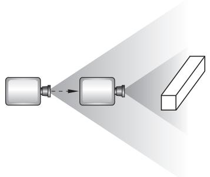  
Figure 2: Moving the camera closer to the model.

Moving the camera in this manner is most useful when movie mode is on. Then your view is not limited; you can move the camera through the model such that any parts that you do not want to see are removed by the near or far planes or are actually behind the camera. If you are not using movie mode, the camera can move forward only until it reaches the outer limits of the model.

When an X–Y plot is displayed in the viewport, you can magnify your view of the data to focus in on a particular component of an X–Y curve. Abaqus/CAE updates the values in the axes as you change the magnification of the X–Y plot.

网 If you lose track of your position, you can use the auto-fit tool to rescale the view to fit the viewport. Using the auto-fit tool also resets the camera target to the center of the model.

## Additional information

• The view manipulation tools  
• Magnifying or reducing the view  
• Understanding camera modes and view options

## The box zoom tool

You use the box zoom tool to select a rectangular area of your model or plot; Abaqus/CAE enlarges your view of the selected portion of your model or plot to fill the viewport.

When you select the box zoom tool and the viewport in which to work, Abaqus/CAE enters box zoom mode, as indicated by a crosshair-shaped cursor. For X–Y plots, Abaqus/CAE enlarges your view of the selected X–Y curves and updates the axis values to match the data that you select.

## Additional information

• The view manipulation tools  
• Zooming in to a selected area of the view

## The auto-fit tool

The View Manipulation toolbar contains an auto-fit tool.

网 Use the auto-fit tool from the View Manipulation toolbar to quickly adjust your view of the model so that the model or model plot fills the viewport and is centered within it. When you fit a view of a model, the orientation does not change, as indicated by the view triad.

When you auto-fit an X–Y plot, the auto-fit tool resets the values in the axes to their specified minimum and maximum values; see Customizing X–Y plot axes. The auto-fit tool does not necessarily fill the viewport with the X–Y plot, because the chart options may dictate that the plot occupy only part of the viewport; see Customizing X–Y plot appearance, for more information about the chart sizing and positioning options.

Auto-fitting occurs in the current viewport as soon as you click the auto-fit tool. If you have more than one viewport, select the viewport that you want to rescale to make it the current viewport before selecting the auto-fit tool.

A separate option, Auto-fit after rotations, is available when you select View->Graphics Options from the main menu bar. You use this option to control whether or not Abaqus/CAE automatically rescales the view to fit the viewport as you rotate. For more information on using this option, see Rotating the view.

## Additional information

• The view manipulation tools  
• Rescaling the view to fit the viewport

## The cycle tool

You can cycle through the eight most recent views in each viewport.

When you select the cycle tool and the viewport in which to work, Abaqus/CAE enters cycle mode, as indicated by a cursor in the form of a two-way arrow.

To cycle through previous views, click in the viewport whose view you want to change. To control the direction of cycling, click Backward or Forward in the prompt area. The default is to cycle backward. After you cycle backward to the oldest available view, continued clicking has no effect. Similarly, after you cycle forward to the most recent view, continued clicking has no effect.

## Additional information

• The view manipulation tools  
• Cycling through views

## Custom views

The Views toolbar allows you to apply a custom view to the model in the selected viewport. (A view is the combination of the position, orientation, and zoom factor of the model in the viewport.)


## Note:

The Views toolbar is not visible in the Abaqus/CAE main window by default. To display the Views toolbar, select View->Toolbars->Views from the main menu.

Custom views include seven predefined views (such as front and back) and up to four user-defined views.

## Predefined views

Predefined views are based on the six faces of an imaginary cube and an isometric view. The view triad indicates the orientation of this imaginary cube within a viewport. Figure 1 illustrates the six predefined cube face views.


## Note:

Predefined views have no effect when an X–Y plot is displayed in the current viewport.

  
Figure 1: Predefined views.

## User-defined views

You can use the view manipulation tools to position your view of a model in a viewport and then click in the Views toolbar to save the view as one of four user-defined views. You can use this saved view to restore the object in the viewport to a known orientation, and you can apply a saved view to other viewports. By default, saved views are not stored between sessions. If you want to retain a saved view for subsequent sessions, save it to an XML file, to the model database, or to an output database. For more information, see Managing session objects and session options.

The view consists of three components: orientation, zoom factor, and position. You can choose whether or not all three of these components are saved using the Scale & Position options, as follows:

## Auto-fit

When you save a view after choosing this option, only the orientation is saved. When you apply a view saved with this option, the saved orientation is applied, but the zoom factor and position are adjusted to make the view fit the viewport.

## Save current

When you save a view after choosing this option, the orientation, the zoom factor, and the position are all saved. When you apply a view saved with this option, the saved orientation, zoom factor, and position are all applied to the object in the viewport. To compare different objects in different viewports by placing the viewports side-by-side and applying a known orientation, zoom factor, and position to each, choose the Save current option.

## Additional information

• The view manipulation tools  
• Applying custom views  
• Saving a user-defined view

## Numerically specifying a view

You can bypass the view manipulation tools and specify a particular view numerically. Specifying a view is useful if you want to reproduce a particular view between Abaqus/CAE sessions or if numerically specifying a view is simpler and more convenient than applying a series of view manipulations.

Select View->Specify from the main menu bar to specify a view.


Tip: You can also specify a view by double-clicking the 3D compass.

You can use the following methods to specify your view:

## Rotation Angles

Enter three angles $( \pmb { \theta _ { 1 } } , \pmb { \theta _ { 2 } } , \pmb { \theta _ { 3 } } )$ representing the angles through which your view of the model rotates about the screen or model 1-, 2-, and 3-axes, respectively. Rotations are interpreted in the order $( \pmb { \theta _ { 1 } } , \pmb { \theta _ { 2 } } , \pmb { \theta _ { 3 } } )$ , and a positive angle represents a right-handed rotation about the axis. If you previously specified a nondefault center of rotation while using the rotate view tool (see The rotate view tool), the specified rotations will also be about this point. You must choose one of the following modes to apply the rotation:

Increment About Model Axes. When you choose Increment About Model Axes, Abaqus/CAE simply applies the rotation to the current view. Figure 1 shows the result of applying an incremental model axes rotation of 90, 0, 0 from the isometric view.

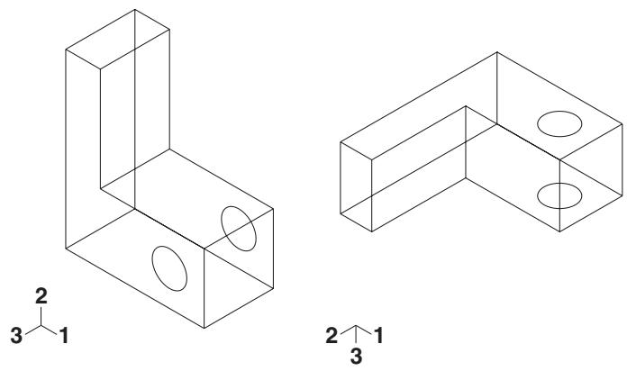  
Figure 1: Specifying an incremental model axes rotation angle.

• Increment About Screen Axes. The screen X-axis is horizontal, the Y-axis is vertical, and the Z-axis is out of the screen. The origin of the screen axes is the camera target. In most cases the camera target coincides with the center of the viewport, but some view manipulation methods can move the camera target (for more information, see Camera modes and view terminology). When you choose Increment About Screen Axes, Abaqus/CAE simply applies the rotation to the current view. Figure 2 shows the result of applying an incremental screen axes rotation of 90, 0, 0 from the isometric view.

  
Figure 2: Specifying an incremental screen axes rotation angle.

Total Rotation From (0,0,1). When you choose Total Rotation From (0,0,1), Abaqus/CAE first rotates the view to the default position (a view looking down the 3-axis with the 1- and 2-axes in the plane of the screen) and then applies the desired rotation. Figure 3 shows the result of applying a total rotation of 90, 0, 0 from the isometric view.

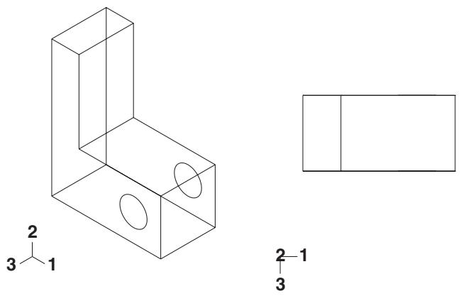  
Figure 3: Specifying a total rotation angle.

## Viewpoint

When you choose Viewpoint, you enter three values representing the 1-, 2-, and 3-position of an observer. Abaqus/CAE constructs a vector from the origin of the model to the position that you specify and rotates your view of the model so that this vector points out of the screen. Figure 4 shows the result of applying a viewpoint of 1, 1, 1 (an isometric view) and a viewpoint of 1, 0, 0.

  
Figure 4: Specifying a viewpoint.

When you use the Viewpoint method to specify a view, you can also specify the Up vector. Abaqus/CAE positions your view of the model so that this vector points upward. Figure 5 shows the result of applying an up vector of 0, 1, 0 and an up vector of 0, −1, 0 to an isometric view. The Up vector must not equal the Viewpoint vector.

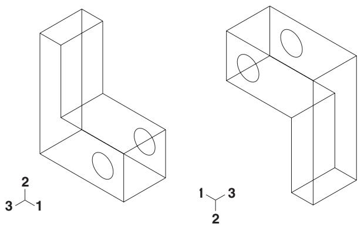  
Figure 5: Specifying an Up vector.

## Zoom

Enter a value representing a magnification factor. A value greater than 1 expands your view of the model in the viewport; for example, a Zoom factor of 2 doubles the size of your view of the model. A value between 0 and 1 contracts your view of the model in the viewport; for example, a value of 0.25 contracts your view of the model to a quarter of its original size. The value must be greater than zero.

You must choose one of the following methods to apply the zoom:

• Absolute. When you choose Absolute, Abaqus/CAE first fits the view to the viewport and then applies the desired Zoom factor.  
• Relative. When you choose Relative, Abaqus/CAE applies the Zoom factor to the current view.

## Pan

Enter values that Abaqus/CAE uses to Pan your view of the model by a specified horizontal and vertical distance. Abaqus/CAE moves the view relative to its current postion in the viewport. The values that you enter correspond to fractions of the viewport dimensions; the first value represents horizontal motion and the second value represents vertical motion. A positive first value moves your view of the model toward the right edge of the viewport, and a positive second value moves your view of the model toward the top of the viewport. For example, if the viewport is 200 mm wide and 100 mm tall and you enter values of 0.5, −0.1 in the Fraction of viewport to pan (X,Y) field, Abaqus/CAE positions your view of the model 100 mm toward the right and 10 mm down from its current position.

## Additional information

• The view manipulation tools  
• Applying a specified view

## The 3D compass

This section describes the basic functions and features of the 3D compass.

## In this section:

About the 3D compass  
Rotating the view using the 3D compass  
Panning the view using the 3D compass  
Predefined views for the 3D compass  
Customizing the 3D compass

## About the 3D compass

The 3D compass is a viewport annotation that appears in the upper right-hand corner of a viewport.

  
Figure 1:The 3D compass.

The 3D compass in Abaqus/CAE is based on the 3D compass used in CATIA V5. The 3D compass indicates the orientation of the model in the viewport, similar to the view triad. Unlike the view triad, you can manipulate the orientation of the 3D compass by clicking and dragging on it. When you manipulate the 3D compass, the viewport camera pans or rotates to change the viewport orientation accordingly. The behavior of the compass view manipulations is identical to the compass view manipulation behavior in CATIA V5.

The 3D compass is a helpful shortcut for certain view manipulation options since it is available in all modules and during all procedures; you do not need to enter a view manipulation mode to change the viewport orientation using the 3D compass.

## Rotating the view using the 3D compass

The 3D compass allows you to rotate the view of a model using two different methods: you can rotate freely in all directions, or you can constrain the manipulation to rotation about a specific axis. In both cases the model view rotates about the current center of rotation for the viewport, as defined by the rotate tool (see The rotate view tool).

## Free rotation

To rotate a model in any direction, click and drag the free rotation handle on the 3D compass:


As you drag the mouse, the compass rotates about its pivot in the direction of the mouse motion (the pivot point coincides with the compass manipulation handle). The rotation is dependent on the direction of the mouse motion, not on the location of the pointer; in other words, the compass continues to rotate as long as you continue to drag. As the orientation of the compass changes, the view of the model changes accordingly.

## Rotation about an axis

You can also rotate a model about a specified axis, thereby maintaining a constant orientation in a particular direction during the manipulation. To rotate about an axis, click and drag one of the three arcs along the perimeter of the 3D compass:


As you drag the mouse, the compass rotates about the axis that is perpendicular to the plane subtended by the selected arc (the X-axis in the above example). The rotation is dependent on the location of the pointer. As you drag the mouse, the path of the pointer in the viewport is projected onto the selected compass arc. The compass rotates according to this projected path. As the orientation of the compass changes, the view of the model changes accordingly.

## Additional information

• What is a viewport?  
• Camera modes and view terminology  
• The rotate view tool

## Panning the view using the 3D compass

The 3D compass allows you to pan the view of a model using two different methods: you can pan along a specified axis, or you can pan within a specified plane.

The pan manipulations performed with the 3D compass are different than the manipulation performed with the standard pan view tool (see The pan view tool). The standard pan tool moves the camera laterally in front of the model; the camera is constrained to move only in a plane parallel to the viewport. The panning planes for the 3D compass are not necessarily parallel to the viewport. As a result, panning with the compass behaves like a combination of the standard pan and zoom tools in their alternate modes: the camera moves both laterally across the model and perpendicularly toward or away from the model. The orientation of the compass and model view does not change during pan manipulations.


## Note:

As with the alternate mode of the standard pan view tool, panning the view with the 3D compass also translates the viewport's center of rotation along with the camera. See The rotate view tool, for information about the center of rotation.

## Panning along an axis

To pan the view along an axis, click and drag any of the straight axes on the 3D compass:


As you drag the mouse, the path of the pointer in the viewport plane is projected onto the selected compass axis (the Z-axis in the above example). The camera moves according to this projected linear path.

## Panning along a plane

To pan the view along a plane, click and drag any of the quarter-circular faces on the 3D compass:


As you drag the mouse, the path of the pointer in the viewport plane is projected onto the selected compass plane (the Y–Z plane in the above example). The camera moves according to this projected path.

## Additional information

• What is a viewport?  
• Camera modes and view terminology  
• The pan view tool

## Predefined views for the 3D compass

You can use the 3D compass to quickly set the viewpoint to one of six predefined views. You can also access the Specify View dialog box through the compass.

## Predefined views

The predefined views correspond to the three planes of the 3D compass. To apply a predefined view, click the label for any of the axes on the 3D compass:

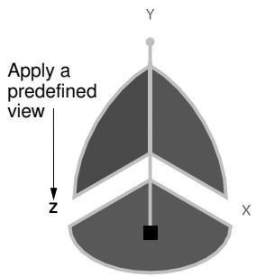

The view is adjusted so that the selected axis (the Z-axis in the above example) is perpendicular to the plane of the viewport. Clicking the same axis label again flips the view orientation to the opposite side of the viewport plane. In other words, clicking the same axis label repeatedly oscillates the view between the front and back side of the displayed model.

The six predefined views associated with the 3D compass are identical to the predefined views in the Views toolbar.

## Numerically specifying a view

Double-clicking anywhere on the 3D compass opens the Specify View dialog box. You can use this method to numerically specify a viewpoint or camera location. See Numerically specifying a view, for more information.

## Additional information

• What is a viewport?  
• Camera modes and view terminology  
• Custom views  
• Numerically specifying a view

To customize the look and orientation of the 3D compass, click mouse button 3 on the compass and select an option from the menu that appears. You can perform the following customizations:

## Edit

Select Edit to display the Specify View dialog box and numerically specify a custom view orientation. See Numerically specifying a view, for details on specifying custom view orientations.


Tip: You can also double click the 3D compass to display the Specify View dialog box.

## Change the privileged plane

The base of the compass (which contains the compass manipulation handle) is called the privileged plane. By default, the X–Z plane is the privileged plane in Abaqus/CAE. The privileged plane can be helpful in determining the “correct” orientation of a model in the viewport. In the default isometric orientation of the compass, the privileged plane appears at the bottom and the free rotation handle appears at the top; the axis from the privileged plane to the free rotation handle in effect indicates the “up” direction for the model.

If the Y-axis does not correspond to the “up” direction in a model, you can change the privileged plane to any of the three major planes in the compass. For example, select Make XY the Privileged Plane to set the X–Y plane as the privileged plane. Changing the privileged plane only reconfigures the shape of the 3D compass, as indicated in Figure 1; the view orientation and the predefined views in the Views toolbar are not changed.

  
Figure 1: Changing the privileged plane from the X–Z plane (left) to the X–Y plane (right).

## Hide

Select Hide to remove the 3D compass from the viewport display. To resume the display of the 3D compass, you must use the viewport annotation options (select Viewport->Viewport Annotation Options from the main menu). For information on controlling the visibility of viewport annotations, see Using viewport annotation options.

## Help

Select Help to display a help window with documentation on using the 3D compass.

## Customizing the view triad

The view triad, shown below, is a set of three perpendicular axes that indicate the orientation of your view of the model currently being displayed. The X, Y, and Z labels correspond to the 1-, 2-, and 3-directions, respectively. As you rotate your view of the model, the triad changes to indicate the new orientation. For more information on using the rotate tool, see Rotating the view.

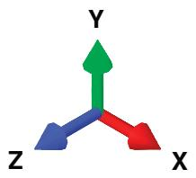

The view triad and the 3D compass both indicate the view orientation, and they are always aligned with each other. You can directly manipulate the 3D compass orientation in the viewport, thereby changing the view of the model (see The 3D compass). The view triad acts only as a reference; it rotates with the 3D compass, but it cannot be directly manipulated.

You can use the Viewport->Viewport Annotation Options menu item to request or suppress the display of the triad and to control the triad's size, position, and appearance. You can also control the triad's labels, including their color and font.

1. From the main menu bar, select Viewport->Viewport Annotation Options.

The Viewport Annotation Options dialog box appears.

2. Toggle Show triad to display or suppress the triad in the current viewport.

When Show triad is toggled on, triad options become available.

3. Click the Triad tab.

Abaqus/CAE displays the triad view options.

4. Enter the Triad size as a percentage of the viewport size. When you resize the viewport, the size of the triad changes accordingly. The minimum allowable triad size is 1% of the viewport, and the maximum allowable triad size is 50% of the viewport.  
5. Enter percentage values for the triad X and Y positions in the % Viewport X and % Viewport Y boxes, respectively.

A value of 0 for % Viewport X moves the triad origin to the extreme left of the viewport while a value of 100 moves it to the extreme right. A value of 0 for % Viewport Y moves the triad origin to the extreme bottom of the viewport, while a value of 100 moves it to the extreme top.

6. Choose the color of the triad labels:

a. Click the color sample .

Abaqus/CAE displays the Select Color dialog box.

b. Use one of the methods in the Select Color dialog box to select a new color. For more information, see Customizing colors.  
c. Click OK to close the Select Color dialog box.

The color sample changes to the selected color.

7. Click the arrow next to the Labels field and select either numerical or alphabetical labeling for the triad.

The specified style appears in the Labels field.

8. Click Set Label Font to set the font type, size, and style using the dialog box that appears.  
9. + Click Apply to implement your changes.

Your changes are saved for the duration of the session.

## Additional information

• Using graphics display options  
• Customizing viewport annotations

## Controlling perspective

Perspective representation accurately depicts the spatial relationship of three-dimensional objects in a two-dimensional plane. In other words, a three-dimensional model on your screen appears more realistic when perspective is turned on. Alternatively, parallel lines in the model appear parallel when perspective is turned off. Perspective affects all plots except X–Y plots, applies in all modules, and is turned on by default.

• To turn perspective on, select the icon located in the View Options toolbar or select View->Perspective from the main menu bar.  
• To turn perspective off, select the $\sharp$ icon located in the View Options toolbar or select View->Parallel from the main menu bar.

Your changes apply only to the current viewport and are saved for the duration of the session.

## Additional information

• Manipulating the view and controlling perspective

## Using the view manipulation tools

This section provides details of using the tools in the View Manipulation toolbar that allow you to manipulate the position, orientation, and scaling of the model or X–Y plot within a viewport.

When the viewport you manipulate is linked to other viewports, Abaqus/CAE also changes the view within every linked viewport in your session.

## In this section:

Centering the view  
Panning the view  
Rotating the view  
Magnifying or reducing the view  
Zooming in to a selected area of the view  
Rescaling the view to fit the viewport  
Cycling through views  
Applying custom views  
Saving a user-defined view  
Applying a specified view

## Centering the view

Click mouse button 3 in the viewport to access the option to center the view.

You can also use the auto-fit tool from the View Manipulation toolbar to quickly pan and magnify or reduce a view so that the view fills the viewport and is centered within it.

1. Position the cursor in the viewport at the location to be used to center the view, and click mouse button 3.  
2. From the menu that appears, select Center View. Abaqus/CAE shifts the position that you selected to the center of the viewport.

## Additional information

• Linking viewports for view manipulation  
• The view manipulation tools  
• Rescaling the view to fit the viewport

## Panning the view

You can use the View Manipulation toolbar to move the view horizontally and vertically within the viewport.

Use the pan tool from the View Manipulation toolbar to move the view horizontally and vertically within the viewport. Hold [Shift] while using the pan tool to access the alternate pan mode. The alternate mode shifts the view perspective as you pan the view, creating a more realistic image (for more information, see The pan view tool).

If the current viewport is linked to other viewports, Abaqus/CAE also moves the view of objects within all linked viewports in your session. For more information, see Linking viewports for view manipulation.

1. From the View Manipulation toolbar, click the pan tool to enter pan mode.


Tip: You can also select View->Pan from the main menu or press [F2].

2. Position the cursor in the viewport whose view you want to change.

The cursor changes to a four-headed arrow:

3. Drag the cursor in any direction until you obtain the desired view.

The position of your view of the model or X–Y plot in the viewport changes as you drag the cursor, and a rubberband line indicates the amount of translation.


## Note:

The initial location of the cursor is not important, as long as you place it within the viewport. Cursor motion is limited only by the physical bounds of your monitor, and panning will continue even if you move the cursor outside the viewport or window.

4. Repeat Steps 2 and 3 until you achieve the desired view.  
5. To exit pan mode, do one of the following:

• Click mouse button 2.  
• Click the cancel button in the prompt area.  
• Click the pan tool.  
• Click any other view manipulation tool.


Tip: Use the cycle view manipulation tool to return to the previous view.

## Additional information

• Linking viewports for view manipulation  
• The pan view tool  
• The view manipulation tools  
• Using the view manipulation tools

## Rotating the view

You can use the rotate tools to access several modes for manipulating views within the viewport.

Use the rotate tool from the View Manipulation toolbar to rotate the view within the viewport. Hold [Shift] while using the rotate tool to access the alternate rotate mode. The alternate mode rotates the camera about itself instead of rotating it about the view center or the selected rotation center. The alternate mode is most useful when you use movie camera mode and position the camera inside of the model so that the model is surrounding the camera (for more information, see The rotate view tool). You can also specify a point in each viewport or select a location in each viewport to use as the center of rotation. Using the Auto-fit after rotations option in the Graphics Options dialog box, you can control whether or not Abaqus/CAE rescales your model to fit the viewport as you rotate.


## Note:

You cannot rotate X–Y plots.

If the current viewport is linked to other viewports, Abaqus/CAE also rotates objects within all linked viewports in your session. For more information, see Linking viewports for view manipulation.

## Additional information

• Linking viewports for view manipulation  
• The rotate view tool  
• The view manipulation tools  
• Rescaling the view to fit the viewport

## Rotate the view

1. From the View Manipulation toolbar, click the rotate tool to enter rotate mode.


Tip: You can also select View->Rotate from the main menu or press [F3].

2. By default, Abaqus/CAE rotates the view about the center of the viewport. You can change the center of rotation using one of the following methods:

Position the cursor at any location on the model or in the viewport, click mouse button 3, and select Set As Rotation Center.  
Click Select in the prompt area. Select the center of rotation from the highlighted vertices in the viewport or enter coordinates to specify a point. In the Visualization module you can select a node and the center of rotation will remain on that node in both undeformed and deformed model states.  
When using this method, you can select a center of rotation only when there is existing geometry in the viewport. If you are working in the Sketcher, sketched points will not be available for selection.  
Click mouse button 3 and select Use Default Rotation Center, or select Use Default in the prompt area to return to the default (center of viewport) rotation method.

Your selected center of rotation persists in the viewport until you display another object in the viewport, select a new center of rotation, or return to the default rotation method.

3. Position the cursor in the viewport whose view you want to change.

A large circle appears in the viewport and the cursor changes to a right facing arrow. If you selected a center of rotation in the viewport, it is highlighted.

4. Drag the cursor in any direction.

The view rotates as you drag the cursor, and a rubberband line indicates the amount and direction of rotation.


Tip: It is usually easier to achieve the desired orientation by performing a sequence of small rotations rather than a single large rotation.

To rotate the view about the normal to the screen, move the cursor outside the circle and drag it clockwise or counterclockwise.

5. Repeat Steps 2, 3, and 4 until you achieve the desired views.

6. To exit rotate mode, do one of the following:

• Click mouse button 2.  
• Click the cancel button in the prompt area.  
• Click the rotate tool.  
• Click any other view manipulation tool.


Tip: Use the cycle view manipulation tool to return to the previous view.

## Rescale the view to fit the viewport as you rotate

1. From the main menu bar, select View->Graphics Options.

The Graphics Options dialog box appears.

2. Toggle Auto-fit after rotations on to automatically rescale the view to fit the viewport as you rotate; toggle it off to disable automatic rescaling during rotation.  
3. Click OK to implement your changes and close the dialog box.

Your changes are saved for the duration of the session.

## Magnifying or reducing the view

You can use the View Manipulation toolbar to change the scale of the view in the viewport.

Use the magnify tool from the View Manipulation toolbar to change the scale of the view in the viewport. Hold [Shift] while using the magnify tool to access the alternate magnify mode. The alternate mode moves the camera closer to or farther from the objects in the view instead of changing the magnification. The alternate mode is most useful when you use movie camera mode (for more information, see The magnify tool).

Your configuration settings for the view manipulation options affect the behavior of the magnify tool. If you are using the default Abaqus/CAE view manipulation configuration, the magnify tool operates by dragging the cursor horizontally: dragging to the right zooms in and dragging to the left zooms out. In all other view manipulation configurations, the magnify tool operates by dragging the cursor vertically: dragging upward zooms in and dragging downward zooms out. See Using view manipulation shortcuts, for more information.

If your mouse has a wheel as mouse button 2, you can also change the scale of the view by scrolling up or down when the cursor is in the viewport. For X–Y plots the effect of this scrolling depends on the location of the cursor:

• When the cursor is within the X–Y plot grid, the X–Y plot will retain its aspect ratio as you magnify or reduce the view of the X–Y curves in the plot.  
When the cursor is placed on one of the axes, Abaqus/CAE stretches or compresses the X–Y plot along the axis you select. This functionality enables you to adjust your view of X–Y plots that exhibit much more change along one axis than the other.

If the current viewport is linked to other viewports, Abaqus/CAE also changes the scale of the view within all linked viewports in your session. For more information, see Linking viewports for view manipulation.

1. From the View Manipulation toolbar, click the magnify tool to enter magnify mode.


Tip: You can also select View->Magnify from the main menu or press [F4].

2. Position the cursor in the viewport whose view you want to change.

The cursor changes to a magnifying glass:


3. Drag the cursor to change the view. The direction in which you drag depends on your view manipulation configuration settings. You can change these settings by selecting Tools->Options from the main menu bar and selecting a setting from the View Manipulation Options tabbed page.

• If you are using the default view manipulation configuration, drag the cursor to the right of the starting point to magnify the view (zoom in). Drag the cursor to the left of the starting point to reduce the view (zoom out).  
• If you are using a nondefault view manipulation configuration, drag the cursor above the starting point to magnify the view (zoom in). Drag the cursor below the starting point to reduce the view (zoom out).

Abaqus/CAE draws a rubberband line from the starting point as you drag the cursor across the screen. The rubberband line indicates the amount of zooming that has been applied, which is proportional to the component of your dragging motion in the effective direction.

4. Repeat Steps 2 and 3 until you achieve the desired view.  
5. To exit magnify mode, do one of the following:

• Click mouse button 2.

• Click the cancel button in the prompt area.  
• Click the magnify tool.  
• Click any other view manipulation tool.


Tip: Use the cycle view manipulation tool to return to the previous view.

## Additional information

• Linking viewports for view manipulation  
• The magnify tool  
• The view manipulation tools  
• Using the view manipulation tools

## Zooming in to a selected area of the view

You can use the View Manipulation toolbar to enlarge the view so that a selected area fills the viewport.

Use the box zoom tool from the View Manipulation toolbar to enlarge the view so that a selected area fills the viewport. If the current viewport is linked to other viewports, Abaqus/CAE enlarges the view in the linked viewports by the same factor. For more information, see Linking viewports for view manipulation.

1. From the View Manipulation toolbar, click the box zoom tool to enter zoom mode.


Tip: You can also select View->Box Zoom from the main menu or press [F5].

2. Position the cursor in the viewport whose view you want to change. The cursor shape changes to crosshairs.  
3. Position the cursor at one corner of the area to be enlarged.  
4. Drag the cursor to the opposite corner. A rectangle indicates the area to be enlarged.  
5. Release mouse button 1. The area defined by the rectangle enlarges to fill the viewport.  
6. Repeat Steps 2 through 5 as many times as necessary to achieve the desired view.  
7. To exit box zoom mode, do one of the following:

• Click mouse button 2.  
• Click the cancel button in the prompt area.  
• Click the box zoom tool.  
• Click any other view manipulation tool.


Tip: Use the cycle view manipulation tool to return to the previous view.

## Additional information

• Linking viewports for view manipulation  
• The box zoom tool  
• The view manipulation tools  
• Using the view manipulation tools

## Rescaling the view to fit the viewport

The View Manipulation toolbar contains a tool that rescales the view to fit the viewport.

Use the auto-fit tool from the View Manipulation toolbar to quickly pan and magnify or reduce a view so that the view fills the viewport and is centered within it. When you fit a view, the orientation remains fixed, as indicated by the view triad. If the rescaled viewport is linked to other viewports, Abaqus/CAE magnifies or reduces the view in those viewports by the same factor. For more information, see Linking viewports for view manipulation.

From the View Manipulation toolbar, click the auto-fit tool to enter auto-fit mode.


Tip: You can also select View->Auto-fit from the main menu or press [F6].

If you have only one viewport, Abaqus/CAE immediately scales the view to fit the viewport without changing the orientation, centers the view within the viewport, and exits fit mode. If you have more than one viewport, select the auto-fit tool and then place the cursor over the viewport you want to rescale. Click in the viewport to auto-fit; Abaqus/CAE rescales the view and exits fit mode.


Tip: Use the cycle view manipulation tool to return to the previous view.

For information on how to automatically rescale the view to fit the viewport during rotation, see Rotating the view.

## Additional information

• Linking viewports for view manipulation  
• The auto-fit tool  
• The view manipulation tools  
• Using the view manipulation tools

## Cycling through views

You can use the View Manipulation toolbar to cycle through previous views.

Use the cycle tool eight most recent views for each viewport.

If the current viewport is linked to other viewports, Abaqus/CAE also cycles through the views in all linked viewports in your session. For more information, see Linking viewports for view manipulation.


Tip: You can also select View->Previous Views from the main menu or press [F7].

2. Position the cursor in the viewport whose view you want to change (the cursor changes to a two-way arrow); then click.  
3. To control the direction of cycling, click Backward or Forward in the prompt area. The default is to cycle backward.  
4. Repeat Steps 2 and 3 as many times as necessary to achieve the desired views. After you cycle backward to the oldest available view, continued clicking has no effect. Similarly, after you cycle forward to the most recent view, continued clicking has no effect.  
5. To exit cycle mode, do one of the following:

• Click mouse button 2.  
• Click the cancel or Done button in the prompt area.  
• Click the cycle view tool.  
• Click any other view manipulation tool.

## Additional information

• Linking viewports for view manipulation  
• The cycle tool  
• The view manipulation tools  
• Using the view manipulation tools

## Applying custom views

Use the Views toolbar to orient, scale, and position a view to one of seven predefined or four user-defined settings.

To display the Views toolbar, select View->Toolbars->Views from the main menu; the Views toolbar is illustrated in the following figure:

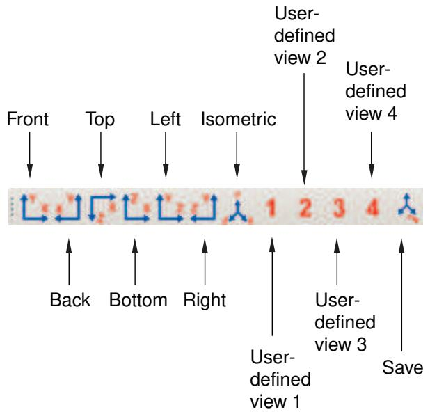

The following custom views are available:

• Front, Back, Top, Bottom, Left, and Right: equivalent to observing the model from the six sides of a cube.  
• Iso: an isometric view. This is the default orientation for three-dimensional models.  
• User1, User2, User3, and User4: four user-defined views. See Saving a user-defined view, for a description of how to save a user-defined view.

If the current viewport is linked to other viewports, Abaqus/CAE also applies the same custom view to all linked viewports in your session. For more information, see Linking viewports for view manipulation.

1. If it is not visible already, display the Views toolbar by selecting View->Toolbars->Views from the main menu.

Abaqus/CAE displays the Views toolbar.

2. From the Views toolbar, click the desired tool.

If you have only one viewport, Abaqus/CAE immediately applies the selected view and unselects it from the Views toolbar. If you have more than one viewport, place the cursor over the viewport whose view you want to change. The cursor changes to a triad; click, and Abaqus/CAE applies the selected view to that viewport.


## Note:

When you apply a view that was saved with the Auto-fit option selected, the view adopts the orientation of the saved view and immediately rescales it to fill the viewport. When you apply a view that was saved with the Save current option selected, the view adopts the orientation, zoom factor, and position of the saved view.

3. Repeat Step 2 as many times as necessary to achieve the desired view.


Tip: Use the cycle view manipulation tool to return to the previous view.

## Additional information

• Linking viewports for view manipulation  
• Custom views  
• Saving a user-defined view  
• The view manipulation tools  
• Using the view manipulation tools

## Saving a user-defined view

You can use the Views toolbar to open the Save Views dialog box and save a user-defined view.

Use the save tool in the Views toolbar to open the Save Views dialog box and save a user-defined view. The Save Views dialog box is illustrated in the following figure:


Use the Scale & Position options to determine whether the saved view contains zoom factor and position information.

1. From the main menu bar, select View->Save.


Tip: You can also save a view by clicking the tool in the Views toolbar.

If you have only one viewport, Abaqus/CAE immediately opens the Save View dialog box. If you have more than one viewport, click in the viewport whose view you want to save; Abaqus/CAE then opens the Save View dialog box.

2. From the Save View dialog box, choose the desired Scale & Position behavior:

Choose Auto-fit to save only the orientation of the view. When you apply a view saved with this option, the saved orientation is applied, but the scaling factor and position are adjusted to make the view fill the viewport.  
Choose Save current to save the orientation, the zoom factor, and the position of the view. When you apply a view saved with this option, the saved orientation, scaling factor, and position are all applied.

3. In the View Name list in the Save Views dialog box, click the name of the tool you will use to recall this view.

If you overwrite one of the six custom views—front, back, top, bottom, left, right—the other five views still retain their original definitions; that is, they do not become rotated to positions orthogonal to your saved view.

4. From the Save View dialog box, click OK.

Abaqus/CAE saves the definition of the view you selected. The view is saved only for the duration of the current session; the saved view will not be available the next time you run Abaqus/CAE.

## Additional information

• Linking viewports for view manipulation  
• Custom views  
• Applying custom views  
• The view manipulation tools  
• Using the view manipulation tools

Select View->Specify from the main menu bar to specify a view. You can choose from the following methods to specify the view:

## Rotation Angles

You can specify the angles through which Abaqus/CAE will rotate your view of the model about the model or screen 1-, 2-, and 3-axes. You can also choose to rotate your view of the model from an absolute position (a “Front” view) or from the current position.

## Viewpoint

You can specify the coordinates of a vector along which an observer views your model. You can also orient the global 1-, 2-, and 3-axes within the viewport by specifying a vector representing the “up” direction.

## Zoom

You can specify a zoom factor that expands or contracts the view. You can also choose to zoom the view relative to an absolute size of the objects in the viewport (the default size with a zoom factor of one applied) or relative to the current size of the objects in the viewport.

## Pan

You can specify movement of the view in the 1- and 2-directions. The values correspond to fractions of the viewport horizontal and vertical dimensions and are relative to the current view.

For a more detailed explanation, see Numerically specifying a view.

If the current viewport is linked to other viewports, Abaqus/CAE also applies the specified view to all linked viewports in your session. For more information, see Linking viewports for view manipulation.

1. From the main menu bar, select View->Specify.


Tip: You can also specify a view by double-clicking the 3D compass.

Abaqus/CAE displays the Specify View dialog box.

2. From the Specify View dialog box, select the desired Method and do one of the following:

• If you selected the Rotation Angles method, enter the rotation angles about the X-, Y-, and Z-axes $( \pmb { \theta } _ { x } , \pmb { \theta } _ { y } , \pmb { \theta } _ { z } )$ ; a positive number corresponds to a counterclockwise rotation about each axis.

Use the Mode button to specify how Abaqus/CAE is to apply your rotation:

Choose Increment About Model Axes to apply the rotation to the model axes of the current view.  
Choose Increment About Screen Axes to apply the rotation to the screen axes of the current view. The screen X–axis is horizontal, the Y–axis is vertical, and the Z–axis is out of the screen. The origin of the screen axes is the center of the viewport.  
Choose Total Rotation From (0,0,1) to first rotate the view to the default position (a view looking down the 3-axis with the 1- and 2-axes in the plane of the screen) and then apply the rotation.

• If you selected the Viewpoint method, enter the X-, Y-, and Z-coordinates of the viewpoint vector and the coordinates of the up vector.  
• If you selected the Zoom method, enter the zoom factor and choose either Absolute or Relative magnification. A zoom factor greater than one expands your view of the model, and a zoom factor between zero and one contracts your view of the model.  
If you selected the Pan method, enter the values indicating how you want to position your view of the model relative to the current view. The values are fractions of the viewport dimensions; the first value represents horizontal motion, and the second value represents vertical motion.

3. Click OK to apply your specified view and to close the Specify View dialog box.


Tip: Use the cycle view manipulation tool to return to the original view.

## Additional information

• Linking viewports for view manipulation  
• Numerically specifying a view  
• The view manipulation tools  
• Using the view manipulation tools

## Using the 3Dconnexion motion controllers with Abaqus/CAE

http://www.3dconnexion.com/ manufactures a variety of view manipulation devices that are popular with users of CAE and CAD systems. One example of their devices is the SpaceBall that is illustrated in Figure 1.

  
Figure 1:The 3Dconnexion SpaceBall.

You can use a 3Dconnexion motion controller together with the mouse to interact more efficiently with Abaqus/CAE. You can use the motion controllers to manipulate the view of your model with one hand while using the mouse to select from the model with the other hand. The motion controllers operate on whatever is under the cursor; for example, a part or a deformed plot in a viewport or a scrollbar in a dialog box. If neither a viewport nor a scrollbar is under the cursor, the motion controller operates on the current viewport.

You can change the center of rotation of an object if you use the motion controller in conjunction with the rotate view manipulation tool. By default, both the rotate tool and the motion controller rotate an object about the center of the viewport. However, you can select the center of rotation for both the rotate tool and the motion controller by positioning the cursor in the viewport at the location to be used as the center of rotation, clicking mouse button 3, and selecting

Set As Rotation Center. Alternatively, if you click the rotate tool （ in the View Manipulation toolbar, a Select button appears in the prompt area. If you click on this button, you can select the center of rotation from a vertex or node in the viewport. The motion controller continues to use the specified rotation center even after you exit the rotate mode. For more information, see The rotate view tool.

In addition, Abaqus provides a set of “Application Functions” that are available through the standard 3Dconnexion user interface. These functions provide shortcuts to the view manipulation, view, and display tools. You can map these functions to the programmable buttons that are built into the 3Dconnexion motion controllers.

On Windows platforms Abaqus provides the following functions:

## Movie Mode

Toggle between the default and alternate rotation modes. The default mode is comparable to rotating the camera around the camera target or selected center of rotation; the alternate mode rotates the camera about itself instead of about the camera target. You can also toggle on the alternate rotation mode if you hold down the [Shift] key while using the rotate view manipulation tool. For more information, see Camera modes and view terminology; Using view options to control the camera; and The rotate view tool.

## Decrease Abaqus Sensitivity

Decrease the sensitivity of the 3Dconnexion motion controller. This setting applies only when manipulating the view in Abaqus/CAE.

## Increase Abaqus Sensitivity

Increase the sensitivity of the 3Dconnexion motion controller. This setting applies only when manipulating the view in Abaqus/CAE.

## Reset Abaqus Sensitivity

Restore the sensitivity of the 3Dconnexion motion controller to its default setting.

## Auto-fit

Fit the model into the viewport. This is the same functionality as the auto-fit view manipulation tool. For more information, see The auto-fit tool.

## Keep in View

Keep the model in view during rotate and pan. When you are manipulating the view with the motion controller, toggling on this function prevents you from moving the target of the camera out of the viewport. Similarly, if you have changed the center of rotation, this option prevents you from moving the center out of the viewport.

## Zoom to Cursor

Replace rotate and pan with zoom. If you press mouse button 2 and manipulate the motion controller, Abaqus/CAE disables the normal pan and rotate modes and replaces them with a mode that only zooms in or out from the area below the mouse cursor. If you release mouse button 2, the normal pan and rotate modes are restored. This behavior is enabled by default. You can use this function to toggle between the two modes.

## Wireframe/Shaded

Toggle between wireframe and shaded render style. This is the same functionality as the wireframe and shaded icons located in the Render Style toolbar. For more information, see Choosing a render style.

## Perspective

Toggle between perspective and parallel views. This is the same functionality as the perspective and parallel 茸 icons located in the View Options toolbar. For more information, see Controlling perspective.

## Manipulate Layers

Manipulate all layers or the current layer. If you have created an overlay plot of results in the Visualization module, you can use this function to toggle between applying view manipulations to all the layers or to only the current layer. For more information, see Manipulating the view for an overlay plot.

## Page Up

Page up in a scrollable dialog box. If the dialog box allows only horizontal scrolling, this button moves the page to the right.

## Page Down

Page down in a scrollable dialog box. If the dialog box allows only horizontal scrolling, this button moves the page to the left.

## Set Rotation Center

Set the center of rotation at the position of the mouse.

## Clear Rotation Center

Clear a previously set center of rotation.

## Set View Center

Center the view at the position of the mouse.

On Linux platforms Abaqus also provides a set of “Application Functions” that are available through the standard 3Dconnexion user interface. You should select Abaqus from the list of Applications. If Abaqus is not listed, you should select XWindow Driver Version 2.0/3.0.

The default mapping of the programmable buttons on Linux platforms is shown in the following table:

<table><tr><td>Button</td><td>Meaning</td></tr><tr><td>4</td><td>Movie mode</td></tr><tr><td>5</td><td>Decrease sensitivity</td></tr><tr><td>6</td><td>Increase sensitivity</td></tr><tr><td>7</td><td>Reset sensitivity</td></tr><tr><td>8</td><td>Auto-fit</td></tr><tr><td>9</td><td>Keep in view</td></tr><tr><td>A</td><td>Zoom to cursor ON/OFF</td></tr><tr><td>B</td><td>Wireframe/Shaded</td></tr></table>

The button mapping is fixed for the Abaqus application. However, 3Dconnexion allows you to reassign the buttons to use the standard functionality provided by their driver. For more information, see the Linux version of the 3Dconnexion documentation.

## Selecting objects within the viewport

This chapter explains how to select objects that appear within a viewport, such as nodes, elements, vertices, edges, faces, and cells.

Selecting dialog box options is discussed in Interacting with dialog boxes. Selecting viewports is discussed in Selecting viewports.

## In this section:

Understanding selection within viewports  
Selecting objects within the current viewport  
Using the selection options

## Understanding selection within viewports

This section describes the objects that you can select in a viewport and explains what these objects represent.

## In this section:

What objects can you select from the viewport?  
What is a selection group?  
Understanding the correspondence between geometric and physical objects

## What objects can you select from the viewport?

Selecting an object within the current viewport is one of the most common tasks you have to perform during the modeling process. In the course of various procedures you may need to select geometric objects (vertices, edges, faces, cells, and datums) or discrete objects (nodes and elements) by picking them directly from the viewport. Figure 1 shows these different object types.

  
Figure 1: Object types that you can select.

You can select objects in the viewport during certain procedures, such as those listed below:

• Creating sets and surfaces  
• Partitioning a part instance  
• Editing a feature  
• Seeding a part instance for meshing  
• Creating or editing a display group composed of elements or nodes  
• Color coding elements in your model  
• Creating a node list path through your model  
• Creating a load

You can also select objects in the viewport in advance of selecting a procedure. If you make selections prior to selecting a procedure, Abaqus/CAE does not limit your selections. When you select a procedure, Abaqus/CAE filters any selections that you made and keeps only those selections that are appropriate for the procedure. For more information, see Selecting objects before choosing a procedure.

If you select objects as part of a procedure, in most circumstances Abaqus/CAE only allows you to select objects that are appropriate for the current procedure. For example, the first step in partitioning an edge is selecting the edge of interest. Therefore, at this point in the procedure you can select only an edge; you cannot select a cell, a face, or a vertex. Messages in the prompt area guide you through the steps of a procedure and indicate which types of objects are available for selection. You can select only objects that are part of the current display group.

In some circumstances Abaqus/CAE cannot determine which objects are appropriate for selection and does not limit your selection. For example, when you are creating a set, you can select from cells, faces, edges, and vertices to include in the set and Abaqus/CAE allows you to select any of these objects. If you make an ambiguous selection from the viewport during a procedure, Abaqus/CAE allows you to cycle through the available objects until the desired object is selected. This ambiguity is described in Cycling through valid selections. You may find it easier to use the selection filters to limit the type of object you can select. For more information, see Using the selection options.

Many procedures to define attributes (interactions, constraints, loads, boundary conditions, predefined fields, and engineering features) allow you to select objects from the viewport to identify the region on which to apply the attribute. The default behavior for these procedures is to create a set or surface that contains the selected objects. You can change this behavior by toggling off the option to create a set or surface in the prompt area. A default name is provided in the prompt area, but you can enter a new name.

## Additional information

• Understanding selection within viewports  
• Selecting objects within the current viewport

## What is a selection group?

You can copy entities (vertices, edges, faces, or cells) that are highlighted in the viewport into a temporary storage area called a selection group. Abaqus/CAE saves the selection group for the duration of a session. Rather than manually reselecting the same entities during a subsequent selection procedure, you can paste the selection group into your selection. For example, you can copy all of the small faces highlighted by the Geometry Diagnostics query tool into a selection group. You can then paste the same selection group into your selection when you are using the Geometry Edit toolset to repair small faces.

When you paste a group into your selection, you can choose from selection groups and from display groups. Selection groups are designed to be a temporary convenience for the user, and they do not appear with display groups in the Display Groups toolset. You can create any number of display groups. In contrast, Abaqus/CAE saves a maximum of five selection groups. Abaqus/CAE overwrites the existing selection groups if you create more than five selection groups.

After you have selected the desired entities, you create a selection group by clicking mouse button 3 in the viewport and selecting Copy from the menu that appears. Abaqus/CAE copies all of the highlighted entities into a selection group. You paste a selection group to your current selection by clicking mouse button 3 in the viewport and selecting Paste from the menu that appears. Abaqus/CAE displays the Paste to Selection dialog box, and you can select one or more of the existing selection groups to paste to your current selection. When you paste a group, Abaqus/CAE appends the entities in the group to any other entities that you have already selected.


## Note:

You cannot create or use selection groups if you are selecting objects in advance of selecting a procedure.

## Understanding the correspondence between geometric and physical objects

When you select geometric objects in a viewport, it is important to understand what physical structure each object represents. The geometric objects that make up a model—cells, faces, edges, and vertices—can represent different physical structures depending on the space in which they are embedded.

For example, beams and other wire parts are represented by edges in the geometric model (see Figure 1).

  
Figure 1: Selecting wire parts.

The end surfaces of these parts are represented by the vertices on either side of the edge, and the circumferential surface is represented by the line joining the vertices. To select a wire part, you can click the edge, and, if necessary, Abaqus/CAE prompts you to specify the surface of interest.

Likewise, axisymmetric shells are also represented by edges in the geometric model (see Figure 2).

  
Figure 2: Selecting axisymmetric shells.

You can select the axisymmetric shell by clicking the edge in the viewport, and, if necessary, Abaqus/CAE prompts you to specify either the inside surface or the outside surface of the shell. You must select either the inside or the outside surface if you are applying a prescribed condition or contact definition to the surface. For example, if you want to apply a pressure load to a shell, you must specify which side of the shell should receive the load.

For more information on selecting surfaces, see Specifying a particular side or end of a region. For more information on modeling space, see The relationship between parts and features, and Part modeling space.

## Additional information

• Understanding selection within viewports  
• Selecting objects within the current viewport

## Selecting objects within the current viewport

This section describes techniques that you can use for selecting one or more objects in the current viewport.

## In this section:

Selecting and unselecting individual objects  
Drag-selecting multiple objects  
Using the angle and feature edge method to select multiple objects  
Using the face curvature method to select multiple faces  
Using the topology method to select multiple elements  
Using the limiting angle, layer, and analytic methods to select multiple element faces  
Adding adjacent objects to a selection  
Combining selection techniques  
Excluding objects from your selection  
Cycling through valid selections  
Using groups while selecting entities  
Selecting interior surfaces

## Selecting and unselecting individual objects

Selecting and unselecting objects in the current viewport are straightforward operations that use standard methods. For more information on selecting viewports, see Selecting viewports.

Preselection highlighting allows you to preview which object Abaqus/CAE will select if you click at the current cursor location. In addition, preselection in the Sketcher uses a secondary cursor to indicate the exact position and type of entity that will be selected. (For more information on Sketcher preselection, see The Sketcher cursors and preselection.)

You will use the following three selection operations most frequently:

## Click to select an object

To select a single object from the current viewport, move the cursor to the object and click mouse button 1.

To select a point, click the corresponding point marker. The point marker changes color when selected. Vertices that you can select are marked by small, filled circles; and datum points are marked by small, unfilled circles. (See Understanding the role of datum geometry, for information on datum points.) Edge midpoints and arc centers that you can select are marked by small diamonds.


## Note:

Some of the selection markers that appear when you are using the Sketch module are different from those described here. For information on selecting objects while using the Sketch module, see The Sketcher cursors and preselection.

• To select an edge, click the edge while positioning the cursor away from any vertex. Selected edges are highlighted.  
• To select a face, click the face while positioning the cursor away from any edge or vertex. Selected faces are highlighted with a grid pattern. (The grid pattern is unrelated to mesh element location.)  
• To select a cell, click any of its faces. All edges of selected cells are highlighted.

If you are unable to select the desired objects, you can use the Selection toolbar to change the selection behavior. For more information, see Using the selection options.

Once you select an object, any objects previously selected in the current viewport are unselected automatically.

If your current procedure, options, and cursor position do not clearly specify one object for preselection, Abaqus/CAE highlights all of the potential selections and adds ellipsis marks (...) next to the cursor arrow to indicate an ambiguous preselection. If you accept an ambiguous preselection or otherwise make an ambiguous selection, use the buttons in the prompt area to make your final selection. For more information, see Cycling through valid selections.

## [Shift] + Click to select additional objects

To select an additional object, move the cursor to the object and [Shift] + Click. Your original selection remains highlighted, and the newly selected object becomes highlighted.

An alternative method for selecting multiple objects is to drag a rectangle around the objects. For more information, see Drag-selecting multiple objects.

## [Ctrl] + Click to unselect objects

To unselect an object, move the cursor to the object and [Ctrl] + Click. To unselect all objects, click an unused region of the current viewport.

When you have finished selecting and unselecting items in the viewport, click mouse button 2 to confirm your selection. You can use the selection option tools to adjust the shape of the drag-select region. You can also choose which objects are selected by the drag-select region. The selection option tools are located in the Selection toolbar. For more information, see Modifying the shape of the drag-select region, and Choosing which objects are selected by the drag-select region.

## Additional information

• Understanding selection within viewports  
• Selecting objects within the current viewport  
• The Sketcher cursors and preselection  
• Using the chain method to select edges in the Sketcher

## Drag-selecting multiple objects

Most prompts ask you to select just one object from the current viewport. However, some tasks allow you to select one or more objects; for example, the Set toolset allows you to select several objects of the same type and group them into sets. You can select multiple objects using the [Shift] + Click method described in Selecting and unselecting individual objects. An additional method for selecting multiple objects is to drag a rectangle around those objects. You can use the selection option tools to adjust the shape of the drag-select region. You can also choose which objects are selected by the drag-select region. The selection option tools are located in the Selection toolbar. For more information, see Modifying the shape of the drag-select region, and Choosing which objects are selected by the drag-select region.

1. Imagine a rectangle that encloses only the objects you want to select.  
2. Click at one corner of the rectangle and, while continuing to press the mouse button, drag until you have enclosed all the objects.  
3. Release the mouse button.

All the valid objects inside or crossing the rectangle are highlighted.

4. Click mouse button 2 to indicate that you have finished selecting objects.

Sometimes it is convenient to use a combination of the [Shift] + Click and drag-select selection techniques. For more information, see Combining selection techniques.


Tip: If you select multiple objects and then want to unselect one or more of them, [Ctrl] + Click the objects you want to unselect. To unselect all the objects, click in an unused area of the viewport.

## Additional information

• Selecting objects within the current viewport  
• Selecting and unselecting individual objects  
• Cycling through valid selections  
• Using the chain method to select edges in the Sketcher

## Using the angle and feature edge method to select multiple objects

In complicated models selecting individual faces or edges from geometry or selecting element faces or nodes from a mesh can be time consuming and prone to error. For example, when creating a surface from a mesh, you must select the individual element faces that make up the surface and append them to your selection. To speed up the selection process, Abaqus/CAE provides the angle and feature edge methods for selecting multiple faces, edges, elements, element faces, or nodes.

When you are performing a task in which you must pick more than one face or edge from geometry or more than one element, element face, or node from a mesh, Abaqus/CAE displays a field in the prompt area. The field allows you to choose between three selection methods—individually, by angle, and by feature edge, as shown in Figure 1.

  
Figure 1: Choose the selection method from the field in the prompt area.

## Individually

Selecting individual objects is described in Selecting and unselecting individual objects.

## By angle

Selecting objects using the angle method is a two-step process:

1. In the prompt area, you enter an angle (from $0 ^ { \circ }$ to 90°).  
2. From the part or assembly, you select a face, edge, element face, or node.

The angle must be greater than the angle through which adjacent edges or faces must rotate to create the geometry as if it was being formed by bending a straight wire or folding a series of faces. Abaqus/CAE starts from the selected geometry and selects all adjacent geometry until the angle you entered is met or exceeded.

For example, to select the edges of a regular hexagon, enter an angle greater than 60° (since each adjacent edge must be rotated 60° to form the shape from a straight wire), and select one of the edges. Abaqus/CAE then selects every adjacent edge since none of the angles is equal to or exceeds the angle that you entered.

Figure 2 illustrates how the angle method allows you to select all the elements around the flange of an exhaust manifold mesh.

  
Figure 2: Enter an angle and select an element to select an entire face.

In the Sketch module, the angle method is available only when you are selecting objects from the underlying part or assembly. When you are selecting edges in the sketch, the chain method replaces the angle method. Use the chain method to select a group of edges that are connected end-to-end, like the links of a chain. For more information on the chain method, see Using the chain method to select edges in the Sketcher.

## By feature edge

The feature edge method is also a multistep process:

1. In the prompt area, you enter an angle (from $0 ^ { \circ } \mathrm { t o } 9 0 ^ { \circ } )$ .  
2. Abaqus/CAE identifies all the feature edges in your model by finding all the element edges where the angle between two adjacent element faces is greater than the angle specified.  
3. From the mesh, you select an element edge or node.  
4. Abaqus/CAE follows the feature edge that passes through the selected element edge or node. The feature edge is truncated if another feature edge intersects it at an angle greater than the angle specified in Step 1.  
5. Abaqus/CAE selects all the elements or nodes along the feature edge.

Figure 3 illustrates how the feature edge method allows you to select all the nodes along the edges of a flange of an exhaust manifold mesh.

  
Figure 3: Enter an angle and select a segment of an edge to select adjacent nodes.

After you use the angle or feature edge methods, you can click the individually method in the prompt area and [Shift] + Click on individual faces, edges, elements, element faces, or nodes to append them to your selection. You can also [Ctrl] + Click on items to unselect them. In addition, you can continue to use the angle and feature edge methods and use [Shift] + Click to append faces, edges, elements, element faces, or nodes to your selection. You can keep the same angle, or you can change the angle while you continue to append items. For more information, see Combining selection techniques.

## Additional information

• Selecting objects within the current viewport  
• Understanding selection within viewports

## Using the face curvature method to select multiple faces

In addition to selecting objects by the angle between them, you can select multiple faces from a part based on the curvature of the faces. When you are performing a task that allows you to pick more than one geometric face, Abaqus/CAE displays a field in the prompt area. The field allows you to choose between the three selection methods—individually, by face angle, and by face curvature, as shown in Figure 1.

  
Figure 1: Choose the selection method from the field in the prompt area.

The angle selection method is described in Using the angle and feature edge method to select multiple objects.

The face curvature method is available during procedures that select faces. If a procedure accepts object types other than faces, you can change the object type in the Selection toolbar to Faces to access the face curvature method.

Select a face from the part or assembly. Abaqus/CAE selects all connected faces that have similar curvature along both principal directions and are joined at an angle of less than 20°. If you select a flat face, Abaqus/CAE adds any adjoining flat faces that lie in the same plane. Disconnected faces that share similar curvature are not selected, nor are faces that share similar curvature but have significantly different face normals at the edge where they meet. Figure 2 shows two rounded faces selected using the face curvature method.

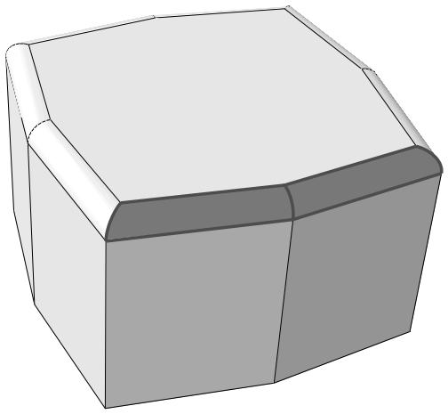  
Figure 2: Select a single curved face to select adjoining faces with similar curvature.

After you use the face curvature method, you can click the individually method in the prompt area and [Shift] + Click on individual faces to append them to your selection. You can also [Ctrl] + Click on items to unselect them. In addition, you can continue to use the face curvature method and use [Shift] + Click to append faces to your selection. For more information, see Combining selection techniques.

## Additional information

• Understanding selection within viewports  
• Selecting objects within the current viewport

## Using the topology method to select multiple elements

You can select multiple elements based on the connection of a row or layer of elements. When you are performing a task that allows you to pick more than one element, Abaqus/CAE displays a field in the prompt area. The field allows you to choose between the four selection methods—individually, by angle, by feature edge, and by topology, as shown in Figure 1.

  
Figure 1: Choose the selection method from the field in the prompt area.

The angle and feature edge selection methods are described in Using the angle and feature edge method to select multiple objects.

The topology method is available during most procedures that select elements. If a procedure accepts object types other than elements, you can change the object type in the Selection toolbar to Elements to access the topology method.

The topology method is designed for use with two- and three-dimensional structured meshes. Select an element face from the mesh, and Abaqus/CAE selects all the elements connected to it in a row through the mesh. Select an element edge from the mesh, and Abaqus/CAE selects all the elements in a layer starting with the element faces that share the selected edge. Figure 2 shows selection of an interior row on the left and an interior layer on the right.

  
Figure 2: Using the topology method to select a row or a layer of elements.

You can use the topology method to select elements from other mesh types, but without the clearly defined rows or layers of a structured mesh, the selections may be unpredictable. In some cases, such as with a tetrahedral mesh, topology selection may be limited to only the elements that share the face or edge you select.

After you use the topology method, you can select other methods in the prompt area and [Shift] + Click to append more elements to your selection. You can also [Ctrl] + Click on items to unselect them. In addition, you can continue to use the topology method and use [Shift] + Click to append elements to your selection. For more information, see Combining selection techniques.

## Additional information

• Understanding selection within viewports

• Selecting objects within the current viewport

## Using the limiting angle, layer, and analytic methods to select multiple element faces

When you are selecting orphan element faces to create geometry (for more information, see Create face from element faces), Abaqus/CAE displays a field in the prompt area. The field allows you to choose between five selection methods—individually, by angle, by limiting angle, by layer, and by analytic, as shown in Figure 1.

  
Figure 1: Choose the selection method from the field in the prompt area.

The angle selection method is described in Using the angle and feature edge method to select multiple objects. The limiting angle, layer, and analytic methods are available only while selecting orphan element faces to create new geometric faces.

## By limiting angle

Selecting objects using a limiting angle is a two-step process:

1. In the prompt area, you enter an angle (from 0° to 90°).  
2. From the part or assembly, you select an orphan element face.

The angle must be greater than the total angle between the selected element face and the element faces connected to it. Abaqus/CAE starts from the selected geometry and selects all adjacent geometry until the angle between the selected face and the last face in the series of adjacent faces meets or exceeds the angle you entered. Figure 2 shows selection of element faces with a limiting angle of 45°, and one of the vertical element faces below the rounded area is picked.

  
Figure 2: A limiting angle of 45° with a selected vertical face.

Increasing the limiting angle to its maximum of 90° would select the faces up to the top of the rounded section. In contrast, using the angle method with an angle of 13° or more would continue the selection around the rounded portion and down the far side since the angle between each adjacent face is less than 13°.

## By layer

Selecting objects using the layer method is a two-step process:

1. In the prompt area, you enter a number of layers.  
2. From the part or assembly, you select an orphan element face.

Abaqus/CAE starts from the selected face and selects layers of adjacent element faces around it in all directions. Selection continues around corners and other features until the number of layers is reached or until there are no more adjacent orphan element faces.

Figure 3 illustrates the selection of three layers of orphan shell element faces around a starting face and the resulting geometric face.

  
Figure 3: Face layer selection and creation of a geometric face.

As shown in Figure 3, layer selection can traverse sharp corners and other model features that would normally signify the end of a geometric face. In most cases you should preserve logical model edges and other features by creating separate faces. Otherwise, the resulting geometry may be difficult to repair and mesh.


## Note:

When you are working with solid orphan elements, selections that include multiple faces from the same orphan element are not acceptable for the creation of a single geometric face.

## By analytic

The analytic selection method for orphan element faces is based on the recognition of basic shapes in analytic geometry (such as planes, cylinders, cones, spheres, and tori), or portions of these shapes. Analytic selection attempts to recognize the logical boundaries of a set of orphan element faces that would make a recognizable geometric face.

Figure 4 illustrates analytic selection of orphan element faces. A spherical section of element faces is highlighted; this selection could not be made using any of the other selection options for multiple objects.

  
Figure 4: Analytic geometry selection.

After you use any of the above methods, you can select other methods in the prompt area and [Shift] + Click to append more elements to your selection. You can also [Ctrl] + Click on items to unselect them. In addition, you can continue to use the current method and use [Shift] + Click to append elements to your selection. For more information, see Combining selection techniques.

## Additional information

• Understanding selection within viewports  
• Selecting objects within the current viewport  
• Create face from element faces

## Adding adjacent objects to a selection

If you have already selected one or more objects, you can expand your selection to include all adjacent objects of the same type. Adding adjacent objects is an alternative to using drag-select or the angle method (see Drag-selecting multiple objects, and Using the angle and feature edge method to select multiple objects, respectively) to quickly select multiple objects. Selecting adjacent objects allows you to expand your selection in all directions, regardless of the shape of surrounding features or the angle at which objects are joined. It also allows you to pick multiple areas of interest in a model and expand the selection set in each area at the same time.

To add adjacent objects to the current selection, click mouse button 3 over an existing selected object and select Add Adjacent Entities. Abaqus/CAE expands your selections to all adjacent objects of the same type, including objects that are not included in the current display. If necessary, Abaqus/CAE adds the newly selected objects to the current display group to make them visible. Adjacent objects are defined in terms of the currently selected entities as follows:

• Edges that share a common vertex with one or more selected edges  
• Vertices that share a common edge with one or more selected vertices  
• Faces that share a common vertex or edge with one or more selected faces  
• Nodes that share a common edge with one or more selected nodes  
• Elements that share a common element edge or node with a selected element

## Additional information

• Selecting objects within the current viewport  
• Using the chain method to select edges in the Sketcher

## Combining selection techniques

There are times when it is convenient to use a combination of the methods for selecting and unselecting objects. For example, you can drag-select a group of nodes while creating a node set using the Set toolset. You can then [Ctrl] + Click individual nodes to unselect them and [Shift] + Click additional nodes to add them to your selection. A combination of the three techniques is illustrated below:

1. First, you use drag-select to select a group of nodes.


2. Then, you use [Ctrl] + Click to unselect individual nodes.


3. Finally, you use [Shift] + Click to add nodes to your set and then click mouse button 2 to indicate you have finished selecting.


You may find it useful to adjust the view orientation to make particular items in the viewport more accessible. You can adjust the view orientation at any point during the selection process. For information on the view manipulation tools, see Manipulating the view and controlling perspective.


Tip: To unselect all the objects, click an unused part of the current viewport.

## Additional information

• Selecting objects within the current viewport  
• Selecting and unselecting individual objects  
• Drag-selecting multiple objects  
• Using the chain method to select edges in the Sketcher

## Excluding objects from your selection

When you select an object from the viewport, your selection includes all the entities of lower dimensionality that are associated with the object. For example, if you select a cell, your selection includes all the faces, edges, and vertices associated with the cell. Similarly, if you select an edge, your selection includes all the vertices associated with the edge. In some circumstances you may want to exclude the entities of lower dimensionality from your selection. For example, if you select an edge to include in a set, you may not want the set to contain the vertices at each end of the edge. Excluding entities of lower dimensionality from your selection may solve any problems that you encounter with overconstraints.

1. Select all the objects using a combination of select, drag-select, [Ctrl] + Click, and [Shift] + Click. Abaqus/CAE highlights the selected objects in red.  
2. [Ctrl] + Click an object to exclude it from your selection. Abaqus/CAE highlights the excluded objects in purple.

## Additional information

• Selecting objects within the current viewport  
• Selecting and unselecting individual objects  
• Cycling through valid selections  
• Using the chain method to select edges in the Sketcher

## Cycling through valid selections

In some cases Abaqus/CAE is unable to differentiate between the object you have selected and other nearby or related objects. This ambiguity can arise as follows:

Imagine a small square surrounding the cursor. When you click an object, any other valid objects of the same type that fall inside this square are also considered to be possible selections. For example, if you select an edge that is positioned very close to another edge, Abaqus/CAE may consider both edges to be possible selections.

The size of the square is independent of the monitor size, the viewport size, and the dimensions of the model. It also remains constant when you zoom in and out on your model. Therefore, you can select a specific object in the viewport more precisely by zooming in on your model to increase the distance between objects.

If your model is three-dimensional, imagine a line that is perpendicular to the screen and that passes through the cursor and into the model. When you select an object, any valid objects of the same type that intersect this line are considered to be possible selections. (Rotating your model may remove some of the ambiguity.)

Abaqus/CAE reduces the potential for ambiguity by filtering your selection against the current procedure whenever possible. For example, if you are partitioning a cell, Abaqus/CAE prompts you to select the cell to partition. When you make a selection, Abaqus/CAE considers only cells to be a valid selection. Conversely, if you are creating a geometry set, Abaqus/CAE considers cells, faces, edges, and vertices to be a valid selection and the potential for ambiguity is increased. In addition, preselection highlighting allows you to see exactly which object would be selected before you make the selection. Moving the cursor around the viewport may remove the ambiguity in the selection and result in Abaqus/CAE highlighting the object of your choice. If the ambiguity remains, Abaqus/CAE changes the cursor, adding ellipsis marks (...) to the right of the arrow, and highlights all the possible selections.

When your selection is ambiguous, Abaqus/CAE displays buttons in the prompt area that allow you to cycle through all of the possible selections, as shown here:

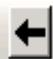

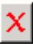

Ambiguous selection, please choose one:

Next

Previous

OK

Use the Next and Previous buttons to cycle forward and backward through all of the objects in the viewport that are possible selections; each object becomes highlighted in turn. When the object of your choice is highlighted, click OK or click mouse button 2 to confirm your selection. (You can also click mouse button 3 in the current viewport to reveal a menu of the options in the prompt area.)

## Additional information

• Selecting objects within the current viewport

## Using groups while selecting entities

You can append groups of entities to your selection to speed up the process of selecting many entities from the viewport. The group can be a display group, or it can be a temporary selection group. You can click mouse button 3 on the viewport and do the following:

• Create a selection group by copying entities (vertices, edges, faces, or cells) that are highlighted in the viewport into a selection group.  
• Append to your selected entities by pasting the entities stored in a selection group or a display group into your current selection.

## Selecting interior surfaces

You can use the selection tools to select an interior surface of a model; for example, when you create a surface or when you select a region using the solid offset mesh tool.

1. In the Selection toolbar, toggle on the Select From Interior Entities tool


## Note:

The Select From Interior Entities tool is hidden by default. For more information, see Using toolboxes and toolbars that contain hidden icons.

2. Select the interior surface from the viewport.

## Additional information

• Understanding and using toolboxes and toolbars  
• Understanding selection within viewports  
• Selecting objects within the current viewport  
• Filtering your selection based on the position of the object  
• What is a surface?  
• Specifying a particular side or end of a region

## Using the selection options

Abaqus/CAE provides a set of tools that can make it easier and more efficient for you to select entities from the viewport.

The selection tools are located in the Selection toolbar. The available options depend on the current selection procedure; some options can be used to preselect entities outside of a procedure.

This section describes the selection options.

## In this section:

Available selection options  
Filtering your selection based on the type of object  
Filtering your selection based on the position of the object  
Highlighting objects prior to selection  
Modifying the shape of the drag-select region  
Choosing which objects are selected by the drag-select region  
Selecting objects before choosing a procedure

## Available selection options

When you are prompted to select an object from the viewport, Abaqus/CAE provides selection tools that can make it easier and more efficient for you to make the desired selection.

Use the Selection toolbar to configure the selection options. Figure 1 shows the layout of the selection tools. Selection tools appear dimmed if they are not valid for the current procedure.

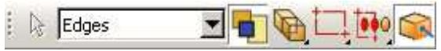  
Figure 1:The Selection toolbar.

## Additional information

• Components of the toolbars  
• Using dimmed dialog box and toolbox components  
• Selecting objects within the current viewport  
• Using the selection options

## Filtering your selection based on the type of object

To help you select the desired entities (such as vertices, edges, faces, nodes, and elements) from the current viewport, Abaqus/CAE provides a set of filters that you can use to limit your selection based on the type of object.

For example, if you are creating a set that contains only surfaces, you can limit your selection to only faces—other objects, such as vertices and edges, will not be selected.

The object filters are listed in the Selection toolbar. Abaqus/CAE configures the filter list based on the current procedure. If you have not started a selection procedure, Abaqus/CAE lists some commonly used filters (for more information on selecting objects outside of a procedure, see Selecting objects before choosing a procedure).

You can press [Ctrl] + A to select all objects in the current viewport based on the active selection filter. The view is rescaled to fit the viewport to clearly display the selected objects, which are highlighted in the viewport. For example, if edge objects are selected in the filter and you press [Ctrl] + A, all edges visible in the viewport are selected. You cannot customize the [Ctrl] + A keyboard shortcut.

If the current viewport contains an Abaqus/CAE part or part instance, you can select one of the following filters:

## All

All objects except skins and stringers.

## Cells

All volumes, such as cells and elements.

## Faces

All planar objects, such as faces, datum planes, and element faces.

## Edges

All edge objects, such as edges, datum axes, and element edges.

## Vertices

All point objects, such as vertices, datum points, and nodes.

## Elements

All elements.

## Nodes

All nodes.

## Datums

All datum objects, such as datum planes, datum axes, and datum points.

## Features

All feature objects.

## Ref points

All reference points.

The list of available filters is updated as you change modules or selection procedures, and additional filters (such as Instances, Skins, and Stringers) are displayed where applicable. By default, Abaqus/CAE selects from all objects but excludes skins and stringers. You can select a skin or stringer from the viewport only after you select the appropriate filter.

Similarly, if you are selecting orphan elements in the current viewport (to assign an element type, for example), you can select one of the following filters:

All  
• Zero-dimensional elements  
• One-dimensional elements  
• Two-dimensional elements  
• Three-dimensional elements  
. Skins  
• Stringers

By default, Abaqus/CAE selects from all elements except skins and stringers.

• Using the selection options

## Filtering your selection based on the position of the object

The selection tools allow you to choose from which objects to select, based on their positions in the viewport. The Selection toolbar contains all of the selection tools.

The following position-based selection tools are available only after you start a procedure that requires object selection (position-based selection is not available outside of a procedure):

## Objects closest to the screen

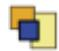

Toggle on this tool to select only the objects closest to the front of the screen. This tool is toggled on by ult.

If you toggle off this tool, Abaqus/CAE allows you to cycle through all of the possible selections. Use the Next and Previous buttons in the prompt area to cycle forward and backward through all of the objects in the viewport that are possible selections; each object becomes highlighted in turn. For more information, see Cycling through valid selections.

This filter applies to native vertices, edges, faces, and cells and to orphan nodes and orphan elements.

## Interior and exterior objects

Choose one of the following filters:

Select objects located both outside and inside a part.  
Select only objects located on the outside of a part. In most cases this tool is selected by default.  
Select only objects located on the inside of a part.

• Using the selection options

## Highlighting objects prior to selection

When you are selecting objects from the viewport and you stop moving the cursor, Abaqus/CAE highlights the object that would be selected at the cursor position.

This behavior, called “preselection,” allows you to see exactly which object would be selected before you make the selection. If the current selection options make more than one object available, Abaqus/CAE changes the cursor, adding ellipsis marks (...) to the right of the arrow, and highlights all the possible selections. The position and type filtering that you choose for selection also applies to preselection.

Toggle off the Allow Preselection During Picking tool in the Selection toolbar to turn off preselection highlighting for procedures in the current session. This tool is toggled on by default.


## Note:

Preselection highlighting may be delayed for large models; toggling off preselection may improve the display speed.

• Using the selection options

## Modifying the shape of the drag-select region

The selection tools allow you to change the shape of the drag-select region.

From the Selection toolbar, choose one of the following:

## Rectangle

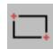

Click to indicate one corner of the rectangle, and drag the cursor to the second corner. This tool is selected by default.

## Circle

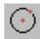

Click to indicate the center of the circle, and drag the cursor to a point on the circumference.

## Polygon


Click to indicate one vertex of the polygon, and drag the cursor to the second vertex. You then continue to click on each vertex of the polygon. Click mouse button 2 to indicate you have finished entering vertices. There is no limit to the number of vertices in the polygon.

• Using the selection options

## Choosing which objects are selected by the drag-select region

The selection tools allow you to choose which objects are selected by the drag-select region.

From the Selection toolbar, choose one of the following:

## Inside


Select only the objects that fall inside the drag-select region.

## Inside and crossing

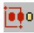

Select only the objects that fall inside or cross the drag-select region. This tool is selected by default.

## Crossing

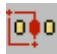

Select only the objects that cross the drag-select region.

## Outside and crossing


Select only the objects that fall outside or cross the drag-select region.

## Outside

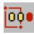

Select only the objects that fall outside the drag-select region.

• Using the selection options

## Selecting objects before choosing a procedure

You can select objects from the current viewport before choosing a procedure to work with them.

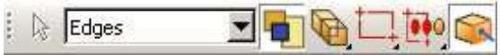

You can use the Selection toolbar

to toggle selection and to limit

viewport selections based on the type of object. The Selection tool is the first tool in the toolbar; it is available only when there are no active procedures running in a viewport. By default, selection is active and viewport object types are not limited. You can select multiple objects using any of the methods described in Combining selection techniques. Toggle off object selection to prevent selecting objects when you are not in a procedure.


## Note:

Preselection highlighting may be delayed for large models; toggling off selection may improve the display speed by preventing preselection and selection unless you first choose a procedure that requires object selection.

When you select a procedure after selecting objects from the viewport, Abaqus/CAE applies the selection filters for the procedure. For example, if you selected a vertex, a face, and an edge, then started a procedure that can accept only vertices, Abaqus/CAE accepts the selected vertex, cancels the selection of the face and edge, and begins the procedure with the second step. Similarly, if you select a procedure that requires a single object selection and you have already selected multiple valid objects, Abaqus/CAE accepts the first valid selection and cancels the remaining selections. If Abaqus/CAE cannot determine which object you selected first, it will cancel all selections and begin the procedure at the first step.

If a procedure includes multiple selection steps, objects that you select before the procedure can be used only to complete the first selection step. Any subsequent selection steps require you to select new objects interactively from the viewport or, if applicable, use saved selection groups. You cannot save selections made prior to the start of a procedure.

• Using the selection options

## Configuring graphics display options

This chapter explains how you can configure the graphics display options in Abaqus/CAE.

## In this section:

Using graphics display options  
Using display lists  
Using antialiasing  
Choosing a highlight method  
Choosing a translucency mode  
Controlling drag mode  
Choosing background colors

## Using graphics display options

When you start a session, Abaqus detects the graphics hardware installed on your system and sets the graphics options accordingly. If your graphics hardware is not supported by Abaqus/CAE or if you wish to override the default graphics options, you can use the Graphics Options dialog box to tune display performance.

Abaqus/CAE applies the settings to all viewports and saves the settings for the duration of the session. To use the customized settings each time you start an Abaqus/CAE session, modify the environment file (abaqus\_v6.env). For additional information on the environment file, see the Abaqus Configuration Guide.


Note: Recommended settings for recently introduced graphics adapters are available from the Support page at www.3ds.com/simulia.

You can also use the Graphics Options dialog box to do the following:

Choose the appearance of your model during rotation, pan, or zoom view manipulations. The appearance is related to the render style and can be set to Fast (wireframe) or As is.  
Choose whether Abaqus/CAE will auto-fit the image to the current viewport after you rotate the view. Automatically fitting the image to the viewport is equivalent to clicking the auto-fit tool in the View Manipulation toolbar. Auto-fit adjusts your view of the model so that the model fills the viewport and is centered within it. The orientation remains fixed, as indicated by the view triad.  
• Choose whether Abaqus/CAE will optimize the display of translucent objects for performance, for accuracy, or for a level in between.  
• Choose the viewport background color. Your selected color will be applied to all viewports in the current session of Abaqus/CAE.

1. From the main menu bar, select View->Graphics Options.

The Graphics Options dialog box appears.

2. Select one of the following options:

• Tune performance using options for display lists, highlight method, and translucency mode.  
• Choose the display mode while you drag objects in the viewport.  
• Enable or disable the automatic fitting of your view to the viewport after rotations.  
• Choose the background color of the viewports.

## Additional information

• Using display lists  
• Choosing a highlight method  
• Choosing a translucency mode  
• Controlling drag mode  
• Choosing background colors

## Using display lists

Display lists help you display repeated images faster. When display lists are enabled, every drawing operation is recorded in a list that can be quickly replayed if necessary. This results in faster image refreshes on most systems but requires graphics memory to record each drawing operation. Display lists are not used at all in the Visualization module (Abaqus/Viewer). In Abaqus/CAE display lists are usually enabled; you should disable them if you experience memory problems or a degradation of graphics performance while displaying exceptionally large models.

1. Locate the display lists options.

From the main menu bar, select View->Graphics Options.

Abaqus/CAE displays the Graphics Options dialog box.

2. From the Hardware options, toggle Use display lists on or off to control the use of display lists for images. This option has no effect in the Visualization module.

When Use display lists is on, you may notice a brief delay the first time an image is drawn; this occurs because Abaqus/CAE must construct the display lists. Subsequent drawing of the image is faster.

3. Click OK to implement your changes and to close the dialog box.

Your changes are saved for the duration of the session.

## Additional information

• Choosing a highlight method  
• Choosing a translucency mode  
• Controlling drag mode  
• Choosing background colors

## Using antialiasing

Abaqus/CAE uses antialiasing to improve the display of curved and diagonal lines on models. Antialiasing is enabled on compliant systems, and you can toggle off this option to improve performance for some systems.

1. Locate the graphics options.  
From the main menu bar, select View->Graphics Options.  
Abaqus/CAE displays the Graphics Options dialog box.

2. From the Hardware options, toggle on Anti-alias lines to enable antialiasing or toggle it off to disable antialiasing.

3. Click OK to implement your changes and to close the dialog box.

Your changes are saved for the duration of the session.

## Additional information

• Using display lists  
• Controlling drag mode  
• Choosing background colors

## Choosing a highlight method

The highlight method controls how Abaqus/CAE displays highlighting in the viewport while you interact with the model. The effect of changing the highlight method is most apparent when you use the view manipulation tools to rotate the model or while sketching a profile in the Sketch module. Hardware Overlay provides the best graphics performance; however, this option is not supported by all graphics adapters.

In most circumstances you should not have to change the default highlight method setting. When you start a session, Abaqus/CAE detects the graphics hardware installed on your system and selects the appropriate highlight method. However, if you are using a graphics adapter that is not supported, the default setting selected by Abaqus/CAE may not be optimal.

1. Locate the highlight method options.

From the main menu bar, select View->Graphics Options.

Abaqus/CAE displays the Graphics Options dialog box.

2. From the Highlight method menu, select one of the following:

Hardware Overlay. This option appears only if it is supported by the graphics adapter on your system. It uses graphics hardware to display the highlighting layer. If your workstation supports this option, choosing Hardware Overlay provides the optimum quality and performance.  
XOR. This option uses software to emulate the highlighting layer. Choosing the XOR option uses a Boolean pixel operation to simulate the drawing operations but can produce different colors depending on the color of the underlying pixels.  
Software Overlay. This option also uses software to emulate the highlighting layer and provides good quality at reasonable performance. However, on some systems selecting this option results in poor performance.  
Blend. The Blend method combines the color of the underlying pixel with the desired color producing an approximation of the transient graphics. You should choose this option only if none of the other options are satisfactory. Performance and quality may be affected if you choose the Blend option.

3. Click OK to implement your changes and to close the dialog box.

Your changes are saved for the duration of the session.

## Additional information

• Using display lists  
• Choosing a translucency mode  
• Controlling drag mode  
• Choosing background colors

## Choosing a translucency mode

The translucency mode controls the speed and accuracy with which Abaqus/CAE displays translucent objects in the viewport. The effect of changing the translucency mode is most apparent when you use the view manipulation tools to manipulate the display of the model. The Fast setting provides the best graphics performance, while the Accurate setting provides the best rendering of translucent objects.

In most circumstances you should not have to change the default translucency method setting. When you start a session, Abaqus/CAE detects the graphics hardware installed in your system and selects the appropriate translucency mode. However, if you are using a less capable graphics adapter, the default setting selected by Abaqus/CAE may not be optimal for your models.

1. Locate the translucency mode options.

From the main menu bar, select View->Graphics Options.

Abaqus/CAE displays the Graphics Options dialog box.

2. Drag the Translucency mode slider to the setting that you want. For some graphics cards, Abaqus/CAE supports three intermediate translucency mode settings between Fast and Accurate; for others, Abaqus/CAE supports only one intermediate setting between these two options.  
3. Click OK to implement your changes and to close the dialog box.

Your changes are saved for the duration of the session.

## Additional information

• Using display lists  
• Choosing a highlight method  
• Controlling drag mode  
• Choosing background colors

## Controlling drag mode

Drag mode controls the appearance of your model during rotation, pan, or zoom view manipulations. Drag mode can be set to Fast (wireframe) or As is.

## Fast (wireframe)

When you set drag mode to Fast (wireframe), a wireframe outline is drawn during the view manipulation. Fast (wireframe) is the default drag mode setting on compliant systems.

## As is

When you set drag mode to As is, everything displayed in the window will continue to be displayed during the view manipulation. On older or slower systems the display may lag behind movement of the mouse while you manipulate the view, especially if the model is complex. For newer systems with graphics hardware acceleration the As is setting can be accommodated without significant loss of performance.

Set the drag mode to As is to observe the model during the view manipulation; for example, to locate areas of high stress concentration as you rotate a contour plot.

In addition, you can choose whether Abaqus/CAE will auto-fit the image to the current viewport after you rotate the

网 view. Automatically fitting the image to the viewport is equivalent to clicking the auto-fit tool in the View Manipulation toolbar. Auto-fit adjusts your view of the model so that the model fills the viewport and is centered within it. The orientation remains fixed, as indicated by the view triad.

1. Locate the drag mode options.

From the main menu bar, select View->Graphics Options.

Abaqus/CAE displays the Graphics Options dialog box.

2. From the View Manipulation field, select Fast (wireframe) or As is drag mode.  
3. If desired, toggle on Auto-fit after rotations.  
4. Click OK to implement your changes and to close the dialog box.

Your changes are saved for the duration of the session.

## Additional information

• Using display lists  
• Choosing a highlight method  
• Choosing a translucency mode  
• Choosing background colors

## Choosing background colors

The appearance of your models is affected by the difference in contrast between the model colors and the colors in the viewport background. You can improve this contrast by changing the color or colors displayed in the viewport background. Abaqus/CAE provides two color selections: you can display a single color that floods the entire viewport background, or you can create a gradient background that blends two different colors.

Abaqus/CAE implements your background color selections for every viewport in your session.

1. Locate the background color options.

From the main menu bar, select View->Graphics Options.

Abaqus/CAE displays the Graphics Options dialog box.

2. From the Viewport Background field, select one of the following:

• Solid to choose one color for the viewport background  
Gradient to choose the top and bottom colors used to draw the background as a gradual blend from the top of the viewport to the bottom of the viewport

3. Select the viewport background color or colors.

a. Click a color sample .

Abaqus/CAE displays the Select Color dialog box.

b. Use one of the methods in the Select Color dialog box to select a new color. For more information, see Customizing colors.

c. Click OK to close the Select Color dialog box.

The color sample changes to the selected color.

d. For gradient backgrounds you can select both the top and bottom colors directly; or you can select the top color, then click Auto-Select to have Abaqus/CAE select the bottom color based on a variation of the top color.

e. Sketches or X–Y plots may not display clearly with a gradient background. For these views Abaqus/CAE displays a solid background even when you have specified a gradient background. To disable this behavior, toggle off Allow override.

4. Click OK to implement your changes and to close the dialog box.

Abaqus/CAE implements your background color selections for every viewport in your session. Your changes are saved for the duration of the session.

## Additional information

• Using display lists  
• Choosing a highlight method  
• Choosing a translucency mode  
• Controlling drag mode

## Printing viewports

This chapter describes how you send an image of selected viewports either directly to a printer or to a file.

For more information on configuring printers, see the Abaqus Configuration Guide.

## In this section:

Understanding printing  
Controlling the destination and appearance of printed images

## Understanding printing

Abaqus/CAE allows you to take a snapshot of one or more viewports and their contents and to send the image either directly to a printer or to a file for later use; for example, to include in a presentation, embed in a printed report, or display in an HTML document.

Additional options allow you to select the appearance of viewports in the resulting image, as well as the color, resolution, and size of the image.

This section describes basic concepts you should understand before sending output to a printer or to a file.

## In this section:

Printed image formats  
Windows and PostScript image layout  
Windows printer image size  
EPS, TIFF, PNG, and SVG image size  
Hard-copy image quality  
Importing Abaqus/CAE images into other software products

## Printed image formats

You can print images directly to a printer or save images in several file formats.

Abaqus/CAE allows you to print images directly to a Windows printer. The printer driver creates and sends the necessary information to the printer in whatever format is required.

If Windows printer drivers are not available or if you are using another platform, you can use a print command to create and send a PostScript file directly to a PostScript printer. You can also save images in a Portable Network Graphics (PNG), Scalable Vector Graphics (SVG), Tag Image File Format (TIFF), PostScript (PS), or Encapsulated PostScript (EPS) file. The following list describes these file formats:

## PNG

Portable Network Graphics (PNG) is an industry standard for storing raster images. The use of PNG files has been popularized by the World Wide Web, and PNG images are displayed by most popular web browsers running on a variety of operating systems. A PNG file consists of color information and a compressed raster representation of the image. By default, Abaqus/CAE limits PNG images of viewports to 8-bit color (256 colors). However, you can also use 24-bit color (on Windows) or the system color setting (on Linux).

## SVG

Scalable Vector Graphics (SVG) is an industry-standard vector graphics language written in XML.

## TIFF

Tag Image File Format (TIFF) is a well-established raster image format that is recognized by many software applications. The TIFF format supports both color and greyscale. By default, Abaqus/CAE limits TIFF images of viewports to 8-bit color (256 colors). However, you can also use 24-bit color (on Windows) or the system color setting (on Linux).

## PostScript

PostScript is the recognized standard for desktop publishing. PostScript is actually a programming language whose instructions and data are usually stored in an ASCII format that can be transferred easily between operating systems. The PostScript format is used when you use a print command to print to a PostScript printer or when you save the image in a PostScript file. When you select the PostScript format, Abaqus/CAE generates either a compressed raster representation or a vector representation of your image. For efficiency when producing raster images, you should minimize the size of your image and limit the resolution of the image to, at most, the resolution of the device on which the image is to be printed or displayed.

## Encapsulated PostScript

Encapsulated PostScript (EPS) is a variation of PostScript that describes a single graphic designed to be included in a larger document without modification. EPS files are identical to PostScript files except for some information that describes the size and positioning of the image. As a result, the above discussion about vector and raster representations of your image applies equally to the EPS format. Most word processing and graphics applications support the inclusion of EPS files.

## Additional information

• Controlling the destination and appearance of printed images

When you print a snapshot of selected viewports directly to a Windows printer or to a PostScript printer or file, the layout of the image is determined by the available page size, the orientation, and the aspect ratio of the viewports:

## Available page size

The available page size is calculated from the total page size and the margin information that you supply, as illustrated by the sample dimensions shown in Figure 1.

  
Figure 1:The available page size.

The total page size is determined by the paper size. For a Windows printer, click the Printer Properties button in the Print dialog box to open the Document Properties dialog box and change the paper size. For a PostScript printer or file, click the Postscript Format Options button in the Print dialog box to change the paper size.

## Orientation

The orientation of your page can be either portrait or landscape.

## Aspect ratio

The aspect ratio is the ratio between the overall width and the overall height of the viewports that you select for printing. Abaqus/CAE always maintains the aspect ratio of the objects, as shown in Figure 2. You can control the aspect ratio by manipulating the viewports on the canvas before printing them.

  
Figure 2: Scaling the objects to maintain the aspect ratio.

The default method for determining the image size on Windows printers—the only method for determining the image size on PostScript printers and files—scales the image to fit the aspect ratio and the available page size.

For detailed instructions, see Customizing the image sent to a Windows printer, and Customizing the image sent to a PostScript printer or file.

## Additional information

• Controlling the destination and appearance of printed images  
• EPS, TIFF, PNG, and SVG image size

## Windows printer image size

When you print a snapshot of selected viewports directly to a Windows printer, the image size is determined by one of three methods:

## Fit to page

Use this method to scale the printed image to fit within the available page size. This method is used by default.

## Use size on screen

Use this method to match the printed image size to the current size on the canvas. If the image size exceeds the available page size, you must resize the image, change the page size or margins, or select a different method to print your image.

## Use settings

Use this method to specify the size of the printed image directly. You specify either the width or the height, and Abaqus/CAE adjusts the other dimension to maintain the image aspect ratio. If the image exceeds the available page size, you must resize the image, change the page size or margins, or select a different method to print the image.

## Additional information

• Customizing the image sent to a Windows printer  
• Controlling the destination and appearance of printed images  
• Windows and PostScript image layout  
• EPS, TIFF, PNG, and SVG image size

## EPS,TIFF, PNG, and SVG image size

When you print a snapshot of selected viewports to an Encapsulated PostScript (EPS), TIFF, PNG, or SVG format file, Abaqus/CAE determines the size of the image based on the size you specify and the overall aspect ratio of the viewports. You can control the aspect ratio by manipulating the viewports on the canvas.

In the options dialog box (EPS Options, TIFF Options, PNG Options, or SVG Options) you can choose one of the following methods to specify the size of the printed image:

• Use the size of the image on the screen. (Abaqus/CAE indicates the current image size in the options dialog box.) This method is the default.  
Set the width or height. You specify only one dimension; Abaqus/CAE computes the other dimension to maintain the aspect ratio of the viewports. When you are creating an EPS-format file, you specify the width or height in either inches or millimeters. When you are creating a TIFF, PNG, or SVG format file, you specify the width or height in screen pixels; increasing the number of pixels increases the image size.

## Additional information

• Windows and PostScript image layout  
• Controlling the destination and appearance of printed images

## Hard-copy image quality

When you print a snapshot of selected viewports directly to a PostScript printer or save it in a PostScript or Encapsulated PostScript (EPS) file, Abaqus/CAE creates either a vector or raster representation of the image (for more information, see Printed image formats).

Vector representation images are resolution independent, so their quality depends only on the resolution of your printer.

For PostScript and EPS images, you can use the Resolution field in the corresponding options dialog box to specify the resolution of the image you save or print. At higher resolution, raster images appear to be smoother and less jagged. Low-resolution vector images may have holes if scaled to a larger size.

Although a higher resolution image has higher quality, more data are required to define the image; the resulting file can consume a large amount of disk space. A lower resolution image will normally print and display faster. In general, you should select the lowest resolution that still produces an acceptable image. You may want to save a lower resolution image while you produce draft copies of your work and switch to a higher resolution for the finished version.

The resolution of your printer sets an upper limit on the printed image resolution. For example, if you save an image at a resolution of 600 dots per inch (dpi) and print it on a printer that has a resolution of 300 dpi, the printed image will have a resolution of only 300 dpi.

Raster representation image quality may also be affected by changes you make to the image with external software after the image has been created, such as scaling and rotation. Scaling and rotation may distort a raster image. Consequently, before you print a raster representation of your image, you should adjust the viewports on your canvas to match the dimensions and orientation that will appear in the final application. Scaling and rotation do not distort or diminish the quality of vector representation images.

For vector representation PostScript and EPS images, you can use the Shading Quality field in the corresponding options dialog box to specify the quality of the lighting on curved surfaces in the image. This option does not affect the image resolution or the file size. A finer shading quality will produce an image closer to the raster representation. A coarser shading quality will normally print and display faster. Similar to the resolution for raster images, you should select the coarsest shading quality that still produces an acceptable image.

Vector PostScript and EPS images do not support translucency; all translucent or transparent objects will appear opaque when printed using vector PostScript or EPS format.

## Additional information

• Understanding printing  
• Controlling the destination and appearance of printed images

## Importing Abaqus/CAE images into other software products

Many popular software applications, such as word processors, allow you to import files containing graphic images generated by Abaqus/CAE; and most of these applications allow you to preview the imported image. In addition, if you are using a Windows system, you can use [Ctrl] + C to copy the image in the current viewport to the system clipboard and [Ctrl] + V to paste it into another application. Windows stores the image in the clipboard in a bitmap (.bmp) format at the resolution of the screen. Although the image quality will be satisfactory when viewed online, it may be unacceptable when printed. If you expect to print an image, you should save it in PostScript or Encapsulated PostScript format.

## Controlling the destination and appearance of printed images

This section describes the options available for controlling the destination and appearance of printed images.

## In this section:

Printing to a printer or to a file  
Selecting which part of the image to print  
Choosing the color of your image  
Choosing the destination of your image  
Customizing the image sent to a Windows printer  
Customizing the image sent to a PostScript printer or file  
Customizing the image saved in an Encapsulated PostScript file  
Customizing the image saved in TIFF, PNG, or SVG files

## Printing to a printer or to a file

Abaqus/CAE allows you to print a snapshot of one or more viewports on the canvas and to send the image either directly to a printer or to a file for later use; for example, to include in a presentation, embed in a printed report, or display in an HTML document. The printed image will reproduce the layering of viewports on the canvas; that is, if one viewport obscures another on the canvas, the obscured portion will not appear in the printed image. You can select the format of the printed image; and additional options allow you to select the appearance of viewports in the resulting image, and the color, resolution, orientation, and size of the image.

To create a printed image, select File->Print from the main menu bar. To configure your image, use the Print dialog box that appears. For detailed help on the items within the dialog box, request context-sensitive help on the individual items.

When you have finished selecting options, click OK in the Print dialog box to send the image to the selected destination. Abaqus/CAE closes the Print dialog box, sends the image to the selected destination, and saves your print options for the duration of the session.

## Additional information

• Understanding printing  
• Controlling the destination and appearance of printed images

When you print an image directly to a printer or to a file, you can use the Print dialog box to select which viewports on the canvas to include in the printed image. You can select the following:

## All or current viewports

Select All Viewports to print all viewports on the canvas. Viewports that are on the canvas but are not visible because they are outside the drawing area will still be printed. If viewports are overlaid, the printed image will reproduce the layering on the canvas; that is, if one viewport obscures another, the obscured portion will not appear in the printed image. By default, Abaqus/CAE prints all the viewports on the canvas.

Select Current Viewport to print the most recently used viewport only. See Selecting viewports, for more information on selecting viewports.


## Note:

Minimized viewports are not printed, regardless of your selections in the Print dialog box.

## Viewport decorations

Toggle on Print viewport decorations (if visible) to select whether your image will include viewport decorations. Decorations are defined as the viewport border and the viewport title.

## Viewport backgrounds

Toggle on Print viewport backgrounds to control the appearance of a viewport's background in your printed image. When this option is selected and viewport background images or movies are active, Abaqus/CAE includes the viewport background image or the current frame of the movie in the background of the printed image. If Print viewport backgrounds is active but viewport background images or movies are inactive, Abaqus/CAE displays the viewport background colors in the background.

The Print viewport backgrounds option is available only when you choose either a greyscale or a color image; when you choose black and white, Abaqus/CAE always prints a black image on a white background.


## Note:

Printing without the viewport background (so that the background appears transparent or white) usually produces the most attractive hard-copy image.

## Viewport compass

Toggle on Print viewport compass (if visible) to include the 3D compass in your printed image. If the compass is not currently visible in a viewport (see Customizing the 3D compass), the compass will not appear in the printed image regardless of the setting for this option.

1. From the main menu bar, select File->Print.


Tip: You can also click


in the File toolbar.

The Print dialog box appears.

2. From the Print field at the top of the dialog box, select either:

All Viewports to print all viewports, even if they lie outside the drawing area.•  
• Current Viewport to print the viewport that you manipulated most recently.

## 3. Toggle Print viewport decorations (if visible).

When Print viewport decorations (if visible) is on, all viewport titles and borders that are visible on the canvas will be printed.

When Print viewport decorations (if visible) is off, none of the viewport titles or borders will be printed. To print the current viewport without the border, you must toggle this option off.

## 4. Toggle Print viewport backgrounds.

When Print viewport backgrounds is on, your image will inherit the background color or background images of viewports on your monitor.

When Print viewport backgrounds is off, the appearance of viewport backgrounds depends on the format you choose for your image:

When you choose PS (PostScript) or EPS (Encapsulated PostScript) format or print directly to a Windows printer, viewports in your image will have a white background.  
• When you choose TIFF, PNG, or SVG format, viewports in your image will have a transparent background.

## 5. Toggle Print viewport compass (if visible).

When Print viewport compass (if visible) is on, any 3D compass that is currently visible in a viewport will appear in your printed image.

When Print viewport compass (if visible) is off, the 3D compass will not appear anywhere in your printed image.

## 6. When you have finished with the Print dialog box, click OK to generate the desired output.

Abaqus/CAE generates the output and closes the Print dialog box. Your settings in the Print dialog box are saved for the duration of the session.

## Additional information

• Understanding printing  
• Controlling the destination and appearance of printed images

When you print an image from the canvas directly to a printer or a file, you can use the Print dialog box to select the color of your image. The following color options are available:

## Black&White

Use this option to print black images on a white background. This option is useful for printing wireframe and hidden-line images of parts, assemblies, and meshes, including any partitions and datum geometry. You can also print black and white images of undeformed and deformed shape plots. When you choose Black&White, Abaqus/CAE always prints a black image on a white background, and the viewport background is printed as either transparent or white. This option should not be used for printing images that depend heavily on color, such as contour plots.

## Greyscale

Use this option to print greyscale versions of color images, where each color is approximated by a shade of gray. (Abaqus/CAE converts each color to one of 256 true shades of gray.) This option is useful for printing color images, such as contour plots, to a black and white laser printer. To improve the appearance of images sent to a printer, you may want to print viewports with the background turned off (so that it appears white or transparent).

## Color

Use this option to print an approximation of the colors you see. If you try to print a color image to a black and white printer, the printer converts the colors to shades of gray.

By default, Abaqus/CAE uses up to 256 different colors for raster printed images (PNG, TIFF, and raster-format PostScript). However, for TIFF or PNG printed images you can choose to allow more colors, which increases the file size but allows the image to more closely match the display. For more information, see Customizing the image saved in TIFF, PNG, or SVG files.

1. From the main menu bar, select File->Print.


Tip: You can also click in the File toolbar.

The Print dialog box appears.

2. From the Rendition text box in the Settings field, select one of the following color options:

• Select Black&White to create a black image on a white background.  
• Select Greyscale to print a greyscale approximation of a color image.  
• Select Color to print a color approximation of the colors on your screen.

3. When you have finished with the Print dialog box, click OK to generate the desired output.

Abaqus/CAE generates the output and closes the Print dialog box. Your settings in the Print dialog box are saved for the duration of the session.

## Additional information

• Understanding printing  
• Controlling the destination and appearance of printed images

## Choosing the destination of your image

You can choose to send an image directly to a printer, or you can save the image in a file.

If you send the image directly to a printer, you can select the Windows printer that you want to use. If you are on another platform or if there are no printer drivers on your Windows system, Abaqus/CAE selects the PostScript format, and you can specify the print command. Additional options allow you to choose the number of copies, paper size, orientation, margins, image quality, and whether or not to include the date and SIMULIA logo.

If you choose to save the image in a file, you must provide a file name and select one of the following file formats:

## PNG

Select PNG if you want to incorporate the saved image in a separate document; for example, an HTML file for display on the World Wide Web. Additional options for this format allow you to specify the size of the image. For more information, see Customizing the image saved in TIFF, PNG, or SVG files.

## SVG

Select SVG if you want to incorporate the saved image in a separate document; for example, an HTML file for display on the World Wide Web. Additional options for this format allow you to specify the size of the image. For more information, see Customizing the image saved in TIFF, PNG, or SVG files.

## TIFF

Select TIFF if you want to incorporate the saved image in a separate document; for example, a word processing file. Additional options for this format allow you to specify the size of the image. For more information, see Customizing the image saved in TIFF, PNG, or SVG files.

## PostScript

Select PostScript (PS) if you want the saved image to be identical to the image that Abaqus/CAE would print to a PostScript printer. Additional options for this format allow you to choose the paper size, orientation, margins, and resolution of your image, and whether or not to include the date and SIMULIA logo. For more information, see Customizing the image sent to a PostScript printer or file.

## Encapsulated PostScript

Select Encapsulated PostScript (EPS) if you want to incorporate the saved image in a separate document; for example, a word processing file. Additional options for this format allow you to specify the size and resolution of the image. For more information, see Customizing the image saved in an Encapsulated PostScript file.

1. From the main menu bar, select File->Print.


Tip: You can also click


in the File toolbar.

The Print dialog box appears.

2. From the Destination buttons in the Settings field, select one of the following:

## Printer

Choose Printer to send your image to a printer. On Windows systems you can select from a list of installed printers, similar to other Windows programs. On other systems, or on Windows systems that do not have a printer driver installed, you can type a print command in the Print command text field. This command should be the same command that you would use at your workstation to print a PostScript file. Do not include a file name in the print command; Abaqus/CAE automatically appends the file name to your command. See your systems administrator for details on the valid commands at your site.

Whether you select a printer or enter a print command, click the arrows in the Copies field to set the desired number of copies to print, or type the number of copies you want into the text field. You can print up to 100 copies. If desired, click Page Setup and the Printer Properties button (for Windows printers) or the Postscript Format Options button (for systems using a print command) to specify the page size, printed image quality, and other options.

## File

Choose File to send your image to a file. There are two ways to supply the file name:

## File name

Type the name in the File name text field. You can type any characters that are legal Windows or Linux file names; for example, on a Windows system:

• stressfield.png  
• ..\..\nozzle\presentation\injector\_mesh  
• \~\pump\actuator\strainpattern.eps

If you do not type a file extension, Abaqus/CAE will append an extension (.png, .svg, .tif, .ps, or .eps) to the file name.

## Select

Use the Select button to supply a file name using the standard file browser. For more information on file selection, see Using file selection dialog boxes.

3. If you selected to print the image to a file, click the arrow next to the Format field to select a PNG, SVG, TIFF, PostScript (PS), or Encapsulated PostScript (EPS) format file. If desired, click the respective options button to specify additional options.  
4. When you have finished with the Print dialog box, click OK to generate the desired output. Abaqus/CAE generates the output and closes the Print dialog box. Your settings in the Print dialog box are saved for the duration of the session.

## Additional information

• Printed image formats  
• Hard-copy image quality  
• Controlling the destination and appearance of printed images

## Customizing the image sent to a Windows printer

When you print viewports on the canvas directly to a Windows printer, you can use the Page Setup dialog box to customize the resulting printed image.

You can configure the following:

## Orientation

You can choose either Portrait or Landscape orientation. Portrait and landscape orientations are illustrated in the following figure:

  
viewport

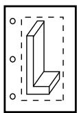  
portrait

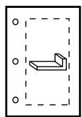  
landscape

## Units

You can choose either Inch or Millimeter units. Your selection determines the units used for the Image Size and Margins settings that also appear in this dialog box.

## Quality

You can select from three levels of quality. Each setting limits the maximum file size that is sent to the printer:

• Coarse limits the file to 2 megabytes,  
• Medium limits the file to 10 megabytes, and  
• Fine limits the file to 50 megabytes.

The quality level works in conjunction with the image size and the printer settings to determine the resolution of the printed image.


## Note:

Click the Printer Properties button in the Print dialog box to access the printer settings.

## Date and logo

By default, Abaqus/CAE includes the date and time and the Abaqus/CAE logo across the top of an image sent directly to a Windows printer. You can choose to remove the date and time or the logo from your output.

## Image Size

You can choose one of three methods to determine the size of the printed image:

• Fit to page fits the selected image within the current page size and margins.  
• Use size on screen prints the image as it appears on the screen. Parts of the image that do not fit within the current page size and margins are cut off in the printed output.

Use settings below allows you to enter a width or height; Abaqus/CAE adjusts whichever dimension you do not edit to preserve the current aspect ratio.

## Margins

You can provide the Top, Bottom, Left, and Right margins. Abaqus/CAE computes the maximum image size as the page size minus the margins. You can specify zero-width margins; however, printers cannot print to the edge of the paper and typically have margins of at least 0.25 inches (6 mm). The page size is set in the printer settings.


## Note:

Click the Printer Properties button in the Print dialog box to access the printer settings.

Abaqus/CAE maintains the margins you specify regardless of the orientation of the paper. For example, assume you chose a Portrait image and entered a value for the Top margin. If you now choose a Landscape image, Abaqus/CAE uses the value you entered for the Top margin to compute the Left margin. Similarly, the value you entered for the Right margin becomes the Top margin.

You can also use the Print dialog box to set the number of copies to print and to access specific settings for the selected printer. Click the Printer Properties button to open the printer name Document Properties dialog box. The available printer settings are determined by the installed printer driver and configuration, not by Abaqus/CAE.

For more information, see Windows and PostScript image layout, and Hard-copy image quality.

1. From the main menu bar, select File->Print.


Tip: You can also click in the File toolbar.

The Print dialog box appears.

2. From the Destination radio buttons, choose Printer.  
3. From the Printer list, select the name of the printer that you want to use.  
4. Click the arrows to the right of the Copies text field to increase or decrease the number of copies to print or type the number directly in the text field. You can print 1 to 100 copies.  
5. From the lower-right corner of the Print dialog box, click Page Setup.  
The Page Setup dialog box appears.  
6. From the Orientation field, choose the paper orientation.  
7. From the Units field, choose the units to use for the image size and margins.  
8. From the Quality field, click the arrow and select Coarse, Medium, or Fine image quality.  
9. If desired, toggle off Print date to remove the date and time from your output.  
10. If desired, toggle off Print SIMULIA logo to remove the logo from your output.  
11. From the Image Size field, choose the size for your printed image.  
12. From the Margins field, type the Top, Bottom, Left, and Right margins (in the units that you selected previously).  
13. Click OK to save your customization settings and to close the Page Setup dialog box.  
14. If desired, click the Printer Properties button in the Print dialog box to open the Document Properties dialog box to access options specific to your printer.


## Note:

The Document Properties dialog box is a Windows dialog box, not part of Abaqus/CAE. If you have questions regarding the information in this dialog box, you should address them to your system administrator or consult the documentation for your printer or printer driver.

15. When you have finished with the Print dialog box, click OK to generate the desired output.

Abaqus/CAE generates the output and closes the Print dialog box. Your settings in the Print dialog box are saved for the duration of the session.

## Additional information

• Windows and PostScript image layout  
• Controlling the destination and appearance of printed images

## Customizing the image sent to a PostScript printer or file

When you print viewports on the canvas to a PostScript file or directly to a PostScript printer, you can use the PostScript Options dialog box to customize the resulting printed image.

You can configure the following:

## Paper Size

You can choose from a list of standard page sizes.

## Orientation

You can choose either Portrait or Landscape orientation. Portrait and landscape orientations are illustrated in the following figure:

  
viewport

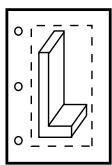  
portrait

  
landscape

## Margins

You can provide the Top, Bottom, Left, and Right margins. Abaqus/CAE computes the maximum image size as the page size minus the margins. You can specify zero-width margins; however, printers cannot print to the edge of the paper and typically have margins of at least 0.25 inches (6 mm). Abaqus/CAE maintains the margins you specify regardless of the orientation of the paper. For example, assume you chose a Portrait image and entered a value for the Top margin. If you now choose a Landscape image, Abaqus/CAE uses the value you entered for the Top margin to compute the Left margin. Similarly, the value you entered for the Right margin becomes the Top margin.

## Text Rendering

You can specify how you want text in the viewports to appear in the printed image. You can either use PostScript fonts or request that text characters be output as small bitmaps.

## Resolution

You can select from a list of standard resolutions. (For more information, see Printed image formats.) The maximum effective resolution of a raster PostScript image is limited to the resolution of the device on which the image will be displayed. By default, Abaqus/CAE sets the resolution of a PostScript image to 150 dpi. To save disk space, you should select the minimum acceptable resolution when generating raster PostScript images. For more information, see Hard-copy image quality.

## Image Format

You can choose either Vector (default) or Raster format. Vector images are scalable and resolution independent. Raster (or bitmap) images are pixelated and resolution dependent and tend to decrease in quality when they are scaled.

## Shading Quality

For vector images you can choose how fine curved surfaces will be shaded.

## Date and logo

By default Abaqus/CAE includes the date and time and an Abaqus/CAE logo across the top of a PostScript image. You can choose to remove the date and time or the logo from your output.

If you are printing to a PostScript printer, the Print dialog box also allows you to type a printer command and set the number of copies to print.

For more information, see Windows and PostScript image layout and Hard-copy image quality.

1. From the main menu bar, select File->Print.


Tip: You can also click in the File toolbar.

The Print dialog box appears.

2. From the Destination radio buttons, choose Printer to send your image to a PostScript printer or File to send your image to a PostScript file.  
3. If you are sending your image to a PostScript printer:

a. In the Print command text field, type the print command.  
b. Click the arrows to the right of the Copies text field to increase or decrease the number of copies to print or type the number directly in the text field. You can print 1 to 100 copies.

4. If you are sending your image to a PostScript file:

a. In the File name text field, type the file name or click to select the file name from the standard file browser.  
b. From the Format field, select PS.

5. From the bottom of the Print dialog box, click the Postscript Format Options button.

The PostScript Options dialog box appears.

6. From the Paper Size field, select a standard page size.  
7. From the Orientation field, choose the paper orientation.  
8. From the Margins field, type the Top, Bottom, Left, and Right margins in inches.  
9. From the Text Rendering field, choose one of the following:

Choose Always use PostScript printer fonts to print only font families that are commonly available on a PostScript printer (Courier, Helvetica, Times, and Symbol). Any other font is replaced by Courier, the default font.  
Choose Use PostScript printer fonts when available to print any viewport text that appears in Courier, Helvetica, Times, or Symbol font. Text in any other font is output as small bitmaps for each character. This option requires more processing and results in a larger PostScript file. No fonts are replaced by the default font.  
• Choose Always use displayed fonts (WYSIWYG) to output all characters as small bitmaps.

10. From the Resolution field, click the arrow and select from the list of resolutions.  
11. From the Image Format field, select Vector or Raster.  
12. For vector images, select the Shading Quality.

13. If desired, toggle off Print date to remove the date and time from your output.  
14. If desired, toggle off Print SIMULIA logo to remove the logo from your output.  
15. Click OK to save your PostScript customization settings and to close the PostScript Options dialog box.  
16. When you have finished with the Print dialog box, click OK to generate the desired output.  
Abaqus/CAE generates the output and closes the Print dialog box. Your settings in the Print dialog box are saved for the duration of the session.

## Additional information

• Windows and PostScript image layout  
• Controlling the destination and appearance of printed images

## Customizing the image saved in an Encapsulated PostScript file

When you print viewports to an EPS (Encapsulated PostScript) file, you can customize the resulting image.

The Encapsulated PostScript Options dialog box allows you to configure the following:

## Image Size

You can save an image that is the same size as the image on the screen, or you can specify the size of the image in inches or millimeters. You specify either the width or the height; Abaqus/CAE calculates the other dimension to maintain the aspect ratio of the viewports.

## Text Rendering

You can specify how you want text in the viewports to appear in the printed image. You can use either PostScript fonts or request that text characters be output as small bitmaps.

## Resolution

You can select from a list of standard resolutions. (For more information, see Printed image formats.) The maximum effective resolution of a raster representation EPS image is limited to the resolution of the device on which the image will be displayed. By default, Abaqus/CAE sets the resolution of an EPS image to 150 dpi. To save disk space, you should select the minimum acceptable resolution when generating raster PostScript images. For more information, see Hard-copy image quality.

## Image Format

You can choose either Vector (default) or Raster format. Vector images are scalable and resolution independent. Raster (or bitmap) images are pixelated and resolution dependent and tend to decrease in quality when they are scaled.

## Shading Quality

For vector images you can choose how fine curved surfaces will be shaded.

1. From the main menu bar, select File->Print.


Tip: You can also click in the File toolbar.

The Print dialog box appears.

2. From the Destination radio buttons, choose File.  
3. In the File name text field, type the file name or click to select the file name from the standard file browser.  
4. From the Format field, select EPS.  
5. From the bottom of the Print dialog box, click the Encapsulated Postscript Format Options button. The Encapsulated PostScript Options dialog box appears.  
6. From the Image Size field, choose one of the following:

Choose Use size on screen to save an EPS image that is the same size as the overall width and height of the viewports that you select for printing. Abaqus/CAE displays the resulting size to the right of the Use size on screen radio button.

Choose Use settings below to specify the width or height of the resulting image in either inches or millimeters.

7. From the Text Rendering field, choose one of the following:

Choose Always use PostScript printer fonts to print only font families that are commonly available on a PostScript printer (Courier, Helvetica, Times, and Symbol). Any other font is replaced by Courier, the default font.  
Choose Use PostScript printer fonts when available to print any viewport text that appears in Courier, Helvetica, Times, or Symbol font. Text in any other font is output as small bitmaps for each character. This option requires more processing and results in a larger PostScript file. No fonts are replaced by the default font.  
• Choose Always use displayed fonts (WYSIWYG) to output all characters as small bitmaps.

8. From the Resolution field, click the arrow and select from the list of resolutions.

9. From the Image Format field, select Vector or Raster.

10. For vector images, select the Shading Quality.

11. Click OK to save your customization settings and to close the Encapsulated PostScript Options dialog box.

12. When you have finished with the Print dialog box, click OK to generate the desired output. Abaqus/CAE generates the output and closes the Print dialog box. Your settings in the Print dialog box are saved for the duration of the session.

## Additional information

• Printed image formats  
• Controlling the destination and appearance of printed images

## Customizing the image saved in TIFF, PNG, or SVG files

When you print viewports to a TIFF, PNG, or SVG format file, you can customize the resulting image. You can save an image that is the same size as the image on the screen, or you can specify the size of the image in pixels.

For more information, see EPS, TIFF, PNG, and SVG image size and Printed image formats.

1. From the main menu bar, select File->Print.


## Note:

You can also click

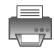

in the File toolbar.

The Print dialog box appears.

2. In the File name text field, type the file name or click to select the file name from the standard file browser.  
3. From the Format field, select TIFF, PNG, or SVG.  
4. From the bottom of the Print dialog box, click the TIFF Format Options, PNG Format Options, or SVG Format Options button.

The appropriate dialog box appears.

5. From the Image Size field, choose one of the following:

Choose Use size on screen to save an image that is the same size as the overall width and height of the viewports that you select for printing. Abaqus/CAE displays the resulting size to the right of the Use size on screen radio button.  
Choose Use settings below to specify the width or height of the resulting image in units of pixels. Abaqus/CAE computes the other dimension to maintain the aspect ratio of the viewports. The maximum allowed image dimension (width or height) is 4096 pixels.

6. Click OK to save your customization settings and to close the dialog box.  
7. For color PNG and TIFF images, you can use the default 8-bit color depth (256 colors) or toggle off Reduce to 256 colors to use more colors, which increases the file size but allows the image to more closely match the display.

If you do not use the default setting, the number of colors available for an image depends on the system type and settings. For Windows systems, Abaqus/CAE uses 24-bit color (1.67 million colors). For Linux systems, Abaqus/CAE uses the same color setting as the display.

8. When you have finished with the Print dialog box, click OK to generate the desired output.

Abaqus/CAE generates the output and closes the Print dialog box. Your settings in the Print dialog box are saved for the duration of the session.

## Additional information

• Printed image formats  
• EPS, TIFF, PNG, and SVG image size  
• Controlling the destination and appearance of printed images

---

[Previous: Trademarks and Legal Notices](legal.md) · [Next: Model Databases, Models, and Files](model-databases-files.md)
