# The Interaction Module

## The Interaction module

You can use the Interaction module to define and manage the following objects:

• Mechanical and thermal interactions between regions of a model or between a region of a model and its surroundings.  
• The interface region and coupling schemes for an Abaqus/Standard to Abaqus/Explicit co-simulation.  
• Analysis constraints between regions of a model.  
• Assembly-level wire features, connector sections, and connector section assignments to model connectors.  
• Inertia (point mass, rotary inertia, and heat capacitance) on regions of the model.  
• Cracks on regions of the model.  
• Springs and dashpots between two points of a model or between a point of a model and ground.

## In this section:

Understanding the role of the Interaction module  
Entering and exiting the Interaction module  
Understanding interactions  
Understanding interaction properties  
Understanding constraints  
Understanding contact and constraint detection  
Understanding connectors  
Understanding connector sections and functions  
Understanding Interaction module managers and editors  
Understanding symbols that represent interactions, constraints, and connectors  
Using the Interaction module toolbox  
Using the Interaction module  
Using the interaction editors  
Using the interaction property editors  
Using the constraint editors  
Using contact and constraint detection  
Using the connector section editors  
Using the Query toolset to obtain connector assignment information

## Understanding the role of the Interaction module

You can use the Interaction module to define interactions.

You can define the following:

• Contact interactions.  
• Elastic foundations.  
• Cavity radiation.  
• Thermal film conditions.  
• Radiation to and from the ambient environment.  
• Abaqus/Standard to Abaqus/Explicit co-simulation interaction.  
• Pressure penetration.  
• Incident waves.  
• Acoustic impedance.  
• Cyclic symmetry.  
• A user-defined actuator/sensor interaction.  
• Model change interactions.  
• Tie constraints.  
• Rigid body constraints.  
• Display body constraints.  
• Coupling constraints.  
• Adjust points constraints.  
• MPC constraints.  
• Shell-to-solid coupling constraints.  
• Embedded region constraints.  
• Equation constraints.  
• Connector section assignments.  
• Inertia.  
• Cracks.  
• Springs and dashpots.

Interactions are step-dependent objects, which means that when you define them, you must indicate in which steps of the analysis they are active. (For more information about step-dependent objects, see Understanding the status of an object in a step.) For example, you can define film and radiation conditions on a surface only during a heat transfer, coupled temperature-displacement, or coupled thermal-electrical step. Similarly, you can define an interaction with a user-defined actuator/sensor only during the initial step.

The Set and Surface toolsets in the Interaction module allow you to define and name regions of your model to which you would like interactions and constraints applied. You can use the Amplitude toolset to define variations in some interaction attributes over the course of the analysis. The Analytical Field toolset allows you to create analytical fields that you can use to define spatially varying parameters for selected interactions. The Reference Point toolset allows you to define reference points that are used in constraints and creating assembly-level wire features.

Abaqus/CAE does not recognize mechanical contact between part instances or regions of an assembly unless that contact is specified in the Interaction module; the mere physical proximity of two surfaces in an assembly is not enough to indicate any type of interaction between the surfaces.

For information on defining cracks to study their initiation and propagation, see Fracture mechanics. For information on defining inertia, see Inertia. For information on defining springs and dashpots, see Springs and dashpots.

## Additional information

• About Contact Interactions  
• The Amplitude toolset  
• The Analytical Field toolset  
• The Reference Point toolset  
• The Set and Surface toolsets

## Entering and exiting the Interaction module

You can enter the Interaction module at any time during an Abaqus/CAE session by clicking Interaction in the Module list located in the context bar. Interaction, Constraint, Connector, Special, Feature, and Tools menus appear on the main menu bar; and a Step list appears under the context bar.

To exit the Interaction module, click another module in the Module list. You need not take any specific action to save objects created in the Interaction module before exiting the module; they are saved automatically when you save the entire model by selecting File->Save or File->Save As from the main menu bar.

## Additional information

• Using the Special menu in the Interaction module

## Understanding interactions

You can use the Interaction module to define several types of interactions.

You can define the following types of interactions:

## General contact

General contact interactions allow you to define contact between many or all regions of the model with a single interaction. General contact is also used to define contact between Lagrangian bodies and Eulerian materials in a coupled Eulerian-Lagrangian analysis (see Defining contact in Eulerian-Lagrangian models). Typically, general contact interactions are defined for an all-inclusive surface that contains all exterior faces; feature edges; and—in Abaqus/Explicit—analytical rigid surfaces, edges based on beams and trusses, and Eulerian material boundaries. To refine the contact domain, you can include or exclude specific surface pairs. Surfaces used in general contact interactions can span many disconnected regions of the model. Attributes, such as contact properties, surface properties, and contact formulation, are assigned as part of the contact interaction definition but independently of the contact domain definition, which allows you to use one set of surfaces for the domain definition and another set of surfaces for the attribute assignments. For detailed instructions on creating this type of interaction, see Defining general contact.

General contact interactions and surface-to-surface or self-contact interactions can be used together in the same analysis. Only one general contact interaction can be active in a step during an analysis.

For more information, see About Contact Interactions, About General Contact in Abaqus/Standard, About General Contact in Abaqus/Explicit, and Eulerian Analysis. The assignment of a penalty stiffness scale factor is not supported in Abaqus/CAE. In addition, node-based surfaces cannot be used in a general contact interaction in Abaqus/CAE.

## Surface-to-surface contact, self-contact, and pressure penetration

Surface-to-surface contact interactions describe contact between two deformable surfaces or between a deformable surface and a rigid surface. Self-contact interactions describe contact between different areas on a single surface. For detailed instructions on creating these types of interactions, see Defining surface-to-surface contact, Defining self-contact, and Using contact and constraint detection. For more information, see About Contact Pairs in Abaqus/Standard and About Contact Pairs in Abaqus/Explicit.

If your model includes complex geometries and numerous contact interactions, you may want to customize the variables that control the contact algorithms to obtain cost-effective solutions. These controls are intended for advanced users and should be used with great care. For more information, see Contact controls editors.

A pressure penetration interaction allows you to simulate the pressure of a fluid penetrating between two surfaces involved in surface-to-surface contact. The fluid pressure is applied normal to the surfaces. You must create a surface-to-surface contact interaction to specify the main and secondary surfaces for the pressure penetration. The bodies forming the joint can both be deformable, as is the case with threaded connectors; or one can be rigid, as occurs when a soft gasket is used as a seal between stiffer structures. A pressure penetration interaction can be used only in an Abaqus/Standard analysis. For detailed instructions on creating pressure penetration interactions, see Defining pressure penetration. For more information, see Fluid Pressure Penetration Loads.

## Fluid cavity

A fluid cavity interaction allows you to select and assign properties to a liquid- or gas-filled fluid cavity in the model. Fluid cavity selection includes a reference point and the surface that encloses the cavity. The properties are defined in a fluid cavity interaction property (for more information, see Understanding interaction properties). You can define fluid cavity interactions in the initial step of an Abaqus/Standard or an Abaqus/Explicit analysis. The fluid cavity interaction remains constant throughout all steps of an analysis; you cannot modify or deactivate it after the initial step. For detailed instructions on creating fluid cavity interactions, see Defining a fluid cavity interaction.

## Fluid exchange

A fluid exchange interaction allows you to define movement of fluid between a cavity and the environment or between two cavities. To create a fluid exchange interaction, you must first select an existing fluid cavity interaction for each cavity (one for exchange to environment or two for exchange between cavities). Then you can select or create a fluid exchange interaction property (for more information, see Understanding interaction properties) and set the effective exchange area. For detailed instructions on creating fluid exchange interactions, see Defining a fluid exchange interaction.

## Fluid inflator

A fluid inflator interaction allows you to inflate a fluid cavity to model the flow characteristics of inflators used for airbag systems. To create a fluid inflator interaction, you must first select an existing fluid cavity interaction. Then you can select or create a fluid inflator interaction property (for more information, see Understanding interaction properties). For detailed instructions on creating fluid inflator interactions, see Defining a fluid inflator interaction.

## XFEM crack growth

An XFEM crack growth interaction allows you to activate or deactivate growth of a crack created using the extended finite element method. For detailed instructions on creating this type of interaction, see Deactivating and activating an XFEM crack growth.

## Model change

A model change interaction allows you to remove and reactivate elements during an analysis. You can use model change interactions in all Abaqus/Standard analysis procedures except for the static, Riks procedure and linear perturbation procedures. For detailed instructions on creating this type of interaction, see Defining a model change interaction. For more information on removing and reactivating elements, see Element and Contact Pair Removal and Reactivation.

## Cyclic symmetry

Cyclic symmetry enables you to model an entire 360° structure at considerably reduced computational expense by analyzing only a single repetitive sector of a model. You can create cyclic symmetry interactions only in the initial step. Once a cyclic symmetry interaction is created, cyclic symmetry applies to the entire analysis history. If you deactivate a cyclic symmetry interaction in a frequency step, Abaqus/CAE evaluates all possible nodal diameters being evaluated for that step. For detailed instructions on creating this type of interaction, see Defining cyclic symmetry. For more information about cyclic symmetry in Abaqus, see Analysis of Models that Exhibit Cyclic Symmetry.

## Elastic foundation (Abaqus/Standard only)

Elastic foundations allow you to model the stiffness effects of a distributed support on a surface without actually modeling the details of the support. You can create elastic foundation interactions only in the initial step. Once an elastic foundation is activated, you cannot deactivate it in later analysis steps. For detailed instructions on creating this type of interaction, see Defining foundations. For more information, see Element Foundations.

## Cavity radiation (Abaqus/Standard only)

Cavity radiation interactions describe heat transfer due to radiation in enclosures. Two cavity radiation models are available in Abaqus/CAE: a fully implicit definition and an approximation. The full version can be used for heat transfer without deformation in two-dimensional, three-dimensional, and axisymmetric models. It can include open or closed cavities and accounts for symmetries and surface blocking, but it does not support surface motion within cavities. For detailed instructions on creating this type of interaction, see Defining a cavity radiation interaction.

The cavity radiation approximation is defined using a surface radiation interaction. You can approximate cavity radiation in any heat transfer analysis, with or without deformation. However, approximate cavity radiation can be used only for closed cavities in three-dimensional models. The approximation treats the cavity as a black body enclosure with a temperature equal to the average temperature of the entire surface. Under these limited conditions, approximate cavity radiation can save considerable computational expense. For detailed instructions on creating this type of interaction, see Defining a surface radiative interaction.

For more information on both types of cavity radiation, see Cavity Radiation in Abaqus/Standard.

## Thermal film conditions

Film condition interactions define heating or cooling due to convection by surrounding fluids. Two types of film condition interaction are available in Abaqus/CAE: surface film conditions define convection from model surfaces, and concentrated film conditions define convection from nodes or vertices. You can define film condition interactions only during a heat transfer, fully coupled thermal-stress, or coupled thermal-electrical step. For detailed instructions on defining these types of interactions, see Defining a surface film condition interaction, and Defining a concentrated film condition interaction, respectively. For more information, see Thermal Loads.

## Radiation to and from the ambient environment

Radiation interactions describe heat transfer to a nonreflecting environment due to radiation. Two types of radiation interactions are available in Abaqus/CAE: surface radiation interactions describe heat transfer with a nonconcave surface, and concentrated radiation interactions describe radiation from nodes or vertices. You can define radiation interactions only during a heat transfer, fully coupled thermal-stress, or coupled thermal-electrical step. For detailed instructions on creating these types of interactions, see Defining a surface radiative interaction, and Defining a concentrated radiative interaction, respectively. For more information, see Thermal Loads.

## Abaqus/Standard to Abaqus/Explicit co-simulation

For an Abaqus/Standard to Abaqus/Explicit co-simulation, you must specify the interface region (region for exchanging data) and coupling schemes (time incrementation process and frequency of data exchange) for the co-simulation. In each model, you create a Standard-Explicit co-simulation interaction to define the co-simulation behavior; only one Standard-Explicit co-simulation interaction can be active in a model. The settings in each co-simulation interaction must be the same in the Abaqus/Standard model and the Abaqus/Explicit model.

A Standard-Explicit co-simulation interaction can be created only in a general static, implicit dynamic, or explicit dynamic step. The interaction is valid only in the step in which it is created and is not propagated to subsequent steps. For detailed instructions on creating this type of interaction, see Defining a Standard-Explicit co-simulation interaction. For more information, see Structural-to-Structural Co-Simulation.

## Incident waves

Incident wave interactions model incident wave loading due to external acoustic wave sources. For detailed instructions on creating this type of interaction, see Defining incident waves. For more information, see Acoustic and Shock Loads.

## Acoustic impedance

An acoustic impedance specifies the relationship between the pressure of an acoustic medium and the normal motion at an acoustic-structural interface. For detailed instructions on creating this type of interaction, see Defining acoustic impedance. For more information, see Acoustic and Shock Loads.

## Actuator/sensor (Abaqus/Standard only)

An actuator/sensor interaction models a combination of sensors and actuators and, therefore, allows for modeling control system components. Currently, this type of interaction allows sensing and actuation at just one point. For detailed instructions on creating this type of interaction, see Defining an actuator/sensor interaction.

The interaction definition and its optional associated property are used to define the basic aspects of the interaction, but the user must provide user subroutine UEL to supply the specific formulae for how actuation depends on sensor readings. You specify the name of the file containing the user subroutine when you create the analysis job in the Job module.

## Warning:

This feature is intended for advanced users only. Its use in all but the simplest test examples will require considerable coding by the user/developer. User-Defined Elements, should be read before proceeding.

Actuator/sensor interactions are available only for Abaqus/Standard analyses. For more information, see About User Subroutines and Utilities.

## Additional information

• Defining Contact Interactions

## Understanding interaction properties

You can define a set of data that is referred to by an interaction but is independent of the interaction; for example, the coefficients that define friction during contact. This set of data is called an interaction property.

One interaction property can be referred to by many different interactions.

You can create the following types of interaction properties:

## Contact

A contact interaction property can define tangential behavior (friction and elastic slip) and normal behavior (hard, soft, or damped contact and separation). In addition, a contact property can contain information about damping, thermal conductance, thermal radiation, and heat generation due to friction. A contact interaction property can be referred to by a general contact, surface-to-surface contact, or self-contact interaction. For detailed instructions on defining this type of interaction property, see Defining a contact interaction property.

## Film condition

A film condition interaction property defines a film coefficient as a function of temperature and field variables. A film condition interaction property can be referred to only by a film condition interaction. For detailed instructions on defining this type of interaction property, see Defining a film condition interaction property.

## Cavity radiation

A cavity radiation interaction property defines emissivity for a cavity as a function of temperature and field variables. A cavity radiation interaction property can be referred to only by a cavity radiation interaction. For detailed instructions on defining this type of interaction property, see Defining a cavity radiation interaction property.

## Fluid cavity

A fluid cavity interaction property defines the type of fluid occupying the cavity and the fluid properties. You can choose either a hydraulic fluid or a pneumatic fluid. Hydraulic fluids must include a fluid density; and they might include a fluid bulk modulus, thermal expansion coefficients, and other temperature-dependent data. Pneumatic fluids must include an ideal gas molecular weight, and they might include a molar heat capacity (Abaqus/Explicit only). For detailed instructions on defining this type of interaction property, see Defining a fluid cavity interaction property.

## Fluid exchange

A fluid exchange interaction property defines the fluid flow between a cavity and the environment or from one cavity to another. You can define a fluid exchange based on bulk viscosity, mass flux, mass rate leakage, volume flux, or volume rate leakage. For detailed instructions on defining this type of interaction property, see Defining a fluid exchange interaction property.

## Fluid inflator

A fluid inflator interaction property defines the mass flow rate and temperature as a function of inflation time either directly or by entering tank test data. It also defines the mixture of gases entering the fluid cavity. For detailed instructions on defining this type of interaction property, see Defining a fluid inflator interaction property.

## Acoustic impedance

An acoustic impedance interaction property defines surface impedance or the proportionality factors between the pressure and the normal components of surface displacement and velocity in an acoustic analysis. An acoustic impedance interaction property can be referred to only by an acoustic impedance interaction. For detailed instructions on defining this type of interaction property, see Defining an acoustic impedance interaction property.

## Incident wave

An incident wave interaction property defines the speed of the incident wave and other characteristics of the wave loading. An incident wave interaction property can be referred to only by an incident wave interaction. For detailed instructions on defining this type of interaction property, see Defining an incident wave interaction property.

## Actuator/sensor

An actuator/sensor interaction property provides the PROPS, JPROPS, NPROPS, and NJPROPS variables that are passed into a UEL user subroutine used with an actuator/sensor interaction. For detailed instructions on defining this type of interaction property, see Defining an actuator/sensor interaction property.

## Wear

A wear interaction property defines the contact wear properties based on Archard's wear rate model (see Contact Wear). For detailed instructions on defining this type of interaction property, see Defining a wear interaction property.

## Understanding constraints

Constraints defined in the Interaction module define constraints on the analysis degrees of freedom, whereas constraints defined in the Assembly module define constraints only on the initial positions of instances. In the Interaction module you can constrain the degrees of freedom between regions of a model, and you can suppress and resume constraints to vary the analysis model. Currently, you can create the following types of constraints:

## Tie

A tie constraint allows you to fuse together two regions even though the meshes created on the surfaces of the regions may be dissimilar. For detailed instructions on creating this type of constraint, see Defining tie constraints, and Using contact and constraint detection. For more information, see Mesh Tie Constraints.

## Rigid body

A rigid body constraint allows you to constrain the motion of regions of the assembly to the motion of a reference point. The relative positions of the regions that are part of the rigid body remain constant throughout the analysis. For detailed instructions on creating this type of constraint, see Defining rigid body constraints. For more information on reference points, see The Reference Point toolset. For more information, see Rigid Body Definition.

## Display body

A display body constraint allows you to select a part instance that will be used for display only. You do not have to mesh the part instance, and it is not included in the analysis; however, when you view the results of the analysis, the Visualization module displays the selected part instance. You can constrain the part instance to be fixed in space, or you can constrain it to follow selected nodes. You can apply a display body constraint to an instance of an Abaqus native part or to an instance of an orphan mesh part. For detailed instructions on creating this type of constraint, see Defining display body constraints. You can customize the appearance of display bodies in the Visualization module; for more information, see Customizing the appearance of display bodies.

A display body constraint is especially useful for mechanism or multibody dynamic problems where rigid parts interact with each other via connectors. In such cases you can create a simple rigid part, such as a point part, and a display body that is more representative of the physical part. For an example of a model that includes a display body constraint combined with connectors, see Display bodies. You can also use display bodies to model stationary objects that are not involved in the analysis but that help you to visualize the results.

For more information, see Display Body Definition.

## Coupling

A coupling constraint allows you to constrain the motion of a surface to the motion of a single point. For detailed instructions on creating this type of constraint, see Defining coupling constraints. For more information, see Coupling Constraints.

## Adjust points

An adjust points constraint allows you to move a point or points onto a specified surface. For detailed instructions on creating this type of constraint, see Defining adjust points constraints. For more information, see Adjusting Nodal Coordinates. This adjustment may be useful in assembled fasteners and other applications; see About assembled fasteners, and Creating assembled fasteners.

## MPC constraint

An MPC constraint allows you to constrain the motion of the secondary nodes of a region to the motion of a single point. For detailed instructions on creating this type of constraint, see Defining MPC constraints. A multi-point constraint between two points is defined using connectors. For detailed instructions, see Connectors. For more information, see General Multi-Point Constraints.

## Shell-to-solid coupling

A shell-to-solid coupling constraint allows you to couple the motion of a shell edge to the motion of an adjacent solid face. For detailed instructions on creating this type of constraint, see Defining shell-to-solid coupling constraints. For more information, see Shell-to-Solid Coupling.

## Embedded region

An embedded region constraint allows you to embed a region of the model within a “host” region of the model or within the whole model. For detailed instructions on creating this type of constraint, see Defining embedded region constraints. For more information, see Embedded Elements.

## Equation

Equations are linear, multi-point equation constraints that allow you to describe linear constraints between individual degrees of freedom. For detailed instructions on creating this type of constraint, see Defining equation constraints. For more information, see Linear Constraint Equations.

## Understanding contact and constraint detection

The contact detection tool in Abaqus/CAE provides a fast and easy way to define contact interactions and tie constraints in a three-dimensional model.

Instead of individually selecting surfaces and defining the interactions between them, you can instruct Abaqus/CAE to automatically locate all surfaces in a model that are likely to interact based on initial proximity. You can tune the proximity settings and specify a variety of options that control the active search domain, the definitions of surfaces, and the default interaction or constraint settings. The search works for both geometry and meshed models.

Each detected interaction or constraint involves two identified surfaces, also known as a contact pair candidate. The contact detection dialog box lists each contact pair candidate and its default parameters in a tabular format. The default contact pair candidate parameters are slightly different than the default parameters used in the traditional Abaqus/CAE interaction editors; in particular, the contact detection tool initially assigns surface-to-surface discretization to each contact pair candidate instead of node-to-surface discretization.

Using the tabular interface, you can review the contact pair candidates to ensure that the surface definitions are comprehensive, the main and secondary assignments are appropriate, and the parameters are correct. If necessary, you can modify parameters or surface assignments in the table, and you can create new contact pairs where appropriate. Once the contact pair candidates are configured to your specifications, Abaqus/CAE defines all of the contact interactions and tie constraints simultaneously.

For step-by-step instructions on using the contact detection dialog box, see Using contact and constraint detection.

## In this section:

The contact detection dialog box  
Use of the contact detection algorithm  
Default interaction and constraint parameters  
Tips for using the contact detection tool

## The contact detection dialog box

To use contact detection, select Interaction->Find contact pairs or Constraint->Find contact pairs from the main menu bar. The contact detection dialog box appears as shown in Figure 1. Initially there are no identified contact pairs.

  
Figure 1: Initial view of the contact detection tool.

Using the contact detection tool is a two-step process: first Abaqus/CAE searches for surfaces in the model that are likely to interact; then you have a chance to review the identified surfaces and modify the default contact pair parameters before creating interactions and constraints. You provide some basic criteria to guide the search. These criteria include the search domain and the distance between surfaces that will likely be in contact.

After entering the necessary search criteria, click Find Contact Pairs to begin the search. Abaqus/CAE updates the contact pair candidates table, as illustrated in Figure 2.

  
Figure 2:The contact pair candidates table.

You can create either a contact interaction or a tie constraint for each contact pair candidate in the table. You can also modify the parameters of the interaction or constraint definition by clicking on the appropriate table cell (see Figure 3).

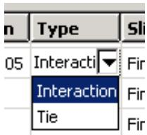  
Figure 3: Changing cell values in the contact pair candidates table.

Clicking mouse button 3 on the table displays a menu of extended options and allows you to manually add contact pairs to the table. When you toggle on Show previously created interactions and ties, any pre-existing surface-to-surface interactions and tie constraints are added to the contact pair candidates table; you can modify existing contact pairs in the same manner as newly detected contact pair candidates.

The interactions and constraints shown in the contact pair candidates table do not become part of the model until you click OK. When you have finished setting parameters for the contact pairs, click OK. Abaqus/CAE simultaneously creates contact interactions and tie constraints for every contact pair in the table according to the specified parameters. The created interactions and constraints are added to the Model Tree and the Interaction Manager; you can review, modify, suppress, and delete the created interactions using either of these interfaces.

For detailed instructions on using the automatic contact detection tool, see Using contact and constraint detection.

## Additional information

• Understanding interactions  
• Understanding constraints  
• Managing objects in the Interaction module  
• Understanding contact and constraint detection

This section discusses the use of the contact detection algorithm.

## In this section:

The contact detection algorithm  
Additional criteria for defining contact pairs  
Contact detection for geometry  
Contact detection for meshed models  
Detection of overclosed surfaces  
Defining contact within the same instance and self-contact  
Considerations for shells

## The contact detection algorithm

Surfaces must meet two requirements to be identified by the automatic contact detection tool:

• The surfaces must be separated by a distance less than or equal to the specified separation tolerance.  
• The surfaces must be intuitively opposed, as defined below.

Abaqus/CAE defines the separation between two surfaces as the distance between the points of closest approach on the surfaces. This distance is reported in the Separation column of the contact pair candidates table. The separation tolerance is the primary input used during the contact detection search. You should specify a separation tolerance that encompasses the separation distances between all of the potentially contacting surfaces in your model. For more information, see Choosing a separation tolerance and extension angle below.

## Note:

The value reported in the Separation column may not correspond exactly to the separation used by Abaqus/Standard during an analysis. Certain automatic surface enhancements applied during the analysis to improve contact robustness (such as main surface smoothing and surface extensions) can lead to slight discrepancies between the separations calculated in the Abaqus/CAE preprocessor and the Abaqus/Standard analysis. For more details on automatic surface enhancements and contact formulations, refer to Defining Contact Pairs in Abaqus/Standard.

Two surfaces are considered intuitively opposed if the two surface normals constructed at the points of closest approach lie between 135° and 225° of each other (see Figure 1). In other words, the surfaces must be offset from each other by less than 45° at the points of closest approach. It is not possible to adjust or ignore the surface orientation requirement.

  
Figure 1:The relative orientation of the normals determines whether or not the surfaces are intuitively opposed.

Figure 2 illustrates a simple example of the contact pair requirements.  
  
Figure 2:Two bodies involved in potential contact.The bodies are rendered in two dimensions for simplicity.

The dashed line represents the separation tolerance as calculated from surface X. Surface B, which is parallel to surface X, is identified as part of a contact pair because it is both within the separation tolerance and intuitively opposed to surface X. Similarly, surface C meets both of these criteria. Surface D, although it is intuitively opposed to surface X, does not lie within the separation tolerance at any point; surface D is not considered for inclusion in a contact pair. Surface A, although it is within the separation tolerance, is not intuitively opposed to surface X; therefore, surface A is also excluded from any contact pair definition. The connected surfaces (A, B, C, and D) do not form contact pairs with each other. By default, Abaqus/CAE only searches for surfaces on separate part instances. However, even if you were to enable searching within the same instance (see Defining contact within the same instance and self-contact below), these surfaces would not meet the orientation requirements.

## Additional criteria for defining contact pairs

After using the separation and orientation checks to compile a list of potential contact pairs, the contact detection tool can perform a series of additional checks that adjust the surface definitions to make them more useful and realistic. All three of these additional checks are optional, but they are enabled by default.

## Extending surfaces

By default, any surface identified by the contact detection tool is extended to include adjacent model faces within 20°, even if the adjacent faces do not meet the separation and orientation requirements. The 20° angle is measured as the offset between the normals of the detected surface and the adjacent face at the common edge. You can modify the extension angle using the Extend each surface found by angle option. As faces are added to the surface definition, Abaqus/CAE also checks any faces adjacent to the newly added faces. Abaqus/CAE eliminates any redundant definitions if an extended surface incorporates a face from a separately defined contact pair. For example, consider extending surfaces within 20° for the model in Figure 2. Abaqus/CAE creates a single contact pair: one surface consists of face X, and the other surface consists of faces B, C, and D. Face D is within 20° of face C, which is within 20° of face B; the redundant contact pair consisting of face C and face X is eliminated, since it is incorporated by the larger contact pair.

## Merging contact pairs within a specified angle

You can use the Merge pairs when surfaces are within angle option to combine multiple contact pairs into a single definition. The faces involved in the contact pairs must be adjacent and they must lie within the specified angle (as described above). The merge option does not extend faces; it only combines positively identified contact pairs. By default, contact pairs with surfaces within 20° are merged by the contact detection tool. The merge option is typically used as an alternative to surface extension to merge contact pair candidates automatically without extending surface definitions beyond the separation tolerance. For example, merging pairs within 20° without extending surfaces for the model in Figure 2 results in a single contact pair: one surface consists of face X, and the other surface consists of faces B and C.

## Checking for surface overlap

By default, the contact detection tool eliminates any contact pairs whose surfaces do not “overlap”; two surfaces do not overlap if a normal from any point on one of the surfaces does not pass through the opposing surface. For example, the surfaces in Figure 1 do not overlap, even though they may pass the separation and orientation checks.

  
Figure 1: Non-overlapping surfaces.The bodies are rendered in two dimensions for simplicity.

You can suppress the check for surface overlap and allow the creation of contact pairs for non-overlapping surfaces by using the Include opposing surfaces that do not overlap option.

## Contact detection for geometry

Abaqus/CAE begins searching a model comprised of geometry by dividing the model into individual faces. A face consists of the area enclosed in connected geometric edges or partitions. Once all of the faces are identified, Abaqus/CAE compares the faces to determine if they meet the separation and orientation requirements, then defines surfaces from the faces by applying extension, merging, and overlap checks (see Additional criteria for defining contact pairs above). Any two surfaces that meet all of the requirements are flagged as a contact pair candidate.

Abaqus/CAE automatically assigns the main and secondary designations to surfaces in a detected contact pair. Analytical rigid or discrete rigid surfaces are always assigned the main role; if the contact pair involves two rigid surfaces, the assignment of main and secondary roles is arbitrary. For contact pairs involving two deformable surfaces, Abaqus/CAE first determines if the surface geometry has been meshed and assigns the main role to the surface with the coarser mesh. If mesh information is unavailable, the surface with the larger area becomes the main surface. The algorithm that assigns main and secondary roles does not account for dissimilar underlying stiffness or element assignments; if these factors play a significant role in your contact interactions, you should review the main and secondary assignments before creating an interaction. For further discussion of main and secondary assignments, see Selecting Surfaces Used in Contact Pairs.

## Contact detection for meshed models

Contact detection also works with mesh models. The search algorithm for meshed models works in much the same way as with geometry, but it uses element faces instead of geometric faces. By default, Abaqus/CAE only searches for contact pairs between separate part instances. Mesh models that are imported into Abaqus/CAE often consist of only a single part instance; therefore, you should enable searching within the same instance before using contact detection on these models (see Defining contact within the same instance and self-contact below for more details).

## Warning:

Unlike geometry-based searches, the reported separation between surfaces for mesh-based surfaces is not necessarily the distance between the exact points of closest approach, but rather a close approximation. If the specified search tolerance is very large compared to the characteristic element size, the accuracy of this approximation is greatly reduced.

Before defining surfaces on element faces, Abaqus/CAE applies the same extension, merging, and overlap checks as with geometry faces (see Additional criteria for defining contact pairs above). Because element faces are typically much smaller than geometric faces, you should always allow some extension of the surfaces to get ample coverage from a surface definition; Figure 1 compares the created surfaces for geometry and meshed geometry when no surface extension is allowed.

  
Figure 1: Discrepancies between created surfaces when no surface extension is allowed for geometry (left) and meshed geometry (right).

If you remesh your model, any surfaces defined on elements faces may become invalid. By extension, the interactions and constraints based on these faces also become invalid.

When assigning main and secondary designations to the mesh surfaces, rigid surfaces always become the main; if the contact pair involves two rigid surfaces, the assignment of main and secondary roles is arbitrary. For contact pairs involving two deformable surfaces, Abaqus/CAE considers the mesh densities on each surface; the surface with the coarser mesh becomes the main surface. If the mesh densities on the two surfaces are equivalent, the assignment of main and secondary roles is arbitrary. The algorithm that assigns main and secondary roles does not account for dissimilar underlying stiffness or element types; if these factors play a significant role in your contact interactions, you should review the main and secondary assignments before creating an interaction. For further discussion of main and secondary assignments, see Selecting Surfaces Used in Contact Pairs.

The contact detection tool does not detect contact between geometry and orphan elements or analytical surfaces and orphan elements. If your model includes part instances that have been meshed from geometry, you can use the options on the Advanced tabbed page of the contact detection dialog box to indicate whether these instances should be treated as geometry (the default) or an element mesh during the search. If your model contains instances of both geometry and orphan mesh elements, you should first mesh all of the geometries, then perform a mesh-based search to capture all possible contact pairs.

In most cases the geometry is a more faithful representation of the object being modeled than the meshed geometry. In addition, geometry-based interactions and constraints are not affected by remeshing. However, the mesh is the geometry used in the analysis. Mesh discretization can lead to slight disparities in separation distances between the two representations, which may become important in precise analyses. After searching, you can check individual contact pairs for disparities between the native and meshed geometry by using the Recalculate Separation option.

## Detection of overclosed surfaces

If two faces in an assembly intersect at any point, the contact detection tool reports those faces as an overclosed contact pair. Overclosed contact pairs that appear in the contact pair candidates table must still meet the surface orientation requirements. A red zero in the Separation column indicates that the two surfaces in the contact pair are intersecting.

Note: A black zero in the Separation column implies that the two surfaces are exactly touching at their closest points. There is no overclosure or intersection in this situation.

If you extend or merge an overclosed surface to include faces that are not overclosed, Abaqus/CAE reports the entire contact pair as overclosed.

You should visually inspect all overclosed surfaces before creating contact interactions. Models with severe overclosures should be adjusted to remove the overclosures (or at least lessen their severity). Minor overclosures can be addressed by using the contact adjustment options (available in the contact pair candidates table) or the interference fit options (available in the contact interaction editor).

Faces must intersect to be reported as overclosed. If a face is enclosed entirely within another part instance, the automatic contact detection tool does not report that face as being overclosed. Such a face may still meet the separation and orientation requirements with respect to an external face on the enclosing instance. By default, Abaqus/CAE eliminates enclosed faces from the contact pair candidates table because the surfaces do not “overlap” (see Additional criteria for defining contact pairs). If you disable the overlap checks, Abaqus/CAE reports a contact pair candidate for enclosed faces, but the contact pair candidates table does not provide any indication that the surfaces are overclosed or penetrating. Because the contact detection tool does not recognize these faces as overclosed, the adjustment options that are applied to overclosed surfaces by default (see Default interaction and constraint parameters) are not applied to this contact pair. If an enclosed face is embedded deeper than the separation tolerance from any external face, the automatic contact detection tool does not identify those faces as a contact pair candidate.

As an example, consider the model in Figure 1.

  
Figure 1: In this model, one end of the cylindrical part instance is entirely enclosed within another part instance.

The separation tolerance specified for this search is 0.1. The circular face at the end of part instance B is within the separation tolerance and is intuitively opposed to the rectangular face on part instance A, but there is no intersection. The contact pair candidates table lists a normal contact pair consisting of the circular face and the rectangular face separated by a distance of 0.06. The cylindrical side face of part instance B is listed as overclosed because it intersects the rectangular face of part instance A.

Although the contact detection tool does not recognize completely enclosed surfaces as being overclosed, such surfaces are still treated as overclosures during an analysis. Severe overclosures commonly lead to convergence difficulties.

When reviewing overclosed contact pairs in the contact pair candidates table, check adjoining surfaces for fully enclosed faces.

## Defining contact within the same instance and self-contact

You can use the contact detection tool to define contact between different areas of the same part instance or model instance. This capability is particularly useful for complicated models that are imported into Abaqus/CAE as a single part instance. If you enable the Include pairs with surfaces on the same instance option, Abaqus/CAE checks different geometry or element faces on the same part instance or model instance to determine whether or not they meet the separation and orientation requirements. Surfaces and contact pairs are defined on any faces that meet the requirements.

In some situations, surface extension options cause the main and secondary surfaces to overlap. If the main surface and the secondary surface consist of the same faces, Abaqus/CAE automatically adjusts the contact pair to create a self-contact interaction, in which a surface contacts itself during deformation. A single surface is created in this situation.

## Considerations for shells

If a section definition has been assigned to a shell part, the contact detection tool accounts for the thickness of the shell in separation calculations. The reported separation has been adjusted according to the thickness and offset specified in the shell section assignment. You can use the Account for shell thickness and offset option to ignore shell section properties during a contact detection search. Varying thickness distributions are never considered in the separation calculations.

The contact detection tool automatically selects a shell side on which to create a surface (see Specifying a particular side or end of a region, for more information). The side is selected such that the surface normals at the points of closest approach are intuitively opposed.

When working with a model that includes orphan shell elements, make sure that the element normal orientations are consistent between elements; that is, the positive element faces (SPOS) should all be located on the same side of the shell structure (see About Shell Elements, for more information). If the element normal orientations are inconsistent, Abaqus/CAE misinterprets the angles between the element faces, and the surface extension and merge operations do not function appropriately.

For certain spline-based shells or faces, the same surface may interact with both sides of a shell (see Figure 1, for example).

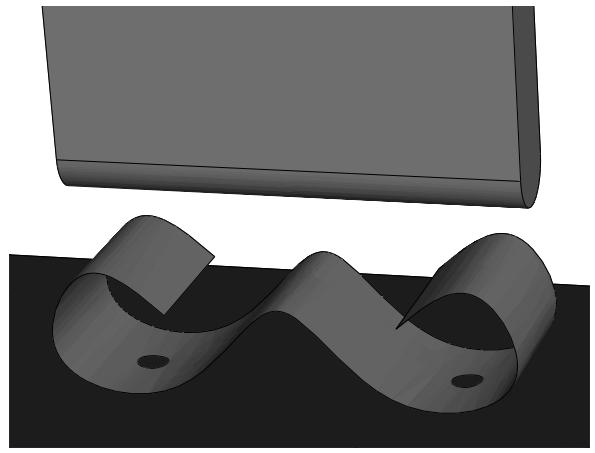  
Figure 1: A spline-based shell.

Normally you would define a separate contact pair involving each side of the shell. The contact detection tool, however, cannot create multiple contact pairs that involve the same two faces; it will define a single contact pair and select the shell side according to the orientation at the point of closest approach. You must manually define another contact pair for the other side of the shell.

The contact detection tool does not create any double-sided surfaces. If appropriate, you can edit the definition of a created surface in the Model Tree to make it double-sided (see Editing sets and surfaces).

## Default interaction and constraint parameters

After completing a search for potential contact pairs, Abaqus/CAE populates the contact pair candidates table with all of the parameters necessary to create interactions.

Names are provided for the contact pair and any created surfaces. Table 1 outlines the naming algorithm.

Table 1: Algorithms used to create names in the contact detection tool.

<table><tr><td>Contact pairs</td><td>Prefix-Contact_pair_number-Main_instance-Secondary_instance</td></tr><tr><td>Main surfaces</td><td>Prefix-Contact_pair_number-Main_instance</td></tr><tr><td>Secondary surfaces</td><td>Prefix-Contact_pair_number-Secondary_instance</td></tr><tr><td>Merged main surface</td><td>Prefix-All-m</td></tr><tr><td>Merged secondary surface</td><td>Prefix-All-s</td></tr><tr><td>Merged “all” surface</td><td>Prefix-All</td></tr></table>

Use the Names tabbed page before searching to modify the naming prefix and control the creation of surfaces. For details, see Specifying naming options for contact detection.

The default parameters supplied to contact pairs by the contact detection tool are slightly different than the defaults used in the traditional interaction or constraint editor. Most notably, the contact detection tool initially assigns surface-to-surface discretization to each contact pair instead of node-to-surface discretization. See Mesh Tie Constraints and Contact Formulations in Abaqus/Standard for a discussion of surface discretization and the associated constraint enforcement methods.

The default surface adjustment options depend on the separation between the surfaces in a contact pair. You can use the Rules tabbed page before searching to control the default adjustment options that are assigned to detected contact pairs. You can also use this page to specify a separation tolerance within which all contact pairs default to tie constraints. For more information about the Rules page, see Defining default contact pair parameters.

Table 2 lists the default contact pair parameters supplied by Abaqus/CAE. You can edit each parameter individually before creating interactions and constraints. For detailed instructions on editing parameters and defaults, see Reviewing and modifying detected contact pairs.

Table 2: Default contact pair parameters for the contact detection tool.

<table><tr><td>Parameter</td><td>Default Value</td></tr><tr><td>Active/Suppressed</td><td>Active</td></tr><tr><td> $Type^1$ </td><td>Interaction</td></tr><tr><td>Sliding</td><td>Finite sliding</td></tr><tr><td>Discretization</td><td>Surface-to-surface</td></tr><tr><td>Interaction property</td><td>The first contact interaction property listed in the Interaction Property Manager2; if no interaction properties have been created, this parameter is blank</td></tr><tr><td>Contact controls</td><td>This parameter is blank; contact controls are unavailable in the initial step</td></tr><tr><td> $Adjust^1$ </td><td>Off for contact interactions between nonintersecting surfaces; 0 for contact interactions between intersecting surfaces; On for tie constraints</td></tr><tr><td>Creation step</td><td>Initial</td></tr><tr><td>Surface smoothing</td><td>Automatic</td></tr><tr><td colspan="2"> $^1$ Defaults for the Type and Adjust parameters are controlled by the Rules options.</td></tr><tr><td colspan="2"> $^2$ The Interaction Property Manager lists all created interaction properties alphabetically by name.</td></tr></table>

## Note:

Some of the parameters discussed above are not visible in the contact pair candidates table by default. Click mouse button 3 anywhere in the table, and select Edit Visible Columns to control which parameters appear in the table.

For more information about interaction and constraint parameters, see Mesh Tie Constraints, About Contact Pairs in Abaqus/Standard, and About Contact Pairs in Abaqus/Explicit.

## Tips for using the contact detection tool

The contact detection tool is available for use in any three-dimensional model requiring the creation of contact interactions and tie constraints. It quickly and thoroughly identifies and creates interactions and ties based on minimal specifications.

The tool greatly simplifies the contact definition process in models for which a general contact definition is not applicable. Some basic guidelines ensure the most effective and efficient use of the tool.

## In this section:

Choosing a separation tolerance and extension angle  
Reviewing contact pair candidates  
Saving the search parameters  
Features that may cause difficulties for the contact detection tool  
Limitations of the contact detection tool

## Choosing a separation tolerance and extension angle

The specified separation tolerance is the primary driver of the contact pair search algorithm. Abaqus/CAE supplies a default separation tolerance based on the relative size of the faces in your model. You may need to modify this value depending on the expected response of your model during an analysis. To effectively capture all significant contact pairs, the specified separation tolerance should be on the same order as or greater than the expected displacements or deflections in your model.

Specifying a very large separation tolerance usually captures more contact pairs then are necessary in an analysis. While extra contact pairs do not necessarily reduce the quality of a model, the extraneous definitions are difficult to manage and can degrade performance.

When selecting an angle to control the extension of surfaces, you should consider the topology and surface characteristics of the areas that are likely to come into contact. Surfaces should extend slightly beyond the area of potential contact, so set the extension angle to capture any chamfers or soft corners along the edges of a face. Indentations, grooves, or embossments can sometimes break up the definition of a surface; the angle that these features make with the main face should dictate the extension angle.

For meshed models, you can preview the extension of surfaces before searching for contact pairs by displaying only the feature edges on a model (see Defining mesh feature edges). If the extension angle is equal to the feature angle, the surface definition in a particular area extends as far as the nearest visible feature edge. Adjust the feature angle until the visible edges enclose the area you want to capture, then set the extension angle accordingly.

## Reviewing contact pair candidates

You should always review contact pair candidates before creating interactions and constraints. Look for any discontinuities in surface definitions.

Discontinuities are often caused by small connecting faces that are not intuitively opposed to the logical contacting surface in a contact pair (see Figure 1).

  
Figure 1:The automatic contact detection tool will not identify the highlighted perpendicular face.

You may want to rerun the search using revised extension and merge options to incorporate the discontinuities into larger surfaces. If necessary, add a contact pair manually using the Add option. You can also combine discontinuous surfaces using the Merge option.

You should investigate any intersecting surfaces to verify that they match your modeling intent. A contact pair with only a single overclosed node will be reported as intersecting, so slight discrepancies can cause overclosures. Overclosed contact pairs without appropriate adjustment or interference fit options can lead to convergence difficulties in an analysis. You should also check any faces or surfaces adjacent to overclosed contact pairs to ensure they are not enclosed faces. See Detection of overclosed surfaces, for more information.

## Saving the search parameters

By default, the search parameters that you specify in the Find Contact Pairs dialog box persist only as long as the dialog box is open; if you close the dialog box, default search parameters are provided the next time you access the contact detection tool.

If you click on the Advanced tabbed page, Abaqus/CAE sets the currently specified search parameters as the default search parameters. These parameters are supplied as defaults in all future sessions of Abaqus/CAE. The only parameter that is not saved is the search domain, which always uses a default of Whole model.

When you save the current search parameters, Abaqus/CAE asks if you want to save the current separation tolerance as a default. Normally Abaqus/CAE recalculates the default separation tolerance based on the current model; if you opt to save the separation tolerance, this calculation is skipped and the same value is always provided as the default separation tolerance.

The default search parameters for the contact detection tool are saved in the abaqus\_2025.gpr file; see Understanding Abaqus/CAE GUI settings, for more information. To return the default search parameters to their original

settings, click 2 on the Advanced tabbed page.

## Features that may cause difficulties for the contact detection tool

You may encounter difficulties using the contact detection tool with certain model features and designs. These situations do not cause performance or stability problems, but the search results most often will not match your modeling intent.

## Stacked shells and thin layers

Models with layers of shells or thin plates stacked closely in parallel can lead to the definition of extraneous contact pairs. The automatic contact detection tool can find contact pairs involving surfaces separated by an intermediate layer, as long as these surfaces are intuitively opposed and within the separation tolerance. In addition, if searching within the same instance is enabled and the overlapping surface check is disabled, the contact detection tool may detect potential contact between the top side and bottom side of a thin continuum plate. Abaqus/CAE creates contact pair candidates for all of these surfaces, even though they will never be in contact. This problem is most common when the layers or plates are a local feature of the model, since a larger separation tolerance is required to capture surfaces in other areas of the model. To overcome this problem, limit the search domain to a particular area of the model and use a separation tolerance that is appropriate for that area. You may also be able to use the Entities tabbed page of the contact detection dialog box to eliminate certain geometry or element types (shells, for example) from your search domain. Otherwise, you should delete the extraneous contact pair candidates before creating interactions.

## Concave surfaces

While the contact search algorithm effectively accounts for most appropriate surfaces, it can misinterpret the relationship between a concave surface and a flat surface. Concave surfaces create difficulties because their surface normal orientation can vary widely across the span of a single surface, and the points of closest approach between surfaces is sometimes a poor reference. Consider, for example, the situations in Figure 1.

  
Figure 1:The normals of the shaded surfaces are not intuitively opposed at the points of closest approach.

Even if the points of closest approach in these models are within the separation tolerance, the surface normals at these points do not pass the orientation test. The contact detection tool will not report these surfaces as contact pair candidates, and adjusting the separation tolerance has no effect on this behavior. You can sometimes modify the extension angle to capture the concave surface within another surface definition. Otherwise, you must manually define the contact pair using the Add option.

## Mechanisms involving large rotations

When modeling mechanisms that undergo large rotations, the contact detection tool often will not effectively capture your modeling intent. In such mechanisms the intended contact surfaces initially may be positioned far away from each other, while nearby surfaces never actually come into contact. The Geneva mechanism depicted in Figure 2 is a typical example.

  
Figure 2: Motion of a Geneva mechanism.

The important contact surfaces in this model are the pin on the right-hand body and the slots on the left-hand body. In the initial configuration, the pin is relatively distant from any of the slots. The neighboring surfaces, on the other hand, are insignificant to the contact conditions of the model. Contact for such models is best defined manually using the interaction editor (see Defining surface-to-surface contact).

## Limitations of the contact detection tool

Although helpful for simplifying the contact definition process, several limitations exist for the contact detection tool.

Contact detection cannot create contact pairs involving the following features:

• Two-dimensional models  
• Axisymmetric models  
• Beams and trusses  
• Face-to-edge contact  
• Edge-to-edge contact  
• Contact between orphan mesh elements and analytical rigid surfaces  
• Hybrid models containing both orphan mesh and unmeshed geometry

The minimum allowable separation tolerance is $1 \times { 1 0 } ^ { - 5 }$ . The maximum allowable separation tolerance is $1 \times 1 0 ^ { 5 } .$ . Abaqus/CAE cannot accurately calculate separations outside of this range. If your model requires the use of a separation tolerance that does not meet these requirements, you should scale the dimensions of the entire model so that they fall within the functional range.

## Understanding connectors

Connectors allow you to model a connection between two points in an assembly or between a point in an assembly and ground. To model a connector in Abaqus/CAE, you must create an assembly-level wire feature, a connector section, and a connector section assignment that associates the connector section with selected wires.

The wire feature contains one or more wires that define the underlying connector geometry. The connector section specifies the type of connection, connector behaviors, and section data. Similar to the manner in which you assign a section to a region of the model in the Property module, you create a connector section assignment to assign a connector section to a region of the model; specifically, you assign a connector section to wires. You also specify local orientations for the endpoints of the wires in the connector section assignment definition.

For more information on connectors in Abaqus/CAE, including an overview and an example of connector modeling, see Connectors.

## Additional information

• About Connectors  
• Creating or modifying wire features for multiple connectors  
• Creating connector sections  
• Creating and modifying connector section assignments

## Understanding connector sections and functions

The connector section defines the connection type and may include connector behavior and section data. For some complex coupled connector behaviors, additional functions describing the nature of the coupling effects (connector derived components and connector potential) must be defined. A connector section can be referred to by one or more different connector section assignments.

## In this section:

Connection types  
Connector behaviors  
What types of friction models are available?  
Connector derived components and connector potentials

## Connection types

Table 1 summarizes the connection types available when creating connector sections. You can define basic, assembled, complex, and MPC connection types.

Table 1: Connection types.

<table><tr><td colspan="2">Basic Types</td><td rowspan="2">Assembled/Complex Types</td><td rowspan="2">MPC Types</td></tr><tr><td>Translational</td><td>Rotational</td></tr><tr><td>ACCELEROMETER</td><td>ALIGN</td><td>BEAM</td><td>Beam</td></tr><tr><td>AXIAL</td><td>CARDAN</td><td>BUSHING</td><td>Elbow</td></tr><tr><td>CARTESIAN</td><td>CONSTANT VELOCITY</td><td>CVJOINT</td><td>Link</td></tr><tr><td>JOIN</td><td>EULER</td><td>CYLINDRICAL</td><td>Pin</td></tr><tr><td>LINK</td><td>FLEXION-TORSION</td><td>HINGE</td><td>Tie</td></tr><tr><td>PROJECTION CARTESIAN</td><td>FLOW-CONVERTER</td><td>PLANAR</td><td>User-defined</td></tr><tr><td>RADIAL-THRUST</td><td>PROJECTION FLEXION-TORSION</td><td>RETRACTOR</td><td></td></tr><tr><td>SLIDE-PLANE</td><td>REVOLUTE</td><td>SLIPRING</td><td></td></tr><tr><td>SLOT</td><td>ROTATION</td><td>TRANSLATOR</td><td></td></tr><tr><td></td><td>ROTATION-ACCELEROMETER</td><td>UJOINT</td><td></td></tr><tr><td></td><td>UNIVERSAL</td><td>WELD</td><td></td></tr></table>

## Basic types

Basic connection types include translational types and rotational types. Translational types affect translational degrees of freedom at both endpoints of the wires to which the connector section is assigned and may affect rotational degrees of freedom at the first points of the wires. Rotational types affect only rotational degrees of freedom at both endpoints of the wires. You can use a single basic connection type (translational or rotational) or one translational and one rotational type.

## Assembled types

Assembled connection types are predefined combinations of basic connection types.

## Complex types

Complex connection types affect a combination of degrees of freedom in the connection and cannot be combined with other connection types. They typically model highly coupled physical connections.

## MPC types

MPC connection types are used to define multi-point constraints between two points.

For a description of each connection type and the equivalent basic connection types that define the kinematic constraints of assembled type connections, see Connection Types and General Multi-Point Constraints.

## Connector behaviors

You can apply connector behaviors to connection types that have available components of relative motion. Available components of relative motion are displacements and rotations that are not kinematically constrained. Multiple connector behaviors can be defined in a connector section. You can specify the following connector behaviors:

Elasticity: Define spring-like elastic behavior.  
Damping: Define dashpot-like damping behavior.  
Friction: Define Coulomb-like and hysteretic friction using predefined or user-defined friction models.  
Plasticity: Define plastic behavior.  
Damage: Define damage initiation and evolution behavior.  
Stop: Define limit values of the admissible range of positions.  
• Lock: Specify a user-defined locking criterion.  
Failure: Define limit values for force, moment, or position.  
• Reference Length: Define the translational or angular positions at which constitutive forces and moments are zero.  
• Integration: Specify implicit or explicit time integration for elasticity, damping, and friction (Abaqus/Explicit analyses only).

For detailed instructions on defining connector behaviors, see Using the connector section editors. For more information on connector behaviors, see Connector Behavior.

## What types of friction models are available?

You can model predefined or user-defined friction behavior. In general, for predefined friction you specify a set of geometric quantities that are characteristic of the connection type for which friction is modeled. In addition, you can define internal contact force contributions, such as prestress from the connection. Abaqus automatically defines the contact force contributions and the local tangent directions along which friction occurs.

You can model predefined friction for the following connection types:

## Assembled/Complex types

• Cylindrical (Slot + Revolute)  
• Hinge (Join + Revolute)  
• Planar (Slide-Plane + Revolute)  
• Slip Ring (complex)  
• Translator (Slot + Align)  
• U Joint (Join + Universal)

## Basic types

Slide-Plane  
Slot

Predefined friction is also available if you define a combined translational and rotational connection type that is equivalent to one of these assembled types. You can define only one friction behavior for a given connection type if you are modeling predefined friction.

If a predefined friction model is not available or does not adequately describe the mechanism being analyzed, you can specify a user-defined friction model (except in the case of the Slip Ring connection type, which does not allow a user-defined friction model). You must specify slip direction information, the friction-producing normal force or normal moment, and the friction law. You may use several connector friction behaviors to represent the frictional effects in the connector.

For detailed instructions on defining friction, see Defining friction. For more information, see Connector Friction Behavior.

## Connector derived components and connector potentials

You can define complex coupled behavior for connectors using connector derived components and connector potentials. Connector derived components are user-specified component definitions based on a function of intrinsic connector components of relative motion. You can create derived components to specify the friction-generating normal force in connectors as a complex combination of connector forces and moments or to use as an intermediate result in a connector potential function.

Connector potentials are user-defined mathematical functions of intrinsic components of relative motion or derived components. These functions can be quadratic, elliptical, or maximum norms. You use connector potentials to define coupled friction, plasticity, and damage connector behaviors.

For detailed instructions on defining derived components and potentials, see Specifying connector derived components, and Specifying potential terms. For more information on connector functions, see Connector Functions for Coupled Behavior.

## Understanding Interaction module managers and editors

You can create and manage objects in the Interaction module using managers and editors.

## In this section:

Managing objects in the Interaction module  
Interaction editors  
Interaction property editors  
. Contact controls editors  
Contact initialization editor  
Constraint editors  
Connector section editors  
Connector section assignment editors

## Managing objects in the Interaction module

The Interaction module provides the following managers that you can use to organize and manipulate objects associated with a given model:

• The Interaction Manager allows you to create and manage interactions.  
• The Interaction Property Manager allows you to create and manage interaction properties.  
• The Contact Controls Manager allows you to create and manage contact controls for surface-to-surface contact and self-contact interactions.  
• The Contact Initialization Manager allows you to create and manage contact initialization rules for general contact interactions in Abaqus/Standard.  
• The Constraint Manager allows you to create and manage constraints.  
• The Connector Section Manager allows you to create and manage connector sections.  
• The Connector Section Assignment Manager allows you to create and manage connector section assignments.

For example, a list of interaction properties appears in the Interaction Property Manager shown in Figure 1.

  
Figure 1:The Interaction Property Manager.

The Create, Edit, Copy, Rename, and Delete buttons in the managers allow you to create new objects or to edit, copy, rename, and delete existing ones. In the Connector Section Assignment Manager, you can only create, edit, or delete connector section assignments. You can also initiate these procedures using the Interaction, Interaction->Property, Interaction->Contact Controls, Interaction->Contact Initialization, Constraint, Connector->Section, and Connector->Assignment menus from the main menu bar. After you select a management operation from the main menu bar, the procedure is exactly the same as if you had clicked the corresponding button inside the manager dialog box.

You can use the Copy button in the Interaction Manager, the corresponding menu command, or the Model Tree to copy an interaction. You can copy an interaction from any step to any valid step, with some restrictions. For more details, see Copying step-dependent objects using manager dialog boxes.

The Interaction Manager is a step-dependent manager, which means that it contains additional information on the history of each interaction through the analysis. The Interaction Manager is shown in Figure 2.

  
Figure 2:The Interaction Manager.

The Move Left, Move Right, Activate, and Deactivate buttons allow you to manipulate the stepwise history of interactions. For more information, see Modifying the history of a step-dependent object.

You can suppress and resume previously defined interactions, constraints, and connector section assignments from the managers. You can use the icons in the column along the left side of the manager to suppress these attributes or to resume previously suppressed attributes for an analysis. The suppress and resume procedures are also available from the Interaction, Constraint, and Connector menus in the main menu bar. For more information, see Suppressing and resuming objects.

For detailed instructions on creating interactions, interaction properties, constraints, connector sections, and connector section assignments, see Using the Interaction module.

## Additional information

• What are basic managers?  
• What are step-dependent managers?  
• Changing the status of an object in a step  
• Understanding Interaction module managers and editors

## Interaction editors

To create interactions, select Interaction->Create from the main menu bar. A Create Interaction dialog box appears in which you can provide a name for the interaction, select the step in which the interaction will be created, and choose the type of the interaction.

When you click Continue in the Create Interaction dialog box after selecting any interaction type except general contact, you are prompted to select the regions to which to apply the interaction. Once you have selected the region or regions, an interaction editor appears in which you can specify additional information about the interaction, such as the interaction property that you want to associate with the interaction. For general contact interactions, the interaction editor appears when you click Continue in the Create Interaction dialog box. For example, the general contact editor for Abaqus/Explicit analyses is shown in Figure 1.

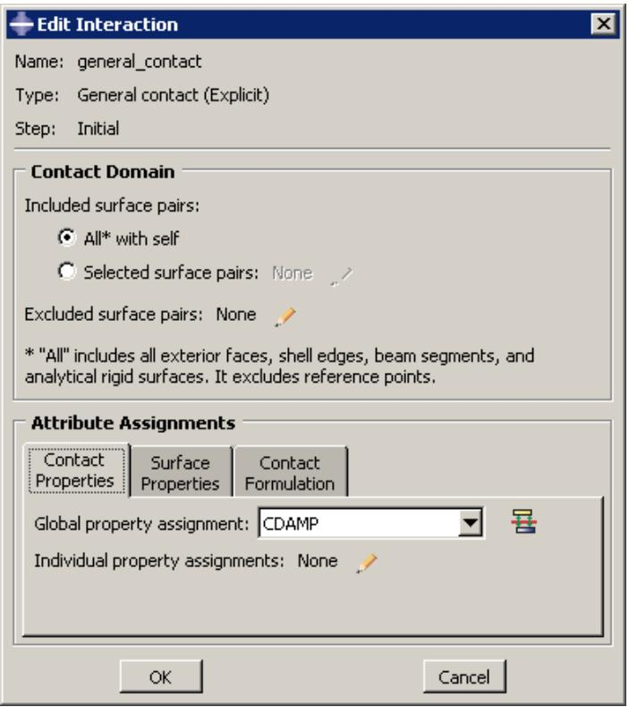  
Figure 1:The general contact editor.

Each interaction editor displays the current step and the name and type of the interaction that you are defining in the top panel of the dialog box. The format of the rest of the editor varies depending on the type of interaction you are defining.

Once you have created an interaction, you can modify the interaction in the following ways:

• You can modify some or all of the data that you entered in the editor when you created the interaction.  
• You can use the Interaction Manager to modify the stepwise history of the interaction. (For more information, see What are step-dependent managers?.)

You can display information on a particular editor feature by selecting Help->On Context from the main menu bar and then clicking the editor feature of interest.

## Additional information

• Understanding modified step-dependent objects

• Understanding Interaction module managers and editors

## Interaction property editors

To create interaction properties, select Interaction->Property->Create from the main menu bar. A Create Interaction Property dialog box appears in which you can specify a name for the interaction property and the type of interaction property that you want to create. Once you have specified this information, click Continue in the Create Interaction Property dialog box to display the interaction property editor.

The format of the interaction property editor depends on the type of interaction property you are defining. For example, the film condition and actuator/sensor property editors display data fields in which you can enter all of the information necessary to define the property. The film condition property editor is shown in Figure 1.

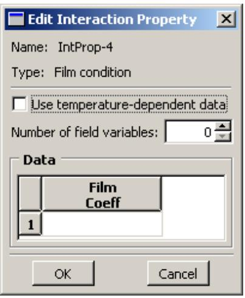  
Figure 1: The film condition property editor.

The format of the contact property editor, on the other hand, is identical to the material editor in the Property module (see Creating materials, for more information). Like the material editor, the contact property editor contains menus from which you select options to include in the property definition, as shown in Figure 2.

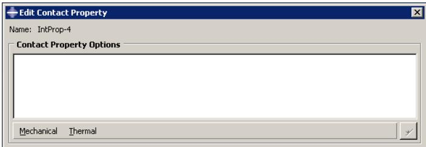  
Figure 2:The contact property editor contains Mechanical and Thermal option menus.

When you select an option from a menu, the name of the option appears in the Contact Property Options list at the top of the editor, and the option becomes part of your interaction property definition. In addition, the option definition area in the lower half of the editor changes to provide fields in which you can specify information for the currently selected option.

For example, the Contact Property Options list in Figure 3 reflects that the Tangential Behavior and Normal Behavior options (located in the Mechanical menu) have been included in the property definition. Tangential Behavior is currently selected, and the related parameters appear in the lower half of the editor. If you want to remove an option from a contact property definition, you can select that option from the Contact Property Options list and then click

  
Figure 3: A mechanical contact property definition that includes the Tangential Behavior and Normal Behavior options.

You can display help on a particular feature of the editor by selecting Help->On Context from the main menu bar and then clicking the feature of interest. For detailed instructions on creating properties, see Creating interaction properties, and Using the interaction property editors.

## Additional information

• Managing objects  
• Understanding modified step-dependent objects

## Contact controls editors

To create contact controls for surface-to-surface contact and self-contact interactions, select Interaction->Contact Controls->Create from the main menu bar. A Create Contact Controls dialog box appears in which you can specify a name for the contact controls and the type of contact controls that you want to create. Once you have specified this information, click Continue to display the contact controls editor.

## Warning:

Contact controls are intended for advanced users. The default settings of these controls are appropriate for most analyses. Using nondefault values of these controls may greatly increase the computational time of the analysis or produce inaccurate results. Changing these settings in an Abaqus/Standard analysis may also cause convergence problems.

Each contact controls editor displays the name and type of the contact controls that you are defining in the top panel of the dialog box. The format of the rest of the editor varies depending on whether you are defining controls for an Abaqus/Standard or an Abaqus/Explicit analysis.

You can display help on a particular feature of the editor by selecting Help->On Context from the main menu bar and then clicking the feature of interest. For more information, see Specifying contact controls in an Abaqus/Standard analysis, and Specifying contact controls in an Abaqus/Explicit analysis.

## Additional information

• Customizing contact controls

## Contact initialization editor

To create contact initialization rules for a general contact interaction in Abaqus/Standard, select Interaction->Contact Initialization->Create from the main menu bar. The contact initialization editor appears in which you can specify a name for the initialization definition and the rules associated with that definition.

You can display help on the contact initialization editor by selecting Help->On Context from the main menu bar and then clicking the editor. For more information, see Creating contact initializations.

## Additional information

• Creating contact initializations

## Constraint editors

To create constraints, select Constraint->Create from the main menu bar. A Create Constraint dialog box appears in which you can specify the name and type of the constraint. Click Continue to specify the regions to which to apply the constraint (if applicable) and to display the editor in which you can enter the data necessary to define the constraint.

Each constraint editor displays the name and type of the constraint you are defining in the top panel of the dialog box. The format of the rest of the editor varies depending on the type of constraint you are defining. For example, the tie constraint editor is shown in Figure 1.

  
Figure 1: The tie constraint editor.

You can display information on a particular editor feature by selecting Help->On Context from the main menu bar and then clicking the editor feature of interest. For detailed instructions on creating constraints, see Using the constraint editors.

## Additional information

• Creating constraints

## Connector section editors

The connector section editor allows you to create connector sections and to add the connector behaviors available in Abaqus/Standard and Abaqus/Explicit.

To create connector sections, select Connector->Section->Create from the main menu bar. A Create Connector Section dialog box appears in which you can specify a name, category, and type for the connector section that you want to create. When you select a connection type from the Assembled/Complex or Basic category, the available and constrained components of relative motion (CORM) for that connection type are displayed in the dialog box. In addition,

道 you can click 日 to see a schematic drawing of the connection type along with the Abaqus idealization of the connection. Once you have specified the name, category, and type, click Continue in the Create Connector Section dialog box to display the connector section editor. For a connection type in the MPC category, select the type and enter data, if required. Click OK to finish creating the MPC section and to close the Create Connector Section dialog box.

The connector section editor allows you to add the connector behaviors available in Abaqus/Standard and Abaqus/Explicit. When you click Add on the Behavior Options tabbed page, a list of behaviors appears. After you select a behavior, the name of the behavior appears in the Behavior Options list at the top of the editor, and the behavior becomes part of your connector section definition. The option definition area in the lower half of the editor changes to provide fields in which you can specify information for the currently selected behavior. If you want to remove a behavior from a connector section definition, you can select it from the Behavior Options list and then click Delete.

## Note:

Abaqus/CAE does not perform any checks for dependencies on other behaviors; you should ensure that all required behaviors are defined. For example, if you define a plasticity behavior, you must also define an elasticity behavior.

You can define multiple behaviors of the same type, such as elasticity. Only forces or moments that are consistent with the available components of relative motion for the chosen connection type can be selected to define behaviors. For example, the Behavior Options list in Figure 1 reflects that two Elasticity behaviors and a Reference Length behavior have been included in the connector section definition. The highlighted Elasticity behavior defines elastic behavior in the same direction as the selected moment.

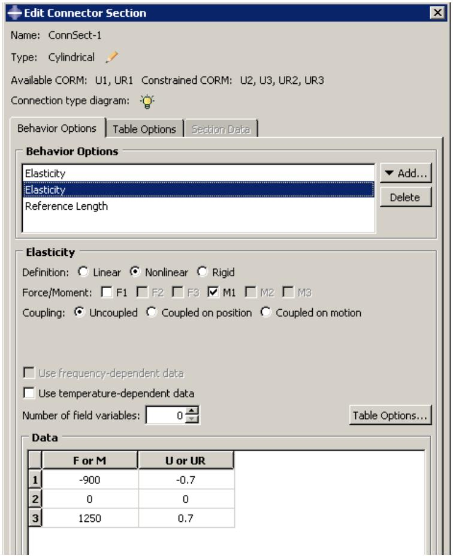  
Figure 1:The connector section editor.

On the Table Options tabbed page, you can specify behavior settings for the regularization (Abaqus/Explicit analyses only) and the extrapolation of tabular data for all of the behavior options in a connector section. Alternatively, you can specify behavior settings for individual behavior options by clicking the Table Options button in the option definition area in the lower half of the editor. Behavior settings for individual behavior options take precedence over the connector section behavior settings.

When section data are applicable for the specified connection type, you can enter the data on the Section Data tabbed page.

You can display help on a particular feature of the editor by selecting Help->On Context from the main menu bar and then clicking the feature of interest. For detailed instructions on creating connector sections and defining behaviors and section data, see Creating connector sections, and Using the connector section editors.

## Additional information

• Managing objects  
• Creating connector sections  
• Using the connector section editors  
• Connectors

## Connector section assignment editors

To create connector section assignments, select Connector->Assignment->Create from the main menu bar. Select the wires to which you want to assign the connector section.

The connector section assignment editor contains three tabbed pages that allow you to specify the connector section that you want to assign to the wires and the orientations of the endpoints of the wires. For example, the connector section assignment editor that assigns the connector section Shock\_Absorber to selected wires is shown in Figure 1.

  
Figure 1:The connector section assignment editor.

You can display information on a particular editor feature by selecting Help->On Context from the main menu bar and then clicking the editor feature of interest. For detailed instructions on creating connector section assignments, see Creating and modifying connector section assignments.

## Additional information

• Creating or modifying wire features for multiple connectors  
• Creating connector sections  
• Creating and modifying connector section assignments  
• Connectors

## Understanding symbols that represent interactions, constraints, and connectors

When you apply interactions, constraints, and connectors to regions of the model, you can choose to display symbols in the viewport that indicate where you have applied the interactions, constraints, and connectors. For information about graphical symbol types, see Symbols used to represent interactions, constraints, and connectors.

You can apply interactions, constraints, and connectors to geometry or to orphan nodes and elements.

## Interactions and constraints

If you apply an interaction or constraint to geometry, symbols appear approximately equally spaced over the surface or surfaces to which the interaction or constraint is applied. If the interaction or constraint definition involves a node region rather than a surface, the symbols appear equally spaced on the edges of the node region and at any vertices in the node region. If the interaction or constraint is applied to a single vertex, a symbol appears at that vertex.

If you apply the interaction or constraint to orphan nodes or elements, symbols appear at the center of each element face for surface-based regions or at the nodes for node-based regions.

For interactions (and prescribed conditions) that use analytical field distributions, the symbols are scaled based on the analytical field value. In addition, a plus sign (+) or a minus sign (−) is displayed inside each symbol to indicate whether the magnitude of the interaction is positive or negative at that location. Abaqus/CAE displays scaled-down symbols for interactions when an analytical field evaluates to zero for a portion of its region. These scaled-down symbols are noticeably smaller than the default symbol size. For examples of these symbols, see Understanding prescribed condition symbol type, color, and size. For more information, see Using analytical expression fields.

## Connectors

When you apply a connector to wires, squares appear at the first points of the wires and triangles appear at the second points of the wires. If you specify an orientation other than the global coordinate system for orientation 1, an orientation triad appears at the first points of the wires. For orientation 2, an orientation triad appears at the second points of the wires only if you specify a coordinate system by name; if you toggle on the option to Use orientation 1, the orientation triad does not appear at the second points. The connection type label appears midway along a line between the endpoints of the selected wires. You can also display the tag associated with the connector section assignment, though this display is turned off by default.

For information about controlling the visibility of these symbols, see Controlling the display of attributes.

## Using the Interaction module toolbox

You can access all the Interaction module tools through either the main menu bar or the Interaction module toolbox. Figure 1 shows the icons for all the tools in the Interaction module toolbox.

  
Figure 1:The Interaction module toolbox.

## Using the Interaction module

This section describes in detail how to use different features of the Interaction module.

See also What are step-dependent managers? for information on managing interactions.

## In this section:

Creating interactions  
Creating interaction properties  
Customizing contact controls  
Creating contact initializations  
Creating contact stabilization definitions  
Creating constraints  
Selecting a process for defining connector geometry  
Creating a single connector  
Creating or modifying wire features for multiple connectors  
Creating coincident point connectors  
Creating connector sections  
Creating and modifying connector section assignments  
Editing the region to which an interaction or constraint is applied  
Using the Special menu in the Interaction module

## Creating interactions

When you create an interaction, you must specify the name of the interaction, the step in which to activate the interaction, the type of interaction, and, if required, the region of the assembly to which you want to apply the interaction.

The available types of interactions depend on the procedure selected for the step. For example, you can define heat flux on a surface only during a heat transfer, coupled temperature-displacement, or coupled thermal-electrical step. Similarly, you can define interactions with a user-defined actuator/sensor only during the initial step.

If you are creating surface-to-surface contact interactions, you can automate many of the steps in the below procedure by using the contact detection tool. For more information, see Using contact and constraint detection.

1. From the main menu bar, select Interaction->Create.

A Create Interaction dialog box appears with a default name displayed in the Name text field.

Tip: You can also create an interaction using the tool in the Interaction module toolbox.

2. Type a name for the interaction. For more information about naming objects, see Using basic dialog box components.  
3. Select the step in which to activate the interaction. Click the arrow next to the Step text field, and select from the list that appears.

The Types for Selected Steps list changes to a list of all of the available interaction types.

4. From the Types for Selected Steps list, select the interaction type, and click Continue.

5. If required, select the region to which you want to apply the interaction using one of the following methods:

Select a region in the viewport. You can use the angle method to select a group of faces or edges from geometry or a group of element faces. For more information, see Using the angle and feature edge method to select multiple objects. When you have finished selecting, click mouse button 2.

Tip: You can limit the types of objects that you can select in the viewport by specifying filtering options in the Selection toolbar. See Using the selection options, for more information.

If the model contains a combination of mesh and geometry, click one of the following from the prompt area:

Click Geometry to apply the interaction to a geometry region or to a reference point.  
- Click Mesh to apply the interaction to a native or orphan mesh selection.

By default, for most interactions a set or surface is created that contains the selected objects. You can change this behavior by toggling off the option to create a set or surface in the prompt area. A default name is provided in the prompt area, but you can enter a new name.

• To select from a list of existing sets or surfaces, do the following:

1. Click Sets or Surfaces on the right side of the prompt area. (The name of the button depends on the type of object you are creating. For example, if you are creating a surface-to-surface contact interaction, a Surfaces button appears.)

Abaqus/CAE displays the Region Selection dialog box containing a list of available sets or surfaces.

2. Select the set or surface of interest, and click Continue.

## Note:

The default selection method is based on the selection method you most recently employed. To revert to the other method, click Select in Viewport or Sets or Surfaces on the right side of the prompt area.

The interaction editor appears. The region to which you are applying the interaction is highlighted in the viewport.

6. Enter all of the data necessary to define the interaction, and click OK. For detailed information on a particular feature of the editor, select Help->On Context from the main menu bar and then click the feature of interest or see Using the interaction editors.

Symbols appear in the viewport that represent the interaction that you just created. For more information, see Understanding symbols that represent interactions, constraints, and connectors.

## Additional information

• Understanding and using toolboxes and toolbars  
• What are step-dependent managers?  
• Selecting objects within the viewport  
• Using the interaction editors  
• The Set and Surface toolsets

## Creating interaction properties

You can create an interaction property by entering data in an interaction property editor. The format of the editor varies according to the type of property you are defining; when you create a property, you must first specify the property type so that the appropriate editor appears.

1. From the main menu bar, select Interaction->Property->Create.

Tip: You can also create an interaction property using the tool in the Interaction module toolbox.

A Create Interaction Property dialog box appears.

2. Enter a property name. For more information about naming objects, see Using basic dialog box components.  
3. Select the property type, and click Continue.

The editor for the property type you have specified appears.

4. In the editor, enter all of the data necessary to define the interaction property.

## Note:

You can display help on a particular editor feature by selecting Help->On Context from the main menu bar and then clicking the editor feature of interest.

5. Click OK to save the data and to exit the editor.

## Additional information

• Understanding interaction properties  
• Interaction property editors  
• Using the interaction property editors

## Customizing contact controls

The contact controls editors allow you to modify the algorithms used to enforce contact conditions. The default contact controls are usually sufficient, but customizing these controls may result in a more cost-effective solution.

## Warning:

Contact controls are intended for advanced users. The default settings of these controls are appropriate for most analyses. Using nondefault values of these controls may greatly increase the computational time of the analysis or produce inaccurate results. Changing these settings in an Abaqus/Standard analysis may also cause convergence problems.

1. From the main menu bar, select Interaction->Contact Controls->Create.  
2. In the Create Contact Controls dialog box that appears, do the following:

• Name the contact controls.  
• Select Abaqus/Standard contact controls or Abaqus/Explicit contact controls.

## 3. Click Continue.

The editor for the type of contact controls that you specified appears.

4. In the editor, enter the data necessary to customize the contact controls. For detailed instructions, see the following sections:

Specifying contact controls in an Abaqus/Standard analysis  
Specifying contact controls in an Abaqus/Explicit analysis

5. If you want to reset the values in the editor to the default values, click Defaults at the bottom of the editor.  
6. Click OK to save your customized settings and to exit the editor.

By default, Abaqus adjusts the position of slightly overclosed surfaces in a general contact domain as discussed in Contact Initialization for General Contact in Abaqus/Standard and Contact Initialization for General Contact in Abaqus/Explicit. Contact initializations are used to modify the default behavior for contact surface adjustments. Each contact initialization definition contains a set of adjustment rules; the general contact definition specifies the surfaces to which each initialization definition is applied (see Specifying and modifying contact initialization assignments for general contact).

Contact initializations are intended to correct small gaps or overclosures between surfaces. Specifying large initialization adjustments can lead to mesh distortion and increased computational cost for an analysis.

1. From the main menu bar, select Interaction->Contact Initialization->Create.

The Create Contact Initialization dialog box appears.

2. Enter a Name for the contact initialization definition, and select a Type for the contact initialization.

The Edit Contact Initializations dialog box appears.

3. You can specify the following techniques for treating Initial Overclosures between two surfaces:

Select Resolve with strain-free adjustments to adjust certain surfaces to be exactly touching at the beginning of the analysis without creating strain in the model. Only portions of surfaces that lie within the specified distance range are adjusted.  
Select Treat as interference fits to resolve surface overclosures gradually over the course of the first step in the analysis; this technique creates strain in the model as the surfaces are displaced. Only portions of surfaces that lie within the specified overclosure distance range are adjusted using the interference fit.

To establish a uniform overclosure prior to resolving the interference fit, toggle on Specify interference distance, and enter a value for the overclosure distance. Portions of surfaces that lie within the specified distance range (both overclosures and openings) are adjusted to be overclosed by the specified amount. The adjustments occur at the beginning of the analysis without creating strain in the model; the subsequent interference fit resolution during the first step in the analysis will create strain in the model.

Select Specify clearance distance to adjust certain surfaces to be separated by a specified value at the beginning of the analysis without creating strain in the model. Only portions of surfaces that lie within the specified distance range are adjusted.

4. Specify an overclosure distance range; nodes that are overclosed by a value less than the specified distance are adjusted using either strain-free adjustments or a gradual interference fit.

• Select Analysis default to let Abaqus calculate a maximum overclosure adjustment distance based on the size of the underlying element facets on each surface.  
Select Specify value to enter a maximum overclosure adjustment distance directly. If you enter a value that is smaller than the calculated analysis default for a surface, Abaqus uses the analysis default value for that surface.

## Warning:

If two surfaces (or portions of two surfaces) are initially overclosed by a distance greater than the specified adjustment value, contact between these severely overclosed surface regions is not enforced for the duration of the analysis; see Contact Initialization for General Contact in Abaqus/Standard, for more information.

5. Specify an opening distance range; nodes separated from the opposing surface by a value less than the specified distance are adjusted using strain-free adjustments.

• Select Analysis default to ignore all open nodes during the initialization adjustments.  
• Select Specify value to enter a maximum opening adjustment distance directly.

6. Specify other options.

Select Adjust nodal coordinates to resolve clearances/overclosures by adjusting the nodal coordinates without creating strain in the model. This option applies only to Abaqus/Explicit analyses and can be used only for clearances/overclosures defined in the first step of an analysis.  
Select a Secondary node set for clearance to include in the initial clearance specification. The specified clearance is enforced at all secondary nodes in this node set irrespective of whether they are above or below their respective main surfaces. This option applies only to Abaqus/Explicit analyses when the clearance distance is specified. It cannot be used if either overclosure or opening distance is specified.  
Select the Step fraction for interference value to define the fraction of the step time (between 0.0 and 1.0) in which the interference fit has to be solved. The default value is 1.0. This option applies only to Abaqus/Explicit analyses when the interference distance is specified.

7. If you want to reset the values in the dialog box to the default values, click Defaults at the bottom of the dialog box.

8. Click OK to save your contact initialization definition and to close the Edit Contact Initialization dialog box.

## Additional information

• Contact Initialization for General Contact in Abaqus/Standard  
• Contact Initialization for General Contact in Abaqus/Explicit  
• Defining general contact  
• Specifying and modifying contact initialization assignments for general contact

Contact stabilization introduces viscous damping to oppose incremental relative motion between two surfaces. This damping can be used to stabilize unconstrained rigid body motion prior to contact closure without degrading the accuracy of results. Contact stabilization is based on a set of factors described in Stabilization for General Contact in Abaqus/Standard.

Each contact stabilization definition contains a set of stabilization factors; the general contact definition specifies the surfaces to which each stabilization definition is applied (see Specifying and modifying contact stabilization assignments for general contact).

1. From the main menu bar, select Interaction->Contact Stabilization->Create.  
The Edit Contact Stabilization dialog box appears.  
2. Enter a Name for the contact stabilization definition.  
3. Specify the stabilization type:

• Select Define new stabilization behavior to define a standard stabilization.  
Select Reset values from previous steps to define a special type of stabilization that cancels the effects of stabilization that was applied in previous analysis steps; the canceling stabilization must still be assigned to surfaces in the general contact definition. This type of stabilization does not require any additional data.

4. Specify a Zero stabilization distance; no stabilization is applied to surfaces separated by a distance greater than this value. A gap-dependent scale factor varies during the analysis between one (when the surfaces are touching) and zero (when the gap between surfaces exceeds the specified zero stabilization distance).

• Select Analysis default to set the gap distance equal to a characteristic surface dimension.  
• Select Specify to enter the gap distance directly.

5. Specify a Reduction factor to determine how the damping value changes in successive increments. A value less than one causes the damping to decrease with each increment; a value greater than one (not recommended) causes the damping to increase with each increment.  
6. Specify a Scale factor that is applied to stabilization damping effects in the normal direction.  
7. Specify a Tangential factor that is applied to stabilization damping effects in the tangential direction.  
8. If desired, select an Amplitude envelope to vary the stabilization over the course of the step.

Alternatively, you can click to create a new amplitude. (See The Amplitude toolset for more information.)

Selecting an amplitude other than the default ramp amplitude may cause the stabilization effects to span multiple analysis steps; see Stabilization for General Contact in Abaqus/Standard for details.

9. If you want to reset the values in the dialog box to the default values, click Defaults at the bottom of the dialog box.  
10. Click OK to save your contact stabilization definition and to close the Edit Contact Stabilization dialog box.

## Additional information

• Stabilization for General Contact in Abaqus/Standard  
• Defining general contact  
• Specifying and modifying contact stabilization assignments for general contact

## Creating constraints

You can create the following constraints:

• Tie constraints that tie two separate surfaces together so that there is no relative motion between them.  
• Rigid body constraints that allow you to designate a collection of regions as a rigid body.  
• Display body constraints that allow you to designate a part instance that will be used for display only.  
• Coupling constraints that allow you to constrain the motion of a surface to the motion of a reference node.  
• Adjust points constraints that allow you to move a point or points onto a specified surface.  
• Multi-point constraints that allow you to constrain the motion of the secondary nodes of a region to the motion of a single point.  
• Shell-to-solid coupling constraints that allow you to couple the motion of a shell edge to the motion of an adjacent solid face.  
• Embedded region constraints that allow you to embed a region of the model within a “host” region of the model or within the whole model.  
• Equation constraints that describe linear constraints between individual degrees of freedom.

1. From the main menu bar, select Constraint->Create.

Tip: You can also create a constraint using the tool in the Interaction module toolbox.

2. In the Create Constraint dialog box that appears, do the following:

a. Name the constraint. For more information about naming objects, see Using basic dialog box components.  
b. Select the desired constraint type.

3. Click Continue to create the constraint and to close the Create Constraint dialog box.

4. If applicable, select the region to which to apply the constraint. For more information, see Selecting objects within the viewport.”

5. In the editor that appears, enter any data necessary to define the constraint.

For detailed instructions on creating different types of constraints, see the following sections:

Defining tie constraints  
Defining rigid body constraints  
Defining display body constraints  
Defining coupling constraints  
Defining adjust points constraints  
Defining MPC constraints  
Defining shell-to-solid coupling constraints  
Defining embedded region constraints  
Defining equation constraints

## Additional information

• Understanding and using toolboxes and toolbars

• Suppressing and resuming objects  
• Selecting objects within the viewport  
• The Set and Surface toolsets

## Selecting a process for defining connector geometry

You must create assembly-level wire features to define the underlying geometry for modeling connectors. The wire feature contains wires connecting points from the assembly in the current viewport or connecting points from the assembly to ground.

Abaqus/CAE provides two methods that you can use to create connector geometry for an assembly:

The Connector Builder enables you to perform all the steps involved in modeling a connector: create a single assembly-level wire feature, optionally create reference points at its endpoints, assign it a connector section, and specify the orientations for either of its endpoints. You should use this dialog box to add a small number of wire features. See Creating a single connector, for instructions on using the Connector Builder.  
The Create Wire Feature dialog box enables you to create multiple wires within a single wire feature. You should use this dialog box to define a large number of similar connectors. This dialog box creates the wire feature only; you must use other dialog boxes in the Interaction module to perform the subsequent modeling steps like creating reference points and datum coordinate systems, assigning connector sections to the wires, and specifying the orientations of the wires' endpoints. See Creating or modifying wire features for multiple connectors, for instructions on using the Create Wire Feature dialog box.

The Connector Builder enables you to perform all of the steps involved in modeling a single connector. These steps include:

• Creating a wire feature between two points or between a point and ground.  
• Creating reference points at either endpoint, and creating a datum coordinate system along the length of the wire.  
• Creating a connector section assignment for the new wire feature.  
• Specifying orientations for either endpoint that the wire feature connects.

Because the Connector Builder creates one connector at a time, you should use it to add a small number of connectors to your assembly. If you plan to define a large number of connectors, begin by adding wire features to the assembly in the Create Wire Feature dialog box. See Creating or modifying wire features for multiple connectors, for more information.

1. From the main menu bar, select Connector->Connector Builder.

Tip: You can also start the Connector Builder using the tool in the Interaction module toolbox.

2. Select the points that you want to connect.

a. Select the first point and second point for the connector in the viewport.

## Note:

You can also click Connect to Ground in the prompt area to ground one side of the connector. You cannot connect both points to ground.

The Connector Builder opens with the points you selected in the Endpoints portion of the dialog box. The first point is highlighted in red and the second point is highlighted in magenta in the viewport.

b. If desired, click to switch the two endpoints you selected.

c. If desired, toggle on Create a reference point under either point description to create a reference point at that endpoint when you save the wire feature. If the selected point is a datum point or an interesting point, Abaqus/CAE automatically creates a reference point at that location.

3. Select a connector section. If desired, click to create a new connector section.

The connection type is displayed in the editor. For basic, assembled, and complex connection types,

you can click to see a schematic drawing of the connection type along with the Abaqus idealization of the connection. For MPC connection types, the motion of the second point is constrained to the motion of the first point. The connection type you select also dictates the initial values selected for the connector orientations. If you change the connector section assignment, Abaqus/CAE resets these orientation settings to the default values for that connection type.

4. If desired, modify any of the following orientation settings:

a. Project a datum coordinate system along the axis between the endpoints.

In the CSYS 1 portion of the dialog box, select the Create CSYS on axis between points option, then select 1, 2, or 3 as the Axis for the new datum coordinate system. Abaqus/CAE may select this option by default for some connection types.

b. Specify an orientation other than the global coordinate system for the first point for the connector in the CSYS 1 portion of the dialog box. If the connector is not connected to ground and the selected connector section assignment allows you to adjust the second point in the connector, you can specify an orientation for the second point in the CSYS 2 portion of the dialog box as well.

In either portion of the dialog box, select Specify CSYS, click , then use one of the following methods to select the datum coordinate system:

Select a predefined datum coordinate system by name. Click Datum CSYS List from the prompt area, select a name from the list, and click OK.  
• Select a predefined coordinate system in the viewport.  
• For the second point in the connector, select Use CSYS 1 to use the coordinate system defined for the first point at the second point in the connector as well.

The selected orientation is highlighted red in the viewport. The Connector Builder reappears and displays a description of the coordinate system used for the orientation for the selected point of the connector.

Tip: You can also create a new datum coordinate system to use by clicking from the CSYS 1 or CSYS 2 portion of the dialog box.

c. If desired, you can specify for either endpoint an additional rotation about an axis of the datum coordinate system. Select the Specify additional rotation option for one of the points, enter a value for the rotation angle in degrees, and select 1, 2, or 3 for the About axis option. The Specify additional rotation option is available only if you specify a datum coordinate system other than the global coordinate system.

5. Click OK to save your connector and to close the Connector Builder, or click OK/Repeat to save the assembly-level wire, leaving the dialog box open to create a new wire.

## Additional information

• Connectors

## Creating or modifying wire features for multiple connectors

In the Interaction module, select Connector->Geometry->Create Wire Feature from the main menu bar to add one or more wire features. You can add disjoint wires, chained wires, or wires that are connected to ground. When you create the wire feature, you can create a geometry set that includes all of the wires in the wire feature to use during subsequent selection procedures; for example, when you select wires for the connector section assignment definition or to apply connector loads. For detailed instructions on creating assembly-level wires features, see Adding a point-to-point wire feature.

You can modify assembly-level wire features by selecting Connector->Geometry->Modify Wire Feature from the main menu bar. You select any wire from the feature that you want to modify and make changes in the Modify Wire Feature dialog box, as described in the procedure below. When you click OK in the dialog box, Abaqus/CAE does the following:

• renames and suppresses the original wire feature;  
creates a new wire feature using the same name as the original wire feature;  
• renames the geometry set that had contained the original wire feature, if it existed; and  
• if applicable, creates a new geometry set containing the modified wire feature.

For example, Figure 1 shows that Wire-1 is renamed OldWire-1-1 and suppressed. Similarly, Wire-1-Set–1 is renamed OldWire-1-Set–1.

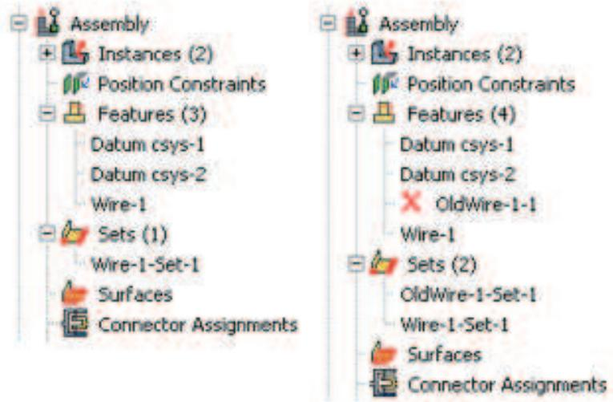  
Figure 1: Model Tree showing the Features and Sets containers for the original wire feature (left) and the modified wire feature (right).

By using the default geometry set name created for a wire feature when you select wires to define connector section assignments, connector loads, and connector boundary conditions, you ensure that these objects remain valid if you modify the wire feature. Otherwise, objects that reference any part of the original wire feature are invalidated if you modify the wire feature; for example, if you define a connector force and select wires from the viewport or use a geometry set with a different name.

You can remove wires from the wire feature by selecting Connector->Geometry->Remove Wires From Feature from the main menu bar. The operation to remove wire edges from the feature is stored as a feature of the part; therefore, you can use the Model Tree to delete or suppress the operation.

1. From the main menu bar in the Interaction module, select Connector->Geometry->Modify Wire Feature.

Tip: You can also modify an assembly-level wire feature using the tool in the Interaction module toolbox.

2. In the viewport, select any wire of the feature that you want to modify.

The Modify Wire Feature dialog box appears and displays the point pairs that define the assembly-level wires in the original wire feature.

3. In the Point Pairs portion of the dialog box, you can do the following:

• To add more point pairs, specify the method, click T , and select the points from the viewport. The representation of the added wire is highlighted in magenta.

• To edit a point, select the point in the table, click , and reselect a point. The selection highlighting in the viewport is updated to show the newly edited point.

• To identify a specific point pair in the viewport, select the desired row. The line connecting the selected point pair is highlighted in red.

• To remove a point pair, select the desired row and click

• To exchange the entries for Point 1 and Point 2 in a point pair, select the desired row and click

4. In the Set Creation portion of the dialog box, toggle on Create set of wires if you want Abaqus/CAE to create a new geometry set of wires for the modified wire feature.

5. Click OK to modify the wire feature.

The original wire feature is renamed and suppressed. The modified assembly-level wire feature appears in the Model Tree in the Features container under the assembly using the same name as the original wire feature.

## Additional information

• Adding a point-to-point wire feature  
• Connectors

In the Interaction module, select Connector->Coincident Builder from the main menu bar to create a connector wire feature and section assignment for a group of coincident points. For detailed instructions on creating assembly-level wires features, see Adding a point-to-point wire feature.

1. From the main menu bar in the Interaction module, select Connector->Coincident Builder.  
2. In the viewport, select the coincident points that you want to include in the connector wire feature, then click Done in the prompt area. For an overview of the methods you can use to select multiple points from the viewpoint, see Drag-selecting multiple objects.

The Coincident Point Builder dialog box opens with the selected coincident points displayed in the Endpoints portion of the dialog box.

3. If desired, customize the content and order of the endpoints you want to use by doing the following:

• Highlight the row for any coincident point, and click

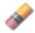

to delete that coincident point pair.

Highlight the row for any coincident point, and click the coincident point pair.

to swap the first and second points in

4. Select a connector section. If desired, click to create a new connector section.

The connection type is displayed in the editor. For basic, assembled, and complex connection types,

you can click to see a schematic drawing of the connection type along with the Abaqus idealization of the connection. For MPC connection types the motion of the second point is constrained to the motion of the first point.

5. If desired, modify any of the following orientation settings:

a. Specify an orientation other than the global coordinate system for the coincident point connector wire feature in the CSYS 1 portion of the dialog box. If the selected connector section assignment allows you to adjust the second point in the connector, you can specify an orientation for the second point in the CSYS 2 portion of the dialog box as well.

In either portion of the dialog box, click datum coordinate system:

, then use one of the following methods to select the

Select a predefined datum coordinate system by name. Click Datum CSYS List from the prompt area, select a name from the list, and click OK.  
• Select a predefined coordinate system in the viewport.  
• For the second point in the connector, select Use CSYS 1 to use the coordinate system defined for the first point at the second point in the connector as well.

The selected orientation is highlighted red in the viewport. The Coincident Point Builder reappears and displays a description of the coordinate system used for the orientation for the selected point of the connector.

Tip: You can also create a new datum coordinate system by clicking from the CSYS 1 or CSYS 2 portion of the dialog box.

b. If desired, you can specify an additional rotation about an axis of the datum coordinate system for either endpoint. Select the Additional rotation angle option for one of the points, enter a value for the rotation angle in degrees, and select 1, 2, or 3 for the About axis option. The Additional rotation angle option is available only if you specify a datum coordinate system other than the global coordinate system.

6. Click OK to create the wire feature and the connector section assignment. Abaqus/CAE also creates a set containing the assembly-level wires.

The original wire feature is renamed and suppressed. The modified assembly-level wire feature appears in the Model Tree in the Features container under the assembly using the same name as the original wire feature.

## Additional information

• Constraining two instances with coincident points

You can create a connector section by selecting connection types to define the connector function.

## In this section:

Creating connector sections for assembled, complex, and basic connection types  
Creating connector sections for MPC types

## Creating connector sections for assembled, complex, and basic connection types

The connector section editor allows you to specify assembled, complex, or basic connection types; connector behaviors; and section data to include in the section definition. For more information, see Connector Elements.

1. From the main menu bar, select Connector->Section->Create.

Tip: You can also create a connector section using the tool in the Interaction module toolbox.

A Create Connector Section dialog box appears.

2. Enter a section name. For more information about naming objects, see Using basic dialog box components.  
3. Choose one of the following connection categories:

Choose Assembled/Complex to use either predefined combinations of basic connection types or complex connection types.  
Click the arrow next to the Assembled/Complex type text field, and select the desired connection type from the list that appears.  
• Choose Basic to use translational and rotational connection types.

1. If desired, click the arrow next to the Translational type text field, and select the connection type from the list that appears.  
2. If desired, click the arrow next to the Rotational type text field, and select the connection type from the list that appears.

You can select one translational type, one rotational type, or one translational and one rotational type to define the connector section.

Abaqus/CAE displays the available and constrained components of relative motion (CORM) for the

connection type that you have selected. In addition, you can click to see a schematic drawing of the connection type along with the Abaqus idealization of the connection.

For a description of assembled, complex, and basic connection types, see Connection Types.

## 4. Click Continue.

The connector section editor appears.

## Note:

You can display help on a particular editor feature by selecting Help->On Context from the main menu bar and then clicking the editor feature of interest. For more information on editor features, see Using the connector section editors.

5. To edit the connection type, click to the right of the connection type to display the connector section type editor. Select the connection type as described above. You must delete all behaviors from the editor before you can edit the connection type.  
6. On the Behavior Options tabbed page, you can add, delete, and change behaviors as follows:

## Adding behaviors

Click Add on the right side of the editor to display a list of available behaviors. Select the behaviors needed to define your connector section. You can define multiple behaviors of the same type for some behaviors. When you select a behavior, its name appears in the Behavior Options list, and data fields associated with the behavior appear in the data area in the bottom half of the editor. Use the data fields to enter information for the currently selected behavior. For more information, see Using the connector section editors.

## Deleting behaviors

In the Behavior Options list, select the behavior that you want to delete, and click Delete on the right side of the editor. This procedure removes the behavior from both the behavior options list and the connector section definition.

## Changing behavior data

In the Behavior Options list, select the behavior whose data you want to change. When the data fields associated with the behavior appear in the bottom half of the window, change the information that you have entered for the behavior as desired.

7. On the Table Options tabbed page, you can specify behavior settings for the regularization (Abaqus/Explicit analyses only) and the extrapolation of tabular data for all of the behavior options in a connector section. Alternatively, you can specify behavior settings for individual behavior options. The Table Options button is available on the Behavior Options tabbed page for selected behavior options. Behavior settings for individual behavior options take precedence over the connector section behavior settings. For more information, see Specifying behavior settings for tabular data, and Defining Connector Behavior Using Tabular Data.

Specify behavior settings on the Table Options tabbed page as follows:

a. In the Regularization portion of the page, specify the settings for the regularization of tabular data in an Abaqus/Explicit analysis. By default, Abaqus/Explicit regularizes the data into tables that are defined in terms of even intervals of the independent variables.

• Toggle on Regularize data to regularize tabular data.  
Toggle off Regularize data to turn off regularization of the tabular data and use the data that you define directly.

b. If you want to regularize tabular data, specify the error tolerance.

• Choose Use default to use the default value of 0.03.  
• Choose Specify, and enter a value for the error tolerance.

c. In the Extrapolation portion of the page, specify the method for the extrapolation of tabular data. The data points that you enter make up a nonlinear curve in the constitutive space. By default, Abaqus extrapolates the dependent variables as constant values that correspond to the end points of the curve outside the specified range of the independent variables.

Choose Constant to use constant extrapolation of the dependent variables outside the specified range of the independent variables.  
Choose Linear to use linear extrapolation of the dependent variables outside the specified range of the independent variables.

8. The Section Data tabbed page becomes available for the following connection types:

• For the Flow-Converter or Retractor connection type, enter the following section data:

## Node b material flow scaling factor

Enter the scaling factor, $\beta _ { s } ,$ , associated with the material flow at node b. Node b refers to the second point of a wire used to model a connector in Abaqus/CAE. The default value is 1.

For more information, see FLOW-CONVERTER and RETRACTOR.

• For the Slip Ring connection type, enter the following section data:

## Mass per unit reference length

Enter the mass per unit reference length of belt material.

## Contact angle around node b

The contact angle refers to the angle made by the belt wrapping around node b. Node b refers to the second point of a wire used to model a connector in Abaqus/CAE.

For an Abaqus/Standard analysis you must specify the contact angle directly. For an Abaqus/Explicit analysis you can specify the contact angle directly, or you can let Abaqus calculate the contact angle based on the configuration of your model:

• To let Abaqus calculate the contact angle, select Compute.  
• To specify the contact angle directly, select Specify and enter the contact angle in degrees.

For more information, see SLIPRING.

9. Click OK to save the data and to exit the editor.

## Additional information

• Understanding connector sections and functions  
• Connector section editors  
• Using the connector section editors  
• Connectors

## Creating connector sections for MPC types

The connector section editor allows you to specify MPC connection types. For more information, see General Multi-Point Constraints.

1. From the main menu bar, select Connector->Section->Create.

Tip: You can also create a connector section using the tool in the Interaction module toolbox.

A Create Connector Section dialog box appears.

2. Enter a section name. For more information about naming objects, see Using basic dialog box components.  
3. Choose the MPC connection category.  
4. Click the arrow next to the MPC type text field, and select the desired connection type from the list that appears.

For more information, see the following sections:

• General Multi-Point Constraints  
• MPC

5. Click OK to save the section definition and to close the dialog box.

## Additional information

• Understanding connector sections and functions  
• Connector section editors

## Creating and modifying connector section assignments

You create connector section assignments by assigning connector sections to wire features (to define connectors) or attachment lines (to define discrete fasteners) and specifying local orientations associated with the endpoints of the wires or attachment lines. Depending upon the connection type, a local orientation for the first points of the selected wires or attachment lines is required, optional, or not applicable. Depending upon the connection type, a local orientation for the second points of the selected wires or attachment lines is optional or not applicable. For the local orientation requirements for each connection type, see Connection-Type Library. Table 1 relates the numerical coordinate axes referred to in the connection-type library to the coordinate system axis labels used in Abaqus/CAE. You can use the Query toolset to obtain connector assignment information for selected wires or attachment lines.

Table 1: Coordinate system axis labels used for displaying local orientations associated with the endpoints of the wires or attachment lines.

<table><tr><td>Local coordinate direction</td><td>Cartesian</td><td>Cylindrical</td><td>Spherical</td></tr><tr><td>1</td><td>x</td><td>r</td><td>r</td></tr><tr><td>2</td><td>y</td><td>t</td><td>t</td></tr><tr><td>3</td><td>z</td><td>z</td><td>p</td></tr></table>

When you create connector section assignments, Abaqus/CAE generates identification strings to associate the assignments with connector orientations. These strings, referred to as “tags,” cannot be modified, and they are displayed in the connector section assignment manager, the Model Tree tooltips, and—optionally—the viewport (see Controlling the display of attributes).

1. Display the connector section assignment editor using one of the following methods:

• To create a new connector section assignment, do the following:

1. Select Connector->Assignment->Create from the main menu bar.

Tip: You can also create a connector section assignment using the tool in the Interaction module toolbox.

2. Select the region (wires or attachment lines) to which you want to apply the connector section.

Only wire features or attachment lines that have been created at the assembly level are available for selection. The best approach for selecting the region is to use the default geometry set name for the wire feature (see Creating or modifying wire features for multiple connectors, for more information) or attachment lines (see Creating attachment lines by projecting points, for more information). A single wire or attachment line feature may contain multiple wires or attachment lines. You can select individual wires or attachment lines of the feature; however, only one connector section can be associated with each individual wire or attachment line.

Use one of the following methods to select the region:

• Select from a list of existing sets. Click Sets on the right side of the prompt area, select the set of interest from the Region Selection dialog box that appears, and click Continue.  
• Select the wires or attachment lines in the viewport.

3. Click Done in the prompt area.

The connector section assignment editor appears.

• To edit an existing connector section assignment, select Connector->Assignment->Manager from the main menu bar to display the Connector Section Assignment Manager. Select the row of data that you want to change, and click Edit.

The connector section assignment editor appears, and the connector symbols become highlighted in the current viewport.

If you want to select different wires or attachment lines for the connector section assignment, click

in the Region portion of the editor and reselect the region.

2. On the Section tabbed page, select a connector section. If desired, click section.

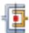

to create a new connector

The connection type is displayed in the editor; if applicable, you can click to see a schematic drawing of the connection type along with the Abaqus idealization of the connection.

3. On the Orientation 1 tabbed page, you specify the orientation for the first points of the selected wires or attachment lines if the orientation is required or optional. If the orientation is not applicable, the Orientation 1 tabbed page is unavailable in the editor.

a. If you want to specify an orientation other than the global coordinate system, click and use one of the following methods to select the datum coordinate system:

Select a predefined datum coordinate system by name. Click Datum CSYS List from the prompt area, select a name from the list, and click OK.  
• Select a predefined coordinate system in the viewport.

The selected orientation is highlighted red in the viewport. The connector section assignment editor reappears and displays a description of the coordinate system used for the orientation of the first points of the selected wires or attachment lines.

b. If applicable, you can specify an additional rotation about an axis of the datum coordinate system. Select the Additional rotation angle option, enter a value for the rotation angle in degrees, and select 1, 2, or 3 for the About axis option. The Additional rotation angle option is available only if you specify a datum coordinate system other than the global coordinate system.

4. If the orientation for the second points of the selected wires or attachment lines is optional, Abaqus/CAE uses the orientation for the first points (including the additional rotation angle, if specified) as the default selection. You can specify a different coordinate system for the second points of the selected wires or attachment lines on the Orientation 2 tabbed page. If the orientation is not applicable, the Orientation 2 tabbed page is unavailable in the editor.

a. On the Orientation 2 tabbed page, toggle on No modifications to CSYS and click . Use one of the following methods to select the datum coordinate system:

Select a predefined datum coordinate system by name. Click Datum CSYS List from the prompt area, select a name from the list, and click OK.  
• Select a predefined coordinate system in the viewport.

The selected orientation is highlighted red in the viewport. The connector section assignment editor reappears and displays a description of the coordinate system used for the orientation of the second points of the selected wires or attachment lines.

b. If applicable, you can specify an additional rotation about an axis of the datum coordinate system. Select the Additional rotation angle option, enter a value for the rotation angle in degrees, and select 1, 2, or 3 for the About axis option. The Additional rotation angle option is available only if you specify a datum coordinate system other than the global coordinate system.

5. Click OK to save your connector section assignment and to close the editor.

Symbols appear in the viewport that represent the connector section assignment that you just created. For more information, see Understanding symbols that represent interactions, constraints, and connectors.

## Additional information

• Understanding connectors  
• Connector section assignment editors  
• Using the Query toolset to obtain connector assignment information  
• Fasteners  
• Connectors

## Editing the region to which an interaction or constraint is applied

You can edit the region to which an interaction is applied only in the step in which the interaction was created.

1. From the Interaction or Constraint menu in the main menu bar, select Manager to display the Interaction Manager or Constraint Manager.  
2. Choose one of the following methods:

To edit an interaction, click the cell located in the row of the interaction that you want to modify and in the column of the step in which it was created and click Edit. Alternatively, you can just double-click the cell.

Tip: You can also initiate this procedure by clicking the step in which the interaction was created from the Step list located in the context bar. From the Interaction menu in the main menu bar, select Edit->interaction name.

• To edit a constraint, select the name of the constraint and click Edit.

Tip: You can also initiate this procedure by selecting Edit->constraint name from the main menu bar.

If you are editing a foundation interaction, either you are prompted to edit the region by selecting or unselecting objects in the viewport or the Region Selection dialog box appears in which you can select a surface that you have already created using the Surface toolset.

If you are editing any other type of interaction or a constraint, the appropriate editor appears. The editor for all interactions except general contact contains an Edit Region option for each region involved in the interaction or constraint definition.

If your interaction or constraint definition includes both a main surface and a secondary surface or region, the main surface appears highlighted in red and the secondary surface or region appears highlighted in magenta during the editing procedure.

If you are editing a surface-to-surface contact interaction, yellow arrows are displayed on the shell surfaces to show the shell normal that was selected when the interaction was created. On geometry, a single arrow is displayed at the centroid of each face on the shell surface. On native or orphan meshes, an arrow is displayed on each of the element faces on the shell surface. If you edit the main surface or the secondary surface, the arrows are displayed for the selected surface.

3. If you are editing a general contact interaction, modify the contact domain using the methods described in Defining general contact.  
4. If you are editing a constraint or an interaction other than general contact or foundation, click for the region that you want to modify. For example, if you are editing a surface-to-surface contact

interaction and you want to modify the main surface, click editor.

next to the Main surface label in the

5. If you are editing a constraint or an interaction other than general contact, edit the region by selecting and unselecting objects in the viewport. If you are editing the host region to which an embedded region constraint is applied, first select the selection method. When you have finished editing the region, click mouse button 2. (For more information, see Selecting objects within the viewport.)

Tip: You can limit the types of objects that you can select in the viewport by specifying filtering options in the Selection toolbar. See Using the selection options, for more information.

If you would rather select from a list of existing sets or surfaces, do the following:

a. Click Sets or Surfaces on the right side of the prompt area. (The name of the button depends on the type of object you are editing. For example, if you are editing an interaction, a Surfaces button appears.)

Abaqus/CAE displays the Region Selection dialog box containing a list of available sets or surfaces.

b. Select the set or surface of interest, and click Continue.

## Note:

The default selection method is based on the selection method you most recently employed. To revert to the other method, click Select in Viewport or Sets or Surfaces on the right side of the prompt area.

6. Finish editing the interaction or constraint definition as desired, and then press mouse button 2 (if you are editing a foundation interaction) or click OK in the editor (if you are editing any other type of interaction or if you are editing a constraint).

## Additional information

• Using the Interaction module  
• What are step-dependent managers?

Use of the Special menu in the Interaction module is discussed.

## In this section:

The Special menu in the Interaction module  
Modeling cracks and seams

## The Special menu in the Interaction module

You can use the Special menu in the Interaction module to define inertia and crack engineering features.

Inertia. You can define lumped mass, rotary inertia, and heat capacitance at a point on an assembly. In an Abaqus/Standard analysis you can also define mass and inertia proportional damping and composite damping. For more information, see Inertia.  
• Crack. You can study the initiation and propagation of cracks using the following techniques:

- An embedded seam crack with duplicate overlapping nodes  
- A contour integral analysis  
- The extended finite element method (XFEM)  
- The virtual crack closing technique (VCCT)

• Springs/Dashpots. You can define springs and dashpots that exhibit the same linear behavior independent of field variables. You can also define both spring and dashpot behavior on the same set of points. In an Abaqus/Explicit or an Abaqus/Standard analysis, you can model springs and dashpots that connect two points, following the line of action between the two points. In an Abaqus/Standard analysis, you can also model springs and dashpots that connect two points, acting in a fixed direction, or that connect points to ground. For more information, see Springs and dashpots.

Fasteners. You can model point-to-point connections between two or more faces using point-based or discrete fasteners. Point-based fasteners can be defined using attachment points, reference points, or orphan nodes. Discrete fasteners can be defined using attachment lines. For more information, see Fasteners.

## Modeling cracks and seams

When you model cracks, you assign seams to regions of your model. Abaqus/CAE places overlapping duplicate nodes along a seam when the mesh is generated. A seam cannot extend along the boundaries of a part and must be embedded within a face of a two-dimensional part or within a cell of a solid part.

Because a seam modifies the mesh, if you create a seam on a dependent part instance, it will actually be created on the underlying part, thereby affecting all instances of that part.

For fracture mechanics, a seam defines an edge or a face with overlapping nodes that can separate during an analysis. You can include a seam crack in your model. Alternatively, you can refer to the seam when creating a contour integral; however, you cannot use a seam crack with the extended finite element method (XFEM). For more information, see Fracture mechanics.

1. From the main menu bar in the Interaction module, select Special->Crack->Assign seam.  
2. From the model in the viewport, select the entities representing the seam. The entities must be embedded edges within a face of a two-dimensional part or embedded faces within a cell of a solid part; you cannot select any entities that lie on the boundary of the part.  
3. Click mouse button 2 to indicate that you have finished selecting the seam.  
Abaqus/CAE creates the seam.

## Additional information

• Using the Special menu in the Interaction module

## Using the interaction editors

This section explains how to enter data in the interaction editor to define specific types of interactions.

## In this section:

Defining general contact  
Specifying and modifying contact property assignments for general contact  
Specifying and modifying contact initialization assignments for general contact  
Specifying and modifying contact stabilization assignments for general contact  
Specifying surface property assignments for general contact  
Specifying contact formulation assignments for general contact  
Defining surface-to-surface contact  
Defining self-contact  
Specifying contact controls in an Abaqus/Standard analysis  
Specifying contact controls in an Abaqus/Explicit analysis  
Defining a fluid cavity interaction  
Defining a fluid exchange interaction  
Defining a fluid exchange activation interaction  
Defining a fluid inflator interaction  
Defining a fluid inflator activation interaction  
Defining a model change interaction  
Defining a Standard-Explicit co-simulation interaction  
Defining pressure penetration  
Defining acoustic impedance  
Defining incident waves  
Defining cyclic symmetry  
Defining foundations  
Defining a cavity radiation interaction  
Defining a surface film condition interaction  
Defining a concentrated film condition interaction  
Defining a surface radiative interaction  
Defining a concentrated radiative interaction  
Defining an actuator/sensor interaction  
Defining contact mass scaling

## Defining general contact

In Abaqus/Standard you can define general contact only in the initial step; in all subsequent steps this general contact interaction is active and you can modify it. In Abaqus/Explicit you can define general contact in any analysis step or the initial step; only one general contact interaction can be active in a step.

For a brief overview of general contact, see Understanding interactions. For a more detailed discussion, see About General Contact in Abaqus/Standard, and About General Contact in Abaqus/Explicit.

A general contact definition can create interactions involving exterior faces, analytical rigid surfaces, feature edges, edges based on beams and trusses, and, for Abaqus/Explicit, Eulerian material boundaries. Analytical rigid surfaces can interact only with entities of element-based and node-based surfaces (that ${ \mathrm { i s } } ,$ contact between two analytical surfaces cannot be modeled).

In Abaqus/Explicit you can obtain contact data for a specific surface in the general contact domain by using the history output request editor in the Step module. In the Domain section of the editor, select General contact surface and choose the surface from the menu that appears. For more information, see Creating an output request.

1. From the main menu bar, select Interaction->Create.

Tip: You can also create a general contact interaction using the

tool in the Interaction module toolbox.

2. In the Create Interaction dialog box that appears, do the following:

• Name the interaction. For more information about naming objects, see Using basic dialog box components.  
Select the step in which the interaction will be created. In Abaqus/Standard general contact can be created only in the initial step.  
Select the General contact (Standard) or General contact (Explicit) type of interaction, depending on the analysis steps being defined in your model.

3. Click Continue to close the Create Interaction dialog box.

The Edit Interaction dialog box appears.

4. Specify the contact domain using either of the following methods:

• Choose All\* with self to specify contact (including self-contact) for all allowable element faces and model entities. This is the simplest way to define the contact domain.  
• To specify individual contact surface pairings:

1. Choose Selected surface pairs, and click

The Edit Included Pairs dialog box appears. By default, when you select a surface from the list or the table, Abaqus/CAE highlights the surface in the viewport; however, highlighting does not apply for (All\*), (Self), and Eulerian material surfaces. You can toggle off Highlight selected regions at the bottom of the dialog box to turn off selection highlighting.

2. Select one or more surfaces from the list of existing surfaces in the first column on the left side. Select (All\*) to specify a surface that includes all allowable element faces and model entities.

## Tip: You can click

to define a new surface and add it to the list. See Creating surfaces, for instructions on defining surfaces.

3. Select the second surface or surfaces from the list of existing surfaces in the second column to define the surface pairings.

• When multiple surfaces are selected in either column, all possible combinations will be generated in the table.  
• To specify self-contact, select either the same surface name or (Self) in the second column.  
• The order in which the surfaces are specified does not matter for the analysis.

4. Click the arrows

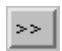

in the middle of the dialog box to transfer the surface pair to the list of pairings that will be included in the contact domain.

The table on the right side of the dialog box is updated to reflect your selections (the order of the surface pairings is irrelevant).

5. Repeat the above steps as needed to completely define the contact domain inclusions. If you want to delete included pairs, select the rows and click

6. Click OK to save your selections and to close the Edit Included Pairs dialog box.

The interaction editor reappears with updated information on the number of selected surface pairs for inclusion in the contact domain.

5. If necessary, select the surface pairs to exclude from the contact domain.

a. Click Edit next to Excluded surface pairs.

The Edit Excluded Pairs dialog box appears. By default, when you select a surface from the list or the table, Abaqus/CAE highlights the surface in the viewport; however, highlighting does not apply for (All\*), (Self), and Eulerian material surfaces. You can toggle off Highlight selected regions at the bottom of the dialog box to turn off selection highlighting.

b. Select one or more surfaces from the list of existing surfaces in the first column on the left side. Select (All\*) to specify a surface that includes all allowable element faces and model entities.

## Tip: You can click

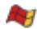

to define a new surface and add it to the list. See Creating surfaces, for instructions on defining surfaces.

c. Select the second surface or surfaces from the list of existing surfaces in the second column to define the surface pairings.

• When multiple surfaces are selected in either column, all possible combinations will be generated in the table.  
• To specify that self-contact should be excluded, select either the same surface name or (Self) in the second column.  
• The order in which the surfaces are specified does not matter for the analysis.  
• If the excluded regions overlap with the included regions, the contact exclusions will take precedence over the contact inclusions.

d. Click the arrows

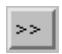

in the middle of the dialog box to transfer the surface pair to the list of pairings that will be excluded from the contact domain.

The table on the right side of the dialog box is updated to reflect your selections (the order of the surface pairings is irrelevant).

e. Repeat the above steps as needed to completely define the contact domain exclusions. If you want to delete excluded pairs, select the rows and click

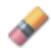

f. Click OK to save your selections and to close the Edit Excluded Pairs dialog box.

The interaction editor reappears with updated information on the number of selected surface pairs for exclusion from the contact domain.

6. Specify the Attribute Assignments at the bottom of the interaction editor. In Abaqus/Standard you can modify the contact properties or stabilizations in any step in which the general contact interaction is active, but all other attributes are assigned for the entire analysis. In Abaqus/Explicit you can specify or modify the attributes in any step in which the general contact interaction is active. You can specify the following assignments:

Contact Properties. For detailed instructions, see Specifying and modifying contact property assignments for general contact.  
Contact Initializations (Abaqus/Standard only). For detailed instructions, see Specifying and modifying contact initialization assignments for general contact.  
Contact Stabilizations (Abaqus/Standard only). For detailed instructions, see Specifying and modifying contact stabilization assignments for general contact.  
• Surface Properties. For detailed instructions, see Specifying surface property assignments for general contact.  
Contact Formulation. For detailed instructions, see Specifying contact formulation assignments for general contact.

7. Click OK to create the interaction and to close the editor.

## Additional information

• About General Contact in Abaqus/Standard  
• About General Contact in Abaqus/Explicit  
• Interaction editors

## Specifying and modifying contact property assignments for general contact

Contact properties can be assigned globally to a general contact interaction or individually to particular regions within a general contact domain.

Attributes for a general contact interaction, such as contact properties, are specified independently of the contact domain in the Attribute Assignments portion of the interaction editor. For a brief overview of general contact, see Understanding interactions.

You can change the contact property that is assigned to a general contact interaction in any step to which the original interaction definition is propagated. In Abaqus/Standard only the frictional behavior is allowed to change between the original contact property definition and the new contact property definition (see Specifying frictional behavior for mechanical contact property options)—Abaqus uses the original friction definition from the creation of the general contact interaction until the step in which the new property is assigned; the new friction definition is used for subsequent steps.

## Additional information

• Interaction editors  
• Defining general contact

## Specify contact property assignments

1. Display the general contact interaction editor using one of the following methods:

• To create a new general contact interaction, follow the instructions in Defining general contact.  
• To edit an existing general contact interaction, select Interaction->Edit->interaction name from the main menu bar.

2. Click the Contact Properties tab in the Attribute Assignments portion of the interaction editor (if it is not already selected).

3. If necessary, click in the Contact Properties portion of the interaction editor to create a contact interaction property; see Defining a contact interaction property, for more information.

4. Specify the contact property assignments for the interaction using either of the following methods:

• To assign a contact property globally to the entire contact domain, select a property from the list next to Global property assignment.  
• To assign different contact properties to individual surface pairs:

1. Click next to Individual property assignments.

The Edit Individual Contact Property Assignments dialog box appears. By default, when you select a surface from the list or the table, Abaqus/CAE highlights the surface in the viewport; however, highlighting does not apply for (Global), (Self), materials, and Eulerian material surfaces. You can toggle off Highlight selected regions at the bottom of the dialog box to turn off selection highlighting.

2. Select one or more combinations of surfaces and materials from the list of existing surfaces and materials in the first column on the left side. Select (Global) to assign a contact property between the entire contact domain and an individual surface or material.

Tip: You can click to define a new surface and add it to the list. See Creating surfaces, for instructions on defining surfaces.

Tip: You can click to define a new material and add it to the list. See Creating or editing a material, for instructions on defining materials.

3. Select the second surface or material or combinations of surfaces and materials from the list of existing surfaces and materials in the second column to define the surface pairings.

When multiple surfaces and materials are selected in either column, all possible combinations will be generated.  
• To assign a property for self-contact, select either the same surface name or (Self) in the second column.  
• Any contact property assignments for regions that fall outside of the contact domain will be ignored.

4. From the list of existing interaction properties in the third column, select the property to assign.

Tip: You can click to define a new interaction property and add it to the list. See Defining a contact interaction property, for instructions on defining interaction properties.

5. Click the arrows in the middle of the dialog box to transfer your selections to the list of property assignments.

The table on the right side of the dialog box is updated to reflect your selections.

6. Repeat the above steps as needed to complete the contact property assignments. If you want to delete contact property assignments, select the rows and click

## Note:

The order of assignments may be relevant; when property assignments overlap, the last assignment will take precedence.

7. Click OK to save your selections and to close the Edit Individual Contact Property Assignments dialog box.

The interaction editor reappears with updated information on the number of individual contact property assignments.

## Note:

Individual contact property assignments take precedence over the global assignment.

5. Click OK to create the interaction and to close the editor.

## Modify a contact property assignment

1. From the main menu bar, select Interaction->Edit->interaction name.

The Edit Interaction dialog box appears.

2. Click the Contact Properties tab in the Attribute Assignments portion of the interaction editor (if it is not already selected).

3. Click next to Individual property assignments.

The Edit Individual Contact Property Assignments dialog box appears.

4. Select the row or rows containing the property assignment to be modified from the table on the right side of the dialog box.  
5. Select a new interaction property from the list in the third column on the left side of the dialog box.  
6. Click the arrow > in the middle of the dialog box to replace the interaction property with your new selection.  
7. Click OK to save your selections and to close the dialog box.

The interaction editor reappears.

8. Click OK to save your changes and to close the interaction editor.

## Specifying and modifying contact initialization assignments for general contact

Contact initializations determine how Abaqus adjusts surfaces in the general contact domain prior to the analysis. Contact initializations for surfaces are specified independently of the contact domain in the Attribute Assignments portion of the interaction editor. Contact initialization can be assigned only in the initial step of an analysis. For more information about contact initializations, see Creating contact initializations, Contact Initialization for General Contact in Abaqus/Standard, and Contact Initialization for General Contact in Abaqus/Explicit.

## Additional information

• Creating contact initializations  
• Contact Initialization for General Contact in Abaqus/Standard  
• Contact Initialization for General Contact in Abaqus/Explicit

## Specify contact initialization assignments

1. Display the general contact interaction editor using one of the following methods:

• To create a new general contact interaction, follow the instructions in Defining general contact.  
• To edit an existing general contact interaction, select Interaction->Edit->interaction name from the main menu bar.

2. Click the Contact Properties tab in the Attribute Assignments portion of the interaction editor (if it is not already selected).

3. If necessary, click in the Contact Properties portion of the interaction editor to create a contact initialization definition; see Creating contact initializations, for more information.

4. Click next to Initialization assignments.

The Edit Initialization Assignments dialog box appears. By default, when you select a surface from the list or the table, Abaqus/CAE highlights the surface in the viewport; however, highlighting does not apply for (Global) and (Self). You can toggle off Highlight selected regions at the bottom of the dialog box to turn off selection highlighting.

5. Select one or more surfaces from the list of existing surfaces in the first column on the left side. Select (Global) to assign an initialization between the entire contact domain and an individual surface for an Abaqus/Standard analysis.

Tip: You can click to define a new surface and add it to the list. See Creating surfaces, for instructions on defining surfaces.

6. Select the second surface or surfaces from the list of existing surfaces in the second column to define the surface pairings.

• When multiple surfaces are selected in either column, all possible combinations will be generated.  
• To assign an initialization for self-contact, select either the same surface name or (Self) in the second column for an Abaqus/Standard analysis.  
• In an Abaqus/Explicit analysis the default surfaces (Self) and (Global) are not supported.  
• Any initialization assignments for regions that fall outside of the contact domain will be ignored.

7. From the list of existing initializations in the third column, select the initialization to assign. You can create new contact initializations while you are working in the Edit Initialization Assignments dialog box (see Creating contact initializations).

8. From the list of existing secondary surface option type in the fourth column, select the secondary surface option type to assign. This list is available only if the contact initialization is defined with the clearance distance and Adjust nodal coordinates options.

9. Click the arrows in the middle of the dialog box to transfer your selections to the list of property assignments.

The table on the right side of the dialog box is updated to reflect your selections.

10. Repeat the above steps as needed to complete the initialization assignments. If you want to delete

initialization assignments, select the rows and click

## Note:

The order of assignments may be relevant; when initialization assignments overlap, the last assignment will take precedence.

11. Click OK to save your selections and to close the Edit Initialization Assignments dialog box. The interaction editor reappears with updated information on the number of individual initialization assignments.

12. Click OK to create the interaction and to close the editor.

## Modify a contact initialization assignment

1. From the main menu bar, select Interaction->Edit->interaction name. The Edit Interaction dialog box appears.

2. Click the Contact Properties tab in the Attribute Assignments portion of the interaction editor (if it is not already selected).

3. Click next to Initialization assignments.

The Edit Initialization Assignments dialog box appears.

4. Select the row or rows containing the initialization assignment to be modified from the table on the right side of the dialog box.

5. Select a new initialization from the list in the third column on the left side of the dialog box.

6. Click the arrow in the middle of the dialog box to replace the initialization with your new selection.

7. Click OK to save your selections and to close the dialog box. The interaction editor reappears.

8. Click OK to save your changes and to close the interaction editor.

## Specifying and modifying contact stabilization assignments for general contact

Contact stabilization introduces viscous damping between two surfaces to stabilize rigid body motion prior to the establishment of contact.

Contact stabilization definitions are assigned to surfaces independently of the contact domain in the Attribute Assignments portion of the interaction editor.

A contact stabilization definition can be assigned in any step of an Abaqus/Standard analysis other than the initial step. Since general contact interactions must be created in the initial step, stabilization assignments require you to edit a previously created general contact interaction.

Stabilization effects are typically enforced only in the step in which they are applied. However, if a nondefault amplitude is selected as part of the contact stabilization definition, the stabilization effects may carry over into subsequent steps as described in Stabilization for General Contact in Abaqus/Standard. To remove stabilization effects in this situation, you must create a separate contact stabilization definition using the Reset values from previous steps option and apply that stabilization definition in a subsequent step.

For more information about contact stabilization definitions, see Creating contact stabilization definitions.

## Additional information

• Creating contact stabilization definitions  
• Stabilization for General Contact in Abaqus/Standard

## Specify contact stabilization assignments

1. From the main menu bar, select Interaction->Edit->interaction name.  
2. Click the Contact Properties tab in the Attribute Assignments portion of the interaction editor (if it is not already selected).

3. If necessary, click i

n the Contact Properties portion of the interaction editor to create a contact stabilization definition; see Creating contact stabilization definitions, for more information.  
4. Click next to Stabilization assignments.

The Edit Stabilization Assignments dialog box appears. By default, when you select a surface from the list or the table, Abaqus/CAE highlights the surface in the viewport; however, highlighting does not apply for the default surfaces labeled (Global) and (Self). You can toggle off Highlight selected regions at the bottom of the dialog box to turn off selection highlighting.

5. Select one or more surfaces from the list of existing surfaces in the first column on the left side. Select (Global) to introduce stabilization effects between the entire contact domain and an individual surface.

Tip: You can click to define a new surface and add it to the list. See Creating surfaces, for instructions on defining surfaces.

6. Select the second surface or surfaces from the list of existing surfaces in the second column to define the surface pairings.

• When multiple surfaces are selected in either column, all possible combinations are generated.  
• To assign a stabilization definition for self-contact, select either the same surface name or (Self) in the second column.  
• Any stabilization assignments for regions that fall outside of the contact domain are ignored.

7. From the list of existing stabilization definitions in the third column, select the stabilization to assign. You can create new contact stabilization definitions while you are working in the Edit Stabilization Assignments dialog box (see Creating contact stabilization definitions).  
8. Click the arrows in the middle of the dialog box to transfer your selections to the list of stabilization assignments.

The table on the right side of the dialog box is updated to reflect your selections.

9. Repeat the above steps as needed to complete the stabilization assignments. If you want to delete

stabilization assignments, select the rows and click A

## Note:

The order of assignments may be relevant; when stabilization assignments overlap, the last assignment takes precedence.

10. Click OK to save your selections and to close the Edit Stabilization Assignments dialog box. The interaction editor reappears with updated information on the number of individual stabilization assignments.  
11. Click OK to save your changes and to close the editor.

## Modify a contact stabilization assignment

1. From the main menu bar, select Interaction->Edit->interaction name.  
The Edit Interaction dialog box appears.

2. Click the Contact Properties tab in the Attribute Assignments portion of the interaction editor (if it is not already selected).  
3. Click next to Stabilization assignments.

The Edit Stabilization Assignments dialog box appears.

4. Select the row or rows containing the stabilization assignment to be modified from the table on the right side of the dialog box.  
5. Select a new stabilization definition from the list in the third column on the left side of the dialog box.

6. Click the arrow > in the middle of the dialog box to replace the stabilization definition with your new selection.  
7. Click OK to save your selections and to close the dialog box.

The interaction editor reappears.

8. Click OK to save your changes and to close the interaction editor.

## Specifying surface property assignments for general contact

Attributes for a general contact interaction, such as surface properties, are specified independently of the contact domain in the Attribute Assignments portion of the interaction editor.

For a brief overview of general contact, see Understanding interactions. For a more detailed discussion, see Surface Properties for General Contact in Abaqus/Standard, and Assigning Surface Properties for General Contact in Abaqus/Explicit.

You can specify the following surface properties in a general contact interaction:

## Surface thickness assignments

Assign nondefault surface thicknesses to shell or membrane surfaces.

## Shell/Membrane offset assignments

Assign the surface offset to define the distance (as a fraction of the surface thickness) from the midsurface to the reference surface.

## Surface smoothing assignments

Assign nondefault contact smoothing to model surfaces. Contact smoothing improves the contact stress and pressure accuracy for curved surfaces (see Smoothing Contact Surfaces in Abaqus/Standard).

## Feature edge criteria assignments

Control the feature edges to be included in the general contact domain. Feature edges of a model include shell perimeter edges and geometric feature edges. Modeling of edge-to-edge contact is not allowed for Abaqus/Standard analyses.

## Crush Trigger assignments

Control the crushing behaviors relating to CZone methodology in the general contact domain. CZone is an Abaqus/Explicit capability that integrates material, element, and contact modeling aspects to simulate crushing of laminated composites due to contact with other bodies (see CZone Analysis). Modeling of crush trigger contact is not allowed for Abaqus/Standard analyses.

## Surface friction assignments

Establish friction coefficients as mathematical combinations of coefficients specified as surface properties. Modeling of friction contact is not allowed for Abaqus/Standard analyses.

## Surface beam smoothing assignments

Assign nondefault beam smoothing to model surfaces.

## Surface vertex criteria assignments

Control the vertex-to-surface contact formulation in the general contact domain. Vertex criteria of a model specify the vertex nodes that should be considered by the vertex-to-surface formulation (see Vertex Nodes).

## Surface wear surface property assignments

Assign wear surface properties to model surfaces (see Contact Wear).

## Additional information

• Surface Properties for General Contact in Abaqus/Standard  
• Assigning Surface Properties for General Contact in Abaqus/Explicit  
• Interaction editors

• Defining general contact

## Specify surface thickness assignments

1. Display the general contact interaction editor using one of the following methods:

• To create a new general contact interaction, follow the instructions in Defining general contact.  
• To edit an existing general contact interaction, select Interaction->Edit->interaction name from the main menu.

2. Click the Surface Properties tab in the Attribute Assignments portion of the interaction editor.

The surface thickness can be modified only for surfaces defined on shells and membranes.

3. Click next to Surface thickness assignments.

The Edit Surface Thickness Assignments dialog box appears. By default, when you select a surface from the list or the table, Abaqus/CAE highlights the surface in the viewport; however, highlighting does not apply for (Global), and materials. You can toggle off Highlight selected regions at the bottom of the dialog box to turn off selection highlighting.

4. Select one or more surfaces and materials from the list of existing surfaces and materials in the column on the left. Select (Global) to assign the shell/membrane thickness to the entire contact domain.

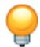

## Tips:

• You can click to define a new surface and add it to the list. See Creating surfaces, for instructions on defining surfaces.  
• You can click to define a new material and add it to the list. See Creating or editing a material, for instructions on defining materials.

5. Click the arrows in the middle of the dialog box to transfer your selections to the list of shell/membrane thickness assignments.

The table on the right side of the dialog box is updated to reflect your selections.

6. Specify the thickness for each surface and material in the middle column of the Surface Thickness Assignments table.

• Enter the word ORIGINAL to set the shell/membrane thickness equal to the original shell or membrane thickness (the default);  
enter the word THINNING to set the shell/membrane thickness equal to the current shell or membrane thickness (this option is available only in Abaqus/Explicit); or  
• specify a value for the shell/membrane thickness.

7. Optionally, specify a scale factor for any of the shell/membrane thickness assignments in the last column of the Surface Thickness Assignments table.

8. Repeat the above steps as needed to complete the shell/membrane thickness assignments. If you want to delete thickness assignments, select the rows and click

Note: The order of assignments might be relevant; when shell/membrane thickness assignments overlap, the last assignment takes precedence.

9. Click OK to save your selections and to close the Edit Surface Thickness Assignments dialog box. The interaction editor reappears with updated information on the number of shell/membrane thickness assignments.

10. Click OK to create the interaction and to close the editor.

## Specify shell/membrane offset assignments

1. Display the general contact interaction editor using one of the following methods:

• To create a new general contact interaction, follow the instructions in Defining general contact.  
• To edit an existing general contact interaction, select Interaction->Edit->interaction name from the main menu.

2. Click the Surface Properties tab in the Attribute Assignments portion of the interaction editor.

The surface offset can be modified only for surfaces defined on shells and membranes.

3. Click next to Shell/Membrane offset assignments.

The Edit Shell/Membrane Offset Assignments dialog box appears. By default, when you select a surface from the list or the table, Abaqus/CAE highlights the surface in the viewport; however, highlighting does not apply for (Global), and materials. You can toggle off Highlight selected regions at the bottom of the dialog box to turn off selection highlighting.

4. Select one or more surfaces and materials from the list of existing surfaces and materials in the column on the left. Select (Global) to assign the shell/membrane offset to the entire contact domain.

## Tips:

• You can click to define a new surface and add it to the list. See Creating surfaces, for instructions on defining surfaces.  
• You can click to define a new material and add it to the list. See Creating or editing a material, for instructions on defining materials.

5. Click the arrows in the middle of the dialog box to transfer your selections to the list of shell/membrane offset assignments.

The table on the right side of the dialog box is updated to reflect your selections.

6. Specify the offset fraction for each surface and material in the second column of the Shell/Membrane Offset Assignments table. The offset fraction defines the distance (as a fraction of the thickness) from the midsurface to the reference surface.

Enter the word ORIGINAL to set the shell/membrane offset equal to the original shell or membrane offset (the default).  
• Enter SPOS to specify the top surface of the shell/membrane as the reference surface.  
• Enter SNEG to specify the bottom surface of the shell/membrane as the reference surface.  
Specify a value between −0.5 (indicates the bottom surface of the shell/membrane) and 0.5 (indicates the top surface of the shell/membrane) for the offset fraction.

7. Repeat the above steps as needed to complete the shell/membrane offset assignments. If you want to delete offset assignments, select the rows and click

Note: The order of assignments might be relevant; when shell/membrane offset assignments overlap, the last assignment takes precedence.

8. Click OK to save your selections and to close the Edit Shell/Membrane Offset Assignments dialog box.

The interaction editor reappears with updated information on the number of shell/membrane offset assignments.

9. Click OK to create the interaction and to close the editor.

## Specify surface smoothing assignments

1. Display the general contact interaction editor using one of the following methods:

• To create a new general contact interaction, follow the instructions in Defining general contact.  
• To edit an existing general contact interaction, select Interaction->Edit->interaction name from the main menu.

In an Abaqus/Standard general contact interaction, surface smoothing assignments can be specified only in the initial step. In an Abaqus/Explicit general contact interaction, surface smoothing assignments can be specified or modified in any analysis step.

2. Click the Surface Properties tab in the Attribute Assignments portion of the interaction editor.

3. Click next to Surface smoothing assignments.

The Edit Surface Smoothing Assignments dialog box appears. By default, when you select a surface from the list or the table, Abaqus/CAE highlights the surface in the viewport and displays the detected axis or center of curvature that will be used in the smoothing calculation. You can toggle off Highlight selected regions at the bottom of the dialog box to turn off selection highlighting.

4. Toggle Automatically assign smoothing for geometric faces to determine whether Abaqus/CAE applies surface smoothing automatically to all appropriate surfaces in the general contact domain. This option is on by default for Abaqus/Standard general contact interactions and off by default for Abaqus/Explicit general contact interactions.

5. Select one or more surfaces from the list of existing surfaces in the column on the left.

Tip: You can click to define a new surface and add it to the list. See Creating surfaces, for instructions on defining surfaces.

6. Click the arrows in the middle of the dialog box to transfer your selections to the list of surface smoothing assignments.

The table on the right side of the dialog box is updated to reflect your selections.

7. Specify the smoothing to apply to each surface in the second column of the Surface Smoothing Assignments table. The smoothing specified for these surfaces overrides the default global smoothing if it is applied.

Select REVOLUTION to apply circumferential smoothing to a curved surface that is symmetric about an axis of revolution (or a two-dimensional arc that is symmetric about a central point).  
• Select SPHERICAL to apply spherical smoothing to a curved surface that is symmetric about a central point.

Select TOROIDAL to apply toroidal smoothing to a curved surface that is a circular arc symmetric about an axis of revolution.  
• Select NONE to prevent smoothing from being applied to the specified surface.

8. Repeat the above steps as needed to complete the surface smoothing assignments. If you want to delete

smoothing assignments, select the rows and click

Note: The order of assignments might be relevant; when smoothing assignments overlap, the last assignment takes precedence.

9. Click OK to save your selections and to close the Edit Surface Smoothing Assignments dialog box.

The interaction editor reappears with updated information on the number of surface smoothing assignments.

10. Click OK to create the interaction and to close the editor.

## Specify feature edge criteria assignments

1. Display the general contact interaction editor using one of the following methods:

• To create a new general contact interaction, follow the instructions in Defining general contact.  
• To edit an existing general contact interaction, select Interaction->Edit->interaction name from the main menu.

2. Click the Surface Properties tab in the Attribute Assignments portion of the interaction editor.

3. Click next to Feature edge criteria assignments.

The Edit Feature Edge Criteria Assignments dialog box appears. By default, when you select a surface from the list or the table, Abaqus/CAE highlights the surface in the viewport; however, highlighting does not apply for (Global), and materials. You can toggle off Highlight selected regions at the bottom of the dialog box to turn off selection highlighting.

4. Select one or more surfaces and materials from the list of existing surfaces in the first column on the left side of the dialog box. Select (Global) to assign the surface feature to the entire contact domain.

## Tips:

• You can click to define a new surface and add it to the list. See Creating surfaces, for instructions on defining surfaces.  
You can click to define a new material and add it to the list. See Creating or editing a material, for instructions on defining materials.

5. Select the configuration from the second column on the left (this option is available only for Abaqus/Explicit).

6. Click the arrows in the middle of the dialog box to transfer your selections to the list of surface feature assignments.

The table on the right side of the dialog box is updated to reflect your selections.

7. Specify the feature edge criteria for each surface and material in the second and third columns of the Surface Feature Assignments table by doing one of the following:

Enter the word PERIMETER to include only perimeter edges in the general contact domain.•  
Enter the word ALL to include all edges in the general contact domain (this option is available only for Abaqus/Explicit).  
Enter the word PICKED to include in the general contact domain only edges that were explicitly selected as part of the surface definition (this option is available only for shell geometries and elements in Abaqus/Explicit).  
• Enter the word NONE to include no feature edges in the general contact domain.  
Specify an angle in degrees to include perimeter edges and geometric edges with feature angles greater than or equal to the specified angle in the general contact domain. The specified value must be between 0° and 180°. For examples of how the feature angle is calculated for different edges, see Feature Edges.

8. Repeat the above steps as needed to complete the surface feature assignments. If you want to delete

surface feature assignments, select the rows and click

Note: The order of assignments might be relevant; when surface feature assignments overlap, the last assignment takes precedence.

9. For an Abaqus/Explicit general contact interaction, toggle Use dynamic feature edges to activate or deactivate the dynamic feature edge criterion for the contact surface.  
10. Click OK to save your selections and to close the Edit Feature Edge Criteria Assignments dialog box.

The interaction editor reappears with updated information on the number of feature edge criteria assignments.

11. Click OK to create the interaction and to close the editor.

## Specify crush trigger assignments

1. Display the general contact interaction editor using one of the following methods:

• To create a new general contact interaction, follow the instructions in Defining general contact.  
• To edit an existing general contact interaction, select Interaction->Edit->interaction name from the main menu.

2. Click the Surface Properties tab in the Attribute Assignments portion of the interaction editor.

3. Click next to Crush trigger assignments.

The Edit Crush Trigger Assignments dialog box appears. By default, when you select a surface from the list or the table, Abaqus/CAE highlights the surface in the viewport; however, highlighting does not apply for (Global) and materials. You can toggle off Highlight selected regions at the bottom of the dialog box to turn off selection highlighting.

4. Select one or more surfaces and materials from the list of existing surfaces in the first column on the left side of the dialog box. Select (Global) to assign the surface feature to the entire contact domain.

## Tips:

• You can click A to define a new surface and add it to the list. See Creating surfaces, for instructions on defining surfaces.

• You can click to define a new material and add it to the list. See Creating or editing a material, for instructions on defining materials.

5. Click the arrows in the middle of the dialog box to transfer your selections to the list of crush trigger assignments.

The table on the right side of the dialog box is updated to reflect your selections.

6. Specify the trigger option for each surface and material in the second column of the Crush Trigger Assignments table by doing one of the following:

Enter the word TRIGGER to specify that node develops contact pressures consistent with the assigned contact pressure-overclosure relationship.  
• Enter the word NO\_TRIGGER to specify that nodes will be reassigned trigger status during the simulation if adjacent nodes begin crushing or adjacent elements experience material failure.  
• Enter the word NO\_CRUSH to specify that the nodes have no crush associated with adjacent elements and will never crush.

7. Specify the crush stress, crush initiation angle, and crush continuation angle for each surface and material in the third, fourth, and fifth columns of the Crush Trigger Assignments table by doing the following:

• Specify a scalar value representing the stress required to initiate crushable behavior as a factor of the crush stress in the column Crush Stress.  
• Specify an angle in degrees representing the crush initiation angle.  
• Specify an angle in degrees representing the crush continuation angle.

8. Repeat the above steps as needed to complete the crush trigger assignments. If you want to delete crush trigger assignments, select the rows and click

Note: The order of assignments might be relevant; when crush trigger assignments overlap, the last assignment takes precedence.

9. Click OK to save your selections and to close the Edit Crush Trigger Assignments dialog box. The interaction editor reappears with updated information on the number of crush trigger assignments.

10. Click OK to create the interaction and to close the editor.

## Specify surface friction assignments

1. Display the general contact interaction editor using one of the following methods:

• To create a new general contact interaction, follow the instructions in Defining general contact.  
• To edit an existing general contact interaction, select Interaction->Edit->interaction name from the main menu.

2. Click the Surface Properties tab in the Attribute Assignments portion of the interaction editor.

3. Click next to Surface friction assignments.

The Edit Surface Friction Assignments dialog box appears. By default, when you select a surface from the list or the table, Abaqus/CAE highlights the surface in the viewport; however, highlighting does not apply for (Global) and materials. You can toggle off Highlight selected regions at the bottom of the dialog box to turn off selection highlighting.

4. Select one or more surfaces and materials from the list of existing surfaces and materials in the column on the left. Select (Global) to assign the surface-based friction coefficient to the entire contact domain.

## Tips:

• You can click A to define a new surface and add it to the list. See Creating surfaces, for instructions on defining surfaces.  
• You can click to define a new material and add it to the list. See Creating or editing a material, for instructions on defining materials.

5. Click the arrows in the middle of the dialog box to transfer your selections to the list of surface friction assignments.

The table on the right side of the dialog box is updated to reflect your selections.

6. Specify the surface-based friction coefficients for each surface and material in the second column of the Surface Friction Assignments table.

7. Repeat the above steps as needed to complete the surface friction assignments. If you want to delete surface friction assignments, select the rows and click

Note: The order of assignments might be relevant; when surface friction assignments overlap, the last assignment takes precedence.

8. Click OK to save your selections and to close the Edit Surface Friction Assignments dialog box. The interaction editor reappears with updated information on the number of surface friction assignments.

9. Click OK to create the interaction and to close the editor.

## Specify surface beam smoothing assignments

1. Display the general contact interaction editor using one of the following methods:

• To create a new general contact interaction, follow the instructions in Defining general contact.  
• To edit an existing general contact interaction, select Interaction->Edit->interaction name from the main menu.

2. Click the Surface Properties tab in the Attribute Assignments portion of the interaction editor.

3. Click next to Surface beam smoothing assignments.

The Edit Beam Smoothing Assignments dialog box appears. By default, when you select a surface from the list or the table, Abaqus/CAE highlights the surface in the viewport and displays the detected axis or center of curvature that is used in the smoothing calculation. You can toggle off Highlight selected regions at the bottom of the dialog box to turn off selection highlighting.

4. Select one or more surfaces from the list of existing surfaces in the column on the left.

Tip: You can click to define a new surface and add it to the list. See Creating surfaces, for instructions on defining surfaces.

5. Click the arrows in the middle of the dialog box to transfer your selections to the list of beam smoothing assignments.

The table on the right side of the dialog box is updated to reflect your selections.

6. Specify the smoothing to apply to each surface in the second column of the Beam Smoothing Assignments table. The smoothing specified for these surfaces overrides the default global smoothing if it is applied.

Specify a value between 0.0 and 0.5 for the beam smoothing.

7. Repeat the above steps as needed to complete the beam smoothing assignments. If you want to delete

beam smoothing assignments, select the rows and click

Note: The order of assignments might be relevant; when beam smoothing assignments overlap, the last assignment takes precedence.

8. Click OK to save your selections and to close the Edit Beam Smoothing Assignments dialog box.

The interaction editor reappears with updated information on the number of beam smoothing assignments.

9. Click OK to create the interaction and to close the editor.

## Specify surface vertex criteria assignments

1. Display the general contact interaction editor using one of the following methods:

• To create a new general contact interaction, follow the instructions in Defining general contact.  
• To edit an existing general contact interaction, select Interaction->Edit->interaction name from the main menu.

2. Click the Surface Properties tab in the Attribute Assignments portion of the interaction editor.

3. Click next to Surface vertex criteria assignments.

The Edit Vertex Criteria Assignments dialog box appears. By default, when you select a surface from the list or the table, Abaqus/CAE highlights the surface in the viewport; however, highlighting does not apply for (Global) and materials. You can toggle off Highlight selected regions at the bottom of the dialog box to turn off selection highlighting.

4. Select one or more surfaces and materials from the list of existing surfaces in the first column on the left side of the dialog box. Select (Global) to assign the surface feature to the entire contact domain.

## Tips:

• You can click to define a new surface and add it to the list. See Creating surfaces, for instructions on defining surfaces.  
• You can click to define a new material and add it to the list. See Creating or editing a material, for instructions on defining materials.

5. Click the arrows in the middle of the dialog box to transfer your selections to the list of vertex criteria assignments.

The table on the right side of the dialog box is updated to reflect your selections.

6. Specify the vertex criteria for each surface and material in the second column of the Vertex Criteria Assignments table by doing one of the following:

• Enter the word ALL\_VERTICES to specify that all vertex nodes should be considered by the vertex-to-surface formulation.  
• Enter the word NO\_VERTICES to specify that no vertex nodes should be considered by the vertex-to-surface formulation.  
• Specify an angle in degrees representing the vertex angle threshold. The specified value must be between 10° and 90°.

7. Repeat the above steps as needed to complete the vertex criteria assignments. If you want to delete vertex criteria assignments, select the rows and click

Note: The order of assignments might be relevant; when vertex criteria assignments overlap, the last assignment takes precedence.

8. Click OK to save your selections and to close the Edit Vertex Criteria Assignments dialog box. The interaction editor reappears with updated information on the number of vertex criteria assignments.

9. Click OK to create the interaction and to close the editor.

## Specify wear surface property assignments

1. Display the general contact interaction editor using one of the following methods:

• To create a new general contact interaction, follow the instructions in Defining general contact.  
• To edit an existing general contact interaction, select Interaction->Edit->interaction name from the main menu bar.

2. Click the Surface Properties tab in the Attribute Assignments portion of the interaction editor if it is not already selected.

3. If necessary, click in the Surface Properties portion of the interaction editor to create a wear surface interaction property (see Defining a wear interaction property).

4. Specify the wear surface property assignments for the interaction using either of the following methods:

• To assign a wear surface property globally to the entire contact domain, select a property from the list next to Global Wear Surface Property Assignment.  
• To assign different contact properties to individual surface pairs:

a) Click next to Wear Surface Property Assignments.

The Edit wear surface property assignments dialog box appears. By default, when you select a surface from the list or the table, Abaqus/CAE highlights the surface in the viewport; however, highlighting does not apply for (Global), (Self), materials, and Eulerian material surfaces. You can toggle off Highlight selected regions at the bottom of the dialog box to turn off selection highlighting.

b) Select one or more combinations of surfaces and materials from the list of existing surfaces and materials in the first column on the left side. Select (Global) to assign a contact property between the entire contact domain and an individual surface or material.

## Tips:

• You can click to define a new surface and add it to the list. See Creating surfaces for instructions on defining surfaces.  
You can click to define a new material and add it to the list. See Creating or editing a material for instructions on defining materials.

c) From the list of existing wear interaction properties in the third column, select the property to assign.

Tip: You can click to define a new interaction property and add it to the list. See Defining a wear interaction property for instructions on defining interaction properties.

d) Click the arrows in the middle of the dialog box to transfer your selections to the list of wear surface property assignments.

The table on the right side of the dialog box updates to reflect your selections.

e) Repeat the above steps as needed to complete the contact property assignments.

If you want to delete wear surface property assignments, select the rows and click

Note: The order of assignments might be relevant; when wear surface property assignments overlap, the last assignment takes precedence.

f) Click OK to save your selections and to close the Edit Wear Surface Property Assignments dialog box.

The interaction editor reappears with updated information on the number of wear surface property assignments.

5. Click OK to create the interaction and to close the editor.

## Specifying contact formulation assignments for general contact

Attributes for a general contact interaction, such as contact formulation, are specified independently of the contact domain in the Attribute Assignments portion of the interaction editor.

For a brief overview of general contact, see Understanding interactions. For a more detailed discussion of main-secondary formulations, see Contact Controls Specific to General Contact in Abaqus/Standard and Contact Formulation for General Contact in Abaqus/Explicit.

## Additional information

• Contact Controls Specific to General Contact in Abaqus/Standard  
• Contact Formulation for General Contact in Abaqus/Explicit  
• Interaction editors  
• Defining general contact

## Specify main-secondary assignments for general contact

By default, Abaqus/Standard automatically assigns a main and a secondary role to each surface in an interacting pair; Abaqus/Explicit uses a balanced main-secondary formulation for all surfaces (except node-based surfaces and analytical rigid surfaces). You can override the default assignments and directly specify the main-secondary assignments for surface pairings in a general contact interaction.

1. Display the general contact interaction editor using one of the following methods:

• To create a new general contact interaction, follow the instructions in Defining general contact.  
• To edit an existing general contact interaction, select Interaction->Edit->interaction name from the main menu bar.

2. Click the Contact Formulation tab in the Attribute Assignments portion of the interaction editor.

3. Click next to the following field:

• Main-secondary assignments for Abaqus/Standard general contact definitions.  
• Pure main-secondary assignments for Abaqus/Explicit general contact definitions.

The Edit Main-Secondary Assignments dialog box appears. By default, when you select a surface from the list or the table, Abaqus/CAE highlights the surface in the viewport; however, highlighting does not apply for (Global) and (Self). You can turn off Highlight selected regions at the bottom of the dialog box to turn off selection highlighting.

4. Select one or more surfaces from the list of existing surfaces in the first column on the left side. Select (Global) to assign a pure main-secondary weighting for contact between the entire contact domain and an individual surface.

Tip: You can click to define a new surface and add it to the list. See Creating surfaces for instructions on defining surfaces.

5. Select the second surface or surfaces from the list of existing surfaces in the second column to define the surface pairings.

• When multiple surfaces are selected in either column, all possible combinations will be generated.

• For Abaqus/Standard general contact definitions, select either the same surface name or (Self) in the second column to specify a balanced main-secondary formulation for self-contact interactions on a particular surface.  
• If the main and secondary surfaces overlap, self-contact is excluded for the overlapping regions.

6. Click the arrows in the middle of the dialog box to transfer your selections to the list of main-secondary assignments.

The table on the right side of the dialog box is updated to reflect your selections.

7. Specify the type for the first surface in the last column of the Main-Secondary Assignments table.

• Select SECONDARY to indicate the first surface is the secondary surface.  
• Select MAIN to indicate that the first surface is the main surface.  
Select BALANCED to specify balanced main-secondary contact between the two surfaces (available only in Abaqus/Standard).

For self-contact surface pairings, you must select BALANCED.

8. Repeat the above steps as needed to complete the main-secondary assignments. If you want to delete main-secondary assignments, select the rows and click

9. Click OK to save your selections.

The interaction editor reappears with updated information on the number of directly specified main-secondary assignments.

10. Click OK to create the interaction and to close the editor.

## Specify polarity assignments for general contact

1. Display the general contact interaction editor using one of the following methods:

• To create a new general contact interaction, follow the instructions in Defining general contact.  
• To edit an existing general contact interaction, select Interaction->Edit->interaction name from the main menu bar.

2. Click the Contact Formulation tab in the Attribute Assignments portion of the interaction editor.

3. Click next to the Polarity assignments for Abaqus/Explicit general contact definitions.

The Edit Polarity Assignments dialog box appears. By default, when you select a surface from the list or the table, Abaqus/CAE highlights the surface in the viewport; however, highlighting does not apply for (Global). You can toggle off Highlight selected regions at the bottom of the dialog box to turn off selection highlighting.

4. Select one or more surfaces from the list of existing surfaces in the first column on the left side. Select (Global) to assign a polarity weighting for contact between the entire contact domain and an individual surface.

Tip: You can click to define a new surface and add it to the list. See Creating surfaces for instructions on defining surfaces.

5. Select the second surface or surfaces from the list of existing surfaces in the second column to define the surface pairings.

• When multiple surfaces are selected in either column, all possible combinations will be generated.  
• If the surfaces overlap, self-contact is excluded for the overlapping regions.

6. Click the arrows in the middle of the dialog box to transfer your selections to the list of polarity assignments.

The table on the right side of the dialog box is updated to reflect your selections.

7. Specify the option in the third column of the Polarity Assignments table, to indicate the side of the (double-sided) elements in the second surface.

Select SPOS to indicate that the SPOS side of the (double-sided) elements in the second surface should be considered for contact with the first surface.  
Select SNEG to indicate that the SNEG side of the (double-sided) elements in the second surface should be considered for contact with the first surface.  
Select TWO\_SIDED to indicate that both sides of the (double-sided) elements in the second surface should be considered for contact with the first surface.

8. Repeat the above steps as needed to complete the polarity assignments. If you want to delete polarity

assignments, select the rows and click

9. Click OK to save your selections.

The interaction editor reappears with updated information on the number of directly specified polarity assignments.

10. Click OK to create the interaction and to close the editor.

## Specify sliding transition assignments for general contact

1. Display the general contact interaction editor using one of the following methods:

• To create a new general contact interaction, follow the instructions in Defining general contact.  
• To edit an existing general contact interaction, select Interaction->Edit->interaction name from the main menu bar.

2. Click the Contact Formulation tab in the Attribute Assignments portion of the interaction editor.

3. Click next to the Sliding Transition assignments for Abaqus/Standard general contact definitions.

The Edit Sliding Transition Assignments dialog box appears. By default, when you select a surface from the list or the table, Abaqus/CAE highlights the surface in the viewport; however, highlighting does not apply for (Global) and (Self). You can turn off Highlight selected regions at the bottom of the dialog box to turn off selection highlighting.

4. Select one or more surfaces from the list of existing surfaces in the first column on the left side. Select (Global) to assign a sliding transition weighting for contact between the entire contact domain and an individual surface.

Tip: You can click to define a new surface and add it to the list. See Creating surfaces for instructions on defining surfaces.

5. Select the second surface or surfaces from the list of existing surfaces in the second column to define the surface pairings.

• When multiple surfaces are selected in either column, all possible combinations will be generated.  
For Abaqus/Standard general contact definitions, select either the same surface name or (Self) in the second column to specify a formulation for self-contact interactions on a particular surface.  
• If the surfaces overlap, self-contact is excluded for the overlapping regions.

6. Click the arrows in the middle of the dialog box to transfer your selections to the list of sliding transition assignments.

The table on the right side of the dialog box is updated to reflect your selections.

7. Specify the smoothness of the contact force redistribution on sliding in the third column of the Sliding Transition Assignments table.

Select ELEMENT\_ORDER\_SMOOTHING to indicate the smoothness of the contact force redistribution on sliding should be of the same order as the elements underlying the secondary surface.  
• Select LINEAR\_SMOOTHING to indicate linear smoothness of the contact force redistribution on sliding.  
• Select QUADRATIC\_SMOOTHING to indicate quadratic smoothness of the contact force redistribution on sliding.

8. Repeat the above steps as needed to complete the sliding transition assignments. If you want to delete

sliding transition assignments, select the rows and click

9. Click OK to save your selections.

The interaction editor reappears with updated information on the number of directly specified sliding transition assignments.

10. Click OK to create the interaction and to close the editor.

## Specify edge-to-edge formulation assignments for general contact

1. Display the general contact interaction editor using one of the following methods:

• To create a new general contact interaction, follow the instructions in Defining general contact.  
• To edit an existing general contact interaction, select Interaction->Edit->interaction name from the main menu bar.

2. Click the Contact Formulation tab in the Attribute Assignments portion of the interaction editor.

3. Toggle on Edge-to-Edge formulation assignment for Abaqus/Standard general contact definitions.

4. Specify the Formulation.

• Select BOTH to activate both formulations for edge-to-edge contact.  
• Select NO to deactivate edge-to-edge contact.  
• Select RADIAL to activate the radial edge-to-edge contact formulation.  
• Select CROSS to activate the formulation based on the cross product of the edge directions for edge-to-edge contact.

5. Click OK to create the interaction and to close the editor.

## Specify sliding formulation assignments for general contact

1. Display the general contact interaction editor using one of the following methods:

To create a new general contact interaction, follow the instructions in Defining general contact.•  
• To edit an existing general contact interaction, select Interaction->Edit->interaction name from the main menu bar.

2. Click the Contact Formulation tab in the Attribute Assignments portion of the interaction editor.

3. Click next to the Sliding formulation assignments for Abaqus/Standard general contact definitions.

The Edit Sliding Formulation Assignments dialog box appears. By default, when you select a surface from the list or the table, Abaqus/CAE highlights the surface in the viewport; however, highlighting does not apply for (Global) and (Self). You can turn off Highlight selected regions at the bottom of the dialog box to turn off selection highlighting.

4. Select one or more surfaces from the list of existing surfaces in the first column on the left side. Select (Global) to assign a sliding formulation for contact between the entire contact domain and an individual surface.

Tip: You can click to define a new surface and add it to the list. See Creating surfaces for instructions on defining surfaces.

5. Select the second surface or surfaces from the list of existing surfaces in the second column to define the surface pairings.

• When multiple surfaces are selected in either column, all possible combinations will be generated.  
• For Abaqus/Standard general contact definitions, select either the same surface name or (Self) in the second column to specify a formulation for self-contact interactions on a particular surface.  
• If the surfaces overlap, self-contact is excluded for the overlapping regions.

6. Click the arrows in the middle of the dialog box to transfer your selections to the list of sliding formulation assignments.

The table on the right side of the dialog box is updated to reflect your selections.

7. Select the sliding value in the third column of the Sliding Formulation Assignments table.

• Select Small Sliding to specify the surface pairings to consider for the small-sliding approach.  
• Select None to exclude the surface pairings in the small-sliding approach.

8. Repeat the above steps as needed to complete the sliding formulation assignments. If you want to

delete sliding formulation assignments, select the rows and click

9. Click OK to save your selections.

The interaction editor reappears with updated information on the number of directly specified sliding formulation assignments.

10. Click OK to create the interaction and to close the editor.

## Specify beam cross-section for general contact

1. Display the general contact interaction editor using one of the following methods:

• To create a new general contact interaction, follow the instructions in Defining general contact.  
• To edit an existing general contact interaction, select Interaction->Edit->interaction name from the main menu bar.

2. Click the Contact Controls Assignment tab in the Attribute Assignments portion of the interaction editor.  
3. Toggle Beam Cross Section assignment for Abaqus/Explicit general contact definitions.  
4. Specify the Beam Cross Section assignment:

• Select CIRCUMSCRIBED CIRCLE to activate contact calculations based on a circumferential approximation of the beam element.  
• Select EXACT to activate contact calculations based on the actual cross section of the beam element.

5. Click OK to create the interaction and to close the editor.

A surface-to-surface contact definition can be used as an alternative to general contact to model contact interactions between specific surfaces in a model.

Certain interaction behaviors can be defined only by using surface-to-surface contact. For a brief overview of surface-to-surface contact and other types of interactions available in Abaqus, see Understanding interactions, and About Contact Interactions.

You can define surface-to-surface contact in any step, including the initial step. Select Interaction->Create from the main menu bar, and select the main and secondary surfaces. You can define contact between edges of a wire or between faces of a solid or shell. Certain connectivity restrictions apply to contact surfaces depending on the type of contact formulation. You can deactivate a surface-to-surface contact interaction in a step and, if desired, reactivate this interaction in a subsequent step. You can deactivate the interaction in a step if it will no longer be needed in the analysis.

If you are creating multiple surface-to-surface contact interactions, you may want to use the contact detection tool. This tool automates the process of selecting surfaces and allows you to create multiple interactions simultaneously. For more information, see Using contact and constraint detection.

You can obtain contact data for a specific surface-to-surface contact interaction by using the field and history output request editors in the Step module. In the Domain section of the editors, select Interaction and choose the name of the surface-to-surface contact interaction from the menu that appears. For more information, see Creating an output request.

The procedure for defining surface-to-surface contact depends on whether you are performing an analysis using Abaqus/Standard or Abaqus/Explicit. This section provides instructions for using the interaction editor to define the different surface-to-surface contact options.

## In this section:

Defining surface-to-surface contact in an Abaqus/Standard analysis  
Defining surface-to-surface contact in an Abaqus/Explicit analysis  
Specifying interference fit options

## Defining surface-to-surface contact in an Abaqus/Standard analysis

Certain interaction behaviors can be defined in Abaqus/Standard only by using surface-to-surface contact; see Contact Simulation Capabilities in Abaqus/Standard for more information.

1. From the main menu bar, select Interaction->Create.

Tip: You can also create a surface-to-surface contact interaction using the tool in the Interaction module toolbox.

2. In the Create Interaction dialog box that appears, do the following:

• Name the interaction. For more information about naming objects, see Using basic dialog box components.  
• Select the step in which the interaction will be created.  
• Select the Surface-to-surface contact (Standard) type of interaction.

3. Click Continue to close the Create Interaction dialog box.

4. Use one of the following methods to select the main surface:

Use an existing surface to define the region. On the right side of the prompt area, click Surfaces. Select an existing surface from the Region Selection dialog box that appears, and click Continue.

## Note:

The default selection method is based on the selection method you most recently employed. To revert to the other method, click Select in Viewport or Surfaces on the right side of the prompt area.

Use the mouse to select a region in the viewport. (For more information, see Selecting objects within the current viewport.) Click mouse button 2 to indicate you have finished selecting. Certain connectivity restrictions apply to contact surfaces depending on the type of contact formulation. For detailed information, see About Contact Pairs in Abaqus/Standard.

If the model contains a combination of mesh and geometry, click one of the following from the prompt area:

- Click Geometry if you want to select the surface from a geometry region.  
Click Mesh if you want to select the surface from a native or orphan mesh selection.

You can use the angle method to select a group of faces or edges from geometry or a group of element faces from a mesh. For more information, see Using the angle and feature edge method to select multiple objects.

The main surface that you select becomes highlighted in red in the viewport.

5. Select the secondary surface.

a. In the prompt area, select one of the following:

• Select Surface if you want to select a surface.  
• Select Node Region if you want to select a region from which to create a contact node set.

b. Use one of the same methods described earlier to select the secondary surface or region.

The secondary surface or region that you select becomes highlighted in magenta in the viewport. The Edit Interaction dialog box appears.

6. The Switch Surfaces option allows you to interchange your main and secondary surface selections without having to start over. The Switch Surfaces icon is available only if you selected Surface in the previous step.

7. Choose the sliding formulation.

• Choose Finite sliding to use the finite-sliding formulation, which is the most general and allows any arbitrary motion of the surfaces.  
Choose Small sliding to use the small-sliding formulation, which assumes that although two bodies may undergo large motions, there will be relatively little sliding of one surface along the other.

For more information, see Contact Formulations in Abaqus/Standard.

8. Select the discretization method.

• Select Node to surface to use the node-to-surface discretization method.  
• Select Surface to surface to use the surface-to-surface discretization method.

For more information, see Discretization of Contact Pair Surfaces.

9. Different fields become available depending upon the combination of your sliding formulation and discretization method selections.

By default, shell and membrane thicknesses are included in contact calculations for the following combinations: Small sliding and Node to surface, Small sliding and Surface to surface, and Finite sliding and Surface to surface. You can toggle on Exclude shell/membrane element thickness to ignore shell and membrane thickness for any of these combinations.

Contact interactions using Finite sliding and Node to surface do not account for surface thickness. For more information, see Accounting for Shell and Membrane Thickness.

For contact interactions using the Node to surface discretization method, you can specify a smoothing factor in the Degree of smoothing for main surface field. For more information, see Smoothing Main Surfaces for the Finite-Sliding, Node-to-Surface Formulation.

By default, a selective scheme of supplementary contact constraints is used for the following combinations: Finite sliding and Node to surface, Small sliding and Node to surface, and Small sliding and Surface to surface. For these combinations, you can specify when to Use supplementary contact points as follows:

Choose Selectively to use a selective scheme of supplementary contact constraints.  
- Choose Never to forgo the use of supplementary contact constraints.  
- Choose Always to add supplementary contact constraints when applicable.

For more information, see Supplementary Contact Constraints.

• For contact interactions using Finite sliding and Surface to surface, you can choose the Contact tracking method.

- Choose Single configuration (state) to use the state-based tracking algorithm.  
- Choose Two configurations (path) to use the path-based tracking algorithm.

For more information, see Path-Based Versus State-Based Tracking Algorithms.

## Note:

If your contact interaction uses the surface-to-surface discretization method and one or more of the surfaces in the contact interaction is an analytical rigid surface, you should choose the state-based tracking algorithm.

10. Specify the secondary node adjustment option. For more information, see Contact Initialization for Contact Pairs in Abaqus/Standard and Defining Tied Contact in Abaqus/Standard.  
11. For contact interactions using the Surface to surface discretization method, you can apply a smoothing to contacting surfaces that reduces inaccuracies in contact pressures caused by mesh discretization on curved geometries. Click the Surface Smoothing tab, and select one of the following options:

• Choose Do not smooth to prevent smoothing from being applied.  
Choose Automatically smooth 3D geometry surfaces when applicable to apply smoothing to axisymmetric or spherical surfaces (or portions of surfaces) that are identified automatically by Abaqus/CAE. Automatic smoothing has no effect on mesh parts or two-dimensional models.

For more information about contact smoothing techniques, see Smoothing Contact Surfaces in Abaqus/Standard.

12. For contact interactions using the Small sliding formulation, you can specify an initial clearance between the nodes on the secondary surface and the main surface. Click the Clearance tab, select a clearance type from the Initial clearance field, and enter all of the data necessary to define the clearance and contact direction. For more information, see Additional Contact Initialization Options for Small-Sliding Contact in Abaqus/Standard.  
13. If you specify node-to-surface discretization for your contact interaction, you can also limit bonding to secondary nodes in a particular subset. Click the Bonding tab, toggle on Limit bonding to secondary nodes in subset, and select a node set from the list.

You can limit bonding for either of the following:

When you want to specify a subset of initially secondary nodes that should experience cohesive forces. Strain-free adjustments will be made for those nodes initially not in contact but specified in the node set. All secondary nodes outside of this set (including those that are initially contacting the main surface) will experience only compressive contact forces over the course of the analysis. For more information, see Specifying cohesive behavior properties for mechanical contact property options.  
When you want to identify the initially bonded region of the secondary surface in a VCCT crack. The unbonded portion of the secondary surface behaves as a regular contact surface. The predetermined crack surfaces are assumed to be initially partially bonded so that the crack tips can be identified explicitly during the analysis. For more information, see Defining Initially Bonded Crack Surfaces in Abaqus/Standard.

14. Select a contact interaction property. If desired, click to create the interaction property.

For more information, see Defining a contact interaction property and Contact Constraint Enforcement Methods in Abaqus/Standard.

15. To specify interference fit options, click Interference Fit. Interference fit options cannot be specified in the initial step. See Specifying interference fit options below for more detailed instructions on entering interference fit options.

16. If desired, click the arrow next to the Contact controls field and select the customized contact controls to use for this interaction. Only previously created Abaqus/Standard contact controls appear in the list. For more information, see Specifying contact controls in an Abaqus/Standard analysis.  
17. To deactivate and reactivate a contact interaction in a step, toggle Active in this step. The contact interaction is active in the step in which it was created. For more information, see Removing and Reactivating Contact Pairs.  
18. Click OK to create the interaction and to close the editor.

## Additional information

• About Contact Pairs in Abaqus/Standard  
• Interaction editors  
• Customizing contact controls

## Defining surface-to-surface contact in an Abaqus/Explicit analysis

Certain interaction behaviors can be defined in Abaqus/Explicit only by using surface-to-surface contact; see Contact Simulation Capabilities in Abaqus/Explicit for more information.

1. From the main menu bar, select Interaction->Create.

Tip: You can also create a surface-to-surface contact interaction using the tool in the Interaction module toolbox.

2. In the Create Interaction dialog box that appears, do the following:

• Name the interaction. For more information about naming objects, see Using basic dialog box components.  
• Select the step in which the interaction will be created.  
• Select the Surface-to-surface contact (Explicit) type of interaction.

3. Click Continue to close the Create Interaction dialog box.

4. Use one of the following methods to select the main surface:

Use an existing surface to define the region. On the right side of the prompt area, click Surfaces. Select an existing surface from the Region Selection dialog box that appears, and click Continue.

## Note:

The default selection method is based on the selection method you most recently employed. To revert to the other method, click Select in Viewport or Surfaces on the right side of the prompt area.

Use the mouse to select a region in the viewport. (For more information, see Selecting objects within the current viewport.) Click mouse button 2 to indicate you have finished selecting. Certain connectivity restrictions apply to contact surfaces depending on the type of contact formulation. For detailed information, see About Contact Pairs in Abaqus/Explicit.

If the model contains a combination of mesh and geometry, click one of the following from the prompt area:

- Click Geometry if you want to select the surface from a geometry region.  
Click Mesh if you want to select the surface from a native or orphan mesh selection.

You can use the angle method to select a group of faces or edges from geometry or a group of element faces from a mesh. For more information, see Using the angle and feature edge method to select multiple objects.

The main surface that you select becomes highlighted in red in the viewport.

5. Select the secondary surface.

a. In the prompt area, select one of the following:

• Select Surface if you want to select a surface.  
• Select Node Region if you want to select a region from which to create a contact node set.

b. Use one of the same methods described earlier to select the secondary surface or region.

The secondary surface or region that you select becomes highlighted in magenta in the viewport. The Edit Interaction dialog box appears.

6. The Switch Surfaces option allows you to interchange your main and secondary surface selections without having to start over. The Switch Surfaces icon is available only if you selected Surface in the previous step.

7. Choose the mechanical constraint formulation.

• Choose Kinematic contact method to use a kinematic predictor/corrector contact algorithm.  
• Choose Penalty contact method to use the penalty contact algorithm.

For more information, see Contact Constraint Enforcement Methods in Abaqus/Explicit.

8. Choose the sliding formulation.

Choose Finite sliding to use the finite-sliding formulation, which is the most general and allows any arbitrary motion of the surfaces.  
Choose Small sliding to use the small-sliding formulation, which assumes that although two bodies may undergo large motions, there will be relatively little sliding of one surface along the other.

The small-sliding formulation can be specified for interactions created in only the initial step or the first general analysis step. Interactions created in subsequent steps always use the finite-sliding formulation by default. For more information, see Contact Formulations for Contact Pairs in Abaqus/Explicit.

9. For contact interactions using the Small sliding formulation, you can specify an initial clearance between the nodes on the secondary surface and the main surface. Clearance options are available only in the first general analysis step. Select a clearance type from the Initial clearance field, and enter all of the data necessary to define the clearance and contact direction. For more information, see Specifying Initial Clearance Values Precisely.

10. Select a contact interaction property. If desired, click to create the interaction property; see Defining a contact interaction property, for more information.

11. Choose the weighting factor. For more information, see Contact Formulations for Contact Pairs in Abaqus/Explicit.

12. If desired, click the arrow next to the Contact controls field and select the customized contact controls to use for this interaction. Only previously created Abaqus/Explicit contact controls appear in the list. For more information, see Specifying contact controls in an Abaqus/Explicit analysis.

13. To deactivate and reactivate a contact interaction in a step, toggle Active in this step. The contact interaction is active in the step in which it was created.

14. Click OK to create the interaction and to close the editor.

## Additional information

• About Contact Pairs in Abaqus/Explicit  
• Interaction editors  
• Customizing contact controls

## Specifying interference fit options

When you are defining surface-to-surface contact for Abaqus/Standard, you can specify interference fit options that help Abaqus/Standard resolve excessive overclosure between surfaces in the initial configuration of a model. For more information, see Modeling Contact Interference Fits in Abaqus/Standard.

To open the Interference Fit Options dialog box, click Interference Fit in the Abaqus/Standard interaction editor (see Defining surface-to-surface contact in an Abaqus/Standard analysis” above for details).

1. In the Interference Fit Options dialog box, select Gradually remove secondary node overclosure during the step to prescribe allowable intereferences.  
2. Select one of the following options:

Select Automatic shrink fit (first general analysis step only) if you want Abaqus/Standard to assign a different allowable interference to each secondary node that is equal to that node's initial penetration. If you select this option, skip to Step 6.  
• Select Uniform allowable interference to specify a single allowable interference that will be applied to every secondary node.

3. Click the arrow to the right of the Amplitude field to select the name of an amplitude curve that defines the magnitude of the prescribed interference during the step. Alternatively, you can select (Ramp) to apply the prescribed interference immediately at the beginning of the step and ramp it down to zero linearly over the step.

If necessary, you can click to define a new amplitude curve. For more information, see Selecting an amplitude type to define.

4. In the Magnitude at start of step field, enter the magnitude of the allowable interference at the start of the step.  
5. If desired, select the Interference Direction option Along direction to specify a shift direction vector. The relative shift is applied to the secondary nodes before Abaqus/Standard determines the contact conditions. If you select this option, enter the following:

• In the X field, enter the X-direction cosine of the shift direction vector.  
• In the Y field, enter the Y-direction cosine of the shift direction vector.  
• In the Z field, enter the Z-direction cosine of the shift direction vector.

6. Click OK to save the interference fit options that you have specified and to return to the Edit Interaction dialog box.

A self-contact definition can be used as an alternative to general contact to model contact interactions between different areas of a single surface.

Certain interaction behaviors can be defined only by using self-contact. For a brief overview of self-contact and other types of interactions available in Abaqus, see Understanding interactions, and About Contact Interactions.

You can define self-contact in any step, including the initial step. Select Interaction->Create from the main menu bar and select the surface. You can define self-contact between an edge of a wire, a face of a solid, or a face of a shell. Certain connectivity restrictions apply to contact surfaces depending on the type of contact formulation. You can deactivate a self-contact interaction in a step and, if desired, reactivate this interaction in a subsequent step. You can also deactivate the interaction in a step if it will no longer be needed in the analysis.

You can obtain contact data for a specific self-contact interaction by using the field and history output request editors in the Step module. In the Domain section of the editors, select Interaction and choose the name of the self-contact interaction from the menu that appears. For more information, see Creating an output request.

The procedure for defining self-contact depends on whether you are performing an analysis using Abaqus/Standard or Abaqus/Explicit. This section provides instructions for using the interaction editor to define the different surface-to-surface contact options.

## In this section:

Defining self-contact in an Abaqus/Standard analysis  
Defining self-contact in an Abaqus/Explicit analysis

## Defining self-contact in an Abaqus/Standard analysis

Certain interaction behaviors can be defined in Abaqus/Standard only by using self-contact; see Contact Simulation Capabilities in Abaqus/Standard for more information.

1. From the main menu bar, select Interaction->Create.

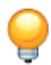

Tip: You can also create a self-contact interaction using the tool in the Interaction module toolbox.

2. In the Create Interaction dialog box that appears, do the following:

• Name the interaction. For more information about naming objects, see Using basic dialog box components.  
• Select the step in which the interaction will be created.  
• Select the Self-contact (Standard) type of interaction.

3. Click Continue to close the Create Interaction dialog box.

4. Use one of the following methods to select the surface:

Use an existing surface to define the region. On the right side of the prompt area, click Surfaces. Select an existing surface from the Region Selection dialog box that appears, and click Continue.

## Note:

The default selection method is based on the selection method you most recently employed. To revert to the other method, click Select in Viewport or Surfaces on the right side of the prompt area.

Use the mouse to select a region in the viewport. (For more information, see Selecting objects within the current viewport.) Certain connectivity restrictions apply to contact surfaces depending on the type of contact formulation. For detailed information, see About Contact Pairs in Abaqus/Standard.

If the model contains a combination of mesh and geometry, click one of the following from the prompt area:

- Click Geometry if you want to select the surface from a geometry region.  
Click Mesh if you want to select the surface from a native or orphan mesh selection.

You can use the angle method to select a group of faces or edges from geometry or a group of element faces from a mesh. For more information, see Using the angle and feature edge method to select multiple objects.

The Edit Interaction dialog box appears.

5. Select the discretization method.

• Select Node to surface to use the node-to-surface discretization method.  
• Select Surface to surface to use the surface-to-surface discretization method.

For more information, see Discretization of Contact Pair Surfaces.

6. Different fields become available depending upon your discretization method selection.

For contact interactions using the Node to surface discretization method, you can specify the• following:

1. Enter a smoothing factor in the Degree of smoothing field. For more information, see Smoothing Main Surfaces for the Finite-Sliding, Node-to-Surface Formulation.  
2. By default, a selective scheme of supplementary contact constraints is used. You can specify when to Use supplementary contact points as follows:

• Choose Selectively to use a selective scheme of supplementary contact constraints.

• Choose Never to forgo the use of supplementary contact constraints.

• Choose Always to add supplementary contact constraints when applicable.

For more information, see Supplementary Contact Constraints.

• For contact interactions using the Surface to surface discretization method, you can specify the following:

1. By default, shell and membrane thicknesses are included in the contact calculations. You can toggle on Exclude shell/membrane element thickness to ignore shell and membrane thickness. Contact interactions using the Node to surface discretization method do not account for surface thickness.  
2. Choose the Constraint position.

• Choose Node centered to center contact constraints at secondary nodes.

• Choose Face centered to center contact constraints within secondary faces.

For more information, see Defining Self-Contact.

3. Choose the Contact tracking algorithm.

• Choose Single configuration (state) to use the state-based tracking algorithm.  
• Choose Two configurations (path) to use the path-based tracking algorithm.

For more information, see Path-Based Versus State-Based Tracking Algorithms.

## Note:

If you use the surface-to-surface discretization method and the surface for which you are defining self-contact is an analytical rigid surface, you should choose the state-based tracking algorithm.

7. Select a contact interaction property. If desired, click to create the interaction property; see Defining a contact interaction property for more information.

If you choose the Surface to surface discretization method, the contact interaction property that you select cannot specify a “hard” contact pressure-overclosure relationship. For more information, see Contact Constraint Enforcement Methods in Abaqus/Standard and Defining mechanical contact property options.

8. If desired, click the arrow next to the Contact controls field and select the customized contact controls to use for this interaction. Only previously created Abaqus/Standard contact controls appear in the list. For more information, see Specifying contact controls in an Abaqus/Standard analysis.

9. To deactivate and reactivate a contact interaction in a step, toggle Active in this step. The contact pair is active in the step in which it was created. For more information, see Removing and Reactivating Contact Pairs.  
10. Click OK to create the interaction and to close the editor.

## Additional information

• About Contact Pairs in Abaqus/Standard  
• Interaction editors  
• Customizing contact controls

## Defining self-contact in an Abaqus/Explicit analysis

Certain interaction behaviors can be defined in Abaqus/Explicit only by using self-contact; see Contact Simulation Capabilities in Abaqus/Explicit for more information.

1. From the main menu bar, select Interaction->Create.

Tip: You can also create a self-contact interaction using the tool in the Interaction module toolbox.

2. In the Create Interaction dialog box that appears, do the following:

• Name the interaction. For more information about naming objects, see Using basic dialog box components.  
• Select the step in which the interaction will be created.  
• Select the Self-contact (Explicit) type of interaction.

3. Click Continue to close the Create Interaction dialog box.

4. Use one of the following methods to select the surface:

Use an existing surface to define the region. On the right side of the prompt area, click Surfaces. Select an existing surface from the Region Selection dialog box that appears, and click Continue.

## Note:

The default selection method is based on the selection method you most recently employed. To revert to the other method, click Select in Viewport or Surfaces on the right side of the prompt area.

Use the mouse to select a region in the viewport. (For more information, see Selecting objects within the current viewport.) Certain connectivity restrictions apply to contact surfaces depending on the type of contact formulation. For detailed information, see About Contact Pairs in Abaqus/Explicit.

If the model contains a combination of mesh and geometry, click one of the following from the prompt area:

- Click Geometry if you want to select the surface from a geometry region.  
Click Mesh if you want to select the surface from a native or orphan mesh selection.

You can use the angle method to select a group of faces or edges from geometry or a group of element faces from a mesh. For more information, see Using the angle and feature edge method to select multiple objects.

The Edit Interaction dialog box appears.

5. Choose the mechanical constraint formulation.

• Choose Kinematic contact method to use a kinematic predictor/corrector contact algorithm.  
• Choose Penalty contact method to use the penalty contact algorithm.

For more information, see Contact Constraint Enforcement Methods in Abaqus/Explicit.

6. Select a contact interaction property. If desired, click to create the interaction property; see Defining a contact interaction property, for more information.  
7. If desired, click the arrow next to the Contact controls field and select the customized contact controls to use for this interaction. Only previously created Abaqus/Explicit contact controls appear in the list. For more information, see Specifying contact controls in an Abaqus/Explicit analysis.  
8. To deactivate and reactivate the contact interaction, toggle Active in this step. The contact pair is active in the step in which it was created.  
9. Click OK to create the interaction and to close the editor.

## Additional information

• About Contact Pairs in Abaqus/Explicit  
• Interaction editors  
• Customizing contact controls

You can specify contact controls for surface-to-surface contact and self-contact interactions in an Abaqus/Standard analysis. For a detailed discussion, see Generally Applicable Contact Controls in Abaqus/Standard.

## Warning:

Contact controls are intended for advanced users. The default settings of these controls are appropriate for most analyses. Using nondefault values of these controls may greatly increase the computational time of the analysis, produce inaccurate results, or cause convergence problems.

1. From the main menu bar, select Interaction->Contact Controls->Create.  
2. In the Create Contact Controls dialog box that appears, do the following:

• Name the contact controls.  
• Select Abaqus/Standard contact controls as the type of contact controls.

3. Click Continue to close the Create Contact Controls dialog box.

The Edit Contact Controls dialog box appears.

4. In the Stabilization portion of the editor, you can specify controls relating to automatic stabilization of rigid body motions in contact problems using viscous damping.

• Select one of the following:

Select Automatic stabilization to use the default damping coefficient calculated automatically by Abaqus/Standard. If desired, you can enter a value for the Factor by which the default damping coefficient will be multiplied.  
- Select Stabilization coefficient to specify the damping coefficient directly, and enter a value.

In the Tangent fraction field, enter a value for the fraction of the normal stabilization by which to modify the tangential stabilization. By default, the tangential and normal stabilization are the same.  
• Enter a value for the Fraction of damping at end of step.  
• Specify the Clearance at which damping becomes zero.

- Select Computed to use the default clearance value calculated by Abaqus/Standard.  
- Select Specify to enter a value for the clearance at which the damping becomes zero.

5. In the Augmented Lagrange portion of the editor, you can specify controls for interactions defined with a contact interaction property that uses augmented Lagrangian surface behavior.

In the Stiffness scale factor field, enter a value for the factor by which Abaqus/Standard will scale the default penalty stiffnesses to obtain the stiffnesses used for the contact pairs. The default value is 1.  
• In the Penetration tolerance field, select one of the following to specify the allowable penetration that is permitted to violate the impenetrability condition:

- Select Absolute, and enter a value for the allowable penetration.  
Select Relative, and enter the ratio of the allowable penetration to the characteristic contact surface face dimension. The default value is 0.001.

6. Click OK to create the contact controls and to close the editor.

## Additional information

• About Contact Pairs in Abaqus/Standard  
• Contact controls editors  
• Customizing contact controls

You can specify contact controls for surface-to-surface contact and self-contact interactions in an Abaqus/Explicit analysis. For more information, see Contact Controls for Contact Pairs in Abaqus/Explicit.

## Warning:

Contact controls are intended for advanced users. The default settings of these controls are appropriate for most analyses. Using nondefault values of these controls may greatly increase the computational time of the analysis or produce inaccurate results.

1. From the main menu bar, select Interaction->Contact Controls->Create.  
2. In the Create Contact Controls dialog box that appears, do the following:

• Name the contact controls.  
• Select Abaqus/Explicit contact controls as the type of contact controls.

3. Click Continue to close the Create Contact Controls dialog box.

The Edit Contact Controls dialog box appears.

4. By default, the maximum number of increments between global contact searches is 4 for self-contact interactions and 100 for surface-to-surface contact interactions. If you want to specify the maximum number of increments between global searches, toggle on Specify max number of increments in the Global Search Frequency portion of the editor and enter a value.  
5. By default, Abaqus/Explicit uses techniques for local contact searches (local tracking) that use a minimum amount of computational time. If you have difficulty enforcing the appropriate contact conditions, you can toggle off Fast local tracking to use a more conservative local contact search. This setting applies only for surface-to-surface contact interactions.  
6. In the Penalty stiffness scaling factor field, enter a value for the factor by which Abaqus/Explicit will scale the default penalty stiffness to obtain the stiffnesses used for the penalty contact pairs. The default value is 1.  
7. In the Warp check increment field, enter the number of increments between checks for highly warped facets on main surfaces. The default value is 20. More frequent checks will cause a slight increase in computational time.  
8. In the Angle criteria for highly warped facet (degrees) field, enter a value for the out-of-plane warping angle (in degrees) at which Abaqus/Explicit will consider a facet to be highly warped. The out-of-plane warping angle is defined as the amount of variation of the surface normal over a facet. The default value is 20°.  
9. Click OK to create the contact controls and to close the editor.

## Additional information

• About Contact Pairs in Abaqus/Explicit  
• Contact Formulations for Contact Pairs in Abaqus/Explicit  
• Common Difficulties Associated with Contact Modeling Using Contact Pairs in Abaqus/Explicit  
• Contact controls editors  
• Customizing contact controls

## Defining a fluid cavity interaction

A fluid cavity interaction allows you to define a liquid- or gas-filled volume within a model. You can define a fluid cavity interaction in the initial step of an Abaqus/Standard or Abaqus/Explicit analysis. The fluid cavity interaction cannot be modified or deactivated in subsequent analysis steps. For a detailed discussion, see Fluid Cavity Definition.

1. From the main menu bar, select Interaction->Create.

Tip: You can also create a fluid cavity interaction using the tool in the Interaction module toolbox.

2. In the Create Interaction dialog box that appears, do the following:

• Name the interaction. For more information about naming objects, see Using basic dialog box components.  
• Select Initial for the step in which the interaction will be created.  
• Select the Fluid cavity type of interaction.

3. Click Continue to close the Create Interaction dialog box.

4. Select the cavity point.

The cavity point is a reference node used to identify the cavity. It should not be connected to any elements in the model. For symmetrical models the cavity point must lie on the axis or axes of symmetry. You can choose a cavity point from the viewport or from a saved set. The default selection method is based on the selection method you most recently employed. To change methods, click Select in Viewport or Sets on the right side of the prompt area.

5. If your model contains both mesh and geometry regions, select Geometry or Mesh in the prompt area to specify the region that contains the cavity.

6. Select the cavity surface.

The cavity surface is made up of all the model faces that enclose the cavity. You can choose the faces of a cavity surface from the viewport or select a saved surface. The default selection method is based on the selection method you most recently employed. To change methods, click Select in Viewport or Surfaces on the right side of the prompt area.

The Edit Interaction dialog box appears.

7. Select a fluid cavity property. If desired, click to create the interaction property; see Defining a fluid cavity interaction property, for more information.

8. If desired, toggle on Specify ambient pressure, and enter a pressure to account for the effects of external ambient pressure on the fluid cavity.

9. For two-dimensional models, you must specify an out-of-plane thickness.

The out-of-plane thickness is used to define the cavity volume.

10. For Abaqus/Explicit analyses using a pneumatic fluid cavity interaction property, toggle on Use adiabatic behavior if desired.

11. If desired, toggle off Check surface normals to prevent Abaqus/CAE from checking that all surface normals bounding the fluid cavity point in toward the cavity.

This check can be computationally expensive for complex cavity geometry.

12. Click OK to create the interaction and to close the editor.

Symbols that represent the fluid cavity interaction that you just created appear in the viewport. For more information, see Understanding symbols that represent interactions, constraints, and connectors.

## Additional information

• Fluid Cavity Definition  
• Interaction editors

## Defining a fluid exchange interaction

A fluid exchange interaction allows you to define the movement of fluid between a cavity and the surrounding environment or between two cavities. The fluid exchange interaction cannot be modified or deactivated in subsequent analysis steps. For a detailed discussion, see Fluid Exchange Definition.

1. From the main menu bar, select Interaction->Create.

Tip: You can also create a fluid cavity interaction using the tool in the Interaction module toolbox.

2. In the Create Interaction dialog box that appears, do the following:

• Name the interaction. For more information about naming objects, see Using basic dialog box components.  
• Select Initial for the step in which the interaction will be created.  
• Select the Fluid exchange type of interaction.

3. Click Continue to close the Create Interaction dialog box.

Abaqus/CAE opens the Edit Interaction dialog box.

4. Toggle on the desired exchange definition, To environment or Between cavities.

5. Select the primary fluid cavity interaction, Fluid cavity interaction 1.

6. If you are defining an exchange between cavities, select Fluid cavity interaction 2.

7. Select a Fluid exchange property. If desired, click to create the interaction property; see Defining a fluid exchange interaction property, for more information.

8. Enter a value for the Effective exchange area.

The effective exchange area represents the cross-sectional area of a pipe that the fluid is exchanged through.

9. Click OK to create the interaction and to close the editor.

Symbols that represent the fluid exchange interaction that you just created appear in the viewport. For more information, see Understanding symbols that represent interactions, constraints, and connectors.

## Additional information

• Fluid Cavity Definition

• Interaction editors

A fluid exchange activation interaction allows you to activate a fluid exchange between two fluid cavities or between a fluid cavity and the environment.

Before you begin: You must create a fluid cavity and fluid exchange interactions.

1. From the main menu bar, select Interaction->Create.

Tip: You can also create a fluid exchange activation interaction using the tool in the Interaction module toolbox.

2. In the Create Interaction dialog box that appears, do the following:

a. Name the interaction.

For more information about naming objects, see Using basic dialog box components.

b. Select the step.

Fluid exchange activation is active only in dynamic steps.

c. Select the Fluid exchange activation type of interaction.

3. Click Continue to close the Create Interaction dialog box.

Abaqus/CAE opens the Edit Interaction dialog box.

4. Select an Amplitude to define a multiplier for the fluid exchange magnitude.

Tip: Alternatively, you can click to create a new amplitude. For more information, see The Amplitude toolset.

5. Enter the Delta leakage area to define the rate of the fluid leakage.  
6. Enter a list of Fluid exchanges that need to be activated in this step.  
7. Select Consider blockages by contacted surface to consider vent or leakage area obstruction by contacted surfaces.  
8. Select Allow outflow only if the flow is allowed only from the first fluid cavity to the second fluid cavity in the fluid exchange.  
9. Click OK to create the interaction and to close the editor.

Symbols that represent the fluid exchange activation interaction that you just created appear in the viewport. For more information, see Understanding symbols that represent interactions, constraints, and connectors.

• Fluid Exchange Definition  
• Interaction editors

## Defining a fluid inflator interaction

A fluid inflator interaction allows you to inflate a fluid cavity to model the flow characteristics of inflators used for airbag systems.

Before you begin: You must create a fluid cavity interaction.

Create the fluid cavity carefully, making sure that both the reference point and the cavity surfaces are contained within a single part. This helps avoid multiple definitions of the fluid inflator in the input file.

1. From the main menu bar, select Interaction->Create.

Tip: You can also create a fluid inflator interaction using the tool in the Interaction module toolbox.

2. In the Create Interaction dialog box that appears, do the following:

a. Name the interaction. For more information about naming objects, see Using basic dialog box components.  
b. Select Initial for the step in which the interaction will be created.  
c. Select the Fluid inflator type of interaction.

3. Click Continue to close the Create Interaction dialog box.

Abaqus/CAE opens the Edit Interaction dialog box.

4. Select a Fluid cavity interaction that defines the fluid cavity reference node to identify the cavity.

5. Select a Fluid inflator property. Click to create the interaction property (see Defining a fluid inflator interaction property for more information).

6. Click OK to create the interaction and to close the editor.

Symbols that represent the fluid inflator interaction that you just created appear in the viewport. For more information, see Understanding symbols that represent interactions, constraints, and connectors.

## Additional information

• Inflator Definition  
• Interaction editors

## Defining a fluid inflator activation interaction

A fluid inflator activation interaction allows you to activate the inflation of fluid into a fluid cavity to model the flow characteristics of inflators used for airbag systems.

Before you begin: You must create a fluid cavity and fluid inflator interactions.

1. From the main menu bar, select Interaction->Create.

Tip: You can also create a fluid inflator activation interaction using the tool in the Interaction module toolbox.

2. In the Create Interaction dialog box that appears, do the following:

a. Name the interaction.

For more information about naming objects, see Using basic dialog box components.

b. Select the step.

Fluid inflator activation is active only in dynamic steps.

c. Select the Fluid inflator activation type of interaction.

3. Click Continue to close the Create Interaction dialog box.

Abaqus/CAE opens the Edit Interaction dialog box.

4. Select an Inflation time amplitude to define a mapping between the inflation time and the actual time.

Tip: Alternatively, you can click to create a new amplitude. For more information, see The Amplitude toolset.

5. Select a Mass flow amplitude to modify the mass flow rate.

Tip: Alternatively, you can click to create a new amplitude. For more information, see The Amplitude toolset.

6. Specify a list of Fluid inflators that need to be activated in this step.  
7. Click OK to create the interaction and to close the editor.

Symbols that represent the fluid inflator activation interaction that you just created appear in the viewport. For more information, see Understanding symbols that represent interactions, constraints, and connectors.

• Inflator Definition  
• Interaction editors

## Defining a model change interaction

A model change interaction allows you to deactivate and reactivate elements to simulate removal of part of the model, either temporarily or for the remainder of the analysis. You can create a model change interaction in all Abaqus/Standard steps except for static, Riks steps and linear perturbation steps. For a detailed discussion, see Element and Contact Pair Removal and Reactivation.

1. From the main menu bar, select Interaction->Create.

Tip: You can also create a model change interaction using the tool in the Interaction module toolbox.

2. In the Create Interaction dialog box that appears, do the following:

• Name the interaction. For more information about naming objects, see Using basic dialog box components.  
• Select the step in which the interaction will be created.  
• Select the Model change type of interaction.

3. Click Continue to close the Create Interaction dialog box.

The Edit Interaction dialog box appears.

4. Specify the model change definition.

• Choose Region to define the region for the model change interaction for the current simulation.  
Choose Restart to allow element or contact model changes in a subsequent restart analysis. Use this model change definition when there are no other model change interactions present. Do not use this definition if you deactivated contact pairs in the first analysis step, or if you created contact pairs after the first analysis step.

5. If you selected the Region model change definition, perform the following steps:

a. Select the region type and region.

Select Geometry to use model geometry for the model change region, click to select the region, and make your selection in the viewport.  
• Select Skins to use skins for the model change region, and click to select the region. From the prompt area, select (pick entire skin) or (pick partial skin), then make your selection in the viewport. If the selected part has multiple skins, Abaqus/CAE displays the ambiguous picking options in the prompt area while you make your selection.

Select Stringers to use stringers for the model change region, and click to select the region. From the prompt area, select (pick entire stringer) or (pick partial stringer), then make your selection in the viewport. If the selected part has multiple stringers, Abaqus/CAE displays the ambiguous picking options in the prompt area while you make your selection.

Select Elements to use elements for the model change region, and click to select the region. From the prompt area, select individually or by angle, then make your selection in the viewport. The mesh must be visible to select elements. For more information on this selection method, see Using the angle and feature edge method to select multiple objects.

For all region types, you can use an existing set to define the region. On the right side of the prompt area, click Sets. Select a valid set from the Region Selection dialog box that appears, and click Continue.

The default selection method is based on the selection method you most recently employed. To revert to the old method, click Select in Viewport or Sets on the right side of the prompt area.

b. Select the activation state of the region elements.

• Select Deactivated in this step to deactivate the selected region in the current step.  
Select Reactivated in this step to activate the selected region in the current step. In subsequent steps you can select this option to reactivate the selected region if it was previously deactivated.

c. If you selected Reactivated in this step, you can toggle on Reactivate elements with strain (if applicable) to include strain for reactivated stress/displacement elements. Toggle this option off to reset the elements to the initial strain configuration.

6. Click OK to create the interaction and to close the editor.

Symbols that represent the model change interaction that you just created appear in the viewport. For more information, see Understanding symbols that represent interactions, constraints, and connectors.

## Additional information

• Element and Contact Pair Removal and Reactivation  
• Interaction editors

## Defining a Standard-Explicit co-simulation interaction

You use a Standard-Explicit co-simulation interaction to define the interface region and coupling schemes for an Abaqus/Standard to Abaqus/Explicit co-simulation. Select Interaction->Create from the main menu bar, and select the region for exchanging data. For more information, see Co-simulation.”

A Standard-Explicit co-simulation interaction can be created only in a general static, implicit dynamic, or explicit dynamic step. The interaction is valid only in the step in which it is created and is not propagated to subsequent steps. Only one Standard-Explicit co-simulation interaction can be active in a model.

1. From the main menu bar, select Interaction->Create.

Tip: You can also create a Standard-Explicit co-simulation interaction using the tool in the Interaction module toolbox.

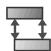

2. In the Create Interaction dialog box that appears, do the following:

• Name the interaction. For more information about naming objects, see Using basic dialog box components.  
• Select the step in which the interaction will be created.  
• Select the Standard-Explicit co-simulation type of interaction.

3. Click Continue to close the Create Interaction dialog box.

4. In the prompt area, select one of the following for the co-simulation region type:

• Select Surface if you want to select a surface.  
• Select Node Region if you want to select nodes.

5. Use one of the following methods to select the region:

Use an existing set or surface to define the region. On the right side of the prompt area, click Sets or Surfaces. Select an existing set or surface from the Region Selection dialog box that appears, and click Continue.

## Note:

The default selection method is based on the selection method you most recently employed. To revert to the other method, click Select in Viewport or Sets or Surfaces on the right side of the prompt area.

• Use the mouse to select a region in the viewport. (For more information, see Selecting objects within the current viewport.)

If the model contains a combination of mesh and geometry, click one of the following from the prompt area:

- Click Geometry if you want to select the surface from a geometry region.  
Click Mesh if you want to select the surface from a native or orphan mesh selection.

You can use the angle method to select a group of faces or edges from geometry or a group of element faces from a mesh. For more information, see Using the angle and feature edge method to select multiple objects.

6. Choose the Incrementation control method. The same incrementation method must be used in the Abaqus/Standard and Abaqus/Explicit analyses. This option is not available in a static general step.

Choose Allow subcycling to allow the Abaqus/Standard increment size to differ from those in Abaqus/Explicit; fields will be exchanged as needed.  
Choose Lock time steps to force Abaqus/Standard to match the increment size of Abaqus/Explicit; fields will be exchanged at each of the shared increments.

7. Choose the Coupling step period. In Abaqus/Standard analyses, Abaqus always uses the next increment size as the suggested coupling step size.

• Choose Determined by analysis to have Abaqus use the next increment size as the suggested coupling step size.  
• Choose Specified, and enter a value for the coupling step size (available only in an Abaqus/Explicit analysis).

8. Click OK to create the interaction and to close the editor.

## Additional information

• Interaction editors  
• Co-simulation  
• Preparing an Abaqus Analysis for Co-Simulation  
• Structural-to-Structural Co-Simulation

## Defining pressure penetration

A pressure penetration interaction allows you to simulate the pressure of a fluid penetrating between two surfaces involved in surface-to-surface contact. The fluid pressure is applied normal to the surfaces. The bodies forming the joint can both be deformable, as is the case with threaded connectors; or one can be rigid, as occurs when a soft gasket is used as a seal between stiffer structures.

Pressure penetration interactions can be applied in three-dimensional, planar (two-dimensional), or axisymmetric models. A pressure penetration interaction can be used only in an Abaqus/Standard analysis.

Before defining the pressure penetration interaction, you must create a surface-to-surface contact interaction to specify the main and secondary surfaces for the pressure penetration; see Defining surface-to-surface contact in an Abaqus/Standard analysis. When you create the surface-to-surface contact interaction, any combination of Sliding formulation and Discretization method can be used (for compatibility with pressure penetration).

In the pressure penetration definition you identify the contact surfaces, the regions on the surfaces exposed to the fluid pressure, the magnitude of the fluid pressure, and the critical contact pressure acting on the regions. In a three-dimensional model points, edges, and faces can be selected as the regions exposed to the fluid pressure. In a two-dimensional model only points can be selected. In a two-dimensional model you must identify the penetration points on both the main and secondary surfaces (unless the main surface is an analytical rigid surface).

The fluid can penetrate from either one or multiple regions on the surface. These regions are always subjected to the pressure penetration, regardless of their contact status. Fluid will penetrate into the region between the contacting bodies until a point is reached where the contact pressure is greater than the specified critical value, cutting off further penetration of the fluid.

1. From the main menu bar, select Interaction->Create.

Tip: You can also create a pressure penetration interaction using the tool in the Interaction module toolbox.

2. In the Create Interaction dialog box that appears, do the following:

• Name the interaction. For more information about naming objects, see Using basic dialog box components.  
• Select the step in which the interaction will be created.  
• Select the Pressure penetration type of interaction.

3. Click Continue to close the Create Interaction dialog box.

4. From the Contact interaction list, select the surface-to-surface contact interaction to which the pressure penetration will be applied.

The main and secondary surfaces of the contact interaction are shown in the dialog box, and the surfaces are highlighted in the viewport.

5. For a three-dimensional model, do the following in the Penetration Regions table:

a. Identify the first region on the secondary surface that is exposed to the fluid pressure.

Double-click the empty cell in the Region on Secondary column, or select the cell and click the

button; then use one of the following methods to select the region:

• Use the mouse to select a face, edge, or point on the model in the viewport. If you are working in a mesh, you can use the mouse to select nodes.

Choose an existing set to specify the face, edge, or point. On the right side of the prompt area, click Sets. Select an existing face, edge, or vertex from the Region Selection dialog box that appears, and click Continue.

## Note:

The default selection method is based on the selection method you most recently employed. To revert to the other method, click Select in Viewport or Sets on the right side of the prompt area.

It is not necessary to identify the Region on Main for a three-dimensional model. However, doing so may help you resolve any problems that you encounter with the analysis. You can select the Region on Main in exactly the same way as the Region on Secondary.

## Note:

If the selected contact interaction has an analytical rigid main surface, the Region on Main column appears dimmed, indicating that adding or editing main surface points is unavailable. Any main surface regions that have already been specified will be ignored.

b. Enter the Critical Contact Pressure below which fluid will start to penetrate. The higher this value, the easier the fluid penetrates. The default is zero, in which case the fluid penetrates only if contact is lost.  
c. Enter the magnitude of the reference Fluid Pressure.

If the analysis step is a steady-state dynamic (linear perturbation) step, you can specify both the real (in-phase) and imaginary (out-of-phase) parts of the pressure in the Fluid Pressure (Real) and Fluid Pressure (Imaginary) columns of the table.

d. To add a row to the table and to continue selecting additional penetration regions, click the + button. This action takes you directly to the region picking step in the viewport. Repeat as needed to specify all the regions.  
e. To edit a penetration region, select the region in the table, click the button, and reselect the region.

f. To delete a region, select the row in the table and click the button.

6. For a planar (two-dimensional) or axisymmetric model, do the following in the Penetration Regions table:

a. Identify the first pair of points exposed to the fluid pressure.

Double-click the empty cell in the Region on Main column, or select the cell and click the

button; then use one of the following methods to select the point:

• Use the mouse to select the point on the model in the viewport.  
Choose an existing set to specify the point. On the right side of the prompt area, click Sets. Select an existing node or vertex from the Region Selection dialog box that appears, and click Continue.

## Note:

The default selection method is based on the selection method you most recently employed. To revert to the other method, click Select in Viewport or Sets on the right side of the prompt area.

Repeat the process to select the corresponding penetration point on the secondary surface, using the Region on Secondary column of the table.

## Note:

If the selected contact interaction has an analytical rigid main surface, the Region on Main column appears dimmed, indicating that adding or editing main surface points is unavailable. Any main surface points that have already been specified will be ignored.

b. Enter the Critical Contact Pressure below which fluid will start to penetrate. The higher this value, the easier the fluid penetrates. The default is zero, in which case the fluid penetrates only if contact is lost.  
c. Enter the magnitude of the reference Fluid Pressure.

If the analysis step is a steady-state dynamic (linear perturbation) step, you can specify both the real (in-phase) and imaginary (out-of-phase) parts of the pressure in the Fluid Pressure (Real) and Fluid Pressure (Imaginary) columns of the table.

d. To add a row to the table and to continue selecting penetration points, click the + button. This action takes you directly to the point picking step in the viewport. Repeat as needed to specify all the points.

e. To edit a penetration point, select the point in the table, click the button, and reselect the point.  
f. To delete a pair of penetration points, select the row in the table and click the button.

7. In the Penetration time field, enter the time period for the fluid pressure penetration to reach the full current magnitude on newly penetrated surface segments. The default penetration time is 0.001 of the current step time. The penetration time is not available in a linear perturbation analysis.  
8. Optionally, you can define the variation of the fluid pressure during the step by selecting an amplitude curve in the Amplitude list. By default, the reference magnitude is applied immediately at the beginning of the step or ramped up linearly over the step, depending on the amplitude variation assigned to the step. Fluid pressure amplitude curves are not available for some steps.  
9. Click OK to create the interaction and to close the editor.

## Additional information

• Fluid Pressure Penetration Loads  
• About Contact Pairs in Abaqus/Standard  
• Interaction editors

You can model acoustic impedance by providing boundary impedances or nonreflecting boundaries for acoustic and coupled acoustic-structural analyses. Select Interaction->Create from the main menu bar, and select the surface to form an acoustic boundary. Acoustic impedance interactions are active only in dynamic steps that utilize the acoustic degree of freedom. You can create an acoustic impedance interaction in a static step; Abaqus ignores the acoustic effects in the static step but propagates the interaction through any applicable linear perturbation steps that follow. If you create an acoustic impedance interaction in a linear perturbation step, the interaction is not propagated to any of the subsequent steps.

For a brief overview of acoustic impedance, see Understanding interactions. For a more detailed discussion, see Acoustic and Shock Loads.

1. From the main menu bar, select Interaction->Create.

Tip: You can also create an acoustic impedance interaction using the tool in the Interaction module toolbox.

2. In the Create Interaction dialog box that appears, do the following:

• Name the interaction. For more information about naming objects, see Using basic dialog box components.  
• Select the step. Acoustic impedance is active only in dynamic steps that utilize the acoustic degree of freedom.  
• Select the Acoustic impedance type of interaction.

3. Click Continue to close the Create Interaction dialog box.

4. Use one of the following methods to select the surface:

Use an existing surface to define the region. On the right side of the prompt area, click Surfaces. Select an existing surface from the Region Selection dialog box that appears, and click Continue.

## Note:

The default selection method is based on the selection method you most recently employed. To revert to the other method, click Select in Viewport or Surfaces on the right side of the prompt area.

• Use the mouse to select a region in the viewport. (For more information, see Selecting objects within the current viewport.)

If the model contains a combination of mesh and geometry, click one of the following from the prompt area:

- Click Geometry if you want to select the surface from a geometry region.  
Click Mesh if you want to select the surface from a native or orphan mesh selection.

You can use the angle method to select a group of faces or edges from geometry or a group of element faces from a mesh. For more information, see Using the angle and feature edge method to select multiple objects.

5. In Definition field in the Edit Interaction dialog box that appears, choose one of the following:

Choose Tabular to define impedance using a table of admittance or impedance values in an acoustic impedance property.  
• Choose Nonreflecting to define nonreflecting boundaries for impedance.

6. If you selected the Tabular definition option, select an acoustic impedance property. If desired, click

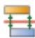

to create the interaction property; see Defining an acoustic impedance interaction property.

7. If you selected the Nonreflecting definition option, click the arrow to the right of the Nonreflecting type field; and select one of the options from the list that appears to define the nonreflecting geometry.

• Select Planar to specify a radiation condition appropriate for plane waves normally incident to a planar boundary.  
Select Improved planar to specify a radiation condition appropriate for plane waves with arbitrary angles of incidence. In linear perturbation steps, improved planar acoustic impedance interactions default to planar acoustic impedance interactions.  
Select Circular to specify a radiation condition appropriate for a circular boundary in two dimensions or a right circular cylinder in three dimensions.  
• Select Spherical to specify a radiation condition appropriate for a spherical boundary.  
• Select Elliptical to specify a radiation condition appropriate for an elliptical boundary in two dimensions or a right elliptical cylinder in three dimensions.  
• Select Prolate spheroidal to specify a radiation condition appropriate for a prolate spheroidal boundary.

8. If you selected the Circular or Spherical nonreflecting definition option, enter the radius of the circle or sphere defining the boundary surface in the Radius field.

9. If you selected the Elliptical or Prolate spheroidal nonreflecting definition option, perform the following steps:

a. In the Axis length field, enter the semimajor axis length, a, of the ellipse or prolate spheroid defining the surface. a is 1/2 of the maximum distance between two points on the ellipse or spheroid, analogous to the radius of a circle or sphere.  
b. In the Eccentricity field, enter the eccentricity, , of the ellipse or prolate spheroid. The eccentricity is the square root of one minus the square of the ratio of the semiminor axis, b, to the semimajor

$$
\text {axis,} a \text {:} \epsilon = \sqrt {1 - (b / a) ^ {2}}.
$$

c. In the Center coordinates field, enter the X-coordinate, Y-coordinate, and Z-coordinate of the center of the ellipse or prolate spheroid defining the radiating surface.

d. In the Direction cosine field, enter the X-component, Y-component, and Z-component of the direction cosine of the major axis of the ellipse or prolate spheroid defining the radiating surface.

## Additional information

• Acoustic and Shock Loads  
• Interaction editors

## Defining incident waves

You can model incident wave loading due to external acoustic wave sources.

Select Interaction->Create from the main menu bar, and select the source point, the standoff point (for all incident wave loading definitions except for those using the CONWEP model), and the surface. When specifying source points and standoff points, you can select only reference points that are not associated with any other model component. You can create incident wave interactions in the following types of analyses: implicit dynamic, explicit dynamic, direct steady-state dynamic, and subspace-based steady-state dynamic. Incident wave interactions are active only in the steps in which they are created and do not propagate to any of the following steps. If your model includes incident wave interactions, you must edit the model attributes (see below) to specify an acoustic wave formulation for the model.

For a brief overview of incident wave interactions, see Understanding interactions. For a more detailed discussion, see Coupled Acoustic-Structural Analysis, and Incident Wave Loading due to External Sources.

## Additional information

• Coupled Acoustic-Structural Analysis  
• Acoustic and Shock Loads  
• Specifying model attributes  
• Interaction editors

## Specify the acoustic wave formulation for the model

If your model contains incident wave interactions, you must edit the model attributes to specify an acoustic wave formulation. You select a scattered wave formulation or a total wave formulation using the procedure described in Specifying model attributes. The formulation that you select applies for all of the incident wave interactions in your model. For more information, see Scattered and Total Wave Formulations.

## Define an incident wave interaction

1. From the main menu bar, select Interaction->Create.

Tip: You can also create an incident wave interaction using the tool in the Interaction module toolbox.

2. In the Create Interaction dialog box that appears, do the following:

• Name the interaction. For more information about naming objects, see Using basic dialog box components.  
Select the step. You can define an incident wave interaction only during an implicit, explicit, direct steady-state, or subspace-based steady-state dynamic analysis. An incident wave interaction is active only in the step in which it is created.  
• Select the Incident wave type of interaction.

3. Click Continue to close the Create Interaction dialog box.

4. Select the incident wave source point by selecting a reference point that is not associated with any other model component. For more information, see Creating a reference point.

The source point that you select becomes highlighted in red in the viewport.

5. For all incident wave definitions except for those using the CONWEP model, select the incident wave standoff point by selecting a reference point that is not associated with any other model component. For more information, see Creating a reference point.

The standoff point that you select becomes highlighted in green in the viewport.

6. For an incident wave definition of air or surface blast data using the definitions of CONWEP data, click CONWEP (Air/Surface blast) in the prompt area.

Abaqus/CAE specifies a Definition of CONWEP for this incident wave definition.

7. Use one of the following methods to select the surface:

Use an existing surface to define the region. On the right side of the prompt area, click Surfaces. Select an existing surface from the Region Selection dialog box that appears, and click Continue.

## Note:

The default selection method is based on the selection method you most recently employed. To revert to the other method, click Select in Viewport or Surfaces on the right side of the prompt area.

• Use the mouse to select a region in the viewport.

The surface or region that you select becomes highlighted in magenta in the viewport, and the Edit Interaction dialog box appears.

8. For all incident wave definitions except for those using the CONWEP model, click the arrow to the Definition field and select an option from the list that appears. For direct and subspace-based steady-state dynamic analyses, you can only specify the fluid pressure time history at the standoff point.

• Select Pressure to specify the fluid pressure time history at the standoff point.  
• Select Acceleration to specify the fluid particle acceleration time history at the standoff point.  
• Select UNDEX to specify UNDEX bubble data.

9. In the Wave Data portion of the editor, perform the following steps:

a. Select an incident wave interaction property. If desired, click to create the interaction property; see Defining an incident wave interaction property, for more information. The following requirements exist:

• If you selected the Pressure definition, you must select an interaction property with a planar definition or a spherical definition with either an acoustic or generalized decay propagation model.  
• If you selected the Acceleration definition, you must select an interaction property with a planar definition.  
• If you selected the UNDEX definition, you must select an interaction property with a spherical definition and an UNDEX charge propagation model.  
• If you selected the CONWEP definition, you must select an interaction property with an air blast or surface blast definition.

b. In the Reference magnitude field, enter the reference magnitude used to scale the values given in the amplitude definition.

10. If you selected the Pressure or Acceleration definition, perform the following steps from the Standoff Point portion of the editor:

For an implicit or explicit dynamic analysis, select a Pressure amplitude or an Acceleration amplitude, depending on the time history definition.

For a direct or subspace-based steady-state dynamic analysis, toggle on Real amplitude and/or Imaginary amplitude and select an amplitude.

If desired, click to create a new amplitude; see Selecting an amplitude type to define.

11. If you selected the UNDEX definition, perform the following steps in the UNDEX Data portion of the editor:

a. In the Direction cosine of fluid surface normal field, enter the X-component, Y-component, and Z-component of the direction cosine of the fluid surface normal.

b. In the Initial depth field, enter the initial depth of the UNDEX charge.

12. If you selected the CONWEP definition, perform the following steps in the CONWEP Data portion of the editor:

a. In the Time of detonation field, specify the time when the blast occurs in terms of the total time for the entire analysis.

b. In the Magnitude scale factor field, specify the factor by which you want to scale CONWEP data units to analysis data units.

13. Click OK to create the interaction and to close the editor.

## Defining cyclic symmetry

You can define a cyclic symmetry interaction to model an entire 360° structure using only a single repetitive sector. Select Interaction->Create, choose Cyclic symmetry, and specify the geometric region by selecting a main surface or node region, a secondary surface or node region, and an axis of symmetry for the structure. You can also control the number of sectors that create the full 360° structure, select the cyclic symmetry nodal diameters for which an eigenfrequency analysis will be performed, and select the cyclic symmetry nodal diameter that will be excited for a steady-state dynamics step.

You can create a cyclic symmetry interaction in the initial step, and only one cyclic symmetry interaction can be active in a model.

For more information about cyclic symmetry in Abaqus, see Analysis of Models that Exhibit Cyclic Symmetry.

1. From the main menu bar, select Interaction->Create.

Tip: You can also create a cyclic symmetry interaction using the tool in the Interaction module toolbox.

2. In the Create Interaction dialog box that appears, do the following:

• Name the interaction. For more information about naming objects, see Using basic dialog box components.  
• Select the initial step.  
• Select the Cyclic symmetry type of interaction.

3. Click Continue to close the Create Interaction dialog box.

4. Select the main surface.

a. In the prompt area, select one of the following:

• Select Surface if you want to select a surface.  
• Select Node Region if you want to select a region from which to create a node-based surface.

b. Use one of the following methods to select the main surface:

Use an existing surface to define the region. On the right side of the prompt area, click Surfaces. Select an existing surface from the Region Selection dialog box that appears, and click Continue.

## Note:

The default selection method is based on the selection method you most recently employed. To revert to the other method, click Select in Viewport or Surfaces on the right side of the prompt area.

Use the mouse to select a region in the viewport. (For more information, see Selecting objects within the current viewport.) Click mouse button 2 to indicate that you have finished selecting. If the model contains a combination of mesh and geometry, click one of the following from the prompt area:

- Click Geometry if you want to select the surface from a geometry region.  
Click Mesh if you want to select the surface from a native or orphan mesh selection.

You can use the angle method to select a group of faces or edges from geometry or a group of element faces from a mesh. For more information, see Using the angle and feature edge method to select multiple objects.

The main surface that you select becomes highlighted in red in the viewport.

5. Select the secondary surface.

a. In the prompt area, select one of the following:

• Select Surface if you want to select a surface.  
• Select Node Region if you want to select a region from which to create a node-based surface.

b. Use one of the same methods described in the previous step to select the secondary surface or region.

The secondary surface or region that you select becomes highlighted in magenta in the viewport. Abaqus/CAE prompts you to define the axis of symmetry.

6. Use one of the following methods to select the first point on the axis of symmetry:

Use an existing set to define the region. The set must contain a single point or vertex. On the right side of the prompt area, click Sets. Select an existing set from the Region Selection dialog box that appears, and click Continue.

## Note:

The default selection method is based on the selection method you most recently employed. To revert to the other method, click Select in Viewport or Sets on the right side of the prompt area.

• Use the mouse to select a node or vertex in the viewport. (For more information, see Selecting objects within the current viewport.)

If the model contains a combination of mesh and geometry, click one of the following from the prompt area:

- Click Geometry if you want to select the surface from a geometry region.  
Click Mesh if you want to select the surface from a native or orphan mesh selection.

The point that you select becomes highlighted in red in the viewport.

7. Using one of the methods described in the previous step, select the second point on the axis of symmetry. The point that you select becomes highlighted in magenta in the viewport, and the Edit Cyclic Symmetry dialog box opens.

8. From the Position Tolerance options, specify the distance within which Abaqus will tie nodes on the secondary surface to the main surface. Choose one of the following options:

• Select Use computed distance to use a distance calculated automatically based on the element formulations and types of surfaces used in the constraints.  
Select Specify distance, and enter a value to set the distance within which secondary nodes will be tied to the main surface.

9. Toggle off Adjust secondary surface initial position to prevent Abaqus from moving all tied nodes on the secondary surface onto the main surface.

By default, this option is toggled on and all tied nodes are moved in the initial configuration without applying strains to the model.

10. Specify the Total number of sectors that comprise the full 360° structure.

11. From the Extracted Nodal Diameters options, specify the range of cyclic symmetry nodal diameters for which the eigenfrequency analysis will be performed. You can define this range in the initial step or in a frequency extraction step only. Specify this range using either of the following options:

• Select All possible nodal diameters to extract every possible cyclic symmetry nodal diameter.  
Select Specified range to extract every cyclic symmetry nodal diameter between a Lowest nodal diameter and Highest nodal diameter that you specify. The highest nodal diameter must be less than or equal to half the number of sectors.

12. Specify the Excited nodal diameter associated with the loading in the load definition. You can select the excited nodal diameter in the initial step or in a mode-based steady-state dynamics step. Only one cyclic symmetry nodal diameter can be excited.

13. Click OK.

Abaqus/CAE creates the cyclic symmetry interaction.

## Additional information

• Analysis of Models that Exhibit Cyclic Symmetry  
• Interaction editors

## Defining foundations

You can model an elastic foundation by defining the foundation stiffness per area of a selected surface. Select Interaction->Create from the main menu bar, and select the surface to be modeled as an elastic foundation. For a brief overview of elastic foundations, see Understanding interactions. For a more detailed discussion, see Element Foundations.

Elastic foundations allow you to model the stiffness effects of a distributed support without actually modeling the details of the support. You can create elastic foundation interactions only in the initial step. Once an elastic foundation is activated, you cannot deactivate it in later analysis steps.

1. From the main menu bar, select Interaction->Create.

Tip: You can also create an elastic foundation interaction using the tool in the Interaction module toolbox.

2. In the Create Interaction dialog box that appears, do the following:

Use an existing surface to define the region. On the right side of the prompt area, click Surfaces. Select an existing surface from the Region Selection dialog box that appears, and click Continue.The default selection method is based on the selection method you most recently employed. To revert to the other method, click Select in Viewport or Surfaces on the right side of the prompt area.  
• Name the interaction. For more information about naming objects, see Using basic dialog box components.  
• Select the initial step.  
• Select the Elastic foundation type of interaction.

3. Click Continue to close the Create Interaction dialog box.

4. Use one of the following methods to select the surface:

• Use the mouse to select a region in the viewport. (For more information, see Selecting objects within the current viewport.)  
• If the model contains a combination of mesh and geometry, click one of the following from the prompt area:

- Click Geometry if you want to select the surface from a geometry region.  
Click Mesh if you want to select the surface from a native or orphan mesh selection.

You can use the angle method to select a group of faces or edges from geometry or a group of element faces from a mesh. For more information, see Using the angle and feature edge method to select multiple objects.

5. In the text field that appears in the prompt area, enter the foundation stiffness per area.

Abaqus/CAE creates the elastic foundation interaction.

## Additional information

• Element Foundations  
• Interaction editors

## Defining a cavity radiation interaction

This section describes how you can create a cavity radiation interaction in Abaqus/CAE and use cavity symmetry to reduce the expense of the calculations.

## In this section:

Defining cavity radiation properties and view factors  
Defining cavity radiation symmetry

## Defining cavity radiation properties and view factors

You can model heat transfer due to radiation in enclosures by creating a cavity radiation interaction. Select Interaction->Create from the main menu bar, and select the surface. For a brief overview of cavity radiation, see Understanding interactions. For a more detailed discussion, see Cavity Radiation in Abaqus/Standard.

1. From the main menu bar, select Interaction->Create.

Tip: You can also create a cavity radiation interaction using the module toolbox.

tool in the Interaction

2. In the Create Interaction dialog box that appears, do the following:

• Name the interaction. For more information about naming objects, see Using basic dialog box components.  
Select the step. You can define cavity radiation only during a heat transfer or coupled thermal-electrical step.  
• Select the Cavity radiation type of interaction.

3. Click Continue to close the Create Interaction dialog box.

4. Use one of the methods below to select the cavity surface. Select only the portion of the surface to which one cavity radiation interaction property applies.

Use an existing surface to define the region. On the right side of the prompt area, click Surfaces. Select an existing surface from the Region Selection dialog box that appears, and click Continue.

## Note:

The default selection method is based on the selection method you most recently employed. To revert to the other method, click Select in Viewport or Surfaces on the right side of the prompt area.

• Use the mouse to select a region in the viewport. (For more information, see Selecting objects within the current viewport.)

If the model contains a combination of mesh and geometry, click one of the following from the prompt area:

Click Geometry if you want to select the surface or vertex from a geometry region.  
Click Mesh if you want to select the surface or node from a native or orphan mesh selection.

You can use the angle method to select a group of faces or edges from geometry or a group of element faces from a mesh. For more information, see Using the angle and feature edge method to select multiple objects.

Abaqus/CAE displays the Edit Interaction dialog box, and the surface name or (Picked) appears in the Surface column on the Properties tabbed page.

5. To define additional cavity surfaces, click mouse button 3 in the table, select Add Row, and do one of the following:

• Double-click an empty cell in the Surfaces column.  
• Click mouse button 3 in an empty table row, and select Edit Surface.

## Note:

You can also use these techniques to replace an existing cavity surface; Abaqus/CAE does not indicate or retain your original selection when you edit an existing surface.

6. Choose the cavity type in the Definition field.

• Select Closed to specify a set of closed surfaces for radiation.  
• Select Open to include some radiation to the surroundings, and specify an Ambient temperature for the open cavity definition.

7. Specify the Properties options.

a. Select the Blocking surface checks. By default, Abaqus checks for blocking surfaces within the cavity when performing radiation view factor calculations.

• Choose All to indicate that all blocking checks are active.  
• Choose None to skip blocking checks.  
• Choose Partial to specify potential blocking surfaces that Abaqus should check.

For more information, see Controlling Checks for Surface Blocking.

b. If you chose the Partial option, double-click an empty cell in the Blocking Surface table to select surfaces that you want Abaqus to check.

Tip: You can also click mouse button 3 in the Blocking Surface table and choose Edit Surface, Add Row, or Delete Row to edit the table.

The surface selection methods are the same as those described in Step 4.

c. Select the heat reflection behavior.

Choose Yes for gray body radiation. Gray bodies have an emissivity between zero and one, as defined by a cavity radiation interaction property.  
• Choose No for black body radiation. Black bodies have a fixed emissivity of one—no heat is reflected.

d. If you chose gray body radiation in the previous step, you must specify a cavity radiation interaction property for each row in the table. You can use any of the following methods:

• Click a cell in the Property column to choose a predefined cavity radiation interaction property.  
Click mouse button 3 in the table, and select Create Property to create a new interaction property or Edit Property to edit the existing cavity radiation interaction property in the selected row. (For more information, see Defining a cavity radiation interaction property.)  
Enter a value in the Emissivity column. Abaqus/CAE automatically creates a cavity radiation interaction property with a default name and the specified emissivity.

When you are finished, each row in the table contains a surface and an emissivity value or (table), indicating that there is a tabular emissivity defined in the interaction property. Property cells may be empty if you entered an emissivity value—Abaqus/CAE will add a default interaction property name when you close the Edit Interaction dialog box.

8. Specify the View factors options.

a. If desired, toggle on Specify blocking range and enter a value for the distance beyond which Abaqus should not calculate view factors due to blocking effects.

b. Specify the Accuracy tolerance. The default value is 0.05.

The view factor tolerance indicates the allowable deviation from the ideal sum of view factors. Abaqus ends the analysis if the tolerance is exceeded for a closed cavity. If the tolerance is exceeded for an open cavity, radiation to the ambient environment occurs.

c. Specify the Infinitesimal facet area ratio. The default value is 64.

This value represents the ratio of the largest facet area to the smallest facet area. Abaqus calculates this ratio for each facet pair.

d. Specify the Gauss integration points per edge. The default value is 3.

This value is used for the numerical integration method. Possible values range from 1 to 5.

e. Specify the Lumped area distance-square value. The default value is 5.

This value represents the ratio of the distance between the centroids of each facet pair, squared, to the area of the larger facet. If the calculated value is greater than this setting, Abaqus uses a lumped area approximation for the integration.

f. If desired, click the Defaults button to reset all view factor entries to the Abaqus default values.

If the calculated value for a pair of facets is less than or equal to the Lumped area distance-square value setting and the Infinitesimal facet area ratio is exceeded, Abaqus uses an infinitesimal-to-finite area approximation. If the Lumped area distance-square value is exceeded but the facet area ratio is not exceeded, Abaqus completes a numerical integration of the contour integral to get an accurate value.

For more information, see Controlling the Accuracy of View Factor Calculations.

9. Specify the Symmetry options. For detailed information on the available cavity radiation symmetry types, see Defining cavity radiation symmetry.”

10. Specify the absolute zero temperature, , on the temperature scale being used and the Stefan-Boltzmann constant, , in the Edit Model Attributes dialog box, as described in Specifying model attributes.

11. Click OK to create the interaction and to close the editor.

## Additional information

• Interaction editors  
• Defining a cavity radiation interaction property  
• Cavity Radiation in Abaqus/Standard

## Defining cavity radiation symmetry

Using symmetry reduces the computational size of your cavity model. The available symmetries and combinations vary according to the model type. The table in Combining Symmetries, indicates the available symmetry combinations. You can use the following symmetry types to complete the cavity definition:

## Reflection

Select a Number of reflection symmetries, and select a reference z-symmetry value (axisymmetric models), a symmetry axis (two-dimensional models), or a symmetry plane (three-dimensional models) for each reflection.

Abaqus/CAE adds the reflected surfaces to the cavity definition and reduces the remaining number of symmetries allowed in the model. Toggle on Highlight to view the current parameter selections in the viewport.

## Periodic

Select a Number of periodic symmetries and number of repetitions for each periodic symmetry. For axisymmetric models, select a reference z-symmetry value and a periodic z-distance value. For two-dimensional and three-dimensional models, select a symmetry axis and a distance vector or a symmetry plane and a distance vector, respectively, for each periodic symmetry.

Abaqus/CAE adds the periodic surfaces to the cavity surfaces you selected for the Properties options and reduces the remaining number of symmetries allowed in the model. Toggle on Highlight to view the current parameter selections in the viewport.

## Cyclic

Toggle on Use cyclic symmetric and select the total number of sectors. Select the symmetry point and a point on the axis of symmetry (two-dimensional models) or the first and second points on the axis of symmetry and a point on the symmetry plane (three-dimensional models).

Cyclic symmetry creates new sectors by rotating the original geometry clockwise about the axis of symmetry. Cyclic symmetry is not available for axisymmetric models.

The following conditions must be met:

• For two-dimensional models the selected point on the axis of symmetry must be on the clockwise side of the geometry defining the original sector.  
• For three-dimensional models the selected point on the symmetry plane must be on the counterclockwise side of the geometry defining the original sector.  
• The total number of sectors must define a complete circle (360°). If you change the number of sectors, you must redefine the geometry to represent the correct portion of the model.

For more information on cyclic symmetry, including figures showing the sector definitions, see Cyclic Symmetry.

## Warning:

Abaqus/CAE does not check that the defined symmetries produce a physically realistic cavity model.

## Additional information

• Interaction editors  
• Defining a cavity radiation interaction property  
• Cavity Radiation in Abaqus/Standard

You can model heat transfer from surfaces due to convection by creating a surface film condition interaction. Select Interaction->Create from the main menu bar and select the surface. For a brief overview of film conditions, see Understanding interactions. For a more detailed discussion, see Thermal Loads.

1. From the main menu bar, select Interaction->Create.

Tip: You can also create a surface film condition interaction using the tool in the Interaction module toolbox.

2. In the Create Interaction dialog box that appears, do the following:

• Name the interaction. For more information about naming objects, see Using basic dialog box components.  
• Select the step. You can define convection from a surface only during a heat transfer, coupled temperature-displacement, or coupled thermal-electrical step.  
• Select the Surface film condition type of interaction.

3. Click Continue to close the Create Interaction dialog box.

4. Use one of the following methods to select the surface:

Use an existing surface to define the region. On the right side of the prompt area, click Surfaces. Select an existing surface from the Region Selection dialog box that appears, and click Continue.

## Note:

The default selection method is based on the selection method you most recently employed. To revert to the other method, click Select in Viewport or Surfaces on the right side of the prompt area.

• Use the mouse to select a region in the viewport. (For more information, see Selecting objects within the current viewport.)

If the model contains a combination of mesh and geometry, click one of the following from the prompt area:

Click Geometry if you want to select the surface or vertex from a geometry region.  
Click Mesh if you want to select the surface or node from a native or orphan mesh selection.

You can use the angle method to select a group of faces or edges from geometry or a group of element faces from a mesh. For more information, see Using the angle and feature edge method to select multiple objects.

5. In the Edit Interaction dialog box that appears, click the arrow to the right of the Definition field, and select an option from the list that appears:

• Select Embedded Coefficient to specify the film coefficient in this dialog box.  
Select Property Reference to define the film coefficient as a function of temperature and field variables using a film condition interaction property.  
• Select User-defined to define nonuniform film coefficients in user subroutine FILM. (This option is valid only in Abaqus/Standard analyses). See the following sections for more information:

Specifying general job settings  
FILM

• Select an analytical field to define a spatially varying film coefficient. The analytical field does not affect the sink temperature. Only analytical fields that are valid for this interaction type are displayed in the selection list. Alternatively, you can clic k to create a new analytical field. (See The Analytical Field toolset for more information.)

6. If you selected the Embedded Coefficient or analytical field definition option, perform the following steps:

a. In the Film coefficient field, enter the film coefficient, h.  
b. If you want to vary the film coefficient with time, click the arrow to the right of the Film coefficient amplitude field and select an amplitude from the list that appears. If desired, click to create a new amplitude; see Selecting an amplitude type to define for more information.  
c. In the Sink temperature field, enter the sink temperature, .  
d. If you want to define a spatially varying sink temperature, click the arrow to the right of the Sink definition field and select an analytical field, labeled with an (A), or a discrete field, labeled with a (D). Only analytical fields and discrete fields that are valid for temperature are available in the selection list. See The Analytical Field toolset and The Discrete Field toolset for more information.

Alternatively, you can click to create a new discrete field.

e. If you want to vary the sink temperature with time, click the arrow to the right of the Sink amplitude

field and select an amplitude from the list that appears. If desired, click to create a new amplitude; see Selecting an amplitude type to define for more information.

7. If you selected the Property Reference definition option, perform the following steps:

a. Select a film interaction property. If desired, click to create the interaction property; see Defining a film condition interaction property for more information.  
b. In the Sink temperature field, enter the sink temperature, .  
c. If you want to define a spatially varying sink temperature, click the arrow to the right of the Sink definition field and select an analytical field, labeled with an (A), or a discrete field, labeled with a (D). Only analytical fields and discrete fields that are valid for temperature are available in the selection list. See The Analytical Field toolset and The Discrete Field toolset for more information.

Alternatively, you can click to create a new discrete field.

d. If you want to vary the sink temperature with time, click the arrow to the right of the Sink amplitude

field and select an amplitude from the list that appears. If desired, click to create a new amplitude; see Selecting an amplitude type to define for more information.

8. If you selected the User-defined definition option, perform the following steps:

a. In the Film coefficient field, enter the film coefficient, h.  
b. In the Sink temperature field, enter the sink temperature, .  
c. Enter the Job module, and display the job editor for the analysis job of interest. (For more information, see Creating, editing, and manipulating jobs.)  
d. In the job editor, click the General tab, and specify the file containing the user subroutine FILM. For more information, see Specifying general job settings.

## Note:

You can specify only one user subroutine file in the job editor; if your analysis involves more than one user subroutine, you must combine the user subroutines into one file and then specify that file.

9. Click OK to create the interaction and to close the editor.

## Additional information

• Interaction editors  
• Using analytical expression fields  
• Creating expression fields  
• Thermal Loads

## Defining a concentrated film condition interaction

You can model heat transfer from one or more points in an assembly due to convection by creating a concentrated film condition interaction. Select Interaction->Create from the main menu bar and select one or more nodes or vertices or a saved set of nodes or vertices. For a brief overview of film conditions, see Understanding interactions. For a more detailed discussion, see Thermal Loads.

1. From the main menu bar, select Interaction->Create.

Tip: You can also create a concentrated film condition interaction using the tool in the Interaction module toolbox.

2. In the Create Interaction dialog box that appears, do the following:

• Name the interaction. For more information about naming objects, see Using basic dialog box components.  
Select the step. You can define convection from a nodal area only during a heat transfer, coupled temperature-displacement, or coupled thermal-electrical step.  
• Select the Concentrated film condition type of interaction.

3. Click Continue to close the Create Interaction dialog box.

4. Use one of the following methods to select the points:

Use an existing set of nodes or vertices to define the region. On the right side of the prompt area, click Sets. Select an existing set from the Region Selection dialog box that appears, and click Continue.

## Note:

The default selection method is based on the selection method you most recently employed. To revert to the other method, click Select in Viewport or Sets on the right side of the prompt area.

• Use the mouse to select nodes or vertices in the viewport. (For more information, see Selecting objects within the current viewport.)

If the model contains a combination of mesh and geometry, click one of the following from the prompt area:

- Click Geometry if you want to select vertices from a geometry region.  
Click Mesh if you want to select nodes from a native or orphan mesh selection.

You can use the angle method to select a group of nodes from a mesh. For more information, see Using the angle and feature edge method to select multiple objects.

5. In the Edit Interaction dialog box that appears, click the arrow to the right of the Definition field and select an option from the list that appears:

• Select Embedded Coefficient to specify the film coefficient in this dialog box.  
Select Property Reference to define the film coefficient as a function of temperature and field variables using a film condition interaction property.

Select User-defined to define nonuniform film coefficients in user subroutine FILM. (This option is valid only in Abaqus/Standard analyses). See the following sections for more information:

Specifying general job settings

FILM

• Select an analytical field to define a spatially varying film coefficient. The analytical field does not affect the sink temperature. Only analytical fields that are valid for this interaction type are displayed in the selection list. Alternatively, you can clic k to create a new analytical field. (See The Analytical Field toolset for more information.)

6. If desired, specify how the concentrated film condition is applied to the boundary of an adaptive mesh domain. This option is valid only for Abaqus/Explicit analyses. Click the arrow to the right of the Adaptive mesh boundary type field, and select an option from the list that appears. For more information, see Defining ALE Adaptive Mesh Domains in Abaqus/Explicit.

• Select Lagrangian to apply a concentrated film to a node that follows the material (nonadaptive).  
Select Sliding to apply a concentrated film to a node that can slide over the material. Mesh constraints are typically applied to the node to fix it spatially.  
Select Eulerian to apply a concentrated film to a node that can move independently of the material. This option is used only for boundary regions where the material can flow into or out of the adaptive mesh domain. Mesh constraints must be used normal to an Eulerian boundary region to allow material to flow through the region. If no mesh constraints are applied, an Eulerian boundary region will behave in the same way as a sliding boundary region.

7. In the Associated nodal area field, enter the area associated with the node where the concentrated film condition is applied.

8. If you selected the Embedded Coefficient or analytical field definition option, perform the following steps:

a. In the Film coefficient field, enter the film coefficient, h.  
b. If you want to vary the film coefficient with time, click the arrow to the right of the Film coefficient  
amplitude field and select an amplitude from the list that appears. If desired, click to create a new amplitude; see Selecting an amplitude type to define, for more information.

c. In the Sink temperature field, enter the sink temperature, .

d. If you want to define a spatially varying sink temperature, click the arrow to the right of the Sink definition field and select an analytical field, labeled with an (A), or a discrete field, labeled with a (D). Only analytical fields and discrete fields that are valid for temperature are available in the selection list. See The Analytical Field toolset and The Discrete Field toolset for more information.

Alternatively, you can click to create a new discrete field.

e. If you want to vary the sink temperature with time, click the arrow to the right of the Sink amplitude field and select an amplitude from the list that appears. If desired, click to create a new amplitude; see Selecting an amplitude type to define, for more information.

9. If you selected the Property Reference definition option, perform the following steps:

a. Select a film interaction property. If desired, click to create the interaction property; see Defining a film condition interaction property, for more information.

b. In the Sink temperature field, enter the sink temperature, .  
c. If you want to define a spatially varying sink temperature, click the arrow to the right of the Sink definition field and select an analytical field, labeled with an (A), or a discrete field, labeled with a (D). Only analytical fields and discrete fields that are valid for temperature are available in the selection list. See The Analytical Field toolset and The Discrete Field toolset for more information.

Alternatively, you can click to create a new discrete field.

d. If you want to vary the sink temperature with time, click the arrow to the right of the Sink amplitude field and select an amplitude from the list that appears. If desired, click to create a new amplitude; see Selecting an amplitude type to define for more information.

10. If you selected the User-defined definition option, perform the following steps:

a. In the Film coefficient field, enter the film coefficient, h.  
b. In the Sink temperature field, enter the sink temperature, .  
c. Enter the Job module, and display the job editor for the analysis job of interest. (For more information, see Creating, editing, and manipulating jobs.)  
d. In the job editor, click the General tab, and specify the file containing the user subroutine FILM. For more information, see Specifying general job settings.

Note: You can specify only one user subroutine file in the job editor; if your analysis involves more than one user subroutine, you must combine the user subroutines into one file and then specify that file.

11. Click OK to create the interaction and to close the editor.

## Additional information

• Interaction editors  
• Using analytical expression fields  
• Creating expression fields  
• Defining ALE Adaptive Mesh Domains in Abaqus/Explicit  
• Thermal Loads

You can model heat transfer between a nonconcave surface and a nonreflecting environment due to radiation by creating a surface radiation interaction. Surface radiation can also be used to approximate cavity radiation for a closed cavity in three-dimensional models. Select Interaction->Create from the main menu bar, and select the surface. For a brief overview of radiative interactions, see Understanding interactions. For a more detailed discussion, see Thermal Loads. For more information about cavity radiation, see Defining a cavity radiation interaction and Cavity Radiation in Abaqus/Standard.

1. From the main menu bar, select Interaction->Create.

Tip: You can also create a surface radiative interaction using the tool in the Interaction module toolbox.

2. In the Create Interaction dialog box that appears, do the following:

• Name the interaction. For more information about naming objects, see Using basic dialog box components.  
Select the step. You can define radiation from a surface only during a heat transfer, coupled temperature-displacement, or coupled thermal-electrical step.  
• Select the Surface radiation type of interaction.

3. Click Continue to close the Create Interaction dialog box.

4. Use one of the following methods to select the surface:

Use an existing surface to define the region. On the right side of the prompt area, click Surfaces. Select an existing surface from the Region Selection dialog box that appears, and click Continue.

## Note:

The default selection method is based on the selection method you most recently employed. To revert to the other method, click Select in Viewport or Surfaces on the right side of the prompt area.

• Use the mouse to select a region in the viewport. (For more information, see Selecting objects within the current viewport.)

If the model contains a combination of mesh and geometry, click one of the following from the prompt area:

Click Geometry if you want to select the surface or vertex from a geometry region.  
Click Mesh if you want to select the surface or node from a native or orphan mesh selection.

You can use the angle method to select a group of faces or edges from geometry or a group of element faces from a mesh. For more information, see Using the angle and feature edge method to select multiple objects.

5. In the Edit Interaction dialog box that appears, select the Radiation type.

• Select To ambient to specify heat transfer to the surrounding environment.  
• Select Cavity approximation (3D only) to approximate cavity radiation in three-dimensional models using uniform emissivity, a closed cavity, and an average cavity temperature.

6. If you selected To ambient in the previous step, complete the radiation definition as follows:

a. Click the arrow to the right of the Emissivity distribution field, and select the option of your choice from the list that appears:

• Select Uniform to define an emissivity that is uniform over the surface.  
Select an analytical field to define a spatially varying emissivity. Only analytical fields that are valid for this interaction type are displayed in the selection list. Alternatively, you can click  
to create a new analytical field. (See The Analytical Field toolset for more information.)

b. In the Emissivity field, enter the emissivity of the surface, .

c. In the Ambient temperature field, enter the ambient temperature, ${ \pmb \theta } ^ { 0 } .$

d. If you want to vary the ambient temperature with time, click the arrow to the right of the Ambient temperature amplitude field and select an amplitude from the list that appears. If desired, click to create a new amplitude; see Selecting an amplitude type to define for more information.

7. If you selected Cavity approximation (3D only) in Step 5, enter the emissivity of the surface, , in the Emissivity field.

8. Specify the absolute zero temperature, ${ \pmb \theta } ^ { \pmb { z } }$ , on the temperature scale being used and the Stefan-Boltzmann constant, , in the Edit Model Attributes dialog box, as described in Specifying model attributes.

9. Click OK to create the interaction and to close the editor.

## Additional information

• Interaction editors  
• Defining a cavity radiation interaction  
• Using analytical expression fields  
• Creating expression fields  
• Thermal Loads  
• Cavity Radiation in Abaqus/Standard

You can model heat transfer between one or more points in an assembly and a nonreflecting environment due to radiation by creating a concentrated radiation to ambient interaction. Select Interaction->Create from the main menu bar, and select one or more nodes or vertices or a saved set of nodes or vertices. For a brief overview of radiative interactions, see Understanding interactions. For a more detailed discussion, see Thermal Loads.

1. From the main menu bar, select Interaction->Create.

Tip: You can also create a concentrated radiative interaction using the tool in the Interaction module toolbox.

2. In the Create Interaction dialog box that appears, do the following:

• Name the interaction. For more information about naming objects, see Using basic dialog box components.  
Select the step. You can define radiation from a nodal area only during a heat transfer, coupled temperature-displacement, or coupled thermal-electrical step.  
• Select the Concentrated radiation to ambient type of interaction.

3. Click Continue to close the Create Interaction dialog box.

4. Use one of the following methods to select the points:

Use an existing set of nodes or vertices to define the region. On the right side of the prompt area, click Sets. Select an existing set from the Region Selection dialog box that appears, and click Continue.

## Note:

The default selection method is based on the selection method you most recently employed. To revert to the other method, click Select in Viewport or Sets on the right side of the prompt area.

• Use the mouse to select nodes or vertices in the viewport. (For more information, see Selecting objects within the current viewport.)

If the model contains a combination of mesh and geometry, click one of the following from the prompt area:

- Click Geometry if you want to select vertices from a geometry region.  
Click Mesh if you want to select nodes from a native or orphan mesh selection.

You can use the angle method to select a group of nodes from a mesh. For more information, see Using the angle and feature edge method to select multiple objects.

5. In the Edit Interaction dialog box that appears, perform the following steps:

a. If desired, specify how the concentrated radiation condition is applied to the boundary of an adaptive mesh domain. This option is valid only for Abaqus/Explicit analyses. Click the arrow to the right of the Adaptive mesh boundary type field, and select an option from the list that appears. For more information, see Defining ALE Adaptive Mesh Domains in Abaqus/Explicit.

• Select Lagrangian to apply a concentrated radiation condition to a node that follows the material (nonadaptive).

Select Sliding to apply a concentrated radiation condition to a node that can slide over the material. Mesh constraints are typically applied to the node to fix it spatially.  
Select Eulerian to apply a concentrated radiation condition to a node that can move independently of the material. This option is used only for boundary regions where the material can flow into or out of the adaptive mesh domain. Mesh constraints must be used normal to an Eulerian boundary region to allow material to flow through the region. If no mesh constraints are applied, an Eulerian boundary region will behave in the same way as a sliding boundary region.

b. In the Associated nodal area field, enter the area associated with the node where the concentrated radiation condition is applied.

c. Click the arrow to the right of the Emissivity distribution field, and select the option of your choice from the list that appears:

• Select Uniform to define an emissivity that is uniform over the region.  
Select an analytical field to define a spatially varying emissivity. Only analytical fields that are valid for this interaction type are displayed in the selection list. Alternatively, you can click to create a new analytical field. (See The Analytical Field toolset for more information.)

d. In the Emissivity field, enter the emissivity of the surface, .

e. In the Ambient temperature field, enter the ambient temperature, ${ \pmb \theta } ^ { 0 }$

f. If you want to vary the ambient temperature with time, click the arrow to the right of the Ambient temperature amplitude field and select an amplitude from the list that appears. If desired, click to create a new amplitude; see Selecting an amplitude type to define, for more information.

6. Specify the absolute zero temperature, , on the temperature scale being used and the Stefan-Boltzmann constant, , in the Edit Model Attributes dialog box, as described in Specifying model attributes.

7. Click OK to create the interaction and to close the editor.

## Additional information

• Interaction editors  
• Using analytical expression fields  
• Creating expression fields  
• Thermal Loads

You can create an actuator/sensor interaction at a single vertex of your model. An actuator/sensor interaction provides an interface to user subroutine UEL. The subroutine, in turn, represents a linear or nonlinear user-defined element. Actuator/sensor interactions must be defined during the initial step and are valid only for Abaqus/Standard analyses.

## Warning:

This feature is intended for advanced users only. Its use in all but the simplest test examples will require considerable coding by the user/developer. User-Defined Elements, should be read before proceeding.

1. From the main menu bar, select Interaction->Create.

Tip: You can also create an actuator/sensor interaction using the tool in the Interaction module toolbox.

2. In the Create Interaction dialog box that appears, do the following:

• Name the interaction. For more information about naming objects, see Using basic dialog box components.  
• Select the initial step.  
• Select the Actuator/sensor type of interaction.

3. Click Continue to close the Create Interaction dialog box.

4. From the assembly, select the point where the interaction will be applied. Click mouse button 2 to indicate you have finished selecting the point.

Tip: You can limit the types of objects that you can select in the viewport by specifying filtering options in the Selection toolbar. See Using the selection options, for more information.

Abaqus/CAE displays the Edit Interaction dialog box.

5. Enter the necessary data in the Edit Interaction dialog box. The required data are a function of your user-defined element subroutine. You may need to create real and integer actuator/sensor interaction properties. For more information, see Defining an actuator/sensor interaction property.

The following table indicates the correspondence between the fields in the Edit Interaction dialog box and the variables in user subroutine UEL.

<table><tr><td>Field</td><td>UEL variable</td></tr><tr><td>User element type id</td><td>JTYPE</td></tr><tr><td>Degrees of freedom</td><td>NDOFEL</td></tr><tr><td>Number of coordinate components</td><td>MCRD</td></tr><tr><td>Solution-dependent state variables</td><td>SVARS and NSVARS</td></tr></table>

The real and integer values entered into an actuator/sensor interaction property are used by the PROPS, JPROPS, NPROPS, and NJPROPS variables. For a description of all the variables that can be passed into user subroutine UEL, see User-Defined Elements.

## Additional information

• User-Defined Elements  
• UEL  
• Interaction editors

## Defining contact mass scaling

In Abaqus/Explicit contact mass scaling can be defined for all steps, and this contact mass scaling definition is active for all subsequent steps.

A contact mass scaling definition can apply mass scaling to the contact surfaces/elements involved in the contact definition in Abaqus/Explicit only.

1. From the main menu bar, select Interaction->Create.

Tip: You can also create a general contact interaction using the tool in the Interaction module toolbox.

2. In the Create Interaction dialog box that appears, do the following:

• Name the interaction. For more information about naming objects, see Using basic dialog box components.  
Select the step in which the interaction will be created. Contact mass scaling can be created in any explicit step in which contact is already defined.  
• Select the Contact Mass Scaling (Explicit) type of interaction.

3. Click Continue to close the Create Interaction dialog box.

The Edit Interaction dialog box appears.

4. Specify the Location (The Default is Element Mass Scaling)

5. If the location selected is Specified Surfaces, then select the surfaces to include in contact mass scaling from the list of available surfaces.

a. Click the arrows > in the middle of the dialog box to transfer the surfaces to the list of surfaces that will be included in the contact mass scaling.

6. Click OK to create the interaction and to close the editor.

## Additional information

• \*CONTACT MASS SCALING

## Using the interaction property editors

This section explains how to enter data in the interaction property editors to define specific types of interaction properties.

## In this section:

Defining a contact interaction property  
Defining a film condition interaction property  
Defining a cavity radiation interaction property  
Defining a fluid cavity interaction property  
Defining a fluid exchange interaction property  
Defining an acoustic impedance interaction property  
Defining an incident wave interaction property  
Defining an actuator/sensor interaction property  
Defining a fluid inflator interaction property  
Defining a wear interaction property

The contact property editor contains the following menus from which you can choose options to include in the property definition: Mechanical, Thermal, and Electrical.

A contact interaction property can be referred to by a general contact, surface-to-surface contact, or self-contact interaction. For more information, see About Mechanical Contact Properties, Thermal Contact Properties, and Electrical Contact Properties.

The Contact Property Options list at the top of the editor displays the options currently included in the property definition; the list is updated as you add and delete options. You can add, delete, or change property options as follows:

## Adding property options

Select the options needed to define your property from the Mechanical, Thermal, and Electrical menus. When you select an option, its name appears in the Contact Property Options list, and data fields associated with the option appear in the data area in the bottom half of the editor. Use the data fields to enter information for the currently selected option.

## Deleting property options

In the Contact Property Options list, select the option that you want to delete, and click Delete on the right side of the editor. This procedure removes the option from both the options list and the property definition.

## Changing option data

In the Contact Property Options list, select the option whose data you want to change. When the data fields associated with the option appear in the bottom half of the window, change the information that you have entered for the option as desired.

## In this section:

Defining mechanical contact property options  
Defining thermal contact property options  
Specifying gap conductance for electrical contact property options

## Defining mechanical contact property options

You can define mechanical contact property options to specify tangential behavior (friction and elastic slip), normal behavior (hard, soft, or damped contact and separation), and damping due to friction.

## In this section:

Specifying frictional behavior for mechanical contact property options  
Specifying pressure-overclosure relationships for mechanical contact property options  
Specifying damping for mechanical contact property options  
Specifying cohesive behavior properties for mechanical contact property options  
Specifying cohesive damage properties for mechanical contact property options  
Specifying fracture criterion properties for crack propagation  
Specifying geometric properties for mechanical contact property options

## Specifying frictional behavior for mechanical contact property options

You can specify a friction model that defines the force resisting the relative tangential motion of the surfaces in a mechanical contact analysis. For more information, see Frictional Behavior.

1. From the main menu bar, select Interaction->Property->Create.  
2. In the Create Interaction Property dialog box that appears, do the following:

Name the interaction property. For more information about naming objects, see Using basic dialog box components.  
• Select the Contact type of interaction property.

3. Click Continue to close the Create Interaction Property dialog box.  
4. From the menu bar in the contact property editor, select Mechanical->Tangential Behavior.  
5. In the editor that appears, click the arrow to the right of the Friction formulation field, and select how you want to define friction between the contact surfaces:

• Select Frictionless if you want Abaqus to assume that surfaces in contact slide freely without friction.  
Select Penalty to use a stiffness (penalty) method that permits some relative motion of the surfaces (an “elastic slip”) when they should be sticking. While the surfaces are sticking (i.e., $\tau _ { e q } < \tau _ { c r i t } )$ , the magnitude of sliding is limited to this elastic slip. Abaqus will continually adjust the magnitude of the penalty constraint to enforce this condition. For more information, see Stiffness Method for Imposing Frictional Constraints in Abaqus/Standard and Stiffness Method for Imposing Frictional Constraints in Abaqus/Explicit.  
Select Static-Kinetic Exponential Decay to specify static and kinetic friction coefficients directly. In this model it is assumed that the friction coefficient decays exponentially from the static value to the kinetic value. Alternatively, you can enter test data to fit the exponential model. (This Friction formulation option also allows you to specify elastic slip.) For more information, see Specifying Static and Kinetic Friction Coefficients.  
Select Rough to specify an infinite coefficient of friction. For more information, see Preventing Slipping regardless of Contact Pressure.  
Select Lagrange Multiplier (Standard only) to enforce the sticking constraints at an interface between two surfaces using the Lagrange multiplier implementation. With this method there is no relative motion between two closed surfaces until $\tau _ { e q } = \tau _ { c r i t }$ . For more information, see Lagrange Multiplier Method for Imposing Frictional Constraints in Abaqus/Standard.  
Select User-defined to define the shear interaction between the contact surfaces with user subroutine FRIC or VFRIC. For more information, see User-Defined Friction Model.

6. If you selected the Penalty or Lagrange Multiplier (Standard only) friction formulation, perform the following steps:

a. Display the Friction tabbed page.  
b. Choose the Directionality:

• Choose Isotropic to enter a uniform friction coefficient.  
Choose Anisotropic (Standard only) to allow for different friction coefficients in the two orthogonal directions on the contact surface. For more information, see Anisotropic Friction with Directional Preference Associated with Contact Orientation.

c. Toggle on Use slip-rate-dependent data if the friction coefficient is dependent on slip rate.

d. Toggle on Use contact-pressure-dependent data if the friction coefficient is dependent on the contact pressure.

e. Toggle on Use temperature-dependent data if the friction coefficient is dependent on temperature.

f. Click the arrows to the right of the Number of field variables field to specify the number of field variables on which the friction coefficient depends.

g. Enter the required data in the data table provided.

h. Display the Shear Stress tabbed page, and choose a Shear stress limit option:

Choose No limit if you do not want to limit the shear stress that can be carried by the interface before the surfaces begin to slide.  
Choose Specify to enter an equivalent shear stress limit, $\tau _ { m a x }$ . If you choose this option, sliding will occur if the magnitude of the equivalent shear stress reaches this value, regardless of the magnitude of the contact pressure stress. For more information, see Using the Optional Shear Stress Limit.

i. If you selected the Penalty friction formulation, display the Elastic Slip tabbed page, and specify how you want to define elastic slip:

• If you are performing an Abaqus/Standard analysis, choose an option to Specify maximum elastic slip:

Choose Fraction of characteristic surface dimension to calculate the allowable elastic slip as a small fraction of the characteristic contact surface length.  
Choose Absolute distance to enter the absolute magnitude of the allowable elastic slip, . (For a steady-state transport analysis set this parameter equal to the absolute magnitude of the allowable elastic slip velocity ( ) to be used in the stiffness method for sticking friction.)

• If you are performing an Abaqus/Explicit analysis, choose an Elastic slip stiffness option:

- Choose Infinite (no slip) to deactivate shear softening.  
Choose Specify to activate softened tangential behavior. Enter the slope of the curve that defines the shear traction as a function of the elastic slip between the two surfaces.

For more information, see Shear Stress Versus Elastic Slip While Sticking.

7. If you selected the Static-Kinetic Exponential Decay friction formulation, perform the following steps:

a. Display the Friction tabbed page.  
b. Choose an option for defining the exponential decay friction model:

Choose Coefficients to provide the static friction coefficient, the kinetic friction coefficient, and the decay coefficient directly.  
• Choose Test data to provide test data points to fit the exponential model.

For more information, see Specifying Static and Kinetic Friction Coefficients.

c. If you selected the Coefficients definition option, enter the following in the data table provided:

• Static friction coefficient, $\pmb { \mu _ { s } }$ .  
• Kinetic friction coefficient, $\pmb { \mu _ { k } }$  
• Decay coefficient, $d _ { c } .$

If you selected the Test data definition option, enter the following in the data table provided:

• In the first row, enter the static friction coefficient, $\pmb { \mu _ { 1 } }$ .  
• In the second row, enter the dynamic friction coefficient, ${ \pmb \mu } _ { 2 }$ and the reference slip rate, $\dot { \gamma } _ { 2 }$ , at which $\pmb { \mu _ { 2 } }$ is measured.  
• In the third row, enter the kinetic friction coefficient, $\pmb { \mu } _ { \infty }$ . This value corresponds to the asymptotic value of the friction coefficient at infinite slip rate, $\dot { \gamma } _ { \infty }$ . If this data line is omitted, Abaqus/Standard automatically calculates $\pmb { \mu } _ { \infty }$ such that $\left( \mu _ { 2 } - \mu _ { \infty } \right) / \left( \mu _ { 1 } - \mu _ { \infty } \right) = 0 . 0 5$ .

d. Display the Elastic Slip tabbed page, and specify how you want to define elastic slip:

• If you are performing an Abaqus/Standard analysis, choose an option to Specify maximum elastic slip:

Choose Fraction of characteristic surface dimension to calculate the allowable elastic slip as a small fraction of the characteristic contact surface length.  
Choose Absolute distance to enter the absolute magnitude of the allowable elastic slip, . (For a steady-state transport analysis set this parameter equal to the absolute magnitude of the allowable elastic slip velocity $( \dot { \gamma } _ { i } )$ to be used in the stiffness method for sticking friction.)

• If you are performing an Abaqus/Explicit analysis, choose an Elastic slip stiffness option:

- Choose Infinite (no slip) to deactivate shear softening.  
Choose Specify to activate shear softening. Enter the slope of the curve that defines the shear traction as a function of the elastic slip between the two surfaces.

For more information, see Shear Stress Versus Elastic Slip While Sticking.

8. If you selected the User-defined friction formulation, perform the following steps:

a. Click the arrows to the right of the Number of state-dependent variables field to indicate the number state variables that will be defined in user subroutine FRIC or VFRIC.  
b. In the Friction Properties table, enter the values of properties needed by user subroutine FRIC or VFRIC. (For detailed information on how to enter data, see Entering tabular data.)  
For more information, see User-Defined Friction Model.

9. Click OK to create the contact property and to exit the Edit Contact Property dialog box. Alternatively, you can select another contact property option to define from the menus in the Edit Contact Property dialog box.

## Specifying pressure-overclosure relationships for mechanical contact property options

You can define a constitutive model for the contact pressure-overclosure relationship that governs the motion of the surfaces in a mechanical contact analysis. For more information, see Contact Pressure-Overclosure Relationships.

1. From the main menu bar, select Interaction->Property->Create.  
2. In the Create Interaction Property dialog box that appears, do the following:

• Name the interaction property. For more information about naming objects, see Using basic dialog box components.  
• Select the Contact type of interaction property.

3. Click Continue to close the Create Interaction Property dialog box.  
4. From the menu bar in the contact property editor, select Mechanical->Normal Behavior.  
5. From the Pressure-Overclosure field, select “Hard” Contact to use the classical Lagrange multiplier method of constraint enforcement in an Abaqus/Standard analysis and to use penalty contact enforcement in an Abaqus/Explicit analysis.

You can also toggle off Allow separation after contact if you want to prevent surfaces from separating once they have come into contact. This method is applicable only to Abaqus/Standard analyses.

If you select “Hard” Contact, you can also customize settings for the constraint enforcement method. For more information about constraint enforcement methods, see Contact Constraint Enforcement Methods in Abaqus/Explicit. To specify these settings, select an option from the Constraint enforcement method list and do the following:

a. Select Default to enforce constraints using a contact pressure-overclosure relationship.  
b. Select Augmented Lagrange (Standard) to enforce contact constraints using the augmented Lagrange method. This method is applicable only to Abaqus/Standard analyses.

If you select this option, specify the following additional settings from the Contact Stiffness options:

• From the Stiffness value field, either select Use default to have Abaqus calculate the penalty contact stiffness automatically or select Specify and enter a positive value for the penalty contact stiffness.  
• Specify a factor by which to multiply the chosen penalty stiffness in the Stiffness scale factor field.  
• Specify the Clearance at which contact pressure is zero. The default value is 0.

c. Select the Penalty (Standard) constraint enforcement method to enforce contact constraints using the penalty method. This method is applicable only to Abaqus/Standard analyses.

If you select this option, specify the following additional settings from the Contact Stiffness options:

• From the Behavior field, either select Linear to use the linear penalty method for the enforcement of the contact constraint or select Nonlinear to use the nonlinear penalty method for the enforcement of the contact constraint. For more information, see Penalty Method.  
• Specify the contact stiffness.

For the linear penalty method, specify the contact stiffness in the Stiffness value field. You can select Use default to have Abaqus calculate the penalty contact stiffness automatically or you can select Specify and enter a positive value for the linear penalty stiffness.  
For the nonlinear penalty method, specify the contact stiffness in the Maximum stiffness value field. You can select Use default to have Abaqus calculate the penalty contact stiffness

automatically or you can select Specify and enter a positive value for the final nonlinear penalty stiffness.

Specify a factor by which to multiply the chosen penalty stiffness in the Stiffness scale factor field.  
• For the nonlinear penalty method, you can specify values for the following options:

Enter the ratio of the initial penalty stiffness over the final penalty stiffness in the Initial/Final stiffness ratio field.  
Enter the scale factor for the upper quadratic limit , which is equal to the scale factor times the characteristic contact facet length, in the Upper quadratic limit scale factor field.  
Enter the ratio $( e { - } c _ { 0 } ) / ( d { - } c _ { 0 } )$ that defines the lower quadratic limit in the Lower quadratic limit ratio field.

• Specify the Clearance at which contact pressure is zero. The default value is 0.

d. Select Direct (Standard) to enforce contact constraints directly without approximation or use of augmentation iterations.

6. From the Pressure-Overclosure field, select Exponential to define an exponential pressure-overclosure relationship. If you select this option, specify the following:

a. Enter the contact pressure at zero clearance, , and the clearance at which the contact pressure is zero, , in the data table.  
b. Specify the limit on the contact stiffness that the model can attain, $\pmb { k _ { m a x } }$ (applies only for Abaqus/Explicit analyses).

Choose Infinite (no slip) to set $\pmb { k _ { m a x } }$ equal to infinity for kinematic contact and equal to the default penalty stiffness for penalty contact.  
• Choose Specify, and enter a value for the maximum stiffness.

7. From the Pressure-Overclosure field, select Linear to define a linear pressure-overclosure relationship. If you select this option, specify the following:

• Enter a positive value for the slope of the pressure-overclosure curve, k, in the Contact stiffness field.

8. From the Pressure-Overclosure field, select Tabular to define a piecewise-linear pressure-overclosure relationship in tabular form. If you select this option, specify the following:

Enter data in ascending order of overclosure to define the overclosure as a function of pressure. The data table must begin with a zero pressure. The pressure-overclosure relationship is extrapolated beyond the last overclosure point by continuing the same slope.

9. From the Pressure-Overclosure field, select Scale Factor (General Contact, Explicit) to define a piecewise-linear pressure-overclosure relationship based on scaling the default contact stiffness. This option is available only for the general contact algorithm in Abaqus/Explicit. If you select this option, specify the following:

a. To define the overclosure measure as a percentage of the minimum element size, select factor in the Overclosure field and enter a positive value .  
b. To define the overclosure measure directly, select measure in the Overclosure field and enter a positive value .

c. Enter a value, , greater than one to define the geometric scaling of the “base” stiffness in the Contact stiffness scale factor field.  
d. Enter a positive value ${ \pmb \mathscr { s } } _ { \bf 0 }$ to define an additional scale factor for the “base” default contact stiffness in the Initial stiffness scale factor field. The default value is 1.

10. Click OK to create the contact property and to exit the Edit Contact Property dialog box. Alternatively, you can select another contact property option to define from the menus in the Edit Contact Property dialog box.

## Specifying damping for mechanical contact property options

You can define a damping model that defines forces resisting the relative motions of the contacting surfaces in a mechanical contact analysis. For more information, see Contact Damping.

1. From the main menu bar, select Interaction->Property->Create.  
2. In the Create Interaction Property dialog box that appears, do the following:

Name the interaction property. For more information about naming objects, see Using basic dialog box components.  
• Select the Contact type of interaction property.

3. Click Continue to close the Create Interaction Property dialog box.  
4. From the menu bar in the contact property editor, select Mechanical->Damping.  
5. In the editor that appears, click the arrow to the right of the Definition field, and select an option for determining the dimensionality of the damping coefficient:

Select Damping coefficient to specify the damping coefficient with units of pressure per relative velocity. For more information, see Specifying the Damping Coefficient Such That the Damping Force Is Directly Proportional to the Rate of Relative Motion between the Surfaces.  
Select Critical damping fraction (Explicit only) to specify a unitless damping coefficient in terms of the fraction of critical damping associated with the contact stiffness; this method is available only for Abaqus/Explicit. For more information, see Specifying the Damping Coefficient as a Fraction of Critical Damping in Abaqus/Explicit.

6. Choose an option for specifying the Tangent fraction (the ratio of the tangential damping coefficient to the normal damping coefficient):

Choose Use default to accept the default tangent fraction value. For Abaqus/Standard the default is 0.0, so the damping coefficient for the tangential direction is zero. For Abaqus/Explicit the default value for the tangent fraction is 1.0, so the damping coefficient for the tangential direction is equal to the damping coefficient for the normal direction.  
• Choose Specify value to enter a value for the tangent fraction.

For more information, see Specifying the Tangential Damping Coefficient.

7. Choose a shape for the curve that describes the relationship between clearance and the damping coefficient:

Choose Step (Explicit only) if you are performing an Abaqus/Explicit analysis. The damping coefficient will remain at the specified constant value while the surfaces are in contact and at zero otherwise.  
Choose Linear (Standard only) to define a damping coefficient that increases linearly from zero at a particular clearance value ( ) to its full value when the surfaces are in contact.  
Choose Bilinear (Standard only) to define a damping coefficient that increases linearly from zero at a particular clearance value ( ) to its full value when clearance has been reduced to another value ( ). As clearance continues to decrease from to zero, the damping coefficient remains constant at its full value.

8. Enter the appropriate data in the table provided:

• If you are performing an Abaqus/Explicit analysis, enter a value for the damping coefficient or for the critical damping fraction (depending on your selection in Step 5.)

• If you are performing an Abaqus/Standard analysis and selected Linear (Standard only) in the previous step, enter the following:

- In the first row, enter a value for the damping coefficient.  
- In the second row, enter a value for , the clearance at which the damping coefficient is zero.

• If you are performing an Abaqus/Standard analysis and selected Bilinear (Standard only) in the previous step, enter the following:

- In the first row, enter a value for the damping coefficient.  
- In the second row, enter a value for , the clearance at which the damping coefficient reaches its full value.  
- In the third row, enter a value for , the clearance at which the damping coefficient is zero.

9. Click OK to create the contact property and to exit the Edit Contact Property dialog box. Alternatively, you can select another contact property option to define from the menus in the Edit Contact Property dialog box.

## Specifying cohesive behavior properties for mechanical contact property options

You can define cohesive behavior properties that are accounted for in surface contact interactions. For more information, see Contact Cohesive Behavior.

In addition, you complete the definition of a crack propagation capability by defining a fracture-based cohesive behavior surface interaction. You activate the crack propagation by assigning it to the pair of surfaces that are initially partially bonded. If the fracture criterion is met, crack propagation occurs between these two surfaces. Cohesive behavior is also used to specify the elastic behavior of the bonds.

1. From the main menu bar, select Interaction->Property->Create.  
2. In the Create Interaction Property dialog box that appears, do the following:

• Name the interaction property. For more information about naming objects, see Using basic dialog box components.  
• Select the Contact type of interaction property.

3. Click Continue to close the Create Interaction Property dialog box.  
4. From the menu bar in the contact property editor, select Mechanical->Cohesive Behavior.  
5. Toggle on Allow cohesive behavior during repeated post-failure contacts to modify the default post-failure behavior when progressive damage has been defined. By default, cohesive behavior is not enforced for nodes on the secondary surface once ultimate failure has occurred at those nodes. When this option is toggled on, Abaqus/CAE enforces cohesive behavior for recurrent contacts at nodes on the secondary surface subsequent to ultimate failure.  
6. From the Eligible Secondary Nodes options, select one of the following:

Select Any secondary nodes experiencing contact to define cohesive behavior not only for all nodes of the secondary surface that are in contact with the main surface at the start of a step, but also for secondary nodes that are not initially in contact but may come in contact during the course of a step.  
Select Only secondary nodes initially in contact to restrict cohesive behavior to only those nodes of the secondary surface that are in contact with the main surface at the start of a step.  
Select Specify the bonding node set in the surface-to-surface Std interaction to restrict cohesive behavior to a subset of secondary nodes defined when you specify initial bonded contact conditions. This option is available only for Abaqus/Standard analyses.

7. From the Traction-separation Behavior options, accept the default contact penalty enforcement method or toggle on Specify stiffness coefficients and perform the following additional steps:

a. Specify whether you want to specify stiffness coefficients for Uncoupled or Coupled traction behavior.  
b. Toggle on Use temperature-dependent data if the traction-separation behavior is dependent on temperature.  
c. Click the arrows to the right of the Number of field variables field to specify the number of field variables on which the traction-separation behavior depends.  
d. Enter the required data in the data table provided.

8. Click OK to create the contact property and to exit the Edit Contact Property dialog box. Alternatively, you can select another contact property option to define from the menus in the Edit Contact Property dialog box.

## Specifying cohesive damage properties for mechanical contact property options

You can define damage initiation, evolution, and stabilization properties that will be accounted for in surface contact interactions. For more information, see Contact Cohesive Behavior.

1. From the main menu bar, select Interaction->Property->Create.  
2. In the Create Interaction Property dialog box that appears, do the following:

• Name the interaction property. For more information about naming objects, see Using basic dialog box components.  
• Select the Contact type of interaction property.

3. Click Continue to close the Create Interaction Property dialog box.  
4. From the menu bar in the contact property editor, select Mechanical->Damage.  
5. From the Initiation tabbed page, perform the following steps:

a. From the Criterion list, choose one of the following:

Select Maximum nominal stress to specify a damage initiation criterion based on the maximum nominal stress criterion for cohesive elements.  
Select Maximum separation to specify a damage initiation criterion based on the maximum separation value.  
• Select Quadratic traction to specify a damage initiation criterion based on the quadratic traction–interaction criterion for cohesive elements.  
Select Quadratic separation to specify a damage initiation criterion based on the quadratic separation–interaction criterion for cohesive elements.

b. Toggle on Use temperature-dependent data if the damage initiation behavior is dependent on temperature.  
c. Click the arrows to the right of the Number of field variables field to specify the number of field variables on which the damage initiation behavior depends.  
d. Enter the required data in the data table provided.

6. If you want to specify damage evolution criteria; toggle on Specify damage evolution, click the Evolution tab, and perform the following steps:

a. From the Type options, select one of the following:

Select Displacement to define the evolution of damage as a function of the total displacement (for elastic materials in cohesive elements) or the plastic displacement (for bulk elastic-plastic materials) after the initiation of damage.  
Select Energy to define the evolution of damage in terms of the energy required for failure (fracture energy) after the initiation of damage.

b. From the Softening options, select one of the following:

Select Linear to specify a linear softening stress-strain response (after the initiation of damage) for linear elastic materials or a linear evolution of the damage variable with deformation (after the initiation of damage) for elastic-plastic materials.  
Select Exponential to specify an exponential softening stress-strain response (after the initiation of damage) for linear elastic materials or an exponential evolution of the damage variable with deformation (after the initiation of damage) for elastic-plastic materials.

Select Tabular to specify the evolution of the damage variable with deformation (after the initiation of damage) in tabular form. This option is available only for damage evolution defined in terms of displacement.

c. If you want to specify mode-dependent behavior, toggle on Specify mixed mode behavior and select one of the following options:

Select Tabular to specify the fracture energy or displacement (total or plastic) directly as a function of the shear-normal mode mix for cohesive elements. This method must be used to specify the mixed-mode behavior for cohesive elements when damage evolution is defined in terms of displacement.  
Select Power law to specify the fracture energy as a function of the mode mix by means of a power law mixed-mode fracture criterion.  
Select Benzeggagh-Kenane to specify the fracture energy as a function of the mode mix by means of the Benzeggagh-Kenane mixed-mode fracture criterion.

d. If you specified Tabular for the mixed mode behavior, select one of the following:

• Select Energy to define the mode mix in terms of a ratio of fracture energy in the different modes.  
• Select Traction to define the mode mix in terms of a ratio of traction components.

e. If you toggled on Specify mixed mode behavior and selected either Power law or Benzeggagh-Kenane as the fracture criterion, you can specify the exponent in the power law or the Benzeggagh-Kenane criterion that defines the variation of fracture energy with mode mix for cohesive elements. Toggle on Specify power-law/criterion and enter a value for the exponent in the field.

f. Toggle on Use temperature-dependent data if the damage evolution behavior is dependent on temperature.

g. Click the arrows to the right of the Number of field variables field to specify the number of field variables on which the damage evolution behavior depends.

h. Enter the required data in the data table provided.

7. If you want to specify viscous regularization of the constitutive equations defining surface-based cohesive behavior; toggle on Specify damage stabilization, click the Stabilization tab, and specify a viscosity coefficient.

8. Click OK to create the contact property and to exit the Edit Contact Property dialog box. Alternatively, you can select another contact property option to define from the menus in the Edit Contact Property dialog box.

## Specifying fracture criterion properties for crack propagation

You can specify the fracture criterion that is used to model crack propagation using the virtual crack closure technique (VCCT) in an Abaqus/Standard model. The fracture criterion specifies the critical energy release rates. For more information, see Crack Propagation Analysis.

1. From the main menu bar, select Interaction->Property->Create.  
2. In the Create Interaction Property dialog box that appears, do the following:

• Name the interaction property. For more information about naming objects, see Using basic dialog box components.  
• Select the Contact type of interaction property.

3. Click Continue to close the Create Interaction Property dialog box.

4. From the menu bar in the contact property editor, select Mechanical->Fracture Criterion.  
5. Select the Type of criterion for crack propagation along initially partially bonded surfaces—the virtual crack closure technique (VCCT) criterion or the enhanced virtual crack closure technique (Enhanced VCCT) criterion. The virtual crack closure techniques are available only in an Abaqus/Standard analysis.  
6. If you are using the crack propagation criterion in an enriched region, choose the direction of crack growth relative to the local 1-direction when the fracture criterion is satisfied. The crack can extend at a direction normal to the direction of the maximum tangential stress (default), normal to the element local 1-direction, or parallel to the element local 1-direction.  
7. Select the mixed mode behavior:

Select BK to specify the fracture energy as a function of the mode mix by means of the Benzeggagh-Kenane mixed mode fracture criterion.  
• Select Power to specify the fracture energy as a function of the mode mix by means of a power law mixed mode fracture criterion.  
Select Reeder to specify the fracture energy as a function of the mode mix by means of the Reeder mixed mode fracture criterion.

8. If desired, specify the tolerance within which the crack propagation criterion must be satisfied. The default is 0.2.  
9. If desired, specify the tolerance within which the unstable crack propagation criterion must be satisfied to allow multiple nodes at and ahead of the crack tip to debond without cutting back the increment size in one increment when the VCCT criterion is satisfied for an unstable crack problem. The default value is infinity.  
10. If desired, specify the viscosity coefficient used in the viscous regularization. The default value is 0.0.  
11. If you selected VCCT for the type of fracture criterion, define the energy release rates (for both crack onset and crack propagation) at each mode: $G _ { I C } , G _ { I I C }$ , and $G _ { I I I C }$ .  
12. If you selected Enhanced VCCT for the type of fracture criterion, do the following:

• Define the energy release rates for crack onset at each mode: $G _ { I C } , G _ { I I C }$ , and $G _ { I I I C }$  
• Define the energy release rates for crack propagation at each mode: $G _ { I C } ^ { P } , G _ { I I C } ^ { P }$ , and $G _ { I I I C } ^ { P }$

13. If you selected either Reeder or BK as the fracture criterion, define the exponent in the Reeder law or the Benzeggagh-Kenane model, .

14. If you selected Power as the fracture criterion, define the three exponents in the power law model, ${ \pmb a } _ { m }$ ${ a } _ { n }$ , and ${ \pmb a _ { o } }$ .  
15. Toggle on Use temperature-dependent data if the fracture criterion is dependent on temperature.  
16. Click the arrows to the right of the Number of field variables field to specify the number of field variables on which the fracture criterion depends.  
17. Enter the required data in the data table provided.  
18. Click OK to create the contact property and to exit the Edit Contact Property dialog box. Alternatively, you can select another contact property option to define from the menus in the Edit Contact Property dialog box.

## Specifying geometric properties for mechanical contact property options

You can define additional geometric properties that will be accounted for in surface contact interactions.

1. From the main menu bar, select Interaction->Property->Create.  
2. In the Create Interaction Property dialog box that appears, do the following:

• Name the interaction property. For more information about naming objects, see Using basic dialog box components.  
• Select the Contact type of interaction property.

3. Click Continue to close the Create Interaction Property dialog box.  
4. From the menu bar in the contact property editor, select Mechanical->Geometric Properties.  
5. If you are performing an Abaqus/Standard analysis, you can specify an out-of-plane surface thickness for two-dimensional models or a cross-sectional area for every node on a node-based surface. Enter this value in the Out-of-plane surface thickness or cross-sectional area (Standard) field.  
6. If you are performing an Abaqus/Explicit analysis, you can specify the thickness of an interfacial layer between the two interacting surfaces. Toggle on Thickness of interfacial layer (Explicit), and enter the thickness.  
7. If desired, toggle on Thickness to determine the contacting surfaces to be tracked, and enter the thickness.  
8. If desired, select the Surface interaction model type.

• Select Default if the surface interaction model is not defined in a user subroutine.  
Select User to define the surface interaction model in user subroutine UINTER in an Abaqus/Standard analysis or in user subroutine VUINTER in an Abaqus/Explicit analysis.  
Select User Interaction to define the surface interaction model in user subroutine VUINTERACTION in an Abaqus/Explicit analysis.

9. If you selected User or User Interaction as the model type:

• Specify the number of State-dependent variables required in the user subroutine. The default is 0.  
• Specify the Number of property values needed as data to define the surface interaction model in the user subroutine. The default is 0.

10. If you are performing an Abaqus/Standard analysis and if you selected User or User Interaction as the model type, toggle on Use unsymmetric equation solution procedures (Standard) to use unsymmetric equation solution procedures.

11. Click OK to create the contact property and to exit the Edit Contact Property dialog box. Alternatively, you can select another contact property option to define from the menus in the Edit Contact Property dialog box.

## Defining thermal contact property options

You can define thermal contact property options to specify thermal conductance, heat generation, and thermal radiation due to friction.

## In this section:

Specifying thermal conductance for thermal contact property options  
Specifying heat generation for thermal contact property options  
Specifying radiation for thermal contact property options

## Specifying thermal conductance for thermal contact property options

You can specify thermal conductance to define conductive heat transfer between closely adjacent (or contacting) surfaces. For more information, see Contact Conductance between Surfaces.

1. From the main menu bar, select Interaction->Property->Create.  
2. In the Create Interaction Property dialog box that appears, do the following:

• Name the interaction property. For more information about naming objects, see Using basic dialog box components.  
• Select the Contact type of interaction property.

3. Click Continue to close the Create Interaction Property dialog box.  
4. From the menu bar in the contact property editor, select Thermal->Thermal Conductance.

The Edit Contact Property dialog box appears.

5. In the editor that appears, click the arrow to the right of the Definition field, and select an option for defining thermal conductance:

• Select Tabular to enter data relating thermal conductance to the clearance or pressure between the contact surfaces.  
Select User-defined to define thermal conductance in user subroutine GAPCON. If you select this option, skip to Step 9.

6. Indicate whether you want to define thermal conductance as a function of the clearance between the surfaces, the contact pressure between the surfaces, or both.  
7. If you want to define thermal conductance as a function of clearance, display the Clearance Dependency tabbed page, and do the following:

a. Toggle on Use temperature-dependent data if the data are dependent on temperature.  
b. Toggle on Use mass flow rate-dependent data (Standard only) if the data are dependent on the average mass flow rate per unit area, .  
c. Click the arrows to the right of the Number of field variables field to specify the number of field variables on which the data depend.  
d. In the data table, define thermal conductance as a function of gap clearance.

The tabular data must start at zero clearance (closed gap) and define thermal conductance as clearance increases. You must provide at least two pairs of points. The value of thermal conductance drops to zero immediately after the last data point, so there is no conductance when the clearance is greater than the value corresponding to the last data point. If conductance is not also defined as a function of contact pressure, it will remain constant at the zero clearance value for all pressures.

8. If you want to define thermal conductance as a function of contact pressure, display the Pressure Dependency tabbed page, and do the following:

a. Toggle on Use temperature-dependent data if the data are dependent on temperature.  
b. Toggle on Use mass flow rate-dependent data (Standard only) if the data are dependent on the average mass flow rate per unit area, .  
c. Click the arrows to the right of the Number of field variables field to specify the number of field variables on which the data depend.  
d. In the data table, define thermal conductance as a function of contact pressure at the interface. The tabular data must start at zero contact pressure (or, in the case of contact that can support a tensile force, the data point with the most negative pressure) and define thermal conductance as pressure increases. The value of thermal conductance remains constant for contact pressures outside

of the interval defined by the data points. If conductance is not also defined as a function of clearance, it is zero for all positive values of clearance and discontinuous at zero clearance

9. Click OK to create the contact property and to exit the Edit Contact Property dialog box. Alternatively, you can select another contact property option to define from the menus in the Edit Contact Property dialog box.

## Specifying heat generation for thermal contact property options

You can specify heat generation due to the dissipation of energy created by the mechanical or electrical interaction of contacting surfaces. For more information, see Modeling Heat Generated by Nonthermal Surface Interactions.

1. From the main menu bar, select Interaction->Property->Create.  
2. In the Create Interaction Property dialog box that appears, do the following:

• Name the interaction property. For more information about naming objects, see Using basic dialog box components.  
• Select the Contact type of interaction property.

3. Click Continue to close the Create Interaction Property dialog box.  
4. From the menu bar in the contact property editor, select Thermal->Heat Generation.  
5. In the editor that appears, specify the Fraction of dissipated energy caused by friction or electric currents that is converted to heat:

• Choose Use default (1.0) to convert all of the dissipated energy to heat.  
• Choose Specify to enter the fraction of your choice.

6. Specify the Fraction of converted heat distributed to secondary surface:

• Choose Use default (0.5) to distribute the heat equally between the main and secondary surfaces.  
Choose Specify to enter the fraction of the heat to be distributed to the secondary surface. The remaining fraction will be distributed to the main surface.

7. Click OK to create the contact property and to exit the Edit Contact Property dialog box. Alternatively, you can select another contact property option to define from the menus in the Edit Contact Property dialog box.

## Specifying radiation for thermal contact property options

You can specify radiative heat transfer between closely adjacent surfaces. For more information, see Modeling Radiation between Surfaces When the Gap Is Small.

1. From the main menu bar, select Interaction->Property->Create.  
2. In the Create Interaction Property dialog box that appears, do the following:

Name the interaction property. For more information about naming objects, see Using basic dialog box components.  
• Select the Contact type of interaction property.

3. Click Continue to close the Create Interaction Property dialog box.  
4. From the menu bar in the contact property editor, select Thermal->Radiation.  
5. In the editor that appears, enter values for the emissivity, , of the main and secondary surfaces.  
6. In the table provided, define the view factor as a function of clearance.

The view factor should have a value between 0.0 and 1.0. At least two pairs of points are required. The tabular data must start at zero clearance (closed gap) and define the view factor as the clearance increases. The value of the view factor drops to zero immediately after the last data point, so there is no radiative heat transfer when the clearance is greater than the value corresponding to the last data point.

7. Click OK to create the contact property and to exit the Edit Contact Property dialog box. Alternatively, you can select another contact property option to define from the menus in the Edit Contact Property dialog box.

## Specifying gap conductance for electrical contact property options

You can specify gap conductance between closely adjacent or contacting surfaces. The conductance is proportional to the difference in electric potentials across the interface. The conduction is a function of the clearance (separation) between the surfaces and can be a function of the contact pressure. For more information, see Electrical Contact Properties.

1. From the main menu bar, select Interaction->Property->Create.  
2. In the Create Interaction Property dialog box that appears, do the following:

• Name the interaction property. For more information about naming objects, see Using basic dialog box components.  
• Select the Contact type of interaction property.

3. Click Continue to close the Create Interaction Property dialog box.  
4. From the menu bar in the contact property editor, select Electrical->Electrical Conductance.

The Edit Contact Property dialog box appears.

5. In the editor that appears, click the arrow to the right of the Definition field, and select an option for defining electrical conductance:

• Select Tabular to enter data relating electrical conductance to the separation between the contact surfaces.  
• Select User-defined to define the conductance in user subroutine GAPELECTR. If you select this option, skip to Step 9.

6. Indicate whether you want to define electrical conductance as a function of the clearance between the surfaces, the contact pressure between the surfaces, or both.  
7. If you want to define electrical conductance as a function of clearance, display the Clearance Dependency tabbed page, and do the following:

a. Toggle on Use temperature-dependent data if the data are dependent on temperature.  
b. Click the arrows to the right of the Number of field variables field to specify the number of field variables on which the data depend.  
c. In the data table, define electrical conductance as a function of gap clearance.

The tabular data must start at zero clearance (closed gap) and define electrical conductance as clearance increases. You must provide at least two pairs of points. The value of electrical conductance drops to zero immediately after the last data point, so there is no conductance when the clearance is greater than the value corresponding to the last data point. If conductance is not also defined as a function of contact pressure, it will remain constant at the zero clearance value for all pressures.

8. If you want to define electrical conductance as a function of contact pressure, display the Pressure Dependency tabbed page, and do the following:

a. Toggle on Use temperature-dependent data if the data are dependent on temperature.  
b. Click the arrows to the right of the Number of field variables field to specify the number of field variables on which the data depend.  
c. In the data table, define electrical conductance as a function of contact pressure at the interface.

The tabular data must start at zero contact pressure (or, in the case of contact that can support a tensile force, the data point with the most negative pressure) and define electrical conductance as pressure increases. The value of electrical conductance remains constant for contact pressures outside of the interval defined by the data points. If conductance is not also defined as a function of clearance, it is zero for all positive values of clearance and discontinuous at zero clearance

9. Click OK to create the contact property and to exit the Edit Contact Property dialog box. Alternatively, you can select another contact property option to define from the menus in the Edit Contact Property dialog box.

## Defining a film condition interaction property

You can define a film coefficient as a function of temperature and field variables. A film condition interaction property can be referred to only by a surface film condition interaction or a concentrated film condition interaction. For more information, see Defining a surface film condition interaction, and Defining a concentrated film condition interaction.

1. From the main menu bar, select Interaction->Property->Create.  
2. In the Create Interaction Property dialog box that appears, do the following:

• Name the interaction property. For more information about naming objects, see Using basic dialog box components.  
• Select the Film condition type of interaction property.

3. Click Continue to close the Create Interaction Property dialog box.

4. Toggle on Use temperature-dependent data to define a film coefficient that varies with temperature. A column labeled Temp appears in the data table.  
5. To define a film coefficient that depends on field variables, click the arrows to the right of the Number of field variables field to increase or decrease the number of field variables. Field variable columns appear in the data table.  
6. In the data table, enter the film coefficient, h (units of $\mathbf { J } \mathbf { T } ^ { - 1 } \mathbf { L } ^ { - 2 } \pmb { \theta } ^ { - 1 } )$ , as a function of temperature and field variables. You can enter data into the table using the keyboard. Alternatively, you can click mouse button 3 anywhere in the table to view a list of options for specifying tabular data. For detailed information on each option, see Entering tabular data.  
7. Click OK to create the film condition interaction property and to exit the editor.

## Additional information

• Thermal Loads

You can define the emissivity of cavity surfaces as a function of temperature and field variables. A cavity radiation interaction property can be referred to only by a cavity radiation interaction. For more information, see Defining a cavity radiation interaction.

1. From the main menu bar, select Interaction->Property->Create.  
2. In the Create Interaction Property dialog box that appears, do the following:

• Name the interaction property. For more information about naming objects, see Using basic dialog box components.  
• Select the Cavity radiation type of interaction property.

3. Click Continue to close the Create Interaction Property dialog box.

4. Toggle on Use temperature-dependent data to define a cavity radiation property that varies with temperature. A column labeled Temp appears in the data table.  
5. To define a cavity radiation property that depends on field variables, click the arrows to the right of the Number of field variables field to increase or decrease the number of field variables. Field variable columns appear in the data table.  
6. In the data table, enter the emissivity, , as a function of temperature and field variables. You can enter data into the table using the keyboard. Alternatively, you can click mouse button 3 anywhere in the table to view a list of options for specifying tabular data. For detailed information on each option, see Entering tabular data.  
7. Click OK to create the cavity radiation interaction property and to exit the editor.

## Additional information

• Cavity Radiation in Abaqus/Standard

## Defining a fluid cavity interaction property

The fluid cavity interaction editor contains hydraulic and pneumatic fluid type definitions.

Fluid cavity interaction properties can be referred to only by fluid cavity interactions. For more information, see Defining a fluid cavity interaction.

## In this section:

Defining hydraulic fluid cavity property options  
Defining pneumatic fluid cavity property options

## Defining hydraulic fluid cavity property options

You should use a hydraulic fluid definition to model nearly incompressible or fully incompressible fluid behavior within a cavity. Hydraulic fluids must include a density, and they may include a bulk modulus and expansion data. For more information, see Hydraulic Fluids.

1. From the main menu bar, select Interaction->Property->Create.  
2. In the Create Interaction Property dialog box that appears, do the following:

• Name the interaction property. For more information about naming objects, see Using basic dialog box components.  
• Select the Fluid cavity type of interaction property.

3. Click Continue to close the Create Interaction Property dialog box.

Abaqus/CAE opens the Edit interaction property dialog box.

4. Choose the Hydraulic fluid definition.  
5. Enter the Fluid density.  
6. In the Fluid Bulk Modulus tab, toggle on Specify fluid bulk modulus to enter a bulk modulus and to allow the entry of temperature and field variable data.

The fluid bulk modulus is required for Abaqus/Explicit and optional for Abaqus/Standard.

7. Toggle on Use temperature-dependent data to define a fluid bulk modulus that varies with temperature. A column labeled Temp appears in the data table.  
8. To define a fluid bulk modulus that depends on field variables, click the arrows to the right of the Number of field variables field to increase or decrease the number of field variables. Field variable columns appear in the data table.  
9. In the data table, enter the bulk modulus as a function of temperature and field variables. You can enter data into the table using the keyboard. Alternatively, you can click mouse button 3 anywhere in the table to view a list of options for specifying tabular data. For detailed information on each option, see Entering tabular data.  
10. In the Fluid Expansion tab, toggle on Specify fluid thermal expansion coefficients to specify expansion data.  
11. Toggle on Use temperature-dependent data to define fluid expansion that varies with temperature. A column labeled Temp appears in the data table.  
12. To define fluid expansion that depends on field variables, click the arrows to the right of the Number of field variables field to increase or decrease the number of field variables. Field variable columns appear in the data table.  
13. If the fluid expansion is dependent on temperature or field variables, enter the Reference temperature for use in calculation of the expansion coefficient.  
14. In the data table, enter the fluid expansion coefficient as a function of temperature and field variables. You can enter data into the table using the keyboard. Alternatively, you can click mouse button 3 anywhere in the table to view a list of options for specifying tabular data. For detailed information on each option, see Entering tabular data.  
15. Click OK to create the hydraulic fluid cavity interaction property and to exit the editor.

## Defining pneumatic fluid cavity property options

Pneumatic fluids must include an ideal gas molecular weight; and, for an Abaqus/Explicit analysis, they may include molar heat capacity data. For more information, see Pneumatic Fluids.

1. From the main menu bar, select Interaction->Property->Create.  
2. In the Create Interaction Property dialog box that appears, do the following:

• Name the interaction property. For more information about naming objects, see Using basic dialog box components.  
• Select the Fluid cavity type of interaction property.

3. Click Continue to close the Create Interaction Property dialog box.

Abaqus/CAE opens the Edit interaction property dialog box.

4. Choose the Pneumatic fluid definition.  
5. Enter the Ideal gas molecular weight.  
6. For an Abaqus/Explicit analysis, toggle on Specify molar heat capacity, if desired, to include heat transfer data.  
7. If you are specifying molar heat capacity, select either Polynomial or Tabular for the data type.  
8. If you chose Polynomial in the previous step, enter coefficients for the five terms in the polynomial equation—enter zero for any terms that are not needed. If you chose Tabular in the previous step, do the following to complete the data table:

a. Toggle on Use temperature-dependent data to define fluid expansion that varies with temperature. A column labeled Temp appears in the data table.  
b. To define fluid expansion that depends on field variables, click the arrows to the right of the Number of field variables field to increase or decrease the number of field variables. Field variable columns appear in the data table.  
c. In the data table, enter the molar heat capacity as a function of temperature and field variables. You can enter data into the table using the keyboard. Alternatively, you can click mouse button 3 anywhere in the table to view a list of options for specifying tabular data. For detailed information on each option, see Entering tabular data.

9. Click OK to create the pneumatic fluid cavity interaction property and to exit the editor.

You use a fluid exchange interaction property to define the method of fluid transfer between a cavity and the environment or between two cavities. A fluid exchange interaction property can be referred to only by a fluid exchange interaction. For more information, see Defining a fluid exchange interaction.

1. From the main menu bar, select Interaction->Property->Create.  
2. In the Create Interaction Property dialog box that appears, do the following:

• Name the interaction property. For more information about naming objects, see Using basic dialog box components.  
• Select the Fluid exchange type of interaction property.

3. Click Continue to close the Create Interaction Property dialog box.

Abaqus/CAE opens the Edit interaction property dialog box.

4. Choose one of the following fluid exchange definitions:

## Bulk viscosity

The fluid exchange rate is based on the viscous resistance coefficient and the hydrodynamic resistance coefficient. Both coefficients may include dependence on the average absolute pressure, average temperature, and the average value of any user-defined field variables.

## Mass flux

The fluid exchange rate is based on the mass flow rate per unit area for the effective area defined in the fluid exchange interaction.

## Mass rate leakage

The fluid exchange rate is based on a mass flow rate driven by the absolute value of the pressure differential between the primary cavity and the environment or the second cavity. The mass flow rate and the absolute value of the pressure difference both start at zero and must be positive. Mass rate leakage may include dependence on the average absolute pressure, average temperature, and the average value of any user-defined field variables.

## Volume flux

The fluid exchange rate is based on the volumetric flow rate per unit area for the effective area defined in the fluid exchange interaction.

## Volume rate leakage

The fluid exchange rate is based on a volume flow rate driven by the absolute value of the pressure differential between the primary cavity and the environment or the second cavity. The volume flow rate and the absolute value of the pressure difference both start at zero and must be positive. Volume rate leakage may include dependence on the average absolute pressure, average temperature, and the average value of any user-defined field variables.

5. If you selected the Bulk viscosity, Mass rate leakage, or Volume rate leakage fluid exchange definition, do the following to complete the fluid exchange property definition:

a. Toggle on the desired options to add data columns to the table.

You can add pressure- or temperature-dependent data, and you can add field variables.

b. In the data table, enter the appropriate data as a function of temperature, pressure, and field variables. You can enter data into the table using the keyboard. Alternatively, you can click mouse button 3 anywhere in the table to view a list of options for specifying tabular data. For detailed information on each option, see Entering tabular data.

6. If you selected the Mass flux or Volume flux fluid exchange definition, enter the mass flow rate per unit area or volumetric flow rate per unit area, respectively.  
7. Click OK to create the fluid exchange interaction property and to exit the editor.

## Additional information

• Fluid Exchange Definition

You use an acoustic impedance interaction property to define the proportionality factors between the pressure and the normal components of surface displacement and velocity in an acoustic analysis. An acoustic impedance interaction property can be referred to only by an acoustic impedance interaction. For more information, see Defining acoustic impedance.

1. From the main menu bar, select Interaction->Property->Create.  
2. In the Create Interaction Property dialog box that appears, do the following:

• Name the interaction property. For more information about naming objects, see Using basic dialog box components.  
• Select the Acoustic impedance type of interaction property.

3. Click Continue to close the Create Interaction Property dialog box.  
4. From the Data type field, choose the type of tabular data that you will use to define the acoustic impedance.

• Select Impedance to specify an impedance using real and imaginary parts of the impedance.  
• Select Admittance to specify an impedance using admittance values.

5. Toggle on Use frequency-dependent data to define an acoustic impedance that varies with frequency. A column labeled Frequency appears in the data table.  
6. If you are using impedance data, enter the following data in the table:

• , the real part of the surface impedance. (Units of F $\mathrm { L } ^ { - 3 } \mathrm { T } . )$  
• , the imaginary part of the surface impedance. (Units of $\mathrm { F L } ^ { - 3 } \mathrm { T } . )$

7. If you are using admittance data, enter the following data in the table:

$\mathbf { 1 } / c _ { \mathbf { 1 } }$ , the proportionality factor between pressure and velocity of the surface in the normal direction. This quantity is the real part of the complex admittance. (Units of ${ \mathrm { F } } ^ { - 1 } { \mathrm { L } } ^ { 3 } { \mathrm { T } } ^ { - 1 } .$ )  
$\mathbf { 1 } / k _ { 1 }$ , the proportionality factor between pressure and displacement of the surface in the normal direction. This quantity is the imaginary part of the complex admittance, divided by the angular frequency. (Units of $\mathrm { F } ^ { - 1 } \mathrm { L } ^ { 3 } . )$ )

8. Click OK to create the acoustic impedance interaction property and to exit the editor.

## Additional information

• Acoustic and Shock Loads

## Defining an incident wave interaction property

You can define the speed of the incident wave and other characteristics of the wave loading. For spherical incident wave loading, you can optionally specify the loading effects due to an UNDEX bubble or spatial decay of the incident wave field. An incident wave interaction property can be referred to only by an incident wave interaction. Incident wave interaction properties that specify UNDEX data can be referred to only by incident wave interactions with an UNDEX definition. For more information, see Defining incident waves.

1. From the main menu bar, select Interaction->Property->Create.  
2. In the Create Interaction Property dialog box that appears, do the following:

• Name the interaction property. For more information about naming objects, see Using basic dialog box components.  
• Select the Incident wave type of interaction property.

3. Click Continue to close the Create Interaction Property dialog box.  
4. In the Speed of sound in fluid field, enter the sound speed in fluid, .  
5. In the Fluid density field, enter fluid mass density, .  
6. From the Definition field, choose the type of wave to define the incident wave property.

• Select Planar to specify a planar incident wave.  
• Select Spherical to specify a spherical incident wave.  
• Select Diffuse to specify a field of planar waves incident from multiple angles.  
• Select Air blast to specify air blast loading on structures using the CONWEP model.  
• Select Surface blast to specify surface blast loading on structures using the CONWEP model.

7. If you are specifying a spherical incident wave, select the propagation model. For more information, see Describing Incident Wave Loading.

• Select Acoustic to specify an incident wave in which the amplitude is inversely proportional to the distance from the source.  
• Select UNDEX charge to specify UNDEX bubble data.  
• Select Generalized decay to specify spatial decay of the incident wave field.

8. If you selected the UNDEX charge propagation model, click the Physical, Material, and Bubble Model tabs and specify the following values:

## Physical Data

• Ratio of specific heats for gas, .  
• Acceleration due to gravity, g.  
• Atmospheric pressure, .  
• Flow drag coefficient, $C _ { D } .$ .  
• Flow drag exponent, $\scriptstyle { E _ { D } }$ .

• Toggle on Neglect wave effects in fluid and gas to neglect the wave effects.

## Material Data

• Charge material constant, K.  
• Charge material constant, k.  
• Charge material constant, A.  
• Charge material constant, B.  
• Adiabatic charge constant, $\pmb { K _ { c } }$ .  
• Density of charge material, $\pmb { \rho _ { c } } .$ .  
• Mass of charge material, $\pmb { m _ { c } }$

## Bubble Model Step Data

• Time duration, $\pmb { T } _ { \mathbf { \hat { f u n a l } } }$ .  
• Maximum number of time steps for the bubble simulation, $N _ { \mathsf { s t e p s } }$ . The bubble amplitude simulation ceases when the number of steps reaches $N _ { \mathsf { s t e p s } }$ or the time duration, $\pmb { T } _ { \mathbf { \hat { f u n a l } } }$ , is reached.  
• Relative step size control parameter, $\Omega _ { \mathrm { r e l } }$  
• Absolute step size control parameter, $X _ { \mathsf { a b s } }$ .  
Step size control exponent, $\beta .$ The step size, $\Delta t ,$ is decreased or increased according to the error estimate: $\begin{array} { r } { \left( \Omega _ { \mathrm { r e l } } | x | + X _ { \mathrm { a b s } } \right) ^ { \beta } \leq \Delta t { \left| \frac { d x } { d t } \right| } ^ { \beta } } \end{array}$ .

9. If you selected the Generalized decay propagation model, enter values for the dimensionless constants A, B, and C, where $A > - 1 , B > - 1$ , and ${ \pmb C } \geq { \pmb 0 }$ .

10. If you are defining a diffuse incident wave, specify the seed number in the Seed number field for the diffuse source calculation.

11. If you selected the Air blast or Surface blast definition, specify the following settings in the CONWEP Charge portion of the dialog box:

• In the Equivalent mass of TNT field, specify the equivalent mass of TNT in any preferred mass unit.  
• In the Conversion for mass to kilograms field, specify a multiplication factor to convert the preferred mass unit to kilograms.  
• In the Conversion for length to meters field, specify a multiplication factor to convert the analysis length unit to meters.  
• In the Conversion for time to seconds field, specify a multiplication factor to convert the analysis time unit to seconds.  
• In the Conversion for pressure to pascals field, specify a multiplication factor to convert the analysis pressure unit to pascals.

12. Click OK to create the incident wave interaction property and to exit the editor.

## Additional information

• Acoustic and Shock Loads

An actuator/sensor interaction property provides the PROPS, JPROPS, NPROPS, and NJPROPS variables that are passed into a UEL user subroutine used with an actuator/sensor interaction. For more information, see Defining an actuator/sensor interaction.

1. From the main menu bar, select Interaction->Property->Create.  
2. In the Create Interaction Property dialog box that appears, do the following:

• Name the interaction property. For more information about naming objects, see Using basic dialog box components.  
• Select the Actuator/sensor type of interaction property.

3. Click Continue to close the Create Interaction Property dialog box.

4. Click the Real Properties tab, and enter the real property values to provide the PROPS and NPROPS variables that are passed into a UEL user subroutine.  
5. Click the Integer Properties tab, and enter the integer property values to provide the JPROPS and NJPROPS variables that are passed into a UEL user subroutine.  
6. Click OK to create the actuator/sensor interaction property and to exit the editor.

## Additional information

• User-Defined Elements  
• UEL

## Defining a fluid inflator interaction property

You use a fluid inflator interaction property to model the deployment of an airbag. A fluid inflator interaction property can be referred to only by a fluid inflator interaction. The fluid inflator property defines the mass flow rate and temperature as a function of inflation time either directly or by entering tank test data. It also defines the mixture of gases entering the fluid cavity. For more information, see Defining a fluid inflator interaction.

1. From the main menu bar, select Interaction->Property->Create.  
2. In the Create Interaction Property dialog box that appears, do the following:

• Name the interaction property. For more information about naming objects, see Using basic dialog box components.  
• Select the Fluid inflator type of interaction property.

3. Click Continue to close the Create Interaction Property dialog box.

Abaqus/CAE opens the Edit interaction property dialog box.

4. In the Fluid Inflator Property tab, select one of the following fluid inflator definitions:

## Dual pressure

The inflator mass flow rate and temperature of the gas entering the fluid cavity are calculated using the dual pressure method. You enter a table of tank pressure and inflator pressure versus inflation time; and specify the volume of the tank, the effective area, and the discharge coefficient.

## Temperature and mass

The inflator mass flow rate and temperature are given directly as functions of inflation time.

## Tank test

The inflator mass flow rate and the temperature of the gas entering the fluid cavity are determined by the results of a tank test. To calculate the mass flow rate using the results of a tank test, you enter a table of tank pressure and inflator temperature versus inflation time, and specify the volume of the tank.

## Inflator pressure and mass flow rate

The inflator mass flow rate and inflator pressure are used to obtain the gas temperature. You can enter a table of the mass flow rate and inflator pressure versus inflation time and specify the effective area and discharge coefficient.

5. If you selected the Dual pressure or Inflator pressure and mass flow rate fluid inflator definition, enter the Effective area. The effective area is the total inflator orifice area.  
6. If you selected the Dual pressure or Tank test fluid inflator definition, enter the Tank volume.  
7. If you selected the Dual pressure or Inflator pressure and mass flow rate fluid inflator definition, enter the Discharge coefficient.  
8. In the data table, enter the appropriate data. You can enter data into the table using the keyboard. Alternatively, you can click mouse button 3 anywhere in the table to view a list of options for specifying tabular data. For detailed information on each option, see Entering tabular data.  
9. In the Fluid Inflator Mixture tab, enter the number of fluids to define for this inflator.

10. In the Type field, select whether you want to specify the mixture in terms of the mass fraction or molar fraction.  
11. In the data table, for each fluid, select the fluid cavity interaction property that defines the fluid behavior. Then enter the inflation time values and enter the corresponding mass fraction or molar fraction for that fluid.  
12. Click OK to create the fluid inflator interaction property and to exit the editor.

## Additional information

• Inflator Definition

## Defining a wear interaction property

You can specify the surface wear (erosion) due to various microscale mechanisms, such as abrasion and fretting.

For more information, see Contact Wear.

1. From the main menu bar, select Interaction->Property->Create.  
2. In the Create Interaction Property dialog box that appears, do the following:  
a. Name the interaction property.  
For more information about naming objects, see Using basic dialog box components.  
b. Select the Wear type of interaction property.

3. Click Continue to close the Create Interaction Property dialog box.

Abaqus/CAE opens the Edit interaction property dialog box.

4. Toggle on Friction coefficient to specify that the Archard’s wear equation depends explicitly on the friction coefficient.

5. Toggle on Unitless wear coefficient to specify that the wear coefficient is dimensionless. Otherwise, the wear coefficient has dimensions of inverse of stress.

6. If Unitless wear coefficient is on, specify the Reference stress value equal to the magnitude of hardness of the material forming the wear surface.

7. To define a wear property that depends on surface temperature, toggle on Use surface temperature dependent data.

Surface Temperature variable columns appear in the data table.

8. To define a wear property that depends on wear distance, toggle on Use surface wear distance dependent data.

Surface Wear Distance variable columns appear in the data table.

9. To define a wear property that depends on contact pressure, toggle on Use contact pressure dependent data.

Contact Pressure variable columns appear in the data table.

10. To define a wear property that depends on field variables, click the arrows to the right of the Number of field variables field to increase or decrease the number of field variables.

Field variable columns appear in the data table.

11. In the data table, enter the appropriate data.

You can enter data into the table using the keyboard. Alternatively, you can click mouse button 3 anywhere in the table to view a list of options for specifying tabular data.

For detailed information on each option, see Entering tabular data.

12. Click OK to create the wear interaction property and to exit the editor.

## Additional information

• Contact Wear

## Using the constraint editors

This section explains how to enter data in the constraint editor to define specific types of constraints.

## In this section:

Defining tie constraints  
Defining rigid body constraints  
Defining display body constraints  
Defining coupling constraints  
Defining adjust points constraints  
Defining MPC constraints  
Defining shell-to-solid coupling constraints  
Defining embedded region constraints  
Defining equation constraints

## Defining tie constraints

A tie constraint ties two separate surfaces together so that there is no relative motion between them. This type of constraint allows you to fuse together two regions even though the meshes created on the surfaces of the regions may be dissimilar. You can define a tie constraint between edges of a wire or between faces of a solid or shell. For more information, see Understanding constraints, and Mesh Tie Constraints.

If you are creating multiple tie constraints, you may want to use the automatic contact detection tool. This tool automates the process of selecting surfaces and allows you to create multiple constraints simultaneously. For more information, see Using contact and constraint detection.

1. From the main menu bar, select Constraint->Create.

Tip: You can also create a tie constraint using the tool in the Interaction module toolbox.

2. In the Create Constraint dialog box that appears, do the following:

a. Name the constraint. For more information about naming objects, see Using basic dialog box components.  
b. From the Type list, select Tie, then click Continue.

3. Select the main surface.

a. In the prompt area, select one of the following:

• Select Surface if you want to select a named surface.  
• Select Node Region if you want to select a region from which to create a node-based surface.

b. Use one of the following methods to select the main surface:

Use an existing surface to define the region. On the right side of the prompt area, click Surfaces. Select an existing surface name from the Region Selection dialog box that appears, and click Continue.

## Note:

The default selection method is based on the selection method you most recently employed. To revert to the other method, click Select in Viewport or Surfaces on the right side of the prompt area.

• Use the mouse to select a region in the viewport. (For more information, see Selecting objects within the current viewport.) Click mouse button 2 to indicate that you have finished selecting.

If the model contains a combination of mesh and geometry, click one of the following from the prompt area:

- Click Geometry if you want to select the surface or vertex from a geometry region.  
Click Mesh if you want to select the surface or node from a native or orphan mesh selection.

You can use the angle method to select a group of faces or edges from geometry or a group of element faces from a mesh. For more information, see Using the angle and feature edge method to select multiple objects.

The main surface that you select becomes highlighted in red in the viewport.

4. Select the secondary surface.

a. In the prompt area, select one of the following:

• Select Surface if you want to select a surface.  
• Select Node Region if you want to select a region from which to create a node-based surface.

b. Use one of the same methods described in the previous step to select the secondary surface or region.

The secondary surface or region that you select becomes highlighted in magenta in the viewport. The constraint editor appears.

5. The Switch Surfaces option allows you to interchange your main and secondary surface selections

without having to start over. The Switch Surfaces icon is available only when the main and secondary regions are the same type—both surfaces or both node-based regions.

6. From the editor, select the Discretization method.

Select Analysis default to use the default discretization method: surface-to-surface for Abaqus/Standard and node-to-surface for Abaqus/Explicit.  
• Select Node to surface to generate the tie coefficients according to the interpolation functions at the point where the secondary node projects onto the main surface.  
• Select Surface to surface to generate the tie coefficients such that stress accuracy is optimized for the specified surface pairing.

7. Toggle on Exclude shell element thickness if you want to ignore shell thickness effects in calculations involving position tolerances and adjustments for initial gaps.

8. Choose one of the following Position Tolerance methods:

• Use computed default. Abaqus determines the nodes to be tied using the default position tolerance. For more information, see Mesh Tie Constraints.  
Specify distance. You can specify an absolute distance from the main surface within which all nodes on the secondary surface to be tied must lie.

9. Toggle on Adjust secondary surface initial position if you want Abaqus to move all the nodes of the secondary surface onto the main surface in the initial configuration.

10. Toggle on Tie rotational DOFs if applicable if you want Abaqus to constrain the rotational degrees of freedom that exist on both main and secondary surfaces.

11. If desired, you can specify a value for the constraint ratio. You must toggle off Tie rotational DOFs if applicable to make the constraint ratio option available.

12. Click OK to save your constraint definition and to close the editor.

## Additional information

• Understanding constraints

## Defining rigid body constraints

You can create a rigid body constraint by specifying the regions that you want to include in the rigid body and by specifying a rigid body reference point. For detailed information about rigid bodies, see Rigid Body Definition.

1. From the main menu bar, select Constraint->Create.

Tip: You can also create a rigid body constraint using the tool in the Interaction module toolbox.

2. In the Create Constraint dialog box that appears, do the following:

a. Name the constraint. For more information about naming objects, see Using basic dialog box components.  
b. From the Type list, select Rigid Body, and then click Continue.

The constraint editor appears.

3. From the editor, select all of the regions that you want to include in the rigid body.

a. Select one of the following from the Region type list:

Select Body if you want to include the elements of a geometric region or orphan elements in the rigid body.  
Select Pin to include nodes that will have only translational degrees of freedom associated with the rigid body.  
Select Tie to include nodes that will have both translational and rotational degrees of freedom associated with the rigid body.  
• Select Analytical Surface to include an analytical surface in the rigid body.

b. After you select a region type, click on the right side of the editor.

c. Select a region of the assembly to associate with the Region type category selected in the previous step. Use one of the following methods to select the region:

Use an existing set or surface to define the region. On the right side of the prompt area, click Sets or Surfaces. Select an existing set or surface from the Region Selection dialog box that appears, and click Continue.

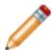

## Note:

The default selection method is based on the selection method you most recently employed. To revert to the other method, click Select in Viewport or Sets or Surfaces on the right side of the prompt area.

• Use the mouse to select the region in the viewport. (For more information, see Selecting objects within the current viewport.)

If the model contains a combination of mesh and geometry, click one of the following from the prompt area:

Click Geometry if you want to select a geometry region.  
Click Mesh if you want to select nodes from a native or orphan mesh selection.

You can use the angle method to select a group of faces or edges from geometry or a group of element faces from a mesh. For more information, see Using the angle and feature edge method to select multiple objects.

d. To remove a region type from the rigid body, select that region type, and then click on the right side of the editor.

4. Repeat Step 3 as often as necessary to select all of the regions that you want to include in the rigid body.

5. Select the rigid body reference point:

a. In the bottom half of the editor, click

b. Use one of the techniques described above to select a vertex or node to serve as the rigid body reference point. For more information, see The Reference Point toolset.”

6. Toggle on Adjust point to center of mass at start of analysis if you want Abaqus to reposition the rigid body reference point at the calculated center of mass of the rigid body.

7. Toggle on Constrain selected regions to be isothermal to specify an isothermal rigid body for a fully coupled thermal-stress analysis.

8. Click OK to save your constraint definition and to close the editor.

## Additional information

• Understanding constraints  
• Rigid Body Definition

## Defining display body constraints

You can create a display body constraint by selecting a part instance that will be displayed but will not be included in the analysis. You can constrain the display body to be fixed in space, or you can constrain it to follow selected nodes in the assembly. You can apply a display body constraint to any part instance in the model. For more information, see Display Body Definition. In addition, you can control the appearance of display bodies in the Visualization module; for more information, see Customizing the appearance of display bodies. For an example of a model that includes a display body constraint combined with connectors, see Display bodies.”

1. From the main menu bar, select Constraint->Create.

Tip: You can also create a display body constraint using the toolbox.

tool in the Interaction module

2. In the Create Constraint dialog box that appears, do the following:

a. Name the constraint. For more information about naming objects, see Using basic dialog box components.  
b. From the Type list, select Display body; then click Continue.

3. Select the part instance that will be a display body.

The constraint editor appears.

4. By default, the part instance is fixed; alternatively, you can constrain it to follow selected points in the assembly. From the Motion control field of the constraint editor, choose one of the following:

## No motion

Choose No motion to fix the selected part instance in space during the analysis. This is the default option.

## Follow single point

Choose Follow single point, click , and select the point to which the part instance will be constrained. You must select the point from a different part instance, and that part instance must not be a display body. During the analysis the display body will follow the translations and rotations of the selected point.

## Follow three points

Choose Follow three points, click , and select the three points to which the part instance will be constrained. You must select the points from a different part instance, and that part instance must not be a display body. During the analysis the display body will follow the translations and rotations of the coordinate system defined by the selected points. The first point indicates the origin of the coordinate system, the second point indicates the X-direction, and the third point indicates the X–Y plane. The points should be non-colinear and should remain non-colinear during the analysis.

5. Click OK to save your constraint definition and to close the editor.

## Additional information

• Display bodies  
• Understanding constraints  
• The Reference Point toolset  
• Rigid Body Definition

## Defining coupling constraints

You use a coupling constraint to constrain the motion of a surface to the motion of one or more points.

You can create a coupling constraint by specifying one or more control points, a constraint region, and an influence radius that defines the points in the constraint region to include in the constraint. You can specify a kinematic or distributing coupling constraint type. For detailed information about coupling constraints, see Coupling Constraints.

1. From the main menu bar, select Constraint->Create.

Tip: You can also create a coupling constraint using the tool in the Interaction module toolbox.

2. In the Create Constraint dialog box that appears, do the following:

a. Name the constraint. For more information about naming objects, see Using basic dialog box components.  
b. From the Type list, select Coupling, and then click Continue.

3. Select one or more points to define the constraint control points using one of the following methods:

• Select one or more points in the viewport.

Tip: The Select the Entity Closest to the Screen tool in the Selection toolbar is toggled off by default. If you make an ambiguous selection, Abaqus/CAE highlights the point and displays a description of the point in the lower-left corner of the viewport. Use the Next and Previous buttons to cycle through the possible selections, and click OK to confirm your selection.

(For more information, see Selecting objects within the current viewport.) Click mouse button 2 to indicate that you have finished selecting.

If the model contains a combination of mesh and geometry, click one of the following from the prompt area:

Click Geometry if you want to select the constraint control point from geometry or select a reference point.  
Click Mesh if you want to select the constraint control point from a native or orphan mesh selection.

Use an existing set to define the region. On the right side of the prompt area, click Sets. Select an existing set from the Region Selection dialog box that appears, and click Continue.

Note: The default selection method is based on the selection method you most recently employed. To revert to the other method, click Select in Viewport or Sets on the right side of the prompt area.

The points that you select become highlighted in red in the viewport.

4. In the prompt area, select one of the following to define the constraint region type:

• Select Surface if you want to select a surface.  
• Select Node Region if you want to select a region from which to create a node-based surface.

5. Select the constraint region using one of the following methods:

• Select a region in the viewport. (For more information, see Selecting objects within the current viewport.) Click mouse button 2 to indicate that you have finished selecting.

If the model contains a combination of mesh and geometry, click one of the following from the prompt area:

- Click Geometry if you want to select the surface from a geometry region.  
Click Mesh if you want to select the surface from a native or orphan mesh selection.

Use an existing surface to define the region. On the right side of the prompt area, click Surfaces. Select an existing surface from the Region Selection dialog box that appears, and click Continue.

Note: The default selection method is based on the selection method you most recently employed. To revert to the other method, click Select in Viewport or Surfaces on the right side of the prompt area.

The region that you select becomes highlighted magenta in the viewport, and the constraint editor appears.

6. From the editor, choose one of the following Coupling type categories:

• Choose Kinematic to define a kinematic coupling constraint between the control points and the points in the constraint region, and toggle on the degrees of freedom that you want to constrain.  
Choose Distributing to define a distributing coupling constraint between the control points and the points in the constraint region. Abaqus/CAE automatically constrains the translational degrees of freedom.

1. Toggle on the rotational degrees of freedom that you want to constrain.  
2. Choose the Translational Coupling type option: Translational Continuum distributing or Translational Structural distributing.  
3. Choose the Rotational Coupling type option: Rotational Continuum distributing or Rotational Structural distributing.  
4. Click the arrow next to the Weighting method field, and select a weighting method from the list that appears. For more information, see Coupling Constraints.

7. From the editor, choose one of the following methods to define the Influence radius:

• To outermost point on the region. Abaqus includes all points (nodes) on the specified region in the coupling definition.  
Specify. You can specify the radius of a sphere, centered about the constraint control points, to limit the points in the coupling definition. For more information on selecting the coupling points, see Coupling Constraints.

8. If desired, toggle on Adjust control points to lie on surface. Abaqus/CAE will move the control points to lie on the constraint surface.

9. If you want to change the coordinate system (CSYS) for the coupling constraint, click and use one of the following methods:

• Select a predefined datum coordinate system by name.

1. From the prompt area, click Datum CSYS List to display a list of datum coordinate systems.

## 2. Select a name from the list, and click OK.

• Select a predefined coordinate system in the viewport.

Tip: The tool in the Selection toolbar is toggled off by default. For coordinate systems with coincident origins, when you cycle through all the possible selections, Abaqus/CAE highlights the coordinate system and displays the description of the coordinate system in the viewport.

• Click Use Global CSYS from the prompt area to use the global coordinate system.

10. Click OK to save your constraint definition and to close the editor.

## Additional information

• Understanding constraints  
• Coupling Constraints

You use an adjust points constraint to move a point or points onto a specified surface. For more information about adjusting points, see Adjusting Nodal Coordinates. This adjustment may be useful in assembled fastener template models and other applications; see About assembled fasteners, and Creating assembled fasteners.

An adjust points constraint should not be used in assembled fastener template models when the main model attachment points are located on bolt hole center points. Any point along the bolt hole centerline will be moved incorrectly to a random location along the perimeter of the hole instead of being projected along the surface normal to the center of the hole.

1. From the main menu bar, select Constraint->Create.

Tip: You can also create an adjust points constraint using the tool in the Interaction module toolbox.

2. In the Create Constraint dialog box that appears, do the following:

a. Name the constraint. For more information about naming objects, see Using basic dialog box components.  
b. From the Type list, select Adjust points, and then click Continue.

3. Select the point or set of points to be moved, using one of the following methods:

• Select one or more points in the viewport.

Tip: The Select the Entity Closest to the Screen tool in the Selection toolbar is toggled off by default. If you make an ambiguous selection, Abaqus/CAE highlights the point and displays a description of the point in the lower left corner of the viewport. Use the Next and Previous buttons to cycle through the possible selections, and click OK to confirm your selection.

Click mouse button 2 to indicate that you have finished selecting. For more information, see Selecting objects within the current viewport.

If the model contains a combination of mesh and geometry, click one of the following from the prompt area:

Click Geometry if you want to select the points from a geometry region or select one or more reference points.  
Click Mesh if you want to select the points from a native or orphan mesh selection.

Use an existing set to define the point or points. On the right side of the prompt area, click Sets. Select an existing set of points from the Region Selection dialog box that appears, and click Continue.

## Note:

The default selection method is based on the selection method you most recently employed. To revert to the other method, click Select in Viewport or Sets on the right side of the prompt area.

The points that you select become highlighted in red in the viewport.

4. In the prompt area, select the type of region onto which the points will be moved.

• Select Surface if you want to select a surface.  
• Select Node Region if you want to select a region from which to create a node-based surface.

5. Select the surface onto which the points will be moved using one of the following methods:

• Select a surface in the viewport. Click mouse button 2 to indicate that you have finished selecting. If the model contains a combination of mesh and geometry, click one of the following from the prompt area:

Click Geometry if you want to select the surface from a geometry region or select one or more reference points.  
Click Mesh if you want to select the surface from a native or orphan mesh selection.

Use an existing surface or set to define the region. On the right side of the prompt area, click Surfaces or Sets. Select an existing surface or set from the Region Selection dialog box that appears, and click Continue.

## Note:

The default selection method is based on the selection method you most recently employed. To revert to the other method, click Select in Viewport or Surfaces (or Sets) on the right side of the prompt area.

The region that you select is highlighted in magenta in the viewport, and the constraint editor appears.

6. Click OK to save your constraint definition and to close the editor.

## Additional information

• Understanding constraints  
• Adjusting Nodal Coordinates

You use an MPC constraint to constrain the motion of secondary nodes of a region to the motion of a point. You can create an MPC constraint by specifying a control point and a region composed of nodes, edges, and surfaces. For detailed information about multi-point constraints, see General Multi-Point Constraints.

1. From the main menu bar, select Constraint->Create.

Tip: You can also create a multi-point constraint using the tool in the Interaction module toolbox.

2. In the Create Constraint dialog box that appears, do the following:

a. Name the constraint. For more information about naming objects, see Using basic dialog box components.  
b. From the Type list, select MPC Constraint, then click Continue.

3. Select a point to define the constraint control point using one of the following methods:

• Use the mouse to select a point in the viewport.

Tip: The Select the Entity Closest to the Screen tool in the Selection toolbar is toggled off by default. If you make an ambiguous selection, Abaqus/CAE highlights the point and displays a description of the point in the lower left corner of the viewport. Use the Next and Previous buttons to cycle through the possible selections, and click OK to confirm your selection.

(For more information, see Selecting objects within the current viewport.) Click mouse button 2 to indicate that you have finished selecting.

If the model contains a combination of mesh and geometry, click one of the following from the prompt area:

Click Geometry if you want to select the control point from a geometry region.  
Click Mesh if you want to select the control point from a native or orphan mesh selection.

Use an existing set to define the region. On the right side of the prompt area, click Sets. Select an existing set from the Region Selection dialog box that appears, and click Continue.

## Note:

The default selection method is based on the selection method you most recently employed. To revert to the other method, click Select in Viewport or Sets on the right side of the prompt area.

The point that you select becomes highlighted in red in the viewport.

4. Select the region for the secondary nodes. Use one of the following methods to select the region:

Use the mouse to select a region in the viewport. (For more information, see Selecting objects within the current viewport.) The region that you select can span multiple part instances. Click mouse button 2 to indicate that you have finished selecting.

If the model contains a combination of mesh and geometry, click one of the following from the prompt area:

- Click Geometry if you want to select a geometry region.  
Click Mesh if you want to select the region from a native or orphan mesh selection.

You can use the angle method to select a group of nodes from a mesh. For more information, see Using the angle and feature edge method to select multiple objects.

Use an existing set to define the region. On the right side of the prompt area, click Sets. Select an existing set from the Region Selection dialog box that appears and click Continue.

## Note:

The default selection method is based on the selection method that you most recently employed. To revert to the other method, click Select in Viewport or Sets on the right side of the prompt area.

The region that you select becomes highlighted in magenta in the viewport.

The constraint editor appears.

5. From the editor, select the MPC type.

• Select Beam to define a rigid beam connection to constrain the displacement and rotation of each secondary node to the displacement and rotation of the control point.  
• Select Tie to make all active degrees of freedom equal at each secondary node and the control point.  
• Select Link to define a pinned rigid link between each secondary node and the control point.  
• Select Pin to define a pinned joint between each secondary node and the control point.  
Select Elbow to constrain nodes of ELBOW31 or ELBOW32 elements together (see Pipes and Pipebends with Deforming Cross-Sections: Elbow Elements).  
• Select User-defined to define a multi-point constraint in user subroutine MPC (for Abaqus/Standard). See the following sections for more information:

Specifying general job settings  
MPC

6. If you selected a user-defined MPC type, do the following:

a. Choose the coding mode for user subroutine MPC.

Choose DOF-by-DOF if you want each call to the user subroutine to constrain one individual degree of freedom.  
• Choose Node-by-Node if you want each call to the user subroutine to impose a set of constraints all at once.

b. In the Constraint type field, enter an integer value to be used in the user subroutine to distinguish between different constraint types. The default value is 0.

7. If you want to change the coordinate system (CSYS) for the coupling constraint, click and use one of the following methods:

• Select a predefined datum coordinate system by name.

1. From the prompt area, click Datum CSYS List to display a list of datum coordinate systems.  
2. Select a name from the list, and click OK.

• Select a predefined coordinate system in the viewport.

Tip: The tool in the Selection toolbar is toggled off by default. For coordinate systems with coincident origins, when you cycle through all of the possible selections, Abaqus/CAE highlights the coordinate system and displays the description of the coordinate system in the viewport.

• Click Use Global CSYS from the prompt area to use the global coordinate system.

8. Click OK to save your constraint definition and to close the editor.

## Defining shell-to-solid coupling constraints

You use a shell-to-solid coupling constraint to couple the motion of a shell edge to the motion of an adjacent solid face. You can create a shell-to-solid coupling constraint by specifying a shell edge surface and a solid face region. The shell edge surface and the solid face region being coupled must belong to different part instances unless the shell edge surface is part of a midsurface region within a solid model.

For detailed information about shell-to-solid coupling constraints, see Shell-to-Solid Coupling.

Abaqus/CAE creates shell-to-solid coupling constraints automatically only when shell sections and solid sections exist within the same part and they are nearly perpendicular to each other with a solid surface detected on both sides of the shell surface.

1. From the main menu bar, select Constraint->Create.

Tip: You can also create a shell-to-solid coupling constraint using the tool in the Interaction module toolbox.

2. In the Create Constraint dialog box that appears, do the following:

a. Name the constraint. For more information about naming objects, see Using basic dialog box components.  
b. From the Type list, select Shell-to-solid coupling, and then click Continue.

3. Use one of the following methods to select the shell edge surface:

Use an existing surface to define the region. On the right side of the prompt area, click Surfaces. Select an existing surface from the Region Selection dialog box that appears, and click Continue.

## Note:

The default selection method is based on the selection method you most recently employed. To revert to the other method, click Select in Viewport or Surfaces on the right side of the prompt area.

• Use the mouse to select a region in the viewport. (For more information, see Selecting objects within the current viewport.) Click mouse button 2 to indicate that you have finished selecting.

If the model contains a combination of mesh and geometry, click one of the following from the prompt area:

- Click Geometry if you want to select the surface from a geometry region.  
Click Mesh if you want to select the surface from a native or orphan mesh selection.

You can use the angle method to select a group of faces or edges from geometry or a group of element faces from a mesh. For more information, see Using the angle and feature edge method to select multiple objects.

The shell edge surface that you select becomes highlighted in red in the viewport.

4. Select the solid face region.

a. In the prompt area, click the arrow next to the text field and select one of the following:

• Select Surface if you want to select a surface.  
• Select Node Region if you want to select a region from which to create a node-based surface.

b. Use one of the same methods described in the previous step to select the solid face region. The solid face region that you select becomes highlighted in magenta in the viewport The constraint editor appears.

5. From the editor, choose one of the following Position Tolerance methods:

Use computed default. Abaqus determines the nodes on the shell edge surface to be coupled with the solid face region using the default position tolerance. For more information, see Shell-to-Solid Coupling.  
• Specify distance. You can specify an absolute distance from the solid face region within which all shell nodes to be included in the coupling must lie.

6. From the editor, choose one of the following Influence Distance methods:

Use analysis default. Abaqus determines the nodes on the solid face region to be coupled with the shell edge surface using the default influence distance. For more information, see Shell-to-Solid Coupling.  
• Specify value. You can specify a distance from the shell edge surface within which all solid nodes to be included in the coupling must lie.

7. Click OK to save your constraint definition and to close the editor.

## Additional information

• Understanding constraints  
• Shell-to-Solid Coupling

## Defining embedded region constraints

You use an embedded region constraint to embed a region of the model within a “host” region of the model or within the whole model. You can create an embedded region constraint by specifying the embedded region, the host region, a weight factor roundoff tolerance, and an absolute exterior tolerance or fractional exterior tolerance. For more information, see Embedded Elements.

1. From the main menu bar, select Constraint->Create.

Tip: You can also create an embedded region constraint using the tool in the Interaction module toolbox.

2. In the Create Constraint dialog box that appears, do the following:

a. Name the constraint. For more information about naming objects, see Using basic dialog box components.  
b. From the Type list, select Embedded region, and then click Continue.

3. Select the embedded region using one of the following methods:

• Select a region in the viewport. (For more information, see Selecting objects within the current viewport.) Click mouse button 2 to indicate that you have finished selecting.

If the model contains a combination of mesh and geometry, click one of the following from the prompt area:

- Click Geometry if you want to select a geometry region.  
Click Mesh if you want to select the region from a native or orphan mesh selection.

Use an existing set to define the region. On the right side of the prompt area, click Sets. Select an existing set from the Region Selection dialog box that appears, and click Continue.

## Note:

The default selection method is based on the selection method you most recently employed. To revert to the other method, click Select in Viewport or Sets on the right side of the prompt area.

The region that you select becomes highlighted in red in the viewport.

4. Select the host region.

In the prompt area, select one of the following:

• Select Region if you want to select a region in the viewport or use an existing set to define the region. Use one of the methods described in the previous step to select the host region.

The region that you select becomes highlighted magenta in the viewport.

• Whole Model if you want to embed the embedded region within the whole model.

The constraint editor appears.

5. In the editor, specify values for the tolerance parameters. If you specify values for both exterior tolerance parameters, Abaqus will use the smaller of the two tolerances.

Weight factor roundoff tolerance. You can specify a small value below which the weighting factors will be zeroed out. The default value is 10−6. $1 0 ^ { - 6 }$

Absolute exterior tolerance. You can specify the absolute value by which a node on the embedded region may lie outside the host region. If this parameter is omitted or has a value of 0.0, the Fractional exterior tolerance will apply.  
Fractional exterior tolerance. You can specify the fractional value by which a node on the embedded region may lie outside the host region. The fractional value is based on the average element size within the host region. The default value is 0.05.

6. Click OK to save your constraint definition and to close the editor.

## Additional information

• Understanding constraints  
• Embedded Elements

## Defining equation constraints

You can create an equation constraint by entering data in the Edit Constraint dialog box.

The terms of an equation consist of a coefficient applied to a degree of freedom of every node in a set. For detailed information about equations, see Linear Constraint Equations.

1. From the main menu bar, select Constraint->Create.

Tip: You can also create an equation constraint using the tool in the Interaction module toolbox.

2. In the Create Constraint dialog box that appears, do the following:

a. Name the constraint. For more information about naming objects, see Using basic dialog box components.  
b. From the Type list, select Equation, and then click Continue.

The constraint editor appears.

3. In the table in the editor, enter a row of data for each term in the equation. The equation must have at

least two terms. Click for a description of the relationship between the data in the table and the desired equation.

Each row should contain the following information:

• The coefficient.  
• The name of an existing set. (For information on creating sets, see The Set and Surface toolsets.) You can enter a set that contains one or more nodes in the first row of the table. Subsequent sets can contain multiple nodes as long as all the sets contain an equal number of nodes.  
• The degree of freedom.  
The ID of the coordinate system in which you will apply the constraint. You can either accept the default coordinate system or select an existing datum coordinate system. If the desired datum coordinate system does not exist, you can create it using the Datum toolset. (For more information, see Creating datum coordinate systems.)

To determine the ID of a coordinate system, select Tools->Query from the main menu bar. For more information, see Obtaining general information about the model.

4. Click OK to save your equation definition and to close the constraint editor.

## Additional information

• Understanding constraints  
• Linear Constraint Equations

## Using contact and constraint detection

The contact detection tool greatly simplifies the process for defining contact interactions and tie constraints in a model. This section explains in detail how to use the contact detection dialog box to locate and create interactions or constraints automatically.

For an overview of contact detection and a discussion of the search methods used by Abaqus/CAE, see Understanding contact and constraint detection.

## In this section:

Specifying search criteria for contact detection  
Searching for contact pairs  
Reviewing and modifying detected contact pairs  
Creating interactions for automatically detected contact pairs

## Specifying search criteria for contact detection

The contact detection tool identifies potential contact pairs in a model using an array of user-defined parameters. Select Interaction->Find contact pairs or Constraint->Find contact pairs from the main menu, then enter the contact detection parameters.

## In this section:

Specifying general search options for contact detection  
Specifying naming options for contact detection  
Specifying entity options for contact detection  
Defining default contact pair parameters  
Specifying advanced search options for contact detection

## Specifying general search options for contact detection

General search options indicate the range in which you want Abaqus/CAE to look for contact pair candidates. You can specify which areas of the model include contact pairs, as well as the estimated distance between surfaces that will require interaction or constraint definitions.

1. From the main menu, select either Interaction->Find contact pairs or Constraint->Find contact pairs.

Tip: You can also find contact pairs using the tool in the Interaction module toolbox.

Abaqus/CAE displays the contact detection dialog box.

2. Display the Search Options tabbed page if it is not visible already.  
3. Specify the Search domain:

• Select Whole model to include every instance in the current model.  
Select Instance to include only specified part instances and child part instances. Use the following procedure to specify the instances:

1. Click

2. Select the instances from the viewport (for information on selecting instances, see Selecting objects within the viewport”).  
3. After you have selected all of the desired instances, click Done in the prompt area.

Select Displayed entities to include only those portions of the model that are currently displayed in the viewport. You can use the assembly display options and display groups to control the display of the model. For details, see Controlling instance visibility, and Using display groups to display subsets of your model.”

4. Enter the maximum distance between potential contact pair surfaces in the Include pairs within separation tolerance field. For tips on selecting a separation tolerance, see Choosing a separation tolerance and extension angle.  
5. By default, Abaqus/CAE extends surface definitions to any faces (for geometry) or facets (for meshed models) within 20° of the surfaces detected by the search. You can adjust this angle by changing the value in the Extend each surface found by angle field. To prevent the extension of surface definitions, toggle off Extend each surface found by angle. For further details on how Abaqus/CAE extends surfaces, see Additional criteria for defining contact pairs.  
6. By default, Abaqus/CAE creates contact pairs from surfaces located on different part instances or model instances. To search for contact pairs involving different regions on the same part instance or model instance or to search for potential self-contact interactions, toggle on Include pairs with surfaces on the same instance. For details, see Defining contact within the same instance and self-contact.

## Additional information

• Understanding contact and constraint detection  
• Using contact and constraint detection

## Specifying naming options for contact detection

In addition to creating contact pair interactions, the automatic contact detection tool also creates named surfaces for each surface involved in a contact pair (see Default interaction and constraint parameters). The Names tabbed page provides some options for tuning this surface creation behavior.

1. From the main menu, select either Interaction->Find contact pairs or Constraint->Find contact pairs.

Tip: You can also find contact pairs using the tool in the Interaction module toolbox.

Abaqus/CAE displays the contact detection dialog box.

2. Display the Names tabbed page.  
3. In the Name prefix field, enter the prefix that will be used when naming each contact pair and surface (as discussed in Default interaction and constraint parameters).  
4. To prevent the creation of named surfaces, toggle off Name each surface found. This option will not affect the creation of contact pairs.  
5. The Create additional named surfaces containing field allows you to create additional composite surfaces:

To create a single named surface composed of all contact pair surfaces acting as a main surface, toggle on All main. Any main surfaces from preexisting contact pairs are also included in the created composite surface.  
To create a single named surface composed of all contact pair surfaces acting as a secondary surface, toggle on All secondary. Any secondary surfaces from preexisting contact pairs are also included in the created composite surface.  
To create a single named surface composed of all surfaces involved in contact pair definitions, toggle on All. Any surfaces from preexisting contact pairs are also included in the created composite surface.

## Additional information

• Understanding contact and constraint detection  
• Using contact and constraint detection

## Specifying entity options for contact detection

The Entities tabbed page allows you to control the types of geometry and elements that are included in a search. You can use these options to ignore certain features of a model or part instance that are not essential to contact interactions or constraints; for example, a layer of membrane elements on the outside of a solid body. Removing features from a search may also improve performance; for example, if all the contacting faces in a complex model are planar, removing cylindrical and spline-based features from the contact pair search may lead to faster search times. In general, the default entity options provide acceptable performance and should be modified only if a search is taking an excessively long time to complete.

1. From the main menu, select either Interaction->Find contact pairs or Constraint->Find contact pairs.

Tip: You can also find contact pairs using the tool in the Interaction module toolbox.

Abaqus/CAE displays the contact detection dialog box.

2. Display the Entities tabbed page.  
3. By default, Abaqus/CAE factors in shell thickness and offset properties when calculating the separation between shell entities. To ignore shell section properties and calculate separations based solely on the geometric representation of shell entities in a model, toggle off Account for shell thickness and offset during search.  
4. When searching for geometry, toggle the following features in the Search the following geometric entities field to include or exclude them from the search domain:

• Planar refers to all flat faces in a model. These features are toggled on by default.  
Cylindrical/Spherical/Toroidal refers to curved faces in a model that were generated by extruding or revolving a straight, circular, or elliptical line. These features are toggled on by default.  
Spline-based refers to irregularly curved faces in a model that were generated from spline lines or paths (see Sketching splines for more information). These features are toggled on by default.

5. When searching for meshed geometry, toggle the following element types in the Search the following mesh entities field to include or exclude them from the search domain:

• Solid refers to faces on solid continuum elements. These elements are toggled on by default.  
• Shell refers to faces on shell elements. These elements are toggled on by default.  
• Membrane refers to faces on membrane or surface elements. These elements are toggled off by default.

## Additional information

• Understanding contact and constraint detection  
• Using contact and constraint detection

## Defining default contact pair parameters

Contact detection rules allow you to specify a set of conditional options that determine the default settings assigned to detected contact pairs. You can always change the contact pair settings after they are detected, but specifying rules before a search allows you to define appropriate contact pairs quickly according to your particular modeling intent. The rules are applied when Abaqus/CAE performs a search for contact pair candidates. For more information about contact pair default settings, see Default interaction and constraint parameters.

1. From the main menu, select either Interaction->Find contact pairs or Constraint->Find contact pairs.

Tip: You can also find contact pairs using the tool in the Interaction module toolbox.

Abaqus/CAE displays the contact detection dialog box.

2. Display the Rules tabbed page.

3. Click

Abaqus/CAE displays the Edit Rules dialog box.

4. To create tie constraints for all contact pairs whose surfaces lie within a particular tolerance, toggle on Use tie constraints when the separation value does not exceed and enter the tolerance in the field provided. This rule is disabled by default.  
5. To set the position tolerance on tie constraints equal to the surface separation reported by the contact detection tool, toggle on Set tie position tolerance to separation value when nonzero. This rule is disabled by default. For more information about position tolerances for tie constraints, see Mesh Tie Constraints.  
6. To set the surface adjustment setting on contact interactions equal to the surface separation reported by the contact detection tool, toggle on Adjust separated interactions by the separation value. This rule is disabled by default. For more information about surface adjustment options, see Contact Initialization for Contact Pairs in Abaqus/Standard.  
7. To move any overclosed secondary nodes in a contact interaction directly onto the main surface, toggle on Adjust interactions to remove overclosure. The adjustment is performed during the analysis. This rule is enabled by default. For more information about surface adjustment options, see Contact Initialization for Contact Pairs in Abaqus/Standard.  
8. Click OK.

## Additional information

• Understanding contact and constraint detection  
• Using contact and constraint detection

## Specifying advanced search options for contact detection

The advanced search options provide an added level of control over the search range and the creation of contact pair surfaces. The general search options are sufficient in most cases; however, you may want to use the advanced options to account for unique modeling conditions. See Tips for using the contact detection tool, for a discussion of various modeling conditions and the recommended search techniques.

1. From the main menu, select either Interaction->Find contact pairs or Constraint->Find contact pairs.

Tip: You can also find contact pairs using the tool in the Interaction module toolbox.

Abaqus/CAE displays the contact detection dialog box.

2. Display the Advanced tabbed page.  
3. By default, Abaqus/CAE merges any contact pairs whose adjacent surfaces lie within 20° of each other (for details on this calculation, see Additional criteria for defining contact pairs). You can adjust this angle by changing the value in the Merge pairs when surfaces are within angle field. To prevent the merging of adjacent contact pairs, toggle off Merge pairs when surfaces are within angle.  
4. By default, Abaqus/CAE includes overclosed and intersecting surfaces when searching for contact pairs. To ignore overclosed surfaces, toggle off Include overclosed surfaces. For details on how the automatic contact detection tool interprets overclosed surfaces, see Detection of overclosed surfaces.  
5. By default, Abaqus/CAE does not create a contact pair candidate if two surfaces are laterally offset from each other (i.e., the surface normals from either surface never intersect the opposite surface). To include these surfaces in the contact pair candidates table, toggle on Include opposing surfaces that do not overlap. Such surfaces must still meet the separation and orientation requirements for the search. See Additional criteria for defining contact pairs, for further discussion of this option.  
6. If your search includes part instances that have been meshed from geometry, indicate how Abaqus/CAE should interpret these instances during the search:

• To treat the instances as geometry, select Geometry. Abaqus/CAE uses the Geometry option by default.  
• To treat the instances as element meshes, select Mesh.

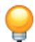

Tip: To detect contact between geometry and mesh instances, first mesh the geometry, then perform a mesh-based search.

For a discussion of the differences between geometry and meshes, see Contact detection for meshed models.

7. To save the current search parameters as defaults for future sessions of Abaqus/CAE, click 8 (for more information, see Saving the search parameters). To reset saved search parameters to the original

defaults, click

## Additional information

• Understanding contact and constraint detection  
• Using contact and constraint detection

## Searching for contact pairs

Once you have indicated the appropriate contact criteria, Abaqus/CAE searches your model to locate the surfaces that meet those criteria. For a discussion of how Abaqus/CAE interprets search criteria and detects contact pair candidates, see Use of the contact detection algorithm.

1. From the main menu, select either Interaction->Find contact pairs or Constraint->Find contact pairs.

Tip: You can also find contact pairs using the tool in the Interaction module toolbox.

Abaqus/CAE displays the contact detection dialog box.

2. Enter the search parameters as described in Specifying search criteria for contact detection.  
3. Click Find Contact Pairs.  
4. Abaqus/CAE searches for potential contact pairs. When the search is complete, Abaqus/CAE populates the contact pair candidates table.

To end a search before it is complete, click Stop in the prompt area.

## Additional information

• Understanding contact and constraint detection  
• Using contact and constraint detection

This section discusses to review and modify the contact pair definitions.

After searching for contact pairs (described in Specifying search criteria for contact detection and Searching for contact pairs), you have the opportunity to review the search results before creating interactions and tie constraints. The search results are presented in the contact pair candidates table: each contact pair comprises a row in the table; each column represents a parameter of the contact pair definition. Default values are provided for every necessary interaction parameter.

## In this section:

Confirming search results in the viewport  
Configuring the layout of the contact pair candidates table  
Reviewing detected contact pairs  
Modifying contact pair definitions  
Creating suppressed interactions and constraints  
Miscellaneous review procedures

## Confirming search results in the viewport

As a visual aid, toggle on Highlight in viewport to highlight specified entities on your model in the viewport.

Select the entities you want to highlight:

## Selected pairs

Highlights the surfaces involved in the contact pair or pairs that are currently selected in the contact pair candidates table. The main surface is highlighted in red; the secondary surface is highlighted in magenta. For axisymmetric or spherical surfaces, Abaqus/CAE also displays the axis of symmetry or spherical center for the surface; the axis or center point is used in surface smoothing calculations if they are applied (see Modifying contact pair definitions).

## Selected main surfaces

Highlights the assigned main surfaces in the contact pair or pairs that are currently selected in the contact pair candidates table. For axisymmetric or spherical surfaces, Abaqus/CAE also displays the axis of symmetry or spherical center for the surface; the axis or center point is used in surface smoothing calculations if they are applied (see Modifying contact pair definitions).

## Selected secondary surfaces

Highlights the assigned secondary surfaces in the contact pair or pairs that are currently selected in the contact pair candidates table. For axisymmetric or spherical surfaces, Abaqus/CAE also displays the axis of symmetry or spherical center for the surface; the axis or center point is used in surface smoothing calculations if they are applied (see Modifying contact pair definitions).

## Search domain

Highlights the part instances in the model specified by the current Search domain field (see Specifying general search options for contact detection).

## Selected pairs + search domain

Highlights both the currently selected contact pairs and the entire search domain.

## Additional information

• Understanding contact and constraint detection  
• Using contact and constraint detection

## Configuring the layout of the contact pair candidates table

A number of options are available to configure the display of the contact pair candidates table. You can customize the table to display only those elements that are essential to your modeling goals.

1. Toggle on Show previously created interactions and ties to add any previously defined contact interactions and tie constraints to the contact pair candidates table. You can edit previously defined interactions and ties in the same manner as newly detected contact pairs.  
2. To limit the table display to only those contact pair candidates whose name contains a particular string,

type that string in the Name filter field and press [Enter]. Click to see examples of valid filtering syntax.

Abaqus/CAE still creates interactions and constraints for contact pair candidates that are hidden by a filter.

3. Add or remove columns from the table display as necessary:

a. Click mouse button 3 anywhere on the contact pair candidates table, and select Edit Visible Columns from the menu that appears.

The Edit Visible Columns dialog box appears.

b. In the Edit Visible Columns dialog box, toggle on the columns you want to display; toggle off the columns you want to hide:

## Suppression

Indicates whether the contact pair will be active or suppressed upon creation (see Creating suppressed interactions and constraints). This column is hidden by default.

## Name

Displays the name of the contact pair. This column is displayed by default.

## Separation

Displays the distance between the two surfaces in the contact pair (see Use of the contact detection algorithm). This column is displayed by default.

## Main surface name

Displays the name of the surface acting as the main in the contact pair. This column is hidden by default.

## Secondary surface name

Displays the name of the surface acting as the secondary in the contact pair. This column is hidden by default.

## Main instance name

Displays the name of the part instance on which the main surface is located. This column is hidden by default.

## Secondary instance name

Displays the name of the part instance on which the secondary surface is located. This column is hidden by default.

## Type

Indicates whether Abaqus/CAE is creating a contact interaction or a tie constraint for the contact pair. This column is displayed by default.

## Sliding

Indicates the tracking approach used in the contact interaction formulation. This column is displayed by default.

## Discretization

Indicates the surface discretization used in the contact interaction or tie constraint formulation. This column is displayed by default.

## Property

Indicates the contact interaction property used in the contact formulation. This column is displayed by default.

## Contact controls

Indicates the contact controls used in the contact formulation. This column is hidden by default and is unavailable in the initial step.

## Adjust

For contact interactions, displays the range within which secondary nodes will be adjusted to lie precisely on the main surface. If nodes in a set are being adjusted, this column displays the name of the set.

For tie constraints, indicates whether or not all tied secondary nodes will be adjusted to lie precisely on the main surface.

This column is displayed by default.

## Create step

Displays the name of the step in which Abaqus/CAE is activating the contact interaction or tie constraint. This column is hidden by default.

## Surface smoothing

Indicates whether or not surface smoothing is applied to axisymmetric or spherical surfaces in the contact pair (see Smoothing Contact Surfaces in Abaqus/Standard). This column is displayed by default.

c. Do one of the following:

• Click OK to apply the settings and to close the Edit Visible Columns dialog box.

• Click Apply to apply the settings and to leave the Edit Visible Columns dialog box open.  
• Click Cancel to ignore any changes and to close the Edit Visible Columns dialog box.

4. Sort the table contents according to parameter values by clicking the column heading for the parameter of interest. An up arrow in the column heading indicates the values are listed in ascending order; a down arrow indicates the parameter values are listed in descending order.

## Additional information

• Understanding contact and constraint detection  
• Using contact and constraint detection

## Reviewing detected contact pairs

You should review the contact pair candidates in the contact pair candidates table to ensure the surfaces involved are accurate and sufficient for your modeling needs.

Click on each contact pair name with the Highlight in viewport option toggled on to see the locations of each potential surface interaction or tie. If necessary you can add, remove, or modify the contact pair candidates.

1. Add a row to the table for any unidentified contact pairs you would like to include in your model:

a. Click mouse button 3 anywhere in the contact pair candidates table, and select Add from the menu

that appears. You can also click the button above the contact pair candidates table.

b. Select a main surface in the viewport, and click OK in the prompt area.

For details on surface selection, see Selecting objects within the viewport.

c. Select a secondary surface in the viewport, and click OK.

Abaqus/CAE adds a contact pair candidate row to the contact pair candidates table based on the surfaces you selected. Default values are provided for each column in the row.

2. Remove any contact pair candidates that are not necessary for your modeling purposes. Click mouse button 3 anywhere on the row representing the contact pair candidate you want to remove, and select Delete from the menu that appears. You can also click the row you want to remove and then click the

button above the contact pair candidates table.

3. If multiple contact pairs will use identical parameters in their contact interaction or tie constraint definition, you can combine them into a single contact pair:

a. In the contact pair candidates table, highlight the rows representing the contact pairs you want to combine (see Selecting multiple items from lists and tables, for instructions on selecting multiple rows in a table).  
b. Click mouse button 3 on any highlighted cell, and select Merge from the menu that appears. You

can also click the button above the contact pair candidates table.

Abaqus/CAE replaces the selected contact pairs with a single contact pair. The selected main surfaces are merged into a single surface, and the selected secondary surfaces are merged into a single surface. The merged contact pair uses the parameters from the selected contact pair that appeared highest in the contact pair candidates table.

## Note:

When combining contact pairs, the resultant merged surfaces must meet the orientation and connectivity requirements discussed in About Contact Pairs in Abaqus/Standard and About Contact Pairs in Abaqus/Explicit.

## Modifying contact pair definitions

The contact pair candidates table presents all of the identified contact pair candidates in a format that allows you to easily review and modify the parameters of each contact pair definition.

Abaqus/CAE supplies default values for each parameter of the contact pair definition (see Default interaction and constraint parameters).

You can customize some of the default parameter settings to suit your modeling needs by using the Rules tabbed page (see Defining default contact pair parameters). However, you may still need to modify some parameters manually before creating interactions and constraints. The Rules options cannot account for such modeling issues as the appropriateness of small-sliding contact or assignment of varying frictional contact properties. You also may need to swap the assignment of main and secondary roles in contact pairs to ensure continuity and robustness.

To modify a parameter, change the value that is displayed in the corresponding cell of the contact pair candidates table. You modify cell values in one of four ways:

• To change a name parameter, click on the cell and type a new name. The old name is overwritten as you type.  
• For cells that accept specific values, first click the cell to activate it. Then click the arrow next to the cell and select the desired value from the list that appears.  
• For cells that require more detailed information to define the parameter, double-click the cell and enter the appropriate information in the dialog box that appears.  
• For all cells other than name parameters, click mouse button 3 on the cell and select Edit Cells from the menu that

appears. You can also click the cell and then click the button above the contact pair candidates table. Enter the appropriate information in the dialog box that appears.

You cannot modify values for the following parameters:

• Separation  
• Main Instance  
• Secondary Instance

Each row of the contact pair candidates table represents a single contact pair candidate. The following instructions apply to a single row. Repeat them as often as necessary for each row in the table. For instructions on editing parameters for multiple contact pair candidates simultaneously, see Miscellaneous review procedures.

1. In the Name column, change the name of the contact pair, if desired.  
2. In the Main Surface or Secondary Surface column, change the name of the generated main surface or secondary surface, if desired.  
The Main Surface and Secondary Surface columns are not displayed in the contact pair candidates table by default. See Configuring the layout of the contact pair candidates table, for instructions on adding these columns to the table.  
3. Click mouse button 3 on any cell in the row, and select Switch Surfaces from the menu that appears to reverse the role of the main and secondary surfaces for the selected contact pair. You can also click the row and then click the button above the contact pair candidates table. (To determine the role assignments in a contact pair, see Confirming search results in the viewport.)  
4. To indicate whether a contact interaction or a tie constraint is created for the contact pair candidate, select Interaction or Tie in the Type column.  
You cannot change the Type for previously created tie constraints or interactions that include node-based regions.  
5. To specify the tracking approach that will be used in an Abaqus/Standard contact formulation, select a value in the Sliding column:

Select Finite to use the finite-sliding tracking approach.•  
• Select Small to use the small-sliding tracking approach.

Abaqus/CAE ignores the Sliding column when creating tie constraints and for Abaqus/Explicit analyses. For more information on the tracking approach, see Contact Formulations in Abaqus/Standard.

6. To specify the surface discretization that will be used in a contact or tie formulation, select a value in the Discretization column:

• Select Node-Surf to use node-to-surface discretization.  
• Select Surf-Surf to use surface-to-surface discretization.

For more information on surface discretization, see Mesh Tie Constraints; Contact Formulations in Abaqus/Standard; and Contact Formulations for Contact Pairs in Abaqus/Explicit.

7. For contact interactions, select the interaction property in the Property column.

If the appropriate contact property is not available, you can create a new one:

a. Click mouse button 3 anywhere in the contact pair candidates table, and select Create Property from the menu that appears.  
b. Create a contact interaction property as described in Defining a contact interaction property.  
When you have finished using the interaction property editor, the property you created will be available under the Property column in the contact pair candidates table.

Abaqus/CAE ignores the Property column when creating tie constraints.

8. For contact interactions, select the contact controls in the Contact Controls column.

The Contact Controls column is not displayed in the contact pair candidates table by default. See Configuring the layout of the contact pair candidates table for instructions on adding this column to the table.

If the appropriate contact controls are not available, you can create them:

a. Click mouse button 3 anywhere in the contact pair candidates table, and select Create Contact Controls from the menu that appears.  
b. Create the contact controls as described in Customizing contact controls.  
When you have finished specifying the contact controls, the controls you created will be available under the Contact Controls column in the contact pair candidates table.

Abaqus/CAE ignores the Contact Controls column when creating tie constraints.

9. Use the adjustment options to reposition a secondary surface (or portions of a secondary surface) precisely onto the main surface at the beginning of an analysis:

a. Double-click the cell in the Adjust column.  
The Secondary Node/Surface Adjustment Options dialog box appears.

b. The options available in the Secondary Node/Surface Adjustment Options dialog box depend on the value in the Type column for the associated contact pair candidate:

• If you are creating a contact interaction, select one of the following options:

## No adjustment

Abaqus/CAE will not reposition any nodes or surfaces.

## Adjust only to remove overclosure

Abaqus/CAE will reposition any initially overclosed secondary nodes or constraint points precisely onto the main surface.

## Specify tolerance for adjustment zone

Abaqus/CAE will reposition any secondary nodes or constraint points located within the specified distance from the main surface precisely onto the main surface.

## Adjust secondary nodes in set

Abaqus/CAE will adjust the secondary nodes or constraint points included in the specified geometry set precisely onto the main surface.

Abaqus/CAE ignores the Adjust column for contact interactions in an Abaqus/Explicit analysis. For more information about adjustment options for contact interactions, see Contact Initialization for Contact Pairs in Abaqus/Standard.

• If you are creating a tie constraint, you can modify both the adjustment options and the tie position tolerance in the Secondary Node/Surface Adjustment Options dialog box:

By default, Abaqus adjusts all tied secondary nodes so they lie precisely on the main surface. To prevent adjustment of the secondary nodes (but still tie the secondary node degrees of freedom to the main surface), toggle off Adjust secondary surface initial position.  
Abaqus ties only those secondary nodes that lie within a specific distance from the main surface. To let Abaqus calculate a reasonable distance automatically, select Use computed default. To specify a distance directly, select Specify distance, and enter the distance in the field provided.

For more information about adjustment options and position tolerances for tie constraints, see Mesh Tie Constraints.

c. Click OK.

10. To change the analysis step in which the contact pair is activated, select a step name in the Create Step column.

The Create Step column is not displayed in the contact pair candidates table by default. See Configuring the layout of the contact pair candidates table, for instructions on adding this column to the table.

11. For contact interactions using surface-to-surface discretization, select whether or not contact smoothing will be applied in the Surface Smoothing column:

Select Automatic to let Abaqus/CAE identify any surfaces (or portions of surfaces) in the contact pair that are axisymmetric or spherical. If the Highlight in viewport option is enabled, Abaqus/CAE displays the axis of symmetry or spherical center for any identified surfaces in the viewport. Abaqus smooths these surfaces during contact calculations to minimize inaccuracies caused by mesh discretization. The Automatic option is available only for geometry models.  
• Select None to prevent contact smoothing from being applied to any surfaces in the contact pair.

Abaqus/CAE ignores the Surface Smoothing column for tie constraints and for contact interactions in an Abaqus/Explicit analysis. For more information about contact surface smoothing, see Smoothing Contact Surfaces in Abaqus/Standard.

## Additional information

• Understanding contact and constraint detection  
• Using contact and constraint detection

## Creating suppressed interactions and constraints

In certain situations you may not be certain about the necessity of certain contact pair candidates. You can delete such candidates from the contact pair candidates table and avoid creating interactions for them, but you may later have to go back and recreate them if they prove necessary.

To address these situations, the contact detection tool offers the option to create interactions and constraints that are suppressed initially. Suppressed interactions and constraints are fully defined, but Abaqus ignores them when writing an input file or performing an analysis. A simple procedure activates these interactions and constraints and, thus, reintroduces them to the model definition (see Suppressing and resuming objects, for details).

There are two ways to create an initially suppressed contact pair:

Click mouse button 3 anywhere in the row for the appropriate contact pair, and select Suppress from the menu that appears. The background of the row for the contact pair changes to gray, indicating that the created interaction or constraint will be suppressed initially. To return the contact pair to active status, click mouse button 3 on the appropriate row and select Resume from the menu that appears.  
• Click the cell in the Suppression column for the appropriate contact pair. Click the cell again to return the contact pair to active status.

## Note:

The Suppression column is not displayed by default. See Configuring the layout of the contact pair candidates table, for instructions on adding this column to the table.

A green check mark in the Suppression cell indicates that the created interaction or constraint is active. A red “X” in this cell indicates that the created interaction or constraint is suppressed initially.

## Miscellaneous review procedures

Abaqus/CAE offers additional tools for manipulating data in the contact pair candidates table.

## Recalculating the separation between surfaces

For part instances that are meshed from geometry, you can specify whether the contact detection tool treats these instances as geometry or an element mesh during the search (see Specifying advanced search options for contact detection). After performing the search, you can recalculate the separation between meshed surfaces in a contact pair candidate based on either the geometry or mesh representation. You can also use this technique to calculate the separation between surfaces in previously defined interactions or ties that appear in the contact pair candidates table (see Configuring the layout of the contact pair candidates table).

1. Click mouse button 3 on the row representing a contact pair, and select Recalculate Separation from the  
menu that appears. You can also click the row and then click the button above the contact pair candidates table.  
2. In the Recalculate Separation dialog box that appears, select Mesh to calculate surface separation based on the meshed representation of the model. Select Geometry to calculate surface separation based on the geometry representation of the model.  
3. Click OK.

Abaqus/CAE recalculates the separation between surfaces in the highlighted contact pair candidate and updates the cell in the Separation column.

## Editing multiple cells

You can set multiple cells to the same value using a single procedure:

1. Highlight multiple cells within the same column (see Selecting multiple items from lists and tables).  
2. Click mouse button 3 anywhere within the highlighted cells, and select Edit Cells from the menu that appears.  
You can also click the button above the contact pair candidates table.  
3. In the dialog box that appears, select the desired value.  
4. Click OK.

Abaqus/CAE sets all of the highlighted cells to the selected value.

## Highlighting the entire table

To quickly highlight every cell in the table, click mouse button 3 anywhere in the table and select Select All from the menu that appears.

## Additional information

• Understanding contact and constraint detection  
• Using contact and constraint detection

## Creating interactions for automatically detected contact pairs

Abaqus/CAE creates contact interactions and tie constraints for every item in the contact pair candidates table based on the parameters you have specified.

1. From the main menu, select either Interaction->Find contact pairs or Constraint->Find contact pairs.

Tip: You can also find contact pairs using the tool in the Interaction module toolbox.

Abaqus/CAE displays the contact detection dialog box.

2. Enter the search parameters as described in Specifying search criteria for contact detection.  
3. Search for contact pairs as described in Searching for contact pairs.  
4. In the contact pair candidates table, enter all of the parameters necessary to define the interactions and ties as described in Reviewing and modifying detected contact pairs.  
5. Click OK.

Abaqus/CAE creates the specified contact interactions and tie constraints.

## Additional information

• Understanding contact and constraint detection  
• Using contact and constraint detection  
• Mesh Tie Constraints  
• About Contact Pairs in Abaqus/Standard  
• About Contact Pairs in Abaqus/Explicit

## Using the connector section editors

After you specify a connection type for a connector section, you can define connector behaviors for connection types that have one or more available components of relative motion. If you change the connection type after you have defined connector behaviors, you will have to delete the connector behaviors and redefine them for the new connection type. This section explains how to enter data related to connector behaviors in the connector section editor.

## In this section:

Defining elasticity  
Defining damping  
Defining friction  
Configuring tangential behavior for connector friction  
Specifying predefined friction parameters or contact forces  
Defining plasticity  
Defining damage  
Defining damage evolution  
Defining a stop  
Defining a lock  
Defining failure  
Defining a reference length  
Defining time integration  
Specifying behavior settings for tabular data  
Specifying connector derived components  
Specifying potential terms

You can define spring-like elasticity behavior for the available components of relative motion. For more information, see Connector Elastic Behavior.

1. Display the connector section editor using one of the following methods:

• To create a new connector section, follow the procedure outlined in Creating connector sections.  
• To edit an existing connector section, select Connector->Section->Manager from the main menu bar, select the connector section from the list that appears, and click Edit.

2. In the Edit Connector Section dialog box, do one of the following:

• To define a new elasticity behavior, click Add and select Elasticity from the menu that appears.  
To edit an existing elasticity behavior, select the behavior from the Behavior Options list to display the associated data fields for that option.

3. Choose the Definition.

• Choose Linear to define linear elastic stiffnesses.  
• Choose Nonlinear to define forces/moments as tabular functions of available components of relative motion.  
• Choose Rigid to define rigid-like elastic behavior.

4. If you are defining linear elastic behavior,

a. In the Force/Moment field, toggle on the forces or moments consistent with the available components of relative motion for which you are defining elastic behavior.

b. In the Coupling field, choose one of the following:

Choose Uncoupled to specify the individual elastic stiffnesses for the available components of relative motion; for example, D11, D22, and D33, as determined by Force/Moment selections. You can use a single elasticity behavior to specify all of the stiffnesses, even if the values are different for each available component of relative motion.  
• Choose Coupled to specify elastic stiffnesses coupled with the available components of relative motion; for example, D11, D12, and D13, as determined by Force/Moment selections.

5. If you are defining nonlinear, uncoupled behavior,

a. In the Force/Moment field, toggle on the forces or moments that are consistent with the available components of relative motion for which you are defining elastic behavior. If the behavior is the same for multiple components, you can define a single elasticity behavior that will use this one function. If the behavior is different for multiple components, you must define separate elasticity behaviors.  
b. Choose Uncoupled in the Coupling field to specify forces/moments as a tabular function of their respective available components of relative motion.

6. If you are defining nonlinear, coupled behavior,

a. In the Force/Moment field, toggle on the forces or moments that are consistent with the available components of relative motion for which you are defining elastic behavior.  
b. Choose Coupled on position or Coupled on motion in the Coupling field to specify forces/moments as functions of one or more relative position or constitutive displacement/rotation components, respectively.

c. In the Independent components field, toggle on the available components of relative position or constitutive motion for which you are defining coupled elastic behavior. You may need to use the unsymmetric equation solver in the step editor to improve convergence.

7. If you are defining rigid elastic behavior, toggle on the available components of relative motion for which you are defining rigid elastic behavior.  
8. To define behavior data that depend on frequency, temperature, or field variables, do the following:

a. If available, toggle on Use frequency-dependent data to define behavior data that vary with frequency. A column labeled Frequency appears in the data table.  
b. Toggle on Use temperature-dependent data to define behavior data that vary with temperature. A column labeled Temp appears in the data table.  
c. To define behavior data that depend on field variables, click the arrows to the right of the Number of field variables field to increase or decrease the number of field variables. Field variable columns appear in the data table.

9. Enter data in the table. You can enter data into the table using the keyboard. Alternatively, you can click mouse button 3 anywhere in the table to view a list of options for specifying tabular data. For detailed information on each option, see Entering tabular data.  
10. To modify the behavior settings for the regularization (Abaqus/Explicit analyses only) or the extrapolation of the data, use the procedure described in Specifying behavior settings for tabular data.  
11. Select one of the following:

• If you want to continue defining behaviors, click Add, select the desired behavior, and continue the connector section definition. For instructions on defining other behaviors, see Using the connector section editors.  
• If you want to view or edit an existing behavior, select the behavior from the Behavior Options list. For instructions on editing behaviors, see Using the connector section editors.  
• If you want to save your connector section definition and exit the editor, click OK.

## Additional information

• Connector Elastic Behavior  
• Connector section editors  
• Creating connector sections

You can define dashpot-like damping behavior for the available components of relative motion. For more information, see Connector Damping Behavior.

1. Display the connector section editor using one of the following methods:

• To create a new connector section, follow the procedure outlined in Creating connector sections.  
• To edit an existing connector section, select Connector->Section->Manager from the main menu bar, select the connector section from the list that appears, and click Edit.

2. In the Edit Connector Section dialog box, do one of the following:

• To define a new damping behavior, click Add and select Damping from the menu that appears.  
To edit an existing damping behavior, select the behavior from the Behavior Options list to display the associated data fields for that behavior.

3. Choose the Damping type.

• Choose Viscous to specify velocity proportional damping.  
• Choose Structural to specify displacement proportional damping.

4. Choose the Definition.

• Choose Linear to define linear damping coefficients.  
• Choose Nonlinear to define forces/moments as tabular functions of the relative velocities.

5. If you are defining linear damping behavior,

a. In the Force/Moment field, toggle on the forces or moments consistent with the relative velocities for which you are defining damping behavior.

b. In the Coupling field, choose one of the following:

Choose Uncoupled to specify the individual damping coefficients associated with the relative velocities; for example, C11, C22, and C33, as determined by Force/Moment selections. You can use a single damping option to specify all the coefficients, even if the values are different for each relative velocity.  
Choose Coupled to specify damping coefficients coupled associated with the relative velocities; for example, C11, C12, and C13, as determined by Force/Moment selections.

6. If you are defining nonlinear, uncoupled behavior,

a. In the Force/Moment field, toggle on the forces or moments that are consistent with the relative velocities for which you are defining damping behavior. If the behavior is the same for multiple components, you can define a single damping behavior that will use this one function. If the behavior is different for multiple components, you must define separate damping behaviors.  
b. Choose Uncoupled in the Coupling field to specify forces/moments as a tabular function of their respective available components of relative velocity.

7. If you are defining nonlinear, coupled behavior,

a. In the Force/Moment field, toggle on the forces or moments that are consistent with the relative velocities for which you are defining damping behavior.  
b. Choose Coupled on position or Coupled on motion in the Coupling field to specify forces/moments as functions of one or more relative position or velocity components, respectively.

c. In the Independent components field, toggle on the available components of relative position or constitutive motion for which you are defining coupled damping behavior. You might need to use the unsymmetric equation solver in the step editor to improve convergence.

8. To define behavior data that depend on frequency, temperature, or field variables, do the following:

a. If available, toggle on Use frequency-dependent data to define behavior data that vary with frequency. A column labeled Frequency appears in the tabular data area.  
b. Toggle on Use temperature-dependent data to define behavior data that vary with temperature. A column labeled Temp appears in the tabular data area.  
c. To define behavior data that depend on field variables, click the arrows to the right of the Number of field variables field to increase or decrease the number of field variables. Field variable columns appear in the tabular data area.

9. Enter damping data in the table. You can enter data into the table using the keyboard. Alternatively, you can click mouse button 3 anywhere in the table to view a list of options for specifying tabular data. For detailed information on each option, see Entering tabular data.

10. To modify the behavior settings for the regularization (Abaqus/Explicit analyses only) or the extrapolation of the data, use the procedure described in Specifying behavior settings for tabular data.

11. Select one of the following:

• If you want to continue defining behaviors, click Add, select the desired behavior, and continue the connector section definition. For instructions on defining other behaviors, see Using the connector section editors.  
• If you want to view or edit an existing behavior, select it from the Behavior Options list. For instructions on editing behaviors, see Using the connector section editors.  
• If you want to save your connector section definition and exit the editor, click OK.

## Additional information

• Connector Damping Behavior  
• Connector section editors  
• Creating connector sections

You can define frictional effects for the available components of relative motion. For more information, see Connector Friction Behavior.

1. Display the connector section editor.

• To create a new connector section, follow the procedure outlined in Creating connector sections.  
• To edit an existing connector section, select Connector->Section->Manager from the main menu bar, select the connector section from the list that appears, and click Edit.

2. In the Edit Connector Section dialog box, do one of the following:

• To define a new friction behavior, click Add and select Friction from the menu that appears.  
To edit an existing friction behavior, select the behavior from the Behavior Options list to display the associated data fields for that option.

3. Choose the Friction model. For more information, see What types of friction models are available?.

• Choose Predefined to use a predefined friction model. Abaqus displays the slip direction along which friction occurs.  
Choose User-defined to specify the slip direction in which friction forces or moments are applied and to define friction-generating contact force contributions.

4. If you are specifying a user-defined friction model, choose the Slip direction.

Choose Specify direction to specify the available component of relative motion along which friction forces or moments are applied. You can define multiple friction behaviors to model friction for more than one component, but Abaqus allows only one friction behavior for each component.  
Choose Compute using force potential to compute the instantaneous slip direction using a force potential. Select the Force Potential tabbed page, and define at least one force potential term. For more information, see Specifying potential terms.

5. Choose the Stick stiffness.

• Choose Use default to have Abaqus compute an appropriate stick stiffness.  
• Choose Specify to enter the stick stiffness associated with frictional behavior in the direction specified by the slip direction.

6. Configure the Tangential Behavior. For more information, see Configuring tangential behavior for connector friction.

7. If you are specifying a predefined friction model, specify the Predefined Friction Parameters. If you are specifying a user-defined friction model, specify the Contact Force. For more information, see Specifying predefined friction parameters or contact forces.

8. Select one of the following:

• If you want to continue defining behaviors, click Add, select the desired behavior, and continue the connector section definition. For instructions on defining other behaviors, see Using the connector section editors.  
• If you want to view or edit an existing behavior, select the behavior from the Behavior Options list. For instructions on editing behaviors, see Using the connector section editors.

• If you want to save your connector section definition and exit the editor, click OK.

## Additional information

• Connector Friction Behavior  
• What types of friction models are available?  
• Connector section editors  
• Creating connector sections  
• Specifying potential terms

## Configuring tangential behavior for connector friction

You can select a friction formulation for predefined and user-defined connector friction models.

You use the Tangential Behavior tabbed page in the connector section editor to make the selection. For more information, see Using the Basic Coulomb Friction Model. You can choose from the following:

• Penalty. Specify a friction coefficient.  
• Static-Kinetic Exponential Decay. Specify separate static and kinetic friction coefficients with a smooth transition zone defined by an exponential curve.

## Additional information

• Defining friction

## Configure tangential behavior using the Penalty friction formulation

1. Display the connector section editor by following the procedure outlined in Defining friction, and select the Tangential Behavior tabbed page.  
2. From the Friction formulation field, select Penalty.  
3. On the Friction Coefficient tabbed page, enter the following data:

## Friction Coeff

Friction coefficient, $\pmb { \mu } .$

## Slip Rate

If desired, toggle on Use slip-rate-dependent data and enter the slip rate, $\dot { \gamma } _ { e q } .$

## Contact Pressure

If desired, toggle on Use contact-pressure-dependent data and enter the contact pressure, p.

## Temp

If desired, toggle on Use temperature-dependent data and enter the average temperature at the contact point, ${ \overline { { \pmb { \theta } } } } ,$ between the two contact surfaces.

## Field 1, Field 2, etc.

If desired, specify the Number of field variables and enter the average value of the first field variable, $\overline { f } ^ { 1 }$ , the average value of the second field variable, $\overline { { f } } ^ { 2 }$ , etc.

4. On the Shear Stress tabbed page, specify the shear stress limit.

## No limit

Indicates no limit on the equivalent shear stress.

## Specify

Enter the equivalent shear stress limit, $\tau _ { m a x }$ ; that is, the maximum achievable value of the equivalent shear stress.

5. On the Elastic Slip tabbed page, choose a method for modifying the allowable elastic slip (applies only to Abaqus/Standard analyses).

## Fraction of characteristic model dimension

Enter the ratio of the allowable maximum elastic slip to a characteristic model dimension. The default value is 0.0001.

## Absolute distance

Enter the absolute magnitude of the allowable elastic slip, , to be used in the stiffness method for sticking friction.

## Configure tangential behavior using the Static-Kinetic Exponential Decay friction formulation

1. Display the connector section editor by following the procedure outlined in Defining friction, and select the Tangential Behavior tabbed page.  
2. From the Friction formulation field, select Static-Kinetic Exponential Decay.  
3. On the Friction Coefficients tabbed page, choose the exponential decay definition and enter the coefficients or test data.

• Coefficients. Provide the static friction coefficient, kinetic friction coefficient, and decay coefficient directly.

## Static Coeff

Enter the static friction coefficient, $\mu _ { s }$

## Kinetic Coeff

Enter the kinetic friction coefficient, $\pmb { \mu _ { k } }$ .

## Decay Coeff

Enter the decay coefficient, $d _ { c }$ .

• Test data. Provide test data points to fit the exponential model.

## Friction Coeff

• Enter the static coefficient of friction specified at $\dot { \gamma } _ { e q } = 0 . 0 .$ .  
• Enter the dynamic friction coefficient, an experimental measurement taken at a reference slip rate, $\dot { \gamma } _ { 2 }$ .  
• Enter the kinetic friction coefficient, $\pmb { \mu } _ { \infty }$ . This value corresponds to the asymptotic value of the friction coefficient at infinite slip rate, $\dot { \gamma } _ { \infty }$ .

## Slip Rate

Enter the reference slip rate, $\dot { \gamma } _ { 2 } .$ , used to measure the dynamic friction coefficient.

4. On the Elastic Slip tabbed page, choose a method for modifying the allowable elastic slip (applies only to Abaqus/Standard analyses).

## Fraction of characteristic model dimension

Enter the ratio of the allowable maximum elastic slip to a characteristic model dimension. The default value is 0.0001.

## Absolute distance

Enter the absolute magnitude of the allowable elastic slip, $\gamma _ { i } ,$ to be used in the stiffness method for sticking friction.

## Specifying predefined friction parameters or contact forces

You can specify geometric constants and internal contact forces for predefined connector friction models and a friction-generating contact force and internal contact forces for user-defined connector friction models.

You use the Predefined Friction Parameters tabbed page in the connector section editor to specify geometric constants and internal contact forces for predefined connector friction models. You use the Contact Force tabbed page in the connector section editor to specify a friction-generating contact force and internal contact forces for user-defined connector friction models. For more information, see Connector Friction Behavior.

## Additional information

• Defining friction  
• Specifying connector derived components

## Specify predefined friction parameters

1. Display the connector section editor by following the procedure outlined in Defining friction, and enter the necessary data.  
2. Select Predefined as the Friction model.  
3. Select the Predefined Friction Parameters tabbed page.  
4. Specify the geometric constants and internal contact forces depending on the connection type that you have selected. To display the connection type description that defines the required data entries, see Connection types.

## Specify a friction-generating contact force and internal contact forces

1. Display the connector section editor by following the procedure outlined in Defining friction, and enter the necessary data.  
2. Select User-defined as the Friction model.  
3. Select the Contact Force tabbed page.  
4. If desired, toggle on Specify component to define a friction-generating contact force/moment using an intrinsic connector component or a derived connector component.

Choose Intrinsic component, and select the force/moment that is consistent with the available component of relative motion for which you are defining the friction-generating contact force/moment.

Choose Derived component, and click to define a connector derived component. For more information, see Specifying connector derived components.

5. If Specify component is toggled off, you must enter a value for the internal contact force in the data table in the Internal Contact Force portion of the Contact Force tabbed page. If desired, you can do the following to specify the internal contact force:

## Use independent components

Toggle on Use independent components, choose Position or Motion, and select the available components of relative position or constitutive motion to be used as independent variables. Enter the connector relative position or constitutive motion in the direction specified by the independent component in the corresponding field of the table.

## Accum Slip

Toggle on Use accumulated slip dependence, and enter the accumulated slip in the slip direction.

## Temp

Toggle on Use temperature-dependent data, and enter the temperature.

## Field 1, Field 2, etc.

Specify the Number of field variables, and enter the value of the first field variable, the value of the second field variable, etc.

## Internal Contact Force

Specify the internal contact force data.

6. To modify the behavior settings for the regularization (Abaqus/Explicit analyses only) or the extrapolation of the data, use the procedure described in Specifying behavior settings for tabular data.

## Defining plasticity

You can define plasticity behavior for the available components of relative motion. For more information, see Connector Plastic Behavior. If you specify a plasticity behavior option, you must also specify an elasticity behavior option.

1. Display the connector section editor using one of the following methods:

• To create a new connector section, follow the procedure outlined in Creating connector sections.  
• To edit an existing connector section, select Connector->Section->Manager from the main menu bar, select the connector section from the list that appears, and click Edit.

2. In the Edit Connector Section dialog box, do one of the following:

• To define a new plasticity behavior, click Add and select Plasticity from the menu that appears.  
To edit an existing plasticity behavior, select the behavior from the Behavior Options list to display the associated data fields for that behavior.

3. If you are defining uncoupled plasticity behavior,

a. Choose Uncoupled in the Coupling field to specify forces/moments as a tabular function of their respective available components of relative motion.  
b. In the Force/Moment field, toggle on the forces or moments that are consistent with the available components of relative motion for which you are defining plasticity behavior. If the behavior is the same for multiple components, you can define a single plasticity behavior that will use this one function. If the behavior is different for multiple components, you must define separate plasticity behaviors.

4. If you are defining coupled plasticity behavior,

a. Choose Coupled in the Coupling field.  
b. Select the Force Potential tabbed page, and define at least one force potential term. For more information, see Specifying potential terms.

5. Select the hardening behavior.

Toggle on Specify isotropic hardening to define the initial yield value and, optionally, the evolution of the yield surface size, , as a function of the equivalent plastic relative motion, .  
Toggle on Specify kinematic hardening to define the translation of the yield surface in force space through the backforce, .

At least one hardening behavior, isotropic or kinematic, must be defined. You can select both types of hardening to define a combined isotropic/kinematic hardening behavior.

6. If you toggled on Specify isotropic hardening:

a. Select the Isotropic Hardening tabbed page.  
b. Choose the Definition.

• Choose Tabular to specify the force-constitutive motion data directly in tabular form.  
Choose Exponential Law to specify the material parameters of the exponential law used to calculate the equivalent force defining the size of the yield surface.

7. If you toggled on Specify kinematic hardening:

a. Select the Kinematic Hardening tabbed page.  
b. Choose the Definition.

Choose Half-cycle to specify the force-constitutive motion data obtained from the first half cycle of a unidirectional tension or compression experiment.  
Choose Stabilized to specify the force-constitutive motion data obtained from the stabilized cycle of a specimen that is subjected to symmetric cycles.  
• Choose Parameters to specify the material parameters directly.

8. To define behavior data that depend on temperature or field variables, do the following on the Isotropic Hardening or Kinematic Hardening tabbed page:

a. Toggle on Use temperature-dependent data to define behavior data that vary with temperature. A column labeled Temp appears in the tabular data area.  
b. To define behavior data that depend on field variables, click the arrows to the right of the Number of field variables field to increase or decrease the number of field variables. Field variable columns appear in the tabular data area.

9. Enter plastic hardening data in the tables on the Isotropic Hardening and/or Kinematic Hardening tabbed pages. You can enter data into the tables using the keyboard. Alternatively, you can click mouse button 3 anywhere in the tables to view a list of options for specifying tabular data. For detailed information on each option, see Entering tabular data.

10. To modify the behavior settings for the regularization (Abaqus/Explicit analyses only) or the extrapolation of the data, use the procedure described in Specifying behavior settings for tabular data. For an Abaqus/Explicit analysis that includes isotropic hardening using a Tabular definition, you can also specify settings for the evaluation of rate-dependent data.

11. Select one of the following:

• If you want to continue defining behaviors, click Add, select the desired behavior, and continue the connector section definition. For instructions on defining other behaviors, see Using the connector section editors.  
• If you want to view or edit an existing behavior, select it from the Behavior Options list. For instructions on editing behaviors, see Using the connector section editors.  
• If you want to save your connector section definition and exit the editor, click OK.

## Additional information

• Connector Plastic Behavior  
• Connector section editors  
• Creating connector sections  
• Specifying potential terms

## Defining damage

You can define damage behavior for the available components of relative motion. For more information, see Connector Damage Behavior. If you specify a damage behavior option, you must also specify an elasticity behavior option. In addition, if you are defining plastic motion–based damage initiation behavior, you must also specify a plasticity behavior option.

1. Display the connector section editor using one of the following methods:

• To create a new connector section, follow the procedure outlined in Creating connector sections.  
• To edit an existing connector section, select Connector->Section->Manager from the main menu bar, select the connector section from the list that appears, and click Edit.

2. In the Edit Connector Section dialog box, do one of the following:

• To define a new damage behavior, click Add and select Damage from the menu that appears.  
• To edit an existing damage behavior, select the behavior from the Behavior Options list to display the associated data fields for that behavior.

3. In the Coupling field, choose one of the following:

• Choose Uncoupled to specify damage criteria for each available component of relative motion independently.  
• Choose Coupled to specify damage criteria that couple all or some of the available components of relative motion.

4. If you are defining uncoupled damage behavior, toggle on the forces or moments that are consistent with the available components of relative motion for which you are defining damage behavior in the Force/Moment field. If the behavior is the same for multiple components, you can define a single damage behavior that will use this one function. If the behavior is different for multiple components, you must define separate damage behaviors.

5. Choose the Initiation criterion.

Choose Force to specify the damage initiation criterion in terms of forces/moments in the connector. You provide the lower (compression) limit, the upper (tension) limit, or both limits for the force/moment damage initiation values.  
Choose Motion to specify the damage initiation criterion in terms of relative constitutive displacements/rotations in the connector. You provide the lower (compression) limit, the upper (tension) limit, or both limits for the constitutive displacement/rotation damage initiation values.  
Choose Plastic motion to specify the damage initiation criterion in terms of an equivalent relative plastic motion in the connector. You provide the relative equivalent plastic displacement/rotation at which damage will be initiated as a function of the relative equivalent plastic rate. You must also specify a plasticity behavior option; see Defining plasticity, for more information.

6. If you are defining coupled damage behavior, you must specify a connector potential as follows:

If you selected Force or Motion as the Initiation criterion, you must specify a connector potential to define an equivalent force magnitude or an equivalent motion magnitude. Select the Initiation Potential tabbed page, and define at least one force potential term. For more information, see Specifying potential terms.  
If you selected Plastic motion as the Initiation criterion, you must specify a connector potential in a coupled connector plasticity behavior option to define an equivalent relative plastic motion. To define coupled connector plasticity behavior using a force potential, see Defining plasticity.

If the coupled plasticity definition includes at least two terms in the force potential, you can provide the Mode-Mix Ratio in the data table on the Initiation tabbed page of the damage behavior option to reflect the relative weight of the first two terms in their contribution to the potential. See Mode Mix Ratio, for information on how this quantity is defined.

7. To define the damage initiation criterion, do the following on the Initiation tabbed page:

a. To define a damage initiation criterion that depends on temperature or field variables:

1. Toggle on Use temperature-dependent data to define behavior data that vary with temperature. A column labeled Temp appears in the data table.  
2. To define behavior data that depend on field variables, click the arrows to the right of the Number of field variables field to increase or decrease the number of field variables. Field variable columns appear in the data table.

b. Enter the appropriate damage initiation criterion data in the table. You can enter data into the table using the keyboard. Alternatively, you can click mouse button 3 anywhere in the table to view a list of options for specifying tabular data. For detailed information on each option, see Entering tabular data.

c. To modify the behavior settings for the regularization (Abaqus/Explicit analyses only) or the extrapolation of the data, use the procedure described in Specifying behavior settings for tabular data. For an Abaqus/Explicit analysis that includes plastic motion–based damage initiation criteria, you can also specify settings for the evaluation of rate-dependent data.

8. If desired, define the damage evolution law that specifies how the damage variable evolves, as described in Defining damage evolution.

9. Select one of the following:

• If you want to continue defining behaviors, click Add, select the desired behavior, and continue the connector section definition. For instructions on defining other behaviors, see Using the connector section editors.  
• If you want to view or edit an existing behavior, select it from the Behavior Options list. For instructions on editing behaviors, see Using the connector section editors.  
• If you want to save your connector section definition and exit the editor, click OK.

## Additional information

• Connector Damage Behavior  
• Connector section editors  
• Creating connector sections  
• Defining plasticity  
• Defining damage evolution

## Defining damage evolution

Connector damage evolution specifies the evolution law for the damage variable. Upon evolution, the connector response will be degraded. If you do not specify a damage evolution law for a particular damage behavior, the associated damage variable is held fixed at 0.0 and the damage behavior does not contribute to degrading the response in the connector. For more information, see Connector Damage Behavior.

1. Define a damage behavior as described in Defining damage.  
2. In the Edit Connector Section dialog box, toggle on Specify damage evolution and select the Evolution tabbed page.  
3. If you are defining uncoupled force-based or constitutive motion-based damage initiation behavior,

• Choose Motion as the Evolution type to define a motion-based damage evolution law, and choose the Evolution softening type.

Choose Linear to define a linear damage evolution law. You provide the difference between the constitutive relative motion at ultimate failure and the constitutive relative motion at damage initiation.  
Choose Exponential to define an exponential damage evolution law. You provide the difference between the relative motions at ultimate failure and at damage initiation and the exponential coefficient.  
Choose Tabular to define the damage variable directly as a tabular function of the differences between the relative motions at ultimate failure and the relative motions at damage initiation.

Choose Energy as the Evolution type to define an energy-based damage evolution law. You provide the post-damage initiation dissipated energy at ultimate failure.

4. If you are defining uncoupled plastic motion–based damage initiation behavior,

a. Define an uncoupled plasticity behavior option. For more information, see Defining plasticity.

b. Choose the Evolution type.

Choose Motion to define a motion-based damage evolution law, and choose the Evolution softening type. The equivalent plastic relative motion is calculated from the associated plasticity behavior definition.  
Choose Linear to define a linear damage evolution law. You provide the difference between the associated equivalent plastic relative motion at ultimate failure and the associated equivalent plastic relative motion at damage initiation.  
Choose Exponential to define an exponential damage evolution law. You provide the difference between the equivalent relative plastic motions at ultimate failure and at damage initiation and the exponential coefficient.  
Choose Tabular to define the damage variable directly as a tabular function of the differences between the equivalent relative plastic motions at ultimate failure and the relative motions at damage initiation.  
Choose Energy to define an energy-based damage evolution law. You provide the post-damage initiation dissipated energy at ultimate failure.

5. If you are defining coupled force-based or constitutive motion-based damage initiation behavior,

Choose Motion as the Evolution type to define a motion-based damage evolution law and do the following:

## 1. Choose the Evolution softening type.

Choose Linear to define a linear damage evolution law. You provide the difference between the equivalent motion at ultimate failure and the equivalent motion at damage initiation.  
Choose Exponential to define an exponential damage evolution law. You provide the difference between the relative motions at ultimate failure and at damage initiation and the exponential coefficient.  
Choose Tabular to define the damage variable directly as a tabular function of the differences between the relative motions at ultimate failure and the relative motions at damage initiation.

## 2. Select the Evolution Potential tabbed page, and define at least one force potential term. For more information, see Specifying potential terms.

Choose Energy as the Evolution type to define an energy-based damage evolution law. You provide the post-damage initiation dissipated energy at ultimate failure.

6. If you are defining coupled plastic motion–based damage initiation behavior,

a. Define a coupled plasticity behavior option. For more information, see Defining plasticity. If the associated coupled plasticity definition includes at least two terms in the force potential, the data that you provide for damage evolution may also be a function of the mode mix ratio. The Mode-Mix Ratio defines the relative weight of the first two terms in their contribution to the potential. See Mode Mix Ratio, for information on how this quantity is defined.

b. Choose the Evolution type.

Choose Motion to define a motion-based damage evolution law, and choose the Evolution softening type. The equivalent plastic relative motion is calculated from the associated plasticity behavior definition.  
Choose Linear to define a linear damage evolution law. You provide the difference between the associated equivalent plastic relative motion at ultimate failure and the associated equivalent plastic relative motion at damage initiation.  
Choose Exponential to define an exponential damage evolution law. You provide the difference between the equivalent relative plastic motions at ultimate failure and at damage initiation and the exponential coefficient.  
Choose Tabular to define the damage variable directly as a tabular function of the differences between the equivalent relative plastic motions at ultimate failure and the relative motions at damage initiation.

Choose Energy to define an energy-based damage evolution law. You provide the post-damage initiation dissipated energy at ultimate failure.

7. On the Evolution tabbed page, toggle on Specify affected components and toggle on the forces or moments that are consistent with the available components of relative motion that will be affected by the damage evolution law.

8. Choose the Degradation type to specify the contribution of this damage behavior to the overall damage effect if several damage behaviors are defined for the same connector section.

Choose Maximum to compare the damage value associated with this behavior to the damage values from any other damage behaviors defined for this connector section and consider only the maximum value for the overall damage.  
Choose Multiplicative to combine the damage values for all the damage behaviors associated with this connector section in a multiplicative fashion to obtain the overall damage.

9. To define a damage evolution law that depends on temperature or field variables:

a. Toggle on Use temperature-dependent data to define behavior data that vary with temperature. A column labeled Temp appears in the data table.  
b. To define behavior data that depend on field variables, click the arrows to the right of the Number of field variables field to increase or decrease the number of field variables. Field variable columns appear in the data table.

10. Enter the appropriate damage evolution law data in the table. You can enter data into the table using the keyboard. Alternatively, you can click mouse button 3 anywhere in the table to view a list of options for specifying tabular data. For detailed information on each option, see Entering tabular data.

11. To modify the behavior settings for the regularization (Abaqus/Explicit analyses only) or the extrapolation of the data, use the procedure described in Specifying behavior settings for tabular data.

## Additional information

• Connector Damage Behavior  
• Connector section editors  
• Creating connector sections  
• Defining elasticity  
• Defining plasticity  
• Defining damage

## Defining a stop

You can limit values of the admissible range of motion for one or more available components of relative motion. For more information, see Connector Stops and Locks.

1. Display the connector section editor using one of the following methods:

• To create a new connector section, follow the procedure outlined in Creating connector sections.  
• To edit an existing connector section, select Connector->Section->Manager from the main menu bar, select the connector section from the list that appears, and click Edit.

2. In the Edit Connector Section dialog box, do one of the following:

• To define a new stop option, click Add and select Stop from the option menu that appears.  
• To edit an existing stop option, select the option from the Behavior Options list to display the associated data fields for that option.

3. In the Components field, toggle on all of the available components of relative motion for which you are defining a stop. If you want to specify different limits for different components, you must specify multiple stop options.  
4. In the Admissible Positions at Stop portion of the editor, enter the limits for the admissible positions of the available components of relative motion that will trigger the stop.

5. Select one of the following:

• If you want to continue defining behavior options, click Add, select the desired behavior option, and continue the connector section definition. For instructions on defining other behavior options, see Using the connector section editors.  
• If you want to view or edit an existing behavior option, select the option from the Behavior Options list. For instructions on editing behavior options, see Using the connector section editors.  
• If you want to save your connector section definition and exit the editor, click OK.

## Additional information

• Connector Stops and Locks  
• Connector section editors  
• Creating connector sections

## Defining a lock

You can specify locking criteria for any component of relative motion. The locking criteria may depend on the motions of the available components of relative motion and on the forces/moments in both available and constrained components of relative motion. The locking occurs when any one of the criteria are met, as opposed to when all of the criteria are met. For more information, see Connector Stops and Locks.

1. Display the connector section editor using one of the following methods:

• To create a new connector section, follow the procedure outlined in Creating connector sections.  
• To edit an existing connector section, select Connector->Section->Manager from the main menu bar, select the connector section from the list that appears, and click Edit.

2. In the Edit Connector Section dialog box, do one of the following:

• To define a new lock option, click Add and select Lock from the option menu that appears.  
• To edit an existing lock option, select the option from the Behavior Options list to display the associated data fields for that option.

3. In the Components field, toggle on the components of relative motion to be used to define locking criteria. If you want to specify different limits for different components, you must define multiple lock options.

4. Click the arrow to the right of the Lock field, and select an option from the list that appears:

• Select All to lock all components of relative motion when any of the locking criteria are satisfied.  
Select Specify to choose the available component of relative motion to lock when any of the locking criteria are satisfied.

5. To define locking criteria based on motion, in the Position Locking Criteria portion of the editor, enter the limits for the relative positions of the available components of relative motion that will trigger the lock.

6. To define locking criteria based on forces/moments, in the Force/Moment Locking Criteria portion of the editor, enter the limits for the forces/moments of the available or constrained components of relative motion that will trigger the lock.

7. Select one of the following:

• If you want to continue defining behavior options, click Add, select the desired behavior option, and continue the connector section definition. For instructions on defining other behavior options, see Using the connector section editors.  
• If you want to view or edit an existing behavior option, select the option from the Behavior Options list. For instructions on editing behavior options, see Using the connector section editors.  
• If you want to save your connector section definition and exit the editor, click OK.

## Additional information

• Connector Stops and Locks  
• Connector section editors  
• Creating connector sections

## Defining failure

For an Abaqus/Standard analysis, you can specify failure criteria for any available components of relative motion. For an Abaqus/Explicit analysis, the failure criteria may depend on the motions of the available components of relative motion and on the forces/moments in both available and constrained components of relative motion. The failure occurs when any of the criteria are met, as opposed to when all of the criteria are met. For more information, see Connector Failure Behavior.

When you define failure criteria that depends on forces/moments, the sum of the forces/moments from all of the behavior options is compared to the failure criteria. In an Abaqus/Standard analysis, for the failure criteria to be valid, you must define a behavior option, such as elasticity, that generates a force/moment for the available components of relative motion used to define the failure criteria.

1. Display the connector section editor using one of the following methods:

• To create a new connector section, follow the procedure outlined in Creating connector sections.  
To edit an existing connector section, select Connector->Section->Manager from the main menu bar, select the connector section from the list that appears, and click Edit.

2. In the Edit Connector Section dialog box, do one of the following:

• To define a new failure option, click Add and select Failure from the option menu that appears.  
• To edit an existing failure option, select the option from the Behavior Options list to display the associated data fields for that option.

3. In the Components field, toggle on the components of relative motion to be used to define failure criteria. If you want to specify different limits for different components, you must define multiple failure options.

4. Click the arrow to the right of the Release field, and select an option from the list that appears:

• Select All to release all of the components of relative motion when any of the failure criteria are satisfied. The connector will have no effect on the analysis beyond that point.  
• Select Specify to choose the component of relative motion to release when any of the failure criteria are satisfied.

5. To define failure criteria based on motion, in the Position Failure Criteria portion of the editor, enter the limits for the relative positions of the available components of relative motion that will cause failure.

6. To define failure criteria based on forces/moments, in the Force/Moment Failure Criteria portion of the editor, enter the limits for the forces/moments of the available components of relative motion that will cause failure. In an Abaqus/Explicit analysis, you can also enter the limits for the forces/moments of the constrained components of relative motion that will cause failure.

7. Select one of the following:

• If you want to continue defining behavior options, click Add, select the desired behavior option, and continue the connector section definition. For instructions on defining other behavior options, see Using the connector section editors.  
• If you want to view or edit an existing behavior option, select the option from the Behavior Options list. For instructions on editing behavior options, see Using the connector section editors.

• If you want to save your connector section definition and exit the editor, click OK.

## Additional information

• Connector Behavior  
• Connector section editors  
• Creating connector sections

## Defining a reference length

You can define the translational or angular positions at which constitutive forces and moments are zero for the available components of relative motion. Reference lengths/angles are subtracted from the components of relative motion before being used in elasticity and friction behavior. You can define only one reference length option. For more information, see Connector Behavior.

1. Display the connector section editor using one of the following methods:

• To create a new connector section, follow the procedure outlined in Creating connector sections.  
• To edit an existing connector section, select Connector->Section->Manager from the main menu bar, select the connector section from the list that appears, and click Edit.

2. In the Edit Connector Section dialog box, do one of the following:

• To define a new reference length option, click Add and select Reference Length from the option menu that appears.  
• To edit an existing reference length option, select the option from the Behavior Options list to display the associated data fields for that option.

3. In the Constitutive Reference Length and Angle portion of the editor, enter the reference lengths and reference angles associated with the available components of relative motion. If you do not enter a value, the reference lengths and reference angles are determined by the initial configuration of the connector.

4. Select one of the following:

• If you want to continue defining behavior options, click Add, select the desired behavior option, and continue the connector section definition. For instructions on defining other behavior options, see Using the connector section editors.  
If you want to view or edit an existing behavior option, select the option from the Behavior Options list. For instructions on editing behavior options, see Using the connector section editors.  
• If you want to save your connector section definition and exit the editor, click OK.

## Additional information

• Connector Behavior  
• Connector section editors  
• Creating connector sections

## Defining time integration

You can specify implicit or explicit time integration for elasticity, damping, and friction in an Abaqus/Explicit analysis. By default, implicit time integration is used. You can define only one integration option. For more information, see Connector Behavior.

1. Display the connector section editor using one of the following methods:

• To create a new connector section, follow the procedure outlined in Creating connector sections.  
• To edit an existing connector section, select Connector->Section->Manager from the main menu bar, select the connector section from the list that appears, and click Edit.

2. In the Edit Connector Section dialog box, do one of the following:

• To define a new integration option, click Add and select Integration from the option menu that appears.  
• To edit an existing integration option, select the option from the Behavior Options list to display the associated data fields for that option.

3. Click the arrow to the right of the Integration field and select an option from the list that appears:

• Select Implicit to use implicit time integration.  
• Select Explicit to use explicit time integration.

4. Select one of the following:

• If you want to continue defining behavior options, click Add, select the desired behavior option, and continue the connector section definition. For instructions on defining other behavior options, see Using the connector section editors.  
• If you want to view or edit an existing behavior option, select the option from the Behavior Options list. For instructions on editing behavior options, see Using the connector section editors.  
• If you want to save your connector section definition and exit the editor, click OK.

## Additional information

• Connector section editors  
• Creating connector sections

You can specify behavior settings for the regularization (Abaqus/Explicit analyses only) and the extrapolation of tabular data that you use to define elasticity, damping, user-defined friction, plasticity, and damage behavior options and connector derived component terms. You can also specify settings for the evaluation of rate-dependent data in an Abaqus/Explicit analysis for selected behavior options. For more information, see Defining Connector Behavior Using Tabular Data.

You can modify the behavior settings for all of the behavior options in a connector section, or you can specify the behavior settings for individual behavior options. Behavior settings for individual behavior options take precedence over the connector section behavior settings. You specify behavior settings for all of the behavior options in a connector section on the Table Options tabbed page of the connector section editor. For more information, see Creating connector sections.

To display context-sensitive help for options in the Edit Table Options dialog box, you must select the option of interest and then press [F1]. (The Help menu in the main menu bar is unavailable while the dialog box is displayed.)

1. Display the Edit Table Options dialog box.

For elasticity, damping, user-defined friction, plasticity, or damage behavior using tabular data, click Table Options on the Behavior Options tabbed page of the connector section editor. For more information, see the following sections:

Defining elasticity  
Defining damping  
Specifying predefined friction parameters or contact forces  
Defining plasticity  
Defining damage  
Defining damage evolution

• For connector derived component terms, click Table Options from the Edit Derived Component Term dialog box. For more information, see Specifying connector derived components.

2. In the Regularization portion of the dialog box, specify the settings for the regularization of data in an Abaqus/Explicit analysis.

a. Specify which regularization behavior settings to use for this behavior option.

Toggle on Use behavior settings to use the regularization behavior settings that apply to all of the behavior options in the connector section.  
• Toggle off Use behavior settings to use the regularization behavior settings that you specify in this dialog box.

b. By default, Abaqus/Explicit regularizes the data into tables that are defined in terms of even intervals of the independent variables.

• Toggle on Regularize data to regularize tabular data.  
• Toggle off Regularize data to turn off regularization of the tabular data and use the data that you define directly.

c. If you want to regularize tabular data, specify the error tolerance.

• Choose Use default to use the default value of 0.03.  
• Choose Specify, and enter a value for the error tolerance.

3. The Rate Options portion of the dialog box is available if you are defining plasticity behavior that includes isotropic hardening or damage initiation behavior. You can specify settings for the evaluation of rate-dependent data in an Abaqus/Explicit analysis. These settings apply only for plasticity behavior that includes isotropic hardening using a Tabular definition (the force-constitutive motion data are specified directly in tabular form) or damage behavior with plastic motion–based initiation criteria.

a. Specify the value of the rate filter factor, .

• Choose Use default to use the default value of 0.9.  
Choose Specify, and enter a value $( 0 < \omega \leq 1 )$ . A value of provides no filtering and should be used with caution.

b. Specify the interpolation method.

Choose Linear to use linear intervals for the equivalent relative plastic motion rate while interpolating rate-dependent damage initiation data.  
Choose Logarithmic to use logarithmic intervals for the equivalent relative plastic motion rate while interpolating rate-dependent damage initiation data.

4. In the Extrapolation portion of the dialog box, specify the settings for the extrapolation of data.

a. Specify which extrapolation behavior settings to use for this behavior option.

Toggle on Use behavior settings to use the extrapolation behavior settings that apply to all of the behavior options in the connector section.  
• Toggle off Use behavior settings to use the extrapolation behavior settings that you specify in this dialog box.

b. Specify the method for the extrapolation of tabular data. The data points that you enter make up a nonlinear curve in the constitutive space. By default, Abaqus extrapolates the dependent variables as constant values that correspond to the end points of the curve outside the specified range of the independent variables.

Choose Constant to use constant extrapolation of the dependent variables outside the specified range of the independent variables.  
Choose Linear to use linear extrapolation of the dependent variables outside the specified range of the independent variables.

5. Click OK to save your behavior settings and to return to the connector section editor.

## Additional information

• Connector section editors  
• Creating connector sections

You can create a connector derived component to specify the friction-generating normal force in connectors as a complex combination of connector forces and moments or to use as an intermediate result in a connector potential function. For more information on connector derived components, see Connector Functions for Coupled Behavior.

To display context-sensitive help for options in the derived component editor or the Edit Derived Component Term dialog box, you must select the option of interest and then press [F1]. (The Help menu in the main menu bar is unavailable while the editor and dialog box are displayed.)

1. To display the connector derived component editor, click from the connector section editor when you are defining a user-defined friction model or from potential contribution editors. For more information, see Specifying predefined friction parameters or contact forces, and Specifying potential terms.  
2. In the Edit Derived Component dialog box you can add, edit, and delete derived component terms as follows:

## Adding terms

Click $^ +$ to display the Edit Derived Component Term dialog box.

## Modifying terms

In the Derived Component Terms list, select the term whose data you want to change, and click to display the Edit Derived Component Term dialog box.

## Deleting terms

In the Derived Component Terms list, select the terms that you want to delete, and click

3. In the Edit Derived Component Term dialog box, do the following:

a. Select a Term operator to specify the method used to compute the derived component term.

## Square root of sum of squares

Abaqus computes the derived component term as the square root of the sum of the squares of each intrinsic component contribution.

## Direct sum

Abaqus computes the derived component term as the direct sum of the intrinsic component contributions.

## Macauley sum

Abaqus computes the derived component term as the sum of the intrinsic component contributions with a Macauley bracket function applied to each contribution.

b. Choose the Overall term sign.

## Positive

Select a positive sign for the derived component term.

## Negative

Select a negative sign for the derived component term.

c. Choose the intrinsic components to be used in the definition of the derived component, and enter the scaling factor ( ) for each component in the data table.  
d. If desired, toggle on Use local directions, choose Independent position components or Independent constitutive motion components, and select the available components of relative position or constitutive motion to be used as independent variables in the definition of the connector derived component. Enter the connector relative position or constitutive motion in the direction specified by the independent component in the corresponding field of the table. For more information, see Defining Nonlinear Connector Behavior Properties to Depend on Relative Positions or Constitutive Displacements/Rotations.  
e. If desired, toggle on Use temperature-dependent data to define data that vary with temperature. A column labeled Temp appears in the data table.  
f. If desired, click the arrows to the right of the Number of field variables field to increase or decrease the number of field variables to define data that depend on field variables. Field variable columns appear in the data table.

4. To modify the behavior settings for the regularization (Abaqus/Explicit analyses only) or the extrapolation of the data, use the procedure described in Specifying behavior settings for tabular data.

5. Click OK to save the data and to exit the editor.

## Additional information

• Understanding connector sections and functions  
• Connector section editors  
• Specifying predefined friction parameters or contact forces  
• Specifying potential terms

## Specifying potential terms

Connector potentials are user-defined mathematical functions that represent yield surfaces, limiting surfaces, or magnitude measures in the space spanned by components of relative motion in a connector.

You use potentials to define coupled friction, plasticity, or damage behavior options. For more information, see Connector Functions for Coupled Behavior.

To display context-sensitive help for options in the potential contribution editor, you must select the option of interest and then press [F1]. (The Help menu in the main menu bar is unavailable while the editor is displayed.)

1. Display the potential tabbed page.

• For friction behavior, use the procedure outlined in Defining friction to display the Force Potential tabbed page.  
• For plasticity behavior, use the procedure outlined in Defining plasticity to display the Force Potential tabbed page.  
• For damage behavior, use the procedures outlined in Defining damage and Defining damage evolution to display the Initiation Potential and Evolution Potential tabbed pages.

2. Choose the Operator.

## Sum

Define the potential as the sum of the contributions.

## Maximum

Define the potential as the contribution that yields the maximum value.

3. If you selected Sum in the Operator field, enter a positive value in the Exponent field to specify the inverse of the overall exponent in the potential definition, , that defines a general elliptical form of the potential. The default value of 2 defines a quadratic form of the potential.

4. In the Potential Contributions portion of the tabbed page, select one of the following options:

• To define a contribution to the potential, $\textstyle P _ { i } ,$ , click

The potential contribution editor appears.

• To edit an existing contribution, select a contribution from the list, and click

The potential contribution editor appears.

• To delete an existing contribution, select a contribution from the list, and click

5. In the potential contribution editor, do the following:

a. Specify the component to use in the potential contribution.

## Specify component

Choose an available component of relative motion to define the potential contribution.

## Specify derived component

Click to specify a connector derived component to define the potential contribution. For more information, see Specifying connector derived components.

b. Choose the Sign.

## Positive

Select a positive sign for the potential contribution.

## Negative

Select a negative sign for the potential contribution.

c. Enter the following data:

## Scaling factor

Enter the nonzero scaling factor R. The default value is 1.

## Positive exponent

Enter a value for the positive exponent . The positive exponent value is ignored if you selected Maximum in the Operator field.

## Shift factor

Enter the shift factor a. The default value is 0.

## H-function

Select the function H to be used to generate the contribution. The default value is ABS.

• ABS. Use the absolute value function to generate the contribution.  
• MACAULEY. Use the Macauley bracket  
$( \left. X \right. = 0 \quad { \mathrm { i f } } \quad X \leq 0 \quad { \mathrm { a n d } } = X \quad { \mathrm { i f } } \quad X > 0 )$ to generate the contribution.

• IDENTITY. Select the identity function only if the following is true:

\- Positive exponent ( ) = Exponent ( ) = 1

## Additional information

• Defining friction  
• Defining plasticity  
• Defining damage  
• Specifying connector derived components

## Using the Query toolset to obtain connector assignment information

You can use the Query toolset to display detailed information about connector section assignments.

1. From the main menu bar, select Tools->Query.

Tip: You can also query the model by clicking the tool in the Query toolset.

Abaqus/CAE displays the Query dialog box.

You can request either a general query or a module-specific query. For a discussion of the information displayed by general queries, see Obtaining general information about the model. The Connector assignments query is specific to the Interaction module.

2. From the Interaction Module Queries list, select Connector assignments.  
A summary of connector section assignments appears.  
3. Select the wires or attachment lines in the viewport that you want to query. (For more information, see Selecting objects within the viewport.)  
4. Click Done or click mouse button 2 to display detailed information about the connector section assignment for the selected wires or attachment lines.  
5. To exit the querying procedure, click the cancel button in the prompt area.

## Additional information

• Creating and modifying connector section assignments  
• Understanding the role of the Query toolset

---

[Previous: The Step Module](step-module.md) · [Next: The Load Module](load-module.md)
