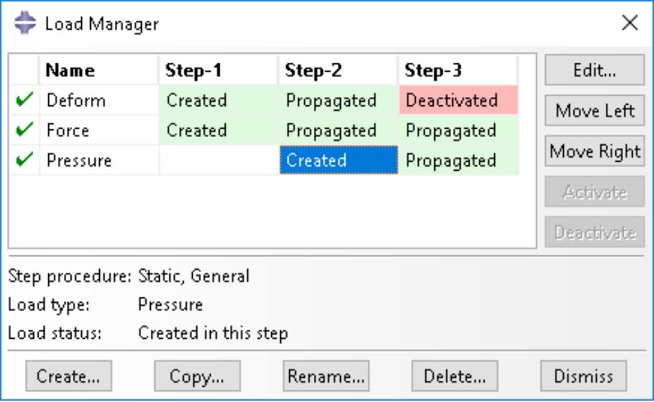
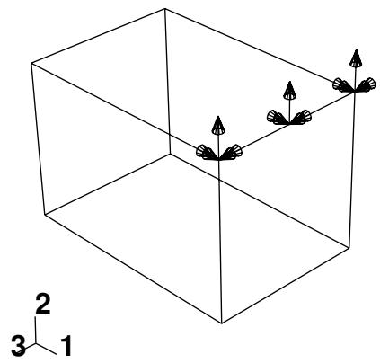
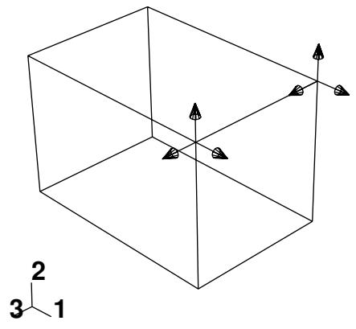
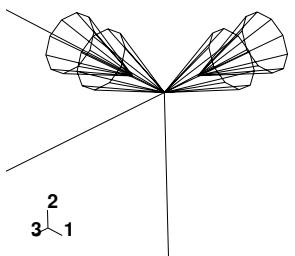
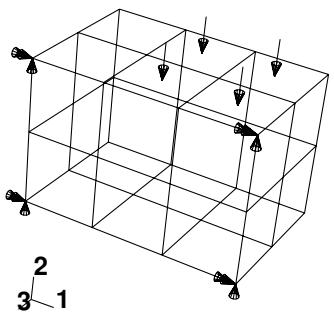

# The Load Module

## The Load module

You use the Load module to define and manage the following prescribed conditions:

• Loads  
• Boundary conditions  
• Predefined fields  
• Load cases (see Load cases)

For information on modeling a bolt load, see Bolt loads.

## In this section:

Understanding the role of the Load module  
Entering and exiting the Load module  
Managing prescribed conditions  
Creating and modifying prescribed conditions  
Understanding symbols that represent prescribed conditions  
Transferring results between Abaqus analyses  
Using the Load module toolbox  
Using the Load module  
Using the load editors  
Using the boundary condition editors  
Using the predefined field editors

## Understanding the role of the Load module

Prescribed conditions in Abaqus/CAE are step-dependent objects, which means that you must specify the analysis steps in which they are active. You can use the load, boundary condition, and predefined field managers to view and manipulate the stepwise history of prescribed conditions. You can also use the Step list located in the context bar to specify the steps in which new loads, boundary conditions, and predefined fields become active by default.

You can use the Amplitude toolset in the Load module to specify complicated time or frequency dependencies that can be applied to prescribed conditions. The Set and Surface toolsets in the Load module allow you to define and name regions of your model to which you would like to apply prescribed conditions. The Analytical Field toolset and the Discrete Field toolset allow you to create fields that you can use to define spatially varying parameters for selected prescribed conditions.

Load cases are sets of loads and boundary conditions used to define a particular loading condition. You can create load cases in static perturbation and steady-state dynamic, direct steps. For information on load cases, see Load cases.

## Additional information

• About Prescribed Conditions  
• Multiple Load Case Analysis  
• The Amplitude toolset  
• The Analytical Field toolset  
• The Discrete Field toolset  
• The Set and Surface toolsets

## Entering and exiting the Load module

You can enter the Load module at any time during an Abaqus/CAE session by clicking Load in the Module list located in the context bar. The Load, BC, Predefined Field, Load Case, Feature, and Tools menus appear on the main menu bar. A Step list appears in the context bar.

To exit the Load module, specify another module in the Module list in the context bar. You need not take any specific action to save your prescribed conditions before exiting the module; they are saved automatically when you save the entire model by selecting File->Save or File->Save As from the main menu bar.

## Managing prescribed conditions

Prescribed condition managers are dialog boxes that you use to organize and manipulate the prescribed conditions associated with a given model. Each kind of prescribed condition that you can define in the Load module has a separate manager. You access the managers by selecting Manager from the appropriate menus on the main menu bar. The Load module provides the following managers:

• Load Manager  
• Boundary Condition Manager  
• Predefined Field Manager

Prescribed condition managers contain alphabetical lists of all the prescribed conditions of a certain type that you have created. For example, the Load Manager shown in Figure 1 contains a list of loads.

  
Figure 1:The Load Manager.

The Create, Edit, Copy, Rename, and Delete buttons in the managers allow you to create new prescribed conditions or to edit, copy, rename, and delete existing ones. You can also initiate the create, edit, copy, rename, and delete procedures by using the Load, BC, and Predefined Field menus in the main menu bar. After you select a management operation from the main menu bar, the procedure is exactly the same as if you had clicked the corresponding button inside the manager dialog box.

The prescribed condition managers are step-dependent managers, which means that they contain additional information concerning the history of each load, boundary condition, and predefined field in the model. You can use the icons in the column along the left side of the managers to suppress prescribed conditions or to resume previously suppressed prescribed conditions for an analysis. The suppress and resume procedures are also available from the Load, BC, and Predefined Field menus in the main menu bar. For more information, see Suppressing and resuming objects.

You can use the Copy button in manager dialog boxes, the corresponding menu command, or the Model Tree to copy a load, boundary condition, or predefined field. You can copy these objects from any step to any valid step, with some restrictions. For more details, see Copying step-dependent objects using manager dialog boxes.

The Move Left, Move Right, Activate, and Deactivate buttons allow you to manipulate the stepwise history of prescribed conditions. For more information, see Modifying the history of a step-dependent object.

## Note:

The Activate and Deactivate buttons are not available in the Predefined Field Manager.

For detailed instructions on creating, editing, and manipulating prescribed conditions, see the following sections:

Using the Load module  
Using the load editors  
Using the boundary condition editors  
Using the predefined field editors

## Additional information

• Managing objects  
• What are step-dependent managers?  
• Changing the status of an object in a step

## Creating and modifying prescribed conditions

To create a load, boundary condition, or predefined field, select Create from the appropriate menu in the main menu bar. A Create dialog box will appear in which you can provide a name for the prescribed condition and choose the type of the prescribed condition that you want to create.

When you click Continue in the Create dialog box, you are prompted to select the region to which you want to apply the prescribed condition, unless the prescribed condition is applied to the whole model. You can apply connector loads and connector boundary conditions (displacement, velocity, and acceleration) only to wires that are associated with a connector section assignment. If you are select multiple wires, the connector sections assigned to the wires in the connector section assignments must have the available components of relative motion for which you are defining loads and boundary conditions. You can apply connector material flow boundary conditions only to endpoints of wires that are associated with a connector section assignment. Once you have selected the region, an editor appears in which you can specify additional information about the prescribed condition, such as its magnitude.

The top panel of each prescribed condition editor displays the name and type of the prescribed condition, the analysis step you are currently in, and the region of the model to which the prescribed condition will be applied. If you are

editing a prescribed condition in the step in which it was first created, an Edit Region ( ) button appears next to the Region field; this button allows you to edit the region to which the prescribed condition is applied. If editing the region requires a complete redefinition of the prescribed condition (for example, if the prescribed condition is applied to the whole model or refers to subregions within the originally selected region), the Edit Region button does not appear. For more information, see Editing the region to which a prescribed condition is applied.

The format of the rest of the editor depends on the type of prescribed condition you are defining and on the step specified at the top of the editor. For example, the editor for concentrated forces is shown in Figure 1.

  
Figure 1:The editor for concentrated forces.

This editor contains special text fields in which you can specify the components of the force in the 1-, 2-, and 3-directions. The editor also contains an Amplitude text field that allows you to vary the magnitude of the prescribed condition as a function of time. You can accept the default amplitude, select an amplitude that you have defined using the Amplitude toolset, or click to define a new amplitude. (For more information, see The Amplitude toolset.)

You can specify the coordinate system in which you will apply the following loads or boundary conditions:

## Loads

• Concentrated force  
• Moment  
• General and shear surface traction  
• General shell edge load  
• Inertia relief  
• Current density

## Boundary conditions

• Symmetry/antisymmetry/encastre  
• Displacement/rotation  
• Velocity/angular velocity  
• Acceleration/rotational acceleration  
• Eulerian mesh motion  
• Magnetic vector potential

All other prescribed conditions use the global coordinate system, with the exception of pressures, which are applied normal to the selected surfaces.

If the load or boundary condition allows you to specify the coordinate system, you can select an existing datum coordinate system or you can accept the global coordinate system. If the desired datum coordinate system does not exist, you can create it using the Datum toolset. (For more information, see Creating datum coordinate systems.) Alternatively, you can refer to an Abaqus/Standard user subroutine that defines the coordinate system (see ORIENT).

## Note:

If you delete or suppress the datum coordinate system, the orientation of the load or boundary condition reverts to the global coordinate system.

The rules for creating and modifying predefined fields vary depending on the predefined field type:

Some predefined fields require that you specify only the initial conditions. You can create and edit this type of predefined field only in the initial step. Abaqus computes subsequent values for the predefined field as the analysis progresses. The predefined fields of this type are initial velocity specifications, hardening specifications, and material assignments (for Eulerian analyses). For more information, see Initial Conditions.  
You can create predefined temperature fields for any step in the analysis. You can define the temperatures for the current model either by entering the values for the desired steps or by reading the temperature values computed by Abaqus in a previous analysis with thermal components. For more information, see “Temperature,” in Predefined Fields.

## Note:

If you do not define initial values for a predefined field, that field is assumed to have a value of zero at the start of the analysis.

Once you have created a prescribed condition, you can modify the prescribed condition in the following ways:

• You can modify some or all of the data that you entered in the editor when you created the prescribed condition.  
• You can use the managers to modify the stepwise history of the prescribed condition. (For more information, see What are step-dependent managers?.)

To display help on a particular manager or editor feature, select Help->On Context from the main menu bar and then click the feature of interest.

## Additional information

• What are step-dependent managers?  
• Using the load editors  
• Using the boundary condition editors  
• Using the predefined field editors  
• The Datum toolset  
• The Amplitude toolset

## Understanding symbols that represent prescribed conditions

This section explains how to interpret the symbols that represent prescribed conditions.

When you apply prescribed conditions to a region, you can choose to display symbols in the viewport that indicate the following:

• The regions to which you applied the prescribed condition.  
• The type of the prescribed condition.  
• If applicable, the degrees of freedom to which you applied the prescribed condition.  
• If applicable, the direction (negative or positive) in which you applied the prescribed condition.  
• If applicable, the spatial variation of the prescribed condition.

For information about controlling the visibility of these symbols, see Controlling the display of attributes.

## In this section:

Understanding prescribed condition symbol type, color, and size  
What do single-headed and double-headed arrows represent?  
Understanding symbol location and direction

## Understanding prescribed condition symbol type, color, and size

The type, color, and size of the symbols that represent prescribed conditions can vary with

• the type of prescribed condition that the symbols represent,  
• the degrees of freedom to which you apply the prescribed condition, and  
• the spatial variation of the prescribed condition (for analytical field distributions).

Refer to Symbols used to represent prescribed conditions, for summaries of the significance of the symbol types and colors.

For example, Figure 1 displays a concentrated force applied to vertices. All of the arrows that represent the different components of the concentrated force are yellow.

  
Figure 1: A concentrated force.

On the other hand, Figure 2 shows a Velocity/Angular Velocity boundary condition that is applied to both translational and rotational degrees of freedom. The sandy brown arrows represent components of the boundary condition that are applied to translational degrees of freedom. The magenta arrows represent components of the boundary condition that are applied to rotational degrees of freedom.

  
Figure 2: A boundary condition applied to an edge.

## Note:

When a boundary condition fixes a degree of freedom in place, the arrow representing that component lacks a stem.

Figure 3 displays a uniform temperature field applied to a face.  
  
Figure 3: A uniform temperature field.

In general, the size of the symbols is uniform and unrelated to the magnitude of the prescribed condition. For prescribed conditions that use analytical field distributions, the symbols are scaled based on the analytical field value. Figure 4 shows a pressure load that uses an analytical field to specify a spatially varying magnitude.

  
Figure 4: Variation of a pressure load over a face.

In addition, for symbols other than arrows, a plus sign (+) or a minus sign (−) is displayed inside each symbol to indicate whether the magnitude of the prescribed condition is positive or negative at that location.Figure 5 shows a temperature boundary condition. For clarity, the symbol size has been increased.

  
Figure 5: A temperature boundary condition using an analytical field distribution.

For information on controlling symbol size and scaling, see Controlling the display of attributes.

In some circumstances Abaqus/CAE displays scaled-down symbols for prescribed conditions, such as when a specified prescribed condition has no effect on the analysis or when an analytical field evaluates to zero for a portion of its region. These scaled-down symbols are noticeably smaller than the default symbol size. For example, if you specify a shear surface traction load with a direction vector normal to the surface, Abaqus/CAE cannot apply this type of load normal to the reference surface and displays very small arrow symbols to represent the load in the viewport.

## Additional information

• Displaying symbols for interactions and prescribed conditions that use analytical fields  
• Controlling the display of attributes  
• Symbols used to represent prescribed conditions

## What do single-headed and double-headed arrows represent?

In many cases Abaqus/CAE uses arrows to represent prescribed conditions in the viewport. These arrows represent each component of the prescribed condition (except for fluid boundary conditions, in which case the arrows represent the resultant direction). For example, the arrows that appear in Figure 1 represent the three components of a concentrated force that is applied to two vertices.

  
Figure 1: A concentrated force with three components.

An arrow with a single arrowhead represents a component of a prescribed condition that is applied to a translational degree of freedom. For example, the three components of the concentrated force in Figure 1 are applied to degrees of freedom 1 through 3; therefore, each arrow in the figure has a single arrowhead.

When a component of a prescribed condition is applied to a rotational degree of freedom, that component appears as a double-headed arrow. The arrows in Figure 2 indicate that a Velocity/Angular Velocity boundary condition is applied to degrees of freedom 4 and 6 of the vertices.

  
Figure 2: A boundary condition applied to rotational degrees of freedom.

A magnified view of the double-headed arrows appears in Figure 3.

  
Figure 3: Magnified double-headed arrows.

If you apply a prescribed condition to both translational and rotational degrees of freedom, both the single-headed and the double-headed arrows appear. For example, a Velocity/Angular Velocity boundary condition is applied to degrees of freedom 1, 3, 4, and 6 of the vertex in Figure 4.

  
Figure 4: Magnified view of a boundary condition applied to translational and rotational degrees of freedom.

In this figure the single-headed arrows are sandy brown and indicate that degrees of freedom 1 and 3 of the vertex are fixed.The double-headed arrows are magenta and appear directly behind the single-headed arrows; the double-headed arrows indicate that degrees of freedom 4 and 6 of the vertex are fixed.

For information on arrow color, see Understanding prescribed condition symbol type, color, and size. For information on when to expect arrows to point toward or away from a region, see Understanding symbol location and direction.

## Additional information

• Understanding symbols that represent prescribed conditions  
• Controlling the display of attributes

## Understanding symbol location and direction

The placement of symbols on a model can depend on the type of prescribed condition that the symbols represent and the type of region to which the prescribed condition is applied. Table 1 indicates where symbols appear on geometric models, and Table 2 indicates where symbols appear on meshed models.

Table 1: Symbol location on geometry.

<table><tr><td>Region type to which the prescribed condition is applied</td><td>Location of symbols on the model</td></tr><tr><td>Vertex</td><td>At the vertex</td></tr><tr><td>Edge</td><td>Equally spaced along the edge</td></tr><tr><td>Assembly-level wire</td><td>At the midpoint of the wire</td></tr><tr><td>Face</td><td>Equally spaced over the interior of the face for directional prescribed conditions (e.g., pressure load)</td></tr><tr><td></td><td>Equally spaced along the edges of the face for nondirectional prescribed conditions (e.g., surface charge and boundary conditions)</td></tr><tr><td>Cell</td><td>Equally spaced along each edge of the cell</td></tr><tr><td>Whole model</td><td>At the point required to define the rigid body motion (inertia relief load only); otherwise, at the triad indicating the origin and orientation of the global coordinate system</td></tr></table>

Table 2: Symbol location on meshes.

<table><tr><td>Region type to which the prescribed condition is applied</td><td>Location of symbols on the model</td></tr><tr><td>Node</td><td>At the node</td></tr><tr><td>Element edge (for two-dimensional meshes)</td><td>At the midpoint of the element edge</td></tr><tr><td>Element face (for three-dimensional meshes)</td><td>At the centroid of the element face</td></tr><tr><td>Assembly-level wire</td><td>At the midpoint of the wire</td></tr></table>

For example, Figure 1 shows a concentrated force applied to two vertices and a boundary condition applied to a surface of a geometric model.

  
Figure 1: A concentrated force and a boundary condition.

Figure 2 shows a boundary condition applied to four nodes and a pressure load applied to several element faces of a mesh.

Figure 2: A pressure load and a boundary condition.  

## Note:

If you apply a pressure load to a planar geometry face where the surface area is small compared to the enclosed area (such as a ring formed by two concentric circles), the load symbols may not be distributed evenly, regardless of the symbol density settings in the Assembly Display Options dialog box.

When a boundary condition fixes a degree of freedom in place, the arrow representing that component points into the region and lacks a stem. For example, the boundary condition in Figure 3 fixes degrees of freedom 1, 2, and 3 in place.

  
Figure 3: A boundary condition fixing degrees of freedom in place.

Likewise, if a positive pressure load or an Eulerian inflow boundary condition is applied to a region, the arrows representing that pressure load or boundary condition point into the region, as illustrated in Figure 4.

  
Figure 4: A positive pressure load.

If a load is defined to have a complex magnitude and the real and imaginary parts have different signs (for example, ), the load will appear as an arrow with two ends. Similarly, an Eulerian boundary condition that includes both inflow and outflow components will appear as an arrow with two ends.

In all other cases, arrows representing components of a prescribed condition point out from the region.

## Note:

When a component of a concentrated force is zero, no arrow appears for that component. Likewise, when a boundary condition leaves a degree of freedom unconstrained, no arrow appears for that component.

## Additional information

• Understanding symbols that represent prescribed conditions  
• Controlling the display of attributes

## Transferring results between Abaqus analyses

You can select part instances from your model and associate an initial state field with the instances. An initial state field applies a deformed mesh and its associated material state to the instances using data imported from a previous Abaqus/Standard or Abaqus/Explicit analysis. Abaqus/CAE allows you to select the job name corresponding to the analysis from which the initial state field is imported. You can also specify the particular step and increment of the analysis from which to import data. Abaqus/CAE imports data from several of the files created by the previous analysis. As a result, the files from the analysis must reside in the directory from which you started the current Abaqus/CAE session.

You can use this capability to drive an Abaqus/Explicit analysis with the results of an Abaqus/Standard analysis and vice versa. This is useful if your problem can be broken down into different stages; for example, you can use Abaqus/Explicit to analyze a metal forming problem and Abaqus/Standard to analyze the following springback. You can also use this capability to change the model definition between steps. For more information, see About Transferring Results between Abaqus Analyses.

You can also transfer results and model information from an Abaqus/Standard analysis to a new Abaqus/Standard analysis, where you can specify additional model definitions before continuing the analysis. For example, you might first study the local behavior of a particular component during an assembly process and then study the behavior of the assembled product. You can start by analyzing the local behavior of the component in an Abaqus/Standard analysis. You can then transfer the model information and results from this analysis to a second Abaqus/Standard analysis, where you can specify additional model definitions for the other components and analyze the behavior of the entire product.

Abaqus/CAE always imports the material state along with the deformed mesh. If you want to import only the deformed mesh, you can import a mesh from a selected step and increment of an output database. For more information, see What kinds of files can be imported and exported from Abaqus/CAE?.

Abaqus uses the imported information when you submit a job for analysis; however, Abaqus/CAE does not update the shape of the selected instances to reflect the applied deformed mesh. As a result, you should be careful when adding new instances to the assembly and positioning them relative to existing part instances. For example, a new part instance may appear to touch one of the instances associated with the initial state field; however, when the analysis applies the imported deformed mesh, the instances may become separated or overclosed.

To avoid this mismatch between the undeformed state and the imported state, you may want to import the deformed mesh from the analysis instead of working with the undeformed part instance. Even if you import the deformed mesh, you must take care that the frame from which you imported the mesh is the same as the step and increment specified in the initial state field. For more information, see Importing a part from an output database. Alternatively, you can create the current model by copying it from the model that generated the previous Abaqus/Standard or Abaqus/Explicit analysis. For more information, see Manipulating models within a model database.

The reference configuration is the configuration of the model from which displacements (and associated strains) are calculated. By default, Abaqus/CAE does not use the imported data to update the reference configuration. As a result, displacements and strains are calculated as total values relative to the reference configuration at the start of the original analysis, and the values will be continuous between analyses. You can change the default behavior and configure Abaqus/CAE to update the reference configuration to be the imported configuration. Abaqus/CAE now calculates displacements and strains relative to the new imported reference configuration; for example, for a springback analysis.

Abaqus imposes many restrictions when you try to create an initial state field. For a detailed discussion of these limitations, see About Transferring Results between Abaqus Analyses. For example, the mesh of the part instances that you select from the current model must match the mesh of the part instances that you are importing. You can then, for example, change the material definition, add loads and boundary conditions, and change from an Abaqus/Standard to an Abaqus/Explicit step. However, you cannot perform an operation that will change the mesh of a selected part instance; for example, you cannot partition the part instance.

You can transfer results between analyses only if the original analysis used one of the following steps:

• Static stress

• Dynamic stress  
• Steady-state transport

In addition, if you are importing data from one Abaqus/Standard analysis to another, the original analysis can use a coupled temperature-displacement step. You cannot import data from a linear perturbation step.

In addition, Abaqus/CAE applies the following limitations:

• The selected part instances and the instances from the previous analysis must have the same name.  
• After you define the initial state field, Abaqus/CAE will continue to show the undeformed shape of the model.  
• You cannot use the Assembly module position and constraint tools, such as Translate and Face to Face, to move a part instance associated with an initial field.  
Abaqus/CAE imports only the mesh and the material state from the previous analysis. As a result, you must redefine sets, surfaces, and all of the prescribed conditions (loads, boundary conditions, predefined fields, interactions, connectors, etc.) at the assembly level of the current model. You should not redefine any of these components in the part definitions of the current model.  
Abaqus/CAE checks that the files exist that contain data from the previous Abaqus/Standard or Abaqus/Explicit analysis; however, it does not check that the specified step and increment number have been written to the files. The job submission fails if the data for the specified step or increment do not exist.  
You cannot modify a part instance associated with an initial field (or the part from which you created the instance). In addition, you cannot modify the mesh of a part instance associated with an initial field (or the mesh of the part from which you created the instance).  
You cannot assign new sections, material orientations, normals, or beam orientations to the part from which you created the instance associated with an initial field. Similarly, you cannot assign mass or inertia. However, you can edit the material definition (which Abaqus/CAE imports along with the mesh). The imported material definitions will overwrite any existing material definitions.

## Using the Load module toolbox

You can access all the Load module tools through either the main menu bar or the Load module toolbox. Figure 1 shows the icons for all the load tools in the Load module toolbox.

  
Figure 1:The Load module toolbox.

## Using the Load module

This section provides general information on defining loads, boundary conditions, and predefined fields.

For information on other Load module topics, see the following sections:

What are step-dependent managers?  
Bolt loads  
Load cases

## In this section:

Creating loads  
Creating boundary conditions  
Creating predefined fields  
Editing the region to which a prescribed condition is applied

When you create a load, you must specify the name of the load, the step in which to activate the load, the type of load, and the region of the assembly to which you want to apply the load.

1. From the main menu bar, select Load->Create.

A Create Load dialog box appears with a default name displayed in the Name text field.

Tip: You can also create a load using the tool in the Load module toolbox.

2. Type a name for the load. For more information on naming objects, see Using basic dialog box components.  
3. Select the step in which to activate the load. Click the arrow next to the Step text field, and select from the list that appears. Loads can be created only in an analysis step; you cannot create a load in the initial step.  
4. From the Category list on the left side of the dialog box, choose the desired category. The Category choices available are dependent upon the type of analysis procedures you are performing.

The Types for Selected Step list on the right side of the dialog box changes to a list of all the available load types.

5. From the Types for Selected Step list, select the load type and click Continue.  
6. If you are creating a gravity load or an inertia relief load, the load editor appears.  
7. If you are creating a connector force or connector moment using assembled fasteners, you can click Done in the prompt area to select a wire set from the template model.

The load editor appears.

a. Click the arrow next to the Assembled fastener field, and select from the list that appears.

The template model name associated with the assembled fastener is displayed in the editor. The Template set list is populated with the wire sets that are associated with the referenced template model.

b. Select a wire set from the Template set list. You must ensure that the wire set has a section assignment that has the available components of relative motion for which you want to define forces.

The appropriate fields for the available components of relative motion are displayed.

8. For all other load types, select the region to which you want to apply the load.

If you are creating a connector force or connector moment, you must select wires that are associated with a connector section assignment. The best approach for selecting wires is to use the default geometry set name for the wire feature (see Creating or modifying wire features for multiple connectors, for more information). If you select multiple wires, you must ensure that the connector sections assigned to the wires in the connector section assignments have the available components of relative motion for which you want to define forces or moments. If there are insufficient available components of relative motion for the connector force or connector moment, a message appears asking you to select different wires or to change the connection type.

Use one of the following methods to select the region for the load:

Select a region in the viewport. You can use the angle method to select a group of faces or edges from geometry or a group of element faces from a mesh. For more information, see Using the angle and feature edge method to select multiple objects. When you have finished selecting, click mouse button 2.

Tip: You can limit the types of objects that you can select in the viewport by specifying filtering options in the Selection toolbar. See Using the selection options, for more information.

If the model contains a combination of mesh and geometry, click one of the following from the prompt area:

- Click Geometry to apply the load to geometry or to a reference point.  
- Click Mesh to apply the load to a native or orphan mesh selection.

By default, for most load types a set or surface is created that contains the selected objects. You can change this behavior by toggling off the option to create a set or surface in the prompt area. A default name is provided in the prompt area, but you can enter a new name.

• To select from a list of existing sets or surfaces, do the following:

1. Click Sets or Surfaces on the right side of the prompt area. (The name of the button depends on the type of object you are creating. For example, if you are creating a pressure load, a Surfaces button appears.)  
Abaqus/CAE displays the Region Selection dialog box containing a list of available sets or surfaces.  
2. Select the set or surface of interest and click Continue.

## Note:

The default selection method is based on the selection method you most recently employed. To revert to the other method, click Select in Viewport or Sets or Surfaces on the right side of the prompt area.

The load editor appears. The region to which you are applying the load is highlighted in the viewport.

9. Enter all of the data necessary to define the load and click OK.

## Note:

If you create a connector force or connector moment that exceeds the failure criteria for a connector, the connector force or connector moment will still be applied.

For detailed information on a particular feature of the editor, select Help->On Context from the main menu bar and then click the feature of interest or see Using the load editors.

Symbols appear in the viewport that represent the load that you just created. For more information, see Understanding symbols that represent prescribed conditions.

## Additional information

• What are step-dependent managers?  
• Selecting objects within the viewport  
• Using the load editors  
• Connectors  
• About assembled fasteners  
• Creating assembled fasteners

• Understanding and using toolboxes and toolbars

• The Set and Surface toolsets

## Creating boundary conditions

When you create a boundary condition, you must specify the name of the boundary condition, the step in which to activate the boundary condition, the type of boundary condition, and the region of the assembly to which you want to apply the boundary condition.

1. From the main menu bar, select BC->Create.

A Create Boundary Condition dialog box appears with a default name displayed in the Name text field.

Tip: You can also create a boundary condition using the tool in the Load module toolbox.

2. Type a name for the boundary condition. For more information on naming objects, see Using basic dialog box components.  
3. Select the step in which to activate the boundary condition. Click the arrow next to the Step text field, and select from the list that appears.  
4. From the Category list on the left side of the dialog box, choose the desired category. The Category choices available are dependent upon the type of analysis procedures you are performing.

The Types for Selected Step list on the right side of the dialog box changes to a list of all the available boundary condition types.

5. From the Types for Selected Step list, select the boundary condition type and click Continue.  
6. If you are creating a connector boundary condition using assembled fasteners, you can click Done in the prompt area to select a wire set from the template model.

The boundary condition editor appears.

a. Click the arrow next to the Assembled fastener field, and select from the list that appears.

The template model name associated with the assembled fastener is displayed in the editor. The Template set list is populated with the wire sets that are associated with the referenced template model.

b. Select a wire set from the Template set list. You must ensure that the wire set has a section assignment that has the available components of relative motion for which you want to define velocity.

The appropriate fields for the available components of relative motion are displayed.

7. For all other boundary condition types, select the region to which you want to apply the boundary condition.

If you are creating a connector displacement, connector velocity, or connector acceleration boundary condition, you must select wires that are associated with a connector section assignment. The best approach for selecting wires is to use the default geometry set name for the wire feature (see Creating or modifying wire features for multiple connectors, for more information). If you select multiple wires, you must ensure that the connector sections assigned to the wires in the connector section assignments have the available components of relative motion for which you want to define displacement, velocity, or acceleration. If there are insufficient available components of relative motion for the connector boundary condition, a message appears asking you to select different wires or to change the connection type.

If you are creating a connector material flow boundary condition, you must select endpoints of wires that are associated with a connector section assignment.

If you are creating an Eulerian mesh motion boundary condition, select an Eulerian part instance in the viewport. Otherwise, use one of the following methods to select the region for the boundary condition:

Select a region in the viewport. You can use the angle method to select a group of faces or edges from geometry or a group of element faces from a mesh. For more information, see Using the angle and feature edge method to select multiple objects. When you have finished selecting, click mouse button 2.

Tip: You can limit the types of objects that you can select in the viewport by specifying filtering options in the Selection toolbar. See Using the selection options, for more information.

If the model contains a combination of mesh and geometry, you must choose the type of region to which you want to apply the boundary condition. From the prompt area, select one of the following:

Click Geometry to apply the boundary condition to geometry or to a reference point.  
Click Mesh to apply the boundary condition to a native or orphan mesh selection.

By default, a set or surface is created that contains the selected objects. You can change this behavior by toggling off the option to create a set or surface in the prompt area. A default name is provided in the prompt area, but you can enter a new name.

• To select from a list of existing sets or surfaces, do the following:

1. Click Sets or Surfaces on the right side of the prompt area. (The name of the button depends on the type of object you are creating. For example, if you are creating a pressure load, a Surfaces button appears.)

Abaqus/CAE displays the Region Selection dialog box containing a list of available sets or surfaces.

2. Select the set or surface of interest and click Continue.

## Note:

The default selection method is based on the selection method you most recently employed. To revert to the other method, click Select in Viewport or Sets or Surfaces on the right side of the prompt area.

The boundary condition editor appears. The region to which you are applying the boundary condition is highlighted in the viewport.

8. Enter all of the data necessary to define the boundary condition and click OK.

## Note:

If you create a connector displacement boundary condition that exceeds the failure criteria for a connector, the connector displacement will be ignored.

For detailed information on a particular feature of the editor, select Help->On Context from the main menu bar and then click the feature of interest or see Using the boundary condition editors.

Symbols appear in the viewport that represent the boundary condition that you just created. For more information, see Understanding symbols that represent prescribed conditions.

## Additional information

• What are step-dependent managers?  
• Selecting objects within the viewport  
• Using the boundary condition editors  
• Connectors  
• About assembled fasteners  
• Creating assembled fasteners  
• The Set and Surface toolsets

• Understanding and using toolboxes and toolbars

When you create a predefined field, you must specify the name of the field, the step in which to activate the field, the type of field, and the region of the assembly to which you want to apply the field.

## Note:

The process for creating temperature fields is described separately; see Defining a temperature field.

1. From the main menu bar, select Predefined Field->Create.

A Create Predefined Field dialog box appears with a default name displayed in the Name text field.

Tip: You can also create a predefined field using the tool in the Load module toolbox.

2. Type a name for the predefined field. For more information on naming objects, see Using basic dialog box components.  
3. Select the step in which to activate the predefined field. Click the arrow next to the Step text field, and select from the list that appears.  
4. From the Category list on the left side of the dialog box, choose the desired category. The Category choices available are dependent upon the type of analysis procedures you are performing.  
The Types for Selected Step list on the right side of the dialog box changes to a list of all the available predefined field types.

5. From the Types for Selected Step list, select the predefined field type and click Continue.

6. If the model contains a combination of mesh and geometry, you must choose the type of region to which you want to apply the predefined field. From the prompt area, select one of the following:

• Click Geometry to apply the predefined field to geometry or to a reference point.  
• Click Mesh to apply the predefined field to a native or orphan mesh selection.

7. Select the region to which you want to apply the predefined field.

If you are creating a material assignment field or an initial state field, use the mouse to select a part instance in the viewport. For all other predefined fields, select a region using one of the following methods:

Use the mouse to select a region in the viewport. You can use the angle method to select a group of faces or edges from geometry or a group of element faces or nodes from a mesh. For more information, see Using the angle and feature edge method to select multiple objects. When you have finished selecting, click mouse button 2.

Tip: You can limit the types of objects that you can select in the viewport by specifying filtering options in the Selection toolbar. See Using the selection options, for more information.

By default, a set is created that contains the selected objects. You can change this behavior by toggling off the option to create a set in the prompt area. A default name is provided in the prompt area, but you can enter a new name.

• To select from a list of existing sets, do the following:

1. Click Sets on the right side of the prompt area.

Abaqus/CAE displays the Region Selection dialog box containing a list of available sets.

2. Select the set of interest and click Continue.

## Note:

The default selection method is based on the selection method you most recently employed. To revert to the other method, click Select in Viewport or Sets on the right side of the prompt area.

The predefined field editor appears. The region to which you are applying the predefined field is highlighted in the viewport.

8. Enter all of the data necessary to define the predefined field and click OK. For detailed information on a particular feature of the editor, select Help->On Context from the main menu bar and then click the feature of interest or see Using the predefined field editors.

Symbols appear in the viewport that represent the predefined field that you just created. For more information, see Understanding symbols that represent prescribed conditions.

## Additional information

• Understanding and using toolboxes and toolbars  
• What are step-dependent managers?  
• Selecting objects within the viewport  
• Using the predefined field editors  
• The Set and Surface toolsets

## Editing the region to which a prescribed condition is applied

You can edit the region to which a prescribed condition is applied in the step in which the load, boundary condition, or predefined field was created.

You cannot edit the region if the definition of the prescribed condition refers to subregions within the original region (a material assignment predefined field, for example).

Note: Gravity loads can be applied to regions in your model, but they cannot be applied to individual point masses in Abaqus/CAE.

1. From the Load, BC, or Predefined Field menu in the main menu bar, select Manager to display the Load Manager, Boundary Condition Manager, or Predefined Field Manager.  
2. Click the cell located in the row of the prescribed condition that you want to modify and in the column of the step of interest, and click Edit. Alternatively, you can just double-click the cell.

Tip: You can also initiate this procedure by clicking the step in which the prescribed condition was created in the Step list located in the context bar. From the Load, BC, or Predefined Field menu in the main menu bar, select Edit->prescribed condition. For example, to edit a load you would select Load->Edit->load of your choice.

An editor appears.

3. In the top part of the editor, click to edit the region selection.  
4. Edit the region using one of the following methods:

• Select and unselect objects in the viewport. When you have finished editing the region, click mouse button 2. (For more information, see Selecting objects within the viewport.)

Tip: You can limit the types of objects that you can select in the viewport by specifying filtering options in the Selection toolbar. See Using the selection options, for more information.

• To select from a list of existing sets or surfaces, do the following:

1. Click Sets or Surfaces on the right side of the prompt area. (The name of the button depends on the type of object you are editing. For example, if you are editing a pressure load, a Surfaces button appears.)

Abaqus/CAE displays the Region Selection dialog box containing a list of available sets or surfaces.

2. Select the set or surface of interest and click Continue.

## Note:

The default selection method is based on the selection method you most recently employed. To revert to the other method, click Select in Viewport or Sets or Surfaces on the right side of the prompt area.

5. In the editor, finish editing the prescribed condition definition as desired and then click OK.

The symbols representing the prescribed condition in the viewport change to appear on the newly edited region.

## Additional information

• What are step-dependent managers?  
• Understanding symbols that represent prescribed conditions  
• Using the Load module

## Using the load editors

This section explains how to enter data in the load editor to define specific types of loads.

The following topics are covered in Modeling techniques:

Bolt loads  
Creating the submodel load

## In this section:

Defining a concentrated force  
Defining a moment  
Defining a pressure load  
Defining a shell edge load  
Defining a surface traction load  
Defining a pipe pressure load  
Defining a body force  
Defining a line load  
Defining a gravity load  
Defining a generalized plane strain load  
Defining a rotational body force  
Defining a Coriolis force  
Defining a connector force  
Defining a connector moment  
Defining a substructure load definition to activate a substructure load case  
Defining an inertia relief load  
Defining a surface heat flux  
Defining a body heat flux  
Defining a concentrated heat flux  
Defining an inward volume acceleration  
Defining a concentrated pore fluid flow  
Defining a surface pore fluid flow  
Defining a concentrated current  
Defining a surface current  
Defining a body current  
Defining a surface current density  
Defining a body current density  
Defining a concentrated charge  
Defining a surface charge  
Defining a body charge  
Defining a concentrated concentration flux  
Defining a surface concentration flux  
Defining a body concentration flux  
Defining a fluid pressure penetration load

## Defining a concentrated force

You can apply a concentrated force load to a vertex or node.

1. Display the concentrated force load editor using one of the following methods:

• To create a new concentrated force load, follow the procedure outlined in Creating loads (Category: Mechanical; Types for Selected Step: Concentrated force).  
• To edit an existing concentrated force load using menus or managers, see Editing step-dependent objects. To edit the region to which the load is applied, see Editing the region to which a prescribed condition is applied.

2. Click the arrow to the right of the Distribution field, and select the option of your choice from the list that appears:

• Select Uniform to define a load that is uniform over the region.  
• Select an analytical field to define a spatially varying load. Only analytical fields that are valid for to create a new analytical field. (See The Analytical Field toolset for more information.)

3. In the CF1, CF2, and CF3 text fields, enter the components of the concentrated force in each direction (units F):

If you leave a text field blank, a force of zero is assigned to that direction automatically. However, you must enter at least one nonzero component in the editor to define the load.

4. If desired, click the arrow to the right of the Amplitude field, and select the amplitude of your choice to create a new amplitude. (See The Amplitude toolset for more information.)

5. If desired, toggle on Follow nodal rotation to make the direction of the load rotate with the rotation at this node.

Follow nodal rotation affects only nodes that have rotational degrees of freedom and steps in which the Nlgeom setting is turned on.

6. If you want to change the coordinate system (CSYS) for the concentrated force load, click and use one of the following methods:

• Select an existing datum coordinate system in the viewport.  
• Select an existing datum coordinate system by name.  
1. From the prompt area, click Datum CSYS List to display a list of datum coordinate systems.  
2. Select a name from the list, and click OK.  
• Click Use Global CSYS from the prompt area to revert to the global coordinate system.

This coordinate system editing option is available only in the step in which the concentrated force load is created. By default, the global coordinate system is used to define the load.

7. Click OK to save your data and to exit the editor.

## Additional information

• Creating and modifying prescribed conditions

• Understanding symbols that represent prescribed conditions  
• Using analytical expression fields  
• Creating expression fields  
• Concentrated Loads

## Defining a moment

You can create a moment load to define rotation at a vertex or node.

1. Display the moment load editor using one of the following methods:

• To create a new moment load, follow the procedure outlined in Creating loads (Category: Mechanical; Types for Selected Step: Moment).  
To edit an existing moment load using menus or managers, see Editing step-dependent objects. To edit the region to which the load is applied, see Editing the region to which a prescribed condition is applied.

2. Click the arrow to the right of the Distribution field, and select the option of your choice from the list that appears:

• Select Uniform to define a load that is uniform over the region.  
• Select an analytical field to define a spatially varying load. Only analytical fields that are valid for to create a new analytical field. (See The Analytical Field toolset for more information.)

3. In the CM1, CM2, and CM3 text fields, enter the components of the moment about each axis (units FL).

If you leave a text field blank, a moment of zero is assigned to that direction automatically. However, you must enter at least one nonzero component in the editor to define the load.

4. If desired, click the arrow to the right of the Amplitude field, and select the amplitude of your choice to create a new amplitude. (See The Amplitude toolset for more information.)

5. If desired, toggle on Follow nodal rotation to make the direction of the load rotate with the rotation at this node.

Follow nodal rotation affects only nodes that have rotational degrees of freedom and steps in which the Nlgeom setting is turned on.

6. If you want to change the coordinate system (CSYS) for the moment, click and use one of the following methods:

• Select an existing datum coordinate system in the viewport.  
• Select an existing datum coordinate system by name.

1. From the prompt area, click Datum CSYS List to display a list of datum coordinate systems.  
2. Select a name from the list, and click OK.

## Note:

You should not apply a moment load at the origin of a cylindrical coordinate system; doing so would make the radial and tangential loads indeterminate.

• Click Use Global CSYS from the prompt area to revert to the global coordinate system.

This coordinate system editing option is available only in the step in which the moment is created. By default, the global coordinate system is used to define the moment.

7. Click OK to save your data and to exit the editor.

## Additional information

• Creating and modifying prescribed conditions  
• Understanding symbols that represent prescribed conditions  
• Using analytical expression fields  
• Creating expression fields  
• Concentrated Loads

## Defining a pressure load

You can create a pressure load to define a pressure over a surface.

1. Display the pressure load editor using one of the following methods:

• To create a new pressure load, follow the procedure outlined in Creating loads (Category: Mechanical; Types for Selected Step: Pressure).  
To edit an existing pressure load using menus or managers, see Editing step-dependent objects. To edit the region to which the load is applied, see Editing the region to which a prescribed condition is applied.

2. Click the arrow to the right of the Distribution field, and select the option of your choice from the list that appears:

Select Uniform to define a pressure that is uniformly distributed over the surface. For this option, the magnitude you provide must be the force per unit area.  
Select Total Force to define a pressure that is uniformly distributed over the surface. For this option, the magnitude you provide must be the total magnitude of the force applied to the surface (instead of force per unit area).  
Select Hydrostatic to define a hydrostatic pressure applied to the surface. (This option is valid only for Abaqus/Standard analyses.)  
Select Stagnation to define a stagnation pressure applied to the surface. (This option is valid only for Abaqus/Explicit analyses.)  
Select Viscous to define a viscous pressure applied to the surface. (This option is valid only for Abaqus/Explicit analyses.)  
Select User-defined to define the magnitude of the load in user subroutine DLOAD (for Abaqus/Standard) or VDLOAD (for Abaqus/Explicit). See the following sections for more information:

Specifying general job settings  
DLOAD  
VDLOAD

Select an analytical field, labeled with an (A), or a discrete field, labeled with a (D), to define a spatially varying pressure. Only analytical fields and discrete fields that are valid for this load type are displayed in the selection list.

Alternatively, you can click t o create a new analytical field. (See The Analytical Field toolset for more information.)

3. If you selected the Uniform, Total Force, analytical field, or discrete field distribution option, perform the following steps:

a. In the Magnitude text field, enter the pressure magnitude.

For a Uniform distribution, enter the total force magnitude divided by the surface area over which the force is applied (units FL−2).

For a Total Force distribution, enter the total magnitude of the force (units F). Based on the undeformed model geometry, Abaqus/CAE calculates a constant uniform surface pressure from the force magnitude entered. In a large-displacement analysis, however, the actual total force may change during the analysis due to the deformation of the loaded surface.

b. If desired, click the arrow to the right of the Amplitude field, and select the amplitude of your choice from the list that appears. Alternatively, you can click to create a new amplitude. (See The Amplitude toolset for more information.)

c. Click OK to save your data and to exit the editor.

4. If you selected the Hydrostatic distribution option, perform the following steps:

a. In the Magnitude text field, enter the pressure magnitude (units $\mathrm { F L } ^ { - 2 } )$ .  
b. In the Zero pressure height field, enter the Z-coordinate (if you are working in three-dimensional or axisymmetric space) or the Y-coordinate (if you are working in two-dimensional space) of the height at which the pressure is zero.  
c. In the Reference pressure height field, enter the Z-coordinate (if you are working in three-dimensional or axisymmetric space) or the Y-coordinate (if you are working in two-dimensional space) of the height at which the pressure is the magnitude specified in the Magnitude field.  
(For more information, see Hydrostatic Pressure Loads on Two-Dimensional, Three-Dimensional, and Axisymmetric Elements in Abaqus/Standard.)  
d. If desired, click the arrow to the right of the Amplitude field, and select the amplitude of your choice from the list that appears. Alternatively, you can click to create a new amplitude. (See The Amplitude toolset for more information.)

5. If you selected the Stagnation or Viscous distribution option, perform the following steps:

a. In the Magnitude text field, enter the pressure magnitude (units FL−2).  
b. If desired, click the arrow to the right of the Amplitude field, and select the amplitude of your choice from the list that appears. Alternatively, you can click to create a new amplitude. (See The Amplitude toolset for more information.)  
c. If desired, toggle on Determine velocity from reference point to subtract the velocity of a reference node from the velocity of the surface where the pressure is applied.

d. Click to select a reference point using one of the following methods:

• Select a point from the viewport.  
• Click Points in the prompt area, and select a named set.

## Note:

The set that you select must contain a single node or vertex.

e. Click OK to save your data and to exit the editor.

6. If you selected the User-defined distribution option, perform the following steps:

a. If desired, enter the pressure magnitude in the Magnitude field (units FL−2). Magnitude data that you enter in the editor are passed into the user subroutine in an Abaqus/Standard analysis but are ignored in an Abaqus/Explicit analysis.  
b. Click OK to save your data and to exit the editor.  
c. Enter the Job module and display the job editor for the analysis job of interest. (For more information, see Creating, editing, and manipulating jobs.)  
d. In the job editor, click the General tab, and specify the file containing the user subroutine that defines the load magnitude. For more information, see Specifying general job settings.

## Note:

You can specify only one user subroutine file in the job editor; if your analysis involves more than one user subroutine, you must combine the user subroutines into one file and then specify that file.

## Additional information

• Creating and modifying prescribed conditions  
• Understanding symbols that represent prescribed conditions  
• Using analytical expression fields  
• Creating expression fields  
• Creating discrete fields  
• Distributed Loads

You can create a shell edge load to define a general, shear, normal, or transverse traction or a moment along a shell edge.

1. Display the shell edge load editor using one of the following methods:

• To create a new shell edge load, follow the procedure outlined in Creating loads (Category: Mechanical; Types for Selected Step: Shell edge load).  
To edit an existing shell edge load using menus or managers, see Editing step-dependent objects. To edit the region to which the load is applied, see Editing the region to which a prescribed condition is applied.

2. Click the arrow to the right of the Distribution field, and select the option of your choice from the list that appears:

• Select Uniform to define a load that is uniform over the shell edge.  
• Select User-defined to define the magnitude of the load in user subroutine UTRACLOAD (for Abaqus/Standard). See the following sections for more information:

Specifying general job settings  
UTRACLOAD

• Select an analytical field to define a spatially varying load. Only analytical fields that are valid for $f ( x )$ to create a new analytical field. (See The Analytical Field toolset for more information.)

3. Click the arrow to the right of the Traction field, and select the option of your choice from the list that appears:

• Select Normal to define a normal shell edge traction.  
• Select Transverse to define a transverse shell edge traction.  
• Select Shear to define a shear shell edge traction.  
• Select Moment to define a shell edge moment.  
• Select General to define a general shell edge traction.

4. If you selected the General traction type, specify the load direction.

a. Click next to Vector to specify the coordinates of the direction vector.

b. By default, the traction components are specified with respect to the global axes. To refer to a local coordinate system for the direction components of the traction:

• Select CSYS: Picked and click to pick a previously defined local coordinate system.  
Select CSYS: User-defined and enter the name of a user subroutine that defines a local coordinate system.

c. If you selected CSYS: Picked, you can define an additional rotation about one of the axes. Click the arrow to the right of the Additional rotation about axis field, select the axis about which the other two axes will be rotated, and enter a value for the additional rotation angle.

5. In the Magnitude text field, enter the shell edge load magnitude (units FL−1).

6. If desired, click the arrow to the right of the Amplitude field, and select the amplitude of your choice Amplitude toolset for more information.)  
7. If desired, click the arrow to the right of the Traction is defined per unit field, and select deformed area to define the shell edge load with respect to the current (deformed) area or undeformed area to define the shell edge load with respect to the reference (original) area.  
8. If you selected the General traction type, you can toggle off Follow rotation to define a non-follower load (i.e., the load always acts in a fixed global direction rather than rotating with the shell edge in a geometrically nonlinear analysis).  
9. Click OK to save your data and to exit the editor.

## Additional information

• Creating and modifying prescribed conditions  
• Understanding symbols that represent prescribed conditions  
• Using analytical expression fields  
• Creating expression fields  
• Distributed Loads

You can create a surface traction load to define a general or shear traction over a surface.

1. Display the surface traction load editor using one of the following methods:

• To create a new surface traction load, follow the procedure outlined in Creating loads (Category: Mechanical; Types for Selected Step: Surface traction).  
• To edit an existing surface traction load using menus or managers, see Editing step-dependent objects. To edit the region to which the load is applied, see Editing the region to which a prescribed condition is applied.

2. Click the arrow to the right of the Distribution field, and select the option of your choice from the list that appears:

• Select Uniform to define a load that is uniform over the surface.  
Select User-defined to define the magnitude of the load in user subroutine UTRACLOAD (for Abaqus/Standard). See the following sections for more information:

Specifying general job settings

UTRACLOAD

• Select an analytical field to define a spatially varying load. Only analytical fields that are valid for $f ( x )$ analytical field. (See The Analytical Field toolset for more information.)

3. Click the arrow to the right of the Traction field, and select the option of your choice from the list that appears:

• Select Shear to define a shear surface traction.  
• Select General to define a general surface traction.

4. Specify the load direction.

a. Click next to Vector or Vector before projection to specify the coordinates of the direction vector.

b. By default, the traction components are specified with respect to the global axes. To refer to a local coordinate system for the direction components of the traction:

• Select CSYS: Picked and click to pick a previously defined local coordinate system.  
• Select CSYS: User-defined and enter the name of a user subroutine that defines a local coordinate system.

c. If you selected CSYS: Picked, you can define an additional rotation about one of the axes. Click the arrow to the right of the Additional rotation about axis field, select the axis about which the other two axes will be rotated, and enter a value for the additional rotation angle.

5. In the Magnitude text field, enter the surface traction magnitude (units FL−2).

6. If desired, click the arrow to the right of the Amplitude field, and select the amplitude of your choice Amplitude toolset for more information.)  
7. If desired, click the arrow to the right of the Traction is defined per unit field, and select deformed area to define the surface traction with respect to the current (deformed) area or undeformed area to define the surface traction with respect to the reference (original) area.  
8. If you selected the General traction type, you can toggle off Follow rotation to define a non-follower load in a geometrically nonlinear analysis (i.e., the load always acts in a fixed global direction rather than rotating with the surface).  
9. Click OK to save your data and to exit the editor.

## Additional information

• Creating and modifying prescribed conditions  
• Understanding symbols that represent prescribed conditions  
• Using analytical expression fields  
• Creating expression fields  
• Distributed Loads

You can create this type of load to prescribe internal or external pressure in a pipe or elbow.

1. Display the pipe pressure load editor using one of the following methods:

• To create a new pipe pressure load, follow the procedure outlined in Creating loads (Category: Mechanical; Types for Selected Step: Pipe pressure).  
To edit an existing pipe pressure load using menus or managers, see Editing step-dependent objects. To edit the region to which the load is applied, see Editing the region to which a prescribed condition is applied.

2. Select the Side option of your choice:

• Select Internal to prescribe an internal pressure within the pipe.  
• Select External to prescribe an external pressure on the pipe.

3. In the Effective diameter field, enter the appropriate pipe diameter:

• Enter the inner diameter of the pipe if you selected Internal in the previous step.  
• Enter the outer diameter of the pipe if you selected External in the previous step.

## Note:

The effective diameter that you enter remains constant throughout the analysis. It is not scaled as the pipe expands or contracts under the pressure, even when the Nlgeom setting is turned on. (For more information on the Nlgeom setting, see Accounting for geometric nonlinearity.)

4. Click the arrow to the right of the Distribution field, and select the option of your choice from the list that appears:

• Select Uniform to define a load that is uniform over the pipe surface.  
• Select Hydrostatic to define a hydrostatic pressure on or within the pipe.  
Select User-defined to define the magnitude of the load in user subroutine DLOAD. See the following sections for more information:

Specifying general job settings  
DLOAD

• Select an analytical field to define a spatially varying load. Only analytical fields that are valid for $f ( x )$ to create a new analytical field. (See The Analytical Field toolset for more information.)

5. If you selected the Uniform or analytical field distribution option, perform the following steps:

a. In the Magnitude text field, enter the pressure magnitude (units FL−2).  
b. If desired, click the arrow to the right of the Amplitude field, and select the amplitude of your choice from the list that appears. Alternatively, you can click to create a new amplitude. (See The Amplitude toolset for more information.)  
c. Click OK to save your data and to exit the editor.

6. If you selected the Hydrostatic distribution option, perform the following steps:

In the Magnitude text field, enter the pressure magnitude (units FL−2 a. ).  
b. In the Zero pressure height field, enter the Z-coordinate of the height at which the pressure is zero.  
c. In the Reference pressure height field, enter the Z-coordinate of the height at which the pressure is the magnitude specified in the Magnitude field.  
(For more information, see Hydrostatic Pressure Loads on Two-Dimensional, Three-Dimensional, and Axisymmetric Elements in Abaqus/Standard.)  
d. If desired, click the arrow to the right of the Amplitude field, and select the amplitude of your choice from the list that appears. Alternatively, you can click to create a new amplitude. (See The Amplitude toolset for more information.)

7. If you selected the User-defined distribution option, perform the following steps:

a. If desired, enter the pressure magnitude in the Magnitude field (units FL−2). Magnitude data that you enter in the editor are passed into the user subroutine.  
b. Click OK to save your data and to exit the editor.  
c. Enter the Job module and display the job editor for the analysis job of interest. (For more information, see Creating, editing, and manipulating jobs.)  
d. In the job editor, click the General tab, and specify the file containing the user subroutine DLOAD. For more information, see Specifying general job settings.

## Note:

You can specify only one user subroutine file in the job editor; if your analysis involves more than one user subroutine, you must combine the user subroutines into one file and then specify that file.

## Additional information

• Creating and modifying prescribed conditions  
• Understanding symbols that represent prescribed conditions  
• Using analytical expression fields  
• Creating expression fields  
• Distributed Loads

You can define a body force to prescribe loading per unit volume over a body.

1. Display the body force load editor using one of the following methods:

• To create a new body force load, follow the procedure outlined in Creating loads (Category: Mechanical; Types for Selected Step: Body force).  
To edit an existing body force load using menus or managers, see Editing step-dependent objects. To edit the region to which the load is applied, see Editing the region to which a prescribed condition is applied.

2. If the Distribution field appears in the editor, click the arrow to the right of the field, and select the option of your choice from the list that appears:

• Select Uniform to define a load that is uniform over the body.  
Select User-defined to define the magnitude of the load in user subroutine DLOAD (for Abaqus/Standard) or VDLOAD (for Abaqus/Explicit). See the following sections for more information:

Specifying general job settings  
DLOAD  
VDLOAD

Select an analytical field to define a spatially varying load. Only analytical fields that are valid for this load type are displayed in the selection list. Alternatively, you can click Create to create a new analytical field. (See The Analytical Field toolset for more information.)

3. If you selected the Uniform or analytical field distribution option, perform the following steps:

a. In the Component 1, Component 2, and (if you are working in three-dimensional space) Component 3 fields, enter the body force per unit volume in each direction (units FL−3):

If you are working in three-dimensional or two-dimensional space, the Component 1, Component 2, and Component 3 fields correspond to the 1-, 2-, and (if applicable) 3-directions.  
• If you are working in axisymmetric space, Component 1 corresponds to the radial direction and Component 2 corresponds to the axial direction.

b. If desired, click the arrow to the right of the Amplitude field, and select the amplitude of your choice from the list that appears. Alternatively, you can click to create a new amplitude. (See The Amplitude toolset for more information.)

c. Click OK to save your data and to exit the editor.

4. If you selected the User-defined distribution option, perform the following steps:

a. If desired, in the Component 1, Component 2, and (if applicable) Component 3 fields enter the body force per unit volume in each direction (units FL−3).  
Load magnitude data that you enter in the editor are passed into the user subroutine in an Abaqus/Standard analysis but are ignored in an Abaqus/Explicit analysis.

b. Click OK to save your data and to exit the editor.

c. Enter the Job module and display the job editor for the analysis job of interest. (For more information, see Creating, editing, and manipulating jobs.)

d. In the job editor, click the General tab, and specify the file containing the user subroutine that defines the load magnitude. For more information, see Specifying general job settings.

## Note:

You can specify only one user subroutine file in the job editor; if your analysis involves more than one user subroutine, you must combine the user subroutines into one file and then specify that file.

## Additional information

• Creating and modifying prescribed conditions  
• Understanding symbols that represent prescribed conditions  
• Using analytical expression fields  
• Creating expression fields  
• Distributed Loads

You can create a line load to prescribe the force per unit length over a beam.

1. Display the line load editor using one of the following methods:

• To create a new line load, follow the procedure outlined in Creating loads (Category: Mechanical; Types for Selected Step: Line load).  
To edit an existing line load using menus or managers, see Editing step-dependent objects. To edit the region to which the load is applied, see Editing the region to which a prescribed condition is applied.

2. Click the arrow to the right of the System field, and from the list that appears select the coordinate system in which you want to define the load:

Select Global if you want to specify the load components in the global 1-, 2-, and (if you are working in three-dimensional space) 3-directions.  
Select Local if you want to specify the load components in the beam local 1-direction (if you are working in three-dimensional space) and the beam local 2-direction. (For more information, see Assigning a beam orientation.)

3. Click the arrow to the right of the Distribution field, and select the option of your choice from the list that appears:

• Select Uniform to define a load that is uniform over the region.  
Select User-defined to define the magnitude of the load in user subroutine DLOAD (for Abaqus/Standard) or VDLOAD (for Abaqus/Explicit). See the following sections for more information:

Specifying general job settings  
DLOAD  
VDLOAD

• Select an analytical field to define a spatially varying load. Only analytical fields that are valid for to create a new analytical field. (See The Analytical Field toolset for more information.)

4. If you selected the Uniform or analytical field distribution option, perform the following steps:

a. In the Component fields, enter the body force per unit length in each direction (units FL−1):

• If you selected the Global system, the Component 1, Component 2, and Component 3 fields correspond to the 1-, 2-, and 3-directions.  
• If you selected the Local system, the Component 1 field corresponds to the beam local 1-direction, and the Component 2 field corresponds to the beam local 2-direction.

b. If desired, click the arrow to the right of the Amplitude field, and select the amplitude of your choice from the list that appears. Alternatively, you can click to create a new amplitude. (See The Amplitude toolset for more information.)

c. Click OK to save your data and to exit the editor.

5. If you selected the User-defined distribution option, perform the following steps:

If desired, in the Component fields enter the force per unit length in each direction (units FL−1).a. Entering load magnitude data in the editor is optional for user-defined loads. Any data you enter are passed to the user subroutine in an Abaqus/Standard analysis but are ignored in an Abaqus/Explicit analysis.  
b. Click OK to save your data and to exit the editor.  
c. Enter the Job module, and display the job editor for the analysis job of interest. (For more information, see Creating, editing, and manipulating jobs.)  
d. In the job editor, click the General tab, and specify the file containing the user subroutine that defines the load magnitude. For more information, see Specifying general job settings.

## Note:

You can specify only one user subroutine file in the job editor; if your analysis involves more than one user subroutine, you must combine the user subroutines into one file and then specify that file.

## Additional information

• Creating and modifying prescribed conditions  
• Understanding symbols that represent prescribed conditions  
• Using analytical expression fields  
• Creating expression fields  
• Distributed Loads

You can create a gravity load to define a uniform acceleration in a fixed direction. Abaqus calculates the loading using the acceleration magnitude that you enter in the gravity load definition and the density specified in the material definition.

1. Display the gravity load editor using one of the following methods:

• To create a new gravity load, follow the procedure outlined in Creating loads (Category: Mechanical; Types for Selected Step: Gravity).  
• To edit an existing gravity load using menus or managers, see Editing step-dependent objects.

2. By default, a gravity load is applied to the whole model. If desired, you can apply a gravity load to particular regions of a model:

a. Click

b. Select the region to which you want to apply the load, as described in Creating loads.

c. Click Done in the prompt area.

## Note:

You cannot apply gravity loads to individual point masses. To include point masses in a gravity load, apply the load to the whole model.

3. Click the arrow to the right of the Distribution field, if available; and select the option of your choice from the list that appears:

• Select Uniform to define a load that is uniform over the region.  
• Select an analytical field to define a spatially varying load. Only analytical fields that are valid for to create a new analytical field. (See The Analytical Field toolset for more information.)

4. In the Component 1, Component 2, and (if you are working with a model in three-dimensional space) Component 3 text fields, enter the components of the acceleration in each direction:

• If you are working in three-dimensional or two-dimensional space, the Component 1, Component 2, and Component 3 fields correspond to the 1-, 2-, and (if applicable) 3-directions.

• If you are working in axisymmetric space, only the Component 2 text field is available. Component 2 corresponds to the axial direction.

If you leave a text field blank, a value of zero is assigned to that direction automatically. However, you must enter at least one nonzero component in the editor to define the load.

5. If desired, click the arrow to the right of the Amplitude field, and select the amplitude of your choice Amplitude toolset for more information.)

6. Click OK to save your data and to exit the editor.

## Additional information

• Creating and modifying prescribed conditions  
• Understanding symbols that represent prescribed conditions  
• Using analytical expression fields

• Creating expression fields  
• Distributed Loads

## Defining a generalized plane strain load

You can create a generalized plane strain load to define an axial load applied to the reference point of a region modeled with generalized plane strain elements.

A generalized plane strain load cannot be defined for a coupled temperature-displacement analysis.

1. Display the generalized plane strain load editor using one of the following methods:

• To create a new generalized plane strain load, follow the procedure outlined in Creating loads (Category: Mechanical; Types for Selected Step: Generalized plane strain).  
• To edit an existing generalized plane strain load using menus or managers, see Editing step-dependent objects. To edit the region to which the load is applied, see Editing the region to which a prescribed condition is applied.

2. Click the arrow to the right of the Distribution field, and select the option of your choice from the list that appears:

• Select Uniform to define a load that is uniform over the region.  
• Select an analytical field to define a spatially varying load. Only analytical fields that are valid for to create a new analytical field. (See The Analytical Field toolset for more information.)

3. In the Axial force text field, enter the axial force (units F).

4. In the Moment about X field, enter the moment applied at the reference point about the X-axis.

5. In the Moment about Y field, enter the moment applied at the reference point about the Y-axis.

6. If desired, click the arrow to the right of the Amplitude field, and select the amplitude of your choice from the list that appears. Alternatively, you can click to create a new amplitude. (See The Amplitude toolset for more information.)

7. Click OK to save your data and to exit the editor.

## Additional information

• Creating and modifying prescribed conditions  
• Understanding symbols that represent prescribed conditions  
• Using analytical expression fields  
• Creating expression fields  
• Adding unsupported keywords to your Abaqus/CAE model  
• Generalized Plane Strain Elements

## Defining a rotational body force

You can create a rotational body force load to define loads resulting from the rotation of the model.

You can specify angular velocity, rotary acceleration, or rotordynamic load. Abaqus defines the load by using the square of the angular velocity or by using the acceleration directly. In any case the load definition must include an axis of rotation, which is defined as follows:

• If you are working in three-dimensional space, you define the location and direction of the axis by entering the global coordinates of two points.  
• If you are working in two-dimensional space, you specify the location of the axis by entering the coordinates of a point in the plane. The direction of the axis is always out of the plane.  
• If you are working in axisymmetric space, the axis is always in the location and direction of the positive global z-axis.

Note: You can define a rotary acceleration force only in two- or three-dimensional space.

1. Display the rotational body force load editor using one of the following methods:

• To create a new rotational body force load, follow the procedure outlined in Creating loads (Category: Mechanical; Types for Selected Step: Rotational body force).

If you are working in two- or three-dimensional space, enter in the prompt area the required information concerning the location and, if applicable, the direction of the axis of rotation.

• To edit an existing rotational body force load using menus or managers, see Editing step-dependent objects. To edit the region to which the load is applied, see Editing the region to which a prescribed condition is applied.

If you are editing a load in the step in which it was created, an Edit ( ) button appears next to each point you specified in the load editor. Click if you want to change the coordinates that determine the location and, if applicable, direction of the axis of rotation. (This option applies only if you are working in two- or three-dimensional space.)

2. Select the force type of your choice:

• Toggle Centrifugal if you want to define a centrifugal force.  
• Toggle Rotary acceleration if you want to define a rotary acceleration force.  
• Toggle Rotordynamic load if you want to define a rotordynamic load.

3. Click the arrow to the right of the Distribution field, and select the option of your choice from the list that appears:

• Select Uniform to define a load that is uniform over the body.  
• Select an analytical field to define a spatially varying load. Only analytical fields that are valid for analytical field. (See The Analytical Field toolset for more information.)

4. In the text field that appears, enter the appropriate value:

• If you are defining a centrifugal force, enter the angular velocity in radians/time.  
• If you are defining a rotary acceleration force, enter the rotary acceleration in radians/time2.  
• If you are defining a rotordynamic load, enter the rotordynamic load in radians/time.

5. If desired, click the arrow to the right of the Amplitude field, and select the amplitude of your choice  
from the list that appears. Alternatively, you can click to create a new amplitude. (See The Amplitude toolset for more information.)  
For centrifugal loading, the amplitude is applied to the calculated load, not the angular velocity.

6. Click OK to save your data and to exit the editor.

## Additional information

• Creating and modifying prescribed conditions  
• Understanding symbols that represent prescribed conditions  
• Using analytical expression fields  
• Creating expression fields  
• Specifying Loads due to Rotation of the Model in Abaqus/Standard

## Defining a Coriolis force

You can create a Coriolis force load to define loads resulting from rotation of the model. You must specify the force as the product of the material density (mass per unit volume) for solid and shell elements or the mass per unit length for beam elements and the angular velocity in radians per time. The load definition must include an axis of rotation, which is defined as follows:

• If you are working in three-dimensional space, you define the location and direction of the axis by entering the global coordinates of two points.  
• If you are working in two-dimensional space, you specify the location of the axis by entering the coordinates of a point in the plane. The direction of the axis is always out of the plane.  
• If you are working in axisymmetric space, the axis is always in the location and direction of the positive global Z-axis.

1. Display the Coriolis force load editor using one of the following methods:

• To create a new rotational body force load, follow the procedure outlined in Creating loads (Category: Mechanical; Types for Selected Step: Coriolis force).  
If you are working in two- or three-dimensional space, enter in the prompt area the required information concerning the location and, if applicable, direction of the axis of rotation.  
To edit an existing Coriolis force load using menus or managers, see Editing step-dependent objects. To edit the region to which the load is applied, see Editing the region to which a prescribed condition is applied.

If you are editing a load in the step in which it was created, an Edit ( ) button appears next to each point you specified in the load editor. Click if you want to change the coordinates that determine the location and, if applicable, direction of the axis of rotation. (This option applies only if you are working in two- or three-dimensional space.)

2. Click the arrow to the right of the Distribution field, and select the option of your choice from the list that appears:

• Select Uniform to define a load that is uniform over the body.  
• Select an analytical field to define a spatially varying load. Only analytical fields that are valid for to create a new analytical field. (See The Analytical Field toolset for more information.)

3. In the Coriolis force field, enter the magnitude of the force.

4. If desired, click the arrow to the right of the Amplitude field, and select the amplitude of your choice A from the list that appears. Alternatively, you can click to create a new amplitude. (See The Amplitude toolset for more information.)

5. Click OK to save your data and to exit the editor.

## Additional information

• Creating and modifying prescribed conditions  
• Understanding symbols that represent prescribed conditions  
• Using analytical expression fields

• Creating expression fields  
• Specifying Loads due to Rotation of the Model in Abaqus/Standard

## Defining a connector force

You can create a connector force to apply a concentrated force to the available components of relative motion of connectors.

1. Display the connector force load editor using one of the following methods:

• To create a new connector force, follow the procedure outlined in Creating loads (Category: Mechanical; Types for Selected Step: Connector force).  
To edit an existing connector force using menus or managers, see Editing step-dependent objects. To edit the region to which the connector force is applied, see Editing the region to which a prescribed condition is applied.

2. In the available F1, F2, and F3 text fields, enter the components of the concentrated force for each available translational component of relative motion (units F). Only components common to all of the selected wires are available in the editor.

If you leave a text field blank, a force of zero is assigned to that component of relative motion automatically. However, you must enter at least one nonzero component in the editor to define the load.

Warning: The connector force will be applied regardless of whether the connector force exceeds the failure criteria for the connector.

3. If desired, click the arrow to the right of the Amplitude field, and select the amplitude of your choice A from the list that appears. Alternatively, you can click to create a new amplitude. (See The Amplitude toolset for more information.)

4. Click OK to save your data and to exit the editor.

## Additional information

• Creating and modifying prescribed conditions  
• Understanding symbols that represent prescribed conditions  
• About Connectors

You can create a connector moment to apply a concentrated moment to the available components of relative motion of connectors.

1. Display the connector moment load editor using one of the following methods:

• To create a new connector moment, follow the procedure outlined in Creating loads (Category: Mechanical; Types for Selected Step: Connector moment).  
To edit an existing connector moment using menus or managers, see Editing step-dependent objects. To edit the region to which the connector moment is applied, see Editing the region to which a prescribed condition is applied.

2. In the available M1, M2, and M3 text fields, enter the components of the moment for each available rotational component of relative motion (units FL). Only components common to all of the selected wires are available in the editor.

If you leave a text field blank, a moment of zero is assigned to that component of relative motion automatically. However, you must enter at least one nonzero component in the editor to define the load.

Warning: The connector moment will be applied regardless of whether the connector moment exceeds the failure criteria for the connector.

3. If desired, click the arrow to the right of the Amplitude field, and select the amplitude of your choice A from the list that appears. Alternatively, you can click to create a new amplitude. (See The Amplitude toolset for more information.)

4. Click OK to save your data and to exit the editor.

## Additional information

• Creating and modifying prescribed conditions  
• Understanding symbols that represent prescribed conditions  
• About Connectors

## Defining a substructure load definition to activate a substructure load case

You can create a substructure load definition in a substructure usage model to activate a substructure load case for one or more substructures in your analysis.

The activation process enables you to change the magnitude of substructure load case loads and boundary conditions using two options:

The magnitude multiplier option applies a scaling value to the specified substructure load case loads and boundary conditions. To reproduce the loading conditions defined during substructure generation exactly, accept the default magnitude of 1.0.  
• The amplitude selection enables you to apply a variable multiplying factor to the substructure load case loads and boundary conditions.

For more information about load cases in Abaqus/CAE, see Load cases.

1. Display the substructure load editor using one of the following methods:

• To create a new substructure load, follow the procedure outlined in Creating loads (Category: Mechanical; Types for Selected Step: Substructure load).  
• To edit an existing substructure load using menus or managers, see Editing step-dependent objects.

2. Do the following:

a. Click to open the Select Substructure Load Cases dialog box.  
b. Toggle on check boxes for each substructure load case that you want to activate.  
c. Click OK to close the Select Substructure Load Cases dialog box.

3. In the Magnitude multiplier text field, enter the value by which you want to scale the specified substructure load case loads and boundary conditions. The default value is 1.0, which provides no scaling. You can enter only real values for the magnitude multiplier. To specify complex values, you must use the Keywords Editor, as described in Adding unsupported keywords to your Abaqus/CAE model.  
4. If desired, click the arrow to the right of the Amplitude field, and select the amplitude of your choice Amplitude toolset for more information.)

5. Click OK to save your data and to exit the editor.

## Additional information

• Creating and modifying prescribed conditions  
• Defining a load case  
• Using Substructures

You can create an inertia relief load to balance externally applied forces on a free or partially free body. An inertia relief load is applied to the whole model. You can apply only one active inertia relief load for each general analysis step. For detailed information about inertia relief loads, see Inertia Relief.

## Note:

You cannot apply inertia relief loads in submodels. For submodels Abaqus ignores the inertia relief effect computed by including an inertia relief load in the global model.

1. Display the inertia relief load editor using one of the following methods:

• To create a new inertia relief load, follow the procedure outlined in Creating loads (Category: Mechanical; Types for Selected Step: Inertia relief).  
• To edit an existing inertia relief load using menus or managers, see Editing step-dependent objects.

2. If a Method field appears toward the top of the editor, click the arrow to the right of the field, and select one of the following:

• Select Compute loading to continue to compute loading for the specified directions.  
• Select Fix at current loading to fix the loading at the magnitude and direction from the previous step.

The Method option is unavailable in the step in which the inertia relief load is created.

3. Toggle on a degree of freedom to define a free direction along which you want to apply the inertia relief load. The degrees of freedom displayed are dependent on the modeling space.

4. If you want to change the coordinate system (CSYS) for the inertial relief load, click and use one of the following methods:

• Select an existing datum coordinate system in the viewport.  
• Select an existing datum coordinate system by name.  
1. From the prompt area, click Datum CSYS List to display a list of datum coordinate systems.  
2. Select a name from the list, and click OK.  
• Click Use Global CSYS from the prompt area to revert to the global coordinate system.

This coordinate system editing option is available only in the step in which the inertia relief load is created. By default, the global coordinate system is used to define the load.

5. If X, Y, and Z text fields appear at the bottom of the editor, enter the coordinates of the additional point that is required to define the rigid body motion. You must define an additional point for certain combinations of free directions. For more information, see Inertia Relief.

6. Click OK to save your data and to exit the editor.

## Additional information

• Creating and modifying prescribed conditions  
• Understanding symbols that represent prescribed conditions  
• Inertia Relief

## Defining a surface heat flux

You can create a surface heat flux load to define surface-based heat fluxes.

1. Display the surface heat flux load editor using one of the following methods:

• To create a new surface heat flux load, follow the procedure outlined in Creating loads (Category: Thermal; Types for Selected Step: Surface heat flux).  
• To edit an existing surface heat flux load using menus or managers, see Editing step-dependent objects. To edit the region to which the load is applied, see Editing the region to which a prescribed condition is applied.

2. Click the arrow to the right of the Distribution field, and select the option of your choice from the list that appears:

• Select Uniform to define a load that is uniform over the surface. For this option, the magnitude you provide must be the flux per unit area.  
Select User-defined to define the magnitude of the load in user subroutine DFLUX. (This option is valid only in Abaqus/Standard analyses.) See the following sections for more information:

Specifying general job settings  
DFLUX

Select Total Flux to define a load that is uniform over the surface. For this option, the magnitude you provide must be the total magnitude of the flux applied to the surface (instead of flux per unit area).  
Select an analytical field, labeled with an (A), or a discrete field, labeled with a (D), to define a spatially varying surface heat flux. Only analytical fields and discrete fields that are valid for this load type are displayed in the selection list.

Alternatively, you can click t $f ( x )$ o create a new analytical field. (See The Analytical Field toolset for more information.)

3. If you selected the Uniform, Total Flux, analytical field, or discrete field distribution option, perform the following steps:

a. In the Magnitude text field, enter the surface heat flux magnitude. A positive magnitude indicates heat flow into the surface.  
For a Uniform distribution, enter the total flux magnitude divided by the surface area over which the flux is applied (units $\mathrm { J T } ^ { - 1 } \mathrm { L } ^ { - 2 } )$ .  
For a Total Flux distribution, enter the total magnitude of the flux (units $\mathrm { J } \mathrm { T } ^ { - 1 } ,$ ). Abaqus/CAE calculates a constant uniform surface flux from the flux magnitude entered.

b. If desired, click the arrow to the right of the Amplitude field, and select the amplitude of your choice from the list that appears. Alternatively, you can click to create a new amplitude. (See The Amplitude toolset for more information.)

c. Click OK to save your data and to exit the editor.

4. If you selected the User-defined distribution option, perform the following steps:

a. If desired, enter the surface heat flux magnitude in the Magnitude field (units $\mathrm { J } \mathrm { T } ^ { - 1 } \mathrm { L } ^ { - 2 } )$ . A positive magnitude indicates heat flow into the surface.  
Magnitude data that you enter in the editor are passed into the user subroutine.

b. Click OK to save your data and to exit the editor.  
c. Enter the Job module and display the job editor for the analysis job of interest. (For more information, see Creating, editing, and manipulating jobs.)  
d. In the job editor, click the General tab, and specify the file containing the user subroutine that defines the load magnitude. For more information, see Specifying general job settings.

## Note:

You can specify only one user subroutine file in the job editor; if your analysis involves more than one user subroutine, you must combine the user subroutines into one file and then specify that file.

## Additional information

• Creating and modifying prescribed conditions  
• Understanding symbols that represent prescribed conditions  
• The Analytical Field toolset  
• The Discrete Field toolset  
• Thermal Loads

## Defining a body heat flux

You can create a body heat flux load to define distributed heat fluxes over a volume.

1. Display the body heat flux load editor using one of the following methods:

• To create a new body heat flux load, follow the procedure outlined in Creating loads (Category: Thermal; Types for Selected Step: Body heat flux).  
• To edit an existing body heat flux load using menus or managers, see Editing step-dependent objects. To edit the region to which the load is applied, see Editing the region to which a prescribed condition is applied.

2. Click the arrow to the right of the Distribution field, and select the option of your choice from the list that appears:

• Select Uniform to define a load that is uniform over the body.  
Select User-defined to define the magnitude of the load in user subroutine DFLUX. (This option is valid only in Abaqus/Standard analyses.) See the following sections for more information:  
Specifying general job settings  
DFLUX  
Select an analytical field, labeled with an $( \mathrm { A } ) ,$ , or a discrete field, labeled with a (D), to define a spatially varying load. Only analytical fields and discrete fields that are valid for this load type are displayed in the selection list.

Alternatively, you can click $f ( x )$ to create a new analytical field. (See The Analytical Field toolset for more information.)

3. If you selected the Uniform, analytical field, or discrete field distribution option, perform the following steps:

a. In the Magnitude text field, enter the body heat flux magnitude (units $\mathrm { J } \mathrm { T } ^ { - 1 } \mathrm { L } ^ { - 3 } )$ . A positive magnitude indicates heat flow into the body.  
b. If desired, click the arrow to the right of the Amplitude field, and select the amplitude of your choice from the list that appears. Alternatively, you can click to create a new amplitude. (See The Amplitude toolset for more information.)  
c. Click OK to save your data and to exit the editor.

4. If you selected the User-defined distribution option, perform the following steps:

a. If desired, enter the body heat flux magnitude in the Magnitude field (units $\mathrm { J } \mathrm { T } ^ { - 1 } \mathrm { L } ^ { - 3 } )$ . A positive magnitude indicates heat flow into the body.  
Magnitude data that you enter in the editor are passed into the user subroutine.

b. Click OK to save your data and to exit the editor.

c. Enter the Job module and display the job editor for the analysis job of interest. (For more information, see Creating, editing, and manipulating jobs.)

d. In the job editor, click the General tab, and specify the file containing the user subroutine that defines the load magnitude. For more information, see Specifying general job settings.

Note: You can specify only one user subroutine file in the job editor; if your analysis involves more than one user subroutine, you must combine the user subroutines into one file and then specify that file.

## Additional information

• Creating and modifying prescribed conditions  
• Understanding symbols that represent prescribed conditions  
• The Analytical Field toolset  
• The Discrete Field toolset  
• Thermal Loads

## Defining a concentrated heat flux

You can apply a concentrated heat flux to a vertex or node.

1. Display the concentrated heat flux load editor using one of the following methods:

• To create a new concentrated heat flux load, follow the procedure outlined in Creating loads (Category: Thermal; Types for Selected Step: Concentrated heat flux).  
• To edit an existing concentrated heat flux load using menus or managers, see Editing step-dependent objects. To edit the region to which the load is applied, see Editing the region to which a prescribed condition is applied.

2. Click the arrow to the right of the Distribution field, and select the option of your choice from the list that appears:

• Select Uniform to define a load that is uniform over the region.  
• Select an analytical field to define a spatially varying load. Only analytical fields that are valid for to create a new analytical field. (See The Analytical Field toolset for more information.)

3. In the Magnitude field, enter the concentrated heat flux magnitude (units JT−1). A positive magnitude indicates heat flow into the body at the vertex or node.  
4. If desired, click the arrow to the right of the Amplitude field, and select the amplitude of your choice A from the list that appears. Alternatively, you can click to create a new amplitude. (See The Amplitude toolset for more information.)  
5. If you are working with shell elements and want to apply the heat flux to a degree of freedom other than 11, enter the desired degree of freedom in the Degree of freedom field. Otherwise, accept the default degree of freedom.

You can enter any number between 11 and 31 in the Degree of freedom field. If you prefer, you can use the arrows on the right side of the field to scroll through the range of valid degrees of freedom. For more information, see “Specifying concentrated heat fluxes,” in Thermal Loads.

6. Click OK to save your data and to exit the editor.

## Additional information

• Creating and modifying prescribed conditions  
• Understanding symbols that represent prescribed conditions  
• Using analytical expression fields  
• Creating expression fields  
• Thermal Loads

You can create an inward volume acceleration load to specify a volume acceleration at a vertex or node on the boundary of an acoustic medium. (For more information, see “Loads,” in Coupled Acoustic-Structural Analysis.)

1. Display the inward volume acceleration load editor using one of the following methods:

• To create a new inward volume acceleration load, follow the procedure outlined in Creating loads (Category: Acoustic; Types for Selected Step: Inward volume acceleration).  
• To edit an existing inward volume acceleration load using menus or managers, see Editing step-dependent objects. To edit the region to which the load is applied, see Editing the region to which a prescribed condition is applied.

2. Click the arrow to the right of the Distribution field, and select the option of your choice from the list that appears:

• Select Uniform to define a load that is uniform over the region.  
• Select an analytical field to define a spatially varying load. Only analytical fields that are valid for $f ( x )$ to create a new analytical field. (See The Analytical Field toolset for more information.)

3. In the Magnitude field, enter the volume acceleration (units $\mathrm { L } ^ { 3 } \mathrm { T } ^ { - 2 } )$ .

4. If desired, click the arrow to the right of the Amplitude field, and select the amplitude of your choice A from the list that appears. Alternatively, you can click to create a new amplitude. (See The Amplitude toolset for more information.)

5. Click OK to save your data and to exit the editor.

## Additional information

• Creating and modifying prescribed conditions  
• Understanding symbols that represent prescribed conditions  
• Using analytical expression fields  
• Creating expression fields  
• Coupled Acoustic-Structural Analysis

## Defining a concentrated pore fluid flow

You can create a concentrated pore fluid flow load to define concentrated pore fluid flow at a vertex or node in soils analyses.

1. Display the concentrated pore fluid flow load editor using one of the following methods:

To create a new concentrated pore fluid flow load, follow the procedure outlined in Creating loads (Category: Fluid; Types for Selected Step: Concentrated pore fluid).  
• To edit an existing concentrated pore fluid flow load using menus or managers, see Editing step-dependent objects. To edit the region to which the load is applied, see Editing the region to which a prescribed condition is applied.

2. Click the arrow to the right of the Distribution field, and select the option of your choice from the list that appears:

• Select Uniform to define a load that is uniform over the region.  
• Select an analytical field to define a spatially varying load. Only analytical fields that are valid for $f ( x )$ to create a new analytical field. (See The Analytical Field toolset for more information.)

3. In the Magnitude field, enter the flow rate (units $\mathrm { L } ^ { 3 } \mathrm { T } ^ { - 1 } )$ ). A positive magnitude indicates fluid flow out of the body at the vertex or node.  
4. If desired, click the arrow to the right of the Amplitude field, and select the amplitude of your choice A from the list that appears. Alternatively, you can click to create a new amplitude. (See The Amplitude toolset for more information.)  
5. Click OK to save your data and to exit the editor.

## Additional information

• Creating and modifying prescribed conditions  
• Understanding symbols that represent prescribed conditions  
• Using analytical expression fields  
• Creating expression fields  
• Pore Fluid Flow

You can create a surface pore fluid flow load to define pore fluid flow velocities normal to surfaces in soils analyses.

1. Display the surface pore fluid flow load editor using one of the following methods:

• To create a new surface pore fluid flow load, follow the procedure outlined in Creating loads (Category: Fluid; Types for Selected Step: Surface pore fluid).  
• To edit an existing surface pore fluid flow load using menus or managers, see Editing step-dependent objects. To edit the region to which the load is applied, see Editing the region to which a prescribed condition is applied.

2. Click the arrow to the right of the Distribution field, and select the option of your choice from the list that appears:

• Select Uniform to define a load that is uniform over the surface.  
Select User-defined to define the magnitude of the load in user subroutine DFLOW. See the following sections for more information:

Specifying general job settings

DFLOW

Select an analytical field, labeled with an $( \mathrm { A } ) ,$ , or a discrete field, labeled with a (D), to define a spatially varying load. Only analytical fields and discrete fields that are valid for this load type are displayed in the selection list.

Alternatively, you can click $f ( x )$ to create a new analytical field. (See The Analytical Field toolset for more information.)

3. If you selected the Uniform, analytical field, or discrete field distribution option, perform the following steps:

a. In the Magnitude text field, enter the flow velocity (units ${ \mathrm { L T } } ^ { - 1 } )$ . A positive magnitude indicates fluid flow into the surface.  
b. If desired, click the arrow to the right of the Amplitude field, and select the amplitude of your choice from the list that appears. Alternatively, you can click to create a new amplitude. (See The Amplitude toolset for more information.)  
c. Click OK to save your data and to exit the editor.

4. If you selected the User-defined distribution option, perform the following steps:

a. If desired, enter the flow velocity in the Magnitude field $( \mathrm { u n i t s } \mathrm { L T } ^ { - 1 } )$ . A positive magnitude indicates fluid flow into the surface.

Magnitude data that you enter in the editor are passed into the user subroutine.

b. Click OK to save your data and to exit the editor.

c. Enter the Job module and display the job editor for the analysis job of interest. (For more information, see Creating, editing, and manipulating jobs.)

d. In the job editor, click the General tab, and specify the file containing the user subroutine that defines the load magnitude. For more information, see Specifying general job settings.

## Note:

You can specify only one user subroutine file in the job editor; if your analysis involves more than one user subroutine, you must combine the user subroutines into one file and then specify that file.

## Additional information

• Creating and modifying prescribed conditions  
• Understanding symbols that represent prescribed conditions  
• The Analytical Field toolset  
• The Discrete Field toolset  
• Pore Fluid Flow

You can create a concentrated current load to define a concentrated current at a vertex or node in a coupled thermal-electrical analysis.

1. Display the concentrated current load editor using one of the following methods:

To create a new concentrated current load, follow the procedure outlined in Creating loads (Category: Electrical/Magnetic; Types for Selected Step: Concentrated current).  
• To edit an existing concentrated current load using menus or managers, see Editing step-dependent objects. To edit the region to which the load is applied, see Editing the region to which a prescribed condition is applied.

2. Click the arrow to the right of the Distribution field, and select the option of your choice from the list that appears:

• Select Uniform to define a load that is uniform over the region.  
• Select an analytical field to define a spatially varying load. Only analytical fields that are valid for $f ( x )$ to create a new analytical field. (See The Analytical Field toolset for more information.)

3. In the Magnitude field, enter the current magnitude (units $\mathrm { C T } ^ { - 1 } \mathrm { \ : \frac { \Omega } { \Omega } }$ ). A positive magnitude indicates current flow into the body at the vertex or node.

4. If desired, click the arrow to the right of the Amplitude field, and select the amplitude of your choice A from the list that appears. Alternatively, you can click to create a new amplitude. (See The Amplitude toolset for more information.)

5. Click OK to save your data and to exit the editor.

## Additional information

• Creating and modifying prescribed conditions  
• Understanding symbols that represent prescribed conditions  
• Using analytical expression fields  
• Creating expression fields  
• Coupled Thermal-Electrical Analysis

## Defining a surface current

You can create a surface current load to define current densities over a surface in a coupled thermal-electrical analysis.

1. Display the surface current load editor using one of the following methods:

• To create a new surface current load, follow the procedure outlined in Creating loads (Category: Electrical/Magnetic; Types for Selected Step: Surface current).  
• To edit an existing surface current load using menus or managers, see Editing step-dependent objects. To edit the region to which the load is applied, see Editing the region to which a prescribed condition is applied.

2. Click the arrow to the right of the Distribution field, and select the option of your choice from the list that appears:

• Select Uniform to define a load that is uniform over the surface.  
• Select an analytical field to define a spatially varying load. Only analytical fields that are valid for $f ( x )$ to create a new analytical field. (See The Analytical Field toolset for more information.)

3. In the Magnitude text field, enter the current density (units $\mathrm { C L } ^ { - 2 } \mathrm { T } ^ { - 1 } )$ . A positive magnitude indicates current flow into the surface.

4. If desired, click the arrow to the right of the Amplitude field, and select the amplitude of your choice A from the list that appears. Alternatively, you can click to create a new amplitude. (See The Amplitude toolset for more information.)

5. Click OK to save your data and to exit the editor.

## Additional information

• Creating and modifying prescribed conditions  
• Understanding symbols that represent prescribed conditions  
• Using analytical expression fields  
• Creating expression fields  
• Coupled Thermal-Electrical Analysis

You can create a body current load to define current densities over a body in a coupled thermal-electrical analysis.

1. Display the body current load editor using one of the following methods:

• To create a new body current load, follow the procedure outlined in Creating loads (Category: Electrical/Magnetic; Types for Selected Step: Body current).  
To edit an existing body current load using menus or managers, see Editing step-dependent objects. To edit the region to which the load is applied, see Editing the region to which a prescribed condition is applied.

2. Click the arrow to the right of the Distribution field, and select the option of your choice from the list that appears:

• Select Uniform to define a load that is uniform over the body.  
• Select an analytical field to define a spatially varying load. Only analytical fields that are valid for $f ( x )$ to create a new analytical field. (See The Analytical Field toolset for more information.)

3. In the Magnitude text field, enter the current density (units $\mathrm { C L } ^ { - 3 } \mathrm { T } ^ { - 1 } )$ . A positive magnitude indicates current flow into the body.

4. If desired, click the arrow to the right of the Amplitude field, and select the amplitude of your choice A from the list that appears. Alternatively, you can click to create a new amplitude. (See The Amplitude toolset for more information.)

5. Click OK to save your data and to exit the editor.

## Additional information

• Creating and modifying prescribed conditions  
• Understanding symbols that represent prescribed conditions  
• Using analytical expression fields  
• Creating expression fields  
• Coupled Thermal-Electrical Analysis

## Defining a surface current density

You can create a surface current density load to define current density over a surface in an eddy current analysis. The surface current density load is available only in an electromagnetic model.

1. Display the surface current density load editor using one of the following methods:

• To create a new surface current density load, follow the procedure outlined in Creating loads (Category: Electrical/Magnetic; Types for Selected Step: Surface current density).  
• To edit an existing surface current density load using menus or managers, see Editing step-dependent objects. To edit the region to which the load is applied, see Editing the region to which a prescribed condition is applied.

2. Click the arrow to the right of the Distribution field, and select the option of your choice from the list that appears:

• Select Uniform to define a load that is uniform over the surface.  
Select User-defined to define the magnitude and direction of the load in user subroutine UDSECURRENT. See the following sections for more information:

Specifying general job settings  
UDSECURRENT

3. If you selected the Uniform distribution option, perform the following steps:

a. In the Component 1, Component 2, and (if applicable) Component 3 fields, enter the real (in-phase) and imaginary (out-of-phase) parts of the surface current density vector.  
Abaqus/CAE calculates the magnitude and direction of the surface current density vector.  
b. If desired, click the arrow to the right of the Amplitude field, and select the amplitude of your choice from the list that appears. Alternatively, you can click to create a new amplitude. (See The Amplitude toolset for more information.)  
c. Click OK to save your data and to exit the editor.

4. If you selected the User-defined distribution option, perform the following steps:

a. If desired, in the Component 1, Component 2, and (if applicable) Component 3 fields enter the real (in-phase) and imaginary (out-of-phase) parts of the surface current density vector.  
Abaqus/CAE calculates the magnitude and direction of the surface current density vector and that information is passed into the user subroutine.  
b. Click OK to save your data and to exit the editor.  
c. Enter the Job module and display the job editor for the analysis job of interest. (For more information, see Creating, editing, and manipulating jobs.)  
d. In the job editor, click the General tab, and specify the file containing the user subroutine that defines the magnitude and direction of the load. For more information, see Specifying general job settings.

## Note:

You can specify only one user subroutine file in the job editor; if your analysis involves more than one user subroutine, you must combine the user subroutines into one file and then specify that file.

## Additional information

• Creating and modifying prescribed conditions  
• Understanding symbols that represent prescribed conditions  
• Eddy Current Analysis  
• Electromagnetic Loads

## Defining a body current density

You can create a body current density load to define current density over a volume in an eddy current analysis. The body current density load is available only in an electromagnetic model.

1. Display the body current density load editor using one of the following methods:

To create a new body current density load, follow the procedure outlined in Creating loads (Category: Electrical/Magnetic; Types for Selected Step: Body current density).  
• To edit an existing body current density load using menus or managers, see Editing step-dependent objects. To edit the region to which the load is applied, see Editing the region to which a prescribed condition is applied.

2. Click the arrow to the right of the Distribution field, and select the option of your choice from the list that appears:

• Select Uniform to define a load that is uniform over the volume.  
Select User-defined to define the magnitude and direction of the load in user subroutine UDECURRENT. See the following sections for more information:

Specifying general job settings  
UDECURRENT

3. If you selected the Uniform distribution option, perform the following steps:

a. In the Component 1, Component 2, and (if applicable) Component 3 fields, enter the real (in-phase) and imaginary (out-of-phase) parts of the body current density vector.  
Abaqus/CAE calculates the magnitude and direction of the body current density vector.

b. If desired, click the arrow to the right of the Amplitude field, and select the amplitude of your choice from the list that appears. Alternatively, you can click to create a new amplitude. (See The Amplitude toolset for more information.)

c. Click OK to save your data and to exit the editor.

4. If you selected the User-defined distribution option, perform the following steps:

a. If desired, in the Component 1, Component 2, and (if applicable) Component 3 fields enter the real (in-phase) and imaginary (out-of-phase) parts of the body current density vector.  
Abaqus/CAE calculates the magnitude and direction of the body current density vector and that information is passed into the user subroutine.

b. Click OK to save your data and to exit the editor.

c. Enter the Job module and display the job editor for the analysis job of interest. (For more information, see Creating, editing, and manipulating jobs.)

d. In the job editor, click the General tab, and specify the file containing the user subroutine that defines the magnitude and direction of the load. For more information, see Specifying general job settings.

## Note:

You can specify only one user subroutine file in the job editor; if your analysis involves more than one user subroutine, you must combine the user subroutines into one file and then specify that file.

## Additional information

• Creating and modifying prescribed conditions  
• Understanding symbols that represent prescribed conditions  
• Eddy Current Analysis  
• Electromagnetic Loads

## Defining a concentrated charge

You can create a concentrated charge load to apply an electric charge to a vertex or node in a piezoelectric analysis.

1. Display the concentrated charge load editor using one of the following methods:

To create a new concentrated charge load, follow the procedure outlined in Creating loads (Category: Electrical/Magnetic; Types for Selected Step: Concentrated charge).  
• To edit an existing concentrated charge load using menus or managers, see Editing step-dependent objects. To edit the region to which the load is applied, see Editing the region to which a prescribed condition is applied.

2. Click the arrow to the right of the Distribution field, and select the option of your choice from the list that appears:

• Select Uniform to define a load that is uniform over the region.  
• Select an analytical field to define a spatially varying load. Only analytical fields that are valid for to create a new analytical field. (See The Analytical Field toolset for more information.)

3. In the Magnitude field, enter the charge magnitude (units C).

4. If desired, click the arrow to the right of the Amplitude field, and select the amplitude of your choice A from the list that appears. Alternatively, you can click to create a new amplitude. (See The Amplitude toolset for more information.)

## Note:

The amplitude field appears only if amplitudes are valid for the type of perturbation step in which you are creating the load. For more information, see “Linear perturbation analysis steps,” in General and Perturbation Procedures.

5. Click OK to save your data and to exit the editor.

## Additional information

• Creating and modifying prescribed conditions  
• Understanding symbols that represent prescribed conditions  
• Using analytical expression fields  
• Creating expression fields  
• Piezoelectric Analysis

You can create a surface charge load to apply a distributed electric charge to a surface in a piezoelectric analysis.

1. Display the surface charge load editor using one of the following methods:

• To create a new surface charge load, follow the procedure outlined in Creating loads (Category: Electrical/Magnetic; Types for Selected Step: Surface charge).  
• To edit an existing surface charge load using menus or managers, see Editing step-dependent objects. To edit the region to which the load is applied, see Editing the region to which a prescribed condition is applied.

2. Click the arrow to the right of the Distribution field, and select the option of your choice from the list that appears:

• Select Uniform to define a load that is uniform over the surface.  
• Select an analytical field to define a spatially varying load. Only analytical fields that are valid for $f ( x )$ to create a new analytical field. (See The Analytical Field toolset for more information.)

3. In the Magnitude field, enter the charge density (units $\mathrm { C L } ^ { - 2 } )$ .

4. If desired, click the arrow to the right of the Amplitude field, and select the amplitude of your choice A from the list that appears. Alternatively, you can click to create a new amplitude. (See The Amplitude toolset for more information.)

## Note:

The amplitude field appears only if amplitudes are valid for the type of perturbation step in which you are creating the load. For more information, see “Linear perturbation analysis steps,” in General and Perturbation Procedures.

5. Click OK to save your data and to exit the editor.

## Additional information

• Creating and modifying prescribed conditions  
• Understanding symbols that represent prescribed conditions  
• Using analytical expression fields  
• Creating expression fields  
• Piezoelectric Analysis

## Defining a body charge

You can create a body charge load to apply an electric charge to a body in a piezoelectric analysis.

1. Display the body charge load editor using one of the following methods:

• To create a new body charge load, follow the procedure outlined in Creating loads (Category: Electrical/Magnetic; Types for Selected Step: Body charge).  
To edit an existing body charge load using menus or managers, see Editing step-dependent objects. To edit the region to which the load is applied, see Editing the region to which a prescribed condition is applied.

2. Click the arrow to the right of the Distribution field, and select the option of your choice from the list that appears:

• Select Uniform to define a load that is uniform over the body.  
• Select an analytical field to define a spatially varying load. Only analytical fields that are valid for $f ( x )$ to create a new analytical field. (See The Analytical Field toolset for more information.)

3. In the Magnitude field, enter the charge density (units $\mathrm { C L } ^ { - 3 } )$ .

4. If desired, click the arrow to the right of the Amplitude field, and select the amplitude of your choice A from the list that appears. Alternatively, you can click to create a new amplitude. (See The Amplitude toolset for more information.)

## Note:

The amplitude field appears only if amplitudes are valid for the type of perturbation step in which you are creating the load. For more information, see “Linear perturbation analysis steps,” in General and Perturbation Procedures.

5. Click OK to save your data and to exit the editor.

## Additional information

• Creating and modifying prescribed conditions  
• Understanding symbols that represent prescribed conditions  
• Using analytical expression fields  
• Creating expression fields  
• Piezoelectric Analysis

You can create a concentrated concentration flux load to define a concentrated concentration flux at a vertex or node in a mass diffusion analysis.

1. Display the concentrated concentration flux load editor using one of the following methods:

• To create a new concentrated concentration flux load, follow the procedure outlined in Creating loads (Category: Mass diffusion; Types for Selected Step: Concentrated concentration flux).  
• To edit an existing concentrated concentration flux load using menus or managers, see Editing step-dependent objects. To edit the region to which the load is applied, see Editing the region to which a prescribed condition is applied.

2. Click the arrow to the right of the Distribution field, and select the option of your choice from the list that appears:

• Select Uniform to define a load that is uniform over the region.  
• Select an analytical field to define a spatially varying load. Only analytical fields that are valid for $f ( x )$ to create a new analytical field. (See The Analytical Field toolset for more information.)

3. In the Magnitude field, enter the concentration flux magnitude (units PL ${ } ^ { 3 } \mathrm { T } ^ { - 1 } )$ ). A positive magnitude indicates concentration flow into the body at the vertex or node.

4. If desired, click the arrow to the right of the Amplitude field, and select the amplitude of your choice A from the list that appears. Alternatively, you can click to create a new amplitude. (See The Amplitude toolset for more information.)

5. Click OK to save your data and to exit the editor.

## Additional information

• Creating and modifying prescribed conditions  
• Understanding symbols that represent prescribed conditions  
• Using analytical expression fields  
• Creating expression fields  
• Mass Diffusion Analysis

## Defining a surface concentration flux

You can create a surface concentration flux load to define a concentration flux over a surface in a mass diffusion analysis.

1. Display the surface concentration flux load editor using one of the following methods:

• To create a new surface concentration flux load, follow the procedure outlined in Creating loads (Category: Mass diffusion; Types for Selected Step: Surface concentration flux).  
To edit an existing surface concentration flux load using menus or managers, see Editing step-dependent objects. To edit the region to which the load is applied, see Editing the region to which a prescribed condition is applied.

2. Click the arrow to the right of the Distribution field, and select the option of your choice from the list that appears:

• Select Uniform to define a load that is uniform over the surface.  
• Select User-defined to define the magnitude of the load in user subroutine DFLUX. See the following sections for more information:  
Specifying general job settings  
DFLUX

Select an analytical field, labeled with an (A), or a discrete field, labeled with a (D), to define a spatially varying load. Only analytical fields and discrete fields that are valid for this load type are displayed in the selection list.

Alternatively, you can click t $f ( x )$ o create a new analytical field. (See The Analytical Field toolset for more information.)

3. If you selected the Uniform, analytical field, or discrete field distribution option, perform the following steps:

a. In the Magnitude text field, enter the concentration flux density (units $\mathrm { P L T } ^ { - 1 } )$ . A positive magnitude indicates concentration flow into the surface.  
b. If desired, click the arrow to the right of the Amplitude field, and select the amplitude of your choice from the list that appears. Alternatively, you can click to create a new amplitude. (See The Amplitude toolset for more information.)  
c. Click OK to save your data and to exit the editor.

4. If you selected the User-defined distribution option, perform the following steps:

a. If desired, enter the concentration flux density in the Magnitude field (units $\mathrm { P L T ^ { - 1 } } )$ . A positive magnitude indicates concentration flow into the surface.  
Magnitude data that you enter in the editor are passed into the user subroutine.

b. Click OK to save your data and to exit the editor.

c. Enter the Job module and display the job editor for the analysis job of interest. (For more information, see Creating, editing, and manipulating jobs.)

d. In the job editor, click the General tab, and specify the file containing the user subroutine that defines the load magnitude. For more information, see Specifying general job settings.

## Note:

You can specify only one user subroutine file in the job editor; if your analysis involves more than one user subroutine, you must combine the user subroutines into one file and then specify that file.

## Additional information

• Creating and modifying prescribed conditions  
• Understanding symbols that represent prescribed conditions  
• The Analytical Field toolset  
• The Discrete Field toolset  
• Mass Diffusion Analysis

## Defining a body concentration flux

You can create a body concentration flux load to define a concentration flux over a body in a mass diffusion analysis.

1. Display the body concentration flux load editor using one of the following methods:

• To create a new body concentration flux load, follow the procedure outlined in Creating loads (Category: Mass diffusion; Types for Selected Step: Body concentration flux).  
• To edit an existing body concentration flux load using menus or managers, see Editing step-dependent objects. To edit the region to which the load is applied, see Editing the region to which a prescribed condition is applied.

2. Click the arrow to the right of the Distribution field, and select the option of your choice from the list that appears:

• Select Uniform to define a load that is uniform over the body.  
• Select User-defined to define the magnitude of the load in user subroutine DFLUX. See the following sections for more information:  
Specifying general job settings  
DFLUX  
Select an analytical field, labeled with an $( \mathrm { A } ) ,$ , or a discrete field, labeled with a (D), to define a spatially varying load. Only analytical fields and discrete fields that are valid for this load type are displayed in the selection list.

Alternatively, you can click $f ( x )$ to create a new analytical field. (See The Analytical Field toolset for more information.)

3. If you selected the Uniform, analytical field, or discrete field distribution option, perform the following steps:

a. In the Magnitude text field, enter the concentration flux density (units $\mathrm { P T } ^ { - 1 } )$ . A positive magnitude indicates concentration flow into the body.  
b. If desired, click the arrow to the right of the Amplitude field, and select the amplitude of your choice from the list that appears. Alternatively, you can click to create a new amplitude. (See The Amplitude toolset for more information.)  
c. Click OK to save your data and to exit the editor.

4. If you selected the User-defined distribution option, perform the following steps:

a. If desired, enter the concentration flux density in the Magnitude field (units $\mathrm { P T } ^ { - 1 } )$ . A positive magnitude indicates concentration flow into the body.  
Magnitude data that you enter in the editor are passed into the user subroutine.

b. Click OK to save your data and to exit the editor.

c. Enter the Job module and display the job editor for the analysis job of interest. (For more information, see Creating, editing, and manipulating jobs.)

d. In the job editor, click the General tab, and specify the file containing the user subroutine that defines the load magnitude. For more information, see Specifying general job settings.

## Note:

You can specify only one user subroutine file in the job editor; if your analysis involves more than one user subroutine, you must combine the user subroutines into one file and then specify that file.

## Additional information

• Creating and modifying prescribed conditions  
• Understanding symbols that represent prescribed conditions  
• The Analytical Field toolset  
• The Discrete Field toolset  
• Mass Diffusion Analysis

## Defining a fluid pressure penetration load

You can create a fluid pressure penetration load to define a fluid pressure over a surface.

1. Display the fluid pressure load editor using one of the following methods:

• To create a new fluid pressure load, follow the procedure outlined in Creating loads (Category: Mechanical; Types for Selected Step: Fluid pressure penetration).  
To edit an existing fluid pressure load using menus or managers, see Editing step-dependent objects. To edit the region to which the load is applied, see Editing the region to which a prescribed condition is applied.

2. In the Magnitude text field, enter the fluid pressure magnitude (units FL−2).

3. If desired, click the arrow to the right of the Amplitude field, and select the amplitude of your choice from the list that appears.

4. Alternatively, you can click to create a new amplitude. (See The Amplitude toolset for more information.)

5. In the Critical pressure text field, enter the critical pressure.

6. In the Time period text field, enter the time period.

This field is supported only for Abaqus/Standard analyses (linear perturbation analyses are not supported).

7. Click the arrow to the right of the Wetting type field, and select the option of your choice from the list that appears:

• Select LOCAL to define the algorithm for controlling the evolution region.  
• Select WETTING ADVANCE to define the algorithm for controlling the evolution region in Abaqus/Explicit analyses.

8. If you selected WETTING ADVANCE in the Wetting type field, perform the following steps to define the evolution regions in the table.

a. In the Evolutions region column, double-click the cell of the table or right-click and select Edit region.

b. Select a region in the viewport. A default name is provided in the prompt area, but you can enter a new name.

c. To select from a list of existing sets, do the following:

1. Click Sets on the right side of the prompt area.  
2. Select the set or surface of interest, and click Continue.

9. Click OK to save your data and to exit the editor.

## Additional information

• Creating and modifying prescribed conditions  
• Understanding symbols that represent prescribed conditions  
• Using analytical expression fields  
• Creating expression fields  
• Creating discrete fields  
• Fluid Pressure Penetration Loads

## Using the boundary condition editors

This section explains how to define specific types of boundary conditions.

The following topic is covered in Modeling techniques:

Creating the submodel boundary condition

## In this section:

Defining a symmetry/antisymmetry/encastre boundary condition  
Defining a displacement/rotation boundary condition  
Defining a velocity/angular velocity boundary condition  
Defining an acceleration/angular acceleration boundary condition  
Defining a connector displacement boundary condition  
Defining a connector velocity boundary condition  
Defining a connector acceleration boundary condition  
Defining a base motion boundary condition  
Defining a secondary base motion boundary condition  
Defining a retained nodal DOFs boundary condition  
Specifying temperature  
Defining a pore pressure boundary condition  
Defining a fluid cavity pressure boundary condition  
Defining an electric potential boundary condition  
Defining a magnetic vector potential boundary condition  
Defining a normalized concentration boundary condition  
Defining an acoustic pressure boundary condition  
Defining a connector material flow boundary condition  
Defining an Eulerian boundary condition  
Defining an Eulerian mesh motion boundary condition

## Defining a symmetry/antisymmetry/encastre boundary condition

You can define a boundary condition by selecting one of the common types listed in the symmetry/antisymmetry/encastre boundary condition editor.

1. Display the symmetry/antisymmetry/encastre boundary condition editor using one of the following methods:

To create a new symmetry/antisymmetry/encastre boundary condition, follow the procedure outlined in Creating boundary conditions (Category: Mechanical; Types for Selected Step: Symmetry/ Antisymmetry/Encastre).  
• To edit an existing symmetry/antisymmetry/encastre boundary condition using menus or managers, see Editing step-dependent objects. You can edit the symmetry/antisymmetry/encastre boundary condition only in the step in which it was created.

2. If you are creating the boundary condition in a buckling step, select the Use BC for option that specifies the calculations for which you want the boundary condition used. For more information, see “Boundary conditions,” in Eigenvalue Buckling Prediction.

3. By default, the global coordinate system is used to define the boundary condition. To change the

coordinate system in which the boundary condition is applied, click one of the following:

for the CSYS option and do

• Select an existing datum coordinate system in the viewport.  
• Select an existing datum coordinate system by name.

1. From the prompt area, click Datum CSYS List to display a list of datum coordinate systems.  
2. Select a name from the list, and click OK.  
• Click Use Global CSYS from the prompt area to revert to the global coordinate system.

4. Select one of the following options:

## XSYMM

Symmetry about a plane X = constant (U1 = UR2 = UR3 = 0).

## YSYMM

Symmetry about a plane Y = constant (U2 = UR1 = UR3 = 0).

## ZSYMM

Symmetry about a plane Z = constant (U3 = UR1 = UR2 = 0).

## XASYMM

Antisymmetry about a plane with X = constant (U2 = U3 = UR1 = 0;Abaqus/Standard only).

## YASYMM

Antisymmetry about a plane with Y = constant (U1 = U3 = UR2 = 0;Abaqus/Standard only).

## ZASYMM

Antisymmetry about a plane with Z = constant (U1 = U2 = UR3 = 0;Abaqus/Standard only).

## PINNED

Pinned $( \mathbf { U } 1 = \mathbf { U } 2 = \mathbf { U } 3 = 0 )$ .

## ENCASTRE

Fully built-in $( \mathrm { U 1 } = \mathrm { U 2 } = \mathrm { U 3 } = \mathrm { U R 1 } = \mathrm { U R 2 } = \mathrm { U R 3 } = 0 ) .$ .

5. Click OK to save your data and to exit the editor.

## Additional information

• Using the Load module  
• Creating and modifying prescribed conditions  
• Boundary Conditions

## Defining a displacement/rotation boundary condition

You can create a displacement/rotation boundary condition to constrain the movement of the selected degrees of freedom to zero or to prescribe the displacement or rotation for each selected degree of freedom.

Note: If you apply the boundary condition to a two-dimensional planar region, only the U1, U2, and UR3 degrees of freedom are available. If you model the part with generalized plane strain elements, you must use the Keywords Editor to apply boundary conditions on the active degrees of freedom (U3, UR1, and UR2) at the reference node of these elements (see Adding unsupported keywords to your Abaqus/CAE model).

1. Display the displacement/rotation boundary condition editor using one of the following methods:

To create a new displacement/rotation boundary condition, follow the procedure outlined in Creating boundary conditions (Category: Mechanical; Types for Selected Step: Displacement/ Rotation).  
To edit an existing displacement/rotation boundary condition using menus or managers, see Editing step-dependent objects. To edit the region to which the boundary condition is applied, see Editing the region to which a prescribed condition is applied.

2. If you are creating the boundary condition in a buckling step, select the Use BC for option that specifies the calculations for which you want the boundary condition used. For more information, see “Boundary conditions,” in Eigenvalue Buckling Prediction.  
3. By default, the global coordinate system is used to define the boundary condition. To change the

coordinate system in which the boundary condition is applied, click for the CSYS option and do one of the following:

• Select an existing datum coordinate system in the viewport.  
• Select an existing datum coordinate system by name.

1. From the prompt area, click Datum CSYS List to display a list of datum coordinate systems.  
2. Select a name from the list, and click OK.

• Click Use Global CSYS from the prompt area to revert to the global coordinate system.

This coordinate system editing option is available only in the step in which the boundary condition is created.

4. If a Method field appears toward the top of the editor, click the arrow to the right of the field, and select one of the following:

• Select Specify Constraints if you want to specify values for particular degrees of freedom.  
• Select Fixed at Current Position if you want to fix the degrees of freedom at their final values from the previous general step.

The Method option appears in the editor only if both methods are valid for the selected step.

5. Click the arrow to the right of the Distribution field, if available, and do the following:

• Select Uniform to define a uniform boundary condition.  
• Select User-defined to define the boundary condition in user subroutine DISP. See the following sections for more information:

Specifying general job settings

## DISP

Select an analytical field, labeled with an (A), or a discrete field, labeled with a (D), to define a spatially varying boundary condition. Only analytical fields and discrete fields that are valid for this boundary condition type are displayed in the selection list.

Alternatively, you can click t o create a new analytical field. (See The Analytical Field toolset for more information.)

The Distribution option appears in the editor only if you are creating the boundary condition or editing the boundary condition in the step in which it was created. This option is unavailable if you select the Fixed at Current Position method.

6. If you selected the Uniform, analytical field, or discrete field distribution option, perform the following steps:

a. Use the appropriate method to define the boundary condition:

## If no text fields appear next to each degree of freedom:

Toggle on a degree of freedom to fix the value either at zero (if you are defining a degree of freedom in the initial step) or at its final value at the end of the previous analysis step (if you are defining the degree of freedom in the second analysis step or in a later step.)  
• Toggle off a degree of freedom to leave the degree of freedom unconstrained.

## If text fields appear next to each degree of freedom:

Toggle on a degree of freedom to constrain the degree of freedom. The text field becomes available in which you can specify a value for the degree of freedom. If you are creating the boundary condition in this step, a default value of zero appears in the text field. If you are modifying the boundary condition in this step, the value propagated from the previous step appears in the text field.  
Toggle off a degree of freedom to leave the degree of freedom unconstrained. If you toggle off a degree of freedom after modifying the default or propagated value in the text field, the modified value is lost. If you toggle that degree of freedom back on, the default or propagated value reappears in the text field.  
• If an Amplitude appears at the bottom of the editor, click the arrow to the right of the field, and select the amplitude of your choice from the list that appears. Alternatively, A you can click to create a new amplitude. (See The Amplitude toolset for more information.)

b. Click OK to save your data and to exit the editor.

7. If you selected the User-defined distribution option, perform the following steps:

a. If desired, use the following techniques to define displacement:

Toggle on a degree of freedom to constrain the degree of freedom. If you are in the initial step, that degree of freedom is set to zero. If you are in any step other than the initial step, a text field becomes available in which you can specify a value for the degree of freedom.  
• Toggle off a degree of freedom to leave the degree of freedom unconstrained.

Data that you enter in the editor for particular degrees of freedom are passed into the user subroutine.

b. Click OK to save your data and to exit the editor.  
c. Enter the Job module and display the job editor for the analysis job of interest. (For more information, see Creating, editing, and manipulating jobs.)  
d. In the job editor, click the General tab, and specify the file containing the user subroutine that defines the boundary condition. For more information, see Specifying general job settings.

## Note:

You can specify only one user subroutine file in the job editor; if your analysis involves more than one user subroutine, you must combine the user subroutines into one file and then specify that file.

## Additional information

• Creating and modifying prescribed conditions  
• Using the Load module  
• Using analytical expression fields  
• Creating expression fields  
• Creating discrete fields  
• Boundary Conditions

You can create a velocity/angular velocity boundary condition to prescribe a velocity for the selected degrees of freedom of the selected region's nodes.

## Note:

To fix the velocity of a region at zero you must define a specific displacement for that region (see Defining a displacement/rotation boundary condition).

1. Display the velocity/angular velocity boundary condition editor using one of the following methods:

To create a new velocity/angular velocity boundary condition, follow the procedure outlined in Creating boundary conditions (Category: Mechanical; Types for Selected Step: Velocity/ Angular velocity).  
To edit an existing velocity/angular velocity boundary condition using menus or managers, see Editing step-dependent objects. To edit the region to which the boundary condition is applied, see Editing the region to which a prescribed condition is applied.

2. By default, the global coordinate system is used to define the boundary condition. To change the

coordinate system in which the boundary condition is applied, click for the CSYS option and do one of the following:

• Select an existing datum coordinate system in the viewport.  
• Select an existing datum coordinate system by name.

1. From the prompt area, click Datum CSYS List to display a list of datum coordinate systems.

2. Select a name from the list, and click OK.

• Click Use Global CSYS from the prompt area to revert to the global coordinate system.

This coordinate system editing option is available only in the step in which the boundary condition is created.

3. If a Distribution field appears in the editor, click the arrow to the right of the field, and select one of the following:

• Select Uniform to define a uniform boundary condition.  
• Select User-defined to define the boundary condition in user subroutine DISP. See the following sections for more information:  
Specifying general job settings  
DISP  
• Select an analytical field to define a spatially varying boundary condition. Only analytical fields that are valid for this boundary condition type are displayed in the selection list. Alternatively, you can click t o create a new analytical field. (See The Analytical Field toolset for more information.)

The Distribution option appears in the editor only if you are creating the boundary condition or editing the boundary condition in the step in which it was created. In addition, this option is unavailable if you are performing an Abaqus/Explicit analysis.

4. If you selected the Uniform or analytical field distribution option, perform the following steps:

a. Use the appropriate method to define the boundary condition:

## If no text fields appear next to each degree of freedom:

You can use the following techniques to define the boundary condition:

• Toggle on a degree of freedom to fix the value at zero.  
• Toggle off a degree of freedom to leave the degree of freedom unconstrained.

## If text fields appear next to each degree of freedom:

You can use the following techniques to define the boundary condition:

Toggle on a degree of freedom to constrain the degree of freedom. The text field becomes available in which you can specify a value for the degree of freedom. If you are creating the boundary condition in this step, a default value of zero appears in the text field. If you are modifying the boundary condition in this step, the value propagated from the previous step appears in the text field.  
Toggle off a degree of freedom to leave the degree of freedom unconstrained. If you toggle off a degree of freedom after modifying the default or propagated value in the text field, the modified value is lost. If you toggle that degree of freedom back on, the default or propagated value reappears in the text field.  
Click the arrow to the right of the Amplitude field, and select the amplitude of your choice from the list that appears. Alternatively, you can click to create a new amplitude. (See The Amplitude toolset for more information.)

b. Click OK to save your data and to exit the editor.

5. If you selected the User-defined distribution option, perform the following steps:

a. If desired, use the following techniques to define the velocity:

Toggle on a degree of freedom to constrain the degree of freedom. If you are in the initial step, that degree of freedom is set to zero. If you are in any step other than the initial step, a text field becomes available in which you can specify a value for the degree of freedom.  
• Toggle off a degree of freedom to leave the degree of freedom unconstrained.

Data that you enter in the editor for specific degrees of freedom are passed into the user subroutine.

b. Click OK to save your data and to exit the editor.  
c. Enter the Job module and display the job editor for the analysis job of interest. (For more information, see Creating, editing, and manipulating jobs.)  
d. In the job editor, click the General tab, and specify the file containing the user subroutine that defines the boundary condition. For more information, see Specifying general job settings.

Note: You can specify only one user subroutine file in the job editor; if your analysis involves more than one user subroutine, you must combine the user subroutines into one file and then specify that file.

## Additional information

• Using the Load module  
• Creating and modifying prescribed conditions  
• Using analytical expression fields  
• Creating expression fields  
• Boundary Conditions

## Defining an acceleration/angular acceleration boundary condition

You can create an acceleration/angular acceleration boundary condition to prescribe an acceleration for the selected degrees of freedom of the selected region's nodes.

## Note:

To fix the acceleration of a region at zero you must define a specific displacement for that region (see Defining a displacement/rotation boundary condition).

1. Display the acceleration/angular acceleration boundary condition editor using one of the following methods:

To create a new acceleration/angular acceleration boundary condition, follow the procedure outlined in Creating boundary conditions (Category: Mechanical; Types for Selected Step: Acceleration/Angular acceleration).  
• To edit an existing acceleration/angular acceleration boundary condition using menus or managers, see Editing step-dependent objects. To edit the region to which the boundary condition is applied, see Editing the region to which a prescribed condition is applied.

2. By default, the global coordinate system is used to define the boundary condition. To change the

coordinate system in which the boundary condition is applied, click for the CSYS option and do one of the following:

• Select an existing datum coordinate system in the viewport.  
• Select an existing datum coordinate system by name.

1. From the prompt area, click Datum CSYS List to display a list of datum coordinate systems.  
2. Select a name from the list, and click OK.

• Click Use Global CSYS from the prompt area to revert to the global coordinate system.

This coordinate system editing option is available only in the step in which the boundary condition is created.

3. If a Distribution field appears in the editor, click the arrow to the right of the field, and select one of the following:

• Select Uniform to define a uniform boundary condition.  
• Select User-defined to define the boundary condition in user subroutine DISP. See the following sections for more information:

Specifying general job settings  
DISP

• Select an analytical field to define a spatially varying boundary condition. Only analytical fields that are valid for this boundary condition type are displayed in the selection list. Alternatively, you can click t o create a new analytical field. (See The Analytical Field toolset for more information.)

The Distribution option appears in the editor only if you are creating the boundary condition or editing the boundary condition in the step in which it was created. In addition, this option is unavailable if you are performing an Abaqus/Explicit analysis.

4. If you selected the Uniform or analytical field distribution option, perform the following steps:

a. Use the appropriate method to define the boundary condition:

## If no text fields appear next to each degree of freedom:

You can use the following techniques to define the boundary condition:

• Toggle on a degree of freedom to fix the value at zero.  
• Toggle off a degree of freedom to leave the degree of freedom unconstrained.

## If text fields appear next to each degree of freedom:

You can use the following techniques to define the boundary condition:

Toggle on a degree of freedom to constrain the degree of freedom. The text field becomes available in which you can specify a value for the degree of freedom. If you are creating the boundary condition in this step, a default value of zero appears in the text field. If you are modifying the boundary condition in this step, the value propagated from the previous step appears in the text field.  
Toggle off a degree of freedom to leave the degree of freedom unconstrained. If you toggle off a degree of freedom after modifying the default or propagated value in the text field, the modified value is lost. If you toggle that degree of freedom back on, the default or propagated value reappears in the text field.  
Click the arrow to the right of the Amplitude field, and select the amplitude of your choice from the list that appears. Alternatively, you can click to create a new amplitude. (See The Amplitude toolset for more information.)

b. Click OK to save your data and to exit the editor.

5. If you selected the User-defined distribution option, perform the following steps:

a. If desired, use the following techniques to define the acceleration:

Toggle on a degree of freedom to constrain the degree of freedom. If you are in the initial step, that degree of freedom is set to zero. If you are in any step other than the initial step, a text field becomes available in which you can specify a value for the degree of freedom.  
• Toggle off a degree of freedom to leave the degree of freedom unconstrained.

Data that you enter in the editor for specific degrees of freedom are passed into the user subroutine.

b. Click OK to save your data and to exit the editor.

c. Enter the Job module and display the job editor for the analysis job of interest. (For more information, see Creating, editing, and manipulating jobs.)

d. In the job editor, click the General tab, and specify the file containing the user subroutine that defines the boundary condition. For more information, see Specifying general job settings.

## Note:

You can specify only one user subroutine file in the job editor; if your analysis involves more than one user subroutine, you must combine the user subroutines into one file and then specify that file.

## Additional information

• Using the Load module  
• Creating and modifying prescribed conditions  
• Using analytical expression fields  
• Creating expression fields  
• Boundary Conditions

You can create a connector displacement boundary condition to prescribe a displacement for the available components of relative motion of connectors. If the connector displacement boundary condition exceeds the failure criteria for a connector, the connector displacement will be ignored.

1. Display the connector displacement boundary condition editor using one of the following methods:

To create a new connector displacement boundary condition, follow the procedure outlined in Creating boundary conditions (Category: Mechanical; Types for Selected Step: Connector displacement).  
• To edit an existing connector displacement/rotation boundary condition using menus or managers, see Editing step-dependent objects. To edit the region to which the boundary condition is applied, see Editing the region to which a prescribed condition is applied.

2. If you are creating the boundary condition in a buckling step, select the Use BC for option that specifies the calculations for which you want the boundary condition used. For more information, see “Boundary conditions,” in Eigenvalue Buckling Prediction.

3. If a Method field appears toward the top of the editor, click the arrow to the right of the field, and select one of the following:

• Select Specify Constraints if you want to specify values for particular components of relative motion.  
Select Fixed at Current Position if you want to fix the components of relative motion at their final values from the previous general step.

The Method option appears in the editor only if both methods are valid for the selected step.

4. If a Distribution field appears in the editor, click the arrow to the right of the field, and select one of the following:

• Select Uniform to define a uniform boundary condition.  
• Select User-defined to define the boundary condition in user subroutine DISP. See the following sections for more information:

Specifying general job settings

DISP

The Distribution option appears in the editor only if you are creating the boundary condition or editing the boundary condition in the step in which it was created. This option is unavailable if you select the Fixed at Current Position method or if you are performing an Abaqus/Explicit analysis.

5. If you are defining the boundary condition directly in the editor (and not in user subroutine DISP), perform the following steps:

a. Use the appropriate method to define the boundary condition. Only components common to all of the selected wires are available in the editor.

## If no text fields appear next to each component of relative motion:

Toggle on a component of relative motion to fix the value either at zero (if you are defining a component of relative motion in the initial step) or at its final value at the end of the previous analysis step (if you are defining the component of relative motion in the second analysis step or in a later step.)

Toggle off a component of relative motion to leave the component of relative motion unconstrained.

## If text fields appear next to each component of relative motion:

Toggle on a component of relative motion to constrain the component of relative motion. The text field becomes available in which you can specify a value for the component of relative motion. If you are creating the boundary condition in this step, a default value of zero appears in the text field. If you are modifying the boundary condition in this step, the value propagated from the previous step appears in the text field.

Toggle off a component of relative motion to leave the component of relative motion unconstrained. If you toggle off a component of relative motion after modifying the default or propagated value in the text field, the modified value is lost. If you toggle that component of relative motion back on, the default or propagated value reappears in the text field.

Click the arrow to the right of the Amplitude field, and select the amplitude of your choice from the list that appears. Alternatively, you can click to create a new amplitude. (See The Amplitude toolset for more information.)

b. Click OK to save your data and to exit the editor.

6. If you are defining the boundary condition in user subroutine DISP, perform the following steps:

a. If desired, use the following techniques to define displacement. Only components common to all of the selected wires are available in the editor.

Toggle on a component of relative motion to constrain the component of relative motion. If you are in the initial step, that component of relative motion is set to zero. If you are in any step other than the initial step, a text field becomes available in which you can specify a value for the component of relative motion.  
Toggle off a component of relative motion to leave the component of relative motion unconstrained.

Data that you enter in the editor for particular degrees of freedom are passed into the user subroutine.

b. Click OK to save your data and to exit the editor.

c. Enter the Job module and display the job editor for the analysis job of interest. (For more information, see Creating, editing, and manipulating jobs.)

d. In the job editor, click the General tab, and specify the file containing the user subroutine that defines the boundary condition. For more information, see Specifying general job settings.

Note: You can specify only one user subroutine file in the job editor; if your analysis involves more than one user subroutine, you must combine the user subroutines into one file and then specify that file.

## Additional information

• Creating and modifying prescribed conditions  
• Understanding symbols that represent prescribed conditions  
• Connector Actuation

You can create a connector velocity boundary condition to prescribe a velocity for the available components of relative motion of connectors.

1. Display the connector velocity boundary condition editor using one of the following methods:

To create a new connector velocity boundary condition, follow the procedure outlined in Creating boundary conditions (Category: Mechanical; Types for Selected Step: Connector velocity).  
• To edit an existing connector velocity boundary condition using menus or managers, see Editing step-dependent objects. To edit the region to which the boundary condition is applied, see Editing the region to which a prescribed condition is applied.

2. If a Distribution field appears in the editor, click the arrow to the right of the field, and select one of the following:

• Select Uniform to define a uniform boundary condition.  
• Select User-defined to define the boundary condition in user subroutine DISP. See the following sections for more information:

Specifying general job settings

DISP

The Distribution option appears in the editor only if you are creating the boundary condition or editing the boundary condition in the step in which it was created. In addition, this option is unavailable if you are performing an Abaqus/Explicit analysis.

3. If you are defining the boundary condition directly in the editor (and not in user subroutine DISP), perform the following steps:

a. Use the appropriate method to define the boundary condition. Only components common to all of the selected wires are available in the editor.

## If no text fields appear next to each component of relative motion:

You can use the following techniques to define the boundary condition:

• Toggle on a component of relative motion to fix the component of relative motion at zero.  
Toggle off a component of relative motion to leave the component of relative motion unconstrained.

## If text fields appear next to each component of relative motion:

You can use the following techniques to define the boundary condition:

Toggle on a component of relative motion to constrain the component of relative motion. The text field becomes available in which you can specify a value for the component of relative motion. If you are creating the boundary condition in this step, a default value of zero appears in the text field. If you are modifying the boundary condition in this step, the value propagated from the previous step appears in the text field.

Toggle off a component of relative motion to leave the component of relative motion unconstrained. If you toggle off a component of relative motion after modifying the default or propagated value in the text field, the modified value is lost. If you toggle that component of relative motion back on, the default or propagated value reappears in the text field.

Click the arrow to the right of the Amplitude field, and select the amplitude of your A choice from the list that appears. Alternatively, you can click to create a new amplitude. (See The Amplitude toolset for more information.)

b. Click OK to save your data and to exit the editor.

4. If you are defining the boundary condition in user subroutine DISP, perform the following steps:

a. If desired, use the following techniques to define the velocity. Only components common to all of the selected wires are available in the editor.

Toggle on a component of relative motion to constrain the component of relative motion. If you are in the initial step, that component of relative motion is set to zero. If you are in any step other than the initial step, a text field becomes available in which you can specify a value for the component of relative motion.  
Toggle off a component of relative motion to leave the component of relative motion unconstrained.

Data that you enter in the editor for specific degrees of freedom are passed into the user subroutine.

b. Click OK to save your data and to exit the editor.

c. Enter the Job module and display the job editor for the analysis job of interest. (For more information, see Creating, editing, and manipulating jobs.)

d. In the job editor, click the General tab, and specify the file containing the user subroutine that defines the boundary condition. For more information, see Specifying general job settings.

Note: You can specify only one user subroutine file in the job editor; if your analysis involves more than one user subroutine, you must combine the user subroutines into one file and then specify that file.

## Additional information

• Creating and modifying prescribed conditions  
• Understanding symbols that represent prescribed conditions  
• Connector Actuation

You can create a connector acceleration boundary condition to prescribe an acceleration for the available components of relative motion of connectors.

1. Display the connector acceleration boundary condition editor using one of the following methods:

To create a new connector acceleration boundary condition, follow the procedure outlined in Creating boundary conditions (Category: Mechanical; Types for Selected Step: Connector acceleration).  
• To edit an existing connector acceleration boundary condition using menus or managers, see Editing step-dependent objects. To edit the region to which the boundary condition is applied, see Editing the region to which a prescribed condition is applied.

2. If a Distribution field appears in the editor, click the arrow to the right of the field, and select one of the following:

• Select Uniform to define a uniform boundary condition.  
• Select User-defined to define the boundary condition in user subroutine DISP. See the following sections for more information:

Specifying general job settings

DISP

The Distribution option appears in the editor only if you are creating the boundary condition or editing the boundary condition in the step in which it was created. In addition, this option is unavailable if you are performing an Abaqus/Explicit analysis.

3. If you are defining the boundary condition directly in the editor (and not in user subroutine DISP), perform the following steps:

a. Use the appropriate method to define the boundary condition. Only components common to all of the selected wires are available in the editor.

## If no text fields appear next to each component of relative motion:

You can use the following techniques to define the boundary condition:

• Toggle on a component of relative motion to fix the value at zero.  
Toggle off a component of relative motion to leave the component of relative motion unconstrained.

## If text fields appear next to each component of relative motion:

You can use the following techniques to define the boundary condition:

Toggle on a component of relative motion to constrain the component of relative motion. The text field becomes available in which you can specify a value for the component of relative motion. If you are creating the boundary condition in this step, a default value of zero appears in the text field. If you are modifying the boundary condition in this step, the value propagated from the previous step appears in the text field.  
Toggle off a component of relative motion to leave the component of relative motion unconstrained. If you toggle off a component of relative motion after modifying the

default or propagated value in the text field, the modified value is lost. If you toggle that component of relative motion back on, the default or propagated value reappears in the text field.

Click the arrow to the right of the Amplitude field, and select the amplitude of your choice from the list that appears. Alternatively, you can click to create a new amplitude. (See The Amplitude toolset for more information.)

b. Click OK to save your data and to exit the editor.

4. If you are defining the boundary condition in user subroutine DISP, perform the following steps:

a. If desired, use the following techniques to define the acceleration. Only components common to all of the selected wires are available in the editor.

Toggle on a component of relative motion to constrain the component of relative motion. If you are in the initial step, that component of relative motion is set to zero. If you are in any step other than the initial step, a text field becomes available in which you can specify a value for the component of relative motion.  
Toggle off a component of relative motion to leave the component of relative motion unconstrained.

Data that you enter in the editor for specific degrees of freedom are passed into the user subroutine.

b. Click OK to save your data and to exit the editor.  
c. Enter the Job module and display the job editor for the analysis job of interest. (For more information, see Creating, editing, and manipulating jobs.)  
d. In the job editor, click the General tab, and specify the file containing the user subroutine that defines the boundary condition. For more information, see Specifying general job settings.

## Note:

You can specify only one user subroutine file in the job editor; if your analysis involves more than one user subroutine, you must combine the user subroutines into one file and then specify that file.

## Additional information

• Creating and modifying prescribed conditions  
• Understanding symbols that represent prescribed conditions  
• Connector Actuation

You can create a base motion boundary condition to specify the motion of nodes in a modal dynamic step, steady-state dynamic (mode-based or subspace-based) step, or random response step. The base motion can be acceleration, velocity, or displacement.

For more information on base motion, see the boundary conditions discussions in the following sections:

• Transient Modal Dynamic Analysis  
• Mode-Based Steady-State Dynamic Analysis  
• Subspace-Based Steady-State Dynamic Analysis  
• Random Response Analysis

1. Display the boundary condition editor using one of the following methods:

To create a new displacement base motion boundary condition, follow the procedure outlined in Creating boundary conditions (Category: Mechanical; Types for Selected Step: Acceleration base motion or Velocity base motion or Displacement base motion).  
• To edit an existing base motion boundary condition using menus or managers, see Editing step-dependent objects.

2. In the Basic tab, select the Degree-of-freedom to specify the direction for which the base motion is being defined. This direction is always a global direction: U1, U2, U3, UR1, UR2, or UR3.

3. For a modal dynamic step or steady-state dynamic (mode-based or subspace-based) step, specify the following options:

a. If the base motion is to be applied to a secondary base, toggle on Secondary base and choose the name of the secondary base boundary condition defined previously in the eigenfrequency extraction step.  
b. Choose an Amplitude curve that defines the time history (modal dynamic step) or frequency spectrum (steady-state dynamic step) of the base motion.  
c. Enter a new value for the Amplitude scale factor, if desired. The default value is 1.0.  
d. Base motions are always specified in global directions, regardless of the use of nodal transformations. You specify the global direction (Degree-of-freedom) for which the base motion is being defined. If a rotation is specified about an origin that is not the origin of the coordinates, you must specify

the Center of rotation by clicking and picking a point in the viewport or entering the coordinates.

e. For a steady-state dynamic step, you can toggle on Define imaginary (out-of-phase) portion given by amplitude if the specified amplitude curve defines the imaginary part of the base motion (instead of the real, in-phase portion).

4. For a random response step, click the Correlation tab and toggle on Specify correlation to define the cross-correlation as part of the definition of random loading. See Defining the Correlation, for complete information about correlation options. To define a correlation, fill out the cells in a row of the table as follows:

a. Click in the Approach column, and select one of the following approaches:

• Select Correlated if all terms in the correlation matrix should be included.  
• Select Uncorrelated if only diagonal terms should be used.

• Select User to indicate that user subroutine UCORR will be called to obtain the scaling factors for the correlation matrix.

b. Click in the PSD column cell, and select the PSD definition amplitude that you defined previously. This amplitude represents the power spectral density function for the random noise source.  
c. In the Real and Imaginary columns, enter the real and imaginary parts of the scaling factor. These scaling factors specify whether the real and imaginary terms will be included in the spatial correlation matrix.

You can add rows in the table to create additional correlations to define the random loading.

5. Click OK to save your data and to exit the editor.

## Additional information

• Creating and modifying prescribed conditions  
• Understanding symbols that represent prescribed conditions

You can create a secondary base motion boundary condition in a frequency extraction step. If a subsequent modal dynamic or steady-state dynamic (mode-based or subspace-based) step has more than one independent base motion, the driven nodes must be grouped together into secondary bases in addition to the primary base. See Defining Primary and Secondary Bases for Modal Superposition Procedures, for a complete discussion of base motion boundary conditions.

1. Display the boundary condition editor using one of the following methods:

To create a new secondary base boundary condition, follow the procedure outlined in Creating boundary conditions (Category: Mechanical; Types for Selected Step: Secondary base).  
• To edit an existing boundary condition using menus or managers, see Editing step-dependent objects.

2. Select the region to which you want to apply the boundary condition. Double-click in the empty table cell under the Region column and use one of the following methods:

Select a region in the viewport. You can use the angle method to select a group of faces or edges from geometry or a group of element faces from a mesh. For more information, see Using the angle and feature edge method to select multiple objects. When you have finished selecting, click mouse button 2.

Tip: You can limit the types of objects that you can select in the viewport by specifying filtering options in the Selection toolbar. See Using the selection options, for more information.

If the model contains a combination of mesh and geometry, you must choose the type of region to which you want to apply the boundary condition. From the prompt area, select one of the following:

Click Geometry to apply the boundary condition to geometry or to a reference point.  
Click Mesh to apply the boundary condition to a native or orphan mesh selection.

• To select from a list of existing sets, do the following:

1. Click Sets on the right side of the prompt area.

Abaqus/CAE displays the Region Selection dialog box containing a list of available sets.

2. Select the set of interest, and click Continue.

## Note:

The default selection method is based on the selection method you most recently employed. To revert to the other method, click Select in Viewport or Sets on the right side of the prompt area.

3. Select the Constrained-degrees-of-freedom in the table by clicking one or more checkboxes.  
4. Click OK to save your data and to exit the editor.

## Additional information

• Creating and modifying prescribed conditions  
• Understanding symbols that represent prescribed conditions

## Defining a retained nodal DOFs boundary condition

You can create a retained nodal degrees of freedom (DOFs) boundary condition to specify the degrees of freedom that are to be retained as external to a substructure. This boundary condition can be created only in a Substructure generation step.

1. Display the retained nodal DOFs boundary condition editor using one of the following methods:

To create a new retained nodal DOFs boundary condition, follow the procedure outlined in Creating boundary conditions (Category: Mechanical; Types for Selected Step: Retained nodal dofs).  
To edit an existing retained nodal DOFs boundary condition using menus or managers, see Editing step-dependent objects. To edit the region to which the boundary condition is applied, see Editing the region to which a prescribed condition is applied.

2. Toggle on any of the following options:

## U1

Nodal freedom in the 1-direction.

## U2

Nodal freedom in the 2-direction.

## U3

Nodal freedom in the 3-direction.

## UR1

Rotation about the 1-axis.

## UR2

Rotation about the 2-axis.

## UR3

Rotation about the 3-axis.

3. Click OK to save your data and to exit the editor.

## Additional information

• Creating and modifying prescribed conditions  
• Understanding symbols that represent prescribed conditions  
• Configuring a substructure generation procedure  
• Defining the Retained Nodal Degrees of Freedom

You can create a temperature boundary condition to specify a temperature for the selected region.

1. Display the temperature boundary condition editor using one of the following methods:

To create a new temperature boundary condition, follow the procedure outlined in Creating boundary conditions (Category: Other; Types for Selected Step: Temperature).  
To edit an existing temperature boundary condition using menus or managers, see Editing step-dependent objects. To edit the region to which the boundary condition is applied, see Editing the region to which a prescribed condition is applied.

2. If a Method field appears toward the top of the editor, click the arrow to the right of the field, and select one of the following:

• Select Specify magnitude if you want to specify a value for the temperature.  
Select Fixed at current magnitude if you want to fix the temperature magnitude at its final value from the previous general step.

The Method option appears in the editor only if both methods are valid for the selected step.

3. If a Distribution field appears in the editor, click the arrow to the right of the field, and select one of the following:

• Select Uniform to define a uniform boundary condition.  
• Select User-defined to define the boundary condition in user subroutine DISP. See the following sections for more information:

Specifying general job settings  
DISP

• Select an analytical field to define a spatially varying boundary condition. Only analytical fields that are valid for this boundary condition type are displayed in the selection list. Alternatively, you can click t o create a new analytical field. (See The Analytical Field toolset for more information.)

The Distribution option appears in the editor only if you are creating the boundary condition or editing the boundary condition in the step in which it was created. This option is unavailable if you select the Fixed at current magnitude method.

4. If you selected the Uniform or analytical field distribution option, perform the following steps:

a. If applicable, enter the temperature magnitude in the Magnitude field.  
b. If applicable, click the arrow to the right of the Amplitude field, and select the amplitude of your choice from the list that appears. Alternatively, you can click to create a new amplitude. (See The Amplitude toolset for more information.)

## Note:

The Magnitude and Amplitude fields are unavailable if you are creating the boundary condition in the initial step (in which case the magnitude is always zero) or are fixing the magnitude at its final value from the previous analysis step.

5. If you selected the User-defined distribution option, perform the following steps:

a. If desired, enter the temperature magnitude in the Magnitude field. Magnitude data that you enter in the editor are passed into the user subroutine.

(The Magnitude field is unavailable if you are creating the boundary condition in the initial step.)

b. Click OK to save any entered data and to exit the editor.

c. Enter the Job module, and display the job editor for the analysis job of interest. (For more information, see Creating, editing, and manipulating jobs.)

d. In the job editor, click the General tab, and specify the file containing the user subroutine that defines the boundary condition. For more information, see Specifying general job settings.

## Note:

You can specify only one user subroutine file in the job editor; if your analysis involves more than one user subroutine, you must combine the user subroutines into one file and then specify that file.

6. If a shell region is selected, enter the temperature degrees of freedom that you want to specify in the Degrees of freedom field. For information on how shell temperature degrees of freedom are labeled, see either “Heat transfer shell elements” or “Coupled temperature-displacement shell elements” in Choosing a Shell Element.

You can enter multiple degrees of freedom, from 11 to 31, inclusive, by separating each number with a comma. For example, if you want to specify degrees of freedom 11, 12, and 13, you must enter the following:11,12,13

7. Click OK to save your data and to exit the editor.

## Additional information

• Using the Load module  
• Creating and modifying prescribed conditions  
• Using analytical expression fields  
• Creating expression fields  
• Shell Elements  
• General-Purpose Continuum Elements  
• Boundary Conditions

You can create a pore pressure boundary condition to specify the excess or total pore pressure in a porous medium. If no gravity load exists in the model, you must specify excess pore pressure. If the model contains any gravity load, you must specify total pore pressure. (For more information, see “Boundary conditions,” in Coupled Pore Fluid Diffusion and Stress Analysis.)

1. Display the pore pressure boundary condition editor using one of the following methods:

• To create a new pore pressure boundary condition, follow the procedure outlined in Creating boundary conditions (Category: Other; Types for Selected Step: Pore pressure).  
• To edit an existing pore pressure boundary condition using menus or managers, see Editing step-dependent objects. To edit the region to which the boundary condition is applied, see Editing the region to which a prescribed condition is applied.

2. If a Method field appears toward the top of the editor, click the arrow to the right of the field, and select one of the following:

• Select Specify magnitude if you want to specify a value for the excess or total pore pressure.  
• Select Fixed at current magnitude if you want to fix the excess or total pore pressure magnitude at its final value from the previous general step.

The Method option appears in the editor only if both methods are valid for the selected step.

3. If a Distribution field appears in the editor, click the arrow to the right of the field, and select one of the following:

• Select Uniform to define a uniform boundary condition.  
• Select User-defined to define the boundary condition in user subroutine DISP. See the following sections for more information:  
Specifying general job settings  
DISP  
• Select an analytical field to define a spatially varying boundary condition. Only analytical fields that are valid for this boundary condition type are displayed in the selection list. Alternatively, you can click t o create a new analytical field. (See The Analytical Field toolset for more information.)

The Distribution option appears in the editor only if you are creating the boundary condition or editing the boundary condition in the step in which it was created. This option is unavailable if you select the Fixed at current magnitude method.

4. If you selected the Uniform or analytical field distribution option, perform the following steps:

a. If applicable, enter the magnitude of the excess or total pore pressure in the Magnitude field.  
b. If applicable, click the arrow to the right of the Amplitude field, and select the amplitude of your  
choice from the list that appears. Alternatively, you can click to create a new amplitude. (See The Amplitude toolset for more information.)

## Note:

The Magnitude and Amplitude fields are unavailable if you are creating the boundary condition in the initial step (in which case the magnitude is always zero) or are fixing the magnitude at its final value from the previous general step.

c. Click OK to save your data and to exit the editor.

5. If you selected the User-defined distribution option, perform the following steps:

a. If desired, enter the pore pressure magnitude in the Magnitude field. Magnitude data that you enter in the editor are passed into the user subroutine.  
(The Magnitude field is unavailable if you are creating the boundary condition in the initial step.)  
b. Click OK to save any entered data and to exit the editor.  
c. Enter the Job module, and display the job editor for the analysis job of interest. (For more information, see Creating, editing, and manipulating jobs.)  
d. In the job editor, click the General tab, and specify the file containing the user subroutine that defines the boundary condition. For more information, see Specifying general job settings.

Note: You can specify only one user subroutine file in the job editor; if your analysis involves more than one user subroutine, you must combine the user subroutines into one file and then specify that file.

## Additional information

• Using the Load module  
• Creating and modifying prescribed conditions  
• Using analytical expression fields  
• Creating expression fields  
• Boundary Conditions  
• Coupled Pore Fluid Diffusion and Stress Analysis

You can create a fluid cavity pressure boundary condition to control the pressure in a cavity throughout the analysis. The fluid cavity pressure is associated with a fluid cavity interaction. It is used to determine flow for a fluid exchange interaction. You can change the fluid cavity pressure throughout the analysis by assigning a new value for the step and an amplitude to define the rate of change from the previous value. (For more information, see Initial Conditions.)

1. Display the fluid cavity pressure boundary condition editor using one of the following methods:

To create a new fluid cavity pressure boundary condition, follow the procedure outlined in Creating boundary conditions (Category: Other; Types for Selected Step: Fluid cavity pressure).  
To edit an existing fluid cavity pressure boundary condition using menus or managers, see Editing step-dependent objects.

2. If a Method field appears toward the top of the editor, click the arrow to the right of the field, and select one of the following:

• Select Specify pressure if you want to specify a value for the fluid cavity pressure.  
Select Fixed at current pressure if you want to fix the fluid cavity pressure magnitude at its final value from the previous general step.

The Method option appears in the editor only if both methods are valid for the selected step.

3. If a Fluid cavity interaction field appears, click the arrow to the right of the field, and select the interaction to which the pressure applies.

The Fluid cavity interaction option appears in the editor only if you are creating a new boundary condition or if you are editing the fluid pressure boundary condition in the step in which it was created. The interaction cannot be changed when editing the boundary condition in a propagated step.

4. If a Fluid cavity pressure field appears, enter a value for the current step.

5. If applicable, click the arrow to the right of the Amplitude field, and select the amplitude of your choice from the list that appears. Alternatively, you can click to create a new amplitude. (See The Amplitude toolset for more information.)

## Note:

The Amplitude field is unavailable if you are creating the boundary condition in the initial step (in which case the magnitude is always zero) or are fixing the magnitude at its final value from the previous general step (such as when editing a frequency step).

6. Click OK to save your data and to exit the editor.

## Additional information

• Creating and modifying prescribed conditions  
• Understanding symbols that represent prescribed conditions  
• Using the Load module  
• Using analytical expression fields  
• Creating expression fields  
• Boundary Conditions  
• Coupled Pore Fluid Diffusion and Stress Analysis

## Defining an electric potential boundary condition

You can create an electric potential boundary condition to prescribe an electrical potential on a region. (For more information, see “Boundary conditions,” in Coupled Thermal-Electrical Analysis and Piezoelectric Analysis.)

1. Display the electric potential boundary condition editor using one of the following methods:

To create a new electric potential boundary condition, follow the procedure outlined in Creating boundary conditions (Category: Electrical/Magnetic; Types for Selected Step: Electric potential).  
• To edit an existing electric potential boundary condition using menus or managers, see Editing step-dependent objects. To edit the region to which the boundary condition is applied, see Editing the region to which a prescribed condition is applied.

2. If a Method field appears toward the top of the editor, click the arrow to the right of the field, and select one of the following:

• Select Specify magnitude if you want to specify a value for the electric potential.  
Select Fixed at current magnitude if you want to fix the electric potential magnitude at its final value from the previous general step.

The Method option appears in the editor only if both methods are valid for the selected step.

3. If a Distribution field appears in the editor, click the arrow to the right of the field, and select one of the following:

• Select Uniform to define a uniform boundary condition.  
• Select User-defined to define the boundary condition in user subroutine DISP. See the following sections for more information:

Specifying general job settings  
DISP

• Select an analytical field to define a spatially varying boundary condition. Only analytical fields that are valid for this boundary condition type are displayed in the selection list. Alternatively, you can click t o create a new analytical field. (See The Analytical Field toolset for more information.)

The Distribution option appears in the editor only if you are creating the boundary condition or editing the boundary condition in the step in which it was created. This option is unavailable if you select the Fixed at current magnitude method.

4. If you selected the Uniform or analytical field distribution option, perform the following steps:

a. If applicable, enter the magnitude of the electric potential in the Magnitude field.  
b. If applicable, click the arrow to the right of the Amplitude field, and select the amplitude of your choice from the list that appears. Alternatively, you can click to create a new amplitude. (See The Amplitude toolset for more information.)

## Note:

The Magnitude and Amplitude fields are unavailable if you are creating the boundary condition in the initial step (in which case the magnitude is always zero) or are fixing the magnitude at its final value from the previous general step.

c. Click OK to save your data and to exit the editor.

5. If you selected the User-defined distribution option, perform the following steps:

a. If desired, enter the electric potential magnitude in the Magnitude field. Magnitude data that you enter in the editor are passed into the user subroutine.

(The Magnitude field is unavailable if you are creating the boundary condition in the initial step.)

b. Click OK to save any entered data and to exit the editor.

c. Enter the Job module, and display the job editor for the analysis job of interest. (For more information, see Creating, editing, and manipulating jobs.)

d. In the job editor, click the General tab, and specify the file containing the user subroutine that defines the boundary condition. For more information, see Specifying general job settings.

## Note:

You can specify only one user subroutine file in the job editor; if your analysis involves more than one user subroutine, you must combine the user subroutines into one file and then specify that file.

## Additional information

• Using the Load module  
• Creating and modifying prescribed conditions  
• Using analytical expression fields  
• Creating expression fields  
• Boundary Conditions  
• Coupled Thermal-Electrical Analysis

## Defining a magnetic vector potential boundary condition

You can create a magnetic vector potential boundary condition to prescribe magnetic vector potential on a surface. (For more information, see Boundary Conditions.) The magnetic vector potential boundary condition is available only in an electromagnetic model.

1. Display the magnetic vector potential boundary condition editor using one of the following methods:

To create a new magnetic vector potential boundary condition, follow the procedure outlined in Creating boundary conditions (Category: Electrical/Magnetic; Types for Selected Step: Magnetic vector potential).  
To edit an existing magnetic vector potential boundary condition using menus or managers, see Editing step-dependent objects. To edit the region to which the boundary condition is applied, see Editing the region to which a prescribed condition is applied.

2. Click the arrow to the right of the Distribution field, and select the option of your choice from the list that appears:

• Select Uniform to define a boundary condition that is uniform over the surface.  
• Select User-defined to define the magnitude and direction of the boundary condition in user subroutine UDEMPOTENTIAL. See the following sections for more information:

Specifying general job settings

UDEMPOTENTIAL

3. If you selected the Uniform distribution option, perform the following steps:

a. In the Component 1, Component 2, and (if applicable) Component 3 fields, enter the real (in-phase) and imaginary (out-of-phase) parts of the magnetic vector potential.  
Abaqus/CAE calculates the magnitude and direction of the magnetic vector potential.  
b. If desired, click the arrow to the right of the Amplitude field, and select the amplitude of your A choice from the list that appears. Alternatively, you can click to create a new amplitude. (See The Amplitude toolset for more information.)  
c. Click OK to save your data and to exit the editor.

4. If you selected the User-defined distribution option, perform the following steps:

a. If desired, in the Component 1, Component 2, and (if applicable) Component 3 fields enter the real (in-phase) and imaginary (out-of-phase) parts of the magnetic vector potential.  
Abaqus/CAE calculates the magnitude and direction of the magnetic vector potential and that information is passed into the user subroutine.  
b. Click OK to save your data and to exit the editor.  
c. Enter the Job module and display the job editor for the analysis job of interest. (For more information, see Creating, editing, and manipulating jobs.)  
d. In the job editor, click the General tab, and specify the file containing the user subroutine that defines the magnitude and direction of the boundary condition. For more information, see Specifying general job settings.

Note: You can specify only one user subroutine file in the job editor; if your analysis involves more than one user subroutine, you must combine the user subroutines into one file and then specify that file.

## Additional information

• Using the Load module  
• Creating and modifying prescribed conditions  
• Eddy Current Analysis

## Defining a normalized concentration boundary condition

You can create a normalized concentration boundary condition to prescribe values of normalized concentration for a region in a mass diffusion analysis. (For more information, see Boundary conditions in Mass Diffusion Analysis.)

1. Display the normalized concentration boundary condition editor using one of the following methods:

• To create a new normalized concentration boundary condition, follow the procedure outlined in Creating boundary conditions (Category: Other; Types for Selected Step: Normalized concentration).  
To edit an existing normalized concentration boundary condition using menus or managers, see Editing step-dependent objects. To edit the region to which the boundary condition is applied, see Editing the region to which a prescribed condition is applied.

2. If a Method field appears toward the top of the editor, click the arrow to the right of the field, and select one of the following:

• Select Specify magnitude if you want to specify a value for the normalized concentration.  
Select Fixed at current magnitude if you want to fix the normalized concentration magnitude at its final value from the previous general step.

The Method option appears in the editor only if both methods are valid for the selected step.

3. If a Distribution field appears in the editor, click the arrow to the right of the field, and select one of the following:

• Select Uniform to define a uniform boundary condition.  
• Select User-defined to define the boundary condition in user subroutine DISP. See the following sections for more information:

Specifying general job settings  
DISP

• Select an analytical field to define a spatially varying boundary condition. Only analytical fields that are valid for this boundary condition type are displayed in the selection list. Alternatively, you can click t $\operatorname { c a n } \operatorname { c l i c k } ^ { f ( x ) }$ o create a new analytical field. (See The Analytical Field toolset for more information.)

The Distribution option appears in the editor only if you are creating the boundary condition or editing the boundary condition in the step in which it was created. This option is unavailable if you select the Fixed at current magnitude method.

4. If you selected the Uniform or analytical field distribution option, perform the following steps:

a. If applicable, enter the normalized concentration magnitude in the Magnitude field.  
b. If applicable, click the arrow to the right of the Amplitude field, and select the amplitude of your choice from the list that appears. Alternatively, you can click to create a new amplitude. (See The Amplitude toolset for more information.)

## Note:

The Magnitude and Amplitude fields are unavailable if you are creating the boundary condition in the initial step (in which case the magnitude is always zero) or are fixing the magnitude at the final value from the previous general step.

c. Click OK to save your data and to exit the editor.

5. If you selected the User-defined distribution option, perform the following steps:

a. If desired, enter the normalized concentration magnitude in the Magnitude field. Magnitude data that you enter in the editor are passed into the user subroutine.

(The Magnitude field is unavailable if you are creating the boundary condition in the initial step.)

b. Click OK to save any entered data and to exit the editor.

c. Enter the Job module, and display the job editor for the analysis job of interest. (For more information, see Creating, editing, and manipulating jobs.)

d. In the job editor, click the General tab, and specify the file containing the user subroutine that defines the boundary condition. For more information, see Specifying general job settings.

## Note:

You can specify only one user subroutine file in the job editor; if your analysis involves more than one user subroutine, you must combine the user subroutines into one file and then specify that file.

## Additional information

• Using the Load module  
• Creating and modifying prescribed conditions  
• Using analytical expression fields  
• Creating expression fields  
• Boundary Conditions  
• Mass Diffusion Analysis

## Defining an acoustic pressure boundary condition

You can create an acoustic pressure boundary condition to specify the pressure for the selected region of an acoustic medium. (For more information, see Boundary Conditions in Coupled Acoustic-Structural Analysis.)

1. Display the acoustic pressure boundary condition editor using one of the following methods:

To create a new acoustic pressure boundary condition, follow the procedure outlined in Creating boundary conditions (Category: Other; Types for Selected Step: Acoustic pressure).  
To edit an existing acoustic pressure boundary condition using menus or managers, see Editing step-dependent objects. To edit the region to which the boundary condition is applied, see Editing the region to which a prescribed condition is applied.

2. If a Method field appears toward the top of the editor, click the arrow to the right of the field, and select one of the following:

• Select Specify magnitude if you want to specify a value for the acoustic pressure.  
Select Fixed at current magnitude if you want to fix the acoustic pressure magnitude at its final value from the previous general step.

The Method option appears in the editor only if both methods are valid for the selected step.

3. If a Distribution field appears in the editor, click the arrow to the right of the field, and select one of the following:

• Select Uniform to define a uniform boundary condition.  
• Select User-defined to define the boundary condition in user subroutine DISP. See the following sections for more information:

Specifying general job settings

DISP

• Select an analytical field to define a spatially varying boundary condition. Only analytical fields that are valid for this boundary condition type are displayed in the selection list. Alternatively, you can click t o create a new analytical field. (See The Analytical Field toolset for more information.)

The Distribution option appears in the editor only if you are creating the boundary condition or editing the boundary condition in the step in which it was created. This option is unavailable if you select the Fixed at current magnitude method.

4. If you selected the Uniform or analytical field distribution option, perform the following steps:

a. If applicable, enter the magnitude of the acoustic pressure in the Magnitude field.  
b. If applicable, click the arrow to the right of the Amplitude field, and select the amplitude of your choice from the list that appears. Alternatively, you can click to create a new amplitude. (See The Amplitude toolset for more information.)

## Note:

The Magnitude and Amplitude fields are unavailable if you are creating the boundary condition in the initial step (in which case the magnitude is always zero) or are fixing the magnitude at its final value from the previous analysis step.

c. Click OK to save your data and to exit the editor.

5. If you selected the User-defined distribution option, perform the following steps:

a. If desired, enter the acoustic pressure magnitude in the Magnitude field. Magnitude data that you enter in the editor are passed into the user subroutine.

(The Magnitude field is unavailable if you are creating the boundary condition in the initial step.)

b. Click OK to save any entered data and to exit the editor.

c. Enter the Job module, and display the job editor for the analysis job of interest. (For more information, see Creating, editing, and manipulating jobs.)

d. In the job editor, click the General tab, and specify the file containing the user subroutine that defines the boundary condition. For more information, see Specifying general job settings.

## Note:

You can specify only one user subroutine file in the job editor; if your analysis involves more than one user subroutine, you must combine the user subroutines into one file and then specify that file.

## Additional information

• Creating and modifying prescribed conditions  
• Using the Load module  
• Using analytical expression fields  
• Creating expression fields  
• Boundary Conditions  
• Coupled Acoustic-Structural Analysis

## Defining a connector material flow boundary condition

You can create a connector material flow boundary condition to constrain the material flow at the endpoints of a connector.

1. Display the connector material flow boundary condition editor using one of the following methods:

• To create a new connector material flow boundary condition, follow the procedure outlined in Creating boundary conditions (Category: Other; Types for Selected Step: Connector material flow).  
To edit an existing connector material flow boundary condition using menus or managers, see Editing step-dependent objects. To edit the region to which the boundary condition is applied, see Editing the region to which a prescribed condition is applied.

2. If a Method field appears toward the top of the editor, click the arrow to the right of the field and select one of the following:

• Select Specify magnitude if you want to specify a value for the connector material flow.  
Select Fixed at current magnitude if you want to fix the connector material flow magnitude at its final value from the previous general step.

The Method option appears in the editor only if both methods are valid for the selected step.

3. If a Distribution field appears in the editor, click the arrow to the right of the field and select one of the following:

• Select Uniform to define a uniform boundary condition.  
Select User-defined to define the boundary condition in user subroutine DISP (for Abaqus/Standard). See the following sections for more information:

Specifying general job settings  
DISP

• Select an analytical field to define a spatially varying boundary condition. Only analytical fields that are valid for this boundary condition type are displayed in the selection list. Alternatively, you can click t $\operatorname { c a n } \operatorname { c l i c k } ^ { f ( x ) }$ o create a new analytical field. (See The Analytical Field toolset for more information.)

The Distribution option appears in the editor only if you are creating the boundary condition or editing the boundary condition in the step in which it was created. This option is unavailable if you select the Fixed at current magnitude method.

4. If you selected the Uniform or analytical field distribution option, perform the following steps:

a. If applicable, enter the magnitude of the connector material flow in the Magnitude field.  
b. If applicable, click the arrow to the right of the Amplitude field, and select the amplitude of your choice from the list that appears. Alternatively, you can click to create a new amplitude. (See The Amplitude toolset for more information.)

## Note:

The Magnitude and Amplitude fields are unavailable if you are creating the boundary condition in the initial step (in which case the magnitude is always zero) or are fixing the magnitude at its final value from the previous general step.

c. Click OK to save your data and to exit the editor.

5. If you selected the User-defined distribution option, perform the following steps:

a. If desired, enter the connector material flow magnitude in the Magnitude field. Magnitude data that you enter in the editor are passed into the user subroutine.  
(The Magnitude field is unavailable if you are creating the boundary condition in the initial step.)  
b. Click OK to save any entered data and to exit the editor.  
c. Enter the Job module, and display the job editor for the analysis job of interest. (For more information, see Creating, editing, and manipulating jobs.)  
d. In the job editor, click the General tab, and specify the file containing the user subroutine that defines the boundary condition. For more information, see Specifying general job settings.

## Note:

You can specify only one user subroutine file in the job editor; if your analysis involves more than one user subroutine, you must combine the user subroutines into one file and then specify that file.

## Additional information

• Creating and modifying prescribed conditions  
• Using the Load module  
• Using analytical expression fields  
• Creating expression fields  
• Boundary Conditions

## Defining an Eulerian boundary condition

You can create an Eulerian boundary condition to control the flow of materials into and out of an Eulerian region. Eulerian boundary conditions should be applied only to parts with an Eulerian section assignment, and they cannot be applied in the initial step of an analysis.

1. Display the Eulerian boundary condition editor using one of the following methods:

• To create a new Eulerian boundary condition, follow the procedure outlined in Creating boundary conditions (Category: Other; Types for Selected Step: Eulerian boundary).  
To edit an existing Eulerian boundary condition using menus or managers, see Editing step-dependent objects. To edit the region to which the boundary condition is applied, see Editing the region to which a prescribed condition is applied.

2. Specify the Flow type that the boundary condition will control:

• Inflow controls the flow of Eulerian material into the region across the selected surface.  
• Outflow controls the flow of Eulerian material out of the region across the selected surface.  
• Both allows you to specify controls for inflow and outflow conditions in the same boundary condition definition.

3. If you selected Inflow (or Both) as the Flow type, select the Inflow condition:

Select Free to allow any new material to flow freely into the Eulerian region. The material that flows into the region is based on the material that currently occupies the region: as Eulerian material inside the region moves away from the boundary surface, the same material flows across the boundary to replace it.  
Select None to prevent inflow of any new Eulerian material (including void) across the boundary surface. Eulerian material inside the region can move tangentially along the boundary surface, but it cannot separate from the boundary surface.  
Select Void to allow only void to flow into the Eulerian region. As Eulerian material inside the region moves away from the boundary surface, void flows across the boundary to replace it.

4. If you selected Outflow (or Both) as the Flow type, select the Outflow condition:

• Select Zero pressure to allow material to flow out of the Eulerian region while also enforcing a condition of zero net pressure across the boundary surface using artificial traction forces.  
• Select Free to allow material to flow freely out of the Eulerian region without any artificial traction forces.  
Select Nonreflecting to allow material to flow out of the Eulerian region while also minimizing the reflection of dilatational and shear wave energy back into the region using artificial traction forces.  
Select Equilibrium to allow material to flow out of the Eulerian region while also enforcing a condition of zero-order continuous stress across the boundary surface using artificial traction forces.

## Additional information

• Creating and modifying prescribed conditions  
• Using the Load module  
• Defining Eulerian Boundaries

Eulerian mesh motion allows an Eulerian mesh—which is usually rigid and undeformable—to expand, contract, and translate during an analysis. As part of the mesh motion definition you identify an object to follow, which can be either a Lagrangian surface or an Eulerian material instance; the Eulerian mesh resizes and moves during the analysis so that it always surrounds this object.

Eulerian mesh motion is calculated based on a rectangular “bounding box” that is constructed by Abaqus. The bounding box cannot be visualized in Abaqus/CAE, but it typically corresponds relatively closely to the Eulerian mesh. The creation and behavior of the bounding box is described in Eulerian Mesh Motion. You can set restraints and restrictions on the contraction, expansion, and translation of this bounding box as part of the mesh motion boundary condition definition. These restrictions may prevent the Eulerian mesh from completely encompassing the specified object to follow at all times during the analysis.

Eulerian mesh motion boundary conditions can be applied only to parts with an Eulerian section assignment, and they cannot be applied in the initial step of an analysis.

1. Display the Eulerian mesh motion boundary condition editor using one of the following methods:

To create a new Eulerian mesh motion boundary condition, follow the procedure outlined in Creating boundary conditions (Category: Other; Types for Selected Step: Eulerian mesh motion).  
To edit an existing Eulerian mesh motion boundary condition using menus or managers, see Editing step-dependent objects. To edit the part instance to which the mesh motion definition applies, see Editing the region to which a prescribed condition is applied.

2. Specify the Object to Follow:

• To follow a Lagrangian surface, choose Surface region and click to select a surface:

Select a surface in the viewport. You can use the angle method to select a group of faces from geometry or a group of element faces from a mesh. For more information, see Using the angle and feature edge method to select multiple objects. When you have finished selecting, click mouse button 2.  
- To select from a list of existing surfaces, do the following:

1. Click Surfaces on the right side of the prompt area.

Abaqus/CAE displays the Region Selection dialog box containing a list of available surfaces.

2. Select the surface of interest, and click Continue.

## Note:

The default selection method is based on the selection method you most recently employed. To revert to the other method, click Select in Viewport or Surfaces on the right side of the prompt area.

• To follow an Eulerian material, choose Eulerian material instance and select an instance.

3. By default, the global coordinate system is used to construct the mesh bounding box. To change the

coordinate system in which the mesh bounding box is constructed, click for the CSYS option and do one of the following:

• Select an existing datum coordinate system in the viewport.

• Select an existing datum coordinate system by name.  
1. From the prompt area, click Datum CSYS List to display a list of datum coordinate systems.  
2. Select a name from the list, and click OK.  
• Click Use Global CSYS from the prompt area to revert to the global coordinate system.

Alternatively, click to define a new datum coordinate system.

This coordinate system editing option is available only in the step in which the boundary condition is created.

4. On the Controls tabbed page, specify general constraints and limitations on the motion of the mesh bounding box:

a. To prevent the mesh from contracting during the analysis, toggle off Allow mesh contraction. This option is toggled on by default.  
b. Specify an Aspect ratio limit for the maximum change allowed in the length to width ratio in any of the three bounding box directions. The value must be greater than or equal to one.  
c. Specify the Mesh velocity factor. This factor defines the maximum velocity of the Eulerian mesh as a fraction of the velocity of the object being followed. The value must be greater than or equal to zero.  
d. If the object being followed is an Eulerian material, specify a Volume fraction threshold. Elements whose Eulerian material volume fraction are less than this threshold are considered empty for the purposes of mesh motion, and the mesh does not expand or move to account for the material in these elements. The value must be greater than zero and less than or equal to one.

e. Specify the Buffer size, which preserves some distance between the object being tracked and the Eulerian mesh boundary:

Select Specify, and enter a value to define a buffer equal to the given value times the maximum Eulerian element size. The value must be greater than or equal to zero.  
Select Initial to define a buffer equal to the initial distance between the object and the mesh boundary.

5. On each of the Axis tabbed pages, specify limits on the motion of the bounding box in each of its three directions:

a. Choose whether the original Center position is Free or Fixed along the selected axis.  
b. Choose whether the original Positive plane position is Free or Fixed. The positive plane is the face of the bounding box whose normal is aligned with the positive direction of the selected axis.  
c. Choose whether the original Negative plane position is Free or Fixed. The negative plane is the face of the bounding box whose normal is aligned with the negative direction of the selected axis.

d. Specify the Expansion ratio along the selected axis:

• Choose Unlimited to allow infinite scaling of the bounding box if necessary.  
Choose Specify maximum, and enter a value to define a maximum scaling ratio. The value must be greater than or equal to one.

e. Specify the minimum Contraction ratio along the selected axis. The value must be greater than or equal to zero and less than or equal to one.

Creating and modifying prescribed conditions  
Using the Load module  
Eulerian analyses”

• Eulerian Mesh Motion

## Using the predefined field editors

This section explains how to define or initialize specific types of predefined fields.

## In this section:

Defining an initial velocity field  
Defining a hardening field  
Defining an initial stress  
Defining a geostatic initial stress field  
Defining a temperature field  
Defining values for predefined field variables  
Defining a material assignment field  
Defining an initial state field  
Defining a saturation field  
Defining an initial void ratio field  
Defining a pore pressure field in a porous medium  
Defining a fluid cavity pressure field

You can create this type of predefined field to define the initial velocity of the selected region. For more information, see Initial Conditions.

1. Display the velocity field editor using one of the following methods:

• To create a new velocity field, follow the procedure outlined in Creating predefined fields (Category: Mechanical; Types for Selected Step: Velocity).  
• To edit an existing velocity field using menus or managers, see Editing step-dependent objects.

## Note:

You can create or edit an initial velocity only in the initial step.

2. Click the arrow to the right of the Distribution field, and select the option of your choice from the list that appears:

• Select Uniform to define an initial velocity that is uniform over the region.  
• Select an analytical field to define a spatially varying initial velocity. Alternatively, you can click

3. Click the arrow to the right of the Definition field, and select the option of your choice from the list that appears:

• Select Translational only to define an initial translational velocity only.  
• Select Rotational only to define an initial rotational velocity only.  
• Select Translational & rotational to define both an initial translational velocity and an initial rotational velocity.

4. If you selected the Translational only definition option, enter the magnitudes for the initial translational velocities in the 1-, 2-, and (if you are working in three-dimensional space) 3-directions in the V1, V2, and (if applicable) V3 text fields. (If you leave a text field blank, an initial translational velocity of zero is assigned to that degree of freedom by default; the velocity must be defined in at least one direction.)

5. If you selected the Rotational only definition option:

a. Enter the magnitude of the angular velocity (in radians/time) in the Angular velocity text field.  
b. Define the axis of rotation.

• For three-dimensional models, enter the x-, y-, and z-coordinates, separated by commas, of the points in the Axis point 1 and Axis point 2 text fields.  
For two-dimensional models, enter the x- and y-coordinates, separated by a comma, of the point in the Axis point text field. Rotation is assumed to be about the positive z-axis at the specified point.  
• For axisymmetric models, enter the radius in the Axis radius text field. Rotation is assumed to be about the positive z-axis at the specified radius.

6. If you selected the Translational & rotational definition option, follow the instructions in both Steps 3 and 4.

7. Click OK to save your data and to exit the editor.

## Additional information

• Creating predefined fields  
• Understanding symbols that represent prescribed conditions  
• Using analytical expression fields  
• Creating expression fields  
• Initial Conditions

You can create a hardening field to define initial values of state variables for plastic hardening. For more information, see Initial Conditions.

1. Display the hardening field editor using one of the following methods:

• To create a new hardening field, follow the procedure outlined in Creating predefined fields (Category: Mechanical; Types for Selected Step: Hardening).  
• To edit an existing hardening field using menus or managers, see Editing step-dependent objects.

## Note:

You can create or edit a hardening field only in the initial step.

2. Click the arrow to the right of the Distribution field, and select the option of your choice from the list that appears:

• Select Uniform to define initial values that are uniform over the region.  
• Select an analytical field to define spatially varying initial values. Alternatively, you can click to create a new analytical field. (See The Analytical Field toolset for more information.)

3. Click the arrow to the right of the Definition field, and select the option of your choice from the list that appears:

• Select Kinematic hardening to specify an initial equivalent plastic strain and the initial backstress tensors for kinematic hardening material models.  
Select Crushable foam to specify an initial volumetric compacting plastic strain for the crushable foam material model.  
Select Rebar to specify an initial equivalent plastic strain and the initial backstress tensors for rebar layers. (This option is valid only for Abaqus/Standard analyses.)  
Select Section points to specify an initial equivalent plastic strain and the initial backstress tensors at section points through the thickness of shell elements.  
Select User-defined to specify the initial equivalent plastic strain and, if relevant, the initial backstress tensors in user subroutine HARDINI. (This option is valid only in Abaqus/Standard analyses.) See the following sections for more information:

Specifying general job settings  
HARDINI

4. If applicable, click the arrows to the right of the Number of backstresses field to specify the number of backstresses to include in the model. The default number of backstresses is 1. The maximum number of backstresses allowed is 10.

Additional columns appear in the Data table to specify multiple backstress tensors.

5. In the Data table, enter the data relevant to your Definition selection (not all of the following parameters will apply):

## Equiv Plast Strain

Initial equivalent plastic strain, $\left. \overline { { \varepsilon } } ^ { p l } \right| _ { 0 }$ .

## Vol Plast Strain

$- \varepsilon _ { \mathrm { v o l } } ^ { p l }$

## Rebar Layer Name

Name of rebar layer.

## Section Point Number

Section point number.

## Alpha 1\_11, Alpha 1\_22, etc.

Values for each component of the initial first backstress tensor, $\alpha 1 ^ { 0 }$ .

## Alpha k\_11, Alpha k\_22, etc.

Values for each component of the initial $k ^ { \mathrm { t h } }$ backstress tensor, $\alpha k ^ { 0 }$ .

6. Click OK to save your data and to exit the editor.

## Additional information

• Creating predefined fields  
• Understanding symbols that represent prescribed conditions  
• Using analytical expression fields  
• Creating expression fields  
• Initial Conditions

You can create an initial stress field for a region of your model. You can create or modify an initial stress field only in the initial step. For more information, see Initial Conditions.

1. Display the stress field editor using one of the following methods:

• To create a new stress field, follow the procedure outlined in Creating predefined fields (Category: Mechanical; Types for Selected Step: Stress).  
• To edit an existing stress field using menus or managers, see Editing step-dependent objects.

## Note:

You can create or edit a stress field only in the initial step.

2. Click the arrow to the right of the Specification field, and select the option of your choice from the list that appears:

Select Direct specification, then specify stress components in the data table. You can specify up to six component values.  
• Select From output database file to specify stress values from a user-specified output database file.

3. If you are specifying initial stress from an output database file, do the following:

a. Specify the file name from which you want to import stress values.  
b. From the Step and Increment fields, specify the step name and increment number from which you want to import stress values.

4. Click OK to create the initial stress field and to close the dialog box.

Blue circles appear on the model representing the initial stress field that you just created.

## Additional information

• Creating predefined fields  
• Understanding symbols that represent prescribed conditions  
• Initial Conditions

## Defining a geostatic initial stress field

When a geostatic stress field is prescribed for a particular region, the stress in the vertical direction (assumed to be the z-direction in three-dimensional and axisymmetric models and the y-direction in two-dimensional models) is assumed to vary (piecewise) linearly with this vertical coordinate. Geostatic stress fields are applicable only to continuum elements. For more information, see Initial Conditions. For Abaqus/Explicit analyses, elevation-dependent initial stresses cannot be specified for beams and shells.

1. Display the geostatic stress field editor using one of the following methods:

• To create a new geostatic stress field, follow the procedure outlined in Creating predefined fields (Category: Mechanical; Types for Selected Step: Geostatic stress).  
• To edit an existing geostatic stress field using menus or managers, see Editing step-dependent objects.

## Note:

You can create or edit a geostatic stress field only in the initial step.

2. In the Stress magnitude 1 field, specify the vertical component of (effective) stress at the first location in the region.  
3. In the Vertical coordinate 1 field, specify the vertical coordinate corresponding to the first location in the region.  
4. In the Stress magnitude 2 field, specify the vertical component of (effective) stress at the second location in the region.  
5. In the Vertical coordinate 2 field, specify the vertical coordinate corresponding to the second location in the region.  
6. In the Lateral coefficient 1 field, specify the first coefficient of lateral stress. This coefficient defines the x-direction stress component.  
7. If desired, toggle on Specify for the Lateral coefficient 2 setting and specify the second coefficient of lateral stress. This coefficient defines the y-direction stress component in three-dimensional cases and the thickness or hoop direction component in plane or axisymmetric cases. If this value is omitted, it is assumed to be the same as the first lateral stress coefficient.  
8. Click OK to save your data and to exit the editor.  
Light blue circles appear on the model representing the initial geostatic stress field that you just created.

## Additional information

• Creating predefined fields  
• Understanding symbols that represent prescribed conditions  
• Initial Conditions

You can define the magnitude and time variation of the temperature of the selected region for each analysis step; Abaqus will interpolate the temperatures to the material points. Alternatively, you can use the temperature values that Abaqus computed during a previous analysis with thermal components to define the temperatures in the current model.

1. Display the temperature field editor using one of the following methods:

• To create a new temperature field, follow the procedure outlined in Creating predefined fields (Category: Other; Types for Selected Step: Temperature).

## Note:

If you want to specify the temperature variation directly in the temperature field editor, in user subroutine UTEMP, or using an analytical field or discrete field, you must select a region for the temperature field. If you want to specify any other temperature distribution, you may click Done in the prompt area to use a calculated temperature.

• To edit an existing temperature field using menus or managers, see Editing step-dependent objects.

2. If you are editing a temperature field in any general analysis step other than the one in which the field was created, click the arrow to the right of the Status field, and select the option of your choice from the list that appears:

Select Propagated to indicate that the temperature field is active in the current step with temperatures values held constant from the previous step. No data can be specified; click OK to exit the editor. If you change the status of the current step from Modified to Propagated and click OK, all modifications to the current step are removed.  
• Select Modified to edit the field definition for the current step. Continue with Step 3.  
Select Reset to initial to reset the field definition to the one that was prescribed in the initial step. No data can be specified; click OK to reset the field and to exit the editor.

3. If you are creating a new temperature field, click the arrow to the right of the Distribution field, and select the option of your choice from the list that appears.

## Note:

If you are creating a temperature field in the initial step, only the Direct specification, From results or output database file, analytical field, and discrete field distribution options are available.

• Select Direct specification to specify the temperature variation over the selected region in the temperature field editor.  
Select From results or output database file to read temperature values from the results or output database file of a previous Abaqus analysis with thermal components.  
Select User-defined to define temperature values in user subroutine UTEMP. This option is available only for Abaqus/Standard analyses. See the following sections for more information:

Specifying general job settings  
UTEMP

Select From results or output database file and user-defined to read temperature values from the results or output database file of a previous Abaqus analysis with thermal components and modify them in user subroutine UTEMP. This option is available only for Abaqus/Standard analyses.  
Select an analytical field, labeled with an (A), or a discrete field, labeled with a (D), to define a spatially varying temperature. The selection list contains all analytical fields and only discrete fields that are valid for temperature fields.

Alternatively, you can click t o create a new analytical field. (See The Analytical Field toolset for more information.)

4. If you selected the Direct specification, analytical field, or discrete field distribution option, perform the following steps:

a. Click the arrow to the right of the Section variation field, and select an option from the list that appears. Only options that are valid for the selected region appear in the list. Beam and shell gradient values are not affected by an analytical field or a discrete field. You should select an option that is consistent with the temperature variation method defined in the section definition associated with the region selected for this field as follows:

• Select Constant through region to define a constant temperature over a section.  
In the Magnitude text field, enter the magnitude of the temperature across the section.  
Select Gradient through shell section to define a temperature variation through a shell section. The Temperature variation method in the shell section editor must specify Linear through thickness.

In the Reference magnitude text field, enter the magnitude of the temperature at the reference surface. In the Thickness gradient text field, enter the temperature gradient through the section.

Select Gradient through beam section to define a temperature variation through a beam section. (This method is not available for axisymmetric models.) The Temperature variation method in the beam section editor must specify Linear by gradients.

In the Reference magnitude text field, enter the magnitude of the temperature at the cross-section origin. In the N1 gradient and N2 gradient text fields, enter the temperature gradients through the section in the - and -directions of the beam, respectively. For beams in a plane only the temperature magnitude and the N2 gradient must be specified.

Select Defined at shell/beam temperature points to define a piecewise linear temperature variation through a shell or beam section. The Temperature variation method in the shell section editor must specify Piecewise linear over n values. The Temperature variation method in the beam section editor must specify Interpolated from temperature points.

Select the number of temperature points to be specified by either typing an integer in the Temperature points text field or using the arrows to the right of the text field to select a number, and enter the magnitude of the temperature at each point in the Section Data table. The number of values in the section definition should be less than or equal to the number of temperature data points given for this field. If the number of values is less, the last value will be repeated to match the number of temperature data points.

b. If desired (for all steps other than the initial step), click the arrow to the right of the Amplitude text field, and select the amplitude of your choice from the list that appears. Alternatively, you can click to create a new amplitude. (See The Amplitude toolset for more information.) Beam and shell gradient values will be modified by the amplitude definition.

c. Click OK to save your data and to exit the editor.

5. If you selected the From results or output database file distribution option, perform the following steps:

a. In the File name text field, enter the name of the results or output database file from which

temperature data are to be read; or click to display the Select Results or Output Database File dialog box and select the file of your choice. (See Using file selection dialog boxes for more information.)

b. If you are creating a temperature field in the initial step:

• In the Step text field, enter the step number of the analysis whose results or output database file is being used as input from which the field data should be read.  
• In the Increment text field, enter the increment number of the analysis whose results or output database file is being used as input from which the field data should be read.

c. Optionally, if you are creating a temperature field in an analysis step other than the initial step:

• In the Begin step text field, enter the step number of the analysis whose results or output database file is being used as input that begins the field data to be read. By default, the first step available in the results or output database file will be used.  
In the Begin increment text field, enter the increment number of the analysis whose results or output database file is being used as input that begins the field data to be read. By default, the first increment available in the results or output database file will be used.  
• In the End step text field, enter the step number of the analysis whose results or output database file is being used as input that ends the field data to be read. By default, the Begin step value will be used.  
In the End increment text field, enter the increment number of the analysis whose results or output database file is being used as input that ends the field data to be read. By default, the last increment available for the End step value in the results or output database file will be used.

d. Choose the Mesh compatibility.

Select Compatible if the meshes in the original analysis and the current analysis are the same or differ only in the element order.  
If the original and current meshes differ only in the element order, you must indicate that midside node temperatures in second-order elements are to be interpolated from corner node temperatures by toggling on Interpolate midside nodes.  
Select Incompatible if the meshes in the original analysis and the current analysis are dissimilar. This option is valid only if the temperature values are being read from an output database file.

e. If the original and current meshes are dissimilar, you can specify a value for the Exterior tolerance.

Specify the absolute value by which nodes of the current model may lie outside the region of the elements of the original model. If this value is not specified or is 0.0, the relative tolerance will apply.  
Specify the relative fraction of the average element size by which nodes of the current model may lie outside the region of the elements of the original model.

If both tolerances are specified, Abaqus uses the tighter tolerance.

f. Click OK to save your data and to exit the editor.

6. If you selected the User-defined distribution option, perform the following steps:

a. Click OK to exit the editor.  
b. Enter the Job module, and display the job editor for the analysis job of interest. (For more information, see Creating, editing, and manipulating jobs.)  
c. In the job editor, click the General tab, and specify the file containing the user subroutine that defines the temperature field. For more information, see Specifying general job settings.

## Note:

You can specify only one user subroutine file in the job editor; if your analysis involves more than one user subroutine, you must combine the user subroutines into one file and then specify that file.

7. If you selected the From results or output database file and user-defined distribution option, follow the procedures outlined in Steps 5 and 6 for the From results or output database file and User-defined distribution options.

## Additional information

• Understanding symbols that represent prescribed conditions  
• Creating predefined fields  
• Using analytical expression fields  
• Creating expression fields  
• Creating discrete fields  
• Predefined Temperature

You can define the initial value and the magnitude and time variation of a field variable over a selected region for each analysis step; Abaqus interpolates the values to the material points.

1. Display the predefined field variable editor using one of the following methods:

• To create a new predefined field variable, follow the procedure outlined in Creating predefined fields (Category: Other; Types for Selected Step: Field).

## Note:

If you want to specify the field variable variation directly in the editor, in user subroutine UFIELD or VUFIELD, or using an analytical field or discrete field, you must select a region for the field variable. If you want to specify any other field distribution, you can click Done in the prompt area to use calculated fields.

• To edit an existing field variable using menus or managers, see Editing step-dependent objects.

2. If you are editing a field variable in any general analysis step other than the one in which the field variable was created, click the arrow to the right of the Status field, and select the option of your choice from the list that appears:

Select Propagated to indicate that the field variable is active in the current step with field variable values held constant from the previous step. No data can be specified; click OK to exit the editor. If you change the status of the current step from Modified to Propagated and click OK, all modifications to the current step are removed.  
• Select Modified to edit the field variable definition for the current step. Continue with Step 3.  
• Select Reset to initial to reset the field variable definition to the one that was prescribed in the initial step. No data can be specified; click OK to reset the field and to exit the editor.

3. If you are creating a new field variable, click the arrow to the right of the Distribution field, and select the option of your choice from the list that appears.

## Note:

If you are creating a field variable in the initial step, only the Direct specification, From results or output database file, analytical field, and discrete field distribution options are available.

• Select Direct specification to specify the field variable variation over the selected region in the field editor.  
Select From results or output database file to read field variable values from the results or output database file of a previous Abaqus analysis.  
Select User-defined to define field variable values in user subroutine UFIELD for Abaqus/Standard analyses or user subroutine VUFIELD for Abaqus/Explicit analyses. See Specifying general job settings for more information.  
Select From results or output database file and user-defined to read field variable values from the results or output database file of a previous Abaqus analysis and modify them in user subroutine UFIELD or VUFIELD.  
Select an analytical field, labeled with an (A), or a discrete field, labeled with a (D), to define a spatially varying field variable. The selection list contains all analytical fields and only discrete fields that are valid for the field variable.

Alternatively, you can click t o create a new analytical field. (See The Analytical Field toolset for more information.)

4. If you selected the Direct specification, analytical field, or discrete field distribution option, perform the following steps:

a. Click the arrows to right of the Field variable number field to indicate the number of the field variable you are defining.  
b. Click the arrow to the right of the Section variation field, and select an option from the list that appears. Only options that are valid for the selected region appear in the list. Beam and shell gradient values are not affected by an analytical field or a discrete field. You should select an option that is consistent with the field variable variation method defined in the section definition associated with the region selected for this field variable as follows:

• Select Constant through region to define a constant field variable value over a section.  
In the Magnitude text field, enter the magnitude of the field variable across the section.  
Select Gradient through beam section to define the field variable variation through a beam section. (This method is not available for axisymmetric models.)  
In the Reference magnitude text field, enter the magnitude of the field variable at the cross-section origin. In the N2 gradient text field, enter the field variable gradients through the section in the -direction of the beam.  
Select Defined at shell/beam field points to define a piecewise linear field variable variation through a shell or beam section.

Select the number of field points to be specified by either typing an integer in the Field points text field or using the arrows to the right of the text field to select a number, and enter the magnitude of the field variable at each point in the Section Data table. The number of values in the section definition should be less than or equal to the number of field variable data points given for this field. If the number of values is less, the last value will be repeated to match the number of field variable data points.

c. If desired (for all steps other than the initial step), click the arrow to the right of the Amplitude text field, and select the amplitude of your choice from the list that appears. Alternatively, you can click to create a new amplitude. (See The Amplitude toolset for more information.) Beam and shell gradient values will be modified by the amplitude definition.

d. Click OK to save your data and to exit the editor.

5. If you selected the From results or output database file distribution option, perform the following steps:

a. Click the arrows to the right of the Field variable number field to indicate the number of the field variable you are defining. The default is field variable number 1. To define more than one field variable, you can create additional predefined fields. You must number the field variables consecutively starting from 1.

b. In the File name text field, enter the name of the results or output database file from which field

variable data are to be read; or click to display the Select Results or Output Database File dialog box and select the file of your choice. (See Using file selection dialog boxes for more information.)

c. If you are reading results from an output database in an Abaqus/Standard analysis, you can specify a scalar nodal output variable to be read and used to initialize the field variable.

d. If you are creating a field variable in the initial step:

In the Step text field, enter the step number of the analysis whose results or output database• file is being used as input from which the field variable data should be read.  
• In the Increment text field, enter the increment number of the analysis whose results or output database file is being used as input from which the field variable data should be read.

e. Optionally, if you are creating a field variable in an analysis step other than the initial step:

In the Begin step text field, enter the step number of the analysis whose results or output database file is being used as input that begins the field variable data to be read. By default, the first step available in the results or output database file is used.  
In the Begin increment text field, enter the increment number of the analysis whose results or output database file is being used as input that begins the field variable data to be read. By default, the first increment available in the results or output database file is used.  
In the End step text field, enter the step number of the analysis whose results or output database file is being used as input that ends the field variable data to be read. By default, the Begin step value is used.  
In the End increment text field, enter the increment number of the analysis whose results or output database file is being used as input that ends the field variable data to be read. By default, the last increment available for the End step value in the results or output database file is used.

f. Choose the Mesh compatibility.

Select Compatible if the meshes in the original analysis and the current analysis are the same or differ only in the element order.  
Select Incompatible if the meshes in the original analysis and the current analysis are dissimilar. This option is valid only if the field variable values are being read from an output database file.

g. Click OK to save your data and to exit the editor.

6. If you selected the User-defined distribution option, perform the following steps:

a. Click OK to exit the editor.  
b. Enter the Job module, and display the job editor for the analysis job of interest. (For more information, see Creating, editing, and manipulating jobs.)  
c. In the job editor, click the General tab, and specify the file containing the user subroutine that defines the field variable values. For more information, see Specifying general job settings.

## Note:

You can specify only one user subroutine file in the job editor; if your analysis involves more than one user subroutine, you must combine the user subroutines into one file and then specify that file.

7. If you selected the From results or output database file and user-defined distribution option, follow the procedures outlined in Steps 5 and 6 for the From results or output database file and User-defined distribution options.

## Additional information

• Understanding symbols that represent prescribed conditions  
• Creating predefined fields  
• Using analytical expression fields  
• Creating expression fields

• Creating discrete fields  
• Predefined Field Variables

## Defining a material assignment field

A material assignment field is used to specify the geometric composition of different materials in the initial state of an Eulerian part instance.

The available materials that can be assigned depend on the material instances defined in the Eulerian section assigned to the part. For a general overview of material assignments for Eulerian parts, see Assigning materials to Eulerian part instances.

Each Eulerian part instance in a model can have only one material assignment field applied to it. Conversely, a material assignment field can be applied to only one Eulerian part instance; if you have multiple Eulerian part instances in your model, you must create a material assignment field for each instance.

Materials are assigned by selecting a region of the Eulerian part instance, then specifying the material instances that are present in that region. Each material instance is assigned a percentage indicating the volume fraction occupied by the material instance within the selected region. If the material instance percentages within a region do not add up to 100%, the remaining volume fraction in the region is occupied by a void with no material properties. A void is also assigned by default to any regions within the part instance for which a material assignment is not explicitly specified. For a detailed discussion of how Abaqus interprets material volume fractions, refer to Eulerian Analysis.

1. Display the material assignment field editor using one of the following methods:

To create a new material assignment field, follow the procedure outlined in Creating predefined fields (Category: Other; Types for Selected Step: Material assignment). You can create a material assignment field only during the initial step.  
• To edit an existing material assignment field using menus or managers, see Editing step-dependent objects. You can modify a material assignment field only during the initial step, and you cannot edit the region to which the material assignment field is applied.

2. Specify the method you are using to define volume fractions for each material instance:

• Choose Uniform to define volume fractions that are uniform across each region.

Choose Discrete fields to define the volume fractions using discrete fields. Discrete fields can be used to define volume fractions that are spatially varying across a region.

3. Select a region for the material assignment. The region must be contained within the part instance that was selected in Step 1. If the Eulerian part consists of a single cell (there are no interior partitions), Abaqus/CAE automatically selects the whole part.

a. Click mouse button 3 in the Region column of the Volume Fractions table, and select Edit Region from the menu that appears. Alternatively, you can double-click mouse button 1 in the Region column.

b. Select cells in the part instance using one of the following methods:

• Select and unselect cells in the viewport. When you have finished selecting the cells, click mouse button 2. (For more information, see Selecting objects within the viewport.)  
• To select from a list of existing sets, click Sets on the right side of the prompt area, select the set of interest in the Region Selection dialog box, and click Continue.

## Note:

The default selection method is based on the selection method you most recently employed. To revert to the other method, click Select in Viewport or Sets on the right side of the prompt area.

4. The remaining columns in the Volume Fractions table correspond to the material instances in the Eulerian section. The material instance name is appended to the part instance name in the column headings (for example, a column labeled Bottle-1.Water corresponds to a material instance named Water in a part instance named Bottle-1). If you are defining uniform volume fractions, a Void column also appears; you cannot edit values in the Void column. In the columns corresponding to each material instance, enter the appropriate volume fraction for the region:

If you are defining uniform volume fractions, enter the volume fraction for each material instance as a percentage in decimal form. For example, enter 0.45 for a volume fraction of 45%. Values greater than 1 are automatically reset to 1. To assign all material instances equally to a region, click mouse button 3 anywhere in the Volume Fractions table, and select Equalize Rows from the menu that appears.

## Note:

As you enter material volume fractions, Abaqus/CAE automatically adjusts the value in the Void column so that all values in the table row sum to one. If the sum of the entered values is greater than one, Abaqus/CAE automatically sets Void to zero and normalizes the remaining values so that they sum to one.

If you are defining the volume fractions using discrete fields, click in the material instance columns; then click the arrow that appears and select a name from the list of available discrete fields. If the discrete field has not been defined, click mouse button 3 anywhere in the Volume Fractions table, and select Create Discrete Field from the menu that appears to access the Discrete Field toolset (see Creating discrete fields). Volume fractions in the discrete field definition should be specified as percentages in decimal form; for example, enter 0.45 for a volume fraction of 45%. Data in the discrete field definition for elements that are not within the selected region are ignored.

## Warning:

Because discrete fields are mesh-dependent, subsequent modifications to the Eulerian part mesh will invalidate a material assignment based on discrete fields.

5. To clear all material volume fraction values from a row, click mouse button 3 anywhere in the row, and select Clear Rows from the menu that appears.  
6. To define material volume fractions in another region of the part instance, click mouse button 3 in the Volume Fractions table, and select Add Row from the menu that appears.  
Abaqus/CAE adds a new row to the Volume Fractions table. Repeat the above steps to define a new region and its associated material volume fractions.  
7. Once material instances have been appropriately assigned to all regions of the part instance, click OK to save your data and to exit the material assignment field editor. If material instances are not assigned to some regions of the part instance, those regions are initially assigned a void with no material properties.

## Additional information

• Creating Eulerian sections  
• Creating predefined fields  
• Eulerian analyses

You can select part instances from your model and associate an initial state field with the instances. An initial state field defines a deformed mesh and its associated material state using data imported from a previous Abaqus/Standard or Abaqus/Explicit analysis. You can create an initial state field only during the initial step. For more information, see Transferring results between Abaqus analyses, and About Transferring Results between Abaqus Analyses.

1. Display the initial state field editor using one of the following methods:

To create a new initial field, follow the procedure outlined in Creating predefined fields (Category: Other; Types for Selected Step: Initial state). You can create an initial state field only during the initial step.  
To edit an existing initial state field using menus or managers, see Editing step-dependent objects. You can modify an initial state field only during the initial step.

2. In the Job name field of the editor, enter the name of the job from which Abaqus/CAE will import the deformed mesh and material state. Abaqus/CAE imports data from several of the files created by the original analysis. As a result, the files from the analysis must reside in the directory from which you started the current Abaqus/CAE session.

3. Choose the step from which to import. Do one of the following:

• Choose Last step to import data from the last step of the previous analysis.  
Choose Specify, and enter an integer specifying the step from which to import data from the previous analysis. A value of 1 specifies the first step.

4. Choose the frame from which to import. Do one of the following:

• Choose Last to import data from the last frame of the specified step.  
• Choose Specify, and enter an integer specifying the frame of the specified step. A value of 1 specifies the first frame.

5. By default, Abaqus/CAE does not use the imported data to update the reference configuration. As a result, displacements and strains are calculated as total values relative to the reference configuration at the start of the analysis and will be continuous from the start of the analysis. Toggle on Update reference configuration to reset the reference configuration to be the imported configuration. Displacements and strains are now calculated relative to the new imported configuration.

6. Click OK to create the initial state field and to close the dialog box.

Yellow circles appear on the model representing the initial field that you just created. For more information, see Understanding symbols that represent prescribed conditions. Although Abaqus/CAE checks that the files from the previous analysis exist when you create the initial state field, it imports the deformed mesh and the material state from the specified step and increment only when you analyze the model in the Job module. As a result, you will not see any other changes in the current model after you create the initial state field; for example, Abaqus/CAE does not update the mesh of the current model.

## Additional information

• Importing a part from an output database  
• Creating predefined fields  
• Importing and Transferring Results

## Defining a saturation field

You can define the initial saturation, s, for a region in a coupled pore fluid diffusion/stress analysis (see Coupled Pore Fluid Diffusion and Stress Analysis). You can create an initial saturation field only during the initial step.

1. Display the saturation field editor using one of the following methods:

• To create a new saturation field, follow the procedure outlined in Creating predefined fields (Category: Other; Types for Selected Step: Saturation).  
• To edit an existing saturation field using menus or managers, see Editing step-dependent objects.

2. Click the arrow to the right of the Distribution field, and select the option of your choice from the list that appears:

• Select Uniform to define an initial saturation that is uniform over the region.  
• Select an analytical field to define a spatially varying initial saturation. Alternatively, you can click

3. From the Saturation field, specify an initial saturation value for the region between 0.0 (for no saturation) and 1.0 (for full saturation).

4. Click OK to create the saturation field and to close the dialog box. Green squares appear on the model representing the initial saturation field that you just created.

## Additional information

• Understanding symbols that represent prescribed conditions  
• Creating predefined fields  
• Using analytical expression fields  
• Creating expression fields  
• Coupled Pore Fluid Diffusion and Stress Analysis

For Abaqus/Standard analyses you can specify the initial values of the void ratio, e, at the nodes of a porous medium (see Coupled Pore Fluid Diffusion and Stress Analysis). The initial void ratio can be defined directly as an elevation-dependent function, by interpolation from the output database file of a previous Abaqus analysis, or by user subroutine VOIDRI. For more information, see Initial Conditions. You can create or modify an initial void ratio field only during the initial step.

1. Display the initial void ratio field editor using one of the following methods:

• To create a new initial void ratio field, follow the procedure outlined in Creating predefined fields (Category: Other; Types for Selected Step: Void ratio).  
• To edit an existing initial void ratio field using menus or managers, see Editing step-dependent objects.

2. Click the arrow to the right of the Point 1 distribution field, and select the option of your choice from the list that appears:

• Select Uniform to define a void ratio that is uniform for the selected region.  
• Select From output database file to read void ratio values from the output database file of a previous Abaqus analysis with void ratio components.  
• Select User-defined to specify void ratio using options in user subroutine VOIDRI. See the following sections for more information:

Specifying general job settings  
VOIDRI

• Select an analytical field to define a spatially varying initial void ratio. Alternatively, you can click f(x) to create a new analytical field. (See The Analytical Field toolset for more information.)

3. For uniform distributions, do the following:

a. From the Elevation distribution options, select either Linear or Constant.  
b. In the Void ratio 1 field, specify the initial void ratio in the first region in your model.  
c. If you selected an elevation distribution that varies linearly, specify the following options:

• In the Vertical coordinate 1 field, specify the vertical position of the first location in your model for which you are specifying initial void ratio.  
In the Point 2 distribution field, specify either a Uniform distribution for void ratio at the second elevation or select an analytical field to define a spatially varying initial void ratio at the second elevation. If you select Uniform, specify the void ratio and vertical position of the second location in your model.

4. If you are specifying void ratio output from an output database file, do the following:

a. Specify the file name from which you want to import void ratio values.  
b. From the Step options, either select Last to read void ratio output from the last step of the output database or select Specify and enter the number of the step from which you want to read void ratio data.  
c. From the Increment options, either select Last to read void ratio output from the last increment of the selected step or select Specify and enter the number of the increment from which you want to read void ratio data.  
d. Toggle on Interpolate midside nodes to interpolate void ratio values between dissimilar meshes.

5. For user-defined void ratio distributions, do the following:

a. Enter the Job module, and display the job editor for the analysis job of interest. (For more information, see Creating, editing, and manipulating jobs.)  
b. In the job editor, click the General tab, and specify the file containing the user subroutine that defines the predefined field. For more information, see Specifying general job settings.

## Note:

You can specify only one user subroutine file in the job editor; if your analysis involves more than one user subroutine, you must combine the user subroutines into one file and then specify that file.

6. Click OK to create the initial void ratio field and to close the dialog box.

Sandy brown squares appear on the model representing the initial void ratio field that you just created.

## Additional information

• Understanding symbols that represent prescribed conditions  
• Creating predefined fields  
• Using analytical expression fields  
• Creating expression fields  
• Coupled Pore Fluid Diffusion and Stress Analysis

For Abaqus/Standard analyses you can define the initial pore pressure field, , for nodes in a coupled pore fluid diffusion/stress analysis (see Coupled Pore Fluid Diffusion and Stress Analysis). The initial pore pressure can be defined directly as an elevation-dependent function, by interpolation from the output database file of a previous Abaqus analysis, or by user subroutine UPOREP. You can create or modify a pore pressure field only during the initial step. For more information, see Initial Conditions.

1. Display the pore pressure field editor using one of the following methods:

To create a new pore pressure field, follow the procedure outlined in Creating predefined fields (Category: Other; Types for Selected Step: Pore pressure). You can create a pore pressure field only during the initial step.  
To edit an existing pore pressure field using menus or managers, see Editing step-dependent objects. You can modify a pore pressure field only during the initial step.

2. Click the arrow to the right of the Point 1 distribution field, and select the option of your choice from the list that appears:

• Select Uniform to define a pore pressure that is uniform for the selected region.  
Select From output database file to read pore pressure values from the output database file of a previous Abaqus analysis with pore pressure components.  
• Select User-defined to specify pore pressure output using options in user subroutine UPOREP. See the following sections for more information:

Specifying general job settings

UPOREP

• Select an analytical field to define a spatially varying initial pore pressure. Alternatively, you can click to create a new analytical field. (See The Analytical Field toolset for more information.)

3. For uniform distributions, do the following:

a. From the Elevation distribution options, select either Linear or Constant.  
b. In the Pore pressure 1 field, specify the initial pore pressure in the first region in your model.  
c. If you selected an elevation distribution that varies linearly, specify the following options:

• In the Vertical coordinate 1 field, specify the vertical position of the first location in your model for which you are specifying initial pore pressure.  
In the Point 2 distribution field, specify either a Uniform distribution for pore pressure at the second elevation or select an analytical field to define a spatially varying initial pore pressure at the second elevation. If you select Uniform, specify the pore pressure and vertical position of the second location in your model.

4. If you are specifying pore pressure output from an output database file, do the following:

a. Specify the file name from which you want to import pore pressure values.  
b. From the Step options, either select Last to read pore pressure output from the last step of the output database or select Specify and enter the number of the step from which you want to read pore pressure data  
c. From the Increment options, either select Last to read pore pressure output from the last increment of the selected step or select Specify and enter the number of the increment from which you want to read pore pressure data.

d. Toggle on Interpolate midside nodes to interpolate pore pressure values between dissimilar meshes.

5. For user-defined pore pressure distributions, do the following:

a. Enter the Job module, and display the job editor for the analysis job of interest. (For more information, see Creating, editing, and manipulating jobs.)  
b. In the job editor, click the General tab, and specify the file containing the user subroutine that defines the predefined field. For more information, see Specifying general job settings.

## Note:

You can specify only one user subroutine file in the job editor; if your analysis involves more than one user subroutine, you must combine the user subroutines into one file and then specify that file.

6. Click OK to create the pore pressure field and to close the dialog box.

Magenta squares appear on the model representing the initial pore pressure field that you just created.

## Additional information

• Understanding symbols that represent prescribed conditions  
• Creating predefined fields  
• Using analytical expression fields  
• Creating expression fields  
• Coupled Pore Fluid Diffusion and Stress Analysis

## Defining a fluid cavity pressure field

You can define the initial fluid cavity pressure for fluid-filled cavities (see About Surface-Based Fluid Cavities). You can create or modify a fluid cavity pressure field only during the initial step. For more information, see Initial Conditions. To modify fluid cavity pressure in a step other than the initial step, you must define a fluid cavity pressure boundary condition (for more information, see Defining a fluid cavity pressure boundary condition).

1. Display the fluid cavity pressure field editor using one of the following methods:

• To create a new fluid cavity pressure field, follow the procedure outlined in Creating predefined fields (Category: Other; Types for Selected Step: Fluid cavity pressure). You can create a fluid cavity pressure field only during the initial step.  
To edit an existing fluid cavity pressure field using menus or managers, see Editing step-dependent objects. You can modify a fluid cavity pressure field only during the initial step.

2. Click the arrow to the right of the Fluid cavity interaction field, and select the interaction to which the fluid cavity pressure applies.

3. Enter the Fluid cavity pressure.

4. Click OK to create the fluid cavity pressure field and to close the dialog box.

A green diamond appears at the fluid cavity reference point representing the initial fluid cavity pressure field that you just created.

## Additional information

• Creating predefined fields  
• Using analytical expression fields  
• Creating expression fields  
• About Surface-Based Fluid Cavities

---

[Previous: The Interaction Module](interaction-module.md) · [Next: The Mesh Module](mesh-module.md)
