# The Mesh Module

## The Mesh module

The Mesh module contains tools that allow you to generate meshes on parts and assemblies created within Abaqus/CAE. In addition, the Mesh module contains functions that verify an existing mesh.

For information on editing orphan nodes and elements, see What can I do with the Edit Mesh toolset?.

## In this section:

Understanding the role of the Mesh module  
Entering and exiting the Mesh module  
Mesh module basics  
Understanding seeding  
Assigning Abaqus element types  
Verifying and improving meshes  
Understanding mesh generation  
Structured meshing and mapped meshing  
Swept meshing  
Free meshing  
Bottom-up meshing  
Mesh-geometry association  
Understanding adaptive remeshing  
Advanced meshing techniques  
Using the Mesh module toolbox  
Seeding a model  
Creating and deleting meshes  
Controlling mesh characteristics  
Obtaining mesh information and statistics  
Creating a mesh part  
Controlling adaptive remeshing

## Understanding the role of the Mesh module

The Mesh module allows you to generate meshes on parts and assemblies created within Abaqus/CAE.

Various levels of automation and control are available so that you can create a mesh that meets the needs of your analysis. As with creating parts and assemblies, the process of assigning mesh attributes to the model—such as seeds, mesh techniques, and element types—is feature based. As a result you can modify the parameters that define a part or an assembly, and the mesh attributes that you specified within the Mesh module are regenerated automatically.

The Mesh module provides the following features:

• Tools for prescribing mesh density at local and global levels.  
• Model coloring that indicates the meshing technique assigned to each region in the model.  
• A variety of mesh controls, such as:

- Element shape  
- Meshing technique  
Meshing algorithm  
- Adaptive remeshing rule

• A tool for assigning Abaqus/Standard or Abaqus/Explicit element types to mesh elements. The elements can belong either to a model that you created or to an orphan mesh.  
• A tool for verifying mesh quality.  
• Tools for refining the mesh and for improving the mesh quality.  
• A tool for saving the meshed assembly or selected part instances as a mesh part.

## Entering and exiting the Mesh module

You can enter the Mesh module at any time during an Abaqus/CAE session by clicking Mesh in the Module list located in the context bar. Upon entering the Mesh module, the Abaqus/CAE interface changes in the following ways:

• The Seed, Mesh, Feature, and Tools menus appear on the main menu bar.  
• The Object field that appears in the context bar allows you to display either a part or the assembly.  
Abaqus/CAE may change the color of the part instances in the assembly displayed in the viewport. These color cues describe the meshability and dependence of each instance. Independent instances appear in a color that describes their meshability, while dependent intances appear blue in the Assembly context and white in the Part context. See Meshing independent and dependent part instances.


## Note:

Part instances are color coded according to their meshability and dependence only when the Mesh defaults color mapping is selected. If you displayed the default color mapping in a different module, Abaqus/CAE applies the Mesh defaults color mapping automatically upon your entry to the Mesh module. If you selected a non-default color mapping such as Materials in a different module, Abaqus/CAE continues color coding according to that color mapping (in this case, by material type) when you enter the Mesh module.

To exit the Mesh module, select any other module from the Module list. You need not save your mesh before exiting the module; it will be saved automatically when you save the entire model by selecting File->Save or File->Save As from the main menu bar.

## Mesh module basics

This section provides brief explanations of terms and concepts that you must understand to use the Mesh module effectively. It gives you an overview of the functions available and describes the role that each function plays in the mesh creation process.

## In this section:

The meshing process  
Mesh attributes and controls  
Mesh generation  
Top-down meshing  
Bottom-up meshing  
Mesh technique color coding  
Mesh refinement  
Mesh optimization  
Mesh verification  
Meshing independent and dependent part instances  
Displaying a native mesh

## The meshing process

To create an acceptable mesh, you use the following process:

## Assign mesh attributes and set mesh controls

The Mesh module provides a variety of tools that allow you to specify different mesh characteristics, such as mesh density, element shape, and element type.

## Generate the mesh

The Mesh module uses a variety of techniques to generate meshes. The different mesh techniques provide you with different levels of control over the mesh.

## Refine the mesh

The Mesh module provides a variety of tools that allow you to refine the mesh:

• The seeding tools allow you to adjust the mesh density in selected regions.  
• The Partition toolset allows you to partition complex models into simpler subregions.  
• The Virtual Topology toolset allows you to simplify your model by combining small faces and edges with adjacent faces and edges.  
• The Edit Mesh toolset allows you to make minor adjustments to your mesh.

## Optimize the mesh

You can assign remeshing rules to regions of your model. Remeshing rules enable successive refinement of your mesh where each refinement is based on the results of an analysis.

## Verify the mesh

The verification tools provide you with information concerning the quality of the elements used in a mesh.

Abaqus/CAE provides you with a variety of tools for controlling mesh characteristics:

You can specify the density of a mesh by creating seeds along the edges of the model to indicate where the corner nodes of the elements should be located. For example, Figure 1 displays a model with biased seeding along the top and left edges.

  
Figure 1: A model with biased seeding.

For more information, see Understanding seeding.

You can select the shape of the mesh elements. For example, Figure 2 shows a model that has been meshed first with quadrilateral elements and then with triangular elements.

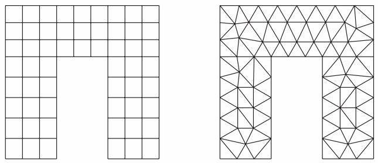  
Figure 2:Two meshes with different element shapes.

For more information, see Assigning Abaqus element types.

You can choose the meshing technique—free, structured, or swept—and, where applicable, you can choose the meshing algorithm—medial axis or advancing front. For more information, see Mesh generation.  
You can select the element type that is assigned to the mesh by choosing the element family, geometric order, and shape along with specific element controls, such as hourglassing. For more information, see Understanding mesh generation.

## Additional information

• Understanding seeding  
• Assigning Abaqus element types  
• Verifying and improving meshes

## Mesh generation

Abaqus/CAE can use a variety of meshing techniques to mesh models of different topologies. In some cases you can choose the technique used to mesh a model or model region. In other cases only one technique is valid. The different meshing techniques provide varying levels of automation and user control. There are two meshing methodologies available in Abaqus/CAE: top-down and bottom-up.

Top-down meshing generates a mesh by working down from the geometry of a part or region to the individual mesh nodes and elements. You can use top-down meshing techniques to mesh one-, two-, or three-dimensional geometry using any available element type. The resulting mesh exactly conforms to the original geometry. The rigid conformance to geometry makes top-down meshing predominantly an automated process but may make it difficult to produce a high-quality mesh on regions with complex shapes.

Bottom-up meshing generates a mesh by working up from two-dimensional entities (geometric faces, element faces, or two-dimensional elements) to create a three-dimensional mesh. You can use bottom-up meshing techniques to mesh only solid three-dimensional geometry using all—or nearly all—hexahedral elements. Generating a mesh using the bottom-up meshing technique is a manual process, and the resulting mesh may vary significantly from the original geometry. However, allowing the mesh to vary from geometry may allow you to produce a high quality hexahedral mesh on regions with complex shapes.

## Additional information

• Top-down meshing  
• Bottom-up meshing

## Top-down meshing

Top-down meshing relies on the geometry of a part to define the outer bounds of the mesh. The top-down mesh matches the geometry; you may need to simplify and/or partition complex geometry so that Abaqus/CAE recognizes basic shapes that it can use to generate a high-quality mesh. In some cases top-down methods may not allow you to mesh portions of a complex part with the desired type of elements. The top-down techniques—structured, swept, and free meshing—and their geometry requirements are well-defined, and loads and boundary conditions applied to a part are associated automatically with the resulting mesh.

## Structured meshing

Structured meshing is the top-down technique that gives you the most control over your mesh because it applies preestablished mesh patterns to particular model topologies. Most unpartitioned solid models are too complex to be meshed using preestablished mesh patterns. However, you can often partition complex models into simple regions with topologies for which structured meshing patterns exist. Figure 1 shows an example of a structured mesh. For more information, see Structured meshing and mapped meshing.

  
Figure 1: A structured mesh.

## Swept meshing

Abaqus/CAE creates swept meshes by internally generating the mesh on an edge or face and then sweeping that mesh along a sweep path. The result can be either a two-dimensional mesh created from an edge or a three-dimensional mesh created from a face. Like structured meshing, swept meshing is a top-down technique limited to models with specific topologies and geometries. Figure 2 shows an example of a swept mesh. For more information, see Swept meshing.

  
Figure 2: A swept mesh.

## Free meshing

The free meshing technique is the most flexible top-down meshing technique. It uses no preestablished mesh patterns and can be applied to almost any model shape. However, free meshing provides you with the least control over the mesh since there is no way to predict the mesh pattern. Figure 3 shows an example of a free mesh. For more information, see Free meshing.

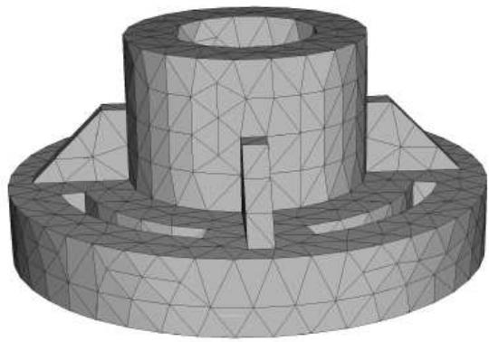  
Figure 3: A free mesh generated with tetrahedral elements.

## Additional information

• Bottom-up meshing  
• Understanding mesh generation  
• Assigning Abaqus element types  
• Verifying and improving meshes

## Bottom-up meshing

Bottom-up meshing uses the part geometry as a guideline for the outer bounds of the mesh, but the mesh is not required to conform to the geometry. Removing this restriction gives you greater control over the mesh and allows you to create a hexahedral or hexahedral-dominated mesh on geometry that is too complex for the structured or swept meshing techniques. Bottom-up meshing can be applied to any solid model shape. It provides you with the most control over the mesh, since you select the method and the parameters that drive the mesh. However, you must also decide whether the resulting mesh is a suitable approximation of the geometry. If it is not, you can delete the mesh and try a different bottom-up meshing method or partition the region and mesh the resulting smaller regions with either bottom-up or top-down meshing techniques.

To mesh a single bottom-up region, you may have to apply several successive bottom-up meshes. For example, you may use an extruded bottom-up mesh to generate part of a region, then use the element faces of the extruded mesh as a starting point to generate a swept mesh for features that the extruded mesh did not include.

Loads and boundary conditions are applied to geometry. Unlike a top-down mesh, a bottom-up mesh may not be fully associated with geometry. Therefore, you should check that the mesh is correctly associated with the geometry in areas where loads or boundary conditions are applied. Proper mesh-geometry association will ensure that the loads and boundary conditions are correctly transferred to the mesh during the analysis. (For more information, see Mesh-geometry association.) Because of the extra effort required by the user to create a satisfactory mesh compared to the automated top-down meshing processes, bottom-up meshing is recommended for use only when top-down meshing cannot generate a suitable mesh.

Figure 1 shows an example of a bottom-up meshed part. Although this part is relatively simple, it requires two regions and four bottom-up meshes to completely mesh the part. Abaqus/CAE displays bottom-up meshed regions using a mixture of the region geometry color (light tan) and the mesh color (light blue) to emphasize that the geometry and mesh may not be associated. Displaying both the geometry and the mesh allows you to view and edit the mesh-geometry associativity.

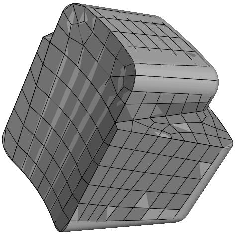  
Figure 1: A bottom-up hexahedral meshed part.

## Additional information

• Top-down meshing  
• Understanding mesh generation  
• Assigning Abaqus element types  
• Verifying and improving meshes

• Bottom-up meshing

## Mesh technique color coding

When the Mesh defaults color mapping is selected, Abaqus/CAE uses different colors to indicate which meshing technique, if any, is currently assigned to a region. For example, if a solid region is meshable using the structured meshing technique, the region turns green when you enter the Mesh module; the green color indicates that the structured meshing technique is assigned to that region. Yellow indicates that the sweep meshing technique is applied to a region. If a region is unmeshable using the currently assigned element shape, the region turns orange when you enter the Mesh module. Regions that are pink or light tan have been assigned the free and bottom-up meshing techniques, respectively.


## Note:

You must use the Mesh Controls dialog box to assign the bottom-up meshing technique to a region. Abaqus/CAE does not automatically assign the bottom-up meshing technique and will not indicate whether a region that is assigned the bottom-up technique can also be meshed using a top-down technique. (For more information, see Assigning mesh controls.)

You can change the applicable meshing techniques by partitioning the region into smaller regions with simpler topology, by changing the element shape assigned to the region, or by using the Virtual Topology toolset.

## Additional information

• Determining which regions are meshable  
• Color coding geometry and mesh elements

## Mesh refinement

The Mesh module provides a set of tools that allow you to refine a mesh.

You can use the Partition toolset to divide geometric regions into smaller regions. The resulting partitions introduce new edges that you can seed; therefore, you can combine partitioning and seeding to gain additional control over the mesh generation process. You can also use partitioning to create regions to which you can assign different element types. For example, you might want to assign reduced-integration elements to some portions of your model and fully integrated elements to others. For more information, see The Partition toolset.  
In some cases the geometry contains details such as very small faces and edges. The Virtual Topology toolset allows you to remove these small details by combining a small face with an adjacent face or by combining a small edge with an adjacent edge. Introducing virtual topology is a convenient method for creating a clean, well-formed mesh. For more information, see The Virtual Topology toolset.  
• You can use the Edit Mesh toolset to make minor adjustments to your mesh. For more information, see What can I do with the Edit Mesh toolset?.

## Mesh optimization

You can assign remeshing rules to regions of your model. Remeshing rules enable successive refinement of your mesh based on solution results. After each analysis, the Mesh module adjusts your mesh with the aim of reducing selected error indicators in the solution results. For more information, see Understanding adaptive remeshing, Advanced meshing techniques, and Creating, editing, and manipulating adaptivity processes.

## Mesh verification

The Mesh module provides a set of tools that allow you to verify a mesh and to obtain mesh statistics and mesh information. The Mesh module also provides geometry diagnostic tools that will help you determine why Abaqus/CAE cannot mesh a region. For more information, see Verifying your mesh, Querying your mesh, and Using the geometry diagnostic tools.

## Meshing independent and dependent part instances

The approach to meshing independent and dependent instances is different. For more information, see What is the difference between a dependent and an independent part instance?.

## Independent

To mesh an independent instance, use the context bar to change the Object to Assembly and mesh the instance directly. You cannot mesh a part that you have used to create an independent instance.

## Dependent

To mesh a dependent instance, use the context bar to change the Object to Part and select the part with which the dependent instance is associated. You can then mesh the part, and Abaqus/CAE applies the same mesh to each dependent instance in the assembly. Dependent instances are convenient when you have a linear or radial pattern of part instances. You can mesh the original part, and Abaqus/CAE applies the same mesh to each instance of the part in the pattern.

## Displaying a native mesh

You can switch between displaying the geometry of the part instance and the meshed representation of the same instance.

Click the Show native mesh icon located in the Visible Objects toolbar.

You can use the Show native mesh tool in any of the assembly-related modules to switch between displaying the geometry of the assembly and a meshed representation of the assembly. Abaqus/CAE displays the meshed representation of both independent and dependent part instances in the assembly (assuming that you have created the appropriate meshes).

Toggling between the geometry of a part and its meshed representation using the Show native mesh tool allows you to see how closely the mesh follows the geometry. The tool also allows you to see how Abaqus/CAE incorporated virtual topology into the mesh. In addition, you may find it useful to click on the Show native mesh tool in the Job module. You can then confirm that the entire assembly has been meshed correctly before you submit a job for analysis.

The display of any orphan elements in the model is unaffected by this tool; orphan elements are displayed regardless of whether you display the geometry or elements for the native portion of part instances.

## Understanding seeding

This section explains the concept of seeding and how to use seeding to improve meshes.

## In this section:

What are mesh seeds?  
Can I seed a face or a cell?  
Controlling the seed density  
Applying curvature control to your seeding  
Constraining seeds  
Minimizing seed repositioning  
What is the relationship between vertices and nodes?

## What are mesh seeds?

Seeds are markers that you place along the edges of a region to specify the target mesh density in that region. Both the mesh density along the boundary of the region and the mesh density in the interior of the region are determined by the seeds along the edges of the region.

You can create and control seeds using the Seed menu in the Mesh module main menu bar. Abaqus/CAE generates meshes that match your seeds as closely as possible. Abaqus/CAE can use the following methods to control the distribution of the seeds:

• Position the seeds uniformly along all the edges of a part or part instance  
• Position the seeds uniformly along an edge  
• Position the seeds with a bias such that the mesh density increases toward one end of the edge  
• Position the seeds with a bias such that the mesh density increases from each end toward the center of the edge  
• Position the seeds with a bias such that the mesh density increases from the center toward each end of the edge

Figure 1 shows a combination of uniform seeding and bias seeding.  
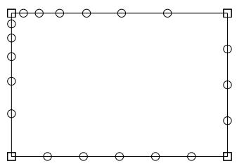  
Figure 1: A model with uniform and bias seeding.

You should apply seeds to all edges. If a uniform seed distribution is sufficient, the recommended approach is to seed the entire part or part instance. If you want more control over the mesh, you can partition the region and then provide seeds along the partitions you have created. This technique is described in greater detail in Verifying and improving meshes.

Mesh seeds specify only a target mesh density. If you are using hexahedral or quadrilateral elements, Abaqus/CAE often changes the element distribution so that the mesh can be generated successfully. You can prevent such adjustments by constraining the number of seeds along an edge. When you constrain seeds, you are prescribing mainly the number of elements along the edge, and, to a lesser extent, the precise locations of the nodes; if necessary, Abaqus/CAE adjusts the locations of the nodes to reduce element distortion. In addition, you should use such constraints with care, since they can make it more difficult for the mesh generator to obtain a mesh.

By default, Abaqus/CAE displays seeds on a part or assembly only when you are defining or modifying seed placement. You can enable persistent seed display if you want the seeds to appear while you perform other operations in the Mesh

module; toggle on in the Visible Objects toolbar to maintain seed display.

## Can I seed a face or a cell?

You can select edges, faces, or cells to seed; however, Abaqus/CAE creates seeds only along edges. When you select faces or cells to seed, Abaqus/CAE creates seeds only along the edges of the faces or cells. In addition, you can select a set or surface to seed; as a result, Abaqus/CAE creates seeds along the edges of the geometry contained in the set or surface.

When you are applying uniform seeds, you can use a combination of the following methods to select the region to which Abaqus/CAE will apply the seeds:

## Individually/By angle

You can select edges, faces, or cells individually; or you can use the angle method to select a group of edges or faces. For example, if you choose the angle method and select an edge, Abaqus/CAE then selects every adjacent edge until the angle between the edges is equal to or exceeds the angle that you entered. For more information, see Using the angle and feature edge method to select multiple objects.

## Selection filters

You can use filters to choose the type of object to select—Edges, Faces, Cells, or All. By default, Abaqus/CAE allows you to select all types of object. The option to select by angle becomes available only after you select Edges or Faces from the selection filters. For more information, see Filtering your selection based on the type of object.

## Sets or surfaces

By default, Abaqus/CAE allows you to apply seeds to edges, faces, and cells that you select from the viewport. Alternatively, you can click Sets/Surfaces on the right of the prompt area and select from eligible sets (or surfaces). When you select a set (or surface), Abaqus/CAE applies seeds to every edge in the set (or surface), including every edge of all the cells and faces. Abaqus/CAE ignores any vertices in the set (or surface).

## Controlling the seed density

You can use the following methods to control the seed density along selected edges:

• Specify the average element size for every edge of the entire part or part instance.  
• Specify the number of elements desired along an edge.  
• Specify the average element size along an edge. (If the edge length is not an integer multiple of the element length, Abaqus/CAE will change the element length slightly to obtain an integer number of elements along the edge.)  
Specify a nonuniform distribution of elements along an edge. The element density can increase from one end of the edge to the other (single bias), or the element density can vary from the center of the edge to each end (double bias). For a nonuniform distribution you can specify either of the following:

- The number of elements desired along an edge and a bias ratio. The bias ratio is the ratio of the largest element to the smallest element.  
The size of the smallest element and the size of the largest element.

If you select edges that you previously seeded using a combination of these methods, Abaqus/CAE provides an As Is option that allows you to retain the seeding method. Abaqus/CAE provides a similar option if you select edges with a mixture of curvature controls or seed constraints.

For detailed instructions on prescribing seed density, see the following sections:

Defining seed density for an entire part or part instance  
Seeding an edge by prescribing the number of elements  
Seeding an edge by prescribing element size  
Prescribing biased seeding along an edge  
Applying constraints to edge seeds  
Seeding previously meshed parts, part instances, or regions  
Deleting part or instance seeds  
Deleting edge seeds

Seeds created by specifying an average element size for the entire part or part instance are called part seeds or instance seeds, respectively, and appear in white; seeds created using the other methods are called edge seeds and appear in magenta. Edge seeds always override part or instance seeds; therefore, when you specify the average element size for the entire part or part instance, part or instance seeds appear only on edges of the region that do not already have edge seeds. New edges created by partitioning are given part or instance seeds by default.

When you seed an edge of a region that is assigned the swept or revolved mesh technique, the edge seeding tools automatically propagate seeds from the selected edge to the matching edges in the region. In other words, the seeds on the face or edge at the beginning of the sweep path are propagated automatically to the face or edge at the end of the sweep path. Likewise, the seeds created on one edge along the sweep path are propagated automatically to the other edges along the sweep path. As a result, even though you select a single edge of a face to seed, Abaqus/CAE will propagate the seeds to additional edges and faces. For more information, see What is swept meshing?.

## Applying curvature control to your seeding

The part seeding tool allows you to specify a target element size when you are seeding a part, a part instance, or multiple edges. If the geometry is relatively regular, specifying a single target element size can result in an acceptable mesh. However, if you specify a single target element size and the geometric features that make up the part or edges vary in size, the resulting mesh may be too coarse to adequately represent any small features, as shown in Figure 1.

  
Figure 1: Seeding and the resulting mesh with no curvature control.

To avoid the problem of inadequate seeding around small curved features, Abaqus/CAE applies curvature control when it seeds a part, a part instance, or edges. Curvature control allows Abaqus/CAE to calculate the seed distribution based on the curvature of the edge along with the target element size. Figure 2 shows the same part seeded and meshed with curvature control enabled.

  
Figure 2: Seeding and the resulting mesh with curvature control enabled.

You can configure the following to specify how curvature control will influence the seeding:

## Deviation factor

The deviation factor is a measure of how much the element edges deviate from the original geometry, as shown in Figure 3.

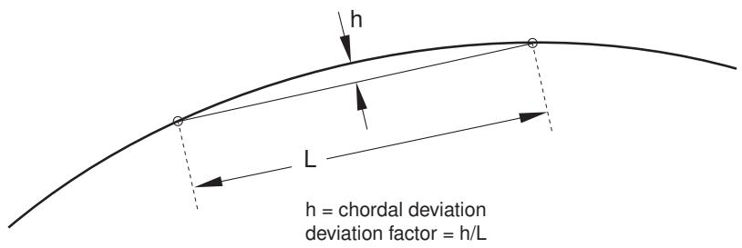  
Figure 3: Deviation factor.

To help you visualize the deviation factor, Abaqus/CAE displays the approximate number of elements it would create around a circle corresponding to the setting that you enter. As you reduce the deviation factor, the number of elements that Abaqus/CAE would create around a circle increases. This number is only a visual aid; for example, if you are seeding a spline or an ellipse, Abaqus/CAE creates a different number of elements, depending on the local curvature along the edge.

## Specify minimum size factor

Specifying a minimum size factor prevents Abaqus/CAE from creating very fine meshes in areas of high curvature that you have no interest in modeling; for example, kinks in spline curves or fillets with a very small radius. The number that you enter representing the minimum size is the fraction of the global seed size. As a result, if you change the global seed size, you do not have to change the minimum size factor.

For detailed instructions on applying curvature control, see Defining seed density for an entire part or part instance.

## Constraining seeds

By default, mesh seeds prescribe only a target mesh density. Abaqus/CAE generally matches the mesh seeds exactly when you are using the free meshing technique to generate triangular- or tetrahedral-shaped elements. However, in other cases Abaqus/CAE may alter the element distribution so that it can successfully generate the mesh. If you want to prevent Abaqus/CAE from altering the element distribution, you can fix a specific number of elements along an edge by constraining the seeds along that edge. You can constrain only edge seeds, not part or instance seeds.

You can assign any one of the following three states to a group of seeds along an edge:

## Unconstrained

This is the default setting. The number of elements along an edge can either increase or decrease so that the mesh can become denser or coarser than is specified by the seeds. Unconstrained seeds appear as open circles.

## Partially constrained

The number of elements along an edge may be increased during mesh generation but cannot be decreased. This constraint allows the mesh to become denser than is specified by the seeds but no coarser. Partially constrained seeds appear as upward-pointing triangles.

## Fully constrained

The number of elements specified by constrained seeds along an edge cannot be altered by the mesh generation process. When the seeds are fully constrained, the mesh generation will attempt to allow the location of the nodes to correspond exactly to the location of the seeds. However, an exact match between the seeds and the nodal positions is not guaranteed. Fully constrained seeds appear as squares.

Abaqus/CAE always creates a fully constrained seed at each geometric vertex of a region to indicate that a finite element node will be positioned at each vertex.

In many cases the mesh generator must redistribute elements (and deviate from the number and location of the seeds) to generate a mesh successfully. For the greatest likelihood of meshing success, leave seeds unconstrained or at least avoid fully constraining large numbers of seeds in a given part or part instance so that the mesh generator has as much freedom to redistribute seeds as possible.

For detailed instructions on constraining edge seeds, see the following sections :

Applying constraints to edge seeds  
Relaxing constraints using the error dialog box

## Minimizing seed repositioning

During the mesh generation process Abaqus/CAE uses the seeds that you create as target locations for nodes along the edges of the mesh. However, if you are using quadrilateral- or hexahedral-shaped elements, a close match between your seeds and nodes depends heavily on the following:

## The element shapes you allow in transition regions

You will obtain a better match between your seeds and the nodes of the mesh if you allow triangular elements in transition regions. The seeds and the nodes are less likely to match if you restrict your mesh to including only quadrilateral elements.

## The mesh transition setting

You will obtain a better match between your seeds and the nodes of the mesh if you allow for mesh transition.

## The meshing technique

The mesh generated using the advancing front meshing algorithm matches your seeding better than the mesh generated using the medial axis algorithm.

## The seed constraints

Fully constrained seeds closely match the generated nodes in both number and position. However, you must fully constrain only a few edges of a part or part instance; otherwise, Abaqus/CAE will not be able to generate a mesh.

## How neighboring regions are seeded

When meshing multiple regions, Abaqus/CAE often redistributes the elements so that the mesh is compatible between regions. Even though a single region's seed arrangement may be adequate for generating a mesh on that one region, the seed arrangement may need to be changed since the number of elements must be compatible with neighboring regions along shared edges.


## Note:

Mesh compatibility between part instances is not guaranteed. In some simple cases seeding can help achieve part-to-part mesh compatibility. Techniques for obtaining compatible meshes are described in Compatible meshes between part instances.

Abaqus/CAE tries to adhere as closely as possible to the number and location of seeds that you specified when balancing the element redistribution for the entire model. If given a choice between making a large change along a single seeded edge and making a small change to many edges, Abaqus/CAE will make many small changes.

## What is the relationship between vertices and nodes?

When you seed a model, Abaqus/CAE automatically places fully constrained seeds wherever vertices appear along the model's edges. Fully constrained seeds that appear at vertices always indicate that nodes will appear at those vertices. (Fully constrained seeds that appear at other locations along an edge of a region do not indicate the exact location of nodes; they indicate only the number of nodes along that edge.) Therefore, when you sketch a part, you should keep in mind that the location of vertices in the part influences the quality of the mesh that Abaqus/CAE can generate. (For information about altering vertex locations, see Dragging Sketcher objects.)

For example, Figure 1 shows a sketch of a two-dimensional part.

  
Figure 1: Vertices on a two-dimensional part.

Note the locations of the nine vertices. These vertices were created by sketching several line segments along the top and bottom edges rather than one continuous line segment along each edge.

When that part or an instance of the part is seeded, square-shaped, fully constrained seeds appear at each vertex, as shown in Figure 2.

  
Figure 2: Fully constrained seeds appear at each vertex.

When the model is meshed, Abaqus/CAE always places nodes at the location of the fully constrained seeds that are located at vertices, as shown in Figure 3.

  
Figure 3: Nodes appear at the vertices.

Likewise, Figure 4 shows the sketch of two concentric circles that will be extruded to form a hollow cylinder.

  
Figure 4: Concentric circles with aligned vertices.

Note the location of the vertices, which the Sketcher creates at the locations you click to define the circles' perimeters. When the cylinder is seeded, square-shaped, fully constrained seeds appear at each vertex, as shown in Figure 5.

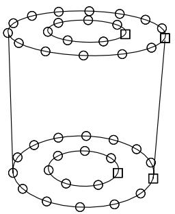  
Figure 5: Fully constrained seeds appear at each vertex.

When the model is meshed, nodes always appear at the location of the fully constrained seeds that are located at vertices, as shown in Figure 6.

  
Figure 6: Nodes appear at the vertices.

If you do not align the two vertices when you sketch the cylinder, you risk generating a distorted mesh. For example, the vertices of the two concentric circles are not aligned in Figure 7.

  
Figure 7: Concentric circles whose vertices are not aligned.

As a result, the mesh is slightly distorted on the right side, as shown in Figure 8.

  
Figure 8: A distorted mesh.

## Assigning Abaqus element types

This section explains how to assign Abaqus/Standard and Abaqus/Explicit element types to geometric regions and to orphan elements.

## In this section:

How do mesh elements correspond to Abaqus elements?  
What kinds of elements must be generated outside the Mesh module?  
Element type assignment  
Preferred element types list

## How do mesh elements correspond to Abaqus elements?

The Mesh module can generate meshes containing the following element shapes.

One-Dimensional  
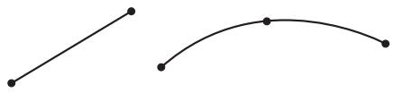  
Lines

Two-Dimensional  
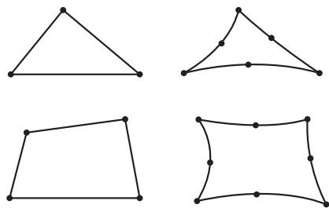  
Triangles

  
Quadrilaterals

Three-Dimensional  
  
Tetrahedra


  
Triangular prisms (wedges)

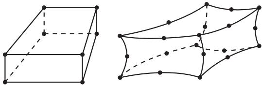  
Hexahedra  
Figure 1: Element shapes.

Most elements in Abaqus/Standard and Abaqus/Explicit correspond to one of the shapes shown; that is, they are topologically equivalent to these shapes. For example, although the elements CPE4, CAX4R, and S4R are used for stress analysis, DC2D4 is used for heat transfer analysis, and AC2D4 is used for acoustic analysis, all five elements are topologically equivalent to a linear quadrilateral.

Every mesh region has one or more Abaqus element types assigned to it by default. Each element type corresponds to an element shape that can be used in the region. For example, a shell mesh region typically has a quadrilateral and a triangular element type assigned to it by default. However, you can change the element assignment for any Abaqus element that is topologically equivalent to the element shape assigned to the region. As a result, you can choose to mesh a shell region with only all triangular elements, and Abaqus/CAE ignores the quadrilateral element assignment.

To change the element assignment to an Abaqus element that is topologically equivalent to the element shape assigned to the region, select Mesh->Element Type from the main menu bar. Similarly, you can select Mesh->Controls to select the element shape for meshing.

However, since no element type checking is done until you submit the analysis, it is possible to choose an element that is inappropriate for the analysis you will be conducting. For example, Abaqus/CAE does not prevent you from specifying heat transfer elements such as DC2D4, even though you may be conducting a stress analysis.

## What kinds of elements must be generated outside the Mesh module?

Abaqus/CAE provides support for most of the elements that are used by Abaqus/Standard and Abaqus/Explicit. However, some elements are not supported and must be generated outside the Mesh module.

The following list describes the elements that are not supported by Abaqus/CAE. If you want to assign these element types to a model, you must use a text editor to add them to the input file generated in the Job module. For information on generating the input file, see Basic steps for analyzing a model.

• Acoustic interface element (ASI1)  
• Coupled thermal-electrical-structural elements (Q3D4, Q3D6, etc.)  
• Distributing coupling elements (DCOUP2D and DCOUP3D)  
• Drag chain elements (DRAG2D and DRAG3D)  
• Elastic-plastic joint elements (JOINT2D and JOINT3D)  
• Frame elements (FRAME2D and FRAME3D)  
• Gap elements, coupled temperature-displacement and heat transfer (GAPUNIT and DGAP)  
• Infinite elements (CIN3D8, CINAX4, etc.)  
• Line spring elements (LS3S and LS6)  
• Membrane elements, 9-node quadrilateral (M3D9 and M3D9R)  
• Membrane elements, cylindrical (MCL6 and MCL9)  
• Particle element (PC3D)  
• Pipe-soil interaction elements (PSI24, PSI34, etc.)  
• Slide line elements (ISL21A and ISL22A)  
• Stress/displacement variable node elements (C3D15V, C3D27, etc.)


## Note:

After you submit the analysis for execution, Abaqus/Standard automatically converts any C3D20(R)(H) element that is adjacent to a secondary surface in a contact pair into the corresponding C3D27(R)(H) element. (Neither element is available in Abaqus/Explicit.) Otherwise, there is no way to generate variable node hexahedra with Abaqus/CAE.

• Surface elements, cylindrical (SFMCL6 and SFMCL9)  
• Thin shell element, 9-node doubly curved (S9R5)  
• Tube-to-tube contact elements (ITT21 and ITT31)  
• Poroelastic acoustic elements (C3D4A, C3D6A, and C3D8A)

Some pyramid elements, such as C3D5 and AC3D5, are supported by Abaqus/CAE in that they can be imported from and written to input files. However, Abaqus/CAE has no meshing algorithms that generate a pyramid shape. You can assign a different pyramid element type to existing pyramid elements in the Mesh module.

You cannot assign some elements, such as CONN2D2 and SPRING1 in the Mesh module; however, you can create equivalent connectors in the Interaction module or engineering features in the Property module or Interaction module as shown in Table 1. These elements are written to the input file.

Table 1: Abaqus/CAE support for connectors and engineering features.

<table><tr><td>Elements</td><td>Abaqus/CAE support</td></tr><tr><td>CONN2D2, CONN3D2</td><td>Equivalent connector in Interaction module</td></tr><tr><td rowspan="2">DASHPOTA, DASHPOT1, DASHPOT2</td><td>Engineering feature in Property module or Interaction module (linear behavior independent of field variables)</td></tr><tr><td>Equivalent connector in Interaction module</td></tr><tr><td>GAPCYL, GAPSPHER, GAPUNI</td><td>Equivalent connector in Interaction module</td></tr><tr><td>HEATCAP</td><td>Engineering feature in Property module or Interaction module</td></tr><tr><td>ITSCYL, ITSUNI</td><td>Equivalent connector in Interaction module</td></tr><tr><td>JOINTC</td><td>Equivalent connector in Interaction module</td></tr><tr><td>MASS</td><td>Engineering feature in Property module or Interaction module</td></tr><tr><td>ROTARYI</td><td>Engineering feature in Property module or Interaction module</td></tr><tr><td rowspan="2">SPRINGA, SPRING1, SPRING2</td><td>Engineering feature in Property module or Interaction module (linear behavior independent of field variables)</td></tr><tr><td>Equivalent connector in Interaction module</td></tr></table>

For more information, see Understanding connectors, Inertia, and Springs and dashpots.

## Element type assignment

You can assign element types to geometric regions and to orphan mesh elements.

Element types can be assigned to the following:

• A region selected from geometry-based parts or part instances. The part instances must have come from parts that you created in the Part module or from parts that you imported.  
• A set that refers to a region selected from geometry-based parts or part instances. The set can also refer to a skin reinforcement.  
• An orphan element or element set.

All regions from geometry-based parts or part instances have default element type assignments. These assignments depend on the kind of part to which the region or element belongs. You can also specify a list of preferred element types for element type assignment (see Preferred element types list, for more information).

You can view and change the Abaqus element types that are assigned using the Element Type dialog box, which you can display by selecting Mesh->Element Type. For example, the Element Type dialog box for a two-dimensional structural region is shown in Figure 1.

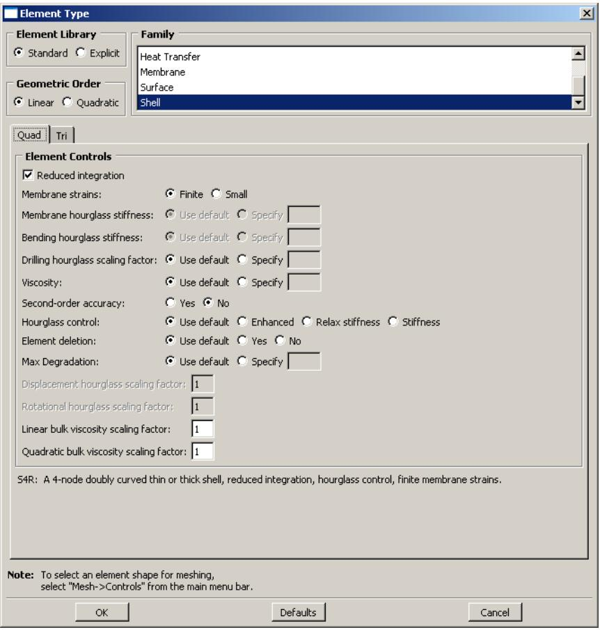  
Figure 1:The Element Type dialog box for a two-dimensional structural region in an Abaqus/Standard model.

At the top of the dialog box, you enter your preferences for element library, geometric order, and family. Then, you select a specific element type by clicking the tabs in the bottom half of the dialog box and choosing from the options that appear. For more information on the element control options, see Section Controls.

The dialog box can contain from one to three tabs depending on the dimensionality of the selected region or regions:

• The Line tab allows you to choose an applicable element type and assign it to one-dimensional mesh elements in the region.  
• The Quad and Tri tabs allow you to choose an applicable element type and assign it to two-dimensional mesh elements in the region.  
• The Hex, Wedge, and Tet tabs allow you to assign three-dimensional element types to the three-dimensional mesh elements in the region.

For example, in Figure 1 the options for a linear shell element from the Abaqus/Standard element library are selected. After clicking the Quad tab, reduced integration and finite membrane strains are selected. The name and a brief description of the quadrilateral shell element that meets all of these criteria appear at the bottom of the tabbed page.

The Tri tab in this dialog box is shown in Figure 2. The name and a brief description of the triangular shell element that meets all of the criteria specified in the dialog box appear at the bottom of the Tri tabbed page in Figure 2. If the selected region in this example happens to contain a combination of triangular and quadrilateral mesh elements:

• The quadrilateral mesh elements are assigned the S4R element type.  
• The triangular mesh elements are assigned the S3 element type.

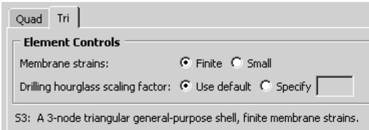  
Figure 2: The Tri tab.

If the region contains only quadrilateral elements, all of the elements are assigned the S4R element type.

For detailed, step-by-step instructions for assigning element types to a mesh region, see Associating Abaqus elements with mesh regions. For lists of the element types that are available, see the Abaqus/Standard Element Index and the Abaqus/Explicit Element Index. You can select most of these elements through the Element Type dialog box. What kinds of elements must be generated outside the Mesh module? describes the elements that cannot be selected.

## Preferred element types list

You can specify a list of preferred element types for element type assignment.

Abaqus/CAE must be run interactively to use preferred element types. The list must be created prior to loading the Mesh module in Abaqus/CAE.

When a part or part instance that has never been assigned an element type is meshed, the preferred element type list is consulted. If an element type appropriate to the geometry is found in the list, it is assigned to the geometry. Multiple element types representing different shapes (for example, triangles and quadrilaterals) can be assigned in combination, but only element types that are compatible with each other are used. When more than one appropriate element type is found in the list, the first element type encountered takes precedence.

The list is also consulted when populating the Element Type dialog box such that preferred element types are selected by default for a region not previously assigned any element types. If you click Defaults in the dialog box, the default element types (not the preferred element types) are displayed.

You can specify the preferred element types list in either the abaqus\_v6.env or the custom\_v6.env environment file. It is recommended that you specify the list of preferred element types in the onCaeStartup() function in the environment file. For example:

```python
def onCaeStartup():
    import mesh
    prefElems=(mesh.C3D8T, mesh.C3D10MT, mesh.S8R)
    session.defaultMesherOptions.setValues(guiPreferredElements=prefElems)
```

• Using the Abaqus environment files

## Verifying and improving meshes

This section explains how you use the tools in the Mesh module to verify your mesh quality, to control mesh generation, and to improve the mesh quality.

## In this section:

Verifying your mesh  
Querying your mesh  
Why partition in the Mesh module?  
How are seeds and other attributes affected by partitioning?  
Regenerating partitions after modifying geometry  
Using virtual topology to improve your mesh  
Using adaptive remeshing to improve your mesh

## Verifying your mesh

Upon completion of a meshing operation, Abaqus/CAE highlights any bad elements in the mesh. Abaqus/CAE also provides a set of tools in the Mesh module that allow you to verify the quality of your mesh and to obtain information about the nodes and elements in the mesh. You can use these tools to isolate regions where the mesh quality is poor and to guide you if you need to refine your mesh. To verify the quality of the mesh, choose the Object from the context bar, and select Mesh->Verify from the main menu bar. You can then select the part, part instances, geometric regions, or element to verify. Abaqus/CAE allows you to choose between checking that your mesh will pass the quality tests in the analysis products and checking that your mesh passes individual quality checks, such as checking for elements with a large aspect ratio. Any elements that do not pass the specified criteria are highlighted in the viewport, and you can choose to create and save a set containing the highlighted elements or, if applicable, the cells, faces, or edges related to those elements. For detailed information on using the mesh verify tools, see Verifying element quality.

You can use the Analysis checks to verify that the elements in your mesh will pass the element quality checks that are included with the input file processor in Abaqus/Standard or Abaqus/Explicit. Abaqus/CAE highlights any elements that fail the mesh quality tests and displays the number of elements tested along with the number of errors and warnings in the message area. The mesh quality tests in the input file processor are extensive and specific to each element type. At a minimum, the mesh quality tests issue a warning for elements that seem inappropriately distorted, and the tests issue an error if the distortion is severe. Abaqus/CAE does not support analysis checks for beam, gasket, or cohesive elements.

You can use the Shape metrics to highlight elements of a selected shape that do not meet one of the following selection criteria:

## Shape factor

Abaqus/CAE highlights elements with a normalized shape factor smaller than a specified value. The shape factor criterion is available only for triangular and tetrahedral elements. The shape factor ranges from 0 to 1, with 1 indicating the optimal element shape and 0 indicating a degenerate element.

• For triangular elements the normalized shape factor is defined as

$$
\text {shape factor} = \frac {\text {element area}}{\text {optimal element area}}.
$$

Optimal element area is the area of an equilateral triangle with the same circumradius as the element. (The circumradius is the radius of the circle passing through the three vertices of the triangle.)

• For tetrahedral elements the normalized shape factor is defined as

$$
\text {shape factor} = \frac {\text {element volume}}{\text {optimal element volume}}.
$$

Optimal element volume is the volume of an equilateral tetrahedron with the same circumradius as the element. (The circumradius is the radius of the sphere passing through the four vertices of the tetrahedron.)

## Small face corner angle

Abaqus/CAE highlights elements containing faces where two edges meet at an angle smaller than a specified angle.

## Large face corner angle

Abaqus/CAE highlights elements containing faces where two edges meet at an angle larger than a specified angle.

## Aspect ratio

Abaqus/CAE highlights elements with an aspect ratio larger than a specified value. The aspect ratio is the ratio between the longest and shortest edge of an element.

Table 1 shows the default limits for the selection criteria based on the element shape.  
Table 1: Element shape selection criteria limits.

<table><tr><td>Selection criterion</td><td>Quadrilateral</td><td>Triangle</td><td>Hexahedra</td><td>Tetrahedra</td><td>Wedge</td></tr><tr><td>Shape factor</td><td>N/A</td><td>0.01</td><td>N/A</td><td>0.0001</td><td>N/A</td></tr><tr><td>Smaller face corner angle</td><td>10</td><td>5</td><td>10</td><td>5</td><td>10</td></tr><tr><td>Larger face corner angle</td><td>160</td><td>170</td><td>160</td><td>170</td><td>160</td></tr><tr><td>Aspect ratio</td><td>10</td><td>10</td><td>10</td><td>10</td><td>10</td></tr></table>

You can use the Size metrics to highlight elements that do not meet one of the following selection criteria:

## Geometric deviation factor

Abaqus/CAE highlights elements with an edge whose geometric deviation factor is greater than the specified value. The geometric deviation factor is a measure of how much an element edge deviates from the original geometry, and Abaqus/CAE calculates this value by dividing the maximum gap between an element edge and its parent geometric face or edge by the length of the element edge. By default, Abaqus/CAE highlights elements whose geometric deviation factor is greater than 0.2.

Abaqus/CAE calculates the geometric deviation factor only for elements in a native mesh. If you select a part that contains no geometry, Abaqus/CAE disables this option in the Verify Mesh dialog box. If your selection includes both native and orphan elements, Abaqus/CAE considers only the native elements for calculations of geometric deviation factor.

## Short edge

Abaqus/CAE highlights elements with an edge shorter than a specified value.

## Long edge

Abaqus/CAE highlights elements with an edge longer than a specified value.

## Stable time increment

Abaqus/CAE highlights elements with a calculated stable time increment less than the specified value. The stable time increment calculation requires a suitable material definition and section assignment and is meaningful only for Abaqus/Explicit analyses.

The stable time increment calculation in Abaqus/CAE is an approximation of the initial stable time increment calculation made by Abaqus/Explicit for an element-by-element formulation. It does not account for any of the following conditions:

• Mass scaling  
Point mass  
• Rotary inertia

• Nonstructural mass  
• Reinforcement (rebar)

Material behaviors supported for the stable time increment calculation in Abaqus/CAE include elastic, hyperelastic, hyperfoam (without user-defined test data), and acoustic medium. Composite sections with multiple materials are not supported. For more information, see Stability.

## Maximum allowable frequency for acoustic elements

Abaqus/CAE highlights finite acoustic elements that may not be valid for modal or steady-state dynamic analyses in Abaqus/Standard above the specified frequency value. The maximum allowable frequency calculation requires a suitable material definition and section assignment. The calculation is a guideline based on approximately 10 elements per wavelength:

$$
f _ {m a x} = \frac {P C _ {o}}{1 0 h},
$$

where P is the interpolation order (1 or 2), h is the size of the element bounding box, and $C _ { o }$ is the speed of

sound $\left( { \sqrt { \frac { b u l k ~ m o d u l u s } { d e n s i t y } } } \right)$

In addition, for both shape and size metrics Abaqus/CAE displays the following information in the message area for each selected part, part instance, or region:

• The name of the part or part instance.  
• The total number of elements of the selected shape in the part instance or in the selected regions.  
• The number of highlighted elements and the percentage of the elements being verified that these elements comprise.  
The average value of the selection criterion. For the geometric deviation factor, Abaqus/CAE calculates the average value by considering only elements along a curve or face; solid elements in the center of a volume are excluded from this value.  
• The “worst” value of the selection criterion—the value closest to the criterion if it is not exceeded or the value farthest beyond the criterion if it is exceeded.

## Querying your mesh

The Query toolset in the Mesh module allows you to obtain information about the nodes and elements in the mesh. In addition, you can select Tools->Query from the main menu bar to request the following information about the mesh:

• The total number of nodes and elements in a selected part, part instance, or region along with the number of elements of each element shape.  
• The type and connectivity of a selected element.  
• The positive and negative sides of shell and membrane faces.  
• The direction of beam and truss tangents.  
• The mesh stack orientation.  
• Whether any edges of boundary faces have incompatible interfaces, cracks, or gaps and whether any edges intersect other faces.  
• The location of free or non-manifold edges—exterior shell or solid element edges that are not shared by exactly two exterior elements.  
• The location of any unmeshed regions.

For detailed information on using the Query toolset, see Obtaining mesh information.

## Why partition in the Mesh module?

You can use the Partition toolset to divide parts or independent part instances into smaller regions. There are three reasons to create partitions in the Mesh module:

To divide a complex, three-dimensional part or instance into simpler regions that Abaqus/CAE can mesh using primarily hexahedral elements with the structured or swept meshing techniques. (Almost all three-dimensional parts are meshable using the free meshing technique, but three-dimensional free meshes can include only tetrahedral elements.)  
• To gain more control over mesh generation.  
• To obtain regions to which you can assign different element types.

See The Partition toolset for detailed information on how to use each tool in the Partition toolset.

You can partition only parts or independent part instances. If you need to partition a dependent instance, you can partition the original part from which the dependent instance was created. Alternatively, you can create a copy of the original part and then create an independent instance of the copy. You can then replace the dependent instance with the new independent instance and partition the independent instance. For more information, see What is the difference between a dependent and an independent part instance?.

By default, the free meshing technique with quadrilateral elements is applied to all two-dimensional parts and part instances. When you create the mesh using this default technique, Abaqus/CAE implicitly creates partitions that divide the part into regions that can be meshed using the structured meshing technique. (For more information, see Free meshing with quadrilateral and quadrilateral-dominated elements.) Therefore, all two-dimensional parts are meshable without any manual partitioning.

However, when a three-dimensional part or instance is unmeshable using hexahedral elements, you must take one of the following steps:

• Change the element shape from hexahedra to tetrahedra so that the free meshing technique can be applied.  
• Partition into structured- or swept-meshable regions.

When the Mesh defaults color mapping is selected, Abaqus/CAE uses the color orange to indicate that a three-dimensional region is unmeshable using the currently assigned element shape. For example, Figure 1 illustrates a part that cannot be meshed with hexahedral elements.

  
Figure 1: Unmeshable three-dimensional region.

With the addition of a partition, the part can be meshed with hexahedral elements, as shown in Figure 2; the green region can be meshed using the structured meshing technique, and the yellow regions can be meshed using the swept meshing technique.

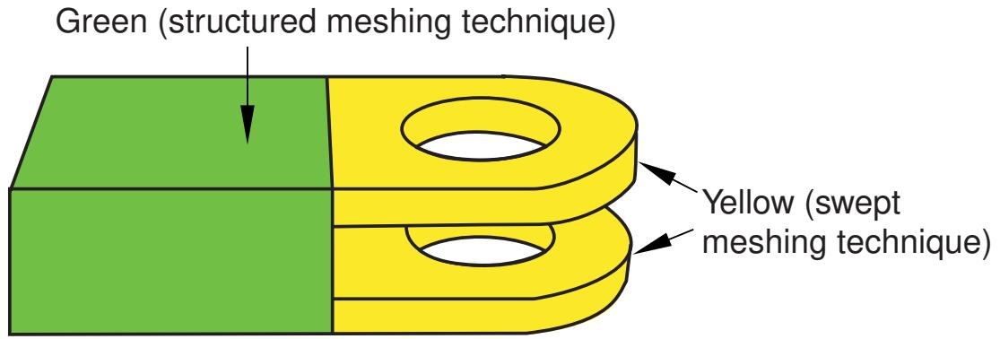  
Figure 2:The model is partitioned into three regions.

Even when a part or instance can be meshed without partitioning, you may still want to partition to gain more control over mesh generation. Without partitions, the mesh is aligned only along the exterior edges; with partitions, the resulting mesh will have rows or grids of elements aligned along the partitions. That is, the mesh “flows” along the partitions. For example, in Figure 3 the partition that divides the rectangle in two causes the mesh to flow at an angle along the partition.

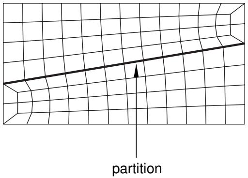  
Figure 3:The mesh flows along the partition.

You can use the additional edges created by partitioning a face to control the mesh characteristics. For example, Figure 4 illustrates how a partition and local mesh seeds allow you to control the mesh flow and density.

  
Figure 4: A partition and local mesh seeds allow you to control the mesh flow and density.

Similarly, Figure 5 shows how partitioning and local mesh seeds allow you to refine the mesh in the area of a stress concentration.

  
Figure 5: Partitioning and local mesh seeds allow you to refine the mesh in the area of a stress concentration.

In addition, you can apply different mesh controls, such as element shape, to the regions created by a partition.

When partitioning, remember that partitions will become element boundaries. Therefore, try to ensure that partitions make angles as close to 90° as possible with other partitions or edges. In addition, you should avoid creating unwanted short edges that will distort the mesh.

## How are seeds and other attributes affected by partitioning?

Seed distributions along edges you have seeded may change during the partitioning process; Abaqus/CAE redistributes the seeds to accommodate any new vertices created by partitioning. For example, the left and right edges of the part instance in Figure 1 are seeded with seven elements per edge.

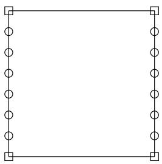  
Figure 1:The left and right edges each have seven elements.

If you create a partition that splits the part instance into two regions, new vertices are created at the midpoints of both edges. In Figure 2 you can see how Abaqus/CAE added seeds at the new vertices so that nodes will exist at the corners of each region.

  
Figure 2: Redistribution of seeds.

Abaqus/CAE also redistributed the existing seeds to eliminate any overly small elements created by the new partition. However, this redistribution can result in seeds that are not aligned. The top region has one seed more on the left side than it does on the right, and the reverse is true for the bottom region. In this example you could change the number of elements along the right and left edges to an even number to ensure that the seeds align after partitioning.

Any other mesh attributes, such as element shape or element type, that you have applied are applied automatically to each new region that you create with a partition. However, once you have created the different regions, you can assign different mesh attributes to each region.

## Regenerating partitions after modifying geometry

Partitions are features associated with the part or part instance; therefore, you can modify and regenerate them like any other feature.

For example, consider the partition on the right side of the part instance shown in Figure 1.

  
Figure 1: A partitioned part instance.

If you return to the Part module and widen the right side of the model, the partition also expands and continues to divide the face into two regions, as shown in Figure 2.

  
Figure 2:The partition is regenerated.

Sometimes regeneration of a partition creates unmeshable regions. In this situation simply add, modify, or delete partitions until the part instance becomes meshable again.

## Using virtual topology to improve your mesh

In some cases parts or independent part instances contain details such as very small faces and edges. The Virtual Topology toolset allows you to remove these small details by combining a small face with an adjacent face or by combining a small edge with an adjacent edge. You can also ignore selected edges and vertices, which has the same effect as combining faces and edges. Introducing virtual topology is a convenient method for creating a clean, well-formed mesh. The Virtual Topology toolset is available only in the Mesh module.

However, adding virtual topology to a part instance can restrict your ability to subsequently mesh the part instance. For example, you cannot mesh regions that contain virtual topology using the following techniques:

• Two-dimensional free meshing with quadrilateral or quadrilateral-dominated elements using the medial axis algorithm.  
• Three-dimensional swept meshing using the medial axis algorithm.  
• Two-dimensional structured meshing if the region to be meshed is not bounded by four corners.  
• Three-dimensional structured meshing if the region to be meshed is not bounded by six sides.

For more information, see The Virtual Topology toolset.

In addition, you can apply virtual topology only to independent instances. If you need to apply virtual topology to a dependent instance, you can create a copy of the original part and then create an independent instance of the copy. You can then replace the dependent instance with the new independent instance and apply virtual topology to the independent instance. For more information, see What is the difference between a dependent and an independent part instance?.

## Using adaptive remeshing to improve your mesh

In many cases you will not know the adequacy of your mesh refinement for your particular solution goal until you have executed a number of analyses and evaluated the solution results. Mesh refinement studies are typically performed in these cases, where a mesh is successively refined and key solution results are confirmed to converge. You can automate this process by applying remeshing rules to regions of interest in your model and using the Abaqus/CAE adaptive remeshing process to automatically perform successive mesh refinement based on a series of executed analyses.

With a remeshing rule you can specify:

• The region where you want the mesh refined.  
• The solution quality criteria (for example error indicators in the Mises stress) that mesh refinement is based on.  
• The analysis step or steps that refinement is based on.  
• Minimum and maximum element size constraints.  
• A sizing algorithm and parameters appropriate to your simulation.

For more information, see Advanced meshing techniques and Creating, editing, and manipulating adaptivity processes.

## Understanding mesh generation

This section explains basic concepts and terminology related to meshes and mesh generation.

## In this section:

Generating a mesh  
Preserving the precision of nodal coordinates  
Determining which regions are meshable  
What should I do if a region fails to mesh?  
What is a mesh transition?  
What is the difference between the medial axis algorithm and the advancing front algorithm?  
What kinds of meshes cannot be generated automatically?  
When will Abaqus/CAE delete a mesh?  
Do I have to mesh the entire model in one operation?  
Can I change the geometric order of the elements in a mesh?

## Generating a mesh

Most meshing in Abaqus/CAE is completed in a “top-down” fashion.

This means that the mesh is created to conform exactly with the geometry of a region and works down to the element and node positions.

1. Abaqus/CAE follows these basic steps to generate a mesh:

Generate a mesh on each top-down region using the meshing technique currently assigned to that region. By default, Abaqus/CAE generates meshes with first-order line, quadrilateral, or hexahedral elements throughout.

2. Merge the meshes of all regions into a single mesh. Typically, Abaqus/CAE merges the nodes along the common boundaries of neighboring regions into a single set of nodes. However, in certain cases Abaqus/CAE creates tied surface interactions instead of merging these nodes; for example, along the common interface between hexahedral and tetrahedral meshes. For more information, see Meshing multiple three-dimensional solid regions.

Top-down meshes generated by Abaqus/CAE conform to the geometry of the part or part instance they discretize, as shown in Figure 1:

  
Figure 1:The mesh conforms to the geometry of the part instance.

• A node is generated at each geometric vertex.  
• A connected set of element edges is generated along each geometric edge.  
• A connected set of element faces is generated along each geometric face.  
• Nodes that are on the boundary of the mesh (including the midside nodes of second-order elements) are also on the boundary of the geometry.  
• Midside nodes of internal second-order elements are centered between the end nodes of the element edges.

For detailed, step-by-step instructions on creating a top-down mesh, see Creating a mesh.

Relying directly on the geometry to form the outer mesh boundaries can impact mesh quality as Abaqus/CAE creates elements to fill small details. In some cases you may not be able to implement a partitioning strategy that allows you to apply a top-down swept or structured meshing technique on a complex region. For solid regions, you can use the “bottom-up” meshing technique in place of the automated top-down meshing techniques to generate a hexahedral mesh. Bottom-up meshing is a manual, incremental meshing process that builds up a three-dimensional mesh from two-dimensional entities. You define the regions that will be meshed using the bottom-up technique, control the meshing process, decide whether the resulting mesh meets your needs, and—since the mesh is not required to conform to the geometry— control the associativity of the geometry to the mesh. For more information on bottom-up meshing, see Bottom-up meshing.

## Preserving the precision of nodal coordinates

When you create a part in the Part module, it exists in its own coordinate system, independent of other parts in the model. In contrast, when you create an instance of the part in the Assembly module and position it relative to other part instances, you are working in the assembly's global coordinate system.

To preserve precision, the Mesh module separates the positioning information of a part instance from the geometry of the instance. As a result, when you generate a mesh, the nodal coordinates for the part instance are computed relative to the coordinate system of the original part. (When the Job module generates an input file, Abaqus/CAE writes the nodal coordinates for each instance relative to its own coordinate system and passes the instance positioning and orientation information to the analysis product via the \*INSTANCE keyword.)

The Mesh module stores these nodal coordinates in single precision. If the geometry of the part lies far from the origin of its coordinate system, some precision of the nodal coordinates will be lost. To prevent this loss of precision, you should try to position a part close to the origin of its coordinate system. For example, the origin of the coordinate system of an Abaqus/CAE native part is located at the origin of the sketch that defined the base feature. Therefore, if possible, you should position the sketch of the base feature over the origin of the sketcher grid.

## Determining which regions are meshable

When the Mesh defaults color mapping is selected, the color of a region in the Mesh module indicates the meshing technique currently assigned to that region. The color coding is as follows:

• Structured meshing technique: green  
• Free meshing technique: pink  
• Swept meshing technique: yellow  
• Unmeshable: orange  
• Bottom-up meshing technique: light tan

See Structured meshing and mapped meshing, Free meshing, Swept meshing, and Bottom-up meshing for information about each meshing technique. See Color coding geometry and mesh elements for more information about color mappings.

In many cases Abaqus/CAE can use more than one technique to mesh a region; in these cases you can either accept the default technique, or you can use the Mesh Controls dialog box to select an alternative technique. In addition, you can change the meshing techniques that are valid for a region by adding partitions to the region or by assigning a different element shape to the region. For example, if you change the element shape assignment of an unmeshable three-dimensional part instance from hexahedra to tetrahedra, the part instance becomes meshable using the free-meshing technique. For more information, see Why partition in the Mesh module?.


## Note:

You must use the Mesh Controls dialog box to assign the bottom-up meshing technique to a region. To unassign the bottom-up technique, you may select another technique or click Defaults in the Mesh Controls dialog box to allow Abaqus/CAE to use the default element shape and meshing technique for the region.

The default meshing technique for two-dimensional models is the free meshing technique. If you are not satisfied with the quality of the mesh generated by the free meshing technique, or if you prefer a more regular grid-like mesh pattern, you can assign structured meshing to the simpler regions of your model. However, if your model is large and complex, identifying the simple regions where structured meshing is applicable can be a time-consuming process. To make the process faster, you can apply the structured meshing technique to the entire model, and Abaqus/CAE will do the following:

• Determine if any faces are too complex to be structured meshed and ask if you wish to remove them from your selection.  
• Determine if any faces are poorly shaped and will result in unacceptable mesh quality and ask if you wish to remove them from your selection.

If Abaqus/CAE removed any faces from your selection, they are colored pink to indicate that they will be meshed using free meshing. Remaining faces are colored green to indicate that Abaqus/CAE will mesh them using structured meshing.

For example, Figure 1 shows a shell model of an electrical connector. The user attempted to assign structured meshing to the entire assembly, and Abaqus/CAE removed the indicated faces from their selection.

  
Figure 1: Faces that cannot be structured meshed are removed from the selection.

If you are meshing a solid model, you must select one or more cells and use the Mesh Controls dialog box to determine whether the structured technique can be applied to those cells. If you have a region that will be meshed using free tetrahedral meshing, you can select boundary faces and use the Mesh Controls dialog box to determine whether the structured technique can be applied to create a triangular boundary mesh prior to tetrahedral meshing of the solid.

For detailed information on controlling the mesh technique and element shape assigned to a region, see the following sections:

Bottom-up meshing  
Assigning mesh controls  
Choosing an element shape  
Selecting a meshing technique  
Changing mesh controls for previously meshed regions

## What should I do if a region fails to mesh?

If a region fails to mesh, Abaqus/CAE displays an Error dialog box that explains why the meshing failed. In most cases Abaqus/CAE highlights the region and allows you to save it in a set. You can create a display group from the set and use the display group to study the region that failed to mesh.

Some of the more common reasons why a region fails to mesh and the associated solutions are as follows:

## Inadequate seeding

The region contains some small edges or the seed density is too coarse. You can use the Virtual Topology toolset to merge small edges. Alternatively, if you save the region that failed to mesh in a set, you can apply local seeds of a finer density to the saved set.

When you are creating a hexahedral mesh, a quadrilateral mesh, or a quadrilateral-dominated mesh using the medial axis algorithm, Abaqus may need to alter seeds to generate the mesh. In some cases, mesh generation may fail because the modified seeds density is too coarse. Meshing may succeed if you incrementally mesh the regions of the part in a different order, or, as described above, you can apply local seeds of a finer density and remesh the part.

## Bad geometry

Bad geometry refers to small edges or faces or to part instances that are imprecise. You can use the Query toolset to check the geometry. For more information, see Using the geometry diagnostic tools.

## Poor boundary triangles

When you are creating a free mesh with tetrahedral elements, Abaqus/CAE first creates a triangular mesh on the faces of the region and then uses those triangles as faces of the boundary tetrahedral elements. You can choose to preview the triangular mesh on the faces and decide if it is acceptable before continuing with the time-consuming process of generating tetrahedral elements through the interior of the region. For more information, see What is a tetrahedral boundary mesh?.

In some cases Abaqus/CAE cannot complete the conversion from triangles to tetrahedra and highlights the nodes on the boundary mesh that cannot be inserted into the tetrahedral mesh. The highlighted nodes serve as indicators of regions that require attention, and you can try the following:

• Use the seeding tools to increase the mesh density.  
• Use the Virtual Topology toolset to combine small faces and edges with adjacent faces and edges.  
• Use the Partition toolset to partition regions into simpler subregions.  
• Use the Edit Mesh toolset to improve the tetrahedral boundary mesh.  
• Use mesh controls to change the mesh technique applied to faces of the solid region.

## Gasket regions

You can generate a gasket reinforcement mesh only on a region that contains a gasket mesh.

## What is a mesh transition?

A mesh transition is an area where a mesh transitions from coarse (large elements) to fine (small elements), as shown in Figure 1.

  
Figure 1: A mesh with a transition from coarse to fine elements.

Abaqus/CAE provides mesh transition controls for the following types of meshes:

• A two-dimensional, quadrilateral-only mesh that is created using the structured meshing technique or the free meshing technique with the medial axis algorithm.  
• A three-dimensional, hexahedral-only mesh that is created by sweeping a two-dimensional mesh. For more information, see What is swept meshing?.

When transition controls are applicable to the type of mesh you are creating, a toggle button appears on the right side of the Mesh Controls dialog box that allows you to minimize the mesh transition. By default, Abaqus/CAE minimizes the mesh transition, which in some cases will reduce mesh distortion. Conversely, if you toggle off the option to minimize mesh transition, the mesh may move closer to the specified mesh seeds. To display the Mesh Controls dialog box, select Mesh->Controls from the main menu bar. For more information, see Setting the mesh algorithm.

## What is the difference between the medial axis algorithm and the advancing front algorithm?

The medial axis algorithm and the advancing front algorithm are two meshing schemes that Abaqus/CAE can use to generate a mesh when you are doing the following:

• Meshing a surface with quadrilateral or quadrilateral-dominated elements using the free meshing technique.  
Meshing a solid region with hexahedral or hexahedral-dominated elements using the swept meshing technique. (Abaqus/CAE generates hexahedral and hexahedral-dominated meshes by sweeping the quadrilateral and quadrilateral-dominated elements generated by the two algorithms from the source side to the target side.)

The two algorithms are described as follows:

## Medial axis

The medial axis algorithm first decomposes the region to be meshed into a group of simpler regions. The algorithm then uses structured meshing techniques to fill each simple region with elements. If the region being meshed is relatively simple and contains a large number of elements, the medial axis algorithm generates a mesh faster than the advancing front algorithm. Minimizing the mesh transition may improve the mesh quality. The mesh transition option is available only for quadrilateral and hexahedral meshing. For more information, see What is a mesh transition?.

## Advancing front

The advancing front algorithm generates quadrilateral elements at the boundary of the region and continues to generate quadrilateral elements as it moves systematically to the interior of the region.

The elements generated by the advancing front algorithm will always follow the seeding exactly for quadrilateral-dominated and hexahedral-dominated meshes (except when you are creating a three-dimensional revolved mesh, and the profile being revolved touches the axis of revolution). For other meshes the elements generated by the advancing front algorithm will always follow the seeding more closely than those generated by the medial axis algorithm. If the region to be meshed contains virtual topology, you can use only the advancing front algorithm to generate the mesh.

If you select the advancing front algorithm, you can allow Abaqus/CAE to use mapped meshing where appropriate. (Mapped meshing is the same as structured meshing but applies to only four-sided regions.) For more information, see What is mapped meshing?, and When can Abaqus/CAE apply mapped meshing?.

You may have to experiment with the two algorithms to obtain the optimal mesh. Figure 1 illustrates a simple shell region that was meshed with quadrilateral-dominated elements using the two meshing algorithms. In this example both algorithms generate an acceptable mesh.

  
Figure 1: Both algorithms generate acceptable meshes.

Because the elements produced by the advancing front algorithm follow your seeds, the resulting mesh may include some skew in the elements in narrow regions. Element skew is illustrated in Figure 2.

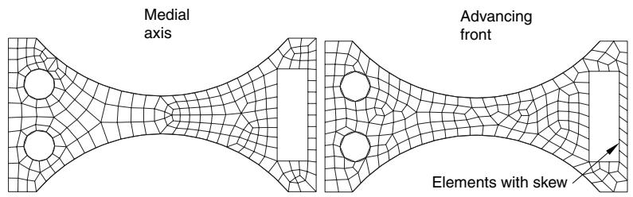  
Figure 2: In some cases the advancing front algorithm generates elements with some skew.

In contrast, the advancing front algorithm may generate elements of a more uniform size with a more consistent aspect ratio, as shown in Figure 3. Uniform element size can play an important role in the analysis; for example, if you are creating a mesh for an Abaqus/Explicit analysis, small elements in the mesh can unduly control the size of the time step. In addition, if it is important that the elements follow your seeds, the advancing front algorithm is preferable.

  
Figure 3: In some cases the advancing front algorithm produces a more uniform mesh.

In some cases, when you mesh multiple regions, Abaqus/CAE generates a mesh with sheared elements at the interface between regions. Nodes in one region may be positioned differently than nodes in an adjacent region, which results in shear at the common boundary when Abaqus/CAE merges the adjacent meshes. Figure 4 shows multiple swept regions and the resulting mesh generated by the medial axis algorithm.

  
Figure 4: Mesh shear is significant between adjacent regions using the medial axis algorithm.

The advancing front algorithm positions the nodes on the source side at the same location as your seeds; as a result, the mesh shear will be reduced. Figure 5 shows the same part meshed with the same seeding using the advancing front algorithm. However, as stated earlier, you may have to experiment with the two algorithms to obtain the optimal mesh.

  
Figure 5: Mesh shear is reduced between adjacent regions using the advancing front algorithm.

## Additional information

• Setting the mesh algorithm

## What kinds of meshes cannot be generated automatically?

There are a few types of meshes that you cannot create using the mesh generator in the Mesh module:

## Compatible meshes between part instances of the same assembly

Compatibility means that the element faces or element edges of the meshes of adjacent part instances share the same nodes and have the same topology at the common interface. You cannot prescribe mesh compatibility between instances. However, you can use the Merge/Cut tool in the Assembly module to merge multiple instances into a single part instance. You can then create a single compatible mesh from the single part instance. See Compatible meshes between part instances, for more information.

## Symmetric meshes

You cannot ensure that Abaqus/CAE will generate a symmetric mesh for a symmetric part or part instance.

## Bottom-up meshes

Bottom-up meshing is a manual process. You must set and apply the parameters to create the mesh for each region to which you have assigned the bottom-up meshing technique.

## When will Abaqus/CAE delete a mesh?

The following attributes of a part, part instance, or region affect how the mesh will be generated:

• Seeding  
• Element shape  
• Meshing technique  
• Meshing algorithm  
• Logical corners of a two-dimensional structured region  
• Transition control  
• Sweep path of a swept region

If you change any of the attributes listed, the existing mesh will no longer be consistent with its attributes. As a result, Abaqus/CAE deletes the mesh, and you can recreate a new mesh that matches the new attributes. (Element order and element family are the only attributes that, when changed, do not require the mesh to be deleted and recreated.)

Whenever you make a change that will affect any of these attributes for a top-down meshed region, Abaqus/CAE displays a dialog box similar to the one shown in Figure 1.

  
Figure 1:The warning dialog box.

You can delete the mesh by clicking the Delete Meshes button, or you can keep your mesh and exit the procedure by pressing the Cancel button.

You can also avoid this warning message for the remainder of the current session by toggling Automatically delete meshes invalidated by mesh control changes. The next time you attempt to change the attributes of a part, part instance, or region that already contains a mesh, the mesh will be deleted immediately without any warning being displayed.

If you save your model to a model database before you delete the mesh, you can revert back to that mesh if you are dissatisfied with later meshing attempts.

Since bottom-up meshes can be very time consuming to create, Abaqus/CAE attempts to preserve them in many circumstances that would cause a top-down mesh to be deleted. Bottom-up meshes are retained during changes to seeding, partitioning, and virtual topology. When you partition a region or create a virtual topology feature the mesh will be retained, but associativity with the geometry effected by the partition or virtual topology operation will be lost.


## Warning:

There is no way to avoid deleting a top-down mesh when you change one of the meshing attributes listed above. Likewise, if you change the part geometry, Abaqus/CAE always deletes both top-down and bottom-up meshes without warning. Since remeshing can be time consuming for large or complex models, you should use caution when changing these attributes.

For detailed, step-by-step instructions on deleting a mesh, see Deleting a mesh.

## Additional information

• Mesh-geometry association  
• Seeding previously meshed parts, part instances, or regions  
• Changing mesh controls for previously meshed regions

## Do I have to mesh the entire model in one operation?

Abaqus/CAE allows you to mesh the model in an incremental fashion, where each meshing operation meshes a different region of the model.

You can use incremental meshing to fine-tune the mesh in a selected region of your model without remeshing the entire model.

When you mesh a selected region, Abaqus/CAE tries to preserve the existing mesh in other regions of the model if possible. However, incremental meshing may force the nodes on the boundaries of the existing mesh to move and can reduce the mesh quality along the interfaces between the regions. If your part or part instance contains a seam crack, you must mesh the part or part instance in a single operation; incremental meshing is not supported.

In some cases Abaqus/CAE cannot proceed with an incremental meshing operation and must delete all the existing meshes before proceeding:

Incremental meshing cannot proceed if the seeding between the existing mesh and the selected region cannot be honored. You must allow Abaqus/CAE to delete the existing mesh and remesh the original regions and the selected region.

For example, consider the part instance in Figure 1.

  
Figure 1:The central region cannot be meshed incrementally.

The central region cannot be meshed incrementally because one end has a mesh with 4 × 4 mesh pattern and the opposite end has a mesh with a 3 × 3 mesh pattern. If you try to mesh only the central region, Abaqus/CAE will detect the problem and allow you to choose between the following:

- Remesh the regions that are already meshed and the central region to generate a compatible mesh.  
- Cancel the operation to mesh the central region.

• Incremental meshing cannot proceed if the existing mesh needs to be derived from the mesh you are trying to create. For example, consider the part instance in Figure 2.

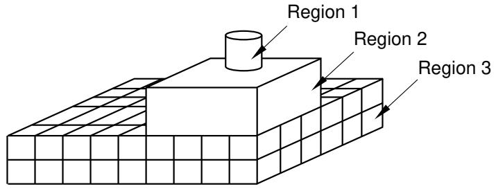  
Figure 2:The regions must be meshed in the correct sequence.

To create a compatible mesh between region 1 and region 2, the mesh of region 2 is derived from the mesh of the cylinder in region 1. Similarly, the mesh of region 3 is derived from the mesh of region 2, which in turn was derived from the mesh of the cylinder in region 1. As a consequence, if you mesh region 3 first, Abaqus/CAE cannot incrementally mesh regions 1 and 2. You must allow Abaqus/CAE to mesh region 1 prior to remeshing regions that were already meshed.

If incremental meshing cannot proceed, Abaqus/CAE displays a warning message prior to deleting an existing mesh.

If you want to mesh the part or assembly incrementally, you can follow a strategy that will minimize the number of times Abaqus/CAE has to delete the existing mesh. The meshing strategy depends on the topology of the regions, the element shapes, the meshing technique, and the mesh seeding.

• Changes to the seeding always propagate out to the boundaries. As a result, you should start meshing from the interior of the part or part instance and continue out to the boundaries of the part or instance.  
However, if you can identify a set of adjacent three-dimensional regions that will be meshed using the swept method, you should start meshing on one side of the part or part instance and continue the mesh through the interior to the other side of the part or instance.  
Regions that are meshed by triangles or tetrahedral elements will never force the entire mesh to be deleted during incremental meshing. The same is also true for regions that are meshed by quadrilateral-dominated elements using the advancing front algorithm. Abaqus/CAE can always remesh these regions, and you can mesh them at any time.

## Can I change the geometric order of the elements in a mesh?

If you have already meshed a part, a part instance, or a region, Abaqus/CAE allows you to change the element order without having to recreate the entire mesh. If you change between linear and quadratic elements, Abaqus/CAE simply adds or removes the midside nodes as required.

If the part or part instance contains orphan elements, you can change the order of all the elements or you can change the order of only selected elements. Orphan elements contain no underlying geometry information; therefore, you should take care when changing the order of the elements. If you change orphan elements from quadratic to linear, all information on the location of the midside nodes is lost. As a result, if you subsequently decide to change back from linear to quadratic elements, you will not be able to return to the original mesh. For more information, see What kinds of files can be imported and exported from Abaqus/CAE?.

## Structured meshing and mapped meshing

This section describes the structured and mapped meshing techniques and the types of regions to which these techniques can be applied.

## In this section:

What is structured meshing?  
What is mapped meshing?  
Two-dimensional structured meshing  
Three-dimensional structured meshing  
Using structured meshing near concave boundaries  
When can Abaqus/CAE apply mapped meshing?

## What is structured meshing?

The structured meshing technique generates structured meshes using simple predefined mesh topologies. Abaqus/CAE transforms the mesh of a regularly shaped region, such as a square or a cube, onto the geometry of the region you want to mesh. For example, Figure 1 illustrates how simple mesh patterns for triangles, squares, and pentagons are applied to more complex shapes.

  
Figure 1:Two-dimensional structured mesh patterns.

You can apply the structured meshing technique to simple two-dimensional regions (planar or curved) or to simple three-dimensional regions that have been assigned the Hex or Hex-dominated element shape option. For more information about assigning element shapes to a region, see Choosing an element shape.

## What is mapped meshing?

The terms structured meshing and mapped meshing are used interchangeably in the finite element analysis literature. However, Abaqus/CAE makes a subtle distinction between the two terms. Mapped meshing is a subset of structured meshing. Mapped meshing refers only to structured meshing of four-sided, two-dimensional regions—the square mesh pattern in Figure 1.

Some models that appear very complex actually contain faces with relatively simple geometry. When you mesh such a model with free or swept meshing, the resulting element quality can be poor on these faces. However, if you allow Abaqus/CAE to use the mapped meshing technique where the geometry is appropriate, it often generates elements of good quality, especially if the region is a long, thin rectangular face.

You cannot apply mapped meshing directly to a region. However, you can apply it indirectly by meshing a region and allowing Abaqus/CAE to apply mapped meshing where appropriate. For example, Figure 1 shows the effect of free meshing a part and allowing Abaqus/CAE to use mapped meshing where appropriate.

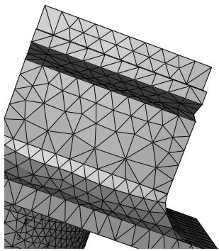  
Without mapped meshing

  
Allow Abaqus/CAE to use mapped meshing where appropriate  
Figure 1:The effect of allowing mapped meshing.

By default, Abaqus/CAE uses mapped meshing where appropriate when you are doing the following:

• Using the advancing front algorithm to sweep mesh a solid region with hexahedral or hexahedral-dominated elements.  
• Using the advancing front algorithm to free mesh a shell region with quadrilateral or quadrilateral-dominated elements.  
• Free meshing a solid region with tetrahedral elements.  
• Free meshing a shell region with triangular elements.

## Two-dimensional structured meshing

A two-dimensional region can be meshed using the structured meshing technique if it has the following characteristics:

• The region has no holes, isolated edges, or isolated vertices. Figure 1 shows regions that cannot be structured meshed.

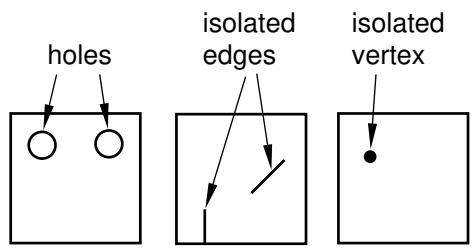  
Figure 1: Regions that cannot be structured meshed.

• The region is bounded by three to five logical sides, where each side is a connected set of edges.

In general, structured meshing gives you the most control over the mesh that Abaqus/CAE generates. If you are meshing a four-sided region with all quadrilateral elements, the total number of element edges around the boundary must be even. For three- and five-sided regions, the constraint equations are more complex. Abaqus/CAE respects seed distribution wherever possible when generating a structured mesh. (Seed distribution describes the spacing of the seeds, not necessarily the number of seeds. For example, are the seeds evenly spaced along an edge or more concentrated at one end?) However, meshes must be compatible across regions, and Abaqus/CAE may adjust the nodes of a mesh region that is adjacent to a region that was meshed using the free meshing technique. As a result, the element nodes may not match the seeds exactly.

Figure 2 shows the seeds on the edges of a four-sided region and the effect of different mesh controls.

  
Figure 2:The effect of different mesh controls.

The mesh control effects are as follows:

• In four-sided regions the quadrilateral-dominated structured mesh matches the seeding exactly. There are an odd number of elements around the boundary, and Abaqus/CAE inserts a single triangle into the mesh. (In contrast, when you mesh a three- or a five-sided region with structured quadrilateral-dominated elements, Abaqus/CAE does not insert any triangles. The resulting mesh uses all quadrilateral elements; however, the resulting mesh may not match the mesh seeding exactly.)  
• The two quadrilateral structured meshes do not match the seeding. This is even more apparent when you choose to minimize the mesh transition.  
• The triangular structured mesh also does not match the seeding. Abaqus/CAE creates the triangular mesh by splitting the diagonals of the quadrilateral structured mesh with minimized mesh transition.

Abaqus/CAE combines edges into a logical side automatically if the edges subtend a shallow angle. For example, each region in Figure 3 has five edges.

  
Figure 3: Edges subtending shallow angles.

However, since the top two edges in each region subtend a shallow angle, Abaqus/CAE considers these two edges to be one logical side. Therefore, the mesh pattern for four-sided regions is applied to these regions. If the region contains virtual topology, you can mesh the region using the structured meshing technique only if the region is bounded by four sides. You cannot use structured meshing to mesh three- or five-sided regions that contain virtual topology.

You can use the Redefine Region Corners button in the Mesh Controls dialog box to combine edges yourself, regardless of the angle they subtend. (To display the Mesh Controls dialog box, select Mesh->Controls from the main menu bar.) This technique allows you to control which structured mesh pattern is applied to the two-dimensional region. (This technique is not available for three-dimensional regions.) For more information, see Redefining region corners.

The region that you plan to mesh with structured quadrilateral elements must be well shaped; otherwise, Abaqus/CAE may create invalid elements as shown in Figure 4.

  
Figure 4: Regions must be well shaped.

If the mesh contains invalid elements, you can use several techniques to correct the mesh:

• Adjust the position of the mesh seeds.  
• Redefine the region corners.  
• Partition the face into smaller, better shaped regions.

The result of applying each technique is illustrated in Figure 5.

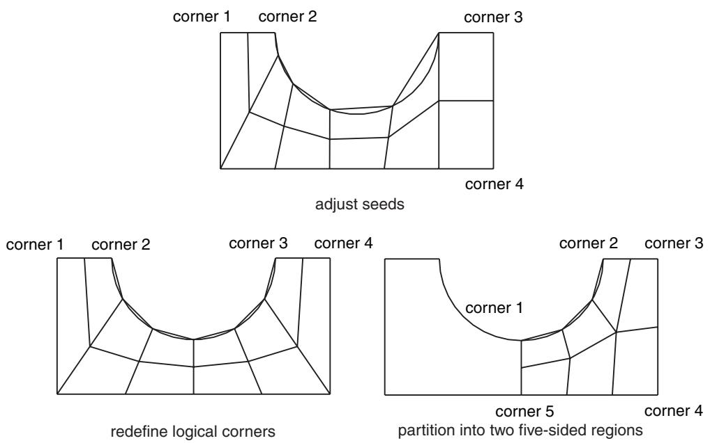  
Figure 5: Correcting a mesh that contains invalid elements.

## Three-dimensional structured meshing

Figure 1 illustrates examples of simple three-dimensional regions that can be meshed using the structured meshing technique.  
  
Figure 1: Regions that can be meshed using the structured meshing technique.

Meshing more complex regions with this technique may require manual partitioning. If you do not partition a complex region, your only meshing option may be the free meshing technique with tetrahedral elements. Meshes constructed using the structured meshing technique consist of hexahedral elements, which are preferred over tetrahedral elements.

The characteristics described below are required to mesh a three-dimensional region successfully using the structured meshing technique:

• The region cannot have any holes, isolated faces, isolated edges, or isolated vertices. For example, the regions shown in Figure 2 cannot be meshed using the structured meshing technique.

  
Figure 2: Regions that cannot be meshed using the structured meshing technique.

You can eliminate holes (whether they pass all the way through the part instance or just part way through) by partitioning their circumferences into halves, quarters, etc. For example, the four partitions in Figure 3 convert the part instance from one region with a hole to four regions without holes.

  
Figure 3: Partitions can make a part structured meshable.

You should limit arcs to $9 0 ^ { \circ }$ or less to avoid concavities along sides and at edges. For example, the part instance in Figure 4 has been partitioned so that the single region with 180° arcs becomes two regions with 90° arcs.

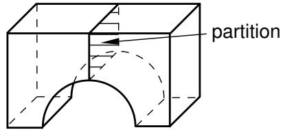  
Figure 4: Limit arcs to ${ \mathfrak { g o } } ^ { \circ }$ or less.

All the faces of the region must have geometries that could be meshed using the two-dimensional structured meshing technique. For example, without partitioning, the semicircles at either end of the part in Figure 5 have only two sides each. (A face must have at least three sides to be meshed using the structured meshing technique.) If you partition the part into two halves, each semicircle is divided into two faces with three sides each.

  
Figure 5: Partitioning creates two faces with three sides.

Exactly three edges of the region must meet at each vertex. For example, the vertex at the top of an unpartitioned pyramid in Figure 6 is connected to four edges. However, if you partition the pyramid into two tetrahedral regions, the vertex is connected to only three edges for each individual region.

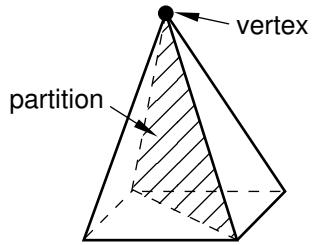  
Figure 6: After partitioning the vertex is connected to only three edges for each individual region.

• The region must be bounded by at least four sides (a tetrahedral region). If a region is bounded by fewer than four sides, you can partition the region as necessary to create additional sides.  
• If a region contains virtual topology, the region must be bounded by six sides.  
If a region cannot be meshed using the structured meshing technique, you can use virtual topology to combine faces until the region is bounded by six sides. Figure 7 shows how you can use virtual topology to create a six-sided region that can be meshed using the structured meshing technique.

  
1) Combine these three faces using virtual topology

  
2) Region contains virtual topology and is six-sided

  
3) Apply a structured mesh  
Figure 7: Virtual topology can make a part structured meshable.

• The angles between sides should be as close to 90° as possible; you should partition to eliminate angles greater than 150°.  
• Each side of the region must match one of the following definitions:

\- If the region is not a cube, a side must correspond to a single face; that is, the side must not contain multiple faces.

If the region is a cube, a side can be a connected set of faces that are on the same geometric surface. However, each face must have four sides. In addition, the pattern of the faces must allow rows and columns of hexahedral elements to be created in a regular grid pattern along that entire side when the cube is meshed. For example, Figure 8 shows two acceptable face patterns and the resulting regular grid pattern of elements created by meshing the cubes using the structured meshing technique.

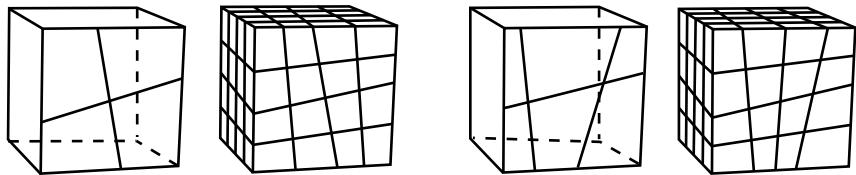  
Figure 8: Acceptable face patterns and the resulting meshes.

The sides in Figure 9 do not have acceptable face patterns:

  
Figure 9: Unacceptable face patterns.

The face pattern shown on the left is unacceptable for structured meshing because each face has only three sides. Each face in the pattern shown on the right has four sides, but the pattern does not allow a regular grid of elements to be created on the partitioned side of the cube, as shown in Figure 10.

  
Figure 10: A regular grid of elements cannot be created.

## Using structured meshing near concave boundaries

When you mesh a region using any meshing technique, the nodes on the boundary of the mesh are always located on the boundary of the geometric region. However, when Abaqus/CAE creates a mesh using the structured meshing technique, it is possible for nodes in the interior of the mesh to fall outside the region's geometry, which results in a distorted, invalid mesh. This problem typically occurs near concave boundaries.

For example, the region in Figure 1 has five sides; therefore, when Abaqus/CAE meshes this region using the structured meshing technique, it applies the mesh pattern for a regular pentagon to the region.

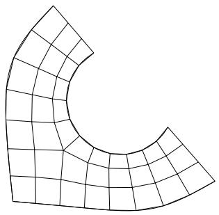  
Figure 1:The mesh pattern for a regular pentagon is applied to the region.

However, if you seed the region so that the number of elements is reduced, as shown in Figure 2, a distorted mesh results due to the concavity at the highly curved edge. Nodes from the interior of the mesh pattern (indicated by closed circles in Figure 3) fall outside the region's geometry, while nodes on the boundary of the mesh (indicated by open circles in Figure 3) remain on the boundary of the region's geometry.

  
Figure 2: Seeds prescribing a coarser mesh.

When interior nodes fall outside the region's geometry, you can try the following techniques to improve the mesh:

• Change the mesh seeds and remesh. For example, the number of elements along the highly curved edge in Figure 1 is greater than in Figure 3.

  
Figure 3: Nodes from the interior of the mesh fall outside the region's geometry.

• Partition the part instance into smaller, more regularly shaped regions. For example, the model was partitioned into three regions in Figure 4.

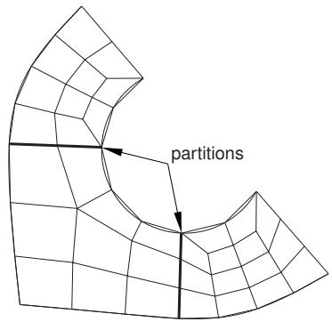  
Figure 4: Partition the region.

Select a different meshing technique. This option is most useful for two-dimensional regions, where you can switch from structured meshing to free meshing and still retain quadrilateral elements in the mesh. (Three-dimensional free meshing is limited to tetrahedral elements. For more information, see Free meshing.) Figure 5 shows the region meshed using the free meshing technique.

  
Figure 5: Mesh the region using the free meshing technique.

The mesh in Figure 5 is not symmetric, which is typical of free meshes.

## When can Abaqus/CAE apply mapped meshing?

Abaqus/CAE decides that mapped meshing is appropriate in a four-sided region when:

• it is likely that a regular mesh pattern with reasonable quality can be generated, and  
• any minor adjustments to the mesh seeding will not violate the user's intent (as indicated by any existing seed constraints).

When Abaqus/CAE applies mapped meshing, it makes small adjustments to the mesh seeding to ensure that opposite sides of the rectangular region have the same number of seeds. If your model is large and includes many simple regions, it may take slightly longer for Abaqus/CAE to check for rectangular regions and adjust the seeds to produce a mapped mesh than to produce a mesh without mapped meshing. However, for most models the time difference to include mapped meshing is not significant compared to the improvement in mesh quality.

Figure 1 shows a shell part meshed with triangles using the following mesh techniques and algorithms available in Abaqus/CAE:

• Free meshing  
• Free meshing using mapped meshing where appropriate  
• Structured meshing

  
Figure 1: A shell part meshed with triangles in three different ways.

In many cases a free mesh of triangles with mapped meshing where appropriate will be the same as a structured mesh of triangles. The meshes are different in Figure 1 because Abaqus/CAE honors the original seeding and determines that mapped meshing is not appropriate on the side of the part. In contrast, when Abaqus/CAE creates the structured mesh, it significantly adjusts the seeding to create the structured mesh that was requested by the user.

## Swept meshing

This section explains the swept meshing technique and describes the types of regions to which this meshing technique can be applied.

## In this section:

What is swept meshing?  
Swept meshing of surfaces  
Swept meshing of three-dimensional solids  
Swept meshing of cylindrical solids  
Characteristics of the geometry can prevent a part from being swept meshable

## What is swept meshing?

Abaqus/CAE uses swept meshing to mesh complex solid and surface regions. The swept meshing technique involves two phases:

• Abaqus/CAE creates a mesh on one side of the region, known as the source side.  
Abaqus/CAE copies the nodes of that mesh, one element layer at a time, until the final side, known as the target side, is reached. Abaqus/CAE copies the nodes along an edge, and this edge is called the sweep path. The sweep path can be any type of edge—a straight edge, a circular edge, or a spline. If the sweep path is a straight edge or a spline, the resulting mesh is called an extruded swept mesh. If the sweep path is a circular edge, the resulting mesh is called a revolved swept mesh.

For example, Figure 1 shows an extruded swept mesh. To mesh this model, Abaqus/CAE first creates a two-dimensional mesh on the source side of the model. Next, each of the nodes in the two-dimensional mesh is copied along a straight edge to every layer until the target side is reached.

  
Figure 1:The swept meshing technique for an extruded solid.

To determine if a region is swept meshable, Abaqus/CAE tests if the region can be replicated by sweeping a source side along a sweep path to a target side. In general, Abaqus/CAE selects the most complex side (for example, the side that has an isolated edge or vertex) to be the source side. In some cases you can use the mesh controls to select the sweep path. If some regions of a model are too complex to be swept meshed, Abaqus/CAE asks if you want to remove these regions from your selection before it generates a swept mesh on the remaining regions. You can use the free meshing technique to mesh the complex regions, or you can partition the regions into simplified geometry that can be structured or swept meshed.

When you assign mesh controls to a region, Abaqus/CAE indicates the direction of the sweep path and allows you to control the direction. If the region can be swept in more than one direction, Abaqus/CAE may generate a very different two-dimensional mesh on the faces that it can select as the source side. As a result, the direction of the sweep path can influence the uniformity of the resulting three-dimensional swept mesh, as shown in Figure 2.

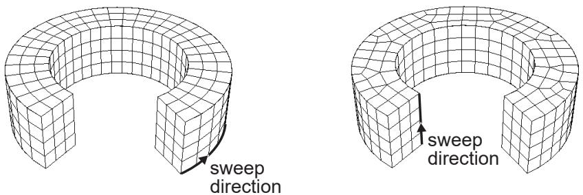  
Figure 2:The sweep direction can influence the uniformity of the swept mesh.

In addition, the sweep path controls the default orientation of hexahedral and wedge elements that are used to model gaskets, continuum shells, cylindrical regions using cylindrical elements, and adhesive joints using cohesive elements. For more information, see Assigning gasket elements to a region, Meshing parts with continuum shell elements, Swept meshing of cylindrical solids, and Creating a model with cohesive elements using geometry and mesh tools.

## Swept meshing of surfaces

Abaqus/CAE can apply the swept meshing technique only to surface regions that can be replicated by sweeping a source side along a sweep path to a target side. The sweep path is always an edge; however, for a surface region the source and target sides are also edges. The surface region can be extruded, revolved, swept, or planar. In addition, an extruded surface region can include twist, and a revolved surface region can include translation. You can apply the swept meshing technique to surface regions using either the Quad or Quad-dominated element shape options.

If you are creating a revolved swept mesh, Abaqus/CAE meshes the source side and revolves that mesh around the axis of revolution to the source side. The sweep path can be revolved a full 360°. You must use the Quad-dominated element shape option when the source side touches the axis of revolution at a point, because a layer of triangular elements is generated at that point. Abaqus/CAE cannot generate a revolved surface mesh when a single surface touches the axis of revolution at two points, unless the revolved surface is a sphere.

For example, the source side touches the axis of revolution at the top of the model shown in Figure 1 and a layer of triangular elements is generated at that point.

  
Figure 1: A layer of triangular elements.

(For more information on assigning element shapes to a region, see Choosing an element shape.)

## Swept meshing of three-dimensional solids

Abaqus/CAE can apply the swept meshing technique to solid regions that can be replicated by sweeping a source side along an edge to the target side. For a three-dimensional solid the sweep path is an edge, but the source and target sides are faces. Figure 1 illustrates an extruded swept mesh—Abaqus/CAE meshes the source side and extrudes that mesh along an edge to the target side. Figure 2 illustrates a revolved swept mesh—Abaqus/CAE meshes the source side and revolves that mesh about the axis of the circular edge to the target side.

  
Figure 1:The extruded swept meshing technique sweeps the mesh on the source side along an edge.

  
Figure 2:The revolved swept meshing technique sweeps the mesh on the source side along a circular edge.

If a region is swept meshable, Abaqus/CAE can generate the swept mesh on a region that has been assigned the Hex, Hex-dominated, or Wedge element shape option. To generate the preliminary two-dimensional mesh on the source side, Abaqus/CAE uses the free meshing technique with the Quad, Quad-dominated, or Tri element shape option, respectively.

You can choose between the medial axis and advancing front meshing algorithms when you mesh a solid region with hexahedral or hexahedral-dominated elements using the swept meshing technique. (Abaqus/CAE generates hexahedral and hexahedral-dominated meshes by sweeping the quadrilateral and quadrilateral-dominated elements generated by the two algorithms from the source side to the target side.) However, if the region to be meshed contains virtual topology, you can use only the advancing front algorithm to generate the swept mesh. For more information, see What is the difference between the medial axis algorithm and the advancing front algorithm?, and Free meshing with quadrilateral and quadrilateral-dominated elements.

If you select the advancing front algorithm, Abaqus/CAE will use mapped meshing, if it is appropriate, to improve the mesh for some regions. (Mapped meshing is the same as structured meshing but applies only to four-sided regions.) Abaqus/CAE determines whether it is appropriate to replace the advancing front algorithm with mapped meshing on any of the faces that belong to the source side. For more information, see What is mapped meshing?, and When can Abaqus/CAE apply mapped meshing?. Abaqus/CAE uses mapped meshing to create quadrilateral and quadrilateral-dominated elements on these appropriate boundary faces and then sweeps the elements from the source side to the target side to create the hexahedral and hexahedral-dominated elements.

A three-dimensional region can be meshed using the swept meshing technique if it has the following characteristics:

Every side that connects the source side to the target side must have only a single face or be comprised of four-sided combined faces that form a regular grid pattern. Figure 3 provides two examples of acceptable connecting face patterns.

  
Figure 3: Acceptable connecting face patterns for swept meshing.

The partitioned connecting sides in Figure 4 do not have acceptable face patterns for swept meshing; the model on the left side has a sweep face with two three-sided faces, while the model on the right side does not have a regular grid pattern.

  
Figure 4: Unacceptable connecting face patterns for swept meshing.

The target side must contain only a single face without isolated edges or isolated vertices. For example, the region on the left in Figure 5 can be meshed using the swept meshing technique because all of the isolated edges are on the source side; the region on the right, however, cannot be meshed using this technique because the target side contains two faces.

  
Figure 5: Only the region on the left can be meshed using the swept meshing technique.

Figure 6 illustrates a part that has been swept meshed along a varying cross-section. The part appears to be relatively complex; for example, the source side is nonplanar, and the cross-section of the part varies along the sweep path. However, the rules for generating a swept mesh still apply.

- Every side that connects the source side to the target side contains only a single face.  
Although the source side contains two faces, the target side contains only a single face.

  
Figure 6: Sweeping the mesh along a varying cross-section.

You may be able to use virtual topology to combine faces on the target side to make a part swept meshable. Figure 7 illustrates a part that was swept mesh after the five faces on the target side were combined into a single face using virtual topology. However, because the part now contains virtual topology, it can be swept meshed with only the advancing front algorithm.

  
Figure 7: Combining faces makes a part swept meshable.

• For a revolved region, the profile that was revolved to create the region must not touch the axis of revolution at one or more isolated points, as shown in Figure 8.

  
Figure 8:The swept meshing technique cannot mesh a part if an isolated point touches the axis of revolution.

• Similarly, Abaqus/CAE cannot mesh a region with hexahedral or wedge elements if one or more edges lie along the axis of revolution, as shown in Figure 9.

  
Figure 9: Abaqus/CAE cannot mesh a region with hexahedral elements if one or more edges lie along the axis of revolution.

However, Abaqus/CAE can mesh the region with hexahedral-dominated elements by generating layers of wedge elements along the axis, as shown in Figure 10.

  
Figure 10: Abaqus/CAE can mesh the region with hexahedral-dominated elements.

As a result, you must select the Hex-dominated element shape option before you mesh the region. Alternatively, you can partition the region into simple structural mesh regions and select the Hex element shape option to create the mesh using all hexahedral elements. For more information, see Sweep meshing a solid, revolved region whose profile touches the axis of revolution.

A fully revolved region that does not touch the axis of revolution is meshable only if all the edges that are associated with the profile being revolved exist. However, the edges that bound the profile must not create a face. Figure 11 shows a meshable part instance where all of the edges of the revolved profile exist.

  
Figure 11: All of the edges of the revolved profile exist; hence, the part instance is meshable.

In this example the user sketched the profile, and Abaqus/CAE revolved the profile to create the part; however, the edges that bound the profile do not form a face. In contrast, Figure 12 shows a part instance that is not meshable because some of the edges of the revolved profile are missing.

  
Figure 12: Some of the edges of the revolved profile are missing; hence, the part instance is not meshable.

A fully revolved region that touches the axis of revolution is meshable only if all of the edges that are associated with the profile being revolved exist except the edges along the axis of revolution. Figure 13 shows a part instance that is meshable because all of the edges of the revolved profile exist except for the edge along the axis of revolution. If the profile included the edge along the axis of revolution, the part instance would not be meshable.

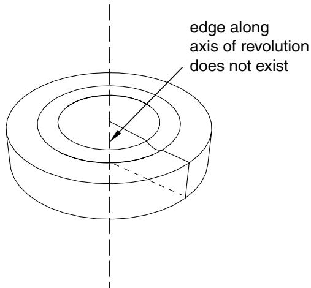  
Figure 13: All of the edges of the revolved profile exist, except for the edge along the axis of revolution; hence, the part instance is meshable.

• If a revolved region was created by revolving a sketch that contains a spline, the region is meshable only if the vertices at each end of the spline are not on the axis of revolution.  
• If a part was created by sweeping a cross-section along a sweep path that is composed of a closed spline, the resulting part is meshable only if it is split into two or more regions.

## Swept meshing of cylindrical solids

You can use swept meshing to create a mesh on cylindrical geometry with many types of solid elements, including elements from the solid cylindrical element library. If you use solid cylindrical elements for a native mesh, Abaqus/CAE uses the sweep path of the selected sweep/revolve region as the circumferential direction for the generated cylindrical elements. You should confirm that the sweep path is set correctly before creating the mesh.

Abaqus considers the following requirements for cylindrical elements when you attempt to mesh solid geometry with cylindrical elements:

• The midside nodes on the circular edges of the cylindrical elements must be placed exactly halfway between the edge nodes.  
• All nodes on a cross-section must lie on the same radial plane.  
• All the circular edges within an element must span the same angle.  
• The centers of the circular arcs within an element must lie on a common axis.  
• An element cannot span more than 180°.

These requirements mean that you can create valid cylindrical elements only on revolved parts or parts that you can split into revolved domains. The S-shaped extrusion in Figure 1 can be meshed with cylindrical elements after partitioning into revolved regions.

  
Figure 1: Acceptable geometry for solid cylindrical meshing.  
Figure 2 shows three types of geometry—a helical spring, a revolved part with cuts, and a tapered part—that cannot be meshed with solid cylindrical elements because of these meshing requirements.

  
Figure 2: Forms of geometry that cannot be swept meshed with cylindrical elements.

If one of the connecting sides that connect the source face to the target face in a revolved region is separated into multiple faces due to the internal edge or edges that constrain the mesh, the generated elements are likely to be too distorted to be used as cylindrical elements. You must partition the solid region into simpler revolved regions, as shown in the example on the right side of Figure 3.

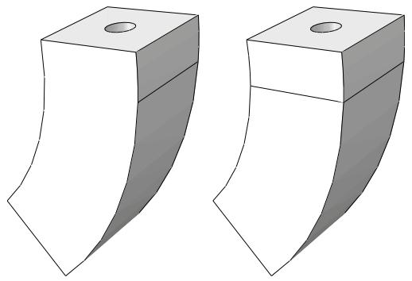  
Figure 3: A solid region that is unsuitable for meshing with cylindrical elements (left) and the same region rendered suitable for meshing with cylindrical elements through the use of a partition (right).

When you edit a mesh part by assigning cylindrical elements to it, Abaqus/CAE considers Face 1 and Face 2 of each cylindrical element to be the faces along its radial planes. Figure 4 indicates the location of these faces for several types of cylindrical elements. You should orient the stack direction for elements in your part before assigning a cylindrical element type to it; for more information, see the descriptions in Orienting the stack direction.

  
Figure 4: Illustration of node ordering and face numbering for cylindrical elements (with Faces 1 and 2 shaded).

## Characteristics of the geometry can prevent a part from being swept meshable

The characteristics of a region described in Swept meshing of three-dimensional solids are referred to as “topological characteristics.” In some cases, all of the topological characteristics will apply to a region; however, Abaqus/CAE will not allow the region to be swept meshed because some “geometrical characteristics” are not satisfied. The geometric characteristics that Abaqus/CAE looks for when determining if a region is swept meshable are hard to quantify. In general, a three-dimensional region can be meshed using the swept meshing technique if it satisfies the following geometrical characteristics:

• If the source side contains more than one face, the angle between the faces must be relatively flat (close to 180°).  
• Each face that connects the source side to the target side (a connecting side) must have four corners. The angle at each of the corners must be close to 90°.  
• The angles between the source side and each of the connecting sides should be close to 90°. Similarly, the angles between the target side and each of the connecting sides should be close to 90°.

For example, Figure 1 shows a part with three faces on the source side. When the angle decreases between the faces that form the source side, the part no longer satisfies the geometric characteristics of a swept meshable region.

  
Figure 1: Swept meshing depends on geometrical characteristics.

You may be able to apply virtual topology to satisfy the geometrical characteristics and to make the part swept meshable. For example, Figure 2 illustrates that the part becomes swept meshable when the three faces on the source side are combined using virtual topology. However, the resulting mesh is of poor quality.

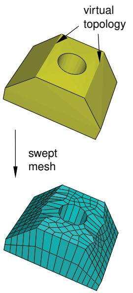  
Figure 2: Applying virtual topology can result in poor mesh quality.

In some cases Abaqus/CAE will still allow you to create a swept mesh, even though the geometrical characteristics are not satisfied. The intention is to allow you to create a swept mesh wherever possible. However, the resulting mesh may be of poor quality, or it may be invalid. To ensure that your swept mesh is acceptable, you should use the mesh verify tool to verify its quality. For more information, see Verifying element quality.

## Free meshing

This section explains how you can use the free meshing technique to mesh two- or three-dimensional models.

## In this section:

What is free meshing?  
Free meshing with quadrilateral and quadrilateral-dominated elements  
Free meshing with triangular and tetrahedral elements  
What is a tetrahedral boundary mesh?  
What can I do with a boundary mesh?

## What is free meshing?

Unlike structured meshing, free meshing uses no preestablished mesh patterns. When you mesh a region using the structured meshing technique, you can predict the pattern of the mesh based on the region topology. In contrast, it is impossible to predict a free mesh pattern before creating the mesh.

Because it is unstructured, free meshing allows more flexibility than structured meshing. The topology of regions that you mesh with the free mesh technique can be very complex.

You can use this technique to mesh a region with the Tri, Quad, or Quad-dominated element shape options for two-dimensional regions or the Tet element shape option for three-dimensional regions. For more information on assigning element shapes to a region, see Choosing an element shape.

## Free meshing with quadrilateral and quadrilateral-dominated elements

Free meshing with quadrilateral elements is the default meshing technique for two-dimensional regions. The free meshing technique with quadrilateral elements can be applied to any planar or curved surface. An example of a mesh generated with this technique is shown in Figure 1. Free meshes are usually not symmetric, even if the part or part instance itself is symmetric.

  
Figure 1: A free mesh generated with quadrilateral elements.

Abaqus/CAE allows you to choose between two meshing algorithms when you create a quadrilateral or quadrilateral-dominated mesh. For more information, see What is the difference between the medial axis algorithm and the advancing front algorithm?.

## Medial axis

When you free mesh a complex region with quadrilateral elements using the medial axis algorithm, Abaqus/CAE creates internal partitions that divide the region into simple structured mesh regions and then seeds the smaller regions.

If you use the medial axis algorithm to mesh a region and then remesh the region (for example, after modifying the seeds), Abaqus/CAE stores the internal partitions, and the new mesh is generated more quickly. In addition, the internal partitions allow Abaqus/CAE to generate a fine mesh in a similar time to that required to generate a coarse mesh. You cannot use the medial axis algorithm to mesh regions that contain virtual topology, and it does not work well with imprecise parts.

In general, a medial axis-based free mesh with quadrilateral elements does not match the mesh seeds exactly for the following reasons:

• Abaqus/CAE tries to balance the seeds between adjacent regions and the smaller regions created by the internal partitioning.  
• Abaqus/CAE tries to minimize element distortions.

However, when you apply fixed seed constraints, Abaqus/CAE matches the number of seeds exactly and attempts to match the seed positions exactly. Figure 2 illustrates a two-dimensional plate with fixed seeds and movable seeds and the resulting all quadrilateral mesh.

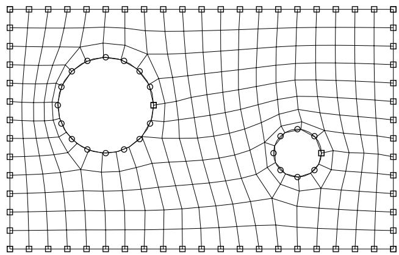  
Figure 2: Fixed and movable seeds and the medial axis meshing algorithm.

You should specify fixed seeds on only a few edges, or Abaqus/CAE may not be able to generate a mesh. For example, if you specify fixed seeds around one of the holes in the plate shown in Figure 2, the global seeding becomes overconstrained, and Abaqus/CAE cannot generate a mesh.

Using the medial axis algorithm, a free mesh generated with quadrilateral-dominated elements is similar to a free mesh generated with all quadrilateral elements and without transition minimization; however, Abaqus/CAE inserts a few isolated triangles in an effort to match the mesh seeds more closely. Abaqus/CAE can generate a mesh with quadrilateral-dominated elements faster than it can generate a mesh with all quadrilateral elements.

## Advancing front

When you free mesh a complex region with quadrilateral elements using the advancing front algorithm, Abaqus/CAE generates quadrilateral elements at the boundary of the region and continues to generate quadrilateral elements as it moves systematically to the interior of the region.

When you choose the advancing front algorithm, Abaqus/CAE matches the seeds exactly (except when you are creating a three-dimensional revolved mesh, and the profile being revolved touches the axis of revolution). A quadrilateral mesh that matches the seeds exactly is shown in Figure 3.

  
Figure 3: Fixed and movable seeds and the advancing front meshing algorithm.

In general, the mesh transitions generated with the advancing front algorithm are more acceptable than the transitions generated by the medial axis algorithm; however, matching the seeds exactly in narrow regions may compromise the mesh quality. In contrast with the medial axis algorithm, you can use the advancing front algorithm in conjunction with imprecise parts and on regions that contain virtual topology.

If you select the advancing front algorithm, Abaqus/CAE will also use mapped meshing where appropriate. (Mapped meshing is the same as structured meshing but applies only to four-sided regions.) For more information, see What is mapped meshing?, and When can Abaqus/CAE apply mapped meshing?. When mapped meshing is used, Abaqus/CAE makes minor adjustments to the mesh seeding. If you do not want the seeding to change, you can use mesh controls to prevent the use of mapped meshing. For more information, see Assigning mesh controls.

By default, Abaqus/CAE minimizes the mesh transition when it generates a free quadrilateral mesh using the medial axis algorithm. Minimizing the mesh transition results in a better mesh that is generated more quickly; however, the generated nodes deviate further from the mesh seeds. Figure 4 illustrates the same planar part instance meshed using the medial axis algorithm with and without minimizing the mesh transition and meshed using the advancing front algorithm.

  
Figure 4:The effect of mesh transition and the meshing algorithm.

## Free meshing with triangular and tetrahedral elements

Free meshing with triangular elements can be applied to any planar or curved surface, and the part can be precise or imprecise. For more information, see What is a valid and precise part?. A free mesh of triangular elements matches the mesh seeds exactly. This meshing technique can handle large variations in element size, which is useful when you want to refine only part of a mesh. The time taken for Abaqus/CAE to compute a free triangular mesh grows approximately linearly with the number of elements and nodes. Figure 1 shows an example of a mesh generated using this technique.

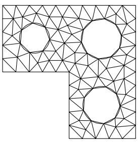  
Figure 1: A free mesh generated with triangular elements.

Free meshing with tetrahedral elements can be applied to almost any three-dimensional region; in fact, very complex models can be meshed using this technique without the help of partitioning. Free meshing with tetrahedral elements is similar to free meshing with triangular elements in that the part can be precise or imprecise. In general, Abaqus/CAE matches the mesh seeds exactly although the mesh may be finer around small holes if the mesh seeds are not fully constrained. Figure 2 shows an example of a free tetrahedral mesh.

  
Figure 2: A free mesh generated with tetrahedral elements.

Free meshing of three-dimensional solids using hexahedral elements is not supported.

You should use the Query toolset in the Part module or the Mesh module to check the geometry of the parts or of the assembly before you try to generate a free mesh with tetrahedral elements. You should check the following:

• There are no free edges in the solid.  
• There are no short edges, small faces, or small face corner angles.

For more information, see Using the geometry diagnostic tools.

When you create a free mesh with tetrahedral elements, you can use the default mesh generation algorithm, or toggle off the default algorithm to use the algorithm that was included with Abaqus/CAE 6.4 and earlier. The default algorithm is significantly more robust, particularly when meshing complex shapes and thin solids. In addition, the default algorithm allows you to increase the size of the interior elements. If the mesh density is adequate for the model being analyzed and the areas of interest are on the mesh boundary, increasing the size of the interior elements will increase the computational efficiency.

When you are using free meshing to create triangular elements on a surface, Abaqus/CAE will use mapped meshing for some regions if it is appropriate. (Mapped meshing is the same as structured meshing but applies only to four-sided regions.) For more information, see What is mapped meshing?, and When can Abaqus/CAE apply mapped meshing?. Abaqus/CAE replaces free triangular meshing with mapped triangular meshing only when it is likely that the resulting mesh quality will be improved. If desired, you can use mesh controls to prevent Abaqus/CAE from allowing mapped meshing. For more information, see Assigning mesh controls.

Similarly, when you are using free meshing to create tetrahedral elements, you can allow Abaqus/CAE to decide whether mapped meshing is appropriate. After Abaqus/CAE determines that the resulting mesh quality will be improved, it replaces free meshing with mapped meshing on simple boundary faces and converts the resulting triangles into tetrahedral elements.

Figure 3 shows the effect of allowing mapped meshing where appropriate in a free mesh of a solid part using tetrahedral elements. The mesh quality is improved in four-sided regions that can be mapped meshed.

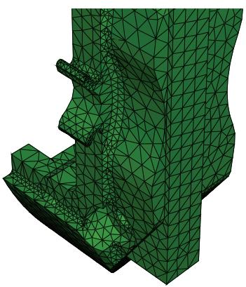  
Free meshing

  
Free meshing with mapped meshing where appropriate  
Figure 3:The effect of allowing mapped meshing.

To view the internal tetrahedral elements generated by Abaqus/CAE, you can create a new mesh part from the current mesh and use display groups to remove selected elements. You can also view the internal elements after the analysis is complete by using view cuts in the Visualization module. For more information, see Using display groups to display subsets of your model and Cutting through a model.

## What is a tetrahedral boundary mesh?

When Abaqus/CAE generates a free mesh on a solid with tetrahedral elements, the meshing process consists of two phases:

1. A boundary mesh of triangles is generated on the faces of the solid regions.  
2. Abaqus/CAE generates a tetrahedral mesh using the triangles as faces of the tetrahedral elements.

The same process is used to create a quadrilateral boundary mesh and a hexahedral solid mesh for geometric faces of bottom-up mesh regions (for more information, see Creating the boundary mesh for a bottom-up region).

If your part is complex, generating a free tetrahedral mesh can be time consuming. Previewing the mesh on the boundary faces can help you identify problems before generating a mesh for the entire part. You can preview the triangles on the boundary faces after the first phase of the meshing process by toggling on Preview boundary mesh in the prompt area before you generate the mesh. If the mesh is acceptable, you can continue meshing the interior of the region. If the mesh is not acceptable or if some regions failed to mesh, Abaqus/CAE provides a variety of tools for correcting the problems. For more information, see What can I do with a boundary mesh?.

If you decide to preview the triangular boundary mesh for a region, Abaqus/CAE allows you to select faces to mesh even though your final intent is to mesh a solid. When you toggle on Preview boundary mesh, Abaqus/CAE automatically changes the selection filter in the prompt area to select Faces. For more information, see Filtering your selection based on the type of object.

When the Mesh defaults color mapping is selected, Abaqus/CAE displays a boundary mesh using white to represent the boundary elements, which is in contrast to the cyan color that Abaqus/CAE uses to represent the final mesh. When you query the tetrahedral boundary mesh, Abaqus/CAE refers to the elements as Tri boundary elements. In contrast, when you query the final mesh, Abaqus/CAE refers to the elements as Linear tetrahedral elements or Quadratic tetrahedral elements. The triangles on the boundary faces have no concept of geometric order.

## What can I do with a boundary mesh?

When Abaqus/CAE generates a free mesh on a solid with tetrahedral elements, it first generates a boundary mesh of triangles on the exterior faces of the solid regions, as described in What is a tetrahedral boundary mesh?.

When you are creating a free tetrahedral mesh, Abaqus/CAE can create either a free mesh or a mapped mesh on the boundary faces; two mechanisms control the mesh pattern for this triangular surface mesh:

## Global mesh control associated with the three-dimensional region

Global controls always exist. They are set when you assign the free tetrahedral meshing technique to the region. You can use them to create a mapped mesh in areas where Abaqus/CAE determines that mapped meshing is appropriate or to create a free mesh on all bounding faces.

## Local mesh controls specified on selected faces of the region

To assign local controls, you select one or more faces of the region and specify whether Abaqus/CAE should create a free mesh or a mapped or structured mesh on the selection. If you define local controls, they override the global controls.

If you assign the structured technique to faces of solid regions that will be tetrahedral meshed, these faces are colored green to show the technique assignment for the surface mesh. (For detailed instructions on assigning mesh controls, see Assigning mesh controls.)


## Note:

The green coloring is applied only while you are assigning mesh controls to the faces. When the procedure ends, the global mesh control colors are displayed.

In addition, Abaqus/CAE highlights any faces on the boundary that failed to mesh. These failures are usually due to mesh seeding that is too coarse or to tiny edges or faces. You can save the highlighted faces in a set, and you can apply finer seeds to only the faces in the set. For more information about seeding faces in a set, see Can I seed a face or a cell?. You can use display groups to display only the faces in the set. For more information, see Plotting display groups.

You can query a boundary mesh using the Query toolset. In addition, you can check the quality of a boundary mesh using the mesh verify tool. The mesh verify tool allows you to check the quality of all boundary triangles, or you can use the selection filters to check the quality of the boundary triangles of only selected faces.

If tiny edges or faces prevent Abaqus/CAE from generating an acceptable tetrahedral mesh, you can try the following:

Use the geometry diagnostics tool to find small entities such as short edges, small faces, and faces with small face corner angles that can affect the mesh quality. You can create a set containing these small entities. For more information, see Using the geometry diagnostic tools.  
• Use the Geometry Edit toolset to remove redundant edges and vertices. You can also remove a face and stitch over the resulting gap. For more information, see Editing techniques.  
• Use the Virtual Topology toolset to ignore tiny edges or faces. For more information, see What can I do with the Virtual Topology toolset?.  
• Add partitions to reduce the aspect ratio of long, narrow faces or cells. For more information, see The Partition toolset.  
• Use the Edit Mesh toolset to modify the preview mesh. You can do the following in the Mesh module:

Edit nodes  
Collapse element edges  
- Swap the diagonal of a pair of adjacent triangular elements

## - Split element edges

For more information, see What can I do with the Edit Mesh toolset?.

In some cases you will not be able to mesh an imported solid part with tetrahedral elements because of very thin triangular elements in the surface mesh or because some sliver faces cannot be meshed with triangles. Using a combination of tools to mesh an imported solid part with tetrahedral elements, describes how you can use the Edit Mesh toolset and other tools in the Mesh module to mesh the part successfully.

## Bottom-up meshing

This section explains the bottom-up meshing technique and describes the types of regions to which this meshing technique can be applied. The related topic of mesh associativity is also explained.

## In this section:

What is bottom-up meshing?  
The bottom-up meshing domain  
Bottom-up meshing methods  
Selecting parameters for a bottom-up mesh  
Creating the boundary mesh for a bottom-up region  
Improving the quality of boundary meshes for a bottom-up region  
Defining connecting sides for a bottom-up swept mesh  
Creating a bottom-up mesh  
An example including bottom-up meshing techniques

## What is bottom-up meshing?

Bottom-up meshing is a manual, incremental meshing process that allows you to build a hexahedral mesh in any solid region. Structured, swept, and free meshing techniques all work in a top-down manner—they are tied directly to the geometry such that the resulting mesh fills the geometry. Bottom-up meshing relaxes the constraint that ties the mesh to the geometry so that you can build a mesh that ignores some geometric features. You can also use bottom-up meshing techniques to modify a mesh part, in which case there are no geometric features to consider. If you work with geometry, the elements that you create in a bottom-up mesh are always associated with the solid region that you meshed, but the mesh boundaries may not be associated with the geometric boundaries of the region. This allows you to create a mesh using only hexahedral elements where top-down meshing techniques might require extensive partitioning or the use of tetrahedral elements to complete the mesh. However, the relaxed geometry constraints also mean that you must carefully choose the parameters used to create the mesh, since it can vary significantly from the geometry. Once Abaqus has generated a bottom-up mesh, you need to evaluate whether it is suitable for the analysis and, if geometry is present, verify that the mesh is correctly associated with it.

You can apply bottom-up meshing to any solid region, including regions that can be meshed using the top-down techniques, and to meshes that do not have any associated geometry. Since bottom-up meshing is a manual process that can be very time consuming, it is recommended that you use this method only when the top-down methods fail to produce a satisfactory mesh.

Generating the desired mesh may require multiple applications of the bottom-up meshing technique. If multiple applications are required, each bottom-up mesh becomes an incremental building block for the next mesh until you complete the mesh for the region. Each application of the bottom-up meshing technique involves four phases:

1. You select the domain within which Abaqus/CAE will create the mesh. You can choose either a three-dimensional geometry region or orphan elements.  
2. You select the method that Abaqus/CAE will use to create the mesh. You can choose from the following methods:

• Sweep  
• Extrude  
• Revolve  
• Offset (available only for orphan element selections)

3. You select the side, called the source side, that Abaqus/CAE will use to create a two-dimensional mesh to be swept, extruded, or revolved to fill a three-dimensional region.  
4. You select the remaining parameters to complete the definition of the bottom-up mesh. For example, if you chose the sweep method, you can choose connecting sides and a target side.

In addition, you may need to edit bottom-up meshes or associate them with geometry before you can use them to continue generating the region mesh. For more information, see The Edit Mesh toolset.

Figure 1 shows a part that cannot be meshed with hexahedral elements using top-down techniques.

  
Figure 1: Complex geometry such as fillets can prevent top-down meshing.

The bottom-up sweep method was used to mesh the part in Figure 2. The user selected six faces for the source side (magenta), selected the hidden rear face as the target side (white), and used the six remaining sides as connecting sides (yellow), as indicated in the figure. In this example the selected sides are all geometric faces; Abaqus/CAE also allows you to select element faces and two-dimensional elements to define the source side and the connecting sides of a bottom-up mesh.

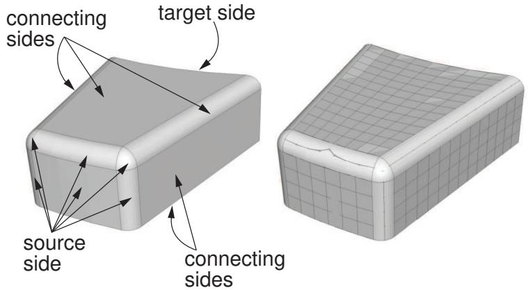  
Figure 2: A bottom-up mesh using the sweep method.

You can choose from the sweep, extrude, or revolve methods to mesh a selected geometric region, and you can also choose the offset method if you are working with orphan elements. Depending on the shape of the region and the analysis intent, more than one method may produce acceptable results. The method that you select and the corresponding parameters will determine how well the mesh conforms to the geometry, if applicable. For example, Figure 3 shows the same part as Figure 2; this time the part is meshed with the extrude method. The parameters for the extrude method are a source side, an extrusion vector, and a number of layers. As shown in Figure 3, the extruded mesh does not capture the tapered sides and the rounded corners at the back of the model.

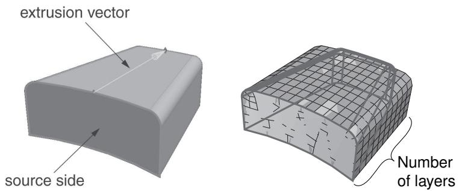  
Figure 3: A bottom-up mesh using the extrude method.

If these details are not important, this simplified mesh may be acceptable. Alternatively, you could edit the resulting mesh by modifying or removing the nodes and elements that extend beyond the original geometry. For more information on editing a mesh, see The Edit Mesh toolset.

If a resulting bottom-up mesh is not acceptable, you can delete it and try a different bottom-up method for the same region or partition the region and mesh the resulting simpler regions. You can also use the mesh Undo and Redo functions to undo steps in the bottom-up meshing procedure rather than deleting the entire bottom-up mesh for the region and starting over.


## Note:

Undo and redo are not available after some operations, such as deleting a region mesh.

The undo and redo functions are the same as those used for the Edit Mesh toolset (for more information, see Undoing or redoing a change in the Edit Mesh toolset).

## The bottom-up meshing domain

When you begin creating a bottom-up mesh, the first requirement is to define the domain in which the mesh will be created. The domain determines whether the bottom-up mesh is created as a native mesh or as a collection of orphan nodes and elements. To create a native mesh, you choose a three-dimensional geometric model region that has been assigned the bottom-up meshing technique in the Mesh Controls dialog box. (For more information, see Assigning mesh controls.) If there are no geometric regions with the bottom-up technique assigned, you must create one or use the orphan element domain.

Selecting a three-dimensional region as the domain also indicates that you intend to fully associate the bottom-up mesh with geometry. The association between mesh and geometry is necessary to transfer loads, boundary conditions, and other information from the geometry to the mesh. Mesh-geometry association is discussed in Mesh-geometry association.

Selecting orphan elements as the domain indicates that the bottom-up mesh will not be fully associated with geometry. The created elements may either have no association with geometry, or you may associate the created orphan mesh entities with adjacent geometric faces. Associating the orphan mesh faces with adjacent geometric faces allows Abaqus/CAE to create a compatible mesh when you mesh the geometry.

## Bottom-up meshing methods

The control parameters for each bottom-up method are similar to the parameters used internally by Abaqus/CAE to create a comparable top-down swept mesh for a three-dimensional solid. The bottom-up methods and associated parameters are defined as follows:

## Sweep

The sweep method creates a three-dimensional mesh by moving a two-dimensional mesh along a sweep path. The sweep method is illustrated in Figure 2. You should use the bottom-up sweep meshing method when the region cross-section changes between the starting and ending sides. To use the sweep method, you must first choose a Source side that defines the face or faces on which Abaqus/CAE will create a two-dimensional mesh. The source side can be any combination of geometric faces, element faces, and two-dimensional elements. You can define the sweep path by selecting Connecting sides that define the sides of the desired sweep region. If you define connecting sides, the mesh conforms closely to the geometry or mesh along the selected sides. Alternatively, for geometry you can select a Target side and specify a Number of layers and allow Abaqus/CAE to create the sweep path by interpolating between the source and target sides. The Target side is a single face that Abaqus/CAE uses to end the mesh. The number of layers refers to the number of element layers that will be placed between the source and the target sides—if you use connecting sides, the two-dimensional meshes of the connecting sides define the number of element layers. Abaqus/CAE sweeps the two-dimensional mesh from the source side into the volume of the solid region to create the mesh.

## Extrude

The extrude method is a special case of the sweep method with a linear path defined by a direction and a distance. The extrude method is illustrated in Figure 3. You should use the extrude method for regions with a constant cross-section and a linear sweep path. There are three required parameters for a bottom-up extruded mesh. As with the sweep method, you choose the Source side that defines the area on which Abaqus/CAE will create a two-dimensional mesh. You then select the starting and ending point of a Vector that defines the extrusion direction and can also be used to define the extrusion distance. Finally, you indicate the Number of layers to define the number of elements between the source side and the end of the extruded mesh. If you use the vector to define the extrusion distance, the definition is complete. However, you can Specify a distance or use Project to target and select a target side to define the extrusion distance. The target side can be selected from any geometry, mesh, or datum plane in the viewport; it need not be part of the same part instance as the source. Abaqus/CAE extrudes the two-dimensional mesh from the source side in the direction of the extrusion vector. If you select a target side to define the extrusion distance, Abaqus/CAE ends the extruded mesh at the target side. Figure 1 shows the source side and target side on the left; the extrusion vector (not shown) extends from the center of the rectangular source side to the center of the cylinder. The resulting extruded mesh is an extension of the source side mesh. It closely matches the target side shape, but no attempt is made to match the node positions of the mesh on the target side.

  
Figure 1:The optional target side (colored white) is used to define the extrusion distance.

The Bias ratio parameter defines a change in the element thickness between the source side and the end of an extruded bottom-up mesh in which more than one layer is created. The bias ratio is the ratio of the thickness of the first layer of elements in the extruded mesh to the thickness of the last layer of elements. The default bias ratio of 1.0 has equal thickness elements throughout the extrusion distance.

## Revolve

The revolve method is another special case of the sweep method. In this case the sweep path is a circular path defined by an axis and an angle of revolution. The revolve method is illustrated in Figure 2. You should use this method for regions with a constant cross-section and a circular sweep path. As with the sweep and extrude methods, you choose the Source side that defines the area on which Abaqus/CAE will create a two-dimensional mesh. The source side cannot intersect the axis of revolution, but it may contain edges that coincide with the axis. If so, the elements contacting the axis create a layer of wedge elements in the revolved mesh. The source side should not include any triangular elements along the axis of revolution. You then select the starting and ending point of an Axis that defines the axis of revolution. Finally, you indicate the Angle and the Number of layers to define the number of elements between the source side and the end of the revolved mesh. Abaqus/CAE revolves the two-dimensional mesh from the source side by the specified angle and evenly divides the resulting region into the desired number of element layers. The direction of revolution is clockwise if you look along the axis of revolution from the starting point to the ending point.

  
Figure 2:The bottom-up revolve method sweeps the source side mesh by the specified angle about the axis.

## Offset

The offset method works the same as Offset (create solid layers) in the Edit Mesh toolset; it creates one or more layers of solid elements by offsetting the selected elements. Offset is available only when you are working with orphan elements. To create an offset bottom-up mesh, you enter a total thickness for the offset elements and the desired number of element layers. You can create an element set or extend an existing set, but you cannot create top and bottom surfaces as you can with the Edit Mesh toolset. If you select shell elements as the source, you must indicate in the prompt area the desired offset direction; you can offset shell elements in both directions. If your shell element selection contains sharp corners, toggle on Constant thickness around corners to maintain the same total thickness where the elements meet in the corner as in the rest of the selection. Using this option can reduce element distortion and prevent collapsed elements, especially if elements are offset to the inner side of a corner (for more information, see Reducing element distortion and collapse during mesh offsetting).

## Selecting parameters for a bottom-up mesh

The parameters that you use to create a bottom-up mesh are similar to those that Abaqus/CAE uses to create a comparable top-down swept mesh. In the top-down meshing methods, Abaqus/CAE automatically selects the required geometric sides for the region. Top-down swept meshes—including extruded and revolved meshes—are discussed in Swept meshing of three-dimensional solids. The parameters used in the bottom-up mesh methods are described below.

## Source side

The Source side is a required parameter that defines the face or faces on which Abaqus/CAE will create a two-dimensional mesh that will be swept, extruded, or revolved to create a three-dimensional mesh. The source side may be a combination of geometric faces, element faces, and two-dimensional elements; you can also select saved surfaces instead of selecting from the viewport. For a top-down mesh Abaqus/CAE limits the angularity between multiple faces that it selects as the source side (for more information, see Characteristics of the geometry can prevent a part from being swept meshable). There is no limit on the angle between the faces that you can select as the source side of a bottom-up mesh. However, increased angles between the source side faces or between the sourcewill result in decreased quality in the three-dimensional elements.

## Connecting sides

Connecting sides define the direction of a swept region. Connecting sides may be a combination of geometric faces, element faces, and two-dimensional elements. Every connecting side must have only a single four-sided geometric face or be comprised of four-sided combined geometric faces, element faces, and two-dimensional elements that form a regular grid pattern.

In a top-down swept mesh Abaqus/CAE creates connecting sides along all edges of the source side. The connecting sides extend completely from the source side to the target side. In a bottom-up swept mesh connecting sides are optional for geometry, but it is recommended that you include as many connecting sides as possible. Connecting sides help to control the mesh as it is swept through the three-dimensional region and enforce associativity in the resulting mesh. Including connecting sides reduces the amount of work needed to clean up and associate the bottom-up swept mesh with the geometry. Connecting sides for a bottom-up mesh may extend completely from the source side to the target side or they may cover only part of the distance. They may also be used without a target side, in which case the end of the connecting sides defines the end of the bottom-up swept mesh. For more information, see Defining connecting sides for a bottom-up swept mesh.

## Target side

The Target side defines the end of a swept mesh or an extruded mesh. You cannot select a target side for revolved or offset bottom-up meshes. The target side of a swept mesh must be a single geometric face; the target side for an extruded mesh can be one or more geometric faces, a group of element faces, or a datum plane. The target side is not required for a swept mesh unless you have not included any connecting sides. However, including a target side helps you control the mesh and, if applicable, enforce associativity of the mesh to geometry.

Abaqus/CAE creates a mesh for the target side by projecting the nodes from the source side if connecting sides are not used or from the last layer of nodes if connecting sides are used. The projected nodes may be positioned outside of the selected geometric target side. The target side is optional for an extruded mesh and is used only to establish the extrusion distance; selection of mesh faces for a target side will not change the extruded mesh to conform to the existing nodes and element faces.

## Number of layers

The Number of layers parameter defines the number of layers of elements that Abaqus/CAE generates along the sweep, extrude, or revolve direction. If you select the bottom-up sweep method and select connecting sides, the number of element layers is driven by the mesh or seeding of the connecting sides, similar to the top-down meshing techniques. If you do not select connecting sides for the sweep method or if you choose the extrude or revolve methods, you must specify how many element layers Abaqus/CAE should generate.

## Vector

The Vector parameter defines the extrusion direction and, optionally, the distance for an extruded mesh. You select an extrusion vector by picking a start point and an end point from the nodes, vertices, datum points, and interesting points in the viewport. Abaqus/CAE extrudes the mesh from the source side by the direction and, if applicable, distance of the vector regardless of where in the viewport you define the vector.

## Axis

The Axis parameter defines the axis of revolution for a revolved mesh. You can define the axis of revolution by selecting two vertices, nodes, datum points, or interesting points from the viewport.

## Angle

The Angle parameter defines the angle of revolution for a revolved mesh. You must specify the angle of revolution for the bottom-up revolve technique to indicate where Abaqus/CAE should end the revolved mesh.

## Bias ratio

The Bias ratio parameter defines a change in the element thickness between the source side and the end of an extruded bottom-up mesh in which more than one layer is created. The bias ratio is the ratio of the thickness of the first layer of elements in the extruded mesh to the thickness of the last layer of elements. A bias ratio less than one creates thinner layers near the source side, a ratio of exactly one has equal thickness layers throughout, and a ratio greater than one creates thicker layers near the source side. Abaqus/CAE evenly distributes the bias through the number of layers in the extrusion.

As you select the parameters to define a bottom-up mesh, consider not only the shape of the current bottom-up mesh but also the desired final mesh shape. Many complex parts will require several bottom-up meshing iterations to generate a complete mesh. For example, you may use connecting sides or element faces of a bottom-up swept mesh as the source side of a bottom-up extruded mesh. If you cannot completely mesh the selected region in the current iteration, consider how you can add another bottom-up mesh or use the Edit Mesh toolset to complete the mesh. For a detailed, step-by-step example of combining top-down and bottom-up techniques to mesh a part, see An example including bottom-up meshing techniques.

## Creating the boundary mesh for a bottom-up region

When you create a bottom-up mesh for a geometric region, the meshing process consists of two phases:

1. A boundary mesh of quadrilateral elements is generated on the source side—and on the connecting sides of a swept mesh if they are included.  
2. Abaqus/CAE generates a hexahedral mesh using the quadrilateral elements as faces of the hexahedral elements.

Creating a boundary mesh allows you to preview the first phase of producing the bottom-up mesh. Viewing the boundary elements can help you identify problems that may prevent generating a bottom-up mesh. The boundary mesh functions for geometric faces of bottom-up mesh regions are identical to the tetrahedral boundary mesh capabilities in Abaqus/CAE except that a bottom-up boundary mesh is composed of quadrilateral elements instead of tetrahedral elements (for more information on tetrahedral boundary meshes, see What is a tetrahedral boundary mesh?, and What can I do with a boundary mesh?).

To create the boundary mesh for faces of a bottom-up region you must use the top-down region meshing process.

1. From the main menu bar, select Mesh->Region.  
2. Toggle on Preview boundary mesh in the prompt area.  
Abaqus/CAE automatically switches the default selection option from Regions to Faces.  
3. Select the geometric faces of a bottom-up region for which you want to create the boundary mesh.  
4. Click Done in the prompt area.  
Abaqus/CAE creates a two-dimensional mesh on the selected faces.

When the Mesh defaults color mapping is selected, Abaqus/CAE displays a boundary mesh using white to represent the quadrilateral elements, which is in contrast to the cyan color that Abaqus/CAE uses to represent the final solid mesh. When you query the bottom-up boundary mesh, Abaqus/CAE refers to the two-dimensional boundary elements as Quad boundary elements. In contrast, when you query the final mesh, Abaqus/CAE refers to the three-dimensional solid elements as Linear hexahedral elements.

## Improving the quality of boundary meshes for a bottom-up region

The quality of the boundary mesh on the source and connecting sides is a major factor affecting the quality of a swept mesh. Creating the boundary meshes allows you to improve their quality before you use them to create a bottom-up mesh. For example, to use a combination of unassociated geometric and unassociated element faces to create an acceptable source side, you may need to create the boundary mesh and merge the nodes of the two-dimensional mesh. Likewise, you cannot use a combination of geometric and element faces to create a connecting side, but you can create a single boundary mesh and use a combination of its two-dimensional elements and the element faces of an adjacent three-dimensional mesh to create a connecting side.

You can query a boundary mesh using the Query toolset. In addition, you can check the quality of a boundary mesh using the mesh verify tool. The mesh verify tool allows you to check the quality of all the boundary elements, or you can use the selection filters to check the quality of the boundary elements of only selected faces.

To improve the boundary meshes for a bottom-up region, you can try the following:

• Modify the mesh controls for the faces of a bottom-up region. For more information, see Assigning mesh controls.  
Use the geometry diagnostics tool to find small entities such as short edges, small faces, and faces with small face corner angles that can affect the mesh quality. You can create a set containing these small entities. For more information, see Using the geometry diagnostic tools.  
• Use the Geometry Edit toolset to remove redundant edges and vertices. You can also remove a face and stitch over the resulting gap. For more information, see Editing techniques.  
• Use the Virtual Topology toolset to ignore tiny edges or faces. For more information, see What can I do with the Virtual Topology toolset?.  
• Add partitions to reduce the aspect ratio of long, narrow faces or cells. For more information, see The Partition toolset.  
• Use the Edit Mesh toolset to modify the boundary mesh. You can do the following in the Mesh module:

Edit nodes  
Collapse element edges  
- Swap the diagonal of a pair of adjacent triangular elements  
- Split element edges

For more information, see What can I do with the Edit Mesh toolset?.

## Defining connecting sides for a bottom-up swept mesh

Defining the connecting sides for a bottom-up swept mesh is a complex task. Connecting sides are required only when creating a swept mesh that uses orphan element faces as the source side. However, even when the connecting sides are not required, using them can save you a significant amount of time after you create the mesh. Connecting sides help control the shape of the swept mesh, and they enforce associativity between the mesh and geometry or force the mesh to match the existing mesh along the connecting sides, depending on whether you are working with geometry or a mesh. In other words, connecting sides force a bottom-up swept mesh to be more similar to a top-down swept mesh. Without connecting sides, you may need to edit the mesh shape, merge nodes, or otherwise modify the mesh to comply with adjacent geometry or meshes, and you will need to manually associate the mesh with the surrounding sides if there are any loads or boundary conditions applied to those sides.

Connecting sides for a bottom-up mesh may be a combination of geometric faces, element faces, and two-dimensional elements. Elements or element faces must be quadrilaterals, and a single connecting side cannot contain both mesh entities and geometric faces. The criteria below and the examples that follow should help you select valid connecting sides or create valid connecting sides from sides that are initially invalid:

• Each geometric face must have four logical sides.  
• The corners of each geometric face must be consistent with the mesh sweeping operation.  
• Connecting sides must share a common edge with the source side.  
• Geometric faces or mesh entities must form a regular grid pattern.

## Each geometric face must have four logical sides

In Figure 1 the top face contains a hole and the front face includes a triangular face. Neither face can be used as a connecting side because of these additional features.

  
Figure 1: Connecting sides must have four logical sides.

If you select sides such as these, Abaqus/CAE will display an error message indicating that the faces are topologically not four-sided.

In addition to topological tests, Abaqus applies geometric tests to determine whether faces that have four or more edges should be considered four-sided. The geometric tests evaluate the angles at the vertices of the face and determine whether a good quality structured mesh can be generated. You can override the geometric tests by using the mesh controls to assign the structured meshing technique to these faces.

For example, in Figure 2 the front face is topologically four-sided; however, because the sides meet the top edge along a curve, Abaqus/CAE does not recognize all four of the corners.

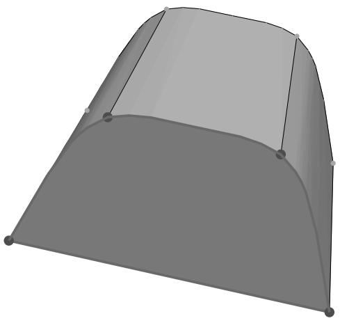  
Figure 2: Faces with corner radii may require editing for use as connecting sides.

When you finish selecting connecting sides, Abaqus/CAE highlights faces that are not geometrically four-sided and displays an error message. You can use the mesh controls to redefine the region's corners as highlighted in the figure so that the face can be used as a connecting side. For more information on using mesh controls on the faces of bottom-up mesh regions, see Improving the quality of boundary meshes for a bottom-up region.

## The corners of each geometric face must be consistent with the mesh sweeping operation

The four corners shown on the selected face in Figure 3 do not match the corners of the adjacent source side (the bottom side of the part). In this case you can finish selecting the connecting sides; but when you attempt to apply the bottom-up swept mesh, Abaqus/CAE indicates that it cannot map the mesh on the connecting sides into a regular grid. If you use mesh controls to remove the corner at the semicircular cut and add a corner at the bottom left corner of the side, you can use the face as a connecting side.

  
Figure 3: Four-sided faces whose corners do not match the corners of the source side.

## Connecting sides must share a common edge with the source side

The common edge shared between the source side and connecting sides cannot extend beyond the edges of the source side. In addition, if you use two-dimensional elements or element faces as the source side and select geometric faces as a connecting side, or vice versa, the element edges must be associated with the geometric edge or Abaqus will not recognize them as sharing a common edge. As an alternative to associating the elements with the geometric edge, you can create a bottom-up boundary mesh on the geometric face and manually merge the nodes of the source side and connecting side meshes (for more information, see Creating the boundary mesh for a bottom-up region). If a connecting side does not share a common edge with the source side, Abaqus/CAE indicates that it cannot map the mesh on the connecting sides into a regular grid.

## Geometric faces or mesh entities must form a regular grid pattern

The geometric faces or element faces and two-dimensional elements that you select must form a regular grid pattern. Figure 4 provides two examples of acceptable connecting face patterns.

  
Figure 4: Acceptable connecting face patterns for swept meshing.

The combination of the three four-sided faces in Figure 5 makes it unacceptable as a connecting side. In this case when you indicate that you are done selecting connecting sides, Abaqus/CAE displays an error message stating that the selected geometric faces do not form a grid pattern.

  
Figure 5: An unacceptable face pattern.

If you are unable to create acceptable connecting sides, you can omit the connecting sides. The resulting mesh may still be acceptable for analysis. However, you should remember to associate the elements along the sides of the region with the geometry, especially if there are loads or other analysis attributes applied to the sides of the mesh. For more information, see Mesh-geometry association.

Bottom-up meshing is a manual process that may be time consuming and require some trial and error to produce an acceptable mesh. Bottom-up meshing is intended for use primarily when you need hexahedral elements for an analysis and you cannot generate them using top-down meshing techniques. You can also use bottom-up meshing in cases where extensive partitioning would be required to create a high-quality top-down mesh on geometry or where you want to extend a mesh part. The following procedure includes the basic steps for creating a bottom-up mesh. To create a bottom-up mesh, you must first have either a mesh region or a solid region with the bottom-up meshing technique assigned (for more information, see Assigning mesh controls). You can also create a bottom-up mesh on an assembly containing independent instances of native parts or dependent instances of parts containing any combination of orphan mesh and geometry.

1. From the main menu bar, select Mesh->Create Bottom-Up Mesh.


Tip: You can also click the tool in the Mesh module toolbox. (For more information, see Using the Mesh module toolbox.)

Abaqus/CAE opens the Create Bottom-Up Mesh dialog box and displays prompts in the prompt area to guide you through the procedure.

2. Select the Domain for which you want to create the bottom-up mesh.

If there is only one appropriate domain for the current part or assembly, Abaqus/CAE automatically makes the selection. If there are multiple geometry regions, or cells, with the bottom-up technique assigned, click Select to select the cell that will be associated with the bottom-up mesh that you are creating. Regions that you can select are colored light tan.

If you work with orphan elements, there is no association between the elements and any geometric region in the part.


## Note:

After selecting a geometric region for bottom-up meshing, you can use the Edit button to change your selection.

3. Select one of the following meshing methods:

• Sweep  
• Extrude  
• Revolve  
• Offset (available only for element face selections)

For a description of each method, see Bottom-up meshing methods.

4. If you previously selected bottom-up meshing parameters for the current region, you can click Fetch Last Selections to reuse your previous selections.

Abaqus/CAE saves your selections for the domain, source side, connecting sides, target side, extrusion vector, and axis of revolution in the session until they are overwritten by new selections.


## Note:

If you add a partition to the model, you cannot reuse previously selected geometry; however, as long as you have not modified the mesh, you can reuse mesh selections such as element faces and two-dimensional elements.

5. Click Select next to Source side; and select the region faces, element faces, or two-dimensional elements where you want the mesh to begin.


Tip: Use [Shift] + Click to select more than one face.

If you are creating an offset mesh and you selected two-dimensional elements, Abaqus/CAE prompts you to indicate the side of your selection that will be offset. You can choose the Brown side, the Purple side, or Both sides.

Abaqus/CAE colors your selection magenta.

6. When you have finished selecting the source side, click Done in the prompt area.

7. If you chose the Sweep method, you must select Connecting sides or a Target side or both to complete the mesh definition. Complete the following steps to make your selections:

a. Toggle on Connecting sides, and click Select to choose one or more sides that connect the source side to the end of the mesh. Connecting geometric sides must be four-sided. You can also select four-sided element faces or two-dimensional elements that form a regular grid pattern. For more information, see Defining connecting sides for a bottom-up swept mesh.

b. If you are working with geometry, you can toggle on Target side and click Select to choose a single face that Abaqus/CAE uses to end the swept mesh.

8. If you chose the Extrude method, you must specify an extrusion vector and choose the extrusion depth.

a. Click Select next to Vector to select two points from the viewport or enter coordinates in the prompt area to define the start and end points of the extrusion vector.

Abaqus/CAE displays a yellow arrow in the viewport to indicate the extrusion vector.

b. Select a method to define the extrusion depth:

• Toggle on Use vector length to extrude by the length of the vector created in the previous step.  
• Toggle on Specify and enter an extrusion depth.  
Toggle on Project to target and click Select to specify a target side. The target side must lie along the direction prescribed by the extrusion vector.

Abaqus/CAE uses the target side to set the extrusion distance. The extruded mesh will closely match the shape of the target side, but it will not conform to a mesh on the target side. (For more information, see Bottom-up meshing methods.)

9. If you chose the Revolve method, you must specify an axis and an angle of revolution.

a. Click Select next to Axis to select two points from the viewport or enter coordinates in the prompt area to define the start and end points of the axis of revolution.  
Abaqus/CAE displays a yellow arrow in the viewport to indicate the axis.  
b. In the Angle field, enter the desired angle of revolution, in degrees, for the revolved mesh.

10. If you chose the Offset method, you must specify the total thickness, and you can change the way two-dimensional mesh corners are offset.

a. In the Total thickness field, enter the thickness for the offset mesh.  
b. For source sides containing shell elements that form sharp corners, toggle on Constant thickness around corners to maintain the same total thickness where the elements meet in the corner as in the rest of the selection. Using the option can reduce element distortion and prevent collapsed elements, especially if elements are offset to the inner side of a corner (for more information, see Reducing element distortion and collapse during mesh offsetting).

11. Where applicable, enter the Number of layers to define the number of element layers between the source side and the end of the bottom-up mesh.


## Note:

The Number of layers parameter is required for the Sweep method only if you specify a target side with no connecting sides. It is always required for the Extrude, Revolve, and Offset methods.

12. If desired, enter a Bias ratio for an extruded bottom-up mesh to skew the thickness of element layers toward or away from the source side. Bias ratio is used in conjunction with Number of layers.

The bias ratio is the ratio of the thickness of the element layer at the source side to the thickness of the element layer furthest from the source side.

13. If desired, use the Options area to add the new bottom-up elements to element sets:

## Extend existing sets

Each new bottom-up element will be added to any mesh sets containing its parent element from the source side.

## Create a set for new elements

Create a new element set for the bottom-up elements. You can use the default set name or create a name for the set. If you are working with orphan elements, you can also create a separate set for each layer of elements. If you choose this option, Abaqus/CAE increments the base set name with -Layer-n, where n is the layer number.

14. The Undo field near the bottom of the Create Bottom-Up Mesh dialog box allows you to undo and redo bottom-up mesh changes, mesh-geometry associativity changes, and mesh edits. You can access the same functions in the Edit Mesh toolset. For more information, see Undoing or redoing a change in the Edit Mesh toolset.

15. Click Mesh in the Create Bottom-Up Mesh dialog box to generate the bottom-up mesh.

16. Repeat Steps 3 through 15 to create another bottom-up mesh in the same region, or click Cancel to end the procedure.

## Additional information

• Selecting objects within the viewport  
• Bottom-up meshing  
• Selecting parameters for a bottom-up mesh  
• Using the Mesh module toolbox

## An example including bottom-up meshing techniques

The following is a step-by-step example of meshing a part using a combination of top-down and bottom-up methods.

The procedures and images describe one way that you can create a hexahedral mesh for this part. Before you begin, you should be familiar with top-down meshing, creating partitions, and using the Edit Mesh toolset. You should also have read the sections discussing bottom-up meshing, mesh-geometry associativity, and related techniques:

What is bottom-up meshing?  
Bottom-up meshing methods  
Selecting parameters for a bottom-up mesh  
Creating the boundary mesh for a bottom-up region  
Improving the quality of boundary meshes for a bottom-up region  
Defining connecting sides for a bottom-up swept mesh

## In this section:

Partitioning the unmeshable region and meshing the top-down regions  
Beginning the bottom-up mesh  
Continuing the bottom-up mesh  
Completing the mesh for the bottom-up region  
Checking the association of the bottom-up mesh with the geometry  
Associating the remainder of the bottom-up mesh

## Partitioning the unmeshable region and meshing the top-down regions

The example part (bottomup\_mesh\_example\_part.sat) is imported from an ACIS file.

The file is included with the Abaqus installation, and you can use the following utility to obtain a copy:

abaqus fetch job=bottomup\_mesh\_example\_part.sat

For more information about ACIS files, see Importing parts from an ACIS-format file.

Figure 1 shows the original part. There are three solid regions; the regions colored green and yellow can be meshed using the top-down structured and swept meshing techniques, respectively, and the orange region is unmeshable with the automated top-down techniques and hexahedral elements.

  
Figure 1: Default mesh color coding on the imported part.

To mesh the part, we will first create three partitions. The first two partitions create another top-down swept meshable region near the outer edge of the unmeshable region. The third partition is a face partition that you will use later as a vector for the bottom-up extrude method. You could apply bottom-up meshing techniques to the entire unmeshable region without partitioning. However, the resulting mesh would contain some poorly formed elements near the outer edge. In practice, you may create several bottom-up meshes before you make a satisfactory mesh for the entire region. Especially for more complex parts, you may want to save copies of a part with different meshing approaches until you decide which approach yields the best mesh.

1. Rotate the part so that you are viewing the bottom of the part, as shown in Figure 2.

  
Figure 2: Creating an offset partition on the bottom face.

2. Complete the following steps to partition the face:

a. From the partition face tools in the module toolbox, select the sketch method tool .  
b. Select the bottom face of the part, and select one of the straight edges to be vertical and on the right.

Abaqus/CAE opens the Sketcher.

c. From the Sketcher toolbox, select the offset tool .  
d. Select the curved edge, and click mouse button 2 to accept the selected edge.  
e. Enter 2.5 in the prompt area as the offset distance.

Abaqus/CAE displays a preview of the offset partition.

f. Click OK if the offset is shown correctly (toward the interior of the part), or click Flip if the offset is shown outside the part.  
g. Click mouse button 2 or click Done in the prompt area to partition the face.

Abaqus/CAE returns to the Mesh module and displays the partitioned face as shown in Figure 2.

3. Extrude the face partition through the region.

a. From the partition cell tools in the module toolbox, select the extrude/sweep method tool .  
b. Select the face partition created in Step 1 as the edge to extrude.  
c. Click Extrude Along Direction in the prompt area, and pick the edge shown in Figure 3.

  
Figure 3: Extruding the face partition through the cell.

d. Click OK if the extrusion direction is shown correctly (through the region), or click Flip to change the direction.  
e. Click Create Partition to partition the cell.

Abaqus/CAE displays the outer region of the part in yellow, indicating that it can now be meshed using top-down swept meshing.

4. Partition the front face of the unmeshable region as shown in Figure 4.

  
Figure 4: Creating face partitions.

a. From the partition face tools in the module toolbox, select the sketch method tool b. Select the front face of the unmeshable region, and select an edge to be vertical and on the right. Abaqus/CAE opens the Sketcher.

c. Use the vertical construction line tool to create a construction line as shown in Figure 5.

  
Figure 5: Using a vertical construction line to partition the face.

d. Use the connected lines tool to create a line connecting the two points where the vertical construction line intersects the face of the part.  
e. Create a second line connecting the upper point of the vertical line to the point where the fillet ends on the front face—the line should be nearly horizontal.  
f. Click mouse button 2 or click Done in the prompt area to partition the face.

There are now three regions in the part that you can mesh using the top-down meshing techniques.

5. Assign global edge seeds to the entire part using an approximate size of 0.9 and the default settings for curvature control.  
6. Select Mesh->Part from the main menu bar to mesh the top-down regions.

Abaqus/CAE highlights the unmeshable region and displays a warning that you cannot mesh it automatically.

7. Click OK to mesh the three top-down regions. Figure 6 shows the resulting partial mesh.

  
Figure 6: Automatic meshing of the top-down regions.

## Beginning the bottom-up mesh

Now that the top-down mesh is complete, you can assign the bottom-up meshing technique and begin creating a hexahedral mesh for the rest of the part.

田 1. Use the mesh controls tool to assign the bottom-up meshing technique to the unmeshable region. Abaqus/CAE colors the region light tan.  
2. Select Mesh->Create Bottom-Up Mesh from the main menu bar.


Tip: You can also click the tool in the Mesh module toolbox. (For more information, see Using the Mesh module toolbox.)

Abaqus/CAE displays the Create Bottom-Up Mesh dialog box and makes the unmeshed regions translucent. The degree of translucency is determined by the translucency slider, located in the Color Code toolbar (for more information, see Changing the translucency). In a more complex part, translucency allows you to select internal regions more easily.

3. Select the Sweep method, and click Select to the right of Source side.  
4. Select the semi-circular face at the bottom of the protrusion, colored magenta in Figure 1, as the source side of the first bottom-up mesh; and click Done in the prompt area.

You must change the default selection options to select the interior face (for more information, see Using the selection options).


Figure 1: Selecting a geometric face as the source side.  


Tip: You can also choose two-dimensional elements or element faces as sides of a bottom-up mesh. In this case an alternative source side selection would be all the element faces on the bottom of the swept mesh.

5. Toggle on Connecting sides, and click Select. Rotate the part as needed to select the three faces that represent the fillet between the top protrusion and the body of the part and the corresponding flat face on the front of the part, colored yellow in Figure 2.

  
Figure 2: Selecting the connecting sides.

Click Done in the prompt area to end selection.

6. Click Mesh in the Create Bottom-Up Mesh dialog box to create the mesh.

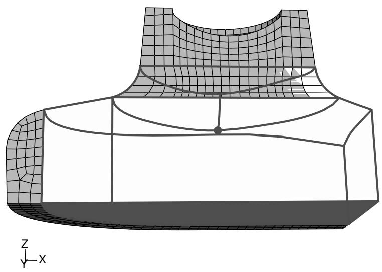  
Figure 3: Bottom-up swept mesh of the filleted area.

The mesh extends approximately as far into the region as the selected connecting sides, the bottom-up region remains selected, and the Create Bottom-Up Mesh dialog box remains open for the next step.

## Continuing the bottom-up mesh

There are at least three methods that you can use to complete the mesh for the part. The simplest method would be to create another swept mesh, using the bottom of the mesh that you just completed and the two faces extending out from the fillet on the top of the remaining unmeshed area as the source side, the three geometric vertical faces and the set of vertical element faces as the connecting sides, and the unmeshed portion of the bottom face as the target side. This method would complete the part mesh in a single bottom-up meshing step, and the elements would be fully associated with the selected faces. You could also use the bottom-up extrude method with the bottom face of the part as the extrude distance. However, for demonstration purposes we will use a longer process that combines use of the bottom-up extrude method, the associativity tool, and the Edit Mesh toolset.

## Create a bottom-up extruded mesh

1. Select the Extrude method, and click Select to the right of Source side.  
2. Select the element faces at the bottom of the previous bottom-up mesh, as shown in Figure 1, as the source side for the second bottom-up mesh.

  
Figure 1: Selecting element faces as the source side.

3. Click Done in the prompt area to accept the selected faces.  
The Create Bottom-Up Mesh dialog box reappears.  
4. Click the Select button to choose a vector for the extruded mesh.  
5. Select the upper endpoint of the partition as the starting point of the vector, and select the lower endpoint as the end of the vector. Figure 2 shows the extrusion vector.

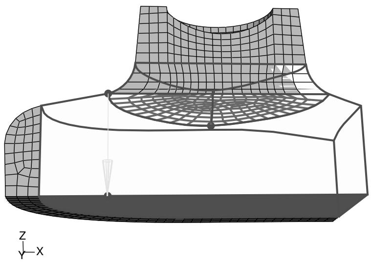  
Figure 2: Selecting the vector for the bottom-up extruded mesh.

6. Enter 10 for the Number of layers.

There are 10 elements on the inner face of the top-down swept mesh. Using the same number of elements for the extruded mesh will provide a better match when you create the third, and final, bottom-up mesh.

7. Verify that the extrude depth is set using the default Use vector length method, and click Mesh in the Create Bottom-Up Mesh dialog box to create the mesh.

  
Figure 3:The bottom-up extruded mesh.

## Extend the extruded mesh

The extruded bottom-up mesh ends near the bottom face of the region, as dictated by the nonplanar source side and the length of the extrusion vector. You can edit the nodes in the last extruded element layer so that they end exactly on the bottom face of the region.

1. Select the Edit Mesh toolset , located at the bottom of the Mesh module toolbox.  
2. Select the Node category, and click on Project in the Edit Mesh dialog box.  
3. Use the angle method to select all the nodes on the bottom of the bottom-up extruded mesh, as shown in Figure 4, and then click Done in the prompt area.

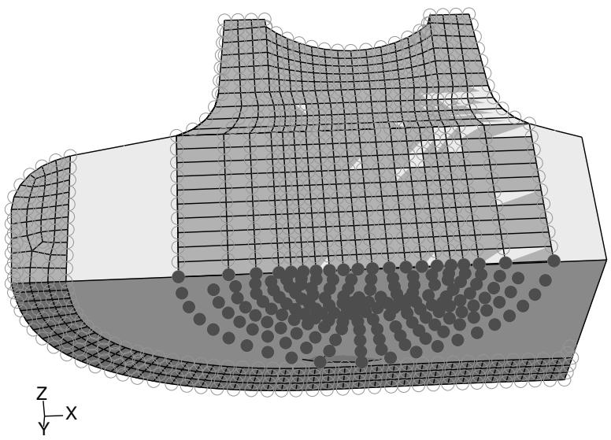  
Figure 4: Selecting the nodes to project.

4. Select the bottom face of the bottom-up region, and click Yes in the prompt area to project the nodes onto the face.

## Completing the mesh for the bottom-up region

We will now create a final swept mesh to complete the mesh for the part.

1. From the main menu bar, select Mesh->Create Bottom-Up Mesh.  
2. Select the bottom-up region.

Abaqus/CAE displays the Create Bottom-Up Mesh dialog box.

3. Select the Sweep method, and click Select to the right of Source side.  
4. Select the two remaining unmeshed faces on the top of the part, as shown in Figure 1, and click Done in the prompt area.

  
Figure 1: Selecting the source side for the final bottom-up mesh.

5. Toggle on Connecting sides, and click Select. Rotate the part, and use the angle method to select the interior element faces from the outer swept mesh and the exterior element faces of the extruded mesh as shown in Figure 2.

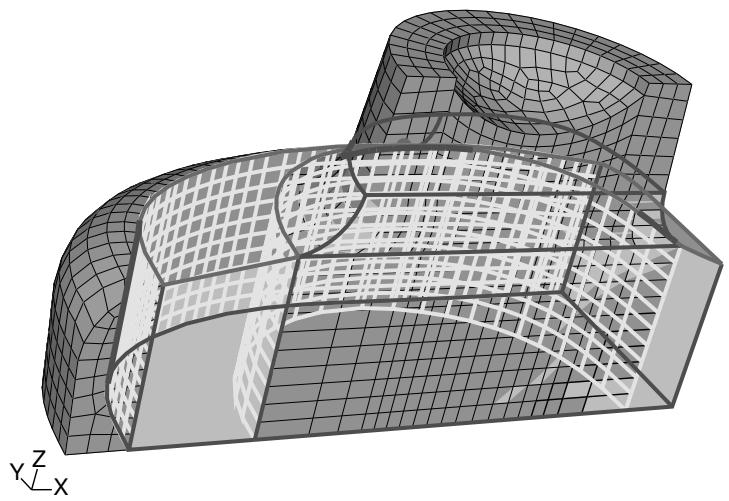  
Figure 2: Selecting the element faces as connecting sides.

Click Done in the prompt area to end selection.

6. Toggle on Target side, and click Select.

Abaqus/CAE prompts you to select a target side for the swept mesh.

7. Select the bottom face of the region.  
8. Click Mesh in the Create Bottom-Up Mesh dialog box to create the mesh.

The part is now completely meshed with hexahedral elements, as shown in Figure 3.

  
Figure 3:The final meshed part.

## Checking the association of the bottom-up mesh with the geometry

Before using the completed bottom-up mesh for an analysis, you should check the association between the region geometry and the bottom-up mesh elements. Loads, boundary conditions, and other attributes in Abaqus are applied to geometry, and they will not transfer correctly to the elements of a bottom-up mesh unless the mesh is correctly associated with the geometry. At minimum, you should check the association for areas of a bottom-up mesh where loads and boundary conditions are applied.

In most cases if you select a geometric feature, such as a face, to define the bottom-up mesh, Abaqus/CAE automatically associates the appropriate elements with that face. However, in cases where the geometry is not used, such as the extruded bottom-up mesh in the center of the example part, the elements are associated only with the region, not the nearby face where a load might be applied. (For more information, see Mesh-geometry association.) The following procedure associates the elements on the bottom and front faces of the part with the geometric faces:

1. From the main menu bar, select Mesh->Associate Mesh with Geometry.  
2. Select the bottom face of the bottom-up region, as shown in Figure 1.

The elements created in the final bottom-up meshing step are colored yellow because they were already associated when the face was used as the target side of the final bottom-up swept mesh. However, the elements in the semi-circular extruded mesh are not associated with the face.

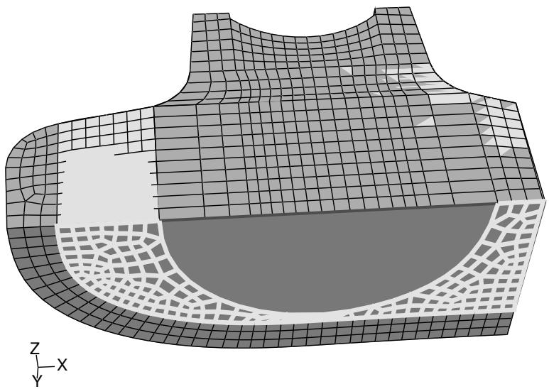  
Figure 1: Existing mesh associations on the bottom face.

3. Remove the top-down meshed cell that extends from the bottom-up region to the outer curved face of the part.

a. Select Tools->Display Groups->Create.  
Abaqus/CAE displays the Create Display Group dialog box.

b. Select Cells from the item list, and click Edit Selection.  
c. From the viewport, pick the top-down swept region that extends along the curved outer edge of the part and click Done in the prompt area.  
d. In the Create Display Group dialog box, click the Remove button.

Abaqus/CAE removes the selected cell from the viewport.

For more information, see Using display groups to display subsets of your model.”

4. Use the angle method to select all the faces on the bottom of the bottom-up region. When you are finished, all of the element faces on the bottom of the bottom-up region should be colored yellow, as shown in Figure 2.


Figure 2: Final mesh associations on the bottom face.  


## Note:

If you did not remove the outer top-down meshed cell, use of the angle method would have selected the top-down element faces for association as well as the bottom-up faces, leading to an error message when you attempted to associate the faces.

5. Click Done in the prompt area to associate the selected elements' faces with the region face.

## Associating the remainder of the bottom-up mesh

To fully associate the bottom-up mesh, you should verify and edit the association for the faces on the front side, the right side, and on each of the bounding edges and vertices in the bottom-up region. You associate edges and vertices the same way as you associated the element faces in the previous section, except that you select edges and element edges or vertices and nodes, respectively. Abaqus/CAE attempts to associate nodes with vertices and element edges with geometric edges based on proximity. If all the elements along an edge are associated with the faces bounded by that edge, Abaqus/CAE automatically associates the element edges with the geometric edge.

Once you have a part completely meshed and you have checked the association of the bottom-up mesh, you should save the model. Prior to running an analysis, you should also verify the quality of the mesh. Mesh verification helps ensure that there are no hidden problems, regardless of whether you created the mesh automatically (top-down) or used bottom-up techniques and mesh editing to construct the mesh. For more information on mesh verification, see Verifying element quality.

## Mesh-geometry association

You can create an association between orphan or bottom-up mesh entities and adjacent geometry.

Abaqus/CAE automatically associates top-down meshes with the underlying geometry. Abaqus/CAE can make this association since the mesh conforms exactly to the geometry. In contrast, a bottom-up mesh does not have to conform to geometry and, therefore, Abaqus/CAE may not associate parts of the mesh with the geometry. Similarly, orphan mesh entities are not associated with geometry because they were either created independent of geometry or the geometry from which they were created is not available in the current model.

Creating an association between orphan or bottom-up mesh entities (elements, element faces, element edges, and nodes) and adjacent geometry allows the transfer of loads, interactions, and boundary conditions from the geometry to the mesh. If you fully associate orphan or bottom-up mesh entities with an adjacent geometric face, you can use that face to create a native mesh for the geometry region that is compatible with the orphan or bottom-up mesh with which you started. Full association means that:

• The selected geometric face is associated with element faces that cover the entire face.  
• All edges of the geometric face are associated with element edges that span the entire edge.  
• All vertices of the face are associated with nodes.

Figure 1 shows an example of the use of mesh-geometry association between a two-dimensional orphan element region and an adjoining geometric region. Associating the geometric edge—the yellow line in the left image—between the two regions with the orphan element edges and nodes results in a compatible hybrid mesh.  
  
Figure 1: Associating an edge enforces creation of a compatible mesh.

Conversely, if a model has a mesh that you need to preserve—because it includes extensive edits or is ideally suited to an analysis—and you do not want to make an orphan mesh for the entire part, you can delete the association between the mesh and selected entities to create orphan nodes and elements in selected regions. Deleting mesh associativity prevents Abaqus/CAE from deleting the mesh of a region when you edit the geometry. After making your edits, you can reestablish associativity between the geometric faces and the surface entities of the mesh. Nodes along edges are merged with any nodes that currently exist on the geometry.


## Note:

If you delete the mesh-geometry associativity for a solid region, the only ways to reestablish a native mesh are to use the Undo function in the Edit Mesh dialog box or to assign the bottom-up mesh technique to the region and recreate the associativity.

The following rules apply to the association of bottom-up elements when you work with a region of solid geometry:

• Abaqus/CAE always associates bottom-up elements with the selected region.  
• When the underlying geometry is used to define the shape of the mesh, Abaqus/CAE associates the mesh with that geometry.  
• When portions of the geometry are not used to define the bottom-up mesh, Abaqus/CAE does not associate them, even if the mesh and geometry are in the same location.  
• You can edit the mesh-geometry association of any geometry-based bottom-up meshed region.

• Even if you edit a generated mesh so that it matches the geometry, you must still manually associate the mesh with the geometry.

There are three considerations that make mesh-geometry association critical to creating a good analysis model:

1. When you work with geometry, attributes such as loads and boundary conditions are applied to the geometry. Proper mesh-geometry association ensures that these attributes are transferred correctly to the mesh during the analysis.  
2. If you select a geometric face as a source or connecting side of a bottom-up mesh, Abaqus reuses the existing mesh entities on that face to create a compatible mesh only if the mesh entities are fully associated with the selected face.  
3. Abaqus tries to merge meshes that are associated with the same geometric entities. Unassociated meshes may require you to merge nodes along mesh boundaries using the Edit Mesh toolset.

You should always check that the mesh-geometry associativity is correct when working with bottom-up meshes or editing the associativity of any mesh. Abaqus/CAE will issue an error in the Job module if you submit a job and attributes are applied to geometry with no associated mesh. However, Abaqus/CAE cannot determine whether the association is correct. For example, if a load is applied to a geometric face that should have several hundred elements but only one element is associated with that face, Abaqus/CAE will attempt to analyze the model with the entire load applied at the single associated element. Incorrect association produces incorrect analysis results.

You can use the mesh-geometry association and delete mesh associativity tools in the Mesh module toolbox to view and edit or to delete mesh-geometry associations. For detailed instructions, see Viewing and editing mesh-geometry associativity and Deleting mesh-geometry associativity.

## Understanding adaptive remeshing

This section describes how you perform adaptive remeshing in Abaqus/CAE.

Adaptive remeshing is described in detail in Adaptive Remeshing.

## In this section:

What are remeshing rules?  
Which mesh controls can I use with adaptive remeshing?  
Which procedures can I use with adaptive remeshing?  
What is the difference between automatic adaptive remeshing and manual adaptive remeshing?  
When do I need to use manual adaptive remeshing?

## What are remeshing rules?

Remeshing rules enable Abaqus/CAE to adapt your mesh iteratively to meet error indicator goals that you have specified. You can allow Abaqus/CAE to perform the iterative remeshing and analysis operations, or you can remesh manually and study the effect of your remeshing rule on the mesh and the resulting analysis. Abaqus/CAE remeshes the faces and cells to which you assigned an adaptivity rule and any adjacent faces or cells; the mesh on other regions does not change. For more information, see About Adaptive Remeshing.

A remeshing rule describes all aspects of your adaptive meshing specification:

• The region to which the remeshing rule is applied. You can apply a remeshing rule to the entire model or to selected regions.  
• A specific step during which Abaqus/CAE will apply the rule. The remeshing rule will be applied only during this step; however, you can apply a different remeshing rule with the same settings to another step in your model.  
• The error indicator output variables—the output variables that will be used to calculate the error estimate. For more information, see Selection of Error Indicators Influencing Adaptive Remeshing.  
• The sizing method—the method that Abaqus/CAE will use to calculate the size of the elements in the mesh. For more information, see Solution-Based Mesh Sizing.  
• Any constraints on the remeshing calculations.

A remeshing rule works in combination with the edge seeding, element type, and meshing method to determine the mesh at a particular adaptivity iteration. Remeshing rules are stored in the model database and are maintained between sessions. To create a remeshing rule, select Adaptivity->Remeshing Rule->Create from the main menu bar. For more information, see Creating a remeshing rule.

You can define multiple remeshing rules over multiple regions of your model. If you apply multiple remeshing rules to the same region of a model, Abaqus/CAE applies a conservative element size specification, and the rule that defines a finer mesh at a particular point takes precedence. If you assign a remeshing rule to a dependent instance, Abaqus/CAE remeshes the original part and each dependent instance of the part inherits the same mesh.

Abaqus/CAE requests error indicator output variables in every job that you create while a remeshing rule is active. The remeshing rule has no effect on the mesh during the first job. However, during the first job Abaqus uses the remeshing rule to calculate the error indicator output variables. In subsequent adaptive remesh iterations the remeshing rule augments your mesh size specification to produce a mesh that attempts to optimize element size and placement to achieve the error indicator goals described in the rule.

## Which mesh controls can I use with adaptive remeshing?

Table 1 shows the mesh controls that must be assigned to a region that will use adaptive remeshing.

Table 1: Mesh controls and adaptive remeshing.

<table><tr><td>Dimensionality</td><td>Element Shape</td><td>Algorithm</td><td>Technique</td></tr><tr><td>Two-dimensional</td><td>Triangular</td><td>n/a</td><td>Free</td></tr><tr><td>Two-dimensional</td><td>Quad-dominated</td><td>Advancing front</td><td>Free</td></tr><tr><td>Three-dimensional</td><td>Tetrahedral</td><td>n/a</td><td>Free</td></tr></table>

In addition, you must assign the above supported mesh controls to any face or cell that is adjacent to a region that is included in a remeshing rule.

When Abaqus/CAE generates a tetrahedral mesh, it first creates a boundary mesh of triangles on the exterior faces of the solid region and then generates the tetrahedral mesh using the triangles as faces of the exterior tetrahedral elements. When you assign adaptive remeshing to a solid region, Abaqus/CAE applies adaptive remeshing to the boundary mesh of triangles on the exterior faces. For more information, see Free meshing with triangular and tetrahedral elements.

If Abaqus/CAE is using the mapped meshing technique in a region you have selected for adaptive remeshing, the mesh resizing algorithm may be slow to converge and require more remeshing iterations to achieve a given target error. To prevent Abaqus/CAE from using mapped meshing, you can toggle off Use mapped meshing where appropriate in the Mesh Controls dialog box. For more information, see Setting the mesh algorithm.

## Which procedures can I use with adaptive remeshing?

Adaptive remeshing is available only for Abaqus/Standard. In addition, adaptive remeshing is available only for the following Abaqus/Standard procedures:

• Static (general and linear perturbation)  
• Quasi-static  
• Heat transfer  
• Fully coupled thermal-stress  
• Coupled pore fluid diffusion-stress  
• Coupled thermal-electrical

## What is the difference between automatic adaptive remeshing and manual adaptive remeshing?

If you choose to allow Abaqus/CAE to remesh your model iteratively, the adaptivity process in the Job module controls the adaptive remeshing for you. You need only define the remeshing rule in the Mesh module and apply the rule to the regions in your model that you want to be remeshed.

Conversely, you can manually apply modified remeshing rules and view the impact of your modifications on the generated mesh. When you are satisfied that your remeshing rule is producing the desired mesh, you can use the rule to drive a sequence of iterative remeshing and analysis operations that is controlled by Abaqus/CAE. Select

Adaptivity->Manual Adaptive Remesh from the main menu bar to apply the adaptive remesh rules manually. For more information, see Manually resizing and remeshing.

When you apply manual adaptive remeshing, you must enter the name of the output database file that was generated by a previous analysis of your model. This output database contains the error indicator output variables that Abaqus/CAE uses to calculate the mesh sizing functions. The error indicator output variables stored in the output database limit the changes that you can make to a remeshing rule. For example, if your original rule specified energy density in a certain region, you will not be able to switch the rule to use error in equivalent plastic strain without first rerunning the analysis. You can modify the sizing method and the element size constraints in the remeshing rule and still use the output database from a previous analysis. However, the output database cannot be used if you modify the step, the region, or the error indicator output variables.

## When do I need to use manual adaptive remeshing?

You can use manual adaptive remeshing to do the following:

• To learn about the impact of various size function and error indicator output variables on the mesh generated by Abaqus/CAE.  
If your analysis is expected to take a long time, you can close the Abaqus/CAE session and make the license tokens available for another user or for a new session. However, to continue the adaptive process, you must read the output database generated by the analysis and manually remesh the model.  
• If the analysis ended prematurely (for example, because of insufficient memory), you can use manual remeshing to continue the adaptivity process.

## Advanced meshing techniques

This section contains information about how to accomplish advanced meshing tasks that are not straightforward.

## In this section:

Meshing multiple three-dimensional solid regions  
Meshing multiple two- and three-dimensional shell regions  
Compatible meshes between part instances  
Parametric modeling  
Meshing complex solids with hexahedral elements

## Meshing multiple three-dimensional solid regions

Abaqus/CAE assigns a default meshing technique to each region depending on its geometry and topology. However, sometimes the default meshing techniques applied to adjacent regions of a three-dimensional part or part instance are not compatible, and Abaqus/CAE cannot generate a compatible mesh.

For example, Abaqus/CAE cannot generate a compatible mesh over the entire part instance in Figure 1 using the default meshing techniques because the nodes from the structured mesh on the left cannot be merged with the nodes of the swept mesh on the right. (The cube on the right side of the part instance is a swept region because it is joined to the cylinder, which is also a swept region.)

  
Figure 1: A compatible mesh is impossible using these default meshing techniques.

The mismatch that would occur between the nodes of the structured region and the nodes of the swept region is obvious if you mesh the two regions separately, as shown in Figure 2.

  
Figure 2:The structured region and the swept region meshed separately.

If you initiate the meshing procedure and Abaqus/CAE cannot generate a compatible mesh using the default meshing techniques, Abaqus/CAE attempts to replace the default meshing techniques with new meshing techniques. These new techniques are determined not only by the region's geometry and topology but also by the characteristics of neighboring regions in the part or part instance. Abaqus/CAE evaluates the interfaces between regions and tries to minimize the number of incompatible interfaces.

For example, the default meshing technique for the cube on the left side of the part instance in Figure 1 is structured, and the resulting incompatible mesh is shown in Figure 2. However, this cube can also be meshed using the swept meshing technique. Therefore, Abaqus/CAE changes the meshing technique assigned to this region from structured to swept, and a compatible mesh is generated over the whole part instance. (The element shapes assigned to a region remain unchanged when Abaqus/CAE changes the meshing technique assigned to the region.)

When you initiate the meshing procedure for a three-dimensional part or part instance, Abaqus/CAE determines if a compatible mesh can be generated using the default techniques assigned to each region. If a compatible mesh is possible, meshing proceeds. If a compatible mesh cannot be generated using the default techniques, Abaqus/CAE checks to see if it can replace the default meshing techniques with different techniques that will allow a compatible mesh to be generated.

• If different techniques will allow a compatible mesh, Abaqus/CAE highlights the incompatible interfaces and prompts you to select one of the following options:

Cancel the meshing procedure.  
- Allow Abaqus/CAE to replace the default techniques as necessary and generate a compatible mesh.  
Allow Abaqus/CAE to use the default meshing techniques and automatically generate tie constraints across the incompatible interfaces. Abaqus/CAE automatically chooses one side of the interface as the secondary surface and the other as the main surface for the automatically generated tie constraint but creates common (merged) nodes on the perimeter of the incompatible interface. The nodes on the secondary surface are constrained to have the same value of displacement, temperature, pore pressure, or electrical potential as the point on the main surface to which they are tied. Abaqus/CAE generally selects the surface with the finer mesh to be the secondary surface. The computation for the depth of the secondary node adjustment zone for the tie constraint is based on the bounding dimensions of the interfacing regions. (For more information on tie constraints, see Mesh Tie Constraints.)

• If different techniques will still not allow a compatible mesh, Abaqus/CAE highlights the incompatible interfaces and prompts you to select one of the following options:

Cancel the meshing procedure.  
- Automatically generate tied surface interactions across the incompatible interfaces, as described above.

If a compatible mesh cannot be generated, you can try one of the following approaches:

• Partition as necessary to generate a compatible mesh.  
• Use the free meshing technique to mesh the entire part or part instance.

In general, the following restrictions apply to generating a compatible mesh on a three-dimensional solid part or part instance:

• A swept region cannot share its target side with a structured region. However, it can share a source side or a connecting side with a structured region, as shown in Figure 3.

  
Figure 3:The connecting side of the swept region is shared with the structured region.

In some situations Abaqus/CAE cannot mesh a part or part instance that contains multiple regions that have all been assigned the swept meshing technique. For example, Abaqus/CAE cannot sweep a mesh along the part instance shown in Figure 4 because a compatible mesh cannot be generated on the shared target face.

  
Figure 4: A compatible swept mesh cannot be generated along this part instance.

However, Figure 5 shows how you can use partitions to produce a mesh that incorporates four swept regions.

  
Figure 5: Using partitions to generate a compatible swept mesh.

Different regions of the same part or part instance can be meshed with hexahedral and tetrahedral elements as shown in Figure 6.

  
Figure 6: Different regions of the same part or part instance can be meshed with hexahedral and tetrahedral elements.

You can use the hexahedral elements where accuracy is important, such as adjacent to contact surfaces or in areas of special interest that require a fine mesh. You can use tetrahedral elements in other regions, and Abaqus/CAE creates tied surfaces where the regions connect. When you mesh one region, Abaqus/CAE does not adjust an existing mesh on adjacent regions.

## Meshing multiple two- and three-dimensional shell regions

Meshing multiple three-dimensional solid regions, describes how the default meshing techniques applied to adjacent regions of a three-dimensional solid part or part instance may not allow you to generate a mesh that is compatible across the regions. In contrast, adjacent regions of a two- or three-dimensional shell part or part instance are always compatible.

Figure 1 illustrates a three-dimensional shell part instance with adjacent regions that Abaqus/CAE can mesh using the free, swept, and structured meshing techniques.

  
Figure 1: Adjacent regions of a three-dimensional shell part instance.

Figure 2 illustrates the resulting mesh.  
  
Figure 2:The resulting mesh.

## Compatible meshes between part instances

You cannot prescribe meshes that are compatible between part instances. If you require mesh compatibility between two or more instances, you can do one of the following:

• Create a single part that contains all the bodies so that multiple instances are not necessary.  
Assemble instances of the parts in the Assembly module and use the Merge/Cut tool to merge the instances into a single instance. If you need to maintain the concept of separate part instances, you can create a partition at the common interface of the merged instances.

Similarly, you can create a single part instance from multiple instances containing orphan elements and nodes, using the Merge/Cut tool to merge duplicate nodes. For more information, see Performing Boolean operations on part instances.

If you must use separate parts, you can use tied contact to avoid the issue of mesh compatibility. Keep in mind that this is not true compatibility, and the accuracy of the solution may suffer. For more information on tied contact, see Understanding interactions.

## Parametric modeling

A useful feature of the Mesh module is the ability to regenerate partitions and mesh attributes—such as element type assignments, seeds, and mesh controls—after a part has been modified. (You must always recreate the mesh itself after modifying a model.)

For example, the model shown in Figure 1 has been partitioned into four regions and then seeded to specify an approximate element size of 3.

  
Figure 1: Seeded model with small hole.

You can return to the Part module and modify the hole at the center of the model so that it is slightly larger. When you return to the Mesh module, the partitions and the seeds are regenerated, as shown in Figure 2.

  
Figure 2: Seeds are regenerated after the part is modified.

In addition, settings in the Mesh Controls and Element Type dialog boxes (such as element shape, element type, and meshing technique) are also regenerated. (You can display these two dialog boxes by selecting Mesh->Controls and Mesh->Element Type from the main menu bar.)


## Note:

If you drastically modify the part, the seeds and partitions may fail to regenerate. In these cases you must create new seeds and partitions after reentering the Mesh module.

## Meshing complex solids with hexahedral elements

You can use the Part module to create complex solid revolved parts that include a translation along the axis of revolution, and you can also create solid extruded parts that include a twist about a selected center point. Free meshing allows you to mesh these parts with tetrahedral elements, as described in Free meshing with triangular and tetrahedral elements. In addition, you can use hexahedral elements to mesh an extruded part that is twisted, as shown in Figure 1.

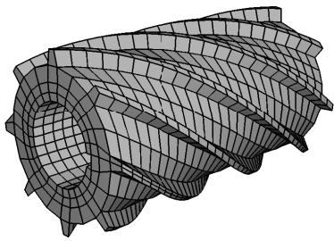  
Figure 1: A hexahedral swept mesh on an extruded part with twist.

However, if you want to use hexahedral elements to mesh a revolved part that is translated, you will probably have to introduce partitions to make the part swept meshable, as described in the following paragraphs.

For the Mesh module to create a three-dimensional swept mesh of hexahedral elements, every side that connects the source side to the target side must contain only a single face (see Figure 4 in Swept meshing of three-dimensional solids). However, when you create a part that is revolved more than 180° and then translated along the axis of revolution, Abaqus/CAE inserts rings along the length of the solid. These rings exist only on the surface of the part, and they do not create faces that cut through the part. As a result, the side that connects the source side and the target side now contains more than one face, and the part is not swept meshable with hexahedral elements unless you introduce partitions.

For example, Figure 2 shows a part that represents a coil spring. The figure also shows the rings that Abaqus/CAE inserted when the part was created. These rings divide the connecting face between the source side and the target side; as a result, you cannot mesh an instance of the coil spring with a swept mesh of hexahedral elements until you partition the part.

  
Figure 2: Rings divide the coil into several segments.

The partitioning operation introduces partitions through the solid coil using N-sided patches to define the new faces. You select the rings to define the N-sided patches, as shown in Figure 3.

  
Figure 3: N-sided patches partition the cell.

You can now seed the part instance and generate a swept mesh using hexahedral elements, as shown in Figure 4.

  
Figure 4:The model is swept meshed with hexahedral elements.

## Using the Mesh module toolbox

You can access all the Mesh module tools through either the main menu bar or the toolbox. Figure 1 shows the hidden icons for all the tools in the Mesh module toolbox.

  
Figure 1:The Mesh module toolbox.

For information on using each of the Mesh module tools, refer to the following sections:

Bottom-up meshing  
Mesh-geometry association  
Seeding a model  
Creating and deleting meshes  
Controlling mesh characteristics  
Obtaining mesh information and statistics

## Seeding a model

This section explains how to use the seeding tools to apply seeds throughout a part instance.

## In this section:

Defining seed density for an entire part or part instance  
Seeding an edge by prescribing the number of elements  
Seeding an edge by prescribing element size  
Prescribing biased seeding along an edge  
Applying constraints to edge seeds  
Seeding previously meshed parts, part instances, or regions  
Deleting part or instance seeds  
Deleting edge seeds  
Relaxing constraints using the error dialog box

## Defining seed density for an entire part or part instance

You can select Seed->Part or Seed->Instance from the main menu to define the approximate element size for all edges of a part or part instance that do not already have magenta-colored edge seeds. Seeds defined in this way are called part seeds or instance seeds and are colored white. (For more information, see Controlling the seed density.) You should apply seeds to all edges. If a uniform seed distribution is sufficient, the recommended approach is to seed the entire part or part instance.

1. From the main menu bar, select Seed->Part or Seed->Instance.

Abaqus/CAE displays prompts in the prompt area to guide you through the procedure.


Tip: You can also seed a part or part instance using the tool, located with the seed tools in the Mesh module toolbox. (For more information, see Using the Mesh module toolbox.)

2. If you are seeding a part instance and your assembly contains more than one part instance, select the part instance to seed and click mouse button 2.


## Note:

Edge seeds always override part and instance seeds; therefore, if you have already individually seeded all the edges of the part or part instance, the instance seeds are unused and do not appear. If necessary, use the seed deletion tool, described in Deleting edge seeds, to remove any unwanted edge seeds; if you have assigned part or instance seeds, these seeds automatically appear on the edges where you delete edge seeds.

3. In the Global Seeds dialog box that appears, enter an approximate element size.  
4. By default, Abaqus/CAE applies curvature control to the seeding of your part or part instance such that small holes or regions of high curvature are properly approximated in the mesh. Curvature control allows Abaqus/CAE to calculate the seed distribution based on the curvature of the edge along with the target element size. To control the effect of curvature on seeding, enter a value for the Maximum deviation factor. The deviation factor is a measure of how much the element edges deviate from the original geometry. To help you visualize the influence of the deviation factor, Abaqus/CAE displays the number of elements it would create around a circle corresponding to the setting that you enter.  
5. If desired, change the Minimum size control. Specifying a minimum size control helps prevent Abaqus/CAE from creating unnecessarily fine meshes in areas of high curvature if these areas are not important to the analysis intent. Choose one of the following options:

Specify the minimum as a fraction of the global element size. Abaqus/CAE uses this method with a value of 0.1 (10%) as the default minimum size.  
Enter an absolute minimum element size. The size must be greater than 0.0 and less than the approximate global element size.

6. Click Apply to view the seeding that Abaqus/CAE will use, and adjust the values that you entered in the Global Seeds dialog box if necessary.  
7. Click OK to commit the element size and to close the dialog box.

White seeds appear on all edges of the part or part instance except those already assigned magenta edge seeds.

8. To exit the part or instance seeding procedure, press [Enter] or click mouse button 2.

## Additional information

• Seeding a model  
• Understanding seeding  
• Using the Mesh module toolbox  
• Selecting objects within the viewport

## Seeding an edge by prescribing the number of elements

You can define the element size along selected edges by entering the number of elements to create. Abaqus/CAE allows you to select edges, faces, or cells to seed. However, seeds are positioned only along edges—the edges that you select or the edges of faces and cells that you select.

All the edge seeding tools generate edge seeds, which are displayed in magenta. Edge seeds override any part or instance seeds you have specified. You should apply seeds to all edges.

1. From the main menu bar, select Seed->Edges.

Abaqus/CAE displays prompts in the prompt area to guide you through the procedure.


Tip: You can also seed an edge by prescribing the number of elements using the tool, located with the seed tools in the Mesh module toolbox. (For more information, see Using the Mesh module toolbox.)

2. Select the edges, faces, or cells you want to seed.

By default, Abaqus/CAE allows you to select only edges to seed. To select faces or cells to seed, use the Selection toolbar to change the type of object that you can select to Face, Cells, or All. For more information, see Filtering your selection based on the type of object.

3. When you have finished selecting edges, faces, or cells, click Done in the prompt area. For more information on selecting objects, see Selecting objects within the viewport.”  
4. From the Local Seeds dialog box that appears, choose By number.


## Note:

If you selected edges that you previously seeded using a combination of seeding methods, Abaqus/CAE provides an As Is option that allows you to retain the seeding method on the selected edges.

5. Enter the number of elements that Abaqus should generate along each edge.  
6. Choose a bias control of None.  
7. If desired, change the default seed constraints on the Constraints tabbed page. See Applying constraints to edge seeds, for further information on setting seed constraints.  
8. If desired, toggle on Create set with name to create a set containing the edges, faces, and cells you selected and enter the name of the set. If you subsequently want to change the seeding, you can select the set in Step 2 without having to reselect the edges, faces, and cells.  
9. Click Apply to view the seeding that Abaqus/CAE will use.

Magenta seeds appear on the selected edges.

10. If necessary, adjust the values that you entered in the Local Seeds dialog box.  
11. Click OK to commit the element seeding and to close the dialog box.

## Additional information

• Seeding a model  
• Understanding seeding  
• Using the Mesh module toolbox  
• Selecting objects within the viewport

You can define the element size along selected edges by entering the approximate element size. You can also define curvature control parameters that Abaqus/CAE uses to adjust the element size in regions of high curvature. Abaqus/CAE allows you to select edges, faces, or cells to seed. However, seeds are positioned only along edges—the edges that you select or the edges of faces and cells that you select.

All the edge seeding tools generate edge seeds, which are displayed in magenta. Edge seeds override any part or instance seeds you have specified. You should apply seeds to all edges.

1. From the main menu bar, select Seed->Edges.

Abaqus/CAE displays prompts in the prompt area to guide you through the procedure.


Tip: You can also seed an edge by element size using the tool, located with the seed tools in the Mesh module toolbox. (For more information, see Using the Mesh module toolbox.)

2. Select the edges, faces, or cells you want to seed.

By default, Abaqus/CAE allows you to select only edges to seed. To select faces or cells to seed, use the Selection toolbar to change the type of object that you can select to Face, Cells, or All. For more information, see Filtering your selection based on the type of object.

3. When you have finished selecting edges, faces, or cells, click Done in the prompt area. For more information on selecting objects, see Selecting objects within the viewport.”  
4. From the Local Seeds dialog box that appears, choose By size.


## Note:

If you selected edges that you previously seeded using a combination of seeding methods, Abaqus/CAE provides an As Is option that allows you to retain the seeding method on the selected edges.

5. Enter the approximate element size to be used along the selected edges.  
6. Choose a bias control of None.  
7. By default, Abaqus/CAE applies curvature control to the seeding of your part or part instance to allow for small holes or regions of high curvature that you wish to model. Curvature control allows Abaqus/CAE to calculate the seed distribution based on the curvature of the edge along with the target element size. To control the effect of curvature on seeding, do the following:

a. Enter a value for the deviation factor. The deviation factor is a measure of how much the element edges deviate from the original geometry. To help you visualize the influence of the deviation factor, Abaqus/CAE displays the number of elements it would create around a circle corresponding to the setting that you enter.  
b. If desired, specify a minimum size factor as a fraction of the global element size. Specifying a minimum size factor prevents Abaqus/CAE from creating very fine meshes in areas of high curvature that you have no interest in modeling.

8. If desired, change the default seed constraints by clicking the Constraints button in the prompt area and responding to the dialog box that appears. See Applying constraints to edge seeds, for further information on setting seed constraints.  
9. If desired, toggle on Create set with name to create a set containing the edges, faces, and cells you selected and enter the name of the set. If you subsequently want to change the seeding, you can select the set in Step 2 without having to reselect the edges, faces, and cells.

10. Click Apply to view the seeding that Abaqus/CAE will use.

Magenta seeds appear on the selected edges.

11. If necessary, adjust the values that you entered in the Local Seeds dialog box.  
12. Click OK to commit the element seeding and to close the dialog box.

## Additional information

• Seeding a model  
• Understanding seeding  
• Using the Mesh module toolbox  
• Selecting objects within the viewport

## Prescribing biased seeding along an edge

You can define a nonuniform distribution of elements along selected edges by defining the size of the coarsest and finest element along the edges or the number of elements and the ratio of the two sizes.

You can define a single bias that changes the mesh density from one end of the edge to the other. Alternatively, you can define a double bias that changes the mesh density from the center of the edge to each end of the edge.

For example, Figure 1 shows a combination of edges with single- and double-bias seeding.

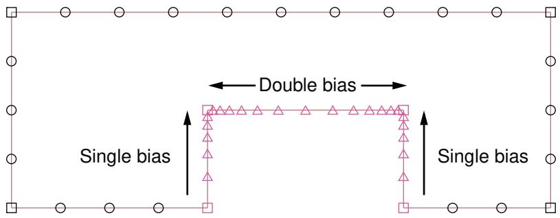  
Figure 1: Single- and double-bias seeding.

All the edge seeding tools generate edge seeds, which are displayed in magenta. Edge seeds override any part or instance seeds you have specified. You should apply seeds to all edges.

1. From the main menu bar, select Seed->Edges.

Abaqus/CAE displays prompts in the prompt area to guide you through the procedure.


Tip: You can also click the tool, located with the seed tools in the Mesh module toolbox. (For more information, see Using the Mesh module toolbox.)

2. Choose the approach for picking from the viewport:

For single-bias seeding, toggle on Use single-bias picking and select the edges you want to seed. You can select only edges for single-bias seeding, and you must select each edge near the end where you expect the mesh to be denser.  
• For double-bias seeding, toggle off Use single-bias picking and select the edges, faces, or cells you want to seed. The location of your selection does not influence the seeding.

By default, Abaqus/CAE allows you to select only edges to seed. To select faces or cells to seed, use the Selection toolbar to change the type of object that you can select to Face, Cells, or All. For more information, see Filtering your selection based on the type of object.

3. When you have finished selecting edges, faces, or cells, click Done in the prompt area.  
4. From the Local Seeds dialog box that appears, choose the bias control (Single or Double).


## Note:

If you selected edges that you previously seeded using a combination of bias seeding methods, Abaqus/CAE provides an As Is option that allows you to retain the bias seeding method on the selected edges.

If you selected single-bias seeding, Abaqus/CAE displays arrows on each selected edge indicating the direction in which the element density will increase. If you selected double-bias seeding, Abaqus/CAE displays arrows at the center of each edge indicating the directions in which the element density will increase.

5. Choose the sizing method (By size or By number).

a. If you selected By size, enter the minimum and maximum size of the elements—the approximate size of the elements at each end of the biased seeding. You cannot apply curvature control to biased seeding.

b. If you selected By number, enter the number of elements and the bias ratio. The bias ratio is the approximate ratio of the size of the largest and smallest element on the edge and must be greater than one.

c. If desired, click Select to reverse the direction of the seeding bias. (When you select an edge to which biased seeding will be applied, the element density increases toward the end of the edge that is closest to the location of your pick.)

Abaqus/CAE reverses the direction of the arrow on each selected edge.


## Note:

If you selected edges that you previously seeded using a combination of element size or number parameters, Abaqus/CAE provides an As Is option that allows you to retain the size parameters on the selected edges.

6. If desired, change the default seed constraints by clicking the Constraints button in the prompt area and responding to the dialog box that appears. See Applying constraints to edge seeds, for further information on setting seed constraints.  
7. If desired, toggle on Create set with name to create a set containing the edges, faces, and cells you selected and enter the name of the set. If you subsequently want to change the seeding, you can select the set in Step 2 without having to reselect the edges, faces, and cells.  
8. Click Apply to view the seeding that Abaqus/CAE will use.

Magenta seeds appear on the selected edges.

9. If necessary, adjust the values that you entered in the Local Seeds dialog box.  
10. Click OK to commit the element seeding and to close the dialog box.

## Additional information

• Seeding a model  
• Understanding seeding  
• Using the Mesh module toolbox  
• Selecting objects within the viewport

You can apply constraints to seeds at the same time you define them by using the Constraints tabbed page of the Local Seeds dialog box that appears during the edge seeding procedures.


Warning: Use care when constraining mesh seeds; overconstraint can make automatic mesh generation impossible if you are trying to generate a mesh that contains quadrilateral- or hexahedral-shaped elements.

1. From the main menu bar, select Seed->Edges. Then select the edges that you want to seed, and click mouse button 2. For more information on performing these tasks, see the following sections:

Seeding an edge by prescribing the number of elements  
Seeding an edge by prescribing element size  
Prescribing biased seeding along an edge


## Note:

If you selected edges that you previously seeded using a combination of constraints, Abaqus/CAE provides an As Is option that allows you to retain the constraints on the selected edges.

Abaqus/CAE displays prompts in the prompt area to guide you through the procedure.

2. Click the Constraints tabbed page of the Local Seeds dialog box.  
3. Choose the desired constraint. The choices are:

## Allow the number of elements to increase or decrease

This option leaves the seeds totally unconstrained. Therefore, the number of elements that Abaqus/CAE creates along an edge can be greater or smaller than the number of elements dictated by the seeds; however, the mesh generator tries to adhere to the requested seed pattern as much as possible. This option provides the greatest flexibility to the automatic mesh generator and, therefore, gives the greatest chance of success when generating the mesh.

## Allow the number of elements to increase only

This option (default) partially constrains the seeds so that the number of elements along an edge can only be greater than or remain the same as that dictated by the seeds. Unconstrained seeds that are located near partially constrained seeds tend to behave as though they are partially constrained.

## Do not allow the number of elements to change

This option fully constrains the seeds so that the exact number of elements that you have specified with your seeds is maintained.

Use this option with care, since adjustment of the number of elements along the boundary of a region is usually required to generate a mesh; preventing such adjustments can make mesh generation impossible.


## Note:

The constraint options described above allow you to control only the number of elements along an edge, not the positions of the nodes along the edge. Abaqus/CAE creates meshes that adhere to the seeds as closely as possible.

## 4. Click OK.

The mesh seeds change shape to indicate the constraint you have chosen:

• Circle: unconstrained seed.  
• Triangle: partially constrained seed. The triangle points upward, indicating that the number of elements along the edge can only increase.  
• Square: fully constrained seed.

## Additional information

• Seeding a model  
• Understanding seeding  
• Selecting objects within the viewport

## Seeding previously meshed parts, part instances, or regions

To reseed a part, a part instance, or a region that has already been meshed, you must first delete the mesh in one of the following ways:

• Before seeding, use the mesh deletion tools, described in Deleting a mesh, to delete the mesh from the part, part instance, or region of interest.  
• Do not delete the mesh yourself; instead, attempt to seed the part, part instance, or region of interest. As soon as you select the parts or edges to seed, Abaqus/CAE displays a window similar to the following:


You can delete the mesh by clicking Delete Meshes, or you can keep your mesh and exit the seeding procedure by pressing Cancel.

You can avoid this warning message for the remainder of the current session by toggling on Automatically delete meshes invalidated by seed changes. The next time you attempt to seed a part, part instance, or region that already contains a mesh, the mesh will be deleted immediately without any warning being displayed.

## Additional information

• Seeding a model  
• Understanding seeding  
• Selecting objects within the viewport

## Deleting part or instance seeds

Delete part or instance seeds by selecting Seed->Delete Part Seeds or Seed->Delete Instance Seeds from the main menu bar.

1. From the main menu bar, select Seed->Delete Part Seeds or Seed->Delete Instance Seeds.

Abaqus/CAE displays prompts in the prompt area to guide you through the procedure.


Tip: You can also delete seeds using the tool, located with the seed tools in the Mesh module toolbox. (For more information, see Using the Mesh module toolbox.)

2. Do one of the following:

• If you are deleting part seeds, click Yes in the prompt area to confirm the deletion.  
• If your assembly contains only one part instance, click Yes in the prompt area to confirm the deletion.  
• If your assembly contains more than one part instance, select the instances whose seeds you want to delete and click mouse button 2 to commit your selection.

Abaqus/CAE deletes the seeds.

## Additional information

• Seeding a model  
• Understanding seeding  
• Using the Mesh module toolbox  
• Selecting objects within the viewport

Delete edge seeds by selecting Seed->Delete Edge Seeds from the main menu bar and then selecting the edges, faces, or cells from which to delete edge seeds.

1. From the main menu bar, select Seed->Delete Edge Seeds.

Abaqus/CAE displays prompts in the prompt area to guide you through the procedure.


Tip: You can also delete seeds using the tool, located with the seed tools in the Mesh module toolbox. (For more information, see Using the Mesh module toolbox.)

2. Select the edges whose edge seeds you want to delete.

By default, Abaqus/CAE allows you to select from all items to delete edge seeds. To limit object selection to only edges, faces, or cells, use the Selection toolbar to change the type of object that you can select to Edges, Faces, or Cells. For more information, see Filtering your selection based on the type of object.

3. When you have finished selecting edges, faces, or cells, press mouse button 2 to commit your selections. For more information on selecting objects, see Selecting objects within the viewport.”

The seeds disappear from all edges of the selected objects.

## Additional information

• Seeding a model  
• Understanding seeding  
• Using the Mesh module toolbox  
• Selecting objects within the viewport

## Relaxing constraints using the error dialog box

Sometimes mesh generation fails if seeds are overconstrained. Several options are available to handle the overconstraints.

When Abaqus/CAE is unable to create a mesh because of overconstrained seeds, the following dialog box appears:

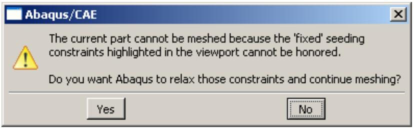

In addition, the overconstrained seeds are highlighted in the viewport. You can choose one of the following options:

• Click Yes to relax the seed constraints and to continue meshing the region.  
• Click No to save the seed constraints and to cancel the meshing procedure.

## Additional information

• Applying constraints to edge seeds

## Creating and deleting meshes

This section explains how to use the mesh tools to create and delete meshes throughout a part instance or region.

## In this section:

Creating a mesh  
Deleting a mesh

## Creating a mesh

You can create meshes throughout entire parts or part instances or just within selected regions.

To create a mesh, select either Mesh->Part, Mesh->Instance, or Mesh->Region from the main menu bar.

1. From the Object field in the context bar, select the part to mesh or select the assembly.  
2. From the main menu bar, select Mesh->Part, Mesh->Instance, or Mesh->Region.

Abaqus/CAE displays prompts in the prompt area to guide you through the procedure.


Tip: You can also mesh parts, part instances, or regions using the and tools, located with the mesh tools in the Mesh module toolbox. (For more information, see Using the Mesh module toolbox.)

3. If you are meshing the assembly, you must select the instances or regions to mesh. Click mouse button 2 to indicate that you have finished selecting. (For more information on selecting objects, see Selecting objects within the viewport.)

Select only those part instances or regions that are colored green, pink, or yellow, indicating they are meshable. To make orange regions meshable, you must either subdivide them using the partitioning tools, assign the bottom-up meshing technique, or assign tetrahedral-shaped elements to them. Regions that you have already assigned the bottom-up meshing technique are colored light tan; you must either mesh them using the bottom-up technique or assign another meshing technique. (For more information on creating bottom-up meshes, see Bottom-up meshing.) Parts colored white cannot be meshed, because they are associated with independent instances.


## Note:

Part instances are colored according to their meshability only when the Mesh defaults color mapping is selected. Apply this color mapping if the colors in your viewport do not match those described in this step.

4. Do one of the following:

• From the prompt area, click Yes to generate the mesh on those regions that are meshable.  
If the assembly includes a solid region that will be meshed with tetrahedral elements, Abaqus/CAE asks if you want to preview the triangular mesh on the exterior faces of the region.

1. To preview the mesh, toggle on Preview boundary mesh from the prompt area and click Yes to create the boundary mesh.

Abaqus/CAE generates the triangular boundary mesh on the mesh on those regions that are meshable.

2. If some regions fail to mesh or if the boundary mesh is not acceptable, Abaqus/CAE provides a variety of tools that will help you generate a mesh in all regions and create an acceptable mesh. For more information, see What can I do with a boundary mesh?.  
3. If the boundary mesh is acceptable, click Yes from the prompt area to continue meshing the interior of the parts, instances, or regions.

Abaqus/CAE generates the mesh on those regions that are meshable.

## Additional information

• Understanding mesh generation  
• Verifying and improving meshes  
• Advanced meshing techniques  
• Using the prompt area during procedures  
• Using the Mesh module toolbox  
• Selecting objects within the viewport

## Deleting a mesh

You can delete Abaqus native meshes throughout entire parts, part instances, or just within selected regions. To delete a mesh, select either Mesh->Delete Part Native Mesh, Mesh->Delete Instance Native Mesh, or Mesh->Delete Region Native Mesh from the main menu bar.


Note: Deleting a mesh does not cause the underlying seeds to be deleted, so you can modify the seeding pattern and regenerate the mesh.

1. From the main menu bar, select either Mesh->Delete Part Native Mesh, Mesh->Delete Instance Native Mesh, or Mesh->Delete Region Native Mesh.

Abaqus/CAE displays prompts in the prompt area to guide you through the procedure.


Tip: You can also delete meshes using the or tools, located with the mesh tools in the Mesh module toolbox. (For more information, see Using the Mesh module toolbox.)

2. Do one of the following:

• If you are deleting a part mesh, click Yes from the prompt area to confirm that you want to delete the mesh.  
• If you are deleting region meshes from a part or an assembly, select the regions from which to delete the mesh. Click mouse button 2 to indicate that you have finished selecting. (For more information on selecting objects, see Selecting objects within the viewport.)  
• If you are deleting instance meshes from the assembly, select the instances from which to delete the mesh. Click mouse button 2 to indicate that you have finished selecting. (For more information on selecting objects, see Selecting objects within the viewport.)

Abaqus/CAE deletes the mesh.

## Additional information

• Understanding seeding  
• Using the prompt area during procedures  
• Using the Mesh module toolbox  
• Selecting objects within the viewport

## Controlling mesh characteristics

This section explains how you control the overall characteristics of your mesh.

## In this section:

Assigning mesh controls  
Choosing an element shape  
Selecting a meshing technique  
Redefining region corners  
Setting the mesh algorithm  
Specifying the sweep path  
Sweep meshing a solid, revolved region whose profile touches the axis of revolution  
Applying a mesh stack orientation  
Changing mesh controls for previously meshed regions  
Associating Abaqus elements with mesh regions  
Changing the labels of all nodes and elements  
Adding layers of wedge elements to tetrahedral mesh boundaries

## Assigning mesh controls

The Mesh Controls dialog box allows you to specify the shape of the elements in a mesh as well as the meshing technique that Abaqus/CAE uses to create the mesh. In some cases, you can also select transition options and redefine region corners.

1. From the main menu bar, select Mesh->Controls.

Abaqus/CAE displays prompts in the prompt area to guide you through the procedure.


Tip: You can also click the tool, located in the Mesh module toolbox.

2. If your part or assembly contains more than one region, select the regions whose mesh controls you want to view or modify and then press mouse button 2. All the selected regions must have the same dimensionality.


## Note:

To view or modify the mesh controls for faces of a region to which the free meshing technique and tetrahedral element shape are assigned or for faces of a bottom-up region, you must change the entity selection type in the prompt area to faces of solid regions.

The Mesh Controls dialog box appears.

3. Select the mesh controls of your choice. For information on specific mesh controls, see the following:

Choosing an element shape  
Selecting a meshing technique  
Redefining region corners  
Setting the mesh algorithm  
• Adding layers of wedge elements to tetrahedral mesh boundaries

4. If desired, click Defaults to change the settings in the Mesh Controls dialog box back to the default values.

5. Click OK to save your settings and to close the Mesh Controls dialog box.

## Additional information

• Assigning Abaqus element types  
• Using the Mesh module toolbox  
• Selecting objects within the viewport

You can control the shape of the elements in your mesh by selecting Mesh->Controls from the main menu bar. The Element Shape options are located at the top of the Mesh Controls dialog box that appears.

1. From the main menu bar, select Mesh->Controls.

Abaqus/CAE displays prompts in the prompt area to guide you through the procedure.


Tip: You can set the element shape using the tool, located in the Mesh module toolbox.

2. If your part or assembly contains more than one region, select those regions whose element shapes you want to view or modify and then press mouse button 2. All the selected regions must have the same dimensionality.

The Mesh Controls dialog box appears.

3. From the list of Element Shape options, select the element shape of your choice.

If you selected a two-dimensional region, you can choose from the following element shape options:

## Quad

Use exclusively quadrilateral elements. The following figure shows an example of a mesh that was constructed using this setting:


## Quad-dominated

Use primarily quadrilateral elements, but allow triangles in transition regions. This setting is the default. The following figure shows an example of a mesh that was constructed using this setting:


## Tri

Use exclusively triangular elements. This setting is the only one available when you apply mesh controls to faces of solid regions since the triangular face mesh will be used to generate a tetrahedral solid mesh. The following figure shows an example of a mesh that was constructed using this setting:


If you selected a three-dimensional region, you can choose from the following element shape options:

## Hex

Use exclusively hexahedral elements. This setting is the default. The following figure shows an example of a mesh that was constructed using this setting:


## Hex-dominated

Use primarily hexahedral elements, but allow some triangular prisms (wedges) in transition regions. The following figure shows an example of a mesh that was constructed using this setting:

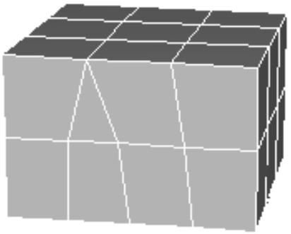

## Tet

Use exclusively tetrahedral elements. The following figure shows an example of a mesh that was constructed using this setting:


## Wedge

Use exclusively wedge elements. The following figure shows an example of a single-element mesh that was constructed using this setting:


## 4. Click OK.

The next time you generate a mesh on the selected regions, your selections will be honored.

If the selected regions are already meshed, you will be prompted to delete the mesh or to cancel the mesh control procedure.

## Additional information

• Controlling mesh characteristics  
• Understanding mesh generation  
• Using the Mesh module toolbox  
• Selecting objects within the viewport

Abaqus/CAE assigns a default top-down meshing technique to each meshable region of your model based on the geometry of the region and the current element shape selection for that region. Abaqus/CAE uses the mesh technique assigned to a region to generate a mesh for the region. You can use the Mesh Controls dialog box to select an alternate meshing technique.

1. From the main menu bar, select Mesh->Controls.

Abaqus/CAE displays prompts in the prompt area to guide you through the procedure.


Tip: You can also set the meshing technique using the tool, located in the Mesh module toolbox.

2. Select faces of solid regions to assign mesh controls to boundary faces of solid regions that will be tetrahedral meshed or bottom-up meshed.  
3. If your part or assembly contains more than one region, select those regions whose meshing technique you want to view or modify and press mouse button 2. The selected regions must all have the same dimensionality.

The Mesh Controls dialog box appears.

4. From the list of Technique options, select the meshing technique of your choice. (Some techniques are available only if they are valid for the selected region.)

• Abaqus/CAE selects As is if, in the previous step, you selected multiple regions that have different meshing techniques already assigned to them.  
• Select Free to create a free mesh.  
• Select Structured to create a structured mesh.  
• Select Sweep to create a swept mesh.  
• Select Bottom-up to create a bottom-up mesh.  
Abaqus/CAE selects Multiple if a change in element shape assignment results in multiple techniques being assigned automatically to the selected regions. For example, suppose the free meshing technique is applied to all the regions of a solid part instance. If you change the element shape assignment of these regions from Tet to Hex or Hex-dominated, Abaqus/CAE automatically changes the meshing technique assigned to each region from the free meshing technique to whatever technique is appropriate for each region; for example, structured meshing for some regions and swept meshing for others.


## Note:

The bottom-up meshing technique must be manually assigned to or removed from a region. When you modify the geometry of a region to which the bottom-up meshing technique is assigned, the resulting region or regions will also be assigned the bottom-up meshing technique. You can click Defaults in the Mesh Controls dialog box to assign a top-down technique to a bottom-up region.

For detailed information on each meshing technique, see Understanding mesh generation.

While assigning mesh controls to faces of a region, Abaqus/CAE color codes the faces according to the mesh technique that will be used on the faces. The face colors may not be the same as the color for the region. For example, the faces of a bottom-up region will appear pink by default since they are free meshed. If you assign the structured mesh technique to some faces, they will be colored green.

The solid region color for a bottom-up region is light tan, and the color for a solid region that will be tetrahedral meshed is pink.

5. Click OK to close the dialog box and to save your mesh technique selection.

The next time you generate a mesh on the selected part instance or region, your selections will be honored.

If the selected region already contains a mesh, you will be prompted to delete the mesh or to cancel the mesh control procedure.

## Additional information

• Controlling mesh characteristics  
• Understanding mesh generation  
• Using the Mesh module toolbox  
• Selecting objects within the viewport

Structured meshing patterns exist for regions with particular topologies. For example, Abaqus/CAE applies a particular structured pattern to quadrilateral regions and another pattern to pentagonal regions. In some cases, however, you can change the structured pattern assigned to a surface region by redefining the region's corners. You can redefine region corners only for surface regions to which the structured meshing technique has been assigned.

If you click Redefine Region Corners in the Mesh Controls dialog box, you can select which corners of the region you want Abaqus/CAE to consider when creating the mesh. If you leave a corner unselected, Abaqus/CAE internally “combines” the edges on either side of the unselected corner into a single logical edge (though the actual topology of the region remains unchanged). For example, if you leave one corner of a pentagonal region unselected, Abaqus/CAE considers that region to have only four edges instead of five. As a result, the structured meshing pattern for quadrilateral regions will be applied to the region rather than the pattern for pentagonal regions. For more information, see Two-dimensional structured meshing.

A surface region can be meshed using the structured meshing technique only if the region is bounded by three to five logical sides. However, if the region contains virtual topology, Abaqus/CAE can apply structured meshing only if the region has four corners. As a result, to redefine the corners of a region with virtual topology, the region must be bounded by more than four corners, and you must select four of the existing corners.

1. From the main menu bar, select Mesh->Controls.

Abaqus/CAE displays prompts in the prompt area to guide you through the procedure.


Tip: You can also click the tool, located in the Mesh module toolbox. (For more information, see Using the Mesh module toolbox.)

2. If your part or assembly contains more than one region, select those regions whose corners you want to redefine and then press mouse button 2. The regions that you select should have three or more vertices.

The Mesh Controls dialog box appears.

3. Select Structured as the meshing technique if it is not already selected.

The Redefine Region Corners button appears on the right side of the Mesh Controls dialog box.

4. Click Redefine Region Corners.

If you selected multiple regions, this procedure considers each of the selected regions in turn. (Abaqus/CAE skips selected regions that a structured pattern cannot be applied to or that contain three or fewer vertices.) The region currently being considered becomes highlighted in magenta. The currently selected corners for the region are highlighted in yellow.

5. In the prompt area, select an option for determining region corners.

If you click Accept Highlighted, Abaqus/CAE accepts the currently highlighted corners. If multiple regions are selected, options are presented for the next region. If only one region is selected, the procedure is complete, and the Mesh Controls dialog box reappears.  
• If you click Select New, the currently selected vertices turn red. You must go on to the next step.  
• If you click Revert to Defaults, the default corners of the region are highlighted. You are prompted to select either Accept Highlighted or Select New, described above.

6. If you clicked Select New in the previous step, select the vertices of the region that you want as region corners. You can select between three and five vertices.

• [Shift] + Click to select a vertex without unselecting all the other vertices.

• [Ctrl] + Click to unselect an individual vertex without unselecting all the other vertices.  
• When you have finished selecting vertices, click mouse button 2.

Selected vertices are red, and unselected vertices are yellow.

If multiple regions are selected, the procedure starts over with the next region. If only one region is selected, the procedure is complete and the Mesh Controls dialog box reappears.

## Additional information

• Controlling mesh characteristics  
• Using the Mesh module toolbox  
• Selecting objects within the viewport

The mesh algorithm options that are available depend on the element shape and the meshing technique that you have selected. If the mesh algorithm option is applicable to the type of mesh you are creating, an Algorithm field appears on the right side of the Mesh Controls dialog box.

Abaqus/CAE provides the following mesh algorithm options:

## Choose the mesh algorithm

Choose either Medial axis or Advancing front. It is difficult to predict which algorithm will produce a better mesh for a particular region; you may have to experiment with the two algorithm settings. For more information, see What is the difference between the medial axis algorithm and the advancing front algorithm?.

## Minimize the mesh transition

You can control whether Abaqus/CAE will try to minimize the mesh transition when it moves from a coarse mesh to a fine mesh. In most cases, toggling on Minimize the mesh transition will reduce mesh distortion. However, if you toggle off Minimize the mesh transition, the mesh may move closer to the specified mesh seeds. For more information, see What is a mesh transition?.

## Use mapped meshing where appropriate

Some models that appear very complex actually contain faces with relatively simple geometry. By default, Abaqus/CAE uses the mapped meshing technique where appropriate to generate elements on simple faces. You can toggle off Use mapped meshing where appropriate to prevent Abaqus/CAE from using mapped meshing. However, if you mesh a model with simple faces and do not allow mapped meshing, the resulting element quality can be poor on the simple faces. For more information, see What is mapped meshing?, and When can Abaqus/CAE apply mapped meshing?.

## Insert boundary layer

When you are creating a free mesh of tetrahedral elements, you can add a boundary layer of wedge elements along the faces of region boundaries. The boundary layer is composed of a series of wedge elements stacked normal to the solid wall of the region with the thinnest elements against the wall. Boundary layers create a mesh with a high density at the wall and decreasing density as it progresses toward the tetrahedral mesh in the interior of the region. For detailed instructions on creating a boundary layer, see Adding layers of wedge elements to tetrahedral mesh boundaries.

## Use the default algorithm

When you are creating a free mesh of tetrahedral elements, you can choose the default mesh generation algorithm or the algorithm that was included with Abaqus/CAE 6.4 and earlier. In most cases the default algorithm is more robust, particularly when meshing complex shapes and thin solids. For more information, see Free meshing with triangular and tetrahedral elements.

## Increase the size of the interior elements

If you choose the default mesh generation algorithm to create a free mesh of tetrahedral elements, you can toggle on Non-standard interior element growth and use either the slider control or the text field to specify a growth rate for interior elements. The growth rate must be between 1.0 (no or minimal growth) and 2.0 (maximum growth).

If the mesh density is adequate for the model being analyzed and the areas of interest are on the mesh boundary, increasing the size of the interior elements will increase the computational efficiency. To view the internal elements generated by Abaqus/CAE, you can use a view cut or use display groups to remove exterior elements from the view.

1. From the main menu bar, select Mesh->Controls.

Abaqus/CAE displays prompts in the prompt area to guide you through the procedure.


Tip: You can also click the tool, located in the Mesh module toolbox. (For more information, see Using the Mesh module toolbox.)

2. If your part or assembly contains more than one region, select the regions of interest and click mouse button 2.

The Mesh Controls dialog box appears. If the mesh algorithm option is applicable to the selected element shape and meshing technique, an Algorithm field appears on the right side of the Mesh Controls dialog box.

3. Select the desired algorithm options, and click OK to save your data and to close the dialog box.

## Additional information

• Free meshing  
• Controlling mesh characteristics  
• Using the Mesh module toolbox  
• Selecting objects within the viewport

If you apply the swept meshing technique to a particular region, a Redefine sweep path button appears in the Mesh Controls dialog box for that region. If the region has more than one valid sweep path, you can click Redefine sweep path to select the path of your choice. (For more information on sweep paths, see Swept meshing.)

This option is of particular interest if you are assigning mesh controls to a gasket, continuum shell, cylindrical, or cohesive region. Unless you assign another orientation (for more information, see Applying a mesh stack orientation), the directional properties of these region types are dependent on the sweep path. When you mesh a gasket region, the axis of each gasket element will be coincident with the sweep path direction. (For more information, see Gaskets,” and About Gasket Elements.) When you mesh a continuum shell or cohesive region, the sweep path is aligned with the stack direction. (For more information, see Meshing parts with continuum shell elements, and Creating a model with cohesive elements using geometry and mesh tools.) When you mesh a cylindrical region with cylindrical elements, the sweep path of the selected sweep/revolve region is aligned along the circumferential direction of the cylindrical geometry. (For more information, see Swept meshing of cylindrical solids.)

1. From the main menu bar, select Mesh->Controls.

Abaqus/CAE displays prompts in the prompt area to guide you through the procedure.


Tip: You can also click the tool, located in the Mesh module toolbox. (For more information, see Using the Mesh module toolbox.)

2. If your part or assembly contains more than one region, select the sweep-meshable regions of interest and then press mouse button 2.  
The Mesh Controls dialog box appears.  
3. In the Mesh Controls dialog box, select Sweep as the meshing technique if it is not already selected. If more than one valid sweep path exists for the regions that you selected, a Redefine Sweep Path button appears toward the bottom of the dialog box.  
4. Click Redefine Sweep Path.

If you selected multiple regions, this procedure considers each of the selected regions in turn. The region currently being considered becomes highlighted in magenta, and the default sweep path is highlighted in red with an arrow indicating the sweep direction.

5. Specify the sweep path and direction of your choice by selecting the appropriate option in the prompt area:

• Click Accept Highlighted to accept the sweep path highlighted in the viewport.  
Click Flip to change the direction of the currently selected sweep path. Then click Yes to indicate that the new sweep path direction is correct.  
Click Select New (if applicable) to select a different edge as the sweep path. Then perform the following steps:

1. Select an edge in the sweep path. You can indicate the desired sweep direction by clicking the mouse button toward the end of the edge that you want to coincide with the end of the sweep path.

The new sweep path is highlighted in red with an arrow indicating the sweep direction.

2. Click Yes in the prompt area if the path and direction are correct, or click Flip if you want to change the direction of the sweep path. Then click Yes to indicate that the new sweep path direction is correct.

If multiple regions are selected with more than one valid sweep path, the procedure starts over with the next region. If only one region is selected, the procedure is complete and the Mesh Controls dialog box reappears.

## Sweep meshing a solid, revolved region whose profile touches the axis of revolution

You can use the partitioning technique to make a part swept meshable.

In most cases, unless you create strategically placed partitions, you cannot sweep mesh a revolved solid region with all hexahedral elements if the profile that was revolved to create the region touches the axis of revolution. For example, the cylindrical part in the following figure cannot be swept meshed.


The partitioning technique to make the part swept meshable involves dividing the part or part instance into the following two regions:

• A cylindrical core region that can be meshed using the extruded swept meshing technique.  
• An outer region that can be meshed using the revolved swept meshing technique.

(For detailed information on sweep meshing solid regions, see Swept meshing of three-dimensional solids.)


Tip: The following instructions refer to color cues that appear only when the Mesh defaults color mapping is selected. Apply this color mapping to your viewport before attempting to partition a solid, revolved region for sweep meshing.

1. Use the Partition toolset to create a cylindrical core at the center of the region. (For detailed information on partitions, see The Partition toolset.) The partitions creating the cylindrical core are outlined in red in the figure below.

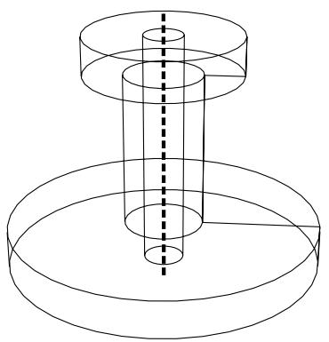

The cylindrical core is meshable using the extruded swept meshing technique and therefore becomes yellow. The outer region remains orange because it is still unmeshable.


In the next step you will create additional partitions that allow Abaqus/CAE to recognize the outer region as a revolved solid whose profile does not touch the axis of revolution.

2. Use the Partition toolset to create whatever partitions are necessary to outline a revolution profile for the outer region. The profile will serve as the source side of the revolved mesh and will be swept along the circular edge defined by the cylindrical core to create the solid mesh.

For example, partitions are used to outline the profile (shown in red) of the outer region in the figure below.


Once the profile has been defined, both the cylindrical inner region and the outer region are colored yellow and are ready for sweep meshing.


The resulting mesh is shown below.

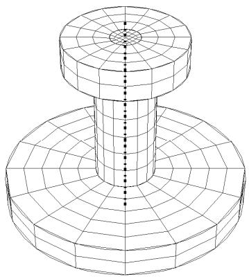

You can apply a similar technique to mesh revolved regions even though the source side and the target side are not planar, as shown below.


The mesh stack orientation is important when meshing parts with continuum shell, cohesive, cylindrical, or gasket elements because these elements have a distinctive directional behavior. If you use sweep meshing, the default stack orientation follows the direction of the sweep path, and you may be able to change the stack orientation by picking a different sweep path. However, you must assign a sweep direction to each cell in a part separately—a time-consuming process—and the available sweep directions may not include your desired stack direction.

The stack orientation tool allows you to assign a stack orientation to all cells or to selected cells within a solid part or part instance, as long as the cells do not have tetrahedral elements assigned. You can use the tool to apply a stack orientation quickly to a group of cells in a single operation. You assign the stack orientation based on a selected face; the stack is oriented such that the selected face is the top of the stack. Abaqus/CAE applies the orientation regardless of the mesh technique used for the cells; so the sweep direction, if one exists, does not matter.

The stack orientation tool was used to assign an orientation through the thickness of the part in Figure 1, as shown by the red arrow; the top faces of the elements are colored brown. The complex profile of the swept solid part did not allow the desired stack orientation using the sweep path—the two available sweep directions are indicated by the black arrow in the figure.

  
Figure 1:The stack orientation need not follow the sweep direction.

Application of a new stack orientation may vary depending on the cells selected. Figure 2 illustrates a case where the stack direction changes as more cells are meshed. The upper left face was used for the reference orientation, so the mesh orientations for the two disconnected cells in the center image match this orientation. However, when the center cell is meshed, the orientation of the elements in the lower right cell is updated to align with the other two cells, as shown in the image on the right.

  
Figure 2: Stack orientation may change if you add cells to a mesh.

1. From the main menu bar, select Mesh->Orientation->Stack.

Abaqus/CAE displays prompts in the prompt area to guide you through the procedure.


Tip: You can also set a mesh stack direction using the tool, located in the Mesh module toolbox (for more information, see Using the Mesh module toolbox.), and the Assign stack direction button, located in the Mesh Controls dialog box.

2. If your part contains multiple cells, select the cells for which you want to assign a stack direction.  
3. Select a top face to define the reference orientation.

Abaqus/CAE prompts you to confirm your selections before assigning the orientation.

4. Click Yes to accept the selected face and corresponding orientation, or click No to return to Step 3.

When you accept the reference face, Abaqus/CAE applies the stack direction to the selected cells.

If any of the selected cells contains cylindrical elements, Abaqus/CAE displays a warning message indicating that the cylindrical elements must be deleted to apply a new stack direction. Click Yes to delete the cylindrical mesh or No to cancel the stack direction procedure.

## Additional information

• Controlling mesh characteristics

## Changing mesh controls for previously meshed regions

If you change any of the mesh controls assigned to a previously meshed region, that region's mesh may become invalid.

In these cases, the following warning dialog appears when you click OK in the Mesh Controls dialog box.


You can delete the mesh by clicking Delete Meshes, or you can keep your mesh and cancel the new settings in the Mesh Controls dialog box by clicking Cancel.

You can also avoid this warning message for the remainder of the current session by toggling on Automatically delete meshes invalidated by mesh control changes. The next time you attempt to change the controls assigned to a region that already contains a mesh, the mesh will be deleted immediately without the appearance of the warning dialog box.

## Additional information

• Controlling mesh characteristics

## Associating Abaqus elements with mesh regions

To associate particular Abaqus elements with mesh regions or with orphan elements, select Mesh->Element Type from the main menu bar.

Then select those regions whose element type you want to assign, and make the assignment using the Element Type dialog box that appears.

You can use the dialog box to specify Abaqus element settings for all the element shapes that could conceivably appear in the regions you select, even if the regions currently contain only a few different element shapes. For example, even though a selected region may contain only quadrilateral elements, you can associate an element type with other shapes, too, such as triangles.

For information on populating the Element Type dialog box with preferred element types, see Preferred element types list.

The element type setting behaves like a feature. For example, if you assign element types to a region and then later partition that region into several more regions, the new regions will inherit the element type settings of the original parent region.

1. From the main menu bar, select Mesh->Element Type.

Abaqus/CAE displays prompts in the prompt area to guide you through the procedure.


Tip: You can also choose element types using the tool, located in the Mesh module toolbox. (For more information, see Using the Mesh module toolbox.)

2. If your assembly or part contains both orphan elements and geometric regions, choose geometry in the prompt area to assign an element type to the geometry.

Orphan elements in an assembly belong to dependent part instances; you cannot assign an element type to a dependent part instance. To assign an element type to orphan elements, you must select the mesh part from the parts list in the Object field of the context bar and assign the element type to the desired elements of the part.

3. If you are selecting from multiple geometric regions or if you are selecting elements from a part imported from an output database, use the following selection techniques:

## Geometry

Use the mouse to select the desired regions in the viewport, and then click mouse button 2 when your selection is complete.

You can select only regions from parts of the same type; for example, you cannot select both a rigid surface and a deformable body. Likewise, the regions that you choose must have the same dimensionality.

## Orphan mesh

Use the mouse to select the desired orphan elements, and then click mouse button 2 when your selection is complete.

Alternatively, you can click Sets on the right side of the prompt area. A dialog box appears with a list of all of the elements sets associated with the meshed part. Select the element set of your choice and then click Continue. For information on creating sets, see The Set and Surface toolsets.

All elements that you select, regardless of the selection method, must be of the same order. In addition, the elements must belong to parts of the same type.

The Element Type dialog box appears.

4. In the upper left corner of the dialog box, select the Element Library option of your choice.

Select Standard to choose from the list of Abaqus/Standard elements, or select Explicit to choose from the list of Abaqus/Explicit elements.

5. Select the Geometric Order of your choice: Linear (first order) or Quadratic (second order).

6. From the Family list on the right side of the dialog box, select an appropriate element family for the type of analysis you will perform on the model. For example, if you plan to do a heat transfer analysis, select the Heat Transfer family.

The name of the default element for the element library, geometric order, and family that you specified appears in the lower half of the dialog box.


## Note:

You can set the element type corresponding to only a single family. For example, you cannot set the element type for linear triangles in both the plane strain and heat transfer families; you must select either heat transfer or plane strain. If, after setting element types for one family, you switch to another family, the settings for the first family are lost.

7. Choose the Abaqus element type of your choice for each element shape.

a. Click the tab corresponding to the element shape of interest.

b. Select the element characteristics of your choice. For more information on the element control options, see Section Controls.

The name of the Abaqus element that meets all your criteria appears at the bottom of the tabbed page with a brief description.

8. Click OK to commit your element type assignments, or click Defaults and then OK to return all element settings to their default values.

The element types are changed according to your specifications.

9. To set element types for additional regions, repeat this procedure starting from Step 2.

## Additional information

• How do mesh elements correspond to Abaqus elements?  
• What kinds of elements must be generated outside the Mesh module?  
• Element type assignment  
• Importing parts  
• Using the prompt area during procedures  
• Using the Mesh module toolbox  
• Selecting objects within the viewport

## Changing the labels of all nodes and elements

Select Mesh->Global Numbering Control from the main menu to change the node and element labels of a native region or of selected native part instances in the assembly. Enter the start labels, and Abaqus/CAE changes the nodes and elements labels while preserving the original order and incrementation. You can change the labels before or after Abaqus/CAE generates the mesh. (For information on renumbering orphan nodes, see Renumbering nodes and Renumbering elements.)

1. Enter the Mesh module.  
2. From the main menu, select Mesh->Global Numbering Control.  
3. If you are working with the assembly, select the native geometry part instances to modify.

You can select independent or dependent part instances to modify. However, any operations applied to dependent part instances are performed at the part level and, therefore, apply to all instances of the part, even if not all instances were selected.

Abaqus/CAE displays the Global Numbering Control dialog box and the start label for the nodes and elements. If you selected a single part instance, the values displayed are the current start label for the nodes and elements of the selected part instance. If you selected multiple part instances that have the same start labels for their nodes and elements, those values are displayed; otherwise, no values are displayed.

4. From the Global Numbering Control dialog box, enter the start labels for the nodes and elements. Abaqus/CAE Applies the same start labels to each of the part instances you selected.

5. Click OK to renumber the nodes and elements.

If the mesh exists, Abaqus/CAE renumbers the nodes and elements and preserves the original order and incrementation. If the mesh has not been created, the new start labels are applied when Abaqus/CAE meshes the part or part instances.

## Additional information

• Renumbering nodes  
• Renumbering elements

If you apply the free meshing technique and tetrahedral element shape to a region, an Insert boundary layer toggle and Assign Controls button are available in the Mesh Controls dialog box.

If you add a boundary layer to multiple meshing cells, Abaqus/CAE temporarily fixes the seeding on any internal faces between the cells to simplify creation of the boundary layer across these faces.

1. From the main menu bar, select Mesh->Controls. (For detailed instructions, see Assigning mesh controls.)


## Note:

You must select a free tetrahedral mesh to include a boundary layer of wedge elements.

2. Toggle on Insert boundary layer near the bottom of the Mesh Controls dialog box, and click Assign Controls.

Abaqus/CAE displays the Boundary Layer dialog box.

3. Enter the Wall element height.

The wall element height sets the height or thickness of the first layer of wedge elements against the boundary walls.

4. Enter the Growth factor.

Starting from the wall elements and moving inward, the height of each successive layer is determined by multiplying the height of the previous layer by the growth factor. The growth factor must be between 1.0 and 2.0, inclusive, where 1.0 results in no growth and 2.0 doubles the thickness of each new layer.

5. Enter the number of wedge element layers in the boundary layer.

Abaqus/CAE displays the total Boundary layer thickness based on your entries in Step 3 through Step 5.

6. If desired, toggle on Inactive faces, and click Edit to select faces that you do not want to include in the boundary layer.

The inactive faces are expected to be approximately planar and perpendicular to local flow directions or along a plane of symmetry.


## Note:

The default selection method is based on the selection method you most recently employed. To revert to the other method, click Select in Viewport or Sets on the right side of the prompt area.

7. If desired, toggle on Create set, and enter a set name to save a set containing all the boundary layer elements.  
8. Click OK to close the Boundary Layer dialog box.

The boundary layer will be created when you mesh the regions.

If mesh generation fails due to problems in the boundary layers, Abaqus/CAE displays a preview of the boundary layer mesh along with a warning dialog box. Before closing the warning dialog and deleting the mesh preview, look for problems such as self-intersecting layers near sharp corners; the possible failure modes are similar to those described for offset meshes in Reducing element distortion and collapse during mesh offsetting. Make the necessary corrections to the boundary layer controls and try to mesh the regions again.

## Additional information

• Controlling mesh characteristics

## Obtaining mesh information and statistics

This section explains how you use the verification tool in the Mesh module to verify graphically the quality of the elements used in a mesh. This section also describes how you use the Query toolset in the Mesh module to obtain listings of mesh, element, and node statistics.

## In this section:

Verifying element quality  
Obtaining mesh information

## Verifying element quality

You can verify the quality of the mesh in selected regions as well as the quality of selected elements,

To verify the quality of a mesh, select Mesh->Verify from the main menu bar. The mesh verify tool allows you to do the following:

Select a part, or select one or more part instances or regions; and highlight elements that do not meet specified criteria, such as aspect ratio. You can also obtain mesh statistics for each selected part, part instance, or region, such as the total number of elements, the number of highlighted elements, and the average and worst values of the selection criterion.  
Select a part, or select one or more part instances or regions; and highlight elements that do not pass the mesh quality tests that are included with the input file processor in Abaqus/Standard and Abaqus/Explicit.  
• Save sets containing the elements highlighted by the verification tests. For native meshes, you can save sets of cells, faces, or edges related to the highlighted elements.

You can also obtain quality information for individual elements. For more information, see Verifying your mesh.

## Additional information

• Verifying your mesh  
• Obtaining mesh information

## Verify selected elements

1. To verify the quality of selected elements, select Mesh->Verify from the main menu bar.

Abaqus/CAE displays prompts in the prompt area to guide you through the procedure.


Tip: You can also verify selected elements using the tool, located in the Mesh module toolbox. (For more information, see Using the Mesh module toolbox.)

2. From the Select the regions to verify by field in the prompt area, select Element.  
3. Select the element that you want to verify. Abaqus/CAE displays the following in the message area:

• The name of the part or part instance  
• The element index  
• The element shape  
• The shape factor for triangle and tetrahedra elements  
• The minimum and maximum face corner angles  
• The aspect ratio  
• The geometric deviation factor  
• The stable time increment  
• The maximum allowable frequency for acoustic elements  
• The shortest edge and longest edge  
• Whether the element passes the checks found in the input file processor in Abaqus/Standard and Abaqus/Explicit

4. Continue selecting elements, as desired.

5. When you have finished selecting elements, either

• Click mouse button 2 in the viewport, or  
• Select any other tool from the toolbox, or

• Click the cancel button A in the prompt area, or

• Click the verify mesh tool in the Mesh module toolbox.

## Verify a part, a part instance, or a region

1. From the Object field in the context bar, select a part or select the assembly.  
2. From the main menu bar, select Mesh->Verify from the main menu bar.

Abaqus/CAE displays prompts in the prompt area to guide you through the procedure.


Tip: You can also verify a mesh using the tool, located in the Mesh module toolbox. (For more information, see Using the Mesh module toolbox.)

3. From the text field in the prompt area, select the type of region to verify:

• Select Part or Part Instances and select the part or part instances whose mesh you want to verify, and press mouse button 2.  
Geometric Regions. Select the cells, faces, or edges whose mesh you want to verify, and press mouse button 2.

Abaqus/CAE displays the Verify Mesh dialog box.

4. From the top of the Verify Mesh dialog box, click the tab corresponding to the desired verification checks. The following verification types are available:

• Shape metrics  
• Size metrics  
• Analysis checks

You can specify verification checks on multiple tabbed pages. Abaqus/CAE refers to the verification checks specified on all three tabbed pages when you click Highlight.

5. To save a set containing results of the selected verification checks, toggle on Create set near the bottom of the Verify Mesh dialog and either accept the default set name or enter a new name for the set.

If there are any results displayed, Abaqus/CAE creates the set when you click Highlight, as described in the following steps.

6. If you want to specify verification checks on the Shape metrics tabbed page, do the following:

a. From the Shape factor options, specify the shape factor criterion for triangular elements and tetrahedral elements in your selection. If your selection includes both triangular elements and tetrahedral elements, the Shape factor options provide separate controls for each type; if your selection includes only triangular elements or only tetrahedral elements, a single control is provided.  
b. If your selection includes triangular elements, you can specify the small face corner angle and the large face corner angle for triangular elements from the Tri-Face Corner Angle options.  
c. If your selection includes tetrahedral elements, you can specify the small face corner angle and the large face corner angle for tetrahedral elements from the Quad-Face Corner Angle options.  
d. Specify a value for the Aspect ratio.

For a detailed description of the selection criteria, see Verifying your mesh.

7. If you want to specify verification checks on the Size metrics tabbed page, specify failure criteria for any of the following:

• Geometric deviation factor  
• Shortest edge  
• Longest edge  
• Stable time increment  
• Maximum allowable frequency for acoustic elements

Stable time increment is available only for elements in the Abaqus/Explicit element library. Maximum allowable frequency for acoustic elements is available only for acoustic elements in the

Abaqus/Standard element library.

For a detailed description of the selection criteria, see Verifying your mesh.

8. If you want to specify analysis checks, click the Analysis checks tab, and toggle Errors and Warnings to select which elements will be highlighted.

9. Click Highlight.

Abaqus/CAE highlights elements that fail the element checks specified in the Shape Metrics or Size Metrics tabbed pages as warnings. In addition, any elements that generated errors or warnings using the checks found in the input file processor in Abaqus/Standard and Abaqus/Explicit are highlighted in the appropriate colors. If you selected Create set in Step 5, Abaqus/CAE saves a set containing the highlighted results. In addition, Abaqus/CAE displays information in the message area, such as the name of the part instance, the total number of elements, the number of highlighted elements, and the average and worst value of the selection criterion.

Regardless of your selection of Errors and Warnings in the Analysis checks tabbed page, Abaqus/CAE also displays in the message area the total number of elements tested and the number of errors and warnings. In most cases, it will be obvious from the element shape why the input file processor issued an error or a warning. If necessary, you can submit a datacheck analysis from the Job module and review the messages that Abaqus writes to the data file. Abaqus/CAE does not support analysis checks for beam, gasket, or cohesive elements.

10. From the buttons along the bottom of the Verify Mesh dialog box, do the following:

• Click Reselect to select different part instances or regions.  
• Click Defaults to restore the default element failure criteria on all of the tabs.  
• Click Dismiss to close the Verify Mesh dialog box.

Your changes to the mesh verification criteria are saved for use in future Abaqus/CAE sessions.

To obtain information on the mesh, select Tools->Query from the main menu bar. You can request information on the following:

• The total number of nodes and elements in a selected part, part instance, or region along with the number of elements of each element shape.  
• The type and connectivity of a selected element.  
• The positive and negative sides of shell and membrane faces.  
• The direction of beam and truss tangents.  
• The mesh stack orientation.  
• Whether any edges of boundary faces have incompatible interfaces, cracks, or gaps and whether any edges intersect other faces.  
• Whether there are free or non-manifold exterior element edges.  
• Whether there are unmeshed regions.

1. From the Object field in the context bar, select a part or select the assembly.

2. From the main menu bar, select Tools->Query.


Tip: You can also select the tool in the Query toolset.

Abaqus/CAE displays the Query dialog box.

3. From the Query dialog box, select one of the following queries:

## Shell element normals

Abaqus/CAE displays the part or the assembly using the shaded render style. The side of the shell where the surface normal coincides with the shell normal (top face) is shaded brown; the opposite side (bottom face) is shaded purple.

## Beam element tangents

Abaqus/CAE displays cyan arrows indicating the direction of the beam tangents.

## Mesh stack orientation

For hexahedral and wedge elements, Abaqus/CAE colors the top face brown and the bottom face purple. Similarly, arrows indicate the orientation of quadrilateral elements. In addition, Abaqus/CAE highlights any element faces and edges that have inconsistent orientation.

## Mesh

For an assembly, part or part instance, geometric region, or element, Abaqus/CAE displays the following:

• The total number of nodes and elements in the selected area  
• The number of elements for each element shape

By default, Abaqus/CAE displays mesh information in the message area, but you can display this information in a tabular format in the Mesh Statistics dialog box by toggling on Display detailed report in the prompt area. The Mesh Statistics dialog box also enables you to display mesh information by part instance or by element type.

## Element

Select an element. Abaqus/CAE displays the following in the message area:

• The element label  
• The element topology  
• The element type that Abaqus/CAE will use for the analysis  
• Nodal connectivity

## Mesh gaps/intersections

Select a part instance. Abaqus/CAE highlights any edges of boundary faces of the model in the current viewport with the following:

• Incompatible interfaces  
• Cracks or gaps  
• Intersections with other faces

In addition, if intersecting elements are found, Abaqus/CAE displays a dialog box that allows you to save a set containing elements that share the highlighted edges. If the model geometry is available, you can save a set containing the cells, faces, or edges related to the highlighted element edges.

## Free/Non-manifold edges

If the current viewport contains an assembly with more than one part instance, select one or more solid or shell instances for the query. Abaqus/CAE highlights two types of exterior element edges:

• Free element edges are exterior edges that belong to a single exterior element face.  
• Non-manifold element edges are exterior edges shared by more than two adjacent exterior element faces.

If Abaqus/CAE finds free or non-manifold element edges, it displays the combined total number of these edges in the message area. Abaqus/CAE also displays a dialog box from which you can save an element set containing all the elements with the highlighted edges. If there are no free or non-manifold edges, the message area indicates that all exterior element edges are shared by exactly two exterior element faces. Figure 1 shows an extruded shell part with the free and non-manifold edges highlighted in red. The element edges along outer boundaries of the three planar faces are free edges. The element edges at the intersection of the three faces are non-manifold edges—each shared by three exterior element faces.

  
Figure 1: Free element edges make up the exterior edges, and non-manifold edges form the center where the three planar shells are joined.

Shell parts should contain free edges and non-manifold edges where appropriate for the part design. Solid parts should not contain any free or non-manifold edges.

## Unmeshed regions

Abaqus/CAE displays a warning dialog and highlights any regions of the model that are not meshed. Toggle on Save regions in a set and select a set name to save a set containing the unmeshed regions.

If there are no unmeshed regions, Abaqus/CAE displays a message in the message area indicating that all regions are fully meshed. The query does not consider regions that do not require a mesh, such as display bodies and analytical rigid surfaces.

## Unassociated geometry

Abaqus/CAE displays the Query Unassociated Geometry dialog box, which enables you to highlight the cells, faces, edges, or vertices in your part or model that are not associated with a mesh. Toggle on Create set and select a set name to save a set containing the geometry that is not associated with a mesh.

If all the geometry you select is associated with a mesh, Abaqus/CAE displays a dialog box indicating that all selected geometry is associated with a mesh. The query does not consider regions that do not require a mesh, such as display bodies and analytical rigid surfaces.

4. When you are finished obtaining mesh information, close the Query dialog box.

## Additional information

• Controlling mesh characteristics  
• Verifying element quality

## Creating a mesh part

Select Mesh->Create Mesh Part from the main menu bar to create a mesh part with no geometric features from the current meshed part or assembly. You can also create a mesh part from selected part instances that you have meshed. If you have meshed only some regions of the assembly or the selected part instances, Abaqus/CAE creates a mesh part from only those meshed regions; unmeshed regions are not included in the mesh part.

A mesh part contains no feature information and is defined by a collection of nodes, elements, surfaces, and sets. Sets, surfaces, and section assignments are copied from the source parts or part instances when you create a mesh part, so loads and interactions applied to the original parts are also applied to the mesh part. You can add geometric features to a mesh part, and you can use the mesh editing tools to modify its nodes and elements. For more information, see What can I do with the Edit Mesh toolset?.

1. From the Object field in the context bar, select a meshed part or select the assembly.  
2. From the main menu bar, select Mesh->Create Mesh Part.  
3. If the assembly contains more than one part instance, you must select the part instances that you want to include in the mesh part. In the prompt area, click Done to indicate that you have finished selecting part instances.  
4. In the prompt area, enter the name of the new part. If you selected part instances from the assembly, you can toggle on Replace part instances to replace the assembly instances with an instance of the new mesh part.

Abaqus/CAE creates the mesh part.

## Controlling adaptive remeshing

This section describes how you can define an adaptive remeshing rule and how you can adaptively remesh your model manually.

## In this section:

Creating a remeshing rule  
Selecting the step and error indicator output variables for the remeshing rule  
Choosing the remeshing rule sizing method  
Choosing remeshing rule constraints  
The Remeshing Rules Manager  
Manually resizing and remeshing

## Creating a remeshing rule

Remeshing rules enable Abaqus/CAE to adapt your mesh iteratively to meet error indicator targets and sizing criteria that you have specified. For more information, see What are remeshing rules?.

1. From the main menu bar, select Adaptivity->Remeshing Rule->Create.


Tip: You can also create a remeshing rule using the tool, located with the mesh tools in the Mesh module toolbox. (For more information, see Using the Mesh module toolbox.)

2. Select the regions to which Abaqus/CAE will apply the remeshing rule, or click Done to select the entire model. If you assign a remeshing rule to a dependent instance, Abaqus/CAE remeshes the original part and each dependent instance of the part inherits the same mesh. The modeling space of the region must be homogeneous. For example, Abaqus/CAE does not allow you to select a region that contains both solids and shells.

If necessary, you should use the Partition toolset to isolate regions that will generate stress singularities and to exclude those regions from the remeshing rule. For more information, see Singularities.

3. The Create Remeshing Rule dialog box appears.  
4. If desired, use the Name text field to change the name of the new rule.  
5. If desired, use the Description text field to enter a description of the remeshing rule. You can use the description to help you keep track of the scope and the purpose of your remeshing rules. The Remeshing Rules Manager displays the name and the description of a remeshing rule.  
6. Click the Step and Indicator tab to select the following:

• The step to which the remeshing rule will be applied.  
The error indicator output variables that Abaqus/CAE will write to the output database, and the frequency at which they will be written.

For more information, see Selecting the step and error indicator output variables for the remeshing rule.

7. Click the Sizing Method tab to select the following:

• The method that Abaqus/CAE will use to calculate the size of the elements during the remeshing process.  
• Whether to use automatic reduction of error indicator targets for the adaptive remeshing process or whether to specify the error indicator targets.

For more information, see Choosing the remeshing rule sizing method.

8. Click the Constraints tab to select constraints on the element size during the remeshing process. For more information, see Choosing remeshing rule constraints.  
9. Click OK to create the remeshing rule and to close the Create Remeshing Rule dialog box.

## Additional information

• Understanding adaptivity processes  
• Understanding adaptive remeshing  
• Manually resizing and remeshing  
• About Adaptive Remeshing

## Selecting the step and error indicator output variables for the remeshing rule

When you create a remeshing rule, you must select the step to which the rule will be applied. You must also select the error indicator output variables that Abaqus/CAE will write to the output database during the analysis and the frequency at which they are written. The error indicator output variables are the basis of the adaptive remeshing process. They provide information to Abaqus/CAE that describes where a mesh needs refinement to approach or achieve the desired error indicator goals. In addition, Abaqus/CAE uses the error indicator output variables to determine where the mesh can be coarsened without introducing unacceptable errors. Selection of Error Indicators Influencing Adaptive Remeshing.

You can use the adaptivity plotter plug-in to review the history of selected error indicators and the element count during an adaptivity analysis. For more information, see Displaying the history of the adaptive remeshing error indicator.

1. From the Create Remeshing Rule dialog box, click the Step and Indicator tab.  
2. Click the arrow to the right of the Step field, and select the step of your choice from the list that appears. The remeshing rule will be applied only during this step; however, you can apply a different remeshing rule with the same settings to another step in your model. Adaptive remeshing is available only for procedures that use Abaqus/Standard. In addition, Abaqus/CAE cannot apply adaptive remeshing in frequency extraction and steady-state dynamic procedures. For more information, see Which procedures can I use with adaptive remeshing?.  
3. Choose the frequency at which the error indicator output variables will be written to the output database. You can choose to write the variables after each increment or after the end of the last increment of the step. Abaqus/CAE remeshes the model based on the value of the error indicators in the last increment of the step. However, if your analysis fails to converge and you saved the error indicator output variables after every increment, you can use the most recent values to remesh your model manually and to continue. For more information, see Manually resizing and remeshing.  
4. From the list of Error Indicator Variables, select one or more variables that will be written to the output database. For each variable that you select, Abaqus/CAE also writes an accompanying base solution variable to the output database.

## Additional information

• Selection of Error Indicators Influencing Adaptive Remeshing  
• Understanding adaptivity processes  
• Understanding adaptive remeshing  
• Creating a remeshing rule  
• About Adaptive Remeshing  
• Displaying the history of the adaptive remeshing error indicator

## Choosing the remeshing rule sizing method

You can allow Abaqus/CAE to choose a default sizing method based on the error indicator output variable, or you can specify a sizing method that will be used for all error indicators in the remeshing rule. If you specify the sizing method, you can also specify the adaptivity goal. For more information, see Solution-Based Mesh Sizing.

1. From the Create Remeshing Rule dialog box, click the Sizing Method tab.  
2. Click the arrow to the right of the Method field, and select one of the following mesh size algorithms:

Choose Default method and parameters to allow Abaqus/CAE to choose the default calculation method for each error indicator output variable. By default, all of the error indicators except for element energy (ENDENERI) and heat flux (HFLERI) use the Minimum/maximum control mesh sizing algorithm. ENDENERI and HFLERI use the Uniform error distribution algorithm. The default error target is Automatic target reduction with a moderate mesh bias.  
Choose the Uniform error distribution mesh sizing algorithm to force Abaqus/CAE to apply a sizing method that attempts to meet the specified error target in every element in the model. In most cases this approach leads to a globally converging mesh.  
Choose the Minimum/maximum control mesh sizing algorithm to control the mesh density at the location of the minimum and maximum values of the base solution.

For more information, see Solution-Based Mesh Sizing.

3. If you selected Uniform error distribution, specify the approach that Abaqus/CAE will use to determine the error indicator target:

Choose Automatic target reduction to allow Abaqus/CAE to generate successive mesh refinements that attempt to reduce the solution error by a fixed amount from the prior job in the adaptivity process. You select the maximum number of mesh iterations while creating an adaptivity process in the Job module. If you select Automatic target reduction, Abaqus/CAE will consider the rule to be satisfied when the error indicator reaches 1%. The criterion of 1% is intended only to provide protection against excessively expensive analysis jobs. In most cases Abaqus/CAE will complete all of the remesh iterations that you specified when you created the adaptivity process in the Job module.  
Choose Fixed target, and enter the percentage error target. Abaqus/CAE uses this value to apply a sizing method that attempts to meet the error target in every element in the model. Such an approach ensures a globally converging mesh. Abaqus/CAE will consider the rule to be satisfied when the error indicator reaches the error indicator target.

4. If you selected Minimum/maximum control, do the following from the Error Indicator Targets region:

a. Specify the approach that Abaqus/CAE will use to determine the error target:

Choose Automatic target reduction to generate successive mesh refinements that attempt to reduce the solution error by a fixed amount from the prior analysis. You select the maximum number of mesh iterations in the Job module. If you select Automatic target reduction, Abaqus/CAE will consider the rule to be satisfied when the error indicator reaches 1%. The criterion of 1% is intended only to provide protection against excessively expensive analysis jobs. In most cases Abaqus/CAE will complete all of the remesh iterations that you specified when you created the adaptivity process in the Job module.  
Choose Fixed targets, and enter the percentage error indicator targets at the location of the maximum and minimum value of the base solution. Abaqus/CAE uses these values to apply a heterogeneous sizing method that attempts to meet both targets at their respective locations. Abaqus/CAE will consider the rule to be satisfied when the error indicator corresponding to

the maximum value of the base solution is reached. In addition, both error targets help Abaqus/CAE ensure that mesh refinement is focused on areas of interest. Conversely, they also help Abaqus/CAE ensure that disproportionate refinement is not applied to areas where the values of the base solution results are low.

b. Specify the Mesh Bias. The mesh bias further tunes the distribution of sizing between the locations of the maximum and minimum base solutions. When you choose Strong, the sizing method acts more aggressively and focuses more elements near locations of high base solution intensity. When you choose Weak, the sizing method acts less aggressively and generates fewer elements near locations of high base solution intensity. Figure 1 illustrates the effect of the bias factor.

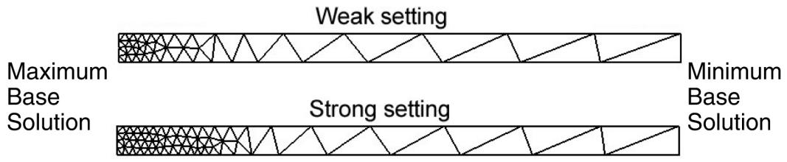  
Figure 1:The impact of the bias factor on element size distribution.

## Additional information

• Solution-Based Mesh Sizing  
• Understanding adaptivity processes  
• Understanding adaptive remeshing  
• Creating a remeshing rule  
• About Adaptive Remeshing

## Choosing remeshing rule constraints

You can define constraints on the element size that Abaqus/CAE will apply during the adaptive remeshing process. You can also specify rate limits that control the introduction of larger and smaller elements and modulate how aggressively Abaqus/CAE applies the sizing method.

The minimum and maximum element sizes that you specify limit the size used in the mesh sizing function, which Abaqus/CAE uses to guide the internal meshing algorithm. The sizes that you specify are not absolute constraints on the element size—the element sizes in the generated mesh only approximate the sizing function. Therefore, some element edges may be larger or smaller than the maximum and minimum element sizes that you specified.

The maximum number of elements that you specify limits the number of elements generated by the mesh sizing function. The mesh sizing function adjusts the target error and the element sizes such that the number of elements generated in a remeshing region does not exceed the specified value. The number of elements in the generated mesh (as with the element sizes) only approximates the sizing function. Therefore, the number of elements generated may be greater than the maximum number of elements that you specified.

1. From the Create Remeshing Rule dialog box, click the Constraints tab.  
2. Specify the minimum and maximum Element Size.

Specify a Minimum value to impose a lower bound on the size of the elements calculated by the remesh algorithm. You can choose either the minimum element size computed by Abaqus/CAE, or you can enter the minimum element size.  
Specify a Maximum value to impose an upper bound on the size of the elements calculated by the remesh algorithm. You can choose either the maximum element size computed by Abaqus/CAE, or you can enter the maximum element size.

3. If desired, specify the Approximate maximum number of elements to impose an upper bound on the total number of elements calculated by the remesh algorithm.

4. Specify the Rate Limits.

• The Refinement rate limit modulates the aggressivity of the sizing method and controls the introduction of smaller elements. Choose one of the following:

- Use default to specify a refinement limit midway between High and Low.  
Specify and drag the Refinement slider to specify the rate limit. Specifying Low indicates minimal reduction in the element size; specifying High indicates a maximum reduction of the original element size.

The refinement factor has a significant effect on the convergence of the adaptive meshing procedure and may help you achieve faster and more efficient mesh convergence.

\- Do not refine to prevent reduction in the element size.

• The Coarsening rate limit modulates the aggressivity of the sizing method and controls the introduction of larger elements. Choose one of the following:

Use default to use the default limit.  
Specify and drag the Coarsening slider to specify the rate limit. Specifying Low indicates minimal growth in the element size; specifying High indicates a maximum growth of the element size.

Do not coarsen to prevent growth in the element size.

## Additional information

• Understanding adaptivity processes  
• Understanding adaptive remeshing  
• Creating a remeshing rule  
• About Adaptive Remeshing

## The Remeshing Rules Manager

The Remeshing Rules Manager, which is similar to other managers in Abaqus/CAE, allows you to do the following:

• Create a remeshing rule. For more information, see Creating a remeshing rule.  
• Edit the selected remeshing rule.  
• Copy, rename, suppress, resume, or delete the selected remeshing rule.

You can display the Remeshing Rules Manager by selecting Adaptivity->Remeshing Rule->Manager from the main menu bar.

The two columns in the Remeshing Rules Manager display the following:

## Name

The Name column displays the name of the remeshing rule. Click Rename to rename the selected remeshing rule.

## Description

The Description column displays the description of the remeshing rule. You can use the description to help you keep track of the scope and the purpose of your remeshing rules.

## Additional information

• Understanding adaptivity processes  
• Understanding adaptive remeshing  
• Creating a remeshing rule  
• About Adaptive Remeshing

To learn about the impact of a remeshing rule on the mesh generated by Abaqus/CAE, you can manually apply a rule and view its impact on the resulting mesh. However, before you can remesh your model, you must run an analysis and create an output database that contains error indicator output variables. You can then change the sizing methods and constraints and view the impact of the modified rule on the generated mesh. When you are confident that a remeshing rule is capturing your intent, you can use the same rule to control several iterations that are driven by automatic remeshing. You can also use manual remeshing to continue an adaptivity process that ended prematurely.

For more information, see What is the difference between automatic adaptive remeshing and manual adaptive remeshing?, and When do I need to use manual adaptive remeshing?.

1. From the main menu bar, select Adaptivity->Manual Adaptive Remesh.

Abaqus/CAE displays the Manual Adaptive Remesh dialog box.


田 Tip: You can also manually resize and remesh using the tool, located with the mesh tools in the Mesh module toolbox. (For more information, see Using the Mesh module toolbox.)

2. In the ODB field, enter the name of the output database that contains the error indicator output variables. Abaqus/CAE uses the error indicators to drive the remeshing algorithm.

Abaqus/CAE displays the following information about each of the remeshing rules in the output database:

• The name of the rule.  
• A description of the error indicator output variable that was used by the rule.  
The percentage target error. This is the value you specified when you created the remeshing rule. If you selected fixed targets, Abaqus/CAE displays the maximum and/or minimum base solution targets. Abaqus/CAE displays a dash if you selected Default methods and parameters or Auto if you selected Automatic target reduction.  
• The sizing method used by the rule.

3. If desired, click Display Error.

Abaqus/CAE displays the percentage Error Indicator Result and the Element Count for each error indicator output variable. The element count is the number of elements in the region to which the remeshing rule is applied.

4. Click Manual Adaptive Remesh.

Abaqus/CAE remeshes the model. All of the active (not suppressed) remeshing rules contribute to the remeshing of the model. If you applied more than one remeshing rule to the same region, the rule that results in the finest mesh takes precedence.

5. If desired, you can select Adaptivity->Remeshing Rule->Edit->rule name from the main menu and modify the parameters that define the rule. You can then return to the Manual Adaptive Remesh dialog box and view the effect of the modified rule on the error estimate and the resulting mesh.


## Note:

When you edit a remeshing rule, you can modify parameters such as the remeshing rule sizing method and constraints on the element size and view the effect of your changes on the resulting mesh. However, if you change the step or the error indicator output variables, you must run the analysis again.

6. You can modify the remeshing rules and remesh your model manually until you are satisfied with the resulting mesh. You can then use the same rules to drive a sequence of iterative remeshing operations that are controlled by Abaqus/CAE. For more information, see Creating, editing, and manipulating adaptivity processes.

## Additional information

• What is the difference between automatic adaptive remeshing and manual adaptive remeshing?  
• When do I need to use manual adaptive remeshing?  
• Understanding adaptivity processes  
• About Adaptive Remeshing

You use the Optimization module to create an optimization task that can be used to optimize the topology or shape of your model given a set of objectives and a set of restrictions. For example, an optimization can attempt to remove material from selected regions to satisfy a maximum weight objective while maintaining a minimum stiffness.

## In this section:

Understanding the role of the Optimization module  
Entering and exiting the Optimization module  
Understanding optimization  
Using the Optimization module toolbox  
Viewing and troubleshooting an optimization  
Creating and configuring an optimization task  
Configuring design responses  
Creating objective functions  
Creating constraints  
Configuring geometric restrictions  
Creating local stop conditions

---

[Previous: The Load Module](load-module.md) · [Next: Optimization, Job, and Sketch Modules](optimization-job-sketch.md)
