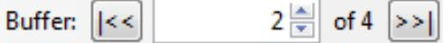
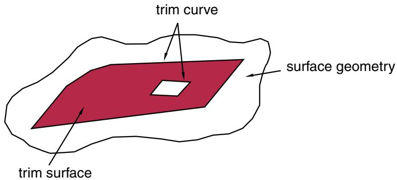
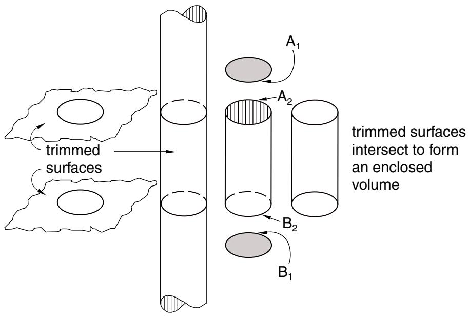
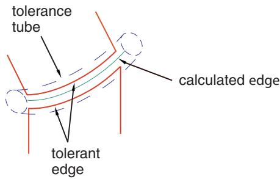

# Working with Abaqus/CAE Model Databases, Models, and Files

Almost every modeling operation you perform while working in an Abaqus/CAE module contributes to the definition of a model in a model database.

This part describes Abaqus/CAE models and model databases, the files created by the modeling process, and how you work with these models and files.

## In this section:

Understanding and working with Abaqus/CAE models, model databases, and files  
Importing and exporting geometry data and models

## Understanding and working with Abaqus/CAE models, model databases, and files

This chapter discusses models and model databases and describes the various files that Abaqus/CAE generates and reads.

A finished model contains all the data that Abaqus/CAE needs to create and submit the analysis to Abaqus/Standard or Abaqus/Explicit. Models are stored in a model database.

## In this section:

What is an Abaqus/CAE model database?  
What is an Abaqus/CAE model?  
Accessing an output database on a remote computer  
Understanding the files generated by creating and analyzing a model  
Abaqus/CAE command files  
Using the File menu  
Managing model and output databases  
Managing models  
Managing session objects and session options  
Controlling the input file generated by Abaqus/CAE  
Managing macros

## What is an Abaqus/CAE model database?

A model database (file extension .cae) stores models and analysis jobs. (For more information on analysis jobs, see Understanding analysis jobs.) You can have multiple model databases stored on your workstation or network, but Abaqus/CAE can work on only one of them at any time. A model database can contain more than one model; if you plan to work on multiple models simultaneously, they must be stored in one model database. The model database in use is known as the current model database; Abaqus/CAE displays the name of the current model database across the top of the main window, as shown in Figure 1.

  
Figure 1: Abaqus/CAE displays the model database name and the model name.

When you first start Abaqus/CAE, the Start Session dialog box allows you to either create a new, empty model database or to open an existing model database. Anything you create or define in Abaqus/CAE is stored in this model database. You save the contents by selecting File->Save or File->Save As from the main menu bar.

Abaqus/CAE never saves the model database unless you perform an explicit save operation; there is no timer-based automatic saving, for example. However, while you work on your model, Abaqus/CAE maintains a record of all the operations that changed the model database. Although you may not have saved the model database, you can always replay the operations that replicate its current state. For more information on recreating the model database, see Recreating an unsaved model database. Abaqus/CAE is backward compatible and can open model databases created by previous releases of Abaqus/CAE.

After you begin an Abaqus/CAE session, you can open an existing model database by selecting File->Open from the main menu bar, or you can create a new model database by selecting File->New. If you open or create another model database after you have made changes to the current one, Abaqus/CAE asks if you want to save the changes before it closes the current model database.

You can open a model database in the Visualization module to probe or query its nodes and elements and to plot contours or symbols for selected attributes. For more information, see Understanding the role of the Visualization module.

## Additional information

• Understanding and working with Abaqus/CAE models, model databases, and files  
• Managing model and output databases

## What is an Abaqus/CAE model?

This section describes an Abaqus/CAE model.

## In this section:

What does an Abaqus/CAE model contain?  
What are the model attributes?

## What does an Abaqus/CAE model contain?

An Abaqus/CAE model contains the following kinds of objects:

• parts  
materials and sections  
• assembly  
• sets and surfaces  
• steps  
• loads, boundary conditions, and fields  
• interactions and their properties  
. meshes

A model database can contain any number of models so that you can keep all models related to a single problem in one database. (For more information, see What is an Abaqus/CAE model database?.) You can open multiple models from the model database at the same time, and you can work on different models in different viewports. The viewport title bar (if visible) displays the name of the model associated with the viewport. The model associated with the current viewport (indicated by a red border) is called the current model, and there is only one current model. Figure 1 shows two viewports displaying two different models (high-speed and low-speed) in the same model database (crankshaft.cae); the current viewport in Figure 1 is displaying the high-speed model.

You use the Model Manager or the Model menu items from the main menu bar to create and manage your models. You use the Model list located in the context bar to switch to a different model in the current model database.

You can create a copy of a model within a model database; in addition, you can copy the following objects between models:

. Sketches  
• Parts (part sets are also copied)  
• Instances  
• Materials  
• Sections (including connector sections)  
• Profiles  
• Amplitudes  
• Interaction properties

For detailed instructions, see Manipulating models within a model database, and Copying objects between models.

You can also import a model from another model database file, which creates a full copy of the model in the current model database. For more information, see Importing a model from an Abaqus/CAE model database.

Abaqus/CAE checks that your model is complete when you submit it for analysis. For example, if you request a dynamic analysis, you must specify the density of the materials so that the mass and inertia properties of the model can be calculated. If you did not provide a material density in the Property module, the Job module reports an error; for more information, see Monitoring the progress of an analysis job.

In some modules Abaqus/CAE does not support functionality from Abaqus/Standard or Abaqus/Explicit that you may want to include in the analysis. You may be able to add such functionality by using the Keywords Editor to edit the Abaqus keywords associated with a model. Select Model->Edit Keywords->model name from the main menu bar to start the Keywords Editor. (You can review the keywords supported by Abaqus/CAE by selecting Help->Keyword Browser from the main menu bar.)

You can specify that a model uses information from a previous analysis. When you submit the model for analysis, Abaqus/CAE continues the analysis from a selected step. For more information, see Configuring restart output requests, and Restarting an analysis.

## What are the model attributes?

The model attributes describe characteristics of a model and are stored with a model in the model database.

The following list describes the attributes of an Abaqus/CAE model:

Description. If you have many similar models in a model database, you can use the description to distinguish between the models. The description that you enter is stored with the model attributes; the description is written above the header of the input file but is not written to the output database. For more information, see Adding descriptions to your Abaqus/CAE model.  
Type. You can choose between a Standard & Explicit model (the default) or an Electromagnetic model. Once you select a model type, Abaqus/CAE filters the set of options available in the main menu bar, toolboxes, and Model Tree so that they are appropriate to your model type selection.  
• Physical constants for the model. You can enter values for the Absolute zero temperature and the Stefan-Boltzmann constant. These values are needed to specify surface emissivity and radiation conditions in heat transfer analyses.

You can also enter a value for the Universal gas constant, and you can choose an option from the Specify acoustic wave formulation list.

• Restart information that will start the analysis using data from a previous analysis. You can specify the following:

- The name of the job from which Abaqus/CAE will read the restart information.  
- The name of the step from which Abaqus/CAE will restart the analysis.  
- The increment or the interval of the step from which Abaqus/CAE will restart the analysis.

For more information, see Restarting an analysis and Restarting an Analysis.

• Submodel information that will be used to drive submodel boundary conditions or loads in the model. You can specify the following:

- The job from which the global solution will be used to drive the submodel boundary conditions or loads.  
Whether a shell global model will be used to drive a solid submodel.

For more information, see Submodeling.

Model instance information. You can control whether constraints, connector section assignments, and surface-to-surface contact and self-contact interactions defined in the initial step will be copied to the current working model when you create model instances from this model. For more information, see Working with model instances.

Select Model->Edit Attributes->model name from the main menu bar to edit the attributes of the selected model.

## Additional information

• Specifying model attributes

## Accessing an output database on a remote computer

This section describes how you can create and start a network connector.

You can use the network connector to navigate the directory structure on a remote host and to access a remote output database.

## In this section:

What is a network ODB connector?  
How secure is the access to a network ODB connector?  
Tuning the cache size to increase the performance of a network ODB

## What is a network ODB connector?

A network ODB connector creates a connection to a remote machine and allows you to access a remote output database. For example, you can submit an analysis to a high-performance Linux system and view the results on a local Windows workstation while the analysis is still running.

You can create a network ODB connector from any platform—Windows or Linux. However, the network ODB server must reside on a Linux platform; you cannot access an output database that resides on a remote Windows system. You can access only a remote output database; you cannot access a remote model database.

Select File->Network ODB Connector->Create from the main menu bar to create a connection with a directory on a remote host. When you are creating a network ODB connector, you can use Abaqus/CAE to automatically start the network ODB server and to establish the communication port numbers on the host and remote systems. Alternatively, you can start the network ODB server manually from the command line using the abaqus networkDBConnector execution procedure. If you start the server from the command line, you enter the communication port number returned by the execution procedure when you subsequently create the network ODB connector. For more information, see Network Output Database File Connector.

After you create a network ODB connector, you must start it by selecting File->Network ODB

Connector->Start->Connector name from the main menu bar. The remote system must have Abaqus installed for Abaqus/CAE to establish the network connection. For more information, see Creating a network ODB connector, and Managing network ODB connectors.

After you create and start a network connector, you can use it to navigate the directory structure on a remote host. When you select File->Open from the main menu bar to open a database from Abaqus/CAE, a Network connectors entry appears under Directory in the file selection dialog box. The entry appears regardless of whether you are trying to open an output database or a model database; however, you cannot use a network connector when opening a model database. For more information, see Using file selection dialog boxes.

The network connector allows you to do the following:

Open a remote output database in read-only mode, and view the contents of the output database using the Visualization module. For more information, see Opening a model database or an output database.

The behavior of the Visualization module does not change when the output database is remote; for example, you can view the output database while the analysis is running on a remote machine, and more than one user can view the output database. However, you cannot click Results in the Job Manager to open the remote output database associated with a remote analysis.

• Import a part from a remote output database. For more information, see Importing parts.  
• Import a model from a remote output database. For more information, see Importing a model from an output database.  
• Upgrade a remote output database.

After most Visualization module operations and during animations, Abaqus/CAE monitors the output database for updated results and updates the current viewport accordingly. If you are displaying data from a remote output database, the performance of Abaqus/CAE may be degraded if the time taken to monitor the database over the network is significant. To increase the performance, you can reduce the frequency with which Abaqus/CAE monitors the output database for updates or you can disable the monitoring. For more information, see Controlling results caching.

## How secure is the access to a network ODB connector?

Abaqus/CAE maintains a secure connection to the network ODB connector by generating a key that is passed back and forth between the server and the client. If a file called .abaqus\_net\_passwd is present in your home directory on the remote server, Abaqus/CAE uses the password in the file for authentication instead of the key generated by Abaqus/CAE. Abaqus/CAE checks that you are the only user with permission to read and write to the password file. In addition, you must update the file after 30 days, and the password must be at least eight characters long. Abaqus uses password files to authenticate the connection between the client and the server if you start the network ODB server manually. These files are described in Network Output Database File Connector.

## Tuning the cache size to increase the performance of a network ODB

When you start an Abaqus/CAE session, a cache is created in the scratch file directory. Abaqus/CAE uses this cache for local data storage when you use a network ODB connector to read from a remote output database. The cache greatly increases the performance of the Visualization module in Abaqus/CAE when accessing data from the remote output database.

Abaqus/CAE allows the cache to grow to a size that is sufficient to contain all of the data in all of the open remote output databases. However, Abaqus/CAE limits the cache size to 80% of the total free space in the directory. For example, if the scratch directory has 35 gigabytes of unused space, Abaqus/CAE will allow the cache to grow to 28 gigabytes. Alternatively, you can limit the size of the cache using the nodb\_cache\_limit parameter in the Abaqus environment file, abaqus\_v6.env. You must set the nodb\_cache\_limit parameter to the number of megabytes to which the cache size will be limited. For example,

```txt
nodb_cache_limit=20000
```

will set the maximum cache size to 20 gigabytes. Abaqus/CAE uses this cache space only as needed during a session, and the actual cache size may be significantly less than the limit you specified. The minimum value of nodb\_cache\_limit is 500, indicating that the cache size is limited to 500 megabytes. If you set the maximum cache size to be greater than the available free space, Abaqus/CAE reduces it to a value that is equal to the available free space.

Abaqus/CAE uses the cache to increase its performance when reading data from a remote output database. The speed at which data can be accessed over a network is significantly lower than the speed at which data can be accessed from a local disk drive. As a result, the performance of remote output databases will be significantly slower than the performance of a local output database. The cache reduces this performance difference by retaining data that have been transferred over the network, thereby reducing the need for data transfer over the network. However, if the cache is not large enough, Abaqus/CAE will have to transfer more data over the network and performance will suffer.

In most cases you will not have to tune the size of the cache using the nodb\_cache\_limit parameter. However, you may have to reduce the size of the cache if it is consuming too much disk space and reducing the speed of other applications on your system. Similarly, you may have to increase the size of the cache if it is too small to support all of your remote output databases and the performance of Abaqus/CAE is degraded. If you cannot increase the size of the cache, you should close some of your remote output databases.

If the desired cache size is larger than the space available in the scratch file directory, you can move the scratch file directory to a larger disk drive using the Abaqusscratch environment file parameter. For more information, see Environment File Settings, and Managing Memory and Disk Resources.

## Understanding the files generated by creating and analyzing a model

When you start a session and begin defining your model, Abaqus/CAE generates the following file:

## The replay file (abaqus.rpy)

The replay file contains Abaqus/CAE commands that record almost every modeling operation you perform during a session. For more information, see Replaying an Abaqus/CAE session.

When you select File->Save from the main menu bar and save the model database, Abaqus/CAE saves the following files:

## The model database file (model\_database\_ name.cae)

The model database file contains models and analysis jobs. For more information, see What is an Abaqus/CAE model database?.

## The journal file (model\_database\_ name.jnl)

The journal file contains the Abaqus/CAE commands that will replicate the model database that was saved to disk. For more information, see Recreating a saved model database.

When you continue to work on your model, Abaqus/CAE continues to record your actions in the replay file. In addition, Abaqus/CAE saves the following file:

## The recover file (model\_database\_ name.rec)

The recover file contains the Abaqus/CAE commands that will replicate the version of the model database in memory. The model database recovery file contains only the commands that changed the model database since you last saved it. For more information, see Recreating an unsaved model database.

When you submit a job for analysis, Abaqus/Standard and Abaqus/Explicit create a set of files; for a complete list of these files, see File Extension Definitions. The following list describes some of the files that Abaqus/Standard and Abaqus/Explicit create and their relationship to Abaqus/CAE:

## Input files (job\_name.inp)

Abaqus/CAE generates an input file that is read by Abaqus/Standard or Abaqus/Explicit when you submit a job for analysis. For more information, see Basic steps for analyzing a model.

## Output database files (job\_name.odb)

Output database files contain the results from your analysis. You use the Step module's output request managers to choose which variables are written to the output database during the analysis and at what rate. An output database is associated with the job you submit from the Job module; for example, if you named your job FrictionLoad, the analysis creates an output database called FrictionLoad.odb.

When you open an output database, Abaqus/CAE loads the Visualization module and allows you to view a graphical representation of the contents. You can also import a part from an output database as a mesh. You can save X–Y data objects to an output database file if you open the file with write permission; otherwise, you cannot modify the contents of the output database once it has been created.

## The output database lock file (job\_name.lck)

The lock file (job\_name.lck) is written whenever an output database file is opened with write access, including when an analysis is running and writing output to an output database file. The lock file prevents you from having simultaneous write permission to the output database from multiple sources. It is deleted automatically when the output database file is closed or when the analysis that creates it ends.

## The restart file (job\_name.res)

The restart file is used to continue an analysis that stopped before it was complete. You use the Step module to specify which analysis steps should write restart information and how often. If you are using Abaqus/Explicit, the restart information you supply in the Step module controls the data written to the state file (job\_name.abq). For more information, see Configuring restart output requests.

## The data file (job\_name.dat)

The data file contains printed output from the analysis input file processor, as well as printed output of selected results written during the analysis. Abaqus/CAE automatically requests that the default printed output for the current analysis procedure be generated at the end of each step; you cannot use Abaqus/CAE to exert any additional control over the contents of the data file.

## The message file (job\_name.msg)

The message file contains diagnostic or informative messages about the progress of the solution. You can control the diagnostic information that is output to the message file using the Step module. For more information, see Diagnostic printing.

## The status file (job\_name.sta)

The status file (job\_name.sta) contains information about the progress of the analysis. In addition, you use the Step module to request that the value of a single degree of freedom at a single node be output to the status file. For more information, see Degree of freedom monitor requests.

## The results file (job\_name.fil)

The results file contains selected results from the analysis in a format that can be read by other applications, such as postprocessing programs. A submodel analysis can read the global model results from either an output database or a results file. By default, an analysis from Abaqus/CAE does not create a results file. For more information, see Submodeling, and Submodeling.


## Note:

The errors and warnings that Abaqus/Standard and Abaqus/Explicit write to the data, message, and status files while analyzing a job can be monitored by the Job module; for more information, see Monitoring the progress of an analysis job.

When you open an output database file in the Visualization module and create new field output variables (see Creating and saving new field output, for more information), Abaqus/CAE generates the following file:

## The scratch output database file (job\_name.ods)

The scratch output database file (job\_name.ods) contains a “session step” in which field output variables that you create (by operating on either fields or frames) are saved. This file is deleted automatically when the original output database file (from which the field output originates) is closed or when the Abaqus/CAE session ends.

In most cases the files generated by Abaqus/CAE are written to the work directory. The work directory is the directory from which you started the Abaqus/CAE session unless you changed the directory by selecting File->Set Work Directory from the main menu bar. For more information, see Setting the work directory.

## Abaqus/CAE command files

This section describes the command files that you can use to reproduce your work and to customize Abaqus/CAE.

## In this section:

Replaying an Abaqus/CAE session  
Recreating a saved model database  
Recreating an unsaved model database  
Creating and running your own scripts  
Creating and running a macro  
Customizing your Abaqus/CAE environment

## Replaying an Abaqus/CAE session

Almost every operation that you perform in Abaqus/CAE is recorded automatically in the replay file (abaqus.rpy) in the form of Abaqus Scripting Interface commands. Executing the replay file is equivalent to replaying the original sequence of operations including any redundant procedures and any mistakes and subsequent corrections that you made. The replay file also includes canvas operations, such as creating a new viewport.

Abaqus/CAE retains the five most recent versions of the replay file. The most recent version of the replay file is called abaqus.rpy; it is created when you start a session. The four older versions have a number appended to the end of the file name; the file name with the lowest number indicates the oldest replay file, and the file name with the highest number indicates the second most recent replay file.

You can execute the commands in a replay file when you start Abaqus/CAE or during a session; however, the result may be different if the replay file generates an error.

## From the Abaqus execution procedure

To run a replay file from the Abaqus execution procedure, type abaqus cae (or abaqus viewer) replay=replay\_file\_name.rpy. If executing the replay file generates an error, Abaqus/CAE ignores the error and continues to the next command in the replay file. As a result, Abaqus/CAE always attempts to execute every command in the replay file. You cannot use the replay option to execute a script with control flow statements. For more information, see Abaqus/CAE Execution.

## During an Abaqus/CAE session

To run a replay file during a session, select File->Run Script from the main menu bar. If the replay file generates an error, Abaqus/CAE stops executing the replay file and displays an error message in the command area. It is recommended that you run a replay file from the Abaqus execution procedure.

You can also execute a replay file using the Abaqus Python development environment (AbaqusPDE). The Abaqus Scripting Interface commands in the replay file must be run in the kernel workspace in the AbaqusPDE. For more information on the AbaqusPDE, see The Abaqus Python Development Environment.

## Recreating a saved model database

When you save a model database (by selecting File->Save or File->Save As from the main menu bar), Abaqus/CAE also saves a model database journal file (model\_database\_name.jnl) containing the Abaqus Scripting Interface commands that will recreate the model database. Should the saved model database become corrupted, you can recreate it by starting Abaqus/CAE with the recover option. (Type abaqus cae recover=model\_database\_name.jnl.) The recover option executes the commands in the specified model database journal file.

The model database journal file differs from the replay file in that it does not contain every operation performed during a session. The model database journal file contains only the commands that change the saved model database; for example, commands that create or edit a part, change the time incrementation of an analysis step, or modify the mesh. Operations that do not change the model database are not saved in the journal file; for example, sending an image to a printer, creating a viewport, rotating the model, or viewing results in the Visualization module.

As you continue to work on your model, the model database in memory will differ from the most recently saved model database. The model database journal file is updated only when you perform an explicit save of the model database using File->Save or File->Save As. If you copy the model database to a different location, you should also copy the associated model database journal file. Otherwise, you will not be able to recreate the model database.

## Recreating an unsaved model database

When you start a new session and make changes to your model, Abaqus/CAE records those changes to a model database recovery file (abaqusn.rec). If you subsequently save the model database, Abaqus/CAE appends the commands in the recovery file to the journal file for that model database (model\_database\_name.jnl) and deletes the recovery file. If you make further changes to your model, Abaqus/CAE creates a new recovery file (model\_database\_name.rec) to record the changes since your last save. Upon your next save, the commands in the recovery file are appended to the journal file and the recovery file is deleted. The journal file contains all the commands necessary to rebuild the entire model database. For example, Table 1 shows the changes that Abaqus/CAE makes to the model database, recovery, and journal files for a model named engine.

Table 1: Modeling changes and their effect on the model database, recovery, and journal files.

<table><tr><td>User action</td><td>Abaqus/CAE action</td><td>Files</td></tr><tr><td>Start Abaqus/CAE session</td><td>None</td><td>None</td></tr><tr><td>Make model changes</td><td>Record commands in recover file</td><td>abaqus1.rec</td></tr><tr><td>Save the model database</td><td>Create model database fileCopy recover commands to journal fileDelete recover file</td><td>engine.caeengine.jnl</td></tr><tr><td>Make more changes to the model</td><td>Record commands in recover file</td><td>engine.recengine.cae (out of date)engine.jnl (out of date)</td></tr><tr><td>Save model database</td><td>Update model database fileAppend recover commands to journal fileDelete recover file</td><td>engine.cae (updated)engine.jnl (updated)</td></tr></table>

If your Abaqus/CAE session exits unexpectedly—for example, because of a power loss to your computer—the recovery file will still be available to Abaqus/CAE for your next session. Abaqus/CAE first checks for the presence of a recovery file of the form abaqusn.rec; if such a file exists, it might be from a previous session that stopped unexpectedly, or it might be from another Abaqus/CAE session that you started in the same directory. Because Abaqus/CAE cannot tell the difference between these two cases and cannot determine automatically whether you want to implement the changes, Abaqus/CAE prompts you with three options: recover the changes and delete the recovery file, do not recover changes and delete the recovery file, or disregard the recovery file because its changes belong to another Abaqus/CAE session. When you recover changes, you can skip the last command in the recovery file if you think the last command you issued caused the termination of the session.

If a recovery file belongs to a model database (model\_database\_name.rec), Abaqus/CAE will not detect the recovery file until you attempt to open that model database. Upon your attempt to open the model database, Abaqus/CAE prompts you to recover or disregard the changes. If you recover the changes, Abaqus/CAE appends the changes in the database recovery file to the journal file and deletes the database recovery file; if you choose to disregard the changes, Abaqus/CAE deletes the recovery file and does not implement any of the model changes described in the file.

## Creating and running your own scripts

Almost every operation that you perform during an Abaqus/CAE session can be duplicated by a script (script\_name.py) containing a set of Abaqus Scripting Interface commands. Conversely, running a script from within Abaqus/CAE is equivalent to performing the corresponding operations using the menus, toolboxes, and dialog boxes that Abaqus/CAE provides.

You can create scripts that duplicate operations you perform routinely during a session; for example, you might write a script that defines the material properties of a commonly used material or one that produces a contour plot of a particular variable shown in a particular view orientation.

Abaqus/CAE commands are written in the Python scripting language, and you can use Python to enhance the scripts generated by Abaqus/CAE. Commands are stored as ASCII text in the replay, journal, and recovery files and in Abaqus/CAE scripts that you create. As a result, you can use a standard text editor to edit the contents of the files. For more information on commands, see the Abaqus Scripting User's Guide.

To run a script, select File->Run Script from the main menu bar, and select the script to run from the Run Script dialog box.


## Note:

You should use the recover option from the Abaqus/CAE execution procedure to run a journal file and recreate a saved model database. (Type abaqus cae recover=model\_database\_name.jnl.) Selecting

File->Run Script to run a journal file may result in an incomplete model database.

You can also create and run scripts using the Abaqus Python development environment (AbaqusPDE). The Abaqus Scripting Interface commands in the scripts must be run in the kernel workspace in the AbaqusPDE. For more information on the AbaqusPDE, see The Abaqus Python Development Environment.

## Creating and running a macro

The Macro Manager allows you to record a sequence of Abaqus Scripting Interface commands in a macro file while you interact with Abaqus/CAE. Each command corresponds to an interaction with Abaqus/CAE, and replaying the macro reproduces the sequence of interactions. You can use a macro to automate tasks that you find yourself performing repeatedly, such as printing the current viewport or applying a predefined view. For more information on Abaqus Scripting Interface commands, see the Abaqus Scripting User's Guide.

Macros are stored in a file called abaqusMacros.py. Abaqus/CAE searches three directories for abaqusMacros.py, in the following order:

• Your home directory.  
• The current working directory.

• The site directory of the Abaqus installation.

The abaqusMacros.py file can exist in more than one of these directories. The Macro Manager contains a list of the existing macros that Abaqus/CAE detected in all of the abaqusMacros.py files. If a macro uses the same name in more than one abaqusMacros.py file, Abaqus/CAE uses the last macro encountered.

To create, delete, or run a macro, select File->Macro Manager from the main menu bar. For more information, see Managing macros.

## Customizing your Abaqus/CAE environment

You use the Abaqus environment file (abaqus\_v6.env) to specify parameters that control Abaqus/Standard and Abaqus/Explicit. In addition, you can use the environment file to specify a set of commands that are executed when you start an Abaqus/CAE session. Examples of commands that configure how you want a job to run on a remote host computer are given in Submitting a job remotely.

## Using the File menu

A variety of operations are available from the File menu.

Use the items under File on the main menu bar to do the following:

Select File->New Model Database->With Standard/Explicit Model to create a new model database for an Abaqus/Standard or an Abaqus/Explicit analysis. You can also click in the File toolbar. For more information, see Creating a new model database.  
• Select File->New Model Database->With Electromagnetic Model to create a new model database for an electromagnetic analysis. For more information, see Creating a new model database.  
• Select File->Open to open an existing model database or output database. You can also click in the File toolbar. For more information, see Opening a model database or an output database.  
• Select File->Network ODB Connector to create a connection with a remote host that you can use to read a remote output database. For more information, see Creating a network ODB connector.  
• Select File->Close ODB to close an output database. For more information, see Closing the current output database.  
• Select File->Set Work Directory to change the work directory. For more information, see Setting the work directory.  
• Select File->Save to save the current model database. You can also click in the File toolbar. For more information, see Saving the current model database.  
• Select File->Save As to save the current model database to a new file with a different name. For more information, see Saving the current model database to a new file with a different name.  
• Select File->Compress MDB to compress the current model database. For more information, see Compressing the file size of the current model database.  
Select File->Save Display Options to save your customized part, assembly, and Visualization module display settings. For more information, see Understanding Abaqus/CAE GUI settings, and Saving your display options settings.  
Select File->Save Session Objects to save session-specific object definitions such as view cuts, display groups, or paths to a file, model database, or output database. For more information, see Managing session objects and session options.  
• Select File->Load Session Objects to load previously saved session-specific object definitions into the current session. For more information, see Managing session objects and session options.  
• Select File->Import->Sketch to import a planar sketch. For more information, see Importing sketches.  
• Select File->Import->Part to import a part. For more information, see Importing parts.  
• Select File->Import->Model to import a model. For more information, see Importing a model.  
• Select File->Export->Sketch to export the current sketch. For more information, see Exporting a sketch to an ACIS-, IGES-, or STEP-format file.  
Select File->Export->Part to export the current part. For more information, see Exporting a part to an ACIS-, IGES-, STEP-, or VDA-format file.  
Select File->Export->Assembly to export the part instances in the assembly. For more information, see Exporting the assembly to an ACIS-format file.  
Select File->Export->VRML to export the current viewport to a VRML-format file. For more information, see Exporting viewport data to a VRML-format file.  
• Select File->Export->3DXML to export the current viewport to a 3D XML-format file. For more information, see Exporting viewport data to a 3D XML-format file.

• Select File->Export->OBJ to export the current viewport to an OBJ-format file. For more information, see Exporting viewport data to an OBJ-format file.  
• Select File->Run Script to execute a file containing Abaqus Scripting Interface commands. For more information, see Replaying an Abaqus/CAE session, and Creating and running your own scripts.  
Select File->Macro Manager to store your actions in a macro file as a sequence of Abaqus Scripting Interface commands. You can also run a macro and rename an existing macro. For more information, see Creating and running a macro.  
• Select File->Print to print all or selected viewports and annotations. You can also click in the File toolbar. For more information, see Printing viewports.  
Select File->Abaqus PDE to open the Abaqus Python development environment. The AbaqusPDE is a separate application used to create, edit, test, and debug scripts. For more information, see About the Abaqus Python development environment.  
• Select File->Exit to exit the Abaqus/CAE session. For more information, see Exiting an Abaqus/CAE session.

## Additional information

• Understanding the files generated by creating and analyzing a model  
• Abaqus/CAE command files

## Managing model and output databases

This section describes how you use the main menu bar's File menu to manage model and output databases.

## In this section:

Creating a new model database  
Opening a model database or an output database  
Upgrading a model database or an output database  
Creating a network ODB connector  
Customizing a network ODB connector  
Managing network ODB connectors  
Closing the current output database  
Setting the work directory  
Saving the current model database  
Saving the current model database without a license  
Saving the current model database to a new file with a different name  
Compressing the file size of the current model database

## Creating a new model database

You can create and store multiple model databases on your computer, but you can have only one model database open at any time.

Choose one of the following options to create a new model database:

Click in the File toolbar or select File->New Model Database->With Standard/Explicit Model to create a new model database for an Abaqus/Standard or an Abaqus/Explicit analysis.  
• Select File->New Model Database->With Electromagnetic Model to create a new model database for an electromagnetic analysis.

If you have made any changes to the current model database, Abaqus/CAE asks if you want to save your changes before it closes the current model database and creates the new one. The new database then becomes the current database. To save the new model database, select File->Save from the main menu bar and enter the name of the database. After you save the model database, Abaqus/CAE displays its name in the title bar of the main window.

## Additional information

• Using file selection dialog boxes  
• What is an Abaqus/CAE model database?  
• Understanding the files generated by creating and analyzing a model  
• Using the File menu

## Opening a model database or an output database

Select File->Open from the main menu bar to open either:

• A model database (file extension .cae)  
• An output database (file extension .odb)

From the Open Database dialog box that appears, select the File Filter and the file to open and click OK.

You can open multiple output databases and display the combined contents of the output databases in an overlay plot in a single viewport by using the Append to layers option. For details about working with overlay plots, see Overlaying multiple plots.

By default, output database files are opened as read-only. You can choose to open an output database file with write privileges; you must do so if you want to copy any X–Y data objects to the output database (see Copying a session X–Y data object to an output database file, for more information). Output database files that reside on remote machines can be opened only as read-only; you cannot write to a remote output database file.

Output and model database files from previous releases of Abaqus must be upgraded to the current release when they are opened (for more information, see Upgrading a model database or an output database). When you open multiple output database files, all the files must be upgraded already to the current release; otherwise, Abaqus/CAE will print a warning in the message area, and the files requiring upgrade will not be opened.

If you are using an earlier release of Abaqus/CAE, you cannot open a model or output database file created from a later release.

1. From the main menu bar, select File->Open.


Tip: You can also click in the File toolbar to open a model database or an output database.

Abaqus/CAE displays the Open Database dialog box.

2. From the File Filter menu at the bottom of the Open Database dialog box, select one of the following:

## Model Database (\*.cae)

Abaqus/CAE lists all the files in the selected directory with the file extension .cae.

## Output Database (\*.odb\*)

Abaqus/CAE lists all the files in the selected directory with the file extension .odb.

## Model & Output Databases (\*.cae, \*.odb\*)

Abaqus/CAE lists all the files in the selected directory with file extension .cae or .odb.

3. If you selected Output Database (\*.odb\*) in Step 2, use the following options to filter the list of files further or to change the file opening behavior:

## Network connectors

If you previously created and started a network ODB connector, the Directory field includes a Network connectors item that allows you to access a remote directory and open a remote output database. For more information, see Creating a network ODB connector.

## Read-only

By default, output database files are opened as read-only. To open an output database file with write privileges, toggle off Read-only near the bottom of the Open Database dialog box before clicking OK. You must open an output database file with write privileges if you want to copy X–Y data objects from your session to the file or permanently upgrade an old file to the current release of Abaqus/CAE. You can open a remote output database file only as read-only.

## Append to layers

Toggle on Append to layers and select multiple files if you want to open more than one output database and display the combined contents in an overlay plot in a single viewport. You can use any of the following methods to select multiple output database files:

• Select files using [Shift] + Click or [Ctrl] + Click.  
• Type a comma-separated list of file names in the File Name field, such as  
lug.odb,hinge.odb  
• Type a list of file names surrounded by double quotes in the File Name field, such as “lug.odb” “hinge.odb”


## Note:

If you open an output database file while the analysis that creates it is running but before output results are written, you may have to close the file and reopen it after the results are available.

4. Click OK to open the selected file or files.

Abaqus/CAE saves the selected filter type for use as the default the next time you open a file and closes the Open Database dialog box.

If you opened a model database, Abaqus/CAE displays its name in the title bar of the main window. All operations now refer to the new model database. If you have modified the current model database, Abaqus/CAE asks if you want to save it before opening the selected model database.

If you opened one or more output databases, Abaqus/CAE starts the Visualization module in the current viewport and displays the model that is last, alphabetically, in the undeformed plot state. Any other selected output databases are opened but not displayed unless you toggled on Append to layers, in which case the selected output databases are all plotted in the same viewport.

## Additional information

• Using file selection dialog boxes  
• What is an Abaqus/CAE model database?  
• What is an Abaqus/CAE model?  
• Using the File menu  
• Upgrading a model database or an output database

## Upgrading a model database or an output database

Output and model database files from previous releases of Abaqus must be upgraded to the current release when they are opened.

To upgrade an output database permanently, you must either open the file with write permissions and convert it when prompted or use the abaqus upgrade utility (see Output Database Upgrade Utility). You can use the abaqus upgrade utility to upgrade a remote output database only from the system on which the database resides.

When a model database or an output database from a previous release is opened, Abaqus/CAE does one of the following:

If Abaqus/CAE has permission to write to the original file (i.e., it is an output database file that you have chosen to open with write privileges or a model database file), you are prompted to convert the file to the current release. During the conversion Abaqus/CAE creates a backup of the original model or output database and the journal file associated with the model database; the converted database file and the new journal file are saved in the current directory (the directory from which you opened Abaqus/CAE) with the original file names. If the database was opened from a directory other than the current directory, that directory will still contain the original version of the file with the original file name.

When the conversion is complete, Abaqus/CAE creates a log file called file\_name-upgrade.log that indicates the result of the conversion. For upgrades of model database files, Abaqus/CAE also displays a dialog box that provides the name of the conversion log file and includes the View the conversion log file option. Toggle on this option, and click OK to display the conversion log file in an Abaqus/CAE dialog box from which you can browse the log file or search its contents for error messages.

If you are opening a local output database file as read-only, Abaqus/CAE automatically creates a converted version of the output database that is saved to a temporary location. The converted output database file is saved to the directory defined by the \$TMPDIR (Linux) or TEMP (Windows) environment variable on your system. This temporary version of the output database file is deleted when you exit Abaqus/CAE.  
If you are opening a remote output database file, Abaqus/CAE tries to create a converted version of the output database file that is saved to a temporary location. The converted output database file is saved to the /tmp directory on the remote system or to the directory defined by the \$TMPDIR environment variable on the remote system. This temporary version of the output database file is deleted when you exit Abaqus/CAE.

When you upgrade an older model database, the upgrade process may place keywords that you added manually to a model in the wrong location in the upgraded input file. As a result, you may experience problems when you submit the model for analysis in the Job module. If that is the case, you should open the upgraded model, return to the Keywords Editor, and click Discard All Edits to delete all of the keywords that you added. You can then recreate the keywords in the correct location in the input file.

## Additional information

• Using file selection dialog boxes  
• What is an Abaqus/CAE model database?  
• What is an Abaqus/CAE model?  
• Using the File menu  
• Opening a model database or an output database

You can use a network ODB connector to access an output database on a remote computer. For example, you can submit an analysis to a high-performance Linux compute server and view the results on a local Windows workstation. You can create a network ODB connector from any platform—Windows or Linux. However, the server for the network ODB server must reside on a Linux platform. Abaqus/CAE maintains a secure connection to the network ODB connector by generating a key that is passed back and forth between the server and the client. For more information, see How secure is the access to a network ODB connector?.

Select File->Network ODB Connector->Create from the main menu bar to create a connector. After you create a network ODB connector, you must start it by selecting File->Network ODB connector->Start->Connector name from the main menu bar. The remote system must have Abaqus installed for Abaqus/CAE to establish the network connection. For more information, see Managing network ODB connectors.

In most cases you will use Abaqus/CAE to start the network ODB server on the remote system and to assign port numbers. Abaqus/CAE can start the server only if the user name on the remote host is the same as the user name on the local system. If you experience problems establishing communication or if the user names are different, you can start the server by running the abaqus networkDBConnector execution procedure on the remote system. For more information, see Network Output Database File Connector.

1. From the main menu bar, select File->Network ODB Connector->Create.  
2. From the Network ODB Connector editor that appears, enter the name of the remote connector. When you subsequently open an output database, the Open Database dialog box displays the name of the remote connector. Abaqus/CAE also displays this name in the Network ODB Connector Manager.  
3. From the Basic tabbed page of the Network ODB Connector editor, enter the following:

## Host name

The name of the remote system in the form of a URL or an IP address; for example, computeserver.mycompany.com.

## Directory

The directory to open on the remote system. The directory that you enter must contain the remote output database that you want to access, or it must include subdirectories that contain the remote output database.

4. In most cases you will be able to click OK to close the dialog box and to establish a remote connection using the default configuration options. However, if you have difficulty establishing communication with the remote system or if your site requires a particular configuration, you may need to customize the network ODB connector. For more information, see Customizing a network ODB connector.

## Additional information

• Accessing an output database on a remote computer

## Customizing a network ODB connector

If you have difficulty establishing communication with the remote system or if your site requires a particular configuration, you may need to customize the network ODB connector. Use the Advanced tabbed page of the Edit Network ODB Connector dialog box to customize a network ODB connector.

1. From the main menu bar, select File->Network ODB Connector->Edit->connector name.  
2. From the Edit Network ODB Connector dialog box that appears, click the Advanced tab.  
3. From the Advanced tabbed page, choose how the server will be started.

Choose Automatically start server to indicate that Abaqus/CAE will start the network ODB server when you start the network ODB connector.  
Choose Use manually started server to indicate that you have already started a network ODB server using the abaqus networkDBConnector execution procedure.

4. Select the shell that will be used by the local system to execute commands on the network ODB server. You must ensure that the shell command that you select is installed and found in the PATH environment variable on the local system.

Select ssh to use the secure shell command. The secure shell command uses identity authentication and encryption when communicating with the server and provides more security than the remote shell command. The ssh daemon service must be running on the remote machine.  
• Select rsh to use the remote shell command. The rsh daemon service must be running on the remote machine.


Note: The secure shell command and the remote shell command must be configured so that they do not prompt the user for a password. For more information, see the Dassault Systèmes Knowledge Base at http://support.3ds.com/knowledge-base/.

5. If you chose Automatically start server to indicate that Abaqus/CAE will start the network ODB server, perform the following steps:

a. Choose from the following to specify the port numbers:

Choose Auto-assign port to allow the host and remote systems to establish their own network communication port numbers.  
Choose Specify port to force the host and remote systems to use a specified port number. In the Port field that appears, enter the desired port number. The port number must be a valid port number. You cannot use a port number that is reserved by the system or a port that is already in use.

b. In the Remote Abaqus execution procedure field, enter the command to run Abaqus on the remote system. The default command is the command that you used to start the current session of Abaqus/CAE; however, your site may have a customized command for executing Abaqus.  
c. In the Server timeout field, enter the network ODB server timeout in minutes. The default value is one day (1440 minutes). The server exits if it does not receive any communication from the client during the time specified. Regardless of this setting, if you started the server using Abaqus/CAE, the server exits when you end your Abaqus/CAE session. You can also stop the server by selecting File->Network ODB Connector->Stop->server name from the main menu bar.  
d. Click OK to create the network ODB connector and to close the editor. You still need to start the network ODB connector to make it active and to open a remote output database; for more information, see Managing network ODB connectors.

6. If you chose Use manually started server to indicate that you already started the network ODB server from the command line, perform the following steps:

a. Enter the Port number returned by the abaqus networkDBConnector execution procedure.  
b. Click OK to create the network ODB connector and to close the editor. You still need to start the network ODB connector to make it active and to open a remote output database; for more information, see Managing network ODB connectors.

If you started the server manually from the command line, you can close it using the stop parameter of the abaqus networkDBConnector execution procedure, or you can wait for the server to timeout. The abaqus networkDBConnector execution procedure is described in Network Output Database File Connector.

## Additional information

• Accessing an output database on a remote computer  
• Creating a network ODB connector

## Managing network ODB connectors

Select File->Network ODB Connector->Manager from the main menu bar to manage your network connectors. The manager also monitors the status of your network ODB connectors.

You can use the Network ODB Connector Manager to create a network ODB connector. For more information, see Creating a network ODB connector. You can also do the following:

• Edit a network ODB connector.  
• Copy a network ODB connector to another connector with a different name.  
• Rename a network ODB connector.  
• Delete a network ODB connector.  
• Start a network ODB connector. After you create a network ODB connector, you must start it to make it active.


## Note:

You can also start a connector by selecting Network connectors from the Directory field in the Open Database dialog box. Abaqus/CAE displays a list of network connectors, and you can double-click a connector to start it. You display the Open Database dialog box by selecting File->Open from the main menu bar.

• Stop a network ODB connector that you previously started. You must stop the connector before you can edit, rename, or delete it.

## Additional information

• Accessing an output database on a remote computer

## Closing the current output database

Select File->Close ODB from the main menu bar to close an output database. Closing an output database releases computer resources, such as memory.

1. From the main menu bar, select File->Close ODB.  
The Close Output Database dialog box appears with a list of all the output databases that are open, the date they were last updated, and the viewports that reference each open output database.  
2. Select the output database to close, and click OK to close the dialog box.  
Abaqus/CAE closes the selected output database and clears any viewports that were displaying data from that output database.

## Additional information

• Understanding the files generated by creating and analyzing a model  
• Using the File menu

## Setting the work directory

The work directory is the directory into which Abaqus/CAE writes files that it generates when you submit a job for analysis, such as input files and output database files.

Select File->Set Work Directory from the main menu bar to change the work directory. The Work Directories toolbar is updated to show the new setting. When you start an Abaqus/CAE session, the work directory is the directory from which you started Abaqus/CAE. Changing the work directory does not change the location where the replay file is saved, nor does it change the default directory for opening or saving files such as the model database file. However, Abaqus/CAE does use the new work directory to save any files that do not display a path when you save them. For example, the report file (abaqus.rpt) is written to the work directory.

X When you use the file selection dialog boxes, you can click the work icon to access the work directory. (The file selection dialog box displays the full path to the directory you are accessing.) For more information, see Using file selection dialog boxes.

## Additional information

• What is an Abaqus/CAE model database?  
• Using the File menu  
• Understanding the files generated by creating and analyzing a model  
• Components of the toolbars

## Saving the current model database

Until you save the current model database for the first time, it exists only in memory.

Select File->Save from the main menu bar or click in the File toolbar to save the current model database, if it is new, or to append changes made during the current session to a previously saved model database. After you save the model database, Abaqus/CAE displays its name in the title bar of the main window.

Before you save the current model database for the first time, it exists only in memory and has no name. When you save the current model database for the first time, Abaqus/CAE displays the Save Model Database As dialog box to allow you to enter a name; subsequent saves use this name and append changes made during the current session to the previously saved model database. If you omit the file extension, Abaqus/CAE appends .cae to the file name.

For information on saving the model database to a new file using a different name, see Saving the current model database to a new file with a different name. For more information on saving files, see Using file selection dialog boxes.

You should save the model database periodically. Abaqus/CAE never saves the model database unless you perform an explicit save operation; there is no timer-based automatic saving, for example. If you try to save a model database that has not been modified, no action is taken.

Abaqus/CAE asks you if you want to save a modified model database before you exit the session.

The File->Save command does not compress the model database even if you have deleted items from the model. To reduce the file size when you have deleted model contents, use the File->Compress MDB command or save the model database to a new file name (using the File->Save As command).

## Additional information

• What is an Abaqus/CAE model database?  
• What is an Abaqus/CAE model?  
• Using the File menu  
• Using file selection dialog boxes

## Saving the current model database without a license

If your system loses contact with the license server or your license is otherwise lost during a session, you can save the model database in its current state. Abaqus/CAE displays a message dialog containing the following options:

• Save the model database  
• Exit Abaqus without saving the model database

• Try to reacquire a license or check to see if the server is available

By default, Abaqus/CAE will attempt to reacquire a license or reconnect to the license server. To save the model database, select the second option and provide a file name; if you have already saved a model during the current session, Abaqus/CAE shows the last file name and path as the defaults to save the current model database. When you click OK, Abaqus/CAE saves the model.


## Note:

If you are in a procedure, such as creating a sketch or editing a material, only the portions of the model completed prior to the start of the procedure can be saved.

If you choose to exit without saving the model, Abaqus/CAE will attempt to recover the model information the next time that you start a session. Once you have saved the model, the save option is removed from the dialog box—you can either continue trying to obtain a license or exit the session.

You should save the model database periodically. Abaqus/CAE never saves the model database unless you perform an explicit save operation; there is no timer-based automatic saving, for example. If you try to save a model database that has not been modified, no action is taken.

## Additional information

• What is an Abaqus/CAE model database?  
• What is an Abaqus/CAE model?  
• Using the File menu  
• Using file selection dialog boxes

## Saving the current model database to a new file with a different name

Select File->Save As from the main menu bar to save the current model database to a new file with a different name. If you deleted items from your model during the current session, using File->Save As may decrease the size of your file (for more information about compressing files, see Compressing the file size of the current model database). From the Save Model Database As dialog box that appears, enter a new name for the model database and click OK. If you omit the file extension, Abaqus/CAE appends .cae to the file name. See Saving the current model database, for information on saving the model database using the same name.

Using File->Save As with the same file name will not decrease the size of your file.


## Note:

You cannot save a model database using the name abaqus.

## Additional information

• Using file selection dialog boxes  
• What is an Abaqus/CAE model database?  
• What is an Abaqus/CAE model?  
• Using the File menu

## Compressing the file size of the current model database

Select File->Compress MDB from the main menu bar to compress the current model database (MDB). Compressing the MDB attempts to reduce the file size. The change will be most noticeable if you have deleted multiple items from your model.

Abaqus/CAE uses the compression function if you select File->Save As to save a file with a new file name.

## Additional information

• Using file selection dialog boxes  
• What is an Abaqus/CAE model database?  
• What is an Abaqus/CAE model?  
• Using the File menu

## Managing models

This section describes how you manage models within the current model database.

For general information on managing objects, see Managing objects and Managing objects using manager menus.

## In this section:

Manipulating models within a model database  
Opening an existing model  
Copying objects between models  
Specifying model attributes

## Manipulating models within a model database

A model database can contain many models. Although you can have only one model database open at any time, you can open more than one model at a time. The main window's title bar displays the name of the model database, and the title bar of each viewport displays the name of the model associated with the viewport. The current viewport is indicated by a dark gray title bar; the model associated with the current viewport is known as the current model. The name of the current model is also displayed in the Model list in the context bar.

To create a new model, select Model->Create from the main menu bar and enter the name of the model in the Edit Model Attributes dialog box that appears.

To open a model and associate it with the current viewport, select the desired model from the Model list in the context bar. The Model list contains all the models in the current model database.

To copy, rename, or delete models, select the Copy Model, Rename, or Delete items listed under the Model menu on the main menu bar. The Copy Model, Rename, and Delete items contain submenus listing all the models in the current model database. For general information on how to use these menus, see Managing objects using manager menus.

You can also create, copy, rename, and delete models using the Model Manager. To display the Model Manager, select Model->Manager from the main menu bar. The Model Manager dialog box contains functions identical to those listed under the Model menu but with a convenient browser that lists all the models available in the current model database. For general information on how to use managers, see Managing objects.

You can copy a model to a new model in a model database. In addition, you can copy objects such as sketches, parts, and materials between the models in a model database; for more information, see Copying objects between models. You can also copy a model from another Abaqus/CAE model database to a new model in the current model database; for more information, see Importing a model from an Abaqus/CAE model database.

## Additional information

• Managing models  
• What is an Abaqus/CAE model?  
• Using the File menu  
• Copying objects between models  
• Managing objects

## Opening an existing model

To open a model and associate it with the current viewport, select the desired model from the Model list in the context bar. The Model list contains all the models in the current model database.

Abaqus/CAE switches to the selected model and associates it with the current viewport (indicated by a red border). The new model appears in the list of models in the context bar.

You can have multiple models open at any one time; the title bar of a viewport indicates the model associated with the current viewport. You do not have to save the current model prior to opening an existing model because Abaqus/CAE stores all models in the model database.

## Additional information

• What is an Abaqus/CAE model?

## Copying objects between models

You can copy objects such as parts, instances, materials, discrete fields, and analytical fields between the models in a model database.

Select Model->Copy Objects from the main menu bar to copy objects between models in the current model database.

You can copy the following objects:

• Sketches  
• Parts (part sets are also copied)  
• Instances (part instances and model instances)  
• Materials  
• Sections (including connector sections)  
• Profiles  
• Amplitudes  
• Interaction properties  
• Discrete fields  
• Analytical fields  
• Constraints

When you select part instances to copy, the corresponding part is also selected by default; you can deselect the part if it already exists. You cannot copy other individual objects, such as the assembly, loads, or steps; however, you can achieve a similar effect by copying the entire model to a new model and editing the objects in the new model. For more information, see Manipulating models within a model database. Dependent objects are not copied automatically when you copy an object between models. For example, if you copy a section, the associated material is not copied along with the section; you must copy the material in a separate copy operation.

If you are copying a part and the assembly context of the model to which you are copying the object is displayed in the viewport, the assembly will be regenerated only if an instance of the part being copied exists in the assembly of the model to which you are copying the object.

If you are copying a model instance and the target model contains an instance with the same name, the instance in the target model is first deleted and a new instance is created by copying the model instance from the source model. Any features, such as sets and surfaces, associated with the deleted instance are invalidated.

1. From the main menu bar, select Model->Copy Objects.

The Copy Objects dialog box appears.

2. From the dialog box, select the model to copy objects from.  
3. Use the following techniques to specify the objects to copy from the selected model:

Click the arrow next to the desired object category. From the list of objects that appears, toggle the names of the objects of your choice. An object category is unavailable if it contains no objects.  
• Toggle the desired object category. This action selects or deselects all objects within that category.

The check box next to an object category displays a black check mark on a white background when all objects within that category are selected. The check box displays a dark gray check mark on a light gray background if only some of the objects within that category are selected. You must select at least one object or object category to copy.

4. From the bottom of the Copy Objects dialog box, select the model to copy the selected objects to.  
5. Click OK to copy the selected objects and to close the Copy Objects dialog box.

Abaqus/CAE copies the selected objects. If an object with the same name already exists in the model to which you are copying the object, Abaqus/CAE asks for confirmation that you want to overwrite the existing object. Click Yes to All to overwrite all existing objects with the same name as the objects you are copying.

## Additional information

• What is an Abaqus/CAE model?  
• Manipulating models within a model database

## Specifying model attributes

You specify the attributes that describe characteristics of the model, such as name, model description, physical constants, and restart information.

You specify the following model attributes that describe characteristics of the model:

• Name.  
• Model type.  
• Description of the model.  
• Whether parts and assemblies should be included when you write the model to an input file.  
• Physical constants for the model.  
• If desired, the restart information that will start the analysis using data from a previous analysis. For more information, see Restarting an analysis and Restarting an Analysis.  
Whether the global model that will drive the submodel boundary conditions or loads. You can also specify that the global model is a shell driving a solid submodel. For more information, see Submodeling.  
Whether constraints, connector section assignments, and surface-to-surface contact and self-contact interactions defined in the initial step will be copied to the current working model when you create model instances from this model. For more information, see Working with model instances.

1. From the main menu bar, display the Edit Model Attributes dialog box using one of the following methods:

• To specify model attributes in a new model, select Model->Create from the main menu bar.  
• To specify model attributes in an existing model, select Model->Edit Attributes->model name from the main menu bar.

2. If you are creating a new model, select the model type:

Select Standard & Explicit (default) to create a model for an Abaqus/Standard or an Abaqus/Explicit analysis.  
• Select Electromagnetic to create a model for an electromagnetic analysis.

You cannot change the model type in an existing model.

3. If desired, enter or revise a description for the model.

a. Click in the Edit Model Attributes dialog box. The model description editor appears.

b. In the model description editor, type information that you want to record about the model.  
c. Click OK to store the description and to close the model description editor.

The description that you enter is saved in the model database and is written above the header of the input file when you submit the model for analysis; the description is not written to the output database. For more information, see Adding descriptions to your Abaqus/CAE model.

4. If you want Abaqus/CAE to write input files without parts and assemblies, toggle on Do not use parts and assemblies in input files. For more information about this option, see Writing input files without parts and assemblies.  
5. In the Physical Constants portion of the dialog box, do the following:

• To specify surface emissivity and radiation conditions in heat transfer analyses, enter values for the absolute zero temperature and the Stefan-Boltzmann constant.

• To specify the universal gas constant, enter a value in the Universal gas constant field.  
• To identity the type of incident wave loading for an incident wave interaction in acoustic analyses, toggle on Specify acoustic wave formulation, click the arrow to the right of the text field, and select the formulation.  
Select Scattered wave to obtain the scattered wave field solution that will be produced by incident wave loading.  
- Select Total wave to obtain the total acoustic pressure wave solution.

6. If desired, click the Restart tab to specify restart information that will start the analysis using data from a previous analysis. Toggle on Read data from job and do the following:

• Type the name of the job from which Abaqus/CAE will read the restart information.  
• Type the name of the step from which Abaqus/CAE will restart the analysis.  
• Choose the increment, interval, iteration, or cycle of the step from which Abaqus/CAE will restart the analysis.

7. If desired, click the Submodel tab and do the following:

Toggle on Read data from job and enter the name of the output database from which the global solution will be used to drive the submodel boundary conditions or loads. You can also enter the name of a results file, if an output database is not available.  
• Specify whether the submodel will be a solid that is driven by a global shell model.

For more information, see Creating a submodel.

8. By default, constraints, connector section assignments, and surface-to-surface contact and self-contact interactions defined in the initial step (along with their contact interaction properties) will be copied to the current working model when you create model instances from this model. To change this behavior, click the Model Instances tab and toggle off the objects that you do not want copied.

9. Click OK to save your data and to close the dialog box.

## Additional information

• Defining incident waves  
• Configuring restart output requests  
• Controlling a restart analysis  
• Submodeling  
• Working with model instances  
• What is an Abaqus/CAE model?  
• Manipulating models within a model database

## Managing session objects and session options

This section describes how you save session objects and session options to a file and how you load these objects and options for use in subsequent sessions.

## In this section:

Saving session objects and session options to a file  
Loading session objects and session options from a file

## Saving session objects and session options to a file

By default, many objects and options in Abaqus/CAE persist only for the current session. To retain these session objects or session options for use in a future Abaqus/CAE session, save them to the model database, to an output database, or to a settings file in XML format.

If you save settings to an output database, Abaqus/CAE loads those settings when you open that file; if you save to a model database or a settings file, you must load the settings from that file into your session to use them.

When you save session objects or options, you can include all the session-specific settings you specified in that session, or you can select settings from individual categories. For example, you can save all the display groups and path definitions in your session to a file while excluding all view cut definitions. The Save Session Objects & Options dialog box saves all the definitions in a particular category when you select the category; you cannot save individual display groups to a file while excluding others. If you want only a subset of display groups to be available for use in subsequent sessions, you must delete the other display groups from your session before saving the display groups to a file.

You must pay attention to object dependencies when you save session objects and options to a file. For example, a free body cut might refer to a previously defined display group, so it would make sense to save both display groups and free body cuts if you want to retain the free body cut in the future. Likewise, if you want to save the list of active view cuts and free body cuts to a file, you should also save the view cuts and free body cuts themselves.

Session objects are typically items that you define in a session, such as a display group or view cut; while session options are typically settings in a dialog box, such as the Common Plot Options dialog box. You can save the following session objects:

• display groups  
• paths  
• X–Y data objects  
• free body definitions  
• view cuts including cut-specific options (in the Visualization module only)  
• the active status for free body cuts and view cuts  
• the currently selected view and the 11 views specified on the Views toolbar  
• spectrums

You can save the following session options:

• ODB Display Options  
• Result Options  
• Common Plot Options  
• Contour Plot Options  
• Superimpose Plot Options  
• Material Orientation Plot Options  
• Ply Stack Plot Options  
• Symbol Plot Options  
• Free Body Plot Options  
• View Cut Options (common cut options from the Free Body and Slicing tabbed pages only)  
• Color Mapping

You can save session objects and options to an output database only when it has been opened with write privileges. For more information, see Opening a model database or an output database.

1. Select File->Save Session Objects from the main menu bar.


Tip: You can also click


from the File toolbar.

The Save Session Objects & Options dialog box appears.

2. From the Destination options, select the type of file to which you want to save session objects and options and, if applicable, select the file:

• Select File to save to a settings file in XML format, and specify the file name.  
• Select MDB (.cae) to save to the current model database.  
• Select ODB to save to an output database, and specify one of the output databases that are currently open in your session.

3. Specify the categories of session objects or session options that you want to save:

• If you want to save all session objects or all session options, toggle on Objects or Options, respectively.  
• If you want to select categories of session objects or session options individually, expand the Objects or Visualization Options container, and toggle on the categories that you want to save.

4. Click OK. If you selected MDB (.cae) as the destination file, you must select File->Save or File->Save As to save the model database as well.

## Additional information

• What is an X–Y data object, and what is an X–Y plot?  
• Creating or editing a free body cut  
• Understanding how to create display groups  
• Displaying a cut section and its resultant force and moment vectors

You can load session objects or session options from a file into your session. Session options or objects can be loaded from the current model database, an output database, or a settings file in XML format.

When you load session objects or options, you can load all the session-specific settings you specified in that file, or you can select settings from individual categories. For example, you can load all the display groups and path definitions in your session to a file while excluding all view cut definitions. The Load Session Objects & Options dialog box loads all the definitions in a particular category when you select the category; you cannot load individual display groups while excluding others. If you want only a subset of the display groups that are included in a file, you must load the display groups included in the file and delete the ones you do not want to use.

1. Select File->Load Session Objects from the main menu bar.


Tip: You can also click


from the File toolbar.

The Load Session Objects & Options dialog box appears.

2. From the Source options, do the following:

• Select File to load from a settings file in XML format, and specify the file name.  
• Select MDB (.cae) to load from the current model database.  
Select ODB to load from an output database, and specify one of the output databases that are currently open in your session.

3. Specify the categories of session objects or session options that you want to load:

• If you want to load all session objects or all session options, toggle on Objects or Visualization Options, respectively.  
• If you want to select categories of session objects or session options individually, expand the Objects or Visualization Options container, and toggle on the categories that you want to load.

## 4. Click OK.

## Additional information

• What is an X–Y data object, and what is an X–Y plot?  
• Creating or editing a free body cut  
• Understanding how to create display groups  
• Displaying a cut section and its resultant force and moment vectors

## Controlling the input file generated by Abaqus/CAE

This section describes techniques you can use to control the input file generated by Abaqus/CAE.

## In this section:

Adding unsupported keywords to your Abaqus/CAE model  
Adding descriptions to your Abaqus/CAE model  
Resolving conflicts in the input file  
Writing input files without parts and assemblies

## Adding unsupported keywords to your Abaqus/CAE model

Abaqus/CAE uses your model definition to generate Abaqus/Standard or Abaqus/Explicit keywords and data that are placed in an input file when you submit the analysis job. Currently Abaqus/CAE may not support Abaqus/Standard or Abaqus/Explicit functionality that you might like to include in your model. If that is the case, you may be able to add the functionality using the Keywords Editor. Select Model->Edit Keywords->model \_name from the main menu bar to start the Keywords Editor.

To use the Keywords Editor, you should be familiar with the syntax of Abaqus keywords and data. For example, the Step module does not allow you to provide boundary impedances or nonreflecting boundaries for acoustic and coupled acoustic-structural analysis. To provide boundary impedances or nonreflecting boundaries, you can use the Keywords Editor to add the \*IMPEDANCE keyword to the model.

When you submit the model for analysis in the Job module, Abaqus/CAE incorporates changes you made using the Keywords Editor in the input file that is submitted for analysis. Keywords that you add to your model using the Keywords Editor persist even after you modify or regenerate the model using Abaqus/CAE, because Abaqus/CAE stores the contents of the Keywords Editor along with the model definition in the model database. As a result, the contents of the input file may not be valid (for example, if you added keywords that refer to steps that you subsequently deleted), and the analysis may fail.


## Warning:

If you used the Keywords Editor to edit the original model, Abaqus/CAE ignores those changes when you restart the analysis. For more information, see Rules governing a restart analysis.

Abaqus/CAE indents some of the keywords in the Keywords Editor to make the input file easier to read on the screen. The keywords that are indented can never appear on their own in the input file and must always be used in conjunction with another keyword. The indentation that you see in the Keywords Editor is not included in the input file that is generated by Abaqus/CAE.

The Keywords Editor does not allow you to edit the geometry of your model; you must use Abaqus/CAE to make geometry changes. Therefore, the Keywords Editor is available only after you have generated the mesh. If the input file generated by Abaqus/CAE is exceptionally long, the Keywords Editor displays the input file one buffer at a time. You can use the scroll bar to scroll through each buffer and the controls at the bottom of the editor to navigate to different buffers.

If you use the Keywords Editor to modify the input file and then use Abaqus/CAE to modify the model, Abaqus/CAE merges the changes into the input file. If a conflict arises during the merge, Abaqus/CAE issues a warning message.

It is recommended that you not edit keywords that are supported by Abaqus/CAE; for example, you should use the Property module, not the Keywords Editor, to change the properties of a material. This approach maintains consistency between directly supported aspects of a model and those added by the Keywords Editor. If you do edit a keyword using the Keywords Editor and then use Abaqus/CAE to make a change to your model that refers to the same keyword, a conflict will occur.

To minimize the length of the input file displayed in the Keywords Editor, Abaqus/CAE hides the data lines for keywords that require a large amount of data, notably \*NODE, \*ELEMENT, and \*DISTRIBUTION. If you modify the line immediately following such keywords in the Keywords Editor, conflicts occur when Abaqus/CAE merges and writes the input file.

For tips on resolving input file conflicts generated by the Keywords Editor, see Resolving conflicts in the input file.

You can review the keywords supported by Abaqus/CAE by selecting Help->Keyword Browser from the main menu bar.

1. From the main menu bar, select Model->Edit Keywords->model \_name.

The Keywords Editor appears and displays the keywords associated with the model you select.


## Note:

The keywords are available to be edited only after you have generated a mesh.


## Note:

The contents are truncated if you include an asterisk (\*) in an object name or description.

2. Each keyword in the input file is displayed in its own block. Buttons in the lower left corner of the Keywords Editor allow you to do the following:

## Add After

Add an empty block of text below the selected block; text that you add to a new block appears in blue.

## Remove

Remove the selected block of text that was added using the Keywords Editor. You cannot remove a block generated by Abaqus/CAE.

## Discard Edits

Discard the changes you made to a block generated by Abaqus/CAE during the most recent use of the Keywords Editor.

## Buffer x of y :



Display the buffer of the input file as specified in the box. Use the scroll bar to scroll within a buffer.

$$
\mid \ll
$$

Display the first buffer of the input file.

$$
\gg |
$$

Display the last buffer of the input file.

In addition, you can click any block and edit the text inside. Cyan text indicates a block generated by Abaqus/CAE that you edited.

3. From the buttons across the bottom of the Keywords Editor, click OK to include your changes and to close the editor. Click Cancel to close the editor and to disregard your changes. Click Discard All Edits to keep the editor open and to remove all of the changes that you made to the input file.

## Additional information

• What is an Abaqus/CAE model?  
• Abaqus keyword browser table

## Adding descriptions to your Abaqus/CAE model

In Abaqus/CAE you can enter descriptions for the model and for the materials in your model in the Edit Model Attributes dialog box and the Edit Material dialog box, respectively. When you submit the job for analysis, Abaqus/CAE generates an input file and writes these descriptions to the input file using comment lines. The comment lines for the model description immediately precede the header of the input file, and the comment lines for the material descriptions immediately precede the material definitions.

For related information on using descriptions, see Importing descriptions.

## Additional information

• Specifying model attributes  
• Creating or editing a material

## Resolving conflicts in the input file

If you edit a keyword using the Keywords Editor and then use Abaqus/CAE to make a change to your model that refers to the same keyword, Abaqus/CAE cannot determine which version of the keyword to incorporate in the input file and writes text to the input file signaling the problem. As a result, an error is generated when you submit the model for analysis. If you display the input file using the Keywords Editor, any keywords or data lines that conflict are indicated by a \*Conflicts statement. In addition, the \*Conflicts statement indicates whether the text was generated by Abaqus/CAE or by the Keywords Editor. You should use the Keywords Editor to remove any unwanted keywords or data lines. You should also remove all the \*Conflicts statements.

Certain input file conflicts cannot be resolved using the Keywords Editor; for example, conflicts caused by modifications to the input file line immediately following hidden data lines (see Adding unsupported keywords to your Abaqus/CAE model). In these situations you can use the Job module to write the complete input file to a text file (see Writing the input file only, for details). You can modify this input file using a text editor, then manually submit the modified input file for analysis (see Abaqus/Standard and Abaqus/Explicit Execution). To perform the analysis in Abaqus/CAE, create a new job in the Job module using the modified input file as the job source (see Creating a new analysis job).

## Writing input files without parts and assemblies

Abaqus/CAE uses your model definition to generate an Abaqus/Standard or Abaqus/Explicit input file when you submit the analysis job.

The Abaqus/CAE model contains parts and assemblies; and, by default, an input file generated by Abaqus/CAE contains parts and assemblies. Some Abaqus functionality is not supported in a model that contains parts and assemblies.

Abaqus/CAE attempts to preserve the node and element labels of the model when writing an input file without parts and assemblies. If there are no conflicts between any part or part instance labels, Abaqus/CAE maintains the labels in the model when it writes the nodes and elements to the input file. Conversely, if any conflicts arise between any part or part instance labels, such as two part instances with the same node and element labels, Abaqus/CAE displays a warning before it writes an input file with renumbered node and element labels.

If you want Abaqus/CAE to write input files without parts and assemblies, you can use one of the following methods to change the format of input files generated by Abaqus/CAE:

## When you start an Abaqus/CAE session

To change the format of the input files generated by Abaqus/CAE, you can modify the cae\_no\_parts\_input\_file parameter in the Abaqus environment file (abaqus\_v6.env) as follows:

```txt
cae_no_parts_input_file=ON
```

If you use this method, the input file format cannot be changed during the Abaqus/CAE session. For more information on defining environment file parameters, refer to the Abaqus Configuration Guide.

## During an Abaqus/CAE session

There are two methods that you can use to change the format of the input files generated by Abaqus/CAE.

• Select Model->Model Attributes->model name for the model that you want to change, then toggle on Do not use parts and assemblies in input files.  
• Enter the following Abaqus Scripting Interface command into the command line interface at the bottom of the Abaqus/CAE main window:

```javascript
mdb.models[modelName].setValues(noPartsInputFile=ON)
```


## Note:

The command line interface is hidden by default, but it uses the same space that is occupied by the

message area at the bottom of the main window. To access the command line interface, click in the bottom left corner of the main window.

If you use either method, the changed input file format is a part of the model definition. When you exit the Abaqus/CAE session and return to the model database at a later time, the changed input file format is retained.

If you find yourself repeatedly changing the format of the input file generated by Abaqus/CAE, you can create and run a macro that contains the previous Abaqus Scripting Interface command. For more information on macros, see Managing macros.


## Warning:

When Abaqus/CAE writes an input file without parts and assemblies, it tries to preserve the node and element labels generated in Abaqus/CAE. However, if you use the Keywords Editor to edit keywords in a model that uses the parts and assemblies input file format and then change the format of the input file generated by

Abaqus/CAE, conflicts may occur when the input file is written and the keywords are regenerated. For more information, see Resolving conflicts in the input file.

## Additional information

• The Abaqus/CAE main window  
• Managing macros

## Managing macros

When you create a macro, Abaqus/CAE records a sequence of Abaqus Scripting Interface commands in a macro file while you interact with Abaqus/CAE. Each command corresponds to an interaction with Abaqus/CAE, and replaying the macro reproduces the sequence of interactions.

To manage macros containing a set of Abaqus Scripting Interface commands, select File->Macro Manager from the main menu bar.

Macros are stored in a file called abaqusMacros.py. Abaqus/CAE searches three directories for abaqusMacros.py, in the following order:

• Your home directory.  
• The current working directory.

• The site directory of the Abaqus installation.

The abaqusMacros.py file can exist in more than one of these directories. The Macro Manager contains a list of the existing macros that Abaqus/CAE detected in all the abaqusMacros.py files. If a macro uses the same name in more than one abaqusMacros.py file, Abaqus/CAE uses the last macro encountered.

Your macro will run only in the same context in which it was recorded. For example, if you create a macro that copies a part named gear1 to a new part named gear2, the macro will be executed in a new Abaqus/CAE session only if a part named gear1 exists. When using a plug-in, you may be required to import additional Python modules only the first time you access the plug-in, and this initialization may not be recorded in the macro.

The Abaqus Scripting Interface commands are stored in ASCII text. You can edit abaqusMacros.py with a standard text editor; however, any errors that you introduce into the file will prevent the Macro Manager from displaying. For more information on commands, see the Abaqus Scripting User's Guide.


Tip: If you edit any of the abaqusMacros.py files using a text editor, you can click Reload from the buttons at the bottom of the Macro Manager to update the macro list without closing the manager.

## Additional information

• Creating and running a macro  
• Abaqus Scripting User's Guide

## Create a macro

1. From the main menu bar, select File->Macro Manager.  
The Macro Manager dialog box appears.  
2. From the buttons across the bottom of the Macro Manager dialog box, click Create.  
3. Enter a name for the macro in the Create Macro dialog box that appears, and click Continue. You cannot overwrite an existing macro.  
Each of your interactions with Abaqus/CAE is stored as a command in the abaqusMacros.py file. A Recording macro dialog box appears to remind you the macro is recording. In addition, the Create, Delete, Run, and Reload buttons are not available in the Macro Manager while the macro is recording.  
4. Click the Stop recording button to save the macro in abaqusMacros.py.  
Abaqus/CAE updates the macro list in the Macro Manager.

## Delete a macro

1. From the main menu bar, select File->Macro Manager.

The Macro Manager dialog box appears.

2. Select the macro to delete. You can select more than one macro.  
3. From the buttons across the bottom of the Macro Manager dialog box, click Delete.  
4. From the dialog box that appears, click OK to confirm your action.

Abaqus/CAE deletes the macro from abaqusMacros.py and updates the macro list in the Macro Manager. You cannot recover a deleted macro.

## Run a macro

1. From the main menu bar, select File->Macro Manager.  
The Macro Manager dialog box appears.  
2. Select the macro to run.  
3. From the buttons across the bottom of the Macro Manager dialog box, click Run. You can run only one macro; the Run button is not available if you selected more than one macro.  
Abaqus/CAE runs the commands in the selected macro and displays a message in the message area when the macro execution completes.

This section describes the files that can be imported into and exported from Abaqus/CAE.

## In this section:

Importing files into and exporting files from Abaqus/CAE  
Valid parts, precise parts, and tolerance  
Controlling the import process  
Understanding the contents of an IGES file  
What can you import from a model?  
A logical approach to successful import of IGES files  
Importing sketches and parts  
Importing a model  
Exporting geometry, model, and mesh data

## Importing files into and exporting files from Abaqus/CAE

Abaqus/CAE can import part and assembly geometries from a variety of external sources and CAD systems. The associative interfaces for Abaqus/CAE provide straightforward and powerful techniques for importing geometry. More traditional techniques are also available for importing and exporting geometry using standard CAD file formats. Understanding the capabilities of each format, as well as the limitations of representing the geometry of a part in a file, will help you select the import or export technique that is appropriate for your application.

## In this section:

What kinds of files can be imported and exported from Abaqus/CAE?  
What can I do with the associative interfaces?  
What can I do with the Elysium plug-ins?  
Importing an assembly  
Know what you want as an end product  
Vendors interpret the standards differently  
How do solid modelers represent a solid?

Abaqus/CAE reads and writes geometry data stored in Abaqus file formats as well as non-Abaqus file formats.

## Abaqus file formats

Abaqus/CAE reads and writes geometry data stored in the following Abaqus file formats:

## Abaqus output database (output\_database\_name.odb)

An output database contains the data generated during an Abaqus/Standard or Abaqus/Explicit analysis. You can import parts from an output database in the form of meshes. A mesh part contains no feature information and is extracted from the output database as a collection of nodes, elements, surfaces, and sets. If the output database contains multiple part instances, you can select the part instances to import. Abaqus/CAE imports each part instance as a separate part. You can import either the undeformed or the deformed shape. If you import the deformed shape, you can specify the step and the frame from which to import.

To verify the quality of the mesh, you can display the part in the Mesh module and select Mesh->Verify from the main menu bar. In addition, you can use the Mesh module to change the element type assigned to the mesh and to edit the original mesh definition. For more information, see Importing a part from an output database, What can I do with the Edit Mesh toolset?, and Assigning Abaqus element types.

You can also import a model from an output database. The model that is imported will contain parts representing each of the undeformed part instances in the output database along with a mesh representation of the undeformed assembly. The model will also contain any sets, surfaces, materials, section definitions, and beam profiles that were defined in the output database. For more information, see Importing a model from an output database.

## Abaqus/CAE model database (model\_database\_name.cae)

Abaqus/CAE can import a model into the current model database from a different Abaqus/CAE model database. For more information on importing model data from another model database, see Importing a model from an Abaqus/CAE model database.

## Abaqus/Standard and Abaqus/Explicit input files

Abaqus/CAE generates an input file when you submit a job for analysis. You can import input files into Abaqus/CAE. Abaqus/CAE translates the keywords and data lines in the imported input file into a new model; however, a limited set of Abaqus/Standard and Abaqus/Explicit keywords is supported, as described in Importing a model from an Abaqus input file. For more information on creating and submitting jobs, see Basic steps for analyzing a model.

## Abaqus substructure files (substructure\_name.sim)

Abaqus/CAE can import a substructure definition from a SIM database as a new part definition. The .sim file you import must reside in the same directory as the supporting Abaqus files to which the SIM database refers; these supporting files might include data in the formats .prt, .mdl, or .stt. For step-by-step instructions, see Importing a substructure into a model database as a part.

## Supported non-Abaqus file formats

Abaqus/CAE reads and writes geometry data stored in the following non-Abaqus file formats:

## 3D XML (file\_name.3dxml)

3D XML is an XML-based format developed by Dassault Systèmes for encoding three-dimensional images and data. The format is open and extendable, allowing three-dimensional graphics to be easily shared and integrated into existing applications and processes. 3D XML files can be many times smaller than typical model database files. The 3D XML Player from Dassault Systèmes is required to view 3D XML files or to integrate them into business applications. You can also view 3D XML files in CATIA V5. This export capability cannot be used to transfer geometry or models to 3DEXPERIENCE platform apps.

You can export viewport data from Abaqus/CAE in 3D XML or compressed 3D XML format. For more information, see Exporting viewport data to a 3D XML-format file. You cannot import 3D XML into Abaqus/CAE.

## ACIS (file\_name.sat or file\_name.asat)

ACIS is a library of solid modeling functions, and most CAD products can generate ACIS-format parts. You can import ACIS-format parts, and you can export parts or the assembly in ACIS format. In addition, you can import and export sketches in ACIS format. For more information, see Importing parts from an ACIS-format file, Importing sketches, and Exporting geometry, model, and mesh data.

## ANSYS input files (file\_name.cdb)

ANSYS Mechanical and ANSYS Multiphysics software are computer-aided engineering products that allow you to perform finite element analysis and computational fluid dynamics. You can import models from files in ANSYS input file format into Abaqus/CAE. For more information, see Importing a model from an ANSYS input file, and Importing a model.

## AutoCAD (file\_name.dxf)

Two-dimensional profiles stored in AutoCAD (.dxf) files can be imported as stand-alone sketches. However, Abaqus/CAE supports only a limited number of AutoCAD entities, and you should use this format only if no other formats are available. For more information and details on the AutoCAD entities supported by Abaqus/CAE, see Importing sketches. Unsupported entities include:

• Polyline  
• Spline  
• Block  
• Dimension  
• Shape

## CATIA V5 parts and assemblies (file\_name.CATPart or .CATProduct)

With the optional CATIA V5 Associative Interface add-on feature for Abaqus/CAE, you can import CATIA V5-format parts and assemblies. For more information, see Importing a part from a V5-format file. You cannot export parts from Abaqus/CAE in CATIA V5 format.

## CATIA V6 parts and assemblies (file\_name.CATPart or .CATProduct)

You use the CATIA V6 Associative Interface to import CATIA V6-format parts and assemblies. The CATIA V6 parts and assemblies are first converted to CATIA V5 format, and Abaqus/CAE imports the resulting CATIA

V5CATPart or CATProduct files. For more information, see Importing a part from a V5-format file. You cannot export parts from Abaqus/CAE to CATIA V6.

## Elysium assembly files (file\_name.eaf)

Elysium assembly files are created by the associative interface applications, which are plug-ins for third-party CAD systems that allow you to transfer models from the CAD system to Abaqus/CAE using a technique called associative import (see What can I do with the associative interfaces?). The associative interface plug-ins save model information in the assembly file, and you can use the assembly file to associatively import the model from the third-party CAD system into Abaqus/CAE. For more information, see Importing an assembly from an Elysium assembly file. You cannot export assemblies from Abaqus/CAE in Elysium assembly file format.

## IGES (file\_name.igs or .iges)

The Initial Graphics Exchange Specification (IGES) is a neutral data format designed for graphics exchange between computer-aided design (CAD) systems.

You can import IGES-format parts, and you can export parts in IGES format. In addition, you can import and export sketches in IGES format. For more information, see Importing a part from an IGES-format file; Importing sketches; and Exporting geometry, model, and mesh data.

The IGES-format allows for many interpretations, and most of the parts that you import into Abaqus/CAE using IGES-format will need to be repaired before you can use them. Thus, it is recommended that you try to use another format, if possible.

## Nastran input files (file\_name.bdf, file\_name.dat, file\_name.nas, file\_name.nastran, file\_name.blk, or file\_name.bulk)

You can import Nastran model data from a Nastran input file into Abaqus/CAE, and you can export data from an Abaqus/CAE model and job into Nastran bulk data file format. Imported and exported models include many common entities in the Nastran bulk data. For more information on supported entities for import of Nastran input files into Abaqus/CAE, see Translating Nastran Bulk Data in Text Files to Partial Abaqus Input Files. For more information on supported entities for export of Abaqus/CAE jobs and models to Nastran, see Translating an Abaqus Input File to a Partial Nastran Bulk Data Text File.

## NX Elysium Neutral File (file\_name.enf\_abq)

Abaqus provides a translator plug-in for NX that will generate a geometry file using the Elysium Neutral File (.enf) format. You can use Elysium Neutral Files to import NX parts. In addition, you can use Elysium Neutral Files to import an entire NX assembly into the Abaqus/CAE assembly, or you can choose to import only selected part instances from the assembly. For more information, see Importing a part from an Elysium Neutral file, and Importing an assembly from an Elysium Neutral file. You cannot export parts or assemblies from Abaqus/CAE in Elysium Neutral File format.

## OBJ (file\_name.obj)

OBJ is an open file format that describes the geometry in terms of the position of the vertices, the edges between them, and the faces that comprise each polygon in the geometry. Data in OBJ format are saved as a text file.

You can export geometry data or mesh data from Abaqus/CAE in OBJ format. For more information, see Exporting viewport data to an OBJ-format file. You cannot import OBJ-format data into Abaqus/CAE.

## Parasolid (file\_name.x\_t, file\_name.x\_b, file\_name.xmt\_txt, or file\_name.xmt\_bin)

Parasolid is a library of solid modeling functions developed by UGS. A variety of CAD products can generate Parasolid-format parts, such as NX, SOLIDWORKS, Solid Edge, FEMAP, and MSC.Patran. You can import Parasolid-format parts. You can also import an entire Parasolid assembly into the Abaqus/CAE assembly, or you can choose to import only selected part instances. For more information, see Importing a part from a Parasolid-format file and Importing an assembly from a Parasolid-format file. You cannot export parts or assemblies from Abaqus/CAE in Parasolid format.

## Pro/ENGINEER Elysium Neutral File (file\_name.enf\_abq)

Abaqus provides a translator plug-in for Pro/ENGINEER that will generate a geometry file using the Elysium Neutral File (.enf) format. You can use Elysium Neutral Files to import Pro/ENGINEER parts. In addition, you can use Elysium Neutral Files to import an entire Pro/ENGINEER assembly into the Abaqus/CAE assembly, or you can choose to import only selected part instances from the assembly. For more information, see Importing a part from an Elysium Neutral file and Importing an assembly from an Elysium Neutral file. You cannot export parts or assemblies from Abaqus/CAE in Elysium Neutral File format.

## SOLIDWORKS parts and assemblies (file\_name.sldprt or file\_name.sldasm)

You can import SOLIDWORKS native file formats for parts and assemblies. For more information, see Importing a part from a SOLIDWORKS-format file. You cannot export parts from Abaqus/CAE in SOLIDWORKS format.

## STEP (file\_name.stp or .step)

The STandard for the Exchange of Product model data (STEPISO 10303–1) is designed as a high-level replacement for IGES that attempts to overcome some of the shortcomings of IGES. The STEPAP203 standard is designed to provide a computer-interpretable representation of a mechanical product throughout its lifecycle, independent of any particular system.

You can import STEP-format parts, and you can export parts in STEP format. In addition, you can import and export sketches in STEP format. For more information, see Importing a part from a STEP-format file and Exporting geometry, model, and mesh data.

STEP-format parts are similar to IGES-format parts in that most of the parts that you import into Abaqus/CAE using STEP-format will need to be repaired before you can use them. Thus, it is recommended that you try to use another format, if possible.

## VDA-FS (file\_name.vda)

The Verband der Automobilindustrie Flächen Schnittstelle (VDA-FS) surface data format is a geometry standard developed by the German automotive industry. Both VDA-FS and IGES files contain a mathematical representation of the part in an ASCII format; however, the VDA-FS standard concentrates on geometry information. Additional information covered by the IGES standard, such as dimensions, text, and colors, is not stored in a VDA-FS file.

You can import VDA-FS-format parts, and you can export parts in VDA-FS format. For more information, see Importing a part from a VDA-FS-format file and Exporting geometry, model, and mesh data.

VDA-FS format parts are similar to IGES-format parts in that most of the parts that you import into Abaqus/CAE using VDA-FS format will need to be repaired before you can use them. Thus, it is recommended that you try to use another format, if possible.

## VRML (file\_name.wrl)

Virtual Reality Modeling Language (VRML) is the ISO standard for displaying three-dimensional images in a web browser or a stand-alone VRML client. It is an open, platform-independent, vector-based, three-dimensional modeling language that encodes computer-generated graphics to allow them to be shared easily across a network. VRML files use meters for all lengths and distances. VRML-format files can be many times smaller than typical model database files. A special plug-in viewer, such as Cortona or Cosmo, is required to view VRML files.

You can export viewport data from Abaqus/CAE in VRML format or compressed VRML format. For more information, see Exporting viewport data to a VRML-format file.

## What can I do with the associative interfaces?

The associative interfaces are optional add-on products that simplify the process of transferring model data between CAD systems and Abaqus/CAE. The associative interfaces use the CAD Connection toolset to create a connection between Abaqus/CAE and a CAD system running an associative interface plug-in. Associative interface plug-ins are available for the following CAD systems:

• CATIA V6  
• CATIA V5  
• NX (Unigraphics)  
• SOLIDWORKS  
• Pro/ENGINEER

The associative interfaces allow for associative import of models from a CAD system to Abaqus/CAE. You can export an entire assembly from the CAD system into Abaqus/CAE with a single mouse click, and you can modify your model in the CAD system and use the connection to quickly update the model in Abaqus/CAE. Features that you created in Abaqus/CAE—such as loads, boundary conditions, sets, and surfaces—are updated when you import the modified model. In addition to modified parts, any changes that you make to the position of instances in the assembly will also be exported to Abaqus/CAE.

Associative import is useful when you are running the CAD system and Abaqus/CAE on the same computer and are iterating on the design of the model based on the results of the analysis. Figure 1 shows the connection between SOLIDWORKS and Abaqus/CAE using associative import.

  
Figure 1: Associative import using the SOLIDWORKS Associative Interface.

You can modify the model with either the CAD system or Abaqus/CAE while you iterate on the design. If you import a model into Abaqus/CAE from the CAD system and then add features to the model in Abaqus/CAE, Abaqus/CAE regenerates these features in the model the next time you import it from the CAD system. Geometry modifications that you make in Abaqus/CAE (such as partitions, fillets, etc.) are also regenerated each time you import the model from the CAD system. Abaqus/CAE may fail to regenerate features if the changes that you make using the CAD system significantly change the topology of the model. Geometry modifications made in Abaqus/CAE are not propagated to the original CAD model, although the Pro/ENGINEER Associative Interface does provide a method for revising certain geometric entities in the original Pro/ENGINEER model from within Abaqus/CAE (see Updating geometry parameters in an imported model).

The associative interfaces also allow you to save assemblies in a CAD system to an assembly file format that can subsequently be imported to Abaqus/CAE at a later time. For example, the CATIA V5 Associative Interface saves your CATIA V5 Assembly (.CATProduct) in an assembly file (.eaf) format that you can manually import into Abaqus/CAE. Similarly, the CATIA V6 Associative Interface converts your CATIA V6 product to a CATIA V5 Assembly and then saves it in an assembly file format that you can manually import into Abaqus/CAE.

For more information about creating a connection between Abaqus/CAE and CAD systems, see The CAD Connection toolset. For information about the versions of the CAD software supported by the associative interfaces, see the Dassault Systèmes Knowledge Base at http://support.3ds.com/knowledge-base/.

## What can I do with the Elysium plug-ins?

You can use a Neutral File-based translator from Elysium, Inc., to import parts into Abaqus/CAE that were created by CAD software that creates Parasolid-format files, such as SOLIDWORKS, NX, Solid Edge, FEMAP, and MSC.Patran.

You can also use the Elysium translator to import the entire assembly or only selected part instances from the assembly.

In addition, you can import a part, the assembly, or selected part instances from the assembly into Abaqus/CAE using the Elysium Neutral File format. Abaqus provides a translator plug-in from Elysium that will generate a geometry file using the Elysium Neutral File format. The plug-in is available for the following products:

• CATIA V5  
• NX  
• Pro/ENGINEER

For information about the versions of the CAD software supported by the Elysium translators, see the Dassault Systèmes Knowledge Base at http://support.3ds.com/knowledge-base/.

## Importing an assembly

A file from a CAD system, such as CATIA, can contain a single part or an assembly of parts. Abaqus/CAE allows you to select File->Import from the main menu bar and choose either Part or Assembly. Both options allow you to import all of the parts in an assembly; however, the end result is slightly different.

## Importing parts

If you choose to import parts from a file that contains an assembly of parts, you can import either all of the parts from the file or only a specified part. If you import all of the parts, Abaqus/CAE creates a group of parts that corresponds to each part instance in the original assembly. To recreate the original assembly, you must use the Assembly module to instance each imported part. However, the relationship between the parts and the part instances in the original assembly is lost during the import process. For example, if the original assembly contained a bolt that was instanced nine times, Abaqus/CAE creates nine identical parts. When you recreate the assembly in the Assembly module, Abaqus/CAE creates a part instance for each of the nine bolts. Although the relationship between the parts and part instances is lost, Abaqus/CAE does retain the position of the parts. As a result, when you instance each part, it appears in the correct position in the assembly.

## Importing an assembly

If you choose to import an assembly, you can import the entire assembly or you can import only selected part instances. Abaqus/CAE appends your selection to the existing assembly and retains the original positioning of the instances. In addition, Abaqus/CAE creates parts that correspond to the imported part instances and maintains the relationship between the parts and their instances. For example, if a bolt is instanced nine times in the assembly, Abaqus/CAE imports nine instances of the bolt but creates only a single part.

Importing an assembly also offers the following advantages:

• In most cases Abaqus/CAE retains the names of the parts and the part instances from the original file.  
• If the parts and part instances in the original file were colored by the third-party CAD system, Abaqus/CAE retains those colors during the import procedure. For information about modifying the color coding, see Color coding geometry and mesh elements.

## Know what you want as an end product

Many of the problems associated with importing a complex solid part into Abaqus/CAE can be alleviated if you recognize what you want as an end product: a finite element mesh of the parts to be analyzed using Abaqus/Standard or Abaqus/Explicit.

A small feature in the imported part will result in a fine mesh in the area of the detail. The fine mesh will influence the mesh in adjacent regions and may dominate the time taken to perform the analysis. If you are not interested in analyzing the feature, you should use the CAD system to remove the detail from the part before you import the part into Abaqus/CAE. Removing small features may solve precision errors in the imported part. Examples of small features include:

. Fillets  
• Chamfers  
. Holes

Simplifying a solid part will increase your chances of successfully importing it into Abaqus/CAE. You must decide the level of detail that will produce meaningful results from the analysis.

Finally, you should consider the type of mesh required by the analysis. If you plan to mesh the part with triangular or tetrahedral elements or with quadrilateral elements generated by the advancing front algorithm, you can use the Virtual Topology toolset in the Mesh module to remove small details from the part before you generate the mesh. For more information, see The Virtual Topology toolset.

## Vendors interpret the standards differently

Using an accepted industry standard, such as IGES and VDA-FS, to exchange geometric information between a CAD system and Abaqus/CAE is not a guarantee of success. When a CAD system exports a part, the system maps its proprietary representation of the part into an array of entities available from the standard. Similarly, when Abaqus/CAE imports the file, it converts the entities defined by the standard into its internal representation—ACIS.

ACIS recognizes only some of the entities defined in the IGES and VDA-FS standards and also expects a certain level of smoothness or continuity in the trimmed surfaces. Although the exporting CAD system is not aware of the requirements of Abaqus/CAE, setting the correct export options will increase your chance of success. For more information, see How do solid modelers represent a solid?, and Understanding the contents of an IGES file.

In addition, you may experience problems because CAD systems interpret the industry standards differently. In many cases there is more than one way to define a geometric entity, resulting in a particular “flavor” of the file format. In more extreme cases, vendors violate the standard, especially when creating trimmed surfaces.

## How do solid modelers represent a solid?

Abaqus/CAE provides tools that allow you to import a sketch, a part, or an assembly into the current model. When you import a sketch or a planar part or assembly, the process is usually straightforward. However, when you import a solid, you may find that you have to perform some additional steps to obtain a satisfactory result. To understand what the steps accomplish and why you need to perform them, you need to understand how solids are represented by solid modelers.

As modeling systems have evolved during the last 30 years, the techniques used to represent a solid body have also evolved. Each new generation of modelers incorporates more knowledge about the construction of the body and relies less on the sheer volume of data points to describe a solid.

## Wireframe

The original CAD systems used two-dimensional wireframes to replicate traditional mechanical drawings. Later versions introduced three-dimensionality in the form of isometric views and perspective views. In a wireframe a solid body is represented by a set of curves that define the edges of the body; however, the system has no information about the surfaces between the edges. A wireframe model defines an object by its edges and vertices; as a result the wireframe representation of a solid has limited use. For example, you cannot calculate the volume of the solid, and you cannot mesh the solid.

## Trimmed surface

Later systems introduced the concept of trimmed surfaces, as shown in Figure 1.

  
Figure 1: A trimmed surface.

A trimmed surface is defined by a combination of surface geometry and trim curves. The surface geometry is a general expression for the surface; the trim curves form a closed loop on the surface geometry and define the boundary of the surface. A surface can also have multiple internal trim curve surfaces. A solid is defined as a set of trimmed surfaces that form an enclosed volume.

For example, a cylinder can be defined from three trimmed surfaces as shown in Figure 2.

  
Figure 2:Three trimmed surfaces define a cylinder.

Each surface includes a set of edges that define the boundary of the surface. The flat trimmed surface at the top of the cylinder contains trim curve $A _ { I } .$ . The flat trimmed surface at the base of the cylinder contains trim curve $B _ { I } .$ . The cylindrical trimmed surface is bounded by two trim curves— $- A _ { 2 }$ and $B _ { 2 } .$ . When two trimmed surfaces intersect, the definition of the resulting edge is duplicated by each surface. There is no information to indicate that a group of trimmed surfaces comprise a solid.

The edges of the solid are well defined when the intersecting surfaces are planar, cylindrical, or spherical. However, when more complex curves intersect, the resulting edge must be described by a polynomial expression that approximates the intersection of the two faces. The accuracy of the approximation depends on the order of the polynomial expression. If an edge does not lie on either surface, a gap is created and the solid is considered invalid. Figure 3 illustrates a gap between trimmed surfaces.

  
Figure 3: A gap between trimmed surfaces.

You can use the Geometry Edit toolset to stitch gaps. For more information, see What is stitching?.

Both the IGES and VDA-FS standards use trimmed surfaces. Most of the problems that can occur during import arise from the translation of a trimmed surface from the original file into a form recognized by Abaqus/CAE.

## B-rep

More recently, solid modelers have introduced the concept of a “boundary representation,” or “B-rep,” to define a solid object. A B-rep solid is similar to a solid defined by a set of trimmed surfaces; however, a B-rep solid includes additional information about the faces, edges, and vertices that are generated when the surfaces intersect to form the solid. Abaqus/CAE uses ACIS to store geometric entities, and ACIS uses the concept of B-reps.

Figure 4 illustrates the cylinder defined as a B-rep solid.

  
Figure 4: A B-rep solid.

A B-rep solid knows

that the edge definition is

shared between the two surfaces.

Unlike a solid represented by only trimmed surfaces, a B-rep solid does not duplicate edges that are shared between two surfaces. In a B-rep solid one trimmed surface defines the shared edge and the second edge refers to that definition. For the B-rep solid to be recreated correctly, it must be possible to duplicate the trim curve defined by the first surface along the geometry of the second surface. In some cases ACIS will stitch adjacent edges to create the B-rep solid.

The IGES and STEP standards include the concept of B-reps, although IGES calls them Manifold Solid B-rep Objects or MSBOs. If you import an IGES or STEP file containing two or more trimmed surfaces that are close enough to be stitched together into a B-rep solid, Abaqus/CAE groups the surfaces together as a single solid entity. The VDA-FS standard does not include the concept of B-rep solids; VDA-FS uses only trimmed surfaces to define a solid.

## Valid parts, precise parts, and tolerance

A part that you import into Abaqus/CAE must be valid if you wish to analyze the part with Abaqus/Standard or Abaqus/Explicit. The following sections describe valid and precise parts and how Abaqus/CAE uses imprecise modeling and tolerance to construct an imported part.

## In this section:

What is a valid and precise part?  
How are precision and tolerance related?  
Working with invalid parts

## What is a valid and precise part?

When you import a solid part, Abaqus/CAE tries to create a closed solid part. Similarly, when you import a shell part, Abaqus/CAE tries to create a connected shell part. If the part is imported successfully, the part is considered valid and precise. However, if the precision of the original part is less than the precision used by Abaqus/CAE, the part may be imprecise or invalid. In most cases you can continue working with an imprecise part. You can also work with an invalid part if you repair it or choose to ignore the invalid status.

The terms “imprecise” and “invalid” are described in more detail below.

## Imprecise

A valid part can be either precise or imprecise. If Abaqus/CAE must use a looser tolerance in some areas to recreate a closed volume from the imported part, the part is considered imprecise. You can complete most modeling operations with imprecise parts.

You should try to work with an imprecise part. If Abaqus/CAE cannot proceed, you can suppress the imprecise region or use the geometry edit tools to try and make the part precise. However, if the part contains many complex surfaces, the geometry edit tools may not be able to make the part precise and using the tools may be time consuming. If you cannot work with the imprecise part and you cannot make the part precise, you should return to the CAD application that generated the original file and increase the precision.

## Invalid

If the errors are so large that Abaqus/CAE cannot recreate a closed volume from the imported part, the part is considered to be invalid. For example, large gaps between edges cause a part to be invalid. Similarly, points on edges that are far away from an underlying surface cause a part to be invalid.

If the part is invalid, you can use the Geometry Edit toolset to try to make it valid. If you cannot repair a part, you can indicate that you want to ignore the invalid part status and continue to use the part as if it were valid (for more information, see Working with invalid parts). However, operations on invalid geometry may fail, give inconsistent results, or cause instabilities in Abaqus/CAE. If you encounter problems with your model after ignoring the invalidity of a part, consider attempting to fix the geometry in the CAD application that generated the original file.

If you do not repair or ignore the status of an invalid part, the only way that you can use it in Abaqus/CAE is to apply a display body or a rigid body constraint to the part in the Interaction module. A display body is included in the model for display purposes only. If you apply a display body constraint, you do not have to mesh the instance and can continue to analyze your model. For more information, see Display bodies.

## How are precision and tolerance related?

Precision and tolerance are important considerations for successfully importing a part into Abaqus/CAE. For trimmed surfaces the tolerance defines the maximum allowable deviation between an edge and the surface bounded by the edge. The accuracy of the polynomial defining an edge of a trimmed surface depends on the tolerance of the CAD system. Abaqus/CAE uses ACIS to represent a part or the assembly. ACIS uses a precision of 10−6 to define a geometric entity.

To successfully import a solid defined by trimmed surfaces or B-reps, the tolerance of the original file and the tolerance of Abaqus/CAE must match within an acceptable limit. If the tolerance of the original file is considerably looser than the tolerance of Abaqus/CAE, the import may fail because Abaqus/CAE cannot reconstruct the solid from the trimmed surfaces and B-rep information.

After you import a part into Abaqus/CAE, the healing process is designed to improve the part's accuracy. Abaqus/CAE tries to change neighboring entities so that their geometry matches exactly. Converting to a precise representation usually results in precise geometry. However, this can be a lengthy operation that increases the complexity of the imported part. As a result, subsequent processing and analysis of the part may be slower. Moreover, if the part contains many complex surfaces, converting to a precise representation is likely to fail. If possible, you should return to the CAD application that generated the original file and increase the precision.

You can use the Query toolset in the Part module to highlight regions of an imported part that have geometry precision and validity errors. An imprecise vertex can be thought of as a vertex surrounded by an imaginary sphere, where the diameter of the sphere is equal to the local precision. When you heal a part, ACIS assumes that any point inside the imaginary sphere is coincident with the vertex, as shown in Figure 1.

  
Figure 1: An imaginary sphere defines an imprecise vertex.

Similarly, an imprecise edge can be thought of as an edge surrounded by an imaginary tube, where the diameter of the tube is equal to the local precision. When you heal a part, ACIS assumes that any point inside the imaginary tube is lying on the edge, as shown in Figure 2.

  
Figure 2: An imaginary tube defines an imprecise edge.

During the healing process ACIS also uses tolerance to determine if a trim curve is positioned on the underlying surface geometry, as shown in Figure 3.

  
Figure 3:Tolerance determines if a trim curve lies on the underlying surface.

## Working with invalid parts

If geometry errors prevent Abaqus/CAE from recreating a closed volume for a solid or shell part, the part is considered to be invalid. In most cases, parts are invalid because they were imported into Abaqus/CAE with errors. Parts may also change validity due to changes in the ACIS interpretation of the geometry between different releases of Abaqus/CAE. If you have invalid parts that are essential to an analysis and cannot be repaired, you can ignore the invalid part status. If a valid part becomes invalid during a database upgrade, you can ignore the invalid geometry without unlocking the part; this allows you to remesh the part if needed without regenerating it.

There are two methods that you can use to ignore the invalid status of a part:

• Select an invalid part in the Part Manager, and click Ignore Invalidity.  
• Select an invalid part or an invalid independent part instance in the Model Tree, click mouse button 3, and select Ignore Invalidity.

When you choose to ignore the invalid status of a part or part instance, Abaqus/CAE displays a warning. The warning indicates that while ignoring the invalidity of the part allows you to perform all geometry and meshing functions, ignoring the invalidity may cause some part functions to fail or lead to other undesirable behavior. If you accept this warning, Abaqus/CAE changes the part status to Invalid (ignored). The part status is displayed in the Part Manager and in the Model Tree. Table 1 shows the icons and text used to indicate the status of invalid parts.

Table 1: Part status in the Model Tree and the Part Manager.

<table><tr><td>Model Tree symbol</td><td>Part Manager text</td><td>Meaning</td></tr><tr><td>F=6</td><td>Invalid</td><td>An unlocked invalid part.</td></tr><tr><td>F=7</td><td>Invalid (ignored)</td><td>An unlocked invalid part with the invalid status ignored.</td></tr><tr><td></td><td>Locked, Invalid</td><td>A locked invalid part.</td></tr><tr><td>[ZZ6D]</td><td>Locked, Invalid (ignored)</td><td>A locked invalid part with the invalid status ignored.</td></tr></table>

Regardless of whether you are trying to repair the geometry or working with the invalid status ignored, Abaqus/CAE does not always recompute the validity of parts as you make changes. Recomputing the validity, especially for complex parts, can take a substantial amount of time. To recompute and update the validity of a part, select Update Validity in the Part Manager or in the menu that appears when you click mouse button 3 on an invalid part or part instance in the Model Tree. You can also use the Geometry diagnostics query to update validity. (For more information on geometry diagnostics, see Using the geometry diagnostic tools.)

## Controlling the import process

When you import a part from a file generated by a third-party CAD system, Abaqus/CAE allows you to control how it interprets the contents of the file. This section describes the options that are available to you.

## In this section:

Repairing a part during import  
What are the part attributes?  
Scaling a part during the import process

## Repairing a part during import

You can import a part and subsequently use the Geometry Edit toolset in the Part module to apply any repair operations that might be required to make the part usable by Abaqus/CAE; see The Geometry Edit toolset for more information. Alternatively, you can import a part and repair the part during the import process, as described in this section.

When you import a part, Abaqus/CAE scans the contents of the file and displays a dialog box with a Name-Repair tabbed page that allows you to control the following:

## Name

The name of the part.

## Repair Options

For most of the file formats supported, Abaqus/CAE automatically repairs the part during the import process. However, Abaqus/CAE provides the following additional options when you are importing an IGES- or a VDA-FS-format file:

• Convert to analytical representation  
• Stitch gaps

In most cases, the default settings for these options provide the best results. For more information, see Editing techniques.

## Part Filter

The following file formats can include several parts in a single file:

• ACIS  
• Elysium Neutral File (CATIA V5 or Pro/ENGINEER)  
• Parasolid  
STEP

Abaqus/CAE imports all of the parts in the file by default. If you import all the parts in the file, you can create individual Abaqus parts for each of them or you can combine them together into a single Abaqus part; in addition, if you combine these parts, Abaqus/CAE enables you to stitch these imported parts together using a user-specified stitching tolerance value. Alternatively, you can toggle on Import part number and enter the number of a single part to import from the file. Abaqus/CAE indicates if any of the parts have validity or precision problems.

In some cases when you import a part into Abaqus/CAE, the geometry of the part contains additional edges and vertices that serve no purpose. The additional geometry splits faces into additional faces and edges into additional edges, resulting in unnecessary complexity. The additional geometry will influence your mesh unduly, and you should use the Geometry Edit toolset to remove the redundant edges and vertices. You can also use virtual topology in the Mesh module to combine small faces and edges and to ignore unnecessary vertices and edges; for more information, see The Virtual Topology toolset.

## What are the part attributes?

A part has the following attributes:

## Modeling Space

When you import a part, Abaqus/CAE scans the file and tries to determine the modeling space of the part being imported as follows:

• If Abaqus/CAE determines the part is three-dimensional, it sets the modeling space to three-dimensional.  
• If Abaqus/CAE determines the part is planar, you can choose whether the modeling space is two- or three-dimensional.  
• If Abaqus/CAE determines the part is planar and that its geometry does not cross the Y-axis, you can choose whether the modeling space is axisymmetric, two-dimensional, or three-dimensional. If you choose axisymmetric, the Y-axis is assumed to be the axis of revolution, and you can add a twist degree of freedom.

For more information, see Part modeling space.

## Type

Abaqus/CAE always assumes that the part type is deformable. Alternatively, you can select Discrete rigid to import a discrete rigid part or select Eulerian to import an Eulerian part. For more information, see Part types.

Although you cannot define an imported part to be an analytical rigid part, you can import the geometry of the analytical rigid part into a sketch. You can then create a new analytical rigid part and copy the imported sketch into the Sketcher toolset.

## Scaling a part during the import process

When you import a part, you can choose to maintain the dimensions stored in the file, or you can change the scale of the part during the import process. You can do the following:

• Enter a scale factor that Abaqus/CAE will apply to all of the coordinates in the file. Any offset from the origin will be scaled accordingly.  
• If you are importing a part from an ACIS file, you can read the scale factor, the rotation matrix, and the translation matrix from the file.

You can also change the scale of a part while copying it to a new part. For more information, see Copying a part.

## Understanding the contents of an IGES file

The IGES neutral file format is an international standard that allows you to transfer geometric data between Abaqus/CAE and other CAD applications. You can use IGES-format files to import and export sketches and parts. This section describes the IGES format and the options that are available to you when importing and exporting IGES files.

For a detailed description of how to import and export IGES-format files, see Importing a part from an IGES-format file, and Exporting geometry, model, and mesh data.

## In this section:

What are the IGES options in Abaqus/CAE?  
What is an IGES entity?  
What is in the IGES log file?  
Exporting to an IGES file

The IGES options allow you to control the following:

## Trim Curve Preference

An IGES file can contain curves defined using real space, parameter space, or both. When you import a part from an IGES file into Abaqus/CAE, the surface and the trim curves are converted into an internal representation of the part. By default, Abaqus/CAE uses the information stored in the IGES file to decide how the trim curve is defined; alternatively, you can force Abaqus/CAE to always use either real space or parameter space.

• As per IGES file. This is the default option. When this option is selected, Abaqus/CAE uses either the Always use parametric data option or the Always use 3D data option to decide how the trim curve is defined. Information in the IGES file determines which of the two options is used.  
Always use parametric data. This option computes the trim curve parametrically using the surface on which the curve is lying. Each of the data points on the trim curve is located by a surface parameter (u, v). Abaqus/CAE evaluates the surface corresponding to the data point and generates three-dimensional coordinates for the point.  
If the underlying surface has too many sharp deflections that cannot be accurately defined parametrically, the trim curve may not lie on the surface when Abaqus/CAE tries to reconstruct the part. This produces a trimming error and may result in gaps between edges.  
• Always use 3D data. This option computes the trim curve from the three-dimensional coordinates in space—the part's coordinate system—together with an indication that the trim curve lies on the parametric surface. Each of the data points has its own three-dimensional geometrical point; as a result the trim curve must be re-evaluated each time the surface is moved. The trim curve can move only along the surface. The Always use 3D data option should allow trim curves to stay with their underlying surface; however, this is not guaranteed. If you select the Always use 3D data option, the import will take longer to complete.

## MSBO

A Manifold Solid B-rep Object (MSBO, entity type 186) is an IGES term for a B-rep solid. Like all B-rep solids, the MSBO entity indicates the overall topology of a solid entity by referencing all the trimmed surfaces that define the solid. Abaqus/CAE sets the MSBO option automatically after scanning an IGES-format file and finding the entity.

For an IGES file to contain an MSBO entity, the CAD package that created the file must include the MSBO in the export procedure. CATIA V5 allows for the MSBO entity; SOLIDWORKS does not.

## Levels

CAD applications can store entities in an IGES-format file in a sequence of levels (also referred to as layers). For example, different levels can contain geometry, dimensions, text annotations, construction lines, notes, or a legend. When you import a part from an IGES-format file, Abaqus/CAE scans the file and the Create Part from IGES File dialog box displays a list of the levels that were found in the IGES file.

If a level contains something other than geometry, such as dimensions, Abaqus/CAE ignores the level during the import. However, if a level does contain geometry, you can delete the level from the list in the dialog box and Abaqus/CAE will not import the level. You must import at least one level. As a result, if the IGES file contains only one level, the Level field is not available. Abaqus/CAE ignores any levels that you enter that are not present in the IGES file.

If you encounter problems during the import, you may want to modify the default settings.

## What is an IGES entity?

When you import an IGES-format file, Abaqus/CAE scans the contents of the file before displaying the Create Part from IGES File dialog box. You can then use buttons on the IGES Options tabbed page to view the following:

## IGES Header

The IGES header information includes details about the application that wrote the IGES file. It also includes information about the author of the file and the date when the file was written, along with the scale, resolution, and units.

## Entity List

An entity can be a geometric entity, such as a point, an arc, or a line. Alternatively, an entity can be separate from the geometry, such as a comment. IGES allocates a number to each entity; for example, a circular arc is entity number 100. The IGES entity list displays a list of each type of entity found in the file. The list includes the IGES entity number, a description of the entity, and the number found in the file.

For a complete list of the IGES entities that can be imported into Abaqus/CAE, see IGES entities recognized by Abaqus/CAE when importing a part or a sketch.

## What is in the IGES log file?

When you import a part from an IGES file, Abaqus/CAE creates a file called abaqus\_read\_iges.log in the directory from which you started the session. The IGES log file contains information about the entities that were translated along with any problems that were encountered.

Abaqus/CAE overwrites the abaqus\_read\_iges.log file after each IGES import. The following information is written to the IGES log file:

• The global header information.  
• A summary of the IGES entities found.  
• IGES read options. The options displayed are the options used by the ACIS geometry engine in Abaqus/CAE during the import. You can control only the following options:

MSBO

Read trim curves

• A conversion log.

• Errors.

## Exporting to an IGES file

CAD applications store data in IGES-format files using their own interpretation of the IGES standard. Abaqus/CAE is able to interpret IGES-format files generated by most applications. In addition, when you export a part or assembly to an IGES-format file, Abaqus/CAE allows you to specify the application that will be reading the file, and the data are written out in the appropriate tailored format or flavor. You can choose one of the following flavors:

• Standard  
• MSBO  
• AutoCAD

• SOLIDWORKS

• JAMA (Japanese Automotive Manufacturer's Association)

By default, Abaqus/CAE exports data to an IGES file using a standard flavor. Abaqus/CAE writes the geometry data to a single layer in the IGES file.

## What can you import from a model?

You can import a model from an input file, an output database, or an Abaqus/CAE model database. You can import the complete model from an input file or model database; however, you can import only parts, section definitions, materials, and beam profiles from an output database.

The following sections describe how you can import a model.

For a detailed description of how to import a model, see Importing a model.

## In this section:

Importing a model from an Abaqus/CAE model database  
Importing a model from an Abaqus input file  
Importing a model from an output database  
Importing a model from a Nastran input file  
Importing a model from an ANSYS input file

## Importing a model from an Abaqus/CAE model database

You can import a model into the current Abaqus/CAE model database from a different model database by selecting File->Import->Model from the main menu bar. Select a model database (.cae) file from the dialog box that appears, then select the model you want to import from the Import Model from Model Database dialog box. Model databases from previous releases of Abaqus must be upgraded to the current release before you can import their model data.

When you import a model from a model database, Abaqus/CAE creates a copy of that model that includes all model data in the original version. However, this import excludes the following data present in the original model database file but not directly related to the model:

• Job data  
• Custom user data created using the Abaqus Scripting Interface

You can also prompt Abaqus/CAE to display the Copy Objects dialog box immediately after the model is imported. This dialog box enables you to copy individual objects such as parts, sketches, or materials between models in the current model database. For more information about copying objects, see Copying objects between models.

Models imported from different model databases are not linked to their original models; any changes to the original model that occur after the import are not propagated to the copy.

## Importing a model from an Abaqus input file

You can use an Abaqus input file to import a model into Abaqus/CAE by selecting File->Import->Model from the main menu bar.

Abaqus keywords that are imported from the input file are incorporated into a new model; for example, if the Young's modulus was imported from the \*ELASTIC keyword, it will be available in the Property module. Keywords that are not supported are ignored during import. Model component labels that differ only in case are not imported into Abaqus/CAE consistently; therefore, you should not use case to distinguish between model components of the same type. The input file does not have to be complete; for example, it may not contain any history data. Because an input file is unable to store all of the data from an Abaqus/CAE model database, you should not use input files to archive model data.

The following functionality can be imported into a model from an Abaqus input file:

• Nodes and elements  
• Surfaces, node and element sets, and contact node sets  
• Adaptive mesh controls  
• Material, section, and orientation definitions  
• Model and material descriptions  
• Interactions and interaction properties  
• Discrete fasteners (previously defined in Abaqus/CAE)  
• Loads and boundary conditions (in the global coordinate system)  
• Amplitudes  
• Procedures, output requests, and monitor variables


## Note:

Importing models with a very large number of attributes, such as steps or predefined fields, (on the order of 8000 or more) may take a significant amount of time.

See Keyword support from the input file reader for a complete list of the keywords that are supported by the input file reader. Not all keyword data lines are supported for import; Abaqus/CAE issues warning messages when unsupported entries are encountered. You can use the Keywords Editor to include options that the input file reader does not support; for detailed instructions on using the Keywords Editor, see Adding unsupported keywords to your Abaqus/CAE model.

## Importing parts

Parts are imported from an input file in the form of meshes; a mesh consists of node and element definitions along with the type of element assigned. The input file reader can import a mesh containing most of the commonly used element types. However, the input file reader cannot import a mesh containing the following element types:

• Tube support elements (ITS\*)  
• User-defined elements (U\*)

The following element types can be imported, but their section properties are not yet supported:

• Distributing coupling elements (DCOUP\*)  
• Drag chain elements (DRAG\*)  
• Frame elements (FRAME\*)  
• Gap contact stress/displacement elements (GAPCYL, GAPSPHER, and GAPUNI)

• Interface elements (INTER\*, ISL\*, IRS\*, ISP\*, ITT\*, and DINTER\*)  
• Joint elements (JOINT\*)  
• Line spring elements (LS\*)

Pore pressure cohesive elements can be imported, but you cannot view them in the Abaqus/CAE model. However, you can view pore pressure cohesive elements in the Visualization module after an analysis is complete.

You can use the Mesh module to change the element type assigned to elements imported from an input file.

## Importing sets and surfaces

The import capability creates sets based on any \*ELSET or \*NSET keywords, as well as any ELSET or NSET parameters on other supported keywords. If the input file was written in terms of an assembly of part instances, Abaqus/CAE preserves your intent when creating part and assembly sets. If a set was defined within a part (deformable or rigid), Abaqus/CAE creates a part set. When you instance the part in the Assembly module, you can refer to the part set; however, the assembly-related modules provide only read-only access to part sets. If a set was defined within the assembly, Abaqus/CAE creates an assembly set. For more information, see How do part sets and assembly sets differ?.

In contrast, if the input file was not written in terms of an assembly of part instances, Abaqus/CAE tries to minimize the number of sets created. In most cases, sets in the input file are imported as only assembly sets. However, if a section assignment refers to a set, Abaqus/CAE imports the set as only a part set.

Element-based surfaces can be imported; however, Abaqus/CAE imports a node-based surface as a set of nodes, not as a surface. As a result, an imported node-based surface appears in the Set manager and not in the Surface manager.

## Importing descriptions

Model descriptions and material descriptions that appear as comment lines in input files are imported into Abaqus/CAE. The comment lines that immediately precede the header of the input file store the model description, which is available in the Edit Model Attributes dialog box upon import. The comment lines that immediately precede the material and material behavior definitions store the material descriptions, which are available in the Edit Material dialog box upon import.

The job description from the Edit Job dialog box appears as the data line for the header of the input file. If desired, you can modify this data line to include more details about the job; however, this data line is not imported into Abaqus/CAE.

## Importing interactions, constraints, and fasteners

Abaqus/CAE imports reactivated contact pairs only if the contact pairs were deactivated in the first analysis step.

Abaqus/CAE imports multi-point constraints as MPC connector sections and wire features or as MPC constraints, depending on how the input file identifies the nodes involved.

A fully defined discrete fastener contains both an attachment line and a connector section assignment. In order to recreate these discrete fasteners as originally modeled in Abaqus/CAE upon import, Abaqus/CAE writes special comment lines to the input file when you submit a job for analysis. These special comment lines immediately precede the Abaqus keyword used to define the discrete fasteners, begin with \*\*@ABQCAE, and are ignored by the Abaqus solvers.

Assembled fasteners and point-based (mesh-independent) fasteners cannot be imported from an input file.

## Importing distributed loads

In certain cases element-based distributed loads defined in the input file using the \*DLOAD keyword are imported as surface-based distributed loads. For identical element-based distributed loads applied over a region, Abaqus/CAE combines the associated regions, creates internal surfaces, and creates surface-based distributed loads applied to the internal surfaces.

## Analyzing a submodel

When you analyze a submodel using Abaqus/Standard or Abaqus/Explicit, you provide the name of the output database or results file containing the global solution in the Abaqus execution procedure; the file name does not appear in the input file. As a result, when you import an input file that analyzes a submodel, you must specify the name of the output database or results file containing the global solution that will drive the submodel. Select Model->Edit

Attributes->Model Name and enter the name of the file containing the global solution on the Submodel tabbed page.

## Importing a model from an output database

You can use an output database to import a model into Abaqus/CAE by selecting File->Import->Model from the main menu bar.

The following functionality can be imported into a model from an output database:

• Nodes and elements  
• Surfaces, node and element sets, and contact node sets  
• Materials and section definitions  
• Beam profiles

Although sections are imported, the assignment of a section to the appropriate element set is not imported. Similarly, the assignment of a beam profile to the appropriate beam section is not imported. When you submit an input file for analysis, Abaqus does not write some material definitions to the output database. As a result, if you import the output database into Abaqus/CAE, these materials will be missing from the model. If this occurs, you can import the model from the input file instead of from the output database.

Abaqus/CAE imports a part from an output database by reading the nodes and elements that define each part instance in the assembly. If the input file that created the output database was structured using parts and assemblies, each part instance imported from the output database appears as a separate part in Abaqus/CAE. In addition, the assembly appears in Abaqus/CAE along with each part instance. As a result, the model imported into Abaqus/CAE contains a part and a part instance corresponding to each part instance in the output database.

The nodes and elements that define a part instance in an output database have been translated and rotated to their position in the assembly. The resulting part that is imported into Abaqus/CAE has the same name as the original part instance in the output database, and its orientation reflects the orientation of the part instance in the output database. As a result, the orientation of the imported part may be different from the orientation of the part in the input file that created the output database.

If the input file that created the output database was not structured using parts and assemblies, Abaqus/CAE writes the mesh definition to the output database as a single part and a single part instance. If the single part in the output database includes an analytical rigid surface, the part that Abaqus/CAE tries to import will contain an invalid combination of deformable parts and analytical rigid parts. As a result the output database cannot be imported.

## Importing a model from a Nastran input file

You can use a Nastran input file to import a model into Abaqus/CAE by selecting File->Import->Model from the main menu bar. Abaqus/CAE imports many common entities in the Nastran bulk data into the model you create; for more information on supported entities, see Translating Nastran Bulk Data in Text Files to Partial Abaqus Input Files.

When you import a Nastran input file into Abaqus/CAE, you can control several aspects of the Nastran-to-Abaqus conversion. These options include:

• Mapping of elements from Nastran to Abaqus element types.  
Selecting a method for converting Nastran section or membrane data into Abaqus sections. You can create Abaqus sections corresponding to each Nastran PSHELL or PCOMP property ID, create sections for all homogeneous elements referencing the same material, or create a separate shell or membrane section for each combination of orientation, offset, and/or thickness in the Nastran input file.  
• Using pre-integrated shell sections.  
• Applying a scaling multiplier for all density, mass, and rotary inertia values created in the Abaqus/CAE model.  
• Converting statements that use the Nastran libraries SOL 101, SOL 108, or SOL 111 into Abaqus perturbation steps with load cases.  
• Coupling of beam element offsets by creating new nodes at the offset locations, changing the beam connectivity to the new nodes, and rigidly coupling the new and original nodes.

## Importing a model from an ANSYS input file

You can use an ANSYS input file to import a model into Abaqus/CAE by selecting File->Import->Model from the main menu bar. Abaqus/CAE imports many common entities in the ANSYS input file into the model you create; for more information on supported entities, see Translating ANSYS Input Files to Partial Abaqus Input Files.

## A logical approach to successful import of IGES files

The following list describes the steps that you should follow if you experience problems importing a part from an IGES file into Abaqus/CAE. The same approach can be applied to import other file types, but the import options will vary based on the file type.

## Defeature the part

Before you export a part from a CAD system, you should know what type of part you want to analyze with Abaqus and what you expect from the analysis. For example, you may want to remove excessive detail that will influence the mesh and dominate the time taken to perform the analysis. For more information, see Know what you want as an end product.

## Modify the import options in Abaqus/CAE

If you are importing a part from an IGES file, you can choose the following options:

• Trim Curve Preference  
• Scale  
• MSBO

You can also specify the levels in the IGES file from which to import. For more information on the effects of setting these options, see What are the IGES options in Abaqus/CAE?.

## Try to repair the part

If Abaqus/CAE requires a precise part to proceed (for example, if you need to partition the part), you can use the Geometry Edit toolset in the Part module to edit the part. For more information, see Editing techniques.

## Diagnose and locate problems

If you are not sure why a part is still unusable by Abaqus/CAE, you can try the following:

• Look at the IGES Entity Filter list in the IGES Options dialog box for unsupported entities.  
Grey or lighter unconnected lines on a face are silhouette lines indicating undulations in the surface that Abaqus/CAE introduced while attempting to make the surface more precise. You should manually delete the face or import the part again without using the Convert to precise representation automated repair option.  
• Try to mesh the part. Faces that cannot be meshed by Abaqus/CAE are an indication of poor geometry.

## Try to reimport the part

If the repair tools fail to produce a valid part, the file describing the part may be invalid or contain illegal statements. You should try to import the part back into the CAD system that created it. If the part cannot be imported, you should check the export settings and regenerate the file. Entities in the file that are not related to the part definition will cause the import to fail; for example, a border around the part or a title block. Ideally, you should not try to import a part into Abaqus/CAE until you know that it can be imported back into the CAD system that generated the part.

## Importing sketches and parts

This section describes how you use the main menu bar's File menu to import sketches and parts.

## In this section:

Importing sketches  
Importing parts  
Importing an assembly  
Importing parts from an ACIS-format file  
Importing a part from a V5-format file  
Importing a part from an Elysium Neutral file  
Importing a part from an IGES-format file  
IGES entities recognized by Abaqus/CAE when importing a part or a sketch  
Importing a part from a Parasolid-format file  
Importing a part from a STEP-format file  
Importing a part from a VDA-FS-format file  
Importing a part from a SOLIDWORKS-format file  
Importing a part from an output database  
Importing a substructure into a model database as a part  
Importing a part from an Abaqus input file  
Importing an assembly from an Elysium assembly file  
Importing an assembly from an Elysium Neutral file  
Importing an assembly from a Parasolid-format file

## Importing sketches

Select File->Import->Sketch from the main menu bar to import a sketch from either:

• An IGES-format file (.igs files)  
• An AutoCAD-format file (.dxf files)  
• An ACIS-format file (.sat files)  
• A STEP-format file (.stp files)

If you are importing a sketch, the file must contain a two-dimensional planar profile that can be mapped directly to the sketch plane. If the file contains three-dimensional geometry, Abaqus/CAE does the following:

• If you are importing an AutoCAD file, Abaqus/CAE creates the sketch using the geometry in the X–Y plane only.  
• If you are importing an IGES, ACIS, or STEP file, Abaqus/CAE displays an error message and cancels the import procedure.

You can import sketches from files that contain only simple geometry because Abaqus/CAE must be able to translate the geometry to a corresponding Sketcher entity, such as a line, circle, arc, or spline. If Abaqus/CAE finds geometry it cannot translate, it ignores that geometry. For a list of the IGES and AutoCAD entities supported by Abaqus/CAE, see Imported sketches.

1. From the main menu bar, select File->Import->Sketch.

Abaqus/CAE displays the Import Sketch dialog box.

2. From the File Filter menu at the bottom of the Import Sketch dialog box, select one of the following:

• ACIS SAT (\*.sat\*)  
• IGES (\*.igs\*)  
• STEP (\*.stp\*)  
• AutoCAD DXF (\*.dxf\*)

3. Select the file containing the sketch to import, and click OK.

Abaqus/CAE converts the profile in the file to a sketch. The sketch now appears in the list of sketches in the model and can be retrieved when you enter the Sketch module. For information on how to use the imported sketch, see Stand-alone sketches.

## Additional information

• Understanding the contents of an IGES file  
• Editing techniques  
• Using file selection dialog boxes  
• What is an Abaqus/CAE model?  
• The Sketch module  
• Using the File menu

## Importing parts

You can import a part from a file that uses an external format, from an output database, from a substructure, or from an Abaqus input file.

Select File->Import->Part from the main menu to import a part from either:

## An external-format file

You can import geometry information from the following formats:

• ACIS  
• Elysium Neutral file generated by Pro/ENGINEER, NX, CATIA V5, or CATIA V6  
• CATIA V5  
IGES  
• Parasolid  
STEP  
• VDA-FS  
• SOLIDWORKS

For information about the versions of the CAD software supported by Abaqus/CAE, see the Dassault Systèmes Knowledge Base at http://support.3ds.com/knowledge-base/.

You can import all of the parts in an assembly, or you can import only a specified part. Abaqus/CAE creates a separate part for each part that is imported. As a result, if a part is instanced many times in the assembly, Abaqus/CAE creates separate parts corresponding to each instance. Abaqus/CAE does not retain the names of the parts or any color coding.

## An output database

You can import the part instances stored in an output database in the form of mesh parts. A mesh part contains no feature information and is extracted from the output database as a collection of nodes, elements, surfaces, and sets. You can import either the undeformed or the deformed shape. If you import the deformed shape, you can specify the step and the increment from which to import. For more information, see Importing a part from an output database.

## A substructure

You can import a substructure into a model database as a new part definition. For more information, see Importing a substructure into a model database as a part.

## An Abaqus input file

You can import parts defined in an Abaqus input file in the form of orphan mesh parts. For more information, see Importing a part from an Abaqus input file.

1. From the main menu, select File->Import->Part.  
The Import Part dialog box appears.

2. From the File Filter menu at the bottom of the Import Part dialog box, select one of the following:

• ACIS SAT (\*.sat\*); for more information, see Importing parts from an ACIS-format file.  
• IGES (\*.igs\*, \*.iges\*); for more information, see Importing a part from an IGES-format file.

• VDA (\*.vda\*); for more information, see Importing a part from a VDA-FS-format file.  
• STEP (\*.stp\*, \*.step\*); for more information, see Importing a part from a STEP-format file.  
CATIA V5 (\*.CATPart\*, \*.CATProduct\*); for more information, see Importing a part from a V5-format file.  
Parasolid (\*.x\_t\*,\*.x\_b\*, \*.xmt\*); for more information, see Importing a part from a Parasolid-format file.  
• ProE/NX/CATIA V5 Elysium Neutral (\*.enf\*); for more information, see Importing a part from an Elysium Neutral file.  
• Output Database (\*.odb); for more information, see Importing a part from an output database.  
• Substructure (\*.sim\*); for more information, see Importing a substructure into a model database as a part.  
• Abaqus Input File (\*.inp); for more information, see Importing a part from an Abaqus input file.  
SOLIDWORKS (\*.sldprt\*, \*.sldasm\*); for more information, see Importing a part from a SOLIDWORKS-format file.

3. Abaqus/CAE lists all the files in the selected directory with the appropriate file extension. Select the file containing the part to import, and click OK.

Abaqus/CAE enters the Part module and either displays a Create dialog box pertaining to your selection or creates the parts.

4. If applicable, select the desired repair options and part attributes and click OK. For more information, see Controlling the import process and What are the part attributes?.

## Additional information

• Editing techniques  
• Using file selection dialog boxes  
• What is an Abaqus/CAE model?  
• Using the File menu

## Importing an assembly

Select File->Import->Assembly from the main menu bar to import an assembly from the following formats:

• Assembly file  
• Elysium Neutral file generated by Pro/ENGINEER, CATIA V5, or CATIA V6  
• Parasolid

For information about the versions of the CAD software supported by Abaqus/CAE, see the Dassault Systèmes Knowledge Base at http://support.3ds.com/knowledge-base/. Abaqus/CAE does not support subassemblies. As a result, assemblies and subassemblies in the imported file appear as a single assembly in Abaqus/CAE.

You can import the entire assembly, or you can import only selected part instances. Abaqus/CAE appends your selection to the existing assembly and retains the original positioning of the instances.

1. From the main menu bar, select File->Import->Assembly.

The Import Assembly dialog box appears.

2. From the File Filter menu at the bottom of the Import Assembly dialog box, select one of the following:

Assembly File (\*.eaf\*); for more information, see Importing an assembly from an Elysium assembly file.  
• Parasolid (\*.x\_t\*,\*.x\_b\*, \*.xmt\*); for more information, see Importing an assembly from a Parasolid-format file.  
ProE/NX/CATIA V5 Elysium Neutral (\*.enf\*); for more information, see Importing an assembly from an Elysium Neutral file.

3. Abaqus/CAE lists all the files in the selected directory with the appropriate file extension. Select the file containing the assembly to import, and click OK.

Abaqus/CAE enters the Assembly module and displays the Import Assembly from format File dialog box.

4. Do either of the following:

• Click on the assembly name to import all of the part instances in the assembly.  
Click on the arrow to the left of the assembly name to display all of the part instances in the assembly. Click on the names of the part instances that you want to import.

5. Click OK to import the assembly or selected part instances and to exit the Import Assembly from format File dialog box.

Abaqus/CAE creates the part instances and the corresponding parts.

Abaqus/CAE displays a message in the message area indicating if any of the part instances are invalid or imprecise. If necessary, use the Query toolset to locate areas of invalid and imprecise geometry. For more information, see Using the Query toolset in the Part module.

## Additional information

• Editing techniques  
• Using file selection dialog boxes  
• What is an Abaqus/CAE model?  
• Using the File menu

Many computer-aided modeling and drafting applications can read and write ACIS-format files; you can use these files to exchange geometry information between these applications and Abaqus/CAE. Select File->Import->Part from the main menu bar to import a part from an ACIS-format file. You can import multiple parts stored in an ACIS-format file. You can export parts and the assembly from Abaqus/CAE into an ACIS-format file.

You cannot import parts of mixed modeling space from an ACIS-format file; for example, solids and axisymmetric surfaces. In addition, you cannot import parts of mixed type; for example, deformable bodies and discrete rigid surfaces.

An imported ACIS part forms the base feature of a new part in Abaqus/CAE; you cannot modify this base feature directly, but you can add additional features to it, such as a solid extrusion or a blind cut.

1. From the main menu bar, select File->Import->Part.

The Import Part dialog box appears.

2. From the File Filter menu at the bottom of the Import Part dialog box, select ACIS SAT (\*.sat\*).

Abaqus/CAE lists all the files in the selected directory with a .sat\* file extension.

3. Select the ACIS file containing the part or parts to import, and click OK.

The Create Part from ACIS File dialog box appears.

4. Click the Name-Repair tab to set the following:

## Name

The name of the new part. For more information, see Using basic dialog box components.

## Part Filter

An ACIS file can contain more than one part, and Abaqus/CAE imports all of the parts in the file by default. If you import all the parts in the ACIS file, you can create individual Abaqus parts for each of them or you can combine them together into a single Abaqus part.

In addition, if you combine these parts, Abaqus/CAE enables you to control the following aspects of the geometry combination:

You can retain the intersecting boundaries between the imported parts, which enables you to eliminate invalid geometry.  
• You can stitch these imported parts together using a user-specified stitching tolerance value.

If you want to import an individual part from the ACIS file, you can toggle on Import part number and enter the number of a single part to import from the file.

5. Click the Part Attributes tab to set the following:

• The modeling space of the part being imported. When you import a part, Abaqus/CAE scans the file and tries to determine the modeling space.  
The type of the part being imported. Abaqus/CAE always assumes that the part type is deformable. Alternatively, you can select Discrete rigid to import a discrete rigid part or select Eulerian to import an Eulerian part. For more information, see Part types.

Again, in most cases you should accept the default settings; for more information, see What are the part attributes?.

6. Click the Scale tab to scale the part during the import process.

Choose No scale to maintain the dimensions stored in the file.•  
Choose Use transform from file, including scale to read the scale factor, the rotation matrix, and the translation matrix from the ACIS file.  
Choose Multiply all lengths by, and enter a scale factor. Abaqus/CAE applies the scale factor to all of the coordinates in the file. As a consequence, any offset from the origin will be scaled accordingly.

## 7. Click OK to import the ACIS part.

Abaqus/CAE enters the Part module, the imported part replaces the contents of the current viewport, and the part appears in the model's list of parts in the context bar.

When you import a single part, Abaqus/CAE displays a message in the message area indicating if the part contains any validity or precision problems. If you import multiple parts from a single ACIS file, you can use the Part Manager to check if any of the parts are invalid or imprecise. If necessary, use the Query toolset to locate areas of invalid and imprecise geometry. For more information, see Using the Query toolset in the Part module.

## Additional information

• Editing techniques  
• Using file selection dialog boxes  
• What is an Abaqus/CAE model?  
• Using the File menu

Select File->Import->Part from the main menu bar to import a part from a V5-format file directly into Abaqus/CAE. You can import CATIA-format parts, but you cannot export a CATIA-format part. For information about the versions of CATIA V5 supported by Abaqus/CAE, see the Dassault Systèmes Knowledge Base at http://support.3ds.com/knowledge-base/.


## Note:

You can directly import CATIA V5-format files only if you have a license for the optional add-on CATIA V5 Associative Interface. For more information, see What can I do with the associative interfaces?.

An imported CATIA part forms the base feature of a new part in Abaqus/CAE; you cannot modify this base feature directly, but you can add additional features to it, such as a solid extrusion or a blind cut.

1. From the main menu bar, select File->Import->Part.

The Import Part dialog box appears.

2. From the File Filter menu at the bottom of the Import Part dialog box, select CATIA V5 (\*.CATPart\*, \*.CATProduct\*).

Abaqus/CAE lists all the files in the selected directory with acceptable file extensions.

3. Select the CATIA file containing the part to import, and click OK.

Abaqus/CAE displays the Create Part from CATIA File dialog box.

4. Click the Name-Repair tab to set the following:

## Name

The name of the new part. For more information, see Using basic dialog box components.

## Repair Options

Abaqus/CAE automatically repairs a CATIA part during the import process.

## Part Filter

A CATIA file can contain more than one part, and Abaqus/CAE imports all of the parts in the file by default. If you import all the parts in the CATIA file, you can create individual Abaqus parts for each of them or you can combine them together into a single Abaqus part; in addition, if you combine these parts, Abaqus/CAE enables you to stitch these imported parts together using a user-specified stitching tolerance value.

If you want to import an individual part from the CATIA file, you can toggle on Import part number and enter the number of a single part to import from the file.

5. Click the Part Attributes tab to set the following:

The modeling space of the part being imported. When you import a part, Abaqus/CAE scans the file and tries to determine the modeling space.  
The type of the part being imported. Abaqus/CAE always assumes that the part type is deformable. Alternatively, you can select Discrete rigid to import a discrete rigid part or select Eulerian to import an Eulerian part. For more information, see Part types.

Again, in most cases you should accept the default settings; for more information, see What are the part attributes?.

6. Click the Scale tab to scale the part during the import process.

Choose Multiply all lengths by, and enter a scale factor. Abaqus/CAE applies the scale factor to all of the coordinates in the file. As a consequence, any offset from the origin will be scaled accordingly.

7. Click OK to import the part and to exit the Create Part from CATIA File dialog box.

Abaqus/CAE scans the CATIA file and starts the repair process, depending on the options selected. If you want to cancel the import process, click Stop in the prompt area.

8. When you import a single part, Abaqus/CAE displays a message indicating if the part contains any validity or precision problems. If you import multiple parts from a single CATIA file, you can use the Part Manager to check if any of the parts are invalid or imprecise. If necessary, use the Query toolset to locate areas of invalid and imprecise geometry. For more information, see Using the Query toolset in the Part module.

## Additional information

• Editing techniques  
• Using file selection dialog boxes  
• What is an Abaqus/CAE model?  
• Using the File menu

Select File->Import->Part from the main menu bar to import a part from an Elysium Neutral file. You can import an Elysium Neutral file that was generated by the following:

• NX using the Abaqus/CAE Associative Interface for NX.  
• Pro/ENGINEER using the Pro/ENGINEER Associative Interface.

For information about the versions of NX and Pro/ENGINEER supported by Abaqus/CAE, see the Dassault Systèmes Knowledge Base at http://support.3ds.com/knowledge-base/.

During the part import process, Abaqus/CAE automatically determines whether the selected file was generated by NX or Pro/ENGINEER and tailors the import process accordingly. An imported part from an Elysium Neutral file forms the base feature of a new part in Abaqus/CAE; you cannot modify this base feature directly, but you can add additional features to it, such as a solid extrusion or a blind cut.

1. From the main menu bar, select File->Import->Part.  
The Import Part dialog box appears.  
2. From the File Filter menu at the bottom of the Import Part dialog box, select ProE/NX Elysium Neutral (\*.enf\*).  
Abaqus/CAE lists all the files in the current directory with a .enf\* file extension.  
3. Select the Elysium Neutral file containing the part to import, and click OK.  
Abaqus/CAE displays the Create Part from ENF File dialog box.  
4. Click the Name-Repair tab to set the following:

## Name

The name of the new part. For more information, see Using basic dialog box components.

## Repair Options

Abaqus/CAE automatically repairs an Elysium Neutral file part during the import process.

## Part Filter

An Elysium Neutral file can contain more than one part, and Abaqus/CAE imports all of the parts in the file by default. If you import all the parts in the Elysium Neutral file, you can create individual Abaqus parts for each of them or you can combine them together into a single Abaqus part; in addition, if you combine these parts, Abaqus/CAE enables you to stitch these imported parts together using a user-specified stitching tolerance value.

Alternatively, you can toggle on Import part number and enter the number of a single part to import from the file.

5. Click the Part Attributes tab to set the following:

• The modeling space of the part being imported. When you import a part, Abaqus/CAE scans the file and tries to determine the modeling space.  
The type of the part being imported. Abaqus/CAE always assumes that the part type is deformable. Alternatively, you can select Discrete rigid to import a discrete rigid part or select Eulerian to import an Eulerian part. For more information, see Part types.

In most cases you should accept the default settings; for more information, see What are the part attributes?.

6. Click the Scale tab to scale the part during the import process.

• Choose Do not change units to maintain the units and dimensions stored in the file.  
• Choose Convert units to mm to convert the units stored in the Elysium Neutral file to millimeters.  
Choose Multiply all lengths by, and enter a scale factor. Abaqus/CAE applies the scale factor to all of the coordinates in the file. As a consequence, any offset from the origin will be scaled accordingly.

7. Click OK to import the part and to exit the Create Part from ENF File dialog box.

Abaqus/CAE scans the Elysium Neutral file and starts the repair process, depending on the options selected. If you wish to cancel the import process, click Stop in the prompt area.

8. When you import a single part, Abaqus/CAE displays a message in the message area indicating if the part contains any validity or precision problems. If you import multiple parts from a single Elysium Neutral file, you can use the Part Manager to check if any of the parts are invalid or imprecise. If necessary, use the Query toolset to locate areas of invalid and imprecise geometry. For more information, see Using the Query toolset in the Part module.

## Additional information

• Editing techniques  
• Using file selection dialog boxes  
• What is an Abaqus/CAE model?  
• Using the File menu

Many computer-aided modeling and drafting applications can read and write IGES-format files; you can use these files to exchange geometry information between these applications and Abaqus/CAE. Select File->Import->Part from the main menu bar to import a part from an IGES-format file. You can export sketches and parts from Abaqus/CAE into an IGES-format file, but you cannot export the assembly to an IGES-format file.

If the IGES-format file contains multiple parts, Abaqus/CAE imports them as a single part. An imported IGES part forms the base feature of a new part in Abaqus/CAE; you cannot modify this base feature directly, but you can add additional features to it, such as a solid extrusion or a blind cut.

1. From the main menu bar, select File->Import->Part.

The Import Part dialog box appears.

2. From the File Filter menu at the bottom of the Import Part dialog box, select IGES (\*.igs\*. \*.iges\*).

Abaqus/CAE lists all the files in the current directory with a .igs\* or .iges\* file extension.

3. Select the IGES file containing the part to import, and click OK.

Abaqus/CAE displays the Create Part from IGES File dialog box.

4. Click the Name-Repair tab to set the following:

• The name of the new part.  
• The repair options that Abaqus/CAE will apply during the import.

In most cases you should accept the default settings; for more information, see Controlling the import process.

5. Click the Part Attributes tab to set the following:

• The modeling space of the part being imported. When you import a part, Abaqus/CAE scans the file and tries to determine the modeling space.  
The type of the part being imported. Abaqus/CAE always assumes that the part type is deformable. Alternatively, you can select Discrete rigid to import a discrete rigid part or select Eulerian to import an Eulerian part. For more information, see Part types.

Again, in most cases you should accept the default settings; for more information, see What are the part attributes?.

6. Click the Scale tab to scale the part during the import process.

• Choose No scale to maintain the dimensions stored in the file.  
• Choose Use transform from file, including scale to read the scale factor, the rotation matrix, and the translation matrix from the IGES file.  
Choose Multiply all lengths by, and enter a scale factor. Abaqus/CAE applies the scale factor to all of the coordinates in the file. As a consequence, any offset from the origin will be scaled accordingly.

7. Click the IGES Options tab to set the following:

• How Abaqus/CAE converts surface and trim curves into an internal representation of the part.  
Whether Abaqus/CAE recognizes a Manifold Solid B-rep Object (MSBO, entity type 186). In most cases Abaqus/CAE sets the MSBO option automatically after scanning an IGES-format file and finding the entity. However, if the IGES file is very large, you must set this option manually.

The levels in the IGES file that Abaqus/CAE will try to import. For example, if the Levels field contains 0:2,4, Abaqus/CAE will try to import levels 0, 1, 2, and 4. If a level contains something other than geometry, Abaqus/CAE will ignore the level during the import. You can remove levels from the list, but you cannot add levels. This field is not available if the IGES file contains only one level.

For more information, see What are the IGES options in Abaqus/CAE?, and What is an IGES entity?. You can also use the IGES Options dialog box to view the header information in the IGES file and to view a list of the entities found in the file. For more information, see What is an IGES entity?.

8. Click OK to import the IGES part and to close the Create Part from IGES File dialog box.

Abaqus/CAE scans the IGES file and starts the repair process, depending on the options selected. If you wish to cancel the import process, click Stop in the prompt area.

9. When the part is imported, Abaqus/CAE displays a message indicating if the part contains any validity or precision problems. If necessary, use the Query toolset to locate areas of invalid and imprecise geometry. For more information, see Using the Query toolset in the Part module.

## Additional information

• What are the IGES options in Abaqus/CAE?  
• Editing techniques  
• Using the File menu

## IGES entities recognized by Abaqus/CAE when importing a part or a sketch

During the import process, Abaqus/CAE converts the entities stored in the IGES file to an internal representation recognized by Abaqus/CAE. The IGES file can contain entities that are not recognized by Abaqus/CAE; however, these entities are ignored during the conversion.

Table 1 lists the IGES entities that Abaqus/CAE recognizes.

Table 1: IGES entities recognized by Abaqus/CAE when importing a part or a sketch.

<table><tr><td>Entity</td><td>Form</td><td>IGES Entity Name</td></tr><tr><td>100</td><td>0</td><td>Circular arc</td></tr><tr><td>104</td><td>1</td><td>Conic arc: general</td></tr><tr><td>104</td><td>2</td><td>Conic arc: ellipse</td></tr><tr><td>104</td><td>3</td><td>Conic arc: parabola</td></tr><tr><td>106</td><td>11</td><td>Copious data: 2D path</td></tr><tr><td>106</td><td>12</td><td>Copious data: 3D path</td></tr><tr><td>106</td><td>63</td><td>Copious data: Closed 2D curve</td></tr><tr><td>108</td><td>1</td><td>Plane entity: bounded</td></tr><tr><td>110</td><td>0</td><td>Line</td></tr><tr><td>112</td><td>0</td><td>Parametric spline curve</td></tr><tr><td>114</td><td>0</td><td>Parametric spline surface</td></tr><tr><td>116</td><td>0</td><td>Point</td></tr><tr><td>118</td><td>1</td><td>Ruled surface</td></tr><tr><td>120</td><td>0</td><td>Surface of revolution</td></tr><tr><td>122</td><td>0</td><td>Tabulated cylinder</td></tr><tr><td>123</td><td>0</td><td>Direction</td></tr><tr><td>124</td><td>0</td><td>Transformation</td></tr><tr><td>126</td><td>0</td><td>Rational B-spline curve</td></tr><tr><td>128</td><td>0</td><td>Rational B-spline surface</td></tr><tr><td>130</td><td>0</td><td>Offset curve</td></tr><tr><td>140</td><td>0</td><td>Offset surface</td></tr><tr><td>141</td><td>0</td><td>Boundary entity</td></tr><tr><td>142</td><td>0</td><td>Curve on parametric surface</td></tr><tr><td>143</td><td>0</td><td>Bounded surface</td></tr><tr><td>144</td><td>0</td><td>Trimmed surface</td></tr><tr><td>186</td><td>0</td><td>MSBO</td></tr><tr><td>190</td><td>0</td><td>Plane surface</td></tr><tr><td>192</td><td>0</td><td>Right circular cylindrical surface</td></tr><tr><td>194</td><td>0</td><td>Right circular conical surface</td></tr><tr><td>196</td><td>0</td><td>Spherical surface</td></tr><tr><td>198</td><td>0</td><td>Toroidal surface</td></tr><tr><td>502</td><td>1</td><td>Vertex list</td></tr><tr><td>504</td><td>1</td><td>Edge list</td></tr><tr><td>508</td><td>1</td><td>Loop</td></tr><tr><td>510</td><td>1</td><td>Face</td></tr><tr><td>514</td><td>1</td><td>Shell</td></tr></table>

You cannot import composite curves (IGES entity ID 102) into Abaqus/CAE.

## Additional information

• Importing a part from an IGES-format file  
• Understanding the contents of an IGES file  
• Editing techniques

Select File->Import->Part from the main menu bar to import a part from a Parasolid-format file. Parasolid is a library of solid modeling functions developed by Unigraphics Solutions and marketed by EDS. You can use a translator from Elysium, Inc., to import Parasolid-format parts directly into Abaqus/CAE. A variety of CAD products can generate Parasolid-format parts, such as Unigraphics, SOLIDWORKS, Solid Edge, FEMAP, and MSC.Patran. For information about the versions of the CAD software supported by the translators from Elysium, Inc., see the https://www.3ds.com/products-services/simulia/products/abaqus/add-ons/geometry-translators/ page at www.3ds.com/simulia.

An imported Parasolid part forms the base feature of a new part in Abaqus/CAE; you cannot modify this base feature directly, but you can add additional features to it, such as a solid extrusion or a blind cut.

1. From the main menu bar, select File->Import->Part.

The Import Part dialog box appears.

2. From the File Filter menu at the bottom of the Import Part dialog box, select Parasolid (\*.x\_t\*,\*.x\_b\*, \*.xmt\*).

Abaqus/CAE lists all the files in the current directory with a .x\_t\*, .x\_b\*, or .xmt\* file extension.

3. Select the Parasolid file containing the part to import, and click OK.

Abaqus/CAE displays the Create Part from PARASOLID File dialog box.

4. Click the Name-Repair tab to set the following:

## Name

The name of the new part. For more information, see Using basic dialog box components.

## Repair Options

Abaqus/CAE automatically repairs a Parasolid part during the import process.

## Part Filter

A Parasolid file can contain more than one part, and Abaqus/CAE imports all of the parts in the file by default. If you import all the parts in the Parasolid file, you can create individual Abaqus parts for each of them or you can combine them together into a single Abaqus part; in addition, if you combine these parts, Abaqus/CAE enables you to stitch these imported parts together using a user-specified stitching tolerance value.

If you want to import an individual part from the Parasolid file, you can toggle on Import part number and enter the number of a single part to import from the file.

5. Click the Part Attributes tab to set the following:

• The modeling space of the part being imported. When you import a part, Abaqus/CAE scans the file and tries to determine the modeling space.  
The type of the part being imported. Abaqus/CAE always assumes that the part type is deformable. Alternatively, you can select Discrete rigid to import a discrete rigid part or select Eulerian to import an Eulerian part. For more information, see Part types.

In most cases you should accept the default settings; for more information, see What are the part attributes?.

6. Click the Scale tab to scale the part during the import process.

Choose Multiply all lengths by, and enter a scale factor. Abaqus/CAE applies the scale factor to all of the coordinates in the file. As a consequence, any offset from the origin will be scaled accordingly.

7. Click OK to import the Parasolid part and to close the Create Part from PARASOLID File dialog box.

Abaqus/CAE scans the Parasolid file and repairs the part during the import process. If you wish to cancel the import process, click Stop in the prompt area.

8. When you import a single part, Abaqus/CAE displays a message indicating if the part contains any validity or precision problems. If you import multiple parts from a single Parasolid file, you can use the Part Manager to check if any of the parts are invalid or imprecise. If necessary, use the Query toolset to locate areas of invalid and imprecise geometry. For more information, see Using the Query toolset in the Part module.

## Additional information

• Editing techniques  
• Using file selection dialog boxes  
• What is an Abaqus/CAE model?  
• Using the File menu

Select File->Import->Part from the main menu bar to import a part from a STEP-format file. You can export sketches and parts from Abaqus/CAE into a STEP-format file, but you cannot export the assembly to a STEP-format file.

1. From the main menu bar, select File->Import->Part.

The Import Part dialog box appears.

2. From the File Filter menu at the bottom of the Import Part dialog box, select STEP (\*.stp, \*.step).

Abaqus/CAE lists all the files in the selected directory with a .stp or .step file extension.

3. Select the STEP file containing the part to import, and click OK.

Abaqus/CAE displays the Create Part from STEP File dialog box.

4. Click the Name-Repair tab to set the following:

## Name

When you import a part or parts into Abaqus/CAE, you can use the part names specified in the STEP-format file or you can provide a name for the imported part or parts. If you import multiple parts and provide a part name, Abaqus/CAE uses your name and appends a number to it; for example, if you specify the part name ImportedPart and create three individual parts, the newly imported Abaqus/CAE parts will be named ImportedPart-1, ImportedPart-2, and ImportedPart-3.

## Part Filter

A STEP file can contain more than one part, and Abaqus/CAE imports all of the parts in the file by default. If you import all the parts in the STEP file, you can create individual Abaqus parts for each of them or you can combine them together into a single Abaqus part; in addition, if you combine these parts, Abaqus/CAE enables you to stitch these imported parts together using a user-specified stitching tolerance value.

If you want to import an individual part from the STEP file, you can toggle on Import part number and enter the number of a single part to import from the file.

5. Click the Part Attributes tab to set the following:

• The modeling space of the part being imported. When you import a part, Abaqus/CAE scans the file and tries to determine the modeling space.  
The type of the part being imported. Abaqus/CAE always assumes that the part type is deformable. Alternatively, you can select Discrete rigid to import a discrete rigid part or select Eulerian to import an Eulerian part. For more information, see Part types.

Again, in most cases you should accept the default settings; for more information, see What are the part attributes?.

6. Click the Scale tab to scale the part during the import process.

• Choose No scale to maintain the dimensions stored in the file.  
Choose Use transform from file, including scale to read the scale factor, the rotation matrix, and the translation matrix from the STEP file.  
Choose Multiply all lengths by, and enter a scale factor. Abaqus/CAE applies the scale factor to all of the coordinates in the file. As a consequence, any offset from the origin will be scaled accordingly.

7. Click OK to import the STEP part and to close the Create Part from STEP File dialog box.

Abaqus/CAE scans the STEP file and starts the repair process, depending on the options selected. If you wish to cancel the import process, click Stop in the prompt area.

When you import a single part, Abaqus/CAE displays a message indicating if the part contains any validity or precision problems. If you import multiple parts from a single STEP file, you can use the Part Manager to check if any of the parts are invalid or imprecise. If necessary, use the Query toolset to locate areas of invalid and imprecise geometry. For more information, see Using the Query toolset in the Part module.

## Additional information

• Editing techniques  
• Using file selection dialog boxes  
• What is an Abaqus/CAE model?  
• Using the File menu

Many computer-aided modeling and drafting applications can read and write VDA-FS-format files; you can use these files to exchange geometry information between these applications and Abaqus/CAE. Select File->Import->Part from the main menu bar to import a part from a VDA-FS-format file. You can export parts from Abaqus/CAE into a VDA-FS-format file, but you cannot export the assembly to a VDA-FS-format file.

If the VDA-FS-format file contains multiple parts, Abaqus/CAE imports them as a single part. An imported VDA-FS part forms the base feature of a new part in Abaqus/CAE; you cannot modify this base feature directly, but you can add additional features to it, such as a solid extrusion or a blind cut.

1. From the main menu bar, select File->Import->Part.

The Import Part dialog box appears.

2. From the File Filter menu at the bottom of the Import Part dialog box, select VDA-FS (\*.vda\*).

Abaqus/CAE lists all the files in the selected directory with a .vda\* file extension.

3. Select the VDA-FS file containing the part to import, and click OK.

Abaqus/CAE displays the Create Part from VDA File dialog box.

4. Click the Name-Repair tab to set the following:

• The name of the new part.

• The repair options that Abaqus/CAE will apply during the import.

For more information, see Controlling the import process.

5. Click the Part Attributes tab to set the following:

• The modeling space of the part being imported. When you import a part, Abaqus/CAE scans the file and tries to determine the modeling space.

The type of the part being imported. Abaqus/CAE always assumes that the part type is deformable. Alternatively, you can select Discrete rigid to import a discrete rigid part or select Eulerian to import an Eulerian part. For more information, see Part types.

In most cases you should accept the default settings; for more information, see What are the part attributes?.

6. Click the Scale tab to scale the part during the import process.

• Choose No scale to maintain the dimensions stored in the file.  
Choose Use transform from file, including scale to read the scale factor, the rotation matrix, and the translation matrix from the VDA-FS file.  
Choose Multiply all lengths by, and enter a scale factor. Abaqus/CAE applies the scale factor to all of the coordinates in the file. As a consequence, any offset from the origin will be scaled accordingly.

7. Click OK to import the VDA-FS part and to close the Create Part from VDA File dialog box.

Abaqus/CAE scans the VDA-FS file and starts the repair process, depending on the options selected. If you wish to cancel the import process, click Stop in the prompt area.

When the part is imported, Abaqus/CAE displays a message indicating if the part contains any validity or precision problems. If necessary, use the Query toolset to locate areas of invalid and imprecise geometry. For more information, see Using the Query toolset in the Part module.

## Additional information

• Editing techniques  
• Using file selection dialog boxes  
• What is an Abaqus/CAE model?  
• Using the File menu

Select File->Import->Part from the main menu to import a part from a SOLIDWORKS-format file.

1. From the main menu, select File->Import->Part.  
The Import Part dialog box appears.  
2. From the File Filter menu at the bottom of the Import Part dialog box, select SOLIDWORKS (\*.sldprt\*, \*.sldasm\*).  
Abaqus/CAE lists all the files in the selected directory with a .sldprt or .sldasm file extension.  
3. Select the SOLIDWORKS file containing the part to import, and click OK.  
Abaqus/CAE displays the Create Part from SOLIDWORKS File dialog box.  
4. Click the Name-Repair tab to set the following:

## Name

When you import a part or parts into Abaqus/CAE, you can use the part names specified in the SOLIDWORKS-format file or you can provide a name for the imported part or parts. If you import multiple parts and provide a part name, Abaqus/CAE uses your name and appends a number to it; for example, if you specify the part name ImportedPart and create three individual parts, the newly imported Abaqus/CAE parts will be named ImportedPart-1, ImportedPart-2, and ImportedPart-3.

## Part Filter

A SOLIDWORKS file can contain more than one part, and Abaqus/CAE imports all of the parts in the file by default. If you import all the parts in the SOLIDWORKS file, you can create individual Abaqus parts for each of them or you can combine them together into a single Abaqus part; in addition, if you combine these parts, Abaqus/CAE enables you to stitch these imported parts together using a user-specified stitching tolerance value.

If you want to import an individual part from the SOLIDWORKS file, you can toggle on Import part number and enter the number of a single part to import from the file.

5. Click the Part Attributes tab to set the following:

The modeling space of the part being imported. When you import a part, Abaqus/CAE scans the file and tries to determine the modeling space.  
The type of the part being imported. Abaqus/CAE always assumes that the part type is deformable. Alternatively, you can select Discrete rigid to import a discrete rigid part or select Eulerian to import an Eulerian part. For more information, see Part types.

Again, in most cases you should accept the default settings; for more information, see What are the part attributes?.

6. Click the Scale tab to scale the part during the import process.

• Choose No scale to maintain the dimensions stored in the file.  
• Choose Use transform from file, including scale to read the scale factor, the rotation matrix, and the translation matrix from the SOLIDWORKS file.  
Choose Multiply all lengths by, and enter a scale factor. Abaqus/CAE applies the scale factor to all of the coordinates in the file. As a consequence, any offset from the origin will be scaled accordingly.

## 7. Click OK to import the SOLIDWORKS part and to close the Create Part from SOLIDWORKS File dialog box.

Abaqus/CAE scans the SOLIDWORKS file and starts the repair process, depending on the options selected. If you wish to cancel the import process, click Stop in the prompt area.

When you import a single part, Abaqus/CAE displays a message indicating if the part contains any validity or precision problems. If you import multiple parts from a single SOLIDWORKS file, you can use the Part Manager to check if any of the parts are invalid or imprecise. If necessary, use the Query toolset to locate areas of invalid and imprecise geometry. For more information, see Using the Query toolset in the Part module.

## Additional information

• Editing techniques  
• Using file selection dialog boxes  
• What is an Abaqus/CAE model?  
• Using the File menu

Select File->Import->Part from the main menu bar to import part instances stored in an output database in the form of mesh parts. If the output database contains multiple part instances, you can select the part instances to import. Abaqus/CAE imports each part instance as a separate part. You can import either the undeformed or the deformed shape. If you import the deformed shape, you can specify the step and the frame from which to import.

To verify the quality of the mesh, you can display the part in the Mesh module and select Mesh->Verify from the main menu bar. In addition, you can use the Mesh module to change the element type assigned to the mesh and to edit the original mesh definition. For more information, see What can I do with the Edit Mesh toolset?, and Assigning Abaqus element types.

1. From the main menu bar, select File->Import->Part.  
The Import Part dialog box appears.  
2. From the File Filter menu at the bottom of the Import Part dialog box, select Output Database (\*.odb).  
Abaqus/CAE lists all the files in the selected directory with an .odb file extension.  
3. Select the output database containing the part to import, and click OK.  
The Create Part from Output Database dialog box appears. The dialog box lists each part instance in the output database along with its type (deformable body or discrete rigid surface).  
4. From the dialog box, select the instances to import.  
5. If you selected only a single part instance, Abaqus/CAE uses the name of the instance to name the resulting part, although you can change the name if desired. In contrast, if you selected more than one part instance to import, Abaqus/CAE uses the name of each instance to name each part and you cannot change their names.  
Abaqus/CAE determines the modeling space (three-dimensional, two-dimensional, or axisymmetric) of the part instances. You cannot change the modeling space or the type.  
6. By default, Abaqus/CAE imports the undeformed configuration of the parts. To import the deformed parts, click Import deformed configuration. Select the step and frame containing the deformed shape from the available steps and frames in the output database.  
When importing deformed parts, the deformations are read from the field output variable U, if available; otherwise, the deformations are read from the field output variable UT.  
7. Click OK to import the orphan mesh from the output database and to close the dialog box.  
8. If the name that you entered is the same as the name of an existing part in the model, Abaqus/CAE asks if you want to overwrite the existing part or replace the mesh.  
If you choose to replace the mesh, Abaqus/CAE replaces the nodes and elements of the existing part with the nodes and elements of the imported orphan mesh. Sets and section assignments that referred to the original part are maintained. However, because the sets and section assignments refer to node and element numbers, the mesh of the imported part should be similar to the mesh of the original part. For example, you could replace the undeformed mesh with the deformed mesh.  
Abaqus/CAE enters the Part module, the imported part replaces the contents of the current viewport, and the part appears in the model's list of parts in the context bar.

## Additional information

• Using file selection dialog boxes  
• Using the File menu  
• Editing techniques

## Importing a substructure into a model database as a part

Select File->Import->Part from the main menu bar to import a substructure definition in a .sim file in the form of a new part definition. The .sim file you import must reside in the same directory as the supporting Abaqus files to which the SIM database refers; these supporting files might include data in the formats .prt, .mdl, or .stt. In addition, the release of the .sim file you import must be consistent with the release of Abaqus/CAE that you are using.

Substructure import also requires an output database (.odb) file for mesh display.

1. From the main menu bar, select File->Import->Part.  
The Import Part dialog box appears.  
2. From the File Filter menu at the bottom of the Import Part dialog box, select Substructure (\*.sim\*).  
Abaqus/CAE lists all the files in the selected directory with a .sim\* file extension.  
3. Select the SIM database containing the substructure to import, and click OK.  
The Create Substructure Part dialog box appears, displaying the substructure's name and its unique identifier (which begins with the letter Z).  
4. If desired, customize the Part name for the substructure you are importing.  
5. In the Use mesh from ODB file field, specify the name of the output database file containing the mesh that you want to associate with this substructure definition.  
6. Click OK.  
Abaqus/CAE imports the substructure into your model as a new part definition.

## Additional information

• Using file selection dialog boxes  
• Using the File menu  
• Editing techniques

## Importing a part from an Abaqus input file

You can import parts defined in an Abaqus input file in the form of orphan mesh parts.

Select File->Import->Part from the main menu bar to import parts defined in an Abaqus input file.

If the input file contains multiple parts, Abaqus/CAE imports each part as a separate orphan mesh part. Only the orphan mesh part information is imported; properties that are assigned to the parts, such as sections and materials, are not imported.

1. From the main menu bar, select File->Import->Part.  
The Import Part dialog box appears.  
2. From the File Filter menu at the bottom of the Import Part dialog box, select Abaqus Input File (\*.inp).  
Abaqus/CAE lists all the files in the selected directory with an .inp file extension.  
3. Select the input file containing the parts to import, and click OK.

Abaqus/CAE enters the Part module and imports the parts. The parts appear in the Model Tree and in the model's list of parts in the context bar.

## Additional information

• Using file selection dialog boxes  
• Using the File menu

## Importing an assembly from an Elysium assembly file

Select File->Import->Assembly from the main menu bar to import an assembly from an Elysium assembly file. Elysium assembly files are created by all of the associative interfaces for Abaqus/CAE (see What can I do with the associative interfaces?).

The geometry files for the individual parts in the assembly must be located in the same directory as the assembly file. The Elysium assembly file always has the file extension .eaf; however, the file type of the part geometry files depends on which associative interface was used to write the model:

## CATIA V6 Associative Interface

CATIA V5 part files (.CATPart). (The CATIA V6 parts and assemblies are converted to CATIA V5 format before they are exported.)

## CATIA V5 Associative Interface

CATIA V5 part files (.CATPart)

## SOLIDWORKS Associative Interface

ACIS files (.sat)

## Pro/ENGINEER Associative Interface

Pro/ENGINEER Elysium Neutral files (.enf\_abq)

## Abaqus/CAE Associative Interface for NX

NX Elysium Neutral files (.enf\_abq)

The following procedure is necessary only when performing a manual associative import of a model assembly. For complete details about creating assembly files and various methods for importing models using the associative interfaces, refer to the user guides for each associative interface. The user guides are available from the Dassault Systèmes Knowledge Base at http://support.3ds.com/knowledge-base/.

1. From the main menu bar, select File->Import->Assembly.  
The Import Assembly dialog box appears.  
2. From the File Filter menu at the bottom of the Import Assembly dialog box, select Assembly File (\*.eaf\*).  
Abaqus/CAE lists the files in the selected directory with a .eaf file extension.  
3. Select the file containing the assembly to import, and click OK.  
Abaqus/CAE displays the Import Assembly from EAF File dialog box.

4. Do either of the following:

• Click on the assembly name to import all of the part instances in the assembly.  
Click on the arrow to the left of the assembly name to display all of the part instances in the assembly. Click on the names of the part instances that you want to import.

5. Click OK to import the assembly or selected part instances and to exit the Import Assembly from EAF File dialog box.

Abaqus/CAE displays a message indicating if any of the part files were not found or if any part instances are invalid or imprecise. If necessary, use the Query toolset to locate areas of invalid and imprecise geometry. For more information, see Using the Query toolset in the Part module.

## Importing an assembly from an Elysium Neutral file

Select File->Import->Assembly from the main menu bar to import an assembly from an Elysium Neutral file. You can import an Elysium Neutral file that was generated by the following:

• CATIA V6 using the CATIA V6 Associative Interface.  
• NX using the Pro/ENGINEER Associative Interface.  
• Pro/ENGINEER using the Pro/ENGINEER Associative Interface.

For details about the versions of CATIA V6, NX, and Pro/ENGINEER supported by Abaqus/CAE, see the Dassault Systèmes Knowledge Base at http://support.3ds.com/knowledge-base/.

1. From the main menu bar, select File->Import->Assembly.  
The Import Assembly dialog box appears.

2. From the File Filter menu at the bottom of the Import Assembly dialog box, select ProE/NX Elysium Neutral (\*.enf\*).

Abaqus/CAE lists all the files in the current directory with the appropriate file extension.

3. Select the file containing the assembly to import, and click OK.

Abaqus/CAE displays the Import Assembly from ENF File dialog box.

4. Do either of the following:

• Click on the assembly name to import all of the part instances in the assembly.  
Click on the arrow to the left of the assembly name to display all of the part instances in the assembly. Click on the names of the part instances that you want to import.

5. Click OK to import the assembly or selected part instances and to exit the Import Assembly from ENF File dialog box.

Abaqus/CAE displays a message indicating if any of the part instances are invalid or imprecise. If necessary, use the Query toolset to locate areas of invalid and imprecise geometry. For more information, see Using the Query toolset in the Part module.

## Additional information

• Editing techniques  
• Using file selection dialog boxes  
• What is an Abaqus/CAE model?  
• Using the File menu

Select File->Import->Assembly from the main menu bar to import an assembly from a Parasolid-format file. Parasolid is a library of solid modeling functions developed by Unigraphics Solutions and marketed by EDS. You can use a translator from Elysium, Inc., to import Parasolid-format assemblies directly into Abaqus/CAE. A variety of CAD products can generate Parasolid-format parts, such as Unigraphics, SOLIDWORKS, Solid Edge, FEMAP, and MSC.Patran. For information about the versions of the CAD software supported by the translators from Elysium, Inc., see the https://www.3ds.com/products-services/simulia/products/abaqus/add-ons/geometry-translators/ page at www.3ds.com/simulia.

1. From the main menu bar, select File->Import->Assembly.  
The Import Assembly dialog box appears.  
2. From the File Filter menu at the bottom of the Import Assembly dialog box, select Parasolid (\*.x\_t\*,\*.x\_b\*, \*.xmt\*).  
Abaqus/CAE lists all the files in the current directory with a .x\_t\*, x\_b\*, and .xmt\* file extension.  
3. Select the Parasolid file containing the assembly to import, and click OK.  
Abaqus/CAE displays the Import Assembly from PARASOLID File dialog box.

4. Do either of the following:

• Click on the assembly name to import all of the part instances in the assembly.  
Click on the arrow to the left of the assembly name to display all of the part instances in the assembly. Click on the names of the part instances that you want to import.

5. Click OK to import the assembly or selected part instances and to exit the Import Assembly from PARASOLID File dialog box.

Abaqus/CAE displays a message indicating if any of the part instances are invalid or imprecise. If necessary, use the Query toolset to locate areas of invalid and imprecise geometry. For more information, see Using the Query toolset in the Part module.

## Additional information

• Editing techniques  
• Using file selection dialog boxes  
• What is an Abaqus/CAE model?  
• Using the File menu

## Importing a model

Select File->Import->Model from the main menu bar to import a model. You can import a model from the following:

## Abaqus/CAE model database (\*.cae)

Abaqus/CAE creates a copy of the model that you select in the current model database. Data other than model data, such as analysis jobs or custom user data that were created using the Abaqus Scripting Interface, are not copied to the current model database.

## Abaqus input file (\*.inp, \*.pes)

Options and parameters in the input file are translated into objects recognized by the import capability, and Abaqus/CAE creates a new model. For a detailed list of the keywords supported by the import model capability, see Keyword support from the input file reader.

Most of the commonly used element types can be assigned to orphan elements. However, some element types cannot be imported from an input file. For a description of the input file reader and a full list of unsupported elements, see Importing a model from an Abaqus input file.

The input file reader is not able to import models with a very large number (roughly 8000 or more) of steps.

## Abaqus output database (\*.odb)

Abaqus/CAE imports the nodes and elements defined in the output database along with the materials, sets, surfaces, section definitions, and beam profiles and creates a new model.

## Nastran input file (\*.bdf, \*.dat, \*.nas, \*.nastran, \*.blk, \*.bulk)

Abaqus/CAE imports entities in the Nastran input file as a new model in the current model database. The Nastran-to-Abaqus conversion enables you to select the Abaqus elements to which you map Nastran elements, select a method for converting Nastran section data into Abaqus sections, use pre-integrated shell sections, scale mass/inertia values, convert Nastran subcases to Abaqus load cases in a linear perturbation step, and couple beam element offsets.

## ANSYS input file (\*.cdb)

Abaqus/CAE imports entities in the ANSYS input file as a new model in the current model database. The ANSYS-to-Abaqus conversion converts selected ANSYS entities to their equivalent entities in Abaqus and notes in a log file the entities that could not be translated.

1. From the main menu bar, select File->Import->Model.

The Import Model dialog box appears.

2. Select the type of file from which to import the model.

• Select Abaqus/CAE Database (file extension .cae) to import a model from an Abaqus/CAE database. For more information, see Importing a model from an Abaqus/CAE model database.

Select Abaqus Input File (file extensions .inp and .pes) to import a model from an Abaqus input file. Abaqus/CAE imports the input file and creates a model using information from the supported options. Unsupported options and parameters are ignored. For more information, see Importing a model from an Abaqus input file.

Select Abaqus Output Database (file extension .odb) to import a model from an output database. Abaqus/CAE imports the output database and creates a new model. For more information, see Importing a model from an output database.  
Select Nastran Input File (file extensions .bdf, .dat, .nas, .nastran, .blk, and .bulk) to import a model from a Nastran input file. Abaqus/CAE imports the Nastran data and creates a new model. For more information, see Importing a model from a Nastran input file.  
Select Ansys Input File (file extension .cdb) to import a model from an ANSYS input file. Abaqus/CAE imports the ANSYS data and creates a new Abaqus model. For more information, see Importing a model from an ANSYS input file.

Abaqus/CAE filters the list of available files based on your file type selection.

3. Select the file from which you want to import data, and click OK. For more information on specifying the file to open, see Using file selection dialog boxes.  
4. If you are importing a model from a model database file, the Import Model from Model Database dialog box appears. Complete the following additional steps:

a. Select the model that you want to copy from the selected model database.  
b. If desired, rename the model as you import it into the current model database. By default, the copied model retains its original name.  
c. If you want to copy objects between models immediately after you import the model, toggle on After export, show “Model->Copy Objects” dialog.  
d. Click OK to close the Import Model from Model Database dialog box.

Abaqus/CAE imports the selected model into the current model database and, if you selected After export, show “Model->Copy Objects” dialog, Abaqus/CAE opens the Copy Objects dialog box. You can use this dialog box to select individual objects to copy between models in the current model database. For more information about selecting items in this dialog box, see Copying objects between models.

5. If you are importing a model from an Abaqus input file or an output database file, Abaqus/CAE completes the import process by performing the following steps:

• Creating the new model  
• Naming the model with the same name as the original input file or output database file  
• Making the imported model the current model  
• Displaying the imported model in the model list in the context bar

6. If you are importing a model from a Nastran input file, the Import Nastran Input File dialog box appears. Complete the following additional steps:

a. If desired, rename the model as you import it into Abaqus/CAE. By default, the imported model inherits the name of the Nastran input file.  
b. From the Element Type Mapping options, choose the Abaqus element types to which you want to map the Nastran element types CBAR, CQUAD4, CHEXA(8), and CTETRA(10). For each

Nastran element type, click , then select the Abaqus element type by toggling element controls from the dialog box that appears.

c. From the Section consolidation options, select the method you want to use to convert section or membrane data in the Nastran input file:

Select Preserve section IDs to create an Abaqus section corresponding to each Nastran PSHELL or PCOMP property ID and to create Abaqus discrete fields for shell or membrane thickness and material orientation data in Nastran.

Select Group by material ID to create a single Abaqus section for all elements referencing the same material and to create Abaqus discrete fields for shell thickness and material orientation data in Nastran.  
Select None to create a separate shell or membrane section for each combination of orientation, offset, and/or thickness.

d. Toggle on Use pre-integrated shell sections to provide the section property data before the analysis. If this option is not selected, Abaqus calculates (integrates) the cross-sectional behavior from section integration points during the analysis.

e. Toggle on Apply mass/inertia scaling from PARAM, WTMASS to use the value on the Nastran data line PARAM, WTMASS, value as a multiplier for all density, mass, and rotary inertia values created in the Abaqus model.  
f. Toggle on Convert subcases to load cases in a linear perturbation step to translate Nastran data lines that use the Nastran libraries SOL 101, SOL 108, or SOL 111 into Abaqus perturbation steps with load cases.  
g. Toggle on Couple beam element offsets to translate beam element offsets in the Nastran data by creating new nodes at the offset locations, changing the beam connectivity to the new nodes, and rigidly coupling the new and original nodes. If this option is not selected, Abaqus translates beam element offsets to the centroid and shear center for the beam general section definition.  
h. If you want to retain the Abaqus input file created during the translation process, toggle on Keep generated Abaqus input file.  
i. Click OK to close the Import Nastran Input File dialog box.

Abaqus/CAE translates the Nastran data according to your specifications and imports the model into the current model database. If any errors arise during translation, you can display the translation log file in the Import Nastran Log dialog box, which enables you to browse the log file and search its contents for error messages.

## Additional information

• Using file selection dialog boxes  
• Understanding the files generated by creating and analyzing a model  
• Using the File menu  
• Importing a model from a Nastran input file  
• Importing a model from an ANSYS input file

## Exporting geometry, model, and mesh data

This section describes how you can export sketches, parts, the assembly, or the model.

## In this section:

Exporting a sketch to an ACIS-, IGES-, or STEP-format file  
Exporting a part to an ACIS-, IGES-, STEP-, or VDA-format file  
Exporting the assembly to an ACIS-format file  
Exporting viewport data to a VRML-format file  
Exporting viewport data to a 3D XML-format file  
Exporting viewport data to an OBJ-format file  
Exporting model data to Nastran bulk data file format

## Exporting a sketch to an ACIS-, IGES-, or STEP-format file

Select File->Export->Sketch from the main menu bar to export the current sketch to an ACIS, IGES, or STEP file. Many computer-aided modeling and drafting applications can read and write ACIS, IGES, and STEP files; therefore, you can transfer sketches between Abaqus/CAE and these applications.

After you save a sketch in the Sketcher, you can export the sketch at any time during an Abaqus/CAE session

1. From the main menu bar, select File->Export->Sketch.

The Export Sketch dialog box appears.

2. From the File Filter menu at the bottom of the Export Sketch dialog box, select one of the following:

• ACIS SAT (\*.sat)  
• IGES (\*.igs)  
• STEP (\*.stp)

Abaqus/CAE lists all the files in the selected directory with the appropriate file extension.

3. Select the file to which you want to export the sketch, or type the name of a new file in the File Name text field.

4. From the Export Sketch dialog box, click OK.

Abaqus/CAE closes the dialog box and displays the Select Sketch dialog box with a list of all the saved sketches.

5. From the Select Sketch dialog box, select the sketch to export and click OK.

6. If you are exporting a sketch to an IGES file, Abaqus/CAE displays the IGES Flavors dialog box. Do the following:

a. Choose one of the following flavors with which to write the IGES file:

• Standard  
• AutoCAD  
• Solid Works  
• JAMA

## b. Click OK.

Abaqus/CAE tailors the internal representation of the IGES file to match the format expected by the selected application. By default, Abaqus/CAE exports a sketch in a Standard format. Abaqus/CAE writes all of the geometry data to a single layer in the IGES file. The IGES file contains geometry data only, Abaqus/CAE does not export construction lines and dimensions from the sketch.

## Additional information

• Using file selection dialog boxes  
• What is an Abaqus/CAE model?  
• Using the File menu  
• What kinds of files can be imported and exported from Abaqus/CAE?

Select File->Export->Part from the main menu bar to export the current part to a file using one of the following formats:

• ACIS SAT (\*.sat)  
• IGES (\*.igs)  
• STEP (\*.stp)  
• VDA (\*.vda)

Before you export a part, you must display the part that you want to export in the current viewport. You can export only the geometry of a part; orphan elements, if they exist, are not included in the exported part.

1. In the current viewport, display the part that you wish to export.  
2. From the main menu bar, select File->Export->Part.  
The Export Part dialog box appears.  
3. From the File Filter menu at the bottom of the Export Part dialog box, select the file format.  
Abaqus/CAE lists all the files in the selected directory with the appropriate file extension.  
4. Select the file to which you want to export the part, or type the name of a new file in the File Name text field, and click OK.  
5. If you are exporting a part to an IGES file, Abaqus/CAE displays the IGES Flavors dialog box. Do the following:

a. Choose one of the following flavors with which to write the IGES file:

• Standard  
• AutoCAD  
• Solid Works  
• JAMA

## b. Click OK.

Abaqus/CAE tailors the internal representation of the IGES file to match the format expected by the selected application. By default, Abaqus/CAE exports a part in a Standard format. Abaqus/CAE writes all of the geometry data to a single layer in the IGES file.

## Additional information

• Using file selection dialog boxes  
• What is an Abaqus/CAE model?  
• Using the File menu  
• What kinds of files can be imported and exported from Abaqus/CAE?

## Exporting the assembly to an ACIS-format file

Select File->Export->Assembly from the main menu bar to export the assembly to an ACIS-format file. You can export the assembly to the ACIS part (SAT) format or to the ACIS assembly (ASAT) format.

Many computer-aided modeling and drafting applications can read and write ACIS files; therefore, you can transfer parts between Abaqus/CAE and these applications. You can export the assembly at any time during an Abaqus/CAE session. You can export the geometry of parts; orphan elements, if they exist, are not included in the exported parts. You can export the complete assembly to a single file and maintain the part and model instances. The assembly is exported with all applied transformations. Assembly-level constraints (such as the parallel face or coaxial position constraint) are not exported.

When you export the assembly to the ACIS part (SAT) format, Abaqus/CAE exports a copy of each part transformed to its position in the assembly. This file is a flat part file with no assembly structure. If you subsequently import the SAT file, Abaqus/CAE creates a part corresponding to each ACIS part in the SAT file for later use when you instance the part in the Assembly module. When you create instances of the imported ACIS parts, Abaqus/CAE uses the position information to recreate the original assembly. You cannot import the assembly directly.

When you export the assembly to the ACIS assembly (ASAT) format, Abaqus/CAE exports "true" assembly part instance information; no duplication of part information, separate position information, and model instance support. The import of assemblies in an ACIS assembly (ASAT) format is not supported.

1. From the main menu bar, select File->Export->Assembly. The Export to ACIS File dialog box appears.  
2. From the File Filter menu at the bottom of the Export to ACIS File dialog box, select the file format. Abaqus/CAE lists all the files in the selected directory with the appropriate file extension.  
3. Select the file to which you want to export the assembly, or enter the name of a new file in the File Name text field.  
4. Click OK to export the assembly and to close the Export to ACIS File dialog box.

## Additional information

• Using file selection dialog boxes  
• What is an Abaqus/CAE model?  
• Using the File menu  
• What kinds of files can be imported and exported from Abaqus/CAE?

Select File->Export->VRML from the main menu bar to export the model in the current viewport to a VRML-format file. VRML-format files can be used to display three-dimensional images in a web browser or a stand-alone VRML client. VRML files use meters for all lengths and distances. A special plug-in viewer, such as Cortona or Cosmo, is required to view VRML files.

You can export your model at any time during an Abaqus/CAE session to a standard VRML file or to a compressed VRML file. A compressed VRML file will generally be significantly smaller than the corresponding standard VRML file, but the compression ratio depends on the contents of the model.

VRML files are stored in an ASCII format that can be viewed in a standard text editor. Compressed VRML files must be uncompressed to convert them to ASCII format.

Animations and two-dimensional images such as sketches or layers will not be exported. (For information on exporting animations, see Saving an animation file.) In addition, view orientation or coordinate system triads and viewport arrow annotations will not be exported. Text fonts in the viewport image may appear smaller in the VRML file; you can increase the font size in the viewport to ensure that the text will be legible in the VRML file (see Customizing fonts, for more information).

When you export an image of a shell or membrane with face labels displayed, the face labels will appear in the VRML file only with respect to the view in which the image was displayed in Abaqus/CAE. If you rotate the image or otherwise change the view in a VRML viewer, the face labels shown may not be appropriate for the displayed faces. For example, if you export an image of a shell model with the positive (SPOS) face showing, the SPOS label will appear in a VRML viewer even if you rotate the model to show the negative face.

1. From the main menu bar, select File->Export->VRML.

The Export to VRML File dialog box appears.

2. From the File Filter menu at the bottom of the dialog box, select one of the following:

## VRML (\*.wrl)

Abaqus/CAE lists all the files in the selected directory with the file extension .wrl.

## Compressed VRML (\*.wrz)

Abaqus/CAE lists all the files in the selected directory with the file extension .wrz.

3. Select the file to which you want to export the image, or type the name of a new file in the File Name text field.  
4. Click OK to export the image and to close the Export to VRML File dialog box.

## Additional information

• Using file selection dialog boxes  
• Using the File menu  
• What kinds of files can be imported and exported from Abaqus/CAE?

## Exporting viewport data to a 3D XML-format file

Select File->Export->3DXML from the main menu bar to export the model in the current viewport to a 3D XML-format file. 3D XML files can be used to integrate three-dimensional images into common business applications, such as e-mail messages, web pages, word processing documents, and presentations. The 3D XML Player (available from Dassault Systèmes at no cost) can be used as a stand-alone 3D XML client, and it is required to view 3D XML files in other applications. You can also view 3D XML files in CATIA V5 without the 3D XML Player. This export capability cannot be used to transfer geometry or models to 3DEXPERIENCE platformapps.

You can export your model at any time during an Abaqus/CAE session to a standard 3D XML file.

3D XML files are stored in an XML format based on the universal standard XML language.

To view certain line-based features (such as element edges, orientation triads, and datum planes) in an exported 3D XML file, set the view mode in the 3D XML Player to Shading with Edges. One- and two-dimensional features—including beam or truss elements, wireframe plots, reference points, sketches, and layers—and coordinate system triads are not exported. In addition, text is not exported; therefore, annotations, plot legends, and labels do not appear in the 3D XML file.

For visualization purposes, the 3D XML Player models a “floor” in the X–Y plane, and the default isometric view orients the Z-axis in the up direction. In Abaqus/CAE the default isometric view orients the Y-axis in the up direction. Models that appear upright in the default Abaqus/CAE view, therefore, normally appear to lie sideways on the floor in the default 3D XML Player view. To avoid this problem, Abaqus automatically rotates the model 90° about the X-axis and 90° about the Z-axis in the exported 3D XML file. These rotations make the default views of the model equivalent in Abaqus/CAE and the 3D XML Player.

The 3D XML format displays still images only. For information on exporting animations, see Saving an animation file.


## Note:

Some 3D XML viewers do not support texture mapping in the 3D XML files. Therefore, when exporting a contour plot, you may need to switch to the tessellated rendering method to visualize colors in some 3D XML viewers; select Tessellated as the Contour Method in the Contour Plot Options dialog box, as described in Choosing the contour method.

1. From the main menu bar, select File->Export->3DXML.  
The Export to 3DXML File dialog box appears.  
2. From the File Filter menu at the bottom of the dialog box, select 3DXML (\*.3dxml).  
Abaqus/CAE lists all the files in the selected directory with the file extension .3dxml.  
3. Select the file to which you want to export the image, or type the name of a new file in the File Name text field.  
4. Click OK to export the image and to close the Export to 3DXML File dialog box.

## Additional information

• Using file selection dialog boxes  
• Using the File menu  
• What kinds of files can be imported and exported from Abaqus/CAE?

Select File->Export->OBJ from the main menu bar to export the model in the current viewport to an OBJ-format file. When you export data from the Visualization module, Abaqus/CAE exports only mesh data to the OBJ-format file. If you export data from any other module, Abaqus/CAE exports mesh data if the mesh is displayed in the current viewport; otherwise, Abaqus/CAE exports geometry data.

Export from the Visualization module is sensitive to the current step and frame. If you display an undeformed plot in the viewport, Abaqus/CAE exports undeformed data to the OBJ-format file; if you display a deformed plot, Abaqus/CAE exports deformed data for the current step and frame to the OBJ-format file.

Abaqus/CAE performs the following conversions to geometry and mesh data during the export process:

• Solid elements in the model database are converted to shell elements in the OBJ-format file.  
• Quadrilateral elements in the model database are converted to triangular elements in the OBJ-format file.  
• Second-order elements in the model database are converted to first-order elements in the OBJ-format file.

If your model is meshed with a large number of second-order elements, the export process can create a large OBJ file as Abaqus/CAE splits the second-order elements into the resulting first-order elements.

The quality of the geometry or mesh data you export and the resulting file size both depend on the curve refinement settings. For more information on changing curve refinement quality, see Controlling curve refinement.

1. If you are exporting data from the Visualization module, select the plot state for which you want to export data. For export of data from a deformed plot state, select the step and frame for which you want to export data. For more information on selecting the current step and frame, see Selecting the results step and frame.  
2. From the main menu bar, select File->Export->OBJ.  
The Export to OBJ File dialog box appears.  
3. From the File Filter menu at the bottom of the dialog box, select OBJ (\*.obj).  
Abaqus/CAE lists all the files in the selected directory with the file extension .obj.  
4. Select the file to which you want to export the geometry and mesh data, or type the name of a new file in the File Name text field.  
5. Click OK to export the data and to close the Export to OBJ File dialog box.

## Additional information

• Using file selection dialog boxes  
• Using the File menu  
• What kinds of files can be imported and exported from Abaqus/CAE?  
• Managing display groups  
• Managing view cuts

## Exporting model data to Nastran bulk data file format

Select Job->Export->Nastran Input File->jobname from the main menu bar in the Job module to export the model data and job data associated with an Abaqus job to Nastran bulk data file (.bdf) format.


Tip: You can also initiate this export from the Model Tree. Expand the Jobs container, click mouse button 3 on the job, and select Export->Nastran Input File.

The Nastran bulk data file you create includes selected data from the Abaqus model and job; see Translating an Abaqus Input File to a Partial Nastran Bulk Data Text File, for more information about the supported Abaqus keywords and the Nastran entities to which they map. The bulk data file includes selected history data in the Abaqus model, but it does not include parts and assemblies, which are not supported in Nastran.

## Additional information

• Using file selection dialog boxes  
• Importing a model  
• Translating an Abaqus Input File to a Partial Nastran Bulk Data Text File

## Creating and analyzing a model using the Abaqus/CAE modules

This part describes how to use the modules in Abaqus/CAE to define a model's geometry and other physical properties and then submit the model for analysis.

## In this section:

The Part module  
The Property module  
The Assembly module  
The Step module  
The Interaction module  
The Load module  
The Mesh module  
The Optimization module  
The Job module  
The Sketch module

---

[Previous: Interacting with Abaqus/CAE](interacting.md) · [Next: The Part Module](part-module.md)
