# Modeling Techniques

## Modeling techniques

This part discusses modeling techniques in Abaqus/CAE that span multiple Abaqus/CAE modules and that define special engineering features in an Abaqus/CAE model.

## In this section:

Adhesive joints and bonded interfaces  
Bolt loads  
Composite layups  
Connectors  
Continuum shells  
Co-simulation  
Display bodies  
Eulerian analyses  
Fasteners  
Fracture mechanics  
Gaskets  
Imperfection  
Inertia  
Load cases  
Midsurface modeling  
Skin and stringer reinforcements  
Springs and dashpots  
Submodeling  
Substructures

## Adhesive joints and bonded interfaces

This section provides information on how to model adhesive joints and bonded interfaces.

## In this section:

Modeling adhesive joints and bonded interfaces  
Embedding cohesive elements in an existing three-dimensional mesh  
Creating a model with cohesive elements using geometry and mesh tools  
Defining tie constraints between the cohesive layer and the surrounding bulk material  
Assigning cohesive modeling data

## Modeling adhesive joints and bonded interfaces

You can create a model using cohesive elements to model adhesive joints, fracture at bonded interfaces, and gaskets.

You can model:

• Adhesive joints – two components connected by a glue-like material that has a finite thickness.  
• Fracture at bonded interfaces – crack propagation in glue material that is very thin and for all practical purposes may be considered to be of zero thickness.  
Gaskets (limited capability) – seal between two components. No specialized gasket behavior (typically defined in terms of pressure versus closure) is available. If you want to model special gasket behavior, use special-purpose gasket elements as described in Gaskets.

For more information, see About Cohesive Elements.

The two main approaches that you can use to include cohesive elements in your model are

embedding one or more layers of cohesive elements in the mesh of an existing model; or  
• creating the analysis model using the geometry and mesh tools.

You can model the connection at the interface between the cohesive layer and the surrounding bulk material by sharing nodes or by defining a tie constraint. The tie-constraint approach allows you to model the cohesive layer using a finer discretization than that of the bulk material and may be more desirable in certain modeling situations. For more information, see Defining tie constraints between the cohesive layer and the surrounding bulk material.

Like gasket elements, cohesive elements have an orientation associated with them. This orientation defines the thickness direction of the elements, and it should be consistent throughout the cohesive layer. Swept or offset meshing techniques should be used to generate the mesh in the cohesive layer because these tools produce meshes that are oriented consistently. You can also use the bottom-up sweep meshing method, but you must sweep in the direction of the element thickness to maintain the correct orientation. You should create a single layer of solid elements to model the cohesive region. The use of more than one layer through the thickness could produce unreliable results and is not recommended. You can generate the mesh in the surrounding bulk material using any of the mesh tools because these elements do not need to be oriented.

The general procedure for modeling adhesive joints and bonded interfaces involves the following steps:

1. Create a model, and assign a cohesive element type to the cohesive region in the Mesh module using one of the following approaches:

Embedding cohesive elements in an existing three-dimensional mesh  
Creating a model with cohesive elements using geometry and mesh tools

2. In the Property module, define a material and a cohesive section that refers to the material, and assign the cohesive section to the cohesive region. See Assigning cohesive modeling data for more information.

3. To model progressive damage and failure of cohesive layers as discussed in Defining the Constitutive Response of Cohesive Elements Using a Traction-Separation Description, include the desired damage initiation and damage evolution information in the material definition (select Mechanical->Damage for Traction Separation Laws->damage type). For more information, see Defining damage.

## Embedding cohesive elements in an existing three-dimensional mesh

You can use the following procedure to embed a layer of cohesive elements:

1. In the Mesh module, use the solid offset mesh tool in the Edit Mesh toolset to embed elements in an existing mesh (see Editing the entire mesh). This approach generates a layer of hexahedral or wedge elements that share nodes with the surrounding bulk material. The offset mesh tool generates elements that are oriented consistently with a stack direction that is aligned with the offset direction. When prompted to select the element faces from which the offset mesh will be generated, select the interior element faces using the procedure described in Selecting interior surfaces.


Note: When generating an embedded layer of elements, the thickness should be much less than that of the adjacent elements because the nodes are displaced when the offset layer is generated.

You can create an offset mesh from only three-dimensional element faces. As a result, you can create only hexahedraland wedge-shaped cohesive elements using an offset mesh. For example, you cannot create quadrilateral cohesive elements by offsetting from element edges.

2. In the Mesh module, use the element type assignment tool to assign the cohesive element type to the cohesive region. See Element type assignment for more information.

If your existing mesh is a native mesh, you should create a mesh part prior to adding cohesive elements. For more information, see Creating a mesh part.

If you want to use a finer mesh in the cohesive layer, you should construct the cohesive layer as a separate part. You should separate the mesh in the surrounding bulk material into two regions with the appropriate spacing to accommodate the cohesive layer. You can mesh the cohesive layer using the methods described in Creating a model with cohesive elements using geometry and mesh tools, and tie the cohesive layer to the surrounding bulk material. For more information, see Defining tie constraints between the cohesive layer and the surrounding bulk material.

## Creating a model with cohesive elements using geometry and mesh tools

You can use the following procedure to create a model with cohesive elements using geometry and mesh tools:

1. In the Part module, define the geometry of the model. You should define the geometric region that represents the cohesive layer as a solid, even if the thickness of the layer is close to zero. To avoid numerical problems, it is recommended that you model the geometry using a value of 10−4 or greater for the thickness. If the actual thickness of the layer is less than this value, you should specify the actual thickness in the Initial thickness field of the cohesive section editor as described in Creating cohesive sections  
2. In the Mesh module, mesh the surrounding bulk material. You can use any of the mesh tools to mesh the surrounding bulk material. See Mesh generation for more information.  
3. In the Mesh module, mesh the cohesive region using one of the following methods:

## Two- and three-dimensional models

Top-down swept or bottom-up meshing technique. You can assign the top-down swept meshing technique or the bottom-up meshing technique to mesh the cohesive region. The bottom-up meshing technique is available only for three-dimensional models (for more information, see Bottom-up meshing). Regardless of the meshing technique that you choose, you must sweep, extrude, or revolve the mesh in the thickness direction of the element to produce the correct element orientation. For a complex cohesive region, you may need to partition the model to create a group of sweep regions that you can align consistently. For more information, see Selecting a meshing technique, and Specifying the sweep path.

## Three-dimensional models

Convert the cohesive region into a shell region, and use the offset meshing technique.

1. Convert the solid part to a shell using the From solid shell tool in the Part module.  
2. Isolate a collection of faces that represents an idealized shell of the part using the Remove faces tool in the Geometry Edit toolset.  
3. Mesh the simplified model with shell elements, and create a mesh part.  
4. Use the mesh part to generate an offset mesh of solid hexahedral or wedge elements. The elements will be oriented through the thickness of the part, and you can verify this with the Query toolset.

For detailed instructions, see Generating layers of solid elements offset from an existing mesh.

4. In the Mesh module, use the element type assignment tool to assign the cohesive element type to the cohesive region. See Element type assignment for more information.

For example, Figure 1 illustrates the layered composite specimen that is used in the benchmark problem Delamination analysis of laminated composites. An Abaqus Scripting Interface script that reproduces the composite specimen model using Abaqus/CAE is provided with this problem.

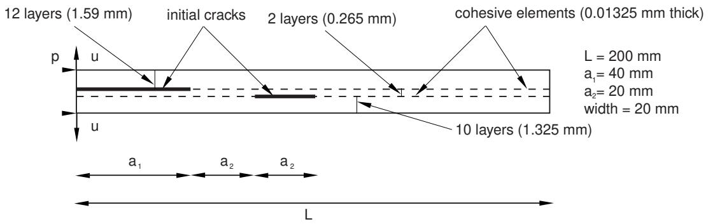  
Figure 1: Model geometry for the Alfano delamination problem.

## Defining tie constraints between the cohesive layer and the surrounding bulk material

If you want to model the cohesive layer using a mesh that is finer than the adjacent bulk material mesh, the cohesive layer should be generated as a separate mesh and tied to the bulk material using tie constraints (see Defining tie constraints). You should create a shell geometric model to represent the surface on one side of the cohesive layer and mesh that model with the desired mesh density. You can use this mesh to create a mesh part from which you can generate the offset mesh. For more information, see Modeling with Cohesive Elements.

You should use care when tying zero-thickness cohesive layers to the surrounding bulk material mesh. Use the following procedure to avoid problems:

1. Use the solid offset mesh tool to create the layer of cohesive elements along with the top and bottom surfaces. Abaqus/CAE appends TopSurf and BottomSurf to the surface name prefix when it creates the two surfaces on either side of the layer of cohesive elements.  
2. Use the stack orientation query tool to distinguish the top (brown) and bottom (purple) faces of the cohesive elements.  
3. Tie the surfaces of the surrounding bulk material mesh to the appropriate top and bottom cohesive surfaces. When you are prompted to select a surface from the cohesive surface, click Surfaces from the right side of the prompt line and select the appropriate surface. For example, select surface name-BottomSurf to tie the bottom (purple) face of the cohesive layer to the adjacent surface of the bulk material mesh.

## Assigning cohesive modeling data

In the Property module, you can complete the cohesive modeling data as follows:

1. Create a cohesive section to define the section properties of adhesive layers at the interface between two bonded parts. You can model a negligibly thin layer of adhesive, a finite-thickness adhesive layer, or a gasket by selecting the constitutive behavior of the cohesive section as Traction Separation, Continuum, or Gasket, respectively. For more information, see Creating cohesive sections.  
2. Define a material for the cohesive region. If you select the Continuum or the Gasket response in the cohesive section editor, you can use the material models available in the Property module to define the continuum material properties. Abaqus/CAE does not support the material models for the Traction Separation response. In this case you must add the material definition using the Keywords Editor, as described in Adding unsupported keywords to your Abaqus/CAE model.  
3. Assign the cohesive section to the cohesive region. For more information, see Assigning a section.

This section explains how to model tightening forces or length adjustments in bolts or fasteners.

## In this section:

Understanding bolt loads  
Creating and editing bolt loads

## Understanding bolt loads

Bolt loads model tightening forces or length adjustments in bolts or fasteners.

Figure 1 shows a container (A) that is sealed by tightening the bolts that hold the lid, which places the gasket under pressure.  
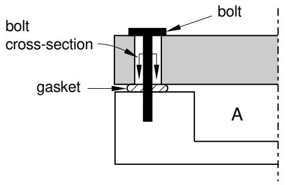  
Figure 1: Modeling a pre-tensioned bolt.

You can model the tension in the tightened bolts by applying a bolt load to each one in the first step of the analysis. You define the load in terms of either a concentrated force or a prescribed change in length, and you apply the load across a bolt cross-section surface that you specify. In later steps you can modify the load to prevent further length changes so that the bolt acts as a standard, deformable component responding to other loadings on the assembly.

When you create a bolt load, you must specify the following:

## A surface that defines the bolt cross-section

Abaqus/CAE applies the bolt load across the cross-section surface that you specify. The surface that defines the bolt cross-section must cut through the bolt geometry. Abaqus/CAE creates an “interior” surface at that location.

If you are working with bolt part instances made from native or imported geometry, Abaqus/CAE can create an interior surface by partitioning the bolt shank surface, or you can partition the bolt at the location where you want the cross-section to be defined. For example, a partition is selected as the bolt cross-section in Figure 2. For more information, see The Partition toolset.

  
Figure 2: Using a partition to specify the bolt cross-section.

If you are working with orphan mesh elements, you must specify the cross-section surface by selecting element faces. For example, element faces define a cross-section surface for the mesh part shown in Figure 3.

  
Figure 3: Using element faces to specify the bolt cross-section.

The element faces need to be selected from elements on only one side of the pre-tension section. You can use display groups to remove selected elements from the viewport to reveal the element faces of the cross-section surface. For more information on selecting surfaces, see Selecting objects within the viewport. For detailed information on selecting surfaces on wire part instances, see Specifying a particular side or end of a region.


## Note:

You can apply bolt loads only to three-dimensional solid, two-dimensional solid, and three-dimensional wire part instances. Bolt loads on two-dimensional and axisymmetric wire part instances are unsupported.

## A bolt axis

If you are defining a bolt load on a solid region, the surface normal of the surface that defines the bolt cross-section is used as the bolt axis by default. You can select a datum axis to indicate a different bolt axis direction (it need not be normal to the cross-section). If you are defining a bolt load on a wire region, the bolt axis direction is always assumed to be the direction of the tangent to the wire at the bolt cross-section.

Abaqus/CAE uses both the cross-section surface that you specify and the bolt axis to define the pre-tension section data and the pre-tension reference node used by Abaqus/Standard; see Prescribed Assembly Loads for more information. You can create the pre-tension section at the part level or the assembly level. To create the pre-tension section at the part level, the selected region must belong to a dependent part instance. If you create the pre-tension section at the part level, the bolt load is defined for all of the instances from the same part.

## A method for applying the loading

When you create a bolt load, you must choose one of the following loading methods:

• Apply a force to the bolt. This method models tightening the bolt so that it carries a specified load.  
• Adjust the bolt length. This method models tightening the bolt until its free length has changed by the specified value.  
• Fix the bolt at its current length. This method is available only if you have already created the load in the first analysis step and are now editing it in a subsequent analysis step. This method allows the bolt length to remain unchanged so that the force in the bolt can change according to the response of the model.

## A magnitude for the chosen method

If you are applying a force to the bolt, you must enter the force magnitude. If you are adjusting the bolt length, you must enter the length change.

You can create a bolt load only in the first analysis step, but you can modify the loading method or the magnitude of the load in subsequent steps. For example, you can apply a specific tension in the first step and then change the method in the second step to fix the bolt length.

You can obtain data from a bolt load using the field and history output request editors in the Step module. In the Domain section of the editor, select Bolt load and choose the desired bolt load from the menu that appears. For more information, see Creating an output request.

For detailed information on creating a bolt load, see Creating and editing bolt loads.

## Creating and editing bolt loads

You can create bolt loads to model tightening forces or length adjustments in bolts or fasteners.

1. From the main menu, select Load->Create.

Abaqus/CAE displays the Create Load dialog box.

2. In the Create Load dialog box, do the following:

a. From the Category list, select Mechanical.  
b. From the Types for Selected Step list, select Bolt Load, and click Continue.

3. Select the method to specify the surface that defines the bolt cross-section.

• Select Interior Surface to use a previously created interior surface.  
• Select Bolt Shank Surface to create an interior surface by partitioning the bolt shank surface.

4. If you selected the Interior Surface method, do the following:

a. Select the interior surface or wire segment that indicates the location of the bolt load.

If you are working with native or imported geometry, use the mouse to select the interior surface or wire segment in the viewport. You can use a combination of drag select, [Shift] + Click, [Ctrl] + Click, and the angle method to select more than one face or edge. For more information, see Selecting objects within the current viewport.


Tip: If you are unable to select the desired faces or edges, you can use the Selection toolbar to change the selection behavior. For more information, see Using the selection options.

• If you are using orphan mesh elements, you must select element faces to specify the interior surface. You can use display groups to remove selected elements from the viewport to reveal the element faces of the cross-section surface. For more information, see Using display groups to display subsets of your model.

When you have finished selecting, click mouse button 2.

b. Choose the side on which the surface is defined using the techniques described in Specifying a particular side or end of a region. The side you select determines which elements are adjusted to produce the desired tightening load or length adjustment (see Prescribed Assembly Loads for details).

Abaqus/CAE displays the bolt load editor.

5. If you selected the Bolt Shank Surface method, do the following:

a. Select the bolt shank face to partition. You can only select a cylindrical face.  
b. In the prompt area, enter the cut position value to define the partition location.  
c. Click Done.

Abaqus/CAE creates an interior surface by partitioning the selected face and displays the bolt load editor.

6. Click the arrow next to the Method field and select the loading method of your choice from the list that appears.  
7. In the Magnitude field, enter the force magnitude (for the Apply force method) or the change in length (for the Adjust length method).


## Note:

The Fix at current length method becomes available if you edit the load in a step that follows the step in which you create the load. If, while editing the load, you change the method to Fix at current length, the Magnitude field becomes unavailable.

8. If desired, specify an amplitude. (See The Amplitude toolset for more information.)  
9. By default, the surface normal of the surface that defines the bolt cross-section is used as the bolt axis. If desired, you can define a different bolt axis direction.

a. Select Specify.

b. Select a datum axis.

• To create a datum axis, click and select two points in the viewport that define the axis. If desired, select Make Independent from the prompt area to create the datum as an independent feature.  
• Click , and select a datum axis that is aligned with the bolt centerline.

10. The pre-tension section is written at the assembly level. Toggle on Pre-tension section at part level to write the pre-tension section at the part level (applicable only for dependent part instances). If you selected the Pre-tension section at part level option, the bolt load is defined for all of the instances from the same part.  
11. Click OK to create the load and to exit the editor.

Arrows appear in the viewport that represent the bolt load that you just created. For more information, see Understanding symbols that represent prescribed conditions.

## Additional information

• Creating and modifying prescribed conditions  
• Understanding symbols that represent prescribed conditions  
• Prescribed Assembly Loads

This section provides information on modeling composite layups with Abaqus/CAE.

## In this section:

An overview of composite layups  
Creating a composite layup  
Understanding composite layups and orientations  
Understanding composite layups and distributions  
Requesting output from a composite layup  
Viewing a composite layup

## An overview of composite layups

Figure 1 illustrates a single composite layup that contains three plies. Each ply is composed of a homogenous material of uniform thickness, with fibers oriented along a single orientation. However, a ply can also be an isotropic material, such as a foam core.

  
Figure 1: A composite layup.

A ply represents a single piece of material that is placed in a mold during the composites manufacturing process. A composite layup can contain a different number of plies in different regions. For example, the composite layup in Figure 1 includes regions that contain a single ply, regions where two plies overlap, and a region where three plies overlap.

Figure 2 shows the same model that is depicted in Figure 1 but defined using composite shell sections. The number of plies cannot change within a composite shell section. Therefore, four composite shell sections, each with a constant number of plies, are required to define this simple model. Section 1 contains a single ply, sections 2 and 3 each contain two plies, and section 4 contains three plies.

  
Figure 2: Composite shell sections.

Composite layups in Abaqus/CAE are designed to help you manage a large number of plies in a typical composite model. In contrast, composite sections are a product of finite element analysis and may be difficult to apply to a real-world application. Unless your model is relatively simple and all plies cover the same region, you will find it increasingly difficult to define your model using composite sections as you increase the number of plies. It can also be cumbersome to add new plies or remove or reposition existing plies.

The procedure for creating a composite layup with Abaqus/CAE mirrors the procedure for creating a real composite part—you start with a basic shape and then you add plies of different materials and thicknesses to selected regions and orient the plies to provide the greatest strength in a particular direction. The Abaqus/CAE composite layup editor allows you to easily add a ply, choose the region to which it is applied, specify its material properties, and define its orientation. You must specify ply names that are unique throughout the entire model to ensure the correct display of ply-based results. You can also read the definition of the plies in a layup from the data in a text file. This is convenient when the data are stored in a spreadsheet or were generated by a third-party tool. You can also suppress plies in your layup and experiment with the effect of adding and removing plies of different orientations.

It is important to specify the correct orientation of the fibers in a ply. Abaqus/CAE allows you to define a reference orientation for the layup as well as a reference orientation for each ply in the layup. In addition, you can specify the direction of the fibers in a ply relative to the reference orientation of the ply. By default, the coordinate system of a layup is the same as the coordinate system of the part; similarly, the coordinate system of a ply is the same as the coordinate system of the layup. Orientation definition is described in more detail in Understanding composite layups and orientations.

Using a composite layup to model a yacht hull, illustrates how you can analyze a complex three-dimensional model using the composite layup capability in Abaqus/CAE.

## Creating a composite layup

Abaqus/CAE allows you to define composite layups for three types of elements: conventional shells, continuum shells, and solids. For detailed instructions, see the following sections:

Creating conventional shell composite layups  
Creating continuum shell composite layups  
Creating solid composite layups

You create a composite layup in the Property module. The composite layup editor provides a table that you use to define the plies in the layup. For each ply you specify the ply's name, material, thickness, and orientation, as well as the number of integration points and the region of the model to which the ply is assigned. The composite layup editor's ply table is shown in Figure 1.

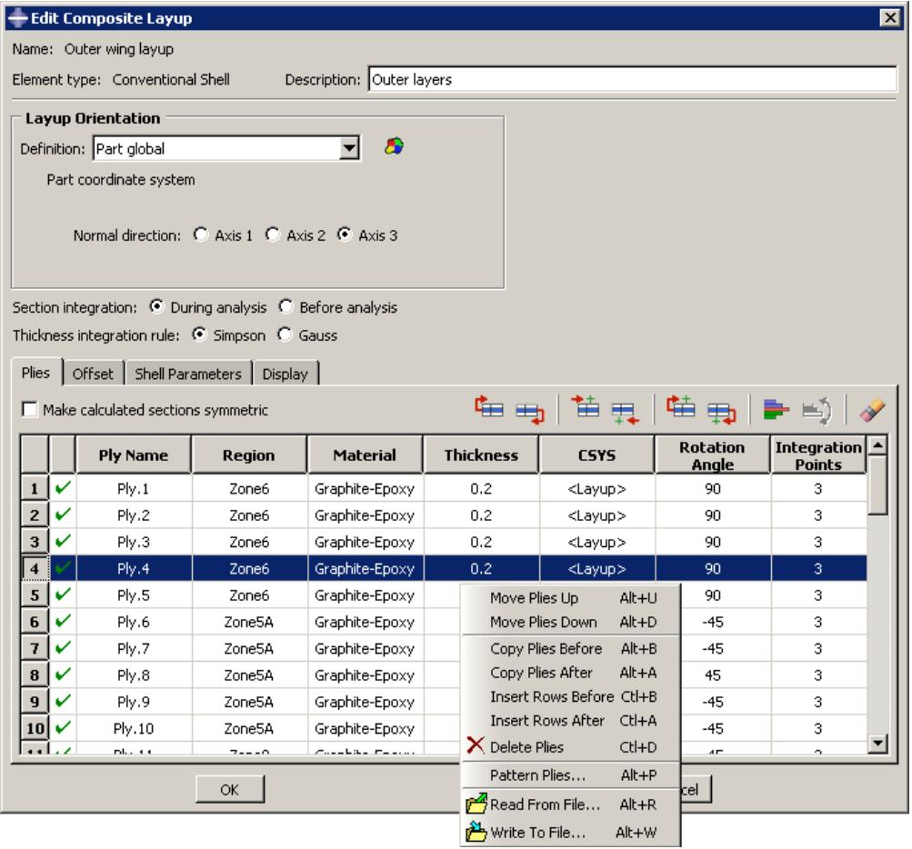  
Figure 1:The ply table in the composite layup editor.

The ply table provides several options that make it easier for you to define a layup containing many plies; for example, the ply table allows you to do the following:

• Move or copy selected plies up or down in the table.  
• Suppress or delete selected plies.  
• Pattern a group of selected plies.  
• Read ply data from or write ply data to an ASCII file. The data can define all the plies in the layup or only a subset of the plies in the layup.

The ability to suppress plies allows you to easily experiment with different configurations of plies in the composite layup and to see the effect on the results of an analysis of the model. For more information, see Using the ply table when defining a composite layup.

If you are defining a composite layup whose plies are symmetric about a central core, you only need to enter the bottom half of the layup in the ply table. When you apply the symmetry option, Abaqus automatically creates additional plies in the generated sections by repeating the entered plies (including the central ply) in reverse order.

You will probably have to partition your model to create the regions to which you will assign plies. You should create the partitions before you create the layup and start defining plies. You can select a region directly from the part in the current viewport, or you can create a named set that refers to the region and select the named set. Abaqus/CAE preserves any existing ply regions if you decide to add partitions and plies after you have defined a composite layup; for example, you can add plies to a layup that model a rib providing additional stiffness to a region. The region to which you assign a ply can be either Abaqus/CAE geometry or a mesh. You can combine plies assigned to geometry and plies assigned to a native mesh in a single composite layup.

Continuum shell and solid composite layups are expected to have a single element through the entire thickness across a combination of all the regions specified in the composite layup. Each single element through the thickness contains the multiple plies that you defined in the ply table. If the region to which you assign your continuum shell or solid composite layup contains multiple elements through the thickness, each element will contain all of the plies that you defined in the ply table and the analysis results will not be as expected.

If your model contains multiple continuum shell or solid elements through the thickness of a region, you can obtain correct results by defining a separate composite layup for each layer of elements. You can define a composite layup for each layer by selecting the elements of a native Abaqus/CAE mesh or the orphan elements when you specify the region of the layup. You must create a layup for each layer of elements.

If you have plies that overlap in your composite layup, you must enter the plies in the ply table in the order that they appear in the overlapping region. Figure 2 illustrates a simple example of an overlapping region and the corresponding order of the plies in the ply table. The first ply in the ply table represents the bottom ply in the layup.

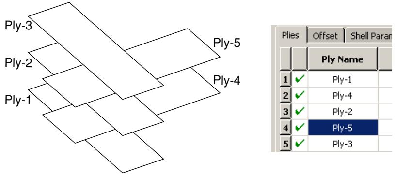  
Figure 2: The order of the plies in the ply table.

Under certain circumstances, Abaqus cannot determine the orientations of the composite ply for conventional shells. This can occur, for example, if your ply makes a sharp transition through an angle of 90°, and/or your part is aligned with one or more planes of the global coordinate system. To help you diagnose the problem region, Abaqus/CAE draws a collapsed coordinate system indicating regions for which the user-selected coordinate system and the geometric normal cannot be resolved into a valid orientation for display purposes. If this situation arises, you may be able to complete the analysis by splitting the ply into multiple plies at the transitions and by assigning orientations to each new ply.

If you apply a composite layup and assign a section assignment to the same region, Abaqus/CAE uses only the properties from the composite layup during the analysis. If you apply two or more composite layups to regions that overlap, Abaqus/CAE uses the properties of the last layup, where “last” refers to the alphabetical order of the names of the composite layups. The default color coding in the Property module uses yellow coloring to indicate a region with

overlapping composite layups and section assignments or to indicate a region with multiple overlapping composite layups.

## Understanding composite layups and orientations

The orientation of the fibers within each ply of a composite layup plays an important role in determining the physical qualities of your model; however, defining this orientation in a model based on a real-world application is not straightforward.

Composite layups in Abaqus/CAE make the process more manageable by deriving the orientation of the fibers from three parameters that are relative to each other—the layup orientation, the ply orientation, and an additional rotation—as shown in Figure 1.

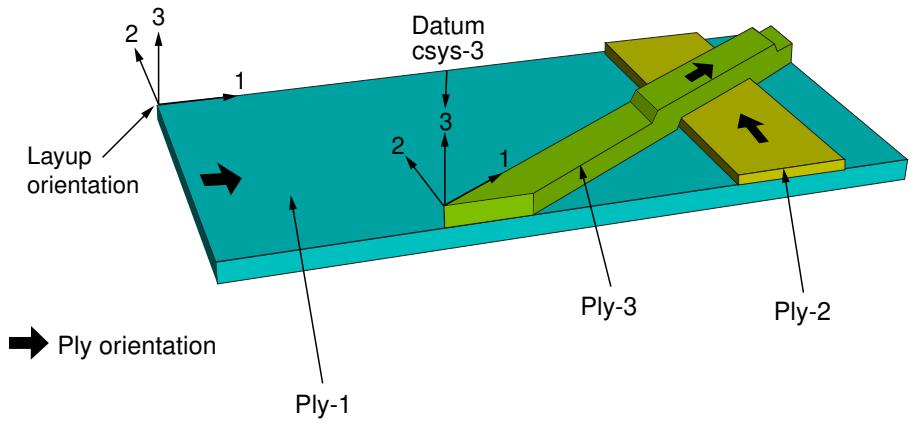

<table><tr><td></td><td></td><td>Ply Name</td><td></td></tr><tr><td>1</td><td>✓</td><td>Ply-1</td><td></td></tr><tr><td>2</td><td>✓</td><td>Ply-2</td><td></td></tr><tr><td>3</td><td>✓</td><td>Ply-3</td><td></td></tr></table>

<table><tr><td></td><td>CSYS</td><td>Rotation Angle</td><td>Integra Point</td></tr><tr><td></td><td></td><td>0</td><td>3</td></tr><tr><td></td><td></td><td>90</td><td>3</td></tr><tr><td></td><td>Datum csys-3.3</td><td>0</td><td>3</td></tr></table>

Figure 1: Determining the ply orientation.

## Layup orientation

The layup orientation defines the base or reference orientation of all the plies in the layup. In conventional and continuum shell layups, Abaqus projects the specified orientation onto the surface of the shell, aligning the direction of the layup orientation that you choose with the shell normal. In solid composite layups the orientation is not projected.

Abaqus/CAE provides several options for defining the layup orientation:

• Part global: By default, the layup orientation is the same as the orientation of the part.  
• Coordinate system: You can create and select a datum coordinate system that defines the orientation.  
• Discrete orientation: You can create a discrete orientation that provides an orientation value for each mesh element to define the orientation.  
• Discrete field: You can create and select an orientation discrete field that defines a spatially varying orientation.  
• User-defined: You can define the orientation in user subroutine ORIENT. This option is valid only for Abaqus/Standard analyses.  
• Normal direction: For all options except User-defined, you can choose which axis defines the approximate normal direction of the composite layup.

Additional rotation: If you choose a Coordinate system, Discrete orientation, or Discrete field to define the layup orientation, you can specify an angle (in degrees) that defines an additional rotation about the specified normal direction for the entire layup. You can use a scalar discrete field to specify a spatially varying additional rotation angle.

## Ply orientation

The ply orientation defines the relative orientation of each ply. In conventional and continuum shell layups Abaqus projects the specified ply orientation onto the surface of the shell so that the ply normal direction is aligned with the shell normal and the layup stacking direction. In solid composite layups the plies are created with respect to the layup stacking direction, and the unprojected ply orientation defines the material orientation within a ply (see Figure 2).

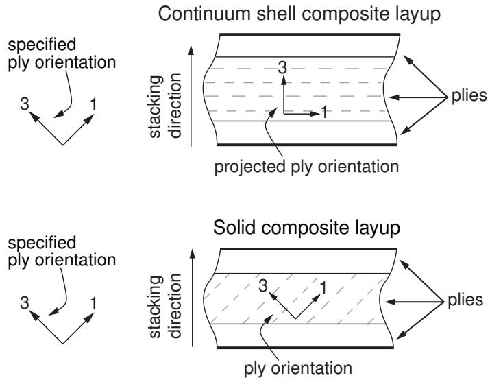  
Figure 2: Plies and ply orientations for shell and solid composite layups.

Abaqus/CAE calculates the ply orientation from a combination of two variables that you can specify—the coordinate system (CSYS) and a rotation angle about the normal direction.

In cases where Abaqus/CAE attempts to draw coordinate systems for ply orientations in composite layups at singularity points of the system (i.e., points for which the user-selected coordinate system and the geometric normal from either geometry or elements cannot be resolved into a valid orientation for display purposes in Abaqus/CAE), the coordinate system will be drawn collapsed.

If the layup orientation is specified using a discrete field, no display is available for either the layup or ply orientation. For continuum shell elements, Abaqus/CAE does not project the displayed orientations onto the midplane surface. In both of these cases, you can perform a data check and view the output database in the Visualization module to verify the orientations. For more information, see Performing a data check on a model.

## Coordinate system

Abaqus/CAE provides the following options for defining the coordinate system of the ply:

• Layup: By default, the coordinate system of the ply is the same as the coordinate system of the layup.  
CSYS: You can create and select a datum coordinate system that defines the coordinate system of the ply. If you choose to use a coordinate system for a ply, it overrides the layup orientation for that ply.

You can also select the axis of the coordinate system that defines the normal direction of the ply. The axis that you choose appears as the last digit in the CSYS column in the layup table. For example,

Datum csys1.3 indicates that you chose Datum csys-1 to define the coordinate system of the ply, and you chose the 3-axis to define the normal.

## Rotation angle

The rotation angle defines the orientation of the fibers within each ply relative to the ply's coordinate system. For example, in a typical composite the fibers might be oriented at −45° or +90° relative to the coordinate system. You can also use a scalar discrete field to specify a fiber orientation that varies spatially across the ply. If you specify a rotation angle, the ply is rotated counterclockwise about the coordinate system normal, and the angle is measured relative to the 1-axis.

Figure 3 shows the orientation of four plies in a composite layup and the corresponding entries in the layup table.  


  
Figure 3: Determining the orientation of each ply.

Abaqus/CAE determines the ply orientation as follows:

You selected the layup orientation to define the coordinate system of VerticalTape-1 and entered a rotation angle of $0 ^ { \circ }$ . The resulting ply orientation is along the 1-axis of the layup orientation.  
• You selected the layup orientation to define the coordinate system of VerticalTape-2 and entered a rotation angle of $9 0 ^ { \circ }$ . The resulting ply orientation is a rotation of $9 0 ^ { \circ }$ counterclockwise about the 3-axis (the normal direction) of the layup orientation. The rotation angle is measured relative to the 1-axis.  
• You selected Datum csys-1 to define the coordinate system of DiagonalTape-1 and entered a rotation angle of $0 ^ { \circ } .$ . The resulting ply orientation is along the 1-axis of Datum csys-1.  
You selected Datum csys-1 to define the coordinate system of DiagonalTape-2 and entered a rotation angle of $9 0 ^ { \circ }$ . The resulting ply orientation is a rotation of 90° counterclockwise about the 3-axis (the normal direction) of the datum coordinate system. The angle is measured relative to the 1-axis.

## Understanding composite layups and distributions

A discrete field that is used by a composite layup is called a distribution. Because distributions are applied to specific elements and nodes, you can use a distribution only after you have meshed the part.

A discrete field is a spatially varying field where values are associated with a node or an element. The Discrete Field toolset allows you to create and manage discrete fields in Abaqus/CAE. In most cases you will use a third-party preprocessor that operates on meshed parts to create a distribution that can be applied to a composite layup. For more information, see The Discrete Field toolset.

You can use a distribution for the following:

• To define a spatially varying local coordinate system that specifies the overall orientation of the composite layup.  
• To define an additional rotation for the layup orientation that is varying spatially across the layup.  
• To define an additional rotation for a ply orientation that is varying spatially across the ply. You can use a distribution to define the ply orientation only in an Abaqus/Standard analysis.  
• To define an overall shell thickness that varies spatially across a conventional shell composite layup.  
• To define a ply thickness that varies spatially across a ply in a conventional shell composite layup. You can use a distribution to define the ply thickness only in an Abaqus/Standard analysis.  
• To define a nodal thickness that varies spatially across a conventional shell composite layup.  
• To define an offset that varies spatially across a conventional shell composite layup. You can use a distribution to define the offset only in an Abaqus/Standard analysis.

## Requesting output from a composite layup

When you create a composite layup that will be integrated during the analysis, you can specify the number of integration points in each ply of the layup. By default, for shell sections integrated during the analysis Abaqus/CAE creates three integration points for each ply of a shell or continuum shell composite layup and one integration point for each ply of a solid composite layup. For pre-integrated shell sections, Abaqus/CAE creates three integration points for each ply in the layup, and you cannot change this value. Figure 1 shows the integration point numbering for a composite layup with three plies and three integration points per ply.

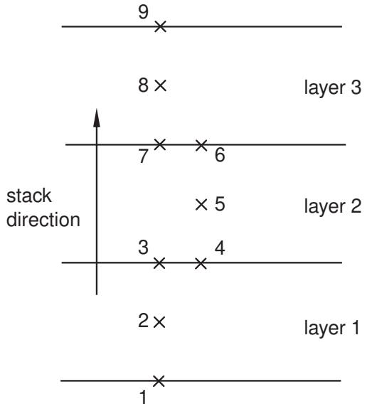  
(3 section points per layer)  
Figure 1:The integration point numbering for a composite layup with three plies.

If you do not create an output request, Abaqus writes field output data from only the top and bottom of a composite layup (the highest and lowest integration points), and no data are generated from the other plies. Therefore, if your model contains a composite layup and you want data from individual plies or interior integration points, you must create a new output request or edit the default output request and specify the composite layup from which variables will be output.

When you create an output request, Abaqus/CAE by default writes field and history data to the output database from only the middle section point in each ply of a composite layup. To change the default behavior, you can use the field and history output request editors to edit the output request and change the domain to a composite layup. You can then request field or history data from the top, middle, and/or bottom section point of each ply, from all section points, or from specified section points. For more information, see Modifying field output requests, and Modifying history output requests. You can request the following:

## Selected

Abaqus/CAE writes field data to the output database from the selected section points of each ply (top, middle, and/or bottom). If a ply has an even number of section points and you request output from the middle section point, Abaqus/CAE generates data from the higher of the two section points that span the middle of the ply. For example, if a ply has four section points and you request output from the middle section point, Abaqus/CAE generates data from the third section point.

## All

Abaqus/CAE writes field data to the output database from all of the section points of all of the plies.

## Specify

Abaqus/CAE writes field data to the output database from specified section points. Section points are numbered sequentially from the bottom of the bottom ply to the top of the top ply, where the bottom ply is the first ply in the layup. For example, if you want output from the middle section point of each ply shown in Figure 1, you would enter 2,5,8.

For more information, see Understanding output requests.

## Viewing a composite layup

You can view a composite layup while you are creating it or after it has been analyzed. Abaqus/CAE provides the following tools for ply-based visualization of a composite layup:

## Ply stack plot

A ply stack plot is a graphical representation of the plies from the selected region of a composite layup or a composite section. Figure 1 illustrates a ply stack plot.

  
Figure 1: A ply stack plot.

The staircase appearance does not indicate ply drop-offs in the layup; it is simply a graphical representation that allows you to see the number of plies in the layup and, for example, the relative thickness of a ply, the material from which it is constructed, and the orientation of its fibers. If your composite layup contains many plies, the ply stack plot can become confusing and hard to interpret. To make the ply stack plot more readable, Abaqus/CAE provides options that allow you to view only a manageable number of plies.

The triad in a ply stack plot represents the element orientation system, and it shows the shell normal or stacking direction (the 3-direction) and the 1- and 2-directions for the plies. The fibers are always drawn in the 1–2 plane at an angle with respect to the 1-direction. In solid composite layups the fibers in a ply do not always run parallel to the 1–2 plane (e.g., if the 3-direction of the ply orientation and the element stacking direction are not aligned). In this situation the fibers in the ply stack plot are not a true depiction of the fibers in the layup, but rather a graphical representation of the rotation angles in the layup definition: the angle drawn in the ply stack plot is the rotation angle specified in the ply table measured about the element stacking direction axis. For more information, see Understanding composite layups and orientations.

Ply stack plots do not draw fibers for ply orientations that are based on a user-defined coordinate system or a rotation angle distribution. Abaqus/CAE displays an asterisk (for coordinate systems) or a caret (for rotation angle distributions) on such plies to signify that it cannot draw lines in the 1–2 plane that accurately represent the fiber direction for the ply. Similarly, if you use a discrete field distribution to define a ply's thickness, Abaqus/CAE draws the ply in the ply stack plot based on the average thickness of the other uniform plies in the layup and displays the discrete field name next to the plot (if thickness labels are turned on).

You can display a ply stack plot in the Property module after you have created a composite layup. You can also display a ply stack plot in the Visualization module after you have analyzed a model with a composite layup. For more information, see Viewing a ply stack plot.

## Ply-based results

After you have analyzed a model with a composite layup, you can view a contour plot of results from individual plies of the layup, or you can view an envelope contour plot that looks for maximum or minimum values across all of the plies in the layup.

## Results from individual plies

Ply-based results show the data from a selected ply in a composite layup. For a given ply, you can view data from the bottom, middle, or top of the ply, or you can view data from both the top and bottom plies.

Figure 2 illustrates a contour plot of strain (E11) from selected plies of a composite layup.

E11:  


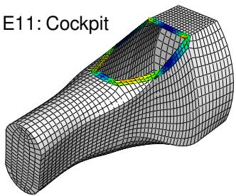

E11: Top an  


E11:  
  
Figure 2: Contour plots from selected plies.

If the same ply name is used in multiple composite layup definitions within a model, viewing data for this ply displays results for all layups in which the ply name appears. To limit the results to a single ply within a single layup, you must first use a display group to limit the display to the individual composite layup (see Selection methods for creating or editing a display group), then plot the results for a section point within the desired ply (see Selecting section point data by ply).

Contour plots displaying output at both the top and bottom plies of a composite layup vary in appearance depending on the type of layup. In a conventional shell composite layup the two contours appear as a single double-sided shell with different contours on each side. In a continuum shell composite layup or solid composite layup the two contours appear as distinct single-sided contours at each section point location. Figure 3 illustrates the difference between contour plots of conventional shell and continuum shell composite layups.

  
Figure 3: Contour plots of conventional shell and continuum shell composite layups.

Each layup contains three plies, and each plot is showing the output from the top of the top ply and from the bottom of the bottom ply. Stress (S11) is plotted in both cases. For more information, see Selecting section point data by category.

## Envelope plots

An envelope plot allows you to view a contour plot of the highest or lowest value of a variable in your model, regardless of the ply in which it is occurring. The plies in an envelope plot that correspond with the extreme values are called the critical plies. You can choose the criterion that Abaqus/CAE applies (absolute maximum, maximum, or minimum) and the position in the ply at which Abaqus/CAE checks the value (integration point, centroid, element nodal).

For example, even though your composite layup can include a large number of plies, you can view only the critical plies and determine the highest strain that is occurring in each element of your model. You can decide if you want to reduce the strain in the critical plies by increasing the number of plies in a particular region or by reorienting existing plies. Figure 4 shows the value of the strain (E11) in the critical plies of the model.

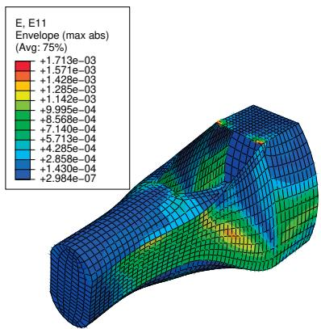  
Figure 4: The value of the strain in the critical plies.

In addition, you can use the contour plot options to display a quilt contour plot where the color of each element indicates which ply is the critical ply, as shown in Figure 5.

E, E11 Ply Envelope (max abs)


  
Figure 5: The critical plies.

Using a combination of the plots shown in Figure 4 and Figure 5, you can determine both the value of the strain in the critical ply and the location of the critical ply in the layup. For more information, see Selecting the field output to display, and Understanding how contour values are computed.

If you do not create an output request, Abaqus/CAE writes field output data from only the top and bottom of a composite layup, and no data are generated from the other plies. To create an envelope plot that examines all of the plies in your model, you must create a new output request or edit the default output request and specify the composite layup and the plies and section points from which variables will be output.

In many cases, even though you change the position in the ply at which Abaqus/CAE checks the value, the same ply experiences the extreme value, and the contour plot does not change. However, the contour plot might change because the critical ply changed if:

• you have a small number of plies, and the results are changing rapidly through the thickness of the ply; or  
• the material is nonlinear, and its stiffness changes abruptly under some conditions.

## Through thickness X–Y plots

After you have analyzed a composite layup and determined which regions contain the critical plies, you can view the behavior of the plies across the layup with a through thickness X–Y plot. You can create an X–Y data object by reading field output results from the section points in a selected element of a shell region of your model. If you select an element in a composite layup, Abaqus/CAE plots data for each section point in each ply across the entire thickness of the layup. Figure 6 illustrates a through thickness plot of the strain in the fiber direction through 13 plies of a composite layup. The strain is discontinuous because the orientation of the fiber changes between plies.

  
Figure 6: A through thickness X–Y plot.

For more information, see Reading X–Y data through the thickness of a shell.

## Color coding

You can use color coding in all of the Abaqus/CAE modules to change the color of individual layups and plies. If you choose to color code by plies, Abaqus/CAE displays only one ply in a region, which by default is the last ply (in alphabetical order). To view a different ply, you can deactivate selected plies. For more information, see Coloring geometry and mesh elements.

## Display groups

In the Visualization module you can use display groups to view the elements in only selected layups or plies. For more information, see Selection methods for creating or editing a display group.

Using a composite layup to model a yacht hull, illustrates how you can create and analyze a complex three-dimensional composite model and how you can use Abaqus/CAE to view the behavior of individual plies in the layup.

## Connectors

This section provides information on how to model connectors.

## In this section:

Modeling connectors  
What is a connector?  
What is a connector section?  
What is a CORM?  
What are connector behaviors?  
Creating the connector geometry, connector sections, and connector section assignments  
What is the relationship between reference points and connectors?  
Defining connector orientations in connector section assignments  
Requesting output from connectors  
Applying connector loads and connector boundary conditions  
Displaying connectors and connector output in the Visualization module

## Modeling connectors

The procedure for modeling and using connectors in Abaqus/CAE involves the following general steps:

1. Create reference points and datum coordinate systems to use when modeling connectors.  
2. Create assembly-level wire features.  
3. Create connector sections to define the connection types, connector behavior, and section data.  
4. Create a connector section assignment that associates the connector section with the wires that you select and that specifies the orientations for the first and second points of the wires that you select.  
5. In the Load module, prescribe connector loads and connector boundary conditions to simulate connector actuations and constrain material flow.  
6. In the Step module, create field and history output requests for connectors.  
7. In the Visualization module, plot connector output results; control the display of connector section assignments, wire endpoints, connection types, and current local orientations; and animate the time history of wire endpoints and local orientations.

## What is a connector?

Connectors allow you to model mechanical relationships between two points in an assembly. The connection can be simple, such as a link, or the connection can impose more complicated constraints, such as constant velocity joints. The connector geometry is modeled using an assembly-level wire feature that contains one or more wires. The wires may connect two points in an assembly or connect a point to ground. You create a connector section that specifies the type of connection and connector behaviors, such as spring-like elasticity behavior. To complete the connector modeling, you create a connector section assignment that associates a connector section with the wires that you select and that specifies the orientations for the first and second points of the wires that you select. For more information on connectors, see About Connectors.

For example, Figure 1 illustrates the crank mechanism that is used in the example problem Crank mechanism.

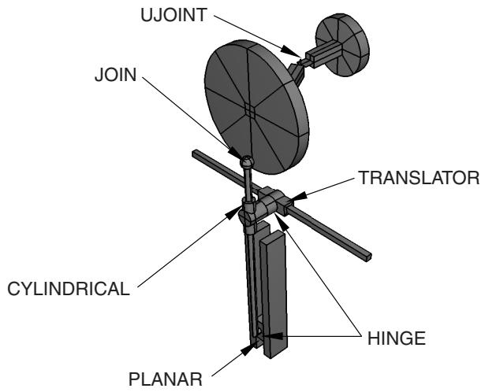  
Figure 1: A crank mechanism modeled with connectors.

The model transmits a rotational motion through two universal joints and then converts the rotation into translational motion of two slides. An Abaqus Scripting Interface script that reproduces the crank mechanism model using Abaqus/CAE is provided with this example. The crank mechanism is modeled using nine part instances attached to each other through eight connectors modeled in Abaqus/CAE.

## What is a connector section?

A connector section defines the connection type and may include connector behavior and section data. Abaqus provides several connection types—basic types, assembled types, complex types, and MPC types.

## Basic types

Basic connection types include translational types and rotational types. Translational types affect translational degrees of freedom at both endpoints of the wires to which the connector section is assigned and may affect rotational degrees of freedom at the first or both endpoints of the wires. Rotational types affect only rotational degrees of freedom at both endpoints of the wires.

## Assembled types

Assembled connection types are predefined combinations of basic connection types. For example, a HINGE connection type combines a JOIN connection type (translational) and a REVOLUTE connection type (rotational) to join the position of two points and provide a revolute constraint between their rotational degrees of freedom.

## Complex types

Complex connection types affect a combination of degrees of freedom in the connection and cannot be combined with other connection types. They typically model highly coupled physical connections.

## MPC types

MPC connection types are used to define multi-point constraints between two points.


## Note:

Abaqus/CAE writes complete connector section data to the input file only when a connector section has a connector section assignment in the model database. If you plan to import a model from an input file and obtain connector sections, you must make sure that all of the connector sections have assignments in the model database.

For an overview of the connection types that are available in Abaqus/CAE, see Understanding connector sections and functions. For a description of each connection type and the equivalent basic connection types that define the kinematic constraints of assembled type connections, see Connection Types and General Multi-Point Constraints.

## What is a CORM?

CORM is an abbreviation for component of relative motion: relative displacements and rotations local to a connector. Available components of relative motion are relative displacements and rotations that are not kinematically constrained. Depending upon the connection type, some of the components may be available and some may be constrained. When you are creating or modifying a connector section, Abaqus/CAE displays the available and constrained components of relative motion in the editor for the specified connection type. In addition to applying behaviors to the components of relative motion, you can prescribe connector loads and connector boundary conditions to the available components of relative motion of a connector (see Applying connector loads and connector boundary conditions). For more information on creating connector sections, see Connector section editors.

## What are connector behaviors?

After you specify a connection type for a connector section, you can define behaviors for the components of relative motion. You can specify the following connector behaviors:

• Elasticity  
• Damping  
Friction  
• Plasticity  
• Damage  
Stop  
• Lock  
Failure

• Reference length

• Integration (Abaqus/Explicit analyses only)

For more information on behaviors, see Connector behaviors, and Connector Behavior.

## Creating the connector geometry, connector sections, and connector section assignments

You create the assembly-level wire features, connector sections, and connector section assignments in the Interaction module to model a connector. Abaqus/CAE provides two methods for modeling connectors: you can use the Connector Builder to perform all the steps involved in creating a single connector, including creation of the wire feature, connector section, connector section assignment, and any desired reference points and datum coordinate systems; or you can create multiple connectors by creating the wires, connector sections, and connector section assignments in separate dialog boxes in the Interaction module. If you choose the latter technique, you should create the desired reference points and datum coordinate systems before you begin modeling the connectors.

The Model Tree, shown in Figure 1, is helpful for understanding the organization of the reference points, datum coordinate systems, and wire features that you created in assembly-related modules, as well as connector sections and connector section assignments that you created in the Interaction module. You can use the Query toolset in the Interaction module to obtain connector assignment information for selected wires.

  
Figure 1: Wire features, connector sections, and connector section assignments in the Model Tree.

For detailed instructions, see the following sections:

Selecting a process for defining connector geometry  
Creating a single connector  
Creating or modifying wire features for multiple connectors  
Creating connector sections  
Creating and modifying connector section assignments

Using the Query toolset to obtain connector assignment information

## What is the relationship between reference points and connectors?

The points that you can use to define an assembly-level wire feature can be one of the following:

• Vertex or node of a part instance  
• Reference point of a part instance or of an assembly  
• Ground

Using a reference point is often more convenient than using a point or node on the assembly because the same reference point can be used by a rigid body or coupling constraint. In the Part module you can use the Reference Point toolset to create one reference point on each part; additional reference points can be created in the Assembly module, Interaction module, and Load module.

You can use the Model Tree to rename reference points with more descriptive feature names. Descriptive names allow you to more easily associate reference points and wires in a complex model, as shown in Figure 1.

  
Figure 1:The Model Tree for the crank mechanism.

If you want to use different feature names and labels for a reference point on multiple instances of the same part, you must create the reference points in an assembly-related module. You can create a node on a mesh using the Edit Mesh toolset and then select the node to define an endpoint of an assembly-level wire; however, the node is not listed in the Model Tree and has no label in the viewport. For more information on creating and renaming reference points, see The Reference Point toolset. For more information on creating a node on a mesh, see Manipulating nodes.

Each reference point or node that defines an endpoint of an assembly-level wire needs to be associated with the model geometry, even if they are created in the Part module. In many cases you will create a rigid body constraint or a coupling constraint (to distribute forces to an area instead of to a single point) between the reference point or node and a part instance. As a result, the motion of the wire endpoint will be constrained to the motion of the part instance. You create constraints in the Interaction module. For more information, see Understanding constraints.

## Defining connector orientations in connector section assignments

When you model a connector, you may need to specify the orientation of the connector. Orientations for a connector may be required, optional, or not applicable, depending upon the connection type. In most cases the orientation will not be the same as the global coordinate system, and you must create a datum coordinate system that defines the connector's local orientation before you create a connector section assignment. Connector orientation requirements are described in Connection Types.

You can create datum coordinate systems in the Part module, Property module, Assembly module, Interaction module, Load module, and Mesh module. You can name a datum coordinate system when you create it. When you create a connector section assignment, you can select a datum coordinate system from the current viewport or you can select from a list of coordinate system names in a dialog box. Again, the Model Tree is helpful for understanding the organization of your datum coordinate systems. Datum coordinate systems are described in Methods for creating a datum coordinate system.

## Requesting output from connectors

You can request field and history output for connectors by selecting a set that contains wires as the domain from which the output will be generated. In the Step module choose Sets as the domain type in the field output request editor or history output request editor; then select a set containing wires from the list of sets available. For more information, see Creating and modifying output requests.

## Applying connector loads and connector boundary conditions

In the Load module you can apply a connector force or connector moment to the available components of relative motion of a connector to simulate connector actuation. Similarly, you can prescribe a connector displacement, connector velocity, or connector acceleration for the available components of relative motion of a connector. When you create these connector loads or boundary conditions, you select the wires to which you want to apply the prescribed condition. The best approach for selecting wires is to use the default geometry set name for the wire feature (see Creating or modifying wire features for multiple connectors, for more information). The wires that you select must be associated with a connector section assignment. If you select multiple wires, you must ensure that the connector sections assigned to the wires in the connector section assignments have the available components of relative motion for which you want to define forces or moments. If there are insufficient available components of relative motion for the connector force or connector moment, a message appears asking you to select different wires or to change the connection type.

You can also apply a connector material flow boundary condition to the endpoints of wires that are associated with connector section assignments. For more information, see Creating loads, and Creating boundary conditions.

## Displaying connectors and connector output in the Visualization module

Abaqus/CAE displays connectors modeled using connector section assignments in the Visualization module. You can control the display of connectors using display groups. Each connector is listed as an element set in the output database. For more information on display groups, see Creating or editing a display group.

You can also use the Entity Display options in the ODB Display Options dialog box to control the display of symbols that represent connectors. You can control the following:

• The highlighting of wire endpoints  
• The display of local orientation axes for connectors  
• The display of connector type labels  
• The size of the displayed symbols

For information on the symbols that represent connectors modeled in Abaqus/CAE, see Understanding symbols that represent interactions, constraints, and connectors. For more information on controlling the display of the symbols, see Controlling the display of model entities.

For example, you can use display groups to display four part instances and three connector element sets of the crank mechanism, as shown in Figure 1.

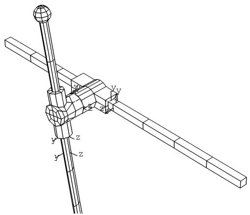  
Figure 1: Selected part instance, connector, and connector symbol display in the Visualization module for the crank mechanism.

The highlighting of the wire endpoints and the display of connector type labels have been toggled off so that only the local connector orientations are displayed. You can produce a time history animation to view the changes in the connector orientations during the mechanism operation. For more information, see Time history animation.

For information on plotting connector output results, see Contouring analysis results, Plotting analysis results as symbols, and X–Y plotting.

The kinematics of connection types is formulated using an intrinsic coordinate system. The basis vectors of the intrinsic coordinate system are aligned with the directions associated with the components of relative motion. For some connection types (such as the CARTESIAN connection type), the intrinsic coordinate system aligns with the orientation directions at node a (see Connection Types for more information on connector orientation directions).

The components of connector vector output are resolved with respect to different coordinate systems depending on whether the output requested is field output or history output. For connector field output, the components of the vector are resolved with respect to the orientation directions at node a. However, if either of the two nodes is ground, the output of the axial connector is CTF1. For connector history output and connector field outputs with the "\_LOCAL" suffix (for example, CTF\_LOCAL, CTM\_LOCAL), the components of the vector are resolved with respect to the intrinsic coordinate system. Therefore, except for the connection types whose intrinsic coordinate systems align with the orientation directions at node a, plots of field output (symbol plots and contour plots) and history plots display different values for the requested connector vector components; the resultant is not affected by the choice of the coordinate system used to resolve the components.

## Additional information

• Connectors  
• Understanding contour plotting  
• Understanding symbol plotting

This section provides information on how to model continuum shells.

## In this section:

Modeling continuum shells  
Meshing parts with continuum shell elements

## Modeling continuum shells

You use conventional shell parts to model structures in which the thickness is significantly smaller than the other dimensions, and you define the thickness in the Property module when you create the section.

In contrast, you assign continuum shell elements to solid parts, and Abaqus determines the thickness from the geometry of the part. From a modeling point of view continuum shell elements look like three-dimensional continuum solids, but their kinematic and constitutive behavior is similar to conventional shell elements. For example, conventional shell elements have displacement and rotational degrees of freedom, while continuum solid elements and continuum shell elements have only displacement degrees of freedom. For more information, see About Shell Elements and Choosing a Shell Element. Figure 1 illustrates the differences between a conventional shell and a continuum shell element.

  
Figure 1: Conventional versus continuum shell element.

The general procedure for modeling continuum shells in three-dimensional space involves the following steps:

1. In the Part module, define the solid geometry.  
2. In the Property module, assign a shell section to any solid regions to which you will assign continuum shell elements in the Mesh module. You must specify the thickness of a shell section; however, Abaqus uses this thickness only to estimate certain section properties, such as hourglass stiffness. Abaqus uses the actual thickness, based on the element nodal geometry, during the analysis. If the thickness of the solid region varies along its length, you should provide an approximate value of the thickness. For more information, see Using a Shell Section Integrated during the Analysis to Define the Section Behavior.  
3. In the Mesh module, query the mesh stack orientation. If necessary, assign a stack orientation so that the continuum elements are aligned consistently from the bottom to the top of the stack. See Applying a mesh stack orientation, for more information.  
4. In the Mesh module, assign a continuum shell element type to the region, and mesh the region with hexahedral or wedge elements. These are the only elements that can be stacked to form a continuum shell mesh.

## Meshing parts with continuum shell elements

You use continuum shell elements to model shell-like solids with greater accuracy than conventional shell elements, as described in About Shell Elements. In addition, although you model a continuum shell with hexahedral- or wedge-shaped elements, the element formulations are still more computationally efficient than solid continuum elements.

When you are generating elements that will be assigned to continuum shell elements, the elements in the mesh must be oriented consistently. For example, Figure 1 shows a swept mesh generated in the direction of the sweep path. The generated elements are stacked in the direction of the sweep path; however, if you plan to use continuum shell elements, the elements should be stacked through their thickness.

  
Figure 1:The resulting stack direction is not correct for continuum shell elements.

You can use the Query toolset to determine which faces are designated as the bottom face and the top face and to look for inconsistent orientations between elements. For more information, see Obtaining general information about the model. In some cases, you can partition the model and change the direction of the sweep path to obtain the correct orientation. Alternatively, you can assign an orientation unrelated to the sweep path. For more information, see Applying a mesh stack orientation.

## Co-simulation

This section explains how to model and run a co-simulation in Abaqus/CAE.

## In this section:

Overview of co-simulation  
What is a co-simulation?  
Linking and excluding part instances for a co-simulation  
Ensuring matching nodes at the interface regions  
Specifying the interface region and coupling schemes  
Identifying the models involved and specifying job parameters  
Viewing the results of the co-simulation

## Overview of co-simulation

The procedure for modeling and running a co-simulation in Abaqus/CAE involves the following general steps:

1. Create the models in a single model database.  
2. Optionally, link part instances between models and exclude the linked instances from the analyses.  
3. Optionally, ensure matching nodes at the interface regions.  
4. In each model, create a co-simulation interaction to specify the interface region and coupling schemes.  
5. Create a co-execution to identify the two models involved and specify the job parameters for each analysis.  
6. Submit the co-execution to perform the co-simulation.  
7. View the results of the co-simulation using overlay plots.

## What is a co-simulation?

The co-simulation technique is a multiphysics capability that provides run-time coupling of Abaqus analysis programs. You can divide a model into multiple domains and use different analysis programs to obtain solutions for each domain. For Abaqus/Standard to Abaqus/Explicit co-simulation, each Abaqus analysis operates on a complementary section of the model domain where it is expected to provide the more computationally efficient solution. For example, Abaqus/Standard provides a more efficient solution for light and stiff components, while Abaqus/Explicit is more efficient for solving complex contact interactions.

You define the interface region across which fields are exchanged and the coupling schemes. For more information, see Structural-to-Structural Co-Simulation.

## Additional information

• Preparing an Abaqus Analysis for Co-Simulation

## Linking and excluding part instances for a co-simulation

For a co-simulation you may want to see the “whole” model involved in the co-simulation in a single viewport. To achieve this, you can link part instances in one model to part instances in the other model. For example, you can link part instances from the Abaqus/Standard model to part instances in the Abaqus/Explicit model. In this case, the linked part instances in the Abaqus/Standard model cannot be edited, their position is determined solely by the position of the part instance in the Abaqus/Explicit model, and they are available only for display purposes. Any changes to the part instances in the Abaqus/Explicit model are automatically updated in the linked part instances. You must exclude the linked part instances from the appropriate analysis; for example, the part instances in the Abaqus/Explicit model that are linked to the Abaqus/Standard model must be excluded from the Abaqus/Explicit analysis. For more information, see Linking part instances between models, and Excluding part instances from an analysis.

## Ensuring matching nodes at the interface regions

You may have dissimilar meshes in regions shared in the model definitions. For Abaqus/Standard to Abaqus/Explicit co-simulation, you can improve solution stability and accuracy in some cases by ensuring that you have matching nodes at the interface (see Dissimilar Mesh-Related Limitations). This section describes the recommended modeling practices for ensuring matching nodes at the interface regions.

In general, you will create a skin or a stringer (depending on whether the interface region is a face or an edge) on the part that contains the interface region in the Abaqus/Explicit model, perform a variety of modeling techniques, and obtain a part instance to use to define a tie constraint in the Abaqus/Standard model.

Detailed instructions are provided in the following procedure.

1. In the Abaqus/Explicit model:

a. In the Property module display the part that contains the interface region. If the interface region is a face, create a skin on the face. If the interface region is an edge, create a stringer on the edge. For more information, see Skin and stringer reinforcements.  
b. If the part is geometry based, mesh the part.  
c. Create a mesh part (even if you are working with a mesh part).  
d. Delete all of the elements in the newly created mesh part other than those on the skin or stringer. In addition, delete the associated unreferenced nodes using the Edit Mesh toolset.

2. In the Abaqus/Standard model:

a. Copy the mesh part containing the skin or stringer from the Abaqus/Explicit model, and create an instance of the newly copied part.  
b. To simplify region selection procedures, create a named set or surface that contains the mesh part.  
c. In the Interaction module, create a tie constraint specifying the copied mesh part (using the named set or surface) as the main region and the interface region on the Abaqus/Standard model as the secondary region.  
d. In the Interaction module, define a Standard-Explicit co-simulation interaction and specify the mesh part (using the named set or surface) as the interface region. For more information, see Specifying the interface region and coupling schemes.

3. In the Abaqus/Explicit model:

a. Delete the mesh part that contains the skin or stringer.  
b. Delete the skin or stringer from the part geometry.  
c. If the part is geometry based, remesh the part.  
d. In the Interaction module, define a Standard-Explicit co-simulation interaction and specify the interface region in the original Abaqus/Explicit part as the interface region.

4. Continue with the co-simulation procedure as described in Overview of co-simulation.

## Specifying the interface region and coupling schemes

In each model, you define a co-simulation interaction to specify the interface region (region for exchanging data) and coupling schemes for the co-simulation. Only one co-simulation interaction can be active in each model, and the settings in each co-simulation interaction must be the same in each model. For more information, see Defining a Standard-Explicit co-simulation interaction.

## Identifying the models involved and specifying job parameters

For co-simulation, the analyses are executed in synchronization with one another using the same functionality as that used for executing a single analysis job. In the Job module, you create a co-execution to identify the two analysis jobs involved in the co-simulation and to specify job parameters for each analysis, and you submit the co-execution to submit both jobs for analysis. For more information, see Creating, editing, and manipulating co-executions.

## Viewing the results of the co-simulation

To display the results from the co-simulation, you can use the overlay plot functionality to display data from both output databases in the same viewport. For more information, see Overlaying multiple plots.

## Display bodies

This section provides information on how to model display bodies.

## In this section:

What is a display body?  
Should I mesh a display body?  
Displaying display bodies in the Visualization module

## What is a display body?

A display body is a part instance that will be used for display only. The part instance can be any instance containing geometry, mesh elements, or a combination of geometry and mesh. You do not have to mesh the part, and the part is not included in the analysis; however, when you view the results of the analysis, the Visualization module displays the part along with the rest of your model. In effect, a display body provides a more realistic view of your model in the Visualization module without the computational expense of including the part instance in the analysis. A display body behaves like a rigid part and does not deform. You cannot apply prescribed conditions, such as constraints, loads, or boundary conditions, to a display body.

You can associate the motion of a display body with selected control points (one point or three points), or you can specify that the display body remain fixed during the analysis. If the display body follows a single point, the display body will translate and rotate based on the translations and rotations of the single point. If the display body follows three points, the display body will translate and rotate based on the translation of the three points. For more information, see Display Body Definition.

For example, Figure 1 shows a backhoe arm modeled with connectors.

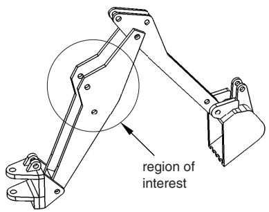  
Figure 1: A backhoe arm modeled with connectors.

The region of interest is the main arm of the backhoe. The bucket interacts with the rest of the backhoe model only through the connectors and the mass and inertia of the bucket. As a result, the bucket can be modeled as a display body.

You create a display body by applying a display body constraint to a part instance. For the backhoe arm model you would first create the bucket part instance in the Part module. In addition, you would create a point part and position it at the centroid of the bucket in the assembly, as shown in $F i g u r e 2$ (see Point parts); a reference point is automatically created for the point part.

  
Figure 2:The mass and inertia of the bucket are modeled with a point part.

The other two reference points in the assembly serve as endpoints for a HINGE and an AXIAL connector; see Connectors for more information on connectors. In the Interaction module you would create a rigid body constraint to constrain the endpoints and the point part to move as a single rigid entity, as shown in Figure 3; see Defining rigid body constraints.

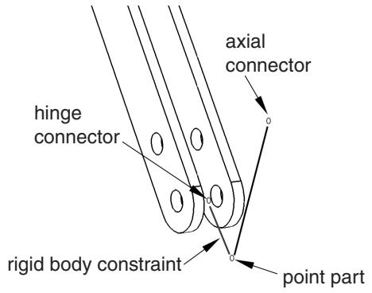  
Figure 3: A rigid body constraint constrains the point part to the endpoints.

In addition, you would create a display body constraint to constrain the bucket part instance to the point part; see Defining display body constraints.

You do not have to mesh the bucket part instance, and it is not included in the analysis of the backhoe model. However, the bucket still appears when you view the results of the analysis in the Visualization module, as shown in Figure 4.

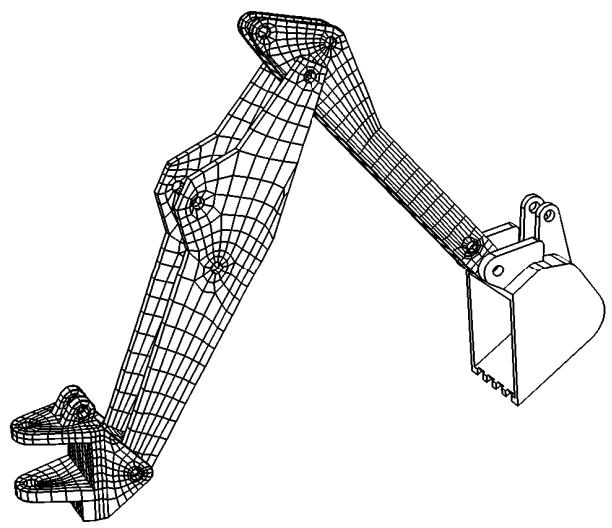  
Figure 4:The bucket is modeled as a display body.

Display bodies are useful if your model contains a part that cannot be meshed and need not be analyzed. In general, an imported part that has invalid geometry cannot be used by Abaqus/CAE unless you choose to ignore the invalidity of the part (for more information, see Working with invalid parts). If you apply a display body constraint to the invalid part, you can continue to use the part in your model, although the part will not be included in the analysis. For more information, see What is a valid and precise part?.

## Should I mesh a display body?

You do not have to mesh a display body. However, to display the part instance in the Visualization module, Abaqus/CAE computes a triangular mesh that models the surfaces of the part instance. This internal mesh is written to the input file and to the resulting output database; however, it is used only to render the display and is not included in the numerical analysis. By default, the Visualization module displays only the free edges of the meshed display body part instance, although you can change the visible edges displayed.

Similarly, if you do mesh a display body or if you use a mesh part to create a display body, Abaqus/CAE retains your mesh when the input file is generated; however, it is used only to render the display in the Visualization module and is not included in the numerical analysis.

## Displaying display bodies in the Visualization module

You can use the Display Body Options in the Visualization module to customize the appearance of display bodies. The options available for display bodies are similar to the common and superimposed plot options in Abaqus/CAE: render style; edge visibility, color, and style; fill color; scaling; and translucency can all be customized. Similarly, display body options are plot state–independent; i.e., the options applied to display bodies are reflected in all plot states. For more information, see Customizing the appearance of display bodies.

Display body options apply to all display bodies in your model; to customize the appearance of individual display bodies, you can create display groups based on part instances (see Creating or editing a display group). Individual item coloring can also be applied to individual display body part instances to override the edge and/or fill colors specified as general display body options; see Customizing the display color of individual objects for more information.

This section explains how to create Eulerian models in Abaqus/CAE.

## In this section:

Overview of Eulerian analyses  
Assembling coupled Eulerian-Lagrangian models in Abaqus/CAE  
Defining contact in Eulerian-Lagrangian models  
Assigning materials to Eulerian part instances  
Using the volume fraction tool  
Eulerian mesh motion  
Viewing output from Eulerian analyses

## Overview of Eulerian analyses

Pure Eulerian analysis is a finite element technique in which materials are allowed to flow across element boundaries in a rigid mesh.

In the more traditional finite element formulation (also known as the Lagrangian technique), materials are closely associated with an element, and the materials move only with the deformation of the mesh. Because the element quality issues associated with a deformable mesh are not present in Eulerian analyses, the Eulerian technique can be very effective at treating problems involving very large deformations, material damage, or fluid materials. Eulerian analysis can be performed only in Dynamic, Explicit steps. For a detailed discussion of Eulerian capabilities and applications, refer to Eulerian Analysis.

The techniques for modeling pure Eulerian analyses in Abaqus/CAE are very different than those used to model pure Lagrangian analyses. Most notably, instead of defining several parts and assembling them into a complete model, Eulerian models typically consist of a single Eulerian part. This part, which can be arbitrary in shape, represents the domain within which Eulerian materials can flow. The geometry of bodies in the model is not necessarily defined by the Eulerian part; instead, materials are assigned to different regions within the Eulerian part instance to define the body geometries.

Figure 1 compares the same model created using Lagrangian and Eulerian techniques. In the Lagrangian model, two parts are modeled, and each part is assigned a unique section referencing a material. In the Eulerian model, a single Eulerian part is modeled and assigned an Eulerian section. The Eulerian section defines the materials that can be present within the part. Materials are then assigned to different regions within the instanced part; any region without a material assignment is treated as a void with no material properties.

  
Figure 1:Two bodies modeled using Lagrangian and Eulerian techniques.

The Eulerian analysis technique can be coupled with traditional Lagrangian techniques to extend the simulation functionality in Abaqus:

Arbitrary Lagrangian-Eulerian (ALE) adaptive meshing is a technique that combines features of Lagrangian and Eulerian analysis within the same part mesh. ALE adaptive meshing is typically used to control element distortion in Lagrangian parts undergoing large deformations, such as in a forming analysis. Most ALE adaptive meshing analyses can also be performed as pure Eulerian analyses, but some of the features associated with a Lagrangian mesh will be lost; for a more detailed comparison, see About ALE Adaptive Meshing.  
Coupled Eulerian-Lagrangian (CEL) analysis allows Eulerian and Lagrangian bodies within the same model to interact. Coupled Eulerian-Lagrangian analysis is typically used to model the interactions between a solid body

and a yielding or fluid material, such as a Lagrangian drill traveling through Eulerian soil or an Eulerian gas inflating a Lagrangian airbag. Eulerian-Lagrangian analysis is discussed in Assembling coupled Eulerian-Lagrangian models in Abaqus/CAE.

Viewing the results of Eulerian analyses requires some special techniques in the Visualization module. These techniques are discussed in detail in Viewing output from Eulerian analyses.

The procedure for creating Eulerian models in Abaqus/CAE involves the following general steps:

1. In the Part module, create an Eulerian-type part that defines the geometric region within which Eulerian materials can flow. For more information, see Choosing the type of a new part.  
2. In the Part module, you may want to create partitions that represent the initial boundaries between different materials in the part. The partitions will affect the mesh of the part, and they are necessary only if you are assigning materials uniformly across a region. For more information about assigning materials in an Eulerian part, see Assigning materials to Eulerian part instances, and Defining a material assignment field.  
3. In the Property module, define the materials in the model.  
4. In the Property module, define and assign an Eulerian section for the model. The Eulerian section determines which materials can be present in the Eulerian part. The topology of the materials within the part will be defined in the Load module, as discussed in Step 7. For more information, see Creating Eulerian sections.  
5. In the Assembly module, create an instance of the Eulerian part.  
6. In the Step module, create a field output request for output variable EVF. This output is necessary to view the deformation of materials in an Eulerian model. For more detailed information, see Viewing output from Eulerian analyses.  
7. In the Load module, create a material assignment predefined field that defines the topology of materials in the initial configuration of the Eulerian part instance. For more information, see Assigning materials to Eulerian part instances, and Defining a material assignment field.  
8. In the Load module, define any loads or boundary conditions acting on the model. Because the mesh in an Eulerian part is rigid, traditional Lagrangian prescribed conditions do not move with the material deformations; loads and boundary conditions are imposed on any material that occupies (or moves into) the region to which the condition is prescribed. Zero-displacement boundary conditions can be used along the sides of an Eulerian part instance to prevent Eulerian material from entering or exiting the part. Boundary conditions and constraints based on nonzero nodal displacements are ignored in an Eulerian part instance; typically, velocity boundary conditions or predefined fields are used to prescribe initial motion in an Eulerian model. Specialized Eulerian boundary conditions can also be defined to control the flow of material across the boundaries of the Eulerian part (see Defining an Eulerian boundary condition). For more information about applying loads and boundary conditions to Eulerian models, see Boundary Conditions.  
9. In the Mesh module, create a hexagonal mesh for the Eulerian part. EC3D8R elements are assigned to the mesh by default. After creating a regular mesh, you can trim any elements that are not expected to experience material flow to reduce the model size and improve performance of the analysis.

An example of a basic Eulerian model created in Abaqus/CAE is provided in Eulerian analysis of a collapsing water column. More complicated Eulerian modeling procedures, including complex material assignments and coupled Eulerian-Lagrangian interactions, are illustrated in Impact of a water-filled bottle.

## Assembling coupled Eulerian-Lagrangian models in Abaqus/CAE

Abaqus allows you to create models that include both Eulerian part instances and Lagrangian part instances. During a coupled Eulerian-Lagrangian analysis, the Lagrangian mesh interacts with the materials in the Eulerian part. Coupled Eulerian-Lagrangian analyses typically offer better interpretation of contact conditions than pure Eulerian analyses, particularly for interactions between fluid and solid materials. During postprocessing, a solid Lagrangian body in a coupled Eulerian-Lagrangian analysis appears to maintain its shape better than a similar body in a pure Eulerian analysis.

Figure 1 compares a pure Eulerian analysis (top) and a coupled Eulerian-Lagrangian analysis (bottom) of a steel brick passing through a column of water.  
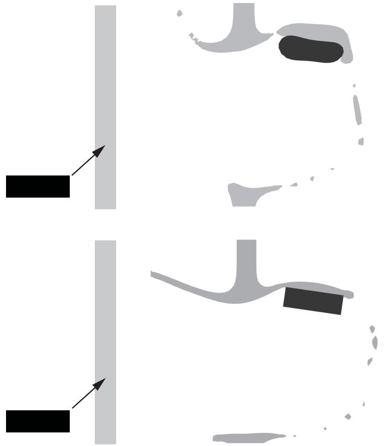  
Figure 1: Comparison of a pure Eulerian analysis (top) and a coupled Eulerian-Lagrangian analysis (bottom).

In the Eulerian analysis the water tends to adhere to the sides of the brick, and the brick appears deformed in the final configuration. This apparent deformation is a result of the material volume fraction calculations used for Eulerian materials, as discussed in Material Interfaces. On the other hand, the Lagrangian brick maintains its shape as it passes through the Eulerian water, and the water flows around the brick.

Coupled Eulerian-Lagrangian analyses also allow you to capitalize on the strengths of both analysis techniques; for example, you can use the loads on a Lagrangian body moving through an Eulerian material to drive a detailed submodel of the Lagrangian body.

To assemble a coupled Eulerian-Lagrangian model in Abaqus/CAE, simply instance both Eulerian and Lagrangian parts in the same assembly. Coupled Eulerian-Lagrangian analyses can be performed only in Dynamic, Explicit steps. You must create a general contact definition to enable contact between Lagrangian and Eulerian parts. The general contact definition allows interactions between Lagrangian surfaces and Eulerian material instances in the model (see

Defining contact in Eulerian-Lagrangian models for more information). Other interactions, loads, boundary conditions, and predefined fields are applied to the Lagrangian and Eulerian parts in the usual manner.

In most cases the Lagrangian part is assembled inside of the Eulerian part instance. While Lagrangian and Eulerian elements and nodes can overlap, three-dimensional Lagrangian elements cannot occupy the same space as an Eulerian material instance. Therefore, Lagrangian parts must be instanced in an area of void within the Eulerian part instance (i.e., a region with no material assignment). To model a three-dimensional Lagrangian part instance that is completely surrounded by Eulerian material, use the volume fraction tool to create an Eulerian material assignment field that includes a void region corresponding to the Lagrangian part instance (see Using the volume fraction tool for details).

## Defining contact in Eulerian-Lagrangian models

Contact in a coupled Eulerian-Lagrangian analysis must be defined using general contact. The general contact definition enables interactions between Lagrangian part surfaces and the surfaces of Eulerian material instances; contact between different Lagrangian parts in the model is also enabled.

In Abaqus/CAE you can use the global All\* with self contact domain to enforce contact between all Lagrangian parts and all Eulerian material instances in the model. Alternatively, you can include or exclude contact between a Lagrangian surface and a particular Eulerian material instance. Eulerian material instances appear in the list of surfaces in the Include Pairs and Exclude Pairs dialog boxes, as shown in Figure 1. You can also assign unique contact properties between particular Lagrangian surfaces and particular Eulerian material instances in the Individual Contact Property Assignments dialog boxes.

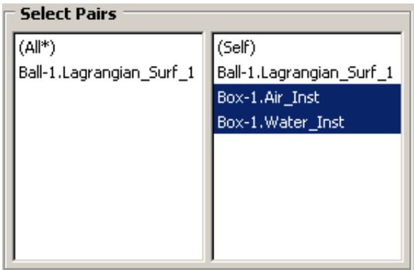  
Figure 1: Eulerian material instances in the Edit Excluded Pairs dialog box.

True contact cannot be defined between different Eulerian material instances. A rudimentary contact condition is enforced because material instances cannot penetrate each other. However, material instances do not separate once they come into contact, which prevents the modeling of sliding or rebounding behavior. Contact output is not available for Eulerian material instances. For a detailed discussion of Eulerian analysis contact formulations, refer to Interactions. If the contact conditions between two materials are significant to your analysis, at least one of the materials should be modeled as a Lagrangian part.

## Assigning materials to Eulerian part instances

In a pure Lagrangian analysis a section definition includes a reference to a single material. When you assign a section to a region or element in the Lagrangian part, that region or element is completely filled with the referenced material. The geometry of the region or element, therefore, defines the geometry of the material.

In a pure Eulerian analysis the relationship between the section definition and material is fundamentally different. An Eulerian section definition can reference a list of materials. When you assign the Eulerian section to an Eulerian part, you are defining which materials may be present in the part over the course of the analysis. The part, however, is initially empty of material. To introduce material to the initial state of an Eulerian part, you must use a material assignment predefined field.

Material assignment predefined fields rely on the concept of material volume fractions. During an Eulerian analysis, Abaqus tracks the material present in each element in terms of a volume fraction assigned to each material instance; the volume fraction represents the percentage of the element's volume that is occupied by a given material instance. For elements that are partially filled or filled with multiple materials, the exact geometric composition of the material within the element is not known; Abaqus interpolates the material volume fractions from adjacent elements to estimate the material boundaries within the element. These calculations are discussed in more detail in Material Interfaces.

In Abaqus/CAE the initial material volume fractions in an Eulerian part are specified by creating a material assignment predefined field in the Load module. The predefined field associates each region in an Eulerian part instance with a volume fraction for each material instance. The regions to which volume fractions are assigned can be cells (in geometry), mesh elements, or groups of elements. If you select a cell or a group of elements, the volume fraction values are propagated to each of the underlying Eulerian elements in the cell or group.

Volume fractions in a material assignment predefined field are expressed as a number between zero and one; a volume fraction of one indicates that the region is completely filled with the specified material. A volume fraction of less than one indicates that the region is only partially filled with the specified material; for example, a volume fraction of 0.25 means that the specified material instance occupies 25% of the region. As mentioned previously, Abaqus determines the material boundaries for partially filled elements based on the volume fractions in adjacent elements; to achieve greater control over the material boundaries within a region, you must refine the part mesh or redefine the region boundaries.

If material volume fractions are not defined for a region of an Eulerian part instance, that region is assigned a void. Similarly, if the volume fractions for all materials in a region do not sum to one, the remainder of the volume fraction in that region is assigned a void. Void regions do not have material properties, but other materials can flow into and through a void region during an analysis.

The material assignment predefined field effectively defines the topology of materials in the initial configuration of your model. The Eulerian part is typically arbitrary in shape; the material assignment predefined field adds to the part the Eulerian materials that will interact during the analysis. For example, consider the cross-section of the coupled Eulerian-Lagrangian model in Figure 1. The Eulerian part is simply an empty cube. Four regions defined on the part determine the slope of the earth and the amount of water in the tank, and material is assigned to these regions accordingly.

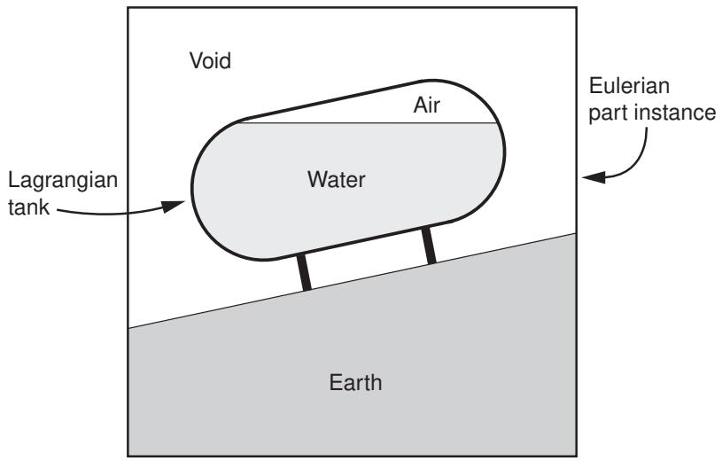  
Figure 1: Material assignments in an Eulerian-Lagrangian model.

Material assignment predefined fields can be created only in the initial step of an Eulerian analysis. In subsequent steps the materials deform from their initial configuration and flow across the Eulerian mesh according to the forces present in the model.

Abaqus/CAE offers two techniques for defining material assignment predefined fields:

## Uniform definitions

Uniform material assignment field definitions are created by selecting regions from an Eulerian part instance and directly specifying the volume fraction of each material instance within those regions. Geometry must be partitioned into separate cells representing the material regions. In part instances that include orphan elements you can select individual elements to act as regions.

Figure 2 illustrates a material assignment field created using uniform definitions. The Eulerian part is partitioned into three regions, and material volume fractions are defined in each region; each region is completely filled with a single material instance. Volume fractions are not defined for the void region, since void is the default material assignment.

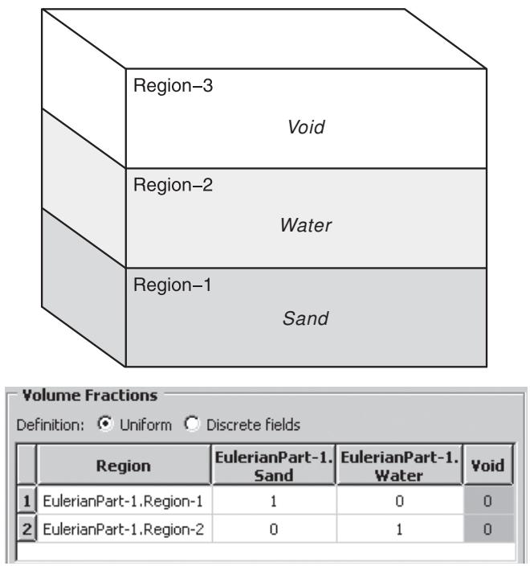  
Figure 2: A uniform material assignment field.

The uniform material assignment definition should be used only for relatively simple regions that are uniformly filled with material. The partitions needed to create complex regions can negatively impact the quality of the Eulerian mesh, and partially filled regions are difficult to define and interpret, particularly when working with geometry.

For details on creating a uniform material assignment field in Abaqus/CAE, see Defining a material assignment field. An example of a uniform material assignment definition is illustrated in the Python script provided in Deflection of an elastic dam under water pressure.

## Discrete field definitions

Material assignments for meshed geometry and orphan meshes can be defined using a scalar discrete field. For each material instance in the part you create a discrete field that associates individual elements with a volume fraction for that material instance. For more information on creating discrete fields, see The Discrete Field toolset.

When you are assigning materials using a discrete field, you still must select the region of the part instance to which the discrete field applies. If the discrete field includes data for elements outside of the selected region, these data are ignored. The default value associated with the discrete field is assigned to any elements within the selected region that are not explicitly listed in the discrete field.

Figure 3 shows a very simple example of a material assignment defined using discrete fields. The Eulerian part consists of four elements and two material instances. Two discrete fields, as defined in Table 1, are used to specify the material composition within the elements. The boundary between the water and the sand is an estimation based on interpolation of the material volume fractions in adjacent elements.

  
Figure 3: A discrete field material assignment.

Table 1: Volume fractions defined in discrete fields.

<table><tr><td>Discrete Field</td><td>Element 3</td><td>Default</td></tr><tr><td>Water_Field</td><td>0.5</td><td>1</td></tr><tr><td>Sand_Field</td><td>0.5</td><td>0</td></tr></table>


## Note:

In any given element the sum of all material volume fractions should not be greater than one. Abaqus/CAE assigns volume fractions incrementally by reading the discrete fields in the Volume Fractions table from right to left; once the volume fraction for an element reaches one, additional volume fractions assigned to that element are ignored.

Since the discrete field can assign unique volume fractions to each individual element, it allows more complicated material boundaries than the uniform definition method without the need for excessive partitioning. The volume fraction tool in Abaqus/CAE creates discrete fields specifically for use in material assignment predefined fields. Through this tool, you can define complex Eulerian material regions using the part modeling techniques available in Abaqus/CAE. For more information, see Using the volume fraction tool.

For details on creating a discrete field material assignment in Abaqus/CAE, see Defining a material assignment field. An example of a discrete field material assignment definition (including the use of the volume fraction tool) is illustrated in the Python script provided in Rivet forming.

## Using the volume fraction tool

The volume fraction tool creates a scalar discrete field by performing a Boolean comparison between an Eulerian part instance and a second part instance (the reference part instance) that intersects the Eulerian instance.

The comparison determines where the two part instances overlap, then assigns each element in the Eulerian instance a volume fraction based on the percentage of the element that is also occupied by the reference instance. The volume fraction is specified as a decimal between zero and one.

The discrete field that is created by the volume fraction tool can be used to assign material instances to the Eulerian part instance (see Assigning materials to Eulerian part instances). The topology of the assigned Eulerian material instance corresponds to the shape of the reference part instance within the Eulerian part instance.

Figure 1 and the following procedure summarize the process of using the volume fraction tool:  
(1)  


(3)  
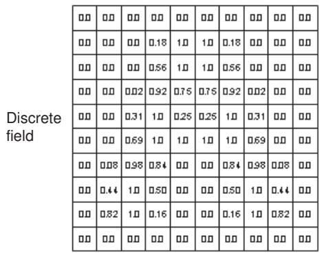

(2)  
  
(4)

  
Figure 1: Procedure for using the volume fraction tool.

1. Using any of the modeling tools and techniques in Abaqus/CAE, create a reference part that corresponds to the geometry of the desired Eulerian material region.  
2. Instance the reference part within the Eulerian part instance. The reference part instance should spatially correspond to the desired Eulerian material region.  
3. Use the volume fraction tool to create a discrete field based on a comparison of the reference part instance and the Eulerian part instance.  
4. Define a material assignment predefined field for the Eulerian part instance using the discrete field created by the volume fraction tool.

An option for the volume fraction tool controls whether the calculated discrete field represents the space inside the reference instance (the volume fraction is nonzero in elements that overlap the reference instance) or the space outside the reference instance (the volume fraction is nonzero in elements that do not overlap or partially overlap the reference instance), as depicted in Figure 2.

<table><tr><td>0.0</td><td>0.0</td><td>0.0</td><td>0.0</td><td>0.0</td><td>0.0</td></tr><tr><td>0.0</td><td>0.32</td><td>0.91</td><td>0.91</td><td>0.32</td><td>0.0</td></tr><tr><td>0.0</td><td>0.91</td><td>1.0</td><td>1.0</td><td>0.91</td><td>0.0</td></tr><tr><td>0.0</td><td>0.91</td><td>1.0</td><td>1.0</td><td>0.91</td><td>0.0</td></tr><tr><td>0.0</td><td>0.32</td><td>0.91</td><td>0.91</td><td>0.32</td><td>0.0</td></tr><tr><td>0.0</td><td>0.0</td><td>0.0</td><td>0.0</td><td>0.0</td><td>0.0</td></tr></table>

<table><tr><td>1.0</td><td>1.0</td><td>1.0</td><td>1.0</td><td>1.0</td><td>1.0</td></tr><tr><td>1.0</td><td>0.68</td><td>0.09</td><td>0.09</td><td>0.68</td><td>1.0</td></tr><tr><td>1.0</td><td>0.09</td><td>0.0</td><td>0.0</td><td>0.09</td><td>1.0</td></tr><tr><td>1.0</td><td>0.09</td><td>0.0</td><td>0.0</td><td>0.09</td><td>1.0</td></tr><tr><td>1.0</td><td>0.68</td><td>0.09</td><td>0.09</td><td>0.68</td><td>1.0</td></tr><tr><td>1.0</td><td>1.0</td><td>1.0</td><td>1.0</td><td>1.0</td><td>1.0</td></tr></table>

Figure 2: Discrete fields representing volume fractions inside (left) and outside (right) of the shaded reference region.

Typically, calculating the volume fraction outside of a reference instance is used to create an Eulerian material assignment around a Lagrangian part instance in a coupled Eulerian-Lagrangian analysis. Calculating the volume fraction inside of a reference instance is usually used to model complex material assignment fields within a pure Eulerian part instance; in this situation, the reference instance is suppressed after the Eulerian material is assigned. You can also calculate volume fractions inside of a reference instance to create an Eulerian material assignment on the inside of an enclosed Lagrangian shell in a coupled Eulerian-Lagrangian analysis.

To use the volume fraction tool, select Tools->Discrete Field->Volume Fraction Tool from the main menu bar. For step-by-step instructions for using the tool, refer to Creating discrete fields for material volume fractions.

The Eulerian part instance that is used by the volume fraction tool must be the same instance to which materials are assigned. The Eulerian part must be meshed before using the volume fraction tool. You should not edit the part mesh after creating the discrete field, as the element numbering in the discrete field may not conform to the elements in the updated mesh.

The reference part instance used by the volume fraction tool can include unmeshed geometry, a native mesh, or orphan elements; deformable, Eulerian, and discrete rigid parts are all allowed. The volume fraction tool always uses the mesh representation (if available) of the reference part instance when calculating the discrete field; if the reference instance is partially meshed, only the meshed portion of the instance is considered in the volume fraction calculation. The mesh on the reference instance should be fine enough to capture all important geometric details in the subsequent material assignment.

The reference part instance must be either a three-dimensional solid or a fully enclosed three-dimensional shell. The faces of a shell enclosure must define a single, continuous surface; features that create T-intersections with the surface faces (such as ribs or interior dividing panels) are not allowed (see Figure 3). An Eulerian element is considered to be inside a shell reference instance if it lies within the volume enclosed by the shell surface.

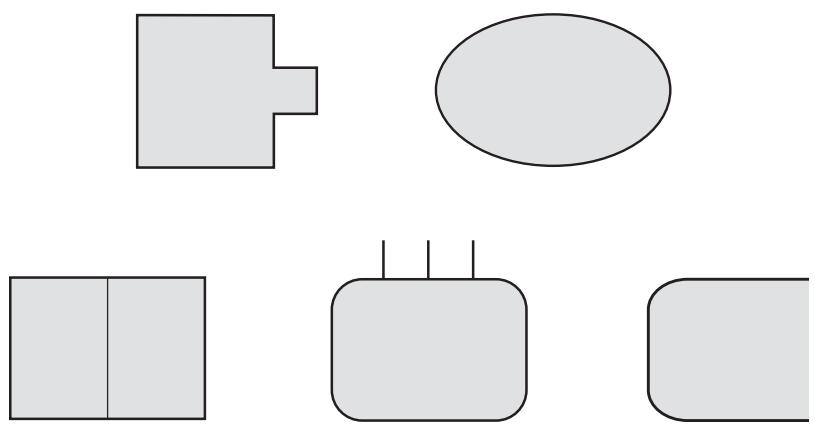  
Figure 3: Cross-sections of acceptable reference shell parts (top) and unacceptable reference shell parts (bottom).

## Eulerian mesh motion

Eulerian mesh motion is a technique that allows you to reduce the size of an Eulerian mesh for certain models, thereby improving the performance of the analysis. In some cases the Eulerian domain at the beginning of an analysis does not sufficiently capture the deformations in the model by the end of the analysis. Some typical examples include:

• An airbag where the inflator gas is modeled as an Eulerian material: the gas initially occupies a small region, but the region quickly expands as the airbag inflates.  
• A projectile impact analysis where the projectile is modeled as an Eulerian material: the projectile initially occupies a region that is far from its ultimate destination.

In such cases it is possible to adjust the size and location of the Eulerian domain during the analysis so that it always captures a part or material of interest. By default, an Eulerian mesh is rigid and fixed in place; but enabling Eulerian mesh motion allows the Eulerian elements to scale and translate during the analysis. Eulerian mesh motion can follow the deformation of an Eulerian material instance (as shown in Figure 1) or a Lagrangian surface (as shown in Figure 2). The behavior of Eulerian mesh motion is described in detail in Eulerian Mesh Motion.

  
Figure 1: Eulerian mesh motion tracking a material instance.

  
Figure 2: Eulerian mesh motion tracking a Lagrangian surface.

In Abaqus/CAE Eulerian mesh motion is defined as a boundary condition in the Load module. Restrictions can be imposed on the scaling and translation of the Eulerian mesh as part of the boundary condition definition. For more information about creating Eulerian mesh motion boundary conditions, see Defining an Eulerian mesh motion boundary condition.

## Viewing output from Eulerian analyses

The results of an Eulerian analysis must be interpreted differently than those from a Lagrangian analysis. In particular, any results based on nodal displacements are meaningless in an Eulerian model because the Eulerian part is fixed and rigid. Details concerning how Eulerian results are written to the output database are available in Output.

Special steps must be taken in the Visualization module of Abaqus/CAE to view material instances within an Eulerian part. By default, Abaqus/CAE displays the full Eulerian part mesh in both undeformed and deformed plot states with no indication of the material instance boundaries within the mesh.

Visualization of material instances is based on output variable EVF, the Eulerian material volume fraction. Output variable EVF measures the amount of a particular material instance within an element as a relative fraction. An EVF value of one indicates that the element is completely filled with the specified material instance; an EVF value of zero indicates that the element is completely devoid of the specified material instance.

For elements that are partially filled or filled with multiple materials, Abaqus estimates a simple boundary between materials by interpolating the EVF values in adjacent elements. These simple boundaries may be slightly discontinuous across elements. To improve display of Eulerian materials, you should instruct Abaqus/CAE either to use a results averaging threshold of 100% or to compute scalars after averaging results; Abaqus/CAE remaps the material boundaries so they appear smooth and continuous across elements. For more information about results averaging, see Controlling result averaging; for a more detailed discussion of how Abaqus calculates Eulerian material boundaries, see Material Interfaces.

Output variable EVF is written to the output database if you request the Preselected defaults in the field output request editor (see Modifying field output requests). When you request output for EVF, Abaqus creates a separate material volume fraction output variable for each material instance in the model; for example, EVF\_WATER is the volume fraction for the material instance named Water. An output variable named EVF\_VOID is created to measure the volume fraction of empty regions in an Eulerian part.

The following techniques can be used in the Visualization module to view the initial and deformed states of material in an Eulerian part:

## Contour plots

A contour plot of output variable EVF for a particular material instance allows you to visualize which areas of the model are occupied by the material during the analysis. Areas occupied by the material (EVF equal to one) appear as a uniform color from the top of the contour spectrum, while areas unoccupied by the material appear as a different color from the bottom of the contour spectrum; depending on your contour plot settings, the boundary of the material instance appears in a range of colors as EVF transitions from one to zero (see Figure 1).

  
Figure 1: Contour plot of an Eulerian material instance.

Contour plots are of limited usefulness when visualizing Eulerian materials because the contours appear on the faces of the Eulerian parts. You cannot effectively visualize material volume fraction contours on the interior of Eulerian parts.

For further details on using contour plots in the Visualization module, see Contouring analysis results.

## View cuts

To visualize the behavior of a material on the interior of an Eulerian part, activate a view cut along an isosurface of the EVF variable associated with that material instance. Abaqus/CAE automatically creates these isosurface view cuts for each material instance in the model, but you must activate them in the View Cut Manager. Using the view cut options, you can eliminate portions of the part that do not include a selected material by rendering them unfilled, rendering them translucent, or removing them from the display (see Figure 2).

  
Figure 2: View cut along an Eulerian material instance isosurface.

If your Eulerian part includes regions without a material assignment, it may be helpful to activate an isosurface view cut based on the EVF\_VOID output variable. By cutting away all regions in which EVF\_VOID is greater than 0.5, you are able to see the shape of materials within the part.

After activating an isosurface view cut based on the EVF variable, you can change the primary field output variable without affecting the view cut. This enables you to visualize results contours along the boundaries of material instances instead of on Eulerian part faces (see Figure 3).

  
Figure 3: Contour plot of stresses in a cut Eulerian part.

Isosurface view cuts based on output variable EVF do not affect Lagrangian part instances in a coupled Eulerian-Lagrangian model. The Lagrangian parts remain visible when the cut is active. Therefore, this technique is useful for visualizing the interaction between a Lagrangian part and an Eulerian material instance.

For further details on using view cuts in the Visualization module, see Cutting through a model.

## Combining view cuts and contour plots

In an Eulerian part that includes three material instances, you can use a combination of view cuts and contour plots to distinguish material instances in the undeformed and deformed model states. First, use an isosurface view cut to remove one of the material instances from the display, as discussed above. Then, create a contour plot of output variable EVF for one of the remaining material instances. The resulting colors in the model distinguish one material from the other. To produce a more defined boundary between the materials, you can reduce the number of contour intervals to two.

For example, Figure 4 depicts an Eulerian model of a lead projectile impacting a brass plate. The void regions of the Eulerian part are cut away. A two-interval contour plot is applied, rendering the brass in one color and the lead (i.e., not brass) in another color. The resulting plot offers a useful generalization of the deformed shape of the projectile and plate.

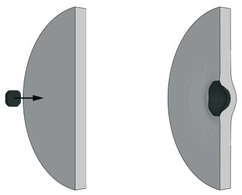  
Figure 4: A contour plot is used to distinguished two Eulerian materials in a projectile impact analysis.

Currently there is no way to visually distinguish more than three Eulerian material instances simultaneously using Abaqus/CAE.

## Color coding

Color coding cannot be used to visualize material behavior in Eulerian parts. The color coding tool in Abaqus/CAE does not recognize Eulerian section or material assignments. Color coding based on element sets is also ineffective for deformed shape plots because the Eulerian elements do not deform with the material.

However, in coupled Eulerian-Lagrangian models, color coding can distinguish between Eulerian and Lagrangian part instances or Eulerian and Lagrangian element types. When used with the visualization techniques discussed above, color coding can be helpful in distinguishing Lagrangian bodies from Eulerian materials in a model.

For further details on applying color coding to a model, see Color coding geometry and mesh elements.

## Display groups

Certain types of coupled Eulerian-Lagrangian models involve a single Eulerian material instance throughout the Eulerian part; for example, a Lagrangian penetrator moving through a uniform Eulerian material. In these analyses the deformation of the Eulerian material is not as important as the interaction between the Eulerian material and the Lagrangian body. You can use a display group to remove the Eulerian elements from the display and visualize results (such as contact pressure or stress) on only the Lagrangian body.

For further details on using display groups, see Using display groups to display subsets of your model.

## Fasteners

This section describes how to model fasteners.

## In this section:

About fasteners  
Managing fasteners  
Creating point-based fasteners  
Creating discrete fasteners  
Creating assembled fasteners

## About fasteners

You use fasteners to model a point-to-point connection between two or more faces, such as a spot weld, a bolt, or a rivet.

You can use the Attachment toolset to create attachments that help you define fasteners; for more information, see Understanding attachment points and lines. You can create point-based fasteners, discrete fasteners, or assembled fasteners.

Both point-based and discrete fasteners can be modeled using connectors or beam MPCs. If you define connectors that use basic, assembled, or complex connection types, you can request output from your point-based or discrete fasteners through connector output variables. However, if you use beam MPCs, no output is available from your point-based or discrete fasteners.

## In this section:

About point-based fasteners  
About discrete fasteners  
About assembled fasteners

## About point-based fasteners

Point-based fasteners make use of positioning points to create mesh-independent fasteners in Abaqus/Standard and Abaqus/Explicit, as described in Mesh-Independent Fasteners. A positioning point can be an attachment point, a reference point, or a node from an orphan mesh. Point-based fasteners modeling spot welds around the edge of a bracket are shown in Figure 1. The user first created attachment points at equally spaced intervals around the edge of the bracket. The attachment points were used to define the location of the fastener's positioning points.

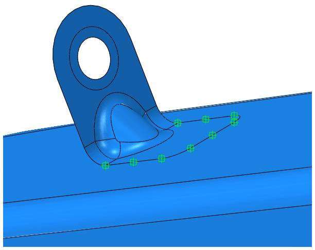  
Figure 1: Point-based fasteners modeling spot welds.

A point-based fastener can connect selected faces with either connectors or rigid (beam) multi-point constraints. If you want to model a rigid connection, you can use rigid connectors or rigid multi-point constraints.

## Connectors

If you use connectors to connect the faces, you can model either rigid, elastic, or inelastic connections with failure by using the generality of connector behavior definitions. You can use a rigid connector to model a rigid connection. However, if you are using rigid connectors and Abaqus detects two adjacent point-based fasteners that are sharing nodes, you must avoid overconstraining your model by defining some elasticity in the connector behavior to reduce the stiffness.

You can request output from connectors.

## Rigid (beam) multi-point constraints

Rigid multi-point constraints are computationally cheaper than connectors and are less likely to result in an overconstrained model when two adjacent fasteners are sharing nodes. When Abaqus detects two adjacent fasteners that are sharing nodes and using rigid multi-point constraints, it uses a penalty distributing coupling formulation that relaxes, to a small degree, the constraint between the motion of the fastening point and its coupling nodes to avoid the overconstraint.

You cannot request output from multi-point constraints.

A point-based fastener uses distributing coupling constraints to connect the faces regardless of how you mesh the faces. When you submit a job for analysis, Abaqus uses your fastener definition to connect the faces with couplings and connectors. When you open the output database file in the Visualization module, you can display the couplings and connectors; however, outside the Visualization module, symbols are displayed only for the positioning points of the point-based fasteners.

If your model contains many fasteners (more than a thousand), point-based fasteners offer better performance than discrete fasteners. In addition, you may want to use point-based fasteners if you have a file from a CAD system that defines the coordinates of each positioning point. Point-based fasteners are available only for three-dimensional models. Point-based fasteners are used to model mesh-independent fasteners as described in Mesh-Independent Fasteners.

You can use the following two methods to create a point-based fastener, as shown in Figure 2:

• Select a positioning point and allow Abaqus/CAE to project the point to the closest face along a normal to the surface. The first fastening point is created where the normal intersects the closest face.  
• Select a positioning point and specify the direction vector along which the point is projected. The first fastening point is created where the vector intersects the closest face.

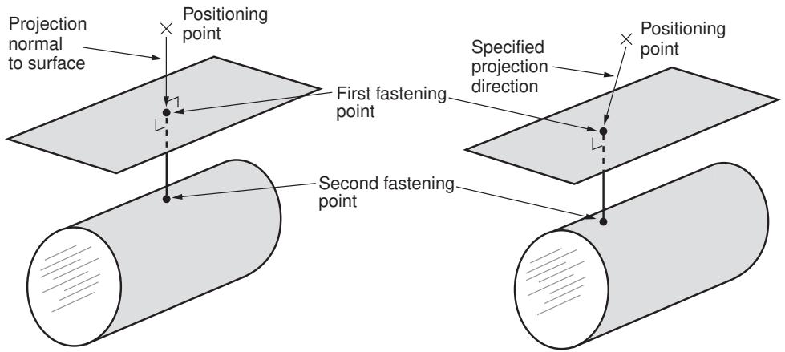  
Figure 2: Creating point-based fasteners.

Abaqus creates the second (and subsequent) fastening points when you submit the job for analysis by projecting the first fastening point onto the other surfaces to be connected along the normal to the closest face.

## About discrete fasteners

Discrete fasteners make use of attachment lines to create connectors and couplings between selected faces in Abaqus/Standard and Abaqus/Explicit. Figure 1 shows a discrete fastener that uses attachment lines and connectors (Beam connection type) to model a spot weld across three surfaces. The user first created attachment lines at the locations of the spot welds. The attachment lines were used to define the location of the discrete fastener.

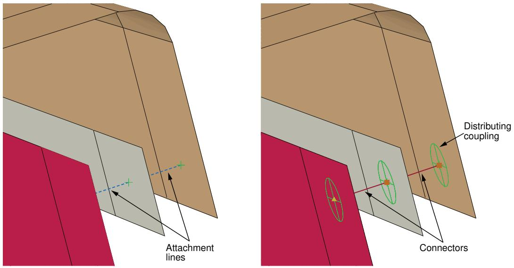  
Figure 1: A spot weld across three surfaces modeled with a discrete fastener.

The process of creating an attachment line is similar to the process of creating point-based fasteners. You select a starting point and specify which of the two methods Abaqus/CAE will use to project the point onto the closest face. Figure 2 shows the two methods for creating an attachment line that is used to define a discrete fastener.

  
Figure 2: Creating an attachment line that is used to define a discrete fastener.

Abaqus/CAE projects the attachment line along a normal to the closest face. You can use the following two methods to determine the number of faces that are connected by the attachment line:

• Specify the number of projections or layers.  
• Specify the maximum length of the projection.

For each attachment line, Abaqus/CAE determines the fastening points and applies a distributing coupling between each fastening point and its corresponding surface. After you assign a connector section to the attachment line, Abaqus/CAE creates a connector, and the discrete fastener is considered to be fully defined. You can control the

accuracy of the attachment line position on a faceted representation of a part instance by specifying the level of curve refinement in the Part module and the Property module. For more information, see Controlling curve refinement.

If your model is complex, Abaqus/CAE can create a chain of attachment lines connecting multiple surfaces that would be time consuming to create manually. In contrast with point-based fasteners, you can view attachment lines and discrete fasteners and their connectors and couplings outside the Visualization module.

If two surfaces are used by two attachment lines and share a common face, Abaqus/CAE merges the two faces into a single face when you submit the model for analysis. This results in better performance by Abaqus/Standard or Abaqus/Explicit, especially when the fasteners connect nodes across faces of a refined orphan mesh.

When you submit a job that contains a model with discrete fasteners for analysis, Abaqus/CAE writes special comment lines to the input file. These special comment lines, which are ignored by the Abaqus solvers, allow Abaqus/CAE to recreate the fully defined discrete fasteners upon import into Abaqus/CAE. For more information, see Importing interactions, constraints, and fasteners.

An example of creating discrete fasteners is illustrated in the Python script included in Buckling of a column with spot welds.

## About assembled fasteners

Assembled fasteners let you efficiently assign complex fastener behaviors in a large number of model locations.

## In this section:

The assembled fastener technique  
Using property generation scripts for assembled fasteners  
Output requests for assembled fasteners  
Assembled fasteners vs. point-based fasteners

## The assembled fastener technique

Using the assembled fastener technique, you can read in connector and constraint behaviors from a template model and assign these attributes in multiple locations in your main model.

For a large system such as an airframe or automobile, assembled fasteners allow you to define the fastener template once and then assign it many times in the main model. With the appropriate use of coupling constraints and adjust points constraints, secondary nodes in the template model can be automatically resized in the main model to accommodate the actual surface spacing.

The overall process for building assembled fasteners is as follows:

1. Build the template model containing your fastener-like construct: connector section assignments, tie constraints, coupling constraints, and solid or beam section assignments. You must assign names to all surfaces involved in constraints. You must also define a single-point set as the control point, which will be used to locate the template model copies in the main model.  
2. Develop your main model, placing attachment points at the locations where you want the template fastener to be replicated. The template model control point will be mapped onto the locations of the attachment points in the main model (see Figure 1).  
3. Working in your main model, use the Create Fasteners and Edit Fasteners dialog boxes to define how the template model will be read in, assigned, and oriented.  
4. Optionally, use one or more property generation scripts to modify the properties copied into the main model from the template model. Multiple property generation scripts can be used with the same template model to achieve different results in separate assembled fastener objects. For example, you could use two scripts to apply different materials to the same fastener template. You can use the Abaqus Scripting Interface to write your property generation scripts; see Creating and running your own scripts, and the Abaqus Scripting User's Guide.

  
Figure 1: Replicating the template model in the main model.

The template model uses the global coordinate system, and the positive Z-axis direction of the fastener construct will be aligned with the selected normal direction in the main model.

Assembled fasteners are different from point-based (mesh-independent) and discrete fasteners in Abaqus/CAE. Assembled fasteners do not create individual fastener objects like point-based and discrete fasteners, but instead they allow you replicate fastener-like behavior in many places. You cannot view or manipulate the individual fasteners (at each attachment point) in the main model while working in the Abaqus/CAEGUI; they are produced only in the input file generated by Abaqus/CAE. The template model sets are aggregated in the input file generated by Abaqus/CAE to help you manage models containing large numbers of assembled fasteners.

Assembled fastener template models are intended only to model fastener-like constructs and do not provide a generic subassembly capability. Only a few Abaqus/CAE features are supported in template models, such as connectors and mass inertia. No other Abaqus/CAE features are allowed in template models.

Table 1 lists the features that are supported and read from the template model into the main model. The actual model data are not transferred, only the constraints and behaviors.

Table 1: Features supported in assembled fastener template models.

<table><tr><td>Beam and solid parts (beam, solid, and cohesive elements)</td></tr><tr><td>Beam and solid section assignments (but not distributions or composite layups)</td></tr><tr><td>Connector section assignments</td></tr><tr><td>Tie constraints and coupling constraints (except for tie constraints generated due to incompatible meshes)</td></tr><tr><td>Adjust points constraints</td></tr><tr><td>Mass inertia</td></tr></table>

In particular, the Abaqus/CAE features and attributes listed in Table 2 are not supported by assembled fasteners and are not read in from the template model.

Table 2: Features that are not supported in assembled fastener template models.

<table><tr><td>Point-based (mesh-independent) and discrete fasteners</td></tr><tr><td>Attachment points</td></tr><tr><td>Analytical rigid surfaces</td></tr><tr><td>Orphan mesh surfaces</td></tr><tr><td>Tie constraints generated internally due to incompatible meshes</td></tr><tr><td>Any constraint type other than tie, coupling, or adjust points</td></tr></table>

In addition, the following restrictions exist:

• Solid parts are allowed in the template model but material orientations are not.  
• Beam parts are allowed in the template model, but beam orientations must be assigned using the same region as the beam section assignment.  
• Solid and beam parts are allowed, but complex parts/assemblies may not work.  
• Unmeshed constraint surfaces in the template model are allowed.  
Shell parts are not allowed in the template model, except as reference surfaces for constraints. These constraint surfaces will effectively be replaced with main model surfaces when the input file is generated by Abaqus/CAE. All constraint surfaces should be substituted with main model surfaces for correct behavior of the assembled fastener.  
• Template model surfaces are not copied into the main model when the input file is generated by Abaqus/CAE. The only surfaces allowed in the template model are those that will have main model surfaces substituted for them.  
• Constraint surfaces cannot be orphan mesh surfaces.  
• Reference points are allowed in template models, but attachment points are not allowed.  
• The modeling space of the template models must match the modeling space of the main model (see Part modeling space).

• Coupling constraints in the template model must constrain all degrees of freedom and must not specify a local coordinate system.  
• Tie constraints in the template model must use a generic main surface and a secondary node region, not a secondary surface.  
Point mass and rotary inertia features are allowed in template models. However, for rotary inertia the local coordinate system will be ignored; thus, the only useful scenario is $I _ { 1 1 } = I _ { 2 2 } = I _ { 3 3 }$ , and $I _ { 1 2 } = I _ { 1 3 } = I _ { 2 3 } = 0$ . Essentially, the rotary inertia feature must have rotational symmetry.

The control point must be a predefined set containing a single vertex or node in your template model. You must create this set in the template model before creating the assembled fasteners in your main model. When the template model is read in, the control point will be placed at the locations of your attachment points in the main model.

The constraint surfaces in the template model must be mapped to corresponding surfaces in the main model to enable the constraint behavior in the main model. When you define the assembled fasteners in the main model, the Edit

Fastener dialog box will automatically prepopulate the surface assignment table with any template model surfaces involved in tie constraints, coupling constraints, or adjust points constraints. The template surfaces are initially listed in ascending Z-axis order using the template model global coordinate system. You can change the order to coincide with your template fastener design; however, the ordering of the surfaces is not significant beyond the selection of the first surface, because the corresponding assignment surface normal is used to orient the assembled fastener. In the main model you must assign names to the surfaces that will be involved in the assembled fastener constraints.

At each attachment point in the main model, the template model is positioned and translated so that the template model control point coincides with the attachment point. The template model is rotated into the main model and oriented such that the positive Z-axis of the global coordinate system of the template model aligns with the coordinate system you specify (on the Orientations tabbed page of the Edit Fasteners dialog box). The default is to orient the template model copies according to the normal vector of the first surface in the main model. This default orientation from the first surface normal creates a Z-axis alignment at every attachment point. The X-axis is then computed by projecting the global X-axis onto the surface.

For any sets that you create in the template model, the main model will aggregate all of the sets' objects into a single set per assembled fastener. When the input file is generated by Abaqus/CAE, template model sets will be aggregated across all attachment points of the assembled fastener. For example, consider a template model that contains a connector section assignment for a wire set named Wire-1-Set-1, and that set contains a single wire. If the assembled fastener is then placed at 10 attachment points in the main model, the main model will have a set named TM-1\_Wire-1-Set-1 that contains 10 wires. However, Abaqus/CAE generates these aggregated sets only when it creates the input file. The aggregated sets are not directly visible in Abaqus/CAE.


## Note:

The Adjust control point to lie on surface option can be useful in coupling constraints you create in assembled fastener template models; see Defining coupling constraints. The more general-purpose adjust points constraint can also be useful in assembled fastener template models; see Defining adjust points constraints.

The adjust points capability should not be used in assembled fastener template models when the main model attachment points are located at bolt hole center points. Any point along the bolt hole centerline will be moved (incorrectly) to a random location along the perimeter of the hole instead of being projected along the surface normal to the center of the hole.


Note: The size and shape of the template model surfaces do not matter, except with regard to the display of those surfaces during template model rendering from the Edit Fasteners dialog box. The recommended best practice is to make your template model surfaces square or rectangular in shape to facilitate rendering speed and accuracy in the main model. Circular template model surfaces or surfaces with any curvature will be rendered in a crudely approximate fashion in the main model.

## Using property generation scripts for assembled fasteners

This section discusses how to use property generation scripts to modify template model properties.

## In this section:

Property generation scripts  
Example property generation script  
Registering the property generation script

## Property generation scripts

Each assembled fastener can optionally reference a script that will modify the template model properties; for example, to use different materials in the assembled fasteners. These property generation scripts can be used to calibrate or adjust the fastener properties.

In Abaqus/CAE property definitions include material, profile, section, and connector section definitions.

You can use the Abaqus Scripting Interface to write your property generation scripts; see Creating and running your own scripts, and the Abaqus Scripting User's Guide.

This feature lets you use the same template model multiple times with different property generation scripts. The property definitions from the template model are copied into the main model and given names based on the original names plus a prefix. The default prefix is TM-1 for the first assembled fastener you create, and TM-2, TM-3, etc., for subsequent ones. For example, a connector section named BoltSection in the template model will be named TM-1\_BoltSection in the main model. You can change the prefix on the Properties tabbed page of the Edit Fasteners dialog box. Property prefix strings must be unique for all assembled fasteners you create.

Figure 1 shows an example in which two template models are used with three different property generation scripts.  
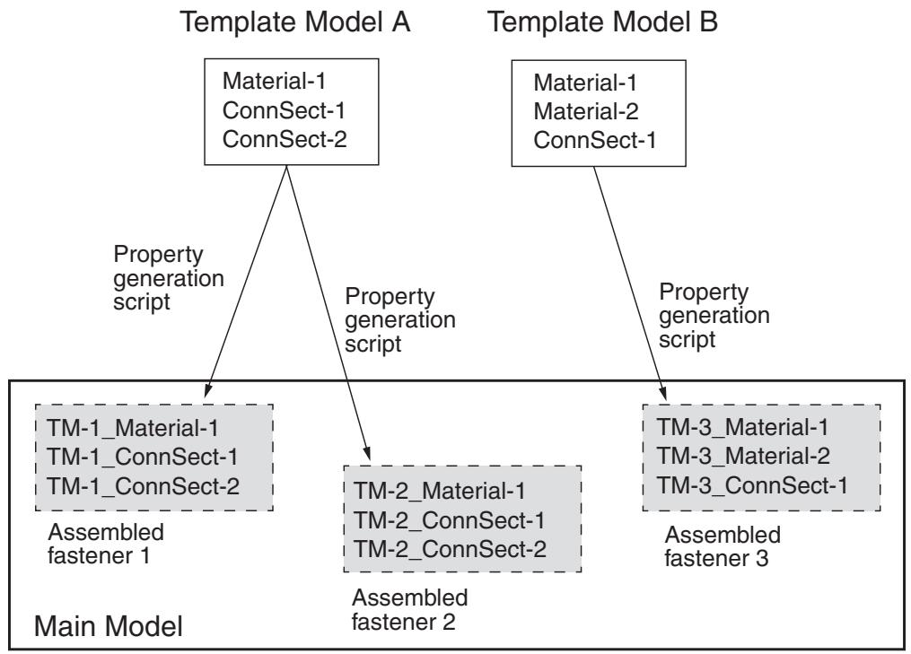  
Figure 1: Using multiple property generation scripts.

## Example property generation script

A complete example of a property generation script is provided in the blog post “Property generation scripts for assembled fasteners in Abaqus/CAE” in the

https://www.3ds.com/products-services/simulia/simulia-academic-program/learning-community/. The script uses a method named getSurfaceSections that is useful for assembled fastener property scripts. This method accepts a surface name and returns a list of all section names found on the geometry underlying the named surface region; see Assembly object. The getSurfaceSections method can be used to obtain section information such as the material name and thickness, as shown in the code fragment below.

```python
def __init__(self, scriptName, modelName, fastenerName):
    self.scriptName = scriptName
    self.modelName = modelName
    self.fastenerName = fastenerName
    print 'Running script "%s" for "%s"' % (scriptName,
        fastenerName)
    assy = mdb.models[modelName].rootAssembly
    eo = assy.engineeringFeatures.fasteners[fastenerName]
    print eo.assignSurfaces
    diameter = getInput('Enter %s bolt diameter:' % scriptName)
    print ' Bolt diameter: %s' % diameter
    for aSurf in eo.assignSurfaces:
        sectNames = assy.getSurfaceSections(aSurf)
        print ' %s: %s' % (aSurf, sectNames)
        # No section assigned
        if (len(sectNames) > 0 and sectNames[0] == ''):
            continue
        for section in sectNames:
            sectObj = mdb.models[modelName].sections[section]
            if (type(sectObj) == HomogeneousShellSectionType):
                print ' %s: mat=%s, thk=%s' % \
                    (section, sectObj.material, sectObj.thickness)
```

## Registering the property generation script

You provide the file name of the property generation script on the Properties tabbed page of the Edit Fasteners dialog box. The script is executed only when you click OK in the Edit Fasteners dialog box, not when Abaqus/CAE creates the input file. The property generation script is run only in the main model on the assembled fasteners, not in the template model.

To make your property generation scripts available from the Edit Fasteners dialog box, you must register each script similar to the way in which you register an Abaqus/CAE plug-in. The script must be registered before you startAbaqus/CAE. Any scripts that have been registered will be available from a pull-down list in the Edit Fasteners dialog box.

To register a property generation script, you must write a small registration script containing the following lines:

```python
from abaqusGui import *
toolset = getAFXApp().getAFXMainWindow().getPluginToolset()
toolset.registerAsmbdFastenerScript('filename')
```

This registration script file must be named registerAsmbFstnrScripts\_plugin.py. In the code replace filename with the name of your property generation script. The registration script informs Abaqus/CAE that you have a property generation script named filename.py that you wish to use with assembled fasteners.

Your property generation scripts and the registration script must be placed in your abaqus\_plugins directory; see Where are plug-in files stored?, for the possible locations of the abaqus\_plugins directory. For more details about registration scripts, see What are the kernel and GUI registration commands?.

## Output requests for assembled fasteners

You can obtain both field output and history output from assembled fasteners in your main model. The output must be requested on named sets that you have defined in the template model.

1. In the Step module, working in your main model (not the template model), display the Edit History Output Request dialog box or the Edit Field Output Request dialog box; see the instructions in Creating and modifying output requests.  
2. From the Domain list, choose Assembled fastener set.  
3. From the Fastener list, choose the name of the assembled fastener for which you want output.  
4. From the Set list, choose any set from the template model. The assembled fastener in your main model references the sets defined in the template model.  
5. Continue selecting output variables and other options, and click OK to save your request.

## Additional information

• Creating assembled fasteners  
• Understanding output requests

## Assembled fasteners vs. point-based fasteners

Assembled fasteners and point-based (mesh-independent) fasteners produce slightly different analysis results when used for the same fastener model. Assembled fasteners and point-based fasteners will generate different coupling nodes and coupling weights, leading to different solutions. The differences between point-based and assembled fasteners are described below and in Figure 1 and Figure 2.

  
Figure 1: Adjustments for assembled fasteners vs. point-based fasteners.

  
Figure 2: Location of attachment point for assembled fasteners vs. point-based fasteners.

## Point-based fasteners

Abaqus looks at the first node of the connector and projects it onto the first surface (given the data line). Abaqus then moves normal to the facet, where it finds the first projection point and finds the subsequent projection points on the second surface.

## Assembled fasteners

When the assembled fastener is instanced in the main model, Abaqus places the first node of the connector where the first projection point of the point-based fastener model is located. Both fastener types accomplish this

placement with normal projections. However, for assembled fasteners an adjust point constraint is performed on the second node of the connector; i.e., a normal projection onto the second surface. This action is not the same as moving normal to the first projection point facet unless the two normals align perfectly. Therefore, the second (subsequent) attachment points can be different for assembled fasteners versus point-based fasteners, which will lead to differences in the analysis solution.

In an ideal case where the two surfaces are placed exactly the same distance apart as the template model connector and are parallel to each other, Abaqus will get the same projection points for assembled fasteners and point-based fasteners. However, this situation will not be the case in general.

## Managing fasteners

The Fasteners Manager allows you to create and manage fasteners. The manager includes a list of the names and types of fasteners that you have defined. The Create, Edit, Copy, Rename, and Delete buttons in the manager allow you to create new fasteners or to edit, copy, rename, and delete existing ones. The icons in the column along the left side of the manager allow you to suppress and resume existing fasteners. You can also initiate these procedures using the Special->Fasteners menu from the main menu bar in the Interaction module. After you select a management operation from the main menu bar, the procedure is exactly the same as if you had clicked the corresponding button inside the manager dialog box.

## Additional information

• Suppressing and resuming objects  
• Creating point-based fasteners  
• Creating discrete fasteners

## Creating point-based fasteners

You can create point-based fasteners in the Interaction module by picking each positioning point from the viewport or by reading the coordinates of the positioning points from a file.

You can allow Abaqus/CAE to project the positioning point to the closest face along a normal to the surface, or you can specify the direction vector along which the point is projected to the closest face. For more information, see About fasteners.

## In this section:

Defining the surfaces where fasteners will be connected  
Defining the fastener attachment zone  
Defining the fastener properties  
Defining the fastener formulation  
Adjusting the fastener definition

You use the Domain tabbed page to edit the positioning points and to select the target surfaces onto which Abaqus/CAE projects the points and the vector along which the points are projected.

1. From the Edit Fasteners dialog box, display the Domain tabbed page.  
2. Choose the direction vector along which the positioning points will be projected onto the target surface.

• By default, Abaqus/CAE creates the direction vector along which the positioning points will be projected along the normal to the closest face.

• To change the direction vector, toggle on Specify, click , and select the points representing the start and end of the direction vector. Abaqus/CAE displays the direction vector.

3. Select the approach for the target surfaces.

• Choose Whole model to use all of the surfaces in the model as the target surfaces.  
Choose Fasten specified surfaces by proximity to specify the surfaces to be connected. The fastening point connectivity is defined by the relative positions of the surfaces along the direction vector.  
Choose Fasten in specified order to specify a particular order of the target surfaces. The fastening point connectivity is determined by the direction vector.

4. Double click the first row in the target surfaces table, and select surfaces in the viewport. Click Done in the prompt area to indicate you have finished the surface selection.

You can select multiple surfaces from the viewport to define a single surface region.

5. Click mouse button 3 anywhere on the target surfaces table to edit the selected surface, add a new surface, or delete a surface.

## Additional information

• Mesh-Independent Fasteners  
• About fasteners  
• Understanding attachment points and lines

## Defining the fastener attachment zone

You use the Criteria tabbed page to specify parameters that Abaqus uses to determine where to project the fasteners when you analyze the model.

1. From the Edit Fasteners dialog box, display the Criteria tabbed page.  
2. Choose the Attachment method. In general, a positioning point should be located as close to the surfaces being connected as possible. Abaqus determines the actual fastening points where the fasteners are attached to the surfaces being connected by first projecting the positioning point onto the closest surface. You can choose from the following projection methods:

• Face-to-Face

• Face-to-Edge

• Edge-to-Face

• Edge-to-Edge

The method that you should choose depends on how the surfaces are oriented relative to each other. For more information, see Specifying the Positioning Points, Projection Method, and Fastening Points.

3. Choose the method for specifying the distance from the positioning points within which the fastening points must lie.

Choose Facet-based default to allow Abaqus to compute a default search radius based on the facet thickness (for shell elements) or characteristic facet length (for non-shell elements) in the vicinity of each positioning point.  
Choose Specify, and enter the maximum distance from the positioning point within which the fastening points will lie.

For more information, see Forming Fasteners on Surfaces inside a User-Specified Search Zone.

4. Choose the maximum number of layers through which the fastening points will be projected.

• Choose All to allow Abaqus to use the maximum possible number of layers.  
• Choose Specify, and enter the number of layers.

## Additional information

• Mesh-Independent Fasteners  
• About fasteners  
• Understanding attachment points and lines

## Defining the fastener properties

You use the Property tabbed page to define the radius and the mass of the fastener. You can also specify the connector section and the orientation of the local directions at each end of the connector.

Depending on the connection type, a local orientation for the first node of the connector is required, optional, or not applicable. Depending on the connection type, a local orientation for the second node of the connector is optional or not applicable. For the local orientation requirements for each connection type, see the summary tables in Connection-Type Library.

For a description of how you can combine connector orientations and fastener orientations, see Defining the Fastener Orientation.

1. From the Edit Fasteners dialog box, display the Property tabbed page.  
2. Enter the Physical radius of the fastener to define the radius of its circular projection on the connected surfaces. Abaqus uses this information to define the geometric section properties of the fastener.  
3. Display the Section tabbed page, and choose the method that you will use to model each fastener.

Choose Connector section and select a connector section to model the point-to-point connection with connectors. Like other uses of connectors in Abaqus/CAE, the connection can be fully rigid or allow for unconstrained relative motion in the local connector component directions. In addition, you can specify deformable behavior using a connector behavior definition that includes the effects of elasticity, damping, plasticity, damage, and friction.  
Choose Rigid MPC to model a perfectly rigid fastener with a rigid, or beam, multi-point constraint (MPC).

If you choose a connector section that uses a basic, assembled, or complex connection type to model the fasteners, you can request output of connector element output variables. However, if you use a beam MPC to model the fasteners, no output is available from the fasteners.

4. Display the Connector Orientation 1 tabbed page to define the local directions for the first node of the connector. The Connector Orientation 1 tabbed page is available only if you use a connector section to model the fasteners.

a. In most cases Abaqus/CAE orients the nodes at both ends of the connector with the global coordinate system; however, some connection types that are referred to by the connection section require local directions. Click $\ Q$ to select a datum coordinate system that specifies local directions at the first  
node of the connector. Click to create the datum coordinate system if it does not already exist. $\hat { \lambda }$

b. Do either of the following:

• Choose No modifications to CSYS to use the selected datum coordinate system.  
If desired, choose Additional rotation angle and specify an additional rotation angle and the axis about which Abaqus/CAE will apply the additional rotation. The additional rotation (in degrees) is applied to both directions orthogonal to the selected axis.

5. Display the Connector Orientation 2 tabbed page to define the local directions for the second node of the connector. The Connector Orientation 2 tabbed page is available only if you select a datum coordinate system that specifies local directions for the first node of the connector.

a. Click $\ Q$ to select a datum coordinate system that specifies local directions for the second node of the connector. Click $\hat { \lambda }$ to create the datum coordinate system if it does not already exist.  
b. Do one of the following:

Choose Use orientation 1 to define the same local directions that you specified on the Connector Orientation 1 tabbed page.  
• Choose No modifications to CSYS to use the selected datum coordinate system.  
• If desired, choose Additional rotation angle and specify an additional rotation angle and the axis about which Abaqus/CAE will apply the additional rotation. The additional rotation (in degrees) is applied to both directions orthogonal to the selected axis.

## Additional information

• Connection Types  
• Mesh-Independent Fasteners  
• About fasteners  
• Understanding attachment points and lines

## Defining the fastener formulation

You use the Formulation tabbed page to select the method that Abaqus/CAE uses to couple the motion of the fastening points to the selected surfaces. You can also constrain selected rotational degrees of freedom and choose the weighting method.

1. From the Edit Fasteners dialog box, display the Formulation tabbed page.  
2. Choose the method to couple the motion of the fastening points to the average motion of the nodes on the surfaces that fall inside the influence radius.

• Choose Continuum distributing (default) to use a general-purpose distributed coupling scheme.  
Choose Structural distributing to augment the distributed coupling scheme to account for rotations of surface nodes such that a fastening point remains approximately on a shell surface on bending.

For more information, see Distributing Coupling Constraints.

3. If desired, toggle off a rotational degree of freedom to remove its constraint. Abaqus/CAE always constrains all translational degrees of freedom in a fastener.

4. Choose the weighting method that Abaqus uses to modify the default weight distribution at the coupling nodes within the radius of influence.

• Choose Uniform (default) to select a weight distribution that is uniform and equal to 1.0.  
• Choose Linear to select a weight distribution that decreases linearly with distance from the fastening point.  
Choose Quadratic to select a weight distribution that decreases by a quadratic polynomial function with distance from the fastening point.  
Choose Cubic to select a weight distribution that decreases by a cubic polynomial monotonic function with distance from the fastening point.

For more information, see Weighting Methods.

## Additional information

• Mesh-Independent Fasteners  
• About fasteners  
• Understanding attachment points and lines

## Adjusting the fastener definition

You use the Adjust tabbed page to specify the orientation of the fastener. For a description of how you can combine connector orientations and fastener orientations, see Defining the Fastener Orientation. You can also specify how Abaqus will compute the radius of influence, which determines the group of nodes that will be associated with each fastening point.

1. From the Edit Fasteners dialog box, display the Adjust tabbed page.  
2. By default, Abaqus determines the orientation of each fastener from the default local directions of the  
surface that is closest to the fastening point. Click to select a datum coordinate system (CSYS) 4 that specifies the orientation of the fastener. Click to create the datum coordinate system if it does not already exist. The z-axis of the CSYS should be approximately normal to the surfaces that are being connected, and the local x- and y-axes should be approximately tangent to the surfaces that are being connected.  
3. By default, Abaqus adjusts the orientation that you specified such that the local z-axis for each fastener is normal to the surface that is closest to the fastening point. Toggle off Adjust CSYS to make Z-axis normal to closest surface to use the selected coordinate system to define the local directions precisely.  
4. Each fastening point is associated with a group of nodes on the surface in the immediate neighborhood of the fastening point called a region of influence. The motion of the fastening point is then coupled in a weighted sense to the motion of the nodes in this region by a distributed coupling constraint. Each region of influence contains a minimum of three nodes. Choose either of the following to define the region of influence:

Choose Facet-based default to allow Abaqus to compute an internal radius of influence based on the geometric properties of the fastener, the characteristic length of the connected facets, and the weighting method you selected. The default radius of influence is always chosen to be the largest of the internally computed radius of influence, the physical fastener radius, and the distance from the projection point to the closest node.  
Choose Specify, and enter the radius of influence. If you specify a radius of influence that is smaller than the computed default radius of influence, Abaqus uses the computed value.

For more information, see Defining the Radius of Influence.

## Additional information

• Mesh-Independent Fasteners  
• About fasteners  
• Understanding attachment points and lines

## Creating discrete fasteners

You can create discrete fasteners in the Interaction module by selecting the attachment lines that connect the desired surfaces.

For each attachment line, Abaqus/CAE determines the fastening points and applies a distributing coupling between the fastening points and their corresponding surfaces.

You must assign a connector section to each attachment line that you select. You can use any of the Abaqus connection types to model complex behavior of your fasteners, such as deformable connectors that include the effects of elasticity, damage, plasticity, and friction. In addition, you can assign different connector sections to different attachment lines.

1. From the main menu in the Interaction module, select Special->Fasteners->Create.

Abaqus/CAE displays the Create Fasteners dialog box.


Tip: You can also create discrete fasteners using the tool in the Interaction module toolbox.

2. From the Create Fasteners dialog box that appears, select Discrete fasteners and click Continue.  
3. Select the attachment lines that represent the location of the discrete fasteners, and click Done. For more information, see Creating attachment lines by projecting points.

Abaqus/CAE displays the Edit Fasteners dialog box.

4. Choose the method to couple the motion of the fastening points to the average motion of the nodes on the surfaces that fall inside the influence radius.

Choose the Coupling type option Continuum distributing (default) to use a general-purpose distributed coupling scheme or Structural distributing to augment the distributed coupling scheme to account for rotations of surface nodes such that a fastening point remains approximately on a shell surface on bending.  
• Choose the Rotational Coupling type option Rotational Continuum distributing or Rotational Structural distributing (default).

For more information, see Distributing Coupling Constraints.

5. If desired, toggle off a rotational degree of freedom to remove its constraint. Abaqus/CAE always constrains all translational degrees of freedom in a distributing coupling.  
6. Choose the weighting method that Abaqus will use to modify the default weight distribution at the coupling nodes:

• Choose Uniform (default) to select a weight distribution that is uniform and equal to 1.0.  
• Choose Linear to select a weight distribution that decreases linearly with distance from the fastening point.  
Choose Quadratic to select a weight distribution that decreases by a quadratic polynomial function with distance from the fastening point.  
Choose Cubic to select a weight distribution that decreases by a cubic polynomial monotonic function with distance from the fastening point.

For more information, see Weighting Methods.

7. If desired, select or create a datum coordinate system that specifies the initial orientation of the local system in which the constrained degrees of freedom are defined. By default, the orientation of the constrained degrees of freedom is defined by the global coordinate system.  
8. Specify the radius of influence centered about the fastening point. You can enter a value or allow Abaqus to use the entire surface to define the coupling constraint.

9. Click OK to close the Edit Fasteners dialog box.

Abaqus/CAE displays the distributing coupling of the discrete fastener between the fastening points and connected faces. The radius of the circle reflects the specified radius of influence. If the coupling constraint definition uses the entire surface, the lines from the fastening point will extend past the circle. For orphan mesh models, you can modify the appearance of the distributing coupling by changing the face and edge density in the assembly display options; for more information, see Controlling the display of attributes.

10. Complete the discrete fastener definition by assigning a connector section to the attachment lines, as described in Creating and modifying connector section assignments.

Abaqus/CAE displays the connector symbols for the discrete fastener.

## Additional information

• Coupling Constraints  
• About fasteners  
• Understanding attachment points and lines

## Creating assembled fasteners

You can create assembled fasteners in the Interaction module after you have developed your template model. For more information, see About fasteners.

## In this section:

Mapping the template model surfaces to main model surfaces  
Orienting the geometry read in from the template model  
Modifying fastener properties in the main model  
Re-running a property generation script

## Mapping the template model surfaces to main model surfaces

You use the Surfaces tabbed page to assign the constraint surfaces from the template model to the corresponding target surfaces that will be fastened in your main model. The constraint surfaces must be mapped into the main model to enable the constraint behaviors in the main model.

All surfaces involved in the template model constraints must have assigned names. The corresponding target surfaces in the main model must also have names.

1. From the Edit Fasteners dialog box, display the Surfaces tabbed page.  
2. In the Constraint Surface Substitutions table, assign each Template Surface to an Assignment Surface in the main model.

The Template Surface column will be prepopulated with the names of any template model surfaces involved in tie constraints, coupling constraints, or adjust points constraints. If the template surfaces are ordered correctly, you can simply choose the main model surface names in the Assignment Surface column of the table. If you need to change the order of the template model surfaces that will be assigned, click in each table cell and then click the arrow that appears to display the list of available surface names. The template surfaces are initially listed in ascending Z-axis order, but you can change the order to coincide with your template fastener design. However, the ordering of the surfaces is not significant beyond the selection of the first surface, because the corresponding assignment surface normal is used to orient the assembled fastener.

To choose the main model assignment surface for each template surface, click in the corresponding table cell and click the arrow that appears to choose from the list of available surfaces in the main

model. If you have not assigned a name to any of the surfaces you need to use, click


Assignment Surface) to define a new surface and add it to the list.

(Create

3. You can toggle on Render template surfaces to show the surfaces in the main model, if desired.

You use the Orientations tabbed page to specify how the template fastener construct is oriented at each attachment point. The template model is rotated into the main model and oriented such that the global coordinate system of the template model aligns with the coordinate system you specify. The default is to orient the template model copies such that the positive Z-axis of the global coordinate system of the template model aligns with the normal vector of the first surface at every attachment point. This default orientation from the first surface normal creates a Z-axis alignment at every attachment point. The X-axis is then computed by projecting the global X-axis onto the surface. When the global X-axis is parallel to the normal or to the Z-axis alignment, then the X-axis is computed by projecting the global Y-axis onto the surface. Further, the Y-axis is computed by taking the cross product of the normal and the computed X-axis.

1. From the Edit Fasteners dialog box, display the Orientations tabbed page.  
2. Choose the orientation option that Abaqus/CAE will use to orient the fastener template at each attachment point.

Choose Compute orientation based on first surface normal (default) to orient the fastener geometry such that the global coordinate system of the template model aligns with the normal vector of the first assignment surface in the main model.

You can toggle on Flip normal direction to reverse the direction, if desired.

• Choose Specify uniform CSYS to orient the fastener geometry with a coordinate system that you choose. Click (Edit) to select from the existing datum coordinate systems in your main model.

The default is to use the global coordinate system of the main model. Click (Create Datum CSYS) to create a new coordinate system.

3. If desired, toggle on Display orientation direction at attachment points to show orientation triads at the attachment point of each assembled fastener. These visualization options are not available until you have selected the control point set and made the first surface assignment. Choose either of the following suboptions:

• Toggle on Display only the normal direction to remove the 1-axis and the 2-axis from the triads, leaving only the surface normal vector.  
Toggle on Include template model surfaces every x points to display sketched outlines of the constraint surfaces from the template model. Adjust the number x up or down to show the surfaces at every attachment point, every other point, every third point, etc. The surfaces will be color-coded according to the colors shown on this tabbed page and in the Constraint Surface Substitutions table on the Surfaces tabbed page.

This option is helpful for positioning and orienting the template model correctly. If your template model surfaces are too large, however (relative to the main model dimensions), the resulting display may be too crowded. You may wish to go back and resize the surfaces in your template model if this is the case.

## Modifying fastener properties in the main model

You use the Properties tabbed page to specify a property generation script to modify the properties copied into the main model from the template model. The script is executed by Abaqus/CAE only when you click OK in the Edit Fasteners dialog box, not when Abaqus/CAE creates the input file. See Using property generation scripts for assembled fasteners, for complete information.

Your property generation scripts must be registered before starting Abaqus/CAE; see Registering the property generation script. Any scripts that have been registered will be available for selection on the Properties tabbed page.

1. From the Edit Fasteners dialog box, display the Properties tabbed page.  
2. By default, the properties copied into the main model from the template model are named with the prefix TM-1 for the first assembled fastener you create. For example, a connector section named BoltSection in the template model will be named TM-1\_BoltSection in the main model. Subsequent assembled fasteners will use the prefixes TM-2, TM-3, etc.  
If desired, you can change the name prefix used in the Property prefix string field. The property prefix string must be unique for each assembled fastener.

3. Toggle on Specify a property generation script, and select the filename of your script from the list.

## Re-running a property generation script

You use the Re-run tabbed page to have Abaqus/CAE re-copy properties from the template model and then re-run the property generation script. The script currently specified on the Properties tabbed page is run. The action occurs when you click OK to close the dialog box.

The Re-run tabbed page is available only when you are editing an assembled fastener that has already been created.


## Note:

Any time you make a change in the the Edit Fasteners dialog box, the re-run action occurs automatically when you click OK. You only need to use the Re-copy template model properties and re-run script option when no other changes have been made.

1. From the Edit Fasteners dialog box, display the Re-run tabbed page.  
2. Toggle on Re-copy template model properties and re-run script.  
3. Click OK to close the dialog box.

## Fracture mechanics

You can do the following to model fracture mechanics with Abaqus/CAE:

• Create a seam crack that defines an edge or a face with overlapping nodes that can separate during an analysis.  
• Use contour integral estimates to study the onset of cracking in quasi-static problems; however, a contour integral estimate does not predict how a crack will propagate. You can compute contour integrals for twoor three-dimensional models.  
Use the extended finite element method (XFEM) to study the initiation and propagation of a crack along an arbitrary, solution-dependent path without needing to remesh your model. XFEM is available only for three-dimensional solid and planar models and orphan meshes.  
• Use the virtual crack closure technique (VCCT) to study the initiation and propagation of a crack along a known crack surface.  
• Use the Crack Manager to create and manage your cracks.

## In this section:

Seam cracks  
Using contour integrals to model fracture mechanics  
Using the extended finite element method to model fracture mechanics  
Using the virtual crack closure technique to model crack propagation  
Managing cracks

## Seam cracks

A seam defines an edge or a face with overlapping nodes that can separate during an analysis. You can include a seam crack in your model. Alternatively, you can refer to the seam when creating a contour integral; however, you cannot use a seam crack with the extended finite element method (XFEM).

## In this section:

What is a seam?  
Creating a seam

## What is a seam?

A seam defines an edge or a face in your model that is originally closed but can open during an analysis. Abaqus/CAE places overlapping duplicate nodes along a seam when the mesh is generated. A seam cannot extend along the boundaries of a part and must be embedded within a face of a two-dimensional part or within a cell of a solid part. After you create a seam, you can determine its crack properties using a contour integral analysis. Because a seam modifies the mesh, you cannot create a seam on a dependent part instance.

Figure 1 shows a seam on the face of a planar part and the effect of applying a tensile load to the model. The duplicate nodes along the seam are independent of each other and are free to move.

  
Figure 1: A seam embedded in a face.

Figure 2 shows a similar analysis of a seam embedded in a solid part. The seam was created by partitioning the solid with a sketch drawn on a datum plane.

  
Figure 2: A seam embedded in a cell.

For detailed instructions, see Creating a seam, .

## Creating a seam

You can use the Special menu in the Interaction module to define a seam in your model. A seam defines a region in your model that can open during an analysis. Abaqus/CAE places overlapping duplicate nodes along a seam when the mesh is generated. A seam cannot extend along the boundaries of a part and must be embedded within a face of a two-dimensional part or within a cell of a solid part. You can use the seam when you are selecting the crack front and the crack tip that will be used in a contour integral analysis. For more information, see What is a seam?.

1. From the main menu bar in the Interaction module, select Special->Crack->Assign seam.  
2. From the model in the viewport, select the entities representing the seam. The entities must be embedded edges within a face of a two-dimensional part or embedded faces within a cell of a solid part; you cannot select any entities that lie on the boundary of the part.  
3. Click mouse button 2 to indicate that you have finished selecting the seam.  
Abaqus/CAE creates the seam.  
4. To include the seam in a contour integral analysis, follow the procedure described in Creating a contour integral crack.

## Additional information

• What is a seam?  
• Fracture Mechanics

## Using contour integrals to model fracture mechanics

You can study the onset of cracking in a quasi-static model by selecting regions from your model that will be used to compute contour integral estimates.

During the analysis Abaqus/Standard writes the values of the contour integrals to the output database as history output. For a detailed description of contour integrals, see Contour Integral Evaluation. This section describes how you define a crack in Abaqus/CAE.

## In this section:

Performing a contour integral analysis  
Defining the crack front  
Defining the crack tip or crack line  
Defining the crack extension direction  
Controlling the singularity at the crack tip for a small-strain analysis  
Contour integral output  
Meshing the crack region and assigning elements  
Controlling the singularity at the crack tip  
Creating a contour integral crack  
Modifying data for contour integrals  
Requesting contour integral output

## Performing a contour integral analysis

You can study the onset of cracking in quasi-static problems using contour integral estimates; however, a contour integral estimate does not predict how a crack will propagate.

You can compute contour integrals for two- or three-dimensional models, and you can choose to perform one of the following types of contour integral calculations:

• J-integral  
• -integral (for creep)  
• T-stress (for linear materials)  
• Stress intensity factors for linear homogeneous materials and for interfacial cracks lying on the interface between two linear homogeneous materials

For more information, see Contour Integral Evaluation.

You define cracks in the Interaction module. To perform a contour integral analysis, you must select the crack front, the crack tip or crack line, and the crack extension direction, as described in the following sections. The entities that you can select depend on whether the part is two- or three-dimensional and whether you are defining the part using geometry or using elements and nodes from an orphan mesh. In some cases the crack tip or the crack line is the same as the crack front that you selected, and Abaqus/CAE selects the crack tip or crack line for you.

A crack in a two-dimensional model is a region containing edges that are free to move apart. A crack in a three-dimensional model is a region containing faces that are free to move apart. The simplest approach to performing a contour integral analysis uses a region that already contains edges or faces that are free to move apart as the crack separates. Alternatively, you can model the crack as a line embedded in a face in a two-dimensional model or as a face embedded in a cell in a three-dimensional model. The embedded line or face is called a seam, and you can perform a contour integral analysis using a seam. When you mesh the model, Abaqus/CAE creates duplicate overlapping nodes on the seam; these coincident nodes are free to move apart as the seam separates. Seams are described in more detail in What is a seam?. Figure 1 shows a two-dimensional model with existing edges that are free to move apart and a similar model with an embedded seam that is free to move apart.

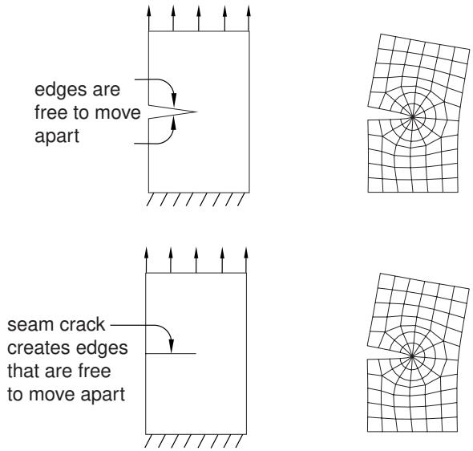  
Figure 1:You can define a crack using an existing region or using a seam.

You can specify that the crack front is defined on a symmetry plane, in which case you need to model only half of the structure. Abaqus doubles the values calculated by the contour integral to arrive at the correct values. In most cases you need a refined mesh surrounding the crack. After you create a crack, you must use the History Output Request editor to request that Abaqus write contour integral information to the output database. For more information, see Contour integral output.

For detailed instructions, see Creating a contour integral crack.

## Defining the crack front

The first step in the procedure to configure a contour integral is to define the crack front by selecting entities from the assembly. The crack front is the forward part of the crack. Abaqus uses the crack front to compute the first contour integral using all of the elements inside the crack front and one layer of elements outside the crack front. You can request output for more than one contour integral, in which case Abaqus/CAE adds a single layer of elements to the group of elements that were used to calculate the previous contour integral. Figure 1 illustrates how Abaqus/CAE computes successive contour integrals for a two-dimensional model by adding layers of elements.

  
Figure 1: Successive contour integrals are calculated by adding a layer of elements.  
If your part is three-dimensional, Abaqus computes contour integrals at each node along the crack line, as shown in Figure 2. For more information, see Defining the Crack Front.

  
Figure 2: Abaqus computes the contour integral at each node along the crack line.

The entities from which you can select depend on whether the crack front is located in geometry or an orphan mesh and on the modeling space of the part.

## Geometry

When you are defining the crack front on geometry, the entities that you can select depend on the modeling space of the part.

## Two-dimensional geometry

If you are defining the crack front on two-dimensional geometry, you can select the following:

• A single vertex  
• Connected edges  
• Connected faces

Figure 3 shows the entities from which you can select when defining a crack front on two-dimensional geometry.  
  
Figure 3: Selecting the crack front from two-dimensional geometry.

## Three-dimensional geometry

If you are defining the crack front on three-dimensional geometry, you can select the following:

• Connected edges  
• Connected faces  
• Connected cells

Figure 4 shows the entities from which you can select when defining a crack front on three-dimensional geometry.  
  
Figure 4: Selecting the crack front from three-dimensional geometry.

## Mesh

When you are defining the crack front on an orphan mesh, you can select the elements or element edges or faces that define the crack front. Alternatively, you can select the nodes from the corresponding region. When you are defining the crack front on an orphan mesh, the entities that you can select depend on the modeling space of the part.

## Two-dimensional orphan mesh

If you are defining the crack front on a two-dimensional orphan mesh, you can select the following:

• A single node  
• Connected element edges  
• Connected elements

Figure 5 shows the entities from which you can select when defining a crack front on a two-dimensional orphan mesh.

  
Figure 5: Selecting the crack front from a two-dimensional orphan mesh.

## Three-dimensional orphan mesh

If you are defining the crack front on a three-dimensional orphan mesh, you can select the following:

• Connected element edges  
• Connected element faces  
• Connected elements

Figure 6 shows the entities from which you can select when defining a crack front on a three-dimensional orphan mesh.  
  
Figure 6: Selecting the crack front from a three-dimensional orphan mesh.

## Defining the crack tip or crack line

After you have defined the crack front, the next step in the procedure to configure the contour integral is to define the crack tip or crack line by selecting entities from the assembly. The modeling space of your assembly governs whether you need to define a crack tip or a crack line for a contour integral analysis.

## Two-dimensional

If your assembly is two-dimensional, you must define the crack tip by selecting a vertex or a node. The crack tip is the point on the crack front where you define the crack extension direction, . In some cases the desired vertex or node will not exist, and you must create it by partitioning the crack front.

If you selected a vertex or a node to define the crack front, the same vertex or node defines the crack tip.

## Three-dimensional

If your part is three-dimensional, you must define the crack line by selecting edges or element edges that form a continuous line. The crack line is a series of connected edges along the crack front where you define the crack extension direction, . In some cases the desired edges will not exist, and you must create them by partitioning the crack front.

If you selected edges or element edges to define the crack front, the same edges define the crack line.

Selected edges (from an Abaqus/CAE native part or from an orphan mesh) must be connected, must connect one side of the crack front to the other, and must be included in the crack front.

## Defining the crack extension direction

After you have defined the crack front along with the crack tip or crack line, Abaqus/CAE prompts you to specify the crack extension direction at the crack tip or along the crack line. You can specify the normal to the crack plane, ; or you can specify the crack extension direction, , directly. For a detailed discussion of how Abaqus uses or to calculate the crack extension direction, see Specifying the Virtual Crack Extension Direction.

## Normal to crack plane

If you select Normal to crack plane, you can define the normal by selecting points from the model that represent the start and the end of the normal to the crack plane. The crack plane contains the vector that Abaqus needs to compute the contour integral. In many cases the crack plane represents the plane of symmetry of the crack.

You should define the normal to the crack plane only if the direction is the same at all points along the crack line. If the direction of the normal to the crack plane varies along the crack line, you cannot select a single normal that defines the crack extension direction at all points along the crack line.

To define the normal to the crack plane, you can select points from geometry (such as vertices, datum points, or midpoints), or you can select orphan mesh nodes. Alternatively, you can enter the coordinates of the points in the prompt area. If you select points from geometry and subsequently modify the part, Abaqus/CAE regenerates the points and updates the normal accordingly. If you are working with orphan mesh nodes, you must select nodes that represent the start and the end of the normal.

Abaqus calculates a crack extension direction, , that is orthogonal to the crack front tangent, , and the normal, . If required, you can flip the -direction vector.

## q vectors

If you select q vectors, you can define the crack extension direction, , directly by selecting points from the model that represent the start and end of the vector. If you are working with orphan mesh nodes, you must select nodes that represent the start and the end of the vector. Alternatively, you can enter the coordinates of the points in the prompt area.

Figure 1 shows an example of a crack front formed by a circular arc along which the direction of the vector is constantly varying. In contrast, the normal to the crack plane is constant. As a result, for this case you should define the crack extension direction by specifying the normal to the crack plane.

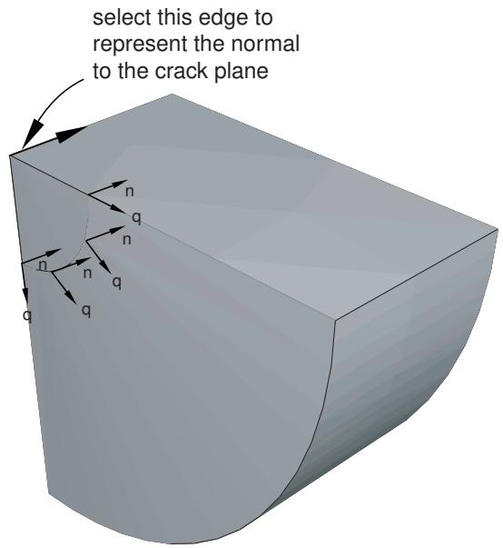  
Figure 1:The direction of the vector varies but the direction of the normal is constant.

Figure 2 shows a crack front formed by the edge of a truncated cone along which the directions of both the vector and the normal to the crack plane are varying.  
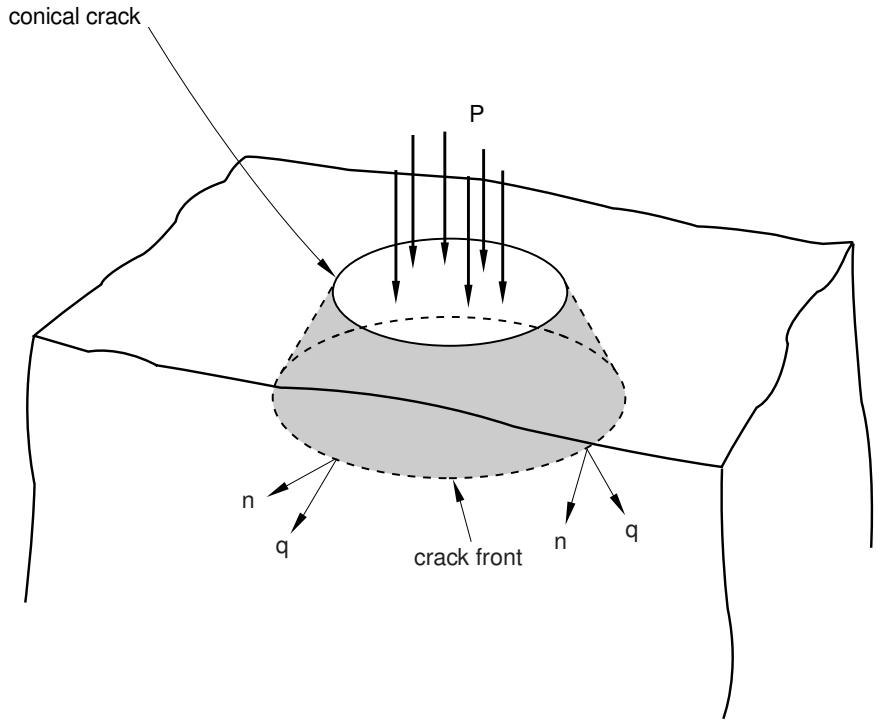  
Figure 2:The directions of both the vector and the normal vary along the crack front.

For this case you should do the following:

1. Define the contour integral, and use a single vector to specify the crack extension direction.  
2. Mesh the part, create a job, and write the model to an input file.

3. Import the input file, which will create an orphan mesh representation of the part.  
4. Edit the crack that was imported with the model. Each node along the crack front will have the crack extension direction defined by the vector that you specified in Step 1.  
5. Use the Query toolset to determine the start and end coordinates of the vector at each node, and edit the data defining the vectors at each node along the crack front.

This technique is shown in Figure 3.  
  
Figure 3: Entering the vector at each node along the crack front.  
Figure 3 is taken from Contour integrals for a conical crack in a linear elastic infinite half space. An Abaqus Scripting Interface script is provided with this example that illustrates how you can enter the vector at each node along the crack front.

## Controlling the singularity at the crack tip for a small-strain analysis

If the geometry of the crack region defines a sharp crack, the strain field becomes singular at the crack tip, as described in Constructing a Fracture Mechanics Mesh for Small-Strain Analysis with the Conventional Finite Element Method. Including the singularity in your model for a small-strain analysis improves the accuracy of the contour integral and the stress and strain calculations.

To include the singularity in your contour integral estimates, click the Singularity tab in the Crack editor and choose the desired position of the midside node and degenerate element control. For detailed instructions, see Controlling the singularity at the crack tip.

In addition, you must do the following in the Mesh module:

• If the assembly or part is two-dimensional, you must model the crack front with a ring of triangles and assign quadrilateral elements to the remainder of the contour integral region.  
• If the assembly or part is three-dimensional, you must model the crack front with a ring of wedges and assign hexahedral elements to the remainder of the contour integral region.

When you mesh the crack front, Abaqus does the following:

• Converts the elements in the crack front to collapsed quadrilateral or hexahedral elements.  
If you modeled the crack front with a ring of second-order triangles or wedges, Abaqus moves the midside nodes to the specified position along the element edges that radiate out from the crack tip or crack line. (If you modeled the crack front with a ring of first-order triangles or wedges, Abaqus ignores the position that you specified for the midside nodes.)

A part instance that includes orphan mesh elements is always a dependent instance. As a result, you cannot adjust the midside nodes of these instances in the assembly. For more information, see What is the difference between editing an orphan mesh, a meshed part, and a meshed part instance in the assembly?. You must display the original orphan mesh and use the Edit Mesh toolset to adjust the position of the midsize nodes. For more information, see Adjusting the position of midside nodes. In addition, you cannot create collapsed elements from triangular and wedge elements of an orphan mesh.

## Contour integral output

After you have defined the crack, you must use the History Output Request editor in the Step module to include the contour integral data in the output database generated by the analysis. The editor allows you to configure the following:

• The output frequency.  
• The type of contour integral calculation to perform (J-integral, -integral, stress intensity factors, or T-stress).  
• The number of contours to evaluate.

Abaqus writes a history output variable to the output database for each contour integral that it calculates. Figure 1 shows the format of the name of an output variable representing a contour integral.

  
Figure 1:The format of a contour integral name in the output database.

For detailed instructions, see Requesting contour integral output. For more information, see Modifying history output requests, and Contour Integral Evaluation.

## Meshing the crack region and assigning elements

Large stress concentrations occur at the crack tip. As a result, you should create a refined mesh around the crack tip to get accurate results for stresses and strains. In contrast, because the J-integral is an energy measure, you can obtain accurate J-values with a relatively coarse mesh. However, if the material becomes more nonlinear, you must create a finer mesh at the crack tip to maintain the accuracy of the J-values. You can control the density of the mesh at the crack tip by partitioning the region and by assigning mesh seeds to the resulting edges. For more information, see Understanding seeding.

For a large-strain analysis during which Abaqus will allow for nonlinear geometry, you should mesh the contour integral region with quadrilateral or hexahedral elements. For more information, see Constructing a Fracture Mechanics Mesh for Finite-Strain Analysis with the Conventional Finite Element Method.

However, for a small-strain analysis that does not allow for nonlinear geometry, you must allow for the singularity at the crack tip or crack line by meshing the region that defines the crack front with a ring of triangles or wedges. For more information, see Controlling the singularity at the crack tip for a small-strain analysis.

You must use the swept meshing technique to create wedge elements; however, there are limitations on the regions that Abaqus/CAE can mesh using the swept meshing technique, as described in Swept meshing of three-dimensional solids. As a result, if you cannot use the swept meshing technique, you cannot create wedge elements, and you cannot allow for the singularity at the crack line. In most cases you can ignore the singularity if your mesh is sufficiently refined to model the deformation around the crack tip or crack line and the resulting high strain gradients. You can also ignore the singularity if you are interested in only the contour integral output.

## Controlling the singularity at the crack tip

If the geometry of the crack region defines a sharp crack, the strain field becomes singular at the crack tip, as described in Constructing a Fracture Mechanics Mesh for Small-Strain Analysis with the Conventional Finite Element Method. Including the singularity in your model for a small-strain analysis improves the accuracy of the contour integral and the stress and strain calculations.

1. Display the Crack editor using one of the following methods:

• To configure a new contour integral, follow the instructions in Creating a contour integral crack.  
• To edit an existing contour integral, select Special->Crack->Edit->crack name from the main menu bar in the Interaction module.

2. To include the strain singularity in your contour integral estimates, click the Singularity tab in the Crack editor, and do one of the following:

• To create a $\mathbf { 1 } / \sqrt { r }$ strain singularity for an elastic fracture mechanics application:

1. From the Second-order Mesh Options field, enter a value of 0.25 for the Midside node parameter to move the midside nodes to the points.

2. From the Degenerate Element Control at Crack Tip/Line field, choose Collapsed element side, single node.

• To create a strain singularity for a perfect plasticity fracture mechanics application:

1. From the Second-order Mesh Options field, enter a value of 0.5 for the Midside node parameter to keep the midside nodes at the midside points.  
2. From the Degenerate element control at Crack Tip/Line field, choose Collapsed element side, duplicate nodes.

• To create a combined $1 / \sqrt { r }$ and strain singularity for a power law hardening material:

1. From the Second-order Mesh Options field, enter a value of 0.25 for the Midside node parameter.

2. From the Degenerate element control at Crack Tip/Line field, choose Collapsed element side, duplicate nodes.

3. Click OK to include the singularity in the contour integral estimation and to close the editor.


## Note:

In most cases you must assign second-order triangle or wedge elements to the crack front region to include the singularity in your contour integral estimates. If you assign first-order elements, Abaqus ignores the value of the midside node setting in the Singularity tabbed page. However, if you assign first-order elements and choose Collapsed element side, duplicate nodes from

the Degenerate Element Control at Crack Tip/Line field, you will create a strain singularity.

You can use the Special menu in the Interaction module to create a contour integral crack. For more information, see Fracture Mechanics.

The entities that you select to define the contour integral depend on whether the part is two- or three-dimensional and whether you are defining the part using geometry or using orphan mesh elements and nodes.

1. From the main menu bar in the Interaction module, select Special->Crack->Create.  
2. From the Create Crack dialog box that appears, select Contour integral.  
3. Enter the name of the crack, and click Continue to close the dialog box.  
4. From the model in the viewport, select the entities representing the crack front region. For a description of the entities to select, see Defining the crack front.  
5. Click mouse button 2 to indicate that you have finished selecting the crack front region.  
6. From the model in the viewport, select the entities representing the crack-tip region. In some cases, depending on the modeling space of your model and the entities that you selected to define the crack front, Abaqus/CAE selects the crack tip for you and skips to Step 7. For more information, see Defining the crack tip or crack line.  
From the prompt line, toggle on Select mesh entities to select entities from an orphan mesh.

7. Click mouse button 2 to indicate that you have finished selecting the crack-tip region.

8. From the prompt area, choose the method for defining the crack extension direction.

## Normal to crack plane

Select Normal to crack plane to specify the normal to the crack plane, and select points representing the start and end of the normal.

## q vectors

Select q vectors to specify the crack extension direction directly, and select points representing the start and end of the vector.

For more information, see Defining the crack extension direction.

Abaqus/CAE displays a blue arrow indicating the crack extension direction and, if specified, a red arrow indicating the normal to the crack plane and displays the Edit Crack dialog box.

9. Use the Edit Crack dialog box to configure the parameters that control a contour integral analysis.

• Click the General tab of the dialog box to do the following:

- Specify that the crack front is defined on a symmetry plane that models only half of the structure.  
- Change the entities that define the crack front or crack tip/line.  
Change the method for defining the crack extension direction. You can also change the entities that define the crack extension direction and flip the crack extension direction ( vector).

For more information, see Modifying data for contour integrals.

Click the Singularity tab of the dialog box to model a singularity of the strain field at the crack tip. For more information, see Controlling the singularity at the crack tip.

10. Click OK to configure the contour integral and to close the editor.

Abaqus displays green crosses on the region to represent the crack front.

You must use the History Output Request editor in the Step module to include the contour integral data in the output database generated by the analysis. For more information, see Contour integral output, and Modifying history output requests.

## Additional information

• Using contour integrals to model fracture mechanics  
• Fracture Mechanics

If desired, you can modify the entities that you selected to define the crack front, the crack tip, and the crack extension direction that will be used to define a contour integral. You can also specify that the crack front is defined on a symmetry plane that models only half of the structure and flip the calculated crack extension direction, if desired. For more information, see Symmetry with the Conventional Finite Element Method.

1. Display the Crack editor using one of the following methods:

• To configure a new contour integral, follow the instructions in Creating a contour integral crack.  
• To edit an existing contour integral, select Special->Crack->Edit->crack name from the main menu bar in the Interaction module.

2. Toggle on On symmetry plane (half-crack model) to specify that the crack front is defined on a symmetry plane that models only half of the structure. Abaqus doubles the change in potential energy calculated from the virtual crack front advance to compute the correct contour integral values.

3. If desired, click to modify your selection of entities that define the crack front, crack tip, or crack line. If Abaqus/CAE selected the crack tip or crack line region to be the same as the crack front, you cannot edit the selection.

4. If desired, change the method for defining the crack extension direction. You can also click to modify your selection of entities that define the crack extension direction.

5. If desired, you can click to confirm or flip the calculated crack extension direction. In the prompt area, click Yes to confirm the -vector direction or click Flip to reverse the direction.

6. Click OK to configure the contour integral and to close the editor.

Abaqus displays green crosses on the region to represent the crack front.

You must use the History Output Request editor in the Step module to include the contour integral data in the output database generated by the analysis. For more information, see Contour integral output, and Modifying history output requests.

## Requesting contour integral output

You use the History Output Request editor in the Step module to request output from the contour integral analysis. You must select Crack from the Domain field. The editor then allows you to select the output frequency and the type of contour integral analysis to perform. For more information, see Modifying history output requests, and Contour Integral Evaluation.

You can also request contour integral output for an XFEM fracture analysis. For more information, see Requesting contour integral output for XFEM.

1. Enter the Step module.  
2. From the main menu bar, select Output->History Output Request->Create.  
Abaqus/CAE displays the Create History dialog box.  
3. From the Create History dialog box, enter the name of the output request and the step in which it will be created. Click Continue to close the dialog box.  
Abaqus/CAE displays the History Output Requests editor.  
4. From the Domain field, select Crack, and select the desired contour integral.  
5. From the fields that appear in the History Output Requests editor, enter the output frequency.  
6. Enter the number of contours to evaluate. Abaqus/CAE computes the next contour integral by adding a single layer of elements to the region defined by the previous domain, as described in Figure 1. Each contour generates a value or a group of values for the contour integral.  
7. If desired, toggle on Step for residual stress initialization values, and select the step from which Abaqus will read the stress data in the last available increment and use the data to calculate the residual stresses. If you select the initial step, the residual stresses are defined by the specified initial conditions. You cannot select a step that occurs after the step in which the history output request is created. For more information, see Including the Effect of a Residual Stress Field on J-Integral Evaluation.  
8. Select the type of contour integral calculation to perform. You can select from the following:

## J-integral

You use the J-integral in rate-independent quasi-static fracture analysis to characterize the energy release associated with crack growth. The J-integral can be related to the stress-intensity factor if the material response is linear. For more information, see J-Integral.

## -integral

You use the $C _ { t }$ -integral for time-dependent creep behavior, where it characterizes creep crack deformation under certain creep conditions, including transient crack growth. For more information, see Ct-Integral.

## T-stress

You use the T-stress component to represent a stress parallel to the crack front. For more information, see T-Stress.

## Stress intensity factors

You use the stress intensity factors $\pmb { K } _ { I } , \pmb { K } _ { I I }$ , and ${ \pmb K } _ { I I I }$ in linear elastic fracture mechanics to characterize the local crack-tip stress and displacement fields. For more information, see Stress Intensity Factors.

If you request a contour integral calculation using stress intensity factors, Abaqus also computes the crack propagation direction at initiation. You must choose one of the following to indicate the crack initiation criteria:

• Maximum tangential stress  
• Maximum energy release rate  
• $\mathbf { K } _ { \mathbf { I I } } = \mathbf { 0 }$

For more information, see Crack Propagation Direction.

9. Click OK to configure the contour integral analysis and to close the editor.

For examples of how Abaqus names history output variables in the output database for each contour integral that it calculates, see Contour integral output.

## Using the extended finite element method to model fracture mechanics

You can use the extended finite element method (XFEM) to study the initiation and propagation of a crack along an arbitrary, solution-dependent path without needing to remesh your model.

XFEM is available for three-dimensional solid and two-dimensional planar models; three-dimensional shell models are not supported.

## In this section:

The extended finite element method (XFEM)  
Choosing the type of XFEM analysis  
Viewing an XFEM crack  
Creating an XFEM crack  
Deactivating and activating an XFEM crack growth  
Specifying a contact interaction property for XFEM  
Requesting contour integral output for XFEM

## The extended finite element method (XFEM)

You can study the onset and propagation of cracking in quasi-static problems using the extended finite element method (XFEM). XFEM allows you to study crack growth along an arbitrary, solution-dependent path without needing to remesh your model.

XFEM is available only for three-dimensional solid and two-dimensional planar models; three-dimensional shell models are not supported. You can use XFEM to study a crack in parts containing geometry, orphan mesh elements, or a combination of the two. You can choose to study a crack that grows arbitrarily through your model or a stationary crack. You define an XFEM crack in the Interaction module. You can specify the initial location of the crack.

Alternatively, you can allow Abaqus to determine the location of the crack during the analysis based on the value of the maximum principal stress or strain calculated in the crack domain. For more information, see Modeling Discontinuities as an Enriched Feature Using the Extended Finite Element Method. Examples of XFEM models created in Abaqus/CAE are provided in Modeling discontinuities using XFEM.

To perform an XFEM crack analysis, you must specify the following:

## Crack domain

To define the crack domain, you can select one or more cells from three-dimensional parts or one or more faces from two-dimensional planar parts. If you are defining the crack domain on an orphan mesh or a part containing both orphan and native mesh elements, you can select elements. The crack domain includes regions that contain any existing cracks and regions in which a crack might be initiated and into which a crack might propagate.

After you define the initial crack location, you can reduce the size of the crack domain by indicating that you want to use only elements in the vicinity of the crack geometry. You specify the number of element layers to include to prescribe a minimal enrichment zone automatically. The crack domain is defined using the elements intersected by the crack location. These elements are the initial set. The enrichment zone is built of elements in the neighborhood of the initial crack using the number of element layers that you specify. You can highlight the elements in the viewport and, if desired, save the highlighted elements to a set.

## Crack growth

You can allow the crack to propagate along an arbitrary, solution-dependent path, or you can specify that the crack is stationary.

## Initial crack location

To define the initial crack location, you can select faces from a three-dimensional solid or edges from a two-dimensional planar model. The initial crack location must be contained within the crack domain. A selected face can be a face of the solid, a face created by a partition, or a planar part instance. Similarly, a selected edge can be an edge of the solid, an edge created by a partition, or a wire part instance; you should not select a seam crack. You should not mesh the faces or edges that you selected to define the initial crack location. Figure 1 shows examples of the crack domain and the crack location for two- and three-dimensional geometry and orphan meshes.

  
Figure 1: Defining a crack for XFEM.

Alternatively, you can choose not to define the initial crack location. Regardless of whether you define the initial crack location, Abaqus initiates the creation of cracks during the simulation by searching for regions that are experiencing principal stresses and/or strains greater than the maximum damage values specified by the traction-separation laws.

## Enrichment radius

The enrichment radius is a small radius from the crack tip within which the elements will be used for calculating crack singularity for a stationary crack. Elements within the enrichment radius must be included in the cells or faces that you chose to represent the crack domain. You can allow Abaqus to calculate the radius (six times the typical element characteristic length in the enriched area), or you can specify its value.

## Contact interaction property

You can choose to associate a contact interaction property with the XFEM crack that defines the contact of cracked element surfaces. For detailed information, see Specifying a contact interaction property for XFEM.

## Damage initiation

You must specify the conditions that will initiate a crack by specifying damage initiation criteria in the material definition. You can specify a criterion based on either maximum principal stress or maximum principal strain. For more information, see Maximum principal stress or strain damage.

## Analysis procedure

You can include an XFEM crack in a static analysis procedure. Alternatively, you can include an XFEM crack in an implicit dynamic analysis procedure to simulate the fracture and failure in a structure under high-speed impact loading. The XFEM-based crack propagation simulated in an implicit dynamic procedure can also be preceded or followed by a static procedure to model the damage and failure throughout the loading history.

For detailed instructions, see Creating an XFEM crack.

## Choosing the type of XFEM analysis

Abaqus provides the traction-separation cohesive behavior approach and the linear elastic fracture mechanics (LEFM) approach for studying crack initiation and propagation using XFEM.

## Traction-separation cohesive behavior

The traction-separation cohesive behavior approach is described in detail in Modeling Moving Cracks with the Cohesive Segments Method and Phantom Nodes. You can specify the material properties that define the evolution of damage leading to eventual failure. You apply the material to the section that is assigned to the crack domain. You can choose to associate a normal behavior contact interaction property with the XFEM crack that defines the contact of cracked element surfaces. For detailed information, see Specifying a contact interaction property for XFEM. To assist convergence as the material fails, you can introduce localized damping using the viscous regularization technique. For more information, see Damage stabilization.

## Linear elastic fracture mechanics (LEFM)

The linear elastic fracture mechanics (LEFM) approach uses the modified Virtual Crack Closure Technique (VCCT) to calculate the strain energy release rate at the crack tip. The approach is more appropriate for brittle fracture problems and is described in detail in Applying the VCCT Technique to the XFEM-Based LEFM Approach. To use this approach, you must create a fracture criterion contact interaction property, as described in Specifying fracture criterion properties for crack propagation. If you specify localized damping in the contact interaction property, Abaqus will use the viscous regularization technique to assist convergence as the material fails. For more information, see Specifying fracture criterion properties for crack propagation.

## Viewing an XFEM crack

When you are creating your model, you must request field output for the signed distance function, PHILSM. When you open an output database file containing the PHILSM output variable, Abaqus/CAE creates a view cut along the XFEM crack (where the value of the signed distance function is zero). Therefore, when you display a deformed or contour plot, the cracked elements in the enriched region are visible, as shown in Figure 1.

  
Figure 1: Viewing an XFEM crack.

You can perform a time history animation of a contour plot and view the onset of damage calculated by XFEM. The animation also allows you to view the propagation of the damage through the enriched region as the analysis progresses. Turning on translucency allows you to see the progression of the crack through interior elements. For more information, see Changing the translucency.

To view the initial crack front, you can create an isosurface cut shape with PSILSM selected as the current primary field output variable. For more information, see Creating or editing a view cut.

If you want to investigate the crack in more detail, you can create a contour plot of the signed distance function (PHILSM) and determine in which elements the signed distance values are negative or positive. The crack surface is situated in the elements where the value of PHILSM transitions from a negative number to a positive number. In

addition, you can use the option in the View Cut Manager to view only the surface where the value of the signed distance function is zero, which corresponds with the surface of an XFEM crack. For more information, see Understanding view cuts.

## Creating an XFEM crack

You can use the Special menu in the Interaction module to create an extended finite element method (XFEM) crack.

1. From the main menu bar in the Interaction module, select Special->Crack->Create.  
2. From the Create Crack dialog box that appears, select XFEM.  
3. Enter the name of the crack, and click Continue to close the dialog box.  
4. From the model in the viewport, select the entities representing the crack domain. You can select cells from a three-dimensional part instance or faces from a two-dimensional part instance. If you have an orphan mesh or an instance containing both orphan mesh and native mesh elements, you can select elements to represent the crack domain. You should select the entities that contain an existing crack along with any entities into which a crack might propagate.

5. Click mouse button 2 to indicate that you have finished selecting the crack domain.

The Edit Crack dialog box appears.

6. You can reduce the size of the crack domain. This option is available only if you specify the crack location. Do the following:

a. Toggle on Shrink crack domain using crack location.  
b. Specify the number of element layers to include to prescribe a minimal enrichment zone automatically.  
c. Click Preview to highlight the elements in the viewport and, if desired, save the highlighted elements to a set.

7. Do either of the following:

• Toggle on Allow crack growth to define a crack that grows along an arbitrary path through your model as the solution progresses.  
• Toggle off Allow crack growth to define a stationary crack that cannot grow.

8. If you chose to allow crack growth, you can do either of the following to specify the crack location:

• Toggle off Crack location, indicating that you will allow Abaqus to determine the location of the crack based on the damage initiation criterion that you specified.

Toggle on Crack location and click to specify the crack location by selecting interior faces from a three-dimensional model or edges from a two-dimensional planar part. You should not select a seam crack.

9. If you chose to prevent crack growth, do the following:

a. Click to specify the crack location by selecting interior faces from a three-dimensional model or edges from a two-dimensional planar part. You should not select a seam crack.

b. To specify the enrichment radius, do either of the following:

• Choose Analysis default, to allow Abaqus to determine the enrichment radius. The default radius is three times the typical element characteristic length in the enriched area.  
• Choose Specify and enter a value. The value should be the radius from the crack tips within which the elements are used to calculate the crack singularity.

10. Choose the type of XFEM analysis:

By default, Abaqus will use the traction-separation cohesive behavior approach. You can select or create a contact interaction property that specifies the compressive and frictional behavior of the cracked faces based on a small-sliding contact formulation. For more information, see Defining surface-to-surface contact.

• If you create a fracture criterion contact interaction property, Abaqus will use the linear elastic fracture mechanics (LEFM) approach. For more information, see Specifying fracture criterion properties for crack propagation.

11. Click OK to configure the XFEM crack and to close the editor.

Abaqus displays green crosses to represent the crack domain and the crack location.

To view the crack growth in the Visualization module, you must use the Field Output Request editor in the Step module and request that Abaqus writes the signed distance function PHILSM to the output database during the analysis. For more information, see Viewing an XFEM crack, and Modifying field output requests.

## Additional information

• Fracture mechanics  
• Modeling Discontinuities as an Enriched Feature Using the Extended Finite Element Method

## Deactivating and activating an XFEM crack growth

By default, XFEM crack growth is active in all steps. However, if an analysis that includes XFEM crack growth fails to converge, you can deactivate the crack in a selected step and allow the analysis to reach equilibrium before reactivating the crack in a subsequent step.

1. Create an interaction in the initial step. For more information, see Creating interactions.  
2. Select an interaction type of XFEM crack growth, and click Continue.  
3. From the Edit Interaction dialog box, select the XFEM crack that you want to activate or deactivate. You can select only cracks that allow crack growth.  
4. Click OK to create the interaction.  
5. Open the Interaction Manager. For more information, see Managing objects in the Interaction module.  
6. Select the XFEM crack growth interaction in the desired step, and click Edit.  
7. From the Edit Interaction dialog box, toggle off (or on) Allow crack growth to deactivate (or activate) the XFEM crack growth in the selected step, and click OK.

The Interaction Manager displays Modified to indicate the status of the XFEM crack growth in that step. Abaqus propagates the state of the XFEM crack growth (activated or deactivated) to subsequent steps.

When you are configuring an XFEM analysis, you can select a contact interaction property that defines the compressive behavior of the crack surfaces. This section describes the settings in the contact interaction property that apply to XFEM crack growth. For more information, see Understanding interaction properties.

1. From the main menu bar, select Interaction->Property->Create.  
2. In the Create Interaction Property dialog box that appears, do the following:  
• Name the interaction property.  
• Select the Contact type of interaction property.

3. Click Continue to close the Create Interaction Property dialog box.  
4. From the menu bar in the contact property editor, select Mechanical->Normal Behavior.  
5. From the Constraint enforcement method field, select Penalty (Standard) to enforce contact constraints using the penalty method.  
6. Toggle off Allow separation after contact if you want to prevent surfaces from separating once they have come into contact.  
7. Choose the Linear enforcement behavior in the Behavior field to use the linear penalty method for the enforcement of the contact constraint.  
8. Specify the contact stiffness in the Stiffness value field.

• Choose Use default to have Abaqus calculate the penalty contact stiffness automatically.  
• Choose Specify, and enter a positive value for the linear penalty stiffness.

9. Specify a factor by which to multiply the chosen penalty stiffness in the Stiffness scale factor field.

10. Specify the Clearance at which contact pressure is zero. The default value is 0.

11. Click OK to create the contact property and to exit the Edit Contact Property dialog box.

## Requesting contour integral output for XFEM

You use the History Output Request editor in the Step module to request contour integral output from the XFEM crack. You must select Crack from the Domain field. The editor then allows you to select the output frequency and the type of contour integral analysis to perform. For more information, see Modifying history output requests, and Contour Integral Evaluation.

1. Enter the Step module.  
2. From the main menu bar, select Output->History Output Request->Create.  
Abaqus/CAE displays the Create History dialog box.  
3. From the Create History dialog box, enter the name of the output request and the step in which it will be created. Click Continue to close the dialog box.  
Abaqus/CAE displays the History Output Requests editor.  
4. From the Domain field, select Crack, and select the desired XFEM crack.  
5. Select the frequency at which the history output will be generated.  
6. Enter the number of contours to evaluate. Abaqus/CAE computes the next contour integral by adding a single layer of elements to the region defined by the previous domain. Each contour generates a value or a group of values for the contour integral.  
7. If desired, toggle on Step for residual stress initialization values and select the step from which Abaqus will use the stress data in the last available increment to extract the residual stresses. If you select the initial step, the residual stresses are defined by the specified initial conditions. You cannot select a step that occurs after the step in which the history output request is created. For more information, see Including the Effect of a Residual Stress Field on J-Integral Evaluation.  
8. Select the type of contour integral calculation to perform. You can select from the following:

## J-integral

You use the J-integral in rate-independent quasi-static fracture analysis to characterize the energy release associated with crack growth. The J-integral can be related to the stress-intensity factor if the material response is linear. For more information, see J-Integral.

## -integral

You use the $C _ { t }$ -integral for time-dependent creep behavior, where it characterizes creep crack deformation under certain creep conditions, including transient crack growth. For more information, see Ct-Integral.

## T-stress

You use the T-stress component to represent a stress parallel to the crack front. For more information, see T-Stress.

## Stress intensity factors

You use the stress intensity factors $\pmb { K } _ { I } , \pmb { K } _ { I I }$ , and ${ \kappa } _ { I I I }$ in linear elastic fracture mechanics to characterize the local crack-tip stress and displacement fields. For more information, see Stress Intensity Factors.

If you request a contour integral calculation using stress intensity factors, Abaqus also computes the crack propagation direction at initiation. You must choose one of the following to indicate the crack initiation criteria:

• Maximum tangential stress  
• Maximum energy release rate  
• $\mathbf { K } _ { \mathbf { I I } } = \mathbf { 0 }$

For more information, see Crack Propagation Direction.

9. Click OK to configure the contour integral analysis and to close the editor.

For examples of how Abaqus names history output variables in the output database for each contour integral that it calculates, see Contour integral output.

## Using the virtual crack closure technique to model crack propagation

You can use the virtual crack closure technique (VCCT) to study the initiation and propagation of a crack along a known crack surface.

Modeling crack propagation using VCCT is available only for Abaqus/Standard models (three-dimensional solid and shell and two-dimensional planar and axisymmetric models).

## In this section:

The virtual crack closure technique  
Creating a VCCT crack for Abaqus/Standard

## The virtual crack closure technique

You can study the onset and propagation of cracking in quasi-static problems using the virtual crack closure technique (VCCT). VCCT uses the principles of linear elastic fracture mechanics (LEFM) , so it is appropriate for problems in which brittle crack propagation occurs along predefined surfaces.

VCCT is based on the assumption that the strain energy released when a crack is extended by a certain amount is the same as the energy required to close the crack by the same amount.

You can include a VCCT crack in a static or quasi-static analysis procedure. Alternatively, you can include a VCCT crack in an implicit dynamic analysis procedure to simulate the fracture and failure in a structure under high-speed impact loading. VCCT is available only for Abaqus/Standard (three-dimensional solid and shell and two-dimensional planar and axisymmetric models). You can use VCCT to study a crack in parts containing geometry, orphan mesh elements, or a combination of the two. You define a VCCT crack in the Interaction module. You can specify the location of the surfaces that are initially bonded. For more information, see Modeling Discontinuities as an Enriched Feature Using the Extended Finite Element Method.

Creating VCCT or enhanced VCCT crack propagation models that converge to a successful solution requires some understanding of the principles behind VCCT. See Tips for Using the VCCT or Enhanced VCCT Criterion in Abaqus/Standard, for information that will help you create models that can be analyzed successfully.

For detailed instructions, see Creating a VCCT crack for Abaqus/Standard.

## Creating a VCCT crack for Abaqus/Standard

You can create a virtual crack closure technique (VCCT) crack that can be analyzed by Abaqus/Standard by doing the following:

Create a contact interaction property that specifies the fracture criterion. The fracture criterion interaction property specifies the criterion for crack propagation along initially partially bonded surfaces. You can choose between the following crack propagation criteria:

The virtual crack closure technique (VCCT) criterion, which uses the principles of linear elastic fracture mechanics. For more information, see VCCT Criterion.  
The enhanced virtual crack closure technique (Enhanced VCCT) criterion, in which you can control the onset and growth of a crack using two different critical fracture energy release rates. The enhanced virtual crack closure technique is available only in an Abaqus/Standard analysis. For more information, see Enhanced VCCT Criterion.

Create a surface-to-surface contact interaction that models the potential crack surfaces using main and secondary contact surfaces. The initially bonded region defines a region of the secondary surface that is initially bonded with the main surface. The unbonded portion of the secondary surface behaves as a regular contact surface. For detailed information, see Defining Initially Bonded Crack Surfaces in Abaqus/Standard.

Activate the crack propagation capability to specify that crack propagation can occur between the two surfaces that are initially partially bonded. The crack continues to propagate along the interface between the main and secondary surfaces. The virtual crack closure technique cannot model crack initiation from a surface that is not already cracked; therefore, you must specify a clearance between the secondary and main surfaces that models a preexisting flaw at the beginning of the crack surface.

For more information, see Crack Propagation Analysis.

1. Create a contact interaction property that defines the mechanical fracture criterion, as described in Specifying fracture criterion properties for crack propagation.

a. Choose the crack propagation criteria (VCCT or Enhanced VCCT).


## Note:

The Direction of crack growth relative to 1–direction option applies only to enriched regions that will be used by the extended finite element method (XFEM) for crack propagation.

b. Specify the critical energy release rates for crack onset and propagation.

2. Create a surface-to-surface contact interaction that specifies the main and secondary surfaces (the region that contains the potential crack surfaces), as described in Defining surface-to-surface contact in an Abaqus/Standard analysis.

a. Select a discretization method of Surface to surface.  
b. From the Bonding tabbed page, toggle on Limit bonding to secondary nodes in subset, and choose the set that specifies the initially bonded nodes of the secondary surface. The unbonded portion of the secondary surface behaves as a regular contact surface.  
c. Select the contact interaction property that defines the mechanical fracture criterion.

3. Activate the VCCT crack propagation capability.

a. From the Interaction module main menu, select Special->Crack->Create.  
b. From the Create Crack dialog box that appears, select Debond using VCCT.  
c. Enter the name of the crack, and click Continue to close the dialog box.

The Edit Crack dialog box appears.

d. From the Edit Crack dialog box, do the following:

1. Select the step in which the crack propagation is initiated.  
2. Select the surface-to-surface contact interaction that specifies the main and secondary surfaces.  
3. Specify how the traction between the surfaces defined in the contact pair interaction is released after debonding occurs:  
• Choose Step (default) to release the traction during the increment that follows debonding.  
• To avoid a sudden loss of stability, choose Ramp to release the traction gradually during succeeding increments that follow debonding.

4. You can specify the rate at which crack propagation information is written to the data (.dat) file. If the step is using automatic time incrementation, the value is the suggested time increment to use for the first increment just after debonding starts. If the step is using fixed time incrementation, the value is the time increment after debonding starts if Abaqus/Standard finds it needs a smaller time increment than its current value. The time increment size will be modified as required until debonding is complete.

e. Click OK to configure the VCCT crack and to close the editor.

4. If desired, edit the general solutions control and adjust the VCCT Linear Scaling to accelerate convergence. For most crack propagation simulations using VCCT or the enhanced VCCT criterion, the deformation can be nearly linear up to the point of the onset of crack growth; past this point the analysis becomes very nonlinear. In this case linear scaling can be used to effectively reduce the solution time to reach the onset of crack growth. For more information, see Customizing general solution controls.

## Additional information

• Fracture mechanics  
• Crack Propagation Analysis

## Managing cracks

The Crack Manager allows you to create and manage cracks. The manager includes a list of the names and types of cracks that you have defined. The Create, Edit, Copy, Rename, and Delete buttons in the manager allow you to create new cracks or to edit, copy, rename, and delete existing ones. The icons in the column along the left side of the manager allow you to suppress and resume existing cracks. You can also initiate these procedures using the Special->Crack menu from the main menu bar in the Interaction module. After you select a management operation from the main menu bar, the procedure is exactly the same as if you had clicked the corresponding button inside the manager dialog box.

## Additional information

• Suppressing and resuming objects  
• Fracture mechanics

This section provides information on how to model gasket behavior.

## In this section:

Modeling gaskets  
Defining materials for gaskets  
Assigning gasket elements to a region

## Modeling gaskets

Gaskets are thin sealing components that are positioned between structural components.

(For detailed information on gasket theory, see Gasket Elements.) The general procedure for modeling gaskets in three-dimensional space involves the following steps:

1. In the Part module, define the solid geometry. Gasket parts are typically very thin, flat solids.  
2. In the Property module, define a gasket material. The material can be a regular material or one that includes special gasket behaviors. See Defining materials for gaskets, for more information.  
3. In the Property module, define a gasket section that refers to the gasket material. Then assign the gasket section to the gasket region.  
4. In the Interaction module, establish appropriate tie constraints or contact interactions between the gasket surfaces and the surfaces of adjacent regions.  
5. In the Mesh module, assign the top-down swept meshing technique or the bottom-up meshing technique to the gasket region. Regardless of the meshing technique that you choose, you must sweep, extrude, or revolve the mesh in a direction normal to the gasket plane to produce gasket elements with the correct orientation. See Specifying the sweep path, or Bottom-up meshing, for more information.  
6. In the Mesh module, assign a gasket element type to the gasket region, and mesh the region.

When you model gaskets with solids, you can use one or a combination of the following techniques to define the interaction between the gaskets and surrounding regions:

You can create a separate gasket part and then use tie constraints or contact interactions to couple the gasket part instance to the other part instances.  
You can create a thin region within a part and then assign a gasket section and element type to that region. This approach is recommended if compatibility between the gasket mesh and the meshes of adjacent regions is important.

Additional steps are necessary if the gasket model is composed of several layers and inserts. For example, Figure 1 illustrates a gasket modeled as a solid layer with an embedded shell-like insert.

  
Figure 1: Idealized gasket model.

The Abaqus/CAE representation of the idealized gasket model is shown in Figure 2.

  
Figure 2: A three-dimensional view of the gasket model and its elements.

If you are working with gaskets composed of several layers and inserts, you must perform the following additional tasks:

1. Use the Partition toolset to partition the solid gasket region so that an internal surface is created at the position of the insert.  
2. In the Property module, define a skin reinforcement on the internal surface that represents the insert. (See Defining skin reinforcements, for more information.) The gasket sections that you assign to the solid and to the insert are usually different, as are their materials.  
3. No meshing is required (or allowed) for the insert skin, but you must assign a three-dimensional “line” gasket element type to the skin in the Mesh module. See Assigning element types to skin or stringer reinforcements, for more information.

## Defining materials for gaskets

You can create two types of materials to include in gasket section definitions: materials with gasket-specific behaviors and general-use materials. The type of material that you create depends on your requirements for the gasket behavior.

Create a material using the special gasket behaviors if you want the thickness-direction, transverse shear, and membrane behaviors to be uncoupled. Gasket behavior materials are valid only for gasket sections. For detailed information on this approach to defining gasket behavior, see Defining the Gasket Behavior Directly Using a Gasket Behavior Model.  
Create a general-use material if you want to consider only the thickness-direction behavior. General-use materials are valid in gasket sections as well as in other types of sections. For detailed information on this approach to defining gasket behavior, see Defining the Gasket Behavior Using a Material Model.

You create a gasket-specific material by entering data for one or more of the behaviors found in the Other->Gasket submenu. Data entered for any other behavior in the material editor are ignored, with the following exceptions:

• You can include the Expansion behavior (located in the Mechanical menu) in a gasket behavior material definition.  
• You can include the Creep behavior (located in the Mechanical->Plasticity menu) in a gasket behavior material definition.  
You can include the Depvar and User Output Variables behaviors (located in the General menu) in a gasket behavior material definition.

You create a general-use material by entering data for any behaviors that are valid for gasket sections except those found in the Other->Gasket submenu. (If you enter data for a behavior found in the Other->Gasket submenu, you automatically create a gasket behavior material.) For information on which material behaviors are valid for general-use materials included in gasket section definitions, see Gasket Elements.

## Assigning gasket elements to a region

If the region is a shell, you must assign the swept meshing technique; if the region is a solid, you can assign any meshing technique. For solid regions you can define a stack orientation that is independent of the mesh technique. (For more information, see Applying a mesh stack orientation.) The swept meshing technique ensures that the elements are stacked in a manner suitable for gasket modeling. When you sweep mesh shell regions or solid regions that have not been assigned a stack orientation, the axis of each gasket element is coincident with the sweep path direction; therefore, you can control gasket element alignment by specifying an appropriate sweep path.

For example, the part instance shown in Figure 1 has three possible sweep paths, and each path has two possible sweep directions. If you mesh this part instance using gasket elements, you can choose from six possible gasket axis orientations. For more information, see Swept meshing, and Specifying the sweep path.

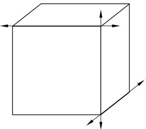  
Figure 1: For shell regions, you must choose a sweep path and direction that provides an appropriate gasket axis orientation for your model.

In addition, you can assign gasket elements to orphan mesh elements. You can use the Query toolset to verify that the gasket elements are aligned correctly for regions where the gasket axis has more than one possible orientation. If necessary, you can use the Edit Mesh toolset to change the mesh stack orientation. For more information, see Orienting the stack direction. You can use these tools with hexahedral, wedge, and quadrilateral elements because these are the only elements that can be stacked to form a continuum shell or gasket mesh. If you have assigned second-order gasket elements to the region, you must first change the assignment to conventional elements before you reorient the stack direction. You can then convert the region back to a gasket mesh by reassigning second-order gasket elements.

This section provides information on how to model different types of imperfection. You can define imperfection in the Interaction module.

## In this section:

Defining imperfections  
Managing imperfections  
Defining file imperfections  
Defining input imperfections  
Defining data imperfections  
Editing the region to which a file imperfection applied

## Defining imperfections

You can define an imperfection for an assembly in the Interaction module.

You can specify the following types of imperfections:

## File imperfection

You can define a file imperfection that uses results files from a previous analysis on an assembly. For more information, see Introducing a Geometric Imperfection into a Model.

## Input imperfection

You can define an input imperfection that uses imperfection data specified in an alternate input file on an assembly. For more information, see Introducing a Geometric Imperfection into a Model.

## Data imperfection

You can define a data imperfection that uses data lines in the input file specifying components of imperfection for a given node on an assembly. For more information, see Introducing a Geometric Imperfection into a Model.

Select Special->Imperfection->Create: type from the Interaction module to define imperfection. Select Edit from the same menu to make changes to an existing definition.

Imperfection definitions appear in the Model Tree in the Engineering Features container under the assembly.

When you define a file imperfection, you can select objects from the viewport to identify the region on which to apply the imperfection. By default, a node set is created that contains the selected objects. You can change this behavior by toggling off the option to create a set or surface in the prompt area. A default name is provided in the prompt area, but you can enter a new name.

For detailed instructions on creating this type of engineering feature, see the following sections:

Defining file imperfections  
Defining input imperfections  
Defining data imperfections

## Managing imperfections

The Imperfection Manager allows you to create and manage imperfection definitions.

The manager includes a list of the names and types of imperfections that you have defined. The Create, Edit, Copy, Rename, and Delete buttons in the manager allow you to create new imperfection definitions or to edit, copy, rename, and delete existing ones.

The icons in the column on the left side of the manager allow you to suppress and resume existing imperfection definitions. You can also initiate these procedures using the Special->Imperfection menu from the main menu bar in the Interaction module.

After you select a management operation from the main menu bar, the procedure is the same as if you had clicked the corresponding button inside the manager dialog box.

## Additional information

• Suppressing and resuming objects  
• Defining file imperfections  
• Defining input imperfections  
• Defining data imperfections  
• Editing the region to which a file imperfection applied

## Defining file imperfections

You can define file imperfections on an assembly.

1. From the main menu bar in the Interaction module, select Special->Imperfection->Create.  
2. In the Create Imperfection dialog box that appears, name the imperfection, select File Imperfection, and click Continue.  
3. Select the points for which you want to define a file imperfection using one of the following methods:

• Select the points in the viewport. When you have finished selecting, click mouse button 2.  
• To select from a list of existing sets, do the following:

1. Click Sets on the right side of the prompt area to display the Region Selection dialog box containing a list of available sets.  
2. Select the set of interest, and click Continue.


Note: The default selection method is based on the selection method you most recently employed. To revert to the other method, click Select in Viewport or Sets on the right side of the prompt area.

The Edit Imperfection dialog box appears.

4. Select Result file, which is an .odb file that is to be used in the imperfection definition.  
5. Select the Step and Increment of the results file from which the displacement data are to be read to define the imperfection.  
6. In the Data table, enter the following:

## Mode Number

Enter the mode number.

## Scaling Factor

Enter the scaling factor. Repeat this row in the table as often as necessary to specify the imperfection as a linear combination of mode shapes.

7. Click OK to save your data and to close the dialog box.

• Introducing a Geometric Imperfection into a Model

## Defining input imperfections

You can define input imperfection on an assembly.

1. From the main menu bar in the Interaction module, select Special->Imperfection->Create.  
2. In the Create Imperfection dialog box that appears, name the imperfection, select Input imperfection, and click Continue.  
3. Select System.  
4. Select Input file, which is an .odb file that is used in the imperfection definition.  
5. Click OK to save your data and to close the dialog box.

• Introducing a Geometric Imperfection into a Model

## Defining data imperfections

You can define data imperfection on an assembly.

1. From the main menu bar in the Interaction module, select Special->Imperfection->Create.  
2. In the Create Imperfection dialog box that appears, name the imperfection, select Data imperfection, and click Continue.  
3. Select System.  
4. In the Imperfection Data table, enter the following:

## Node Number

Enter the node for which the imperfection is to be specified.

## Components

Enter the comp1, comp2, and comp3 component values for the imperfection in the selected system.

5. Click OK to save your data and to close the dialog box.

• Introducing a Geometric Imperfection into a Model

## Editing the region to which a file imperfection applied

You can edit the region to which a file imperfection is applied.

1. From the main menu bar in the Interaction module, select Special->Imperfection->Edit->file imperfection name to display the Edit Imperfection dialog box.  
2. In the top part of the dialog box, click .  
3. Edit the region using one of the following methods:

Select and unselect objects in the viewport. When you have finished editing the region, click mouse button 2. For more information, see Selecting objects within the viewport.  
• To select from a list of existing sets, do the following:

1. Click Sets on the right side of the prompt area.

Abaqus/CAE displays the Region Selection dialog box containing a list of available sets.

2. Select the set of interest, and click Continue.


Note: The default selection method is based on the selection method you most recently employed. To revert to the other method, click Select in Viewport or Sets on the right side of the prompt area.

4. In the dialog box, finish editing the imperfection definition as desired and click OK.

## Inertia

This section provides information on how to model different types of inertia for regions on a part or on an assembly. You can define inertia in the Property module or in the Interaction module.

## In this section:

Defining inertia  
Managing inertia  
Defining point mass and rotary inertia  
Defining nonstructural mass  
Defining heat capacitance  
Editing the region to which inertia is applied

## Defining inertia

Inertia can be defined for a part in the Property module or for an assembly in the Interaction module

You can specify the following types of inertia:

## Point mass/inertia

You can define lumped mass and rotary inertia at a point on a part or on an assembly. You can also define mass and inertia proportional damping. In an Abaqus/Standard analysis, you can define composite damping. For more information, see Point Masses, and Rotary Inertia.

## Nonstructural mass

You can define nonstructural mass for a region on a part or on an assembly. For more information, see Nonstructural Mass Definition.

## Heat capacitance

You can define concentrated heat capacitance at a point on a part or on an assembly. For more information, see Point Capacitance.

Select Special->Inertia->Create: type from the main menu bar in the Property module or the Interaction module to define inertia. Select Edit from the same menu to make changes to an existing definition.

Inertia definitions appear in the Model Tree in the Engineering Features container under the part (if created in the Property module) or under the assembly (if created in the Interaction module).

When you define inertia, you can select objects from the viewport to identify the region on which to apply the inertia. By default, a set or surface is created that contains the selected objects. You can change this behavior by toggling off the option to create a set or surface in the prompt area. A default name is provided in the prompt area, but you can enter a new name.

When you apply inertia to regions of the model, you can choose to display symbols in the viewport that indicate where you have applied the inertia. If you apply inertia to geometry, symbols appear at the vertices. If you apply inertia to an orphan mesh, symbols appear at the nodes. For information about graphical symbol types, see Symbols used to represent special engineering features. For information about controlling the visibility of these symbols, see Controlling the display of attributes.

For detailed instructions on creating this type of engineering feature, see the following sections:

Defining point mass and rotary inertia  
Defining nonstructural mass  
Defining heat capacitance

## Managing inertia

The Inertia Manager allows you to create and manage inertia definitions.

The manager includes a list of the names and the types of inertia that you have defined.

The Create, Edit, Copy, Rename, and Delete buttons in the manager allow you to create new inertia definitions or to edit, copy, rename, and delete existing ones.

The icons in the column along the left side of the manager allow you to suppress and resume existing inertia definitions. You can also initiate these procedures using the Special->Inertia menu from the main menu bar in the Property module or the Interaction module. After you select a management operation from the main menu bar, the procedure is the same as if you had clicked the corresponding button inside the manager dialog box.

## Additional information

• Suppressing and resuming objects  
• Defining point mass and rotary inertia  
• Defining nonstructural mass  
• Defining heat capacitance  
• Editing the region to which inertia is applied

## Defining point mass and rotary inertia

You can define lumped mass and rotary inertia at a point on a part or on an assembly.

You can also define proportional damping for point masses and rotary inertia. In an Abaqus/Standard analysis, you can define composite damping. For more information, see Point Masses and Rotary Inertia.

1. From the main menu bar in the Property module or the Interaction module, select Special->Inertia->Create.  
2. In the Create Inertia dialog box that appears, name the inertia, select Point mass/inertia, and click Continue.  
3. Select the points for which you want to define mass and rotary inertia using one of the following methods:

• Select the points in the viewport. When you have finished selecting, click mouse button 2.

If the model contains a combination of orphan mesh elements and geometry, select one of the following from the prompt area:

Select Geometry to define the point mass and rotary inertia for the geometric portions of a part or assembly or for a reference point.  
- Select Mesh to define the point mass and rotary inertia for orphan mesh components.

You can use the angle method to select a group of nodes from an orphan mesh. For more information, see Using the angle and feature edge method to select multiple objects.

• To select from a list of existing sets, do the following:

1. Click Sets on the right side of the prompt area to display the Region Selection dialog box containing a list of available sets.  
2. Select the set of interest, and click Continue.


Note: The default selection method is based on the selection method you most recently employed. To revert to the other method, click Select in Viewport or Sets on the right side of the prompt area.

The Edit Inertia dialog box appears. The region to which you are applying the point mass and rotary inertia is highlighted in the viewport.

4. From the Mass portion of the Magnitude tabbed page, do the following:

• For isotropic mass, toggle on Isotropic and specify the magnitude of the mass.  
• For anisotropic mass, toggle on Anisotropic and specify the mass components $M _ { 1 1 }$ , $M _ { 2 2 }$ , and $M _ { 3 3 }$ .

5. In the Rotary Inertia portion of the page, specify the moments of inertia (units M $\boldsymbol { \underline { 2 } }$ .

a. Toggle on Specify off-diagonal terms if you want to specify products of inertia.  
b. Enter values for the rotary inertia.

## I11

Rotary inertia about the local 1-axis, .

## I22

Rotary inertia about the local 2-axis, $\pmb { I _ { 2 2 } }$ .

## I33

Rotary inertia about the local 3-axis, $\pmb { I _ { 3 3 } }$ .

c. If applicable, enter values for the products of inertia.

## I12

Product of inertia, $\pmb { I _ { 1 2 } }$ .

## I13

Product of inertia, $\mathbf { { { I } _ { 1 3 } } }$ .

## I23

Product of inertia, $\pmb { I _ { 2 3 } }$ .

6. If you want to change the coordinate system (CSYS) for the rotary inertia, click and use one of the following methods:

• Select an existing datum coordinate system in the viewport.  
• Select an existing datum coordinate system by name.

1. From the prompt area, click Datum CSYS List to display a list of datum coordinate systems.

2. Select a name from the list, and click OK.

• Click Use Global CSYS from the prompt area to revert to the global coordinate system.

By default, the global coordinate system is used to define the rotary inertia.

7. Use the Damping tabbed page to define proportional damping for point masses or rotary inertia. For an Abaqus/Standard analysis, you can also define composite damping. You can specify values for both proportional damping for point masses and composite damping or for both proportional damping for rotary inertia and composite damping; however, Abaqus uses only the damping that is relevant to the particular dynamic analysis procedure being performed. If different damping values are needed for point masses and rotary inertia, you must create separate inertia definitions.

In the Alpha field, enter the $\pmb { \alpha _ { R } }$ factor to create proportional damping for point masses or rotary inertia in a direct-integration dynamic analysis, in a mode-based analysis that supports nondiagonal damping in Abaqus/Standard, or in an explicit dynamic analysis. This value is ignored in a modal dynamic analysis that does not support nondiagonal damping. The default value is 0.0.  
In the Composite field, enter the fraction of critical damping, $\xi _ { \alpha } ,$ to be used when calculating composite damping factors for the modes in a modal dynamic analysis. This value is ignored in a direct-integration dynamic analysis and in mode-based analyses that support nondiagonal damping in Abaqus/Standard. The default value is 0.0.

8. Click OK to save your data and to close the dialog box.

Symbols appear in the viewport that represent the point mass and rotary inertia that you just created.

## Additional information

• Controlling the display of attributes  
• Symbols used to represent special engineering features

## Defining nonstructural mass

You can define nonstructural mass for a region on a part or on an assembly. For more information, see Nonstructural Mass Definition.

1. From the main menu bar in the Property module or the Interaction module, select Special->Inertia->Create.  
2. In the Create Inertia dialog box that appears, name the inertia, select Nonstructural mass, and click Continue.  
3. Select the region for which you want to define nonstructural mass using one of the following methods:

Select the region in the viewport. When you have finished selecting, click mouse button 2. If the model contains a combination of orphan mesh elements and geometry, select one of the following from the prompt area:

Select Geometry to define the nonstructural mass for the geometric portions of a part or assembly or for a reference point.

\- Select Mesh to define the nonstructural mass for orphan mesh components.

You can use the angle method to select a group of nodes from an orphan mesh. For more information, see Using the angle and feature edge method to select multiple objects.

• To select from a list of existing sets, do the following:

1. Click Sets on the right side of the prompt area to display the Region Selection dialog box containing a list of available sets.  
2. Select the set of interest, and click Continue.


Note: The default selection method is based on the selection method you most recently employed. To revert to the other method, click Select in Viewport or Sets on the right side of the prompt area.

The Edit Inertia dialog box appears. The region to which you are applying the nonstructural mass is highlighted in the viewport.

4. Choose the Units that you will use to specify the nonstructural mass magnitude. The available types depend on the type of region that you selected.

• Select Total Mass to specify the magnitude in the form of a total mass value.  
• Select Mass per Volume to specify the magnitude in the form of mass per unit volume.  
• Select Mass per Area to specify the magnitude in the form of mass per unit area.  
• Select Mass per Length to specify the magnitude in the form of mass per unit length.

5. Enter the nonstructural mass magnitude in the Magnitude field in the units that you chose in the previous step.

6. If you specify the mass in the form of a total mass value and the region as a set, you can choose the Distribution method for distributing the mass over the region.

Select Mass Proportional to distribute the total mass among the members of the set in proportion to the structural mass. The underlying structural density is scaled uniformly over the region, and the center of mass is not altered.

Select Volume Proportional to distribute the total mass among the members of the set in proportion to the volume in the initial configuration. A uniform value is added to the underlying structural density over the region. If the region has a nonuniform structural density, its center of mass might be altered.

7. Click OK to save your data and to close the dialog box.

Symbols appear in the viewport that represent the nonstructural mass that you just created.

## Additional information

• Controlling the display of attributes  
• Symbols used to represent special engineering features

## Defining heat capacitance

You can define concentrated heat capacitance at a point on a part or on an assembly. For more information, see Point Capacitance.

1. From the main menu bar in the Property module or the Interaction module, select Special->Inertia->Create.  
2. In the Create Inertia dialog box that appears, name the inertia, select Heat capacitance, and click Continue.  
3. Select the points for which you want to define heat capacitance using one of the following methods:

• Select the points in the viewport. When you have finished selecting, click mouse button 2.

If the model contains a combination of orphan mesh elements and geometry, select one of the following from the prompt area:

Select Geometry to define heat capacitance for the geometric portions of a part or assembly or for a reference point.

\- Select Mesh to define heat capacitance for orphan mesh components.

You can use the angle method to select a group of nodes from an orphan mesh. For more information, see Using the angle and feature edge method to select multiple objects.

• To select from a list of existing sets, do the following:

1. Click Sets on the right side of the prompt area to display the Region Selection dialog box containing a list of available sets.  
2. Select the set of interest, and click Continue.


Note: The default selection method is based on the selection method you most recently employed. To revert to the other method, click Select in Viewport or Sets on the right side of the prompt area.

The Edit Inertia dialog box appears. The region to which you are applying the heat capacitance is highlighted in the viewport.

4. Optional: Toggle on Use temperature-dependent data, and enter the temperature.

5. Optional: Specify the Number of field variables, and enter the value for the first field variable, the value of the second field variable, etc.

6. In the Data table, enter the following:

## Capacitance

Enter the capacitance magnitude, (density × specific heat × volume).

7. Click OK to save your data and to close the dialog box.

Symbols appear in the viewport that represent the heat capacitance that you just created.

## Additional information

• Controlling the display of attributes  
• Symbols used to represent special engineering features

## Editing the region to which inertia is applied

You can edit the region to which inertia is applied.

1. From the main menu bar in the Property module or Interaction module, select Special->Inertia->Edit->inertia name to display the Edit Inertia dialog box.  
2. In the top part of the dialog box, click .  
3. Edit the region using one of the following methods:

Select and unselect objects in the viewport. When you have finished editing the region, click mouse button 2. For more information, see Selecting objects within the viewport.  
• To select from a list of existing sets, do the following:

1. Click Sets on the right side of the prompt area.

Abaqus/CAE displays the Region Selection dialog box containing a list of available sets.

2. Select the set of interest, and click Continue.


Note: The default selection method is based on the selection method you most recently employed. To revert to the other method, click Select in Viewport or Sets on the right side of the prompt area.

4. In the dialog box, finish editing the inertia definition as desired and then click OK.

The symbols representing inertia in the viewport change to appear on the newly edited region.

## Additional information

• Symbols used to represent special engineering features

## Load cases

This section provides information on how to use load cases.

## In this section:

What is a load case?  
Managing load cases  
Load case editors  
Viewing load case output  
Defining a load case

## What is a load case?

A load case is a set of loads and boundary conditions used to define a particular loading condition. You can use one or more load cases to study the linear responses of a structure subjected to different loading conditions in the following types of analyses: static perturbation, direct steady-state dynamic, SIM-based steady-state dynamic (mode-based and subspace-based), and substructure generation. A load case analysis is generally much more efficient than the equivalent multiple step analysis since it takes advantage of the principal of linear superposition.

You can define load cases directly in terms of loads and boundary conditions or in terms of combinations of previously defined load cases. You use the Load module to define load cases directly in terms of loads and boundary conditions. You use the Visualization module to define load case combinations of previously defined load cases during postprocessing. Load case output is stored in separate frames in the output database (.odb), and you can create results for load case combinations by combining the results from multiple frames.

You use the Load Case menu in the Load module to create load cases that include previously defined loads and boundary conditions. You can use a nonzero scale factor to scale the magnitude of individual loads and boundary conditions within a load case. You may include a load or boundary condition only once within each load case. If a step contains load cases, you must include each load and boundary condition in the step in one or more load cases. By default, Abaqus/CAE includes all boundary conditions propagated or modified from the base state in each load case you create but allows you to modify this behavior for individual load cases. You can use the boundary condition manager to deactivate unused propagated boundary conditions in a step containing load cases.

In steps containing load cases Abaqus supports only field output requests. The field output requests created in the Step module apply to all load cases in the step. You can use the Visualization module to view and manipulate load case results (see Viewing load case output).

For more information on load cases, see Multiple Load Case Analysis. For more information on creating loads and boundary conditions in the Load module, see Creating and modifying prescribed conditions.

## Additional information

• Suppressing and resuming objects

## Managing load cases

The Load Case Manager allows you to organize and manipulate load cases associated with a given model. You access the manager in the Load module by selecting Load Case->Manager from the main menu bar. The Load Case Manager is shown in Figure 1.

  
Figure 1:The Load Case Manager.

The icons in the column along the left side of the manager allow you to suppress and resume existing load cases. The Create, Edit, Copy, Rename, or Delete buttons in the manager allow you to create new load cases or to edit, copy, rename, and delete existing ones. You can also initiate the create, edit, copy, rename, and delete procedures by using the Load Case menu in the main menu bar. After you select a management operation from the main menu bar, the procedure is exactly the same as if you had clicked the corresponding button inside the manager dialog box.

For detailed instructions on creating and editing load cases, see Defining a load case.

## Additional information

• Managing objects  
• Suppressing and resuming objects

## Load case editors

After you enter the Load module and create loads and boundary conditions, you can select Load Case->Create from the main menu bar to create a load case. A Create Load Case dialog box appears in which you can provide a name for the load case and select the step in which the load case will be created. When you click Continue in the Create Load Case dialog box, the load case editor appears.

The top panel of the load case editor displays the name of the load case and the current analysis step. The load case editor contains two tabbed pages with tables that allow you to select the loads and boundary conditions to define the load case. By default, Abaqus/CAE includes all boundary conditions propagated or modified from the base state in each load case that you create. You can toggle off this behavior on the Boundary Condition tabbed page.

\+ Click at the bottom of each tabbed page to select loads and boundary conditions from a list. You can enter a scale factor to scale the magnitude of individual loads and boundary conditions. If you enter a negative scale factor for a load, the load will be applied in the opposite direction. You can also enter the names of the loads and boundary conditions and the scale factors directly in the tables. During load case creation, Abaqus/CAE sorts the names of the loads and boundary conditions alphabetically and lists the names in the load case editor. You can highlight selected loads and boundary conditions in the viewport.

For example, you can define a set of load cases to analyze the response of a cantilever beam subjected to an end load and a uniform pressure load. The cantilever beam model is shown in Figure 1.


  
Figure 1: Cantilever beam model with end load, pressure load, and encastre boundary condition.

An encastre boundary condition is applied in the initial step, and the end load and pressure load are applied in a static, linear perturbation step.

You can create a load case that contains only the end load and another that contains only the pressure load. In addition, you can create a load case that contains both the pressure load and the end load with the end load applied in the opposite direction (scale factor value of −1), as shown in Figure 2.

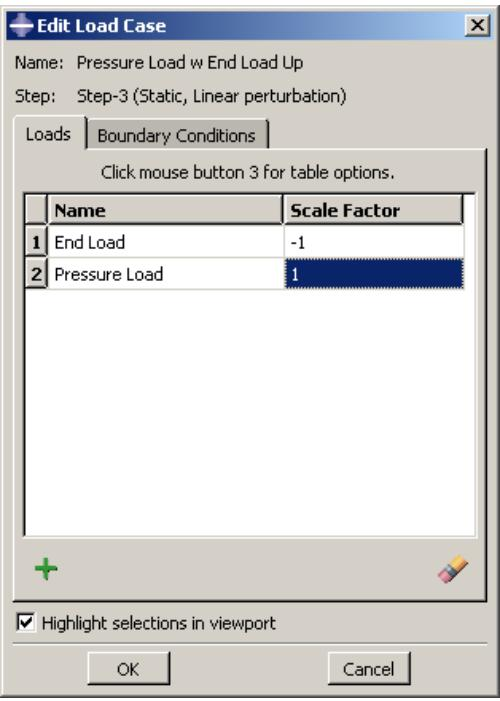  
Figure 2: Load case definition that includes loads for the cantilever beam model.

By default, each load case contains the encastre boundary condition propagated from the base state, as shown in Figure 3.

  
Figure 3: Load case definition that includes boundary conditions propagated from the base state for the cantilever beam model.

The Load Case Manager in Figure 1 shows the three load cases created for the cantilever beam model.

## Additional information

• What is a load case?

## Viewing load case output

Load case output is stored in separate frames in the output database (.odb). You use the Visualization module to view and manipulate load case output. The load case name is displayed in the state block for each frame containing load case output. For example, Figure 1 shows the deformed plot for the Pressure Load w End Load Up load case of the cantilever beam model (see Load case editors).


Step: "Cantilever loads", Multiple load case bending Load Case: PRESSURE LOAD W END LOAD UP

Deformed Var: U Deformation Scale Factor: +5.079e+00

Figure 1: Results from a load case analysis.

In the Visualization module you can linearly combine output from several load cases to represent an actual loading environment. You can also obtain the minimum or maximum value of a selected field variable over some or all load cases.

For example, you can combine the output from the End Load Only and Pressure Load Only load cases for the cantilever beam model to create new field output with a load case name of Both loads, as shown in Figure 2.

  
Figure 2: Creating new field output by combining the output from two load cases (frames).

The new field output is contained in a frame of the session step and is available from the Field Output dialog box. Figure 3 shows a plot of the combined deformation results.

  
Figure 3: Combined deformation results from both load cases.

For detailed information on manipulating load case output, see Combining results from several frames.

## Additional information

• Creating and saving new field output

## Defining a load case

You use the Load Case menu in the Load module to define a load case. You can create load cases in static perturbation, direct steady-state dynamic, SIM-based steady-state dynamic (mode-based and subspace-based), and substructure generation analyses. You must create the individual loads and boundary conditions in the Load module prior to creating a load case. For more information, see Creating loads, and Creating boundary conditions.

1. From the main menu bar in the Load module, select Load Case->Create.


Tip: You can also create a load case using the tool in the Load module toolbox.

2. In the Create Load Case dialog box that appears, do the following:

a. Name the load case. For more information about naming objects, see Using basic dialog box components.  
b. Select the step. You can define a load case only during the following steps: static, linear perturbation; steady-state dynamic, direct; SIM-based steady-state dynamic (modal and subspace); and substructure generation.

c. Click Continue.

The load case editor appears.

3. If you want to include loads in the load case, click the Loads tab. Specify the loads using one of the following methods:

• Click + at the bottom of the page to display a list of the loads available for the selected step.

1. From the Load Selection dialog box, select the loads from the list (see Selecting multiple items from lists and tables, for more information). The selected loads are highlighted in the viewport.  
2. In the Scale factor field, enter a nonzero value to scale the magnitude of the selected loads. Enter a negative value to apply the selected loads in the opposite direction. The default value of the scale factor for each load is 1.0.  
3. Click OK to save your selections and to close the Load Selection dialog box.

• Enter data in the table using the keyboard.

1. Enter the name of a previously defined load.  
2. Enter a nonzero value to scale the magnitude of the load. Enter a negative value to apply the load in the opposite direction. The default value of the scale factor is 1.0.  
3. Repeat the previous steps to specify all the loads to include in the load case.

The load case editor displays the loads and scale factors included in the load case. To highlight loads in the viewport, click the table row headings to select the loads in the editor (see Selecting multiple items from lists and tables, for more information) and toggle on Highlight selections in viewport. Suppressed loads are not highlighted in the viewport. To remove loads from the table, click the table

row headings to select the loads and click


4. If you want to include boundary conditions in the load case, click the Boundary Conditions tab to display the boundary conditions page. By default, Abaqus/CAE will include all boundary conditions propagated or modified from the base state in each load case you create. You can toggle off this behavior at the top of the boundary condition page. Specify the boundary conditions using one of the following methods:

• Click 十 at the bottom of the page to display a list of the boundary conditions available for the selected step.

1. From the Boundary Condition Selection dialog box, select the boundary conditions from the list (see Selecting multiple items from lists and tables, for more information). The selected boundary conditions are highlighted in the viewport.  
2. In the Scale factor field, enter a nonzero value to scale the magnitude of the selected boundary conditions. The default value of the scale factor for each boundary condition is 1.0.  
3. Click OK to save your selections and to close the Boundary Condition Selection dialog box.

• Enter data in the table using the keyboard.

1. Enter the name of a previously defined boundary condition.  
2. Enter a nonzero value to scale the magnitude of the boundary condition. The default value of the scale factor is 1.0.  
3. Repeat the previous steps to specify all the boundary conditions to include in the load case.

The load case editor displays the boundary conditions and scale factors included in the load case. The scale factor is relevant only if the boundary condition has a nonzero value. To highlight boundary conditions in the viewport, click the table row headings to select the boundary conditions in the editor (see Selecting multiple items from lists and tables, for more information) and toggle on Highlight selections in viewport. Suppressed boundary conditions are not highlighted in the viewport. To remove boundary conditions from the table, click the table row headings to select the boundary conditions and

click


5. Click OK to save your load case definition and to close the editor.

## Additional information

• Suppressing and resuming objects  
• Load case editors  
• Multiple Load Case Analysis

This section explains midsurface modeling and how you can use it to simplify thin solid models for analysis.

## In this section:

Understanding midsurface modeling  
Understanding the reference representation  
Creating shell faces for the midsurface model  
Examples of creating a midsurface model  
Creating and editing midsurface models

## Understanding midsurface modeling

Midsurface modeling is a technique for creating a simplified shell representation of a solid model. Midsurface modeling can reduce the computational expense of analyzing a complete solid model when a shell model with a defined thickness and fewer details is suitable for the required analysis.

The midsurface modeling process relies on an accurate solid model as the starting point. Midsurface modeling is best suited to thin solids or thin-walled solids where wall thickness is constant or where reasonable approximations of the wall thickness at each point can be made easily. You can apply midsurface modeling to any solid cell within a model; you need not apply it to the entire model. If you apply midsurface modeling to only a portion of a solid model,

Abaqus/CAE automatically creates shell-to-solid coupling constraints to couple the motion of the midsurface shell edges to that of the remaining solid model faces. Shell-to-solid coupling constraints will not be created if the angle between the shell surface and the solid face deviates significantly from 90°.

Besides reduced expense, you might use a midsurface model in place of a solid model to better account for bending response in thin sections of the model. Shell elements are designed to manage bending loads within the thickness of a single element, whereas a single solid element will have little or no resistance to bending.

Creating a midsurface model in Abaqus/CAE is a manual process. The procedure presented below provides an overview of the general steps involved. The tasks within each step may vary depending on the complexity and completeness of the original solid model and the analysis requirements. Some steps, such as Step 4 below, may not be required or may be completed in a different order from what is presented here.

1. Assign midsurface regions on the solid part. Use the Assign Midsurface Region tool to select one or more cells from the solid part to begin creating a midsurface model. For more information, see Assigning a midsurface region.  
Abaqus/CAE removes the selected cells from the active representation and creates a reference representation containing the selected cells.  
2. Create new shell faces to replace the solid geometry that you moved to the reference representation. You can use tools in the Geometry Edit toolset or the shell feature creation tools to add shell features to the midsurface model. For more information, see The Geometry Edit toolset and Adding a shell feature, respectively. The offset faces tool in the Geometry Edit toolset is the most common face creation method for midsurface models. The offset process creates new faces based on selected geometry and automatically assigns a shell thickness based on the offset parameters.  
3. Assign thicknesses to the new shell features.

The Assign Thickness and Offset tool allows you to assign shell thicknesses to the new midsurface geometry (for more information, see Assigning thicknesses and offsets). The tool allows you to assign thicknesses to individual faces, and you can also use it to edit thicknesses that Abaqus/CAE assigned automatically for faces created using the offset process. You must still assign a section to the new faces in the Property module. During the section assignment process you can make a final decision whether to use the thickness defined with the section properties or to use the definition from the geometry. You can toggle the shell thickness display in all part and assembly-based modules to see the thickness in the viewport (for more information, see Visualizing shell thicknesses).

4. Revise any analysis attributes that were associated with the solid geometry that was used to create the reference representation.

Analysis attributes such as loads, boundary conditions, or interactions cannot be applied to geometry in the reference representation. Any attributes that were associated with the solid geometry before it was moved to the reference representation will be associated with an empty region if the geometry is no longer part of the active representation. For more information, see Understanding the reference representation.

## Understanding the reference representation

A reference representation is an alternative representation of a part or a subset (one or more cells) of a part that is not used in the analysis. The reference representation retains the original solid model geometry, and, like reference geometry in the Sketcher, you can use entities from the reference representation as tools to construct a simpler version of the part. The reference representation is most commonly used to construct a midsurface model. When used with the offset face tool to create faces for the midsurface model, the offset calculations between the reference representation and the new faces also allow Abaqus/CAE to automatically compute shell thicknesses and element offsets in the midsurface model.

Abaqus/CAE creates a reference representation when you assign a midsurface property to one or more cells in a solid part. The selected cells are removed from the active representation of the part and added to the reference representation. The reference representation appears by default in the Part module and is colored translucent brown. You cannot change the color of the reference representation, but you can toggle it on or off in all modules using the Show Reference

Representation tool located with the visible object tools in the main toolbar. You can also toggle translucency of the reference representation on or off using the display options (for more information, see Controlling edge visibility.

You can use the reference representation with the shape creation tools or with the tools in the Geometry Edit toolset to help construct new geometric entities in the active representation. For example, you can offset faces in the reference representation or you can select a planar face from the reference representation as the sketch plane to create a new shell face using the extrude method. You can use the geometry in the reference representation to define partitions—select an edge and a vertex from the reference representation as the point and normal to partition a cell—or create datum entities. You can also use reference representation geometry to position entities and define constraints in the Assembly module.

You cannot edit the geometry within the reference representation, and you cannot assign analysis attributes such as loads, boundary conditions, and interactions to it. When you create a reference representation, any analysis attributes that were applied to the solid cells before you created the reference representation will now be associated with an empty region. You can edit the empty regions to associate the analysis attributes with geometry—solid geometry or shell geometry that you create for the midsurface model—that is part of the active representation. Alternatively, you can suppress or delete the analysis attributes. If you do not make any changes to the affected analysis attributes, Abaqus/CAE will display a warning message when you submit the job in the Job module.

## Creating shell faces for the midsurface model

Once you have a reference representation, you must manually build a shell model to replace the solid cells that have been removed from the model.

You can use the shell feature tools and the tools in the Geometry Edit toolset (for more information, see Adding a shell feature and The Geometry Edit toolset, respectively) to create and edit shell faces.

This section discusses some special conditions that may apply when you use these tools to create faces for a midsurface model.

## In this section:

Using the offset face tool for midsurface modeling  
Using the extend faces tool for midsurface modeling

## Using the offset face tool for midsurface modeling

You can use the offset face tool from the Geometry Edit toolset to create midsurface faces. The offset face tool creates new faces at an offset distance from an original set of faces. The offset faces are created using a similar process to that used for offsetting objects in the Sketcher (for more information, see Offsetting objects). Use of the offset face tool is discussed in detail in Offset faces.

In addition to the basic task of creating new shell faces, the offset face tool offers two functions that are helpful for creating a midsurface model:

• The offset distance is used by Abaqus/CAE to assign a thickness to the new shell faces.  
• The auto trim option automatically trims the new faces to the reference representation.

Once you have selected the faces to offset, you can enter a value for the offset distance or select a set of target faces that represents the distance through the desired shell thickness and have Abaqus/CAE calculate an offset. Abaqus/CAE calculates the distance between faces being offset and the target faces. You can offset to half the average distance or a fraction of the distance to the closest or farthest point on the target faces.

The difference in using each of the calculated offset distances is shown in Figure 1. The part has three different thicknesses. The thinnest face is at the top, the thickest in the middle, and the vertical face on the right has a thickness between the other two. The three outer faces of the reference representation were selected to be offset, and the three inner faces are the target faces. The view on the left shows the default Half the average distance method, and the offset is approximately the full thickness of the top face. The middle view shows the Fraction distance to closest point on face method with the fractional distance set to 0.5. The top target face is closest to the top offset face, so Abaqus/CAE offsets the new faces by 0.5 times this distance. The view on the right shows the Fraction distance to farthest point on face method with the fractional distance again set to 0.5. The middle (angled) target face is farthest from the middle offset face, so Abaqus/CAE offsets the new faces by 0.5 times this distance—the top offset face is cut off where it would extend through the reference representation of the original solid part because the Auto trim to reference representation option was used.

  
Figure 1: Differences in the offset distance based on the three target face calculation methods.

Abaqus/CAE automatically associates the new offset shell faces with a thickness based on the offset calculations. If you selected target faces to calculate the offset distance, Abaqus/CAE also automatically recalculates the offset for any changes in the geometry of the top and bottom face sets. Use the Assign Thickness and Offset tool and the Render shell thickness option to edit and view the thicknesses assigned to the shell faces. For more information, see Assigning thicknesses and offsets, and Visualizing shell thicknesses.

If you use the auto trim option while offsetting faces, Abaqus/CAE offsets the faces and extends the outer edges of the new faces by an amount equal to the offset distance. The new faces are then trimmed where they intersect with the reference representation. Figure 2 shows a possible effect of using the auto trim option. The reference representation contains a cell, and the larger circular face of the cell was picked for the offset operation. Using the auto trim option, the new face is trimmed to the boundary of the conical face of the reference representation.

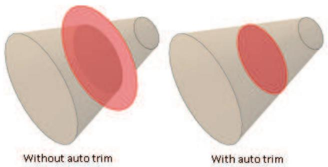  
Figure 2:The auto trim option trims to the outer faces of the reference representation.

## Additional information

• Offset faces  
• Extend faces

## Using the extend faces tool for midsurface modeling

You can use the extend faces tool from the Geometry Edit toolset to create midsurface faces. The extend faces tool extends existing shell faces, so for midsurface modeling it must be used after you have created one or more shell faces. Use of the extend faces tool is discussed in detail in Extend faces.

You can extend faces by selecting individual edges to extend the faces in one or more directions, or you can specify faces to extend the faces along all exterior edges. There are also several methods for determining the extension distance; the Up to reference representation option is intended specifically for midsurface modeling.

When you use the Specify edges of faces to extend option to extend faces along a set of edges, the extend faces operation may fail. If this occurs, try reducing the number of selected edges and then using a second operation to extend the faces along the remaining edges.

## Additional information

• Extend faces

## Examples of creating a midsurface model

This section provides examples of creating midsurface models from solid models. In the first example the solid part has reasonably uniform thickness, and creation of the midsurface model is relatively easy. The second example is more complex and requires multiple steps to create a midsurface model that accurately represents the original solid model.

## In this section:

Midsurface modeling of a stamped bracket  
Midsurface modeling of a complex part  
Creating the shell representation of the beam

This example shows how you can use the midsurface modeling tools in Abaqus/CAE to convert a solid model of a bracket to a shell representation of the same part.

## The solid model

The model in this example is a 175.0 mm long bracket that is stamped from a 3.0 mm thick plate of mild steel, as shown in Figure 1. A default mesh of the solid part results in one or two elements through the thickness of the bracket that will not perform well in bending. Modeling a shell representation of the bracket will provide a more accurate bending response.

  
Figure 1:The solid model of the bracket.

## Assign the midsurface region

Use the Assign Midsurface Region tool in the Part module to remove geometry from the active representation of the model and to create a reference representation of the original solid geometry, as shown in Figure 2.

  
Figure 2:The reference representation of the bracket.

The reference representation is an abstract representation of the original bracket. It retains the original geometry of the bracket, but it cannot be used in the analysis. The reference representation appears by default in the Part

module; you can toggle the view off and on using the Show Reference Representation tool located with the visible object tools in the main toolbar. For more information, see Understanding the reference representation, and Assigning a midsurface region.

## Create the shell representation

You must create a shell representation of the bracket that can be analyzed by Abaqus. The most commonly used tool for creating a midsurface shell model is the offset face tool, located with the other face tools in the Geometry Edit toolset. The offset face tool allows you to select one or more faces from the reference representation and to create new faces that are offset from the original faces. You can enter a fixed distance, or you can select target faces that Abaqus/CAE uses to calculate the distance. If you select target faces, the resulting shell thickness varies if the distance between the face to offset and the target face is not constant. Abaqus/CAE calculates the nodal thickness and the element offset for each node and element when you analyze the model. The Offset Faces dialog box is shown in Figure 3.

  
Figure 3:The Offset Faces dialog box.

For more information, see Methods for editing faces, and Adding a shell feature.

Figure 4 shows the selected faces to offset and the selected target faces. The by angle selection method was used to select the inner group of face as the faces to offset and the outer group of faces as the target faces.

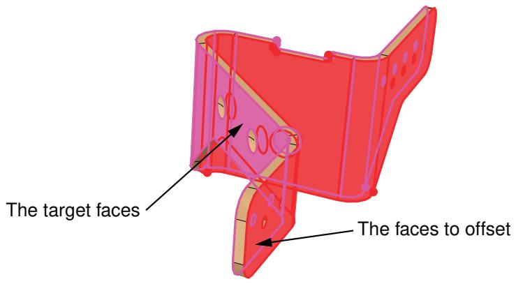  
Figure 4:The faces to offset and the target faces.

In this example you select the default option of Half the average distance from the Offset Faces dialog box, and Abaqus/CAE creates faces that are half the average distance between the faces to offset and the target faces.

By default, Auto trim to reference representation is toggled off in the Offset Faces dialog box. However, the auto trim option was active for this step, so Abaqus/CAE trimmed the offset faces to align with the reference representation. In some cases the trimming operation fails, which results in a slight misalignment between the new faces and the reference representation and a warning message from Abaqus/CAE. Even when trimming fails, the resulting shell face is often still a reasonable approximation of the reference representation; so you may be able to ignore the warning message. For more information, see Using the offset face tool for midsurface modeling.

## Assign a shell section

You use the Property module to create a shell section and to assign it to the new face. When you create the shell section, you can enter an arbitrary value for the shell thickness. When you subsequently assign the section to the shell, you specify that the thickness and the shell offset are calculated from the geometry in the Edit Section Assignment dialog box, as shown in Figure 5. Abaqus/CAE ignores the thickness value that you entered for the shell section.

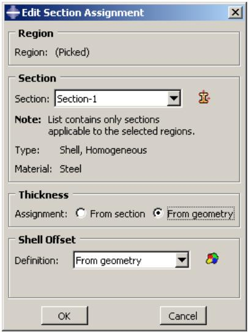  
Figure 5:The Edit Section Assignment dialog box.

For more information, see Assigning a section.

If desired, you can toggle on Render shell thickness from the Part Display Options to view the thickness of the shell, as shown in Figure 6.

  
Figure 6: Viewing the shell thickness.

## Mesh the part

Abaqus/CAE colors the shell part pink in the Mesh module to indicate it can be meshed using the free meshing technique, as shown in Figure 7.

  
Figure 7: Free meshing can be applied to the part.

You apply automatic virtual topology to the part to remove small details from the original part and to remove details that were created during the face trimming operation, as described in Creating virtual topology automatically.

You apply default seeding and mesh controls, and the resulting mesh is shown in Figure 8.

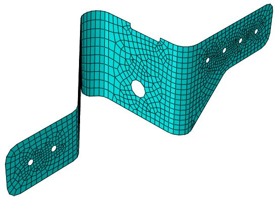  
Figure 8:The resulting mesh.

This example uses several techniques and tools to create the midsurface model for a reinforced structural component.

## The solid model

The model in this example is the structural beam shown in Figure 1. The reinforcing ribs, different thicknesses, and asymmetrical shape of the beam do not allow for a simple beam section representation. The complexity of the part combined with its thin cross-sections make it a good candidate for replacement with a midsurface model. As in the previous example, bending performance will be improved by using a shell model for the mesh instead of thin solid sections.

  
Figure 1:The solid model of the reinforced beam.

## Assign the midsurface region

Use the Assign Midsurface Region tool in the Part module to remove geometry from the active representation of the beam and to create a reference representation of the original solid geometry, as shown in Figure 2. The reference representation is an abstract representation of the original part. It retains the original geometry of the part, but it cannot be used in the analysis. The reference representation appears by default in the Part module;

you can toggle it off and on using the Show Reference Representation tool 回 located with the visible object tools in the main toolbar. For more information, see Understanding the reference representation, and Assigning a midsurface region.

  
Figure 2:The reference representation of the beam.

## Create the shell representation

You must create a shell representation of the beam that can be analyzed by Abaqus. Creating a shell for this part requires multiple steps and tools. There may be several equally valid ways to produce an accurate shell representation for a model. See Creating the shell representation of the beam, to use tools from the Geometry Edit toolset to create the new shell faces.

## Assign thicknesses

All the original solid geometry has now been replaced with shell geometry. To complete the model, you should

verify that the shells have appropriate thickness information. Click the assign thickness and offset tool Abaqus/CAE highlights any shell faces that do not have thickness data. In this case, since the shell faces were all created using the offset, extend, and blend tools, all of the faces already have thickness data assigned. If there were faces without thickness data, you would select each face and, using the Compute thickness from opposite faces method in the Assign thickness and Offset dialog box, pick appropriate top and bottom faces from the reference representation to create the missing thicknesses.

To view the model with shell thicknesses, you can toggle on Render shell thickness in the Part Display Options dialog box (for more information, see Visualizing shell thicknesses). As shown in Figure 3, the resulting view includes the variations in thickness that were in the original solid model.

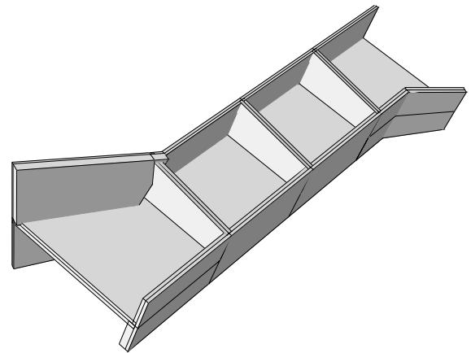  
Figure 3: Shell faces with thickness displayed.

## Assign a shell section

Use the Property module to create a shell section and assign it to the midsurface model. When you create the shell section, you can enter an arbitrary value for the shell thickness. When you subsequently assign the section to the shell, you specify that the thickness and the shell offset are calculated from the geometry in the Edit Section Assignment dialog box. Abaqus/CAE ignores the thickness value that you entered for the shell section and uses the thicknesses assigned to the faces in the Part module. For more information, see Assigning a section. Figure 4 shows the completed midsurface model with section thicknesses after section assignment in the Property module. The geometry is identical to that in Figure 3.

  
Figure 4:The completed midsurface geometry with shell thicknesses.

## Mesh the part

Abaqus/CAE colors the shell part pink in the Mesh module to indicate it can be meshed using the free meshing technique, as shown in Figure 5.

  
Figure 5: Free meshing can be applied to the part.

Before seeding and meshing the part, you can apply automatic virtual topology to remove small details that are not needed in the mesh (for more information, see Creating virtual topology automatically). The default automatic virtual topology settings should remove the blended face edges and other small details that would unnecessarily constrain the part mesh.


## Note:

Automatic virtual topology may fail if neighboring faces have inconsistent normals. If this occurs, return

to the Part module and use the tool in the Geometry Edit toolset to repair the face normals.

Apply default seeding and mesh controls, and generate the mesh on the part. The resulting mesh is shown in Figure 6 with the shell thickness displayed.

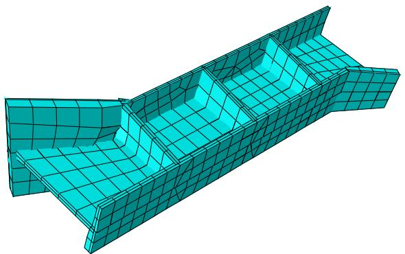  
Figure 6:The resulting mesh with shell thickness rendering.

You must create a shell representation of the beam that can be analyzed by Abaqus. Creating a shell for this part requires multiple steps and tools. There may be several equally valid ways to produce an accurate shell representation for a model. The following steps use tools from the Geometry Edit toolset to create the new shell faces.

1. Use the offset face tool to create shell faces for the vertical upper left side of the beam.

Select faces from the reference representation to create the offset shell. Use Auto Select to select the target faces. The faces to offset and the target faces are shown in red and magenta, respectively, in Figure 1.

  
Figure 1: Selected faces to create the offset for the upper left side.

The faces to offset are the two outer vertical faces toward the rear. The target faces are the nine faces, mostly unconnected, that comprise the inner surface of the same beam wall. The Fraction distance to closest point on face method is used with an entry of 0.5 to create the offset with half the thickness of the thinner main portion along the top of the beam. Using this option prevents the thicker sections at the left and along the bottom of the beam from creating an offset larger than the thinner portion. The Auto trim to reference representation option is used for this step. This operation extends the faces during the offset process and then trims them along the edges of the reference representation. Auto trim may fail when multiple offset and target faces are selected; if auto trim fails, Abaqus/CAE displays a warning indicating the failure. You can use the extend faces tool to extend the new faces to meet the edges of the reference representation. The resulting offset faces are shown in Figure 2.

  
Figure 2:The resulting offset faces.

2. Repeat the process from Step 1 to create offset faces for the opposite side of the beam.

The resulting shell model now contains the two outer surfaces of the beam, as shown in Figure 3.

  
Figure 3:The offset faces from the first and second steps.

3. Create offset faces for the four horizontal sections that connect the two side walls.

You can create the faces in a single offset operation by selecting the four top faces to offset and using Auto Select to select the corresponding bottom faces. In this case Auto trim to reference representation is toggled off, so the new faces are not extended and trimmed. The shell model of the horizontal faces is shown in Figure 4. (The faces created in Step 2 have been suppressed for clarity.) Notice the gaps between the horizontal faces where they meet the vertical reinforcement ribs in the original part. Similar gaps exist between the horizontal shell faces and the side walls created in the previous two steps.

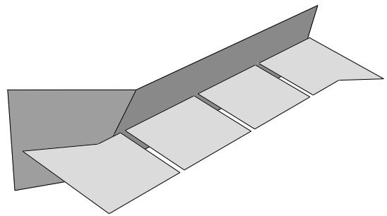  
Figure 4:The horizontal offset faces.

4. Repeat the process from Step 3 to create offset faces for the vertical ribs that connect the sides of the beam.

The midsurface shell model now contains faces representing nearly all of the solid geometry, as shown in Figure 5. However, there are gaps between most of the faces due to the thickness of the original solid structure.

  
Figure 5:The midsurface model with gaps between the faces.

5. Close the gaps between the vertical ribs and the beam sides.

Use the extend faces tool to extend the six vertical ribs to intersect with the sides. The selected faces and target faces are shown in magenta and yellow, respectively, in Figure 6.

  
Figure 6: Specifying the faces to extend and the target faces.

When you click OK, Abaqus/CAE updates the highlighting to indicate the edges along which the faces will be extended, as shown in Figure 7, and displays a warning dialog box with options allowing you to accept the selection, to extend all edges of the selected faces, or to cancel the extend faces procedure.

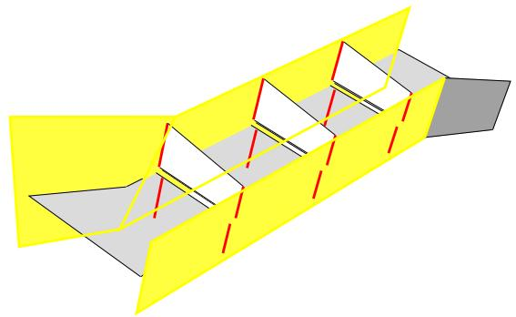  
Figure 7:The edges where the vertical faces will be extended.

6. Use the extend faces

In this case, use the Specify edges of faces to extend method with Up to target faces to pick the edges and faces, respectively, shown in Figure 8. When Abaqus/CAE highlights the edges indicating the areas that will be extended, the four edges indicated by arrows in the figure are removed from the selection because they do not completely match the target faces. Click No to use the previous selection of edges.

  
Figure 8:The edges along which the horizontal faces will be the extended.

7. Close the remaining gaps between the horizontal and vertical connecting sections of the beam. You can use either the blend faces tool or the extend faces tool to complete the midsurface model by closing the remaining gaps between the horizontal and vertical connecting sections of the beam.

a. Use the extend faces tool with the selections shown in Figure 9.

Toggle on Trim to extended underlying target surfaces so that Abaqus/CAE will extend and trim the vertical faces to their implied intersections with the selected target face.

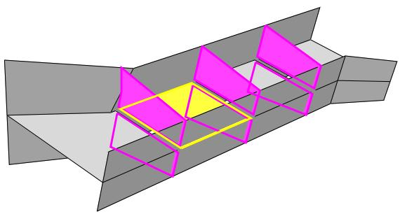  
Figure 9: Filling the gaps between the vertical reinforcing ribs.

b. Use the blend faces tool to fill the remaining gaps.

The tool must be used three times to fill the three remaining gaps in the model.

## Creating and editing midsurface models

The typical process for creating a midsurface model in Abaqus/CAE begins with the solid model.

From the solid model, you select cells for which you want to create a midsurface model. Assigning these solid cells as a midsurface region creates a reference representation in the viewport from which you can create shell faces for the midsurface model. You can use tools from the Geometry Edit toolset to create the shell faces, then you can assign thicknesses to the new shells. When you assign thicknesses and offsets to the shell geometry, the default settings typically center the shell representation within the thickness.

## In this section:

Assigning a midsurface region  
Assigning thicknesses and offsets  
Assigning thickness to shell faces  
Visualizing shell thicknesses

## Assigning a midsurface region

To begin creating a midsurface model, you select the solid model regions that you would like to represent as shells. When you assign a midsurface region to one or more cells of a solid model, Abaqus/CAE creates an Assign Midsurface feature and moves the selected cells from the active representation of the part to the reference representation. The reference representation works similarly to reference geometry in a sketch—using the Geometry Edit toolset, you can select points and edges from the reference representation to create points, edges, and faces in the midsurface model. The new midsurface geometry that you create becomes part of the active representation that will be meshed and analyzed.

1. From the main menu bar, select Tools->Midsurface->Assign.


Tip: You can also assign midsurface regions using the tool, located with the midsurface tools in the Part module toolbox.

2. Select the solid cells from which you want to create the midsurface model.

You can select individual cells from the viewport or select an existing set of solid cells. For more information on using the selection methods in Abaqus/CAE, see Selecting objects within the viewport. Abaqus/CAE creates an Assign midsurface feature containing the selected cells and displays them as translucent in the viewport.

3. Repeat Step 2 to assign more midsurface regions, or click Done to end the procedure.

## Additional information

• Editing techniques

## Assigning thicknesses and offsets

Like all shell faces in Abaqus/CAE, midsurface model faces require a defined thickness. After you have created the shell geometry for the midsurface model, the Assign Thickness and Offset tool provides a method to accurately capture the thickness of the solid model that you are replacing. You can also use this tool to edit thicknesses assigned automatically by Abaqus/CAE. For example, you can edit the thickness of faces that were created using the face offset process (for more information, see Offset faces). Abaqus/CAE automatically derives the shell thickness for offset faces from the parameters used in the offset operation.

There are two ways to assign a thickness to shell faces in Abaqus/CAE. You can apply a shell thickness definition by using the section properties in the Property module, or you can assign thicknesses by selecting faces and editing their thicknesses with the Assign Thickness and Offset tool in the Part module. During the section assignment process you select which method Abaqus/CAE uses to assign thickness to a particular set of geometric faces. (For more information on section assignments, see Assigning a section.)


## Note:

Thickness data assigned in the Part module—either automatically or using the Assign Thickness and Offset tool—appear as From geometry in the thickness section of the Edit Section Assignment dialog box in the Property module. You cannot use thickness data assigned in the Part module to calculate the offset in an Abaqus/Explicit analysis.

## Additional information

• Editing techniques

## Assigning thickness to shell faces

Defining the thickness in the Part module allows you to define where the midsurface of the solid lies with respect to the shell faces of the midsurface model. The default thickness definition places the midsurface in the center of the thickness. However, you can select surfaces to define a top and bottom thickness, effectively creating an offset between the midsurface and the middle of the shell thickness. Selecting top and bottom faces allows you to easily define different thicknesses at each node and define a different shell offset for each element. This freedom is useful when you use a midsurface model to approximate thin solid models with varying thickness. Using top and bottom faces also allows Abaqus/CAE to automatically update thickness data if you edit the model geometry.

1. From the main menu bar, select Tools->Midsurface->Assign Thickness and Offset.


Tip: You can also assign thicknesses and offsets using the tool, located with the midsurface tools in the Part module toolbox.

Shell faces are colored yellow if they are not currently associated with a thickness.

2. If the part contains multiple shell faces, select the faces to which you want to assign thicknesses and offsets (for more information, see Selecting objects within the viewport”).  
3. When you have finished making selections from the viewport, click mouse button 2 to commit your selections.  
Abaqus/CAE opens the Assign Thickness and Offset dialog box.  
4. If necessary, click the Edit button next to Faces to assign thickness to change the selections you made in the previous steps.  
5. Use one of the following methods to assign a thickness to the selected faces:

## Enter or Measure the thickness

Enter a value for thickness, or click to measure a distance in the viewport and enter it as the thickness.

## Compute thickness from opposite faces

Toggle on this option, and click Select to select the top and/or bottom faces from the viewport.

Abaqus/CAE highlights the faces in the viewport and calculates the thickness.

If you select only top or only bottom faces, Abaqus/CAE applies the same thickness to both sides of the target shell faces. If you select both top and bottom faces, Abaqus/CAE calculates the thickness and an offset value so that the selected shell faces are not centered within the thickness.

6. Click OK to apply the thickness and offset (if used) to the target faces and to close the dialog box.

You can view the thickness of faces in the model by toggling on Render shell thickness in the Abaqus/CAE display options. For more information, see Visualizing shell thicknesses, and Controlling shell thickness display.

## Visualizing shell thicknesses

You can view the thickness of your midsurface model in Abaqus/CAE. The thickness representation uses the offsets and thicknesses defined on the part or through the section assignment properties to create the new model view. Visualizing the part thickness along with the reference representation can help you determine whether the midsurface model accurately represents the solid model that you are replacing.

An axisymmetric shell section (smooth curved face) and an extruded shell where faces are joined along a straight edge are shown in Figure 1. As shown in the figure, shell thickness is accurately displayed for smooth curved shells; however, where shell faces are joined along edges, the displayed thickness contains gaps and overlaps at the corners between faces.

  
Figure 1: Displaying shell thickness on a smooth curved face and faces joined along edges.

To activate shell thickness display, see Controlling shell thickness display.

## Additional information

• Editing techniques

## Skin and stringer reinforcements

This section provides information on how to model skin and stringer reinforcements.

## In this section:

Defining skin reinforcements  
Defining stringer reinforcements  
Managing skin and stringer reinforcements  
Generating elements on a skin or stringer reinforcement  
Assigning element types to skin or stringer reinforcements  
Using offset meshes to create skin reinforcements  
Assigning surface properties to skins and stringers  
Creating and editing skin reinforcements  
Creating and editing stringer reinforcements

## Defining skin reinforcements

A skin reinforcement defines a skin that is bonded to the surface of an existing part and specifies its engineering properties. The surface can be a face of a three-dimensional solid part, any edge of an axisymmetric part, or any face of a two-dimensional part. The part can include geometry and orphan mesh elements; however, skin reinforcements must be defined separately for the geometry and the orphan mesh elements. You should think of a skin as a property of a part or region, in the same way a section is a property of a part or region.

The composite beam shown in Figure 1 is an example of how you might use a skin reinforcement in your model.

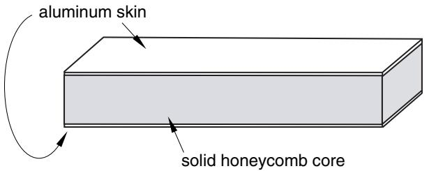  
Figure 1: A composite beam modeled by a solid honeycomb core and an aluminum skin.

The beam has a solid honeycomb core and an aluminum skin on the upper and lower faces. You can create a solid part representing the honeycomb and add a skin reinforcement representing the aluminum layers. In the Mesh module you assign solid elements to the honeycomb and shell elements to the skin. The solid and shell elements share the same nodes.

Select Special->Skin->Create from the main menu bar in the Property module to define one or more skins. Select Edit from the same menu to make changes to an existing definition. All skins you create also appear in the Model Tree in a Skins container under the part. Skins are not displayed in the viewport by default, but you can make them visible by color coding them in the viewport. See Coloring geometry and mesh elements, for more information.

If you create a skin on a geometry region, Abaqus/CAE updates the skin if you make minor modifications to the underlying geometry. If you edit orphan nodes or elements with a skin, Abaqus/CAE updates the skin if you edit or delete nodes or elements; however, it does not update the skin if you create new nodes or elements.

You may need to select the skin in subsequent modeling operations; for example, to:

• Assign a homogeneous shell section, a composite shell section, a membrane section, a surface section, or a gasket section to a skin. Section assignments are performed in the Property module.  
• Assign a material orientation or rebar reference orientation to a skin. Both of these orientation assignments are performed in the Property module.  
Assign a normal direction to a skin in the Property module. Although you cannot assign a normal direction to a skin directly, you can assign a normal direction to a face, which updates the normal direction of all skins defined on that face.

• Prescribe a body force to the skin in the Load module.

Prescribe a thermal flux on the skin in the Load module. In practice, you perform this modeling operation by applying a thermal flux load to the underlying face or faces. Abaqus/CAE applies the load to all skins on that face during the analysis.

• Assign an element type to the skin in the Mesh module.

• Request field data output or history data output for the skin in the Step module.

Create a display group to view the stress values on the skin elements in the Visualization module. While you cannot specifically select skins by name in the Create Display Group dialog box, you can find them in this dialog box by searching for elements that share the same element type, section assignment, or another property as the skin elements in your model. This process can help you narrow down the list of elements to the skins you want to include.

When you are prompted to select a region for these modeling operations, select Skins from the list of object types in the Selection toolbar, and select the skin region from the viewport. For more information, see Filtering your selection based on the type of object.

When performing contact calculations, Abaqus/CAE considers a geometric surface's skin reinforcements only in certain cases; for example, when you specify general contact for all exterior surfaces, a default all-inclusive surface is defined automatically in Abaqus that will consider skin reinforcements. Skin reinforcements can significantly influence contact calculations, due to skin thickness and potential effects on numerical quantities such as contact penalty stiffness. To explicitly include skin reinforcements in a contact definition, you can create a set on the skin reinforcement and then use the set to define an element-based secondary surface in a contact pair definition in an Abaqus/Standard analysis or use the set to define a node-based secondary surface in a contact definition in an Abaqus/Explicit analysis.

For detailed information on creating a skin, see Creating and editing skin reinforcements.

## Defining stringer reinforcements

A stringer reinforcement defines a stringer that is bonded to the edge of an existing part and specifies its engineering properties. You can select an edge of a three-dimensional solid part or an edge of a two-dimensional planar part. The part can include geometry and orphan mesh elements; however, stringer reinforcements must be defined separately for the geometry and the orphan elements. You should think of a stringer as a property of a part or region, in the same way a section is a property of a part or region.

The steel-reinforced beam shown in Figure 1 is an example of how you might use stringer reinforcements in your model.

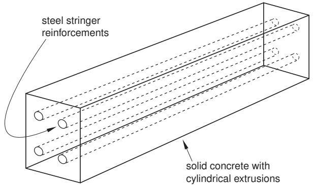  
Figure 1: A concrete beam modeled with steel stringer reinforcements.

The beam has a concrete core with four cylindrical extrusions that run the length of the beam. A steel stringer with a circular profile has been created in each extrusion to provide support along the length of the beam. You can create a solid part representing the beam and add four stringer reinforcements representing the steel reinforcements. In the Mesh module you assign solid elements to the concrete and line elements to the stringers. The solid and line elements share the same nodes.

Select Special->Stringer->Create from the main menu bar in the Property module to define one or more stringers. Select Edit from the same menu to make changes to an existing definition. All stringers you create also appear in the Model Tree in a Stringers container under the part. Different stringers can share the same section, and multiple stringers can be placed on an edge of a part. Stringers are not displayed in the viewport by default, but you can make them visible by color coding them in the viewport. See Coloring geometry and mesh elements, for more information.

If you create a stringer on a geometry region, Abaqus/CAE updates the stringer if you make minor modifications to the underlying geometry. If you edit orphan nodes or elements with a stringer, Abaqus/CAE updates the stringer if you edit or delete nodes or elements; however, it does not update the stringer if you create new nodes or elements.

You may need to select the stringer in subsequent modeling operations; for example, to:

• Assign a section, beam section orientation, material orientation, or tangent direction to a stringer. All of these activities are performed in the Property module.  
• Prescribe a body force or line load to the stringer in the Load module.  
Prescribe a thermal flux on the stringer in the Load module. In practice, you perform this modeling operation by applying a thermal flux load to the underlying edge or edges. Abaqus/CAE applies the load to all stringers on that edge during the analysis.  
• Assign an element type to the stringer in the Mesh module.  
• Request field data output or history data output for the stringer in the Step module.  
Create a display group to view the stress values on the stringer elements in the Visualization module. While you cannot specifically select stringers by name in the Create Display Group dialog box, you can find them in this dialog box by searching for elements that share the same element type, section assignment, or another property as

the stringer elements in your model. This process can help you narrow down the list of elements to the stringers you want to include.

When you are prompted to select a region for these modeling operations, select Stringers from the list of object types in the Selection toolbar, and select the stringer from the viewport. For more information, see Filtering your selection based on the type of object.

When performing contact calculations, Abaqus/CAE considers a geometric surface's stringer reinforcements only in certain cases; for example, when you specify general contact for all exterior surfaces, a default all-inclusive surface is defined automatically in Abaqus that will consider stringer reinforcements. Stringer reinforcements can significantly influence contact calculations, due to stringer thickness and potential effects on numerical quantities such as contact penalty stiffness. To explicitly include stringer reinforcements in a contact definition, you should create a set on the stringer reinforcement and then use the set in a contact definition.

For detailed information on creating a stringer, see Creating and editing stringer reinforcements.

## Managing skin and stringer reinforcements

The Skin Manager and Stringer Manager allow you to create and manage skin and stringer reinforcements, respectively. These managers each include a list of the names of skins or stringers that you have defined. The Create, Edit, Rename, and Delete buttons in the manager allow you to create new skins and stringers or to edit, rename, and delete existing ones. You can also initiate these procedures using the Special->Skin menu and Special->Stringer menu from the main menu bar in the Property module. After you select a management operation from the main menu bar, the procedure is exactly the same as if you had clicked the corresponding button inside the manager dialog box.


## Note:

If you rename a skin or stringer after you have assigned sections, orientations, normals, or other properties to it, the assignments become invalid.

## Additional information

• Creating and editing skin reinforcements  
• Creating and editing stringer reinforcements

## Generating elements on a skin or stringer reinforcement

You can use the Mesh module to generate two-dimensional elements on a skin reinforcement on a face of a three-dimensional part instance. Similarly, you can generate one-dimensional elements on a stringer reinforcement on an edge of an axisymmetric part instance. Abaqus/CAE generates the skin or stringer elements when the underlying geometry is meshed; you cannot mesh a skin or stringer reinforcement independently.

Figure 1 shows a three-dimensional part instance with a skin reinforcement on the top surface.  
  
Figure 1: A three-dimensional part instance with a skin reinforcement.

When the part instance is meshed, the skin or stringer elements and the three-dimensional elements share the same nodes and mesh topology. If you assign a different geometric order to the skin elements, you should also change the order of the underlying elements. For more information, see Assigning element types to skin or stringer reinforcements.

If you create a skin or stringer on an orphan mesh, the skin or stringer elements and the underlying orphan mesh elements share the same nodes and mesh topology. If you delete an orphan mesh element, Abaqus/CAE automatically regenerates any skins or stringers associated with the deleted element. After regeneration, these skins or stringers have new element ID numbers, so this regeneration renders invalid any sets that include the skins or stringers. Therefore, if you delete elements from an orphan mesh, you should update any set definitions that include skins or stringers formerly associated with the deleted elements.

## Assigning element types to skin or stringer reinforcements

You use the Property module to create a skin or stringer reinforcement on a part in your model. You use the Mesh module to assign an element type to a skin or stringer reinforcement. When you are prompted to select the regions to be assigned element types, you must select either Skins or Stringers from the list of object types in the Selection toolbar.

When you create a skin or a stringer for a geometric part, Abaqus/CAE adds an attribute to the geometric entity. This attribute is used when you mesh the part to generate skin or stringer elements, and these elements share nodes with the underlying elements of the part.

You can use stringer reinforcements in a buckling analysis, and you can use skin reinforcements in a coupled structural-acoustic analysis. If the acoustic medium adjoins a structure, structural-acoustic coupling occurs at the interface. It is recommended that you use surface-based tie constraints to enforce the coupling; however, if you are conducting a structural-acoustic submodeling analysis where the acoustic domain forms the submodel, you must line the interface portion of the submodel boundary with acoustic-structural interface (ASI) elements to enforce the coupling. You can line the interface with ASI elements by creating a skin at the interface and assigning ASI elements to the skin. For detailed information about using skins to create ASI elements on geometry and orphan meshes, see the Dassault Systèmes Knowledge Base at http://support.3ds.com/knowledge-base/.

## Using offset meshes to create skin reinforcements

As an alternative approach, you can use the mesh offset tool in the Edit Mesh toolset to create a skin reinforcement by sharing the nodes of the offset shell with the underlying orphan mesh. However, the equivalent offset shell does not appear in the Model Tree as a skin because using the offset shell to represent a reinforcement skin is just one of many potential uses of the offset shell. If you are creating more than one layer of reinforcement skins, you should specify a distance of zero between the layers so that the layers can share nodes.

## Assigning surface properties to skins and stringers

If you want to apply a surface property such as a pressure load to a skin or a stringer, you must apply the property to its underlying surface or edge instead. Because skins and stringers share nodes with the surfaces or edges to which they apply, Abaqus/CAE automatically propagates any applied surface properties to skins and stringers as well. For more information about defining surface properties, see Assigning sections, orientations, normals, and tangents to a part.

## Creating and editing skin reinforcements

During the initial creation of a skin, you select one or more faces that you want to reinforce and, if desired, the number of skins that you want to create.

After the skin is created, you can modify it in the following ways:

In the Property module, you can modify a skin by assigning it a section (a homogeneous shell section, a composite shell section, a membrane section, a surface section, or a gasket section), a material orientation, or a rebar reference orientation. You can also reverse the normal direction of a skin by assigning a normal direction to its underlying face. When you reverse the normal direction for a face, all skins assigned to that face inherit the new normal direction as well.  
In the Mesh module, you can assign an element type to the skin. When you are prompted to select the regions to be assigned element types, you must select Skins from the list of object types in the Selection toolbar. If you assign a shell section to a skin, you must assign shell elements to the skin. Similarly, if you assign a membrane, surface, or gasket section, you must assign membrane, surface, or gasket elements.

Abaqus/CAE names skins automatically, but you can rename them from the Skin Manager, the Special menu, or from the Model Tree. If you create multiple skins at once, Abaqus/CAE appends a unique identifier to the name to identify each skin.

You can obtain data from a skin by using the field and history output request editors in the Step module. In the Domain section of the editor, select Skin and choose the desired skin from the menu that appears. For more information, see Creating an output request.

1. From the main menu bar in the Property module, select Special->Skin->Create.


Tip: You can also click the


tool in the Property module toolbox.

2. Use one of the following methods to select the faces to which you want to add skin reinforcements:

## Selecting individual faces:

1. Click the arrow next to the Select entities on which to create a skin field in the prompt area, and select individually from the list that appears.  
2. Select a face to which you want to add skin reinforcement.  
3. [Shift] + Click on additional faces to add them to your selection.  
4. If necessary, [Ctrl] + Click on selected faces to unselect them.  
5. When you have finished selecting faces, click mouse button 2.

## Specifying an existing set:

1. Click Sets on the right side of the prompt area.

Abaqus/CAE displays the Region Selection dialog box containing a list of sets that you have created.

2. Select the set of faces to which you want to add skin reinforcement, and click Continue.


Note: The default selection method is based on the selection method you most recently employed. To revert to the other method, click Select in Viewport or Sets on the right side of the prompt area.

## Selecting faces using the angle method:

1. Click the arrow next to the Select entities on which to create a skin field in the prompt area, and select by face angle from the list that appears.  
2. Enter an angle (from 0° to 90°), and select a face. Abaqus/CAE selects every adjacent face from the selected face until the angle between the faces is equal to or exceeds the angle that you entered. (See Using the angle and feature edge method to select multiple objects for more information.)  
3. After you use the by face angle method, you can [Shift] + Click on additional faces to add them to your selection or [Ctrl] + Click on selected faces to remove them from your selection. (See Combining selection techniques for more information.)


Tip: You can use the Selection toolbar to limit the types of objects that you can select in the viewport. For more information, see Selecting objects within the viewport.

3. If desired, toggle on Multiple skins in the Prompt area to create more than one skin reinforcement for the selected face or faces.  
4. Click Done to create the skin. If you are creating multiple skins, enter the number of skin layers you want to create, and click mouse button 2.

## Additional information

• Assigning a section  
• Assigning a material orientation  
• Assigning a rebar reference orientation  
• Assigning shell/membrane normal directions

## Creating and editing stringer reinforcements

You can create a stringer immediately after you define the part; stringers do not initially require material or section assignments.

After you have created a stringer, you can then assign it a section, beam section orientation, material orientation, and tangent direction using the options under the Special menu in the Property module. You can also assign an element type to the stringer in the Mesh module. When you are prompted to select the regions to be assigned element types, you must select Stringers from the list of object types in the Selection toolbar.

You can create multiple stringers at a time on the same edge. Abaqus/CAE treats these stringers as different layers of stringer reinforcement, and you can assign different qualities to each one.

Abaqus/CAE names stringers automatically, but you can rename them from the Stringer Manager, the Special menu, or from the Model Tree. If you create multiple stringers at once, Abaqus/CAE appends a unique identifier to the name to identify each stringer.

You can obtain data from a stringer by using the field and history output request editors in the Step module. In the Domain section of the editor, select Stringer and choose the desired stringer from the menu that appears. For more information, see Creating an output request.

1. From the main menu bar in the Property module, select Special->Stringer->Create.


Tip: You can also click the tool in the Property module toolbox.

2. Use one of the following methods to select the edges to which you want to add stringer reinforcement:

## Selecting individual edges:

1. Click the arrow next to the Select entities on which to create a stringer field in the prompt area, and select individually from the list that appears.  
2. Select an edge to which you want to add stringer reinforcement.  
3. [Shift] + Click on additional edges to add them to your selection.  
4. If necessary, [Ctrl] + Click on selected edges to unselect them.  
5. When you have finished selecting edges, click mouse button 2.

## Specifying an existing set:

1. Click Sets on the right side of the prompt area.  
Abaqus/CAE displays the Region Selection dialog box containing a list of element sets that you have created.  
2. Select the set of entities to which you want to add stringer reinforcement, and click Continue.


## Note:

The default selection method is based on the selection method you most recently employed. To revert to the other method, click Select in Viewport or Sets on the right side of the prompt area.

## Selecting edges using the angle method:

You can use this method to select geometric edges only. This method is not available for selecting orphan mesh element edges.

1. Click the arrow next to the Select entities on which to create a stringer field in the prompt area, and select by edge angle from the list that appears.

2. Enter an angle (from 0° to 90°), and select an edge or another entity. Abaqus/CAE selects every adjacent edge from the selected edge until the angle between the edges is equal to or exceeds the angle that you entered. (See Using the angle and feature edge method to select multiple objects for more information.)

3. After you use the by edge angle method, you can [Shift] + Click on additional edges to add them to your selection or [Ctrl] + Click on selected edges to remove them from your selection. (See Combining selection techniques for more information.)


Tip: You can use the Selection toolbar to limit the types of objects that you can select in the viewport. For more information, see Selecting objects within the viewport.

3. If desired, toggle on Multiple stringers to create more than one stringer for the selected edge or edges.  
4. Click Done to create the stringer. If you are creating multiple stringers, enter the number of stringers you want to create, and click mouse button 2.

## Additional information

• Assigning a section  
• Assigning a beam orientation  
• Assigning a material orientation  
• Assigning beam/truss tangent directions

## Springs and dashpots

This section provides information on how to model springs and dashpots.

## In this section:

Defining springs and dashpots  
Managing springs and dashpots  
Creating springs and dashpots connecting two points  
Editing springs and dashpots connecting two points  
Creating springs and dashpots connecting points to ground  
Editing the region to which springs and dashpots connecting points to ground are applied

## Defining springs and dashpots

You can define springs and dashpots that exhibit the same linear behavior. You can also define both spring and dashpot behaviors on the same set of points. If you define both spring and dashpot behaviors, they act in parallel. You can model springs and dashpots using the following connectivity types:

• Connect two points and follow the line of action between the points  
• Connect two points and act in a fixed direction (Abaqus/Standard analyses only)  
• Connect points to ground (Abaqus/Standard analyses only)

For more information, see Springs, and Dashpots.

Select Special->Springs/Dashpots->Create from the main menu bar in the Property module or the Interaction module to define springs and dashpots. Select Edit from the same menu to make changes to an existing definition. Springs and dashpots created on a part are instanced along with the part.

If you want to include the spring and dashpot results data in the output database generated by the analysis, you must use the History Output Request editor in the Step module. Springs and dashpots appear in the Model Tree in the Engineering Features container under the part (if created in the Property module) or under the assembly (if created in the Interaction module).

For detailed information, see the following sections:

Modifying history output requests  
Creating springs and dashpots connecting two points  
Editing springs and dashpots connecting two points  
Creating springs and dashpots connecting points to ground  
• Editing the region to which springs and dashpots connecting points to ground are applied

## Managing springs and dashpots

The Springs/Dashpots Manager allows you to create and manage springs and dashpots. The manager includes a list of the names and types of springs and dashpots that you have defined. The Create, Edit, Copy, Rename, and Delete buttons in the manager allow you to create new springs and dashpots or to edit, copy, rename, and delete existing ones. The icons in the column along the left side of the manager allow you to suppress and resume existing springs and dashpots. You can also initiate these procedures using the Special->Springs/Dashpots menu from the main menu bar in the Property module or the Interaction module. After you select a management operation from the main menu bar, the procedure is exactly the same as if you had clicked the corresponding button inside the manager dialog box.

## Additional information

• Suppressing and resuming objects  
• Creating springs and dashpots connecting two points  
• Editing springs and dashpots connecting two points  
• Creating springs and dashpots connecting points to ground  
• Editing the region to which springs and dashpots connecting points to ground are applied

## Creating springs and dashpots connecting two points

You can define springs and dashpots that connect two points and exhibit the same linear behavior independent of field variables.

For more information, see Springs and Dashpots.

You can obtain history data of stress and strain from a spring/dashpot by using the history output request editor in the Step module. In the Domain section of the editor, select Springs/Dashpots and choose the desired spring/dashpot from the menu that appears. For more information, see Creating an output request.

1. From the main menu bar in the Property module or the Interaction module, select Special->Springs/Dashpots->Create.  
2. In the Create Springs/Dashpots dialog box that appears, name the springs/dashpots, select Connect two points, and click Continue.  
3. Select the first point for the first spring/dashpot using one of the following methods:

• Select the point in the viewport. (For more information, see Selecting objects within the viewport.)


Tip: The Select the Entity Closest to the Screen tool in the Selection toolbar is toggled off by default. If you make an ambiguous selection, Abaqus/CAE highlights the point and displays a description of the point in the lower left corner of the viewport. Use the Next and Previous buttons to cycle through the possible selections, and click OK to confirm your selection.

If the model contains a combination of geometry and mesh components, select one of the following from the prompt area:

- Select Geometry to define the spring/dashpot for geometry or for a reference point.  
Select Mesh to define the spring/dashpot for a mesh.

• To select from a list of existing sets, do the following:

1. Click Sets on the right side of the prompt area to display the Region Selection dialog box containing a list of available sets.  
2. Select a set that contains only one point, and click Continue.


## Note:

The default selection method is based on the selection method you most recently employed. To revert to the other method, click Select in Viewport or Sets on the right side of the prompt area.

4. Select the second point for the first spring/dashpot using one of the methods described in the previous step.  
The first spring/dashpot point pair and a dashed line connecting them are highlighted in the viewport.

5. Continue selecting pairs of points for additional springs/dashpots as described in the previous steps. When you have finished selecting point pairs, click Done in the prompt area.

The Edit Springs/Dashpots dialog box appears. The point pairs that you selected to define each spring/dashpot are listed in the Spring/Dashpot Point Pairs table.

6. From the Spring/Dashpot Point Pairs table, you can do the following:

To define additional springs/dashpots with the same behavior, click + and repeat the point selection procedures described in the previous steps to define the first and second points of each spring/dashpot.

• To edit a point in the table, select the point in the table, double-click on it or click , and reselect a point. The selection highlighting in the viewport is updated to show the newly edited point.

• To identify a specific spring/dashpot in the viewport, select the desired row number. The highlighted dashed line connecting the selected point pairs appears bolder in the viewport.

• To remove springs/dashpots from the table, select the desired row numbers and click

• To remove all springs/dashpots from the table, click .

7. Click the arrow next to the Axis field, and select an option from the list that appears:

• Select Follow line of action to have the axis of each spring/dashpot follow the line of action of the two points.  
• Select Specify fixed direction to specify the degree of freedom at each point on the spring/dashpot (Abaqus/Standard analyses only).

8. If you selected Specify fixed direction, do the following in the Direction portion of the dialog box:

Click the arrow next to the Point 1 degree of freedom field, and select the degree of freedom with which the springs/dashpots are associated at their first point.  
Click the arrow next to the Point 2 degree of freedom field, and select the degree of freedom with which the springs/dashpots are associated at their second point.

• The global coordinate system determines the default spring/dashpot orientations. To specify an orientation for the springs/dashpots, click . Specify the orientation for the springs/dashpots using one of the following methods:

Click Datum CSYS List from the prompt area to select a name from a list of datum coordinate systems.  
Select a datum coordinate system in the viewport.  
Click Use Global CSYS from the prompt area to use the global coordinate system.  
Abaqus/CAE displays the local coordinate system specified for springs/dashpots in the viewport.

9. In the Property portion of the dialog box, check the appropriate box to include:

• Spring stiffness. Enter the force per relative displacement for springs.  
• Dashpot coefficient. Enter the force per relative velocity for dashpots.

If you define both spring and dashpot behaviors, they act in parallel.

10. Click OK to create the springs/dashpots and to close the Edit Springs/Dashpots dialog box.

Symbols appear in the viewport that represent the springs/dashpots that you just created.

## Additional information

• Editing springs and dashpots connecting two points

• Controlling the display of attributes  
• Symbols used to represent special engineering features

## Editing springs and dashpots connecting two points

You can edit springs and dashpots that connect two points to add more point pairs, delete point pairs, or edit a point of an existing point pair.

1. From the main menu bar in the Property module or the Interaction module, select Special->Springs/Dashpots->Edit->name to display the Edit Springs/Dashpots dialog box.

The symbols representing springs/dashpots are highlighted in the viewport.

2. From the Spring/Dashpot Point Pairs table, you can do the following:

To define additional springs/dashpots with the same behavior, click + and repeat the point selection procedures described in the previous steps to define the first and second points of each spring/dashpot.

• To edit a point in the table, select the point in the table, double-click on it or click , and reselect a point. The selection highlighting in the viewport is updated to show the newly edited point.

To identify a specific spring/dashpot in the viewport, select the desired row number. The highlighted dashed line connecting the selected point pairs appears bolder in the viewport.

• To remove springs/dashpots from the table, select the desired row numbers ([Shift] + Click to

select multiple rows) and click . [Ctrl] + Click a row number to unselect it.

• To remove all springs/dashpots from the table, click .

3. Finish editing the springs/dashpots definition as desired, and click OK.

The symbols representing springs/dashpots in the viewport appear on the newly edited points.

## Additional information

• Controlling the display of attributes  
• Symbols used to represent special engineering features

## Creating springs and dashpots connecting points to ground

In an Abaqus/Standard analysis you can define springs and dashpots that connect points to ground and exhibit the same linear behavior independent of field variables.

For more information, see Springs and Dashpots.

You can obtain history data of stress and strain from a spring/dashpot by using the history output request editor in the Step module. In the Domain section of the editor, select Springs/Dashpots and choose the desired spring/dashpot from the menu that appears. For more information, see Creating an output request.

1. From the main menu bar in the Property module or the Interaction module, select Special->Springs/Dashpots->Create.  
2. In the Create Springs/Dashpots dialog box that appears, name the springs/dashpots, select Connect points to ground, and click Continue.  
3. Select the points to connect to ground using one of the following methods:

• Select the points in the viewport. (For more information, see Selecting objects within the viewport.)


Tip: The Select the Entity Closest to the Screen tool in the Selection toolbar is toggled off by default. If you make an ambiguous selection, Abaqus/CAE highlights the point and displays a description of the point in the lower left corner of the viewport. Use the Next and Previous buttons to cycle through the possible selections, and click OK to confirm your selection.

If the model contains a combination of geometry and mesh components, select one of the following from the prompt area:

- Select Geometry to define the spring/dashpot for geometry or for a reference point.  
Select Mesh to define the spring/dashpot for a mesh.

• To select from a list of existing sets, do the following:

1. Click Sets on the right side of the prompt area to display the Region Selection dialog box containing a list of available sets.  
2. Select the set of interest, and click Continue.


## Note:

The default selection method is based on the selection method you most recently employed. To revert to the other method, click Select in Viewport or Sets on the right side of the prompt area.

The Edit Springs/Dashpots dialog box appears.

4. In the Direction portion of the dialog box, do the following:

Click the arrow next to the Degree of freedom field, and select the degree of freedom with which the springs/dashpots are associated.  
• The global coordinate system determines the default spring/dashpot orientations. To specify an  
orientation for the springs/dashpots, click . Specify the orientation for the springs/dashpots using one of the following methods:

Click Datum CSYS List from the prompt area to select a name from a list of datum coordinate systems.  
Select a datum coordinate system in the viewport.  
Click Use Global CSYS from the prompt area to use the global coordinate system.

Abaqus/CAE displays the local coordinate system specified for springs/dashpots in the viewport.

5. In the Property portion of the dialog box, check the appropriate box to include:

• Spring stiffness. Enter the force per relative displacement for springs.  
• Dashpot coefficient. Enter the force per relative velocity for dashpots.

If you define both spring and dashpot behaviors, they act in parallel.

6. Click OK to create the springs/dashpots and to close the Edit Springs/Dashpots dialog box.

Symbols appear in the viewport that represent the springs/dashpots that you just created.

## Additional information

• Editing the region to which springs and dashpots connecting points to ground are applied  
• Controlling the display of attributes  
• Symbols used to represent special engineering features

## Editing the region to which springs and dashpots connecting points to ground are applied

You can edit the region to which springs and dashpots that connect points to ground are applied (Abaqus/Standard analyses only).

1. From the main menu bar in the Property module or Interaction module, select Special->Springs/Dashpots->Edit->name to display the Edit Springs/Dashpots dialog box.  
2. In the top part of the dialog box, click .  
3. Edit the region using one of the following methods:

Select and unselect points in the viewport. When you have finished editing the region, click Done in the prompt area. (For more information, see Selecting objects within the viewport.)  
• To select from a list of existing sets, do the following:

1. Click Sets on the right side of the prompt area.

Abaqus/CAE displays the Region Selection dialog box containing a list of available sets.

2. Select the set of interest, and click Continue.


## Note:

The default selection method is based on the selection method you most recently employed. To revert to the other method, click Select in Viewport or Sets on the right side of the prompt area.

4. In the dialog box, finish editing the springs/dashpots definition as desired and then click OK. The symbols representing springs/dashpots in the viewport change to appear on the newly edited region.

## Additional information

• Creating springs and dashpots connecting two points  
• Symbols used to represent special engineering features

## Submodeling

You use submodeling to study in detail an area of interest in your model; for example, a region of high stress. In most cases you will mesh the region of interest with a finer mesh, and the submodel can provide an accurate, detailed solution. You can also change the modeling space from a shell global model to a more representative solid submodel—shell-to-solid submodeling.

Creating a submodel is a two-step process. First you create and analyze the global model. You then create the submodel and drive the boundaries of the submodel with time-dependent variables that were saved during the analysis of the global model. You can drive submodel boundaries either with boundary conditions or in some cases with stresses from the global model. Submodeling is described in detail in About Submodeling. Shell-to-solid submodeling and shell-to-solid coupling of a pipe joint, includes an example of a submodel created using Abaqus/CAE.

## In this section:

Analyzing the global model  
Creating a submodel  
Removing regions  
Creating the submodel boundary condition  
Creating the submodel load  
Modifying the submodel  
Analyzing the submodel  
Checking the results from the submodel

## Analyzing the global model

You first obtain results for the entire model using a relatively coarse mesh and perhaps simplified geometry. This model is called the global model. Data from the output database that is generated by the global model are used to drive the submodel. As a result, the output requests in the global model must include the driven variables. You can also drive a submodel using the global model results stored in a results file that was generated from the Abaqus execution procedure.

## Creating a submodel

When you have successfully analyzed the global model and generated an output database or a results file containing the global model results, you are ready to create the submodel. You start by copying the global model to a new model that you will use to define the submodel. To copy a model, select Model->Copy->global model name from the main menu bar. Enter the name of the submodel in the Copy Model dialog box that appears and click OK. The copied model becomes the current model.

You must select the output database or results file from the global analysis that will be used to drive the submodel. From the main menu bar, select Model->Edit Attributes->submodel name. From the Edit Model Attributes dialog box that appears, click the Submodel tab, and do the following:

Toggle on Read data from job, and enter the name of the output database or results file containing the global model that will drive the submodel. You must provide the file extension (.odb or .fil) if both an output database and a results file exist and they use the same name.  
• In addition, if your shell global model is driving a solid submodel, toggle on Shell global model drives a solid submodel.  
• Click OK to close the Edit Model Attributes dialog box.

## Removing regions

Remove regions from the submodel that you are not interested in analyzing. Only the regions of interest should remain. You can use several techniques to remove regions from a part.

• Use the cut tools in the Part module. For more information, see Adding a cut feature.  
• Use the Geometry Edit toolset to remove faces. For more information, see Editing techniques.  
You can delete the part in the Part module and create a new part with the same name. You can then create geometric features that represent the submodel; however, you must position the new features in the same location as the original part. For a discussion of the tolerances between the submodel and the global model, see About Submodeling. The new part and the original part must be created in three-dimensional modeling space.

Creating a new part is a useful technique for converting a shell global model to a solid submodel. You can delete the shell part from the copied model and create a new solid part in the same location. You must take care to ensure that the part defined in the solid submodel is contained within the part defined in the shell global model.

## Creating the submodel boundary condition

The most common submodeling technique is node-based submodeling, which uses a nodal results field (including displacement, temperature, or pressure degrees of freedom) to interpolate global model results onto the submodel nodes. Node-based submodeling is also a more general technique. To use node-based submodeling, you create a submodel boundary condition.

If you apply a submodel boundary condition to nodes that are constrained by either a displacement/rotation boundary condition or a connector displacement boundary condition on the global model in a previous step and the global model's boundary condition is fixed using the Fixed at Current Position method, Abaqus/CAE disregards the submodel boundary condition for those nodes and retains the specifications in the boundary condition on the global model instead. Abaqus/CAE reports this replacement of boundary conditions in the data file for the analysis.

1. Enter the Load module and select BC->Create from the main menu bar.  
2. From the list of steps, select the step during which the submodel boundary condition will be applied.  
3. From the Category field, select Other.  
4. From the Types for Selected Step field, select Submodel and click Continue.

5. From the model, select the regions to which the boundary condition will be applied. In most cases you apply the boundary condition to the edges and faces that were created when you cut away regions from the global model. You can prescribe other boundary conditions to the same regions; for example, a symmetry boundary condition. The prescribed boundary conditions take precedence over the submodel boundary condition.

6. From the Edit Boundary Condition dialog box that appears, do the following:

a. In the Driving region field, do one of the following:

Select Automatic to allow Abaqus/CAE to create the driving region by searching all regions in the global model that lie in the vicinity of the submodel.  
Select Specify to specify a set name that will be used as the driving region. You must give the complete name of the set. The syntax for the set name is assembly\_name.part\_name-1.set\_name, assuming that you are defining the driving region on the first instance of the part.

b. If you are driving a solid submodel with a shell global model, you must enter the maximum value of the shell thickness in the global model in the Shell thickness field.

c. In the Exterior tolerance field, do the following:

Enter the absolute exterior tolerance. This is the absolute value by which a driven node of the submodel may lie outside the elements of the global model. The default value is the relative exterior tolerance.  
Enter the relative exterior tolerance. This is the fraction of the average element size in the global model by which a driven node of the submodel may lie outside the elements of the global model. The default value is .05.

For more information, see About Submodeling.

d. If you are driving a solid submodel with a solid global model or if you are driving a shell submodel with a shell global model, you must enter a comma-separated list indicating the degrees of freedom that are being driven; for example, 1,2,3. You cannot leave this field blank.

e. If you are driving a solid submodel with a shell global model, you can provide the thickness of the center zone size around the shell midsurface. The default value is 10% of the maximum shell thickness in the global model as defined in the Shell thickness field.

f. In the Global step number field, enter an integer representing the step number in the global analysis from which the values of the driven variables will be read.

g. If you created the boundary condition in a static, linear perturbation step, you can specify the increment in the global analysis step that will be the basis for calculating the values for the driven variables. The default value of zero corresponds to the last increment of the previous step.

h. If the time period of the submodel analysis is different from the time period of the global analysis, you can choose to scale the time period of the global step to match the time period of the submodel step. For example, Abaqus determines the displacements of the global model at a time 20% into the global step and applies those displacements at a time 20% into the submodel step.

If you do not choose to scale the time period of the global step to match the time period of the submodel step, Abaqus applies the displacements of the global model at the same time during the submodel step. For example, Abaqus determines the displacements of the global model one second into the global step and applies those displacements one second into the submodel step. This behavior is probably not desired if the two time periods are different. You choose to scale the time period by toggling on Scale time period of global step to time period of submodel step.

i. If you want Abaqus to ignore driven nodes found to lie outside the region of elements of the global model after accounting for the exterior search tolerance, toggle on Intersection only. This parameter is available only for node-based submodeling.

## Additional information

• Defining a displacement/rotation boundary condition  
• Defining a connector displacement boundary condition

## Creating the submodel load

The surface-based submodeling technique is an alternative submodeling technique that uses the stress field to interpolate global model results onto the submodel integration points on the driven element-based surface facets. To use surface-based submodeling, you create a submodel load.

1. Enter the Load module and select Load->Create from the main menu bar.  
2. From the list of steps, select the step during which the submodel load will be applied.  
3. From the Category field, select Other.  
4. From the Types for Selected Step field, select Submodel and click Continue.  
5. From the model, select the regions to which the load will be applied. In most cases you apply the load to faces that were created when you cut away regions from the global model. If you are applying the load to a face of a shell, Abaqus/CAE asks you to specify the side of the face to which the load will be applied. For more information, see Specifying a particular side or end of a region.  
6. From the Edit Load dialog box that appears, do the following:

a. In the Driving region field, do one of the following:

Select Automatic to allow Abaqus/CAE to create the driving region by searching all regions in the global model that lie in the vicinity of the submodel.  
Select Specify to specify a set name that will be used as the driving region. You must give the complete name of the set. The syntax for the set name is assembly\_name.part\_name-1.set\_name, assuming that you are defining the driving region on the first instance of the part.

b. In the Exterior tolerance field, do the following:

Enter the absolute exterior tolerance. This is the absolute value by which a driven node of the submodel may lie outside the elements of the global model. The default value is the relative exterior tolerance.  
Enter the relative exterior tolerance. This is the fraction of the average element size in the global model by which a driven node of the submodel may lie outside the elements of the global model. The default value is .05.

For more information, see About Submodeling.

c. In the Global step number field, enter an integer representing the step number in the global analysis from which the values of the driven variables will be read.

## Modifying the submodel

You can make the following modifications to the submodel:

• You can use the Step module to change the analysis procedure. The submodel can use either a general procedure or a linear perturbation procedure. For more information, see About Submodeling.  
• In the Load module you must remove any loads, boundary conditions, or initial conditions that were applied to regions of the global model that were removed.  
• If a boundary condition is applied outside the region to which you applied the submodel boundary condition, you must ensure that it corresponds to the loading of the global model.  
• Similarly, if a load is applied to the submodel, you must ensure that it corresponds to the loading of the global model.  
In most cases you will apply a more refined mesh to the submodel in the Mesh module. You can change the element type assigned to the submodel; however, you cannot change the dimensionality. Both the global model and the submodel must be either two-dimensional or three-dimensional.

## Analyzing the submodel

To analyze your submodel in the Job module, do the following:

• Create a new job using the model containing the submodel.  
• Submit the new job for analysis.

## Checking the results from the submodel

After the analysis is complete, you can use the Visualization module to overlay contour plots from the submodel and the global model. For a meaningful comparison, the layers of the overlay plots should use the same legend scale and the same deformation scale factor. For more information, see Overlaying multiple plots.

You should check the following:

## The submodel location

You should check that the position of the submodel is correct, relative to the global model. You can check the relative positions using overlay plots from the global and submodel output databases. Alternatively, you can check the relative positions in the Assembly module before you submit the submodel for analysis by creating temporary instances of the parts in the global model. You can view the position of the assembly in the global model relative to the position of the assembly in the submodel. You can then delete or suppress the instances of the parts in the global model before you mesh and analyze the submodel.

## The submodel response does not influence the global response

You should check that the submodel response has insignificant impact on the global response. This is the fundamental assumption of submodeling. You can check this by creating overlay contour plots of variables like stress and strain. The contours should be reasonably continuous across the submodel boundary.

## Substructures

This section explains how to integrate substructures into your analysis in Abaqus/CAE.

## In this section:

Using substructures in Abaqus/CAE  
Generating a substructure  
Specifying the retained nodal degrees of freedom and load cases for a substructure  
Importing a substructure into Abaqus/CAE  
Using substructure part instances in an assembly  
Activating load cases during substructure usage  
Recovering field output for substructures  
Visualizing substructure output

## Using substructures in Abaqus/CAE

Substructures are collections of elements that have been grouped together, so the internal degrees of freedom have been eliminated for the analysis.

Using a substructure makes model definition easier and analysis faster when you analyze a model that contains identical pieces that appear multiple times (such as the teeth of a gear), because you can use a substructure repeatedly in a model. Substructures are connected to the rest of the model by the retained degrees of freedom at the retained nodes. Factors that determine how many and which nodes and degrees of freedom should be retained are discussed in Generating Substructures. Substructure definition in your model follows two sets of steps.

## In this section:

Creating substructures in your model database  
Including substructures in your analysis

## Creating substructures in your model database

You can create substructures in Abaqus/CAE by following these general steps:

1. Create or open the model database in which you want to specify substructures in Abaqus/CAE.  
2. In the Step module, create a Substructure generation step. Abaqus/CAE converts the entire model into a single substructure. For more information, see Generating a substructure.  
3. In the Load module, create Retained nodal dofs boundary conditions to determine which degrees of freedom will be retained as external degrees of freedom on the substructure. You can also define a load case in the substructure generation step if you want to apply a load to the substructure at a location other than its retained degrees of freedom. For more information, see Specifying the retained nodal degrees of freedom and load cases for a substructure.  
4. In the Job module, create a new job and submit the analysis.

When you perform an analysis of an assembly that includes substructure data, Abaqus/CAE creates separate output databases for the results of each substructure part instance and does not include the results from the substructure part instances in the output database for the assembly. The Visualization module provides tools that enable you to integrate the results from the substructure components back into the results from the assembly; for more information, see Visualizing substructure output.

## Including substructures in your analysis

Substructure usage should be performed in a different model than substructure generation. You can include substructures in your analysis in Abaqus/CAE by following these general steps:

1. Import each substructure that you want to use in your model database from the corresponding .sim file. For more information, see Importing a substructure into Abaqus/CAE.  
2. In the Assembly module, instance each substructure part that you want to add to the assembly, and position the substructure part instances in the desired locations in the assembly. Using substructure part instances in an assembly, explains the capabilities and limitations of substructure part instances.  
3. In the Load module, activate substructure load cases by creating a Substructure load definition. For more information, see Activating load cases during substructure usage.  
4. In the Step module, create a field output request with Substructure as the Domain, then select the substructure sets for which you want to recover field data. For more information, see Recovering field output for substructures.  
5. In the Interaction module, apply constraints to attach the substructure part instance to the rest of the assembly.

## Generating a substructure

The first step in substructure definition is the addition of a Substructure generate step in your analysis.

The substructure generation step enables you to create a substructure in your model database and, if desired, specify substructure-related options such as the writing of the recovery matrix, stiffness matrix, mass matrix, and load case vectors to a file. These options are described later in this section.

A single analysis can include multiple substructure generate steps, and Abaqus/CAE creates corresponding output database files for each step. Multiple preloading steps can precede every substructure generation step in your analysis. If you want to specify retained eigenmodes for substructure generation, you must also include a frequency extraction step in the analysis.

You cannot have a substructure generation step in a model that contains model instances.

## Substructure identifier

You must specify a unique identifier for each substructure you create. Substructure identifiers must begin with the letter Z followed by a number that cannot exceed 9999.

## Recovery options

You can recover the field output data for a substructure during the usage-level analysis, but you must specify the recovery region during substructure generation. Substructure recovery can be performed only on the sets included in the recovery region. You can specify that recovery be performed on the whole model or for an individual node set or element set. While performing the substructure recovery in the usage model, Abaqus/CAE must have access to the substructure's .mdl, .prt, and .stt files. For more information about these file types, see Generating Substructures.

## Generation options

You can control several aspects of the substructure generation process, including calculation of gravity load vectors, evaluation of frequency-dependent material properties, and generation of a reduced mass matrix, reduced structural damping matrix, and viscous damping matrix.

## Retained eigenmodes

You can specify retained eigenmodes for generation of a coupled acoustic-structural substructure. When you choose to specify retained eigenmodes, Abaqus/CAE enables you to specify eigenmodes by mode range or by frequency range.

## Damping

You can specify several global damping controls and substructure damping controls. For global damping you can choose to apply damping settings to acoustic or mechanical options; for substructure damping you can specify separate controls for viscous and structural damping.

## Additional information

• Configuring a substructure generation procedure

## Specifying the retained nodal degrees of freedom and load cases for a substructure

After you defined the substructure generation step or steps for your analysis, you must define a Retained nodal dofs boundary condition for a substructure. The retained degrees of freedom for a substructure node are the degrees of freedom that are external and are available for use in the analysis; all other degrees of freedom for the specified node are assumed to be internal to the substructure and do not factor into the analysis. When you import a substructure from this analysis into a model for substructure usage, Abaqus/CAE displays these nodes as light blue crosses, which enables you to pick them easily from a part instance or assembly.

If you want to apply a load to the substructure at a location other than its retained degrees of freedom, you can define a load case in the substructure generation step.

## Additional information

• Defining a retained nodal DOFs boundary condition  
• Defining a load case

## Importing a substructure into Abaqus/CAE

You can include substructure definitions in a model database and begin to use them for modeling by importing the substructures as new part definitions. Substructure data are available in .sim files, and the substructure identifier is included in the file name; for example, in an analysis in which the substructure is named FAN and the substructure identifier is Z400, the substructure database file is named FAN\_Z400.sim.

The .sim file from which you import a substructure must reside in the same directory as the supporting Abaqus files to which the .sim database refers; these supporting files might include data in the formats .prt, .mdl, or .stt.

Substructure import also requires an output database (.odb) file for mesh display.

## Additional information

• What kinds of files can be imported and exported from Abaqus/CAE?  
• Importing a substructure into a model database as a part

## Using substructure part instances in an assembly

Once you import substructure parts into your model database, you can add them to your assembly by instancing them in the same manner you would for any part. Substructure part instances are displayed in a translucent color in the viewport.

You can move and apply constraints to substructure part instances; however, substructure part instances have the following modeling limitations:

• You cannot assign sections to a substructure part instance.  
• You cannot apply attributes to a substructure part instance.  
• Substructure part instances are not eligible for definition of contact pairs.  
• Gravity loads are the only load definition that can be applied to substructure part instances.

## Additional information

• Creating and manipulating part and model instances

## Activating load cases during substructure usage

The Substructure load definition enables you to activate the substructure load cases that are specified during the substructure generation step. As you activate a load case, you can scale its load definitions or apply an amplitude to them.

## Additional information

• Defining a substructure load definition to activate a substructure load case

## Recovering field output for substructures

You can specify that Abaqus/CAE write field output data for one or more substructure sets in your analysis.

From the field output editor, select Substructure from the Domain field, then click to open the Select Substructure Sets dialog box. This dialog box lists only the substructure sets that were defined while generating the substructure. You cannot recover data for sets that you define on substructure part instances in Abaqus/CAE.

## Additional information

• Modifying field output requests

## Visualizing substructure output

Abaqus/CAE creates separate output database (.odb) files for each substructure part instance used in the analysis, so you must perform some additional steps if you want to display substructure results in context with the rest of the assembly. The Visualization module provides the following tools that enable you to incorporate substructure results into the rest of the model:

• You can use an overlay plot to display plots of substructure data in the same viewport as a plot of the rest of the assembly.  
You can use the Combine ODBs plug-in to combine the data in one or more substructure output database files with the data from the rest of the assembly.

## Additional information

• Producing and modifying overlay plots  
• Combining data from multiple output databases

---

[Previous: Optimization, Job, and Sketch Modules](optimization-job-sketch.md) · [Next: Viewing Results](viewing-results.md)
