# Optimization, Job, and Sketch Modules

## Understanding the role of the Optimization module

You can use the Optimization module to perform the following tasks:

## Create optimization tasks

An optimization task contains the definition of your optimization. You run an optimization in the Job module using an optimization process. An optimization process refers to an optimization task.

## Create design responses

A design response is a single scalar value that is extracted from an optimization. A design response can be extracted directly from the output database, such as the volume of the model. Alternatively, the Optimization module can extract data from the output database and calculate the design response, such as the total strain energy of the model, a measure of its flexibility.

## Create objective functions

An objective function defines the objective of the optimization and refers to the value of a design response or a combination of design responses. For example, the objective function of the optimization can be to minimize the total strain energy in the model (maximize its stiffness).

## Create constraints

Constraints define the changes that the Optimization module can apply to the topology or the shape of the model during the optimization. For example, the volume of the optimized model can be constrained to be 50% of the original volume. If a constraint cannot be satisfied, the optimization is not feasible. A constraint also refers to the value of a design response, but it cannot refer to a combination of design responses.

## Create geometric restrictions

A geometric restriction places restrictions on the changes that the Optimization module can make to the topology of the model. Geometrical restrictions include frozen regions from which material cannot be removed and manufacturing constraints, such as restrictions on cavities and undercuts, that would prevent the optimized model from being removed from a mold.

## Create stop conditions

A stop condition is an indicator that the optimization has converged to a solution. For example, an optimization can be considered complete after a specified number of iterations or when the change in an optimization function between iterations is less than a specified value.

## Entering and exiting the Optimization module

You can enter the Optimization module at any time during an Abaqus/CAE session by clicking Optimization in the Module list located in the context bar. The Task, Design Response, Objective Function, Constraint, Geometric Restriction, Stop Condition, and Tools menus appear on the main menu bar. If the current viewport contains something other than the assembly, the contents of the viewport disappear when you start the Step module.

To exit the Optimization module, select any other module from the Module list. You need not save your optimization definition before exiting the module; it will be saved automatically when you save the model database by selecting File->Save or File->Save As from the main menu bar.

## Understanding optimization

An optimization is an iterative process that modifies the structure of your model while it searches for an optimized solution given a set of objectives and constraints that must be satisfied. This section briefly describes the components of an optimization that you can create with the Optimization module.

For more detailed information, see About Structural Optimization.

## In this section:

About tasks  
About design responses  
About objective functions  
About constraints  
About geometric restrictions  
About stop conditions  
About optimization processes

## About tasks

An optimization task contains the components that define your optimization, such as the design responses, objectives, constraints, and geometric restrictions. To run an optimization, you execute an optimization process. An optimization process refers to an optimization task.

For more information, see Creating an optimization task.

## About design responses

The inputs to your optimization are called the design responses. Design responses can be read from the Abaqus output database file; for example, stiffness, stresses, eigenfrequencies, and displacements. Alternatively, the Optimization module can extract the design responses from the position of nodes or the layout of elements in your model; for example, its weight, center of mass, or inertia.

A design response is associated with a region of your model; however, it consists of a single scalar value, such as the maximum stress in a region or the total volume of the model. In addition, a design response can be associated with a particular step or load case. For more information, see Configuring design responses, and Design Responses.

## About objective functions

The objective functions define the objective of your optimization. The objective function is extracted from a design response, such as the lowest eigenfrequencies or the minimum stress. The objective function can be formulated from multiple design responses. If you specify that the objective functions minimize or maximize the design responses, the Optimization module calculates the objective function by adding each of the values determined from the design responses. In addition, you can specify a weighting factor (the default weighting factor is 1.0). For the most common optimization formulations you do not need to change the default value of the weighting factor. However, in some cases you may have to change the weighting factor to balance the effect of an objective function that is dominating the optimization. You should be aware that changing the weighting factor can have a significant impact on the final design. In addition, a design response that is dominant at the start of the optimization may have less effect as the Optimization module modifies your model. For more information, see Creating objective functions, and Objectives and Constraints.

## About constraints

Constraints are also extracted from the design responses. Constraints restrict the value of a design response; for example, you can specify that the volume must be reduced by 45% or the absolute displacement in a region must not exceed 1 mm. You can also apply manufacturing and geometric constraints that are independent of the optimization; for example, a structure must be able to be cast or stamped or the diameter of a bearing surface cannot be changed.

When you execute an optimization process, Abaqus generates history output from the constraints you defined in the Optimization module. For volume design responses the history output is always reported as a fraction of the initial value. For all other design responses the history output is reported as an absolute value.

Satisfying the constraints has priority over the minimization or maximization of the objective function. The optimization algorithms start to maximize or minimize the objectives only after the constraints are satisfied.

You can specify only a volume constraint for a condition-based topology or shape optimization, and the volume constraint must be either equal to a fixed value or a fraction of the value before the optimization starts. If the requested volume differs greatly from the initial volume, the Optimization module may need several design cycles to satisfy the volume constraint. A general topology optimization provides more flexibility; and you can select any of the design responses as a constraint, except for the design response that calculates the eigenfrequencies with the Kreisselmeier-Steinhauser formula. The constraint in a general topology optimization can be less than, greater than, or equal to a fixed value or a fraction of the value before the optimization starts. For more information, see Creating constraints, and Objectives and Constraints.

## About geometric restrictions

Geometric restrictions are manufacturing and geometric constraints that are independent of the optimization; for example, a structure must be able to be cast or stamped or the diameter of a bearing surface cannot be changed. For more information, see Configuring geometric restrictions, and Objectives and Constraints.

## About stop conditions

A global stop condition defines the maximum number of iterations an optimization should perform. A local stop condition specifies that the optimization should end when a local minimum (or maximum) has been reached. For more information, see Creating local stop conditions, and Objectives and Constraints.

## About optimization processes

You create optimization processes in the Job module. An optimization process reads an optimization task that you defined in the Optimization module and iteratively searches for an optimized solution based on the objective functions and constraints that you defined in the optimization task. For more information, see What is an optimization process?. You can use a view cut in the Visualization module to view the results of an optimization process. For more information, see Cutting through a model.

## Using the Optimization module toolbox

You can access all the Optimization module tools through either the main menu bar or through the Optimization module toolbox. Figure 1 shows the icons for all the Optimization module tools in the toolbox.

  
Figure 1:The Optimization module tools.

To see a tooltip containing a brief definition of an Optimization module tool, hold the mouse over the tool for a moment. For information on using toolboxes and selecting hidden icons, see Using toolboxes and toolbars that contain hidden icons.

## Viewing and troubleshooting an optimization

You can use the field and history output generated by Abaqus to view the results generated by your optimization process. You can also use the output to diagnose any problems with the optimization; for example, to determine if the optimization is converging on an objective or to study the rate of convergence. You view the results by clicking Results in the Optimization Process Manager.

When you submit an optimization process for analysis, Abaqus creates an output database (.odb) file for each design cycle of the optimization. The output database files are stored in the jobname\SAVE.odb directory. You must combine the separate output database files into a single output database file before you can view the optimization in the Visualization module. The behavior of the Visualization module depends on whether the output database file was created from a topology optimization, a shape optimization, a sizing optimization, or a bead optimization.

## Topology optimization

When you view the results of a topology optimization, Abaqus/CAE automatically displays a view cut superimposed on the current view that represents the optimized design surface. The isosurface variable of the view cut is the normalized material property that the Optimization module uses to “add” or “remove” elements from the analysis. By default, Abaqus/CAE displays the view cut with the normalized material property set to 0.3. You can use the view cut manager to modify the value of the isosurface variable and to view the resulting boundary of the isosurface. Boundary conditions are not displayed while an optimization view cut is active. For more information, see Managing view cuts.

## Shape optimization

When you view the results of a shape optimization, Abaqus/CAE displays the model in its optimized shape using the new position of the surface nodes.

## Sizing optimization

When you view the results of a sizing optimization, Abaqus/CAE displays the shell model and the optimized shell thickness, which varies as the optimization progresses. (When you view the results of a nonoptimized analysis of a shell model, the shell thickness is read from the model data and does not change during the analysis.)

## Bead optimization

When you view the results of a bead optimization, Abaqus/CAE displays the shell model in its optimized shape using the new position of the surface nodes.

After you combine the separate output database files into a single output database file, each design cycle in the optimization process appears as a frame in the output database, and you can open the Step/Frame dialog box to display the results from each design cycle. You can view the results of an optimization process while it is still in progress. As the optimization process moves toward completion, the lists of completed steps and frames are updated every time you close and reopen the Step/Frame dialog box. For more information, see Selecting a specific results step and frame, and Stepping through frames.

You can perform a time history animation of a deformed or contour plot and view the progress of the optimization as Abaqus attempts to satisfy the objective functions while respecting the constraints. For a topology optimization you can view the progressive removal of elements from the analysis and the resulting effect on the mechanical behavior of the model, such as the change in deformation or stress. Turning on translucency allows you to see the progression of the optimization through interior elements; for example, the removal of interior elements to create voids. For more information, see Changing the translucency. For a shape optimization you can view the incremental change in the position of the surface nodes as the optimization progresses; and, similar to a topology optimization, you can view the resulting effect on the mechanical behavior of the model.

In addition, the optimization process writes data files (optimization\_report.csv and optimization\_status\_all.csv) to the jobname directory that you can use to track the design variables. For example, you can create an X–Y plot showing how the objective functions and constraints change after each design cycle. The resulting plot indicates how the Optimization module tries to meet the specified objective functions while satisfying the constraints. You can use an X–Y plot of the objective functions and constraints as a diagnostic tool to view the progression of the optimization after each design cycle and to determine if the optimization is converging on a solution, as shown in Figure 1.

  
Figure 1:The design objective and constraint during an optimization.

You can also view an X–Y plot showing how the objective function and constraints change after each design cycle by monitoring the progress of an optimization process from the optimization process manager. See Monitoring your optimization process, for more information.

## Additional information

• Understanding view cuts  
• Understanding X–Y plotting

## Creating and configuring an optimization task

You can create and configure an optimization task. An optimization task contains the definition of your optimization.

## In this section:

Creating an optimization task  
Configuring a topology optimization task  
Configuring a shape optimization task  
Configuring a sizing optimization task  
Configuring a bead optimization task

## Creating an optimization task

You can create a topology optimization task. An optimization task contains the definition of your optimization, such as the design responses, objectives, constraints, and geometric restrictions. To run an optimization, you create an optimization process in the Job module. An optimization process refers to an optimization task.

1. From the main menu bar, select Task->Create.

The Create Optimization Task dialog box appears.


Tip: You can initiate the Create procedure in two other ways:

Click Create in the Optimization Task Manager. (You can display the Optimization Task Manager by selecting Task->Manager from the main menu bar.)

• Click the tool in the Optimization module toolbox.

2. From the Create Optimization Task dialog box that appears, enter the name of the task.  
3. Select the optimization Type (Topology optimization, Shape optimization, Sizing optimization, or Bead optimization), and click Continue. For more information, see About Structural Optimization.  
4. From the viewport, select the region that will be optimized or click Done to optimize the entire model. By default, Abaqus/CAE allows you to select all of the model. To select faces or cells, use the Selection toolbar to change the type of object that you can select to Face or Cells. For more information, see Filtering your selection based on the type of object.

The Edit Optimization Task dialog box appears.

If you would rather select from a list of existing sets, do the following:

a. Click Sets on the right side of the prompt area.

Abaqus/CAE displays the Region Selection dialog box containing a list of available sets.

b. Select the set of interest, and click Continue.


## Note:

The default selection method is based on the selection method you most recently employed. To revert to the other method, click the button—Select in Viewport or Sets—on the right side of the prompt area.

5. When you have finished selecting the optimization region, click Done in the prompt area. For more information on selecting objects, see Selecting objects within the viewport.”  
6. Configure the optimization task, as described in Configuring a topology optimization task, Configuring a shape optimization task, Configuring a sizing optimization task, and Configuring a bead optimization task.

## Additional information

• Configuring a topology optimization task  
• Configuring a shape optimization task  
• Configuring a sizing optimization task  
• Configuring a bead optimization task

The Optimization module provides a variety of settings that allow you to configure a topology optimization task. The configuration settings depend on whether you are configuring an optimization task for a general topology optimization or a condition-based topology optimization.

## In this section:

Configuring a general topology optimization task  
Configuring a condition-based topology optimization task

## Configuring a general topology optimization task

A general topology optimization is a flexible, sensitivity-based optimization that allows you to apply a range of constraints and objective functions to your model. You use the optimization task editor to customize various aspects of a general topology optimization.

To locate the editor, select Task->Edit->optimization task name from the main menu bar. To specify a general topology optimization, select the Advanced tab and choose General optimization (sensitivity-based).

## In this section:

Configuring basic settings  
Configuring the density settings  
Configuring the perturbation settings  
Configuring convergence options  
Configuring advanced options

## Configuring basic settings

You can configure a general topology optimization.

1. In the optimization task editor, click the Basic tab.  
2. Choose whether to freeze load or boundary condition regions.

It is recommended that you freeze regions to which prescribed conditions are applied because you do not want these regions to be removed during the optimization. Freezing these regions stabilizes the optimization and often leads to a significantly lower number of iterations.

## Configuring the density settings

You can configure a general topology optimization.

1. In the optimization task editor, click the Density tab.  
2. Select the Density update strategy.

This setting controls the rate at which the Optimization module updates the relative material density of design elements during the optimization. In most cases you should accept the default setting (Normal). However, if the design responses are very sensitive and you have problems fulfilling the constraints, you may need a more conservative rate that requires more optimization iterations.

3. Do either of the following to specify the relative density of each element during the initial optimization iteration:

Select Optimization product default to allow the Optimization module to determine the initial density. If the material volume is selected as a constraint, the Optimization module calculates the initial density such that the volume constraint is fulfilled exactly. If the material volume is selected as an objective function, each element has an initial relative density of 50%.  
Select Specify and enter a value (0.0 < initial density 1.0). You should use this option only if volume is selected as an objective function and not as a constraint and if you know, prior to the optimization, that setting the initial density to a larger or smaller value will fulfill other constraints; for example, displacement constraints. You can use a value greater that 0.5 in conjunction with volume constraints to stabilize nonlinear or contact problems and to improve the convergence behavior.

4. Enter the Minimum density, the Maximum density, and the Maximum change per design cycle.

The minimum density must be greater than 0.0, and the maximum density must be less than or equal to 1.0. Changing the density bounds is not recommended, in particular the upper bound. You may need to increase the lower bound if the default value leads to a nearly singular stiffness matrix.

Numerical experiments indicate that a value of 0.25 (default) is acceptable for the maximum change in density. A lower limit in the change of density, such as 0.1, is recommended for complicated design responses and optimization formulations. However, a lower limit often leads to a higher number of optimization iterations.

## Configuring the perturbation settings

You can configure a general topology optimization.

1. In the optimization task editor, click the Perturbation tab. 2. Enter the number of eigenmodes to track. The default value is five, which means that the Optimization module tracks the five lowest eigenfrequencies.

In some cases many local low frequency eigenmodes appear during the optimization iterations, which leads to a high number of modes to track and degrades performance. You can avoid tracking a high number of modes by choosing the lower bound of the eigenfrequencies to be 25% of the eigenfrequency of interest in the first optimization iteration.

Mode tracking is not required if your design response will use the Kreisselmeier-Steinhauser formulation to evaluate the eigenfrequencies. Your Abaqus model must include an output request for at least the number of eigenfrequencies you are tracking.

3. Select the region over which the Optimization module should track the eigenmodes.

By default, the Optimization module tracks the eigenmodes of all the nodes in the model, which can degrade performance if you have a large model. You can improve the performance by tracking the eigenmodes over only a selected region; for example, over selected surfaces of your model or over points where lumped or rigid masses are attached.

## Configuring convergence options

You can configure a general topology optimization.

1. In the optimization task editor, click the Convergence tab.  
2. Specify the Convergence Criteria. The following options allow you to specify the convergence criteria for a general topology optimization:

## Specifying when to start checking for convergence

You can specify the iteration during which the Optimization module will begin to check the two convergence criteria. The optimization will always continue at least until this value has been reached. The default value is 4.

## Specifying which convergence criterion to check

You can specify whether the optimization should end when either of the convergence criterion has been fulfilled or both of the criteria have been fulfilled. The default value is that both criteria must be fulfilled.

## Convergence based on the change in optimization function

You can specify that the optimization will end based on the change in the objective function from one iteration to the next. The default value is 0.001.

## Convergence based on the change in element densities

Element density is the design variable for a topology optimization. You can specify that the optimization will end based on the average change in the element density from one iteration to the next. The default value is 0.005.

## Configuring advanced options

You can configure a general topology optimization.

1. In the optimization task editor, click the Advanced tab.  
2. Select the General optimization algorithm.  
3. Choose whether to Delete soft elements in region.

During the topology optimization process, the Optimization module distributes a given mass within the design area while it tries to satisfy the constraints and optimize the objective. At the end of the optimization, the structure contains hard (filled) and soft (void) elements. The soft elements have a negligible influence on the stiffness of the structure; but they are still relevant for the number of degrees of freedom of the structure and, hence, influence the speed of the optimization process. The Delete soft elements option allows you to select a region from which soft elements that have only soft neighboring elements will be removed. The deleted elements are reactivated if needed; for example, if the force flow changes during the optimization.

Choosing to delete soft elements can help Abaqus converge on a solution because those elements would otherwise degenerate or collapse and is recommended when you are optimizing a nonlinear model. In addition, selecting a Conservative density update strategy and a small change in density per design cycle will improve the accuracy of the results. See Configuring the density settings, for more information.

4. If you chose to delete soft elements, you can prevent isolated soft elements from being removed by choosing to delete only soft elements that have neighboring soft elements. You can define a neighboring element as being within the radius specified by the Average edge length (default) or specified by a value that you enter. If the element edge length varies considerably within the mesh, the radius calculated from the average edge length can be misleading.  
5. If you chose to delete soft elements, you can select the method that the Optimization module will use to delete elements:

## Favor continuity (Standard)

Choose Favor continuity (Standard) and enter a Relative material density threshold to check for continuity before deleting soft elements. If the optimized model contains an “island” of hard elements that are separated from the rest of the model by soft elements, the Optimization module does not remove the soft elements. In addition, the Optimization module retains soft elements that are preventing hard elements from moving with respect to each other; for example, hard elements that share a common edge but not a common face. An element is considered “soft” if its relative material density is less than the threshold value, and the Optimization module removes it from the analysis.

## Favor continuity (Aggressive)

Choose Favor continuity (Aggressive) and enter a Relative material density threshold to remove soft elements regardless of continuity. An element is considered “soft” if its relative material density is less than the threshold value, and the Optimization module removes it from the analysis.

## Maximum shear strain

Choose Maximum shear strain and enter a Maximum shear strain threshold. The Optimization module removes elements from the analysis that have a shear strain larger than the threshold.

## Minimum principal strain

Choose Minimum principal strain and enter a Minimum principal strain threshold. The Optimization module removes elements that have a principal strain lower than the threshold.

## Maximum elastoplastic strain

Choose Maximum elastoplastic strain and enter a Maximum elastoplastic strain threshold. The Optimization module removes elements that have an elastoplastic strain larger than the threshold.

## Volume compression

Choose Volume compression and enter a Relative volume compression. The Optimization module removes elements that are compressing and have a relative volume that is lower than

the threshold. The relative volume $V _ { r e l }$ is defined as $\frac { V _ { d e f o r m } - V _ { o r g } } { V _ { o r g } }$ Vorg , where $V _ { d e f o r m }$ is the deformed element volume and $V _ { o r g }$ is the original element volume.

You should choose Volume compression if your model uses shell or membrane elements or if your model is experiencing large deformations.


## Note:

The soft delete method that you select is dependent on the material behavior and the element type, and you might have to experiment to determine the best method and its threshold value. The file, TOSCA.OUT, contains information about the elements that are being removed and will help you determine the best soft delete method and threshold value. The Favor continuity methods provide a default Relative material density threshold of 0.05. In contrast, the strain and volume methods do not provide a default threshold because the appropriate value depends on your model; for example, on the properties of the materials.

## 6. Choose the Material interpolation technique and the Penalty factor.

Optimization generates hard elements with a density close to one or void elements with a density close to zero. Topology optimization introduces elements with a density between one and zero, and the material interpolation technique calculates the relationship between density and stiffness for these intermediate elements. The SIMP (solid isotropic material with penalization) interpolation scheme defines an exponential relationship between the density and the stiffness of an element and is suitable for static problems. The penalty factor should be greater than 1, and numerical experiments indicate that the default value of 3 produces good results. The RAMP (rational approximation of material properties) interpolation scheme is suitable for dynamic problems. The penalty factor should be greater than 0, and numerical experiments indicate that the default value of 3 produces good results. The MIMP material interpolation is a combination of the SIMP for the constitutive material interpolation and a new material interpolation for the physical density.

By default, the Optimization module selects the SIMP interpolation scheme for static problems and the interpolation scheme is switched to PEDE automatically by TOSCA if at least one dynamic load case appears in your model.

7. You can choose Use Abaqus sensitivities when possible to use Abaqus to compute the design responses and their sensitivities whenever possible. This workflow modification improves the optimization process performance.

8. Select Use Group Operator when possible to use large groups of more than 5000 elements or nodes in the design response definition in an efficient way. This workflow modification uses a new algorithm based on Abaqus sensitivities.

## Configuring a condition-based topology optimization task

A condition-based topology optimization uses a strain energy objective function and a volume constraint. You use the optimization task editor to customize various aspects of the condition-based topology optimization.

To locate the editor, select Task->Edit->optimization task name from the main menu bar. To specify a condition-based topology optimization, select the Advanced tab and choose Condition-based optimization.

## In this section:

Configuring basic settings  
Configuring advanced options

## Configuring basic settings

You can configure a condition-based topology optimization.

1. In the optimization task editor, click the Basic tab.  
2. Choose whether to freeze load or boundary condition regions.

It is recommended that you freeze regions to which prescribed conditions are applied because you do not want these regions to be removed during the optimization. Freezing these regions stabilizes the optimization and often leads to a significantly lower number of iterations.

## Configuring advanced options

You can configure a condition-based topology optimization.

1. In the optimization task editor, click the Advanced tab.  
2. Select the Condition-based optimization algorithm.  
3. Select the rate at which the Optimization module will modify the element properties during a topology optimization. You can select the rate (Very small, Small, Moderate, Medium, or Large) and allow the Optimization module to calculate the number of design cycles required to meet this rate.

Alternatively, you can select Dynamic and enter the maximum number of design cycles. The minimum number of design cycles is 10, and the default value is 15. A reduction in the number of design cycles can lead to undesired effects in the optimization. Although the resulting structures have the same stiffness (the sum of the strain energy is almost equal for the different results), changing the optimization speed can cause a different truss configuration in the solution.

4. Select the volume deleted after the first cycle. You can enter a percentage or an absolute value. By default, the Optimization module removes 5% of the optimization region volume in the first iteration. In some cases increasing this starting value will accelerate the optimization without influencing the solution, especially for models where relatively low stresses are present in large areas. Conversely, the Optimization module may remove too many elements in the first iteration if the starting value is too high, leading to a failure in the optimization or a coarse structure.

Shape optimization determines the displacement of each surface node in an effort to homogenize the stress on the surface and satisfy the objective function and any constraints.

You can use the optimization task editor to customize various aspects of the shape optimization and to incorporate durability analysis into the optimization. You can specify a condition-based shape optimization (default) or a general (sensitivity-based) shape optimization.

To locate the editor, select Task->Edit->optimization task name from the main menu bar. The default settings for shape tasks provide reasonable results across a variety of optimization models; and, in most cases, you do not need to modify the default settings.

## In this section:

Configuring basic settings  
Configuring mesh smoothing quality  
Configuring advanced options  
Configuring durability options

## Configuring basic settings

During a shape optimization the Optimization module modifies the surface of your model. If the Optimization module modifies only the surface nodes without adjusting the inner nodes, the layer of surface elements will become distorted. Therefore, the results of the Abaqus analysis will no longer be reliable, and the quality of the optimization will suffer. To maintain the quality of the surface elements, the Optimization module applies mesh smoothing to selected regions, which adjusts the position of the inner nodes in relation to the surface nodes. For more information, see Applying Mesh Smoothing to a Shape Optimization.

The Optimization module can apply mesh smoothing only to triangular, quadrilateral, and tetrahedral elements. Other element types are ignored during the mesh smoothing.


## Note:

It is important to have a good quality finite element mesh before you start the shape optimization, especially in areas where you expect the shape to change.

1. In the optimization task editor, click the Basic tab.  
2. Choose whether to freeze boundary condition regions.

Regions to which you have applied a displacement boundary condition in the Load module have the same displacement boundary condition during the optimization. The coordinate system that governs the displacement boundary condition in the Load module is used to govern the boundary condition in the optimization.

3. By default, the Optimization module freezes boundary conditions for the whole model. If desired, click


and select the region in which the boundary conditions should be frozen.

4. Select the region to which the mesh smoothing will be applied:

• Select Specify smoothing region (default), and click smoothing to cells or faces.  
• Select Specify first layer, and click to select the faces representing the first layer of elements to smooth. Enter the number of element layers to smooth.  
• Select Smooth six layers using the task region to smooth six layers of elements of the design region.

It is recommended that you accept the default selection and manually select the region to which mesh smoothing will be applied.

5. Select the number of layers of nodes adjacent to the design region that should be allowed to move during the mesh smoothing operation:

• Select Fix all (default) to prevent free surface nodes from moving.  
• Select Fix none to allow all the free surface nodes to move.  
• Select Specify and enter the number of adjacent layers of free surface nodes that should be allowed to move.

## Configuring mesh smoothing quality

Mesh smoothing attempts to improve the quality of the mesh despite the mesh distortion that results from the displacement of the design nodes during the shape optimization. You can specify the relative quality of the smoothed mesh, and you can specify the range of angles (quadrilateral and triangular elements) or the range of aspect ratios (tetrahedral elements) that define an element that is considered good quality. Elements that are considered poor are given a quality rating. The poorer an element is rated, the greater the consideration it will be given in improving the element quality.

1. In the optimization task editor for a shape optimization, click the Mesh Smoothing Quality tab.  
2. Do either of the following:

• Toggle on Target mesh quality, and select a setting (Low, Medium, or High).

In most cases you should accept the default setting of Low. You should select a higher convergence level only after you have determined the mesh quality is not satisfactory. Even though it is computationally expensive, you may want to select a higher convergence level if your mesh contains a large number of tetrahedral elements; otherwise, the mesh quality may not be acceptable.

If you are unable to obtain a satisfactory mesh quality, even with a convergence level of High, you should consider reducing the amount of displacement during the shape optimization by reducing the Growth scale factor and the Shrink scale factor, as described in Configuring advanced options.

• Toggle off Target mesh quality to deactivate the algorithm that calculates the element quality.

3. Toggle on Report poor quality elements to generate a list of elements that fall outside the ranges defined in the element quality table.  
4. Toggle on Report solver quality criteria violation to report elements that Abaqus considers to be of poor quality.  
5. If you toggled on Report solver quality criteria violation, you can choose to stop the optimization process if Abaqus encounters elements of poor quality. It is possible that the Optimization module will generate a poor quality mesh that will not allow the Abaqus analysis to complete successfully, especially as the number of design cycles increases. If Abaqus stops the analysis prematurely, no results are available to the Optimization module, and the optimization ends prematurely. If you allow the Optimization module to stop the optimization because the Abaqus element quality criteria is violated, it will be easier for you to troubleshoot the optimization and determine why it failed.  
6. If you chose to allow the Optimization module to adjust mesh quality, you can use the table to specify the range of angles (quadrilateral and triangular elements) or the range of aspect ratios (tetrahedral elements) that define an element that is considered good quality. You can also enter the maximum skew angle for quadrilateral and tetrahedral elements and the maximum taper for quadrilateral elements. In most cases, you should not modify the default values. Modifying the range of angles or aspect ratios has a minimal effect on the quality of the mesh. You should try to match the acceptable mesh quality in the Optimization module with the acceptable mesh quality in Abaqus. It is preferable to have your optimization process end because of degrading mesh quality rather than allowing Abaqus to end the optimization process or generate meaningless results.  
7. Choose the strategy or algorithm that the mesh smoothing operation will use. By default, the Optimization module uses the Constrained Laplacian mesh smoothing algorithm. If you have a relatively small model (less than 1000 nodes in the mesh smooth area), you can select the Local gradient mesh smoothing algorithm.  
8. If you selected a strategy of Constrained Laplacian, do the following:

a. Select the Convergence level, a measure of the amount of time the Optimization module should spend trying to improve the quality of the mesh. In most cases you should accept the default value of Low, which results in the Optimization module applying a few iterations with large increments. Selecting Medium or High will result in more iterations with smaller increments; however, the computational time will increase significantly. You should use the Mesh Smoothing Quality tabbed page to adjust the target mesh quality before you modify the convergence level.

b. Select the Frequency of evaluating geometric restrictions, which determines how often the Optimization module applies any geometric restrictions while the mesh smoothing algorithm is executing. In most cases you should accept the default value of Low. Selecting Medium or High will result in the Optimization module applying the geometric restrictions more often, and the computation time will increase significantly.

9. If you selected a strategy of Local gradient, enter the Feature recognition angle, which is the angle that the Optimization module uses during the mesh smoothing operation to recognize features by detecting edges and corners. The default value is 30°, which provides good results in most cases.

## Configuring advanced options

You can configure a shape optimization task.

1. In the optimization task editor, click the Advanced tab.  
2. Choose the shape optimization algorithm.

Select General optimization (sensitivity-based) to use a sensitivity-based shape optimization that allows you to apply a range of constraints and objective functions to your model.  
Select Condition-based optimization (default) to use a condition-based shape optimization that uses a strain energy objective function and volume constraint.

3. Enter values specifying the Growth scale factor and the Shrink scale factor. The growth scale factor is applied to the displacement of nodes that are growing (increasing the volume of the model) as a result of the shape optimization. The shrink scale factor is applied to the displacements of nodes that are shrinking (decreasing the volume of the model) as a result of the shape optimization.

It is recommended that you perform an optimization with default scale factors of 1.0 and examine the results before you attempt an optimization with modified scale factors. A value greater than 1.0 increases the incremental displacement of nodes and accelerates the optimization. Conversely, a value less than 1.0 decreases the incremental displacement of nodes and slows down the optimization.

You should consider increasing the scale factors if the first few iterations of the optimization produce little change in the position of the surface nodes; for example, if you have a dense mesh with small element edge lengths. Conversely, if the scale factor is too large, mesh quality will suffer, individual elements might collapse, and the optimization might not be able to converge on the optimal solution.

You should consider decreasing the scale factors if the original model is close to being optimal.

Decreasing the scale factor and slowing down the optimization is also beneficial when the optimization includes many geometric restrictions and when the beginning mesh quality is poor.

To optimize regions that are in contact, you might want to enter a negative value to reverse the direction of the optimization. As a result, areas of high stress will shrink and areas of low stress will grow.

4. Choose whether to update the optimization shape vectors after every optimization cycle (default) or only after the first cycle.

The Optimization module determines an optimization displacement vector for every node in the design area. The vector lies along the normal to the outer surface at the node and indicates the direction of displacement during the optimization. If you choose to update the optimization shape vectors after every optimization cycle, the Optimization module adjusts the vectors to account for changing conditions, such as changes in the shape of the structure, the mesh quality, and design variable restrictions. If you choose to update the optimization shape vectors only after the first optimization cycle, the vectors remain fixed in subsequent cycles.

In most cases, the default value of updating the optimization shape vectors after every optimization cycle provides better results because the mesh smoothing algorithm is less restricted, resulting in an improved mesh quality.

5. Choose whether the step size should be determined by the minimum displacement of the nodes in the design area during the optimization or the average displacement.

The Optimization module examines your mesh and limits the amount of displacement of the nodes in the design area during each optimization cycle. This limit prevents the large displacement of one node from causing the collapse of a neighboring element. In addition, the condition-based optimization algorithm provides control of the displacement of the nodes in the design area after every design cycle—the step size. The step size depends on the limit that the Optimization module has applied to the nodes. For example, if the Optimization module decreases the allowed displacement, the condition-based optimization algorithm decreases the increment size.

This option allows you to choose which displacement is used by the condition-based optimization algorithm to determine the step size. You can choose the average value of the allowed displacement of the nodes in the design area during the optimization or the minimum value (default). Selecting the average value results in a larger step size and a faster calculation of the optimum solution. However, selecting the average value can result in limited displacement of nodes for which only small displacements are allowed causing undesirable corners in the design area.

6. Choose the method that the Optimization module will use to interpolate the midside nodes.

If you select Linearly by position (default), the optimization linearly interpolates the position of the midside node from the optimized position of the connected corner nodes. If you select By optimization displacement of corner nodes, the optimization interpolates the position of the midside node from the optimization displacement of the connected corner nodes.

If the nodes are in their original position, the midside node sits on the line between the corner nodes and there is no difference between the two interpolation methods. However, to prevent element bending, you must select By optimization displacement of corner nodes.

7. If desired, toggle on Edge length for movement vector and enter a value.

The Optimization module modifies the displacement of nodes in areas of high curvature to prevent the mesh from collapsing because of a large volume change. In effect, sharp corners are smoothed out. The default value of the minimum element edge length that triggers smoothing is 5.0. A larger value results in a larger radius for the smoothed region.

8. The Optimization module can use a filter to smooth out local stress peaks. You can define the filter function by toggling on Max. influence radius for equivalent stress and entering the following:

• A value for the maximum distance between nodes that are influenced by the filter.  
A value that determines how much the local surface curvature will be used to adjust the maximum distance between nodes that are influenced by the filter. The default value is 0.2; a smaller value increases the effect of the surface curvature.  
• A weighting value that controls the effect of the filter depending on the distance from the node.

9. Volume is the only constraint you can apply to a shape optimization, and you can specify that the volume be reduced to a specified value or to a fraction of the initial value. The Equality constraint tolerance specifies the minimum difference between the specified volume constraint and the calculated volume that results in the Optimization module assuming the solution has converged. The Optimization module compares the absolute value of the difference with the tolerance value you enter. The default value is 0.001.

10. If you selected General optimization (sensitivity-based), you can select Use Abaqus sensitivities when possible to use Abaqus to compute the design responses and their sensitivities whenever possible. This workflow modification improves the optimization process performance.

11. If you selected General optimization (sensitivity-based), you can choose Use Group Operator when possible to use large groups of more than 5000 elements or nodes in the design response definition in an efficient way. This workflow modification uses a new algorithm based on Abaqus sensitivities.

## Configuring durability options

Typically, you use shape optimization to modify the surface geometry of a component to minimize stress concentrations. In most cases reducing the stress levels leads to a significant increase in durability. However, it is possible that the regions of peak stress identified by a static analysis differ from the regions of maximum damage identified from a durability (or damage) analysis and using shape optimization alone to modify the surface geometry might decrease the durability. To avoid this situation, you can incorporate a durability solver in the optimization loop to ensure that you are both reducing stress levels and increasing durability.

To include durability in your optimization, you must enable durability analysis in the optimization task editor and configure the selected durability solver. In addition, you must create a damage design response that will be used as an objective. The objective must attempt to minimize the maximum damage in the critical areas.

1. In the optimization task editor, click the Durability tab.  
2. Select Optimize based on durability analysis.  
3. From the Durability solver options, select one of the following:

<table><tr><td>fe-safe</td><td>Uses the fe-safe durability solver.</td></tr><tr><td>FEMFAT</td><td>Uses the FEMFAT durability solver.</td></tr><tr><td>Custom</td><td>Allows you to use a Tosca Structure optimization neutral file generated by a durability analysis (ONF 600 or ONF 601).Contact your SIMULIA support office for more information about the format of this file.</td></tr></table>

4. Select the durability input files that will be read by the durability solver. The durability input files must be located in the working directory.

5. Enter the name of any additional files in the working directory that will be read by the durability solver. If a file is stored outside the working directory, you must provide the path to the file along with the name of the file.

## Configuring a sizing optimization task

A sizing optimization is a flexible, sensitivity-based optimization that allows you to apply a range of constraints and objective functions to your model. You use the optimization task editor to customize various aspects of a sizing optimization.

To locate the editor, select Task->Edit->optimization task name from the main menu bar.

## In this section:

Configuring basic settings  
Configuring the thickness settings  
Configuring the perturbation settings  
Configuring convergence options  
Configuring advanced options

## Configuring basic settings

You can configure a sizing optimization task.

1. In the optimization task editor, click the Basic tab.  
2. Choose whether to freeze load or boundary condition regions.

It is recommended that you freeze regions to which prescribed conditions are applied because you do not want these regions to be removed during the optimization. Freezing these regions stabilizes the optimization and often leads to a significantly lower number of iterations.

## Configuring the thickness settings

You can configure a sizing optimization task.

1. In the optimization task editor, click the Thickness tab.  
2. Select the Thickness update strategy.

This setting controls the rate at which the Optimization module updates the shell thickness of design elements during the optimization using the method of moving asymptotes. In most cases you should accept the default setting (Normal). However, if the design responses are very sensitive and you have problems fulfilling the constraints, you may need a more conservative rate that requires more optimization iterations. Selecting an aggressive rate may lead to unstable optimization or prevent the optimization from converging on a solution.

3. Enter the Maximum change per design cycle.

This setting controls the limit on the change in shell element thickness during each design cycle.

## Configuring the perturbation settings

You can configure a sizing optimization task.

1. In the optimization task editor, click the Perturbation tab. 2. Enter the number of eigenmodes to track. The default value is five, which means that the Optimization module tracks the five lowest eigenfrequencies.

In some cases many local low frequency eigenmodes appear during the optimization iterations, which leads to a high number of modes to track and degrades performance. You can avoid tracking a high number of modes by choosing the lower bound of the eigenfrequencies to be 25% of the eigenfrequency of interest in the first optimization iteration.

Mode tracking is not required if your design response will use the Kreisselmeier-Steinhauser formulation to evaluate the eigenfrequencies. Your Abaqus model must include an output request for at least the number of eigenfrequencies you are tracking.

3. Select the region over which the Optimization module should track the eigenmodes.

## Configuring convergence options

You can configure a sizing optimization task.

1. In the optimization task editor, click the Convergence tab.  
2. Specify the Convergence Criteria. The following options allow you to specify the convergence criteria for a sizing optimization:

## Specifying when to start checking for convergence

You can specify the iteration during which the Optimization module will begin to check the two convergence criteria. The optimization will always continue at least until this value has been reached. The default value is 4.

## Specifying which convergence criterion to check

You can specify whether the optimization should end when either of the convergence criterion has been fulfilled or both of the criteria have been fulfilled. The default value is that both criteria must be fulfilled.

## Convergence based on the change in optimization function

You can specify that the optimization will end based on the change in the objective function from one iteration to the next. The default value is 0.001.

## Convergence based on the change in element thickness

Element thickness is the design variable for a sizing optimization. You can specify that the optimization will end based on the average change in the element thickness from one iteration to the next. The default value is 0.005.

## Configuring advanced options

You can configure a sizing optimization task.

1. In the optimization task editor, click the Advanced tab.  
2. Select Use Abaqus sensitivities when possible to use Abaqus to compute the design responses and their sensitivities whenever possible. This workflow modification improves the optimization process performance.  
3. You can choose Use Group Operator when possible to use large groups of more than 5000 elements or nodes in the design response definition in an efficient way. This workflow modification uses a new algorithm based on Abaqus sensitivities.

## Configuring a bead optimization task

The Optimization module provides a variety of settings that allow you to configure a bead optimization task. The configuration settings depend on whether you are configuring an optimization task for a condition-based bead optimization (default) or for a general bead optimization.

## In this section:

Configuring a condition-based bead optimization task  
Configuring a general bead optimization task

## Configuring a condition-based bead optimization task

A condition-based bead optimization is based upon a special bending hypothesis and uses special filters to generate beads along the bending trajectories. You use the optimization task editor to customize various aspects of a condition-based bead optimization.

To locate the editor, select Task->Edit->optimization task name from the main menu bar. To specify a condition-based bead optimization, select the Advanced tab and choose Condition-based optimization.

## In this section:

Configuring basic settings  
Configuring advanced options

## Configuring basic settings

You can configure a condition-based bead optimization task.

1. In the optimization task editor, click the Basic tab.  
2. Choose whether to respect boundary conditions that have been applied to the model.  
It is recommended that you freeze regions to which boundary conditions are applied because you do not want these regions to be moved during the optimization. Freezing these regions stabilizes the optimization and often leads to a significantly lower number of iterations.

3. By default, the Optimization module freezes boundary conditions for the whole model. If desired, click


and select the region in which the boundary conditions should be frozen.

## Configuring advanced options

You can configure a condition-based bead optimization task.

1. In the optimization task editor, click the Advanced tab.  
2. Toggle on Growth direction opposite to shell normal to reverse the direction of the nodal displacement that forms the bead.  
3. By default, the direction in which the nodes are moved to form the bead is determined from the stress state of the model at the start of the optimization—the first cycle. Alternatively, you can specify that the optimization determines the direction in which the nodes are moved after every design cycle.  
4. By default, an internally computed value will be used for the bead width. Alternatively, you can specify the absolute value of the width of the bead.  
5. Specify the number of iterations the bead optimization will perform. The number of iterations modifies the step size of the optimization. The default value is 2.  
6. Specify the following Penalty Conditions:

## Minimum stress ratio

Enter the value of the minimum von Mises stress ratio to prevent Abaqus/CAE from optimizing regions with very low stresses. Abaqus/CAE does not apply bead optimization in the regions where the von Mises stress is less than the value computed from the specified ratio multiplied by the highest von Mises stress in the design area (0.0 < Minimum stress ratio < 1.0). The default value is 0.001.

## Maximum membrane stress ratio

Enter the value of the maximum membrane stress ratio to prevent Abaqus/CAE from optimizing regions in a predominately membrane, or inplane, stress state (the introduction of a bead in a region under a predominately membrane stress state may make the structure softer).

Abaqus/CAE does not apply bead optimization in regions where the membrane stress is greater than the constant value computed from the maximum bending stress in the original model divided by the specified ratio (0.0 < Maximum membrane stress ratio). The default value is 1.0.

7. Specify the following Mesh Smoothing Parameters:

## Curve smooth

Enter the relative value of the radius defining a region of high curvature.

The introduction of a bead during the optimization can squeeze nodes together and result in small elements. For even higher degrees of curvature and large bead heights, the nodes can begin to overlap causing the analysis to fail. To prevent the collapse of the mesh, Abaqus/CAE can modify how it moves nodes while creating a bead in a region of high curvature. High curvature is defined as the radius calculated by multiplying the Curve smooth value and the average element edge length in the design area. High values of Curve smooth and, hence, a large radius encompassing many elements, can be computationaly expensive. The default value is five times the average element length.

## Node smooth

By default, the value for Node smooth is 0.25 × bead width. Alternatively, you can specify the absolute minimum in-plane distance between neighboring nodes during the creation of a bead. Values between 0.0 and 0.5 × bead width are allowed.

Node smoothing is applied to prevent sudden changes in displacement of neighboring nodes, especially near the boundary between the design area and the rest of the model or where active design variable constraints are restraining the displacement of nodes.

## Configuring a general bead optimization task

A general bead optimization is a flexible, sensitivity-based optimization that allows you to apply a range of constraints and objective functions to your model. The sensitivity-based algorithm does not implement a bead filter; therefore, the optimization may not generate a distinct bead pattern. You use the optimization task editor to customize various aspects of a bead optimization.

To locate the editor, select Task->Edit->optimization task name from the main menu bar. To specify a general bead optimization, select the Advanced tab and choose General optimization (sensitivity-based).

## In this section:

Configuring basic settings  
Configuring the nodal move settings  
Configuring the perturbation settings  
Configuring advanced options

## Configuring basic settings

You can configure a general bead optimization task.

1. In the optimization task editor, click the Basic tab.  
2. Choose whether to respect boundary conditions that have been applied to the model.  
It is recommended that you freeze regions to which boundary conditions are applied because you do not want these regions to be moved during the optimization. Freezing these regions stabilizes the optimization and often leads to a significantly lower number of iterations.

3. By default, the Optimization module freezes boundary conditions for the whole model. If desired, click


and select the region in which the boundary conditions should be frozen.

## Configuring the nodal move settings

You can configure a general bead optimization task.

1. In the optimization task editor, click the Nodal Move tab.  
2. Select the Nodal update strategy.

This setting controls the rate at which the Optimization module updates the shell thickness of design elements during the optimization using the method of moving asymptotes. In most cases you should accept the default setting (Conservative). However, if the design responses are very sensitive and you have problems fulfilling the constraints, you may need a more aggressive rate that requires more optimization iterations. Selecting an aggressive rate may lead to unstable optimization or prevent the optimization from converging on a solution.

3. Enter the Nodal move limit.

This setting limits the nodal displacement per iteration relative to the maximum displacement prescribed (0.0 < Nodal move limit < 1.0). The default value is 0.1. If you encounter a difficult optimization problem that is slow to converge, you can reduce the size of each optimization iteration by reducing the Nodal move limit.


## Note:

You prescribe the maximum displacement of a node by specifying the height of the stiffening bead when you create a bead optimization constraint.

## Configuring the perturbation settings

You can configure a general bead optimization task.

1. In the optimization task editor, click the Perturbation tab. 2. Enter the number of eigenmodes to track. The default value is five, which means that the Optimization module tracks the five lowest eigenfrequencies.

In some cases many local low frequency eigenmodes appear during the optimization iterations, which leads to a high number of modes to track and degrades performance. You can avoid tracking a high number of modes by choosing the lower bound of the eigenfrequencies to be 25% of the eigenfrequency of interest in the first optimization iteration.

Mode tracking is not required if your design response will use the Kreisselmeier-Steinhauser formulation to evaluate the eigenfrequencies. Your Abaqus model must include an output request for at least the number of eigenfrequencies you are tracking.

3. Select the region over which the Optimization module should track the eigenmodes. Selecting a region other than the whole model may result in increased performance.

## Configuring advanced options

You can configure a general bead optimization task.

1. In the optimization task editor, click the Advanced tab.  
2. Specify the Filter Radius of the Sigmund filter, which smoothes the resulting optimization solution. Changing this value might help you to avoid known problems from fluctuations in sensitivity values. The following options allow you to specify the filter radius for a general bead optimization:

## Relative to average edge length

Enter the relative filter radius. Abaqus/CAE computes the filter radius as the value specified multiplied by the average element length in the design area (the region that will be optimized). The default value is four. A value of zero turns off the filter; the resulting bead optimization might generate an unsmooth result that is numerically optimal but not a realistic physical solution.

## Absolute value

Enter the absolute value of the radius.

3. For the sensitivity calculation, choose whether the optimization should consider only the nodes in the region that will be optimized (default) or all the nodes in the model.  
4. Enter the Bead perturbation. Abaqus/CAE uses this value to compute a semianalytical sensitivity analysis using a finite difference on the element matrices. The finite difference is computed as the perturbation value specified multiplied by the average element edge length. The default value is 0.0001, which is suitable for most bead optimization problems.  
5. Select Use Abaqus sensitivities when possible to use Abaqus to compute the design responses and their sensitivities whenever possible. This workflow modification improves the optimization process performance.  
6. You can choose Use Group Operator when possible to use large groups of more than 5000 elements or nodes in the design response definition in an efficient way. This workflow modification uses a new algorithm based on Abaqus sensitivities.

## Configuring design responses

This section describes the design response editor and the options that appear in the design response editor.

## In this section:

Creating and editing a design response  
Selecting the data source of a design response  
Combining design responses

You use the design response editor to create and configure your design responses. You associate a design response with a region of your model; however, the design response consists of a single scalar value, such as the maximum stress in the region or the total volume of the model. In addition, you can associate a design response with a particular step or a load case within a step. Design responses are used by objective functions and constraints. The design responses that are available depend on the type of optimization task you created; for more information, see Design Responses.

A design response can cover multiple models. You can incorporate multiple models into your optimization when linear perturbations about a base state are no longer sufficient as load cases. For example, you can simulate nonlinear load cases (which are not supported by Abaqus/CAE) by creating multiple copies of your nonlinear model and by creating a step in each model during which different loads and boundary conditions are applied. Each model must have the same mesh and the same section assignments, and the models must be open in your Abaqus/CAE session.

1. From the main menu bar, select Design Response->Create.

The Create Design Response dialog box appears.


Tip: You can initiate the Create procedure in two other ways:

Click Create in the Design Response Manager. (You can display the Design Response Manager by selecting Design Response->Manager from the main menu bar.)

• Click the tool in the Optimization module toolbox.

2. From the prompt area, select the region to which the design response will be applied:

• Select Whole Model (default) to apply the design response to the entire model.  
Select Body (elements), and select the region to which the design response will be applied. During the optimization, the design response will be applied to the elements in the selected region.  
Select Point (nodes), and select the region to which the design response will be applied. During the optimization, the design response will be applied to the nodes in the selected region.

By default, Abaqus/CAE allows you to select all regions of the model. Use the Selection toolbar to change the type of object that you can select to Vertices, Edges, Faces, or Cells. For more information, see Filtering your selection based on the type of object.

If you would rather select from a list of existing sets, do the following:

a. Click Sets on the right side of the prompt area.  
Abaqus/CAE displays the Region Selection dialog box containing a list of available sets.

b. Select the set of interest, and click Continue.


## Note:

The default selection method is based on the selection method you most recently employed. To revert to the other method, click the button—Select in Viewport or Sets—on the right side of the prompt area.

3. When you have finished selecting the design response region, click Done in the prompt area. For more information on selecting objects, see Selecting objects within the viewport.”

The Edit Design Response dialog box appears.

4. By default, the Optimization module assumes a design response, such as a displacement along an axis, is defined in the global coordinate system. To change the coordinate system in which the design

response is defined, click

• Select an existing datum coordinate system in the viewport.  
• Select an existing datum coordinate system by name.

1. From the prompt area, click Datum CSYS List to display a list of datum coordinate systems.

2. Select a name from the list, and click OK.

• Click Use Global CSYS from the prompt area to revert to the global coordinate system.

Alternatively, click to define a new datum coordinate system.

5. From the Edit Design Response dialog box, select the Variable tabbed page.

6. Select the variable and, if applicable, its component.


## Note:

By default, the Optimization module displays all of the variables that are available for the selected optimization task. To avoid creating a design response that cannot be used as expected, you can display only the variables that are available for an objective function or only the variables that are available for a constraint.

7. If you are creating an internal force or internal moment design response, you must select the nodal subset region. This region contains the nodes that form a cross section of the elements in the region in which the internal force or moment will be maximized or minimized.  
8. Select the Steps tabbed page, and specify the model and step or load case of interest. In addition, if you are performing an eigenfrequency optimization, you must select the modes of interest from the Steps tabbed page. For more information, see Selecting the data source of a design response.  
9. Select the operator that will be applied on the selected variable across the design area.

Sum of values: The sum of the values across the design area. For some variables (such as volume, weight, moment of inertia, and gravity) Sum of values is the only operator, and it is selected by default.  
• Minimum value: The minimum value across the design area.  
• Maximum value: The maximum value across the design area. For some variables (such as stress, contact stress, and strain) Maximum value is the only operator, and it is selected by default.

10. If applicable, select the operator that will be applied on the selected variable across steps and load cases.

• Sum of values: The sum of the values across the selected steps or load cases.  
• Minimum value: The minimum value across the selected steps or load cases.  
• Maximum value: The maximum value across the selected steps or load cases.

11. Click OK to save your data and to exit the editor.

## Additional information

• Selecting the data source of a design response

• Combining design responses

## Selecting the data source of a design response

By default, the Optimization module uses the data from the last load case, if any, and the last step of your Abaqus model to define the design response. Alternatively, if your model contains multiple steps or load conditions, you can select which steps or load conditions will be used to define the design response. Finally, if you have multiple models open in your session, you can select which models and which steps or load conditions within each model will be used to define the design response.

In addition, if the design response is calculating an eigenfrequency, you can choose which mode or range of modes to examine.

1. From the Create Design Response dialog box, select the Steps tabbed page.  
2. Do either of the following:

• Select Use last step and last load case to define the design response using data from the last step or last load case.  
• Select Specify to select the step or load condition that will be used to define the design response.

3. If you selected Specify, do the following to select the models, steps or load cases (within a step) that will be used to define the design response.

Select to add a step from the current model to the list of steps.  
• Select to add all of the valid steps from the current model to the list of steps.  
Select to add all of the valid steps from all of the open models in your session to the list of steps. (Abaqus/CAE displays an asterisk next to the name of the current model.)  
• Select to delete a step from the list of steps.

4. If desired, click on a cell in the table, and select an alternate model, step, or load case from the menu that appears.  
5. If the design response will calculate an eigenfrequency, you can select a mode or a range of modes from which the eigenfrequency will be calculated.  
6. If the design region is a shell, you can select the location in the shell section from which the Optimization module will calculate the shell stresses. You can choose from the following:

• The value of the shell stress at the top, middle, or bottom layer of the shell. (The middle layer experiences no bending and behaves as a membrane.)  
• The maximum value of the shell stress from the top, middle, or bottom layer of the shell.  
• The minimum value of the shell stress from the top, middle, or bottom layer of the shell.

7. Select how the Optimization module will extract the design response from the selected region. You can choose from the following:

• The maximum value from the selected region.  
• The minimum value from the selected region.  
• The sum of the values from the selected region.

8. Select how the Optimization module will extract the design response from the steps and load cases. You can choose from the following:

The maximum value from all the selected steps and load cases.•  
• The minimum value from all of the selected steps and load cases.  
• The sum of the values from all of the selected steps and load cases.

9. Click OK to save your data and to exit the editor.

## Additional information

• Creating and editing a design response  
• Combining design responses

## Combining design responses

The simplest approach for combining design responses is to create an objective function with a weighted sum of design responses. Alternatively, you can combine design responses using the design response editor. You should be careful how you combine design responses to avoid creating a meaningless optimization task. In addition, you should understand how condition-based and general optimization combine terms and how they differ.

## In this section:

Combining design responses for a condition-based topology or shape optimization  
Combining design responses for a general topology optimization  
Filtering a design response for a shape optimization  
Applying a cutoff filter to a design response for a shape optimization  
Normalizing a design response for a shape optimization

## Combining design responses for a condition-based topology or shape optimization

For both condition-based topology and shape optimization the following methods are available for combining up to four design responses $( R _ { 1 } , R _ { 2 } , R _ { 3 }$ , and $\pmb { R _ { 4 } } )$ :

<table><tr><td>Add</td><td> $R_1 + R_2 + R_3 + R_4$ </td></tr><tr><td>Multiply</td><td> $R_1 \times R_2 \times R_3 \times R_4$ </td></tr><tr><td>Minimum</td><td> $Min(R_1, R_2, R_3, R_4)$ </td></tr><tr><td>Maximum</td><td> $Max(R_1, R_2, R_3, R_4)$ </td></tr></table>

For both condition-based topology and shape optimization the following methods are available for combining two design responses $( R _ { 1 }$ and $\mathbf { R _ { 2 } } )$ :

<table><tr><td>Subtract</td><td> $R_{1} - R_{2}$ </td></tr><tr><td>Divide</td><td> $\frac{R_{1}}{R_{2}}$ </td></tr></table>

For both condition-based topology and shape optimization the following methods are available for operating on a single design response:

<table><tr><td>Absolute value</td><td> $abs(R_1)$ </td></tr><tr><td>Sine</td><td> $Sin(R_1)$ </td></tr><tr><td>Cosine</td><td> $Cos(R_1)$ </td></tr><tr><td>Tangent</td><td> $Tan(R_1)$ </td></tr><tr><td>Common logarithm</td><td> $Log(R_1)$ </td></tr><tr><td>Natural logarithm</td><td> $Ln(R_1)$ </td></tr><tr><td>Square root</td><td> $\sqrt{R_1}$ </td></tr><tr><td>Exponential</td><td> $exp(R_1)$ </td></tr><tr><td> $N^{th}$  Root</td><td> $\sqrt[n]{R_1}$ </td></tr><tr><td> $N^{th}$  Power</td><td> $R_1^n$ </td></tr><tr><td>Integer</td><td> $Int(R_1)$ </td></tr><tr><td>Nearest integer number</td><td> $Nint(R_1)$ </td></tr><tr><td>Sign</td><td> $Sign(R_1)$ </td></tr><tr><td> $\Delta_{ij}$ , the difference between two iterations</td><td> $R_1i - R_1$ </td></tr></table>

## Additional information

• Creating and editing a design response  
• Selecting the data source of a design response

## Combining design responses for a general topology optimization

For a general topology optimization you can create a design response calculated as the difference or the absolute difference between two design responses of the same type or a weighted combination of several (up to 10) displacement design responses.

A typical example uses the absolute difference in the displacement between two design responses to constrain the displacement of two vertices relative to each other. The following table shows which design responses can be combined:

<table><tr><td>Design responses</td><td>Absolute difference</td><td>Weighted sum</td><td>Subtract</td></tr><tr><td>Displacements and rotation</td><td>✓</td><td>✓</td><td>✓</td></tr><tr><td>Absolute displacements and rotations</td><td></td><td></td><td></td></tr><tr><td>Reaction forces</td><td>✓</td><td>✓</td><td>✓</td></tr><tr><td>Absolute reaction forces</td><td></td><td></td><td></td></tr><tr><td>Internal forces</td><td>✓</td><td>✓</td><td>✓</td></tr><tr><td>Absolute internal forces</td><td></td><td></td><td></td></tr><tr><td>Modal eigenfrequencies</td><td>✓</td><td></td><td>✓</td></tr></table>

Although a design response is a single scalar value, you can use the appropriate weighting to combine design responses that are defined in different directions or in different coordinate systems.

## Additional information

• Creating and editing a design response  
• Selecting the data source of a design response

## Filtering a design response for a shape optimization

You can apply a filter to a design response that will smooth out local peaks for a shape optimization. The filter is defined as

$$
\Phi_ {j} = \frac {\sum_ {i - 1} ^ {N} \Phi_ {i} B _ {i j}}{\sum_ {i - 1} ^ {N} B _ {i j}},
$$

$$
B _ {i j} = (r _ {j} - d _ {j i}) ^ {p},
$$

$$
r _ {j} = r _ {\max} e ^ {- 0. 5 (k _ {\max} \int \sigma)},
$$

$$
k _ {\max} = \max (| n _ {j} \times n _ {k} |),
$$

where $\Phi _ { j }$ is the filter function for node j. The main filter function, $B _ { i j }$ , decreases with the distance, $d ,$ between nodes i and j. The maximum radius of influence, $\pmb { r _ { m a x } }$ , defines the maximum distance from node j for the nodes i to influence the filter value. The local curvature, $\kappa _ { m a x }$ , is approximated by the vector product of the node normal, $\mathbf { \eta } _ { \pmb { n } _ { j } } .$ , and the neighboring nodes, $\pmb { n _ { k } }$ . The curvature dependency, $\pmb { r _ { j } } .$ , defines a weight function that reduces the radius at higher local curvature.

You can specify the following:

• The maximum radius of influence, . $\ r _ { m a x }$  
• The exponent, $p ,$ which defines the weight function that controls the influence of the distance between nodes i and j. The default value is 1.0.  
• The surface bending radius reduction, . The default value of is 0.2. A larger value of decreases the influence of the surface curvature.

## Additional information

• Creating and editing a design response  
• Selecting the data source of a design response

## Applying a cutoff filter to a design response for a shape optimization

You can apply a filter that cuts off local peaks of the design response for a shape optimization. You can specify the following:

• The lower bound of the design response. All values less than this lower bound are assumed to be zero.  
• The upper bound of the design response. All values greater than this upper bound are assumed to be the value of the upper bound.

## Additional information

• Creating and editing a design response

• Selecting the data source of a design response

## Normalizing a design response for a shape optimization

You can normalize the vectors used as terms for the algorithm that calculates a shape optimization. You may want to normalize design responses before you combine them using a weighted combination; for example, if different loads are applied to different regions. If desired, you can apply either of the following nomalizations:

• A normalization based on the maximum value in each design cycle (in effect, a normalization of 1.0 for each cycle).  
• A normalization based on the initial value of the design response (the maximum value during the first design cycle).

## Additional information

• Creating and editing a design response  
• Selecting the data source of a design response

## Creating objective functions

An objective function defines the objective of your optimization. To configure an objective function, you select a design response or a combination of design responses and specify the target; for example, to minimize the total strain energy in the model.

1. From the main menu bar, select Objective Function->Create.

The Create Objective Function dialog box appears.


Tip: You can initiate the Create procedure in two other ways:

Click Create in the Objective Function Manager. (You can display the Objective Function Manager by selecting Objective Function->Manager from the main menu bar.)

Click the

2. From the Create Objective Function dialog box that appears, enter the name of the objective function. The Edit Objective Function dialog box appears.  
3. Select the Target of the objective function. You can select one of the following:

Minimize design response values: create an optimized model that tries to minimize the sum of the weighted differences between the design response and the reference value.  
• Maximize design response values: create an optimized model that tries to maximize the sum of the weighted differences between the design response and the reference value.  
Minimize the maximum design response values: find the maximum weighted difference between the design response and the reference value and create an optimized model that minimizes that maximum difference.

4. From the menu in the Name column, select the design response that will be used to define this objective function.

The objective function editor displays the type of the design response along with its default weight and reference value.

5. To create an objective function that is a weighted sum of multiple design responses, choose from the following:

Select to add a design response to the list of design responses.  
• Select to add all of the valid design responses to the list of design responses.  
• Select to delete a design response from the list of design responses.  
• Select to create a new design response and add it to the list of design responses.

6. If desired, click on the weight or reference value of an objective function and enter a new value.

7. Click OK to save your data and to exit the editor.

## Creating constraints

A constraint constrains the Optimization module from making changes to the topology of the model during the optimization. If a constraint cannot be satisfied, the optimization is not feasible. To configure a constraint, you select a design response or a combination of design responses and specify the value of the constraint; for example, the volume of the optimized model can be constrained to be 50% of the original volume.

When you execute an optimization process, Abaqus generates history output from the constraints you defined in the Optimization module. For volume design responses the history output is always reported as a fraction of the initial value. For all other design responses the history output is reported as an absolute value.

1. From the main menu bar, select Constraint->Create.

The Create Constraint dialog box appears.


Tip: You can initiate the Create procedure in two other ways:

Click Create in the Constraint Manager. (You can display the Constraint Manager by selecting Constraint->Manager from the main menu bar.)


2. From the Create Constraint dialog box that appears, enter the name of the constraint.

The Edit Constraint dialog box appears.

3. From the menu, select the design response that will be used to define this constraint. Alternatively,

you can select to create a new design response and add it to the list of design responses. The constraint editor displays the type of the design response, which is the variable you are constraining. If you are performing a condition-based optimization, you must select a volume constraint.

4. Define the constraint. The editor provides different options, depending on the type of optimization task you selected.

• If you are defining a constraint for a condition-based topology or shape optimization, the volume constraint can be either of the following:

Equal to a fixed value.  
Equal to a fraction of the value before the optimization starts.

• If you are defining a constraint for a general topology optimization, the constraint can be one of the following:

- Less than, greater than, or equal to a fixed value.  
- Less than, greater than, or equal to a fraction of the value before the optimization starts.


## Note:

During a condition-based topology or shape optimization, the volume is reduced incrementally until the volume constraint is satisfied during the last step. In contrast, a general topology optimization satisfies the volume constraint in the first design cycle. As a consequence, a general topology optimization starts with a much weaker structure, and the element density is scaled to satisfy the remaining constraints and objectives.

5. Click OK to save your data and to exit the editor.

## Additional information

• About constraints

## Configuring geometric restrictions

This section describes the geometric restriction editor and the options that appear in the geometric restriction editor.

## In this section:

Creating and editing geometric restrictions  
Creating a geometric restriction in a topology or sizing optimization  
Creating a geometric restriction in a shape optimization  
Creating a geometric restriction in a bead optimization

## Creating and editing geometric restrictions

You can create geometric restrictions that place boundaries on the changes that the Optimization module can make to the topology of the model.

Geometrical restrictions include frozen regions from which material cannot be removed and manufacturing constraints, such as restrictions on undercuts that would prevent the optimized model from being removed from a mold.

1. From the main menu bar, select Geometric Restriction->Create.

The Create Geometric Restriction dialog box appears.


Tip: You can initiate the Create procedure in two other ways:

Click Create in the Geometric Restriction Manager. (You can display the Geometric Restriction Manager by selecting Geometric Restriction->Manager from the main menu bar.)

• Click the tool in the Optimization module toolbox.

2. From the Create Geometric Restriction dialog box that appears, enter the name of the geometric restriction.  
3. Select the type of geometric restriction to apply, and click Continue.  
4. From the viewport, select the region to which the geometric restriction will be applied, or click Done to apply the geometric restriction to the entire model.

By default, Abaqus/CAE allows you to select all of the model. To select faces or cells, use the Selection toolbar to change the type of object that you can select to Face or Cells. For more information, see Filtering your selection based on the type of object.

If you would rather select from a list of existing sets, do the following:

a. Click Sets on the right side of the prompt area.

Abaqus/CAE displays the Region Selection dialog box containing a list of available sets.

b. Select the set of interest, and click Continue.


## Note:

The default selection method is based on the selection method you most recently employed. To revert to the other method, click Select in Viewport or Sets on the right side of the prompt area.

5. When you have finished selecting the geometric restriction region, click Done in the prompt area. For more information on selecting objects, see Selecting objects within the viewport.

The Edit Geometric Restriction dialog box appears. The content of the dialog box depends on the type of geometric restriction you are creating.

6. Click OK to save your data and to exit the editor.

## Additional information

• Creating a geometric restriction in a topology or sizing optimization  
• Creating a geometric restriction in a shape optimization

This section describes how to create a geometric restriction in a topology or sizing optimization.

## In this section:

Creating a frozen area restriction  
Creating a member size restriction  
Creating a cyclic symmetry restriction  
Creating a planar symmetry restriction  
Creating a rotational symmetry restriction  
Creating a point symmetry restriction  
Creating a minimum width restriction  
Creating a thickness control restriction  
Creating a clustering restriction  
Creating a demold restriction  
Creating an overhang control restriction  
Creating a milling control restriction  
Creating a rib design restriction

## Creating a frozen area restriction

You can select regions of your model that will not be modified during a topology or sizing optimization. The regions continue to contribute to variables such as the weight and the inertia of the model. You can freeze regions that are contacting other parts, such as regions that are used to support the model and regions that form bearing surfaces. It is recommended that you freeze regions to which prescribed conditions are applied. You can freeze these regions using a geometric restriction; or you can request that the Optimization module freeze them automatically when you create a topology optimization task, as described in Creating an optimization task. Freezing these regions stabilizes the optimization and often leads to a significantly lower number of iterations.

1. From the main menu bar, select Geometric Restriction->Create. The Create Geometric Restriction dialog box appears.


Tip: You can initiate the Create procedure in two other ways:

Click Create in the Geometric Restriction Manager. (You can display the Geometric Restriction Manager by selecting Geometric Restriction->Manager from the main menu bar.)

• Click the tool in the Optimization module toolbox.

2. From the Create Geometric Restriction dialog box that appears, enter the name of the geometric restriction.  
3. Select Frozen area or Frozen area (Sizing) from the list of geometric restrictions, and click Continue.  
4. From the viewport, select the regions that will be frozen.

By default, Abaqus/CAE allows you to select all of the model. To select faces or cells, use the Selection toolbar to change the type of object that you can select to Face or Cells. For more information, see Filtering your selection based on the type of object.

If you would rather select from a list of existing sets, do the following:

a. Click Sets on the right side of the prompt area.

Abaqus/CAE displays the Region Selection dialog box containing a list of available sets.

b. Select the set of interest, and click Continue.


## Note:

The default selection method is based on the selection method you most recently employed. To revert to the other method, click Select in Viewport or Sets on the right side of the prompt area.

5. When you have finished selecting the region to freeze, click Done in the prompt area. For more information on selecting objects, see Selecting objects within the viewport.”

The Edit Geometric Restriction dialog box appears.

6. Click OK to freeze the selected regions and to exit the editor.

## Additional information

• Creating a geometric restriction in a topology or sizing optimization  
• Creating a geometric restriction in a shape optimization

## Creating a member size restriction

For a topology optimization you can specify the minimum or maximum size of selected regions of your model; for example, the minimum size of a region in which the optimization creates trusses.

You can also specify the minimum distance between trusses. Specifying a maximum member size forces the optimization to split thick regions into several smaller regions and prevents it from creating large contiguous regions that might be difficult to cast. Specifying a minimum member size avoids thin trusses that may be difficult to manufacture. The minimum member size must be greater than twice the average element size to prevent the results from being dependent on the mesh size.

In most cases you can specify the same value for both the minimum and maximum member size, and the Optimization module creates trusses that are approximately equal to the specified value. To prevent the structure from collapsing, the Optimization module tries to avoid creating thin trusses in regions where prescribed conditions are applied.

Specifying the minimum or maximum member size is very computationally expensive and should be used only where necessary. You should perform an optimization without member size restrictions to identify any regions where the restrictions should be applied.


Note: You can combine a member size constraint and a demold constraint only for a general topology optimization.

1. From the main menu bar, select Geometric Restriction->Create.

The Create Geometric Restriction dialog box appears.


Tip: You can start the Create procedure in two other ways:

Click Create in the Geometric Restriction Manager. (You can display the Geometric Restriction Manager by selecting Geometric Restriction->Manager from the main menu bar.)


tool in the Optimization module toolbox.

2. From the Create Geometric Restriction dialog box that appears, enter the name of the geometric restriction.  
3. Select Member size (Topology) from the list of geometric restrictions, and click Continue.  
4. From the viewport, select the region to which the member size restriction will be applied or click Done to apply the member size restriction to the entire model.

By default, Abaqus/CAE allows you to select all of the model. To select faces or cells, use the Selection toolbar to change the type of object that you can select to Face or Cells. For more information, see Filtering your selection based on the type of object.

To select from a list of existing sets, do the following:

a. Click Sets on the right side of the prompt area.

Abaqus/CAE displays the Region Selection dialog box containing a list of available sets.

b. Select the set of interest, and click Continue.


Note: The default selection method is based on the selection method you most recently employed. To revert to the other method, click Select in Viewport or Sets on the right side of the prompt area.

5. When you have finished selecting the geometric restriction region, click Done in the prompt area. For more information on selecting objects, see Selecting objects within the viewport.”

The Edit Geometric Restriction dialog box appears.

6. Do one of the following:

• Select Minimum thickness, and enter the minimum member thickness.  
• Select Maximum thickness, and enter the maximum member thickness.  
• Select Envelope, and enter the following:

The Minimum member thickness.  
The Maximum member thickness.  
- The Minimum gap between members.

7. Select a Method algorithm: Filter or Local Volume when the restriction type is Maximum thickness or Envelope.

8. Click OK to create the frozen area geometric restriction and to exit the editor.

## Additional information

• Creating a geometric restriction in a topology or sizing optimization  
• Creating a geometric restriction in a shape optimization

## Creating a cyclic symmetry restriction

You can specify a cyclic symmetry geometric restriction for a topology or sizing optimization.

A cyclic symmetry geometric restriction replicates a selected region over a specified distance, as shown in Figure 1.

  
Figure 1: Cyclic symmetry from a topology optimization.

The selected region is replicated along an axis of a coordinate system. You can use the global coordinate system, or you can create a datum coordinate system (see Methods for creating a datum coordinate system, for more information). You can choose to remove frozen regions from the symmetry restriction.

1. From the main menu bar, select Geometric Restriction->Create.

The Create Geometric Restriction dialog box appears.


Tip: You can initiate the Create procedure in two other ways:

Click Create in the Geometric Restriction Manager. (You can display the Geometric Restriction Manager by selecting Geometric Restriction->Manager from the main menu bar.)

• Click the tool in the Optimization module toolbox.

2. From the Create Geometric Restriction dialog box that appears, enter the name of the geometric restriction.  
3. Select Cyclic symmetry or Cyclic symmetry (Sizing) from the list of geometric restrictions, and click Continue.  
4. From the viewport, select the region that will be replicated by the cyclic symmetry or click Done to apply the cyclic symmetry restriction to the entire model.

By default, Abaqus/CAE allows you to select all of the model. To select faces or cells, use the Selection toolbar to change the type of object that you can select to Face or Cells. For more information, see Filtering your selection based on the type of object.

If you would rather select from a list of existing sets, do the following:

a. Click Sets on the right side of the prompt area.

Abaqus/CAE displays the Region Selection dialog box containing a list of available sets.

b. Select the set of interest, and click Continue.


## Note:

The default selection method is based on the selection method you most recently employed. To revert to the other method, click Select in Viewport or Sets on the right side of the prompt area.

5. When you have finished selecting the geometric restriction region, click Done in the prompt area. For more information on selecting objects, see Selecting objects within the viewport.”

The Edit Geometric Restriction dialog box appears.

6. Select the coordinate system, and select the axis along which the region will be replicated.  
7. Enter the distance that the selected region will be translated along the axis.  
8. If desired, toggle on Ignore frozen area to remove any frozen regions from the region that will be translated.  
9. Click OK to create the cyclic symmetry geometric restriction and to exit the editor.

## Additional information

• Creating a geometric restriction in a topology or sizing optimization

• Creating a geometric restriction in a shape optimization

## Creating a planar symmetry restriction

You can specify a planar symmetry geometric restriction for a topology or sizing optimization.

A planar symmetry geometric restriction forces the optimized model to be symmetric about a specified plane, as shown in Figure 1:

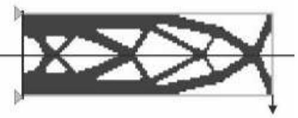  
Figure 1: Planar symmetry from a topology optimization.

You specify the plane of symmetry by selecting the axis of a coordinate system that is the normal to the plane of symmetry. You can use the global coordinate system, or you can create a datum coordinate system (see Methods for creating a datum coordinate system, for more information). You can choose to remove frozen regions from the symmetry restriction.

1. From the main menu bar, select Geometric Restriction->Create.

The Create Geometric Restriction dialog box appears.


Tip: You can initiate the Create procedure in two other ways:

Click Create in the Geometric Restriction Manager. (You can display the Geometric Restriction Manager by selecting Geometric Restriction->Manager from the main menu bar.)

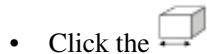

tool in the Optimization module toolbox.

2. From the Create Geometric Restriction dialog box that appears, enter the name of the geometric restriction.  
3. Select Planar symmetry or Planar symmetry (Sizing) from the list of geometric restrictions, and click Continue.  
4. From the viewport, select the region in which the planar symmetry will be enforced or click Done to apply the planar symmetry restriction to the entire model.

By default, Abaqus/CAE allows you to select all of the model. To select faces or cells, use the Selection toolbar to change the type of object that you can select to Face or Cells. For more information, see Filtering your selection based on the type of object.

If you would rather select from a list of existing sets, do the following:

a. Click Sets on the right side of the prompt area.

Abaqus/CAE displays the Region Selection dialog box containing a list of available sets.

b. Select the set of interest, and click Continue.


## Note:

The default selection method is based on the selection method you most recently employed. To revert to the other method, click Select in Viewport or Sets on the right side of the prompt area.

5. When you have finished selecting the geometric restriction region, click Done in the prompt area. For more information on selecting objects, see Selecting objects within the viewport.”  
The Edit Geometric Restriction dialog box appears.  
6. Select the coordinate system, and select the axis of the coordinate system that represents the normal to the plane of symmetry.  
7. If desired, toggle on Ignore frozen area to remove any frozen regions from the symmetry restriction.  
8. Click OK to create the planar symmetry geometric restriction and to exit the editor.

## Additional information

• Creating a geometric restriction in a topology or sizing optimization

• Creating a geometric restriction in a shape optimization

## Creating a rotational symmetry restriction

You can specify a rotational symmetry geometric restriction for a topology or sizing optimization.

A rotational symmetry geometric restriction forces the optimized model to be symmetric about a specified axis, as shown in Figure 1:

  
Figure 1: Rotational symmetry from a topology optimization.

You specify the axis of symmetry by selecting the axis of a coordinate system. You can use the global coordinate system, or you can create a datum coordinate system (see Methods for creating a datum coordinate system, for more information). In addition, you must enter an angle that specifies the size of the repeating segment. You can choose to remove frozen regions from the symmetry restriction.

1. From the main menu bar, select Geometric Restriction->Create.

The Create Geometric Restriction dialog box appears.


Tip: You can initiate the Create procedure in two other ways:

Click Create in the Geometric Restriction Manager. (You can display the Geometric Restriction Manager by selecting Geometric Restriction->Manager from the main menu bar.)


tool in the Optimization module toolbox.

2. From the Create Geometric Restriction dialog box that appears, enter the name of the geometric restriction.  
3. Select Rotational symmetry or Rotational symmetry (Sizing) from the list of geometric restrictions, and click Continue.  
4. From the viewport, select the region in which the rotational symmetry will be enforced or click Done to apply the rotational symmetry restriction to the entire model.

By default, Abaqus/CAE allows you to select all of the model. To select faces or cells, use the Selection toolbar to change the type of object that you can select to Face or Cells. For more information, see Filtering your selection based on the type of object.

If you would rather select from a list of existing sets, do the following:

a. Click Sets on the right side of the prompt area.

Abaqus/CAE displays the Region Selection dialog box containing a list of available sets.

b. Select the set of interest, and click Continue.


## Note:

The default selection method is based on the selection method you most recently employed. To revert to the other method, click Select in Viewport or Sets on the right side of the prompt area.

5. When you have finished selecting the geometric restriction region, click Done in the prompt area. For more information on selecting objects, see Selecting objects within the viewport.”  
The Edit Geometric Restriction dialog box appears.  
6. Select the coordinate system, and select the axis of the coordinate system that represents the axis of symmetry.  
7. Enter the Repeating segment size, which is the angle (in degrees) specifying the size of the repeating segment. The value must be greater than or equal to 2°.  
8. If desired, toggle on Ignore frozen area to remove any frozen regions from the symmetry restriction.  
9. Click OK to create the rotational symmetry geometric restriction and to exit the editor.

## Additional information

• Creating a geometric restriction in a topology or sizing optimization  
• Creating a geometric restriction in a shape optimization

## Creating a point symmetry restriction

You can specify a point symmetry geometric restriction for a topology or sizing optimization.

A point symmetry geometric restriction forces the optimized model to be symmetric about a specified point, as shown in Figure 1.

  
Figure 1: Point symmetry from a topology optimization.

You specify the point of symmetry by selecting a coordinate system (the point of symmetry is assumed to be the origin of the coordinate system). You can use the global coordinate system, or you can create a datum coordinate system (see Methods for creating a datum coordinate system, for more information). You can choose to remove frozen regions from the symmetry restriction.

1. From the main menu bar, select Geometric Restriction->Create.

The Create Geometric Restriction dialog box appears.


Tip: You can initiate the Create procedure in two other ways:

Click Create in the Geometric Restriction Manager. (You can display the Geometric Restriction Manager by selecting Geometric Restriction->Manager from the main menu bar.)


tool in the Optimization module toolbox.

2. From the Create Geometric Restriction dialog box that appears, enter the name of the geometric restriction.  
3. Select Point symmetry or Point symmetry (Sizing) from the list of geometric restrictions, and click Continue.  
4. From the viewport, select the region in which the point symmetry will be enforced or click Done to apply the point symmetry restriction to the entire model.

By default, Abaqus/CAE allows you to select all of the model. To select faces or cells, use the Selection toolbar to change the type of object that you can select to Face or Cells. For more information, see Filtering your selection based on the type of object.

If you would rather select from a list of existing sets, do the following:

a. Click Sets on the right side of the prompt area.

Abaqus/CAE displays the Region Selection dialog box containing a list of available sets.

b. Select the set of interest, and click Continue.


## Note:

The default selection method is based on the selection method you most recently employed. To revert to the other method, click Select in Viewport or Sets on the right side of the prompt area.

5. When you have finished selecting the geometric restriction region, click Done in the prompt area. For more information on selecting objects, see Selecting objects within the viewport.”  
The Edit Geometric Restriction dialog box appears.  
6. Select the coordinate system. The point of symmetry is assumed to be the origin of the selected coordinate system.  
7. If desired, toggle on Ignore frozen area to remove any frozen regions from the symmetry restriction.  
8. Click OK to create the point symmetry geometric restriction and to exit the editor.

## Additional information

• Creating a geometric restriction in a topology or sizing optimization

• Creating a geometric restriction in a shape optimization

## Creating a minimum width restriction

A sizing optimization determines the optimal element thickness when modeling a sheet metal structure with shell elements. Specifying the minimum width of a region containing elements of the same thickness prevents narrow slivers of elements with equal thickness from appearing in the solution after a sizing optimization. Specifying a minimum width will also prevent oscillations in the shell thickness or a “checkerboard” pattern of element thicknesses. The minimum width must be larger than the average length of the element edges.

1. From the main menu bar, select Geometric Restriction->Create.

The Create Geometric Restriction dialog box appears.


Tip: You can initiate the Create procedure in two other ways:

Click Create in the Geometric Restriction Manager. (You can display the Geometric Restriction Manager by selecting Geometric Restriction->Manager from the main menu bar.)

• Click the tool in the Optimization module toolbox.

2. From the Create Geometric Restriction dialog box that appears, enter the name of the geometric restriction.  
3. Select Member size (Sizing) from the list of geometric restrictions and click Continue.  
4. From the viewport, select the region to which the minimum width restriction will be applied or click Done to apply the minimum width restriction to the entire model.

By default, Abaqus/CAE allows you to select all of the model. To select faces or cells, use the Selection toolbar to change the type of object that you can select to Face or Cells. For more information, see Filtering your selection based on the type of object.

If you would rather select from a list of existing sets, do the following:

a. Click Sets on the right side of the prompt area.

Abaqus/CAE displays the Region Selection dialog box containing a list of available sets.

b. Select the set of interest, and click Continue.


## Note:

The default selection method is based on the selection method you most recently employed. To revert to the other method, click Select in Viewport or Sets on the right side of the prompt area.

5. When you have finished selecting the geometric restriction region, click Done in the prompt area. For more information on selecting objects, see Selecting objects within the viewport.”

The Edit Geometric Restriction dialog box appears.

6. Select Minimum width and enter the minimum width.  
7. Click OK to create the minimum width geometric restriction and to exit the editor.

## Additional information

• Creating a geometric restriction in a topology or sizing optimization  
• Creating a geometric restriction in a shape optimization

## Creating a thickness control restriction

You can specify upper and lower bounds on the thickness of shell elements when you are configuring a sizing optimization. The value can be an absolute thickness or a fraction of the initial thickness.

1. From the main menu bar, select Geometric Restriction->Create.

The Create Geometric Restriction dialog box appears.


Tip: You can initiate the Create procedure in two other ways:

Click Create in the Geometric Restriction Manager. (You can display the Geometric Restriction Manager by selecting Geometric Restriction->Manager from the main menu bar.)

• Click the tool in the Optimization module toolbox.

2. From the Create Geometric Restriction dialog box that appears, enter the name of the geometric restriction.  
3. Select Thickness control (Sizing) from the list of geometric restrictions, and click Continue.  
4. From the viewport, select the region to which the thickness control restriction will be applied or click Done to apply the thickness control restriction to the entire model.

By default, Abaqus/CAE allows you to select all of the model. To select faces or cells, use the Selection toolbar to change the type of object that you can select to Face or Cells. For more information, see Filtering your selection based on the type of object.

If you would rather select from a list of existing sets, do the following:

a. Click Sets on the right side of the prompt area.

Abaqus/CAE displays the Region Selection dialog box containing a list of available sets.

b. Select the set of interest, and click Continue.


## Note:

The default selection method is based on the selection method you most recently employed. To revert to the other method, click Select in Viewport or Sets on the right side of the prompt area.

5. When you have finished selecting the geometric restriction region, click Done in the prompt area. For more information on selecting objects, see Selecting objects within the viewport.”

The Edit Geometric Restriction dialog box appears.

6. Do one of the following:

• Select Thickness by value to enter the absolute value of the shell element thickness.  
Select Thickness by fraction to enter a fraction of the shell element thickness relative to the initial value.

7. Select Minimum and enter the minimum thickness.  
8. Select Maximum and enter the maximum thickness.  
9. Click OK to create the thickness control geometric restriction and to exit the editor.

## Additional information

• Creating a geometric restriction in a topology or sizing optimization

• Creating a geometric restriction in a shape optimization

## Creating a clustering restriction

You can specify that selected regions contain clusters of shell elements of equal thickness after a sizing optimization or clusters of elements of equal pseudodensities after a topology optimization.

You can use clustering to

generate strengthening ribs or rings in the sheet metal structure you are optimizing,  
• define borders between regions of equal thickness, or  
• obtain an extrudable profile in the solid structures.

Clustered regions can be reproduced in manufacturing using sheets of constant thickness; for example, a vehicle “body in white” formed by welding and stamping individual sheet metal structures. To allow for maximum design flexibility, you should first optimize your structure without specifying clustering and use the initial design to decide which regions to cluster in your final optimization.

1. From the main menu bar, select Geometric Restriction->Create.

The Create Geometric Restriction dialog box appears.


Tip: You can initiate the Create procedure in two other ways:

Click Create in the Geometric Restriction Manager. (You can display the Geometric Restriction Manager by selecting Geometric Restriction->Manager from the main menu bar.)

• Click the tool in the Optimization module toolbox.

2. From the Create Geometric Restriction dialog box that appears, enter the name of the geometric restriction.  
3. Select Cluster areas (Sizing) or Cluster areas (Topology) from the list of geometric restrictions, and click Continue.

The Edit Geometric Restriction dialog box appears.

4. From the list of Eligible Sets, select the sets specifying regions that will contain clusters of elements of equal thickness or of equal pseudo densities after the optimization.


Note:

If the desired set does not exist, click to create it.

5. Click the arrow to move the selected sets to the list of Selected Sets.  
6. Click OK to create the thickness clustering geometric restriction and to exit the editor.

## Additional information

• Creating a geometric restriction in a topology or sizing optimization  
• Creating a geometric restriction in a shape optimization

## Creating a demold restriction

You can specify a demold geometric restriction for a topology optimization. A demold geometric restriction forces the optimized model to satisfy specified manufacturing requirements; for example, it can prevent undercuts and hollow regions in a part that must be extracted from a mold.

1. From the main menu bar, select Geometric Restriction->Create.

The Create Geometric Restriction dialog box appears.


Tip: You can initiate the Create procedure in two other ways:

Click Create in the Geometric Restriction Manager. (You can display the Geometric Restriction Manager by selecting Geometric Restriction->Manager from the main menu bar.)

• Click the tool in the Optimization module toolbox.

2. From the Create Geometric Restriction dialog box that appears, enter the name of the geometric restriction.  
3. Select Demold from the list of geometric restrictions, and click Continue.  
4. From the viewport, select the region in which the demold restriction will be enforced or click Done to apply the demold symmetry restriction to the entire model.

By default, Abaqus/CAE allows you to select all of the model. To select faces or cells, use the Selection toolbar to change the type of object that you can select to Face or Cells. For more information, see Filtering your selection based on the type of object.

If you would rather select from a list of existing sets, do the following:

a. Click Sets on the right side of the prompt area.

Abaqus/CAE displays the Region Selection dialog box containing a list of available sets.

b. Select the set of interest, and click Continue.


## Note:

The default selection method is based on the selection method you most recently employed. To revert to the other method, click Select in Viewport or Sets on the right side of the prompt area.

5. When you have finished selecting the geometric restriction region, click Done in the prompt area. For more information on selecting objects, see Selecting objects within the viewport.”

The Edit Geometric Restriction dialog box appears.

6. By default, the region in which the Optimization module checks for collisions is the same as the region

in which it enforces the demold restriction. If desired, select from the top of the Edit Geometric Restriction dialog box, and select the collision check region. To avoid cavities, the collision check region should include the demold region and any cells that are adjacent to the demold region.

7. Choose one of the following demold techniques:

• Choose Demolding with a central plane and select how the Optimization module will determine the central plane:

Choose Determine automatically. The Optimization module determines the optimal location of the central plane such that the optimization adds or removes material only in the pull direction or in the opposite direction. Toggle on Prevent hole formation to prevent the optimization from removing material from the central plane.

Choose Specify, and click to select a point on the central plane. The Optimization module creates a structure that can be released from a mold in both pull directions away from the central plane.

Choose Forging (deform only in the pull direction). The central plane, the plane at which two halves of a mold meet, is assumed to lie at the back of the model and perpendicular to the pull direction. The optimization adds or removes material only in the pull direction.  
Choose Stamping. If the Optimization module decides to remove an element from the structure, it also removes all the elements behind or in front of the element (relative to the vector indicating the pull direction).  
• Choose Demolding at the region surface to force the optimization to add or remove material only from the surface of the constrained region.

8. Click

9. Enter the Draft angle. The draft angle is a small angle relative to the pull direction that will be introduced to the optimized model to ensure the part can be removed from its mold. Normally the value is between 0° and 10°.

10. Click OK to create the demold geometric restriction and to exit the editor.

## Additional information

• Creating a geometric restriction in a topology or sizing optimization  
• Creating a geometric restriction in a shape optimization

## Creating an overhang control restriction

You can specify a geometric restriction for overhang control in a topology optimization.

An overhang control geometric restriction forces the optimized model to satisfy specified additive manufacturing requirements. The restriction can prevent overhanging features in a model that exceed a critical angle. In general, an overhanging feature with an angle greater than 45º is difficult to print and usually requires the addition of support structures.

The base plane defines the printing bed. Only parts of the model situated above the base plane need support. By default, the overhang restriction tries to remove all overhanging features so that support structures are not required. Depending on the geometry, this can lead to unreasonable results. You can specify that there is no base plane, in which case boundary features are always printable. Alternatively, you can specify the base plane with a user-defined point in space on the plane perpendicular to the print direction. The point should be above overhanging features that are mandatory and under overhanging features that should be removed.

1. From the main menu bar, select Geometric Restriction->Create.

The Create Geometric Restriction dialog box appears.


Tip: You can initiate the Create procedure in two other ways:

Click Create in the Geometric Restriction Manager. (You can display the Geometric Restriction Manager by selecting Geometric Restriction->Manager from the main menu bar.)

• Click the tool in the Optimization module toolbox.

2. Enter the name of the geometric restriction.  
3. Select Overhang control (Topology) from the list of geometric restrictions, and click Continue.  
4. From the viewport, select the region in which the overhang control restriction is enforced, or click Done to apply the overhang control restriction to the entire model.

By default, Abaqus/CAE allows you to select all of the model. To select faces or cells, use the Selection toolbar to change the type of object that you can select to Face or Cells. For more information, see Filtering your selection based on the type of object.

If you would rather select from a list of existing sets, do the following:

a. Click Sets on the right side of the prompt area.

Abaqus/CAE displays the Region Selection dialog box containing a list of available sets.

b. Select the set of interest, and click Continue.


## Note:

The default selection method is based on the selection method you most recently employed. To revert to the other method, click Select in Viewport or Sets on the right side of the prompt area.

5. When you have finished selecting the geometric restriction region, click Done in the prompt area. For more information on selecting objects, see Selecting objects within the viewport.

The Edit Geometric Restriction dialog box appears.

6. By default, the region in which the Optimization module checks for critical overhanging features is

the same as the region in which it enforces the overhang control restriction. If desired, select from the top of the Edit Geometric Restriction dialog box, and select the check region.

7. Select the base plane to define the printing bed.

Select Determine automatically to allow the Optimization module to determine the optimal location of the base plane such that all overhanging features are removed.  
• Select Specify, and click to select a point on the plane perpendicular to the print direction.  
• Select None to indicate that all boundary features should be printed.

8. By default, the Optimization module assumes the print direction is defined in the global coordinate system. To change the coordinate system, click for the CSYS option and do one of the following:

• Select an existing datum coordinate system in the viewport.  
• Select an existing datum coordinate system by name.

1. From the prompt area, click Datum CSYS List to display a list of datum coordinate systems.

2. Select a name from the list, and click OK.

• Click Use Global CSYS from the prompt area to revert to the global coordinate system.

Alternatively, click to define a new datum coordinate system.

9. Click , and select two points specifying the vector along the print direction.  
10. Enter the Overhang angle. The overhang angle is an angle relative to the print direction that is introduced to the optimized model to ensure the part does not contain unacceptable features. The default value is 45°.  
11. Enter the Radius. The radius defines the size of the cones that are used in the internal check for the overhang criteria. The default value in 1.5 times the average element length.  
12. Click OK to create the overhang control geometric restriction and to exit the editor.

## Additional information

• Creating a geometric restriction in a topology or sizing optimization

## Creating a milling control restriction

You can specify a milling control geometric restriction for a topology optimization.

A milling geometric restriction forces the optimized model to satisfy specified manufacturing requirements; for example, it can arrange undercuts and hollow regions in a part to facilitate material removal by milling.

1. From the main menu bar, select Geometric Restriction->Create.

The Create Geometric Restriction dialog box appears.


Tip: You can initiate the Create procedure in two other ways:

Click Create in the Geometric Restriction Manager. (You can display the Geometric Restriction Manager by selecting Geometric Restriction->Manager from the main menu bar.)

• Click the tool in the Optimization module toolbox.

2. From the Create Geometric Restriction dialog box that appears, enter the name of the geometric restriction.  
3. Select Milling control from the list of geometric restrictions, and click Continue.  
4. From the viewport, select the region in which the milling restriction will be enforced or click Done to apply the milling symmetry restriction to the entire model.

By default, Abaqus/CAE allows you to select all of the model. To select faces or cells, use the Selection toolbar to change the type of object that you can select to Face or Cells. For more information, see Filtering your selection based on the type of object.

If you would rather select from a list of existing sets, do the following:

a. Click Sets on the right side of the prompt area.

Abaqus/CAE displays the Region Selection dialog box containing a list of available sets.

b. Select the set of interest, and click Continue.


## Note:

The default selection method is based on the selection method you most recently employed. To revert to the other method, click Select in Viewport or Sets on the right side of the prompt area.

5. When you have finished selecting the geometric restriction region, click Done in the prompt area. For more information on selecting objects, see Selecting objects within the viewport.”

The Edit Geometric Restriction dialog box appears.

6. By default, the region in which the Optimization module checks for milling is the same as the region

in which it enforces the milling restriction. If desired, select from the top of the Edit Geometric Restriction dialog box, and select the milling check region.

7. By default, the Optimization module assumes the milling directions are defined in the global coordinate

system. To change the coordinate system, click for the CSYS option and do one of the following:

• Select an existing datum coordinate system in the viewport.  
• Select an existing datum coordinate system by name.

1. From the prompt area, click Datum CSYS List to display a list of datum coordinate systems.  
2. Select a name from the list, and click OK.

• Click Use Global CSYS from the prompt area to revert to the global coordinate system.

Alternatively, click to define a new datum coordinate system.

8. Click , and select two points specifying the vector along the milling direction. It specifies the direction in which the model is supposed to be milled. Repeat the step to specify multiple directions in case of multiaxis milling.  
9. Enter the Radius. The radius value is used internally for the collision check during the removal of the elements.  
10. Click OK to create the milling geometric restriction and to exit the editor.

## Additional information

• Creating a geometric restriction in a topology or sizing optimization  
• Creating a geometric restriction in a shape optimization

## Creating a rib design restriction

You can specify a rib design geometric restriction for a topology optimization.

The rib pattern restriction forces the optimizer to prevent material accumulation and to generate substructures in the form of ribs.

1. From the main menu bar, select Geometric Restriction->Create.

The Create Geometric Restriction dialog box appears.


Tip: You can initiate the Create procedure in two other ways:

Click Create in the Geometric Restriction Manager. (You can display the Geometric Restriction Manager by selecting Geometric Restriction->Manager from the main menu bar.)

• Click the tool in the Optimization module toolbox.

2. From the Create Geometric Restriction dialog box that appears, enter the name of the geometric restriction.  
3. Select Rib design from the list of geometric restrictions, and click Continue.  
4. From the viewport, select the region in which the rib design restriction will be enforced or click Done to apply the rib design restriction to the entire model.

By default, Abaqus/CAE allows you to select all of the model. To select faces or cells, use the Selection toolbar to change the type of object that you can select to Face or Cells. For more information, see Filtering your selection based on the type of object.

5. Optional: If you would rather select from a list of existing sets, do the following:

a. Click Sets on the right side of the prompt area.

Abaqus/CAE displays the Region Selection dialog box containing a list of available sets.

b. Select the set of interest, and click Continue.


Note: The default selection method is based on the selection method you most recently employed. To revert to the other method, click Select in Viewport or Sets on the right side of the prompt area.

6. When you have finished selecting the geometric restriction region, click Done in the prompt area. For more information on selecting objects, see Selecting objects within the viewport.”

The Edit Geometric Restriction dialog box appears.

7. Optional: By default, the region in which the Optimization module checks for rib design is the same

as the region in which it enforces the rib design restriction. If desired, select from the top of the Edit Geometric Restriction dialog box, and select the rib design check region.

8. Optional: By default, the Optimization module assumes the rib direction is defined in the global

coordinate system. To change the coordinate system, click for the CSYS option and do one of the following:

• Select an existing datum coordinate system in the viewport.  
• Select an existing datum coordinate system by name:

1. From the prompt area, click Datum CSYS List to display a list of datum coordinate systems.

2. Select a name from the list, and click OK.

• Click Use Global CSYS from the prompt area to revert to the global coordinate system.

Alternatively, click to define a new datum coordinate system.

9. Click , and select two points specifying the out-of-plane growth direction of the ribs.

10. Enter the Rib thickness.

The rib thickness is the averaged thickness of the ribs.

11. Enter the Rib distance.

The rib distance is the averaged distance between the rib centers. The distance must be larger than twice the average element edge length.

12. Click OK to create the rib design geometric restriction and to exit the editor.

## Additional information

• Creating a geometric restriction in a topology or sizing optimization  
• Creating a geometric restriction in a shape optimization

This section describes how to create a geometric restriction in a shape optimization.

## In this section:

Creating a member size restriction  
Creating a planar symmetry restriction  
Creating a rotational symmetry restriction  
Creating a point symmetry restriction  
Creating a stamp control restriction  
Creating a turn control restriction  
Creating a demold control restriction  
Creating a drill control restriction  
Creating a penetration check restriction  
Creating a fixed region restriction  
Creating a growth restriction  
Creating a design direction restriction  
Creating a slide region control restriction

## Creating a member size restriction

You can specify the minimum or maximum size of selected regions of your model; for example, the minimum thickness of a rib that is modified during the shape optimization. The value that you enter can be thought of as a radius. During the optimization the Optimization module restrains the thickness of a member to be twice the value that you entered (the diameter). If you enter a value for the minimum thickness, the Optimization module adjusts surface nodes such that the minimum diameter must be achieved along a normal to the surface of the model. If the structure is smaller than the specified value in certain regions, the shape optimization permits only growth until the member size in the regions areas satisfies the restriction. Conversely, if you enter a value for the maximum thickness, the Optimization module adjusts surface nodes such that a maximum diameter must be achieved along a normal to the surface of the model. If the structure is larger than the specified value in certain regions, the shape optimization permits only shrinkage until the member size in the regions areas satisfies the restriction.

1. From the main menu bar, select Geometric Restriction->Create.

The Create Geometric Restriction dialog box appears.


Tip: You can initiate the Create. procedure in two other ways:

Click Create in the Geometric Restriction Manager. (You can display the Geometric Restriction Manager by selecting Geometric Restriction->Manager from the main menu bar.)

• Click the tool in the Optimization module toolbox.

2. From the Create Geometric Restriction dialog box that appears, enter the name of the geometric restriction.  
3. Select Member size (Shape) from the list of geometric restrictions, and click Continue.  
4. From the viewport, select the region to which the member size restriction will be applied or click Done to apply the member size restriction to the entire model.

By default, Abaqus/CAE allows you to select all of the model. To select faces or cells, use the Selection toolbar to change the type of object that you can select to Face or Cells. For more information, see Filtering your selection based on the type of object.

If you would rather select from a list of existing sets, do the following:

a. Click Sets on the right side of the prompt area.

Abaqus/CAE displays the Region Selection dialog box containing a list of available sets.

b. Select the set of interest, and click Continue.


## Note:

The default selection method is based on the selection method you most recently employed. To revert to the other method, click Select in Viewport or Sets on the right side of the prompt area.

5. When you have finished selecting the geometric restriction region, click Done in the prompt area. For more information on selecting objects, see Selecting objects within the viewport.”

The Edit Geometric Restriction dialog box appears.

6. Do either of the following:

• Select Minimum thickness, and enter the minimum radius of a member.  
• Select Maximum thickness, and enter the maximum radius of a member.

7. If desired, toggle on Ignore in first design cycle (default). When the optimization starts, it assumes the selected regions already include members larger than the minimum thickness. If the regions include smaller members, the Optimization module issues a warning and tries to continue. If you toggle off Ignore in first design cycle, and the regions include smaller members, the Optimization module issues an error message and stops execution.  
8. If desired, toggle on Check node group, and select the node group region.  
9. Click OK to create the member size geometric restriction and to exit the editor.

## Additional information

• Creating a geometric restriction in a topology or sizing optimization

• Creating a geometric restriction in a shape optimization

## Creating a planar symmetry restriction

You can specify a planar symmetry geometric restriction for a shape optimization. A planar symmetry geometric restriction forces selected faces of the optimized model to be symmetric about a specified plane. You specify the plane of symmetry by selecting the axis of a coordinate system that is the normal to the plane of symmetry. The origin of the coordinate system is a point on the plane of symmetry. You can use the global coordinate system, or you can create a datum coordinate system (see Methods for creating a datum coordinate system, for more information).

The mesh must be approximately symmetric across the plane of symmetry before the optimization starts somast that the Optimization module can identify pairs of nodes on either side of the plane of symmetry—the main node and the secondary node. By default, the main node is the node that the optimization moves out the most (the most growth) or moves in the least (the least shrinkage). The optimization displaces the main node, and the symmetry condition applies an equal displacement to the secondary node so that it remains symmetrical to the main node. Alternatively, if you are trying to optimize surfaces that are in contact, you can force the Optimization module to select the main node as the node to which the optimization is applying the least growth or the most amount of shrinkage.

1. From the main menu bar, select Geometric Restriction->Create.

The Create Geometric Restriction dialog box appears.


Tip: You can initiate the Create procedure in two other ways:

Click Create in the Geometric Restriction Manager. (You can display the Geometric Restriction Manager by selecting Geometric Restriction->Manager from the main menu bar.)

• Click the tool in the Optimization module toolbox.

2. From the Create Geometric Restriction dialog box that appears, enter the name of the geometric restriction.  
3. Select Planar symmetry from the list of geometric restrictions, and click Continue.  
4. From the viewport, select the faces in which the planar symmetry will be enforced. For more information, see Using the face curvature method to select multiple faces.

If you would rather select from a list of existing sets, do the following:

a. Click Sets on the right side of the prompt area.

Abaqus/CAE displays the Region Selection dialog box containing a list of available sets.

b. Select the set of interest, and click Continue.


## Note:

The default selection method is based on the selection method you most recently employed. To revert to the other method, click Select in Viewport or Sets on the right side of the prompt area.

5. When you have finished selecting faces, click Done in the prompt area.

The Edit Geometric Restriction dialog box appears.

6. Select the coordinate system, and select the axis of the coordinate system that represents the normal to the plane of symmetry.  
7. Select the method that the optimization will use to determine the main point. In most cases you should select Determine from most growth and least shrinkage. You should select Determine from least growth and most shrinkage only if you are trying to optimize faces that are involved in contact.  
8. Enter the tolerance that will be used to determine symmetric points in the X-, Y-, and Z-axes.

The Optimization module uses the tolerance to identify the pairs of symmetric nodes across the symmetry plane.

9. If desired, toggle on Ignore in first design cycle (default). When the optimization starts, it assumes the faces are already symmetric about the plane. If the faces are not symmetric, the Optimization module issues a warning and tries to continue. If you toggle off Ignore in first design cycle, and the faces are not symmetric, the Optimization module issues an error message and stops execution.  
10. If desired, toggle on Allow nonsymmetric mesh (default) to use the planar symmetry geometric restriction for nonsymmetric meshes as well. Toggle off Allow nonsymmetric mesh to use the planar symmetry geometric restriction with symmetric meshes only.  
11. Click OK to create the planar symmetry geometric restriction and to exit the editor.

## Additional information

• Creating a geometric restriction in a topology or sizing optimization  
• Creating a geometric restriction in a shape optimization

## Creating a rotational symmetry restriction

You can specify a rotational symmetry geometric restriction for a shape optimization. A rotational symmetry geometric restriction forces selected faces of the optimized model to be symmetric about a specified axis. You choose the axis of symmetry by specifying the starting and ending coordinates of a vector representing the axis. You can use the global coordinate system, or you can create a datum coordinate system (see Methods for creating a datum coordinate system, for more information).

The mesh must be approximately symmetric around the axis of symmetry before the optimization starts so that the Optimization module can identify the group of nodes that sit on a selected face in a plane normal to the axis of symmetry. By default, the main node is the node in the group that the optimization moves out the most (the most growth) or moves in the least (the least shrinkage). The optimization displaces the main node, and the symmetry condition applies an equal displacement to the rest of the nodes in the group (the secondary nodes) so that they remain symmetrical about the axis. If you are trying to optimize surfaces that are in contact, you can force the Optimization module to select the main node as the node to which the optimization is applying the least growth or the most amount of shrinkage.

Alternatively, you can select a single point that will be used as the main node by all other nodes. The optimization determines how much the main node is displaced, and all other nodes are moved the same amount so that they remain symmetric about the selected axis.

1. From the main menu bar, select Geometric Restriction->Create.

The Create Geometric Restriction dialog box appears.


Tip: You can initiate the Create procedure in two other ways:

Click Create in the Geometric Restriction Manager. (You can display the Geometric Restriction Manager by selecting Geometric Restriction->Manager from the main menu bar.)

• Click the tool in the Optimization module toolbox.

2. From the Create Geometric Restriction dialog box that appears, enter the name of the geometric restriction.  
3. Select Rotational symmetry (Shape) from the list of geometric restrictions, and click Continue.  
4. From the viewport, select the faces in which the rotational symmetry will be enforced. For more information, see Using the face curvature method to select multiple faces.

If you would rather select from a list of existing sets, do the following:

a. Click Sets on the right side of the prompt area.

Abaqus/CAE displays the Region Selection dialog box containing a list of available sets.

b. Select the set of interest, and click Continue.


## Note:

The default selection method is based on the selection method you most recently employed. To revert to the other method, click Select in Viewport or Sets on the right side of the prompt area.

5. When you have finished selecting faces, click Done in the prompt area.

The Edit Geometric Restriction dialog box appears.

6. Enter the coordinates of the starting point and the ending point of a vector representing the axis of symmetry.  
7. Toggle on Create a repeating pattern, and enter the angle over which the pattern created by the optimization will be repeated. The value must be between 0° and 360°. A value of 0° implies the

secondary nodes are symmetric about the axis of symmetry, but the optimization does not create a repeating pattern.

8. If desired, toggle on Allow nonsymmetric mesh (default) to use the rotational symmetry geometric restriction for nonsymmetric meshes as well. Toggle off Allow nonsymmetric mesh to use the rotational symmetry geometric restriction with symmetric meshes only. When you allow nonsymmetric meshes, you can pick the Start point of the repeating pattern.  
9. Select the method that the optimization will use to determine the main point. In most cases you should select Determine from most growth and least shrinkage. You should select Determine from least growth and most shrinkage only if you are trying to optimize faces that are involved in contact.  
Alternatively, you can select Region and select a vertex that will be used to represent the main node.  
10. Enter the tolerance that will be used to determine symmetric points in the X-, Y-, and Z-axes.  
The Optimization module uses the tolerance to identify the nodes on the surface that lie on a plane normal to the axis of symmetry and are equidistant from the axis of symmetry.  
11. If desired, toggle on Ignore in first design cycle (default). When the optimization starts, it assumes the faces are already symmetric about the axis. If the faces are not symmetric, the Optimization module issues a warning and tries to continue. If you toggle off Ignore in first design cycle and the faces are not symmetric, the Optimization module issues an error message and stops execution.  
12. Click OK to create the rotational symmetry geometric restriction and to exit the editor.

## Additional information

• Creating a geometric restriction in a topology or sizing optimization  
• Creating a geometric restriction in a shape optimization

## Creating a point symmetry restriction

You can specify a point symmetry geometric restriction for a shape optimization. A rotational symmetry geometric restriction forces selected faces of the optimized model to be symmetric about a specified point of symmetry. You specify the point of symmetry by selecting a coordinate system (the point of symmetry is assumed to be the origin of the coordinate system). You can use the global coordinate system, or you can create a datum coordinate system (see Methods for creating a datum coordinate system, for more information).

The mesh must be approximately symmetric about the point before the optimization starts so that the Optimization module can identify pairs of nodes on either side of the point of symmetry—the main node and the secondary node. By default, the main node is the node that the optimization moves out the most (the most growth) or moves in the least (the least shrinkage). The optimization displaces the main node, and the symmetry condition applies an equal displacement to the secondary node so that it remains symmetrical to the main node. Alternatively, if you are trying to optimize surfaces that are in contact, you can force the Optimization module to select the main node as the node to which the optimization is applying the least growth or the most amount of shrinkage.

1. From the main menu bar, select Geometric Restriction->Create.

The Create Geometric Restriction dialog box appears.


Tip: You can initiate the Create procedure in two other ways:

Click Create in the Geometric Restriction Manager. (You can display the Geometric Restriction Manager by selecting Geometric Restriction->Manager from the main menu bar.)

• Click the tool in the Optimization module toolbox.

2. From the Create Geometric Restriction dialog box that appears, enter the name of the geometric restriction.  
3. Select Point symmetry (Shape) from the list of geometric restrictions, and click Continue.  
4. From the viewport, select the faces in which the point symmetry will be enforced. For more information, see Using the face curvature method to select multiple faces.

If you would rather select from a list of existing sets, do the following:

a. Click Sets on the right side of the prompt area.

Abaqus/CAE displays the Region Selection dialog box containing a list of available sets.

b. Select the set of interest, and click Continue.


## Note:

The default selection method is based on the selection method you most recently employed. To revert to the other method, click Select in Viewport or Sets on the right side of the prompt area.

5. When you have finished selecting faces, click Done in the prompt area.

The Edit Geometric Restriction dialog box appears.

6. Select the coordinate system. The point of symmetry is assumed to be the origin of the selected coordinate system.  
7. Select the method that the optimization will use to determine the main point. In most cases you should select Determine from most growth and least shrinkage. You should select Determine from least growth and most shrinkage only if you are trying to optimize faces that are involved in contact.  
8. Enter the tolerance in the X-, Y-, and Z-planes that will be used to determine symmetric points .

The Optimization module uses the tolerance to identify the nodes that are symmetric to the point of symmetry.

9. If desired, toggle on Ignore in first design cycle (default). When the optimization starts, it assumes the faces are already symmetric about the point. If the faces are not symmetric, the Optimization module issues a warning and tries to continue. If you toggle off Ignore in first design cycle and the faces are not symmetric, the Optimization module issues an error message and stops execution.  
10. Click OK to create the point symmetry geometric restriction and to exit the editor.

## Additional information

• Creating a geometric restriction in a topology or sizing optimization

• Creating a geometric restriction in a shape optimization

## Creating a stamp control restriction

You can specify a stamp control geometric restriction for a shape optimization. A stamp control geometric restriction results in an optimized model that can be manufactured by a tool and die stamping operation along a specified direction. You choose the direction by specifying the starting and ending coordinates of a vector representing the direction. You can use the global coordinate system, or you can create a datum coordinate system (see Methods for creating a datum coordinate system, for more information).

The mesh should define a stampable model before the optimization starts; otherwise, the mesh may become distorted when the optimization creates a stampable model in the first iteration. The main node can lie anywhere in the region that you select to be governed by the stamp restriction. By default, the main node is the node in the region that the optimization moves out the most (the most growth) or moves in the least (the least shrinkage). The optimization displaces the main node, and the stamp condition applies an equal displacement to the rest of the nodes in the region (the secondary nodes) so that the model remains stampable. If you are trying to optimize surfaces that are in contact, you can force the Optimization module to select the main node as the node to which the optimization is applying the least growth or the most amount of shrinkage. Alternatively, you can select a single point that will be used as the main node by all other nodes. The optimization determines how much the main node is displaced, and all other nodes are moved the same amount so that the model remains stampable.

1. From the main menu bar, select Geometric Restriction->Create.

The Create Geometric Restriction dialog box appears.


Tip: You can initiate the Create procedure in two other ways:

Click Create in the Geometric Restriction Manager. (You can display the Geometric Restriction Manager by selecting Geometric Restriction->Manager from the main menu bar.)

• Click the tool in the Optimization module toolbox.

2. From the Create Geometric Restriction dialog box that appears, enter the name of the geometric restriction.  
3. Select Stamp control from the list of geometric restrictions, and click Continue.  
4. From the viewport, select the faces to which the stamp control will be applied. For more information, see Using the face curvature method to select multiple faces.

If you would rather select from a list of existing face sets, do the following:

a. Click Sets on the right side of the prompt area.

Abaqus/CAE displays the Region Selection dialog box containing a list of available sets.

b. Select the set of interest, and click Continue.


## Note:

The default selection method is based on the selection method you most recently employed. To revert to the other method, click Select in Viewport or Sets on the right side of the prompt area.

5. When you have finished selecting faces, click Done in the prompt area.

The Edit Geometric Restriction dialog box appears.

6. Enter the coordinates of the starting point and the ending point of a vector representing the direction along which the stamping tool moves.  
7. Enter the draw angle, which represents the angle of the tool that is creating the stamped model. The value must be between 0° and 45°.

8. Enter a positive value for the amount of undercut that can be tolerated in the stamping region.  
9. Select the method that the optimization will use to determine the main point. In most cases you should select Determine from most growth and least shrinkage. You should select Determine from least growth and most shrinkage only if you are trying to optimize faces that are involved in contact.

Alternatively, you can select Region and select a vertex that will be used to represent the main node.

10. Enter the tolerance in the X-, Y-, and Z-axes.

The Optimization module uses the tolerance to identify the nodes on the surface that lie on a plane normal to the axis of symmetry and are equidistant from the axis of symmetry.

11. If desired, toggle on Ignore in first design cycle (default). When the optimization starts, it assumes the model is stampable. If the model is not stampable, the Optimization module issues a warning and tries to continue. If you toggle off Ignore in first design cycle and the model is not stampable, the Optimization module issues an error message and stops execution.  
12. Click OK to create the stamp control geometric restriction and to exit the editor.

## Additional information

• Creating a geometric restriction in a topology or sizing optimization  
• Creating a geometric restriction in a shape optimization

## Creating a turn control restriction

You can specify a turn control geometric restriction for a shape optimization. A turn control geometric restriction results in an optimized model that can be manufactured by a tool on a lathe cutting into the model along a specified direction. You choose the direction by specifying the starting and ending coordinates of a vector representing the direction. You can use the global coordinate system, or you can create a datum coordinate system (see Methods for creating a datum coordinate system, for more information).

The mesh should define a turnable model before the optimization starts; otherwise, the mesh may become distorted when the optimization creates a turnable model in the first iteration. The main node can lie anywhere in the region that you select to be governed by the turn restriction. By default, the main node is the node in the region that the optimization moves out the most (the most growth) or moves in the least (the least shrinkage). The optimization displaces the main node, and the stamp condition applies an equal displacement to the rest of the nodes in the region (the secondary nodes) so that the model remains turnable. If you are trying to optimize surfaces that are in contact, you can force the Optimization module to select the main node as the node to which the optimization is applying the least growth or the most amount of shrinkage. Alternatively, you can select a single point that will be used as the main node by all other nodes. The optimization determines how much the main node is displaced, and all other nodes are moved the same amount so that the model remains turnable.

1. From the main menu bar, select Geometric Restriction->Create.

The Create Geometric Restriction dialog box appears.


Tip: You can initiate the Create procedure in two other ways:

Click Create in the Geometric Restriction Manager. (You can display the Geometric Restriction Manager by selecting Geometric Restriction->Manager from the main menu bar.)

• Click the tool in the Optimization module toolbox.

2. From the Create Geometric Restriction dialog box that appears, enter the name of the geometric restriction.  
3. Select Turn control from the list of geometric restrictions, and click Continue.  
4. From the viewport, select the faces to which the turn control will be applied. For more information, see Using the face curvature method to select multiple faces.

If you would rather select from a list of existing face sets, do the following:

a. Click Sets on the right side of the prompt area.

Abaqus/CAE displays the Region Selection dialog box containing a list of available sets.

b. Select the set of interest, and click Continue.


## Note:

The default selection method is based on the selection method you most recently employed. To revert to the other method, click Select in Viewport or Sets on the right side of the prompt area.

5. When you have finished selecting faces, click Done in the prompt area.

The Edit Geometric Restriction dialog box appears.

6. Enter the coordinates of the starting point and the ending point of a vector representing the direction along which the cutting tool moves.

7. Select the method that the optimization will use to determine the main point. In most cases you should select Determine from most growth and least shrinkage. You should select Determine from least growth and most shrinkage only if you are trying to optimize faces that are involved in contact.  
8. Enter the tolerance in the $X \mathrm { , ~ } Y \mathrm { \mathrm { - } , ~ }$ and Z-axes.

The Optimization module uses the tolerance to identify the nodes on the surface that lie on a plane normal to the axis of symmetry and are equidistant from the axis of symmetry.

9. If desired, toggle on Ignore in first design cycle (default). When the optimization starts, it assumes the model is turnable. If the model is not turnable, the Optimization module issues a warning and tries to continue. If you toggle off Ignore in first design cycle and the model is not turnable, the Optimization module issues an error message and stops execution.

10. Click OK to create the turn control geometric restriction and to exit the editor.

## Additional information

• Creating a geometric restriction in a topology or sizing optimization  
• Creating a geometric restriction in a shape optimization

## Creating a demold control restriction

You can specify a demold geometric restriction for a shape optimization. A demold geometric restriction forces the optimized model to satisfy specified manufacturing requirements; for example, it can prevent undercuts and hollow regions in a part that must be extracted from a mold. You choose the demolding direction by specifying the starting and ending coordinates of a vector representing the axis. You can use the global coordinate system, or you can create a datum coordinate system (see Methods for creating a datum coordinate system, for more information).

The mesh should define a demoldable model before the optimization starts; otherwise, the mesh may become distorted when the optimization creates a demoldable model in the first iteration. The main node can lie anywhere in the region that you select to be governed by the demold control restriction. By default, the main node is the node in the region that the optimization moves out the most (the most growth) or moves in the least (the least shrinkage). The optimization displaces the main node, and the stamp condition applies an equal displacement to the rest of the nodes in the region (the secondary nodes) so that the model remains demoldable. If you are trying to optimize surfaces that are in contact, you can force the Optimization module to select the main node as the node to which the optimization is applying the least growth or the most amount of shrinkage. Alternatively, you can select a single point that will be used as the main node by all other nodes. The optimization determines how much the main node is displaced, and all other nodes are moved the same amount so that the model remains demoldable.

1. From the main menu bar, select Geometric Restriction->Create

The Create Geometric Restriction dialog box appears.


Tip: You can initiate the Create procedure in two other ways:

Click Create in the Geometric Restriction Manager. (You can display the Geometric Restriction Manager by selecting Geometric Restriction->Manager from the main menu bar.)

• Click the tool in the Optimization module toolbox.

2. From the Create Geometric Restriction dialog box that appears, enter the name of the geometric restriction.  
3. Select Demold control from the list of geometric restrictions, and click Continue.  
4. From the viewport, select the faces to which the demold control will be applied. For more information, see Using the face curvature method to select multiple faces.

If you would rather select from a list of existing face sets, do the following:

a. Click Sets on the right side of the prompt area.

Abaqus/CAE displays the Region Selection dialog box containing a list of available sets.

b. Select the set of interest, and click Continue.


## Note:

The default selection method is based on the selection method you most recently employed. To revert to the other method, click Select in Viewport or Sets on the right side of the prompt area.

5. When you have finished selecting faces, click Done in the prompt area.

The Edit Geometric Restriction dialog box appears.

6. By default, the region in which the Optimization module checks for collisions is the same as the region

in which it enforces the demold restriction. If desired, select from the top of the Edit Geometric Restriction dialog box, and select the collision check region.

Faces inside the collision check region cannot be penetrated by faces outside the region. If a node attempts to penetrate an element in the collision check region during the shape optimization, the Optimization module scales back the displacement of the node. The collision check region must include the faces to which the demold control will be applied.

7. Enter the coordinates of the starting point and the ending point of a vector representing the direction along which a mold is withdrawn from the demold region.  
8. Enter the draw angle, which represents the angle of a mold that is being withdrawn from the demold region. The value must be between 0° and 45°.  
9. Enter a positive value for the amount of undercut that can be tolerated in the demold control region.  
10. Select the method that the optimization will use to determine the main point. In most cases you should select Determine from most growth and least shrinkage. You should select Determine from least growth and most shrinkage only if you are trying to optimize faces that are involved in contact.  
11. Enter the tolerance in the X-, Y-, and Z-axes.  
The Optimization module uses the tolerance to identify the nodes on the surface that lie on a plane normal to the axis of symmetry and are equidistant from the axis of symmetry.  
12. If desired, toggle on Ignore in first design cycle (default). When the optimization starts, it assumes a mold could be withdrawn from the demold region. If the mold could not be withdrawn, the Optimization module issues a warning and tries to continue. If you toggle off Ignore in first design cycle, and the mold could not be withdrawn, the Optimization module issues an error message and stops execution.  
13. Click OK to create the demold geometric restriction and to exit the editor.

## Additional information

• Creating a geometric restriction in a topology or sizing optimization  
• Creating a geometric restriction in a shape optimization

## Creating a drill control restriction

You can specify a drill control geometric restriction for a shape optimization. A drill control geometric restriction results in an optimized model that can be manufactured by a tool drilling into the model along a specified direction. The hole created by the tool is symmetric about the axis of the tool. In addition, the tool can be withdrawn from the hole. You choose the axis of the tool (and the drilling direction) by specifying the starting and ending coordinates of a vector representing the axis. You can use the global coordinate system, or you can create a datum coordinate system (see Methods for creating a datum coordinate system, for more information).

The mesh should define a drillable model before the optimization starts; otherwise, the mesh may become distorted when the optimization creates a drillable model in the first iteration. The main node can lie anywhere in the region that you select to be governed by the drill control restriction. By default, the main node is the node in the region that the optimization moves out the most (the most growth) or moves in the least (the least shrinkage). The optimization displaces the main node, and the stamp condition applies an equal displacement to the rest of the nodes in the region (the secondary nodes) so that the model remains drillable. If you are trying to optimize surfaces that are in contact, you can force the Optimization module to select the main node as the node to which the optimization is applying the least growth or the most amount of shrinkage. Alternatively, you can select a single point that will be used as the main node by all other nodes. The optimization determines how much the main node is displaced, and all other nodes are moved the same amount so that the model remains drillable.

1. From the main menu bar, select Geometric Restriction->Create.

The Create Geometric Restriction dialog box appears.


Tip: You can initiate the Create procedure in two other ways:

Click Create in the Geometric Restriction Manager. (You can display the Geometric Restriction Manager by selecting Geometric Restriction->Manager from the main menu bar.)

• Click the tool in the Optimization module toolbox.

2. From the Create Geometric Restriction dialog box that appears, enter the name of the geometric restriction.  
3. Select Stamp control from the list of geometric restrictions, and click Continue.  
4. From the viewport, select the faces to which the drill control will be applied. For more information, see Using the face curvature method to select multiple faces.

If you would rather select from a list of existing face sets, do the following:

a. Click Sets on the right side of the prompt area.

Abaqus/CAE displays the Region Selection dialog box containing a list of available sets.

b. Select the set of interest, and click Continue.


## Note:

The default selection method is based on the selection method you most recently employed. To revert to the other method, click Select in Viewport or Sets on the right side of the prompt area.

5. When you have finished selecting faces, click Done in the prompt area.

The Edit Geometric Restriction dialog box appears.

6. Enter the coordinates of the starting point and the ending point of a vector representing the direction along which the drilling tool moves.

7. Enter the draw angle, which represents the angle of the tool that is drilling the hole. The value must be between 0° and $4 5 ^ { \circ }$ .  
8. Enter a positive value for the amount of undercut that can be tolerated in the drill control region.  
9. Select the method that the optimization will use to determine the main point. In most cases you should select Determine from most growth and least shrinkage. You should select Determine from least growth and most shrinkage only if you are trying to optimize faces that are involved in contact.  
Alternatively, you can select Region and select a vertex that will be used to represent the main node.  
10. Enter the tolerance in the X-, Y-, and Z-axes.  
The Optimization module uses the tolerance to identify the nodes on the surface that lie on a plane normal to the axis of symmetry and are equidistant from the axis of symmetry.  
11. If desired, toggle on Ignore in first design cycle (default). When the optimization starts, it assumes the model is drillable. If the model is not drillable, the Optimization module issues a warning and tries to continue. If you toggle off Ignore in first design cycle and the model is not drillable, the Optimization module issues an error message and stops execution.  
12. Click OK to create the drill control geometric restriction and to exit the editor.

## Creating a penetration check restriction

A penetration check geometric restriction in a shape optimization results in an optimized model with faces that cannot penetrate selected regions.

1. From the main menu bar, select Geometric Restriction->Create.

The Create Geometric Restriction dialog box appears.


Tip: You can initiate the Create procedure in two other ways:

Click Create in the Geometric Restriction Manager. (You can display the Geometric Restriction Manager by selecting Geometric Restriction->Manager from the main menu bar.)

• Click the tool in the Optimization module toolbox.

2. From the Create Geometric Restriction dialog box that appears, enter the name of the geometric restriction.  
3. Select Penetration check (Shape) from the list of geometric restrictions, and click Continue.  
4. From the viewport, select the faces to which the penetration check will be applied. For more information, see Using the face curvature method to select multiple faces.

If you would rather select from a list of existing face sets, do the following:

a. Click Sets on the right side of the prompt area.

Abaqus/CAE displays the Region Selection dialog box containing a list of available sets.

b. Select the set of interest, and click Continue.


## Note:

The default selection method is based on the selection method you most recently employed. To revert to the other method, click Select in Viewport or Sets on the right side of the prompt area.

5. When you have finished selecting faces, click Done in the prompt area.  
The Edit Geometric Restriction dialog box appears.  
6. Select the regions that cannot be penetrated by faces of the optimized model.  
7. If desired, toggle on Ignore in first design cycle (default). When the optimization starts, it assumes the model is not already penetrating the selected regions. If the model is penetrating the selected region, the Optimization module issues a warning and tries to continue. If you toggle off Ignore in first design cycle and the model is penetrating the selected region, the Optimization module issues an error message and stops execution.  
8. Click OK to create the penetration check geometric restriction and to exit the editor.

## Additional information

• Creating a geometric restriction in a topology or sizing optimization  
• Creating a geometric restriction in a shape optimization

## Creating a fixed region restriction

You can specify a fixed region restriction for a shape optimization. A fixed region is restrained in selected degrees of freedom (1-, 2-, or 3-direction. The degrees of freedom are defined relative to a selected coordinate system.

1. From the main menu bar, select Geometric Restriction->Create.

The Create Geometric Restriction dialog box appears.


Tip: You can initiate the Create procedure in two other ways:

Click Create in the Geometric Restriction Manager. (You can display the Geometric Restriction Manager by selecting Geometric Restriction->Manager from the main menu bar.)

• Click the tool in the Optimization module toolbox.

2. From the Create Geometric Restriction dialog box that appears, enter the name of the geometric restriction.  
3. Select Fixed region from the list of geometric restrictions, and click Continue.  
4. From the viewport, select the faces to which the fixation will be applied. For more information, see Using the face curvature method to select multiple faces.

If you would rather select from a list of existing face sets, do the following:

a. Click Sets on the right side of the prompt area.

Abaqus/CAE displays the Region Selection dialog box containing a list of available sets.

b. Select the set of interest, and click Continue.


## Note:

The default selection method is based on the selection method you most recently employed. To revert to the other method, click Select in Viewport or Sets on the right side of the prompt area.

5. When you have finished selecting faces, click Done in the prompt area.  
The Edit Geometric Restriction dialog box appears.  
6. Select the coordinate system that defines the degrees of freedom. You can select the global coordinate system, or you can create a datum coordinate system (see Methods for creating a datum coordinate system, for more information).  
7. Toggle on the degrees of freedom that you want to restrain.  
8. If desired, toggle on Ignore in first design cycle (default). When the optimization starts, it assumes the region is already restrained in the selected degrees of freedom. If the region has displacement in the selected degrees of freedom, the Optimization module issues a warning and tries to continue. If you toggle off Ignore in first design cycle and the region has displacement in the selected degrees of freedom, the Optimization module issues an error message and stops execution.  
9. Click OK to create the fixed region geometric restriction and to exit the editor.

## Additional information

• Creating a geometric restriction in a topology or sizing optimization  
• Creating a geometric restriction in a shape optimization

## Creating a growth restriction

You can specify a growth restriction for a shape optimization. A growth restriction limits how much a face can grow (surface nodes are moved out) or shrink (surface nodes are moving in) relative to the initial design. For example, if you are optimizing a model that will be cast, you can use a growth restriction to control the maximum and minimum wall thickness in a region.

1. From the main menu bar, select Geometric Restriction->Create.

The Create Geometric Restriction dialog box appears.


Tip: You can initiate the Create procedure in two other ways:

Click Create in the Geometric Restriction Manager. (You can display the Geometric Restriction Manager by selecting Geometric Restriction->Manager from the main menu bar.)

• Click the tool in the Optimization module toolbox.

2. From the Create Geometric Restriction dialog box that appears, enter the name of the geometric restriction.  
3. Select Growth from the list of geometric restrictions, and click Continue.  
4. From the viewport, select the faces to which the growth restrictions will be applied. For more information, see Using the face curvature method to select multiple faces.

If you would rather select from a list of existing face sets, do the following:

a. Click Sets on the right side of the prompt area.

Abaqus/CAE displays the Region Selection dialog box containing a list of available sets.

b. Select the set of interest, and click Continue.


## Note:

The default selection method is based on the selection method you most recently employed. To revert to the other method, click Select in Viewport or Sets on the right side of the prompt area.

5. When you have finished selecting faces, click Done in the prompt area.

The Edit Geometric Restriction dialog box appears.

6. Toggle on Maximum in shrink direction, and enter a positive value specifying the maximum inward displacement of a surface node.  
7. Toggle on Maximum in growth direction, and enter a positive value specifying the maximum outward displacement of a surface node.  
8. If desired, toggle on Ignore in first design cycle (default). When the optimization starts, it assumes the growth of the face is already limited. If the growth of the face exceeds the specified value, the Optimization module issues a warning and tries to continue. If you toggle off Ignore in first design cycle and the growth of the face exceeds the specified value, the Optimization module issues an error message and stops execution.  
9. Click OK to create the growth geometric restriction and to exit the editor.

## Additional information

• Creating a geometric restriction in a topology or sizing optimization  
• Creating a geometric restriction in a shape optimization

## Creating a design direction restriction

You can specify a design direction restriction for a shape optimization. You can use a design direction restriction to keep selected nodes of your model on a planar or circular surface during the optimization. The optimization displaces the main node, and the design direction restriction applies an equal displacement (either magnitude or direction or both) to the rest of the nodes in the region (the client nodes). In addition, you can specify the axes of a coordinate system (rectangular, cylindrical, or spherical) that are applied.

The mesh should define nodes that can be moved along the design direction before the optimization starts; otherwise, the mesh may become distorted when the optimization moves nodes in the first iteration. The main node can lie anywhere in the region that you select to be governed by the design direction restriction. By default, the main node is the node in the region that the optimization moves out the most (the most growth) or moves in the least (the least shrinkage). If you are trying to optimize surfaces that are in contact, you can force the Optimization module to select the main node as the node to which the optimization is applying the least growth or the most amount of shrinkage. Alternatively, you can select a single point that will be used as the main node by all other nodes.

1. From the main menu bar, select Geometric Restriction->Create.

The Create Geometric Restriction dialog box appears.


Tip: You can initiate the Create procedure in two other ways:

Click Create in the Geometric Restriction Manager. (You can display the Geometric Restriction Manager by selecting Geometric Restriction->Manager from the main menu bar.)

• Click the tool in the Optimization module toolbox.

2. From the Create Geometric Restriction dialog box that appears, enter the name of the geometric restriction.  
3. Select Design Direction from the list of geometric restrictions, and click Continue.  
4. From the viewport, select the faces to which the design direction restriction will be applied. For more information, see Using the face curvature method to select multiple faces.

If you would rather select from a list of existing face sets, do the following:

a. Click Sets on the right side of the prompt area.

Abaqus/CAE displays the Region Selection dialog box containing a list of available sets.

b. Select the set of interest, and click Continue.


## Note:

The default selection method is based on the selection method you most recently employed. To revert to the other method, click Select in Viewport or Sets on the right side of the prompt area.

5. When you have finished selecting faces, click Done in the prompt area.  
The Edit Geometric Restriction dialog box appears.  
6. Choose whether a client node should follow the main node by moving in the same direction or with the same magnitude or both.  
7. If you chose to move a client node in both the same direction and with the same magnitude as the main node, toggle on the axes along which the movement will be applied.

8. Select the method that the optimization will use to determine the main node. In most cases you should select Determine from most growth and least shrinkage. You should select Determine from least growth and most shrinkage only if you are trying to optimize faces that are involved in contact. Alternatively, you can select Region and select a vertex that will be used to represent the main node.

9. If desired, toggle on Ignore in first design cycle (default). When the optimization starts, it assumes the nodes can be moved along the specified design direction. If the nodes cannot be moved along the design direction, the Optimization module issues a warning and tries to continue. If you toggle off Ignore in first design cycle and the nodes cannot be moved along the design direction, the Optimization module issues an error message and stops execution.

10. Click OK to create the design direction geometric restriction and to exit the editor.

## Additional information

• Creating a geometric restriction in a topology or sizing optimization  
• Creating a geometric restriction in a shape optimization

## Creating a slide region control restriction

You can specify a slide region control, or contact, geometric restriction for a shape optimization. A slide region control geometric restriction results in an optimized model with a face that contacts a specified surface and follows the contours of the surface. You can select the specified surface from the model. Alternatively, the specified surface can be a surface of revolution generated by a rotating a selected face about a selected axis. You choose the axis of rotation by specifying the starting and ending coordinates of a vector representing the axis. You can use the global coordinate system, or you can create a datum coordinate system (see Methods for creating a datum coordinate system, for more information).

If you select the face from the model, the definition of the surface slide control restriction is complete. If you select a face that will be used to form a surface of revolution, the Optimization module selects the main node from the nodes on the face. By default, the main node is the node on the face that the optimization moves out the most (the most growth) or moves in the least (the least shrinkage). The optimization displaces the main node, and the surface slide restriction forces an equal displacement to the rest of the nodes on the face (the secondary nodes) so that the contact conditions are satisfied.

1. From the main menu bar, select Geometric Restriction->Create.

The Create Geometric Restriction dialog box appears.


Tip: You can initiate the Create procedure in two other ways:

Click Create in the Geometric Restriction Manager. (You can display the Geometric Restriction Manager by selecting Geometric Restriction->Manager from the main menu bar.)

• Click the tool in the Optimization module toolbox.

2. From the Create Geometric Restriction dialog box that appears, enter the name of the geometric restriction.  
3. Select Slide region control from the list of geometric restrictions, and click Continue.  
4. From the viewport, select the faces to which the surface slide control will be applied. For more information, see Using the face curvature method to select multiple faces.

If you would rather select from a list of existing face sets, do the following:

a. Click Sets on the right side of the prompt area.

Abaqus/CAE displays the Region Selection dialog box containing a list of available sets.

b. Select the set of interest, and click Continue.


## Note:

The default selection method is based on the selection method you most recently employed. To revert to the other method, click Select in Viewport or Sets on the right side of the prompt area.

5. When you have finished selecting faces, click Done in the prompt area.

The Edit Geometric Restriction dialog box appears.

6. Select the approach that you will use to define the contact surface.  
7. If you selected the Free-form approach, select the contact surface.  
8. If you selected the Conserve a turnable surface approach, do the following:

a. Select the Master Node Criteria.

b. Select the starting point and the ending point of a vector representing the axis of rotation.

c. Select the coordinate system that defines the vector. You can select the global coordinate system, or you can create a datum coordinate system (see Methods for creating a datum coordinate system, for more information).

d. Enter the tolerance in the X-, Y-, and Z-axes.

The Optimization module uses the tolerance to identify the nodes on the contact surface.

9. If desired, toggle on Ignore in first design cycle (default). When the optimization starts, it assumes the surfaces are in contact. If the surfaces are not in contact, the Optimization module issues a warning and tries to continue. If you toggle off Ignore in first design cycle and the surfaces are not in contact, the Optimization module issues an error message and stops execution.

10. Click OK to create the slide region control geometric restriction and to exit the editor.

## Additional information

• Creating a geometric restriction in a topology or sizing optimization  
• Creating a geometric restriction in a shape optimization

This section describes how to create a geometric restriction in a bead optimization.

## In this section:

Creating a filter restriction  
Creating a fixed region restriction  
Creating a growth restriction  
Creating a penetration check restriction  
Creating a planar symmetry restriction  
Creating a point symmetry restriction  
Creating a rotational symmetry restriction

## Creating a filter restriction

You can specify a filter restriction for a bead optimization.

A filter restriction creates a more consistent workflow between bead and other optimization types. In addition, it usually leads to better optimization convergence behavior.

1. From the main menu bar, select Geometric Restriction->Create.

The Create Geometric Restriction dialog box appears.


Tip: You can initiate the Create procedure in two other ways:

Click Create in the Geometric Restriction Manager. (You can display the Geometric Restriction Manager by selecting Geometric Restriction->Manager from the main menu bar.)

• Click the tool in the Optimization module toolbox.

2. From the Create Geometric Restriction dialog box that appears, enter the name of the geometric restriction.  
3. Select Filter (Bead) from the list of geometric restrictions, and click Continue.  
4. From the viewport, select the faces to which the fixation will be applied.

For more information, see Using the face curvature method to select multiple faces.

To select from a list of existing face sets, do the following:

a. Click Sets on the right side of the prompt area.

Abaqus/CAE displays the Region Selection dialog box containing a list of available sets.

b. Select the set of interest, and click Continue.


Note: The default selection method is based on the selection method you most recently employed. To revert to the other method, click Select in Viewport or Sets on the right side of the prompt area.

5. When you have finished selecting faces, click Done in the prompt area.

The Edit Geometric Restriction dialog box appears.

6. Optional: By default, the region in which the Optimization module checks for the filter restriction is

the same as the region in which it enforces the filter restriction. If desired, select from the top of the Edit Geometric Restriction dialog box, and select the filter region check region.

7. Enter the filter radius in terms of value and whether absolute or relative units are used.

If this value is omitted, double the average edge length of the model is used.

8. Optional: Select Relative radius to input the relative radius value.

By default, this check box is off.

9. Click OK to create the filter geometric restriction and to exit the editor.

## Additional information

• Creating a geometric restriction in a bead optimization

## Creating a fixed region restriction

You can specify a fixed region restriction for a bead optimization. A fixed region is restrained in selected degrees of freedom (1-, 2-, or 3-direction. The degrees of freedom are defined relative to a selected coordinate system.

1. From the main menu bar, select Geometric Restriction->Create.

The Create Geometric Restriction dialog box appears.


Tip: You can initiate the Create procedure in two other ways:

Click Create in the Geometric Restriction Manager. (You can display the Geometric Restriction Manager by selecting Geometric Restriction->Manager from the main menu bar.)

• Click the tool in the Optimization module toolbox.

2. From the Create Geometric Restriction dialog box that appears, enter the name of the geometric restriction.  
3. Select Fixed Region (Bead) from the list of geometric restrictions, and click Continue.  
4. From the viewport, select the faces to which the fixation will be applied. For more information, see Using the face curvature method to select multiple faces.

If you would rather select from a list of existing face sets, do the following:

a. Click Sets on the right side of the prompt area.

Abaqus/CAE displays the Region Selection dialog box containing a list of available sets.

b. Select the set of interest, and click Continue.


## Note:

The default selection method is based on the selection method you most recently employed. To revert to the other method, click Select in Viewport or Sets on the right side of the prompt area.

5. When you have finished selecting faces, click Done in the prompt area.  
The Edit Geometric Restriction dialog box appears.  
6. Select the coordinate system that defines the degrees of freedom. You can select the global coordinate system, or you can create a datum coordinate system (see Methods for creating a datum coordinate system, for more information).  
7. Toggle on the degrees of freedom that you want to restrain.  
8. Click OK to create the fixed region geometric restriction and to exit the editor.

## Additional information

• Creating a geometric restriction in a bead optimization

## Creating a growth restriction

You can specify a growth restriction for a bead optimization. A growth restriction limits how much a face can grow (shell nodes at the location of the beads are moving out) relative to the initial design during the creation of the bead.

For a general bead optimization, you must limit the bead height by creating a growth geometric restriction that limits the displacement in the growth direction. The growth geometric restriction is required because it is the only restriction on the displacement of the nodes.

1. From the main menu bar, select Geometric Restriction->Create.

The Create Geometric Restriction dialog box appears.


Tip: You can initiate the Create procedure in two other ways:

Click Create in the Geometric Restriction Manager. (You can display the Geometric Restriction Manager by selecting Geometric Restriction->Manager from the main menu bar.)

• Click the tool in the Optimization module toolbox.

2. From the Create Geometric Restriction dialog box that appears, enter the name of the geometric restriction.  
3. Select Growth (Bead) from the list of geometric restrictions, and click Continue.  
4. From the viewport, select the faces to which the growth restrictions will be applied. For more information, see Using the face curvature method to select multiple faces.

If you would rather select from a list of existing face sets, do the following:

a. Click Sets on the right side of the prompt area.

Abaqus/CAE displays the Region Selection dialog box containing a list of available sets.

b. Select the set of interest, and click Continue.


## Note:

The default selection method is based on the selection method you most recently employed. To revert to the other method, click Select in Viewport or Sets on the right side of the prompt area.

5. When you have finished selecting faces, click Done in the prompt area.

The Edit Geometric Restriction dialog box appears.

6. Toggle on Maximum in shrink direction, and enter a positive value specifying the maximum inward displacement of a node. You can specify the maximum inward displacement of a node only for a general bead optimization.  
7. Toggle on Maximum in growth direction, and enter a positive value specifying the maximum outward displacement of a node relative to the initial location.  
8. Click OK to create the growth geometric restriction and to exit the editor.

## Additional information

• Creating a geometric restriction in a bead optimization

## Creating a penetration check restriction

A penetration check geometric restriction in a bead optimization results in an optimized model with faces that cannot penetrate selected regions.

1. From the main menu bar, select Geometric Restriction->Create.

The Create Geometric Restriction dialog box appears.


Tip: You can initiate the Create procedure in two other ways:

Click Create in the Geometric Restriction Manager. (You can display the Geometric Restriction Manager by selecting Geometric Restriction->Manager from the main menu bar.)

• Click the tool in the Optimization module toolbox.

2. From the Create Geometric Restriction dialog box that appears, enter the name of the geometric restriction.  
3. Select Penetration check (Bead) from the list of geometric restrictions, and click Continue.  
4. From the viewport, select the faces to which the penetration check will be applied. For more information, see Using the face curvature method to select multiple faces.

If you would rather select from a list of existing face sets, do the following:

a. Click Sets on the right side of the prompt area.

Abaqus/CAE displays the Region Selection dialog box containing a list of available sets.

b. Select the set of interest, and click Continue.


## Note:

The default selection method is based on the selection method you most recently employed. To revert to the other method, click Select in Viewport or Sets on the right side of the prompt area.

5. When you have finished selecting faces, click Done in the prompt area.  
The Edit Geometric Restriction dialog box appears.  
6. Select the regions that cannot be penetrated by faces of the optimized model.  
7. Click OK to create the penetration check geometric restriction and to exit the editor.

## Additional information

• Creating a geometric restriction in a bead optimization

## Creating a planar symmetry restriction

You can specify a planar symmetry geometric restriction for a condition-based bead optimization. A planar symmetry geometric restriction forces the optimized model to be symmetric about a specified plane. You specify the plane of symmetry by selecting the axis of a coordinate system that is the normal to the plane of symmetry. You can use the global coordinate system, or you can create a datum coordinate system (see Methods for creating a datum coordinate system, for more information). You can choose to remove frozen regions from the symmetry restriction.

1. From the main menu bar, select Geometric Restriction->Create.

The Create Geometric Restriction dialog box appears.


Tip: You can initiate the Create procedure in two other ways:

Click Create in the Geometric Restriction Manager. (You can display the Geometric Restriction Manager by selecting Geometric Restriction->Manager from the main menu bar.)

• Click the tool in the Optimization module toolbox.

2. From the Create Geometric Restriction dialog box that appears, enter the name of the geometric restriction.  
3. Select Planar symmetry (Bead) from the list of geometric restrictions, and click Continue.  
4. From the viewport, select the region in which the planar symmetry will be enforced or click Done to apply the planar symmetry restriction to the entire model.

By default, Abaqus/CAE allows you to select all of the model. To select faces or cells, use the Selection toolbar to change the type of object that you can select to Face or Cells. For more information, see Filtering your selection based on the type of object.

If you would rather select from a list of existing sets, do the following:

a. Click Sets on the right side of the prompt area.

Abaqus/CAE displays the Region Selection dialog box containing a list of available sets.

b. Select the set of interest, and click Continue.


## Note:

The default selection method is based on the selection method you most recently employed. To revert to the other method, click Select in Viewport or Sets on the right side of the prompt area.

5. When you have finished selecting the geometric restriction region, click Done in the prompt area. For more information on selecting objects, see Selecting objects within the viewport.”

The Edit Geometric Restriction dialog box appears.

6. Select the coordinate system, and select the axis of the coordinate system that represents the normal to the plane of symmetry.  
7. Click OK to create the planar symmetry geometric restriction and to exit the editor.

## Additional information

• Creating a geometric restriction in a bead optimization

## Creating a point symmetry restriction

You can specify a point symmetry geometric restriction for a condition-based bead optimization. A point symmetry geometric restriction forces the optimized model to be symmetric about a specified point. You specify the point of symmetry by selecting a coordinate system (the point of symmetry is assumed to be the origin of the coordinate system). You can use the global coordinate system, or you can create a datum coordinate system (see Methods for creating a datum coordinate system, for more information).

1. From the main menu bar, select Geometric Restriction->Create.

The Create Geometric Restriction dialog box appears.


Tip: You can initiate the Create procedure in two other ways:

Click Create in the Geometric Restriction Manager. (You can display the Geometric Restriction Manager by selecting Geometric Restriction->Manager from the main menu bar.)

• Click the tool in the Optimization module toolbox.

2. From the Create Geometric Restriction dialog box that appears, enter the name of the geometric restriction.  
3. Select Point symmetry (Bead) from the list of geometric restrictions, and click Continue.  
4. From the viewport, select the region in which the point symmetry will be enforced or click Done to apply the point symmetry restriction to the entire model.

By default, Abaqus/CAE allows you to select all of the model. To select faces or cells, use the Selection toolbar to change the type of object that you can select to Face or Cells. For more information, see Filtering your selection based on the type of object.

If you would rather select from a list of existing sets, do the following:

a. Click Sets on the right side of the prompt area.

Abaqus/CAE displays the Region Selection dialog box containing a list of available sets.

b. Select the set of interest, and click Continue.


## Note:

The default selection method is based on the selection method you most recently employed. To revert to the other method, click Select in Viewport or Sets on the right side of the prompt area.

5. When you have finished selecting the geometric restriction region, click Done in the prompt area. For more information on selecting objects, see Selecting objects within the viewport.”

The Edit Geometric Restriction dialog box appears.

6. Select the coordinate system. The point of symmetry is assumed to be the origin of the selected coordinate system.  
7. Click OK to create the point symmetry geometric restriction and to exit the editor.

## Additional information

• Creating a geometric restriction in a bead optimization

## Creating a rotational symmetry restriction

You can specify a rotational symmetry geometric restriction for a condition-based bead optimization. A rotational symmetry geometric restriction forces the optimized model to be symmetric about a specified axis of a coordinate system. You can use the global coordinate system, or you can create a datum coordinate system (see Methods for creating a datum coordinate system, for more information).

1. From the main menu bar, select Geometric Restriction->Create.

The Create Geometric Restriction dialog box appears.


Tip: You can initiate the Create procedure in two other ways:

Click Create in the Geometric Restriction Manager. (You can display the Geometric Restriction Manager by selecting Geometric Restriction->Manager from the main menu bar.)

• Click the tool in the Optimization module toolbox.

2. From the Create Geometric Restriction dialog box that appears, enter the name of the geometric restriction.  
3. Select Rotational symmetry (Bead) from the list of geometric restrictions, and click Continue.  
4. From the viewport, select the region in which the rotational symmetry will be enforced or click Done to apply the rotational symmetry restriction to the entire model.

By default, Abaqus/CAE allows you to select all of the model. To select faces or cells, use the Selection toolbar to change the type of object that you can select to Face or Cells. For more information, see Filtering your selection based on the type of object.

If you would rather select from a list of existing sets, do the following:

a. Click Sets on the right side of the prompt area.

Abaqus/CAE displays the Region Selection dialog box containing a list of available sets.

b. Select the set of interest, and click Continue.


## Note:

The default selection method is based on the selection method you most recently employed. To revert to the other method, click Select in Viewport or Sets on the right side of the prompt area.

5. When you have finished selecting the geometric restriction region, click Done in the prompt area. For more information on selecting objects, see Selecting objects within the viewport.”

The Edit Geometric Restriction dialog box appears.

6. Select the coordinate system, and select the axis of the coordinate system that represents the axis of symmetry.  
7. Enter the Repeating segment size, which is the angle (in degrees) specifying the size of the repeating segment. The value must be greater than or equal to 2°.  
8. Click OK to create the rotational symmetry geometric restriction and to exit the editor.

## Additional information

• Creating a geometric restriction in a bead optimization

## Creating local stop conditions

A local stop condition is an optional setting that indicates to the Optimization module when your optimization has converged on a solution. For example, you can specify that an optimization is complete when the change in an optimization function drops below a specified value between iterations. You can choose the variable that will be compared, such as displacement or equivalent stress. You can choose the comparison operator—greater than, equal, to, less than, etc. The change in optimization function can be calculated from the previous iteration (default) or from the first iteration.

In addition, when you create an optimization process in the Job module, you can enter the global stop condition—the maximum number of optimization cycles that should be completed before the optimization process ends. For more information, see Creating and editing optimization processes. In most optimization problems you will use only the global stop condition. Local stop conditions are supported by only shape optimization and are rarely required.

1. From the main menu bar, select Stop Condition->Create.

The Create Stop Condition dialog box appears.


Tip: You can initiate the Create procedure in two other ways:

Click Create in the Stop Condition Manager. (You can display the Stop Condition Manager by selecting Stop Condition->Manager from the main menu bar.)  
• Click the tool in the Optimization module toolbox.

2. From the Create Stop Condition dialog box that appears, enter the name of the stop condition and click Continue.  
3. From the viewport, select the region to which the stop condition will be applied or click Done to apply the stop condition to the entire model.

By default, Abaqus/CAE allows you to select all of the model. To select faces or cells, use the Selection toolbar to change the type of object that you can select to Face or Cells. For more information, see Filtering your selection based on the type of object.

If you would rather select from a list of existing sets, do the following:

a. Click Sets on the right side of the prompt area.

Abaqus/CAE displays the Region Selection dialog box containing a list of available sets.

b. Select the set of interest, and click Continue.


## Note:

The default selection method is based on the selection method you most recently employed. To revert to the other method, click the button—Select in Viewport or Sets—on the right side of the prompt area.

4. When you have finished selecting the stop condition region, click Done in the prompt area. For more information on selecting objects, see Selecting objects within the viewport.”

The Edit Stop Condition dialog box appears.

5. Choose one of the following operators for calculating the objective function:

• Maximum value  
• Minimum value  
• Sum of values

## • Number of values

6. Select the variable that will be used by the stop condition. You can choose either a displacement or an equivalent stress for a shape optimization.

The displacement of each node from the original shape. You can select the overall displacement, only the displacement due to the addition of material, or only the displacement due to the reduction of material. In addition, you can select the relative value of the displacement or the absolute value.

• The equivalent stress in a shape optimization. You can select the equivalent stress of the whole model or the equivalent stress calculated from the following:

Only the nodes in the region selected for the task.  
Only restricted nodes in the region selected for the task. Restricted nodes are restrained by a constraint or an Abaqus boundary condition.  
Only free or unrestricted nodes in the region selected for the task. Free or unrestricted nodes are unconstrained.  
Only surface nodes.

7. Select the comparison operator.  
8. Select the iteration that will be used to define the reference value. The Optimization module compares the current value of the optimization function with the reference value.  
9. If desired, enter a value and the operation that will be used to modify the reference value. In effect, you are normalizing the value of the variable that is defining the stop condition. For a discussion of the reference value, see Objectives and Constraints.  
10. Click OK to save your data and to exit the editor.

You can use the Job module to create and manage analysis jobs and to view a basic plot of the analysis results. You can also use the Job module to create and manage adaptivity analyses and co-executions.

See the tutorial in Creating and Analyzing a Simple Model in Abaqus/CAE for examples of how to submit and monitor a job.

## In this section:

Understanding the role of the Job module  
Understanding analysis jobs  
Understanding adaptivity processes  
Understanding co-executions  
Understanding optimization processes  
Restarting an analysis  
Creating, editing, and manipulating jobs  
Using the job editor  
Creating, editing, and manipulating adaptivity processes  
Using the adaptivity process editor  
Creating, editing, and manipulating co-executions  
Creating, editing, and manipulating optimization processes

## Understanding the role of the Job module

Once you have finished all of the tasks involved in defining a model (such as defining the geometry of the model, assigning section properties, and defining contact), you can use the Job module to analyze your model. The Job module allows you to create a job, to submit it for analysis, and to monitor its progress. If desired, you can create multiple models and jobs and run and monitor the jobs simultaneously.

In addition, you have the option of creating only the analysis input file for your model. This option allows you to view and edit the input file before submitting it for analysis. For an Abaqus/Standard or Abaqus/Explicit analysis, you can also view and edit the analysis keywords for a model by selecting Model->Edit Keywords->model name from the main menu bar.

You can create and submit a job based on an existing input file instead of an Abaqus/CAE model; for example, if you have created an input file outside Abaqus/CAE but would like to run the analysis, monitor its progress, and view the results in Abaqus/CAE. Jobs can be created only for input files that do not contain references to other results files; for example, you cannot create a job based on an input file that contains a restart analysis.

If you have defined adaptive remeshing rules in the Mesh module, you can submit a mesh adaptivity process. Abaqus/CAE submits a succession of jobs, each of which attempts to improve solution accuracy and reduce error indicators over the previous job.

For an Abaqus co-simulation, you can create a co-execution to execute two analysis jobs in synchronization with one another.

## Understanding analysis jobs

This section provides an overview of the Job module.

## In this section:

Basic steps for analyzing a model  
Entering and exiting the Job module  
The Job Manager  
The job editor  
Selecting a job type  
Monitoring the progress of an analysis job  
Submitting a job remotely

## Basic steps for analyzing a model

After you have defined your model, you are ready to analyze it.

Analyzing a model involves the following steps, each of which can be performed using either the Job menu on the main menu bar or the Job Manager:

## Create and configure an analysis job

You create an analysis job by selecting Job->Create from the main menu bar. Abaqus/CAE asks you to name the new job and to associate it with a model selected from the model database or with an existing input file. You can select any model that exists in the database; you are not limited to the current model. The job editor allows you to configure the job settings.

## Write the input file

When you submit a job associated with a model for analysis, Abaqus/CAE first generates an input file representing your model and then Abaqus/Standard or Abaqus/Explicit performs the analysis using the contents of this file. Alternatively, you can ask Abaqus/CAE to generate only the input file; Abaqus/CAE writes the input file in ASCII format, and you can view and edit it in your working directory.


## Warning:

If you edit the input file for a model using a text editor outside Abaqus/CAE and then submit the job for that model in the Job module, your changes to the input file will be lost. Instead, you must submit the modified input file directly for analysis by creating a new job and selecting Input file as the job Source. However, if you use the Keywords Editor to modify the generated keywords for a model, those modifications are retained in the model and apply to any jobs associated with that model.

## Submit the job for analysis

You submit the job for analysis by selecting Job->Submit from the main menu bar. As the analysis progresses, Abaqus/CAE displays information from the status, data, log, and message files in the job monitor dialog box. After your job is completed, you can display results from the output database in the Visualization module by selecting Job->Results from the main menu bar.

## Additional information

• Understanding analysis jobs  
• Creating, editing, and manipulating jobs  
• Using the job editor

## Entering and exiting the Job module

You can enter the Job module at any time during a session by clicking Job in the Module list located in the context bar. The Job menu appears in the main menu bar.

To exit the Job module, select any other module from the main menu. If your job completed successfully, you can also exit the Job module by selecting Job->Results from the main menu bar; you will enter the Visualization module, and the output database for your analysis job will be opened automatically.

You need not save your job before exiting the module; it will be saved automatically when you save the entire model by selecting File->Save or File->Save As from the main menu bar.

## The Job Manager

The Job Manager, which is similar to other managers in Abaqus/CAE, allows you to do the following:

• Create an analysis job and associate the new job with a selected model or input file.  
• Edit the selected analysis job.  
• Copy, rename, or delete the selected analysis job.


## Note:

A job associated with a model can be copied only to a job associated with a model. A job associated with an input file can be copied only to a job associated with an input file.

In addition, the Job Manager allows you to do the following:

• Write an input file for a model-based job without submitting it for analysis.  
• Perform a data check on a model.  
Submit a job for analysis.  
Continue an analysis to completion after performing a data check.  
Monitor the analysis as it progresses.  
• View the results from a job.  
Terminate a job that is currently running.

You can display the Job Manager by selecting Job->Manager from the main menu bar. Figure 1 shows the layout of the Job Manager.

  
Figure 1:The Job Manager.

The four columns of the Job Manager display the following:

## Name

The Name column displays the name of the job. Click Rename to rename the selected job.

## Model

The Model column displays the name of the model or input file associated with the job.

## Type

The Type column displays the job type that you selected when you configured the job using the job editor. The job type can be one of the following:

• Full Analysis  
Recover  
Restart

(See Selecting a job type for more information.) You can use the job editor to change the job type as long as the job is not running.

## Status

The Status column displays the current status of the analysis job and is updated continually while your job is running. The status can be one of the following:

## None

The job has not been submitted for analysis.

## Check Submitted

The input file has been written, and the model is being submitted for a data check.

## Check Running

The data check of the model is running.

## Check Completed

The data check of the model has completed successfully; you can now continue with the full analysis.

## Submitted

The input file has been written, and the job is being submitted for a full analysis.

## Running

The job has been submitted for a full analysis and is running.

## Completed

The analysis is complete. You can click Results to view the contents of the output database and graphically verify your results.

## Aborted

The job has been aborted due to problems such as fatal errors in the input file or lack of disk space.

## Terminated

The job has been killed by the user.

For detailed instructions on using the Job Manager to create, edit, and manipulate jobs, see the following sections:

Creating a new analysis job  
Writing the input file only  
Performing a data check on a model  
Submitting an analysis job  
Continuing an analysis job after a data check  
Terminating an analysis job  
Viewing the results of your job

## Additional information

• Understanding analysis jobs  
• Creating, editing, and manipulating jobs  
• Using the job editor

## The job editor

You use the job editor to customize the settings for a new job or to edit the settings for an existing job. You can display the job editor by selecting Job->Create or Job->Edit->job name from the main menu bar. (You can also click Create or Edit in the job manager.)

The job editor contains the following tabbed pages:

## Submission

Use the Submission tabbed page to configure the submission attributes of your job, such as job type, license type for the SimUnit license model, run mode, and submit time. You can also use the submission tabbed page to specify that the job is to be submitted to remote queues that have been configured by your local Abaqus environment file or by your system administrator.

## General

Use the General tabbed page to configure job settings such as the analysis input file processor printout, the name of the directory used for scratch files, and the output format of the results.

Preprocessor printout options are not available for a job associated with an input file; you must specify these options in the input file itself.

## Memory

Use the Memory tabbed page to configure the amount of memory allocated to an Abaqus analysis.

## Parallelization

Use the Parallelization tabbed page to configure the parallel execution of an Abaqus analysis job, such as the number of processors to use.

## Precision

Use the Precision tabbed page to specify either single or double precision for Abaqus/Explicit analyses. You can also choose the precision of nodal output that is written to the output database during the analysis.

For detailed instructions on using the job editor to define jobs, see the following sections :

Navigating the job customization options  
Configuring job submission attributes  
Choosing the job type  
Choosing the job run mode  
Setting the job submit time  
Specifying general job settings  
Controlling job memory settings  
Controlling job parallel execution

Controlling job precision

## Additional information

• Understanding analysis jobs  
• Using the job editor

## Selecting a job type

The Submission tabbed page in the job editor allows you to choose between the following job types:

## Full analysis

Submit a job with this option selected to generate (or regenerate) the input file (if the job is associated with a model), perform a complete analysis of your model, and write the results to the output database. This option is the default.

## Recover (Explicit)

This option is available only when you are running Abaqus/Explicit. Submit a job with this option selected to complete your analysis after Abaqus/Explicit stopped unexpectedly; for example, after filling a disk or after a network problem.

You cannot use this job type to recover an Abaqus/Standard job that terminated prematurely. Instead, you should use the Abaqus/Standard restart capabilities as described in Recovering an Abaqus/Standard analysis.

## Restart

Submit a job with this option selected to start the analysis using data from a previous analysis of a specified model. You must use the Edit Model Attributes dialog box to specify the job to read data from and to specify the step from which to restart the analysis. When you create a job that refers to a model with restart data attributes, Abaqus/CAE by default selects the job type to be Restart.

Restart analyses are described in more detail in Restarting an analysis. You cannot create a restart job for a job that was associated with an input file.

The Job Type settings are analogous to parameters of the Abaqus execution procedure; for more information, see Abaqus/Standard and Abaqus/Explicit Execution. For detailed instructions on choosing a job type, see Choosing the job type.

## Additional information

• Restarting an analysis  
• Understanding analysis jobs  
• Using the job editor

## Monitoring the progress of an analysis job

The Job Manager and Co-execution Manager continually update the status of analysis jobs in the model database. In addition, Abaqus/CAE prints error messages from the analysis products to the message area and creates diagnostic files in your current working directory.

You can monitor information concerning a submitted job by selecting Job->Monitor->job of your choice from the main menu bar or by selecting the job of your choice and clicking Monitor in the Job Manager. The job monitor dialog box for that job appears, as shown in Figure 1. You can display as many job monitors as necessary to view information on multiple jobs.

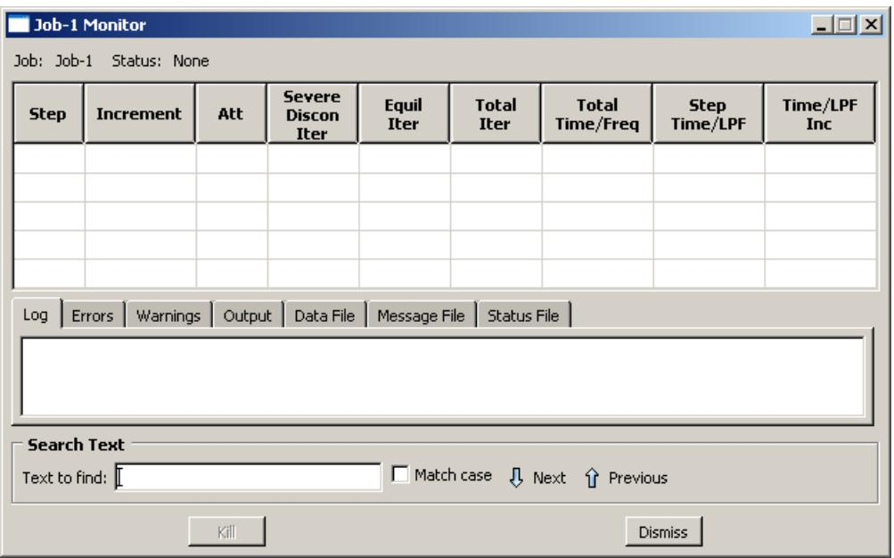  
Figure 1:The job monitor.

The jobs submitted for a co-execution appear in the Model Tree in the Jobs container under the co-execution in the Co-executions container. You can monitor these jobs by clicking mouse button 3 on the job in the Model Tree and selecting Monitor.

The top half of the job monitor dialog box displays the information available in the status file that Abaqus creates for the analysis. The table headings are customized for each job based on the settings sent from the analysis. The bottom half of the dialog box displays the following information:

• Click the Log tab to display the start and end times that appear in the log file for the analysis.  
Click the Errors and Warnings tabs to display the errors or the warnings associated with the analysis. Abaqus/CAE indicates the presence of errors or warnings by prepending an exclamation point before the Errors and Warnings tab. If a particular region of the model is causing the error or warning, a node or element set will be created automatically that contains that region. The name of the node or element set appears with the error or warning message, and you can view the set using display groups in the Visualization module. (For more information on display groups, see Using display groups to display subsets of your model.)

Abaqus/CAE may not perform all consistency checks when it creates an input file, which can result in warnings or error messages during an analysis. If your analysis generates warning or error messages, consider running a data check analysis (see Performing a data check on a model) to diagnose and fix possible problems in your model.

The number of error and warning messages that appear in the job monitor is limited by the environment parameters cae\_error\_limit and cae\_warning\_limit, respectively (see Job customization parameters, for details). If the number of errors or warnings exceeds the job monitor limit, consult the data, message, or status file for a complete list of messages.

• Click the Output tab to display a record of each output data entry as it is written to the output database. In addition, if you requested that Abaqus monitor the values of a degree of freedom of a particular node to the message and status files, the Output tabbed page records each time this information is written and the value of the degree of freedom at that point of the analysis. (For more information, see Understanding output requests, and Degree of freedom monitor requests.)

• As the analysis proceeds, Abaqus creates the following files:

- Abaqus/Standard: Data file, message file, and status file  
Abaqus/Explicit: Data file, message file, and status file

Abaqus/CAE activates the Data File, Message File, and Status File tabs accordingly. You can click any of these tabs to browse or search the corresponding file for additional error and warning messages.


## Note:

Abaqus/CAE populates the Data File, Message File, and Status File tabbed pages only for locally submitted analyses; this information will not be displayed in the job monitor for remote jobs. In addition, although Abaqus/CAE updates the contents of these pages periodically as the analysis runs, the data might not always be synchronized with the latest data in the files.

For detailed information on the different output files that Abaqus creates during an analysis, see About Output.

You can search for specific error or warning messages within any of the files displayed in tabbed pages in the job monitor. Select the desired file tab, enter a search string in the Text to find field, and click Next or Previous to step through the file from one hit to the next. Toggle on Match case to perform a case-sensitive search.

The information presented in the job monitor dialog box is updated continually as the analysis progresses. If the job fails, the Errors tabbed page appears in front of the other tabbed pages automatically to help you determine the cause of the failure. In addition, an exclamation point appears on the tab if any error or warning messages are output.

If you start monitoring a job and then exit Abaqus/CAE, close the current model database, or open a new model database, Abaqus/CAE will stop updating the job monitor. The job will continue to run; however, the job monitor will not report the status of the job or update the increment information.

If you requested DOF Monitor output on a particular degree of freedom for a particular node, Abaqus/CAE provides another opportunity to monitor the job by plotting the values of the degree of freedom over time. The plot appears in a new viewport that is generated automatically when you submit the job. If the visible part of the canvas is already filled with one or more viewports, the new viewport may be placed on a part of the canvas that is not visible; in this case you should tile or cascade the viewports or enlarge the canvas to bring the viewport into view. (For information on requesting output for a particular degree of freedom for a particular node, see Degree of freedom monitor requests.)

If necessary, you can terminate the analysis job by clicking Kill at the bottom of the job monitor dialog box.

## Additional information

• Understanding analysis jobs  
• Understanding co-executions  
• Creating, editing, and manipulating jobs  
• Creating, editing, and manipulating co-executions

## Submitting a job remotely

When you configure a job, you can request that Abaqus/CAE route the job to a specified queue on a remote Linux host computer. You can specify the remote queue by selecting an associated queue name in the Submission tabbed page of the job editor.


Note: The job editor displays default settings for memory usage, parallelization, and precision based on the environment files effective for the current session on the local machine. When you submit a job to a remote machine, Abaqus replaces the default settings with those from the environment files on the remote machine. Nondefault settings in the job editor are saved with the job and will be used regardless of where you run the analysis.

Each queue name that appears in the job editor refers to an entry in your Abaqus environment file in which you specify how you want the job to be run on the host computer. In other words, when you select a queue name in the job editor, you specify not only the desired queue on the host computer but also other options, such as the directory on the host computer in which you want to run the job and the files you want copied back to your local directory when the job is complete.

You can specify your preferences for running a job remotely by adding the following to your Abaqus environment file:

```python
def onCaeStartup():
    import os

    def makeQueues(*args):
        session.Queue(name,
                             queueName,
                             hostName,
                             fileCopy,
                             directory,
                             driver,
                             remotePlatform,
                             filesToCopy,
                             deleteAfterCopy,
                             description)

    addImportCallback('job', makeQueues)
```

This entry is written using the Abaqus command language. The following list describes each argument in the entry above.

## name

The queue name that you want to appear in the job editor.

## queueName

The name of an existing queue on the host computer. (For information on creating queues on the host computer, refer to the Abaqus Configuration Guide.)

## hostName

The name of the host computer. The default is an empty string.

## fileCopy

When the analysis is complete, the value of this argument determines whether or not the analysis files will be copied back to the directory from which the job was submitted. The default value is ON.

## directory

The name of the directory on the host computer where you want the job run. You must have write privileges to this directory. The default is an empty string.

## driver

The name of the command on the host computer to execute Abaqus/Standard or Abaqus/Explicit. The default is abaqus.

## remotePlatform

The platform on the remote machine. The default is UNIX (for Linux).

## filesToCopy

The extensions of the analysis files that you want copied back to the local directory when the job is complete or ALL. By default, all of the files generated during job execution are copied.


## Note:

The restart (.res) file, the Abaqus/Explicit state (.abq) file, and the packaging (.pac) file are platform-dependent; if your local platform and remote platform settings differ, you will not be able to use these files without some kind of translation. All of the other files can be copied across platforms without any difficulty.

## deleteAfterCopy

The value of this argument determines whether remote files are to be deleted after they are copied to the local machine. The default value is OFF.

## description

A short description of the queue.

The name and queueName arguments must be included in each queue definition. However, if you do not include any of the other arguments in a queue definition, default values will be supplied automatically. An example queue definition is shown below:

```python
def onCaeStartup():
    import os

    def makeQueues(*args):
        session.Queue(name='long',
                             queueName='aba_long',
                             hostName='jobserver',
                             directory='/scratch/' + os.environ['USER'])
    addImportCallback('job', makeQueues)
```

The commands in the example above configure the following:

## name

The queue name displayed in the job editor is long.

## queueName

The queue name on the host computer is aba\_long.

## hostName

The name of the host computer is jobserver.

## directory

The directory on the host computer where Abaqus will store the input file and all other files associated with the job is /scratch/your user name.

Since the fileCopy, driver, remotePlatform, filesToCopy, and deleteAfterCopy arguments have been left out of the entry above, the default options for these parameters are assigned to this queue automatically.

If you want to create two or more queues, you can repeat the line containing the session.Queue command as many times as necessary. For example, the following Abaqus environment file entry specifies two queues, one named long and the other named job:

```python
def onCaeStartup():
    import os

    def makeQueues(*args):
        session.Queue(name='long',
                             queueName='aba_long',
                             hostName='jobserver',
                             directory='/scratch/' + os.environ['USER'])
        session.Queue(name='job',
                             queueName='aba_job',
                             hostName='jobserver',
                             fileCopy=OFF)

    addImportCallback('job', makeQueues)
```

The monitoring functions described in Monitoring the progress of an analysis job, are available for jobs run remotely just as they are for jobs run locally. However, the output database for the job, like any other analysis files that you may have requested, is not copied to your local directory until after the job is complete. As a result, you must create and start a network output database connector if you want to use the Visualization module to view the results being generated by an analysis running on a remote system. For more information, see Accessing an output database on a remote computer.

## Additional information

• Environment File Settings  
• Abaqus Scripting User's Guide

## Understanding adaptivity processes

This section provides an overview of adaptivity processes.

You use an adaptivity process to control a succession of analysis jobs that are adaptively remeshed by Abaqus/CAE based on the contents of your remeshing rules. For more information about adaptive remeshing and the other adaptivity techniques that are available in Abaqus, see About Adaptivity Techniques.

## In this section:

What is an adaptivity process?  
When will my mesh adaptivity stop iterating?  
Manual mesh adaptivity  
Using a combination of automatic and manual mesh adaptivity  
The Adaptivity Process Manager

## What is an adaptivity process?

An adaptivity process is a succession of analysis jobs where Abaqus/CAE remeshes selected regions of the model between each job. Abaqus/CAE modifies the mesh to be used in each analysis job in response to error estimates that were computed during the previous analysis and written to the output database. For more information, see About Adaptive Remeshing.

You have considerable flexibility in how you execute this succession of jobs. Adaptivity processes are stored in the model database and are maintained between sessions.

## When will my mesh adaptivity stop iterating?

When you create an adaptivity process, you define a sequence of jobs to be run successively. You can specify the number of jobs in the sequence by specifying the maximum number of analysis iterations allowed, $i t e r _ { \operatorname* { m a x } }$ . The maximum number of remeshing operations will be $i t e r _ { \operatorname* { m a x } } - 1$ , because no remeshing will be performed after the final analysis job is run. When you submit the remesh process, Abaqus/CAE runs each job in the sequence until one of the following conditions is met:

• All active remeshing rules are satisfied. For more information, see What are remeshing rules?.  
• All jobs are completed, indicating that Abaqus/CAE has reached the maximum number of analysis iterations that you specified.  
• A job fails to complete. This failure can be due to convergence difficulties or to machine resource problems.

## Manual mesh adaptivity

As an alternative to automatic mesh adaptivity, you can submit a job using the Job manager. When you define a remeshing rule in the Mesh module, you request error indicator output variables that are written to the output database when the job executes. After the job has completed, you can return to the Mesh module and ask Abaqus/CAE to create a new mesh using a combination of your remesh rules and the error indicators in the output database. You can perform this process indefinitely to adapt your mesh successively until the goals of the remesh rules are met. For more information, see What is the difference between automatic adaptive remeshing and manual adaptive remeshing?.

## Using a combination of automatic and manual mesh adaptivity

In many cases you will want to transition between automatic and manual use of adaptive remeshing. Some examples include:

• You must keep the current Abaqus/CAE session active for automatic remeshing to occur between analysis jobs. If you exit Abaqus/CAE and start a new session, you must use manual remeshing to remesh the model.  
You start an automatic sequence of jobs, but a machine problem (such as a full disk) interrupts the analysis prematurely. You can restart the analysis manually and then continue it in a fully automatic manner. Variations of this case include an analysis ending because it failed to converge or an analysis ending because you terminated the job during a particular iteration.  
You can experiment with sizing function parameters and remesh your model manually until you find a set of remeshing rules that creates a mesh that appears to be responding actively to your variables of interest. When you are comfortable with your remeshing rules, you can switch to automatic mesh adaptivity and complete a specified number of analysis iterations.  
The mesh generated by the automatic mesh adaptivity procedure converges to an acceptable configuration. You can now modify the loads applied to the model and perform an additional manual iteration that makes a minor meshing adjustment to compensate for the new load.

You can transition directly between automatic and manual mesh adaptivity. To transition from automatic to manual mesh adaptivity, you enter the Mesh module and select Adaptivity->Manual Adaptive Remesh from the main menu bar and remesh the model. You then return to the Job module and submit the job for analysis. Conversely, to transition from manual to automatic mesh adaptivity, you create an adaptivity process in the Job module and submit it for analysis.

## The Adaptivity Process Manager

The Adaptivity Process Manager, which is similar to other managers in Abaqus/CAE, allows you to do the following:

• Create an adaptivity process and associate the process with a selected model.  
• Edit the selected adaptivity process.  
• Copy, rename, or delete the selected adaptivity process.

In addition, the Adaptivity Process Manager allows you to do the following:

• Perform a data check on a model before submitting an adaptivity process.  
Submit an adaptivity process.  
Continue an adaptivity process after performing a data check.

You can display the Adaptivity Process Manager by selecting Adaptivity->Manager from the main menu bar. Figure 1 shows the layout of the Adaptivity Process Manager.

  
Figure 1:The Adaptivity Process Manager.

The three columns of the Adaptivity Process Manager display the following:

## Name

The Name column displays the name of the adaptivity process. Click Rename to rename the selected process.

## Model

The Model column displays the name of the model associated with the adaptivity process.

## Status

The Status column displays the current status of the adaptivity process and is updated continually while the process is running. The status can be one of the following:

## None

The process has not been submitted for analysis.

## Check Submitted

The model is being submitted for a data check.

## Check Running

The data check of the model is running.

## Check Completed

The data check of the model completed successfully; you can now continue the adaptivity process.

## Submitted

The process is being submitted for execution.

## Running

The process has been submitted for analysis and is running.

## Completed

The process has run to completion.

## Aborted

The process has been aborted due to problems such as fatal errors in the model or lack of disk space.

## Terminated

The process has been terminated by the user.

For detailed instructions on using the Adaptivity Process Manager to create, edit, and manipulate adaptivity processes, see the following sections :

Creating a new adaptivity process  
Performing a data check on an adaptivity process  
Submitting an adaptivity process  
Continuing an adaptivity process after a data check  
Terminating an adaptivity process

## Additional information

• Understanding adaptivity processes  
• Creating, editing, and manipulating adaptivity processes  
• Using the adaptivity process editor

## Understanding co-executions

This section provides an overview of co-executions.

## In this section:

What is a co-execution?  
The Co-execution Manager  
The co-execution editor

## What is a co-execution?

A co-execution is the co-simulation execution of two analysis jobs that are executed in Abaqus/CAE in synchronization with one another using the same functionality as described in Understanding analysis jobs. For more information on this analysis technique, see Structural-to-Structural Co-Simulation.

## The Co-execution Manager

The Co-execution Manager, which is similar to other managers in Abaqus/CAE, allows you to do the following:

• Create a co-execution and associate it with selected analyses.  
• Edit the selected co-execution.  
• Copy, rename, or delete the selected co-execution.

In addition, the Co-execution Manager allows you to do the following:

• Perform a data check on the models before submitting a co-execution.  
Submit a co-execution.  
View the results of a co-execution.  
Terminate a co-execution that is currently running.

You can display the Co-execution Manager by selecting Co-execution->Manager from the main menu bar. Figure 1 shows the layout of the Co-execution Manager.

  
Figure 1:The Co-execution Manager.

The three columns of the Co-execution Manager display the following:

## Name

The Name column displays the name of the co-execution. Click Rename to rename the selected co-execution.

## Analyses

The Analyses column displays the type of analyses associated with the co-execution; for example, Abaqus-Abaqus.

## Status

The Status column displays the status of the jobs in the co-execution and is updated continually while the co-execution is running. The status can be one of the following:

## None

The co-execution has not been submitted for analysis.

## Check Submitted

The analyses are being submitted for a data check.

## Check Running

The data check of the analyses are running.

## Check Completed

The data check of the analyses completed successfully; you can now continue the co-execution.

## Submitted

The co-execution is being submitted.

## Running

The co-execution has been submitted and is running.

## Completed

The co-execution has run to completion.

## Aborted

The co-execution has been aborted due to problems such as fatal errors in one of the models or lack of disk space.

## Terminated

The co-execution has been terminated by the user.

## Additional information

• Understanding co-executions  
• Creating, editing, and manipulating co-executions

## The co-execution editor

You use the co-execution editor to select the models, define the initial job parameter settings in the individual job editors, and change the co-execution timeout value. After the co-execution is created, the job parameters in the co-execution editor are unavailable for editing; you must edit the individual jobs.

You can display the co-execution editor by selecting Co-execution->Create or Co-execution->Edit->co-execution name from the main menu bar. (You can also click Create or Edit in the co-execution manager.)

The co-execution editor contains the following tabbed pages for specifying the job parameters:

## Submission

Use the Submission tabbed page to configure the submission attributes of your job, such as job type, run mode, and submit time. You can also use the submission tabbed page to specify that the job is to be submitted to remote queues that have been configured by your local Abaqus environment file or by your system administrator.

## General

Use the General tabbed page to configure job settings such as the analysis input file processor printout and the name of the directory used for scratch files.

## Memory

Use the Memory tabbed page to configure the amount of memory allocated to an Abaqus analysis.

## Parallelization

Use the Parallelization tabbed page to configure the parallel execution of an Abaqus analysis job, such as the number of processors to use.

## Precision

Use the Precision tabbed page to specify either single or double precision for Abaqus/Explicit analyses. You can also choose the precision of nodal output that is written to the output database during the analysis.

## Additional information

• Understanding co-executions

## Understanding optimization processes

This section provides an overview of optimization processes.

## In this section:

What is an optimization process?  
Understanding the files generated by an optimization process  
Postprocessing an optimization  
The Optimization Process Manager  
The optimization process editor

## What is an optimization process?

Figure 1 illustrates how an optimization process iteratively updates the design variables, modifies the finite element model, and runs Abaqus analyses while it searches for an optimized solution.  
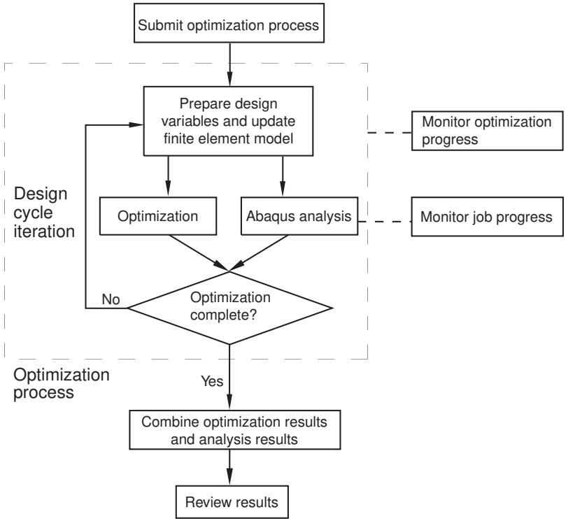  
Figure 1: An optimization process iteratively searches for an optimized solution.

An optimization process reads an optimization task that you defined in the Optimization module and iteratively searches for an optimized solution based on the objective functions and constraints that you defined in the optimization task. Each iteration is called a design cycle. During each design cycle the optimization modifies the finite element model and an Abaqus analysis is performed on the modified model. The optimization process reads the results of the analysis and decides whether to end the optimization because either the solution is optimal or a specified stop condition has been reached or whether to continue the optimization and iterate on another design cycle.

An optimization process generates optimization results and analysis results. You must combine the optimization results and analysis results into a single output database file to view the results of the optimization in the Visualization module, as described in Postprocessing an optimization. The Optimization module does not support the use of parts and assemblies in the Abaqus input file. When you run an optimization task, the Optimization module generates a flattened input file that does not use parts and assemblies, regardless of your Abaqus model attributes.

An optimization process appears in the Analysis section of the Model Tree and contains the Abaqus jobs that were run during the optimization, as shown in Figure 2.

  
Figure 2: An optimization process in the Model Tree.

You can check the validity of your optimization process; however, the validation does not check your Abaqus model. You should run a complete analysis of your model and make sure that it runs to completion before you attempt to run an optimization process.

## Additional information

• Understanding optimization processes  
• Creating, editing, and manipulating optimization processes

## Understanding the files generated by an optimization process

When an optimization process is executing, it creates two types of data that are saved in separate files—optimization results and analysis results.

## Optimization results

The optimization results consist of the optimization variables and the optimization values. The optimization variables depend on the type of optimization you are performing.

## Topology optimization

The optimization variable is the normalized material distribution variable (MAT\_PROP\_NORMALIZED).

## Shape optimization

The optimization variables are the displacement variables:

DISP\_OPT: a vector indicating the direction in which the nodes were moved during the shape optimization. Because of mesh smoothing and filtering, the vector may not be coincident with the node normal vector.  
DISP\_OPT\_VAL: the magnitude of the DISP\_OPT vector with a sign indicating the direction of the displacement—positive for growth and negative for shrinkage.  
• CTRL\_INPUT: the value of the objective function at each node (stress, for example).

## Sizing optimization

The optimization variables are the shell thickness and the change in shell thickness (THICKNESS and DELTA\_THICKNESS).

## Bead optimization

The optimization variables are the displacement variables:

DISP\_NORMAL\_VAL: the magnitude of a vector indicating the direction in which the nodes were moved during the bead optimization along the node normal vector.  
DISP\_OPT: a vector indicating the direction in which the nodes were moved during the bead optimization. Because of mesh smoothing and filtering, the vector may not be coincident with the node normal vector.  
DISP\_OPT\_VAL: the magnitude of the DISP\_OPT vector with a sign indicating the direction of the displacement—positive for growth and negative for shrinkage.

The optimization variables are saved in separate optimization (.onf) files after every design cycle. In addition, the optimization values, such as the value of the objective and the constraints, are written to a comma-separated text file (.csv) after each design cycle. (You are viewing the optimization values when you monitor the progress of an optimization process, as described in Monitoring your optimization process.)

## Analysis results

The analysis results are the field and history data generated by Abaqus during the analysis. During each design cycle a new output database file is created. In the initial design cycle, Abaqus writes both field and history data to the new output database file; however, during subsequent design cycles, Abaqus writes only field data. Abaqus also generates data (.dat), message (.msg), and status (.sta) files during each design cycle. To conserve disk space and to speed up postprocessing, the output database file and the data, message, and status files are saved only at specified intervals; by default, after the initial, first, and final design cycles. (You specify the rate at which the files are saved when you create the optimization process, as described in Creating and editing optimization processes.) In addition, Abaqus saves the new input file that is generated during each design cycle.

## Postprocessing an optimization

To view the results of an optimization process in the Visualization module, you must combine the optimization results and the analysis results into a single results output database file, as described in Combining optimization results.

## Creating the base results output database file

The output database file that you choose to be the base results becomes the starting point for the combined results output database file.

## Choosing between the initial and the final design cycle

You can specify that the base results be taken from the output database file generated by the initial design cycle or from the output database file generated by the final design cycle. In most cases you will select the initial design cycle and view the progression of the optimization from the initial design cycle to the final design cycle; for example, to follow the change in stiffness. Select the final design cycle if you performed a frequency optimization and want to view the frequency and the mode shape of the first few modes. If you performed a shape optimization, you should take the base results from the output database file generated by the first design cycle.

## Choosing the original model

The Optimization module modifies the material definitions and the section assignments before running the initial design cycle of the optimization process. The original model is the model that existed before any modifications were made by the Optimization module.

You can specify that the base results be taken from the output database file generated by the original model. However, the optimization process does not run an Abaqus analysis of the original model. Therefore, you must run the analysis manually before you can choose the original model as the base results. (The Abaqus input file for the original model is stored, along with all the input files generated by the optimization process, in the optimization process name\SAVE.inp directory. The name of the input file for the original model is optimization process name\_org.inp.)

The output database file that you use for the base results must be generated without parts and assemblies, as described in Writing input files without parts and assemblies. The input files generated by the Optimization module do not include parts and assemblies, regardless of any user settings in Abaqus/CAE. However, if you create the base results from an input file that was not generated by the Optimization module or by executing a job from Abaqus/CAE, you must ensure that the resulting output database file does not contain parts and assemblies.

## Appending to the base results

After you have specified the output database file that will be used as the source of the base results, Abaqus/CAE appends the optimization results and the Abaqus analysis results to the combined output database file.

## Appending the optimization results

Abaqus/CAE appends the optimization variables as field data to the combined output database file after every design cycle, and each design cycle appears as a frame in the combined output database file. Similarly, Abaqus/CAE appends the optimization values as history data to the combined output database file.

## Appending the analysis results

You can do the following to specify which analysis results data are written to the combined results output database file:

• Specify from which design cycles the analysis results should be written.  
Specify from which models the analysis results should be written. Abaqus/CAE creates a combined results output database file for each model in your optimization process.  
• Specify for a selected model from which steps within the model the analysis results should be written.  
• Specify which analysis field variables should be written.

History data are not written to the combined database file during the combine process. The combined output database file contains only the history data from the base results output database file.

It is recommended that you save the analysis results after the initial and final design cycle when you create the optimization process. After the optimization is complete, you can select the output database file generated during the initial design cycle as the base results. You can then combine the base results output database file with the optimization results from every design cycle along with the analysis results from the final design cycle, as illustrated in Table 1.

Table 1: Saving optimization and analysis results in the combined output database file.

<table><tr><td rowspan="2"></td><td colspan="5">Design Cycle</td></tr><tr><td>Initial</td><td>First</td><td>Second</td><td>Third</td><td>Fourth (Final)</td></tr><tr><td>Data saved</td><td>Analysis results (field and history data)</td><td>Optimization results</td><td>Optimization results</td><td>Optimization results</td><td>Optimization results and analysis results (field data only)</td></tr><tr><td>Action</td><td>Create base results</td><td>Append to base results</td><td>Append to base results</td><td>Append to base results</td><td>Append to base results</td></tr></table>

For example, if you executed a topology optimization, you can then do the following:

• View the initial state of your model; for example, the initial geometry and the loads and boundary conditions.  
View the change in the optimization variables—normalized material distribution variable (MAT\_PROP\_NORMALIZED)—during each design cycle to observe the progression of the optimization.  
• View the final state of your model; for example, the optimized geometry and the displacements and the stresses and strains.  
• Create a history plot that tracks the change in the objective and constraints.

You can apply similar conditions to view the beginning and ending state and the progression of the shape and sizing optimizations.

Combining optimization results is supported only for optimizations that you configured with the following analysis cases:

• Simple analysis (a single model, a single step, and a single load case)  
• Frequency or modal analysis  
• Linear perturbation analysis with multiple load cases

• Optimization with multiple models

## Additional information

• Understanding optimization processes  
• Creating, editing, and manipulating optimization processes

## The Optimization Process Manager

The Optimization Process Manager allows you to create and configure an optimization process and to edit, copy, rename or delete the selected optimization process.

In addition, the Optimization Process Manager allows you to do the following:

• Write copies of the TOSCA parameter (.par) file and the Abaqus input (.inp) file to your working directory.  
• Validate the optimization before submitting an optimization process to ensure that the optimization task has been configured correctly and the Abaqus model exists.  
• Submit an optimization process.  
• Restart an optimization process that has failed because of a problem external to the optimization or the Abaqus analysis, such as a failure to obtain an Abaqus license.  
• Monitor the progress of an optimization process.  
• Extract a smooth isosurface meshed representation of the optimized model surface in the form of a file that can be transferred to a CAD system or back into Abaqus/CAE.  
• Combine the optimization results and the analysis results created by an optimization process into a single results output database file that can be displayed by the Visualization module.  
• View the results of an optimization process.

You can display the Optimization Process Manager by selecting Optimization Process Manager->Manager from the main menu bar. Figure 1 shows the layout of the Optimization Process Manager.

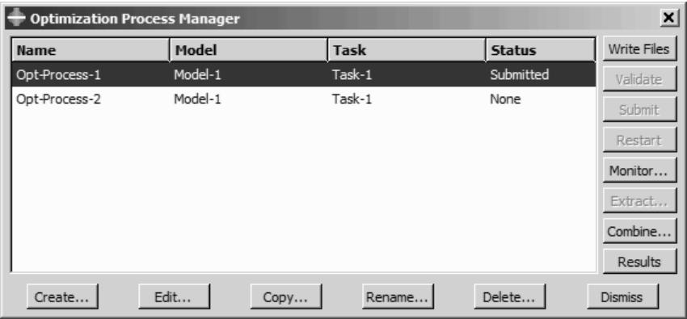  
Figure 1:The Optimization Process Manager.

The four columns of the Optimization Process Manager display the following:

## Name

The Name column displays the name of the optimization process. Click Rename to rename the selected optimization process.

## Model

The Model column displays the Abaqus/CAE model associated with the optimization process.

## Task

The Task column displays the optimization task associated with the optimization process.

## Status

The Status column displays the status of the jobs in the optimization process and is updated continually while the optimization process is running. The status can be one of the following:

## None

The optimization process has not been submitted for analysis.

## Submitted

The optimization process is being submitted.

## Running

The optimization process has been submitted and is running.

## Completed

The optimization process has run to completion.

## Aborted

The optimization process has been aborted due to problems such as fatal errors in one of the models or lack of disk space.

## Terminated

The optimization process has been terminated by the user.

## Additional information

• Understanding optimization processes  
• Creating, editing, and manipulating optimization processes

## The optimization process editor

You use the optimization process editor to select the Abaqus/CAE model and the optimization task that will be included in the optimization process. You can also configure the optimization settings, such as the maximum number of optimization iterations.

You can display the optimization process editor by selecting Optimization Process->Create or Optimization Process->Edit->optimization process name from the main menu bar. (You can also click Create or Edit in the Optimization Process Manager.)

The optimization process editor allows you to configure the following:

## Optimization

Use the Optimization tabbed page to specify the maximum number of optimization iterations that should be run before the process terminates and the frequency at which data are saved. For more information, see Creating and editing optimization processes.

## Submission

Use the Submission tabbed page to configure the submission attributes of your optimization process, such as the submit time and whether the process is to be submitted to remote queues that have been configured by your local Abaqus environment file or by your system administrator. For more information, see Configuring job submission attributes.

## Memory

Use the Memory tabbed page to configure the amount of memory allocated to the Abaqus jobs during the optimization process. For more information, see Controlling job memory settings.

## Parallelization

Use the Parallelization tabbed page to configure the parallel execution of the Abaqus analysis jobs during the optimization process, such as the number of processors to use. For more information, see Controlling job parallel execution.

## Additional information

• Understanding optimization processes  
• Creating, editing, and manipulating optimization processes

## Restarting an analysis

This section describes the restart capability in Abaqus/CAE.

If your model contains multiple steps, you do not have to analyze all of the steps in a single analysis job. Indeed, it is often desirable to run a complex analysis in stages. This allows you to examine the results and confirm that the analysis is performing as expected before continuing with the next stage. The restart files generated by an Abaqus analysis allow you to continue the analysis from a specified step. For more information, see Restarting an Analysis.

## In this section:

Controlling a restart analysis  
Files required to restart an analysis  
Rules governing a restart analysis  
The relationship between the model and the restart analysis  
Restarting after adding more analysis steps to the model  
Restarting after modifying existing analysis steps  
Restarting from the middle of a step  
Visualizing results from restart analyses  
Recovering an Abaqus/Standard analysis  
Remote submission of restart jobs

## Controlling a restart analysis

By default, no restart information is written for an Abaqus/Standard analysis and restart information is written only at the beginning and end of each step for an Abaqus/Explicit analysis.

You can use the Step module to change the frequency at which restart information is written. For more information, see Restart output requests.

After an analysis has generated restart information, you can control the following aspects of the subsequent restart analysis:

## Model attributes

To configure a restart analysis, you must specify whether the model should reuse data from a previous analysis of the same model. You can specify the step and the increment or time interval of the previous analysis from which the new analysis should start. You can also choose one of the following:

• Allow the selected step to continue to completion.  
• Terminate the selected step at the specified increment and begin a new step.

For more information, see Specifying model attributes.

## Job type

You use the job editor to specify the job type. If you edit the model attributes to specify that the model should reuse data from a previous analysis and you create a job that refers to this model, Abaqus/CAE sets the job type to Restart. For more information, see Selecting a job type. You cannot create a restart job that refers to a job that was associated with an input file.

## Files required to restart an analysis

To restart an analysis, various files that were created by the previous analysis must be available in the directory from which you started the Abaqus/CAE session.

## Abaqus/Standard

• Output database (.odb)  
• Restart file (.res)  
• Model file (.mdl)  
• Part file (.prt)  
• State file (.stt)

## Abaqus/Explicit

• Output database (.odb)  
• Restart file (.res)  
• Model file (.mdl)  
• Package file (.pac)  
• Part file (.prt)  
• State files (.abq and .stt)  
• Selected results file (.sel)

The restart analysis generates an error if any of these files are not available in the current directory.

## Rules governing a restart analysis

Defining the restart information for models and jobs is straightforward using Abaqus/CAE; however, you should understand the following before you use the analysis restart capability:

• The model used in the restart analysis must be the same as the model used in the original analysis up to the restart location. Specifically,  
- For the new model do not modify or add any geometry, mesh, materials, sections, beam section profiles, material orientations, beam section orientations, interaction properties, or constraints.  
Similarly, do not modify any steps or prescribed conditions (loads, boundary conditions, fields, interactions, or output requests) at or before the restart location.  
• Keyword editing is not supported for restart analyses. If you used the keyword editor to edit the original model, Abaqus/CAE ignores those changes when you restart the analysis.


## Warning:

Abaqus/CAE does not perform any checks to ensure that the restart data stored for the original job are consistent with the model used in the restart analysis. In some cases the analysis will terminate with error messages. In other cases the analysis will run, but the results may not correspond with your intent. A specific example of a case that will result in an error message is one where you define a coupling constraint and its accompanying reference node in the original model and then suppress the constraint prior to the original analysis submission. In this example Abaqus/CAE maintains the reference node definition but Abaqus/Standard or Abaqus/Explicit may remove it from the model definition if it is not attached to other elements or constraints. Your subsequent Abaqus/CAE restart analysis in this example will be seen as inconsistent with the original analysis. In many cases like this example you can manually modify the restart analysis input file to correct the discrepancy.

## The relationship between the model and the restart analysis

When you first submit a job based on a model for analysis, Abaqus/CAE generates an input file based on the definition of your model; and that input file, in turn, is submitted for analysis. The input file contains the element and node definitions generated by the Mesh module along with the materials, steps, output requests, loads, interactions, etc. that you specified using Abaqus/CAE.

To run a restart analysis of a job associated with a model, it is recommended that you copy the model to a new model. The new model contains all the element and node definitions from the original model along with all the materials, steps, output requests, loads, interactions, etc. To request a restart analysis, you edit the new model's attributes and specify that the analysis continue from a specified step of the original analysis. When you create a new restart job that refers to the new model, Abaqus/CAE sets the job type to Restart.

When you submit the new job for analysis, Abaqus/CAE generates an input file based on the restart information. No part, assembly, or property data are written to the restart input file. Only the following data are written:

• Steps that appear after the analysis is restarted.  
• Data from step-dependent objects that are associated with steps that appear after the restart step; for example, loads, boundary conditions, fields, and output requests.  
• New regions and amplitudes that are used by step-dependent objects that are associated with steps that appear after the restart step.

Abaqus reads the part, assembly, and property data, along with data from steps that appear before the restart step from the restart files that were generated by the original analysis. As a result, although the model contains all this information, the information is not written to the input file that is submitted to Abaqus/Standard or Abaqus/Explicit. This is an important consideration. Some changes that you make to the model in a restart analysis, say a material property, will not appear in the input file that is analyzed.

## Restarting after adding more analysis steps to the model

The most common use of the restart capability is to analyze your model and then add one or more steps to the model and continue the analysis. This section describes an example of this usage.

Assume that you have done the following:

• Created a model called Model-A that has two analysis steps, Step-1 and Step-2.  
• Used the Edit Restart Requests dialog box in the Step module to output the restart information at the end of each step.  
• Created a job called Job-A that uses Model-A.  
• Analyzed the model.

After studying the results of the analysis, you decide to add another step, Step-3, to the model. The restart capability allows you to compute the results for Step-3 without having to repeat the computations for Step-1 and Step-2. The following steps describe a recommended procedure to follow:

1. Copy Model-A to a new model, say Model-A-restart, and make Model-A-restart the current model.  
2. Add the new Step-3 to Model-A-restart.  
3. Add new prescribed conditions (loads, boundary conditions, interactions, fields, or output requests) in Step-3, or modify the prescribed conditions propagated from Step-2.  
4. From the main menu bar, select Model->Edit Attributes->Model-A-restart. From the Edit Model Attributes dialog box that appears, do the following:

• Enter Job-A as the job from which the restart data will be read.  
• Set the restart location:  
- Enter Step-2 to indicate the step from which the restart data will be read.  
- Choose Restart from the end of the step. Step-3 will continue the analysis after the end of Step-2.

5. Copy Job-A to a new job, say Job-A-restart, that uses Model-A-restart.  
6. From the main menu bar, select Job->Edit->Job-A-restart. From the Edit Job dialog box that appears, choose a job type of Restart.  
7. Submit Job-A-restart for analysis.

## Restarting after modifying existing analysis steps

You can use the restart capability to analyze your model and then modify an existing step before continuing the analysis. This section describes an example of this usage.

Assume that you have done the following:

• Created a model called Model-A that has two analysis steps, Step-1 and Step-2.  
• Used the Edit Restart Requests dialog box in the Step module to output the restart information at the end of each step.  
• Created a job called Job-A that uses Model-A.  
• Analyzed the model.

After examining the results of Job-A, you realize that you need to make changes to Step-2, to an output request in Step-2, or to a prescribed condition in Step-2, such as a load or boundary condition. You may also want to add some new steps with additional output requests and loads and with changes to the boundary conditions. You know that you can still use the results from Step-1; however, you realize that the results from Step-2 are no longer valid. The restart capability allows you to recompute the results for Step-2 without having to repeat the computations for Step-1. The following steps describe a recommended procedure to follow:

1. Copy Model-A to a new model, say Model-A-restart, and make Model-A-restart the current model.

2. Do the following:

• Make the desired changes to Step-2.  
• Add new steps after Step-2.  
• Create new prescribed conditions in Step-2 and subsequent steps.

3. From the main menu bar, select Model->Edit Attributes->Model-A-restart. From the Edit Model Attributes dialog box that appears, do the following:

• Enter Job-A as the job from which the restart data will be read.  
• Set the restart location:  
- Enter Step-1 to indicate the step from which the restart data will be read.  
- Choose Restart from the end of the step. Step-2 will continue the analysis after the end of Step-1.

4. Copy Job-A to a new job, say Job-A-restart, that uses Model-A-restart. Abaqus/CAE sets the job type to Restart.

5. Submit Job-A-restart for analysis.

## Restarting from the middle of a step

You can use the restart capability to continue the analysis from the middle of a completed step or from the middle of a partially completed step. The restarted analysis uses a new step that continues the analysis from a specified increment of the previous step. This section describes an example of this usage.

Assume that you have done the following:

• Created a model called Model-A that has two Abaqus/Standard analysis steps, Step-1 and Step-2.  
• Used the Edit Restart Requests dialog box in the Step module to output the restart information every 10 increments.  
• Created a job called Job-A that uses Model-A.  
• Analyzed the model.

You suspected that the loading is too severe for the structure and might lead to instabilities or collapse of the structure and, hence, to numerical convergence difficulties. As a result, you used the Step module to save the restart information every 10 increments of each step. When you ran the analysis, you found that the analysis terminated before the end of Step-2, at increment 25. You used the Visualization module to look at the results of the analysis and realized that the negative eigenvalue messages confirmed your suspicion that the structure might have become unstable. Now that you have some idea of the collapse load level, you want to restart the analysis at increment 20 of Step-2 with lower levels of loading and more frequent output of results data. The following steps describe a recommended procedure to follow:

1. Copy Model-A to a new model, say Model-A-restart, and make Model-A-restart the current model.  
2. Add the new Step-3 to Model-A-restart.  
3. Modify the load levels and output requests in Step-3. For example, if the load at Step-2, increment 25 was 260 and the load at Step-2, increment 20 was 250, you might change the load level for the end of Step-3 to 262. In addition, you can increase the frequency at which data are written to the output database so that you can follow the progression of the collapse of the structure. You can also reduce the size of the maximum increment to control the resolution of the data that are generated by the analysis. For more information, see Restarting an Analysis.

4. From the main menu bar, select Model->Edit Attributes->Model-A-restart. From the Edit Model Attributes dialog box that appears, do the following:

• Toggle on Read data from job and enter Job-A to indicate the job from which the restart data will be read.  
• Set the restart location:

- Enter Step-2 to indicate the step from which the restart data will be read.  
Choose Restart from increment, interval, iteration, or cycle, and enter 20 to indicate the increment from which the restart data will be read.  
Choose and terminate the step at this point to indicate that Step-2 should terminate at increment 20. Step-3 will continue the analysis from this location.

5. Copy Job-A to a new job, say Job-A-restart, that uses Model-A-restart. Abaqus/CAE sets the job type to Restart.

6. Submit Job-A-restart for analysis.

## Visualizing results from restart analyses

Each restart analysis creates a new output database. Consider the example described in Restarting after adding more analysis steps to the model, where you did the following:

• Ran an analysis of Job-A that referred to Model-A that contains Step-1 and Step-2. As a result, the output database generated by the analysis, Job-A.odb, contains results from Step-1 and Step-2.  
Ran a restart analysis of Job-A-restart that referred to Model-A-restart. Although Model-A-restart contains Step-1, Step-2, and Step-3, the output database generated by the restart analysis, Job-A-restart.odb, contains results from only Step-3.

You can use the Visualization module to create deformed, contour, and symbol plots of field data; however, you can plot the results from only one output database at any time. You must change the output database if you are looking at the results from Step-1 or Step-2 and want to look at the results from Step-3.

If you want to create an animation of results from all three steps, you must combine the two output databases. Abaqus provides an execution procedure for this purpose. For more information, see Joining Output Database (.odb) Files from Restarted Analyses.

Alternatively, you can create a history plot of a variable over all three steps using the following technique:

• Create one X–Y data object for the variable from the original output database—Job-A.odb.  
• Create a second X–Y data object from the output database generated by the restart analysis—Job-A-restart.odb.  
Create an X–Y plot of the two X–Y data objects. Alternatively, you can create a new X–Y data object using the Operate on XY data option, append the first two X–Y data objects, and create an X–Y plot of the result.

For more information, see X–Y plotting.

You should take care that your X–Y data objects are not referring to the same step. For example, consider the restart analysis described in Restarting after modifying existing analysis steps, where you modified an existing step and added a new step before continuing the analysis. The first output database contains data from Step-1 and Step-2. The second output database contains data from a modified Step-2 and the new Step-3. The first X–Y data object that you create should use only the data from Step-1 and should exclude the data from the original Step-2. The second X–Y data object should use the data from the modified Step-2 and the new Step-3.

## Recovering an Abaqus/Standard analysis

Abaqus/Explicit has a recovery mechanism for analysis jobs that terminate prematurely; for example, because of disk space or power failures. For more information, see Selecting a job type. However, unlike Abaqus/Explicit,

Abaqus/Standard does not have a recovery mechanism. The following example describes how you can use the restart capabilities of Abaqus/Standard to continue an analysis that terminated prematurely. Assume the following:

• You analyzed Model-A containing Step-1, Step-2, and Step-3.  
• Because of a power outage, the analysis ended prematurely at Increment 17 of Step-2.  
• You requested that restart information be saved every 10 increments. As a result, the last restart information was saved at Increment 10 of Step-2.

The following procedure describes how you can recover the analysis using the last restart information that was saved:

1. Copy Model-A to a new model, say Model-A-recover, and make Model-A-recover the current model.

2. From the main menu bar, select Model->Edit Attributes->Model-A-recover. From the Edit Model Attributes dialog box that appears, do the following:

• Toggle on Read data from job, and enter Job-A to indicate the job from which the restart data will be read.  
• Set the restart location:  
- Enter Step-2 to indicate the step from which the restart data will be read.  
Choose Restart from increment, interval, iteration, or cycle, and enter 10 to indicate the increment from which the restart data will be read.  
- Choose and complete the step. Step-2 will continue the analysis after increment 10 and run to completion.

3. Copy Job-A to a new job, say Job-A-recover, that uses Model-A-recover. Abaqus/CAE sets the job type to Restart.

4. Submit Job-A-recover for analysis.

## Remote submission of restart jobs

If you submit a job to a remote machine for analysis, by default Abaqus copies the files required for a restart analysis back to your local directory when the job is complete. For more information, see Submitting a job remotely. If the remote job terminates prematurely, you may have to copy the files back to your local directory manually.

Most of the files required for a restart analysis are platform-dependent binary files. As a result, you will not be able to continue a restart analysis on a Windows machine after starting the analysis on a Linux machine, or vice versa. The part (.prt) file contains ASCII text and can be copied across platforms.

The lack of portability across platforms with different binary formats does not preclude you from restarting an analysis on a machine that is different from the machine on which the original analysis was run. However, the two machines must be binary compatible, and it is recommended that the original analysis and the restart analysis both be executed on the same platform. Abaqus does not test cross-platform compatibility of restart files.

## Creating, editing, and manipulating jobs

This section describes how you create, edit, and manipulate jobs using either the main menu or the Job Manager.

## In this section:

Creating a new analysis job  
Writing the input file only  
Performing a data check on a model  
Submitting an analysis job  
Continuing an analysis job after a data check  
Terminating an analysis job  
Viewing the results of your job

## Creating a new analysis job

To create a new analysis job, select Job->Create from the main menu bar. Analysis jobs are stored in the model database and are maintained between sessions.

1. From the main menu bar, select Job->Create.

The Create Job dialog box appears.


Tip: You can also create a new analysis job by clicking the icon in the module toolbox or by clicking Create in the Job Manager.

2. Type the name of the new job in the Name text field. The name that you specify must adhere to the file name rules of your operating system.  
3. Click the arrow to the right of the Source field to choose the source for the job.

• Select Model to create a job based on a model created in Abaqus/CAE.

The Model list displays all the models defined in the model database. From this list, select the model to associate with the new job.

Select Input file to create a job based on an input file that may or may not have been created in Abaqus/CAE.

Click ; Abaqus/CAE lists all the files in the selected directory with the file extension .inp. Select the input file to associate with the new job, and click OK.


## Note:

You cannot create a job based on an input file that contains references to other results files, such as a restart analysis, an import analysis, or a submodel analysis.

4. Click Continue.

The job editor appears.

5. If desired, enter the job description. When you submit the job for analysis, Abaqus/CAE writes the job description immediately following the input file header. The job description is not written to the output database and is not retained upon import into Abaqus/CAE. For more information, see Importing descriptions.  
6. In the editor, enter all data necessary to define the job and click OK. (For more information, see Using the job editor.)

## Additional information

• Understanding analysis jobs  
• Creating, editing, and manipulating jobs

## Writing the input file only

By default, when you submit a job associated with a model for analysis, Abaqus/CAE generates an input file representing your model and then Abaqus analyzes that input file. However, sometimes you may prefer to generate the input file and then view or edit it before performing the analysis.

To write the input file without immediately performing the analysis, select Job->Write Input->job of your choice from the main menu bar. The input file job name.inp is written to the directory from which you started Abaqus/CAE. You can also write an input file by selecting the job of your choice and then clicking Write Input in the Job Manager.

The input file is written in ASCII format and can be viewed and edited using a text editor. If you are familiar with Abaqus keywords, you can check the input file for errors and check that the keywords, parameters, and data were generated as expected. Keep in mind that Abaqus/CAE processes your input to the graphical user interface, performing additional calculations when needed, to determine the keywords that accurately reflect your modeling intent. You can also modify the contents of the input file. For example, you can change a material property or the magnitude of a load.


## Warning:

If you edit the input file for a model using a text editor outside Abaqus/CAE and then submit the job for that model in the Job module, your changes to the input file will be lost. Instead, you must submit the modified input file directly for analysis by creating a new job and selecting Input file as the job Source. However, if you use the Keywords Editor to modify the generated keywords for a model, those modifications are retained in the model and apply to any jobs associated with that model. (You can display the Keywords Editor by selecting Model->Edit Keywords from the main menu bar.)

## Additional information

• Adding unsupported keywords to your Abaqus/CAE model  
• Understanding analysis jobs  
• Creating, editing, and manipulating jobs

## Performing a data check on a model

A data check runs the input file through the analysis input file processor to ensure that the model is consistent and that all the required model options have been set.

This option generates (or regenerates) the input file for the job if the job source is an Abaqus/CAE model.

To perform a data check on a model, select Job->Data Check->job of your choice from the main menu bar. You can also perform a data check by selecting the job of your choice and then clicking Data Check in the Job Manager.

To see the results of a data check analysis, review the data (.dat) file in your working directory. You can also review the results of a data check by selecting Job->Monitor->job of your choice to display the job monitor dialog box. For more information on the job monitor, see Monitoring the progress of an analysis job.

A data check also creates an output database. You can view the output database in the Visualization module to verify model information such as face labels, surface normals, and material orientations. For more information on viewing an output database, see Viewing results.

## Additional information

• Understanding analysis jobs  
• Creating, editing, and manipulating jobs

## Submitting an analysis job

To submit a job for analysis, select Job->Submit->job of your choice from the main menu bar. You can also submit a job for analysis by selecting the job name in the Job Manager and clicking Submit. Abaqus/CAE submits the job for analysis using the job settings defined in the job editor.

For information on monitoring a job that you have submitted, see Monitoring the progress of an analysis job.

When you start an Abaqus/CAE session and submit an analysis job, Abaqus sends messages to Abaqus/CAE indicating the current status of the job, and Abaqus/CAE updates the Status column in the Job Manager accordingly.

## Additional information

• Understanding analysis jobs  
• Creating, editing, and manipulating jobs

## Continuing an analysis job after a data check

When you perform a data check analysis (see Performing a data check on a model), Abaqus creates and saves all the files necessary to continue the full analysis at a later time. To continue an analysis, select Job->Continue->job of your choice from the main menu. You can also continue an analysis by selecting the job name in the Job Manager and clicking Continue. Abaqus/CAE continues the analysis using the job settings defined in the job editor.

For information on monitoring a job that you have submitted, see Monitoring the progress of an analysis job.

## Additional information

• Understanding analysis jobs  
• Creating, editing, and manipulating jobs

## Terminating an analysis job

You can use one of the following methods to terminate an analysis job:

• From the main menu bar, select Job->Kill->job of your choice.  
• In the Job Manager, select the job name and then click Kill.  
• In the job monitor dialog box for that particular job, click Kill. (For more information, see Monitoring the progress of an analysis job.)

Abaqus/CAE asks you for confirmation, terminates the job, and updates the status of the job in the Job Manager to Terminated.

## Additional information

• Understanding analysis jobs  
• Creating, editing, and manipulating jobs

## Viewing the results of your job

Once your analysis job is completed, Abaqus/CAE stores the results of the analysis in an output database. You can use the Visualization module to view these results graphically. Using the Results command from the Job menu starts the Visualization module and gives you a basic plot of your model.

1. From the main menu bar, select Job->Results->job of your choice.


Tip: You can also select the job name in the Job Manager and click Results.

The Visualization module starts and presents you with a plot of the model.


## Note:

Using the Results command exits the Job module. To reenter the Job module, select Job from the Module list located in the context bar.

2. Use the Visualization module to create and customize different plots of your results. For more information on using the Visualization module, see Viewing results.”

## Additional information

• Understanding analysis jobs  
• Creating, editing, and manipulating jobs

## Using the job editor

This section describes how you use the job editor to configure the settings of a job.

## In this section:

Navigating the job customization options  
Configuring job submission attributes  
Choosing the job type  
Setting the license type for the SimUnit license model  
Choosing the job run mode  
Setting the job submit time  
Specifying general job settings  
Controlling job memory settings  
Controlling job parallel execution  
Controlling job precision

## Navigating the job customization options

Use the job editor to customize a job's settings before submitting it for analysis. To locate the job editor, select Job->Edit->jobname from the main menu bar. The job editor contains the following tabbed pages:

## Submission

Use the Submission tabbed page to configure the basic attributes of your job, such as the job type, the run mode, and the run time. You can also use the submission page to submit jobs to a remote queue.

## General

Use the General tabbed page to configure preprocessor printout and to specify a scratch directory. Preprocessor printout options are not available for a job associated with an input file; you must specify these options in the input file itself. You also use the General tabbed page to specify any user subroutines that are referred to by the model and the output format of the results.

## Memory

Use the Memory tabbed page to configure the amount of memory allocated to an Abaqus analysis.

## Parallelization

Use the Parallelization tabbed page to configure the parallel execution of an Abaqus analysis job, such as the number of processors to use.

## Precision

Use the Precision tabbed page to specify either single or double precision for Abaqus/Explicit analyses. You can also choose the precision of nodal output that is written to the output database during the analysis.

You can also use the Abaqus environment file (abaqus\_v6.env) to control the default value of many of the settings in the job editor tabbed pages. For more information, see Environment File Settings.

## Additional information

• Understanding analysis jobs  
• Using the job editor  
• Abaqus/Standard and Abaqus/Explicit Execution

## Configuring job submission attributes

To locate the job editor, select Job->Edit->jobname from the main menu bar. Use the Submission tabbed page in the job editor to configure attributes related to job submission. You can do the following:

• Choose the type of analysis. (For more information, see Choosing the job type.)  
• Choose the type of license. (For more information, see Setting the license type for the SimUnit license model.)  
• Choose the run mode. (For more information, see Choosing the job run mode.)  
• Choose the submit time. (For more information, see Setting the job submit time.)

## Additional information

• Understanding analysis jobs  
• Using the job editor  
• Creating, editing, and manipulating co-executions  
• Abaqus/Standard and Abaqus/Explicit Execution

## Choosing the job type

To locate the job editor, select Job->Edit->jobname from the main menu bar.

Use the Job Type options in the Submission tabbed page to choose the type of job that Abaqus will run. You can choose one of the following options:

## Full analysis

Select this option to submit a complete model or input file for analysis.

## Recover (Explicit)

Select this option to resubmit an Abaqus/Explicit analysis that has previously terminated prematurely. This option is not valid for Abaqus/Standard analyses.

## Restart

Select this option to submit an analysis of a model that uses saved data from a previous analysis of the same model. The model attributes must specify the location of the saved data.

The available job types are covered in more detail in Selecting a job type.

1. In the job editor, click the Submission tab to display the Submission tabbed page.  
2. From the Job Type options at the top of the tabbed page, select the job type of your choice.

## Additional information

• Understanding analysis jobs  
• Using the job editor  
• Creating, editing, and manipulating co-executions

## Setting the license type for the SimUnit license model

To locate the job editor, select Job->Edit->jobname from the main menu bar. Use the SIM Unit Licensing options in the Submission tabbed page to choose license options for your analysis job execution.

The SIM Unit Licensing options are enabled when you use the SimUnit license model or when Abaqus/CAE is launched by the 3DEXPERIENCE Platform Connector for Abaqus/CAE. For all other cases, these options are disabled. If you are using the Abaqus Learning Edition, this option is not available.

1. In the job editor, click the Submission tab to display the Submission tabbed page.  
2. When using the SimUnit license model, from the SIM Unit Licensing options in the middle of the page, choose one of the following:

## Default

The job executes with the default license type in the Abaqus environment file. The license\_type parameter value is used, if applicable. If you do not specify the parameter in an Abaqus environment file, tokens are used.

## Tokens

The job executes using tokens. This selection overrides the license\_type parameter in the Abaqus environment file.

## Credits

The job executes using credits. This selection overrides the license\_type parameter in the Abaqus environment file.

3. If Abaqus/CAE is launched by the 3DEXPERIENCE Platform Connector for Abaqus/CAE, you see an additional option to choose the License Server:

## 3DExperience On-Cloud

The job executes using the 3DEXPERIENCEPlatform license server.

## Local

The job executes using the locally installed license server.

## Additional information

• Understanding analysis jobs  
• Using the job editor  
• Creating, editing, and manipulating co-executions

## Choosing the job run mode

To locate the job editor, select Job->Edit->jobname from the main menu bar. Use the Run Mode options in the Submission tabbed page to choose the mode in which Abaqus will run your job. You can choose one of the following options:

• Background to run your job locally in the background.  
Queue to submit your job to a named local or remote batch queue; select the batch queue from the pull-down list. (You must define the queue in the Abaqus environment file. For more information, see Defining analysis batch queues. You must also make the queue available to Abaqus/CAE. For more information, see Submitting a job remotely.)

The Run Mode setting is analogous to parameters of the Abaqus execution procedure.

1. Locate the job editor.

From the main menu bar, select Job->Edit->jobname.

Abaqus/CAE displays the Edit Job dialog box.

2. Click the Submission tab to display the Submission tabbed page.

3. From the Run Mode options in the middle of the page, select either Background or Queue.

## Additional information

• Understanding analysis jobs  
• Submitting a job remotely  
• Using the job editor  
• Creating, editing, and manipulating co-executions  
• Abaqus/Standard and Abaqus/Explicit Execution  
• Environment File Settings

To locate the job editor, select Job->Edit->jobname from the main menu bar. Use the Submit Time options in the Submission tabbed page to choose when your analysis job will execute.

1. In the job editor, click the Submission tab to display the Submission tabbed page.  
2. From the Submit Time options at the bottom of the page, choose one of the following options:

## Immediately

The job executes in the background of your local machine immediately or is submitted to the batch queue immediately.

## Wait

The job executes in the background of your local machine after a waiting period. Type the waiting period in the hours and minutes fields. (This option is available only on Linux platforms. In addition, it is not available if the job is being submitted to a batch queue.)

## At

The job executes at a time that you specify in either the background of your local machine or in

a batch queue. Click to the right of the At field for information on what syntax to use when specifying a time. If you want the job to run in a batch queue at the specified time, you must configure the queue to accept a time variable using the after\_prefix queue parameter in the Abaqus environment file. For more information, see Defining analysis batch queues. (The At option is available for jobs that run in either the background or in a batch queue on Linux platforms. However, the At option is available only for jobs that execute in a batch queue on Windows platforms.)

## Additional information

• Understanding analysis jobs  
• Using the job editor  
• Creating, editing, and manipulating co-executions

## Specifying general job settings

To locate the job editor, select Job->Edit->jobname from the main menu bar. Use the General tabbed page to configure miscellaneous job settings. You can configure the following:

## Preprocessor Printout

The Preprocessor Printout options allow you to control whether Abaqus prints an echo of the input data, contact constraints, model definition data, and history data to the data (.dat) file. By default, each of these options is toggled on.

Preprocessor printout options are not available for a job associated with an input file; you must specify these options in the input file itself.

## Scratch directory

The Scratch directory option allows you to specify the name of the directory used for scratch files. On Linux systems the default scratch directory is the value of the \$TMPDIR environment variable or /tmp if the variable is not defined. On Windows systems the default scratch directory is the value of the TEMP environment variable or \TEMP if the variable is not defined. To specify a scratch directory, you can do one of the following:

• Click in the Scratch directory text field, and type the directory path.  
to display the Select Scratch Directory dialog box, and select the directory of your choice.


## User subroutine file

Provide the name of the file containing all user subroutines that are referred to by the model. To specify a user subroutine file, you can do one of the following:

• Click in the User subroutine file text field, and type the file path.  
• Click to display the Select User Subroutine File dialog box, and select the file of your choice.

If your model refers to a user subroutine but you do not specify the name of the subroutine file in the General tabbed page, Abaqus generates an error that is reported by the job monitor dialog box. (You can display the job monitor dialog box by selecting Job->Monitor->job of your choice from the main menu bar.) For more information on subroutines, see About User Subroutines and Utilities.

## Results Format

The Results Format options allow you to write the results from an Abaqus analysis in ODB format or SIM format. For an Abaqus/Standard or Abaqus/Explicit analysis, you can also write the results to both formats. For more information, see The Output Database.


Note: If you select the ODB format, a .sim file may still be created; however, it will not contain the analysis results.

You can use the Abaqus environment file (abaqus\_v6.env) to control the default value of most of the settings in the General tabbed page; for more information, see Environment File Settings.

## Additional information

• Understanding analysis jobs

• Using the job editor  
• Creating, editing, and manipulating co-executions

## Controlling job memory settings

To locate the job editor, select Job->Edit->jobname from the main menu bar. Use the Memory tabbed page to control the amount of memory allocated to an Abaqus/Standard or Abaqus/Explicit analysis. Abaqus/CAE initially populates the settings in the Memory tabbed page with the values specified in the Abaqus environment file (abaqus\_v6.env), and you can edit the environment file if you want to change the default memory settings. For more information about customizing the memory settings, see Environment File Settings.

If no memory values are specified in the Abaqus environment file, Abaqus automatically detects the physical memory on the machine and allocates a percentage of this available memory. The default percentages are platform specific, but they typically represent a large portion of the available physical memory. You should check the memory allocation values that Abaqus selects upon your next submission of the job to confirm that the allocation is appropriate for your system and for the job. For details on the default memory allocation settings, refer to the Dassault Systèmes Knowledge Base at http://support.3ds.com/knowledge-base/.

Smaller jobs may use less memory than the maximum available amount. You might want to reduce the memory allocation for your jobs or adjust the default allocation if you usually run multiple jobs at the same time. You can control the following:

• The Memory allocation units for the memory size specification. You can allocate memory as a Percent of physical memory or in Megabytes or Gigabytes.  
The Maximum preprocessor and analysis memory value. This option specifies either the percentage of physical memory or the number of megabytes or gigabytes of physical memory that will be allocated as a maximum for the analysis.  
The Increase memory allocation based on analysis estimates option. This setting enables you to use the memory allocation setting that Abaqus determines to be suitable for this job, with an additional amount of memory as a buffer, as the memory allocation settings for all future submissions of this job. The job memory value will be updated only if the estimate is higher than the value you specified.

For more information about memory settings, see Managing Memory and Disk Resources.

## Additional information

• Understanding analysis jobs  
• Using the job editor  
• Creating, editing, and manipulating co-executions

## Controlling job parallel execution

To locate the job editor, select Job->Edit->jobname from the main menu bar. Use the Parallelization tabbed page to control the parallel execution of an Abaqus analysis job, as follows:

• Select the number of processors to use for the analysis if parallel processing is available.  
• For an Abaqus/Standard analysis, you can choose to use GPGPU acceleration of the direct sparse solver and specify the number of GPGPUs. For more information, see Parallel Execution in Abaqus/Standard.  
• For an Abaqus/Explicit analysis, you can choose the following:

\- The number of domains. If you choose domain-level parallelization, the number of domains must be equal to or a multiple of the number of processors.

When the number of domains is a multiple of the number of processors, you can toggle on Activate dynamic load balancing if desired. This option may improve the performance of your analysis job. If you have 4 processors and choose 8, 12, 16, etc. domains, for example, the dynamic load balancing feature becomes available. Dynamic load balancing is turned off by default. This option is equivalent to the dynamic\_load\_balancing option in the Abaqus/Explicit execution procedure. For more information, see Abaqus/Standard and Abaqus/Explicit Execution.

Dynamic load balancing is most likely to improve the computational speed and efficiency in applications with a strongly time-dependent and/or spatially varying computational load. Most imbalanced problems will see an optimal performance improvement when the number of domains is two to four times the number of processors. For more details, see Domain-Level Parallelization.

Whether the parallelization method should be Domain (default) or Loop. The domain-level method splits the model into a number of topological domains that are distributed evenly among the available processors. The loop-level method parallelizes low-level loops in the code that are responsible for most of the computational cost.

If you select Loop for the parallelization method, you must select Default for the multiprocessing mode. For more information, see About Parallel Execution.

For more information, see Parallel Execution in Abaqus/Explicit.

For both an Abaqus/Standard and an Abaqus/Explicit analysis, you can choose whether the multiprocessing mode should be Default, Threads, MPI (Message Passing Interface), or Hybrid. The default multiprocessing mode is dependent on the platform on which the analysis product executes.

• For the Hybrid multiprocessing mode, you can choose the number of threads per MPI process.  
You cannot choose the number of threads per MPI process for all other multiprocessing modes. For MPI and Default, the number of threads per MPI process has value of 1. For Threads, the number of threads per MPI process is equal to the number of processors.


## Note:

You use the Step module to choose between the Abaqus/Standard iterative and direct sparse solvers. For more information, see Using the step editor.

## Additional information

• Understanding analysis jobs  
• Using the job editor  
• Creating, editing, and manipulating co-executions  
• Parallel Execution

## Controlling job precision

To locate the job editor, select Job->Edit->jobname from the main menu bar. Use the Precision tabbed page to control the precision of the Abaqus/Explicit analysis or the precision of nodal output for an Abaqus/Standard or Abaqus/Explicit analysis. You can do the following:

Select the single, forced single (override environment variable double\_precision setting if necessary), or double (analysis only, constraints only, or analysis and packager) setting for Abaqus/Explicit precision. This option is equivalent to the double option in the Abaqus/Explicit execution procedure.  
• Select either single or full nodal output precision. This option is equivalent to the output\_precision option in the Abaqus execution procedure.

For more information, see Abaqus/Standard and Abaqus/Explicit Execution, and Environment File Settings.

## Additional information

• Understanding analysis jobs  
• Using the job editor  
• Creating, editing, and manipulating co-executions  
• Abaqus Execution Guide

## Creating, editing, and manipulating adaptivity processes

This section describes how you create, edit, and manipulate adaptivity processes using either the main menu or the Adaptivity Process Manager.

## In this section:

Creating a new adaptivity process  
Performing a data check on an adaptivity process  
Submitting an adaptivity process  
Continuing an adaptivity process after a data check  
Terminating an adaptivity process

## Creating a new adaptivity process

An adaptivity process is a succession of analysis jobs. Abaqus/CAE modifies the mesh in each analysis job in response to error estimates that were computed from data written to the output database during the final increment of the previous analysis. For more information, see What is an adaptivity process?. To create a new adaptivity process, select Adaptivity->Create from the main menu bar.

1. From the main menu bar, select Adaptivity->Create.

The Edit Adaptivity Process dialog box appears.


田 Tip: You can also create a new adaptivity process by clicking the icon in the module toolbox or by clicking Create in the Adaptivity Process Manager.

2. Type the name of the new adaptivity process in the Name text field. The name that you specify must adhere to the file naming rules for your operating system.  
3. Select the model to associate with the adaptivity process from the Model field.  
4. If desired, type the description of the adaptivity process in the Description text field. The description is stored in the model database and the output database, and you can use this description to help you manage your adaptivity processes.  
5. Enter the job prefix in the Job Prefix text field. The job name for each iteration of the adaptivity process will start with this prefix. The prefix that you specify must adhere to the file naming rules for your operating system. If you do not provide a job prefix, Abaqus/CAE uses the name of the adaptivity process.  
6. In the editor, enter all data necessary to define the process and click OK. (For more information, see Using the adaptivity process editor.)

## Additional information

• Understanding adaptivity processes  
• Creating, editing, and manipulating adaptivity processes

## Performing a data check on an adaptivity process

A data check runs the input file for a model through the analysis input file processor to ensure that the model is consistent and that all the required model options have been set. Performing a data check on an adaptivity process will create a job and verify model information for the first iteration of the overall adaptivity process.

To perform a data check on an adaptivity process, select Adaptivity->Data Check->adaptivity process name from the main menu bar. You can also perform a data check by selecting the process name in the Adaptivity Process Manager and clicking Data Check.

The job created by the data check appears in the Jobs container using the naming conventions discussed in Creating a new adaptivity process. To see the results of a data check, review the data (.dat) file for this job in your working directory. You can also review the results of a data check by selecting Job->Monitor->created job from the main menu bar to display the job monitor dialog box.

## Additional information

• Monitoring the progress of an analysis job  
• Understanding adaptivity processes  
• Creating, editing, and manipulating adaptivity processes

## Submitting an adaptivity process

To submit an adaptivity process for analysis, select Adaptivity->Submit->adaptivity process name from the main menu bar. (You can also submit an adaptivity process for analysis by selecting the process name in the Adaptivity Process Manager and clicking Submit.) Abaqus/CAE submits the process for analysis and remeshing using the settings defined in the adaptivity process.

When you start an Abaqus/CAE session and submit an adaptivity process, Abaqus/Standard sends messages to Abaqus/CAE indicating the current status of the process. Abaqus/CAE then updates the Status column in the Adaptivity Process Manager accordingly. You must keep the current Abaqus/CAE session active for automatic remeshing to occur between analysis jobs. If you exit Abaqus/CAE and start a new session, you must use manual remeshing to continue the adaptivity process. For more information, see When do I need to use manual adaptive remeshing?.

In addition, Abaqus/CAE displays status information in the message area after each iteration of the adaptivity process. The status information lists the error indicator variables in each remeshing rule and whether the remeshing rule has been satisfied for that variable.

## Additional information

• Understanding adaptivity processes  
• Creating, editing, and manipulating adaptivity processes

## Continuing an adaptivity process after a data check

When you perform a data check on an adaptivity process, a job is created for the first iteration of the adaptivity process (as described in Performing a data check on an adaptivity process). In addition, Abaqus creates and saves all the files necessary to complete this job at a later time. You can also use these files to continue the full adaptivity process from the current state of the first iteration.

To complete only the job associated with the first iteration of the adaptivity process, use the procedures listed in Continuing an analysis job after a data check. Remeshing and further iterations will not occur.

To continue the full adaptivity process, select Adaptivity->Continue Analysis->adaptivity process name. You can also continue the adaptivity process by selecting the process name in the Adaptivity Process Manager and clicking Continue Analysis. The adaptivity process proceeds as described in Submitting an adaptivity process.

The Continue Analysis option can be used only in conjunction with a data check; it is not used to continue remeshing after an adaptivity process is complete. Once an adaptivity process runs to completion, you can continue to remesh a model by resubmitting the full process. You can also consider using the combination remeshing techniques described in Using a combination of automatic and manual mesh adaptivity.

## Additional information

• Understanding adaptivity processes  
• Creating, editing, and manipulating adaptivity processes

## Terminating an adaptivity process

To terminate an adaptivity process, you should use the Job Manager to display the analysis job that is running and to end the job. Ending the job will terminate the adaptivity process. For more information, see Terminating an analysis job.

## Additional information

• Understanding adaptivity processes  
• Creating, editing, and manipulating adaptivity processes

## Using the adaptivity process editor

This section describes how you use the adaptivity process editor to configure the settings of an adaptive remeshing process.

## In this section:

Navigating the adaptivity process customization options  
Configuring adaptivity process attributes  
Specifying general adaptivity process settings  
Controlling adaptivity process memory settings  
Controlling adaptivity process parallel execution  
Controlling adaptivity process precision

## Navigating the adaptivity process customization options

Use the adaptivity process editor to customize your adaptivity processes before submitting them. The settings are analogous to parameters of the Abaqus execution procedure. For more information, see Abaqus/Standard and Abaqus/Explicit Execution.

To locate the adaptivity process editor, select Adaptivity->Edit->adaptivity process name from the main menu bar. The adaptivity process editor contains the following tabbed pages:

## Adaptivity

Use the Adaptivity tabbed page to specify the maximum number of analysis iterations and to select the run mode. For more information, see Configuring adaptivity process attributes.

## General

Use the General tabbed page to configure preprocessor printout and to specify a scratch directory. You also use the General tabbed page to specify any user subroutines that are referred to by the model and the output format of the results. For more information, see Specifying general adaptivity process settings.

## Memory

Use the Memory tabbed page to configure the amount of memory allocated to each of the adaptivity analyses. For more information, see Controlling adaptivity process memory settings.

## Parallelization

Use the Parallelization tabbed page to configure the parallel execution of an Abaqus analysis job, such as the number of processors to use and the parallelization method. For more information, see Controlling adaptivity process parallel execution.

## Precision

Use the Precision tabbed page to specify the precision of nodal output that is written to the output database during each analysis. For more information, see Controlling adaptivity process precision.

The settings that you specify in the adaptivity process editor apply to each of the analyses that runs after each iteration of the adaptive remesh.

You can also use the Abaqus environment file (abaqus\_v6.env) to control the default value of many of the settings in the adaptivity process editor tabbed pages. For more information, see Environment File Settings.

## Additional information

• Understanding adaptivity processes  
• Using the adaptivity process editor  
• About Adaptive Remeshing

## Configuring adaptivity process attributes

To locate the adaptivity process editor, select Adaptivity->Edit->adaptivity process name from the main menu bar. Use the Adaptivity tabbed page in the adaptivity process editor to specify the maximum number of iterations and to select the run mode.

Choose either of the following to specify the run mode:

• Background to run your job locally in the background.  
Queue to submit your job to a named local or remote batch queue; select the batch queue from the pull-down list. (You must define the queue in the Abaqus environment file. For more information, see Defining analysis batch queues. You must also make the queue available to Abaqus/CAE. For more information, see Submitting a job remotely.)

## Additional information

• Understanding adaptivity processes  
• Using the adaptivity process editor  
• About Adaptive Remeshing

## Specifying general adaptivity process settings

To locate the adaptivity process editor, select Adaptivity->Edit->adaptivity process name from the main menu bar. Use the General tabbed page to configure miscellaneous adaptivity process settings. You can configure the following:

## Preprocessor Printout

The Preprocessor Printout options allow you to control whether Abaqus prints an echo of the input data, contact constraints, model definition data, and history data to the data (.dat) file. By default, each of these options is toggled off.

## Scratch directory

The Scratch directory option allows you to specify the name of the directory used for scratch files. On Linux systems the default scratch directory is the value of the \$TMPDIR environment variable or /tmp if the variable is not defined. On Windows systems the default scratch directory is the value of the TEMP environment variable or \TEMP if the variable is not defined. To specify a scratch directory, you can do one of the following:

• Click in the Scratch directory text field, and type the directory path.  
• Click to display the Select Scratch Directory dialog box, and select the directory of your choice.

## User subroutine file

Provide the name of the file containing all user subroutines that are referred to by the model. To specify a user subroutine file, you can do one of the following:

• Click in the User subroutine file text field, and type the file path.  
• Click to display the Select User Subroutine File dialog box, and select the file of your choice.

If your model refers to a user subroutine but you do not specify the name of the subroutine file in the General tabbed page, Abaqus generates an error that is reported by the job monitor dialog box. (You can display the job monitor dialog box by selecting Job->Monitor->job of your choice from the main menu bar.) For more information on user subroutines, see About User Subroutines and Utilities.

## Results Format

The Results Format options allow you to write the results from an Abaqus analysis in ODB format, SIM format, or both formats. For more information, see The Output Database.


Note: If you select the ODB format, a .sim file may still be created; however, it will not contain the analysis results.

You can use the Abaqus environment file (abaqus\_v6.env) to control the default value of most of the settings in the General tabbed page; for more information, see Environment File Settings.

## Additional information

• Understanding adaptivity processes  
• Using the adaptivity process editor  
• About Adaptive Remeshing

## Controlling adaptivity process memory settings

To locate the adaptivity process editor, select Adaptivity->Edit->adaptivity process name from the main menu bar. Use the Memory tabbed page to control the amount of memory allocated to an Abaqus analysis. Abaqus/CAE initially populates the settings in the Memory tabbed page with the values specified in the Abaqus environment file (abaqus\_v6.env), and you can edit the environment file if you want to change the default memory settings. For more information about customizing the memory settings, see Environment File Settings.

If no memory values are specified in the Abaqus environment file, Abaqus automatically detects the physical memory on the machine and allocates a percentage of this available memory. The default percentages are platform specific, but they typically represent a large portion of the available physical memory. For details on the default memory allocation settings, refer to the Dassault Systèmes Knowledge Base at http://support.3ds.com/knowledge-base/.

Smaller jobs may use less memory than the maximum available amount. You might want to reduce the memory allocation for your jobs or adjust the default allocation if you usually run multiple jobs at the same time. You can control the following:

• The Memory allocation units for the memory size specification. You can allocate memory as a Percent of physical memory or in Megabytes or Gigabytes.  
• The Maximum preprocessor and analysis memory value that specifies either the percentage of physical memory or the number of megabytes or gigabytes of physical memory that will be allocated as a maximum for the analysis.

For more information about memory settings, see Managing Memory and Disk Resources.

## Additional information

• Understanding adaptivity processes  
• Using the adaptivity process editor  
• About Adaptive Remeshing

## Controlling adaptivity process parallel execution

To locate the adaptivity process editor, select Adaptivity->Edit->adaptivity process name from the main menu bar. Use the Parallelization tabbed page to control the parallel execution of an Abaqus process job as follows:

• Select the number of processors to use for the analysis if parallel processing is available.  
• Select the Threads multiprocessing mode. Only the linear equation solver in Abaqus/Standard will execute in parallel.


## Note:

You use the Step module to choose between the Abaqus/Standard iterative and direct sparse solvers. For more information, see Using the step editor.

## Additional information

• Understanding adaptivity processes  
• Using the adaptivity process editor  
• About Adaptive Remeshing

## Controlling adaptivity process precision

To locate the adaptivity process editor, select Adaptivity->Edit->adaptivity process name from the main menu bar. Use the Precision tabbed page to control the precision of nodal output. You can select either single or full nodal output precision. This option is equivalent to the output\_precision option in the Abaqus execution procedure. For more information, see Abaqus/Standard and Abaqus/Explicit Execution.

## Additional information

• Understanding adaptivity processes  
• Using the adaptivity process editor  
• About Adaptive Remeshing

## Creating, editing, and manipulating co-executions

This section describes how you create, edit, and manipulate co-executions using either the main menu or the Co-execution Manager.

## In this section:

Creating and editing co-executions  
Performing a data check on a co-execution  
Submitting a co-execution  
Viewing the results of your co-execution  
Terminating a co-execution

A co-execution is the co-simulation execution of two analysis jobs. You specify job parameters in a co-execution to create both analysis jobs. After creating the co-execution, you can edit the job parameters only in the individual analysis jobs.

The jobs are executed in synchronization with one another using the same functionality as described in Understanding analysis jobs. For more information on this analysis technique, see Structural-to-Structural Co-Simulation.

1. From the main menu bar, select Co-execution->Create or Co-execution->Edit->co-execution name.

The Edit Co-execution dialog box appears.


Tip: You can also create a co-execution by clicking the icon in the module toolbox or clicking Create in the Co-execution Manager.

2. Type the name of the new co-execution in the Name text field. The name that you specify must adhere to the file naming rules for your operating system.  
3. If desired, type the description of the co-execution in the Description text field. The description is stored in the model database and the output database, and you can use this description to help you manage your co-executions.  
4. In the Models table, select the models in the current model database to associate with the co-execution from the list in the Model Name column.

The analysis product used in each of the selected models and the default job name for each model are displayed in the table.

5. If desired, click in the Job Name column and edit the job name.  
6. Use the Submission, General, Memory, Parallelization, and Precision tabbed pages to define the initial job parameter settings in the individual job editors. After the co-execution is created, the job parameters in the co-execution editor are unavailable for editing; you must edit the individual jobs.

Define the initial job parameter settings as described in the following sections:

Configuring job submission attributes  
Specifying general job settings  
Controlling job memory settings  
Controlling job parallel execution  
Controlling job precision

7. If desired, enter a different value in the Communication time out field to specify the time after which Abaqus/CAE terminates if it does not receive any communication from the coupled analyses. The default value is 10 minutes.

8. Click OK.

## Additional information

• Understanding co-executions  
• Creating, editing, and manipulating co-executions

## Performing a data check on a co-execution

A data check runs the input files for the models through the analysis input file processor to ensure that the models are consistent and that all the required model options have been set. Performing a data check on a co-execution will verify model information in each of the jobs created for the co-execution.

To perform a data check on a co-execution, select Co-execution->Data Check->co-execution name from the main menu bar. You can also perform a data check by selecting the co-execution name in the Co-execution Manager and clicking Data Check.

The jobs involved in the co-execution appear in the Model Tree in the Jobs container under the co-execution in the Co-executions container. You can review the results of a data check by clicking mouse button 3 on the job in the Model Tree and selecting Monitor to display the job monitor dialog box. For more information, see Monitoring the progress of an analysis job.

## Additional information

• Understanding co-executions  
• Creating, editing, and manipulating co-executions

## Submitting a co-execution

To submit a co-execution, select Co-execution->Submit->co-execution name from the main menu bar. (You can also submit a co-execution by selecting the co-execution name in the Co-execution Manager and clicking Submit.)

Abaqus/CAE submits the jobs for analysis using the job settings defined in the co-execution editor or the individual job editors.

The jobs involved in the co-execution appear in the Model Tree in the Jobs container inside the Co-executions container. You can monitor the jobs that you have submitted by clicking mouse button 3 on the job in the Model Tree and selecting Monitor to display the job monitor dialog box. For more information, see Monitoring the progress of an analysis job.

## Additional information

• Understanding co-executions  
• Creating, editing, and manipulating co-executions

## Viewing the results of your co-execution

Once your co-execution is completed, Abaqus/CAE stores the results of each analysis job in an output database. You can use the Visualization module to view the combined results graphically.

1. From the Co-execution Manager, select the co-execution name and click Results.

The Visualization module starts and presents you with an overlay plot of both models.

2. Use the Visualization module to create and customize different plots of your results. For more information on using overlay plots, see Overlaying multiple plots.

## Additional information

• Understanding co-executions  
• Creating, editing, and manipulating co-executions

## Terminating a co-execution

To terminate a co-execution, you should use the Co-execution Manager to display the co-execution that is running and to end the analysis jobs. Ending the jobs terminates the co-execution. Abaqus/CAE asks you for confirmation, terminates the jobs, and updates the status of the co-execution in the Co-execution Manager to Terminated. Note that co-execution termination may result in various error messages written to the message area, reflecting the unpredictable manner in which co-execution inter-job messaging is terminated. These error messages occurring immediately following co-execution termination can generally be disregarded

## Additional information

• Understanding co-executions  
• Creating, editing, and manipulating co-executions

## Creating, editing, and manipulating optimization processes

This section describes how you create, edit, and manipulate optimization processes using either the main menu or the Optimization Process Manager.

## In this section:

Creating and editing optimization processes  
Creating the optimization files  
Validating an optimization process  
Submitting an optimization process  
Continuing an optimization process that terminated  
Monitoring your optimization process  
Extracting a smoothed mesh  
Combining optimization results  
Viewing the results of your optimization process

An optimization process reads an optimization task that you defined in the Optimization module and iteratively searches for an optimized solution based on the objective functions and constraints that you defined in the optimization task.

1. From the main menu bar, select Optimization->Create or Optimization->Edit->optimization process name.

The Edit Optimization Process dialog box appears.


Tip: You can also create an optimization process by clicking the icon in the module toolbox or clicking Create in the Optimization Process Manager.

2. Type the name of the new optimization process in the Name text field. The name that you specify must adhere to the file naming rules for your operating system. A directory is created with this name, and the output from the optimization process is stored in this directory.  
3. Select the model to associate with the optimization process from the Model field.  
4. Select the optimization task to associate with the optimization process from the Optimization Task field.

If desired, type the description of the optimization process in the Description text field. The description is stored in the model database and the output database, and you can use this description to help you manage your optimization processes.

5. Enter the maximum number of optimization design cycles that are allowed before Abaqus ends the optimization process.  
6. Choose how often to write the analysis results to the output database file that is created by the Abaqus job that runs for each design cycle of the optimization process. This option also specifies how often to create the related Abaqus analysis files, such as the status file and the message file. You can choose the following:

Initial: save data after the initial cycle (n=0) . The Optimization module uses the initial cycle to prepare the model for the first design cycle; for example, by creating groups and output requests. A finite element analysis is not performed during the initial cycle.  
• First: save data from the first design cycle (n=1).  
• Last: save data from the last design cycle.  
• Every n cycles: save data every n design cycles relative to the initial (n=0) design cycle. For example, if n=3, the optimization process will save data corresponding to design cycle 2, 5, 8, etc.  
• Every: Save data after every design cycle, including the initial (n=0) design cycle.


Note: Selecting this option could lead to large disk space requirements for Abaqus models that generate large output database files.

For more information, see Understanding the files generated by creating and analyzing a model. To postprocess the results of an optimization, you must combine the output databases that were generated by each design cycle into a single output database. For more information, see Combining optimization results.

7. Use the Submission, Memory, and Parallelization tabbed pages to define the initial settings for each Abaqus job that runs during the optimization process, as described in the following sections:

Configuring job submission attributes

Controlling job memory settings  
Controlling job parallel execution

## 8. Click OK.

## Additional information

• Understanding optimization processes  
• Creating, editing, and manipulating optimization processes

## Creating the optimization files

You can create copies of the optimization parameter (.par) file and the Abaqus input (.inp) file in your working directory. The parameter file contains parameters that are used to execute the optimization and contains information about the input file that is associated with the optimization; the input file, in turn, defines the Abaqus model you are optimizing.

You can run the optimization from the command line with the following command:

abaqus optimization -task parameter file -job results folder

The parameter file and the input file must be saved in the same directory. During the optimization, Abaqus creates a folder called results folder in which the results of the optimization are stored.

To create the optimization files, select Optimization->Write Files->optimization process name from the main menu bar. You can also create the optimization files by selecting the process name in the Optimization Process Manager and clicking Write Files.

## Additional information

• Understanding optimization processes  
• Creating, editing, and manipulating optimization processes

## Validating an optimization process

A validation checks the optimization process to ensure that the optimization task has been configured correctly and the Abaqus model exists. A validation does not check your Abaqus model. You should run a complete analysis of your model and make sure that it runs to completion before you attempt to run an optimization process.

To validate an optimization process, select Optimization->Validate->optimization process name from the main menu bar. You can also validate an optimization process by selecting the process name in the Optimization Process Manager and clicking Validate.

## Additional information

• Understanding optimization processes  
• Creating, editing, and manipulating optimization processes

## Submitting an optimization process

To submit an optimization process, select Optimization->Submit->optimization process name from the main menu bar. (You can also submit an optimization process by selecting the optimization process name in the Optimization Process Manager and clicking Submit.) Abaqus/CAE submits the optimization process using the settings defined in the optimization process editor. Click Monitor in the Optimization Process Manager to monitor the optimization process. For more information, see Monitoring your optimization process.

The optimization process appears in the Model Tree. The Optimization Process container includes a Jobs container that includes the Abaqus jobs executed during the optimization process. You can monitor an Abaqus job that is running by clicking the Monitor button from the top of the optimization process monitor. If your optimization process includes multiple models, the Optimization module creates an analysis job for each model and you must select the desired job to monitor. You can also view the monitor for the Abaqus jobs that completed during previous design cycles by clicking mouse button 3 on the job in the Model Tree and selecting Monitor. To terminate an optimization process, you must terminate the current Abaqus job. For more information, see Monitoring the progress of an analysis job.

## Additional information

• Understanding optimization processes  
• Creating, editing, and manipulating optimization processes

## Continuing an optimization process that terminated

You can restart an optimization process that has failed for a reason external to the optimization. To continue the optimization process, select Optimization->Restart->optimization process name. You can also continue the optimization process by selecting the optimization process name in the Optimization Process Manager and clicking Restart.

You can restart an optimization process only if it has failed because of a problem external to the optimization or the Abaqus analysis, such as:

• A license was not available.  
• The Abaqus analysis failed due to insufficient disk space or memory.  
• The user terminated the Abaqus analysis job by clicking the Kill button from the job monitor.

If the optimization fails due to errors in your Abaqus model, performing a restart will not allow it to continue. For example, if Abaqus stops because of excessively distorted elements, the same problem will occur after you attempt to restart the optimization. Before you restart the process, you can use the optimization process editor to change the optimization task and the model referred to by the optimization process. In addition, you can change the maximum number of optimization design cycles that are allowed before Abaqus ends the optimization process.

The optimization always restarts with an Abaqus analysis using the model that was most recently modified.

## Additional information

• Understanding optimization processes  
• Creating, editing, and manipulating optimization processes

## Monitoring your optimization process

You can monitor the progress of your optimization process while it is running by selecting

Optimization->Monitor->optimization process name. You can also monitor the optimization process by selecting the optimization process name in the Optimization Process Manager and clicking Monitor. In addition, you can monitor the Abaqus jobs that completed during previous design cycles by clicking mouse button 3 on the job in the Model Tree and selecting Monitor.

The optimization process monitor displays a table showing the optimization values after each design cycle, as described in Understanding the files generated by an optimization process. By default, the table includes only the objective function and any constraints in the optimization process. Abaqus/CAE adds a row to the table when a design cycle completes. You can click mouse button 3 on a cell in the table and do the following:

• Select Hide to remove the selected column from the table.  
• Select Edit visible columns and choose the variables to display. Table 1 describes the variables that can be displayed.

Table 1: Variable categories

<table><tr><td>Category</td><td>Description</td></tr><tr><td>Objective Function</td><td>The value of the objective function—a single design response or a weighted combination of design responses and reference values.</td></tr><tr><td>Objective Function-Design Response</td><td>The value of a design response that is used by the objective function.</td></tr><tr><td>Objective Function Term</td><td>The weighted value of a design response and its reference value.</td></tr><tr><td>Constraint</td><td>The value of a constraint.</td></tr><tr><td>Variable</td><td>The value of each design response.</td></tr></table>

See Objectives and Constraints, for more information about the formulation of the objective function from a combination of weighted design responses and reference values.

To view an X–Y plot showing the change in the value of the design responses after each design cycle, click the Plot button in the upper left corner of the optimization process monitor. The X–Y plot appears in a new viewport and includes every design response listed in the table. You can use the X–Y plot options to customize the appearance of the plot, as described in X–Y plotting.

The data that are displayed in the table or in the X–Y plot are read from the files optimization\_status\_all.csv and optimization\_report.csv. The Optimization module must be able to write to these files while the optimization process is executing. For example, you cannot open the files in an application such as Microsoft Excel while the optimization process is executing.

The optimization process monitor also displays the following information:

• The Log tabbed page displays the start and end times for the optimization process along with a log of the progress of the process.  
The Errors and Warnings tabbed pages display the errors or the warnings associated with the optimization process. Abaqus/CAE indicates the presence of errors or warnings by prepending an exclamation point before the Errors and Warnings tab.

The number of error and warning messages that appear in the job monitor is limited by the environment parameters cae\_error\_limit and cae\_warning\_limit, respectively (see Job customization parameters, for details). If the number of errors or warnings exceeds the optimization process limit, consult the data, message, or status file for a complete list of messages.

The Output File tabbed page displays a detailed record of each output data entry as it is written to the output file, including status, warning, and error messages. The output file is called atom.out, and it is stored in the optimization process directory (the directory with the same name as the optimization process).

To monitor the Abaqus analysis job associated with the optimization process, click the Monitor button in the upper right corner of the optimization process monitor. (If your optimization process includes multiple models, the Optimization module creates an analysis job for each model and you must first select the desired job to monitor.) Abaqus/CAE displays the job monitor and continues to update the job monitor for each iteration of the optimization. If desired, you can terminate the Abaqus analysis job and, hence, the optimization process, from the job monitor. For more information, see Continuing an optimization process that terminated, and Monitoring the progress of an analysis job.

An optimization process outputs a large amount of information to the optimization process monitor, especially to the Output File tabbed page. To help you locate a particular text string, you can use the Search Text fields in the lower half of the optimization process monitor. Select the desired file tab, enter a search string in the Text to find field, and click Next or Previous to step through the output from one hit to the next. Toggle on Match case to perform a case-sensitive search.

The information presented in the optimization process monitor is updated continually as the optimization progresses. If the optimization fails, the Errors tabbed page appears in front of the other tabbed pages automatically to help you determine the cause of the failure. In addition, an exclamation point appears on the tab if any error or warning messages are output.

If you start monitoring an optimization process and then either exit Abaqus/CAE, close the current model database, or open a new model database, the optimization process will continue; but, you will no longer be able to monitor the optimization process from Abaqus/CAE.

## Additional information

• Understanding optimization processes  
• Creating, editing, and manipulating optimization processes

## Extracting a smoothed mesh

When the optimization process has completed, you can choose to extract a smooth isosurface meshed representation of the optimized model surface in the form of a file that can be transferred to a CAD system or back into Abaqus/CAE.

You can extract a smoothed surface mesh from either a topology, shape, or bead optimization. You can extract a single file from the entire assembly, or you can extract individual files from selected part instances.

The optimized model is usually a combination of tetrahedral and hexahedral elements and can include a significant number of interior elements that are not included in the isosurface representation that will be generated. In addition, the surface of the model might be rough and irregular, depending on the element density. The smoothing operation is an iterative process that displaces the nodes at the surface and generates a smooth triangular mesh on the surface of the model.

The smoothing operation can be followed by a data reduction operation that combines adjacent triangles with nearly coincident planes and reduces the number of surface triangles. Data reduction continues iteratively until the decrease in the number of triangles reaches a specified percentage of the original number of triangles. You can specify the angle that determines if adjacent planes are coincident.

Finally, you can choose to apply an optional filtering operation to remove local irregularities. The filtering is applied before the smoothing operation.

1. From the main menu bar, select Optimization->Extract->optimization process name. You can also smooth the results by selecting the optimization process name in the Optimization Process Manager and clicking Extract.

The Extract Surface Mesh dialog box appears.

2. Enter the name of the output file that will be extracted.  
3. Select the content of the output files that will be extracted. You can choose either of the following:

• Create a single file from the entire assembly.  
• Create individual files from selected part instances. Abaqus/CAE names the files by appending the name of the part instance to the name of the output file.

4. Select the format of the file that will be generated. You can choose from the following:

• Abaqus input file (.inp): file that can be imported into Abaqus/CAE.  
• STL (.stl): file that can be read by 3D CAD systems, such as CATIA V5 and SOLIDWORKS.  
• IGES1 (.igs): IGES file using block 114.  
• IGES2 (\*\_2.igs): IGES file with explicit point information.  
• IGES3 (\*\_3.igs): IGES file using block 128.

5. In the Design Cycle field, enter the design cycle from which the isosurface should be extracted. By default, the Extract Surface Mesh dialog box displays the last design cycle. The default value will not be displayed for sensitivity-based topology optimization since the solver is called once at the beginning of the optimization procedure.  
6. Enter a value between zero and one specifying the Iso value.

The smoothing process determines which elements are on the surface of the model and uses the isovalue to calculate where on the interior edges of the elements new nodes are created. Increasing the isovalue leads to shifting the isosurface toward the inside of the model, which results in a decrease in the model volume. For structures with thin components, you should not enter an isovalue greater than 0.7 to prevent the structure from becoming disconnected.

7. Enter the Reduction percentage, which defines the percent of faces that should be removed during the data reduction operation. A value of 0 indicates that no faces should be removed. A value of 100 indicates the data reduction stops when no more faces can be removed, given the value of the reduction angle.

8. Enter a value between 0 and 90 specifying the Reduction angle. The reduction angle defines the maximum angle between adjacent faces at a node such that the node might be removed during the data reduction.  
9. Select the number of iterative smoothing cycles. Larger values lead to smoother models but can result in an increase of the computation time. In practice, 5 to 10 smoothing cycles are usually sufficient. Further smoothing can result in the narrowing or contracting of thin components. You can turn off smoothing by selecting a value of 0.

10. Enter a value between zero and one specifying the Target volume.

The target, or relative, volume of a solid model is the ratio of the volume defined by the isosurface and the original volume (calculated from the volume of the solid elements generated by the optimization). Likewise, the target area of a shell model is the ratio of the volume defined by the isosurface and the original area (calculated from the area of the shell elements generated by the optimization). If the model contains both solid and shell elements, only the solid elements are considered. The calculated volume does not account for voids inside a solid model.

If you specify the target volume, the data reduction process calculates the isovalue that will result in the specified volume (the value of the isovalue that you enter is ignored). The data reduction process generates an error if you enter an excessively large value for the target volume that is larger than the volume calculated with an isovalue of zero or if you enter an excessively small value for the target volume that is smaller than the volume calculated with an isovalue of one. The data reduction process also generates an error if it fails to converge before 20 iterations.

11. In some cases, the optimized model will contain small irregularities that you can choose to remove with an optional filtering operation. Filtering is applied before the smoothing operation and results in a more homogeneous material distribution. Select Moderate to apply a single filtering cycle, select Full to apply five filtering cycles.

12. Click OK to extract the smoothed mesh.

The specified output file is created in the TOSCA\_POST directory. For subsequent runs, a unique number is appended to the file name; for example, name\_002.inp.


## Note:

If you extracted the smoothed mesh in the form of an Abaqus input file, you can select File->Import->Model from the main menu bar to import the mesh into Abaqus/CAE. For more information, see Importing a model.

## Additional information

• Understanding optimization processes  
• Creating, editing, and manipulating optimization processes

To view the results of an optimization in the Visualization module, you must combine the optimization results and analysis results into a single results output database file, as described in Postprocessing an optimization. The optimization results and the analysis results are appended to the output database file you specified as the base results.

1. From the main menu bar, select Optimization->Combine->optimization process name. You can also combine optimization results by selecting the optimization process name in the Optimization Process Manager and clicking Combine.

The Combine Optimization Results dialog box appears.

2. The Optimization result directory displays the path to the directory in which the output files from

the selected optimization process reside. Click


to change the path.

3. Choose the output database file that will be used to create the base results. Abaqus/CAE uses the output database file defined in the base results as the source of the combined output database file. During the combination process, Abaqus/CAE appends additional data to the base results output database file.

Choose Initial to create the base results from the output database file generated during the initial optimization design cycle.  
Choose Last to create the base results from the output database file generated during the last optimization design cycle. You should not choose Last if you performed a shape optimization.  
Choose Original Model to create the base results from the output database file generated by running a separate analysis job of the model prior to the optimization. The optimization process does not run an Abaqus analysis of the original model. Therefore, you must run the analysis manually before you can select the output database file generated by the original model as the base results. (The Abaqus input file for the original model is stored in optimization process name\SAVE.inp\optimization process name\_org.inp.)

4. Choose the output database files that will be combined with the base results output database file and the optimization results. The resulting output database file may be very large, so you should select only the data that you need to view in the Visualization module.

Choose All to combine the base results with the analysis results from all the output database files that were generated by the optimization process.  
Choose Last to combine the base results with the analysis results from the output database file from the last design cycle.  
Choose Initial and last to combine the base results with the analysis results from the output database files from the initial and last design cycles.  
Choose Every n cycles and enter a value for n to combine the base results with the analysis results from the output database files created at periodic intervals starting with the initial design cycle.  
Choose Specify to combine the base results with the analysis results from specified output database files; for example, 1,5,7,9.

5. Select the Models and the Steps from within the models from which data will be combined into the results output database file.  
6. From the list that appears, select the Analysis Field Variables that will be included in the results output database file.

Abaqus/CAE always includes the optimization variables as field variables in the results output database file. The optimization data depend on the type of optimization that was performed:

7. Click Submit to create the results output database file.

Abaqus/CAE displays the Combine Optimization Results Monitor with the status of the merge operation and a log of output database files that are being merged.

8. Click Close to close the Combine Optimization Results Monitor.  
9. From the Optimization Process Manager, click Results to view the combined results output database file in the Visualization module.

## Additional information

• Postprocessing an optimization  
• Understanding optimization processes  
• Creating, editing, and manipulating optimization processes

## Viewing the results of your optimization process

The results from each design cycle are stored in a separate output database file. To view the results of the optimization, you must combine the separate output database files into a single output database file, as described in Combining optimization results.

To view the results of your optimization process, select Optimization->Results->optimization process name. You can also view the results by selecting the optimization process name in the Optimization Process Manager and clicking Results. Abaqus/CAE enters the Visualization module and, if you executed a topology optimization, automatically displays a view cut superimposed on the undeformed view. The isosurface variable of the view cut is the normalized material property that the Optimization module uses to “add” or “remove” elements from the analysis. If you executed a shape optimization, Abaqus/CAE displays an undeformed view showing the new position of the surface nodes. If you executed a sizing optimization, Abaqus/CAE displays an undeformed view showing the shell thickness. You can view the results of an optimization while it is running. For more information, see Monitoring your optimization process.

## Additional information

• Postprocessing an optimization  
• Understanding optimization processes  
• Creating, editing, and manipulating optimization processes

## The Sketch module

Sketches are two-dimensional profiles that are used to help form the geometry defining an Abaqus/CAE native part.

You use the Sketch module to create a sketch that defines a planar part, a beam, or a partition or to create a sketch that might be extruded, swept, or revolved to form a three-dimensional part. This chapter explains how you use the tools within the Sketch module to create, modify, and manage sketches.

## In this section:

Understanding the role of the Sketch module  
Entering and exiting the Sketch module  
Using the Sketch module  
Basic Sketcher concepts  
Sketcher geometry  
Specifying precise geometry  
Controlling sketch geometry  
Modifying, copying, and offsetting objects  
Customizing the Sketcher  
Sketching simple objects  
Creating construction geometry  
Constraining, dimensioning, and parameterizing a sketch  
Editing dimensions  
Adding reference geometry  
Projecting edges onto a sketch  
Moving or copying sketch geometry  
Modifying objects  
Repairing short edges, gaps, and overlaps  
Creating patterns, offsetting, and deleting objects  
Undoing and redoing sketching actions  
Resetting the view  
Managing stand-alone sketches

## Understanding the role of the Sketch module

You use the Sketch module to create and manage two-dimensional profiles that are not associated with a feature; these profiles are known as stand-alone sketches. Stand-alone sketches can be incorporated in the current sketch, and they will overlay any existing geometry. For more information, see Managing stand-alone sketches.

## Entering and exiting the Sketch module

You can enter the Sketch module at any time during an Abaqus/CAE session by clicking Sketch in the Module list located in the context bar. The Sketch module tools appear in the module toolbox, and the Sketch menu appears on the main menu bar.

To exit the Sketch module, first exit the current drawing tool by clicking mouse button 2. Then click the Done button that appears in the prompt area, and select any other module from the Module list. You need not take any specific action to save your sketches before exiting the module; they are saved automatically when you save the entire model by selecting File->Save or File->Save As from the main menu bar.

You should recognize the difference between the Sketch module and the Sketcher. When you create or edit a stand-alone sketch, the Sketch module starts the Sketcher and displays the Sketcher tools in the module toolbox. In addition, Abaqus/CAE starts the Sketcher whenever you do one of the following:

• Create or edit a feature while defining a part in the Part module.  
• Sketch a partition on a face or cell while working in the Part module.  
• Sketch a partition on a face or cell in the assembly while working in the Assembly module or the Mesh module.

To exit the Sketcher and incorporate your sketch into the part or assembly, first exit the current drawing tool by clicking mouse button 2. Then, click the Done button that appears in the prompt area. Where applicable, follow any additional prompts to extrude, revolve, or sweep the feature. Abaqus/CAE exits the Sketcher and returns to the module that invoked it. In addition, Abaqus/CAE restores the original view of the part or assembly.

## Using the Sketch module

This section provides an overview of the Sketch module.

## In this section:

Stand-alone sketches  
Imported sketches

## Stand-alone sketches

You use the Sketch module to create and manage sketches that are not associated with a feature; these sketches are called stand-alone sketches.

A stand-alone sketch is stored in the model; like other objects in the model, such as parts and loads, a stand-alone sketch can be edited, copied, renamed, and deleted. To create a stand-alone sketch, click the sketch create tool in the Sketch module toolbox.

When you are using the Sketcher (for example, when you are sketching the profile of a solid extrusion in the Part module), you can save your work as a stand-alone sketch by clicking the sketch save tool in the Sketcher toolbox.

Similarly, you can incorporate one stand-alone sketch in another sketch by clicking the sketch retrieve tool in the Sketcher toolbox. When you retrieve a stand-alone sketch, Abaqus/CAE does the following:

• Positions the retrieved sketch so that its origin is coincident with the origin of the current sketch.  
• Resizes the viewport so that both the current sketch and the retrieved sketch are displayed.  
• Asks if you want to translate, rotate, mirror, or scale the retrieved sketch from the default size and position.

## Additional information

• Managing stand-alone sketches  
• Using the Sketch module

## Imported sketches

You can import stand-alone sketches into the model by selecting File->Import->Sketch from the main menu bar. You can import sketches from files stored in the following industry-standard formats:

• AutoCAD (file extension .dxf)  
• IGES (file extension .igs)  
• ACIS (file extension .sat)  
• STEP (file extension .stp)

When you import a file as a stand-alone sketch, Abaqus/CAE translates the contents of the file into a set of Sketcher entities, such as lines, arcs, and circle. Abaqus/CAE can import most planar entities from an IGES-format file. For a complete list of the IGES entities that can be imported into a sketch, see IGES entities recognized by Abaqus/CAE when importing a part or a sketch. When you import an AutoCAD- or ACIS-format file, Abaqus/CAE recognizes only the entities listed in Table 1 and Table 2. If Abaqus/CAE finds geometry that it cannot translate, it ignores that geometry and continues importing the sketch.

Table 1: AutoCAD entities supported by the Sketcher.

<table><tr><td>AutoCAD entity</td><td>Sketcher entity</td></tr><tr><td>Line</td><td>Line</td></tr><tr><td>Circle</td><td>Circle</td></tr><tr><td>Arc</td><td>Arc</td></tr><tr><td>Vertex</td><td>Point</td></tr></table>

Table 2: ACIS entities supported by the Sketcher.

<table><tr><td>ACIS entity</td><td>Sketcher entity</td></tr><tr><td>Line</td><td>Line</td></tr><tr><td>Circle</td><td>Circle</td></tr><tr><td>Arc</td><td>Arc</td></tr><tr><td>Vertex</td><td>Point</td></tr><tr><td>Ellipse</td><td>Ellipse</td></tr><tr><td>Spline and polyline</td><td>Spline</td></tr></table>

For Abaqus/CAE to convert the file to a sketch, the file must contain a two-dimensional planar profile that can be mapped to the sketch plane. If the file contains three-dimensional geometry, Abaqus/CAE cannot import the sketch.

In some cases, when you import a sketch to create the base feature of a part, Abaqus/CAE positions the sketch relatively far from the Sketcher origin. As a result, the part will be far from its origin, and the analysis of your model can be affected by a loss of precision. To improve precision, you may have to move the part closer to its origin by moving the vertices of the sketch closer to the origin of the Sketcher grid. For more information, see The Sketcher sheet and grid.

## Basic Sketcher concepts

You use the Sketcher to sketch the lines and curves that form the two-dimensional profile of a feature, to add constraints to the sketch, and to modify the sketch. This section describes some of the basic concepts used by the Sketcher and how these concepts influence the behavior of the Sketcher tools and appearance of the sketch.

## In this section:

The Sketcher tools  
The Sketcher sheet and grid  
How Abaqus/CAE orients your sketch  
Realigning the sketch grid relative to the sketch  
The Sketcher cursors and preselection  
Using the chain method to select edges in the Sketcher  
How Sketcher customization options are initialized and saved  
Using the Query toolset in the Sketcher

## The Sketcher tools

You can access all the Sketcher tools through either the main menu bar or the toolbox. Figure 1 shows the hidden icons for all the tools in the Sketcher toolbox.

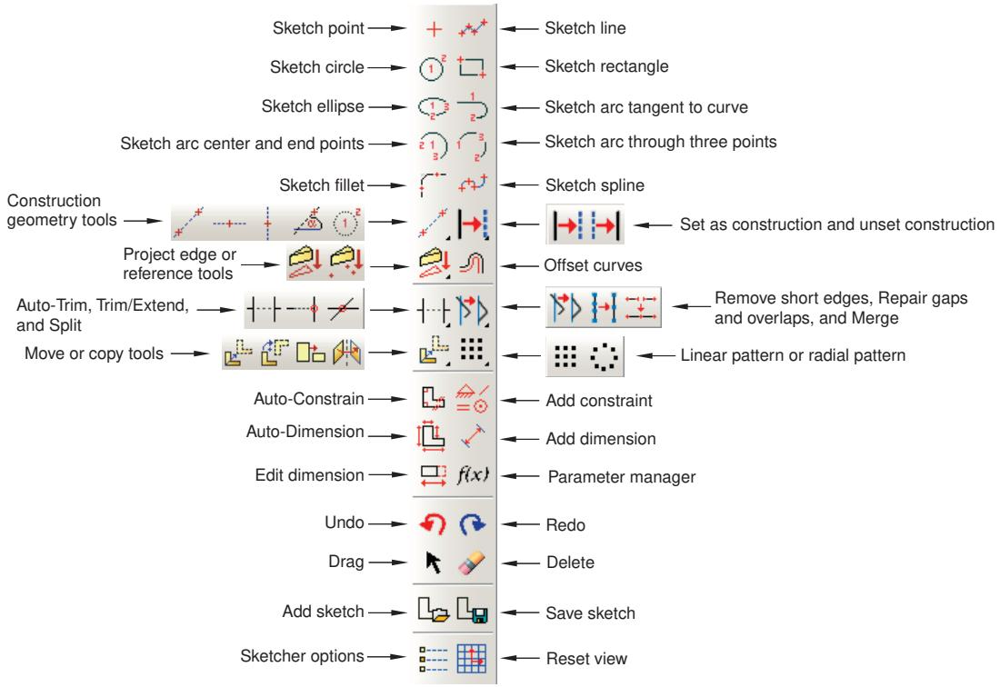  
Figure 1:The Sketcher toolbox.

To see a tooltip containing a brief definition of a Sketcher tool, hold the mouse over the tool for a moment. For information on using toolboxes and selecting hidden icons, see Using toolboxes and toolbars that contain hidden icons.

The Sketcher tools allow you to do the following:

• Create basic sketch entities, such as lines, circles, arcs, ellipses, fillets, and splines.  
• Add construction geometry to help you position and align sketch entities.  
• Add constraints, dimensions, and parameters to control your sketch geometry and add precision.  
• Translate, rotate, scale, or mirror sketch geometry.  
• Drag, trim, extend, split, or merge sketch entities.  
• Create similar objects by offsetting, creating linear patterns, or creating radial patterns.

## Additional information

• Basic Sketcher concepts  
• Using the Sketch module

## The Sketcher sheet and grid

When you enter the Sketcher and either create a new sketch or edit an existing sketch, Abaqus/CAE displays a sheet in the current viewport on which you sketch. In addition, the triad in the lower-left corner of the viewport indicates the orientation of the part or the assembly relative to the Sketcher sheet. The sheet is always square, and its height and width are determined by the sheet size. Abaqus/CAE determines the sheet size and the location of the origin, depending on what you are sketching:

If you are sketching the base feature of a new part, the sheet size is the same as the approximate size of the part that you provided when you created the part. The origin of the sheet is located at the origin of the part's coordinate system. Similarly, if you are creating a stand-alone sketch, the sheet size is the same as the approximate size of the sketch that you provided when you created the sketch.  
If you are adding a feature to a part or to the assembly, the default sheet size depends on the size of the face on which you are sketching. The origin of the sheet is located at the centroid of the selected face. If you selected a datum plane as the sketching plane, the origin of the sheet is located at the center of the part or assembly; the sheet size depends on the total size of the part or assembly.

You can use the Sketcher customization options to increase or decrease the sheet size if it does not correspond with the size of the geometry you are trying to sketch. To access the Sketcher customization options, select the customization

tool from the Sketcher toolbox. You may need to use the magnify tool to view the entire Sketcher sheet within the viewport.

Abaqus/CAE overlays the sheet with a grid of invisible grid points to help you position the cursor as you draw, move, resize, or reshape objects. By default, when you move the cursor near a grid point, the cursor automatically moves, or snaps, to the point. This behavior allows you to easily position the cursor precisely on a grid point while also providing you with full control when the cursor is not close to any grid points. If it is more convenient, you can disable the snapping behavior so that you have full control over the cursor. To help you visualize the grid points underlying the Sketcher grid, Abaqus/CAE displays visible gridlines that pass through the grid points at a selected interval; for example, every other grid point.

For example, Figure 1 shows a magnified view of a sheet whose spacing is set to 2 units.

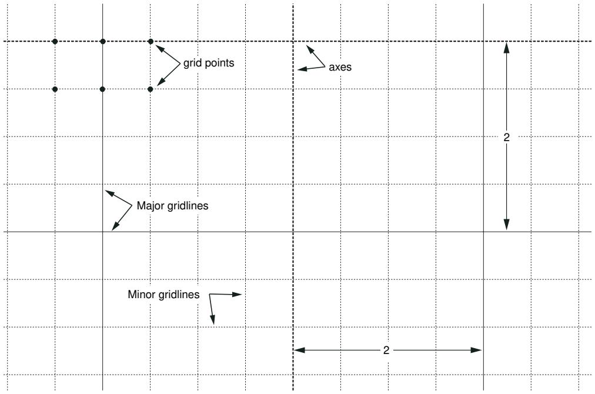  
Figure 1: Magnified view of the Sketcher grid.

In this example the Sketcher displays both major gridlines (in a solid line style) and minor gridlines (in a thin, dashed line style). Minor gridlines appear in the Sketcher only when the magnification level is high. In addition, the thick dashed lines in the sheet indicate the X- and Y-axes of the sketch; the lines intersect at the origin of the sketch.

You can customize the appearance and behavior of the grid by choosing the spacing of grid points, the spacing of the visible gridlines that overlay the grid points, the number of minor intervals, and the sheet size. You can also realign the grid relative to the sketch by moving the origin of the grid and by rotating the grid. Your sketch can extend beyond the Sketcher grid; however, if you find that you need to sketch outside the grid, it is recommended that you increase its size to include the entire sketch. If you change the grid origin or rotation, the Sketcher displays cursor coordinates in two forms as you continue to modify the sketch. Grid coordinates indicate the cursor position using the new grid origin or rotation; sketch coordinates indicate the position based on the original grid location.

The analysis of your model can be affected by a loss of precision if the coordinates of a part are far from the origin of the part. For example, after you import a sketch to create the base feature of a part, the sketch may be relatively far from the Sketcher origin; as a result, the part will be far from its origin. To improve precision, you may have to move the part closer to its origin by moving the sketch geometry closer to the origin of the Sketcher grid using the translate

tool, . You should not move the origin of the sketch closer to the geometry. Moving the origin of the Sketcher grid closer to the sketch is a graphical convenience only and has no effect on the underlying precision of the coordinates.

## Additional information

• Turning snapping on or off  
• Customizing the sheet size and grid  
• Basic Sketcher concepts

## How Abaqus/CAE orients your sketch

When the Sketcher starts, Abaqus/CAE orients the view of the part or assembly so that the face or datum plane on which you are sketching is parallel to the screen; this plane is known as the sketch plane. The orientation of the sketch plane depends on the modeling space of the part or assembly and the type of feature you are creating:

## Two-dimensional or axisymmetric modeling space

When you add a planar feature to a two-dimensional or axisymmetric part or assembly, Abaqus/CAE starts the Sketcher and aligns the X- and Y-axes of the part with the axes of the Sketcher grid, regardless of the type of feature you are creating. (Abaqus/CAE derives the X- and Y-axes of the part from the axes of the sketch that defined the base feature.)

## Three-dimensional modeling space

When you add a feature to a three-dimensional part or assembly, you must use the following technique to control the orientation of the view relative to the Sketcher grid:

1. Select the plane on which to sketch by selecting appropriate geometry; for example, a face of a part or a datum plane.  
2. Select an edge. By default, the selected edge will appear vertical and on the right side of the Sketcher grid. Alternatively, you can choose a different orientation for the edge in the Sketcher grid before you select the edge; for example, horizontal and on the top of the Sketcher grid. You can select any edge from the part or assembly that is not perpendicular to the selected plane. You can select a datum axis, or you can select one of the axes of a datum coordinate system; but you cannot select the edge of a datum plane. You can select a curved edge, but the resulting orientation of the part or assembly is system dependent.

Abaqus/CAE highlights the selected edge, enters the Sketcher, and rotates the part until the selected edge aligns with the grid in the desired orientation. The orientation of the view on the Sketcher grid also depends on the type of feature you are creating:

• When you are sketching a cut feature in the Part module, Abaqus/CAE orients the view so that the resulting feature will cut away from you and into the screen.  
• When you are sketching a feature other than a cut (for example, an extruded solid), Abaqus/CAE orients the view so that the resulting feature will protrude out of the screen toward you.  
When you are adding a swept feature, you must sketch a sweep path and sweep profile. For details of the resulting view orientation, see Adding a swept solid feature; Adding a swept shell feature; and Creating a swept cut.

When you are partitioning faces using the sketch method in the Partition toolset, Abaqus/CAE orients the view based upon the modeling space of the part or assembly and the type of faces you selected to partition. For more information, see Using the sketch method to partition faces.

If you are unsure of the part's or assembly's orientation relative to the sketch plane, use the view manipulation tools to

examine the sketch plane and the object on which you are sketching. Use the reset view tool to return to the original view.

Figure 1 illustrates how Abaqus/CAE determines the sketch plane orientation relative to a three-dimensional part after you select a face, an edge, and the orientation of the edge on the Sketcher grid.

  
1. Select this face.  
2. Select this edge as vertical and on the right.

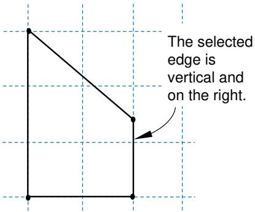  
3. The Sketcher starts, and the view rotates.  
Figure 1: Determining the sketch plane orientation.

## Additional information

• Adding a swept solid feature  
• Adding a swept shell feature  
• Creating a swept cut  
• Basic Sketcher concepts  
• Using the Sketch module  
• Using the sketch method to partition faces

## Realigning the sketch grid relative to the sketch

When you are sketching a feature, the sketch grid does not always align with the vertices and lines of the sketch or the underlying reference geometry. You can use the following techniques to realign the grid:

• Shift the grid relative to the sketch by selecting a vertex representing the origin of the grid.  
• Rotate the grid relative to the sketch by selecting a line that will be parallel to the X-axis of the sketch.  
• Remove any realignment and reset the grid to its original orientation.

Realignment applies only to the particular sketch, and the alignment of the grid is stored along with the sketch in the model database. New and existing sketches retain their default alignment.

Changing the origin and rotating the sketch grid allows you to quickly create features that might be difficult to create using the default grid location. Rotating the grid has the following effect:

The grid coordinates of the current cursor position are displayed in the upper-left corner of the viewport, and you can use these coordinates as a guide. The grid coordinates displayed are relative to the current alignment of the sketch grid and change if you realign the grid.  
The sketch coordinates of the current cursor position are displayed in the upper-right corner of the viewport. The sketch coordinates displayed are relative to the original alignment of the sketch grid and do not change if you realign the grid.  
When you enter the coordinates of a vertex in the prompt area, those coordinates are relative to the current alignment of the sketch grid.  
• Old and new horizontal and vertical dimensions remain horizontal and vertical.  
• Old horizontal and vertical construction lines remain horizontal and vertical.  
• New horizontal and vertical construction lines and preselection points are aligned with the rotated grid.  
• The lines generated by the rectangle tool are aligned with the rotated grid.

## Additional information

• Realigning the sketch grid  
• Basic Sketcher concepts  
• Using the Sketch module

## The Sketcher cursors and preselection

There are two cursors active within the Sketcher: the primary cursor and the secondary cursor. The two cursors are shown in Figure 1.

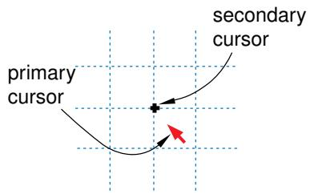  
Figure 1:The Sketcher cursors.

The primary cursor is the one you use with most applications on your computer, including Abaqus/CAE. The primary cursor usually appears as an arrow pointer or a pointing hand; you position this cursor by moving the mouse. The secondary cursor is active only in the Sketcher; it appears near the primary cursor when the Sketcher prompts you to select a point. The position of the secondary cursor allows you to see exactly which point is selected before committing the selection. If you move the primary cursor near a point that is eligible for selection, the secondary cursor jumps directly to the point while the primary cursor remains fixed. This behavior is called preselection. If you click the mouse button, Abaqus/CAE selects the point under the secondary cursor.

The appearance of the secondary cursor changes as you move around the sketch. Table 1 shows the shape assumed by the secondary cursor when the primary cursor is close to the Sketcher entity listed.

Table 1: Preselection cursors.

<table><tr><td>Preselection cursor</td><td>Sketcher entity</td></tr><tr><td></td><td>A vertex</td></tr><tr><td></td><td>The midpoint of a line or curve</td></tr><tr><td>×</td><td>The intersection of lines and curves</td></tr><tr><td>×——</td><td>The projection of a line onto other lines and curves</td></tr><tr><td></td><td>Points along existing lines or curves</td></tr><tr><td>+</td><td>The intersection of gridlines with each other or with other lines and curves</td></tr></table>

The secondary cursor works in conjunction with other preselection symbols in the sketch to indicate special points that you can select. Table 2 shows the other preselection symbols used in the Sketcher and the meaning of each symbol.

Table 2: Preselection symbols.

<table><tr><td>Preselection symbol</td><td>Location and Meaning</td></tr><tr><td></td><td>At the starting point of a new line segment when the line starts on existing sketch, reference, or construction geometry. The new line segment is perpendicular to the existing geometry.</td></tr><tr><td>||</td><td>Near the starting point when creating a new line starting on an existing edge; the symbol is aligned with the existing edge. The new line segment is tangent to the existing edge.</td></tr><tr><td>H</td><td>Near the secondary cursor when creating a new line. The new line segment is horizontal.</td></tr><tr><td>V</td><td>Near the secondary cursor when creating a new line. The new line segment is vertical.</td></tr></table>

The preselection cursors and symbols also indicate constraints that Abaqus/CAE will apply to the sketch if you choose the preselected point. Constraints such as coincidence, perpendicularity, and tangency help control sketch geometry and preserve your design intent.

Preselection applies to any entity that is a valid selection in the sketch. For example, as you move the cursor around the sketch, preselection highlights the following to indicate a valid selection:

• Vertices, intersections, projections, and points of tangency highlight when you are sketching a line, as shown in Table 1.  
• Sketch, construction, and reference geometry highlight when you are adding a dimension.  
• Dimensions highlight when you are modifying a dimension.

You can customize the cursor's behavior as follows:

• By default, the secondary cursor snaps to grid points that are close to the primary cursor. If you turn off this snapping, the secondary cursor follows the primary cursor and can be positioned anywhere on the Sketcher sheet.

• You can turn off preselection.

For more information on customizing the secondary cursor, see Turning snapping on or off, and Turning preselection on or off. The secondary cursor is available only in the Sketcher, but you can use another form of preselection to help you select viewport objects in other Abaqus/CAE modules. For more information on selecting viewport objects, see Selecting and unselecting individual objects.

## Additional information

• Controlling sketch geometry  
• Customizing the Sketcher  
• Using the Sketch module  
• Basic Sketcher concepts

## Using the chain method to select edges in the Sketcher

When offsetting or copying edges in a sketch, you can select a “chain” of connected edges. A chain is a connected group of edges in which each edge may be connected to, at most, one other edge at each endpoint—like the links in a chain. The chain method is available only in the Sketcher, and it allows you to select a chain of edges as if they were a single entity.

When you are performing a task that allows you to pick more than one edge from a sketch, Abaqus/CAE displays a field in the prompt area. The field allows you to choose between the two selection methods—individually and by chain, as shown in Figure 1.

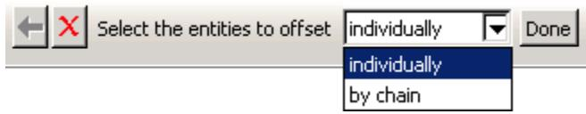  
Figure 1: Choose the selection method from the field in the prompt area.

After you use the chain method, you can click the individually method in the prompt area and [Shift] + Click on individual edges to append them to your selection. You can also [Ctrl] + Click on edges to unselect them. In addition, you can continue to use the chain method and use [Shift] + Click to append more chains to your selection.

## Additional information

• Basic Sketcher concepts  
• Using the Sketch module  
• Selecting objects within the current viewport

## How Sketcher customization options are initialized and saved

Sketcher customization options are grouped into the following settings:

## Sketcher options

• Snapping  
• Preselection behavior  
• Whether to display construction geometry, dimensions, parameter names, and constraints  
• The types of constraints and dimensions that Abaqus/CAE can add automatically

## Sketch options

• Sheet size, grid spacing, and grid display  
• The origin of the grid and the alignment of the axes  
• The text height and decimal places of dimensions and text height of parameter names

Sketcher options control the interactive behavior of the Sketcher, while Sketch options control the appearance of individual sketches. Abaqus/CAE stores and uses your Sketcher customization settings only for the duration of the session. In contrast, Abaqus/CAE stores your Sketch customization settings along with each sketch in the model database. As a result, if you exit the Abaqus/CAE session and return to the sketch at a later date, the Sketch customization options are retained.

When you create a new part or stand-alone sketch, Abaqus/CAE always uses the default Sketch options. The sheet size and grid spacing are recalculated based on the approximate size of the part or the selected sketch plane, the origin of the sketch is at 0,0 , the grid is displayed and aligns with the 1- and 2-axes, and the text height and decimal places are at their default settings.

## Additional information

• Using the Sketch module  
• Customizing the Sketcher

## Using the Query toolset in the Sketcher

You can use the Query toolset to request either general information or module-specific information.

For a discussion of the information displayed by general queries, see Obtaining general information about the model.

Select Tools->Query from the main menu bar, or click the tool in the Query toolset to start the Query toolset.

The following queries are specific to the Sketcher:

## Constraint

Abaqus/CAE displays the constraint type and the names of the constrained entities in the message area and highlights the entities in the sketch.

## Detail

Abaqus/CAE displays the number of geometries, vertices, constraints, dimensions, and unconstrained degrees of freedom in the message area.

## Additional information

• Basic Sketcher concepts  
• The Query toolset

## Sketcher geometry

This section describes the different types of geometry available in the Sketcher.

## In this section:

Reference geometry  
Construction geometry

## Reference geometry

When you sketch the profile of a feature, Abaqus/CAE projects onto the sketch sheet all the edges and vertices of the part or assembly that are in the same plane as the sketch plane. Abaqus/CAE also projects all datum points and datum axes onto the sketch sheet, regardless of their location in the part or assembly. These projected points and lines are called reference geometry, and you can use them for reference while sketching.

You typically use reference geometry to position your sketch accurately by specifying a dimension between a sketched entity, such as a line or a vertex, and the reference geometry. You can also use reference geometry to realign the sketch grid. The sketch retains any reference geometry that is used to position or dimension the sketch—the reference geometry reappears when you use the Sketcher to edit the feature again. Abaqus/CAE discards any reference geometry that is not used in the sketch.

If your part is complex, projecting only the edges, vertices, and datum points in the sketch plane onto the sketch sheet reduces the amount of clutter on the screen and makes the selection procedure more straightforward. However, your selection will be limited to only edges, vertices, and datum points that are in the sketch plane. If you want to use other edges, vertices, or datum points–including orphan element edges and nodes—as references, you must project them

onto the sketch plane as reference geometry by using the Project References tool . Alternatively, if you want to

create new sketch edges from existing model edges or orphan element edges, you can use the Project Edges tool (for more information, see Projecting edges onto a sketch).

When you sketch a new feature, you can constrain the position of the sketch to the underlying reference geometry using one of the following methods:

• Select entities from the reference geometry while sketching the new feature; for example, select a projected vertex to define the center of a circle or one end of a line.  
• Create a constraint, dimension, or parameter between the sketch and any projected reference geometry. For more information, see Controlling sketch geometry.

Constraining the sketch defines how it is positioned relative to the reference geometry and how it will be repositioned if you modify and regenerate the part or assembly.

When you exit the Sketcher, Abaqus/CAE determines whether you have constrained the sketch to the reference geometry. If a constraint is found, Abaqus/CAE creates a parent-child relationship between the new feature (the child) and the selected reference geometry (the parent). If no constraints are found, Abaqus/CAE displays the following message in the message area: No sketch placement constraints specified on feature feature name. You do not have to constrain the sketch; but if you do not, its position relative to the underlying geometry of the part or assembly may change if you modify and regenerate the part or assembly.

If you save a stand-alone sketch, Abaqus/CAE saves only the sketch and does not save any underlying reference geometry. As a result, if the sketch includes a dimension between a sketch line and a reference line, the dimension is not saved with the stand-alone version of the sketch.

The order in which you create features influences the available reference geometry. Feature-based modeling allows a child feature to be dependent on a parent feature but does not allow a parent to be dependent on a child. As a result, if a feature was created after the feature you are editing, the edges and vertices of the newer feature cannot be projected onto the sketch sheet. You can use the Query toolset to determine the order in which features were created; for more information, see Using the Model Tree to obtain feature information.

## Additional information

• The Feature Manipulation toolset  
• Using the Sketch module

## Construction geometry

You create construction geometry in the Sketcher to help you position and align the geometry in your sketch; objects that you might need to position include holes, arcs, slots, or gear teeth.

The Sketcher allows you to add construction lines and circles to your sketch; in addition, points that you create using the isolated point tool are considered construction geometry. Construction lines, circles, and points do not appear in the feature you are creating or modifying.

While you are adding construction geometry and moving the cursor around the sketch, Abaqus/CAE displays preselection symbols at the following locations:

• The intersection of the new construction geometry and sketched lines or curves.  
• The intersection of the new construction geometry and existing construction geometry.  
The intersection of the new construction geometry and reference geometry. Abaqus/CAE displays preselection symbols only when the reference geometry was created before the feature being edited. (See Reference geometry, for more information about the behavior of reference geometry.)

The preselection symbols generated by construction geometry allow you to align objects precisely; for example, along an oblique line or around a circle. For example, you could create an oblique construction line and several vertical construction lines to help align a group of circles, as illustrated in Figure 1.

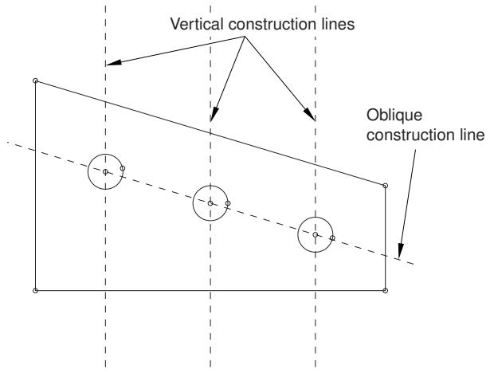  
Figure 1: Using construction lines to align sketch geometry.

Construction lines also define the axis of rotation when sketching revolved solids and surfaces. For more information about the relationship between construction lines and the axis of revolution, see Defining the axis of revolution for axisymmetric parts and for revolved features.

Construction geometry is shown using dashed lines to distinguish it from sketched geometry. Construction geometry is visible only while you are working on a sketch; as soon as you exit the Sketcher, the construction geometry disappears. Abaqus/CAE saves construction geometry with the original sketch; if the Sketcher is invoked to modify a sketch that included construction geometry, the construction geometry reappears along with the sketch.

To create construction geometry, select one of the construction geometry tools from the Sketcher toolbox or select Add->Construction from the main menu bar.

You can also convert components of your sketch into construction geometry, and you can reverse this process for items that had been converted to construction geometry. To convert a component to construction geometry, select the

component and select Edit->Set as Construction from the main menu bar; to reverse this process, select the construction geometry component and select Edit->Unset Construction.

## Additional information

• Creating construction geometry  
• Reference geometry  
• Controlling sketch geometry  
• Using the Sketch module

## Specifying precise geometry

When you are using the Sketcher to sketch features, you can use the underlying grid and preselection to position the cursor and create or modify sketch geometry. In addition, you can use the following techniques to position the geometry precisely:

## Entering coordinates

When you are using the Sketcher to create a feature and Abaqus/CAE asks you to position a point (for example, to define the endpoint of a line or the center of a circle), you can do one of the following:

• Select a point on the sketch using the Sketcher grid, existing vertices, or preselection.  
• Enter the desired X- and Y-coordinates of the point in a text box in the prompt area.

To help you determine the coordinates to provide, the X- and Y-axes of the sketch are indicated by dashed lines, which intersect at the origin of the sketch. The coordinates that you specify are relative to this origin. In addition, when you select a Sketcher tool, the coordinates of the current cursor position are displayed in the upper-left corner of the viewport, and you can use these coordinates as a guide.

For detailed instructions, see Sketching simple objects.

## Creating and modifying dimensions

After you have created the geometry, the Sketcher allows you to add dimensions between lines and vertices and other pieces of geometry in the sketch. You can then refine the sketch by replacing these dimensions with precise dimensions, and the sketch changes to reflect the new dimensions. In addition, dimensions allow you to annotate sketches for future reference.

You add dimensions by selecting the dimension tool in the Sketcher toolbox or by selecting Add->Dimension from the main menu bar—editing the dimension value is the final step in creating a new dimension. To modify

an existing dimension, select the modify dimension tool from the Sketcher toolbox or select Edit->Dimension from the main menu bar. For detailed instructions, see Editing dimensions.

## Additional information

• Automatically constraining a sketch  
• Adding individual dimensions  
• Modifying objects by changing dimensions or adding parameters  
• Using the Sketch module

## Controlling sketch geometry

Controlling sketch geometry helps you prevent unintended changes by creating relationships between sketch entities. If all the geometry in a sketch is controlled, the sketch is fully constrained—the entities in the sketch cannot be modified without violating the controls, and you cannot add another control without creating a conflict with one that already exists.

The following section describes how you can use constraints, dimensions, and parameters to control sketch geometry. All three types of controls can be considered constraints since they all work to restrict the degrees of freedom in a sketch, but each control creates a different type of relationship between the selected entities.

## In this section:

Using constraints to control sketch geometry  
Using dimensions to control sketch geometry  
Using parameters to control sketch geometry  
Fully constrained geometry

## Using constraints to control sketch geometry

Constraints create logical relationships that control the position or size of geometry. Constraints are defined without using numerical values. The other types of geometry controls, dimensions and parameters, are specialized constraints that use values or evaluated expressions to define numerical relationships in a sketch. Constraints are not required in Abaqus/CAE sketches; however, they can help you preserve the design intent. When you modify a constrained sketch, you must either work within the existing controls, modify them, or delete them to complete your changes.

Table 1 lists each constraint type, its symbol, and a brief description of its use.

Table 1: Sketcher constraints.

<table><tr><td>Constraints</td><td>Symbol</td><td>Description</td></tr><tr><td>Coincident</td><td>o</td><td>Abaqus/CAE moves the selected entities so that they share a common point. The point may be a point on both entities or a projected point that would exist only if one of the entities was extended. If two straight lines are selected, they become colinear.</td></tr><tr><td>Concentric</td><td></td><td>Abaqus/CAE moves the selected arcs or circles to share a common center.</td></tr><tr><td>Equal length</td><td>/</td><td>Abaqus/CAE makes the selected lines all the same length.</td></tr><tr><td>Equal radius</td><td>—</td><td>Abaqus/CAE makes the selected arcs or circles the same radius.</td></tr><tr><td>Fixed</td><td>[78KW]</td><td>Abaqus/CAE fixes the radius of an arc or circle, the angle of a line, or the position of a vertex.</td></tr><tr><td>Horizontal</td><td>H</td><td>Abaqus/CAE aligns the selected line with the X-axis of the sketch. The horizontal constraint is not affected by grid orientation.</td></tr><tr><td>Equal distance</td><td>[KZZ6]</td><td>Abaqus/CAE moves the selected vertex so that it is the same distance from the two vertices or lines used to define the constraint.</td></tr><tr><td>Parallel</td><td>//</td><td>Abaqus/CAE makes the selected lines parallel.</td></tr><tr><td>Perpendicular</td><td>[TT4]</td><td>Abaqus/CAE makes the selected lines perpendicular.</td></tr><tr><td>Symmetry</td><td></td><td>Abaqus/CAE makes the selected entities symmetrical about your chosen line of symmetry.</td></tr><tr><td>Tangent</td><td>||</td><td>Abaqus/CAE makes the selected entities tangent at their nearest point. At least one of the entities must be curved.</td></tr><tr><td>Vertical</td><td>V</td><td>Abaqus/CAE aligns the selected line with the Y-axis of the sketch. The horizontal constraint is not affected by grid orientation.</td></tr></table>


## Note:

The behaviors described in Table 1 assume that no other constraints are applied to the selected entities. The presence of other constraints and the constraint solution method selected in the Sketcher Options may affect how Abaqus/CAE moves entities to comply with the constraints.

You can create multiple instances of the same type of constraint in a sketch. You can use the sketch module queries to locate the geometries controlled by a constraint or to list the constraint details for the entire sketch (for more information, see The Query toolset).

You can use the following techniques to add constraints to a sketch:

## Preselecting geometry

If preselection is active, Abaqus/CAE can add some constraints while you create geometry. Coincident, horizontal, perpendicular, tangent, and vertical constraints can be added using the preselection cursor. For more information, see The Sketcher cursors and preselection.

## Selecting midpoints of lines or curves

If you select the midpoint of a line or curve as the vertex for additional sketch geometry, Abaqus/CAE also creates an equal distance constraint between the midpoint and the endpoints of the line or curve.

## Adding constraints automatically

After you create a sketch, you can use the auto-constrain tool to add constraints to the entire sketch or to a selected group of entities. Use the sketch options to control the constraint types that Abaqus/CAE can add automatically and the allowable tolerances for adding a constraint. For more information, see Customizing the use of constraints in the Sketcher.

## Adding individual constraints

After you create sketch geometry, you can select the constraint type and pick the entities to apply the constraint. This method gives you the most control, but it is also the most time consuming. For more information, see Adding individual constraints.

When you add constraints, you must not overconstrain the sketch geometry. Geometry is overconstrained when multiple controls are applied to a single degree of freedom (for more information, see Fully constrained geometry). Abaqus/CAE colors conflicting constraints magenta to indicate an overconstraint condition. You must resolve any overconstraints before you can use a sketch to create a feature or save it with the model database.

## Additional information

• The Sketcher cursors and preselection  
• Customizing the Sketcher  
• Constraining, dimensioning, and parameterizing a sketch

## Using dimensions to control sketch geometry

Dimensions are a type of constraints that use numerical values to define sizes, angles, or distances in a sketch. Dimensions control sketch geometry by preventing changes to the dimensioned quantities. To change a dimensioned quantity, you must modify the associated dimension.

The following dimension types are available in the Sketcher:

• horizontal  
vertical  
• oblique  
• angular  
radial

The first three dimension types correspond to linear distances between two points (including the endpoints of a single line), two lines, or a point and a line. Angular dimensions always indicate the angle, in degrees, between two lines. Radial dimensions indicate the radius of a circle, arc, or fillet or the major and minor radii of an ellipse.

You can use the following techniques to add dimensions to a sketch:

## Adding dimensions automatically

After you create a sketch, you can use the auto-dimension tool to add dimensions to the entire sketch or to a selected group of entities. Use the sketch options to control the dimension types that Abaqus/CAE can add automatically. For more information, see Customizing the format and use of dimensions in the Sketcher.

## Adding individual dimensions

After you create sketch geometry, you can add individual dimensions. This method gives you the most control, but it is also the most time consuming. For more information, see Adding individual dimensions.

You can modify any dimension in a sketch. When you edit an existing dimension, you can modify it in several ways. You can

• edit the numerical value to modify the sketch,  
• convert the dimension to a reference dimension, or  
• link the dimension to a parameter.

Reference dimensions annotate quantities that are already controlled elsewhere in the sketch or quantities such as projected reference geometry that cannot be controlled within the current sketch. Reference dimension values are enclosed in parentheses, and Abaqus/CAE updates them automatically to match changes in the associated geometry. Dimensions that have been linked to parameters are assigned a variable name for use in creating mathematical expressions (parametric equations) to define other parameters in the sketch. For detailed instructions on editing dimensions, see Editing dimensions.

When you add or modify dimensions, you must not overconstrain the sketch geometry. Geometry is overconstrained when multiple controls are applied to a single degree of freedom (for more information, see Fully constrained geometry). Abaqus/CAE colors conflicting constraints magenta to indicate an overconstraint condition. You must resolve any overconstraints before you can use a sketch to create a feature or save it with the model database.

## Additional information

• Modifying objects by changing dimensions or adding parameters

• Customizing the Sketcher  
• Constraining, dimensioning, and parameterizing a sketch

## Using parameters to control sketch geometry

Parameters are dimensions or numerical constants that have been given a variable name and are used to create parametric equations between pieces of geometry. While dimensions always have a numerical value, parameters may have a numerical value or a value resulting from a mathematical expression. For example, you can parameterize the radius dimension of a circle so it will always be half the size of another dimension in the sketch, but you must first associate both dimensions with parameters to create the expression. You can use the sketch options to control whether Abaqus/CAE displays the names or values of parameters in a sketch (for more information, see Customizing the format and use of dimensions in the Sketcher).

Parameters must be defined within a single sketch—you cannot define parameters in one sketch and use them to create expressions in another sketch. Defining a parameter adds it to the Parameter Manager for the sketch. The order of parameters in the manager indicates the order in which they can be used in expressions. Figure 1 shows two parameters; the length parameter is used to define the width parameter. If you instead wanted to define the length in terms of the width, the width parameter would need to appear first in the manager. You can use the buttons on the right side of the dialog box to create parameters by selecting dimensions from the viewport or to insert, move, or delete parameters from the manager. For detailed instructions, see Adding and editing parameters.

  
Figure 1:The Parameter Manager.

## Additional information

• Modifying objects by changing dimensions or adding parameters  
• Constraining, dimensioning, and parameterizing a sketch  
• Creating parametric equations  
• Modifying objects

## Fully constrained geometry

Constraints, dimensions, and parameters are all used to create relationships that control, or constrain, Sketcher geometry. Geometry is constrained by the removal of degrees of freedom from the sketch. For example, if you apply a perpendicular constraint to two lines, you remove the angular degree of freedom between those lines. If you drag one of the lines, the other line must also move to maintain the perpendicular constraint.

If geometry is controlled such that you cannot change it without redefining the relationships—changing constraints, dimensions, or parameters—the geometry is fully constrained. Abaqus/CAE colors fully constrained geometry green to indicate that it cannot be changed. If you add too many constraints to a sketch, the geometry becomes overconstrained. Abaqus/CAE colors conflicting constraints magenta to indicate the overconstraint condition. To resolve an overconstraint, you can

• undo the last modification or constraint addition,  
• delete constraints or dimensions, or  
• convert unnecessary dimensions to reference dimensions.

If you intend to fully constrain an entire sketch, you can use the Detail query to list sketch information—including the number of unconstrained degrees of freedom—in the message area. For more information, see Using the Query toolset in the Sketcher.

## Additional information

• Constraining, dimensioning, and parameterizing a sketch  
• Editing dimensions  
• Modifying objects  
• Undoing and redoing sketching actions

## Modifying, copying, and offsetting objects

The following section describes the techniques you can use to modify your sketch and to copy or offset Sketcher objects.

## In this section:

Modifying a sketch by dragging objects  
Modifying objects by changing dimensions or adding parameters  
Modifying or copying objects by selecting edges  
Modifying edges by trimming, extending, splitting, or merging  
Copying sketch objects to create patterns  
Offsetting objects

## Modifying a sketch by dragging objects

You can drag vertices, edges, construction geometry, and dimension text to new locations in a sketch. You can drag only one object at a time, and the object you drag will snap to gridlines when the Snap to grid option in the Sketcher Options dialog box is toggled on. This option is toggled on by default.

When you drag a vertex or an edge, Abaqus/CAE repositions the selection and uses the During drag constraint solution method to modify any connected edges (for more information, see Customizing the use of constraints in the Sketcher). Sketch constraints may cause multiple objects to move along with the one you select. Constraints may also restrict or prevent dragging some objects. For example, consider the sketch shown in Figure 1.

  
Figure 1:The original sketch.

The sketch includes the default horizontal, vertical, and perpendicular constraints created by Abaqus/CAE during the sketching process and one added length dimension. With these constraints in place, dragging the left edge of the sketch has the same effect as dragging the vertex at either end of the left edge, as shown in Figure 2.

  
Figure 2: Dragging the left edge or vertices with constraints.

With the constraints and dimension removed, dragging the edge produces similar results to those shown in Figure 2, but dragging a vertex modifies the sketch as shown in Figure 3. The result in Figure 3 is achieved using the default Minimum move constraint solution method. For this sketch, dragging the vertex using any of the other constraint solution methods repositions the entire sketch.

  
Figure 3: Dragging the lower left vertex without constraints.

Dragging edges and vertices is a quick, but imprecise, method of moving them since the motion is based on the cursor position as opposed to an exact numerical change. To move objects more precisely, use the methods described in Modifying objects by changing dimensions or adding parameters, and Modifying or copying objects by selecting edges.

Dragging dimension text is one way to clean up the sketch after using the Auto-Dimension tool. The lack of precision does not matter since the exact location of dimension text is not important. When you drag dimension text, you can make the following changes:

• Move a linear dimension closer to, farther from, or to the opposite side of the dimensioned quantity.  
• Move an angular dimension closer to or farther from the angle's vertex.  
• Move an angular dimension across one of the edges that define the angle to dimension a supplement of the original angle.

Possible locations for dragging an angular dimension are shown in Figure 4.

  
Figure 4: Four possible positions for an angular dimension.

Dimension text is not controlled by any constraints other than the attachment to the dimensioned object. The constraint solution methods also do not affect dragging dimension text in a sketch.

## Additional information

• Specifying precise geometry  
• Modifying objects

## Modifying objects by changing dimensions or adding parameters

Use dimensions between lines and vertices to define and maintain dimensional relationships between features. Dimensions can be applied between lines and vertices from any of the following:

• Sketch geometry  
• Reference geometry  
• Construction geometry

Parameters are dimensions or constants that have been associated with a name so you can use them to create functions and to define relationships between features. For example, consider a three-dimensional shell with an extruded circular post, as shown in the following figure:

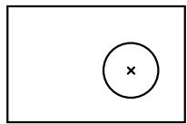

This part was created in two steps:

1. Create a part consisting of only the shell.  
2. Extrude a solid feature from the face of the shell (the circular post).

If you want to keep the distance between the left edge of the shell and the center of the post constant, you can edit the post and add a dimension between the center of the sketched circle and the left edge of the reference geometry that represents the shell, as shown in the following figure:


If you move either the left or the right edge of the shell, the distance between the center of the circle and the left edge remains constant, as shown in the following figure:


If you want to keep the post centered between the left and right edges of the shell, you must add two dimensions and associate them with parameters. You can then define a parametric equation, $d i m 2 { = } ( d i m I ) / 2$ , to set the distance from the left edge to the post at half the width of the shell, as shown in the following figure:


## Note:

The distance dimension associated with the parameter dim1 is defined in the sketch of the shell feature and cannot be edited in the sketch of the post. When you dimension reference geometry, Abaqus/CAE colors the dimension magenta to indicate an overconstraint. To clear the overconstraint, you must make dim1 a reference dimension. Abaqus/CAE places parentheses around the value of reference dimensions (or around the parameter name if the dimension is associated with a parameter) and automatically updates their values if the dimensioned quantity changes. For more information, see Editing dimensions.

You can modify any dimension or parameter in a sketch. For detailed instructions, see Editing dimensions, and Adding and editing parameters, respectively.

## Modifying or copying objects by selecting edges

When you move edges, Abaqus/CAE repositions the selected edges and uses the During edit constraint solution method to modify any connected edges (for more information, see Customizing the use of constraints in the Sketcher). The sketch constraints and constraint solution method may restrict the types of moves that you can make or cause Abaqus/CAE to reposition edges that you did not select. When you copy edges, the copies are positioned according to the copy method—the copied edges are not affected by any existing sketch constraints. You cannot copy objects between sketches. Abaqus/CAE provides the following methods for moving or copying selected edges:

## Translate

You can translate selected edges by specifying the start and end coordinates of a translation vector. The translation vector can start from any point; however, you may find it more meaningful to start the vector from the vertex at one end of a selected edge and end it at the vertex's new location. Figure 1 shows the selected edges, the translation vector, and the result of the translation. To achieve the results shown, Fixed constraints were added to prevent the two vertices of the upper rectangle from moving.


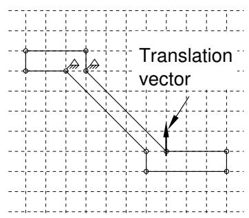

  
Figure 1:Translating selected edges.

## Rotate

You can rotate selected edges by specifying the coordinates of the center of rotation and entering the angle of rotation; a positive angle indicates a counterclockwise rotation. Figure 2 shows the selected edges, the selected center of rotation, and the result of a 90° rotation. The selected edges are not connected or otherwise constrained to other edges in the sketch, so the constraint solution method has no effect on the rotation.

  
Figure 2: Rotating selected edges.

## Mirror

You can mirror selected edges by selecting a straight line in the sketch as the mirror line. Figure 3 shows the selected edges, the mirror line, and the resulting copy including a mirror constraint for each of the four selected edges. The mirror line may be any straight object line or construction line in the sketch.

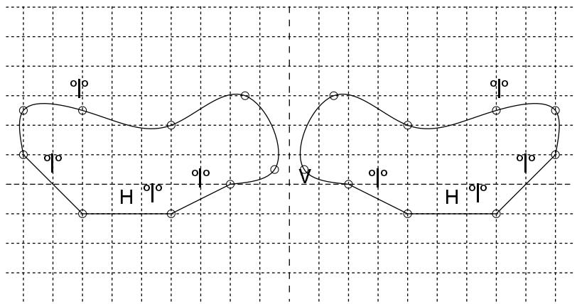  
Figure 3: Mirroring selected edges.

## Scale

You can scale selected edges by specifying a center point and a scale factor. A scale factor less than 1.0 decreases the spacing between the edges, and a scale factor greater than 1.0 increases the spacing between the edges. Figure 4 shows the selected edges, the selected center point, and the result for a scale factor of 1.5.

  
Figure 4: Scaling selected edges.

## Additional information

• Modifying objects

## Modifying edges by trimming, extending, splitting, or merging

When you are modifying a sketch, you can implement your changes by modifying a dimension, by moving selected vertices, or by trimming, extending, splitting, or merging edges. Abaqus/CAE provides the following methods for trimming, extending, splitting, and merging edges:

## Trim/Extend

You can trim or extend one end of a line or arc; you can also trim a spline curve, but spline curves cannot be extended. To trim or extend an edge, first select the edge near the end that you want to modify and then select a second edge to define an intersection point. The second edge may be any object in the sketch, including construction geometry. The intersection point may lie beyond the current endpoints of either selected edge. Abaqus/CAE trims or extends the first edge at the intersection point. If you want to trim or extend the second edge to the same point, repeat the process, reversing the selection order (see Figure 1).

  
Figure 1: Extending two edges to create a corner.

For detailed instructions on trimming and extending edges, see Modifying Sketcher objects by trimming or extending edges.

## Auto-trim

You can trim an intermediate or end segment from a line, arc, circle, or spline curve. Auto-trim is the fastest method you can use to remove unwanted edge segments from a sketch. Abaqus/CAE uses preselection to highlight edges that you can remove. Preselection is based on cursor proximity and the two nearest “trim points.” Trim points include intersection points, endpoints, vertices, and the picked points that define the edges of circles. Unlike when you use Trim/Extend, Abaqus/CAE does not split the intersecting edges. Figure 2 shows several possible trim combinations based on the circle and line shown in the upper left corner.

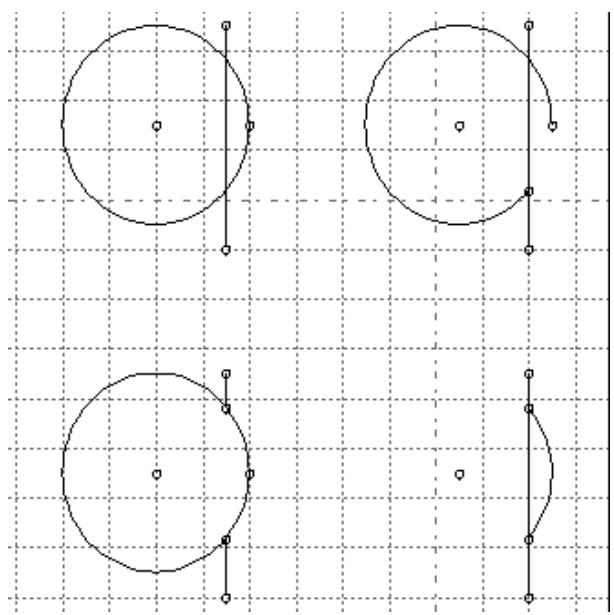  
Figure 2: Auto-trim selections.

For detailed instructions on automatically trimming edges, see Modifying Sketcher objects by automatically trimming edges.

## Split

You can split edges, creating separate pieces with a common vertex, where they intersect in the sketch. Select the first edge to be broken, then select a second edge that intersects the first at the desired split point. As you move the cursor near the second edge, a circle appears around the split point that you would create. If there is more than one intersection point between the two edges, Abaqus/CAE highlights the intersection closest to the cursor. Abaqus/CAE splits the first edge at the indicated point. Figure 3 shows an intersecting line and spline on the left, indicates the split point in the center image (the cursor is not shown), and shows the three resulting edges on the right. In this case the spline was selected first, so the straight line remains unbroken.


## Note:

Spline curves retain their exact shape when you split or trim them, but the control points are removed so you can no longer edit the shape of the curves.

  
Figure 3: Splitting a line and a spline.

For detailed instructions on splitting edges, see Modifying Sketcher objects by splitting edges.

## Merge

The Merge tool enables you to close small gaps in a sketch. These gaps commonly occur in the following situations:

• When you use the Project Edges tool on edges that are not in a plane parallel to the sketch plane, the endpoints may be created in a slightly different location from other selected edges.  
• When you import sketch geometry into an existing sketch, the edges may not line up exactly.

The Merge tool is intended only for closing small gaps. Merging edges to close larger gaps may change the sketch geometry significantly. If you want to move elements in a sketch over a large distance, use the drag tool from the Sketcher toolbox to move vertices in your sketch to a new location. For more information, see Dragging Sketcher objects.

For detailed instructions on merging edges, see Modifying Sketcher objects by merging edges.

## Additional information

• Modifying objects

## Copying sketch objects to create patterns

You can copy objects in your sketch and create a pattern of copied objects; for example, Figure 1 illustrates radial patterns of gear teeth and holes on a solid part.

  
Figure 1: Radial patterns of gear teeth and holes.

You can choose either of the following methods to define the pattern:

## Linear pattern

A linear pattern positions copies of selected objects along a direction; for example, the X-direction. You can specify the number of copies and the spacing between the copies; and you can choose to position the copies in a positive direction or a negative direction. In addition, you can change the orientation of the linear pattern.

Figure 2 shows how you can create different linear patterns in a single direction.

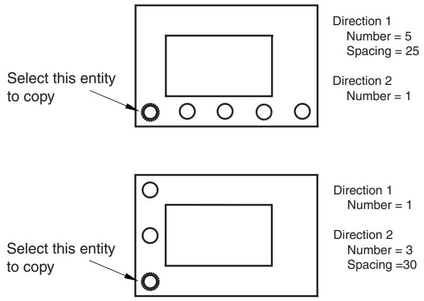  
Figure 2: Linear patterns in a single direction.

You can create a matrix of copied objects by creating copies in a second direction; for example, the Y-direction. The options are the same as for the first direction; you can control the number of copies, the direction, and the angle. Figure 3 shows how you can create different linear patterns in two directions.

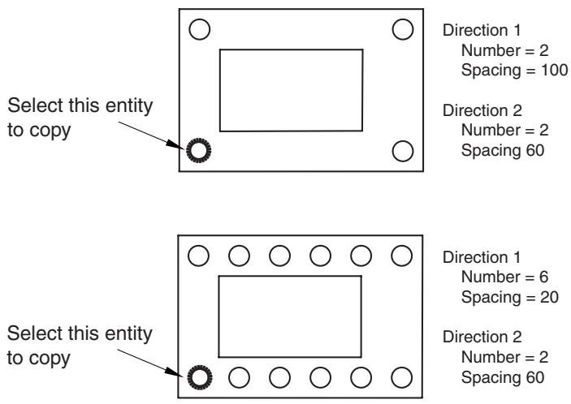  
Figure 3: Linear patterns in two directions.

By default, the first direction is the X-axis and the second direction is the Y-axis. However, you can change the orientation of the first direction or the second direction by selecting a line from the sketch that represents the new orientation. Figure 4 shows a linear pattern oriented along a selected line.

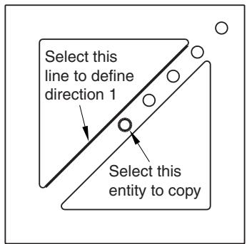  
Direction 1 Number = 5 Spacing = 20  
Direction 2 Number = 1  
Figure 4: A linear pattern oriented along a line.

By default, Abaqus/CAE creates the pattern in a positive direction; however, you can reverse the direction. For example, Figure 5 shows the same linear pattern as in Figure 4 but with the direction reversed.

  
Figure 5: The effect of reversing the direction of a linear pattern.

For detailed instructions on creating linear patterns, see Creating linear patterns of objects.

## Radial pattern

A radial pattern positions copies of selected objects in a circular pattern. You can specify the number of copies, and you can specify the angle between the first and last copy, where a positive angle corresponds to a counterclockwise direction. In addition, you can select a point from the sketch that defines the center point of the circular pattern. Figure 6 shows how you can create different radial patterns.

  
Figure 6: Radial patterns.

For detailed instructions on creating radial patterns, see Creating radial patterns of objects.

By default, Abaqus/CAE displays a preview of the linear and radial pattern as you enter the settings. In most cases the preview will help you decide on the settings that will create the desired pattern. However, if you are creating a large number of copies, the preview may slow down the generation of the sketch. In this case you should toggle off the Preview button.

Several methods are also available for creating individual copies of sketch objects. These methods are discussed in Modifying or copying objects by selecting edges.

## Offsetting objects

You can offset objects in your sketch to create similar objects of a larger or smaller size. You select the edges to offset and the offset distance; Abaqus/CAE displays a preview so that you can choose the offset direction. You can offset any continuous open or closed loops that do not contain branches. Figure 1 shows the two possible offsets that can be created for several edge selections. (For clarity, vertices and datum points are not shown in the figure.)

  
Figure 1: Offsets of a spline curve, a square, and a circle.

Abaqus/CAE offsets each object in the same way that you would offset edges on paper with a drafting compass. Using a compass, you would draw the compass point along the original edge tracing a new edge with the pencil at the required perpendicular (offset) distance. At any sharp corners, you would rotate the compass to make it perpendicular to the second edge at the corner. At the end of this process, you would trim any offset edges that intersected with other offset edges.

As shown in Figure 1, Abaqus/CAE completes a similar process:

• Straight edges are copied.  
• Offset edges that overlap, such as corners offset toward the “inside,” are trimmed to make new corners.  
• Where corners are offset toward the “outside,” you can choose to create sharp corners or fillets with radii equal to the offset distance.  
• Radii of existing curves are increased or decreased by the offset distance.

If the radius of a curve would be decreased to zero or less by the offset, Abaqus/CAE creates a new vertex joining the surrounding edges that were previously connected by the curve. For detailed instructions, see Offsetting the edges of Sketcher objects.

## Customizing the Sketcher

This section describes how you customize the behavior and the appearance of the Sketcher.

## In this section:

Using Sketcher customization options  
Turning snapping on or off  
Turning preselection on or off  
Customizing the sheet size and grid  
Realigning the sketch grid  
Displaying and hiding construction geometry  
Limiting the projection of coplanar entities  
Setting the maximum number of recorded sketching operations  
Customizing the format and use of dimensions in the Sketcher  
Customizing the use of constraints in the Sketcher  
Managing images in the Sketcher background

## Using Sketcher customization options

Use the Sketcher customization options to control the appearance and behavior of the Sketcher.

The following options control the behavior of the Sketcher throughout the Abaqus/CAE session:

Whether the cursor snaps to the grid.  
• Whether preselection is active.  
• Whether dimensions are displayed.  
• Whether names or values of parameters are displayed.  
• Limiting the number of coplanar entities that are projected.  
• The types of dimensions and constraints available for use with the Auto-Dimension and Auto-Constrain tools.  
• The constraint solution method for use while editing or dragging objects.  
• Whether sketch constraints are displayed.  
• Whether implied constraints are added during entity creation.  
• Whether construction geometry is displayed.  
• Whether a background image is displayed.

The following options are stored with each sketch; they control the behavior and appearance of the current sketch and new sketches that you create:

• The sheet size, the grid spacing, and the number of gridlines to display.  
• Whether the sheet size and grid spacing are controlled automatically.  
• Whether the grid is visible.  
• The text font size and the number of decimal places displayed in sketch dimensions.

The origin of the sketch grid and the alignment of the X-axis are also stored with each sketch. However, the grid origin and alignment settings control only the behavior and appearance of the current sketch; they are reset to their default values for any new sketch that you create.

1. From the bottom of the Sketcher toolbox, select the Sketcher customization tool . The Sketcher Options dialog box appears.

2. Set the desired customization options on each of the tabbed pages. For detailed help, request context-sensitive help on individual items in the dialog box.


Tip: You can also click Defaults to revert all Sketcher options to their default settings.

3. Click OK to apply your changes and to close the Sketcher Options dialog box.

## Additional information

• Customizing the Sketcher  
• How Sketcher customization options are initialized and saved

## Turning snapping on or off

Snapping to the grid helps you position the cursor when you want to select a Sketcher grid point or drag an object to a specific point on the grid. When snapping is enabled and you move the cursor near a grid point, the secondary cursor jumps, or snaps, to the grid point. Toggle Snap to grid in the Sketcher Options dialog box to enable or disable snapping. (By default, snapping is enabled when you start the Sketcher.) The behavior you choose for snapping applies to all sketches in the Abaqus/CAE session. Sketcher preselection overrides snapping if a preselection point and a grid point are both close to the cursor position.

1. From the bottom of the Sketcher toolbox, select the Sketcher customization tool .

The Sketcher Options dialog box appears.

2. From the General tabbed page, toggle Snap to grid.

When Snap to grid is on, the secondary cursor snaps to nearby grid points as you move around the sketch. Depending on the grid size, magnification of the viewport, and whether preselection is active, you may also be able to select other points in addition to the grid points and the existing sketch geometry. When Snap to grid is off, the secondary cursor aligns with the primary cursor as you move around the sketch. You can select anywhere on the sheet.

3. After you have chosen the desired customization options, click OK to apply your changes and to close the Sketcher Options dialog box.

## Additional information

• The Sketcher sheet and grid  
• The Sketcher cursors and preselection  
• Customizing the Sketcher  
• Turning preselection on or off

## Turning preselection on or off

Preselection helps you select reference geometry or Sketcher objects, such as lines, vertices, and dimensions. When preselection is enabled and you move the cursor near one of these objects, Abaqus/CAE highlights the object so that you can more easily select it. Preselection also helps constrain your sketch by indicating selections that will create horizontal, vertical, colinear, perpendicular, and coincident constraints while you sketch. For a list of the preselection symbols displayed by different Sketcher objects as you move the cursor around the sketch, see The Sketcher cursors and preselection.

Toggle Preselect geometry in the Sketcher Options dialog box to enable or disable preselection. (By default, preselection is enabled when you start the Sketcher.) Preselect customization is stored for the duration of the Abaqus/CAE session and applies to all sketches. Preselection overrides snapping to the grid if a preselection point and a grid point are both close to the cursor position.

1. From the bottom of the Sketcher toolbox, select the Sketcher customization tool . The Sketcher Options dialog box appears.  
2. From the General tabbed page, toggle Preselect geometry.

When Preselect geometry is on, Abaqus/CAE highlights valid selections, such as vertices, midpoints, and dimensions, as you move around the sketch.

When Preselect geometry is off, Abaqus/CAE does not highlight valid selections.

3. After you have chosen the desired customization options, click OK to apply your changes and to close the Sketcher Options dialog box.

## Additional information

• The Sketcher cursors and preselection  
• Customizing the Sketcher  
• Turning snapping on or off  
• How Sketcher customization options are initialized and saved

## Customizing the sheet size and grid

Use the Sketcher Options dialog box to control the sheet size and the grid.

You can customize the following:

## Sheet size

The boundary of the sheet is always square, and its height and width are equal to the sheet size. If you find that the sheet size is too large or too small, you can use the Sketcher Options dialog box to change the size.

When you create a part or a stand-alone sketch, you define the approximate size of the new part or sketch; Abaqus/CAE bases the initial sheet size on the approximate size that you provide. The approximate size must be between $1 0 ^ { - 3 }$ and $1 0 ^ { 4 }$ units for a part and between $1 0 ^ { - 3 }$ and $1 0 ^ { 5 }$ units for a sketch. Abaqus/CAE does not use specific units, but the units must be consistent throughout the model. The Auto toggle next to the Sheet size field unlocks the field and controls whether or not Abaqus/CAE can automatically change the sheet size in the current sketch and in new sketches that you create.

## Grid spacing

You can use this option to change the grid spacing for major gridlines using the same units that define the Sheet size. If Snap to grid is enabled, the cursor will snap to each grid point. The Auto toggle next to the Grid spacing field unlocks the field and controls whether or not Abaqus/CAE can automatically change the grid size in the current sketch and in new sketches that you create.

## Minor intervals

Minor gridlines subdivide the space between major gridlines into intervals and enable you to position items in your sketch with greater precision when you have the Sketcher set to a high magnification level. You can use this option to change the number of minor intervals between each major gridline.

The display of minor gridlines is dynamic: Abaqus/CAE hides these lines at the default magnification level and reveals them as you zoom in.

## Show gridlines

You can toggle the display of major gridlines and minor gridlines in the Sketcher. Minor gridlines can be displayed only when major gridlines are displayed as well.

The following figure shows the relationship between the grid spacing, major gridlines, and minor gridlines:


Sheet size and grid customization options apply to the current sketch and are stored along with the sketch. When you create a new sketch, Abaqus/CAE uses the most recent settings to determine whether or not to recalculate the sheet size and grid spacing and whether to display the grid.

1. From the bottom of the Sketcher toolbox, select the Sketcher customization tool . The Sketcher Options dialog box appears.  
2. From the General tabbed page, toggle off Auto next to the Sheet size text box.  
3. In the text box, type the dimension of the square sheet that will contain the feature being created or edited. Specify the sheet size in units consistent with those used to describe the rest of the model.  
4. Toggle off Auto next to the Grid spacing text box.  
5. In the text box, type the desired spacing between grid points. Specify the grid spacing in the same units that you used to define the sheet size.  
6. Click the arrows to the right of the Minor intervals field to increase or decrease the number of minor grid intervals displayed between each major gridline.  
7. Toggle Major to show or hide the major gridlines. If major gridlines are displayed, you can also toggle Minor to show or hide the minor gridlines.  
8. After you have chosen the desired customization options, click OK to apply your changes and to close the Sketcher Options dialog box.

## Additional information

• The Sketcher sheet and grid  
• Customizing the Sketcher  
• How Sketcher customization options are initialized and saved

## Realigning the sketch grid

In some circumstances the sketch grid does not align with the vertices and lines of the sketch or the underlying reference geometry. You may find it easier to create the desired sketch if you use Sketcher customization options to realign the sketch grid. If you add an existing sketch to a new blank sketch (such as for a new part), Abaqus/CAE automatically realigns the sketch grid. The customization options allow you to do the following:

• Shift the grid relative to the sketch by selecting a vertex representing the origin of the grid. To help you locate the origin of the sketch, the X- and Y-axes of the sketch are indicated by dashed lines that intersect at the origin.  
• Rotate the grid relative to the sketch by selecting a line from the sketch that will be parallel to the X-axis of the grid.  
• Reset the grid to the original sketch coordinates.

Realigning the grid does not change existing features in the sketch. However, the change is applied to any new sketch entities. For example, if you rotate the grid, an existing horizontal construction line will not change; however, a new horizontal construction line will be parallel with the new X-axis. Dimensions are an exception; horizontal and vertical dimensions—new and existing—align with the default grid rotation.

When you change the grid origin or rotation and create new sketch geometry, Abaqus/CAE displays two sets of cursor coordinates. The grid coordinates are relative to the current alignment of the sketch grid; they are displayed in the upper-left corner of the viewport. The sketch coordinates are relative to the original alignment of the sketch grid; they are displayed in the upper-right corner of the viewport and do not change if you realign the grid. When both sets of coordinates are the same, Abaqus/CAE displays a single coordinate set in the upper-left corner of the viewport.

1. From the bottom of the Sketcher toolbox, select the customization tool .  
The Sketcher Options dialog box appears.

2. From the buttons across the center of the General tabbed page, do the following:

Click Origin to move the origin of the sketch grid relative to the part. Select the new origin from the sketch or type the coordinates of the origin in the prompt area.  
Click Angle to rotate the sketch grid relative to the part. Select a line that will be parallel to the X-axis of the sketch.  
Click Reset to restore the original sketch origin and to restore the original alignment of the X-axis. Resetting the grid aligns the grid coordinates with the sketch coordinates.

Your grid alignment changes are applied to the sketch immediately.

3. Click OK to apply any other customizations that you made and to close the Sketcher Options dialog box.

## Additional information

• Realigning the sketch grid relative to the sketch  
• Customizing the Sketcher  
• How Sketcher customization options are initialized and saved

## Displaying and hiding construction geometry

You can create to help you position and align objects in your sketch.

For example, the following figure shows a series of holes aligned along an oblique construction line. The holes are centered where the vertical construction lines intersect the oblique construction line:


If the construction geometry becomes distracting, you can use the Show construction geometry option in the Sketcher Options dialog box to hide it. (By default, construction geometry is displayed when you start the Sketcher.) If preselection is enabled, the cursor will still snap to items associated with hidden construction geometry, such as the intersection of a line with a construction line. Customization of the display of construction geometry applies to the current sketch and is stored along with the sketch.

1. From the bottom of the Sketcher toolbox, select the customization tool . The Sketcher Options dialog box appears.

2. From the General tabbed page, toggle Show construction geometry. When Show construction geometry is on, Abaqus/CAE displays construction geometry in the sketch.

3. After you have chosen the desired customization options, click OK to apply your changes and to close the Sketcher Options dialog box.

## Additional information

• Construction geometry  
• Creating construction geometry  
• Customizing the Sketcher  
• How Sketcher customization options are initialized and saved

## Limiting the projection of coplanar entities

When a sketch-based feature is created or edited, you can set a limit for the number of coplanar entities that Abaqus/CAE automatically projects from the background. By default, Abaqus/CAE automatically projects 300 coplanar entities. The limit you choose for projected coplanar entities applies to all sketches in the Abaqus/CAE session.

1. From the bottom of the Sketcher toolbox, select the customization tool . The Sketcher Options dialog box appears.  
2. From the General tabbed page, enter a value in the Max coplanar entities to project text field. If this value is exceeded, a warning message is issued and no entities are automatically projected.  
3. After you have chosen the desired customization options, click OK to apply your changes and to close the Sketcher Options dialog box.

## Additional information

• Customizing the Sketcher  
• How Sketcher customization options are initialized and saved

## Setting the maximum number of recorded sketching operations

Abaqus/CAE records your changes to the current sketch in a cache that enables you to undo and redo several consecutive sketching changes. By default, the undo cache supports up to 10 levels of undo, but you can increase or decrease this number. You might want to increase the number of levels if your sketching operations require large-scale changes, and you might want to decrease this number to improve system performance for large, complex sketches.

The maximum number of undo levels applies to all sketches in the Abaqus/CAE session. Abaqus/CAE clears the undo cache each time you change the current sketch or switch to a different module.

□ 1. From the bottom of the Sketcher toolbox, select the customization tool

The Sketcher Options dialog box appears.

2. From the General tabbed page, enter a value from 0 to 100 in the Max level for sketch undo text field.  
3. After you have chosen the desired customization options, click OK to apply your changes and to close the Sketcher Options dialog box.

## Additional information

• Customizing the Sketcher  
• Undoing and redoing sketching actions

## Customizing the format and use of dimensions in the Sketcher

When you add dimensions to your sketch, the default dimension text height is 12 points. You can change the text height by using the arrows in the Dimension text height field on the Dimensions tabbed page of the Sketcher Options dialog box. The dimension text is independent of the current sheet size and zoom settings; that is, the text remains at the size you chose regardless of the apparent size of the dimensioned feature.

In addition, you may want to change the number of decimal places to match the dimensions of the feature you are creating. You can use the Decimal places field to control the number of decimal places displayed in each dimension. To reduce clutter while editing a sketch, you can use the Show dimensions option to hide the dimensions. You can also use the Show parameter names option to display the names of dimensions that have been converted to parameters instead of their numerical values. Displaying parameter names allows you to view dimensions that have been replaced by parametric expressions and helps you to create relationships between various sketch dimensions. Finally, you can select the types of dimensions that can be created automatically with the Auto-Dimension tool.

Dimension text height and decimal place settings apply to the sketch you are working on and are stored along with the sketch. When you create a new sketch, Abaqus/CAE uses the default dimension text height and number of decimal places for the new sketch. All other dimension options are stored for the remainder of the current Abaqus/CAE session.

1. From the bottom of the Sketcher toolbox, select the Sketcher customization tool . The Sketcher Options dialog box appears.  
2. Click on the Dimensions tab. Abaqus/CAE displays the Dimensions tabbed page.  
3. If desired, toggle Show dimensions. When Show dimensions is on, Abaqus/CAE displays dimensions in the sketch.  
4. If desired, toggle Show parameter names. When Show parameter names is on, Abaqus/CAE shows the names of dimensions that have been converted to parameters. (For more information, see Adding and editing parameters.)  
5. Next to the Dimension text height label, click the arrows to increase or decrease the height of the dimension text. Specify the height in points; the height can vary from 8 to 30.  
6. Next to the Decimal places label, click the arrows to increase or decrease the number of decimal places that will be included in the dimension text. The number of decimal places displayed can vary from one to six.  
7. In the lower portion of the page, toggle the dimension types available for use with the Auto-Dimension tool. (For more information, see Automatically dimensioning a sketch.)  
8. After you have chosen the desired customization options, click OK to apply your changes and to close the Sketcher Options dialog box.

## Additional information

• Constraining, dimensioning, and parameterizing a sketch  
• Customizing the Sketcher  
• How Sketcher customization options are initialized and saved

## Customizing the use of constraints in the Sketcher

Constraints create non-numerical relationships that control the geometry of a sketch. As you edit a sketch, Abaqus/CAE applies solution methods to avoid violating the constraints. Several methods are available for use either when entities are dragged or when they are edited using other sketcher tools.


## Note:

The constraint solution method does not prevent sketch modification tools from overriding applied constraints. For example, you can use the Translate tool to move a line that has a Fixed constraint.

In addition, you can use the Show constraints option to hide the constraints and reduce clutter in the sketch and the Add constraints during entity creation option to add the constraints that are implied during sketching. You can select the linear and angular tolerance and the types of constraints that can be created automatically with the Auto-Constrain tool.

Constraint customization options apply to the entire Abaqus/CAE session. They are not saved with individual sketches or with the current model.

1. From the bottom of the Sketcher toolbox, select the Sketcher customization tool . The Sketcher Options dialog box appears.  
2. Click on the Constraints tab.  
3. Select the desired constraint solution methods for use while dragging sketch entities or during other types of editing. The following selections are available:

## Standard

This is the default solution method for editing. Abaqus/CAE moves or modifies the geometry by the minimum amount to satisfy the constraints and dimensions. Abaqus/CAE also attempts to maintain a rigid body appearance of the uninvolved geometries during the move.

## Weighted

Abaqus/CAE moves or modifies the geometry by the minimum amount to satisfy the constraints and dimensions. The rigid body appearance of the uninvolved geometries are not considered during the move.

## Minimum move

This is the default solution method for dragging. Abaqus/CAE moves the minimum number of entities to satisfy the constraints.

## Relaxation

Abaqus/CAE moves the geometry using a numerical solution technique to minimize the sum of the squares of the movements. This solution method results in more geometries being moved compared to other methods.

4. If desired, toggle Show constraints. When Show constraints is on, Abaqus/CAE displays constraint symbols in the sketch.  
5. If desired, toggle Add constraints during entity creation.

When Add constraints during entity creation is on, Abaqus/CAE adds the constraints that are implied during sketching. For example, if you are sketching a line for which the preselection symbol indicates Abaqus/CAE will apply a horizontal constraint and Add constraints during entity creation is on, the horizontal constraint is added to the line.

6. In the lower portion of the page, toggle the constraint types available for use with the Auto-Constrain tool. (For more information, see Automatically constraining a sketch.)  
7. After you have chosen the desired customization options, click OK to apply your changes and to close the Sketcher Options dialog box.

## Additional information

• How Sketcher customization options are initialized and saved  
• Customizing the Sketcher  
• Constraining, dimensioning, and parameterizing a sketch

## Managing images in the Sketcher background

You can display an image in the background of the Sketcher to help you draw and align objects in your sketch. This image can be positioned in any location in the Sketcher background and can be stretched or compressed horizontally or vertically. When you resize the viewport, Abaqus/CAE resizes the background image proportionally.

The Sketcher background image appears in the Sketch module only. You can also display a different image that appears in the viewport background in every Abaqus/CAE module, including the Sketch module; see Working with background images and movies in viewports for more information. When both the Sketcher and the module-wide background images are toggled on, Abaqus/CAE displays the Sketcher background image on top when you enter the Sketch module.

Before you can display an image in the background of the Sketch module or any other module, you must add the image to your Abaqus/CAE session. To add an image from the Sketcher Options dialog box, click Create; then enter a name for the image and provide its location. Images in your session are available in all modules and persist for your session only; they are not saved to the model database or output database.

Abaqus/CAE supports background images in the following formats: Bitmap (.bmp), PNG (.png), TIFF (.tif), XPM (.xpm), PCX (.pcx), ICO (.ico), TGA (.tga), and RGB (.rgb).

1. From the bottom of the Sketcher toolbox, select the Sketcher options tool


The Sketcher Options dialog box appears.

2. Click the Image tab.  
3. Toggle Show image to display or hide the Sketcher background image.  
4. Select an image file to display:

• To display an image that has been defined in your session, expand the Image name list and select the image name.  
• To add a new image, click Create; then enter a name and specify a file location in the dialog box

that appears. You can either enter the file location directly in the File Name field or click to navigate to it in the Select Image File dialog box.


5. Stretch or compress the background image using one of the following techniques:

## Scaling the image along either axis

You can stretch or compress the Sketcher background image by specifying X scale and Y scale values. When these scale values are equal to 1 (the default value), the image retains its original scale. You can increase the scale value to stretch the Sketcher background image along the selected axis, or you can decrease the value to compress the image along the selected axis.

## Calibrate image size

You can scale the size of the Sketcher background image by calibrating the distance between two points on the image. Click Calibrate, click two points in the viewport; then enter in the Prompt area the desired distance between the two points.

After you calibrate an image, Abaqus/CAE reflects the changes in the X scale and Y scale fields.

6. Reposition the Sketcher background image using one of the following techniques:

Enter the Sketch coordinates to which you want to move the lower left corner of the Sketcher background image into the Origin X and Origin Y fields.

• Click Pick, then click a point on the Sketcher background image.

Abaqus/CAE moves this point of the image to the grid origin and populates the Origin fields with the new origin location.


## Note:

The lower left corner of the image is used to fix the position of the background image. If you change the scaling after positioning the background image, the center of the image will move.

7. Drag the Translucency slider to the level of translucency with which you want to display the Sketcher background image. Background images are opaque by default, and you can select a value from 0.00 (transparent) to 1.00 (opaque).  
8. Click OK to apply your changes and to close the Sketcher Options dialog box.

## Additional information

• Working with background images and movies in viewports  
• Customizing the Sketcher

## Sketching simple objects

This section describes how to use the Sketcher tools to draw simple objects.

## In this section:

Sketching an isolated point  
Sketching lines and polygons  
Sketching rectangles  
Sketching circles  
Sketching arcs using a center point and two endpoints  
Sketching arcs through three points  
Sketching arcs tangent to a line  
Sketching ellipses  
Sketching fillets between two lines  
Sketching splines

Use the point tool from the Sketcher toolbox to draw a single isolated point. You can use the resulting point as a reference, and you can create dimensions between the point and vertices on your sketch.

1. From the Sketcher toolbox, select the point tool . For a diagram of the tools in the Sketcher toolbox, see The Sketcher tools.  
Abaqus/CAE displays prompts in the prompt area to guide you through the procedure.

2. Click at the desired location of the point.

The point appears.

3. To create more points, repeat the previous step.

4. When you have finished creating points, do one of the following:

• Click mouse button 2 anywhere in the Abaqus/CAE window.  
• Select any other tool in the Sketcher toolbox.  
• Click the cancel button in the prompt area.

## Additional information

• Sketching simple objects  
• Creating construction geometry  
• Modifying objects  
• Undoing and redoing sketching actions

## Sketching lines and polygons

Use the line tool from the Sketcher toolbox to draw lines, connected lines, or polygons.

The following figure shows how you draw lines, connected lines, and polygons by clicking the locations shown, in the order indicated below:

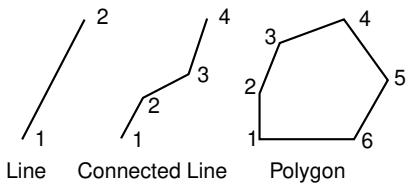

You should take care positioning points while sketching because this positioning can affect the quality of your mesh. Points in the sketch become vertices of the part you are creating or modifying. In turn, when you mesh your model in the Mesh module, Abaqus/CAE converts these vertices into fully constrained seeds and places nodes at their location. For information on how to subsequently move vertices, see Dragging Sketcher objects.

1. From the line tools in the Sketcher toolbox, select the connected lines tool . For a diagram of the tools in the Sketcher toolbox, see The Sketcher tools.

Abaqus/CAE displays prompts in the prompt area to guide you through the procedure.

2. To construct a simple line, click the two end points. To construct a connected line or a polygon, click each vertex.


Tip: If necessary, you can use the text box in the prompt area to enter the precise coordinates of the vertices of the line. For more information on precisely defining the line, see Specifying precise geometry.

The line or polygon appears as you click a vertex or enter the coordinates.

3. To complete the line or polygon, click mouse button 2.


Tip: If you make a mistake while constructing a connected line or a polygon, click the Undo tool S in the Sketcher toolbox to delete the most recent line segment. If you make a mistake

in an earlier segment, you can delete the incorrect segments using the Delete tool and redraw them with the line tool.

4. To create more lines or polygons, repeat the above steps beginning with Step 2.  
5. When you have finished creating lines and polygons, do one of the following:

• Click mouse button 2 anywhere in the Abaqus/CAE window.  
• Select any other tool in the Sketcher toolbox.  
• Click the cancel button in the prompt area.

## Additional information

• Sketching simple objects  
• Creating construction geometry

• Modifying objects  
• Undoing and redoing sketching actions

## Sketching rectangles

Use the rectangle tool from the Sketcher toolbox to draw rectangles.

To draw a rectangle, click at any two opposite corners as indicated by the numbering in the following figure.


You should take care positioning points while sketching because this positioning can affect the quality of your mesh. Points in the sketch become vertices of the part you are creating or modifying. In turn, when you mesh your model in the Mesh module, Abaqus/CAE converts these vertices into fully constrained seeds and places nodes at their location. For information on how to subsequently move vertices, see Dragging Sketcher objects.

1. From the line tools in the Sketcher toolbox, select the rectangle tool For a diagram of the tools in the Sketcher toolbox, see The Sketcher tools.

Abaqus/CAE displays prompts in the prompt area to guide you through the procedure.

2. Click the desired locations of any two opposite corners of the rectangle.


Tip: If necessary, you can use the text box in the prompt area to enter the precise coordinates of the corners of the rectangle. For more information on precisely defining the rectangle, see Specifying precise geometry.

The rectangle appears, aligned with the current Sketcher grid, as you move the cursor or enter the coordinates.

3. To create more rectangles, repeat the previous step.  
4. When you have finished creating rectangles, do one of the following:

• Click mouse button 2 anywhere in the Abaqus/CAE window.  
• Select any other tool in the Sketcher toolbox.  
• Click the cancel button in the prompt area.

## Additional information

• Realigning the sketch grid  
• Sketching simple objects  
• Creating construction geometry  
• Modifying objects  
• Undoing and redoing sketching actions

## Sketching circles

Use the circle tool from the Sketcher toolbox to draw circles based on a center point and any arbitrary point on the circumference of the circle.

An example of using the circle tool from the Sketcher toolbox is shown here:


You should take care positioning points while sketching because this positioning can affect the quality of your mesh. Points in the sketch become vertices of the part you are creating or modifying. In turn, when you mesh your model in the Mesh module, Abaqus/CAE converts these vertices into fully constrained seeds and places nodes at their location. For information on how to subsequently move vertices, see Dragging Sketcher objects.

1. From the Sketcher toolbox, select the circle tool . For a diagram of the tools in the Sketcher toolbox, see The Sketcher tools.

Abaqus/CAE displays prompts in the prompt area to guide you through the procedure.

2. Click at the desired location of the center of the circle.  
3. Move the cursor to a point on the circumference of the circle.

Abaqus/CAE displays a preview of the circle that would be created using the current cursor position.

4. Click any point on the circumference of the desired circle.


Tip: If necessary, you can use the text box in the prompt area to enter the precise coordinates of the center and the point on the circumference of the circle. For more information on precisely defining the circle, see Specifying precise geometry.

Abaqus/CAE draws the circle.

5. To create more circles, repeat the above steps beginning with Step 2.  
6. When you have finished creating circles, do one of the following:

• Click mouse button 2 anywhere in the Abaqus/CAE window.  
• Select any other tool in the Sketcher toolbox.  
• Click the cancel button in the prompt area.

## Additional information

• Sketching simple objects  
• Creating construction geometry  
• Modifying objects  
• Undoing and redoing sketching actions

## Sketching arcs using a center point and two endpoints

Use the Center with Two Endpoints arc tool from the Sketcher toolbox to draw arcs using a center point and two endpoints.

The following figure shows the resulting arc:


An arc that forms part of an analytical rigid surface cannot subtend an angle greater than 180°. If necessary, append two arcs to create an arc that subtends an angle of more than 180°. There is no such limitation for deformable bodies or discrete rigid surfaces.

You should take care positioning points while sketching because this positioning can affect the quality of your mesh. Points in the sketch become vertices of the part you are creating or modifying. In turn, when you mesh your model in the Mesh module, Abaqus/CAE converts these vertices into fully constrained seeds and places nodes at their location. For information on how to subsequently move vertices, see Dragging Sketcher objects.

1. From the arc tools in the Sketcher toolbox, select the Center with Two Endpoints arc tool . For a diagram of the tools in the Sketcher toolbox, see The Sketcher tools.

Abaqus/CAE displays prompts in the prompt area to guide you through the procedure.

2. Click at the center of the desired arc.  
3. Click the first endpoint to define the radius of the arc.


Tip: If necessary, you can use the text box in the prompt area to enter the precise coordinates of the center and the endpoints of the arc. For more information on precisely defining the arc, see Specifying precise geometry.

Abaqus/CAE draws a circle showing the radius of the arc as you move the cursor from the center of the arc to its first endpoint.

4. Move the cursor clockwise from the first endpoint to draw the arc in a clockwise direction. Move the cursor counterclockwise from the first endpoint to draw the arc in a counterclockwise direction. Click the second endpoint to define the length of the arc. If you start drawing the arc and then decide to change its direction, you must return to the first endpoint and move the cursor in the desired direction toward the second endpoint.

Step 2 and Step 3 define the center of the arc and the radius of the arc, respectively. The point that you select in Step 4 defines only the length of the arc, and the point may not lie on the arc. If you want the arc to pass through a vertex of the sketch, you should select that vertex when you click the first endpoint in Step 3.


Tip: If necessary, click the Previous button to reverse the selection of the endpoints.

5. To create more arcs, repeat the above steps beginning with Step 2.

6. When you have finished creating arcs, do one of the following:

• Click mouse button 2 anywhere in the Abaqus/CAE window.  
• Select any other tool in the Sketcher toolbox.  
• Click the cancel button in the prompt area.

## Additional information

• Sketching simple objects  
• Creating construction geometry  
• Modifying objects  
• Undoing and redoing sketching actions

## Sketching arcs through three points

Use the Through Three Points arc tool from the Sketcher toolbox to draw arcs through three noncolinear points.

The following figure shows the resulting arc:


When you draw an arc using the Through Three Points method, you should consider the same angle size and point selection prerequisites as described in Sketching arcs using a center point and two endpoints.

1. From the arc tools in the Sketcher toolbox, select the Through Three Points arc tool . For a diagram of the tools in the Sketcher toolbox, see The Sketcher tools.  
Abaqus/CAE displays prompts in the prompt area to guide you through the procedure.

2. Click the two points that you want to use as the endpoints of the arc.


Tip: If necessary, you can use the text box in the prompt area to enter the precise coordinates of the endpoints. For more information on precisely defining the arc, see Specifying precise geometry.

Abaqus/CAE draws a sample arc with a predetermined radius as you select the second endpoint of the arc. You change this sample radius when you select the third point.

3. Move the cursor to the third point on the arc, and click mouse button 1.

Abaqus/CAE draws an arc joining the endpoints and passing through the selected point.


Tip: If necessary, click the Previous button to reverse the selection of either endpoint. Clicking one enables you to reverse the selection of the second endpoint; clicking twice reverses the selection of the first endpoint as well.

4. To create more arcs, repeat the above steps beginning with Step 2.  
5. When you have finished creating arcs, do one of the following:

• Click mouse button 2 anywhere in the Abaqus/CAE window.  
• Select any other tool in the Sketcher toolbox.  
• Click the cancel button in the prompt area.

## Additional information

• Sketching simple objects

• Creating construction geometry  
• Modifying objects  
• Undoing and redoing sketching actions

## Sketching arcs tangent to a line

Use the tangent arc tool from the Sketcher toolbox to draw an arc that is tangent to a line or curve at a selected point and ends at a second selected point, as illustrated in the following figure:


You should take care positioning points while sketching because this positioning can affect the quality of your mesh. Points in the sketch become vertices of the part you are creating or modifying. In turn, when you mesh your model in the Mesh module, Abaqus/CAE converts these vertices into fully constrained seeds and places nodes at their location. For information on how to subsequently move vertices, including those that define arcs, see Dragging Sketcher objects.

1. From the arc tools in the Sketcher toolbox, select the tangent arc tool . For a diagram of the tools in the Sketcher toolbox, see The Sketcher tools.

Abaqus/CAE displays prompts in the prompt area to guide you through the procedure.

2. Select the point along the line or curve. The arc will be tangent-continuous at this point.

If you start the arc at the endpoint of a line, a spline, or a second arc, the new arc is tangent-continuous at the endpoint. If you start the arc at a point in space (where there is no endpoint), the arc is tangent to the positive X-axis. If more than one line or curve meets at the point, the arc will be tangent to the one that was created first.

3. The radius of the arc changes as you move the cursor. Click at the desired endpoint.


Tip: If necessary, you can use the text box in the prompt area to enter the precise coordinates of the tangent point and the endpoint of the arc. For more information on creating the desired arc, see Specifying precise geometry.

4. To create more arcs, repeat the above steps beginning with Step 2.  
5. When you have finished creating tangent arcs, do one of the following:

• Click mouse button 2 anywhere in the Abaqus/CAE window.  
• Select any other tool in the Sketcher toolbox.

• Click the cancel button in the prompt area.

## Additional information

• Sketching simple objects  
• Creating construction geometry  
• Modifying objects  
• Undoing and redoing sketching actions

## Sketching ellipses

Use the ellipse tool from the Sketcher toolbox to draw ellipses based on a center point, an axis endpoint, and an arbitrary point whose distance from the first axis determines the length of the second axis.

An example of using the ellipse tool from the Sketcher toolbox is shown here:


You should take care positioning points while sketching because this positioning can affect the quality of your mesh. The center point and the first axis point in the sketch become vertices of the part you are creating. In turn, when you mesh your model in the Mesh module, Abaqus/CAE converts these vertices into fully constrained seeds and places nodes at their location. For information on how to subsequently move vertices, see Dragging Sketcher objects.

You cannot edit the size of an ellipse by moving its vertices. To edit the size of an ellipse, create a radial dimension and then edit that dimension. The radial dimension for an ellipse includes both the major and minor radius.

1. From the Sketcher toolbox, select the ellipse tool . For a diagram of the tools in the Sketcher toolbox, see The Sketcher tools.  
Abaqus/CAE displays prompts in the prompt area to guide you through the procedure.  
2. Click at the desired location of the center of the ellipse.  
3. Move the cursor to the endpoint of the first axis of the ellipse.  
Abaqus/CAE displays an ellipse that could be created using the current cursor position to define the major axis and rotation.  
4. Click a point to define the endpoint of one axis. The point that you select can be either the major or minor axis endpoint.


Tip: If necessary, you can use the text box in the prompt area to enter the precise coordinates of the center and the first axis endpoint of the ellipse. For more information on precisely defining geometry, see Specifying precise geometry.

Abaqus/CAE sets the rotation of the ellipse and the endpoint of the first axis.

5. Click a point to define the length of the second axis. The point you select defines the distance from the first axis to the end of the second axis. The point does not need to lie on the second axis, and it cannot lie along the first axis since this would create a second axis of length 0.

Abaqus/CAE creates the ellipse.

6. To create more ellipses, repeat the above steps beginning with Step 2.

7. When you have finished creating ellipses, do one of the following:

• Click mouse button 2 anywhere in the Abaqus/CAE window.  
• Select any other tool in the Sketcher toolbox.  
• Click the cancel button in the prompt area.

## Additional information

• Sketching simple objects  
• Creating construction geometry  
• Modifying objects  
• Undoing and redoing sketching actions

## Sketching fillets between two lines

Use the fillet tool from the Sketcher toolbox to draw fillets between two lines or circles.

Enter the radius of the fillet and select the two lines or circles as shown here:

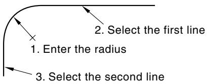

Construction geometry illustrates how you can create a fillet tangent to two construction circles.

You should take care positioning points while sketching because this positioning can affect the quality of your mesh. Points in the sketch become vertices of the part you are creating or modifying. In turn, when you mesh your model in the Mesh module, Abaqus/CAE converts these vertices into fully constrained seeds and places nodes at their location. For information on how to subsequently move vertices, see Dragging Sketcher objects.

If you create a fillet and subsequently move the selected lines or circles, Abaqus/CAE will move the fillet and maintain the tangency.

1. From the Sketcher toolbox, select the fillet tool . For a diagram of the tools in the Sketcher toolbox, see The Sketcher tools.

Abaqus/CAE displays prompts in the prompt area to guide you through the procedure.

2. In the text box that appears in the prompt area, enter the radius of the desired fillet.  
3. Select the two lines or circles (not arcs) to which the fillet must remain tangent.

The fillet appears between the two lines or circles.


Tip: When you select a line or circle from the sketch, Abaqus/CAE uses the cursor position to determine the location of the fillet. To create the desired fillet, you should position the cursor close to the expected location of the fillet when making a selection.

4. To create more fillets of the same radius, repeat the previous step.  
5. When you have finished creating fillets, do one of the following:

• Click mouse button 2 anywhere in the Abaqus/CAE window.  
• Select any other tool in the Sketcher toolbox.  
• Click the cancel button in the prompt area.

## Additional information

• Sketching simple objects  
• Creating construction geometry  
• Modifying objects  
• Undoing and redoing sketching actions

## Sketching splines

Use the spline tool from the Sketcher toolbox to draw a spline curve connecting a series of points. Abaqus/CAE calculates the shape of the curve using a cubic spline fit between all points along the spline; in addition, the first and second derivatives of the spline are continuous. As you create the spline, you can influence the shape of the curve by placing the vertices closer or farther apart. However, you cannot add or remove vertices from a spline after you have drawn it; you must delete the spline and create a new one with the desired number of vertices. You can use the Modify tools to move the original vertices. Only the endpoints of a spline become vertices of the part you are creating or modifying; intermediate points of the spline do not appear outside the Sketcher.

If you want the spline to start tangent to an existing line, at the start of the spline create two adjacent vertices that are colinear with the line. This method is useful for creating smooth rigid surfaces, as illustrated in the following figure:


When you create an analytical rigid surface, you sketch a sequence of lines, arcs, and parabolas to define its profile. To create a parabolic curve, sketch a spline defined by only three vertices.

1. From the Sketcher toolbox, select the spline tool . For a diagram of the tools in the Sketcher toolbox, see The Sketcher tools.  
Abaqus/CAE displays prompts in the prompt area to guide you through the procedure.

2. To construct a spline, click each vertex.


Tip: If necessary, you can use the text box in the prompt area to enter the precise coordinates of each vertex of the spline. For more information on creating the desired spline, see Specifying precise geometry.

The spline appears as you click each vertex or enter each coordinate, and Abaqus/CAE adjusts the curve to maintain a cubic spline between all points.


Tip: If you make a mistake while constructing a spline, you can click the Previous button to step back to the previous vertex. Alternatively, you can click the Undo button in the Sketcher toolbox to delete the entire spline.

3. To complete the spline, click mouse button 2.  
4. To create more splines, repeat the above steps beginning with step 2.  
5. When you have finished creating splines, do one of the following:

Click mouse button 2 anywhere in the Abaqus/CAE window.•  
• Select any other tool in the Sketcher toolbox.  
X • Click the cancel button in the prompt area.

## Additional information

• Sketching simple objects  
• Creating construction geometry  
• Modifying objects  
• Undoing and redoing sketching actions

## Creating construction geometry

This section describes each of the Sketcher tools used to create construction geometry. Construction geometry is used to help you create and align objects in your sketch and to define the axis of rotation for revolved solids and surfaces.

## In this section:

Creating a horizontal construction line  
Creating a vertical construction line  
Creating an oblique construction line  
Creating angled construction lines  
Creating a construction circle  
Setting sketch components as construction geometry

## Creating a horizontal construction line

Use the horizontal construction line tool from the Sketcher toolbox to help position and align objects along a horizontal line.

Horizontal construction lines are created parallel to the X-axis of the Sketcher grid. Rotating the Sketcher grid does not affect existing horizontal construction lines, but new horizontal construction lines are aligned with the rotated grid. The following figure illustrates how a horizontal construction line and a set of vertical construction lines can be used to align circle centers. (Dashed lines indicate construction geometry.)


You can also use a horizontal construction line to define the axis of rotation for revolved solids and surfaces.

1. From the construction tools in the Sketcher toolbox, select the horizontal construction tool . For a diagram of the tools in the Sketcher toolbox, see The Sketcher tools.  
The horizontal construction line moves vertically as you move the cursor around the Sketcher sheet. Abaqus/CAE displays prompts in the prompt area to guide you through the procedure.  
2. Click a point that will lie on the horizontal construction line. Alternatively, you can type its X–Y coordinates in the text field that appears in the prompt area. (The X-coordinate is arbitrary since it is ignored.)  
3. To create additional horizontal construction lines, repeat the previous step.  
4. When you have finished creating horizontal construction lines, do one of the following:

• Click mouse button 2 anywhere in the Abaqus/CAE window.  
• Select any other tool in the Sketcher toolbox.  
• Click the cancel button in the prompt area.

## Additional information

• Construction geometry  
• Realigning the sketch grid  
• Sketching simple objects  
• Creating construction geometry  
• Modifying objects  
• Undoing and redoing sketching actions

## Creating a vertical construction line

Use the vertical construction line tool from the Sketcher toolbox to help position and align objects along a vertical line.

Vertical construction lines are created parallel to the Y-axis of the Sketcher grid. Rotating the Sketcher grid does not affect existing vertical construction lines, but new vertical construction lines are aligned with the rotated grid. The following figure illustrates how a horizontal construction line and a set of vertical construction lines can be used to align circle centers. (Dashed lines indicate construction geometry.)

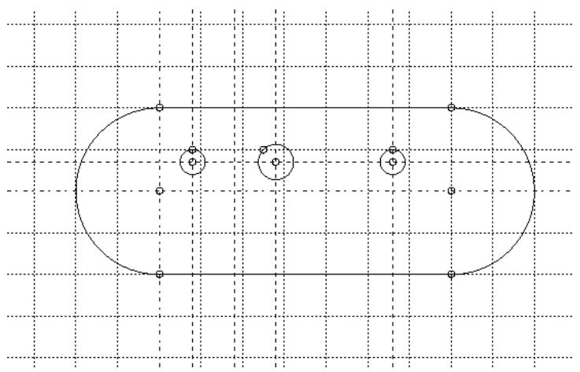

You can also use a vertical construction line to define the axis of rotation for revolved solids and surfaces.

1. From the construction tools in the Sketcher toolbox, select the vertical construction tool . For a diagram of the tools in the Sketcher toolbox, see The Sketcher tools.

The vertical construction line moves horizontally as you move the cursor around the Sketcher sheet. Abaqus/CAE displays prompts in the prompt area to guide you through the procedure.

2. Click a point that will lie on the vertical construction line. Alternatively, you can type its X–Y coordinates in the text field that appears in the prompt area. (The Y-coordinate is arbitrary since it is ignored.)  
3. To create additional vertical construction lines, repeat the previous step.  
4. When you have finished creating vertical construction lines, do one of the following:

• Click mouse button 2 anywhere in the Abaqus/CAE window.  
• Select any other tool in the Sketcher toolbox.  
• Click the cancel button in the prompt area.

## Additional information

• Construction geometry  
• Realigning the sketch grid  
• Sketching simple objects  
• Creating construction geometry  
• Modifying objects  
• Undoing and redoing sketching actions

## Creating an oblique construction line

Use the oblique construction line tool from the Sketcher toolbox to help position and align objects along an arbritrary oblique line defined by two points.

The following figure illustrates how an oblique construction line and a set of vertical construction lines can be used to align circle centers:

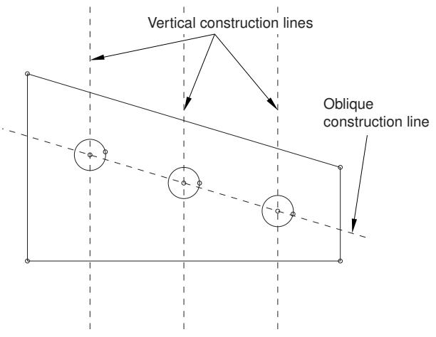

You can also use an oblique construction line to define the axis of rotation for revolved solids and surfaces.

1. From the construction tools in the Sketcher toolbox, select the oblique construction tool . For a diagram of the tools in the Sketcher toolbox, see The Sketcher tools.  
Abaqus/CAE displays prompts in the prompt area to guide you through the procedure.

2. Click two points that will lie on the oblique construction line. Alternatively, you can type their X–Y coordinates in the text field that appears in the prompt area.

The oblique construction line appears when you select the first point. The line rotates about this point until you select the second point.

3. To create additional oblique construction lines, repeat the previous step.

4. When you have finished creating oblique construction lines, do one of the following:

• Click mouse button 2 anywhere in the Abaqus/CAE window.  
• Select any other tool in the Sketcher toolbox.

• Click the cancel button in the prompt area.

## Additional information

• Construction geometry  
• Sketching simple objects  
• Creating construction geometry  
• Modifying objects  
• Undoing and redoing sketching actions

## Creating angled construction lines

Use the angled construction line tool from the Sketcher toolbox to help position and align objects along a line running at a specified angle to the X-axis of the Sketcher grid.

Rotating the Sketcher grid does not affect existing angled construction lines, but new angled construction lines are measured from the X-axis of the rotated grid. The following figure illustrates how an angled construction line and a pair of vertical construction lines can be used to position the vertices of a rectangle. (Dashed lines indicate construction geometry.)

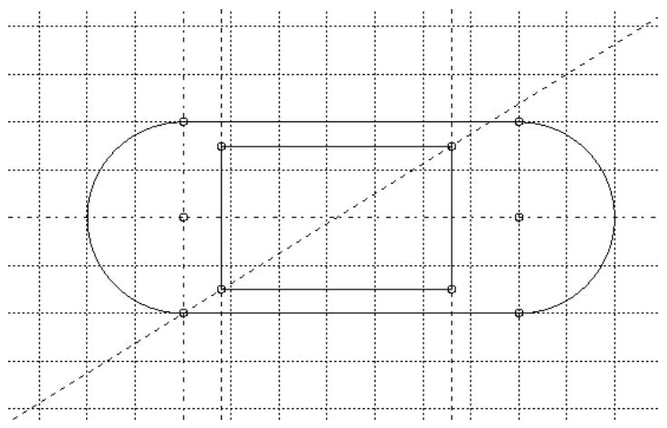

You can also use an angled construction line to define the axis of rotation for revolved solids and surfaces.

1. From the construction tools in the Sketcher toolbox, select the angled construction line tool For a diagram of the tools in the Sketcher toolbox, see The Sketcher tools.  
Abaqus/CAE displays prompts in the prompt area to guide you through the procedure.  
2. In the text box that appears in the prompt area, enter an angle value in degrees. Positive angles are measured counterclockwise from the horizontal axis, and negative angles are measured clockwise from the horizontal axis.  
The construction line moves as you move the cursor around the Sketcher sheet.  
3. Click a point that will lie on the angled construction line. Alternatively, you can type its X–Y coordinates in the text field that appears in the prompt area.  
4. To create additional angled construction lines, repeat the above steps beginning with Step 2.  
5. When you have finished creating angled construction lines, do one of the following:

• Click mouse button 2 anywhere in the Abaqus/CAE window.  
• Select any other tool in the Sketcher toolbox.  
• Click the cancel button in the prompt area.

## Additional information

• Construction geometry  
• Realigning the sketch grid  
• Sketching simple objects  
• Creating construction geometry

• Modifying objects  
• Undoing and redoing sketching actions

## Creating a construction circle

Use the construction circle tool from the Sketcher toolbox to help position and align objects around a circle.

The following figure illustrates how a construction circle and a pair of angled construction lines can be used to position the centers of two circles. (Dashed lines indicate construction geometry.)


1. From the construction tools in the Sketcher toolbox, select the construction circle tool . For a diagram of the tools in the Sketcher toolbox, see The Sketcher tools.  
Abaqus/CAE displays prompts in the prompt area to guide you through the procedure.

2. Click at the desired location of the center of the construction circle. Alternatively, you can type the X–Y coordinates of the circle center in the text field that appears in the prompt area.

The radius of the construction circle changes as you move the cursor around the Sketcher sheet.

3. Click a point that will lie on the circumference of the construction circle, or type its X–Y coordinates in the prompt area.

Abaqus/CAE creates the construction circle using the point you specified.

4. To create more construction circles, repeat the above steps beginning with Step 2.

5. When you have finished creating construction circles, do one of the following:

• Click mouse button 2 anywhere in the Abaqus/CAE window.

• Select any other tool in the Sketcher toolbox.

• Click the cancel button in the prompt area.

## Additional information

• Construction geometry  
• Sketching simple objects  
• Creating construction geometry  
• Modifying objects  
• Undoing and redoing sketching actions

## Setting sketch components as construction geometry

Use the Set as Construction tool from the Sketcher toolbox to convert a component of your sketch into construction geometry. The Unset Construction tool reverses this process for items that had been converted to construction geometry. You can unset construction geometry components only if they were converted to construction geometry using the Set as Construction tool; items that were added to the sketch as construction geometry cannot be unset.

## Additional information

• Construction geometry  
• Sketching simple objects  
• Creating construction geometry  
• Modifying objects  
• Undoing and redoing sketching actions

## Set items in a sketch as construction geometry

diagram of the tools in the Sketcher toolbox, see The Sketcher tools.

Abaqus/CAE displays prompts in the prompt area to guide you through the procedure.

2. Select the sketch item or items that you want to set as construction geometry. You can drag-select, [Shift] + Click, or [Ctrl] + Click to select multiple items.

Abaqus/CAE indicates the items you select by coloring them red.

3. To complete the conversion, click Done in the prompt area or click mouse button 2 anywhere in the Abaqus/CAE window.

Abaqus/CAE displays the items you selected with dashed lines, indicating that they are now construction geometry.

4. When you have finished selecting geometry to convert to construction geometry, do one of the following:

• Click mouse button 2 anywhere in the Abaqus/CAE window.  
• Select any tool in the Sketcher toolbox.

• Click the cancel button in the prompt area.

## Unset construction geometry items

1. From the construction tools in the Sketcher toolbox, select the Unset Construction too l . For a diagram of the tools in the Sketcher toolbox, see The Sketcher tools.

Abaqus/CAE displays prompts in the prompt area to guide you through the procedure.

2. Select one or more construction geometry items. You can drag-select, [Shift] + Click, or [Ctrl] + Click to select multiple items. All construction geometry is displayed in the sketch with dashed lines. Abaqus/CAE indicates the items you select by coloring them red.  
3. To complete the conversion, click Done in the prompt area or click mouse button 2 anywhere in the Abaqus/CAE window.

Abaqus/CAE displays the items you selected with solid lines, indicating that they are not construction geometry.

4. When you have finished selecting construction geometry items that you want to revert, do one of the following:

• Click mouse button 2 anywhere in the Abaqus/CAE window.  
• Select any tool in the Sketcher toolbox.  
• Click the cancel button in the prompt area.

## Constraining, dimensioning, and parameterizing a sketch

This section describes each of the Sketcher tools used to add constraints, dimensions, and parameters to sketches. You can use these tools to create relationships between individual entities in a sketch or to create a fully constrained and parametric sketch.

## In this section:

Automatically constraining a sketch  
Automatically dimensioning a sketch  
Adding individual constraints  
Adding individual dimensions  
Adding and editing parameters  
Creating parametric equations

## Automatically constraining a sketch

Adding constraints to a sketch helps you finalize the shape of a sketched feature. Abaqus/CAE can apply constraints to your sketch automatically. You can use the sketcher options to select the types of constraints that Abaqus/CAE can add to the sketch. (For more information, see Customizing the use of constraints in the Sketcher.)

1. From the tools in the Sketcher toolbox, select the auto-constrain tool . For a diagram of the tools in the Sketcher toolbox, see The Sketcher tools.

Abaqus/CAE displays prompts in the prompt area to guide you through the procedure.

2. Select the entities to be constrained.


## Note:

You can select the entire sketch; Abaqus/CAE will not duplicate any existing constraints.

3. Click Done in the prompt area.

Abaqus/CAE creates the constraints on the sketch. Sketch modification tools such as translate, rotate, scale, and mirror can override constraints.

4. If desired, use the Delete tool to remove any unwanted constraints. For more information, see Deleting Sketcher objects.

## Additional information

• Controlling sketch geometry  
• Constraining, dimensioning, and parameterizing a sketch  
• Customizing the use of constraints in the Sketcher

## Automatically dimensioning a sketch

Adding dimensions to a sketch helps you finalize the size and shape of a sketched feature. Abaqus/CAE can apply dimensions to your sketch automatically. You can use the sketcher options to select the types of dimensions that Abaqus/CAE can add to the sketch. (For more information, see Customizing the format and use of dimensions in the Sketcher.)

1. From the tools in the Sketcher toolbox, select the auto-dimension tool . For a diagram of the tools in the Sketcher toolbox, see The Sketcher tools.  
Abaqus/CAE displays prompts in the prompt area to guide you through the procedure.

2. Select the entities to be dimensioned.


## Note:

You can select the entire sketch; Abaqus/CAE will not duplicate any existing dimensions.

3. Toggle on Auto-Constrain if you also want Abaqus/CAE to create constraints automatically for the selected entities.  
4. Click Done in the prompt area.  
Abaqus/CAE creates the dimensions—and constraints, if selected—on the sketch.  
5. If desired, use the drag tool to move dimensions that appear within the sketched feature and use the delete tool to remove any unwanted dimensions or constraints. For more information, see Dragging Sketcher objects, and Deleting Sketcher objects, respectively.

## Additional information

• Controlling sketch geometry  
• Constraining, dimensioning, and parameterizing a sketch  
• Customizing the format and use of dimensions in the Sketcher  
• Customizing the use of constraints in the Sketcher

## Adding individual constraints

A constraint is a logical relationship between entities in a sketch. Constraints control Sketcher geometry by removing degrees of freedom from the sketch. The various constraint types are described in Using constraints to control sketch geometry. To change constrained geometry, you must either work within the defined constraints or modify the constraints to accept your changes. You can also constrain a sketch automatically using the Auto-Constrain tool. For more information, see Automatically constraining a sketch.

1. From the tools in the Sketcher toolbox, select the constraint tool . For a diagram of the tools in the Sketcher toolbox, see The Sketcher tools.  
Abaqus/CAE opens the Add Constraint dialog box.  
2. Select the type of constraint that you want to add to the sketch, and click Apply.  
Abaqus/CAE displays prompts in the prompt area to guide you through the procedure.  
3. Select the entity or entities to create the constraint.  
Abaqus/CAE creates the constraint and displays the appropriate constraint symbol on the sketch. Sketch modification tools such as translate, rotate, scale, and mirror can override constraints.  
4. To create additional constraints, repeat the above steps beginning with Step 2.  
5. When you have finished creating constraints, click Cancel to close the Add Constraint dialog box.

## Additional information

• Using constraints to control sketch geometry  
• Constraining, dimensioning, and parameterizing a sketch  
• Customizing the use of constraints in the Sketcher

Dimensions are a specialized form of constraints; where constraints create a logical relationship between Sketcher entities, dimensions create a numerical relationship. Dimensions add clarity to your sketches and allow you to position objects precisely. Use the dimension tool from the Sketcher toolbox to add individual dimensions to a sketch. You can also dimension a sketch automatically using the Auto-Dimension tool. For more information, see Automatically dimensioning a sketch.

The dimension tool is interactive; Abaqus/CAE uses preselection and the Sketcher entities that you select to display a preview of the dimension that will be created. If the dimension type shown is not the type that you want to create, move the cursor to another location. Once you accept the dimension type and position, you can enter a new dimension value.


## Note:

The interactive function of the dimension tool is available only if preselection is active. Preselection is toggled on by default in the Sketcher Options dialog box. (For more information , see The Sketcher cursors and preselection.)

1. From the tools in the Sketcher toolbox, select the dimension tool . For a diagram of the tools in the Sketcher toolbox, see The Sketcher tools.

Abaqus/CAE displays prompts in the prompt area to guide you through the procedure.

2. Select the first entity to dimension.

Abaqus/CAE prompts you according to your selection:

## Vertex

Abaqus/CAE prompts you to select another vertex or line for the dimension. Select a line to dimension the distance between the vertex and the line. Select a vertex to dimension the horizontal, vertical, or oblique distance between the selected points—the type of dimension Abaqus/CAE creates is based on the position of the second vertex and the cursor position.

Abaqus/CAE creates a preview of the dimension that will be created and its location based on the cursor position. Horizontal or vertical dimensions values between two vertices are preceded by an H or V, respectively.

## Line

Abaqus/CAE prompts you to select a location for the default length dimension. To create a different type of dimension, move the cursor over other entities in the sketch; Abaqus/CAE creates a preview of the appropriate dimension type for the relation between the selected line and the preselected entity. Click on the desired entity to accept the displayed type of dimension.

## Circle or circular arc

Abaqus/CAE prompts you to select a location for the radial dimension. No other entity selections are available.

3. Move the cursor to the location where you would like the dimension to appear; click when you are satisfied with the appearance of the dimension.  
4. If desired, edit the dimension value in the prompt area; press Enter or click mouse button 2 to accept the dimension value.

Abaqus/CAE creates the dimension on the sketch. If necessary, vertices are moved to comply with the edited dimension value and any other constraints in the sketch.

5. To create additional dimensions, repeat the above steps beginning with Step 2.  
6. When you have finished creating dimensions, do one of the following:

• Click mouse button 2 anywhere in the Abaqus/CAE window.  
• Select any tool in the Sketcher toolbox.  
• Click the cancel button in the prompt area.

## Additional information

• Controlling sketch geometry  
• Constraining, dimensioning, and parameterizing a sketch  
• Editing dimensions  
• Specifying precise geometry  
• Modifying objects by changing dimensions or adding parameters  
• Customizing the format and use of dimensions in the Sketcher

## Adding and editing parameters

Parameters are constraints that have variable names. They can have either numerical values or values based on the result of mathematical expressions involving other parameters—parametric equations. Parameters can be associated with dimensions in the current sketch, or they can be numerical constants and expressions independent of the sketch. The value of parameters associated with dimensions directly affect the sketch, whereas independent parameters affect the sketch only if you use them to create expressions for parameters that are in the sketch.

You add and edit parameters using the Parameter Manager. You can use the Dimension button to create new parameters by selecting dimensions, or you can add independent parameters by typing them in blank lines in the manager.

. For a diagram of the tools in the Sketcher toolbox, see The Sketcher tools.

The Parameter Manager appears.


Tip: You can also open the Parameter Manager by selecting Edit->Parameter Manager from the main menu bar or by using the f(x) button in the Edit Dimension dialog box.

2. Click Dimension, and select dimensions from the sketch to associate them with new parameters.

Abaqus/CAE adds the new parameters to the Parameter Manager using default names of the form dimension\_x.

3. Click on a cell in the Name column to edit an existing name, or add a new parameter name by editing a blank cell.

If the selected parameter is associated with a dimension, Abaqus/CAE highlights the parameter in the sketch.

4. Click on a cell in the Expression column to edit it directly in the cell or to select it for editing with the Expression Builder.

You must define all the parameters that you want to use in an expression prior to defining the expression.


Tip: Use the buttons on the right side of the manager to insert, rearrange, or delete rows.

5. If desired, use the Expression Builder to edit the expression. For detailed instructions, see Creating parametric equations.  
6. Click Apply in the Parameter Manager to implement your changes in the sketch.

Abaqus/CAE updates the sketch with any new expression values and, if Show parameter names is toggled on in the Sketcher Options, displays the revised parameter names.

## Additional information

• Specifying precise geometry  
• Modifying objects by changing dimensions or adding parameters  
• Using parameters to control sketch geometry  
• Editing dimensions  
• Customizing the format and use of dimensions in the Sketcher

## Creating parametric equations

Parametric equations are mathematical expressions relating different quantities in a sketch. The Expression Builder helps you create parametric equations using the parameters in your sketch. For example, if you want the width of a Sketcher object to be twice its length, you can associate the dimensions with parameters and use the Expression

Builder to create the parametric equation .

You can use the following operators to create parametric equations:

## Mathematical operations:

<table><tr><td>+</td><td>Add.</td></tr><tr><td>-</td><td>Subtract.</td></tr><tr><td>*</td><td>Multiply.</td></tr><tr><td>/</td><td>Divide.</td></tr><tr><td>1/A</td><td>Divide 1 by the parameter, value, or expression.</td></tr><tr><td>abs(A)</td><td>Take the absolute value of the parameter, value, or expression.</td></tr><tr><td>sqrt(A)</td><td>Take the square root of the parameter, value, or expression.</td></tr></table>

## Trigonometric operations:

<table><tr><td>cos(A)</td><td>Take the cosine of the parameter, value, or expression.</td></tr><tr><td>acos(A)</td><td>Take the arccosine of the parameter, value, or expression.</td></tr><tr><td>cosh(A)</td><td>Take the hyperbolic cosine of the parameter, value, or expression.</td></tr><tr><td>sin(A)</td><td>Take the sine of the parameter, value, or expression.</td></tr><tr><td>asin(A)</td><td>Take the arcsine of the parameter, value, or expression.</td></tr><tr><td>sinh(A)</td><td>Take the hyperbolic sine of the parameter, value, or expression.</td></tr><tr><td>tan(A)</td><td>Take the tangent of the parameter, value, or expression.</td></tr><tr><td>atan(A)</td><td>Take the arctangent of the parameter, value, or expression.</td></tr><tr><td>tanh(A)</td><td>Take the hyperbolic tangent of the parameter, value, or expression.</td></tr></table>

## Logarithmic and exponential operations:

<table><tr><td>exp(A)</td><td>Take the exponential of the parameter, value, or expression.</td></tr><tr><td>log(A)</td><td>Take the natural log of the parameter, value, or expression.</td></tr><tr><td>log10(A)</td><td>Take the base 10 log of the parameter, value, or expression.</td></tr></table>

1. With an expression highlighted in the Parameter Manager, click Expression Builder. Abaqus/CAE opens the Expression Builder dialog box.  
2. From the Operators list, select the desired operation. The operator appears within the expression window.

3. From the Parameter Name choices, click the name of the parameter on which to operate and click Add to Expression. You can choose from all parameters that appear above the parameter that you are defining in the Parameter Manager.  
The parameter name appears within the expression window.  
4. Repeat Steps 2 and 3 as needed to complete the expression. In some cases you may need to reposition the cursor to correctly place the next portion of the expression.  
5. When you are finished, click OK to save your changes and to close the dialog box. Abaqus/CAE updates the expression and the current value in the Parameter Manager.

## Additional information

• Adding and editing parameters

• Editing dimensions

• Customizing the format and use of dimensions in the Sketcher

## Editing dimensions

Dimensions in Abaqus/CAE are used to precisely control sizes and distances, to annotate reference values, and to create parameters that are, in turn, used to define equations relating different pieces of geometry. You can edit any dimension in a sketch as follows:

• Change the dimension value. Changing a dimension value modifies the associated Sketcher geometry.  
• Designate the dimension as a reference dimension. Reference dimensions indicate quantities whose values are controlled elsewhere in the same sketch or dimensions of reference geometry that are controlled in another sketch.  
• Associate the dimension with a parameter. Parameters control Sketcher geometry by defining relationships between different pieces of geometry, including reference geometry.

The effects of modifying a dimension depend on how the dimension is used in the sketch. For example, if a radius has an equal radius constraint, editing the radius dimension will change all of the constrained radii. Likewise, if a dimension is associated with a parameter, editing its value will change the value of all the parameters that refer to it. For more information on constraints, dimensions, and parameters, see Controlling sketch geometry.

1. From the tools in the Sketcher toolbox, select the dimension modification tool . For a diagram of the tools in the Sketcher toolbox, see The Sketcher tools.  
Abaqus/CAE displays prompts in the prompt area to guide you through the procedure.

2. Select the dimension you want to change.

Abaqus/CAE highlights the selected dimension and opens the Edit Dimension dialog box.

3. Enter a new value for the dimension.


## Note:

You cannot edit the value field for reference dimensions or for parameters whose values are defined using an equation.

4. Toggle Reference to switch between a standard dimension whose value is used to control the sketch geometry and a reference dimension that reads the current value from the geometry.  
5. Click f(x) to associate the dimension with a new parameter or to edit a previously associated parameter. Abaqus/CAE opens the Parameter Manager for editing. For more information, see Adding and editing parameters.

6. When you are finished, click Apply in the Edit Dimension dialog box to update the sketch. Abaqus/CAE updates the dimension and geometry as required. If your edits result in an overconstraint, the conflicting constraints, dimensions, and parameters are indicated in magenta (for more information, see Fully constrained geometry).

7. To edit more dimensions, repeat the above steps beginning with Step 2.

8. When you have finished editing dimensions, do one of the following:

• Click mouse button 2 anywhere in the Abaqus/CAE window.  
• Select any tool in the Sketcher toolbox.  
• Click the cancel button in the prompt area.

## Additional information

• Specifying precise geometry  
• Controlling sketch geometry  
• Constraining, dimensioning, and parameterizing a sketch  
• Moving or copying sketch geometry

## Adding reference geometry

When you sketch the profile of a feature, Abaqus/CAE projects onto the sketch sheet the part edges and vertices that are in the same plane as the sketch plane. In addition, Abaqus/CAE projects all datum axes and datum points onto the sketch sheet. These projected lines and points are called reference geometry, and you can use them for reference while sketching. If you want to use other edges and vertices, including orphan element edges and orphan nodes, you must project them onto the sketch plane as reference geometry by selecting Add->References from the main menu bar. Alternatively, if you want to create new sketch edges from existing model edges, you can select Add->Edges from the main menu bar (for more information, see Projecting edges onto a sketch).

1. From the Sketcher toolbox, select the Project References tool . For a diagram of the tools in the Sketcher toolbox, see The Sketcher tools.

Abaqus/CAE displays prompts in the prompt area to guide you through the procedure.

2. Select the edges, vertices, orphan element edges, and orphan nodes you want to project onto the sketch plane as reference geometry.  
3. Click mouse button 2 when you have finished making selections.

Abaqus/CAE creates isolated points for the projected reference vertices and nodes and creates reference edges for the geometric and orphan element edges.

## Additional information

• Reference geometry  
• Projecting edges onto a sketch

## Projecting edges onto a sketch

When you sketch the profile of a feature, you can create new edges by projecting existing edges from the part onto the sketch sheet. You can use projected edges to duplicate the shapes of existing features as they appear from the current sketch plane. To project part edges, including orphan element edges, onto your sketch; select Add->Edges from the main menu bar.

1. From the Sketcher toolbox, select the Project Edges tool . For a diagram of the tools in the Sketcher toolbox, see The Sketcher tools.  
Abaqus/CAE displays prompts in the prompt area to guide you through the procedure.

2. If desired, toggle off Constrain to background in the prompt area to project the edges as independent objects.

If projected edges are constrained to the background, their shape and position depend on the original feature edges. If projected edges are unconstrained, changes to the original feature do not affect them—you can edit the projected edges and vertices independently from the original feature.

3. Select the edges you want to project into the sketch plane.

4. Click mouse button 2 to indicate you have finished selecting edges.

Abaqus/CAE creates the new edges in the sketch.

## Additional information

• Reference geometry  
• Adding reference geometry

## Moving or copying sketch geometry

This section describes how to use the translate, rotate, mirror, and scale tools to move or copy Sketcher geometry.

## In this section:

Translating Sketcher objects along a vector  
Rotating Sketcher objects about a point  
Enlarging or reducing Sketcher objects  
Moving or copying Sketcher objects about a mirror line

Use the translate tool from the Sketcher toolbox to move or copy Sketcher objects—lines, arcs, circles, ellipses, fillets, or splines—along a specified vector. You can define the beginning and the end of the translation vector by selecting from the sketch or by typing the X- and Y-coordinates of each end.

1. From the move and copy tools in the Sketcher toolbox, select the translate tool . For a diagram of the tools in the Sketcher toolbox, see The Sketcher tools.  
2. Select Copy or Move in the prompt area. Abaqus/CAE displays prompts in the prompt area to guide you through the procedure.  
3. Select all the objects that you want to translate. You can select sketch and construction geometry to move, or you can select sketch, construction, and reference geometry to copy; dimensions cannot be translated.


Tip: To select more than one object, hold down the [Shift] key as you click each object or drag a rectangle around the objects. To unselect an object, use [Ctrl] + Click. For more information, see Selecting objects within the viewport.”

4. Click mouse button 2 to indicate that you have finished selecting objects.  
5. Select a start position for the translation vector, or enter coordinates in the prompt area.  
6. Select an end position for the translation vector, or enter coordinates in the prompt area. Abaqus/CAE moves or copies the selected objects as specified.  
7. If desired, repeat Steps 5 and 6 to continue moving the previously selected objects. Regardless of whether you originally moved or copied the selected objects, subsequent translation vectors only move the objects from their position at the end of the previous step.  
8. When you have finished translating objects, do one of the following:

• Click mouse button 2 anywhere in the Abaqus/CAE window.  
• Select any tool in the Sketcher toolbox.  
• Click the cancel button in the prompt area.

## Additional information

• Sketching simple objects  
• Creating construction geometry  
• Modifying objects  
• Creating patterns, offsetting, and deleting objects  
• Undoing and redoing sketching actions

## Rotating Sketcher objects about a point

Use the rotate tool from the Sketcher toolbox to rotate Sketcher objects—lines, arcs, circles, ellipses, fillets, or splines—through a specified angle about a specified point. You can choose to move the original objects or create copies and rotate them to the new location.

1. From the move and copy tools in the Sketcher toolbox, select the rotate tool . For a diagram of the tools in the Sketcher toolbox, see The Sketcher tools.  
2. Select Copy or Move in the prompt area. Abaqus/CAE displays prompts in the prompt area to guide you through the procedure.  
3. Select all the objects that you want to rotate. You can select sketch and construction geometry to move, or you can select sketch, construction, and reference geometry to copy; dimensions cannot be rotated.


Tip: To select more than one object, hold down the [Shift] key as you click each object or drag a rectangle around the objects. To unselect an object, use [Ctrl] + Click. For more information, see Selecting objects within the viewport.”

4. Click mouse button 2 to indicate that you have finished selecting objects.  
5. Select a point for the center of rotation, or enter coordinates in the prompt area.  
6. Enter the angle of rotation in the prompt area. Abaqus/CAE moves or copies the objects as specified.  
7. If desired, repeat Steps 5 and 6 to continue moving the previously selected objects. Regardless of whether you originally moved or copied the selected objects, subsequent rotations only move the objects from their position at the end of the previous step.  
8. When you have finished rotating objects, do one of the following:

• Click mouse button 2 anywhere in the Abaqus/CAE window.  
• Select any tool in the Sketcher toolbox.

• Click the cancel button in the prompt area.

## Additional information

• Sketching simple objects  
• Creating construction geometry  
• Modifying objects  
• Creating patterns, offsetting, and deleting objects  
• Undoing and redoing sketching actions

Use the scale tool from the Sketcher toolbox to enlarge or reduce Sketcher objects—lines, arcs, circles, ellipses, fillets, or splines—about a specified point. You can choose to move the original objects or to create a scaled copy in the new location. If you choose to move objects, your changes are controlled by any constraints in the sketch and by the constraint solution method in the sketch options (for more information, see Customizing the use of constraints in the Sketcher). If you choose to create a copy, the movement of the copy is unrestricted.

1. From the move and copy tools in the Sketcher toolbox, select the scale tool . For a diagram of the tools in the Sketcher toolbox, see The Sketcher tools.  
2. Select Copy or Move in the prompt area.  
Abaqus/CAE displays prompts in the prompt area to guide you through the procedure.  
3. Select all the objects that you want to scale. You can select sketch and construction geometry to move, or you can select sketch, construction, and reference geometry to copy; dimensions cannot be scaled.


Tip: To select more than one object, hold down the [Shift] key as you click each object or drag a rectangle around the objects. To unselect an object, use [Ctrl] + Click. For more information, see Selecting objects within the viewport.”

4. Click mouse button 2 to indicate that you have finished selecting objects.  
5. Select a center point about which to scale, or enter coordinates in the prompt area.  
6. Enter the scale factor—values greater than 1.0 enlarge the moved or copied objects, values less than 1.0 reduce them.

Abaqus/CAE keeps the selected point stationary in the viewport and enlarges or reduces the objects around it according to the scale factor.

7. If desired, repeat Steps 3 through 6 to continue scaling objects.


## Note:

Subsequent scale operations are of the same type—Copy or Move—as you originally selected. To change the type, end the procedure and select the scale tool again.

8. When you have finished scaling objects, do one of the following:

• Click mouse button 2 anywhere in the Abaqus/CAE window.  
• Select any tool in the Sketcher toolbox.  
• Click the cancel button in the prompt area.

## Additional information

• Sketching simple objects  
• Creating construction geometry  
• Modifying objects  
• Creating patterns, offsetting, and deleting objects  
• Undoing and redoing sketching actions

## Moving or copying Sketcher objects about a mirror line

Use the mirror tool from the Sketcher toolbox to mirror Sketcher objects—lines, arcs, circles, ellipses, fillets, or splines—about a specified line. You can choose to move the original objects or to create a mirror copy in the new location. If you choose to move objects, your changes are controlled by any constraints in the sketch and by the constraint solution method in the sketch options (for more information, see Customizing the use of constraints in the Sketcher). If you choose to create a copy, Abaqus/CAE applies a mirror constraint between the original objects and the copies so that they will remain mirror images during any subsequent sketch edits.

1. From the move and copy tools in the Sketcher toolbox, select the mirror tool . For a diagram of the tools in the Sketcher toolbox, see The Sketcher tools.  
2. Select Copy or Move in the prompt area. Abaqus/CAE displays prompts in the prompt area to guide you through the procedure.  
3. Select an existing straight line in the sketch as the mirror line. You can select any straight edge from sketch, construction, or reference geometry.  
4. Select all the objects that you want to mirror. You can select sketch and construction geometry to move, or you can select sketch, construction, and reference geometry to copy; dimensions cannot be mirrored.


Tip: To select more than one object, hold down the [Shift] key as you click each object or drag a rectangle around the objects. To unselect an object, use [Ctrl] + Click. For more information, see Selecting objects within the viewport.”

5. Click mouse button 2 to indicate that you have finished selecting objects.

Abaqus/CAE moves or copies the objects as specified.

6. If desired, repeat Steps 4 and 5 to move or copy more objects about the same mirror line.

7. When you have finished moving and copying objects, do one of the following:

• Click mouse button 2 anywhere in the Abaqus/CAE window.  
• Select any tool in the Sketcher toolbox.

• Click the cancel button in the prompt area.

## Additional information

• Sketching simple objects  
• Creating construction geometry  
• Modifying objects  
• Creating patterns, offsetting, and deleting objects  
• Undoing and redoing sketching actions

## Modifying objects

This section describes how to use the Sketcher tools to move and resize Sketcher objects.

## In this section:

Dragging Sketcher objects  
Modifying Sketcher objects by trimming or extending edges  
Modifying Sketcher objects by automatically trimming edges  
Modifying Sketcher objects by splitting edges  
Modifying Sketcher objects by merging edges

## Dragging Sketcher objects

Use the Drag tool from the Sketcher toolbox to quickly move or resize a Sketcher object or to reposition dimension text. You can drag only one vertex, line, or dimension at a time. The object or dimension text that you drag snaps to the grilines when the Snap to grid option is selected; see Turning snapping on or off for more information.

If you drag a vertex or line, Abaqus/CAE modifies connected Sketcher objects according to the applied constraints—including dimensions and parameters—and according to the constraint solution method applied to drag operations. By default, the Minimum move constraint solution method, in which Abaqus/CAE moves the minimum number of entities to satisfy the constraints, is used (for more information, see Customizing the use of constraints in the Sketcher).

1. From the modify tools in the Sketcher toolbox, select the Drag tool . For a diagram of the tools in the Sketcher toolbox, see The Sketcher tools.

Handles appear on all vertices in the viewport. Abaqus/CAE displays prompts in the prompt area to guide you through the procedure.

2. Click and drag the selected vertex, edge, or dimension text to a new location.

The selected object moves with the cursor unless constraints in the sketch do not allow the desired movement.

3. When you have finished dragging objects, do one of the following:

• Click mouse button 2 anywhere in the Abaqus/CAE window.

• Select any tool in the Sketcher toolbox.

• Click the cancel button in the prompt area.

## Additional information

• Modifying, copying, and offsetting objects  
• Sketching simple objects  
• Creating construction geometry  
• Modifying objects  
• Creating patterns, offsetting, and deleting objects  
• Undoing and redoing sketching actions

## Modifying Sketcher objects by trimming or extending edges

Use the trim and extend tool from the Sketcher toolbox to trim or extend individual edges of Sketcher objects. You can trim or extend an edge at any intersection between the edge and other sketch, reference, or construction geometry. You can also trim or extend an edge at an extended intersection—an intersection that would exist only if another edge in the sketch was extended. You cannot trim or extend a fillet; if you trim or extend an edge that defines an endpoint of a fillet, Abaqus/CAE deletes the fillet.

1. From the modify tools in the Sketcher toolbox, select the trim and extend tool . For a diagram of the tools in the Sketcher toolbox, see The Sketcher tools.

Abaqus/CAE displays prompts in the prompt area to guide you through the procedure.

2. Select an edge near the portion that you want to keep.

You can select any sketched or imported edge except for circles and ellipses. Circles and ellipses have only one edge, they cannot be extended or trimmed unless you first make them into one or more arcs.


Tip: Use the Auto-trim tool to remove part of a circle or an ellipse, or use the split tool to split it into arcs. For more information, see Modifying Sketcher objects by automatically trimming edges, and Modifying Sketcher objects by splitting edges, respectively.

You cannot extend spline curves. If you trim or split a spline curve, Abaqus/CAE removes the control points to retain the exact shape of the original curve; therefore, you can no longer edit the shape of the curve.

3. Move the cursor over other edges in the sketch.

As you move the cursor, Abaqus/CAE highlights the edge that would be selected at the current cursor location. Abaqus/CAE also creates a preview of the extended or trimmed portion of the first edge by highlighting it a different color from the portion that will remain unchanged.

4. Click to select the highlighted edge.

Abaqus/CAE trims or extends the first edge to meet the intersection point (or potential intersection point) with the second edge. Abaqus/CAE also splits the second edge if the intersection point is between its endpoints.

5. To trim or extend more edges, repeat the above steps beginning with Step 2.

6. When you have finished trimming and extending edges, do one of the following:

• Click mouse button 2 anywhere in the Abaqus/CAE window.  
• Select any tool in the Sketcher toolbox.

• Click the cancel button in the prompt area.

## Additional information

• Sketching simple objects  
• Creating construction geometry  
• Modifying objects  
• Creating patterns, offsetting, and deleting objects  
• Undoing and redoing sketching actions

## Modifying Sketcher objects by automatically trimming edges

Use the Auto-trim tool from the Sketcher toolbox to delete unwanted portions of sketched edges. Edges are deleted between the two “trim points” closest to the cursor. The trim points include:

• Endpoints  
• Points used to define the circumference of circles

• Intersections with other edges, construction geometry, or reference geometry

If the endpoints are the only trim points on an edge, Abaqus/CAE deletes the entire edge.

You cannot trim a fillet; if you trim an edge that defines an endpoint of a fillet, Abaqus/CAE deletes the fillet.

1. From the modify tools in the Sketcher toolbox, select the Auto-trim tool . For a diagram of the tools in the Sketcher toolbox, see The Sketcher tools.

Abaqus/CAE displays prompts in the prompt area to guide you through the procedure.

2. Move the cursor over the edges in the sketch.

As you move the cursor, Abaqus/CAE highlights the section that would be removed.

3. Click to remove the highlighted edge segment.

Unlike when you use Trim/Extend, Abaqus/CAE does not split the intersecting edges.


## Note:

If you trim a spline curve, Abaqus/CAE removes the control points to retain the exact shape of the original curve; therefore, you can no longer edit the shape of the curve.

4. When you have finished trimming edges, do one of the following

• Click mouse button 2 anywhere in the Abaqus/CAE window.  
• Select any tool in the Sketcher toolbox.

• Click the cancel button in the prompt area.

## Additional information

• Sketching simple objects  
• Creating construction geometry  
• Modifying objects  
• Creating patterns, offsetting, and deleting objects  
• Undoing and redoing sketching actions

Use the split tool from the Sketcher toolbox to split an individual edge of a Sketcher object into multiple edges. You can split an edge at any intersection between the edge and other sketch, reference, or construction geometry. If you use other sketch geometry to split an edge, Abaqus/CAE splits both edges at the intersection point. You can also split an edge at an extended intersection—an intersection that would exist only if another edge in the sketch was extended.

1. From the modify tools in the Sketcher toolbox, select the split tool . For a diagram of the tools in the Sketcher toolbox, see The Sketcher tools.

Abaqus/CAE displays prompts in the prompt area to guide you through the procedure.

2. Select the edge that you want to split; you can select any sketched or imported edge in Abaqus/CAE.


## Note:

If you split a spline curve, Abaqus/CAE removes the control points to retain the exact shape of the original curve; therefore, you can no longer edit the shape of the curve.

3. Move the cursor over other edges in the sketch.

As you move the cursor, Abaqus/CAE highlights the edge that would be selected at the current cursor location. Abaqus/CAE also circles the split point—the intersection point between the edge to be broken and the edge at the cursor position. If there is more than one possible split point between the selected edges, Abaqus/CAE circles the point that is closest to the cursor position.

4. Click to accept the indicated split point.

Abaqus/CAE splits the first edge, creating two edges that share the split point as one endpoint. Abaqus/CAE also splits the second edge if it is sketch geometry and the split point lies between its endpoints.


## Note:

If you split a circle or an ellipse, Abaqus/CAE uses the vertex on the edge as a second split point to create two arcs. If the split point indicated in the previous step is the same as the edge point, a warning appears in the message area and the curve is not broken.

5. To split more edges, repeat the above steps beginning with Step 2.  
6. When you have finished splitting edges, do one of the following

• Click mouse button 2 anywhere in the Abaqus/CAE window.  
• Select any tool in the Sketcher toolbox.  
• Click the cancel button in the prompt area.

## Additional information

• Sketching simple objects  
• Creating construction geometry  
• Modifying objects  
• Creating patterns, offsetting, and deleting objects  
• Undoing and redoing sketching actions

## Modifying Sketcher objects by merging edges

Small gaps can occur in Sketcher objects when you import sketch geometry or when you use the Project Edges tool on edges that are not in a plane parallel to the sketch plane. The Merge tool from the Sketcher toolbox closes these small gaps by moving one or more vertices near the gap to a point on the other side.


## Note:

When you merge edges, Abaqus/CAE can close the gap by moving one vertex to coincide with the other or by moving both vertices to a location between them. If you want to control the changes to your sketch, you can constrain the line or point that you want to retain its current location before performing the merge operation.

Abaqus/CAE enables you to choose the vertex that you want to remain stationary, and the merge operation moves any vertices within a specified tolerance radius across the gap to share the same point as your selected vertex. Figure 1 shows a simple merge operation, closing the upper gap between two sketcher objects.

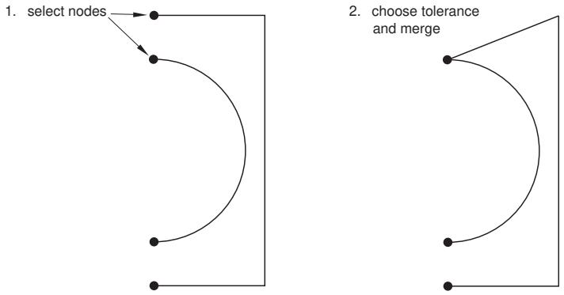  
Figure 1: Merging edges


## Note:

The Merge tool is intended only for closing small gaps. Merging edges to close larger gaps may change the sketch geometry significantly. If you want to move elements in a sketch over a large distance, use the drag tool to move vertices in your sketch to a new location. For more information, see Dragging Sketcher objects.

1. From the modify tools in the Sketcher toolbox, select the Merge tool . For a diagram of the tools in the Sketcher toolbox, see The Sketcher tools.

Abaqus/CAE displays prompts in the prompt area to guide you through the procedure.

2. Select at least two vertices near the small gap.  
3. Click Done in the prompt area.

Abaqus/CAE prompts you for a Tolerance number for this merge operation.

4. Enter a value for the tolerance, or accept the default value of 0.001. Then either press Enter, or click mouse button 2.

Abaqus/CAE allows you to increase the tolerance, but you should avoid merges that change the sketch geometry significantly.

If any vertices are within the selected tolerance, Abaqus/CAE merges them to the location of the vertex you selected in Step 2.

5. To merge more edges, repeat the above steps beginning with Step 2.  
6. When you have finished merging edges, do one of the following:

Click mouse button 2 anywhere in the Abaqus/CAE window.•  
• Select any tool in the Sketcher toolbox.  
• Click the cancel button in the prompt area.

## Additional information

• Sketching simple objects  
• Creating construction geometry  
• Modifying objects  
• Creating patterns, offsetting, and deleting objects  
• Undoing and redoing sketching actions

## Repairing short edges, gaps, and overlaps

This section describes how to use the Sketcher tools to repair short edges in a sketch and to remove gaps and overlaps from a sketch.

These tools are intended for the repair of imported sketches, but you can use them to repair geometry in a native sketch as well. You should remove the gaps and overlaps in your sketch before repairing its short edges.

## In this section:

Removing gaps and overlaps  
Repairing short edges

## Removing gaps and overlaps

Use the Remove gaps and overlaps tool to repair imported sketches that include gaps or overlaps.

Gaps or overlaps can occur when you import a sketch into Abaqus/CAE from a CAD system that measures sketch geometry using different tolerance values than Abaqus/CAE. The sketch in Figure 1 includes a gap in the upper left and a small overlap at the midpoint of the top line.

  
Figure 1: Simple imported sketch with a gap and an overlap.

You can repair the gap and overlap in this example by selecting the edges and specifying a tolerance value. When the size of the gap or the length of the overlap is less than the specified tolerance, Abaqus/CAE merges the vertices to close the gap.


## Note:

During the removal of a gap or overlap, Abaqus/CAE can merge vertices by moving one vertex to coincide with the other or by moving both vertices to a location between them. If you want to control the changes to your sketch, you can constrain the line or point that you want to retain its current location before performing the gap/overlap removal.

In practice, you should remove gaps or overlaps from your sketch using an iterative process. Start by selecting the edges adjacent to the gaps or overlaps you want to remove and use the default length tolerance value of 0.001 for your first attempt. If all of the gaps or overlaps are not closed, reselect the edges and increase the tolerance. Repeat this process until Abaqus/CAE merges the selected vertices to close the gaps or overlaps.

1. From the modify tools in the Sketcher toolbox, select the Remove gaps and overlaps tool a diagram of the tools in the Sketcher toolbox, see The Sketcher tools.  
Abaqus/CAE displays prompts in the prompt area to guide you through the procedure.  
2. Select the edges between which you want to remove gaps and overlaps. You can [Shift] + Click or [Ctrl] + Click to specify edges individually, or you can drag-select to specify all of the edges within an area in your sketch.  
Abaqus/CAE colors the selected edges red.

3. Click mouse button 2 anywhere in the Abaqus/CAE window.  
Abaqus/CAE prompts you to select a tolerance value.  
4. For your first attempt, accept the default tolerance value and click mouse button 2 anywhere in the Abaqus/CAE window. Abaqus/CAE removes the gaps and overlaps that are smaller than the default tolerance.  
5. If you still have gaps and overlaps remaining that you want to remove, perform the following steps:

a. Reselect the edges between which you want to remove gaps and overlaps.  
b. Increase the tolerance value in the prompt area.  
c. Click mouse button 2 anywhere in the Abaqus/CAE window.

Abaqus/CAE removes the selected gaps or overlaps that are smaller than the default tolerance.

d. Continue selecting edges and increasing the tolerance until Abaqus/CAE has removed all the gaps and overlaps that you want to remove from your model.

6. When you have finished removing edges and overlaps, do one of the following:

• Click mouse button 2 anywhere in the Abaqus/CAE window.  
• Select any other tool in the Sketcher toolbox.

• Click the cancel button in the prompt area.

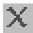

## Additional information

• Sketching simple objects  
• Modifying objects

Use the Repair short edges tool from the Sketcher toolbox to remove selected short edges from your sketch. Abaqus/CAE provides two methods for edge removal: you can either remove every edge that you select, or you can select multiple edges as candidates for removal and specify a length tolerance value. Edges shorter than the tolerance length are removed from the sketch.

If you remove short edges by specifying length tolerance values, you should perform the removals using an iterative process. Start by selecting the edges that you want to remove and use the default length tolerance value of 0.001 for your first attempt. If the short edges are not removed, reselect them and increase the tolerance. Repeat this process until the short edges are removed from the sketch.

You should repair the short edges in your sketch only after removing its gaps and overlaps. For more information, see Removing gaps and overlaps.

of the tools in the Sketcher toolbox, see The Sketcher tools. Abaqus/CAE displays prompts in the prompt area to guide you through the procedure.  
2. Specify the edges that you want to remove or, if you are specifying a length tolerance value, the edges you want to consider for removal. You can [Shift] + Click or [Ctrl] + Click to specify edges individually, or you can drag-select to specify all of the edges within an area in your sketch. Abaqus/CAE colors the selected edges red.  
3. If you are removing short edges without specifying a tolerance, click Done in the prompt area. Abaqus/CAE removes the selected edges from the sketch.  
4. If you are removing edges shorter than a specified length tolerance value, toggle on Specify tolerance in the prompt area and click Done. For your first attempt, accept the default tolerance value and click Done in the prompt area. Abaqus/CAE removes from the sketch any of the selected edges that are shorter than the length tolerance value.  
5. To continue the removal of short edges by length tolerance value, perform the following steps:

a. Reselect the edges that you want to consider for removal, and click Done.  
b. Leave Specify tolerance toggled on, and click Done again.  
c. Increase the length tolerance value in the prompt area.  
d. Click mouse button 2 anywhere in the Abaqus/CAE window.

Abaqus/CAE removes from the sketch any of the selected edges that are shorter than the length tolerance value.

e. Continue selecting edges and increasing the tolerance until Abaqus/CAE has removed all the short edges that you want to remove from your model.

6. When you have finished repairing short edges in your sketch, do one of the following:

• Click mouse button 2 anywhere in the Abaqus/CAE window.  
• Select any other tool in the Sketcher toolbox.  
• Click the cancel button in the prompt area.

## Additional information

• Modifying, copying, and offsetting objects

• Modifying objects  
• Creating patterns, offsetting, and deleting objects

## Creating patterns, offsetting, and deleting objects

This section describes how to use the Sketcher tools to copy and delete Sketcher objects.

## In this section:

Creating linear patterns of objects  
Creating radial patterns of objects  
Offsetting the edges of Sketcher objects  
Deleting Sketcher objects

## Creating linear patterns of objects

Use the linear pattern tool from the Sketcher toolbox to create a linear pattern of selected Sketcher objects. You can create a pattern that extends in one direction (for example, horizontally or vertically), or you can create a pattern that extends in two directions (for example, both horizontally and vertically). You can specify the following:

• The number of copies to create in each direction, including the selected objects. You can create a maxium of 1000 copies.  
• The spacing between each copy along the specified direction.  
• A line that defines the direction along which Abaqus/CAE generates the copies.

By default, Abaqus/CAE creates three copies in the positive X-direction and two copies in the positive Y-direction. The default spacing is 10% of the sketch sheet size. If you change the default settings, Abaqus/CAE retains those values while you work on the sketch. However, after you exit the Sketcher, Abaqus/CAE reverts to the original defaults. You cannot edit a pattern after you create it.

1. From the Sketcher toolbox, select the linear pattern too l . For a diagram of the tools in the Sketcher toolbox, see The Sketcher tools.  
Abaqus/CAE displays prompts in the prompt area to guide you through the procedure.  
2. Select the objects that you want to copy. Both sketch and construction geometry can be copied; reference geometry and dimensions cannot be copied.


Tip: To select more than one object, hold down the [Shift] key as you click each object or drag a rectangle around the objects. To unselect an object, use [Ctrl] + Click. For more information, see Selecting objects within the viewport.”

3. Click mouse button 2 to indicate that you have finished selecting objects.

Abaqus/CAE displays the Create Linear Pattern dialog box.

4. From the Create Linear Pattern dialog box, configure the pattern in Direction-1 (by default, Direction-1 is the X-direction in the current grid rotation):

a. Click the arrows to the right of Number to increase or decrease the number of copies to create, including the selected objects. The number of copies in the Sketch updates when you click the arrows and provides a preview of the setting.  
Alternatively, you can type in a number and press [Enter] to preview the setting. You can enter any number between 1 and 1000. If you enter a value of 1, Abaqus/CAE displays only the selected objects and does not create any copies of the selected objects; in effect, you are disabling copies in Direction-1.  
b. Enter the Spacing between each copy along the specified direction.  
c. By default, Abaqus/CAE creates the copies in a horizontal direction. If you want to change the direction in which Abaqus/CAE creates the copies, click Angle and select a line from the Sketch to define the new direction. You must pick a straight edge or a straight construction line.  
Abaqus/CAE calculates the spacing between each copy along the direction that you specify.  
d. By default, Abaqus/CAE creates the copies in the positive X-direction. Click Flip to reverse the direction in which Abaqus/CAE creates the copies.

5. To create copies in a second direction, enter a Number between than 1 and 1000 and specify the Spacing, the Angle, and the Flip direction for Direction-2 (by default, Direction-2 is the Y-direction in the current grid rotation). You must enter a Number greater than 1 for at least one direction.

6. In most cases you will want to preview the linear pattern that Abaqus/CAE will create as you enter values in the Create Linear Pattern dialog box. However, if you choose to create a large number of copies, the preview capability may impact the performance of the Sketcher. In this case you should toggle off the Preview button.  
7. To copy more objects, repeat the above steps beginning with Step 2.  
8. When you have finished copying objects, do one of the following:

• Click mouse button 2 anywhere in the Abaqus/CAE window.  
• Select any tool in the Sketcher toolbox.  
• Click the cancel button in the prompt area.

## Additional information

• Copying sketch objects to create patterns  
• Modifying objects  
• Undoing and redoing sketching actions

## Creating radial patterns of objects

Use the radial pattern tool from the Sketcher toolbox to create a radial pattern of selected Sketcher objects. You can specify the following:

• The number of copies to create in the radial pattern, including the selected objects. You can create a maxium of 1000 copies.  
• The total angle between the original objects and the last copy in the pattern.  
• The position of the center point of the circular pattern.

By default, Abaqus/CAE creates five copies around a complete circle (360°), and the center of the circle is located at the origin of the sketch. If you change the default settings, Abaqus/CAE retains those values while you work on the sketch. However, after you exit the Sketcher, Abaqus/CAE reverts to the original defaults. You cannot edit a pattern after you create it.

1. From the Sketcher toolbox, select the radial pattern tool . For a diagram of the tools in the Sketcher toolbox, see The Sketcher tools.  
Abaqus/CAE displays prompts in the prompt area to guide you through the procedure.

2. Select the objects that you want to copy. Both sketch and construction geometry can be copied; reference geometry and dimensions cannot be copied.


Tip: To select more than one object, hold down the [Shift] key as you click each object or drag a rectangle around the objects. To unselect an object, use [Ctrl] + Click. For more information, see Selecting objects within the viewport.”

3. Click mouse button 2 to indicate that you have finished selecting objects.

Abaqus/CAE displays the Create Radial Pattern dialog box.

4. From the Create Radial Pattern dialog box, configure the radial pattern:

a. Click the arrows to the right of Number to increase or decrease the number of copies to create, including the selected objects. The number of copies in the Sketch updates when you click the arrows and provides a preview of the setting.

Alternatively, you can type in a number and press [Enter] to preview the setting. You can enter any number between 2 and 1000.

b. Enter the Total angle between the original objects that you selected and the final copy. The angle must be between –360° and +360°. A positive angle corresponds to a counterclockwise direction.

c. By default, the center point of the circular pattern is the origin of the sketch. Click Center to change the location of the center point, and select a point from the sketch to define the new center point.

5. In most cases you will want to preview the radial pattern that Abaqus/CAE will create as you enter values in the Create Radial Pattern dialog box. However, if you choose to create a large number of copies, the preview capability may impact the performance of the Sketcher. In this case you should toggle off the Preview button.

6. To copy more objects, repeat the above steps beginning with Step 2.

7. When you have finished copying objects, do one of the following:

• Click mouse button 2 anywhere in the Abaqus/CAE window.  
• Select any tool in the Sketcher toolbox.

• Click the cancel button in the prompt area.

## Additional information

• Copying sketch objects to create patterns  
• Modifying objects  
• Undoing and redoing sketching actions

## Offsetting the edges of Sketcher objects

Use the offset tool from the Sketcher toolbox to offset edges. You select the edges, enter the offset distance, and choose the offset direction. Abaqus/CAE applies the offset distance perpendicular to each point along the edges to create the offset.


## Note:

Edges containing features with dimensions of similar size to the offset distance will lose their details in the offset copy.

1. From the Sketcher toolbox, select the offset tool . For a diagram of the tools in the Sketcher toolbox, see The Sketcher tools.  
Abaqus/CAE displays prompts in the prompt area to guide you through the procedure.  
2. Select a single group of connected edges to offset. Only sketch geometry can be offset; construction geometry, reference geometry, and dimensions cannot be offset.


Tip: To select a group of edges that are connected end-to-end, choose by chain from the prompt area (for more information, see Using the chain method to select edges in the Sketcher). If necessary, you can then use the other selection methods in Abaqus/CAE to enhance your selection. For more information, see Selecting objects within the viewport.”

3. Click mouse button 2 to indicate that you have finished selecting objects.

4. Specify an offset distance or accept the default value displayed in the prompt area. Abaqus/CAE displays a preview of the offset edges in the viewport.

5. Use the buttons that appear in the prompt area to accept or change the offset direction.

6. To offset more edges, repeat the above steps beginning with Step 2.

7. When you have finished offsetting edges, do one of the following:

• Click mouse button 2 anywhere in the Abaqus/CAE window.  
• Select any tool in the Sketcher toolbox.  
• Click the cancel button in the prompt area.

## Additional information

• Sketching simple objects  
• Creating construction geometry  
• Modifying objects  
• Creating patterns, offsetting, and deleting objects  
• Undoing and redoing sketching actions

Use the delete tool from the Sketcher toolbox to remove Sketcher objects: lines, arcs, circles, fillets, splines, points, constraints, dimensions, or parameters.

1. From the Sketcher toolbox, select the delete tool . For a diagram of the tools in the Sketcher toolbox, see The Sketcher tools.

Abaqus/CAE displays prompts in the prompt area to guide you through the procedure.

2. Select all the objects you want to delete. Select a filter from the prompt area to limit the available selections to Geometry, Dimensions (including parameters), or Constraints; the default filter, Any, does not limit your selection.

Both sketch and construction geometry can be deleted; reference geometry cannot be deleted.


Tip: To select more than one object, hold down the [Shift] key as you click each object or drag a rectangle around the objects. To unselect an object, use [Ctrl] + Click. For more information, see Selecting objects within the viewport.”

3. When you have finished selecting objects, click mouse button 2.

Abaqus/CAE deletes the selected objects and any associated dimensions or constraints.


Tip: To restore accidentally deleted objects, click the undo tool in the Sketcher toolbox.

4. To delete more objects, repeat the above steps beginning with Step 2.

5. When you have finished deleting objects, do one of the following:

• Click mouse button 2 anywhere in the Abaqus/CAE window.

• Select any tool in the Sketcher toolbox.

• Click the cancel button in the prompt area.

## Additional information

• Sketching simple objects  
• Creating construction geometry  
• Modifying objects  
• Creating patterns, offsetting, and deleting objects  
• Undoing and redoing sketching actions

## Undoing and redoing sketching actions

The Sketcher toolbox contains tools to undo and redo sketch actions.

Use the Undo tool or the Redo tool from the Sketcher toolbox to undo your previous operation or redo your most recently undone operation. For a diagram of the tools in the Sketcher toolbox, see The Sketcher tools.

Depending on your previous action, clicking the undo tool can have the following effect:

• Remove the object just created. Objects include sketch geometry (lines, arcs, circles, ellipses, fillets, splines, or points), construction geometry, or dimensions.  
Restore the sketch to its state prior to the editing operation just performed. Editing operations include copying entities, deleting entities, moving vertices, trimming edges, extending edges, breaking edges, and changing dimensions.  
Remove a retrieved stand-alone sketch, provided you have not positioned the sketch. Once you have positioned the retrieved sketch, clicking the undo tool moves the origin of the retrieved sketch back to the origin of the current sketch.

You can undo and redo several actions in a row. For example, if you sketch a circle and dimension its radius, your first undo operation removes the dimension and your second undo operation removes the circle. You can restore the circle by clicking the redo tool and restore its dimension by clicking the redo tool a second time. Abaqus/CAE stores a history of actions for the current sketch, and you can specify the maximum number of sketching operations to store (see Setting the maximum number of recorded sketching operations, for more information).

The Undo and Redo tools do not perform view manipulation operations. For example, if you sketch a circle, magnify the view, and click the undo tool, Abaqus/CAE deletes the circle (it does not resize the view).

## Additional information

• Deleting Sketcher objects

## Resetting the view

The Sketcher toolbox contains a tool for resetting the view.

Use the reset view tool from the Sketcher toolbox to return to the original view. For a diagram of the tools in the Sketcher toolbox, see The Sketcher tools.

If you are unsure of the part's or assembly's orientation relative to the sketch plane, you can use the view manipulation tools to examine the sketch plane and the object on which you are sketching. When you click the reset view tool, Abaqus/CAE restores the view to the original view orientation displayed when you entered the Sketcher.

## Additional information

• Using the view manipulation tools

## Managing stand-alone sketches

This section describes how to manage stand-alone sketches while working in the Sketch module.

## In this section:

Managing stand-alone sketches  
Creating stand-alone sketches  
Saving the current sketch as a stand-alone sketch  
Adding stand-alone sketches

## Managing stand-alone sketches

Stand-alone sketches are stored in your model and are independent of any particular part or the assembly. You can create a stand-alone sketch while working in the Sketch module, or you can save the current sketch as a stand-alone sketch while sketching. You can add a stand-alone sketch while creating or editing a feature or a partition, and an added sketch overlays the current sketch so that their origins are coincident.

You use the Sketch module to manage the stand-alone sketches defined in your model. To create, retrieve, copy, rename, and delete stand-alone sketches while working in the Sketch module, use one of the following:

• The Create, Edit, Copy, Rename, and Delete items listed under the Sketch menu on the main menu bar. Each item contains a submenu listing all the sketches in the current model.  
The Sketch Manager dialog box. The Sketch Manager contains functions identical to those listed under the Sketch menu, but with a convenient browser that lists all the sketches available in the current model. To display the Sketch Manager dialog box, select Sketch->Manager from the main menu bar.


## Note:

The Sketch menu and the Sketch Manager are available only from the Sketch module. When you are sketching a feature in the Part module, for example, the Sketch menu and the Sketch Manager are not available.

## Additional information

• Managing stand-alone sketches  
• Stand-alone sketches

## Creating stand-alone sketches

Stand-alone sketches are stored in your model and are independent of any particular part or the assembly. To create a new stand-alone sketch in the current viewport, select Sketch->Create from the main menu bar.

1. From the main menu bar, select Sketch->Create.

The Create Sketch dialog box appears.


Tip: You can also create a stand-alone sketch by clicking the sketch create tool in the Sketch module toolbox.

2. In the Create Sketch dialog box, enter a name for the sketch. For information on valid names, see Using basic dialog box components.  
3. In the Create Sketch dialog box, enter the approximate size of the sketch.

The size that you enter is used by Abaqus/CAE to calculate the size of the sheet and the spacing of its grid. The approximate size should reflect the largest dimension of the sketch and must be between 105 and 10−3 units. Abaqus/CAE does not require specific units, but the units must be consistent throughout the model.

4. Click Continue to close the Create Sketch dialog box.

Abaqus/CAE starts the Sketcher and displays a square sheet on which you sketch; the width and height of the sheet are approximately equal to the value that you entered in the previous step. If you later find that your sketch extends beyond the edge of the sheet, you can change the sheet size using the Sketcher customization options.

5. When you have finished sketching, click Done in the prompt area.

## Additional information

• Managing stand-alone sketches  
• Stand-alone sketches

## Saving the current sketch as a stand-alone sketch

While you are sketching, you can save the current sketch as a stand-alone sketch. Stand-alone sketches are maintained independent of any features; they can be subsequently retrieved into the Sketcher and will overlay any existing geometry.

Abaqus/CAE saves only items within the sketch. Reference geometry is not saved. Similarly, dimensions between vertices and lines from reference geometry are not saved.

1. From the Sketcher toolbox, select the save as tool . For a diagram of the tools in the Sketcher toolbox, see The Sketcher tools.  
2. In the text field that appears in the prompt area, enter the name of the sketch.  
Abaqus/CAE saves the sketch and returns to the Sketcher.

## Additional information

• Managing stand-alone sketches  
• Stand-alone sketches

## Adding stand-alone sketches

While you are sketching, you can add a stand-alone sketch so that its geometry overlays the current sketch. Abaqus/CAE positions the added stand-alone sketch so that its origin is coincident with the origin of the current sketch.

1. From the Sketcher toolbox, select the add sketch tool L . For a diagram of the tools in the Sketcher toolbox, see The Sketcher tools.  
Abaqus/CAE displays the Add Sketch dialog box.

2. Select the sketch to add from the list of stand-alone sketches and click OK to close the Add Sketch dialog box.

Abaqus/CAE does the following:

• Positions the added sketch so that its origin is coincident with the origin of the current sketch.  
• Resizes the view so that both the current sketch and the added sketch are visible.

3. Use the buttons that appear in the prompt area to indicate how you will locate the added sketch.

Select Translate to translate the added sketch along a specified vector. You can define the beginning and the end of the translation vector by either selecting from the sketch or by typing the X- and Y-coordinates of each end.  
Select Rotate to rotate the added sketch through a specified angle about a specified point. You can specify the point at the center of rotation by selecting from the sketch or typing the X- and Y-coordinates. The angle of rotation you specify must be between 360 and −360 degrees.  
Select Mirror to mirror the added sketch about a selected line. You must specify the mirror line by selecting an existing straight line (not a line in the added sketch).  
Select Scale to scale the spacing between the vertices of the added sketch by a specified amount about a specified point. You can specify the point by selecting from the sketch or by typing the Xand Y-coordinates.

A preview of the added sketch is modified and positioned according to your specification.

4. If desired, repeat Step 3 to continue modifying or repositioning the added sketch.  
5. Select Done in the prompt area.

Abaqus/CAE adds the stand-alone sketch to the existing geometry.

## Additional information

• Managing stand-alone sketches  
• Stand-alone sketches

---

[Previous: The Mesh Module](mesh-module.md) · [Next: Modeling Techniques](modeling-techniques.md)
