# The Part Module

## The Part module

Parts are the building blocks of an Abaqus/CAE model. You use the Part module to create each part, and you use the Assembly module to assemble instances of the parts.

The tutorial in Using Additional Techniques to Create and Analyze a Model in Abaqus/CAE contains examples of how you create, modify, and manipulate parts. This chapter explains how you use the tools within the Part module to work with parts.

## In this section:

Understanding the role of the Part module  
Entering and exiting the Part module  
What is feature-based modeling?  
How is a part defined in Abaqus/CAE?  
Copying a part  
What are orphan nodes and elements?  
Modeling rigid bodies and display bodies  
The reference point and point parts  
What types of features can you create?  
Using feature-based modeling effectively  
Capturing your design and analysis intent  
What is part and assembly locking?  
What are extruding, revolving, and sweeping?  
What is lofting?  
Using the Sketcher in conjunction with the Part module  
Understanding toolsets in the Part module  
Using the Part module toolbox  
Managing parts  
Using the Create Part dialog box  
Adding a feature to a part  
Adding a solid feature  
Adding a shell feature  
Adding a wire feature  
Adding a cut feature  
Using the Edit Feature dialog box  
Using the Edit Loft dialog box  
Blending edges  
Mirroring a part

## Understanding the role of the Part module

There are several ways to create a part in Abaqus/CAE:

• Create the part using the tools available in the Part module.  
• Import the part from a file containing geometry stored in a third-party format.  
• Import the part mesh from an output database.  
• Import a meshed part from an Abaqus input file.  
• Merge or cut part instances in the Assembly module.  
• Create a meshed part in the Mesh module.

A part created using the Part module tools is called a native part and has a feature-based representation. A feature captures your design intent and contains geometry information as well as a set of rules that govern the behavior of the geometry. For example, a circular through cut is a feature, and Abaqus/CAE stores the diameter of the cut along with the information that it should pass all the way through the part. If you increase the size of the part, Abaqus/CAE recognizes that the depth of the cut should increase so that it continues to pass through the part.

You use the Part module to create, edit, and manage the parts in the current model. Abaqus/CAE stores each part in the form of an ordered list of features. The parameters that define each feature—extruded depth, hole diameter, sweep path, etc.—combine to define the geometry of the part.

The Part module allows you to do the following:

• Create deformable, discrete rigid, analytical rigid, or Eulerian parts. The part tools also allow you to edit and manipulate the existing parts defined in the current model.  
• Create the features—solids, shells, wires, cuts, and rounds—that define the geometry of the part.  
• Use the Feature Manipulation toolset to edit, delete, suppress, resume, and regenerate a part's features.  
• Assign the reference point to a rigid part.  
Use the Sketcher to create, edit, and manage the two-dimensional sketches that form the profile of a part's features. These profiles can be extruded, revolved, or swept to create part geometry; or they can be used directly to form a planar or axisymmetric part.  
• Use the Set toolset, the Partition toolset, and the Datum toolset. These toolsets operate on the part in the current viewport and allow you to create sets, partitions, and datum geometry, respectively.

## Entering and exiting the Part module

You can enter the Part module at any time during an Abaqus/CAE session by clicking Part in the Module list located in the context bar. The Part, Shape, Feature, and Tools menus appear on the main menu bar, and the title bar of the current viewport displays the name of the current part, if one exists.

To exit the Part module, select any other module from the Module list. You need not take any specific action to save your parts before exiting the module; they are saved automatically when you save the entire model by selecting File->Save or File->Save As from the main menu bar.

## What is feature-based modeling?

This section describes the feature-based modeling approach that Abaqus/CAE uses to define a part.

## In this section:

The relationship between parts and features  
The base feature  
Simplifying a part's feature list  
What is a part instance?

## The relationship between parts and features

A part created in Abaqus/CAE has a feature-based representation. A feature is a meaningful piece of the design and provides the engineer with a convenient and natural way to build and modify a part. Parts created in Abaqus/CAE are constructed from an ordered list of features and the parameters that define the geometry of each feature. You select from the following shape features to build a part in the Part module:

• Solids  
. Shells  
. Wires  
• Cuts  
• Blends

Using the tools in the Part module, you create and edit all the features necessary to describe each of the parts in your model. Abaqus/CAE stores each feature and uses this information to define the entire part, to regenerate the part if you modify it, and to generate an instance of the part in the Assembly module. For more information on how parts are related to part instances, see What is a part instance?.

The following sequence illustrates how the three-dimensional part in Figure 1 would be constructed using features available in Abaqus/CAE:

  
Figure 1: Part constructed using solid, shell, wire, cut, and blend features.

1. The first feature you create while building a part is called the base feature; you construct the remainder of the part by adding more features that either modify or add detail to the base feature. In this example the base feature is a U-shaped part; the user sketched a two-dimensional profile and extruded it to form the base feature, as shown in Figure 2.

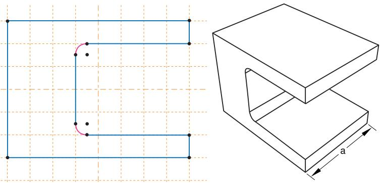  
Figure 2:The base feature.

The sketch and the extrusion depth (a) are the modifiable parameters that define the base feature. You can revisit the base feature and change its size or shape by using the Feature Manipulation toolset to modify either the section sketch or the extrusion distance. If desired, you can delete the base feature and sketch a new shape.

2. A stiffening web is added as a shell feature. The user sketched a line on one of the internal faces and extruded the sketch to the opposite face, as shown in Figure 3. The sketch is the only modifiable parameter that defines the shell feature.

  
Figure 3: A shell feature.

3. Rods are added to the corners as wire features. The wire was created by connecting two points that the user selected, as shown in Figure 4. Wires created in this way have no modifiable parameters; they must be deleted and recreated if you need to change them.

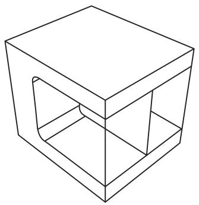  
Figure 4: Wire features.

4. A blind cut is cut into the top of the clamp. The user sketched a two-dimensional profile, and the profile was extruded into the clamp through a specified distance, as shown in Figure 5. The sketch and the depth of the slot are the modifiable parameters that define the blind cut feature.

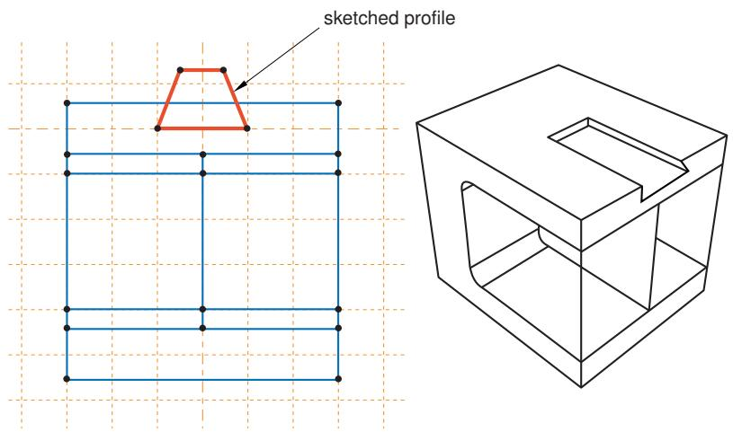  
Figure 5: A cut feature.

5. The edges of the cut are rounded. The user selected the edges to round and provided the radius of the round, as shown in Figure 6. The radius is the modifiable parameter that defines the round feature.

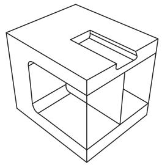  
Figure 6: Round features.

If the geometry of a new feature depends on an existing feature, Abaqus/CAE creates a parent-child relationship between the features. The new feature is the child, and the feature it depends on is the parent. For example, in the part described above the round feature is a child of the cut feature. If you change the position or size of the cut, the edges remain rounded. Similarly, if you delete the cut, Abaqus/CAE also deletes the rounds.

If you modify a parent feature, the modification might invalidate children of the parent feature. For example, in the part described above if you were to increase the depth of the cut so that it became a through cut, you would lose the fillets along its edges; that is, the fillets would fail to regenerate after the modification. Abaqus/CAE offers you the following two choices:

• Keep the changes to the parent feature but suppress the features that failed to regenerate. Children of the suppressed features will also be suppressed.  
• Exit the modification of the parent feature and return to the state of the last successful regeneration.

## Additional information

• What is feature-based modeling?  
• Modifying and manipulating features

## The base feature

The first feature you create while building a part is called the base feature; you construct the remainder of the part by adding more features that either modify or add detail to the base feature. This process of building an Abaqus/CAE native part using the tools in the Part module follows a sequence of operations analogous to building a part in a machine shop. For example, you start with a piece of billet stock (the base feature) and then you do the following:

• Attach additional pieces to the billet (apply a solid extrusion, a revolved shell, or a sketched wire).  
• Cut away the billet (apply an extruded cut, a revolved cut, or a circular hole; or round or chamfer an edge).

When you create a new part, you must describe the base feature. You do this by specifying two properties of the base feature: its shape and type. The shape indicates the basic topology of the feature; that is, whether it is a solid, shell, wire, or point. The type indicates which of the following methods will be used to generate the base feature:

## Planar

You sketch the feature on a two-dimensional sketch plane.

## Extrusion

You sketch the feature profile and then extrude it through a specified distance.

## Revolution

You sketch the feature profile and then revolve it by a specified angle about an axis.

## Sweep

You sketch two shapes: a sweep path and a sweep profile. The profile is then swept along the path to create the feature.

## Coordinates

You enter the coordinates of a single point in the prompt area.

Before you create a part and choose the shape and the type of the base feature, you should know the sequence you will use to construct the desired part. Choosing the correct type and shape of the base feature is important.

Table 1 shows the base features that you can select based on the part's modeling space and type.  
Table 1: Choosing the base feature.

<table><tr><td rowspan="2">Part Type</td><td colspan="2">Modeling Space</td></tr><tr><td>Three-dimensional</td><td>Two-dimensional or Axisymmetric</td></tr><tr><td>Deformable</td><td>Any</td><td>Planar shell, planar wire, or point</td></tr><tr><td>Discrete rigid</td><td>Any (you must convert a 3D solid discrete rigid part to a shell before you instance it)</td><td>Planar wire or point</td></tr><tr><td>Analytical rigid</td><td>Extruded or revolved shell</td><td>Planar wire</td></tr><tr><td>Eulerian</td><td>Extruded, revolved, or swept solid</td><td>Not applicable</td></tr><tr><td>Fluid</td><td>Extruded, revolved, or swept solid</td><td>Not applicable</td></tr><tr><td>Electromagnetic</td><td>Extruded, revolved, or swept solid</td><td>Planar shell</td></tr></table>

A part imported from a file containing third-party format geometry consists of a single feature that you import into Abaqus/CAE as the base feature of a new part. You cannot modify this base feature, but you can add additional features to it. Similarly, a mesh part is created in the Mesh module or imported from an output database as the base feature of a new part. You can use the mesh editing tools to add and delete nodes and elements from a mesh, or you can use the tools in the Part module to add geometric features to the mesh.

## Additional information

• How is a part defined in Abaqus/CAE?  
• Using the Create Part dialog box  
• Adding a solid feature  
• Adding a shell feature  
• Adding a wire feature

## Simplifying a part's feature list

When you copy a part to a new part, you can reduce all the feature and parameter information to a simple definition. If you reduce the feature list, Abaqus/CAE will regenerate the part faster if you subsequently modify it; however, you will no longer be able to modify any parameters of the part. You copy a part by selecting Part->Copy->part name from the main menu bar.

Simplifying a part's feature list is especially useful if you have spent a lot of time creating a part and have iterated many times over the design. For example, if you created a slot and redimensioned the slot before arriving at the final design, the original part contains features that define each variation of the slot. If you copy the part and simplify the feature list, the new part will contain only one feature that defines the final version of the slot.

## What is a part instance?

A part instance can be thought of as a representation of the original part. You create a part in the Part module and define its properties in the Property module. However, when you assemble the model using the Assembly module, you work only with instances of the part, not the part itself. The Interaction and Load modules also operate on the assembly and, therefore, on part instances. In contrast, the Mesh module enables you to operate on either the assembly or one or more of its component parts.

You create part instances in the Assembly module. You then position those instances relative to each other in a global coordinate system to form the assembly. You can create and position multiple instances of a single part. In addition, you can assemble instances of deformable, analytical rigid, and discrete rigid parts when you are solving contact problems. For more information on the types of parts you can create in Abaqus/CAE, see Part types.

The following example illustrates the relationship between parts and part instances. A pump housing is composed of three parts: the housing cover, a gasket, and a mounting bolt. In the Part module you create each of the three parts shown in Figure 1:

• One housing cover  
• One gasket  
• One bolt

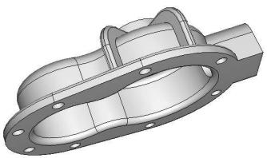  
1. pump

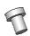  
3. bolt

  
2. gasket  
Figure 1: The original parts.

In the Assembly module you assemble instances of each part:

• One instance of the body  
• One instance of the gasket  
• Eight instances of the bolt

You then position the instances relative to a common coordinate system, thereby creating the model of the pump housing, as shown in Figure 2.

  
Figure 2:The model is assembled from instances of the parts.

Now, suppose you want to change the length of the bolts. You return to the Part module and modify the length of the bolt by editing the original part. When you return to the Assembly module, Abaqus/CAE recognizes that the part was modified and automatically regenerates the eight instances of the bolt to reflect the change in the length.

You cannot modify the geometry of a part instance directly; you can modify the part itself only within the Part module. When you modify a part, Abaqus/CAE automatically regenerates all instances of the modified part in the assembly. Part instances are discussed in more detail in the context of the Assembly module in Working with part instances.

## How is a part defined in Abaqus/CAE?

This section describes the parts you can create in the Part module—deformable, rigid, and Eulerian—and the electromagnetic parts available in electromagnetic models.

## In this section:

Part modeling space  
Part types  
Part size

## Part modeling space

When you create a new part, you must specify the modeling space in which the part will reside. You can assign the following three types of modeling space:

## Three-dimensional

Abaqus/CAE embeds the part in the X, Y, Z coordinate system. A three-dimensional part can contain any combination of solid, shell, wire, cut, round, and chamfer features. You model a three-dimensional part using three-dimensional solid, shell, beam, truss, or membrane elements.

## Two-dimensional planar

Abaqus/CAE embeds the part in the X–Y plane. A two-dimensional planar part can contain a combination of only planar shell and wire features, and all cut features are defined as planar through cuts. You model a two-dimensional planar part using two-dimensional solid continuum elements, as well as truss or beam elements.

## Axisymmetric

Abaqus/CAE embeds the part in the X–Y plane with the Y-axis indicating the axis of revolution. An axisymmetric part can contain a combination of only planar shell and wire features, and all cut features are defined as planar through cuts. You model an axisymmetric part using axisymmetric solid continuum elements or axisymmetric shell elements.

Modeling space refers to the space in which the part is embedded rather than to the topology of the part itself. Thus, you can create a three-dimensional part using a topologically two-dimensional shell feature or a one-dimensional wire feature. You can change the modeling space of a part after you have created it by clicking mouse button 3 on the part in the Model Tree and selecting Edit from the menu that appears.

Abaqus/CAE uses the following methods to determine the modeling space of an imported part:

When you import a part from a file containing geometry stored in a third-party format, you can specify the part's modeling space, provided that Abaqus/CAE does not determine it must be three-dimensional.  
• When you import a mesh from an output database, Abaqus/CAE determines the modeling space of the new part from the information stored in the output database.  
• When you import a mesh from an input file, Abaqus/CAE determines the modeling space of the new part from the element type.  
• When you create a mesh part in the Mesh module, the modeling space of the mesh part is the same as the modeling space of the original part.

Detailed instructions on how to specify modeling space when creating and importing a part can be found in Choosing the modeling space of a new part, and Importing sketches and parts.

## Additional information

• How is a part defined in Abaqus/CAE?

## Part types

When you create a new part or import a part from a file containing geometry stored in a third-party format, you must choose the part's type.

The possible types for Abaqus/Standard and Abaqus/Explicit are:

## Deformable

Any arbitrarily shaped axisymmetric, two-dimensional, or three-dimensional part that you can create or import can be specified as a deformable part. A deformable part represents a part that can deform under load; the load can be mechanical, thermal, or electrical. By default, Abaqus/CAE creates parts that are deformable.

## Discrete rigid

A discrete rigid part is similar to a deformable part in that it can be any arbitrary shape. However, a discrete rigid part is assumed to be rigid and is used in contact analyses to model bodies that cannot deform.

## Analytical rigid

An analytical rigid part is similar to a discrete rigid part in that it is used to represent a rigid surface in a contact analysis. However, the shape of an analytical rigid part is not arbitrary and must be formed from a set of sketched lines, arcs, and parabolas.

## Eulerian

Eulerian parts are used to define a domain in which material can flow for an Eulerian analysis. Eulerian parts do not deform during an analysis; instead, the material within the part deforms under load and can flow across the rigid element boundaries. For more information about Eulerian analyses, see Eulerian analyses.

## Electromagnetic

The electromagnetic part type is used only in an electromagnetic model. For more information, see Eddy Current Analysis.

You can assemble deformable bodies, discrete rigid parts, analytical rigid parts, Eulerian parts, and electromagnetic parts in the Assembly module. If allowed, you can change the type of a part after you have created it by clicking mouse button 3 on the part in the Model Tree and selecting Edit from the menu that appears.

Abaqus/CAE uses the following methods to determine the type of an imported part:

• When you import a part from a file containing geometry stored in a third-party format, you can specify the part's type to be either deformable, discrete rigid, or Eulerian.  
• When you import a mesh from an output database, Abaqus/CAE determines the type of the new part from the information stored in the output database.  
• When you import a mesh from an input file, Abaqus/CAE determines the type of the new part from the element type.  
• When you create a mesh part in the Mesh module, the type of the mesh part is the same as the type of the original part.

## Additional information

• How is a part defined in Abaqus/CAE?  
• Modeling rigid bodies and display bodies

## Part size

When you create a new part, you must choose the part's approximate size. The size that you enter is used by Abaqus/CAE to calculate the size of the Sketcher sheet and the spacing of its grid. You should set the approximate size of the part to match the largest dimension of the finished part. If you find subsequently that the part exceeds the size of the Sketcher sheet, use the Sketch customization options to increase the sheet size. You cannot change a part's approximate size after you have created it. However, you can copy the part to a new part and scale the part during the copy operation. For more information, see Copying a part.

Abaqus/CAE uses a geometry engine to model parts and features. The recommended approximate size limits are between 0.001 $( 1 0 ^ { - 3 } )$ and 10000 (104) units. This size range should prevent your model from exceeding the limits of the geometry engine. For example, the minimum size supported by the geometry engine is 10−6, so maintaining geometry on the order of 10−3 will normally allow node and element dimensions to remain above the minimum size. Parts that exceed the recommended limits may exhibit geometric defects. If you find that you need to specify an approximate size that is outside the suggested range, you should consider adopting a different set of units.

## Additional information

• Setting the approximate size of the new part  
• Copying a part

## Copying a part

Select Part->Copy->part name from the main menu bar to copy a part to a new part.

You can create an identical copy of the original part, or you can do the following during the copy operation:

## Compress features

Abaqus/CAE reduces all the feature and parameter information to a simple definition of the part. As a result, Abaqus/CAE will regenerate the part faster if you subsequently modify it; however, you will no longer be able to modify any parameters of the part. For more information, see Simplifying a part's feature list.

## Scale part by

Abaqus/CAE scales the new part by the scale factor that you enter. If you choose to scale a part, Abaqus/CAE also compresses its features. You can use scaling to correct imported parts. If the scale of the imported part is incorrect, you can copy the part to a new part and scale it to the correct dimensions in the process. In some cases you can produce a valid part by scaling the part down, repairing the part, and then scaling the part back to its original dimensions. You can also scale an imported part during the import process. For more information, see Importing sketches and parts.

## Mirror part about plane

Abaqus/CAE mirrors the part about the selected plane (X–Y, Y–Z, or X–Z). If you select the Mirror part about plane option, Abaqus/CAE selects the Compress features option.

To mirror a part about a plane other than one of the principal planes and without compressing the features, use Shape->Transform->Mirror. For more information, see Mirroring a part.

## Separate disconnected regions into parts

In some cases when you import an IGES- or VDA-FS-format part and select the Stitch edges repair option, Abaqus/CAE imports separate parts as a single part. If you toggle on the Separate disconnected regions into parts option and copy the imported part to a new part, Abaqus/CAE will separate disconnected regions into separate parts. For more information, see Controlling the import process.

You can copy a mesh part and separate it into disconnected parts based on nodal connectivity. Abaqus/CAE assumes that all connected nodes belong to a single part and does not take element type into consideration. However, Abaqus/CAE ignores connectivity between axisymmetric solid elements with nonlinear, asymmetric deformation (CAXA) and some line elements (connectors, springs, dashpots, gap, and joint).

You can copy parts containing both geometry and orphan mesh features. You can use the Compress features, Scale part by, Mirror part about plane, and Separate disconnected regions into parts options on any part.

However, note the following:

1. When you compress or mirror a geometry part during the copy operation, reference points, attachment points, sets, surfaces, point parts, and datums are not copied .  
2. When you compress an orphan mesh part during the copy operation, reference points, attachment points, sets, surfaces, point parts, and datums are copied.  
3. When you mirror an orphan mesh part during the copy operation, reference points, attachment points, point parts, and datums are not copied. Only sets and surfaces are copied and mirrored.

## What are orphan nodes and elements?

Orphan nodes and elements are components of a finite element mesh that exist without any associated geometry. In effect, the mesh information has been orphaned from its parent geometry. Orphan nodes and elements can be created in several ways; they can be:

• Imported from an output database (for more information, see Importing a part from an output database)  
• Imported from an Abaqus input file (for more information, see Importing a model)  
• Created as a mesh part (for more information, see Creating a mesh part )  
• Created in a bottom-up meshing procedure (for more information, see Bottom-up meshing)  
Created by certain mesh editing operations, such as create element and offset (for more information, see Using the mesh editing tools)  
Created by deleting the associativity with their parent geometry (for more information, see Deleting mesh-geometry associativity )

The first three methods above create an orphan mesh feature as the base feature of a new part. The remaining methods are part of the Edit Mesh toolset; these methods edit the existing mesh and, therefore, do not exist as features of the part. For more information, see The Edit Mesh toolset.

You can select the face of an orphan element as the sketch plane to add geometric features. In addition, in the Mesh module you can change the element type assigned to orphan elements, and you can verify and edit the mesh.

## Modeling rigid bodies and display bodies

This section describes rigid bodies and display bodies.

## In this section:

Rigid parts  
Sketching the profile of an analytical rigid part  
What is the difference between a rigid part and a rigid body constraint?  
What is a display body?

## Rigid parts

When your model contains parts that contact each other, you can specify that one or more of the parts is rigid. A rigid part represents a part that is so much stiffer than the rest of the model that its deformation can be considered negligible.

In contrast to a part that you define as rigid, a part that you define as deformable can deform during contact with either a rigid part or another deformable part. For example, a model of a metal stamping process might use a deformable part to model the blank and rigid parts to model the mold and die, as shown in Figure 1.

  
Figure 1: Rigid and deformable parts.

In this example the mold is constrained to have no motion, and the die moves through a prescribed path during the stamping process. You control the motion of rigid parts by selecting a rigid body reference point and constraining or prescribing its motion. For more information, see The reference point.

Computational efficiency is the principal advantage of rigid parts over deformable parts. During the analysis element-level calculations are not performed for rigid parts. Although some computational effort is required to update the motion of the rigid body and to assemble concentrated and distributed loads, the motion of the rigid body is determined completely by the reference point. To change the type of a part from deformable to rigid and vice versa, you can click mouse button 3 on the part in the Model Tree and select Edit from the menu that appears. For more information, see What is the difference between a rigid part and a rigid body constraint? and Display bodies.

You can choose between two kinds of rigid parts:

## Discrete rigid parts

A part that you declared to be a discrete rigid part can be any arbitrary three-dimensional, two-dimensional, or axisymmetric shape. Therefore, you can use all the Part module feature tools—solids, shells, wires, cuts, and blends—to create a discrete rigid part. However, only discrete rigid parts containing shells and wires can be meshed with rigid elements in the Mesh module. If you try to create an instance of a solid discrete rigid part in the Assembly module, Abaqus/CAE displays an error message; you must return to the Part module and convert the faces of the solid to shells.

## Analytical rigid parts

An analytical rigid part is similar to a discrete rigid part in that it is used to represent a rigid part in a contact analysis. If possible, you should use an analytical rigid part when describing a rigid part because it is

computationally less expensive than a discrete rigid part. The shape of an analytical rigid part is not arbitrary, and the profile must be smooth. You can use only the following methods to create an analytical rigid part:

• You can sketch the two-dimensional profile of the part and revolve the profile around an axis of symmetry to form a three-dimensional revolved analytical rigid part, as shown in Figure 2.

  
Figure 2: A revolved analytical rigid part.

You can sketch the two-dimensional profile of the part and extrude the profile infinitely to form a three-dimensional extruded analytical rigid part. Although Abaqus/CAE considers that the extrusion extends to infinity, the Part module displays a three-dimensional extruded analytical rigid part with a depth that you specify, as shown in Figure 3.

  
Figure 3: An extruded analytical rigid part.

• You can sketch the profile of a planar two-dimensional analytical rigid part, as shown in Figure 4.

  
Figure 4: A planar analytical rigid part.

• You can sketch the profile of an axisymmetric two-dimensional analytical rigid part, as shown in Figure 5.

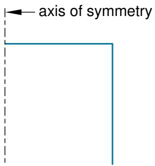  
Figure 5: An axisymmetric analytical rigid part.

You can import a part from a file containing geometry stored in a third-party format and define it to be either a deformable or a discrete rigid part; however, you cannot define an imported part to be an analytical rigid part. As an alternative, you can import the geometry of the analytical rigid part into a sketch. You can then create a new analytical rigid part and copy the imported sketch into the Sketcher toolset.

A rigid part in Abaqus/CAE is equivalent to a rigid surface in an Abaqus/Standard or Abaqus/Explicit analysis. For more information, see the following:

• Analytical Rigid Surface Definition  
• Rigid Body Definition  
• Rigid Elements  
• About Contact Interactions

## Additional information

• The reference point  
• Part types  
• How is a part defined in Abaqus/CAE?  
• Sketching simple objects

## Sketching the profile of an analytical rigid part

Several tools are available in the Sketcher to help you construct each portion of the rigid part profile:

## Lines

You use the Sketcher's Line tool to sketch straight lines.

## Arcs and fillets

You use the Sketcher's Arc and Fillet tools to sketch circular arcs or to fillet two lines. Any resulting arcs must subtend an angle less than 180°; if you want to construct an arc subtending an angle greater than 180°, you should create two adjacent arcs. Abaqus/CAE displays an error message if you create an arc subtending an angle greater than 180° while sketching the profile of an analytical rigid surface.

## Splines

You use the Sketcher's Spline tool to sketch parabolic splines. You create a parabolic spline by defining a three-point spline, where the three points are the start of the spline, a point anywhere along the spline, and the end of the spline. Only splines composed of exactly three points generate the profiles required by the analytical rigid part definition; consequently, Abaqus/CAE displays an error message if you create a spline using more than three points while sketching the profile of an analytical rigid part.

You can construct an analytical rigid part from any combination of lines, arcs, and parabolic splines; however, the resulting profile must be a single connected (but not necessarily closed) curve. In addition, the curve must be smooth to obtain a converged solution with Abaqus/Standard or Abaqus/Explicit. You may want to apply a sequence of small lines, arcs, or parabolic splines to eliminate any surface discontinuities (Abaqus/CAE does not have an equivalent to the FILLET RADIUS parameter on the Abaqus/Standard and Abaqus/Explicit\*SURFACE option). For more information on creating parabolic splines and maintaining tangency, see Sketching splines. For more information on the rules governing analytical rigid surfaces, see Analytical Rigid Surface Definition.

A sketch of an analytical rigid part that includes a line, an arc, and a fillet is illustrated in Figure 1.

  
Figure 1: A sketch of an analytical rigid part.

An analytical rigid part is defined completely by the two-dimensional profile of the base feature that you create with the Sketcher; consequently, the Part module tools cannot be used to add features when you return to the Part module from the Sketcher. You can modify the part only by editing the original sketch.

After you create an analytical rigid surface, you must assign a rigid body reference point to it. You control the motion of the analytical rigid surface by constraining or prescribing the motion of the reference point. For more information, see The reference point.

## Additional information

• Sketching simple objects

## What is the difference between a rigid part and a rigid body constraint?

You can create a rigid part in the Part module by creating a part and declaring its type to be discrete or analytical rigid. You can create a reference point and assign it to the rigid body reference point. Motion or constraints that you apply to the reference point are then applied to the entire rigid part.

Similarly, you can create a rigid body constraint in the Interaction module. Rigid body constraints allow you to constrain the motion of regions of the assembly to the motion of a reference point. The relative positions of the regions that are part of the rigid body remain constant throughout the analysis. In addition, you can select regions from a part instance and use a rigid body constraint to specify an isothermal rigid body for a fully coupled thermal-stress analysis. For detailed instructions on defining rigid body constraints and assigning a rigid body reference point, see Defining rigid body constraints.

You do not have to create a reference point for a part, even if the part type is discrete or analytical rigid. However, if you do not create a reference point for a rigid part, every instance of the part in the assembly must be included in a rigid body constraint.

Rigid parts are associated with parts; rigid body constraints are associated with regions of the assembly. For example, if you define a part to be rigid, every instance of the part in the assembly is rigid. In contrast, if you define a part to be deformable, you can use rigid body constraints to make only some of the instances rigid. If you do not create a reference point in the Part module, you cannot create a rigid body reference point by associating an instance of the rigid part with a reference point created in the Assembly module. However, you can associate the instance with a rigid body constraint and a reference point created in the Assembly module.

If you define a part to be rigid, you can use the Model Tree to change the part type to be deformable. To check that your basic model is correct, you might run a quick analysis with a part defined as rigid and then change the type to deformable. Similarly, if you define a part to be deformable and apply a rigid body constraint to an instance of the part in the assembly, you can easily remove the constraint at a later time. You can run your quick analysis with a rigid body constraint applied to the part instance and then remove the constraint and run a full analysis with the part instance acting as a deformable body. The two approaches are very similar.

## What is a display body?

A display body is a part instance that will be used for display only. You do not have to mesh the part, and the part is not included in the analysis; however, when you view the results of the analysis, the Visualization module displays the part along with the rest of your model. If Abaqus/CAE reports that an imported part is invalid, you can still include the part in your model as a display body. For more information, see What is a valid and precise part?.

You create a display body by applying a display body constraint in the Interaction module. You can apply a display body constraint to both deformable and rigid parts, and you can apply a display body constraint to parts containing both geometry and orphan elements. You can constrain the part instance to be fixed in space, or you can constrain it to follow selected points. For more information, see Understanding constraints. For an example of a model that uses display body constraints, see Display bodies.

## The reference point and point parts

This section describes how you can create a reference point that is associated with a part and how you can create a part containing just a single point that is also the reference point.

## In this section:

The reference point  
Point parts

## The reference point

You can use the Reference Point toolset to create a reference point that is associated with a part by selecting Tools->Reference Point from the main menu bar. A part can include only one reference point, and Abaqus/CAE labels it RP. Abaqus/CAE asks you if you want to delete the original point if you try to create a second point. A reference point on a part appears on all instances of the part in the assembly. The assembly can include more than one reference point, and Abaqus/CAE labels them RP-1, RP-2, RP-3, etc. For more information about the reference point, see The Reference Point toolset.

Abaqus/CAE displays the reference point at the desired location along with its label. You can change the reference point label by selecting Rename from the Model Tree. If desired, you can turn off the display of the reference point symbol and the reference point label; for more information, see Controlling reference point display.

If the part is a discrete or analytical rigid part, you use the reference point to indicate the rigid body reference point. When you create the assembly, the reference point appears on each instance of the part. You use the Interaction module to apply constraints to the reference point or the Load module to define the motion of the reference point using loads or boundary conditions. Motion or constraints that you apply to the reference point are then applied to the entire rigid part.

## Point parts

When you create a part, you can choose the shape of its base feature to be a solid, a shell, a wire, or a point. If you select a point, you must specify the coordinates of the point and Abaqus/CAE creates a part for which the base feature is a point at that location. In addition, the point is the reference point for the part. The modeling space of a point part can be three-dimensional, two-dimensional, or axisymmetric. The type of a point part can be either deformable or rigid.

You can continue to add features to a point part, such as datums and wires. More typically, you will use a point part to simplify your model by replacing a rigid part with a point part that has mass and inertia. You can add mass to a rigid point part; see Inertia. In addition, you can attach a display body to the point and use the display body to represent the original rigid part; see Display bodies. Finally, you can constrain the point part to your model by modeling a connector such as JOIN or REVOLUTE; see Connectors.

## What types of features can you create?

After you select the type and shape of the part and sketch the two-dimensional profile of its base feature, you add additional features or modify existing features to create the finished part.

## In this section:

Solid features  
Shell features  
Wire features  
Cut features  
Blend features

## Solid features

To create a solid feature, select Shape->Solid from the main menu bar or select one of the solid tools in the Part module toolbox. Once you have sketched the initial profile, you perform one of the following operations to create the feature:

• To create an extruded solid feature, you extrude the profile through a specified distance (d), as shown in Figure 1.

  
Figure 1: An extruded solid feature.

In addition, you can apply either draft or twist to the extrusion, as shown in Figure 2.

  
Figure 2: An extruded solid feature with draft and one with twist.

You define the draft angle for an extrusion with draft or the center of twist and the pitch (the extrusion distance in which a 360° twist occurs) for an extrusion with twist. Select Shape->Solid->Extrude from the main menu bar to create this type of feature.

To create a solid loft feature, you transition the shape from the initial loft section to an end section of a different shape or orientation. Abaqus/CAE determines the shape between the start and end sections using tangency constraints, intermediate sections, and a path curve. A simple loft (with only two loft sections, no tangency constraints, and a straight path) is shown in Figure 3. Select Shape->Solid->Loft from the main menu bar to create this type of feature.

  
Figure 3: A solid loft feature.

• To create a revolved solid feature, you revolve the profile through a specified angle ( ). A construction line serves as the axis of revolution, as shown in Figure 4.

  
Figure 4: A revolved solid feature.

In addition, you can enter a pitch value (p) to translate the profile along the axis of revolution as it is revolved; Figure 5 shows a solid revolved 360° with pitch. Select Shape->Solid->Revolve from the main menu bar to create this type of feature.

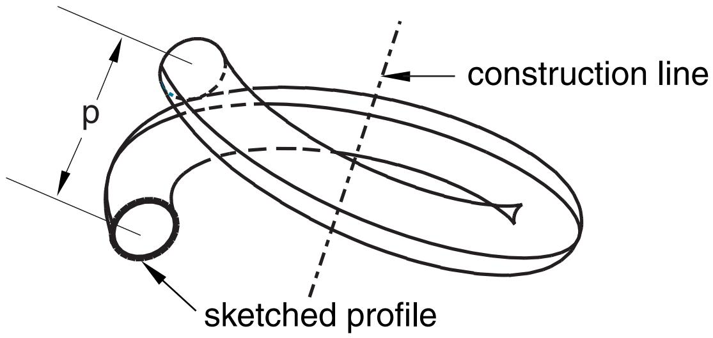  
Figure 5: A 360° revolved solid feature with pitch (p).

To create a swept solid feature, you sweep the profile along a specified path, as shown in Figure 6. Select Shape->Solid->Sweep from the main menu bar to create this type of feature. For more information, see Defining the sweep path and the sweep profile.

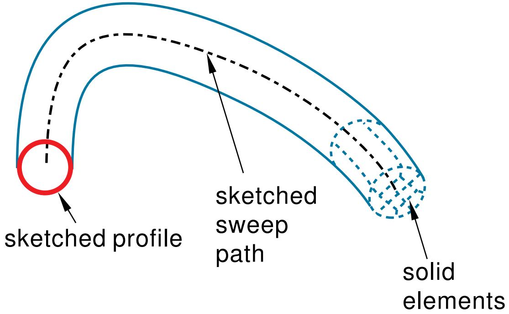  
Figure 6: A swept solid feature.

You can use any of the solid tools to add a solid feature to a deformable or discrete part that you created in three-dimensional modeling space. You cannot add a solid feature to a two-dimensional or axisymmetric part.

Figure 1, Figure 3, Figure 4, and Figure 6 illustrate how each feature might later be meshed. You can mesh a solid feature using any of the three-dimensional, solid continuum elements available in Abaqus/Standard or Abaqus/Explicit.

## Additional information

• Adding a solid feature  
• What is feature-based modeling?  
• Meshing complex solids with hexahedral elements

## Shell features

A shell feature is an idealization of a solid in which thickness is considered small compared to the width and depth. To create a shell feature, select Shape->Shell from the main menu bar or select one of the shell tools in the Part module toolbox. You create a shell feature by using the shell tools to do one of the following:

• To create an extruded shell feature, you sketch a profile and extrude it through a specified distance (d), as shown in Figure 1.

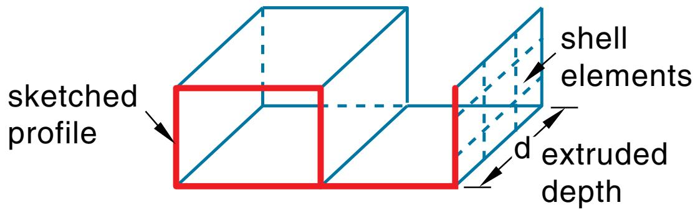  
Figure 1: An extruded shell feature.

In addition, you can apply either draft or twist to the extrusion, as shown in Figure 2.

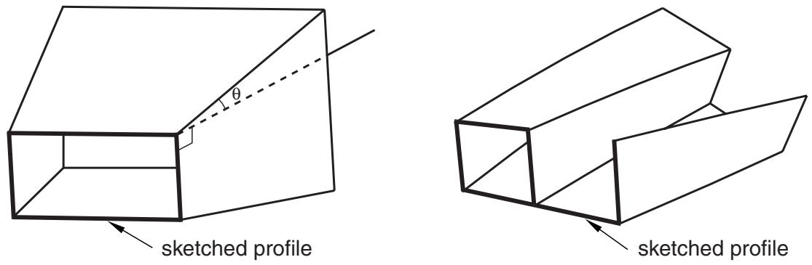  
Figure 2: An extruded shell feature with draft and one with twist.

You define the draft angle for an extrusion with draft or the center of twist and the pitch (the extrusion distance in which a 360° twist occurs) for an extrusion with twist. Select Shape->Shell->Extrude from the main menu bar to create this type of feature.

To create a shell loft feature, you transition the shape from the initial loft section to an end section of a different shape or orientation. Abaqus/CAE determines the shape between the start and end sections using tangency constraints, intermediate sections, and a path curve. A simple loft (with only two loft sections, no tangency constraints, and a straight path) is shown in Figure 3. Select Shape->Shell->Loft from the main menu bar to create this type of feature.

  
Figure 3: A shell loft feature.

• To create a revolved shell feature, you sketch a profile and revolve it through a specified angle ( ). A construction line serves as the axis of revolution, as shown in Figure 4.

  
Figure 4: A revolved shell feature.

In addition, you can enter a pitch value to translate the profile along the axis of revolution as it is revolved; Figure 5 shows a revolved shell with pitch.

  
Figure 5: A revolved shell feature with pitch.

The dimension h represents the translation of the sketched profile due to pitch; h would be equal to the pitch if the part was revolved a full 360°. Select Shape->Shell->Revolve from the main menu bar to create this type of feature.

• To create a swept shell feature, you sketch a profile and sweep it along a specified path, as shown in Figure 6.

  
Figure 6: A swept shell feature.

Select Shape->Shell->Sweep from the main menu bar to create this type of feature. For more information, see Defining the sweep path and the sweep profile.

• To create a planar shell feature, you sketch the outline of the shell on a selected planar face or datum plane, as shown in Figure 7.

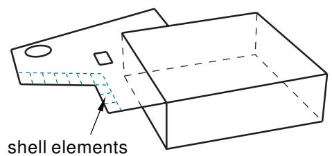  
Figure 7: A sketched shell feature.

When you sketch on a planar face (for example, the side of a cube), the shell feature is created only where it extends beyond the face; a shell feature cannot overlap a face. A sketch on a planar face of a cube and the resulting shell feature are shown in Figure 7. In this example the shell feature is a fin extending beyond the selected face of the cube. Select Shape->Shell->Planar from the main menu bar to create this type of feature.

To create a shell-from-solid feature, you convert the faces of a solid feature to shell features; in effect, hollow out a solid. A shell-from-solid feature is shown in Figure 8. Select Shape->Shell->From Solid from the main menu bar to create this type of feature.

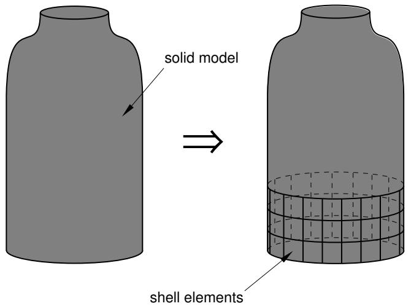  
Figure 8: A shell-from-solid feature.

You can use any of the shell tools to add a shell feature to a part that you created in three-dimensional modeling space; however, when you are working on parts created in two-dimensional or axisymmetric modeling space, you can use only the planar shell tool to add a shell feature. You use the Property module to create a section prescribing the desired thickness and to assign the section to the shell feature. For more information, see Defining sections, and Which properties can I assign to a part?.

Many of the figures illustrate how the shell features might later be meshed. You can mesh a shell feature using:

• Two-dimensional or axisymmetric continuum elements (limited to planar shell features)  
• Three-dimensional shell elements  
• Membrane elements

## Additional information

• Adding a shell feature  
• What is feature-based modeling?

## Wire features

A wire is depicted as a line in Abaqus/CAE and is used to idealize a solid in which both its thickness and depth are considered small compared to its length. To create a wire feature, select Shape->Wire from the main menu bar or select one of the wire tools in the Part module toolbox. You create a wire feature in the Part module using the wire tools to do one of the following:

• Sketch a wire on a selected planar face or datum plane to create a sketched wire feature, as shown in Figure 1. Select Shape->Wire->Sketch from the main menu bar to create this type of feature.

  
Figure 1: A sketched wire feature.

When you sketch on a planar face (for example, the side of a cube), the wire feature is created only where it extends beyond the face.

Connect two or more points with straight lines, as shown in Figure 2, or with a spline curve, as shown in Figure 3. Select Shape->Wire->Point to Point from the main menu bar to create this type of feature. Select Polyline or Spline for the Geometry Type to create straight lines or a spline curve, respectively. You can choose to imprint the wire on the existing part by creating edges, merge the wire with the existing part, or create the wire separate from the existing part. The rectangular solid feature in Figure 3 is shown for reference. The image on the left shows the full length of the spline wire using the Imprint wire or Separate wire options, while the image on the right shows a spline wire connecting the same set of points using the Merge wire option. You can create geometry sets that include the wires and vertices defined in the wire feature.

  
Figure 2: A wire feature connecting three points.

  
Figure 3: A wire feature connecting several points of a solid feature.

You can use the wire tools to add a wire feature to any deformable or discrete rigid part. You cannot add a wire feature to an analytical rigid part; you can only modify the original sketch that defined that part.

You use the Property module to create a section that prescribes the desired cross-sectional geometry and to assign that section to the wire feature. (For more information, see Defining sections, and Which properties can I assign to a part?.) You can model a wire feature using any of the beam, truss, or axisymmetric shell elements available in Abaqus/Standard or Abaqus/Explicit.

## Note:

Although you can create a mesh of beam elements, the current release of Abaqus/CAE allows you to assign only the following sections to a wire:

• Beam section  
• Truss section

## Additional information

• Adding a wire feature  
• What is feature-based modeling?

## Cut features

A cut is a feature that removes material from a part. A cut can be a circular hole, or it can be any arbitrary shape. The sketched profile of any cut must be closed. In many cases the entire profile will affect the shape of the cut feature, even if it does not initially contact the surface being cut. To create a cut feature, select Shape->Cut from the main menu bar or select one of the cut tools in the Part module toolbox.

## Note:

Most of the figures do not show a closed cut profile where it intersects with the part surface. These lines have been removed to show the shape of the cut feature.

Once you have sketched the initial profile, you perform one of the following operations to create a cut feature:

• To create an extruded cut, you extrude the profile through a specified distance (d), as shown in Figure 1.

  
Figure 1: An extruded cut feature.

In addition, you can apply either draft or twist to the extruded cut, as shown in Figure 2. You define the draft angle for an extruded cut with draft or the center of twist and the pitch (the extrusion distance in which a 360° twist occurs) for an extruded cut with twist. Select Shape->Cut->Extrude from the main menu bar to create this type of feature.

  
Figure 2: Extruded cut features with draft and twist.

To create a cut loft feature, you transition the shape from the initial loft section to an end section of a different shape or orientation, as shown in Figure 3. Abaqus/CAE determines the shape between the start and end sections using tangency constraints, intermediate sections, and path curves. Select Shape->Cut->Loft from the main menu bar to create this type of feature.

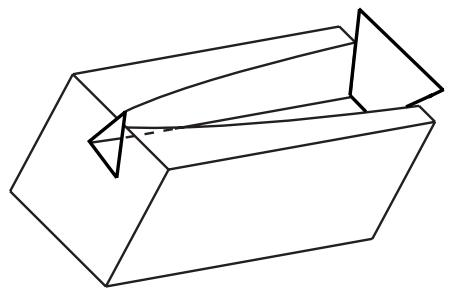  
Figure 3: A cut loft feature.

To create a revolved cut, you revolve the profile through a specified angle ( ). A construction line serves as the axis of revolution. In addition, you can enter a pitch value to translate the profile along the axis of revolution as it is revolved and to create part details such as screw threads. Figure 4 shows a revolved cut and a revolved cut with pitch. Select Shape->Cut->Revolve from the main menu bar to create this type of feature.

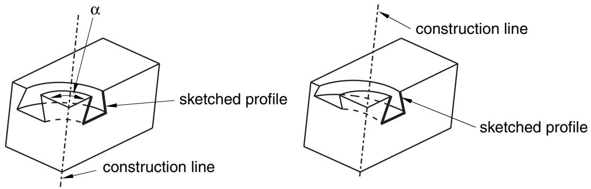  
Figure 4: A revolved cut and a revolved cut with pitch.

To create a swept cut, you sweep the profile along a specified path, as shown in Figure 5. Select Shape->Cut->Sweep from the main menu bar to create this type of feature. For more information, see Defining the sweep path and the sweep profile.

  
Figure 5: A swept cut feature.

• To create a circular hole, you enter the diameter of a hole and the distance of its center from two selected edges, as shown in Figure 6. Select Shape->Cut->Circular Hole from the main menu bar to create this type of feature.

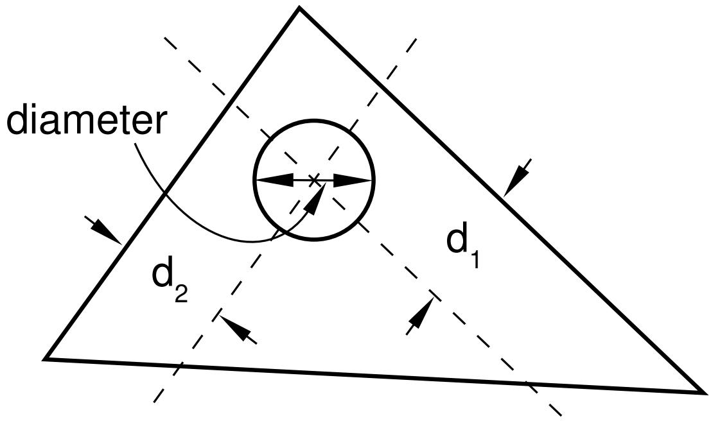  
Figure 6: A circular hole feature.

When you are sketching the profile of an extruded, revolved, or swept cut, you can sketch multiple profiles in a single sketch. Abaqus/CAE extrudes each of the profiles when you exit the Sketcher and creates a cut corresponding to each profile as shown in Figure 7.

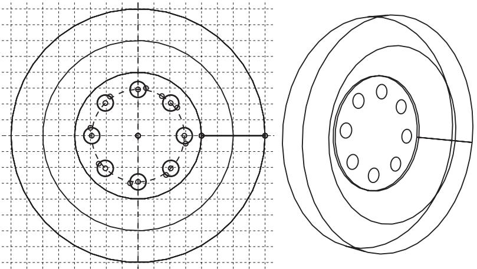  
Figure 7: Multiple profiles extruded from a single sketch.

The sequence of cuts is stored as a single feature, and you can edit it only as a single feature. For example, if you change the extrusion depth, the depth will change for all the cuts in the feature.

You can use the cut tools to add a cut feature to any deformable or discrete rigid part. You cannot add a cut feature to an analytical rigid part; you can only modify the original sketch that defined that part.

## Additional information

• Adding a wire feature  
• What is feature-based modeling?

## Blend features

A blend feature smooths an edge of a three-dimensional solid part. To create a blend feature, select Shape->Blend from the main menu bar or select one of the blend tools in the Part module toolbox. You create a blend feature in the Part module using the blend tools to do one of the following:

Smooth an edge with a circular blend of a specified radius, as shown in Figure 1. Select Shape->Blend->Round/Fillet from the main menu bar to create this type of feature.

  
Figure 1: A round/fillet blend feature.

• Bevel an edge with a chamfered blend of a specified length, as shown in Figure 2. Select Shape->Blend->Chamfer from the main menu bar to create this type of feature.

  
Figure 2: A chamfer blend feature.

You can use the blend tools to blend edges of a deformable or discrete rigid part that you created in three-dimensional modeling space. You cannot add a blend feature to a two-dimensional or axisymmetric part; however, you can blend its corners by editing the sketch of the part.

## Additional information

• Adding a wire feature  
• What is feature-based modeling?

## Using feature-based modeling effectively

You can devise a more efficient approach to creating a part if you understand how Abaqus/CAE uses feature-based modeling and how the rules that define a feature are applied. The following techniques will help you create robust parts that can be modified easily:

## Plan a strategy

Feature-based modeling provides flexibility, but it can also add overhead to your model. For example, you can suppress an extrusion using the suppress tool in the Feature Manipulation toolset. Alternatively, you could effectively suppress the extrusion by removing it with a cut feature. Although you could restore the extrusion subsequently by removing the cut feature, the resulting part contains additional feature-based information that can slow down regeneration. Regeneration speed can be improved by using the geometry cache to save parts in different states, but the cache uses system memory that may be needed for other operations (for more information, see Tuning feature regeneration). In addition, dependencies may cause feature regeneration to fail if you add more detail to the part; and, because the extrusion is no longer visible, the cause of the failure to regenerate may be hard to determine.

Before you decide how to create a part, you should always consider if you will ever need to modify the part in the future. If you decide that you might need to modify the part, you should consider the techniques that you will use to create the features that define the part. The simplest techniques may not provide the flexibility you need for modifying the features. You may find it cumbersome to edit or suppress individual items of geometry, such as an extrusion, a fillet, or a hole.

Alternatively, if you know that you will never change the final design, you may not need the flexibility provided by feature-based modeling and can use the simplest and most convenient techniques to define the part.

In general, you should try to finish creating your parts in the Part module before you start creating part instances and positioning them in the assembly. You should try to finish creating all your parts before you apply attributes to the assembly, such as sets, loads, and boundary conditions. If you apply attributes to the assembly and then return to the Part module to modify the original part, Abaqus/CAE may not be able to determine where the attribute should be applied. For example, if you apply a pressure load to a face and then return to the Part module to partition the face into two regions, Abaqus/CAE will apply the pressure to only one of the regions.

## Use reference geometry

When you are adding a feature to a part, you should always use underlying reference geometry to define the new feature's location relative to existing features. While sketching a feature, you may be able to select reference geometry directly; for example, if you are sketching a circle, you may be able to select a vertex from the reference geometry to define its center. Alternatively, you may have to add a dimension between reference geometry and the new feature. If you do not use reference geometry to position the sketch of a new feature and you subsequently modify the part, the resulting changes to the feature can be unpredictable.

## Use dimensions

Dimensions add clarity to the sketches that define features and document your design intent for future reference. Dimensions also add constraints to your sketches. You can modify dimensions in the Sketcher, and the part and assembly will regenerate accordingly.

## Pay attention to the order in which you create features

A new feature of a part is aware of existing features. In addition, if the new feature depends on an existing feature for positioning information, Abaqus/CAE creates a parent-child relationship between the features. Parent-child relationships and the order in which you created features play an important role in feature regeneration.

A modeling scheme that is carefully ordered and follows the sequence below is less likely to run into unnecessary or ill-conditioned modeling problems:

2. Add extruded, revolved, swept, and planar features.  
3. Add round or fillet features.  
4. Add partitions only when the rest of the geometry is complete.

1. Create the basic geometry of a part using extrusions, revolutions, cuts, and sweeps.

## Allow for some overlap

If possible, you should allow for overlap between an existing feature and a feature that fills a hole or cuts a hole. Allowing for overlap makes your part robust, and the features are more likely to regenerate successfully. For example, when you cut a slot, extend its sketched profile above the surface you are cutting, as shown in Figure 1.

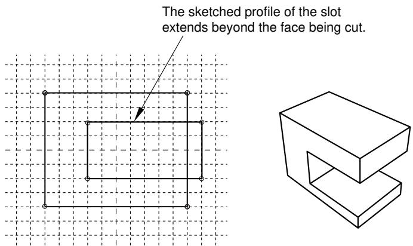  
Figure 1:The sketched profile of a slot should extend beyond any surfaces that are cut.

## Create solids where possible

Solid features are more robust than shell features. You may find it hard to position a group of shell features and match up the edges precisely. In contrast, sections of a solid can overlap and tolerance becomes less critical. Another advantage of using a solid is that you can use round and chamfer features to define the geometry. If you are modeling a shell, you should try to create solid features and convert the solids to shells when you have finished defining the shape. In addition, if you subsequently want to add additional shell features to a shell part, where the shell part was generated from a solid, you should do the following:

1. Delete the last solid-to-shell feature to convert the model back to a solid.  
2. Add your new solid features.  
3. Create a new solid-to-shell feature to convert the model back to a shell.

## Additional information

• What is feature-based modeling?  
• Modifying and manipulating features  
• Capturing your design and analysis intent

## Capturing your design and analysis intent

If used carefully, the feature-based modeling approach used by Abaqus/CAE allows you to capture both your design and analysis intent.

Design intent is the capability to make changes based on design considerations. For example, when you add a cut feature, you can select either a through cut or a blind cut. If the cut feature represents a bolt hole, you know that the hole must always pass completely through the part. As a consequence, you should select a through cut, and Abaqus/CAE recognizes that the hole remains through even when you change the thickness of the part.

Analysis intent is the capability to make changes based on analysis considerations. Although Abaqus/CAE allows you to create parts with complex, detailed geometry, your final goal is usually a finite element analysis of a meshed representation of the part. Excessive detail, such as fillets and small holes, can lead to regions with a very fine mesh that will, in turn, dominate the time taken by Abaqus/Standard or Abaqus/Explicit to reach a solution. The amount of detail you provide when you create a part in the Part module should be a reflection of your goals. Alternatively, you can create a part with detailed features but suppress them prior to meshing the assembly. For example, if a model takes several hours to analyze, you may wish to simplify it by suppressing features; you could then submit an analysis that runs faster and checks your basic modeling assumptions. If the simplified model behaves as expected, you can unsuppress the features and resubmit a full analysis.

For an example of different feature-based design approaches based on design and analysis intent, consider the cover plate shown in Figure 1.

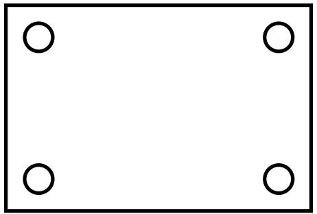  
Figure 1: A model of a cover plate.

You could create the three-dimensional shell that models the plate in several ways:

1. Sketch a base feature that includes the four holes.  
2. Sketch a rectangular base feature, and add four separate cut features.  
3. Sketch a rectangular base feature, and add a single cut feature that cuts all four holes.

Either of the three approaches would generate the same part, but your design intent and your analysis intent govern the best approach. For example:

Do you want to create and analyze plates of varying sizes with different sized holes for different applications? If the diameter of all four holes is always identical, you should create all four holes as a single cut feature. However, if the diameter of individual holes might differ, you should create four separate cut features.  
Do you want to suppress features before you finalize your design? For example, you could perform a series of analyses with the holes suppressed to determine the desired plate thickness. You could then unsuppress the holes and analyze the finished model. In addition, suppressing features may simplify the mesh that Abaqus/CAE generates, or suppressing features may make the assembly sweep meshable.

If you want to suppress all four holes in the example of the rectangular cover plate, you should create all four holes as a single cut feature. However, if you want to suppress individual holes, you should create four separate cut

features. If the analysis is straightforward and you do not need to analyze a simplified model, you should sketch a base feature that includes the four holes.

## Additional information

• What is feature-based modeling?  
• Modifying and manipulating features  
• Using feature-based modeling effectively

## What is part and assembly locking?

Part and assembly locking is an Abaqus/CAE function that prevents any changes to the features of a part or to the features of the assembly. You can lock parts or the assembly to prevent accidental changes, such as when sharing a model with other Abaqus users or when working on a model that contains many similar parts. You must unlock a part or the assembly if you plan on modifying it.

## Note:

Part and assembly locking is not a security feature; any user can unlock and modify parts and assemblies that were locked by another user.

You can click mouse button 3 on a part or on the assembly in the Model Tree and use the menu that appears to lock and unlock the feature. A padlock before the feature name in the Model Tree indicates that a part or the assembly has been locked by the user or by a database upgrade. For more information, see Using the Model Tree to manage features.

Alternatively, you can use the Part Manager to lock or unlock any part in a model. If the part is unlocked, the Status field is empty in the Part Manager. If the part is locked, the Status field indicates one of two conditions:

## Locked (Database upgrade)

Abaqus/CAE locked the part automatically while upgrading the model from a previous release of Abaqus.

## Locked

A user locked the part using the Model Tree or the Part Manager.

Abaqus/CAE automatically locks the assembly and all the parts in a model when it upgrades a database from an older release of Abaqus. Locking the assembly and the parts allows Abaqus/CAE to complete the upgrade faster than if the assembly and all the parts were also regenerated. If you unlock a part that was locked by a database upgrade, Abaqus/CAE regenerates that part. Similarly, if you unlock an assembly that was locked by a database upgrade, Abaqus/CAE regenerates the assembly.

## Warning:

If a part is locked due to a database upgrade, you should unlock the part prior to making any changes to set or property definitions. If you unlock the part after making modifications, your changes can become invalid when Abaqus/CAE regenerates the part.

If you unlock a part that you locked with the Model Tree or the Part Manager, Abaqus/CAE does not regenerate the part because it could not be modified while it was locked. Similarly, Abaqus/CAE does not regenerate the assembly when you unlock it after locking it with the Model Tree. If a part that you unlock fails to regenerate, both the locked version and the unlocked version are retained. You can recreate missing features on the unlocked version of the part and use it to replace the locked part throughout the model.

You can instance a locked part and use it in the assembly. In addition, you can add or delete set or property definitions to a locked part or to a locked assembly. However, you must unlock a part or the assembly before you can add features to it or edit existing features.

## What are extruding, revolving, and sweeping?

The following sections describe the techniques you can use to extrude, revolve, and sweep a two-dimensional sketch to create a three-dimensional part or feature.

## In this section:

Defining the extrusion distance  
Controlling the direction of an extruded feature  
Including twist in an extrusion  
Including draft in an extrusion  
Defining the axis of revolution for axisymmetric parts and for revolved features  
Controlling the direction of a revolved feature  
Controlling the cross-section of a revolved feature with pitch  
Defining the sweep path and the sweep profile

## Defining the extrusion distance

You can sketch a two-dimensional profile and extrude it to create the following:

• A three-dimensional extruded solid feature.  
• A three-dimensional extruded shell feature.  
• A three-dimensional extruded cut feature.

Abaqus/CAE provides the following methods for defining the extrusion distance:

## Blind

Specify the distance over which Abaqus/CAE extrudes the sketch. The sketch and the distance define the feature and can be edited using the Feature Manipulation toolset. You can use this method when creating extruded solid, shell, and cut features. Figure 1 illustrates a blind extruded cut in a solid part.

  
Figure 1: A blind extruded cut.

## Up to Face

Select a single face to which Abaqus/CAE extrudes the sketch. The selected face does not have to be parallel to the sketch plane. The selected face can be a nonplanar face; however, it must completely contain the extruded section. If you select this method to define the extrusion distance, only the sketch can be modified using the Feature Manipulation toolset; if you wish to extrude to a different face, you must create a new extruded cut feature. You can use this method when creating extruded solid, shell, and cut features. Figure 2 illustrates a sketch extruded to a nonplanar face.

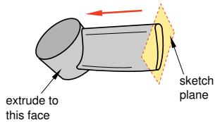  
Figure 2: A solid feature extruded up to a nonplanar face.

## Through All

This method is available only for extruded cut features. Abaqus/CAE extrudes the sketch defining the profile of the cut completely though the part. If you select this method to define the extrusion distance, only the sketch can be modified using the Feature Manipulation toolset. Figure 3 illustrates a through all cut in a solid part.

  
Figure 3: A through all extruded cut.

## Controlling the direction of an extruded feature

When you add an extruded feature to a three-dimensional part, Abaqus/CAE chooses a default direction of extrusion from the sketched profile based on the type of feature you are creating. By default, a solid or shell feature is extruded outward such that material is added to the existing base feature. Conversely, a cut feature is extruded inward such that material is removed from the existing base feature.

You can control the direction of an extruded feature as follows:

## Choosing the direction while adding an extruded feature

When you complete the sketch to add an extruded feature to an existing part, Abaqus/CAE displays the new sketched profile on the original part. The sketched profile includes an arrow that indicates the extrusion direction. Abaqus/CAE also displays the Edit Extrusion dialog box.

You can control the direction of extrusion by clicking in the Edit Extrusion dialog box. The arrow in the viewport changes direction to show the new extrusion direction.

## Editing the direction of an existing extruded feature

When you select an extruded feature to edit, Abaqus/CAE highlights the selected feature in the viewport and the Edit Feature dialog box appears.

You can reverse the direction of extrusion by toggling Flip extrude direction in the Edit Feature dialog box. Abaqus/CAE does not display an arrow that indicates the direction of extrusion; however, you can click Apply to view your changes. When the direction is acceptable, click OK to end the editing process.

You cannot change the direction of extrusion when you are creating a new part because the part would be identical regardless of the direction.

## Additional information

• Adding an extruded solid feature  
• Adding an extruded shell feature  
• Creating an extruded cut

## Including twist in an extrusion

You can choose to include twist during the creation of an extrusion. Twist can be used to create twisted cables, helical gears, and other complex shapes that can be formed by passing a constant cross-section through a sequence of parallel planes. Twist modifies an extrusion by rotating the sketched profile about an axis parallel to the direction of extrusion. The center of twist is an isolated point in the sketched profile; it is the point at which the axis used to twist the extrusion passes through the sketch plane. The pitch defines the extrusion distance in which the profile would be twisted by 360°. You can modify the extrusion profile, extrusion direction, center of twist, and pitch using the Feature Manipulation toolset.

You can add twist during the creation of extruded solid, shell, and cut features. Figure 1 illustrates a twisted extrusion.

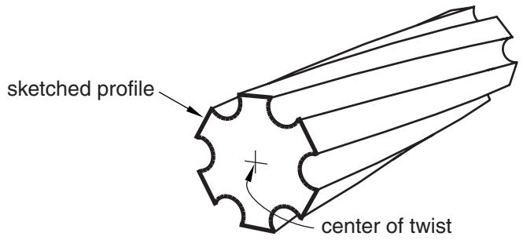  
Figure 1: A solid feature extruded with twist.

If you want to create complex shapes in which the sketched profile is revolved rather than extruded, such as screw threads or coil springs, you can include pitch in a revolved solid, shell, or cut feature. See What types of features can you create?, for basic information about all the available feature types and Defining the axis of revolution for axisymmetric parts and for revolved features, for more information about revolved features.

## Additional information

• Adding an extruded solid feature  
• Adding a revolved solid feature  
• Adding an extruded shell feature  
• Adding a revolved shell feature  
• Creating an extruded cut  
• Creating a revolved cut  
• Meshing complex solids with hexahedral elements

## Including draft in an extrusion

You can choose to create an extrusion with draft. Draft can be used to accurately represent the small angle often applied to ease the removal of cast or molded parts from the tooling. Draft in an extrusion can also be used to create tapered parts.

In a straight extrusion the draft angle is 0°, so all extruded surfaces are perpendicular to the original profile. Draft modifies an extrusion by adjusting the angle between the extruded surfaces and the original sketch plane. Abaqus/CAE reverses the application of draft angle from internal to external features. If external loops in a sketched profile are expanding, internal ones are contracting; this behavior is expected for draft and is required for part removal from tooling (all surfaces taper in the same direction).

You can modify draft, along with the extrusion profile and direction, using the Feature Manipulation toolset. You can add draft during the creation of extruded solid, shell, and cut features. Figure 1 illustrates an extruded cut with draft in a solid part.

  
Figure 1: A cut feature extruded with draft.

## Note:

The complete sketched profile for the cut in Figure 1 is a triangle, as shown. If the profile were a trapezoid whose top edge coincided with the edge of the block, the cut would look very different. As the profile was extruded, the application of draft made it smaller. The top face of a trapezoid profile would immediately fall below the surface of the block instead of extending through the top surface.

Abaqus/CAE cannot mesh an extruded solid that includes draft with hexahedral elements unless you partition the solid into structured regions.

## Defining the axis of revolution for axisymmetric parts and for revolved features

When you create an axisymmetric part and when you add a revolved feature to a part, the sketch of the profile must include a construction line that defines the axis of rotation. The following rules apply to the sketch and to the construction line:

## Creating an axisymmetric part

You can create axisymmetric parts that are defined by either a shell or a wire along with an axis of symmetry by selecting Part->Create from the main menu bar. Abaqus/CAE allows you to include a twist degree of freedom in your model when you create an axisymmetric part.

When you sketch the part's base feature, Abaqus/CAE displays a vertical construction line on the Y-axis of the sketch representing the axis of symmetry. You must sketch only to the right of the line. Your sketch can touch this line but cannot cross it.

You can add only shell and wire features to an axisymmetric base feature. Abaqus/CAE displays the original sketch and construction line when you add a feature, and the same rules apply—you cannot delete this construction line, and you must sketch only to the right of it.

## Creating revolved features

You can create three-dimensional parts with a revolved solid or a revolved shell base feature by selecting Part->Create from the main menu bar. Similarly, you can add revolved solids, shells, and cuts to three-dimensional solids and shells by selecting Shape->Solid->Revolve, Shape->Shell->Revolve, or Shape->Cut->Revolve from the main menu bar.

The sketch of a revolved feature must contain a construction line representing the axis of revolution. When you create a new revolved part, Abaqus/CAE creates a vertical construction line through the origin of the Sketcher grid. If desired, you can delete this construction line and redraw it at a new angle and position. In contrast, when you add a revolved feature to an existing part, you must sketch the construction line representing the axis of revolution. You can sketch to the right or to the left of the construction line. Your sketch can touch this line but cannot cross it. If the completed sketch contains more than one construction line, Abaqus/CAE prompts you to select the line that will represent the axis of revolution.

When you are sketching the construction line that represents the axis of revolution, you can position the construction line by selecting a datum axis from the underlying part if one exists. You cannot select the datum axis directly; you must select a point from either end of the datum axis. You can use the datum axis to create concentric features.

When you exit the Sketcher, Abaqus/CAE opens a dialog box to complete the definition of the revolved feature. You enter the angle through which the profile will be revolved and the direction of revolution, and you can choose whether to translate the profile along the axis of revolution by including pitch. You can also specify the direction of translation. The pitch value is the distance through which the profile would be translated during a rotation of 360°. Pitch allows the creation of parts such as coil springs and part details such as screw threads.

If you want to create complex shapes in which the sketched profile is extruded rather than revolved, such as twisted cables or helical gears, you can include twist in an extruded solid, shell, or cut feature. See What types of features can you create?, for basic information about all the available feature types and Defining the extrusion distance, for more information about extruded features.

## Additional information

• Adding an extruded solid feature  
• Adding a revolved solid feature  
• Adding an extruded shell feature

• Adding a revolved shell feature  
• Creating an extruded cut  
• Creating a revolved cut

## Controlling the direction of a revolved feature

When you create a part with a revolved base feature or add a revolved feature to a three-dimensional part, you can control the direction of revolution. If you include pitch in a revolved feature, you can also control the direction of translation. The descriptions that follow provide the details of controlling both the direction of revolution and, if applicable, the direction of translation for any revolved feature that you create in Abaqus/CAE:

## Choosing the direction while creating a revolved feature

When you complete the sketch to create a revolved feature, Abaqus/CAE displays the sketched profile including an arrow that indicates the direction of revolution. If you are creating a part with a revolved base feature, the axis of revolution is also displayed. In addition, Abaqus/CAE displays the Edit Revolution dialog box.

If desired, rotate the view until you can discern the arrow direction that indicates the direction of revolution.

You can reverse the direction of revolution by clicking for Revolve direction in the dialog box. The arrow in the viewport changes direction to show the new direction of revolution.

If you select Include translation for the revolved feature, a second arrow appears in the viewport to indicate

the direction of translation. Similar to the change for the direction of revolution, the corresponding arrow in the viewport changes direction to show the new translation direction.

## Editing the direction of an existing revolved part or feature

When you select a revolved feature to edit, Abaqus/CAE highlights the selected feature in the viewport and the Edit Feature dialog box appears.

To reverse the direction of revolution, toggle Flip revolve direction in the Edit Feature dialog box. Click Apply to view your changes.

If the revolved feature you are editing includes pitch, you can edit the direction of translation. Toggle Flip pitch direction to reverse the direction of translation. Click Apply to view your changes.

Click OK to accept the changes.

## Additional information

• Adding a revolved solid feature  
• Adding a revolved shell feature  
• Creating a revolved cut  
• Meshing complex solids with hexahedral elements

## Controlling the cross-section of a revolved feature with pitch

When you create a revolved feature without pitch, the sketched profile is swept about a circular path described by the radius between the axis of revolution and the sketch. The cross-section of the revolved feature is the sketch; the cross-section is both parallel to the axis of revolution and normal to the circular path at all times.

When you include pitch in a revolved feature, the path of the sketch becomes helical instead of circular. You can choose to keep the sketch parallel to the axis of revolution, or you can choose to rotate the sketch normal to the helical path.

To make your sketched profile normal to the helical path of the revolved feature with pitch, toggle on Sweep sketch normal to path in the Edit Revolution dialog box. When Abaqus/CAE creates the revolved feature, it rotates the sketched profile such that it is normal to the path of revolution at the starting point. The profile remains normal to the path throughout feature creation. Regardless of the pitch value, the cross-section will match the sketched profile. Using this option, you can create coil springs or other features where the cross-section to the path is your sketched profile.

If you do not choose Sweep sketch normal to path, the sketched profile remains parallel to the axis of revolution and the cross-section of the revolved feature will vary from the profile. The difference between the profile and the cross-section will increase as you increase the value of pitch. For example, if there is no pitch, a circular sketched profile creates a circular cross-section. If you increase the pitch, the cross-section will become increasingly elliptical. You can create screw threads or other features where the cross-section parallel to the axis of revolution is your sketched profile.

To change the cross-section behavior after the feature is created, you can toggle Move sketch normal to path in the Edit Feature dialog box.

## Additional information

• Adding a revolved solid feature  
• Adding a revolved shell feature  
• Creating a revolved cut  
• Meshing complex solids with hexahedral elements

## Defining the sweep path and the sweep profile

To create a swept feature, select Shape->Solid->Sweep, Shape->Shell->Sweep, or Shape->Cut->Sweep from the main menu bar or select the equivalent tool from the Part module toolbox. Abaqus/CAE displays the Create Solid Sweep, Create Shell Sweep, or Create Cut Sweep dialog box.

Sweeping is a two-part operation: first you define the sweep path, and then you define the sweep profile. The profile is swept along the length of the path to form a three-dimensional solid, shell, or cut feature. The sweep path can be any continuous path you can create with the Sketcher or any series of connected edges or wires in your part. The latter option allows you to define a three-dimensional sweep path, such as a point-to-point spline wire; the sketch method provides greater flexibility but supports only two-dimensional paths. Figure 1 shows an example of a sweep path and a sweep profile.

  
Figure 1: An example of a sweep path and profile.

The feature created by sweeping the sweep profile along the above path is shown in Figure 2.

  
Figure 2:The resulting swept feature.

The sweep profile can be defined either in the Sketcher or by selecting components in the geometry. For solid or cut swept features you can select one of the faces in your part to use as the sweep profile; for shell swept features you can select one or more edges in your part to use as the sweep profile.

If you define your sweep path or sweep profile using the Sketcher, you can modify that feature using the Feature Manipulation toolset. The sweep tools are available only when you are working on a deformable or discrete part that you created in a three-dimensional modeling space.

You can define a swept solid, swept shell, or swept cut feature whose sweep profile is offset from the sweep path. In this case Abaqus/CAE moves the sweep path to a parallel location that passes through the sweep profile and creates the swept feature at that location.

You can control whether the orientation of the sweep profile changes as it travels along the sweep path. Applying a draft to a sweep feature works best when the sweep path is linear. If you toggle on Keep profile normal constant, Abaqus/CAE does not change the sweep profile orientation and the profile at the beginning of the sweep path will be parallel to the profile at the end of the sweep path. If you toggle off this option, Abaqus/CAE adjusts the orientation of the sweep profile so that the angle between the sweep path and the profile normal remains constant as the profile travels down the sweep path. The draft option and Keep profile normal constant option are mutually exclusive; Abaqus/CAE toggles off one of these options if you select the other.

The sweep profile must be closed when you are creating a swept solid or cut feature. However, unlike the sweep profile, the sweep path can be open or closed regardless of whether you are creating a swept solid, shell, or cut feature. If the sweep path is closed, the two ends of the path must meet tangentially. For example, the closed sweep paths labeled “Bad” in Figure 3 are not allowed because the ends of the path meet at an angle.

  
Bad

  
Good

  
Bad

  
Good

  
Good  
Figure 3: Valid and invalid sweep paths.

= start and end of sweep path are coincident

As you define your sweep feature, you can apply a twist or draft. For more information about these tools, see What types of features can you create?. You can also toggle on Keep internal boundaries to maintain any faces or edges that are generated between the swept solid feature and the existing part. The internal boundaries can create regions that can be structured or swept meshed without having to resort to partitioning.

## Additional information

• What is feature-based modeling?  
• Adding a point-to-point wire feature

## What is lofting?

Lofting is a method that allows you to create complex three-dimensional features that cannot be created by extruding, revolving, or sweeping.

For example, you can use lofts to model an exhaust manifold that would be difficult to create by other means due to varying cross-sections. You can create solid, shell, or cut loft features in Abaqus/CAE. A loft feature transforms from a starting section shape and orientation to an ending shape and orientation. You first create sections that define the shape of the loft as it passes through an area in space. Then Abaqus/CAE can create the path between sections automatically, or you can define one or more continuous paths connecting one point on each loft section to a corresponding point on the next section. You can also choose from several tangency options to control the shape of the loft as it leaves the starting section or as it approaches the ending section. This section describes the options available for defining the loft sections, loft paths, and loft tangencies prior to creating a loft feature and explains self-intersection.

## In this section:

Defining the loft sections  
Defining a loft path  
Defining loft tangency  
Self-intersection checks

## Defining the loft sections

Loft sections represent the shape that the loft feature will have at a particular point along a loft path. At least two sections are required to create a loft feature. You can create additional sections to control the shape of the loft between the starting and ending sections. In a solid or cut loft, each loft section must be a closed loop with no branches. In a shell loft, the loft sections can either all be open or all be closed. You can define planar or nonplanar loft sections to create a loft feature. Once the loft is created, the number of sections and their order within the loft cannot be changed.

You create loft sections by picking from existing edges on the part in the current viewport. Any edges can be selected; for example:

• Edges that define extruded, revolved, or swept features.  
• Edges that define planar wire or shell features.  
• Spline wire features.

You can use individual edges from several features to define a single section. However, planar wires sketched on datum planes are one of the simplest means you can use to define the loft sections. Using the simplest means to define your loft sections will give you more control and will result in a more robust loft feature.

You cannot modify loft sections directly. Once you create the loft feature, you can use the Feature Manipulation toolset to edit features that created the edges used in the loft sections. Moving a vertex or edge that is used in a loft section will change the shape of the section and the shape of the corresponding loft feature.

## Defining a loft path

Each loft feature that you create requires at least one loft path. When you have defined the loft sections, you can choose to modify the loft path or paths. The paths of a loft feature connect a point on the starting section to a point on the ending section. If more than two loft sections are defined, each path also passes through a point on each intermediate section. You can define a loft path using the options on the Transition tabbed page of the Edit Loft dialog box.

When you create a loft feature, you can choose from the following methods to define a loft path:

## Specify tangencies

Specify tangencies is the default loft path definition. If you select Specify tangencies, Abaqus/CAE creates a single smooth path that passes through the center of each loft section, as shown in Figure 1. You can apply tangency conditions that modify the shape of the loft near the starting and ending loft sections. For more information on loft tangency, see Defining loft tangency.

  
Figure 1: A loft feature with a path defined by Abaqus/CAE.

## Select path

If you choose Select path, you can select from existing edges to define a loft path. This method also allows you to define multiple loft paths. The loft feature is created by following the loft paths as they connect one loft section to the next, as shown in Figure 2. A loft feature with a single selected path behaves similarly to a swept feature except that the cross-section of the loft is constantly changing to match the position and shape of the next loft section along the path.

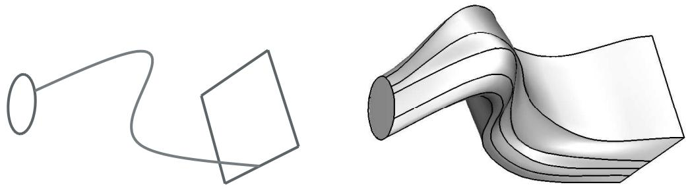  
Figure 2: A loft feature with a single user-defined path.

You must pick from existing line segments in the viewport to create paths connecting all of the loft sections. Each path must be a smooth curve, and it must connect the sections in the same order that they will be connected when the loft is created. You can use the tool to create spline wires that define the three-dimensional paths. For more information, see Adding a point-to-point wire feature.

Once the loft feature is created, you cannot edit the paths directly, regardless of which path definition you chose. However, if you used Select path, you can edit the points that created each spline wire by using the Feature Manipulation toolset to edit the features that created the wire vertices.

## Defining loft tangency

If you accept the default Specify tangencies method for a loft, you can choose from several loft tangency options. Loft tangency affects the angle at which the loft faces leave the first loft section and approach the last section. The effect of tangency settings is transient, diminishing in proportion to the distance from the start or end section. The shape of the loft feature between any intermediate sections is unaffected by the loft tangency.

You can set all of the loft tangency options except None independently for the starting and ending section. For example, you can set the start tangency to Normal and the end tangency to Radial. You can choose from the following options to define the loft tangency:

## None

None is the default setting, and it is the only tangency setting that can be used with nonplanar sections. If you choose None, you must use it for both the start and the end tangency. None applies no conditions to the shape or direction of the loft. The edges of the loft feature will make a linear approach from the starting section to the second section and from the next-to-last section to the last section as shown in Figure 1.

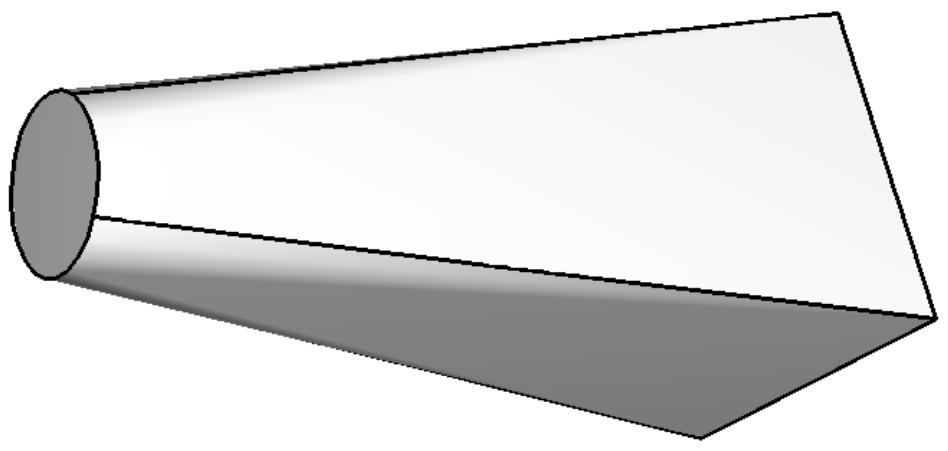  
Figure 1: A loft feature with no tangency.

## Normal

The Normal setting forces the faces created by the lofted edges to be at $9 0 ^ { \circ }$ to the first loft section as they are initially lofted toward the second section. Similarly, this setting forces the faces to be at 90° as they approach the last section of the loft feature. If you set Start Tangency to Normal, the initial part of the lofted feature will be similar to a straight extrusion as shown in Figure 2.

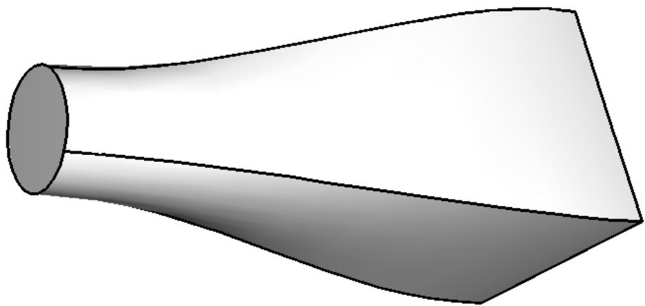  
Figure 2: A loft feature with normal tangency at both ends.

## Radial

The Radial setting forces the faces created by the lofted edges to be at $0 ^ { \circ }$ to the first loft section as they are initially lofted toward the second section. Similarly, this setting forces the faces to be at $0 ^ { \circ }$ as they approach the last section of the loft feature. Thus, the faces initially radiate outward from the starting loft section or inward toward the ending loft section. If you set Start Tangency to Radial, the initial part of the lofted feature will be similar to an extrusion with a draft angle approaching $9 0 ^ { \circ }$ as shown in Figure 3.

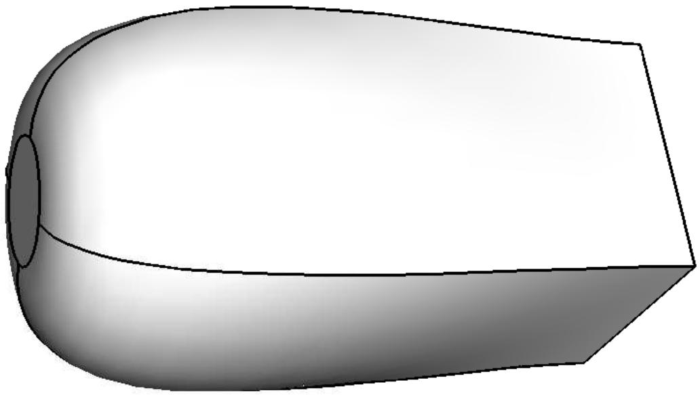

Figure 3: A loft feature with radial tangency at the left end and normal tangency at the right end.  

## Warning:

If you attempt to create a loft feature with only two loft sections and a dissimilar number of vertices, setting both Start Tangency and End Tangency to Radial may cause the loft feature to fail.

## Specify

The Specify setting allows you to control both the Angle applied to the lofted edges and the Magnitude % that represents a relative distance through which the angle will affect the loft. If you set Start Tangency to Specify, the initial part of the lofted feature will be similar to an extrusion with a draft angle of Angle degrees as shown in Figure 4.

  
Figure 4: A loft feature with specified tangency at both ends.  
Figure 4 shows a Start Tangency angle of 45° (left) and an End Tangency angle of 135° (right), both applied with magnitudes of 25%. For reference, a Normal tangency setting corresponds to specifying an angle of 90° and a magnitude of 25% and a Radial tangency setting corresponds to specifying an angle of 0° and a magnitude of 25%.

The angle of the loft faces at any point depends on the Angle and Magnitude % settings, the distance between consecutive loft sections, and the severity of change between the loft sections. Depending on these conditions, the requirement to make a smooth transition from one loft section to the next may override some loft tangency effects. If you require greater control over the shape of the loft, use the Select path method to define paths that the loft feature will follow exactly.

## Self-intersection checks

Due to the complexity of features that you can create by lofting, a set of tests is available to ensure that the geometry will be valid for analysis. You can define loft sections and paths such that the loft feature would intersect itself. A loft feature with self-intersections would be impractical as a manufactured part and would also be difficult or impossible to mesh and analyze.

When you toggle on Perform self-intersection checks in the Feature Options dialog box, Abaqus/CAE tests for self-intersection while it is creating the loft feature. If any faces of the loft intersect other faces, Abaqus/CAE displays an error message stating that there are invalid intersections and does not create the loft feature. The time required to complete the tests varies with the complexity of the loft you are attempting to create. For example, if the shape of your loft varies greatly from section to section or if you have defined a complex loft path, the tests will significantly increase the time required to create the loft feature. If you choose not to include the tests, Abaqus/CAE will create the loft feature regardless of whether the geometry is valid.

## Additional information

• What is feature-based modeling?  
• Adding a solid loft feature  
• Adding a shell loft feature  
• Creating a loft cut  
• What are self-intersection checks?

## Using the Sketcher in conjunction with the Part module

Sketches are two-dimensional profiles that form the geometry of the features defining an Abaqus/CAE native part. You use the Sketcher to create these sketches; in the Part module you use them directly to define a planar part or a beam, or you extrude, sweep, or revolve them to form a three-dimensional or axisymmetric part. Whenever you need to create the base feature of a new part, add a feature to a part, or modify an existing feature, the Part module automatically enters the Sketcher and you operate on the sketch that forms the two-dimensional profile of the feature. When you have finished sketching, Abaqus/CAE automatically returns you to the Part module.

If you are adding a feature or modifying an existing feature, you must choose the plane on which to sketch. For a detailed description of how Abaqus/CAE determines the orientation of the part relative to the sketch plane, see How Abaqus/CAE orients your sketch.

## Additional information

• The Sketch module

## Understanding toolsets in the Part module

The Part module provides a set of toolsets that allow you to add and modify the features that define a part. This section describes how these toolsets are used within the Part module.

For more detailed information about each toolset, refer to:

The Datum toolset  
The Edit Mesh toolset  
The Feature Manipulation toolset  
The Filter toolset  
The Partition toolset  
The Query toolset  
The Reference Point toolset  
The Geometry Edit toolset  
The Set and Surface toolsets

The Display Group toolset is discussed in Using display groups to display subsets of your model.

## In this section:

Using the Datum toolset in the Part module  
Using the Feature Manipulation toolset in the Part module  
Using the Partition toolset in the Part module  
Using the Query toolset in the Part module  
Using the Reference Point toolset in the Part module  
Using the Geometry Edit toolset in the Part module  
Using the Set toolset in the Part module

## Using the Datum toolset in the Part module

A datum can be thought of as reference geometry or a construction aid that helps you create a feature when the part does not contain the necessary geometry; you create datum geometry using the Datum toolset. A datum is a feature of a part and is regenerated along with the rest of the part. Furthermore, datum geometry is visible unless you toggle it off by selecting View->Part Display Options->Datum from the main menu bar. A datum created in the Part module appears with each instance of the part in the Assembly module or any other assembly-based module.

Datum points are projected onto the Sketch plane in the Sketcher, and the projected point can be selected. However, you cannot refer to datum axes or planes in the Sketcher. Examples of how you might use datum planes and axes in the Part module are given below.

## Datum plane

You can sketch directly on datum planes, and any features you sketch on a datum plane will be projected onto the part. Projecting a sketch from a datum plane is useful if the part does not already contain a convenient sketch plane.

For example, suppose you want to cut a hole straight through the three-dimensional triangular part shown in Figure 1 parallel to the X-axis.

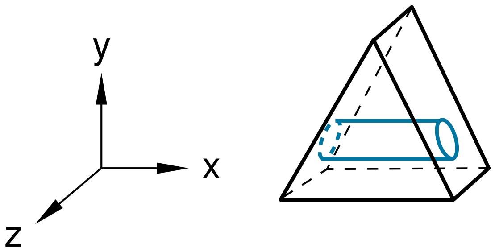  
Figure 1:The desired cut feature.

The part does not already have a face that is suitable for sketching the profile of the hole; sketching the profile directly on a face results in a hole normal to the face, as shown in Figure 2.

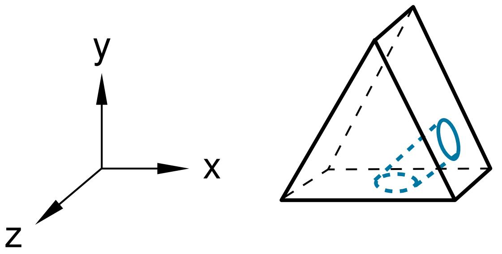  
Figure 2: A cut normal to the face.

To cut the desired hole, first use the Datum toolset to create a datum plane on the Y–Z principal plane, as shown in Figure 3.

  
Figure 3: A datum plane.

Second, sketch the profile of the cut on the new datum plane, as shown in Figure 4.

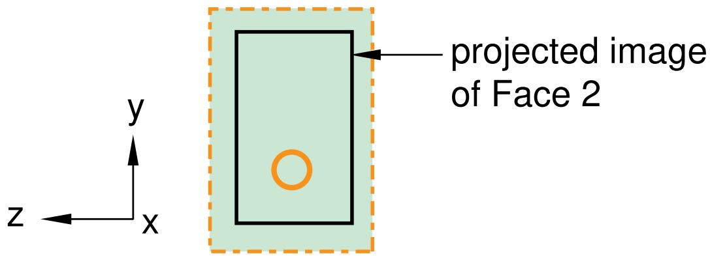  
Figure 4: A sketch on the datum plane.

When you exit the Sketcher, Abaqus/CAE cuts the sketched hole through the part, perpendicular to the datum plane and parallel to the X-axis. This cut is illustrated in Figure 5.

  
Figure 5:The desired cut.

## Datum axis

You can use the Datum toolset to create a datum axis. You can then select the datum axis to control the orientation of the part on the Sketcher grid when adding or modifying a feature to a three-dimensional solid. Creating a datum axis is useful when the part does not already contain the necessary axis.

For example, suppose you want to cut a slot through the part as shown in Figure 6.

  
Figure 6:The desired slot.

Sketching the slot is difficult because selecting either of the two straight edges of the part as the sketch's vertical axis causes the sketch gridlines to align with the line you select, not with the X- or Y-axis. To make it easier to create the slot with the desired orientation, first use the Datum toolset to create a datum axis along the Y-axis, as shown in Figure 7.

  
Figure 7:The datum axis.

When you select the datum axis to appear vertical and on the right, the Sketcher starts, and its grid is aligned with the part's X- and Y-axes, as shown in Figure 8.

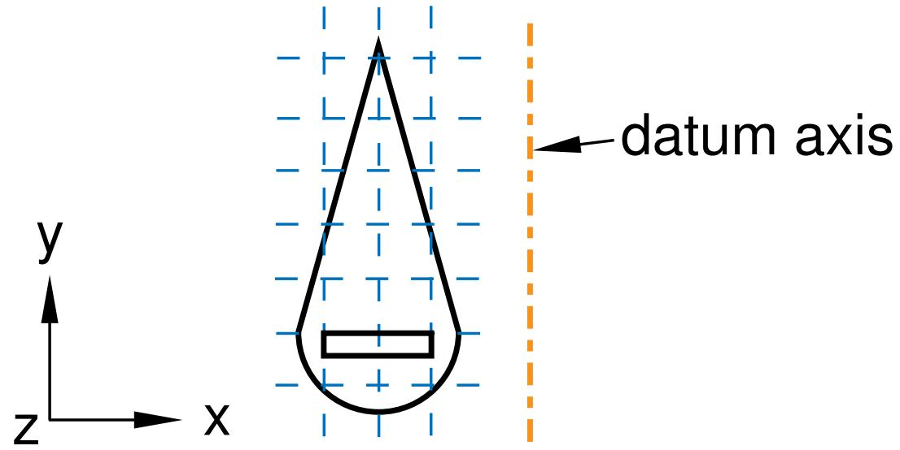  
Figure 8:The resulting sketch orientation.

## Additional information

• Understanding toolsets in the Part module  
• The Datum toolset

## Using the Feature Manipulation toolset in the Part module

The following are considered to be features of a part:

• Geometric features, such as extruded solids, revolved shells, sketched wires, and rounded edges  
• Repair operations  
• Partitions  
• Datum geometry

When the Feature Manipulation toolset asks you to select a feature, you can select it from the viewport. Alternatively, you can select the feature from the Model Tree.

If you click mouse button 3 on a feature in the Model Tree, the menu that appears allows you to do the following:

## Edit

When you edit a feature, Abaqus/CAE displays the feature editor. You can either modify the feature's parameters directly or, if applicable, you can modify the sketch that forms the two-dimensional profile or sweep path of a feature.

## Regenerate

When you modify features in a complex part, it may be convenient to postpone regeneration until you make all your changes, since regeneration can be time consuming. Select Feature->Regenerate when you are ready to regenerate the part.

## Rename

Rename a part.

## Suppress

Suppressing a feature temporarily removes it from the definition of the part. A suppressed feature is invisible, cannot be meshed, and is not included in the analysis of the model. You cannot suppress the base feature, and suppressing a parent feature will suppress all of its child features.

## Resume

Resuming a feature restores a suppressed feature to the part; resuming a parent feature restores all of its child features. You can choose to resume all features, the set of features most recently suppressed, or a selected feature.

## Delete

Deleting a feature removes it from the part. You cannot resume a deleted feature.

##

When you query a part, Abaqus/CAE displays information in the message area and writes the same information to the replay file (abaqus.rpy) in the form of comments.

## Options

The Feature Options dialog box allows you to tune the regeneration performance of the current model.

## Additional information

• Understanding toolsets in the Part module  
• The Feature Manipulation toolset

## Using the Partition toolset in the Part module

Within the Part module, you can use the Partition toolset to partition a part into additional regions. After you partition a part, you can use the Property module to assign different sections to the resulting regions; for example, you might use partitions to delineate regions of the part that are comprised of different materials.

The partitions you create are features associated with the part, so that each instance of that part in the assembly will contain all the partitions created in the Part module. You can use the regions when working with the assembly in other modules; for example, you can apply a load over a region in the Load module. If you do not want to associate the partitions with every instance of the part, create an independent instance in the Assembly module and partition the independent instance. For more information, see Partitioning the assembly.

If you have created the assembly and applied attributes to it, such as loads, boundary conditions, and sets, you should be careful if you subsequently decide to return to the Part module and partition one of the original parts. The region to which the attribute is assigned may change unexpectedly if the region is affected by the partition. In general, you should try to finish creating your parts in the Part module before you start creating part instances and applying sets, loads, and meshes to the assembly. If you do return to the Part module to create a partition, you should at least check that the regions in the assembly to which attributes are assigned are still valid.

## Additional information

• Understanding toolsets in the Part module  
• The Partition toolset

## Using the Query toolset in the Part module

You can use the Query toolset to request either general information or module-specific information.

For a discussion of the information displayed by general queries, see Obtaining general information about the model.

Select Tools->Query from the main menu bar, or click the tool in the Query toolset to start the Query toolset.

The following queries are specific to the Part module:

## Part attributes

Abaqus/CAE displays the part name, modeling space, and type in the message area along with the shape (solid, shell, wire, or point) and the number of entities (cells, faces, edges, and vertices).

## Regeneration warnings

If any sets or surfaces in the selected part cannot be regenerated because their underlying geometry has been modified or deleted, Abaqus/CAE displays the set or surface name, the original number of faces, and the number of faces found during the query.

## Substructure statistics

Abaqus/CAE displays the following information about the selected substructure part: the number of retained nodes, eigenmodes, and substructure loads in the part; the availability of the recovery matrix, gravity load vectors, reduced mass matrix, reduced structural damping matrix, and reduced viscous damping matrix in the substructure; and mass properties of the substructure.

## Additional information

• Understanding toolsets in the Part module  
• The Query toolset

## Using the Reference Point toolset in the Part module

From the main menu bar, select Tools->Reference Point to create a reference point on a part. A part can include only one reference point. For more information, see The reference point and point parts, and The Reference Point toolset.

Abaqus/CAE displays the reference point at the desired location and labels it RP. You can change the reference point label by clicking mouse button 3 on the feature in the Model Tree and selecting Rename from the menu that appears. If desired, you can turn off the display of the reference point symbol and the reference point label; for more information, see Controlling reference point display.

## Using the Geometry Edit toolset in the Part module

You use the Geometry Edit toolset to repair regions of a part that contain invalid or imprecise geometry. For more information, see Editing techniques. You can use the Query toolset to locate regions that need repairing. For more information, see The Query toolset.

## Additional information

• Understanding toolsets in the Part module  
• The Geometry Edit toolset

## Using the Set toolset in the Part module

Sets created by selecting geometry from a part are called part sets, and you use the Set toolset to create and manage part sets. You can use part sets in the Part module to select regions that should be repaired by the Geometry Edit toolset. In addition, in the Property module you can assign sections to regions specified by part sets. When Abaqus/CAE prompts you to select a region, you can either select the region from the part in the current viewport, or you can select a named part set.

Only part sets are visible in the Set Manager in the Part module. When you instance a part in the Assembly module, Abaqus creates part instance sets that refer to any part sets that you previously created. For more information, see Understanding sets and surfaces, and Using sets and surfaces in the Assembly module.

## Additional information

• Understanding toolsets in the Part module  
• The Set and Surface toolsets

## Using the Part module toolbox

You can access all the Part module tools through either the main menu bar or the Part module toolbox. Figure 1 shows the hidden icons for all the part tools in the Part module toolbox.

  
Figure 1:The Part module toolbox.

For information on using each of the Part module tools, refer to the following sections:

Managing parts  
Using the Create Part dialog box  
• Adding a feature to a part  
• Adding a solid feature  
Adding a shell feature  
Adding a wire feature  
Adding a cut feature  
Blending edges

## Managing parts

This section describes how you manage the parts in your model while working in the Part module.

## In this section:

Managing parts  
Creating a new part  
Copying a part

## Managing parts

To create, copy, rename, and delete parts, use one of the following:

• The Create, Copy, Rename, and Delete items listed under the Part menu on the main menu bar.  
The Copy, Rename, and Delete items contain submenus listing all the parts in the current model.  
The Part Manager dialog box. The Part Manager dialog box contains functions similar to those listed under the Part menu on the main menu bar, but with a convenient browser that lists the names of all the parts available within the current model along with their modeling space (three-dimensional, two-dimensional, or axisymmetric), type (deformable, discrete rigid, analytical rigid, or Eulerian), and status (locked, invalid, or invalid (ignored)).

To display the Part Manager dialog box, select Part->Manager from the main menu bar.

To lock or unlock parts for editing in the current model database, use the Lock and Unlock buttons in the Part Manager dialog box. The Status field indicates Locked parts . For more information on part locking, see What is part and assembly locking?.

To update the validity or to ignore the invalidity of parts, use the Update Validity and Ignore Invalidity buttons in the Part Manager dialog box. The Status field indicates Invalid or Invalid (ignored) parts. For more information on part validity, see Working with invalid parts.

To retrieve a part from the model database and display it in the current viewport, select the part from the Part list located in the context bar. The Part list contains all the parts in the current model.

## Additional information

• Managing parts  
• Managing objects

## Creating a new part

Select Part->Create from the main menu bar to create a new part in the current viewport.

A model can contain multiple parts; each part exists in a local coordinate system, and you use the Assembly module to create instances of the parts and position those instances relative to each other in a global coordinate system. When you create a part, you name the part and select its type, modeling space, base feature, and approximate size; you then sketch the profile of the part's base feature. The part name should not be the same as the model name.

1. From the main menu bar, select Part->Create.

The Create Part dialog box appears. For more information, see Using the Create Part dialog box.

Tip: You can also create a part using the tool in the Part module toolbox. For a diagram of the tools in the Part module toolbox, see Using the Part module toolbox.

2. Type a name for the part. For information on naming Abaqus/CAE objects, see Using basic dialog box components. You can rename a part after you create it.  
3. Choose the new part's modeling space, type, base feature, and approximate size. For more information, see How is a part defined in Abaqus/CAE?.

## Note:

To change a part's modeling space or type you must use the Model Tree to edit the part. For more information, see How is a part defined in Abaqus/CAE?.

4. Click Continue to close the Create Part dialog box.

The Sketcher starts, and the Sketch grid appears in the current viewport.

If you are creating a three-dimensional revolved solid or shell, Abaqus/CAE displays a vertical construction line on the Y-axis of the sketch that serves as the axis of revolution. You can sketch on either side of this construction line, but the sketch must not cross the construction line.

If you are creating an axisymmetric part, Abaqus/CAE displays a vertical construction line on the left side of the sketch that serves as the axis of revolution. You must sketch to the right of this construction line.

5. Use the Sketcher to sketch the two-dimensional profile of the base feature. For more information, see The Sketch module.”  
If you are constructing a swept part, you must first sketch the sweep path and exit the Sketcher. The Sketch will then restart automatically, and you can sketch the profile to be swept.  
6. When you have finished sketching the base feature, click mouse button 2 to exit the current Sketch tool.  
7. In the prompt area, click Done to exit the Sketcher. If the base feature is a three-dimensional solid or shell extrusion, the Edit Base Extrusion dialog box appears. You must use the Depth field to enter the distance through which to extrude the profile. You can also select Twist or Draft to modify the form of extrusion that Abaqus/CAE will create. If the base feature is a three-dimensional revolved solid or shell, you must enter the angle through which to rotate the profile.

Abaqus/CAE exits the Sketcher and displays the new part in the current viewport.

8. If necessary, use the Part module tools to add additional features to the base feature. For more information, see What is feature-based modeling?.

## Additional information

• Using the Create Part dialog box  
• Managing parts  
• How is a part defined in Abaqus/CAE?  
• Including draft in an extrusion  
• Including twist in an extrusion  
• The Sketch module  
• Importing and exporting geometry data and models  
• Using the Part module toolbox  
• What is feature-based modeling?  
• Using basic dialog box components

## Copying a part

Select Part->Copy->part name from the main menu bar to copy a part to a new part. You can copy parts containing both geometry and orphan elements. The compress, scale, and mirror functions operate on both geometry and meshes. The separate disconnected regions function also works with parts containing both geometry and orphan elements; however, only geometry regions are copied to become new parts since regions do not exist for orphan elements.

1. From the main menu bar, select Part->Copy->part name.

Abaqus/CAE displays the Part Copy dialog box.

2. From the dialog box, enter the name of the new part.  
3. You can create an identical copy of the original part, or you can select from the following Copy options:

• Compress features  
• Scale part by  
• Mirror part about  
• Separate disconnected regions into parts

For more information on the Copy options, see Copying a part.

## 4. Click OK.

Abaqus/CAE closes the Part Copy dialog box and copies the selected part to a new part. The new part becomes the current part. You can return to the original part by selecting the part from the Part list on the context bar. For more information, see The context bar.

## Additional information

• Simplifying a part's feature list

## Using the Create Part dialog box

This section describes the options in the Create Part dialog box.

## In this section:

Using the Create Part dialog box to define the properties of a part  
Choosing the modeling space of a new part  
Choosing the type of a new part  
Choosing the base feature of a new part  
Setting the approximate size of the new part

## Using the Create Part dialog box to define the properties of a part

When you create a part, you first use the Create Part dialog box to define the properties of the part, and then you use the Sketch to sketch the two-dimensional profile of the base feature.

You use the Create Part dialog box to define the following:

## Name

Use the Name text field at the top of the Create Part dialog box to name the part you are creating. To rename a part, select Part->Rename from the main menu bar. The part name should not be the same as the model name. For more information on valid names, see Using basic dialog box components.

After you create a part, Abaqus/CAE displays the name of the new part in title bar of the current viewport.

## Modeling Space

Use the Modeling Space radio buttons to choose the modeling space of the new part. You can define a part to be either three-dimensional, two-dimensional (planar), or axisymmetric in an Abaqus/Standard or Abaqus/Explicit model.

If you create an axisymmetric deformable part, you can toggle on Include twist in the Create Part dialog box to include a twist degree of freedom in your model. You can change the modeling space of a part after you have created it by clicking mouse button 3 on the part in the Model Tree and selecting Edit from the menu that appears. For more information, see Choosing the modeling space of a new part.

## Type

In an Abaqus/Standard or Abaqus/Explicit model, use the Type radio buttons to choose the type of the new part. You can define a part to be either deformable, discrete rigid, analytical rigid, or Eulerian. If allowed, you can change the type of a part after you have created it by clicking mouse button 3 on the part in the Model Tree and selecting Edit from the menu that appears. For more information, see Choosing the type of a new part.

## Base Feature

Use the Base Feature field to define the shape and the type of the new part's base feature. The shape and the type options that Abaqus/CAE displays depend on the part's modeling space and type. You cannot change the type of a part's base feature after you create it. For more information, see Choosing the base feature of a new part.

## Approximate size

Use the approximate size text field to enter the size of the part. The size that you enter is used by Abaqus/CAE to calculate the size of the Sketcher sheet and the spacing of its grid. For more information, see Setting the approximate size of the new part. After you create the part and start sketching its profile, you can use the Sketch

customization options to increase the sheet size. To display the Sketcher customization options click the tool at the bottom of the Sketcher toolbox.

## Additional information

• How is a part defined in Abaqus/CAE?  
• Creating a new part  
• Using the Create Part dialog box

## Choosing the modeling space of a new part

Use the Modeling Space radio buttons at the top of the Create Part dialog box to choose the modeling space of the part you are creating.

Abaqus/CAE carries a part's modeling space through the modeling process; for example, modeling space determines which tools are available in the Part module and which elements are available in the Mesh module. You can change the modeling space of a part after you have created it by clicking mouse button 3 on the part in the Model Tree and selecting Edit from the menu that appears.

Modeling space refers to the space the part can inhabit, rather than to the part itself. Thus, you can create a part in three-dimensional modeling space but construct it using topologically two-dimensional shell or wire features. In an Abaqus/Standard or Abaqus/Explicit model, the new part's modeling space can be set to any of the following:

## Three-dimensional

Abaqus/CAE positions the part in three-dimensional space.

## Two-dimensional planar

Abaqus/CAE positions the part in planar, two-dimensional space.

## Axisymmetric

Abaqus/CAE positions the part in axisymmetric two-dimensional space. If you create an axisymmetric deformable part, Abaqus/CAE allows you to include a twist degree of freedom in your model.

1. From the top of the Create Part dialog box, choose the desired Modeling Space radio button.  
2. When you have finished choosing options, click Continue to close the Create Part dialog box.

The Sketcher starts, and you sketch the profile of the new part's base feature.

## Additional information

• Part modeling space  
• Defining the axis of revolution for axisymmetric parts and for revolved features  
• How is a part defined in Abaqus/CAE?  
• Creating a new part

## Choosing the type of a new part

Use the Type radio buttons in the Create Part dialog box to choose the type of the part you are creating in an Abaqus/Standard or Abaqus/Explicit model.

Abaqus/CAE carries a part's type through the modeling process; for example, you cannot assign section and material properties to a rigid part, you cannot mesh an analytical rigid part, and you can assign Eulerian sections and material assignment fields only to Eulerian parts. If allowed, you can change the type of a part after you have created it by clicking mouse button 3 on the part in the Model Tree and selecting Edit from the menu that appears.

In an Abaqus/Standard or Abaqus/Explicit model a new part's type can be set to one of the following:

## Deformable

Any arbitrarily shaped axisymmetric, two-dimensional, or three-dimensional part that you can create or import can be specified as a deformable part. A deformable part represents a part that can deform under load; the load can be mechanical, thermal, or electrical. By default, Abaqus/CAE creates parts that are deformable.

## Discrete rigid

A discrete rigid part is similar to a deformable part in that it can be any arbitrary shape. However, a discrete rigid part is assumed to be rigid and is used in contact analyses to model bodies that cannot deform.

## Analytical rigid

An analytical rigid part is similar to a discrete rigid part in that it is used to represent a rigid surface in a contact analysis. However, the shape of an analytical rigid part is not arbitrary and must be formed from a set of sketched lines, arcs, and parabolas.

## Eulerian

Eulerian parts are used to define a domain in which material can flow for an Eulerian analysis. Eulerian parts do not deform during an analysis; instead, the material within the part deforms under load and can flow across the rigid element boundaries. For more information about Eulerian analyses, see Eulerian analyses.

After you create either a discrete rigid part or an analytical rigid part, you must also do the following:

Assign the rigid body reference point. You apply constraints or prescribe motion to the rigid body reference point in the Load module, and the same constraints or motion are applied to the entire rigid part. For more information, see The reference point.  
• If the part is a discrete rigid part or an analytical rigid part, you must use the Surface toolset in the Assembly module to choose which side of the part represents the outer surface. For more information, see The Set and Surface toolsets.

1. From the middle of the Create Part dialog box, choose the desired Type radio button.

2. When you have finished choosing options, click Continue to close the Create Part dialog box. The Sketcher starts, and you sketch the profile of the new part's base feature.

## Additional information

• Analytical Rigid Surface Definition  
• Rigid Body Definition  
• Part types  
• How is a part defined in Abaqus/CAE?  
• Creating a new part

• Using the Create Part dialog box  
• The reference point  
• The Set and Surface toolsets

## Choosing the base feature of a new part

Use the radio buttons and the list within the Base Feature field at the bottom of the Create Part dialog box to select the base feature of the part you are creating. The choices depend on both the part's modeling space and the part's type; for example, an axisymmetric deformable body can have only a planar shell, planar wire, or point base feature. For detailed information about the different shapes and types of base features that you can create, see The base feature.

Your choice of the base feature's type is important because you cannot change the type after you create the part. You can modify the base feature, but you should be aware that any features you subsequently add to the part will be linked to the base feature. Consequently, if you modify the base feature, these dependent (or child) features may move or fail to regenerate.

1. From the bottom of the Create Part dialog box, choose the desired base feature shape (Solid, Shell, Wire, or Point). The available choices depend on the modeling space and the type of the part you are creating.  
2. If you are creating a three-dimensional deformable or discrete rigid part, you must also choose its Type (Extrusion, Revolution, Sweep, Planar, or Coordinates).  
3. When you have finished choosing options, click Continue to close the Create Part dialog box. The Sketcher starts, and you sketch the profile of the new part's base feature.

## Additional information

• How is a part defined in Abaqus/CAE?  
• Creating a new part  
• Using the Create Part dialog box  
• Defining the axis of revolution for axisymmetric parts and for revolved features  
• The Feature Manipulation toolset

## Setting the approximate size of the new part

Use the Approximate size text field at the bottom of the Create Part dialog box to set the approximate size of the new part. The size that you enter is used by Abaqus/CAE to calculate the size of the Sketcher sheet and the spacing of its grid. The approximate part size must be between 10000 (104) and 0.001 (10−3) units. Abaqus/CAE does not use specific units, but the units must be consistent throughout the model.

When you exit the Create Part dialog box, Abaqus/CAE enters the Sketcher, and you sketch the profile of the base feature. The Sketcher displays a square sheet with an overlaying grid and adjusts the dimensions of the sheet to approximate the size of the part. As a result, the dimensions of the sketch will have the same order of magnitude as the part you are creating.

If you subsequently edit the part, Abaqus/CAE still determines the size of the Sketcher sheet from the same dimensions that it used when you created the base feature. Consequently, you should set the approximate size of the part to match the largest dimension of the finished part. If you find subsequently that the part exceeds the size of the Sketcher sheet, use the Sketch customization options to increase the sheet size.

1. Type the approximate size of the new part in the Approximate size text field at the bottom of the Create Part dialog box.  
2. When you have finished choosing options, click Continue to close the Create Part dialog box. The Sketcher starts with a sheet size and grid spacing based on the approximate size of the new part, and you sketch the profile of the new part's base feature.

## Additional information

• How is a part defined in Abaqus/CAE?  
• Using the Create Part dialog box  
• The Sketcher sheet and grid  
• Customizing the Sketcher

## Adding a feature to a part

Use the Shape menu to add a feature to the current part. You can do the following:

• Use the Solid tools to add a solid feature to a to a three-dimensional solid part. For more information, see Adding a solid feature.  
• Use the Shell tools to add a shell feature to a part. For more information, see Adding a shell feature.  
• Use the Wire tools to add a wire feature to a part. For more information, see Adding a wire feature.  
• Use the Cut tools to add a cut feature to a part. For more information, see Adding a cut feature.  
• Use the Blend tools to add a blend feature to a three-dimensional solid part. For more information, see Blending edges.  
• Use the Transform tool to mirror a part about a selected plane. For more information, see Mirroring a part.

## Adding a solid feature

This section describes the Part module tools used to add a solid feature to the three-dimensional solid part in the current viewport.

## In this section:

Adding an extruded solid feature  
Adding a revolved solid feature  
Adding a swept solid feature  
Adding a solid loft feature  
Creating a solid feature from a shell

Select Shape->Solid->Extrude from the main menu bar to add an extruded solid feature to the part in the current viewport. You can add an extruded solid feature only to three-dimensional parts.

You add an extruded solid feature by sketching a two-dimensional cross-section and defining the distance over which to extrude it. A sketch and the resulting extruded solid feature are illustrated in the following figure:

You can also define the distance over which to extrude by selecting a single face to extrude to. Abaqus/CAE extrudes the sketch until it meets the selected face.

In addition, you can select a center point and specify a pitch that Abaqus/CAE uses to twist the cross-section as it is extruded. Alternatively, Abaqus/CAE can expand or contract the cross-section along a specified draft angle as the cross-section is extruded. For more information, see Including twist in an extrusion, and Including draft in an extrusion.

1. From the main menu bar, select Shape->Solid->Extrude.

Abaqus/CAE displays prompts in the prompt area to guide you through the procedure.

Tip: You can also add an extruded solid feature using the tool, located with the solid tools in the Part module toolbox. For a diagram of the tools in the Part module toolbox, see Using the Part module toolbox.

2. If desired, specify the method you want to use to select an origin for your sketch of the extruded solid feature. Select one of the following options from the Sketch Origin field in the prompt area:

• Select Auto-Calculate to place the sketch origin automatically.  
• Select Specify to define a custom sketch origin.  
• Select Session Default to use the custom origin you specified earlier in the session.

3. Select the planar face from which the solid will be extruded. If no suitable face exists, you can select a datum plane or an orphan element face.

Tip: If you are unable to select the desired planar face, you can use the Selection toolbar to change the selection behavior. For more information, see Using the selection options.

The selected face is highlighted in the viewport.

4. If you selected Specify as the Sketch Origin method, specify the origin location by clicking a point in the viewport or by entering the three-dimensional coordinates of the origin in the prompt area. You can also set this custom origin as the default origin for all sketches in your session by toggling on Set as session default.

5. Select an edge and the orientation of the edge on the Sketcher grid. The edge must not be perpendicular to the selected face. By default, the selected edge will appear vertical and on the right side of the Sketcher grid. To choose a different orientation for the edge, click the arrow on the right side of the dialog box and choose an orientation from the list that appears.

Tip: If there is no straight edge with the desired orientation, you can create a datum axis. You can then select the datum axis to control the orientation of the part on the Sketcher grid.

Abaqus/CAE highlights the selected edge, enters the Sketcher, and rotates the part until the selected face aligns with the plane of the Sketcher grid and the selected edge aligns with the grid in the desired orientation.

If you are unsure of the part's orientation relative to the Sketcher grid, use the view manipulation tools

from the View Manipulation toolbar to view its position. Use the reset view tool to return to the original view.

6. Use the Sketcher to sketch the two-dimensional profile of the extrusion. In the prompt area, click Done to exit the Sketcher and to open the Edit Extrusion dialog box.

Abaqus/CAE displays the part view that was active prior to entering the Sketcher. The part includes your sketched profile and an arrow indicating the extrusion direction.

7. Click in the Edit Extrusion dialog box to reverse the extrusion direction, if necessary.

If the arrow direction is difficult to see, use the rotate tool to rotate the part.

8. Select one of the following end conditions:

Select Blind and enter a value in the Depth field to specify the distance through which Abaqus/CAE will extrude the sketched profile.  
• Select Up to Face to specify that Abaqus/CAE will extrude the profile up to a selected face.

9. If desired, do one of the following:

Toggle on Include twist, and enter the pitch. The pitch is the extrusion distance in which a 360° twist would occur. The sketched extrusion profile must include an isolated point that indicates the center of twist.  
Toggle on Include draft, and enter the draft angle (greater than −90° and less than 90°). A positive draft angle indicates that external faces of the profile expand and internal faces contract.

10. Toggle on Keep internal boundaries to maintain any faces or edges that are generated between the extruded solid feature and the existing part. The internal boundaries may create regions that can be structured or swept meshed without having to resort to partitioning.  
11. Click OK to extrude the profile.

If you selected the twist option and your sketch includes a single isolated point, Abaqus/CAE uses that point as the center of twist. If your sketch does not include an isolated point, Abaqus/CAE returns to the Sketcher for you to create one. If your sketch contains more than one isolated point, Abaqus/CAE returns to the Sketcher and prompts you to select an isolated point as the center of twist.

12. If you selected Up to Face, Abaqus/CAE prompts you to select the face to which to extrude the profile. Select a face to meet the following requirements:

• the selected face does not have to be parallel to the sketch plane,  
• it can be a nonplanar face,  
• it must completely contain the extruded selection, and

• it cannot be a datum plane.

Abaqus/CAE creates the extruded solid feature.

## Additional information

• What are extruding, revolving, and sweeping?  
• Meshing complex solids with hexahedral elements  
• What is feature-based modeling?

## Adding a revolved solid feature

Select Shape->Solid->Revolve from the main menu bar to add a revolved solid feature to the part in the current viewport. You can add a revolved solid feature only to three-dimensional parts.

You add a revolved solid feature by sketching a two-dimensional cross-section and a construction line on a selected face. The construction line serves as an axis of revolution, and Abaqus/CAE creates the solid feature by rotating the cross-section about the axis using a specified angle of revolution. In addition, you can specify a pitch and a direction along the axis of revolution that Abaqus/CAE uses to translate the sketch along the axis of revolution as it revolves the profile. A sketch and the resulting feature, revolved through an angle of 180° with pitch, are illustrated in the following figure:

1. From the main menu bar, select Shape->Solid->Revolve.

Abaqus/CAE displays prompts in the prompt area to guide you through the procedure.

Tip: You can also add a revolved solid feature using the tool, located with the solid tools in the Part module toolbox. For a diagram of the tools in the Part module toolbox, see Using the Part module toolbox.

2. If desired, specify the method you want to use to select an origin for your sketch of the revolved solid feature. Select one of the following options from the Sketch Origin field in the prompt area:

• Select Auto-Calculate to place the sketch origin automatically.  
• Select Specify to define a custom sketch origin.  
• Select Session Default to use the custom origin you specified earlier in the session.

3. Select the planar face from which the solid will be revolved. If no suitable face exists, you can select a datum plane or an orphan element face.

Tip: If you are unable to select the desired planar face, you can use the Selection toolbar to change the selection behavior. For more information, see Using the selection options.

The selected face is highlighted in the viewport.

4. If you selected Specify as the Sketch Origin method, specify the origin location by clicking a point in the viewport or by entering the three-dimensional coordinates of the origin in the prompt area. You can also set this custom origin as the default origin for all sketches in your session by toggling on Set as session default.

5. Select an edge and the orientation of the edge on the Sketcher grid. The edge must not be perpendicular to the selected face. By default, the selected edge will appear vertical and on the right side of the Sketcher grid. To choose a different orientation for the edge, click the arrow on the right side of the dialog box and choose an orientation from the list that appears.

Tip: If there is no straight edge with the desired orientation, you can create a datum axis. You can then select the datum axis to control the orientation of the part on the Sketcher grid.

Abaqus/CAE highlights the selected edge, enters the Sketcher, and rotates the part until the selected face aligns with the plane of the Sketcher grid and the selected edge aligns with the grid in the desired orientation.

If you are unsure of the part's orientation relative to the Sketcher grid, use the view manipulation tools

from the View Manipulation toolbar to view its position. Use the reset view tool to return to the original view.

6. Use the horizontal , vertical , angle , or oblique construction line tools to sketch the axis of rotation. You can position the construction line by selecting a datum axis from the underlying part. You cannot select the datum axis directly; you must select a point from either end of the datum axis.  
7. Use the Sketcher to sketch the two-dimensional profile of the revolved feature; the sketch must not cross the axis of revolution.  
8. In the prompt area, click Done to indicate you have finished sketching the profile and the axis. If the sketch contains more than one construction line, Abaqus/CAE prompts you to select the construction line that will serve as the axis of rotation.

Abaqus/CAE displays the part view that was active prior to entering the Sketcher. The part includes your sketched profile and an arrow indicating the direction of revolution. The Edit Revolution dialog box appears.

9. In the Edit Revolution dialog box, enter the desired angle of revolution or accept the default value.

10. Click next to Revolve direction to change the arrow direction and the associated direction of revolution.  
11. If desired, toggle on Include translation and enter a positive value for the pitch. The pitch value is the distance through which the profile is translated along the axis of revolution during a rotation of 360°.

An arrow appears to show the axis of revolution and to indicate the direction of sketch translation

along the axis. Click next to Pitch direction in the Edit Revolution dialog box to reverse the arrow, if necessary.

12. If desired, toggle on Sweep sketch normal to path to rotate the sketched profile normal to the path of revolution. This option is available only when Include translation is toggle on.  
The initial profile of the feature will be rotated from the sketch plane to create the feature.  
13. Toggle on Keep internal boundaries to maintain any faces or edges that are generated between the revolved solid feature and the existing part. The internal boundaries may create regions that can be structured or swept meshed without having to resort to partitioning.  
14. Click OK to accept the indicated direction and to create the revolved solid feature.

Abaqus/CAE creates the revolved feature using your selected parameters.

## Additional information

• Creating construction geometry  
• Adding a solid feature  
• Defining the axis of revolution for axisymmetric parts and for revolved features  
• Controlling the cross-section of a revolved feature with pitch  
• Meshing complex solids with hexahedral elements  
• What is feature-based modeling?

Select Shape->Solid->Sweep from the main menu bar to add a swept solid feature to the part in the current viewport. You can add a swept solid feature only to three-dimensional parts.

You add a swept solid feature by first defining a sweep path, then defining a sweep profile. There are different methods available for defining each component:

You can define a sweep path either by sketching the path on a selected face or by selecting a series of edges or wires that you want the sweep path to follow. The sketch method provides greater flexibility but supports only two-dimensional paths. The edge/wire method enables you to define a three-dimensional sweep path along a feature such as a spline wire or a set of edges in a three-dimensional part.  
You can define a sweep profile either by sketching a sweep profile using the Sketcher or by selecting one of the faces in your model as the profile. The sweep profile is initially perpendicular to the path; you can keep this orientation constant along the entire sweep path, or you can keep the sweep profile perpendicular to the sweep path as it is swept along its length.

The sweep path, the sweep profile, and the resulting solid feature are illustrated in the following figures:

The sketch or set of edges specifying the sweep path and the sketch or face specifying the sweep profile define the swept solid feature; both the sweep path and the sweep profile can be modified using the Feature Manipulation toolset if you define them using the Sketcher. You can also create a swept solid whose sweep profile is offset from the sweep path. In this case Abaqus/CAE moves the sweep path to a parallel location that passes through the sweep profile and creates the swept solid at that location.

As you define your sweep feature, you can apply a twist or draft to it. For more information about these tools, see What types of features can you create?. You can toggle on Keep profile normal constant to maintain the same orientation for the sweep profile as it travels along the sweep path; if this option is toggled off, the sweep profile orientation changes with the normal to the sweep path. In addition, you can toggle on Keep internal boundaries in the Feature Manipulation toolset to maintain any faces or edges that are generated between the swept solid feature and the existing part. The internal boundaries may create regions that can be structured or swept meshed without having to resort to partitioning.

1. From the main menu bar, select Shape->Solid->Sweep.

Tip: You can also add a swept solid feature using the tool, located with the solid tools in the Part module toolbox. For a diagram of the tools in the Part module toolbox, see Using the Part module toolbox.

The Create Solid Sweep dialog box appears.

2. If you want to sketch the sweep path, do the following:

a. From the Path options, select Sketch and click

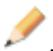

Abaqus/CAE displays prompts in the prompt area to guide you through the procedure.

b. If desired, specify the method you want to use to select an origin for your sketch of the swept solid feature. Select one of the following options from the Sketch Origin field in the prompt area:

• Select Auto-Calculate to place the sketch origin automatically.  
• Select Specify to define a custom sketch origin.  
• Select Session Default to use the custom origin you specified earlier in the session.

c. Select the planar face on which to sketch the sweep path. If no suitable face exists, you can select a datum plane.

Tip: If you are unable to select the desired planar face, you can use the Selection toolbar to change the selection behavior. For more information, see Using the selection options.

d. If you selected Specify as the Sketch Origin method, specify the origin location by clicking a point in the viewport or by entering the three-dimensional coordinates of the origin in the prompt area. You can also set this custom origin as the default origin for all sketches in your session by toggling on Set as session default.

e. Select an edge and the orientation of the edge on the Sketcher grid. The edge must not be perpendicular to the selected face. By default, the selected edge will appear vertical and on the right side of the Sketcher grid. To choose a different orientation for the edge, click the arrow on the right side of the dialog box and choose an orientation from the list that appears.

Tip: If there is no straight edge with the desired orientation, you can create a datum axis. You can then select the datum axis to control the orientation of the part on the Sketcher grid.

Abaqus/CAE highlights the selected edge, enters the Sketcher, and rotates the part so that the selected face aligns with the plane of the Sketcher grid and the selected edge aligns with the grid in the desired orientation.

If you are unsure of the part's orientation relative to the Sketcher grid, use the view manipulation

tools from the View Manipulation toolbar to view its position. Use the reset view tool to return to the original view.

f. Sketch the sweep path. The sweep path must meet the following guidelines:

The path can be closed, but the ends must meet smoothly; for example, the ends should not meet at a corner. For examples of valid sweep paths, see Defining the sweep path and the sweep profile.  
• The path must be continuous; for example, it must not branch.  
• The resulting solid cannot intersect with itself.

In the prompt area, click Done to indicate you have finished sketching the sweep path.

Abaqus/CAE exits the Sketcher and restores the original view of the part. A highlighted line indicates the sweep path and its direction. Abaqus/CAE also reopens the Create Solid Sweep dialog box and adds the word (Defined) next to the Sketch label in the Path options to indicate that the sweep path has been defined in the Sketcher.

3. If you want to specify the sweep path as a series of edges or wires, do the following:

a. From the Path options, select Edges and click ?

Abaqus/CAE displays prompts in the prompt area to guide you through the procedure.

b. If desired, specify in the prompt area whether you want to select the edges in your sweep path individually or by edge angle. For more information about selecting objects, see Using the angle and feature edge method to select multiple objects.

c. Select the edges you want to include in the sweep path.

Abaqus/CAE shows the sweep path on your part and indicates the sweep direction.

d. In the prompt area, click Yes to confirm the sweep path direction or click Flip to reverse the sweep path direction.

Abaqus/CAE reopens the Create Solid Sweep dialog box and adds the word (Defined) next to the Edges label in the Path options to indicate that the sweep path has been defined using a series of edges.

4. If you want to sketch the sweep profile, do the following:

a. From the Profile options, select Sketch and click

Abaqus/CAE displays prompts in the prompt area to guide you through the procedure.

b. Sketch the sweep profile. The sweep profile must meet the following guidelines:

• The profile must be closed.  
• The resulting solid cannot intersect with itself.

You can sketch the profile anywhere on the Sketcher grid; Abaqus/CAE sweeps the profile along a path parallel to the sweep path. In the prompt area, click Done to indicate you have finished sketching the sweep profile.

Abaqus/CAE exits the Sketcher and restores the original view of the part.

c. Select an edge and the orientation of the edge on the Sketcher grid. The selected edge must not be parallel to the sweep path direction. By default, the selected edge will appear vertical and on the right side of the Sketcher grid. To choose a different orientation for the edge, click the arrow on the right side of the dialog box and choose an orientation from the list that appears.

Abaqus/CAE highlights the selected edge, enters the Sketcher again, and rotates the part so that the Sketcher grid lies on a plane normal to the beginning of the sweep path with the sweep path direction pointing out of the screen. In addition, the selected edge aligns with the grid in the desired orientation. The intersection of two dashed lines indicates the origin of the sweep path. Abaqus/CAE also reopens the Create Solid Sweep dialog box and adds the word (Defined) next to the Sketch label in the Profile options to indicate that the sweep profile has been defined in the Sketcher.

5. If you want to select a face as the sweep profile, do the following:

a. From the Profile options, select Face and click

Abaqus/CAE displays prompts in the prompt area to guide you through the procedure.

b. Select a face from the viewport.

Abaqus/CAE highlights the selected face and displays the Create Solid Sweep dialog box.

Abaqus/CAE reopens the Create Solid Sweep dialog box and adds the word (Defined) next to the Faces label in the Profile options to indicate that the sweep profile has been defined using a face.

6. If desired, do any of the following:

Toggle on Include twist, and enter the pitch. The pitch is the extrusion distance in which a 360° twist would occur. The sketched extrusion profile must include an isolated point that indicates the center of twist.  
Toggle on Include draft, and enter the draft angle (greater than −90° and less than 90°). A positive draft angle indicates that external faces of the profile expand and internal faces contract. You cannot apply a draft if the Keep profile normal constant option is selected.  
Toggle on Keep profile normal constant to maintain the same profile orientation along the entire sweep path. If this option is toggled off, Abaqus/CAE adjusts the profile orientation so the angle between the sweep profile and the normal to the sweep path is always constant. You cannot toggle on this option if the Include draft option is selected.  
Toggle on Keep internal boundaries to maintain any faces or edges that are generated between the swept solid feature and the existing part. The internal boundaries can create regions that can be structured or swept meshed without having to resort to partitioning.

7. Click OK to create the new swept solid.

## Additional information

• Adding a solid feature  
• Defining the sweep path and the sweep profile  
• The Sketch module  
• What is feature-based modeling?

Select Shape->Solid->Loft from the main menu bar to add a solid loft feature to the part in the current viewport. You can add a solid loft feature only to three-dimensional parts.

You add a solid loft feature by creating two or more sections from selected edges and by defining one or more loft paths. Loft sections, a loft path, and the resulting solid loft feature are illustrated in the following figure:

You can allow Abaqus/CAE to define a single loft path using a smooth path to connect the center of each loft section. If you allow Abaqus/CAE to define the path, you can apply tangency methods to the start and end sections of the loft. The curve and tangencies define the path of the loft feature between sections. Alternatively, you can define one or more loft paths by selecting curves that connect a point on each loft section to a point on the next loft section. Each loft path must provide a continuous line connecting each consecutive loft section. If a loft path is not smooth (if there is more than one tangent to any point along the path), Abaqus/CAE will display an error message when you try to create the loft. For more information about loft sections, loft paths, and loft tangencies, see What is lofting?.

## Note:

You do not use the Sketcher while adding a loft feature. As a result, all of the edges that define the loft sections and the loft paths must exist in the part geometry before you create the loft. To create a loft path or to create a nonplanar loft section, you can use the tool, located with the wire tools in the Part module toolbox, to create a spline wire (see Adding a point-to-point wire feature, for more information).

1. From the main menu bar, select Shape->Solid->Loft.

Abaqus/CAE displays prompts in the prompt area to guide you through the procedure.

Tip: You can also add a solid loft feature using the tool, located with the solid tools in the Part module toolbox. For a diagram of the tools in the Part module toolbox, see Using the Part module toolbox.

The Edit Loft dialog box appears.

2. Create the loft sections by selecting edges from the part in the viewport. See Creating loft sections, for detailed instructions on creating loft sections.  
3. Toggle on Keep internal boundaries to maintain any faces or edges that are generated between the lofted solid feature and the existing part. The internal boundaries may create regions that can be structured or swept meshed without having to resort to partitioning.  
4. When you have finished creating the loft sections, click on the Transition tab in the Edit Loft dialog box.  
5. Do one of the following:

Click Select path to create the loft path (or paths) by selecting edges from the part in the viewport.•  
• Click Specify tangencies to create the loft path (or paths) by using loft tangencies.

See Creating a loft path, for detailed instructions on creating a loft path.

6. Click the Preview button in the Edit Loft dialog box.

Abaqus/CAE displays a wireframe representation of the loft that would be created with your current settings.

7. If desired, you can add or remove loft sections, change the loft path definition method, or edit the loft tangency options to change the shape of the loft feature. Click Preview to see the effect of your changes in the viewport.  
8. If desired, you can have Abaqus/CAE test for self-intersection as it creates the loft feature. This test prevents creating a feature that would be difficult or impossible to mesh and analyze, but it becomes computationally expensive as the complexity of the loft feature increases. For more information, see Self-intersection checks. To use self-intersection checks, select Feature->Options to open the Feature Options dialog box, and toggle on Perform self-intersection checks.

9. Click Done to create the loft and to close the Edit Loft dialog box.

If you choose to test for self-intersection and the test fails, the Edit Loft dialog box will reappear so that you can make changes. Otherwise, the solid loft feature is created in the viewport.

## Additional information

• Adding a solid feature  
• What is feature-based modeling?

Select Shape->Solid->From Shell from the main menu bar to create a solid feature from a three-dimensional shell part by selecting the faces that will form a closed part. Abaqus/CAE adds the solid material to change the region defined by the selected faces from a shell to a solid.

1. From the main menu bar, select Shape->Solid->From Shell.

Abaqus/CAE displays prompts in the prompt area to guide you through the procedure.

Tip: You can also create a solid feature from a shell by clicking the tool, located with the solid tools in the Part module toolbox. For a diagram of the tools in the Part module toolbox, see Using the Part module toolbox.

2. Select faces from the shell that should be converted to a solid, and click mouse button 2 to indicate you have finished selecting faces.  
If you selected more than one face, Abaqus/CAE chooses the direction in which to add the solid material and changes the regions with the selected faces from a shell to a solid.  
3. If you selected a single face, Abaqus/CAE highlights the face and displays an arrow indicating the direction in which material will be added to create the solid. If desired, click Flip to reverse the direction of the arrow.  
4. Click mouse button 2 to confirm the direction of the arrow.  
Abaqus/CAE fills the shell in the direction indicated and creates a solid region.  
5. Click Done to create the solid part.

## Additional information

• Adding a solid feature  
• What is feature-based modeling?

## Adding a shell feature

This section describes the tools used to add a shell feature to the part in the current viewport.

## In this section:

Adding an extruded shell feature  
Adding a revolved shell feature  
Adding a swept shell feature  
Adding a shell loft feature  
Adding a planar shell feature  
Adding a shell-from-solid feature

Select Shape->Shell->Extrude from the main menu bar to add an extruded shell feature to the part in the current viewport. You can add an extruded shell feature only to three-dimensional parts.

You add an extruded shell feature by sketching on a selected face and extending the profile a specified distance in a direction normal to the face. A sketch and the resulting extruded shell feature are illustrated in the following figure:

You can also define the distance over which to extrude by selecting a single face to extrude to. Abaqus/CAE extrudes the sketch until it meets the selected face.

In addition, you can select a center point and specify a pitch that Abaqus/CAE uses to twist the cross-section as it is extruded. Alternatively, Abaqus/CAE can expand or contract the cross-section along a specified draft angle as the cross-section is extruded. For more information, see Including twist in an extrusion, and Including draft in an extrusion.

1. From the main menu bar, select Shape->Shell->Extrude.

Abaqus/CAE displays prompts in the prompt area to guide you through the procedure.

Tip: You can also add an extruded shell feature using the tool, located with the shell tools in the Part module toolbox. For a diagram of the tools in the Part module toolbox, see Using the Part module toolbox.

2. If desired, specify the method you want to use to select an origin for your sketch of the extruded shell feature. Select one of the following options from the Sketch Origin field in the prompt area:

• Select Auto-Calculate to place the sketch origin automatically.  
• Select Specify to define a custom sketch origin.  
• Select Session Default to use the custom origin you specified earlier in the session.

3. Select the planar face from which the shell will be extruded. If no suitable face exists, you can select a datum plane or an orphan element face.

Tip: If you are unable to select the desired planar face, you can use the Selection toolbar to change the selection behavior. For more information, see Using the selection options.

The selected face is highlighted in the viewport.

4. If you selected Specify as the Sketch Origin method, specify the origin location by clicking a point in the viewport or by entering the three-dimensional coordinates of the origin in the prompt area. You can also set this custom origin as the default origin for all sketches in your session by toggling on Set as session default.

5. Select an edge and the orientation of the edge on the Sketcher grid. The edge must not be perpendicular to the selected face. By default, the selected edge will appear vertical and on the right side of the Sketcher grid. To choose a different orientation for the edge, click the arrow on the right side of the dialog box and choose an orientation from the list that appears.

Tip: If the edge of the selected face is curved or does not provide the desired orientation, you can create a datum axis. You can then select the datum axis to control the orientation of the part on the Sketcher grid.

Abaqus/CAE highlights the selected edge, enters the Sketcher, and rotates the part until the selected face aligns with the plane of the Sketcher grid and the selected edge aligns with the grid in the desired orientation.

If you are unsure of the part's orientation relative to the Sketcher grid, use the view manipulation tools

from the View Manipulation toolbar to view its position. Use the reset view tool to return to the original view.

6. Use the Sketcher to sketch the profile of the line to be extruded. In the prompt area, click Done to exit the Sketcher and to open the Edit Extrusion dialog box.

Abaqus/CAE displays the part view that was active prior to entering the Sketcher. The part includes your sketched profile and an arrow indicating the extrusion direction.

7. Click in the Edit Extrusion dialog box to reverse the extrusion direction, if necessary.

If the arrow direction is difficult to see, use the rotate tool to rotate the part.

8. Select one of the following end conditions:

• Select Blind and enter a value in the Depth field to specify the distance through which Abaqus/CAE will extrude the sketched profile.

• Select Up to Face to specify that Abaqus/CAE will extrude the profile up to a selected face.

9. If desired, do one of the following:

Toggle on Include twist, and enter the pitch. The pitch is the extrusion distance in which a 360° twist would occur. The sketched extrusion profile must include an isolated point that indicates the center of twist.

Toggle on Include draft, and enter the draft angle (greater than −90° and less than 90°). A positive draft angle indicates that external faces of the profile expand and internal faces contract.

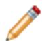

## Note:

When you use draft with a shell feature, discontinuous profiles cannot be used. A discontinuous profile is a profile that is connected but cannot be traced in one continuous motion. If you specify draft on a discontinuous profile, Abaqus/CAE applies the draft angle to each face individually and the extruded edges are not joined.

10. Toggle on Keep internal boundaries to maintain any faces or edges that are generated between the extruded shell feature and the existing part. The internal boundaries may create regions that can be structured or swept meshed without having to resort to partitioning.

11. Click OK to extrude the profile.

If you selected the twist option and your sketch includes a single isolated point, Abaqus/CAE uses that point as the center of twist. If your sketch does not include an isolated point, Abaqus/CAE returns to the Sketcher for you to create one. If your sketch contains more than one isolated point, Abaqus/CAE returns to the Sketcher and prompts you to select an isolated point as the center of twist.

12. If you selected Up to Face, Abaqus/CAE prompts you to select the face to which to extrude the profile. Select a face to meet the following requirements:

• the selected face does not have to be parallel to the sketch plane,  
• it can be a nonplanar face,  
• it must completely contain the extruded selection, and  
• it cannot be a datum plane.

Abaqus/CAE creates the extruded shell feature.

## Additional information

• The Datum toolset  
• Adding a shell feature  
• The Sketch module  
• What is feature-based modeling?

## Adding a revolved shell feature

Select Shape->Shell->Revolve from the main menu bar to add a revolved shell feature to the part in the current viewport. You can add a revolved shell feature only to three−dimensional parts.

You add a revolved shell feature by sketching a profile and a construction line on a selected face. The construction line serves as an axis of revolution, and Abaqus/CAE creates the shell feature by rotating the profile about the axis using a specified angle of revolution. A sketch and the resulting feature, rotated about the axis of revolution through an angle of 90°, are illustrated in the following figure:

In addition, you can specify a pitch and a direction along the axis of revolution that Abaqus/CAE uses to translate the sketch along the axis of revolution as it revolves the profile.

1. From the main menu bar, select Shape->Shell->Revolve.

Abaqus/CAE displays prompts in the prompt area to guide you through the procedure.

in the Part module toolbox. For a diagram of the tools in the Part module toolbox, see Using the Part module toolbox.

2. If desired, specify the method you want to use to select an origin for your sketch of the revolved shell feature. Select one of the following options from the Sketch Origin field in the prompt area:

• Select Auto-Calculate to place the sketch origin automatically.  
• Select Specify to define a custom sketch origin.  
• Select Session Default to use the custom origin you specified earlier in the session.

3. Select the planar face from which the shell will be revolved. If no suitable face exists, you can select a datum plane or an orphan element face.

Tip: If you are unable to select the desired planar face, you can use the Selection toolbar to change the selection behavior. For more information, see Using the selection options.

The selected face is highlighted in the viewport.

4. If you selected Specify as the Sketch Origin method, specify the origin location by clicking a point in the viewport or by entering the three-dimensional coordinates of the origin in the prompt area. You can also set this custom origin as the default origin for all sketches in your session by toggling on Set as session default.

5. Select an edge and the orientation of the edge on the Sketcher grid. The edge must not be perpendicular to the selected face. By default, the selected edge will appear vertical and on the right side of the Sketcher grid. To choose a different orientation for the edge, click the arrow on the right side of the dialog box and choose an orientation from the list that appears.

Tip: If the edge of the selected face is curved or does not provide the desired orientation, you can create a datum axis. You can then select the datum axis to control the orientation of the part on the Sketcher grid.

Abaqus/CAE highlights the selected edge, enters the Sketcher, and rotates the part until the selected face aligns with the plane of the Sketcher grid and the selected edge aligns with the grid in the desired orientation.

If you are unsure of the part's orientation relative to the Sketcher grid, use the view manipulation tools

from the View Manipulation toolbar to view its position. Use the reset view tool to return to the original view.

6. Use the horizontal , vertical , angle , or oblique construction line tools to sketch the axis of rotation. You can position the construction line by selecting a datum axis from the underlying part. You cannot select the datum axis directly; you must select a point from either end of the datum axis.  
7. Use the Sketcher to sketch the two-dimensional profile of the revolved feature; the sketch must not cross the axis of revolution.  
8. In the prompt area, click Done to indicate you have finished sketching the profile and the axis. If the sketch contains more than one construction line, Abaqus/CAE prompts you to select the construction line that will serve as the axis of rotation.

Abaqus/CAE displays the part view that was active prior to entering the Sketcher. The part includes your sketched profile and an arrow indicating the direction of revolution. The Edit Revolution dialog box appears.

9. In the Edit Revolution dialog box, enter the desired angle of revolution or accept the default value.

10. Click next to Revolve direction to change the arrow direction and the associated direction of revolution.  
11. If desired, toggle on Include translation, and enter a positive value for pitch. The pitch value is the distance through which the profile is translated along the axis of revolution during a rotation of 360°. An arrow appears to show the axis of revolution and to indicate the direction of sketch translation

along the axis. Click next to Pitch direction in the Edit Revolution dialog box to reverse the arrow, if necessary.

12. If desired, toggle on Sweep sketch normal to path to rotate the sketched profile normal to the path of revolution. This option is available only when Include translation is used.

The initial profile of the feature will be rotated from the sketch plane to create the feature.

13. Toggle on Keep internal boundaries to maintain any faces or edges that are generated between the revolved shell feature and the existing part. The internal boundaries may create regions that can be structured or swept meshed without having to resort to partitioning.  
14. Click OK to accept the indicated direction and to create the revolved shell feature.

Abaqus/CAE creates the revolved feature using your selected parameters.

## Additional information

• Creating construction geometry  
• Adding a shell feature  
• Defining the axis of revolution for axisymmetric parts and for revolved features  
• Controlling the cross-section of a revolved feature with pitch  
• The Sketch module  
• What is feature-based modeling?

Select Shape->Shell->Sweep from the main menu bar to add a swept shell feature to the part in the current viewport. You can add a swept shell feature only to three-dimensional parts.

You add a swept shell feature by first defining a sweep path, then defining a sweep profile. There are different methods available for defining each component:

You can define a sweep path either by sketching the path on a selected face or by selecting a series of edges or wires that you want the sweep path to follow. The sketch method provides greater flexibility but supports only two-dimensional paths. The edge/wire method enables you to define a three-dimensional sweep path along a feature such as a spline wire or a set of edges in a three-dimensional part.  
You can define a sweep profile either by sketching a sweep profile using the Sketcher or by selecting one of the faces in your model as the profile. The sweep profile is initially perpendicular to the path; you can keep this orientation constant along the entire sweep path, or you can keep the sweep profile perpendicular to the sweep path as it is swept along its length.

The sweep path (a spline) and the sweep profile are shown in the following figure:

The resulting swept shell feature is shown in the following figure:

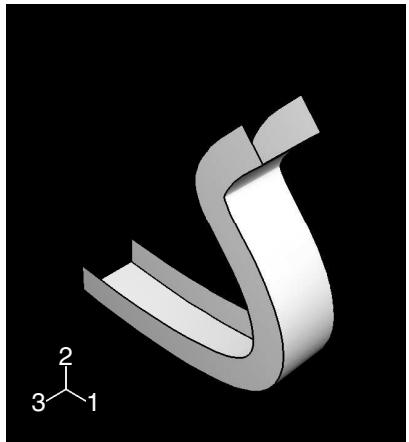

The sketch or set of edges defining the sweep path and the sketch, edge, or edges defining the sweep profile combine to define the swept shell feature; both the sweep path and the sweep profile can be modified using the Feature Manipulation toolset if you define them using the Sketcher. You can define a swept shell whose sweep profile is offset from the sweep path. In this case Abaqus/CAE moves the sweep path to a parallel location that passes through the sweep profile and creates the swept shell feature at that location.

As you define your sweep feature, you can apply a twist or draft to it. For more information about these tools, see What types of features can you create?. You can toggle on Keep profile normal constant to maintain the same orientation for the sweep profile as it travels along the sweep path; if this option is toggled off, the sweep profile orientation changes with the normal to the sweep path. In addition, you can toggle on Keep internal boundaries in the Feature Manipulation toolset to maintain any faces or edges that are generated between the swept shell feature and the existing part. The internal boundaries can create regions that can be structured or swept meshed without having to resort to partitioning.

1. From the main menu bar, select Shape->Shell->Sweep.

Abaqus/CAE displays prompts in the prompt area to guide you through the procedure.

the Part module toolbox. For a diagram of the tools in the Part module toolbox, see Using the Part module toolbox.

2. If you want to sketch the sweep path, do the following:

a. From the Path options, select Sketch and click

Abaqus/CAE displays prompts in the prompt area to guide you through the procedure.

b. If desired, specify the method you want to use to select an origin for your sketch of the swept solid feature. Select one of the following options from the Sketch Origin field in the prompt area:

• Select Auto-Calculate to place the sketch origin automatically.  
• Select Specify to define a custom sketch origin.  
• Select Session Default to use the custom origin you specified earlier in the session.

c. Select the planar face on which to sketch the sweep path. If no suitable face exists, you can select a datum plane.

Tip: If you are unable to select the desired planar face, you can use the Selection toolbar to change the selection behavior. For more information, see Using the selection options.

d. If you selected Specify as the Sketch Origin method, specify the origin location by clicking a point in the viewport or by entering the three-dimensional coordinates of the origin in the prompt area. You can also set this custom origin as the default origin for all sketches in your session by toggling on Set as session default.

e. Select an edge and the orientation of the edge on the Sketcher grid. The edge must not be perpendicular to the selected face. By default, the selected edge will appear vertical and on the right side of the Sketcher grid. To choose a different orientation for the edge, click the arrow on the right side of the dialog box and choose an orientation from the list that appears.

Tip: If there is no straight edge with the desired orientation, you can create a datum axis. You can then select the datum axis to control the orientation of the part on the Sketcher grid.

Abaqus/CAE highlights the selected edge, enters the Sketcher, and rotates the part so that the selected face aligns with the plane of the Sketcher grid and the selected edge aligns with the grid in the desired orientation.

If you are unsure of the part's orientation relative to the Sketcher grid, use the view manipulation

tools from the View Manipulation toolbar to view its position. Use the reset view tool to return to the original view.

f. Sketch the sweep path. The sweep path must meet the following guidelines:

The path can be closed, but the ends must meet smoothly; for example, the ends should not meet at a corner. For examples of valid sweep paths, see Defining the sweep path and the sweep profile.  
• The path must be continuous; for example, it must not branch.  
• The resulting solid cannot intersect with itself.

In the prompt area, click Done to indicate you have finished sketching the sweep path.

Abaqus/CAE exits the Sketcher and restores the original view of the part. A highlighted line indicates the sweep path and its direction. Abaqus/CAE also reopens the Create Shell Sweep dialog box and adds the word (Defined) next to the Sketch label in the Path options to indicate that the sweep path has been defined in the Sketcher.

3. If you want to specify the sweep path as a series of edges or wires, do the following:

a. From the Path options, select Edges and click

Abaqus/CAE displays prompts in the prompt area to guide you through the procedure.

b. If desired, specify in the prompt area whether you want to select the edges in your sweep path individually or by edge angle. For more information about selecting objects, see Using the angle and feature edge method to select multiple objects.

c. Select the edges you want to include in the sweep path.

Abaqus/CAE shows the sweep path on your part and indicates the sweep direction.

d. In the prompt area, click Yes to confirm the sweep path direction or click Flip to reverse the sweep path direction.

Abaqus/CAE reopens the Create Shell Sweep dialog box and adds the word (Defined) next to the Edges label in the Path options to indicate that the sweep path has been defined using a series of edges.

4. If you want to sketch the sweep profile, do the following:

a. From the Profile options, select Sketch and click

Abaqus/CAE displays prompts in the prompt area to guide you through the procedure.

b. Sketch the sweep profile. The sweep profile must meet the following guidelines:

• The profile must be closed.  
• The resulting solid cannot intersect with itself.

You can sketch the profile anywhere on the Sketcher grid; Abaqus/CAE sweeps the profile along a path parallel to the sweep path. In the prompt area, click Done to indicate you have finished sketching the sweep profile.

Abaqus/CAE exits the Sketcher and restores the original view of the part.

c. Select an edge and the orientation of the edge on the Sketcher grid. The selected edge must not be parallel to the sweep path direction. By default, the selected edge will appear vertical and on the right side of the Sketcher grid. To choose a different orientation for the edge, click the arrow on the right side of the dialog box and choose an orientation from the list that appears.

Abaqus/CAE highlights the selected edge, enters the Sketcher again, and rotates the part so that the Sketcher grid lies on a plane normal to the beginning of the sweep path with the sweep path direction pointing out of the screen. In addition, the selected edge aligns with the grid in the desired orientation. The intersection of two dashed lines indicates the origin of the sweep path. Abaqus/CAE also reopens the Create Shell Sweep dialog box and adds the word (Defined) next to the Sketch label in the Profile options to indicate that the sweep profile has been defined in the Sketcher.

5. If you want to select one or more edges as the sweep profile, do the following:

a. From the Profile options, select Edges and click

Abaqus/CAE displays prompts in the prompt area to guide you through the procedure.

b. Select one or more edges from the viewport.

Abaqus/CAE highlights the selected face and displays the Create Shell Sweep dialog box.

Abaqus/CAE reopens the Create Shell Sweep dialog box and adds the word (Defined) next to the Edges label in the Profile options to indicate that the sweep profile has been defined using one or more edges.

6. If desired, do one of the following:

Toggle on Include twist, and enter the pitch. The pitch is the extrusion distance in which a 360° twist would occur. The sketched extrusion profile must include an isolated point that indicates the center of twist.  
Toggle on Include draft, and enter the draft angle (greater than −90° and less than 90°). A positive draft angle indicates that external faces of the profile expand and internal faces contract. You cannot apply a draft if the Keep profile normal constant option is selected.  
Toggle on Keep profile normal constant to maintain the same profile orientation along the entire sweep path. If this option is toggled off, Abaqus/CAE adjusts the profile orientation so that the angle between the sweep profile and the normal to the sweep path is always constant. You cannot toggle on this option if the Include draft option is selected.  
Toggle on Keep internal boundaries to maintain any faces or edges that are generated between the swept solid feature and the existing part. The internal boundaries can create regions that can be structured or swept meshed without having to resort to partitioning.

7. Click OK to create the new swept shell.

## Additional information

• Defining the sweep path and the sweep profile  
• The Sketch module  
• What is feature-based modeling?

Select Shape->Shell->Loft from the main menu bar to add a shell loft feature to the part in the current viewport. You can add a shell loft feature only to three-dimensional parts.

You add a shell loft feature by creating two or more sections from selected edges and by defining one or more loft paths. Loft sections, a loft path, and the resulting shell loft feature are illustrated in the following figure:

You can allow Abaqus/CAE to define a single loft path using a smooth path to connect the center of each loft section. If you allow Abaqus/CAE to define the path, you can apply tangency methods to the start and end sections of the loft. The curve and tangencies define the path of the loft feature between sections. Alternatively, you can define one or more loft paths by selecting curves that connect a point on each loft section to a point on the next loft section. Each loft path must provide a continuous line connecting each consecutive loft section. If a loft path is not smooth (if there is more than one tangent to any point along the path), Abaqus/CAE will display an error message when you try to create the loft. For more information about loft sections, loft paths, and loft tangencies, see What is lofting?.

## Note:

You do not use the Sketcher while adding a loft feature. As a result, all of the edges that define the loft sections and the loft paths must exist in the part geometry before you create the loft. To create a loft path or to create a nonplanar loft section, you can use the tool, located with the wire tools in the Part module toolbox, to create a spline wire (see Adding a point-to-point wire feature, for more information).

1. From the main menu bar, select Shape->Shell->Loft.

Abaqus/CAE displays prompts in the prompt area to guide you through the procedure.

Tip: You can also add a shell loft feature using the tool, located with the shell tools in the Part module toolbox. For a diagram of the tools in the Part module toolbox, see Using the Part module toolbox.

The Edit Loft dialog box appears.

2. Create the loft sections by selecting edges from the part in the viewport. See Creating loft sections, for detailed instructions on creating loft sections.

Toggle on Keep internal boundaries to maintain any faces or edges that are generated between the lofted shell feature and the existing part. The internal boundaries may create regions that can be structured or swept meshed without having to resort to partitioning.

3. When you have finished creating the loft sections, click on the Transition tab in the Edit Loft dialog box.  
4. Do one of the following:

Click Select path to create the loft path (or paths) by selecting edges from the part in the viewport.•  
• Click Specify tangencies to create the loft path (or paths) by using loft tangencies.

See Creating a loft path, for detailed instructions on creating a loft path.

## 5. Click Preview.

Abaqus/CAE displays a wireframe representation of the loft that would be created with your current settings.

6. If desired, you can add or remove loft sections, change the loft path definition method, or edit the loft tangency options to change the shape of the loft feature. Click Preview to see the effect of your changes in the viewport.  
7. If desired, you can have Abaqus/CAE test for self-intersection as it creates the loft feature. This test prevents creating a feature that would be difficult or impossible to mesh and analyze, but it becomes computationally expensive as the complexity of the loft feature increases. For more information, see Self-intersection checks. To use self-intersection checks, select Feature->Options to open the Feature Options dialog box, and toggle on Perform self-intersection checks.  
8. Click Done to create the loft and to close the Edit Loft dialog box.

If you choose to test for self-intersection and the test fails, the Edit Loft dialog box will reappear so that you can make changes. Otherwise, the shell loft feature is created in the viewport.

## Additional information

• Adding a shell feature  
• What is feature-based modeling?

Select Shape->Shell->Planar from the main menu bar to add a planar shell feature to the part in the current viewport. The planar shell tool is always available, regardless of the modeling space of the part in the current viewport.

You add a planar shell feature by sketching the feature on a selected face. A sketch and the resulting planar shell feature are illustrated in the following figure:

The sketch defines a planar shell feature and can be modified using the Feature Manipulation toolset.

1. From the main menu bar, select Shape->Shell->Planar.

Abaqus/CAE displays prompts in the prompt area to guide you through the procedure.

Tip: You can also add a planar shell feature using th e tool, located with the shell tools in the Part module toolbox. For a diagram of the tools in the Part module toolbox, see Using the Part module toolbox.

2. If desired, specify the method you want to use to select an origin for your sketch of the planar shell feature. Select one of the following options from the Sketch Origin field in the prompt area:

• Select Auto-Calculate to place the sketch origin automatically.  
• Select Specify to define a custom sketch origin.  
• Select Session Default to use the custom origin you specified earlier in the session.

3. If the modeling space of the part is two-dimensional or axisymmetric, Abaqus/CAE enters the Sketcher and aligns the X- and Y-axes of the part and the sketch.

If the modeling space of the part is three-dimensional, do the following:

a. Select the planar face on which the shell will be positioned. If no suitable face exists, you can select a datum plane.

Tip: If you are unable to select the desired planar face, you can use the Selection toolbar to change the selection behavior. For more information, see Using the selection options.

b. If you selected Specify as the Sketch Origin method, specify the origin location by clicking a point in the viewport or by entering the three-dimensional coordinates of the origin in the prompt area. You can also set this custom origin as the default origin for all sketches in your session by toggling on Set as session default.

c. Select an edge and the orientation of the edge on the Sketcher grid. The edge must not be perpendicular to the selected face. By default, the selected edge will appear vertical and on the right side of the Sketcher grid. To choose a different orientation for the edge, click the arrow on the right side of the dialog box and choose an orientation from the list that appears.

Tip: If the edge of the selected face is curved or does not provide the desired orientation, you can create a datum axis. You can then select the datum axis to control the orientation of the part on the Sketcher grid.

Abaqus/CAE highlights the selected edge, enters the Sketcher, and rotates the part until the selected face aligns with the plane of the Sketcher grid and the selected edge aligns with the grid in the desired orientation.

If you are unsure of the part's orientation relative to the Sketcher grid, use the view manipulation

tools from the View Manipulation toolbar to view its position. Use the reset view tool to return to the original view.

4. Use the Sketcher to sketch the planar shell. In the prompt area, click Done to indicate you have finished sketching.

The part returns to its original orientation with the planar shell positioned on the selected face. The shell feature is created only where it extends beyond the faces of the part; a shell feature cannot overlap a face.

## Additional information

• Adding a shell feature  
• The Sketch module  
• What is feature-based modeling?

Select Shape->Shell->From Solid from the main menu bar to create a shell feature from the faces of a solid feature. You can add a shell-from-solid feature only to three-dimensional parts.

You add a shell-from-solid feature by selecting the cells to remove from the part; Abaqus/CAE converts any remaining faces associated with the removed cells to shells.

The From Solid tool is an easy way to create shells with curved edges, as shown in the following figure. The curved edges of the solid were created by filleting the edges using the round tool.

1. From the main menu bar, select Shape->Shell->From Solid.

Abaqus/CAE displays prompts in the prompt area to guide you through the procedure.

Tip: You can also add a shell–from–solid feature using the tool, located with the shell tools in the Part module toolbox. For a diagram of the tools in the Part module toolbox, see Using the Part module toolbox.

2. Select one or more cells to convert to shells. [Shift] + Click additional cells to add them to your selection and [Ctrl] + Click a selected cell to unselect it. Click mouse button 2 to indicate you have finished selecting cells to convert.

Abaqus/CAE converts the selected cells to shells.

Tip: Use the Previous button ) to undo one or more steps; use the cancel button ( ) to stop the creation of the shell from solid.

## Additional information

• Adding a shell feature  
• The Sketch module  
• What is feature-based modeling?

## Adding a wire feature

This section describes the Part module tools used to add a wire feature to the part in the current viewport. This section also describes adding a wire feature to an assembly.

## In this section:

Adding a sketched wire feature  
Adding a point-to-point wire feature  
Rounding vertices in a wire  
Adding a wire-from-edge feature

Select Shape->Wire->Sketch from the main menu bar to add a sketched planar wire feature to the part in the current viewport. The planar wire tool is always available, regardless of the modeling space of the part in the current viewport.

You add a planar wire feature by sketching the feature on a selected plane. Abaqus/CAE removes any portion of the wire that overlaps an existing face. A sketch and the resulting planar wires are illustrated in the following figure:

The sketch fully defines a planar wire feature and can be modified using the Feature Manipulation toolset.

1. From the main menu bar, select Shape->Wire->Sketch.

Abaqus/CAE displays prompts in the prompt area to guide you through the procedure.

Tip: You can also add a sketched wire feature using the tool, located with the wire tools in the Part module toolbox. For a diagram of the tools in the Part module toolbox, see Using the Part module toolbox.

2. If desired, specify the method you want to use to select an origin for your sketch of the sketched wire feature. Select one of the following options from the Sketch Origin field in the prompt area:

• Select Auto-Calculate to place the sketch origin automatically.  
• Select Specify to define a custom sketch origin.  
• Select Session Default to use the custom origin you specified earlier in the session.

3. If the modeling space of the part is two-dimensional or axisymmetric, Abaqus/CAE enters the Sketcher and aligns the X- and Y-axes of the part and the sketch.

If the part is three-dimensional, do the following:

a. Select the planar face on which the wire will be positioned. If no suitable face exists, you can select a datum plane.

Tip: If you are unable to select the desired planar face, you can use the Selection toolbar to change the selection behavior. For more information, see Using the selection options.

b. Select an edge and the orientation of the edge on the Sketcher grid. The edge must not be perpendicular to the selected face. By default, the selected edge will appear vertical and on the right side of the Sketcher grid. To choose a different orientation for the edge, click the arrow on the right side of the dialog box and choose an orientation from the list that appears.

Tip: If the edge of the selected face is curved or does not provide the desired orientation, you can create a datum axis. You can then select the datum axis to control the orientation of the part on the Sketcher grid.

Abaqus/CAE highlights the selected edge, enters the Sketcher, and rotates the part until the selected face aligns with the plane of the Sketcher grid and the selected edge aligns with the grid in the desired orientation.

If you are unsure of the part's orientation relative to the Sketcher grid, use the view manipulation

tools from the View Manipulation toolbar to view its position. Use the reset view tool to return to the original view.

4. If you selected Specify as the Sketch Origin method, specify the origin location by clicking a point in the viewport or by entering the three-dimensional coordinates of the origin in the prompt area. You can also set this custom origin as the default origin for all sketches in your session by toggling on Set as session default.  
5. Use the Sketcher to sketch the planar wire. In the prompt area, click Done to indicate you have finished sketching.

The part returns to its original orientation with the planar wire positioned on the selected face. The wire feature is created only where it extends beyond the faces of the part; a wire feature cannot overlap a face.

## Additional information

• What is feature-based modeling?  
• Adding a wire feature  
• The Sketch module

## Adding a point-to-point wire feature

You can add a point-to-point wire feature to a part or to an assembly.

For assembly-level wire features, you can modify the wire feature or remove wires from the feature, as described in Creating or modifying wire features for multiple connectors.

Assembly-level wire features are nonmeshable. The wire feature contains wires connecting points from the part or assembly in the current viewport or connecting points from the part or assembly to ground. To model connectors you must define one or more wire features on your assembly. When you create a wire feature on a part or an assembly, you can create a geometry set that includes the wires defined in the wire feature. In addition, when you create a wire feature on a part, you can create geometry sets that include the vertices defined in the wire feature.

To add a wire feature on a part, select Shape->Wire->Point to Point from the main menu bar in the Part module. The point-to-point wire tool is always available in the Part module, regardless of the modeling space of the part in the current viewport. To add a wire feature on an assembly, select Connector->Geometry->Create Wire Feature from the main menu bar in the Interaction module.

You add a point-to-point wire feature to a part by choosing a geometry type, polyline, or spline; for assemblies you can add only a polyline wire feature. You can choose to imprint the wire on the existing part by creating edges, merge the wire with the existing part, or create the wire separate from the existing part. The wire merge options are available only in the Part module.

If you are creating polyline wires, you must next choose a point selection method and pick points to connect from the current part or assembly. You can choose to select disjointed points (that is, not automatically connected end-to-end), chained points (that is, automatically connected end-to-end), or points that are connected to ground. Abaqus/CAE connects the point pairs with a straight line or connects the points to ground depending on the method that you select. A polyline wire feature connecting four points in a part is illustrated in the following figure:

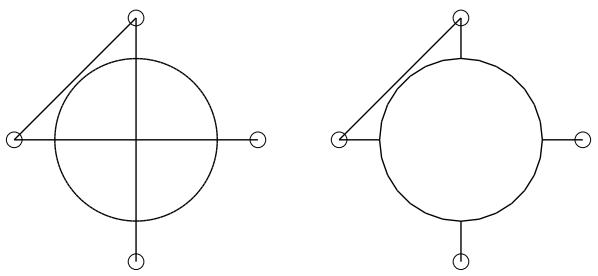

The planar shell feature is shown for reference. The image on the left shows the full length of the point-to-point wire using the Imprint wire or Separate wire options, while the image on the right shows a point-to-point wire connecting the same set of points using the Merge wire option.

If you are creating spline wires on a part, the chained point selection method is the only one available. Abaqus/CAE calculates the shape of the curve by using a cubic spline fit between all points along the spline; in addition, the first and second derivatives of the spline are continuous. A spline wire feature is illustrated in the following figure:

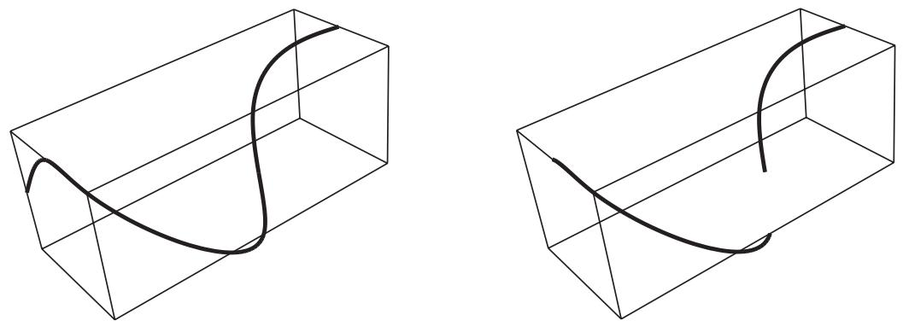

The rectangular solid feature is shown for reference. The image on the left shows the full length of the spline wire using the Imprint wire or Separate wire options, while the image on the right shows a spline wire connecting the same set of points using the Merge wire option.

During creation of the wire feature on a part or assembly, you can modify the point selections. For part-level wire features, in most cases, once you have created the wire feature, you cannot modify it directly. You might be able to remove a wire edge from the feature using the Geometry Edit toolset. (For more information, see Removing wire edges). If you want to change the points that are connected or the connection order, you must delete the wire and create a new wire connecting the desired points. Since the point-to-point wire is dependent on points created by other features, you can modify the wire by using the Feature Manipulation toolset to modify the features that created the points.

Although you cannot create a part with a nonplanar wire base feature, you can create a nonplanar point-to-point wire feature by using a single point in space as the base feature and entering coordinates for the remaining points. In this case the starting point is the only point that you can edit to modify the wire. You can also use datum points, in which case you can edit all points.

1. Display the Create Wire Feature dialog box using one of the following methods:

• From the main menu bar in the Part module, select Shape->Wire->Point to Point.

tool, located with the wire tools in the Part module toolbox. For a diagram of the tools in the Part module toolbox, see Using the Part module toolbox.

• From the main menu bar in the Interaction module, select Connector->Geometry->Create Wire Feature.

Tip: You can also add a wire feature to an assembly using the tool, located in the Interaction module toolbox. For a diagram of the tools in the Interaction module toolbox, see Using the Interaction module toolbox.

2. If you are creating a wire in the Part module, choose Polyline to create one or more straight lines or choose Spline to create a continuous spline curve.  
3. If you are adding a wire feature to a part, specify a merge option in the Wire Merge Scheme portion of the dialog box. The wire merge options are available only in the Part module.

• Choose Imprint wire to imprint the newly created wire on the existing part by creating edges.  
• Choose Merge wire to merge the newly created wire with the existing part.

Choose Separate wire to create the wire separate from the existing part; no edges are created and the wire is not merged with the existing part.

4. In the Point Pairs portion of the dialog box, specify the point selection method.

Choose Disjoint wires to select points that are not automatically connected end-to-end. Use this method to specify wires to use for modeling connectors (see Modeling connectors).

The first two points that you select become Point 1 and Point 2, respectively, of a point pair; the next two points that you select become Point 1 and Point 2, respectively, of the next point pair; and so on. When you use connectors to model multi-point constraints between two points, the motion of Point 2 is constrained to the motion of Point 1.

Choose Chained wires to select points that are automatically connected end-to-end. The first point that you select becomes Point 1 of a point pair, the second point that you select becomes Point 2 of that point pair and Point 1 of the next point pair, and so on.

For spline wires, Chained wires is the only selection method available, and points are displayed separately instead of in pairs.

Choose Wires to ground to select points that are connected to ground. Use this method to specify point-to-ground wires to use for modeling connectors (see Modeling connectors). Abaqus/CAE automatically makes each point that you select Point 2 of a point pair (that is, Point 2 is connected to ground). However, you might want to connect Point 1 to ground. If so, you can modify the wire definition after you complete the point selection. Select the row of the point pair that you want to modify, and click Swap to exchange the entries for Point 1 and Point 2 (as described in Step 5).

5. In the Point Pairs portion of the dialog box, click to select the points that the wire will connect.

• If you are adding a wire feature to a part, you can select points from the viewport or you can enter the coordinates in the text box in the prompt area. Press Enter to accept the coordinates and proceed to the next point in the chain of wires. Abaqus/CAE highlights all the points that you can pick. The possible choices are:

Vertices  
- The midpoints of lines and arcs  
The centers of circles and arcs  
- Datum points

• If you are adding a wire feature to an assembly, you can select points from the viewport. Abaqus/CAE highlights all the points that you can pick. The possible choices are:

Vertices  
Orphan nodes  
Reference points

Abaqus/CAE displays prompts in the prompt area to guide you through the procedure.

Tip: If you are unable to select the desired points, you can use the Selection toolbar to change the selection behavior. For more information, see Using the selection options.

As you select points, Abaqus/CAE displays a representation of the completed point-to-point wire based on your current selections highlighted in red.

6. When you have finished selecting points, click Done in the prompt area.

The Create Wire Feature dialog box reappears. The points that you selected to define the wire are listed in the Point Pairs table.

7. From the Point Pairs table, you can do the following:

• To add more point pairs to a polyline or to add more points to a spline, repeat Steps 3 through 5.

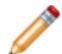

Note: When you add points to a spline, the new points will always extend the existing spline from the last existing point. When you add point pairs to a polyline, they will be connected to the existing polyline only if you reselect one of the existing points.

For polylines, the added point-to-point wire segments are highlighted in magenta. For splines, the entire spline wire is highlighted in red because its shape depends on the entire set of points, both new and existing.

• To edit a point, select the point in the table, click , and reselect a point. The selection in the viewport is updated to show the newly edited point.

To identify a specific point pair in the viewport, select the desired row. For polylines, the line connecting the selected point pair is highlighted in red. For splines, the symbol for the point on the selected row is highlighted.

• To remove a point pair from a polyline or a point from a spline, select the desired row and click

• To exchange the entries for Point 1 and Point 2 in a point pair for polylines, select the desired row

and click

You can also enter table data from an ASCII file. To enter data from a file, click mouse button 3 while holding the cursor over a cell in the table; then select Read From File from the menu that appears.

For more information, see Entering tabular data.

8. In the Set Creation portion of the dialog box, do the following:

• Toggle on Create set of wires if you want Abaqus/CAE to create a geometry set of wires.

Toggle on Create set of vertices if you want Abaqus/CAE to create a geometry set of the Point 1 entries and a geometry set of the Point 2 entries in the wire definition. The Create set of vertices option is available only in the Part module.

9. Click OK to create the point-to-point wire feature.

Part-level wire features appear as solid lines in the viewport and appear in the Model Tree in the Features container under the part.

Assembly-level wires features are nonmeshable, appear as dashed lines in the viewport, and appear in the Model Tree in the Features container under the assembly.

## Additional information

• What is feature-based modeling?  
• Adding a wire feature  
• Creating or modifying wire features for multiple connectors  
• The Sketch module

Select Shape->Wire->Round from the main menu bar to “round,” or fillet, a vertex between two edges in a wire part.

1. From the main menu bar, select Shape->Wire->Round.

Abaqus/CAE displays prompts in the prompt area to guide you through the procedure.

Tip: You can also round a vertex between two edges in a wire part using the tool, located with the wire tools in the Part module toolbox. For a diagram of the tools in the Part module toolbox, see Using the Part module toolbox.

Abaqus/CAE prompts you to select the vertices you want to round and displays prompts in the prompt area to guide you through the procedure.

2. Select the vertices to round. You can [Shift] + Click additional vertices to add them to your selection, and [Ctrl] + Click a selected vertex to unselect it.

Tip: If you are unable to select the desired vertices, you can use the Selection toolbar to change the selection behavior. For more information, see Using the selection options.

3. When you have finished selecting vertices, click Done in the prompt area.  
A default radius appears in the prompt area.  
4. If necessary, type a new radius in the text field in the prompt area.  
5. Click Done to accept the new radius and complete the rounding process.

Abaqus/CAE redraws the part with the selected vertices rounded.

## Additional information

• What is feature-based modeling?  
• Adding a wire feature  
• The Sketch module

## Adding a wire-from-edge feature

Select Shape->Wire->From Edge from the main menu bar to replace existing 3D shell or solid edges in the viewport with a wire feature.

You add a wire from edge feature by picking one or more edges from the current part. Abaqus/CAE removes the faces along the selected edges, converts the part from a solid to a shell if necessary, and creates wires to replace the removed edges. A wire-from-edge feature is illustrated in the following figure:

The image on the left shows the selected edges on the original solid part. The image on the right shows the resulting part. Each of the selected edges was associated with two faces; Abaqus/CAE removes those faces and converts the solid to a shell. The selected edges, and all the other edges that are no longer associated with faces, make up the new wire feature.

A wire-from-edge feature cannot be modified.

1. From the main menu bar, select Shape->Wire->From Edge.

Abaqus/CAE displays prompts in the prompt area to guide you through the procedure.

Tip: You can also add a wire-from-edge feature using the tool, located with the wire tools in the Part module toolbox. For a diagram of the tools in the Part module toolbox, see Using the Part module toolbox.

2. Select the edges to be replaced by wires.  
3. Click Done to create the wire feature.

Abaqus/CAE displays a dialog box indicating that the faces and cells associated with the selected edges will be deleted.

4. Click Yes to continue or No to cancel the procedure.

If you choose Yes, Abaqus/CAE removes the faces associated with the selected edges and adds wires to replace all the removed feature edges.

## Additional information

• What is feature-based modeling?  
• Adding a wire feature  
• The Sketch module

## Adding a cut feature

This section describes the Part module tools used to add a cut feature to the part in the current viewport.

## In this section:

Creating an extruded cut  
Creating a loft cut  
Creating a revolved cut  
Creating a swept cut  
Cutting a circular hole

## Creating an extruded cut

Select Shape->Cut->Extrude from the main menu bar to create an extruded cut through the part geometry in the current viewport. The extruded cut tool is always available, regardless of the modeling space of the part in the current viewport.

You create an extruded cut into a three-dimensional part by sketching the two-dimensional cross-section of the cut on a selected face and defining the distance through which Abaqus/CAE extrudes the cut. You can select one of the following methods to define the distance through which the cut is extruded:

• Blind extends the cut from the sketch plane in a selected direction but only to a specified depth.  
• Up to Face extends the cut from the sketch plane to a selected face.  
• Through All extends the cut from the sketch plane in a selected direction through the geometry.

The three methods are illustrated in Figure 1.

  
blind cut

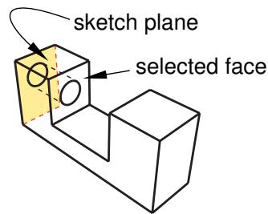  
to face cut  
Figure 1:Three methods for creating an extruded cut.

You create an extruded cut in a two-dimensional or axisymmetric planar part by sketching the two-dimensional cross-section of the cut directly on the plane of the part. The cut always passes completely through the part.

When creating an extruded cut in a three-dimensional part, you can select a center point and specify a pitch that Abaqus/CAE uses to twist the cross-section as it is extruded. Alternatively, Abaqus/CAE can expand or contract the cross-section along a specified draft angle as the cross-section is extruded. For more information, see Including twist in an extrusion, and Including draft in an extrusion.

1. From the main menu bar, select Shape->Cut->Extrude.

Abaqus/CAE displays prompts in the prompt area to guide you through the procedure.

Tip: You can also create an extruded cut using the tool, located with the cut tools in the Part module toolbox. For a diagram of the tools in the Part module toolbox, see Using the Part module toolbox.

2. If desired, specify the method you want to use to select an origin for your sketch of the extruded cut feature. Select one of the following options from the Sketch Origin field in the prompt area:

• Select Auto-Calculate to place the sketch origin automatically.  
• Select Specify to define a custom sketch origin.  
• Select Session Default to use the custom origin you specified earlier in the session.

3. If the current viewport contains a two-dimensional or axisymmetric planar part, Abaqus/CAE enters the Sketcher and you sketch the closed profile of the extruded cut on the plane of the part.

If the current viewport contains a three-dimensional part, you must do the following:

a. Select the planar face from which the cut will be extruded. If no suitable face exists, you can select a datum plane or an orphan element face.

Tip: If you are unable to select the desired planar face, you can use the Selection toolbar to change the selection behavior. For more information, see Using the selection options.

The selected face is highlighted in the viewport.

b. If you selected Specify as the Sketch Origin method, specify the origin location by clicking a point in the viewport or by entering the three-dimensional coordinates of the origin in the prompt area. You can also set this custom origin as the default origin for all sketches in your session by toggling on Set as session default.

c. Select an edge and the orientation of the edge on the Sketcher grid. The edge must not be perpendicular to the selected face. By default, the selected edge will appear vertical and on the right side of the Sketcher grid. To choose a different orientation for the edge, click the arrow on the right side of the dialog box and choose an orientation from the list that appears.

Tip: If the edge of the selected face is curved or does not provide the desired orientation, you can create a datum axis. You can then select the datum axis to control the orientation of the part on the Sketcher grid.

Abaqus/CAE highlights the selected edge, enters the Sketcher, and rotates the part until the selected face aligns with the plane of the Sketcher grid and the selected edge aligns with the grid in the desired orientation.

If you are unsure of the part's orientation relative to the Sketcher grid, use the view manipulation

tools from the View Manipulation toolbar to view its position. Use the reset view tool to return to the original view.

d. Use the Sketcher to sketch the closed two-dimensional profile of the extruded cut.

4. In the prompt area, click Done to indicate you have finished sketching the profile.

5. If the current viewport contains a two-dimensional or axisymmetric planar part, the part returns to its original orientation, and Abaqus/CAE cuts the plane with the sketched profile.

If the current viewport contains a three-dimensional part, Abaqus/CAE displays the part in its original orientation showing the base part, your sketched profile, and an arrow indicating the extrusion direction. The Edit Cut dialog box appears. Complete the following steps to create the extruded cut in the three-dimensional part:

a. Click in the Edit Cut dialog box to reverse the extrusion direction, if necessary.  
If the arrow direction is difficult to see, use the rotate tool to rotate the part.  
b. Select one of the following end conditions:

Select Blind and enter a value in the Depth field to specify the distance through which Abaqus/CAE will extrude the sketched cut profile.  
• Select Up to Face to specify that Abaqus/CAE will extrude the cut up to a selected face.  
Select Through All to specify that Abaqus/CAE will extrude the cut from the sketch plane completely through the geometry.

6. If desired, choose one of the following:

Select Twist and enter the pitch. The pitch is the extrusion distance in which a 360° twist would occur. The sketched cut profile must include an isolated point that indicates the center of twist.  
Select Draft and enter the draft angle (greater than −90° and less than 90°). A positive draft angle indicates that external faces of the profile expand and internal faces contract.

7. Click OK to extrude the profile.

If you selected the twist option and your sketch includes a single isolated point, Abaqus/CAE uses that point as the center of twist. If your sketch does not include an isolated point, Abaqus/CAE returns to the Sketcher for you to create one. If your sketch contains more than one isolated point, Abaqus/CAE returns to the Sketcher and prompts you to select an isolated point as the center of twist.

8. If you selected Up to Face, Abaqus/CAE prompts you to select the face to which to extrude the profile. Select a face to meet the following requirements:

• the selected face does not have to be parallel to the sketch plane,  
• it can be a nonplanar face,  
• it must completely contain the extruded selection, and  
• it cannot be a datum plane or orphan element face.

Abaqus/CAE creates the extruded cut feature.

## Note:

Cut features are applied to part geometry only. Any orphan elements within the cut region are unaffected by the cut.

## Additional information

• The Datum toolset  
• Adding a cut feature  
• The Sketch module  
• What is feature-based modeling?

Select Shape->Cut->Loft from the main menu bar to add a loft cut to the part geometry in the current viewport. You can add a loft cut only to three-dimensional parts.

You add a loft cut by creating two or more sections from selected edges and by defining one or more loft paths. Loft sections and the resulting loft cut are illustrated in the following figure (the loft path is not shown in this figure):

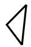

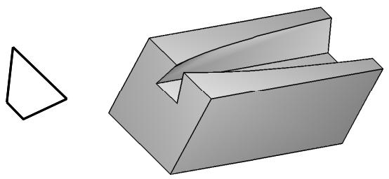

You can allow Abaqus/CAE to define a single loft path using a smooth path to connect the center of each loft section (as in the previous figure). If you allow Abaqus/CAE to define the path, you can apply tangency methods to the start and end sections of the loft. The curve and tangencies define the path of the loft feature between sections. Alternatively, you can define one or more loft paths by selecting curves that connect a point on each loft section to a point on the next loft section. Each loft path must provide a continuous line connecting each consecutive loft section. If a loft path is not smooth (if there is more than one tangent to any point along the path), Abaqus/CAE will display an error message when you try to create the loft. For more information about loft sections, loft paths, and loft tangencies, see What is lofting?.

## Note:

You do not use the Sketcher while adding a loft feature. As a result, all of the edges that define the loft sections and the loft paths must exist in the part geometry before you create the loft. To create a loft path or to create a

tool, located with the wire tools in the Part module toolbox, to create a spline wire (see Adding a point-to-point wire feature, for more information).

1. From the main menu bar, select Shape->Cut->Loft.

Abaqus/CAE displays prompts in the prompt area to guide you through the procedure.

Tip: You can also add a loft cut using the tool, located with the cut tools in the Part module toolbox. For a diagram of the tools in the Part module toolbox, see Using the Part module toolbox.

The Edit Loft dialog box appears.

2. Create the loft sections by selecting edges from the part in the viewport. See Creating loft sections, for detailed instructions on creating loft sections.  
3. When you have finished creating the loft sections, click on the Transition tab in the Edit Loft dialog box.  
4. Create the loft path (or paths) by again selecting edges from the part in the viewport or by using loft tangencies. See Creating a loft path, for detailed instructions on creating a loft path.  
5. Click Preview.

Abaqus/CAE displays a wireframe representation of the loft that would be created with your current settings.

6. If desired, you can add or remove loft sections, change the loft path definition method, or edit the loft tangency options to change the shape of the loft feature. Click Preview to see the effect of your changes in the viewport.  
7. If desired, you can have Abaqus/CAE test for self-intersection as it creates the loft feature. This test prevents creating a feature that would be difficult or impossible to mesh and analyze, but it becomes computationally expensive as the complexity of the loft feature increases. For more information, see Self-intersection checks. To use self-intersection checks, select Feature->Options to open the Feature Options dialog box, and toggle on Perform self-intersection checks.

8. Click Done to create the loft and to close the Edit Loft dialog box.

If you choose to test for self-intersection and the test fails, the Edit Loft dialog box will reappear so that you can make changes. Otherwise, the loft cut is created in the viewport.

## Note:

Cut features are applied to part geometry only. Any orphan elements within the cut region are unaffected by the cut.

## Additional information

• Adding a cut feature  
• What is feature-based modeling?

Select Shape->Cut->Revolve from the main menu bar to create a revolved cut through the part geometry in the current viewport. You can cut a revolved cut only through three-dimensional parts.

You add a revolved cut by sketching a closed two-dimensional cross-section and a construction line on a selected face. The construction line serves as an axis of revolution, and Abaqus/CAE creates the revolved cut by rotating the cross-section about the axis using a specified angle of revolution. In addition, you can specify a pitch and a direction along the axis of revolution that Abaqus/CAE uses to translate the sketch along the axis of revolution as it revolves the profile. Two revolved cut features are shown in the following figure; the figure on the right shows a revolved cut with pitch.

1. From the main menu bar, select Shape->Cut->Revolve.

Abaqus/CAE displays prompts in the prompt area to guide you through the procedure.

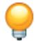

Tip: You can also create a revolved cut using the tool, located with the cut tools in the Part module toolbox. For a diagram of the tools in the Part module toolbox, see Using the Part module toolbox.

2. If desired, specify the method you want to use to select an origin for your sketch of the revolved cut feature. Select one of the following options from the Sketch Origin field in the prompt area:

• Select Auto-Calculate to place the sketch origin automatically.  
• Select Specify to define a custom sketch origin.  
• Select Session Default to use the custom origin you specified earlier in the session.

3. Select the planar face from which the cut will be revolved. If no suitable face exists, you can select a datum plane or an orphan element face.

Tip: If you are unable to select the desired planar face, you can use the Selection toolbar to change the selection behavior. For more information, see Using the selection options.

The selected face is highlighted in the viewport.

4. If you selected Specify as the Sketch Origin method, specify the origin location by clicking a point in the viewport or by entering the three-dimensional coordinates of the origin in the prompt area. You can also set this custom origin as the default origin for all sketches in your session by toggling on Set as session default.

5. Select an edge and the orientation of the edge on the Sketcher grid. The edge must not be perpendicular to the selected face. By default, the selected edge will appear vertical and on the right side of the Sketcher grid. To choose a different orientation for the edge, click the arrow on the right side of the dialog box and choose an orientation from the list that appears.

Tip: If the edge of the selected face is curved or does not provide the desired orientation, you can create a datum axis. You can then select the datum axis to control the orientation of the part on the Sketcher grid.

Abaqus/CAE highlights the selected edge, enters the Sketcher, and rotates the part until the selected face aligns with the plane of the Sketcher grid and the selected edge aligns with the grid in the desired orientation.

If you are unsure of the part's orientation relative to the Sketcher grid, use the view manipulation tools

from the View Manipulation toolbar to view its position. Use the reset view tool to return to the original view.

6. Use the horizontal , vertical , angle , or oblique construction line tools to sketch the axis of rotation. You can position the construction line by selecting a datum axis from the underlying

part. You cannot select the datum axis directly; you must select a point from either end of the datum axis.

7. Use the Sketcher to sketch the two-dimensional profile of the revolved cut; the sketch must not cross the axis of revolution.

8. In the prompt area, click Done to indicate you have finished sketching the profile and the axis. If the sketch contains more than one construction line, Abaqus/CAE prompts you to select the construction line that will serve as the axis of rotation.

Abaqus/CAE displays the part view that was active prior to entering the Sketcher. The part includes your sketched profile and an arrow indicating the direction of revolution. The Edit Revolution dialog box appears.

9. In the Edit Revolution dialog box, enter the desired angle of revolution or accept the default value.

10. Click next to Revolve direction to change the arrow direction and the associated direction of revolution.

11. If desired, select the Include translation option and enter a positive value for the pitch. The pitch value is the distance through which the profile is translated along the axis of revolution during a rotation of 360°.

An arrow appears to show the axis of revolution and to indicate the direction of sketch translation

along the axis. Click next to Pitch direction in the Edit Revolution dialog box to reverse the arrow, if necessary.

12. If desired, toggle on Sweep sketch normal to path to rotate the sketched profile normal to the path of revolution. This option is available only when Include translation is used.

The initial profile of the feature will be rotated from the sketch plane to create the feature.

13. Click OK to accept the indicated direction and create the revolved cut feature.

Abaqus/CAE creates the revolved cut feature using your selected parameters.

## Note:

Cut features are applied to part geometry only. Any orphan elements within the cut region are unaffected by the cut.

## Additional information

• Creating construction geometry  
• Adding a cut feature  
• Defining the axis of revolution for axisymmetric parts and for revolved features  
• Controlling the cross-section of a revolved feature with pitch  
• The Sketch module  
• What is feature-based modeling?

## Creating a swept cut

Select Shape->Cut->Sweep from the main menu bar to create a swept shell cut through the part geometry in the current viewport. You can create a swept cut through only three−dimensional parts.

You add a swept cut feature by first defining a sweep path, then defining a sweep profile. There are different methods available for defining each component:

You can define a sweep path either by sketching the path on a selected face or by selecting a series of edges or wires that you want the sweep path to follow. The sketch method provides greater flexibility but supports only two-dimensional paths. The edge/wire method enables you to define a three-dimensional sweep path along a feature such as a spline wire or a set of edges in a three-dimensional part.  
You can define a sweep profile either by sketching a sweep profile using the Sketcher or by selecting one of the faces in your model as the profile. The sweep profile is initially perpendicular to the path; you can keep this orientation constant along the entire sweep path, or you can keep the sweep profile perpendicular to the sweep path as it is swept along its length.

The following figure shows an example of sketching a sweep path on a selected face and sketching a closed sweep profile. The top edge of the profile is not shown.

The sketch or set of edges defining the sweep path and the sketch, edge, or edges defining the sweep profile define the swept cut feature; both the sweep path and the sweep profile can be modified using the Feature Manipulation toolset if you define them using the Sketcher. You can define a swept cut whose sweep profile is offset from the sweep path. In this case Abaqus/CAE moves the sweep path to a parallel location that passes through the sweep profile and creates the swept cut feature at that location.

As you define your sweep feature, you can apply a twist or draft to it. For more information about these tools, see What types of features can you create?. You can toggle on Keep profile normal constant to maintain the same orientation for the sweep profile as it travels along the sweep path; if this option is toggled off, the sweep profile orientation changes with the normal to the sweep path. In addition, you can toggle on Keep internal boundaries in the Feature Manipulation toolset to maintain any faces or edges that are generated between the swept shell feature and the existing part. The internal boundaries may create regions that can be structured or swept meshed without having to resort to partitioning.

1. From the main menu bar, select Shape->Cut->Sweep.

Abaqus/CAE displays prompts in the prompt area to guide you through the procedure.

Tip: You can also create a swept cut using the tool, located with the cut tools in the Part module toolbox. For a diagram of the tools in the Part module toolbox, see Using the Part module toolbox.

2. If you want to sketch the sweep path, do the following:

a. From the Path options, select Sketch and click

Abaqus/CAE displays prompts in the prompt area to guide you through the procedure.

b. If desired, specify the method you want to use to select an origin for your sketch of the swept solid feature. Select one of the following options from the Sketch Origin field in the prompt area:

• Select Auto-Calculate to place the sketch origin automatically.  
• Select Specify to define a custom sketch origin.  
• Select Session Default to use the custom origin you specified earlier in the session.

c. Select the planar face on which to sketch the sweep path. If no suitable face exists, you can select a datum plane or an orphan element face.

Tip: If you are unable to select the desired planar face, you can use the Selection toolbar to change the selection behavior. For more information, see Using the selection options.

d. If you selected Specify as the Sketch Origin method, specify the origin location by clicking a point in the viewport or by entering the three-dimensional coordinates of the origin in the prompt area. You can also set this custom origin as the default origin for all sketches in your session by toggling on Set as session default.

e. Select an edge and the orientation of the edge on the Sketcher grid. The edge must not be perpendicular to the selected face. By default, the selected edge will appear vertical and on the right side of the Sketcher grid. To choose a different orientation for the edge, click the arrow on the right side of the dialog box and choose an orientation from the list that appears.

Tip: If there is no straight edge with the desired orientation, you can create a datum axis. You can then select the datum axis to control the orientation of the part on the Sketcher grid.

Abaqus/CAE highlights the selected edge, enters the Sketcher, and rotates the part so that the selected face aligns with the plane of the Sketcher grid and the selected edge aligns with the grid in the desired orientation.

If you are unsure of the part's orientation relative to the Sketcher grid, use the view manipulation

tools from the View Manipulation toolbar to view its position. Use the reset view tool to return to the original view.

f. Sketch the sweep path. The sweep path must meet the following guidelines:

The path can be closed, but the ends must meet smoothly; for example, the ends should not meet at a corner. For examples of valid sweep paths, see Defining the sweep path and the sweep profile.  
• The path must be continuous; for example, it must not branch.  
• The resulting solid cannot intersect with itself.

In the prompt area, click Done to indicate you have finished sketching the sweep path.

Abaqus/CAE exits the Sketcher and restores the original view of the part. A highlighted line indicates the sweep path and its direction. Abaqus/CAE also reopens the Create Cut Sweep dialog box and adds the word (Defined) next to the Sketch label in the Path options to indicate that the sweep path has been defined in the Sketcher.

3. If you want to specify the sweep path as a series of edges or wires, do the following:

a. From the Path options, select Edges and click  
Abaqus/CAE displays prompts in the prompt area to guide you through the procedure.  
b. If desired, specify in the prompt area whether you want to select the edges in your sweep path individually or by edge angle. For more information about selecting objects, see Using the angle and feature edge method to select multiple objects.  
c. Select the edges you want to include in the sweep path.  
Abaqus/CAE shows the sweep path on your part and indicates the sweep direction.  
d. In the prompt area, click Yes to confirm the sweep path direction or click Flip to reverse the sweep path direction.  
Abaqus/CAE reopens the Create Cut Sweep dialog box and adds the word (Defined) next to the Edges label in the Path options to indicate that the sweep path has been defined using a series of edges.

4. If you want to sketch the sweep profile, do the following:

a. From the Profile options, select Sketch and click  
Abaqus/CAE displays prompts in the prompt area to guide you through the procedure.

b. Sketch the sweep profile. The sweep profile must meet the following guidelines:

• The profile must be closed.  
• The resulting solid cannot intersect with itself.

You can sketch the profile anywhere on the Sketcher grid; Abaqus/CAE sweeps the profile along a path parallel to the sweep path. In the prompt area, click Done to indicate you have finished sketching the sweep profile.

Abaqus/CAE exits the Sketcher and restores the original view of the part.

c. Select an edge and the orientation of the edge on the Sketcher grid. The selected edge must not be parallel to the sweep path direction. By default, the selected edge will appear vertical and on the right side of the Sketcher grid. To choose a different orientation for the edge, click the arrow on the right side of the dialog box and choose an orientation from the list that appears.

Abaqus/CAE highlights the selected edge, enters the Sketcher again, and rotates the part so that the Sketcher grid lies on a plane normal to the beginning of the sweep path with the sweep path direction pointing out of the screen. In addition, the selected edge aligns with the grid in the desired orientation. The intersection of two dashed lines indicates the origin of the sweep path. Abaqus/CAE also reopens the Create Cut Sweep dialog box and adds the word (Defined) next to the Sketch label in the Profile options to indicate that the sweep profile has been defined in the Sketcher.

5. If you want to select a face as the sweep profile, do the following:

a. From the Profile options, select Face, then click  
Abaqus/CAE displays prompts in the prompt area to guide you through the procedure.  
b. Select a face from the viewport.

Abaqus/CAE highlights the selected face and reopens the Create Solid Sweep dialog box with the word (Defined) added next to the Faces label in the Profile options to indicate that the sweep profile has been defined using a face.

6. If desired, do any of the following:

Toggle on Include twist, and enter the pitch. The pitch is the extrusion distance in which a 360° twist would occur. The sketched extrusion profile must include an isolated point that indicates the center of twist.  
Toggle on Include draft, and enter the draft angle (greater than −90° and less than 90°). A positive draft angle indicates that external faces of the profile expand and internal faces contract. You cannot apply a draft if the Keep profile normal constant option is selected.  
Toggle on Keep profile normal constant to maintain the same profile orientation along the entire sweep path. If this option is toggled off, Abaqus/CAE adjusts the profile orientation so that the angle between the sweep profile and the normal to the sweep path is always constant. You cannot toggle on this option if the Include draft option is selected.  
Toggle on Keep internal boundaries to maintain any faces or edges that are generated between the swept solid feature and the existing part. The internal boundaries can create regions that can be structured or swept meshed without having to resort to partitioning.

7. Click OK to create the new swept cut.

## Note:

Cut features are applied to part geometry only. Any orphan elements within the cut region are unaffected by the cut.

## Additional information

• Defining the sweep path and the sweep profile  
• The Sketch module  
• What is feature-based modeling?

## Cutting a circular hole

Select Shape->Cut->Circular Hole from the main menu bar to cut a circular hole through the part in the current viewport. The circular hole tool is always available, regardless of the modeling space of the part in the current viewport.

You cut a circular hole by specifying the distance from two selected straight edges and specifying the diameter of the hole, as shown in the following figure:

The part must contain at least two straight edges; for example, you cannot use this tool to cut a hole through a circular part.

If the current viewport contains a two-dimensional or axisymmetric planar part, the hole always passes through all of the part. However, if the current viewport contains a three−dimensional part, Abaqus/CAE prompts you to select the type of cut. You can select either Through All or Blind to define the cut depth.

The distance from the hole to each edge, the diameter of the hole, and the depth of a blind hole are the features that define a circular hole, and all three can be modified using the Feature Manipulation toolset. You cannot change the type of cut—through all or blind—after the cut has been created.

1. From the main menu bar, select Shape->Cut->Circular Hole.

Abaqus/CAE displays prompts in the prompt area to guide you through the procedure.

Tip: You can also cut a circular hole using the tool, located with the cut tools in the Part module toolbox. For a diagram of the tools in the Part module toolbox, see Using the Part module toolbox.

2. If the current viewport contains a two-dimensional part, select the first edge from which to position the center of the hole.

If the current viewport contains a three-dimensional part, you must do the following:

a. From the buttons in the prompt area, select one of the following types of cut:

Click Through All to cut a circular hole that extends from a selected face in a selected direction through the part. A through cut is illustrated in the following example:

Click Blind to cut a circular hole that extends from a selected face in a selected direction but only to a specified depth. A blind cut is illustrated in the following example:

b. Select the face from which the hole will be cut.

Tip: If you are unable to select the desired face, you can use the Selection toolbar to change the selection behavior. For more information, see Using the selection options.

An arrow appears, indicating the direction of the axis of the cut hole.

c. From the buttons in the prompt area, click Flip to reverse the arrow, if necessary. Click OK to accept the indicated direction.

Tip: If the arrow direction is difficult to see, use the rotate tool to rotate the part.

d. Select the first edge from which to position the center of the hole. The selected edges need not lie in the same plane as the selected face, but they must not be perpendicular to it.

3. In the text field in the prompt area, type the distance from the selected edge to the center of the hole.  
4. Select the second edge from which to position the center of the hole. The two edges must not be parallel.  
5. In the text field in the prompt area, type the distance from the selected edge to the center of the hole.  
6. In the text field in the prompt area, type the diameter of the hole.

If the current viewport contains a two−dimensional or axisymmetric planar part, Abaqus/CAE cuts the part with the circular hole.

If the current viewport contains a three−dimensional part and you selected a blind cut, a default hole depth appears in the prompt area. Click mouse button 2 to accept the default value, or enter a new hole depth.

The part returns to its original orientation with the circular hole cut from the selected face.

## Note:

Cut features are applied to part geometry only. Any orphan elements within the cut region are unaffected by the cut.

## Additional information

• Adding a cut feature  
• The Sketch module  
• What is feature-based modeling?

## Using the Edit Feature dialog box

When you first select a feature to edit, the Edit Feature dialog box appears.

This section describes the options in the Edit Feature dialog box; the available options depend on the feature selected.

You use the Edit Feature dialog box to change the following:

## Depth

Use the Depth parameter to change the depth of a blind extruded feature. Type a new value for the extrusion depth, and click Apply to see the modified feature in the viewport. You cannot change the manner in which the extrusion distance was defined when the feature was first created; for example, from Blind to Up to Face. For more information, see Defining the extrusion distance.

## Radius

Use the Radius parameter to change the radius of a round/fillet feature. Type a new value for the fillet radius, and click Apply to see the modified feature in the viewport. For more information, see Rounding edges, and Rounding vertices in a wire.

## Flip extrude direction

Toggle Flip extrude direction to change the extrusion direction of the selected feature. Click Apply to see the modified feature in the viewport. This option is available only for extruded features added to a base feature. For more information, see Controlling the direction of an extruded feature.

## Keep internal boundaries

Toggle Keep internal boundaries to maintain any faces or edges that are generated between the feature and the existing part. The internal boundaries may create regions that can be structured or swept meshed without having to resort to partitioning. This option is available only for extruded, revolved, and loft solid and shell features added to a base feature.

## Draft angle

Use the Draft angle parameter to change the draft of an extruded feature. Type a new value for the draft angle, and click Apply to see the modified feature in the viewport. A draft angle of zero will create a straight extrusion. You cannot add draft to an extrusion if it was not defined when the feature was created. For more information, see Including draft in an extrusion.

## Pitch

Use the Pitch parameter to change the twist of an extruded feature or the pitch of a revolved feature. Type a new value for the pitch, and click Apply to see the modified feature in the viewport. You cannot add pitch to a feature if it was not defined when the feature was created.

In an extruded feature the pitch defines the extrusion distance in which the profile would be twisted by 360°. For more information, see Including twist in an extrusion. Similarly, in a revolved feature the pitch is the distance through which the profile would be translated during a rotation of 360°. For more information, see Defining the axis of revolution for axisymmetric parts and for revolved features.

## Angle

Use the Angle parameter to change the angle of revolution of a revolved feature. Type a new value, and click Apply to see the modified feature in the viewport.

## Flip revolve direction

Toggle Flip revolve direction to reverse the direction of revolution of a revolved feature. Click Apply to see the modified feature in the viewport. For more information, see Controlling the direction of a revolved feature.

## Flip pitch direction

Toggle Flip pitch direction to change the direction of translation in a revolved feature with pitch. Click Apply to see the modified feature in the viewport. This option is available only for revolved features and works in conjunction with the Pitch parameter. For more information, see Controlling the direction of a revolved feature.

## Sweep sketch normal to path

Toggle Sweep sketch normal to path to change the orientation of the initial sketch that is used to create a revolved feature with pitch. Click Apply to see the modified feature in the viewport. This option is available only for revolved features with pitch. For more information, see Controlling the cross-section of a revolved feature with pitch.

## Edit Section Sketch

Use the Edit Section Sketch button to change the profile of the selected feature. Make your changes, close the Sketcher, and click Apply to see the modified feature in the viewport.

## Edit Sweep Path Sketch

Use the Edit Sweep Path Sketch button to change the path of a swept feature. Make your changes, close the Sketcher, and click Apply to see the modified feature in the viewport. For more information, see Defining the sweep path and the sweep profile.

## Stitch tolerance

Use the Stitch tolerance parameter to increase or decrease the size of the gaps that Abaqus/CAE fixes when you stitch the gaps between free edges in a part. For more information, see Stitching edges to create faces.

## Regenerate on OK

Toggle Regenerate on OK to control feature regeneration. Regenerate on OK is toggled on by default. Toggle this option off if you do not want the feature to regenerate when you click OK. For more information, see Regenerating a part or assembly.

## Additional information

• How is a part defined in Abaqus/CAE?  
• Creating a new part  
• Using the Create Part dialog box

## Using the Edit Loft dialog box

This section describes the procedures used to create the components of a solid, shell, or cut loft feature.

## In this section:

Creating loft sections  
Creating a loft path

## Creating loft sections

Loft sections represent the shape that the loft feature will have at a particular point along the loft path. At least two sections are required to create a loft feature. You create loft sections by picking from existing edges from the part in the current viewport.

1. From the Edit Loft dialog box, select Insert Before or Insert After to create the first loft section.  
2. Select the edges that define the loft section. [Shift] + Click additional edges to add them to your selection, and [Ctrl] + Click a selected edge to unselect it. Selected edges are highlighted in red and will remain highlighted until the loft feature is completed.

A loft section can be comprised of any edges from the current part and must meet the following conditions:

• For a solid loft or cut loft the section must be closed, and the first and last sections must be planar.  
• For a shell loft if one section is open, all must be open; and, if one section is closed, all must be closed.  
• The section must be one continuous loop with no branches.  
• Edges used in one loft section cannot be used in another section of the same loft.

All shell loft sections, and intermediate sections for solid lofts and cut lofts, can be nonplanar. To create nonplanar sections, you can select edges that were created using a spline wire or select edges of an existing nonplanar face.

3. In the prompt area, click Done to indicate that you have finished selecting edges to define the loft section.

Abaqus/CAE returns to the Edit Loft dialog box, and the section appears in the Sections list.

4. Repeat Steps 2 and 3 to define all the loft sections. Use the Insert Before and Insert After buttons to indicate where in the list you want the next loft section to appear in relation to the loft section that is currently highlighted. The section that is highlighted in the list is also highlighted in magenta in the viewport to distinguish it from the other loft sections. Loft sections are numbered in the order that you create them, but Abaqus/CAE creates the loft feature in the order shown in the Sections list. You can change the order of the list only by adding or deleting loft sections.

You cannot edit completed loft sections.

## Additional information

• What is lofting?  
• Creating a loft path  
• Adding a solid loft feature  
• Adding a shell loft feature  
• Creating a loft cut

The paths of a loft feature connect a point on the starting section to a point on the ending section. If more than two loft sections are defined, the paths must also pass through a point on each intermediate section. Each loft path must provide a smooth curve (only one tangent line must exist at any point along the path) connecting all the loft sections in the same order that they will be connected when you create the loft feature.

1. From the Transition tabbed page in the Edit Loft dialog box, choose either of the following methods to create a loft path:

• Specify tangencies. Abaqus/CAE will create a single loft path using a smooth curve connecting the center of each loft section.  
• Select path. Select edges to define a loft path.

You cannot edit the loft path method after the loft feature is created.

2. If you chose Specify tangencies to define the loft path, you can choose a Start Tangency and an End Tangency for the loft feature. You can choose from the following loft tangency options:

• None is the default and the only setting that, if selected, must be applied at both ends of the loft.  
• Normal. Loft faces are at a 90° angle near the starting or ending loft section.  
• Radial. Loft faces are at a 0° angle near the starting or ending loft section.  
Specify. You specify an angle ranging from 0° to 180° that is applied to the loft faces, and you specify a magnitude between 0 and 100 percent that determines the relative distance through which the angle is applied.

The tangency effect diminishes with distance and does not affect the loft feature at intermediate sections. For more information and examples of loft tangency, see Defining loft tangency.

You cannot edit the tangency after the loft feature is created.

3. If you chose Select path, you must have created at least one suitable smooth curve in the part before starting the loft procedure. Select each loft path as follows:

a. Click Add.

The Edit Loft dialog box disappears.

b. Select edges to define the loft path. Use [Shift] + Click to add additional edges to your selection and [Ctrl] + Click to unselect a selected edge. Selected edges are highlighted in blue and will remain highlighted until Abaqus/CAE creates the loft feature.

You must create a smooth curve connecting one point on each loft section to a point on the next loft section following the same order as the loft section list. Abaqus/CAE will create the loft feature by following each loft path in the order of the loft section list.

c. Click Done.

The Edit Loft dialog box reappears.

d. If desired, use the preceding steps to add more loft paths. To successfully create a loft feature with multiple loft paths, the paths must not share any points.

Click Delete to remove a highlighted path from the list.

e. Toggle off Global Smoothing if you want the effects of the paths to be localized to adjacent surfaces; Abaqus/CAE will apply simple paths to any edges of the loft for which you did not define a path. If you leave global smoothing on, Abaqus/CAE will apply an averaging function to create complex paths for edges where you did not define a path.

Loft paths cannot be added or deleted after the loft feature is created; loft paths can be edited only by moving the vertices used to create each path.

## Additional information

• What is lofting?  
• Creating loft sections  
• Adding a solid loft feature  
• Adding a shell loft feature  
• Creating a loft cut

## Blending edges

This section describes the Part module tools used to blend edges of the part in the current viewport.

## In this section:

Rounding edges  
Chamfering edges

## Rounding edges

You can round selected edges of the part in the current viewport.

Select Shape->Blend->Round/Fillet from the main menu bar to round selected edges of the part in the current viewport. You can “round,” or fillet, both convex and concave edges. A part with rounded edges is illustrated in the following example:

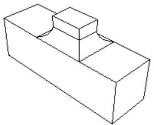

You define the radius of the fillet, and Abaqus/CAE applies the radius to all of the selected edges as a group; therefore, subsequent feature manipulation operations, such as edit, delete, and suppress, will be applied to the entire group of selected edges. Consequently, if you select more than one edge to round, you cannot modify just one of the rounded edges. In addition, the shape of the resulting edges can depend on the order in which you apply the fillets, as shown in the following figure. The fillets on the left side of the part were created by selecting all three edges and applying the round/fillet tool to the group of selected edges in a single operation. In contrast, the fillets on the right side of the part were created by selecting each edge individually and applying the round/fillet tool to each edge in sequence.

The round/fillet tool is available only when the current viewport contains a three-dimensional solid or shell part. In addition, you cannot fillet an edge that contains a wire. The radius of a rounded edge defines the feature and can be modified using the Feature Manipulation toolset.

1. From the main menu bar, select Shape->Blend->Round/Fillet.

Abaqus/CAE prompts you to select the edges to round.

Abaqus/CAE displays prompts in the prompt area to guide you through the procedure.

Tip: You can also round selected edges using the tool, located with the blend tools in the Part module toolbox. For a diagram of the tools in the Part module toolbox, see Using the Part module toolbox.

2. Select the edges to round, and click mouse button 2 to commit your selection. [Shift] + Click additional edges to add them to your selection, and [Ctrl] + Click a selected edge to unselect it.

Tip: If you are unable to select the desired edges, you can use the Selection toolbar to change the selection behavior. For more information, see Using the selection options.

A default radius appears in the prompt area.

3. If necessary, type a new radius in the text field in the prompt area. Click mouse button 2 to commit the radius.

Abaqus/CAE redraws the part with the selected edges rounded.

## Additional information

• What is feature-based modeling?

## Chamfering edges

You can chamfer or bevel selected edges of the part in the current viewport.

Select Shape->Blend->Chamfer from the main menu bar to chamfer or bevel selected edges of the part in the current viewport. You enter the distance that the chamfer extends into each face, and Abaqus/CAE uses the distance to define the chamfer, as illustrated in the following example:

Abaqus/CAE applies the chamfer to all of the selected edges as a group; therefore, subsequent feature manipulation operations—such as edit, delete, and suppress—will be applied to the entire group of selected edges. Consequently, if you select more than one edge to chamfer, you cannot modify just one of the chamfered edges.

The chamfer tool is available only when the current viewport contains a three−dimensional solid or shell part. In addition, you cannot chamfer an edge that contains a wire. The length of a chamfer defines the feature and can be modified using the Feature Manipulation toolset.

1. From the main menu bar, select Shape->Blend->Chamfer.

Abaqus/CAE prompts you to select the edges to chamfer.

Abaqus/CAE displays prompts in the prompt area to guide you through the procedure.

Tip: You can also chamfer selected edges using the tool, located with the blend tools in the Part module toolbox. For a diagram of the tools in the Part module toolbox, see Using the Part module toolbox.

2. Select the edges to chamfer, and click mouse button 2 to commit your selection. [Shift] + Click additional edges to add them to your selection, and [Ctrl] + Click a selected edge to unselect it.

Tip: If you are unable to select the desired edges, you can use the Selection toolbar to change the selection behavior. For more information, see Using the selection options.

A default chamfer length appears in the prompt area.

3. If necessary, type a new chamfer length in the text field in the prompt area. Click mouse button 2 to commit the chamfer length.

Abaqus/CAE redraws the part with the selected edges chamfered.

## Additional information

• What is feature-based modeling?

## Mirroring a part

Select Shape->Transform->Mirror from the main menu bar to transform the part in the current viewport into a mirror image of itself. This operation is similar to copying a part and using the mirror option (Copying a part). However, transforming the original part retains the complete feature creation history and the ability to edit those features. You can choose to keep both the original geometry and the mirrored geometry, and you can select any planar face or datum plane as the mirror plane.

The mirror tool is available only when the current viewport contains a three-dimensional solid or shell part. Mirror features, like all features, can be deleted, suppressed, and resumed; however, a mirror feature contains no modifiable parameters, so it cannot be edited after you create it.

1. From the main menu bar, select Shape->Transform->Mirror.

Tip: You can also mirror a part using the tool, located in the Part module toolbox. For a diagram of the tools in the Part module toolbox, see Using the Part module toolbox.

2. From the prompt area, toggle on Keep original geometry to retain the original geometry when the part is mirrored.  
3. From the prompt area, toggle on Keep internal boundaries to retain any intersecting boundaries between the original geometry and the new geometry when the part is mirrored.  
This option has no effect if used without Keep original geometry.  
4. Select a datum plane or planar face from the viewport.  
Abaqus/CAE creates the mirrored geometry using the options you chose.

## Additional information

• What is feature-based modeling?

---

[Previous: Model Databases, Models, and Files](model-databases-files.md) · [Next: The Property Module](property-module.md)
