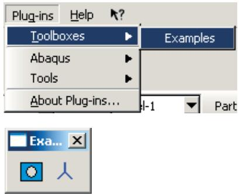
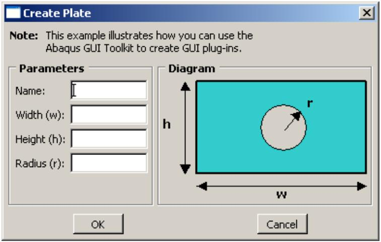
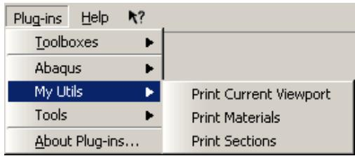
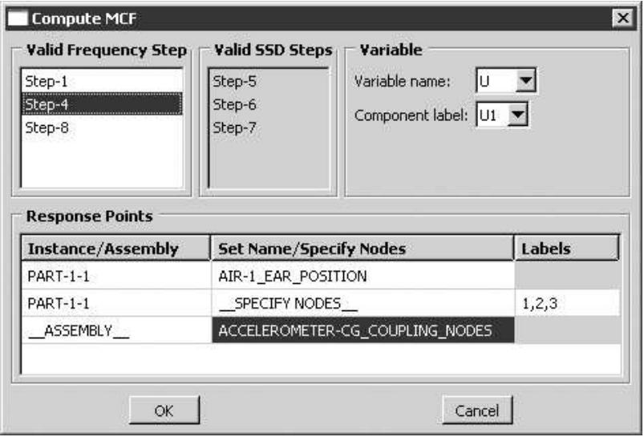
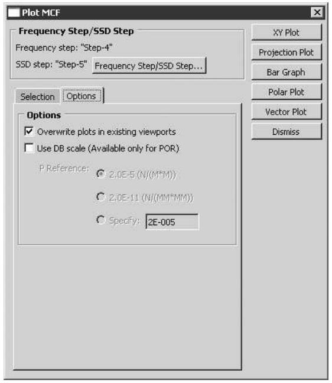
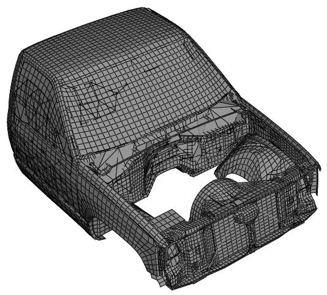
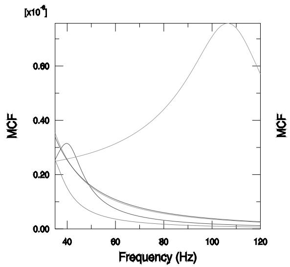
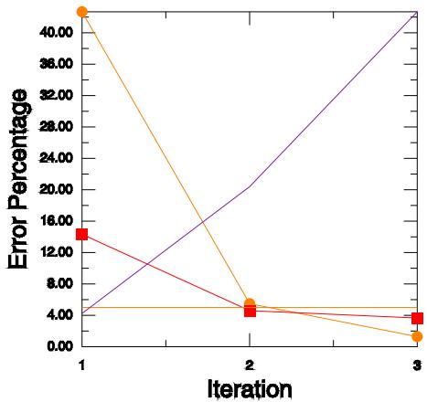

# Using Plug-ins

## What is a plug-in?

A plug-in is a piece of software that installs itself into another application to extend the capabilities of that application. Abaqus plug-ins execute Abaqus Scripting Interface and Abaqus GUI Toolkit commands, and they provide a way to customize Abaqus/CAE for your particular needs or preferences. For example, a simple plug-in could automatically print the contents of the current viewport according to some predefined options. A more complex plug-in could provide a graphical user interface to a specialized postprocessing routine that you have written.

There are two types of plug-ins: kernel and GUI. A kernel plug-in consists of functions written using the Abaqus Scripting Interface. In contrast to a kernel plug-in, a GUI plug-in is written using the Abaqus GUI Toolkit and contains commands that create graphical user interfaces, which in turn send commands to the kernel. Both kernel and GUI plug-ins are available from the Plug-ins menu on the main menu bar or from a plug-ins toolbox.

By default, several kernel and GUI example plug-ins are available from the Plug-ins menu on the main menu bar. You can use these examples to see how plug-ins are created and to learn how plug-ins interact with Abaqus/CAE. In addition, you can access two example plug-ins from a plug-ins toolbox. When you select Plug-ins->Toolboxes->Examples from the main menu bar, Abaqus/CAE displays the Examples toolbox. You can click an icon in the toolbox to start a plug-in. Figure 1 shows the Toolboxes menu and the Examples toolbox.

  
Figure 1:The Toolboxes menu and the Examples plug-in toolbox.

## Where can I get plug-ins?

Several plug-ins are provided with the Abaqus installation.

You can view these plug-ins by selecting Plug-ins->Abaqus or Tools from the main menu bar.

For information on how to view a document that describes the plug-in and its usage, see How can I get information about a plug-in?.

Additional plug-ins are available in the SIMULIA Community (SIMUILA Community > Learning Resources > 3DEXPERIENCE and Traditional Products > Abaqus > Plug-ins/Scripts), which provides example plug-ins as well as access to a community of users that fosters the advance of the Abaqus Scripting Interface and the Abaqus GUI Toolkit. Click Blog and filter by Process Automation to browse plug-in examples in this community. You can also write your own plug-ins, as described in this section.

## How can I get information about a plug-in?

The Plug-ins menu that appears in the Abaqus/CAE main menu bar contains an About Plug-ins item that displays the About Plug-ins dialog box. This dialog box lists all the plug-ins that are currently installed. As you click on each plug-in in the tree list, Abaqus/CAE displays information about that plug-in, such as the author and the version. In addition, you can click View in the About Plug-ins dialog box to view a document that describes the plug-in. For more information, see How can I provide information about a plug-in?.

This information is specified as optional arguments to the plug-in registration command. As a result, if the author of the plug-in chose not to supply some of these optional arguments, the corresponding information will not be available in the About Plug-ins dialog box.

## An example of a Python module and a function

A kernel plug-in associates a Python module and a function with a menu item or a toolbox icon. For example, the kernel plug-in shown below is a simple function defined in the file myUtils.py that prints the current viewport to a PNG file. The file myUtils.py is a Python module.

```python
def printCurrentVp():
    from abaqus import session, getInputs
    from abaqusConstants import PNG
    name = getInputs( (('File name:', ''),),
        'Print current viewport to PNG file')[0]
    vp = session.viewports[session.currentViewportName]
    session.printToFile(
        fileName=name, format=PNG, canvasObjects=(vp, ))
```

The first line of the example (def printCurrentVp():) is a function definition that contains the indented commands. A plug-in requires a function definition. As a result, if you want to create a kernel plug-in by extracting the commands written to the abaqus.rpy replay file, you must first wrap the commands in a function definition. For more details on writing kernel scripts and creating function definitions, refer to the Abaqus Scripting User's Guide and to the Abaqus Scripting Reference Guide.

After you have written a kernel plug-in, you can execute it from the Plug-ins menu in the Abaqus/CAE main menu bar after you register it with the Plug-in toolset. For more information, see How do I make a plug-in available from Abaqus/CAE?.

## What can I do with a GUI plug-in?

A GUI plug-in is written using the Abaqus GUI Toolkit. For more details on writing GUI scripts, refer to the Abaqus GUI Toolkit User's Guide and to the Abaqus GUI Toolkit Reference Guide. In addition to GUI commands, a GUI plug-in usually contains a kernel module that defines the function that will be executed when the GUI issues the command to the kernel. For example, you could write a GUI plug-in that presents the user with a dialog box for entering the dimensions of a plate, as shown in Figure 1.



<details>
<summary>text_image</summary>

Create Plate
Note: This example illustrates how you can use the
Abaqus GUI Toolkit to create GUI plug-ins.
Parameters
Name:
Width (w):
Height (h):
Radius (r):
Diagram
h
r
w
OK
Cancel
</details>

Figure 1: A dialog box for entering the dimensions of a plate.

When the user clicks the OK button to close the dialog box, the GUI plug-in constructs a command that is sent to the kernel for execution. The kernel function builds a part using the dimensions entered in the dialog box.

A GUI plug-in is similar to a kernel plug-in in that you must register it with the Plug-in toolset before you can execute it from the Plug-ins menu in the Abaqus/CAE main menu bar.

## How do I make a plug-in available from Abaqus/CAE?

To make a plug-in available from Abaqus/CAE, you must place specially named files containing registration commands in one of the directories that Abaqus/CAE searches for plug-ins.

The registration commands can make a plug-in available from the Plug-ins menu in the main menu bar, from a separate plug-in toolbox, or from both. This section describes how you make a plug-in available from Abaqus/CAE.

## In this section:

Where are plug-in files stored?  
What are the kernel and GUI registration commands?  
An example of adding a kernel plug-in to the Plug-ins menu  
An example of adding a kernel plug-in to a plug-ins toolbox  
An example of adding a GUI plug-in to the Plug-ins menu

## Where are plug-in files stored?

Abaqus plug-ins can be stored in several locations.

Native Abaqus/CAE plug-ins are included with the Abaqus/CAE installation. External plug-ins (any plug-in installed after the Abaqus/CAE installation) should not be placed inside the Abaqus/CAE installation.

Instead, you should install external plug-ins in any of the following locations:

• home\_dir\abaqus\_plugins, where home\_dir is your home directory.  
• current\_dir\abaqus\_plugins, where current\_dir is the current directory.  
plugin\_central\_dir is an Abaqus environment parameter used to define one or more specific directories where plug-ins are stored. This is typically a central location accessed by all users at your site if the directory is mounted on a file system that all users can access. plugin\_central\_dir can be defined in the abaqus\_v6.env file or the Abaqus solver custom\_v6.env file. For example,

```txt
plugin_central_dir = "C:\\SIMULIA\\CAE\\plugins;U:\\shared\\CAE\\plugins"
```

Directories are separated by a semicolon on Windows systems or by a colon on Linux systems. For more information, see Using the Abaqus environment files.

Abaqus/CAE will import any files in these directories that match the naming convention \*\_plugin.py. These files must contain registration commands. The name of the file must follow the rules described in Standard Abaqus Scripting Interface exceptions.

## What are the kernel and GUI registration commands?

The plug-in registration commands are located in the Plug-in toolset, which you can access from the main menu bar of Abaqus/CAE. To access the registration commands, your script should start with the following statements:

```python
from abaqusGui import getAFXApp
toolset=getAFXApp().getAFXMainWindow().getPluginToolset()
```

You can use the toolset variable to do the following:

## Add an item to the Plug-ins menu

The following statements add a kernel and a GUI plug-in to the Plug-ins menu:

```txt
toolset.registerKernelMenuButton()
toolset.registerGuiMenuButton()
```

## Add an icon to a plug-ins toolbox

The following statements add a kernel and a GUI plug-in to a plug-ins toolbox:

```txt
toolset.registerKernelToolButton()
toolset.registerGuiToolButton()
```

The registration commands are described in Plug-in registration commands.

## An example of adding a kernel plug-in to the Plug-ins menu

You use the registerKernelMenuButton() command to make a kernel plug-in available from the Plug-ins menu. The following example illustrates how you associate the simple function described in An example of a Python module and a function, with a Print Current Viewport item in the Plug-ins menu. (The function prints the current viewport to a PNG file.) The registration command references the kernel function printCurrentVP that is located in the Python module myUtils:

```python
from abaqusGui import getAFXApp
toolset = getAFXApp().getAFXMainWindow().getPluginToolset()
toolset.registerKernelMenuButton(
    buttonText='Print Current Viewport',
    moduleName='myUtils', functionName='printCurrentVp()')
```

The first two lines in the example provide access to the commands in the Plug-in toolset. The next line inserts a Print Current Viewport menu item under the Plug-ins menu in the main menu bar. When the user clicks Print Current Viewport, Abaqus/CAE issues the following command to the kernel:

```txt
myUtils.printCurrentVp()
```

The buttonText argument accepts a pipe-separated ( | ) list of words. The pipe separates submenu names from the menu button name. This allows you to group several plug-ins under one menu. For example, if you have defined more functions in myUtils.py, you can use the following version of myUtils\_plugin.py to register them under a cascading menu:

```python
from abaqusGui import getAFXApp
toolset = getAFXApp().getAFXMainWindow().getPluginToolset()
toolset.registerKernelMenuButton(
    buttonText='My Utils|Print Current Viewport',
    moduleName='myUtils', functionName='printCurrentVp()')
toolset.registerKernelMenuButton(
    buttonText='My Utils|Print Sections',
    moduleName='myUtils', functionName='printSections()')
toolset.registerKernelMenuButton(
    buttonText='My Utils|Print Materials',
    moduleName='myUtils', functionName='printMaterials()')
```

The previous example results in the menu structure shown in Figure 1:



<details>
<summary>text_image</summary>

Plug-ins	Help
Toolboxes
Abaqus
My Utils
Tools
About Plug-ins...
Print Current Viewport
Print Materials
Print Sections
</details>

Figure 1:The effect of registering plug-ins under a cascading menu.

## An example of adding a kernel plug-in to a plug-ins toolbox

You use the registerKernelToolButton() command to make a kernel plug-in available from a plug-ins toolbox. When you add a plug-in to a toolbox, an item appears in the Plug-ins->Toolboxes menu. When you select this item, Abaqus/CAE displays a plug-ins toolbox. Although you can display text in a toolbox, you will probably want to supply an icon instead and not use text (for more information on creating icons, see Icons).

The registerKernelToolButton registration command uses the same arguments as the registerKernelMenuButton command; however, it also requires a toolbox name. You can use the buttonText argument to specify only a tooltip by preceding the tip text with “\t” as shown in the following version of myUtils\_plugin.py:

```python
from abaqusGui import getAFXApp, FXXPMIcon
from myIcons import vpIconData
vpIcon = FXXPMIcon(getAFXApp(), vpIconData)

toolset = getAFXApp().getAFXMainWindow().getPluginToolset()
toolset.registerKernelToolButton(toolboxName='My Utils',
    buttonText='\tPrint Current Viewport', icon=vpIcon,
    moduleName='myUtils', functionName='printCurrentVp()')
```

This example creates a My Utils item under the Plug-ins->Toolboxes menu. When a user clicks My Utils, Abaqus/CAE displays a toolbox with My Utils shown in its title bar. When you click the icon in the toolbox, Abaqus/CAE sends the following command to the kernel:

```txt
myUtils.printCurrentVp()
```

The same command would be sent to the kernel if you registered the plug-in in the Plug-ins menu.

The Toolboxes item, if it exists, always appears first in the Plug-ins menu; and the About Plug-ins item always appears last. Other items in the Plug-ins menu are listed alphabetically.

## An example of adding a GUI plug-in to the Plug-ins menu

You use the registerGuiMenuButton() command to make a GUI plug-in available from the Plug-ins menu. The following example shows how you can use registration commands to add a GUI plug-in that creates a form that posts a dialog box prompting the user for input. When the user selects Plug-ins->My Utility, Abaqus/CAE activates the form.

Registration commands for kernel plug-ins must reside in a file separate from the kernel plug-in code. In contrast, registration commands for GUI plug-ins can reside in a separate file or in the GUI plug-in file itself. This example shows how you can combine the registration commands and the GUI plug-in code into a single file.

```python
from abaqusGui import AFXForm, getAFXApp
class MyForm(AFXForm):
    form code goes here
toolset = getAFXApp().getAFXMainWindow().getPluginToolset()
toolset.registerGuiMenuButton(buttonText='My Utility',
    object=MyForm(toolset) )
```

When you make a GUI plug-in available from the Plug-ins menu or from a toolbox, the registration command references a GUI object that receives a message when the plug-in is selected. The selector of the message is generated by combining the message ID that you specify together with the SEL\_COMMAND message type. In most cases you will supply a form or procedure as the GUI object and use ID\_ACTIVATE (the default) for the message ID. Forms and procedures prompt the user for input, in most cases using a dialog box or the prompt line. After receiving input from the user, forms and procedures then issue commands to the kernel. For details on creating forms, procedures, and dialog boxes, see Modes and Dialog boxes. You can also create simple dialog boxes using the Really Simple GUI Builder plug-in; for more information, see Creating dialog boxes with the Really Simple GUI (RSG) Dialog Builder.

## How are kernel plug-ins executed?

Abaqus executes a kernel plug-in by issuing a command to the kernel of the form moduleName.functionName. The module name and the function name are the names that you supplied in the registration command for that plug-in.

When Abaqus/CAE starts and imports a plug-in, the directory in which the plug-in is located is stored by Abaqus/CAE. The first time that the plug-in is invoked, Abaqus/CAE updates the kernel’s sys.path list with that plug-in’s directory. The next time that plug-in is invoked, Abaqus/CAE issues the commands inside the plug-in but does not update the sys.path.

For example, consider the myUtils\_plugin.py and myUtils.py files described in previous sections. Assume that you stored these two files in a subdirectory called myPlugins in the abaqus\_plugins directory in your home directory. The first time that you click Print Current Viewport in the Plug-ins menu, Abaqus/CAE sends the following commands to the kernel:

```python
import sys
sys.path.append('path to your home dir/abaqus_plugins/myPlugins')
import myUtils
myUtils.printCurrentViewport()
```

The next time you click Print Current Viewport in the Plug-ins menu, Abaqus/CAE sends only the following command to the kernel:

```javascript
myUtils.printCurrentViewport()
```

Since Abaqus/CAE updates the sys.path list, your plug-in code does not need to perform this task to import modules that it needs. This assumes that those modules are located in the same directory as the plug-in. If you have to import modules that are not located in the same directory, you must augment the sys.path list. If you need to augment the sys.path list, you should use functions that determine the file locations automatically, rather than hard-coding the path to the plug-ins in your file. This makes it easy to move plug-ins to different locations without having to modify their code. The following example of myUtils.py illustrates an example of augmenting the sys.path list:

```python
import sys, os

# Full path (with name) to this file
absPath = os.path.abspath(__file__)

## Full directory specification
absDir = os.path.dirname(absPath)

## Full subdirectory specification
subDir = os.path.join(absDir, 'mySubDir')
sys.path.append(subDir)

## myModule is located in subDir
import myModule

rest of module code
```

## Overwriting plug-ins

Upon startup, Abaqus/CAE searches for plug-ins in the Abaqus/CAE installation, your home directory, the current directory, and the directories specified by the plugin\_central\_dir Abaqus environment parameter. If Abaqus/CAE finds a plug-in with the same name and case in multiple directories, the plug-in found later in the search will overwrite one found earlier in the search.

Plug-in names are case sensitive. For example, a plug-in named myPlugin is different from a plug-in named MyPlugin. The overwriting approach enables you to use a customized version of a plug-in that resides only in your home directory or current directory; however, in most cases you should avoid naming conflicts with plug-ins.

Python searches for modules according to the order specified in the sys.path list and stops searching as soon as it finds a match for the module name. For example, if you have a utility module called myUtils.py stored in two different plug-in directories and these directories contain different code, both plug-ins will reference the same module—the one found first in the sys.path list.

You can use Python's package style for storing and referencing your modules to avoid unintentional overwriting of plug-ins or accessing of the wrong module. Start by creating a directory with a detailed name that is unlikely to be duplicated by others, and store your \_plugin.py file in that directory. Create another directory of the same name within the first directory, and place your other plug-in files in the newer directory with an empty file named \_init\_\_.py, so that the directory structure looks as follows:

```python
torqueCalculator
    torqueCalculator_plugin.py
    torqueCalculator
        __init__.py
        torqueUtils.py
        torqueForm.py
        torqueDB.py
```

When you import files in your code, use the package name to qualify the import. For example, inside torqueForm.py, you can qualify the import with the following statement:

from torqueCalculator.torqueDB import TorqueDB

## How are GUI plug-ins executed?

Abaqus/CAE executes a GUI plug-in by sending a message to the GUI object specified in the registration command for that plug-in. As with the kernel plug-ins, the first time that a GUI plug-in is invoked, Abaqus/CAE updates the kernel’s sys.path list with that plug-in’s directory. In addition, Abaqus/CAE sends the plug-in’s kernelInitString to the kernel and updates the GUI’s sys.path list to include that plug-in’s directory. You can use the kernelInitString to initialize the kernel for commands that will be sent by the plug-in’s GUI. The next time that plug-in is invoked, only the message will be sent to the GUI object.

If you need to import files into the GUI that are not located in the same directory as the plug-in, you must augment the sys.path list as shown in the previous example. In addition, if you need to augment the kernel’s sys.path list, you should supply code similar to the following in the plug-in’s kernelInitString, in this example the name of the file containing the plug-in is myForm\_plugin.py:

```python
from abaqusGui import AFXForm, getAFXApp
class MyForm(AFXForm):
    form code goes here
import os
## Full path (with name) to this file
absPath = os.path.abspath(__file__)
## Full directory specification
absDir = os.path.dirname(absPath)
## Full subdirectory specification
subDir = os.path.join(absDir, 'mySubDir')
initString  = "sys.path.append('%s')\n" % subDir
## myModule is located in subDir
initString += 'import myModule'
toolset = getAFXApp().getAFXMainWindow().getPluginToolset()
toolset.registerGuiMenuButton(buttonText='My Utility',
    object=MyForm(toolset), kernelInitString=initString )
```

## Hiding a plug-in's source code

If you do not want other users to see the source code of your plug-in, you can supply the compiled version of the plug-in instead of supplying the source code version. When Abaqus/CAE imports the source code version of a plug-in, Abaqus/CAE first parses the plug-in and then compiles it into a executable version of the file (called filename.pyc) before it executes the file. If the source code has not changed since the last time the plug-in was compiled, Abaqus/CAE executes the compiled version directly and bypasses the compilation step. Abaqus/CAE will still import the plug-in if you delete the file containing its source code but retain the compiled version of the plug-in.

If you have only compiled versions of some plug-ins, you may want to store them in a directory under the abaqus\_plugins directory. This will avoid confusion by keeping compiled versions of plug-ins that do not have source code separate from the compiled versions of plug-ins that still have the source code.

## Displaying exceptions for imported plug-ins at startup

By default, Abaqus/CAE does not display the exceptions associated with the import of plug-ins when you start the application. If you want to expose these exceptions for debugging purposes, set the environment variable ABQ\_PLUGIN\_DEBUG to 1 at a command prompt before launching Abaqus/CAE. When this environment variable is set, Abaqus/CAE provides more trackback information about plug-ins upon startup, including the location and nature of any failures that occur.

## Abaqus/CAE modules and plug-ins

By default, a plug-in appears in all Abaqus/CAE modules. However, you can use the applicableModules argument of the registration commands to specify individual modules in which a plug-in is available. If a plug-in is not applicable to the current module, its menu item will be hidden in the Plug-ins menu. For example, if you specify that a plug-in is available only in the Part module, you will not see that menu item under the Plug-ins menu unless you are in the Part module. The following registration command makes the plug-in available in only the Part and Assembly modules:

```txt
toolset.registerKernelMenuButton(
    buttonText='Print Materials',
    moduleName='myUtils', functionName='printMaterials()',
    applicableModules=('Part','Assembly'))
```

Abaqus/CAE uses similar functionality to hide items in the Tools menu as you move between modules. For a full description of the arguments to the kernel and GUI registration commands, see Plug-in registration commands.

## How can I provide information about a plug-in?

When you create a plug-in, you can supply the following arguments to the registration command:

## author

A string specifying the author's name.

## version

A string specifying the version of the plug-in.

## description

A string specifying a brief description of the plug-in.

## helpUrl

A string specifying a path to a URL that provides information about your plug-in.

For a full description of the arguments to the kernel and GUI registration commands, see Plug-in registration commands.

The helpUrl argument can be any valid web browser URL. In most cases the URL will point to an HTML file, but the URL can also point to a plain text file or to an external website. If you provide a help file with your plug-in that will be referenced by the helpUrl argument, you should avoid hard-coding directory names by constructing the path to the help file using the techniques shown in previous examples. The following example of myUtils\_plugin.py shows how you can provide information about the plug-in and construct the relative path to the helpUrl argument:

```python
from abaqusGui import getAFXApp
toolset = getAFXApp().getAFXMainWindow().getPluginToolset()

import os
helpUrl = os.path.join(os.getcwd(), 'bridgeHelp.htm')

toolset.registerKernelMenuButton(
    buttonText='Print Current Viewport',
    moduleName='myUtils', functionName='printCurrentVp()',
    author='SIMULIA', version='1.0'
    description='Print current viewport to a PNG file', helpUrl=helpUrl)
```

## Abaqus plug-ins

This section describes the plug-ins that are provided with Abaqus/CAE and appear in the Plug-ins menu. Select Plug-ins->About Plug-ins to display a View button that displays help on each plug-in.

## In this section:

Running the Getting Started with Abaqus examples  
Creating a GUI plug-in  
Creating a kernel plug-in  
Creating dialog boxes with the Really Simple GUI (RSG) Dialog Builder  
Upgrading a script  
Displaying modal contribution factors  
Displaying the history of the adaptive remeshing error indicator  
Generating a report of postprocessing results  
Exchanging data between Abaqus/CAE and Microsoft Excel  
Importing a model from a file in stereolithography (STL) format  
Exporting a part or assembly in stereolithography (STL) format  
Plotting amplitude data  
Combining data from multiple output databases  
Finding the nearest node to a point  
Finding the average temperature of a set of elements  
Creating a planar constraint  
Resetting midside nodes  
ODB Reducer/Builder  
Additive manufacturing

## Running the Getting Started with Abaqus examples

This plug-in allows you to run the examples described in Getting Started with Abaqus/CAE. The plug-in creates a model that reproduces each example. The plug-in also creates a job associated with the model; however, the plug-in does not submit the job for analysis. If desired, you can go to the Job module and submit the job for analysis. You can then can go to the Visualization module to view the results of the analysis.

The plug-in fetches files associated with the examples and places those files in the current directory. You can run the following examples from the plug-in:

• Example: creating a model of an overhead hoist  
• Example: connecting lug  
• Example: skew plate  
• Example: cargo crane  
• Example: cargo crane under dynamic loading  
• Example: skew plate  
• Example: stress wave propagation in a bar  
• Example: connecting lug  
• Example: blast loading on a stiffened plate  
• Example: axisymmetric mount  
• Example: vibration of a piping system  
• Abaqus/Standard 3D example: shearing of a lap joint  
• Abaqus/Explicit example: circuit board drop test  
• Example: forming a channel in Abaqus/Explicit

## Creating a GUI plug-in

This plug-in illustrates how you can use the Abaqus GUI Toolkit to create GUI plug-ins. The plug-in displays a dialog box that prompts you for the name and the dimensions of a part. When you click OK, the plug-in creates the part. The plug-in also creates a toolbox icon that is displayed when you click Plug-ins->Toolboxes->Examples.

## Creating a kernel plug-in

This plug-in illustrates how you can use the Abaqus Scripting Interface to create a plug-in that executes kernel commands. The plug-in toggles the visibility of the view triad in the current viewport. The plug-in also creates a toolbox icon that is displayed when you click Plug-ins->Toolboxes->Examples.

## Creating dialog boxes with the Really Simple GUI (RSG) Dialog Builder

Using the RSG dialog builder is an alternative to using the Abaqus GUI Toolkit commands and a text editor to create dialog boxes.

The Really Simple GUI (RSG) Dialog Builder plug-in enables you to create dialog boxes and connect them to kernel commands without writing any code. You select items from a toolbox to add them to an empty dialog box and edit their properties.

The RSG dialog builder provides access to a subset of the commands in the Abaqus GUI Toolkit, but it requires no programming experience to produce a working dialog box. The dialog boxes that you create become new plug-ins to Abaqus/CAE. You can save them as either RSG plug-ins or standard plug-ins, but you can only edit RSG plug-ins with the RSG dialog builder. You must use a text editor to edit standard plug-ins. However, saving an RSG dialog box as a standard plug-in allows an experienced programmer to extend the dialog's functionality by selecting from the complete set of Abaqus GUI Toolkit commands.

The RSG dialog builder plug-in includes a “Five minute tour” that describes and shows some of the basic functions

that you can use to build a custom dialog box. The tour icon is located at the upper left corner of the GUI tabbed page in the RSG Dialog Builder.

## Upgrading a script

The upgrade script plug-in allows you to upgrade a script from a previous release of Abaqus.

## In this section:

Introduction  
Using the upgrade script plug-in

## Introduction

The upgrade script plug-in allows you to upgrade a script from a previous release of Abaqus to the current release of Abaqus. The plug-in allows you to do the following:

• Upgrade across several releases of Abaqus.  
• Choose both the release of the original script and the release of the resulting upgraded script.  
• Upgrade a single script or all the scripts in a specified directory.  
• Preview the changes to your script that resulted from the upgrade process, and, if the changes are acceptable, proceed with the upgrade.

For more information, see Upgrade script commands. You can access the plug-in from the Plug-ins menu in any module.

## Using the upgrade script plug-in

Start the plug-in by selecting Plug-ins->Abaqus->Upgrade Scripts from the main menu bar. Enter the following in the Upgrade Scripts dialog box:

• Do one of the following to choose the files to upgrade:  
Choose Files, and enter the names of the files to upgrade.  
Choose Directory, and enter the name of the directory to upgrade. Abaqus/CAE upgrades all of the scripts in the directory and any subdirectories.

• Toggle on Create backups to keep copies of the original scripts in their original directory.

• Do one of the following to choose the type of the commands to upgrade:

Choose Kernel to upgrade only Abaqus Scripting Interface commands.  
Choose GUI to upgrade only Abaqus GUI Toolkit commands.  
Choose Both to upgrade both Abaqus Scripting Interface and Abaqus GUI Toolkit commands.

In most cases you should choose to upgrade both types of commands.

Enter the name of the log file. The file will contain a log of the upgrade commands that are issued along with a list of the changes to the script and any errors or warnings that are issued. Abaqus/CAE stores the log file in the current directory and displays its contents on the screen during the upgrade process.  
Select the release of the original script and the release to which you would like to upgrade. If you are not sure when the script was created, you should choose the earliest release available. The default release for the original script is three releases before the current release.  
• Do one of the following to select the application that displays a preview of the updated script when you click Preview Changes:

Choose Use web browser to preview your changes in the default web browser.  
Choose Use specified executable and enter the path to the executable file that will display the differences between the script and the upgraded script; for example, windiff.

From the buttons at the bottom of the dialog box, do the following:

• Click Preview Changes to use the selected application to preview the changes to the script.  
• If the changes are acceptable, click Upgrade Scripts to perform the upgrade and to close the Upgrade Scripts dialog box.

## Displaying modal contribution factors

The modal contribution factors (MCF) plug-ins are a noise, vibration, and harshness (NVH) application that allows you to compute the output from a modal frequency response analysis and to study the contribution of each mode to the total structural or acoustic response.

## In this section:

Introduction  
Preparing the structural and/or acoustic data  
An overview of the MCF plug-in  
Computing the modal contribution factors  
Displaying modal contribution factors  
Ranking criterion for modal contribution factors

## Introduction

When a modal frequency response analysis is performed in Abaqus/Standard, the response is calculated from a linear combination of mode shapes and the corresponding modal amplitudes. For a typical structural-acoustic or structural analysis, the number of modes being studied can number in the hundreds. The designer needs to closely examine these individual modes and find or rank the dominant modes (the modes with major contributions to the total response). The contribution of each mode to the total structural or acoustic response is called the Modal Contribution Factor (MCF).

The NVH application requires two plug-ins that you can access from the Plug-ins menu in the Visualization module. The first computes the modal contribution factors, and the second allows you to view the modal contribution factors.

## Preparing the structural and/or acoustic data

A typical Abaqus/Standard modal frequency response analysis uses a frequency step followed by multiple steady-state dynamic steps (for multiple load cases) for each base state. The plug-in reads the following variables from the output database generated by the analysis:

The field output from each frequency step must include the nodal displacement (U). In addition, if you are performing a coupled structural-acoustic analysis, the field output from each frequency step must include the nodal pore or acoustic pressure (POR).  
• After each frequency step, there must be at least one modal steady-state dynamic step (not steady-state dynamic, direct or steady-state dynamic, subspace).  
• In each modal steady-state dynamic step the history output must include the generalized displacements (GU) and the phase angle of the generalized displacements (GPU) for at least one mode.

You can find sample input files for a modal steady-state dynamic analysis in Analysis of a rotating fan using substructures and cyclic symmetry and Coupled acoustic-structural analysis of a pick-up truck.

## An overview of the MCF plug-in

The modal frequency response, such as the sound pressure or displacement, can be expressed as

$$
P \left(\overline {{x}}; \Omega\right) = \sum_ {\alpha = 1} ^ {N} p _ {\alpha} \left(\overline {{x}}; \Omega\right) = \sum_ {\alpha = 1} ^ {N} \phi_ {\alpha} \left(\overline {{x}}\right) q _ {\alpha} \left(\Omega\right).
$$

The first plug-in uses a script to recover the fluid-structure coupled MCF $( \phi _ { \alpha m } q _ { \alpha }$ for each mode at a response point m for a range of frequencies) based on the mode shapes, $\phi _ { \alpha }$ , (from the frequency step) and the modal amplitudes, $\pmb { q } _ { \pmb { \alpha } }$ , (from the steady-state dynamic step with modal output requested) in the output database. The plug-in sums these partial pressures and compares them against the Abaqus total. In addition, the script creates a ranking criterion based on a sensitivity analysis.

The second plug-in uses a script that displays polar or vector plots or bar graphs that allow you to identify the most significant modes at each excitation frequency.

## Computing the modal contribution factors

The first plug-in computes all the requested quantities (MCFs) and then adds them to the output database as history output. The plug-in is available only from the Visualization module. Enter the Visualization module and start the plug-in by selecting Plug-ins->NVH->Compute modal Contribution Factors from the main menu bar.

The plug-in displays the Open ODB dialog box, and you enter the name of the output database generated by the Abaqus/Standard analysis described in Preparing the structural and/or acoustic data. The plug-in adds the computed values of the modal contribution factors back to the same output database; you must have write access to the output database.

After you enter the output database name, the plug-in displays the Compute MCF dialog box, as shown in Figure 1:



<details>
<summary>text_image</summary>

Compute MCF
Valid Frequency Step
Step-1
Step-4
Step-8
Valid SSD Steps
Step-5
Step-6
Step-7
Variable
Variable name: U
Component label: U1
Response Points
Instance/Assembly
Set Name/Specify Nodes
Labels
PART-1-1
AIR-1_EAR_POSITION
PART-1-1
__SPECIFY NODES__
1,2,3
__ASSEMBLY__
ACCELEROMETER-CG_COUPLING_NODES
OK
Cancel
</details>

Figure 1:The Compute MCF dialog box.

You must select one of the valid frequency steps from the Compute MCF dialog box. A valid frequency step is one that is followed by a modal steady-state dynamic step (not steady-state dynamic, direct or steady-state dynamic, subspace). In addition, a valid frequency step includes GU and GPU output for at least one mode. The valid modal steady-state dynamic steps for each frequency step that you select are shown in the list of Valid SSD Steps.

The Compute MCF dialog box also asks for the Response Points. You can select any combination of the following formats:

• A part instance name followed by a list of node labels  
• A part instance name followed by a list of instance-level node sets  
• Assembly-level node sets

Finally, you must select the field output variable, which can be any one of the following: acoustic Pressure (POR), displacement (U), velocity (V), or acceleration (A).You can request only U or POR from the frequency step. For all output variables other than POR, you must also request the corresponding component label. For example, if you request U, you must also request either U1, U2, or U3.

After you click OK to close the Compute MCF dialog box, the plug-in processes all of the valid modal steady-state dynamic steps for the selected frequency step along with all of the specified response points and all of the modes in the frequency step.

## Displaying modal contribution factors

After the first plug-in has analyzed the data and written the results back to the output database, you can view the modal contribution factors. Start the second plug-in by selecting Plug-ins->NVH->Plot modal Contribution Factors from the main menu bar in the Visualization module. The plug-in displays the Open ODB dialog box, and you enter the name of the output database from which to read. The plug-in then displays the Select Steps dialog box, as shown in

Figure 1:  


<details>
<summary>text_image</summary>

Select Steps
Valid Frequency Step
Step-1
Step-4
Step-8
Valid SSD Step
Step-5
Step-6
Step-7
Y Type
Magnitude of MCF
Phase of MCF
Magnitude of sum
Phase of sum
Rank
Continue...
Cancel
</details>

Figure 1:The Select Steps dialog box.

You must select the Valid Frequency Step and the Valid SSD Step from which you will generate plots. In addition, you must choose one of the following types of variables to plot:

• Magnitude of MCF  
• Phase of MCF  
• Magnitude of sum  
• Phase of sum  
• Rank

The magnitude or the phase of the sum indicates the summation of modal contribution factors over all the modes. This is same as the Abaqus output variable (POR, U, V, or A).

When you click Continue, the plug-in displays the Plot MCF dialog box. Click the Frequency Step/SSD Step button to select different frequency and steady-state dynamic step.

Click the Selection tab to select the following:

• The response point.  
• The frequency of interest, if you are plotting a bar graph, a polar plot, or a vector plot.  
• Any number of Y components to plot. You add a Y component by clicking >; you remove a Y component by clicking <. You can add or remove all of the Y components by clicking the >> or << buttons respectively.

The Selection tabbed page is shown in Figure 2:  


<details>
<summary>text_image</summary>

Plot MCF
Frequency Step/SSD Step
Frequency step: "Step-4"
SSD step: "Step-5" Frequency Step/SSD Step...
XY Plot
Projection Plot
Bar Graph
Polar Plot
Vector Plot
Dismiss
Selection Options
Response Point
RP: PART-1-1_2210_POR
Frequency
55.6573371887
56.4700126648
57.2945518494
58.1311302185
58.979927063
Y Components
Rank 1
Rank 2
Rank 3
Rank 4
Rank 5
Rank 6
Rank 7
Rank 8
Rank 9
Rank 10
Selection
Rank 1
Rank 2
Rank 3
Rank 4
Rank 5
</details>

Figure 2:The Selection tabbed page.

Click the Options tab to select the general plot options. In addition, if you select POR-based results, you can select the P Reference value for XY and projection plots. From the buttons on the right side of the Plot MCF dialog box, select the type of plot to create.

Click XY Plot to generate the spectrum for the magnitude or phase of MCF. For mode-ranking selection, the plug-in creates X–Y plots for the modes corresponding to the specified ranks.  
Click Projection Plot to plot the projection of the selected MCF onto the corresponding total sound pressure level across the spectrum. You can use this plot to view the contribution of a mode (positive or negative) to the total sound pressure level.  
• Click Bar Graph to plot a bar graph of the MCF of each mode.  
Click Polar Graph to plot a polar graph of the MCF of each mode. The polar plot shows both the magnitude and phase information of each individual MCF on the complex plane for each frequency. When plotted with the total sound pressure vector, you can readily identify the modes that dominate the contribution to the total sound pressure.  
Click Vector Graph to plot a vector graph of the MCF of each mode. The vector for each mode is drawn in sequence. As more and more modes are plotted, the vector graph tends towards the magnitude of the total sound pressure vector.

The Options tabbed page is shown in Figure 3:



<details>
<summary>text_image</summary>

Plot MCF
Frequency Step/SSD Step
Frequency step: "Step-4"
SSD step: "Step-5" Frequency Step/SSD Step...
Selection Options
Options
✓ Overwrite plots in existing viewports
□ Use DB scale (Available only for POR)
P Reference:
○ 2.0E-5 (N/(M*M))
○ 2.0E-11 (N/(MM*MM))
○ Specify: 2E-005
XY Plot
Projection Plot
Bar Graph
Polar Plot
Vector Plot
Dismiss
</details>

Figure 3:The Options tabbed page.

The plug-in creates each type of plot in a separate viewport and names the viewport accordingly. As a result, you can select Viewport->Tile Vertically from the main menu bar to view all the plots at the same time. The following figures were created by the plug-in using the output database generated by a modified version of Coupled acoustic-structural analysis of a pick-up truck. The variable selected was POR, and the bar graph, polar graph, and vector graph and the ranks were generated for a frequency of 35 Hz. The analysis examined the first five ranked modes (out of 180):

Figure 4 shows the model that was analyzed. The bar graph indicates that Mode 36 is the significant mode at this frequency.



<details>
<summary>natural_image</summary>

3D wireframe model of a vehicle chassis with visible structural components (no text or symbols)
</details>


<details>
<summary>bar</summary>

| Mode | Frequency (Hz) | Magnitude (x10^4) |
| --- | --- | --- |
| 36 | 40.696 | -44.74 |
| 169 | 108.91 | -6.13 |
| 8 | 16.005 | 9.84 |
| 3 | 10.783 | -174.17 |
| 24 | 33.872 | -102.32 |
</details>

Figure 4: Bar graph of MCF for the coupled acoustic-structural analysis of a pick-up truck.

Figure 5 shows the X–Y plot and the projection plot. The X–Y plot shows the magnitude of the modal contribution factor at all frequencies. The projection plot shows the projection of the modal contribution factor on the total response at all frequencies. For example, mode 169 becomes more significant at 110 Hz.  




<details>
<summary>line</summary>

| Frequency (Hz) | MCF (x10^4) |
| --- | --- |
| 40 | ~0.35 |
| 60 | ~0.15 |
| 80 | ~0.08 |
| 100 | ~0.05 |
| 120 | ~0.03 |
</details>


<details>
<summary>line</summary>

| Frequency (Hz) | Series 1 | Series 2 | Series 3 | Series 4 | Series 5 |
| --- | --- | --- | --- | --- | --- |
| 40 | ~0.15 | ~0.08 | ~0.06 | ~0.04 | ~0.02 |
| 50 | ~0.05 | ~0.07 | ~0.09 | ~0.03 | ~0.01 |
| 60 | ~0.02 | ~0.03 | ~0.04 | ~0.02 | ~0.01 |
| 70 | ~0.01 | ~0.02 | ~0.03 | ~0.01 | ~0.01 |
| 80 | ~0.01 | ~0.01 | ~0.02 | ~0.01 | ~0.01 |
| 90 | ~0.01 | ~0.01 | ~0.02 | ~0.01 | ~0.01 |
| 100 | ~0.01 | ~0.01 | ~0.02 | ~0.01 | ~0.01 |
| 110 | ~0.01 | ~0.01 | ~0.02 | ~0.01 | ~0.01 |
| 120 | ~0.01 | ~0.01 | ~0.02 | ~0.01 | ~0.01 |
</details>

Figure 5: X–Y and projection plots of MCF for the coupled acoustic-structural analysis of a pick-up truck.  
Figure 6 shows the polar graph and the vector graph. The bar graph shows that the magnitude of mode 36 is less than the magnitude of mode 8; however, the polar plot shows that mode 36 is more in phase with the total response (the vector sum of all the modal contributions). As a result, mode 36 contributes more to the total magnitude than mode 8 at 35 Hz and consequently ranks higher.

  
Polar- Mode: 36 (40.696 Hz) Polar- Mode: 169 (108.91 Hz) Polar- Mode: 8 (16.005 Hz) Polar- Mode: 3 (10.783 Hz) Polar- Mode: 24 (33.872 Hz) Polar- Total sum Polar- Boundary Circle

Figure 6: Polar and vector graphs of MCF for the coupled acoustic-structural analysis of a pick-up truck.

## Ranking criterion for modal contribution factors

If you select Rank as the variable to plot, the plots generated by the plug-in allow you to identify and rank significant modes based on the change in total response magnitude that would result from a fixed percentage increase in the real and imaginary components of the MCF (or partial response). The plug-in implements the ranking criterion as follows:

• = mode number  
• ${ \pmb P } _ { { \pmb \alpha } } =$ partial response for mode  
• $\mathbf { \delta } _ { P _ { \alpha R } } = \mathbf { \delta } _ $ real portion of partial response for mode  
• $P _ { \alpha I } =$ imaginary portion of partial response for mode  
• $P _ { \alpha M }$ = magnitude of partial response for mode  
• $P _ { \alpha P } =$ phase of partial response for mode  
• $T =$ total response P  
• $\begin{array} { r } { T R = \sum _ { \alpha } P _ { \alpha R } = \mathrm { r e a } } \end{array}$ l portion of total response  
• $\begin{array} { r } { T I = \sum _ { \alpha } P _ { \alpha I } : } \end{array}$ = imaginary portion of total response  
• $T M = \sqrt { T R ^ { 2 } + T I ^ { 2 } }$ magnitude of total response  
• phase of total response

• $\delta _ { \alpha } = \sqrt { ( T R + 0 . 1 ^ { * } p _ { \alpha R } ) ^ { 2 } + ( T I + 0 . 1 ^ { * } p _ { \alpha I } ) ^ { 2 } - T M } .$ = delta in total response magnitude for 10% increase in any given partial response (i.e. sensitivity)

You can determine the top n modes based on the absolute value of $\delta _ { \alpha }$ and output $\pmb { p _ { \alpha M } }$ and $\pmb { p _ { \alpha P } }$ for these modes.

## Displaying the history of the adaptive remeshing error indicator

The adaptivity plotter plug-in allows you to review the history of selected error indicators and the element count in a sequence of adaptive remeshing jobs.

## In this section:

Introduction  
Using the adaptivity plotter plug-in

## Introduction

When you execute an adaptivity analysis, Abaqus/CAE submits a succession of Abaqus/Standard jobs as it attempts to reduce the mesh discretization error in your model. This error is characterized by error indicator measures calculated by Abaqus/Standard. Global norms of these indicators are calculated by Abaqus/CAE, and you can use these norms to evaluate the performance and effectiveness of the adaptive remeshing process. For more information, see Selection of Error Indicators Influencing Adaptive Remeshing.

The adaptivity plotter plug-in enables you to plot these error indicator norms and to view a graphical representation of the effectiveness of the adaptive remeshing process. You can access the plug-in from the Plug-ins menu in any module. The plug-in reads the model database (.cae) file associated with the adaptive remeshing jobs; therefore, the file must be available.

## Using the adaptivity plotter plug-in

Start the plug-in by selecting Plug-ins->Tools->Adaptivity Plotter from the main menu bar. When you start the adaptivity plotter plug-in, it reads the current model database and displays the Adaptivity Plotter dialog box. Enter the following in the Adaptivity Plotter dialog box:

• Select the desired adaptivity process from the model database.  
• Toggle on the remeshing rules that you want to plot. Where applicable, you can choose the following:

\- The error indicators generated by the remeshing rule.

The global norms of these error indicators.

• Toggle on Plot in separate viewport to create a new viewport for the X–Y plot. If you leave this option toggled off, the plug-in will create the X–Y plot in the current viewport.

• Toggle on Show element count to plot the element count, totaled over all the active remeshing rules.

• Toggle on Show remeshing rule targets to plot the target error indicator norm for each rule.

• Click Plot to create the X–Y plot, or click Export to create a table of the error indicator norms in HTML format. An example of an X–Y plot created by the plug-in is shown in Figure 1.


<details>
<summary>text_image</summary>

RemeshingRule-1 - ENDENERI (MaxBase)
RemeshingRule-1 - ENDENERI (Norm)
RemeshingRule-1 - Error target
Element Count / 8E+002
</details>



<details>
<summary>line</summary>

| Iteration | Orange (Circle) | Red (Square) | Purple (Line) |
| --- | --- | --- | --- |
| 1 | ~43.00 | ~14.00 | ~4.50 |
| 2 | ~5.50 | ~4.50 | ~20.00 |
| 3 | ~1.00 | ~3.50 | ~43.00 |
</details>

Figure 1: An X–Y plot created by the Adaptivity Plotter plug-in.

The following four values are plotted in Figure 1:

The MaxBase norm for the error indicator ENDENERI for RemeshingRule-1. This norm represents the error indicator value at the location of maximum energy density, normalized by that density.  
The global Norm for the error indicator ENDENERI for RemeshingRule-1. This norm represents a normalized average of the error indicator over the entire remeshing rule domain.  
- The error target, which is the target set when you create the remeshing rule. In this example the target is fixed at 5%.  
The element count, representing the sum of elements in each of the active remeshing rule regions. The Y-axis scale is percent, which is used by the plots of error indicator and error target. To determine the error count, you

must multiply the scaling factor indicated in the legend, 800 in this example, by the percent value on the Y-axis. For example, the element count at iteration 2 is approximately 20 × 800, or 16000 elements.

## Generating a report of postprocessing results

The Report Generator plug-in enables you to create an HTML report using the model data and results data in an Abaqus output database (.odb) file. You can adjust the settings in the plug-in to select the content that you want to include in the report and to customize the appearance of the report. You can also save your commonly used report settings into a report options file, which can be loaded for use in another session or for another output database.

You can launch the Report Generator by selecting Plug-ins->Tools->Report Generator from the main menu bar in the Visualization module. Once you select the content that you want to include and click Generate, Abaqus/CAE generates the report and opens it automatically in your default browser.

By default, Abaqus/CAE generates report output in the current working directory, but you can specify a different location. When you generate a report, Abaqus/CAE overwrites any report content in the output directory that you select. If you want to retain a report, you should move all of the report files to a secure location where you are not likely to overwrite their contents. All of the files included in an HTML report are listed in the File Summary section of the report.

Many of the options in the Report Generator control the types of graphical data that you add to the report. You can include the following types of figures in a report:

3D XML figures: Toggle on Include 3DXML to include a figure in 3D XML format, a file format that enables you to manipulate a three-dimensional rendition of your assembly directly in the report. If your report includes content in 3D XML format, you must use a supported browser and the 3D XML Player to display the report properly. You can download the 3D XML Player from the Dassault Systèmes website at http://www.3ds.com.  
• Two-dimensional custom views: Toggle on one or more of the View Options settings to generate figures that display the assembly from one or more of the predefined views or user-defined views in Abaqus/CAE.  
Additional figures: Use the Save Current Viewport plug-in to create a custom, named figure of the current viewport, which you can then include in a report by selecting it from one of the Additional figures lists in the Report Generator plug-in. Each Additional figures list displays only the custom figures that were created in the corresponding module; for example, the Material Information section of the report can include additional figures only when they were created in Property module.

You can launch the Save Current Viewport plug-in by selecting Plug-ins->Tools->Save Current Viewport. This plug-in is available in the Property module, the Assembly module, the Load module, the Interaction module, and the Visualization module.

The options in the Report Generator are organized into tabbed pages that correspond, in general, to the sections in the HTML report. The following options are available:

## General

You can select the directory in which the HTML report files will be generated, change the title that appears at the top of the report, and change the user name that appears in the report. You can also display all of the images in the report at full size or display thumbnail images in the report that link to full-sized versions.

Additional options allow you to include or exclude the top-level components of the report, while settings on other pages in this dialog box allow you to select the specific contents to include in each section. For example, toggling on Include results on the General page prompts Abaqus/CAE to include results data in the HTML report; the options on the Results page enable you to control the specific results data included in the report, such as results from individual output variables or selected X–Y plots.

## Materials

You can include figures and a 3D XML–format file that display the assembly with its contents color coded to highlight the material data. Figures can be displayed in any of the default views or user-defined views in

Abaqus/CAE. You can also include any additional viewport images saved in the Property module using the Save Current Viewport plug-in.

You can also append a table of materials to the material figures in the HTML report. By default, the table of materials describes the material properties for the materials defined in the assembly and provides a color key to indicate which materials correspond to each color in the figures. You can include full descriptions of each hyperelastic and plastic material in the model; these descriptions are part of the material definition.

## Instances

You can include figures and a 3D XML–format file that display the assembly with its contents color coded to highlight the part instances. You select the part instances that you want to display from a list and display the part instances together in a single image or individually in separate images. Figures can be displayed in any of the default views or user-defined views in Abaqus/CAE. You can also include any additional viewport images saved in the Assembly module using the Save Current Viewport plug-in.

You can append a table of part instances to the part instance figures in the HTML report. The table of part instances describes the part definition for the instances included in the assembly and provides a color key to indicate which part instances correspond to each color in the figures.

## Loads

If you saved any viewport figures in the Load module using the Save Current Viewport plug-in, you can include any of those figures in the Load Information section of the report.

## Interactions

If you saved any viewport figures in the Interaction module using the Save Current Viewport plug-in, you can include any of those figures in the Interaction Information section of the report.

## Results

You can include figures and a 3D XML–format file that display contour plots of the assembly for a single step and increment in the analysis for the field output variables that you select. Figures can be displayed in any of the default views or user-defined views in Abaqus/CAE. You can also include any additional viewport images saved in the Visualization module using the Save Current Viewport plug-in. To select the field output variables for which you want to create contour plots, click Populate, then select variables and figure options from the dialog box that appears.

You can also include X–Y plots from the current output database or the current session in the report.

## Format

You can customize the appearance of the report by generating the report using a custom style sheet and by displaying an image such as a company logo in the report.

## Exchanging data between Abaqus/CAE and Microsoft Excel

The Excel Utilities plug-in enables you to import amplitude data or X–Y data from a Microsoft Excel workbook and to export either type of data from Abaqus/CAE to a Microsoft Excel workbook.


## Note:

The Excel Utilities plug-in is available only for Windows.

Start the plug-in by selecting Plug-ins->Tools->Excel Utilities from the main menu bar. Enter the following in the Excel Utilities dialog box:

## Object

Choose XY Data to transfer an X–Y data object, or choose Amplitude to transfer an amplitude definition.

## Transfer Direction

Choose From Abaqus/CAE to Excel to export data from Abaqus/CAE to Microsoft Excel, or choose From Excel to Abaqus/CAE to import data from a Microsoft Excel spreadsheet into the current session or one of the open model databases.

## Options for data import from Excel

To import amplitude data or X–Y data from Microsoft Excel, specify the name of the Excel file from which you want to import data, select one of the worksheets within the file, and identify the starting location of the data you want to import. By default, the plug-in imports only two columns of data—the data in the column you select and the data in the column immediately to its right—but if you toggle on Import multiple curves while importing X–Y data, the plug-in imports data in pairs of columns, creating an amplitude definition or an X–Y data object for each pair. If you are importing amplitude data, specify whether the amplitude data object you create should be a tabular or smooth step amplitude.

Amplitude objects are saved into the current model, while X–Y data objects are made available to the current session.

## Options for data export to Excel

To export amplitude data to Microsoft Excel, select the model in which the data resides, then select one or more amplitude definitions and click OK. Abaqus/CAE creates a new Excel file and displays the exported data in a worksheet. If you are exporting a single amplitude object, Abaqus/CAE also plots the data in a chart; a chart is not created if you export multiple amplitude objects. Only tabular or smooth step amplitude definitions are available for export.

To export X–Y data to Microsoft Excel, select one or more X–Y data objects and click OK. Abaqus/CAE creates a new Excel file and displays the exported data in a worksheet. If you export a single X–Y data object, Abaqus/CAE also plots the data in a chart; a chart is not created if you export multiple X–Y data objects. You can export any X–Y data object in your session, including any temporary objects or the data that are currently displayed in the viewport.

## Importing a model from a file in stereolithography (STL) format

Select Plug-ins->Tools->STL Import from the main menu bar to import a part from an external file in stereolithography (STL) format (\*.stl) into Abaqus/CAE. The STL Import plug-in converts all part definitions and model data into Abaqus format, creating a new Abaqus/CAE model and a new Abaqus input file.

In practice, you might want to add the STL model data that you import to an existing Abaqus/CAE model. To add the STL parts or part instances to an existing Abaqus/CAE model after import, copy these objects from the newly created model to any other Abaqus/CAE model using the Copy Objects dialog box. For more information about copying model objects, see Copying objects between models.

You can import an STL file saved in ASCII format on Windows or Linux platforms. You can import an STL file saved in binary format only on Windows platforms.

1. From the main menu bar, select Plug-ins->Tools->STL Import.  
The STL Import dialog box appears.  
2. Specify the name of the STL file from which you want to import model data.  
Abaqus/CAE populates the Model name field with the name of the STL file you selected.  
3. If desired, edit the default model name specified in the Model name field for the new Abaqus/CAE model and the new Abaqus input file that will be created.  
4. If desired, specify a node merge tolerance value. This tolerance must be positive.  
5. Click OK to import the model data.

The plug-in converts the model data in the stereolithography file and creates an Abaqus/CAE model in the current model database and an Abaqus input file in your current working directory. If any STL data cannot be converted, the plug-in records errors or warnings about unconverted data in the log file.

## Exporting a part or assembly in stereolithography (STL) format

Select Plug-ins->Tools->STL Export from the main menu bar to export a part or assembly from an Abaqus/CAE model to a file in stereolithography (STL) format (\*.stl). You can export data from either a single part or from the entire assembly, and you can export either the geometry or mesh data from your selection.

To export geometry data, perform the STL export from the Part module or the Assembly module. The plug-in converts any solid parts in your selection to shell geometry during the conversion to STL format. In addition, the plug-in uses the faceted representation of the part to create a mesh for the exported geometry. The accuracy of the generated mesh is dependent on the degree of faceting, which you can control using the Curve refinement option. For more information, see Controlling curve refinement.

To export mesh data, perform the STL export from the Mesh module or the Visualization module. During the conversion to STL format, the plug-in divides quadratic elements at their midside nodes to create linear elements and splits any quadrilateral elements into triangular elements. When you export assembly data from the Visualization module, the plug-in exports data according to the plot state in the current viewport.

You can export STL files in ASCII format or in binary format.

1. Switch to the Part module or the Mesh module to export part data; or switch to the Assembly module or the Visualization module to assembly data.  
2. Display the part or assembly that you want to export in the current viewport.  
3. From the main menu bar, select Plug-ins->Tools->STL Export.

The STL Export dialog box appears.

4. From the STL file name options, specify the name of the STL format file you want to create and the location where you want to create it. If you do not specify a location, the plug-in creates the file in the current working directory.  
5. From the STL file type options, specify whether you want to create an STL format file in ASCII or Binary format.  
6. Click OK to export the model data.

The plug-in converts the model data in the selected part or assembly and creates a new STL format file in the location that you specified. If any Abaqus data cannot be converted to STL format, the plug-in records errors or warnings about unconverted data in the log file.

## Plotting amplitude data

The Amplitude Plotter plug-in enables you to create X–Y plots that provide a graphical display of the data from one or more of the amplitude definitions in your model. You can plot data from the following types of amplitude objects:

. Tabular  
Periodic  
Modulated  
• Decay  
• Smooth step

• Equally spaced

For more information about defining and using these amplitude types in Abaqus/CAE, see The Amplitude toolset.

You can launch the Amplitude Plotter by selecting Plug-ins->Tools->Amplitude Plotter from the main menu bar in the Interaction module or the Load module. To plot amplitude data, select one or more amplitude rows in the top half of the dialog box and click Plot. Multiple amplitude objects can be included in the same X–Y plot if they are of the same amplitude type.

By default, the Amplitude Plotter creates an X–Y plot that is sized to include all the data in your selected amplitude or amplitudes. You can zoom in on a particular area in the amplitude data when you create your X–Y plot by specifying a custom minimum or maximum value using the Min X Value or Max X Value options. As with any X–Y plot in Abaqus/CAE, you can also customize the plot, its axes, or the plot legend by double-clicking these components of the plot; see Customizing X–Y plot appearance, for more information about these customization options. The Amplitude Plotter also includes a Display plot legend option that you can toggle to display or hide the plot legend as you plot amplitude objects.

Toggle on the Save XY Data option to create named X–Y data objects for the amplitude objects you include in the X–Y plot. You can customize the names for the X–Y data objects you create; Abaqus/CAE displays these names in the plot legend, and the X–Y data objects will be saved as session objects and will be available for use in the Visualization module. The X–Y data objects generated by the Amplitude Plotter are session-specific and cannot be saved to the model database.

## Combining data from multiple output databases

The Combine ODBs plug-in enables you to combine model data and results data from two or more Abaqus output database (.odb) files into a new output database. You can use this utility to combine any output database files, including those with model data and results from the following:

• Output from different substructures in the same model.  
• Output from two different analysis products such as Abaqus/Standard and Abaqus/Explicit, as part of a co-simulation.

If you want to experiment with different combinations of output databases without creating a new combined output database, you can first attempt to display data from different output databases together by using an overlay plot. Data in an overlay plot cannot be saved, but plotting results data from different output databases together can help you decide which data you want to include in a combine operation. For more information about overlay plots, see Overlaying multiple plots.”

All model data from the selected output databases are included in the output database. However, for results data you can choose to include a subset of the data from the output databases that you specify. Abaqus/CAE determines which results data are included in the combined output database based on two factors: the filtering options you specify and your selection of primary output database.

## Filters

You can filter the data that the plug-in includes in the combined output database to include results only from selected steps or frames, from selected output variables, or from a combination of these options. For example, a filter can enable you to include results data only from the last step and the last frame of the specified output databases, and the same filter can dictate that only Mises stress results are included in the combined output database. You can also establish multiple filters if you want to set up different filtering conditions in different steps.

The Combine ODBs plug-in also provides two levels of filtering: output database–specific filters, which filter results from only a single output database, and default filters, which apply to the entire job. The output database–specific filters take precedence over the default filters, so Abaqus/CAE employs the settings in the default filters only when the default filter you define does not conflict with filters for one of the individual output databases.

The filtering syntax is flexible enough to allow you to specify multiple steps, frames, or output variable values. You can specify multiple step names in a comma-separated list, such as Step-1, Step-2, Step-4. For frames you can include ranges or individual values; for example, entering 1, 3, 5, 7:9 returns frames 1, 3, 5, 7, 8, and 9 to the combined output database.

You can also use the symbolic constants “ALL”, “FIRST”, and “LAST” as shortcuts to specify the data you want to include. These options enable you to include results data from all steps or frames and data from all output variables rather than one or more selected variables.

## Primary output database

You designate one output database in every combine operation as the primary output database. Combine ODBs first transfers all results data, subject to filtering selections, from the primary output database to the combined output database. The plug-in then locates results data from matching steps and frames in the subsequent output databases and copies only those data into the combined output database. This strategy provides a more coherent structure for the combined results data.


## Note:

Each time you combine output databases using the plug-in, Abaqus/CAE records your output database and filtering selections in XML format in a configuration file. You can upload this file into the plug-in for subsequent combine operations.

The Combine ODBs plug-in excludes the following types of data from the combined output database:

• History data  
• Surface data  
• Analytical rigid part instances  
• Local coordinate systems associated with field output data

1. From the main menu bar in the Visualization module, select Plug-ins->Tools->Combine ODBs. The Combine ODBs dialog box appears.  
2. In the Job name field, specify a name for the combine job.  
3. If you want to specify your combine options using data in an XML configuration file, do the following:  
a. Click mouse button 3 anywhere in the dialog box, and select Read from XML File from the list that appears. The Select XML File dialog box appears.  
b. Navigate to the XML configuration file you want to use, and click OK. For more information, see Using file selection dialog boxes. Abaqus/CAE populates the table in the dialog box with the output database files and filtering selections specified in the configuration file. You can customize any of these settings further before running the combine operation.

4. Do the following to specify the primary output database:

a. Click mouse button 3 anywhere in the dialog box, and select Select Primary ODB from the list that appears.  
The Select Primary ODB dialog box appears.  
b. Navigate to the output database you want to use, and click OK. For more information, see Using file selection dialog boxes.

5. If you want to add output databases to the combine operation one at a time, do the following:

a. Click mouse button 3 anywhere in the table, and select Add ODB from the list that appears. Abaqus/CAE adds a row labeled ODB to the table and displays the Select ODB dialog box.  
b. Navigate to the output database you want to include, and click OK. For more information, see Using file selection dialog boxes.  
Abaqus/CAE adds the output database to the selected row.  
c. Repeat these steps for each output database you want to add to the combine operation.

6. If you want to add multiple output databases to the combine operation at once, do the following:

a. Double-click the Name heading.

The Select ODBs dialog box appears.

b. Navigate to the folder containing the output databases you want to include, select the output database files, and click OK. For more information, see Using file selection dialog boxes.

Abaqus/CAE adds the selected output databases in new ODB rows to the Combine ODBs dialog box.

7. If desired, define filtering options to specify the steps, frames, and output variables to be included in the combined output database.

• Define a single step, frame, or output variable filter for all output databases:

1. Double-click the Step, Frame, or Variable heading.  
2. Specify the filtering criteria in the Set Values dialog box.

If you specify the symbolic constants “ALL”, “FIRST”, and “LAST”, you must include the surrounding quotes.

3. Click OK.

Abaqus/CAE adds the selected criteria to the Step, Frame, or Variable column for the default filters and for every output variable included in the dialog box.

• Define default filtering options or filtering options for a single output database:

1. In the Default row, Primary row, or in one of the ODB rows, specify the step, frame, and output variable filters that you want to use as default filters or filters for the selected output database only.  
2. If desired, add more default filters or output database–specific filters by clicking mouse button 3 in the appropriate row, selecting Add filter from the menu that appears, and populating the new row with additional filtering criteria.

8. Toggle on Open the combined ODB after job completion to display the combined output database in the viewport when the job completes.

9. Click OK.

Abaqus/CAE opens the Odb Combine Log Message dialog box, which displays the progress of the combine job and displays any errors that may arise. If any of the output databases you select are from an earlier release, Abaqus/CAE upgrades the output databases, saves the upgraded copy as a new file, and uses the new file in the combine job. If you selected Open the combined ODB after job completion and the combine job completes without errors, Abaqus/CAE opens the combined output database in the viewport after the combine job is complete.

## Finding the nearest node to a point

The Find Nearest Node plug-in lets you locate the node that is nearest to a given point in a meshed model or undeformed plot. You enter the x-, y-, and z-coordinates of any point, and Abaqus/CAE shows you the closest node in your meshed model or undeformed plot. In addition, you can optionally limit the search to a particular region of the model, which is useful in large models.

This plug-in can be used with a model database (.cae) file or with the undeformed plot of an output database (.odb) file. It cannot be used in a deformed plot.

1. From the main menu bar in the Mesh module or the Visualization module, select Plug-ins->Tools->Find Nearest Node.  
The Find Nearest Node dialog box appears.  
2. Enter the x-, y-, and z-coordinates of the desired point, and click Find.  
Abaqus/CAE adds an annotation in the viewport, with an arrow pointing to the nearest node in the mesh. The node number and coordinates are also given in the message area at the bottom of the window; for example:Node 15 of Instance Hinge-solid-1 is nearest to the defined point (1,1,1) Coordinates of node are (0.104999999665,0.999999977648,0.04), distance from defined point is 1.64399665481  
3. If you have a large model and want to restrict the search to a smaller region, click Select Nodes for Reduced Search. Follow the prompts to pick any subset of nodes in the viewport, either individually, by angle, or by feature edge. See Selecting objects within the current viewport, for instructions. See Using the angle and feature edge method to select multiple objects, for details about selecting by angle or feature edge.  
Click Complete when you are done selecting nodes.


## Note:

If there are multiple part instances in the assembly, you may only select nodes for reduced search on one instance.

## Finding the average temperature of a set of elements

The Volume Weighted Average Temperature plug-in lets you calculate the average temperature for all elements or any subset of elements in an analysis. The elements can be picked in the viewport or selected from a predefined named set. If there are multiple part instances in the assembly, you can select elements on only one instance. Results can be requested at the current time for the model displayed in the viewport or as an X–Y time curve over all steps in the analysis.

This plug-in can be used only with an output database (.odb) file. The field output variables IVOL and TEMP must be available in the output database for the whole model.

1. From the main menu bar in the Visualization module, select Plug-ins->Tools->Volume Weighted Average Temperature.

The Volume Weighted Average Temperature dialog box appears.

2. Choose the time for which the average temperature will be calculated:

Choose Current step/frame to find the temperature only during the step and frame currently displayed in the viewport.  
• Choose All steps to calculate and plot the temperature over the course of the entire analysis.

3. Select the elements in which the average temperature will be calculated. You can select all of the model's elements or a subset.

Click Select From Viewport, and follow the prompts to pick the elements either individually, by angle, or by feature edge. See Selecting objects within the current viewport, for instructions. See Using the angle and feature edge method to select multiple objects, for details about selecting by angle or feature edge.  
• Click Select Element Sets to choose from a list of predefined element sets.

Click Complete when you are done selecting elements.

4. Calculate the average temperature.

• Click Calculate if you selected Current step/frame.

The result is given in the message area at the bottom of the window, for example:

Number of elements picked from viewport: 80 \*\*Volume weighted average temperature for the selected elements No. of elements used in calculation: 80 Step: Step-1, Frame: 15, Current time: 15.0 WtAvTemp: 199.883326817 Volume: 1575.0

• Click Plot if you selected All steps.

A time history X–Y plot is displayed in the current viewport. If desired, you can change the default curve name for the history plot.

## Creating a planar constraint

The Plane Remains Plane plug-in lets you constrain a planar face on a solid body using one or more of the following techniques:

Create Planar Constraint—a constraint is generated that causes the planar face to remain planar throughout an analysis. The plane can rotate and expand, but all nodes on the face will remain in-plane. This constraint is enforced using an analytical rigid surface that is placed in contact with the face with zero friction. A distributed coupling is also created between the analytical rigid surface reference node and all nodes on the face to constrain the rigid body motion of the analytical surface.  
• Create Parallel Planar Constraint—in addition to the analytical rigid surface constraint described above, a constraint is generated that forces the planar face to remain parallel to its original configuration.  
Create Beam Element Normal to Plane—a beam element of any length is generated normal to the planar face and attached to the analytical rigid surface reference node through a kinematic coupling. This technique requires that you first create either of the constraints described above.

The plug-in has the following limitations:

• If picking multiple planes to constrain, you must pick planes that are parallel. There is no automatic check that multiple planes are parallel.  
• When applying temperature fields, separate fields must be created for the solid and beam regions.  
The analytical rigid surface will be sized to cover the entire plane in most cases, but there can be cases in which the size is insufficient. You should visually confirm the size of the analytical rigid surface; if the surface is too small, you will have to edit its dimensions in the Part module.  
• If the solid body is edited, the constraints must be deleted and redefined.

1. From the main menu bar in the Interaction module, select Plug-ins->Tools->Plane Remains Plane->Create Planar Constraint or Create Parallel Planar Constraint.  
2. Follow the prompts to select the surface that is to remain planar. Select the surfaces either individually, by face angle, or by face curvature. See Selecting objects within the current viewport, for instructions. Click Done when you are finished selecting surfaces.  
3. In the Scaling Factor for ARS Plane dialog box, enter your desired scaling factor for the analytical rigid surface, and click OK.  
4. If desired, select Plug-ins->Tools->Plane Remains Plane->Create Beam Element Normal to Plane to add a beam element normal to the plane. Follow the prompts to select an analytical rigid surface (to define the beam direction), specify the end point of the beam, and enter the length of the beam.

## Resetting midside nodes

Abaqus/CAE automatically projects midside nodes onto the geometry during meshing. In cases where the element quality is adversely affected, you can use the Reset Midside Nodes plug-in to reset the midside nodes of quadratic elements to the average position of the edge end nodes. You can define the region containing the nodes to reset by selecting from the geometry, mesh, sets, or surfaces. You can access the plug-in only from the Mesh module.

1. From the main menu bar in the Mesh module, select Plug-ins->Tools->Reset Midside Nodes.

The Reset Midside Nodes dialog box appears.

2. Select one of the following methods to define the region containing the nodes to reset:

• Pick from viewport  
• Select sets  
• Select surfaces

3. If you selected Pick from viewport, select regions from the viewport and click Done.

Abaqus/CAE resets the midside nodes of the quadratic elements in the selected region to the average position of the edge end nodes.

4. If you are selecting sets or surfaces, select existing sets or surfaces from the Region Selection dialog box that appears, and click OK. To limit the lists for easier selection, type a filter pattern into the Name filter field, and press the [Enter] key to apply the filter.


Tip: Toggle on Highlight selections in viewport to preview the selected sets or surfaces.

Abaqus/CAE resets the midside nodes of the quadratic elements in the selected region to the average position of the edge end nodes.

5. You can undo and redo multiple changes that you make resetting the midside nodes.

6. Click Dismiss to close the Reset Midside Nodes dialog box.

## ODB Reducer/Builder

The ODB Reducer/Builder plug-in provides a method to take portions of an Abaqus output database (.odb) file and put them into a new Abaqus output database.

The ability to choose among many options for data to include in a new output database makes this tool useful for a number of applications, including:

• Sharing portions of results files with downstream engineers, other teams, and external partners.  
• Decreasing database load times.  
• Reducing storage footprint by paring down the output database files to store only certain relevant results.

The plug-in offers control of the data to include in the new output database in several categories.

## Mesh

Choose which elements and nodes are included in the new database.

## Model features

Choose which set or surface definitions, sections, materials, profiles, and datums to include in the new database.

## Results features

Choose which steps and frames (and which field output from those steps and frames) to include in the new database. Choose whether or not history output is included.


Note: Characters such as ':' and ';' are not allowed in step names within the ODB.

1. From the main menu in the Visualization module, select Plug-ins->Tools->ODB Reducer/Builder. The ODB Reducer/Builder dialog box appears.  
2. From the Model Features frame, toggle off Sets to disable the Sets tab and exclude all the element, node, and surface set definitions from the resulting database. Toggle on Sets to access the options in the Sets tab.  
3. From the Model Features frame, toggle off Properties to disable the Properties tab and exclude all section, material, and profile data from the resulting database. Toggle on Properties to access the options in the Properties tab.  
4. From the Model Features frame, toggle off Datums to disable the Datums tab and exclude all the datums in the resulting database. Toggle on Datums to access the options in the Datums tab.  
5. From the Results Features frame, toggle off Steps/Frames to disable the Steps/Frames tab and exclude all the steps/frames from the resulting database. Toggle on Steps/Frames to access the options in the Steps/Frames tab.


Note: Because field output and history output are dependent on steps/frames, field and history output data will not be available in the resulting output database when Steps/Frames is toggled off.

6. From the Results Features frame, toggle off Field outputs to disable the Field Outputs tab and exclude all the field outputs from the resulting database. Toggle on Field outputs to access the options in the Field Outputs tab.

7. From the Results Features frame, toggle off History outputs to disable the History tab and exclude all the history outputs from the resulting database. Toggle on History outputs to include all the history outputs in the resulting database.


Note: There are no filters for history outputs.

8. Use the Mesh tab to select which regions of the model to include in the new output database.

a. Select Currently displayed to include areas of the mesh that are currently displayed in the current viewport.  
b. Select From session file to load a display group from a file. In the Session file text field, use the file selector or type in the name of an .xml file and type in the name of the display group in the Display Group Name text field.  
c. Select Bounding box to include the mesh within or outside a specified box. Specify numerical values for x Min, x Max, y Min, y Max, z Min, and z Max in their corresponding text fields. Choose Inside or Outside from the list to include the mesh lying within the bounding box or outside it.  
d. Select Bounding cylinder to include the mesh within or outside a specified cylinder. Enter three comma-separated numerical values for Origin point and Axis vector and a single numerical value for Radius in their corresponding text fields. Choose Inside or Outside from the list to include the mesh lying within the bounding cylinder or outside it.  
e. Select Bounding sphere to include the mesh within or outside a specified sphere. Enter three comma-separated numerical values for Origin point and a single numerical value for Radius in their corresponding text fields. Choose Inside or Outside from the list to include the mesh lying within the bounding sphere or outside it.  
f. Select Instances, and use the selection box to include the mesh only from the specified part instances.  
g. Select Sets, and use the selection box to include the mesh from the specified sets.


Note: Use the Mesh Preview Toggle button to preview the selection.

9. When the Sets tab is enabled,

a. Toggle on Node sets to write node set definitions to the new output database. Select All to include all the node sets, or use Select to specify a list of node sets add to the new database.  
b. Toggle on Element sets to write element set definitions to the new output database. Select All to include all the element sets, or use Select to specify a list of element sets to add to the new database.  
c. Toggle on Surface sets to write surface set definitions to the new output database. Select All to include all the surface sets, or use Select to specify a list of surface sets to add to the new database.

10. When the Properties tab is enabled,

a. Toggle on Sections to write section data to the new output database. Select Keep all data to retain all the information. Nullify All and Nullify selected create the empty containers without data. Use these options to create section names without the section properties.  
b. Toggle on Materials to write material data to the new output database. Select Keep all data to retain all the information. Nullify All and Nullify selected create the empty containers without data. Use these options to create material names without the material properties.  
c. Toggle on Profiles to write profile data to the new output database. Select Keep all data to retain all the information. Nullify All and Nullify selected create the empty containers without data. Use these options to create profile names without the profile properties.

11. When the Datums tab is enabled, select All to include all the datums, or Select a list of datums from the selection box.

12. When the Steps/Frames tab is enabled,

a. Select Match field requests to use the list of steps and frames from the Field Outputs tab.  
b. Select Last frame of last step to include only the last frame of the last step in the output database.  
c. Select Last frame of each step to include the last frame of all the steps in the output database.  
d. Use Select below to activate the Steps and Frames selection tables and buttons. After selecting the required frames for a particular step, click Update Frame Selection to include the selected frame in the output database. Repeat this process for each step. Use Remove Selected Step or Remove All Steps to exclude all or the selected step from the previously made choices.


Note: A preview of selected steps/frames is shown in the Current individually selected steps/frames box below.

13. When the Field Outputs tab is enabled,

a. Select All fields to include all the field outputs in the output database.

b. Use Select below to activate the Steps, Frames, and Fields selection tables and buttons. After selecting the required field outputs for a particular step and frame combination, click Update Output Selection to include the selected field outputs in the output database. Repeat this process for each step/frame combination. Click Apply To Step to include the selected field outputs in all the frames within the selected step. Click All Steps/Frames to include the selected field outputs in all the steps and frames. Use Remove Selected or Remove All under the Steps selection table to exclude all field outputs for all the steps or the selected step from the previously made choices. Use Remove Selected or Remove All under the Frames selection table to exclude all field outputs for all the frames or the selected frame from the previously made choices.


Note: A preview of selected field outputs is shown in the Current individually selected field outputs box below.

14. If desired, save the settings to a file by clicking Save Settings after specifying a filename in the File text field in the Controls box. You can load the settings later by clicking Load Settings after specifying the filename in the File text field.  
15. Use the ODB name append text field to specify the name of the generated output database. The new database is saved to the same location as the currently open output database, using the original file name but with the specified text appended before the .odb extension.  
16. Click Generate ODB (and close) to generate the output database and close the plug-in. Click Generate ODB (and stay) to generate the output database and keep the dialog box open.  
Check the Abaqus/CAE message area and the replay file for more information about the output database generation. Abaqus/CAE automatically opens the new output database after the process is completed.

## Additive manufacturing

The additive manufacturing plug-in offers a comprehensive and scalable software solution that minimizes the risk of making mistakes when modeling the additive manufacturing process using Abaqus.

You activate the plug-in by selecting AM Modeler (Show/Hide) in the Plug-ins menu. The AM Modeler tab appears with the Models and Results tabs in the Model Tree area of the main window.

To create an additive manufacturing model, click mouse button 3 and select Create AM Model from the menu.

You must select the analysis type and the process type according to the additive manufacturing process you want to simulate. There are two analysis types available: eigenstrain and thermomechanical.

For the eigenstrain analysis type, you can choose between the trajectory-based or pattern-based process type.

For the thermomechanical analysis type, you can choose between four process types:

• Trajectory-based powder bed fabrication  
• Pattern-based powder bed fabrication  
• Laser direct energy deposition  
• Fusion deposition modeling

## In this section:

Trajectory-based thermomechanical process  
Pattern-based thermomechanical process  
Trajectory-based eigenstrain process  
Pattern-based eigenstrain process  
Event series

## Trajectory-based thermomechanical process

You can use the additive manufacturing plug-in to simulate a trajectory-based thermomechanical analysis.

1. In the Create AM Model dialog box, select Thermo-Mechanical as the analysis type.  
2. For the process type, select Trajectory-based powder bed fabrication, Laser direct energy deposition, or Fusion deposition modeling.  
3. Specify the thermal and structural models for the simulation, and click OK.  
A new AM model appears in the AM Modeler tree. If you expand the node for the AM model, four subnodes display: Material Input, Moving Heat Source, Cooling, and Event Series.  
4. From the Event Series subnode, select Create/Edit from the mouse button 3 menu to specify any kind of trajectory or path of the tools (such as laser beam or roller) used in the additive manufacturing process.  
See Event series for more information.  
5. From the Material Input subnode, select Create from the mouse button 3 menu to specify all the structural inputs for modeling the additive manufacturing process.  
Abaqus/CAE populates the field with default values. Enter your desired values, and click OK.  
6. From the Moving Heat Source subnode, select Create from the mouse button 3 menu to specify all the thermal inputs for modeling the additive manufacturing process.  
Abaqus/CAE populates the field with default values. Enter your desired values, and click OK.  
7. From the Cooling subnode, select Create from the mouse button 3 menu to specify thermal interactions (such as radiation and convection) on the model.  
Abaqus/CAE populates the field with default values. You can define radiation and convection cooling interaction. Enter your desired values, and click OK.

## Pattern-based thermomechanical process

You can use the additive manufacturing plug-in to simulate a pattern-based thermomechanical analysis.

1. In the Create AM Model dialog box, select Thermo-Mechanical as the analysis type.  
2. For the process type, select Pattern-based powder bed fabrication.  
3. Specify the thermal and structural models for the simulation, and click OK.  
A new AM model appears in the AM Modeler tree. If you expand the node for the AM model, four subnodes display: Material Input, Moving Heat Source, Cooling, and Event Series.  
4. From the Event Series subnode, select Create/Edit from the mouse button 3 menu to specify any kind of trajectory or path of the tools (such as laser beam or roller) used in the additive manufacturing process.  
See Event series for more information.  
5. From the Material Input subnode, select Create from the mouse button 3 menu to specify all the structural inputs for modeling the additive manufacturing process.  
Abaqus/CAE populates the field with default values. Enter your desired values, and click OK.  
6. From the Moving Heat Source subnode, select Create from the mouse button 3 menu to specify all the thermal inputs for modeling the additive manufacturing process.  
Abaqus/CAE populates the field with default values. Enter your desired values, and click OK.  
7. From the Cooling subnode, select Create from the mouse button 3 menu to specify thermal interactions (such as radiation and convection) on the model.  
Abaqus/CAE populates the field with default values. You can define radiation and convection cooling interaction. Enter your desired values, and click OK.

## Trajectory-based eigenstrain process

You can use the additive manufacturing plug-in to simulate a trajectory-based eigenstrain analysis.

1. In the Create AM Model dialog box, select Eigenstrain as the analysis type.  
2. For the process type, select Trajectory based.  
3. Specify the structural model for the simulation, and click OK.  
A new AM model appears in the AM Modeler tree. If you expand the node for the AM model, two subnodes display: Material Input and Event Series.  
4. From the Event Series subnode, select Create/Edit from the mouse button 3 menu to specify any kind of trajectory or path of the tools (such as laser beam or roller) used in the additive manufacturing process.  
See Event series for more information.  
5. From the Material Input subnode, select Create from the mouse button 3 menu to specify all the structural inputs for modeling the additive manufacturing process.  
Abaqus/CAE populates the field with default values. Enter your desired values, and click OK.

## Pattern-based eigenstrain process

You can use the additive manufacturing plug-in to simulate a pattern-based eigenstrain analysis.

1. In the Create AM Model dialog box, select Eigenstrain as the analysis type.  
2. For the process type, select Pattern based.  
3. Specify the structural model for the simulation, and click OK.  
A new AM model appears in the AM Modeler tree. If you expand the node for the AM model, the Material Input subnode displays.  
4. From the Material Input subnode, select Create from the mouse button 3 menu to specify all the structural inputs for modeling the additive manufacturing process.  
Abaqus/CAE populates the field with default values.  
5. Enter your desired values, and click OK.

## Event series

You can use the additive manufacturing plug-in to define an event series.

1. In the AM Modeler tab, select Event Series->Create/Edit.  
2. Select the model in the Model box.  
3. Select Event Series Type.  
Abaqus/CAE populates some default built-in Event Series Types for the additive manufacturing process.  
4. Optional: You can select Custom in the Event Series Type box and define your own type.  
A new Event Series Structure tab appears. Specify the name of the Event Series Type, fields number, and fields names. The fields described below appear on the new Event Series Data tab.  
5. Specify the Event series name.  
6. Specify the time span as either Step time or Total time.  
7. Specify the field values.  
You can specify field values through a SIM, INP, or CSV file or enter the values directly in a table. Select the appropriate entry from the Data source list, and specify the file or the table entries.  
8. To define additional event series, create additional tabs by clicking the + symbol.  
Repeat the above step for each event series.  
9. Click OK to finish defining the event series.

## Appendix

The following sections provide information about the use of keywords, special element types, graphical symbols, and element and output variables in Abaqus/CAE.

## In this section:

Abaqus keyword browser table  
Keyword support from the input file reader  
Special element types  
Special graphical symbols  
Element and output variable support

---

[Previous: Customizing Model Display](customizing-model-display.md) · [Next: Appendix](appendix.md)
