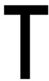
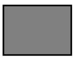
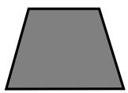
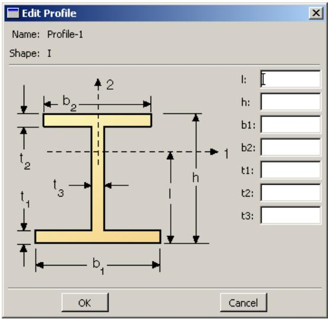
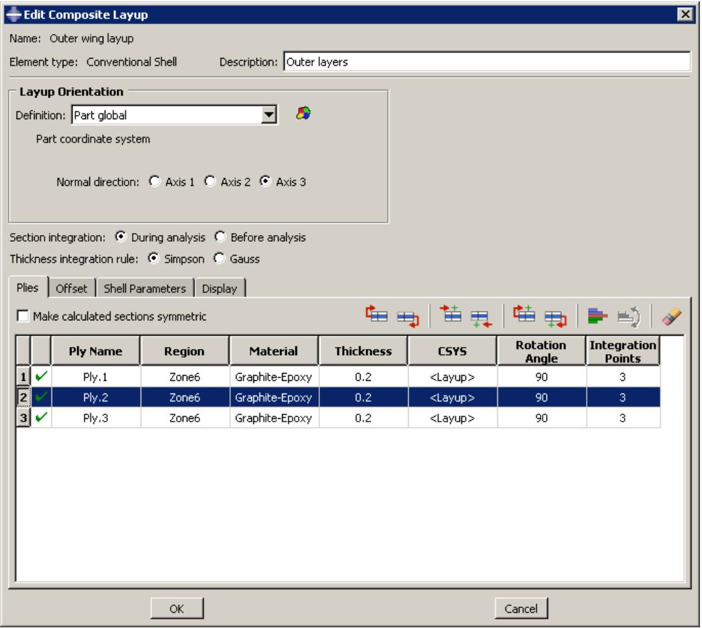
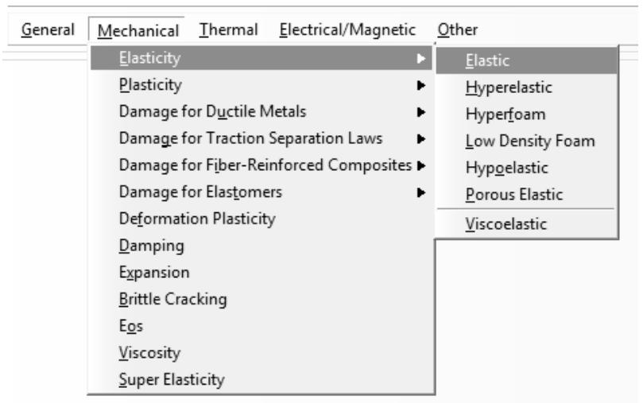
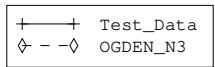
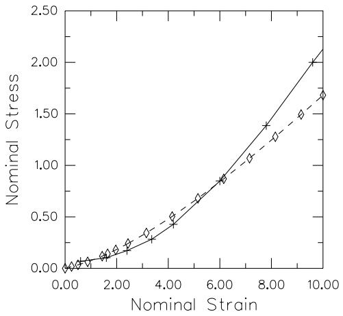
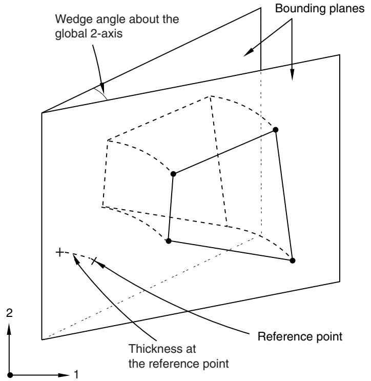

# The Property Module

## The Property module

You can use the Property module to define materials, sections, and composite layups as well as other properties of a part or part region.

You can use the Property module to perform the following tasks:

• Define materials.  
• Define beam section profiles.  
• Define sections.  
• Assign sections, orientations, normals, and tangents to parts.  
• Define composite layups.  
• Define a skin reinforcement.  
• Define inertia (point mass, rotary inertia, and heat capacitance) on a part.  
• Define springs and dashpots between two points or between a point and ground.  
• Define material calibrations.

For information on defining inertia, see Inertia. For information on defining skin reinforcements, see Skin and stringer reinforcements. For information on defining springs and dashpots, see Springs and dashpots.

## In this section:

Entering and exiting the Property module  
Understanding properties  
Which properties can I assign to a part?  
Understanding the Property module editors  
Using material libraries  
Using the Property module toolbox  
Creating and editing materials  
Defining general material data  
Defining mechanical material models  
Defining thermal material models  
Defining electrical and magnetic material models  
Defining other types of material models  
Creating and editing sections  
Creating and editing composite layups  
Assigning sections, orientations, normals, and tangents to a part  
Using discrete orientations for material orientations and composite layup orientations  
Creating material calibrations  
Using the Special menu in the Property module  
Using the Query toolset to obtain assignment information

## Entering and exiting the Property module

You can enter the Property module at any time during an Abaqus/CAE session by clicking Property in the Module list located in the context bar. When you enter the Property module, Material, Section, Profile, Assign, Special, Feature, and Tools menus appear in the main menu bar. A Part list appears in the context bar that allows you to select the part to which you want to assign properties.

To exit the Property module, select another module from the Module list. You need not take any specific action to save your material, section, and other definitions before exiting the module; they are saved automatically when you save the entire model by selecting File->Save or File->Save As from the main menu bar.

## Additional information

• Using the Special menu in the Property module

## Understanding properties

You can specify the properties of a part or part region by creating a section and assigning it to the part. In most cases, sections refer to materials that you have defined. Beam sections also refer to profiles that you have defined. This section of the guide explains materials, profiles, sections, rebar, and section assignment. You create materials, profiles, and sections using the Property module editors, as described in Understanding the Property module editors.

## In this section:

Defining materials  
Defining profiles  
Defining sections  
Defining composite layups  
Understanding rebar in shell sections

## Defining materials

A material definition specifies all the property data relevant to a material. You specify a material definition by including a set of material behaviors, and you supply the property data with each material behavior you include. You use the material editor to specify all the information that defines each material.

Each material that you create is assigned its own name and is independent of any particular section; you can refer to a single material in as many sections as necessary. Abaqus/CAE assigns the properties of a material to a region of a part when you assign a section referring to that material to the region.

## Defining profiles

A profile specifies the properties of a beam section that are related to its cross-sectional shape and size (for example, cross-section area and moments of inertia).

When you define a beam section, you must include a reference to a profile in the section definition.

You can create the following types of profiles:

## Shape-based profiles

Shape-based profiles define the specific shape and dimensions of the beam cross-section. Abaqus uses the information provided by the shape-based profile to calculate the engineering properties of the section.

You can create this type of profile by first selecting from a list of shape options and then specifying that particular shape's dimensions. For example, if you select a box shape, you must then specify the height and width of the box as well as the thickness of the four walls. You can select from the following shape options:

• Arbitrary  
Box  
• Circular  
• Hexagonal  
• I, L, T  
• Pipe  
• Rectangular  
• Trapezoidal  
• Channel  
Hat

The shape options are shown in Figure 1.

  
Arbitrary

  
Box

  
Circular

  
Hexagonal

  
I

  
L

  
T

  
Rectangular

  
Trapezoidal  
Figure 1: Available shape options.

For detailed information on each profile shape, see Beam Cross-Section Library.

## Generalized profiles

Generalized profiles specify the engineering properties of the section directly. You can create a generalized profile by specifying values for the area, moments of inertia, torsional constant, and, if applicable, sectorial moment and warping constant. For more information, see Using a General Beam Section to Define the Section Behavior.

Each profile that you create has its own name and is independent of any particular beam section; you can refer to a single profile in as many beam sections as necessary. After you have assigned the beam section and beam orientation to the part, you can use the part display options to view an idealized representation of the shape-based or generalized beam profile. Displaying beam profiles is useful for checking that the correct profile has been assigned to a particular region and that the assigned beam orientation results in the expected orientation of the profile. For more information, see Controlling beam profile display.

## Defining sections

A section contains information about the properties of a part or a region of a part. The information required in the definition of a section depends on the type of region in question. For example, if the region is a deformable wire, shell, or two-dimensional solid, you must assign a section to that region that provides information about the region's cross-sectional geometry. Likewise, a rigid region requires a section that describes its mass properties. Most sections must refer to a material name. Beam sections must also refer to a profile name.

When you assign a section to a part, Abaqus/CAE automatically assigns that section to each instance of the part. As a result, the elements that are created when you mesh those part instances will have the properties specified in that section.

Sections are named and created independently of any particular region, part, or assembly. You can assign a single section to as many different regions as necessary. You can use the Property module to create solid sections, shell sections, beam sections, fluid sections, and other sections.

## Solid sections

Solid sections define the section properties of two-dimensional, three-dimensional, and axisymmetric solid regions.

Homogeneous solid sections. Homogeneous solid sections consist of a material name. In addition, if the section will be used with a two-dimensional region, you must also specify the section thickness. (You have the option of specifying a plane stress or plane strain thickness even if the section will be assigned to a three-dimensional region. Abaqus/CAE ignores the thickness information if it is not needed for the region type.)

For more information, see Creating homogeneous solid sections.

• Generalized plane strain sections. Generalized plane strain sections consist of a material name, thickness, and wedge angles about the global 1- and 2-axes. You can assign generalized plane strain sections only to two-dimensional planar regions.

For more information, see Creating generalized plane strain sections.

• Eulerian sections. Eulerian sections consist of a list of material names. This list specifies all of the materials that can be present in an Eulerian domain. You can assign Eulerian sections only to Eulerian parts.

For more information, see Creating Eulerian sections. For an overview of Eulerian analyses, see Eulerian analyses.

• Composite solid sections. Composite solid sections consist of layers of materials. For each layer of material, you must specify a material name, thickness, and orientation.

For more information, see Creating composite solid sections.

Electromagnetic solid sections. Electromagnetic solid sections are valid for electromagnetic models and consist of a material name. In addition, if the section will be used with a two-dimensional region, you must also specify the section thickness. (You have the option of specifying a plane stress or plane strain thickness even if the section will be assigned to a three-dimensional region. Abaqus/CAE ignores the thickness information if it is not needed for the region type.)

For more information, see Creating electromagnetic solid sections.

## Shell sections

Shell sections define the section properties of shell regions. Shells model structures in which one dimension (the thickness) is significantly smaller than the other two dimensions and in which the stresses in the thickness

direction are negligible. You can define one or more layers of reinforcement (rebar) in shell sections. For more information, see Understanding rebar in shell sections.

Homogeneous shell sections. Homogeneous shell sections consist of a shell thickness, material name, section Poisson's ratio, and optional rebar layers. You can choose to provide the section property data before the analysis or to have Abaqus calculate (integrate) the cross-sectional behavior from section integration points during the analysis. If the latter is chosen, options are provided to control the section integration and temperature variation through the thickness.

For more information, see Creating homogeneous shell sections.

Composite shell sections. Composite shell sections consist of layers of materials, a section Poisson's ratio, and optional rebar layers. For each layer of material, you must specify a material name, thickness, and orientation. You can choose to provide the section property data before the analysis or to have Abaqus calculate (integrate) the cross-sectional behavior from section integration points during the analysis. If the latter is chosen, options are provided to control the section integration and temperature variation through the thickness.

For more information, see Creating composite shell sections.

• Membrane sections. Membranes represent thin surfaces in space that offer strength in the plane of the surface but have no bending stiffness. Membrane sections consist of a material name, membrane thickness, section Poisson's ratio, and optional rebar layers.

For more information, see Creating membrane sections.

• Surface sections. Surface sections represent surfaces in space that have no inherent stiffness and behave like membrane elements with zero thickness. Surface sections consist of optional rebar layers.

For more information, see Creating surface sections.

General shell stiffness sections. General shell stiffness sections allow you to define a shell's mechanical response by directly specifying the stiffness matrix and thermal expansion response. General shell stiffness sections consist of a section stiffness matrix and scaling moduli. Optionally, you can also specify a thermal expansion coefficient and thermal stresses in the section.

For more information, see Creating general shell stiffness sections.

## Beam sections

Beams are used in two and three dimensions to model slender, rod-like structures that provide axial strength and bending stiffness. Beams represent structures in which the cross-section is assumed to be small compared to the length. You can assign beam sections only to wire regions. In addition, you must assign a beam section orientation to all regions with beam sections.

Beam sections. Beam sections consist of a section Poisson's ratio and a reference to a profile. Additional information is required depending on whether you choose to calculate (integrate) the section stiffness either before or during analysis.

For information on profiles, see Defining profiles. For more information on beam sections, see Creating beam sections.

Truss sections. Trusses, like beams, are used in two and three dimensions to model slender, rod-like structures that provide axial strength but no bending stiffness. Truss sections consist of a material name and cross-sectional area.

For more information, see Creating truss sections.

You can use the part display options to view an idealized representation of the beam or truss profile along the wire region. For more information, see Controlling beam profile display.

## Other sections

Other sections you can create include gasket sections, cohesive sections, acoustic infinite sections, and acoustic interface sections.

Gasket sections (Abaqus/Standard analyses only). Gaskets model thin sealing components that are positioned between structural components. Gasket sections are used to provide pressure-closure behaviors for sealing components. Gasket sections consist of a material name, initial gasket thickness, initial gap, initial void, and cross-sectional area.

For more information, see Creating gasket sections and Gaskets.

Cohesive sections. Cohesive sections are used to model finite thickness adhesives, negligibly thin adhesive layers for debonding applications, as well as gaskets. No specialized gasket behavior (typically defined in terms of pressure versus closure) is available. Cohesive sections consist of a material name, response, initial thickness, and out-of-plane thickness.

For more information, see Creating cohesive sections and Adhesive joints and bonded interfaces.

Acoustic infinite sections. Acoustic infinite sections are used to model an acoustic medium undergoing small pressure changes involving exterior domains. Acoustic infinite sections consist of an acoustic medium material name. In addition, if the section will be used with a two-dimensional region, you must also specify the section thickness. (You have the option of specifying a plane stress or plane strain thickness even if the section will be assigned to a three-dimensional region. Abaqus/CAE ignores the thickness information if it is not needed for the region type.)

For more information, see Creating acoustic infinite sections.

Acoustic interface sections. Acoustic interface sections are used to couple an acoustic medium to a structural model. Acoustic interface sections consist of an acoustic medium material name. In addition, if the section will be used with a two-dimensional region, you must also specify the section thickness. (You have the option of specifying a plane stress or plane strain thickness even if the section will be assigned to a three-dimensional region. Abaqus/CAE ignores the thickness information if it is not needed for the region type.)

For more information, see Creating acoustic interface sections.

## Warning:

The type of section that you assign to a part must be consistent with the element type that you assign to instances of that part in the Mesh module. For example, if you assign a truss section to a wire part in the Property module, you should assign a truss element type (and not a beam element type) to any instances of that part in the Mesh module.

## Defining composite layups

You use a composite layup to model a part that contains many plies, where each ply is defined by a material, a thickness, and a reference orientation. Composite layups are similar to composite shell or composite solid sections. A ply in a composite section is the same as a ply in a composite layup; however, a composite section always contains the same number of plies. In contrast, a composite layup can contain a different number of plies in different regions. Abaqus/CAE converts a composite layup to its constituent composite sections when you analyze your model. Abaqus/CAE allows you to define three types of composite layups—shells, continuum shells, and solids. For more information, see Composite layups.

## Understanding rebar in shell sections

You can define one or more layers of reinforcement (rebar) in shell sections by specifying a unique layer name for each rebar layer. You also select the name of the material forming each rebar layer and specify the cross-sectional area per bar, spacing, and orientation of the rebar in each layer.

To define the orientation of each rebar layer, you can specify an orientation angle or an orientation name. The angular orientation of a rebar layer is defined relative to the rebar reference orientation. You use the Assign menu to assign a rebar reference orientation to shell regions. If you specify an orientation name, you must supply the user subroutine ORIENT. For more information, see Defining rebar layers, and Assigning a rebar reference orientation.

In the Step module you must request output for rebar to include rebar output in the data that Abaqus writes to the output database and to view plots of the rebar orientations in the Visualization module. In the Visualization moduleAbaqus/CAE treats rebar layers as section points for output purposes, and you can create material orientation plots to show the rebar orientation.

For more information on rebar, see Defining Reinforcement.

## Additional information

• Understanding output requests  
• Selecting section point data by category  
• Plotting material orientations

## Which properties can I assign to a part?

Once you have created a section, you can assign the following properties to a part:

## Section

You can assign the section to a region of a part. The Section Assignment Manager allows you to view, create, edit, suppress, resume, and delete section assignments. In the Property module, Abaqus/CAE colors a region green to indicate that the region has a section assignment. If there are overlapping section assignments, Abaqus/CAE colors the region yellow.

## Beam Section Orientation

You can assign beam section orientations to wire regions. You assign an orientation to a beam section by defining the approximate local 1-direction of the cross-section.

## Material Orientation

You can assign material orientations to shell and solid regions. The global coordinate system determines the default material orientation. You can define a material orientation by selecting an existing datum coordinate system or discrete field or by defining a discrete orientation. For an Abaqus/Standard analysis, you can define the material orientation in a user subroutine.

## Rebar Reference Orientation

The angular orientation of a rebar layer is defined relative to the rebar reference orientation. You can assign rebar reference orientations to shell regions. The global coordinate system determines the default rebar reference orientation. You can define a rebar reference orientation by selecting an existing datum coordinate system from the viewport and then selecting an axis on the datum coordinate system that approximates the direction of the shell normal.

## Element Normal

You can assign shell/membrane normal directions to orphan elements, shell and membrane regions, and axisymmetric parts with wire regions. The shell/membrane normals affect the material orientation assigned to the region. If you reverse the normal of a shell region, the material 2-direction will be reversed. The reversal of the material 2-direction has no effect on the analysis results. However, you should use care when interpreting section point output for shells.

## Element Tangent

You can assign beam/truss tangent directions to orphan elements and wire regions. Beam section orientations depend on the beam tangent directions. If you reverse the tangent direction, the local 2-direction will be reversed, and you should use care when interpreting results, in particular when you identify the beam section point locations.

You can use the Assign menu in the Property module main menu bar to assign properties to a part. You can select the region to which to assign a property in the following ways:

• Select the region directly in the viewport.  
• Select elements individually or using the angle method (to assign shell normals to orphan elements).  
Use the Set toolset to create a set consisting of regions of parts or orphan elements. (The Set toolset is available from the Tools menu in the main menu bar.) You can then assign the property to the region or elements defined by the set.

If you assign a section to a region and then rename or delete the section, that section is no longer applied to the region. If a region of your model lacks section properties, your analysis job will fail and the problem will be reported by the Job module.

However, the original names of renamed or deleted sections continue to be associated with the regions to which they have been assigned until you take one of the following actions:

• Assign a different section to the region.  
• Create a new section that has the original section name and is the appropriate type for the region (for example, a shell section for a shell region); the properties defined in the new section are applied to the region automatically.  
• If you have renamed a section, change the name of the section back to its original name.

(You can use the Query toolset to determine the name of the section assigned to the region; for more information, see Understanding the role of the Query toolset.)

Similarly, if you refer to a material in a section definition and then rename or delete the material, the section becomes invalid; properties defined in that section are no longer applied to regions to which the section is assigned. However, the original names of renamed or deleted materials continue to be associated with sections that refer to those materials; therefore, you can use techniques similar to the ones listed above to restore sections.

For detailed instructions on assigning properties to a model and managing section assignments, see the following sections:

Assigning a section  
Managing section assignments  
Assigning a beam orientation  
Assigning a material orientation or rebar reference orientation  
• Assigning shell/membrane normal directions  
Assigning beam/truss tangent directions  
Using discrete orientations for material orientations and composite layup orientations

## Understanding the Property module editors

When you create or edit a material, profile, or section, you must enter data in the appropriate editor. For example, when you create a material, you must enter data in the material editor. This section provides information on each editor type.

## In this section:

Creating materials  
Creating profiles  
Creating sections  
Creating composite layups  
Selecting material behaviors  
Specifying material parameters and data  
Evaluating hyperelastic, hyperfoam and viscoelastic material behavior

## Creating materials

To create a material, select Material->Create from the main menu bar. An Edit Material dialog box appears in which you can enter a name for the material and create or edit material properties. The material editor is shown in Figure 1.

## Note:

Once you have created a material, it cannot be renamed using the material editor; you must use Material->Rename to change the name of an existing material.

  
Figure 1: The material editor.

The material editor consists of the following:

## Material Behaviors list

A list of the behaviors you have included in the material definition.

## Behavior menu

A set of menus beneath the behavior list from which you select material behaviors.

## Behavior definition area

The lower portion of the window in which the parameters, tabular data fields, and suboptions associated with a selected behavior appear.

## Note:

You can display help on particular aspects of the editor that are not discussed here by selecting Help->On Context from the main menu bar and then clicking the editor feature of interest.

## Additional information

• Creating or editing a material  
• Browsing and modifying material behaviors  
• Specifying material parameters and data

## Creating profiles

To create a profile, select Profile->Create from the main menu bar. A Create Profile dialog box appears in which you can enter a name for the profile and select the profile type. Once you have finished entering this information, click Continue in the Create Profile dialog box to display the profile editor, which allows you to create and edit profiles.

All profile editors display a diagram of the profile shape and text fields in which you can enter all of the data necessary to define the profile. For example, the I-shaped profile editor is shown in Figure 1. The editor contains a diagram of the I-shaped profile and data fields in which you can enter each dimension.

  
Figure 1:The I-shaped profile editor.

Once you have created a profile, you can refer to that profile in a beam section definition. For example, a box-shaped profile named SupportBeam is selected in the beam section editor shown in Figure 2.

  
Figure 2: Specifying a profile name in the beam section editor.

For more information on profiles, see Defining profiles.

## Additional information

• Defining profiles  
• Beam Cross-Section Library

## Creating sections

You can use the Property module to create the following types of sections:

• Homogeneous solid sections  
• Generalized plane strain sections  
• Eulerian sections  
• Composite solid sections  
• Electromagnetic solid sections  
• Homogeneous shell sections  
• Composite shell sections  
• Membrane sections  
• Surface sections  
• General shell stiffness sections  
• Beam sections  
• Truss sections  
• Gasket sections  
• Cohesive sections  
• Acoustic infinite sections  
• Acoustic interface sections

To create a section, select Section->Create from the main menu bar. A Create Section dialog box appears in which you can name the section and specify the type of section that you want to create. Once you have specified a section name and type, click Continue in the Create Section dialog box to display the section editor, which allows you to create and edit sections.

The format of the section editor varies according to the type of section you are defining. For example, the homogeneous shell section editor is shown in Figure 1.

  
Figure 1:The homogeneous shell section editor.

## Note:

You can display help on particular aspects of an editor that are not discussed here by selecting Help->On Context from the main menu bar and then clicking the editor feature of interest. A help window will appear containing a relevant section from this guide.

Some editors contain a Rebar Layers option ( icon), as shown in Figure 1. If you click this icon, another dialog box appears in which you can enter data concerning rebar layers, as shown in Figure 2.

  
Figure 2:The Rebar Layers dialog box.

## Note:

To display context-sensitive help for items in the Rebar Layers dialog box, you must select the item of interest and then press [F1]. (The Help menu in the main menu bar is unavailable while the option dialog box is displayed.)

Once you have entered all the data necessary to define the section, you can click OK to close the section editor and to save the section.

For detailed instructions on using section editors, see the following sections :

Creating homogeneous solid sections  
Creating generalized plane strain sections  
Creating Eulerian sections  
Creating composite solid sections  
Creating electromagnetic solid sections  
Creating homogeneous shell sections  
Creating composite shell sections  
Creating membrane sections  
Creating surface sections  
Creating general shell stiffness sections  
Creating beam sections  
Creating truss sections  
Creating gasket sections  
Creating cohesive sections

Creating acoustic infinite sections  
Creating acoustic interface sections  
Defining rebar layers  
Creating profiles

## Additional information

• Defining sections  
• Creating and editing sections

## Creating composite layups

You can use the Property module to create the following types of composite layups:

• Shell  
• Continuum shell  
• Solid

To create a composite layup, select Composite->Create from the main menu bar. A Create Composite Layup dialog box appears in which you can name the layup, specify the initial ply count, and specify the type of composite layup that you want to create. Once you have finished entering this information, click Continue in the Create Composite Layup dialog box to display the composite layup editor, which allows you to create and edit layups.

The format of the composite layup editor varies according to the type of layup you are defining. For example, the shell composite layup editor is shown in Figure 1.

  
Figure 1:The shell composite layup editor.

## Note:

You can display help on particular aspects of an editor that are not discussed here by selecting Help->On Context from the main menu bar and then clicking the editor feature of interest. A help window will appear containing a relevant section from this guide.

Once you have entered all the data necessary to define the layup, you can click OK to close the editor and to save the composite layup.

For detailed instructions on using composite layup editors, see the following sections:

Creating conventional shell composite layups  
Creating continuum shell composite layups  
Creating solid composite layups

## Additional information

• Defining composite layups  
• Creating and editing composite layups

## Selecting material behaviors

The material editor contains several menus that allow you to add most of the material behaviors available in Abaqus/Standard or Abaqus/Explicit to a material definition.

(For information on which material behaviors are available in Abaqus/CAE, see Abaqus keyword browser table and Keyword support from the input file reader.)

The material editor menus reflect the division of all material behaviors into five categories: General, Mechanical, Thermal, Electrical/Magnetic, and Other. Figure 1 shows the elasticity behaviors available under the Mechanical menu.

  
Figure 1: Elasticity behaviors under the Mechanical menu.

The lists of behaviors do not change to exclude behaviors that are invalid for the type of analysis you are running. In addition, Abaqus/CAE does not check that the data that you enter in the editor are valid or that your materials are appropriate for your analysis type. For example, if you request a dynamic analysis, Abaqus/Standard or Abaqus/Explicit requires that you specify the density of the materials used in the model so that it can calculate mass and inertia properties of the model. If you do not provide a material density in the material definition, Abaqus/CAE allows you to create the material; however, Abaqus/CAE will report an error when you submit your analysis job.

When you select a behavior, the name of the behavior appears in the Material Behaviors list at the top of the editor, and the behavior becomes part of your material definition. For example, the list in Figure 2 reflects that the Elastic and Plastic behaviors have been chosen, as well as the Fail Stress suboption of the Elastic behavior.

  
Figure 2:The Material Behaviors list.

Behaviors such as Elastic and Plastic are primary behaviors. Test data and suboptions such as Fail Stress appear beneath the corresponding primary behavior and are indented to indicate their subordinate position.

If you want to remove a behavior or suboption from a material definition, you can select that behavior or suboption

from the Material Behaviors list and then click

If you are creating a new material, the selected behavior list is initially blank. As you select behaviors, the behavior name appears in the list; if there are too many behaviors to see at once, a scroll bar appears on the right side of the list.

## Additional information

• Browsing and modifying material behaviors  
• Specifying material parameters and data

## Specifying material parameters and data

When you select a behavior, the behavior definition area changes to show all of the associated parameters and data items for the selected behavior. The parameters are shown at the top of the behavior description area and the data items at the bottom.

Depending on your analysis requirements, you choose to either accept or change the default parameter values; for example, you choose whether to use isotropic elasticity by using the Type combo box on the elasticity form, as shown in Figure 1.

  
Figure 1: Type combo box.

A table containing fields for the remaining required material data appears beneath the parameter area; for example, Figure 2 shows the table that appears when you choose isotropic elasticity.

  
Figure 2: Isotropic elasticity table.

Different fields become available depending on how you have set the parameters. For example, when you choose lamina elasticity rather than isotropic elasticity, the table in Figure 3 appears.

  
Figure 3: Lamina elasticity table.

You can enter data into the table using the keyboard. Alternatively, you can click mouse button 3 anywhere in the table to view a list of options for specifying tabular data. For example, an option exists for automatically entering data from a file. Another option exists for creating an X–Y data object from the data in the table; you can plot the X–Y data in the Visualization module and visually check its validity. For detailed information on each option, see Entering tabular data.

For detailed information on specific features in the material editor, see the following sections:

Creating or editing a material

Browsing and modifying material behaviors  
Entering strain-rate-dependent data  
Entering temperature-dependent data  
Specifying field variable dependence  
• Selecting and modifying suboptions or test data  
Displaying X–Y plots of hyperelastic material behavior  
Displaying X–Y plots of viscoelastic material behavior  
Displaying X–Y plots of hyperfoam material behavior

## Additional information

• Browsing and modifying material behaviors

## Evaluating hyperelastic, hyperfoam and viscoelastic material behavior

Abaqus/CAE provides a convenient Evaluate option that allows you to view the behavior predicted by a hyperelastic, hyperfoam, or viscoelastic material and that allows you to choose a suitable material formulation.

You can evaluate any hyperelastic or hyperfoam material, but a viscoelastic material can be evaluated and viewed only if it is defined in the time domain and includes hyperelastic, hyperfoam, and/or elastic material data. If your material definition includes viscoelastic data defined in the frequency domain, you cannot evaluate its viscoelastic material behavior in Abaqus/CAE, but its material evaluation data are written to the data (.dat) file.

The Evaluate option prompts Abaqus/CAE to perform one or more standard tests using an existing material. (For information on standard tests for hyperelastic, hyperfoam, and viscoelastic materials, see Hyperelasticity, Hyperelastic Behavior in Elastomeric Foams, and Linear Viscoelasticity, respectively.) Once the standard tests are completed, Abaqus/CAE enters the Visualization module and displays the test results in new viewports as X–Y plots. (For more information on X–Y plots, see X–Y plotting.) Abaqus/CAE also displays an informational dialog box containing the stability limits and coefficients for each hyperelastic strain energy potential and the viscoelastic material parameters for the viscoelastic response. The information from the evaluation is saved in the material\_name\_i.dat file, where i starts at 1 and is incremented for subsequent evaluations of the same material. You can review the evaluation results and adjust the material definition as necessary.

To initiate the evaluation procedure, select Material->Evaluate->material name from the main menu bar. Alternatively, you can select the material of interest in the Material Manager and then click Evaluate. The Evaluate Material dialog box appears in which you can specify how you want Abaqus/CAE to perform the standard tests.

• For detailed instructions on evaluating hyperelastic material behavior, see Displaying X–Y plots of hyperelastic material behavior.  
For detailed instructions on evaluating hyperfoam material behavior, see Displaying X–Y plots of hyperfoam material behavior.  
• For detailed instructions on evaluating viscoelastic material behavior, see Displaying X–Y plots of viscoelastic material behavior.

## Note:

The material evaluation procedure generates jobs with the same names as the materials; therefore, these material names must adhere to the same rules as job names (see Using basic dialog box components, for more information on naming objects).

The Evaluate option is particularly useful in the following scenarios:

## Comparing test data with the behavior predicted by a particular strain energy potential

When you define a hyperelastic or hyperfoam material using experimental data, you also specify the strain energy potential that you want to apply to the data. Abaqus uses the experimental data to calculate the coefficients necessary for the specified strain energy potential. However, it is important to verify that an acceptable correlation exists between the behavior predicted by the material definition and the experimental data.

You can use the Evaluate option to calculate the material response based on the experimental data using the strain energy potential that you have specified in the material definition. When the tests are complete, Abaqus/CAE enters the Visualization module and displays X–Y plots of the test results. Each plot includes the experimental data and a curve for each evaluated strain energy potential. Abaqus/CAE also opens a dialog box containing the stability limits and coefficients for each strain energy potential.

For example, the X–Y plot in Figure 1 shows the results of a planar test using the Ogden N=3 strain energy potential.

  
Figure 1: Results of a planar test.

In addition, the following information is reported to the data (.dat) file:

• The coefficients calculated for the strain energy potential.  
• Any material instabilities that were detected during the tests.

The path to the data (.dat) file appears in the message area of the Abaqus/CAE main window once the analysis has completed successfully.

## Evaluating multiple strain energy potentials

If you are defining a hyperelastic material using experimental data and you are unsure which strain energy potential to specify, you can select Unknown from the Strain energy potential list in the material editor. You can then use the Evaluate option to perform standard tests with the experimental data using multiple strain energy potentials.

When the tests are complete, Abaqus/CAE enters the Visualization module and displays an X–Y plot for each test and a dialog box containing the stability limits and coefficients for each strain energy potential. Each plot includes the experimental data and a curve for each evaluated strain energy potential. You can visually compare the strain energy potential curves and the experimental data curve and select the strain energy potential that provides the best fit.

Once you have determined which strain energy potential provides the best fit with the experimental data, you must return to the material editor in the Property module and change the Strain energy potential selection from Unknown to the strain energy potential that you have chosen.

## Viewing behavior predicted by coefficients

If you have acquired coefficients for a particular strain energy potential (either by evaluating one or more hyperelastic strain energy potentials, as described above, or from another source), you may want to verify that the behavior predicted by the strain energy potential acceptably matches your experimental data or meets other criteria.

You can use the Evaluate option to plot a curve of the strain energy potential using the coefficients you provided in the material definition. If the material definition also includes experimental data, a curve for that data also appears in the plot.

## Viewing response curves for viscoelastic materials

If you have shear or volumetric test results, you may want to verify that the creep and relaxation behavior predicted by Abaqus acceptably matches your experimental data or meets other criteria. Likewise, if you have frequency data, you may want to verify that the predicted storage and loss components of the shear and bulk moduli match your data.

You can use the Evaluate option to plot curves using the coefficients you provided in the material definition. If the material definition includes experimental data, curves for those data also appear in the plots. The types of curves produced depend on the material definition. For viscoelastic materials defined using a Prony series, creep test data, or relaxation test data for time, you can produce creep and relaxation plots versus time. For viscoelastic materials defined using frequency data for time, you can produce plots of the storage and loss components of the shear and bulk moduli versus a logarithmic scale of frequencies.

## Adjusting material data

If you are unsatisfied with the fit between the test data and the behavior predicted by the material, you can return to the Property module and adjust the test data and then evaluate the material again. You can repeat this process until you are satisfied with the material behavior. In some cases it may be possible to use this approach to optimize the coefficient values included in a hyperelastic material definition. For more information, see “Improving the accuracy and stability of the test data fit,” in Hyperelastic Behavior of Rubberlike Materials and Hyperelastic Behavior in Elastomeric Foams for hyperelastic and hyperfoam materials, respectively.

For detailed instructions on evaluating materials, see the following sections:

Displaying X–Y plots of hyperelastic material behavior  
Displaying X–Y plots of hyperfoam material behavior  
Displaying X–Y plots of viscoelastic material behavior

For more information on the strain energy potentials available in Abaqus, see “Strain energy potentials,” in Hyperelastic Behavior of Rubberlike Materials.

## Using material libraries

You can use a material library to maintain a consistent set of material property data for use in all Abaqus/CAE analysis models. Material libraries are available only in the Property module.

This section provides information on accessing, using, and managing material libraries.

## In this section:

Material libraries  
Managing material libraries  
Adding materials from a library to your model

## Material libraries

Material libraries provide a convenient means of storing material property data for use in multiple analyses. You can create one or more libraries to save and organize material data related to a project, a group of projects, or an entire company.

Use of material libraries allows you to maintain a consistent set of material properties and to quickly add materials to your models.

Material library tools are located in the Model Tree area in the Property module.

Material libraries are considered plug-ins to Abaqus/CAE, although they are loaded automatically without use of the Plug-ins menu. Material libraries have the file extension .lib and are stored in the abaqus\_plugins directories located within the Abaqus/CAE installation, your home directory, or the current directory (the directory from which you launched Abaqus/CAE). You can also use the plugin\_central\_dir environment variable in the abaqus\_v6.env file or the Abaqus solver custom\_v6.env file to specify one or more additional directory paths. (For more information on the location of the plug-in directories, see Where are plug-in files stored?) Abaqus/CAE searches all subdirectories of the specified plug-in locations for material library files.

By default, Abaqus/CAE displays material libraries in a tree format, similar to the Model Tree. In this format you can expand and collapse categories to help locate a desired material. Figure 1 shows a simple material library containing metal materials. It is organized into categories for aluminum, copper, and steel; the aluminum category has been expanded. You can also view material libraries as an alphabetical list of material names, omitting the categories.

  
Figure 1: The Material Library.

You can use the Filter located above the materials list to search the material names for a list of characters. The filter may include any characters allowed in an Abaqus material name (for more information on object naming, see Using basic dialog box components). The filter is not applied to category names, so filtering may result in “empty” categories.

The tool opens the Material Library Manager, where you can create, edit, rename, and reorganize material libraries. You can also use the manager to create, edit, rename, and delete Specification Tags to help identify materials in a library.

\+ Figure 1 shows the predefined Specification Tags. The tool copies a selected material from the library to the current model.

## Additional information

• Managing material libraries  
• Adding materials from a library to your model

## Managing material libraries

The Material Library Manager allows you create, edit, and rename material libraries, library categories, and library materials.

The default Specification Tags indicate the source of the material data, a description, the units of measure, and a vendor material name. You can create, edit, rename, and delete specification tags for each material in a library. Material properties and categories are presented in alphabetical order, identical to the default view of the library in the main window of Abaqus/CAE; material categories appear first, followed by materials that are not in a category. You can use the manager to copy materials from a model to a library or from a library to a model. The Material Library Manager is shown in Figure 1.

  
Figure 1:The Material Library Manager.

When you work with material libraries, it is recommended that you carefully consider the material and category names. You can create multiple categories and/or materials with exactly the same name. For example, you could have identical entries for a standard grade of steel, each containing properties in different sets of units. Using suitable category names, you can easily identify each material. However, if you display the library in the list format, the identical entries will all appear in the list. Modifying the material names to include the units information may make it easier to identify the desired material. For example, you can name one material Steel 1020 US and another Steel 1020 SI. Alternatively, you can click Tags in the material library manager to indicate the units in the Specification Tags that appear below the materials list in the main window. Renaming a material in the material library will change the name only in the library and does not change the underlying material name copied from or to the Abaqus/CAE model. A material added from the library to a model will still retain the old name.

You cannot view or edit material properties within the material library manager. To view or edit the properties of a material, you must add the material to a model and use the Edit Material dialog box (for more information, see Creating or editing a material).

1. From the Material Library tab in the Model Tree area, click the Material Library Manager icon

located to the right of the Name field.

Abaqus/CAE displays the Material Library Manager.

2. From the top of the manager, click Create to create a new material library, or select a library name to edit an existing library.

3. If you selected Create in the previous step, the Create Material Library dialog box appears.

a. Enter a name for the new library.  
b. Select Home or Current to choose the location of the abaqus\_plugins directory in which the library will be saved.  
c. Click OK.

Abaqus/CAE creates an empty material library file and opens it for editing in the manager. If necessary, Abaqus/CAE also creates the specified abaqus\_plugins directory. For more information, see Material libraries.

4. To edit the current material library, select an item from the Library Materials list on the left side of the manager and choose from the following:

• If you want to create categories to organize materials in the library, click Add Category. The Create Category dialog box appears.

1. Enter a name for the category.  
2. Click OK in the Create Category dialog box.

Abaqus/CAE creates the new category.

The category appears at the same level of the library as the item you selected. For example, if you selected the library name, the new category appears with any other categories directly below the library name; if you selected an existing category, the new category appears within that category.

• If you want to rename the selected item, click Rename. Enter a new name in the dialog box that appears, and click OK.

## Note:

Renaming a library changes the name displayed within Abaqus/CAE; it does not change the name of the library (.lib) file.

• If you want to edit the information that appears for a material when you expand the Specification Tags field at the bottom of the material library, click Tags. The tags contain the source, description, units, and vendor name of the material. By default, the vendor name tag contains the material name, and the other tags each contain “Imported from CAE.” You can use tags to clarify the intended use of materials that have identical names or similar properties.  
• If you want to remove a material or an empty category from the library, select it and click Delete. You can use a combination of [Ctrl] + Click and [Shift] + Click to select multiple items.

## Note:

You cannot delete a material library from within Abaqus/CAE; you must delete the library file from the saved location on your system.

5. Use the arrows located between the Library Materials list and the Model Materials list to copy material data from a library to a model, or vice versa.

When you copy a material, Abaqus/CAE places the new material at the end of the selected category, if any, or at the end of the library.

a. From the Models list in the Material Library Manager, select the model to which (or from which) you want to copy a material.  
b. Select the desired material from the Library Materials list or the Model Materials list. You can use a combination of [Ctrl] + Click and [Shift] + Click to select multiple items.

c. If you are copying a material into the library, select the category in the Library Materials list into which you want Abaqus/CAE to place the material.  
d. Click on the appropriate arrow to copy the material.

Abaqus/CAE adds the new material to the end of the selected category for a library or to the end of the materials list for a model.

Changes that you make in the Material Library Manager are visible immediately in the manager dialog box. However, they are not committed to the library file until you click Save Changes. Abaqus/CAE does not update the library view in the main window until you dismiss the material library manager.

## Additional information

• Material libraries  
• Adding materials from a library to your model

To view material libraries, select the Material Library tab in the Model Tree area of the Property module. If more than one library is available, select one from the list at the top of the tabbed page. In the default Tree view, expand categories to view the materials within each category. To hide the categories and view an alphabetical list of all materials in the current library, select the List view.

To add a material from a library to the current model, highlight the material name in the tree or list view, and click the

\+ Add Material icon at the upper right corner of the Materials list. Alternatively, you can double-click on a material name in the library to add it to the model.

1. Click Material Library at the top of the Model Tree area located on the left side of the main window.

Tip: If the Model Tree is not displayed, select View->Show Model Tree from the main menu bar.

2. Select a library name from the Name list.

If Abaqus/CAE did not find any material libraries at the start of the session, you may create a new library. For more information, see Managing material libraries.

Abaqus/CAE displays the library contents. By default, the library is displayed in a tree format where materials may be separated into categories, similar to the Model Tree.

3. Locate the desired material in the library using any of the following methods:

• Expand categories within the Tree view to view their contents.  
• Toggle on List to hide the categories and view all materials in the library.  
• Enter a string in the Filter field to show only those materials whose names contain that string.

4. Click on the name of a material to select it.

5. If desired, click the arrow to the right of Specification Tags (located below the materials list) to view more information about the selected material.

6. Click the Add Material icon at the upper right corner of the Materials list to add the material to the current model.

Once you have added a material to your model, use the Edit Material dialog box to view or edit the material properties. Use the other tools in the Property module to associate the material with a section and assign the section to part of your model.

## Additional information

• The Property module  
• Material libraries  
• Managing material libraries

## Using the Property module toolbox

You can access all the Property module tools through either the main menu bar or the Property module toolbox. Figure 1 shows the icons for all the property tools in the Property module toolbox.

  
Figure 1:The Property module toolbox.

## Creating and editing materials

This section describes each feature of the material editor individually.

## In this section:

Creating or editing a material  
Browsing and modifying material behaviors  
Entering strain-rate-dependent data  
Entering temperature-dependent data  
Specifying field variable dependence  
Selecting and modifying suboptions or test data  
Displaying X–Y plots of hyperelastic material behavior  
Displaying X–Y plots of viscoelastic material behavior  
Displaying X–Y plots of hyperfoam material behavior

## Creating or editing a material

You use the Edit Material dialog box to create a new material or edit an existing material. When you select Material->Create from the main menu bar, you can enter the name of your choice for the material or accept the default name, you can provide a description for the material, and you can define the material properties. When you select Material->Edit, you can redefine the material description or properties, but you must use Material->Rename to change the name of an existing material.

Use the menu bar under the Material Behaviors list to add properties to a material. Some of the menu items contain submenus; for example, the following figure shows the behaviors available under the Mechanical->Elasticity menu item:

## Note:

To display information on a particular material behavior, click and hold that behavior and then press F1. A help window appears that contains information about the parameters and data associated with the behavior.

Use the Material Behaviors list to select an existing material behavior to edit.

Warning: Abaqus/CAE does not check for missing or invalid material behaviors until you submit the job for analysis. (Any warnings and errors are reported by the Job module.) Therefore, you must be careful to supply valid data for all of the material behaviors that the analysis requires.

1. Display the material editor using one of the following methods:

• From the main menu bar, select Material->Create.

Tip: You can also click Create in the Material Manager or select the create material tool in the Property module toolbox.

• From the main menu bar, select Material->Edit->material name.

Tip: You can also select a material and click Edit in the Material Manager.

An Edit Material dialog box appears.

2. If you are creating a new material, enter the name of your choice for the material. For more information on naming objects, see Using basic dialog box components.  
3. If desired, enter a description for the material.

a. Click in the Edit Material dialog box.

The material description editor appears.

b. In the material description editor, type information that you want to record about the material.  
c. Click OK to store the description and to close the material description editor.

When you submit a job, Abaqus/CAE writes material descriptions to the input file using comment lines; the material descriptions are not written to the output database. For more information, see Adding descriptions to your Abaqus/CAE model.

4. Use the menu bar or Material Behaviors list to select a new or existing material behavior, respectively. The behavior definition area in the dialog box changes to show all the parameters and data associated with the selected material behavior.  
5. Edit the parameters and data to complete the material definition.  
6. If you wish to remove a material behavior, select it and click to the right of the menu bar.  
7. When you have finished editing the material definition, click OK to save the material and to close the dialog box.

## Additional information

• Understanding the Property module editors  
• Creating and editing materials

## Browsing and modifying material behaviors

The selected behavior list at the top of the material editor window displays the behaviors and suboptions that comprise the current material; the list is updated as you add and delete behaviors.

The following figure shows how the list would look if an elastic-plastic material complete with stress-based failure limits were defined:

Using the selected behavior list, you can add, delete, or change materials as follows:

## Adding material behaviors

Select the behaviors needed to define your material from the menus just below the selected behavior list. When you select a behavior, its name appears in the list, and the parameters and data associated with the behavior appear in the data area in the bottom portion of the editor window. Suboptions appear beneath the corresponding primary behavior and are indented to indicate their subordinate position.

## Deleting material behaviors

Within the selected behavior list, click the behavior or suboption you want to delete; then click the icon located near the lower right corner of the behavior list. This procedure removes the behavior from both the behaviors list and the material definition. If you delete a behavior that has suboptions shown beneath it in the list, the suboptions are also deleted.

## Changing material parameters or data

Within the selected behavior list, click the behavior whose data you want to change. When the parameters and data associated with the behavior appear in the data area in the bottom portion of the window, make the desired changes.

## Additional information

• Understanding the Property module editors

## Entering strain-rate-dependent data

If your material includes strain rate dependence, you can enter data to define how material properties vary with strain rate.

1. + Toggle on Use strain-rate-dependent data in the material editor.

A column labeled Rate appears in the tabular data area.

2. Fill in each row with the appropriate values. For special table editing options or to read data from an ASCII file, press mouse button 3. (For more information, see Entering tabular data.)

## Additional information

• Understanding the Property module editors

## Entering temperature-dependent data

If your material includes temperature dependence, you can enter data to define how material properties vary with increasing temperature.

1. + Toggle on Use temperature-dependent data in the material editor.  
A column labeled Temp appears in the tabular data area.

2. Fill in each row with the appropriate values. For special table editing options or to read data from an ASCII file, press mouse button 3. (For more information, see Entering tabular data.)

## Additional information

• Understanding the Property module editors

## Specifying field variable dependence

The Number of field variables text field in the material editor allows you to specify the number of field variables to be referenced by a given material behavior. Columns for each field variable appear in the table in the data area of the editor.

1. Change the number of field variables in the Number of field variables box to the desired value using one of these methods:

• Click the arrows to the right of the text field to increase or decrease the number of field variables.  
• Type the number directly in the text field.

Either method adds field variable columns to the table in the data area.

2. Enter the appropriate data in each cell of the table. You can enter data into the table using the keyboard. Alternatively, you can click mouse button 3 anywhere in the table to view a list of options for specifying tabular data. For detailed information on each option, see Entering tabular data.)

## Additional information

• Understanding the Property module editors

## Selecting and modifying suboptions or test data

If suboptions or test data are available for the current behavior, the Suboptions, Test Data, or Uniaxial Test Data menus will be available in the upper right corner of the data area. When you select one of the options from the menus, the Suboption Editor or the Test Data Editor appears in which you can enter the required data.

## Note:

To display context-sensitive help for specific buttons, text fields, and other options in the Suboption Editor or the Test Data Editor, you must select the option of interest and then press [F1]. (The Help menu in the main menu bar is unavailable while the editors are displayed.) For detailed information on using [F1] to obtain help, see Displaying context-sensitive help.

1. Click Suboptions, Test Data, or Uniaxial Test Data in the upper right corner of the data area and select the option of your choice from the list that appears.  
The Suboption Editor or the Test Data Editor, as appropriate for your selection, appears in a separate dialog box.

2. Enter the required data inside the editor and then click OK to return to the material editor.

You can enter data into a suboption or test data table using the keyboard. Alternatively, you can click mouse button 3 anywhere in the table to view a list of options for specifying tabular data. For example, an option exists for creating an X–Y data object from the data in the table; you can plot the X–Y data in the Visualization module and visually check its validity. Another option exists for automatically entering data from a file. For detailed information on each option, see Entering tabular data.

## Additional information

• Understanding the Property module editors

## Displaying X–Y plots of hyperelastic material behavior

Abaqus/CAE allows you to evaluate hyperelastic material behavior by automatically creating response curves using selected strain energy potentials. When the curve fitting is complete, Abaqus/CAE opens the Visualization module and displays X–Y plots of the test results and a dialog box containing the stability limits for each strain energy potential. You can review the results and adjust the material as necessary. For more information, see Evaluating hyperelastic, hyperfoam and viscoelastic material behavior.

1. From the main menu bar, select Material->Evaluate->material name. The material that you select must include hyperelastic material data.

Tip: You can also select the name of the material in the Material Manager and then click Evaluate.

An Evaluate Material dialog box appears.

2. If you selected a hyperelastic material that also includes viscoelastic material data, toggle on Perform hyperelastic evaluation if it is not already selected.

If desired, you can also evaluate the viscoelastic behavior of the material. For more information, see Displaying X–Y plots of viscoelastic material behavior.

3. In the Available Input Data field, do the following:

a. Select the Source option of your choice:

Select Test data if you want Abaqus to calculate the necessary strain energy potential coefficients from the experimental data specified in the material definition.  
• Select Coefficients if you want Abaqus to use the coefficients specified in the material definition.

b. If you selected Test data in the previous step, specify the test data type or types that you want Abaqus to use in calculating the strain energy potential coefficients. (Only data types for which you have specified data in the material definition appear in the list.)

c. If you intend to evaluate the Marlow strain energy potential, specify the test data type that Abaqus will use to define the deviatoric response. You can also specify whether compression, tension, or both types of test data should be used and whether volumetric test data should be used to define the volumetric response. (For more information, see Marlow Form.)

## Note:

If your hyperelastic material model includes lateral nominal strains, temperature-dependent data, or field variables, Marlow will be the only strain energy potential available for evaluation.

4. From the list of Standard Tests, select one or more tests for which you want response calculations using the data in the material definition.  
5. For each test that you select, enter a minimum and maximum strain value that will be the upper and lower limits for the stress-strain response curves.  
6. Click the Strain Energy Potentials tab, and do the following:

If you selected Test data as a data source, a list of all the available strain energy potentials appears. From the list, select one or more that you want Abaqus to apply to the experimental data. For more information on the strain energy potentials available in Abaqus see Strain Energy Potentials.  
• If you selected Coefficients as a data source, the name of the strain energy potential specified in the material definition appears. You can simply review the information and move on to the next step.

7. If the material that you are evaluating also includes viscoelastic material properties, click the Viscoelastic tab; you can either toggle off Perform viscoelastic evaluation, or select viscoelastic evaluation options. For more information, see Displaying X–Y plots of viscoelastic material behavior.  
8. Click OK to begin the response calculations.

If the evaluation fails during the extraction of material coefficients due to problems with nonlinear curve-fitting, Abaqus/CAE displays a dialog box containing the name of the data (.dat) file; the path to the data file is printed in the message area. The data file provides detailed information on each problem encountered. (For more information on the data file, see About Output.)

If Abaqus completes the tests successfully, Abaqus/CAE enters the Visualization module and displays X–Y plots of the test results in new viewports. (For information on X–Y plots, see X–Y plotting.) The data objects appear in the X–Y Data Manager; you can copy them to an output database or perform any of the tasks that you can perform on other X–Y data in the Visualization module.

In addition, Abaqus/CAE displays an informational dialog box containing the stability limits and coefficients for each hyperelastic strain energy potential. The dialog box also displays the viscoelastic material parameters if a viscoelastic evaluation was performed. Abaqus/CAE displays in the message area the path to the data (.dat) file that contains all the material evaluation information.

9. If desired, return to the Property module to edit the material data or to evaluate other materials.

For example, if the Strain energy potential for the hyperelastic material was previously set to Unknown, you can use the evaluation results to complete the material definition using the optimal strain energy potential.

## Additional information

• Hyperelastic Behavior of Rubberlike Materials

Abaqus/CAE allows you to evaluate viscoelastic material behavior by creating either relaxation and creep curves (for Prony series coefficients, relaxation test data, or creep test data) or shear and bulk modulus curves (for frequency data) based on the material definition.

When the curve fitting is complete, Abaqus/CAE opens the Visualization module and displays X–Y plots of the test results and a dialog box containing the material parameters. You can review the results and adjust the material as necessary. For more information, see Evaluating hyperelastic, hyperfoam and viscoelastic material behavior.

1. From the main menu bar, select Material->Evaluate->material name. The material that you select must include time domain viscoelastic material data defined in conjunction with hyperelastic and/or elastic material data.

Tip: You can also select the name of the material in the Material Manager and then click Evaluate.

An Evaluate Material dialog box appears.

2. If you selected a viscoelastic material that also includes hyperelastic material data, click on the Viscoelastic tab; and toggle on Perform viscoelastic evaluation if it is not already selected.

If desired, you can also evaluate the hyperelastic behavior of the material. For more information, see Displaying X–Y plots of hyperelastic material behavior.

3. In the Available Input Data field, do the following:

a. Select the Source option of your choice:

Select Test data if you want Abaqus to calculate viscoelastic response using the experimental data specified in the material definition.  
Select Coefficients if you want Abaqus to calculate viscoelastic response using the coefficients specified in the material definition. If the material was defined using a Prony series, relaxation test data, or creep test data for time, Abaqus uses the hyperelastic or elastic coefficient data. If the material was defined using frequency data for time, Abaqus uses the frequency coefficients specified in the viscoelastic material definition.

b. If you selected Test data in the previous step, toggle on the test data type that you want Abaqus to use in calculating the material response. (Only data types for which you have specified data in the material definition appear in the list.)

## Note:

Combined data cannot be selected at the same time as Shear or Volumetric data.

4. In the Normalized Response Plots field, toggle on Stress Relaxation and/or Creep to define the response modes that Abaqus will calculate; and enter the time period for the normalized response curves.

If viscoelasticity is defined using frequency data in the time domain, the Normalized Response Plots field is not available. Instead, Abaqus produces shear and bulk modulus response curves on a logarithmic frequency scale.

## Note:

When you evaluate a viscoelastic material using frequency data, Abaqus obtains expressions for the shear and bulk moduli by converting the Prony series terms from the time domain to the frequency domain. It is recommended that you independently verify the material model in the domain in which the data will be used. For more information, see Determination of Isotropic Viscoelastic Material Parameters.

5. Click OK to begin the response calculations.

If the evaluation fails during the extraction of material coefficients due to problems with nonlinear curve-fitting, Abaqus/CAE displays a dialog box containing the name of the data (.dat) file; the path to the data file is printed in the message area. The data file provides detailed information on each problem encountered. (For more information on the data file, see About Output.)

If Abaqus completes the tests successfully, Abaqus/CAE enters the Visualization module and displays X–Y plots of the test results in new viewports. (For information on X–Y plots, see X–Y plotting.) The data objects appear in the X–Y Data Manager; you can copy them to an output database or perform any of the tasks that you can perform on other X–Y data in the Visualization module.

In addition, Abaqus/CAE displays an informational dialog box containing the viscoelastic material parameters and the stability limits and coefficients for each hyperelastic strain energy potential if a hyperelastic evaluation was performed. Abaqus/CAE also displays in the message area the path to the data (.dat) file that contains all the material evaluation information.

6. If desired, return to the Property module to edit the material data or to evaluate other materials.

## Additional information

• Time Domain Viscoelasticity

Abaqus/CAE allows you to evaluate hyperfoam material behavior by automatically creating response curves. When the curve fitting is complete, Abaqus/CAE opens the Visualization module and displays X–Y plots of the test results and a dialog box containing the stability limits for each strain energy potential.

You can review the results and adjust the material as necessary. For more information, see Evaluating hyperelastic, hyperfoam and viscoelastic material behavior.

1. From the main menu bar, select Material->Evaluate->material name. The material that you select must include hyperfoam material data.

Tip: You can also select the name of the material in the Material Manager and then click Evaluate.

An Evaluate Material dialog box appears.

2. If you selected a hyperfoam material that also includes viscoelastic or hyperelastic material data, toggle on Perform hyperfoam evaluation if it is not already selected.

If desired, you can also evaluate the viscoelastic behavior of the material. For more information, see Displaying X–Y plots of viscoelastic material behavior.

3. In the Available Input Data field, do the following:

a. Select the Source option of your choice:

Select Test data if you want Abaqus to calculate the necessary coefficients from the experimental data specified in the material definition.  
• Select Coefficients if you want Abaqus to use the coefficients specified in the material definition.

b. If you selected Test data in the previous step, specify the test data type or types that you want Abaqus to use in calculating the coefficients. (Only data types for which you have specified data in the material definition appear in the list.)

4. From the list of Standard Tests, select one or more tests for which you want response calculations using the data in the material definition.  
5. For each test that you select, enter a minimum and maximum strain value that will be the upper and lower limits for the stress-strain response curves.  
6. If the material that you are evaluating also includes viscoelastic material properties, click the Viscoelastic tab; you can either toggle off Perform viscoelastic evaluation, or select viscoelastic evaluation options. For more information, see Displaying X–Y plots of viscoelastic material behavior.  
7. Click OK to begin the response calculations.

If the evaluation fails during the extraction of material coefficients due to problems with nonlinear curve-fitting, Abaqus/CAE displays a dialog box containing the name of the data (.dat) file; the path to the data file is printed in the message area. The data file provides detailed information on each problem encountered. (For more information on the data file, see About Output.)

If Abaqus completes the tests successfully, Abaqus/CAE enters the Visualization module and displays X–Y plots of the test results in new viewports. (For information on X–Y plots, see X–Y plotting.) The data objects appear in the X–Y Data Manager; you can copy them to an output database or perform any of the tasks that you can perform on other X–Y data in the Visualization module.

In addition, Abaqus/CAE displays an informational dialog box containing the stability limits and coefficients. The dialog box also displays the viscoelastic material parameters if a viscoelastic evaluation was performed. Abaqus/CAE displays in the message area the path to the data (.dat) file that contains all the material evaluation information.

8. If desired, return to the Property module to edit the material data or to evaluate other materials.

## Additional information

• Hyperelastic Behavior in Elastomeric Foams

## Defining general material data

This section describes how you can specify general material data.

For more information, see the following sections:

• Density  
• About User Subroutines and Utilities  
• Regularizing User-Defined Data in Abaqus/Explicit  
• User-Defined Mechanical Material Behavior  
• User-Defined Thermal Material Behavior  
USDFLD  
UVARM

## In this section:

Specifying material mass density  
Specifying solution-dependent state variables  
Regularizing user-defined material data in Abaqus/Explicit  
Defining constants for a user material  
Defining field variables at a material point  
Specifying the number of user variables

## Specifying material mass density

You can define density as a function of temperature and field variables. For acoustic, heat transfer, coupled temperature-displacement, and coupled thermal-electrical elements the density is continually updated to the value corresponding to the current temperature and field variables. However, for all other elements density is a function of the initial values of temperature and field variables and changes in volume only. Abaqus does not update density values if temperatures and field variables change during the analysis.

See Density, for more information.

1. From the menu bar in the Edit Material dialog box, select General->Density.

(For information on displaying the Edit Material dialog box, see Creating or editing a material.)

2. Click the arrow to the right of the Distribution field, and select the option of your choice from the list that appears:

• Select Uniform to define density that is uniformly distributed throughout the material.  
Select an analytical field, labeled with an (A), or a discrete field, labeled with a (D), to define a spatially varying density. Only analytical fields and discrete fields that are valid for density are available in the selection list. See The Analytical Field toolset and The Discrete Field toolset for more information.

Alternatively, you can click to create a new discrete field.

3. Toggle on Use temperature-dependent data to define density as a function of temperature.  
A column labeled Temp appears in the Data table.  
4. Click the arrows to the right of the Number of field variables field to increase or decrease the number of field variables on which the density depends.  
5. Enter the following data in the Data table:

## Mass Density

Mass density. (Units of $\mathrm { M L } ^ { - 3 } . )$

## Temp

Temperature.

## Field n

Predefined field variables.

For detailed information on how to enter data, see Entering tabular data.

6. Click OK to close the Edit Material dialog box. Alternatively, you can select another material behavior to define from the menus in the Edit Material dialog box (see Browsing and modifying material behaviors for more information).

## Specifying solution-dependent state variables

Solution-dependent state variables are values in user subroutines that you can define to evolve with the solution of an analysis.

If you refer to a material definition in a user subroutine, you can use the Edit Material dialog box to specify the number of solution-dependent variables required at the points or nodes to which that material is applied. See About User Subroutines and Utilities for more information.

1. From the menu bar in the Edit Material dialog box, select General->Depvar.  
(For information on displaying the Edit Material dialog box, see Creating or editing a material.)  
2. Click the arrows to the right of the Number of solution-dependent state variables field to specify how many solution dependent state variables you want to allocate space for at each applicable integration point or contact secondary node.  
3. If applicable, enter the state variable number controlling the element deletion flag in the field labeled Variable number controlling element deletion. For more information, see Deleting Elements from a Mesh Using State Variables.  
4. Click OK to close the Edit Material dialog box. Alternatively, you can select another material behavior to define from the menus in the Edit Material dialog box (see Browsing and modifying material behaviors, for more information).

## Regularizing user-defined material data in Abaqus/Explicit

Interpolating material data as a function of independent variables requires table lookups of the material data values during analysis. The table lookups occur frequently in Abaqus/Explicit and are most economical if the interpolation is from regular data.

If necessary, Abaqus/Explicit uses an error tolerance to regularize the input data. The number of intervals in the range of each independent variable is chosen such that the error between the piecewise linear regularized data and each of your defined points is less than the tolerance times the range of the dependent variable.

For more information, see Regularizing User-Defined Data in Abaqus/Explicit.

1. From the menu bar in the Edit Material dialog box, select General->Regularization.  
(For information on displaying the Edit Material dialog box, see Creating or editing a material.)  
2. In the Rtol field, enter the tolerance that you want Abaqus to use for regularizing the material data. The default is 0.03.  
3. Specify how you want to interpolate strain rate–dependent data:

Select Logarithmic to interpolate strain rate data using logarithmic intervals rather than uniformly spaced intervals. This option generally provides a better match to typical strain rate–dependent curves.  
• Select Linear to use uniform intervals for interpolation of strain rate data.

4. Click OK to close the Edit Material dialog box. Alternatively, you can select another material behavior to define from the menus in the Edit Material dialog box (see Browsing and modifying material behaviors, for more information).

## Defining constants for a user material

The following user subroutines allow you to create user-defined material models:

• UMAT for mechanical material models in Abaqus/Standard.  
• VUMAT for mechanical material models in Abaqus/Explicit.  
• UMATHT for thermal material models in Abaqus/Standard.  
• VUMATHT for thermal material models in Abaqus/Explicit.

You can enter constants in the Edit Material dialog box for use in these subroutines. See the following sections for more information:

• User-Defined Mechanical Material Behavior  
• User-Defined Thermal Material Behavior

1. From the menu bar in the Edit Material dialog box, select General->User Material. (For information on displaying the Edit Material dialog box, see Creating or editing a material.)  
2. If you are performing an Abaqus/Standard analysis, click the arrow to the right of the User material type field, and select the type of user material for which you are defining constants.  
3. If you are performing an Abaqus/Standard analysis, toggle on Use unsymmetric material stiffness matrix if the material stiffness matrix, $\partial \Delta \sigma / \partial \Delta \varepsilon .$ , is not symmetric $^ { \mathrm { o r , } }$ in the case of a thermal constitutive model, if $\partial \mathbf { f } / \partial ( \partial \theta / \partial \mathbf { x } )$ is not symmetric. This parameter causes Abaqus/Standard to use its unsymmetric equation solution procedures.  
4. If you are defining a mechanical or thermomechanical material, enter the Mechanical Constants in the Data table. For detailed information on how to enter data, see Entering tabular data.  
5. If you are defining a thermal or thermomechanical material, enter the Thermal Constants in the Data table. For detailed information on how to enter data, see Entering tabular data.  
6. Click OK to close the Edit Material dialog box. Alternatively, you can select another material behavior to define from the menus in the Edit Material dialog box (see Browsing and modifying material behaviors, for more information).

## Defining field variables at a material point

In Abaqus/Standard you can introduce dependence on solution variables with user subroutine USDFLD. This subroutine allows you to define field variables at a material point as functions of time, of any of the available material point quantities listed in Abaqus/Standard Output Variable Identifiers, and of material directions. Material properties defined as functions of these field variables may, thus, be dependent on the solution.

User subroutine USDFLD is called at each point for which the material definition includes a reference to the user subroutine.

1. From the menu bar in the Edit Material dialog box, select General->User Defined Field.  
(For information on displaying the Edit Material dialog box, see Creating or editing a material.)  
2. Click OK to close the Edit Material dialog box. Alternatively, you can select another material behavior to define from the menus in the Edit Material dialog box (see Browsing and modifying material behaviors, for more information).

## Specifying the number of user variables

You can allocate space at each material calculation point for user-defined output variables defined in user subroutine UVARM.

1. From the menu bar in the Edit Material dialog box, select General->User Output Variables. (For information on displaying the Edit Material dialog box, see Creating or editing a material.)  
2. Click the arrows to the right of the Number of user-defined variables at each material point field to specify how many user-defined variables you want to allocate space for at each material calculation point. Any number of user-defined output variables can be used.  
3. Click OK to close the Edit Material dialog box. Alternatively, you can select another material behavior to define from the menus in the Edit Material dialog box (see Browsing and modifying material behaviors, for more information).

## Defining mechanical material models

This section describes how you can specify mechanical material models and related material data.

For more information about mechanical material models, see the following sections:

• Elastic Mechanical Properties  
• Inelastic Mechanical Properties  
• Progressive Damage and Failure  
• Other Material Properties

## In this section:

Defining elasticity  
Defining plasticity  
Defining damage  
Defining other mechanical models

You use the Edit Material dialog box to create an elastic material and to specify its elastic material properties.

You can create the following elastic material models:

Elastic  
• Isotropic Hyperelastic  
• Anisotropic Hyperelastic  
• Hyperfoam  
• Low-Density Foam  
• Hypoelastic  
• Porous Elastic  
Viscoelastic

For more information, see Elastic Behavior.

## In this section:

Creating a linear elastic material model  
Creating an isotropic hyperelastic material model  
Creating an anisotropic hyperelastic material model  
Creating a hyperfoam material model  
Creating a low-density foam material model  
Creating a hypoelastic material model  
Creating a porous elastic material model  
Creating a viscoelastic material model

## Creating a linear elastic material model

Linear elasticity is the simplest form of elasticity available in Abaqus.

The linear elastic model can define isotropic, orthotropic, or anisotropic material behavior and is valid for small elastic strains. See Specifying elastic material properties for details on how to define a linear elastic material model.

Failure theories are provided for use with linear elasticity. They can be used to obtain postprocessed output requests.

## In this section:

Specifying elastic material properties  
Defining stress-based failure measures for an elastic model  
Defining strain-based failure measures for an elastic model

## Specifying elastic material properties

A linear elastic material model is valid for small elastic strains (normally less than 5%); can be isotropic, orthotropic, or fully anisotropic; and can have properties that depend on temperature and/or other field variables. For more information, see Linear Elastic Behavior.

1. From the menu bar in the Edit Material dialog box, select Mechanical->Elasticity->Elastic. (For information on displaying the Edit Material dialog box, see Creating or editing a material.)  
2. From the Type field, choose the type of data you will supply to specify the elastic material properties.

• Choose Isotropic to specify isotropic elastic properties, as described in Defining Isotropic Elasticity.  
Choose Engineering Constants to specify orthotropic elastic properties by giving the engineering constants, as described in Defining Orthotropic Elasticity by Specifying the Engineering Constants.  
Choose Lamina to specify orthotropic elastic properties in plane stress, as described in Defining Orthotropic Elasticity in Plane Stress.  
Choose Orthotropic to specify orthotropic elastic properties directly, as described in Defining Orthotropic Elasticity by Specifying the Terms in the Elastic Stiffness Matrix.  
Choose Anisotropic to specify anisotropic elastic properties, as described in Defining Fully Anisotropic Elasticity.  
Choose Traction to specify orthotropic elastic properties for warping elements, as described in Defining Orthotropic Elasticity for 1-DOF Warping Elements, or to define uncoupled elastic properties for cohesive elements, as described in Defining Elasticity in Terms of Tractions and Separations for Cohesive Elements.  
Choose Coupled Traction to specify coupled elastic properties for cohesive elements, as described in Defining Elasticity in Terms of Tractions and Separations for Cohesive Elements.  
Choose Shear to specify a linear isotropic deviatoric material model. For more information, see Deviatoric Behavior.  
Choose Bilamina to specify orthotropic elasticity in plane stress with different moduli in tension and compression, as described in Defining Orthotropic Elasticity in Plane Stress with Different Moduli in Tension and Compression.

3. To define behavior data that depend on temperature, toggle on Use temperature-dependent data. A column labeled Temp appears in the Data table.  
4. To define behavior data that depend on field variables, click the arrows to the right of the Number of field variables field to increase or decrease the number of field variables. Field variable columns appear in the Data table.  
5. If you are defining the elastic behavior of a viscoelastic material, click the arrow to the right of the Moduli time scale (for viscoelasticity) field to specify either long-term or instantaneous elastic response.  
6. Toggle on No compression if you want to modify the elastic material response such that compressive stress cannot be generated. For details, see No Compression or No Tension.  
7. Toggle on No tension if you want to modify the elastic material response such that tensile stress cannot be generated. For details, see No Compression or No Tension.  
8. Enter the material properties in the Data table.

• For Isotropic data, enter the Young's modulus, E, and Poisson's ratio, .

For Engineering Constants data, enter the generalized Young's moduli in the principal directions, $\mathbf { { \mathcal { E } } _ { 1 } } , \mathbf { { \mathcal { E } } _ { 2 } } , E _ { 3 }$ ; the Poisson's ratios in the principal directions, $\nu _ { 1 2 } , \nu _ { 1 3 } , \nu _ { 2 3 }$ ; and the shear moduli in the principal directions, $G _ { 1 2 } , G _ { 1 3 } , G _ { 2 3 }$ .  
• For Lamina data, enter the Young's moduli, $\mathbf { E _ { 1 } } , \mathbf { E _ { 2 } }$ ; the Poisson's ratio, $\pmb { \nu _ { 1 2 } } ;$ and the shear moduli, $G _ { 1 2 } , G _ { 1 3 } , G _ { 2 3 }$ . The $\pmb { G } _ { 1 3 }$ and $\pmb { G _ { 2 3 } }$ shear moduli are needed to define transverse shear behavior in shells.  
• For Orthotropic data, enter the 9 elastic stiffness parameters: $D _ { 1 1 1 1 } , D _ { 1 1 2 2 }$ , etc. (units of $\mathrm { F L } ^ { - 2 } )$ .  
• For Anisotropic data, enter the 21 elastic stiffness parameters: $D _ { 1 1 1 1 } , D _ { 1 1 2 2 } , \mathrm { e t c . ( u n i t s ~ o f ~ F L ^ { - 2 } ) }$ .  
• For Traction data, your entries depend on the element type that you are modeling.

- For solid cross-section Timoshenko beam elements modeled with warping elements, enter the Young's modulus, , and the shear moduli in the material directions, $\pmb { G } _ { 1 }$ and $G _ { 2 }$ .  
- For cohesive elements with uncoupled traction, enter the elastic modulus in the normal direction and the two local shear directions, $E _ { n n } , E _ { s s }$ , and $\scriptstyle { E _ { t t } }$ .

• For Coupled Traction data, enter the six elastic moduli: $E _ { n n } , E _ { s s } , E _ { t t } , E _ { n s } , E _ { n t } .$ , and $\pmb { E _ { s t } }$ .

• For Shear data, enter the Shear Modulus.

• For Bilamina data, enter the Tensile Young's moduli, $\mathbf {  { E _ { 1 + } } } , \mathbf {  { E _ { 2 + } } } ;$ the Tensile Poisson's ratio, $\pmb { \nu _ { 1 2 + } } ;$ the shear moduli, ${ \cal G } _ { 1 2 } , { \cal G } _ { 1 3 } ;$ ; the Compressive Young's moduli, $\pmb { { \cal E } } _ { 1 - } , \pmb { { \cal E } } _ { 2 - }$ ; and the Compressive Poisson's ratio, . $\pmb { \nu _ { 1 2 \mathrm { - } } }$

9. To define the plane stress orthotropic failure measures for the material, if desired, click Suboptions. For details, see the following sections:

• Defining stress-based failure measures for an elastic model”  
Defining strain-based failure measures for an elastic model”

10. Click OK to create the material and to close the Edit Material dialog box. Alternatively, you can select another material behavior to define from the menus in the Edit Material dialog box (see Browsing and modifying material behaviors, for more information).

## Defining stress-based failure measures for an elastic model

Use the Suboption Editor to define the stress limits for stress-based failure measures for an elastic material model. For more information, see Plane Stress Orthotropic Failure Measures.

1. Create a linear elastic material model as described in Specifying elastic material properties.”  
2. From the Suboptions menu in the Edit Material dialog box, select Fail Stress.  
The Suboption Editor appears.  
3. To define behavior data that depend on temperature, toggle on Use temperature-dependent data.  
A column labeled Temp appears in the Data table.  
4. To define behavior data that depend on field variables, click the arrows to the right of the Number of field variables field to increase or decrease the number of field variables.  
Field variable columns appear in the Data table.  
5. In the Data table, enter the stress limits:

## Ten Stress Fiber Dir

Tensile stress limit in the fiber direction, $\pmb { X } _ { t }$ .

## Com Stress Fiber Dir

Compressive stress limit in the fiber direction, $\pmb { X _ { c } }$

## Ten Stress Transv Dir

Tensile stress limit in the transverse direction, $\pmb { Y _ { t } }$ .

## Com Stress Transv Dir

Compressive stress limit in the transverse direction, $\mathbf { \nabla } \mathbf { Y } _ { \mathbf { c } } .$

## Shear Strength

Shear strength in the X–Y plane, S.

## Cross-prod Term Coeff

Cross product term coefficient, $\stackrel { * } { f } ( - 1 . 0 \leq \stackrel { * } { f } \leq 1 . 0 )$ . This value is used only for the Tsai-Wu theory and is ignored if $\sigma _ { b i a x }$ is provided. The default is zero.

## Stress Limit

Biaxial stress limit, $\sigma _ { b i a x }$ . This value is used only for the Tsai-Wu theory. If this entry is nonzero,

is ignored.

You may need to expand the dialog box to see all the columns in the Data table. For detailed information on how to enter data, see Entering tabular data.

6. Click OK to return to the Edit Material dialog box.

## Defining strain-based failure measures for an elastic model

Use the Suboption Editor to define the strain limits for strain-based failure measures for an elastic material model. For more information, see Plane Stress Orthotropic Failure Measures.

1. Create a linear elastic material model as described in Specifying elastic material properties.”  
2. From the Suboptions menu in the Edit Material dialog box, select Fail Strain.  
3. To define behavior data that depend on temperature, toggle on Use temperature-dependent data. A column labeled Temp appears in the Data table.  
4. To define behavior data that depend on field variables, click the arrows to the right of the Number of field variables field to increase or decrease the number of field variables. Field variable columns appear in the Data table.  
5. In the Data table, enter the strain limits:

## Ten Strain Fiber Dir

Tensile strain limit in the fiber direction, $\pmb { X } _ { \pmb { \varepsilon } t }$

## Com Strain Fiber Dir

Compressive strain limit in the fiber direction, $\pmb { X } _ { \pmb { \varepsilon } \pmb { c } } .$

## Ten Strain Transv Dir

Tensile strain limit in the transverse direction, $\pmb { Y } _ { \varepsilon t }$

## Com Strain Transv Dir

Compressive strain limit in the transverse direction, $Y _ { \varepsilon c } .$

## Shear Strain

Shear strain limit in the X–Y plane, $\pmb { S _ { \pmb { \varepsilon } } }$ .

You may need to expand the dialog box to see all the columns in the Data. For detailed information on how to enter data, see Entering tabular data.

6. Click OK to return to the Edit Material dialog box.

## Creating an isotropic hyperelastic material model

The isotropic hyperelastic model describes the behavior of nearly incompressible materials that exhibit instantaneous elastic response up to large strains.

For more information, see Hyperelastic Behavior of Rubberlike Materials.

## In this section:

Defining isotropic hyperelastic materials  
Entering material parameters to define an isotropic hyperelastic material  
Providing test data to define an isotropic hyperelastic material  
Specifying uniaxial test data for an isotropic hyperelastic material model  
Specifying biaxial test data for an isotropic hyperelastic material model  
Specifying planar test data for an isotropic hyperelastic material model  
Specifying volumetric test data for an isotropic hyperelastic material model  
Defining hysteretic behavior for an isotropic hyperelastic material model

## Defining isotropic hyperelastic materials

Isotropic hyperelastic materials are described in terms of a “strain energy potential,” which defines the strain energy stored in the material per unit of reference volume (volume in the initial configuration) as a function of the strain at that point in the material.

Several forms of strain energy potentials are available in Abaqus to model approximately incompressible isotropic elastomers. For more information on hyperelastic materials, see Hyperelastic Behavior of Rubberlike Materials.

When you define a isotropic hyperelastic material, you have the option of either specifying material parameters directly or allowing Abaqus to calculate them from test data that you provide. For detailed instructions, see the following sections:

• Entering material parameters to define an isotropic hyperelastic material  
Providing test data to define an isotropic hyperelastic material

Entering material parameters to define an isotropic hyperelastic material

You can provide the parameters of the hyperelastic strain energy potentials directly as functions of temperature.

1. From the menu bar in the Edit Material dialog box, select Mechanical->Elasticity->Hyperelastic. (For information on displaying the Edit Material dialog box, see Creating or editing a material.)  
2. Choose Isotropic as the material type.  
3. Click the arrow to the right of the Strain energy potential field, and select the strain energy potential of your choice.

## Arruda-Boyce

The Arruda-Boyce model is also known as the eight-chain model. For more information, see Arruda-Boyce Form.

## Marlow

For more information, see Marlow Form.

## Mooney-Rivlin

The Mooney-Rivlin model is equivalent to using the polynomial model with N=1. For more information, see Mooney-Rivlin Form.

## Neo Hooke

The Neo Hookean model is equivalent to using the reduced polynomial model with N=1. For more information, see Neo-Hookean Form.

## Ogden

For more information, see Ogden Form.

## Polynomial

For more information, see Polynomial Form.

## Reduced Polynomial

The reduced polynomial model is equivalent to using the polynomial model with $C _ { i j } = 0$ for ${ \bf \nabla } _ { j } \neq { \bf 0 }$ . For more information, see Reduced Polynomial Form.

## User-defined

You can define the derivatives of the strain energy potential with respect to the strain invariants in user subroutine UHYPER. This method is valid only for Abaqus/Standard analyses. For more information, see User Subroutine Specification in Abaqus/Standard.

## Van der Waals

The Van der Waals model is also known as the Kilian model. For more information, see Van Der Waals Form.

## Yeoh

The Yeoh model is equivalent to using the reduced polynomial model with N=3. For more information, see Yeoh Form.

## Unknown

If you define an isotropic hyperelastic material using experimental data, you also have the option of temporarily leaving the particular strain energy potential unspecified. You can use the Evaluate option to identify the optimal strain energy potential for the material data and display the material editor again to complete the material definition; see Evaluating hyperelastic, hyperfoam and viscoelastic material behavior, for more information.

4. Select Coefficients as the Input source. This Input Source option is invalid for the Marlow model or for an unknown strain energy potential.  
5. If you are defining the hyperelastic behavior of a viscoelastic material, click the arrow to the right of the Moduli time scale (for viscoelasticity) field to specify either long-term or instantaneous elastic response.  
6. If you selected User-defined as the strain energy potential, perform the following steps:

Toggle on Include compressibility to indicate that the material defined by user subroutine UHYPER is compressible. Otherwise, Abaqus assumes the material is incompressible.  
• Specify the Number of property values needed as data in user subroutine UHYPER.

7. If you selected Ogden, Polynomial, or Reduced Polynomial as the strain energy potential, click the arrows to the left of the Strain energy potential order field to select a value.  
8. To define behavior data that depend on temperature, toggle on Use temperature-dependent data. A column labeled Temp appears in the Data table.  
9. Enter the material properties in the Data table corresponding to the chosen strain energy potential.

## Arruda-Boyce

Enter , , and D.

## Mooney-Rivlin

Enter , , and .

## Neo Hooke

Enter and .

## Ogden

Enter $\mu _ { i } , \alpha _ { i }$ , and $D _ { i } .$ , where i goes from 1 to N and N is the value specified for the Strain energy potential order.

## Polynomial

Enter $c _ { i j }$ , where ${ \pmb { i } } + { \pmb { j } }$ goes from 1 to N, and $\scriptstyle D _ { i }$ , where i goes from 1 to N, and N is the value specified for the Strain energy potential order.

## Reduced Polynomial

Enter $c _ { i 0 }$ and $D _ { i } ,$ , where i goes from 1 to N and N is the value specified for the Strain energy potential order.

## Van der Waals

Enter $\mu , \lambda _ { m } , a , \beta ,$ , and $D .$

## Yeoh

Enter $C _ { 1 0 } , C _ { 2 0 } , C _ { 3 0 } , D _ { 1 } , D _ { 2 } , \mathrm { a n d } D _ { 3 }$ .

10. If desired, select Hysteresis from the Suboptions menu to define hysteretic behavior. See Defining hysteretic behavior for an isotropic hyperelastic material model” for details.  
11. Click OK to create the material and to close the Edit Material dialog box. Alternatively, you can select another material behavior to define from the menus in the Edit Material dialog box (see Browsing and modifying material behaviors, for more information).

Providing test data to define an isotropic hyperelastic material

Abaqus can calculate material parameters from test data that you enter in the Test Data Editor.

1. From the menu bar in the Edit Material dialog box, select Mechanical->Elasticity->Hyperelastic. (For information on displaying the Edit Material dialog box, see Creating and editing materials.)  
2. Choose Isotropic as the material type.  
3. Click the arrow to the right of the Strain energy potential field, and select the strain energy potential of your choice.

## Arruda-Boyce

The Arruda-Boyce model is also known as the eight-chain model. For more information, see Arruda-Boyce Form.

## Marlow

For more information, see Marlow Form.

## Mooney-Rivlin

The Mooney-Rivlin model is equivalent to using the polynomial model with N=1. For more information, see Mooney-Rivlin Form.

## Neo Hooke

The Neo Hookean model is equivalent to using the reduced polynomial model with N=1. For more information, see Neo-Hookean Form.

## Ogden

For more information, see Ogden Form.

## Polynomial

For more information, see Polynomial Form.

## Reduced Polynomial

The reduced polynomial model is equivalent to using the polynomial model with $C _ { i j } = 0$ for ${ \bf \nabla } _ { j } \neq { \bf 0 }$ . For more information, see Reduced Polynomial Form.

## User-defined

You can define the derivatives of the strain energy potential with respect to the strain invariants in user subroutine UHYPER. This method is valid only for Abaqus/Standard analyses. For more information, see User Subroutine Specification in Abaqus/Standard.

## Van der Waals

The Van der Waals model is also known as the Kilian model. For more information, see Van Der Waals Form.

## Yeoh

The Yeoh model is equivalent to using the reduced polynomial model with N=3. For more information, see Yeoh Form.

## Unknown

If you define an isotropic hyperelastic material using experimental data, you also have the option of temporarily leaving the particular strain energy potential unspecified. You can use the Evaluate option to identify the optimal strain energy potential for the material data and then display the material editor again to complete the material definition; see Evaluating hyperelastic, hyperfoam and viscoelastic material behavior, for more information.

4. Select Test data as the Input source to indicate that the material constants are to be computed from data taken from simple tests on a material specimen.  
5. If you are defining the hyperelastic behavior of a viscoelastic material, click the arrow to the right of the Moduli time scale (for viscoelasticity) field to specify either long-term or instantaneous elastic response.  
6. If you selected Marlow as the strain energy potential, select the Data to define deviatoric response and the Data to define volumetric response options of your choice.

• The deviatoric response is defined by the Uniaxial, Biaxial, or Planar test data specified as described in Step 8.  
• The volumetric response is defined by one of the following methods:  
Ignore test data: Abaqus/Standard assumes fully incompressible behavior, while Abaqus/Explicit assumes compressibility corresponding to a Poisson's ratio of 0.475.  
Volumetric test data: The volumetric test data are specified directly, as described in Step 8.  
- Poisson's ratio: Specify a value for the Poisson's ratio of the isotropic hyperelastic material.  
Lateral nominal strain: Lateral nominal strains are specified as part of the uniaxial, biaxial, or planar test data, as described in Step 8.

7. If you selected Ogden, Polynomial, or Reduced Polynomial as the strain energy potential, click the arrows to the left of the Strain energy potential order field to select a value.

8. If you selected Van der Waals as the strain energy potential, choose the method for specifying Beta:

• Select Fitted value to determine the value of from a nonlinear least-squares fit of the test data.  
• Select Specify, and enter a value to specify directly. Allowable values are ${ \bf 0 } \le \beta \le { \bf 1 }$ . It is recommended to set =0 if only one type of test data is available.

9. You can specify the experimental stress-strain data for as many as four simple tests: uniaxial, equibiaxial, planar, and, if the material is compressible, a volumetric compression test. Use the Test Data menu to specify the experimental data. For details, see the following sections:

• Specifying uniaxial test data for an isotropic hyperelastic material model”

Specifying biaxial test data for an isotropic hyperelastic material model”  
Specifying planar test data for an isotropic hyperelastic material model”  
• Specifying volumetric test data for an isotropic hyperelastic material model”

10. If desired, select Hysteresis from the Suboptions menu to define hysteretic behavior. See Defining hysteretic behavior for an isotropic hyperelastic material model” for details.

11. Click OK to create the material and to close the Edit Material dialog box. Alternatively, you can select another material behavior to define from the menus in the Edit Material dialog box (see Browsing and modifying material behaviors, for more information).

Specifying uniaxial test data for an isotropic hyperelastic material model

Use the Test Data Editor to specify uniaxial test data from which Abaqus can calibrate hyperelastic material coefficients. For more information, see Hyperelastic Behavior of Rubberlike Materials.

1. Create an isotropic hyperelastic material model as described in Providing test data to define an isotropic hyperelastic material.”  
2. From the Test Data menu in the Edit Material dialog box, select Uniaxial Test Data.

A Test Data Editor appears.

3. Toggle on Apply smoothing if you want Abaqus to apply a smoothing filter to the stress-strain data. This option is particularly recommended if you are using the Marlow model.  
4. If you have requested data smoothing, click the arrows to the right of the Apply smoothing field to specify the number of data points to the right and left of each data point within which Abaqus will fit a least-squares polynomial.  
5. If you are defining a Marlow model, you can select the following options:

• To include lateral nominal strain data, toggle on Include lateral nominal strain.

A column labeled Lateral Nominal Strain appears in the Data table.

• To define behavior data that depend on temperature, toggle on Use temperature-dependent data. A column labeled Temp appears in the Data table.  
• To define behavior data that depend on field variables, click the arrows to the right of the Number of field variables field to increase or decrease the number of field variables.

Field variable columns appear in the Data table.

6. In the Data table, enter the test data:

## Nominal Stress

Nominal stress, .

## Nominal Strain

Nominal strain, .

## Lateral Nominal Strain

Nominal lateral strain, .

## Temp

Temperature, .

## Field n

Predefined field variables.

You may need to expand the dialog box to see all the columns in the Data table. For detailed information on how to enter data, see Entering tabular data.

7. Click OK to return to the Edit Material dialog box.

## Specifying biaxial test data for an isotropic hyperelastic material model

Use the Test Data Editor to specify biaxial test data from which Abaqus can calibrate hyperelastic material coefficients. For more information, see Hyperelastic Behavior of Rubberlike Materials.

1. Create an isotropic hyperelastic material model as described in Providing test data to define an isotropic hyperelastic material.”  
2. From the Test Data menu in the Edit Material dialog box, select Biaxial Test Data.

A Test Data Editor appears.

3. Toggle on Apply smoothing if you want Abaqus to apply a smoothing filter to the stress-strain data. This option is particularly recommended if you are using a Marlow model.  
4. If you have requested data smoothing, click the arrows to the right of the Apply smoothing field to specify the number of data points to the right and left of each data point within which Abaqus will fit a least-squares polynomial.  
5. If you are defining a Marlow model, you can select the following options:

• To include lateral nominal strain data, toggle on Include lateral nominal strain.

A column labeled Lateral Nominal Strain appears in the Data table.

• To define behavior data that depend on temperature, toggle on Use temperature-dependent data. A column labeled Temp appears in the Data table.  
• To define behavior data that depend on field variables, click the arrow to the right of the Number of field variables field to increase or decrease the number of field variables.

Field variable columns appear in the Data table.

6. In the Data table, enter the test data:

## Nominal Stress

Nominal stress, .

## Nominal Strain

Nominal strain, .

## Lateral Nominal Strain

Nominal lateral strain, .

## Temp

Temperature, .

## Field n

Predefined field variables.

You may need to expand the dialog box to see all the columns in the Data table. For detailed information on how to enter data, see Entering tabular data.

7. Click OK to return to the Edit Material dialog box.

## Specifying planar test data for an isotropic hyperelastic material model

Use the Test Data Editor to specify planar test data from which Abaqus can calibrate hyperelastic material coefficients. For more information, see Hyperelastic Behavior of Rubberlike Materials.

1. Create an isotropic hyperelastic material model as described in Providing test data to define an isotropic hyperelastic material.”  
2. From the Test Data menu in the Edit Material dialog box, select Planar Test Data.

A Test Data Editor appears.

3. Toggle on Apply smoothing if you want Abaqus to apply a smoothing filter to the stress-strain data. This option is particularly recommended if you are using a Marlow model.  
4. If you have requested data smoothing, click the arrows to the right of the Apply smoothing field to specify the number of data points to the right and left of each data point within which Abaqus will fit a least-squares polynomial.  
5. If you are defining a Marlow model, you can select the following options:

• To include lateral nominal strain data, toggle on Include lateral nominal strain.

A column labeled Lateral Nominal Strain appears in the Data table.

• To define behavior data that depend on temperature, toggle on Use temperature-dependent data. A column labeled Temp appears in the Data table.  
• To define behavior data that depend on field variables, click the arrow to the right of the Number of field variables field to increase or decrease the number of field variables.

Field variable columns appear in the Data table.

6. In the Data table, enter the test data:

## Nominal Stress

Nominal stress, .

## Nominal Strain

Nominal strain, .

## Lateral Nominal Strain

Nominal lateral strain, .

## Temp

Temperature, .

## Field n

Predefined field variables.

You may need to expand the dialog box to see all the columns in the Data table. For detailed information on how to enter data, see Entering tabular data.

7. Click OK to return to the Edit Material dialog box.

Specifying volumetric test data for an isotropic hyperelastic material model

Use the Test Data Editor to specify volumetric test data from which Abaqus can calibrate hyperelastic material coefficients. For more information, see Hyperelastic Behavior of Rubberlike Materials.

1. Create an isotropic hyperelastic material model as described in Providing test data to define an isotropic hyperelastic material.”  
2. From the Test Data menu in the Edit Material dialog box, select Volumetric Test Data.

A Test Data Editor appears.

3. Toggle on Apply smoothing if you want Abaqus to apply a smoothing filter to the stress-strain data. This option is particularly recommended if you are using a Marlow model.  
4. If you have requested data smoothing, click the arrows to the right of the Apply smoothing field to specify the number of data points to the right and left of each data point within which Abaqus will fit a least-squares polynomial.  
5. If you are defining a Marlow model, you can select the following options:

• To define behavior data that depend on temperature, toggle on Use temperature-dependent data. A column labeled Temp appears in the Data table.

• To define behavior data that depend on field variables, click the arrow to the right of the Number of field variables field to increase or decrease the number of field variables.

Field variable columns appear in the Data table.

6. In the Data table, enter the test data:

## Pressure

Total pressure stress, p.

## Volume Ratio

Volume ratio (current volume/original volume), J.

## Temp

Temperature, .

## Field n

Predefined field variables.

You may need to expand the dialog box to see all the columns in the Data table. For detailed information on how to enter data, see Entering tabular data.

7. Click OK to return to the Edit Material dialog box.

Defining hysteretic behavior for an isotropic hyperelastic material model

Use the Suboption Editor to define the strain-rate-dependent response of an isotropic hyperelastic material that exhibits pronounced hysteresis under cyclic loading. For more information, see Hysteresis in Elastomers.

1. Create an isotropic hyperelastic material model as described in Entering material parameters to define an isotropic hyperelastic material” or Providing test data to define an isotropic hyperelastic material.”  
2. From the Suboptions menu in the Edit Material dialog box, select Hysteresis.

The Suboption Editor appears.

In the Data table of the Suboption Editor, enter the creep behavior data:

## Stress Scaling Factor

Stress scaling factor, S.

## Creep Parameter

Creep parameter, A.

## Eff Stress Exponent

Effective stress exponent, m.

## Creep Strain Exponent

Creep strain exponent, .

You may need to expand the dialog box to see all the columns in the Data table. For detailed information on how to enter data, see Entering tabular data.

3. Click OK to return to the Edit Material dialog box.

## Creating an anisotropic hyperelastic material model

The anisotropic hyperelastic model provides a modeling capability for materials that exhibit highly anisotropic and nonlinear elastic behavior, such as biomedical soft tissues and fiber-reinforced elastomers. For more information, see Anisotropic Hyperelastic Behavior.

In Abaqus/CAE the local direction vectors of the material are orthogonal and align with the axes of the assigned material orientation. The best practice is to assign the orientation using discrete orientations in Abaqus/CAE. For information about defining discrete orientations, see Using discrete orientations for material orientations and composite layup orientations.

1. From the menu bar in the Edit Material dialog box, select Mechanical->Elasticity->Hyperelastic. (For information on displaying the Edit Material dialog box, see Creating or editing a material.)  
2. Choose Anisotropic as the material type.  
3. Click the arrow to the right of the Strain energy potential field, and select the strain energy potential of your choice.

## Fung-Anisotropic

For the fully anisotropic strain-based Fung model, you must specify 21 independent components . For more information, see Generalized Fung Form.

## Fung-Orthotropic

For the orthotropic strain-based Fung model, you must specify 9 independent components . For more information, see Generalized Fung Form.

## Holzapfel

This form of invariant-based strain energy potential is used for modeling arterial layers with distributed collagen fiber orientations. For more information, see Holzapfel-Gasser-Ogden Form.

## User

You can use a user subroutine to define the form of a strain-based or invariant-based strain energy potential directly. For more information, see User-Defined Form: Strain-Based, and User-Defined Form: Invariant-Based.

4. To define material parameters that depend on field variables, click the arrows to the right of the Number of field variables field to increase or decrease the number of field variables.  
Field variable columns appear in the data table.  
5. For the Fung-Anisotropic, Fung-Orthotropic, and Holzapfel forms of strain energy potential, toggle on Use temperature-dependent coefficients to define material parameters that depend on temperature. A column labeled Temp appears in the data table.  
6. If you are defining the hyperelastic behavior of a viscoelastic material, click the arrow to the right of the Moduli field to specify either Long-term or Instantaneous elastic response. See Viscoelasticity, for more information.  
7. For the Holzapfel strain energy potential, click the arrows to the right of the Number of local directions field to increase or decrease the number of preferred local directions (or fiber directions) in the material. The default (and minimum) is 1. See Creating an anisotropic hyperelastic material model below and Holzapfel-Gasser-Ogden Form, for more information.

8. For a user-defined strain energy potential, you must specify the following options:

• Choose Strain or Invariant as the formulation defined by your user subroutine.  
Choose Incompressible or Compressible as the type of material defined by your user subroutine. See Compressibility, for more information.  
• Specify the Number of property values needed as data in your user subroutine.

9. Enter the material parameters in the data table corresponding to the chosen strain energy potential.

## Fung-Anisotropic

Enter , , , , , , , , , , , , , , , , , , , , , (units of $\mathrm { F L } ^ { - 2 } )$ ), and (units of $\mathrm { F } ^ { - 1 } \mathrm { L } ^ { 2 } )$ .

## Fung-Orthotropic

Enter , , , , , , , , , (units of $\mathrm { F L } ^ { - 2 } )$ , and (units of $\mathrm { F } ^ { - 1 } \mathrm { L } ^ { 2 } )$ .

## Holzapfel

Enter $\pmb { C } _ { 1 0 }$ (units of $\mathrm { F L } ^ { - 2 } )$ , (units of $\mathrm { F } ^ { - 1 } \mathrm { L } ^ { 2 } ) , \pmb { k } _ { 1 }$ (units of ${ \mathrm { F L } } ^ { - 2 } )$ ), $\pmb { k _ { 2 } }$ , and the fiber dispersion parameter $( \mathbf { 0 } \leq \pmb { \kappa } \leq \mathbf { 1 } / \mathbf { 3 } )$ .

You may need to expand the dialog box to see all the columns in the data table. For detailed information on how to enter data, see Entering tabular data.

10. Click OK to create the material and to close the Edit Material dialog box. Alternatively, you can select another material behavior to define from the menus in the Edit Material dialog box (see Browsing and modifying material behaviors, for more information).

## Creating a hyperfoam material model

You can create a hyperfoam material model to describe a cellular solid whose porosity permits very large volumetric changes.

See Hyperelastic Behavior in Elastomeric Foams for more information on hyperfoam materials.

## In this section:

Defining hyperfoam materials  
Entering material parameters to define a hyperelastic foam material  
Providing test data to define a hyperelastic foam material model  
Specifying uniaxial test data for a hyperelastic foam material model  
Specifying biaxial test data for a hyperelastic foam material model  
Specifying simple shear test data for a hyperelastic foam material model  
Specifying planar test data for a hyperelastic foam material model  
Specifying volumetric test data for a hyperelastic foam material model

## Defining hyperfoam materials

When you define a hyperfoam material, you have the option of either specifying material parameters directly or allowing Abaqus to calculate them from test data that you provide.

For detailed instructions, see the following sections:

Entering material parameters to define a hyperelastic foam material  
• Providing test data to define a hyperelastic foam material model

See Hyperelastic Behavior in Elastomeric Foams for more information on hyperfoam materials.

## Entering material parameters to define a hyperelastic foam material

You can provide the parameters of the hyperelastic foam strain energy potentials directly as functions of temperature.

1. From the menu bar in the Edit Material dialog box, select Mechanical->Elasticity->Hyperfoam. (For information on displaying the Edit Material dialog box, see Creating or editing a material.)  
2. Click the arrows to the right of the Strain energy potential order field to increase or decrease the order of the strain energy potential, N.  
3. To specify material parameters that depend on temperature, toggle on Use temperature-dependent data.

A column labeled Temp appears in the Data table.

4. If you are defining the hyperfoam behavior of a viscoelastic material, click the arrow to the right of the Moduli time scale (for viscoelasticity) field to specify either long-term or instantaneous elastic response.  
5. In the Data table, enter the material parameters: :

mui, alphai, and nui

Material parameters , , and .

## Temp

Temperature.

You may need to expand the dialog box to see all the columns in the Data table. For detailed information on how to enter data, see Entering tabular data.

6. Click OK to create the material and to close the Edit Material dialog box. Alternatively, you can select another material behavior to define from the menus in the Edit Material dialog box (see Browsing and modifying material behaviors, for more information).

## Providing test data to define a hyperelastic foam material model

Abaqus can calculate material parameters from test data that you enter in the Test Data Editor.

1. From the menu bar in the Edit Material dialog box, select Mechanical->Elasticity->Hyperfoam. (For information on displaying the Edit Material dialog box, see Creating or editing a material.)  
2. Toggle on Use test data (Suboptions must be specified).  
3. Click the arrows to the right of the Strain energy potential order field to increase or decrease the order of the strain energy potential, N.  
4. Indicate how you want to define Poisson effects:

• Toggle on Use constant Poisson's ratio if you want to enter a Poisson's ratio that will remain constant throughout the calculations.  
• Toggle off Use constant Poisson's ratio if you want Poisson effects defined from volumentric test data and/or lateral strains in other test data.

5. If you are defining the hyperfoam behavior of a viscoelastic material, click the arrow to the right of the Moduli time scale (for viscoelasticity) field to specify either long-term or instantaneous elastic response.  
6. Use the Test Data menu to specify the experimental data from which Abaqus can calculate material parameters. For detailed instructions, see the following sections:

Specifying uniaxial test data for a hyperelastic foam material model”  
Specifying biaxial test data for a hyperelastic foam material model”  
• Specifying simple shear test data for a hyperelastic foam material model”  
Specifying planar test data for a hyperelastic foam material model”  
Specifying volumetric test data for a hyperelastic foam material model”

7. Click OK to create the material and to close the Edit Material dialog box. Alternatively, you can select another material behavior to define from the menus in the Edit Material dialog box (see Browsing and modifying material behaviors, for more information).

Specifying uniaxial test data for a hyperelastic foam material model

Use the Test Data Editor to specify uniaxial test data from which Abaqus can calibrate hyperelastic foam material coefficients. For more information, see Hyperelastic Behavior in Elastomeric Foams.

1. Create a hyperelastic foam material model as described in Providing test data to define a hyperelastic foam material model.”  
2. From the Suboptions menu in the Edit Material dialog box, select Uniaxial Test Data.  
A Test Data Editor appears.  
3. In the Data table, enter the uniaxial test data:

## Nominal Stress

Nominal stress, $\pmb { T } _ { \pmb { U } }$

## Nominal Strain

Nominal strain, .

## Lateral Nominal Strain

Nominal lateral strain, $\epsilon _ { 2 } = \epsilon _ { 3 }$ . This parameter is unnecessary if you have already entered a constant Poisson's ratio in the Edit Material dialog box.

You may need to expand the dialog box to see all the columns in the Data table. For detailed information on how to enter data, see Entering tabular data.

4. Click OK to return to the Edit Material dialog box.

Specifying biaxial test data for a hyperelastic foam material model

Use the Test Data Editor to specify biaxial test data from which Abaqus can calibrate hyperfoam material coefficients. For more information, see Hyperelastic Behavior in Elastomeric Foams.

1. Create a hyperelastic foam material model as described in Providing test data to define a hyperelastic foam material model.”  
2. From the Suboptions menu in the Edit Material dialog box, select Biaxial Test Data.  
A Test Data Editor appears.  
3. In the Data table, enter the test data:

## Nominal Stress

Nominal stress, $\pmb { T } _ { \pmb { L } }$ .

## Nominal Strain

Nominal strain, .

## Lateral Nominal Strain

Nominal transverse strain, . This parameter is unnecessary if you have already entered a constant Poisson's ratio in the Edit Material dialog box.

You may need to expand the dialog box to see all the columns in the Data table. For detailed information on how to enter data, see Entering tabular data.

4. Click OK to return to the Edit Material dialog box.

Specifying simple shear test data for a hyperelastic foam material model

Use the Test Data Editor to specify simple shear test data from which Abaqus can calibrate hyperfoam material coefficients. For more information, see Hyperelastic Behavior in Elastomeric Foams.

1. Create a hyperelastic foam material model as described in Providing test data to define a hyperelastic foam material model.”  
2. From the Suboptions menu in the Edit Material dialog box, select Simple Shear Test Data.  
A Test Data Editor appears.  
3. In the Data table, enter the test data:

## Nominal Stress

Nominal shear stress, $\pmb { T _ { S } }$

## Nominal Strain

Nominal shear strain, .

## Nominal transverse stress

Nominal transverse stress, (normal to edge with shear stress). This stress value is optional, but strongly recommended. If given, a more accurate material response will be obtained.

You may need to expand the dialog box to see all the columns in the Data table. For detailed information on how to enter data, see Entering tabular data.

4. Click OK to return to the Edit Material dialog box.

## Specifying planar test data for a hyperelastic foam material model

Use the Test Data Editor to specify planar test data from which Abaqus can calibrate hyperfoam material coefficients. Planar test data alone is inadequate; you must also include uniaxial and/or biaxial test data in the material definition. See the following sections for more information:

• Hyperelastic Behavior in Elastomeric Foams  
Specifying uniaxial test data for a hyperelastic foam material model”  
Specifying biaxial test data for a hyperelastic foam material model”

1. Create a hyperelastic foam material model as described in Providing test data to define a hyperelastic foam material model.”  
2. From the Suboptions menu in the Edit Material dialog box, select Planar Test Data.  
A Test Data Editor appears.  
3. In the Data table, enter the test data:

## Nominal Stress

Nominal stress, $\pmb { T } _ { \pmb { L } }$

## Nominal Strain

Nominal strain in the direction of loading, $\epsilon _ { P } .$

## Nominal Lateral Strain

Nominal transverse strain, . This parameter is unnecessary if you have already entered a constant Poisson's ratio in the Edit Material dialog box.

You may need to expand the dialog box to see all the columns in the Data table. For detailed information on how to enter data, see Entering tabular data.

4. Click OK to return to the Edit Material dialog box.

Specifying volumetric test data for a hyperelastic foam material model

Use the Test Data Editor to specify volumetric test data from which Abaqus can calibrate hyperfoam material coefficients. For more information, see Hyperelastic Behavior of Rubberlike Materials.

1. Create a hyperelastic foam material model as described in Providing test data to define a hyperelastic foam material model.”  
2. From the Test Data menu in the Edit Material dialog box, select Volumetric Test Data.  
A Test Data Editor appears.  
3. In the Data table, enter the test data:

## Pressure

Pressure, p.

## Volume Ratio

Volume ratio (current volume/original volume), J.

You may need to expand the dialog box to see all the columns in the Data table. For detailed information on how to enter data, see Entering tabular data.

4. Click OK to return to the Edit Material dialog box.

## Creating a low-density foam material model

You can create a material model to describe a low-density, highly compressible elastomeric foam with significant rate-sensitive behavior (such as polyurethane foam).

Abaqus calculates material parameters from test data that you enter in the Test Data Editor. You must provide uniaxial test data for both tension and compression. Your test data must specify the uniaxial stress-strain curve for different strain-rate values.

## In this section:

Specifying low-density foam material properties  
Specifying uniaxial tension test data for a low-density foam material model  
Specifying uniaxial compression test data for a low-density foam material model

## Specifying low-density foam material properties

Enter the properties in the Edit Material dialog box, as described below. See Low-Density Foams, for more information on low-density foam materials.

1. From the menu bar in the Edit Material dialog box, select Mechanical->Elasticity->Low Density Foam.

(For information on displaying the Edit Material dialog box, see Creating or editing a material.)

2. Select the Strain rate measure.

• Choose Volumetric (default) to use the nominal volumetric strain rate that does not produce rate-sensitive behavior under volume-preserving deformation modes (e.g., simple shear).  
• Choose Principal to cause Abaqus to use the strain rate evaluated along each principal direction.

See Strain Rate in Abaqus/Explicit, for more details.

3. Toggle on Extrapolate stress-strain curve beyond maximum strain rate to activate strain-rate extrapolation based on slope (with respect to the strain rate). See Extrapolation of Stress-Strain Curves, for more details.

4. Toggle on Maximum allowable principal tensile stress to enter a cutoff value that the foam material can sustain. The maximum principal tensile stresses computed by Abaqus will be forced to stay at or below this value. See Tension Cutoff and Failure in Abaqus/Explicit, for more details.

5. If you specified a value for the Maximum allowable principal tensile stress, toggle on Remove elements exceeding maximum to cause Abaqus to delete any elements in which the maximum principal tensile stress is reached. This is a simple method for modeling rupture.

6. You can accept the default values for Relaxation coefficients or enter new values for mu0, mu1, and alpha. See Relaxation Coefficients in Abaqus/Explicit, for a detailed description of these material parameters.

7. To define the uniaxial test data for the material, click Uniaxial Test Data. For details, see the following sections:

Specifying uniaxial tension test data for a low-density foam material model”  
Specifying uniaxial compression test data for a low-density foam material model”

8. Click OK to create the material and to close the Edit Material dialog box. Alternatively, you can select another material behavior to define from the menus in the Edit Material dialog box (see Browsing and modifying material behaviors, for more information).

Specifying uniaxial tension test data for a low-density foam material model

Use the Test Data Editor to specify uniaxial test data for tension.

1. Create a low-density foam material model as described in Specifying low-density foam material properties.”  
2. From the Uniaxial Test Data menu in the Edit Material dialog box, select Uniaxial Tension Test Data.  
A Test Data Editor appears.  
3. To specify test data that depend on temperature, toggle on Use temperature-dependent data.  
A column labeled Temp appears in the Data table.  
4. To specify test data that depend on field variables, click the arrows to the right of the Number of field variables field to increase or decrease the number of field variables.  
Field variable columns appear in the Data table.  
5. In the Data table, enter the test data:

## Nominal Stress

Nominal stress, .

## Nominal Strain

Nominal strain, .

## Nominal Strain Rate

Nominal strain rate, . (Provide positive values to specify the loading response and negative values to specify unloading.)

## Temp

Temperature, .

## Field n

Predefined field variables.

You may need to expand the dialog box to see all the columns in the Data table. For detailed information on how to enter data, see Entering tabular data.

6. Click OK to return to the Edit Material dialog box.

Specifying uniaxial compression test data for a low-density foam material model

Use the Test Data Editor to specify uniaxial test data for compression.

1. Create a low-density foam material model as described in Specifying low-density foam material properties.”  
2. From the Uniaxial Test Data menu in the Edit Material dialog box, select Uniaxial Compression Test Data.  
A Test Data Editor appears.  
3. To specify test data that depend on temperature, toggle on Use temperature-dependent data.  
A column labeled Temp appears in the Data table.  
4. To specify test data that depend on field variables, click the arrows to the right of the Number of field variables field to increase or decrease the number of field variables.  
Field variable columns appear in the Data table.  
5. In the Data table, enter the test data:

## Nominal Stress

Enter the absolute value of nominal stress, $\pmb { T } _ { U }$

## Nominal Strain

Enter the absolute value of nominal strain, $\epsilon \sigma$ .

## Nominal Strain Rate

Nominal strain rate, $\dot { \epsilon } _ { U } .$ (Provide positive values to specify the loading response and negative values to specify unloading.)

## Temp

Temperature, .

## Field n

Predefined field variables.

You may need to expand the dialog box to see all the columns in the Data table. For detailed information on how to enter data, see Entering tabular data.

6. Click OK to return to the Edit Material dialog box.

## Creating a hypoelastic material model

You can create a hypoelastic material definition to describe a nonlinear, small-strain elastic material. You have the option of either entering hypoelastic material parameters directly in the material editor or defining material parameters in user subroutine UHYPEL. User subroutine UHYPEL allows you to specify temperature-dependent data.

For more information, see the following sections:

• Hypoelastic Behavior  
UHYPEL

1. From the menu bar in the Edit Material dialog box, select Mechanical->Elasticity->Hypoelastic. (For information on displaying the Edit Material dialog box, see Creating or editing a material.)

2. Select one of the following options for specifying material parameters:

• Toggle on Use user subroutine UHYPEL.  
• Enter material parameters in the Data area:

## Young's Modulus

Instantaneous Young's modulus, E.

## Poisson's Ratio

Instantaneous Poisson's ratio, .

I1

First strain invariant, .

I2

Second strain invariant, .

I3

Third strain invariant, .

You may need to expand the dialog box to see all the columns in the Data table. For detailed information on how to enter data, see Entering tabular data.

3. Click OK to create the material and to close the Edit Material dialog box. Alternatively, you can select another material behavior to define from the menus in the Edit Material dialog box (see Browsing and modifying material behaviors, for more information).

## Creating a porous elastic material model

A porous elastic material model defines the elastic parameters for a porous material. For more information, see Elastic Behavior of Porous Materials.

1. From the menu bar in the Edit Material dialog box, select Mechanical->Elasticity->Porous Elastic. (For information on displaying the Edit Material dialog box, see Creating or editing a material.)  
2. Click the arrow to the right of the Shear field and select an option for defining deviatoric elastic behavior in the porous material:

Select G to specify a constant shear modulus. In this case the shear behavior is unaffected by compaction of the material.

A Shear Modulus column appears in the Data table.

Select Poisson to allow Abaqus to calculate the instantaneous shear modulus from the bulk modulus and Poisson's ratio. In this case, the elastic shear stiffness increases as the material is compacted.

A Poisson's ratio column appear in the Data table.

3. To define behavior data that depend on temperature, toggle on Use temperature-dependent data. A column labeled Temp appears in the Data table.  
4. To define behavior data that depend on field variables, click the arrows to the right of the Number of field variables field to increase or decrease the number of field variables.

Field variable columns appear in the Data table.

5. In the Data table, enter the material parameters:

## Log Bulk Modulus

Logarithmic bulk modulus, . (Dimensionless.)

## G

Shear modulus, G. Enter this value if you selected G from the list of Shear options.

## Poisson's ratio

Poisson's ratio, . Enter this value if you selected Poisson from the list of Shear options.

## Tensile Limit

Elastic tensile limit, $\pmb { p } _ { t } ^ { e l }$ . (This value cannot be negative.)

## Temp

Temperature, .

## Field n

Predefined field variables.

You may need to expand the dialog box to see all the columns in the Data table. For detailed information on how to enter data, see Entering tabular data.

6. Click OK to create the material and to close the Edit Material dialog box. Alternatively, you can select another material behavior to define from the menus in the Edit Material dialog box (see Browsing and modifying material behaviors, for more information).

## Creating a viscoelastic material model

You can define viscoelastic behavior in a material as a function of frequency (for steady-state, small-vibration analyses) or as a function of reduced time (for time-dependent analyses).

For more information, see the following sections:

• Time Domain Viscoelasticity  
• Frequency Domain Viscoelasticity

## In this section:

Defining viscoelastic materials  
Defining time domain viscoelasticity  
Specifying thermorheologically simple (TRS) temperature dependence for time domain viscoelasticity  
Defining frequency domain viscoelasticity  
Specifying shear test data  
Specifying volumetric test data  
Specifying combined test data

## Defining viscoelastic materials

You can define viscoelasticity in the Edit Material dialog box.

For detailed instructions, see the following sections:

Defining time domain viscoelasticity  
Defining frequency domain viscoelasticity

For more information on viscoelasticity, see Time Domain Viscoelasticity and Defining frequency domain viscoelasticity.

## Defining time domain viscoelasticity

This type of material model describes the isotropic rate-dependent behavior of materials for which the dissipative losses caused by internal damping effects must be modeled in the time domain.

Abaqus assumes that the time domain viscoelasticity is defined by a Prony series expansion. You can specify the Prony series parameters directly for each term in the Prony series. Alternatively, Abaqus can calculate the terms in the Prony series using time-dependent creep test data, time-dependent relaxation test data, or frequency-dependent cyclic test data that you provide.

For more information on time domain viscoelasticity, see Time Domain Viscoelasticity.

1. From the menu bar in the Edit Material dialog box, select Mechanical->Elasticity->Viscoelastic. (For information on displaying the Edit Material dialog box, see Creating or editing a material.)  
2. Click the arrow to the right of the Domain field, and select Time.  
3. Click the arrow to the right of the Time field, and select the option of your choice for determining viscoelastic material parameters:

• Select Prony if you want to enter the Prony series parameters for each term directly.  
Select Creep test data if you want Abaqus to calculate the parameters in the Prony series from creep test data that you provide. If you select this option, you must enter shear test data and/or volumetric test data in the Test Data Editor.  
Select Relaxation test data if you want Abaqus to calculate the Prony series parameters from relaxation test data. If you select this option, you must enter shear test data and/or volumetric test data in the Test Data Editor.  
Select Frequency data if you want Abaqus to calculate the Prony series parameters from frequency-dependent cyclic test data.

4. If you selected any of the test data options from the Time option list, you can specify two additional parameters related to the calibration of Prony series parameters:

Click the arrows to the right of the Maximum number of terms in the Prony series field to specify the maximum number of terms (N) in the Prony series. Abaqus will perform the least-squares fit from to NMAX until convergence is achieved for the lowest N with respect to the error tolerance.  
• In the Allowable average root-mean-square error field, enter the error tolerance for the data points in the least-squares fit.

5. If you selected Prony from the list of Time options, enter the Prony parameters in the Data table.

## g\_i Prony

Shear relaxation or shear traction relaxation modulus ratio, $\overline { { \pmb { g } } } _ { i } ^ { P }$ .

## k\_i Prony

Bulk relaxation or normal traction relaxation modulus ratio, $\overline { { k } } _ { i } ^ { P }$

## tau\_i Prony

Relaxation time, .

You may need to expand the dialog box to see all the columns in the Data table. For detailed information on how to enter data, see Entering tabular data.

6. If you selected Frequency data from the list of Time options, enter the frequency-dependent test data in the Data table.

## Omega g\* real

Real part of .

## Omega g\* imag

Imaginary part of .

## Omega k\* real

Real part of .

## Omega k\* imag

Imaginary part of .

## Frequency

Frequency, f, in cycles per time.

You may need to expand the dialog box to see all the columns in the Data table. For detailed information on how to enter data, see Entering tabular data.

7. If applicable, click Test Data to specify test data from which to define viscoelastic behavior. See the following sections for details:

Specifying shear test data”  
Specifying volumetric test data”  
Specifying combined test data”

8. To specify thermorheologically simple (TRS) temperature effects, use the Suboptions menu. For details, see Specifying thermorheologically simple (TRS) temperature dependence for time domain viscoelasticity.

9. Click OK to create the material and to close the Edit Material dialog box. Alternatively, you can select another material behavior to define from the menus in the Edit Material dialog box (see Browsing and modifying material behaviors, for more information).

Specifying thermorheologically simple (TRS) temperature dependence for time domain viscoelasticity

You can define the shift function either by entering parameters for the Williams-Landel-Ferry approximation or by using user subroutine UTRS. For more information on temperature effects in time domain viscoelasticity, see Time Domain Viscoelasticity.

1. Create a time domain viscoelastic material as described in Defining time domain viscoelasticity.”  
2. From the Suboptions menu in the Edit Material dialog box, select Trs.

The Suboption Editor appears.

3. Click the arrow to the right of the Shift function field, and select the option of your choice.

• Select WLF to define the shift function using the Williams-Landel-Ferry approximation.  
• Select User Subroutine UTRS to define the shift function using user subroutine UTRS.

4. If you selected WLF from the list of Shift function options, enter the required data in the Data table:

## Theta 0

Reference temperature, $\pmb { \theta _ { 0 } }$ .

## C1

Calibration constant, $C _ { 1 }$ .

## C2

Calibration constant, $C _ { 2 }$ .

You may need to expand the dialog box to see all the columns in the Data table. For detailed information on how to enter data, see Entering tabular data.

5. Click OK to return to the Edit Material dialog box.

## Defining frequency domain viscoelasticity

This type of material model describes frequency-dependent material behavior in small, steady-state harmonic oscillations. In these cases the dissipative losses caused by internal damping effects must be modeled in the frequency domain.

The dissipative part of the material behavior is defined by giving the real and imaginary parts of and (for compressible materials) as functions of frequency. The moduli can be defined as functions of the frequency in one of three ways: by a power law, by tabular input, or by a Prony series expression for the shear and bulk relaxation moduli.

For more information on frequency domain viscoelasticity, see Frequency Domain Viscoelasticity.

1. From the menu bar in the Edit Material dialog box, select Mechanical->Elasticity->Viscoelastic. (For information on displaying the Edit Material dialog box, see Creating or editing a material.)  
2. Click the arrow to the right of the Domain field, and select Frequency.  
3. Click the arrow to the right of the Frequency field, and select the option of your choice for determining viscoelastic material parameters:

• Select Formula to define the frequency dependence by the power law formulae.  
Select Tabular to define the frequency response in tabular form. You must provide the real and imaginary parts of and —where is the circular frequency—as functions of frequency in cycles per time.  
Select Prony if you want Abaqus to calculate the frequency dependence from a time domain Prony series description of the dimensionless shear and bulk relaxation moduli.  
Select Creep test data if you want Abaqus to calculate the parameters in the Prony series from creep test data that you provide. If you select this option, you must enter shear test data and/or volumetric test data in the Test Data Editor.  
Select Relaxation test data if you want Abaqus to calculate the Prony series parameters from relaxation test data. If you select this option, you must enter shear test data and/or volumetric test data in the Test Data Editor.

4. If you selected Creep test data or Relaxation test data from the Frequency option list, you can specify two additional parameters related to the calibration of Prony series parameters:

Click the arrows to the right of the Maximum number of terms in the Prony series field to specify the maximum number of terms (N) in the Prony series. Abaqus will perform the least-squares fit from to NMAX until convergence is achieved for the lowest N with respect to the error tolerance.  
• In the Allowable average root-mean-square error field, enter the error tolerance of the data points in the least-squares fit.

5. If you selected Tabular from the Frequency option list, you can specify two additional options:

## Type

This parameter specifies whether you are defining continuum material properties or effective thickness-direction gasket properties.

Select Isotropic if you are defining continuum material properties. This choice is appropriate when the viscoelasic material model is used for any continuum, structural, or special-purpose elements whose material response is modeled using continuum material properties.

Select Traction if you are defining effective thickness-direction gasket properties. This option is supported only for gasket elements whose behavior is modeled directly using a gasket behavior model.

## Preload

This parameter specifies the nature of preload used for defining frequency domain viscoelastic material properties or effective thickness-direction gasket properties.

Select Uniaxial to specify that the material properties correspond to a uniaxial test.

Select Volumetric to specify that the material properties correspond to a volumetric test. This setting cannot be used to define effective thickness-direction gasket properties.

Select Uniaxial and Volumetric to specify that the material properties correspond to both types of tests. This setting cannot be used to define effective thickness-direction gasket properties.

Select None if you choose not to specify a preload parameter.

6. If you selected Formula from the list of Frequency options, enter the following data in the Data table:

## g1\*real

Real part of ${ \pmb g } _ { 1 } ^ { * } .$

## g1\*imag

Imaginary part of ${ \pmb g } _ { 1 } ^ { * } .$ .

## a

Value of a.

## k1\*real

Real part of $k _ { 1 } ^ { * } .$

## k1\*imag

Imaginary part of $k _ { 1 } ^ { * }$ . If the material is incompressible, this value is ignored.

## b

Value of b. If the material is incompressible, this value is ignored.

You may need to expand the dialog box to see all the columns in the Data table. For detailed information on how to enter data, see Entering tabular data.

7. If you selected Tabular from the list of Frequency options, enter the data relevant to your Type and Preload selections (not all of the following parameters will apply):

## Omega ${ \mathfrak { g } } ^ { \star }$ real

Real part of .

## Omega ${ \mathfrak { g } } ^ { \star }$ imag

Imaginary part of . $\left( \omega \Im \left( g ^ { * } \right) = 1 - G _ { s } / G _ { \infty } \right)$

## Omega $\big \mathbf { k } ^ { \star }$ real

Real part of $\omega k ^ { * }$ . $\left( \omega \Re ( k ^ { * } ) = \mathbf { K } _ { \ell } / \mathbf { K } _ { \infty } \right)$ If the material is incompressible, this value is ignored.

## Omega $\big \mathbf { k } ^ { \star }$ imag

Imaginary part of . $( \omega \Im ( k ^ { * } ) = 1 - \mathbb { K } _ { s } / \mathbb { K } _ { \infty } )$ If the material is incompressible, this value is ignored.

## Frequency

Frequency, f, in cycles per time.

## Loss Modulus

Uniaxial or bulk loss modulus.

## Storage Modulus

Uniaxial or bulk storage modulus.

## Uniaxial Strain

Uniaxial nominal strain (defines the level of uniaxial preload).

## Volume Ratio

Volume ratio, J (current volume/original volume; defines the level of volumetric preload).

## Normalized Loss Modulus

Real part of . $\left( \omega \Re ( k ^ { * } ) = \mathbf { K } _ { \ell } / \mathbf { K } _ { \infty } \right)$ for thickness-direction gasket behavior with no preload.

## Normalized Shear Modulus

Imaginary part of . $( \omega \Im ( k ^ { * } ) = 1 - \mathbb { K } _ { s } / \mathbb { K } _ { \infty } )$ for thickness-direction gasket behavior with no preload.

You may need to expand the dialog box to see all the columns. For detailed information on how to enter data, see Entering tabular data.

8. If you selected Prony from the list of Frequency options, enter the following data in the Data table:

## g\_i Prony

$\overline { { \pmb { g } } } _ { i } ^ { P }$ , the modulus ratio in the first term in the Prony series expansion of the shear relaxation modulus.

## k\_i Prony

$\overline { { \pmb { k } } } _ { i } ^ { P }$ , the modulus ratio in the first term in the Prony series expansion of the bulk relaxation modulus.

## tau\_i Prony

, the relaxation time for the first term in the Prony series expansion.

You may need to expand the dialog box to see all the columns in the Data table. For detailed information on how to enter data, see Entering tabular data.

9. If applicable, use the Test Data menu to specify test data from which to define viscoelastic behavior. See the following sections for details:

Specifying shear test data”  
Specifying volumetric test data”  
Specifying combined test data”

10. Click OK to create the material and to close the Edit Material dialog box. Alternatively, you can select another material behavior to define from the menus in the Edit Material dialog box (see Browsing and modifying material behaviors, for more information).

## Specifying shear test data

You can use the Test Data Editor to specify the normalized shear creep compliance or relaxation modulus as a function of time. For information on using shear test data to define viscoelastic material behavior, see Time Domain Viscoelasticity, or Frequency Domain Viscoelasticity.

1. Create a viscoelastic material model as described in Defining time domain viscoelasticity” or Defining frequency domain viscoelasticity.”  
2. From the Test Data menu in the Edit Material dialog box, select Shear Test Data.

A Test Data Editor appears.

3. In the Long-term normalized shear compliance or modulus field, enter either the long-term, normalized shear compliance, , for creep test data or the long-term, normalized shear modulus, $g _ { R } \left( \infty \right)$ , for relaxation test data.  
4. In the Data table, enter the following data:

## js or gR

The normalized shear compliance, $j s \left( t \right) , \left( \left( j s \left( t \right) \geq 1 \right) \right)$ for creep test data or the normalized shear relaxation modulus, $g _ { R } \left( t \right) , \left( \left( 0 \leq g _ { R } \left( t \right) \leq 1 \right) \right)$ ) for relaxation test data.

## Time

Time, t.

For detailed information on how to enter data, see Entering tabular data.

5. Click OK to return to the Edit Material dialog box.

## Specifying volumetric test data

You can use the Test Data Editor to specify the normalized bulk creep compliance or relaxation modulus as a function of time. For information on using volumetric test data to define viscoelastic material behavior, see Time Domain Viscoelasticity, or Frequency Domain Viscoelasticity.

1. Create a viscoelastic material model as described in Defining time domain viscoelasticity” or Defining frequency domain viscoelasticity.”  
2. From the Test Data menu in the Edit Material dialog box, select Volumetric Test Data.  
A Test Data Editor appears.  
3. In the Long-term normalized volumetric compliance or modulus field, enter either the long-term, normalized volumetric compliance, $j _ { K } \left( \infty \right)$ , for creep test data or the long-term, normalized volumetric modulus, $k _ { R } \left( \infty \right)$ , for relaxation test data.  
4. In the Data table, enter the following data:

## jK or kR

The normalized volumetric compliance, $j _ { K } \left( t \right) , \quad \left( j _ { K } \left( t \right) \geq 1 \right)$ , for creep test data or the normalized volumetric modulus, $k _ { R } \left( t \right)$ ， $( 0 \leq k _ { R } \left( t \right) \leq 1 )$ , for relaxation test data.

## Time

Time, t. $( t > 0 )$

For detailed information on how to enter data, see Entering tabular data.

5. Click OK to return to the Edit Material dialog box.

## Specifying combined test data

You can use the Test Data Editor to specify simultaneously the normalized shear and bulk creep compliances or relaxation moduli as a function of time. For information on using combined test data to define viscoelastic material behavior, see Time Domain Viscoelasticity, or Frequency Domain Viscoelasticity.

1. Create a viscoelastic material model as described in Defining time domain viscoelasticity” or Defining frequency domain viscoelasticity.”  
2. From the Test Data menu in the Edit Material dialog box, select Combined Test Data. A Test Data Editor appears.  
3. In the Long-term normalized shear compliance or modulus field, enter either the long-term, normalized shear compliance, $j _ { S } \left( \infty \right)$ , for creep test data or the long-term, normalized shear modulus, $g _ { R } \left( \infty \right)$ , for relaxation test data.  
4. In the Long-term normalized volumetric compliance or modulus field, enter either the long-term, normalized volumetric compliance, $j _ { K } \left( \infty \right)$ , for creep test data or the long-term, normalized volumetric modulus, $k _ { R } \left( \infty \right)$ , for relaxation test data.  
5. In the Data table, enter the following data:

## js or gR

The normalized shear compliance, $( t ) , ( \mathit { \Omega } ( j s \left( t \right) \geq 1 ) )$ for creep test data or the normalized shear relaxation modulus, $( t ) , \left( \left( 0 \leq g _ { R } \left( t \right) \leq 1 \right) \right)$ ) for relaxation test data.

## jK or kR

The normalized volumetric compliance, $\left( j \kappa \left( t \right) \geq 1 \right)$ , for creep test data or the normalized volumetric modulus, $k _ { R } \left( t \right)$ $( 0 \leq k _ { R } \left( t \right) \leq 1 )$ , for relaxation test data.

## Time

Time, t.

For detailed information on how to enter data, see Entering tabular data.

6. Click OK to return to the Edit Material dialog box.

## Defining plasticity

You use the Edit Material dialog box to create a plastic material and to specify its material properties.

You can create the following plastic material models:

• Classical metal plasticity  
• Cap plasticity  
• Cast iron plasticity  
• Clay plasticity  
• Concrete damaged plasticity  
• Concrete smeared cracking  
• Crushable foam plasticity  
• Drucker-Prager plasticity  
• Mohr-Coulomb plasticity  
• Porous metal plasticity  
Creep  
• Swelling  
Viscous

For more information, see Inelastic Behavior.

## In this section:

Defining classical metal plasticity  
Defining cap plasticity  
Defining cast iron plasticity  
Defining clay plasticity  
Defining concrete damaged plasticity  
Defining concrete smeared cracking  
Defining crushable foam plasticity  
Defining Drucker-Prager plasticity  
Defining Mohr-Coulomb plasticity  
Defining porous metal plasticity  
Defining a creep law  
Defining swelling  
Defining the viscous component of a two-layer viscoplasticity model

## Defining classical metal plasticity

The classical metal plasticity model allows you to define the yield and inelastic flow of a metal at relatively low temperatures, where loading is relatively monotonic and creep effects are unimportant.

For more information, see Classical Metal Plasticity.

## In this section:

Specify hardening behavior for classical metal plasticity  
Using an isotropic hardening model to define classical metal plasticity  
Using a linear kinematic cyclic hardening model to define classical metal plasticity  
Using the Johnson-Cook hardening model to define classical metal plasticity  
Specifying user subroutine UHARD to define classical metal plasticity  
Using a nonlinear isotropic/kinematic cyclic hardening model to define classical metal plasticity  
Defining the isotropic hardening component of a nonlinear isotropic/kinematic hardening model  
Defining rate-dependent yield with yield stress ratios  
Defining anisotropic yield and creep  
Using the Oak Ridge National Laboratory (ORNL) constitutive model in plasticity and creep calculations  
Specifying cycled yield stress data for the ORNL model  
Specifying the annealing temperature of an elastic-plastic material  
Defining tensile failure

## Specify hardening behavior for classical metal plasticity

When you use the Edit Material dialog box to define the classical plastic behavior of a material, you must select an option for specifying the hardening behavior.

The following hardening options are available:

<table><tr><td>Option</td><td>Hardening behavior</td></tr><tr><td>Isotropic</td><td>Model hardening where the yield surface changes size uniformly in all directions such that the yield stress increases (or decreases) in all stress directions as plastic straining occurs</td></tr><tr><td>Kinematic</td><td>Model cyclic loading of a material with a constant rate of hardening</td></tr><tr><td>Johnson-Cook</td><td>Model isotropic hardening in Abaqus/Explicit, where the yield stress is provided as an analytical function of equivalent plastic strain, strain rate, and temperature</td></tr><tr><td>User</td><td>Describe yield stress for isotropic hardening through user subroutine UHARD</td></tr><tr><td>Combined</td><td>Model cyclic loading of a material with nonlinear isotropic/kinematic hardening</td></tr></table>

For general information on selecting a Hardening option, see Hardening.

• Using an isotropic hardening model to define classical metal plasticity  
• Using a linear kinematic cyclic hardening model to define classical metal plasticity  
• Using the Johnson-Cook hardening model to define classical metal plasticity  
• Specifying user subroutine UHARD to define classical metal plasticity  
• Using a nonlinear isotropic/kinematic cyclic hardening model to define classical metal plasticity

## Using an isotropic hardening model to define classical metal plasticity

The isotropic hardening model is useful for cases involving gross plastic straining or for cases where the straining at each point is essentially in the same direction in strain space throughout the analysis.

1. From the menu in the Edit Material dialog box, select Mechanical->Plasticity->Plastic.

(For information on displaying the Edit Material dialog box, see Creating or editing a material.)

2. Click the arrow to the right of the Hardening field, and select Isotropic.  
3. Select Use strain-rate-dependent data if you want enter test data showing yield stress values versus equivalent plastic strain at different equivalent plastic strain rates.

A Rate column appears in the Data table.

Alternatively, if you want to define strain rate dependence using yield stress ratios, you must select Rate Dependent from the Suboptions menu. See Defining rate-dependent yield with yield stress ratios” for details. For background information on rate dependence, see Rate-Dependent Yield.

4. Select Use temperature-dependent data to define behavior data that depend on temperature.  
A column labeled Temp appears in the Data table.  
5. To define behavior data that depend on field variables, click the arrows to the right of the Number of field variables field to increase or decrease the number of field variables.  
6. Enter the following data in the Data table:

## Yield Stress

The stress at which yield is initiated.

## Plastic Strain

Plastic strain.

## Rate

Equivalent plastic strain rate, $\dot { \bar { \varepsilon } } ^ { p l }$ , for which the stress-strain curve applies.

## Temp

Temperature.

## Field n

Predefined field variables.

You may need to expand the dialog box to see all the columns in the Data table. For detailed information on how to enter data, see Entering tabular data.

7. If desired, use the Suboptions menu to enter additional data.

See the following sections for details:

Defining rate-dependent yield with yield stress ratios  
Specifying the annealing temperature of an elastic-plastic material  
Defining tensile failure

8. Click OK to create the material and to close the Edit Material dialog box. Alternatively, you can select another material behavior to define from the menus in the Edit Material dialog box (For more information, see Browsing and modifying material behaviors.)

Using a linear kinematic cyclic hardening model to define classical metal plasticity

Use the linear kinematic model to define a constant rate of cyclic hardening. See Models for Metals Subjected to Cyclic Loading, for more information.

1. From the menu bar in the Edit Material dialog box, select Mechanical->Plasticity->Plastic. (For information on displaying the Edit Material dialog box, see Creating or editing a material.)  
2. Click the arrow to the right of the Hardening field, and select Kinematic.  
3. Toggle on Use temperature-dependent data to define behavior data that depend on temperature. A column labeled Temp appears in the Data table.  
4. Enter the following data in the Data table:

## Yield Stress

The stress at which yield is initiated.

## Plastic Strain

Plastic strain.

## Temp

Temperature.

You may need to expand the dialog box to see all the columns in the Data table. For detailed information on how to enter data, see Entering tabular data.

5. If desired, use the Suboptions menu to enter additional data. See the following sections for details:

Defining anisotropic yield and creep”  
Using the Oak Ridge National Laboratory (ORNL) constitutive model in plasticity and creep calculations”  
Specifying cycled yield stress data for the ORNL model”  
Specifying the annealing temperature of an elastic-plastic material”

6. Click OK to create the material and to close the Edit Material dialog box. Alternatively, you can select another material behavior to define from the menus in the Edit Material dialog box (see Browsing and modifying material behaviors, for more information).

Using the Johnson-Cook hardening model to define classical metal plasticity

The Johnson-Cook plasticity model is particularly suited to model high-strain-rate deformation of metals. This model is a particular type of Mises plasticity that includes analytical forms of the hardening law and rate dependence. It is generally used in adiabatic transient dynamic analysis. For more information, see Johnson-Cook Plasticity.

1. From the menu in the Edit Material dialog box, select Mechanical->Plasticity->Plastic.  
(For information on displaying the Edit Material dialog box, see Creating or editing a material.)  
2. Click the arrow to the right of the Hardening field, and select Johnson-Cook.  
3. Enter the following data in the Data table:

A, B, n, and m

Material parameters measured at or below the transition temperature.

## Melting Temp

Melting temperature, $\pmb { \theta } _ { \mathbf { m e l t } }$ , above which the material is melted and behaves like a fluid.

## Transition Temp

Transition temperature, $\pmb { \theta } _ { \mathrm { t r a n s i t i o n } }$ . There is no temperature dependence on the expression of the yield stress at or below the transition temperature.

You may need to expand the dialog box to see all the columns in the Data table. For detailed information on how to enter data, see Entering tabular data.

4. If desired, use the Suboptions menu to enter additional data.

See the following sections for details:

Defining rate-dependent yield with yield stress ratios  
Specifying the annealing temperature of an elastic-plastic material  
Defining tensile failure

5. Click OK to create the material and to close the Edit Material dialog box. Alternatively, you can select another material behavior to define from the menus in the Edit Material dialog box (see Browsing and modifying material behaviors, for more information).

## Specifying user subroutine UHARD to define classical metal plasticity

User subroutine UHARD allows you to define the yield surface size and hardening parameters for isotropic plasticity or combined hardening models.

1. From the menu bar in the Edit Material dialog box, select Mechanical->Plasticity->Plastic. (For information on displaying the Edit Material dialog box, see Creating or editing a material.)  
2. Click the arrow to the right of the Hardening field, and select User.  
3. In the Data table, enter the number of Hardening Properties needed as data in user subroutine UHARD.  
4. Click OK to create the material and to close the Edit Material dialog box. Alternatively, you can select another material behavior to define from the menus in the Edit Material dialog box (see Browsing and modifying material behaviors, for more information).

Using a nonlinear isotropic/kinematic cyclic hardening model to define classical metal plasticity

The evolution law of this model consists of two components:

• A nonlinear kinematic hardening component, which describes the translation of the yield surface in stress space through the backstress, .  
• An isotropic hardening component, which describes the change of the equivalent stress defining the size of the yield surface, ${ \pmb \sigma } ^ { \mathbf { 0 } } .$ , as a function of plastic deformation.

You can define the kinematic hardening component by selecting Combined from the list of Hardening options in the Edit Material dialog box and entering the required data.

You can define the isotropic hardening component by selecting Cyclic Hardening from the Suboptions menu and entering data in the Suboption Editor that appears.

For more information on cyclic hardening, see Models for Metals Subjected to Cyclic Loading.

1. From the menu bar in the Edit Material dialog box, select Mechanical->Plasticity->Plastic. (For information on displaying the Edit Material dialog box, see Creating or editing a material.)  
2. Click the arrow to the right of the Hardening field, and select Combined.  
3. Click the arrow to the right of the Data type field, and specify how you want to define the kinematic hardening component of the model:

Select Half Cycle to provide stress-strain data obtained from the first half cycle of a unidirectional tension or compression experiment.  
• Select Parameters to specify the kinematic hardening parameters $C _ { k }$ and $\gamma _ { k }$ directly.  
Select Stabilized to provide stress-strain data obtained from the stabilized cycle of a specimen that is subjected to symmetric strain cycles.

4. To specify the number of backstresses to include in the model, click the arrows to the right of the Number of backstresses field. The default number of backstresses is 1. The maximum number of backstresses allowed is 10.

If you selected Parameters from the list of Data type options, additional columns appear in the table to specify the kinematic hardening parameters for multiple backstresses.

5. Toggle on Use temperature-dependent data to define behavior data that depend on temperature. A column labeled Temp appears in the Data table.  
6. To define behavior data that depend on field variables, click the arrows to the right of the Number of field variables field to increase or decrease the number of field variables.  
7. If you selected Stabilized from the list of Data type options, you can choose to toggle on Use strain-range-dependent data. This option is useful if the shapes of the stress-strain curves are significantly different for different strain ranges.  
8. In the Data table, enter the data relevant to your Data type selection (not all of the following parameters will apply):

## Yield Stress

The stress at which yield is initiated.

## Plastic Strain

Plastic strain.

## Yield Stress At Zero Plastic Strain

Yield stress at zero plastic strain, ${ \pmb { \sigma } } | _ { \bf 0 }$ .

## Kinematic Hard Parameter C1

Kinematic hardening parameter, $C _ { 1 }$ .

## Gamma 1

Kinematic hardening parameter, .

## Kinematic Hard Parameter Ck and Gamma k

Kinematic hardening parameters $C _ { k }$ and $\gamma _ { k }$ for multiple backstresses.

## Temp

Temperature.

## Field n

Predefined field variables.

## Strain Range

The strain range at which the stress-strain curve is obtained.

You may need to expand the dialog box to see all the columns in the Data table. For detailed information on how to enter data, see Entering tabular data.

9. To define the isotropic hardening component of the model, select Cyclic Hardening from the Suboptions menu, and enter the required data in the Suboption Editor that appears. See Defining the isotropic hardening component of a nonlinear isotropic/kinematic hardening model” for details.  
10. If desired, use other options from the Suboptions menu to enter additional data. See the following sections for details:

• Defining anisotropic yield and creep”  
Specifying the annealing temperature of an elastic-plastic material”

11. Click OK to create the material and to close the Edit Material dialog box. Alternatively, you can select another material behavior to define from the menus in the Edit Material dialog box (see Browsing and modifying material behaviors, for more information).

Defining the isotropic hardening component of a nonlinear isotropic/kinematic hardening model

The Suboption Editor allows you to define the evolution of the elastic domain for the nonlinear isotropic/kinematic hardening model. For more information, see the following sections:

• Models for Metals Subjected to Cyclic Loading  
Using a nonlinear isotropic/kinematic cyclic hardening model to define classical metal plasticity”

1. Create a material model as described in Using a nonlinear isotropic/kinematic cyclic hardening model to define classical metal plasticity.”  
2. From the Suboptions menu in the Edit Material dialog box, select Cyclic Hardening.  
A Suboption Editor appears.  
3. Toggle on Use temperature-dependent data to define data that depend on temperature.  
A column labeled Temp appears in the Data table.  
4. To define data that depend on field variables, click the arrows to the right of the Number of field variables field to increase or decrease the number of field variables.  
5. Specify how you want to define the isotropic hardening component:

• Toggle on Use parameters if you want to enter the material parameters of the exponential law.  
• Toggle off Use parameters if you want to define the evolution of the yield surface size as a function of the equivalent plastic strain in tabular form.

6. If you toggled on Use parameters, enter the following data in the Data table:

## Equiv Stress

Equivalent stress defining the size of the elastic range at zero plastic strain.

## Q-infinity

Isotropic hardening parameter, $Q _ { \infty }$ .

## Hardening Param b

Isotropic hardening parameter, b.

## Temp

Temperature.

## Field n

Predefined field variables.

You may need to expand the dialog box to see all the columns in the Data table. For detailed information on how to enter data, see Entering tabular data.

7. If you toggled off Use parameters, enter the following data in the Data table:

## Equiv Stress

Equivalent stress defining the size of the elastic range.

## Equiv Plastic Strain

Equivalent plastic strain.

## Temp

Temperature.

## Field n

Predefined field variables.

You may need to expand the dialog box to see all the columns in the Data table. For detailed information on how to enter data, see Entering tabular data.

8. Click OK to return to the Edit Material dialog box.

## Defining rate-dependent yield with yield stress ratios

Abaqus allows you to define a material's yield behavior accurately when the yield strength depends on the rate of straining and the anticipated strain rates are significant. You can define strain rate dependence in two ways:

• Enter hardening curves at different strain rates directly, as described in the following sections:

Using an isotropic hardening model to define classical metal plasticity”  
Defining Drucker-Prager hardening”

• Define yield stress ratios to specify the rate dependence independently, as described in the procedure below.

For more information on strain rate dependence, see Rate-Dependent Yield.

1. Create a material model as described in described in one of the following sections:

Using an isotropic hardening model to define classical metal plasticity”  
Using the Johnson-Cook hardening model to define classical metal plasticity”  
Defining Drucker-Prager hardening”

2. From the Suboptions menu in the Edit Material dialog box, select Rate Dependent.

A Suboption Editor appears.

3. Click the arrow to the right of the Hardening field, and select a method for defining hardening dependencies:

• Select Power Law to define yield stress ratios with the Cowper-Symonds overstress law.  
• Select Tabular to enter yield stress ratios directly in tabular form as a function of equivalent plastic strain rates.  
• Select Johnson-Cook to use an analytical Johnson-Cook form to define R.

4. If applicable, toggle on Use temperature-dependent data to define data that depend on temperature. A column labeled Temp appears in the Data table.

5. If applicable, click the arrows to the right of the Number of field variables field to increase or decrease the number of field variables on which the data depend.

6. If you selected Power Law from the list of Hardening options, enter the following data in the Data table:

## Mulitiplier

Material parameter, D.

## Exponent

Material parameter, n.

## Temp

Temperature.

## Field n

Predefined field variables.

You may need to expand the dialog box to see all the columns in the Data table. For detailed information on how to enter data, see Entering tabular data.

7. If you selected Yield Ratio from the list of Hardening options, enter the following data in the Data table:

## Yld Stress Ratio

Yield stress ratio, $\scriptstyle R = { \overline { { \sigma } } } / \sigma ^ { 0 }$ .

## Eq Plastic Strain Rate

$\dot { \bar { \varepsilon } } ^ { p l } \left( \mathrm { o r } \left| \dot { \varepsilon } _ { a x i a l } ^ { p l } \right| \right.$ in uniaxial compression, for the crushable foam model).

## Temp

Temperature.

## Field n

Predefined field variables.

You may need to expand the dialog box to see all the columns in the Data table. For detailed information on how to enter data, see Entering tabular data.

8. If you selected Johnson-Cook from the list of Hardening options, enter the following data in the Data table:

## C

Material constant, C, which is independent of temperature and field variables.

## Epsilon dot zero

Material constant, , which is independent of temperature and field variables.

For detailed information on how to enter data, see Entering tabular data.

9. Click OK to return to the Edit Material dialog box.

## Defining anisotropic yield and creep

Abaqus provides an anisotropic yield and creep model for materials that exhibit different yield or creep behavior in different directions. You can define anisotropic yield or creep by specifying stress ratios that are applied in Hill's potential function. For more information, see Hill Anisotropic Yield/Creep.

1. Create a material model as described in one of the following sections

Using an isotropic hardening model to define classical metal plasticity”  
• Using a linear kinematic cyclic hardening model to define classical metal plasticity”  
Using a nonlinear isotropic/kinematic cyclic hardening model to define classical metal plasticity”  
Defining a creep law”  
Defining the viscous component of a two-layer viscoplasticity model”  
• Defining clay plasticity”

2. From the Suboptions menu in the Edit Material dialog box, select Potential.

A Suboption Editor appears.

3. Toggle on Use temperature-dependent data to define data that depend on temperature.

A column labeled Temp appears in the Data table.

4. Click the arrows to the right of the Number of field variables field to increase or decrease the number of field variables on which the data depend.

5. Enter the following data in the Data table:

## R11, R22, R33, R12, R13, and R23

Yield or creep stress ratios.

## Temp

Temperature.

## Field n

Predefined field variables.

You may need to expand the dialog box to see all the columns in the Data table. For detailed information on how to enter data, see Entering tabular data.

6. Click OK to return to the Edit Material dialog box.

Using the Oak Ridge National Laboratory (ORNL) constitutive model in plasticity and creep calculations

The ORNL constitutive model in Abaqus/Standard applies to Types 304 and 316 stainless steel, as specified in nuclear standard NE F9–5T(1981). The constitutive theory is uncoupled into a rate-independent plasticity response and a rate-dependent creep response, each of which is governed by a separate constitutive law. For more information, see ORNL – Oak Ridge National Laboratory Constitutive Model, and ORNL constitutive theory.

1. Create a material model as described in one of the following sections:

Using a linear kinematic cyclic hardening model to define classical metal plasticity”  
Defining a creep law”

2. From the Suboptions menu in the Edit Material dialog box, select Ornl.

A Suboption Editor appears.

3. In the Saturation rates for kinematic shift field, enter a value for A, the parameter equal to the saturation rates for kinematic shift caused by creep strain. This parameter is defined by Equation (15) of Section 4.3.3--3 of the Nuclear Standard. The default value is 0.3. Set A=0.0 to use the 1986 revision of the Standard.

4. In the Rate of kinematic shift wrt creep strain field, enter a value for H, the parameter equal to the rate of kinematic shift with respect to creep strain. This parameter is defined by Equation (7) of Section 4.3.2–1 of the Nuclear Standard. Set H=0.0 to use the 1986 revision of the Standard. If you omit this parameter, Abaqus determines the value of H according to Section 4.3.3–3 of the 1981 revision of the Standard.

5. If desired, toggle on Invoke reset procedure to invoke the optional reset procedure described in Section 4.3.5 of the Nuclear Standard.

6. Click OK to return to the Edit Material dialog box.

## Specifying cycled yield stress data for the ORNL model

You can use the Suboption editor to specify the tenth-cycle yield stress and hardening values for the ORNL constitutive model. This option is relevant only if you also follow the procedure described in Using the Oak Ridge National Laboratory (ORNL) constitutive model in plasticity and creep calculations.”

1. Create a material model as described in Using a linear kinematic cyclic hardening model to define classical metal plasticity.”  
2. From the Suboptions menu in the Edit Material dialog box, select Cycled Plastic. A Suboption Editor appears.  
3. Toggle on Use temperature-dependent data to define data that depend on temperature. A column labeled Temp appears in the Data table.  
4. In the Data table, enter values for the yield stress, plastic strain, and, if applicable, temperature. For detailed information on how to enter data, see Entering tabular data.  
5. Click OK to return to the Edit Material dialog box.

## Specifying the annealing temperature of an elastic-plastic material

When the temperature of a material point exceeds its annealing temperature, Abaqus assumes that the material point loses its hardening memory. You can specify an annealing temperature and, if desired, define it in terms of field variables. See Annealing or Melting, for more information.

1. Create a material model as described in one of the following sections

Using an isotropic hardening model to define classical metal plasticity”  
Using a linear kinematic cyclic hardening model to define classical metal plasticity”  
Using a nonlinear isotropic/kinematic cyclic hardening model to define classical metal plasticity”  
Using the Johnson-Cook hardening model to define classical metal plasticity”

2. From the Suboptions menu in the Edit Material dialog box, select Anneal Temperature.

A Suboption Editor appears.

3. Click the arrows to the right of the Number of field variables field to increase or decrease the number of field variables on which the anneal temperature depends.

4. Enter the following data in the Data table:

## Anneal Temperature

Value of the annealing temperature, .

## Field n

Predefined field variables.

For detailed information on how to enter data, see Entering tabular data.

5. Click OK to return to the Edit Material dialog box.

## Defining tensile failure

The tensile failure model uses the hydrostatic pressure stress as a failure measure to model dynamic spall (the crumbling of a material) or a pressure cutoff.

For more information, see Tensile Failure Model.

1. Create a material model as described in one of the following sections:

Using an isotropic hardening model to define classical metal plasticity  
Using the Johnson-Cook hardening model to define classical metal plasticity

2. From the Suboptions menu in the Edit Material dialog box, select Tensile Failure.

A Suboption Editor appears.

3. Click the arrows to the right of the Number of field variables field to increase or decrease the number of field variables on which the hydrostatic cutoff stress depends.

4. Select Use temperature-dependent data to define the data that depend on temperature.

A column labeled Temp appears in the Data table.

5. Specify the failure choice for the failed material points.

• Select Allow element deletion when the failure criterion is met to allow element removal.  
• Specify behavior for the pressure stress and deviatoric stresses.

1. From the Pressure list, select the behavior for the pressure stress.

• Select BRITTLE to require the pressure stress to be compressive when the failure criterion is met.  
• Select DUCTILE to limit the pressure stress by the hydrostatic cutoff stress when the failure criterion is met.

2. From the Shear list, select the behavior for the deviatoric stresses.

• Select BRITTLE to set the deviatoric stress to zero when the failure criterion is met.  
• Select DUCTILE to specify that the deviatoric stresses are unaffected when the failure criterion is met.

6. Enter the following data in the Data table:

## Hydrostatic cutoff stress

Value of the hydrostatic cutoff stress, $\pmb { \sigma } _ { \mathtt { c u t o f f } }$ (positive in tension).

## Temp

Temperature.

## Field n

Predefined field variables.

For detailed information on how to enter data, see Entering tabular data.

7. Click OK to return to the Edit Material dialog box.

## Defining cap plasticity

Abaqus allows you to define yield surface parameters for elastic-plastic materials that use the modified Drucker-Prager\Cap plasticity model.

See Modified Drucker-Prager/Cap Model for more information.

## In this section:

Specifying cap plasticity behavior  
Defining hardening parameters for a cap plasticity model  
Defining creep parameters for a cap plasticity model

## Specifying cap plasticity behavior

You can use the modified Drucker-Prager/Cap plasticity model to simulate geological materials that exhibit pressure-dependent yield. The addition of a cap yield surface helps control volume dilatancy when the material yields in shear and provides an inelastic hardening mechanism to represent plastic compaction. You can also define inelastic time-dependent (creep) behavior coupled with the plastic behavior in an Abaqus/Standard analysis.

For more information on cap plasticity, see Modified Drucker-Prager/Cap Model.

1. From the menu bar in the Edit Material dialog box, select Mechanical->Plasticity->Cap Plasticity. (For information on displaying the Edit Material dialog box, see Creating or editing a material.)  
2. Toggle on Use temperature-dependent data to define data that depend on temperature.  
A column labeled Temp appears in the Data table.  
3. Click the arrows to the right of the Number of field variables field to increase or decrease the number of field variables on which the data depend.  
4. In the Data table, enter the following data:

## Material Cohesion

Material cohesion, d, in the p–t plane (Abaqus/Standard) or in the p–q plane (Abaqus/Explicit). (Units of $\mathrm { F L } ^ { - 2 } \dot { . }$ )

## Angle of Friction

Material angle of friction, , in the p–t plane (Abaqus/Standard) or in the p–q plane (Abaqus/Explicit). Enter the value in degrees.

## Cap Eccentricity

Cap eccentricity parameter, R. Its value must be greater than zero (typically $0 . 0 0 0 1 \leq R \leq 1 0 0 0 . 0 ) .$

## Init Yld Surf Pos

Initial cap yield surface position, $\left. \varepsilon _ { v o l } ^ { p l } \right. _ { 0 }$ .

## Transition Surf Rad

Transition surface radius parameter, . Its value should be a small number compared to unity. If you leave this field blank, the default is 0.0 (i.e., no transition surface). If you include creep properties in the material model, you must set equal to zero.

## Flow Stress Ratio

The ratio of the flow stress in triaxial tension to the flow stress in triaxial compression, K. The value of K should be such that $0 . 7 7 8 \leq K \leq 1 . 0$ . If you leave this field blank or enter a value of 0.0, Abaqus uses a value of 1.0 by default. If you include creep properties in the material model, you should set K equal to 1.0. This parameter applies only to Abaqus/Standard analyses.

## Temp

Temperature.

## Field n

Predefined field variables.

5. To define the hardening part of the cap plasticity model, select Cap Hardening from the Suboptions menu. See Defining hardening parameters for a cap plasticity model” for detailed instructions.  
6. If you want to specify cap creep behavior, select one of the following options from the Suboptions menu:

Select Cap Creep Cohesion to choose a cohesion creep mechanism that follows the type of plasticity active in the shear-failure plasticity.  
• Select Cap Creep Consolidation to choose a consolidation mechanism that follows the type of plasticity active in the cap plasticity region.

See Defining creep parameters for a cap plasticity model” for detailed instructions. For more information on cap creep behavior, see Creep Formulation.

7. Click OK to create the material and to close the Edit Material dialog box. Alternatively, you can select another material behavior to define from the menus in the Edit Material dialog box (see Browsing and modifying material behaviors, for more information).

## Defining hardening parameters for a cap plasticity model

The hardening curve specified for this model interprets yielding in the hydrostatic pressure sense: the hydrostatic pressure yield stress is defined as a tabular function of the volumetric inelastic strain, and, if desired, a function of temperature and other predefined field variables. The range of values for which you define should be sufficient to include all values of effective pressure stress that the material will be subjected to during the analysis.

See Modified Drucker-Prager/Cap Model, for more information.

1. Create a material model as described in Specifying cap plasticity behavior.”  
2. From the Suboptions menu in the Edit Material dialog box, select Cap Hardening.  
A Suboption Editor appears.  
3. Toggle on Use temperature-dependent data to define data that depend on temperature.  
A column labeled Temp appears in the Data table.  
4. Click the arrows to the right of the Number of field variables field to increase or decrease the number of field variables on which the data depend.  
5. In the Data table, enter the following data:

## Yield Stress

Hydrostatic pressure yield stress. (The initial tabular value must be greater than zero, and values must increase with increasing volumetric inelastic strain.)

## Vol Plas Strain

Absolute value of the corresponding volumetric inelastic strain.

## Temp

Temperature.

## Field n

Predefined field variables.

You may need to expand the dialog box to see all the columns in the Data table. For detailed information on how to enter data, see Entering tabular data.

6. Click OK to return to the Edit Material dialog box.

## Defining creep parameters for a cap plasticity model

The cap creep model has two possible mechanisms that are active in different loading regions: one is a cohesion mechanism, which follows the type of plasticity active in the shear-failure plasticity region, and the other is a consolidation mechanism, which follows the type of plasticity active in the cap plasticity region.

For more information, see Creep Formulation.

1. Create a material model as described in Specifying cap plasticity behavior.  
2. From the Suboptions menu in the Edit Material dialog box, select either Cap Creep Cohesion or Cap Creep Consolidation. (See Creep Formulation for detailed information on the two creep mechanisms.)  
A Suboption Editor appears.  
3. Click the arrow to the right of the Law field, and select the creep law of your choice. See Specifying Creep Laws for the data required for each creep law.  
4. To define behavior data that depend on temperature, toggle on Use temperature-dependent data. A column labeled Temp appears in the Data table.  
5. To define behavior data that depend on field variables, click the arrows to the right of the Number of field variables field to increase or decrease the number of field variables.  
Field variable columns appear in the Data table.  
6. If you selected the Time, SinghM, or Time Power creep law, specify whether to use the total time or the creep time. See Time-Dependent Behavior for more information.  
7. Click OK to return to the Edit Material dialog box.

## Defining cast iron plasticity

The cast iron plasticity model describes the mechanical behavior of gray cast iron, a material whose microstructure consisting of graphite flakes in a steel matrix. The model definition includes the plastic Poisson's ratio and information on hardening under compression and tension. See Cast Iron Plasticity, for more information.

1. From the menu bar in the Edit Material dialog box, select Mechanical->Plasticity->Cast Iron Plasticity.

(For information on displaying the Edit Material dialog box, see Creating or editing a material.)

2. Display the Plasticity tabbed page, and do the following:

a. Toggle on Use temperature-dependent data to define data that depend on temperature.

A column labeled Temp appears in the Data table.

b. Click the arrows to the right of the Number of field variables field to increase or decrease the number of field variables on which the data depend.

c. Enter the following data in the Data table:

## Plastic Poisson's Ratio

Value of the plastic “Poisson's ratio,” $\nu _ { p l }$ , where $- 1 . 0 < \nu _ { p l } \leq 0 . 5 .$ . (Dimensionless.) The default value is .

## Temp

Temperature, .

## Field n

Predefined field variables.

For detailed information on how to enter data, see Entering tabular data.

3. Display the Compression Hardening tabbed page, and do the following:

a. Toggle on Use temperature-dependent data to define data that depend on temperature.

A column labeled Temp appears in the Data table.

b. Click the arrows to the right of the Number of field variables field to increase or decrease the number of field variables on which the data depend.

c. Enter the following data in the Data table:

## Sigmac

Yield stress in compression, $\pmb { \sigma _ { c } } .$

## Epsilonc

Absolute value of the corresponding plastic strain. (The first tabular value entered must always be zero.)

## Temp

Temperature.

## Field n

Predefined field variables.

You may need to expand the dialog box to see all the columns in the Data table. For detailed information on how to enter data, see Entering tabular data.

4. Display the Tension Hardening tabbed page, and do the following:

a. Toggle on Use temperature-dependent data to define data that depend on temperature.  
A column labeled Temp appears in the Data table.  
b. Click the arrows to the right of the Number of field variables field to increase or decrease the number of field variables on which the data depend.  
c. Enter the following data in the Data table:

## Sigmat

Yield stress in uniaxial tension, $\sigma _ { t } .$

## Epsilont

Corresponding plastic strain. (The first tabular value entered must always be zero.)

## Temp

Temperature.

## Field n

Predefined field variables.

You may need to expand the dialog box to see all the columns in the Data table. For detailed information on how to enter data, see Entering tabular data.

5. Click OK to create the material and to close the Edit Material dialog box. Alternatively, you can select another material behavior to define from the menus in the Edit Material dialog box (see Browsing and modifying material behaviors, for more information).

## Defining clay plasticity

The clay plasticity model allows you to specify the plastic part of the material behavior for elastic-plastic materials that use the extended Cam-clay plasticity model.

See Critical State (Clay) Plasticity Model for more details.

## In this section:

Specifying clay plasticity behavior  
Defining compressive clay hardening for a clay plasticity model  
Defining tensile clay hardening for a clay plasticity model  
Specifying softening regularization for a clay plasticity model

## Specifying clay plasticity behavior

The Abaqus/Standard clay plasticity model describes the inelastic response of cohesionless soils. This model provides a reasonable match to the experimentally observed behavior of saturated clays. You can define the inelastic material behavior by a yield function that depends on the three stress invariants, an associated flow assumption to define the plastic strain rate, and a strain hardening theory that changes the size of the yield surface according to the inelastic volumetric strain.

For more information, see Critical State (Clay) Plasticity Model.

1. From the menu bar in the Edit Material dialog box, select Mechanical->Plasticity->Clay Plasticity. (For information on displaying the Edit Material dialog box, see Creating or editing a material.)  
2. Click the arrow to the right of the Hardening field, and select the hardening law form of your choice:

• Select Exponential to specify an exponential hardening/softening law.  
• Select Tabular to specify a piecewise linear hardening/softening relationship.

See Hardening Law, for more information.

3. If you selected the Exponential form of the hardening law, you have the option of entering a value for Intercept. This parameter corresponds to ${ e } _ { 1 }$ , the intercept of the virgin consolidation line with the void ratio axis in a plot of void ratio versus the logarithm of pressure stress.

If you specify a value for Intercept, Abaqus ignores any value specified for the initial yield surface size, ${ \pmb a } _ { \mathbf { 0 } }$ , in the Data table.

4. Toggle on Use temperature-dependent data to define data that depend on temperature.

A column labeled Temp appears in the Data table.

5. Click the arrows to the right of the Number of field variables field to increase or decrease the number of field variables on which the data depend.  
6. If you selected the Exponential form of the hardening law, enter the following data in the Data table:

## Log Plas Bulk Mod

Logarithmic plastic bulk modulus, (dimensionless).

## Stress Ratio

Stress ratio at critical state, M.

## Init Yld Surf Size

Initial yield surface size, (units of $\mathrm { F L } ^ { - 2 } )$ . Abaqus ignores this data item if you have specified a value for Intercept.

## Wet Yld Surf Size

Parameter defining the size of the yield surface on the “wet” side of critical state, $\beta .$ If this value is omitted or set to zero, a value of 1.0 is assumed.

## Flow Stress Ratio

Ratio of the flow stress in triaxial tension to the flow stress in triaxial compression, K.

$0 . 7 7 8 \leq K \leq 1 . 0$ . If this value is left blank or set to zero, a value of 1.0 is assumed.

## Temp

Temperature.

## Field n

Predefined field variables.

You may need to expand the dialog box to see all the columns in the Data table. For detailed information on how to enter data, see Entering tabular data.

7. If you selected the Tabular form of the hardening law, enter the following data in the Data table:

## Stress Ratio

Stress ratio at critical state, M.

## Init Vol Plas Strain

Initial volumetric plastic strain, $\left. \varepsilon _ { \mathrm { v o l } } ^ { p l } \right. _ { 0 }$ corresponding to ${ \pmb p } _ { { \pmb c } } | _ { 0 }$

## Wet Yld Surf Size

Parameter defining the size of the yield surface on the “wet” side of critical state, . If this value is omitted or set to zero, a value of 1.0 is assumed.

## Flow Stress Ratio

Ratio of the flow stress in triaxial tension to the flow stress in triaxial compression, K.

$0 . 7 7 8 \leq K \leq 1 . 0$ . If this value is left blank or set to zero, a value of 1.0 is assumed.

## Temp

Temperature.

## Field n

Predefined field variables.

You may need to expand the dialog box to see all the columns in the Data table. For detailed information on how to enter data, see Entering tabular data.

8. If you selected the Tabular form of the hardening law, select Compressive Clay Hardening from the Suboptions menu to provide the hydrostatic compression yield stress as a function of volumetric plastic strain to define piecewise linear hardening/softening of the Cam-clay plasticity yield surface. See Defining compressive clay hardening for a clay plasticity model” for detailed instructions.

9. If you selected the Tabular form of the hardening law, select Tensile Clay Hardening from the Suboptions menu to provide the hydrostatic tension yield stress as a function of volumetric plastic strain to define piecewise linear hardening/softening of the Cam-clay plasticity yield surface. See Defining tensile clay hardening for a clay plasticity model” for detailed instructions.  
10. If desired, select Potential from the Suboptions menu to specify anisotropic yield behavior. See Defining anisotropic yield and creep” for more information.  
11. If desired, select Softening Regularization from the Suboptions menu to specify a regularization scheme to mitigate potential mesh independence of the results. See Specifying softening regularization for a clay plasticity model” for detailed instructions.  
12. Click OK to create the material and to close the Edit Material dialog box. Alternatively, you can select another material behavior to define from the menus in the Edit Material dialog box (see Browsing and modifying material behaviors, for more information).

## Defining compressive clay hardening for a clay plasticity model

The Suboption Editor allows you to provide the hydrostatic compression yield stress as a function of volumetric plastic strain to define piecewise linear hardening/softening of the Cam-clay plasticity yield surface. For more information on this form of the hardening law, see Piecewise Linear Form.

1. Create a material model as described in Specifying clay plasticity behavior.”  
2. From the Suboptions menu in the Edit Material dialog box, select Compressive Clay Hardening.  
A Suboption Editor appears.  
3. Toggle on Use temperature-dependent data to define data that depend on temperature.  
A column labeled Temp appears in the Data table.  
4. Click the arrows to the right of the Number of field variables field to increase or decrease the number of field variables on which the data depend.  
5. In the Data table, enter the following data:

## Yield Stress

Value of the hydrostatic pressure stress at yield, . is given as a positive value and must increase with increasing volumetric plastic strain.

## Vol Plas Strain

Absolute value of the corresponding compressive volumetric plastic strain. (The first tabular value must always be zero.)

## Temp

Temperature.

## Field n

Predefined field variables.

You may need to expand the dialog box to see all the columns in the Data table. For detailed information on how to enter data, see Entering tabular data.

6. Click OK to return to the Edit Material dialog box.

## Defining tensile clay hardening for a clay plasticity model

The Suboption Editor allows you to provide the hydrostatic tensile yield stress as a function of volumetric plastic strain to define piecewise linear hardening/softening of the Cam-clay plasticity yield surface. For more information on this form of the hardening law, see Piecewise Linear Form.

1. Create a material model as described in Specifying clay plasticity behavior.”  
2. From the Suboptions menu in the Edit Material dialog box, select Tensile Clay Hardening.  
A Suboption Editor appears.  
3. Toggle on Use temperature-dependent data to define data that depend on temperature.  
A column labeled Temp appears in the Data table.  
4. Click the arrows to the right of the Number of field variables field to increase or decrease the number of field variables on which the data depend.  
5. In the Data table, enter the following data:

## Yield Stress

Value of the hydrostatic pressure stress at yield, . can be zero or a negative value and must decrease with increasing volumetric plastic strain.

## Vol Plas Strain

Absolute value of the corresponding compressive volumetric plastic strain. (The first tabular value must always be zero.)

## Temp

Temperature.

## Field n

Predefined field variables.

You may need to expand the dialog box to see all the columns in the Data table. For detailed information on how to enter data, see Entering tabular data.

6. Click OK to return to the Edit Material dialog box.

## Specifying softening regularization for a clay plasticity model

The Suboption Editor allows you to specify a regularization scheme to mitigate potential mesh dependence of results in the Cam-clay plasticity model in the event that it exhibits strain localization with increasing plastic deformation For more information, see Softening Regularization.

1. Create a material model as described in Specifying clay plasticity behavior.”  
2. From the Suboptions menu in the Edit Material dialog box, select Softening Regularization.  
A Suboption Editor appears.  
3. Toggle on Use temperature-dependent data to define data that depend on temperature.  
A column labeled Temp appears in the Data table.  
4. Click the arrows to the right of the Number of field variables field to increase or decrease the number of field variables on which the data depend.  
5. In the Data table, enter the following data:

## Crack Band Length

Crack band length, $l _ { c } ^ { ( m ) }$ . This value must be greater than zero.

## Exponent

Exponent, $\pmb { n _ { r } }$ . This value must be greater than zero.

## Bound

Bound on the magnitude of regularization, $\pmb { f _ { m a x } }$ . This value must be greater than zero.

## Temp

Temperature.

## Field n

Predefined field variables.

You may need to expand the dialog box to see all the columns in the Data table. For detailed information on how to enter data, see Entering tabular data.

6. Click OK to return to the Edit Material dialog box.

## Defining concrete damaged plasticity

The concrete damaged plasticity model provides a general capability for modeling concrete and other quasi-brittle materials in all types of structures.

This model uses concepts of isotropic damaged elasticity in combination with isotropic tensile and compressive plasticity to represent the inelastic behavior of concrete. See Concrete Damaged Plasticity, for more information.

## In this section:

Defining a concrete damaged plasticity model  
Defining concrete compression damage  
Defining concrete tension damage

## Defining a concrete damaged plasticity model

The concrete damaged plasticity model is based on the assumption of scalar (isotropic) damage and is designed for applications in which the concrete is subjected to arbitrary loading conditions, including cyclic loading. The model takes into consideration the degradation of the elastic stiffness induced by plastic straining both in tension and compression. It also accounts for stiffness recovery effects under cyclic loading.

For more information, see Concrete Damaged Plasticity.

1. From the menu bar in the Edit Material dialog box, select Mechanical->Plasticity->Concrete Damaged Plasticity.  
(For information on displaying the Edit Material dialog box, see Creating or editing a material.)  
2. Click the Plasticity tab, if necessary, to display the Plasticity tabbed page.  
3. Toggle on Use temperature-dependent data to define data that depend on temperature.  
A column labeled Temp appears in the Data table.  
4. Click the arrows to the right of the Number of field variables field to increase or decrease the number of field variables on which the data depend.  
5. Enter the following data in the Data table:

## Dilation Angle

Dilation angle, , in the p–q plane. Enter the value in degrees.

## Eccentricity

Flow potential eccentricity, . The eccentricity is a small positive number that defines the rate at which the hyperbolic flow potential approaches its asymptote. The default is .

## fb0/fc0

, the ratio of initial equibiaxial compressive yield stress to initial uniaxial compressive yield stress. The default value is

## K

$\pmb { K } _ { c } ,$ the ratio of the second stress invariant on the tensile meridian, , to that on the compressive meridian, , at initial yield for any given value of the pressure invariant p such that the maximum principal stress is negative, $\widehat { \pmb { \sigma } } _ { \mathbf { m a x } } < \mathbf { 0 } .$ . It must satisfy the condition

$0 . 5 < K _ { c } \leq 1 . 0$ . The default value is $\mathbf { 2 / 3 } .$ .

## Viscosity Parameter

Viscosity parameter, , used for the visco-plastic regularization of the concrete constitutive equations in Abaqus/Standard analyses. This parameter is ignored in Abaqus/Explicit. The default value is . (Units of .)

## Temp

Temperature.

## Field n

Predefined field variables.

6. Click the Compressive Behavior tab to display the Compressive Behavior tabbed page. (For information on compressive hardening, see Defining Compressive Behavior.)  
7. Toggle on Use strain-rate-dependent data if the compressive stress data are a function of strain rate.  
8. Toggle on Use temperature-dependent data to define data that depend on temperature.  
A column labeled Temp appears in the Data table.  
9. Click the arrows to the right of the Number of field variables field to increase or decrease the number of field variables on which the data depend.  
10. Enter the following data in the Data table:

## Yield Stress

Yield stress in compression, ${ \pmb \sigma } _ { \pmb { c } } .$ (Units of $\mathbf { F L } ^ { - 2 } .$ )

## Inelastic Strain

$\tilde { \varepsilon } _ { c } ^ { i n }$

## Rate

Inelastic (crushing) strain rate, $\pmb { \dot { \tilde { \varepsilon } } } _ { c } ^ { i n }$ . (Units of $\mathbf { T } ^ { - 1 } .$ )

## Temp

Temperature.

## Field n

Predefined field variables.

11. If desired, select Compression Damage from the Suboptions menu to specify damage in tabular form. (If you omit damage data, the model behaves as a plasticity model.) See Defining concrete compression damage” for details.  
12. Click the Tensile Behavior tab to display the Tensile Behavior tabbed page. (For information on tension stiffening, see Defining Tension Stiffening.)  
13. Click the arrow to the right of the Type field, and select a method for defining the postcracking behavior:

• Select Strain to specify the postcracking behavior by entering the postfailure stress/cracking-strain relationship.  
Select Displacement to define the postcracking behavior by entering the postfailure stress/cracking-displacement relationship.  
• Select GFI to define the postcracking behavior by entering the failure stress and the fracture energy.

14. Toggle on Use strain-rate-dependent data if the postcracking stress depends on strain rate.

15. Toggle on Use temperature-dependent data to define data that depend on temperature.

A column labeled Temp appears in the Data table.

16. Click the arrows to the right of the Number of field variables field to increase or decrease the number of field variables on which the data depend.  
17. In the Data table, enter the data relevant to your Type choice from Step 13 (not all of the following will apply):

## Yield Stress

If you selected Strain or Displacement from the list of Type options, enter the remaining direct stress after cracking, $\sigma _ { t } .$ (Units of $\mathbf { F L } ^ { - 2 } .$ )

If you selected GFI from the list of Type options, enter the failure stress, $\pmb { \sigma } _ { t 0 }$ . (Units of $\mathbf { F L ^ { - 2 } }$ .)

## Cracking Strain

Direct cracking strain, $\tilde { \varepsilon } _ { t } ^ { c k }$ .

## Displacement

Direct cracking displacement, $u _ { t } ^ { c k }$ . (Units of L.)

## Fracture Energy

Fracture energy, $G _ { f }$ . (Units of $\mathbf { F L } ^ { - 1 } .$ .)

## Rate

If you selected Strain from the list of Type options, enter the direct cracking strain rate, $\boldsymbol { \dot { \tilde { \varepsilon } } } _ { t } ^ { c k }$ ck . (Units of $\mathbf { T } ^ { - 1 } .$ )

If you selected Displacement or GFI from the list of Type options, enter the direct cracking displacement rate, $\dot { \pmb u } _ { t } ^ { c k }$ . (Units of $\bf { L } \bf { T } ^ { - 1 }$ .)

## Temp

Temperature.

## Field n

Predefined field variables.

You may need to expand the dialog box to see all the columns in the Data table. For detailed information on how to enter data, see Entering tabular data.

18. If desired, select Tension Damage from the Suboptions menu to specify damage in tabular form. (If you omit damage data, the model behaves as a plasticity model.) See Defining concrete tension damage” for details.  
19. Click OK to create the material and to close the Edit Material dialog box. Alternatively, you can select another material behavior to define from the menus in the Edit Material dialog box (see Browsing and modifying material behaviors, for more information).

## Defining concrete compression damage

You can define the uniaxial compression damage variable, $d _ { c } ,$ as a tabular function of inelastic (crushing) strain. For more information, see Defining Damage and Stiffness Recovery.

1. Create a material model as described in Defining a concrete damaged plasticity model.”  
2. From the Suboptions menu on the Compressive Behavior tabbed page, select Compression Damage. A Suboption Editor appears.  
3. In the Tension recovery field, enter a value for the stiffness recovery factor , which determines the amount of tension stiffness that is recovered as the loading changes from compression to tension.  
If $\pmb { w _ { t } } = 1$ , the material fully recovers the tensile stiffness; if ${ \pmb w } _ { t } = { \bf 0 } .$ , there is no stiffness recovery. Intermediate values of $( 0 \leq w _ { t } \leq 1 )$ result in partial recovery of the tensile stiffness. The default value is 0.0.  
4. Toggle on Use temperature-dependent data to define data that depend on temperature.  
A column labeled Temp appears in the Data table.  
5. Click the arrows to the right of the Number of field variables field to increase or decrease the number of field variables on which the data depend.  
6. Enter the following data in the Data table:

## Damage Parameter

Compressive damage variable, $d _ { c }$

## Inelastic Strain

Inelastic (crushing) strain, $\tilde { \varepsilon } _ { c } ^ { i n }$

## Temp

Temperature.

## Field n

Predefined field variables.

7. Click OK to return to the Edit Material dialog box.

## Defining concrete tension damage

You can define the uniaxial tension damage variable, $\scriptstyle { d _ { t } } .$ , as a tabular function of either cracking strain or cracking displacement.For more information, see Defining Damage and Stiffness Recovery.

1. Create a material model as described in Defining a concrete damaged plasticity model.”  
2. From the Suboptions menu in the Tensile Behavior tabbed page, select Tension Damage.  
A Suboption Editor appears.

3. Click the arrow to the right of the Type field, and select a method for defining the tensile damage variable:

• Select Strain to specify the tensile damage variable as a function of cracking strain.  
• Select Displacement to specify the tensile damage variable as a function of cracking displacement.

4. In the Compression recovery field, enter a value for the stiffness recovery factor, $\scriptstyle w _ { c } .$ , which determines the amount of compression stiffness that is recovered as the loading changes from tension to compression.

If ${ \pmb w _ { c } = 1 }$ , the material fully recovers the compressive stiffness; if ${ \pmb w } _ { \pmb { c } } = { \pmb 0 } ;$ , there is no stiffness recovery. Intermediate values of $( 0 \leq w _ { c } \leq 1 )$ result in partial recovery of the compressive stiffness. The default value is , which corresponds to the assumption that as cracks close the compressive stiffness is unaffected by tensile damage.

5. Toggle on Use temperature-dependent data to define data that depend on temperature.  
A column labeled Temp appears in the Data table.

6. Click the arrows to the right of the Number of field variables field to increase or decrease the number of field variables on which the data depend.

7. In the Data table, enter the data relevant to your Type selection from Step 3 (not all of the following will apply):

## Damage Parameter

Tensile damage variable, $\pmb { d } _ { t }$

## Cracking Strain

Direct cracking strain, $\tilde { \varepsilon } _ { t } ^ { c k }$

## Displacement

Direct cracking displacement, $u _ { t } ^ { c k }$ . (Units of L.)

## Temp

Temperature.

## Field n

Predefined field variables.

8. Click OK to return to the Edit Material dialog box.

## Defining concrete smeared cracking

You can use the concrete smeared cracking model to define the properties of plain concrete outside the elastic range in an Abaqus/Standard analysis.

For more information, see Concrete Smeared Cracking.

## In this section:

Specifying a concrete smeared cracking model  
Defining tension stiffening for a concrete smeared cracking model  
Defining shear retention for a concrete smeared cracking model  
Defining the shape of the failure surface for a concrete smeared cracking model

## Specifying a concrete smeared cracking model

The concrete smeared cracking model allows you to define concrete behavior for relatively monotonic loadings under fairly low confining pressures. Abaqus assumes that cracking is the most important aspect of the behavior, and representation of cracking and postcracking behavior dominates the modeling. For more information, see Concrete Smeared Cracking.

1. From the menu bar in the Edit Material dialog box, select Mechanical->Plasticity->Concrete Smeared Cracking.

(For information on displaying the Edit Material dialog box, see Creating or editing a material.)

2. Toggle on Use temperature-dependent data to define data that depend on temperature.

A column labeled Temp appears in the Data table.

3. Click the arrows to the right of the Number of field variables field to increase or decrease the number of field variables on which the data depend.  
4. Enter the following data in the Data table:

## Comp Stress

Absolute value of compressive stress. (Units of ${ \mathrm { F L } } ^ { - 2 } .$ )

## Plastic Strain

Absolute value of plastic strain. The first stress-strain point given at each value of temperature and field variable must be at zero plastic strain and will define the initial yield point for that temperature and field variable.

## Temp

Temperature.

## Field n

Predefined field variables.

You may need to expand the dialog box to see all the columns in the Data table. For detailed information on how to enter data, see Entering tabular data.

5. Select Tension Stiffening from the Suboptions menu to model the postfailure behavior for direct straining across cracks. See Defining tension stiffening for a concrete smeared cracking model” for details.  
6. If desired, select Shear Retention from the Suboptions menu to define how shear stiffness diminishes as the concrete cracks. See Defining shear retention for a concrete smeared cracking model” for details.  
7. If desired, select Failure Ratios from the Suboptions menu to define the shape of the failure surface. See Defining the shape of the failure surface for a concrete smeared cracking model” for details.  
8. Click OK to create the material and to close the Edit Material dialog box. Alternatively, you can select another material behavior to define from the menus in the Edit Material dialog box (see Browsing and modifying material behaviors, for more information).

## Defining tension stiffening for a concrete smeared cracking model

You can model postfailure behavior for direct straining across cracks with tension stiffening, which allows you to define the strain-softening behavior for cracked concrete. This behavior also allows the effects of the reinforcement interaction with concrete to be simulated in a simple manner.

You can specify tension stiffening by means of a postfailure stress-strain relation or by applying a fracture energy cracking criterion. See Tension Stiffening, for more information.

Tension stiffening information is required for the concrete smeared cracking model.

1. Create a material model as described in Specifying a concrete smeared cracking model.”  
2. From the Suboptions menu, select Tension Stiffening.

A Suboption Editor appears.

3. Click the arrow to the right of the Type field, and select a method for defining postcracking behavior:

• Select Displacement to enter the displacement at which a linear loss of strength after cracking gives zero stress.  
• Select Strain to enter the postfailure stress-strain relationship directly.

4. Toggle on Use temperature-dependent data to define data that depend on temperature.

A column labeled Temp appears in the Data table.

5. Click the arrows to the right of the Number of field variables field to increase or decrease the number of field variables on which the data depend.  
6. In the Data table, enter the data relevant to your Type choice from Step 3 (not all of the following will apply):

## Disp

Displacement, , at which a linear loss of strength after cracking gives zero stress. (Units of L.)

## sigma/sigma\_c

Fraction of remaining stress to stress at cracking.

## epsilon-epsilon\_c

Absolute value of the direct strain minus the direct strain at cracking.

## Temp

Temperature.

## Field n

Predefined field variables.

You may need to expand the dialog box to see all the columns in the Data table. For detailed information on how to enter data, see Entering tabular data.

7. Click OK to return to the Edit Material dialog box.

## Defining shear retention for a concrete smeared cracking model

As concrete cracks, its shear stiffness is diminished. You can define this effect by specifying the reduction in the shear modulus as a function of the opening strain across the crack. You can also specify a reduced shear modulus for closed cracks. See Cracked Shear Retention, for more information.

If you do not define shear retention for a concrete smeared cracking model, Abaqus/Standard automatically assumes that the shear response is unaffected by cracking (full shear retention). This assumption is often reasonable: in many cases, the overall response is not strongly dependent on the amount of shear retention.

1. Create a material model as described in Specifying a concrete smeared cracking model.”  
2. From the Suboptions menu, select Shear Retention.

A Suboption Editor appears.

3. Toggle on Use temperature-dependent data to define data that depend on temperature.  
A column labeled Temp appears in the Data table.  
4. Click the arrows to the right of the Number of field variables field to increase or decrease the number of field variables on which the data depend.  
5. Enter the following data in the Data table:

## Rho\_close

The multiplying factor, $\varrho ^ { \mathrm { c l o s e } }$ , that defines the modulus for shearing of closed cracks as a fraction of the elastic shear modulus of the uncracked concrete. The default value is 1.0.

## Eps\_max

The maximum direct strain across the crack, ${ \pmb \varepsilon } ^ { \tt m a x }$ . The default value is a very large number (full shear retention).

## Temp

Temperature.

## Field n

Predefined field variables.

You may need to expand the dialog box to see all the columns in the Data table. For detailed information on how to enter data, see Entering tabular data.

6. Click OK to return to the Edit Material dialog box.

Defining the shape of the failure surface for a concrete smeared cracking model

You can specify failure ratios to define the shape of the failure surface. If you do not define the shape of the failure surface, Abaqus uses the default values listed below.

1. Create a material model as described in Specifying a concrete smeared cracking model.”  
2. From the Suboptions menu, select Failure Ratios.

A Suboption Editor appears.

3. Toggle on Use temperature-dependent data to define data that depend on temperature.  
A column labeled Temp appears in the Data table.  
4. Click the arrows to the right of the Number of field variables field to increase or decrease the number of field variables on which the data depend.  
5. Enter the following data in the Data table:

## Ratio 1

Ratio of the ultimate biaxial compressive stress to the uniaxial compressive ultimate stress. The default value is 1.16.

## Ratio 2

Absolute value of the ratio of uniaxial tensile stress at failure to the uniaxial compressive stress at failure. The default value is 0.09.

## Ratio 3

Ratio of the magnitude of a principal component of plastic strain at ultimate stress in biaxial compression to the plastic strain at ultimate stress in uniaxial compression. The default value is 1.28.

## Ratio 4

Ratio of the tensile principal stress value at cracking in plane stress, when the other nonzero principal stress component is at the ultimate compressive stress value, to the tensile cracking stress under uniaxial tension. The default value is 1/3.

## Temp

Temperature.

## Field n

Predefined field variables.

You may need to expand the dialog box to see all the columns in the Data table. For detailed information on how to enter data, see Entering tabular data.

6. Click OK to return to the Edit Material dialog box.

## Defining crushable foam plasticity

The crushable foam model allows you to define not only crushable foams that are typically used as energy absorption structures, but also other crushable materials other than foams.

See Crushable Foam Plasticity Models for more information.

## In this section:

Specifying a crushable foam model  
Defining crushable foam hardening  
Defining rate dependence for a crushable foam plasticity model

## Specifying a crushable foam model

You can use the crushable foam model to model the enhanced ability of a foam material to deform in compression due to cell wall buckling processes.

This model is based on the assumption that the resulting deformation is not recoverable instantaneously and can be idealized as plastic for short duration events. See Crushable Foam Plasticity Models, for more information.

1. From the menu bar in the Edit Material dialog box, select Mechanical->Plasticity->Crushable Foam.

(For information on displaying the Edit Material dialog box, see Creating or editing a material.)

2. Click the arrow to the right of the Hardening field, and select a hardening model:

• Select Volumetric to specify a model that assumes that the yield surface is controlled by the volumetric compacting plastic strain experienced by the material.  
Select Isotropic to specify a model that uses a yield surface that is an ellipse centered at the origin in the p–q stress plane. The yield surface evolves in a self-similar manner, and the evolution is governed by the equivalent plastic strain.

3. Toggle on Use temperature-dependent data to define data that depend on temperature.

A column labeled Temp appears in the Data table.

4. Click the arrows to the right of the Number of field variables field to increase or decrease the number of field variables on which the data depend.

5. In the Data table, enter the data relevant to your Hardening choice from Step 2 (not all of the following will apply):

## Compression Yield Stress Ratio

Yield stress ratio for compression loading, $k = \sigma _ { c } ^ { 0 } / p _ { c } ^ { 0 } ; 0 < k < 3$ . Enter the ratio of initial yield stress in uniaxial compression to initial yield stress in hydrostatic compression.

## Hydrostatic Yield Stress Ratio

Yield stress ratio for hydrostatic loading, $k _ { t } = p _ { t } / p _ { c } ^ { 0 } ; k _ { t } \ge 0$ . Enter the ratio of yield stress in hydrostatic tension to initial yield stress in hydrostatic compression, provided as a positive value. The default value is 1.0.

## Plastic Poisson's Ratio

Plastic Poisson's ratio, $\nu _ { p } ; - 1 < \nu _ { p } \leq 0 . 5 .$

## Temp

Temperature.

## Field n

Predefined field variables.

You might need to expand the dialog box to see all the columns in the Data table. For detailed information on how to enter data, see Entering tabular data.

6. Select Foam Hardening from the Suboptions menu to define hardening data for the crushable foam model. See Defining crushable foam hardening” for details.  
7. If desired, select Rate Dependent from the Suboptions menu to specify strain-rate-dependent material behavior. See Defining rate dependence for a crushable foam plasticity model” for details.  
8. Click OK to create the material and to close the Edit Material dialog box. Alternatively, you can select another material behavior to define from the menus in the Edit Material dialog box (see Browsing and modifying material behaviors, for more information).

## Defining crushable foam hardening

You must provide crushable foam hardening data to complete a crushable foam plasticity definition. See Crushable Foam Plasticity Models, for more information.

1. Create a material model as described in Specifying a crushable foam model.”  
2. From the Suboptions menu, select Crushable Foam Hardening.  
A Suboption Editor appears.  
3. Toggle on Use temperature-dependent data to define data that depend on temperature.  
A column labeled Temp appears in the Data table.  
4. Click the arrows to the right of the Number of field variables field to increase or decrease the number of field variables on which the data depend.  
5. Enter the following data in the Data table:

## Yield Stress

Yield stress in uniaxial compression, $\pmb { \sigma _ { c } } .$ , provided as a positive value.

## Vol Plastic Strain

Absolute value of the corresponding plastic strain. (The first tabular value entered must always be zero.)

## Temp

Temperature.

## Field n

Predefined field variables.

You may need to expand the dialog box to see all the columns in the Data table. For detailed information on how to enter data, see Entering tabular data.

6. Click OK to return to the Edit Material dialog box.

## Defining rate dependence for a crushable foam plasticity model

As strain rates increase, many materials show an increase in the yield stress. For many crushable foam materials this increase in yield stress becomes important when the strain rates are in the range of 0.1–1 per second and can be very important if the strain rates are in the range of 10–100 per second, as commonly occurs in high-energy dynamic events.

For more information on strain rate dependence, see Crushable Foam Plasticity Models, and Rate-Dependent Yield.

1. Create a material model as described in Specifying a crushable foam model.”  
2. From the Suboptions menu in the Edit Material dialog box, select Rate Dependent.  
A Suboption Editor appears.  
3. Click the arrow to the right of the Hardening field, and select a method for defining hardening dependencies:  
• Select Power Law to define yield stress ratios with the Cowper-Symonds overstress law.  
• Select Tabular to enter yield stress ratios directly in tabular form as a function of equivalent plastic strain rates.  
4. If applicable, toggle on Use temperature-dependent data to define data that depend on temperature.  
A column labeled Temp appears in the Data table.  
5. If applicable, click the arrows to the right of the Number of field variables field to increase or decrease the number of field variables on which the data depend.  
6. If you selected Power Law from the list of Hardening options, enter the following data in the Data table:

## Mulitiplier

Material parameter, D.

## Exponent

Material parameter, n.

## Temp

Temperature.

## Field n

Predefined field variables.

You may need to expand the dialog box to see all the columns in the Data table. For detailed information on how to enter data, see Entering tabular data.

7. If you selected Yield Ratio from the list of Hardening options, enter the following data in the Data table:

## Yld Stress Ratio

Yield stress ratio, $\scriptstyle R = { \overline { { \sigma } } } / \sigma ^ { 0 }$ .

## Eq Plastic Strain Rate

$\dot { \bar { \varepsilon } } ^ { p l } \left( \mathrm { o r } \left| \dot { \varepsilon } _ { a x i a l } ^ { p l } \right| \right.$ in uniaxial compression, for the crushable foam model).

## Temp

Temperature.

## Field n

Predefined field variables.

You may need to expand the dialog box to see all the columns in the Data table. For detailed information on how to enter data, see Entering tabular data.

8. Click OK to return to the Edit Material dialog box.

## Defining Drucker-Prager plasticity

You can define a Drucker-Prager model to model frictional materials, which are typically granular-like soils and rock and exhibit pressure-dependent yield.

See Extended Drucker-Prager Models for more information.

## In this section:

Defining a Drucker-Prager model  
Defining Drucker-Prager hardening  
Defining Drucker-Prager creep  
Specifying triaxial test data for a Drucker-Prager material model

## Defining a Drucker-Prager model

The extended Drucker-Prager family of plasticity models describes the behavior of granular materials or polymers in which the yield behavior depends on the equivalent pressure stress. The inelastic deformation may sometimes be associated with frictional mechanisms such as sliding of particles across each other. See Extended Drucker-Prager Models, for more information.

1. From the menu bar in the Edit Material dialog box, select Mechanical->Plasticity->Drucker Prager. (For information on displaying the Edit Material dialog box, see Creating or editing a material.)  
2. Click the arrow to the right of the Shear criterion field, and specify which yield criterion you want to define. See the following sections for more information:

• Linear Drucker-Prager Model  
• Hyperbolic and General Exponent Models

3. If you are performing an Abaqus/Standard analysis, enter a value for the Flow potential eccentricity, .

The eccentricity is a small positive number that defines the rate at which the hyperbolic flow potential approaches its asymptote. The default is $\epsilon = 0 . 1$ for the exponent model, and if $\psi = \beta ,$ it is set to $\epsilon = \left( d _ { \vphantom { \epsilon } } ^ { \prime } \vert _ { 0 } - p _ { t } \vert _ { 0 } \tan \beta \right) / \left( \overline { { \sigma } } \vert _ { 0 } \tan \beta \right)$ for the hyperbolic model to ensure associated flow. See Extended Drucker-Prager Models, for more information.

4. If you selected Exponent Form from the list of Shear criterion options, you can toggle on Use Suboption Triaxial Test Data to request that Abaqus compute the material constants from triaxial test data at different levels of confining pressure. See General Exponent Model, for more information.  
5. Toggle on Use temperature-dependent data to define data that depend on temperature. A column labeled Temp appears in the Data table.  
6. Click the arrows to the right of the Number of field variables field to increase or decrease the number of field variables on which the data depend.  
7. In the Data table, enter the data relevant to your Shear criterion choice (not all of the following will apply):

## Angle of Friction

If you selected Linear from the list of Shear criterion options, enter the material angle of friction, $\beta ,$ in the p–t plane.

If you selected Hyperbolic from the list of Shear criterion options, enter the material angle of friction, $\beta ,$ at high confining pressure in the p–q plane.

Enter the value in degrees.

## Flow Stress Ratio

The ratio of the flow stress in triaxial tension to the flow stress in triaxial compression, K.

$0 . 7 7 8 \leq K \leq 1 . 0$ . If you leave this field blank or enter a value of 0.0 is entered, Abaqus uses a default of 1.0. If you plan to define creep behavior, set K to 1.0.

## Dilation Angle

If you selected Linear from the list of Shear criterion options, enter the dilation angle, , in the p–t plane.

If you selected Hyperbolic or Exponent Form from the list of Shear criterion options, enter the dilation angle, , at high confining pressure in the p–q plane.

Enter the value in degrees.

## Init Tension

Initial hydrostatic tension strength, $\pmb { p } _ { t } | _ { 0 }$ . (Units of $\mathrm { F L } ^ { - 2 } . )$

## a

Material constant a.

## b

Exponent b. To ensure a convex yield surface, ${ \pmb b } \geq { \bf 1 }$ .

You may need to expand the dialog box to see all the columns in the Data table. For detailed information on how to enter data, see Entering tabular data.

8. Select Drucker Prager Hardening from the Suboptions menu to specify hardening data for the Drucker-Prager model. See Defining Drucker-Prager hardening” for details.  
9. If desired, select Drucker Prager Creep from the Suboptions menu to specify creep data for the Drucker-Prager model. This option is valid only if you have selected Linear from the list of Shear criterion options and are performing an Abaqus/Standard analysis. See Defining Drucker-Prager creep” for details.  
10. If you toggled on Use Suboption Triaxial Test Data in Step 4, select Triaxial Test Data from the Suboptions menu to enter the triaxial test data. See Specifying triaxial test data for a Drucker-Prager material model” for details.  
11. Click OK to create the material and to close the Edit Material dialog box. Alternatively, you can select another material behavior to define from the menus in the Edit Material dialog box (see Browsing and modifying material behaviors, for more information).

## Defining Drucker-Prager hardening

Use the Suboption Editor to specify hardening data for a Drucker-Prager model. For more information on Drucker-Prager hardening, see Hardening and Rate Dependence.

1. Create a material model as described in Defining a Drucker-Prager model.”  
2. From the Suboptions menu in the Edit Material dialog box, select Drucker Prager Hardening.  
A Suboption Editor appears.  
3. Select the Hardening behavior type of your choice.  
The evolution of the yield surface with plastic deformation is described in terms of the equivalent stress , which you can choose to be either the uniaxial Compression yield stress, the uniaxial Tension yield stress, or the Shear (cohesion) yield stress  
4. Toggle on Use strain-rate-dependent data if you want enter data showing yield stress values versus equivalent plastic strain at different equivalent plastic strain rates.  
A Rate column appears in the Data table.  
Alternatively, if you want to define strain rate dependence using yield stress ratios, you must select Rate Dependent from the Suboptions menu in the Edit Material dialog box. See Defining rate-dependent yield with yield stress ratios” for details. For background information on rate dependence, see Rate-Dependent Yield.  
5. Toggle on Use temperature-dependent data to define data that depend on temperature.  
A column labeled Temp appears in the Data table.  
6. Click the arrows to the right of the Number of field variables field to increase or decrease the number of field variables on which the data depend.  
7. Enter the following data in the Data table:

## Yield Stress

Yield stress.

## Abs Plastic Strain

Absolute value of the corresponding plastic strain. (The first tabular value entered must always be zero.)

## Rate

Equivalent plastic strain rate, $\dot { \overline { { \varepsilon } } } ^ { p l }$ , for which this hardening curve applies.

## Temp

Temperature.

## Field n

Predefined field variables.

You may need to expand the dialog box to see all the columns in the Data table. For detailed information on how to enter data, see Entering tabular data.

8. Click OK to return to the Edit Material dialog box.

## Defining Drucker-Prager creep

You can define classical “creep” behavior of materials that exhibit plasticity according to the extended Drucker-Prager models in Abaqus/Standard analyses. The creep behavior in such materials is intimately tied to the plasticity behavior (through the definitions of creep flow potentials and definitions of test data), so you must include both Drucker-Prager plasticity and Drucker-Prager hardening data in the material definition.

The creep data that you enter must be consistent with the Hardening behavior type that you select when defining Drucker-Prager hardening (see Defining Drucker-Prager hardening” for details).

For more information, see Creep Models for the Linear Drucker-Prager Model.

1. Create a material model as described in Defining a Drucker-Prager model.”  
2. From the Suboptions menu in the Edit Material dialog box, select Drucker Prager Creep. A Suboption Editor appears.

3. Click the arrow to the right of the Law field, and select the creep law option of your choice:

• Select Strain to choose a strain hardening power law.  
• Select Time to choose a time hardening power law  
• Select SinghM to choose a Singh-Mitchell type law.  
• Select User to specify the creep law with user subroutine CREEP.

For more information, see Specifying a Creep Law.

4. Toggle on Use temperature-dependent data to define data that depend on temperature.

A column labeled Temp appears in the Data table.

5. Click the arrows to the right of the Number of field variables field to increase or decrease the number of field variables on which the data depend.

6. If you selected either the Strain or the Time creep law option, enter the following data in the Data table:

## A, n, and m

Creep material parameters.

## Temp

Temperature.

## Field n

Predefined field variables.

You may need to expand the dialog box to see all the columns in the Data table. For detailed information on how to enter data, see Entering tabular data.

7. If you selected the SinghM creep law option, enter the following data in the Data table:

## A, alpha, m, and t1

Creep material parameters A, , , and m.

## Temp

Temperature.

## Field n

Predefined field variables.

You may need to expand the dialog box to see all the columns in the Data table. For detailed information on how to enter data, see Entering tabular data.

8. Click OK to return to the Edit Material dialog box.

## Specifying triaxial test data for a Drucker-Prager material model

Abaqus can use triaxial test data to calibrate the material parameters that define the Exponent Form of Drucker-Prager plasticity. See General Exponent Model, for more information.

1. Create a material model as described in Defining a Drucker-Prager model.”  
2. From the Suboptions menu in the Edit Material dialog box, select Triaxial Test Data.

A Suboption Editor appears.

3. Enter values for Material constant a, Material constant b, and Material constant pt if they are known and held fixed at the input value. Alternatively, you can leave one or more of the fields blank if you want Abaqus to calibrate the values from the triaxial test data.  
4. Enter the following data in the Data table:

## Confining Stress

Sign and magnitude of the confining stress, $\sigma _ { 1 } = \sigma _ { 2 }$

## Loading Dirn Stress

Sign and magnitude of the stress in the loading direction, .

For detailed information on how to enter data, see Entering tabular data.

5. Click OK to return to the Edit Material dialog box.

## Defining Mohr-Coulomb plasticity

You can use the Mohr-Coulomb plasticity model for geotechnical engineering design applications. The model uses the classical Mohr-Coloumb yield criterion: a straight line in the meridional plane and an irregular hexagonal section in the deviatoric plane. However, the Abaqus Mohr-Coulomb model has a completely smooth flow potential instead of the classical hexagonal pyramid: the flow potential is a hyperbola in the meridional plane, and it uses the smooth deviatoric section proposed by Menétrey and Willam. See Mohr-Coulomb Plasticity, for more information.

1. From the menu bar in the Edit Material dialog box, select Mechanical->Plasticity->Mohr Coulomb Plasticity.

(For information on displaying the Edit Material dialog box, see Creating or editing a material.)

2. Click the Plasticity tab, if necessary, to display the Plasticity tabbed page.  
3. Choose how you want to define Deviatoric eccentricity, e:

• Select Calulated default to allow Abaqus to calculate the deviatoric eccentricity as  
$e = \left( 3 - \sin \phi \right) / \left( 3 + \sin \phi \right)$ , where is the Mohr-Coulomb Friction Angle that you specify in the Data table.  
• Select Specify, and enter a value for deviatoric eccentricity in the field provided. The range of values e can have is $1 / 2 < e \leq 1$ .

4. Enter a value for Meridional eccentricity, .

The meridional eccentricity is a small positive number that defines the rate at which the flow potential approaches its asymptote.

5. Toggle on Use temperature-dependent data to define data that depend on temperature.  
A column labeled Temp appears in the Data table.  
6. Click the arrows to the right of the Number of field variables field to increase or decrease the number of field variables on which the data depend.  
7. Enter the following data in the Data table:

## Friction Angle

Friction angle, , at high confining pressure in the $\scriptstyle p - R _ { m c } q$ plane. Enter the value in degrees.

## Dilation Angle

Dilation angle, , at high confining pressure in the $p { - } R _ { m w } q$ plane. Enter the value in degrees.

## Temp

Temperature.

## Field n

Predefined field variables.

You may need to expand the dialog box to see all the columns in the Data table. For detailed information on how to enter data, see Entering tabular data.

8. Click the Cohesion tab to display the Cohesion tabbed page.  
9. Toggle on Use temperature-dependent data to define data that depend on temperature.

A column labeled Temp appears in the Data table.

10. Click the arrows to the right of the Number of field variables field to increase or decrease the number of field variables on which the data depend.  
11. Enter the following data in the Data table:

## Cohesion Yield Stress

Cohesion yield stress.

## Abs Plastic Strain

Absolute value of the corresponding plastic strain. (The first tabular value entered must always be zero.)

## Temp

Temperature.

## Field n

Predefined field variables.

You may need to expand the dialog box to see all the columns in the Data table. For detailed information on how to enter data, see Entering tabular data.

12. If desired, toggle on Specify tension cutoff and click the Tension Cutoff tab to specify tension cutoff stress data to limit the load-carrying capacity of the material model near the tensile region.  
13. Toggle on Use temperature-dependent data to define data that depend on temperature.

A column labeled Temp appears in the Data table.

14. Click the arrows to the right of the Number of field variables field to increase or decrease the number of field variables on which the data depend.  
15. Enter the following data in the Data table:

## Tension Cutoff Stress

Yield stress in uniaxial tension, $\pmb { \sigma } _ { t }$ .

## Tensile Plastic Strain

Corresponding plastic strain. (The first tabular value entered must always be zero.)

## Temp

Temperature.

## Field n

Predefined field variables.

You may need to expand the dialog box to see all the columns in the Data table. For detailed information on how to enter data, see Entering tabular data.

16. Click OK to create the material and to close the Edit Material dialog box. Alternatively, you can select another material behavior to define from the menus in the Edit Material dialog box (see Browsing and modifying material behaviors, for more information).

## Defining porous metal plasticity

You can use the porous metal plasticity model for materials with a dilute concentration of voids in which the relative density is greater than 0.9.

See Porous Metal Plasticity for more information.

## In this section:

Defining a porous metal plasticity model  
Defining porous material failure criteria  
Defining void nucleation in a porous material

## Defining a porous metal plasticity model

The porous metal plasticity model describes materials that exhibit damage in the form of void initiation and growth. You can also use this model for some powder metal process simulations at high relative densities (relative density is defined as the ratio of the volume of solid material to the total volume of the material). The model is based on Gurson's porous metal plasticity theory with void nucleation and is intended for use with materials that have a relative density that is greater than 0.9. The model is adequate for relatively monotonic loading.

See Porous Metal Plasticity for more information.

1. From the menu bar in the Edit Material dialog box, select Mechanical->Plasticity->Porous Metal Plasticity.

(For information on displaying the Edit Material dialog box, see Creating or editing a material.)

2. Enter a value for the initial Relative density of the material.  
3. Toggle on Use temperature-dependent data to define data that depend on temperature.

A column labeled Temp appears in the Data table.

4. Click the arrows to the right of the Number of field variables field to increase or decrease the number of field variables on which the data depend.  
5. Enter the following data in the Data table:

## q1, q2, and q3

Material parameters , , .

For typical metals the ranges of the parameters reported in the literature are ${ \pmb q } _ { 1 } = 1 . 0$ to 1.5, $= 1 . 0 \mathrm { { . } }$ , and $\pmb { q _ { 3 } } = \pmb { q _ { 1 } ^ { 2 } } = 1 . 0$ to 2.25 (see Necking of a round tensile bar). The original Gurson model is recovered when $q _ { 1 } = q _ { 2 } = q _ { 3 } = 1 . 0$ .

## Temp

Temperature.

## Field n

Predefined field variables.

You may need to expand the dialog box to see all the columns in the Data table. For detailed information on how to enter data, see Entering tabular data.

6. If desired, select Porous Failure Criteria from the Suboption menu to specify material failure criteria for an Abaqus/Explicit analysis. See Defining porous material failure criteria for details.  
7. If desired, select Void Nucleation from the Suboption menu to define the nucleation of voids in the porous material. See Defining void nucleation in a porous material for details.  
8. Click OK to create the material and to close the Edit Material dialog box. Alternatively, you can select another material behavior to define from the menus in the Edit Material dialog box (see Browsing and modifying material behaviors for more information).

## Defining porous material failure criteria

You use the Suboption Editor to define failure in a porous metal plasticity model. See Failure Criteria in Abaqus/Explicit for more information.

1. Create a material model as described in Defining a porous metal plasticity model.  
2. From the Suboptions menu in the Edit Material dialog box, select Porous Failure Criteria.  
A Suboption Editor appears.  
3. Enter a value for the Total volume void fraction at total failure, $f _ { F } > 0 .$ The default is 1.  
4. Enter a value for the Critical void volume fraction (threshold of rapid loss of stress carrying capacity), ${ \pmb f } _ { c } \geq { \pmb 0 } .$ . The default is $f _ { F }$ .  
5. Click OK to return to the Edit Material dialog box.

## Defining void nucleation in a porous material

You use the Suboption Editor to define the nucleation of voids in a porous metal plasticity model. See Void Growth and Nucleation for more information.

1. Create a material model as described in Defining a porous metal plasticity model.  
2. From the Suboptions menu in the Edit Material dialog box, select Void Nucleation.  
A Suboption Editor appears.  
3. Toggle on Use temperature-dependent data to define data that depend on temperature.  
A column labeled Temp appears in the Data table.  
4. Click the arrows to the right of the Number of field variables field to increase or decrease the number of field variables on which the data depend.  
5. Enter the following data in the Data table:

## Mean

Mean value of the nucleation-strain normal distribution, ${ \pmb \varepsilon } _ { N }$ .

## Standard Deviation

Standard deviation of the nucleation-strain normal distribution, .

## Volume Fraction

Volume fraction of nucleating voids, $\pmb { f } _ { N }$ .

## Temp

Temperature.

## Field n

Predefined field variables.

You may need to expand the dialog box to see all the columns in the Data table. For detailed information on how to enter data, see Entering tabular data.

6. Click OK to return to the Edit Material dialog box.

## Defining a creep law

In an Abaqus/Standard analysis, you can define classical deviatoric metal creep behavior in a user subroutine or by providing parameters for the creep laws.

You can define creep behavior in user subroutine CREEP.

See Rate-Dependent Plasticity: Creep and Swelling for more information.

1. From the menu bar in the Edit Material dialog box, select Mechanical->Plasticity->Creep. (For information on displaying the Edit Material dialog box, see Creating or editing a material.)  
2. Click the arrow to the right of the Law field, and select the creep law of your choice. See Creep Behavior for the data required for each creep law.  
3. To define behavior data that depend on temperature, toggle on Use temperature-dependent data. A column labeled Temp appears in the Data table.  
4. To define behavior data that depend on field variables, click the arrows to the right of the Number of field variables field to increase or decrease the number of field variables. Field variable columns appear in the Data table.  
5. If desired, select Ornl from the Suboptions menu to implement the creep rules specified by the Oak Ridge National Laboratory constitutive model. See Using the Oak Ridge National Laboratory (ORNL) constitutive model in plasticity and creep calculations for more information.  
6. If desired, select Potential from the Suboptions menu to specify anisotropic creep behavior. See Defining anisotropic yield and creep for more information.  
7. Click OK to create the material and to close the Edit Material dialog box. Alternatively, you can select another material behavior to define from the menus in the Edit Material dialog box (see Browsing and modifying material behaviors for more information).

## Defining swelling

You can enter swelling data in tabular form.

In addition, user subroutine CREEP (CREEP) provides a very general capability for implementing viscoplastic models such as creep and swelling models.

See Volumetric Swelling Behavior for more information.

## In this section:

Defining a volumetric swelling model  
Defining anisotropic swelling

## Defining a volumetric swelling model

As with the creep laws, volumetric swelling laws are usually complex and are most conveniently specified in user subroutine CREEP. However, you can also enter tabular swelling data in the Edit Material dialog box. See Volumetric Swelling Behavior, for more information.

1. From the menu bar in the Edit Material dialog box, select Mechanical->Plasticity->Swelling. (For information on displaying the Edit Material dialog box, see Creating or editing a material.)  
2. Click the arrow to the right of the Law field, and select an option for specifying swelling data:

• Select Input to enter tabular data in the Edit Material dialog box.  
• Select User-defined to define the swelling behavior in user subroutine CREEP

3. If you selected Input in Step 2, toggle on Use temperature-dependent data to define data that depend on temperature.

A column labeled Temp appears in the Data table.

4. If you selected Input in Step 2, click the arrows to the right of the Number of field variables field to increase or decrease the number of field variables on which the data depend.  
5. If you selected Input in Step 2, enter the following data in the Data table:

## Strain Rate

Volumetric swelling strain rate.

## Temp

Temperature.

## Field n

Predefined field variables.

6. If desired, select Ratios from the Suboptions menu to define anisotropic swelling. See Defining anisotropic swelling” for details.  
7. Click OK to create the material and to close the Edit Material dialog box. Alternatively, you can select another material behavior to define from the menus in the Edit Material dialog box (see Browsing and modifying material behaviors, for more information).

## Defining anisotropic swelling

You can specify ratios in the Suboptions Editor to define the swelling rate in each material direction. See Volumetric Swelling Behavior, for more information.

1. Create a material model as described in Defining a volumetric swelling model.”  
2. From the Suboptions menu in the Edit Material dialog box, select Ratios.  
A Suboption Editor appears.  
3. Toggle on Use temperature-dependent data to define data that depend on temperature.  
A column labeled Temp appears in the Data table.  
4. Click the arrows to the right of the Number of field variables field to increase or decrease the number of field variables on which the data depend.  
5. Enter the following data in the Data table:

r11, r22, and r33

Anisotropic swelling ratios, , , and .

## Temp

Temperature.

## Field n

Predefined field variables.

You may need to expand the dialog box to see all the columns in the Data table. For detailed information on how to enter data, see Entering tabular data.

6. Click OK to return to the Edit Material dialog box.

## Defining the viscous component of a two-layer viscoplasticity model

The two-layer viscoplasticity model in Abaqus/Standard is useful for modeling materials in which significant time-dependent behavior as well as plasticity is observed. For metals this typically occurs at elevated temperatures.

This model consists of three parts: elastic, plastic, and viscous. You can define the viscous behavior of the material by selecting a creep law and entering viscosity parameters. See Two-Layer Viscoplasticity for more information.

1. From the menu bar in the Edit Material dialog box, select Mechanical->Plasticity->Viscous. (For information on displaying the Edit Material dialog box, see Creating or editing a material.)  
2. Click the arrow to the right of the Law field, and select the creep law of your choice. See Viscous Behavior and Creep Behavior for the data required for each creep law.  
3. To define behavior data that depend on temperature, toggle on Use temperature-dependent data. A column labeled Temp appears in the Data table.  
4. To define behavior data that depend on field variables, click the arrows to the right of the Number of field variables field to increase or decrease the number of field variables. Field variable columns appear in the Data table.  
5. If desired, select Potential from the Suboptions menu to define anisotropic viscosity. See Defining anisotropic yield and creep for details.  
6. Click OK to create the material and to close the Edit Material dialog box. Alternatively, you can select another material behavior to define from the menus in the Edit Material dialog box (see Browsing and modifying material behaviors for more information).

## Defining damage

You use the Edit Material dialog box to specify material damage initiation criteria and associated damage evolution.

Once an initiation criterion is met, Abaqus applies the associated damage evolution law to determine the material degradation. You can specify the following types of damage in Abaqus/CAE:

• Ductile  
FLD  
FLSD  
• Johnson-Cook  
• Maxe or Quade  
• Maxs or Quads  
• Maxps or Maxpe  
• M-K  
• MSFLD  
Shear  
• Hosford-Coulomb  
Hashin  
• LaRC05  
• Mullins Effect

You can define multiple damage initiation criteria and damage evolution models to accurately represent the behavior of a material. When a damage initiation criterion is met, material damage has begun. Abaqus uses the damage evolution definition associated with the initiation criterion to evaluate the extent of the damage. If you do not define damage evolution, Abaqus continues to evaluate the damage initiation criterion to provide an indication of the extent to which the analysis has exceeded the initiation point.

In addition to damage initiation and evolution, Abaqus/Standard uses a viscous regularization scheme to improve convergence as fiber-reinforced composite materials (Hashin damage model) are damaged.

For more information on material damage, see Progressive Damage and Failure.

## In this section:

Ductile damage  
Forming limit diagram (FLD) damage  
Forming limit stress diagram (FLSD) damage  
Johnson-Cook damage  
Maximum or quadratic nominal strain damage  
Maximum or quadratic nominal stress damage  
Maximum principal stress or strain damage  
Marciniak-Kuczynski (M-K) damage  
Müschenborn-Sonne forming limit diagram (MSFLD) damage  
Shear damage  
Hosford-Coulomb damage  
Hashin damage

LaRC05 damage  
Mullins effect  
Damage evolution  
Damage stabilization

## Ductile damage

The Ductile damage initiation criterion is a model for predicting the onset of damage due to nucleation, growth, and coalescence of voids in ductile metals. The model assumes that the equivalent plastic strain at the onset of damage is a function of stress triaxiality and strain rate. The ductile criterion can be used in conjunction with the Mises, Johnson-Cook, Hill, and Drucker-Prager plasticity models, including equation of state.

1. From the menu bar in the Edit Material dialog box, select Mechanical->Damage for Ductile Metals->Ductile Damage.  
(For information on displaying the Edit Material dialog box, see Creating or editing a material.)  
2. Enter the material parameter, Accumulation power, equal to the value of the power coefficient, N.  
3. To define material damage data that depend on the lode angle, toggle on Use lode-dependent data. A column labeled lode-dependent appears in the Data table.  
4. To define material damage data that depend on temperature, toggle on Use temperature-dependent data.  
A column labeled Temp appears in the Data table.  
5. To define behavior data that depend on field variables, click the arrows to the right of the Number of field variables field to increase or decrease the number of field variables.  
Field variable columns appear in the Data table.  
6. Enter damage parameters in the Data table:

## Fracture Strain

Equivalent fracture strain at damage initiation.

## Stress Triaxiality

The stress triaxiality is defined as $\pmb { \eta } = - \pmb { p } / \pmb { q } ,$ where p is the pressure stress and q is the Mises equivalent stress.

## Strain Rate

The equivalent plastic strain rate, $\dot { \bar { \varepsilon } } ^ { p l }$ .

## Temp

Temperature, .

## Field n

Predefined field variables.

You might need to expand the dialog box to see all the columns in the Data table. For detailed information on how to enter data, see Entering tabular data.

7. Select Suboptions->Damage Evolution to define the material degradation that takes place once damage begins.

For more information, see Damage evolution.”

8. Click OK to exit the material editor.

• Damage Initiation for Ductile Metals

## Forming limit diagram (FLD) damage

A forming limit diagram (FLD) is a plot of the forming limit strains in the space of principal (in-plane) logarithmic strains. The FLD damage initiation criterion is intended to predict the onset of necking instability in sheet metal forming. The maximum strains that a sheet material can sustain prior to the onset of necking are referred to as the forming limit strains.

Damage due to bending deformation cannot be evaluated using this model. For more information, see Damage Initiation for Ductile Metals.

1. From the menu bar in the Edit Material dialog box, select Mechanical->Damage for Ductile Metals->FLD Damage.  
(For information on displaying the Edit Material dialog box, see Creating or editing a material.)  
2. To define material damage data that depend on temperature, toggle on Use temperature-dependent data.  
A column labeled Temp appears in the Data table.  
3. To define behavior data that depend on field variables, click the arrows to the right of the Number of field variables field to increase or decrease the number of field variables.  
Field variable columns appear in the Data table.  
4. Enter damage parameters in the Data table:

## Major Principal Strain

The maximum value of the in-plane principal limit strain.

## Minor Principal Strain

The minimum value of the in-plane principal limit strain.

## Temp

Temperature, .

## Field n

Predefined field variables.

You may need to expand the dialog box to see all the columns in the Data table. For detailed information on how to enter data, see Entering tabular data.

5. Select Suboptions->Damage Evolution to define the material degradation that takes place once damage begins.

For more information, see Damage evolution.”

6. Click OK to exit the material editor.

## Forming limit stress diagram (FLSD) damage

The FLSD damage initiation criterion is intended to predict the onset of necking instability in sheet metal forming. The strain-based forming limit curves (as used in the FLD criterion) are converted to stress-based curves to reduce the dependence on the strain path. This improves the performance of the FLSD damage model under conditions of arbitrary loading.

Similar to the FLD criterion, damage due to bending deformation cannot be evaluated using this model. For more information, see Damage Initiation for Ductile Metals.

1. From the menu bar in the Edit Material dialog box, select Mechanical->Damage for Ductile Metals->FLSD Damage.  
(For information on displaying the Edit Material dialog box, see Creating or editing a material.)

2. To define material damage data that depend on temperature, toggle on Use temperature-dependent data.

A column labeled Temp appears in the Data table.

3. To define behavior data that depend on field variables, click the arrows to the right of the Number of field variables field to increase or decrease the number of field variables.

Field variable columns appear in the Data table.

4. Enter damage parameters in the Data table:

## Major Principal Stress

The maximum value of the in-plane principal limit stress.

## Minor Principal Stress

The minimum value of the in-plane principal limit stress.

## Temp

Temperature, .

## Field n

Predefined field variables.

You may need to expand the dialog box to see all the columns in the Data table. For detailed information on how to enter data, see Entering tabular data.

5. Select Suboptions->Damage Evolution to define the material degradation that takes place once damage begins.

For more information, see Damage evolution.”

6. Click OK to exit the material editor.

## Johnson-Cook damage

The Johnson-Cook damage initiation criterion is a special case of the ductile damage criterion model for predicting the onset of damage due to nucleation, growth, and coalescence of voids in ductile metals.

The model assumes that the equivalent plastic strain at the onset of damage is a function of stress triaxiality and strain rate. The Johnson-Cook criterion can be used in conjunction with the Mises, Johnson-Cook, Hill, and Drucker-Prager plasticity models, including equation of state.

1. From the menu bar in the Edit Material dialog box, select Mechanical->Damage for Ductile Metals->Johnson-Cook Damage.

(For information on displaying the Edit Material dialog box, see Creating or editing a material.)

2. Enter the material parameter, Accumulation power, equal to the value of the power coefficient, N.  
3. Enter the damage parameters in the Data table:

$$
d _ {1} \text {-} d _ {5}
$$

Failure parameters.

## Melting temperature

$$
\theta_ {\mathrm{melt}}.
$$

## Transition temperature

$$
\theta_ {\text {transition}}.
$$

## Reference strain rate

$$
\dot{\varepsilon}_{0}
$$

You might need to expand the dialog box to see all the columns in the Data table. For detailed information on how to enter data, see Entering tabular data.

4. Select Suboptions->Damage Evolution to define the material degradation that takes place once damage begins.

For more information, see Damage evolution.

5. Click OK to exit the material editor.

• Ductile damage  
• Damage Initiation for Ductile Metals

## Maximum or quadratic nominal strain damage

The Maxe and Quade damage initiation criteria are used to predict damage initiation in cohesive elements where the cohesive layers are defined in terms of traction-separation.

Both forms evaluate the strain ratios between a given strain value and the peak nominal strain value in each of three directions. , , and represent the peak values of the nominal strain when the deformation is either purely normal to the interface or purely in the first or the second shear direction, respectively. The Maxe criterion is based on the maximum value of the three ratios, whereas the Quade criterion is based on a quadratic combination of all three ratios.

1. From the menu bar in the Edit Material dialog box, select Mechanical->Damage for Traction Separation Laws->Maxe Damage or Quade Damage.

(For information on displaying the Edit Material dialog box, see Creating or editing a material.)

2. If you are using the extended finite element method (XFEM) to model fracture, you can specify the crack propagation direction when the damage initiation criterion is satisfied. The crack can extend at a direction Normal to the local 1-direction (default) or Parallel to the local 1-direction.  
3. Enter the Tolerance. The value should be equal to the tolerance within which the damage initiation criterion must be satisfied.  
4. To define the separate tolerance used for crack growth, toggle on Growth Tolerance and enter the Growth Tolerance.

If this parameter is included but no value is specified, keep the toggle on for default.

5. To define the separate tolerance used for unstable crack growth, toggle on Unstable Growth Tolerance and enter the Unstable Growth Tolerance.

If this parameter is included but no value is specified, keep the toggle on for infinite.

6. Select the arrow to the right of the Position field, and select the method for computing the stress/strain fields ahead of the crack tip to determine if the damage initiation criterion is satisfied and to determine the crack propagation direction (if needed):

• Select Centroid to use the stress/strain at the element centroid.  
• Select Crack tip to use the stress/strain extrapolated to the crack tip.  
Select Combined to use the stress/strain extrapolated to the crack tip to determine if the damage initiation criterion is satisfied and to use the stress/strain at the element centroid to determine the crack propagation direction (if needed).

7. To define the material damage data that depend on the effective rate of separation, toggle on Use rate-dependent data.

A column labeled rate-dependent appears in the Data table.

8. To define material damage data that depend on temperature, toggle on Use temperature-dependent data.

A column labeled Temp appears in the Data table.

9. To define behavior data that depend on field variables, click the arrows to the right of the Number of field variables field to increase or decrease the number of field variables.

Field variable columns appear in the Data table.

10. Enter damage parameters in the Data table:

## Nominal Strain Normal-only Mode

Nominal strain at damage initiation in a normal-only mode.

## Nominal Strain Shear-only mode First Direction

Nominal strain at damage initiation in a shear-only mode that involves separation only along the first shear direction.

## Nominal Strain Shear-only mode Second Direction

Nominal strain at damage initiation in a shear-only mode that involves separation only along the second shear direction.

## Temp

Temperature, .

## Field n

Predefined field variables.

You might need to expand the dialog box to see all the columns in the Data table. For detailed information on how to enter data, see Entering tabular data.

11. Select Suboptions->Damage Evolution to define the material degradation that takes place once damage begins.

For more information, see Damage evolution.”

12. Select Suboptions->Damage Stabilization Cohesive to enter viscous coefficients and improve the model convergence.

For more information, see Damage stabilization.”

13. Click OK to exit the material editor.

• Defining the Constitutive Response of Cohesive Elements Using a Traction-Separation Description

## Maximum or quadratic nominal stress damage

The Maxs and Quads damage initiation criteria are used to predict damage initiation in cohesive elements where the cohesive layers are defined in terms of traction-separation. Both forms evaluate the stress ratios between a given stress value and the peak nominal stress value in each of three directions. , , and represent the peak values of the nominal stress when the deformation is either purely normal to the interface or purely in the first or the second shear direction, respectively. The Maxs criterion is based on the maximum value of the three ratios, whereas the Quads criterion is based on a quadratic combination of all three ratios.

1. From the menu bar in the Edit Material dialog box, select Mechanical->Damage for Traction Separation Laws->Maxs Damage or Quads Damage.

(For information on displaying the Edit Material dialog box, see Creating or editing a material.)

2. If you are using the extended finite element method (XFEM) to model fracture, you can choose the crack propagation direction when the damage initiation criterion is satisfied. The crack can extend at a direction normal to the element local 1-direction (default) or parallel to the element local 1-direction.  
3. Enter the Tolerance. The value should be equal to the tolerance within which the damage initiation criterion must be satisfied.  
4. To define the separate tolerance used for crack growth, toggle on Growth Tolerance and enter the Growth Tolerance.

If this parameter is included but no value is specified, keep the toggle on for default.

5. To define the separate tolerance used for unstable crack growth, toggle on Unstable Growth Tolerance and enter the Unstable Growth Tolerance.

If this parameter is included but no value is specified, keep the toggle on for infinite.

6. Select the arrow to the right of the Position field, and select the method for computing the stress/strain fields ahead of the crack tip to determine if the damage initiation criterion is satisfied and to determine the crack propagation direction (if needed):

• Select Centroid to use the stress/strain at the element centroid.  
• Select Crack tip to use the stress/strain extrapolated to the crack tip.  
Select Combined to use the stress/strain extrapolated to the crack tip to determine if the damage initiation criterion is satisfied and to use the stress/strain at the element centroid to determine the crack propagation direction (if needed).

7. To define the material damage data that depend on effective rate of separation, toggle on Use rate-dependent data.

A column labeled rate-dependent appears in the Data table.

8. To define material damage data that depend on temperature, toggle on Use temperature-dependent data.

A column labeled Temp appears in the Data table.

9. To define behavior data that depend on field variables, click the arrows to the right of the Number of field variables field to increase or decrease the number of field variables.

Field variable columns appear in the Data table.

10. Enter damage parameters in the Data table:

## Maximum Nominal Stress Normal-only Mode

Nominal stress at damage initiation in a normal-only mode.

## Maximum Nominal Stress Shear-only mode First Direction

Nominal stress at damage initiation in a shear-only mode that involves separation only along the first shear direction.

## Maximum Nominal Stress Shear-only mode Second Direction

Nominal stress at damage initiation in a shear-only mode that involves separation only along the second shear direction.

## Temp

Temperature, .

## Field n

Predefined field variables.

You might need to expand the dialog box to see all the columns in the Data table. For detailed information on how to enter data, see Entering tabular data.

11. Select Suboptions->Damage Evolution to define the material degradation that takes place once damage begins.

For more information, see Damage evolution.”

12. Select Suboptions->Damage Stabilization Cohesive to enter viscous coefficients and improve the model convergence.

For more information, see Damage stabilization.”

13. Click OK to exit the material editor.

• Defining the Constitutive Response of Cohesive Elements Using a Traction-Separation Description

## Maximum principal stress or strain damage

The Maxps and Maxpe damage initiation criteria are used to predict damage initiation in the XFEM enriched region.

1. From the menu bar in the Edit Material dialog box, select Mechanical->Damage for Traction Separation Laws->Maxps Damage or Maxpe Damage.

(For information on displaying the Edit Material dialog box, see Creating or editing a material.)

2. Enter the Tolerance. The value should be equal to the tolerance within which the damage initiation criterion must be satisfied.  
3. To define the separate tolerance used for crack growth, toggle on Growth Tolerance and enter the Growth Tolerance.

If this parameter is included but no value is specified, keep the toggle on for default.

4. To define the separate tolerance used for unstable crack growth, toggle on Unstable Growth Tolerance and enter the Unstable Growth Tolerance.

If this parameter is included but no value is specified, keep the toggle on for infinite.

5. Select the arrow to the right of the Position field, and select the method for computing the stress/strain fields ahead of the crack tip to determine if the damage initiation criterion is satisfied and to determine the crack propagation direction (if needed):

• Select Centroid to use the stress/strain at the element centroid.  
• Select Crack tip to use the stress/strain extrapolated to the crack tip.  
Select Combined to use the stress/strain extrapolated to the crack tip to determine if the damage initiation criterion is satisfied and to use the stress/strain at the element centroid to determine the crack propagation direction (if needed).  
Select Nonlocal to use the stress/strain extrapolated to the crack tip to determine if the damage initiation criterion is satisfied and to use the stress/strain averaged over a group of elements around the crack tip in the enriched region to determine the crack propagation direction (if needed).

6. To define material damage data that depend on temperature, toggle on Use temperature-dependent data.

A column labeled Temp appears in the Data table.

7. To define behavior data that depend on field variables, click the arrows to the right of the Number of field variables field to increase or decrease the number of field variables.  
Field variable columns appear in the Data table.  
8. Enter the Angsmooth. The value should be equal to the maximum allowed difference (in degrees) below which the normals of the crack facets are included in the moving least-squares approximation to smooth out the crack normals to obtain the crack propagation direction along the crack front, and it can be used only in conjunction with Position=Nonlocal in enriched elements.  
9. Enter the R Crack Direction. The value should be equal to the radius around the crack tip within which the elements are included for calculating the averaged stress/strain and for smoothing out the normals of the individual crack facets along the crack front used to obtain the crack propagation direction, and it can be used only in conjunction with Position=Nonlocal.  
10. Select the arrow to the right of the IniSmooth field, and it can be used only in conjunction with Position=Nonlocal in enriched elements:

Select Yes to indicate the normals of pre-existing crack facets in elements are included in the moving least-squares approximation to smooth out the crack normals to obtain the crack propagation direction along the crack front.

Select No to Indicate the normals of pre-existing crack facets in elements are excluded from the moving least-squares approximation to smooth out the crack normals to obtain the crack propagation direction along the crack front..

11. Select the arrow to the right of the Smoothing field, and it can be used only in conjunction with Position=Nonlocal:

• Select None to use the stress/strain at the integration points directly for averaging.  
• Select Nodal to assemble the stress/strain to element nodes and then interpolate to the integration points for averaging.

12. Select the arrow to the right of the Npoly field, and is used to specify the number of terms in the polynomial used for the moving least-squares approximation to smooth out the crack normals, only in conjunction with Position=Nonlocal in enriched elements:

• Select Least Square to set NPOLY=0 and to suppress the moving least-squares approximation.  
• Select Linear to set NPOLY=4 and to use a linear polynomial approximation.  
• Select Quadratic to set NPOLY=7 and to use a quadratic polynomial approximation.  
• Select Cubic to set NPOLY=10 and to use a cubic polynomial approximation.

13. Select the arrow to the right of the Weighting Method field, and it can be used only in conjunction with Position=Nonlocal:

• Select Uniform to average the stress/strain with a uniform weight function.  
• Select Gauss to average the stress/strain with a Gaussian weight function.  
• Select Cubic Spline to average the stress/strain with a cubic spline weight function.  
• Select User to average the stress/strain with a user-defined weight function.

14. Enter damage parameters in the Data table:

## Maximum Principal Stress or Maximum Principal Strain

Maximum principal stress or strain at damage initiation.

## Temp

Temperature, .

## Field n

Predefined field variables.

You may need to expand the dialog box to see all the columns in the Data table. For detailed information on how to enter data, see Entering tabular data.

15. Select Suboptions->Damage Evolution to define the material degradation that takes place once damage begins.

For more information, see Damage evolution.”

16. Select Suboptions->Damage Stabilization Cohesive to enter the viscous coefficient and improve the model convergence.

For more information, see Damage stabilization.”

17. Click OK to exit the material editor.

• Modeling Discontinuities as an Enriched Feature Using the Extended Finite Element Method

## Marciniak-Kuczynski (M-K) damage

The M-K damage initiation criterion is used to predict sheet metal forming limits for arbitrary loading paths. The model introduces thickness imperfections, in the form of grooves, in the sheet material to simulate defects. Damage occurs when the ratio of deformation in the grooves relative to deformation in the original sheet thickness exceeds a critical value. By default, Abaqus evaluates four grooves at equally spaced angles of 0°, 45°, 90°, and 135° with respect to the local 1-direction of the material at each time increment and uses the worst result to determine damage initiation. The M-K criterion can be used in conjunction with the Mises and Johnson-Cook plasticity models, including kinematic hardening.

For more information, see Damage Initiation for Ductile Metals.

1. From the menu bar in the Edit Material dialog box, select Mechanical->Damage for Ductile Metals->M-K Damage.  
(For information on displaying the Edit Material dialog box, see Creating or editing a material.)

2. To define material damage data that depend on temperature, toggle on Use temperature-dependent data.

A column labeled Temp appears in the Data table.

3. To define behavior data that depend on field variables, click the arrows to the right of the Number of field variables field to increase or decrease the number of field variables.

Field variable columns appear in the Data table.

4. If desired, modify the critical deformation severity factors $F _ { e q } , F _ { n n }$ , and ${ \pmb { F } } _ { n t }$

The severity factors each have a default value of 10 and are related to the ratios of equivalent plastic, normal, and tangential strain in the groove area compared to the nominal thickness area. Abaqus/Explicit will ignore severity factors that are set to 0. If all of these parameters are set equal to zero, the M-K criterion is based solely on nonconvergence of the equilibrium and compatibility equations.

5. Select the Frequency—the number of increments between calculating the M-K criterion.

Using the default frequency, 1, can be expensive since Abaqus evaluates each groove at every increment.

6. Select the Number of imperfections—the number of angular groove positions to evaluate.

The groove positions are equally spaced, starting at $0 ^ { \circ }$ and ending at $\frac { ( n - 1 ) } { n }$ with respect to the local 1-direction of the material.

7. Enter damage parameters in the Data table:

## Groove Size

The ratio of the thickness at the groove to the nominal material thickness.

## Angle

The starting angle (in degrees) with respect to the 1-direction of the local material orientation.

## Temp

Temperature, .

## Field n

Predefined field variables.

You may need to expand the dialog box to see all the columns in the Data table. For detailed information on how to enter data, see Entering tabular data.

8. Select Suboptions->Damage Evolution to define the material degradation that takes place once damage begins.

For more information, see Damage evolution.”

9. Click OK to exit the material editor.

## Müschenborn-Sonne forming limit diagram (MSFLD) damage

The MSFLD damage initiation criterion is used to predict sheet metal forming limits for arbitrary loading paths. The model works on the basis of equivalent plastic strain and assumes that the forming limit curve represents the sum of the highest attainable equivalent plastic strains. The approach requires transforming the original forming limit curve (without predeformation effects) from the space of major versus minor strains to the space of equivalent plastic strain,

, versus the ratio of principal strain rates, ${ \alpha } = \dot { \varepsilon } _ { \mathrm { m i n o r } } / \dot { \varepsilon } _ { \mathrm { m a j o r } }$ .

Damage due to bending deformation cannot be evaluated using this model. For more information, see Damage Initiation for Ductile Metals.

1. From the menu bar in the Edit Material dialog box, select Mechanical->Damage for Ductile Metals->MSFLD Damage.  
(For information on displaying the Edit Material dialog box, see Creating or editing a material.)

2. Choose one of the following Definitions:

• Select MSFLD to enter data in the form of equivalent plastic strains and ratios of minor to major strain rates.  
Select FLD to enter data in the form of major and minor principal strains and the equivalent plastic strain and to have Abaqus transform the data into the Müschenborn-Sonne form.

3. Enter the material parameter, Accumulation power, equal to the value of the power coefficient, N.

4. If desired, you can change the value of $( \mathbf { 0 } < \omega \leq \mathbf { 1 } )$ . Omega is used to filter the ratio of principal strains rates, preventing the ratio from jumping to a higher value due to sudden changes in the strain direction (deformation path); the default value is .

5. To define material damage data that depend on temperature, toggle on Use temperature-dependent data.

A column labeled Temp appears in the Data table.

6. To define behavior data that depend on field variables, click the arrows to the right of the Number of field variables field to increase or decrease the number of field variables.

Field variable columns appear in the Data table.

7. Enter damage parameters in the Data area (parameters followed by MSFLD or FLD are used only for that definition type):

## Plastic Strain at Initiation (MSFLD)

Equivalent plastic strain at initiation of localized necking.

## Ratio of Principal Strains (MSFLD)

Ratio of minor to major principal strains, .

## Major Principal Strain (FLD)

Major principal strain at damage initiation.

## Minor Principal Strain (FLD)

Minor principal strain at damage initiation.

## Plastic Strain Rate

Equivalent plastic strain rate.

## Temp

Temperature, .

## Field n

Predefined field variables.

You might need to expand the dialog box to see all the columns in the Data table. For detailed information on how to enter data, see Entering tabular data.

8. Select Suboptions->Damage Evolution to define the material degradation that takes place once damage begins.

For more information, see Damage evolution.”

9. Click OK to exit the material editor.

• Damage Initiation for Ductile Metals

## Shear damage

The Shear damage initiation criterion is a model for predicting the onset of damage due to shear band localization. The model assumes that the equivalent plastic strain at the onset of damage is a function of the shear stress ratio and strain rate. The shear criterion can be used in conjunction with the Mises, Johnson-Cook, Hill, and Drucker-Prager plasticity models, including equation of state.

1. From the menu bar in the Edit Material dialog box, select Mechanical->Damage for Ductile Metals->Shear Damage.

(For information on displaying the Edit Material dialog box, see Creating or editing a material.)

2. Enter the material parameter, $\pmb { k _ { s } }$  
3. Enter the material parameter, Accumulation power, equal to the value of the power coefficient, N.  
4. To define material damage data that depend on temperature, toggle on Use temperature-dependent data.

A column labeled Temp appears in the Data table.

5. To define behavior data that depend on field variables, click the arrows to the right of the Number of field variables field to increase or decrease the number of field variables.

Field variable columns appear in the Data table.

6. Enter the damage parameters in the Data table:

## Fracture Strain

Equivalent fracture strain at damage initiation.

## Shear Stress Ratio

The shear stress ratio is defined as $\pmb { \theta _ { s } } = \left( \pmb { q } + \pmb { k _ { s } } \pmb { p } \right) / \tau _ { \mathrm { m a x } }$ , where q is the Mises equivalent stress, p is the pressure stress, and $\tau _ { \tt m a x }$ is the maximum shear stress.

## Strain Rate

The equivalent plastic strain rate, $\dot { \bar { \varepsilon } } ^ { p l }$ .

## Temp

Temperature, .

## Field n

Predefined field variables.

You might need to expand the dialog box to see all the columns in the Data table. For detailed information on how to enter data, see Entering tabular data.

7. Select Suboptions->Damage Evolution to define the material degradation that takes place once damage begins.

For more information, see Damage evolution.”

8. Click OK to exit the material editor.

• Damage Initiation for Ductile Metals

## Hosford-Coulomb damage

The Hosford-Coulomb damage initiation criterion is a special case of the ductile criterion in which the equivalent plastic strain at the onset of damage is a function of the stress triaxiality, material parameters, and strain rate.

The Hosford-Coulomb criterion can be used in conjunction with the Mises, Johnson-Cook, Hill, and Drucker-Prager plasticity models. It can also be specified together with any other initiation criteria; each initiation criterion is treated independently.

1. From the menu bar in the Edit Material dialog box, select Mechanical->Damage for Ductile Metals->Hosford-Coulomb Damage.  
(For information on displaying the Edit Material dialog box, see Creating or editing a material.)  
2. Enter the material parameter, Accumulation power, equal to the value of the power coefficient, N.  
3. To define material damage data that depend on temperature, toggle on Use temperature-dependent data.  
A column labeled Temp appears in the Data table.  
4. To define behavior data that depend on field variables, click the arrows to the right of the Number of field variables field to increase or decrease the number of field variables.  
Field variable columns appear in the Data table.

5. Enter the damage parameters in the Data table:

a

Material parameter a.

b

Material parameter b.

c

Material parameter c.

n

Material parameter n.

d

Material parameter d.

Reference strain rate.

## Temp

Temperature, .

## Field n

Predefined field variables.

You might have to expand the dialog box to see all the columns in the Data table. For detailed information on how to enter data, see Entering tabular data.

6. Select Suboptions->Damage Evolution to define the material degradation that takes place once damage begins.

For more information, see Damage evolution.

7. Click OK to exit the material editor.

• Damage Initiation for Ductile Metals

## Hashin damage

The Hashin damage model predicts anisotropic damage in elastic-brittle materials. It is primarily intended for use with fiber-reinforced composite materials and takes into account four different failure modes: fiber tension, fiber compression, matrix tension, and matrix compression.

For more information, see Damage Initiation for Fiber-Reinforced Composites.

1. From the menu bar in the Edit Material dialog box, select Mechanical->Damage for Fiber-Reinforced Composites->Hashin Damage.

(For information on displaying the Edit Material dialog box, see Creating or editing a material.)

2. Select to use the model proposed in 1973 and to use the 1980 model. (For more information, see Damage Initiation for Fiber-Reinforced Composites.)  
3. To define material damage data that depend on temperature, toggle on Use temperature-dependent data.

A column labeled Temp appears in the Data table.

4. To define behavior data that depend on field variables, click the arrows to the right of the Number of field variables field to increase or decrease the number of field variables.

Field variable columns appear in the Data table.

5. Enter damage parameters in the Data table:

## Longitudinal Tensile Strength

Longitudinal tensile strength.

## Longitudinal Compressive Strength

Longitudinal compressive strength.

## Transverse Tensile Strength

Transverse tensile strength.

## Transverse Compressive Strength

Transverse compressive strength.

## Longitudinal Shear Strength

Longitudinal shear strength.

## Transverse Shear Strength

Transverse shear strength.

## Temp

Temperature, .

## Field n

Predefined field variables.

You might need to expand the dialog box to see all the columns in the Data table. For detailed information on how to enter data, see Entering tabular data.

6. Select Suboptions->Damage Evolution to define the material degradation that takes place once damage begins.

For more information, see Damage evolution.”

7. Select Suboptions->Damage Stabilization to enter viscous coefficients and improve the model convergence.

For more information, see Damage stabilization.”

8. Click OK to exit the material editor.

## LaRC05 damage

The LaRC05 damage 3D model predicts polymer-matrix fiber-reinforced composites materials. It is primarily intended for use with unidirectional fiber-reinforced composite materials and takes into account four different failure modes: matrix cracking, fiber kinking, fiber splitting, and fiber tension.

1. From the menu bar in the Edit Material dialog box, select Mechanical->Damage for Fiber-Reinforced Composites->LaRC05 Damage.

(For information on displaying the Edit Material dialog box, see Creating or editing a material.)

2. Enter the Tolerance.

The value should be equal to the tolerance within which the damage initiation criterion must be satisfied.

3. To define material damage data that depend on temperature, toggle on Use temperature-dependent data.

A column labeled Temp appears in the Data table.

4. To define behavior data that depend on field variables, click the arrows to the right of the Number of field variables field to increase or decrease the number of field variables.

Field variable columns appear in the Data table.

5. Enter the damage parameters in the Data table:

## Longitudinal Tensile Strength

Longitudinal tensile strength.

## Longitudinal Compressive Strength

Longitudinal compressive strength.

## Transverse Tensile Strength

Transverse tensile strength.

## Transverse Compressive Strength

Transverse compressive strength.

## In Plane Shear Strength

In Plane shear strength.

## Fracture plane angle for pure compression

Fracture plane angle for pure compression.

## Misalignment angle at failure for pure compression

Misalignment angle at failure for pure compression.

## Transverse Shear Strength

Transverse shear strength.

# Longitudinal shear friction coefficient

Longitudinal shear friction coefficient.

## Transverse shear friction coefficient

Transverse shear friction coefficient.

## Temp

Temperature, .

## Field n

Predefined field variables.

You might have to expand the dialog box to see all the columns in the Data table. For detailed information on how to enter data, see Entering tabular data.

6. Select Suboptions->Damage Evolution to define the material degradation that takes place once damage begins.

For more information, see Damage evolution.

7. Select Suboptions->Damage Stabilization to enter viscous coefficients and improve the model convergence.

For more information, see Damage stabilization.

8. Click OK to exit the material editor.

• Damage Initiation for Fiber-Reinforced Composites

## Mullins effect

The Mullins effect material behavior models stress softening of filled rubber elastomers under quasi-static cyclic loading. Abaqus provides three methods to define the Mullins effect in a material:

• Specify the Mullins effect parameters directly as functions of temperature and/or field variables.  
• Use experimental unloading-reloading test data to calibrate the Mullins effect parameters.  
• Use user subroutine UMULLINS in Abaqus/Standard and VUMULLINS in Abaqus/Explicit.

For more information about the Mullins effect, including the meaning of the Mullins coefficients , , and , see Stress Softening in Elastomers.

1. From the menu bar in the Edit Material dialog box, select Mechanical->Damage for Elastomers->Mullins Effect.

(For information on displaying the Edit Material dialog box, see Creating or editing a material.)

2. To define the Mullins data using material constants only, perform the following steps:

a. From the Definition field, select Constants.  
b. To define material damage data that depend on temperature, toggle on Use temperature-dependent data.  
A column labeled Temp appears in the Data table.  
c. To define behavior data that depend on field variables, click the arrows to the right of the Number of field variables field to increase or decrease the number of field variables.  
Field variable columns appear in the Data table.  
d. Enter damage parameters in the Data table:

r

Value of the coefficient in the Mullins effect model. must be greater than 1.

m

Value of the coefficient in the Mullins effect model. must be greater than or equal to zero, and the values of and cannot both be zero.

beta

Value of the coefficient in the Mullins effect model. must be greater than or equal to zero, and the values of and cannot both be zero.

Temp

Temperature, .

Field n

Predefined field variables.

If you include temperature values in your data, you can specify multiple rows of material data. You may need to expand the dialog box to see all the columns in the Data table. For detailed information on how to enter data, see Entering tabular data.

3. To specify experimental unloading-reloading test data to calibrate the parameters for the Mullins effect, perform the following steps:

a. From the Definition field, select Test Data Input.

b. If desired, enter values for one or two of the damage parameters , , and from the Define Parameters options. For this type of Mullins effect definition, Abaqus/CAE uses test data you provide to calculate the remaining damage parameters.

To provide a value for a damage parameter, toggle it on and specify its value in the appropriate field:

r

Value of the coefficient in the Mullins effect model. must be greater than 1.

m

Value of the coefficient in the Mullins effect model. must be greater than or equal to zero, and the values of and cannot both be zero.

## beta

Value of the coefficient in the Mullins effect model. must be greater than or equal to zero, and the values of and cannot both be zero.

c. From the Add Test menu in the Edit Material dialog box, select Biaxial Test, Planar Test, or Uniaxial Test to add the selected type of unloading-reloading curve to the material model.

You can add multiple versions of each type of test to the material model. Abaqus/CAE names each test you create according to its type and the order in which it was created, so the first two uniaxial material tests you define would be named Uniaxial Test 1 and Uniaxial Test 2.

d. In the Test data table, enter the test data for the selected test:

## Nominal Stress

Nominal stress, .

## Nominal Strain

Nominal strain, .

For detailed information on how to enter tabular data, see Entering tabular data.

e. Repeat the previous two steps to specify additional data calibration tests.

f. If you want to delete a calibration test, highlight its name in the Tests list and click Delete Test. When you delete a test, Abaqus/CAE removes the test from the list and renames the existing tests so that the test numbering remains consecutive. For example, if you create three biaxial tests and delete the first one (Biaxial Test 1), Biaxial Test 2 is renamed Biaxial Test 1, and Biaxial Test 3 is renamed Biaxial Test 2.

4. To define the Mullins effect by specifying the damage variable in the user subroutine UMULLINS in Abaqus/Standard and VUMULLINS in Abaqus/Explicit, perform the following steps:

a. From the Definition field, select User Defined.

b. In the Mullins Properties field, enter values to specify an array of material properties for this user-defined hyperelastic material. Abaqus/CAE uses this array to populate the variable PROPS passed to user subroutine UMULLINS and VUMULLINS.

See the following sections for more information:

Specifying general job settings  
UMULLINS  
• VUMULLINS

5. Click OK to exit the material editor.

## Damage evolution

The damage evolution definition defines how the material degrades after one or more damage initiation criteria are met.

Multiple forms of damage evolution might act on a material at the same time—one for each damage initiation criterion that was defined.

The procedure below includes data entries for every type of damage evolution available in the Property module. The selections vary with the current damage initiation form.

1. When you create a damage initiation criterion in the Edit Material dialog box, select Suboptions->Damage Evolution to specify the associated damage evolution parameters.

(For information on entering damage initiation criteria, see Defining damage.)

2. Select the Type of damage evolution:

## Displacement

Displacement damage evolution defines damage as a function of the total (for elastic materials in cohesive elements) or the plastic (for bulk elastic-plastic materials) displacement after damage initiation. This type corresponds to the Displacement at Failure field in the Data table.

## Energy

Energy damage evolution defines damage in terms of the energy required for failure (fracture energy) after the initiation of damage. This type corresponds to the Fracture Energy field in the Data table.

3. Select the Softening method:

## Linear

Linear softening specifies a linear softening stress-strain response for linear elastic materials or a linear evolution of the damage variable with deformation for elastic-plastic materials. Linear softening is the default method.

## Exponential

Exponential softening specifies an exponential softening stress-strain response for linear elastic materials or an exponential evolution of the damage variable with deformation for elastic-plastic materials.

## Tabular

Tabular softening specifies the evolution of the damage variable with deformation in tabular form and is available only when you select Displacement for the type. The Displacement at Failure field in the Data table is replaced by a Damage Variable field and a Displacement field, and you can add additional rows to define the displacements.

4. Select the Mixed mode behavior (for materials associated with cohesive elements only):

## Mode-Independent

Mode-independent is the default selection.

## Tabular

Tabular mixed mode behavior specifies the fracture energy or displacement (total or plastic) directly as a function of the shear-normal mode mix for cohesive elements. This method must be used when you select the Displacement type with cohesive elements.

## Power Law

Power law mixed mode behavior specifies the fracture energy as a function of the mode mix by means of a power law mixed mode fracture criterion; it is available only when you select the Energy type with cohesive elements. The Fracture Energy field in the Data table is replaced by fracture energy in the normal mode and first direction and second direction shear mode components.

## BK

The BK mixed mode behavior specifies the fracture energy as a function of the mode mix by means of the Benzeggagh-Kenane mixed mode fracture criterion. The Data table entries are the same as those for the Power Law.

5. Select the Degradation to determine how Abaqus combines damage evolution when multiple forms are active:

## Maximum

The maximum degradation form indicates that the current damage evolution mechanism will interact with other damage evolution mechanisms in a maximum sense to determine the total damage from multiple mechanisms. Maximum is the default selection.

## Multiplicative

The multiplicative degradation form indicates that the current damage evolution mechanism will interact in a multiplicative manner with other damage evolution mechanisms defined using this form to determine the total damage from multiple mechanisms. Other damage evolution mechanisms defined using the maximum degradation will interact with the combination of those using the multiplicative form.

6. Select the Mode Mix Ratio to use in conjunction with the Mixed mode behavior definition (for cohesive elements):

## Energy

The energy mixed mode ratio defines the mode mix in terms of a ratio of fracture energy in the different modes. This definition is the default, and it must be used when you select Power Law or BK for the Mixed mode behavior.

## Traction

The traction mixed mode ratio defines the mode mix in terms of a ratio of traction components.

7. When you select Power Law or BK for the Mixed mode behavior for cohesive elements, toggle on Power and enter the exponent in the power law or the Benzeggagh-Kenane criterion that defines the variation of fracture energy with mode mix for cohesive elements.

8. For the Hashin damage evolution model, the Data table contains the following fields:

• Fiber Tensile Fracture Energy  
• Fiber Compressive Fracture Energy  
• Matrix Tensile Fracture Energy  
• Matrix Compressive Fracture Energy

For more information, see Damage Evolution and Element Removal for Fiber-Reinforced Composites.

9. To define the damage evolution data that depend on the effective rate of separation, toggle on Use rate-dependent data.

A column labeled rate-dependent appears in the Data table.

10. To define damage evolution data that depend on temperature, toggle on Use temperature-dependent data.

A column labeled Temp appears in the Data table.

11. To define damage evolution data that depend on field variables, click the arrows to the right of the Number of field variables field to increase or decrease the number of field variables.

Field variable columns appear in the Data table.

12. Enter damage evolution parameters in the Data table.

You might need to expand the dialog box to see all the columns in the Data table. For detailed information on how to enter data, see Entering tabular data.

13. Click OK to save the damage evolution data and return to the material editor.

• Damage Evolution and Element Removal for Ductile Metals  
• Damage Evolution and Element Removal for Fiber-Reinforced Composites  
• Connector Damage Behavior

## Damage stabilization

This option is used to specify viscosity coefficients used in the viscous regularization scheme for the damage model for traction separation laws and fiber-reinforced materials. Viscous regularization is intended to improve convergence as the material fails.

## Defining damage stabilization for traction separation laws

Damage stabilization is available for use with the following damage models for traction separation laws:

• Maxe and Quade damage models. (For information on entering the Maxe and Quade damage initiation criterion in Abaqus/CAE, see Maximum or quadratic nominal strain damage.)  
• Maxs and Quads damage models. (For information on entering the Maxs and Quads damage initiation criterion in Abaqus/CAE, see Maximum or quadratic nominal stress damage.)  
• Maxps and Maxpe damage models. (For information on entering the Maxps and Maxpe damage initiation criterion in Abaqus/CAE, see Maximum principal stress or strain damage.)

You define damage stabilization for traction separation laws by entering the viscosity coefficient.

## Defining damage stabilization for fiber-reinforced materials

Damage stabilization is available for use with the following damage model for fiber-reinforced materials:

• Hashin damage model. (For information on entering the Hashin damage initiation criterion in Abaqus/CAE, see Hashin damage.)

For more information, see Viscous Regularization.

You define damage stabilization for fiber-reinforced materials by entering viscosity coefficients for each of the potential failure modes:

• Fiber tensile failure  
• Fiber compressive failure  
• Matrix tensile failure  
• Matrix compressive failure

Each of the viscous coefficients should be small compared to the increment size.

You can model deformation plasticity, damping, expansion, brittle cracking, equations of state, viscosity, superelasticity and crush stress.

## In this section:

Defining deformation plasticity  
Defining damping  
Defining thermal expansion  
Defining brittle cracking  
Defining equations of state  
Defining viscosity  
Defining superelasticity  
Defining crush stress  
Defining plasticity correction

## Defining deformation plasticity

Abaqus/Standard provides a deformation theory Ramberg-Osgood plasticity model for use in developing fully plastic solutions for fracture mechanics applications in ductile metals. The model is most commonly applied in static loading with small-displacement analysis for which the fully plastic solution must be developed in a part of the model.

See Deformation Plasticity, for more information.

1. From the menu bar in the Edit Material dialog box, select Mechanical->Deformation Plasticity. (For information on displaying the Edit Material dialog box, see Creating or editing a material.)  
2. Toggle on Use temperature-dependent data to define data that depend on temperature. A column labeled Temp appears in the Data table.  
3. Enter the following data in the Data table:

## Young's Modulus

Young's modulus, E, defined as the slope of the stress-strain curve at zero stress.

## Poisson's Ratio

Poisson's ratio, .

## Yield Stress

Yield stress, .

## Exponent

Hardening exponent, n, for the plastic (nonlinear term).

## Yield Offset

Yield offset, .

## Temp

Temperature.

You may need to expand the dialog box to see all the columns in the Data table. For detailed information on how to enter data, see Entering tabular data.

4. Click OK to create the material and to close the Edit Material dialog box. Alternatively, you can select another material behavior to define from the menus in the Edit Material dialog box (see Browsing and modifying material behaviors, for more information).

## Defining damping

You can define damping for mode-based analyses and for direct-integration dynamic analysis in Abaqus/Standard and for explicit dynamic analysis in Abaqus/Explicit. See About Dynamic Analysis Procedures, and Material Damping, for more information.

1. From the menu bar in the Edit Material dialog box, select Mechanical->Damping.  
(For information on displaying the Edit Material dialog box, see Creating or editing a material.)  
2. In the Alpha field, enter a value for the $\alpha _ { R }$ factor to create Rayleigh mass proportional damping. The default is 0. (Units of T−1.)  
3. In the Beta field, enter a value for the $\beta _ { R }$ factor to create Rayleigh stiffness proportional damping. The default is 0. (Units of T.)  
4. In the Composite field, enter a value for the fraction of critical damping to be used with this material in calculating composite damping factors for the modes. The default is 0. (This value applies only to Abaqus/Standard analyses.)  
5. In the Structural field, enter a value for the factor to create imaginary stiffness proportional damping. The default is 0.  
6. Click OK to create the material and to close the Edit Material dialog box. Alternatively, you can select another material behavior to define from the menus in the Edit Material dialog box (see Browsing and modifying material behaviors, for more information).

## Defining thermal expansion

You can define thermal expansion either by entering thermal expansion coefficients in the Edit Material dialog box or, if the thermal strains are complicated functions of field and state variables, with user subroutine UEXPAN. See Thermal Expansion, for more information.

1. From the menu bar in the Edit Material dialog box, select Mechanical->Expansion.  
(For information on displaying the Edit Material dialog box, see Creating or editing a material.)  
2. Click the arrow to the right of the Type field, and specify the directional dependence of the thermal expansion.  
3. Toggle on Use user subroutine UEXPAN if you want to define the increments of thermal strain in user subroutine UEXPAN.  
4. If you toggled on Use user subroutine UEXPAN, click OK to create the material and to close the Edit Material dialog box. Alternatively, you can select another material behavior to define from the menus in the Edit Material dialog box (see Browsing and modifying material behaviors for more information).  
If you choose to specify thermal expansion coefficients directly in the Edit Material dialog box, perform the remaining steps in this procedure.

5. If the thermal expansion is temperature- or field-variable-dependent, enter a value for the Reference temperature, ${ \pmb \theta } ^ { \pmb 0 }$ .

6. Toggle on Use temperature-dependent data to define data that depend on temperature.

A column labeled Temp appears in the Data table.

7. Click the arrows to the right of the Number of field variables field to increase or decrease the number of field variables on which the data depend.

8. Enter the applicable data in the Data table:

## Expansion Coeff alpha

Isotropic thermal expansion coefficient, . (Units of $\pmb { \theta } ^ { - 1 } . )$

## alpha11, alpha22, and alpha33

Three values to define orthotropic thermal expansion, , , and . (Units of $\pmb { \theta } ^ { - 1 } .$ )

## alpha11, alpha22, alpha33, alpha12, alpha13, and alpha23

Six values to define anisotropic thermal expansion, , , , , , and $\mathbf { \alpha } \mathbf { \alpha } \mathbf { \alpha } \mathbf { \alpha } \mathbf { \alpha } \mathbf { \alpha } \mathbf { \alpha } \mathbf { \alpha } \mathbf { \alpha } \mathbf { \alpha } \mathbf { \alpha } \mathbf { \alpha } \mathbf { \alpha } \mathbf { \alpha } \mathbf { \alpha } \mathbf { \alpha } \mathbf { \alpha } \mathbf { \alpha } \mathbf { \alpha } \mathbf { \alpha } \mathbf { \alpha } \mathbf { \alpha } \mathbf { \alpha } \mathbf { \alpha } \mathbf { \alpha } \mathbf { \alpha } \mathbf { \alpha } \mathbf { \alpha } \mathbf { \alpha } \mathbf { \alpha } \mathbf { \alpha } \mathbf { \alpha } \mathbf { \alpha } \mathbf { \alpha } \mathbf { \alpha } \mathbf { \alpha } \mathbf { \alpha } \mathbf { \alpha } \mathbf { \alpha } \mathbf { \alpha } \mathbf { \alpha } \mathbf { \alpha } \mathbf { \alpha } \mathbf { \alpha } \mathbf { \alpha } \mathbf { \alpha } \mathbf { \alpha } \mathbf { \alpha } \mathbf { \alpha } \mathbf { \alpha } \mathbf { \alpha \alpha } \mathbf { \alpha } \mathbf { \alpha \alpha } \mathbf { \alpha } \mathbf { \alpha \alpha } \mathbf { \alpha \alpha } \mathbf { \alpha \alpha } \mathbf { \alpha \alpha } \mathbf { \alpha \alpha } \mathbf { \alpha \alpha \alpha } \mathbf \mathbf { \alpha \alpha } \mathbf { \alpha \alpha \alpha \alpha \alpha \mathbf } \mathbf  \alpha \alpha \alpha \alpha \alpha \mathbf \alpha \alpha \alpha \mathbf \alpha \alpha \alpha \alpha \mathbf \alpha \alpha \alpha \mathbf \alpha \alpha \alpha \alpha \mathbf \alpha \alpha \alpha \alpha \mathbf \alpha \alpha \alpha \mathbf \alpha \alpha \alpha \alpha \mathbf \alpha \alpha \alpha \alpha \alpha \mathbf \alpha \alpha \alpha \alpha \mathbf \alpha \alpha \alpha \alpha \mathbf \alpha \alpha \alpha \alpha \alpha \mathbf \alpha \alpha \alpha \alpha \alpha \mathbf \alpha \alpha \alpha \alpha \alpha \alpha \alpha \mathbf \alpha \alpha \alpha \alpha \alpha \alpha \alpha \mathbf \alpha \alpha \alpha \alpha \alpha \alpha \alpha \alpha \alpha \alpha \alpha \alpha \alpha \alpha \alpha \alpha \alpha \alpha \alpha \alpha \alpha \alpha \alpha \alpha \alpha \alpha \alpha \alpha \alpha \alpha \alpha \alpha \alpha \alpha \alpha \alpha \alpha \alpha \alpha \alpha \alpha \alpha \alpha \alpha \alpha \alpha \alpha \alpha \alpha \alpha \alpha \alpha \alpha \alpha \alpha \alpha \alpha \alpha \alpha \alpha \alpha \alpha \alpha \alpha \alpha \alpha \alpha \alpha \alpha \alpha \alpha \alpha \alpha \alpha \alpha \alpha \alpha $ . (Units of $\pmb { \theta } ^ { - 1 } .$ )

## Temp

Temperature.

## Field n

Predefined field variables.

You may need to expand the dialog box to see all the columns in the Data table. For detailed information on how to enter data, see Entering tabular data.

9. Click OK to create the material and to close the Edit Material dialog box. Alternatively, you can select another material behavior to define from the menus in the Edit Material dialog box (see Browsing and modifying material behaviors, for more information).

## Defining brittle cracking

You can use the brittle cracking model in Abaqus/Explicit for applications in which the concrete behavior is dominated by tensile cracking and compressive failure is unimportant.

See Cracking Model for Concrete for more information.

## In this section:

Defining a brittle cracking model  
Defining brittle shear  
Defining brittle failure

## Defining a brittle cracking model

The brittle cracking model in Abaqus/Explicit is most accurate in applications where the brittle behavior dominates and it is adequate to assume that the material is linear elastic in compression. You can use this model for plain concrete and for other materials such as ceramics or brittle rocks, but it is primarily intended for the analysis of reinforced concrete structures. See Cracking Model for Concrete, for more information.

1. From the menu bar in the Edit Material dialog box, select Mechanical->Brittle Cracking.

(For information on displaying the Edit Material dialog box, see Creating or editing a material.)

2. Click the arrow to the right of the Type field, and select a method for defining the postcracking behavior:

• Select Strain to specify the postcracking behavior by entering the postfailure stress-strain relationship directly.  
Select Displacement to define the postcracking behavior by entering the postfailure stress/displacement relationship directly.  
• Select GFI to define the postcracking behavior by entering the failure stress and the Mode I fracture energy.

3. Toggle on Use temperature-dependent data to define data that depend on temperature.

A column labeled Temp appears in the Data table.

4. Click the arrows to the right of the Number of field variables field to increase or decrease the number of field variables on which the data depend.

5. If you selected Strain or Displacement from the list of Type options, enter the following data in the Data table:

## Direct stress after cracking

Remaining direct stress after cracking, $\pmb { \sigma } _ { t } ^ { I }$ . (Units of $\mathbf { F L ^ { - 2 } } . )$

## Direct cracking strain

Direct cracking strain, $e _ { n n } ^ { c k }$ . (Enter this value if you selected Strain from the list of Type options.)

## Direct cracking displacement

Direct cracking displacement, $u _ { n } ^ { c k }$ . (Units of L.) (Enter this value if you selected Displacement from the list of Type options.)

## Temp

Temperature.

## Field n

Predefined field variables.

You may need to expand the dialog box to see all the columns in the Data table. For detailed information on how to enter data, see Entering tabular data.

6. If you selected GFI from the list of Type options, enter the following data in the Data table:

## Failure stress

Failure stress, $\pmb { \sigma } _ { t u } ^ { I }$ . (Units of $\mathbf { F L } ^ { - 2 } .$ )

## Mode I fracture energy

Mode I fracture energy, $G _ { f } ^ { I } .$ . (Units of $\mathbf { F L } ^ { - 1 } . )$

## Temp

Temperature.

## Field n

Predefined field variables.

You may need to expand the dialog box to see all the columns in the Data table. For detailed information on how to enter data, see Entering tabular data.

7. Select Brittle Shear from the Suboptions menu to define the postcracking shear behavior of the material. See Defining brittle shear” for details.  
8. If desired, select Brittle Failure from the Suboptions menu to specify the brittle failure criterion. See Defining brittle failure” for details.  
9. Click OK to create the material and to close the Edit Material dialog box. Alternatively, you can select another material behavior to define from the menus in the Edit Material dialog box (see Browsing and modifying material behaviors, for more information).

## Defining brittle shear

An important feature of the cracking model is that, while crack initiation is based on Mode I fracture only, postcracked behavior includes Mode II as well as Mode I.

Mode II shear behavior is based on the common observation that the shear behavior depends on the amount of crack opening. More specifically, the cracked shear modulus is reduced as the crack opens. Therefore, Abaqus/Explicit offers a shear retention model in which the postcracked shear stiffness is defined as a function of the opening strain across the crack.

You must provide postcracking shear data to complete a brittle cracking model definition. See Shear Retention Model, for more information.

1. Create a material model as described in Defining a brittle cracking model.”  
2. From the Suboptions menu in the Edit Material dialog box, select Brittle Shear.  
A Suboption Editor appears.  
3. Click the arrow to the right of the Type field, and select a method for specifying postcracking shear behavior:  
Select Retention Factor to specify the postcracking shear behavior by entering the shear retention factor-crack opening strain relationship directly.  
• Select Power Law to specify the postcracking shear behavior by entering the mateiral parameters for the power law shear retention model.  
4. Toggle on Use temperature-dependent data to define data that depend on temperature.  
A column labeled Temp appears in the Data table.  
5. Click the arrows to the right of the Number of field variables field to increase or decrease the number of field variables on which the data depend.  
6. If you selected Retention Factor from the list of Type options, enter the following data in the Data table:

## Shear retention factor

Shear retention factor, .

## Crack opening strain

Crack opening strain, .

## Temp

Temperature.

## Field n

Predefined field variables.

You may need to expand the dialog box to see all the columns in the Data table. For detailed information on how to enter data, see Entering tabular data.

7. If you selected Power Law from the list of Type options, enter the following data in the Data table:

## e and p

Material parameters $e _ { m a x } ^ { c k }$ and $p .$

## Temp

Temperature.

## Field n

Predefined field variables.

You may need to expand the dialog box to see all the columns in the Data table. For detailed information on how to enter data, see Entering tabular data.

8. Click OK to return to the Edit Material dialog box.

## Defining brittle failure

When one, two, or all three local direct cracking strain or displacement components at a material point reach the value defined as the failure strain or displacement, the material point fails and all the stress components are set to zero. If all of the material points in an element fail, the element is removed from the mesh. See Brittle Failure Criterion, for more information.

1. Create a material model as described in Defining a brittle cracking model.”  
2. From the Suboptions menu in the Edit Material dialog box, select Brittle Failure.

A Suboption Editor appears.

3. Select an option from the list of Failure criteria:

Select Unidirectional to indicate that an element will be removed when any local direct cracking strain (or displacement) component reaches the failure value.  
• Select Bidirectional to indicate that an element will be removed when any two direct cracking strain (or displacement) components reach the failure value.  
• Select Tridirectional to indicate that an element will be removed when all three possible direct cracking strain (or displacement) components reach the failure value.

4. Toggle on Use temperature-dependent data to define data that depend on temperature.

A column labeled Temp appears in the Data table.

5. Click the arrows to the right of the Number of field variables field to increase or decrease the number of field variables on which the data depend.  
6. Enter the following data in the Data table:

## Direct cracking failure strain or displacement

The value you enter depends on the method you chose in the Edit Material dialog box for specifying postcracking behavior (as described in Defining a brittle cracking model”).

If you selected Strain, enter the direct cracking failure strain, .

If you selected Displacement or GFI, enter the direct cracking failure displacement, . (Units of L.)

## Temp

Temperature.

## Field n

Predefined field variables.

7. Click OK to return to the Edit Material dialog box.

## Defining equations of state

The Edit Material dialog box allows you to define a hydrodynamic model in the form of an equation of state.

## In this section:

Defining an equation of state  
Defining an ignition and growth equation of state  
Defining plastic compaction behavior for an equation of state  
Defining detonation points for an explosive material  
Defining tensile failure for an equation of state

## Defining an equation of state

You can use the Edit Material dialog box to define a hydrodynamic material model in which the material's volumetric strength is determined by an equation of state.

For more information, see Equation of State.

1. From the menu in the Edit Material dialog box, select Mechanical->Eos.

(For information on displaying the Edit Material dialog box, see Creating or editing a material.)

2. Click the arrow to the right of the Type field, and select the type of equation of state that you want to define:

Select Ideal Gas to define an ideal gas equation of state. For more information, see Ideal Gas Equation of State.  
Select JWL to define a Jones-Wilkins-Lee explosive equation of state. For more information, see JWL High Explosive Equation of State.  
Select Us-Up to define a linear $U _ { s } - U _ { p }$ equation of state. For more information, see Mie-Grüneisen Equations of State.  
Select Ignition and growth to define an equation of state that models shock initiation and detonation wave propagation. For more information, see Ignition and Growth Equation of State.  
Select Tabular to define a tabulated equation of state linear in energy. For more information, see Tabulated Equation of State.

3. If you selected Ideal Gas in Step 2, enter the following data in the Data table:

## Gas Constant

Gas constant, R. (Units of $\mathbf { J } \mathbf { M } ^ { - 1 } \mathbf { K } ^ { - 1 } . )$ )

## Ambient Pressure

The ambient pressure, $\pmb { p } _ { \pmb { A } } ( \mathrm { U n i t s ~ o f ~ F L } ^ { - 2 } )$ .

For detailed information on how to enter data, see Entering tabular data.

4. If you selected JWL in Step 2, enter the following data in the Data table:

## Detonation Wave Speed

Detonation wave speed, $C _ { d \cdot } ( \mathrm { U n i t s ~ o f ~ L T ^ { - 1 } . } )$ )

## A and B

Material constants A, and B. (Units of FL−2.)

## omega, R1, and R2

Material constants , , and $\pmb { R _ { 2 } }$ . (Dimensionless.)

## Detonation Energy Dens

Detonation energy density, . (Units of JM−1.)

## Pre-deton Bulk Modulus

Pre-detonation bulk modulus, $K _ { p d }$ . (Units of ${ \mathrm { F L } } ^ { - 2 } \cdot$ )

For detailed information on how to enter data, see Entering tabular data.

5. If you selected Us-Up in Step 2, enter the following data in the Data table:

## c0

Reference sound speed, . (Units of $\mathrm { L T ^ { - 1 } } . )$

## s

Slope of the $U _ { s } - U _ { p }$ curve, s. (Dimensionless.)

## Gamma0

Grüneisen ratio, . (Dimensionless.)

For detailed information on how to enter data, see Entering tabular data.

6. If you selected Tabular in Step 2, enter the following data in the Data table. The volumetric strain values must be arranged in descending order (that is, from the most tensile to the most compressive states).

## f1

. (Units of FL−2.)

## f2

. (Dimensionless.)

## epsilon\_vol

Volumetric strain ${ \pmb \varepsilon } _ { { \bf v o l } }$ . (Dimensionless.)

For detailed information on how to enter data, see Entering tabular data.

7. If you selected Ignition and growth in Step 2, see Defining an ignition and growth equation of state for detailed instructions.  
8. If you selected JWL in Step 2, select Detonation Point from the Suboptions menu to define detonation points for the explosive material. For detailed instructions, see Defining detonation points for an explosive material.  
9. If you selected Us-Up or Tabular in Step 2, you can select Eos Compaction from the Suboptions menu to specify plastic compaction behavior for a ductile porous material. For detailed instructions, see Defining plastic compaction behavior for an equation of state.  
10. If you selected JWL, Us-Up, or Tabular in Step 2, you can select Tensile Failure from the Suboptions menu to specify a tensile failure model and criterion. For detailed instructions, see Defining tensile failure for an equation of state.

11. Click OK to close the Edit Material dialog box. Alternatively, you can select another material behavior to define from the menus in the Edit Material dialog box (see Browsing and modifying material behaviors, for more information).

## Defining an ignition and growth equation of state

The ignition and growth equation of state models shock initiation and detonation wave propagation for a solid high-explosive material.

For more information, see Ignition and Growth Equation of State.

1. Define an ignition and growth equation of state, as described in Defining an equation of state.  
2. In the Detonation energy field, enter a value for $\pmb { { \cal E } } _ { d } .$ . The default value is 0.  
3. On the Solid Phase tabbed page, enter the following material constants for the unreacted solid explosive in the Data table:

## A and B

Material constants A and B. (Units of ${ \mathrm { F L } } ^ { - 2 } .$ )

## omega, R1, and R2

Material constants , $\pmb { R _ { 1 } }$ , and $\pmb { R _ { 2 } }$ (Dimensionless.)

For detailed information on how to enter data, see Entering tabular data.

4. On the Gas Phase tabbed page, enter the following material constants for the reacted gas product in the Data table:

## A and B

Material constants A and B. (Units of $\mathrm { F L } ^ { - 2 } . )$

## omega, R1, and R2

Material constants , $\pmb { R _ { 1 } } .$ , and $\pmb { R _ { 2 } } .$ (Dimensionless.)

For detailed information on how to enter data, see Entering tabular data.

5. On the Reaction Rate tabbed page, enter the following data in the Data table:

I

Constant. (Units of T−1.)

a

Product covolume. (Dimensionless.)

b

Exponent on the unreacted fraction (ignition term). (Dimensionless.)

x

Exponent (ignition term). (Dimensionless.)

## G1

First burn rate coefficient. (Units depend on units of pressure.)

## c

Exponent on the unreacted fraction (growth term). (Dimensionless.)

## d

Exponent on the reacted fraction (growth term). (Dimensionless.)

## y

Pressure exponent (growth term). (Dimensionless.)

## G2

Second burn rate coefficient. (Units depend on units of pressure.)

## e

Exponent on the unreacted fraction (completion term). (Dimensionless.)

## g

Exponent on the reacted fraction (completion term). (Dimensionless.)

## z

Pressure exponent (completion term). (Dimensionless.)

## Fig(max)

Initial reacted fraction, . (Dimensionless.)

## FG1(max)

## FG2(min)

For detailed information on how to enter data, see Entering tabular data.

6. On the Gas Specific tabbed page, enter specific heat data for the reacted gas product.

a. Toggle on Use temperature-dependent data to define data that depend on temperature. A column labeled Temp appears in the Data table.

b. Click the arrows to the right of the Number of field variables field to increase or decrease the number of field variables on which the data depend.

c. Enter the following data in the Data table:

## Specific Heat

Specific heat of the reacted gas product, per unit mass. (Units of $\mathbf { J } \mathbf { M } ^ { - 1 } \pmb { \theta } ^ { - 1 } . )$

## Temp

Temperature.

## Field n

Predefined field variables.

You may need to expand the dialog box to see all the columns in the Data table. For detailed information on how to enter data, see Entering tabular data.

7. Click OK to create the material and to close the Edit Material dialog box. Alternatively, you can select another material behavior to define from the menus in the Edit Material dialog box (see Browsing and modifying material behaviors, for more information).

## Defining plastic compaction behavior for an equation of state

If you define a linear $U _ { s } - U _ { p }$ or tabulated equation of state (as described in Defining an equation $o f s t a t e ^ { , 9 } )$ , you can use the Suboption Editor to specify plastic compaction behavior for a ductile porous material. For more information, see P–alpha Equation of State.

1. Define a $U _ { s } - U _ { p }$ or tabulated equation of state, as described in Defining an equation of state.”  
2. From the Suboptions menu in the Edit Material dialog box, select Eos Compaction.

A Suboption Editor appears.

3. In the Reference sound speed in the porous material field, enter a value for $\pmb { c _ { e } } .$ . (Units of $\mathrm { L T ^ { - 1 } } .$ )  
4. In the Value of the porosity of the unloaded material field, enter a value for $\pmb { n _ { 0 } } .$ . (Dimensionless.)  
5. In the Pressure required to initialize plastic behavior field, enter a value for $\pmb { p _ { e } }$ . (Units of ${ \mathrm { F L } } ^ { - 2 } .$ )  
6. In the Compaction pressure at which all pores are crushed field, enter a value for $\pmb { p } \pmb { s }$ . (Units of $\mathrm { F L } ^ { - 2 } . )$  
7. Click OK to return to the Edit Material dialog box.

## Defining detonation points for an explosive material

You can define any number of detonation points for an explosive material. Coordinates of the points must be defined along with a detonation delay time. Each material point responds to the first detonation point that it sees. For more information, see JWL High Explosive Equation of State.

1. Define a Jones-Wilkins-Lee (JWL) equation of state, as described in Defining an equation of state.”  
2. From the Suboptions menu in the Edit Material dialog box, select Detonation Point.

A Suboption Editor appears.

3. Enter the following data in the Data table:

X

Coordinate 1 of the detonation point.

Y

Coordinate 2 of the detonation point.

Z

Coordinate 3 of the detonation point.

## Detonation Delay Time

Detonation delay time (total time, as defined in Conventions). The default is 0. For detailed information on how to enter data, see Entering tabular data.

4. Click OK to return to the Edit Material dialog box.

## Defining tensile failure for an equation of state

The tensile failure model for an equation of state uses the hydrostatic pressure stress as a failure measure to model dynamic spall (the crumbling of a material) or pressure cutoff.

For more information, see Tensile Failure Model.

1. Define a Jones-Wilkins-Lee (JWL), Us-Up, or tabular equation of state, as described in Defining an equation of state.  
2. From the Suboptions menu in the Edit Material dialog box, select Tensile Failure.

A Suboption Editor appears.

3. Click the arrows to the right of the Number of field variables field to increase or decrease the number of field variables on which the hydrostatic cutoff stress depends.  
4. Select Use temperature-dependent data to define the data that depend on temperature.

A column labeled Temp appears in the Data table.

5. Specify the failure choice for the failed material points.

• Select Allow element deletion when the failure criterion is met to allow element removal.  
• Specify behavior for the pressure stress and deviatoric stresses.

1. From the Pressure list, select the behavior for the pressure stress.

• Select BRITTLE to require the pressure stress to be compressive when the failure criterion is met.  
Select DUCTILE to limit the pressure stress by the hydrostatic cutoff stress when the failure criterion is met.

2. From the Shear list, select the behavior for the deviatoric stresses.

• Select BRITTLE to set the deviatoric stress to zero when the failure criterion is met.  
• Select DUCTILE to specify that the deviatoric stresses are unaffected when the failure criterion is met.

6. Enter the following data in the Data table:

## Hydrostatic cutoff stress

Value of the hydrostatic cutoff stress, (positive in tension).

## Temp

Temperature.

## Field n

Predefined field variables.

For detailed information on how to enter data, see Entering tabular data.

7. Click OK to return to the Edit Material dialog box.

## Defining viscosity

You can define Newtonian viscosity for a material. See Viscosity, for more information.

1. From the menu bar in the Edit Material dialog box, select Mechanical->Viscosity.  
(For information on displaying the Edit Material dialog box, see Creating or editing a material.)  
2. Toggle on Use temperature-dependent data to define data that depend on temperature.  
A column labeled Temp appears in the Data table.  
3. Click the arrows to the right of the Number of field variables field to increase or decrease the number of field variables on which the data depend.  
4. Enter the following data in the Data table:

## Dynamic Viscosity

Dynamic viscosity.

## Temp

Temperature.

## Field n

Predefined field variables.

You may need to expand the dialog box to see all the columns in the Data table. For detailed information on how to enter data, see Entering tabular data.

5. Click OK to create the material and to close the Edit Material dialog box. Alternatively, you can select another material behavior to define from the menus in the Edit Material dialog box (see Browsing and modifying material behaviors, for more information).

## Defining superelasticity

You can use the superelastic material model to model Nitinol-type materials that undergo solid-solid, martensitic phase transformation and exhibit superelastic response.

This model can also be used to model the stress-induced transformation of austenite to single variant martensite, the stress-induced transformation of martensite to austenite, reorientation of martensite, and the shape setting process.

## In this section:

Defining a superelasticity model  
Defining superelastic hardening  
Defining superelastic hardening modifications

## Defining a superelasticity model

The superelastic model and the plasticity model for superelastic materials are based on the uniaxial stress-strain response of phase transforming materials.

Such materials (e.g., Nitinol) are in the austenite phase under no loading conditions. Austenite is assumed to follow isotropic linear elasticity. On loading the material, the austenite phase starts transforming into martensite beyond a certain stress.

In the superelastic model martensite is also assumed to follow isotropic linear elasticity. During the phase transformation, elastic properties are calculated from the elastic constants of austenite and martensite.

In the plasticity model for superelastic materials martensite is assumed to follow an elastoplastic response, with elasticity characterized by the linear elastic model and the plastic behavior represented by the Drucker-Prager model. Martensite exhibits plastic behavior after full transformation.

1. From the menu bar in the Edit Material dialog box, select Mechanical->Superelasticity. (For information on displaying the Edit Material dialog box, see Creating or editing a material.)  
2. Toggle on Nonassociated to specify the volumetric transformation strain, $\varepsilon _ { V } ^ { L }$ . Otherwise, Abaqus assumes the volumetric transformation strain is equal to the uniaxial transformation strain, $\varepsilon ^ { L }$ .  
3. Enter the following data in the Data table:

## Young's Modulus (Martensite)

Young's modulus of martensite, ${ \pmb { { E } } } _ { M }$ .

## Poisson's Ratio (Martensite)

Poisson's ratio of martensite, ${ \pmb { \nu } } _ { { \pmb { M } } } .$

## Transformation Strain

Uniaxial transformation strain, $\varepsilon ^ { L }$

## Start of Transformation (Loading)

Stress at which the transformation begins during loading in tension, $\pmb { \sigma } _ { t L } ^ { S }$

## End of Transformation (Loading)

Stress at which the transformation ends during loading in tension, $\sigma _ { t L } ^ { E }$

## Start of Transformation (Unloading)

Stress at which the reverse transformation begins during unloading in tension, $\pmb { \sigma } _ { t U } ^ { S }$

## End of Transformation (Unloading)

Stress at which the reverse transformation ends during unloading in tension, $\pmb { \sigma } _ { t U } ^ { E }$

## Start of Transformation in Compression (Loading)

Stress at which the transformation begins during loading in compression, as a positive value,

$$
\sigma_ {c L} ^ {S}.
$$

## Reference Temperature

Reference temperature, $\pmb { T _ { 0 } }$ .

## Loading

$\left( { \frac { \delta \sigma } { \delta T } } \right) _ { L }$

## Unloading

$\left( \frac { \delta \sigma } { \delta T } \right) _ { U }$

You may need to expand the dialog box to see all the columns in the Data table. For detailed information on how to enter data, see Entering tabular data.

4. Select Superelastic Hardening from the Suboptions menu to define piecewise linear hardening of martensite. See Defining superelastic hardening for details.  
5. Select Superelastic Hardening Modifications from the Suboptions menu to specify the variation of the transformation stress levels of a superelastic material as a function of the plastic strain. See Defining superelastic hardening modifications for details.  
6. Click OK to create the material and to close the Edit Material dialog box. Alternatively, you can select another material behavior to define from the menus in the Edit Material dialog box (see Browsing and modifying material behaviors, for more information).

• Superelasticity  
• Plasticity Model for Superelastic Materials

## Defining superelastic hardening

You specify the dependence of the yield stress on the total strain to define the piecewise linear hardening of martensite.

1. Create a material model as described in Defining a superelasticity model.  
2. From the Suboptions menu in the Edit Material dialog box, select Superelastic Hardening.  
A Suboption Editor appears.

3. Enter the following data in the Data table:

## Yield Stress

Yield stress.

## Total Strain

Total strain.

For detailed information on how to enter data, see Entering tabular data.

4. Click OK to return to the Edit Material dialog box.

• Plasticity Model for Superelastic Materials

## Defining superelastic hardening modifications

You specify the variation of the transformation stress levels of a superelastic material as a function of the plastic strain. You can specify the data describing the change in transformation stress levels as a function of the plastic strain, or you can use a user subroutine to define this dependency.

1. Create a material model as described in Defining a superelasticity model.  
2. Define superelastic hardening as described in Defining superelastic hardening.  
3. From the Suboptions menu in the Edit Material dialog box, select Superelastic Hardening Modifications.

A Suboption Editor appears.

4. To specify the data describing the change in transformation stress levels as a function of the plastic strain, enter the following data in the Data table:

## Start of Transformation (Loading)

Stress at which the transformation begins during loading in tension, $\pmb { \sigma } _ { t L } ^ { S }$ .

## End of Transformation (Loading)

Stress at which the transformation ends during loading in tension, $\pmb { \sigma } _ { t L } ^ { E }$

## Start of Transformation (Unloading)

Stress at which the reverse transformation begins during unloading in tension, $\pmb { \sigma } _ { t U } ^ { S }$

## End of Transformation (Unloading)

Stress at which the reverse transformation ends during unloading in tension, $\sigma _ { t U } ^ { E }$

## Plastic Strain

Plastic strain.

You may need to expand the dialog box to see all the columns in the Data table. For detailed information on how to enter data, see Entering tabular data.

5. Toggle on User to define the dependence of the transformation stress levels on plastic strain in user subroutine USUPERELASHARDMOD (for Abaqus/Standard) or VUSUPERELASHARDMOD (for Abaqus/Explicit), and do the following:

a. Click the arrows to the right of the Number of properties field to increase or decrease the number of hardening properties you want to specify in the data table.

b. In the Data table, enter the hardening properties.

You may need to expand the dialog box to see all the columns in the Data table. For detailed information on how to enter data, see Entering tabular data.

6. Click OK to return to the Edit Material dialog box.

• Plasticity Model for Superelastic Materials

## Defining crush stress

You can use the crush stress material model to specify the compressive crush stress magnitude of a material at an active crush front for the CZone capability.

See CZone Crush Stress for more information.

## In this section:

Defining a crush stress model  
Defining crush stress velocity factor

## Defining a crush stress model

The crush stress can be thought of as the stress of the crushing body at the crushing interface. The crush stress is specified as a material property but does not directly influence the constitutive calculations associated with element integration points; rather, the crush stress limits the contact pressure magnitude at an actively crushing interface. See CZone Analysis for more information.

In the crush stress model, the composite material can be a constant or can vary as a function of the angle, between the local x-direction of the crushable element and the contact normal direction projected to the plane of the element.

1. From the menu bar in the Edit Material dialog box, select Mechanical->Crush Stress.  
(For information on displaying the Edit Material dialog box, see Creating or editing a material.)  
2. Toggle on Use temperature-dependent data to define data that depend on temperature.  
A column labeled Temp appears in the Data table.  
3. Click the arrows to the right of the Number of field variables field to increase or decrease the number of field variables on which the data depend.  
4. Enter the following data in the Data table:

## Crush Stress

Crush stress.

## Material angle (degrees)

Material angle in degrees.

## Temp

Temperature.

## Field n

Predefined field variables.

You can expand the dialog box to see all the columns in the Data table. For detailed information on how to enter data, see Entering tabular data.

5. Select Velocity Factor from the Suboptions menu to define how the approach velocity at a crushing interface influences a material's resistance to crushing (see Defining crush stress velocity factor for details).  
6. Click OK to create the material and to close the Edit Material dialog box. Alternatively, you can select another material behavior to define from the menus in the Edit Material dialog box (see Browsing and modifying material behaviors, for more information).

## Defining crush stress velocity factor

You can specify the influence of the approach velocity at a crushing interface on a material's resistance to crushing.

1. Create a material model as described in Defining a crush stress model.  
2. From the Suboptions menu in the Edit Material dialog box, select Velocity Factor.  
A Suboption Editor appears.

3. Enter the following data in the Data table:

## Scaling factor

Scaling factor.

## Relative velocity

Relative velocity between the two surfaces.

For detailed information on how to enter data, see Entering tabular data.

4. Click OK to return to the Edit Material dialog box.

## Defining plasticity correction

You can use the plasticity correction material model to estimate the elastic-plastic response of the material with linear elasticity.

## In this section:

Defining a Ramberg-Osgood model  
Defining a Tabular model

## Defining a Ramberg-Osgood model

The Ramberg-Osgood model is based on the observation that the stress versus plastic strain response is linear when plotted in the logarithmic scale.

The total strain is decomposed into the elastic and plastic component.

1. From the menu bar in the Edit Material dialog box, select Mechanical->Plasticity Correction. (For information on displaying the Edit Material dialog box, see Creating or editing a material.)  
2. Select the Definition as Ramberg-Osgood to define this plastic response for the evaluation of the plasticity correction.  
3. Toggle on Use temperature-dependent data to define data that depend on temperature. A column labeled Temp appears in the Data table.  
4. Click the arrows to the right of the Number of field variables field to increase or decrease the number of field variables on which the data depend.  
5. Enter the following data in the Data table:

Material constants K,n.

## Temp

Temperature.

## Field n

Predefined field variables.

You can expand the dialog box to see all the columns in the Data table. For detailed information on how to enter data, see Entering tabular data.

6. Click OK to create the material and to close the Edit Material dialog box. Alternatively, you can select another material behavior to define from the menus in the Edit Material dialog box (see Browsing and modifying material behaviors for more information).

## Defining a Tabular model

The tabular model of plasticity correction allows you to specify the hardening curve directly by providing the yield stress as a function of the equivalent plastic strain.

1. From the menu bar in the Edit Material dialog box, select Mechanical->Plasticity Correction. (For information on displaying the Edit Material dialog box, see Creating or editing a material.)  
2. Select the Definition as Tabular to define this plastic response for the evaluation of the plasticity correction.  
3. Toggle on Use temperature-dependent data to define data that depend on temperature. A column labeled Temp appears in the Data table.  
4. Click the arrows to the right of the Number of field variables field to increase or decrease the number of field variables on which the data depend.  
5. Enter the following data in the Data table:

## Yield Stress

Yield stress.

## Plastic Strain

Plastic strain.

## Temp

Temperature.

## Field n

Predefined field variables.

You can expand the dialog box to see all the columns in the Data table. For detailed information on how to enter data, see Entering tabular data.

6. Click OK to create the material and to close the Edit Material dialog box.  
7. Optional: Alternatively, you can select another material behavior to define from the menus in the Edit Material dialog box (see Browsing and modifying material behaviors for more information).

## Defining thermal material models

This section describes how you can define a thermal material model.

## In this section:

Specifying thermal conductivity  
Including volumetric heat flux due to internal heat generation  
Specifying an inelastic heat fraction  
Specifying a joule heat fraction  
Specifying latent heat data  
Defining specific heat  
Defining thermal conductance for gasket/cohesive elements  
Defining thermal radiation for cohesive elements

You can use the Edit Material dialog box to specify isotropic, orthotropic, or fully anisotropic thermal conductivity. For more information, see Conductivity.

1. From the menu bar in the Edit Material dialog box, select Thermal->Conductivity.  
(For information on displaying the Edit Material dialog box, see Creating or editing a material.)  
2. Click the arrow to the right of the Type field, and specify the directional dependence of the thermal conductivity.  
3. Toggle on Use temperature-dependent data to define conductivity as a function of temperature.  
A column labeled Temp appears in the Data table.  
4. Click the arrows to the right of the Number of field variables field to increase or decrease the number of field variables on which conductivity depends.  
5. Enter the applicable data in the Data table:

## Conductivity

Isotropic conductivity, k. (Units of $\mathbf { J } \mathbf { T } ^ { - 1 } \mathbf { L } ^ { - 1 } \pmb { \theta } ^ { - 1 } . ,$

## k11, k22, and k33

Three values for orthotropic conductivity, $\pmb { k _ { 1 1 } } , \pmb { k _ { 2 2 } }$ , and . (Units of $\mathbf { J } \mathbf { T } ^ { - 1 } \mathbf { L } ^ { - 1 } \pmb { \theta } ^ { - 1 } .$ )

## k11, k12, k22, k13, k23, and k33

Six values for anisotropic conductivity, , , , , and . (Units of $\mathbf { J } \mathbf { T } ^ { - 1 } \mathbf { L } ^ { - 1 } \pmb { \theta } ^ { - 1 } .$ )

## Temp

Temperature.

## Field n

Predefined field variables.

You may need to expand the dialog box to see all the columns in the Data table. For detailed information on how to enter data, see Entering tabular data.

6. Click OK to close the Edit Material dialog box. Alternatively, you can select another material behavior to define from the menus in the Edit Material dialog box (see Browsing and modifying material behaviors, for more information).

## Including volumetric heat flux due to internal heat generation

You can define a heat flux due to internal heat generation in conjunction with user subroutines.

User subroutine HETVAL allows you to define a heat flux due to internal heat generation for heat transfer, coupled thermal-electric, or coupled temperature-displacement analyses. User subroutine VHETVAL allows you to define a heat flux due to internal heat generation for coupled temperature-displacement analyses.

Abaqus/Standard calls user subroutine HETVAL and Abaqus/Explicit calls VHETVAL at each point for which the material definition includes a reference to the user subroutine.

1. From the menu bar in the Edit Material dialog box, select Thermal->Heat Generation.  
(For information on displaying the Edit Material dialog box, see Creating or editing a material.)  
2. Click OK to close the Edit Material dialog box. Alternatively, you can select another material behavior to define from the menus in the Edit Material dialog box (for more information, see Browsing and modifying material behaviors).  
3. Enter the Job module and display the job editor for the analysis job of interest. (For more information, see Creating, editing, and manipulating jobs.)  
4. In the job editor, click the General tab, and specify the file containing user subroutine HETVAL or VHETVAL. For more information, see Specifying general job settings.

## Note:

You can specify only one user subroutine file in the job editor; if your analysis involves more than one user subroutine, you must combine the user subroutines into one file and then specify that file.

• HETVAL  
• VHETVAL

## Specifying an inelastic heat fraction

You can specify an inelastic heat fraction to provide for inelastic energy dissipation as a heat source in an adiabatic or fully coupled thermal-stress analysis.

Inelastic heat fractions are typically used in the simulation of high-speed manufacturing processes involving large amounts of inelastic strain, where the heating of the material caused by its deformation significantly influences temperature-dependent material properties. The generated heat is treated as a volumetric heat flux source term in the heat balance equation.

See the following sections for more information:

• Inelastic Energy Dissipation as a Heat Source  
• Adiabatic Analysis

1. From the menu bar in the Edit Material dialog box, select Thermal->Inelastic Heat Fraction. (For information on displaying the Edit Material dialog box, see Creating or editing a material.)

2. In the Fraction field, enter the fraction of inelastic dissipation rate that appears as a heat flux per unit volume. The fraction may include a unit conversion factor if required. The default value is 0.9.

3. Click OK to close the Edit Material dialog box. Alternatively, you can select another material behavior to define from the menus in the Edit Material dialog box (see Browsing and modifying material behaviors, for more information).

## Specifying a joule heat fraction

Joule heating arises when the energy dissipated by an electrical current flowing through a conductor is converted into thermal energy. A joule heat fraction is the fraction of dissipated electrical energy released as heat in coupled thermal-electrical problems.

See the following sections for more information:

• Coupled Thermal-Electrical Analysis  
• Specifying the Amount of Thermal Energy Generated due to Electrical Current

1. From the menu bar in the Edit Material dialog box, select Thermal->Joule Heat Fraction. (For information on displaying the Edit Material dialog box, see Creating or editing a material.)

2. In the Fraction field, enter the fraction of electrical energy released as heat, including any unit conversion factor. The default value is 1.0.

3. Click OK to close the Edit Material dialog box. Alternatively, you can select another material behavior to define from the menus in the Edit Material dialog box (see Browsing and modifying material behaviors, for more information).

## Specifying latent heat data

A material's latent heat models large changes in internal energy during phase change of the material. The latent heat is assumed to be released over a range of temperatures from a lower (solidus) temperature to an upper (liquidus) temperature.

If the phase change occurs within a known temperature range, you can enter the solidus and liquidus temperatures directly in the Edit Material dialog box. Otherwise you must model the effect with a user subroutine. See Latent Heat, for more information.

1. From the menu bar in the Edit Material dialog box, select Thermal->Latent Heat.

(For information on displaying the Edit Material dialog box, see Creating or editing a material.)

2. Enter the following data in the Data table:

## Latent Heat

Latent heat per unit mass. (Units of $\mathbf { J } \mathbf { M } ^ { - 1 } .$ )

## Solidus Temp

Low end of the temperature range within which the phase changes occurs.

## Liquidus Temp

High end of the temperature range within which the phase changes occurs.

For detailed information on how to enter data, see Entering tabular data.

3. Click OK to close the Edit Material dialog box. Alternatively, you can select another material behavior to define from the menus in the Edit Material dialog box (see Browsing and modifying material behaviors, for more information).

## Defining specific heat

You can define the specific heat per unit mass of a material as a function of temperature and field variables. When possible, you should model large changes in internal energy during a phase change with a latent heat definition rather than a specific heat definition. See the following sections for more information:

• Specific Heat  
Specifying latent heat data

1. From the menu bar in the Edit Material dialog box, select Thermal->Specific Heat. (For information on displaying the Edit Material dialog box, see Creating or editing a material.)

2. Choose the specific heat Type:

• Use Constant Volume for a structural model in Abaqus/Standard or Abaqus/Explicit.

3. Toggle on Use temperature-dependent data to define specific heat as a function of temperature. A column labeled Temp appears in the Data table.

4. Click the arrows to the right of the Number of field variables field to increase or decrease the number of field variables on which the specific heat depends.

5. Enter the following data in the Data table:

## Specific Heat

Specific heat per unit mass. (Units of $\mathbf { J } \mathbf { M } ^ { - 1 } \pmb { \theta } ^ { - 1 } . )$

## Temp

Temperature

## Field n

Predefined field variables.

For detailed information on how to enter data, see Entering tabular data.

6. Click OK to close the Edit Material dialog box. Alternatively, you can select another material behavior to define from the menus in the Edit Material dialog box (see Browsing and modifying material behaviors, for more information).

## Defining thermal conductance for gasket/cohesive elements

You can use the Edit Material dialog box to define thermal interaction between the top and bottom surfaces of a coupled temperature-displacement gasket element and coupled temperature-displacement cohesive elements.

For more information, see:

• Defining a Thermal Interaction for a Cohesive Element  
• Defining a Thermal Interaction for a Gasket Element

1. From the menu in the Edit Material dialog box, select Thermal->Gap Conductance.  
(For information on displaying the Edit Material dialog box, see Creating or editing a material.)  
2. Toggle on Use pressure-dependent data to define the gap conductance parameters as a function of pressure.  
3. Click the arrows to the right of the Number of field variables field to increase or decrease the number of field variables on which the gap conductance depends.  
4. Enter the following data in the Data table:

## Gap Conductance

Gap conductance or cohesive separation, k.

## Gap Clearance, Gap Pressure, or Closure

Gap clearance, gap pressure (if Use pressure-dependent data is toggled on), or closure (for coupled temperature-displacement gasket elements).

## Field n

Predefined field variables.

For detailed information on how to enter data, see Entering tabular data.

5. Toggle on User Defined to define the gap conductance in user subroutine GAPCON. Other parameter settings and any data lines are ignored.  
6. Click OK to close the Edit Material dialog box. Alternatively, you can select another material behavior to define from the menus in the Edit Material dialog box (see Browsing and modifying material behaviors, for more information).

## Defining thermal radiation for cohesive elements

You can use the Edit Material dialog box to define radiative heat transfer between the top and bottom surfaces when the surfaces are separated by a narrow gap. For more information, see Defining a Thermal Interaction for a Cohesive Element.

1. From the menu in the Edit Material dialog box, select Thermal->Gap Radiation.  
(For information on displaying the Edit Material dialog box, see Creating or editing a material.)  
2. Enter values for Secondary Surface Emissivity and Main Surface Emissivity.  
3. Enter the following data in the Data table:

## Effective View Factor

Effective view factor.

## Gap Clearance

Gap clearance.

Repeat this data line as often as necessary to define the dependence of the view factor on gap clearance. For detailed information on how to enter data, see Entering tabular data.

4. Click OK to close the Edit Material dialog box. Alternatively, you can select another material behavior to define from the menus in the Edit Material dialog box (see Browsing and modifying material behaviors, for more information).

## Defining electrical and magnetic material models

This section describes how you can define an electrical or magnetic material model.

## In this section:

Defining electrical conductivity  
Defining dielectric material properties  
Defining piezoelectric properties  
Defining magnetic permeability

## Defining electrical conductivity

If you are using a material in a coupled thermal-electrical or coupled thermal-electrical-structural analysis, you must define the material's electrical conductivity. For a time-harmonic eddy current analysis, the material's electrical conductivity must be used to define the electromagnetic response of a conductor. You can specify electrical conductivity that is isotropic, orthotropic, or fully anisotropic. See the following sections for more information:

• Electrical Conductivity  
• Coupled Thermal-Electrical Analysis  
• Fully Coupled Thermal-Electrical-Structural Analysis  
• Eddy Current Analysis

1. From the menu bar in the Edit Material dialog box, select Electrical/Magnetic->Electrical Conductivity.  
(For information on displaying the Edit Material dialog box, see Creating or editing a material.)  
2. Click the arrow to the right of the Type field, and specify the directional dependence of the electrical conductivity.  
3. Toggle on Use frequency-dependent data to define electrical conductivity that varies with frequency. A column labeled Frequency appears in the Data table.  
4. Toggle on Use temperature-dependent data to define electrical conductivity as a function of temperature.  
A column labeled Temp appears in the Data table.  
5. Click the arrows to the right of the Number of field variables field to increase or decrease the number of field variables on which electrical conductivity depends.  
6. Enter the applicable data in the Data table:

## Conductivity

Isotropic electrical conductivity. (Units of ${ \mathrm { C T } } ^ { - 1 } { \mathrm { L } } ^ { - 1 } \varphi ^ { - 1 } \ . )$

s11(E), s22(E), and s33(E)

Three values for orthotropic electrical conductivity, $\sigma _ { 1 1 } ^ { E } , \sigma _ { 2 2 } ^ { E }$ , and $\pmb { \sigma } _ { 3 3 } ^ { E }$ . (Units of ${ \mathrm { C T } } ^ { - 1 } { \mathrm { L } } ^ { - 1 } \varphi ^ { - 1 } .$ )

s11(E), s12(E), s22(E), s13(E), s23(E), and s33(E)

Six values for anisotropic electrical conductivity, $\sigma _ { 1 1 } ^ { E } , \sigma _ { 1 2 } ^ { E } , \sigma _ { 2 2 } ^ { E } , \sigma _ { 1 3 } ^ { E } , \sigma _ { 2 3 } ^ { E }$ , and $\pmb { \sigma } _ { 3 3 } ^ { E }$ . (Units of ${ \bf C T } ^ { - 1 } { \bf L } ^ { - 1 } \varphi ^ { - 1 } .$ )

## Frequency

Frequency in cycles/time.

## Temp

Temperature.

## Field n

Predefined field variables.

You may need to expand the dialog box to see all the columns in the Data table. For detailed information on how to enter data, see Entering tabular data.

7. Click OK to close the Edit Material dialog box. Alternatively, you can select another material behavior to define from the menus in the Edit Material dialog box (see Browsing and modifying material behaviors, for more information).

## Defining dielectric material properties

The Edit Material dialog box allows you to define the dielectric properties (electrical permittivity) of a fully constrained material for use in a coupled piezoelectric analysis. For more information, see Piezoelectric Behavior.

1. From the menu bar in the Edit Material dialog box, select Electrical/Magnetic->Dielectric (Electrical Permittivity).  
(For information on displaying the Edit Material dialog box, see Creating or editing a material.)

2. Click the arrow to the right of the Type field, and specify the directional dependence of the dielectric constant.

3. Toggle on Use temperature-dependent data to define the dielectric constant as a function of temperature.

A column labeled Temp appears in the Data table.

4. Click the arrows to the right of the Number of field variables field to increase or decrease the number of field variables on which the dielectric constant depends.

5. Enter the applicable data in the Data table:

## Dielectric constant

Dielectric constant for isotropic behavior. (Units of $\mathrm { C } \varphi ^ { - 1 } \mathrm { L } ^ { - 1 } . )$

## D11, D22, and D33

$D _ { 1 1 } ^ { \varphi ( \varepsilon ) } , D _ { 2 2 } ^ { \varphi ( \varepsilon ) }$ $D _ { 3 3 } ^ { \varphi ( \varepsilon ) }$ $\mathrm { C } \varphi ^ { - 1 } \mathrm { L } ^ { - 1 } . )$

## D11, D12, D22, D13, D23, D33

Six values to define anisotropic behavior, $D _ { 1 1 } ^ { \varphi ( \varepsilon ) } , D _ { 1 2 } ^ { \varphi ( \varepsilon ) } , D _ { 2 2 } ^ { \varphi ( \varepsilon ) } , D _ { 1 3 } ^ { \varphi ( \varepsilon ) } , D _ { 2 3 } ^ { \varphi ( \varepsilon ) } , D _ { 3 3 } ^ { \varphi ( \varepsilon ) }$ . (Units of $\mathrm { C } \varphi ^ { - 1 } \mathrm { L } ^ { - 1 } . )$

## Temp

Temperature.

## Field n

Predefined field variables.

You may need to expand the dialog box to see all the columns in the Data table. For detailed information on how to enter data, see Entering tabular data.

6. Click OK to close the Edit Material dialog box. Alternatively, you can select another material behavior to define from the menus in the Edit Material dialog box (see Browsing and modifying material behaviors, for more information).

You can define piezoelectric material properties by providing the stress coefficients, $e _ { m i j } ^ { \varphi } ,$ or the strain coefficients, $d _ { m k l } ^ { \varphi }$ . For more information, see Piezoelectric Behavior.

1. From the menu bar in the Edit Material dialog box, select Electrical/Magnetic->Piezoelectric. (For information on displaying the Edit Material dialog box, see Creating or editing a material.)  
2. Toggle on Use temperature-dependent data to define piezoelectric properties as a function of temperature.

A column labeled Temp appears in the Data table.

3. Click the arrows to the right of the Number of field variables field to increase or decrease the number of field variables on which the piezoelectric properties depend.  
4. In the Data table, enter the piezoelectric stress or strain coefficient matrix. For more information, see Specifying Piezoelectric Material Properties. Enter values for temperature and field variables if applicable.

For detailed information on how to enter data, see Entering tabular data.

5. Click OK to close the Edit Material dialog box. Alternatively, you can select another material behavior to define from the menus in the Edit Material dialog box (see Browsing and modifying material behaviors, for more information).

## Defining magnetic permeability

For a time-harmonic eddy current analysis, you must define the material's magnetic permeability. You can specify magnetic permeability that is isotropic, orthotropic, or fully anisotropic. See the following sections for more information:

• Magnetic Permeability  
• Eddy Current Analysis

1. From the menu bar in the Edit Material dialog box, select Electrical/Magnetic->Magnetic Permeability.

(For information on displaying the Edit Material dialog box, see Creating or editing a material.)

2. Toggle on Specify using nonlinear B-H curve to define nonlinear magnetic permeability.

Columns labeled B and H replace the Magnetic Permeability column used for linear data in the Data table.

3. Click the arrow to the right of the Type field, and specify the directional dependence of the magnetic permeability.

4. Toggle on Use frequency-dependent data to define magnetic permeability that varies with frequency.

A column labeled Frequency appears in the Data table.

## Note:

Frequency dependence is not available for nonlinear magnetic permeability.

5. Toggle on Use temperature-dependent data to define magnetic permeability as a function of temperature.

A column labeled Temp appears in the Data table.

6. Click the arrows to the right of the Number of field variables field to increase or decrease the number of field variables on which magnetic permeability depends.

7. Enter the applicable data in the Data table:

## B

Strength of the magnetic flux density vector.

You must provide a single set of values for isotropic nonlinear magnetic permeability and a set of values for each of the three principal directions for orthotropic nonlinear magnetic permeability.

## H

Strength of the magnetic field vector.

You must provide a single set of values for isotropic nonlinear magnetic permeability and a set of values for each of the three principal directions for orthotropic nonlinear magnetic permeability.

## Magnetic Permeability

Isotropic linear magnetic permeability. (Units of $\mathrm { F A } ^ { - 2 } . \mathrm { ) }$ )

## mu11(E), mu22(E), and mu33(E)

Three values for orthotropic linear magnetic permeability, , , and $\pmb { \mu _ { 3 3 } }$ . (Units of $\mathrm { F A } ^ { - 2 } \cdot \mathrm { \Omega }$ )

## mu11(E), mu12(E), mu22(E), mu13(E), mu23(E), and mu33(E)

Six values for anisotropic linear magnetic permeability, , , , , , and . (Units of FA−2.)

## Frequency

Frequency in cycles/time.

## Temp

Temperature.

## Field n

Predefined field variables.

You may need to expand the dialog box to see all the columns in the Data table. For detailed information on how to enter data, see Entering tabular data.

8. Click OK to close the Edit Material dialog box. Alternatively, you can select another material behavior to define from the menus in the Edit Material dialog box (see Browsing and modifying material behaviors, for more information).

## Defining other types of material models

This section describes how you can define additional types of material models.

## In this section:

Defining an acoustic medium  
Defining mass diffusion  
Defining a fluid-filled porous material  
Defining gasket behavior

You can define an acoustic medium to model sound propagation problems in a purely acoustic analysis or in a coupled acoustic-structural analysis. For more information, see Acoustic Medium.

1. From the menu bar in the Edit Material dialog box, select Other->Acoustic Medium.  
(For information on displaying the Edit Material dialog box, see Creating or editing a material.)  
2. Display the Bulk Modulus tabbed page.  
3. Toggle on Use temperature-dependent data to define the bulk modulus as a function of temperature. A column labeled Temp appears in the Data table.  
4. Click the arrows to the right of the Number of field variables field to increase or decrease the number of field variables on which the bulk modulus depends.  
5. Enter the following data in the Data table:

## Bulk Modulus

Bulk modulus, $\mathbf { K } _ { f }$ . (Units of $\mathrm { F L } ^ { - 2 } . \mathrm { ) }$ ) For more information, see Defining an Acoustic Medium.

## Temp

Temperature.

## Field n

Predefined field variables.

For detailed information on how to enter data, see Entering tabular data.

6. If desired, display the Volumetric Drag tabbed page, and toggle on Include volumetric drag. For more information, see Volumetric Drag.  
If you want to omit volumetric drag data, skip to Step 11.

7. Toggle on Use temperature-dependent data to define the volumetric drag data as a function of temperature.

A column labeled Temp appears in the Data table.

8. Click the arrows to the right of the Number of field variables field to increase or decrease the number of field variables on which the volumetric drag data depend.

9. Enter the following data in the Data table:

## Volumetric Drag

Volumetric drag coefficient. (Units of $\mathrm { F T L } ^ { - 4 } . )$

## Frequency

Frequency. (Cycles/time.) Frequency dependence is active only during frequency domain procedures in Abaqus/Standard.

## Temp

Temperature.

## Field n

Predefined field variables.

For detailed information on how to enter data, see Entering tabular data.

10. Click OK to close the Edit Material dialog box. Alternatively, you can select another material behavior to define from the menus in the Edit Material dialog box (see Browsing and modifying material behaviors, for more information).

You can use the Edit Material dialog box to define certain aspects of mass diffusion.

## In this section:

Defining diffusivity  
Defining general temperature-driven mass diffusion  
Defining pressure-driven mass diffusion  
Defining solubility

## Defining diffusivity

Diffusivity defines the diffusion, or movement, of one material through another. The governing equations for mass diffusion are an extension of Fick's equations: they allow for nonuniform solubility of the diffusing substance in the base material and for mass diffusion driven by gradients of temperature and pressure. See the following sections for more information:

• Diffusivity  
• Mass Diffusion Analysis

1. From the menu bar in the Edit Material dialog box, select Other->Mass Diffusion->Diffusivity. (For information on displaying the Edit Material dialog box, see Creating or editing a material.)  
2. Click the arrow to the right of the Type field, and specify the directional dependence of the diffusivity.  
3. Select a Law option to specify how you want to define diffusivity behavior:

• Select General to choose general mass diffusion behavior.  
• Select Fick to choose Fick's diffusion law.

For more information, see Defining Diffusivity.

4. Toggle on Use temperature-dependent data to define diffusivity data as a function of temperature. A column labeled Temp appears in the Data table.  
5. Click the arrows to the right of the Number of field variables field to increase or decrease the number of field variables on which the diffusivity data depend.  
6. In the Data table, enter the applicable data:

## D

Isotropic diffusivity. (Units of L2T−1.)

## D11, D22, and D33

Orthotropic diffusivity terms. (Units of L2T−1.)

## D11, D12, D22, D13, D23, D33

Anisotropic diffusivity terms. (Units of L2T−1.)

## Concentration

Mass concentration of the diffusing material.

## Temp

Temperature.

## Field n

Predefined field variables.

You may need to expand the dialog box to see all the columns in the Data table. For detailed information on how to enter data, see Entering tabular data.

7. To describe temperature-driven diffusion, select Soret Effect from the Suboptions menu. (This option is valid only if you selected General in Step 3.) See Defining general temperature-driven mass diffusion” for detailed instructions.  
8. To describe pressure-driven mass diffusion, select Pressure Effect from the Suboptions menu. See Defining pressure-driven mass diffusion” for detailed instructions.  
9. Click OK to close the Edit Material dialog box. Alternatively, you can select another material behavior to define from the menus in the Edit Material dialog box (see Browsing and modifying material behaviors, for more information).

## Defining general temperature-driven mass diffusion

The Soret effect factor, $\kappa _ { 8 } ,$ governs temperature-driven mass diffusion. You can define the Soret effect factor as a function of concentration, temperature, and/or field variables. See Diffusivity, for more information.

## Note:

You can specify the Soret effect factor only if you select general mass diffusion behavior in the diffusivity definition. (If you select Fick's diffusion law, the Soret effect factor is calculated automatically.) For more information, see Fick's Law.

1. Define diffusivity as described in Defining diffusivity.”  
2. From the Suboptions menu in the Edit Material dialog box, select Soret Effect.  
A Suboption Editor appears.  
3. Toggle on Use temperature-dependent data to define the Soret effect factor as a function of temperature.  
A column labeled Temp appears in the Data table.  
4. Click the arrows to the right of the Number of field variables field to increase or decrease the number of field variables included in the definition of the Soret effect factor.  
5. Enter the following data in the Data table:

## kappa\_s

Soret effect factor, $\kappa _ { \vartheta }$ . (Units of $\mathrm { F ^ { 1 / 2 } L ^ { - 1 } } . )$

## Concentration

Mass concentration of the diffusing material.

## Temp

Temperature.

## Field n

Predefined field variables.

6. Click OK to return to the Edit Material dialog box.

## Defining pressure-driven mass diffusion

The pressure stress factor, $\kappa _ { p } .$ , governs mass diffusion driven by the gradient of the equivalent pressure stress. You can define the pressure stress factor as a function of concentration, temperature, and/or field variables. See Diffusivity, for more information.

1. Define diffusivity as described in Defining diffusivity.”  
2. From the Suboptions menu in the Edit Material dialog box, select Pressure Effect.  
A Suboption Editor appears.

3. Toggle on Use temperature-dependent data to define the pressure stress factor as a function of temperature.

A column labeled Temp appears in the Data table.

4. Click the arrows to the right of the Number of field variables field to increase or decrease the number of field variables included in the definition of the pressure stress factor.

5. Enter the following data in the Data table:

## kappa\_p

Pressure stress factor, $\kappa _ { p } .$ . (Units of $\mathrm { L F } ^ { - 1 / 2 } . )$

## Concentration

Mass concentration of the diffusing material.

## Temp

Temperature.

## Field n

Predefined field variables.

6. Click OK to return to the Edit Material dialog box.

## Defining solubility

Solubility, s, is used to define the “normalized concentration,” , of the diffusing phase in a mass diffusion process:

$$
\phi = c / s,
$$

where c is the concentration. The normalized concentration is often also referred to as the “activity” of the diffusing material, and the gradients of the normalized concentration, along with gradients of temperature and pressure stress, drive the diffusion process. For more information, see the following sections:

• Diffusivity  
• Mass Diffusion Analysis

1. From the menu bar in the Edit Material dialog box, select Other->Mass Diffusion->Solubility. (For information on displaying the Edit Material dialog box, see Creating or editing a material.)  
2. Toggle on Use temperature-dependent data to define solubility as a function of temperature. A column labeled Temp appears in the Data table.  
3. Click the arrows to the right of the Number of field variables field to increase or decrease the number of field variables on which the solubility depends.  
4. Enter the following data in the Data table:

## Solubility

Solubility. (Units of $\mathrm { P L F } ^ { - 1 / 2 } . )$

## Temp

Temperature.

## Field n

Predefined field variables.

For detailed information on how to enter data, see Entering tabular data.

5. Click OK to close the Edit Material dialog box. Alternatively, you can select another material behavior to define from the menus in the Edit Material dialog box (see Browsing and modifying material behaviors, for more information).

You can define specific properties for a fluid-filled porous material.

This type of porous medium is considered in a coupled pore fluid diffusion/stress analysis (Coupled Pore Fluid Diffusion and Stress Analysis).

## In this section:

Defining a swelling gel  
Defining moisture swelling  
Defining anisotropic swelling  
Defining permeability  
Defining pore fluid expansion  
Defining porous bulk moduli  
Defining sorption  
Defining normal flow across gap surfaces  
Defining tangential flow across gap surfaces  
Defining thermal convection across gap surfaces

## Defining a swelling gel

You can model the growth of gel particles that swell and trap wetting liquid in a partially saturated porous medium. For more information, see Swelling Gel.

1. From the menu bar in the Edit Material dialog box, select Other->Pore Fluid->Gel. (For information on displaying the Edit Material dialog box, see Creating or editing a material.)  
2. Enter the following data in the Data table:

r\_a(dry)

Radius of gel particles when completely dry, $\pmb { r _ { a } ^ { \mathrm { d r y } } }$ . (Units of L.)

r\_a(f)

Fully swollen radius of gel particles, $\boldsymbol { r } _ { a \cdot } ^ { f }$ (Units of L.)

k\_a

Number of gel particles per unit volume, $\pmb { k _ { a } }$ . (Units of $\mathrm { L } ^ { - 3 } . )$ )

tau\_1

Relaxation time constant for long-term swelling of gel particles, . (Units of T.)

3. Click OK to close the Edit Material dialog box. Alternatively, you can select another material behavior to define from the menus in the Edit Material dialog box (see Browsing and modifying material behaviors, for more information).

## Defining moisture swelling

The Edit material dialog box allows you to define the saturation-driven volumetric swelling of the solid skeleton of a porous medium in partially saturated flow conditions. You can use this type of material definition in the analysis of coupled wetting liquid flow and porous medium stress. See the following sections for more information:

• Moisture Swelling  
• Coupled Pore Fluid Diffusion and Stress Analysis

1. From the menu bar in the Edit Material dialog box, select Other->Pore Fluid->Moisture Swelling. (For information on displaying the Edit Material dialog box, see Creating or editing a material.)

2. Enter the following data in the Data table:

## Strain

Volumetric moisture swelling strain, $\varepsilon ^ { m s }$ .

## Saturation

Saturation, s. This value must lie in the range ${ \bf 0 . 0 } \leq s \leq { \bf 1 . 0 }$ . For detailed information on how to enter data, see Entering tabular data.

3. If you want to define anisotropic swelling, select Ratios from the Suboptions menu. See Defining anisotropic swelling” for detailed instructions.

4. Click OK to close the Edit Material dialog box. Alternatively, you can select another material behavior to define from the menus in the Edit Material dialog box (see Browsing and modifying material behaviors, for more information).

## Defining anisotropic swelling

You can include anisotropy in moisture swelling behavior by defining the ratios , , and such that two or more of the three ratios differ. The orientation of the moisture swelling strain directions depends on the user-specified local orientation (see Orientations).

1. Define moisture swelling behavior, as described in Defining moisture swelling.”  
2. From the Suboptions menu in the Edit Material dialog box, select Ratios.

A Suboption Editor appears.

3. Toggle on Use temperature-dependent data to define the anisotropy ratios as a function of temperature.

A column labeled Temp appears in the Data table.

4. Click the arrows to the right of the Number of field variables field to increase or decrease the number of field variables included in the definition of the anisotropy ratios.  
5. In the Data table, enter the anisotropy ratios , , and . Enter values for temperature and field variables if applicable.

For detailed information on how to enter data, see Entering tabular data.

6. Click OK to return to the Edit Material dialog box.

## Defining permeability

Permeability is the relationship between the volumetric flow rate per unit area of a particular wetting liquid through a porous medium and the gradient of the effective fluid pressure.

You can use the Edit Material dialog box to define certain aspects of permeability.

For more information, see Permeability.

## In this section:

Defining permeability in an Abaqus/Standard analysis  
Defining the saturation dependence of permeability  
Defining the velocity dependence of permeability

## Defining permeability in an Abaqus/Standard analysis

You must specify permeability for a wetting liquid in Abaqus/Standard for an effective stress/wetting liquid diffusion analysis. For more information, see Permeability.

1. From the menu bar in the Edit Material dialog box, select Other->Pore Fluid->Permeability. (For information on displaying the Edit Material dialog box, see Creating or editing a material.)  
2. Click the arrow to the right of the Type field, and specify the directional dependence of the permeability.  
3. Enter a value for Specific weight of wetting liquid.  
4. Toggle on Use temperature-dependent data to define permeability as a function of temperature. A column labeled Temp appears in the Data table.  
5. Enter the applicable data in the Data table:

k

Isotropic permeability of the fully saturated medium, k. (Units of LT−1.)

k11, k22, and k33

Three values for orthotropic permeability, , , and . (Units of LT−1.)

k11, k12, k22, k13, k23, and k33

Six values for anisotropic permeability, , , , , , and . (Units of LT−1.)

## Void Ratio

Void ratio, e.

## Temp

Temperature.

For detailed information on how to enter data, see Entering tabular data.

6. If you want to define the dependence of permeability on saturation, select Saturation Dependence from the Suboptions menu. See Defining the saturation dependence of permeability” for detailed instructions.  
7. If you want to define the dependence of permeability on velocity, select Velocity Dependence from the Suboptions menu. See Defining the velocity dependence of permeability” for detailed instructions.  
8. Click OK to close the Edit Material dialog box. Alternatively, you can select another material behavior to define from the menus in the Edit Material dialog box (see Browsing and modifying material behaviors, for more information).

## Additional information

• Permeability  
• Coupled Pore Fluid Diffusion and Stress Analysis

## Defining the saturation dependence of permeability

You can define the dependence of permeability, , on saturation, s, by specifying $k _ { s }$ . Abaqus/Standard assumes by default that ${ \pmb k } _ { s } = s ^ { 3 }$ for ; $k _ { s } = 1 . 0$ for $\bullet \geq 1 . 0$ . The tabular definition of ${ { k } _ { s } } \left( s \right)$ must specify $k _ { s } = 1 . 0$ for $\begin{array} { r } { \pmb { \mathscr { s } } \geq \pmb { 1 } . \pmb { 0 } . } \end{array}$ .

For more information, see Permeability.

1. Define permeability, as described in Defining permeability in an Abaqus/Standard analysis.”  
2. From the Suboptions menu in the Edit Material dialog box, select Saturation Dependence. A Suboption Editor appears.  
3. Enter the following data in the Data table:

k\_s

The dependence of permeability on saturation of the wetting liquid.

## Saturation

The fluid saturation ( for a fully saturated medium; for a completely dry medium). For detailed information on how to enter data, see Entering tabular data.

4. Click OK to return to the Edit Material dialog box.

## Defining the velocity dependence of permeability

Permeability is defined, in general, by Forchheimer's law, which accounts for changes in permeability as a function of fluid flow velocity. The Suboption Editor allows you define the velocity coefficient as a function of the void ratio of the material. For more information, see Permeability.

1. Define permeability, as described in Defining permeability in an Abaqus/Standard analysis.”  
2. From the Suboptions menu in the Edit Material dialog box, select Velocity Dependence.

A Suboption Editor appears.

3. Enter the following data in the Data table:

## Beta

Velocity coefficient, .

## Void ratio

Void ratio, e.

For detailed information on how to enter data, see Entering tabular data.

4. Click OK to return to the Edit Material dialog box.

## Defining pore fluid expansion

You can use the Edit Material dialog box to define thermal expansion for the pore fluid in a porous medium. For more information, see Thermal Expansion.

1. From the menu bar in the Edit Material dialog box, select Other->Pore Fluid->Pore Fluid Expansion. (For information on displaying the Edit Material dialog box, see Creating or editing a material.)  
2. In the Reference temperature field, enter a value for reference temperature if the coefficient of thermal expansion is a function of temperature or field variables  
3. Toggle on Use temperature-dependent data to define the expansion coefficient as a function of temperature.

A column labeled Temp appears in the Data table.

4. Click the arrows to the right of the Number of field variables field to increase or decrease the number of field variables on which the expansion coefficient depends.  
5. Enter the following data in the Data table:

## Expansion Coeff

Thermal expansion coefficient, . (Units of $\pmb { \theta } ^ { - 1 } .$ )

## Temp

Temperature.

## Field n

Predefined field variables.

For detailed information on how to enter data, see Entering tabular data.

6. Click OK to close the Edit Material dialog box. Alternatively, you can select another material behavior to define from the menus in the Edit Material dialog box (see Browsing and modifying material behaviors, for more information).

## Defining porous bulk moduli

You can define the bulk moduli of solid grains and a permeating fluid such that their compressibility can be considered in the analysis of a porous medium. For more information, see Porous Bulk Moduli.

1. From the menu bar in the Edit Material dialog box, select Other->Pore Fluid->Porous Bulk Moduli. (For information on displaying the Edit Material dialog box, see Creating or editing a material.)  
2. Toggle on Use temperature-dependent data to define the bulk moduli as a function of temperature. A column labeled Temp appears in the Data table.  
3. Enter the following data in the Data table:

## Bulk mod of grains

Bulk modulus of solid grains. (Units of $\mathrm { F L } ^ { - 2 } . )$

## Bulk mod of fluids

Bulk modulus of permeating fluid. (Units of $\mathrm { F L } ^ { - 2 } . )$

## Temp

Temperature.

For detailed information on how to enter data, see Entering tabular data.

4. Click OK to close the Edit Material dialog box. Alternatively, you can select another material behavior to define from the menus in the Edit Material dialog box (see Browsing and modifying material behaviors, for more information).

## Defining sorption

You can define absorption and exsorption behaviors of a partially saturated porous medium in the analysis of coupled wetting liquid flow and porous medium stress. For more information, see Sorption.

1. From the menu bar in the Edit Material dialog box, select Other->Pore Fluid->Sorption. (For information on displaying the Edit Material dialog box, see Creating or editing a material.)  
2. Display the Absorption tabbed page.  
3. Click the arrow to the right of the Law field, and specify how you want to define absorption behavior:

• Select Log to define absorption behavior by the analytical logarithmic form.  
• Select Tabular to define absorption behavior in tabulated form.

4. If you selected Log in the previous step, enter the following data in the Data table:

## A

A. This value must be positive. (Dimensionless.)

## B

B. This value must be positive. (Units of L2F−1.)

## s0

${ \pmb { \mathscr { s } } } _ { \bf 0 }$ . This value must lie in the range $0 . 0 1 \leq s _ { 0 } < s _ { 1 } < 0 . 9$ . The default is 0.01.

## s1

${ \pmb s } _ { 1 }$ . This value must lie in the range $0 . 0 1 \leq s _ { 0 } < s _ { 1 } < 0 . 9$ . The default is 0.01 plus a very small positive number (since ${ \pmb { \mathscr { s } } } _ { 1 }$ cannot be equal to ).

5. If you selected Tabular in Step 3, enter the following data in the Data table:

## Pore Pressure

Pore pressure, , with the condition ${ \pmb u } _ { \pmb w } \le 0 . 0 . ( \mathrm { U n i t s ~ o f ~ F L } ^ { - 2 } . )$

## Saturation

Saturation, s. This value must lie in the range $\mathbf { 0 . 0 1 } \leq s \leq 1 . 0$

6. If you want to include exsorption behavior in the sorption definition, display the Exsorption tabbed page, and toggle on Include exsorption. Otherwise, skip to Step 12.  
7. Click the arrow to the right of the Law field, and specify how you want to define exsorption behavior:

• Select Log to define exsorption behavior by the analytical logarithmic form.  
• Select Tabular to define exsorption behavior in tabulated form.

8. Toggle on Include scanning to define the behavior between absorption and exsorption by a scanning line of constant slope, $( d u _ { w } / d s ) | _ { s }$ . This slope should be larger than the slope of any segment of the absorption or exsorption behaviors.

If you define sorption behavior without specifying a scanning line slope, Abaqus uses a slope of 1.05 times the largest value of $d u _ { w } / d s$ provided in the absorption and exsorption behavior definitions.

9. If you toggled on Include scanning, enter a value for the slope of the scanning line in the Slope field.

10. If you selected Log in Step 7, enter the following data in the Data table:

## A

A. This value must be positive. (Dimensionless.)

## B

B. This value must be positive. (Units of ${ \mathrm { L } } ^ { 2 } { \mathrm { F } } ^ { - 1 } .$ )

## s0

${ \pmb \ s } _ { \mathbf { 0 } }$ . This value must lie in the range $0 . 0 1 \leq s _ { 0 } < s _ { 1 } < 0 . 9$ . The default is 0.01.

## s1

${ \pmb { \mathscr { s } } } _ { 1 }$ . This value must lie in the range $0 . 0 1 \leq s _ { 0 } < s _ { 1 } < 0 . 9$ . The default is 0.01 plus a very small positive number (since ${ \pmb s } _ { 1 }$ cannot be equal to ${ \pmb s } _ { \bf 0 } )$ .

11. If you selected Tabular in Step 7, enter the following data in the Data table:

## Pore Pressure

Pore pressure, $\scriptstyle { \pmb u } _ { \pmb w } .$ , with the condition $\begin{array} { r } { { \pmb u } _ { w } \le \mathbf { 0 . 0 } . } \end{array}$ . (Units of $\mathrm { F L } ^ { - 2 } . \mathrm { ) }$ )

## Saturation

Saturation, s. This value must lie in the range ${ \bf 0 . 0 1 } \leq s \leq { \bf 1 . 0 }$

12. Click OK to close the Edit Material dialog box. Alternatively, you can select another material behavior to define from the menus in the Edit Material dialog box (see Browsing and modifying material behaviors, for more information).

## Defining normal flow across gap surfaces

You can model normal flow across gap surfaces by defining a fluid leak-off coefficient for the pore fluid material. This coefficient defines a pressure-flow relationship between the cohesive element's middle nodes and their adjacent surface nodes. The fluid leak-off coefficients can be interpreted as the permeability of a finite layer of material on the cohesive element surfaces. See the following sections for more information:

• Defining the Constitutive Response of Fluid within the Cohesive Element Gap  
• UFLUIDLEAKOFF

1. From the menu bar in the Edit Material dialog box, select Other->Pore Fluid->Fluid Leakoff. (For information on displaying the Edit Material dialog box, see Creating or editing a material.)

2. Click the arrow to the right of the Type field, and specify how you want to define the fluid leak-off coefficients:

• Select Coefficients to enter the coefficients directly in the Edit Material dialog box.  
• Select User to define the coefficients in user subroutine UFLUIDLEAKOFF. If you select this option, skip to Step 6.

3. Toggle on Use temperature-dependent data to define the fluid leak-off coefficients as a function of temperature.

A column labeled Temp appears in the Data table.

4. Click the arrows to the right of the Number of field variables field to increase or decrease the number of field variables on which the fluid leak-off coefficients depend.

5. Enter the following data in the Data table:

## Top Coefficient

Fluid leak-off coefficient at the top element surface.

## Bottom Coefficient

Fluid leak-off coefficient at the bottom element surface.

## Temp

Temperature.

## Field n

Predefined field variables.

For detailed information on how to enter data, see Entering tabular data.

6. Click OK to close the Edit Material dialog box. Alternatively, you can select another material behavior to define from the menus in the Edit Material dialog box (see Browsing and modifying material behaviors, for more information).

## Defining tangential flow across gap surfaces

You can use the Edit Material dialog box to define tangential flow constitutive parameters for pore pressure cohesive elements. For more information, see Defining the Constitutive Response of Fluid within the Cohesive Element Gap.

1. From the menu bar in the Edit Material dialog box, select Other->Pore Fluid->Gap Flow. (For information on displaying the Edit Material dialog box, see Creating or editing a material.)  
2. Click the arrow to the right of the Type field, and specify how you want to define the flow parameters:

• Select Newtonian to define the viscosity for a Newtonian fluid.  
• Select Power law to define the consistency and exponent for a power law fluid.  
• Select Bingham plastic to define the consistency and yield stress for a Bingham plastic fluid.  
• Select Herschel-Bulkley to define the consistency, exponent, and yield stress for a Herschel-Bulkley fluid.

3. Toggle on Use temperature-dependent data to define the flow parameters as a function of temperature. A column labeled Temp appears in the Data table.  
4. Click the arrows to the right of the Number of field variables field to increase or decrease the number of field variables on which the flow parameters depend.  
5. If you selected Newtonian in Step 2, you can toggle on Maximum permeability to enter the maximum permeability value that Abaqus can use.  
6. If you selected Newtonian in Step 2, enter the following data in the Data table:

## Viscosity

Pore fluid viscosity, .

## Temp

Temperature.

## Field n

Predefined field variables.

For detailed information on how to enter data, see Entering tabular data.

7. If you selected Power law in Step 2, enter the following data in the Data table:

## Consistency

Fluid consistency, K.

## Exponent

Power law exponent, .

## Temp

Temperature.

## Field n

Predefined field variables.

For detailed information on how to enter data, see Entering tabular data.

8. If you selected Bingham plastic in Step 2, enter the following data in the Data table:

## Consistency

Fluid consistency, K.

## Exponent

Power law exponent, .

## Yield Stress

Yield stress, .

## Temp

Temperature.

## Field n

Predefined field variables.

For detailed information on how to enter data, see Entering tabular data.

9. If you selected Herschel-Bulkley in Step 2, enter the following data in the Data table:

## Consistency

Fluid consistency, K.

## Yield Stress

Yield stress, .

## Temp

Temperature.

## Field n

Predefined field variables.

For detailed information on how to enter data, see Entering tabular data.

10. Click OK to close the Edit Material dialog box. Alternatively, you can select another material behavior to define from the menus in the Edit Material dialog box (see Browsing and modifying material behaviors, for more information).

## Defining thermal convection across gap surfaces

You can use the Edit Material dialog box to define convective heat transfer with gap flow as well as thermal convection between the gap fluid cohesive elements. For more information, see Defining Thermal Convection for a Cohesive Element.

1. From the menu bar in the Edit Material dialog box, select Other->Pore Fluid->Gap Convection. (For information on displaying the Edit Material dialog box, see Creating or editing a material.)  
2. Click the arrow to the right of the Type field, and specify how you want to define the Nusselt number:

• Select Flux to define a constant flux solution for convective heat transfer.  
• Select Temperature to define a constant temperature solution for convective heat transfer.  
• Select Tabular to specify the Nusselt number as a function of temperature and/or field variables.

3. If you selected Tabular in Step 2, toggle on Use temperature-dependent data to define the Nusselt number as a function of temperature.

A column labeled Temp appears in the Data table.

4. Click the arrows to the right of the Number of field variables field to increase or decrease the number of field variables on which the flow parameters depend.  
5. If you selected Tabular in Step 2, enter the following data in the Data table:

## Nusselt Number

The Nusselt number.

## Temp

Temperature.

## Field n

Predefined field variables.

For detailed information on how to enter data, see Entering tabular data.

6. Click OK to close the Edit Material dialog box. Alternatively, you can select another material behavior to define from the menus in the Edit Material dialog box (see Browsing and modifying material behaviors, for more information).

You can use the Edit Material dialog box to define gasket behavior.

## In this section:

Defining gasket behavior in the thickness direction  
Specifying a gasket contact area or contact width for average pressure output  
Defining the elastic transverse shear behavior of a gasket  
Defining the membrane behavior of a gasket

## Defining gasket behavior in the thickness direction

Abaqus/Standard measures the thickness-direction deformation as the closure between the bottom and top faces of the gasket element; therefore, the thickness-direction behavior must always be defined in terms of closure. In all cases you can define the thickness-direction behavior as a function of temperature and/or field variables. For more information, see the following sections:

• Defining the Thickness-Direction Behavior of the Gasket  
• Defining the Gasket Behavior Directly Using a Gasket Behavior Model

1. From the menu bar in the Edit Material dialog box, select Other->Gasket->Gasket Thickness Behavior.

(For information on displaying the Edit Material dialog box, see Creating or editing a material.)

2. Click the arrow to the right of the Type field, and specify how you want to define gasket thickness-direction behavior:

• Select Elastic-Plastic to define an elastic-plastic model. For more information, see Defining a Nonlinear Elastic-Plastic Model.  
• Select Damage to define a damage elasticity model. For more information, see Defining a Nonlinear Elastic Model with Damage.

3. Click the arrow to the right of the Units field, and specify a unit system for defining thickness-direction behavior:

• Select Stress to define thickness-direction behavior in terms of pressure versus closure. This option is available for all gasket element types.  
Select Force to define thickness-direction behavior in terms of force versus closure or force per unit length versus closure, depending on the element type with which this behavior is used. This option is valid only for link elements and three-dimensional line elements.

If you select this option, you can select Contact Area from the Suboptions menu to define contact area or contact width versus closure curves to output an average pressure through variable CS11. See Specifying a gasket contact area or contact width for average pressure output” for detailed instructions.

For more information about selecting a unit system, see Choosing a Unit System Used to Define the Thickness-Direction Behavior.

4. Display the Loading tabbed page.

5. Click the arrow to the right of the Yield onset method field, and select a method for defining the onset of yield:

Select Relative slope drop to define yield onset as the point at which the slope of the loading curve decreases by a certain percentage from the maximum slope recorded up to that point. Enter the relative drop value in the field provided. The default is 0.1 (or 10%).  
Select Closure value to specify a closure value at which yield occurs. Enter the closure value in the field provided.

6. In the Tensile stiffness factor field, enter a the fraction of the initial compressive stiffness that defines the stiffness in tension. The default is 0.001. For more information, see Numerical Stabilization of the Thickness-Direction Behavior.

7. Toggle on Use temperature-dependent data to define the gasket thickness behavior as a function of temperature.

A column labeled Temp appears in the Data table.

8. Click the arrows to the right of the Number of field variables field to increase or decrease the number of field variables on which the gasket thickness behavior depends.  
9. In the Data table, define loading in terms of pressure versus closure, force versus closure, or force per unit length versus closure. Enter values for temperature and field variables if applicable. For detailed information on how to enter data, see Entering tabular data.  
10. Display the Unloading tabbed page, and toggle on Include user-specified unloading curves if desired. The user-specified unloading curves are in addition to the default unloading curve, which is the scaled portion of the loading curve before the point of yield onset.  
If you leave this option toggled off, skip to Step 13.

11. Toggle on Use temperature-dependent data to define the unloading curve as a function of temperature. A column labeled Temp appears in the Data table.

12. Click the arrows to the right of the Number of field variables field to increase or decrease the number of field variables on which the unloading curve depends.

13. In the Data table, specify the unloading curve:

If you selected Damage in Step 2, provide data points of pressure (or force or force per unit length) versus elastic closure up to a given maximum closure. Enter values for temperature and field variables if applicable. For more information, see Defining a Nonlinear Elastic Model with Damage.  
If you selected Elastic-Plastic in Step 2, provide data points of pressure (or force or force per unit length) versus closure (elastic plus plastic) for each given plastic closure in ascending values of closure. For more information, see Defining a Nonlinear Elastic-Plastic Model.

For detailed information on how to enter data, see Entering tabular data.

14. Click OK to close the Edit Material dialog box. Alternatively, you can select another material behavior to define from the menus in the Edit Material dialog box (see Browsing and modifying material behaviors, for more information).

## Specifying a gasket contact area or contact width for average pressure output

When you define the thickness-direction behavior of the gasket in terms of force or force per unit length versus closure, Abaqus/Standard provides the thickness-direction force or force per unit length as output variable S11. In this case you can define either a contact width or contact area versus closure curve that will be used to obtain the average “contact” pressure at each integration point as output variable CS11.

For more information, see Defining the Contact Area for Average Contact Pressure Output.

1. Define gasket thickness-direction behavior as described in Defining gasket behavior in the thickness direction.”  
2. From the Suboptions menu in the Edit Material dialog box, select Contact Area.  
A Suboption Editor appears.  
3. Toggle on Use temperature-dependent data to define the data as a function of temperature.  
A column labeled Temp appears in the Data table.  
4. Click the arrows to the right of the Number of field variables field to increase or decrease the number of field variables on which the data depend.  
5. In the Data table, define the contact area or contact width versus closure curve. Include temperature and field variable data if applicable. For detailed information on how to enter data, see Entering tabular data.  
6. Click OK to return to the Edit Material dialog box.

## Defining the elastic transverse shear behavior of a gasket

Abaqus/Standard measures the relative displacement between the bottom and top of the gasket element along the local 2- or 3-directions to define the transverse shear in the gasket. You can use the Edit Material dialog box to specify the elastic transverse stiffness as stress (or force, or force per unit length) per unit displacement. For more information, see Defining the Transverse Shear Behavior of the Gasket.

1. From the menu bar in the Edit Material dialog box, select Other->Gasket->Gasket Transverse Shear Elastic.

(For information on displaying the Edit Material dialog box, see Creating or editing a material.)

2. Click the arrow to the right of the Units field, and select the unit system in which you will define the transverse shear behavior:

• Select Stress to define the transverse shear stiffness in terms of stress per unit displacement.  
Select Force to define the transverse shear stiffness in terms of force per unit displacement or force per unit length per unit displacement, depending on the element type to which this behavior refers.

The unit system that you select for transverse shear behavior must be consistent with the unit system selected for thickness-direction behavior (see Defining gasket behavior in the thickness direction”). For more information, see Choosing a Unit System to Define the Transverse Shear Behavior.

3. Toggle on Use temperature-dependent data to define the shear stiffness as a function of temperature. A column labeled Temp appears in the Data table.

4. Click the arrows to the right of the Number of field variables field to increase or decrease the number of field variables on which the shear stiffness depends.

5. In the Data table, specify the shear stiffness. Include temperature and field variable data if applicable. For detailed information on how to enter data, see Entering tabular data.

6. Click OK to close the Edit Material dialog box. Alternatively, you can select another material behavior to define from the menus in the Edit Material dialog box (see Browsing and modifying material behaviors, for more information).

## Defining the membrane behavior of a gasket

You can define the linear elastic behavior of the gasket by providing Young's modulus and Poisson's ratio. These data can be a function of temperature and/or field variables. If you do not specify the linear elastic behavior of the gasket, the gasket has no membrane stiffness. In this case you must ensure that the nodes of the elements are restrained adequately in the directions orthogonal to the thickness direction of the gasket.

1. From the menu bar in the Edit Material dialog box, select Other->Gasket->Gasket Membrane Elastic.  
(For information on displaying the Edit Material dialog box, see Creating or editing a material.)  
2. Toggle on Use temperature-dependent data to define the data as a function of temperature.  
A column labeled Temp appears in the Data table.  
3. Click the arrows to the right of the Number of field variables field to increase or decrease the number of field variables on which the data depend.  
4. In the Data table, enter Young's modulus and Poisson's ratio data. Include temperature and field variable data if applicable. For detailed information on how to enter data, see Entering tabular data.  
5. Click OK to close the Edit Material dialog box. Alternatively, you can select another material behavior to define from the menus in the Edit Material dialog box (see Browsing and modifying material behaviors, for more information).

## Creating and editing sections

This section describes how to create and edit sections using the section editor.

## In this section:

Creating homogeneous solid sections  
Creating generalized plane strain sections  
Creating Eulerian sections  
Creating composite solid sections  
Creating electromagnetic solid sections  
Creating homogeneous shell sections  
Creating composite shell sections  
Creating membrane sections  
Creating surface sections  
Creating general shell stiffness sections  
Creating beam sections  
Creating truss sections  
Creating gasket sections  
Creating cohesive sections  
Creating acoustic infinite sections  
Creating acoustic interface sections  
Defining rebar layers  
Creating profiles

## Creating homogeneous solid sections

Homogeneous solid sections are used to define the section properties of two-dimensional, three-dimensional, and axisymmetric solid regions. For more information, see Solid (Continuum) Elements.

1. From the main menu bar, select Section->Create.

A Create Section dialog box appears.

Tip: You can also click Create in the Section Manager or select the create section tool in the Property module toolbox.

2. Enter a section name. For more information on naming objects, see Using basic dialog box components.  
3. Select Solid as the section Category and Homogeneous as the section Type, and click Continue. The solid section editor appears.

4. Select a material for the solid section. If desired, click to create a material; see Creating or editing a material, for more information.  
5. Enter a value for the section Plane stress/strain thickness. If the section will be used with a two-dimensional region, you must specify the section thickness. Abaqus/CAE ignores the thickness information if it is not needed for the region type.  
6. Click OK to save your changes and to close the solid section editor.

## Creating generalized plane strain sections

Generalized plane strain sections are used to define the section properties of two-dimensional planar regions.

You must create a reference point to indicate the reference node required by generalized plane strain elements. In addition to the material and the section thickness at the reference point, you can specify wedge angles about the global 1- and 2-axes, as defined in Figure 1. For more information, see Generalized Plane Strain Elements.

  
Figure 1: Generalized plane strain section definition.

1. From the main menu bar, select Section->Create.

A Create Section dialog box appears.

Tip: You can also click Create in the Section Manager or select the create section tool in the Property module toolbox.

2. Enter a section name. For more information on naming objects, see Using basic dialog box components.  
3. Select Solid as the section Category and Generalized plane strain as the section Type, and click Continue.

The generalized plane strain section editor appears.

4. Select a material for the section. If desired, click to create a material; see Creating or editing a material, for more information.  
5. Enter a value for the material Thickness at the reference point.  
6. Enter a value for the Wedge angle about global 1-axis, the rotation about the global 1-axis at the reference point in radians.  
7. Enter a value for the Wedge angle about global 2-axis, the rotation about the global 2-axis at the reference point in radians.

8. Click OK to save your changes and to close the generalized plane strain section editor.

## Additional information

• The reference point  
• Creating sections  
• Choosing the Element's Dimensionality

Eulerian sections are used to specify the materials that can be present in an Eulerian domain. Eulerian sections can be assigned only to Eulerian-type parts, and a single Eulerian section must be assigned to an entire Eulerian part.

An Eulerian section does not create material within an Eulerian part; rather, it provides a list of materials that may exist within the part. The Eulerian part contains only void by default. After creating an Eulerian section, you can add material to the part using a material assignment predefined field (see Defining a material assignment field). For more information, see Eulerian Analysis. For an overview of modeling Eulerian analyses in Abaqus/CAE, see Eulerian analyses.”

1. From the main menu bar, select Section->Create.

A Create Section dialog box appears.

Tip: You can also click Create in the Section Manager or select the create section tool in the Property module toolbox.

2. Enter a section name. For more information on naming objects, see Using basic dialog box components.  
3. Select Solid as the section Category and Eulerian as the section Type, and click Continue. The Eulerian section editor appears.  
4. Each material present in the Eulerian section is represented by a row in the Material Instances table. To add rows to the table, click mouse button 3 on a row and select Insert Row Before or Insert Row After from the menu that appears.  
5. For each row in the Material Instances table, enter the following data:

## Base Material

A material that may be present in the Eulerian part. Click in the Base Material column, then click the arrow that appears to display the list of available materials, and select the appropriate material.

## Instance Name

A name that is used to refer to the base material in assembly-related modules, such as when you are defining the initial composition of an Eulerian domain using the material assignment predefined field (see Defining a material assignment field). Separate output is created for each material instance name (see Viewing output from Eulerian analyses). In some situations it may be necessary to create multiple, unique material instance names that refer to the same base material; for example, if you want separate output data for different regions of the model that contain the same base material. Abaqus/CAE automatically creates a material instance name when you select a base material; however, you can overwrite this default instance name if desired.

6. Click OK to save your changes and to close the Eulerian section editor.

## Creating composite solid sections

Composite solid sections are used to define the section properties of three-dimensional regions that are composed of layers of different materials in different orientations. For more information, see Defining Composite Solid Elements in Abaqus/Standard.

Composite solid sections can be used only in Abaqus/Standard. Composite solid sections must be assigned only to three-dimensional brick elements with only displacement degrees of freedom. Composite solid elements are primarily intended for modeling convenience. In most cases you should model a composite section as a shell or continuum shell. However, you should use a composite solid section for the following cases:

• When the transverse shear effects are predominant.  
• When you cannot ignore the normal stress.  
• When you require accurate interlaminate stresses, such as near localized regions of complex loading or geometry.

If the region to which you assign your composite solid section contains multiple elements through its thickness, each element will contain all the material layers defined in the data table, and the analysis results will not be as expected.

1. From the main menu bar, select Section->Create.

A Create Section dialog box appears.

Tip: You can also click Create in the Section Manager or select the create section tool in the Property module toolbox.

2. Enter a section name. For more information on naming objects, see Using basic dialog box components.  
3. Select Solid as the section Category and Composite as the section Type, and click Continue. The composite solid section editor appears.  
4. Optionally, enter a layup name. Abaqus/CAE displays this name in a ply stack plot. For more information on naming objects, see Using basic dialog box components.  
5. If the layers of material in the section are symmetric about a central core, toggle on Symmetric layers. Enter the material layers in the data table, starting with the bottom layer in the first row and ending with the central layer. During the analysis Abaqus appends layers to the section definition by repeating the entered layers (including the central layer) in the reverse order to the top of the section. If you name the material layers, each generated layer is labeled in ply stack plots and the output database by adding Sym\_ to the beginning of the repeated layer's original name.  
6. Each layer of the composite solid section is represented by a row in the data table.

## Note:

The stacking direction for the composite layers is determined by the material orientation assigned to the solid region. See Assigning a material orientation, for more information.

To add rows to the table, click mouse button three on a row and select

## Insert Row Before

or

## Insert Row After

from the menu that appears. For each layer, enter the following data:

## Material

The name of the material forming this layer. Click in the Material column, then click the arrow that appears to display the list of available materials, and select the material forming the layer.

## Element Relative Thickness

The relative thickness of the layer within each element. Abaqus determines the overall section thickness from the element geometry, which may vary from element to element where the section is defined. Hence, the thickness values that you specify for each layer are relative to the thickness of each element. The actual thickness of a layer is the element thickness times the fraction of the total thickness that is accounted for by each layer. You do not have to use physical units to specify the thickness ratios for the layers, and the sum of the layer relative thicknesses does not have to add to one. For more information, see Creating a composite layup.

## Orientation Angle

The orientation. The orientation can be specified either as an angle in degrees or as an orientation name. The orientation angle is measured positive counterclockwise around the normal and relative to the section orientation definition.

If you specify an orientation name, Abaqus/CAE assumes a user-defined orientation. You must supply the user subroutine ORIENT that contains the definition of the user-defined orientation for the specified orientation name. You cannot define a variable orientation angle using a discrete field; to define ply-by-ply orientation distributions in a composite solid, you must use the composite layup editor (see Creating and editing composite layups).

## Integration Points

The number of integration points through the thickness. You can specify only odd numbers.

## Ply Name

The name of the layer. Abaqus/CAE displays this name when you are viewing the composite plies in the Visualization module and in a ply stack plot.

Naming the layers in a composite solid section is optional. However, if you provide a name for any layer, you must provide names for all of the layers in the section.

7. Click OK to save your changes and to close the composite solid section editor.

## Creating electromagnetic solid sections

Electromagnetic solid sections are used to define the section properties of two-dimensional and three-dimensional solid regions and must be assigned only to electromagnetic elements in an electromagnetic model. For more information, see Solid (Continuum) Elements.

1. From the main menu bar, select Section->Create.

A Create Section dialog box appears.

Tip: You can also click Create in the Section Manager or select the create section tool in the Property module toolbox.

2. Enter a section name. For more information on naming objects, see Using basic dialog box components.  
3. Select Solid as the section Category and Electromagnetic, Solid as the section Type, and click Continue.

The electromagnetic solid section editor appears.

4. Select a material for the electromagnetic solid section. If desired, click to create a material; see Creating or editing a material, for more information.  
5. Enter a value for the section Plane stress/strain thickness. If the section will be used with a two-dimensional region, you must specify the section thickness. Abaqus/CAE ignores the thickness information if it is not needed for the region type.  
6. Click OK to save your changes and to close the electromagnetic solid section editor.

This section describes how to create a homogeneous shell section.

Shell section behavior is defined in terms of the response of the shell section to stretching, bending, shear, and torsion. For more information, see Shell Section Behavior.

When you create shell sections, you must choose a section integration method. You can choose to provide the section property data before the analysis (a pre-integrated shell section) or to have Abaqus calculate (integrate) the cross-sectional behavior from section integration points during the analysis.

Shell sections integrated during analysis allow the cross-sectional behavior to be calculated by numerical integration through the shell thickness, thus providing complete generality in material modeling. Any number of material points can be defined through the thickness, and the material response can vary from point to point. This type of shell section is generally used with nonlinear material behavior in the section. It must be used with shells that provide for heat transfer. For more information, see Using a Shell Section Integrated during the Analysis to Define the Section Behavior.

Linear moment-bending and force-membrane strain relationships can be defined using pre-integrated shell sections. In this case all calculations are done in terms of section forces and moments. The section properties are specified by an elastic material; optionally, you can also apply an idealization based on assumptions about the expected behavior of the shell. Use a pre-integrated shell section if the response of the shell is linear elastic and its behavior is not dependent on changes in temperature or predefined field variables. For more information, see Using a General Shell Section to Define the Section Behavior.

## In this section:

Creating a homogeneous shell section  
Specifying basic properties for homogeneous shell sections  
Specifying advanced properties for homogeneous shell section

## Creating a homogeneous shell section

You can create a homogeneous shell section.

1. From the main menu bar, select Section->Create.

A Create Section dialog box appears.

Tip: You can also click Create in the Section Manager or select the create section tool in the Property module toolbox.

2. Enter a section name. For more information on naming objects, see Using basic dialog box components.  
3. Select Shell as the section Category and Homogeneous as the section Type, and click Continue. The shell section editor appears.  
4. Choose the Section integration method. Choose During analysis to specify properties for homogeneous shell sections integrated during the analysis. Choose Before analysis to specify properties for pre-integrated homogeneous shell sections.

## Specifying basic properties for homogeneous shell sections

On the Basic tabbed page:

1. Specify the Shell thickness.

Choose Value, and enter a value for the shell thickness. In continuum shells this value is used to estimate certain section properties, such as hourglass stiffness, which are later computed using the actual thickness computed from the element geometry.  
Choose Element distribution; and select either an analytical field, labeled with an (A), or an element-based discrete field, labeled with a (D), to define a spatially varying element-based shell

thickness. Alternatively, you can click to create a new analytical field or click to create a new discrete field. See The Analytical Field toolset and The Discrete Field toolset for more information.

Choose Nodal distribution; and select either an analytical field, labeled with an (A), or a node-based discrete field, labeled with a (D), to define a spatially varying node-based shell thickness.

Alternatively, you can click t o create a new analytical field or click to create a new discrete field. See The Analytical Field toolset and The Discrete Field toolset for more information.

2. Select a material for the shell section. If desired, click to create a material; see Creating or editing a material, for more information. Linear or nonlinear material behavior can be associated with the section definition. However, if the material response is linear, a more economical approach is to use a generalized shell section.  
3. If you are specifying properties for homogeneous shell sections integrated before the analysis, you can specify an Idealization to apply to the section based on assumptions about the expected behavior of the shell. For more information, see Idealizing the Section Response.

• Select No idealization to account for the complete stiffness of the shell section as determined from the material assignment.  
Select Membrane only if the predominant response of the shell will be in-plane stretching; bending stiffness terms are eliminated from the shell stiffness calculations.  
• Select Bending only if the predominant response of the shell will be pure bending; membrane stiffness terms are eliminated from the shell stiffness calculations.

4. If you are specifying properties for homogeneous shell sections integrated during the analysis, select the Thickness integration rule.

• Choose Simpson to use Simpson's rule for the shell section integration.  
• Choose Gauss to use Gauss quadrature for the shell section integration.

See Defining the Shell Section Integration, for more information.

5. If you are specifying properties for homogeneous shell sections integrated during the analysis, enter the number of thickness integration points. The default number of integration points through the thickness is 5 for Simpson's rule integration and 3 for Gauss quadrature integration. To specify a new value for the number of integration points, you can type the number directly or click the arrows in the Thickness integration points text field.

• If you are using the Simpson integration rule, you can specify only odd numbers ranging from 3 to 15.  
• If you are using the Gauss integration rule, you can specify numbers ranging from 2 to 15.

## Specifying advanced properties for homogeneous shell section

On the Advanced tabbed page:

1. Specify the Section Poisson's ratio to define the shell thickness behavior.

• In conventional shell elements that permit finite membrane strains in large-deformation analysis, specifying the section Poisson's ratio causes the shell thickness to change as a function of membrane strains:

Toggle on Use analysis default to use the default value. In Abaqus/Standard the default value is 0.5, which will enforce incompressible behavior of the element for membrane strains. In Abaqus/Explicit the default is to base the change in thickness on the element material definition.

Toggle on Specify value, and enter a value for the Poisson's ratio. This value must be between −1.0 and 0.5. A value of 0.0 will enforce constant shell thickness, and a negative value will result in an increase in the shell thickness in response to tensile membrane strains.

• In continuum shell elements specifying the section Poisson's ratio defines the thickness behavior for both small- and large-displacement analysis:

Toggle on Use analysis default to indicate that the change in thickness is based on the element material definition.

Toggle on Specify value, and enter a value for the Poisson's ratio to cause the shell thickness to change as a function of membrane strains. This value must be between −1.0 and 0.5. A value of 0.5 cannot be used with continuum shells. A value of 0.0 will enforce constant shell thickness, and a negative value will result in an increase in the shell thickness in response to tensile membrane strains.

2. For continuum shell elements, toggle on Thickness modulus, and enter a value for the effective thickness modulus. If you do not specify a thickness modulus, Abaqus will try to compute it based on the initial elastic material properties.

3. If you are specifying properties for homogeneous shell sections integrated during the analysis, select a method for defining the Temperature variation through the section:

Choose Linear through thickness to indicate that the temperature at the reference surface and the temperature gradient or gradients through the section are specified. You can use the Load module to specify these temperatures.  
Choose Piecewise linear over n values to enter the number of temperature points (values) through the section in the text field provided. You can use the Load module to specify the temperature at each of these points.

4. Toggle on Density, and enter a value for the mass per unit surface area of the shell. The mass of the shell includes a contribution from the density in addition to any contribution from the selected material.

5. For most shell sections Abaqus will calculate the transverse shear stiffness values required in the element formulation. If desired, toggle on Specify values from the Transverse Shear Stiffnesses options to include nondefault transverse shear stiffness effects in the section definition, and enter values for $\pmb { K } _ { 1 1 }$ , the shear stiffness of the section in the first direction; $\pmb { K } _ { 1 2 }$ , the coupling term in the shear stiffness of the section; and $\pmb { K } _ { 2 2 }$ , the shear stiffness of the section in the second direction. If either value $\pmb { K } _ { 1 1 }$ or $\pmb { K _ { 2 2 } }$ is omitted or given as zero, the nonzero value will be used for both.

6. If you are specifying properties for homogeneous shell sections integrated during the analysis, click

at the bottom of the shell section editor to define rebar layers in the shell section, as described in fining rebar layers.

7. Click OK to save your changes and to close the shell section editor.

## Creating composite shell sections

This section describes how to create a composite shell section.

Shell section behavior is defined in terms of the response of the shell section to stretching, bending, shear, and torsion. For more information, see Shell Section Behavior. Composite shell sections are composed of layers made of different materials in different orientations.

When you create shell sections, you must choose a section integration method. You can choose to provide the section property data before the analysis (a pre-integrated shell section) or to have Abaqus calculate (integrate) the cross-sectional behavior from section integration points during the analysis.

Shell sections integrated during analysis allow the cross-sectional behavior to be calculated by numerical integration through the shell thickness, thus providing complete generality in material modeling. Any number of material points can be defined through the thickness, and the material response can vary from point to point. This type of shell section is generally used with nonlinear material behavior in the section. It must be used with shells that provide for heat transfer. For more information, see Using a Shell Section Integrated during the Analysis to Define the Section Behavior.

Linear moment-bending and force-membrane strain relationships can be defined using pre-integrated shell sections. In this case all calculations are done in terms of section forces and moments. The section properties are specified by elastic material plies; optionally, you can also apply an idealization based on assumptions about the expected behavior or makeup of the shell. Use a pre-integrated shell section if the response of the shell is linear elastic and its behavior is not dependent on changes in temperature or predefined field variables. For more information, see Using a General Shell Section to Define the Section Behavior.

## In this section:

Creating a composite shell section  
Specifying basic properties for composite shell sections  
Specifying advanced properties for composite shell sections

## Creating a composite shell section

You can create a composite shell section.

1. From the main menu bar, select Section->Create.

A Create Section dialog box appears.

Tip: You can also click Create in the Section Manager or select the create section tool in the Property module toolbox.

2. Enter a section name. For more information on naming objects, see Using basic dialog box components.  
3. Select Shell as the section Category and Composite as the section Type, and click Continue. The shell section editor appears.  
4. Choose the Section integration method. Choose During analysis to specify properties for a composite shell section integrated during the analysis. Choose Before analysis to specify properties for a pre-integrated composite shell section.  
5. Enter a layup name. Abaqus/CAE displays this name in a ply stack plot. For more information on naming objects, see Using basic dialog box components.

6. Click at the bottom of the shell section editor to define rebar layers in the shell section, as described in Defining rebar layers.

7. Click OK to save your changes and to close the shell section editor.

## Specifying basic properties for composite shell sections

You can specify basic properties for composite shell sections.

On the Basic tabbed page:

1. Enter the layup name. For more information on naming objects, see Using basic dialog box components.  
2. If you are specifying properties for composite shell sections integrated before the analysis, specify the Idealization to apply to the section based on assumptions about the expected behavior or makeup of the shell. For more information, see Idealizing the Section Response.

• Select No idealization to account for the complete stiffness of the shell section as determined by the material assignments and layer composition.  
Select Smeared properties if you do not know the exact stacking sequence for the material layers in the composite shell. Contributions from each specified layer are smeared across the entire thickness of the shell, resulting in a general response independent of the stacking sequence.  
Select Membrane only if the predominant response of the shell will be in-plane stretching; bending stiffness terms are eliminated from the shell stiffness calculations.  
• Select Bending only if the predominant response of the shell will be pure bending; membrane stiffness terms are eliminated from the shell stiffness calculations.

3. If you are specifying properties for composite shell sections integrated during the analysis, select the Thickness integration rule.

• Choose Simpson to use Simpson's rule for the shell section integration.  
• Choose Gauss to use Gauss quadrature for the shell section integration.

See Defining the Shell Section Integration for more information.

4. If the layers of material in the section are symmetric about a central core, toggle on Symmetric layers. Enter the material layers in the data table, starting with the bottom layer in the first row and ending with the central layer. During the analysis Abaqus appends layers to the section definition by repeating the entered layers (including the central layer) in the reverse order to the top of the section. Each generated layer is labeled in ply stack plots and the output database by adding Sym\_ to the beginning of the repeated layer's original name.  
5. Each layer of the composite shell section is represented by a row in the data table. To add rows to the table, click mouse button three on a row and select Insert Row Before or Insert Row After from the menu that appears. For each layer, enter the following data:

## Material

The name of the material forming this layer. Click in the Material column, then click the arrow that appears to display the list of available materials, and select the material forming the layer.

## Thickness

The layer thickness. For continuum shell elements Abaqus determines the thickness from the element geometry, and the thickness may vary through the model for a given section definition. Hence, the thickness values that you specify are only relative thicknesses for each layer. The actual thickness of a layer is the element thickness times the fraction of the total thickness that is accounted for by each layer. You do not have to use physical units to specify the thickness ratios for the layers, and the sum of the layer relative thicknesses does not have to add to one. Abaqus uses the shell thickness to estimate certain section properties, such as hourglass stiffness, which are later computed from the element geometry.

## Orientation Angle

The orientation, either as a reference to a section orientation definition or as an orientation angle in degrees. The orientation angle, , is measured positive counterclockwise around the normal and relative to the section orientation definition.

If either of the two local directions from the section orientation is not in the surface of the shell, is applied after the section orientation has been projected onto the shell surface. If no section orientation has been defined, is measured relative to the default shell local directions.

If you specify an orientation name, Abaqus/CAE assumes a user-defined orientation. You must supply the user subroutine ORIENT that contains the definition of the user-defined orientation for the specified orientation name. You cannot define a variable orientation angle using a discrete field; to define ply-by-ply orientation distributions in a composite shell, you must use the composite layup editor (see Creating and editing composite layups).

## Integration Points

The number of integration points through the thickness, if you are specifying properties for composite shell sections integrated during the analysis.

The default number of integration points is 3 for Simpson's rule integration and 2 for Gauss quadrature integration.

• If you are using the Simpson integration rule, you can specify only odd numbers.  
• If you are using the Gauss integration rule, you can specify numbers less than or equal to 7.

## Ply Name

The name of the layer. Abaqus/CAE displays this name when you are viewing the composite plies in the Visualization module and in a ply stack plot.

## Specifying advanced properties for composite shell sections

You can specify advanced properties for composite shell sections.

On the Advanced tabbed page:

1. Specify the Shell thickness.

• Choose Use section thickness to use the thickness calculated from the individual layer thicknesses.  
Choose Element distribution; and select either an analytical field, labeled with an (A), or an element-based discrete field, labeled with a (D), to define a spatially varying element-based shell

thickness. Alternatively, you can click to create a new analytical field or click to create a new discrete field. See The Analytical Field toolset and The Discrete Field toolset for more information.

Choose Nodal distribution; and select either an analytical field, labeled with an (A), or a node-based discrete field, labeled with a (D), to define a spatially varying node-based shell thickness.

to create a new analytical field or click to create a new discrete field. See The Analytical Field toolset and The Discrete Field toolset for more information.

2. Specify the Section Poisson's ratio to define the shell thickness behavior.

In conventional shell elements that permit finite membrane strains in large-deformation analysis, specifying the section Poisson's ratio causes the shell thickness to change as a function of membrane strains:

Toggle on Use analysis default to use the default value. In Abaqus/Standard the default value is 0.5, which will enforce incompressible behavior of the element for membrane strains. In Abaqus/Explicit the default is to base the change in thickness on the element material definition.

Toggle on Specify value, and enter a value for the Poisson's ratio. This value must be between −1.0 and 0.5. A value of 0.0 will enforce constant shell thickness, and a negative value will result in an increase in the shell thickness in response to tensile membrane strains.

• In continuum shell elements specifying the section Poisson's ratio defines the thickness behavior for both small- and large-displacement analysis:

Toggle on Use analysis default to indicate that the change in thickness is based on the element material definition.

Toggle on Specify value, and enter a value for the Poisson's ratio to cause the shell thickness to change as a function of membrane strains. This value must be between −1.0 and 0.5. A value of 0.5 cannot be used with continuum shells. A value of 0.0 will enforce constant shell thickness, and a negative value will result in an increase in the shell thickness in response to tensile membrane strains.

3. For continuum shell elements, toggle on Thickness modulus, and enter a value for the effective thickness modulus. If you do not specify a thickness modulus, Abaqus will try to compute it based on the initial elastic material properties.

4. If you are specifying properties for composite shell sections integrated during the analysis, select a method for defining the Temperature variation through the section:

Choose Linear through thickness to indicate that the temperature at the reference surface and the temperature gradient or gradients through the section are specified. You can use the Load module to specify these temperatures.

Choose Piecewise linear over n values to enter the number of temperature points (values) through the section in the text field provided. You can use the Load module to specify the temperature at each of these points.

5. Toggle on Density, and enter a value for the mass per unit surface area of the shell. The mass of the shell includes a contribution from the density in addition to any contribution from the selected material.  
6. For most shell sections Abaqus will calculate the transverse shear stiffness values required in the element formulation. If desired, toggle on Specify values from the Transverse Shear Stiffnesses options to include nondefault transverse shear stiffness effects in the section definition, and enter values for $\pmb { K } _ { 1 1 }$ , the shear stiffness of the section in the first direction; ${ \pmb K } _ { 1 2 }$ , the coupling term in the shear stiffness of the section; and $K _ { 2 2 }$ , the shear stiffness of the section in the second direction. If either value $\pmb { K } _ { 1 1 }$ or $\pmb { K _ { 2 2 } }$ is omitted or given as zero, the nonzero value will be used for both.

## Creating membrane sections

Membrane sections are used to define the section properties of thin surfaces in space that offer strength in the plane of the surface but have no bending stiffness. For more information, see Membrane Elements.

1. From the main menu bar, select Section->Create.

A Create Section dialog box appears.

Tip: You can also click Create in the Section Manager or select the create section tool in the Property module toolbox.

2. Enter a section name. For more information on naming objects, see Using basic dialog box components.  
3. Select Shell as the section Category and Membrane as the section Type, and click Continue. The membrane section editor appears.  
4. Select a material for the membrane section. If desired, click Create to create a material; see Creating or editing a material, for more information.  
5. Specify the Membrane thickness.

• Choose Value, and enter a value for the membrane thickness.  
• Choose Element distribution; and select either an analytical field, labeled with an (A), or an element-based discrete field, labeled with a (D), to define a spatially varying element-based

to create a new discrete field. See The Analytical Field toolset and The Discrete Field toolset for more information.

6. Specify the Section Poisson's ratio to define how the membrane thickness will change with deformation.

Toggle on Use analysis default to use the default value. In Abaqus/Standard the default value is 0.5, which will enforce incompressible behavior of the element. In Abaqus/Explicit the default is to base the change in thickness on the element material definition.  
Toggle on Specify value, and enter a value for the Poisson's ratio. This value must be between −1.0 and 0.5. A value of 0.0 will enforce constant thickness, and a negative value will result in an increase in the thickness in response to tensile membrane strains.

7. Click at the bottom of the membrane section editor to define rebar layers in the membrane section, as described in Defining rebar layers.  
8. Click OK to save your changes and to close the membrane section editor.

Surface sections are used to define the section properties of surfaces in space that have no inherent stiffness and behave like membranes with zero thickness. For more information, see Surface Elements.

1. From the main menu bar, select Section->Create.

A Create Section dialog box appears.

Tip: You can also click Create in the Section Manager or select the create section tool in the Property module toolbox.

2. Enter a section name. For more information on naming objects, see Using basic dialog box components.  
3. Select Shell as the section Category and Surface as the section Type, and click Continue. The surface section editor appears.  
4. To bring additional mass into the model, toggle on Density and enter the mass density per unit area.

5. Click to define rebar layers in the surface section, as described in Defining rebar layers.

6. Click OK to save your changes and to close the surface section editor.

## Creating general shell stiffness sections

Shell section behavior is defined in terms of the response of the shell section to stretching, bending, shear, and torsion.

General shell stiffness sections allow you to specify shell section properties directly in terms of a stiffness matrix and thermal expansion response. These data completely define the shell section's mechanical response, so no material reference is needed as part of the section definition. General shell stiffness sections provide an efficient and flexible method for defining shell responses when you know the terms of the applicable stiffness and thermal stress matrices. For more information, see Specifying the Equivalent Section Properties Directly for Conventional Shells.

General shell stiffness sections cannot be used with variable thickness shells or continuum shells. Like other pre-integrated shell sections, general shell stiffness sections are not integrated through their thickness and do not provide for heat transfer. In an Abaqus/Standard analysis, stresses and strains are not available for output from general shell stiffness sections.

For more information, see Shell Section Behavior.

## In this section:

Creating a general shell stiffness section  
Specifying dependencies for general shell stiffness sections  
Specifying advanced properties for general shell stiffness sections

## Creating a general shell stiffness section

You can create a general shell stiffness section.

1. From the main menu bar, select Section->Create.

A Create Section dialog box appears.

Tip: You can also click Create in the Section Manager or select the create section tool in the Property module toolbox.

2. Enter a section name. For more information on naming objects, see Using basic dialog box components.  
3. Select Shell as the section Category and General shell stiffness as the section Type, and click Continue.

The general shell stiffness section editor appears.

4. On the Stiffness tabbed page, enter the symmetric half of the shell stiffness matrix in the data table. The first row contains matrix entries $D _ { 1 1 }$ through $D _ { 1 6 }$ , the second row contains matrix entries $\pmb { D _ { 2 2 } }$ through $D _ { 2 6 }$ , and so on; the last row contains matrix entry $D _ { 6 6 }$ . See Entering tabular data, for more information.

## Specifying dependencies for general shell stiffness sections

The Dependencies tabbed page allows you to define thermal stresses on the shell section. You can also apply temperature-dependent and field variable–dependent scaling factors to the shell stiffness matrix and thermal stresses. For detailed information on the equations used to define shell stiffness dependencies, refer to Specifying the Equivalent Section Properties Directly for Conventional Shells.

On the Dependencies tabbed page:

1. If you are defining a thermal expansion coefficient that is a function of temperature, toggle on Specify reference temperature and enter the reference temperature, ${ \pmb \theta } ^ { 0 }$ , in the field provided.  
2. To define thermal stresses on the shell section, toggle on Apply thermal stress and enter the stress components in the table provided: ${ \varepsilon } _ { 1 1 }$ (Sigma11), $\pmb { \varepsilon _ { 2 2 } }$ (Sigma22), (Gamma12), $\kappa _ { 1 1 }$ (K11), (K22), and $\kappa _ { 1 2 }$ (K12).  
3. To define scaling factors that depend on temperature, toggle on Use temperature-dependent data. A column labeled Temp appears in the Scaling factors data table.  
4. To define scaling factors that depend on field variables, click the arrows to the right of the Number of field variables to increase or decrease the number of field variables. Field variable columns appear in the Scaling factors data table.  
5. In the Scaling factors data table, enter the Scaling modulus (Y) for the stiffness matrix and the Thermal Expansion Coefficient ( ) for the thermal stresses.

## Specifying advanced properties for general shell stiffness sections

You can specify advanced properties for general shell stiffness sections.

On the Advanced tabbed page:

1. Specify the Section Poisson's ratio to define the shell thickness behavior. Specifying the section Poisson's ratio causes the shell thickness to change as a function of membrane strains.

• Toggle on Use analysis default to use the default value of 0.5, which will enforce incompressible behavior of the element for membrane strains.  
Toggle on Specify value, and enter a value for the Poisson's ratio. This value must be between −1.0 and 0.5. A value of 0.0 will enforce constant shell thickness, and a negative value will result in an increase in the shell thickness in response to tensile membrane strains.

2. Toggle on Density, and enter a value for the mass per unit surface area of the shell. The mass of the shell is determined from this density.

3. For most shell sections Abaqus will calculate the transverse shear stiffness values required in the element formulation. If desired, toggle on Specify values from the Transverse Shear Stiffnesses options to include nondefault transverse shear stiffness effects in the section definition, and enter values for $\pmb { K } _ { 1 1 }$ , the shear stiffness of the section in the first direction; ${ \pmb K } _ { 1 2 }$ , the coupling term in the shear stiffness of the section; and $\pmb { K _ { 2 2 } }$ , the shear stiffness of the section in the second direction. If either value $\pmb { K } _ { 1 1 }$ or $\pmb { K } _ { 2 2 }$ is omitted or given as zero, the nonzero value will be used for both.

4. Click OK to save your changes and to close the general shell stiffness section editor.

## Creating beam sections

Beam section behavior is defined in terms of the response of the beam section to stretching, bending, shear, and torsion.

For more information, see Beam Section Behavior.

When you create beam sections, you must choose a section integration method. You can choose to provide the section property data before the analysis (a general beam section) or to have Abaqus calculate (integrate) the cross-sectional behavior from section integration points during the analysis.

## In this section:

Specifying properties for beam sections integrated during analysis  
Specifying properties for general beam sections

## Specifying properties for beam sections integrated during analysis

Beam sections integrated during analysis allow the cross-sectional behavior to be calculated by numerical integration of the stress over the cross-section to define the beam's response as the analysis proceeds. The material behavior is evaluated independently at each point on the section. This type of beam section should be used when the section nonlinearity is caused only by nonlinear material response. For more information, see Using a Beam Section Integrated during the Analysis to Define the Section Behavior.

1. From the main menu bar, select Section->Create.

A Create Section dialog box appears.

Tip: You can also click Create in the Section Manager or select the create section tool in the Property module toolbox.

2. Enter a section name. For more information on naming objects, see Using basic dialog box components.  
3. Select Beam as the section Category and Beam as the section Type, and click Continue.

The beam section editor appears.

4. Choose During analysis as the Section integration method.  
5. Select a profile for the beam section. If desired, click to create a profile; see Creating profiles, for more information.

The Profile shape field is updated to reflect your choice.

6. On the Basic tabbed page:

a. Select a Material name to be used with this beam section definition. If desired, click to create a material; see Creating and editing materials, for more information.  
b. Enter a value for the Section Poisson's ratio to provide uniform strain in the section due to strain of the beam axis (so that the cross-sectional area changes when the beam is stretched). This value must be between −1.0 and 0.5. A value of 0.5 will enforce incompressible behavior.

c. Select a method for defining the Temperature variation through the section:

Choose Linear by gradients to indicate that the temperature at the cross-section origin and the temperature gradient or gradients through the section are specified. You can use the Load module to specify these temperatures.  
Choose Interpolated from temperature points to indicate that the shape of the beam section profile determines the number and location of the temperature points. (For more information on temperature points, see Beam Cross-Section Library.) You can use the Load module to specify the temperature at each of these points.

7. On the Stiffness tabbed page, do the following:

a. Select Use consistent mass matrix formulation to let Abaqus calculate the mass formulation for the beam section using the McCalley-Archer consistent mass matrix based on the cubic interpolation of deflections and quadratic interpolation of rotations. If you toggle off this option, Abaqus performs this calculation using a lumped mass formulation.  
b. Toggle on Specify transverse shear to include nondefault transverse shear stiffness effects in the section definition and specify the Slenderness compensation:

• Select Use analysis product default to let Abaqus calculate the shear stiffness and the slenderness compensation factor from the elastic material definition for the beam section.

• Select Value to specify the transverse shear stiffness effects directly.

Enter a slenderness compensation factor in the field provided.  
Enter values for the $\pmb { K _ { 2 3 } }$ and ${ \pmb K } _ { 1 3 }$ shear stiffnesses of the section in the fields provided.

8. On the Fluid Inertia tabbed page, toggle on Specify fluid inertia effects to simulate the inertial effects of the beam being submerged in a fluid. For details, see Additional Inertia due to Immersion in Fluid.

a. Specify whether the beam is Fully submerged or Half submerged in the fluid. If you select Half submerged, the added inertia per unit length is reduced by a factor of one-half.  
b. Specify the Fluid density.  
c. Enter the effective radius of the wetted cross-section in the Section radius field.  
d. Specify $C _ { A }$ , the added mass coefficient for Lateral motions of the beam.  
e. Specify $C _ { A - E }$ , the added mass coefficient for Motions along beam axis.  
f. If the beam cross-section origin is different than the centroid of the wetted cross-section, specify the centroid's X and Y coordinates relative to the cross-section origin.

9. Click OK to save your changes and to close the beam section editor.

## Specifying properties for general beam sections

In general beam sections the cross-section properties are calculated only once, during preprocessing. All section computations during the analysis are performed in terms of the precomputed values. No material definition is needed for a general beam section. Use this type of beam section when the response of the beam is linear or when it is nonlinear and the nonlinearity arises from more than just material nonlinearity, such as in cases when section collapse occurs. For more information, see Using a General Beam Section to Define the Section Behavior.

1. From the main menu bar, select Section->Create.

A Create Section dialog box appears.

Tip: You can also click Create in the Section Manager or select the create section tool in the Property module toolbox.

2. Enter a section name. For more information on naming objects, see Using basic dialog box components.  
3. Select Beam as the section Category and Beam as the section Type, and click Continue. The beam section editor appears.  
4. Select Before analysis as the Section integration method.  
5. From the Beam shape along length options, do one of the following:

• To maintain the same cross-sectional profile along the entire length of the beam, select Constant and select a beam profile from the Beam Shape options. If desired, click $\nRightarrow$ to create a profile; see Creating profiles, for more information.

• To define different cross-sectional profiles at each end of the beam, select Tapered and select starting and ending profiles from the Beam Start and Beam End options, respectively. If desired, click $\nRightarrow$ to create a profile; see Creating profiles, for more information. The starting and ending profiles must be the same shape.

Tapered beams are supported for Abaqus/Standard analyses only. Abaqus/CAE scales beam profiles linearly between the starting and ending profiles.

6. From the Material definition type options, do one of the following:

• To specify the material definition of the section using a predefined material name, select Material name.  
• To specify the material definition of the section by creating a new material, select Table.

7. If you selected a generalized profile, you can offset the beam section from its node by specifying how far and in which direction along the cross-section axes to move the section centroid and/or shear center. Enter the local - and -coordinates for the Centroid and/or the Shear Center as desired.

8. On the Basic tabbed page:

• If Table is selected as the Material definition type, do the following:  
a. To define the section thermal expansion coefficient, toggle on Use thermal expansion data. A column labeled Thermal Expansion appears in the data table.  
b. To define section data that depend on temperature, toggle on Use temperature-dependent data. A column labeled Temperature appears in the data table.

c. To define section data that depend on field variables, click the arrows to the right of the Number of field variables field to increase or decrease the number of field variables.

Field variable columns appear in the data table.

d. Enter values for the section Young's Modulus and torsional Shear Modulus in the data table.

e. Enter a value for the Section Poisson's ratio to provide uniform strain in the section due to strain of the beam axis (so that the cross-sectional area changes when the beam is stretched). This value must be between −1.0 and 0.5. A value of 0.5 will enforce incompressible behavior. The default value is 0.

f. To define a density for the beam section, toggle on Specify section material density and enter a value in the field provided. This value is required in an Abaqus/Explicit analysis. In an Abaqus/Standard analysis it is needed only when the mass is required, such as in dynamic analysis or gravity loading.

g. If the thermal expansion coefficient is temperature dependent, toggle on Specify reference temperature and enter a value for the thermal expansion in the field provided.

• If Material name is selected as the Material definition type, do the following:

a. Select a Material name to be used with this beam section definition.

b. Enter a value for the Section Poisson's ratio to provide uniform strain in the section due to strain of the beam axis (so that the cross-sectional area changes when the beam is stretched). This value must be between −1.0 and 0.5. A value of 0.5 will enforce incompressible behavior.

9. On the Damping tabbed page, specify damping properties to include mass and stiffness proportional damping in the dynamic response of the section:

a. Enter a value in the Alpha field for the factor to create mass proportional damping in direct-integration dynamics. This value is ignored in modal dynamics.

b. Enter a value in the Beta field for the $\beta _ { R }$ factor to create stiffness proportional damping in direct-integration dynamics. This value is ignored in modal dynamics.

c. Enter a value in the Composite field for the fraction of critical damping to be used in calculating composite damping factors for the modes (for use in modal dynamics). This value is applicable only to Abaqus/Standard analysis and is ignored in direct-integration dynamics.

10. On the Stiffness tabbed page, do the following:

a. Select Use consistent mass matrix formulation to let Abaqus calculate the mass formulation for the beam section using the McCalley-Archer consistent mass matrix based on the cubic interpolation of deflections and quadratic interpolation of rotations. If you toggle off this option, Abaqus performs this calculation using a lumped mass formulation.

b. Toggle on Specify transverse shear to include nondefault transverse shear stiffness effects in the section definition and specify the Slenderness compensation:

• Select Use analysis product default to let Abaqus calculate the shear stiffness and the slenderness compensation factor from the elastic material definition for the beam section.

• Select Value to specify the transverse shear stiffness effects directly.

Enter a slenderness compensation factor in the field provided.

\- Enter values for the $\pmb { K _ { 2 3 } }$ and $\pmb { K } _ { 1 3 }$ shear stiffnesses of the section in the fields provided.

11. On the Fluid Inertia tabbed page, toggle on Specify fluid inertia effects to simulate the inertial effects of the beam being submerged in a fluid. For details, see Additional Inertia due to Immersion in Fluid.

a. Specify whether the beam is Fully submerged or Half submerged in the fluid. If you select Half submerged, the added inertia per unit length is reduced by a factor of one-half.

b. Specify the Fluid density.  
c. Enter the effective radius of the wetted cross-section in the Section radius field.  
d. Specify $C _ { A } .$ , the added mass coefficient for Lateral motions of the beam.  
e. Specify $C _ { A - E }$ , the added mass coefficient for Motions along beam axis.  
f. If the beam cross-section origin is different than the centroid of the wetted cross-section, specify the centroid's X and Y coordinates relative to the cross-section origin.

12. On the Output Points tabbed page, you can locate points in the beam section for which stress and strain output are required. Enter the local $\pmb { x } _ { 1 } .$ - and ${ \pmb x } _ { 2 } .$ -positions of as many section points as needed.

13. Click OK to save your changes and to close the beam section editor.

## Creating truss sections

Truss sections are used to define the section properties of slender, rod-like structures in two and three dimensions that provide axial strength but no bending stiffness. For more information, see Truss Elements.

1. From the main menu bar, select Section->Create.

A Create Section dialog box appears.

Tip: You can also click Create in the Section Manager or select the create section tool in the Property module toolbox.

2. Enter a section name. For more information on naming objects, see Using basic dialog box components.  
3. Select Beam as the section Category and Truss as the section Type, and click Continue.

The truss section editor appears.

4. Select a material for the truss section. If desired, click to create a material; see Creating or editing a material, for more information.  
5. Enter a value for the Cross-sectional area.  
6. Click OK to save your changes and to close the truss section editor.

Gasket sections are used to define the section properties of thin sealing components that are positioned between structural components. For more information, see Defining the Gasket Behavior Directly Using a Gasket Behavior Model. Gaskets,” describes the entire modeling process for an analysis involving gaskets.

1. From the main menu bar, select Section->Create.

A Create Section dialog box appears.

Tip: You can also click Create in the Section Manager or select the create section tool in the Property module toolbox.

2. Enter a section name. For more information on naming objects, see Using basic dialog box components.  
3. Select Other as the section Category and Gasket as the section Type, and click Continue. The gasket section editor appears.

4. Select a material for the gasket section. If desired, click to create a material; see Creating or editing a material, for more information.  
5. Specify the Stabilization stiffness that is used to stabilize gasket elements that are not supported at all nodes, such as those that extend outside neighboring components.

• Toggle on Use default to use the default value of ${ 1 0 } ^ { - 9 }$ times the initial compressive stiffness in the thickness direction. This default value is usually appropriate.  
• Toggle on Specify, and enter a value for the desired stabilization stiffness in units of stress $( \mathrm { F L } ^ { - 2 } )$ .

6. Specify the Initial thickness of the gasket.

• Toggle on Use nodal coordinates to obtain the initial gasket thickness from the nodal coordinates.  
• Toggle on Specify, and enter a value for the initial gasket thickness.

7. Enter a value for the Initial gap, which is the gasket closure that is needed to generate a pressure.  
8. Enter a value for the Initial void, which is the inter-layer spaces in a gasket.  
9. Enter a value for the Cross-sectional area, width, or out-of-plane thickness, depending on the gasket element type. For two- and three-dimensional link elements the cross-sectional area of the element should be given. For axisymmetric link elements and three-dimensional line elements the width of the element should be given. For general two-dimensional elements the out-of-plane thickness is required. For three-dimensional area elements no additional quantities are needed to define the element geometry.  
10. Click OK to save your changes and to close the gasket section editor.

## Creating cohesive sections

Cohesive sections are used to define the section properties of adhesive layers at the interface between two bonded parts. For more information, see About Cohesive Elements. Adhesive joints and bonded interfaces,” describes the entire modeling process for an analysis involving cohesive sections.

1. From the main menu bar, select Section->Create.

A Create Section dialog box appears.

Tip: You can also click Create in the Section Manager or select the create section tool in the Property module toolbox.

2. Enter a section name. For more information on naming objects, see Using basic dialog box components.  
3. Select Other as the section Category and Cohesive as the section Type, and click Continue. The cohesive section editor appears.  
4. Select a material for the cohesive section. If desired, click to create a material; see Creating or editing a material, for more information.  
5. Select a Response for defining the constitutive behavior of the cohesive section:

Select Traction Separation if the response is defined directly in terms of traction and separation. Use this option to model a negligibly thin layer of adhesive (debonding).  
Select Continuum to model a strain state involving one direct (opening strain) and two transverse shear components. Use this option to model a finite thickness adhesive layer.  
• Select Gasket to specify that the stress state is uniaxial.

6. Specify the Initial thickness of the cohesive section.

Toggle on Use analysis default to use the analysis default value for a Traction Separation or Continuum response. No default value is available for the Gasket response.  
• Toggle on Use nodal coordinates to obtain the initial thickness from the nodal coordinates.  
• Toggle on Specify, and enter a value for the initial thickness.

7. Enter a value for the section Out-of-plane thickness. If the section will be used with a two-dimensional region, you must specify the section thickness. Abaqus/CAE ignores the thickness information if it is not needed for the region type.  
8. Click OK to save your changes and to close the cohesive section editor.

Acoustic infinite sections are used to define the section properties of two-dimensional, three-dimensional, and axisymmetric regions that model an acoustic medium undergoing small pressure changes. You use acoustic infinite sections when you want to improve the accuracy of analyses involving exterior domains. You must create a reference point to indicate the reference node required by acoustic infinite elements. For more information, see Infinite Elements.

## Specify acoustic infinite section properties

1. From the main menu bar, select Section->Create.

A Create Section dialog box appears.

Tip: You can also click Create in the Section Manager or select the create section tool in the Property module toolbox.

2. Enter a section name. For more information on naming objects, see Using basic dialog box components.  
3. Select Other as the section Category and Acoustic infinite as the section Type, and click Continue. The section editor appears.  
4. Select an acoustic medium material for the acoustic infinite section. If desired, click to create a material; see Creating or editing a material, for more information.  
5. Enter a value for the section Plane stress/strain thickness. If the section will be used with a two-dimensional region, you must specify the section thickness. Abaqus/CAE ignores the thickness information if it is not needed for the region type.  
6. To define the number of ninth-order polynomials that will be used to resolve the variation of the acoustic field in the infinite direction, click the arrow to the right of the Order field to decrease the number of polynomials that will be used (applies only to Abaqus/Explicit analyses). The default value is 10, which is the value always used in Abaqus/Standard.  
7. Click OK to save your changes and to close the section editor.

## Create a reference point for use with acoustic infinite elements

You must create a reference point to be used to determine the “radius” and “node ray” at each node of acoustic infinite elements. You create a reference point associated with a part in the Part module or in the Property module using the procedure described in Creating a reference point. For more information, see Defining the Reference Point and Thickness for Acoustic Infinite Elements.

## Creating acoustic interface sections

Acoustic interface sections are used to define the section properties of two-dimensional, three-dimensional, and axisymmetric regions that model an acoustic medium undergoing small pressure changes. You use acoustic interface sections when you want to couple the acoustic medium to a structural model. For more information, see Acoustic Interface Elements.

1. From the main menu bar, select Section->Create.

A Create Section dialog box appears.

Tip: You can also click Create in the Section Manager or select the create section tool in the Property module toolbox.

2. Enter a section name. For more information on naming objects, see Using basic dialog box components.  
3. Select Other as the section Category and Acoustic interface as the section Type, and click Continue. The section editor appears.

4. Select an acoustic medium material for the acoustic interface section. If desired, click to create a material; see Creating or editing a material, for more information.  
5. Enter a value for the section Plane stress/strain thickness. If the section will be used with a two-dimensional region, you must specify the section thickness. Abaqus/CAE ignores the thickness information if it is not needed for the region type.  
6. Click OK to save your changes and to close the section editor.

When you create homogeneous shell sections, composite shell sections, membrane sections, or surface sections, you can define one or more layers of reinforcement (rebar) by using the Rebar Layers option. You access the Rebar Layers dialog box from the section editor. For more information, see Defining Reinforcement.

1. From the Options field of the shell, membrane, or surface section editor, click

The Rebar Layers dialog box appears.

2. Specify the type of rebar geometry.

• Choose Constant for a constant rebar spacing.  
• Choose Angular if the rebar spacing varies as a function of radial position in a cylindrical coordinate system.  
• Choose Lift equation–based if the rebar spacing and orientation are determined by the tire lift equation.

3. In the table, enter a row of data for each rebar layer.

Each row should contain the following information:

• The name of the rebar layer.  
The name of the material forming the rebar layer. Click in the Material column, then click the arrow that appears to display the list of available materials, and select the material forming the rebar layer.  
• The cross-sectional area per bar.  
The rebar spacing in the plane of the section. For angular rebar spacing, specify the spacing angle in degrees. For lift equation–based spacing, specify the spacing in the uncured geometry.  
The angular orientation of the rebar (in degrees) relative to the 1-direction of the rebar reference orientation. For lift equation–based spacing, specify the angle in the uncured geometry.

Alternatively, you can specify an orientation name, in which case Abaqus/CAE assumes a user-defined orientation. You must supply the user subroutine ORIENT that contains the definition of the user-defined orientation for the specified orientation name.

The position of the rebar in the shell thickness direction measured from the middle surface of the shell, positive in the direction of the positive normal to the shell (not applicable for membrane sections or surface sections).

• The cord extension ratio, e, (applies only for lift equation–based spacing).

The radius, , that describes the position of the rebar in the uncured geometry, measured with respect to the axis of rotation in a cylindrical coordinate system (applies only for lift equation–based spacing).

4. Click OK to return to the section editor.

## Additional information

• Creating sections  
• Defining Reinforcement

## Creating profiles

To create a profile you must choose a profile type and enter all of the data necessary to define the profile in the Edit Profile dialog box.

## In this section:

Choosing a profile type  
Defining a box profile  
Defining a pipe profile  
Defining a circular profile  
Defining a rectangular profile  
Defining a hexagonal profile  
Defining a trapezoidal profile  
Defining an I-shaped profile  
Defining an L-shaped profile  
Defining a T-shaped profile  
Defining an arbitrary profile  
Defining a generalized profile  
Defining a channel profile  
Defining a hat profile

## Choosing a profile type

The Create Profile dialog box allows you to specify which type of profile you want to define. You can define a shape-based profile by providing the geometric data from which Abaqus can calculate the engineering properties of the section. Alternatively, you can define a generalized profile by providing the engineering properties of the section directly.

For more information, see Beam Section Behavior.

After you have assigned the beam section and beam orientation to the part, you can use the part display options to view an idealized representation of the shape-based or generalized beam profile. Displaying beam profiles is useful for checking that the correct profile is assigned to a particular region and that the assigned beam orientation results in the expected orientation of the profile. For more information, see Controlling beam profile display.

1. From the main menu bar, select Profile->Create.

The Create Profile dialog box appears.

Tip: You can also click Create in the Profile Manager or select the create profile tool in the Property module toolbox.

2. Enter a profile name. For more information on naming objects, see Using basic dialog box components.  
3. Select a profile shape, and click Continue.

The Edit Profile dialog box for the profile shape you have chosen appears.

4. In the Edit Profile dialog box, enter the required profile data. See the following sections for details:

• Defining a box profile  
• Defining a pipe profile  
Defining a circular profile  
Defining a rectangular profile  
Defining a hexagonal profile  
Defining a trapezoidal profile  
• Defining an I-shaped profile  
• Defining an L-shaped profile  
Defining a T-shaped profile  
Defining an arbitrary profile  
Defining a generalized profile  
Defining a channel profile  
• Defining a hat profile

## Additional information

• Defining profiles  
• Defining sections  
• Beam Cross-Section Library  
• Using a General Beam Section to Define the Section Behavior

## Defining a box profile

Define a box profile by providing geometric data for a rectangular, hollow box.

1. Display the Edit Profile dialog box, as described in Choosing a profile type.  
2. In the Width (a) field, enter the length of the segments parallel to the local 1-axis.  
3. In the Height (b) field, enter the length of the segments parallel to the local 2-axis.  
4. Click the arrow to the right of the Thickness field, and indicate how you want to define the thickness of each segment:

Select Uniform if each of the four segments of the box have the same thickness. If you select this option, enter the segment thickness in the Thickness field below.  
• Select Individual to enter a value for each segment individually. If you select this option, enter the following:

- In the t1 field, enter the segment thickness labeled $\mathfrak { t } _ { 1 }$ in the diagram.  
- In the t2 field, enter the segment thickness labeled $\mathbf { t } _ { 2 }$ in the diagram.  
- In the t3 field, enter the segment thickness labeled $\mathbf { t } _ { 3 }$ in the diagram.  
- In the t4 field, enter the segment thickness labeled $\mathrm { t } _ { 4 }$ in the diagram.

5. Click OK to save the profile and to close the Edit Profile dialog box.

## Additional information

• Defining profiles  
• Defining sections  
• Beam Cross-Section Library

## Defining a pipe profile

Define a pipe profile by providing geometric data for a hollow circle and by selecting an integration scheme for a thin-walled pipe or a thick-walled pipe.

1. Display the Edit Profile dialog box, as described in Choosing a profile type.  
2. From the Integration scheme options, specify a thin-walled pipe or a thick-walled pipe.  
3. In the Radius field, enter the radius of the circle from the center of the pipe to the outside edge of the pipe wall.  
4. In the Thickness field, enter the thickness of the pipe wall.  
5. Click OK to save the profile and to close the Edit Profile dialog box.

## Additional information

• Defining profiles  
• Defining sections  
• Beam Cross-Section Library

## Defining a circular profile

Define a circular profile by providing geometric data for a solid circle.

1. Display the Edit Profile dialog box, as described in Choosing a profile type.  
2. In the r field, enter the radius of the circle.  
3. Click OK to save the profile and to close the Edit Profile dialog box.

## Additional information

• Defining profiles  
• Defining sections  
• Beam Cross-Section Library

## Defining a rectangular profile

Define a rectangular profile by providing geometric data for a solid rectangle.

1. Display the Edit Profile dialog box, as described in Choosing a profile type.  
2. In the a field, enter the length of the rectangle edges parallel to the local 1-axis.  
3. In the b field, enter the length of the rectangle edges parallel to the local 2-axis.  
4. Click OK to save the profile and to close the Edit Profile dialog box.

## Additional information

• Defining profiles  
• Defining sections  
• Beam Cross-Section Library

## Defining a hexagonal profile

Define a hexagonal profile by providing geometric data for a hollow hexagon.

1. Display the Edit Profile dialog box, as described in Choosing a profile type.  
2. In the r field, enter the circumscribing radius.  
3. In the t field, enter the wall thickness.  
4. Click OK to save the profile and to close the Edit Profile dialog box.

## Additional information

• Defining profiles  
• Defining sections  
• Beam Cross-Section Library

## Defining a trapezoidal profile

Define a trapezoidal profile by providing geometric data for a solid trapezoid.

1. Display the Edit Profile dialog box, as described in Choosing a profile type.  
2. In the a field, enter the length of the lower edge of the trapezoid parallel to the local 1-axis.  
3. In the b field, enter the height of the trapezoid parallel to the local 2-axis.  
4. In the c field, enter the width of the top edge of the trapezoid parallel to the local 1-axis.  
5. In the d field, enter the distance between the lower edge of the trapezoid and the local cross-section axis.  
6. Click OK to save the profile and to close the Edit Profile dialog box.

## Additional information

• Defining profiles  
• Defining sections  
• Beam Cross-Section Library

## Defining an I-shaped profile

Define an I-shaped profile by providing geometric data for an I-beam section.

1. Display the Edit Profile dialog box, as described in Choosing a profile type.  
2. In the l field, enter the distance between the lower edge of the bottom flange and the local cross-section axis.  
3. In the h field, enter the height of the I-shape, from the bottom edge to the top edge.  
4. In the b1 field, enter the width of the lower flange parallel to the 1-axis.  
5. In the b2 field, enter the width of the upper flange parallel to the 1-axis.  
6. In the t1 field, enter the thickness of the lower flange.  
7. In the t2 field, enter the thickness of the upper flange.  
8. In the t3 field, enter the thickness of the segment joining the upper and lower flanges.  
9. Click OK to save the profile and to close the Edit Profile dialog box.

## Additional information

• Defining profiles  
• Defining sections  
• Beam Cross-Section Library

## Defining an L-shaped profile

Define an L-shaped profile by providing geometric data for an L-beam section.

1. Display the Edit Profile dialog box, as described in Choosing a profile type.  
2. In the a field, enter the length of the flange parallel to the local 1-axis.  
3. In the b field, enter the length of the flange parallel to the local 2-axis.  
4. In the t1 field, enter the thickness of the flange parallel to the local 1-axis.  
5. In the t2 field, enter the thickness of the flange parallel to the local 2-axis.  
6. Click OK to save the profile and to close the Edit Profile dialog box.

## Additional information

• Defining profiles  
• Defining sections  
• Beam Cross-Section Library

## Defining a T-shaped profile

Define a T-shaped profile by providing geometric data for a T-beam section.

1. Display the Edit Profile dialog box, as described in Choosing a profile type.  
2. In the b field, enter the length of the segment parallel to the 1-axis.  
3. In the h field, enter the height of the T-shape, from the bottom edge to the top edge.  
4. In the l field, enter the distance between the lower edge and the local cross-section axis.  
5. In the tf field, enter the thickness of the segment parallel to the local 1-axis.  
6. In the tw field, enter the thickness of the segment parallel to the local 2-axis.  
7. Click OK to save the profile and to close the Edit Profile dialog box.

## Additional information

• Defining profiles  
• Defining sections  
• Beam Cross-Section Library

## Defining an arbitrary profile

You can create an arbitrary profile to model the shape of a simple, thin-walled, open or closed section. You define the profile by entering a series of points which are linked by straight line segments.

For more information, see Arbitrary, Thin-Walled, Open and Closed Sections.

1. Display the Edit Profile dialog box, as described in Choosing a profile type.  
2. In the data table, enter the local coordinates for Point 1.  
For detailed information on how to enter data, see Entering tabular data.  
3. Enter the local coordinates for Point 2. The line joining Point 1 and Point 2 is labeled Segment 1-2 in the data table.  
4. Enter a Thickness for Segment 1-2.  
5. Enter the local coordinates for Point 3. The line between Point 2 and Point 3 is labeled Segment 2-3 in the data table.  
6. Enter a Thickness for Segment 2-3.

## Note:

For each individual segment of an arbitrary section there is no bending stiffness about the line joining the end points of the segment. Thus, an arbitrary section must include at least two segments.

7. If necessary, enter local coordinates for additional points, and provide thicknesses for the resulting segments.  
8. Click OK to save the profile and to close the Edit Profile dialog box.

## Additional information

• Defining profiles  
• Defining sections  
• Beam Cross-Section Library

## Defining a generalized profile

When you create a generalized profile, you provide the engineering properties of the section directly in the Edit Profile dialog box.

For more information, see Beam Section Behavior.

1. Display the Edit Profile dialog box, as described in Choosing a profile type.  
2. In the Area field, enter the area of the profile shape.  
3. In the I11 field, enter the moment of inertia for bending about the 1-axis of the section.  
4. In the I12 field, enter the moment of inertia for cross-bending.  
5. In the I22 field, enter the moment of inertia for bending about the 2-axis of the section.  
6. In the J field, enter the torsional constant.  
7. If the profile describes an open-section beam, enter the following:

• In the Gamma O field, enter the sectoral moment, $\bf { { \Gamma } } _ { 0 } ^ { \mathrm { { } } } .$  
• In the Gamma W field, enter the warping constant, .

8. Click OK to save the profile and to close the Edit Profile dialog box.

## Additional information

• Defining profiles  
• Defining sections  
• Using a General Beam Section to Define the Section Behavior

## Defining a channel profile

Define a channel profile by providing geometric data for a channel section.

1. Display the Edit Profile dialog box, as described in Choosing a profile type.  
2. In the l field, enter the distance between the lower edge of the bottom flange and the local cross-section 1-axis.  
3. In the h field, enter the height of the channel section, from the bottom edge to the top edge.  
4. In the b1 field, enter the width of the lower flange of the channel section.  
5. In the b2 field, enter the width of the upper flange of the channel section.  
6. In the t1 field, enter the thickness of the lower flange of the channel section.  
7. In the t2 field, enter the thickness of the upper flange of the channel section.  
8. In the t3 field, enter the thickness of the segment joining the upper and lower flanges of the channel section.  
9. In the o field, enter the distance between the left edge of the web section and the local cross-section 2-axis of the channel section.  
10. Click OK to save the profile and to close the Edit Profile dialog box.

## Additional information

• Defining profiles  
• Defining sections  
• Beam Cross-Section Library

## Defining a hat profile

Define a hat profile by providing geometric data for a hat section.

1. Display the Edit Profile dialog box, as described in Choosing a profile type.  
2. In the l field, enter the distance between the lower edge of the bottom flange and the local cross-section 1-axis.  
3. In the h field, enter the height of the hat section, from the bottom edge to the top edge.  
4. In the b field, enter the bottom width of the hat section.  
5. In the b1 field, enter the width of the upper flange of the hat section.  
6. In the b2 field, enter the width of the lower flange of the hat section.  
7. In the t1 field, enter the thickness of the upper flange of the hat section.  
8. In the t2 field, enter the thickness of the lower flange of the hat section.  
9. In the t3 field, enter the thickness of the segment joining the upper and lower flanges.  
10. Click OK to save the profile and to close the Edit Profile dialog box.

## Additional information

• Defining profiles  
• Defining sections  
• Beam Cross-Section Library

## Creating and editing composite layups

This section describes how you create a composite layup.

## In this section:

Using the ply table when defining a composite layup  
Creating conventional shell composite layups  
Creating continuum shell composite layups  
Creating solid composite layups

## Using the ply table when defining a composite layup

When you are creating a composite layup (for a shell, continuum shell, or solid), you use a row in the ply table to enter information about a ply in the layup.

The number of rows determines the number of plies in the layup, and the first row of the ply table corresponds with the ply on the bottom of the layup.

Each row of the ply table asks for the following:

• Whether the ply is activated.  
• The name of the ply.  
• The region to which the ply is assigned.  
• The name of the material used in this ply.  
• The ply thickness.  
• The coordinate system specifying the reference orientation of the ply.  
• A rotation angle relative to the reference orientation.

• The number of integration points in the ply, if you are specifying properties for a composite layup integrated during the analysis.

For general information about working with tables in Abaqus/CAE, see Entering tabular data.

As you enter ply data in the table, the ply region is highlighted and the ply orientation is displayed on the model in the viewport. You can modify the display to turn off highlighting, to display the layup orientation, or to select the orientation vectors to display.

In cases where Abaqus/CAE attempts to draw coordinate systems for ply orientations in composite layups at singularity points of the system (i.e., points for which the user-selected coordinate system and the geometric normal from either geometry or elements cannot be resolved into a valid orientation for display purposes in Abaqus/CAE), the coordinate system will be drawn collapsed.

If the layup orientation is specified using a discrete field, no display is available for either the layup or ply orientation. For continuum shell elements, Abaqus/CAE does not project the displayed orientations onto the midplane surface. In both of these cases, you can perform a data check and view the output database in the Visualization module to verify the orientations. For more information, see Performing a data check on a model.

A number of tools are available for adding or removing plies from the ply table. Most tools appear as icons above the ply table. Certain tools can be accessed only by clicking mouse button 3 on the ply table and selecting an item from the contextual menu that appears. The following tools are available:

## Edit

Edit the contents of the selected table cell. For example, you can select a region from the part in the viewport, choose a material, or enter the thickness. In most cases you can select multiple cells, and Abaqus/CAE applies your change to each of the selected cells. You can select a column header to select the entire column.

The Edit tool is available from the contextual menu. Alternatively, you can double-click on a cell in the Region, Material, or CSYS columns to edit that cell. You can also double-click on a column header to apply the same edit to all of the cells in the column.

## Move Plies Up or Down

Move the selected plies up or down one row in the ply table. Click to move the selected plies up one row, or click to move the selected plies down one row.

## Copy Plies Before or After

Create new plies by copying the selected plies before or after the selected plies. Click to copy the selected plies before the selected plies, or click to copy the selected plies after the selected plies.

## Insert Row Before or After

\+ Insert an empty row before or after each of the selected plies. Click to insert an empty row before the selected plies, or click $\fallingdotseq$ to insert an empty row after the selected plies.

## Delete Plies

Delete the selected plies. Click to delete the selected plies.

## Pattern Plies

Copy selected plies using a pattern. Click to pattern the selected plies.

The location to which the patterned plies are copied can be either the first or last ply in the layup or the first or last ply from the selected plies. You can also specify the copy location by selecting the name of the ply below which to copy. If you select the name of the ply below which to copy, you can choose to insert the copied plies into the ply table or to overwrite any existing plies.

The pattern can be one of the following:

## N-Copy

A specified number of copies of the selected plies.

## Symmetry

A single copy of the selected plies. The plies that are copied are reordered so that the order of the original plies and the order of the copied plies is symmetric about the specified location.

## Invert Plies

Invert the order of two or more selected adjacent plies. Click to invert the order of the selected plies.

## Read From File

Read ply data from an ASCII file. The data can be delimited with spaces, tabs, or commas. You can specify into which row and column of the ply table Abaqus/CAE should start to read the data. The first column of the table is the state of the suppression (true or false).

The Read From File tool is available only from the contextual menu.

## Note:

The data in the Region column of the file refers to a named set in your part. The name of the region is case-sensitive. Therefore, the name of the region that you use in the file must be identical to the name of an existing set in your part. The same is also true for the data in the CSYS column—the name of the coordinate system that you use in the file must be identical to the name of an existing datum coordinate system in your part.

## Write To File

Write the entire ply table to a specified file. Abaqus/CAE uses commas to delimit the data.

The Write To File tool is available only from the contextual menu.

The options that are available are context sensitive; for example, the icon and the Move Plies Up option in the contextual menu do not appear if you are editing the first row of the ply table.

## Additional information

• Specifying the display of selected plies of a conventional shell composite layup  
• Specifying the display of selected plies of a continuum shell composite layup  
• Specifying the display of selected plies of a solid composite layup

This section describes how to create a conventional shell composite layup.

Conventional shell composite layups are composed of plies made of different materials in different orientations. A layup can contain a different number of plies in different regions. For more information, see Composite layups. Abaqus models a shell composite layup using conventional shell elements that discretize only the reference surface of each ply. Shell section behavior is defined in terms of the response of the shell section to stretching, bending, twist, and transverse shear. For more information, see Shell Section Behavior.

When you create conventional shell composite layups, you must choose a section integration method. You can choose to provide the section property data before the analysis (a pre-integrated shell section) or to have Abaqus calculate (integrate) the cross-sectional behavior from section integration points during the analysis.

Conventional shell composite layups integrated during analysis allow the cross-sectional behavior to be calculated by numerical integration through the shell thickness, thus providing complete generality in material modeling. Any number of material points can be defined through the thickness, and the material response can vary from point to point. You generally use shell elements integrated during analysis when the composite layup includes nonlinear material behavior. You must use shell elements integrated during analysis to model heat transfer. For more information, see Using a Shell Section Integrated during the Analysis to Define the Section Behavior.

Linear moment-bending and force-membrane strain relationships can be defined using pre-integrated composite layups. In this case all calculations are done in terms of section forces and moments. The section properties are specified by an elastic material; optionally, you can also apply an idealization based on assumptions about the expected behavior or makeup of the layup. You should use pre-integrated composite layups if the response of the layup is linear elastic and its behavior is not dependent on changes in temperature or predefined field variables. For more information, see Using a General Shell Section to Define the Section Behavior.

After you have created a conventional shell composite layup, you can use a ply stack plot to view a graphical representation of a core sample through a region of the layup. For more information, see Viewing a ply stack plot.

## In this section:

Creating conventional shell composite layups  
Specifying the plies of a conventional shell composite layup  
Specifying the offset of a conventional shell composite layup  
Specifying the shell parameters of a conventional shell composite layup  
Specifying the display of selected plies of a conventional shell composite layup

## Creating conventional shell composite layups

You can define a conventional shell composite layup composed of plies made of one or more materials.

For each ply of the layup, you specify the name, material, thickness, orientation, and the number of integration points. In addition, you select the region to which the ply is assigned. For more information, see Shell Section Behavior.

1. From the main menu bar, select Composite->Create.

A Create Composite Layup dialog box appears.

Tip: You can also click Create in the Composite Layup Manager or select the create composite

layup tool in the Property module toolbox.

2. Enter a composite layup name. Abaqus/CAE displays this name in a ply stack plot. For more information on naming objects, see Using basic dialog box components.  
3. Specify the initial ply count. When the composite layup editor appears, it will contain a row for each ply; however, you can use the editor to subsequently add or delete plies. The first row of the ply table corresponds to the bottom ply of the layup.  
4. Select Conventional Shell as the Element Type, and click Continue.

The composite layup editor appears.

5. Enter a description of the layup. Abaqus/CAE displays this description in the composite layup manager.  
6. Do one of the following to specify the layup orientation:

• Select Part global to use the part's coordinate system, and choose the axis that represents the Normal direction.  
• Select Coordinate system to select an existing coordinate system (or create a new coordinate system and select it), and do the following:

1. Choose the axis that represents the Normal direction.  
2. Specify an additional rotation. The selected coordinate system is rotated through this angle about the selected axis. You can specify an angle, or you can select an existing scalar discrete field that defines an angle that is varying spatially across the layup. Abaqus/CAE allows you to select only valid discrete fields, which, for an additional rotation, are scalar discrete fields

applied to elements. You can also create a new discrete field by clicking . For more For more information, see The Discrete Field toolset.

• Select Discrete to define a discrete orientation, and do the following:

1. Click

2. In the Edit Discrete Orientation dialog box that appears, define the normal axis and primary axis using the procedure described in Using discrete orientations for material orientations and composite layup orientations.  
3. Specify an additional rotation. The orientation is rotated through this angle about the selected normal axis. You can specify an angle, or you can select or create a scalar discrete field that defines an angle that is varying spatially across the layup. Abaqus/CAE allows you to select only valid discrete fields, which, for an additional rotation, are scalar discrete fields applied to

elements. You can also create a new discrete field by clicking The Discrete Field toolset.

For more information, see

Select User-defined to define the orientation in user subroutine ORIENT. This option is valid only for Abaqus/Standard analyses. See the following sections for more information:

Specifying general job settings  
ORIENT

• Select the name of an orientation discrete field to specify a coordinate system that is varying spatially

across the layup. You can also create a new discrete field by clicking to the right of the Definition field. For more information, see The Discrete Field toolset. After selecting the discrete field, you must do the following:

1. Choose the axis that represents the Normal direction.  
2. Specify an additional rotation. The selected coordinate system is rotated through this angle about the selected axis. You can specify an angle, or you can select or create a scalar discrete field that defines an angle that is varying spatially across the layup.

The layup orientation is the reference orientation for any ply that uses the default orientation system (indicated by <Layup> in the CSYS column of the ply table). This orientation is used for material calculations and stress output in the individual plies, for the section forces output, and for the transverse shear stiffness. You can specify a different orientation for the individual plies of a continuum shell composite layup by specifying a reference orientation and/or a rotation angle. For more information, see Understanding composite layups and orientations.

7. Choose one of the following Section integration methods:

• Choose During analysis to specify properties for a shell composite layup integrated during the analysis.  
• Choose Before analysis to specify properties for a pre-integrated shell composite layup.

8. If you are specifying properties for a composite layup integrated before the analysis, specify the Idealization to apply to the shell based on assumptions about the expected behavior or makeup of the layup. For more information, see Idealizing the Section Response.

Select No idealization to account for the complete stiffness of the shell as determined by the material assignments and ply composition.  
Select Smear all layers if you do not know the exact stacking sequence for the plies in the composite layup. Contributions from each specified ply are smeared across the entire thickness of the layup, resulting in a general response independent of the stacking sequence.  
Select Membrane only if the predominant response of the shell will be in-plane stretching; bending stiffness terms are eliminated from the shell stiffness calculations.  
• Select Bending only if the predominant response of the shell will be pure bending; membrane stiffness terms are eliminated from the shell stiffness calculations.

9. If you are specifying properties for a composite layup integrated during the analysis, select the Thickness integration rule.

• Choose Simpson to use Simpson's rule for the shell section integration.  
• Choose Gauss to use Gauss quadrature for the shell section integration.

See Defining the Shell Section Integration, for more information.

10. When you have finished defining the shell composite layup, click OK to save your changes and to close the editor.

## Specifying the plies of a conventional shell composite layup

A composite layup is composed of a series of plies. You select the region to which a ply is assigned, and you specify the name, material, thickness, orientation, and the number of integration points of each ply.

You must specify ply names that are unique throughout the entire model to ensure the correct display of ply-based results. Use the icons above the ply table or click mouse button 3 on the ply table to see a menu that allows you to edit the contents of the table cell and to manipulate the data in the table; for example, you can add and delete plies, pattern plies, and invert plies. You can also read data into the table from a file or write data from the table into a file. For more information, see Using the ply table when defining a composite layup.

1. From the Composite Layup editor, click the Plies tab.  
2. If the plies in the composite layup are symmetric about a central core, toggle on Make calculated sections symmetric. Enter the plies in the ply table, starting with the bottom ply in the first row and ending with the central ply. During the analysis Abaqus appends plies to the layup definition by repeating the entered plies (including the central ply) in the reverse order to the top of the layup. Each generated ply is labeled in ply stack plots and the output database by adding Sym\_ to the beginning of the repeated ply's original name.

This option cannot be used if the thickness or rotation angle for any of the plies in the layup is defined using a discrete field.

3. For each ply, enter the following data in the ply table:

## Ply Name

The name of the ply. Abaqus/CAE displays this name when you are viewing the composite layup in the Visualization module and in a ply stack plot.

## Region

Select the region to which the ply is assigned. You can choose faces from the viewport, or you can select a set that refers to a face. If you are displaying a meshed dependent part, you can choose shell elements from the viewport or select an element set. To choose elements from the viewport, you must display the native mesh, and you must use the Selection toolbar to enable the selection of 2D Elements. You can also select shell elements from a mesh part. For more information, see Displaying a native mesh, and Filtering your selection based on the type of object.

## Material

The name of the material for this ply. Click mouse button 3, select Edit Material from the menu that appears, and do either of the following:

• Select the desired material from the list of available materials.  
Click to create a new material.

## Thickness

The ply thickness. Enter a uniform thickness directly in the table, or click mouse button 3 and select Edit Thickness to do the following:

• Choose Specify Value to enter a uniform thickness for the ply.

Choose Distribution and select a scalar discrete field or analytical field to specify a thickness that varies spatially across the ply.

## Coordinate system

To define the coordinate system that will be used as the basis for the reference orientation of the ply, do the following:

1. Click mouse button 3, and select Edit CSYS from the menu that appears.

## Note:

If you choose Edit Orientation from the menu, you can define both the coordinate system and the rotation angle.

2. Select the base orientation. You can select the base layup orientation, or you can select a coordinate system. If you select a coordinate system, you must select the axis that defines the normal direction.

## Rotation Angle

An additional rotation (counterclockwise about the normal direction) for the ply's reference orientation. Enter a uniform rotation directly in the table, or click mouse button 3 and select Edit Rotation Angle to do the following:

• Select a predefined angle (0, 45, 90, or −45 degrees) to define a uniform rotation.  
• Select Uniform, and enter an Angle to define a uniform rotation.  
• Select a scalar discrete field to define a rotation that varies spatially across the ply. You can

also create a new discrete field by clicking

## Integration Points

The number of integration points, if you are specifying properties for a composite layup integrated during the analysis.

## Specifying the offset of a conventional shell composite layup

In most cases you can use the midsurface of an element to indicate the reference surface. However, in some cases you need to define the reference surface as offset from the midsurface of the elements.

For example, a model imported from a CAD system might assume that the shell is located at the top or bottom surface of the elements. In addition, you can specify a shell offset that defines a more precise surface geometry for contact problems where shell thickness is important. The offset value is defined as a fraction of the total thickness measured from the midsurface to the reference surface.

Positive values of the offset are in the positive element normal direction. When the offset is set equal to 0.5, the top surface of the element is the reference surface. When the offset is set equal to –0.5, the bottom surface is the reference surface. The default offset is 0, which indicates that the middle surface of the element is the reference surface. Figure 1 shows an offset to the top surface of the element.

  
a) OFFSET= 0  
Reference surface and midsurface are coincident  
b) OFFSET= −0.5 (SNEG)  
Reference surface is the bottom surface  
c) OFFSET= +0.5 (SPOS)  
Reference surface is the top surface

Figure 1: An offset to the top surface of the element.

For more information, see Defining the Initial Geometry of Conventional Shell Elements. You can use a discrete field to model elements with continuously varying offsets. For more information, see The Discrete Field toolset.

1. From the Composite Layup editor, click the Offset tab.  
2. Do one of the following:

• Choose the Middle surface, Top surface, or Bottom surface to represent the reference surface.  
• Choose Specify offset ratio, and enter a number.  
Choose Distribution, and select an existing scalar discrete field that defines an offset that is varying spatially across the layup. Abaqus/CAE allows you to select only valid discrete fields, which, for an offset, are scalar discrete fields applied to elements. You can also create a new discrete field by

clicking . For more information, see The Discrete Field toolset.

• Choose From Geometry to use the thickness of the geometric section.

## Specifying the shell parameters of a conventional shell composite layup

1. From the Composite Layup editor, click the Shell Parameters tab.  
2. Specify the Shell thickness.

• Choose Use section thickness to use the thickness calculated from the individual ply thicknesses.

Choose Element distribution; and select either an analytical field, labeled with an (A), or an element-based discrete field, labeled with a (D), to define a spatially varying element-based shell

thickness. Alternatively, you can click $f ( x )$ to create a new analytical field or click to create a new discrete field. See The Analytical Field toolset and The Discrete Field toolset for more information.

• Choose Nodal distribution; and select either an analytical field, labeled with an (A), or a node-based discrete field, labeled with a (D), to define a spatially varying node-based shell thickness.

Alternatively, you can click t $f ( x )$ o create a new analytical field or click to create a new discrete field. See The Analytical Field toolset and The Discrete Field toolset for more information.

Choose Determine overall thickness from geometry to have Abaqus/CAE calculate the offset from the thickness defined on the geometry. You must choose From Geometry on the Offset tabbed page.

3. Specify the Section Poisson's ratio to define the shell thickness behavior. In conventional shell elements that permit finite membrane strains in large-deformation analysis, specifying the section Poisson's ratio causes the shell thickness to change as a function of membrane strains.

Choose Use analysis default to use the default value. In Abaqus/Standard the default value is 0.5, which will enforce incompressible behavior of the element for membrane strains. In Abaqus/Explicit the default is to base the change in thickness on the element material definition.  
Choose Specify value, and enter a value for the Poisson's ratio. This value must be between −1.0 and 0.5. A value of 0.0 will enforce constant shell thickness, and a negative value will result in an increase in the shell thickness in response to tensile membrane strains.

4. If you are specifying properties for a composite layup integrated during the analysis, select a method for defining the Temperature variation through the section:

Choose Linear through thickness to indicate that the temperature at the reference surface and the temperature gradient or gradients through the ply are specified. You can use the Load module to specify these temperatures.  
Choose Piecewise linear over n values to enter the number of temperature points (values) through the ply in the text field provided. You can use the Load module to specify the temperature at each of these points.

5. Toggle on Density, and enter a value for the density. The mass of the ply includes a contribution from the density in addition to any contribution from the selected material.  
6. For most shell sections Abaqus calculates the transverse shear stiffness values required in the element formulation. If desired, toggle on Specify values from the Transverse Shear Stiffnesses options to include nondefault transverse shear stiffness effects in the section definition, and enter values for $\pmb { K } _ { 1 1 }$ , the shear stiffness of the section in the first direction; ${ \pmb K } _ { 1 2 }$ , the coupling term in the shear stiffness of the section; and $\pmb { K } _ { 2 2 }$ , the shear stiffness of the section in the second direction. If either value $\pmb { K } _ { 1 1 }$ or $\pmb { K _ { 2 2 } }$ is omitted or given as zero, the nonzero value will be used for both. For more information, see Defining the Transverse Shear Stiffness.

## Specifying the display of selected plies of a conventional shell composite layup

1. From the Composite Layup editor, click the Display tab.  
2. Choose how Abaqus/CAE highlights the plies that you selected in the ply table:

• Choose On to highlight the selected plies.  
Choose Off to stop highlighting the selected plies. If you have a large number of plies in your model, you may want to turn off highlighting to increase performance.

3. Choose which orientation Abaqus/CAE displays on the selected plies:

• Choose Ply to display the ply orientation on the selected plies.  
• Choose Layup to display the layup orientation on the selected plies.  
• Choose None to stop displaying an orientation.

4. Specify which orientation vectors you want to display on the selected plies. You can toggle the display of vectors in the 1-direction, the 2-direction, and the 3- (or normal) direction, as well as the reference direction that shows the 1-direction before rotation of the ply's material directions.

This section describes how to create a continuum shell composite layup.

Abaqus models a continuum shell composite layup using continuum shell elements that fully discretize each ply but have a kinematic behavior that is based on shell theory. Continuum shell composite layups are composed of plies made of different materials in different orientations. A layup can contain a different number of plies in different regions. For more information, see Composite layups.

Continuum shell composite layups are expected to have a single element through their thickness, and that single element contains multiple plies that are defined in the ply table. If the region to which you assign your continuum shell composite layup contains multiple elements, each element will contain the plies defined in the ply table, and the analysis results will not be as expected.

You choose the stacking direction of the continuum shell elements in the layup, which allows Abaqus to model the through-thickness response more accurately. In addition, continuum shell composite layups take into account double-sided contact and thickness changes, which provides more accurate contact modeling than conventional shell composite layups. For more information, see Shell Section Behavior.

When you create continuum shell composite layups, you must choose a section integration method. You can choose to provide the section property data before the analysis (a pre-integrated continuum shell composite layup) or to have Abaqus calculate (integrate) the cross-sectional behavior from integration points during the analysis.

Continuum shell composite layups integrated during the analysis allow the cross-sectional behavior to be calculated by numerical integration through the continuum shell thickness, thus providing complete generality in material modeling. Any number of material points can be defined through the thickness, and the material response can vary from point to point. You generally use continuum shell elements integrated during analysis when the composite layup includes nonlinear material behavior. You must use continuum shell elements integrated during analysis to model heat transfer. For more information, see Using a Shell Section Integrated during the Analysis to Define the Section Behavior.

Linear moment-bending and force-membrane strain relationships can be defined using pre-integrated continuum shell composite layups. In this case all calculations are done in terms of section forces and moments. The section properties are specified by an elastic material; optionally, you can also apply an idealization based on assumptions about the expected behavior or makeup of the layup. You should use pre-integrated continuum shell composite layups if the response of the layup is linear elastic, and its behavior is not dependent on changes in temperature or predefined field variables. For more information, see Using a General Shell Section to Define the Section Behavior.

After you have created a continuum shell composite layup, you can use a ply stack plot to view a graphical representation of a core sample through a region of the layup. For more information, see Viewing a ply stack plot.

## In this section:

Creating continuum shell composite layups  
Specifying the plies of a continuum shell composite layup  
Specifying the shell parameters of a continuum shell composite layup  
Specifying the display of selected plies of a continuum shell composite layup

## Creating continuum shell composite layups

You can define a continuum shell composite layup with a specified stacking direction that is composed of plies made of one or more materials. For each ply of the layup, you specify the name, material, relative thickness, orientation, and the number of integration points. In addition, you select the region to which the ply is assigned. For more information, see Defining a Composite Shell Section.

1. From the main menu bar, select Composite->Create.

A Create Composite Layup dialog box appears.

Tip: You can also click Create in the Composite Layup Manager or select the create composite layup tool in the Property module toolbox.

2. Enter a composite layup name. Abaqus/CAE displays this name in a ply stack plot. For more information on naming objects, see Using basic dialog box components.  
3. Specify the initial ply count. When the composite layup editor appears, it will contain a row for each ply; however, you can use the editor to subsequently add or delete plies.  
4. Select Continuum Shell as the Element Type, and click Continue.

The composite layup editor appears.

5. Enter a description of the layup. Abaqus/CAE displays this description in the composite layup manager.  
6. Do one of the following to specify the layup orientation:

• Select Part global to use the part's coordinate system, and choose the axis that represents the Normal direction.  
• Select Coordinate system to select an existing coordinate system (or create a new coordinate system and select it), and do the following:

1. Choose the axis that represents the Normal direction.  
2. Specify an additional rotation. The selected coordinate system is rotated through this angle about the selected axis. You can specify an angle, or you can select an existing scalar discrete field that defines an angle that is varying spatially across the layup. Abaqus/CAE allows you to select only valid discrete fields, which, for an additional rotation, are scalar discrete fields

applied to elements. You can also create a new discrete field by clicking . For more information, see The Discrete Field toolset.

• Select Discrete to define a discrete orientation, and do the following:

1. Click

2. In the Edit Discrete Orientation dialog box that appears, define the normal axis and primary axis using the procedure described in Using discrete orientations for material orientations and composite layup orientations.  
3. Choose the axis that represents the Normal direction.  
4. Specify an additional rotation. The orientation is rotated through this angle about the selected normal axis. You can specify an angle, or you can select or create a scalar discrete field that defines an angle that is varying spatially across the layup. Abaqus/CAE allows you to select only valid discrete fields, which, for an additional rotation, are scalar discrete fields applied to

elements. You can also create a new discrete field by clicking . For more information, see The Discrete Field toolset.

Select User-defined to define the orientation in user subroutine ORIENT. This option is valid only for Abaqus/Standard analyses. See the following sections for more information:

Specifying general job settings  
ORIENT

• Select the name of an orientation discrete field to specify a coordinate system that is varying spatially

across the layup. You can also create a new discrete field by clicking to the right of the Definition field. For more information, see The Discrete Field toolset. After selecting the discrete field, you must do the following:

1. Choose the axis that represents the Normal direction.  
2. Specify an additional rotation. The selected coordinate system is rotated through this angle about the selected axis. You can specify an angle, or you can select or create a scalar discrete field that defines an angle that is varying spatially across the layup.

The layup orientation is the reference orientation for any ply that uses the default orientation system (indicated by <Layup> in the CSYS column of the ply table). This orientation will be used for material calculations and stress output in the individual plies, for the section forces output, and for the transverse shear stiffness. You can specify a different orientation for the individual plies of a continuum shell composite layup by specifying a reference orientation and/or a rotation angle. For more information, see Understanding composite layups and orientations.

7. Choose one of the following to specify the stacking direction of the continuum shell elements:

• Element direction 1  
• Element direction 2  
• Element direction 3  
• Layup orientation. The stacking direction is the normal to the layup orientation.

You can use the Query toolset to determine the mesh stack orientation. However, the displayed orientations account for only the sweep path; they do not account for changes to the stacking direction as described above. For more information on the Query toolset, see Using the Query toolset to query the model. For more information on mesh stack directions, see Defining the Stacking and Thickness Direction.

8. Choose one of the following Section integration methods:

Choose During analysis to specify properties for a continuum shell composite layup integrated during the analysis.  
• Choose Before analysis to specify properties for a pre-integrated continuum shell composite layup.

9. If you are specifying properties for a composite layup integrated before the analysis, specify the Idealization to apply to the shell based on assumptions about the expected behavior or makeup of the layup. For more information, see Idealizing the Section Response.

Select No idealization to account for the complete stiffness of the shell as determined by the material assignments and ply composition.

Select Smeared properties if you do not know the exact stacking sequence for the plies in the composite layup. Contributions from each specified ply are smeared across the entire thickness of the layup, resulting in a general response independent of the stacking sequence.  
• Select Membrane only if the predominant response of the shell will be in-plane stretching; bending stiffness terms are eliminated from the shell stiffness calculations.  
Select Bending only if the predominant response of the shell will be pure bending; membrane stiffness terms are eliminated from the shell stiffness calculations.

10. If you are specifying properties for a composite layup integrated during the analysis, select the Thickness integration rule.

• Choose Simpson to use Simpson's rule for the shell section integration.

• Choose Gauss to use Gauss quadrature for the shell section integration.

See Defining the Shell Section Integration, for more information.

11. When you have finished defining the continuum shell composite layup, click OK to save your changes and to close the editor.

## Specifying the plies of a continuum shell composite layup

A composite layup is composed of a series of plies. You select the region to which a ply is assigned, and you specify the name, material, relative thickness, orientation, and the number of integration points of each ply. You must specify ply names that are unique throughout the entire model to ensure the correct display of ply-based results. Use the icons above the ply table or click mouse button 3 on the ply table to see a menu that allows you to edit the contents of the table cell and to manipulate the data in the table; for example, you can add and delete plies, pattern plies, and invert plies. You can also read data into the table from a file or write data from the table into a file. For more information, see Using the ply table when defining a composite layup.

1. From the Composite Layup editor, click the Plies tab.  
2. If the plies in the composite layup are symmetric about a central core, toggle on Make calculated sections symmetric. Enter the plies in the ply table, starting with the bottom ply in the first row and ending with the central ply. During the analysis Abaqus appends plies to the layup definition by repeating the entered plies (including the central ply) in the reverse order to the top of the layup. Each generated ply is labeled in ply stack plots and the output database by adding Sym\_ to the beginning of the repeated ply's original name.

This option cannot be used if the rotation angle for any of the plies in the layup is defined using a discrete field.

3. For each ply, enter the following data in the ply table:

## Ply Name

The name of the ply. Abaqus/CAE displays this name when you are viewing the composite layup in the Visualization module and in a ply stack plot.

## Region

Select the region to which the ply is assigned. You can choose cells from the viewport, or you can select a set that refers to a cell. If you are displaying a meshed dependent part, you can choose solid elements from the viewport or select an element set. To choose elements from the viewport, you must display the native mesh, and you must use the Selection toolbar to enable the selection of 3D Elements from the viewport. You can also select solid elements from a mesh part. For more information, see Displaying a native mesh, and Filtering your selection based on the type of object.

## Material

The name of the material for this ply. Click mouse button 3, select Edit Material from the menu that appears, and do either of the following:

• Select the desired material from the list of available materials.  
Click to create a new material.

## Element Relative Thickness

The relative ply thickness within each element.

For continuum shell elements Abaqus determines the overall section thickness from the element geometry, which may vary from element to element where the section is defined. Hence, the thickness values that you specify for each ply are relative to the thickness of each element. The actual thickness of a ply is the element thickness times the fraction of the total thickness that is accounted for by each ply. You do not have to use physical units to specify the thickness ratios for the plies, and the sum of the ply relative thicknesses does not have to add to one. For more information, see Creating a composite layup.

## Coordinate system

To define the coordinate system that will be used as the basis for the reference orientation of the ply, do the following:

1. Click mouse button 3, and select Edit CSYS from the menu that appears.

## Note:

If you choose Edit Orientation from the menu, you can define both the coordinate system and the rotation angle.

2. Select the base orientation. You can select the base layup orientation, or you can select a coordinate system. If you select a coordinate system, you must select the axis that defines the normal direction.

## Rotation Angle

An additional rotation (counterclockwise about the normal direction) for the ply's reference orientation. Enter a uniform rotation directly in the table, or click mouse button 3 and select Edit Rotation Angle to do the following:

• Select a predefined angle (0, 45, 90, or −45 degrees) to define a uniform rotation.  
• Select Uniform, and enter an Angle to define a uniform rotation.  
• Select a scalar discrete field to define a rotation that varies spatially across the ply. You can

also create a new discrete field by clicking

## Integration Points

The number of integration points, if you are specifying properties for a composite layup integrated during the analysis.

## Specifying the shell parameters of a continuum shell composite layup

You can specify the shell parameters of a continuum shell composite layup.

1. From the Composite Layup editor, click the Shell Parameters tab.  
2. Specify the Section Poisson's ratio to define the shell thickness behavior:

Toggle on Use analysis default to use the default value. In Abaqus/Standard the default value is 0.5, which will enforce incompressible behavior of the element for membrane strains. In Abaqus/Explicit the default is to base the change in thickness on the element material definition.  
Toggle on Specify value, and enter a value for the Poisson's ratio. This value must be between −1.0 and 0.5. A value of 0.0 will enforce constant shell thickness, and a negative value will result in an increase in the shell thickness in response to tensile membrane strains.

3. Toggle on Thickness modulus, and enter a value for the thickness modulus. If you do not enter a value, Abaqus assumes the effective thickness modulus is twice the initial in-plane shear modulus based on the material definition.  
4. If you are specifying properties for a composite layup integrated during the analysis, select a method for defining the Temperature variation through the section:

Choose Linear through thickness to indicate that the temperature at the reference surface and the temperature gradient or gradients through the ply are specified. You can use the Load module to specify these temperatures.  
Choose Piecewise linear over n values to enter the number of temperature points (values) through the ply in the text field provided. You can use the Load module to specify the temperature at each of these points.

5. Toggle on Density, and enter a value for the density. The mass of the ply includes a contribution from the density in addition to any contribution from the selected material.  
6. For most continuum shell composite layups Abaqus calculates the transverse shear stiffness values required in the element formulation. If desired, toggle on Specify values from the Transverse Shear Stiffnesses options to include nondefault transverse shear stiffness effects in the composite layup definition, and enter values for $\pmb { K } _ { 1 1 }$ , the shear stiffness in the first direction; ${ \pmb K } _ { 1 2 }$ , the coupling term in the shear stiffness; and $\pmb { K _ { 2 2 } }$ , the shear stiffness in the second direction. If either value $\pmb { K } _ { 1 1 }$ or $\pmb { K _ { 2 2 } }$ is omitted or given as zero, the nonzero value will be used for both. For more information, see Defining the Transverse Shear Stiffness.

## Specifying the display of selected plies of a continuum shell composite layup

You can specify the display of selected plies of a continuum shell composite layup.

1. From the Composite Layup editor, click the Display tab.  
2. Choose how Abaqus/CAE highlights the plies that you selected in the ply table:

• Choose On to highlight the selected plies.  
• Choose Off to stop highlighting the selected plies. If you have a large number of plies in your model, you may want to turn off highlighting to increase performance.

3. Choose which orientation Abaqus/CAE displays on the selected plies:

• Choose Ply to display the ply orientation on the selected plies.  
• Choose Layup to display the layup orientation on the selected plies.  
• Choose None to stop displaying an orientation.

4. Specify which orientation vectors you want to display on the selected plies. You can toggle the display of vectors in the 1-direction, the 2-direction, and the 3- (or normal) direction, as well as the reference direction that shows the 1-direction before rotation of the ply's material directions.

This section describes how to create a solid composite layup.

In most cases, you should model a composite solid as a shell or continuum shell composite layup. However, you should use a solid composite layup for the following cases:

• When the transverse shear effects are predominant.  
• When you cannot ignore the normal stress.  
• When you require accurate interlaminar stresses, such as near localized regions of complex loading or geometry.

Solid composite layups are expected to have a single element through their thickness, and that single element contains multiple plies that are defined in the ply table. If the region to which you assign your solid composite layup contains multiple elements, each element will contain the plies defined in the ply table, and the analysis results will not be as expected.

## In this section:

Creating solid composite layups  
Specifying the plies of a solid composite layup  
Specifying the display of selected plies of a solid composite layup

## Creating solid composite layups

In Abaqus/Standard solid elements can include several layers of different materials for the analysis of laminated composite solids; however, in Abaqus/Explicit solid elements can be composed only of a single homogeneous material. The use of composite solids is limited to three-dimensional brick elements that have only displacement degrees of freedom. Composite solid elements are primarily intended for modeling convenience. They usually do not provide a more accurate solution than composite shell elements. For more information, see Defining Composite Solid Elements in Abaqus/Standard and Modeling Thick Composites with Solid Elements in Abaqus/Standard.

1. From the main menu bar, select Composite->Create.

A Create Composite Layup dialog box appears.

Tip: You can also click Create in the Composite Layup Manager or select the create composite

layup tool in the Property module toolbox.

2. Enter a composite layup name. For more information on naming objects, see Using basic dialog box components.  
3. Specify the initial ply count. When the composite layup editor appears, it will contain a row for each ply; however, you can use the editor to subsequently add or delete plies.  
4. Select Solid as the Element Type, and click Continue.  
The composite layup editor appears.  
5. Enter a description of the layup. Abaqus/CAE displays this description in the composite layup manager.  
6. Do one of the following to specify the layup orientation:

• Select Coordinate system to select an existing coordinate system (or create a new coordinate system and select it), and do the following:

1. Choose the axis that represents the Rotation axis.  
2. Specify an additional rotation. The selected coordinate system is rotated through this angle about the selected axis. You can specify an angle, or you can select an existing scalar discrete field that defines an angle that is varying spatially across the layup. Abaqus/CAE allows you to select only valid discrete fields, which, for an additional rotation, are scalar discrete fields

applied to elements. You can also create a new discrete field by clicking . For more information, see The Discrete Field toolset.

• Select Discrete to define a discrete orientation, and do the following:

1. Click

2. In the Edit Discrete Orientation dialog box that appears, define the normal axis and primary axis using the procedure described in Using discrete orientations for material orientations and composite layup orientations.  
3. Choose the axis that represents the Rotation axis.  
4. Specify an additional rotation. The orientation is rotated through this angle about the selected normal axis. You can specify an angle, or you can select or create a scalar discrete field that defines an angle that is varying spatially across the layup. Abaqus/CAE allows you to select only valid discrete fields, which, for an additional rotation, are scalar discrete fields applied to

elements. You can also create a new discrete field by clicking . For more information, see The Discrete Field toolset.

Select User-defined to define the orientation in user subroutine ORIENT. This option is valid only for Abaqus/Standard analyses. See the following sections for more information:

Specifying general job settings  
ORIENT

• Select the name of an orientation discrete field to specify a coordinate system that is varying spatially

across the layup. You can also create a new discrete field by clicking to the right of the Definition field. For more information, see The Discrete Field toolset. After selecting the discrete field, you must do the following:

1. Choose the axis that represents the Rotation axis.  
2. Specify an additional rotation. The selected coordinate system is rotated through this angle about the selected axis. You can specify an angle, or you can select or create a scalar discrete field that defines an angle that is varying spatially across the layup.

The layup orientation is the reference orientation for any ply that uses the default orientation system (indicated by <Layup> in the CSYS column of the ply table). This orientation will be used for material calculations and stress output in the individual plies, for the section forces output, and for the transverse shear stiffness. You can specify a different orientation for the individual plies of a solid composite layup by specifying a reference orientation and/or a rotation angle. For more information, see Understanding composite layups and orientations.

7. Choose one of the following to specify the stacking direction of the solid elements with respect to a pair of element faces:

• Element direction 1  
• Element direction 2  
• Element direction 3

You can use the Query toolset to determine the mesh stack orientation. However, the displayed orientations account for only the sweep path; they do not account for changes to the stacking direction as described above. For more information on the Query toolset, see Using the Query toolset to query the model. For more information on mesh stack directions, see Defining the Stacking and Thickness Direction.

## Specifying the plies of a solid composite layup

A composite layup is composed of a series of plies. You select the region to which a ply is assigned, and you specify the name, material, thickness, orientation, and the number of integration points of each ply. You must specify ply names that are unique throughout the entire model to ensure the correct display of ply-based results. Use the icons above the ply table or click mouse button 3 on the ply table to see a menu that allows you to edit the contents of the table cell and to manipulate the data in the table; for example, you can add and delete plies, pattern plies, and invert plies. You can also read data into the table from a file or write data from the table into a file. For more information, see Using the ply table when defining a composite layup.

1. From the Composite Layup editor, click the Plies tab.  
2. If the plies in the composite layup are symmetric about a central core, toggle on Make calculated sections symmetric. Enter the plies in the ply table, starting with the bottom ply in the first row and ending with the central ply. During the analysis Abaqus appends plies to the layup definition by repeating the entered plies (including the central ply) in the reverse order to the top of the layup. Each generated ply is labeled in ply stack plots and the output database by adding Sym\_ to the beginning of the repeated ply's original name.

This option cannot be used if the rotation angle for any of the plies in the layup is defined using a discrete field.

3. For each ply, enter the following data in the ply table:

## Ply Name

The name of the ply. Abaqus/CAE displays this name when you are viewing the composite layup in the Visualization module.

## Region

Select the region to which the ply is assigned. You can choose cells from the viewport, or you can select a set that refers to a cell. If you are displaying a meshed dependent part, you can choose solid elements from the viewport or select an element set. To choose elements from the viewport, you must display the native mesh, and you must use the Selection toolbar to enable the selection of 3D Elements from the viewport. You can also select solid elements from a mesh part. For more information, see Displaying a native mesh, and Filtering your selection based on the type of object.

## Material

The name of the material for this ply. Click mouse button 3, select Edit Material from the menu that appears, and do either of the following:

• Select the desired material from the list of available materials.  
Click to create a new material.

## Element Relative Thickness

The relative ply thickness.

For solid elements Abaqus determines the thickness from the part geometry, and the thickness may vary through the model for a given layup. Hence, the thickness values that you specify are only relative thicknesses for each ply. The actual thickness of a ply is the element thickness

times the fraction of the total thickness that is accounted for by each ply. You do not have to use physical units to specify the thickness ratios for the plies, and the sum of the ply relative thicknesses does not have to add to one.

## Coordinate system

To define the coordinate system that will be used as the basis for the reference orientation of the ply, do the following:

1. Click mouse button 3, and select Edit CSYS from the menu that appears.

## Note:

If you choose Edit Orientation from the menu, you can define both the coordinate system and the rotation angle.

2. Select the base orientation. You can select the base layup orientation, or you can select a coordinate system. If you select a coordinate system, you must select the axis that defines the normal direction.

## Rotation Angle

An additional rotation (counterclockwise about the normal direction) for the ply's reference orientation. Enter a uniform rotation directly in the table, or click mouse button 3 and select Edit Rotation Angle to do the following:

• Select a predefined angle (0, 45, 90, or −45 degrees) to define a uniform rotation.  
• Select Uniform, and enter an Angle to define a uniform rotation.  
• Select a scalar discrete field to define a rotation that varies spatially across the ply. You can  
also create a new discrete field by clicking

## Integration Points

The number of integration points to be used through the ply. This number must be an odd number.

## Specifying the display of selected plies of a solid composite layup

You can specify the display of selected plies of a solid composite layup.

1. From the Composite Layup editor, click the Display tab.  
2. Choose how Abaqus/CAE highlights the plies that you selected in the ply table:

• Choose On to highlight the selected plies.  
• Choose Off to stop highlighting the selected plies. If you have a large number of plies in your model, you may want to turn off highlighting to increase performance.

3. Choose which orientation Abaqus/CAE displays on the selected plies:

• Choose Ply to display the ply orientation on the selected plies.  
• Choose Layup to display the layup orientation on the selected plies.  
• Choose None to stop displaying an orientation.

4. Specify which orientation vectors you want to display on the selected plies. You can toggle the display of vectors in the 1-direction, the 2-direction, and the 3- (or normal) direction, as well as the reference direction that shows the 1-direction before rotation of the ply's material directions.

## Assigning sections, orientations, normals, and tangents to a part

This section describes how to use the Assign menu to assign properties to a part and how to manage section assignments.

## In this section:

Assigning a section  
Managing section assignments  
Assigning a beam orientation  
Assigning a material orientation or rebar reference orientation  
Assigning shell/membrane normal directions  
Assigning beam/truss tangent directions

## Assigning a section

You can assign section properties to a part by first creating a section and then selecting Assign->Section to assign the section to a part; a region of a part, including its skins or stringers; or a set of elements.

Section properties that you assign to a part are assigned automatically to all instances of that part in the assembly. Abaqus/CAE colors a region green in the Property module to indicate that the region has a section assignment or colors the region yellow if there are overlapping section assignments. If you delete a section used in a section assignment, Abaqus/CAE colors the region red to indicate that the section is not found.

Note: The order of assignments may be relevant; when section assignments overlap, the last assignment will take precedence.

You can also use the Section Assignment Manager to view, create, edit, suppress, resume, and delete section assignments. For more information, see Managing section assignments. You can use the Query toolset to verify that you have assigned the correct section to a selected region. For more information, see Using the Query toolset to obtain assignment information.

You can create overlapping section assignments anywhere in your model except for a region that contains Eulerian parts. Eulerian parts can be assigned only a single section assignment, and you cannot apply a second section assignment to an Eulerian part, even when its original section assignment is suppressed.

When you import a mesh from an input file, some section properties associated with that mesh may also be imported; in these cases it may be unnecessary to assign section properties to the part. For more information, see Importing a model from an Abaqus input file.

1. If the part to which you want to assign a section is not visible in the current viewport, click the name of the desired part in the Part list located in the context bar.

The part that you select appears in the current viewport.

2. From the main menu bar, select Assign->Section.

the Property module toolbox.

3. Select the regions of the part from the viewport, and click mouse button 2 to indicate you have finished selecting. (For more information, see Selecting objects within the viewport.) If an Eulerian part is in the current viewport, Abaqus/CAE automatically selects the entire part.

Tip: You can limit the types of objects that you can select in the viewport by using the tools in the Selection toolbar. See Using the selection options for more information.

If you select Skins as the object type, you can assign the section to the entire skin or to one or more of its faces. From the prompt area, select (pick entire skin) or (pick partial skin), then make your selection in the viewport. If the selected part has multiple skins, Abaqus/CAE will display the ambiguous picking options in the prompt area while you make your selection.

If you select Stringers as the object type, you can assign the section to the entire stringer or to one or more of its edges. From the prompt area, select (pick entire stringer) or (pick partial stringer), then make your selection in the viewport. If the selected part has multiple stringers, Abaqus/CAE will display the ambiguous picking options in the prompt area while you make your selection.

If you would rather select from a list of existing sets, do the following:

a. Click Sets on the right side of the prompt area.

Abaqus/CAE displays the Region Selection dialog box containing a list of available part sets and element sets.

b. Select the desired set, and click Continue.

Note: The default selection method is based on the selection method you most recently employed. To revert to the other method, click the button—Select in Viewport or Sets—on the right side of the prompt area.

An Edit Section Assignment dialog box appears. This dialog box contains a list of existing sections that can be assigned to the selected region or set. For example, if you selected a solid region, any existing solid sections appear in the Edit Section Assignment dialog box. In addition, the dialog box contains a Create Section button and the section type, material, and region of the displayed section.

4. In the Edit Section Assignment dialog box, select the section of interest and click OK.

Abaqus/CAE assigns the selected section to the part or set and colors the selected region green to indicate that the region has a section assignment. If there are overlapping section assignments on the region, Abaqus/CAE colors the region yellow.

Note: The order of assignments may be relevant; when section assignments overlap, the last assignment will take precedence.

5. Assign a section thickness:

## From section

Use the thickness defined in the section definition.

## From geometry

Use the thickness of the geometric section.

6. If you assign a homogeneous or a composite section to a shell, you can define the method used for the Shell Offset. Click the arrow to the right of the Definition field, and select the option of your choice from the list that appears:

• Select Middle surface, Top surface, or Bottom surface to represent the reference surface.  
Select Specify value, and enter a positive or negative distance (as a fraction of the shell thickness) from the midsurface to the reference surface of the shell in the Offset ratio field.

A positive offset will generate nodes and elements closer to the top surface of the shell, and a negative offset will generate them closer to the bottom surface. Offsets greater than ±0.5 will cause the nodes to be beyond the surface of the shell.

Select an existing scalar discrete field that defines an offset that is varying spatially across the section. Abaqus/CAE allows you to select only valid discrete fields, which, for an offset, are scalar discrete fields applied to elements. This option is valid only for an Abaqus/Standard analysis.

Alternatively, you can click to create a new discrete field. (See The Discrete Field toolset for more information.)

Select From geometry to have Abaqus/CAE calculate the offset from the thickness defined on the geometry. This option is the default if From geometry is selected in the Thickness field. You cannot use this option to calculate the offset in an Abaqus/Explicit analysis.

7. If you want to assign sections to additional regions, repeat Steps 3 and 4. When you have finished assigning sections, use one of the following methods to exit the section assignment mode:

• If you are selecting regions of the part from the viewport, click mouse button 2 or click Done in the prompt area.  
If you are selecting preexisting sets from the Region Selection dialog box, click Cancel to close the dialog box, then click mouse button 2 or click Done in the prompt area.

## Additional information

• Selecting objects within the viewport  
• Creating and editing sections  
• Managing section assignments  
• Assigning thicknesses and offsets

## Managing section assignments

The Section Assignment Manager allows you to view, create, edit, suppress, resume, and delete section assignments. The manager lists section assignments in the order of creation and displays the section name, section type, material name, and region associated with each section assignment. In the Property module, Abaqus/CAE colors a region green to indicate that the region has a section assignment or, if there are overlapping section assignments, colors the region yellow.

## Note:

The order of assignments may be relevant; when section assignments overlap, the last assignment will take precedence.

1. From the main menu bar, select Section->Assignment Manager.  
2. From the bottom of the manager, choose from the following:

• If you want to create a new section assignment, click Create and follow the procedure described in Assigning a section. The new section assignment appears in the manager.  
If you want to edit a section assignment, select the section assignment in the manager and click Edit. The Edit Section Assignment dialog box appears, and the region to which the section is currently assigned is highlighted in the viewport.

1. If desired, select a different section for the section assignment.  
2. Click to select a new region for the section assignment.  
3. Select the region from the viewport or from a list of existing sets, and click mouse button 2 to indicate that you have finished selecting.  
4. Click OK to close the Edit Section Assignment dialog box.

• If you want to delete a section assignment, select the section assignment in the manager and click Delete.

3. In the left column of the manager, click a green check mark to suppress a section assignment or click a red “X” to resume a suppressed section assignment.

## Note:

Suppressing and resuming a connector section assignment will suppress or resume the corresponding connector orientation.

Abaqus/CAE updates the color of the selected part or region to reflect the revised section assignment status.

4. Click Dismiss to close the Section Assignment Manager dialog box.

## Additional information

• Defining sections  
• Creating and editing sections  
• Assigning a section

## Assigning a beam orientation

After you have assigned beam sections to the wire regions of a part or to its stringers, you must assign an orientation to the beam sections by defining the approximate local 1-direction of the cross-section.

The beam orientations that you assign to a part are assigned automatically to all instances of that part in the assembly. You can use the Query toolset to verify that you have assigned the correct beam orientation to a selected region. For more information, see Using the Query toolset to obtain assignment information.

1. If the part to which you want to assign an orientation is not visible in the current viewport, click the name of the desired part in the Part list located in the context bar.

The selected part appears in the current viewport.

2. From the main menu bar, select Assign->Beam Section Orientation.

Tip: You can also click the tool in the Property module toolbox.

3. Select the wire region of the part from the viewport, and click mouse button 2 to indicate that you have finished selecting. (For more information, see Selecting objects within the viewport.)

Tip: You can limit the types of objects that you can select in the viewport by using the tools in the Selection toolbar. See Using the selection options for more information.

If you select Stringers as the object type, you can assign the beam orientation to the entire stringer or to one or more of its edges. From the prompt area, select (pick entire stringer) or (pick partial stringer), then make your selection in the viewport. If the selected part has multiple stringers, Abaqus/CAE will display the ambiguous picking options in the prompt area while you make your selection.

If you would rather select from a list of existing sets, do the following:

a. Click Sets on the right side of the prompt area.

Abaqus/CAE displays the Region Selection dialog box containing a list of available part sets. Part sets containing only wires appear in the list.

b. Select the part set of interest, and click Continue.

## Note:

The default selection method is based on the selection method you most recently employed. To revert to the other method, click the button—Select in Viewport or Sets—on the right side of the prompt area.

4. Abaqus/CAE prompts you to enter the vector representing an approximate -direction (the local 1-direction of the cross-section). For more information on defining the -direction, see Beam Element Cross-Section Orientation.

## Note:

If the part was created in two-dimensional modeling space, the -direction is always normal to the X–Y plane (0.0, 0.0, −1.0).

Abaqus/CAE displays the resulting $( \mathbf { n _ { 1 } } , \mathbf { n _ { 2 } } , \mathbf { t } )$ axis system on the selected wire regions.

5. If the displayed ( , , ) axis system is correct, click OK in the prompt area to confirm your choice.

If you wish to change the beam orientation, click the Previous button ↑ and enter a new -direction.

6. If you want to assign beam orientations to additional wire regions, repeat Steps 3 through 5.  
7. Click mouse button 2 to indicate you have finished assigning beam orientations.

## Additional information

• Creating and editing sections  
• Selecting objects within the viewport  
• Plotting material orientations  
• Beam Element Cross-Section Orientation

## Assigning a material orientation or rebar reference orientation

You can assign a material orientation or a rebar reference orientation.

## In this section:

Assigning a material orientation  
Assigning a rebar reference orientation

## Assigning a material orientation

The global coordinate system determines the default material orientations. However, you can assign specific material orientations to a shell, solid part, region, skin, or stringer by selecting a datum coordinate system or discrete field or by defining a discrete orientation. For an Abaqus/Standard analysis you can define the local coordinate system in user subroutine ORIENT. The datum coordinate systems can be rectangular, cylindrical, or spherical; and you can apply an additional rotation to the coordinate system if required. For more information, see Orientations.

In cases where Abaqus/CAE attempts to draw coordinate systems for material orientations at singularity points of the system (i.e., points for which the user-selected coordinate system and the geometric normal from either geometry or elements cannot be resolved into a valid orientation for display purposes in Abaqus/CAE), the coordinate system will be drawn collapsed.

For continuum shell elements, Abaqus/CAE does not project the displayed material orientations onto the midplane surface. You can perform a data check and view the output database in the Visualization module to verify the material orientations. For more information, see Performing a data check on a model.

The material orientations that you assign to a part or region are assigned automatically to all instances of that part in the assembly. You can use the Query toolset to verify that you have assigned the correct material orientation to a selected region. For more information, see Using the Query toolset to obtain assignment information.

You can edit, suppress, and resume previously defined material orientations by clicking mouse button 3 on the material orientation in the Model Tree and selecting the suppress or resume option from the list that appears. For more information, see Suppressing and resuming objects.

1. If the part to which you want to assign a material orientation is not visible in the current viewport, click the name of the desired part in the Part list located in the context bar.

The selected part appears in the current viewport.

2. From the main menu bar, select Assign->Material Orientation.

Tip: You can also click the tool in the Property module toolbox.

3. Select the shell or solid regions from the viewport, and click mouse button 2 to indicate you have finished selecting. (For more information, see Selecting objects within the viewport.)

Tip: You can limit the types of objects that you can select in the viewport by using the tools in the Selection toolbar. See Using the selection options for more information.

If you select Skins as the object type, you can assign the material orientation to the entire skin or to one or more of its faces. From the prompt area, select (pick entire skin) or (pick partial skin), then make your selection in the viewport. If the selected part has multiple skins,

Abaqus/CAE will display the ambiguous picking options in the prompt area while you make your selection.

If you select Stringers as the object type, you can assign the material orientation to the entire stringer or to one or more of its edges. From the prompt area, select (pick entire stringer) or (pick partial stringer), then make your selection in the viewport. If the selected part has multiple stringers, Abaqus/CAE will display the ambiguous picking options in the prompt area while you make your selection.

If you would rather select from a list of existing sets, do the following:

a. Click Sets on the right side of the prompt area.

Abaqus/CAE displays the Region Selection dialog box containing a list of available part sets. Part sets containing only shells or solids appear in the list.

b. Select the part set of interest, and click Continue.

Note: The default selection method is based on the selection method you most recently employed. To revert to the other method, click Select in Viewport or Sets on the right side of the prompt area.

4. If you want to specify a material orientation using an existing datum coordinate system, do the following:

a. Select the datum coordinate system.

• Select a coordinate system in the viewport.  
• Select a datum coordinate system by name. Click Datum CSYS List from the prompt area, select a name from the list, and click OK.

Abaqus/CAE displays the resulting material orientation specified for the region, and the Edit Material Orientation dialog box appears.

b. Choose Axis 1, Axis 2, or Axis 3 to specify the coordinate system axis.

• For a shell region, specify the coordinate system axis that approximates the normal to the shell in the Normal Direction portion of the dialog box.  
• For a solid region, specify the coordinate system axis about which an optional additional rotation occurs in the Additional Rotation Direction portion of the dialog box.

c. If desired, you can provide an additional rotation of the material orientation about the shell normal (for a shell region) or about a local axis of the datum coordinate system (for a solid region) using one of the following methods:

• Choose Angle, and enter a value in degrees for the additional rotation.  
• Choose Distribution, and select an existing scalar discrete field that defines an angle that is  
spatially varying across the region. Alternatively, you can click to create a new discrete field. (See The Discrete Field toolset for more information.)

Abaqus/CAE applies the additional rotation, if any, and displays the resulting material orientation applied to the region.

5. If you want to use the global coordinate system (default) or specify a material orientation in a discrete orientation, user subroutine, or a discrete field, click Use Default Orientation or Other Method from the prompt area. You can also select an existing datum coordinate system or create a new one using this procedure.

a. In the Edit Material Orientation dialog box that appears, click the arrow to the right of the Definition field, and select one of the following:

• Select Coordinate system, and click to select a coordinate system from the viewport or by name. Alternatively, you can click to create a new datum coordinate system.  
• Select Global to use the global coordinate system or to reset a previously assigned material orientation back to the global coordinate system.  
Select Discrete, and click to define a discrete orientation. In the Edit Discrete Orientation dialog box that appears, define the normal axis and primary axis using the procedure described in Using discrete orientations for material orientations and composite layup orientations.

Select User-defined to define the orientation in user subroutine ORIENT. This option is valid only for Abaqus/Standard analyses. See the following sections for more information:

Specifying general job settings  
ORIENT

Select a discrete field to define a spatially varying orientation. Alternatively, you can click to the right of the Definition field to create a new discrete field. (See The Discrete Field toolset for more information.)

b. Choose Axis 1, Axis 2, or Axis 3 to specify the coordinate system axis.

• For a shell region, specify the coordinate system axis that approximates the normal to the shell in the Normal Direction portion of the dialog box.  
• For a solid region, specify the coordinate system axis about which an optional additional rotation occurs in the Additional Rotation Direction portion of the dialog box.

c. If desired, you can provide an additional rotation of the material orientation about the shell normal (for a shell region) or about a local axis of the datum coordinate system (for a solid region) using one of the following methods:

• Choose Angle, and enter a value in degrees for the additional rotation.  
• Choose Distribution, and select an existing scalar discrete field that defines an angle that is

spatially varying across the region. Alternatively, you can click to create a new discrete field. (See The Discrete Field toolset for more information.)

Abaqus/CAE applies the additional rotation, if any, and displays the resulting material orientation applied to the region.

d. Choose one of the following to specify the stacking direction of continuum shell elements or solid elements:

• Element isoparametric direction 1  
• Element isoparametric direction 2  
• Element isoparametric direction 3 (bottom to top)  
• Normal direction of material orientation (Continuum Shells only). The stacking direction is the 3-direction of the material orientation.

If the selected regions are meshed, Abaqus/CAE displays the material stacking direction for each element.

6. Click OK in the dialog box.

## Additional information

• Creating and editing sections  
• Selecting objects within the viewport  
• Plotting material orientations  
• The Discrete Field toolset  
• Controlling datum display  
• Solid (Continuum) Elements  
• About Shell Elements

## Assigning a rebar reference orientation

The angular orientation of a rebar layer is defined relative to the rebar reference orientation. The global coordinate system determines the default rebar reference orientation. However, you can assign a rebar reference orientation to a shell part, region, skin, or stringer by selecting an existing datum coordinate system from the viewport and then selecting an axis on the datum coordinate system that approximates the direction of the shell normal.

The datum coordinate system can be rectangular, cylindrical, or spherical; and you can apply an additional rotation to the coordinate system if required. For more information, see Orientations.

The rebar reference orientations that you assign to a part or region are assigned automatically to all instances of that part in the assembly. You can use the Query toolset to verify that you have assigned the correct rebar reference orientation to a selected region. For more information, see Using the Query toolset to obtain assignment information.

1. If the part to which you want to assign a rebar reference orientation is not visible in the current viewport, click the name of the desired part in the Part list located in the context bar.

The selected part appears in the current viewport.

2. From the main menu bar, select Assign->Rebar Reference Orientation.

Tip: You can also click the

tool in the Property module toolbox.

3. Select the regions from the viewport, and click mouse button 2 to indicate you have finished selecting. (For more information, see Selecting objects within the viewport.)

Tip: You can limit the types of objects that you can select in the viewport by using the tools in the Selection toolbar. See Using the selection options for more information.

If you select Skins as the object type, you can assign the rebar reference orientation to the entire skin or to one or more of its faces. From the prompt area, select (pick entire skin) or (pick partial skin), then make your selection in the viewport. If the selected part has multiple skins, Abaqus/CAE will display the ambiguous picking options in the prompt area while you make your selection.

If you select Stringers as the object type, you can assign the rebar reference orientation to the entire stringer or to one or more of its edges. From the prompt area, select (pick entire stringer) or (pick partial stringer), then make your selection in the viewport. If the selected part has multiple stringers, Abaqus/CAE will display the ambiguous picking options in the prompt area while you make your selection.

If you would rather select from a list of existing sets, do the following:

a. Click Sets on the right side of the prompt area.

Abaqus/CAE displays the Region Selection dialog box containing a list of available sets.

b. Select the part set of interest, and click Continue.

Note: The default selection method is based on the selection method you most recently employed. To revert to the other method, click Select in Viewport or Sets on the right side of the prompt area.

4. Specify a local coordinate system in the selected region using one of the following methods:

• Select a coordinate system in the viewport.  
• Select a datum coordinate system by name. Click Datum CSYS List from the prompt area, select a name from the list, and click OK.

• Click Use Default Orientation to use the global coordinate system.

Abaqus/CAE displays the resulting rebar orientation specified for the region, and the Edit Rebar Orientation dialog box appears.

5. Choose Axis 1, Axis 2, or Axis 3 to specify the coordinate system axis.

• For a shell region, specify the coordinate system axis that approximates the normal to the shell in the Normal Direction portion of the dialog box.  
For a solid region, specify the coordinate system axis about which an optional additional rotation occurs in the Additional Rotation Direction portion of the dialog box.

6. If desired, you can provide an additional rotation of the rebar reference orientation about the shell normal (for a shell region) or about a local axis of the datum coordinate system (for a solid region). Choose Angle, and enter a value in degrees for the additional rotation.

Abaqus/CAE applies the additional rotation, if any, and displays the resulting rebar reference orientation applied to the region.

7. Click OK in the dialog box.

## Additional information

• Creating and editing sections  
• Selecting objects within the viewport  
• Controlling datum display  
• About Shell Elements

## Assigning shell/membrane normal directions

When you create a part with shell regions or an axisymmetric part with wire regions, Abaqus assigns a direction for the normals of the regions. You can reverse the directions of the normals for these regions. In addition, you can reverse the directions for the normals of imported parts or selected orphan elements.

You can also reverse the normals for skin reinforcements; however, if there are multiple skins defined on the surface of a geometric part, you cannot reverse the normal of one of those skins without reversing the normals of every skin defined for that surface. If the surface with multiple skins is a feature of a mesh part, you can reverse the normal of an individual skin without reversing the normals for the other skins defined on that surface.

When you reverse the normal direction of a region, the local normal that defines the material orientation is reversed. You can use the Query toolset to verify that the material orientation is correct for a selected region. For more information, see Using the Query toolset to obtain assignment information.

1. If the part to which you want to assign a normal is not visible in the current viewport, click the name of the desired part in the Part list located in the context bar.

The selected part appears in the current viewport.

2. From the main menu bar, select Assign->Element Normal.

Tip: You can also click the < tool in the Property module toolbox or select Mesh->Orientation->Normal in the Mesh module.

Abaqus/CAE displays the part using the shaded render style. The side of the shell where the surface normal coincides with the shell normal (top face) is colored brown; the opposite side (bottom face) is colored purple.

3. If the selected part is geometry-based, use one of the following methods to select the regions whose normals you want to reverse:

Select the regions from the viewport and click mouse button 2. (For more information, see Selecting objects within the viewport.)

Tip: You can limit the types of objects that you can select in the viewport by using the tools in the Selection toolbar. See Using the selection options, for more information.

If you select Skins as the object type, you can assign the section to the entire skin or to one or more of its faces. From the prompt area, select (pick entire skin) or (pick partial skin), then make your selection in the viewport. If the selected part has multiple skins, Abaqus/CAE will display the ambiguous picking options in the prompt area while you make your selection.

• To select from a list of existing sets, do the following:

1. Click Sets on the right side of the prompt area.

Abaqus/CAE displays the Region Selection dialog box containing a list of available part sets.

2. Select the part set of interest, and click Continue.

## Note:

The default selection method is based on the selection method you most recently employed. To revert to the other method, click Select in Viewport or Sets on the right side of the prompt area.

Abaqus/CAE reverses the shell/membrane normal directions of the selected regions.

4. If the selected part is a mesh part, use one of the following methods to select the shell elements whose normals you want to reverse:

## Selecting individual elements:

1. Click the arrow next to the Selection method field in the prompt area, and select Individually from the list that appears.  
2. Select an element whose normal you want to flip.  
3. [Shift] + Click on additional elements to add them to your selection.  
4. If necessary, [Ctrl] + Click on selected elements to unselect them.  
5. When you have finished selecting elements, click mouse button 2.

## Specifying an existing element set

1. Click Sets on the right side of the prompt area.

Abaqus/CAE displays the Region Selection dialog box containing a list of element sets that you have created.

2. Select the set of elements that you want to edit, and click Continue.

## Note:

The default selection method is based on the selection method you most recently employed. To revert to the other method, click Select in Viewport or Sets on the right side of the prompt area.

## Selecting elements using the angle method:

1. From the field in the prompt area, select by angle.  
2. Enter an angle (from 0° to 90°), and select an element face. Abaqus/CAE selects every adjacent shell element from the selected face until the angle between the element faces is equal to or exceeds the angle that you entered. (See Using the angle and feature edge method to select multiple objects, for more information.)  
3. After you use the by angle method, you can [Shift] + Click on additional elements to add them to your selection or [Ctrl] + Click on selected elements to remove them from your selection. (See Combining selection techniques, for more information.)  
4. When you have finished selecting elements, click mouse button 2.

Tip: You can limit the types of objects that you can select in the viewport by using the tools in the Selection toolbar. For more information, see Selecting objects within the viewport.”

5. From the prompt area, select a method for reversing the shell/membrane normal:

• Click Flip All to reverse the normal of all selected elements.  
Click Select Normal to change the normals of the selected elements so that they point in the same direction as the normal of a reference element that you specify.

6. If you chose Select Normal in the previous step, do the following:

a. In the viewport, select the reference element.  
b. In the prompt area, click OK.

Abaqus/CAE changes the normals of the selected elements so that they point in the same direction as the reference element normal.

7. Repeat the previous steps as often as necessary to reverse additional shell/membrane normals. When you have finished assigning normal directions, use one of the following methods to exit the assignment mode:

• If you are selecting regions of the part or elements from the viewport, click mouse button 2 or click Done in the prompt area.  
• If you are selecting preexisting sets from the Region Selection dialog box, click Cancel to close the dialog box, then click mouse button 2 or click Done in the prompt area.

Abaqus/CAE reverts to the render style that was selected prior to starting the procedure to reverse the shell/membrane normals.

## Additional information

• Creating and editing sections  
• Selecting objects within the viewport

## Assigning beam/truss tangent directions

When you create a part with wire regions, Abaqus assigns the default tangent directions to the regions. Beam section orientations depend on the tangent directions. You can reverse the direction of a beam or truss tangent to obtain the desired beam section orientation.

You can use the Query toolset to verify that the beam section orientations are correct for a selected region. For more information, see Using the Query toolset to obtain assignment information.

You can also reverse the tangent directions for stringer reinforcements; however, if there are multiple stringers defined on the edge of a geometric part, you cannot reverse the tangent of one of those stringers without reversing the tangents of every stringer defined for that edge. If the edge with multiple stringers is a feature of a mesh part, you can reverse the tangent of an individual stringer without reversing the tangents for the other stringers defined for that edge.

1. If the part to which you want to assign a tangent is not visible in the current viewport, click the name of the desired part in the Part list located in the context bar.

The selected part appears in the current viewport.

2. From the main menu bar, select Assign->Element Tangent.

Tip: You can also click the tool in the Property module toolbox or select Mesh->Orientation->Tangent in the Mesh module.

Abaqus/CAE displays an arrow in the direction of the tangent at the center of each region.

3. Use one of the following methods to select the regions whose tangents you want to reverse:

• Select the regions from the viewport, and click mouse button 2. (For more information, see Selecting objects within the viewport.)

Tip: You can limit the types of objects that you can select in the viewport by using the tools in the Selection toolbar. See Using the selection options for more information.

If you select Stringers as the object type, you can assign the beam/truss tangent direction to the entire stringer or to one or more of its edges. From the prompt area, select (pick entire stringer) or (pick partial stringer), then make your selection in the viewport. If the selected part has multiple stringers, Abaqus/CAE will display the ambiguous picking options in the prompt area while you make your selection.

• To select from a list of existing sets, do the following:

1. Click Sets on the right side of the prompt area.

Abaqus/CAE displays the Region Selection dialog box containing a list of available part sets.

2. Select the part set of interest, and click Continue.

Abaqus/CAE reverses the direction of the tangents for the selected regions.

Note: The default selection method is based on the selection method you most recently employed. To revert to the other method, click Select in Viewport or Sets on the right side of the prompt area.

4. Repeat the previous step as often as necessary to reverse additional tangent directions. When you have finished assigning tangent directions, use one of the following methods to exit the assignment mode:

If you are selecting regions of the part from the viewport, click mouse button 2 or click Done in• the prompt area.  
• If you are selecting preexisting sets from the Region Selection dialog box, click Cancel to close the dialog box, then click mouse button 2 or click Done in the prompt area.

## Additional information

• Creating and editing sections  
• Selecting objects within the viewport

## Using discrete orientations for material orientations and composite layup orientations

A discrete orientation defines a spatially varying orientation at the centroid of each mesh element. The orientation can be based on the topology of the part, allowing you to define a continually varying orientation. You define the normal axis and a primary axis, and Abaqus/CAE uses these axes to construct a right-handed Cartesian coordinate system. For two-dimensional and axisymmetric parts, the normal axis is always the out-of-plane direction and represents the positive 3-axis of the coordinate system. Discrete orientations can be used for material orientations and composite layup orientations.

A variety of selection methods are available to define the desired axes. The datum axis and vector value methods define a constant axis direction, whereas the region selection methods allow for varying orientations. For example, you may want to select a curved surface and allow the normal to follow the shape of the curve.

Abaqus/CAE uses the normal axis and primary axis that you specify and the following algorithm to calculate the discrete orientation:

1. Abaqus/CAE preserves the normal axis direction and uses the specified primary axis direction as a construction direction. If the specified primary axis direction and the normal axis direction form a 90° angle, the final primary axis direction will be the same as the one specified. Otherwise, the primary axis direction will be adjusted to form a Cartesian system.  
2. If you define the normal axis by selecting a surface or face, Abaqus/CAE finds the closest point on the surface or face and uses the surface normal at that point as the normal axis direction $( \widehat { N } )$ .  
3. If you define the primary axis by selecting an edge, Abaqus/CAE finds the closest point on the edge and uses the edge tangent at that point as the primary axis construction direction $( \widehat { P _ { 1 } } )$ .  
4. Abaqus/CAE computes the secondary axis direction $( \widehat { \pmb S } )$ by taking the cross product of the primary axis direction and the normal axis direction $( \widehat { \pmb { S } } = \widehat { \pmb { P } } _ { 1 } \times \widehat { \pmb { N } } )$ .  
5. Abaqus/CAE computes the final primary axis direction $( \widehat { P } )$ by taking the cross product of the secondary axis direction and the normal axis direction $( \widehat { P } = \widehat { \pmb { S } } \times \widehat { \pmb { N } } )$ .

1. To display the Edit Discrete Orientation dialog box, do the following:

a. Assign a material orientation or create a composite layup.

• Display the Edit Material Orientation dialog box using the procedure described in Assigning a material orientation or rebar reference orientation.  
• Display the composite layup editor using one of the procedures described in Creating and editing composite layups.

b. Click the arrow to the right of the Definition field, and select Discrete from the list that appears.

c. Click

2. For three-dimensional parts, choose the coordinate system axis that you want the Normal axis direction to represent in the resultant orientation.

3. For three-dimensional parts, define the normal axis of the orientation using one of the following methods:

• Select Surface/Faces to select a region, and do the following:

1. Click

2. From the prompt area, select individually or select by angle and enter an angle. For more information, see Using the angle and feature edge method to select multiple objects.  
3. Identify the regions that define the normal axis of the material orientation by selecting the regions in the viewport or by clicking Surfaces or Sets in the prompt area and selecting an existing surface or set.

• Select Datum axis to select datum geometry, and do the following:

1. To create a datum axis, click and select two points in the viewport that define the axis.  
2. Click .  
3. Select the datum axis that defines the normal axis of the material orientation.

• Select Vector (i,j,k), and enter the values for the vector components.

Abaqus/CAE displays arrows in the viewport that indicate your selections and axis direction; for example, arrows labeled N-3. If necessary, you can click Flip Direction to obtain the desired direction.

4. Choose the coordinate system axis that you want the Primary axis direction to represent in the resultant orientation.

5. Define the primary axis of the orientation using one of the following methods:

• Select Edges to select a region, and do the following:

1. Click .

2. From the prompt area, select individually or select by edge angle and enter an angle.

3. Identify the regions that define the primary axis of the material orientation by selecting the regions in the viewport or by clicking Sets in the prompt area and selecting an existing set.

• Select Datum axis to select datum geometry, and do the following:

1. To create a datum axis, click and select two points in the viewport that define the axis.  
2. Click .

3. Select the datum axis that defines the primary axis of the material orientation.

• Select Vector (i,j,k), and enter the values for the vector components.

Abaqus/CAE displays arrows in the viewport that indicate your selections and axis direction; for example, arrows labeled P-1. If necessary, you can click to obtain the desired direction.

6. Click Continue to save the discrete orientation definition and to close the Edit Discrete Orientation dialog box.

## Additional information

• Creating conventional shell composite layups  
• Creating continuum shell composite layups  
• Creating solid composite layups  
• Assigning a material orientation

## Creating material calibrations

This section describes how to import material data into Abaqus, filter and process the data, and use the data to specify Abaqus material behaviors.

## In this section:

What is material calibration?  
Creating and editing data sets for calibration  
Processing calibration data  
Defining calibration behaviors

## What is material calibration?

Material calibration is the process of deriving Abaqus material behaviors like elasticity and plasticity from sets of material test data. You can create material calibrations in three general steps:

• Create data sets or import data sets into Abaqus/CAE.  
• Process these data sets using filters and tools that enable you to scale, smooth, and truncate the data and to convert the data between nominal and true forms.  
• Derive material properties such as Young's modulus, Poisson's ratio, or Mullins effect from your data sets.

To begin a new material calibration, double-click Calibrations in the Model Tree. In the Create Calibration dialog box that appears, enter a calibration name and click OK. Abaqus/CAE adds the new calibration to the Model Tree.

You can import material data from text (.txt) files and customize these data in a data table. You can also specify quantity types to describe the data, such as stress and strain or force and displacement.

1. From the Model Tree, expand Calibrations and double-click Data Sets.

The Create Data Set dialog box appears.

2. To import a data set from a file, do the following:

a. Click Import Data Set.

The Read Data From Text File dialog box appears.

b. Navigate to the file you want to import. For more information about file selection, see Using file selection dialog boxes.  
c. If the data in your imported file are delimited by a character other than spaces, tabs, or commas, toggle on other and enter the delimiting character in the Delimiter field.  
d. From the Data Set Type options, select the pairing of output variables that describes your imported data. The default type is Stress/Strain.  
e. If desired, specify the numbers of the fields from which Abaqus/CAE should import data. By default, Abaqus/CAE reads data from the first and second fields in the data set.  
f. If desired, specify a Data Set Form of True to import the material data in true form. By default, material data from text files are imported in nominal (or engineering) form.

Abaqus/CAE displays the imported data and the selected quantity types in the table in the dialog box.

3. If desired, customize the data displayed in the table by adding, deleting, or modifying rows. For more information about tabular data entry, see Entering tabular data.  
4. Click OK to create the new data set and to close the Create Data Set dialog box.

Abaqus/CAE displays the new data set in the Data Sets container in the Model Tree and plots the data in the viewport.

## Processing calibration data

The calibration data processing options enable you to clean up your material data before using it to define material behaviors.

## In this section:

Converting calibration data between nominal and true forms  
Scaling calibration data  
Smoothing calibration data  
Truncating and shifting calibration data

## Converting calibration data between nominal and true forms

The Convert option enables you to convert the data in a calibration data set from nominal form to true form or vice versa. Abaqus/CAE performs the conversion using the algorithms described in Stress and Strain Measures.

1. In the Model Tree, click mouse button 3 on the data set that you want to convert and select Process from the menu that appears.

The Data Set Processing dialog box appears.

2. Select Convert, and click Continue.

The Change Data Set Form dialog box appears.

3. Select the form to which you want to convert the selected data set. Options are Nominal (Engineering) Form and True Form.  
4. If desired, you can retain the original data set and create a new data set when you perform the data conversion. You can also customize the name of the newly created data set.  
5. Click OK.

Abaqus/CAE performs the selected form conversion for the data.

## Scaling calibration data

The Scale option enables you to apply different scaling factors to either column in a calibration data set.

1. In the Model Tree, click mouse button 3 on the data set that you want to convert and select Process from the menu that appears.

The Data Set Processing dialog box appears.

2. Select Scale, and click Continue.

The Scale Data Set dialog box appears.

3. Specify a scaling factor for either column in the data set by editing the values in the Col 1 or Col 2 fields.  
4. If desired, click Preview to review the new data values created by the scaling factor values.

Abaqus/CAE reflects the new scale factor for each column in the data set.

5. If desired, you can retain the original data set and create a new data set when you perform the data conversion. You can also customize the name of the newly created data set.  
6. Click OK.

Abaqus/CAE performs the selected scaling for the data.

## Smoothing calibration data

The Smooth option enables you to operate on a calibration data set to produce data that has a smoother curve. The resulting data set has the same X-coordinate values as the original data set. Abaqus/CAE uses an exponential moving average algorithm to smooth the data; this algorithm is also used by the smooth2X–Y operator. For more information, see Smoothing an X–Y data object.

1. In the Model Tree, click mouse button 3 on the data set that you want to convert and select Process from the menu that appears.

The Data Set Processing dialog box appears.

2. Select Smooth, and click Continue.

The Smooth Data Set dialog box appears.

3. In the Weight field, specify a value for the smoothing parameter. You can specify a smoothing factor between 0 and 1 for the curve; a smaller value produces a smoother curve. The default smoothing factor is 0.75.  
4. If desired, you can retain the original data set and create a new data set when you perform the data conversion. You can also customize the name of the newly created data set.  
5. Click OK.

Abaqus/CAE smooths the data set.

## Truncating and shifting calibration data

The Truncate and Shift option enables you to exclude data points from a calibration data set whose X-coordinate values are less than or greater than a user-specified value or to include data points that lie between two specified X-coordinate values.

1. In the Model Tree, click mouse button 3 on the data set that you want to convert, and select Process from the menu that appears.

The Data Set Processing dialog box appears.

2. Select Truncate and Shift, and click Continue.

The Truncate Data Set dialog box appears.

3. Specify a truncation point on the left side or the right side of the data set, or specify points on both sides of the data set. You can set a truncation point by dragging a slider in the viewport or by entering a value in the appropriate X-axis field.  
4. Shift the selected subset of data points using either of the following techniques:

• Toggle on Offset first point to (0,0) to shift the selected subset of data points so that its leftmost point resides at (0,0).  
Shift the selected subset of data points along either axis by specifying values in the Offset X-axis or Offset Y-axis fields.

5. If desired, you can retain the original data set and create a new data set when you perform the data conversion. You can also customize the name of the newly created data set.  
6. Click OK.

Abaqus/CAE performs the specified truncation or shift.

This section describes how to extract material behavior constants from calibration data sets.

You can also add support for custom calibration behaviors, which appear as new options in the Calibration Behavior dialog box. For more information, see "Creating custom material calibration plug-ins in Abaqus/CAE" in the Dassault Systèmes Knowledge Base at http://support.3ds.com/knowledge-base/.

Abaqus/CAE assumes that the material is fully incompressible when it calculates material properties and plots material response curves from test data other than the volumetric test.

## In this section:

Calibrating data for isotropic elastic material behavior  
Calibrating data for isotropic elastic-plastic material behavior  
Calibrating data for hyperelasticity with permanent set

## Calibrating data for isotropic elastic material behavior

The isotropic elastic calibration behavior enables you to derive isotropic elastic data (Young's modulus and Poisson's ratio) from calibration data sets and to apply these material constants to the elastic material properties of a material definition in your model.

1. From the Model Tree, expand the Calibrations container and double-click Behaviors.  
The Create Calibration Behavior dialog box appears.  
2. Enter a name for the material calibration behavior, select Elastic Isotropic, and click Continue.  
The Edit Behavior dialog box appears.

3. From the Parameter Set 1 options, do the following to calculate a value for Young's modulus:

a. From the Data set list, select the data from which you want to calculate Young's modulus.

b. Click

Abaqus/CAE computes Young's modulus and displays its value to the right of the Young's modulus label.

4. From the Parameter Set 2 options, do the following to calculate a value for Poisson's ratio:

a. From the Data set list, select the data from which you want to calculate Poisson's ratio.

b. Click

Abaqus/CAE computes Poisson's ratio and displays its value to the right of the Poisson's ratio label.

5. From the Material list, select the material definition to which you want to apply this calibration

behavior; or click to create a new material definition for this calibration behavior. For more information about defining a new material model, see Creating or editing a material.

6. Click OK to save the isotropic elastic behaviors to the selected material model.

Abaqus/CAE adds the new behavior to the model tree and adds the specified Young's modulus and Poisson's ratio to the Elastic material properties for the specified material.

## Additional information

• Creating a linear elastic material model

## Calibrating data for isotropic elastic-plastic material behavior

The isotropic elastic-plastic calibration behavior enables you to derive isotropic elastic and plastic material behaviors.

1. From the Model Tree, expand the Calibrations container and double-click Behaviors.

The Create Calibration Behavior dialog box appears.

2. Enter a name for the material calibration behavior, select Elastic Plastic Isotropic, and click Continue.

The Edit Behavior dialog box appears.

3. From the Elastic-Plastic Data options, do the following:

a. Expand the Data set list and select the data from which you want to calculate the first set of calibration values.

b. From the Ultimate point options, either click to calculate the ultimate point automatically or click $\mathbb { A }$ and select the ultimate point from the viewport.

Abaqus/CAE plots the ultimate point in the viewport and displays its coordinates in the dialog box.

c. From the Yield point options, click $\bowtie$ and pick the yield point from the viewport.

Abaqus/CAE plots a line between the origin and the yield point in the viewport, displays the coordinates for the yield point in the dialog box, and calculates the Young's modulus and displays its value to the right of the Young's modulus label.

d. Select the plastic points for this material calibration by doing either of the following:

• Drag the Plastic points slider to the right to calculate a greater number of plastic points or drag the slider to the left to calculate fewer plastic points.

Click $\Bbbk$ to pick plastic points from the viewport.

Abaqus/CAE adds plastic data points to the table in the dialog box. You can edit any of these data if you want to customize further the plastic data.

4. From the Poisson's Ratio Data options, do the following:

a. From the Data set list, select the data from which you want to calculate Poisson's ratio.

b. Click $\boxed { \frac { \boxed { \overline { { \overline { { \mathbf { \Pi } } } } } } } { \equiv \equiv \mathbf { \equiv } } }$ .

Abaqus/CAE computes the Poisson's ratio, displays its value in the Poisson's ratio field, and plots it in the viewport. If desired, you can adjust the calculated value of Poisson's ratio by changing the value in the field.

5. From the Material list, select the material definition to which you want to apply this calibration

behavior; or click $\textstyle { \mathcal { T } } _ { \varepsilon }$ to create a new material definition for this calibration behavior. For more information about defining a new material model, see Creating or editing a material.

6. Click OK.

Abaqus/CAE updates the new calibration behavior. If you specified a material definition, Abaqus/CAE maps the isotropic elastic-plastic calibration behavior parameters to the Elastic and Plastic material behaviors of that material definition.

## Note:

Any elastic or plastic material behaviors in the selected material are overwritten when you map data from a calibration behavior to the material definition.

## Additional information

• Creating a linear elastic material model  
• Defining classical metal plasticity

## Calibrating data for hyperelasticity with permanent set

The hyperelasticity with permanent set calibration behavior enables you to extract plastic and hyperelastic material behaviors and Mullins effect from uniaxial and biaxial data sets of the loading, unloading, and reloading of elastomers and thermoplastics. You can extract data from a uniaxial test, a biaxial test, or from both types of tests. The calibration process includes the following steps:

1. Upload uniaxial and/or biaxial test data files into Abaqus/CAE as new data sets.  
2. Extract the loading, unloading, and reloading cycles and the permanent set data from the data files you provide and create separate data sets for the load, unload, and reload phase of every cycle.  
3. If desired, select any data cycles that you want to exclude from calculations of material behavior.  
4. Select the yield point from the viewport and, if desired, edit individual points on the primary loading data set to create a smoother curve. The permanent set curves are based upon the current yield point, so these curves also change when you select a new yield point.  
5. Once you determine the test data sets that you want to use for deriving material behaviors and you specify primary curve options, you can derive material behaviors from the selected data. Abaqus/CAE maps plastic, hyperelastic, and Mullins effect material behaviors to the material you select.

1. From the Model Tree, expand the Calibrations container and double-click Behaviors.

The Create Calibration Behavior dialog box appears.

2. Enter a name for the material calibration behavior, select Hyperelasticity with permanent set, and click Continue.

The Edit Behavior dialog box appears.

3. Perform the following steps from the Uniaxial or Biaxial tabbed page:

a. Select the cycle from which to extract data to calibrate the Mullins effect. By default, Abaqus/CAE extracts the last unloading and reloading curves.  
Select Last cycle found to extract the last unloading and reloading curves from each strain level in the supplied test data.  
• Select First cycle found to extract the first unloading and reloading curves from each strain level in the supplied test data.

b. Expand the Data set list, and select the data from which you want to calculate the calibration values for uniaxial or biaxial data tests.

## c. Click

Abaqus/CAE extracts the primary loading curve, the specified unloading and reloading curves for each cyclic strain level, and the permanent set curves, then creates new calibration data sets for each component of each cyclic strain level. Each new data set is available in the Uniaxial Test Data Sets or Biaxial Test Data Sets options and is plotted in the viewport.

d. Toggle on the individual loading, unloading, or reloading data sets that you want to include in the material calibration calculations. As you toggle on a data set, Abaqus/CAE displays its corresponding X–Y curve in the viewport. You can select any of the following:

• Select All to include all the raw data found in the selected test data file.  
• Select Primary to include data from the primary loading curve.  
Select Unloading to include data from the unloading curves for each cyclic strain level, or expand this container to select individual unloading curves.

Select Reloading to include data from the reloading curves for each cyclic strain level, or expand this container to select individual reloading curves.  
• Select Permanent Set to include data from both permanent set curves, or expand this container to select either stress- or strain-related components of permanent set.

e. From the Yield Point options, do either of the following:

• Click $\bowtie$ , and select the yield point on the primary curve from the viewport.  
• Click , and enter either the Strain or Stress value; Abaqus/CAE calculates the other value from the primary curve and populates the remaining field.

4. If desired, extract a second data set from the Uniaxial or Biaxial tabbed page.  
5. If you extracted both uniaxial and biaxial test data, Abaqus/CAE applies the data equally by default in the calculations of material behaviors. Perform the following steps from the Options tabbed page if you want one data set to have greater weight in these calculations:

a. In the Material Properties options, drag the Weight slider toward the type of data (uniaxial or biaxial) that you want to assign greater weight in the material behavior calculations.  
b. Specify whether the selection of relative weight is based on a linear interpolation or a logarithmic interpolation.

6. From the Material list, select the material definition to which you want to apply this calibration

behavior; or click to create a new material definition for this calibration behavior. For more $\textstyle { \mathcal { T } } _ { \varepsilon }$ information about defining a new material model, see Creating or editing a material.

7. Click OK.

Abaqus/CAE updates the new calibration behavior and maps the hyperelasticity with permanent set calibration behavior parameters to the Hyperelastic, Plastic, and Mullins Effect material behaviors of that material definition.

## Note:

Any hyperelastic, plastic, or Mullins effect material behaviors in the selected material are overwritten when you map data from a calibration behavior to the material definition.

## Additional information

• Defining classical metal plasticity  
• Hyperelastic Behavior of Rubberlike Materials  
• Stress Softening in Rubberlike Materials

## Using the Special menu in the Property module

You can use the Special menu in the Property module to define the following engineering features:

• Skin. A skin reinforcement defines a skin that is bonded to the surface of an existing part and specifies its engineering properties. For more information, see Skin and stringer reinforcements.  
Inertia. You can define lumped mass, rotary inertia, and heat capacitance at a point on a part. You can also define mass and inertia proportional damping. In an Abaqus/Standard analysis, you can define composite damping. For more information, see Inertia.  
• Springs/Dashpots. You can define springs and dashpots that exhibit the same linear behavior independent of field variables. You can also define both spring and dashpot behavior on the same set of points. In an Abaqus/Explicit or an Abaqus/Standard analysis, you can model springs and dashpots that connect two points, following the line of action between the two points. In an Abaqus/Standard analysis, you can also model springs and dashpots that connect two points, acting in a fixed direction, or that connect points to ground. For more information, see Springs and dashpots.

## Additional information

• Creating and editing skin reinforcements  
• Defining point mass and rotary inertia  
• Defining heat capacitance  
• Creating springs and dashpots connecting two points  
• Creating springs and dashpots connecting points to ground

## Using the Query toolset to obtain assignment information

You can use the Query toolset to display the following:

• A list of all of the regions to which you have assigned sections.  
• The name of a section assigned to a selected region.  
• Information regarding the regions that require section assignments.  
• The beam orientations assigned to selected wire regions.  
• The material orientations assigned to selected shell and solid regions.  
• A graphic representation of the plies in a composite layup or a composite section.  
• The rebar reference orientations assigned to selected shell regions.  
• The direction of shell/membrane normals assigned to all shell and axisymmetric wire regions.  
• The direction of beam/truss tangents assigned to all wire regions.  
• The composite layups and plies that contain disjoint regions.

1. From the main menu bar, select Tools->Query.

Tip: You can also query the model by clicking the tool in the Query toolset.

Abaqus/CAE displays the Query dialog box.

You can request either a general query or a module-specific query. The Shell element normals and Beam element tangents queries are general queries. For a discussion of the information displayed by general queries, see Obtaining general information about the model. The Section assignments, Regions missing sections, Beam orientations, Material orientations, Rebar orientations, Ply stack plot, and Disjoint ply regions queries are specific to the Property module.

2. From the Property Module Queries list, select the property of interest.

3. Select the region that you want to query in the viewport.

Tip: You can limit the types of objects that you can select in the viewport by clicking the

selection filter tool □ in the prompt area and then clicking the selection filter of your choice in the dialog box that appears. See Using the selection options, for more information.

4. Once you have selected the region that you want to query, the following information appears:

## Section assignment queries

Abaqus/CAE displays the name of the section or sections assigned to the selected region in the message area. If you query a region with a section assignment that has been suppressed, Abaqus/CAE reports no section assignments for that region.

## Regions missing sections

If any regions of your part require a section assignment and do not have one, Abaqus/CAE highlights these regions in the viewport and prompts you to save the regions as a set. If you want to save these regions as a named set, toggle on Save regions in a set from the dialog box that appears; and, if desired, customize the default set name.

## Beam section orientation queries

Abaqus/CAE displays the name of the beam orientation assigned to the selected beam region in the message area. In addition, the -direction for each beam region in the part appears in the message area.

## Material orientation queries

Abaqus/CAE displays the type of the material orientation assigned to the selected region in the message area. For the GLOBAL, SYSTEM, and DISCRETE types, Abaqus/CAE displays the material orientation triads in the viewport. In addition, information concerning the material orientation of each region in the part appears in the message area.

## Rebar orientation queries

Abaqus/CAE displays the name of the rebar orientation assigned to the selected region in the message area. In addition, information concerning the rebar reference orientation of each region in the part appears in the message area.

## Ply stack plot

Abaqus/CAE creates a new viewport and displays a graphical representation of a core sample through a composite layup or a composite section. The image shows the plies in the layup along with details of each ply, such as its fiber orientation, thickness, reference plane, and integration points. For more information, see Viewing a ply stack plot.”

## Disjoint ply regions

Abaqus/CAE displays in the message area the names of the composite layups and the plies within them that contain disjoint regions.

5. To exit the querying procedure, click the cancel button in the prompt area.

## Additional information

• Creating and editing sections  
• Understanding the role of the Query toolset

---

[Previous: The Part Module](part-module.md) · [Next: The Assembly Module](assembly-module.md)
