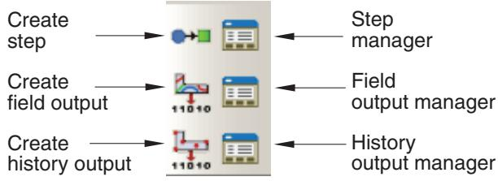

# The Step Module

## Understanding the role of the Step module

You can use the Step module to perform the following tasks:

## Create analysis steps

Within a model you define a sequence of one or more analysis steps. The step sequence provides a convenient way to capture changes in the loading and boundary conditions of the model, changes in the way parts of the model interact with each other, the removal or addition of parts, and any other changes that may occur in the model during the course of the analysis. In addition, steps allow you to change the analysis procedure, the data output, and various controls. You can also use steps to define linear perturbation analyses about nonlinear base states. You can use the replace function to change the analysis procedure of an existing step.

## Specify output requests

Abaqus writes output from the analysis to the output database; you specify the output by creating output requests that are propagated to subsequent analysis steps. An output request defines which variables will be output during an analysis step, from which region of the model they will be output, and at what rate they will be output. For example, you might request output of the entire model's displacement field at the end of a step and also request the history of a reaction force at a restrained point.

## Specify adaptive meshing

You can define adaptive mesh regions and specify controls for adaptive meshing in those regions.

## Specify analysis controls

You can customize general solution controls and solver controls.

## Entering and exiting the Step module

You can enter the Step module at any time during an Abaqus/CAE session by clicking Step in the Module list located in the context bar. The Step, Output, Other, and Tools menus appear on the main menu bar. If the current viewport contains something other than the assembly, the contents of the viewport disappear when you start the Step module.

To exit the Step module, select any other module from the Module list. You need not save your steps or output requests before exiting the module; they will be saved automatically when you save the model database by selecting File->Save or File->Save As from the main menu bar.

## Understanding steps

This section gives an overview of steps.

For more information on steps, see Defining an Analysis.

## In this section:

What is a step?  
Linear and nonlinear procedures  
Step sequence restrictions  
What is step replacement?  
Replacing an Abaqus/Standard procedure with an Abaqus/Explicit procedure or vice versa

## What is a step?

An Abaqus/CAE model uses the following two types of steps:

## The initial step

Abaqus/CAE creates a special initial step at the beginning of the model's step sequence and names it Initial. Abaqus/CAE creates only one initial step for your model, and it cannot be renamed, edited, replaced, copied, or deleted.

The initial step allows you to define boundary conditions, predefined fields, and interactions that are applicable at the very beginning of the analysis. For example, if a boundary condition or interaction is applied throughout the analysis, it is usually convenient to apply such conditions in the initial step. Likewise, when the first analysis step is a linear perturbation step, conditions applied in the initial step form part of the base state for the perturbation.

## Analysis steps

The initial step is followed by one or more analysis steps. Each analysis step is associated with a specific procedure that defines the type of analysis to be performed during the step, such as a static stress analysis or a transient heat transfer analysis. You can change the analysis procedure from step to step in any meaningful way, so you have great flexibility in performing analyses. Since the state of the model (stresses, strains, temperatures, etc.) is updated throughout all general analysis steps, the effects of previous history are always included in the response for each new analysis step.

There is no limit to the number of analysis steps you can define, but there are restrictions on the step sequence. (For more information, see Step sequence restrictions.)

You use items from the Step menu to create a step, to select and define the analysis procedure used during the step, and to manage existing steps. Alternatively, you can select Step->Manager from the main menu bar to display the Step Manager.

For example, consider the following analysis of a section of a piping system:

## Initial Step:

Apply boundary conditions to fix the left end of the pipe and to allow only axial movement at the right end.

## Step 1: Compress

Apply a compressive force to the right end of the pipe. This step is a general analysis step.

## Step 2: Eigenmodes

Calculate the frequencies and modes of vibration of the pipe in its compressed state. This step is a linear perturbation step.

Figure 1 shows the Step Manager after you create these steps.

  
Figure 1:The Step Manager.

The manager lists all of the steps in the analysis as well as a few salient details concerning each step. Step 2, Eigenmodes, is indented to show that it is a linear perturbation step based on the state of the model at the end of Step 1, Compress.

For detailed information on creating, editing, and replacing steps, see the following sections:

The Step Manager  
Creating a step  
Editing a step  
Replacing a step  
Resetting the default values in the step editor  
The step editor  
The Incrementation tab

## Additional information

• Understanding steps  
• Defining an Analysis

## Linear and nonlinear procedures

The Step Manager distinguishes between general nonlinear steps and linear perturbation steps by indenting the names and procedure descriptions of linear perturbation steps. General nonlinear analysis steps define sequential events: the state of the model at the end of one general step provides the initial state for the start of the next general step. Linear perturbation analysis steps provide the linear response of the model about the state reached at the end of the last general nonlinear step. You use the Procedure type field to choose between General and Linear perturbation steps when you select the procedure in the Create Step dialog box.

For each step in the analysis the Step Manager also indicates whether Abaqus will account for nonlinear effects from large displacements and deformations. If the displacements in a model due to loading are relatively small during a step, the effects may be small enough to be ignored. However, in cases where the loads on a model result in large displacements, nonlinear geometric effects can become important. The Nlgeom setting for a step determines whether Abaqus will account for geometric nonlinearity in that step.

The Nlgeom setting is turned on by default for Abaqus/Explicit steps and turned off by default for Abaqus/Standard steps. The sequence of steps and the current Nlgeom setting determine whether you can change the Nlgeom setting in a particular step. For example, if Abaqus is already accounting for geometric nonlinearity, the Nlgeom setting is toggled on for all subsequent steps, and you cannot toggle it off. Where permissible, the following methods allow you to change the Nlgeom setting for a step:

• Click the Basic tab in the Step Editor, and toggle the Nlgeom setting.  
• Select Step->Nlgeom from the main menu bar.  
• Click Nlgeom in the Step Manager.

For more information, see Accounting for geometric nonlinearity, or see General and Perturbation Procedures.

## Additional information

• Understanding steps

## Step sequence restrictions

When you select Step->Create from the main menu bar, a Create Step dialog box appears in which you can specify the procedure type for the step that you are creating. Similarly, when you select Step->Replace from the main menu bar, a Replace Step dialog box appears in which you can specify a new procedure type for an existing step. The selection of procedure types in the Create Step and Replace Step dialog boxes depends on the following:

• The model type.  
• The procedures that you have already associated with existing steps.  
• The position of the new or replaced step in the analysis step sequence.

For example, when you create the first step in an analysis, you can choose from a list of valid procedure types; both Abaqus/Standard and Abaqus/Explicit procedure types appear in the list. However, once you have created the first step, the list of valid procedure types in the Create Step dialog box will change to include only those procedures that are compatible with the first step. For example, if the first step is an Abaqus/Standard step, Abaqus/Explicit procedures no longer appear in the list.

## What is step replacement?

After you have defined your model and performed an analysis, you may want to run another analysis using a different procedure without having to redefine objects in your model, such as loads, boundary conditions, and interactions. You can use the replace function to replace the analysis procedure for an existing step with any procedure that is allowed by Abaqus/Standard or Abaqus/Explicit; for example, you can change from a Static, General procedure to a Dynamic, Explicit procedure or from a Static, General procedure to a Static, Riks procedure. After you select Step->Replace from the main menu bar, you select the step that you want to replace and the new analysis procedure for that step. The Edit Step dialog box appears with default values for the new analysis procedure. You can modify the default values and specify values for optional settings in the step editor.

When you replace a step, Abaqus/CAE copies all of the compatible step-dependent objects to the new step. If objects are incompatible with the new step, Abaqus/CAE substitutes an equivalent object, if possible, and suppresses or deletes the remaining objects. Therefore, you may want to copy the model before you replace the step. Abaqus/CAE displays a list of the objects that were suppressed or deleted during step replacement in the message area. For example, if you replace a Static, General procedure containing an Abaqus/Standard self-contact interaction, a pressure load, and an inertia relief load with a Dynamic, Explicit procedure, Abaqus/CAE does the following:

• Substitutes an Abaqus/Explicit self-contact interaction for the Abaqus/Standard self-contact interaction in the Dynamic, Explicit procedure.  
• Copies the pressure load to the Dynamic, Explicit procedure.  
• Suppresses the inertia relief load. Inertia relief loads apply only in Abaqus/Standard procedures.

After you replace a step, you should verify that previously defined properties, element types, jobs, and boundary conditions and predefined fields in the initial step remain valid for the model. In the Job module you can click Write Input in the Job Manager to write the input file and then check the input file for errors.

You can use the replace function to reset step settings to their default values by replacing an existing step with a step of the same procedure type.

## Additional information

• Suppressing and resuming objects  
• Understanding steps  
• Step sequence restrictions  
• Replacing a step  
• Resetting the default values in the step editor  
• Writing the input file only

## Replacing an Abaqus/Standard procedure with an Abaqus/Explicit procedure or vice versa

If you want to replace an Abaqus/Standard analysis procedure with an Abaqus/Explicit analysis procedure or vice versa, you must have only one analysis step in the model for the desired procedure type to appear in the Replace Step dialog box. If your model contains multiple steps, you can use step-dependent managers to move objects to a single step. You can then delete the other steps and replace the remaining step with the new analysis procedure.

For example, if you want to change a model that contains four Static, General procedures from an Abaqus/Standard analysis to an Abaqus/Explicit analysis, you can use the Load Manager to move all of the loads into one of the four steps. Similarly, you can use the Interaction Manager to move the interactions. You can then delete the other three steps and replace the remaining step with a Dynamic, Explicit procedure. If desired, you can create additional Abaqus/Explicit steps and use the step-dependent managers to move objects that were copied during step replacement to the appropriate Abaqus/Explicit procedures.

For more information, see Modifying the history of a step-dependent object.

## Additional information

• Changing the status of an object in a step  
• Step sequence restrictions  
• What is step replacement?  
• Replacing a step

## Understanding output requests

This section gives an overview of output requests.

## In this section:

What is an output request?  
What is the difference between field output and history output?  
Propagation of output requests  
The output request managers  
Creating and modifying output requests

## What is an output request?

The Abaqus analysis products compute the values of many variables at every increment of a step. Usually you are interested in only a small subset of all of this computed data. You can specify the data that you want written to the output database by creating output requests. An output request consists of the following information:

• The variables or variable components of interest.  
• The region of the model and the integration points from which the values are written to the output database.  
• The rate at which the variable or component values are written to the output database.

When you create the first step, Abaqus/CAE selects a default set of output variables corresponding to the step's analysis procedure. By default, output is requested from every node or integration point in the model and from default section points. In addition, Abaqus/CAE selects the default rate at which the variables are written to the output database. You can edit these default output requests or create and edit new ones.

Default output requests and output requests that you modified are propagated to subsequent steps in the analysis. If you have a large model that includes the default output requests and requests output from a large number of frames, the resulting output database will be very large. You can use a C++ program to extract data from a large output database and copy only selected frames to a second output database. For more information, see Decreasing the amount of data in an output database by retaining data at specific frames.

When your analysis is complete, you use the Visualization module to read the output database and graphically display the data that were written to it.

For detailed instructions on creating and editing output requests, see the following sections:

Creating an output request  
Modifying field output requests  
Modifying history output requests

## Additional information

• Understanding output requests

## What is the difference between field output and history output?

When you create an output request, you can choose either field output or history output.

## Field output

Abaqus generates field output from data that are spatially distributed over the entire model or over a portion of it. In most cases you use the Visualization module to view field output data using deformed shape, contour, or symbol plots. The amount of field output generated by Abaqus during an analysis is often large. As a result, you typically request that Abaqus write field data to the output database at a low rate; for example, after every step or at the end of the analysis.

When you create a field output request, you can specify the output frequency in equally spaced time intervals or every time a particular length of time elapses. For an Abaqus/Standard analysis procedure, you can alternatively specify the output frequency in increments, request output after the last increment of each step, or request output according to a set of time points. For an Abaqus/Explicit analysis procedure, you can alternatively request field output for every time increment or according to a set of time points.

When you create a field output request, Abaqus writes every component of the selected variables to the output database. For example, if you were using solid elements to model a cantilever beam with a load at the tip, you could request the stress (all six components) and the displacement (all six components) data from the entire model after the last increment of the loading step. You could then use the Visualization module to view a contour plot of stresses and deflections in the final loaded state.

## History output

Abaqus generates history output from data at specific points in a model. In most cases you use the Visualization module to display history output using X–Y plots. The rate of output depends on how you want to use the data that are generated by the analysis, and the rate can be very high. For example, data generated for diagnostic purposes may be written to the output database after every increment. You can also use history output for data that relate to the model or a portion of the model as a whole; for example, whole model energies.

When you create a history output request, you can specify the output frequency in equally spaced time intervals or every time a particular length of time elapses. For an Abaqus/Standard analysis procedure, you can alternatively specify the output frequency in increments, request output after the last increment of each step, or request output according to a set of time points. For an Abaqus/Explicit analysis procedure, you can alternatively request history output in time increments.

When you create a history output request, you can specify the individual components of the variables that Abaqus/CAE will write to the output database. For example, if you model the response of a cantilever beam with a load applied to the tip, you might request the following output after each increment of the loading step:

• The principal stress at a single node at the root of the beam.  
• The vertical displacement at a single node at the tip of the beam.

You could then use the Visualization module to view an X–Y plot of stress at the root versus displacement at the tip with increasing load.

## Propagation of output requests

When you create the first step in the analysis, Abaqus/CAE generates default field and history output requests based on the analysis procedure that you selected for the step. These default output requests are propagated to subsequent steps. The Field Output Requests Manager and the History Output Requests Manager are step-dependent managers that display the propagation and the status of output requests between steps.

The output requested in a general step is independent of the output requested in a linear perturbation step. In addition, the propagation behavior of output requests varies between general steps and linear perturbation steps.

## General steps

Abaqus/CAE creates a default field output request for the first general step in your model, and that default output request propagates to all subsequent general steps. Similarly, if you create a new output request or modify the default output request, the new or modified request is propagated to subsequent general steps.

If you insert a new general step into the sequence of steps, the output request from the previous general step propagates to the new step.

## Linear perturbation steps

Abaqus/CAE creates a default field output request for the first linear perturbation step in your model, and that default output request propagates to all subsequent linear perturbation steps that use the same analysis procedure; for example, all the frequency analyses. Similarly, if you create a new output request or modify the default output request, the new or modified request is propagated to subsequent steps that use the same analysis procedure.

If you insert a new linear perturbation step into the sequence of steps, the output request from the previous linear perturbation step that uses the same analysis procedure propagates to the new step. If you create a linear perturbation step that uses a different analysis procedure, Abaqus/CAE creates a new default output request. The new default output request propagates to all subsequent linear perturbation steps that use the same analysis procedure.

You should be aware of the following behavior:

If you insert a new general step at the beginning of a sequence of existing general steps, Abaqus/CAE does not create a default output request for the new step. Similarly, if you insert a new linear perturbation step at the beginning of a sequence of existing linear perturbation steps of the same procedure type, Abaqus/CAE does not create a default output request for the new step. In both cases you must create a new output request for the new step. Alternatively, you can use the output request managers to move the output request from the following step to the new step.  
• If you delete a step (general or linear perturbation) that contains a new output request, Abaqus/CAE deletes the output request from all subsequent steps into which the request had propagated.  
• If a step does not contain an output request, Abaqus/CAE displays a warning in the Job module when the input file is generated.

## The output request managers

Abaqus/CAE provides separate managers for field output requests and history output requests. The output request managers are step-dependent managers, which means that they contain information concerning the status of each output request in each step of the analysis and allow you to control the propagation of requests across the sequence of steps. For more information, see What are step-dependent managers?.

The Field Output Requests Manager and the History Output Requests Manager contain lists of all of the output requests that you have created. For example, the Field Output Requests Manager is shown in Figure 1.

  
Figure 1:The Field Output Requests Manager.

After you select the step, the Create button in the two managers allows you to create a new output request during that step. Similarly, the Edit, Copy, Rename, and Delete buttons allow you to edit, copy, rename, and delete the selected output request. You can also initiate the create, edit, copy, rename, and delete procedures using the Output->Field Output Requests and Output->History Output Requests submenus in the main menu bar.

You can use the Copy button in the Field Output Requests Manager and the History Output Requests Manager (or the corresponding menu commands or Model Tree) to copy an output request. You can copy an output request from any step to any valid step, with some restrictions. For more details, see Copying step-dependent objects using manager dialog boxes.

The Move Left, Move Right, Activate, and Deactivate buttons allow you to control the propagation of output requests over the course of an analysis. For more information, see Modifying the history of a step-dependent object.

You can use the icons in the column along the left side of the managers to suppress output requests or to resume previously suppressed output requests for an analysis. The suppress and resume procedures are also available from the Output->Field Output Requests and Output->History Output Requests submenus in the main menu bar. For more information, see Suppressing and resuming objects.

## Additional information

• What are step-dependent managers?  
• What is the difference between field output and history output?

## Creating and modifying output requests

To create an output request, select Output->Field Output Requests->Create or Output->History Output Requests->Create from the main menu bar.

An editor appears in which you can enter all of the information necessary to define the output request. The top of the editor displays the following:

• The name of the output request.  
• The name of the step in which you are creating or modifying the output request.  
• The name of the analysis procedure associated with the step.

For example, the Field Output Request editor is shown in Figure 1.

  
Figure 1:The Field Output Request editor.

The Domain section of the editor allows you to choose the region from which output will be generated. You can request that Abaqus write field data to the output database for the following:

Whole model  
• Whole model, only exterior nodes and elements (three-dimensional models in Abaqus/Standard or Abaqus/Explicit analyses)

• A set  
• A bolt load  
• A skin  
• A stringer  
• A fastener  
• An assembled fastener set  
• An interaction  
• A composite layup  
• A substructure

Similarly, you can request that Abaqus write history data to the output database for the following:

• Whole model  
• A set  
• A bolt load  
• A skin  
• A stringer  
• A fastener  
• An assembled fastener set  
• A contour integral  
• A general contact surface (Abaqus/Explicit steps only)  
• An integrated output section (Abaqus/Explicit steps only)  
• An interaction  
• Springs/dashpots  
• A composite layup

The Frequency section of the editor allows you to specify the frequency at which the output is written to the output database. Choose one of the following:

• Last increment to request output only after the last increment of the step. This output frequency is available only when you choose an Abaqus/Standard analysis procedure.  
Every n increments to request output after a specified number of increments. If you specify the frequency in increments, Abaqus also writes output after the last increment of the step. This output frequency is available when you choose an Abaqus/Standard analysis procedure.  
• Every time increment to request output at every time increment. This output frequency is available for field output when you choose an Abaqus/Explicit analysis procedure.  
• Every n time increments to request output at a specified number of time increments. This output frequency is available for history output when you choose an Abaqus/Explicit analysis procedure.  
• Evenly spaced time intervals to request output at a number of evenly spaced time intervals.  
• Every x units of time to request output after a particular length of time elapses.  
From time points to request output according to a set of time points that you specify. This output frequency is available for field and history output when you choose an Abaqus/Standard analysis procedure and for field output when you choose an Abaqus/Explicit analysis procedure.

The Element output position section of the editor allows you to choose the position where selected field output values are written. Choose one of the following:

• Averaged at nodes (Abaqus/Standard steps only)  
• Centroidal  
• Integration points (default)  
• Nodes

The Output Variables section of the editor contains a list of the variable categories that are applicable to the step procedure and the selected domain. Choose one of the following:

Select from list below to request the variables from the list of check boxes below. You can click the check box next to a category name to select all of the variables within that category, or you can click the arrow next to a category name to display the list of variables in that category and then select individual variables.  
• Preselected defaults to request the default output variables for the procedure.  
• All to request all output variables for the procedure.  
• Edit variables to request variables from the text field below. You can manually edit this field and type or delete variable names.

## Note:

In addition to the current analysis procedure, other aspects of the model such as the region specified might affect the output variables. For example, if an output variable is valid for the analysis procedure but is not valid for the element type used in the mesh, Abaqus will remove that variable during the analysis.

If you use the Field Output Request editor to select a vector or tensor variable to be included in a field output request, Abaqus automatically writes all components of that variable to the output database during the step. For example, if you select the vector U in a three-dimensional model, Abaqus outputs the three displacement components U1, U2, and U3 to the output database along with the three rotation components UR1, UR2, and UR3.

In contrast, if you use the History Output Request editor to select a vector or tensor variable to be included in a history output request, the History Output Request editor allows you to select individual components of the variable. It is useful to specify individual components in a history output request because these variables are typically output very frequently—possibly as often as every increment.

If your model contains rebar, you must toggle on Output for rebar to include rebar output in the data that Abaqus writes to the output database and to view plots of the rebar orientations in the Visualization module. For more information, see Understanding rebar in shell sections.

The editor also allows you to specify the section points from which output will be obtained. If you request output from a composite layup, you can specify the section points from which output will be obtained for each ply of the layup. For more information, see Requesting output from a composite layup.

For example, in Figure 1 the user is editing a field output request that is associated with a Static, General analysis procedure. The user has selected all of the variables in the Stresses category. These variables will be included in the output request during the step named Side Load. Abaqus will write output from the default section points at every increment.

For detailed instructions on selecting output variables and components, see the following sections:

• Modifying field output requests  
Modifying history output requests

Once you have created an output request, you can modify it in the following ways:

• Select Output->Field Output Requests->Edit or Output->History Output Requests->Edit to display the field or history output request editor.  
Select Output->Field Output Requests->Manager or Output->History Output Requests->Manager to display the field or history output requests manager. Use the manager to modify the stepwise history of the output request. (See What are step-dependent managers?, for more information.)

If you modify an output request during the step in which you created the request, you can modify the domain, the output variables, the output for rebar option, the section points, and the output frequency. However, if you modify an output request during a step into which it was propagated, you can modify only the output variables and the output frequency.

When you request output from a contour integral, the History Output Request editor allows you to select only the frequency of output, the number of contour integrals, and the type of contour integral calculation. For more information, see Requesting contour integral output.

## Additional information

• Understanding output requests

## Understanding integrated, restart, diagnostic, and monitor output

This section explains the additional output controls available in the Step module.

## In this section:

Integrated output requests  
Restart output requests  
Diagnostic printing  
Degree of freedom monitor requests

## Integrated output requests

To obtain history output of variables such as the forces summed over an exterior surface in contact or transmitted through a tie constraint between surfaces, you must refer to an integrated output section to identify the surface where output is needed.

(See Integrated Output.) In addition, the integrated output section definition can provide a local coordinate system in which to express the vector output quantities and/or a reference node as an anchor point about which the total moment across the surface is computed.

By default, an integrated output section is anchored at the global origin and does not follow the motion of the surface on which it is defined. You can define a reference point at which the output section is anchored and specify how this reference point tracks with the average motion of the surface. The reference point must not be connected to any other part of the finite element model.

Integrated output sections associated with a coordinate system and/or a reference node can be used independent of integrated output requests to track the average motion of a surface.

You define integrated output sections by selecting Output->Integrated Output Sections->Create from the main menu bar. For detailed instructions, see Defining integrated output sections. For information on requesting output for an integrated output section, see Modifying history output requests.

## Additional information

• Defining integrated output sections  
• Understanding output requests  
• Understanding integrated, restart, diagnostic, and monitor output

## Restart output requests

You can use the restart files created by Abaqus to continue an analysis from a specified step of a previous analysis. This section describes how you control the output of restart data. For a discussion of how you use the restart data in a subsequent job, see Restarting an analysis, and What are the model attributes?.

By default, no restart information is written for an Abaqus/Standard analysis and restart information is written only at the beginning and end of each step for an Abaqus/Explicit analysis. However, default restart requests are created automatically for every step in an analysis. The Edit Restart Requests dialog box, invoked by selecting

Output->Restart Requests from the main menu bar in the Step module, allows you to specify how often you want the restart information to be written.

You can specify the frequency at which Abaqus writes data to the restart files; however, the behavior of restart differs between analysis products.

## Abaqus/Standard

You can request the frequency in increments or in time intervals. For an Abaqus/Standard step, you can choose whether the output is written at the exact time interval or at the closest approximation.

## Abaqus/Explicit

For an Abaqus/Explicit analysis, you specify the number of equally spaced time intervals at which Abaqus writes data to the restart files. In addition, for an Abaqus/Explicit step you can choose whether the output is written at the exact time interval or at the closest approximation. However, you cannot avoid writing information to the restart files for Abaqus/Explicit steps; the number of time intervals must be set to one or greater.

For an Abaqus/Standard or an Abaqus/Explicit analysis, you can request that data written to the restart files overlay data from the previous increment. If you select this option, Abaqus retains the information from only one increment of each step in the restart files, thus minimizing the size of the files. By default, Abaqus does not overlay data.

For more information, see Restarting an analysis, and Restarting an Analysis. For detailed instructions on requesting restart output, see Configuring restart output requests.

You can use the abaqus restartjoin execution procedure to extract data from the output database created by a restart analysis and append the data to a second output database. For more information, see Joining Output Database (.odb) Files from Restarted Analyses.

## Additional information

• Understanding output requests  
• Understanding integrated, restart, diagnostic, and monitor output

## Diagnostic printing

If the analysis of your model fails or produces unexpected results, you can examine its iteration-by-iteration progress by looking at selected diagnostic information that is written to the following files:

## For Abaqus/Standard analyses:

Diagnostic information is written to the message (.msg) file, and a subset of the information is written to the output database (.odb) file. You can view the diagnostic information in the output database in the Visualization module (for more information, see Viewing diagnostic output). By default, the information is written during every iteration; you can request that Abaqus discontinue writing diagnostic information to the message file by specifying an output frequency of zero.

## For Abaqus/Explicit analyses:

Diagnostic information is written to the status (.sta) file. For information on the frequency at which this information is written, see About Output.

You display the Edit Diagnostic Print dialog box by selecting Output->Diagnostic Print from the main menu bar.

For detailed instructions on requesting diagnostic printing, see Configuring diagnostic printing.

## Note:

Changes to the diagnostic print requests do not affect the diagnostic information written to the output database during Abaqus/Standard analyses.

## Additional information

• Understanding output requests  
• Understanding integrated, restart, diagnostic, and monitor output  
• Viewing diagnostic output

## Degree of freedom monitor requests

You can request that Abaqus write the values of a degree of freedom at one selected point to the status (.sta) file and, for Abaqus/Standard analyses, to the message (.msg) file at specific increments during the course of an analysis. In addition, a plot of the degree of freedom value over time appears in a new viewport that is generated automatically when you submit the analysis. (For more information, see Monitoring the progress of an analysis job.) You can use this information to monitor the progress of the solution.

You must specify the vertex or node you want to monitor by selecting an existing geometry or node set or by selecting a point in the viewport. Once you have specified the point, you must indicate which degree of freedom you want to monitor at that vertex or node, how often you want the information displayed in a viewport, and how often you want it printed to the status and message files.

For detailed instructions on monitoring a degree of freedom, see Configuring monitor requests.

## Additional information

• Configuring monitor requests  
• Understanding output requests  
• Understanding integrated, restart, diagnostic, and monitor output

## Understanding ALE adaptive meshing

Arbitrary Lagrangian-Eulerian (ALE) adaptive meshing allows you to maintain a high-quality mesh throughout an analysis, even when large deformations or losses of material occur, by allowing the mesh to move independently of the material. Adaptive meshing moves only nodes; the mesh topology remains unchanged. Adaptive meshing is available only for Coupled temp-displacement; Dynamic, Explicit; Dynamic, Temp-disp, Explicit; Soils; and Static, General steps.

You can define regions of the model where you want adaptive meshing by selecting Other->ALE Adaptive Mesh Domain from the main menu bar. If necessary, you can select Other->ALE Adaptive Mesh Controls or Other->ALE Adaptive Mesh Constraint to customize the adaptive mesh controls or to add regional adaptive mesh constraints, respectively. Currently, you can define only one ALE adaptive mesh domain for any particular step.

For detailed information on adaptive meshing, see ALE Adaptive Meshing.

For detailed instructions on defining adaptive mesh regions, see the following sections:

Defining an ALE adaptive mesh region  
Specifying ALE adaptive mesh constraints  
Specifying controls for ALE adaptive meshing

## How can I customize the Abaqus analysis controls?

This section explains how you can adjust the parameters that control the Abaqus analysis.

## In this section:

General solution controls  
Solver controls

## General solution controls

You can customize the numerous variables that control the convergence and time integration accuracy algorithms in Abaqus. The default solution controls usually work well, but customizing these controls may result in a more cost-effective solution or help you to obtain a solution for particularly difficult analyses.

## Note:

These options are available only for general Abaqus/Standard analysis steps.

You can access the solution controls by selecting Other->General Solution Controls from the main menu bar. For more information, see Analysis Convergence Controls.

## Warning:

Solution controls are intended for experienced analysts and should be used with great care. The default settings of these controls are appropriate for most nonlinear analyses. Changing these values inappropriately may greatly increase the computational time of your analysis or produce inaccurate results.

For detailed instructions on setting general solution controls, see Customizing general solution controls.

## Solver controls

You can customize the variables that control the iterative linear equation solver.

## Note:

You can use the iterative linear equation solver only for Static, General; Static, Linear perturbation; Visco; Heat transfer; Geostatic; and Soils analysis steps.

You can access the solver controls by selecting Other->Solver Controls from the main menu bar. For more information, see Iterative Linear Equation Solver.

For detailed instructions on setting solver controls, see Customizing solver controls.

## Using the Step module toolbox

You can access all the Step module tools through the main menu bar; in addition, you can also access the tools through the Step module toolbox. Figure 1 shows the icons for the tools in the Step module toolbox.

  
Figure 1:The Step module toolbox.

## Using the Step Manager

This section describes how you can use the Step Manager to create, edit, and manipulate steps.

(For general information on managers, see Managing objects.)

## In this section:

The Step Manager  
Creating a step  
Editing a step  
Replacing a step  
Resetting the default values in the step editor  
Accounting for geometric nonlinearity

## The Step Manager

You use the Step Manager to create, edit, and manipulate the analysis steps associated with the current model. To start the Step Manager, select Step->Manager from the main menu bar. Columns in the Step Manager dialog box display the following information about each step:

## Name

The name of the step. Names of linear perturbation steps are indented relative to names of general steps.

## Procedure

The analysis procedure that you selected for this step when the step was created. You can change the analysis procedure after creating a step. Click Replace to select a new procedure type for the selected step. The Procedure column also indicates whether thermal and soils steps assume steady-state or transient conditions or if neither is applicable.

## Nlgeom

Whether the analysis step accounts for geometric nonlinearities. You use the Nlgeom button to control the Nlgeom setting for a particular step. Once you have set the Nlgeom option for a step, your setting remains in effect for all subsequent steps.

## Time

The time period for the step. The default value for the time period is 1.0 time unit. Click Edit to display the step editor so that you can modify the time period.

You use the buttons across the bottom of the Step Manager dialog box to create a step that follows the selected step or to manipulate the selected step. You use the Dismiss button to close the Step Manager dialog box. You can perform the same tasks using the pull-down menus available from the Step menu, located in the main menu bar.

You can suppress an analysis step to exclude the procedure from the analysis. The suppressed step is removed from the context bar, the restart request dialog box, and the diagnostic print dialog box. Any step-dependent or propagating attributes created in the step are automatically suppressed and ignored during the analysis. Upon resuming the step, the status of each attribute will return to the original state. For example, suppressing and resuming a step will not resume an associated load that was previously suppressed. You can suppress or resume a step as long as the step sequence remains valid.

## Warning:

If you use the Step Manager or the Step menu to delete a step, objects associated with that step, such as prescribed conditions or output requests, are also deleted. If you use the Step Manager or the Step menu to replace a step, objects that are incompatible with the new analysis procedure are substituted with an equivalent object, if possible, or deleted.

## Additional information

• Suppressing and resuming objects  
• Understanding steps  
• Using the Step Manager

## Creating a step

You can create any sequence of procedures that is allowed by the Abaqus analysis products; the procedure list in the Create Step dialog box is updated to show only the available procedures for the new step. For example, if your first step contains a static stress/displacement procedure, you cannot follow it with a new step containing a heat transfer procedure.

1. From the main menu bar, select Step->Create.

The Create Step dialog box appears.

Tip: You can initiate the Create procedure in two other ways:

Click Create in the Step Manager. (You can display the Step Manager by selecting Step->Manager from the main menu bar.)  
• Click the tool in the Step module toolbox.

2. If desired, use the Name text field to change the name of the new step.

All steps must have unique names, and you cannot name a step “Initial”.

3. From the list of existing steps, select the step after which the new step will be inserted.

4. Click the arrow next to the Procedure type field, and select either General or Linear perturbation from the list that appears.

The lower half of the dialog box displays a list of available procedures.

5. Select the desired procedure and click Continue.

The Edit Step dialog box appears.

6. Use the Edit Step dialog box to modify the settings from their default values and to provide values for optional settings. (For detailed help on a particular editor feature, select Help->On Context from the main menu bar and then click the feature of interest.)

7. Click OK.

Abaqus/CAE closes the Edit Step dialog box, and the new step appears in the Step Manager.

## Additional information

• Understanding steps  
• General and Perturbation Procedures

## Editing a step

You can use the step editor to edit the analysis procedure settings associated with an existing step.

1. From the main menu bar, select Step->Edit->step name.

The step editor appears.

Tip: You can also select the step name in the Step Manager and click Edit.

2. Use the tabs within the step editor to modify the settings. (For detailed help on a particular editor feature, select Help->On Context from the main menu bar and then click the feature of interest.)  
3. Click OK to close the step editor and save the new settings.

## Additional information

• Understanding steps

## Replacing a step

You can replace an existing procedure with any procedure that is allowed by the Abaqus analysis products; the procedure list in the Replace Step dialog box is updated to show only the available procedures for the revised step. For example, you can change from a Static, General procedure to a Static, Riks procedure. Abaqus/CAE copies compatible step-dependent objects to the new step, substitutes equivalent objects, if possible, and deletes the remaining objects.

After you replace a step, you should verify that previously defined properties, element types, jobs, and boundary conditions and fields in the inital step remain valid for the model. For more information, see What is step replacement?.

1. From the main menu bar, select Step->Replace->step name.

The Replace Step dialog box appears.

Tip: You can also select the step name in the Step Manager and click Replace.

2. Click the arrow next to the New procedure type field, and select either General or Linear perturbation from the list that appears.

The lower half of the dialog box displays a list of available procedures.

3. Select the new procedure, and click Continue.

The Edit Step dialog box appears.

4. Use the Edit Step dialog box to modify the settings from their default values and to provide values for optional settings. (For detailed help on a particular editor feature, select Help->On Context from the main menu bar and then click the feature of interest.)

5. Click OK.

If step-dependent objects are not compatible with the new step, Abaqus/CAE displays a list of the objects that were deleted during step replacement in the message area and closes the Edit Step dialog box.

## Additional information

• Understanding steps

When you create, edit, or replace a step, you use the step editor to configure the analysis procedure settings. You can use the replace function to reset the settings in the step editor to their default values by replacing an existing step with a step of the same procedure type.

1. From the main menu bar, select Step->Replace->step name.

The Replace Step dialog box appears with the current procedure highlighted in the list of available procedures.

Tip: You can also select the step name in the Step Manager and click Replace.

2. Click Continue.

The Edit Step dialog box appears with default values for the procedure settings.

3. Use the Edit Step dialog box to modify the settings from their default values and to provide values for optional settings. (For detailed help on a particular editor feature, select Help->On Context from the main menu bar and then click the feature of interest.)  
4. Click OK.

Abaqus/CAE copies step-dependent objects to the new step and closes the Edit Step dialog box.

## Accounting for geometric nonlinearity

The Nlgeom setting for a step determines whether Abaqus will account for geometric nonlinearity in that step. The Nlgeom setting is turned on by default for Abaqus/Explicit steps and turned off by default for Abaqus/Standard steps.

The sequence of steps and the current Nlgeom setting determine whether you can change the Nlgeom setting in a particular step. For example, if Abaqus is already accounting for geometric nonlinearity, the Nlgeom setting is toggled on for all subsequent steps, and you cannot toggle it off. Similarly, you cannot change the Nlgeom setting during a linear perturbation step. For more information, see Linear and nonlinear procedures.

## Note:

When you create a step, you can click the Basic tab in the Step Editor and select On or Off as the Nlgeom setting.

1. To display the Edit Nlgeom dialog box and to change the setting where applicable, do one of the following:

• From the main menu bar, select Step->Nlgeom.  
• From the main menu bar, select Step->Edit->step name.

The Step Editor appears. From the Nlgeom field on the Basic tabbed page, click

• From the main menu bar, select Step->Manager.

The Step manager appears. From the buttons along the bottom of the manager, click Nlgeom.

2. From the Edit Nlgeom dialog box, click the step name of interest to turn Nlgeom on or off for that step.

If Nlgeom is turned on for a step, a check mark appears in the Nlgeom column. If Nlgeom is turned off for a step, no tickmark appears.

3. Click OK to close the Edit Nlgeom dialog box.

## Additional information

• Understanding steps

## Using the step editor

This section describes the step editor and the options that appear in the step editor.

## In this section:

The step editor  
The Incrementation tab

## The step editor

When you create, edit, or replace a step, the step editor displays a set of tabbed pages that allow you to configure the settings for the procedure you selected. The pages are unique for each procedure; for example, when you configure a Static, General procedure, the step editor displays the Basic, Incrementation, and Other tabs. Settings you can configure with these tabbed pages include the time period for the step, the maximum number of increments, the increment size, the default load variation with time, and whether to account for geometric nonlinearity.

Abaqus stores the text that you enter in the Description field on the Basic tabbed page in the output database, and it is displayed in the state block by the Visualization module.

If you want to reset the procedure settings to their default values, you can replace an existing step with a step of the same procedure type. For more information, see Resetting the default values in the step editor.

For detailed help on a specific feature of the editor, select Help->On Context and then click the feature of interest.

## Additional information

• Understanding steps  
• Using the step editor

## The Incrementation tab

When you configure general procedures, you use the Basic tab in the step editor to enter the total time period for the step. You use the Incrementation tab to configure the approach that Abaqus will use to divide the total time period for the step into increments. For a general, static step as well as for many other kinds of steps you can set the following options on the Incrementation tabbed page:

## Time incrementation

• When you choose Automatic time incrementation, Abaqus starts the incrementation using the value entered for the initial increment size. The size of subsequent time increments are adjusted based on how quickly the solution converges. This option is the default selection.  
• When you choose Fixed time incrementation, Abaqus uses the value entered for the initial increment size throughout the step.

## Warning:

Choosing Fixed time incrementation may prevent the solution from converging and is not recommended.

## Maximum number of increments

Abaqus limits the number of increments in a step to the value that you enter for the maximum number of increments. If the step exceeds this number of increments, the analysis stops, and diagnostic information is reported to the Job module and written to the message file. By default, Abaqus/CAE sets the maximum number of increments to 100.

## Initial increment size

Abaqus starts the step using the value entered for the initial increment size.

## Minimum increment size

Abaqus checks for the minimum increment size only when you analyze your model using automatic time incrementation. If Abaqus needs a smaller time increment than this value to reach a convergent solution, it terminates the analysis, reports to the Job module, and writes diagnostic information to the message file. If you do not enter a minimum increment size, Abaqus uses 10-5 times the total time period.

## Maximum increment size

Abaqus checks for the maximum increment size only when you analyze your model using automatic time incrementation. Abaqus will not increase the increment size beyond this value during the analysis. If you do not specify this value, Abaqus/CAE sets the value to that of the total time period (with the exception of dynamic, implicit procedures, in which the default maximum increment size depends on a variety of analysis settings; see Configuring a dynamic, implicit procedure).

## Note:

A value must be entered for each of the incrementation options described above. Abaqus/CAE does not allow you to create the step if you delete the default value for an incrementation option but fail to provide another.

For detailed information on other items in the Incrementation tabbed page, click Help->On Context and then click the item of interest.

## Additional information

• Understanding steps  
• Using the step editor

## Configuring analysis procedure settings

The Edit Step dialog box allows you to configure the analysis procedure settings for a particular step. This section provides instructions for each analysis procedure.

## In this section:

Configuring general analysis procedures  
Configuring linear perturbation analysis procedures

## Configuring general analysis procedures

You can configure general analysis procedures to analyze linear or nonlinear response. You can include general analysis procedures in Abaqus/Standard or Abaqus/Explicit analyses.

For more information, see General and Perturbation Procedures.

This section provides instructions for using the step editor to configure different types of general analysis procedures.

## In this section:

Configuring a static, general procedure  
Configuring a static, Riks procedure  
Configuring a dynamic, explicit procedure  
Configuring a heat transfer procedure  
Configuring a dynamic, implicit procedure  
Configuring a fully coupled, simultaneous heat transfer and stress procedure  
Configuring a fully coupled, simultaneous heat transfer and electrical procedure  
Configuring a fully coupled, simultaneous heat transfer, electrical, and structural procedure  
Configuring a direct cyclic procedure  
Configuring a dynamic fully coupled thermal-stress procedure using explicit integration  
Configuring a geostatic stress field procedure  
Configuring a mass diffusion procedure  
Configuring an effective stress analysis for fluid-filled porous media  
Configuring a transient, static, stress/displacement analysis with time-dependent material response  
Configuring an annealing procedure

## Configuring a static, general procedure

A static stress procedure is one in which inertia effects are neglected. The analysis can be linear or nonlinear and ignores time-dependent material effects. For more information, see Static Stress Analysis.

## Create or edit a static, general procedure

1. Display the Edit Step dialog box following the procedure outlined in Creating a step (Procedure type: General; Static, General), or Editing a step.  
2. On the Basic, Incrementation, and Other tabbed pages, configure settings such as the time period for the step, the maximum number of increments, the increment size, the default load variation with time, and whether to account for geometric nonlinearity as described in the following procedures.

## Configure settings on the Basic tabbed page

1. In the Edit Step dialog box, display the Basic tabbed page.  
2. In the Description field, enter a short description of the analysis step. Abaqus stores the text that you enter in the output database, and the text is displayed in the state block by the Visualization module.  
3. In the Time period field, enter the time period of the step. For more information, see Time Period.  
4. Select an Nlgeom option:

• Toggle NlgeomOff to perform a geometrically linear analysis during the current step.  
Toggle NlgeomOn to indicate that Abaqus/Standard should account for geometric nonlinearity during the step. Once you have toggled Nlgeom on, it will be active during all subsequent steps in the analysis.

For more information, see Linear and nonlinear procedures.

5. Select an automatic stabilization method if you expect the problem to have local instabilities such as surface wrinkling, material instability, or local buckling. Abaqus/Standard can stabilize this class of problems by applying damping throughout the model. For more information, see Unstable Problems, and Automatic Stabilization of Static Problems with a Constant Damping Factor

Click the arrow to the right of Automatic stabilization, and select a method for defining the damping factor:

Select Specify dissipated energy fraction to allow Abaqus/Standard to calculate the damping factor from a dissipated energy fraction that you provide. Enter a value for the dissipated energy fraction in the adjacent field (the default is $2 . 0 \times \bar { 1 } 0 ^ { - 4 } )$ ). For more information, see Calculating the Damping Factor Based on the Dissipated Energy Fraction.  
Select Specify damping factor to enter the damping factor directly. Enter a value for the damping factor in the adjacent field. For more information, see Directly Specifying the Damping Factor.  
Select Use damping factors from previous general step to use the damping factors at the end of the previous step as the initial factors in the current step's variable damping scheme. These factors override any initial damping factors that are calculated or specified directly in the current step. If there are no damping factors associated with the previous general step (for example, if the previous step does not use any stabilization or the current step is the first step of the analysis), Abaqus uses adaptive stabilization to determine the required damping factors.

6. When using automatic stabilization, Abaqus can use the same damping factor over the course of a step, or it can vary the damping factor spatially and temporally during a step based on the convergence history and the ratio of the energy dissipated by damping to the total strain energy. For more information, see Adaptive Automatic Stabilization Scheme. If you selected Specify dissipated energy fraction, adaptive stabilization is optional and turned on by default. If you selected Specify damping factor, adaptive stabilization is optional and turned off by default. If you selected Use damping factors from previous general step, adaptive stabilization is required.

To use adaptive stabilization, toggle on Use adaptive stabilization with max. ratio of stabilization to strain energy (if necessary), and enter a value in the adjacent field for the allowable accuracy tolerance for the ratio of energy dissipated by damping to total strain energy in each increment. The default value of 0.05 should be suitable in most cases.

7. Toggle on Include adiabatic heating effects if you are performing an adiabatic stress analysis. This option is relevant only for isotropic metal plasticity materials with a Mises yield surface. For more information, see Adiabatic Analysis.  
8. When you have finished configuring settings for the static, general step, click OK to close the Edit Step dialog box.

## Configure settings on the Incrementation tabbed page

1. In the Edit Step dialog box, display the Incrementation tabbed page.

(For information on displaying the Edit Step dialog box, see Creating a step, or Editing a step.)

2. Choose a Type option:

Choose Automatic to allow Abaqus/Standard to choose the size of the time increments based on computational efficiency.  
Choose Fixed to specify direct user control of the incrementation. Abaqus/Standard uses an increment size that you specify as the constant increment size throughout the step.

3. In the Maximum number of increments field, enter the upper limit to the number of increments in the step. The analysis stops if this maximum is exceeded before Abaqus/Standard arrives at the complete solution for the step.  
4. If you selected Automatic in Step 2, enter values for Increment size:

a. In the Initial field, enter the initial time increment. Abaqus/Standard modifies this value as required throughout the step.  
b. In the Minimum field, enter the minimum time increment allowed. If Abaqus/Standard needs a smaller time increment than this value, it terminates the analysis.  
c. In the Maximum field, enter the maximum time increment allowed.

5. If you selected Fixed in Step 2, enter a value for the constant time increment in the Increment size field.  
6. When you have finished configuring settings for the static, general step, click OK to close the Edit Step dialog box.

## Configure settings on the Other tabbed page

1. In the Edit Step dialog box, display the Other tabbed page.

(For information on displaying the Edit Step dialog box, see Creating a step, or Editing a step.)

2. Choose an Equation Solver Method option:

• Choose Direct to use the default direct sparse solver.  
Choose Iterative to use the iterative linear equation solver. The iterative solver is typically most useful for blocky structures with millions of degrees of freedom. For more information, see Iterative Linear Equation Solver.

3. Choose a Matrix storage option:

Choose Use solver default to allow Abaqus/Standard to decide whether a symmetric or unsymmetric matrix storage and solution scheme is needed.  
• Choose Unsymmetric to restrict Abaqus/Standard to the unsymmetric storage and solution scheme.  
• Choose Symmetric to restrict Abaqus/Standard to the symmetric storage and solution scheme.

For more information on matrix storage, see Matrix Storage and Solution Scheme in Abaqus/Standard.

## 4. Choose a Solution technique:

Choose Full Newton to use Newton's method as a numerical technique for solving nonlinear equilibrium equations. For more information, see Nonlinear solution methods in Abaqus/Standard.  
Choose Quasi-Newton to use the quasi-Newton technique for solving nonlinear equilibrium equations. This technique can save substantial computational cost in some cases. Generally it is most successful when the system is large and the stiffness matrix is not changing much from iteration to iteration. You can use this technique only for symmetric systems of equations.

If you choose this technique, enter a value for the Number of iterations allowed before the kernel matrix is reformed. The maximum number of iterations allowed is 25. The default number of iterations is 8.

For more information, see Quasi-Newton solution technique.

5. Click the arrow to the right of the Convert severe discontinuity iterations field, and select an option for dealing with severe discontinuities during nonlinear analysis:

Select Off to force a new iteration if severe discontinuities occur during an iteration, regardless of the magnitude of the penetration and force errors. This option also changes some time incrementation parameters and uses different criteria to determine whether to do another iteration or to make a new attempt with a smaller increment size.  
Select On to use local convergence criteria to determine whether a new iteration is needed. Abaqus/Standard will determine the maximum penetration and estimated force errors associated with severe discontinuities and check whether these errors are within the tolerances. Hence, a solution may converge if the severe discontinuities are small.  
• Select Propagate from previous step to use the value specified in the previous general analysis step. This value appears in parentheses to the right of the field.

For more information on severe discontinuities, see Severe Discontinuities in Abaqus/Standard.

6. Choose an option for Default load variation with time:

Choose Instantaneous if you want loads to be applied instantaneously at the start of the step and remain constant throughout the step.  
Choose Ramp linearly over step if the load magnitude is to vary linearly over the step, from the value at the end of the previous step to the full magnitude of the load.

7. Click the arrow to the right of the Extrapolation of previous state at start of each increment field, and select a method for determining the first guess to the incremental solution:

Select Linear to indicate that the process is essentially monotonic and Abaqus/Standard should use a 100% linear extrapolation, in time, of the previous incremental solution to begin the nonlinear equation solution for the current increment.  
Select Parabolic to indicate that the process should use a quadratic extrapolation, in time, of the previous two incremental solutions to begin the nonlinear equation solution for the current increment.  
• Select None to suppress any extrapolation.

For more information, see Extrapolation of the Solution.

8. Toggle on Stop when region region name is fully plastic if “fully plastic” analysis is required with deformation theory plasticity. If you toggle on this option, enter the name of the region being monitored for fully plastic behavior.

The step ends when the solutions at all constitutive calculation points in the element set are fully plastic (defined by the equivalent strain being 10 times the offset yield strain). However, the step can end before this point if either the maximum number of increments that you specified on the Incrementation tabbed page or the time period that you specified on the Basic tabbed page is exceeded.

9. If you selected Fixed time incrementation on the Incrementation tabbed page, you can toggle on Accept solution after reaching maximum number of iterations. This option directs Abaqus/Standard to accept the solution to an increment after the maximum number of iterations allowed has been completed, even if the equilibrium tolerances are not satisfied. Very small increments and a minimum of two iterations are usually necessary if you use this option.

## Warning:

This approach is not recommended; you should use it only in special cases when you have a thorough understanding of how to interpret results obtained in this way.

10. Toggle on Obtain long-term solution with time-domain material properties to obtain the fully relaxed long-term elastic solution with time-domain viscoelasticity or the long-term elastic-plastic solution for two-layer viscoplasticity. This parameter is relevant only for time-domain viscoelastic and two-layer viscoplastic materials.

11. When you have finished configuring settings for the static, general step, click OK to close the Edit Step dialog box.

## Configuring a static, Riks procedure

Geometrically nonlinear static problems sometimes involve buckling or collapse behavior, where the load-displacement response shows a negative stiffness, and the structure must release strain energy to remain in equilibrium. The modified Riks method allows you to find static equilibrium states during the unstable phase of the response.

You can use this method for cases where the load magnitudes are governed by a single scalar parameter. It is also useful for solving ill-conditioned problems such as limit load problems or almost unstable problems that exhibit softening. For more information, see Unstable Collapse and Postbuckling Analysis.

## Create or edit a static, Riks procedure

1. Display the Edit Step dialog box following the procedure outlined in Creating a step (Procedure type: General; Static, Riks), or Editing a step.  
2. On the Basic, Incrementation, and Other tabbed pages, configure settings such as stopping criteria, the maximum number of increments, the arc increment length, and whether to account for geometric nonlinearity as described in the following procedures.

## Configure settings on the Basic tabbed page

1. In the Edit Step dialog box, display the Basic tabbed page.  
2. In the Description field, enter a short description of the analysis step. Abaqus stores the text that you enter in the output database, and the text is displayed in the state block by the Visualization module.  
3. Select an Nlgeom option:

• Toggle NlgeomOff to perform a geometrically linear analysis during the current step.  
Toggle NlgeomOn to indicate that Abaqus/Standard should account for geometric nonlinearity during the step. Once you have toggled Nlgeom on, it will be active during all subsequent steps in the analysis.

For more information, see Linear and nonlinear procedures.

4. Toggle on Include adiabatic heating effects if you are performing an adiabatic stress analysis. This option is relevant only for isotropic metal plasticity materials with a Mises yield surface. For more information, see Adiabatic Analysis.  
5. Since the loading magnitude is part of the solution, you need a method to specify when the step is completed. Choose one or both of the following options:

Toggle on Maximum load proportionality factor to enter a maximum value for the load proportionality factor, . Abaqus/Standard uses this value to terminate the step when the load exceeds a certain magnitude. For more information, see Proportional Loading  
Toggle on Maximum displacement to enter a maximum displacement value at a specific degree of freedom (DOF). You must also specify the Node Region that Abaqus/Standard will monitor for finishing displacement. If this maximum displacement is exceeded, Abaqus/Standard terminates the step.

If you leave both of these finishing conditions unspecified, the analysis continues for the number of increments that you specify on the Incrementation tabbed page.

## Configure settings on the Incrementation tabbed page

1. In the Edit Step dialog box, display the Incrementation tabbed page.

(For information on displaying the Edit Step dialog box, see Creating a step, or Editing a step.)

2. Choose a Type option:

Choose Automatic to allow Abaqus/Standard to choose the size of the arc length increments based on computational efficiency.  
Choose Fixed to specify direct user control of the incrementation. Abaqus/Standard uses an arc length increment that you specify as the constant increment size throughout the step. This method is not recommended for a Riks analysis since it prevents Abaqus/Standard from reducing the arc length when a severe nonlinearity is encountered.

For more information, see Incrementation.

3. In the Maximum number of increments field, enter the upper limit to the number of increments in the step. The analysis stops if this maximum is exceeded before Abaqus/Standard arrives at the complete solution for the step.

4. If you selected Automatic in Step 2, enter values for Arc length increment:

a. In the Initial field, enter the initial increment in arc length along the static equilibrium path in scaled load-displacement space, $\Delta l _ { i n }$ .  
b. In the Minimum field, enter the minimum arc length increment, $\Delta l _ { m i n }$ . If you enter zero, Abaqus assumes a default value of the smaller of the suggested initial arc length or $\mathrm { i } 0 ^ { - 5 }$ times the total arc length.  
c. In the Maximum field, enter the maximum arc length increment, $\Delta l _ { m a x }$ . If this value is not specified, no upper limit is imposed.  
d. In the Estimated total arc length field, enter the total arc length scale factor associated with this step, $l _ { p e r i o d }$ . If this entry is zero or is unspecified, Abaqus/Standard assumes a default value of .

5. If you selected Fixed in Step 2, enter a value for the constant arc length increment in the Arc length increment field.

## Configure settings on the Other tabbed page

1. In the Edit Step dialog box, display the Other tabbed page.

(For information on displaying the Edit Step dialog box, see Creating a step, or Editing a step.)

2. Choose a Matrix storage option:

Choose Use solver default to allow Abaqus/Standard to decide whether a symmetric or unsymmetric matrix storage and solution scheme is needed.  
• Choose Unsymmetric to restrict Abaqus/Standard to the unsymmetric storage and solution scheme.  
• Choose Symmetric to restrict Abaqus/Standard to the symmetric storage and solution scheme.

For more information on matrix storage, see Matrix Storage and Solution Scheme in Abaqus/Standard.

3. Click the arrow to the right of the Convert severe discontinuity iterations field, and select an option for dealing with severe discontinuities during nonlinear analysis:

Select Off to force a new iteration if severe discontinuities occur during an iteration, regardless of the magnitude of the penetration and force errors. This option also changes some time incrementation parameters and uses different criteria to determine whether to do another iteration or to make a new attempt with a smaller increment size.  
Select On to use local convergence criteria to determine whether a new iteration is needed. Abaqus/Standard will determine the maximum penetration and estimated force errors associated with severe discontinuities and check whether these errors are within the tolerances. Hence, a solution may converge if the severe discontinuities are small.  
• Select Propagate from previous step to use the value specified in the previous general analysis step. This value appears in parentheses to the right of the field.

For more information on severe discontinuities, see Severe Discontinuities in Abaqus/Standard.

4. Click the arrow to the right of the Extrapolation of previous state at start of each increment field, and select a method for determining the first guess to the incremental solution:

Select Linear to indicate that the process is essentially monotonic, and Abaqus/Standard should use a 1% linear extrapolation of the previous incremental solution to begin the nonlinear equation solution for the current increment.  
• Select None to suppress any extrapolation.

(The Parabolic option is not relevant for Riks analyses.) For more information, see Extrapolation of the Solution.

5. Toggle on Stop when region region name is fully plastic if “fully plastic” analysis is required with deformation theory plasticity. If you toggle on this option, enter the name of the region being monitored for fully plastic behavior.

The step ends when the solutions at all constitutive calculation points in the element set are fully plastic (defined by the equivalent strain being 10 times the offset yield strain). However, the step can end before this point if the maximum number of increments that you specified on the Incrementation tabbed page is exceeded.

6. If you selected Fixed time incrementation on the Incrementation tabbed page, you can toggle on Accept solution after reaching maximum number of iterations. This option directs Abaqus/Standard to accept the solution to an increment after the maximum number of iterations allowed has been completed, even if the equilibrium tolerances are not satisfied. Very small increments and a minimum of two iterations are usually necessary if you use this option.

## Warning:

This approach is not recommended; you should use it only in special cases when you have a thorough understanding of how to interpret results obtained in this way.

7. Toggle on Obtain long-term solution with time-domain material properties to obtain the fully relaxed long-term elastic solution with time-domain viscoelasticity or the long-term elastic-plastic solution for two-layer viscoplasticity. This parameter is relevant only for time-domain viscoelastic and two-layer viscoplastic materials.

When you have finished configuring settings for the static, Riks step, click OK to close the Edit Step dialog box.

## Configuring a dynamic, explicit procedure

An explicit, dynamic analysis is computationally efficient for the analysis of large models with relatively short dynamic response times and for the analysis of extremely discontinuous events or processes. This type of analysis allows for the definition of very general contact conditions and uses a consistent, large-deformation theory. For more information, see Explicit Dynamic Analysis.

## Create or edit a dynamic, explicit procedure

1. Display the Edit Step dialog box following the procedure outlined in Creating a step (Procedure type: General; Dynamic, Explicit), or Editing a step.  
2. On the Basic, Incrementation, Mass scaling, and Other tabbed pages, configure settings such as the time period for the step, the maximum time increment, the increment size, mass scaling definitions, and bulk viscosity parameters as described in the following procedures.

## Configure settings on the Basic tabbed page

1. In the Edit Step dialog box, display the Basic tabbed page.  
2. In the Description field, enter a short description of the analysis step. Abaqus stores the text that you enter in the output database, and the text is displayed in the state block by the Visualization module.  
3. In the Time period field, enter the time period of the step.  
4. Select an Nlgeom option:

• Toggle NlgeomOff to perform a geometrically linear analysis during the current step.  
Toggle NlgeomOn to indicate that Abaqus/Explicit should account for geometric nonlinearity during the step. Once you have toggled Nlgeom on, it will be active during all subsequent steps in the analysis.

For more information, see Linear and nonlinear procedures.

5. Toggle on Include adiabatic heating effects if you are performing an adiabatic stress analysis. This option is relevant only for metal plasticity. For more information, see Adiabatic Analysis.

## Configure settings on the Incrementation tabbed page

1. In the Edit Step dialog box, display the Incrementation tabbed page.

(For information on displaying the Edit Step dialog box, see Creating a step, or Editing a step.)

2. Choose a Type option:

Choose Automatic to allow Abaqus/Explicit to determine the time incrementation automatically. For more information, see Automatic Time Incrementation.  
Choose Fixed to use a fixed time incrementation scheme. The fixed time increment size is determined either by the initial element stability estimate for the step or by a user-specified time increment. For more information, see Fixed Time Incrementation.

3. If you selected Automatic time incrementation, perform the following steps:

a. Choose a Stable increment estimator option:

Choose Global to allow the global estimator to determine the stability limit as the step proceeds. The adaptive, global estimation algorithm determines the maximum frequency of the entire model using the current dilatational wave speed. This algorithm continuously updates the estimate for the maximum frequency. The global estimator will usually allow time increments that exceed the element-by-element values.

Choose Element-by-element to allow Abaqus/Explicit to determine an element-by-element estimate using the current dilatational wave speed in each element.

The element-by-element estimate is conservative; it will give a smaller stable time increment than the true stability limit that is based upon the maximum frequency of the entire model. In general, constraints such as boundary conditions and kinematic contact have the effect of compressing the eigenvalue spectrum, and the element-by-element estimates do not take this into account.

b. By default, the "improved" method to estimate the element stable time increment for three-dimensional continuum elements and elements with plane stress formulations is used. This method usually results in a larger element stable time increment than a more traditional method. Toggle off Improved Dt Method to deactivate the "improved" method.

c. Choose a Max. time increment option:

• Choose Unlimited if you do not want to impose an upper limit to time incrementation.

Choose Value to enter a value for the maximum time increment allowed. Enter the value in the field provided.

For more information, see Automatic Time Incrementation.

4. If you selected Fixed time incrementation, choose an option for determining increment size:

Choose User-defined time increment to specify a time increment size directly. Enter that time increment size in the field provided.  
Choose Use element-by-element time increment estimator to use time increments the size of the initial element-by-element stability limit throughout the step. The dilatational wave speed in each element at the beginning of the step is used to compute the fixed time increment size.

For more information, see Fixed Time Incrementation.

5. If desired, enter a Time scaling factor to adjust the stable time increment computed by Abaqus/Explicit. (This option is unavailable if you have specified a User-defined time increment for the Fixed time incrementation scheme.) For more information, see Scaling the Time Increment.

## Configure settings on the Mass scaling tabbed page

1. In the Edit Step dialog box, display the Mass scaling tabbed page. For background information on mass scaling, see Mass Scaling.

(For information on displaying the Edit Step dialog box, see Creating a step, or Editing a step.)

2. Choose one of the following options for specifying mass scaling:

Choose Use scaled mass and “throughout step” definitions from the previous step if you want mass scaling definitions from the previous step to propagate through the current step. If you choose this option, you can skip the remaining steps in this procedure.  
Choose Use scaling definitions below to create one or more new mass scaling definitions for this step. If you choose this option, complete the remaining steps in this procedure.

3. At the bottom of the Data table, click Create.

An Edit mass scaling dialog box appears.

4. Specify which type of mass scaling definition you want to create:

• Choose Semi-automatic mass scaling to define mass scaling for any type of analysis except bulk metal rolling.

Choose Automatic mass scaling to define mass scaling for a bulk metal rolling analysis. For more information, see Automatic Mass Scaling for Analysis of Bulk Metal Rolling.  
Choose Reinitialize mass to reinitialize masses of elements to their original values. This option allows you to prevent the scaled mass from a previous step from being used in the current step. For more information, see Reverting the Mass Matrix to the Original State.  
Choose Disable mass scaling thoughout step to disable in this step all variable mass scaling definitions from previous steps. For more information, see Continuous Mass Matrix with No Further Scaling.

5. If you selected Semi-automatic mass scaling, Automatic mass scaling, or Reinitialize mass, indicate the region to which you want the mass scaling definition applied:

• Choose Whole model to apply the mass scaling definition to all elements in the model.

Choose Set to apply the mass scaling definition to a particular set of elements. Enter the set name in the field provided.

6. If you selected Semi-automatic mass scaling, indicate when, during the step, you want Abaqus/Explicit to scale the element masses:

Choose At beginning of step to perform fixed mass scaling only at the beginning of the step. For more information, see Fixed Mass Scaling.  
Choose Throughout step to scale the mass of elements periodically during the step. For more information, see Variable Mass Scaling.

7. If you selected Semi-automatic mass scaling, indicate how you want Abaqus/Explicit to scale the element masses:

Toggle on Scale by factor to scale the elements once at the beginning of the step by the value you enter in the field provided. For more information, see Defining a Scale Factor Directly.

Toggle on Scale to target time increment of n to enter a desired element stable time increment in the field provided. Click the arrow to the right of the Scale element mass field, and select how you want Abaqus/Explicit to apply that target time increment:

Select Uniformly to satisfy target to scale the masses of the elements equally so that the smallest element stable time increment of the scaled elements equals the target value.  
Select If below minimum target to scale the masses of only the elements whose element stable time increments are less than the target value.  
Select Nonuniformly to equal target to scale the masses of all elements so that they all have the same element stable time increment equal to the target value.

For more information, see Defining a Desired Element-by-Element Stable Time Increment.

If you toggle on both Scale by factor and Scale to target time increment, Abaqus/Explicit first scales the masses by the factor value that you enter and then possibly scales them again, depending on the value you enter for target time increment and the option you select for applying that target.

8. If you selected Automatic mass scaling, enter the following values:

• In the Feed rate field, enter the estimated average velocity of the workpiece in the rolling direction at steady-state conditions.  
• In the Extruded element length field, enter the average element length in the rolling direction.  
• In the Nodes in cross-section field, enter the number of nodes in the cross-section of the workpiece. Increasing this value decreases the amount of mass scaling.

For more information, see Automatic Mass Scaling for Analysis of Bulk Metal Rolling.

9. If you selected Semi-automatic mass scaling throughout the step or Automatic mass scaling, specify when, during the step, you want Abaqus/Explicit to perform mass scaling calculations:

Choose Every n increments to specify the frequency, in increments, at which Abaqus/Explicit is to perform mass scaling calculations. Enter the desired frequency in the field provided.

For example, if you enter a value of 5, Abaqus/Explicit scales the mass at the beginning of the step and at increments 5, 10, 15, etc.

Choose At n equal intervals to specify the number of intervals during the step at which Abaqus/Explicit is to perform mass scaling calculations. Enter the desired value in the field provided.

For example, if you enter a value of 2, Abaqus/Explicit scales the mass at the beginning of the step, the increment immediately following the half-way point in the step, and the final increment in the step.

10. Click OK to close the Edit mass scaling dialog box and return to the Mass scaling tabbed page of the Edit Step dialog box.

The mass scaling definition that you have just created appears in the Data table.

11. If desired, repeat Steps 3 to 10 to create additional mass scaling definitions.

12. Once you have created one or more mass scaling definitions, you can edit or delete them if desired. Select a particular mass scaling definition in the Data table, and click Edit or Delete at the bottom of the Data table.

## Configure settings on the Other tabbed page

1. In the Edit Step dialog box, display the Other tabbed page.

(For information on displaying the Edit Step dialog box, see Creating a step, or Editing a step.)

2. Enter a value for the Linear bulk viscosity parameter. Linear bulk viscosity is included by default in Abaqus/Explicit.

3. Enter a value for the Quadratic bulk viscosity parameter. This form of bulk viscosity pressure is found only in solid continuum element and is applied only if the volumetric strain rate is compressive. For more information, see Bulk Viscosity.

When you have finished configuring settings for the dynamic, explicit step, click OK to close the Edit Step dialog box.

## Configuring a heat transfer procedure

You can perform an uncoupled heat transfer analysis to model solid body heat conduction with general, temperature-dependent conductivity, internal energy (including latent heat effects), and general convection and radiation boundary conditions, including cavity radiation. For more information, see Uncoupled Heat Transfer Analysis.

## Create or edit a heat transfer procedure

1. Display the Edit Step dialog box following the procedure outlined in Creating a step (Procedure type: General; Heat transfer), or Editing a step.  
2. On the Basic, Incrementation, and Other tabbed pages, configure settings such as the time period for the step, the maximum allowable temperature change per increment, and equation solver preferences as described in the following procedures.

## Configure settings on the Basic tabbed page

1. In the Edit Step dialog box, display the Basic tabbed page.  
2. In the Description field, enter a short description of the analysis step. Abaqus stores the text that you enter in the output database, and the text is displayed in the state block by the Visualization module.

3. Choose a Response option:

Choose Steady-state to omit the internal energy term (the specific heat term) in the governing heat transfer equation. For more information, see Steady-State Analysis.  
Choose Transient to perform time integration with the backward Euler method in the pure conduction elements. This method is unconditionally stable for linear problems. For more information, see Transient Analysis.

## Note:

After you have selected a Response option, a message appears informing you that Abaqus/Standard has selected the Default load variation with time option (located on the Other tabbed page) that corresponds to your Response selection. Click Dismiss to close the message dialog box.

4. In the Time period field, enter the time period of the step.

## Configure settings on the Incrementation tabbed page

1. In the Edit Step dialog box, display the Incrementation tabbed page.  
(For information on displaying the Edit Step dialog box, see Creating a step, or Editing a step.)

2. Choose a Type option:

• Choose Automatic if you want Abaqus/Standard to determine suitable time increment sizes.  
Choose Fixed to specify direct user control of the incrementation. Abaqus/Standard uses an increment size that you specify as the constant increment size throughout the step.

3. In the Maximum number of increments field, enter the upper limit to the number of increments in the step. The analysis stops if this maximum is exceeded before Abaqus/Standard arrives at the complete solution for the step.  
4. If you selected Automatic in Step 2, enter values for Increment size:

a. In the Initial field, enter the initial time increment. Abaqus/Standard modifies this value as required throughout the step.

b. In the Minimum field, enter the minimum time increment allowed. If Abaqus/Standard needs a smaller time increment than this value, it terminates the analysis.  
c. In the Maximum field, enter the maximum time increment allowed.

5. If you selected Fixed in Step 2, enter a value for the constant time increment in the Increment size field.

6. If you selected Transient analysis on the Basic tabbed page, do the following:

a. Toggle on End step when temperature change is less than n if you want the analysis to end when the temperature at every temperature degree of freedom changes at a rate that is less than a rate that you specify. If you toggle on this option, enter the desired temperature change rate in the field provided.  
b. If you selected Automatic in Step 2, enter a value for the Max. allowable temperature change per increment. Abaqus/Standard restricts the time step to ensure that this value is not exceeded at any node (except nodes whose temperature degree of freedom is constrained via boundary conditions, MPCs, etc.) during any increment of the step.

7. If you selected Automatic in Step 2 and you are performing a cavity radiation analysis, enter a value for Max. allowable emissivity change per increment or accept the default of 0.1. If this value is exceeded, Abaqus/Standard cuts back the increment until the maximum change in emissivity is less than the specified value. See Cavity Radiation in Abaqus/Standard, for more information.

## Configure settings on the Other tabbed page

1. In the Edit Step dialog box, display the Other tabbed page.

(For information on displaying the Edit Step dialog box, see Creating a step, or Editing a step.)

2. Choose an Equation Solver Method option:

• Choose Direct to use the default direct sparse solver.  
Choose Iterative to use the iterative linear equation solver. The iterative solver is typically most useful for blocky structures with millions of degrees of freedom. For more information, see Iterative Linear Equation Solver.

3. Choose a Matrix storage option:

Choose Use solver default to allow Abaqus/Standard to decide whether a symmetric or unsymmetric matrix storage and solution scheme is needed.  
• Choose Unsymmetric to restrict Abaqus/Standard to the unsymmetric storage and solution scheme.  
• Choose Symmetric to restrict Abaqus/Standard to the symmetric storage and solution scheme.

For more information on matrix storage, see Matrix Storage and Solution Scheme in Abaqus/Standard.

4. Choose a Solution technique option:

Choose Full Newton to use Newton's method as a numerical technique for solving nonlinear equilibrium equations. For more information, see Nonlinear solution methods in Abaqus/Standard.  
Choose Quasi-Newton to use the quasi-Newton technique for solving nonlinear equilibrium equations. This technique can save substantial computational cost in some cases. Generally it is most successful when the system is large and the stiffness matrix is not changing much from iteration to iteration. You can use this technique only for symmetric systems of equations.

If you choose this technique, enter a value for the Number of iterations allowed before the kernel matrix is reformed. The maximum number of iterations allowed is 25. The default number of iterations is 8.

For more information, see Quasi-Newton solution technique.

5. Click the arrow to the right of the Convert severe discontinuity iterations field, and select an option for dealing with severe discontinuities during nonlinear analysis:

Select Off to force a new iteration if severe discontinuities occur during an iteration, regardless of the magnitude of the penetration and force errors. This option also changes some time incrementation parameters and uses different criteria to determine whether to do another iteration or to make a new attempt with a smaller increment size.  
Select On to use local convergence criteria to determine whether a new iteration is needed. Abaqus/Standard will determine the maximum penetration and estimated force errors associated with severe discontinuities and check whether these errors are within the tolerances. Hence, a solution may converge if the severe discontinuities are small.  
• Select Propagate from previous step to use the value specified in the previous general analysis step. This value appears in parentheses to the right of the field.

For more information on severe discontinuities, see Severe Discontinuities in Abaqus/Standard.

6. Abaqus/Standard automatically selects the Default load variation with time option that corresponds to your Response selection on the Basic tabbed page. It is recommended that you leave the Default load variation with time selection unchanged.

7. Click the arrow to the right of the Extrapolation of previous state at start of each increment field, and select a method for determining the first guess to the incremental solution:

Select Linear to indicate that the process is essentially monotonic and Abaqus/Standard should use a 100% linear extrapolation, in time, of the previous incremental solution to begin the nonlinear equation solution for the current increment.  
Select Parabolic to indicate that the process should use a quadratic extrapolation, in time, of the previous two incremental solutions to begin the nonlinear equation solution for the current increment.  
• Select None to suppress any extrapolation.

For more information, see Extrapolation of the Solution.

When you have finished configuring settings for the heat transfer step, click OK to close the Edit Step dialog box.

## Configuring a dynamic, implicit procedure

General linear or nonlinear dynamic analysis in Abaqus/Standard uses implicit time integration to calculate the transient dynamic response of a system. See Implicit Dynamic Analysis Using Direct Integration, or Implicit dynamic analysis, for details on implicit dynamic analysis.

## Create or edit a dynamic, implicit procedure

1. Display the Edit Step dialog box following the procedure outlined in Creating a step (Procedure type: General; Dynamic, Implicit), or Editing a step.  
2. On the Basic, Incrementation, and Other tabbed pages, configure settings such as the time period for the step, increment size, and equation solver preferences as described in the following procedures.

## Configure settings on the Basic tabbed page

1. In the Edit Step dialog box, display the Basic tabbed page.  
2. In the Description field, enter a short description of the analysis step. Abaqus stores the text that you enter in the output database, and the text is displayed in the state block by the Visualization module.  
3. In the Time period field, enter the time period of the step.  
4. Select an Nlgeom option:

• Toggle NlgeomOff to perform a geometrically linear analysis during the current step.  
Toggle NlgeomOn to indicate that Abaqus/Standard should account for geometric nonlinearity during the step. Once you have toggled Nlgeom on, it will be active during all subsequent steps in the analysis.

For more information, see Linear and nonlinear procedures.

5. Select an Application option. The application setting adjusts various numerical settings (such as damping and time incrementation) to most efficiently and accurately capture the intended behavior of your analysis.

Transient fidelity applications—such as an analysis of satellite systems—use small time increments to accurately resolve the vibrational response of the structure, and numerical energy dissipation is kept at a minimum.  
Moderate dissipation applications—including various insertion, impact, and forming analyses—use some energy dissipation (via plasticity, viscous damping, or numerical effects) to reduce solution noise and improve convergence behavior without significantly degrading solution accuracy.  
Quasi-static applications introduce inertia effects primarily to regularize unstable behavior in analyses whose main focus is a final static response. Large time increments are taken when possible to minimize computational cost, and considerable numerical dissipation may be used to obtain convergence during certain stages of the loading history.  
The Analysis product default depends on the presence of contact in the model: analyses involving contact are treated as moderate dissipation applications; analyses without contact are treated as transient fidelity applications.

6. Toggle on Include adiabatic heating effects if you are performing an adiabatic stress analysis. This option is relevant only for isotropic metal plasticity materials with a Mises yield surface. For more information, see Adiabatic Analysis.

## Configure settings on the Incrementation tabbed page

1. In the Edit Step dialog box, display the Incrementation tabbed page.

(For information on displaying the Edit Step dialog box, see Creating a step, or Editing a step.)

## 2. Choose a Type option:

Choose Automatic to allow Abaqus/Standard to choose the size of the increments based on computational efficiency.  
Choose Fixed to specify direct user control of the incrementation. Abaqus/Standard uses an increment size that you specify as the constant increment size throughout the step.

## Warning:

Fixed incrementation is not generally recommended; it should be used only in special cases when you have a thorough understanding of how to interpret results obtained in this way. Impact events are particularly difficult to solve using fixed time increments.

3. In the Maximum number of increments field, enter the upper limit to the number of increments in the step. The analysis stops if this maximum is exceeded before Abaqus/Standard arrives at the complete solution for the step.  
4. If you selected Automatic in Step 2, do the following:

a. Enter values for Increment size:

• In the Initial field, enter the initial time increment. Abaqus/Standard modifies this value as required throughout the step.  
• In the Minimum field, enter the minimum time increment allowed. If Abaqus/Standard needs a smaller time increment than this value, it terminates the analysis.

b. Specify the Maximum increment size:

• Choose Specify to enter the maximum increment size directly.  
Choose Analysis application default to set the maximum increment size automatically based on the application setting:  
For transient fidelity applications, the default maximum increment is the time period of the step divided by 100.  
For moderate dissipation applications, the default maximum increment is the time period of the step divided by 10.  
- For quasi-static applications, the default maximum increment is the time period of the step.

c. The half-increment residual tolerance represents the equilibrium residual error (out-of-balance forces) halfway through a time increment. If the half-increment residual is small, it indicates that the accuracy of the solution is high and that the time step can be increased safely; conversely, if the half-increment residual is large, the time step used in the solution should be reduced. For more information, see Numerical Details.

You must specify an appropriate Half-increment Residual:

• Toggle on Suppress calculation to reduce the solution cost by skipping half-increment residual tolerance checks.  
Choose Analysis product default to set a half-increment residual tolerance automatically based on the application setting:  
For transient fidelity applications involving contact, the default half-increment residual tolerance is 10,000 times the time average force and moment values.

For transient fidelity applications without contact, the default half-increment residual tolerance is 1000 times the time average force and moment values.  
For moderate dissipation and quasi-static applications, the half-increment residual tolerance checks are suppressed.

Choose Specify scale factor to enter the half-increment residual tolerance as a scale factor applied to the time average force and moment values.  
• Choose Specify value to enter the half-increment residual tolerance value directly.

5. If you selected Fixed in Step 2, do the following:

a. Enter a value for the constant time increment in the Increment size field.

b. If desired, toggle on Suppress calculation to skip half-increment residual tolerance checks and reduce the solution cost.

## Configure settings on the Other tabbed page

1. In the Edit Step dialog box, display the Other tabbed page.

(For information on displaying the Edit Step dialog box, see Creating a step, or Editing a step.)

2. Choose a Matrix storage option:

Choose Use solver default to allow Abaqus/Standard to decide whether a symmetric or unsymmetric matrix storage and solution scheme is needed.  
• Choose Unsymmetric to restrict Abaqus/Standard to the unsymmetric storage and solution scheme.  
• Choose Symmetric to restrict Abaqus/Standard to the symmetric storage and solution scheme.

For more information on matrix storage, see Matrix Storage and Solution Scheme in Abaqus/Standard.

3. Choose a Solution technique:

Choose Full Newton to use Newton's method as a numerical technique for solving nonlinear equilibrium equations. For more information, see Nonlinear solution methods in Abaqus/Standard.  
Choose Quasi-Newton to use the quasi-Newton technique for solving nonlinear equilibrium equations. This technique can save substantial computational cost in some cases. Generally it is most successful when the system is large and the stiffness matrix is not changing much from iteration to iteration. You can use this technique only for symmetric systems of equations.

If you choose this technique, enter a value for the Number of iterations allowed before the kernel matrix is reformed. The maximum number of iterations allowed is 25. The default number of iterations is 8.

For more information, see Quasi-Newton solution technique.

4. Click the arrow to the right of the Convert severe discontinuity iterations field, and select an option for dealing with severe discontinuities during nonlinear analysis:

Select Off to force a new iteration if severe discontinuities occur during an iteration, regardless of the magnitude of the penetration and force errors. This option also changes some time incrementation parameters and uses different criteria to determine whether to do another iteration or to make a new attempt with a smaller increment size.  
Select On to use local convergence criteria to determine whether a new iteration is needed. Abaqus/Standard will determine the maximum penetration and estimated force errors associated with severe discontinuities and check whether these errors are within the tolerances. Hence, a solution may converge if the severe discontinuities are small.

Select Propagate from previous step to use the value specified in the previous general analysis step. This value appears in parentheses to the right of the field.

For more information on severe discontinuities, see Severe Discontinuities in Abaqus/Standard.

5. Choose an option for Default load variation with time:

• Choose Instantaneous if you want loads to be applied instantaneously at the start of the step and remain constant throughout the step.  
Choose Ramp linearly over step if the load magnitude is to vary linearly over the step, from the value at the end of the previous step to the full magnitude of the load.

6. Click the arrow to the right of the Extrapolation of previous state at start of each increment field, and select a method for determining the first guess to the incremental solution:

• Select None to suppress any extrapolation.  
Select Linear to indicate that the process is essentially monotonic and Abaqus/Standard should use a 100% linear extrapolation, in time, of the previous incremental solution to begin the nonlinear equation solution for the current increment.  
Select Parabolic to indicate that the process should use a quadratic displacement-based extrapolation, in time, of the previous two incremental solutions to begin the nonlinear equation solution for the current increment.  
Select Velocity parabolic to indicate that the process should use a quadratic velocity-based extrapolation, in time, of the previous incremental solutions to begin the nonlinear equation solution for the current increment.  
Select Analysis product default to select the extrapolation method automatically based on the application setting:

For transient fidelity applications, Abaqus/Standard uses the velocity-based parabolic extrapolation method.  
For moderate dissipation and quasi-static applications, Abaqus/Standard uses the linear extrapolation method.

For more information, see Extrapolation of the Solution.

7. For transient fidelity applications, indicate Alpha, the numerical (artificial) damping control parameter in the implicit operator:

• Choose Analysis product default to set = −0.05 for slight numerical damping.  
Choose Specify to enter a nondefault value for . Allowable values are zero (no damping) to −0.5 ( = −0.333 provides maximum damping).

For moderate dissipation applications, cannot be modified from the default value of −0.41421. The parameter is not used in quasi-static applications.

8. Indicate how Abaqus/Standard should handle Initial acceleration calculations at beginning of step:

• Choose Allow to calculate the actual accelerations in a model at the beginning of the dynamic step.  
• Choose Bypass to set the initial accelerations based on the following criteria:

If the current step is the first dynamic step, Abaqus/Standard assumes that the initial accelerations for the current step are zero.  
If the immediately preceding step was also a dynamic step, Abaqus/Standard uses the accelerations from the end of the previous step to continue the new step.

This approach is appropriate only if the loading does not change suddenly at the start of the new step. For more information, see Controlling Calculation of Accelerations at the Beginning of a Dynamic Step.

Choose Analysis product default to determine the initial accelerations based on the application setting used for the step (this option is available only if the Application option on the Basic tabbed page is also set to Analysis product default):

- For transient fidelity applications, the actual initial accelerations are calculated.  
For moderate dissipation applications, the actual initial accelerations are set based on the criteria described above for the Bypass option.

9. If you selected Fixed time incrementation on the Incrementation tabbed page, you can toggle on Accept solution after reaching maximum number of iterations. This option directs Abaqus/Standard to accept the solution to an increment after the maximum number of iterations allowed has been completed, even if the equilibrium tolerances are not satisfied. Very small increments and a minimum of two iterations are usually necessary if you use this option.

## Warning:

This approach is not recommended; you should use it only in special cases when you have a thorough understanding of how to interpret results obtained in this way.

When you have finished configuring settings for the step, click OK to close the Edit Step dialog box.

## Configuring a fully coupled, simultaneous heat transfer and stress procedure

You must configure a fully coupled temperature-displacement analysis when the stress analysis is dependent on the temperature distribution and the temperature distribution depends on the stress solution. For example, metalworking problems may include significant heating due to inelastic deformation of the material which, in turn, changes the material properties. For such cases the thermal and mechanical solutions must be obtained simultaneously rather than sequentially. For more information, see Fully Coupled Thermal-Stress Analysis.

## Create or edit a coupled temperature-displacement procedure

1. Display the Edit Step dialog box following the procedure outlined in Creating a step (Procedure type: General; Coupled temp-displacement), or Editing a step.  
2. On the Basic, Incrementation, and Other tabbed pages, configure settings such as the time period for the step, increment size, and solution technique preferences as described in the following procedures.

## Configure settings on the Basic tabbed page

1. In the Edit Step dialog box, display the Basic tabbed page.  
2. In the Description field, enter a short description of the analysis step. Abaqus stores the text that you enter in the output database, and the text is displayed in the state block by the Visualization module.  
3. Indicate whether you want Steady-state or Transient response. See the following sections for more information:

• Steady-State Analysis  
• Transient Analysis

## Note:

After you have selected a Response option, a message appears informing you that Abaqus/Standard has selected the Default load variation with time option (located on the Other tabbed page) that corresponds to your Response selection. Click Dismiss to close the message dialog box.

4. In the Time period field, enter the time period of the step.  
5. Choose an Nlgeom option:

• Toggle NlgeomOff to perform a geometrically linear analysis during the current step.  
Toggle NlgeomOn to indicate that Abaqus/Standard should account for geometric nonlinearity during the step. Once you have toggled Nlgeom on, it will be active during all subsequent steps in the analysis.

For more information, see Linear and nonlinear procedures.

6. Select an automatic stabilization method if you expect the problem to have local instabilities such as surface wrinkling, material instability, or local buckling. Abaqus/Standard can stabilize this class of problems by applying damping throughout the model. For more information, see Unstable Problems, and Automatic Stabilization of Static Problems with a Constant Damping Factor.

Click the arrow to the right of Automatic stabilization, and select a method for defining the damping factor:

Select Specify dissipated energy fraction to allow Abaqus/Standard to calculate the damping factor from a dissipated energy fraction that you provide. Enter a value for the dissipated energy fraction in the adjacent field (the default is $2 . 0 \times 1 0 ^ { - 4 } )$ . For more information, see Calculating the Damping Factor Based on the Dissipated Energy Fraction.

Select Specify damping factor to enter the damping factor directly. Enter a value for the damping factor in the adjacent field. For more information, see Directly Specifying the Damping Factor.  
Select Use damping factors from previous general step to use the damping factors at the end of the previous step as the initial factors in the current step's variable damping scheme. These factors override any initial damping factors that are calculated or specified directly in the current step. If there are no damping factors associated with the previous general step (for example, if the previous step does not use any stabilization or the current step is the first step of the analysis), Abaqus uses adaptive stabilization to determine the required damping factors.

7. When using automatic stabilization, Abaqus can use the same damping factor over the course of a step, or it can vary the damping factor spatially and temporally during a step based on the convergence history and the ratio of the energy dissipated by damping to the total strain energy. For more information, see Adaptive Automatic Stabilization Scheme. If you selected Specify dissipated energy fraction, adaptive stabilization is optional and turned on by default. If you selected Specify damping factor, adaptive stabilization is optional and turned off by default. If you selected Use damping factors from previous general step, adaptive stabilization is required.

To use adaptive stabilization, toggle on Use adaptive stabilization with max. ratio of stabilization to strain energy (if necessary), and enter a value in the adjacent field for the allowable accuracy tolerance for the ratio of energy dissipated by damping to total strain energy in each increment. The default value of 0.05 should be suitable in most cases.

8. If desired, toggle on Include creep/swelling/viscoelastic behavior. If you leave this option toggled off, you indicate that there is no creep or viscoelastic response occurring during this step even if creep or viscoelastic material properties have been defined.

## Configure settings on the Incrementation tabbed page

1. In the Edit Step dialog box, display the Incrementation tabbed page.

(For information on displaying the Edit Step dialog box, see Creating a step, or Editing a step.)

2. Choose a Type option:

• Choose Automatic if you want Abaqus/Standard to determine suitable time increment sizes.  
Choose Fixed to specify direct user control of the incrementation. Abaqus/Standard uses an increment size that you specify as the constant increment size throughout the step.

3. In the Maximum number of increments field, enter the upper limit to the number of increments in the step. The analysis stops if this maximum is exceeded before Abaqus/Standard arrives at the complete solution for the step.

4. If you selected Automatic in Step 2, enter values for Increment size:

a. In the Initial field, enter the initial time increment. Abaqus/Standard modifies this value as required throughout the step.  
b. In the Minimum field, enter the minimum time increment allowed. If Abaqus/Standard needs a smaller time increment than this value, it terminates the analysis.  
c. In the Maximum field, enter the maximum time increment allowed.

5. If you selected Fixed in Step 2, enter a value for the constant time increment in the Increment size field.

6. If you selected Automatic in Step 2 and if you selected Transient response on the Basic tabbed page, do the following:

a. Enter a value for the Max. allowable temperature change per increment. Abaqus/Standard restricts the time step to ensure that this value is not exceeded at any node during any increment of the step.

b. If you toggled on Include creep/swelling/viscoelastic behavior on the Basic tabbed page, toggle on Creep/swelling/viscoelastic strain error tolerance to enter the maximum difference in the creep strain increment calculated from the creep strain rates at the beginning and at the end of the increment. This value controls the accuracy of the creep integration. For more information, see Automatic Incrementation Controlled by the Creep Response.

7. If you toggled on Include creep/swelling/viscoelastic behavior on the Basic tabbed page, choose a Creep/swelling/viscoelastic integration option:

Choose Explicit/Implicit if you want to allow Abaqus/Standard to invoke the implicit integration scheme. For most coupled thermal-stress analyses, the unconditional stability of the backward difference operator (implicit method) is desirable.  
Choose Explicit if you want to restrict Abaqus/Standard to using explicit integration. Explicit integration can be less expensive computationally and simplifies implementation of user-defined creep laws in user subroutine CREEP.

For more information, see Automatic Incrementation Controlled by the Creep Response.

## Configure settings on the Other tabbed page

1. In the Edit Step dialog box, display the Other tabbed page.

(For information on displaying the Edit Step dialog box, see Creating a step, or Editing a step.)

2. Choose a Matrix storage option:

Choose Use solver default to allow Abaqus/Standard to decide whether a symmetric or unsymmetric matrix storage and solution scheme is needed.  
Choose Unsymmetric to restrict Abaqus/Standard to the unsymmetric storage and solution scheme. (This is the only matrix storage option available if you choose the Full Newton solution technique.)  
• Choose Symmetric to restrict Abaqus/Standard to the symmetric storage and solution scheme.

For more information on matrix storage, see Matrix Storage and Solution Scheme in Abaqus/Standard.

3. Choose a Solution technique:

Choose Full Newton to use Newton's method as a numerical technique for solving nonlinear equilibrium equations. For more information, see Nonlinear solution methods in Abaqus/Standard.  
Choose Separated to specify that linearized equations for the individual fields in the fully coupled procedure are to be decoupled and solved separately for each field. This option provides a less costly solution for an analysis that is fully coupled in the sense that the mechanical and thermal solutions evolve simultaneously, but with a weak coupling between the two solutions. For more information, see Approximate Implementation.

4. Click the arrow to the right of the Convert severe discontinuity iterations field, and select an option for dealing with severe discontinuities during nonlinear analysis:

Select Off to force a new iteration if severe discontinuities occur during an iteration, regardless of the magnitude of the penetration and force errors. This option also changes some time incrementation parameters and uses different criteria to determine whether to do another iteration or to make a new attempt with a smaller increment size.  
Select On to use local convergence criteria to determine whether a new iteration is needed. Abaqus/Standard will determine the maximum penetration and estimated force errors associated with severe discontinuities and check whether these errors are within the tolerances. Hence, a solution may converge if the severe discontinuities are small.

Select Propagate from previous step to use the value specified in the previous general analysis step. This value appears in parentheses to the right of the field.

For more information on severe discontinuities, see Severe Discontinuities in Abaqus/Standard.

5. Abaqus/Standard automatically selects the Default load variation with time option that corresponds to your Response selection on the Basic tabbed page. It is recommended that you leave the Default load variation with time selection unchanged.

6. Click the arrow to the right of the Extrapolation of previous state at start of each increment field, and select a method for determining the first guess to the incremental solution:

Select Linear to indicate that the process is essentially monotonic and Abaqus/Standard should use a 100% linear extrapolation, in time, of the previous incremental solution to begin the nonlinear equation solution for the current increment.  
Select Parabolic to indicate that the process should use a quadratic extrapolation, in time, of the previous two incremental solutions to begin the nonlinear equation solution for the current increment.  
• Select None to suppress any extrapolation.

For more information, see Extrapolation of the Solution.

When you have finished configuring settings for the step, click OK to close the Edit Step dialog box.

## Configuring a fully coupled, simultaneous heat transfer and electrical procedure

Joule heating arises when the energy dissipated by an electrical current flowing through a conductor is converted into thermal energy. Abaqus/Standard provides a fully coupled thermal-electrical procedure for analyzing this type of problem; the coupled thermal-electrical equations are solved simultaneously for both temperature and electrical potential at the nodes. For more information, see Coupled Thermal-Electrical Analysis.

## Create or edit a coupled thermal-electrical procedure

1. Display the Edit Step dialog box following the procedure outlined in Creating a step (Procedure type: General; Coupled thermal-electric), or Editing a step.  
2. On the Basic, Incrementation, and Other tabbed pages, configure settings such as the time period for the step, increment size, and solution technique preferences as described in the following procedures.

## Configure settings on the Basic tabbed page

1. In the Edit Step dialog box, display the Basic tabbed page.  
2. In the Description field, enter a short description of the analysis step. Abaqus stores the text that you enter in the output database, and the text is displayed in the state block by the Visualization module.  
3. Choose a Response option:

Choose Steady-state to omit the internal energy term (the specific heat term) in the governing heat transfer equation. Only direct current is considered in the electrical problem, and it is assumed that the system has negligible capacitance. (Electrical transient effects are so rapid that they can be neglected.) For more information, see Steady-State Analysis.  
Choose Transient to perform time integration with the same backward Euler method used in uncoupled heat transfer analyses. This method is unconditionally stable for linear problems. For more information, see Transient Analysis.

## Note:

After you have selected a Response option, a message appears informing you that Abaqus/Standard has selected the Default load variation with time option (located on the Other tabbed page) that corresponds to your Response selection. Click Dismiss to close the message dialog box.

4. In the Time period field, enter the time period of the step.

## Configure settings on the Incrementation tabbed page

1. In the Edit Step dialog box, display the Incrementation tabbed page.

(For information on displaying the Edit Step dialog box, see Creating a step, or Editing a step.)

2. Choose a Type option:

• Choose Automatic if you want Abaqus/Standard to determine suitable time increment sizes.  
Choose Fixed to specify direct user control of the incrementation. Abaqus/Standard uses an increment size that you specify as the constant increment size throughout the step.

3. In the Maximum number of increments field, enter the upper limit to the number of increments in the step. The analysis stops if this maximum is exceeded before Abaqus/Standard arrives at the complete solution for the step.  
4. If you selected Automatic in Step 2, enter values for Increment size:

In the Initial field, enter the initial time increment. Abaqus/Standard modifies this value as requireda. throughout the step.  
b. In the Minimum field, enter the minimum time increment allowed. If Abaqus/Standard needs a smaller time increment than this value, it terminates the analysis.  
c. In the Maximum field, enter the maximum time increment allowed.

5. If you selected Fixed in Step 2, enter a value for the constant time increment in the Increment size field.

6. If you selected Transient analysis on the Basic tabbed page, do the following:

Toggle on End step when temperature change is less than n if you want the analysis to end when the temperature at every temperature degree of freedom changes at a rate that is less than a rate that you specify. If you toggle on this option, enter the desired temperature change rate in the field provided.  
• If you selected Automatic in Step 2, enter a value for the Max. allowable temperature change per increment. Abaqus/Standard restricts the time step to ensure that this value is not exceeded at any node (except nodes with boundary conditions) during any increment of the step.

7. If you selected Automatic in Step 2 and you are performing a cavity radiation analysis, enter a value for Max. allowable emissivity change per increment, or accept the default of 0.1. If this value is exceeded, Abaqus/Standard cuts back the increment until the maximum change in emissivity is less than the specified value. See Cavity Radiation in Abaqus/Standard, for more information.

## Configure settings on the Other tabbed page

1. In the Edit Step dialog box, display the Other tabbed page.

(For information on displaying the Edit Step dialog box, see Creating a step, or Editing a step.)

2. Choose a Matrix storage option:

• Choose Use solver default to allow Abaqus/Standard to decide whether a symmetric or unsymmetric matrix storage and solution scheme is needed.  
Choose Unsymmetric to restrict Abaqus/Standard to the unsymmetric storage and solution scheme. (This is the only matrix storage option available if you choose the Full Newton solution technique.)  
• Choose Symmetric to restrict Abaqus/Standard to the symmetric storage and solution scheme.

For more information on matrix storage, see Matrix Storage and Solution Scheme in Abaqus/Standard.

3. Choose a Solution technique:

Choose Full Newton to use Newton's method as a numerical technique for solving nonlinear equilibrium equations. For more information, see Nonlinear solution methods in Abaqus/Standard.  
Choose Separated to specify that linearized equations for the individual fields in the fully coupled procedure are to be decoupled and solved separately for each field. This option provides a less costly solution for an analysis that is fully coupled in the sense that the electrical and thermal solutions evolve simultaneously, but with a weak coupling between the two solutions. For more information, see Approximate Implementation.

4. Click the arrow to the right of the Convert severe discontinuity iterations field, and select an option for dealing with severe discontinuities during nonlinear analysis:

Select Off to force a new iteration if severe discontinuities occur during an iteration, regardless of the magnitude of the penetration and force errors. This option also changes some time incrementation parameters and uses different criteria to determine whether to do another iteration or to make a new attempt with a smaller increment size.

Select On to use local convergence criteria to determine whether a new iteration is needed. Abaqus/Standard will determine the maximum penetration and estimated force errors associated with severe discontinuities and check whether these errors are within the tolerances. Hence, a solution may converge if the severe discontinuities are small.  
Select Propagate from previous step to use the value specified in the previous general analysis step. This value appears in parentheses to the right of the field.

For more information on severe discontinuities, see Severe Discontinuities in Abaqus/Standard.

5. Abaqus/Standard automatically selects the Default load variation with time option that corresponds to your Response selection on the Basic tabbed page. It is recommended that you leave the Default load variation with time selection unchanged.

6. Click the arrow to the right of the Extrapolation of previous state at start of each increment field, and select a method for determining the first guess to the incremental solution:

Select Linear to indicate that the process is essentially monotonic and Abaqus/Standard should use a 100% linear extrapolation, in time, of the previous incremental solution to begin the nonlinear equation solution for the current increment.  
Select Parabolic to indicate that the process should use a quadratic extrapolation, in time, of the previous two incremental solutions to begin the nonlinear equation solution for the current increment.  
• Select None to suppress any extrapolation.

For more information, see Extrapolation of the Solution.

When you have finished configuring settings for the step, click OK to close the Edit Step dialog box.

## Configuring a fully coupled, simultaneous heat transfer, electrical, and structural procedure

A fully coupled thermal-electrical-structural analysis is the union of a coupled thermal-displacement analysis and a coupled thermal-electrical analysis. Coupling between the temperature and electrical degrees of freedom arises from temperature-dependent electrical conductivity and internal heat generation (Joule heating), which is a function of the electrical current density. Coupling between the temperature and displacement degrees of freedom arises from temperature-dependent material properties, thermal expansion, and internal heat generation, which is a function of inelastic deformation of the material. Coupling between the electrical and displacement degrees of freedom arises in problems where electricity flows between contact surfaces.

For more information, see Fully Coupled Thermal-Electrical-Structural Analysis.

## Create or edit a coupled thermal-electrical-structural procedure

1. Display the Edit Step dialog box following the procedure outlined in Creating a step (Procedure type: General; Coupled thermal-electric-structural), or Editing a step.  
2. On the Basic, Incrementation, and Other tabbed pages, configure settings such as the time period for the step, type of incrementation, and solution technique preferences as described in the following procedures.

## Configure settings on the Basic tabbed page

1. In the Edit Step dialog box, display the Basic tabbed page.  
2. In the Description field, enter a short description of the analysis step. Abaqus stores the text that you enter in the output database, and the text is displayed in the state block by the Visualization module.

3. Choose a Response option:

Choose Steady-state to omit the internal energy term (the specific heat term) in the governing heat transfer equation. A static displacement solution is assumed. Only direct current is considered in the electrical problem, and it is assumed that the system has negligible capacitance. (Electrical transient effects are so rapid that they can be neglected.) For more information, see Steady-State Analysis.  
Choose Transient to perform a transient analysis. As with the steady-state response, electrical transient effects are neglected and a static displacement solution is assumed. You can control the time incrementation in a transient analysis directly, or Abaqus/Standard can control it automatically. Automatic time incrementation is generally preferred. For more information, see Transient Analysis.

4. In the Time period field, enter the time period of the step.

5. Choose an Nlgeom option:

• Toggle NlgeomOff to perform a geometrically linear analysis during the current step.  
Toggle NlgeomOn to indicate that Abaqus/Standard should account for geometric nonlinearity during the step. Once you have toggled Nlgeom on, it will be active during all subsequent steps in the analysis.

For more information, see Linear and nonlinear procedures.

6. Select an automatic stabilization method if you expect the problem to have local instabilities such as surface wrinkling, material instability, or local buckling. Abaqus/Standard can stabilize this class of problems by applying damping throughout the model. For more information, see Unstable Problems, and Automatic Stabilization of Static Problems with a Constant Damping Factor.

Click the arrow to the right of Automatic stabilization, and select a method for defining the damping factor:

Select Specify dissipated energy fraction to allow Abaqus/Standard to calculate the damping factor from a dissipated energy fraction that you provide. Enter a value for the dissipated energy fraction in the adjacent field (the default is $2 . 0 \times 1 0 ^ { - 4 } )$ . For more information, see Calculating the Damping Factor Based on the Dissipated Energy Fraction.  
Select Specify damping factor to enter the damping factor directly. Enter a value for the damping factor in the adjacent field. For more information, see Directly Specifying the Damping Factor.  
Select Use damping factors from previous general step to use the damping factors at the end of the previous step as the initial factors in the current step's variable damping scheme. These factors override any initial damping factors that are calculated or specified directly in the current step. If there are no damping factors associated with the previous general step (for example, if the previous step does not use any stabilization or the current step is the first step of the analysis), Abaqus uses adaptive stabilization to determine the required damping factors.

7. When using automatic stabilization, Abaqus can use the same damping factor over the course of a step, or it can vary the damping factor spatially and temporally during a step based on the convergence history and the ratio of the energy dissipated by damping to the total strain energy. For more information, see Adaptive Automatic Stabilization Scheme. If you selected Specify dissipated energy fraction, adaptive stabilization is optional and turned on by default. If you selected Specify damping factor, adaptive stabilization is optional and turned off by default. If you selected Use damping factors from previous general step, adaptive stabilization is required.

To use adaptive stabilization, toggle on Use adaptive stabilization with max. ratio of stabilization to strain energy (if necessary), and enter a value in the adjacent field for the allowable accuracy tolerance for the ratio of energy dissipated by damping to total strain energy in each increment. The default value of 0.05 should be suitable in most cases.

8. If desired, toggle on Include creep/swelling/viscoelastic behavior. If you leave this option toggled off, you indicate that there is no creep or viscoelastic response occurring during this step even if creep or viscoelastic material properties have been defined.

## Configure settings on the Incrementation tabbed page

1. In the Edit Step dialog box, display the Incrementation tabbed page.

(For information on displaying the Edit Step dialog box, see Creating a step, or Editing a step.)

2. Choose a Type option:

• Choose Automatic if you want Abaqus/Standard to determine suitable time increment sizes.  
Choose Fixed to specify direct user control of the incrementation. Abaqus/Standard uses an increment size that you specify as the constant increment size throughout the step.

3. In the Maximum number of increments field, enter the upper limit to the number of increments in the step. The analysis stops if this maximum is exceeded before Abaqus/Standard arrives at the complete solution for the step.

4. If you selected Automatic in Step 2, enter values for Increment size:

a. In the Initial field, enter the initial time increment. Abaqus/Standard modifies this value as required throughout the step.  
b. In the Minimum field, enter the minimum time increment allowed. If Abaqus/Standard needs a smaller time increment than this value, it terminates the analysis.  
c. In the Maximum field, enter the maximum time increment allowed.

5. If you selected Fixed in Step 2, enter a value for the constant time increment in the Increment size field.

6. If you selected Automatic in Step 2 and you selected Transient response on the Basic tabbed page, do the following:

a. Enter a value for the Max. allowable temperature change per increment. Abaqus/Standard restricts the time step to ensure that this value is not exceeded at any node (except nodes with boundary conditions) during any increment of the step.  
b. If you toggled on Include creep/swelling/viscoelastic behavior on the Basic tabbed page, toggle on Creep/swelling/viscoelastic strain error tolerance to enter the maximum difference in the creep strain increment calculated from the creep strain rates at the beginning and at the end of the increment. This value controls the accuracy of the creep integration. For more information, see Automatic Incrementation Controlled by the Creep Response.

7. If you toggled on Include creep/swelling/viscoelastic behavior on the Basic tabbed page, choose a Creep/swelling/viscoelastic integration option:

Choose Explicit/Implicit if you want to allow Abaqus/Standard to invoke the implicit integration scheme. For most coupled thermal-stress analyses, the unconditional stability of the backward difference operator (implicit method) is desirable.

Choose Explicit if you want to restrict Abaqus/Standard to using explicit integration. Explicit integration can be less expensive computationally and simplifies implementation of user-defined creep laws in user subroutine CREEP.

For more information, see Automatic Incrementation Controlled by the Creep Response.

## Configure settings on the Other tabbed page

1. In the Edit Step dialog box, display the Other tabbed page.

(For information on displaying the Edit Step dialog box, see Creating a step, or Editing a step.)

2. Choose a Matrix storage option:

Choose Use solver default to allow Abaqus/Standard to decide whether a symmetric or unsymmetric matrix storage and solution scheme is needed.  
• Choose Unsymmetric to restrict Abaqus/Standard to the unsymmetric storage and solution scheme.  
• Choose Symmetric to restrict Abaqus/Standard to the symmetric storage and solution scheme.

For more information on matrix storage, see Matrix Storage and Solution Scheme in Abaqus/Standard.

3. Click the arrow to the right of the Convert severe discontinuity iterations field, and select an option for dealing with severe discontinuities during nonlinear analysis:

Select Off to force a new iteration if severe discontinuities occur during an iteration, regardless of the magnitude of the penetration and force errors. This option also changes some time incrementation parameters and uses different criteria to determine whether to do another iteration or to make a new attempt with a smaller increment size.  
Select On to use local convergence criteria to determine whether a new iteration is needed. Abaqus/Standard will determine the maximum penetration and estimated force errors associated with severe discontinuities and check whether these errors are within the tolerances. Hence, a solution may converge if the severe discontinuities are small.  
Select Propagate from previous step to use the value specified in the previous general analysis step. This value appears in parentheses to the right of the field.

For more information on severe discontinuities, see Severe Discontinuities in Abaqus/Standard.

4. Abaqus/Standard automatically selects the Default load variation with time option that corresponds to your Response selection on the Basic tabbed page. It is recommended that you leave the Default load variation with time selection unchanged.  
5. Click the arrow to the right of the Extrapolation of previous state at start of each increment field, and select a method for determining the first guess to the incremental solution:

Select Linear to indicate that the process is essentially monotonic and Abaqus/Standard should use a 100% linear extrapolation, in time, of the previous incremental solution to begin the nonlinear equation solution for the current increment.  
Select Parabolic to indicate that the process should use a quadratic extrapolation, in time, of the previous two incremental solutions to begin the nonlinear equation solution for the current increment.  
• Select None to suppress any extrapolation.

For more information, see Extrapolation of the Solution.

When you have finished configuring settings for the step, click OK to close the Edit Step dialog box.

## Configuring a direct cyclic procedure

A direct cyclic procedure is a quasi-static analysis that uses a combination of Fourier series and time integration of the nonlinear material behavior to obtain the stabilized cyclic response of the structure iteratively. To avoid the considerable numerical expense associated with a transient analysis, a direct cyclic procedure can be used to calculate the cyclic

response of a structure directly. The basis of this method is to construct a displacement function that describes the response of the structure at all times t during a load cycle with period T. For more information, see Direct Cyclic Analysis.

Abaqus/Standard assumes geometrically linear behavior for a direct cyclic procedure. For more information, see Linear and nonlinear procedures.

## Create or edit a direct cyclic procedure

1. Display the Edit Step dialog box following the procedure outlined in Creating a step (Procedure type: General; Direct cyclic) or Editing a step.  
2. On the Basic, Incrementation, Fatigue, and Other tabbed pages, configure settings such as the cycle time period, maximum number of increments, increment size, low-cycle fatigue options, and equation solver preferences as described in the following procedures.

## Configure settings on the Basic tabbed page

1. In the Edit Step dialog box, display the Basic tabbed page.  
2. In the Description field, enter a short description of the analysis step. Abaqus stores the text that you enter in the output database, and the text is displayed in the state block by the Visualization module.  
3. In the Cycle time period field, enter the time of a single loading cycle.  
4. Toggle on Use displacement Fourier coefficients from previous direct cyclic step to indicate that the current step is a continuation of the previous direct cyclic step. See Direct Cyclic Analysis for more details.

## Configure settings on the Incrementation tabbed page

1. In the Edit Step dialog box, display the Incrementation tabbed page.

(For information on displaying the Edit Step dialog box, see Creating a step or Editing a step.)

2. Choose a Type option:

Choose Automatic to allow Abaqus/Standard to choose the size of the time increments based on computational efficiency.  
Choose Fixed to specify direct user control of the incrementation. Abaqus/Standard uses an increment size that you specify as the constant increment size throughout the step.

3. In the Maximum number of increments field, enter the upper limit to the number of increments in a single loading cycle. The analysis stops if this maximum is exceeded before Abaqus/Standard arrives at the complete solution for the step. See Controlling the Incrementation during the Cyclic Time Period for more details.  
4. If you selected Automatic in Step 2, enter values for Increment size:

a. In the Initial field, enter the initial time increment. Abaqus/Standard modifies this value as required throughout the step.  
b. In the Minimum field, enter the minimum time increment allowed. If Abaqus/Standard needs a smaller time increment than this value, it terminates the analysis.  
c. In the Maximum field, enter the maximum time increment allowed.

5. If you selected Fixed in Step 2, enter a value for the constant time increment in the Increment size field.  
6. In the Maximum number of iterations field, enter an upper limit for the number of cyclic iterations. See Controlling the Iterations in the Modified Newton Method for more details.  
7. In the Number of Fourier terms fields, enter values for the Initial and Maximum number of Fourier terms and the Increment in the number of terms. The number of Fourier terms required to obtain an accurate solution depends on the variation of the load as well as the variation of the structural response over the period. More Fourier terms usually provide a more accurate solution but at the expense of additional data storage and computational time. Each of these values must be greater than 0 and less than 100. For more information, see Controlling the Fourier Representations.  
8. If you selected Automatic in Step 2, choose one or both of the following options:

Toggle on Max. allowable temperature change per increment to enter the maximum temperature change to be allowed in an increment. Abaqus/Standard will restrict the time increment to ensure that this value is not exceeded at any node during any increment of the step.

Toggle on Creep/swelling/viscoelastic strain error tolerance to enter the maximum difference in the creep strain increment calculated from the creep strain rates based on conditions at the beginning and end of the increment, thus controlling the time integration accuracy of the creep integration.

For more details about these options, see Automatic Incrementation.

9. Toggle on Evaluate structure response at time points to define specific times at which the response should be evaluated. Click the arrow to the right of this field, and select a set of time points from the

list that appears. Otherwise, click Defining the Time Points at Which the Response Must Be Evaluated for more details.

## Configure settings on the Fatigue tabbed page

1. In the Edit Step dialog box, display the Fatigue tabbed page.

(For information on displaying the Edit Step dialog box, see Creating a step or Editing a step.)

2. Toggle on Include low-cycle fatigue analysis to use the direct cyclic approach to obtain the stabilized response of a structure subjected to periodic loading. Multiple cycles can be included in a single direct cyclic analysis. The analysis models progressive damage and failure on constitutive points in the bulk materials based on a continuum damage approach. It can also be used to model delamination/debonding growth at the interfaces in laminated composites. For more details, see Low-Cycle Fatigue Analysis Using the Direct Cyclic Approach.  
3. In the Cycle increment size fields, enter values for the Minimum and Maximum increment in the number of cycles over which the damage is extrapolated forward. Each value must be greater than 0. For more details, see Damage Extrapolation Technique in the Bulk Material.  
4. In the Maximum number of cycles field, choose one of the following options to specify the total number of cycles allowed in the step:

Choose Default to use a value that is equal to one plus half of the maximum increment in number of cycles over which the damage is extrapolated.

• Choose Value, and enter a number.

See Low-Cycle Fatigue Analysis in Abaqus/Standard for more details.

5. In the Damage extrapolation tolerance field, enter a value or accept the default of 1.0. The maximum extrapolated damage increment will be limited by this value. See Controlling the Accuracy of Damage

Extrapolation in the Bulk Material When Using the Continuum Damage Mechanics Approach for more details.

## Configure settings on the Other tabbed page

1. In the Edit Step dialog box, display the Other tabbed page.

(For information on displaying the Edit Step dialog box, see Creating a step or Editing a step.)

2. Choose a Matrix storage option for the equation solver:

Choose Use solver default to allow Abaqus/Standard to decide whether a symmetric or unsymmetric matrix storage and solution scheme is needed.  
• Choose Unsymmetric to restrict Abaqus/Standard to the unsymmetric storage and solution scheme.  
• Choose Symmetric to restrict Abaqus/Standard to the symmetric storage and solution scheme.

For more information on matrix storage, see Matrix Storage and Solution Scheme in Abaqus/Standard.

3. Click the arrow to the right of the Convert severe discontinuity iterations field, and select an option for dealing with severe discontinuities during nonlinear analysis:

Select Off to force a new iteration if severe discontinuities occur during an iteration, regardless of the magnitude of the penetration and force errors. This option also changes some time incrementation parameters and uses different criteria to determine whether to do another iteration or to make a new attempt with a smaller increment size.  
Select On to use local convergence criteria to determine whether a new iteration is needed. Abaqus/Standard will determine the maximum penetration and estimated force errors associated with severe discontinuities and check whether these errors are within the tolerances. Hence, a solution may converge if the severe discontinuities are small.  
Select Propagate from previous step to use the value specified in the previous general analysis step. This value appears in parentheses to the right of the field.

For more information on severe discontinuities, see Severe Discontinuities in Abaqus/Standard.

4. Click the arrow to the right of the Extrapolation of previous state at start of each increment field, and select a method for determining the first guess to the incremental solution:

Select Linear to indicate that the process is essentially monotonic and Abaqus/Standard should use a 100% linear extrapolation, in time, of the previous incremental solution to begin the nonlinear equation solution for the current increment.  
Select Parabolic to indicate that the process should use a quadratic extrapolation, in time, of the previous two incremental solutions to begin the nonlinear equation solution for the current increment.  
• Select None to suppress any extrapolation.

For more information, see Extrapolation of the Solution.

When you have finished configuring settings for the direct cyclic step, click OK to close the Edit Step dialog box.

## Configuring a dynamic fully coupled thermal-stress procedure using explicit integration

You must configure a fully coupled temperature-displacement analysis when the stress analysis is dependent on the temperature distribution and the temperature distribution depends on the stress solution. For such cases the thermal and mechanical solutions must be obtained simultaneously rather than sequentially. In Abaqus/Explicit a fully coupled thermal-stress analysis includes inertia effects and models transient thermal response. For more information, see Fully Coupled Thermal-Stress Analysis in Abaqus/Explicit.

Create or edit a coupled temperature-displacement procedure using explicit integration

1. Display the Edit Step dialog box following the procedure outlined in Creating a step (Procedure type: General; Dynamic, Temp-disp, Explicit), or Editing a step.  
2. On the Basic, Incrementation, Mass scaling, and Other tabbed pages, configure settings such as the time period for the step, the increment size, mass scaling definitions, and bulk viscosity parameters as described in the following procedures.

## Configure settings on the Basic tabbed page

1. In the Edit Step dialog box, display the Basic tabbed page.  
2. In the Description field, enter a short description of the analysis step. Abaqus stores the text that you enter in the output database, and the text is displayed in the state block by the Visualization module.  
3. In the Time period field, enter the time period of the step.

4. Select an Nlgeom option:

• Toggle NlgeomOff to perform a geometrically linear analysis during the current step.  
Toggle NlgeomOn to indicate that Abaqus/Explicit should account for geometric nonlinearity during the step. Once you have toggled Nlgeom on, it will be active during all subsequent steps in the analysis.

For more information, see Linear and nonlinear procedures.

## Configure settings on the Incrementation tabbed page

1. In the Edit Step dialog box, display the Incrementation tabbed page.

(For information on displaying the Edit Step dialog box, see Creating a step, or Editing a step.)

2. Choose a Type option:

Choose Automatic to allow Abaqus/Explicit to determine the time incrementation automatically. For more information, see Automatic Time Incrementation.  
Choose Fixed to use a fixed time incrementation scheme. The fixed time increment size is determined either by the initial element stability estimate for the step or by a user-specified time increment. For more information, see Fixed Time Incrementation.

3. If you selected Automatic time incrementation, perform the following steps:

a. Choose a Stable increment estimator option:

Choose Global to allow the global estimator to determine the stability limit as the step proceeds. The adaptive, global estimation algorithm determines the maximum frequency of the entire model using the current dilatational wave speed. This algorithm continuously updates the estimate for the maximum frequency. The global estimator will usually allow time increments that exceed the element-by-element values.

Choose Element-by-element to allow Abaqus/Explicit to determine an element-by-element estimate using the current dilatational wave speed in each element.

The element-by-element estimate is conservative; it will give a smaller stable time increment than the true stability limit that is based upon the maximum frequency of the entire model. In general, constraints such as boundary conditions and kinematic contact have the effect of compressing the eigenvalue spectrum, and the element-by-element estimates do not take this into account.

b. By default, the "improved" method to estimate the element stable time increment for three-dimensional continuum elements and elements with plane stress formulations is used. This method usually results in a larger element stable time increment than a more traditional method. Toggle off Improved Dt Method to deactivate the "improved" method.

c. Choose a Max. time increment option:

• Choose Unlimited if you do not want to impose an upper limit to time incrementation.

Choose Value to enter a value for the maximum time increment allowed. Enter the value in the field provided.

For more information, see Automatic Time Incrementation.

4. If you selected Fixed time incrementation, choose an option for determining increment size:

Choose User-defined time increment to specify a time increment size directly. Enter that time increment size in the field provided.  
Choose Use element-by-element time increment estimator to use time increments the size of the initial element-by-element stability limit throughout the step. The dilatational wave speed in each element at the beginning of the step is used to compute the fixed time increment size.

For more information, see Fixed Time Incrementation.

5. If desired, enter a Time scaling factor to adjust the stable time increment computed by Abaqus/Explicit. (This option is unavailable if you have specified a User-defined time increment for the Fixed time incrementation scheme.) For more information, see Scaling the Time Increment.

## Configure settings on the Mass scaling tabbed page

1. In the Edit Step dialog box, display the Mass scaling tabbed page. For background information on mass scaling, see Mass Scaling.

(For information on displaying the Edit Step dialog box, see Creating a step, or Editing a step.)

2. Choose one of the following options for specifying mass scaling:

Choose Use scaled mass and “throughout step” definitions from the previous step if you want mass scaling definitions from the previous step to propagate through the current step. If you choose this option, you can skip the remaining steps in this procedure.  
Choose Use scaling definitions below to create one or more new mass scaling definitions for this step. If you choose this option, complete the remaining steps in this procedure.

3. At the bottom of the Data table, click Create.

An Edit mass scaling dialog box appears.

4. Specify which type of mass scaling definition you want to create:

• Choose Semi-automatic mass scaling to define mass scaling for any type of analysis except bulk metal rolling.

Choose Automatic mass scaling to define mass scaling for a bulk metal rolling analysis. For more information, see Automatic Mass Scaling for Analysis of Bulk Metal Rolling.  
Choose Reinitialize mass to reinitialize masses of elements to their original values. This option allows you to prevent the scaled mass from a previous step from being used in the current step. For more information, see Reverting the Mass Matrix to the Original State.  
Choose Disable mass scaling thoughout step to disable in this step all variable mass scaling definitions from previous steps. For more information, see Continuous Mass Matrix with No Further Scaling.

5. If you selected Semi-automatic mass scaling, Automatic mass scaling, or Reinitialize mass, indicate the region to which you want the mass scaling definition applied:

• Choose Whole model to apply the mass scaling definition to all elements in the model.

Choose Set to apply the mass scaling definition to a particular set of elements. Click the arrow to the right of the Set field, and select the set name of interest.

6. If you selected Semi-automatic mass scaling, indicate when, during the step, you want Abaqus/Explicit to scale the element masses:

Choose At beginning of step to perform fixed mass scaling only at the beginning of the step. For more information, see Fixed Mass Scaling.  
Choose Throughout step to scale the mass of elements periodically during the step. For more information, see Variable Mass Scaling.

7. If you selected Semi-automatic mass scaling, indicate how you want Abaqus/Explicit to scale the element masses:

Toggle on Scale by factor to scale the elements once at the beginning of the step by the value you enter in the field provided. For more information, see Defining a Scale Factor Directly.

Toggle on Scale to target time increment of n to enter a desired element stable time increment in the field provided. Click the arrow to the right of the Scale element mass field, and select how you want Abaqus/Explicit to apply that target time increment:

Select Uniformly to satisfy target to scale the masses of the elements equally so that the smallest element stable time increment of the scaled elements equals the target value.  
Select If below minimum target to scale the masses of only the elements whose element stable time increments are less than the target value.  
Select Nonuniformly to equal target to scale the masses of all elements so that they all have the same element stable time increment equal to the target value.

For more information, see Defining a Desired Element-by-Element Stable Time Increment.

If you toggle on both Scale by factor and Scale to target time increment, Abaqus/Explicit first scales the masses by the factor value that you enter and then possibly scales them again, depending on the value you enter for target time increment and the option you select for applying that target.

8. If you selected Automatic mass scaling, enter the following values:

a. In the Feed rate field, enter the estimated average velocity of the workpiece in the rolling direction at steady-state conditions.  
b. In the Extruded element length field, enter the average element length in the rolling direction.  
c. In the Nodes in cross-section field, enter the number of nodes in the cross-section of the workpiece. Increasing this value decreases the amount of mass scaling.

For more information, see Automatic Mass Scaling for Analysis of Bulk Metal Rolling.

9. If you selected Semi-automatic mass scaling throughout the step or Automatic mass scaling, specify when, during the step, you want Abaqus/Explicit to perform mass scaling calculations:

Choose Every n increments to specify the frequency, in increments, at which Abaqus/Explicit is to perform mass scaling calculations. Enter the desired frequency in the field provided.

For example, if you enter a value of 5, Abaqus/Explicit scales the mass at the beginning of the step and at increments 5, 10, 15, etc.

Choose At n equal intervals to specify the number of intervals during the step at which Abaqus/Explicit is to perform mass scaling calculations. Enter the desired value in the field provided.

For example, if you enter a value of 2, Abaqus/Explicit scales the mass at the beginning of the step, the increment immediately following the half-way point in the step, and the final increment in the step.

10. Click OK to close the Edit mass scaling dialog box and return to the Mass scaling tabbed page of the Edit Step dialog box.

The mass scaling definition that you have just created appears in the Data table.

11. If desired, repeat Steps 3 to 10 to create additional mass scaling definitions.

12. Once you have created one or more mass scaling definitions, you can edit or delete them if desired. Select a particular mass scaling definition in the Data table, and click Edit or Delete at the bottom of the Data table.

## Configure settings on the Other tabbed page

1. In the Edit Step dialog box, display the Other tabbed page.

(For information on displaying the Edit Step dialog box, see Creating a step, or Editing a step.)

2. Enter a value for the Linear bulk viscosity parameter. Linear bulk viscosity is included by default in Abaqus/Explicit.

3. Enter a value for the Quadratic bulk viscosity parameter. This form of bulk viscosity pressure is found only in solid continuum element and is applied only if the volumetric strain rate is compressive. For more information, see Bulk Viscosity.

When you have finished configuring settings for the step, click OK to close the Edit Step dialog box.

## Configuring a geostatic stress field procedure

A geostatic stress field procedure allows you to verify that the initial geostatic stress field is in equilibrium with applied loads and boundary conditions. It also allows you to iterate, if necessary, to obtain equilibrium; or you can allow Abaqus to compute equilibrium automatically for cases in which the initial state is unknown. This type of procedure is usually the first step of a geotechnical analysis, followed by a coupled pore fluid diffusion/stress or static analysis procedure. For more information, see Geostatic Stress State.

## Create or edit a geostatic stress field procedure

1. Display the Edit Step dialog box following the procedure outlined in Creating a step (Procedure type: General; Geostatic), or Editing a step.  
2. On the Basic and Other tabbed pages, configure settings such as controls to include nonlinear effects of large displacements and equation solver preferences as described in the following procedures.

## Configure settings on the Basic tabbed page

1. In the Edit Step dialog box, display the Basic tabbed page.  
2. In the Description field, enter a short description of the analysis step. Abaqus stores the text that you enter in the output database, and the text is displayed in the state block by the Visualization module.

3. Select an Nlgeom option:

• Toggle NlgeomOff to perform a geometrically linear analysis during the current step.  
Toggle NlgeomOn to indicate that Abaqus/Standard should account for geometric nonlinearity during the step. Once you have toggled Nlgeom on, it will be active during all subsequent steps in the analysis.

For more information, see Linear and nonlinear procedures.

## Configure settings on the Incrementation tabbed page

1. In the Edit Step dialog box, display the Incrementation tabbed page.  
(For information on displaying the Edit Step dialog box, see Creating a step, or Editing a step.)

2. Choose a Type option:

• Choose Automatic if you want Abaqus/Standard to determine suitable time increment sizes.  
• Choose Fixed to use a fixed increment size.  
If you select Fixed, no further entries are available on the Incrementation tabbed page.

3. If you selected Automatic incrementation in Step 2, enter values for the Increment size and for the Max. displacement change:

a. In the Initial field, enter the initial time increment. Abaqus/Standard modifies this value as required throughout the step.  
b. In the Minimum field, enter the minimum time increment allowed. If Abaqus/Standard needs a smaller time increment than this value, it terminates the analysis.  
c. In the Maximum field, enter the maximum time increment allowed.  
d. In the Max. displacement change field, enter the maximum amount of displacement that is acceptable while Abaqus/Standard calculates the equilibrium state for models in which the initial stress state is unknown or an approximation.

## Configure settings on the Other tabbed page

1. In the Edit Step dialog box, display the Other tabbed page.

(For information on displaying the Edit Step dialog box, see Creating a step, or Editing a step.)

2. Choose an Equation Solver Method option:

• Choose Direct to use the default direct sparse solver.  
Choose Iterative to use the iterative linear equation solver. The iterative solver is typically most useful for blocky structures with millions of degrees of freedom. For more information, see Iterative Linear Equation Solver.

3. Choose a Matrix storage option:

Choose Use solver default to allow Abaqus/Standard to decide whether a symmetric or unsymmetric matrix storage and solution scheme is needed.  
• Choose Unsymmetric to restrict Abaqus/Standard to the unsymmetric storage and solution scheme.  
• Choose Symmetric to restrict Abaqus/Standard to the symmetric storage and solution scheme.

For more information on matrix storage, see Matrix Storage and Solution Scheme in Abaqus/Standard.

4. Choose a Solution technique:

Choose Full Newton to use Newton's method as a numerical technique for solving nonlinear equilibrium equations. For more information, see Nonlinear solution methods in Abaqus/Standard.  
Choose Quasi-Newton to use the quasi-Newton technique for solving nonlinear equilibrium equations. This technique can save substantial computational cost in some cases. Generally it is most successful when the system is large and the stiffness matrix is not changing much from iteration to iteration. You can use this technique only for symmetric systems of equations.

If you choose this technique, enter a value for the Number of iterations allowed before the kernel matrix is reformed. The maximum number of iterations allowed is 25. The default number of iterations is 8.

For more information, see Quasi-Newton solution technique.

5. Click the arrow to the right of the Convert severe discontinuity iterations field, and select an option for dealing with severe discontinuities during nonlinear analysis:

Select Off to force a new iteration if severe discontinuities occur during an iteration, regardless of the magnitude of the penetration and force errors. This option also changes some time incrementation parameters and uses different criteria to determine whether to do another iteration or to make a new attempt with a smaller increment size.  
Select On to use local convergence criteria to determine whether a new iteration is needed. Abaqus/Standard will determine the maximum penetration and estimated force errors associated with severe discontinuities and check whether these errors are within the tolerances. Hence, a solution may converge if the severe discontinuities are small.  
• Select Propagate from previous step to use the value specified in the previous general analysis step. This value appears in parentheses to the right of the field.

For more information on severe discontinuities, see Severe Discontinuities in Abaqus/Standard.

When you have finished configuring settings for the step, click OK to close the Edit Step dialog box.

## Configuring a mass diffusion procedure

A mass diffusion analysis models the transient or steady-state diffusion of one material through another, such as the diffusion of hydrogen through a metal. The governing equations for mass diffusion are an extension of Fick's equations: they allow for nonuniform solubility of the diffusing substance in the base material and for mass diffusion driven by gradients of temperature and pressure. For more information, see Mass Diffusion Analysis.

## Create or edit a mass diffusion procedure

1. Display the Edit Step dialog box following the procedure outlined in Creating a step (Procedure type: General; Mass diffusion), or Editing a step.  
2. On the Basic, Incrementation, and Other tabbed pages, configure settings such as steady-state or transient response and automatic or fixed incrementation as described in the following procedures.

## Configure settings on the Basic tabbed page

1. In the Edit Step dialog box, display the Basic tabbed page.  
2. In the Description field, enter a short description of the analysis step. Abaqus stores the text that you enter in the output database, and the text is displayed in the state block by the Visualization module.  
3. Choose a Response option:

Choose Steady-state to specify that the analysis provide the steady-state solution directly. The rate of change of concentration with respect to time is omitted from the governing diffusion equation in a steady-state analysis. For more information, see Steady-State Analysis.  
• Choose Transient to perform time integration with the backward Euler method. This method is unconditionally stable for linear problems. For more information, see Transient Analysis.

## Note:

After you have selected a Response option, a message appears informing you that Abaqus/Standard has selected the Default load variation with time option (located on the Other tabbed page) that corresponds to your Response selection. Click Dismiss to close the message dialog box.

4. In the Time period field, enter the time period of the step.

## Configure settings on the Incrementation tabbed page

1. In the Edit Step dialog box, display the Incrementation tabbed page.  
(For information on displaying the Edit Step dialog box, see Creating a step, or Editing a step.)  
2. Choose a Type option:

• Choose Automatic if you want Abaqus/Standard to determine suitable time increment sizes.  
Choose Fixed to specify direct user control of the incrementation. Abaqus/Standard uses an increment size that you specify as the constant increment size throughout the step.

3. In the Maximum number of increments field, enter the upper limit to the number of increments in the step. The analysis stops if this maximum is exceeded before Abaqus/Standard arrives at the complete solution for the step.  
4. If you selected Automatic incrementation in Step 2, enter values for Increment size:

a. In the Initial field, enter the initial time increment. Abaqus/Standard modifies this value as required throughout the step.

b. In the Minimum field, enter the minimum time increment allowed. If Abaqus/Standard needs a smaller time increment than this value, it terminates the analysis.  
c. In the Maximum field, enter the maximum time increment allowed.

5. If you selected Fixed incrementation in Step 2, enter a value for the constant time increment in the Increment size field.

6. If you selected Automatic incrementation in Step 2 and Transient analysis on the Basic tabbed page, do the following:

a. Enter a value in the End step when normalized concentration change is less than n field. The analysis will end when all nodal normalized concentrations are changing at a rate that is less than the rate that you enter.  
b. Enter a value in the Max. allowable normalized concentration change field. Abaqus/Standard restricts the time step to ensure that this value is not exceeded at any node (except nodes with boundary conditions) during any increment of the step.

To configure settings on the Other tabbed page:

a. In the Edit Step dialog box, display the Other tabbed page.  
(For information on displaying the Edit Step dialog box, see Creating a step, or Editing a step.)  
b. Accept the selection of the Unsymmetric matrix storage and solution scheme. This scheme is the only Matrix storage option that is valid for mass diffusion analyses. For more information on matrix storage, see Matrix Storage and Solution Scheme in Abaqus/Standard.  
c. Click the arrow to the right of the Convert severe discontinuity iterations field, and select an option for dealing with severe discontinuities during nonlinear analysis:

Select Off to force a new iteration if severe discontinuities occur during an iteration, regardless of the magnitude of the penetration and force errors. This option also changes some time incrementation parameters and uses different criteria to determine whether to do another iteration or to make a new attempt with a smaller increment size.  
Select On to use local convergence criteria to determine whether a new iteration is needed. Abaqus/Standard will determine the maximum penetration and estimated force errors associated with severe discontinuities and check whether these errors are within the tolerances. Hence, a solution may converge if the severe discontinuities are small.  
Select Propagate from previous step to use the value specified in the previous general analysis step. This value appears in parentheses to the right of the field.

For more information on severe discontinuities, see Severe Discontinuities in Abaqus/Standard.

d. Abaqus/Standard automatically selects the Default load variation with time option that corresponds to your Response selection on the Basic tabbed page. It is recommended that you leave the Default load variation with time selection unchanged.  
e. Click the arrow to the right of the Extrapolation of previous state at start of each increment field, and select a method for determining the first guess to the incremental solution:

Select Linear to indicate that the process is essentially monotonic and Abaqus/Standard should use a 100% linear extrapolation, in time, of the previous incremental solution to begin the nonlinear equation solution for the current increment.  
Select Parabolic to indicate that the process should use a quadratic extrapolation, in time, of the previous two incremental solutions to begin the nonlinear equation solution for the current increment.  
• Select None to suppress any extrapolation.

For more information, see Extrapolation of the Solution.

When you have finished configuring settings for the step, click OK to close the Edit Step dialog box.

## Configuring an effective stress analysis for fluid-filled porous media

A coupled pore fluid diffusion/stress analysis allows you to model single phase, partially or fully saturated fluid flow through porous media. For more information, see Coupled Pore Fluid Diffusion and Stress Analysis.

## Create or edit a coupled pore fluid diffusion/stress procedure

1. Display the Edit Step dialog box following the procedure outlined in Creating a step (Procedure type: General; Soils), or Editing a step.  
2. On the Basic, Incrementation, and Other tabbed pages, configure settings such as steady-state or transient pore fluid response and automatic or fixed incrementation as described in the following procedures.

## Configure settings on the Basic tabbed page

1. In the Edit Step dialog box, display the Basic tabbed page.  
2. In the Description field, enter a short description of the analysis step. Abaqus stores the text that you enter in the output database, and the text is displayed in the state block by the Visualization module.  
3. Choose a Pore fluid response option:

Choose Steady-state to specify that there are no transient effects in the wetting liquid continuity equation. The steady-state solution corresponds to constant wetting liquid velocities and constant volume of wetting liquid per unit volume in the continuum. For more information, see Steady-State Analysis.  
Choose Transient consolidation to use the backward difference operator to integrate the continuity equation. This operator provides unconditional stability so that the only concern with respect to time integration is accuracy. For more information, see Transient Analysis.

## Note:

After you have selected a Pore fluid response option, a message appears informing you that Abaqus/Standard has selected the Default load variation with time option and the Matrix storage option (both located on the Other tabbed page) that correspond to your Pore fluid response selection. Click Dismiss to close the message dialog box.

4. In the Time period field, enter the time period of the step.  
5. Select an Nlgeom option:

• Toggle NlgeomOff to perform a geometrically linear analysis during the current step.  
Toggle NlgeomOn to indicate that Abaqus/Standard should account for geometric nonlinearity during the step. Once you have toggled Nlgeom on, it will be active during all subsequent steps in the analysis.

For more information, see Linear and nonlinear procedures.

6. Select an automatic stabilization method if you expect the problem to have local instabilities such as surface wrinkling, material instability, or local buckling. Abaqus/Standard can stabilize this class of problems by applying damping throughout the model. For more information, see Unstable Problems, and Automatic Stabilization of Static Problems with a Constant Damping Factor

Click the arrow to the right of Automatic stabilization, and select a method for defining the damping factor:

• Select Specify dissipated energy fraction to allow Abaqus/Standard to calculate the damping factor from a dissipated energy fraction that you provide. Enter a value for the dissipated energy fraction in the adjacent field (the default is $2 . 0 \times 1 0 ^ { - 4 } )$ . For more information, see Calculating the Damping Factor Based on the Dissipated Energy Fraction.

Select Specify damping factor to enter the damping factor directly. Enter a value for the damping factor in the adjacent field. For more information, see Directly Specifying the Damping Factor.  
Select Use damping factors from previous general step to use the damping factors at the end of the previous step as the initial factors in the current step's variable damping scheme. These factors override any initial damping factors that are calculated or specified directly in the current step. If there are no damping factors associated with the previous general step (for example, if the previous step does not use any stabilization or the current step is the first step of the analysis), Abaqus uses adaptive stabilization to determine the required damping factors.

7. When using automatic stabilization, Abaqus can use the same damping factor over the course of a step, or it can vary the damping factor spatially and temporally during a step based on the convergence history and the ratio of the energy dissipated by damping to the total strain energy. For more information, see Adaptive Automatic Stabilization Scheme. If you selected Specify dissipated energy fraction, adaptive stabilization is optional and turned on by default. If you selected Specify damping factor, adaptive stabilization is optional and turned off by default. If you selected Use damping factors from previous general step, adaptive stabilization is required.

To use adaptive stabilization, toggle on Use adaptive stabilization with max. ratio of stabilization to strain energy (if necessary), and enter a value in the adjacent field for the allowable accuracy tolerance for the ratio of energy dissipated by damping to total strain energy in each increment. The default value of 0.05 should be suitable in most cases.

8. If desired, toggle on Include creep/swelling/viscoelastic behavior. If you leave this option toggled off, you indicate that there is no creep or viscoelastic response occurring during this step even if creep or viscoelastic material properties have been defined.

## Configure settings on the Incrementation tabbed page

1. In the Edit Step dialog box, display the Incrementation tabbed page.

(For information on displaying the Edit Step dialog box, see Creating a step, or Editing a step.)

2. Choose a Type option:

• Choose Automatic if you want Abaqus/Standard to determine suitable time increment sizes.  
Choose Fixed to specify direct user control of the incrementation. Abaqus/Standard uses an increment size that you specify as the constant increment size throughout the step.

## Note:

Fixed incrementation is not generally recommended in this case because the time increments in a typical diffusion analysis can increase over several orders of magnitude during the simulation; automatic incrementation is usually a better choice.

3. In the Maximum number of increments field, enter the upper limit to the number of increments in the step. The analysis stops if this maximum is exceeded before Abaqus/Standard arrives at the complete solution for the step.  
4. If you selected Automatic in Step 2, enter values for Increment size:

a. In the Initial field, enter the initial time increment. Abaqus/Standard modifies this value as required throughout the step.  
b. In the Minimum field, enter the minimum time increment allowed. If Abaqus/Standard needs a smaller time increment than this value, it terminates the analysis.  
c. In the Maximum field, enter the maximum time increment allowed.

5. If you selected Fixed in Step 2, enter a value for the constant time increment in the Increment size field.  
6. If you selected the Transient consolidation response on the Basic tabbed page, toggle on End step when pore pressure change rate is less than n to enter a minimum value for the pore pressure change rate. The analysis will end if all pore pressures are changing at a rate that is less than the rate that you enter.  
7. If you selected Automatic in Step 2, do the following:

a. If you selected the Transient consolidation response on the Basic tabbed page, enter a value for the Max. pore pressure change per increment. Abaqus/Standard restricts the time step to ensure that this value is not exceeded at any node (except nodes with boundary conditions) during any increment of the step.

b. If you toggled on Include creep/swelling/viscoelastic behavior on the Basic tabbed page, toggle on Creep/swelling/viscoelastic strain error tolerance to enter the maximum difference in the creep strain increment calculated from the creep strain rates at the beginning and at the end of the increment. This value controls the accuracy of the creep integration. For more information, see Specifying the Tolerance for Automatic Incrementation.

## Configure settings on the Other tabbed page

1. In the Edit Step dialog box, display the Other tabbed page.

(For information on displaying the Edit Step dialog box, see Creating a step, or Editing a step.)

2. Choose an Equation Solver Method option:

• Choose Direct to use the default direct sparse solver.  
Choose Iterative to use the iterative linear equation solver. The iterative solver is typically most useful for blocky structures with millions of degrees of freedom. For more information, see Iterative Linear Equation Solver.

3. Choose a Matrix storage option:

• Choose Use solver default to allow Abaqus/Standard to decide whether a symmetric or unsymmetric matrix storage and solution scheme is needed.  
• Choose Unsymmetric to restrict Abaqus/Standard to the unsymmetric storage and solution scheme.

## Note:

The steady-state coupled equations are strongly unsymmetric; therefore, the unsymmetric matrix solution and storage scheme is selected automatically for steady-state analysis steps (see Defining an Analysis).

• Choose Symmetric to restrict Abaqus/Standard to the symmetric storage and solution scheme.

For more information on matrix storage, see Matrix Storage and Solution Scheme in Abaqus/Standard.

4. Choose a Solution technique:

Choose Full Newton to use Newton's method as a numerical technique for solving nonlinear equilibrium equations. For more information, see Nonlinear solution methods in Abaqus/Standard.  
Choose Quasi-Newton to use the quasi-Newton technique for solving nonlinear equilibrium equations. This technique can save substantial computational cost in some cases. Generally it is most successful when the system is large and the stiffness matrix is not changing much from iteration to iteration. You can use this technique only for symmetric systems of equations.

If you choose this technique, enter a value for the Number of iterations allowed before the kernel matrix is reformed. The maximum number of iterations allowed is 25. The default number of iterations is 8.

For more information, see Quasi-Newton solution technique.

5. Click the arrow to the right of the Convert severe discontinuity iterations field, and select an option for dealing with severe discontinuities during nonlinear analysis:

Select Off to force a new iteration if severe discontinuities occur during an iteration, regardless of the magnitude of the penetration and force errors. This option also changes some time incrementation parameters and uses different criteria to determine whether to do another iteration or to make a new attempt with a smaller increment size.  
Select On to use local convergence criteria to determine whether a new iteration is needed. Abaqus/Standard will determine the maximum penetration and estimated force errors associated with severe discontinuities and check whether these errors are within the tolerances. Hence, a solution may converge if the severe discontinuities are small.  
• Select Propagate from previous step to use the value specified in the previous general analysis step. This value appears in parentheses to the right of the field.

For more information on severe discontinuities, see Severe Discontinuities in Abaqus/Standard.

6. Abaqus/Standard automatically selects the Default load variation with time option that corresponds to your Pore fluid response selection on the Basic tabbed page. It is recommended that you leave the Default load variation with time selection unchanged.

7. Click the arrow to the right of the Extrapolation of previous state at start of each increment field, and select a method for determining the first guess to the incremental solution:

Select Linear to indicate that the process is essentially monotonic and Abaqus/Standard should use a 100% linear extrapolation, in time, of the previous incremental solution to begin the nonlinear equation solution for the current increment.  
Select Parabolic to indicate that the process should use a quadratic extrapolation, in time, of the previous two incremental solutions to begin the nonlinear equation solution for the current increment.  
• Select None to suppress any extrapolation.

For more information, see Extrapolation of the Solution.

When you have finished configuring settings for the step, click OK to close the Edit Step dialog box.

## Configuring a transient, static, stress/displacement analysis with time-dependent material response

You can use a quasi-static stress analysis to analyze problems with time-dependent material response (creep, swelling, viscoelasticity, and two-layer viscoplasticity). This type of analysis is valid when inertial effects can be neglected. It can be linear or nonlinear. For more information, see Quasi-Static Analysis.

## Create or edit a quasi-static stress analysis procedure

1. Display the Edit Step dialog box following the procedure outlined in Creating a step (Procedure type: General; Visco), or Editing a step.  
2. On the Basic, Incrementation, and Other tabbed pages, configure settings such as the time period, automatic or fixed incrementation, and equation solver preferences as described in the following procedures.

## Configure settings on the Basic tabbed page

1. In the Edit Step dialog box, display the Basic tabbed page.  
2. In the Description field, enter a short description of the analysis step. Abaqus stores the text that you enter in the output database, and the text is displayed in the state block by the Visualization module.  
3. In the Time period field, enter the time period of the step.  
4. Select an Nlgeom option:

• Toggle NlgeomOff to perform a geometrically linear analysis during the current step.  
Toggle NlgeomOn to indicate that Abaqus/Standard should account for geometric nonlinearity during the step. Once you have toggled Nlgeom on, it will be active during all subsequent steps in the analysis.

For more information, see Linear and nonlinear procedures.

5. Select an automatic stabilization method if you expect the problem to have local instabilities such as surface wrinkling, material instability, or local buckling. Abaqus/Standard can stabilize this class of problems by applying damping throughout the model. For more information, see Unstable Problems, and Automatic Stabilization of Static Problems with a Constant Damping Factor

Click the arrow to the right of Automatic stabilization, and select a method for defining the damping factor:

Select Specify dissipated energy fraction to allow Abaqus/Standard to calculate the damping factor from a dissipated energy fraction that you provide. Enter a value for the dissipated energy fraction in the adjacent field (the default is $2 . 0 \times \mathrm { i } 0 ^ { - 4 } )$ . For more information, see Calculating the Damping Factor Based on the Dissipated Energy Fraction.  
Select Specify damping factor to enter the damping factor directly. Enter a value for the damping factor in the adjacent field. For more information, see Directly Specifying the Damping Factor.  
Select Use damping factors from previous general step to use the damping factors at the end of the previous step as the initial factors in the current step's variable damping scheme. These factors override any initial damping factors that are calculated or specified directly in the current step. If there are no damping factors associated with the previous general step (for example, if the previous step does not use any stabilization or the current step is the first step of the analysis), Abaqus uses adaptive stabilization to determine the required damping factors.

6. When using automatic stabilization, Abaqus can use the same damping factor over the course of a step, or it can vary the damping factor spatially and temporally during a step based on the convergence history and the ratio of the energy dissipated by damping to the total strain energy. For more information, see Adaptive Automatic Stabilization Scheme. If you selected Specify dissipated energy fraction, adaptive stabilization is optional and turned on by default. If you selected Specify damping factor, adaptive stabilization is optional and turned off by default. If you selected Use damping factors from previous general step, adaptive stabilization is required.

To use adaptive stabilization, toggle on Use adaptive stabilization with max. ratio of stabilization to strain energy (if necessary), and enter a value in the adjacent field for the allowable accuracy tolerance for the ratio of energy dissipated by damping to total strain energy in each increment. The default value of 0.05 should be suitable in most cases.

## Configure settings on the Incrementation tabbed page

1. In the Edit Step dialog box, display the Incrementation tabbed page.

(For information on displaying the Edit Step dialog box, see Creating a step, or Editing a step.)

2. Choose a Type option:

Choose Automatic if you want Abaqus/Standard to select time increments automatically based on the accuracy of the integration. A Creep/swelling/viscoelastic strain error tolerance parameter that you specify limits the maximum inelastic strain rate change allowed over an increment. Automatic incrementation is recommended for almost all cases.

Choose Fixed to specify direct user control of the incrementation. Abaqus/Standard uses an increment size that you specify as the constant increment size throughout the step.

3. In the Maximum number of increments field, enter the upper limit to the number of increments in the step. The analysis stops if this maximum is exceeded before Abaqus/Standard arrives at the complete solution for the step.

4. If you selected Automatic in Step 2, do the following:

a. Enter values for Increment size:

• In the Initial field, enter the initial time increment. Abaqus/Standard modifies this value as required throughout the step.  
• In the Minimum field, enter the minimum time increment allowed. If Abaqus/Standard needs a smaller time increment than this value, it terminates the analysis.  
• In the Maximum field, enter the maximum time increment allowed.

b. In the Creep/swelling/viscoelastic strain error tolerance field, enter the maximum difference in the creep strain increment calculated from the creep strain rates at the beginning and at the end of the increment. This value controls the accuracy of the creep integration. For more information, see Automatic Incrementation.

5. If you selected Fixed in Step 2, enter a value for the constant time increment in the Increment size field.

6. Choose a Creep/swelling/viscoelastic integration option:

Choose Explicit/Implicit if you want to allow Abaqus/Standard to invoke the implicit integration scheme. For creep at very low stress levels the unconditional stability of the backward difference operator (implicit method) is desirable.  
Choose Explicit if you want to restrict Abaqus/Standard to using explicit integration. Explicit integration can be less expensive computationally and simplifies implementation of user-defined creep laws in user subroutine CREEP

For more information, see Selecting Explicit Creep Integration.

## Configure settings on the Other tabbed page

1. In the Edit Step dialog box, display the Other tabbed page.

(For information on displaying the Edit Step dialog box, see Creating a step, or Editing a step.)

2. Choose an Equation Solver Method option:

• Choose Direct to use the default direct sparse solver.  
Choose Iterative to use the iterative linear equation solver. The iterative solver is typically most useful for blocky structures with millions of degrees of freedom. For more information, see Iterative Linear Equation Solver.

3. Choose a Matrix storage option:

• Choose Use solver default to allow Abaqus/Standard to decide whether a symmetric or unsymmetric matrix storage and solution scheme is needed.  
• Choose Unsymmetric to restrict Abaqus/Standard to the unsymmetric storage and solution scheme.  
• Choose Symmetric to restrict Abaqus/Standard to the symmetric storage and solution scheme.

For more information on matrix storage, see Matrix Storage and Solution Scheme in Abaqus/Standard.

4. Choose a Solution technique:

Choose Full Newton to use Newton's method as a numerical technique for solving nonlinear equilibrium equations. For more information, see Nonlinear solution methods in Abaqus/Standard.  
Choose Quasi-Newton to use the quasi-Newton technique for solving nonlinear equilibrium equations. This technique can save substantial computational cost in some cases. Generally it is most successful when the system is large and the stiffness matrix is not changing much from iteration to iteration. You can use this technique only for symmetric systems of equations.

If you choose this technique, enter a value for the Number of iterations allowed before the kernel matrix is reformed. The maximum number of iterations allowed is 25. The default number of iterations is 8.

For more information, see Quasi-Newton solution technique.

5. Click the arrow to the right of the Convert severe discontinuity iterations field, and select an option for dealing with severe discontinuities during nonlinear analysis:

Select Off to force a new iteration if severe discontinuities occur during an iteration, regardless of the magnitude of the penetration and force errors. This option also changes some time incrementation parameters and uses different criteria to determine whether to do another iteration or to make a new attempt with a smaller increment size.  
Select On to use local convergence criteria to determine whether a new iteration is needed. Abaqus/Standard will determine the maximum penetration and estimated force errors associated with severe discontinuities and check whether these errors are within the tolerances. Hence, a solution may converge if the severe discontinuities are small.  
• Select Propagate from previous step to use the value specified in the previous general analysis step. This value appears in parentheses to the right of the field.

For more information on severe discontinuities, see Severe Discontinuities in Abaqus/Standard.

6. Choose an option for Default load variation with time:

• Choose Instantaneous if you want loads to be applied instantaneously at the start of the step and remain constant throughout the step.

Choose Ramp linearly over step if the load magnitude is to vary linearly over the step, from the value at the end of the previous step to the full magnitude of the load.

7. Click the arrow to the right of the Extrapolation of previous state at start of each increment field, and select a method for determining the first guess to the incremental solution:

Select Linear to indicate that the process is essentially monotonic and Abaqus/Standard should use a 100% linear extrapolation, in time, of the previous incremental solution to begin the nonlinear equation solution for the current increment.  
Select Parabolic to indicate that the process should use a quadratic extrapolation, in time, of the previous two incremental solutions to begin the nonlinear equation solution for the current increment.  
• Select None to suppress any extrapolation.

For more information, see Extrapolation of the Solution.

When you have finished configuring settings for the step, click OK to close the Edit Step dialog box.

## Configuring an annealing procedure

The anneal procedure is intended to simulate the relaxation of stresses and plastic strains that occurs as metals are heated to high temperatures.

Physically, annealing is the process of heating a metal part to a high temperature to allow the microstructure to recrystallize, removing dislocations caused by cold working of the material.

The anneal procedure can be created following a dynamic, explicit procedure or a dynamic fully coupled thermal-stress procedure using explicit integration (see Configuring a dynamic, explicit procedure and Configuring a dynamic fully coupled thermal-stress procedure using explicit integration.) During the anneal procedure Abaqus/Explicit sets all appropriate state variables to zero. These variables include stresses, backstresses, plastic strains, and velocities. In the case of metal porous plasticity, the void volume fraction is also set to zero, such that the material becomes fully dense.

There is no time scale in an annealing step; therefore, time does not advance. The annealing process occurs instantaneously. No data are required for the anneal procedure.

For more information, see Annealing.

1. Display the Edit Step dialog box following the procedure outlined in Creating a step (Procedure type: General; Anneal), or Editing a step.  
2. In the Description field, enter a short description of the analysis step. Abaqus stores the text that you enter in the output database, and the text is displayed in the state block by the Visualization module.  
3. Choose a Post-anneal reference temperature option:

• Choose Maintain current to maintain the current temperature at all nodes in the model after the annealing is complete.  
Choose Value to specify a final temperature to which all nodes in the model will be set after the annealing is complete. Enter the value in the field provided.

4. Click OK to close the Edit Step dialog box.

## Configuring linear perturbation analysis procedures

You can configure linear perturbation procedures to analyze linear problems.

Linear perturbation procedures are available only in Abaqus/Standard. The linear perturbation approach allows general application of linear analysis techniques in cases where the linear response depends on preloading or on the nonlinear response history of the model. For more information, see General and Perturbation Procedures.

This section provides instructions for using the step editor to configure different types of linear perturbation procedures.

## In this section:

Configuring a static, linear perturbation procedure  
Configuring a frequency procedure  
Configuring a buckling procedure  
Configuring a complex frequency procedure  
Configuring a modal dynamics procedure  
Configuring a random response procedure  
Configuring a response spectrum procedure  
Configuring a direct-solution steady-state dynamic procedure  
Configuring a mode-based steady-state dynamic analysis  
Configuring a subspace-based steady-state dynamic analysis  
Configuring a substructure generation procedure  
Configuring a time-harmonic electromagnetic analysis

## Configuring a static, linear perturbation procedure

The response in a linear analysis step is the linear perturbation response about the base state. The base state is the current state of the model at the end of the last general analysis step prior to the linear perturbation step. If the first step of an analysis is a perturbation step, the base state is determined from the initial conditions.

For more information, see Linear Perturbation Analysis Steps.

## Create or edit a static, linear perturbation procedure

1. Display the Edit Step dialog box following the procedure outlined in Creating a step (Procedure type: Linear perturbation; Static, Linear perturbation), or Editing a step.  
2. On the Basic and Other tabbed pages, describe the step and enter equation solver preferences as described in the following procedures.

## Configure a static, linear perturbation procedure

1. In the Edit Step dialog box, display the Basic tabbed page.  
2. In the Description field, enter a short description of the analysis step. Abaqus stores the text that you enter in the output database, and the text is displayed in the state block by the Visualization module.  
3. Display the Other tabbed page.  
4. Choose an Equation Solver Method option:

• Choose Direct to use the default direct sparse solver.  
Choose Iterative to use the iterative linear equation solver. The iterative solver is typically most useful for blocky structures with millions of degrees of freedom. For more information, see Iterative Linear Equation Solver.

5. Choose a Matrix storage option:

Choose Use solver default to allow Abaqus/Standard to decide whether a symmetric or unsymmetric matrix storage and solution scheme is needed.  
• Choose Unsymmetric to restrict Abaqus/Standard to the unsymmetric storage and solution scheme.  
• Choose Symmetric to restrict Abaqus/Standard to the symmetric storage and solution scheme.

For more information on matrix storage, see Matrix Storage and Solution Scheme in Abaqus/Standard.

6. Choose a Solution technique option:

Choose Full Newton to use Newton's method as a numerical technique for solving nonlinear equilibrium equations.  
Choose LCP Contact to activate the linearized contact capability to solve for contact status and contact stresses. This option can be specified only within a static perturbation step with small sliding, frictionless contact.

If you choose this technique, enter a value for the Gap distance to specify a zone within which potential contact constraints are exposed to the LCP solver and Scale factor for the initial gap distance specified in the Gap distance or the internally computed (contact) pair-wise gap distances. The default is 1.0.

7. When you have finished configuring settings for the static, linear perturbation step, click OK to close the Edit Step dialog box.

## Configuring a frequency procedure

This section provides detailed instructions for configuring a frequency extraction procedure.

## In this section:

Defining frequency extraction procedures  
Using the Lanczos eigensolver for a frequency extraction procedure  
Using the AMS eigensolver for a frequency extraction procedure  
Using the subspace iteration eigensolver for a frequency extraction procedure

## Defining frequency extraction procedures

When you have configured a step for a frequency procedure, Abaqus/Standard performs an eigenvalue extraction procedure during that step to calculate the natural frequencies and the corresponding mode shapes of a system.

When you configure a frequency step, you must choose one of the following eigenvalue extraction methods:

## Lanczos

The Lanczos method is the default method because it has general capabilities. However, this method is usually slower than the AMS method. For more information, see Lanczos Eigensolver and Eigenvalue extraction.

For detailed instructions on configuring settings for the Lanczos eigenvalue extraction method, see Using the Lanczos eigensolver for a frequency extraction procedure.

## Automatic multi-level substructuring (AMS)

The AMS method is an add-on analysis capability for Abaqus/Standard. The AMS method is faster than the Lanczos method, particularly when you require a large number of eigenmodes for a system with many degrees of freedom. However, the AMS method has several limitations. For more information, see Automatic Multilevel Substructuring (AMS) Eigensolver.

For detailed instructions on configuring settings for the AMS extraction method, see Using the AMS eigensolver for a frequency extraction procedure.

## Subspace iteration

For the subspace iteration procedure you need only specify the number of eigenvalues required; Abaqus/Standard chooses a suitable number of vectors for the iteration. You can also specify the maximum frequency of interest; Abaqus/Standard extracts eigenvalues until either the requested number of eigenvalues has been extracted or the last frequency extracted exceeds the maximum frequency of interest. For more information, see Eigenvalue extraction.

For detailed instructions on configuring settings for the subspace iteration extraction method, see Using the subspace iteration eigensolver for a frequency extraction procedure.

For background information on frequency extraction procedures, see Natural Frequency Extraction.

## Using the Lanczos eigensolver for a frequency extraction procedure

The Edit Step dialog box provides Basic and Other tabbed pages on which you can specify settings for the Lanczos eigensolver.

You can display the Edit Step dialog box following the procedure outlined in Creating a step (Procedure type:Linear perturbation; Frequency), or Editing a step.

Configure settings on the Basic tabbed page

1. In the Edit Step dialog box, display the Basic tabbed page.  
2. In the Description field, enter a short description of the analysis step. Abaqus stores the text that you enter in the output database, and the text is displayed in the state block by the Visualization module.

3. From the list of Eigensolver options, choose Lanczos.

4. Choose one of the Number of eigenvalues requested options to indicate how many eigenvalues you want calculated:

Choose All in frequency range if you want Abaqus/Standard to calculate all the eigenvalues within a range determined by a maximum frequency value (and, if desired, a minimum frequency value) that you enter.  
Choose Value if you want a particular number of eigenvalues to be calculated. Enter that value in the field provided.

5. Toggle on Frequency shift (cycles/time)\*\*2 to specify a positive or negative shifted squared frequency, S. If you toggle this option on, enter a value for the frequency shift in the field provided. For more information, see Frequency Shift.

6. Toggle on Minimum frequency of interest (cycles/time) to specify a lower limit to the frequency range within which Abaqus/Standard will calculate eigenvalues. If you toggle on this option, enter a value for the minimum frequency in the field provided.

This option is required if you intend to use the Lanczos solver in parallel mode.

7. Toggle on Maximum frequency of interest (cycles/time) to specify an upper limit to the frequency range within which Abaqus/Standard will calculate eigenvalues. If you toggle on this option, enter a value for the maximum frequency in the field provided.

This option is required if you intend to use the Lanczos solver in parallel mode.

8. If the model includes acoustic and structural elements coupled together or ASI-type elements, you can toggle on Include acoustic-structural coupling where applicable to include the effect of acoustic-structural coupling during the frequency extraction. (This option is toggled on by default.) For more information, see Structural-Acoustic Coupling.

9. Specify your preference for block size:

• Choose Default to use the default block size of 7, which is usually appropriate.  
Choose Value to enter a particular block size. Enter the value in the field provided. In general, the block size for the Lanczos method should be as large as the largest expected multiplicity of eigenvalues.

For more information, see Lanczos Eigensolver.

10. Specify your preference for the Maximum number of block Lanczos steps:

Choose Default to allow Abaqus/Standard to determine the number of block Lanczos steps within each Lanczos run. The default value is usually appropriate.  
Choose Value to enter a limit to the number of Lanczos steps within each Lanczos run. Enter the value in the field provided. In general, if a particular type of eigenproblem converges slowly,

providing more block Lanczos steps will reduce the analysis cost. On the other hand, if you know that a particular type of problem converges quickly, providing fewer block Lanczos steps will reduce the amount of in-core memory used.

11. Toggle on Use SIM-based linear dynamics procedures to activate the high performance, mode-based linear dynamics analysis capability. If the eigenmodes that are extracted in this step will be used for subsequent mode-based or subspace-based linear dynamic procedures, the SIM-based capability offers improved efficiency for large models with minimal output requests. For more information, see Using the SIM Architecture for Modal Superposition Dynamic Analyses.  
12. If you toggled on Use SIM-based linear dynamics procedures, Abaqus projects structural and viscous damping operators defined in the model for use in a later, steady-state dynamic step. To deactivate the projection of damping operators, toggle off Project damping operators. Deactivating the damping operators may improve the performance of the frequency extraction step; however, structural and viscous material damping will then be ignored in subsequent steady-state dynamic steps. For more information, see Damping in a Mode-Based Steady-State and Transient Linear Dynamic Analysis Using the SIM Architecture.  
13. Toggle on Include residual modes to request that Abaqus/Standard compute residual modes based on the loads specified in the immediately preceding static, linear perturbation step. For more information, see Residual Modes.

Configure settings on the Other tabbed page

1. In the Edit Step dialog box, display the Other tabbed page.  
2. Accept the default Matrix storage setting. Since Abaqus/Standard provides eigenvalue extraction only for symmetric matrices, steps with eigenfrequency extraction or eigenvalue buckling prediction procedures always use the symmetric matrix storage and solution scheme. You cannot change this setting. In such steps Abaqus/Standard will symmetrize all contributions to the stiffness matrix.

3. Choose an option for normalizing eigenvectors:

Choose Displacement to normalize the eigenvectors so that the largest displacement, rotation, or acoustic pressure entry in each vector is unity.  
• Choose Mass to normalize the eigenvectors with respect to the structure's mass matrix (the eigenvectors are scaled so that the generalized mass for each vector is unity).

If you toggled on Use SIM-based linear dynamics procedures on the Basic tabbed page, only mass normalization is available. For more information, see Normalization.

4. Toggle on Evaluate dependent properties at frequency to evaluate frequency-dependent properties for viscoelasticity, springs, and dashpots during the eigenvalue extraction. If you toggle this option on, enter the desired evaluation frequency in the field provided. For more information, see Evaluating Frequency-Dependent Material Properties.

When you have finished configuring settings for the frequency step, click OK to close the Edit Step dialog box.

## Using the AMS eigensolver for a frequency extraction procedure

The Edit Step dialog box provides Basic and Other tabbed pages on which you can specify settings for the AMS eigensolver.

You can display the Edit Step dialog box following the procedure outlined in Creating a step (Procedure type:Linear perturbation; Frequency), or Editing a step.

Configure settings on the Basic tabbed page

1. In the Edit Step dialog box, display the Basic tabbed page.  
2. In the Description field, enter a short description of the analysis step. Abaqus stores the text that you enter in the output database, and the text is displayed in the state block by the Visualization module.

3. From the list of Eigensolver options, choose AMS.

4. Coupling of structural and acoustic regions does not affect a frequency extraction procedure that uses the AMS eigensolver: the structural and acoustic modes are computed as if uncoupled. By default, Abaqus projects structural-acoustic coupling operators defined in the model for use in a later, steady-state dynamic step. To deactivate the projection, toggle off Project acoustic-structural coupling where applicable. Deactivating the coupling operators may improve the analysis speed, but structural-acoustic coupling will then be ignored in subsequent steady-state dynamic steps.

5. For models that include both structural and acoustic elements, Abaqus by default uses the same frequency range when calculating the acoustic eigenvalues as it does when calculating the structural eigenvalues. To specify different frequency ranges for the two regions, enter an Acoustic range factor. Abaqus multiplies this factor by the Maximum frequency of interest to determine a different maximum frequency for the acoustic region. The minimum frequency remains the same for both regions.

6. Toggle on Minimum frequency of interest (cycles/time) to specify a lower limit to the frequency range within which Abaqus/Standard will calculate eigenvalues. If you toggle on this option, enter a value for the minimum frequency in the field provided.

7. In the Maximum frequency of interest (cycles/time) field, enter the upper limit to the frequency range within which Abaqus/Standard will extract all the modes.

8. Toggle on Limit region of saved eigenvectors if you want to limit eigenvector computation to only the nodes in a particular region. If you toggle on this option, click the arrow to the right of the field provided to select the region of interest.

9. By default, Abaqus projects any structural or viscous damping operators defined in the model for use in a later, steady-state dynamic step. To deactivate the projection of these operators, toggle off Project damping operators. Deactivating the damping operators may improve the performance of the frequency extraction step; however, structural and viscous material damping will then be ignored in subsequent steady-state dynamic steps. For more information, see Damping in a Mode-Based Steady-State and Transient Linear Dynamic Analysis Using the SIM Architecture.

10. Toggle on Include residual modes to request that Abaqus/Standard compute residual modes based on the static response of the model to a nominal (or unit) load.

If you toggle on this option, specify the residual mode regions and the degrees of freedom (DOF) for which you want residual modes calculated. Abaqus/Standard computes one residual mode for every requested degree of freedom.

For more information, see Residual Modes.

Configure settings on the Other tabbed page

1. In the Edit Step dialog box, display the Other tabbed page.  
2. Accept the default Matrix storage setting. Since Abaqus/Standard provides eigenvalue extraction only for symmetric matrices, steps with eigenfrequency extraction or eigenvalue buckling prediction procedures always use the symmetric matrix storage and solution scheme. You cannot change this setting. In such steps Abaqus/Standard will symmetrize all contributions to the stiffness matrix.

3. In the Cutoff multiplier for substructure eigenproblems field, enter $A M S _ { \mathrm { c u t o f f _ { 1 } } }$ , the cutoff frequency for substructure eigenproblems, defined as a multiplier of the maximum frequency of interest. The default value is 5.  
4. In the First cutoff multiplier for reduced eigenproblems field, enter $A M S _ { \mathrm { c u t o f f } _ { 2 } }$ , the first cutoff frequency for a reduced eigenproblem, defined as a multiplier of the maximum frequency of interest.  
The default value is 1.6. . $A M S _ { \mathrm { c u t o f f _ { 2 } } } \leq A M S _ { \mathrm { c u t o f f _ { 1 } } }$  
5. In the Second cutoff multiplier for reduced eigenproblems field, enter $A M S _ { \mathrm { c u t o f f _ { 3 } } }$ , the second cutoff frequency for a reduced eigenproblem, defined as a multiplier of the maximum frequency of interest.  
The default value is 1.3. $\mathbf { 1 . 0 } \leq A M S _ { \mathrm { c u t o f f _ { 3 } } } \leq A M S _ { \mathrm { c u t o f f _ { 2 } } }$  
For more information, see Automatic Multilevel Substructuring (AMS) Eigensolver.

When you have finished configuring settings for the frequency step, click OK to close the Edit Step dialog box.

Using the subspace iteration eigensolver for a frequency extraction procedure

The Edit Step dialog box provides Basic and Other tabbed pages on which you can specify settings for the subspace iteration eigensolver.

You can display the Edit Step dialog box following the procedure outlined in Creating a step (Procedure type:Linear perturbation; Frequency), or Editing a step.

Configure setting on the Basic tabbed page

1. In the Edit Step dialog box, display the Basic tabbed page.  
2. In the Description field, enter a short description of the analysis step. Abaqus stores the text that you enter in the output database, and the text is displayed in the state block by the Visualization module.  
3. From the list of Eigensolver options, choose Subspace.  
4. In the Number of eigenvalues requested field, enter the number of eigenvalues that you want Abaqus/Standard to calculate.  
5. Toggle on Frequency shift (cycles/time)\*\*2 to specify a positive or negative shifted squared frequency, S. If you toggle this option on, enter a value for the frequency shift in the field provided. For more information, see Frequency Shift.  
6. Toggle on Maximum frequency of interest (cycles/time) to specify an upper limit to the frequency range within which Abaqus/Standard will calculate eigenvalues. If you toggle on this option, enter a value for the maximum frequency in the field provided.  
Abaqus/Standard will extract eigenvalues until either the requested number of eigenvalues has been extracted or the last frequency extracted exceeds the maximum frequency of interest.  
7. Enter a value for the number of Vectors used per iteration. In general, the convergence is more rapid with more vectors, but the memory requirement is also larger. Thus, if you know that a particular type of eigenproblem converges slowly, providing more vectors by using this option might reduce the analysis cost.  
8. Enter a value for the Maximum number of iterations. The default is 30.

Configure settings on the Other tabbed page

1. In the Edit Step dialog box, display the Other tabbed page.  
2. Accept the default Matrix storage setting. Since Abaqus/Standard provides eigenvalue extraction only for symmetric matrices, steps with eigenfrequency extraction or eigenvalue buckling prediction procedures always use the symmetric matrix storage and solution scheme. You cannot change this setting. In such steps Abaqus/Standard will symmetrize all contributions to the stiffness matrix.

3. Choose an option for normalizing eigenvectors:

Choose Displacement to normalize the eigenvectors so that the largest displacement, rotation, or acoustic pressure entry in each vector is unity.  
Choose Mass to normalize the eigenvectors with respect to the structure's mass matrix (the eigenvectors are scaled so that the generalized mass for each vector is unity).

For more information, see Normalization.

4. Toggle on Evaluate dependent properties at frequency to evaluate frequency-dependent properties for viscoelasticity, springs, and dashpots during the eigenvalue extraction. If you toggle on this option, enter the desired evaluation frequency in the field provided. For more information, see Evaluating Frequency-Dependent Material Properties.

When you have finished configuring settings for the frequency step, click OK to close the Edit Step dialog box.

## Configuring a buckling procedure

An eigenvalue buckling analysis is generally used to estimate the critical buckling loads of stiff structures (classical eigenvalue buckling). This type of analysis is a linear perturbation procedure, and buckling loads are calculated relative to the base state of the structure. For more information, see Eigenvalue Buckling Prediction.

## Create or edit a buckling procedure

1. Display the Edit Step dialog box following the procedure outlined in Creating a step (Procedure type: Linear perturbation; Buckle), or Editing a step.  
2. On the Basic tabbed page, configure settings such as eigensolver extraction method and maximum number of iterations as described in the following procedures.

The Other tabbed page displays the default matrix storage option. You cannot change this setting because Abaqus/Standard provides eigenvalue extraction for only symmetric matrices. In eigenvalue buckling prediction procedures Abaqus/Standard symmetrizes all contributions to the stiffness matrix.

## Configure settings on the Basic tabbed page

1. In the Edit Step dialog box, display the Basic tabbed page.  
2. In the Description field, enter a short description of the analysis step. Abaqus stores the text that you enter in the output database, and the text is displayed in the state block by the Visualization module.  
3. Choose either the Lanczos eigensolver or the Subspace iteration eigensolver.

The Lanczos method is generally faster when a large number of eigenmodes is required for a system with many degrees of freedom. However, this method does have some limitations (see the warning at the bottom of the Basic tabbed page). The subspace iteration method may be faster when only a few (less than 20) eigenmodes are needed. For more information, see Selecting the Eigenvalue Extraction Method.

4. In the Number of eigenvalues requested field, enter the number of eigenvalues that you want to be estimated. Significant overestimation of the actual number of eigenvalues can create very large files. If you underestimate the actual number of eigenvalues, Abaqus/Standard will issue a corresponding warning message.  
5. If you selected the Lanczos eigensolver, do the following:

a. Toggle on Minimum eigenvalue of interest to enter a lower limit to the range of eigenvalues Abaqus/Standard will extract. If you toggle on this option, enter the value in the field provided.  
b. Toggle on Maximum eigenvalue of interest to enter an upper limit to the range of eigenvalues Abaqus/Standard will extract. If you toggle on this option, enter the value in the field provided. If you specify a range of eigenvalues, Abaqus/Standard will extract eigenvalues until either the requested number of eigenvalues has been extracted in the given range or all the eigenvalues in the given range have been extracted.

c. Choose a Block size option:

• Choose Default to use the default block size of 7, which is usually appropriate.  
Choose Value to enter a particular block size in the field provided. In general, the block size for the Lanczos method should be as large as the largest expected multiplicity of eigenvalues.

For more information, see Selecting the Eigenvalue Extraction Method.

d. Specify your preference for the Maximum number of block Lanczos steps:

Choose Default to allow Abaqus/Standard to determine the number of block Lanczos steps within each Lanczos run. The default value is usually appropriate.

Choose Value to enter a limit to the number of Lanczos steps within each Lanczos run. In general, if a particular type of eigenproblem converges slowly, providing more block Lanczos steps will reduce the analysis cost. On the other hand, if you know that a particular type of problem converges quickly, providing fewer block Lanczos steps will reduce the amount of in-core memory used.

6. If you selected the Subspace eigensolver, do the following:

a. Toggle on Maximum eigenvalue of interest to enter an upper limit to the range of eigenvalues Abaqus/Standard will extract. If you toggle on this option, enter the value in the field provided. Abaqus/Standard will extract eigenvalues until either the requested number of eigenvalues has been extracted or the last eigenvalue extracted exceeds the maximum eigenvalue of interest.  
b. Enter a value for the number of Vectors used per iteration. In general, the convergence is more rapid with more vectors, but the memory requirement is also larger. Thus, if you know that a particular type of eigenproblem converges slowly, providing more vectors by using this option might reduce the analysis cost.  
c. Enter a value for the Maximum number of iterations. The default is 30.

7. Click OK to save the step and to close the Edit Step dialog box.

## Configuring a complex frequency procedure

A complex frequency procedure performs eigenvalue extraction to calculate the complex eigenvalues and the corresponding complex mode shapes of a system. It is a linear perturbation procedure and requires that you perform an eigenfrequency extraction procedure (described in Configuring a frequency procedure”) prior to the complex eigenvalue extraction. For more information, see Complex Eigenvalue Extraction.

## Create or edit a complex frequency procedure

1. Display the Edit Step dialog box following the procedure outlined in Creating a step (Procedure type: Linear perturbation; Complex frequency), or Editing a step.  
2. On the Basic and Other tabbed pages, configure settings such as the number of eigenvalues requested and matrix solver preferences as described in the following procedures.

## Configure settings on the Basic tabbed page

1. In the Edit Step dialog box, display the Basic tabbed page.  
2. In the Description field, enter a short description of the analysis step. Abaqus stores the text that you enter in the output database, and the text is displayed in the state block by the Visualization module.  
3. Choose an option for specifying the Number of eigenvalues requested:

• Choose All if you want Abaqus/Standard to report all the eigenmodes available in the projected subspace, formulated on the basis of all eigenmodes computed in the preceding frequency step.  
• Choose Value to enter a specific number of eigenmodes that you want Abaqus/Standard to report.

4. Toggle on Frequency shift (cycles/time) to specify a shift point, S, for the complex eigenvalue extraction procedure (S 0). Abaqus/Standard reports the complex eigenmodes, , in order of increasing so that the modes with the imaginary part closest to a given shift point are reported first. This feature is useful when a particular frequency range is of concern. The default is no shift.  
5. Toggle on Minimum frequency of interest (cycles/time) to specify a lower limit to the frequency range within which Abaqus/Standard reports eigenmodes.  
6. Toggle on Maximum frequency of interest (cycles/time) to specify an upper limit to the frequency range within which Abaqus/Standard reports eigenmodes.  
7. Toggle on Include friction-induced damping effects to include friction-induced contributions to the damping matrix. For more information, see Contact Conditions with Sliding Friction.

## Configure settings on the Other tabbed page

1. In the Edit Step dialog box, display the Other tabbed page.  
(For information on displaying the Edit Step dialog box, see Creating a step, or Editing a step.)

2. Choose a Matrix solver option:

• Choose Use solver default to allow Abaqus/Standard to decide whether a symmetric or unsymmetric matrix storage and solution scheme is needed.  
• Choose Unsymmetric to restrict Abaqus/Standard to the unsymmetric storage and solution scheme.  
• Choose Symmetric to restrict Abaqus/Standard to the symmetric storage and solution scheme.

For more information on matrix storage, see Matrix Storage and Solution Scheme in Abaqus/Standard.

3. Toggle on Evaluate dependent properties at frequency to enter a frequency at which Abaqus/Standard will evaluate frequency-dependent material properties. For more information, see Evaluating Frequency-Dependent Material Properties.

When you have finished configuring settings for the step, click OK to close the Edit Step dialog box.

## Configuring a modal dynamics procedure

A transient model dynamic analysis gives the response of the model as a function of time based on a given time-dependent loading. The structure's response is based on a subset of the modes of the system, which must first be extracted using an eigenfrequency extraction procedure (described in Configuring a frequency procedure). For more information, see Transient Modal Dynamic Analysis.

## Create or edit a modal dynamics procedure

1. Display the Edit Step dialog box following the procedure outlined in Creating a step (Procedure type:Linear perturbation; Modal dynamics), or Editing a step.  
2. On the Basic and Damping tabbed pages, configure settings such as whether or not to carry over initial conditions from the results of the preceding step and damping at particular modes or frequencies as described in the following procedures.

## Configure settings on the Basic tabbed page

1. In the Edit Step dialog box, display the Basic tabbed page.  
2. In the Description field, enter a short description of the analysis step. Abaqus stores the text that you enter in the output database, and the text is displayed in the state block by the Visualization module.  
3. Indicate whether or not you want to carry over initial conditions from the immediately preceding step:

Choose Use initial conditions (when applicable) if you want Abaqus/Standard to carry over initial conditions from the immediately preceding step, which must be either another modal dynamic step or a static perturbation step:

- If the immediately preceding step is a modal dynamic step, both the displacements and velocities are carried over from the end of that step and used as initial conditions for the current step.  
If the immediately preceding step is a static perturbation step, the displacements are carried over from that step. If initial velocities have been defined (Initial Conditions), they will be used; otherwise, the initial velocities will be zero.

Choose Zero initial conditions If you want the modal dynamic step to begin with zero initial displacements. If you have defined initial velocities Abaqus/Standard will use them; otherwise, the initial velocities will be zero.

4. In the Time period field, enter the time period of the step.  
5. In the Time increment field, enter a value for the desired time increment size.

## Configure settings on the Damping tabbed page

1. In the Edit Step dialog box, display the Damping tabbed page.

(For information on displaying the Edit Step dialog box, see Creating a step, or Editing a step.)

2. Indicate how you want to provide damping values:

• Choose Specify damping over ranges of Modes to provide damping values for specific mode ranges.  
Choose Specify damping over ranges of Frequencies to provide damping values at specific frequencies. Abaqus/Standard interpolates the damping coefficient for a mode linearly between the specified frequencies

If you omit damping data on the Damping tabbed page, Abaqus/Standard assumes zero damping values. For more information, see Specifying Modal Damping.

3. If you selected Modes in Step 2, select one or more of the following options for defining damping:

• Display the Direct modal tabbed page to specify the fraction of critical damping, , for a particular mode range, and do the following:

1. Toggle on Use direct damping data.  
2. Enter the following in the data table:

• Start Mode: the mode number of the lowest mode of a range.  
• End Mode: the mode number of the highest mode of a range.  
• Critical Damping Fraction: fraction of critical damping, .

Display the Composite modal tabbed page to select composite modal damping using the damping coefficients calculated in the preceding frequency step. (The damping calculations performed in the frequency step are performed using damping data provided in the material definition). Do the following:

1. Toggle on Use composite damping data.  
2. Enter the following in the data table:

• Start Mode: the mode number of the lowest mode of a range.  
• End Mode: the mode number of the highest mode of a range.

• Display the Rayleigh tabbed page to define Rayleigh damping, and do the following:

1. Toggle on Use Rayleigh damping data.  
2. Enter the following in the data table:

• Start Mode: the mode number of the lowest mode of a range.  
• End Mode: the mode number of the highest mode of a range.  
• Alpha: mass proportional damping, .  
• Beta: stiffness proportional damping, .

For detailed information on how to enter data, see Entering tabular data.

4. If you selected Frequencies in Step 2, select one or both of the following options for defining damping:

Display the Direct modal tabbed page to specify the fraction of critical damping, , for a particular frequency range. Do the following:

1. Toggle on Use direct damping data.  
2. Enter the following in the data table:

• Frequency: frequency value in cycles/time.  
• Critical Damping Fraction: fraction of critical damping, .

• Display the Rayleigh tabbed page to define Rayleigh damping, and do the following:

1. Toggle on Use Rayleigh damping data.  
2. Enter the following in the data table:

• Frequency: frequency value in cycles/time.  
• Alpha: mass proportional damping, $\mathbf { \alpha } _ { \mathbf { \alpha } } \mathbf { \alpha } _ { \mathbf { \alpha } }$ .  
• Beta: stiffness proportional damping, $\beta _ { M }$ .

For detailed information on how to enter data, see Entering tabular data.

5. If desired, repeat Steps 2–4 to create multiple damping definitions.

## Configuring a random response procedure

A random response analysis is a linear perturbation procedure that provides the linearized dynamic response of a model to user-defined random excitation. This type of analysis uses the set of modes extracted in a previous eigenfrequency extraction procedure (described in Configuring a frequency procedure”) to calculate the power spectral densities of response variables and the corresponding root mean square values. For more information, see Random Response Analysis.

## Create or edit a random response procedure

1. Display the Edit Step dialog box following the procedure outlined in Creating a step (Procedure type: Linear perturbation; Random response), or Editing a step.  
2. On the Basic and Damping tabbed pages, configure settings such as frequency range and damping definitions as described in the following procedures.  
3. The power spectral density of the Mises equivalent stress and the root mean square of the Mises equivalent stress are computed in the Visualization module. To obtain these data, you must request specific field and history output.

a. Display the output request editors as described in Creating an output request.  
b. For the field output request of the previous frequency step, select the stress component and invariants (S) output variable.  
c. For the history output request of the random response step, do the following:

• Select Set as the Domain, and select the desired set from the list.  
• To obtain the power spectral density of the Mises equivalent stress, select the MISES output variable.  
• To obtain the root mean square of the Mises equivalent stress, select the RMISES output variable.

d. You can view the MISES and RMISES output variables in the Visualization module.

• To obtain contour plots of the MISES and RMISES output variables, see Selecting the primary field output variable.  
X–Y data plots can be obtained for the MISES and RMISES output variables at element nodal and unique nodal output variable positions. To obtain these plots, see Reading X–Y data from output database field output.

## Configure settings on the Basic tabbed page

1. In the Edit Step dialog box, display the Basic tabbed page.  
2. In the Description field, enter a short description of the analysis step. Abaqus stores the text that you enter in the output database, and the text is displayed in the state block by the Visualization module.  
3. Choose a Scale option to indicate whether you want the frequency range(s) of interest to be divided using a Logarithmic or Linear scale.  
4. Enter the following data in the Data table:

## Lower Frequency

The lower limit of the frequency range or a single frequency, in cycles/time.

## Upper Frequency

The upper limit of the frequency range, in cycles/time. If you enter zero, Abaqus/Standard assumes that results are required only at the frequency specified in the Lower Frequency column.

## Number of Points

The number of points between eigenfrequencies at which the response should be calculated, including the end points, from the lower limit of the frequency range to the first eigenfrequency in the range; in each interval from eigenfrequency to eigenfrequency; and from the highest eigenfrequency in the range to the high limit of the frequency range. If the value given is less than two (or omitted), the default value of 20 points is assumed. Accurate RMS values can be obtained only if enough points are used so that Abaqus/Standard can integrate accurately over the frequency range.

## Bias

The bias parameter. This parameter is useful only if you request results at 4 or more frequency points. It is used to bias the results points toward the ends of the intervals so that better resolution is obtained there, since the ends of each interval are the eigenfrequencies where the response amplitudes vary most rapidly. The default bias parameter is 3.0. For more information, see The Bias Parameter.

For detailed information on how to enter data, see Entering tabular data.

## Configure settings on the Damping tabbed page

1. In the Edit Step dialog box, display the Damping tabbed page.

(For information on displaying the Edit Step dialog box, see Creating a step, or Editing a step.)

2. Indicate how you want to provide damping values:

• Choose Specify damping over ranges of Modes to provide damping values for specific mode ranges.  
Choose Specify damping over ranges of Frequencies to provide damping values at specific frequencies. Abaqus/Standard interpolates the damping coefficient for a mode linearly between the specified frequencies

If you omit damping data on the Damping tabbed page, Abaqus/Standard assumes zero damping values. For more information, see Specifying Damping.

3. If you selected Modes in Step 2, select one or more of the following options for defining damping:

Display the Direct modal tabbed page to specify the fraction of critical damping, , for a particular mode range, and do the following:

1. Toggle on Use direct damping data.  
2. Enter the following in the data table:

• Start Mode: the mode number of the lowest mode of a range.  
• End Mode: the mode number of the highest mode of a range.  
• Critical Damping Fraction: fraction of critical damping, .

Display the Composite modal tabbed page to select composite modal damping using the damping coefficients calculated in the preceding frequency step. (The damping calculations performed in the frequency step are performed using damping data provided in the material definition). Do the following:

1. Toggle on Use composite damping data.  
2. Enter the following in the data table:

• Start Mode: the mode number of the lowest mode of a range.  
• End Mode: the mode number of the highest mode of a range.

• Display the Rayleigh tabbed page to define Rayleigh damping, and do the following:

1. Toggle on Use Rayleigh damping data.  
2. Enter the following in the data table:

• Start Mode: the mode number of the lowest mode of a range.  
• End Mode: the mode number of the highest mode of a range.  
• Alpha: mass proportional damping, .  
• Beta: stiffness proportional damping, .

Display the Structural tabbed page to define damping that is proportional to the internal forces but opposite in direction to the velocity. Do the following:

1. Toggle on Use structural damping data.  
2. Enter the following in the data table:

• Start Mode: the mode number of the lowest mode of a range.  
• End Mode: the mode number of the highest mode of a range.  
• Damping Constant: Damping factor, s.

For detailed information on how to enter data, see Entering tabular data.

4. If you selected Frequencies in Step 2, select one or more of the following options for defining damping:

• Display the Direct modal tabbed page to specify the fraction of critical damping, , for a particular frequency range. Do the following:

1. Toggle on Use direct damping data.  
2. Enter the following in the data table:

• Frequency: frequency value in cycles/time.  
• Critical Damping Fraction: fraction of critical damping, .

• Display the Rayleigh tabbed page to define Rayleigh damping, and do the following:

1. Toggle on Use Rayleigh damping data.  
2. Enter the following in the data table:

• Frequency: frequency value in cycles/time.

• Alpha: mass proportional damping, .  
• Beta: stiffness proportional damping, .

Display the Structural tabbed page to define damping that is proportional to the internal forces but opposite in direction to the velocity. Do the following:

1. Toggle on Use structural damping data.  
2. Enter the following in the data table:  
• Frequency: frequency value in cycles/time.  
• Damping Constant: Damping factor, s.

For detailed information on how to enter data, see Entering tabular data.

5. If desired, repeat Steps 2–4 to create multiple damping definitions.

When you have finished configuring settings for the step, click OK to close the Edit Step dialog box.

You can view the root mean square of the Mises equivalent stress in the Visualization module, view the RMISES output variable from the Field Output dialog box, or create X–Y data from ODB field output. For more information on viewing field output, see Selecting the field output to display, and Reading X–Y data from output database field output.

## Configuring a response spectrum procedure

You can use a response spectrum analysis to estimate the peak response (displacement, stress, etc.) of a structure to a particular base motion. The method is only approximate, but it is often a useful, inexpensive method for preliminary design studies. The response spectrum procedure is based on using a subset of the modes of the system, which must first be extracted by using the eigenfrequency extraction procedure (described in Configuring a frequency procedure”). For more information, see Response Spectrum Analysis.

## Create or edit a response spectrum procedure

1. Display the Edit Step dialog box following the procedure outlined in Creating a step (Procedure type: Linear perturbation; Response spectrum), or Editing a step.  
2. On the Basic and Damping tabbed pages, configure settings such as a damping coefficient and the methods for combining multidirectional excitations as described in the following procedures.

## Configure settings on the Basic tabbed page

1. In the Edit Step dialog box, display the Basic tabbed page.  
2. In the Description field, enter a short description of the analysis step. Abaqus stores the text that you enter in the output database, and the text is displayed in the state block by the Visualization module.  
3. Click the arrow to the right of the Excitations field, and select a directional summation method.

• For the following options, Abaqus/Standard sums the directional excitation components first and then performs the modal summation:  
Select Single direction to sum the directional excitation components for a single direction algebraically.  
Select Multiple direction absolute sum to sum the directional excitation components for multiple directions algebraically.

• For the following options, Abaqus/Standard performs the modal summation first and then sums the directional excitation components:

Select Multiple direction square root of the sum of squares to sum the directional excitation components for multiple directions using the square root of the sum of the squares.  
Select Multiple direction thirty percent rule to sum the directional excitation components for multiple directions using the 30% rule.  
Select Multiple direction forty percent rule to sum the directional excitation components for multiple directions using the 40% rule.

See Directional Summation Methods, for more information.

4. Click the arrow to the right of the Summations field, and select a modal summation method. For information on each of the methods, see Modal Summation Methods.

5. On the First direction tabbed page (and on the Second direction and Third direction tabbed pages if applicable), do the following:

a. In the Use response spectrum field, select the spectrum amplitude to use for calculating the D response. Alternatively, you can click to create a new amplitude. (See Defining a spectrum,” for more information.)

b. Enter Direction cosines X, Y, and Z.

c. In the Scale factor field, enter the factor multiplying the magnitudes in the response spectrum.

d. In the Time duration field, enter the time duration of the dynamic event from which the spectrum was created. This setting is applicable only when the Double sum combination modal summation method is specified.

For multiple direction excitations, you have the option of toggling on Apply third direction on the Third direction tabbed page to include data for a third direction.

## Configure settings on the Damping tabbed page

1. In the Edit Step dialog box, display the Damping tabbed page.

(For information on displaying the Edit Step dialog box, see Creating a step, or Editing a step.)

2. Indicate how you want to provide damping values:

• Choose Specify damping over ranges of Modes to provide damping values for specific mode ranges.  
Choose Specify damping over ranges of Frequencies to provide damping values at specific frequencies. Abaqus/Standard interpolates the damping coefficient for a mode linearly between the specified frequencies

If you omit damping data on the Damping tabbed page, Abaqus/Standard assumes zero damping values. For more information, see Specifying Damping.

3. If you selected Modes in Step 2, select one or more of the following options for defining damping:

• Display the Direct modal tabbed page to specify the fraction of critical damping, , for a particular mode range. Do the following:

1. Toggle on Use direct damping data.  
2. Enter the following in the data table:

• Start Mode: the mode number of the lowest mode of a range.  
• End Mode: the mode number of the highest mode of a range.  
• Critical Damping Fraction: fraction of critical damping, .

Display the Composite modal tabbed page to select composite modal damping using the damping coefficients calculated in the preceding frequency step. (The damping calculations performed in the frequency step are performed using damping data provided in the material definition.) Do the following:

1. Toggle on Use composite damping data.  
2. Enter the following in the data table:

• Start Mode: the mode number of the lowest mode of a range.  
• End Mode: the mode number of the highest mode of a range.

• Display the Rayleigh tabbed page to define Rayleigh damping, and do the following:

1. Toggle on Use Rayleigh damping data.  
2. Enter the following in the data table:

• Start Mode: the mode number of the lowest mode of a range.  
• End Mode: the mode number of the highest mode of a range.

• Alpha: mass proportional damping, .  
• Beta: stiffness proportional damping, $\beta _ { M }$ .

For detailed information on how to enter data, see Entering tabular data.

4. If you selected Frequencies in Step 2, select one or both of the following options for defining damping:

Display the Direct modal tabbed page to specify the fraction of critical damping, , for a particular frequency range. Do the following:

1. Toggle on Use direct damping data.  
2. Enter the following in the data table:  
• Frequency: frequency value in cycles/time.  
• Critical Damping Fraction: fraction of critical damping, .

• Display the Rayleigh tabbed page to define Rayleigh damping, and do the following:

1. Toggle on Use Rayleigh damping data.  
2. Enter the following in the data table:  
• Frequency: frequency value in cycles/time.  
• Alpha: mass proportional damping, .  
• Beta: stiffness proportional damping, .

For detailed information on how to enter data, see Entering tabular data.

5. If desired, repeat Steps 2–4 to create multiple damping definitions.

When you have finished configuring settings for the step, click OK to close the Edit Step dialog box.

## Configuring a direct-solution steady-state dynamic procedure

In a direct solution steady-state dynamic procedure, Abaqus/Standard calculates the steady-state harmonic response directly in terms of the physical degrees of freedom of the model, using the mass, damping, and stiffness matrices of the system. For more information, see Direct-Solution Steady-State Dynamic Analysis.

## Create or edit a direct-solution steady-state dynamic procedure

1. Display the Edit Step dialog box following the procedure outlined in Creating a step (Procedure type: Linear perturbation; Steady-state dynamics, Direct), or Editing a step.  
2. On the Basic and Other tabbed pages, configure settings such as frequency range and equation solver preferences as described in the following procedures.

## Configure settings on the Basic tabbed page

1. In the Edit Step dialog box, display the Basic tabbed page.  
2. In the Description field, enter a short description of the analysis step. Abaqus stores the text that you enter in the output database, and the text is displayed in the state block by the Visualization module.  
3. Choose one of the following options:

Choose Compute real response only if you want Abaqus/Standard to ignore damping terms. This option can significantly reduce computational time.  
Choose Compute complex response if you want to include damping terms and allow a complex system matrix to be factored.

For more information, see Damping.

4. Choose a Scale option to indicate whether you want the frequency range(s) of interest to be divided using a Logarithmic or Linear scale.  
5. Toggle on Use eigenfrequencies to subdivide each frequency range if you want the frequency range(s) of interest to be subdivided using the system's eigenfrequencies. This option requires a preceding frequency step. For more information, see Selecting the Type of Frequency Interval for Which Output Is Requested.  
6. Toggle on Include friction-induced damping effects to include friction-induced contributions to the damping matrix. For more information, see Contact Conditions with Sliding Friction.  
7. Enter the following data in the Data table:

## Lower Frequency

The lower limit of the frequency range or a single frequency, in cycles/time.

## Upper Frequency

The upper limit of the frequency range, in cycles/time. If you enter zero, Abaqus/Standard assumes that results are required only at the frequency specified in the Lower Frequency column.

## Number of Points

The number of points in the frequency range at which results should be given.

If you toggled on Use eigenfrequencies to subdivide each frequency range, this is the number of points at which results should be given, including the end points, from the lower limit of the frequency range to the first eigenfrequency in the range; in each interval from eigenfrequency to eigenfrequency; and from the highest eigenfrequency in the range to the high limit of the frequency range.

If you toggled off Use eigenfrequencies to subdivide each frequency range, this is the total number of points in the frequency range, including the end points.

## Bias

The bias parameter. This parameter is useful only if you request results at 4 or more frequency points. It is used to bias the results points toward the ends of the intervals so that better resolution is obtained there. This option is recommended if you have toggled on Use eigenfrequencies to subdivide each frequency range, since the ends of each interval are the eigenfrequencies where the response amplitudes vary most rapidly.

For more information, see The Bias Parameter.

For detailed information on how to enter data, see Entering tabular data.

## Configure settings on the Other tabbed page

1. In the Edit Step dialog box, display the Other tabbed page.

(For information on displaying the Edit Step dialog box, see Creating a step, or Editing a step.)

2. Choose a Matrix storage option:

• Choose Use solver default to allow Abaqus/Standard to decide whether a symmetric or unsymmetric matrix storage and solution scheme is needed.  
• Choose Unsymmetric to restrict Abaqus/Standard to the unsymmetric storage and solution scheme.  
• Choose Symmetric to restrict Abaqus/Standard to the symmetric storage and solution scheme.

For more information on matrix storage, see Matrix Storage and Solution Scheme in Abaqus/Standard.

When you have finished configuring settings for the step, click OK to close the Edit Step dialog box.

## Configuring a mode-based steady-state dynamic analysis

You can configure a mode-based steady-state dynamic analysis to calculate the steady-state dynamic linearized response of a system to harmonic excitation. Abaqus/Standard calculates the response based on the system's eigenfrequencies and modes, which must first be extracted by using the eigenfrequency extraction procedure (described in Configuring a frequency procedure”). This type of procedure is computationally cheaper than direct-solution or subspace-based steady-state analysis, but is less accurate, in particular if significant material damping is present. For more information, see Mode-Based Steady-State Dynamic Analysis.

Create or edit a mode-based steady-state dynamic procedure

1. Display the Edit Step dialog box following the procedure outlined in Creating a step (Procedure type: Linear perturbation; Steady-state dynamics, Modal), or Editing a step.  
2. On the Basic and Damping tabbed pages, configure settings such as frequency range and damping definitions as described in the following procedures.

Configure settings on the Basic tabbed page

1. In the Edit Step dialog box, display the Basic tabbed page.  
2. In the Description field, enter a short description of the analysis step. Abaqus stores the text that you enter in the output database, and the text is displayed in the state block by the Visualization module.  
3. Choose a Scale option to indicate whether you want the frequency range(s) of interest to be divided using a Logarithmic or Linear scale.  
4. Toggle on Use eigenfrequencies to subdivide each frequency range if you want the frequency range(s) of interest to be subdivided using the system's eigenfrequencies. For more information, see Selecting the Type of Frequency Interval for Which Output Is Requested.  
5. Enter the following data in the Data table:

## Lower Frequency

The lower limit of the frequency range or a single frequency, in cycles/time.

## Upper Frequency

The upper limit of the frequency range, in cycles/time. If you enter zero, Abaqus/Standard assumes that results are required only at the frequency specified in the Lower Frequency column.

## Number of Points

The number of points in the frequency range at which results should be given.

If you toggled on Use eigenfrequencies to subdivide each frequency range, this is the number of points at which results should be given, including the end points, from the lower limit of the frequency range to the first eigenfrequency in the range; in each interval from eigenfrequency to eigenfrequency; and from the highest eigenfrequency in the range to the high limit of the frequency range.

If you toggled off Use eigenfrequencies to subdivide each frequency range, this is the total number of points in the frequency range, including the end points.

## Bias

The bias parameter. This parameter is useful only if you request results at 4 or more frequency points. It is used to bias the results points toward the ends of the intervals so that better resolution is obtained there. This option is recommended if you have toggled on Use eigenfrequencies to subdivide each frequency range, since the ends of each interval are the eigenfrequencies where the response amplitudes vary most rapidly.

For more information, see The Bias Parameter.

For detailed information on how to enter data, see Entering tabular data.

## Configure settings on the Damping tabbed page

1. In the Edit Step dialog box, display the Damping tabbed page.

(For information on displaying the Edit Step dialog box, see Creating a step, or Editing a step.)

2. Indicate how you want to provide damping values:

• Choose Specify damping over ranges of Modes to provide damping values for specific mode ranges.  
Choose Specify damping over ranges of Frequencies to provide damping values at specific frequencies. Abaqus/Standard interpolates the damping coefficient for a mode linearly between the specified frequencies

If you omit damping data on the Damping tabbed page, Abaqus/Standard assumes zero damping values. For more information, see Specifying Modal Damping.

3. If you selected Modes in Step 2, select one or more of the following options for defining damping:

• Display the Direct modal tabbed page to specify the fraction of critical damping, , for a particular mode range. Do the following:

1. Toggle on Use direct damping data.  
2. Enter the following in the data table:

• Start Mode: the mode number of the lowest mode of a range.  
• End Mode: the mode number of the highest mode of a range.  
• Critical Damping Fraction: fraction of critical damping, .

Display the Composite modal tabbed page to select composite modal damping using the damping coefficients calculated in the preceding frequency step. (The damping calculations performed in the frequency step are performed using damping data provided in the material definition). Do the following:

1. Toggle on Use composite damping data.  
2. Enter the following in the data table:

• Start Mode: the mode number of the lowest mode of a range.  
• End Mode: the mode number of the highest mode of a range.

• Display the Rayleigh tabbed page to define Rayleigh damping, and do the following:

1. Toggle on Use Rayleigh damping data.

2. Enter the following in the data table:

• Start Mode: the mode number of the lowest mode of a range.  
• End Mode: the mode number of the highest mode of a range.  
• Alpha: mass proportional damping, .  
• Beta: stiffness proportional damping, .

• Display the Structural tabbed page to define damping that is proportional to the internal forces but opposite in direction to the velocity. Do the following:

1. Toggle on Use structural damping data.

2. Enter the following in the data table:

• Start Mode: the mode number of the lowest mode of a range.  
• End Mode: the mode number of the highest mode of a range.  
• Damping Constant: Damping factor, s.

For detailed information on how to enter data, see Entering tabular data.

4. If you selected Frequencies in Step 2, select one or more of the following options for defining damping:

Display the Direct modal tabbed page to specify the fraction of critical damping, , for a particular frequency range. Do the following:

1. Toggle on Use direct damping data.  
2. Enter the following in the data table:  
• Frequency: frequency value in cycles/time.  
• Critical Damping Fraction: fraction of critical damping, .

• Display the Rayleigh tabbed page to define Rayleigh damping, and do the following:

1. Toggle on Use Rayleigh damping data.  
2. Enter the following in the data table:  
• Frequency: frequency value in cycles/time.  
• Alpha: mass proportional damping, .  
• Beta: stiffness proportional damping, .

Display the Structural tabbed page to define damping that is proportional to the internal forces but opposite in direction to the velocity. Do the following:

1. Toggle on Use structural damping data.  
2. Enter the following in the data table:  
• Frequency: frequency value in cycles/time.  
• Damping Constant: Damping factor, s.

For detailed information on how to enter data, see Entering tabular data.

5. If desired, repeat Steps 2–4 to create multiple damping definitions.

When you have finished configuring settings for the step, click OK to close the Edit Step dialog box.

## Configuring a subspace-based steady-state dynamic analysis

You can configure a subspace-based steady-state dynamic analysis to calculate the steady-state dynamic linearized response of a system to harmonic excitation. This type of procedure is based on direct solution of the steady-state dynamic equations projected onto a subspace of modes. You must first extract the modes using the eigenfrequency extraction procedure (described in Configuring a frequency procedure”). For more information, see Subspace-Based Steady-State Dynamic Analysis.

## Create or edit a subspace-based steady-state dynamic procedure

1. Display the Edit Step dialog box following the procedure outlined in Creating a step (Procedure type: Linear perturbation; Steady-state dynamics, Subspace), or Editing a step.  
2. On the Basic and Other tabbed pages, configure settings such as frequency range and matrix solver preferences as described in the following procedures.

## Configure settings on the Basic tabbed page

1. In the Edit Step dialog box, display the Basic tabbed page.

(For information on displaying the Edit Step dialog box, see Creating a step, or Editing a step.)

2. In the Description field, enter a short description of the analysis step. Abaqus stores the text that you enter in the output database, and the text is displayed in the state block by the Visualization module.  
3. Choose one of the following options:

Choose Compute real response only if you want Abaqus/Standard to ignore damping terms. This option can reduce computational time.  
Choose Compute complex response if you want to include damping terms and allow a complex system matrix to be factored.

4. Choose a Scale option to indicate whether you want the frequency range(s) of interest to be divided using a Logarithmic or Linear scale.  
5. Toggle on Include friction-induced damping effects to include friction-induced contributions to the damping matrix. For more information, see Contact Conditions with Sliding Friction.  
6. Toggle on Use eigenfrequencies to subdivide each frequency range if you want the frequency range(s) of interest to be subdivided using the system's eigenfrequencies. For more information, see Selecting the Type of Frequency Interval for Which Output Is Requested.  
7. Click the arrow to the right of the Projection field, and select an option for controlling the frequency of the subspace projections:

Select Evaluate at each frequency to project the dynamic equations onto the subspace at each frequency you specify. This method is the most computationally expensive.  
Select Constant to perform only one projection using model properties evaluated at the center frequency of all ranges and individual frequency points that you specify. This method is the least expensive. However, you should choose this method only when the material properties do not depend strongly on frequency.  
Select Interpolate at eigenfrequencies to perform the projections at each extracted eigenfrequency in the requested frequency range and at eigenfrequencies immediately outside the range. The projected mass, stiffness, and damping matrices are then interpolated at each frequency point requested.

Select As a function of property changes to select how often subspace projections onto the modal subspace are performed based on material property changes as a function of frequency. If you select this option, do the following:

1. In the Max. damping change field, enter the maximum relative change in damping material properties before a new projection is to be performed.  
2. In the Max. stiffness change field, enter the maximum relative change in stiffness material properties before a new projection is to be performed.

Select Interpolate at lower and upper frequency limits to perform projections at the lower and upper limits of the last frequency range. This method can be used only with the SIM architecture.

8. Enter the following data in the Data table:

## Lower Frequency

The lower limit of the frequency range or a single frequency, in cycles/time.

## Upper Frequency

The upper limit of the frequency range, in cycles/time. If you enter zero, Abaqus/Standard assumes that results are required only at the frequency specified in the Lower Frequency column.

## Number of Points

The number of points in the frequency range at which results should be given.

If you toggled on Use eigenfrequencies to subdivide each frequency range, this is the number of points at which results should be given, including the end points, from the lower limit of the frequency range to the first eigenfrequency in the range; in each interval from eigenfrequency to eigenfrequency; and from the highest eigenfrequency in the range to the high limit of the frequency range.

If you toggled off Use eigenfrequencies to subdivide each frequency range, this is the total number of points in the frequency range, including the end points.

## Bias

The bias parameter. This parameter is useful only if you request results at 4 or more frequency points. It is used to bias the results points toward the ends of the intervals so that better resolution is obtained there. This option is recommended if you have toggled on Use eigenfrequencies to subdivide each frequency range, since the ends of each interval are the eigenfrequencies where the response amplitudes vary most rapidly.

For more information, see The Bias Parameter.

For detailed information on how to enter data, see Entering tabular data.

## Configure settings on the Other tabbed page

1. In the Edit Step dialog box, display the Basic tabbed page.

(For information on displaying the Edit Step dialog box, see Creating a step, or Editing a step.)

2. Choose a Matrix solver option:

Choose Use solver default to allow Abaqus/Standard to decide whether a symmetric or unsymmetric matrix storage and solution scheme is needed.  
• Choose Unsymmetric to restrict Abaqus/Standard to the unsymmetric storage and solution scheme.  
• Choose Symmetric to restrict Abaqus/Standard to the symmetric storage and solution scheme.

For more information on matrix storage, see Matrix Storage and Solution Scheme in Abaqus/Standard.

## Configuring a substructure generation procedure

You can configure a substructure generation procedure to control the data that are generated for a substructure.

You cannot have a substructure generation step in a model that contains model instances.

## Create or edit a substructure generation procedure

1. Display the Edit Step dialog box following the procedure outlined in Creating a step (Procedure type: Linear perturbation; Substructure generation), or Editing a step.  
2. On the Basic, Options, and Damping tabbed pages, configure settings such as substructure generation options and damping specifications.

## Configure settings on the Basic tabbed page

1. In the Edit Step dialog box, display the Basic tabbed page.  
(For information on displaying the Edit Step dialog box, see Creating a step, or Editing a step.)  
2. In the Description field, enter a short description of the analysis step. Abaqus stores the text that you enter in the output database, and the text is displayed in the state block by the Visualization module.  
3. In the Substructure identifier field, enter an integer between 1 and 9999 that uniquely identifies this substructure in your model. Abaqus prepends a “Z” to the number you specify when it stores the substructure identifier in the model database.  
4. If desired, toggle on Evaluate recovery matrix for to enable selective recovery in your analysis, and do one the following:

• Select Whole model to enable selective recovery for the entire model.  
• Select Region, and select a node set or element set from the list to enable selective recovery for a single set in your model.

## Configure settings on the Options tabbed page

1. In the Edit Step dialog box, display the Options tabbed page.

(For information on displaying the Edit Step dialog box, see Creating a step, or Editing a step.)

2. From the Generation Options, do any of the following:

• Toggle on Compute gravity load vectors to calculate the substructure's gravity load vectors during substructure generation.  
• Toggle on Compute reduced mass matrix to generate a reduced mass matrix for the substructure.  
• Toggle on Compute reduced structural damping matrix to generate a reduced structural damping matrix for the substructure.  
• Toggle on Compute reduced viscous damping matrix to generate a reduced viscous damping matrix for the substructure.  
Toggle on Evaluate frequency-dependent properties at frequency to evaluate frequency-dependent material properties in substructure generation. If you toggle on this option, you can also specify the custom frequency for the frequency-dependent properties.

3. If you want to specify retained eigenmodes for generation of a coupled acoustic-structural substructure, toggle on Specify retained eigenmodes by, then select either Mode range or Frequency range.

4. If you are specifying retained eigenmodes by mode range, enter the following data in the Data table to generate the list of eigenmodes:

## Start Mode

The first mode number.

## End Mode

The end mode number.

## Increment

The increment in mode numbers between the start and end modes.

For detailed information on how to enter data, see Entering tabular data.

5. If you are specifying retained eigenmodes by frequency range, enter the following data in the Data table:

## Lower Frequency

The lower limit of the frequency range or a single frequency, in cycles/time.

## Upper Frequency

The upper limit of the frequency range, in cycles/time.

For detailed information on how to enter data, see Entering tabular data.

## Configure settings on the Damping tabbed page

1. In the Edit Step dialog box, display the Damping tabbed page.

(For information on displaying the Edit Step dialog box, see Creating a step, or Editing a step.)

2. From the Global Damping Ratios options, specify the Field to which global damping will apply in this step:

• Choose None to exclude the effects of global damping.  
• Choose All to apply global damping to all of the displacement, rotation, and acoustic fields in a model.  
• Choose Acoustic to apply global damping only to the acoustic fields in a model.  
• Choose Mechanical to apply global damping only to the displacement and rotation fields in a model.

3. If you selected any Field setting other than None, do any of the following:

• For the Alpha option, specify a value for the first Rayleigh damping ratio.  
• For the Beta option, specify a value for the second Rayleigh damping ratio.  
• For the Structural option, specify a value for the structural damping ratio.

4. From the Viscous damping options, choose one of the following:

• Choose None to exclude the effects of viscous damping altogether at the usage level.  
Choose Element to activate only the generated condensed viscous damping matrix of the substructure.

• Choose Factor to activate only the Rayleigh viscous damping.  
• Choose Combined to activate the combined generated and Rayleigh viscous damping matrix.

5. From the Structural damping options, choose one of the following:

• Choose None to exclude the structural damping matrix.  
• Choose Element to activate only the generated condensed structural damping matrix of the substructure.  
• Choose Factor to activate only the stiffness proportional structural damping matrix.  
• Choose Combined to activate the combined generated and stiffness proportional.

6. When you have finished configuring settings for the substructure generation step, click OK to close the Edit Step dialog box.

## Configuring a time-harmonic electromagnetic analysis

A time-harmonic electromagnetic analysis is valid in an electromagnetic model. In a time-harmonic electromagnetic (or eddy current) analysis, you specify one or more excitation frequencies, one or more frequency ranges, or a combination of excitation frequencies and ranges to obtain the time-harmonic solution directly at a given excitation frequency. For more information, see Eddy Current Analysis.

## Create or edit a time-harmonic electromagnetic procedure

1. Display the Edit Step dialog box following the procedure outlined in Creating a step (Procedure type: Linear perturbation; Electromagnetic, Time harmonic), or Editing a step.  
2. On the Basic and Other tabbed pages, configure settings such as frequency range and equation solver preferences as described in the following procedures.

## Configure settings on the Basic tabbed page

1. In the Edit Step dialog box, display the Basic tabbed page.  
2. In the Description field, enter a short description of the analysis step. Abaqus stores the text that you enter in the output database, and the text is displayed in the state block by the Visualization module.  
3. Enter the following data in the Data table:

## Lower Frequency

The lower limit of the frequency range or a single frequency, in cycles/time.

## Upper Frequency

The upper limit of the frequency range, in cycles/time. If you enter zero, Abaqus/Standard assumes that results are required only at the frequency specified in the Lower Frequency column.

## Number of Points

The number of points in the frequency range at which results should be given. The minimum value is 2. If the value is omitted, the default value of 20 points is assumed.

For detailed information on how to enter data, see Entering tabular data.

## Configure settings on the Other tabbed page

1. In the Edit Step dialog box, display the Other tabbed page.  
(For information on displaying the Edit Step dialog box, see Creating a step, or Editing a step.)

2. Choose a Matrix storage option:

Choose Use solver default to allow Abaqus/Standard to decide whether a symmetric or unsymmetric matrix storage and solution scheme is needed.  
• Choose Unsymmetric to restrict Abaqus/Standard to the unsymmetric storage and solution scheme.  
• Choose Symmetric to restrict Abaqus/Standard to the symmetric storage and solution scheme.

For more information on matrix storage, see Matrix Storage and Solution Scheme in Abaqus/Standard.

When you have finished configuring settings for the step, click OK to close the Edit Step dialog box.

## Defining output requests

This section explains how to define and edit output requests.

## In this section:

Creating an output request  
Modifying field output requests  
Modifying history output requests

## Creating an output request

When you create the first step in a sequence of steps, Abaqus/CAE generates default field and history output requests based on the analysis procedure that you selected for the step. The output requests are propagated to subsequent steps in the analysis. For more information, see Propagation of output requests. You can use the output request editors to edit the default output requests in the step in which they were created. You can also use the output request editors to create new output requests. A new output request overrides any propagated requests.

1. From the main menu bar, select Output->Field Output Requests->Create or Output->History Output Requests->Create.

$\frac { 9 } { 4 } , \frac { n } { 4 }$ Tip: You can also create field and history output requests using the and tools, located in the module toolbox. For a diagram of the tools in the Step module toolbox, see Using the Step module toolbox.

Abaqus/CAE displays the Create Field Output or Create History Output dialog box.

2. In the dialog box, do the following:

a. Type a name for the output request or accept the default name.  
b. Click the arrow next to the Step text field, and select the step from the list that appears. Abaqus/CAE creates the output request during the selected step. After you create an output request, you can use the output requests manager to move it to an earlier or later step.

c. Click Continue.

Abaqus/CAE displays the Edit Field Output Request or the Edit History Output Request dialog box.

3. In the editor, enter the data necessary to define the output request. For more information on using the editor, see Modifying field output requests, or Modifying history output requests.

4. When you have finished configuring your output request, click OK to save your data and to exit the editor.

## Additional information

• Understanding output requests  
• Defining output requests

## Modifying field output requests

You can use the field output editor to modify existing field output requests.

If you modify a field output request during a step into which it was propagated, you can modify only the output variables and the output frequency.

1. From the main menu bar, select Output->Field Output Request->Manager.

Abaqus/CAE displays the Field Output Requests Manager. The manager indicates in which step the output request was created and into which steps it was propagated.

2. From the list of field output requests in the manager, select the step in which you want to modify the request.  
3. From the buttons on the right side of the Field Output Requests Manager, click Edit.

Abaqus/CAE displays the Edit Field Output Request editor. Information at the top of the editor indicates the following:

• The name of the output request.  
• The name of the step in which you are editing the output request.  
• The analysis procedure associated with the step.

4. If you edit the output request in the step in which it was created, you can change the region from which variables will be output. From the top of the editor, click the arrow next to the Domain text field and select one of the following:

Select Whole model to request that Abaqus write field data to the output database for the entire model. Toggle on Exterior only to request output only on the exterior nodes and elements; this option is applicable only for three-dimensional models in an Abaqus/Standard or Abaqus/Explicit analysis.  
Select Set to request that Abaqus write field data to the output database for only the named region that you specify. Click the arrow, and select the name from the list of sets that appears.  
Select Bolt load to request that Abaqus write field data to the output database for only the bolt load that you specify. Click the arrow, and select the name from the list of bolt loads that appears.  
• Select Composite layup to request that Abaqus write field data to the output database for only the plies in the composite layup that you specify. Click the arrow, and select the name from the list of composite layups that appears.  
Select Fastener to request that Abaqus write field data to the output database for only the fastener that you specify. Click the arrow, and select the name from the list of fasteners that appears.  
• Select Substructure to request that Abaqus write field data to the output database for only the

substructure sets that you specify. Click to open the Select Substructure Sets dialog box, then select the substructure sets for which you want to write field data. Select multiple sets by using the [Ctrl] or [Shift] keys while clicking on set names. You can use the name filter to show only substructure sets that match a specified pattern, such as belonging to a particular substructure part instance.

Select Interaction to request that Abaqus write field data to the output database for only the interaction that you specify. Click the arrow, and select the name from the list of surface-to-surface contact and self-contact interactions that appears.  
Select Skin to request that Abaqus write field data to the output database for only the skin reinforcement that you specify. Click the arrow, and select the name from the list of skins that appears.

Select Stringer to request that Abaqus write field data to the output database for only the stringer reinforcements that you specify. Click the arrow, and select the name from the list of stringers that appears.

5. Specify the desired output frequency:

Select Last increment to request field output for the last increment only. This output frequency is available only when you choose an Abaqus/Standard analysis procedure.  
Select Every n increments to request that Abaqus write field data to the output database in increments. You can then specify the number of increments in the n field that appears. If you specify the frequency in increments, Abaqus also writes output after the last increment of the step. This output frequency is available when you choose an Abaqus/Standard analysis procedure.  
Select Every time increment to request that Abaqus write field data to the output database at every time increment. This output frequency is available only when you choose an Abaqus/Explicit analysis procedure.  
Select Evenly spaced time intervals to request that Abaqus write field data to the output database at a number of evenly spaced time intervals. You can then specify the number of intervals in the Intervals field that appears.  
Select Every x units of time to request that Abaqus write field data to the output database every time a particular length of time elapses. You can then specify the length of time in the x field that appears.  
Select From time points to request that Abaqus write field data to the output database according to a set of time points. You can then select a set of time points from the Time Points list that appears or click about creating a set of time points. This output frequency is available when you choose an Abaqus/Standard or Abaqus/Explicit analysis procedure.

6. If you requested output at Evenly spaced time intervals, Every x units of time, or From time points, you can also select Output at exact times from the Timing field to alter the time incrementation size to match the time intervals exactly.

7. Specify the desired element output position:

Select Integration points to request field output at the integration points where they are calculated (this is the default).  
• Select Centroidal to request field output at the centroid of each element.  
• Select Nodes to request field output at the node of each element.  
• Select Averaged at nodes to request field output extrapolated to the nodes of each element and then averaged with the values from surrounding elements that have the same type of properties.

8. In the Output Variables section of the editor, choose one of the following variable selection methods:

## Select from list below

Choose this method to select the output variables of interest from the list of variable categories below. Use the following techniques to select particular variables:

Click the arrow next to the desired variable category. From the list of variables that appears, select the variables of your choice.  
Toggle the desired variable category. This action selects or deselects all variables within that category.

The check box next to a variable category becomes completely filled when all variables within that category are selected. The box becomes half filled if only some of the variables within that category are selected.

## Preselected defaults

Choose this method to allow Abaqus/CAE to select a preselected (default) set of output variables appropriate for the step's analysis procedure.

## All

Choose this method to automatically select all of the allowable output variables within each variable category in the list.

## Edit variables

Choose this method to enter or delete output variables in the text field located above the list of variable categories.

## Note:

In addition to the current analysis procedure, other aspects of the model may affect the preselected default output variables. For example, if a selected output variable is valid for the analysis procedure but is not valid for the element type used in the mesh, Abaqus will remove that variable during the analysis.

9. If your domain is set to Whole model, Set, Skin, or Stringer, do the following:

a. If your model contains rebar and you edit the output request in the step in which it was created, you can include output for rebar in the field data that Abaqus writes to the output database. From the bottom of the editor, toggle on Output for rebar and choose one of the following options that appears:

## Include

Choose Include to request that Abaqus write output for rebar in addition to output for the underlying material to the output database.

##

Choose Only to request that Abaqus write only output for rebar to the output database.

If you want to view rebar orientations in the Visualization module, you must toggle on Output for rebar.

b. If you edit the output request in the step in which it was created, you can change the section points from which variables will be output. From the bottom of the editor, choose one of the following:

## Use defaults

Choose Use defaults to request that Abaqus write field data to the output database from the default section points. Abaqus chooses the default section points based on the section selected in the Property module. (The default section points are usually the outer fibers of the section.) For more information see The Property module.

## Specify

Choose Specify to enter the section points for which Abaqus will write field data to the output database. The specified section points are used only during the selected output request; Abaqus reverts to the default section points for subsequent output requests.

c. Toggle off Include local coordinate directions when available to reduce the size of the output database by excluding material orientations from the saved data.

10. If your domain is set to Bolt load or Interaction, toggle off Include local coordinate directions when available to reduce the size of the output database by excluding material orientations from the saved data.

## Note:

If you exclude local coordinate directions from the output database, Abaqus/CAE displays all analysis results from the output database in the default coordinate system.

11. If your domain is set to Composite layup, specify the section points from which variables will be output. For more information, see Requesting output from a composite layup.

## Note:

By default, Abaqus/CAE writes field output data from only the top and bottom of a composite layup, and no data from the plies are generated. Therefore, if your model contains a composite layup and you want data from individual plies, you must create a new output request or edit the default output request and specify the section points from which variables will be output.

From the bottom of the editor, choose one of the following:

## Selected

Choose Selected points for each ply to request that Abaqus write field data to the output database from the top, middle, and/or bottom section point of each ply in the selected composite layup.

## All

Choose All section points in all plies to request that Abaqus write field data to the output database from all of the section points of all of the plies in the selected composite layup.

## Specify

Choose Specify to enter the section points for which Abaqus will write field data to the output database. Section points are numbered sequentially from the top of the first ply to the bottom of the last ply. The specified section points are used only during the selected output request; Abaqus reverts to the default section points for subsequent output requests.

12. If you edit the output request for an Abaqus/Explicit analysis procedure in the step in which it was created, you can apply a filter to remove high frequency data from the field output.

From the bottom of the editor, toggle on Apply filter and choose the default Antialiasing filter or select a named filter that was created using the Filter toolset. For more information, see The Filter toolset.

13. When you have finished defining the output request, click OK to save your changes.

## Additional information

• Understanding output requests  
• Defining output requests  
• The Property module

## Modifying history output requests

You can use the history output editor to modify existing history output requests.

If you modify a history output request during a step into which it was propagated, you can modify only the output variables and the output frequency.

1. From the main menu bar, select Output->History Output Request->Manager.

Abaqus/CAE displays the History Output Requests Manager. The manager indicates in which step the output request was created and into which steps it was propagated.

2. From the list of history output requests in the manager, select the step in which you want to modify the request.  
3. From the buttons on the right side of the History Output Requests Manager, click Edit.

Abaqus/CAE displays the Edit History Output Request editor. Information at the top of the editor indicates the following:

• The name of the output request.  
• The name of the step in which you are editing the output request.  
• The analysis procedure associated with the step.

4. If you edit the output request in the step in which it was created, you can change the region from which variables will be output. From the top of the editor, click the arrow next to the Domain text field and select one of the following:

• Select Whole model to request that Abaqus write history data to the output database for the entire model.  
Select Set to request that Abaqus write history data to the output database for only the named region that you specify. Click the arrow, and select the name from the list of sets that appears.  
Select Bolt load to request that Abaqus write history data to the output database for only the bolt load that you specify. Click the arrow, and select the name from the list of bolt loads that appears.  
Select Composite layup to request that Abaqus write history data to the output database for only the plies in the composite layup that you specify. Click the arrow, and select the name from the list of composite layups that appears.  
Select Contour integral to request that Abaqus write history data to the output database for only the contour integral that you specify. Click the arrow, and select the name from the list of contour integrals that appears.

When you request output from a contour integral, the History Output Request editor allows you to select only the frequency of output, the number of contour integrals, and the type of contour integral calculation. For more information, see Requesting contour integral output.

Select Fastener to request that Abaqus write history data to the output database for only the fastener that you specify. Click the arrow, and select the name from the list of fasteners that appears.  
Select General contact surface to request that Abaqus write history data to the output database for only the general contact surface that you specify (this option is available only for Abaqus/Explicit analyses). Click the arrow, and select the surface from the list of surfaces that appears. History output will be written only for surfaces within the general contact domain.  
Select Integrated output section to request that Abaqus write history data to the output database for only the integrated output section that you specify. Click the arrow, and select the name from the list of sections that appears. See Defining integrated output sections, for information on creating an integrated output section.

Select Interaction to request that Abaqus write history data to the output database for only the interaction that you specify. Click the arrow, and select the name from the list of surface-to-surface contact and self-contact interactions that appears.  
Select Skin to request that Abaqus write history data to the output database for only the skin reinforcement that you specify. Click the arrow, and select the name from the list of skins that appears.  
Select Spring/Dashpot to request that Abaqus write history data to the output database for only the springs/dashpots that you specify. Click the arrow, and select the name from the list of springs/dashpots that appears.  
Select Stringer to request that Abaqus write history data to the output database for only the stringer reinforcements that you specify. Click the arrow, and select the name from the list of stringers that appears.

5. Specify the desired output frequency:

Select Last increment to request history output for the last increment only. This output frequency is available only when you choose an Abaqus/Standard analysis procedure.  
Select Every n increments to request that Abaqus write history data to the output database in increments. You can then specify the number of increments in the n field that appears. If you specify the frequency in increments, Abaqus also writes output after the last increment of the step. This output frequency is available when you choose an Abaqus/Standard analysis procedure.  
Select Every n time increments to request that Abaqus write history data to the output database in time increments. You can then specify the number of time increments in the n field that appears. This output frequency is available only when you choose an Abaqus/Explicit analysis procedure.  
Select Evenly spaced time intervals to request that Abaqus write history data to the output database at a number of evenly spaced time intervals. You can then specify the number of intervals in the Intervals field that appears.  
Select Every x units of time to request that Abaqus write history data to the output database every time a particular length of time elapses. You can then specify the length of time in the x field that appears.  
Select From time points to request that Abaqus write history data to the output database according to a set of time points. You can then select a set of time points from the Time Points list that appears

or click about creating a set of time points. This output frequency is available only when you choose an Abaqus/Standard analysis procedure.

6. If you selected an Abaqus/Standard analysis procedure and requested output at Evenly spaced time intervals, Every x units of time, or From time points, you can also select Output at exact times from the Timing field to alter the time incrementation size to match the time intervals exactly.  
7. From the Output Variables field, choose the variables and variable components to output:

## Select from list below

Choose this method to select the output variables of interest from the list of variable categories. Use the following techniques to select particular variables:

In the top half of the editor, click the arrow next to the desired variable category. From the list of variables that appears, select the variables of your choice. If a variable of interest has components, click the arrow next to the variable and select the components of interest. To select or deselect all components of a variable, toggle the variable itself.

Toggle the desired variable category to select or deselect all variables and variable components within that category.

The check box next to a variable category name becomes completely filled when all variables within that category are selected as well as all of the components of those variables. The box becomes half filled if only some of the variables or variable components within that category are selected. Likewise, the check box next to a variable name becomes completely filled when all components of that variable are selected. The box becomes half filled if only some of the components of that variable are selected.

## Preselected defaults

Choose this method to allow Abaqus/CAE to select a preselected (default) set of output variables and components appropriate for the step's analysis procedure.

## All

Choose this method to automatically select all of the allowable output variables and variable components within each variable category in the list.

## Edit variables

Choose this method to enter or delete output variables and components in the text field located above the list of variable categories.

## Note:

In addition to the current analysis procedure, other aspects of the model may affect the preselected default output variables. For example, if an output variable is valid for the analysis procedure but is not valid for the element type used in the mesh, Abaqus will remove that variable during the analysis.

8. If you want to include sensor output, toggle on Include sensor when available. This option is available when the domain Set is selected.  
9. Toggle Use global directions for vector-valued output. This option is available when the domain Set is selected.

When Use global directions for vector-valued output is on, nodal history output is requested in the global directions.

When Use global directions for vector-valued output is off, nodal history output is requested in the local directions defined by nodal transformations.

10. If your domain is set to Whole model, Set, Skin, or Stringer do the following:

a. If your model contains rebar and you edit the output request in the step in which it was created, you can include output for rebar in the field data that Abaqus writes to the output database. From the bottom of the editor, toggle on Output for rebar and choose one of the following options that appears:

## Include

Choose Include to request that Abaqus write output for rebar in addition to output for the underlying material to the output database.

##

Choose Only to request that Abaqus write only output for rebar to the output database.

If you want to view rebar orientations in the Visualization module, you must toggle on Output for rebar.

b. If you edit the output request in the step in which it was created, you can change the section points from which variables will be output. From the bottom of the editor, choose one of the following:

## Use defaults

Choose Use defaults to request that Abaqus write field data to the output database from the default section points. Abaqus chooses the default section points based on the section selected in the Property module. (The default section points are usually the outer fibers of the section.) For more information see The Property module.

## Specify

Choose Specify to enter the section points for which Abaqus will write field data to the output database. The specified section points are used only during the selected output request; Abaqus reverts to the default section points for subsequent output requests.

11. If your domain is set to Composite layup, specify the section points from which variables will be output.

## Note:

By default, Abaqus/CAE writes field output data from only the top and bottom of a composite layup, and no data from the plies are generated. Therefore, if your model contains a composite layup and you want data from individual plies, you must create a new output request or edit the default output request and specify the section points from which variables will be output.

From the bottom of the editor, choose one of the following:

## Selected

Choose Selected points for each ply to request that Abaqus write field data to the output database from the top, middle, and/or bottom section point of each ply.

## All

Choose All section points in all plies to request that Abaqus write field data to the output database from all of the section points of all of the plies.

## Specify

Choose Specify to enter the section points for which Abaqus will write field data to the output database. Section points are numbered sequentially from the top of the first ply to the bottom of the last ply. For example, if you have three plies, each with three section points, and you want output from the middle section point of each ply, you would enter 2,5,8. The specified section points are used only during the selected output request; Abaqus reverts to the default section points for subsequent output requests.

12. If you edit the output request for an Abaqus/Explicit analysis procedure in the step in which it was created, you can apply a filter to remove high frequency data from the history output.

From the bottom of the editor, toggle on Apply filter and choose the default Antialiasing filter or select a named filter that was created using the Filter toolset. For more information, see The Filter toolset.

13. When you have finished defining the output request, click OK to save your changes.

## Additional information

• Understanding output requests  
• Defining output requests  
• The Property module

## Requesting specialized output

This section describes how you request and configure specialized output.

## In this section:

Defining integrated output sections  
Configuring restart output requests  
Configuring diagnostic printing  
Configuring monitor requests  
Defining time points

Select Output->Integrated Output Sections from the main menu bar to create an integrated output section. For more information, see Integrated Output Section Definition.

1. From the main menu bar, select Output->Integrated Output Sections->Create.

The Create Integrated Output Section dialog box appears.

2. In the dialog box, type a name for the output section or accept the default name.  
3. Select the surface on which to define the integrated output section using either of the following methods:

• Select a surface in the viewport. When you have finished selecting, click mouse button 2.

If the model contains a combination of mesh and geometry, click one of the following from the prompt area:

- Click Geometry to define the section on geometry.  
- Click Mesh to define the section on native or orphan mesh faces.

• To select from a list of existing surfaces, do the following:

1. Click Surfaces on the right side of the prompt area.

Abaqus/CAE displays the Region Selection dialog box containing a list of available surfaces.

2. Select the surface of interest, and click Continue.

## Note:

The default selection method is based on the selection method you most recently employed. To revert to the other method, click Select in Viewport or Surfaces on the right side of the prompt area.

The integrated output section editor appears. The surface on which you are defining the section is highlighted in the viewport.

4. By default, the integrated output section is anchored at the global origin. To define a reference point at which the section will be anchored, select Anchor at reference point, and click Edit .  
5. If the reference point is not physically connected to the model, you can adjust its initial position and specify that it should follow the average motion of the surface associated with the integrated output section. By default, the reference point does not track the average motion of the surface.

• To reposition the reference point at the center of the surface in the initial configuration, toggle on Move point to center of surface.  
• To specify that the reference point should both translate and rotate with the average motion of the surface, select Average translation and rotation for the Point motion.  
• To specify that the reference point should translate with the average translation of the surface without any rotation, select Average translation for the Point motion.

6. By default, the coordinate system for the integrated output section is initialized to the global coordinate

system. To choose a local coordinate system instead, click next to the CSYS field.

7. If desired, toggle on Project orientation onto surface to project the coordinate system (either global or local) onto the section surface.

8. Click OK to close the integrated output section editor.

## Additional information

• Integrated output requests

Select Output->Restart Requests from the main menu bar to configure the information written to the restart files. For more information, see Restarting an analysis and Restarting an Analysis.

1. From the main menu bar, select Output->Restart Requests.

The Edit Restart Requests dialog box appears with a list of the steps in the current model.

2. From the dialog box, select the step and specify the frequency at which Abaqus writes restart information. Do the following:

## Abaqus/Standard

For an Abaqus/Standard analysis step, enter the frequency in increments or in time intervals:

To write restart information after every regular number of increments, enter that number in the Frequency column.

• To write restart information at a specific number of equally spaced time intervals during a step, enter that number in the Intervals column.

Restart information is written at the increment ending immediately after the time specified by the time interval. In an Abaqus/Standard analysis, you can toggle on the Time Marks column to write restart information at the exact time specified by the time interval.

By default, no restart information is written for an Abaqus/Standard analysis step (i.e., the frequency is set to zero).

## Abaqus/Explicit

For an Abaqus/Explicit analysis step, enter the number of equally spaced time Intervals at which restart information is written. By default, Abaqus/Explicit writes restart information only at the beginning and end of each step (i.e., Intervals is set to one). You cannot avoid writing data to the restart files for an Abaqus/Explicit analysis step; the number of Intervals must be set to one or greater.

By default, Abaqus/Explicit writes restart information at the increment ending immediately after the time specified by the time interval. Toggle on the Time Marks column to write restart information at the exact time specified by the time interval.

3. For an Abaqus/Standard or Abaqus/Explicit analysis, you can request that information from only one increment per step or from every specified increment be retained.

Toggle on the Overlay column to request that only information from one increment per step be retained in the restart files, thus minimizing the size of the files. When a step completes, the last increment is retained.  
Toggle off the Overlay column to request that information from every specified increment or time interval be retained in the restart files.

You can use the Overlay column only when the frequency is greater than zero.

4. Repeat Steps 2 and 3 for each step of the analysis.

5. When you have finished configuring your restart output requests, click OK to close the Edit Restart Requests dialog box.

## Additional information

• Restart output requests

## Configuring diagnostic printing

Select Output->Diagnostic Print to configure the diagnostic messages that Abaqus writes to the message file (for Abaqus/Standard) or to the status file (for Abaqus/Explicit) and reports to the Job module during an analysis.

If the analysis of your model fails or produces unexpected results, you can examine these messages and look at a description of the analysis. (For more information, see Diagnostic printing.)

Abaqus/Standard also writes most diagnostic information to the output database for use in the Visualization module. However, the diagnostic information written to the output database is not affected by the diagnostic print settings. (For more information, see Viewing diagnostic output.)

1. From the main menu bar, select Output->Diagnostic Print.  
The Edit Diagnostic Print dialog box appears with a list of all the steps in the current model.  
2. In the Frequency column, specify the frequency at which you want diagnostic printing data written for each step. (This option is not available for Abaqus/Explicit analyses.)  
3. Click in the other columns to request specific diagnostic information during a particular step.  
A check mark appears indicating that type of diagnostic printing has been enabled during the step. Click in the column again to turn off diagnostic printing.  
4. When you have finished configuring your diagnostic printing, click OK to exit the Edit Diagnostic Print dialog box.

## Additional information

• Diagnostic printing  
• Requesting specialized output  
• Viewing diagnostic output

## Configuring monitor requests

Use the DOF Monitor dialog box to monitor a degree of freedom at a point during the course of an analysis. Abaqus reports the degree of freedom values for that point to the Job module, to the status file (jobname.sta), and, for Abaqus/Standard analyses, to the message file (jobname.msg). For more information, see Degree of freedom monitor requests.

1. From the main menu bar, select Output->DOF Monitor.

The DOF Monitor dialog box appears.

2. In the dialog box, toggle Monitor a degree of freedom throughout the analysis.

If Monitor a degree of freedom throughout the analysis is toggled on, the monitoring options become available in the dialog box.

3. Click next to the Region field, and use one of the following methods to select the point to monitor:

Use an existing set to define the point. On the right side of the prompt area, click Points. Select an existing set from the Region Selection dialog box that appears, and click Continue. (Abaqus/CAE displays an error message when you click OK in the DOF Monitor dialog box if you select a set containing more than one vertex or node.)

## Note:

The default selection method is based on the selection method you most recently employed. To revert to the other method, click Select in Viewport or Points on the right side of the prompt area.

• Use the mouse to select a point in the viewport. (For more information, see Selecting objects within the current viewport.)

The point that you select becomes highlighted in red in the viewport.

4. In the Degree of freedom field, enter the degree of freedom that you want to monitor.  
5. If you are performing an Abaqus/Standard analysis, in the Print to the message file every n increments field, enter how often you want Abaqus to write the degree of freedom values to the message file.

(There is no option to control the frequency at which values are written to the status file, since this frequency is determined by Abaqus. For more information, see About Output.)

6. Click OK to save your request and to exit the dialog box.

## Additional information

• Degree of freedom monitor requests  
• Requesting specialized output  
• Monitoring the progress of an analysis job

## Defining time points

You can define named sets of time points that describe all of the moments during an analysis when you want to request that Abaqus write field output or history output data. By requesting output at specified time points, you can create an irregular sampling that focuses on gathering data during the critical points in your analysis.

The Create Time Points dialog box provides two methods for defining sets of time points. You can specify each time point by entering every value individually on its own line in the table portion of the dialog box. Alternatively, you can select Specify using delimiters to define several ranges of time with a different increment that defines the sampling rate in each range. For example, you can create a time point every 0.1 seconds for the time range between 0 and 1, then change the increment to 0.05 for the time range between 1 and 2. The individual and time range definition methods are mutually exclusive; you cannot, for example, add individual time points to a series of time points specified by the time ranges method.

## Note:

You can also import a set of time points either individually or using time ranges into a model database from an ASCII file. Once the data are imported, you can edit those time points.

The Create Time Points dialog box presents a set of time points data in a tabular format. You can modify these sets by adding, removing, and clearing rows of data or by editing individual data points or time ranges. Once you create a set of time points, you can edit its contents or copy, rename, or delete the set. If you rename or delete a set of time points for which you have requested field or history output, Abaqus/CAE issues an error message.

1. Open the Create Time Points dialog box.

From the main menu bar, select Output->Time Points->Create.

2. Enter a name for this set of time points, and click OK.

The Edit Time Points dialog box appears.

3. To read time point data from an ASCII file, perform the following steps:

1. Click mouse button 3 in the table portion of the dialog box; then choose Read from File from the list that appears.

The Read Data from ASCII File dialog box appears.

2. Click , and use the ASCII File Selection dialog box to navigate to the file you want to import. Click OK when you have the file selected.

3. If desired, you can modify the starting location in the time points table for the data import. By default, the starting row and column values for the import are both equal to 1; modify either value if you want to customize the imported data with additional rows and columns of values.

4. Click OK to import the values into the time points table.

4. Select one of the two time point definition methods:

To define time points individually, enter a time point in row 1, and then add a new row and time point for every additional time point in the set. Individually entered time points must be entered in sequential order.  
To specify time points using delimiters, select Specify using delimiters, and then enter the starting time, ending time, and increment for each series of time points that you want to create. See Entering tabular data, for more information about tabular data entry.

5. Click OK to save your set of time points.

## Additional information

• Defining output requests  
• Requesting specialized output

## Customizing ALE adaptive meshing

This section explains how to configure ALE adaptive meshing in particular analysis steps.

## In this section:

Defining an ALE adaptive mesh region  
Specifying ALE adaptive mesh constraints  
Specifying controls for ALE adaptive meshing

## Defining an ALE adaptive mesh region

You can define regions of the model where you want ALE adaptive meshing and you can specify the frequency and intensity of adaptive meshing for that domain. For more information, see the following sections:

• About ALE Adaptive Meshing  
• Defining ALE Adaptive Mesh Domains in Abaqus/Explicit  
• Defining ALE Adaptive Mesh Domains in Abaqus/Standard

## Note:

You can define only one adaptive mesh domain for any particular step.

1. From the main menu bar, select Other->ALE Adaptive Mesh Domain->Manager.  
Abaqus/CAE displays the ALE Adaptive Mesh Domain Manager showing the steps defined in the model and the adaptive meshing controls associated with each step.  
2. In the ALE Adaptive Mesh Domain Manager, select the step during which you will configure the adaptive meshing, and click Edit.  
Abaqus/CAE displays the ALE adaptive mesh domain editor.

3. At the top of the editor, choose Use the ALE adaptive mesh domain below.

4. Click next to the Region field, and use one of the following methods to select the region you want to mesh:

Use an existing set to define the region. On the right side of the prompt area, click Sets. Select an existing set from the Region Selection dialog box that appears, and click Continue.  
• Use the mouse to select a region in the viewport. (For more information, see Selecting objects within the current viewport.) Click mouse button 2 to indicate you have finished selecting.

Abaqus/CAE highlights the selected regions in red in the viewport.

## Note:

The default selection method is based on the selection method you most recently employed. To revert to the other method, click Select in Viewport or Sets on the right side of the prompt area.

5. If you want to specify nondefault adaptive mesh controls, toggle on ALE Adaptive mesh controls, and select the name of the adaptive mesh controls to associate with the region.

If you have not yet created mesh controls, you can click + to the right of the ALE Adaptive mesh controls field to define the controls that you want to assign to the adaptive mesh domain. See Specifying controls for ALE adaptive meshing.

6. Enter the Frequency, in increments, at which Abaqus will mesh the region.  
7. Enter the number of Remeshing sweeps per increment. An increment in this case is each adaptive mesh increment, as defined by the Frequency setting above.  
8. For adaptive meshing in Abaqus/Explicit steps, type the number of Initial remeshing sweeps that Abaqus/Explicit will apply at the beginning of the step.  
9. Click OK to save the settings and to close the ALE adaptive mesh domain editor.

The ALE Adaptive Mesh Domain Manager displays the adaptive mesh controls associated with the step.

10. Click Dismiss to close the ALE Adaptive Mesh Domain Manager.

## Additional information

• ALE Adaptive Meshing  
• The Set and Surface toolsets

## Specifying ALE adaptive mesh constraints

You can define ALE adaptive mesh constraints on the motion of the mesh for an adaptive mesh domain. The ALE adaptive mesh constraint can either prescribe independent mesh motion for nodes in an adaptive mesh domain or specify nodes that must follow the material. For more information, see the following sections:

• About ALE Adaptive Meshing  
• Defining ALE Adaptive Mesh Domains in Abaqus/Explicit  
• Defining ALE Adaptive Mesh Domains in Abaqus/Standard

1. From the main menu bar, select Other->ALE Adaptive Mesh Constraint->Create.

Abaqus/CAE displays the ALE adaptive mesh constraint editor.

2. Enter a name for the ALE adaptive mesh constraint.

3. Select the step in which you want to create the constraint.

4. Choose the type of mesh motion, Displacement/Rotation or Velocity/Angular velocity, and click Continue.

5. Use one of the following methods to select the region that you want to constrain:

Use an existing set to define the region. On the right side of the prompt area, click Sets. Select an existing set from the Region Selection dialog box that appears, and click Continue.  
Use the mouse to select a region in the viewport. (For more information, see Selecting objects within the current viewport.) Click mouse button 2 to indicate you have finished making selections.

Abaqus/CAE highlights the selected regions in red in the viewport.

## Note:

The default selection method is based on the selection method you most recently employed. To revert to the other method, click Select in Viewport or Sets on the right side of the prompt area.

The Edit ALE Adaptive Mesh Constraint dialog box appears.

6. If you are editing an existing mesh constraint you can edit the region to which the constraint is applied by clicking in the top part of the editor. Use the region selection techniques described in Step 5.

7. If you want to change the coordinate system (CSYS) in which to apply the constraint, click and use one of the following methods:

• Select an existing datum coordinate system in the viewport.  
• Select an existing datum coordinate system by name.  
1. From the prompt area, click Datum CSYS List to display a list of datum coordinate systems.  
2. Select a name from the list, and click OK.  
• Click Use Global CSYS from the prompt area to revert to the global coordinate system.

This coordinate system editing option is available only in the step in which the constraint is created.

8. Click the arrow to the right of the Motion field, and specify whether you want to prescribe mesh motions that are independent of the underlying material or define nodes that must follow the underlying material.

If you are performing an Abaqus/Standard analysis, you can also choose to define mesh motion in user subroutine UMESHMOTION.

9. If you selected Independent of underlying material in Step 8, toggle on the degrees of freedom that you want to constrain. The text field becomes available in which you can specify a value for the degree of freedom. Toggle off a degree of freedom to leave the degree of freedom unconstrained.  
10. If you selected Independent of underlying material in Step 8, click the arrow to the right of the Amplitude field, and select the amplitude of your choice from the list that appears. Alternatively, you can click Create to create a new amplitude. (See The Amplitude toolset for more information.)  
11. Click OK to save the named constraint and to close the editor.

## Additional information

• ALE Adaptive Meshing

## Specifying controls for ALE adaptive meshing

You can specify controls for the adaptive meshing and advection algorithms applied to an adaptive mesh domain. For more information, see ALE Adaptive Meshing and Remapping in Abaqus/Explicit and ALE Adaptive Meshing and Remapping in Abaqus/Standard.

## In this section:

Specifying ALE adaptive mesh controls for an Abaqus/Standard analysis  
Specifying ALE adaptive mesh controls for an Abaqus/Explicit analysis

## Specifying ALE adaptive mesh controls for an Abaqus/Standard analysis

You use the Edit ALE Adaptive Mesh Controls dialog box to customize various aspects of the adaptive meshing and advection algorithms applied to an adaptive mesh domain. For more information, see ALE Adaptive Meshing and Remapping in Abaqus/Standard.

1. From the main menu bar, select Other->ALE Adaptive Mesh Controls->Create.

A Create ALE Adaptive Mesh Controls dialog box appears.

2. In the dialog box, type a name for the ALE adaptive mesh controls, and click Continue.

The Edit ALE Adaptive Mesh Controls dialog box appears.

3. Click the arrow to the right of the Smoothing algorithm field, and select a method for calculating adaptive mesh smoothing:

Select Determined by analysis product to accept the default for the analysis product you are using (in this case, Abaqus/Standard).  
Select Enhanced algorithm based on evolving geometry to use geometrically enhanced forms of the basic smoothing algorithms as a technique to mitigate distortion. These forms are heuristic and based on nodal locations only. Due to their heuristic nature, geometric enhancements may not always improve the mesh smoothing.  
• Select Conventional smoothing to use the conventional forms of the smoothing algorithms.

For more information on adaptive mesh smoothing, see The ALE Adaptive Mesh Sweeping Algorithm.

4. Calculation of the new mesh in Abaqus/Standard is based on some combination of two basic smoothing methods: original configuration projection smoothing and volume smoothing. You must specify the weighting factor for each method in the Volumetric and Original configuration projection fields. For more information, see Combining Smoothing Methods.

5. In the Initial feature angle field, enter the initial geometric feature angle, $\pmb \theta _ { I } .$ , in degrees $( 0 ^ { \circ } \leq \theta _ { I } \leq 1 8 0 ^ { \circ } )$ . This angle is used to detect geometric edges and corners. The default value is $\pmb { \theta _ { I } } = \mathbf { 3 0 } ^ { \circ }$ . Setting $\pmb { \theta } _ { I } = \mathbf { 1 8 0 } ^ { \circ }$ will ensure that no geometric edges or corners are detected or enforced. For more information, see Controlling the Detection of Geometric Edges and Corners.

6. In the Transition feature angle field, enter the transition geometric feature angle, $\pmb { \theta } _ { T } ,$ , in degrees $( 0 ^ { \circ } \leq \theta _ { T } \leq 1 8 0 ^ { \circ } )$ . This angle is used to determine when geometric edges and corners should be deactivated to allow remeshing across them. The default value is $\pmb { \theta _ { T } = 3 0 } ^ { \circ }$ . Setting $\pmb \theta _ { T } = { \bf 0 } ^ { \circ }$ will ensure that no geometric edges or corners are deactivated. For more information, see Controlling the Activation and Deactivation of Geometric Edges and Corners.

7. Click OK to save the named set of controls and to close the editor.

## Specifying ALE adaptive mesh controls for an Abaqus/Explicit analysis

You use the Edit ALE Adaptive Mesh Controls dialog box to customize various aspects of the adaptive meshing and advection algorithms applied to an adaptive mesh domain. For more information, see ALE Adaptive Meshing and Remapping in Abaqus/Explicit.

1. From the main menu bar, select Other->ALE Adaptive Mesh Controls->Create.

A Create ALE Adaptive Mesh Controls dialog box appears.

2. In the dialog box, type a name for the ALE adaptive mesh controls, and click Continue.

The Edit ALE Adaptive Mesh Controls dialog box appears.

3. Choose a mesh smoothing Priority:

Choose Improve aspect ratio to perform adaptive meshing that minimizes element distortion and improves element aspect ratios at the expense of diffusing initial mesh gradation. This objective is recommended for problems with moderate to large overall deformation. For more information, see Specifying a Uniform Mesh Smoothing Objective.  
Choose Preserve initial mesh grading to perform adaptive meshing that attempts to preserve initial mesh gradation while reducing distortions as the analysis evolves. This objective is recommended only for adaptive mesh domains with reasonably structured graded meshes undergoing low to moderate overall deformation. For more information, see Specifying a Graded Mesh Smoothing Objective.

4. Click the arrow to the right of the Smoothing algorithm field, and select a method for calculating adaptive mesh smoothing:

Select Determined by analysis product to accept the default for the analysis product you are using (in this case, Abaqus/Explicit).  
Select Enhanced algorithm based on evolving geometry to use geometrically enhanced forms of the basic smoothing algorithms as a technique to mitigate distortion.  
• Select Conventional smoothing to use the conventional forms of the smoothing algorithms.

For more information on adaptive mesh smoothing, see Mesh Smoothing Methods.

5. Choose a Meshing predictor option:

Choose Current deformed position to perform adaptive meshing based on current nodal positions. This method is recommended for all Langrangian-like problems and for problems with very large distortions. For more information, see Positioning Nodes in Lagrangian Domains.  
Choose Position from previous ALE adaptive mesh increment to perform adaptive meshing based on the positions of the nodes at the end of the previous adaptive mesh increment. This technique is recommended for Eulerian-like problems where material flow is significant compared to the overall deformation. For more information, see Positioning Nodes in Eulerian Domains.

6. In the Curvature refinement field, enter a value for the curvature refinement weight, . An appropriate value allows you to ensure that there is sufficient mesh refinement near highly curved boundaries. The default, , works well on a wide variety of problems. For more information, see Solution-Dependent Meshing Based on Concave Boundary Curvature.

7. Calculation of the new mesh in Abaqus/Explicit is based on some combination of three basic smoothing methods: volume smoothing, Laplacian smoothing, and equipotential smoothing. You must specify the weighting factor for each method in the Volumetric, Laplacian, and Equipotential fields. For more information, see Mesh Smoothing Methods.

8. In the Initial feature angle field, enter the initial geometric feature angle, $\pmb { \theta } _ { I }$ , in degrees $( 0 ^ { \circ } \leq \theta _ { I } \leq 1 8 0 ^ { \circ } )$ . This angle is used to detect geometric edges and corners. The default value is $\pmb { \theta } _ { I } = 3 \mathbf { 0 } ^ { \circ }$ . Setting $\pmb { \theta } _ { I } = \mathbf { 1 8 0 } ^ { \circ }$ will ensure that no geometric edges or corners are detected or enforced.  
9. In the Transition feature angle field, enter the transition geometric feature angle, ${ \pmb \theta } _ { T }$ , in degrees $( 0 ^ { \circ } \leq \theta _ { T } \leq 1 8 0 ^ { \circ } )$ . This angle is used to determine when geometric edges and corners should be deactivated to allow remeshing across them. The default value is $\pmb { \theta _ { T } = 3 0 } ^ { \circ }$ . Setting $\pmb \theta _ { T } = { \bf 0 } ^ { \circ }$ will ensure that no geometric edges or corners are deactivated.  
10. In the Mesh constraint angle field, enter the mesh constraint angle, $\pmb { \theta } _ { C }$ , in degrees $( 5 ^ { \circ } \leq \theta _ { C } \leq 8 5 ^ { \circ } )$ . The default value is $\pmb { \theta } \ b { c } = \mathbf { 6 0 } ^ { \circ }$ .

When adaptive mesh constraints are applied to nodes on Lagrangian or sliding boundary regions, the analysis will terminate if the angle between the normal to the boundary region and the direction of the prescribed constraint becomes less than $\pmb { \theta } _ { C }$ . When adaptive mesh constraints are applied to nodes that are part of a Lagrangian or active geometric edge, the analysis will terminate if the angle between the prescribed constraint and the plane perpendicular to the edge becomes less than $\pmb { \theta } _ { C }$ .

11. Choose an algorithm for remapping solution variables after adaptive meshing has been performed:

• Choose First order to use a first order method based on donor cell differencing.  
• Choose Second order to use a second order method based on the work of Van Leer.

For more information, see Advection Methods for Element Variables.

12. Choose a method for advecting momentum:

• Choose Element center projection for the least expensive method.  
Choose Half-index shift for a method that is more expensive computationally but which may demonstrate better dispersion properties.

For more information, see Momentum Advection.

13. Click OK to save the named set of controls and to close the editor.

## Customizing the Abaqus analysis controls

This section explains how to customize the Abaqus analysis controls.

## In this section:

Customizing general solution controls  
Customizing solver controls

The general solution controls editor allows you to modify the algorithms used for convergence and for time integration accuracy.

For more information, see Analysis Convergence Controls.

## Note:

This option is available only for general Abaqus/Standard analysis steps.

1. From the main menu bar, select Other->General Solution Controls->Manager.

Abaqus/CAE displays the General Solution Controls Manager showing the steps defined in the model and the general solution controls associated with each step.

2. In the General Solution Controls Manager, select the analysis step of interest, and click Edit.

The General Solution Controls Editor appears.

3. Choose an option for specifying solution controls:

Choose Propagate from previous step if you want the solution controls settings from the previous step to remain active in the current step.  
Choose Reset all parameters to their system-defined defaults if you want all of the parameters on all of the tabbed pages in the editor to revert to their default values.  
• Choose Specify if you want to enter new values for particular parameters for this step.

4. If desired, display the Field Equations tabbed page to define tolerances for field equations:

a. If you want to select a particular type of equation for which the solution control parameters are being defined, choose Specify individual fields. Otherwise, choose Apply to all applicable fields to apply the values that you enter to all fields.

b. Enter new values for one or more of the following parameters:

• $\mathcal { R } _ { n } ^ { \alpha } .$ , convergence criterion for the ratio of the largest residual to the corresponding average flux norm for convergence. Default $\pmb { R _ { n } ^ { \alpha } } = \mathbf { 5 } \times \mathbf { 1 0 ^ { - 3 } }$ .  
• $C _ { n } ^ { \alpha } .$ , convergence criterion for the ratio of the largest solution correction to the largest corresponding incremental solution value. Default $C _ { n } ^ { \alpha } = 1 0 ^ { - 2 }$ .  
• $\tilde { \pmb q } _ { 0 } ^ { \alpha }$ , initial value of the time average flux for this step. The default is the time average flux from previous steps or ${ \bf 1 0 ^ { - 2 } }$ if this is Step 1.  
• $\tilde { q } _ { u } ^ { \alpha } .$ , user-defined average flux. When this value is defined, $\tilde { q } ^ { \alpha } \left( t \right) = \tilde { q } _ { u } ^ { \alpha }$ for all t.

The remaining items rarely need to be reset from their default values:

• $R _ { P } ^ { \alpha }$ , alternative residual convergence criterion to be used after $I _ { P } ^ { \alpha }$ iterations. Default $\pmb { R _ { P } ^ { \alpha } = 2 \times 1 0 ^ { - 2 } }$ .

• $\pmb { \epsilon } ^ { \pmb { \alpha } }$ , criterion for zero flux compared to $\tilde { \pmb q } ^ { \alpha }$ . Default $\epsilon ^ { \alpha } = 1 0 ^ { - 5 }$ .

$C _ { \epsilon } ^ { \alpha }$ , convergence criterion for the ratio of the largest solution correction to the largest corresponding incremental solution value when there is zero flux in the model. Default $C _ { \epsilon } ^ { \alpha } = 1 0 ^ { - 3 }$ .

$\mathcal { R } _ { l } ^ { \alpha }$ , convergence criterion for the ratio of the largest residual to the corresponding average flux norm for convergence to be accepted in one iteration (that is, for a linear case). Default $R _ { l } ^ { \alpha } = 1 0 ^ { - 8 }$ .  
• $C _ { f }$ , field conversion ratio used in scaling the relationship between two active fields when one is of negligible magnitude. Default $C _ { f } = 1 . 0$ .  
$\epsilon _ { l } ^ { \alpha } .$ , criterion for zero flux compared to the time averaged value of the largest flux $\tilde { q } _ { \mathrm { m a x } } ^ { \alpha }$ in the model during the current step. Default $\epsilon _ { l } ^ { \alpha } = 1 0 ^ { - 5 }$ .  
$\epsilon _ { d } ^ { \alpha } .$ , criterion for zero displacement increment (and/or zero penetration if the Convert severe discontinuity iterations setting for the step is On) compared to the characteristic element length in the model. This item is used only for the displacement field and warping degree of freedom equilibrium equations. Default $\epsilon _ { d } ^ { \alpha } = 1 0 ^ { - 8 }$ .

At any time you can click System-defined Defaults for this Page to return all parameters on this tabbed page to their system-defined default values. For more information, see Defining Tolerances for Field Equations.

5. If desired, display the Time Incrementation tabbed page to set time incrementation control parameters:

a. Toggle on Discontinuous analysis to set $\pmb { I _ { 0 } } = \pmb { 8 }$ and ${ \bar { \cal I } } _ { R } = 1 0$ . These settings can help avoid premature cutbacks of the time increment.  
b. Enter new values for one or more of the following parameters:

$\scriptstyle { I _ { 0 } } .$ , number of equilibrium iterations (without severe discontinuities) after which the check is made whether the residuals are increasing in two consecutive iterations. Minimum value is ${ \cal I } _ { 0 } = 3$ . Default $I _ { 0 } = 4$ . If you toggled on Discontinuous analysis, ${ { I } _ { 0 } } = 8$ and cannot be changed.  
${ \cal I } _ { R } .$ , number of consecutive equilibrium iterations (without severe discontinuities) at which logarithmic rate of convergence check begins. Default ${ \cal I } _ { R } = 8 .$ If you toggled on Discontinuous analysis, $I _ { R } = 1 0$ and cannot be changed. The logarithmic rate of convergence is not checked if fixed time incrementation is used.

The remaining items rarely need to be reset from their default values:

• ${ \pmb I } _ { { \pmb P } } .$ , number of consecutive equilibrium iterations (without severe discontinuities) after which the residual tolerance $\scriptstyle R _ { p }$ is used instead of $\scriptstyle { \mathbf { } } R _ { n }$ . Default $\pmb { I _ { P } = 9 }$ .  
• $I _ { C } ,$ , upper limit on the number of consecutive equilibrium iterations (without severe discontinuities), based on prediction of the logarithmic rate of convergence. Default $I _ { C } = 1 6$ .  
• $\pmb { I } _ { \pmb { L } } .$ number of consecutive equilibrium iterations (without severe discontinuities) above which the size of the next increment will be reduced. Default $\pmb { I } _ { L } = \pmb { 1 0 }$ .  
• $\scriptstyle { I _ { G } } .$ , maximum number of consecutive equilibrium iterations (without severe discontinuities) allowed in consecutive increments for the time increment to be increased. Default $I _ { G } = 4 .$ .

• $\pmb { I _ { S } } .$ , maximum number of severe discontinuity iterations allowed in an increment if the Convert severe discontinuity iterations setting for the step is Off. Default $\pmb { I _ { S } } = \pmb { 1 2 }$ . This parameter is not used if the Convert severe discontinuity iterations setting for the step is On.  
• $\pmb { I _ { A } }$ , maximum number of cutbacks allowed for an increment. Default ${ \pmb I } _ { { \pmb A } } = { \pmb 5 } .$ .  
$\scriptstyle { I _ { J } }$ , maximum number of severe discontinuity iterations allowed in two consecutive increments for the time increment to be increased if the Convert severe discontinuity iterations setting for the step is Off. Default $\mathbf { \mathit { I } } _ { J } = 5$ . This parameter is not used if the Convert severe discontinuity iterations setting for the step is $\mathbf { O n }$ .  
• ${ \pmb I } _ { { \pmb T } } .$ , minimum number of consecutive increments in which the time integration accuracy measure must be satisfied without any cutbacks to allow a time increment increase. Default $\pmb { I _ { T } } = \pmb { 3 }$ . Maximum allowed $I _ { T } = 1 0$ .  
$\pmb { I _ { S } ^ { c } } .$ , maximum number of severe discontinuity iterations allowed in an increment if the Convert severe discontinuity iterations setting for the step is On. Default $I _ { S } ^ { c } = 5 0$ . This parameter serves only as a protection against failure of the default convergence criteria and should rarely need to be changed. This parameter is not used if the Convert severe discontinuity iterations setting for the step is Off.  
• $D _ { f } ,$ cutback factor used when the solution appears to be diverging. Default $D _ { f } = 0 . 2 5$ .  
• $\scriptstyle D _ { C }$ , cutback factor used when the logarithmic rate of convergence predicts that too many equilibrium iterations will be needed. Default $\begin{array} { r } { D _ { C } = 0 . 5 . } \end{array}$ .  
• $\scriptstyle { D _ { B } }$ , cutback factor for the next increment when too many equilibrium iterations $( I _ { L } )$ are used in the current increment. Default $D _ { B } = 0 . 7 5$ .  
• $\scriptstyle { D _ { A } }$ , cutback factor used when the time integration accuracy tolerance is exceeded. Default $\pmb { { \cal D } } _ { \pmb { A } } = \mathbf { 0 . 8 5 }$ .  
• $\pmb { D } _ { \pmb { S } }$ , cutback factor used when too many iterations $( \pmb { I } _ { \pmb { S } } )$ arise because of severe discontinuities. Default $\mathbf { \ } D _ { S } = \mathbf { 0 . 2 5 }$ .  
• $D _ { H }$ , cutback factor used when element calculations have problems such as excessive distortion in large-displacement problems. Default $D _ { H } = 0 . 2 5$ .  
• $\scriptstyle D _ { D }$ , increase factor when two consecutive increments converge in a small number of equilibrium iterations $( I _ { G } )$ ). Default $D _ { D } = 1 . 5$ .  
• $W _ { G }$ , ratio of average time integration accuracy measure over $\scriptstyle { I _ { T } }$ increments to the corresponding tolerance for the next allowable time increment to be increased. Default ${ \pmb W } _ { G } = { \bf 0 . 7 5 }$ .  
$\scriptstyle D _ { G }$ , increase factor for the next time increment, as a ratio of the average integration accuracy measure over $\scriptstyle { I _ { T } }$ increments to the corresponding tolerance, when the time integration accuracy measure is less than $W _ { G }$ of the tolerance during $\scriptstyle { I _ { T } }$ consecutive increments. Default $D _ { G } = 0 . 8$ .  
• $D _ { M }$ , maximum time increment increase factor for all cases except dynamic stress analysis and diffusion-dominated processes. Default $D _ { M } = 1 . 5$ .

• $D _ { M } , \mathrm { d y n }$ , maximum time increment increase factor for dynamic stress analysis. Default $D _ { M } = 1 . 2 5$ .  
• $D _ { M }$ , diff, maximum time increment increase factor for diffusion-dominated processes (creep, transient heat transfer, soils consolidation, transient mass diffusion). Default $D _ { M } = 2 . 0$ .  
$D _ { L }$ , minimum ratio of proposed next time increment to $D _ { M }$ times the current time increment for the proposed time increment to be used in a linear transient problem. This parameter is intended to avoid excessive decomposition of the system matrix and should be less than 1.0. Default ${ \pmb { { \cal D } } } _ { \pmb { { \cal L } } } = \mathbf { 0 . 9 5 }$ .  
• $D _ { E }$ , minimum ratio of proposed next time increment to the last successful time increment for extrapolation of the solution vector to take place. Default $D _ { E } = 0 . 1$ .  
• $D _ { R } .$ , maximum allowable ratio of time increment to stability limit for conditionally stable time integration procedures. Default is 1.0.  
• $\scriptstyle D _ { F }$ , fraction of stability limit used as current time increment when the time increment exceeds the above factor times the stability limit. This value cannot exceed 1.0. Default 0.95.  
$\scriptstyle { D _ { T } }$ , increase factor for the time increment directly before a time point or end time of a step is reached. This parameter is used to avoid the small time increment that is sometimes necessary to hit a time point or to complete a step and must be greater than or equal to 1.0. If output or restart data are requested at exact times in a step, the default $D _ { T } = 1 . 2 5 ;$ otherwise, the default $D _ { T } = 1 . 0 .$ .

At any time you can click System-defined Defaults for this Page to return all parameters on this tabbed page to their system-defined default values. For more information, see Controlling the Time Incrementation Scheme.

6. If desired, display the Constraint Equations tabbed page, and enter new values for one or more of the following values:

• $\pmb { T } ^ { v o l }$ , volumetric strain compatibility tolerance for hybrid solid elements. Default $\pmb { T } ^ { v o l } = \pmb { 1 0 } ^ { - 5 }$ .  
• $\pmb { T } ^ { a x i a l }$ , axial strain compatibility tolerance for hybrid beam elements. Default $\pmb { T ^ { a x i a l } } = \pmb { 1 0 ^ { - 5 } }$ .  
• $T ^ { t s h e a r }$ , transverse shear strain compatibility tolerance for hybrid beam elements. Default $T ^ { t s h e a r } = 1 0 ^ { - 5 }$ .

${ \pmb T } ^ { c o n t }$ , contact and slip compatibility tolerance. If the Convert severe discontinuity iterations setting for the step is On, the ratio of the maximum error in the contact or slip constraints to the maximum displacement increment must be less than this tolerance.

If the Convert severe discontinuity iterations setting for the step is Off, this item is used only with softened contact specified in the contact interaction property. The ratio of the error in the soft contact constraint clearance to the user-specified clearance at which the contact pressure is zero must lie below this tolerance for $\pmb { p } > \pmb { p } ^ { 0 }$ , where $\pmb { p } ^ { 0 }$ is the pressure value at zero clearance. Default $\mathbf { \mathit { T } } ^ { c o n t } = 5 \times 1 0 ^ { - 3 }$ .

• ${ \pmb T } ^ { s o f t }$ , soft contact compatibility tolerance for low pressure. This tolerance, which is used only if the Convert severe discontinuity iterations setting for the step is Off, is similar to ${ \pmb T } ^ { c o n t }$ for

softened contact, except that it represents the tolerance when ${ \pmb p } = { \bf 0 . 0 } .$ . The actual tolerance will be interpolated linearly between $T ^ { c o n t }$ and $T ^ { s o f t }$ for $\mathbf { 0 } \leq \mathbf { p } \leq \mathbf { p } ^ { 0 }$ . Default $T ^ { s o f t } = 0 . 1$ .

$\pmb { T } ^ { d i s p }$ , displacement compatibility tolerance for distributing coupling elements. The ratio of the error in the distributing coupling displacement compatibility to a measure of the characteristic length of the coupling arrangement must lie below this tolerance. This characteristic length is twice the average of the coupling node arrangement principal radii of gyration. Default $T ^ { d i s p } = 1 0 ^ { - 5 }$ .  
• ${ \pmb T } ^ { r o t }$ , rotation compatibility tolerance for distributing coupling elements. Default $\pmb { T } ^ { r o t } = \pmb { 1 0 } ^ { - 5 }$ .

At any time you can click System-defined Defaults for this Page to return all parameters on this tabbed page to their system-defined default values. For more information, see Defining Tolerances for Constraint Equations.

7. If desired, display the Line Search Control tabbed page, and enter new values for one or more of the following values:

$N ^ { l s }$ , maximum number of line search iterations. Default $N ^ { l s } = 0$ for steps that use the Newton method and $N ^ { l s } = 5$ for steps that use the quasi-Newton method. A suggested value for activation of the line search algorithm is $N ^ { t s } = 5$ . Specify $N ^ { l s } = 0$ to forcibly deactivate the method.  
$\pmb { s } _ { m a x } ^ { l s }$ , maximum correction scale factor. Default $s _ { m a x } ^ { l s } = 1 . 0 .$  
$s _ { m i n } ^ { l s }$ min, $s _ { m i n } ^ { l s } = 0 . 0 0 0 1$ .  
• $f _ { s } ^ { l s }$ , residual reduction factor at which line searching terminates. Default $f _ { s } ^ { l s } = 0 . 2 5$ .  
• $\eta ^ { l s }$ , ratio of new to old correction scale factors below which line searching terminates. Default $\eta ^ { l s } = 0 . 1 0 .$ .

At any time you can click System-defined Defaults for this Page to return all parameters on this tabbed page to their system-defined default values. For more information, see Activating the “Line Search” Algorithm.

8. If desired, display the VCCT Linear Scaling tabbed page, and enter a value for $\beta .$ The default is $\beta = 0 . 9 .$ .

For most crack propagation simulations using VCCT or the enhanced VCCT criterion, the deformation can be nearly linear up to the point of the onset of crack growth; past this point the analysis becomes very nonlinear. In this case linear scaling can be used to reduce the solution time effectively to reach the onset of crack growth. For more information, see Linear Scaling to Accelerate Convergence for VCCT in Abaqus/Standard.

9. If desired, display the Direct Cyclic tabbed page, and enter new values for one or more of the following values:

• $I _ { P I }$ , iteration number at which the periodicity condition is first imposed. Default $\pmb { I _ { P I } } = \pmb { 1 }$ .  
• $C R _ { n } ^ { \alpha }$ , stabilized state detection criterion for the ratio of the largest residual coefficient on any terms in the Fourier series to the corresponding average flux norm. Default $C R _ { n } ^ { \alpha } = 5 \times 1 0 ^ { - 3 }$ .  
${ C U _ { n } ^ { \alpha } }$ , stabilized state detection criterion for the ratio of the largest correction to the displacement coefficient on any terms in the Fourier series to the largest displacement coefficient. Default $C U _ { n } ^ { \alpha } = 5 \times 1 0 ^ { - 3 }$ .

• $C R _ { 0 } ^ { \alpha }$ , plastic ratcheting detection criterion for the ratio of the largest residual coefficient on the constant term in the Fourier series to the corresponding average flux norm. Default $C R _ { 0 } ^ { \alpha } = 5 \times 1 0 ^ { - 3 }$  
$C U _ { 0 } ^ { \alpha }$ , plastic ratcheting detection criterion for the ratio of the largest correction to the displacement coefficient on the constant term in the Fourier series to the largest displacement coefficient. Default $C U _ { 0 } ^ { \alpha } = 5 \times 1 0 ^ { - 3 }$ .

At any time you can click System-defined Defaults for this Page to return all parameters on this tabbed page to their system-defined default values. For more information, see Controlling the Solution Accuracy in Direct Cyclic Analysis.

10. Click OK to save your customized settings and to close the editor.

## Additional information

• General solution controls

The solver controls editor allows you to modify the parameters that control the iterative linear equation solver. For more information, see Iterative Linear Equation Solver.

## Note:

Solver controls are available only for Static, General; Static, Linear perturbation; Visco; Heat transfer; Geostatic; and Soils analysis steps.

1. From the main menu bar, select Other->Solver Controls->Manager.

Abaqus/CAE displays the Solver Controls Manager showing the steps defined in the model and the solver controls associated with each step.

2. In the Solver Controls Manager, select the analysis step of interest, and click Edit.

The Edit Solver Controls dialog box appears.

3. Choose how you want to specify the solver controls:

Choose Propagate from previous step if you want the solver controls settings from the previous step to remain active in the current step.  
Choose Reset all parameters to their system-defined defaults if you want all of the parameters in the editor to revert to their default values.  
• Choose Specify if you want to enter new values for particular parameters in this step.

4. Enter the data necessary to specify the customized solver controls:

• In the Relative tolerance field, enter a value for the relative tolerance of convergence.  
• In the Max. number of iterations field, enter a value for the maximum number of linear solver iterations.  
• In the ILU factorization fill-in level field, enter a value for the incomplete LU factorization fill-in level (0 level 3). This setting is applicable only for Geostatic and Soils analysis steps.

For more information on these parameters, see Setting Controls for the Iterative Linear Solver.

5. Click OK to save your customized settings and to close the editor.

## Additional information

• Solver controls  
• Configuring analysis procedure settings

---

[Previous: The Assembly Module](assembly-module.md) · [Next: The Interaction Module](interaction-module.md)
