# Using Toolsets

## Using toolsets

This part describes how to use each of the toolsets in Abaqus/CAE, except those in the Visualization module.

Toolsets in the Visualization module are discussed in Viewing results.

## In this section:

The Amplitude toolset  
The Analytical Field toolset  
The Attachment toolset  
The CAD Connection toolset  
The Customize toolset  
The Datum toolset  
The Discrete Field toolset  
The Edit Mesh toolset  
The Feature Manipulation toolset  
The Filter toolset  
The Free Body toolset  
The Options toolset  
The Geometry Edit toolset  
The Partition toolset  
The Query toolset  
The Reference Point toolset  
The Set and Surface toolsets  
The Stream toolset  
The Virtual Topology toolset

## The Amplitude toolset

Amplitudes allow you to specify arbitrary time or frequency variations of load, displacement, and some interaction attributes throughout a step using step time or throughout an analysis using total time. The Amplitude toolset allows you to create and manage amplitudes.

## In this section:

Understanding the role of the Amplitude toolset  
Understanding the amplitude editors  
Selecting an amplitude type to define  
Using tabular data to define an amplitude curve  
Using equally spaced data to define an amplitude curve  
Using periodic data to define an amplitude curve  
Using modulated data to define an amplitude curve  
Using exponential decay data to define an amplitude curve  
Defining a solution-dependent amplitude curve  
Using smooth step data to define an amplitude curve  
Defining a spectrum  
Defining a user-defined amplitude curve  
Defining a PSD definition

## Understanding the role of the Amplitude toolset

The Amplitude toolset allows you to create any type of amplitude that is supported by Abaqus/Standard or Abaqus/Explicit.

Amplitudes created in the Amplitude toolset always involve relative data, while amplitudes defined directly in the input file can involve either relative or absolute data. (For more information, see “Specifying relative or absolute data” in Amplitude Curves.) You can also use the Amplitude toolset to define a spectrum to be used in a response spectrum analysis.

Select Tools->Amplitude->Create from the main menu to create a new amplitude definition; select Edit from the same menu to make changes to an existing definition. Either command opens the amplitude editor, which allows you to select the options and provide the data needed to define your amplitude.

You can also plot amplitude data in much the same way that you can plot X–Y data. For more information about using the Amplitude Plotter plug-in, see Plotting amplitude data.

## Additional information

• Amplitude Curves  
• Response Spectrum Analysis

## Understanding the amplitude editors

You create amplitudes by entering data in the amplitude editor; you can type the data in using the keyboard or you can read it in from a file. (For more information, see Entering tabular data.)

The top panel of the editor displays the name of the amplitude and the amplitude type. The format of the rest of the editor depends on the type of amplitude you are creating. For example, the editor for creating a periodic amplitude is shown in Figure 1.

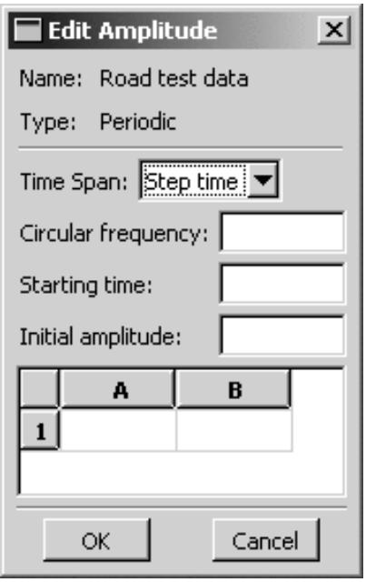

<details>
<summary>text_image</summary>

Edit Amplitude
Name: Road test data
Type: Periodic
Time Span: Step time
Circular frequency:
Starting time:
Initial amplitude:
A B
1
OK Cancel
</details>

Figure 1:The amplitude editor.

## Additional information

• Amplitude Curves  
• Response Spectrum Analysis  
• Entering tabular data

## Selecting an amplitude type to define

Select Tools->Amplitude->Create from the main menu bar to create an amplitude. For detailed information on amplitudes, see Amplitude Curves and Specifying a Spectrum.

1. From the main menu bar, select Tools->Amplitude->Create.


Tip: You can also create an amplitude by clicking mouse button 3 on the Amplitudes container in the Model Tree or by clicking Create in the Amplitude Manager.

The Create Amplitude dialog box appears.

2. In the Name field, enter a name for the amplitude. For information on naming objects, see Using basic dialog box components.  
3. Choose the Type of amplitude that you want to create:

Choose Tabular to define the amplitude curve as a table of values at convenient points on the time scale. Abaqus interpolates linearly between these values, as needed. For more information, see Defining Tabular Data.  
Choose Equally spaced to give a list of amplitude values at fixed time intervals beginning at a specified value of time. Abaqus interpolates linearly between each time interval. For more information, see Defining Equally Spaced Data.  
• Choose Periodic to define the amplitude, a, as a Fourier series:

$$
a = A _ {0} + \sum_ {n = 1} ^ {N} \left[ A _ {n} \cos n \omega (t - t _ {0}) + B _ {n} \sin n \omega (t - t _ {0}) \right] \text {for} t \geq t _ {0},
$$

$$
a = A _ {0} \quad \text {for} t <   t _ {0},
$$

where $\mathbf { { \pmb t 0 } } , N , \omega , A _ { 0 } , A _ { n }$ , and $B _ { n } , n = 1 , 2 . . . N$ , are user-defined constants. For more information, see Defining Periodic Data.

• Choose Modulated to define the amplitude, a, as

$$
a = A _ {0} + A \sin \omega_ {1} (t - t _ {0}) \sin \omega_ {2} (t - t _ {0}) \quad \text { for } t > t _ {0},
$$

$$
a = A _ {0} \quad \text { for   } t \leq t _ {0},
$$

where $A _ { 0 } , A , t _ { 0 } , \omega _ { 1 }$ , and ${ \pmb { \omega _ { 2 } } }$ are user-defined constants. For more information, see Defining Modulated Data.

• Choose Decay to define the amplitude, a, as

$$
a = A _ {0} + A \exp \left(- \left(t - t _ {0}\right) / t _ {d}\right) \quad \text { for } t \geq t _ {0},
$$

$$
a = A _ {0} \quad \text { for   } t <   t _ {0},
$$

where $A _ { 0 } , A , t _ { 0 }$ , and $\pmb { t _ { d } }$ are user-defined constants. For more information, see Defining Exponential Decay.

Choose Solution dependent to calculate amplitude values based on a solution-dependent variable. For more information, see Defining a Solution-Dependent Amplitude for Superplastic Forming Analysis.  
• Choose Smooth step to define the amplitude, a, between two consecutive data points $( t _ { i } , A _ { i } )$ and $( t _ { i + 1 } , A _ { i + 1 } )$ as

$$
a = A _ {i} \quad + \quad (A _ {i + 1} - A _ {i}) \xi^ {3} (1 0 - 1 5 \xi + 6 \xi^ {2}) \quad \text {for} t _ {i} \leq t \leq t _ {i + 1},
$$

where $\pmb { \xi } = \left( { { t - t _ { i } } } \right) / \left( { { t _ { i + 1 } } - { t _ { i } } } \right)$ . For more information, see Defining Smooth Step Data.

Choose Actuator to import the current value of an actuator amplitude at any given time from a co-simulation with a logical modeling program. For more information, see Defining an Actuator Amplitude via Co-Simulation. No additional data is required to define the amplitude curve.  
Choose Spectrum to define a spectrum to be used in a response spectrum analysis. For more information, see Specifying a Spectrum.  
Choose User to define the amplitude curve in user subroutine UAMP (Abaqus/Standard) or VUAMP (Abaqus/Explicit). For more information, see Defining an Amplitude via a User Subroutine.  
Choose PSD definition to define a frequency function that defines the frequency dependence of the random loading in a random response analysis step. This amplitude curve represents the power spectral density function for the random noise source. The PSD amplitude can be referenced in the correlation definition of a base motion boundary condition in a random response step. For more information, see Defining the Frequency Functions.

## 4. Click Continue.

The Edit Amplitude dialog box appears in which you can enter all of the data necessary to define the amplitude curve. See the following sections for detailed instructions:

Using tabular data to define an amplitude curve  
Using equally spaced data to define an amplitude curve  
Using periodic data to define an amplitude curve  
Using modulated data to define an amplitude curve  
Using exponential decay data to define an amplitude curve  
• Defining a solution-dependent amplitude curve  
Using smooth step data to define an amplitude curve  
Defining a spectrum  
Defining a user-defined amplitude curve  
Defining a PSD definition

## Additional information

• Amplitude Curves  
• Understanding the amplitude editors  
• Entering tabular data

## Using tabular data to define an amplitude curve

Use the tabular definition method to define the amplitude curve as a table of values at convenient points on the time scale. Abaqus interpolates linearly between these values, as needed. For more information, see Defining Tabular Data.

1. Display the Edit Amplitude dialog box as described in Selecting an amplitude type to define.  
2. Click the arrow to the right of the Time span field, and specify how you want to define the amplitude as a function of time:

• Select Step time for time that is measured from the beginning of each step.  
• Select Total time for total time accumulated over all non-perturbation analysis steps.

3. Indicate how you want to define Smoothing:

Choose Use solver default to accept a default value of 0.25 in Abaqus/Standard and 0.0 in Abaqus/Explicit.  
Choose Specify to enter a value for the smoothing parameter in the adjacent field. A value of 0.05 is suggested for amplitude definitions that contain large time intervals to avoid severe deviation from the specified definition.

The Smoothing parameter is the fraction of the time interval before and after each time point during which the piecewise linear time variation is replaced by a smooth quadratic time variation. This parameter is applicable only when time derivatives are needed (for displacement or velocity boundary conditions in a direct integration dynamic analysis) and is ignored for all other uses of this option.

4. Display the Amplitude Data tabbed page, and enter the tabular data. For detailed information on how to enter data, see Entering tabular data.  
5. If desired, display the Baseline Correction tabbed page.

When you use an amplitude definition to define an acceleration history in the time domain (a seismic record of an earthquake, for example), the integration of the acceleration record through time may result in a relatively large displacement at the end of the event. This behavior typically occurs because of instrumentation errors or a sampling frequency that is not sufficient to capture the actual acceleration history. In Abaqus/Standard it is possible to compensate for it by using “baseline correction.” For more information, see Baseline Correction in Abaqus/Standard.

6. Click the arrow to the right of the Correction field, and select one of the following options:

• Select None for no baseline correction.  
• Select Single interval to treat the entire time of the amplitude definition as a single correction interval.  
Select Multiple intervals to treat the entire time of the amplitude definition as multiple correction intervals. If you select this option, enter the time points defining the different correction intervals (i.e. in the first row enter the time point defining the end of the first correction interval and the beginning of the section correction interval; in the second row enter the time point defining the end of the second correction interval and the beginning of the third correction interval, etc.).

7. Click OK to save your amplitude definition and to close the Edit Amplitude dialog box.

## Using equally spaced data to define an amplitude curve

Use the equally spaced definition method to provide a list of amplitude values at fixed time intervals beginning at a specified value of time. Abaqus interpolates linearly between each time interval. For more information, see Defining Equally Spaced Data.

1. Display the Edit Amplitude dialog box as described in Selecting an amplitude type to define.  
2. Click the arrow to the right of the Time span field, and specify how you want to define the amplitude as a function of time:

• Select Step time for time that is measured from the beginning of each step.  
• Select Total time for total time accumulated over all non-perturbation analysis steps.

3. Indicate how you want to define Smoothing:

Choose Use solver default to accept a default value of 0.25 in Abaqus/Standard and 0.0 in Abaqus/Explicit.  
Choose Specify to enter a value for the smoothing parameter in the adjacent field. A value of 0.05 is suggested for amplitude definitions that contain large time intervals to avoid severe deviation from the specified definition.

The Smoothing parameter is the fraction of the time interval before and after each time point during which the piecewise linear time variation is replaced by a smooth quadratic time variation. This parameter is applicable only when time derivatives are needed (for displacement or velocity boundary conditions in a direct integration dynamic analysis) and is ignored for all other uses of this option.

4. Display the Amplitude Data tabbed page.  
5. In the Fixed interval field, enter the fixed time or frequency interval at which you will provide the amplitude data.  
6. In the first row of the Time/Frequency column in the data table, enter the time (or lowest frequency) at which you will enter the first amplitude.  
7. Enter the Amplitude values for each time or frequency. For detailed information on how to enter data, see Entering tabular data.  
8. If desired, display the Baseline Correction tabbed page.

When you use an amplitude definition to define an acceleration history in the time domain (a seismic record of an earthquake, for example), the integration of the acceleration record through time may result in a relatively large displacement at the end of the event. This behavior typically occurs because of instrumentation errors or a sampling frequency that is not sufficient to capture the actual acceleration history. In Abaqus/Standard it is possible to compensate for it by using “baseline correction.” For more information, see Baseline Correction in Abaqus/Standard.

9. Click the arrow to the right of the Correction field, and select one of the following options:

• Select None for no baseline correction.  
• Select Single interval to treat the entire time of the amplitude definition as a single correction interval.  
Select Multiple intervals to treat the entire time of the amplitude definition as multiple correction intervals. If you select this option, enter the time points defining the different correction intervals (i.e. in the first row enter the time point defining the end of the first correction interval and the beginning of the section correction interval; in the second row enter the time point defining the end of the second correction interval and the beginning of the third correction interval, etc.).

10. Click OK to save your amplitude definition and to close the Edit Amplitude dialog box.

# Using periodic data to define an amplitude curve

Select Periodic to define the amplitude, a, as a Fourier series:

$$
a = A _ {0} + \sum_ {n = 1} ^ {N} \left[ A _ {n} \cos n \omega \left(t - t _ {0}\right) + B _ {n} \sin n \omega \left(t - t _ {0}\right) \right] \text {for} t \geq t _ {0},
$$

$$
a = A _ {0} \quad \text {for} t <   t _ {0},
$$

where $\mathbf { \Delta } t _ { 0 } , N , \omega , A _ { 0 } , A _ { n }$ , and $B _ { n } , n = 1 , 2 . . . N _ { \mathrm { ~ } }$ , are user-defined constants. For more information, see Defining Periodic Data.

1. Display the Edit Amplitude dialog box as described in Selecting an amplitude type to define.  
2. Click the arrow to the right of the Time span field, and specify how you want to define the amplitude as a function of time:

• Select Step time for time that is measured from the beginning of each step.  
• Select Total time for total time accumulated over all non-perturbation analysis steps.

3. In the Circular frequency field, enter , the circular frequency, in radians per time.  
4. In the Starting time field, enter $\pmb { t _ { 0 } } .$  
5. In the Initial amplitude field, enter $\scriptstyle A _ { 0 }$ , the constant term in the Fourier series.  
6. In the data table, enter values for A, the coefficient of the cosine terms, and B, the coefficient of the sine terms. For detailed information on how to enter data, see Entering tabular data.  
7. Click OK to save your amplitude definition and to close the Edit Amplitude dialog box.

## Using modulated data to define an amplitude curve

Use the modulated definition method to define the amplitude, a, as

$$
a = A _ {0} + A \sin \omega_ {1} (t - t _ {0}) \sin \omega_ {2} (t - t _ {0}) \quad \text { for } t > t _ {0},
$$

$$
a = A _ {0} \quad \text { for } t \leq t _ {0},
$$

where , A, , , and are user-defined constants. For more information, see Defining Modulated Data.

1. Display the Edit Amplitude dialog box as described in Selecting an amplitude type to define.  
2. Click the arrow to the right of the Time span field, and specify how you want to define the amplitude as a function of time:  
• Select Step time for time that is measured from the beginning of each step.  
• Select Total time for total time accumulated over all non-perturbation analysis steps.

3. In the Initial amplitude field, enter .  
4. In the Amplitude field, enter A.  
5. In the Starting time field, enter .  
6. In the Circular frequency 1 field, enter .  
7. In the Circular frequency 2 field, enter .  
8. Click OK to save your amplitude definition and to close the Edit Amplitude dialog box.

## Using exponential decay data to define an amplitude curve

Use the exponential decay definition method to define the amplitude, a, as

$$
a = A _ {0} + A \exp \left(- (t - t _ {0}) / t _ {d}\right) \quad \text {for} t \geq t _ {0},
$$

$$
a = A _ {0} \quad \text {for} t <   t _ {0},
$$

where $\pmb { A _ { 0 } } .$ , A, , and $\scriptstyle t _ { d }$ are user-defined constants. For more information, see Defining Exponential Decay.

1. Display the Edit Amplitude dialog box as described in Selecting an amplitude type to define.  
2. Click the arrow to the right of the Time span field, and specify how you want to define the amplitude as a function of time:

• Select Step time for time that is measured from the beginning of each step.

• Select Total time for total time accumulated over all non-perturbation analysis steps.

3. In the Initial amplitude field, enter $\scriptstyle A _ { 0 }$ .  
4. In the Amplitude field, enter A.  
5. In the Starting time field, enter the start time of the exponential function, $\scriptstyle t _ { 0 }$  
6. In the Decay time field, enter the decay time of the exponential function, $\mathbf { \Delta } \mathbf { t } _ { d } .$  
7. Click OK to save your amplitude definition and to close the Edit Amplitude dialog box.

## Defining a solution-dependent amplitude curve

Use the solution-dependent definition method to calculate amplitude values based on a solution-dependent variable. For more information, see Defining a Solution-Dependent Amplitude for Superplastic Forming Analysis.

1. Display the Edit Amplitude dialog box as described in Selecting an amplitude type to define.  
2. Click the arrow to the right of the Time span field, and specify how you want to define the amplitude as a function of time:

• Select Step time for time that is measured from the beginning of each step.  
• Select Total time for total time accumulated over all non-perturbation analysis steps.

3. In the Initial amplitude field, enter the initial amplitude value. The amplitude starts with the initial value and is then modified based on the progress of the solution.  
4. In the Min amplitude field, enter the minimum amplitude value.  
5. In the Max amplitude field, enter the maximum amplitude value. The maximum value is typically the controlling mechanism used to end the analysis.  
6. Click OK to save your amplitude definition and to close the Edit Amplitude dialog box.

## Using smooth step data to define an amplitude curve

Use the smooth step definition method to define the amplitude, a, between two consecutive data points $( t _ { i } , A _ { i } )$ and $( t _ { i + 1 } , A _ { i + 1 } )$ as

$$
a = A _ {i} \quad + \quad (A _ {i + 1} - A _ {i}) \xi^ {3} (1 0 - 1 5 \xi + 6 \xi^ {2}) \quad \text {for} t _ {i} \leq t \leq t _ {i + 1},
$$

where $\pmb { \xi } = \left( { t - t _ { i } } \right) / \left( t _ { i + 1 } - t _ { i } \right)$ . This definition is intended to ramp up or down smoothly from one amplitude value to another. For more information, see Defining Smooth Step Data.

1. Display the Edit Amplitude dialog box as described in Selecting an amplitude type to define.  
2. Click the arrow to the right of the Time span field, and specify how you want to define the amplitude as a function of time:

• Select Step time for time that is measured from the beginning of each step.  
• Select Total time for total time accumulated over all non-perturbation analysis steps.

3. In the data table, enter the tabular data. For detailed information on how to enter data, see Entering tabular data.

4. Click OK to save your amplitude definition and to close the Edit Amplitude dialog box.

## Defining a spectrum

Use the spectrum method to define a spectrum to be used in a response spectrum analysis. For more information, see Specifying a Spectrum.

1. Display the Edit Amplitude dialog box as described in Selecting an amplitude type to define.  
2. Click the arrow to the right of the Specification units field, and specify the units in which you want to define the spectrum.

• Select Displacement, Velocity, or Acceleration to define the spectrum in displacement units, velocity units, or acceleration units, respectively.  
• Select Gravity to specify an acceleration spectrum in g-units.

3. If you selected Gravity, enter the value of the acceleration of gravity.  
4. In the data table, enter the Magnitude (magnitude of the spectrum), Frequency (frequency, in cycles per time, at which this magnitude is used), and Damping (associated damping, given as a ratio of critical damping) values. For detailed information on how to enter data, see Entering tabular data.  
5. Click OK to save your amplitude definition and to close the Edit Amplitude dialog box.

## Defining a user-defined amplitude curve

Use the user definition method to define the amplitude curve in user subroutine UAMP (Abaqus/Standard) or VUAMP (Abaqus/Explicit). For more information, see Defining an Amplitude via a User Subroutine.

1. Display the Edit Amplitude dialog box as described in Selecting an amplitude type to define.  
2. In the Number of variables field, enter the number of solution-dependent state variables that must be stored with this amplitude definition.  
3. Define the amplitude in user subroutine UAMP (for Abaqus/Standard) or VUAMP (for Abaqus/Explicit). See the following sections for more information:

Specifying general job settings  
UAMP  
• VUAMP

4. Click OK to save your amplitude definition and to close the Edit Amplitude dialog box.

## Defining a PSD definition

Use the PSD definition method to define the frequency dependence of the random loading in a random response analysis step. For more information, see Defining the Frequency Functions.

1. Display the Edit Amplitude dialog box as described in Selecting an amplitude type to define.  
2. Click the arrow to the right of the Specification units field, and specify the units in which you want to define the curve.

• Select Power to define the frequency function directly in power units.  
• Select Decibel to define the frequency function in decibel units.  
• Select Gravity (base motion) if the frequency function will be used to define a base motion in g-units. If you choose these units, you must define the acceleration of gravity.

3. If you selected Decibel units, enter a value for the Reference power.  
4. If you selected Gravity units, enter a value for the Reference gravity.  
5. In the data table, enter or import the data values for the function:

• Real and Imaginary parts of the function, in decibels or in units2 per frequency.  
• Frequency, in cycles/time, or frequency band number (for Decibel units).

For detailed information on how to enter data, see Entering tabular data

6. Toggle on Specify data in an external user subroutine if you will provide the PSD function in user subroutine UPSD.  
7. Click OK to save your amplitude definition and to close the Edit Amplitude dialog box.

Abaqus/CAE provides two types of analytical fields: expression fields and mapped fields.

You can use analytical fields to define spatially varying values for selected properties, loads, interactions, and predefined fields, such as the variation of a pressure over a region in a pressure load. The Analytical Field toolset allows you to create and manage analytical fields in the Property module, Interaction module, or Load module.

## In this section:

Using the Analytical Field toolset  
Using analytical expression fields  
Using analytical mapped fields  
Displaying symbols for interactions and prescribed conditions that use analytical fields  
Displaying symbols to visualize mapping source data  
Creating expression fields  
Creating mapped fields

## Using the Analytical Field toolset

The Analytical Field toolset allows you to create and manage analytical fields. Analytical fields defined using mathematical expressions are called expression fields. Analytical fields defined using an external data source, such as point cloud data, are called mapped fields. Analytical fields indicate points in space using coordinates of the global coordinate system or of a local coordinate system.

Select Tools->Analytical Field->Create from the main menu bar in the Property module, Interaction module, or Load module to create a new analytical field. Select Edit from the same menu to change an existing analytical field.

## Using analytical expression fields

Analytical expression fields define analytical functions—special types of mathematical functions.

You can use expression fields in many prescribed conditions to define spatially varying parameters. For more information, see the following sections:

Using the interaction editors  
Using the load editors  
Using the boundary condition editors  
Using the predefined field editors

## In this section:

Building valid expressions  
Operations and functions in expressions  
Evaluating expression fields

## Building valid expressions

Expression fields describe the variation of a parameter for selected interactions and prescribed conditions (such as a pressure magnitude) at a point in space. You create an expression field by building a mathematical expression in the expression field editor. To locate the expression field editor, select Tools->Analytical Field->Create from the main menu bar.

Expression fields indicate points in space using coordinates of the global coordinate system or of a local coordinate system. In the expression field editor, these coordinates are listed as Parameter Names. By default, the expression is built using the coordinates of the global coordinate system (X, Y, and Z parameter names). The parameter names that are available depend on the type of coordinate system that you select, as shown in Table 1. For cylindrical and spherical coordinate systems, the values for Th and P are evaluated in radians in the range from to .

Table 1: Relationship between coordinate system types and parameter names in the expression field editor.

<table><tr><td>Coordinate system type</td><td>Parameter</td><td>Parameter names</td></tr><tr><td>Rectangular or Global (default)</td><td>X-, Y-, and Z-axes</td><td>X, Y, Z</td></tr><tr><td>Cylindrical</td><td>R-, θ-, and Z-axes</td><td>R, Th, Z</td></tr><tr><td>Spherical</td><td>R-, θ-, and φ-axes</td><td>R, Th, P</td></tr></table>

An expression is composed using one or more parameter names and one or more operators. You can build the mathematical expression in the expression window of the editor by selecting the parameter names and operators from lists or by typing the parameter names and operators directly into the expression window. Parameter names and operators are case sensitive. Expressions use the syntax required by Python; entries containing errors will generate standard Python errors. See Operations and functions in expressions for information on supported operators.

The following examples demonstrate valid expressions.

## Example 1

To define a spatial variation with linear distance along a face, type:

$$
4. 5 * X + 2. 7 5
$$

in the expression window of the editor. X is the parameter name representing the distance along the face.

## Example 2

To define a more complex spatial variation in a cylindrical coordinate system, type:

$$
\mathrm{R} + \sin (\text {Th*pi / 2})
$$

in the expression window of the editor.

For detailed information, see Creating expression fields.

## Operations and functions in expressions

This section lists the operations and functions available in the expression field editor.

Arguments to trigonometric functions are assumed to be in radians in the range from to . Proper inline Python statements returning a value, including functions in the math module such as those listed, can be used.

For more information, see the documentation for the math module accessible from the official Python home page (http://www.python.org). Select Help->About Abaqus from the main menu bar to obtain the Python version used by Abaqus/CAE.

Mathematical operations:

<table><tr><td>+</td><td>Add</td></tr><tr><td>-</td><td>Subtract</td></tr><tr><td>*</td><td>Multiply</td></tr><tr><td>/</td><td>Divide</td></tr><tr><td>%</td><td>Return the remainder of integer division.</td></tr><tr><td>1/A</td><td>Return the reciprocal of A.</td></tr><tr><td>ceil(A)</td><td>Return the ceiling of A, the smallest integer value greater than or equal to A.</td></tr><tr><td>fabs(A)</td><td>Return the absolute value.</td></tr><tr><td>floor(A)</td><td>Return the floor of A, the largest integer value less than or equal to A.</td></tr><tr><td>fmod(A,B)</td><td>Return fmod(A, B), as defined by the platform C library. The intent of the C standard is that fmod(A, B) be exactly (mathematically; to infinite precision) equal to A - n * B for some integer n such that the result has the same sign as A and magnitude less than abs(B).</td></tr><tr><td>frexp(A)[ ]</td><td>Return the mantissa and exponent of A as the pair (m, e). m is a float and e is an integer such that A = m * 2 ** e exactly. Use the brackets to specify the index of the return value to use in the expression evaluation.</td></tr><tr><td>modf(A)[ ]</td><td>Return the fractional and integer parts of A. Use the brackets to specify the index of the return value to use in the expression evaluation.</td></tr></table>

Trigonometric functions:

<table><tr><td>acos(A)</td><td>Return the arccosine.</td></tr><tr><td>asin(A)</td><td>Return the arcsine.</td></tr><tr><td>atan(A)</td><td>Return the arctangent.</td></tr><tr><td>cos(A)</td><td>Return the cosine.</td></tr><tr><td>cosh(A)</td><td>Return the hyperbolic cosine.</td></tr><tr><td>hypot(A,B)</td><td>Return the Euclidean norm, sqrt(A*A+B*B). This is the length of the vector from the origin to point (A, B).</td></tr><tr><td>sin(A)</td><td>Return the sine.</td></tr><tr><td>sinh(A)</td><td>Return the hyperbolic sine.</td></tr><tr><td>tan(A)</td><td>Return the tangent.</td></tr><tr><td>tanh(A)</td><td>Return the hyperbolic tangent.</td></tr></table>

Power and logarithmic functions:

<table><tr><td>exp(A)</td><td>Return the natural exponential to the power A,  $e^{A}$ .</td></tr><tr><td>ldexp(A,B)</td><td>Return A * ( $2^{B}$ ).</td></tr><tr><td>log(A)</td><td>Return the natural logarithm.</td></tr><tr><td>log10(A)</td><td>Return the base 10 logarithm.</td></tr><tr><td>pow(A,B)</td><td>Raise a variable to a power.</td></tr><tr><td>sqrt(A)</td><td>Return the square root.</td></tr></table>

Constants:

<table><tr><td>pi</td><td>Mathematical constant .</td></tr><tr><td>e</td><td>Mathematical constant e.</td></tr></table>

## Additional information

• Building valid expressions  
• Creating expression fields

## Evaluating expression fields

If you specify an expression field for an interaction or prescribed condition, Abaqus/CAE must evaluate the expression field as the first step in determining the values to submit for the analysis. Expressions are evaluated as Python input; entries containing errors will generate standard Python errors. For cylindrical and spherical coordinate systems, the values for Th and P are evaluated in radians in the range from to . Abaqus/CAE evaluates the expression field when the input file is written.

Abaqus/CAE evaluates the expression field at different locations on the model depending on the type of region that you selected when you created the interaction or prescribed condition. Table 1 indicates the locations on the model that Abaqus/CAE uses for evaluation of the expression field.

Table 1: Expression field evaluation locations.

<table><tr><td>Region type</td><td>Location of expression field evaluation</td></tr><tr><td>Node or vertex</td><td>At the node or vertex</td></tr><tr><td>Edge</td><td>At the midpoint of the edge of each element</td></tr><tr><td>Surface or face</td><td>Centroid of each element face contained in the region</td></tr><tr><td>Cell</td><td>Centroid of the element</td></tr></table>

Next, Abaqus/CAE multiplies the magnitude that you specify for the spatially varying parameter, such as a pressure magnitude, by the evaluated expression at each element or node to determine the final values that are submitted to the analysis. The expression field is applied to magnitudes in the interaction or prescribed condition, including the real and imaginary parts of complex magnitudes. Beam and shell gradient values, such as gradients in temperature, are not affected by the expression field. During the analysis, Abaqus applies any amplitude that you have specified for the interaction or prescribed condition.

## Analytical field and datum coordinate system

In Abaqus/CAE, when an analytical field uses a local coordinate system, the field is evaluated based on the transformations with respect to the assembly global coordinate system. The instance assembly transformations are evaluated if the analytical field is created in the Load module and an instance level datum coordinate system (for example, Part-1-1.Datum-1) is selected. The instance assembly transformations are not evaluated if the analytical field is created in the Property module and a part-level datum coordinate system (for example, Datum-1) is selected.

## Using analytical mapped fields

Analytical mapped fields allow you to define spatially varying parameter values from an external data source.

## In this section:

About analytical mapped fields  
Point cloud data file formats for mapping  
Coordinate system for point cloud mapped fields  
Mesh-to-mesh mapping from an output database file  
Supported elements for mapping

## About analytical mapped fields

In Abaqus/CAE a mapped field is used to provide the values of selected loads, interactions, properties, etc., at different points in space.

For example, you can define a spatially varying shell thickness or pressure load by providing the thickness or pressure values at different coordinates. Parameter values can be read in from a point cloud data file generated by a third-party CAE application or from an Abaqus output database (.odb) file.

Mapped fields allow you to import discrete and discontinuous parameter data and apply them to your Abaqus/CAE model. Abaqus/CAE applies the values to the current model, mapping the input X-, Y-, and Z-coordinates to locations in the model. Abaqus/CAE maps the source data onto the target model, and Abaqus computes the distributed parameter values to be used during the analysis. The parameter values are also called field values, or field data; for example, pressure values at different points on a surface.

When you create a mapped field from point cloud data, you can assign a local coordinate system to the source data region to simplify the three-dimensional definition of points in space. The local coordinate system can be rectangular, cylindrical, or spherical. For example, with a rectangular coordinate system, the X-, Y-, and Z-coordinates are interpreted in that local coordinate system.

Only scalar data values can be used in mapped fields. Each field data value is mapped from the source to the target region as a scalar value. The Abaqus/CAE mapping algorithm is purely geometric, with no physical considerations such as conservative mapping.

Mapped fields can be used to define the properties and attributes shown in Table 1.

Table 1: Attributes and properties that support mapped fields.

<table><tr><td>Category</td><td>Attribute/Property</td></tr><tr><td rowspan="6">Loads</td><td>Body concentration flux</td></tr><tr><td>Body heat flux</td></tr><tr><td>Pressure</td></tr><tr><td>Surface concentration flux</td></tr><tr><td>Surface heat flux</td></tr><tr><td>Surface pore fluid flow</td></tr><tr><td rowspan="6">Boundary conditions</td><td>Acoustic pressure</td></tr><tr><td>Electrical potential</td></tr><tr><td>Normalized concentration</td></tr><tr><td>Mass flow</td></tr><tr><td>Pore pressure</td></tr><tr><td>Temperature</td></tr><tr><td rowspan="4">Predefined fields</td><td>Nodal temperature</td></tr><tr><td>Pore pressure</td></tr><tr><td>Saturation</td></tr><tr><td>Void ratio</td></tr><tr><td rowspan="3">Interactions</td><td>Concentrated film condition</td></tr><tr><td>Surface film condition</td></tr><tr><td>Surface radiation</td></tr><tr><td>Other</td><td>Density (material density distributions)</td></tr><tr><td></td><td>Shell thicknesses (element distribution or nodal distribution in shell sections)</td></tr></table>

The magnitude you specify in the property, load, predefined field, or interaction is used as a multiplier for the mapped field data values. You can also scale the source data coordinates; for example, to account for a mismatch of units (i.e., meters to millimeters).

When you apply a load, interaction, or predefined field using a mapped field, you can display symbols in the viewport to visualize the locations and magnitudes of the field values. However, you must mesh the model first to be able to see these symbols.

Abaqus/CAE provides a set of mapping tolerance controls that allow you to adjust how far source data points may lie from the target points. Depending on how far away each source point is from the nearest node on the meshed model target, Abaqus/CAE must decide whether to use or discard each source point.

Output request frequency time points are not supported in mapped fields.


Note: When a mapped field is used to apply a pressure load, you must request output for the field output variable P to be able to visualize the mapped pressure values in the Visualization module. The output variable name P is automatically changed to PDLOAD during the analysis; see Abaqus/Standard Output Variable Identifiers, or Abaqus/Explicit Output Variable Identifiers.

Point cloud data files must be plain text files in one of two formats: XYZ or Grid.

A point cloud data file in XYZ format must contain the desired field values at a set of coordinates. For a rectangular coordinate system, the points must be given by X-, Y-, and Z-coordinates. If you use a cylindrical or spherical local coordinate system, the appropriate coordinates must be used. The Grid format contains field values at points in a three-dimensional grid. Abaqus/CAE interpolates to fill in any missing field values in your grid data files.

## In this section:

XYZ format  
Grid format

## XYZ format

A point cloud data file in XYZ format must contain rows of data. For a rectangular coordinate system, each row must consist of X-, Y-, and Z-coordinates followed by the field value at that point. The values in each row can be separated by any combination of spaces, tabs, or commas; each space, tab, or comma is considered a single field delimiter.

Comma-separated values (CSV), shown in the following example, is a commonly used format:

```csv
X1,Y1,Z1,value
X2,Y2,Z2,value
X3,Y3,Z3,value
etc.
```

If you use a cylindrical or spherical local coordinate system, the appropriate coordinates must be given in the data file; see Coordinate system for point cloud mapped fields.

Figure 1 shows an example of point cloud data in XYZ format that have been imported into the Edit Mapped Field dialog box.  


<details>
<summary>text_image</summary>

Create Mapped Field
Name: MappedField-2
Description: example XYZ point cloud data
Data source: Point cloud ODB mesh
Coordinate System
Local system: (Global) Supplied data are defined in part space
Default unmapped field value: 1000
Point Data Mapper Controls
Data format: XYZ Grid
Data Values
X Y Z Field value
1 28.763 67.390 306 8723.2
2 28.763 67.390 198 7660.7
3 30.911 52.937 271 6004.9
4 2.822 84.44 718 6824
5 -16.27 45.962 520 1257
6 -8.22 51.339 600 2756
7 3.888 31.835 417 3319
8 15.336 31.290 555 1993
OK Cancel
</details>

Figure 1: Point cloud data in XYZ format.

## Grid format

A point cloud data file in Grid format defines the field values at points in a three-dimensional grid. For a rectangular coordinate system, this is a planar or cubic grid. Figure 1 shows a simple example of point cloud data in Grid format that have been imported into the Edit Mapped Field dialog box.

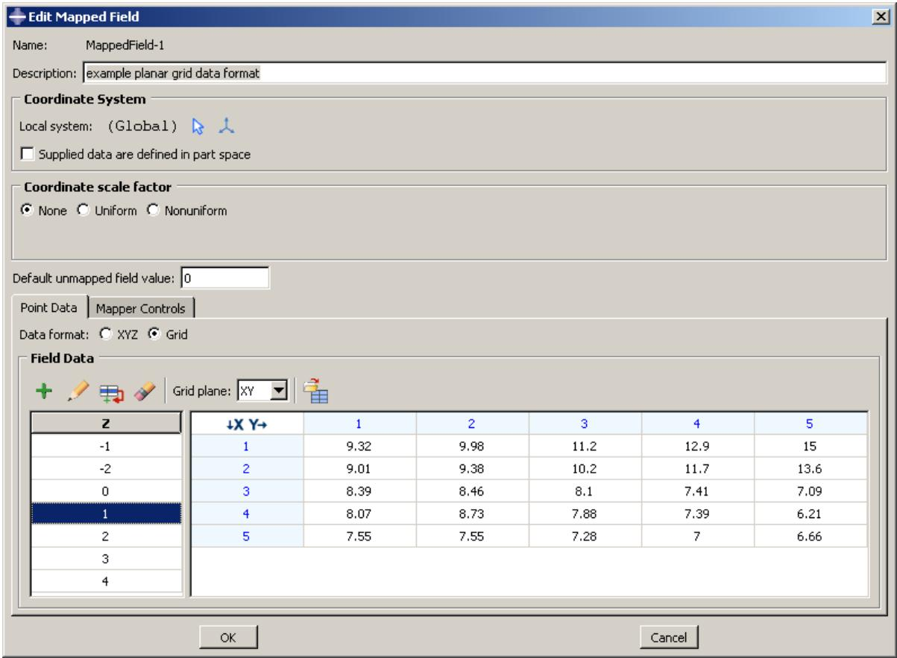

<details>
<summary>text_image</summary>

Edit Mapped Field
Name: MappedField-1
Description: example planar grid data format
Coordinate System
Local system: (Global)
Supplied data are defined in part space
Coordinate scale factor
None Uniform Nonuniform
Default unmapped field value: 0
Point Data Mapper Controls
Data format: XYZ Grid
Field Data
Grid plane: XY
Z
-1
-2
0
1
2
3
4
5
↓X Y→
1
9.32
9.98
11.2
12.9
15
2
9.01
9.38
10.2
11.7
13.6
3
8.39
8.46
8.1
7.41
7.09
4
8.07
8.73
7.88
7.39
6.21
5
7.55
7.55
7.28
7
6.66
OK Cancel
</details>

Figure 1: Point cloud data in Grid format.

Grid data consist of a set of files, each containing a single plane. For example, you could have one file for the Z=3 plane. This file would contain a grid of X- and Y-coordinates and the field value at each point; for example:

```csv
a, -2, -1, 0, 1, 2
-2, 0.146, 0.141, 0.139, 0.137, 0.131
-1, 0.141, 0.121, 0.116, 0.111, 0.100
 0, 0.139, 0.116, 0.105, 0.101, 0.094
 1, 0.133, 0.129, 0.122, 0.114, 0.107
 2, 0.128, 0.120, 0.111, 0.102, 0.090
```

The X-coordinates appear in the first (left) column in this file, and the Y-coordinates are in the first (top) row, starting in the second position. The first position contains a dummy value that is ignored by Abaqus/CAE when you import the file into the data table in the Create Mapped Field dialog box. In the example file above, the dummy value is the character a; you can use any value in this position since it will be ignored.

The values in each row of a grid data file can be separated by any combination of spaces, tabs, or commas; each space, tab, or comma is considered a single field delimiter.

Your complete set of grid data files must include one file for each plane; for example, the X–Y planes at Z=0, Z=1, Z=2, Z=3. The $Y – Z , X – Z , Y – X , Z – Y ,$ and Z–X planes can also be used. You choose between the different grid planes in the Create Mapped Field dialog box.

If your grid data files have any missing field values, Abaqus/CAE interpolates to fill in the missing points; you do not need to fill in these missing values in the Create Mapped Field dialog box.

If you use a cylindrical or spherical local coordinate system, the appropriate coordinates must be given in the grid data files; see Coordinate system for point cloud mapped fields.

## Coordinate system for point cloud mapped fields

Mapped fields indicate points in space using coordinates of the global coordinate system or a local coordinate system. For a point cloud data source, different coordinate systems can be involved when the mapped data coordinates are interpreted and applied to the property, load, predefined field, or interaction. When analytical field values (point cloud data in grid format) referring to a cylindrical or spherical coordinate system are used to map a field variable, Abaqus/CAE converts the values in the cylindrical or spherical coordinate system into corresponding discrete values in the Cartesian coordinate system.

## Source data local coordinate system

The three-dimensional coordinates and field values are all defined in the local coordinate system. You can specify the coordinate system to use in the Create Mapped Field dialog box. This is an assembly-level (not part-level) coordinate system.

If you use a rectangular coordinate system (default), Abaqus/CAE uses X-, Y-, and Z-coordinates to interpret the source data points. If you specify a cylindrical or spherical coordinate system, Abaqus/CAE interprets the coordinates as shown in Table 1. The columns shown in the data table of the Create Mapped Field dialog box depend on the type of local coordinate system that you choose. For cylindrical and spherical coordinate systems, the values for Th and P are entered in degrees and during the analysis are converted to radians in the range from

to .

Table 1: Coordinate system types and coordinate names for mapped fields.

<table><tr><td>Coordinate system type</td><td>Coordinates</td><td>Columns shown in data table</td></tr><tr><td>Rectangular or Global (default)</td><td>X-, Y-, and Z-axes</td><td>X, Y, Z</td></tr><tr><td>Cylindrical</td><td>R-, θ-, and Z-axes</td><td>R, Th, Z</td></tr><tr><td>Spherical</td><td>R-, θ-, and φ-axes</td><td>R, Th, P</td></tr></table>

## Source data defined in part space

You can choose this option by toggling on Supplied data are defined in part space in the Create Mapped Field dialog box. The source data and its local coordinate system are both interpreted in the part-level coordinate system of the target model region.

## Mesh-to-mesh mapping from an output database file

When the data source is an Abaqus output database (.odb) file, the field output variable values must be displayed in a viewport. This technique is called mesh-to-mesh mapping. The field output variable values can be located at nodes, element centroids, or integration points. In this type of mapping the geometric region of the source data is the mesh connectivity data such as element faces or element sets.

To select the exact source data you want to use, open the desired output database file and display the undeformed contour plot in the Visualization module. You can also use the deformed plot, but the data are still mapped from the undeformed mesh. Choose the field output variable and the step and frame of the analysis for the value you want to map. When you create the new mapped field in your target model in the model database (.cae) file, you specify the displayed viewport as the data source. The current state of the viewport is taken as a snapshot of the set of values to be mapped onto the target model; namely, the specific field output variable displayed at a specific step and frame of the analysis.

As an example, you might use mesh-to-mesh mapping in the following workflow:

1. Set up and run a thermal analysis in Abaqus to generate an output database containing nodal temperatures (output variable NT).  
2. Open the output database (.odb) file in the Visualization module, and display output variable NT at Step-3, Frame 0 of the analysis.  
3. Open the model database (.cae) file containing your main target model. Select Tools->Analytical Field->Create from the main menu bar in the Load module to create a mapped field from the nodal temperature values. In the Create Mapped Field dialog box, select the viewport containing the output database as the source data.  
4. Mesh (or remesh) your main model.  
5. Create a temperature predefined field, and select the mapped analytical field to define the temperature distribution. Abaqus/CAE maps the source data points and their associated temperatures onto points in the target model.  
6. Set up and run the subsequent analysis.

The source data on the output database mesh can be located at nodes, integration points, or whole elements. Dissimilar meshes are supported.

The current settings in the selected viewport are used in the mapping. These settings are as follows:

• Primary field output variable  
• Step/increment  
• Averaging options selected in the Result Options dialog box  
• Section points (top or bottom)  
Etc.

The following viewport settings are not supported for mesh-to-mesh mapping:

• Display groups  
• Transformations  
• Averaging by element sets or display groups in the Result Options dialog box  
• Element face data  
• User data in the current session (but data saved in the output database file is supported)

When you create a mapped field from output database data and close the Create Mapped field dialog box, the source data are saved to the mapped field object, but the viewport itself is not saved. Any changes made in the viewport after creating the mapped field are not reflected in the mapping data. After you have created a mapped field using

mesh-to-mesh mapping, you cannot edit the source data mesh specifications; you can edit an existing mapped field only to change the default field value or mapper control options.

Volumetric mesh-to-mesh mapping can be performed only with nodal temperatures and material densities. When the mapping target is a mesh-based nodal region, you must specify whether the target is a surface or a volumetric region. Abaqus/CAE uses different mapping algorithms for a surface versus a volumetric region.

## Supported elements for mapping

Mapped fields can be used only in models in which supported element types are used in the mesh. The most commonly used elements are supported, including shells.

Supported element classes are listed below, according to the topology of the representative element type: shape, number of nodes, and number of integration points. Any similar element with the same topology is supported for mapping. The supported representative elements are as follows:

• S3, S4, S4R, S8R, STRI65  
• C3D4, C3D6, C3D8, C3D8R, C3D10, C3D15, C3D20, C3D20R  
• CPE3, CPE4, CPE6, CPE8  
• CAX3, CAX4, CAX6, CAX8

The following classes of elements are not supported and cannot be used in a target model mesh or output database source mesh:

• Surface elements  
• Rigid elements  
• Analytical rigid surface elements  
• Cohesive elements  
• Composite solid elements  
• Continuum shell elements  
• Cylindrical elements  
• Eulerian elements  
• Gasket elements  
• Internal elements  
• Elements with twist

• Elements that use modified second-order interpolation

## Displaying symbols for interactions and prescribed conditions that use analytical fields

When you apply an interaction or a prescribed condition to a region, you can display symbols in the viewport that represent the interaction or prescribed condition.

By default, the symbols for interactions and prescribed conditions that use analytical field distributions are scaled based on the calculated value. For symbols other than arrows, a plus sign (+) or a minus sign (−) is displayed inside each symbol to indicate whether the magnitude of the interaction or prescribed condition is positive or negative at that location. You can turn off the symbol scaling using the Attribute display options in the Assembly Display Options dialog box. For more information, see Controlling the display of attributes.

Abaqus/CAE displays scaled-down symbols for interactions and prescribed conditions when an analytical field evaluates to zero for a portion of its region. These scaled-down symbols are noticeably smaller than the default symbol size. For more information, see Understanding prescribed condition symbol type, color, and size.

## In this section:

Expression field display symbol details  
Mapped field display symbol details

## Expression field display symbol details

The points used for symbol display on meshes coincide with the locations where the expression field is evaluated during the analysis. On geometry, when the symbols appear equally spaced along an edge or over the face of a model, Abaqus/CAE selects a random set of points to use for symbol display. The points selected for symbol display may or may not coincide with the locations where the expression field is evaluated.

In some cases the expression field cannot be evaluated at a given point due to an error; for example, division by zero. When this situation occurs, a message appears in the message area indicating that an error occurred while evaluating the expression field. As a visual cue to indicate that there is an error, the symbols displayed in the viewport are no longer scaled, even though the setting to scale symbols based on the expression field value is turned on. You can attempt to eliminate the evaluation error by changing the symbol density settings, which prompts Abaqus/CAE to select a different set of points to use for symbol display. For more information on changing the symbol density settings, see Controlling the display of attributes.

## Mapped field display symbol details

To be able to see the symbols representing a mapped field, you must first mesh your model before applying the load, interaction, or predefined field.

The points used for symbol display on mapped fields are the native or orphan mesh nodes or elements that will be used in the analysis. If a native mesh is not present, the symbols will be displayed unscaled. In addition, if the mapping fails due to an error (for example, unsupported element types or incorrect tolerances), the symbols will also be displayed unscaled.

In these cases a message appears in the message area indicating an error in the evaluation. As a visual cue to indicate that there is an error, the symbols displayed in the viewport are no longer scaled and are displayed at the points they would be when scaling is turned off. You can try to fix the mapping by remeshing or by changing the symbol density settings, which prompts Abaqus/CAE to select a different set of points to use for symbol display. For more information on changing the symbol density settings, see Controlling the display of attributes.

## Displaying symbols to visualize mapping source data

You can plot your mapping source data separately from the load, interaction, or predefined field where it is applied. Plotting of source data is supported only for analytical mapped fields created from point cloud data in XYZ format.

1. From the Model Tree, expand the Fields container and the Analytical Fields container to display the mapped field object.  
2. Click mouse button 3 on the mapped field object, and select Plot source data from the menu that appears.

The displayed symbols represent the locations and relative magnitudes (field values) of the source data points. The magnitudes are color coded using a rainbow color spectrum from red (for the maximum value) to blue (for the minimum value), as shown in Figure 1.

  
Figure 1: Color coding used for visualizing mapping source data.

## Creating expression fields

Select Tools->Analytical Field->Create from the main menu bar in the Property module, Interaction module, or Load module to create an analytical field using an expression. Analytical fields defined using mathematical expressions are referred to as expression fields.

1. Open the Create Expression Field dialog box using one of the following methods:

• From the main menu bar, select Tools->Analytical Field->Create.


## Tip: You can also click Create in the Analytical Field Manager.

From the interaction editor in the Interaction module, click n $f ( x )$ ext to the Definition or Emissivity distribution field.  
$f ( x )$ next to the Distribution field.

2. Choose Expression field as the Type, and click Continue.

3. In the Name text field, enter a name for the expression field. For information on naming objects, see Using basic dialog box components.

4. In the Description text field, enter a description for the expression field.

5. If you want to change the local coordinate system for the expression field, click Edit and use one of the following methods:

• Select an existing datum coordinate system in the viewport.  
• Select an existing datum coordinate system by name.

1. From the prompt area, click Datum CSYS List to display a list of datum coordinate systems.  
2. Select a name from the list, and click OK.  
• Click Use Global CSYS from the prompt area to revert to the global coordinate system.

6. Build your expression in the expression window of the editor using a combination of the following procedures:

Select a parameter name from the list on the left side of the editor. The parameter names that are available depend on the type of coordinate system that you select:  
Rectangular: X, Y, and Z are the values on the X-, Y-, and Z-axes, respectively.  
Cylindrical: R, Th, and Z are the values on the R-, -, and Z-axes, respectively.  
- Spherical: R, Th, and P are the values on the R-, -, and -axes, respectively.

The parameter name appears in the expression window.

• Select an operation, function, or constant from the Operators list on the right side of the editor. For more information, see Operations and functions in expressions.

The selected operation, function, or constant appears in the expression window.

Use standard mouse and keyboard editing techniques in the expression window to position the cursor and configure your expression. Parameter names and operators are case sensitive.  
• Adjust the syntax of your expression if necessary; parentheses may be needed.

• Click Clear Expression to clear the entire expression in the expression window.

7. Click OK to create the expression field and to exit the editor.

## Additional information

• Using the interaction editors  
• Using the load editors  
• Using the boundary condition editors  
• Using the predefined field editors  
• The Analytical Field toolset

## Creating mapped fields

Select Tools->Analytical Field->Create from the main menu bar in the Property module, Interaction module, or Load module to create an analytical mapped field.

Analytical fields defined from an external data source are referred to as mapped fields. The external data source can be either point cloud data files or an Abaqus output database (.odb) file. See Using analytical mapped fields for an overview of mapped fields.

## In this section:

Creating mapped fields from point cloud data  
Creating mapped fields from output database mesh data  
Search controls for mapped fields

## Creating mapped fields from point cloud data

You can create a mapped field by reading parameter values in from a point cloud data file generated by a third-party CAE application. Before creating a mapped field using the procedure below, you must have your point cloud data files prepared and ready to import.

1. Open the Create Mapped Field dialog box using one of the following methods:

• From the main menu bar, select Tools->Analytical Field->Create.


## Tip: You can also click Create in the Analytical Field Manager.

From the interaction editor in the Interaction module, click n $f ( x )$ ext to the Definition or Emissivity distribution field.  
• From the load or predefined field editor in the Load module, click n $f ( x )$ ext to the Distribution field.

2. Choose Mapped field as the Type, and click Continue.

3. In the Name text field, enter a name for the mapped field. For information on naming objects, see Using basic dialog box components. In the Description text field, enter a description for the mapped field.

4. Choose Point cloud as the Data source to import point cloud data files that you have generated from another CAE application. These files must contain your field values and coordinates in either XYZ format or Grid format, as described in Point cloud data file formats for mapping.

5. For a point cloud data source you can optionally assign a local coordinate system to the source data

region to simplify the three-dimensional definition of points in space. Click and use one of the following methods:

• Select an existing datum coordinate system in the viewport.  
• Select an existing datum coordinate system by name.  
1. From the prompt area, click Datum CSYS List to display a list of datum coordinate systems.  
2. Select a name from the list, and click OK.  
• Click Use Global CSYS from the prompt area to revert to the global coordinate system.

Click to create a new datum coordinate system.

When you assign a local coordinate system, the source data coordinates will be defined in that coordinate system, which is an assembly-level (not part-level) coordinate system. See Coordinate system for point cloud mapped fields, for more information.

6. If desired, toggle on Supplied data are defined in part space to indicate that the source data and its local coordinate system are both defined in the part-level coordinate system of the target model region.

7. If desired, choose one of the following to enter a Scale factor and to scale the source data coordinates; for example, to account for a mismatch of units (i.e., meters to millimeters):

• Choose Uniform, and enter a single scale factor.  
• Choose Nonuniform, and enter a scale factor for the X-, Y-, and Z-coordinates.

8. Enter a value for Default unmapped field value, or accept the default of zero. Abaqus/CAE assigns this value at any target points for which it cannot find a source point from which to map. See Search controls for mapped fields.  
9. On the Point Data tabbed page, choose one of the following as the data format:

• Choose XYZ if your data file contains rectangular X-, Y-, and Z-coordinates with corresponding

field values. See XYZ format, for details about this format. Click to browse and select your data file to import. For more information about reading data from a file, see Entering tabular data.

If your local coordinate system is cylindrical or spherical rather than rectangular, Abaqus/CAE expects your data file to contain the appropriate coordinate types. See Coordinate system for point cloud mapped fields.

• Choose Grid if your data files contain field values defined in a three-dimensional grid of points. See Grid format, for details about this format.

In the Field Data table, specify the planes and then import the field values as follows:

1. Select the grid plane in which your data are organized, such as XY, YZ, XZ, YX, ZY, or ZX for a rectangular coordinate system.  
2. Click $^ +$ to add a plane in the left frame. Enter the plane height, click OK, and enter the field values in the table or click to import from a file. For example, add a plane at Z=2 and then import the field values at various X- and Y-coordinates within this plane.  
3. Repeat for other plane heights within the same grid plane; for example, at Z=3, Z=4, etc. You can use the following editing tools in the Data Values table:

<table><tr><td></td><td>Add Plane</td></tr><tr><td></td><td>Edit Plane</td></tr><tr><td>[AWGW]</td><td>Copy Plane</td></tr><tr><td></td><td>Delete Plane</td></tr></table>

For more information about reading data from a file, see Entering tabular data.

10. On the Mapper Controls tabbed page, you can adjust the search tolerance parameters. See Search controls for mapped fields.  
11. Click OK to create the mapped field and to close the dialog box.

When you later apply a load, interaction, or predefined field using a mapped field, you can display symbols in the viewport to visualize the locations and magnitudes of the field values. However, you must mesh the model first to be able to see these symbols.

## Additional information

• Using the interaction editors  
• Using the load editors  
• Using the boundary condition editors

• The Analytical Field toolset

You can create a mapped field by reading parameter values in from an Abaqus output database (.odb) file. When the mapping data source is an Abaqus output database, the field values must be displayed in a contour plot in the Visualization module. See Mesh-to-mesh mapping from an output database file, for an overview of mesh-to-mesh mapping.

1. When creating a mapped field from an output database, you must have two files open and displayed simultaneously in separate viewports:

• the model database (.cae) file containing your main target model for the mapping, and  
• the output database (.odb) file containing field output variable data from a previous analysis run on the same (or similar) model.

2. Select the source data you want to use.

a. In the Visualization module, open the output database file that contains the source data.  
b. Display the undeformed contour plot in a viewport. You can also use the deformed plot, but the data are still read from the undeformed mesh.  
c. Choose the field output variable for the values you want to map, at a specific step and frame of the analysis. See Producing a contour plot, for details about contour plots.

3. In the model database containing the main (target) model, open the Create Mapped Field dialog box using one of the following methods:

• From the main menu bar, select Tools->Analytical Field->Create.


## Tip: You can also click Create in the Analytical Field Manager.

• From the interaction editor in the Interaction module, click n $f ( x )$ ext to the Definition or Emissivity distribution field.  
• From the load, boundary condition, or predefined field editor in the Load module, click $f ( x )$ next to the Distribution field.

4. Choose Mapped field as the Type, and click Continue.

5. In the Name text field, enter a name for the mapped field. For information on naming objects, see Using basic dialog box components. In the Description text field, enter a description for the mapped field.

6. Choose ODB mesh as the Data source.

7. If desired, choose one of the following to enter a Scale factor and to scale the source data coordinates; for example, to account for a mismatch of units (i.e., meters to millimeters):

• Choose Uniform, and enter a single scale factor.  
• Choose Nonuniform, and enter a scale factor for the X-, Y-, and Z-coordinates.

8. Enter a value for Default unmapped field value, or accept the default of zero. Abaqus/CAE assigns this value at any target points for which it cannot find a source point from which to map. See Search controls for mapped fields.

9. On the ODB Mesh Data tabbed page, select the Viewport to map from the list of open viewports.

Abaqus/CAE uses the current plot state of the selected viewport as the set of values to be mapped onto the target model in your model database (.cae) file; namely, the specific field output variable displayed at a specific step and frame of the analysis.

10. On the Mapper Controls tabbed page, you can adjust the search tolerance parameters. See Search controls for mapped fields.  
11. Click OK to create the mapped field and to close the dialog box.

After you have created a mapped field using mesh-to-mesh mapping, you cannot edit the source data mesh specifications; you can edit an existing mapped field only to change the default field value or the mapper controls.

When you later apply a load, interaction, or predefined field using a mapped field, you can display symbols in the viewport to visualize the locations and magnitudes of the field values. However, you must mesh the model first to be able to see these symbols.

## Additional information

• Using the interaction editors  
• Using the load editors  
• Using the boundary condition editors  
• The Analytical Field toolset

## Search controls for mapped fields

On the Mapper Controls tabbed page of the Create Mapped Field dialog box, you can adjust the search tolerance parameters. The search controls are slightly different for point cloud data sources versus output database mesh sources.

Abaqus/CAE attempts to map all of your source data points and their associated field values onto points in the target model. Depending on how far away each source point lies from the nearest node on the meshed model target, Abaqus/CAE must decide whether to use or discard each source point. These decisions are based on the search tolerance distance values you choose on the Mapper Controls tabbed page.

## Search controls for point cloud mapped fields

The positive and negative normal tolerance values define how far away a source data point can lie from the exterior surface of the target model. The target model surface is interpolated in the undeformed finite element model. By default, each source data point must lie within a distance calculated by multiplying the average element characteristic size in the target model by 0.05. This distance is measured along the positive normal vector of the target surface (see Figure 1).

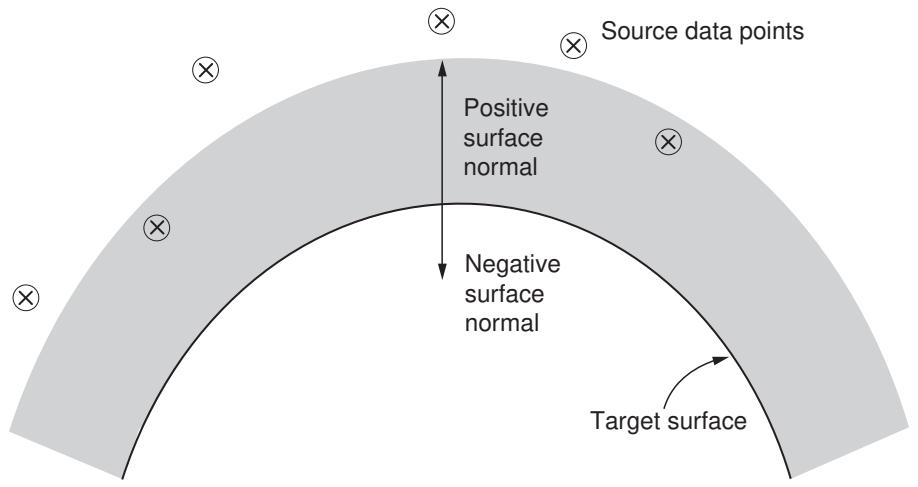

<details>
<summary>text_image</summary>

Source data points
Positive
surface normal
Negative
surface normal
Target surface
</details>

Figure 1: Positive normal search distance.

You can change the tolerance distance values to control which source data points will be included or ignored. You can define the tolerance values as a relative fraction of the average element size in the meshed model or as an absolute distance measured in the length units being used in your model.

For any target points at which Abaqus/CAE cannot map a source point, it will substitute the Default unmapped field value entered in the Create Mapped Field dialog box. The default is zero. The default field value is applied for both point cloud data sources and output database mesh sources.

For a point cloud data source, the following options and search tolerance values are available on the Mapper Controls tabbed page:

## Tolerance type

If you choose Relative (default), the tolerance values are interpreted as a fraction (not percentage) of the average element characteristic size in the meshed model. If you choose Absolute, the tolerance values are taken as exact distances measured in the length units used in your model.

## Positive normal search distance tolerance

Any source points within this distance, as measured along the positive normal vector of the underlying geometry of the target surface, are mapped and included in the analysis (see Figure 1). This tolerance applies only to

surface (not volumetric) target mapping. The default is 0.05 of the average element characteristic size in the meshed model.

## Negative normal search distance tolerance

Any source points within this distance, as measured along the negative normal vector of the underlying geometry of the target surface, are mapped and included in the analysis. This tolerance applies only to surface (not volumetric) target mapping. The default is 0.15 of the average element characteristic size in the meshed model.

## Neighborhood search distance tolerance

Any source data points that lie outside the neighborhood search tolerance are ignored and are not used in the analysis. This tolerance applies to both surface and volumetric target mapping.

Abaqus/CAE uses a distance weighting algorithm to interpolate the field data values on the meshed target model. Abaqus/CAE always tries to interpolate the source values on the target. If Abaqus/CAE finds any points for which interpolation is not possible, a distance weighting algorithm is used that will take nodes within the neighborhood search distance. Distance weighting does not consider any other existing tolerances (positive/negative normal search tolerances or boundary search tolerance). You can deactivate distance weighting by using a very small neighborhood search distance, in which case Abaqus/CAE applies the Default unmapped field value at these nodes.

Abaqus/CAE makes three passes when attempting to map source points onto target points. Abaqus/CAE:

1. Tries to interpolate field values on the target. The neighborhood search tolerance is ignored on the first pass.  
2. Uses the distance weighting algorithm to take source points within the neighborhood search tolerance.  
3. For any target points that remain unmapped, Abaqus/CAE applies the Default unmapped field value.

## Search controls for output database fields

The normal tolerance value defines how far away a source data point can lie from the exterior surface of the target model. By default, each source data point must lie within a distance calculated by multiplying the average element characteristic size in the target model by 0.05. This distance is measured along the normal vector of the target surface. The tolerance values are interpreted as a fraction (not percentage) of the average element characteristic size in the meshed model

You can change the default tolerance values to determine which source data points will be included or discarded.

For any target points at which Abaqus/CAE cannot map a source point, it will substitute the Default unmapped field value entered in the Create Mapped Field dialog box. The default is zero. The default field value is applied for both point cloud data sources and output database mesh sources.

For an output database source, the following options and search tolerance values are available on the Mapper Controls tabbed page:

## Normal search distance tolerance

Any source points within this distance, as measured along the positive normal vector of the underlying geometry of the target surface, are mapped and included in the analysis. This tolerance applies to both surface and volumetric target mapping. The default is 0.05 of the average element characteristic size in the meshed model.

## Boundary search distance tolerance

This tolerance specifies the in-plane distance within which a source data point must lie, outside the region of the elements of the meshed target model (see Figure 2). Increasing this tolerance from the default of 0.01 (of the average element size) effectively allows you to expand each target element face for the purpose of mapping. Increasing this tolerance may be helpful when the source data are a coarser mesh than the target model mesh.

The field values are interpolated when they are mapped onto the target model. The boundary search tolerance applies to both surface mapping and volumetric mapping.

interpolated surface of source data points  
target mesh surface to map onto  
source data points  
nodes in target mesh


<details>
<summary>text_image</summary>

Actual geometric
target surface
Boundary
search
tolerance
</details>

Figure 2: Boundary search distance.

## Volume-to-surface mapping control

The Mapper Controls tabbed page of the Create Mapped Field dialog box includes the Mapping algorithm for target surface option, which lets you choose Surface or Volumetric mapping.

Your target region must be one of three types: a volume, a surface, or a set of nodes in a mesh. If the target is a volume, Abaqus/CAE always performs volumetric mapping. However, if the target is a surface or a set of nodes, you must choose the algorithm that you want Abaqus/CAE to use to apply the source data. Choosing Surface causes Abaqus/CAE to use a surface projection algorithm in which it projects the source data to target surface centroids or nodes. Choosing Volumetric causes Abaqus/CAE to use a volumetric interpolation algorithm in which it interpolates the source data to target element centroids or nodes. The distinction between the two algorithms only affects how field values from a source volume are applied to a target surface.

For the purpose of the mapping algorithm, a target surface or volume is defined in the context of either a geometric model or a mesh in Abaqus/CAE:

• a volume in a geometric model is a three-dimensional cell  
• a volume in a mesh consists of elements  
• a surface in a three-dimensional geometric model is a geometric face  
• a “surface” in a mesh consists of element faces

Your choice of surface versus volumetric algorithm also applies when you are mapping onto nodes and the target nodes are defined by a node set (mesh-based). However, if the target nodes are defined from model geometry, Abaqus/CAE always uses surface mapping for geometric faces and uses volumetric mapping for geometric cells.

The target region is where you apply the load, interaction, boundary condition, or predefined field in your main model. If you apply the same mapped field source in two different attributes, they may have different behaviors if the target region type is different.

Volume-to-surface control for point cloud data sources

Table 1 describes the cases in which Abaqus/CAE performs volumetric or surface mapping for a point cloud data source and when you must choose between the two.

Table 1: Volumetric vs. surface mapping cases for a point cloud data source.

<table><tr><td rowspan="2">Point cloud data source</td><td colspan="3">Target region type</td></tr><tr><td>Geometric cell (3D elements or nodes)</td><td>Shell or surface/faces1</td><td>Node set</td></tr><tr><td>Point cloud data</td><td>Volumetric</td><td>Volumetric or surface</td><td>Volumetric or surface</td></tr><tr><td colspan="4"> $^{1}$  For the purpose of the mapping algorithm, a surface can be a face of a three-dimensional element.</td></tr></table>

Volume-to-surface control for output database sources

Table 2 describes the cases in which Abaqus/CAE performs volumetric or surface mapping for an output database source and when you must choose between the two.

Table 2: Volumetric vs. surface mapping cases for an output database source.

<table><tr><td rowspan="2">Output database source</td><td colspan="3">Target region type</td></tr><tr><td>Geometric cell (3D elements or nodes)</td><td>Shell or surface/faces1</td><td>Node set</td></tr><tr><td>Nodal data</td><td>Volumetric</td><td>Volumetric or surface</td><td>Volumetric or surface</td></tr><tr><td>Element-based data2</td><td>Volumetric</td><td>Volumetric or surface</td><td>Volumetric or surface</td></tr><tr><td>Surface-based data</td><td>N/A (error)</td><td>Surface</td><td>Surface</td></tr><tr><td colspan="4"> $^{1}$  For the purpose of the mapping algorithm, a surface can be a face of a three-dimensional element.</td></tr><tr><td colspan="4"> $^{2}$  Output database averaging controls in the Visualization module affect the continuity of element-based source data.</td></tr></table>

If the target region is a shell or surface, the volumetric algorithm interpolates field values from an entire source volume (in the output database) onto the target surface region. Alternatively, the surface algorithm projects only the field values from the surface of the source volume onto the target surface region.

The surface algorithm projects output database source data onto target surface centroids or nodes when the target surface can reference three-dimensional element faces. The volumetric algorithm interpolates source data onto target element centroids or nodes.

The Attachment toolset allows you to create attachment points and attachment lines that can be used to define fasteners and other components in your model.

The Attachment toolset is available in the Part, Property, Assembly, and Interaction modules. This chapter describes the Attachment toolset and editing features created using the toolset.

## In this section:

Understanding attachment points and lines  
Understanding the projection methods  
Creating attachment points by picking or reading from a file  
Creating attachment points by choosing a direction and a spacing  
Creating patterns of attachment points based on edges  
Creating attachment lines by projecting points  
Editing attachment points and lines  
Removing attachment points and lines

## Understanding attachment points and lines

You use the Attachment toolset to add attachment points and lines to your model. You use attachment points to define point-based fasteners, inertia, springs, dashpots, loads or boundary conditions, or connector points for a connector definition in your model; and you use attachment lines to define discrete fasteners. Fasteners model point-to-point connections (such as spot welds, rivets, and bolts) and are described in About fasteners. You can create attachment points on the assembly or on a part. You can create attachment lines on only the assembly.

You can use the Attachment toolset to create attachment points and lines by selecting Tools->Attachment from the main menu bar and selecting one of the available menu options. In the Interaction module you can use the tools in the module toolbox to create attachment points and lines. The three attachment point tools are also available from the Property module and Part module toolboxes. The Attachment toolset provides the following tools for creating attachment points:

## + Create attachment points by picking or reading from a file

This tool allows you to create attachment points by picking each point from the viewport or reading the coordinates of the points from a file. For detailed instructions, see Creating attachment points by picking or reading from a file.

## Create attachment points by choosing a direction and a spacing

This tool allows you to create attachment points by defining a line and specifying the number of points along the line or specifying the spacing of the points along the line. For detailed instructions, see Creating attachment points by choosing a direction and a spacing.

## Create attachment points by choosing edges and offsets

This tool allows you to create simple patterns of attachment points on edges, on faces, or along directions by selecting a single edge or connected edges and then defining pattern parameters. For detailed instructions, see Creating patterns of attachment points based on edges.

If desired, you can move the points to a specified face, as described in Understanding the projection methods.

The Attachment toolset provides the following tool for creating attachment lines:

## Create attachment lines by projecting points

This tool allows you to create attachment lines by specifying points and then projecting them through multiple faces. Attachment lines connect one or more faces. You can create attachment lines only on the assembly; you cannot create attachment lines on a part. Creating attachment lines is a three-step process:

1. Select the points to project.  
2. Project the points onto a source face along the normal to the surface or along a specified direction.  
3. From the intersection of the projected points with the source face, project the attachment lines to the target faces along the normal to the source face for a specified distance.

For detailed instructions, see Creating attachment lines by projecting points.

Attachment points and lines are features, and they regenerate when you change the model; for example, after you add a cut feature. The regeneration may affect the projection of attachment points and lines and change the total number of fastening points and lines created by the attachment feature. In addition, the sets that contain attachments may be affected by the regeneration. Therefore, you should determine that your attachment points and lines are behaving as expected after you change the model. You should also check that any prescribed conditions that you have applied to your attachment points and lines, such as loads and boundary conditions, have not changed.

## Understanding the projection methods

The Attachment toolset provides three tools for creating attachment points. The tools provide convenient methods for producing points, such as following an edge, reading the coordinates of each point from a file, or spacing points along a line. However, in some cases it may be easier to define the attachment points in one location and project the points onto a desired face. Therefore, Abaqus/CAE provides projection options as a method of positioning attachment points on a face.

The Attachment toolset provides the following techniques to create attachment points by projecting points onto the desired face:

• Project each point to its closest face.  
Choose the start point and end point of a projection vector. Abaqus/CAE projects each point along the vector and creates an attachment point where it first intersects with a face.

Figure 1 illustrates the two techniques for projecting points onto a selected face.  
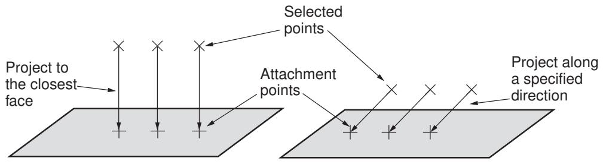

<details>
<summary>flowchart</summary>

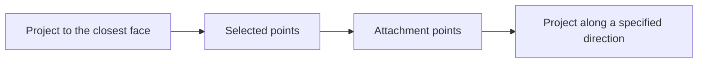
```mermaid
graph LR
  A["Project to the closest face"] --> B["Selected points"]
  B --> C["Attachment points"]
  C --> D["Project along a specified direction"]
```
</details>

Figure 1: Projecting points onto a selected face.

For more information about how fasteners use attachment points, see About fasteners.

## Additional information

• Understanding attachment points and lines  
• About fasteners

## Creating attachment points by picking or reading from a file

You can position attachment points by picking each point from the viewport or by reading the coordinates of the points from a file. If desired, you can create the attachment points by projecting the specified points onto a selected face. You can use attachment points to define the location of point-based fasteners. For more information, see About fasteners.

1. From the main menu bar, select Tools->Attachment->Points From File/By Picking.

Abaqus/CAE displays the Create Attachment Points dialog box.


Tip: You can also create attachment points by picking or reading from a file using the + tool, located with the attachment tools in the Interaction module toolbox or the Property module toolbox. For a diagram of the attachment tools in the toolbox, see Understanding attachment points and lines.

2. From the dialog box, use one of the following methods to enter the coordinates of each attachment point in the table:

Select to pick a point from the part or assembly in the viewport. You can select any existing point from the part, including vertices, datum points, interesting points, reference points, and orphan mesh nodes. You can also enter the X-, Y-, and Z-coordinates of the point in the text field that appears in the prompt area.  
• Click to read an ASCII file containing the X-, Y-, and Z-coordinates of each point.  
Click to delete the selected row from the table.

For more information, see Entering tabular data.

If the attachment points are created on a part, the coordinates you provide are relative to the part's coordinate system. If the attachment points are created on the assembly, the coordinates are relative to the assembly's global coordinate system.

3. To project the specified points onto a selected face, display the Projection tabbed page, and do the following:

a. Toggle on Project onto faces.

b. Click , and select the faces onto which the points will be projected. The faces can be planar or nonplanar.

c. Select the method for projecting the points.

Choose Proximity to allow Abaqus/CAE to draw a vector from each point to the closest point on the selected faces.

Choose Direction to define the vector along which to project the points. Click to choose the Start point and End point of the vector.

For more information, see Understanding the projection methods.

4. By default, Abaqus/CAE creates a set that will contain the attachment points. If desired, you can modify the set name. Toggle off Create set with name if you do not want to create a set containing the attachment points.

5. Click OK to create the attachment points.

Abaqus/CAE displays the attachment points. You cannot modify attachment points; you must delete the points and create new points.

## Additional information

• Understanding attachment points and lines  
• About fasteners

## Creating attachment points by choosing a direction and a spacing

You can position attachment points by choosing a start point and a direction and by specifying the spacing of the points. If desired, you can create the attachment points by projecting the specified points onto a selected face. You can use attachment points to define the location of point-based fasteners. For more information, see About fasteners.

1. From the main menu bar, select Tools->Attachment->Points Along Direction.


Tip: You can also create attachment points by choosing a direction and a spacing using the

tool, located with the attachment tools in the Interaction module toolbox or the Property module toolbox. For a diagram of the attachment tools in the toolbox, see Understanding attachment points and lines.

2. From the current viewport, select a point representing the starting point. You can also enter the X-, Y-, and Z-coordinates of the point in the text field that appears in the prompt area.

Abaqus/CAE displays the Create Attachment Points Along Direction dialog box.

3. From the dialog box, use either of the following methods to select a method for specifying the direction along which the points will be created:

• Choose End point and click to select a point specifying the end point of the direction vector.  
• Choose Straight line and click to select a straight line specifying the direction vector.

4. Do either of the following to specify the spacing of the points along the direction vector:

Choose Number of points between start and end points, and enter the desired number of points. (This option is available only when you select an end point to specify the direction vector.)

• Choose Spacing, and enter the distance between each attachment point.

Do either of the following to specify the number of points to create:

Choose Number of points along direction, and enter the desired number of points. The attachment points can extend beyond the end point of the direction vector. Click t o reverse the direction vector.

Choose Auto-fit points between start and end points to allow Abaqus/CAE to determine the number of points that can be created between the start and end points with the specified spacing.

5. By default, Abaqus/CAE creates additional attachment points at both ends of the direction vector. If desired, toggle off At start point and/or At end point to prevent Abaqus/CAE from creating the additional points.

6. To project the specified points onto a selected face, display the Projection tabbed page, and do the following:

a. Toggle on Project onto faces.

b. Click $\ Q$ , and select the faces onto which the points will be projected. The faces can be planar or nonplanar.

c. Select the method for projecting the points.

Choose Proximity to allow Abaqus/CAE to draw a vector from each point to the closest point on the selected faces.

• Choose Direction to define the vector along which to project the points. Click to choose the Start point and End point of the vector.

For more information, see Understanding the projection methods.

7. By default, Abaqus/CAE creates a set that will contain the attachment points. If desired, you can modify the set name. Toggle off Create set with name if you do not want to create a set containing the attachment points.  
8. Click OK to create the attachment points. Abaqus/CAE displays the attachment points. For information on editing attachment points, see Editing attachment points created by choosing a direction and a spacing.

## Additional information

• Understanding attachment points and lines

• About fasteners

## Creating patterns of attachment points based on edges

You can position attachment points in a simple pattern along a single edge or connected edges. You can then position the points in a pattern of rows on an adjacent face or along a specified direction. If desired, you can project the specified points onto a selected face. You can use the attachment points to define the location of point-based fasteners. For more information, see About fasteners.

1. From the main menu bar, select Tools->Attachment->Points Offset From Edges.


Tip: You can also create attachment points by choosing edges and offsets using the tool, located with the attachment tools in the Property module or Interaction module toolbox. For more information on the attachment tools in the toolbox, see Understanding attachment points and lines.

2. From the current viewport, select the edges on which to assign the attachment points. You can select multiple edges as long as the edges are connected and do not branch. You can click Sets from the right side of the prompt area to use a previously defined set.

If the edge selection forms a closed loop, select the starting vertex for point generation from the viewport.

A red arrow appears to indicate the direction of point generation from the start point.

3. In the prompt area, click Flip to reverse the direction of point generation, if necessary, and click Yes.

Abaqus/CAE displays the Create Attachment Points Offset From Edges dialog box.

4. From the dialog box, specify the points along the edges.

• Select by number to define the number of attachment points along the edge selection. Abaqus/CAE automatically spaces the points along the edges.

1. Enter the number of points along the edges.  
2. Enter the desired offset of the first attachment point from the start point.  
3. Enter the desired offset of the last attachment point from the end point.

• Select by spacing to define the distance between the attachment points.

1. Enter the spacing between the points.  
2. Enter the desired offset of the first attachment point from the start point.  
3. Specify the number of points along the edges, or select Auto-fit to have Abaqus/CAE determine the number of attachment points. If you specify the number of points, Abaqus/CAE will create only the points between the start point and the end point; any points extending past the end point will not be created.

5. If desired, define the pattern of rows of the attachment points by specifying the following:

• Enter the number of rows in the pattern. The default value of 1 creates a single row of attachment points.  
• Enter a value for spacing to define the distance between the rows of the pattern.  
• Enter the offset distance of the first row of the pattern from the edges. The default value of 0 will create the first row of the pattern on the edges.

• Select Orthogonal to faces as the offset method, and click to select an adjacent face on which to position the pattern.  
• Select Along direction as the offset method, and click to specify the start and end points of the direction vector.

6. To project the specified points onto a selected face, display the Projection tabbed page and do the following:

a. Toggle on Project onto faces.

b. Click , and select the faces onto which the points will be projected. The faces can be planar or nonplanar.

c. Select the method for projecting the points.

Choose Proximity to allow Abaqus/CAE to draw a vector from each point to the closest point on the selected faces.  
Choose Direction to define the vector along which to project the points. Click to choose the Start point and End point of the vector.

For more information, see Understanding the projection methods.

7. By default, Abaqus/CAE creates a set that contains the attachment points. If desired, you can modify the set name. Toggle off Create set with name if you do not want to create a set containing the attachment points.  
8. Click OK to create the attachment points.

Abaqus/CAE displays the attachment points. For information on editing attachment points, see Editing attachment points created by a pattern based on edges.

## Additional information

• Understanding attachment points and lines  
• About fasteners

## Creating attachment lines by projecting points

Positioning attachment lines is a three-step process:

1. Select the points to project.  
2. Project the points onto a source face along a specified direction.  
3. From the intersection of the projected points with the source face, project the attachment lines to the target faces along the normal to the source face for a specified distance or to a specified number of target faces.

You can use attachment lines to define the location of discrete fasteners. For more information, see About fasteners.

1. From the main menu bar, select Tools->Attachment->Lines by Projecting Points.


Tip: You can also create attachment lines by projecting points using the tool, located with the attachment tools in the Interaction module toolbox. For a diagram of the attachment tools in the toolbox, see Understanding attachment points and lines.

2. From the current viewport, select the points to project and click Done in the prompt area. You can select vertices, reference points, or attachment points.  
3. From the current viewport, select the source faces onto which the points will be projected and click Done in the prompt area. An attachment line starts where the direction vector intersects a source surface.  
4. From the current viewport, select the target faces that will be intersected by the attachment lines, and click Done in the prompt area. Attachment lines are drawn from the start point normal to the source face and end at the furthermost target face.

Abaqus/CAE displays the Create Attachment Lines By Projecting Points dialog box. If desired, you can use the dialog box to edit the points and the source and target faces.

5. From the dialog box, select the method for projecting the points:

Choose Proximity to allow Abaqus/CAE to draw a vector from each point to the closest point on the selected faces.  
Choose Direction to define the vector along which to project the points. Click to choose the Start point and End point of the vector.

6. To change the target faces, display the Target tabbed page, and do the following:

a. Abaqus/CAE displays an arrow indicating the direction in which the points on the source faces

will be projected to the target faces. Click to reverse the direction of the arrow.

b. Select the method for determining the length of the projection vector:

• Choose Maximum projections along direction, and enter the maximum number of target faces to be intersected by the attachment lines.  
• Choose Maximum length of projection vector, and enter the maximum length of the attachment lines.

7. By default, Abaqus/CAE creates a set that will contain the end points of the attachment lines. If desired, you can modify the set name. Toggle off Create set with name if you do not want to create a set containing the end points.

8. Click OK to create the attachment lines.

Abaqus/CAE displays the attachment lines. For information on editing attachment lines, see Editing attachment lines created by projecting points.

## Additional information

• Understanding attachment points and lines  
• About fasteners

## Editing attachment points and lines

You can edit several parameters for attachment points created by choosing a direction and spacing, attachment points created in patterns along or offset from edges, and attachment lines created by projecting points.

You cannot edit attachment points created by picking or reading from a file. Attachment features created in the Part module or Property module can be edited only from those two modules; attachment features created in the Assembly module or Interaction module can be edited only from those two modules. By default, Abaqus/CAE regenerates the model when the edit procedure is finished.

## In this section:

Editing attachment points created by choosing a direction and a spacing  
Editing attachment points created by a pattern based on edges  
Editing attachment lines created by projecting points

## Editing attachment points created by choosing a direction and a spacing

You can edit attachment points created by choosing a direction and a spacing.

1. From the main menu bar, select Feature->Edit.


Tip: You can also edit a feature by clicking the tool located in the module toolbox.

2. Select the attachment point feature to modify. You can select the feature either directly from the current viewport or from the Model Tree.

The Edit Attachment Points Along Direction Feature dialog box appears.

3. Select the method for specifying the spacing of the points along the direction vector:

Choose Number of points between start and end points, and enter the desired number of points. (This option is available only when you select an end point to specify the direction vector.)  
• Choose Spacing, and enter the distance between each attachment point.

Do either of the following to specify the number of points to create:

Choose Number of points along direction, and enter the desired number of points. The attachment points can extend beyond the end point of the direction vector.  
Choose Auto-fit points between start and end points to allow Abaqus/CAE to determine the number of points that can be created between the start and end points with the specified spacing. (This option is available only when you select an end point to specify the direction vector.)

4. Toggle At start point and/or At end point to add or remove attachment points at the start and end points. The At end point option is available only when you have selected an end point to specify the direction vector.  
5. If desired, toggle Regenerate on OK to control the model regeneration when the edit procedure is finished.

## Additional information

• Understanding attachment points and lines  
• About fasteners

You can edit attachment points created by a pattern based on edges.

1. From the main menu bar, select Feature->Edit.


Tip: You can also edit a feature by clicking the tool located in the module toolbox.

2. Select the attachment point feature to modify. You can select the feature either directly from the current viewport or from the Model Tree.

The Edit Attachment Points Offset From Edges Feature dialog box appears.

3. Do either of the following to specify the points along the edges:

Select by number to define the number of attachment points along the edge selection. Abaqus/CAE automatically spaces the points along the edges.

1. Enter the number of points along the edges.  
2. Enter the desired offset of the first attachment point from the start point.  
3. Enter the desired offset of the last attachment point from the end point.

• Select by spacing to define the distance between the attachment points.

1. Enter the spacing between the points.  
2. Enter the desired offset of the first attachment point from the start point.  
3. Specify the number of points along the edges, or select Auto-fit to have Abaqus/CAE determine the number of attachment points. If you specify the number of points, Abaqus/CAE will create only the points between the start point and the end point; any points extending past the end point will not be created.

4. If desired, define the pattern of rows of the attachment points by specifying the following:

• Enter the number of rows in the pattern. A value of 1 creates a single row of attachment points.  
• Enter a value for spacing to define the distance between the rows of the pattern.  
• Enter the offset distance of the first row of the pattern from the edges. A value of 0 creates the first row of the pattern on the edges.

5. If desired, toggle Regenerate on OK to control the model regeneration when the edit procedure is finished.

## Additional information

• Understanding attachment points and lines  
• About fasteners

## Editing attachment lines created by projecting points

You can edit attachment lines created by projecting points.

1. From the main menu bar, select Feature->Edit.


Tip: You can also edit a feature by clicking the tool located in the module toolbox.

2. Select the attachment line feature to modify. You can select the feature either directly from the current viewport or from the Model Tree.

The Edit Attachment Lines Feature dialog box appears.

3. Select the method for determining the length of the projection vector.

Choose Maximum projections along direction, and enter the maximum number of target faces to be intersected by the attachment lines.  
• Choose Maximum length of projection vector, and enter the maximum length of the attachment lines.

4. If desired, toggle Regenerate on OK to control the model regeneration when the edit procedure is finished.

## Additional information

• Understanding attachment points and lines

• About fasteners

## Removing attachment points and lines

You can remove attachment points and lines from your model. The removed attachment points or lines appear in the Model Tree as a Remove Attachments feature in the Features container under the part or assembly, depending on the module in which the attachment points or lines were created. You can suppress or delete the Remove Attachments feature to restore the removed attachment points or lines. Attachment points created in the Part module or Property module can be removed only from these two modules; attachment points and lines created in the Assembly module or Interaction module can be removed only from these two modules.

1. From the main menu bar, select Tools->Attachment->Remove attachments.  
2. From the current viewport, select the attachment points or lines to remove. You can click Sets from the right side of the prompt area to remove a previously defined set.  
3. If you are in the Part module or Property module, click Done in the prompt area to indicate that you have finished selecting attachment points to remove.  
The selected attachment points are removed from the model and a Remove Attachments feature is created in the Model Tree under the part.

4. If you are in the Interaction module or Assembly module, do the following:

a. In the prompt area, click Done to indicate that you have finished selecting attachment points or lines to remove.

b. In the dialog box that appears, do one of the following:

• Click Yes to continue and remove the selected attachment points or lines from the model.  
A Remove Attachments feature is created in the Model Tree under the assembly.  
• Click No to return to the viewport to modify the selected attachment points or lines to remove.  
• Click Cancel to exit the procedure without removing any attachment points or lines.

5. If desired, select additional attachment features to remove.

6. Click mouse button 2 to exit the remove attachments procedure.

## Additional information

• Understanding attachment points and lines  
• About fasteners

## The CAD Connection toolset

The CAD Connection toolset is used by the optional add-on associative interfaces for Abaqus/CAE to create a connection from Abaqus/CAE to another CAD system.

You can use the CAD system to modify a model or to change its position, and you can use the established connection to update the model quickly in Abaqus/CAE. You can also modify some geometric features in Abaqus/CAE and use the CAD connection to update the original CAD system model.

## In this section:

Creating a CAD connection  
Updating geometry parameters in an imported model

## Creating a CAD connection

You can use the CAD Connection toolset to create a connection from Abaqus/CAE to another CAD system running an associative interface plug-in.

You can use the connection to export the model from the CAD system to the Assembly module in Abaqus/CAE. You can also use the connection to export certain geometry modifications from an imported model in Abaqus/CAE back to the CAD system (see Updating geometry parameters in an imported model). Associative interface plug-ins are available for the following CAD systems:

• CATIA V6  
• CATIA V5  
• SOLIDWORKS  
• Pro/ENGINEER  
• NX (Unigraphics)

Figure 1 shows concurrent CATIA V5 and Abaqus/CAE sessions and illustrates the communication between the applications.  
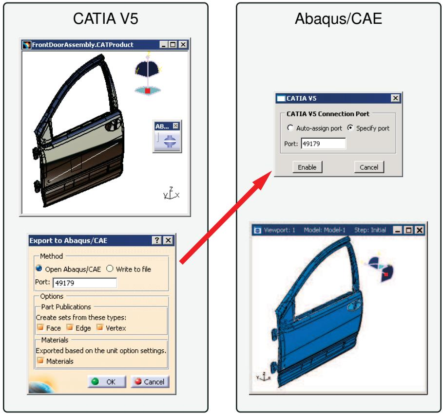

<details>
<summary>flowchart</summary>

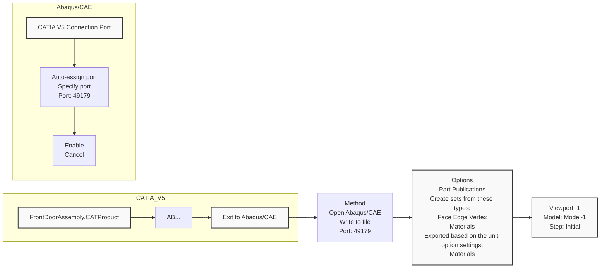
```mermaid
graph LR
  subgraph CATIA_V5
  A1["FrontDoorAssembly.CATProduct"] --> B1["AB..."]
  B1 --> C1["Exit to Abaqus/CAE"]
  end

  subgraph Abaqus_CAE["Abaqus/CAE"]
  D1["CATIA V5 Connection Port"] --> E1["Auto-assign port\nSpecify port\nPort: 49179"]
  E1 --> F1["Enable\nCancel"]
  end

  C1 --> G1["Method\nOpen Abaqus/CAE\nWrite to file\nPort: 49179"]
  G1 --> H1["Options\nPart Publications\nCreate sets from these types:\nFace Edge Vertex\nMaterials\nExported based on the unit option settings.\nMaterials"]
  H1 --> I1["Viewport: 1\nModel: Model-1\nStep: Initial"]

  style A1 fill:#f9f9f9,stroke:#333,stroke-width:2px
  style C1 fill:#f9f9f9,stroke:#333,stroke-width:2px
  style D1 fill:#f9f9f9,stroke:#333,stroke-width:2px
  style H1 fill:#f9f9f9,stroke:#333,stroke-width:2px
  style I1 fill:#f9f9f9,stroke:#333,stroke-width:2px
```
</details>

Figure 1: Associative import using the CATIA V5 Associative Interface.

Using a CAD connection to transfer a model from a CAD system running an associative interface plug-in to Abaqus/CAE is called associative import. For further information about the individual associative interface plug-ins, including the CAD packages that support associative import along with the supported version numbers, see the following resources:

• SIMULIA Installation Guide  
https://www.3ds.com/products-services/simulia/products/abaqus/add-ons/cad-associative-interfaces  
• Dassault Systèmes Knowledge Base at http://support.3ds.com/knowledge-base/

1. From the main menu bar in the Assembly module, select Tools->CAD Interfaces->CAD System. CAD System is the name of the CAD system to which you are connecting; you can establish connections with CATIA V6, CATIA V5, SOLIDWORKS, NX, and Pro/ENGINEER.  
2. From the dialog box that appears, do one of the following:

## Auto-assign port

Choose Auto-assign port, and click Enable to open a port from Abaqus/CAE.

Abaqus/CAE displays the port number that it assigned in the message area. When you export a model from the CAD system, the data are transferred through this connection port number.

## Specify port

Choose Specify port, and enter a port number to specify a port. The number must be between 1025 and 65535. If you are reopening a connection, you can use the port number displayed by Abaqus/CAE when it first assigned the port.

## Disable port

If a connection has already been enabled, you can click Disable from the dialog box to disable the connection.

3. After you have used the CAD Connection toolset to create a connection from Abaqus/CAE to another CAD system running an associative interface plug-in, you can do the following to export the assembly to the Abaqus/CAE session:

## CATIA V6

## CATIA V6R2013x or earlier

Select Tools->Associative Export->Export to Abaqus/CAE from the main menu bar.

## CATIA V6R2014 or later

Select Share->Export->Associative Export->Export to Abaqus/CAE.

More detailed instructions are available in the SIMULIA Associative Interface for Abaqus/CAE User's Guide; this guide is available after you install the SIMULIA Associative Interface for Abaqus/CAE app.

## CATIA V5

Select Abaqus->Export to Abaqus/CAE from the CATIA V5 main menu bar. In the Export to Abaqus/CAE dialog box that appears, select Open Abaqus/CAE, and click OK. More detailed instructions are available in the CATIA V5 Associative Interface User's Guide; you can find information about this guide in the Dassault Systèmes Knowledge Base at http://support.3ds.com/knowledge-base/.

## SOLIDWORKS

Select Abaqus->Export to Abaqus/CAE from the SOLIDWORKS main menu bar. In the Export to Abaqus/CAE dialog box that appears, toggle on Open in Abaqus/CAE, and click the green check mark. More detailed instructions are available in the SOLIDWORKS Associative

Interface User's Guide; you can find information about this guide in the Dassault Systèmes Knowledge Base at http://support.3ds.com/knowledge-base/.

## Pro/ENGINEER

Select Abaqus->Open in CAE from the Pro/ENGINEER main menu bar. More detailed instructions are available in the Pro/ENGINEER Associative Interface User's Guide; you can find information about this guide in the Dassault Systèmes Knowledge Base at http://support.3ds.com/knowledge-base/.

## NX

Select Abaqus->Open in /CAE from the NX main menu bar. More detailed instructions are available in the Abaqus/CAE Associative Interface for NX User’s Guide; you can download this guide from the Elysium, Inc. website.

For more information on associative import, see What can I do with the associative interfaces?.

## Updating geometry parameters in an imported model

The parameter update capability allows a bidirectional associative import, in which you modify the dimensions of geometric features in a model that has been imported into Abaqus/CAE, then propagate the new dimensions back to the model files from the original CAD system. This bidirectional import feature is currently available only with the CATIA V5 Associative Interface, the CATIA V6 Associative Interface, and the Pro/ENGINEER Associative Interface.

To use the parameter update capability, you must first use the CAD system (CATIA V5, CATIA V6, or Pro/ENGINEER) to indicate which model dimensions can be modified within Abaqus/CAE. The modifiable dimensions must be defined in terms of feature-level parameters, which are imported into Abaqus/CAE along with the model. For example, a parameter may be associated with the radius of a hole in the model; modifying the value of that parameter also modifies the radius of the hole. Each parameter name must begin with the string ABQ\_ to be imported into Abaqus/CAE. In addition, to avoid overwriting an existing parameter with the same name, each parameter name must be unique.

The CATIA V5 Associative Interface, the CATIA V6 Associative Interface, and the Pro/ENGINEER Associative Interface use a special parameters (.par\_abq) file to pass parameters to Abaqus/CAE. For more information about defining modifiable parameters in an imported CATIA V5, CATIA V6, or Pro/ENGINEER model, refer to the CATIA V5 Associative Interface, the CATIA V6, or the Pro/ENGINEER Associative Interface User's Guides. These guides are available from the Dassault Systèmes Knowledge Base at http://support.3ds.com/knowledge-base/.

You can use the CAD Parameters dialog box in Abaqus/CAE to assign new values to the imported parameters. When you change a parameter value, the associated geometry feature is regenerated both in the Abaqus/CAE model and in the saved CAD model. This dialog box also enables you to keep the CAD software running in the background after you make a change to CAD parameters. Having the CAD software running in the background improves performance for bidirectional parameter update, but this option occupies a license for your CAD software for the remainder of your session.

1. Do either of the following:

• Import a model from CATIA V5 using the CATIA V5 Associative Interface.  
• Import a model from CATIA V6 using the CATIA V6 Associative Interface.  
• Import a model from Pro/ENGINEER using the Pro/ENGINEER Associative Interface.

2. Open the CAD Parameters dialog box:

• In the Part module, select Tools->CAD Parameters.  
• In the Assembly module, select Tools->CAD Interfaces->CAD Parameters.

The CAD Parameters dialog box displays all of the parameters that can be modified.

3. If you are importing parameters from CATIA V5 or Pro/ENGINEER, click on a parameter name to highlight the portion of the model that is impacted by that parameter in the viewport.  
4. To modify a parameter value, click the appropriate cell in the Value column, and enter a new value.  
5. If you are importing parameters from Pro/ENGINEER, you can toggle on Keep CAD software running in the background after parameter update. This option improves performance if you perform bidirectional import or make additional updates.  
6. When you have changed all of the necessary parameter values, do one of the following:

Click Update to regenerate the model in Abaqus/CAE based on the new parameter values. The geometry in the saved Pro/ENGINEER part (.prt) files is updated as well. The original model must not be open in Pro/ENGINEER when you perform the update.  
Click mouse button 3, and select Write to File to create an updated parameters file without updating the model geometry. This file can be used to manually update parameters using the Abaqus Scripting

Interface. For more information about the parameters file, refer to the Pro/ENGINEER Associative Interface User's Guide.

Click Defaults to reset all of the parameters in the CAD Parameters table to the values in the current Abaqus/CAE model.

## Additional information

• What can I do with the associative interfaces?  
• Creating a CAD connection

## The Customize toolset

The Customize toolset allows you to change the behavior and appearance of some aspects of Abaqus/CAE.

## In this section:

Configuring the visibility of toolbars  
Configuring keyboard shortcuts  
Custom toolbars  
Configuring icons in custom toolbars  
Using the Customize toolset

## Configuring the visibility of toolbars

Using the Customize toolset, you can remove individual toolbars from the Abaqus/CAE display. Hiding toolbars that you use infrequently reduces clutter on the screen. You can always access the functionality in a hidden toolbar using an alternate method (such as the main menu bar, module-specific toolboxes, or keyboard shortcuts).

There are three ways to change the visibility of a toolbar:

## Closing a floating toolbar

You can hide a floating toolbar by clicking the “X” in the toolbar's title bar. For an explanation of floating versus docked toolbars, see Components of the toolbars.

To resume the display of a floating toolbar, you must use one of the techniques described below.

## Using the main menu bar

To hide a visible toolbar, select View->Toolbars->Toolbar Name from the main menu bar. Use the same procedure to resume the display of a hidden toolbar. Toolbars that are currently being displayed have a check mark next to their names in the menu listing.

## Using the Customize dialog box

Using the Customize dialog box, you can change the visibility of multiple toolbars at once. Open the Customize dialog box by selecting Tools->Customize from the main menu bar. On the Toolbars tabbed page, toggle off any toolbars you want to hide; toggle on any toolbars you want to make visible.

## Configuring keyboard shortcuts

You can use the Customize toolset to edit default keyboard shortcuts, to add new shortcuts for other functions in Abaqus/CAE, and to display a list of all currently defined shortcuts.

A keyboard shortcut is a single keystroke or combination of keys that you can use to launch a function in Abaqus/CAE; for example, [Ctrl] + S saves the current model.

Several keyboard shortcuts are defined by default for common functions. Select Tools->Customize from the main menu bar; display the Functions tabbed page of the dialog box that appears to access the Keyboard editor.


Tip: Keyboard shortcuts are active only when their function is allowed in the current module and only when the application's focus is not in the Model Tree, Results Tree, message area, or command line interface. If a shortcut does not appear to work, confirm that the function is allowed in the current module or shift focus to the viewport by clicking the viewport title bar.

Abaqus/CAE allows the following keys and key combinations to be specified as keyboard shortcuts:

• Any function key except the F1 key,  
• [Alt] + [Shift] + any key, or  
• [Ctrl] + any key (except [Ctrl] + A, which is limited to the select all option in a selection procedure). You can also add [Alt] or [Shift] to any keyboard shortcut that includes the [Ctrl] key.

However, not all keys are eligible for inclusion in a keyboard combination; you cannot specify a keyboard combination that includes a function key or a key from the alphanumeric keypad.

• Filtering your selection based on the type of object

## Custom toolbars

The Customize toolset allows you to create custom toolbars containing shortcuts to most of the defined functions in Abaqus/CAE. A custom toolbar can be used to collect commonly used tools in a single location, create tools for functions that do not have an existing shortcut, or provide easily accessible controls for a common procedure (for example, the create part, instance part, and mesh part functions could all be part of the same toolbar). Custom toolbars are visible in all modules. If a tool acts as a shortcut to a module-specific function, Abaqus/CAE automatically switches to the appropriate module when that tool is invoked.

The contents and locations of custom toolbars are saved between sessions.

To create a custom toolbar, select Tools->Customize from the main menu bar. For detailed instructions on the creation of custom toolbars, see Creating and modifying custom toolbars.

## Configuring icons in custom toolbars

You can change the default icon that is assigned to tools in custom toolbars. If you create a tool that does not have a default icon assignment, you can assign a new icon to that tool. If a tool appears in more than one custom toolbar, the icon assignment for that tool applies in all custom toolbars. The icons in default Abaqus/CAE toolbars and toolboxes cannot be changed and are not affected by custom icon assignments.

To change or add an icon assignment, select Tools->Customize from the main menu bar. On the Functions tabbed page of the dialog box that appears, select a tool's function and click Select to assign a new icon to that tool.

When assigning an icon, you can select from any of the icons currently used in Abaqus/CAE. You can also import user icons. User icons must be in one of the following formats: bitmap (.bmp), GIF (.gif), PNG (.png), or XPM (.xpm). Icon images should be sized appropriately—the standard size for toolbar icons in Abaqus/CAE is 24 × 24 pixels. You cannot scale the size with which user icons are displayed in Abaqus/CAE; if you increase the icon size scale factor (as described in Scaling the size of icons), only the Abaqus/CAE icons will increase in size.

Abaqus/CAE creates a directory named abaqus\_icons in your home directory to store imported user icon images. If you delete an image file from this directory, Abaqus/CAE reverts to the default icon assignment for any tools that use the deleted image file.

The same icon can be assigned to multiple tools. To distinguish the functions of tools using the same icon, place the cursor over a tool for a moment; a small box, or “tooltip,” containing a description of the tool's function will appear.

## Using the Customize toolset

All of the functionality of the Customize toolset is accessible through the Customize dialog box.

Select Tools->Customize or View->Toolbars->Customize from the main menu bar in any module to open the Customize dialog box.

This section explains how to use the features of the Customize dialog box.

## In this section:

Hiding toolbars  
Creating, modifying, and removing keyboard shortcuts  
Displaying existing keyboard shortcuts  
Creating and modifying custom toolbars  
Changing icon assignments  
Restoring toolbars to their default settings

## Hiding toolbars

Select Tools->Customize from the main menu bar to set the visibility of toolbars in Abaqus/CAE. For other methods of hiding toolbars, see Configuring the visibility of toolbars.

1. From the main menu bar in any module, select Tools->Customize.  
The Customize dialog box appears.  
2. On the Toolbars tabbed page, toggle on the name of any toolbar you want to display; toggle off the name of any toolbar you want to hide.  
3. When you have set the visibility for all toolbars as desired, click Dismiss to close the Customize dialog box.

## Additional information

• Components of the toolbars  
• Configuring the visibility of toolbars  
• Using the Customize toolset

## Creating, modifying, and removing keyboard shortcuts

You can assign keyboard shortcuts to particular functions in Abaqus/CAE.

For information on acceptable keystroke combinations, see Configuring keyboard shortcuts.

1. From the main menu bar in any module, select Tools->Customize.  
2. From the Customize dialog box that opens, click the Functions tab.  
3. From the Module/Toolset list, select the Abaqus/CAE module or toolset to which your function belongs.  
Abaqus/CAE populates the Functions list with the available functions in the selected module or toolset.  
4. Select the function for which you want to create, modify, or remove a keyboard shortcut.  
5. Perform one of the following steps:

## To create or modify a keyboard shortcut:

Enter the function key or key combination that you want to use, then click Assign.

The new keyboard shortcut appears in the Current shortcut field.

## To remove a keyboard shortcut:

Click Remove.

Abaqus/CAE deletes the keyboard shortcut assignment and clears the Current shortcut field.

## Additional information

• Configuring keyboard shortcuts  
• Using the Customize toolset

## Displaying existing keyboard shortcuts

The Shortcut Listing dialog box displays a listing of all keyboard shortcuts currently assigned in Abaqus/CAE and the functions to which they map.

1. From the main menu bar in any module, select Tools->Customize.  
2. From the Customize dialog box that opens, click the Functions tab.  
3. To display a list of existing keyboard shortcuts, click Show all assignments.

From the Shortcut Listing dialog box that appears, you can review all currently defined keyboard shortcuts.

## Additional information

• Configuring keyboard shortcuts  
• Creating, modifying, and removing keyboard shortcuts  
• Using the Customize toolset

## Creating and modifying custom toolbars

You can create new toolbars, change the contents of existing custom toolbars, rename custom toolbars, or delete custom toolbars.

Select Tools->Customize to edit custom toolbars in Abaqus/CAE.

## Additional information

• Components of the toolbars  
• Custom toolbars  
• Using the Customize toolset

## Create or modify a custom toolbar

1. From the main menu bar in any module, select Tools->Customize.  
The Customize dialog box appears.

2. To create a new custom toolbar:

a. On the Toolbars tabbed page, click Create.  
b. In the dialog box that appears, enter a Name for the new toolbar, and click OK.  
Abaqus/CAE creates an empty floating toolbar in the main window.

3. Display the Functions tabbed page.

4. From the Module/Toolset list, select the Abaqus/CAE module or toolset to which your desired function belongs.

In a custom toolbar, you should use the render style Functions available when Visualization Display Options is selected in the Module/Toolset list instead of those available for View Manipulation.

Abaqus/CAE populates the Functions list with the available functions in the selected module or toolset.

5. In the Functions list, locate the function that you want to add to the toolbar. Click and drag the function

over a custom toolbar; the cursor changes to a plus symbol . Release the mouse button to add the function to the toolbar.

You can drag functions onto new or existing custom toolbars.

6. If desired, add or modify the icon assignment for the selected function. See Changing icon assignments, for details.

7. To remove a function from a custom toolbar, click the icon on the toolbar and drag it off the toolbar;

the cursor changes to a minus symbol . Release the mouse button to delete the icon from the toolbar.


## Note:

You can remove icons from a custom toolbar at any time using this procedure. The Customize dialog box does not need to be open.

8. Repeat Steps 4 to 7 until the toolbar contains all of the desired functions.  
9. Click Dismiss to close the Customize dialog box.

## Rename a custom toolbar

1. From the main menu bar in any module, select Tools->Customize.

The Customize dialog box appears.

2. Display the Toolbars tabbed page.  
3. Select the toolbar whose name you want to change, and click Rename.  
4. In the dialog box that appears, enter a new name for the toolbar and click OK.  
5. Click Dismiss to close the Customize dialog box.

## Delete a custom toolbar

1. From the main menu bar in any module, select Tools->Customize. The Customize dialog box appears.  
2. Display the Toolbars tabbed page.  
3. Select the name of the toolbar that you want to delete, and click Delete.  
4. Click Dismiss to close the Customize dialog box.

Select Tools->Customize to change the icon that is associated with a particular tool or function on a custom toolbar.

1. From the main menu bar in any module, select Tools->Customize.

The Customize dialog box appears.

2. Display the Functions tabbed page.

3. From the Module/Toolset list, select the Abaqus/CAE module or toolset to which your desired function belongs.

Abaqus/CAE populates the Functions list with the available functions in the selected module or toolset.

4. From the Functions list, select the function whose icon you want to change.

5. In the Icon field at the bottom right of the dialog box, click Select.

The Select Icon dialog box appears.

6. To use an existing Abaqus/CAE icon, select the icon image from the display on the Abaqus Icons tabbed page and click OK.

Abaqus/CAE updates the icon for the selected function in all custom toolbars.

7. To use a custom icon:

a. Display the User Icons tabbed page.

b. To remove a custom icon from the selection display on the User Icons tabbed page, select the icon image and click Delete.

c. If the icon you want to use is in the display, skip to step “e.”

If the icon you want is not in the display, click Import to import the icon image.

d. In the Select an Icon dialog box that appears, select an image file to use as an icon. See Configuring icons in custom toolbars, for information on acceptable icon image files. For information on using the Select an Icon dialog box, see Using file selection dialog boxes.

e. Select the icon image from the display on the User Icons tabbed page, and click OK.

Abaqus/CAE updates the icon for the selected function in all custom toolbars.


## Note:

You cannot modify the icons in default Abaqus/CAE toolbars and toolboxes. Nondefault icon assignments apply only to tools in custom toolbars.

8. Click Dismiss to close the Customize dialog box.

## Additional information

• Custom toolbars  
• Configuring icons in custom toolbars  
• Using the Customize toolset

## Restoring toolbars to their default settings

The Reset button in the Customize dialog box restores all of the toolbars to their original settings. Resetting the toolbars:

• returns all default Abaqus/CAE toolbars to their original visibility settings;  
• relocates all default Abaqus/CAE toolbars to their original positions below the main menu bar; and  
• deletes all custom toolbars.

These setting do not take effect immediately; you must restart Abaqus/CAE to see the changes. Any changes you make to the toolbar settings between clicking the Reset button and restarting Abaqus/CAE will not be saved.

1. From the main menu bar in any module, select Tools->Customize.

The Customize dialog box appears.

2. On the Toolbars tabbed page, click Reset.

3. Restart Abaqus/CAE.

## Additional information

• Components of the toolbars  
• Using the Customize toolset

A datum is a construction aid that helps you progress through the modeling process when the model itself does not contain the desired geometry. You use the Datum toolset to create these construction aids.

This section explains how you use the Datum toolset to create and position datum points, axes, planes, and coordinate systems.

## In this section:

Understanding the role of datum geometry  
Using the Datum toolset  
Why are datum coordinate systems so important?  
Understanding a datum as a feature  
Datum creation techniques  
Creating datum points  
Creating datum axes  
Creating datum planes  
Creating datum coordinate systems

## Understanding the role of datum geometry

As you proceed through the modeling process, you may find that you need a particular piece of geometry, such as a vertex or an edge, that does not exist in your model. You can use the Datum toolset to create the required piece of geometry, which is called a datum.

You can create a datum point, a datum axis, a datum plane, or a datum coordinate system.

• When prompted to select a point, you can select a point from a part, a datum point, or the origin of a datum coordinate system.  
• When prompted to select an edge, you can select an edge from a part, a datum axis, or one of the axes of a datum coordinate system.  
• When prompted to select a face, you can select a face from a part or a datum plane.  
• When prompted to select a coordinate system, you must select a datum coordinate system.

An example of how you might use a datum plane as a sketching plane involves the part shown in Figure 1.

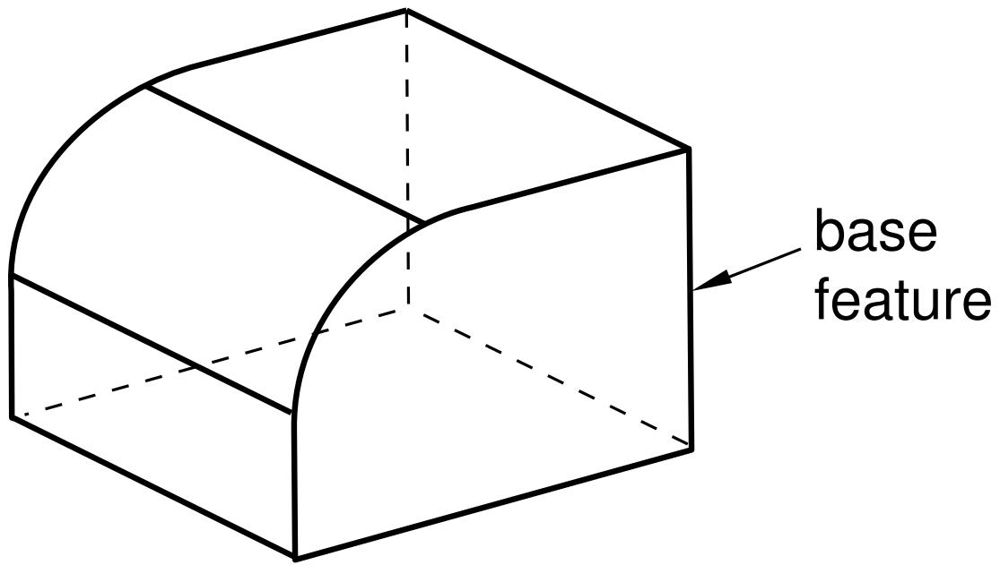

<details>
<summary>text_image</summary>

base
feature
</details>

Figure 1: Creating a sketch plane.

To extrude a blind cut into the curved surface, you need to sketch the profile on a plane that is tangent to the curved surface. The desired plane does not exist, but you can create one with the Datum toolset and sketch on the resulting plane. The datum plane and the resulting cut feature are shown in Figure 2.

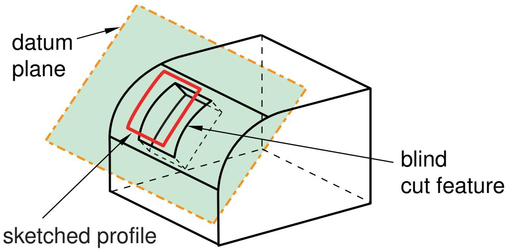

<details>
<summary>text_image</summary>

datum
plane
sketched profile
blind
cut feature
</details>

Figure 2:The resulting feature.

Abaqus/CAE does not generate meshes on datum geometry, and datum geometry has no effect on the analysis of your model; it is simply a convenience to help you construct complex geometry. You should use the Partition toolset if you want to add geometry to the model itself, such as a vertex along an edge or a plane through a cell.

You create a datum by defining it with respect to existing geometry (such as vertices, planes, and edges) or to other datum geometry. You can create a datum on a part in the Part or Property module or on an assembly in other modules. For example, you can define a datum axis that passes through two selected points of a part in the Part module, and you can use the axis to align instances of the part in the Assembly module. You can create a datum as a dependent or independent feature; and, like all features, it can be edited, deleted, suppressed, and resumed. A dependent datum is regenerated when the assembly or part is regenerated. You can also use display groups to show or hide datum geometry in a viewport.

## Additional information

• Understanding a datum as a feature  
• Using display groups to display subsets of your model

## Using the Datum toolset

You can access the Datum toolset in any module from the main menu bar or from the module toolbox.

Select Tools->Datum from the main menu bar to display the Create Datum dialog box, and choose the type of datum to create—point, axis, plane, or coordinate system (CSYS)—from the Type options at the top of the dialog box. The Method list changes to reflect the datum you create. Select the desired datum tool from the Method list, and follow the prompts in the prompt area to create the datum.

You can also access the Datum toolset from the module toolbox; Figure 1 shows the hidden icons for all the datum tools in the module toolboxes.

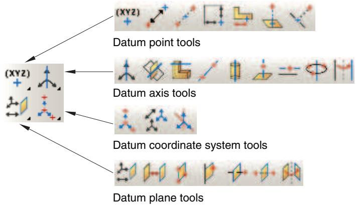

<details>
<summary>flowchart</summary>

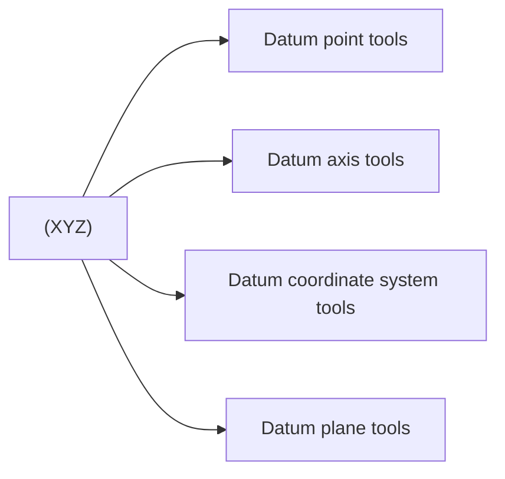
```mermaid
graph LR
  A["(XYZ)"] --> B["Datum point tools"]
  A --> C["Datum axis tools"]
  A --> D["Datum coordinate system tools"]
  A --> E["Datum plane tools"]
```
</details>

Figure 1:The datum tools.

To see a brief tooltip containing a definition of each datum tool, hold the mouse over the tool for a moment. For information on using toolboxes and selecting hidden icons, see Using toolboxes and toolbars that contain hidden icons.

• Datum creation techniques  
• Using the Datum toolset in the Part module  
• Using datum geometry in the Assembly module  
• Controlling datum display

## Why are datum coordinate systems so important?

Datum coordinate systems are used throughout Abaqus/CAE; for example, to define material and connector orientations; to define the orientation of a coupling constraint, an inertia relief load, and boundary conditions; and to position and align part instances.

In addition, you can select the origin of a datum coordinate system when prompted to select a point, and you can select an axis of a datum coordinate system when prompted to select an edge.

Abaqus/CAE provides three methods for creating a datum coordinate system:

• Three points  
• Offset from coordinate system  
• Two lines

For more information, see Methods for creating a datum coordinate system. In contrast with other types of datums, you can name a datum coordinate system while you create it. As with all datums, you can use the Model Tree to rename a datum coordinate system.

## Additional information

• Understanding a datum as a feature

## Understanding a datum as a feature

A datum is a useful construction aid in the feature-based modeling process and is a feature itself. As a result, you can use the Feature Manipulation toolset to delete, suppress, and resume a datum.

By default, a datum is created as a dependent feature; however, you can choose to make a datum independent when you create it. For an independent datum, no parent-child relationship exists between the datum and any feature used to create it. Once created, a datum cannot be changed from dependent to independent or vice versa. Abaqus/CAE regenerates a dependent datum along with the part or assembly, taking into account any changes to underlying geometry. If you suppress or delete the parent feature of a dependent datum, the datum is also suppressed or deleted.

You can edit any numerical parameters that define a datum; for example, the X-, Y-, and Z-coordinates used to define a datum point. However, a datum is always defined by the same underlying geometry you selected when you created it; if you need to define the datum using different geometry, you must delete the datum and create a new one.

You can create a datum on a part in the Part or Property module or on an assembly in other modules. If you create a dependent datum on a part, the datum moves along with an instance of the part in the Assembly module. If you create a dependent datum on the assembly by selecting entities from a part instance, the datum moves along with the instance in the Assembly module. However, if you create a datum on the assembly by entering coordinates in the prompt area, the datum remains fixed when the instance moves.

When you modify a feature, you should be aware of any parent-child relationships between your dependent datum and the modified feature. For example, consider Figure 1, which shows a dependent datum axis passing through the midpoint of two arcs. The midpoints of the arcs that define the location of the datum axis are parents of the datum axis.


<details>
<summary>natural_image</summary>

Simple line drawing of a U-shaped object with two curved arms and a horizontal dashed line above (no text or symbols)
</details>

Figure 1:The original datum axis between two midpoints.

If you modify the part, Abaqus/CAE regenerates the datum axis so that it still passes through the two midpoints, as shown in Figure 2.

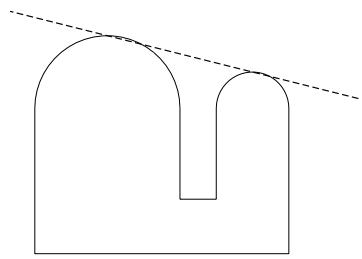

<details>
<summary>natural_image</summary>

Pure geometric diagram with two curved shapes and a dashed diagonal line (no text or symbols)
</details>

Figure 2:The datum axis after the part is modified.

## Additional information

• The Feature Manipulation toolset

## Datum creation techniques

This section provides an overview of the methods for creating each type of datum.

## In this section:

Methods for creating a datum point  
Methods for creating a datum axis  
Methods for creating a datum plane  
Methods for creating a datum coordinate system

## Methods for creating a datum point

When you choose Point from the Create Datum dialog box, the Method list displays the methods for creating a datum point.

The following methods are available:

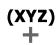

## Enter coordinates

Enter the X-, Y-, and Z-coordinates of the datum point, as shown in Figure 1. For detailed instructions, see Creating a datum point by entering its coordinates.


<details>
<summary>text_image</summary>

datum point
(x, y, z)
</details>

Figure 1: Creating a datum point by entering coordinates.

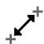

## Offset from point

Enter the location of the datum point in the form of the X-, Y-, and Z-coordinates of an offset from a selected point, as shown in Figure 2. For detailed instructions, see Creating a datum point at an offset from a selected point.

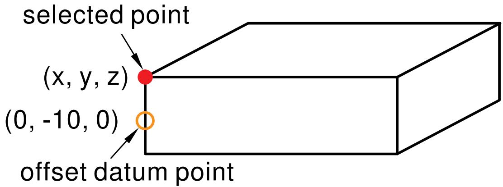

<details>
<summary>text_image</summary>

selected point
(x, y, z)
(0, -10, 0)
offset datum point
</details>

Figure 2: Creating a datum point by offsetting from a point.


## Midway between 2 points

Select two points on the model; Abaqus/CAE creates the datum point midway between the two selected points, as shown in Figure 3. For detailed instructions, see Creating a datum point midway between two points.


<details>
<summary>flowchart</summary>

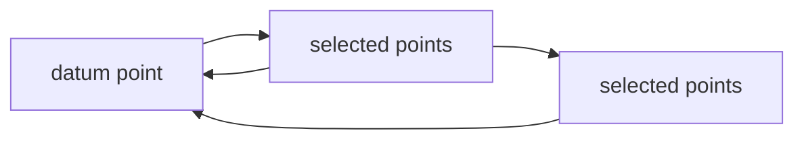
```mermaid
graph LR
  A["datum point"] --> B["selected points"]
  B --> A
  B --> C["selected points"]
  C --> A
```
</details>

Figure 3: Creating a datum point by selecting two end points.

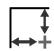

## Offset from 2 edges

Select two edges on the model; and enter the distance from the datum point to each edge, as shown in Figure 4. For detailed instructions, see Creating a datum point at a specified distance from two edges.


<details>
<summary>flowchart</summary>

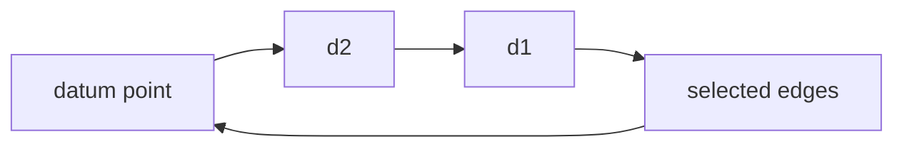
```mermaid
graph LR
  A["datum point"] --> B["d2"]
  B --> C["d1"]
  C --> D["selected edges"]
  D --> A
```
</details>

Figure 4: Positioning a datum point a specified distance from two edges.


## Enter parameter

Select an edge on the model, and enter the location of the datum point in the form of a parameter value that represents a percentage of the edge length. An arrow along the edge indicates the direction of increasing parameter value from the start vertex (corresponding to an edge parameter value of zero) to the end vertex (corresponding to a value of one), as shown in Figure 5. For detailed instructions, see Creating a datum point by entering an edge parameter.

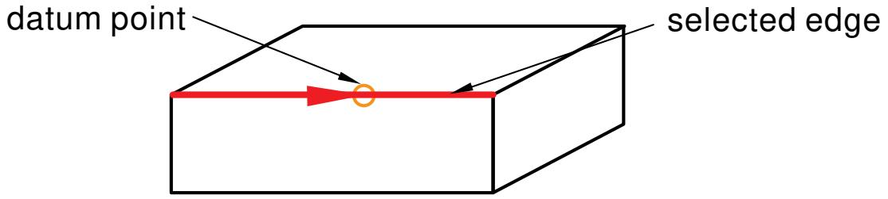

<details>
<summary>flowchart</summary>

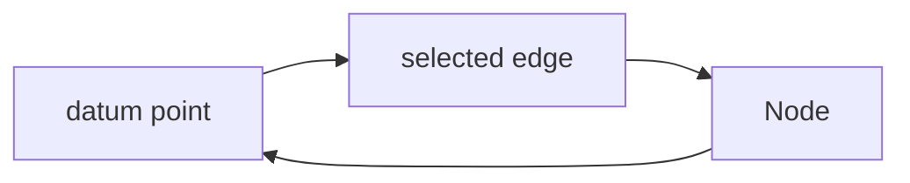
```mermaid
graph LR
  A["datum point"] --> B["selected edge"]
  B --> C["Node"]
  C --> A
```
</details>

Figure 5: Positioning a datum point a specified distance along an edge.


## Project point on face/plane

Select a point and a face or plane on which to project the point. Abaqus/CAE creates the datum point where the face or plane intersects a line that is normal to it and passing through the selected point, as shown in Figure 6. The datum point also marks the shortest distance between the selected point and the selected face or plane. For detailed instructions, see Creating a datum point by projecting a point on a face or plane.


<details>
<summary>text_image</summary>

selected
point
datum point
selected face
</details>

Figure 6: Creating a datum point by projecting a point onto a face.

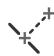

## Project point on edge/datum axis

Select a point on the model and an edge or datum axis on which to project the point. Abaqus/CAE creates the datum point where the edge or datum axis intersects a line that is normal to it and passing through the selected point, as shown in Figure 7. The datum point also marks the shortest distance between the selected point and the selected edge or datum axis. For detailed instructions, see Creating a datum point by projecting a point on an edge or datum axis.


<details>
<summary>text_image</summary>

selected
point
datum
point
selected
edge
</details>

Figure 7: Creating a datum point by projecting a point onto an edge.

## Additional information

• Creating datum points  
• Controlling datum display

## Methods for creating a datum axis

When you choose Axis from the Create Datum dialog box, the Method list displays the methods for creating a datum axis.

The following methods are available:


## Principal axis

Select one of the three principal axes with which the datum axis must be colinear, as shown in Figure 1. For detailed instructions, see Creating a datum axis along a principal axis.


<details>
<summary>text_image</summary>

datum axis
principal x-axis
</details>

Figure 1: Defining a datum axis as one of the three principal axes.


## Intersection of 2 planes

Select two non-parallel planar surfaces. Abaqus/CAE creates the datum axis where the two planes (or extensions of the two planes) intersect, as shown in Figure 2. For detailed instructions, see Creating a datum axis along the intersection of two planes.


<details>
<summary>text_image</summary>

selected
planes
datum axis
</details>

Figure 2: Defining a datum axis as the intersection of two planes.


## Straight edge

Select a straight edge on the model with which the datum axis must be colinear, as shown in Figure 3. For detailed instructions, see Creating a datum axis along a straight edge.


<details>
<summary>text_image</summary>

datum axis
selected edge
</details>

Figure 3: Defining a datum axis as a straight edge on the model.

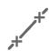

## 2 points

Select any two points on the model through which the datum axis must pass, as shown in Figure 4. For detailed instructions, see Creating a datum axis through two points.


<details>
<summary>text_image</summary>

datum axis
selected points
</details>

Figure 4: Defining a datum axis by selecting two points.


## Axis of cylinder

Select a cylindrical face on the model. Abaqus/CAE creates a datum axis that lies along the axis of the cylindrical face, as shown in Figure 5. For detailed instructions, see Creating a datum axis along the axis of a cylinder.


<details>
<summary>text_image</summary>

cylinder
datum axis
</details>

Figure 5: Defining a datum axis as the axis of a cylinder.

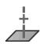

## Normal to plane, thru point

Select a plane and a point that is not on the plane. Abaqus/CAE creates a datum axis that is normal to the plane and passes through the point, as shown in Figure 6. For detailed instructions, see Creating a datum axis normal to a plane and passing through a point.

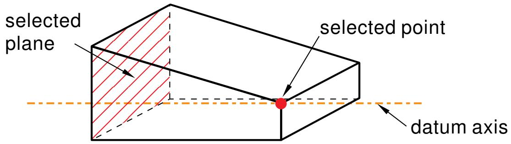

<details>
<summary>text_image</summary>

selected
plane
selected point
datum axis
</details>

Figure 6: Defining a datum axis by selecting a point and a plane.


## Parallel to line, thru point

Select an edge of the model and a point outside the edge. Abaqus/CAE creates a datum axis that is parallel to the edge and passes through the point, as shown in Figure 7. For detailed instructions, see Creating a datum axis parallel to a line and passing through a point.


<details>
<summary>text_image</summary>

selected point
datum axis
selected edge
</details>

Figure 7: Defining a datum axis by selecting a point and an edge.


## 3 points on circle

Select three points on the model that define a circle. Abaqus/CAE creates a datum axis along the axis of the circle, as shown in Figure 8. For detailed instructions, see Creating a datum axis running along the axis of a circle defined by three points.

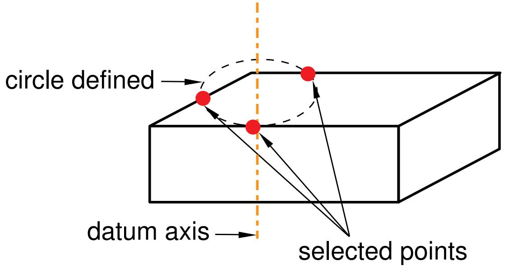

<details>
<summary>flowchart</summary>

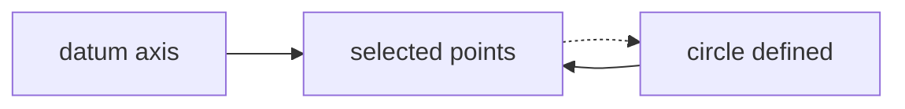
```mermaid
graph LR
  A["datum axis"] --> B["selected points"]
  C["circle defined"] --> B
  B -.-> C
```
</details>

Figure 8: Defining a datum axis as the axis of a circle.


## Rotate from line

Select an edge and an axis of rotation, and specify the angle through which the edge will be rotated. Abaqus/CAE creates a datum axis by rotating the edge about the axis through the specified angle, as shown in Figure 9. For detailed instructions, see Creating a datum axis by rotating an existing edge through a specified angle.


<details>
<summary>text_image</summary>

selected edge
α
datum axis
selected edge
α
selected point
Y
X
Z
selected axis of rotation
(arrow indicates positive
direction of rotation based
on the right-hand rule)
three-dimensional
two-dimensional or axisymmetric
</details>

Figure 9: Defining a datum axis by rotating an edge through a specified angle.

## Additional information

• Creating datum axes  
• Controlling datum display

When you choose Plane from the Create Datum dialog box, the Method list displays the methods for creating a datum plane.

The following methods are available:

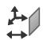

## Offset from principal plane

Select one of the three principal planes; and provide the location of the datum plane in the form of an offset from the selected plane, as shown in Figure 1. A positive value indicates an offset in the positive direction along the axis normal to the selected plane; for example, along the X-axis normal to the Y–Z plane. For detailed instructions, see Creating a datum plane offset from a principal plane.

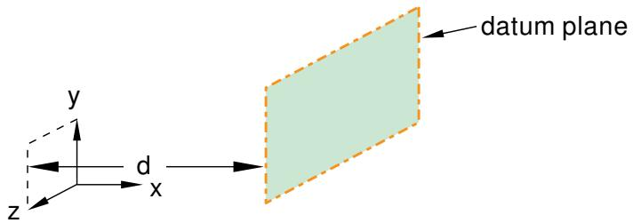

<details>
<summary>text_image</summary>

datum plane
y
d
x
z
</details>

Figure 1: Creating a datum plane by offsetting from one of the three principal planes.


## Offset from plane

Select any plane on the model; and provide the location of the datum plane by specifying the direction of the normal and an offset from the selected plane along the normal, as shown in Figure 2. You can specify the offset by entering a value or selecting a point. For detailed instructions, see Creating a datum plane at an offset from a selected plane.


<details>
<summary>text_image</summary>

datum plane
selected plane
selected normal
d
offset distance
</details>

Figure 2: Creating a datum plane by offsetting from any plane.

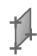

## 3 points

Select three points through which the datum plane must pass, as shown in Figure 3. For detailed instructions, see Creating a datum plane passing through three points.

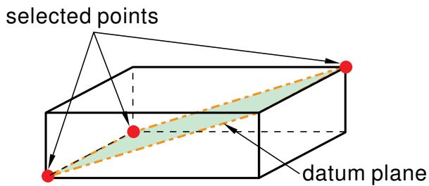

<details>
<summary>text_image</summary>

selected points
datum plane
</details>

Figure 3: Creating a datum plane by selecting three points.

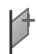

## Line and point

Select an edge and a point through which the datum plane must pass, as shown in Figure 4. For detailed instructions, see Creating a datum plane through a line and a point.


<details>
<summary>text_image</summary>

selected
point
datum plane
selected edge
</details>

Figure 4: Creating a datum plane by selecting a point and an edge.

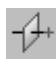

## Point and normal

Select a point and an edge; the datum plane passes through the point and is normal to the selected edge, as shown in Figure 5. For detailed instructions, see Creating a datum plane passing through a point and normal to an edge.

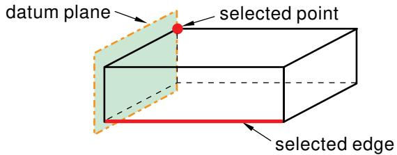

<details>
<summary>text_image</summary>

datum plane
selected point
selected edge
</details>

Figure 5: Creating a datum plane by selecting a point and a normal edge.


## Midway between 2 points

Select two points. Abaqus/CAE creates a datum plane midway between the two selected points and normal to the line connecting them, as shown in Figure 6. For detailed instructions, see Create a datum plane midway between two points and normal to the line connecting the two points.

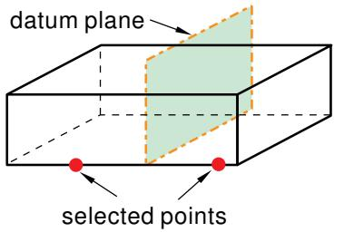

<details>
<summary>text_image</summary>

datum plane
selected points
</details>

Figure 6: Positioning a datum plane midway between two points.

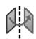

## Rotate from plane

Select a face and an axis of rotation, and specify the angle through which the face will be rotated. Abaqus/CAE creates a datum plane by rotating the face about the axis through the specified angle, as shown in Figure 7. For detailed instructions, see Creating a datum plane by rotating an existing face through a specified angle.


<details>
<summary>text_image</summary>

datum plane
α
selected face
selected axis of rotation
(arrow indicates positive
direction of rotation based
on the right-hand rule)
</details>

Figure 7: Defining a datum plane by rotating a face through a specified angle.

## Additional information

• Creating datum planes

## Methods for creating a datum coordinate system

When you choose CSYS from the Create Datum dialog box, the Method list displays the methods for creating a datum coordinate system.

Datum coordinates systems are used throughout Abaqus/CAE; for example, to define material orientations and to define connector orientations. To help you keep track of your datum coordinate systems, you can name the systems when you create them, and the name appears alongside their entry in the Model Tree.

The following methods are available:

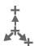

## 3 points

Define a rectangular, cylindrical, or spherical coordinate system by selecting the origin and, optionally, two additional points. In the case of a rectangular system, the second point defines the X-axis, and the X–Y plane passes through the second and third points, as shown in Figure 1. This is the most versatile tool for creating a datum coordinate system, and you should use it when possible. For detailed instructions, see Creating a datum coordinate system defined by three points.

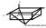  
Figure 1: Positioning a rectangular datum coordinate system by selecting the origin and two points.


## Offset from CSYS

Select a coordinate system; and provide the location of the rectangular, cylindrical, or spherical datum coordinate system by specifying an offset, as shown by the example involving a rectangular system in Figure 2. You can specify the offset by entering a value or by selecting a point. For detailed instructions, see Creating a datum coordinate system at an offset from another coordinate system.

  
Figure 2: Positioning a rectangular datum coordinate system by offsetting from another coordinate system.


## 2 lines

Select two edges that define the rectangular, cylindrical, or spherical coordinate system. In the case of a rectangular system, the first edge defines the X-axis and the X–Y plane passes through the second edge, as shown in Figure 3. For detailed instructions, see Creating a datum coordinate system defined by two lines.

  
Figure 3: Positioning a rectangular datum coordinate system by selecting two edges.

## Additional information

• Creating datum planes  
• Controlling datum display

## Creating datum points

This section describes the tools that you can use to create a datum point.

## In this section:

Creating a datum point by entering its coordinates  
Creating a datum point at an offset from a selected point  
Creating a datum point midway between two points  
Creating a datum point at a specified distance from two edges  
Creating a datum point by entering an edge parameter  
Creating a datum point by projecting a point on a face or plane  
Creating a datum point by projecting a point on an edge or datum axis

## Creating a datum point by entering its coordinates

You can position a datum point by entering its X-, Y-, and Z-coordinates.

The figure below shows an example of creating a datum point by entering its coordinates.


<details>
<summary>text_image</summary>

datum point
(x, y, z)
</details>

1. From the main menu bar, select Tools->Datum.

The Create Datum dialog box appears. The dialog box outlines the types of datum geometry you can create.

Abaqus/CAE displays prompts in the prompt area to guide you through the procedure.


## (xYz)

Tip: You can also create a datum point using the tool, located in the module toolbox. For a diagram of the datum tools in the toolbox, see Using the Datum toolset.

2. From the list of types at the top of the dialog box, choose Point.

The Method list indicates the methods you can use to create a datum point.

3. From the Method list, select Enter coordinates.  
4. In the text field that appears in the prompt area, enter the X-, Y-, and Z-coordinates of the datum point you want to create. If the datum is associated with the assembly, the coordinates you provide are relative to the assembly's global coordinate system. If the datum is associated with a part, the coordinates are relative to the part's coordinate system. If you are unsure of the location or orientation of the part's coordinate system, first create a default coordinate system at the origin of the part. For more information, see Creating a datum coordinate system defined by three points.

The datum point appears. You can modify the coordinates of the datum point by selecting Feature->Edit from the main menu bar and selecting the datum.

## Additional information

• Methods for creating a datum point  
• Datum creation techniques  
• Controlling datum display

## Creating a datum point at an offset from a selected point

You can position a datum point by selecting a point on the model and entering the X-, Y-, and Z-coordinates of an offset from the point.

The figure below shows an example of creating a datum point at an offset from a selected point.


<details>
<summary>text_image</summary>

selected point
(x, y, z)
(0, -10, 0)
offset datum point
</details>

1. From the main menu bar, select Tools->Datum.

The Create Datum dialog box appears. The dialog box outlines the types of datum geometry you can create.

Abaqus/CAE displays prompts in the prompt area to guide you through the procedure.


\+ Tip: You can also create a datum point using the tool, located in the module toolbox. For a diagram of the datum tools in the toolbox, see Using the Datum toolset.

2. From the list of types at the top of the dialog box, choose Point.  
The Method list indicates the methods you can use to create a datum point.  
3. From the Method list, select Offset from point.  
4. If desired, select Make Independent from the prompt area to create the datum as an independent feature.  
5. From the part or assembly in the current viewport, select a point.  
6. In the text field that appears in the prompt area, enter the X-, Y-, and Z-coordinates of the offset from the selected point.

The datum point appears. You can modify the coordinates of the offset by selecting Feature->Edit from the main menu bar and selecting the datum.

## Additional information

• Methods for creating a datum point  
• Datum creation techniques  
• Controlling datum display

## Creating a datum point midway between two points

You can position a datum point by selecting two points on the model; Abaqus/CAE creates the datum point midway between the two selected points.

The figure below shows an example of creating a datum point midway between two points.

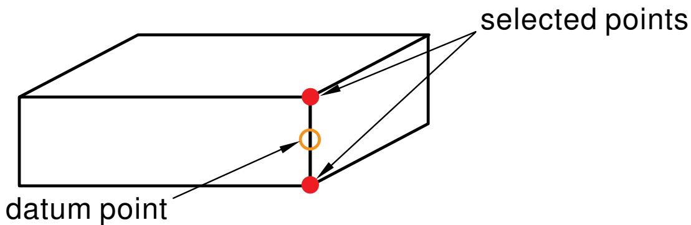

<details>
<summary>flowchart</summary>

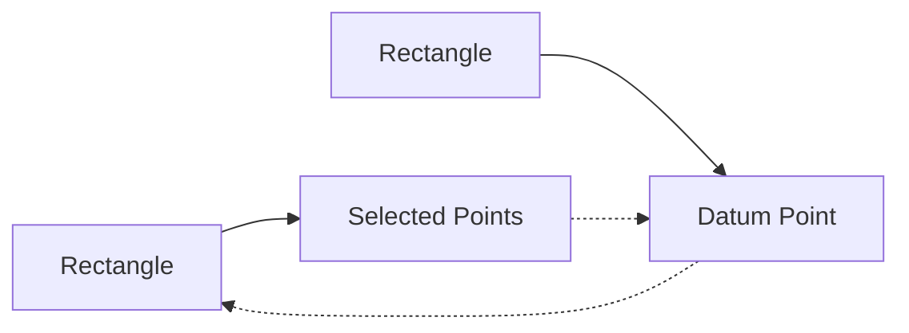
```mermaid
graph LR
  A["Rectangle"] --> B["Selected Points"]
  C["Rectangle"] --> D["Datum Point"]
  B -.-> D
  D -.-> A
```
</details>

1. From the main menu bar, select Tools->Datum.

The Create Datum dialog box appears. The dialog box outlines the types of datum geometry you can create.

Abaqus/CAE displays prompts in the prompt area to guide you through the procedure.


Tip: You can also create a datum point using the tool, located in the module toolbox. For a diagram of the datum tools in the toolbox, see Using the Datum toolset.

2. From the list of types at the top of the dialog box, choose Point.

The Method list indicates the methods you can use to create a datum point.

3. From the Method list, select Midway between 2 points.  
4. If desired, select Make Independent from the prompt area to create the datum as an independent feature.  
5. From the part or assembly in the current viewport, select two points.

The datum point appears. You cannot modify a datum point created with this method; you must delete the old point and create a new one.

## Additional information

• Methods for creating a datum point  
• Datum creation techniques  
• Controlling datum display

## Creating a datum point at a specified distance from two edges

You can position a datum point by selecting two edges on the model and entering the distance from the datum point to each edge.

The figure below shows an example of creating a datum point at a specified distance from two edges.


<details>
<summary>flowchart</summary>


```mermaid
graph LR
  A["datum point"] --> B["d2"]
  B --> C["d1"]
  C --> D["selected edges"]
  D --> A
```
</details>

1. From the main menu bar, select Tools->Datum.

The Create Datum dialog box appears. The dialog box outlines the types of datum geometry you can create.

Abaqus/CAE displays prompts in the prompt area to guide you through the procedure.


a diagram of the datum tools in the toolbox, see Using the Datum toolset.

2. From the list of types at the top of the dialog box, choose Point.  
The Method list indicates the methods you can use to create a datum point.  
3. From the Method list, select Offset from 2 edges.  
4. If desired, select Make Independent from the prompt area to create the datum as an independent feature.  
5. From the part or assembly in the current viewport, select the plane on which to create the datum point.  
6. Select a straight edge on the specified plane and enter the distance of the datum point from this edge.  
7. Select a second straight edge on the plane and enter the distance of the datum point from this edge.

The datum point appears. You can modify the position of the datum point by selecting Feature->Edit from the main menu bar and modifying the distance from the datum to each edge.

## Additional information

• Methods for creating a datum point  
• Datum creation techniques  
• Controlling datum display

## Creating a datum point by entering an edge parameter

You can position a datum point by selecting an edge on the model and entering a parameter value that represents a percentage of the edge length.

An arrow along the edge indicates the direction of increasing parameter value from the start vertex (corresponding to an edge parameter value of zero) to the end vertex (corresponding to a value of one.)

The figure below shows an example of creating a datum point by entering an edge parameter.


<details>
<summary>flowchart</summary>


```mermaid
graph LR
  A["datum point"] --> B["selected edge"]
  B --> C["Node"]
  C --> A
```
</details>

1. From the main menu bar, select Tools->Datum.

The Create Datum dialog box appears. The dialog box outlines the types of datum geometry you can create.

Abaqus/CAE displays prompts in the prompt area to guide you through the procedure.


tool, located in the module toolbox. For a diagram of the datum tools in the toolbox, see Using the Datum toolset.

2. From the list of types at the top of the dialog box, choose Point.

The Method list indicates the methods you can use to create a datum point.

3. From the Method list, select Enter parameter.

4. If desired, select Make Independent from the prompt area to create the datum as an independent feature.

5. From the part or assembly in the current viewport, select the edge on which the datum point will be positioned.

An arrow appears on the selected edge indicating the direction of increasing parameter value.

6. In the text field in the prompt area, enter the value of the edge parameter.

The datum point appears. You can modify the position of the datum point by selecting Feature->Edit from the main menu bar and modifying the value of the edge parameter.

## Additional information

• Methods for creating a datum point  
• Datum creation techniques  
• Controlling datum display

## Creating a datum point by projecting a point on a face or plane

You can position a datum point by selecting a point on the model and a face or plane on which to project the point. Abaqus/CAE creates the datum point where the selected face or plane intersects a line that is normal to it and passes through the selected point.

The figure below shows an example of creating a datum point by projecting a point on a face.

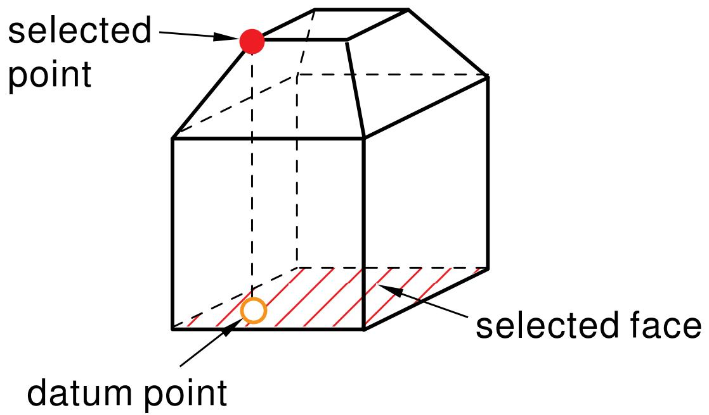

<details>
<summary>text_image</summary>

selected
point
datum point
selected face
</details>

1. From the main menu bar, select Tools->Datum.

The Create Datum dialog box appears. The dialog box outlines the types of datum geometry you can create.

Abaqus/CAE displays prompts in the prompt area to guide you through the procedure.


Tip: You can also create a datum point using the tool, located in the module toolbox. For a diagram of the datum tools in the toolbox, see Using the Datum toolset.

2. From the list of types at the top of the dialog box, choose Point.  
The Method list indicates the methods you can use to create a datum point.  
3. From the Method list, select Project point on face/plane.  
4. If desired, select Make Independent from the prompt area to create the datum as an independent feature.  
5. From the part or assembly in the current viewport, select a point.  
6. Select a face or plane on which to project the point. The selection can be a planar face, a nonplanar face, or a datum plane.

The datum point appears. You cannot modify a datum point created with this method; you must delete the old point and create a new one.

## Additional information

• Methods for creating a datum point  
• Datum creation techniques  
• Controlling datum display

## Creating a datum point by projecting a point on an edge or datum axis

You can position a datum point by selecting a point on the model and an edge or datum axis on which to project the point.

Abaqus/CAE creates the datum point where the selected edge or datum axis intersects a line that is normal to it and passes through the selected point.

The figure below shows an example of creating a datum point by projecting a point on an edge.


<details>
<summary>text_image</summary>

selected
point
datum
point
selected
edge
</details>

1. From the main menu bar, select Tools->Datum.

The Create Datum dialog box appears. The dialog box outlines the types of datum geometry you can create.

Abaqus/CAE displays prompts in the prompt area to guide you through the procedure.


Tip: You can also create a datum point using the tool, located in the module toolbox. For a diagram of the datum tools in the toolbox, see Using the Datum toolset.

2. From the list of types at the top of the dialog box, choose Point.  
The Method list indicates the methods you can use to create a datum point.  
3. From the Method list, select Project point on edge/datum axis.  
4. If desired, select Make Independent from the prompt area to create the datum as an independent feature.  
5. From the part or assembly in the current viewport, select a point.  
6. Select an edge or datum axis on which to project the point.

The datum point appears. You cannot modify a datum point created with this method; you must delete the old point and create a new one.

## Additional information

• Methods for creating a datum point  
• Datum creation techniques  
• Controlling datum display

## Creating datum axes

This section describes the tools that you can use to create a datum axis.

## In this section:

Creating a datum axis along a principal axis  
Creating a datum axis along the intersection of two planes  
Creating a datum axis along a straight edge  
Creating a datum axis through two points  
Creating a datum axis along the axis of a cylinder  
Creating a datum axis normal to a plane and passing through a point  
Creating a datum axis parallel to a line and passing through a point  
Creating a datum axis running along the axis of a circle defined by three points  
Creating a datum axis by rotating an existing edge through a specified angle

## Creating a datum axis along a principal axis

You can position a datum axis by selecting one of the three principal axis to define as the datum axis.

The figure below shows an example of creating a datum axis by selecting a principal axis.

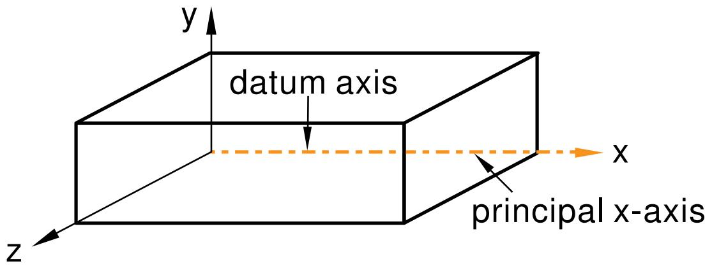

<details>
<summary>text_image</summary>

y
datum axis
x
z
principal x-axis
</details>

1. From the main menu bar, select Tools->Datum.

The Create Datum dialog box appears. The dialog box outlines the types of datum geometry you can create.

Abaqus/CAE displays prompts in the prompt area to guide you through the procedure.


a diagram of the datum tools in the toolbox, see Using the Datum toolset.

2. From the list of types at the top of the dialog box, choose Axis.  
The Method list indicates the methods you can use to create a datum axis.  
3. From the Method list, select Principal axis.  
4. Select the principal X-, Y-, or Z-axis through which your datum axis must pass.

The datum axis appears. You cannot modify a datum axis created with this method; you must delete the old axis and create a new one.

## Additional information

• Methods for creating a datum axis  
• Datum creation techniques  
• Controlling datum display

## Creating a datum axis along the intersection of two planes

You can position a datum axis by selecting two nonparallel planar surfaces.

Abaqus/CAE creates the datum axis where the two planes, or a projection of the two planes, intersect.

The figure below shows an example of creating a datum axis at the intersection of two planes.


<details>
<summary>text_image</summary>

selected
planes
datum axis
</details>

1. From the main menu bar, select Tools->Datum.

The Create Datum dialog box appears. The dialog box outlines the types of datum geometry you can create.

Abaqus/CAE displays prompts in the prompt area to guide you through the procedure.


Tip: You can also create a datum axis using the tool, located in the module toolbox. For a diagram of the datum tools in the toolbox, see Using the Datum toolset.

2. From the list of types at the top of the dialog box, choose Axis.  
The Method list indicates the methods you can use to create a datum axis.  
3. From the Method list, select Intersection of 2 planes.  
4. If desired, select Make Independent from the prompt area to create the datum as an independent feature.  
5. From the part or assembly in the current viewport, select a plane.  
6. Select a second plane that is not parallel with the first.

The datum axis appears. You cannot modify a datum axis created with this method; you must delete the old axis and create a new one.

## Additional information

• Methods for creating a datum axis  
• Datum creation techniques  
• Controlling datum display

You can position a datum axis by selecting a straight edge on the model to define as the datum axis.

The figure below shows an example of creating a datum axis along a straight edge on the model.

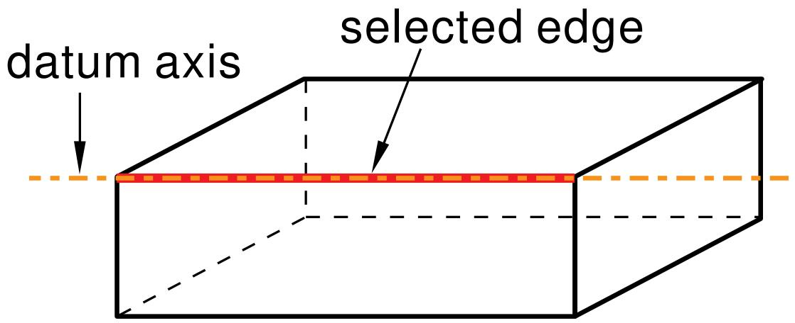

<details>
<summary>text_image</summary>

datum axis
selected edge
</details>

1. From the main menu bar, select Tools->Datum.

The Create Datum dialog box appears. The dialog box outlines the types of datum geometry you can create.

Abaqus/CAE displays prompts in the prompt area to guide you through the procedure.


Tip: You can also create a datum axis using the tool, located in the module toolbox. For a diagram of the datum tools in the toolbox, see Using the Datum toolset.

2. From the list of types at the top of the dialog box, choose Axis.  
The Method list indicates the methods you can use to create a datum axis.  
3. From the Method list, select Straight edge.  
4. If desired, select Make Independent from the prompt area to create the datum as an independent feature.  
5. From the part or assembly in the current viewport, select a straight edge.

The datum axis appears. You cannot modify a datum axis created with this method; you must delete the old axis and create a new one.

## Additional information

• Methods for creating a datum axis  
• Datum creation techniques  
• Controlling datum display

## Creating a datum axis through two points

You can position a datum axis by selecting any two points on the model through which the datum axis passes.

The figure below shows an example of creating a datum axis through two points.

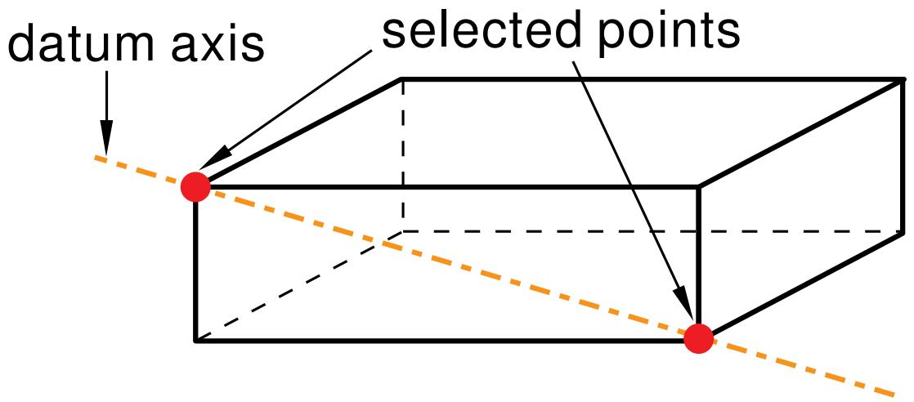

<details>
<summary>text_image</summary>

datum axis
selected points
</details>

1. From the main menu bar, select Tools->Datum.

The Create Datum dialog box appears. The dialog box outlines the types of datum geometry you can create.

Abaqus/CAE displays prompts in the prompt area to guide you through the procedure.


Tip: You can also create a datum axis using the tool, located in the module toolbox. For a diagram of the datum tools in the toolbox, see Using the Datum toolset.

2. From the list of types at the top of the dialog box, choose Axis.  
The Method list indicates the methods you can use to create a datum axis.  
3. From the Method list, select 2 points.  
4. If desired, select Make Independent from the prompt area to create the datum as an independent feature.  
5. From the part or assembly in the current viewport, select two points.

The datum axis appears. You cannot modify a datum axis created with this method; you must delete the old axis and create a new one.

## Additional information

• Methods for creating a datum axis  
• Datum creation techniques  
• Controlling datum display

## Creating a datum axis along the axis of a cylinder

You can position a datum axis by selecting a cylindrical or conical face on the model.

Abaqus/CAE creates a datum axis that lies along the axis of the face.

The figure below shows an example of creating a datum axis along the axis of a cylinder.


<details>
<summary>text_image</summary>

cylinder
datum axis
</details>

1. From the main menu bar, select Tools->Datum.

The Create Datum dialog box appears. The dialog box outlines the types of datum geometry you can create.

Abaqus/CAE displays prompts in the prompt area to guide you through the procedure.


Tip: You can also create a datum axis using the a diagram of the datum tools in the toolbox, see tool, located in the module toolbox. For g the Datum toolset.

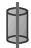

2. From the list of types at the top of the dialog box, choose Axis.  
The Method list indicates the methods you can use to create a datum axis.  
3. From the Method list, select Axis of cylinder.  
4. If desired, select Make Independent from the prompt area to create the datum as an independent feature.  
5. From the part or assembly in the current viewport, select a a cylindrical or conical face.

The datum axis appears. You cannot modify a datum axis created with this method; you must delete the old axis and create a new one.

## Additional information

• Methods for creating a datum axis  
• Datum creation techniques  
• Controlling datum display

## Creating a datum axis normal to a plane and passing through a point

You can position a datum axis by selecting a plane and a point that is not on the plane.

Abaqus/CAE creates a datum axis that is normal to the plane and passes through the point.

The figure below shows an example of creating a datum axis normal to a plane and passing through a point.


<details>
<summary>text_image</summary>

selected
plane
selected point
datum axis
</details>

1. From the main menu bar, select Tools->Datum.

The Create Datum dialog box appears. The dialog box outlines the types of datum geometry you can create.

Abaqus/CAE displays prompts in the prompt area to guide you through the procedure.


Tip: You can also create a datum axis using the tool, located in the module toolbox. For a diagram of the datum tools in the toolbox, see Using the Datum toolset.

2. From the list of types at the top of the dialog box, choose Axis.  
The Method list indicates the methods you can use to create a datum axis.  
3. From the Method list, select Normal to plane, thru point.  
4. If desired, select Make Independent from the prompt area to create the datum as an independent feature.  
5. From the part or assembly in the current viewport, select a planar face.  
6. From the part or assembly in the current viewport, select a point.

The datum axis appears. You cannot modify a datum axis created with this method; you must delete the old axis and create a new one.

## Additional information

• Methods for creating a datum axis  
• Datum creation techniques  
• Controlling datum display

## Creating a datum axis parallel to a line and passing through a point

You can position a datum axis by selecting an edge of the model and a point outside the edge.

Abaqus/CAE creates a datum axis that is parallel to the edge and passes through the point.

The figure below shows an example of creating a datum axis parallel to a line and passing through a point.

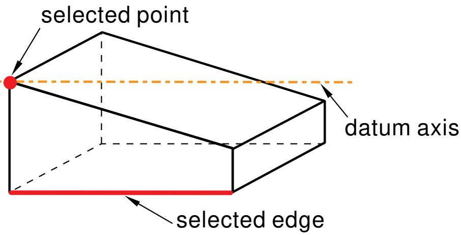

<details>
<summary>text_image</summary>

selected point
datum axis
selected edge
</details>

1. From the main menu bar, select Tools->Datum.

The Create Datum dialog box appears. The dialog box outlines the types of datum geometry you can create.

Abaqus/CAE displays prompts in the prompt area to guide you through the procedure.


Tip: You can also create a datum axis using the -+一 tool, located in the module toolbox. For a diagram of the datum tools in the toolbox, see Using the Datum toolset.

2. From the list of types at the top of the dialog box, choose Axis.  
The Method list indicates the methods you can use to create a datum axis.  
3. From the Method list, select parallel to line, thru point.  
4. If desired, select Make Independent from the prompt area to create the datum as an independent feature.  
5. From the part or assembly in the current viewport, select an edge.  
6. From the part or assembly in the current viewport, select a point.

The datum axis appears. You cannot modify a datum axis created with this method; you must delete the old axis and create a new one.

## Additional information

• Methods for creating a datum axis  
• Datum creation techniques  
• Controlling datum display

## Creating a datum axis running along the axis of a circle defined by three points

You can position a datum axis by selecting three points on the model that define a circle.

Abaqus/CAE creates a datum axis along the axis of the circle.

The figure below shows an example of creating a datum axis running along the axis of a circle defined by three points.

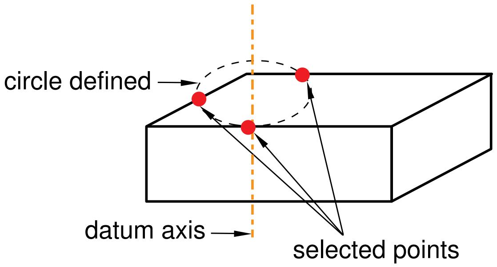

<details>
<summary>flowchart</summary>

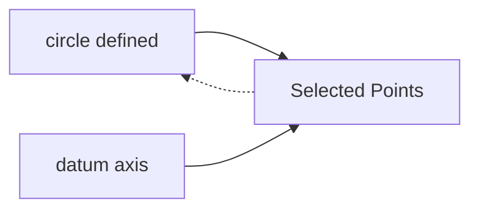
```mermaid
graph LR
  A["circle defined"] --> B["Selected Points"]
  C["datum axis"] --> B
  B -.-> A
```
</details>

1. From the main menu bar, select Tools->Datum.

The Create Datum dialog box appears. The dialog box outlines the types of datum geometry you can create.

Abaqus/CAE displays prompts in the prompt area to guide you through the procedure.


中 Tip: You can also create a datum axis using the tool, located in the module toolbox. For a diagram of the datum tools in the toolbox, see Using the Datum toolset.

2. From the list of types at the top of the dialog box, choose Axis.

The Method list indicates the methods you can use to create a datum axis.

3. From the Method list, select Three points on circle.  
4. If desired, select Make Independent from the prompt area to create the datum as an independent feature.  
5. From the part or assembly in the current viewport, select three points.

The datum axis appears.You cannot modify a datum axis created with this method; you must delete the old axis and create a new one.

## Additional information

• Methods for creating a datum axis  
• Datum creation techniques  
• Controlling datum display

## Creating a datum axis by rotating an existing edge through a specified angle

You can define a datum axis by rotating a selected edge or datum axis about a selected axis of rotation and through a specified angle.

The figures below show examples of creating a datum axis by rotating an existing edge through a specified angle.

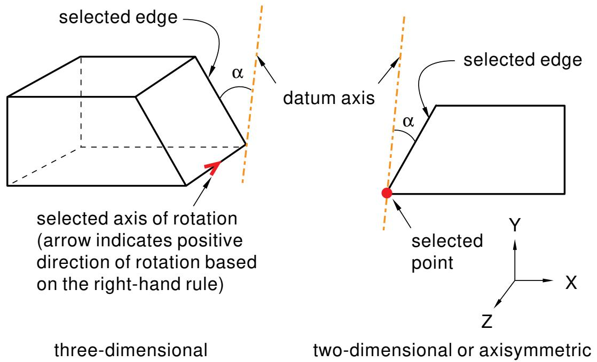

<details>
<summary>text_image</summary>

selected edge
α
datum axis
selected edge
α
selected point
Y
X
Z
selected axis of rotation
(arrow indicates positive
direction of rotation based
on the right-hand rule)
three-dimensional
two-dimensional or axisymmetric
</details>

1. From the main menu bar, select Tools->Datum.

The Create Datum dialog box appears. The dialog box outlines the types of datum geometry you can create.

Abaqus/CAE displays prompts in the prompt area to guide you through the procedure.


Tip: You can also create a datum axis using the tool, located in the module toolbox. For a diagram of the datum tools in the toolbox, see Using the Datum toolset.

2. From the list of types at the top of the dialog box, choose Axis.  
The Method list indicates the methods you can use to create a datum axis.  
3. From the Method list, select Rotate from line.  
4. If desired, select Make Independent from the prompt area to create the datum as an independent feature.  
5. From the part or assembly in the current viewport, select an edge or a datum axis to rotate.  
6. The technique for specifying the rotation depends on the modeling space of the part or assembly:

## For a two-dimensional or axisymmetric part or assembly:

1. Select a vertex or datum point at the center of rotation. You can also use the text box that appears in the prompt area to enter the precise coordinates of the center of rotation.

2. In the text box in the prompt area, enter the angle of rotation. A positive angle indicates a counterclockwise rotation about the Z–axis.

The datum axis appears.

## For a three-dimensional part or assembly:

1. Select an edge or a datum axis to represent the axis of rotation.

Abaqus/CAE displays an arrow along the selected edge indicating the positive direction of rotation using the right-hand rule.

2. In the text box that appears in the prompt area, type the angle of rotation.

The datum axis appears.

You can modify the angle of rotation by selecting Feature->Edit from the main menu bar and selecting the datum axis. If you change the sign of the angle, Abaqus/CAE reverses the direction of rotation.

## Additional information

• Methods for creating a datum axis  
• Datum creation techniques  
• Controlling datum display

## Creating datum planes

This section describes the tools that you can use to create a datum plane.

## In this section:

Creating a datum plane offset from a principal plane  
Creating a datum plane at an offset from a selected plane  
Creating a datum plane passing through three points  
Creating a datum plane through a line and a point  
Creating a datum plane passing through a point and normal to an edge  
Create a datum plane midway between two points and normal to the line connecting the two points  
Creating a datum plane by rotating an existing face through a specified angle

## Creating a datum plane offset from a principal plane

You can position a datum plane by selecting any plane on the model (including another datum plane) and specifying an offset from the selected plane; you can specify the offset by entering a value or selecting a point.

The figure below shows an example of creating a datum plane offset from a principal plane.

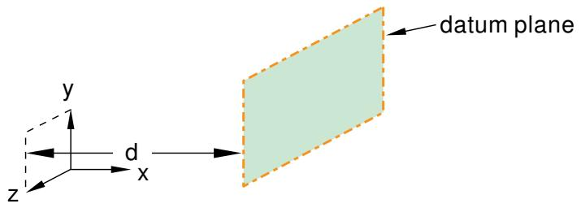

<details>
<summary>text_image</summary>

y
z
d
x
datum plane
</details>

1. From the main menu bar, select Tools->Datum.

The Create Datum dialog box appears. The dialog box outlines the types of datum geometry you can create.

Abaqus/CAE displays prompts in the prompt area to guide you through the procedure.


tool, located in the module toolbox. For a diagram of the datum tools in the toolbox, see Using the Datum toolset.

2. From the list of types at the top of the dialog box, choose Plane.

The Method list indicates the methods you can use to create a datum plane.

3. From the Method list, select Offset from principal plane.  
4. From the buttons in the prompt area, select the principal plane.  
5. In the text field in the prompt area, enter the offset from the selected principal plane. The offset can be positive or negative. A positive value offsets the datum plane along the positive principal axis normal to the selected plane.

The datum plane appears. You can modify the position of the datum plane by selecting Feature->Edit from the main menu bar and modifying the value of the offset.

## Additional information

• Methods for creating a datum plane  
• Datum creation techniques  
• Controlling datum display

## Creating a datum plane at an offset from a selected plane

You can position a datum plane by selecting any plane on the model (including another datum plane) and specifying an offset from the selected plane; you can specify the offset by entering a value or selecting a point.

The figure below shows an example of creating a datum plane at an offset from another plane.

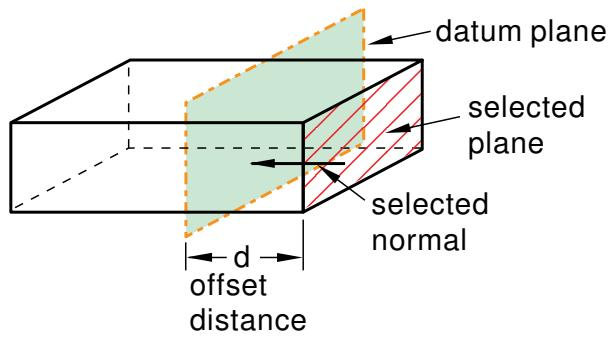

<details>
<summary>text_image</summary>

datum plane
selected plane
selected normal
d
offset distance
</details>

1. From the main menu bar, select Tools->Datum.

The Create Datum dialog box appears. The dialog box outlines the types of datum geometry you can create.

Abaqus/CAE displays prompts in the prompt area to guide you through the procedure.


a diagram of the datum tools in the toolbox, see Using the Datum toolset.

2. From the list of types at the top of the dialog box, choose Plane.  
The Method list indicates the methods you can use to create a datum plane.  
3. From the Method list, select Offset from plane.  
4. If desired, select Make Independent from the prompt area to create the datum as an independent feature.  
5. From the part or assembly in the current viewport, select a plane.  
6. From the buttons in the prompt area, select one of the following:

## Enter Value

1. An arrow appears, indicating the offset direction.  
2. Click Flip to reverse the arrow, if necessary. Click OK to accept the indicated offset direction.  
3. In the text field in the prompt area, enter the offset from the selected plane. The offset can be positive or negative. A positive value offsets the datum plane in the direction indicated by the arrow.

## Select Point

From the part or assembly in the current viewport, select a point to define the offset from the selected plane.

The datum plane appears. You can modify the position of the datum plane by selecting Feature->Edit from the main menu bar and modifying the value of the offset.

## Additional information

• Methods for creating a datum plane  
• Datum creation techniques  
• Controlling datum display

## Creating a datum plane passing through three points

You can position a datum plane by selecting three points through which the datum plane must pass.

The figure below shows an example of creating a datum plane passing through three points.

## selected points

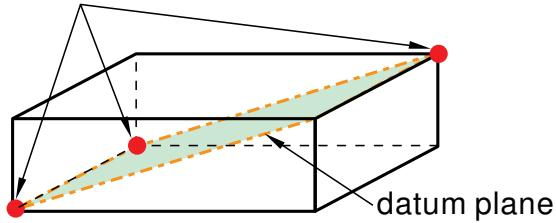

<details>
<summary>text_image</summary>

datum plane
</details>

1. From the main menu bar, select Tools->Datum.

The Create Datum dialog box appears. The dialog box outlines the types of datum geometry you can create.

Abaqus/CAE displays prompts in the prompt area to guide you through the procedure.


Tip: You can also create a datum plane using the tool, located in the module toolbox. For a diagram of the datum tools in the toolbox, see Using the Datum toolset.

2. From the list of types at the top of the dialog box, choose Plane.  
The Method list indicates the methods you can use to create a datum plane.  
3. From the Method list, select 3 points.  
4. If desired, select Make Independent from the prompt area to create the datum as an independent feature.  
5. From the part or assembly in the current viewport, select three points.

The datum plane appears. You cannot modify a datum plane created with this method; you must delete the old plane and create a new one.

## Additional information

• Methods for creating a datum plane  
• Datum creation techniques  
• Controlling datum display

## Creating a datum plane through a line and a point

You can position a datum plane by selecting an edge and a point through which the datum plane must pass.

The figure below shows an example of creating a datum plane through a line and a point.


<details>
<summary>text_image</summary>

selected
point
datum plane
selected edge
</details>

1. From the main menu bar, select Tools->Datum.

The Create Datum dialog box appears. The dialog box outlines the types of datum geometry you can create.

Abaqus/CAE displays prompts in the prompt area to guide you through the procedure.


Tip: You can also create a datum plane using the tool, located in the module toolbox. For a diagram of the datum tools in the toolbox, see Using the Datum toolset.

2. From the list of types at the top of the dialog box, choose Plane.  
The Method list indicates the methods you can use to create a datum plane.  
3. From the Method list, select Line and point.  
4. If desired, select Make Independent from the prompt area to create the datum as an independent feature.  
5. From the part or assembly in the current viewport, select a straight edge.  
6. From the part or assembly in the current viewport, select a point.

The datum plane appears. You cannot modify a datum plane created with this method; you must delete the old plane and create a new one.

## Additional information

• Methods for creating a datum plane  
• Datum creation techniques  
• Controlling datum display

## Creating a datum plane passing through a point and normal to an edge

You can position a datum plane by selecting a point and an edge; the datum plane passes through the point and is normal to the selected edge.

The figure below shows an example of creating a datum plane passing through a point and normal to an edge.

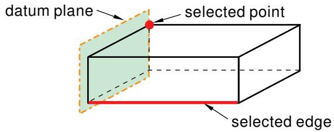

<details>
<summary>text_image</summary>

datum plane
selected point
selected edge
</details>

1. From the main menu bar, select Tools->Datum.

The Create Datum dialog box appears. The dialog box outlines the types of datum geometry you can create.

Abaqus/CAE displays prompts in the prompt area to guide you through the procedure.


Tip: You can also create a datum plane using the tool, located in the module toolbox. For a diagram of the datum tools in the toolbox, see Using the Datum toolset.

2. From the list of types at the top of the dialog box, choose Plane.  
The Method list indicates the methods you can use to create a datum plane.  
3. From the Method list, select Point and normal.  
4. If desired, select Make Independent from the prompt area to create the datum as an independent feature.  
5. From the part or assembly in the current viewport, select a point.  
6. From the part or assembly in the current viewport, select an edge.

The datum plane appears. You cannot modify a datum plane created with this method; you must delete the old plane and create a new one.

## Additional information

• Methods for creating a datum plane  
• Datum creation techniques  
• Controlling datum display

## Create a datum plane midway between two points and normal to the line connecting the two points

You can position a datum plane by selecting two points.

Abaqus/CAE creates a datum plane midway between the two selected points and normal to the line connecting them.

The figure below shows an example of creating a datum plane midway between two points and normal to the line connecting the two points.

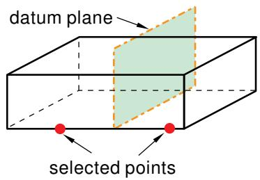

<details>
<summary>text_image</summary>

datum plane
selected points
</details>

1. From the main menu bar, select Tools->Datum.

The Create Datum dialog box appears. The dialog box outlines the types of datum geometry you can create.

Abaqus/CAE displays prompts in the prompt area to guide you through the procedure.


Tip: You can also create a datum plane using the tool, located in the module toolbox. For a diagram of the datum tools in the toolbox, see Using the Datum toolset.

2. From the list of types at the top of the dialog box, choose Plane.

The Method list indicates the methods you can use to create a datum plane.

3. From the Method list, select Midway between 2 points.  
4. If desired, select Make Independent from the prompt area to create the datum as an independent feature.  
5. From the part or assembly in the current viewport, select two points.

The datum plane appears. You cannot modify a datum plane created with this method; you must delete the old plane and create a new one.

## Additional information

• Methods for creating a datum plane  
• Datum creation techniques  
• Controlling datum display

## Creating a datum plane by rotating an existing face through a specified angle

You can define a datum plane by rotating a selected face or datum plane about a selected axis of rotation and through a specified angle.

The figure below shows an example of creating a datum plane by rotating an existing face through a specified angle.

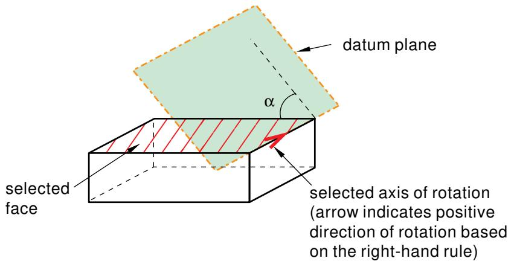

<details>
<summary>text_image</summary>

datum plane
α
selected face
selected axis of rotation
(arrow indicates positive
direction of rotation based
on the right-hand rule)
</details>

1. From the main menu bar, select Tools->Datum.

The Create Datum dialog box appears. The dialog box outlines the types of datum geometry you can create.

Abaqus/CAE displays prompts in the prompt area to guide you through the procedure.


Tip: You can also create a datum plane using the tool, located in the module toolbox. For a diagram of the datum tools in the toolbox, see Using the Datum toolset.

2. From the list of types at the top of the dialog box, choose Plane.  
The Method list indicates the methods you can use to create a datum plane.  
3. From the Method list, select Rotate from plane.  
4. If desired, select Make Independent from the prompt area to create the datum as an independent feature.  
5. From the part or assembly in the current viewport, select a face or a datum plane to rotate.  
6. Select any edge or a datum axis to represent the axis of rotation. The edge or datum axis you select for the axis of rotation does not have to be coplanar with the face or datum plane you selected to rotate.

Abaqus/CAE displays an arrow along the selected edge indicating the positive direction of rotation using the right-hand rule.

7. In the text box that appears in the prompt area, type the angle of rotation.

The datum plane appears. You can modify the angle of rotation by selecting Feature->Edit from the main menu bar and selecting the datum plane. If you change the sign of the angle, Abaqus/CAE reverses the direction of rotation.

## Additional information

• Methods for creating a datum plane  
• Datum creation techniques

• Controlling datum display

## Creating datum coordinate systems

This section describes the tools that you can use to create a datum coordinate system.

## In this section:

Creating a datum coordinate system defined by three points  
Creating a datum coordinate system at an offset from another coordinate system  
Creating a datum coordinate system defined by two lines

## Creating a datum coordinate system defined by three points

You can position a rectangular, cylindrical, or spherical datum coordinate system by selecting a point defining the origin, a point on the X- or R-axis, or a point in the X–Y or R– plane.

The figure below shows an example of creating a rectangular datum coordinate system defined by three points.


When Abaqus/CAE prompts you to select a point, you can select the origin of a datum coordinate system. When Abaqus/CAE prompts you to select an edge, you can select one of the axes of a datum coordinate system.

1. From the main menu bar, select Tools->Datum.

The Create Datum dialog box appears. The dialog box outlines the types of datum geometry you can create.

Abaqus/CAE displays prompts in the prompt area to guide you through the procedure.


Tip: You can also create a datum coordinate system using the $t = \frac { t } { 2 }$ tool, located in the module toolbox. For a diagram of the datum tools in the toolbox, see Using the Datum toolset.

2. From the list of types at the top of the dialog box, choose CSYS.

The Method list indicates the methods you can use to create a datum coordinate system.

3. From the Method list, select 3 points.

Abaqus/CAE displays the Create Datum CSYS dialog box.

4. From the dialog box, enter the name of the datum coordinate system.

To help keep track of your datum coordinate systems, Abaqus/CAE displays its name in the Model Tree. In addition, you can use the Model Tree to rename the datum coordinate system.

5. From the dialog box, select one of the following datum coordinate systems:

• Rectangular: The X-, Y-, and Z-axes are aligned with the 1-, 2-, and 3-global axes, respectively.  
• Cylindrical: The R-, -, and Z-axes are aligned with the 1-, 2-, and 3-global axes, respectively.  
• Spherical: The R-, -, and -axes are aligned with the 1-, 2-, and 3-global axes, respectively.

6. From the Create Datum CSYS dialog box, click Continue.

Abaqus/CAE displays a default datum coordinate system. The origin of the datum coordinate system is located at the origin of the part or assembly. In addition, the axes of the default datum coordinate system are aligned with the coordinate system of the part or assembly.

7. If desired, select Make Independent from the prompt area to create the datum as an independent feature.

8. To create a datum coordinate system at a different location or with a different orientation, do the following:

a. From the part or assembly in the current viewport, select a point that will define the origin of the datum coordinate system or enter the coordinates of the origin.

Abaqus/CAE displays a temporary datum coordinate system at the selected point. The axes of the datum coordinate system are aligned with the axes of the global coordinate system.

b. From the prompt area, press [Enter] in the text field to accept the default orientation of the temporary datum coordinate system or select (or enter the coordinates of) a point that will lie on the X- or R-axis.

Abaqus/CAE recalculates the orientation of the temporary datum coordinate system.

c. From the prompt area, press [Enter] in the text field to accept the new orientation of the temporary datum coordinate system or select (or enter the coordinates of) a point that will lie on the X–Y or R– plane.

Abaqus/CAE creates the datum coordinate system. You cannot move or rotate a datum coordinate system.

## Additional information

• Methods for creating a datum coordinate system  
• Datum creation techniques  
• Controlling datum display

## Creating a datum coordinate system at an offset from another coordinate system

You can position a rectangular, cylindrical, or spherical datum coordinate system by selecting a coordinate system and specifying an offset; you can specify the offset by entering a value or selecting a point.

The figure below shows an example of creating a rectangular datum coordinate system at an offset from the default coordinate system.

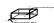

When Abaqus/CAE prompts you to select a point, you can select the origin of a datum coordinate system. When Abaqus/CAE prompts you to select an edge, you can select one of the axes of a datum coordinate system.

1. From the main menu bar, select Tools->Datum.

The Create Datum dialog box appears. The dialog box outlines the types of datum geometry you can create.

Abaqus/CAE displays prompts in the prompt area to guide you through the procedure.


Tip: You can also create a datum coordinate system using the tool, located in the module toolbox. For a diagram of the datum tools in the toolbox, see Using the Datum toolset.


2. From the list of types at the top of the dialog box, choose CSYS.

The Method list indicates the methods you can use to create a datum coordinate system.

3. From the Method list, select Offset from CSYS.

Abaqus/CAE displays the Create Datum CSYS dialog box.

4. From the dialog box, enter the name of the datum coordinate system.

To help keep track of your datum coordinate systems, Abaqus/CAE displays its name in the Model Tree. In addition, you can use the Model Tree to rename the datum coordinate system.

5. From the dialog box, select one of the following datum coordinate systems:

• Rectangular: The X-, Y-, and Z-axes are aligned with the 1-, 2-, and 3-global axes, respectively.  
• Cylindrical: The R-, -, and Z-axes are aligned with the 1-, 2-, and 3-global axes, respectively.  
• Spherical: The R-, -, and -axes are aligned with the 1-, 2-, and 3-global axes, respectively.

6. From the Create Datum CSYS dialog box, click Continue.

7. If desired, select Make Independent from the prompt area to create the datum as an independent feature.

8. From the current viewport, select a datum coordinate system.

9. From the buttons in the prompt area, select one of the following:

## Enter Value

In the text field in the prompt area, enter the X-, Y-, and Z-coordinates of the offset from the selected default coordinate system.

## Select Point

From the part or assembly in the current viewport, select a point to define the offset from the selected default coordinate system.

The datum coordinate system appears. You cannot move or rotate a datum coordinate system.

## Additional information

• Methods for creating a datum coordinate system  
• Datum creation techniques  
• Controlling datum display

## Creating a datum coordinate system defined by two lines

You can position a rectangular, cylindrical, or spherical datum coordinate system by selecting two edges that define it.

The first edge defines the X- or R-axis, and the X–Y or R- -plane passes through the second.

The figure below shows an example of creating a rectangular datum coordinate system defined by two lines.

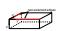

When Abaqus/CAE prompts you to select an edge, you can select one of the axes of a datum coordinate system.

1. From the main menu bar, select Tools->Datum.

The Create Datum dialog box appears. The dialog box outlines the types of datum geometry you can create.

Abaqus/CAE displays prompts in the prompt area to guide you through the procedure.


Tip: You can also create a datum coordinate system using the tool, located in the module toolbox. For a diagram of the datum tools in the toolbox, see Using the Datum toolset.

2. From the list of types at the top of the dialog box, choose CSYS.

The Method list indicates the methods you can use to create a datum coordinate system.

3. From the Method list, select 2 lines.

Abaqus/CAE displays the Create Datum CSYS dialog box.

4. From the dialog box, enter the name of the datum coordinate system.

To help keep track of your datum coordinate systems, Abaqus/CAE displays its name in the Model Tree. In addition, you can use the Model Tree to rename the datum coordinate system.

5. From the dialog box, select one of the following datum coordinate systems:

• Rectangular: The X-, Y-, and Z-axes are aligned with the 1-, 2-, and 3-global axes, respectively.  
• Cylindrical: The R-, -, and Z-axes are aligned with the 1-, 2-, and 3-global axes, respectively.  
• Spherical: The R-, -, and -axes are aligned with the 1-, 2-, and 3-global axes, respectively.

6. From the Create Datum CSYS dialog box, click Continue.

7. If desired, select Make Independent from the prompt area to create the datum as an independent feature.

8. From the part or assembly in the current viewport, select a straight edge that will define the X- or R-axis of the datum coordinate system.

9. Select a straight edge that will lie in the X–Y or -plane.

The datum coordinate system appears. You cannot move or rotate a datum coordinate system.

## Additional information

• Methods for creating a datum coordinate system  
• Datum creation techniques  
• Controlling datum display

## The Discrete Field toolset

A discrete field is a spatially varying field where values are associated with a node or an element. The Discrete Field toolset allows you to create and manage discrete fields.

## In this section:

Using the Discrete Field toolset  
Creating discrete fields  
Evaluating discrete fields  
Creating discrete fields for material volume fractions

## Using the Discrete Field toolset

The Discrete Field toolset allows you to define spatially varying parameters. The parameters in a discrete field can be associated with specified elements or nodes. For example, you can define a spatially varying thickness or orientation (Cartesian, cylindrical, or spherical). The Discrete Field toolset is available in the Property module, Interaction module, and Load module.

Select Tools->Discrete Field->Create from the main menu bar to create a new discrete field; select Edit from the same menu to change an existing discrete field. Either command opens the discrete field editor, which allows you to associate data with elements or nodes.

## Creating discrete fields

The Discrete Field toolset is available in the Property module, Interaction module, and Load module. Select Tools->Discrete Field->Create from the main menu bar to create a discrete field.

1. From the main menu bar, select Tools->Discrete Field->Create.


## Tip: You can also click Create in the Discrete Field Manager.

2. In the Name text field, enter a name for the discrete field. For information on naming objects, see Using basic dialog box components.  
3. In the Description text field, enter a description for the discrete field.  
4. Choose Elements or Nodes to specify the type of location to which the field will be applied.  
5. Choose the data type.

• Choose Scalar to enter scalar field data.  
• The Orientation option is available for fields associated with elements. Choose Orientation, and do the following:

1. Choose the coordinate system type—Cartesian, Cylindrical, or Spherical.  
2. Toggle on Supplied orientation directions are defined in part space to specify that the orientation directions are defined at the part or part instance level. When you define the orientations in the part space, Abaqus transforms the orientation values from the part's coordinate system into the assembly coordinate system using the part instance transformation. Toggle off this option to specify that the orientation directions are defined at the assembly level.

• Choose Prescribed condition to include degree of freedom values in the field data.

6. Enter the default component value or values. For information on how Abaqus uses the default values, see Evaluating discrete fields. Scalar discrete fields require one default component value. Orientation discrete fields require six default component values. Prescribed condition discrete fields require six default component values and up to six degree of freedom values.  
7. In the Field Data table, enter the following values:

• Element or node number and its associated component value or values.  
When creating discrete fields that will be used with assembly-level or history objects, such as loads or interactions, you must specify the complete name of the node or element numbers, as described in Naming Conventions. For example, you would specify the part instance name and element id using the notation Part\_instance\_name.EID, such as PART-2–1.20.  
• For prescribed condition discrete fields, enter the degree of freedom values.

Click mouse button 3 on the table to see a menu that allows you to do the following:

• Cut, copy, and paste values  
• Insert and delete rows  
• Clear a table cell or the entire table  
• Read from or write to a comma-separated file

For more information, see Entering tabular data.

8. Click OK to create the discrete field and to exit the editor.

## Additional information

• Defining sections  
• Composite layups

## Evaluating discrete fields

If you specify a discrete field for a prescribed condition, Abaqus/CAE evaluates the discrete field when the input file is written.

If an element or node is found in both the region selected for the prescribed condition and the discrete field, Abaqus/CAE multiplies the magnitude of the prescribed condition by the value at each element or node to determine the final values that are submitted to the analysis. A material assignment predefined field is the only exception; this prescribed condition has no magnitude.  
• If an element or node is found in the region selected for the prescribed condition but not in the discrete field, the magnitude of the prescribed condition is multiplied by the default value and submitted to the analysis.

Table 1 summarizes how the value written to the input file is determined for scalar discrete fields.  
Table 1: Evaluating scalar discrete fields.

<table><tr><td>Element or node in region selected for prescribed condition?</td><td>Element or node in discrete field?</td><td>Value written to input file</td></tr><tr><td>Yes</td><td>Yes</td><td>Magnitude of prescribed condition × magnitude specified in discrete field</td></tr><tr><td>Yes</td><td>No</td><td>Magnitude of prescribed condition × default value specified in discrete field</td></tr><tr><td>No</td><td>Yes</td><td>Not written to input file</td></tr></table>

For prescribed conditions that have multiple degrees of freedom, such as displacements, prescribed condition discrete fields are used; and evaluating the discrete field becomes more complex. For prescribed conditions where you can activate the individual degrees of freedom, only the active degrees of freedom in the prescribed condition are considered; any degree of freedom that is not active in the prescribed condition will be ignored. The magnitudes specified for each degree of freedom in the prescribed condition are multiplied by either the magnitude specified in the discrete field or the default value for that degree of freedom in the discrete field.

For example, if you define a displacement boundary condition, as shown in Figure 1, for Node-set-1 (containing nodes Part-2–1.10, Part-2–1.20, and Part-2–1.30) and a prescribed condition discrete field, as shown in Figure 2, the values that are submitted to the input file are shown in Table 2.

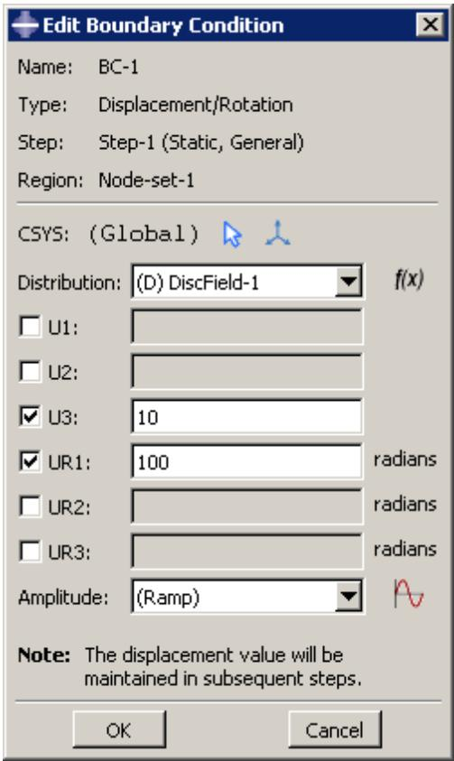

<details>
<summary>text_image</summary>

Edit Boundary Condition
Name: BC-1
Type: Displacement/Rotation
Step: Step-1 (Static, General)
Region: Node-set-1
CSYS: (Global)
Distribution: (D) DiscField-1 f(x)
U1:
U2:
U3: 10
UR1: 100 radians
UR2:
UR3:
Amplitude: (Ramp)
Note: The displacement value will be maintained in subsequent steps.
OK Cancel
</details>

Figure 1: Displacement boundary condition with two degrees of freedom activated.


<details>
<summary>text_image</summary>

Edit Discrete Field
Name: DiscField-1
Description: Discrete field for displacement
Location
Definition: Elements Nodes
Data Composition
Data type: Scalar Orientation Prescribed condition
Default Values
Node ID	Component 1	Component 2	Component 3	Component 4	Component 5	Component 6
Defaults	9	8	7	6	5	4
Field Data
Node ID	DOF	Magnitude
Part-2-1.10	1	1
Part-2-1.10	2	2
Part-2-1.10	3	3
Part-2-1.20	1	11
Part-2-1.20	2	12
Part-2-1.40	3	22
OK	Cancel
</details>

Figure 2: Prescribed condition discrete field used to define a spatially varying displacement boundary condition.

Table 2: Results for evaluating a prescribed condition discrete field.

<table><tr><td>Node ID</td><td>Degree of freedom</td><td>Value written to input file</td></tr><tr><td>Part-2-1.10</td><td>3 (U3)</td><td>30</td></tr><tr><td>Part-2-1.10</td><td>4 (UR1)</td><td>600</td></tr><tr><td>Part-2-1.20</td><td>3 (U3)</td><td>70</td></tr><tr><td>Part-2-1.20</td><td>4 (UR1)</td><td>600</td></tr><tr><td>Part-2-1.30</td><td>3 (U3)</td><td>70</td></tr><tr><td>Part-2-1.30</td><td>4 (UR1)</td><td>600</td></tr><tr><td>Part-2-1.40</td><td>3 (U3)</td><td>None</td></tr></table>

Degrees of freedom for boundary conditions and predefined fields that result in a zero magnitude are written to the input file as such; however, degrees of freedom for loads that result in zero magnitudes are not written to the input file.

When creating discrete fields that will be used with assembly-level and history objects, such as loads or interactions, you must specify the complete name of the node or element numbers, as described in Naming Conventions.

## Creating discrete fields for material volume fractions

The volume fraction tool is used to create discrete fields representing the overlap between two part instances on an element-by-element basis. One of the part instances must be a meshed Eulerian part. The other part instance acts as reference geometry. The discrete field that is created associates each element in the Eulerian part with a volume fraction based on the amount of space that the reference part instance occupies within that element. This discrete field can be used to assign materials in an Eulerian model (see Assigning materials to Eulerian part instances). For an overview on using the volume fraction tool in Eulerian models, refer to Using the volume fraction tool.

The volume fraction tool is available in the Interaction module and the Load module. Select Tools->Discrete Field->Volume Fraction Tool from the main menu bar to create a discrete field using the volume fraction tool.

1. From the main menu bar, select Tools->Discrete Field->Volume Fraction Tool.  
2. In the viewport, select a meshed Eulerian part instance. The discrete field that is created will be associated with the elements in this Eulerian part.


## Warning:

You should not regenerate or edit the Eulerian part mesh after using the volume fraction tool. Any changes to the mesh—including regenerating it from replay or journal files—may invalidate the created discrete field.

3. In the viewport, select a reference part instance that intersects the previously selected Eulerian part instance. This part instance must be a three-dimensional solid or a three-dimensional shell. The reference part instance cannot contain free edges or interior dividing faces (free or non-manifold edges).


## Note:

If the reference instance consists of meshed geometry, Abaqus/CAE always uses the meshed representation of the part instance to calculate volume fractions. If the reference instance is partially meshed, only the meshed portion of the part is considered in the volume fraction calculations.

The Volume Fraction Tool dialog box appears.

4. In the Name text field, enter a name for the discrete field. For information on naming objects, see Using basic dialog box components.  
5. In the Description text field, enter a description for the discrete field.  
6. To change the Eulerian instance or reference instance, click Edit, and select a new part instance in the viewport.  
7. Specify the Accuracy (Low, Medium, or High) for the volume fraction calculations. A lower accuracy results in faster performance for the tool.  
8. Specify the Material location:

Selecting Inside reference instance implies that the material will be assigned to the region that is occupied or enclosed by the reference instance. A nonzero value is assigned to all Eulerian elements within this region.  
Selecting Outside reference instance implies that the material will be assigned to the region that is not occupied or enclosed by the reference instance. A nonzero value is assigned to all elements that are not fully occupied or enclosed by the reference instance.

9. Specify a Scale factor between zero and one. All values in the discrete field are multiplied by this scale factor. By default, the scale factor is one.

10. To create a set of all nodes connected to elements with nonzero volume fractions in the discrete field, toggle on Node set, and enter a name for the set.  
11. To create a set of all elements connected to elements with nonzero volume fractions in the discrete field, toggle on Element set, and enter a name for the set.  
12. Click OK to create the discrete field and to close the Volume Fraction Tool dialog box.

## Additional information

• Assigning materials to Eulerian part instances  
• Using the volume fraction tool  
• Using the Discrete Field toolset

You can use the Edit Mesh toolset in the Mesh module to improve the mesh quality. You can modify an orphan mesh, or you can modify an Abaqus native mesh.

## In this section:

What can I do with the Edit Mesh toolset?  
Meshing strategies and mesh editing techniques  
Using the mesh editing tools  
Editing nodes  
Editing elements  
Editing the entire mesh  
Editing and refining an orphan mesh  
Undoing or redoing a change in the Edit Mesh toolset

What is the difference between editing an orphan mesh, a meshed part, and a meshed part instance in the assembly?

## What can I do with the Edit Mesh toolset?

This section describes how you can use the Edit Mesh toolset to modify a mesh in the Mesh module.

All of the tools are available when you are modifying a mesh that contains orphan elements and nodes; however, only a few of the tools are available for modifying mesh nodes or elements that are tied to geometry, including meshed part instances in the assembly.

## In this section:

Manipulating nodes  
Manipulating elements  
Manipulating the mesh  
Refining the mesh

## Manipulating nodes

The Edit Mesh toolset provides the following tools that allow you to manipulate the nodes in your mesh:

Create a node. You can specify the coordinates of the new node either in the global coordinate system or in a datum coordinate system that you specify.  
Edit nodes. You can specify the new coordinates of the nodes either in the global coordinate system or in a datum coordinate system that you specify. Alternatively, you can specify an offset from the current position. You can edit a single node, or you can edit multiple nodes simultaneously.

Drag nodes. You can click and drag the nodes in a model. You can drag only one node at a time, and you can use the Project to geometry option to project an exterior node to the geometry with which it is associated. Element quality checks are automatically activated to show element errors and warnings while you drag a node. For more information on element quality checks, see Verifying element quality.

Project nodes. You can specify a vertex, edge, or face and Abaqus/CAE projects the nodes from their current positions onto the selected entity. You can project a single node, or you can project multiple nodes simultaneously. You can also project nodes to other nodes, element edges, element faces, datum points, datum axes, or datum planes.

Delete nodes. Any elements associated with the deleted nodes are also deleted. In addition, you have the option of deleting any remaining nodes that would be left unassociated with any elements once the nodes selected for deletion and their associated elements are deleted.

Merge selected nodes. If you select only two nodes to merge, Abaqus/CAE creates a new node at the midpoint of the selected nodes. If you select more than two nodes, you can specify the Node merging tolerance, which is the maximum distance between nodes that will be merged. Abaqus/CAE deletes nodes that are closer than the specified distance and replaces them with a single new node. The location of the new node is the average position of the group of nodes that were merged into the new node.

While Abaqus/CAE is removing duplicate nodes, you can choose to remove duplicate elements that have the same connectivity. You can also merge instances of parts in the Assembly module and you have the option to merge nodes within this process; for more information, see Merging and cutting part instances.

Smooth selected nodes. You can select external nodes, and Abaqus/CAE smooths the node positions with respect to the surrounding nodes. You can smooth any external nodes of the native mesh on a part or on an assembly as long as they are not part of a region boundary; you can also smooth external orphan mesh nodes that lie within a planar mesh face.  
Adjust the position of the midside node of second-order elements to allow for the singularity at the crack tip in a fracture mechanics analysis. You can select nodes and enter a bias parameter between 0 and 1. Abaqus/CAE moves the midside nodes along connected element edges to a position based on the parameter that you entered. For example, if you enter a parameter of 0.25, Abaqus/CAE biases the position of the midside nodes one quarter of the length of the element edge away from the selected nodes.

For more information, see Controlling the singularity at the crack tip for a small-strain analysis, and Constructing a Fracture Mechanics Mesh for Small-Strain Analysis with the Conventional Finite Element Method.

• Renumber selected nodes within an orphan mesh. You can renumber the selected nodes by specifying a starting label and an increment or by offsetting the existing label by a specified value.


Tip: The Mesh Edit Undo feature can roll back any change you make to the nodes in the mesh. For more information, see Undoing or redoing a change in the Edit Mesh toolset.

For detailed instructions about each of these node manipulation techniques, see Editing nodes.

## Manipulating elements

The Edit Mesh toolset provides the following tools that allow you to manipulate the elements in your mesh:

Create an element. You must specify the shape of the element that you want to create, and you must select the nodes in the order appropriate for that element shape.  
• Delete elements. You have the option of deleting any nodes that would be left unassociated with any elements once the selected elements are deleted.  
• Flip the surface normal direction of shell elements.  
• Collapse a selected edge of quadrilateral or triangular elements. Collapsing an edge is useful for removing slivers from quadrilateral and triangular elements, as shown in Figure 1.

  
Figure 1: Collapsing an edge to remove slivers from quadrilateral and triangular elements.

When you preview a tetrahedral boundary mesh, you can collapse selected edges of the triangular elements to remove slivers. In some cases, when you create an all-quadrilateral mesh using the advancing front algorithm, Abaqus/CAE may generate quadrilateral elements with a short edge. You can collapse the short edge and create a well-formed triangular element, as shown in Figure 2.


<details>
<summary>text_image</summary>

select this edge to collapse
</details>

Figure 2: Collapsing an edge of a quadrilateral element.

• Split a selected edge of a quadrilateral or triangular element into two parts. You can split the edge at its midpoint, or you can click on the location of the split. You can use a combination of tools to clean up your mesh. For example,

Figure 3 illustrates how you can split an edge and then collapse the resulting edge to remove a long narrow triangular element.  
  
Figure 3: Splitting and collapsing edges of a triangular element.

If you are editing a native mesh in the Mesh module, Abaqus/CAE projects the new node on the geometry. As a result, you can use this tool for improving a coarse mesh around curved edges, as shown in Figure 4.

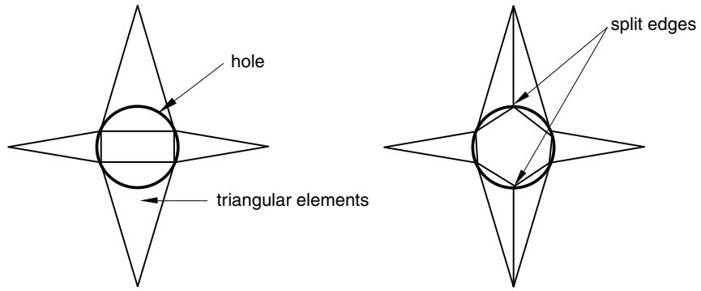  
Figure 4: Improving the mesh around a hole by splitting edges.

Swap the diagonal of a pair of adjacent triangular elements, as shown in Figure 5. You can swap the diagonal of either first- or second-order adjacent triangular elements if they are the same order. In addition, the adjacent triangular elements must have consistent normals. If necessary, you can flip the normals to make them consistent.

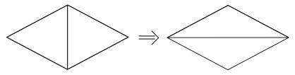

<details>
<summary>natural_image</summary>

Two geometric diagrams showing a square divided vertically into two triangles, one solid and one outlined, with no text or symbols present.
</details>

Figure 5: Swap the diagonal of a pair of adjacent triangular elements.

Split a quadrilateral element into two triangular elements, as shown in Figure 6. You cannot split a 5-node quadrilateral element, and you cannot split a gasket element.

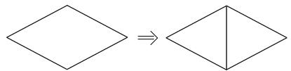

<details>
<summary>text_image</summary>

Diagram showing transformation of diamond shapes from left to right, with equivalence indicated by right arrow
</details>

Figure 6: Split a quadrilateral element into two triangular elements.

Combine two adjacent triangular elements into one quadrilateral element, as shown in Figure 7. You can combine either first- or second-order elements, but you cannot combine a combination of both. In addition, you can combine elements only if the adjacent triangular elements have consistent normals. If necessary, you can flip the normals to make them consistent.


<details>
<summary>natural_image</summary>

Two diamond shapes side by side, one divided vertically and the other unlabelled (no text or symbols)
</details>

Figure 7: Combine two adjacent triangular elements into one quadrilateral element.

Orient the stack direction of a continuum shell, cohesive, cylindrical, or gasket mesh. You can stack only hexahedral, wedge, and quadrilateral elements to form a continuum shell, cohesive, cylindrical, or gasket mesh. As a result, you can use this tool to orient the stack direction of only hexahedral, wedge, and quadrilateral elements. If you have assigned cylindrical elements or second-order gasket elements to the region, you must first change the assignment to conventional elements before you reorient the stack direction. You can then convert the region back to a cylindrical or gasket mesh by reassigning cylindrical elements or second-order gasket elements.  
• Renumber selected elements within an orphan mesh. You can renumber the selected elements by specifying a starting label and an increment or by offsetting the existing label by a specified value.


Tip: The Mesh Edit Undo feature can roll back any change you make to the element in the mesh. For more information, see Undoing or redoing a change in the Edit Mesh toolset.

For detailed instructions about manipulating elements, see Editing elements.

## Manipulating the mesh

The Edit Mesh toolset provides the following tools that allow you to manipulate the mesh:

Create layers of solid elements that are offset normal to selected element faces of an existing mesh, as shown in Figure 1. This tool is useful for meshing shell-like parts with solid elements. You can specify the total thickness of all the layers and the number of layers to create. The first layer of elements can be merged with the existing elements, or it can be offset by a specified distance. The selected element faces can be from either shell or solid elements, but not from both. If you selected shell element faces, you can choose whether to delete the shell elements after Abaqus/CAE generates the layers of solid elements.

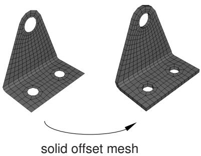

<details>
<summary>natural_image</summary>

3D wireframe model of two mechanical brackets with holes, labeled 'solid offset mesh' (no text or symbols on the bracket itself)
</details>

Figure 1: Creating layers of solid elements.

You should use this tool to generate continuum shell and cohesive elements, because the solid elements that Abaqus/CAE generates are stacked normal to the surface from which they were offset.

Create layers of shell elements that are offset normal to selected element faces from an existing mesh, as shown in Figure 2.


<details>
<summary>flowchart</summary>

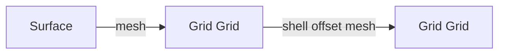
```mermaid
graph LR
  A["Surface"] -->|"mesh"| B["Grid Grid"]
  B -->|"shell offset mesh"| C["Grid Grid"]
```
</details>

Figure 2: Creating layers of shell elements.

This tool is similar to the previous tool; however, instead of specifying the total thickness of the layers, you specify the distance between the layers. You should use this tool to create an offset copy of an existing shell mesh and to create multi-layered composite models or reinforcements.

Wrap a mesh. You can wrap a planar orphan mesh about the global Z-axis at a specified radius. The wrapping procedure will relocate a node at point ( , ) on the planar mesh to $( r , \pmb { \theta } , z )$ , where is the specified radius, $\begin{array} { r } { \pmb { \theta } = \frac { \pmb { x } } { \pmb { r } } } \end{array}$ , and = .  
Collapse edges. You can specify the minimum element edge size desired in the mesh. Abaqus/CAE merges the end nodes of element edges that are shorter than the specified length. By default, Abaqus/CAE checks all element edges in a mesh part, but you can specify a different element domain.

For structured meshes you can specify a thickness direction or reference edge to limit the edge directions considered for collapse. If you select a thickness direction, Abaqus/CAE uses the direction vector to measure the elements instead of measuring only the distance between nodes. If elements are oriented such that the direction is topologically ambiguous, Abaqus/CAE highlights the elements so you can either select a domain that excludes them or add a reference edge to further define the desired edges. When you choose a reference edge, with or without a thickness direction, Abaqus/CAE considers edges for collapse only if they are topologically parallel to the reference edge. A reference edge can be applied only within a single section of structured mesh; multiple separate sections must be handled in separate collapse operations if reference edges are required.

You cannot collapse small edges in an element domain that contains quadratic elements.

Grow edges. You can specify the minimum element edge size that you want to appear in the model, and Abaqus/CAE grows smaller edges to the specified minimum length by adjusting the nodes outward, effectively taking pieces from adjacent edges. Abaqus/CAE cannot increase the length of an edge if adjusting its nodes would cause the adjacent element edges to be too small. However, if you add a thickness direction, Abaqus/CAE will grow all the elements in that direction such that they will meet the minimum size.

The options for this tool are the same as those for the collapse edges tool; you can specify an element domain other than the entire mesh part, and you can use a thickness direction or a reference edge within a structured mesh to grow only those edges that meet your direction criteria. You cannot grow edges in an element domain that contains quadratic elements.


## Note:

Use care when specifying an element domain other than the entire mesh. Abaqus/CAE considers for growth only those element edges within the selected domain. If short element edges exist near the border of the domain, Abaqus/CAE does not check the length of adjacent edges outside the domain before growing the ones inside the domain. Growth of edges at the domain border could result in short edges or inverted elements outside the domain.

Convert triangular elements to tetrahedral elements. You can convert a closed three-dimensional shell of triangular elements into a solid mesh of tetrahedral elements. The triangular shell elements must completely enclose a volume that can be filled with solid elements.  
Convert solid orphan mesh elements to shell orphan mesh elements. This tool creates triangular or quadrilateral shell elements on the free faces of the part. For mesh parts with unmerged nodes that create crack features or mesh parts that have joined faces with incompatible meshes, Abaqus/CAE creates shell elements on both sides of the interface.  
Merge layers. You can select a group of adjacent elements and join them along a specified direction. Each merged element will have the combined shape of the parent elements and the same element type. After selecting the elements to merge, you choose an edge within the elements to be merged to indicate the merge direction, as shown on the left in Figure 3. The top two layers of elements were selected using the by topology selection method (for more information, see Using the topology method to select multiple elements); for clarity the selection is not shown in the figure.


<details>
<summary>natural_image</summary>

3D wireframe model of a green curved surface with a cursor pointer, no text or symbols present
</details>

Figure 3: Merging element layers.

You need not select entire layers of elements to merge. However, if you do not select entire layers, Abaqus/CAE will warn you that the new elements will be incompatible with the surrounding mesh. You can then choose to continue or cancel the merge procedure. You cannot merge quadratic elements.

Subdivide layers. You can select a group of elements and split them by equally dividing the element edges. Abaqus/CAE prompts you to select an edge, a face, or All Directions to indicate the direction along which the new layers will be created and enter the number of divisions to make from each element edge. You cannot subdivide quadratic elements.  
Copy a mesh pattern. You can apply a two-dimensional mesh pattern to a similar geometric target on the same part or assembly. After selecting the source mesh and target geometry, you select several nodes and map them to points on the geometry, then Abaqus/CAE finishes the mapping process to apply the mesh pattern to the target.  
Associate mesh with geometry. You can associate orphan or bottom-up mesh entities with a selected geometric entity. Abaqus/CAE prompts you to select a vertex, edge, or face, and then select the node, element edges, or element faces to associate with the geometry. Association can be used to apply loads to a mesh or to create a compatible mesh at the interface between orphan mesh elements and geometry.  
• Delete mesh association. You can delete the mesh-geometry association for vertices, edges, faces, or entire geometric regions. You can also delete the association of a native mesh to create an orphan mesh for a portion of a model.  
Insert cohesive seams. You can open pairs of connected elements at crack regions and insert a layer of pore pressure cohesive elements that are created as orphan elements in the gap region. Abaqus/CAE creates several sets and surfaces to help you make selections in subsequent procedures, such as section assignment.


Tip: The Mesh Edit Undo feature can roll back any change you make to the mesh. For more information, see Undoing or redoing a change in the Edit Mesh toolset.

In addition, Changing the labels of all nodes and elements, describes how you can renumber all of the nodes and/or elements of a part or selected part instances in the assembly.

For detailed instructions about manipulating the mesh, see Editing the entire mesh.

## Refining the mesh

The Edit Mesh toolset provides the following tools that allow you to refine a planar mesh of triangular elements:

Set size. You can specify a global element size for the remesh procedure. Abaqus/CAE changes the density of the new mesh to reflect the new target element size. You can change the element size if the mesh contains either linear or quadratic elements.  
Remove size. You can maintain the global element size during the remesh procedure. Abaqus/CAE maintains the edges of the elements along the boundary of the part while improving the mesh quality in the interior. You can refine the mesh if the mesh contains either linear or quadratic elements.  
• Remesh. You can remesh a planar mesh containing linear or quadratic triangular elements.


Tip: The Mesh Edit Undo feature can roll back any mesh refinement changes. For more information, see Undoing or redoing a change in the Edit Mesh toolset.

For detailed instructions about mesh refinement, see Editing and refining an orphan mesh.

## What is the difference between editing an orphan mesh, a meshed part, and a meshed part instance in the assembly?

You can display either parts containing a combination of orphan and native mesh components or the assembly in the Mesh module. You can use all of the tools in the Edit Mesh toolset to edit an orphan mesh; however, you can use only the following tools to edit a meshed part instance in the assembly:

• Edit, drag, project, merge, and smooth nodes  
• Delete elements  
• Collapse element edges  
• Split an edge of a quadrilateral or triangular element  
• Swap the diagonal of a pair of adjacent triangular elements  
• Split a quadrilateral element into two triangular elements  
• Combine two triangular elements into one quadrilateral element

If you select a part instead of a part instance in the assembly, you can use the mesh editing tools listed above plus the following additional tools:

• Create nodes and elements  
• Offset mesh layers to create solid or shell layers  
• Associate the mesh with geometry  
• Delete mesh associativity  
• Copy mesh pattern

In general, you cannot use the Edit Mesh toolset to modify the mesh of a dependent part instance. However, you can edit, drag, and project the nodes of a dependent part instance; Abaqus/CAE modifies the original meshed part, and your modifications appear on all dependent instances of the part.

You can create an orphan mesh in the Mesh module, or you can import an orphan mesh from an output database or an Abaqus input file. You can add geometric features to an orphan mesh in the Part module. An instance of an orphan mesh is always a dependent instance and; therefore, you cannot use the Edit Mesh toolset to edit an instance of an orphan mesh in the assembly. However, you can display the original orphan mesh that was used to create the instance and edit the part. For more information, see What is the difference between a dependent and an independent part instance?.

The Mesh Edit Undo feature can roll back any change you make to the mesh. For more information, see Undoing or redoing a change in the Edit Mesh toolset.

## Meshing strategies and mesh editing techniques

This section describes strategies for improving your mesh using the Edit Mesh toolset and techniques that you can use to create the desired mesh.

## In this section:

A strategy for improving the mesh  
Using offset meshes in Abaqus/CAE  
Reducing element distortion and collapse during mesh offsetting  
Allowing for branching in offset solid meshes  
Creating a mid-plane shell mesh from a thin solid model  
Using a combination of tools to mesh an imported solid part with tetrahedral elements

## A strategy for improving the mesh

If you have a complex assembly, you should select Mesh->Verify to verify the quality of the mesh before you submit the job for analysis. The mesh verify tool can do the following:

• Highlight elements of a selected shape that do not meet specified criteria, such as aspect ratio.  
• Print mesh statistics, such as the total number of elements of the chosen shape, the number of highlighted elements, and the average and worst values of the selection criterion.  
• Highlight elements that do not pass the mesh quality tests that are included with the input file processor in Abaqus/Standard and Abaqus/Explicit.

If the mesh verify tool indicates that you should try to improve the quality of the mesh, you should first try the following before turning to the Edit Mesh toolset:

• Change the seed distribution  
• Add or modify partitions  
• Change the mesh technique

In addition, you might try modifying the parts in the Part module, or you might try using the Virtual Topology toolset and regenerating the mesh. You should treat the Edit Mesh toolset as the final step in the meshing process and use it only to make minor adjustments to nodes and elements. Abaqus/CAE tries to preserve attributes, such as loads and boundary conditions, if you make changes to the mesh. If you modify a part, Abaqus/CAE deletes the mesh when you return to the Mesh module; as a result, you will lose any edits that you made to the mesh.

## Using offset meshes in Abaqus/CAE

The offset mesh tools in the Edit Mesh toolset have many uses in Abaqus/CAE, as follows:

## Continuum shell meshes

You can use the solid offset mesh tool to mesh thin solids that are essentially thickened shells, such as sheet metal, composites, or molded plastic components. The solid offset mesh tool is useful for creating continuum shell elements because Abaqus/CAE orients the elements consistently in the thickness direction. For more information, see Meshing parts with continuum shell elements.

## Cohesive elements

You can assign cohesive elements to quadrilateral elements of a two-dimensional model. For three-dimensional models you can use the solid offset mesh tool to generate a layer of cohesive elements on a mesh. The offset mesh tool generates elements that are oriented consistently with a stack direction that is normal to the thickness direction, and it is a convenient tool for quickly creating a layer of cohesive elements. For more information, see Embedding cohesive elements in an existing three-dimensional mesh.

## Skin reinforcements

If your skin can be defined as a single layer, creating the skin in the Property module is the preferred approach. However, you can use the shell offset mesh tool to create a skin that uses multiple reinforcement layers. For more information, see Using offset meshes to create skin reinforcements.

You can also use the solid offset mesh tool in conjunction with the mesh generation tools in the Mesh module by doing the following:

1. Create a portion of the mesh in the Mesh module.

2. Use the solid offset mesh tool to complete the mesh.

You can create sets containing the elements from an offset mesh. You can create a single set that contains the offset elements, or you can create separate sets for each layer of offset elements. In addition, if you are creating a solid offset mesh, you can create surfaces from the top and the bottom of the offset mesh, provided the first layer of elements is not embedded in the original mesh. You can use these sets and surfaces in subsequent procedures to help you select elements from the offset mesh. For example, you can select a set when assigning a section to a layer of offset elements. Similarly, you can select a surface when you tie one side of a layer of cohesive elements to the surrounding bulk material.

## Reducing element distortion and collapse during mesh offsetting

Abaqus/CAE creates an offset mesh by

• offsetting the nodes normal to the boundary of an existing mesh surface, and  
• building elements that propagate out in the normal direction.

When you create a mesh that is offset from a concave mesh surface, the elements tend to converge, as shown in Figure 1.


<details>
<summary>text_image</summary>

shell offset mesh
normal
original mesh
</details>

Figure 1: Elements converge when offset from a concave surface.

As a result, elements may collapse or become inverted, and the magnitude of the offset is limited by a combination of the degree of curvature and the element size, as shown in Figure 2.

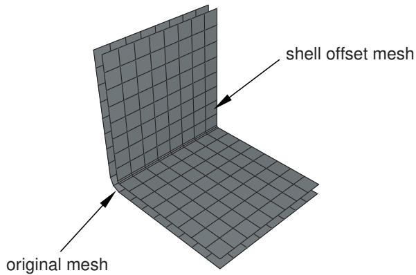

<details>
<summary>text_image</summary>

original mesh
shell offset mesh
</details>

Figure 2:When you offset small elements in a concave region, the elements may collapse or become inverted.

You can try to avoid element collapse and element inversion by selecting Constant thickness around corners from the Offset Mesh dialog box. When this option is selected, Abaqus/CAE tapers the offset elements that propagate from sharp corners. The resulting elements have a constant nodal offset distance as opposed to a constant distance between the layers of the element faces. Figure 3 illustrates the effect on the offset mesh pattern of requesting a constant thickness around corners.


<details>
<summary>natural_image</summary>

3D wireframe diagram of a cube with no text or symbols
</details>


<details>
<summary>natural_image</summary>

3D rendering of a gray 3D L-shaped structure with grid pattern (no text or symbols)
</details>


<details>
<summary>natural_image</summary>

3D rendering of a gray 3D-rendered rectangular block with a curved base, no text or symbols present.
</details>

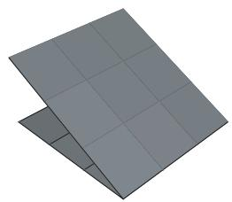

<details>
<summary>natural_image</summary>

3D diagram of a folded solar panel with no text or symbols
</details>

surface used to generate the offset


<details>
<summary>natural_image</summary>

3D rendering of two gray geometric blocks with triangular faces, no text or symbols present
</details>

offsetting without the constant thickness around corners option


<details>
<summary>natural_image</summary>

3D rendering of a geometric structure with grid-like faces, no text or symbols present
</details>

offsetting with the constant thickness around corners option  
Figure 3:The effect on the offset mesh pattern of requesting a constant thickness around corners.

The effect on the offset mesh pattern is similar for both solid and shell offset meshes. You can also reduce element distortion by using a larger element size in the location of the concave region. However, you can control the element size only if you can regenerate the mesh from which you are offsetting.

In contrast, when you create a mesh that is offset from a convex mesh surface, the elements tend to fan out, as shown in Figure 4.

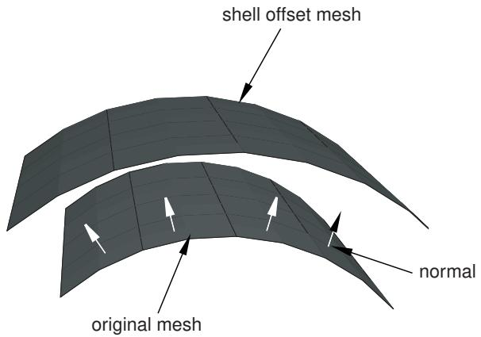

<details>
<summary>text_image</summary>

shell offset mesh
normal
original mesh
</details>

Figure 4: Elements diverge when offset from a convex surface.

## Allowing for branching in offset solid meshes

If a part has “branches,” as shown in Figure 1, creating an offset solid mesh is not straightforward because the direction in which to offset is ambiguous in the region of the branch.

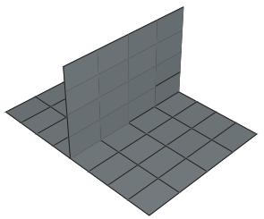

<details>
<summary>natural_image</summary>

3D diagram of a grid with a flat plane and shaded corner (no text or symbols)
</details>

Figure 1:The direction in which to offset is ambiguous in the region of the branch.

To help you mesh this configuration, Abaqus/CAE provides the option to copy the elements in the region of the branch to a set.

You can then do the following:

1. Use display groups to remove the set containing elements in the region of the branch from the orphan mesh.  
2. Create offset solid meshes from the non-branching regions that remain, as shown in Figure 2.

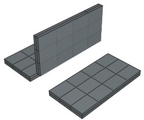

<details>
<summary>natural_image</summary>

3D illustration of two rectangular planks with grid patterns, no text or symbols present
</details>

Figure 2: Create offset solid meshes from the non-branching regions.

3. Use display groups to show only the set containing the branch, as shown in Figure 3.

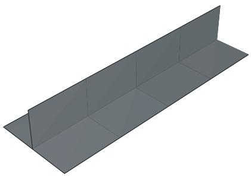

<details>
<summary>natural_image</summary>

3D rendering of a rectangular prism or enclosure with no text or symbols
</details>

Figure 3: Use display groups to show only the set containing the branch.

4. Create an offset solid mesh from one side of the branching region. Take care that the offset direction is correct (Abaqus/CAE indicates the offset direction by coloring the element faces). In addition, do not delete the base shell elements until you have finished offsetting the branch.

5. Create an offset solid mesh from the other side of the branching region, as shown in Figure 4.


<details>
<summary>natural_image</summary>

3D rendering of a rectangular mechanical part with internal channels and no visible text or symbols
</details>

Figure 4:The offset mesh in the branching region.

6. Use display groups to show both regions.  
7. Use the merge nodes tool in the Edit Mesh toolset to merge the offset meshes created in Steps 2, 4, and 5.

## Creating a mid-plane shell mesh from a thin solid model

You can use the following procedure to create a mid-plane shell mesh from a thin solid model using the offset meshing tool:

1. Convert the solid part to a shell using the From solid shell tool in the Part module.  
2. Isolate a collection of faces on the upper or lower surface of the part using the Remove faces tool in the Geometry Edit toolset.  
3. Mesh the simplified model with shell elements, and create a mesh part.  
4. Create an offset shell mesh, and specify an Initial Offset corresponding to half the model thickness.

## Using a combination of tools to mesh an imported solid part with tetrahedral elements

In some cases you may not be able to mesh an imported solid part with tetrahedral elements because of very thin triangular elements in the surface mesh or because some sliver faces cannot be meshed with triangles. The following procedure explains how you can use a combination of tools in the Mesh module to mesh the part successfully:

1. Do one of the following:

• Start with a tetrahedral boundary mesh. Go to the Mesh module, and create a tetrahedral boundary mesh on the solid.  
• Start with a mesh of linear triangles.

1. Convert the solid part into a shell part by selecting Shape->Shell->From Solid from the main menu bar.  
2. Go to the Mesh module, and mesh the shell part with linear triangular elements.

2. Select Mesh->Create Mesh Part from the main menu bar to create a new part that is an orphan mesh. For more information, see Creating a mesh part.  
3. Change the displayed object to the orphan mesh.  
4. Select Tools->Edit Mesh from the main menu bar, and do the following to clean the mesh:

1. From the Category field, choose Mesh.  
2. From the Method list, select Collapse edges.

Cleaning the mesh will automatically merge nodes on short element edges and remove the collapsed elements. For more information, see Collapsing short edges of a linear orphan mesh.

5. Use the Edit Mesh toolset to repair any remaining bad elements or gaps manually. For more information, see Editing elements.  
6. Select Tools->Edit Mesh from the main menu bar, and select Conversion to replace the shell mesh of linear triangles with a solid mesh of linear tetrahedrons. For more information, see Converting a triangular shell mesh to a solid tetrahedral mesh.  
7. Go to the Assembly module, and select Instance->Replace to replace the original shell part instance with an instance of the orphan mesh.  
8. If you want the orphan mesh to use second-order tetrahedral elements, you can assign a quadratic element type to the orphan mesh in the Mesh module.

## Using the mesh editing tools

This section is an overview of the tools that are available in the Edit Mesh toolset.

You can access the tools from the main menu bar by selecting Mesh->Edit. Abaqus/CAE displays the Edit Mesh

dialog box. You can also display the Edit Mesh dialog box using the tool, located at the bottom of the Mesh module toolbox.

## Node editing tools

The following tools are available for editing nodes:

• Create node. For more information, see Creating a node.  
• Edit node. For more information, see Editing the position of selected nodes.  
• Drag node. For more information, see Dragging nodes.  
• Project nodes. For more information, see Projecting nodes.  
• Delete node. For more information, see Deleting nodes.  
• Merge nodes. For more information, see Merging nodes.  
• Adjust midside nodes. For more information, see Adjusting the position of midside nodes.  
• Smooth external nodes. For more information, see Smoothing external nodes.  
• Renumber nodes. For more information, see Renumbering nodes.

## Element editing tools

The following tools are available for editing elements:

• Create element. For more information, see Creating an element.  
• Delete element. For more information, see Deleting elements.  
• Flip normal. For more information, see Reversing the surface normal direction of shell elements.  
• Orient stack direction. For more information, see Orienting the stack direction.  
• Collapse edge. For more information, see Collapsing an edge of a quadrilateral or triangular element.  
• Split edge. For more information, see Splitting an edge of a quadrilateral or triangular element.  
• Swap diagonal. For more information, see Swapping the diagonal of a pair of adjacent triangular elements.  
• Split. For more information, see Splitting quadrilateral elements.  
• Combine. For more information, see Combining triangular elements.  
• Renumber elements. For more information, see Renumbering elements.

## Mesh editing tools

The following tools are available for editing the entire mesh:

• Offset solid. For more information, see Generating layers of solid elements offset from an existing mesh.  
• Offset shell. For more information, see Generating layers of shell elements offset from an existing mesh.  
• Wrap. For more information, see Wrapping a mesh about the Z-axis.  
• Collapse. For more information, see Collapsing short edges of a linear orphan mesh.

• Grow. For more information, see Growing short edges of a linear orphan mesh.  
Convert. For more information, see Converting a triangular shell mesh to a solid tetrahedral mesh, and Converting a solid orphan mesh to a shell orphan mesh.  
• Merge. For more information, see Merging elements.  
• Subdivide. For more information, see Subdividing elements.  
• Copy mesh pattern. For more information, see Copying a mesh pattern.  
View and edit mesh-geometry associativity. For more information, see Viewing and editing mesh-geometry associativity.  
• Delete mesh-geometry associativity. For more information, see Deleting mesh-geometry associativity.  
• Insert cohesive seams. For more information, see Inserting cohesive seams.

## Mesh refinement tools

The following tools are available for refining the mesh:

• Set size.  
• Remove size.  
• Remesh.

For more information, see Editing and refining an orphan mesh.

## Undo and redo for mesh edits

You can undo and redo multiple changes that you make using the tools in the Edit Mesh toolset, and control the number of available undo levels. For more information, see Undoing or redoing a change in the Edit Mesh toolset.

## Editing nodes

This section describes how you can use the Edit Mesh toolset to edit the nodes that comprise orphan meshes and Abaqus/CAE native meshes.

## In this section:

Creating a node  
Editing the position of selected nodes  
Dragging nodes  
Projecting nodes  
Deleting nodes  
Merging nodes  
Adjusting the position of midside nodes  
Smoothing external nodes  
Renumbering nodes  
Selecting the nodes to edit

## Creating a node

Select Mesh->Edit from the main menu bar to create a node by entering its coordinates in either the global coordinates system or a local coordinate system.

1. Enter the Mesh module.  
2. From the Object field in the context bar, select Part, and select a part from the list.  
3. From the main menu bar, select Mesh->Edit.

Abaqus/CAE displays the Edit Mesh dialog box.


Tip: You can also display the Edit Mesh dialog box using the tool, located at the bottom of the Mesh module toolbox.

4. In the dialog box, do the following:

a. In the Category field, select Node.  
b. From the Method list, select Create.

Abaqus/CAE displays the existing nodes. In hidden and shaded mode, only the visible nodes are displayed.

5. If desired, you can enter the coordinates for the new node in a datum coordinate system that you have created rather than in the global coordinate system:

a. In the prompt area, click Select.  
b. In the viewport, select the datum coordinate system to be associated with the coordinates of the new node. (For more information, see Creating datum coordinate systems.)

6. In the Coordinates field in the prompt area, enter the coordinates of the new node.

Abaqus/CAE creates the new node.


Tip: If you make a mistake while creating a node, click Undo in the Edit Mesh dialog box to remove the most recently created node.

7. Repeat Steps 3 and 4 as often as necessary to create additional nodes.  
8. When you have finished creating nodes, click the cancel button in the prompt area to exit the procedure.

## Additional information

• What can I do with the Edit Mesh toolset?

## Editing the position of selected nodes

You can edit the position of one or more selected nodes from a meshed part, a meshed part instance in the assembly, or an orphan mesh.

In addition, if you select multiple nodes to edit, you can assign a single value to a particular coordinate for each of the nodes. For example, you can select a group of nodes and assign an X-axis coordinate of 10.0 to each of the nodes.

This is particularly useful when you want to position the nodes in the same plane; for example, when defining the mating surface of a cylinder head or engine block.

In general, you cannot use the Edit Mesh toolset to edit a dependent part instance; however, you can edit the nodes of a dependent part instance. Abaqus/CAE moves the nodes of the original mesh, and your modifications appear on all dependent instances of the part.


## Note:

You can undo or redo the changes you make to nodal position directly from the Undo portion of the Edit Nodes dialog box. The Undo and Redo buttons in this dialog box provide rollback control for nodal position changes only; if you want to undo or redo other mesh editing operations, use the Edit Mesh dialog box. For more information about edit mesh undo, see Undoing or redoing a change in the Edit Mesh toolset.

1. Enter the Mesh module, and do one of the following:

• From the Object field in the context bar, select Assembly.  
• From the Object field in the context bar, select Part, and select a part from the list.

2. From the main menu bar, select Mesh->Edit.

Abaqus/CAE displays the Edit Mesh dialog box.


Tip: You can also display the Edit Mesh dialog box using the tool, located at the bottom of the Mesh module toolbox.

3. In the dialog box, do the following:

a. In the Category field, select Node.  
b. From the Method list, select Edit.

Abaqus/CAE displays the existing nodes. In hidden and shaded mode, only the visible nodes are displayed.

4. From the prompt area, choose the selection method and select the nodes to edit. For more information, see Selecting the nodes to edit.


Tip: You can use the Selection toolbar to change the picking behavior. For more information, see Selecting objects within the viewport.

Abaqus/CAE displays the Edit Nodes dialog box and the minimum and maximum values of the coordinates of the selected nodes along each axis.

5. If desired, you can enter the new coordinates for the nodes in a datum coordinate system that you have created rather than in the global coordinate system:

a. At the top of the Edit Nodes dialog box, click Select.  
b. In the viewport, select the datum coordinate system to be associated with the new nodal coordinates. (For more information, see Creating datum coordinate systems.)

6. To specify the new position of the selected nodes by offset, choose Offsets from the Specification method options, then do one of the following:

## Enter values

Type the 1-, 2-, and 3-components of the offset from the current location directly into the dialog box.

## Measure offset vector

Click and pick two points in the viewport. Abaqus/CAE populates the 1-, 2-, and 3-components of the offset based on the components of the vector from your first selected point to your second selected point.

7. To specify the new position of the selected nodes by coordinates, choose Coordinates from the Specification method options, then do one of the following:

## Enter values

Type the 1-, 2-, and 3-components directly into the dialog box. A value of As is indicates that the coordinate along a particular axis is different for at least two of the selected nodes; click the arrow to the right of the component field, and select Specify to specify a value.

## Measure coordinates

Click ITIIT' and pick the new point from the viewport.

8. If you are editing nodes on the boundary of an Abaqus/CAE native mesh in the Mesh module, Abaqus/CAE first moves the nodes to the new position and then projects them back to the geometry on which they were originally located. As a result, nodes that were located on a surface will remain on that surface but in a different position. Toggle off Project to geometry to move the nodes to their new position independently from the underlying geometry.  
9. Click OK or Apply to move the nodes to the new position. If you click OK, Abaqus/CAE moves the nodes and prompts you to select new nodes to edit. If you click Apply, Abaqus/CAE moves the nodes; however, the nodes remain selected, and you can continue specifying a new position.


Tip: If you make a mistake while editing nodes, click Undo in the Edit Mesh dialog box to undo the edit. Abaqus/CAE restores the node or nodes to their original position.

10. Repeat the previous steps as often as necessary to edit additional nodes.

11. When you have finished editing nodes, click Cancel to close the Edit Nodes dialog box.

## Additional information

• What can I do with the Edit Mesh toolset?

## Dragging nodes

You can drag nodes on a meshed part, a meshed part instance in the assembly, or an orphan mesh. Dragging provides a quick way to reposition nodes and to improve element quality. When you activate the node dragging function,

Abaqus/CAE automatically activates the solver element quality checks, highlighting elements with warnings in yellow and highlighting elements with errors in magenta. You can also include tests for shape metrics or size metrics among the tests that Abaqus/CAE automatically performs on elements as you drag nodes. The highlighting is updated as you drag a node into a new position; therefore, you can immediately see whether you are improving the element quality. In general, you cannot use the Edit Mesh toolset to modify the mesh of a dependent part instance; however, you can drag the nodes of a dependent part instance. Abaqus/CAE modifies the nodes of the original mesh, and your modifications appear on all dependent instances of the part.

Dragging nodes does not change their association. Nodes that are associated with a geometric feature prior to dragging will remain associated with that feature; unassociated nodes will remain unassociated after you drag them onto geometry.

1. Enter the Mesh module, and do one of the following:

• From the Object field in the context bar, select Assembly.  
• From the Object field in the context bar, select Part, and select a part from the list.

2. From the main menu bar, select Mesh->Edit.

Abaqus/CAE displays the Edit Mesh dialog box.


Tip: You can also display the Edit Mesh dialog box using the tool, located at the bottom of the Mesh module toolbox.

3. In the dialog box, do the following:

a. In the Category field, select Node.  
b. From the Method list, select Drag.  
Abaqus/CAE displays the existing nodes.

4. If desired, click Element failure criteria from the prompt area to include shape metrics or size metrics among the tests that Abaqus/CAE automatically performs as you drag nodes.

5. From the prompt area, toggle Project to geometry to control the drag behavior of exterior nodes.

If you toggle on Project to geometry, Abaqus/CAE constrains dragged exterior nodes to their associated geometry. You can drag a node on a mesh face as long as it remains within the underlying geometric face. Likewise, you can drag an edge node only along the polyline that created the edge, and you cannot drag a node associated with a vertex. In orphan mesh regions, you can drag any node; but you cannot drag a node beyond the outer edges of the mesh.  
• If you toggle off Project to geometry, Abaqus/CAE constrains dragged nodes to a plane parallel to the computer screen and passing through the original position of the node. Therefore, you can change the available drag locations by using the view manipulation tools before dragging a node. This is also the behavior if you drag interior nodes since they are not constrained to a geometric feature.

6. Position the cursor over the node you want to move, and click and hold mouse button 1 while dragging the node to a new location.

When you release mouse button 1, Abaqus/CAE displays the node number and new coordinates in the message area.

7. Repeat the previous steps as often as necessary to drag additional nodes.

## Additional information

• What can I do with the Edit Mesh toolset?  
• Verifying element quality

## Projecting nodes

You can project one or more selected nodes from a meshed part, a meshed part instance in the assembly, or an orphan mesh to a selected vertex, edge, face, node, element edge, element face, datum point, datum axis, or datum plane. This is particularly useful if you want to move nodes in a bottom-up mesh onto nearby geometry. In general, you cannot use the Edit Mesh toolset to modify the mesh of a dependent part instance; however, you can project the nodes of a dependent part instance. Abaqus/CAE projects the nodes of the original mesh, and your modifications appear on all dependent instances of the part.

Projecting nodes does not change their association. Nodes that are associated with a geometric feature prior to projection will remain associated with that feature; unassociated nodes will remain unassociated after you project them onto geometry.

1. Enter the Mesh module, and do one of the following:

• From the Object field in the context bar, select Assembly.  
• From the Object field in the context bar, select Part, and select a part from the list.

2. From the main menu bar, select Mesh->Edit.

Abaqus/CAE displays the Edit Mesh dialog box.


Tip: You can also display the Edit Mesh dialog box using the tool, located at the bottom of the Mesh module toolbox.

3. In the dialog box, do the following:

a. In the Category field, select Node.  
b. From the Method list, select Project.

Abaqus/CAE displays the existing nodes. In hidden and shaded mode, only the visible nodes are displayed.

4. From the prompt area, choose the selection method and select the nodes to project. For more information, see Selecting the nodes to edit.


Tip: You can use the Selection toolbar to change the picking behavior. For more information, see Selecting objects within the viewport.

5. Select a vertex, edge, face, node, element edge, element face, datum point, datum axis, or datum plane to which Abaqus/CAE will move the selected nodes.

Abaqus/CAE colors the selected entity magenta.

6. Select Yes in the prompt area to confirm your selections.

Abaqus/CAE projects the selected nodes to their new positions using a shortest distance algorithm. If you selected an edge, face, element edge, or element face, Abaqus/CAE projects the nodes onto the axis or plane that would be created by extending the selected edge or face.


Tip: If you make a mistake while editing nodes, click Undo in the Edit Mesh dialog box to undo the edit. Abaqus/CAE restores the nodes to their original positions.

If you select No, your node and entity selections are cancelled and the procedure continues from Step 4.

7. Repeat the previous steps as often as necessary to project additional nodes.

## Additional information

• What can I do with the Edit Mesh toolset?

Select Mesh->Edit from the main menu bar to delete orphan mesh nodes. Abaqus/CAE also deletes any elements associated with the deleted nodes. If the nodes and associated elements that you are deleting belong to existing node or element sets, those sets are updated accordingly.

1. Enter the Mesh module.  
2. From the Object field in the context bar, select Part, and select a part from the list. This tool is available only for deleting orphan mesh nodes.  
3. From the main menu bar, select Mesh->Edit.

Abaqus/CAE displays the Edit Mesh dialog box.


Tip: You can also display the Edit Mesh dialog box using the tool, located at the bottom of the Mesh module toolbox.

4. In the dialog box, do the following:

a. In the Category field, select Node.  
b. From the Method list, select Delete.

If the Delete method is not shown, there are no orphan nodes in the selected part.

Abaqus/CAE displays the existing nodes. In hidden and shaded mode only the visible nodes are displayed.

5. In the viewport, select the nodes to delete. You can [Shift] + Click on individual nodes to add them to your selection, or [Ctrl] + Click on selected nodes to remove them from your selection.


Tip: You can use the Selection toolbar to change the picking behavior. For more information, see Selecting objects within the viewport.

If you would rather select from a list of existing node sets, do the following:

a. Click Sets on the right side of the prompt area.

Abaqus/CAE displays the Region Selection dialog box containing a list of node sets that you have created.

b. Select the set of nodes that you want to delete, and click Continue.


## Note:

The default selection method is based on the selection method you most recently employed. To revert to the other method, click Select in Viewport or Sets on the right side of the prompt area.

Abaqus/CAE displays the selected nodes and the elements associated with the selected nodes. (Both the nodes that you have selected and any elements associated with those nodes will be deleted.)

6. When you have finished selecting nodes to delete, click mouse button 2.  
7. The elements associated with the selected nodes may also be associated with unselected nodes. If those unselected nodes would be left unassociated with any element after the nodes and associated elements are deleted, click Yes in the prompt area if you want Abaqus/CAE to delete those unselected nodes as well.


Tip: If you make a mistake while deleting nodes, click Undo in the Edit Mesh dialog box to undo the deletion. Abaqus/CAE restores the deleted node or nodes.

8. Repeat the previous steps as often as necessary to delete additional nodes.  
9. When you have finished deleting nodes, click mouse button 2 or the cancel button in the prompt area to exit the procedure.

## Additional information

• What can I do with the Edit Mesh toolset?

## Merging nodes

Select Mesh->Edit from the main menu bar to merge nodes. If you select only two nodes to merge, Abaqus/CAE creates a new node at the midpoint of the selected nodes. If you select more than two nodes, you can specify the maximum distance between nodes, and Abaqus/CAE will merge nodes that are closer than the specified distance. You can also choose to remove duplicate elements that have the same connectivity.

1. Enter the Mesh module.  
2. From the Object field in the context bar, select Part, and select a part from the list. This tool is available only for working on parts that contain either orphan mesh nodes or nodes created using the bottom-up meshing procedure.  
3. From the main menu bar, select Mesh->Edit.

Abaqus/CAE displays the Edit Mesh dialog box.


Tip: You can also display the Edit Mesh dialog box using the tool, located at the bottom of the Mesh module toolbox.

4. In the dialog box, do the following:

a. In the Category field, select Node.  
b. From the Method list, select Merge.

5. From the prompt area, choose the selection method and select the nodes to merge. For more information, see Selecting the nodes to edit.


Tip: You can use the Selection toolbar to change the picking behavior. For more information, see Selecting objects within the viewport.

6. If you selected only two nodes to merge, Abaqus/CAE creates a new node at the midpoint of the selected nodes.

7. If you selected more than two nodes to merge, do the following:

a. In the prompt area, enter the Node merging tolerance to specify the maximum distance between nodes that you want to merge.  
b. If the value that you entered for the Node merging tolerance is too large, Abaqus/CAE may detect duplicate nodes from the same element. Abaqus/CAE will not merge nodes from the same element, but the large tolerance can result in a distorted mesh. If the Node merging tolerance is too large, Abaqus/CAE asks if you want to continue merging the selected nodes.

• Click Yes to continue.  
• Click No to cancel the merging procedure.

c. Abaqus/CAE highlights in magenta any nodes that will be merged and asks if you wish to proceed.

• Click Yes to continue.  
• Click No to cancel the merging procedure.

Abaqus/CAE merges the nodes that are closer than the specified distance and replaces them with a single new node. The location of the new node is the average position of the group of nodes that were merged into the new node.

You can also merge part instances in the Assembly module. For more information, see Performing Boolean operations on part instances.

If you previously created node or element sets that include nodes or elements that are deleted by the merge operation, Abaqus/CAE updates your sets accordingly.


Tip: If you make a mistake while merging nodes, click Undo in the Edit Mesh dialog box to undo the merge. Abaqus/CAE restores the nodes as they were before the merge.

8. Repeat the above steps as often as necessary to merge additional nodes.  
9. When you have finished merging nodes, click mouse button 2 or the cancel button in the prompt area to exit the procedure.

## Additional information

• What can I do with the Edit Mesh toolset?

Select Mesh->Edit from the main menu bar to adjust the position of midside nodes of second-order elements.

You can use this tool to allow for the singularity at the crack tip in a fracture mechanics analysis. However, this tool will allow you to edit any second-order elements; it does not check that you are editing the degenerate quadrilateral or wedge elements required by a fracture mechanics analysis. For more information, see Controlling the singularity at the crack tip for a small-strain analysis and Constructing a Fracture Mechanics Mesh for Small-Strain Analysis with the Conventional Finite Element Method.

You can select nodes and enter a bias parameter between 0 and 1. Abaqus/CAE moves the midside nodes along connected element edges to a position based on the parameter that you entered. For example, if you enter a parameter of 0.25, Abaqus/CAE biases the position of the midside nodes one quarter of the length of the element edge away from the selected nodes.

1. Enter the Mesh module.  
2. From the Object field in the context bar, select Part, and select a part from the list. This tool is available only for working on an parts that contain orphan mesh nodes.  
3. From the main menu bar, select Mesh->Edit.

Abaqus/CAE displays the Edit Mesh dialog box.


Tip: You can also display the Edit Mesh dialog box using the tool, located at the bottom of the Mesh module toolbox.

4. In the dialog box, do the following:

a. In the Category field, select Node.  
b. From the Method list, select Adjust midside.

Abaqus/CAE displays the existing nodes. In hidden and shaded mode only the visible nodes are displayed.

5. Select the nodes toward which the position of midside nodes along connected element edges will be adjusted. You can select nodes, or you can select element edges. If you select element edges, Abaqus/CAE selects the nodes along the element edges.

You can [Shift] + Click on individual nodes to add them to your selection, or [Ctrl] + Click on selected nodes to remove them from your selection.


Tip: You can use the Selection toolbar to change the picking behavior. For more information, see Selecting objects within the viewport.

If you would rather select from a list of existing node sets, do the following:

a. Click Sets on the right side of the prompt area.

Abaqus/CAE displays the Region Selection dialog box containing a list of node sets that you have created.

b. Select the set of nodes, and click Continue.


## Note:

The default selection method is based on the selection method you most recently employed. To revert to the other method, click Select in Viewport or Sets on the right side of the prompt area.

6. In the prompt area, enter the value of the bias parameter. You must enter a value between 0 and 1.

Abaqus/CAE moves the midside nodes along connected element edges to the specified position.


Tip: If you make a mistake while adjusting nodes, click Undo in the Edit Mesh dialog box to undo the adjustment. Abaqus/CAE restores the nodes to their previous positions.

7. Repeat Steps 4 and 5 as often as necessary to adjust additional midside nodes.  
8. When you have finished adjusting nodes, click the cancel button in the prompt area to exit the procedure.

## Additional information

• What can I do with the Edit Mesh toolset?  
• Controlling the singularity at the crack tip for a small-strain analysis  
• Constructing a Fracture Mechanics Mesh for Small-Strain Analysis with the Conventional Finite Element Method

Select Mesh->Edit from the main menu bar to smooth the positions of nodes on the surfaces of parts or assemblies. The node smoothing operation can improve transitions in mesh density or otherwise improve local mesh quality without remeshing the region or manually repositioning nodes. You can use node smoothing to improve the mesh on a surface before using it as the source of a bottom-up mesh or a swept mesh.

Abaqus/CAE applies a Laplacian smoothing algorithm at each node that you select. The selected nodes are repositioned to equalize their distance from adjoining nodes, creating a smoother surface mesh.

You can select only external nodes of parts or assemblies for smoothing. Boundary nodes are not repositioned by the smoothing operation.

1. Enter the Mesh module, and do one of the following:

• From the Object field in the context bar, select Assembly.  
• From the Object field in the context bar, select Part, and select a part from the list.

2. From the main menu bar, select Mesh->Edit.

Abaqus/CAE displays the Edit Mesh dialog box.


Tip: You can also display the Edit Mesh dialog box using the tool, located at the bottom of the Mesh module toolbox.

3. In the dialog box, do the following:

a. In the Category field, select Node.  
b. From the Method list, select Smooth.

Abaqus/CAE displays the existing nodes. In hidden and shaded mode only the visible nodes are displayed.

4. Select the nodes to be smoothed.

You can [Shift] + Click on individual nodes to add them to your selection, or [Ctrl] + Click on selected nodes to remove them from your selection.


Tip: You can use the Selection toolbar to change the picking behavior. For more information, see Selecting objects within the viewport.

If you would rather select from a list of existing node sets, do the following:

a. Click Sets on the right side of the prompt area.

Abaqus/CAE displays the Region Selection dialog box containing a list of node sets that you have created.

b. Select the set of nodes, and click Continue.


Note: The default selection method is based on the selection method you most recently employed. To revert to the other method, click Select in Viewport or Sets on the right side of the prompt area.

5. In the prompt area, click Done.

Abaqus/CAE smooths the position of the selected nodes.


Tip: If you want to restore the nodes to their previous positions, click Undo in the Edit Mesh dialog box to undo the smoothing.

6. Repeat Steps 4 and 5 as often as necessary to smooth additional nodes.

You can apply smoothing to the same node multiple times. After a few iterations, a node will no longer be moved by the smoothing algorithm unless other surrounding nodes are moved.

7. When you have finished adjusting nodes, click the cancel button in the prompt area to exit the procedure.

## Additional information

• What can I do with the Edit Mesh toolset?

## Renumbering nodes

The Edit Mesh toolset allows you to renumber nodes.

Select Mesh->Edit from the main menu to renumber selected nodes of an orphan mesh. You can renumber the selected nodes by specifying a starting node label and an increment or by offsetting the existing node label by a specified value. (For information on renumbering the nodes of an Abaqus/CAE native mesh, see Changing the labels of all nodes and elements.)

1. Enter the Mesh module.

This tool is available only for working on parts that do not contain any geometry. You can work in the part or assembly context. However, any renumbering applied to a part instance is applied at the part level and, therefore, affects all instances of that part.

2. From the main menu, select Mesh->Edit.

Abaqus/CAE displays the Edit Mesh dialog box.


Tip: You can also display the Edit Mesh dialog box using the tool, located at the bottom of the Mesh module toolbox.

3. In the dialog box, do the following:

a. In the Category field, select Node.  
b. From the Method list, select Renumber.

Abaqus/CAE displays the Node Renumbering dialog box. If a single mesh part is displayed in the viewport, the Part Label Range displays the range of node labels for the entire part.

4. Do either of the following to specify the renumbering method:

Choose By Start Label, and enter the value of the first node label and the increment that will be used to number subsequent nodes.  
• Choose By Offset, and enter the value by which the existing node labels will be offset.

5. Use one of the following methods to select the nodes that you want to renumber:

## Selecting all nodes of a part

Select All (in the part context) or Part (in the assembly context) to renumber all the orphan mesh nodes of a part. If there is more than one mesh part instance in the viewport, click the


button to select a part instance.

## Selecting nodes using the unordered method

1. Select Specify and Unordered to select the nodes in any sequence.  
2. Click Select to select the nodes to renumber.  
3. From the prompt area, choose the selection method and select the nodes to renumber. For more information, see Selecting the nodes to edit.

## Selecting nodes using the directed path method

1. Select Specify and Directed Path to renumber the nodes along a feature edge from a selected start node to a selected end node.  
2. Click Select to select the nodes to renumber.  
3. Select the start node. Abaqus/CAE displays all the nodes along the feature edge. If desired, modify the angle to redefine how Abaqus/CAE defines a feature edge.  
4. Select Done from the prompt area. The start node is displayed in purple.  
5. Select the end node. The start and end nodes must lie on the same feature edge.

## Selecting nodes using the sequence method

1. Select Specify and Sequence to renumber the nodes based on the sequence in which you select the nodes.  
2. Click Select to select the nodes to renumber.  
3. Select the start node and each additional node in sequence.  
4. When you have finished selecting nodes, click mouse button 2.

The Part Label Range displays the range of node labels for the renumbered nodes.

6. Click OK or Apply to renumber the nodes. If you click Apply, Abaqus/CAE renumbers the nodes; however, the nodes remain selected, and you can continue renumbering them.  
7. Repeat the previous steps as often as required to renumber additional nodes.  
8. When you have finished renumbering nodes, click Cancel to close the Node Renumbering dialog box.

## Additional information

• Changing the labels of all nodes and elements  
• What can I do with the Edit Mesh toolset?

When you are selecting the nodes to edit, Abaqus/CAE displays a menu in the prompt area that allows you to choose the technique that you will use to select the nodes. The techniques allow you to select individual nodes or groups of adjacent nodes.

1. Use one of the following methods to select the nodes that you want to edit:

## To select individual nodes:

1. From the menu in the prompt area, select Individually.  
2. Select a node that you want to renumber, or drag-select a group of nodes.  
3. [Shift] + Click on additional nodes to add them to your selection.  
4. If necessary, [Ctrl] + Click on selected nodes to remove them from your selection.

## To select nodes using the angle method:

1. From the menu in the prompt area, select by angle.  
2. Enter an angle (from 0° to 90°), and select a node.  
Abaqus/CAE selects every node on element faces adjacent to the selected node until the angle between the element faces is equal to or exceeds the angle that you entered. (See Using the angle and feature edge method to select multiple objects, for more information.)  
3. After you use the by angle method, you can [Shift] + Click on additional nodes to add them to your selection or [Ctrl] + Click on selected nodes to remove them from your selection. (See Combining selection techniques, for more information.)

## To select nodes using the feature edge method:

1. From the menu in the prompt area, select by feature edge.  
2. Enter an angle (from 0° to 90°).  
Abaqus/CAE identifies all the feature edges in your model by finding all the element edges where the angle between two adjacent element faces is greater than the angle specified.  
3. Select an element edge or node.  
Abaqus/CAE follows the feature edge that passes through the selected element edge or node. The feature edge is truncated if another feature edge intersects it at an angle greater than the angle specified in the previous step.  
4. Abaqus/CAE selects all the nodes along the feature edge. (See Using the angle and feature edge method to select multiple objects, for more information.) Alternatively, you can select the node at the intersection of multiple feature edges, and Abaqus/CAE selects the nodes along all these feature edges.  
5. After you use the by feature edge method, you can [Shift] + Click on additional nodes to add them to your selection or [Ctrl] + Click on selected nodes to remove them from your selection. (See Combining selection techniques, for more information.)

## To select nodes by specifying an existing node set:

1. Click Sets on the right side of the prompt area. Abaqus/CAE displays the Region Selection dialog box containing a list of node sets that you have created.  
2. Select the set of nodes that you want to renumber, and click Continue.


## Note:

The default selection method is based on the selection method you most recently employed. To revert to the other method, click Select in Viewport or Sets on the right side of the prompt area.

2. When you have finished selecting nodes, select Done from the prompt area.

## Additional information

• Selecting objects within the current viewport  
• What can I do with the Edit Mesh toolset?

## Editing elements

This section describes how you can use the Edit Mesh toolset to edit the elements that comprise orphan meshes and Abaqus/CAE native meshes.

## In this section:

Creating an element  
Deleting elements  
Reversing the surface normal direction of shell elements  
Orienting the stack direction  
Collapsing an edge of a quadrilateral or triangular element  
Splitting an edge of a quadrilateral or triangular element  
Swapping the diagonal of a pair of adjacent triangular elements  
Splitting quadrilateral elements  
Combining triangular elements  
Renumbering elements  
Selecting the elements to edit

## Creating an element

Select Mesh->Edit from the main menu bar to create elements from selected nodes.

1. Enter the Mesh module.  
2. From the Object field in the context bar, select Part and select a part from the list.  
3. From the main menu bar, select Mesh->Edit.

Abaqus/CAE displays the Edit Mesh dialog box.


Tip: You can also display the Edit Mesh dialog box using the tool, located at the bottom of the Part module and Mesh module toolbox.

4. In the dialog box, do the following:

a. In the Category field, select Element.  
b. From the Method list, select Create.

Abaqus/CAE displays the existing nodes. In hidden and shaded mode only the visible nodes are displayed.

5. In the prompt area, click the arrow next to the Element shape field, and select the element shape of your choice from the list that appears.  
6. In the viewport, select the nodes that will define the element. You must select the required number of nodes for the element shape specified in the previous step. In addition, you must select the nodes in a specific order. From the right of the prompt area, click Tip to see a figure of the element shape and connectivity. For example, Abaqus/CAE displays the following figure when you are creating a 10-node tetrahedral element:

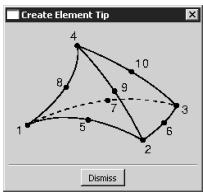

<details>
<summary>flowchart</summary>

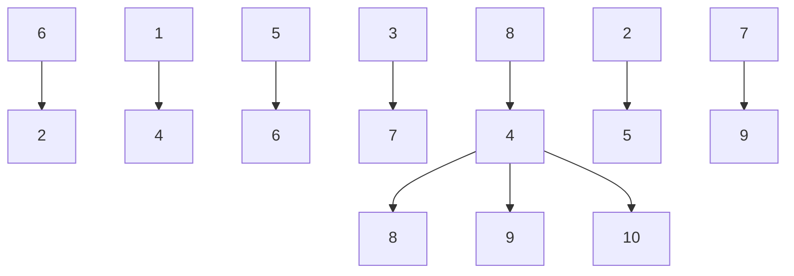
```mermaid
graph TD
  1["1"] --> 4["4"]
  n4["4"] --> 8["8"]
  n4 --> 9["9"]
  n4 --> 10["10"]
  3["3"] --> 7["7"]
  5["5"] --> 6["6"]
  n6["6"] --> 2["2"]
  n2["2"] --> n5["5"]
  n7["7"] --> n9["9"]
  n8["8"] --> n4
```
</details>

Once you have selected the required number of nodes, Abaqus/CAE creates the new element.


Tip: If you make a mistake while creating an element, click Undo in the Edit Mesh dialog box to remove the most recently created element.

7. Repeat the previous steps as often as necessary to create additional elements. If you change the element shape, click the Tip button again to update the element shape and connectivity figure.  
8. When you have finished creating elements, click mouse button 2 or the cancel button in the prompt area to exit the procedure.

## Additional information

• What can I do with the Edit Mesh toolset?

Select Mesh->Edit from the main menu bar to delete elements. You have the option of instructing Abaqus/CAE to delete any nodes that are left unassociated with any elements once the elements are deleted. If the elements and associated nodes that you are deleting belong to existing element or node sets, those sets are updated accordingly.

1. Enter the Mesh module.  
2. From the Object field in the context bar, select Part and select a part from the list. This tool is available only for working on orphan mesh elements or for working on elements created using the bottom-up meshing procedure  
3. From the main menu bar, select Mesh->Edit.

Abaqus/CAE displays the Edit Mesh dialog box.


Tip: You can also display the Edit Mesh dialog box using the tool, located at the bottom of the Mesh module toolbox.

4. In the dialog box, do the following:

a. In the Category field, select Element.  
b. From the Method list, select Delete.

5. If you want to delete all nodes that are left unassociated with any elements once the selected elements are deleted, toggle on Delete associated unreferenced nodes in the prompt area.  
6. Select the elements to delete. You can [Shift] + Click on elements to add them to your selection or [Ctrl] + Click on selected elements to remove them from your selection.


Tip: You can use the Selection toolbar to change the picking behavior. For more information, see Selecting objects within the viewport.

If you would rather select from a list of existing element sets, do the following:

a. Click Sets on the right side of the prompt area.  
Abaqus/CAE displays the Region Selection dialog box containing a list of element sets that you have created.  
b. Select the set of elements that you want to delete, and click Continue.


Note: The default selection method is based on the selection method you most recently employed. To revert to the other method, click Select in Viewport or Sets on the right side of the prompt area.

Abaqus/CAE displays the selected elements.

7. When you have finished selecting elements to delete, click mouse button 2.

Abaqus/CAE deletes the selected elements. In addition, if you toggled on Delete associated unreferenced nodes, Abaqus/CAE also deletes nodes that would be left unassociated with any elements once the selected elements are deleted. The elements and nodes are also removed from any existing sets.


Tip: If you make a mistake while deleting elements, click Undo in the Edit Mesh dialog box to undo the deletion. Abaqus/CAE restores the deleted element or elements.

8. Repeat the above steps as often as necessary to delete additional elements.

9. When you have finished deleting elements, click mouse button 2 or the cancel button in the prompt area to exit the procedure.

## Additional information

• What can I do with the Edit Mesh toolset?

Select Mesh->Edit from the main menu bar to reverse the surface normals of selected shell elements. The elements can be either quadrilaterals or triangles. During the procedure to reverse the surface normals, Abaqus/CAE displays the part using the shaded render style, and the front and back faces of each shell element appear in different colors. If you change the direction of the surface normal in a region, Abaqus/CAE does not change the orientation of prescribed conditions or named surfaces applied to that region.

1. Enter the Mesh module.  
2. From the Object field in the context bar, select Part and select a part from the list.  
3. From the main menu bar, select Mesh->Edit.

Abaqus/CAE displays the Edit Mesh dialog box.


Tip: You can also display the Edit Mesh dialog box using the tool, located at the bottom of the Mesh module toolbox.

4. In the dialog box, do the following:

a. In the Category field, select Element.  
b. From the Method list, select Flip Normal.

Abaqus/CAE displays the part using the shaded render style. The front of each element is colored brown, and the back of each element is colored purple.

5. From the prompt area, choose the type of region, Geometry or Mesh, and toggle Highlight conflicting edges to display or hide a yellow border between connecting elements that have conflicting normals.  
6. From the prompt area, choose the selection method and select the shell region or orphan shell elements whose normals you want to reverse. For more information, see Selecting the elements to edit.  
7. When you have finished selecting regions or elements, select Done from the prompt area.

If you selected geometric regions, Abaqus/CAE changes the normals of the elements and returns to Step 5.

8. If you selected orphan elements, choose a method for reversing the surface normal:

• Click Flip all to reverse the normal of all selected elements.  
Click Select normal to change the normals of the selected elements so that they point in the same direction as the normal of a reference element that you specify.

9. If you chose Select normal in the previous step, do the following:

a. In the viewport, select the reference element.  
b. In the prompt area, click OK.

Abaqus/CAE changes the normals of the selected elements so that they point in the same direction as the reference element normal and returns to Step 5 so you can make more selections.

10. Click mouse button 2 to exit the procedure.

Abaqus/CAE reverts to the render style that was selected prior to starting the procedure to reverse the surface normals.


Tip: If you make a mistake while reversing the surface normals of orphan elements, click Undo in the Edit Mesh dialog box to undo the change. Abaqus/CAE restores the original surface normals for the selected elements.

If you make a mistake while reversing the surface normals of native elements in a geometric region, select the region and reverse the normals again.

## Additional information

• What can I do with the Edit Mesh toolset?

Select Mesh->Edit from the main menu bar to orient the stack direction of elements in a continuum shell, cohesive, cylindrical, or gasket mesh. You can orient only hexahedral, wedge, and quadrilateral elements because these are the only elements that can be stacked to form a continuum shell, cohesive, cylindrical, or gasket mesh. If you have assigned cylindrical elements or second-order gasket elements to the region, you must first change the assignment to conventional elements before you reorient the stack direction. You can then convert the region back to a cylindrical or gasket mesh by reassigning cylindrical elements or second-order gasket elements. If you change the orientation of the stack direction of elements in a region, Abaqus/CAE does not change the orientation of prescribed conditions or named surfaces applied to that region.

1. Enter the Mesh module.  
2. From the Object field in the context bar, select Part and select a part from the list. This tool is available only for working on orphan mesh elements. To change the stack direction of native elements, see Applying a mesh stack orientation.

3. From the main menu bar, select Mesh->Edit.

Abaqus/CAE displays the Edit Mesh dialog box.


Tip: You can also display the Edit Mesh dialog box using the tool, located at the bottom of the Mesh module toolbox.

4. In the dialog box, do the following:

a. In the Category field, select Element.  
b. From the Method list, select Orient stack direction.

For hexahedral and wedge elements, Abaqus/CAE colors the bottom face of the mesh stack purple and the top face brown. Similarly, an arrow indicates the orientation of quadrilateral elements. In addition, Abaqus/CAE highlights in red any element faces and edges that have inconsistent orientation. For more information, see Continuum shells, Creating a model with cohesive elements using geometry and mesh tools, Gaskets, and Swept meshing of cylindrical solids.

5. In the viewport, select the elements to orient. You can [Shift] + Click on individual elements to add them to your selection or [Ctrl] + Click on selected elements to remove them from your selection.


Tip: You can use the Selection toolbar to change the picking behavior. For more information, see Selecting objects within the viewport.

6. When you have finished selecting elements to orient, click mouse button 2.  
7. If your part is meshed with hexahedral or wedge elements, pick a face from one of the selected elements. Abaqus/CAE uses the picked face to represent the top face of the reference orientation. If your part is meshed with quadrilateral elements, pick an edge from one of the selected elements. Abaqus/CAE orients the elements toward the picked edge.


Tip: If you make a mistake while orienting elements, click Undo in the Edit Mesh dialog box to undo the change. Abaqus/CAE restores the original orientation for those elements.

8. Repeat the previous steps as often as necessary to orient additional elements.

9. When you have finished orienting elements, click mouse button 2 or the cancel button in the prompt area to exit the procedure.

## Additional information

• What can I do with the Edit Mesh toolset?  
• About Shell Elements  
• Creating a model with cohesive elements using geometry and mesh tools  
• Continuum shells  
• Gaskets

## Collapsing an edge of a quadrilateral or triangular element

The Edit Mesh toolset allows you to replace the two nodes at either end of particular element edges with a single node.

Select Mesh->Edit from the main menu bar to collapse a selected edge of a triangular or quadrilateral element. In effect, you are replacing the two nodes at either end of the element edge with a single node. You can choose between two methods for positioning the single node:

## direction

Choose direction to collapse the element edge in the specified direction. From the buttons in the prompt area, select Flip to change the direction in which Abaqus/CAE will collapse the element. The following figure shows how the direction method collapses an element edge along with the effect of changing the direction:


## average

Choose average to collapse the element edge and readjust the remaining element edges to meet at the midpoint of the collapsed edge. The following figure shows how the average method collapses an element edge:

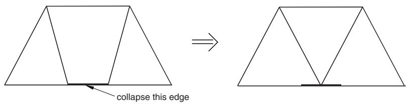

<details>
<summary>text_image</summary>

collapse this edge
</details>

1. Enter the Mesh module.  
2. From the Object field in the context bar, select Part and select a part from the list.  
3. From the main menu bar, select Mesh->Edit.

Abaqus/CAE displays the Edit Mesh dialog box.


Tip: You can also display the Edit Mesh dialog box using the tool, located at the bottom of the Mesh module toolbox.

4. In the dialog box, do the following:

a. In the Category field, select Element.  
b. From the Method list, select Collapse edge (tri/quad).

5. From the menu in the prompt area, choose the method that Abaqus/CAE will use to collapse the edge.

• Choose direction to collapse the element edge in the specified direction.  
Choose average to collapse the element edge and readjust the remaining elements to meet at the midpoint of the collapsed edge.

6. Select the element edge to collapse. You can select only a single edge.

Abaqus/CAE highlights the selected edge and prompts you to confirm that you want to collapse the selected edge.

7. From the buttons in the prompt area, click Yes to collapse the selected edge.

Abaqus/CAE prompts you to select the next edge to collapse.

8. Repeat the previous steps as often as necessary to collapse additional edges.

9. When you have finished collapsing edges, click mouse button 2 or the cancel button in the prompt area to exit the procedure.


Tip: If you make a mistake while collapsing edges, click Undo in the Edit Mesh dialog box to undo the change. Abaqus/CAE restores the mesh to its state just before the operation.

## Additional information

• What can I do with the Edit Mesh toolset?

## Splitting an edge of a quadrilateral or triangular element

The Edit Mesh toolset allows you to split an edge of a quadrilateral or triangular element into two parts.

Select Mesh->Edit from the main menu bar to split an edge of a quadrilateral or triangular element into two parts. The following figure shows how you can split an edge and then collapse the resulting edge to remove a long narrow triangular element:

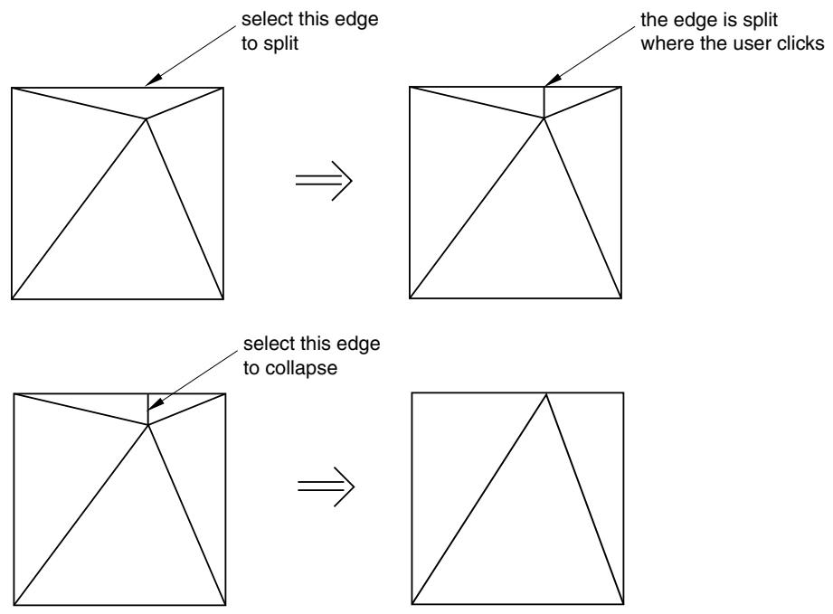

<details>
<summary>flowchart</summary>

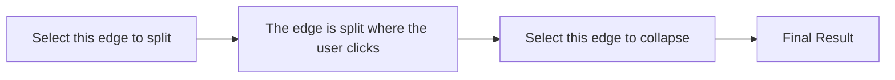
```mermaid
graph LR
  A["Select this edge to split"] --> B["The edge is split where the user clicks"]
  B --> C["Select this edge to collapse"]
  C --> D["Final Result"]
```
</details>

When you split a quadrilateral element, Abaqus/CAE creates the edges that will result in the best-shaped elements based on angle measurements. You cannot select which edges Abaqus/CAE will create. However, after Abaqus/CAE splits the edge, you can use the Swap diagonal (tri) tool to change the diagonal; for more information, see Swapping the diagonal of a pair of adjacent triangular elements.

1. Enter the Mesh module and do one of the following:

• From the Object field in the context bar, select Assembly.  
• From the Object field in the context bar, select Part and select a part from the list.

2. From the main menu bar, select Mesh->Edit.

Abaqus/CAE displays the Edit Mesh dialog box.


Tip: You can also display the Edit Mesh dialog box using the tool, located at the bottom of the Mesh module toolbox.

3. In the dialog box, do the following:

a. In the Category field, select Element.  
b. From the Method list, select Split edge (tri/quad).

4. From the menu in the prompt area, select the method that you will use to determine the location of the split along the edge. You can choose either midpoint or picked location.

5. If you chose midpoint to determine the location, select the edge to split. You can select only a single edge.

Abaqus/CAE highlights the edges it will insert to split the selected edge at the midpoint.

6. If you chose picked location to determine the location, click on the edge at the location of the desired split.

Abaqus/CAE highlights the edges it will insert to split the selected edge at the picked location.

7. From the prompt area, click Split Edge.

Abaqus/CAE splits the edge and prompts you to select the next edge to split.


Tip: If you make a mistake while splitting element edges, click Undo in the Edit Mesh dialog box to undo the split.

8. Repeat the above steps as often as necessary to split additional edges.

9. When you have finished splitting edges, click mouse button 2 or the cancel button in the prompt area to exit the procedure.

## Additional information

• What can I do with the Edit Mesh toolset?

## Swapping the diagonal of a pair of adjacent triangular elements

The Edit Mesh toolset allows you to swap the diagonal of a pair of adjacent triangular elements.

Select Mesh->Edit from the main menu bar to swap the diagonal of a pair of adjacent triangular elements, as shown in the following figure:

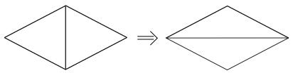

<details>
<summary>text_image</summary>

Diagram showing transformation of diamond shapes with equivalence, likely illustrating a mathematical or logical relationship.
</details>

The adjacent triangular elements must have consistent normals. If necessary, you can use the Edit Mesh toolset to flip the normals; for more information, see Reversing the surface normal direction of shell elements.

1. Enter the Mesh module and do one of the following:

• From the Object field in the context bar, select Assembly.  
• From the Object field in the context bar, select Part and select a part from the list.

2. From the main menu bar, select Mesh->Edit.

Abaqus/CAE displays the Edit Mesh dialog box.


Tip: You can also display the Edit Mesh dialog box using the tool, located at the bottom of the Mesh module toolbox.

3. In the dialog box, do the following:

a. In the Category field, select Element.  
b. From the Method list, select Swap diagonal (tri).

4. Select the edge of the adjacent triangular elements to swap. You can select only a single edge.

Abaqus/CAE highlights the selected edge and prompts you to confirm that you want to swap the selected edge.

5. Click Yes to swap the element edge.

Abaqus/CAE prompts you to select the next element edge to swap.


Tip: If you make a mistake while swapping a diagonal, click Undo in the Edit Mesh dialog box to undo the change. Abaqus/CAE restores the original diagonal in the two adjacent elements.

6. When you have finished swapping diagonals, click mouse button 2 or the cancel button in the prompt area to exit the procedure.

## Additional information

• What can I do with the Edit Mesh toolset?

## Splitting quadrilateral elements

The Edit Mesh toolset allows you to split quadrilateral elements into two triangular elements.

Select Mesh->Edit from the main menu bar to split quadrilateral elements into two triangular elements, as shown in the following figure:


<details>
<summary>text_image</summary>

Diagram showing transformation of two diamond shapes with an arrow indicating equivalence
</details>

You cannot split a 5-node quadrilateral element, and you cannot split a quadrilateral-shaped gasket element. You can select multiple quadrilateral elements to split as long as they are from the same part.

1. Enter the Mesh module and do one of the following:

• From the Object field in the context bar, select Assembly.  
• From the Object field in the context bar, select Part and select a part from the list.

2. From the main menu, select Mesh->Edit.

Abaqus/CAE displays the Edit Mesh dialog box.


Tip: You can also display the Edit Mesh dialog box using the tool, located at the bottom of the Mesh module toolbox.

3. In the dialog box, do the following:

a. In the Category field, select Element.  
b. From the Method list, select Split (quad to tri).

4. Select the quadrilateral elements to split. You can use any of the selection techniques described in Selecting objects within the current viewport.

If your selection includes elements that are not quadrilaterals, Abaqus/CAE automatically removes them from the selection.

Abaqus/CAE highlights the diagonal it will use to split each quadrilateral element into two triangular elements and prompts you to continue. Abaqus/CAE selects the diagonals that will create the best-shaped elements based on angle measurements. You cannot select which diagonal of the quadrilateral Abaqus/CAE uses to split the element. However, after Abaqus/CAE splits the elements, you can use the Swap diagonal (tri) tool to change the diagonals; for more information, see Swapping the diagonal of a pair of adjacent triangular elements.

5. Click Yes to split the selected elements.

Abaqus/CAE prompts you to select more elements to split.


Tip: If you make a mistake while splitting quadrilateral elements, click Undo in the Edit Mesh dialog box to undo the change.

6. When you have finished splitting elements, click mouse button 2 or the cancel button in the prompt area to exit the procedure.

## Additional information

• What can I do with the Edit Mesh toolset?

## Combining triangular elements

The Edit Mesh toolset allows you to combine two adjacent triangular elements into a single quadrilateral element.

Select Mesh->Edit from the main menu bar to combine two adjacent triangular elements into a single quadrilateral element, as shown in the following figure:


<details>
<summary>text_image</summary>

Diagram showing transformation of two diamond shapes with an arrow indicating equivalence
</details>

You can combine either first- or second-order elements, but you cannot combine a combination of both. In addition, you can combine elements only if the adjacent triangular elements have consistent normals. If necessary, you can use the Edit Mesh toolset to flip the normals; for more information, see Reversing the surface normal direction of shell elements.

1. Enter the Mesh module and do one of the following:

• From the Object field in the context bar, select Assembly.  
• From the Object field in the context bar, select Part and select a part from the list.

2. From the main menu bar, select Mesh->Edit.

Abaqus/CAE displays the Edit Mesh dialog box.


Tip: You can also display the Edit Mesh dialog box using the tool, located at the bottom of the Mesh module toolbox.

3. In the dialog box, do the following:

a. In the Category field, select Element.  
b. From the Method list, select Combine (tri to quad).

4. Select the first triangular element to combine.

5. Select the second triangular element to combine. The second element must be adjacent to the first, and the second element must be the same order as the first.

Abaqus/CAE indicates how it will combine two adjacent triangular elements into a single quadrilateral element and prompts you to continue.

6. Click Yes to combine the elements.

Abaqus/CAE prompts you to select the next elements to combine.


Tip: If you make a mistake while combining triangular elements, click Undo in the Edit Mesh dialog box to undo the change. Abaqus/CAE restores the two triangular elements.

7. When you have finished combining elements, click mouse button 2 or the cancel button in the prompt area to exit the procedure.

## Additional information

• What can I do with the Edit Mesh toolset?

## Renumbering elements

The Edit Mesh toolset allows you to renumber elements.

Select Mesh->Edit from the main menu to renumber selected elements. You can renumber the selected elements by specifying a starting label and an increment or by offsetting the existing label by a specified value. (For information on renumbering the elements of an Abaqus/CAE native mesh, see Changing the labels of all nodes and elements.)

1. Enter the Mesh module.

This tool is available only for working on parts that do not contain any geometry. You can work in the part or assembly context. However, any renumbering applied to a part instance is applied at the part level and, therefore, affects all instances of that part.

2. From the main menu, select Mesh->Edit.

Abaqus/CAE displays the Edit Mesh dialog box.


Tip: You can also display the Edit Mesh dialog box using the tool, located at the bottom of the Mesh module toolbox.

3. In the dialog box, do the following:

a. In the Category field, select Element.  
b. From the Method list, select Renumber.

Abaqus/CAE displays the Element Renumbering dialog box. If a single mesh part is displayed in the viewport, the Part Label Range displays the range of element labels for the entire part.

4. Do either of the following to specify the renumbering method:

Choose By Start Label, and enter the value of the first element label and the increment that will be used to number subsequent elements.  
• Choose By Offset, and enter the value by which the existing element labels will be offset.

5. Use one of the following methods to select the elements that you want to renumber:

## Selecting all elements of a part

Select All (in the part context) or Part (in the assembly context) to renumber all the orphan mesh elements of a part. If there is more than one mesh part instance in the viewport, click

the button to select a part instance.

## Selecting elements using the unordered method

1. Select Specify and Unordered to select the elements in any sequence.  
2. Click Select to select the elements to renumber.  
3. From the prompt area, choose the selection method and select the elements to renumber. For more information, see Selecting the elements to edit.

## Selecting elements using the directed path method

1. Select Specify and Directed Path to renumber the elements along an edge from a selected start element to a selected end element.  
2. Click Select to select the elements to renumber.  
3. Select the start element. Abaqus/CAE displays all the elements along the feature edge. If desired, modify the angle to redefine how Abaqus/CAE defines a feature edge.  
4. Select Done from the prompt area.  
5. Select the end element. The start and end elements must lie on the same feature edge.

## Selecting elements using the sequence method

1. Select Specify and Sequence to renumber the elements based on the sequence in which you select the elements.  
2. Click Select to select the elements to renumber.  
3. Select the start element. Abaqus/CAE displays all the elements along the feature edge. If desired, modify the angle to redefine how Abaqus/CAE defines a feature edge.  
4. Select Done from the prompt area. The start element is displayed in purple.  
5. Select the end element. The start and end elements must lie on the same feature edge.

The Part Label Range displays the range of element labels for the renumbered elements.

6. Click OK or Apply to renumber the elements. If you click Apply, Abaqus/CAE renumbers the elements; however, the elements remain selected, and you can continue renumbering them.  
7. Repeat the previous steps as often as required to renumber additional elements.  
8. When you have finished renumbering elements, click Cancel to close the Element Renumbering dialog box.

## Additional information

• Changing the labels of all nodes and elements  
• What can I do with the Edit Mesh toolset?

When you are selecting the elements to edit, Abaqus/CAE displays a menu in the prompt area that allows you to choose the technique that you will use to select the elements. The techniques allow you to select individual nodes or groups of adjacent elements.

1. Use one of the following methods to select the elements that you want to edit:

## Selecting individual elements

1. From the menu in the prompt area, select Individually.  
2. Select an element that you want to renumber, or drag-select a group of elements.  
3. [Shift] + Click on additional elements to add them to your selection.  
4. If necessary, [Ctrl] + Click on selected elements to remove them from your selection.

## Selecting elements using the angle method

1. From the menu in the prompt area, select by angle.  
2. Enter an angle (from 0° to 90°), and select an element. Abaqus/CAE selects every element on element faces adjacent to the selected element until the angle between the element faces is equal to or exceeds the angle that you entered. (See Using the angle and feature edge method to select multiple objects, for more information.)  
3. After you use the by angle method, you can [Shift] + Click on additional elements to add them to your selection or [Ctrl] + Click on selected elements to remove them from your selection. (See Combining selection techniques, for more information.)

## Selecting elements using the feature edge method

1. From the menu in the prompt area, select by feature edge.  
2. Enter an angle (from 0° to 90°). Abaqus/CAE identifies all the feature edges in your model by finding all the element edges where the angle between two adjacent element faces is greater than the angle specified.  
3. Select an element edge. Abaqus/CAE follows the feature edge that passes through the selected element edge or node. The feature edge is truncated if another feature edge intersects it at an angle greater than the angle specified in the previous step.  
4. Abaqus/CAE selects all the elements along the feature edge. (See Using the angle and feature edge method to select multiple objects, for more information.) Alternatively, you can select the node at the intersection of multiple feature edges, and Abaqus/CAE selects the elements along all these feature edges.  
5. After you use the by feature edge method, you can [Shift] + Click on additional elements to add them to your selection or [Ctrl] + Click on selected elements to remove them from your selection. (See Combining selection techniques, for more information.)

## Specifying an existing element set

1. Click Sets on the right side of the prompt area. Abaqus/CAE displays the Region Selection dialog box containing a list of element sets that you have created.

2. Select the set of elements that you want to renumber, and click Continue.


## Note:

The default selection method is based on the selection method you most recently employed. To revert to the other method, click Select in Viewport or Sets on the right side of the prompt area.

2. When you have finished selecting elements, select Done from the prompt area.

## Additional information

• Selecting objects within the current viewport  
• What can I do with the Edit Mesh toolset?

## Editing the entire mesh

This section describes how you can use the Edit Mesh toolset to perform a global edit of a mesh containing orphan mesh components or Abaqus/CAE native mesh components or a combination of both mesh types.

## In this section:

Generating layers of solid elements offset from an existing mesh  
Generating layers of shell elements offset from an existing mesh  
Wrapping a mesh about the Z-axis  
Collapsing short edges of a linear orphan mesh  
Growing short edges of a linear orphan mesh  
Converting a triangular shell mesh to a solid tetrahedral mesh  
Converting a solid orphan mesh to a shell orphan mesh  
Merging elements  
Subdividing elements  
Copying a mesh pattern  
Viewing and editing mesh-geometry associativity  
Deleting mesh-geometry associativity  
Inserting cohesive seams

## Generating layers of solid elements offset from an existing mesh

The Edit Mesh toolset allows you to generate layers of solid elements that are offset normal to element faces selected from an existing mesh.

Select Mesh->Edit from the main menu bar to generate layers of solid elements that are offset normal to element faces selected from an existing mesh, as shown in the following figure:


<details>
<summary>natural_image</summary>

Two 3D wireframe mechanical parts with holes and a curved arrow indicating rotation (no text or symbols)
</details>

solid offset mesh

1. Enter the Mesh module.  
2. From the Object field in the context bar, select Part and select a part from the list.  
3. From the main menu bar, select Mesh->Edit.

Abaqus/CAE displays the Edit Mesh dialog box.


Tip: You can also display the Edit Mesh dialog box using the tool, located at the bottom of the Mesh module toolbox.

4. In the dialog box, do the following:

a. In the Category field, select Mesh.  
b. From the Method list, select Offset (create solid layers).

5. Use one of the following methods to select the element faces from which Abaqus/CAE will generate the layers of solid elements. You can select shell element faces or solid element faces, but you cannot select both. If you select shell element faces, the direction of the surface normals of adjacent shell elements must be consistent. You can reverse the surface normal direction of shell elements using the Flip normal tool. For more information, see Reversing the surface normal direction of shell elements.

## Selecting individual elements

1. From the menu in the prompt area, select Individually.  
2. Select the element faces.  
3. [Shift] + Click additional element faces to add them to your selection.  
4. If necessary, [Ctrl] + Click selected element faces to unselect them.  
5. When you have finished selecting element faces, click mouse button 2.

## Specifying an existing surface

1. Click Surfaces on the right side of the prompt area.

Abaqus/CAE displays the Region Selection dialog box containing a list of surfaces that you have created.

2. Select the surfaces, and click Continue. The surface must contain only quadrilateral or triangular faces.


## Note:

The default selection method is based on the selection method you most recently employed. To revert to the other method, click Select in Viewport or Surfaces on the right side of the prompt area.

## Selecting elements using the angle method

1. From the menu in the prompt area, select by angle.  
2. Enter an angle (from 0° to 90°), and select an element face. Abaqus/CAE selects every adjacent element face from the selected face until the angle between the element faces is equal to or exceeds the angle that you entered. (See Using the angle and feature edge method to select multiple objects, for more information.)  
3. After you use the by angle method, you can [Shift] + Click additional element faces to add them to your selection or [Ctrl] + Click selected element faces to remove them from your selection. (See Combining selection techniques, for more information.)  
4. When you have finished selecting element faces, click mouse button 2.

6. From the Offset Mesh - Solid Layers dialog box that appears, do the following:

a. If you selected shell element faces from which to offset, you can choose the color that indicates the desired offset direction. The two colors from which you can choose correspond to the two sides of the selected element faces. You can also choose Both to indicate that Abaqus/CAE should create layers of solid elements on both sides of the selected shell elements.  
b. Enter the Total thickness of all the layers combined. The value that you enter must be positive. However, you can enter a value of 0 if you are creating zero-thickness elements that will be used in a cohesive analysis.  
c. Enter the Number of layers.  
d. If desired, toggle on Specify initial offset, and enter a value for the initial offset. A negative initial offset indicates overclosure between elements.  
e. If the surface from which you are offsetting contains sharp corners, toggle on Constant thickness around corners. You should also toggle this option on if you anticipate that the generated offset elements may collapse or become inverted. For more information, see Reducing element distortion and collapse during mesh offsetting.  
f. To share the nodes of the first layer of solid elements with the nodes of the selected element faces, toggle on Share nodes with base shell/surface. This option is available only if the first layer of solid elements is not offset from the selected element faces.  
g. To delete the selected shell elements after creating the layers of solid elements, toggle on Delete base shell elements. This option is available only if you selected orphan shell element faces from which to offset.  
h. If you want to create a single set containing all of the elements from the solid offset mesh, toggle on Create a set for new elements.  
i. If you want to create separate sets containing the elements from each layer of the solid offset mesh, toggle on Separate set for each layer. Abaqus/CAE appends Layer-layer number to the set name prefix when it creates separate sets for each layer.

j. If all or part of the solid offset mesh will not be embedded in the existing mesh, you can create surfaces from the top and bottom surfaces of the offset mesh. by toggling on Create top and bottom surfaces. Abaqus/CAE appends BottomSurf and TopSurf to the name prefix when it creates the two surfaces.  
k. If desired, enter a new name for the single set or a new prefix for the separate sets and/or surfaces.

7. Abaqus/CAE creates the layers of solid elements offset normal to the selected element faces. When

you have finished generating layers of solid elements, click mouse button 2 or the cancel button in the prompt area to exit the procedure.

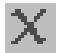


Tip: If you make a mistake while generating layers of elements, click Undo in the Edit Mesh dialog box to undo the change. Abaqus/CAE restores the mesh to its state just before the operation.

After editing an orphan mesh, you should always verify node-, element-, and surface-based features such as section assignments, loads, and interactions to ensure that they are correctly applied to the modified mesh.

## Additional information

• Using offset meshes to create skin reinforcements  
• Adhesive joints and bonded interfaces  
• Using offset meshes in Abaqus/CAE  
• Reducing element distortion and collapse during mesh offsetting  
• Allowing for branching in offset solid meshes  
• Creating a mid-plane shell mesh from a thin solid model

## Generating layers of shell elements offset from an existing mesh

The Edit Mesh toolset allows you to generate layers of shell elements that are offset normal to element faces selected from an existing mesh.

Select Mesh->Edit from the main menu bar to generate layers of shell elements that are offset normal to element faces selected from an existing mesh, as shown in the following figure:

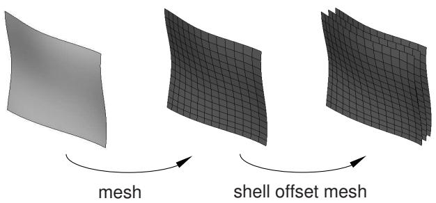

<details>
<summary>flowchart</summary>


```mermaid
graph LR
  A["Start of Mesh"] --> B["Grid Grid"]
  B --> C["Shell Offset Mesh"]
  C --> D["End of Mesh"]
```
</details>

1. Enter the Mesh module.  
2. From the Object field in the context bar, select Part and select a part from the list.  
3. From the main menu bar, select Mesh->Edit.

Abaqus/CAE displays the Edit Mesh dialog box.


Tip: You can also display the Edit Mesh dialog box using the tool, located at the bottom of the Mesh module toolbox.

4. In the dialog box, do the following:

a. In the Category field, select Mesh.  
b. From the Method list, select Offset (create shell layers).

5. Use one of the following methods to select the element faces from which Abaqus/CAE will generate the layers of shell elements. You can select shell element faces or solid element faces, but you cannot select both. If you select shell element faces, the direction of the surface normals of adjacent shell elements must be consistent. You can reverse the surface normal direction of shell elements using the Flip normal tool. For more information, see Reversing the surface normal direction of shell elements.

## Selecting individual elements

1. From the menu in the prompt area, select Individually.  
2. Select the element faces.  
3. [Shift] + Click additional element faces to add them to your selection.  
4. If necessary, [Ctrl] + Click selected element faces to unselect them.  
5. When you have finished selecting element faces, click mouse button 2.

## Specifying an existing surface

1. Click Surfaces on the right side of the prompt area.

Abaqus/CAE displays the Region Selection dialog box containing a list of surfaces that you have created.

2. Select the surfaces, and click Continue. The surface must contain only quadrilateral or triangular faces.


## Note:

The default selection method is based on the selection method you most recently employed. To revert to the other method, click Select in Viewport or Surfaces on the right side of the prompt area.

## Selecting elements using the angle method

1. From the menu in the prompt area, select by angle.  
2. Enter an angle (from 0° to 90°), and select an element face. Abaqus/CAE selects every adjacent element face from the selected face until the angle between the element faces is equal to or exceeds the angle that you entered. (See Using the angle and feature edge method to select multiple objects, for more information.)  
3. After you use the by angle method, you can [Shift] + Click additional element faces to add them to your selection or [Ctrl] + Click selected element faces to remove them from your selection. (See Combining selection techniques, for more information.)  
4. When you have finished selecting element faces, click mouse button 2.

6. From the Offset Mesh - Shell Layers dialog box that appears, do the following:

a. If you selected shell element faces from which to offset, you can choose the color that indicates the desired offset direction. The two colors from which you can choose correspond to the two sides of the selected element faces. You can also choose Both to indicate that Abaqus/CAE should create layers of shell elements on both sides of the selected shell elements.  
b. Enter the Distance between layers. You can enter a value of 0; for example, if you want to create multiple layers of skin reinforcements that share nodes.  
c. Enter the Number of layers.  
d. If desired, toggle on Specify initial offset, and enter a value for the initial offset. A negative initial offset indicates overclosure between elements.  
e. If the surface from which you are offsetting contains sharp corners, toggle on Constant thickness around corners. You should also toggle this option on if you anticipate that the generated offset elements may collapse or become inverted. For more information, see Reducing element distortion and collapse during mesh offsetting.  
f. To share the nodes of the first layer of shell elements with the nodes of the selected element faces, toggle on Share nodes with base shell/surface. This option is available only if the first layer of shell elements is not offset from the selected element faces.  
g. To delete the selected shell elements after creating the layers of shell elements, toggle on Delete base shell elements. This option is available only if you selected orphan shell element faces from which to offset.  
h. If you want to create a single set containing all of the elements from the shell offset mesh, toggle on Create a set for new elements.  
i. If you want to create separate sets containing the elements from each layer of the shell offset mesh, toggle on Separate set for each layer. Abaqus/CAE appends Layer-layer number to the set name prefix when it creates separate sets for each layer.  
j. If desired, enter a new name for the single set or a new prefix for the separate sets.

7. Abaqus/CAE creates the layers of shell elements offset normal to the selected element faces. When

you have finished generating layers of shell elements, click mouse button 2 or the cancel button in the prompt area to exit the procedure.

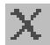


Tip: If you make a mistake while generating layers of elements, click Undo in the Edit Mesh dialog box to undo the change. Abaqus/CAE restores the mesh to its state just before the operation.

After editing an orphan mesh, you should always verify node-, element-, and surface-based features such as section assignments, loads, and interactions to ensure that they are correctly applied to the modified mesh.

## Additional information

• Using offset meshes to create skin reinforcements  
• Adhesive joints and bonded interfaces  
• Using offset meshes in Abaqus/CAE  
• Reducing element distortion and collapse during mesh offsetting

## Wrapping a mesh about the Z-axis

Use the Abaqus Scripting Interface method wrapMesh to wrap a planar orphan mesh around a cylindrical surface defined by the global Z-axis and a specified radius.

The planar mesh must lie in the X–Y plane, and the modeling space of the part should be three-dimensional. If necessary, you can change the modeling space of a part by clicking mouse button 3 on the part in the Model Tree and selecting Edit from the menu that appears.

The wrapping procedure will relocate a node at point ( , ) on the planar mesh to $( r , \pmb \theta , z )$ , where is the specified radius, $\begin{array} { r } { \pmb { \theta } = \frac { \pmb { x } } { r } } \end{array}$ , and $\scriptstyle z = y ,$ as shown in Figure 1. A point on the planar orphan mesh located at (0, 0) is mapped to location ( , 0, 0) on the cylindrical surface.

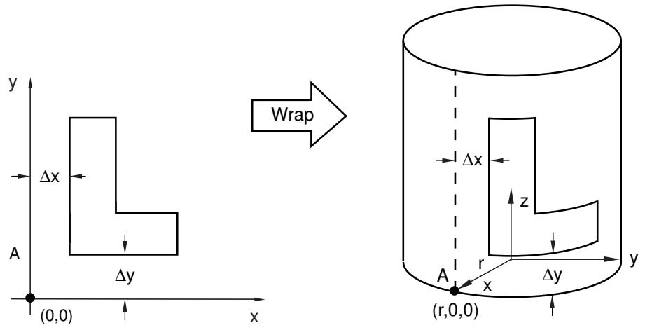

<details>
<summary>text_image</summary>

y
Δx
A
(0,0)
Δy
x
Wrap
Δx
z
A
r
x
Δy
y
(r,0,0)
</details>

Figure 1: Wrapping a planar orphan mesh.

Because only part instances can be positioned and only parts can be wrapped, if you want to create an instance of an orphan mesh that is wrapped and oriented properly in the assembly, some planning is required. The following steps will help you achieve the desired goal:

1. Use the tools in the Assembly module to translate and/or rotate an instance of the planar orphan mesh in the assembly.  
2. Use the Create Mesh Part tool in the Mesh module to create a planar mesh part from the reoriented instance.  
3. Wrap the reoriented mesh part.  
4. Create an instance of the wrapped part, and use the tools in the Assembly module to translate and/or rotate the instance in the assembly.

If you are trying to create a full 360° wrap, discretization approximations may result in a small gap between nodes along the seam edge. You must use the merge nodes tool to stitch the seam by merging pairs of nodes into a single node; for more information, see Merging nodes.

The following shows an example of using the Abaqus Scripting Interface to wrap a mesh:

```txt
model = mdb.models['Model-1']
part = model.parts['Part-1']
part.wrapMesh(radius=5.0)
```

You can use the command line interface to enter Abaqus Scripting Interface commands, as described in Using the Python interpreter.

## Additional information

• What can I do with the Edit Mesh toolset?

• Edit mesh commands

## Collapsing short edges of a linear orphan mesh

Select Mesh->Edit from the main menu bar to collapse selected edges of a linear orphan mesh. You can specify the minimum length of the edges of elements that should be collapsed, and Abaqus/CAE will merge the end nodes of element edges that are shorter than the specified length. You can specify an element domain other than the entire mesh, and you can specify a direction and/or reference edge to collapse only those edges that match these criteria. You can collapse the mesh only if the element domain contains only linear elements.

1. Enter the Mesh module. Select Part from the Object field in the context bar, and select a part from the list.  
2. From the main menu bar, select Mesh->Edit.

Abaqus/CAE displays the Edit Mesh dialog box.


Tip: You can also display the Edit Mesh dialog box using the tool, located at the bottom of the Mesh module toolbox.

3. From the Category field, choose Mesh.  
4. From the Method list, select Collapse short edges.

Abaqus/CAE displays the Collapse short edges dialog box.

5. Enter the Edge tolerance to specify the minimum length of the edges of elements indicating that you want to collapse element edges that are shorter than the tolerance. The default value is approximately 10% of the average element size in the part.  
6. If desired, toggle on Specify and click Select to choose an element domain other than the entire mesh.  
7. If desired, toggle on Thickness direction and enter a direction vector or click the arrow icon to create a vector by picking points in the viewport.

Abaqus/CAE uses the direction vector to measure the elements instead of measuring only the distance between nodes. When you use a direction vector, the collapse operation must be limited to specific edges of the selected elements to avoid collapsing edges that are perpendicular to the intended direction. If elements are oriented such that the direction is topologically ambiguous, Abaqus/CAE highlights the elements so you can either select a domain that excludes them or add a reference edge to further define the desired edges.

8. If desired, toggle on Reference edge and click Select to choose a reference edge.

When you use a reference edge, Abaqus/CAE checks for short edges in only those element edges that are topologically parallel to the selected edge.


## Note:

If your element domain includes unconnected element sections, you can select a reference edge only within a single contiguous part of the domain. You may need to use the Collapse short edges tool multiple times on smaller element domains to achieve the desired results.

## 9. Click OK.

Abaqus/CAE highlights the elements that will have edges collapsed. Click Yes in the prompt area to collapse the edges or No to return to the Collapse short edges dialog box.

If none of the element edges are shorter than the minimum length specified, Abaqus/CAE displays an error message that indicates the shortest element length.


Tip: If you make a mistake while collapsing short edges in a mesh, click Undo in the Edit Mesh dialog box to undo the change. Abaqus/CAE restores the original mesh.

After editing an orphan mesh, you should always verify node-, element-, and surface-based features such as section assignments, loads, and interactions to ensure that they are correctly applied to the modified mesh.

## Additional information

• What can I do with the Edit Mesh toolset?

## Growing short edges of a linear orphan mesh

Select Mesh->Edit from the main menu bar to grow selected edges of a linear orphan mesh. You can specify the minimum length of the edges of elements that should be grown, and Abaqus/CAE will move the end nodes of element edges that are shorter than the specified length. You can specify an element domain other than the entire mesh, and you can specify a direction and/or reference edge to grow only those edges that match these criteria. You can grow edges in the mesh only if the element domain contains only linear elements.

1. Enter the Mesh module. Select Part from the Object field in the context bar, and select a part from the list.  
2. From the main menu bar, select Mesh->Edit.

Abaqus/CAE displays the Edit Mesh dialog box.


Tip: You can also display the Edit Mesh dialog box using the tool, located at the bottom of the Mesh module toolbox.

3. From the Category field, choose Mesh.  
4. From the Method list, select Grow short edges.

Abaqus/CAE displays the Grow short edges dialog box.

5. Enter the Edge tolerance to specify the minimum length of the edges of elements indicating that you want to grow element edges that are shorter than the tolerance. The default value is approximately 10% of the average element size in the part.  
6. If desired, toggle on Specify and click Select to choose an element domain other than the entire mesh.


## Note:

Abaqus/CAE does not check edges outside of the specified domain at all. If there are short element edges adjacent to the selected domain and an edge within the domain grows, the repositioned nodes could make an element outside the domain too small or possibly invert an element.

7. If desired, toggle on Thickness direction and enter a direction vector or click the arrow icon to create a vector by picking points in the viewport.

Abaqus/CAE uses the direction vector to measure the elements instead of measuring only the distance between nodes. When you use a direction vector, the grow operation must be limited to specific edges of the selected elements to avoid growing edges that are perpendicular to the intended direction. If elements are oriented such that the direction is topologically ambiguous, Abaqus/CAE highlights the elements so you can either select a domain that excludes them or add a reference edge to further define the desired edges.

8. If desired, toggle on Reference edge and click Select to choose a reference edge.

When you use a reference edge, Abaqus/CAE checks for short edges in only those element edges that are topologically parallel to the selected edge.


## Note:

If your element domain includes unconnected element sections, you can select a reference edge only within a single contiguous part of the domain. You may need to use the Grow short edges tool multiple times on smaller element domains to achieve the desired results.

## 9. Click OK.

Abaqus/CAE highlights the elements that will have edges grown. Click Yes in the prompt area to grow the edges or No to return to the Grow short edges dialog box.

If none of the element edges are shorter than the minimum length specified, Abaqus/CAE displays an error message that indicates the shortest element length.


Tip: If you make a mistake while collapsing short edges in a mesh, click Undo in the Edit Mesh dialog box to undo the change. Abaqus/CAE restores the original mesh.

After editing an orphan mesh, you should always verify node-, element-, and surface-based features such as section assignments, loads, and interactions to ensure that they are correctly applied to the modified mesh.

## Additional information

• What can I do with the Edit Mesh toolset?

## Converting a triangular shell mesh to a solid tetrahedral mesh

Select Mesh->Edit from the main menu bar to convert a closed three-dimensional shell of triangular elements into a solid mesh of tetrahedral elements. The original shell part must be meshed with triangular elements that fully enclose a volume with no gaps.

1. Enter the Mesh module.  
2. From the Object field in the context bar, select Part and select a part from the list. This tool is available only for working on orphan mesh elements.  
3. From the main menu bar, select Mesh->Edit.

Abaqus/CAE displays the Edit Mesh dialog box.


Tip: You can also display the Edit Mesh dialog box using the of the Mesh module toolbox.

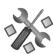

tool, located at the bottom

4. From the Category field, choose Mesh.  
5. From the Method list, select Convert tri to tet.  
6. From the buttons that appear in the prompt area, click Yes.

Abaqus/CAE converts the triangular mesh to a tetrahedral mesh.


Tip: You can recover the triangular mesh in its state just before the conversion by clicking Undo in the Edit Mesh dialog box.

After editing an orphan mesh, you should always verify node-, element-, and surface-based features such as section assignments, loads, and interactions to ensure that they are correctly applied to the modified mesh.

## Additional information

• What can I do with the Edit Mesh toolset?

## Converting a solid orphan mesh to a shell orphan mesh

Select Mesh->Edit from the main menu bar to convert a solid orphan mesh to a shell orphan mesh. The Convert solid to shell tool creates triangular or quadrilateral shell elements on the free element faces of the part; that is, the element faces that do not share all of their nodes with another face. If your part contains joined faces with elements of different element shapes or with elements of a different geometric order, Abaqus/CAE creates shell elements on both sides of the interface. Likewise, if your solid mesh part contains neighboring element faces that reference different coincident nodes (like the nodes that represent cracks), Abaqus/CAE creates shell elements on both sides of the interface.

1. Enter the Mesh module.  
2. From the Object field in the context bar, select Part and select a part from the list. This tool is available only for working on orphan mesh elements.  
3. From the main menu bar, select Mesh->Edit.

Abaqus/CAE displays the Edit Mesh dialog box.


Tip: You can also display the Edit Mesh dialog box using the tool, located at the bottom of the Mesh module toolbox.

4. From the Category field, choose Mesh.  
5. From the Method list, select Convert solid to shell.  
6. From the buttons that appear in the prompt area, click Yes.

Abaqus/CAE converts the solid mesh to a shell mesh.


Tip: You can recover the solid mesh in its state just before the conversion by clicking Undo in the Edit Mesh dialog box.

After editing an orphan mesh, you should always verify node-, element-, and surface-based features such as section assignments, loads, and interactions to ensure that they are correctly applied to the modified mesh.

## Additional information

• What can I do with the Edit Mesh toolset?

## Merging elements

Select Mesh->Edit from the main menu bar to merge adjacent orphan mesh elements. The merged elements have the same element type and basic shape as the originals. You can merge elements in the mesh only if the element domain contains only linear elements.

1. Enter the Mesh module. Select Part from the Object field in the context bar, and select a part that contains orphan mesh elements from the list.  
2. From the main menu bar, select Mesh->Edit.

Abaqus/CAE displays the Edit Mesh dialog box.


Tip: You can also display the Edit Mesh dialog box using the tool, located at the bottom of the Mesh module toolbox.

3. From the Category field, choose Mesh.  
4. From the Method list, select Merge layers.  
5. Select the elements that you want to merge. You can use any of the following methods:

Select elements from the viewport. You can select elements individually, by angle, by feature edge, or by topology (for more information, see Selecting objects within the current viewport). Click mouse button 2 when you have finished making selections.  
Select one or more existing element sets. Click Sets on the right side of the prompt area to display the Region Selection dialog box containing a list of available sets. Select one or more sets from the list, and click Continue.

Elements being merged must be adjacent to each other.


## Note:

The default selection method is based on the selection method you most recently employed. To revert to the other method, click Select in Viewport or Sets on the right side of the prompt area.

6. Select an element edge to indicate the merge direction.

Abaqus/CAE attempts to merge the elements. If merging the elements will create incompatibilities in the mesh, Abaqus/CAE highlights the nodes at which the incompatibilities will occur and asks if you want to continue. Click Yes to merge the elements or No to clear your selections and return to Step 4.


Tip: If you make a mistake while merging elements in a mesh, click Undo in the Edit Mesh dialog box to undo the change. Abaqus/CAE restores the original mesh.

After editing an orphan mesh, you should always verify node-, element-, and surface-based features such as section assignments, loads, and interactions to ensure that they are correctly applied to the modified mesh.

## Additional information

• What can I do with the Edit Mesh toolset?

Select Mesh->Edit from the main menu bar to subdivide one or more selected orphan mesh elements. The elements to be subdivided must be connected. You can select an edge, a face (solid elements), or All Directions to divide elements in one, two, or all directions—two for shell elements, three for solid elements. You must also specify the number of divisions to make. Abaqus/CAE divides the elements evenly into the specified number of divisions in each direction. The new elements have the same element type as the originals. You can subdivide elements in the mesh only if the element domain contains only linear elements.

1. Enter the Mesh module. Select Part from the Object field in the context bar, and select a part that contains orphan mesh elements from the list.  
2. From the main menu bar, select Mesh->Edit.

Abaqus/CAE displays the Edit Mesh dialog box.


Tip: You can also display the Edit Mesh dialog box using the tool, located at the bottom of the Mesh module toolbox.

3. From the Category field, choose Mesh.  
4. From the Method list, select Subdivide layers.  
5. Select the elements that you want to subdivide. You can use any of the following methods:

Select elements from the viewport. You can select elements individually, by angle, by feature edge, or by topology (for more information, see Selecting objects within the current viewport). Click mouse button 2 when you have finished making selections.  
Select one or more existing element sets. Click Sets on the right side of the prompt area to display the Region Selection dialog box containing a list of available sets. Select one or more sets from the list, and click Continue.

The selected elements must form a single connected set.


## Note:

The default selection method is based on the selection method you most recently employed. To revert to the other method, click Select in Viewport or Sets on the right side of the prompt area.

6. Select an element edge to indicate a single direction of subdivision; select the face of a solid element to indicate two directions; select All Directions in the prompt area to indicate all directions—two for shell elements or three for solid elements.

Abaqus/CAE attempts to subdivide the elements. If dividing the elements will create incompatibilities in the mesh, Abaqus/CAE displays a dialog box indicating that the resulting mesh will be nonconforming. Click Yes to divide the elements or No to clear your selections and return to Step 4.


Tip: If you make a mistake while dividing elements in a mesh, click Undo in the Edit Mesh dialog box to undo the change. Abaqus/CAE restores the original mesh.

After editing an orphan mesh, you should always verify node-, element-, and surface-based features such as section assignments, loads, and interactions to ensure that they are correctly applied to the modified mesh.

## Additional information

• What can I do with the Edit Mesh toolset?

## Copying a mesh pattern

Select Mesh->Edit from the main menu bar to copy a two-dimensional mesh pattern onto a target face. The elements of the pattern must form a connected set that can cover a geometric face. The target face must be a portion of the same assembly or part as the pattern, and the target face must contain at least as many loops as the pattern.

1. Enter the Mesh module, and do one of the following:

• From the Object field in the context bar, select Assembly.  
• From the Object field in the context bar, select Part, and select a part from the list.

2. From the main menu bar, select Mesh->Edit.

Abaqus/CAE displays the Edit Mesh dialog box.


Tip: You can also display the Edit Mesh dialog box using the tool, located at the bottom of the Mesh module toolbox.

3. From the Category field, choose Mesh.

4. From the Method list, select Copy mesh pattern.

5. Select the source mesh. You can use any of the following methods:

Select elements from the viewport. You can select elements individually, by face angle, or by face curvature (for more information, see Selecting objects within the current viewport). Click mouse button 2 when you have finished making selections.  
Select an existing surface. Click Surfaces on the right side of the prompt area to display the Region Selection dialog box containing a list of available surfaces. Select a surface from the list, and click Continue.

The selected elements must form a single connected two-dimensional face.


## Note:

The default selection method is based on the selection method you most recently employed. To revert to the other method, click Select in Viewport or Surfaces on the right side of the prompt area.

6. Select the target face.

The target face must be part of the same assembly or part as the source, and the face must contain at least as many loops as the source.

7. In the Copy mesh pattern dialog box, associate node positions on the source mesh with points on the target face.

You should associate at least three nodes from the outer edge (primary loop) of the source mesh with points on the target geometry.

a. Click in the Copy mesh pattern dialog box to add nodes and points to the table.

b. Select the desired nodes from the source mesh, and click Done in the prompt area.

c. Select the corresponding points on the target face.

Abaqus/CAE highlights the current node in pink as you make selections. When you have selected a point for each node, the Copy mesh pattern dialog box appears with the selections displayed in the table.

d. Highlight a position in the table, and click to edit the position.


Tip: You cannot edit nodes. To change a node selection use row, then add a new node and position to replace it.


to delete the highlighted

e. Click OK in the dialog box

Abaqus/CAE maps the remaining nodes onto the target face and displays the copied mesh pattern. If there are problems mapping the remaining nodes to the target, Abaqus/CAE displays error messages to help you resolve them.


Tip: If the copied mesh pattern does not meet your expectations, click Undo in the Edit Mesh dialog box to remove it.

## Additional information

• What can I do with the Edit Mesh toolset?

## Viewing and editing mesh-geometry associativity

You can view or edit the association between orphan or bottom-up mesh elements and the underlying geometry by selecting Mesh->Associate Mesh with Geometry from the main menu bar and choosing a vertex, edge, or face that bounds a bottom-up region or a group of orphan elements. Elements generated by a top-down technique are associated automatically with the region geometry; you cannot view or edit the associativity between these native mesh elements and the corresponding region geometry.

1. Enter the Mesh module. Select Part from the Object field in the context bar, and select a part that contains orphan mesh or bottom-up elements from the list.  
2. From the main menu bar, select Mesh->Associate Mesh with Geometry.

Abaqus/CAE displays prompts in the prompt area to guide you through the procedure.


Tip: You can also click the tool in the Mesh module toolbox, or you can click the tool to display the Edit Mesh dialog box—the mesh association method is located in the Mesh category within the dialog box. (For more information on the Mesh module toolbox, see Using the Mesh module toolbox.)


3. Select a geometric entity—a vertex, edge, or face—whose associativity you want to view or edit. Abaqus/CAE highlights in yellow any nodes, element edges, or element faces that are associated with the selected geometry. If nothing is highlighted in yellow, no part of the mesh is associated with the selected entity.  
4. Use the following selection techniques to change the mesh-geometry associativity (for more information, see Selecting objects within the viewport”):

a. Click a node, element edge, or element face to cancel any existing selections and begin selecting new items.  
b. [Shift] + Click to add nodes, element edges, or element faces to the current selection, or [Ctrl] + Click to unselect items.  
c. Use the by angle selection method available in the prompt area to select element faces based on the angle between them.  
d. You can use the tools in the Selection toolbar to limit the types of objects that you can select in the viewport.


## Note:

In some cases you may need to pick interior mesh faces or edges to create the correct mesh-geometry association. To allow you to select interior objects, Abaqus/CAE does not limit your associativity selections to the “Objects closest to the screen” even when this selection option is active (see Filtering your selection based on the position of the object, for more information). As a result, you need to ensure that you do not inadvertently associate unwanted elements, especially if you use drag-select to select multiple objects.

5. When you have finished selecting mesh objects to associate, click Done.

Abaqus/CAE saves the new associativity.

6. Repeat Steps 3 through 5 to verify or change the association of other areas, or click the cancel button


in the prompt area to end the associativity procedure.

## Additional information

• Selecting objects within the viewport  
• Bottom-up meshing  
• Mesh-geometry association  
• Using the Mesh module toolbox  
• What can I do with the Edit Mesh toolset?

## Deleting mesh-geometry associativity

You can delete the association between nodes, element edges, or elements and the underlying geometry by selecting Mesh->Delete Mesh Associativity from the main menu bar and choosing a vertex, edge, or face. If you delete the associativity between Abaqus/CAE geometry and the mesh, the affected mesh components become orphan mesh nodes and elements. This may be useful if you are working with a complex part and want to keep some portions of the mesh unchanged while changing the geometry in other areas.

1. Enter the Mesh module. Select Part from the Object field in the context bar, and select a part from the list.  
2. From the main menu bar, select Mesh->Delete Mesh Associativity.

Abaqus/CAE displays prompts in the prompt area to guide you through the procedure.


Tip: You can also click the tool in the Mesh module toolbox, or you can click the tool to display the Edit Mesh dialog box—the delete associativity method is located in the Mesh category within the dialog box. (For more information on the Mesh module toolbox, see Using the Mesh module toolbox.)

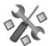

3. Select one or more geometric entities—vertices, edges, faces, or entire regions—whose associativity you want to delete.

You can use a combination of drag select, [Shift] + Click, and [Ctrl] + Click to select geometric entities. For more information, see Selecting objects within the current viewport.


## Note:

To delete the association of a native mesh region and create an orphan mesh, you must select the entire region.

4. If desired, you can toggle off Delete association from bounding entities in the prompt area.

By default, when you delete the associativity of a region, Abaqus/CAE also deletes the association between nodes, element edges, and faces and the corresponding vertices, edges, and faces.

5. When you have finished selecting geometric entities, click Done.

Abaqus/CAE highlights the geometric entities in red and the associated mesh entities in yellow so you can confirm your selections.

6. Click Yes to delete the mesh association or No to cancel your selections.

7. Repeat Steps 3 through 6 to delete the associativity of other areas, or click the cancel button in the prompt area to end the procedure.

## Additional information

• Selecting objects within the viewport  
• Bottom-up meshing  
• Mesh-geometry association  
• Using the Mesh module toolbox  
• What can I do with the Edit Mesh toolset?

Select Mesh->Edit from the main menu bar to insert pore pressure cohesive elements in crack regions, which allows you to model fluid flow into the adjacent material. You can select faces (solid cells), element faces (three-dimensional orphan meshes), edges (shells), or element edges (two-dimensional orphan meshes) to identify the crack regions. The region around the crack must be meshed prior to inserting cohesive seams. By default, Abaqus/CAE creates several sets and surfaces to help you make selections in subsequent procedures, such as section assignment.

1. Enter the Mesh module. Select Part from the Object field in the context bar, and select a part that contains the crack region from the list.  
2. From the main menu bar, select Mesh->Edit.

Abaqus/CAE displays the Edit Mesh dialog box.


Tip: You can also display the Edit Mesh dialog box using the tool, located at the bottom of the Mesh module toolbox.

3. From the Category field, choose Mesh.  
4. From the Method list, select Insert cohesive seams.  
5. Select the faces (for three-dimensional objects) or edges (for two-dimensional objects) that represent crack regions. You can use any of the following methods:

Select faces or edges from the viewport. You can select faces individually, by angle, or, for native meshes, by face curvature. You can select edges individually or by edge angle (for more information, see Selecting objects within the current viewport). Click mouse button 2 when you have finished making selections.  
Click Sets/Surfaces (for native meshes) or Surfaces (for orphan meshes) on the right side of the prompt area to display the Region Selection dialog box containing a list of available sets or surfaces. Select one or more sets or surfaces from the list, and click Continue.


## Note:

The default selection method is based on the selection method you most recently employed. To revert to the other method, click Select in Viewport or Sets/Surfaces (or Surfaces) on the right side of the prompt area.

6. By default, Abaqus/CAE creates several sets and surfaces. Click Options on the right side of the prompt area to select the sets or surfaces to be created and, if desired, to change the set or surface names from the default values.  
7. From the buttons along the bottom of the Options dialog box, do the following:

• Click OK to save your settings and to close the dialog box.  
• Click Defaults to reset the set and surface selections and names to the default values.  
• Click Clear to clear all of the set and surface selections and names.  
• Click Cancel to close the dialog box.

8. Click Done in the prompt area.

Abaqus/CAE inserts cohesive pore pressure elements and creates the specified sets and surfaces.

## Additional information

• What can I do with the Edit Mesh toolset?

## Editing and refining an orphan mesh

You can use the Edit Mesh toolset to refine an orphan mesh.

You can refine a planar, triangular mesh with or without a specified global element size.

Select Mesh->Edit from the main menu bar to refine a planar, triangular mesh. You can remesh the part using the following methods:

## With a specified global element size

Before you remesh the part, you have the option of assigning a target element size to the entire part. You can then remesh the part, and the density of the new mesh reflects the new target element size. For example, when the part in Figure 3 is remeshed with a global element size of 15.0, Figure 1 shows the resulting mesh.


<details>
<summary>natural_image</summary>

Abstract geometric mesh structure with triangular facets, no text or symbols present
</details>

Figure 1: A global element size of 15.0.  
Figure 2 shows the part remeshed with a global element size of 8.0.

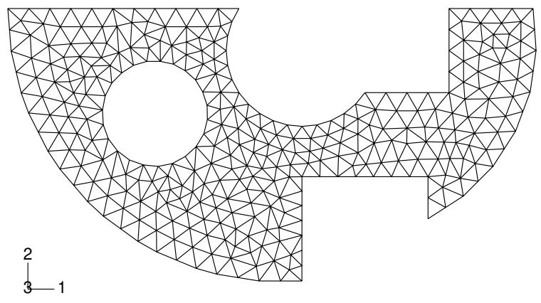

<details>
<summary>natural_image</summary>

Symmetrical geometric mesh structure with triangular nodes and a central circular hole, no text or symbols present
</details>

Figure 2: A global element size of 8.0.

## Without a specified global element size

If no global element size is specified, Abaqus/CAE maintains the edges of the elements along the boundary of the part while improving the mesh quality in the interior of the part. The resulting mesh topology is different from the original mesh topology. For example, Figure 3 shows a distorted mesh.

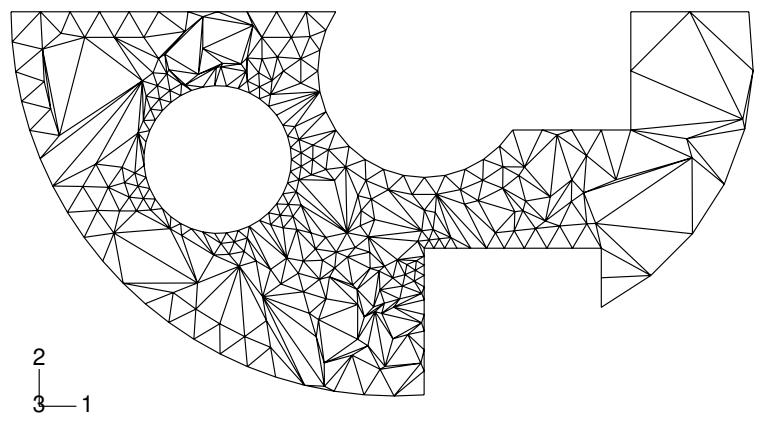

<details>
<summary>natural_image</summary>

Abstract geometric mesh structure with triangular nodes and a central circular void, no text or symbols present
</details>

Figure 3: A distorted mesh.

When the part is remeshed, the quality of the mesh improves dramatically, as shown in Figure 4.


<details>
<summary>natural_image</summary>

Pure geometric mesh diagram of a mechanical or structural component with triangular nodes and a central circular hole (no text or symbols)
</details>

Figure 4:The part is remeshed without specifying a global element size.

## Additional information

• What can I do with the Edit Mesh toolset?

## Refine a planar, triangular mesh with a specified global element size

1. Enter the Mesh module.  
2. From the Object field in the context bar, select Part and select a part that contains only orphan mesh elements from the list.  
Tip: To refine the orphan elements within a hybrid part, suppress the geometric features and resume them after completing the refinement operation.


3. From the main menu bar, select Mesh->Edit.

Abaqus/CAE displays the Edit Mesh dialog box.


Tip: You can also display the Edit Mesh dialog box using the tool, located at the bottom of the Mesh module toolbox.

4. In the dialog box, choose Refinement from the Category field.  
5. From the Method list, select Set size.  
6. In the prompt area, type the global element size of your choice, and press [Enter].  
Abaqus/CAE displays a circle that indicates what the size of the elements will be after you remesh the part.  
7. From the Method list, select Remesh.  
8. From the buttons that appear in the prompt area, click Yes.  
Abaqus/CAE attempts to refine the mesh. If you make a mistake while refining the mesh, click Undo in the Edit Mesh dialog box to undo the refinement.

## Refine a planar, triangular mesh without a specified global element size

1. Enter the Mesh module.  
2. From the Object field in the context bar, select Part and select a part that contains orphan mesh elements from the list.  
Tip: To refine the orphan elements within a hybrid part, suppress the geometric features and resume them after completing the refinement operation.


3. From the main menu bar, select Mesh->Edit.

Abaqus/CAE displays the Edit Mesh dialog box.


Tip: You can also display the Edit Mesh dialog box using the tool, located at the bottom of the Mesh module toolbox.

4. In the dialog box, choose Refinement from the Category field.  
5. From the Method list, select Remove size.  
6. From the Method list, select Remesh.  
7. From the buttons that appear in the prompt area, click Yes.

Abaqus/CAE attempts to refine the mesh. If you make a mistake while refining the mesh, click Undo in the Edit Mesh dialog box to undo the refinement.

## Undoing or redoing a change in the Edit Mesh toolset

This section describes how you can undo or redo mesh changes that you make with the tools in the Edit Mesh toolset. This section also explains how you can configure the cache that stores the rollback information for your Edit Mesh operations.

These topics also apply to undoing and redoing bottom-up meshing operations (for more information on bottom-up meshing, see Bottom-up meshing).

## In this section:

Support for undo and redo in the Edit Mesh toolset  
Undoing or redoing mesh editing actions  
Enabling undo and managing the cache

## Support for undo and redo in the Edit Mesh toolset

Abaqus/CAE supports multiple levels of undo and redo for any of the tools in the Edit Mesh toolset and for meshes that you generate using the bottom-up meshing technique.

This capability means that a single undo removes your most recent change to the mesh, a second undo removes the next most recent change, and so on. Similarly, a single redo restores the most recently undone mesh change. The graphic below shows that the Undo section of the Edit Mesh dialog box includes short descriptions next to the Undo and Redo buttons, highlighting the mesh change that will be undone or redone if you click the button.

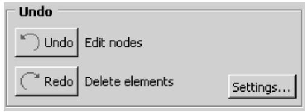

<details>
<summary>text_image</summary>

Undo
Undo Edit nodes
Redo Delete elements Settings...
</details>

When undo is disabled, a note appears in the description space instead, indicating that undo is disabled under Settings. To re-enable undo, see Enabling undo and managing the cache.

Abaqus/CAE supports undo operations by recording a history of your mesh editing and bottom-up meshing operations in a memory cache. The allowable size of this cache, the size of your mesh, and the types of mesh editing you performed all determine how many levels of undo are permitted. For example, if your mesh has 100,000 elements and you define a maximum cache size of 0.5 million elements, Abaqus/CAE can provide at least five levels of undo. Operations such as creating or moving nodes do not require a large cache to undo.


Tip: You can determine the number of elements in your mesh by running a Part mesh or Instance mesh query. For more information, see Querying the model.

Large caches can consume a lot of memory, so consider the number of levels of undo you will need for your part or part instance. If you want to ensure at least one level of undo for any mesh editing operation, specify a cache size at least as large as the number of elements in your part or part instance.

The undo and redo options that appear in the Undo section of the Edit Mesh and Create Bottom-Up Mesh dialog boxes are specific to the selected part, part instance, or assembly. When you switch to a different item and edit its mesh, the undo options change to reflect the history of the selected item. Abaqus/CAE updates the state of the buttons and their descriptions to reflect the history of the newly selected part, part instance, or assembly.

1. Enter the Mesh module.  
2. From the main menu bar, select Mesh->Edit.

Abaqus/CAE displays the Edit Mesh dialog box.


Tip: You can also display the Edit Mesh dialog box using the tool, located at the bottom of the Mesh module toolbox.

The Undo section of this dialog box includes the Undo and Redo buttons and next to each button descriptions of the mesh editing action that will be undone or redone when you click it.

3. Click Undo to undo the indicated mesh editing operation or click Redo to redo the indicated mesh editing operation.

Abaqus/CAE performs the indicated change.

4. Continue editing the mesh or undoing or redoing changes; close the Edit Mesh dialog box when you are done.


## Note:

When you perform a new mesh editing operation, or any other operation that alters the mesh , any redo information about the affected part or part instance will be lost. Undo and redo information is also deleted if you delete a region mesh, apply top-down meshing, or add partitions if the added partitions require part of the mesh to be deleted.

## Additional information

• Bottom-up meshing  
• What can I do with the Edit Mesh toolset?  
• Enabling undo and managing the cache

## Enabling undo and managing the cache

Enabling undo is global and persistent; when this setting is enabled, you will be able to undo mesh editing changes for any part or assembly meshes during your session. The setting remains enabled during your next Abaqus/CAE session as well. Disabling undo frees any memory associated with this setting and causes any existing undo or redo cache on any parts or assemblies to be lost.

1. Enter the Mesh module.  
2. From the main menu bar, select Mesh->Edit.

Abaqus/CAE displays the Edit Mesh dialog box.


Tip: You can also display the Edit Mesh dialog box using the tool, located at the bottom of the Mesh module toolbox.

3. Click Settings.

The Mesh Edit Undo Settings dialog box appears.

4. Toggle on Enable Undo to enable undo for mesh editing operations.  
5. Enter a value in the Max total cache size field in units of millions of elements, and click OK.

## Additional information

• Bottom-up meshing  
• What can I do with the Edit Mesh toolset?  
• Undoing or redoing mesh editing actions

You build a model in Abaqus/CAE by creating a series of features.

For detailed discussions of features and feature-based modeling, see The relationship between parts and features and Manipulating features in the Assembly module. This chapter explains how to use the Feature Manipulation toolset to modify and manage the existing features in your model and how to tune the performance of feature regeneration.

## In this section:

Using the Feature Manipulation toolset  
Using the Model Tree to manage features  
Tuning feature regeneration  
Modifying and manipulating features

## Using the Feature Manipulation toolset

You can access the Feature Manipulation toolset by selecting Feature from the main menu bar or by clicking mouse button 3 on a feature in the Model Tree. You can also access the feature tools from the module toolboxes. Figure 1 shows the icons for all the feature tools in the module toolboxes.

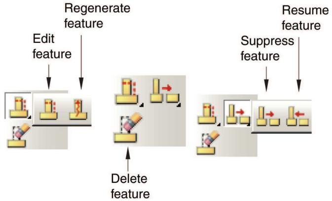

<details>
<summary>flowchart</summary>

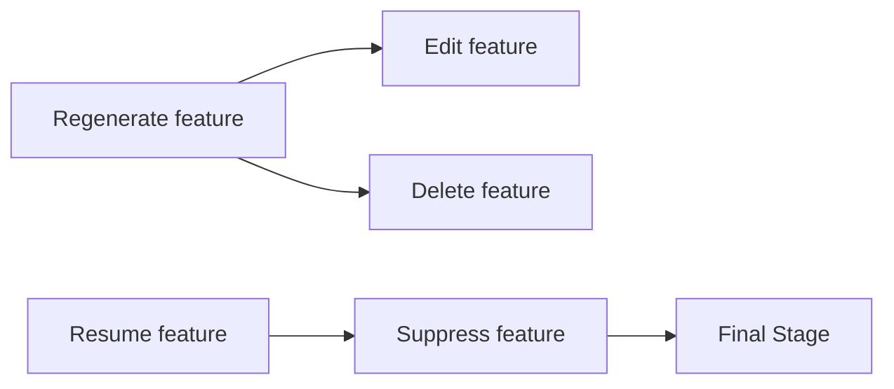
```mermaid
graph LR
  A["Regenerate feature"] --> B["Edit feature"]
  A --> C["Delete feature"]
  D["Resume feature"] --> E["Suppress feature"]
  E --> F["Final Stage"]
```
</details>

Figure 1:The feature tools.

The following list describes how you can use the Edit, Regenerate, Suppress, Resume, and Delete tools to modify features or to control the appearance of features in a part or assembly.

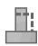

## Edit a feature

You can edit the features of a part only in the Part module. Any changes that you make to a part are applied automatically to each instance of that part in the assembly. Likewise, you can edit features of the assembly only in the Assembly and Mesh modules. For information on restrictions that apply to editing partitions and datum geometry, see Understanding a datum as a feature, and Understanding partitions.

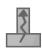

## Regenerate a feature

Regeneration is the process of recalculating model geometry after a feature of the model has been modified. By default, Abaqus/CAE automatically regenerates a part or assembly after you have edited one of its features. However, you can control whether or not features are regenerated automatically by toggling the Regenerate on OK option off or on in the Feature Editor. For more information, see Editing a feature.


## Suppress a feature

When you are manipulating many features in a complex model (for example, when you are exploring design alternatives), Abaqus/CAE allows you to temporarily disable certain features to simplify the display or to speed regeneration. A suppressed feature is not visible and cannot be partitioned or meshed. In addition, Abaqus/CAE ignores all suppressed features when regenerating a part or assembly. You can edit a suppressed feature, although your changes will have no effect on the part or assembly until you resume the feature. Suppressing a feature also suppresses any children of that feature. (For information on parent and child features, see The relationship between parts and features.)

Abaqus/CAE does not include a suppressed feature in the input file that it generates when you submit a job for analysis. However, Abaqus/CAE does include in the input file prescribed conditions that refer to the suppressed feature or regions of the suppressed feature. To ensure that the analysis completes successfully, you should do one of the following:

• Resume the suppressed feature.  
• Edit the prescribed condition, and apply the prescribed condition to a different region.  
• Delete the prescribed condition.

If you want to temporarily make a part instance invisible in the assembly, you can hide the part instance by selecting options in the Assembly Display Options dialog box. For more information, see Controlling instance visibility.


## Resume a feature

When you resume a suppressed feature, it reappears in the display of the part or assembly and becomes reestablished in the model. If you edited the feature when it was suppressed, resuming the feature causes Abaqus/CAE to regenerate the model automatically to take into account your changes. When you resume a feature, you have the option of resuming all of its children as well. (You cannot resume a child feature without also resuming its parent.)

## Tuning regeneration performance

Tuning feature regeneration performance is a balance between the convenience of saved states and the effect on performance of memory consumption. In most cases the default settings will result in acceptable regeneration performance; however, you can tune the speed of regeneration by selecting Feature->Options from the main menu bar. For more information, see Tuning feature regeneration.

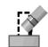

## Delete a feature

Deleting a feature removes the feature from the model permanently. If you delete a parent feature, all of its children will also be deleted and cannot be recovered.

In addition, you can reduce all the feature and parameter information to a simple definition of the part when you copy a part to a new part. If you reduce the feature list while copying a part, Abaqus/CAE will regenerate the new part faster if you subsequently modify it; however, you will no longer be able to modify any parameters of the new part. To copy a part, select Part->Copy from the main menu bar in the Part module.

## Additional information

• Modifying and manipulating features  
• Copying a part

## Using the Model Tree to manage features

The Model Tree, shown in Figure 1, includes a list of all available features in the model. You can click mouse button 3 on a feature in the Model Tree and use the menu that appears to manage the features.

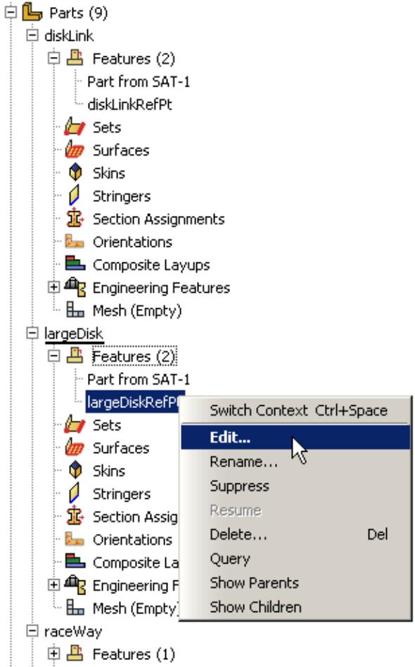

<details>
<summary>text_image</summary>

Parts (9)
diskLink
Features (2)
Part from SAT-1
diskLinkRefPt
Sets
Surfaces
Skins
Stringers
Section Assignments
Orientations
Composite Layups
Engineering Features
Mesh (Empty)
largeDisk
Features (2)
Part from SAT-1
largeDiskRefPt
Sets
Surfaces
Skins
Stringers
Section Assig
Orientations
Composite La
Engineering F
Mesh (Empty)
raceWay
Features (1)
Switch Context Ctrl+Space
Edit...
Rename...
Suppress
Resume
Delete...
Del
Query
Show Parents
Show Children
</details>

Figure 1:The Model Tree.

You must use the Model Tree to manipulate assembly constraints, suppressed features, or failed features since they are not visible in the viewport. You can also select multiple features to delete, suppress, or resume at the same time. As you select features in the Model Tree, they are highlighted in the viewport (if they are visible). In addition, parents or children of any feature can be highlighted in the viewport.

The Model Tree displays the status of each feature in the model. The icon before each feature name indicates the status:

A yellow check mark indicates that the feature is modified but has not been regenerated. If a part is locked by a database upgrade, all active features show this status until they are regenerated when the part is unlocked. Abaqus/CAE also displays a yellow check mark next to a feature that you edited but did not subsequently regenerate.  
• A padlock indicates that a part or the assembly has been locked by the user or by a database upgrade.  
• A red “X” indicates that the feature is suppressed.  
• A red “!” indicates that the feature has failed to regenerate. A red “!” next to the part name indicates that the part is invalid.

To get more information about a feature, click mouse button 3 on the feature in the Model Tree and select Query from the menu that appears. The information is displayed in the message area.

## Additional information

• Using the Feature Manipulation toolset  
• Manipulating features in the Assembly module  
• Modifying and manipulating features

## Tuning feature regeneration

This section describes how you can tune feature regeneration using settings in the Feature Options dialog box. You open the Feature Options dialog box by selecting Feature->Options from the main menu bar. In most cases the default settings will result in acceptable regeneration performance. You should modify the feature options only if Abaqus/CAE takes a long time to regenerate a part or the assembly or if memory consumption is excessive.

The settings in the Feature Options dialog box apply only to the current model and are saved in the model database. If you change to a different model, Abaqus/CAE reverts to the default settings or to any modified settings associated with the new model.

## In this section:

What is regeneration?  
What is a geometric state?  
What is a cache?  
What are self-intersection checks?  
How are position constraints regenerated?

## What is regeneration?

Whenever you modify a feature of a part, Abaqus/CAE has to regenerate the part. Similarly, to incorporate the modified feature into any instances of the part, Abaqus/CAE also regenerates features in the assembly when you enter an assembly-related module. However, to save time, Abaqus/CAE determines the minimum number of features that need to be regenerated and regenerates only the features that were affected by the modification. If your parts and your assembly are relatively simple, you will not notice Abaqus/CAE performing this regeneration. However, in a more complex model the regeneration can result in a decrease in performance. Modifications to features that trigger regeneration include using the Feature Manipulation toolset to edit, suppress, resume, and delete a feature.

The Model Tree indicates that a feature needs to be regenerated using a yellow check mark, as described in Using the Model Tree to manage features. You can always force Abaqus/CAE to regenerate a part of the assembly by selecting Feature->Regenerate from the main menu bar or by clicking mouse button 3 on the Features container in the Model Tree.

## What is a geometric state?

A geometric state refers to the internal geometric representation of a part or of the assembly; for example, the equations of the curves and surfaces that define the topology and the connectivity of those curves and surfaces. A geometric state is a snapshot of this internal representation. Abaqus/CAE stores this snapshot and creates a geometric state in memory at regular intervals while you work on your model and then regenerate features.

If Abaqus/CAE did not save geometric states, regeneration would start from the first feature that you created and continue through all the features that need to be regenerated, making regeneration very costly. By saving states, Abaqus/CAE can determine which state is closest to the feature that was modified. Regeneration starts from that point and continues through all the features that need to be regenerated. As a result, the speed of regeneration can be increased significantly.

Ideally, to gain the maximum regeneration performance, you would save the geometric state after every feature modification. However, storing every state would consume large amounts of memory and hinder overall performance. Deciding how many states to save is a tradeoff between regeneration speed and memory consumption.

By default, Abaqus/CAE automatically saves up to five geometric states for each part and for the assembly. If Abaqus/CAE has already stored the specified number of states, it deletes one of the older states before saving the most recent state. You can use the Geometry Caching for Fast Regeneration options in the Options dialog box to change the number of states automatically saved by Abaqus/CAE. Abaqus/CAE uses an internal logic to decide when to create a geometric state; you cannot control when a state is created.

## What is a cache?

A cache is a portion of memory. Abaqus/CAE uses the following feature-related caches to store geometric states:

• The Current part cache contains snapshots of the geometric state of the current part. Abaqus creates one part cache for each part in the model.  
• The All part caches contains snapshots of the geometric state of all the parts in the current model.  
• The Assembly cache contains snapshots of the geometric state of the assembly. Abaqus creates one assembly cache for the model.

If you find that Abaqus/CAE is consuming an excessive amount of memory on your workstation and affecting the performance of your system, you can use the Clear buttons in the Options dialog box to erase the memory associated with the part and assembly caches. Clearing this memory will increase performance; however, the snapshots of the geometric state will be erased and regeneration will be slower. If you toggle off the option to cache geometric states, Abaqus/CAE does not clear the states that have already been stored. In addition, Abaqus/CAE stores a separate cache for each model. As a result, you can make more memory available by deleting the caches of any models that you are not currently working on.

If you spent a lot of time making a series of changes to a part and are satisfied that your design is correct, you can manually save the current state in memory by clicking Cache current state in the Options dialog box. As a result, Abaqus/CAE can return to this state and regenerate any subsequent additions or modifications. However, if you continue to automatically cache geometric states, Abaqus/CAE may erase the state that you saved manually after it has saved the maximum number of geometric states. Alternatively, you can toggle off the option to automatically cache geometric states and continue to manually save states at significant intervals.

The Geometry Caching for Fast Regeneration options in the Options dialog box indicate how many geometric states are stored in the three feature-related caches. A cache can contain a combination of geometric states that you saved manually and states that Abaqus/CAE saved automatically. You can query the Current part cache and the Assembly cache to determine the positioning of geometric states relative to the sequence of features.

## What are self-intersection checks?

Self-intersection checks are tests used to help ensure that complex geometry you create in Abaqus/CAE is valid for analysis.

If faces of a feature intersect other faces of the same feature, Abaqus/CAE displays a warning that there are invalid intersections and does not create the feature. A feature that intersects itself may not be meshable and may cause problems with the analysis. Abaqus/CAE allows you to check for self-intersection during feature creation; however, the checking process will slow down creation of the feature. In addition, checking for self-intersection will slow down regeneration of the feature. The time required to complete the tests varies with the complexity of the feature you are attempting to create or regenerate.

The Feature Options dialog box allows you to toggle self-intersection checks on and off. Perform self-intersection checks is toggled off by default. In general, self-intersection is possible only when you are creating features with complex geometry, such as loft features (for more information, see What is lofting? and Self-intersection checks). If you know that your features do not self-intersect or if you plan to remove the self-intersection during a subsequent operation, you can leave Perform self-intersection checks toggled off to speed up feature regeneration.

## How are position constraints regenerated?

By default, when Abaqus/CAE regenerates the assembly, it regenerates all of the position constraints before regenerating other features that might depend on the position, such as partitions and datums.

However, if the position constraint uses an entity that was created by selecting from a part instance in the Assembly module, such as a face created by a partition or a datum axis running through two vertices, Abaqus/CAE changes its behavior and regenerates features in the order that you created them. As a result, partitions and datums that you created before the position constraint may not move along with the movable instance.

If you are working in the assembly-related modules, the Feature Options dialog box includes a Constraints field that allows you to control this regeneration behavior. For more information, see Tuning regeneration performance.

## Modifying and manipulating features

This section describes how to use the Feature Manipulation toolset.

## In this section:

Editing a feature  
Renaming a feature  
Suppressing features  
Resuming suppressed features  
Deleting features  
Regenerating a part or assembly  
Tuning regeneration performance  
Using the Model Tree to obtain feature information

## Editing a feature

Select Feature->Edit from the main menu bar to modify geometric information for a selected feature. You can also edit a feature by clicking mouse button 3 on the feature in the Model Tree and selecting Edit from the menu that appears.

The changes that you can make to a feature depend on how it was created. You can change any numerical parameters that define the feature, and, where applicable, you can change a section sketch. However, you cannot modify a feature that was created by picking geometric entities, such as points and edges, on the screen. For example, you can modify the following parameters:

• Depth of an extrusion  
• Radius of a fillet  
• Coordinates of a datum point  
• Shape of an extruded solid

If you cannot make the required changes with the Feature Manipulation toolset, you must delete the feature and create a new one that incorporates the changes.

1. From the main menu bar, select Feature->Edit.


Tip: You can also edit a feature by clicking the tool located in the module toolbox.

2. Select a feature to modify. You can select the feature either directly from the current viewport or from the Model Tree. For more information, see Selecting objects within the viewport and Working with the Model Tree and the Results Tree.

The feature editor appears.

3. Edit the feature by doing one of the following:

• In the Parameters field, type a new value for the desired parameter.  
• Select Edit Section Sketch to start the Sketcher and make the changes to your sketch. For information on using the Sketcher, see The Sketch module.

4. + Click OK to implement the changes in your model.

If you are editing a part feature, the part is regenerated immediately to incorporate your changes, and the assembly is regenerated the next time you enter a module that displays the assembly. If you are editing an assembly feature, the assembly is regenerated immediately.


Note: By default, Abaqus/CAE regenerates the part or assembly every time you edit a feature. If you prefer to postpone regeneration of the part or assembly, toggle Regenerate on OK off before you click OK in the feature editor. When you are ready to regenerate the part or assembly, select Feature->Regenerate from the main menu bar.

## Additional information

• Using the Feature Manipulation toolset

## Renaming a feature

You can rename a feature by clicking mouse button 3 on the feature in the Model Tree and selecting Rename from the menu that appears.

1. Click mouse button 3 on the feature in the Model Tree, and select Rename from the menu that appears. The Rename Features dialog box appears.  
2. Enter a new name for the feature.  
3. + Click OK to complete renaming the feature.  
The Model Tree displays the new name.

## Additional information

• Using the Feature Manipulation toolset

## Suppressing features

Select Feature->Suppress from the main menu bar to suppress selected features. Suppressing features is equivalent to temporarily removing them from the part or assembly. Suppressed features remain suppressed when you regenerate a part or assembly. You can also suppress a feature by clicking mouse button 3 on the feature in the Model Tree and selecting Suppress from the menu that appears.

You cannot suppress the base feature. In addition, if you suppress parent features, all of their child features are also suppressed automatically. Suppressed features can be restored by selecting Feature->Resume from the main menu bar or by clicking mouse button 3 on the feature in the Model Tree. When you resume a suppressed feature, its children are not resumed unless you select them. To help you select a feature's children, you can click mouse button 3 on the feature in the Model Tree and select Show children from the menu that appears.

1. From the main menu bar, select Feature->Suppress.


Tip: You can also suppress features using the tool located in the module toolbox.

2. Select one or more features to suppress. You can select features from the current viewport or from the Model Tree. For more information, see Selecting objects within the viewport,” and Working with the Model Tree and the Results Tree.

Abaqus/CAE highlights the selected feature. If you selected features that have child features, Abaqus/CAE also highlights the children.

If you selected features from the viewport, click Done in the prompt area when you are finished making selections.

3. If you selected features from the viewport, click Yes in the prompt area. If you selected features from the Model Tree, click mouse button 3 on one of the feature names and select Suppress from the menu that appears.

The selected features and any child features disappear from the viewport.

4. To exit the suppress procedure, either

• click the cancel button in the prompt area, or  
• click mouse button 2 anywhere in the Abaqus/CAE window, or  
• select another operation from the Feature menu.

## Additional information

• Using the Feature Manipulation toolset  
• Resuming suppressed features

## Resuming suppressed features

Select Feature->Resume from the main menu bar to resume suppressed features. You can also resume a group of features by selecting the features in the Model Tree, clicking mouse button 3, and selecting Resume from the menu that appears.

Resuming a feature fully restores it to the part or assembly. You can resume the last feature you suppressed, all suppressed features, or just selected features. When you resume a child feature, Abaqus/CAE also resumes the parent features automatically. However, when you resume a parent feature, its children are not resumed unless you select them. To help you select a feature's children, you can click mouse button 3 on the feature in the Model Tree and select Show children from the menu that appears.

1. From the main menu bar, select Feature->Resume.


Tip: You can also resume a feature using the tool located in the module toolbox.

2. Do one of the following:

• Click Last Set to resume the most recently suppressed feature and all its parents.  
• Click All to resume all suppressed features.  
• Select the feature to resume from the Model Tree. You can select multiple features to resume.

The resumed features reappear in the viewport.

## Additional information

• Using the Feature Manipulation toolset  
• Suppressing features

## Deleting features

Select Feature->Delete from the main menu bar to delete selected features. You can also delete a feature by clicking mouse button 3 on the feature in the Model Tree and selecting Delete from the menu that appears.

When you delete parent features, you also delete all of their child features. You cannot resume deleted features.

1. From the main menu bar, select Feature->Delete.


Tip: You can also delete features using the tool located in the module toolbox.

2. Select one or more features to delete. You can select features from the current viewport or from the Model Tree. For more information, see Selecting objects within the viewport,” and Working with the Model Tree and the Results Tree.

Abaqus/CAE highlights the selected features. If you selected features that have child features, Abaqus/CAE also highlights the children.

If you selected features from the viewport, click Done in the prompt area when you are finished making selections.

3. If you selected features from the viewport, click Yes in the prompt area. If you selected features from the Model Tree, click mouse button 3 on the feature and select Delete from the menu that appears.

The selected features and any child features are deleted.

4. To exit the delete procedure, either

• click the cancel button in the prompt area, or  
• click mouse button 2 anywhere in the Abaqus/CAE window, or  
• select another operation from the Feature menu.

## Additional information

• Using the Feature Manipulation toolset

## Regenerating a part or assembly

When you modify features in a complex part or assembly, it may be convenient to postpone regeneration until you make all your changes, since regeneration can be time consuming. (For more information, see Editing a feature.) When you are ready to regenerate the part or assembly, you can select Feature->Regenerate from the main menu bar. You can also regenerate a feature by clicking mouse button 3 on the feature in the Model Tree and selecting Regenerate from the menu that appears.

1. From the main menu bar, select Feature->Regenerate.


Tip: You can also regenerate a feature using the tool located in the module toolbox.

Abaqus/CAE regenerates the part or assembly.

2. If regeneration fails, a dialog box appears. In this case you can choose one of the following options:

• + ClickUndo Changes to return to the original part or assembly and discard all your changes.  
• + ClickKeep Changes to continue the regeneration, suppressing those features that failed to regenerate.


## Note:

Features that are suppressed as a result of the failure are resumed automatically if you correct the cause of the failure.

## Additional information

• Using the Feature Manipulation toolset  
• Suppressing features

## Tuning regeneration performance

The Feature Options dialog box provides settings that enable you to control whether Abaqus/CAE performs self-intersection checks and, in the Assembly module, to control the order in which Abaqus/CAE regenerates position constraints relative to other features. Tuning these options can help you speed up feature regeneration for your part or assembly. Select Feature->Options from the main menu bar to display the Feature Options dialog box. You can also tune regeneration by clicking mouse button 3 on the feature in the Model Tree and selecting Options from the menu that appears.

In most cases the default settings will result in acceptable regeneration performance. You should modify the feature options only if Abaqus/CAE takes a long time to regenerate a part or the assembly. For more information, see Tuning feature regeneration.


## Note:

Abaqus/CAE provides access to additional performance tuning options on the Memory tabbed page of the Options dialog box. The options on this page enable you to specify a limit for kernel memory, set a threshold for when Abaqus/CAE runs in reduced memory mode, and control geometric states in a memory cache. For more information, see Customizing memory limits and regeneration options.

1. From the main menu bar, select Feature->Options.  
Abaqus/CAE displays the Feature Options dialog box.  
2. If you know that your features do not self-intersect or if you plan to remove the self-intersection during a subsequent operation, you can toggle off Perform self-intersection checks to speed up feature regeneration. For more information, see What are self-intersection checks?.  
3. If desired, modify the behavior that determines how Abaqus/CAE regenerates position constraints. For more information, see How are position constraints regenerated?.  
4. + Click OK to change the feature options for the current model.

The feature options apply only to the current model and are saved in the model database.

If desired, you can also change the cache settings in the Memory tabbed page of the Options dialog box to change the number of geometric states that Abaqus/CAE automatically caches in memory; clear the memory associated with the part and assembly caches; or cache the current state of the part. For more information, see Customizing memory limits and regeneration options.

## Using the Model Tree to obtain feature information

The Model Tree displays the feature names along with icons that indicate their status—active, suppressed, modified, or failed. In addition, you can display information on a particular feature by clicking mouse button 3 on the feature in the Model Tree and selecting from the menu that appears.

1. Click mouse button 3 on the feature in the Model Tree.  
2. From the menu that appears, choose one of the following options:

• Select Show Parents or Show Children to display the parents or children of that feature in the current viewport. Abaqus/CAE also selects the parents or children.  
• Select Query to display detailed information. Abaqus/CAE displays the following information about the selected feature:

- Name and description; for example, solid extrude  
Status—active or suppressed  
The name of its parent, if any  
The names of its children, if any  
- The value of any parameters that define the feature

The query information appears in the message area and is also written to the replay file (abaqus.rpy) in the form of comments.

## Additional information

• Using the Feature Manipulation toolset

Filters allow you to remove extraneous field output data or history output data—noise—during the analysis of a model without a loss of resolution in the desired data range. You can also use filters to filter field output or history output before the data are saved to the output database (.odb) file; as a result, filters can also reduce the size of the output database.

The Filter toolset allows you to create and manage filters in the Step module.

## In this section:

Filtering field and history data  
Applying bounding values to field and history data  
Creating a filter

## Filtering field and history data

You can create filters in Abaqus/CAE and apply them to field output requests or history output requests for Abaqus/Explicit analyses. Abaqus filters data while the analysis is running; filtering during the analysis (“real time” filtering) can reduce the size of the output database by excluding high-frequency data before it is saved. Real time filtering also avoids potential aliasing problems in the resulting data. Aliasing is a loss of valid results data; aliasing will occur if the sampling frequency (the frequency at which the data are saved) is less than twice the highest frequency expected in the results. For example, if a sine wave was sampled at only two points, the aliased result would appear to be a straight line, whereas sampling at least four points would reproduce the shape of the curve.

The Filter toolset allows you to create the following filters for use with Abaqus/Explicit field output requests and history output requests:

• Butterworth  
• Type I Chebyshev  
• Type II Chebyshev

For more specific information about these filters, see Filtering Output and Operating on Output in Abaqus/Explicit. The different filter types are distinguished by their capabilities to transition from the acceptance of low-frequency data to the rejection of data above the filter's Cutoff frequency. An ideal filter would stop all data above the cutoff frequency and have a flat response (no affect on accepted data); “real” filters include a transition band around the cutoff where some data are accepted and they usually have some effect on the accepted data. The Butterworth filter provides a maximally flat response magnitude with a wider transition band (slower transition) than the Chebyshev filters. The Chebyshev filters introduce an oscillation—a ripple—in the response magnitude, but they have a narrower transition band than the Butterworth filter. The two types of Chebyshev filters differ in where in their response ripples occur; the Ripple factor indicates how much oscillation you will allow in exchange for an improved filter response. You can also specify the Order of the filter, which determines the size of the filter's transition band: the higher the order, the narrower the transition band, although the computational cost increases as the order increases. The filter order must be a positive, even integer no greater than 20.

In addition to the filters that you can define using the Filter toolset, Abaqus also includes a default Antialiasing filter. Abaqus automatically sets the cutoff frequency of the Antialiasing filter based on the time interval at which the field output or history output is saved during the analysis. When you define a filter, you must specify the cutoff frequency based on your knowledge of the frequencies expected in the solution. Whether you set the cutoff or Abaqus calculates it, no checks are performed to ensure that the cutoff frequency is appropriate. If the cutoff is set too low, valid data will be filtered from the results; if it is set too high (above half the sampling frequency), no filtering will be performed.

Select Tools->Filter->Create from the main menu to create a new filter definition; select Edit from the same menu to make changes to an existing definition. Either command opens the filter editor, which allows you to select the options and provide the data needed to define your filter.

To apply a filter to an analysis, include it in a field output request or history output request for an Abaqus/Explicit analysis procedure (for more information, see Defining output requests).

## Additional information

• Filtering Output and Operating on Output in Abaqus/Explicit

## Applying bounding values to field and history data

Bounding values in a filter definition enable you to investigate the maximum or minimum values for a particular output request and to establish an upper or lower bound on the variable values that are returned for an output request. You can establish bounding values for both filtered and unfiltered data; to specify these values in a filter definition without performing Butterworth filtering or either type of Chebyshev filtering on your data, define an Operator filter, which enables you to implement bounding values on an output request without changing the output data in any other way.

Abaqus/CAE provides three types of bounding values:

• Maximum bounding values return the highest value within each output interval for the variables in an output request.  
• Minimum bounding values return the lowest value within each output interval for the variables in an output request.  
• Absolute maximum bounding values return the highest absolute value for the variables in an output request within each output interval.

In addition, you can set a limit on the bounding value, which determines the highest or lowest value that Abaqus/CAE records for variables that use this filter. If desired, you can stop the analysis when any variables in an output request reach this limiting value.

By default, each component of a tensor or vector quantity is filtered individually and the maximum, minimum, or absolute maximum value and the limiting values are reported separately for each component. You can, however, apply a filter directly to an invariant.

## Creating a filter

Select Tools->Filter->Create from the main menu bar to create a filter.

For more information on filters including a default filter type created automatically by Abaqus, see Filtering field and history data.

1. From the main menu bar, select Tools->Filter->Create.


Tip: You can also create a filter by clicking Create in the Filter Manager.

The Create Filter dialog box appears.

2. In the Name field, enter a name for the filter. For information on naming objects, see Using basic dialog box components.  
3. From the Type list, select one of the following, then click Continue:

• Butterworth  
• Type I Chebyshev  
• Type II Chebyshev  
• Operator

The Edit Filter dialog box appears.

4. If you selected the Butterworth filter type or one of the Chebyshev filter types, perform the following steps:

a. Enter the Cutoff frequency.


## Note:

Abaqus does not perform any checks to ensure that the cutoff frequency is appropriate. If the cutoff is set too low, valid data will be filtered from the results; if it is set too high, no filtering will be performed.

b. Enter the Order for the filter, which must be a positive, even integer value no greater than 20.

5. If you selected one of the Chebyshev filter types, accept the default ripple factor or enter a value. The ripple factor determines the magnitude of data oscillation that you will allow in exchange for a faster transition between accepted and rejected data. For more information, see Filtering Output and Operating on Output in Abaqus/Explicit.  
6. If desired, specify the type of bounding value for which you want to filter data.

• Select Maximum to output the maximum value within each output interval for each variable in the output request.  
• Select Minimum to output the minimum value within each output interval for each variable in the output request.  
Select Absolute maximum to output the maximum absolute value within each output variable for each variable in the output request.

You can also select None to toggle off all bounding value–related output requests for this filter.

7. If desired, specify a limit for bounding value requests by entering a value in the Bounding value limit field. This value limits the highest or lowest value that Abaqus/CAE records for variables that use this filter.

You can also stop the analysis if the bounding value limit is reached. Toggle on Stop analysis upon reaching limit to halt a job when the maximum or minimum value equals the limit value for variables that use this filter.

8. If you selected Minimum, Maximum, or Absolute Maximum for the type of bounding value, you can apply the filter directly to an invariant. To filter the invariant, select First or Second as the Invariant.  
9. Click OK to create the filter.

To apply the filter in an analysis, select Apply filter when you create an output request for an Abaqus/Explicit analysis procedure. For more information, see Modifying field output requests or Modifying history output requests.

## Additional information

• Filtering field and history data  
• Applying bounding values to field and history data  
• Filtering Output and Operating on Output in Abaqus/Explicit  
• Modifying field output requests  
• Modifying history output requests

## The Free Body toolset

Free body cuts display the resultant forces and moments transmitted across a selected surface of your model. Free body cuts simply integrate the internal forces in an element over a section; therefore, they cannot be used accurately across sections containing surface tractions due to cohesive contact or other sources. The Free Body toolset is available only in the Visualization module, and you can create a free body cut only when the current step and frame of the output database includes element force nodal output (NFORC).

This chapter explains how to use the Free Body toolset to create and delete free body cuts, display or hide them in the viewport, and customize several aspects of their appearance.

Abaqus/CAE also enables you to generate reports or create X–Y data objects that describe the forces and moments in all active free body cuts in your session. See Producing a tabular report, and Reading X–Y data from all active free body cuts, respectively.

Abaqus/CAE provides two other methods for displaying free body data:

• You can display resultant forces and moments along an arbitrary plane through your model by toggling on free body display for a planar view cut. For more information, see Understanding view cuts.  
• You can display the free body nodal forces in a symbol plot to determine which nodes have an imbalance of forces or moments due to applied loads or to visualize the nodal force distribution on internal sections. For more information, see Producing a symbol plot of free body nodal forces.

## In this section:

Resultant forces and moments on free body cuts in Abaqus/CAE  
Creating or editing a free body cut  
Selection methods for free body cross-sections  
Displaying, hiding, and highlighting free body cuts  
Customizing free body cut display

## Resultant forces and moments on free body cuts in Abaqus/CAE

A free body cross-section in Abaqus/CAE is an area of your model across which you want to display resultant forces and moments. Once you define a cross-section, Abaqus/CAE displays vectors that show the magnitude and direction of the resultant forces and moments across the area you select. Force vectors are displayed with a single arrowhead and moment vectors with a double arrowhead, as shown in the example in Figure 1; by default, the force vectors are red and the moment vectors are blue.

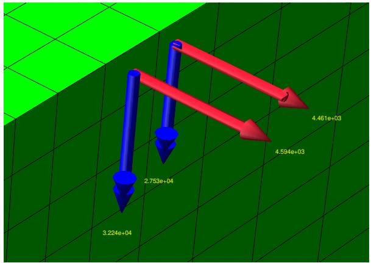

<details>
<summary>wireframe</summary>

| Point | Value |
| --- | --- |
| Left Arrow | 3.224e+04 |
| Right Arrow | 4.594e+03 |
| Right Arrow | 4.461e+03 |
| Right Arrow | 2.753e+04 |
</details>

Figure 1: Resultant force and moment display.

You can define the nodes and elements that comprise the cross-section using processes that closely resemble the definition of display groups. Abaqus/CAE enables you to specify the components of the cross-section by including surfaces, display groups, and elements or nodes by number; and you can pick items from the viewport, either by feature angle or individually. See Creating or editing a free body cut for detailed instructions. After you define the physical components of your free body cross-section, you can set the location of the summation point (about which resultant moments are taken), and you can indicate the coordinate system transformation that applies when vectors are displayed in component form.

Cross-sections can be created along mesh boundaries only; you cannot specify a cross-section along an arbitrary plane. You can create and display free body cuts only in the Visualization module.

## Creating or editing a free body cut

To create a free body cut, select the nodes and elements that comprise your free body cross-section; that is, select the surface of your model across which you want to investigate the resultant force and moment.

Abaqus/CAE provides several methods for selecting the nodes and elements for a cross-section:

• For three-dimensional objects, you can select individual element faces to include in the cross-section. The contribution from all elements connected to the nodes of the selected faces will be considered.  
For two- or three-dimensional objects, you can select individual element edges to include in the cross-section. Each edge provides Abaqus/CAE with an element definition and two or three nodes to include in the cross-section. The contribution from all elements connected to the nodes of the selected edges will be considered.  
For any type of model, you can select the nodes and elements you want to include individually. This method is recommended for selecting nodes and elements from geometrical areas, such as the ends of beams, in which it might be awkward or difficult to select nodes and elements using their edges or faces. The contribution from only the selected elements will be considered.

You can also display a free body cut on a view cut. For more information, see Understanding view cuts.

When you define a cross-section using element faces or element edges, Abaqus/CAE provides three additional selection methods that enable you to select the nodes and elements for this definition:

• You can select the faces or edges by picking components in the viewport, either individually or by angle.  
• You can select a surface set, which is defined in the output database.  
• You can select one or more display groups to use as part of your surface definition.

When you define a cross-section by selecting nodes and elements individually, you can specify the nodes or elements you want to include in the definition by typing their labels directly into the Free Body Cross-Section dialog box.

Abaqus/CAE also enables you to customize the summation point for a free body cut, which is the three-dimensional location about which resultant moments are taken. By default, the summation point is placed at the area centroid of the element faces contributing to the free body computation, but you can move the summation point to the centroid location of the nodes for the cross-section or to any three-dimensional location in your model.

You can also adjust the orientation of component vector display for a free body cut. In many cases the most desirable coordinate system for a free body cut is one in which one axis is normal to the surface of the model and another axis is tangential to the surface. This “normal and tangential” coordinate system is created internally and used by default for the display of component vectors. However, you can change the orientation to use any custom coordinate system available in your session, or you can create a new datum coordinate system.

When you edit a free body cut, Abaqus/CAE enables you to change the components included in the free body cross-section, the summation point settings, and the component resolution settings. However, you cannot change the selection method that was used to define a free body cut; for example, if you defined the free body cut using three-dimensional element faces, your subsequent edits to the free body cut will also use this method.

By default, free body cuts persist only for the duration of your session. If you want to retain a free body cut that you have defined to make it available in subsequent sessions, you can save it to an XML file, to the model database, or to an output database. For more information, see Managing session objects and session options.

1. Locate the options for creating or editing a free body cut:

• To create a free body cut, select Tools->Free Body Cut->Create from the main menu in the Visualization module.


Tip: You can also create a free body cut using the tool in the Visualization module toolbox.

To edit a free body cut, select Tools->Free Body Cut->Edit from the main menu in the Visualization module, and select the free body cut you want to edit.


Tip: You can also use the free body cut manager to edit a free body cut. From the main menu bar, select Tools->Free Body Cut->Manager, and click Edit from the dialog box that appears.

The Free Body Cross-Section dialog box opens, from which you can customize the edges, faces, or elements and nodes that constitute the cross-section.

2. If you are creating a free body cut, choose one of the following from the Selection Method options, and click OK:

Select Based on view cut to calculate and display a free body cut based on the current view cut. If you choose this selection method, Abaqus/CAE opens the View Cut Manager, from which you can display and position a view cut for your model and customize the display of an associated free body cut. For more information, see Customizing display and calculation of resultant force and moment on the active view cuts.  
• Select 2D element edges to specify the nodes and elements implicitly (or indirectly) by selecting element edges. This method is recommended for two-dimensional models.  
• Select 3D element faces to specify the nodes and elements implicitly (or indirectly) by selecting element faces. This method is recommended for three-dimensional models.  
Select Elements and nodes to select the elements or nodes individually for your free body cross-section.

The Free Body Cross-Section dialog box opens, from which you can select the edges, faces, or elements and nodes that constitute the cross-section.

3. From the Item list at the top left of the dialog box, select Surfaces, Display groups, Elements, or Nodes as the type of model component to use for the free body cross-section.

Abaqus/CAE refreshes the Method list.

4. Choose a selection method from the Method list; and/or select the specific items for the free body cross-section by picking from the viewport, selecting items from the list that appears on the right side of the dialog box, or entering data in the right side of the dialog box.

For more information about selection options, see Selection methods for free body cross-sections.

Certain items can be highlighted in the viewport to verify your selection. Toggle Highlight items in viewport if available.

5. When you have completed your selections, click OK to close the Free Body Cross-Section dialog box.

The Edit Free Body Cut dialog box opens.

6. If desired, customize the summation point or the coordinate system transformation options for the selected free body cut.

a. From the Summation point options, select the three-dimensional location from which the vectors in the free body cut originate.

• Select Centroid of cut to place the summation point automatically at the area centroid of the element faces contributing to the free body computation.


## Note:

When the view cut cuts through a shell, the centroid is based on the length times the shell thickness.

When the view cut cuts through a beam, the centroid is at the nodal connectivity line.

Select Nodal average to place the summation point automatically at the averaged deformed coordinates of all nodes included in the free body cut.  
Select User-defined, and specify a custom three-dimensional location in space or click to select the summation point from the viewport. The summation point is highlighted in the viewport.

b. From the Component resolution options, you can specify the coordinate system transformation that takes place when vectors are displayed in component form. (See Customizing general display options for free body cuts, for more information about displaying force and moment vectors in component form.)

Select Normal and tangential to orient the component vectors with the normal and the tangent of the surface you select.  
Select CSYS and a coordinate system to transform the component vectors to a custom coordinate system. Alternatively, you can click Create to create a new datum coordinate system.

The Component resolution options affect display of free body cuts only when component vector display is selected in the Free Body Plot Options dialog box.

## 7. Click OK.

Abaqus/CAE creates the free body cut and displays it in the viewport.

## Additional information

• Displaying, hiding, and highlighting free body cuts  
• Customizing free body cut display

## Selection methods for free body cross-sections

You can use the following selection methods to specify the items that will be contained in a free body cross-section:

To specify edges or faces by picking them directly from the viewport, select Surfaces from the Item list, then select Pick from viewport from the Method list. Abaqus/CAE automatically enters the pick mode and prompts you to select items for the display group. See Selecting objects within the viewport for more information on picking items in the viewport.

Click Done in the prompt area when you have finished picking items in the viewport.

Click Edit selection, Add selection, or Delete selection in the dialog box to further modify your viewport selections.

To specify elements or nodes by number, select Element labels or Node labels from the Method list. Select the name of the part instance to which the nodes or elements belong from the list in the Part instance field on the right side of the Free Body Cross-Section dialog box. In the Labels field, type a list of element or node numbers separated by commas or a range of numbers optionally followed by an increment; for example, 1:10 or 1:10:2.

You can specify elements or nodes by number when you create a free body cross-section using the Elements and nodes selection method.

To specify element, node, or surface sets, select Element sets, Node sets, or Surface sets from the Method list. A list of the available set names in your model appears on the right side of the Free Body Cross-Section dialog box. Select one or more set names from this list (see Selecting multiple items from lists and tables for more information).

If you selected Display groups from the Item list, a list of the available display groups in your model appears on the right side of the Free Body Cross-Section dialog box. Select one or more display group names from this list (see Selecting multiple items from lists and tables for more information).

## Displaying, hiding, and highlighting free body cuts

You can display or hide free body cuts individually in the current viewport by toggling their Show check boxes in the Free Body Cut Manager, and you can display or hide all of the free body cuts in your session by clicking Set All On or Set All Off. Active free body cuts are displayed in the viewport and are included in free body cut reports; for more information about reporting free body cut data, see Generating tabular data reports. The manager displays all free body cuts defined in your session and indicates whether each one is currently displayed.

You can highlight one or more free body cuts in the viewport by selecting their shortcuts under the Free Body Cuts container in the Results Tree.

By default, Abaqus/CAE retains no record of which free body cuts were active when you save free body cut definitions to a file for future use. If you want to retain a record of the activation status of free body cuts, toggle on List of active view cuts + free bodies when you save session objects to a file. For more information, see Managing session objects and session options.

## Customizing free body cut display

This section describes how you can customize the content and appearance of free body cuts using settings in the Free Body Plot Options dialog box.

You can open the Free Body Plot Options dialog box by selecting Options->Free Body from the main menu bar of the Visualization module of Abaqus/CAE.

The changes you make in the Free Body Plot Options dialog box apply to all active free body cuts, including those displayed on view cuts, in the current viewport only. Each viewport has separate free body plot options, which provides greater flexibility in displaying free body cuts. For example, you can display only the resultant force vectors for a model's free body cuts in one viewport and display only the resultant moment vectors for the same model and free body cuts in a different viewport.

You can also control the default settings that appear in the Free Body Plot Options dialog box by editing the Abaqus environment file (abaqus\_v6.env). For more information, see Environment File Settings.

## In this section:

Customizing general display options for free body cuts  
Customizing colors for vector components  
Displaying or hiding individual component vectors  
Scaling vector length for free body cuts  
Customizing the display of labels in a free body cut

## Customizing general display options for free body cuts

The options on the General tabbed page of the Free Body Plot Options dialog box enable you to toggle the display of force vectors and moment vectors for free body cuts. You can also customize vector display by showing only the resultant vector or showing component vectors in the x-, y-, or z-directions for both force and moment values.

1. Locate the General options.

Select Options->Free Body from the main menu bar in the Visualization module.

2. Toggle on Show forces to display force vectors for all free body cuts in the current viewport.  
3. Toggle on Show moments to display moment vectors for all free body cuts in the current viewport.  
4. Toggle on Use constant-length arrows to display all force and moment values with arrows of the same length. When this option is not selected, the force and moment vectors are displayed with lengths according to their magnitude.  
5. From the Vector display options, select one of the following options:

• Select Resultant to display only the resultant force and moment vectors.  
• Select Component to display the component force and moment vectors in the x-, y-, or z-directions.

6. Click OK to implement your changes in the current viewport and to close the Free Body Plot Options dialog box.

By default, your changes are saved for the duration of the session and will affect all subsequent free body cuts plots in that viewport. If you want to retain your changes for subsequent sessions, save them to a file. For more information, see Saving customizations for use in subsequent sessions.

You can adjust the color that Abaqus/CAE uses to display the resultant vector and each component vector in the 1-, 2-, or 3-directions. These settings are available independently for force vectors and moment vectors; the Free Body Plot Options dialog box provides identical (but independent) options for Force and Moment vector colors. By default, the resultant force and component vectors are red and the resultant moment and component vectors are blue.

1. Locate the Colors options.

Select Options->Free Body from the main menu bar in the Visualization module, and click the Color & Style tab in the dialog box that appears. The Colors options appear at the top of the page.

2. Click the Force tab or the Moment tab to set vector colors for force vectors or moment vectors, respectively.  
3. Change the vector color for one of the vectors:

a. Click the color sample ( ) for the resultant vector or for one of the component vectors.

Abaqus/CAE displays the Select Color dialog box.

b. Use one of the methods in the Select Color dialog box to select a new color. For more information, see Customizing colors.  
c. Click OK to close the Select Color dialog box.

The color sample and the selected vector change to the selected color.

Repeat these steps to change the vector color for one or more of the other vectors.

4. Click OK to implement your changes and to close the Free Body Plot Options dialog box.

By default, your changes are saved for the duration of the session and will affect all subsequent free body cuts plots in that viewport. If you want to retain your changes for subsequent sessions, save them to a file. For more information, see Saving customizations for use in subsequent sessions.

## Displaying or hiding individual component vectors

When free body cuts are configured to display individual component vectors in the 1-, 2-, or 3-directions instead of the resultant vector, you can display or hide each of these individual component vectors. These settings are available independently for force vectors and moment vectors; for example, you can hide component vectors for forces in the 3-direction but display component vectors for moments in the same direction.

Toggling the display of individual component vectors does not change the resultant vector display. Resultant vectors are still displayed using all three components.

1. Locate the Color & Style options.  
Select Options->Free Body from the main menu bar in the Visualization module, and click the Color & Style tab in the dialog box that appears.  
2. Click the Force tab or the Moment tab to display or hide individual component vectors for force vectors or moment vectors, respectively. The Components options appear in the middle of the page.  
3. Toggle on the 1, 2, or 3 options to include the selected component in vector display.  
4. Click OK to implement your changes and to close the Free Body Plot Options dialog box. By default, your changes are saved for the duration of the session and will affect all subsequent free body cuts plots in that viewport. If you want to retain your changes for subsequent sessions, save them to a file. For more information, see Saving customizations for use in subsequent sessions.

## Scaling vector length for free body cuts

The Scaling options enable you to adjust the length of the vectors displayed in your free body cuts. Abaqus/CAE calculates vector length as a percentage of the size of your model or the size of your viewport. If multiple free body cuts are displayed, Abaqus/CAE uses the largest force vector or moment vector as the basis for length calculations. You can change the percentage value to increase or decrease the size of vectors, and you can choose either the model or the viewport as the basis for the vector length calculation. You can also set different vector scaling values for display of force vectors and moment vectors; the Free Body Plot Options dialog box provides identical (but independent) options for Force and Moment vector scaling.

1. Locate the Color & Style options.  
Select Options->Free Body from the main menu bar in the Visualization module, and click the Color & Style tab in the dialog box that appears.  
2. Click the Force tab or the Moment tab to change vector scaling settings for force vectors or moment vectors, respectively. The Scaling options are in the lower third of the page.  
3. From the Basis options, select Screen size or Model size.  
4. Drag the Percent slider to establish the vector length as a percentage of the size of the screen or model.  
5. Click OK to implement your changes and to close the Free Body Plot Options dialog box.

By default, your changes are saved for the duration of the session and will affect all subsequent free body cuts plots in that viewport. If you want to retain your changes for subsequent sessions, save them to a file. For more information, see Saving customizations for use in subsequent sessions.

## Customizing the display of labels in a free body cut

Click the Labels tab to customize the display of the numeric labels that appear with the vectors in a free body cut. You can customize the appearance of the force and moment vector labels separately; the Free Body Plot Options dialog box includes identical (but independent) options for Force and Moment vector labels.

You can toggle the display of numeric labels on and off, and you can customize the following settings for these labels:

• The text color of the labels.  
• The font of the labels.  
• The format of the labels (scientific, fixed, or engineering).  
• The number of decimal places displayed for the label values.

In addition, you can establish threshold values for label display. If a vector's value is smaller than the threshold value, Abaqus/CAE hides its label.

1. Locate the Labels options.  
Select Options->Free Body from the main menu bar in the Visualization module, and click the Labels tab in the dialog box that appears.  
2. Click the Force tab or the Moment tab to customize label display for force vectors or moment vectors, respectively.  
3. Toggle on Display value next to vector symbol to show vector labels for the selected type of vector.  
4. Select the color of the vector labels for the selected type of vector.

a. Click the Text color color sample  
Abaqus/CAE displays the Select Color dialog box.

b. Use one of the methods in the Select Color dialog box to select a new color. For more information, see Customizing colors.

c. Click OK to close the Select Color dialog box.

5. Select the font of the vector labels for the selected type of vector.

a. Click Set Font.  
Abaqus/CAE displays the Select Font dialog box.

b. Use one of the methods in the Select Font dialog box to select a new font, size, and style. For more information, see Customizing fonts.

c. Click OK to close the Select Font dialog box.

6. To change the format of the vector labels for the selected vector type, click the Number Format arrow and select one of the following formats:

Select Scientific to display legend values in scientific notation, which expresses legend values as a decimal value between 1 and 10 multiplied by a power of 10. When you select this format, the number 501,000 is displayed in the legend as 5.01e5.  
• Select Fixed to display legend values without using exponent values. When you select this format, the number 501,000 is displayed in the legend as 501000.00.  
Select Engineering to select engineering notation, which expresses values in a similar format to scientific notation but allows exponent values that are multiples of three only. When you select this format, the number 501,000 is displayed in the legend as 501E3.

7. Click the Decimal places arrows to specify the desired number of decimal places for each label.

8. Specify a Threshold value for the selected type of vector label. Vectors with a value smaller than this threshold will have their labels hidden in the viewport. The default threshold for vector label display is 1E-006.  
9. Click OK to implement your changes and to close the Free Body Plot Options dialog box. By default, your changes are saved for the duration of the session and will affect all subsequent free body cuts plots in that viewport. If you want to retain your changes for subsequent sessions, save them to a file. For more information, see Saving customizations for use in subsequent sessions.

## The Options toolset

The Options toolset allows you to control memory and regeneration options, configure view manipulation shortcuts, and specify a scale factor for icons.

## In this section:

Customizing memory limits and regeneration options  
Using view manipulation shortcuts  
Scaling the size of icons

## Customizing memory limits and regeneration options

A geometric state is a snapshot of the internal representation of a part or an independent part instance. Saving geometric states in a memory cache speeds up regeneration performance; however, the saved states can consume large amounts of memory and decrease overall performance.

The options on the Memory tabbed page of the Options dialog box allow you to control the amount of memory allocated to the Abaqus kernel, specify the percentage of memory use that will prompt Abaqus/CAE to run in reduced memory mode, and tune the balance between the convenience of saving states and the performance degradation from increasing memory consumption. Select Tools->Options from the main menu bar to display the Options dialog box, then click the Memory tab.

In most cases the default settings will result in acceptable regeneration performance. You should modify the feature options only if Abaqus/CAE takes a long time to regenerate a part or the assembly. For more information, see Tuning feature regeneration.

1. From the main menu bar in any module, select Tools->Options.  
The Options dialog box appears.  
2. Display the Memory tabbed page.  
3. If desired, specify a new Kernel memory limit in megabytes. If this setting is zero, no limit is imposed on kernel memory.  
4. Toggle on Run in reduced memory mode when memory reaches, and specify a percentage of the kernel memory limit above which Abaqus/CAE runs in reduced memory mode. Abaqus/CAE reduces memory by either paging geometric data to disk or by deleting data in inactive parts that can be automatically regenerated when needed.  
5. If desired, change the number of geometric states that Abaqus/CAE automatically caches in memory. Ideally, to gain the maximum regeneration performance, you would save the geometric state after every feature modification. However, storing a large number of geometric states consumes large amounts of memory and hinders overall performance. Deciding how many states to save is a tradeoff between regeneration speed and memory consumption. For more information, see What is a geometric state?.  
6. If you find that Abaqus/CAE is consuming a lot of memory on your workstation and affecting the performance of your system, you can use the Clear buttons in the Options dialog box to erase the memory associated with the part and assembly caches. Clearing this memory will increase performance; however, the snapshots of the geometric state will be erased and regeneration will be slower. For more information, see What is a cache?.  
7. If you want to save a current state in memory, click Cache current state in the Options dialog box. Abaqus/CAE can return to this state and regenerate any subsequent additions or modifications.

The Options dialog box indicates how many geometric states are stored in the caches. Click Query to determine the positioning of geometric states relative to the sequence of features in the current part cache or the assembly cache. When Abaqus/CAE is running in reduced memory mode, the geometric states may be deleted if the memory consumption is higher than the specified threshold.

8. + Click OK to change the memory limits and regeneration performance options for the current model. The options apply only to the current session and are not saved in the model database.

## Using view manipulation shortcuts

You can access the pan, rotate, and magnify view manipulation tools using combinations of keyboard and mouse actions. These shortcuts can make it easier and less interruptive to manipulate the view of a model while performing other tasks (for example, selecting elements to define a set). Abaqus/CAE activates the specified view manipulation tool as long as the associated combination of keyboard and mouse buttons is depressed; to exit the view manipulation tool, release the associated keyboard and mouse buttons.

In addition to the default Abaqus/CAE shortcuts, you can configure the view manipulation shortcuts to mimic five other common CAD applications, as outlined in Table 1. Change the shortcuts configuration by selecting Tools->Options from the main menu bar and changing the View Manipulation options. Your configuration is saved for future Abaqus/CAE sessions.

Table 1:View manipulation shortcuts for available configurations (“MB” stands for “mouse button”).

<table><tr><td>Application</td><td>Pan</td><td>Rotate</td><td>Zoom</td></tr><tr><td>Abaqus/CAE (default)</td><td>[Ctrl][Alt][MB2]</td><td>[Ctrl][Alt][MB1]</td><td>[Ctrl][Alt][MB3]</td></tr><tr><td>CATIA V5</td><td>[MB2]</td><td>[MB2][MB3]; or [MB2][MB1]</td><td>[MB2][MB3], then release [MB3]; or [MB2][MB1], then release [MB1]</td></tr><tr><td>SOLIDWORKS</td><td>[Ctrl][MB2]</td><td>[MB2]</td><td>[Shift][MB2]</td></tr><tr><td>HyperView</td><td>[Ctrl][MB3]</td><td>[Ctrl][MB1]</td><td>[Ctrl][MB2]</td></tr><tr><td>Pro/ENGINEER Wildfire</td><td>[Shift][MB2]</td><td>[MB2]</td><td>[Ctrl][MB2]</td></tr><tr><td>UGS NX</td><td>[MB2][MB3]</td><td>[MB2]</td><td>[MB2][MB1]</td></tr></table>


## Note:

The HyperView key combination for rotation ([Ctrl][MB1]) conflicts with the Abaqus/CAE use of this combination to unselect objects in the viewport. To make complex viewport selections where unselecting individual objects may be useful, it is recommended that you choose one of the other shortcut configurations.

Nondefault configurations of the view manipulation shortcuts change the behavior of the magnify tool. In the default Abaqus/CAE configuration, the magnify tool operates by dragging the cursor horizontally; in all other configurations, the magnify tool operates by dragging the cursor vertically.

In the default Abaqus/CAE shortcuts configuration, you can access the alternate modes of the pan, rotate, and magnify tools by holding the [Shift] key in addition to the other shortcut keys (see The view manipulation tools, for details). This convention conflicts with some of the shortcut combinations in nondefault configurations; therefore, you cannot access alternate modes of the view manipulation tools while using nondefault shortcuts. The alternate modes are always available, regardless of your shortcuts configuration, if you access a view manipulation tool using the standard methods (selecting a tool from the View menu in the main menu bar or clicking a tool in the View Manipulation toolbar).

1. From the main menu bar in any module, select Tools->Options.

The Options dialog box appears.

2. Display the View Manipulation tabbed page.  
3. Select the Application whose view manipulation shortcuts you want to mimic. Refer to Table 1 for a summary of shortcuts in different applications.  
4. Click OK to apply your specified configuration and to close the Options dialog box.

## Scaling the size of icons

The default size for icons in toolbars and toolboxes is 24 × 24 pixels. The default size for icons in the Model Tree and the Results Tree is 16 × 16 pixels. You can specify a scale factor to increase or decrease the size of these icons so that they appear at a size that is appropriate for your display resolution. For example, increasing the icon size scale factor to 1.5 prompts Abaqus/CAE to display toolbar and toolbox icons at 36 × 36 pixels and Model Tree and Results Tree icons at 24 × 24 pixels.

Changes to icon size are implemented when you restart Abaqus/CAE. Your selected scale factor is saved for future Abaqus/CAE sessions.

1. From the main menu bar in any module, select Tools->Options. The Options dialog box appears.  
2. Display the Icons tabbed page.  
3. Click the arrows to the right of the Scale factor field to increase or decrease the size of icons in Abaqus/CAE. The maximum scale factor is 3; the minimum scale factor is 0.5.  
4. Click OK to apply your specified configuration and to close the Options dialog box. You must restart your Abaqus/CAE session to view your changes.

## The Geometry Edit toolset

The Geometry Edit toolset provides a set of tools in the Part module that allow you to create or edit the geometry of a part.

You can use the tools to edit the regions of a part that make it invalid or imprecise.

## In this section:

Editing techniques  
Editing techniques  
What is stitching?  
A strategy for repairing geometry  
Creating a part from orphan elements  
Editing and repairing edges  
Editing and repairing faces  
Editing parts

## Editing techniques

You can use the Geometry Edit toolset in the Part module to edit or repair the geometry of a part. The Geometry Edit toolset enables you to edit an imported part to improve its precision and validity; however, Abaqus/CAE does not require parts to be completely precise. In addition, you can use the Geometry Edit toolset to remove small features from a part. You can use the Geometry Edit toolset to edit edges, faces, or the entire part. Editing techniques, provides an overview of the methods available for each type of partition. Abaqus/CAE stores most of the edit operations as features. As a result, you can undo an edit by deleting or suppressing the corresponding feature using the Feature Manipulation toolset.

You can access the edit tools by selecting Tools->Geometry Edit from the main menu and choosing the desired tool from the Geometry Edit dialog box that appears. You can also access the Geometry Edit tools through the Part module toolbox. Figure 1 shows the hidden icons for all the Geometry Edit tools in the Part module toolbox.

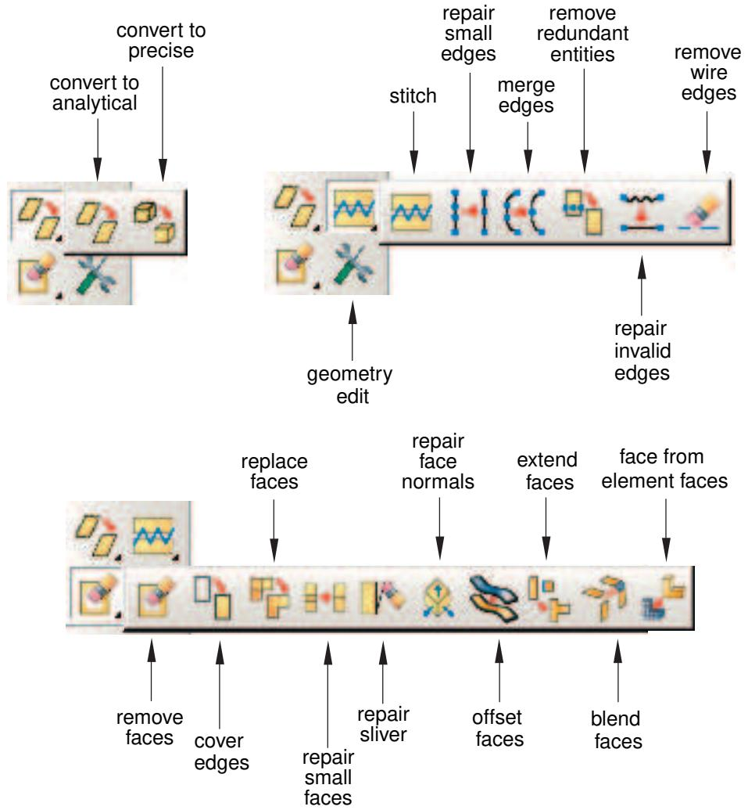  
Figure 1:The Geometry Edit toolset toolbox.

To see a tooltip containing a short description of each Geometry Edit tool, hold the mouse over the tool for a moment. For more information, see Using toolboxes and toolbars that contain hidden icons.

## Editing techniques

This section provides an overview of the different editing techniques.

## In this section:

Methods for editing edges  
Methods for editing faces  
Methods for editing entire parts

## Methods for editing edges

Select Tools->Geometry Edit from the main menu to display the Geometry Edit dialog box.

When you choose Edge from the dialog box, the Tool list displays the following methods for editing edges:

## Stitch

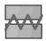

If a part is imported as a group of disconnected faces, you can stitch the resulting small edge gaps. Similarly, you can stitch the resulting gaps after you remove small faces or small slivers from a part. You can perform stitching as a global operation during which Abaqus/CAE stitches all gaps in the part, or you can pick the edges that you want to stitch, stitch edges with gaps smaller than a user-specified tolerance, or use both of these options. You should perform a global stitching operation for your entire part for small gaps only, and this process can be lengthy. For more information, see What is stitching?. You can use the Query toolset to highlight any free edges. For more information, see Using the geometry diagnostic tools.

## Repair small


You can repair selected small edges. Abaqus/CAE removes the small edges and edits the adjoining edges to create a closed geometry.

## Merge

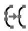

You can select a series of connected edges, and Abaqus/CAE merges them into a single edge and deletes redundant vertices along the edges. Figure 1 illustrates the effect of merging edges.


<details>
<summary>text_image</summary>

original contains
multiple edges
edges are merged
into a single edge
</details>

Figure 1: Merging edges.

## Remove redundant entities

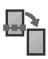

An imported part can contain redundant vertices that are positioned along a continuous edge. Similarly, an imported part can include redundant edges that are internal edges. Redundant vertices and edges do not change the shape or the area of a part and are not required for a complete definition, as shown in Figure 2.

  
Figure 2: Redundant edges and vertices.

## Repair invalid

In rare cases after you import a part, Abaqus will report that some of its edges are invalid. The Repair invalid tool will try to repair the invalid edges by recomputing the data that define them. You should also use this tool if the Query toolset indicates that the part contains only invalid edges.

## Remove wire


You can remove selected wire edges. Abaqus/CAE removes the wire edges.

## Methods for editing faces

When you choose Face from the Geometry Edit dialog box, the Tool list displays the following methods for repairing faces:

## Remove

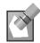

You can remove selected faces (including chamfers, fillets, and holes) from a three-dimensional solid or shell or from a two-dimensional planar part. After you have selected the faces to remove, Abaqus/CAE looks for adjacent faces that define a feature. You can remove the entire feature, or you can remove only the selected faces. When you remove one or more faces from a three-dimensional solid part, Abaqus/CAE converts the part to a shell.

## Cover edges


You can create a face on a three-dimensional part by selecting one or more edges of the new face. Abaqus/CAE loops through the adjacent edges and calculates the location of the new face. If you selected multiple edges that are not connected by a common loop, Abaqus/CAE creates multiple faces, one for each loop of edges. Abaqus/CAE creates the new faces as shells. If the new shells form a closed part, you can use the solid-from-shell tool to convert the part to a solid.

## Replace


In some cases Abaqus/CAE may not be able to accurately recreate some of the faces when you import a part. For example, a planar face may appear wavy or distorted, or Abaqus/CAE might create small faces that have a large impact on the mesh density. You can select connected faces, and Abaqus/CAE replaces them with a single face. The new face has minimal faceting and will be smoother than the original faces. Figure 1 illustrates the effect of replacing selected faces.

  
Figure 1:The effect of replacing selected faces.

Alternatively, you can replace the selected faces with a single face that is formed by extending neighboring faces. You can use this tool to remove bosses and small details from imported parts, as shown in Figure 2.

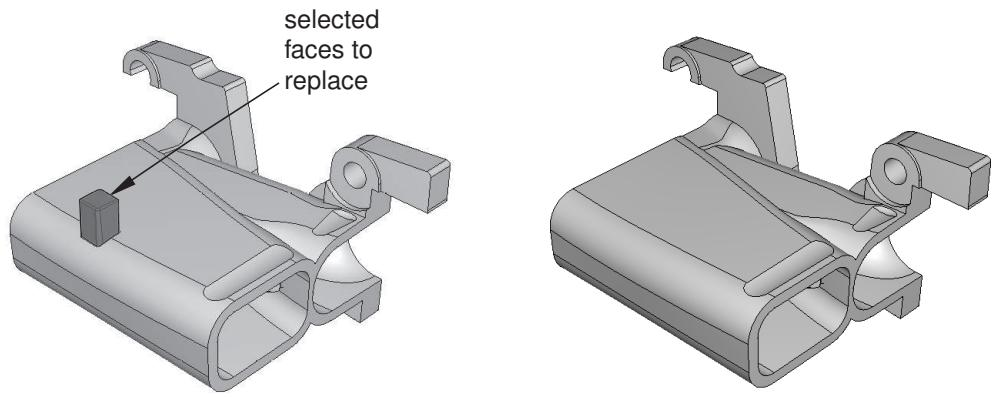

<details>
<summary>text_image</summary>

selected
faces to
replace
</details>

Figure 2:The effect of replacing selected faces and extending neighboring faces.

## Repair small


You can repair selected small faces. Abaqus/CAE removes the small faces and edits the adjoining faces to create a closed geometry. Figure 3 illustrates the effect of repairing small faces.

original small faces

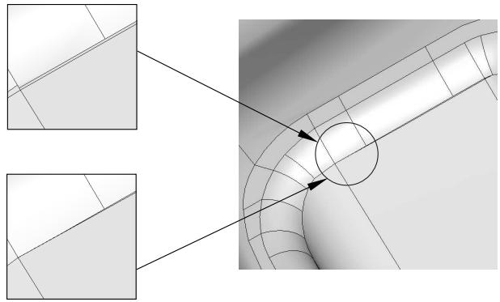

<details>
<summary>natural_image</summary>

Technical diagram showing a mechanical part with two inset views highlighting specific features (no text or symbols present)
</details>

small faces removed

## Repair sliver

Figure 3: Repairing small faces.  
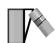

A sliver can be thought of as a small, sharp piece of extra material. You can remove an unwanted sliver from a face of a three-dimensional solid or shell or from a two-dimensional planar part. You must select the face containing the sliver to remove and two points from the face. Abaqus/CAE draws a line between the two points that divides the selected face into two regions. The first region is the face that will remain; the second region is the sliver that will be removed. Figure 4 illustrates the effect of removing a sliver.


<details>
<summary>text_image</summary>

original sliver face
sliver face removed
</details>

Figure 4: Removing a sliver.

## Repair normals


You can repair the face normals of shell and solid imported parts, and you can perform these repairs on either manifold parts (parts in which every edge is shared by only one or two faces) and non-manifold parts. The tool has different uses for solid and shell parts.

## Solid

In rare cases the Query toolset reports that the volume of an imported solid part is negative because the face normals indicate it was inside out in the CAD system from which it originated. The Repair face normals tool will flip the normals and turn the solid right side out.

## Shell

An imported shell part can contain faces that have normals pointing in opposite directions. The Repair face normals tool will align all the normals on a shell part. If the face normals are already aligned, this tool will flip all the normals so that they remain aligned but point in the opposite direction.


## Note:

The element normal orientation, which is specified using the Element Normal assignment in the Property module, specifies the relative element normal with respect to the geometry normal. These element normals will be updated using the new geometry normals after the Repair face normals operation.

When you perform repairs of non-manifold shell parts, you cannot align the normals for all of the faces in the part in a single operation; you must select faces individually to flip the direction of their normals. You can perform a query using the Shell element normals option from the Query dialog box to assess the orientation of the face normals before you repair your shell part.

## Offset


You can create faces on a three-dimensional part by selecting the faces to be offset then specifying an offset distance or selecting target faces and a distance calculation method. The offset direction is opposite to the face normal direction for the source face, and offset can be positive or negative. Abaqus/CAE creates the new face using the same process as that used for offsets in the Sketcher (for more information, see Offsetting objects).


## Note:

regardless of the offset distance calculation method, Abaqus/CAE applies a constant offset to create the new face. You cannot use this method to create a face equidistant from two converging or diverging faces.

## Extend


You can extend existing faces by specifying an extension distance or selecting target faces to control the extension distance. Abaqus/CAE replaces the existing faces with the extended face feature.

## Blend


You can create new faces that blend the contours of existing edges in the model to form faces between those edges. You can choose to create the new faces by using tangency to existing faces at each edge, by calculating the shortest path between the edges, or by specifying a wire shape as the path.

## Face from element faces

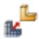

You can create a new geometric face from orphan element faces. Abaqus/CAE creates a new geometric face based on the node positions of the selected element faces. Vertices are created at edge nodes where there is a significant change in the element edge direction.

## Methods for editing entire parts

When you choose Part from the Geometry Edit dialog box, the Tool list displays the following methods for repairing entire parts:

## Convert to analytical

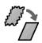

Abaqus/CAE tries to change the internal definition of edges, faces, and cells into a simpler form that can be represented analytically. For example, a face that is nearly planar will be converted to an equation that represents the plane. Converting to an analytical representation usually provides the following advantages:

• Processing of the part is faster.  
• The converted entity is available during feature operations. For example, the extrude operation requires a planar face and a linear edge.  
• The geometry is improved.  
• If you subsequently need to stitch the part, the stitching operation is more likely to be successful.

## Convert to precise

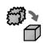

Abaqus/CAE offers two methods to convert entities to precise geometry:

• If you choose Tighten Gaps, Abaqus/CAE attempts to improve the precision of the faces, edges, and vertices in your model. This method is faster but does not perform a full computation of the geometry.  
• If you choose Recompute Geometry, Abaqus/CAE tries to change neighboring entities so that their geometry matches exactly. Recomputing geometry usually results in precise geometry; however, this operation can be lengthy and increases the complexity of the imported part, which means that processing of the part is slower. Moreover, if the part contains many complex surfaces, converting to a precise representation is likely to fail. If possible, you should return to the CAD application that generated the original file and increase the precision.

## What is stitching?

When you select this option, Abaqus/CAE tries to join adjoining faces along their free edges. The intent of stitching is usually to create a solid part. Stitching edges usually results in valid geometry. Abaqus/CAE stitches gaps between trimmed surfaces by adjusting the underlying surfaces until the edges intersect. Figure 1 illustrates the stitching process.


<details>
<summary>natural_image</summary>

Simple line drawing of two cylinders with a solid arrow indicating direction (no text or symbols)
</details>

To stitch gaps between intersecting edges, Abaqus/CAE adjusts the underlying surfaces until the two adjacent faces share the same edge.  
Figure 1: Stitching edges until they intersect.

Abaqus/CAE tries to recognize the edges of a solid from a set of trimmed surfaces. If the edges of each trimmed surface are close to an edge of an adjacent surface (within a user-specified tolerance), Abaqus/CAE stitches the trimmed surfaces. The end result of stitching is a B-rep solid in which the edge definition is shared between the two intersecting surfaces. For more information on B-rep solids, see How do solid modelers represent a solid?. Stitching fails in the presence of wires or internal faces.

When you import an IGES- or VDA-FS-format part, Abaqus/CAE stitches the part by default. However, because of the internal tolerances of IGES- and VDA-FS-format parts, the resulting representation of small features may not match the geometry that was intended in the original file.

In some cases stitching an IGES- or VDA-FS-format part results in Abaqus/CAE importing a single part that should have been imported as separate parts. If you copy the imported part to a new part, you can choose to separate disconnected regions into separate parts. For more information, see Copying a part.

## A strategy for repairing geometry

The tools in the Geometry Edit toolset are often used to repair geometry that was imported into Abaqus/CAE. The goals of the repair operations are to create a part with no invalid entities and to create a part that has the smallest number of edges and faces to avoid impacting the mesh generation. If you are unable to create a valid part, you can ignore the invalidity. For more information, see Working with invalid parts. Ideally, the part will have no small edges or faces. You do not have to create a precise part, and you should continue to work with an imprecise part if possible. Parts with imprecise geometry can be meshed. However, in rare cases other operations may fail on parts with imprecise geometry; for example, other meshing functions, adding geometry features, and partitioning. If you cannot work with the imprecise part and you cannot make the part precise, you should return to the CAD application that generated the original file and increase the precision. For more information, see What is a valid and precise part?.

Abaqus/CAE provides many different editing tools, and it is often difficult to decide which of the tools to use and in which order to use them. In general, repairing the geometry of an imported part is an art that requires experimentation and experience. The best approach depends on the complexity of the part and how much detail you want to remain in the part when you mesh the part and analyze it.

The following guidelines will help you develop an efficient approach to repairing your parts:

## Use the geometry diagnostic tools

Use the geometry diagnostic tools to query the part for invalid and imprecise entities, free edges, short edges, small faces, and sharp corner angles.

## Use selection groups

You can use mouse button 3 to create temporary selection groups to make the combination of geometry diagnostic tools and repair tools easier to use. You can use the geometry diagnostic tools to highlight a region of invalid and imprecise geometry, and you can copy the region into a selection group. You can then paste the selection group into the Geometry Edit toolset when specifying the region to repair.

## Use display groups

Use display groups to selectively remove faces and cells to help you see inside complex parts and to determine which entities are highlighted by the geometry diagnostic tools.

## Take an incremental approach

Use the repair tools on small groups of selected faces and edges and check that the outcome of the repair process is correct before proceeding.

## Keep solids intact

Try not to convert a solid into a shell by removing faces from the solid. To avoid removing faces, use the Replace tool for faces, and the Repair small tools for edges and faces.

## Avoid creating wires

If your part is a solid or a shell, try not to perform operations that result in wires. It is difficult for Abaqus/CAE to reconstruct faces from wires.

## Remove fillets and chamfers

Use the Replace tool and the Extend neighboring faces option to remove fillets and chamfers from your part and extend the neighboring faces to close the resulting gap.

## Remove faces that meet tangentially

Use the Replace tool or the Repair small tool to repair faces that are approximately tangential. You should use the Repair small tool to remove faces that are relatively small. The Repair small tool simply extends the remaining faces until they meet. The small face is deleted in the process, although the result may be imprecise. Use the Replace tool for relatively large faces that meet tangentially. The Replace tool uses underlying points to replace the original faces with an approximate surface.

## Check the validity of the part

If your part is invalid, you can check if the repair operations have made the part valid by clicking mouse button 3 on the part in the Model Tree and selecting Update validity from the menu that appears. Checking the validity can be a lengthy operation, and you should wait until you have finished editing the part before you check its validity. If a part is already valid, none of the repair operations will make it invalid.

## Create partitions after you repair

If your part contains partitions, the Geometry Edit toolset may delete them during a repair operation. To avoid this problem, you should wait to partition the part until after you have finished editing it.

## Creating a part from orphan elements

You can use tools from the Geometry Edit toolset to create geometry from the faces of orphan mesh elements. This technique is useful when you have a meshed part that requires modifications, but you do not have some or all of its geometry available. The decision to add geometric features to an orphan mesh, recreate the part geometry from scratch, or reverse engineer geometry from the orphan elements depends on a number of factors, including:

• complexity of the existing part  
• complexity of the features to be added  
• degree of difficulty required to modify the existing orphan mesh  
• desire to create a new mesh for the entire part

Other factors such as the time constraints for the project and the ability to export model geometry may also be involved in your decision.

The goal of creating a part from an orphan mesh is to create geometry that matches the original design intent while providing a platform for current and future modifications. The geometry must also be suitable for creation of a native mesh by either full association with the current mesh or creation of a new mesh.

The following guidelines will help you create geometry for an orphan mesh:

## Create new geometric faces

Use the Face from element faces tool to create the outer surface geometry for the model. Each use of the tool creates a single shell face from selected exterior orphan element faces. The tool includes several unique methods for selection of multiple orphan element boundary faces, and it automatically stitches the newly created face to any adjacent geometry. For more information, see Create face from element faces. When you are finished creating faces, all exterior orphan element faces should be covered by geometric faces.

## Remove extra edges and faces

Use other tools from the Geometry Edit toolset to remove extra edges, small faces, and any other features that would restrict generation of a good quality mesh. If necessary, convert the part to precise geometry. For more information, see A strategy for repairing geometry.

## Convert to solid

If you are working with a solid part, use the Create solid from shell tool to fill the space inside the created shell faces.

## Partition and mesh the part

Suppress or delete the orphan mesh, and create a new mesh for the part.

## Create partitions after you repair

If your part contains partitions, the Geometry Edit toolset may delete them during a repair operation. To avoid this problem, you should wait to partition the part until after you have finished editing it.

## Editing and repairing edges

This section describes the tools that you can use to repair edges.

## In this section:

Stitching edges to create faces  
Repairing small edges  
Merging edges  
Removing redundant entities  
Repairing invalid edges  
Removing wire edges

You can create new faces by automatically stitching any gaps between free edges. Stitching gaps allows you to replace small faces, fillets, or chamfers that you previously deleted. The operation to stitch gaps is stored as a feature of the part; therefore, you can use the Model Tree to delete the stitch and revert to the original part. For more information, see What is stitching?.

You can stitch gaps in either manifold parts (parts in which every edge is shared by only one or two faces) or non-manifold parts.

1. From the main menu bar, select Tools->Geometry Edit.

Abaqus/CAE displays the Geometry Edit dialog box.


A Tip: You can also stitch edges using the tool, located with the edit tools in the Part module toolbox. For a diagram of the edit tools in the toolbox, see Editing techniques.

2. From the dialog box, select the Edge category and the Stitch method.  
3. From the warning dialog box that appears, click OK.  
4. If desired, specify a stitch tolerance from the prompt area for the stitching operation. Abaqus/CAE will stitch only gaps smaller than the tolerance value that you specify.  
5. Do one of the following:

If you want to select the edges for the stitching operation individually, toggle on Pick edges, click mouse button 2, then specify the edges you want to select. All the edges you select must be free edges because when Abaqus/CAE attempts only manifold stitching when Pick edges is selected. The stitching operation fails if you select any edges that are shared by more than one face.


Tip: You can select edges individually, specify an existing set that includes edges, or select edges using the angle method. For more information about selecting geometry in the viewport, see Selecting objects within the current viewport.

If you want to stitch edges throughout the entire model, toggle off Pick edges and click mouse button 2. When Pick edges is toggled off, Abaqus/CAE can attempts both manifold and non-manifold stitching on the whole model. If any of the edges of the model are shared by more than one face, the resultant model will be non-manifold.

Abaqus/CAE attempts to stitch the part according to your specifications. If the repair is successful, Abaqus/CAE prompts you to update the validity of the part.

6. If you have editing the part, you should check its validity by clicking mouse button 3 on the part in the Model Tree and selecting Update validity from the menu that appears.

## Additional information

• Valid parts, precise parts, and tolerance  
• Methods for editing faces

## Repairing small edges

You can repair selected small edges from a part. Abaqus/CAE removes the small edges and repairs the adjoining edges and faces to create a closed geometry. The operation to repair small edges is stored as a feature of the part; therefore, you can use the Model Tree to delete or suppress the operation.

1. From the main menu bar, select Tools->Geometry Edit.

Abaqus/CAE displays the Geometry Edit dialog box.


$1 + 1$ module toolbox. For a diagram of the edit tools in the toolbox, see Editing techniques.

2. From the dialog box, select the Edge category and the Repair small method.  
3. Select the edges that you want to repair. You can select the edges from the viewport or select an existing set containing the edges.


## Note:

The default selection method is based on the selection method you most recently employed. To revert to the other method, click Select in Viewport or Sets on the right side of the prompt area.

You can use a combination of drag select, [Shift] + Click, [Ctrl] + Click, and the angle method to select more than one small edge to repair. For more information, see Selecting objects within the current viewport.


Tip: If you are unable to select the desired edges, you can use the Selection toolbar to change the selection behavior. For more information, see Using the selection options.

4. Click mouse button 2 to indicate that you have finished selecting small edges.

Abaqus/CAE removes the selected small edges from the part and prompts you to update the validity of the part.

5. Do one of the following:

Click Yes to update the validity of the part. (You should update the validity of the part whenever you repair small edges.)  
• Click No to skip the update and continue your repairs.  
• Click Cancel to cancel the changes in the current repair operation.

You can also update the validity of a part at any time by clicking mouse button 3 on the part in the Model Tree and selecting Update validity from the menu that appears.

## Additional information

• Valid parts, precise parts, and tolerance  
• Methods for editing edges

## Merging edges

You can merge selected edges from a part into a single edge. Merging edges also removes redundant vertices and edges. When you select an edge to merge, Abaqus/CAE searches for all connected edges until it encounters a branch and appends the connected edges to your selection. The operation to merge edges is stored as a feature of the part; therefore, you can use the Model Tree to delete or suppress the operation.

1. From the main menu bar, select Tools->Geometry Edit.

Abaqus/CAE displays the Geometry Edit dialog box.


toolbox. For a diagram of the edit tools in the toolbox, see Editing techniques.

2. From the dialog box, select the Edge category and the Merge method.  
3. Select the edges that you want to merge. Abaqus/CAE searches for all connected edges until it encounters a branch and selects all of the connected edges.

You can select the edges from the viewport or select an existing set containing the edges.


## Note:

The default selection method is based on the selection method you most recently employed. To revert to the other method, click Select in Viewport or Sets on the right side of the prompt area.

You can use a combination of drag select, [Shift] + Click, [Ctrl] + Click, and the angle method to select more than one edge to merge. For more information, see Selecting objects within the current viewport.


Tip: If you are unable to select the desired edges, you can use the Selection toolbar to change the selection behavior. For more information, see Using the selection options.

4. Click mouse button 2 to indicate that you have finished selecting edges.

Where possible, Abaqus/CAE merges selected edges into single edges. Abaqus/CAE displays an error message if no edges can be merged; otherwise, Abaqus/CAE prompts you to update the validity of the part.

5. Do one of the following:

• Click Yes to update the validity of the part. (You should update the validity of the part whenever you merge edges.)  
• Click No to skip the update and continue your repairs.  
• Click Cancel to cancel the changes in the current repair operation.

You can also update the validity of a part at any time by clicking mouse button 3 on the part in the Model Tree and selecting Update validity from the menu that appears.

## Additional information

• Valid parts, precise parts, and tolerance  
• Methods for editing edges

## Removing redundant entities

You can use the Remove redundant entities tool to remove redundant vertices and edges from a selected region.

An imported part can contain redundant vertices that are not attached to an edge or are positioned along a straight edge. Similarly, an imported part can include redundant edges that are not connected to a face or are internal edges. Redundant vertices and edges do not change the shape or the area of a part and are not required for a complete definition, as shown in the following figure:

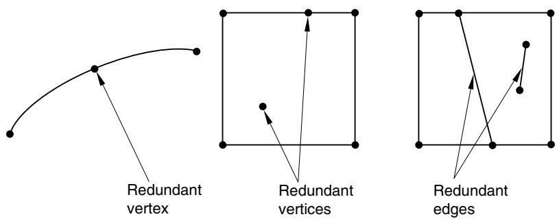

<details>
<summary>flowchart</summary>

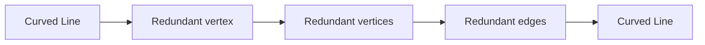
```mermaid
graph LR
  A["Curved Line"] --> B["Redundant vertex"]
  B --> C["Redundant vertices"]
  C --> D["Redundant edges"]
  D --> E["Curved Line"]
```
</details>

The Query toolset provides a set of geometry diagnostic tools that allow you to locate areas of invalid and imprecise geometry. For more information, see Using the Query toolset in the Part module. The operation to remove redundant entities is stored as a feature of the part; therefore, you can use the Model Tree to restore vertices and edges that you deleted.

1. From the main menu bar, select Tools->Geometry Edit.

Abaqus/CAE displays the Geometry Edit dialog box.


Tip: If you are using the Part module, you can also remove redundant entities using the tool, located with the edit tools in the module toolbox. For a diagram of the edit tools in the Part module toolbox, see Editing techniques.


2. From the dialog box, select the Edge category and the Remove redundant entities method.  
3. Select the region from which Abaqus/CAE should remove redundant edges and vertices. You can select the region from the viewport or select an existing set containing the region.


## Note:

The default selection method is based on the selection method you most recently employed. To revert to the other method, click Select in Viewport or Sets on the right side of the prompt area.

4. From the prompt area, toggle off Remove redundant edge vertices if you do not want to remove vertices.  
5. From the prompt area, click Done.

Abaqus/CAE removes the redundant entities from the selected region and prompts you to update the validity of the part.

6. Do one of the following:

Click Yes to update the validity of the part. (You should update the validity of the part whenever you remove redundant entities.)  
• Click No to skip the update and continue your edits.

• Click Cancel to cancel the changes in the current editing operation.

You can also update the validity of a part at any time by clicking mouse button 3 on the part in the Model Tree and selecting Update validity from the menu that appears.

## Additional information

• Valid parts, precise parts, and tolerance  
• Methods for editing edges

## Repairing invalid edges

In rare cases after you import a part, Abaqus will report that all of its edges are invalid. The Repair invalid tool attempts to repair the invalid edges by recomputing the data that define them, which can help repair some types of invalidity. You should also use this tool if only invalid edges remain after automatically repairing a part.

The Query toolset provides a set of geometry diagnostic tools that determine if a part contains invalid edges. For more information, see Using the Query toolset in the Part module. The operation to repair invalid edges is stored as a feature of the part; therefore, you can use the Model Tree to delete or suppress the operation.

1. From the main menu bar, select Tools->Geometry Edit.

Abaqus/CAE displays the Geometry Edit dialog box.


Tip: You can also repair invalid edges using the $\underline { { \mathcal { T } } }$ tool, located with the edit tools in the Part module toolbox. For a diagram of the edit tools in the toolbox, see Editing techniques.

2. From the dialog box, select the Edge category and the Repair invalid method.

Abaqus/CAE repairs invalid edges and prompts you to update the validity of the part.

3. Do one of the following:

Click Yes to update the validity of the part. (You should update the validity of the part whenever you repair invalid edges.)  
• Click No to skip the update and continue your repairs.  
• Click Cancel to cancel the changes in the current repair operation.

You can also update the validity of a part at any time by clicking mouse button 3 on the part in the Model Tree and selecting Update validity from the menu that appears.

## Additional information

• Valid parts, precise parts, and tolerance  
• Methods for editing edges

You can remove selected wire edges from a part. Wire edges are wires, as opposed to edges of a solid or shell feature. The operation to remove wire edges is stored as a feature of the part; therefore, you can use the Model Tree to delete or suppress the operation.

1. From the main menu bar, select Tools->Geometry Edit.

Abaqus/CAE displays the Geometry Edit dialog box.


Tip: You can also remove wire edges using the tool, located with the edit tools in the Part module toolbox. For a diagram of the edit tools in the toolbox, see Editing techniques.

2. From the dialog box, select the Edge category and the Remove wire method.  
3. Select the wire edges that you want to remove. You can select the edges from the viewport or select an existing set containing the edges.


## Note:

The default selection method is based on the selection method you most recently employed. To revert to the other method, click Select in Viewport or Sets on the right side of the prompt area.

You can use a combination of drag select, [Shift] + Click, [Ctrl] + Click, and the angle method to select more than one wire edge to remove. For more information, see Selecting objects within the current viewport.


Tip: If you are unable to select the desired edges, you can use the Selection toolbar to change the selection behavior. For more information, see Using the selection options.

4. Click mouse button 2 to indicate that you have finished selecting wire edges.

Abaqus/CAE removes the wire edges and prompts you to update the validity of the part.

5. Do one of the following:

Click Yes to update the validity of the part. (You should update the validity of the part whenever you remove wire edges.)  
• Click No to skip the update and continue your repairs.  
• Click Cancel to cancel the changes in the current repair operation.

You can also update the validity of a part at any time by clicking mouse button 3 on the part in the Model Tree and selecting Update validity from the menu that appears.

## Additional information

• Valid parts, precise parts, and tolerance  
• Methods for editing edges

## Editing and repairing faces

This section describes the tools that you can use to repair faces.

## In this section:

Removing faces  
Covering edges with a new face  
Replace faces  
Repairing small faces  
Repairing a sliver  
Repairing face normals  
Offset faces  
Extend faces  
Blend faces  
Create face from element faces

## Removing faces

To make a part valid or precise, you can use the remove faces tool to remove selected faces from a three-dimensional solid or shell or from a two-dimensional planar part.

After you have selected the faces to remove, Abaqus/CAE looks for adjacent faces that define a feature. You can remove the entire feature, or you can remove only the selected faces. When you remove one or more faces from a solid part, Abaqus/CAE converts all of the cells in the part to a shell, as shown in the following figure:

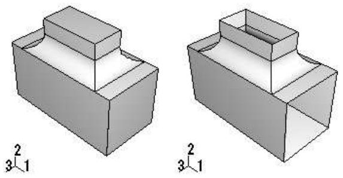

<details>
<summary>natural_image</summary>

Two 3D mechanical part diagrams showing stepped and rectangular components with no text or symbols
</details>

The Query toolset provides a set of geometry diagnostic tools that allow you to locate areas of invalid and imprecise geometry. For more information, see Using the Query toolset in the Part module. The operation to remove faces is stored as a feature of the part; therefore, you can use the Model Tree to restore faces that you deleted.

1. From the main menu bar, select Tools->Geometry Edit.

Abaqus/CAE displays the Geometry Edit dialog box.


Tip: You can also remove faces using the tool, located with the edit tools in the Part module toolbox. For a diagram of the edit tools in the toolbox, see Editing techniques.

2. From the dialog box, select the Face category and the Remove method.  
3. Select the faces that you want to remove. You can select the faces from the viewport or select an existing set containing the faces.


## Note:

The default selection method is based on the selection method you most recently employed. To revert to the other method, click Select in Viewport or Sets on the right side of the prompt area.

You can use a combination of drag select, [Shift] + Click, [Ctrl] + Click, and the angle method to select more than one face to remove. For more information, see Selecting objects within the current viewport.


Tip: If you are unable to select the desired faces, you can use the Selection toolbar to change the selection behavior. For more information, see Using the selection options.

4. Click mouse button 2 to indicate that you have finished selecting faces.


## Note:

If you are removing one or more faces from a solid part, Abaqus/CAE indicates that removing the faces will result in the solid being converted to a shell and prompts you to continue.

Abaqus/CAE removes the selected faces.

## Additional information

• Valid parts, precise parts, and tolerance  
• Methods for editing faces

You can create a face by selecting the edges that the new face will cover. The selected edges must form a closed loop. Abaqus/CAE creates the new face as a shell. If the new shell forms a closed part, you can use the solid-from-shell tool to convert the part to a solid. For more information, see Creating a solid feature from a shell. The cover edges operation is stored as a feature of the part; therefore, you can use the Model Tree to delete faces that you created. Abaqus/CAE creates the new face by projecting a face on the plane formed by the selected edges. Therefore, you should not use the Cover edges tool if the resulting face would be very convex.

1. From the main menu bar, select Tools->Geometry Edit.

Abaqus/CAE displays the Geometry Edit dialog box.


Tip: You can also create a face using the tool, located with the edit tools in the Part module toolbox. For a diagram of the edit tools in the toolbox, see Editing techniques.

2. From the dialog box, select the Face category and the Cover edges method.  
3. Select the edges that form a loop and define the edges of the new face. You can select the edges from the viewport or select an existing set containing the edges. You can select more than one loop, and Abaqus/CAE will create more than one face. However, the loops should not be concentric.


## Note:

The default selection method is based on the selection method you most recently employed. To revert to the other method, click Select in Viewport or Sets on the right side of the prompt area.

4. From the prompt area, click Done.

Abaqus/CAE creates the new face.

5. If you have finished editing the part, you should check its validity by clicking mouse button 3 on the part in the Model Tree and selecting Update validity from the menu that appears.

## Additional information

• Valid parts, precise parts, and tolerance  
• Methods for editing faces

## Replace faces

If faces from an imported part do not appear to have been formed correctly, you can replace the faces with a new face generated by Abaqus/CAE based on the underlying geometry. Because Abaqus/CAE relies on the underlying geometry, you should not use the Replace tool if the resulting face would be very convex. If you select more than one face to replace, the faces must be connected.

Alternatively, you can replace a face by extending neighboring faces. This tool is useful for removing bosses or small bumps from your parts.

1. From the main menu bar, select Tools->Geometry Edit.

Abaqus/CAE displays the Geometry Edit dialog box.


Tip: You can also replace faces using the tool, located with the edit tools in the Part module toolbox. For a diagram of the edit tools in the toolbox, see Editing techniques.

2. From the dialog box, select the Face category and the Replace method.  
3. Select the faces that you want to replace. The faces must be connected. You can select the faces from the viewport or click mouse button 3 to paste faces into your selection from a temporary selection group (for details, see What is a selection group?).

You can use a combination of drag select, [Shift] + Click, [Ctrl] + Click, and the angle method to select more than one face to replace. For more information, see Selecting objects within the current viewport.


Tip: If you are unable to select the desired faces, you can use the Selection toolbar to change the selection behavior. For more information, see Using the selection options.

4. From the prompt area, toggle on Extend neighboring faces to replace the selected faces with a single face that is formed by extending neighboring faces.  
5. Click mouse button 2 to indicate that you have finished selecting faces.

Abaqus/CAE replaces the selected faces.

6. If you have finished editing the part, you should check its validity by clicking mouse button 3 on the part in the Model Tree and selecting Update validity from the menu that appears.

## Additional information

• Valid parts, precise parts, and tolerance  
• Methods for editing faces

You can repair selected small faces of a part. Abaqus/CAE removes the small faces and repairs the adjoining edges and faces to create a closed geometry. The operation to repair small faces is stored as a feature of the part; therefore, you can use the Model Tree to delete or suppress the operation.

1. From the main menu bar, select Tools->Geometry Edit.

Abaqus/CAE displays the Geometry Edit dialog box.


Tip: You can also repair small faces using the $\boxplus + \boxed { - }$ tool, located with the edit tools in the Part module toolbox. For a diagram of the edit tools in the toolbox, see Editing techniques.

2. From the dialog box, select the Face category and the Repair small method.  
3. Select the faces that you want to repair. You can select the faces from the viewport or select an existing set containing the faces.


## Note:

The default selection method is based on the selection method you most recently employed. To revert to the other method, click Select in Viewport or Sets on the right side of the prompt area.

You can use a combination of drag select, [Shift] + Click, [Ctrl] + Click, and the angle method to select more than one small face to repair. For more information, see Selecting objects within the current viewport.


Tip: If you are unable to select the desired faces, you can use the Selection toolbar to change the selection behavior. For more information, see Using the selection options.

4. Click mouse button 2 to indicate that you have finished selecting small faces.

Abaqus/CAE repairs the small faces and prompts you to update the validity of the part.

5. Do one of the following:

Click Yes to update the validity of the part. (You should update the validity of the part whenever you repair small faces.)  
• Click No to skip the update and continue your repairs.  
• Click Cancel to cancel the changes in the current repair operation.

You can also update the validity of a part at any time by clicking mouse button 3 on the part in the Model Tree and selecting Update validity from the menu that appears.

## Additional information

• Valid parts, precise parts, and tolerance  
• Methods for editing faces

## Repairing a sliver

You can think of a sliver as a piece of extra material in a face. You can repair an unwanted sliver and remove it from a face of a three-dimensional solid or shell or from a two-dimensional planar part. You must select the face containing the sliver to repair and two points from the face. Abaqus/CAE uses the two points to divide the selected face into two regions. It then deletes the smaller region (the sliver) and retains the larger region. If the smaller region is relatively large compared with its neighbors, the operation fails. The operation to repair a sliver is stored as a feature of the part; therefore, you can use the Model Tree to delete or suppress the operation.

1. From the main menu bar, select Tools->Geometry Edit.

Abaqus/CAE displays the Geometry Edit dialog box.


Tip: You can also remove a sliver using the tool, located with the edit tools in the Part module toolbox. For a diagram of the edit tools in the toolbox, see Editing techniques.

2. From the dialog box, select the Face category and the Repair sliver method.  
3. Select the face that you want to repair. You can select the face from the viewport or select an existing set containing the face.


## Note:

The default selection method is based on the selection method you most recently employed. To revert to the other method, click Select in Viewport or Sets on the right side of the prompt area.


Tip: If you are unable to select the desired face, you can use the Selection toolbar to change the selection behavior. For more information, see Using the selection options.

4. Select a point that defines a corner of the sliver.  
5. Select a second point that defines the opposite corner of the sliver.  
6. Abaqus/CAE draws a line between the two selected points and removes the resulting small face.

## Additional information

• Valid parts, precise parts, and tolerance  
• Methods for editing faces

You can repair the face normals of shell and solid imported parts, and you can perform these repairs on either manifold parts (parts in which every edge is shared by only one or two faces) or non-manifold parts.

If Abaqus reports that the volume of an imported part is negative, it means that the solid has been turned inside out. The Repair normals tool will flip the normals and turn the solid right side out.

An imported shell part can contain faces that have normals pointing in opposite directions. The Repair normals tool will align all the selected normals on a shell part. If the face normals are already aligned, this tool will flip all the selected normals so that they remain aligned but point in the opposite direction.


## Note:

Abaqus/CAE does not flip normals that have been assigned to shell faces manually using the Element Normal assignment option in the Property module.

When you perform repairs of non-manifold shell parts, you cannot flip the normals for all of the faces in the part in a single operation; you must select each face individually to flip the direction of its normal. Performing a query using the Shell element normals option from the Query dialog box can help you assess the orientation of the face normals before you repair your shell part.

The Query toolset provides a set of geometry diagnostic tools that calculate the volume of a solid part and display the normals of shells and membranes. For more information, see Using the Query toolset in the Part module. The operation to repair face normals is stored as a feature of the part; therefore, you can use the Model Tree to delete or suppress the operation.

1. From the main menu bar, select Tools->Geometry Edit.

Abaqus/CAE displays the Geometry Edit dialog box.


Tip: You can also repair face normals using the tool, located with the edit tools in the Part module toolbox. For a diagram of the edit tools in the toolbox, see Editing techniques.

2. From the dialog box, select the Face category and the Repair normals method.  
3. Select one of the following options from the prompt area:

• Click Entire Part to repair face normals for every incorrectly oriented face in your part.  
• Click Select Faces to select individual faces in your part.

4. If you are selecting individual faces in your part, choose the face normals that you want to repair from the viewport, then click Done from the prompt area.

You can use a combination of drag-select, [Shift] + Click, and [Ctrl] + Click to select faces in your part, and you can also use the angle method or the face curvature method to select faces. For more information, see Selecting objects within the current viewport.

Abaqus/CAE repairs the face normals.

## Additional information

• Valid parts, precise parts, and tolerance  
• Methods for editing faces

## Offset faces

You can create faces by offsetting them from existing faces. Abaqus/CAE creates the new faces as a shell. The offset operation is stored as a feature of the part; therefore, you can use the Model Tree to delete faces that you created. You can use offset faces when creating a midsurface model; for information, see Midsurface modeling.”

You can use target faces to compute an offset distance as shown in Figure 1, or you can specify an offset distance.

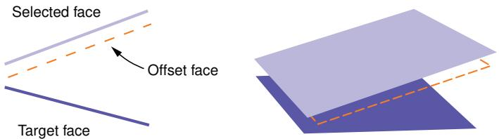

<details>
<summary>text_image</summary>

Selected face
Offset face
Target face
</details>

Figure 1: A constant offset distance between diverging faces.

Regardless of the offset distance method that you choose, Abaqus/CAE creates all new faces at a constant offset distance from the selected faces, as shown in the figure. However, if you use target faces to compute the offset distance,

Abaqus/CAE uses the selected faces and the target faces to calculate the thickness and offset distance at each node in the offset faces such that the behavior of the offset faces approximates the behavior of the original sections. You can view the result of these calculations after the part is meshed by showing the native mesh and toggling on Render shell thickness with a Scale factor of 1 in the Part Display Options dialog box.

You can review and edit the shell thickness values with the Assign thickness and Offset tool (for more information, see Assigning thicknesses and offsets), or you can specify a thickness for the new faces when you assign a section to them.

1. From the main menu bar, select Tools->Geometry Edit.

Abaqus/CAE displays the Geometry Edit dialog box.


Tip: You can also offset faces using the tool, located with the edit tools in the Part module toolbox. For a diagram of the edit tools in the toolbox, see Editing techniques.

2. From the dialog box, select the Face category and the Offset method.  
3. Select the faces to offset. You can select faces individually, by face angle, or by face curvature; and you can select an existing set containing the faces. For more information on selecting objects in the viewport, see Selecting objects within the current viewport.


## Note:

The default selection method is based on the selection method you most recently employed. To revert to the other method, click Select in Viewport or Sets on the right side of the prompt area.

4. From the prompt area, click Done.

Abaqus/CAE displays the Offset Faces dialog box.

5. Choose one of the available options to determine the offset distance:


## Note:

Regardless of the calculation method, Abaqus/CAE applies a constant offset to the faces as shown in Figure 1. You must use another method to create new faces centered between converging or diverging faces.

## Use target faces to compute distance

Select a target face or faces. Abaqus/CAE computes the distance between the faces to be offset and the target faces by sampling the faces at several points. Use one of the following distance options:

• Select Half the average distance to offset the new faces by this amount.  
• Select Fraction distance to closest point on face, and enter a value.

Abaqus/CAE offsets the new faces by the distance to the closest point on the target faces times the entered value.

• Select Fraction distance to farthest point on face, and enter a value.

Abaqus/CAE offsets the new faces by the distance to the farthest point on the target faces times the entered value.

You can select the target faces using the same methods you used in Step 3. If your original faces are part of the reference representation for a midsurface model, you can click Auto Select to have Abaqus/CAE select appropriate faces from the opposite side of the reference representation. Varying distances between potential target faces may result in selections that only partially match the original faces. If necessary, click Edit to modify the selections in the viewport.

## Distance

Enter an offset distance, or select to measure and enter a distance between objects in the viewport.

Negative values for the fraction or actual distance create an offset in the face normal direction; positive values create an offset in the opposite direction. If you are uncertain of the normal directions, use the Shell element normals general query to view the normal directions for shells in the model. For more information, see Obtaining general information about the model. The normals for solids point toward the outside, so a positive offset will create a face inside the part unless the offset distance is greater than the part thickness.

6. If the model contains a reference representation, toggle Auto trim to reference representation to control whether Abaqus/CAE matches the offset faces to the reference representation.

If this option is toggled on, Abaqus/CAE extends the offset faces along their free edges and trims them where they intersect with the reference representation.


## Note:

Face extension may fail for complex faces. If face extension fails, Abaqus/CAE indicates the error and trims any unextended faces that intersect with the reference representation.

7. Click OK.

Abaqus/CAE creates new faces at the prescribed distance from the originals, and the procedure restarts at Step 3.

8. To exit the offset procedure, either

• click the cancel button in the prompt area, or  
• click mouse button 2 anywhere in the Abaqus/CAE window, or

• select another operation from the Geometry Edit toolset or from the tools in the Part module.

## Additional information

• Valid parts, precise parts, and tolerance  
• Using the offset face tool for midsurface modeling  
• Methods for editing faces

## Extend faces

You can edit faces by extending existing faces. The extend operation is stored as a feature of the part; therefore, you can use the Model Tree to edit the distance parameter if the distance method is used or to delete the extended faces.

Figure 1 shows the use of target faces to extend a face. The top images show the complete part, which includes a central planar face separated from the surrounding faces by a small gap. The surrounding faces enclose about two and a half sides of the planar face. The planar face is selected for extension, and the surrounding faces are used as target faces. The selected face is extended along the three sides that would intersect with the target faces. The two lower images detail how you can control the extension where the selected face extends beyond the end of the target face on the left side. In the lower left image the Trim to extended underlying target surfaces option was used such that the entire left edge of the selected face is extended uniformly—as if the target face extended to the full height of the selected face. In the lower right image the face is extended only up to where the target face ends.

  
Figure 1:The effect of toggling the Trim to extended underlying target surfaces option when extending a face: initial model with gap (top left and right), on (lower left), and off (lower right).

1. From the main menu bar, select Tools->Geometry Edit.

Abaqus/CAE displays the Geometry Edit dialog box.


Tip: You can also extend faces using the tool, located with the edit tools in the Part module toolbox. For a diagram of the edit tools in the toolbox, see Editing techniques.

2. From the dialog box, select the Face category and the Extend method.

Abaqus/CAE displays the Extend Faces dialog box.

3. Choose one of the following methods to extend faces:

• Toggle on Specify edges of faces to extend, and pick one or more edges to extend the faces that are bounded by those edges along only the selected edges.  
• Toggle on Specify faces to extend, and pick faces to extend them along all their free edges.

Click Select to specify the edges or faces to be extended.

You can select edges individually or by edge angle; and you can select faces individually, by face angle, or by face curvature. For more information on selecting objects in the viewport, see Selecting objects within the current viewport. You can also select an existing set of edges or faces.


## Note:

The default selection method is based on the selection method you most recently employed. To revert to the other method, click Select in Viewport or Sets on the right side of the prompt area.

4. From the prompt area, click Done.  
5. Choose one of the available methods to determine the extension distance:

## Distance

Enter an extension distance, or select to measure and enter a distance between objects in the viewport.

## Up to target faces

Select a target face or faces to limit the extension.

Abaqus/CAE highlights the target faces in yellow.

If desired, toggle on Trim to extended underlying target surfaces to have Abaqus/CAE temporarily extend the target faces to create intersections with the faces that you want to extend.

## Up to reference representation

Abaqus/CAE uses the faces of the reference representation to limit the extension. This option is not available if the model does not contain a reference representation.

## 6. Click OK.

If you selected target faces in Step 5 that do not completely surround the faces being extended, Abaqus/CAE indicates the edges that will intersect with the target faces—a subset of your selection from Step 3—and gives you the option to extend only these edges instead of your original selection. Abaqus/CAE creates the extended face feature. If you used target faces or a reference representation to limit the extension, Abaqus/CAE trims the extended faces where they intersect with the limiting faces. The extended face feature replaces the original faces in the viewport, and the procedure restarts at Step 3 using the most recently used selection method.

## 7. To exit the extend procedure, either

• click the cancel button in the prompt area, or  
• click mouse button 2 anywhere in the Abaqus/CAE window, or  
• select another operation from the Geometry Edit toolset or from the tools in the Part module.

## Additional information

• Valid parts, precise parts, and tolerance  
• Using the extend faces tool for midsurface modeling  
• Methods for editing faces

## Blend faces

You can create blended faces to join existing faces in the model.

Abaqus/CAE closes the space between two sets of connected edges with new faces. You can choose whether to make the new faces tangent to the selected edges, connect the edges using the shortest path between them, or specify a path that the new faces must follow between the selected edges. Figure 1 shows two faces with the selected edges highlighted. In this example, the tangent method creates a face with a smooth radius tangent to both original faces, the shortest path method creates a planar face, and the selected path method creates a face with the profile of the selected wire edge.

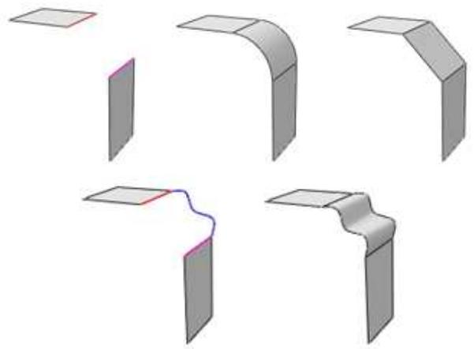

<details>
<summary>natural_image</summary>

Pure 3D diagram of five angled metal brackets with a purple wavy line connecting one bracket (no text or symbols)
</details>

Figure 1: Creating blended faces using the tangent, shortest path, and specify path methods.

You can also create a blended face to join edges and faces. Abaqus/CAE creates blended faces between the selected edges and faces using the shortest path method. When you create a blended face feature between edges and an existing face, the new faces are always perpendicular to the existing face. The free edges are extended or shortened as needed to intersect with the edges of the face. Figure 2 shows the selected edges and the feature created by blending between them and a planar face. The ends of the center edge are a perpendicular projection from the planar face, and the outer ends of the left and right edges are extended to meet the edges of the planar face.


<details>
<summary>natural_image</summary>

Three 3D geometric shapes with no text or symbols: a red curved line on the left, a solid gray plane, and a gray wedge-shaped 3D model (no text or symbols)
</details>

Figure 2: Creating a blended face between edges and a face.

The blend operation is stored as a feature of the part; therefore, you can use the Model Tree to delete faces that you created.

1. From the main menu bar, select Tools->Geometry Edit.

Abaqus/CAE displays the Geometry Edit dialog box.


Tip: You can also blend faces using the tool, located with the edit tools in the Part module toolbox. For a diagram of the edit tools in the toolbox, see Editing techniques.

2. From the dialog box, select the Face category and the Blend method.  
3. Select edges for the first side of the blended face.

You can select edges individually or by edge angle. For more information on selecting objects in the viewport, see Selecting objects within the current viewport. You can also select an existing set of edges.


## Note:

The default selection method is based on the selection method you most recently employed. To revert to the other method, click Select in Viewport or Sets on the right side of the prompt area.

From the prompt area, click Done.

4. Select edges or faces for the second side of the blended face.

If you select faces for the second side, the edges selected in Step 3 must have a perpendicular projection onto the faces or Abaqus/CAE will not be able to create a blended face for the selections.

From the prompt area, click Done to complete your selection and to open the Blend Faces dialog box.

5. Choose one of the available blend methods:

## Tangent

Abaqus/CAE will create blended faces tangent to the faces containing the first and second side edges. To use this method, the edges selected in Step 3 and Step 4 must be free edges—edges that belong to only one feature face—so that Abaqus/CAE can calculate tangency.

## Shortest path

Abaqus/CAE will create blended faces that connect the first and second side edges using the shortest path between them. If you selected a face or faces for the second side of the blend, this is the only blend method available.

## Specify path

Specify a path between the edges. Click Select to choose an existing edge or wire feature that joins the end of one of the first side edges to the end of one of the second side edges. Abaqus/CAE will create blended faces using the profile of the selected path.

6. Click Preview to preview the blended face that would result from the current selections.  
7. Click OK.

Abaqus/CAE creates the blended face feature. The blend procedure restarts at Step 3 using the most recently used selection method.

8. To exit the blend procedure, either

• click the cancel button in the prompt area, or  
• click mouse button 2 anywhere in the Abaqus/CAE window, or

• select another operation from the Geometry Edit toolset or from the tools in the Part module.

## Additional information

• Valid parts, precise parts, and tolerance  
• Methods for editing faces

## Create face from element faces

You can create a geometric face from orphan element faces in a part. Abaqus/CAE creates a new geometric face based on the nodal positions of the selected element faces. Vertices are created at edge nodes where there is a significant change in the element edge direction. The new face appears like other geometric faces in the model, and Abaqus/CAE stitches the new face to adjacent faces in the part. By default, the new face is associated with the mesh; you have the option to change this behavior. In the Model Tree, the new face appears as a Face from mesh feature. You cannot change the group of element faces that comprise the geometric face once it has been created; however, you can delete the face and create a new one, and you can stitch faces that were not stitched together in the original creation of the geometric face.

The new geometric face shares space with the existing orphan element faces in the model. This may result in some areas appearing with the gray unmeshed geometry coloring and others appearing with the dark green and visible element edges of the orphan mesh. This is similar to the appearance of a bottom-up meshed region, where the tan region coloring and the cyan mesh coloring appear together. You can suppress the orphan mesh in the Model Tree to view only the new geometry.

When creating geometry from orphan mesh faces, keep in mind your intended use for the resulting geometry. You want to create faces that will be a good basis for modification and meshing. For example, when you select orphan element faces, your selection should end at any sharp corners or other features so that the geometric face will also end there, creating a logical feature edge. If you do select element faces that span sharp corners, Abaqus/CAE will create a single geometric face that includes the corner—this geometry may be difficult or impossible to mesh using the available top-down meshing techniques.


## Note:

When you are working with solid orphan elements, selections that include element faces on both sides of a corner (multiple selections from the same orphan element) are not acceptable for creation of a single geometric face.

When Abaqus/CAE creates a geometric face, it stitches together small gaps between edges and small gaps between analytical surfaces by default. You can customize the tolerance values that determine whether small gaps will be stitched in either case, and you can turn off stitching completely for small gaps between edges. Deferring most or all of the stitching until late in the modeling process can be a more efficient modeling option because each stitching operation is processor intensive. Fitting of analytical surfaces cannot be deferred; you must perform this step before the new geometric face is created.

1. From the main menu bar, select Tools->Geometry Edit.

Abaqus/CAE displays the Geometry Edit dialog box.


Tip: You can also create geometric faces from element faces using the tool, located with the edit tools in the Part module toolbox. For a diagram of the edit tools in the toolbox, see Editing techniques.

2. From the dialog box, select the Face category and the From element faces method.  
3. Select element faces for the new geometric face.

You can select element faces individually, by angle, by limiting angle, by layer, or by analytic shape. For more information on selecting objects in the viewport, see Selecting objects within the current viewport. You can also select an existing surface. You cannot select element faces from two-dimensional or axisymmetric parts.


## Note:

The default selection method is based on the selection method you most recently employed. To revert to the other method, click Select in Viewport or Surfaces on the right side of the prompt area.

4. If you want to control stitching, analytical surface fitting, and the mesh association options, click Options in the prompt area, and do any of the following from the dialog box that appears:

• Toggle on Stitch with tolerance to apply stitching of nodes in the geometric face you create, and specify the stitching tolerance value.  
• In the Fit analytic surfaces with tolerance field, specify the stitching tolerance value you want to use for fitting together analytical surfaces in your selection.  
• By default, Abaqus/CAE associates the geometric face with the mesh. To change this behavior, toggle off Associate face with mesh.

Click OK to close the dialog box.

5. From the prompt area, click Done.

Abaqus/CAE creates the geometric face feature. The procedure restarts at Step 3 using the most recently used selection method.

6. To exit the procedure, either

• click the cancel button in the prompt area, or  
• click mouse button 2 anywhere in the Abaqus/CAE window, or  
• select another operation from the Geometry Edit toolset or from the tools in the Part module.

## Additional information

• Valid parts, precise parts, and tolerance  
• Creating a part from orphan elements  
• Methods for editing faces

## Editing parts

This section describes the tools that you can use to repair entire parts.

## In this section:

Converting to analytical  
Converting to precise

## Converting to analytical

When you convert a part to its analytical representation, Abaqus/CAE tries to change the internal definition of edges, faces, and cells into a simpler form that can be represented analytically. For example, a plane that is nearly planar will be converted to an equation that represents the plane. Converting to an analytical representation usually provides the following advantages:

• Processing of the part is faster.  
• The converted entity is available during feature operations.  
• The geometry is improved.  
• If you subsequently need to stitch edges, the stitching operation is more likely to be successful.

After the operation is complete, you can use the geometry diagnostic tools in the Query toolset to locate any areas of invalid and imprecise geometry. For more information, see Using the Query toolset in the Part module.

1. From the main menu bar, select Tools->Geometry Edit.

Abaqus/CAE displays the Geometry Edit dialog box.


Tip: You can also convert to analytical using the tool, located with the edit tools in the Part module toolbox. For a diagram of the edit tools in the toolbox, see Editing techniques.

2. From the dialog box, select the Part category and the Convert to analytical method.  
3. From the warning dialog box that appears, click OK.

Abaqus/CAE tries to convert the part to its analytical representation.

4. If you have finished editing the part, you should check its validity by clicking mouse button 3 on the part in the Model Tree and selecting Update validity from the menu that appears.

## Additional information

• Valid parts, precise parts, and tolerance  
• Methods for editing entire parts

## Converting to precise

When you convert a part to precise, Abaqus/CAE tries to change neighboring entities so that their geometry matches exactly. Converting to a precise representation usually reduces the number of imprecise entities in a part, though for some parts the conversion can increase the number of imprecise entities. Even when the number of imprecise entities increases, the maximum tolerance of the healed part will still usually decrease; however, you should consider suppressing or deleting the convert to precise operation when the number of imprecise entities increases.

The convert to precise operation can be a lengthy one, and it can increase the complexity of the imported part; so subsequent processing of the part may be slower. Invalid entities may also result from this operation.

1. From the main menu bar, select Tools->Geometry Edit.

Abaqus/CAE displays the Geometry Edit dialog box.


Tip: You can also convert to precise using the tool, located with the edit tools in the Part module toolbox. For a diagram of the edit tools in the toolbox, see Editing techniques.

2. From the dialog box, select the Part category and the Convert to precise method.  
3. From the warning dialog box that appears, click OK.  
4. Select one of the following methods for the conversion:

## Tighten Gaps

Abaqus/CAE attempts to reduce the gaps between the nodes and edges in your part but does not perform a full computation of the geometry. This option provides a faster but less complete conversion.

## Recompute Geometry

Abaqus/CAE tries to change neighboring entities so that their geometry matches exactly. Recomputing geometry usually results in precise geometry; however, this operation can be lengthy and increases the complexity of the imported part, which means that processing of the part is slower. Moreover, if the part contains many complex surfaces, converting to a precise representation is likely to fail. If possible, you should return to the CAD application that generated the original file and increase the precision.

After you select a method, Abaqus/CAE tries to convert the part to its precise representation. If the conversion is successful, Abaqus/CAE prompts you to update the validity of the part.

5. If you have finished editing the part, you should check its validity by clicking mouse button 3 on the part in the Model Tree and selecting Update validity from the menu that appears.

## Additional information

• Valid parts, precise parts, and tolerance  
• Methods for editing entire parts

## The Partition toolset

You use the Partition toolset to divide a part or assembly into regions.

Regions are used throughout the modeling process; for example, to indicate the location of a load, a change in material properties, or a mesh boundary.

This chapter explains how you use the Partition toolset to create and position partitions on an edge, a face, or a cell.

## In this section:

Understanding the role of partitions  
Using the Partition toolset  
Understanding partitions  
Partitioning techniques  
Partitioning edges  
Partitioning faces  
Partitioning cells

## Understanding the role of partitions

As you proceed through the modeling process, you may find that you need to select a particular region that does not exist in your model. Such regions might be used to define material boundaries, indicate the location of loads and constraints, and help refine your mesh. You use the Partition toolset to partition your model into regions.

Partitions can be created on edges, faces, and cells. A partition along an edge creates a new vertex, while partitions through faces and cells create new edges and faces, respectively. In all cases, partitioning serves to subdivide the geometry being partitioned. Figure 1 illustrates partitioning an edge, a face, and a cell.


<details>
<summary>text_image</summary>

partitioned edge
partitioned face
partitioned cell
</details>

Figure 1: Partitioning an edge, a face, and a cell.

You partition edges, faces, and cells by defining partitions that refer to existing geometry. You can partition a part in either the Part module or the Property module, or you can partition an assembly in the modules that operate on the assembly. For example, you can partition a face of the assembly in the Mesh module, and you can seed the resulting internal edge to refine your mesh. A partition is a feature; and, like all features, it can be edited, deleted, suppressed, resumed, and queried. Similarly, a partition is regenerated when the assembly or a part is regenerated.

## Using the Partition toolset

You can access the Partition toolset by selecting Tools->Partition from the menu bar. The Create Partition dialog box appears, and you choose the type of geometry to partition—edge, face, or cell—from the buttons in the Type region at the top of the dialog box. The Method list changes to reflect the partitions you can create. Select the desired partition tool from the Method list, and follow the prompts in the prompt area to create the partition. Most of the tools allow you to partition multiple edges, faces, or cells in one operation. You can use a combination of drag select, [Shift] + Click, [Ctrl] + Click, and the angle method to select the edges, faces, or cells to partition. For more information, see Selecting objects within the current viewport.

Partitioning techniques, provides an overview of the methods available for each type of partition. More information on creating partitions on parts and assemblies is provided in Using the Partition toolset in the Part module and Partitioning the assembly.

You can also access the Partition toolset from the module toolbox; Figure 1 shows the hidden icons for all the partition tools in the module toolboxes.

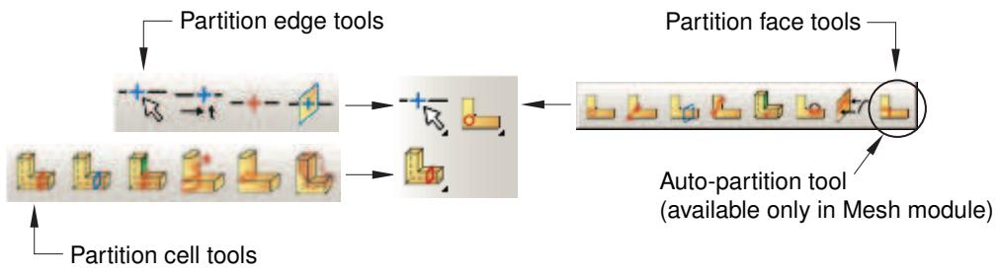

<details>
<summary>flowchart</summary>

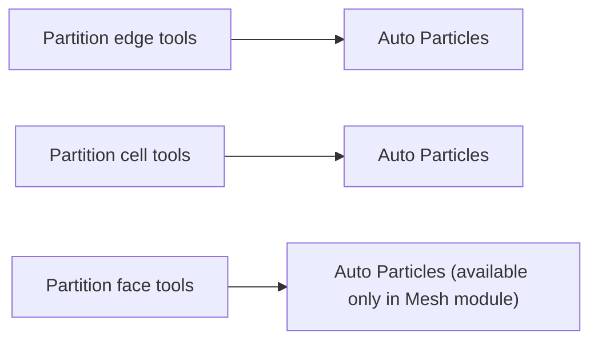
```mermaid
graph LR
  A["Partition edge tools"] --> B["Auto Particles"]
  C["Partition cell tools"] --> D["Auto Particles"]
  E["Partition face tools"] --> F["Auto Particles (available only in Mesh module)"]
```
</details>

Figure 1: The partition tools.

To see a tooltip containing a short description of each partition tool, hold the mouse over the tool for a moment. For more information, see Using toolboxes and toolbars that contain hidden icons.

## Understanding partitions

This section describes basic concepts you should understand before using the Partition toolset.

## In this section:

Why partition?  
Partitions as features

## Why partition?

Deciding when to use the Partition toolset depends on how you will use the resulting regions, as described in the following list:

## Partitioning parts

Use the Partition toolset in the Part or Property module to divide a part into regions. You might use the resulting regions in the Property module to apply section definitions, which include cross-sectional geometry information as well as material property information. Partitions created in the Part module and Property module are associated with the part and are available in every instance of the part in the assembly; however, you cannot modify or delete the partitions in a part instance.

## Partitioning the assembly

Use the Partition toolset in the assembly-related modules to divide the part instances in the assembly into regions. You might use the resulting regions to do the following:

• Apply loads, boundary conditions, and predefined fields to regions.  
• Associate an output request with regions.  
• Gain finer control over the meshing process by adding internal edges that can be seeded.  
• Subdivide complex three-dimensional regions into simpler regions that the automatic mesh generator can mesh.

Partitions created in an assembly are associated only with the assembly, not with the original parts, and are available in all the modules that operate on the assembly. They will not appear in other instances of the same part, and they are not available in the Part or Property module.

## Additional information

• Understanding partitions  
• Partitioning techniques

## Partitions as features

The geometry of each part is constructed from a set of features; a partition is simply an additional geometric feature that you add to the part. Because partitions are features, they can be edited, deleted, suppressed, and resumed with the Feature Manipulation toolset.

If you create a partition and then modify the geometry of the underlying part or assembly, Abaqus/CAE regenerates the partition along with all the other features. Furthermore, the geometry of the regenerated partition is dependent on the method you used to create the partition. The following example illustrates that changes in underlying geometry can cause partitions to move or to change shape when the assembly is regenerated.

1. The user partitions a face using a line between two selected points (the centers of the two circles), as shown in Figure 1.

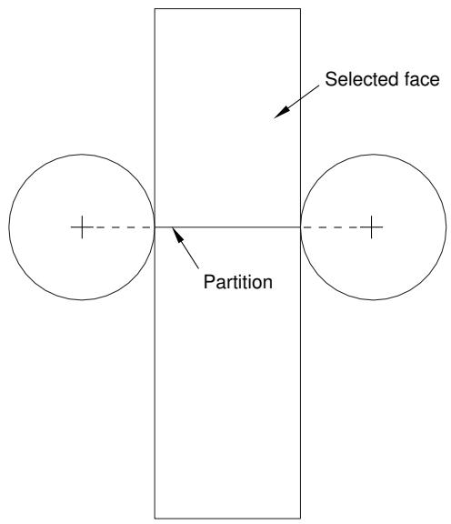

<details>
<summary>text_image</summary>

Selected face
Partition
</details>

Figure 1: A partition between two selected points.

2. The user modifies the assembly, and the position of the selected points that defined the partition changes. When Abaqus/CAE regenerates the assembly, the partition is still defined as the line between the center of the two circles, as shown in Figure 2.

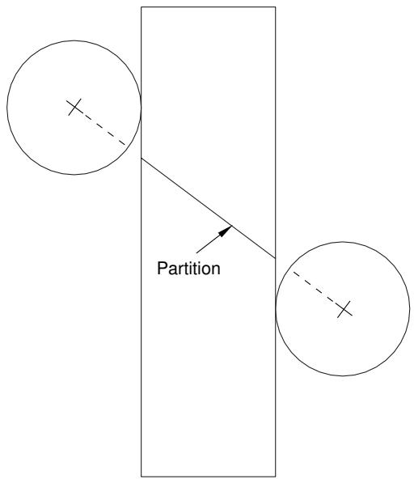

<details>
<summary>text_image</summary>

Partition
</details>

Figure 2: The partition after regeneration.

You can use the Feature Manipulation toolset to make limited modifications to some partitions:

You can enter a parameter to partition an edge directly and to position a Bézier curve that partitions a face. The parameter must be between zero and one and represents a fraction of the length of an edge; the Feature Manipulation toolset allows you to edit the value you provided.  
• You can sketch a partition on a face; the Feature Manipulation toolset allows you to edit the sketch.

If you need to change a partition that you cannot modify with the Feature Manipulation toolset, you must delete the partition and recreate it.

## Additional information

• Modifying and manipulating features  
• Understanding partitions  
• Partitioning techniques

## Partitioning techniques

This section provides an overview of the different partitioning techniques.

## In this section:

Methods for partitioning edges  
Methods for partitioning faces  
Methods for partitioning cells

## Methods for partitioning edges

Select Tools->Partition from the main menu bar to display the Create Partition dialog box.

When you choose Edge from the Create Partition dialog box, the Method list displays the following methods for partitioning edges:


## Specify parameter by location

Pick a point anywhere along the edge. For detailed instructions, see Using the specify parameter by location method to partition edges.


## Enter parameter

Enter a parameter in the prompt area, as shown in Figure 1. An arrow along the edge indicates the direction of increasing parameter value from the start vertex (corresponding to an edge parameter value of zero) to the end vertex (corresponding to a value of one). For detailed instructions, see Using the enter parameter method to partition edges.


<details>
<summary>text_image</summary>

partition
select edge to partition
direction of increasing
parameter
</details>

Figure 1: Entering a parameter to partition an edge.

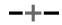

## Select midpoint/datum point

Select the midpoint of the edge or a datum point along the edge, as shown in Figure 2. For detailed instructions, see Using the pick midpoint/datum point method to partition an edge.


<details>
<summary>text_image</summary>

partition
select edge to partition
</details>

Figure 2: Selecting the midpoint or a datum to partition an edge.

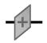

## Use datum plane

Select a datum plane. Abaqus/CAE creates the partition where the datum plane intersects the edges, as shown in Figure 3. Partitioning a group of selected edges with a datum plane is a useful technique for aligning a group of partitions. For detailed instructions, see Using the datum plane method to partition edges.


<details>
<summary>text_image</summary>

partitions
selected edges
to partition
</details>

Figure 3: Selecting a datum plane to partition edges.

## Additional information

• Partitioning techniques  
• Partitioning edges  
• Understanding partitions

When you choose Face from the Create Partition dialog box, the Method list displays the following methods for partitioning faces:

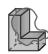

## Sketch planar partition

Partition a selected face by sketching a partition with the Sketcher, as shown in Figure 1. For detailed instructions, see Using the sketch method to partition faces.

You can sketch directly on the face to be partitioned, or you can sketch on a second face or datum plane and then project the sketch onto the face that you want to partition. For an example of projecting a sketch from a datum plane, see Using the Datum toolset in the Part module.

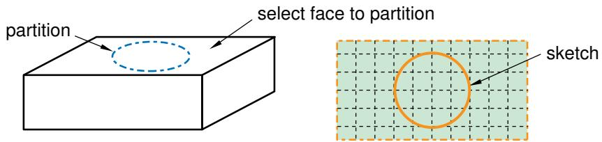

<details>
<summary>text_image</summary>

partition
select face to partition
sketch
</details>

Figure 1: Partitioning a face using the Sketcher.


## Shortest path between 2 points

Partition the face along the shortest path connecting two selected points; the resulting partition will be curved if the face being partitioned is curved, as shown in Figure 2. You can select points that are not associated with the face being partitioned; for example, the points can be located on a different face or even a different part instance. For detailed instructions, see Using the shortest path method to partition faces.


<details>
<summary>text_image</summary>

select face to partition
partition
selected points
</details>

Figure 2: Partitioning a face using the shortest path between two points.

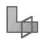

## Use datum plane

Partition a face using the intersection with the extension of a datum plane, as shown in Figure 3. For detailed instructions, see Using the datum plane method to partition faces.


<details>
<summary>text_image</summary>

select datum plane
select face to partition
partition
</details>

Figure 3: Partitioning a face using a datum plane.

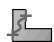

## Curved path normal to 2 edges

Partition the face along a Bézier curve that is normal to two of the face's edges, as shown in Figure 4. Position the curve by selecting two points anywhere along the two edges. The arc subtended by the two edges must be less than 180°. For detailed instructions, see Using the curved path method to partition a face.


<details>
<summary>text_image</summary>

select face to partition
partition
selected points
</details>

Figure 4: Partitioning a face using a Bézier curve.

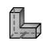

## Extend another face

Partition the face using the intersection with the extension of another face, as shown in Figure 5. The face being extended can be either planar, cylindrical, conical, or spherical; and it need not belong to the part containing the face to be partitioned. For detailed instructions, see Using the extended face method to partition faces.

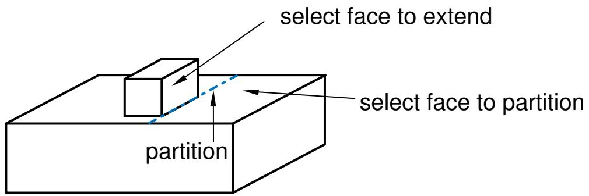

<details>
<summary>text_image</summary>

select face to extend
select face to partition
partition
</details>

Figure 5: Partitioning a face using the extension of another face.


## Intersect by other faces

Partition the face using the intersection of the target face with one or more other faces, as shown in Figure 6. The faces can be intersecting or tangential. For detailed instructions, see Using the intersection method to partition faces.

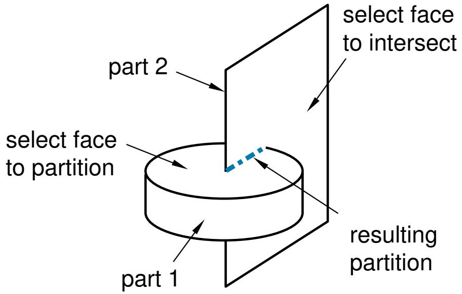

<details>
<summary>flowchart</summary>

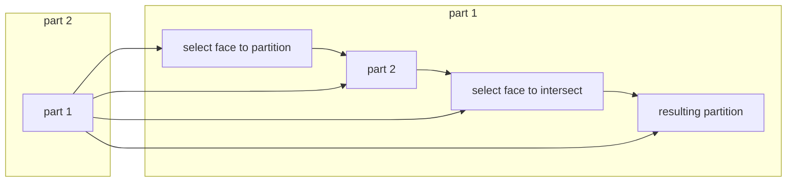
```mermaid
graph LR
  subgraph Part1["part 1"]
    direction TB
  A["select face to partition"] --> B["part 2"]
  B --> C["select face to intersect"]
  C --> D["resulting partition"]
  end
  subgraph Part2["part 2"]
    direction TB
  E["part 1"] --> A
  E --> B
  E --> C
  E --> D
  end
```
</details>

Figure 6: Partitioning a face using an intersection of faces.

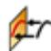

## Project edges

Partition the face by projecting edges in the model, as shown in Figure 7. The partition is created using a perpendicular projection from the face being partitioned to the partitioning edge. You can choose to use only the projection or, if necessary, to extend the ends of the projected edge to complete the face partition. For detailed instructions, see Using the project edges method to partition faces.


<details>
<summary>flowchart</summary>

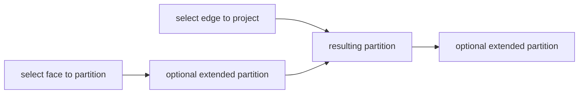
```mermaid
graph LR
  A["select face to partition"] --> B["optional extended partition"]
  C["select edge to project"] --> D["resulting partition"]
  B --> D
  D --> E["optional extended partition"]
```
</details>

Figure 7: Partitioning a face by projecting an edge.

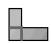

## Auto-partition

When you mesh a face with quadrilateral elements using the free meshing technique, the Mesh module internally partitions the face into regions with three to five logical sides before meshing the face. For more information, see Free meshing with quadrilateral and quadrilateral-dominated elements. However, if you want to view and perhaps modify the automatically generated regions before generating the mesh, you can use the auto-partitioning tool to partition the face without meshing it. This tool is available only in the Mesh module. For detailed instructions, see Using the automatic generation method to partition faces.

## Additional information

• Partitioning techniques  
• Understanding partitions  
• Partitioning faces

When you choose Cell from the Create Partition dialog box, the Method list displays the following methods for partitioning cells:

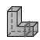

## Define cutting plane

Partition a cell by cutting it with a plane; the plane will pass completely through the cell. Use one of the following three methods to define the cutting plane:

• Select a point on the cutting plane; then pick an edge or datum axis that defines the normal to this plane, as shown in Figure 1.


<details>
<summary>text_image</summary>

select point
select cell to partition
partition
select normal
</details>

Figure 1: Defining the cutting plane with a point and a normal.

• Select three distinct and noncolinear points, as shown in Figure 2.


<details>
<summary>text_image</summary>

select cell to partition
partition
select points
</details>

Figure 2: Defining the cutting plane with three points.

• Select an edge and a point along the edge; the cutting plane will be normal to the edge at the selected point, as shown in Figure 3.

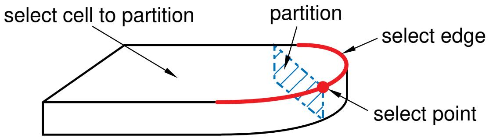

<details>
<summary>text_image</summary>

select cell to partition
partition
select edge
select point
</details>

Figure 3: Defining the cutting plane with an edge and a point.

For detailed instructions, see Using the cutting plane method to partition cells.

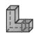

## Use datum plane

Partition a cell using the intersection with the extension of a datum plane, as shown in Figure 4. For detailed instructions, see Using the datum plane method to partition cells.


<details>
<summary>text_image</summary>

select cell to partition
datum plane
partition
</details>

Figure 4: Partitioning a cell using a datum plane.

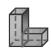

## Extend face

Partition a cell by cutting it with a shell, where the shell is the extended geometry of a face, as shown in Figure 5. The face being extended can be planar, cylindrical, conical, or spherical. For detailed instructions, see Using the extended face method to partition cells.

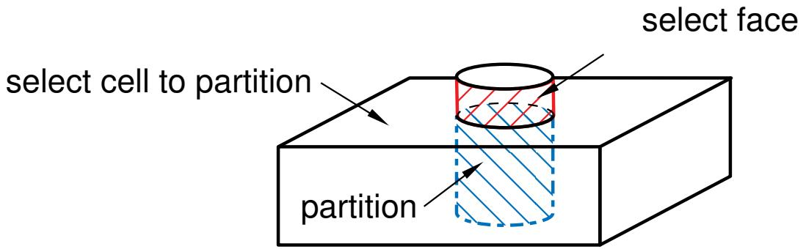

<details>
<summary>text_image</summary>

select cell to partition
partition
select face
</details>

Figure 5: Partitioning a cell using an extension of a face.

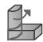

## Extrude/Sweep edges

Partition a cell by sweeping selected edges (that form the sweep profile) along a selected path (known as the sweep path). You can select any number of edges to be swept, although all the edges must lie on the same plane and must belong to the same part instance.

Use either of the following two methods to define the sweep path:

Create a straight partition through the cell by extending the sweep profile infinitely in a direction parallel to a selected straight edge or datum axis that acts as a sweep path; the partition is created where the swept edge(s) pass through the selected cell, as shown in Figure 6. The sweep path must be straight and perpendicular to the set of edges being swept.

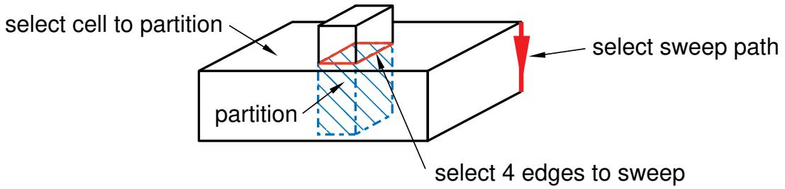

<details>
<summary>flowchart</summary>

```mermaid
graph LR
  A["select cell to partition"] --> B["partition"]
  B --> C["select 4 edges to sweep"]
  C --> D["select sweep path"]
  D --> A
```
</details>

Figure 6: Sweeping a profile along a direction.

Create a straight or curved partition through the cell by extending the sweep profile along or parallel to a selected edge. The partition extends only as far as the selected edge; and the partition is created where the swept edge(s) pass through the selected cell, as shown in Figure 7. The sweep path must begin in the plane containing the edges to be swept, and its tangent must be perpendicular to the same plane.

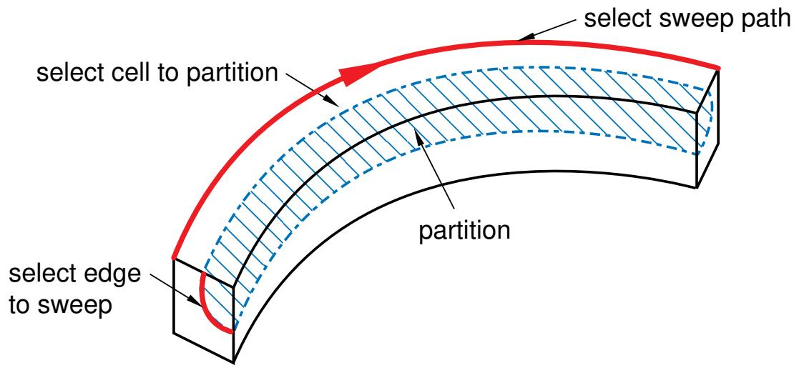

<details>
<summary>flowchart</summary>

```mermaid
graph LR
  A["select edge to sweep"] --> B["select cell to partition"]
  B --> C["select sweep path"]
  C --> D["partition"]
```
</details>

Figure 7: Sweeping a profile along an edge.

For detailed instructions, see Using the extrude/sweep method to partition cells.

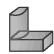

## Use n-sided patch

Partition a cell by dividing it with a surface patch formed from a loop of connected edges. The edges can be curved or straight, must be connected, and must belong to the same part as the cell to be partitioned. In addition, the patch must pass completely through the cell. Choose from the following methods to define the patch:

## Select Edges

You can choose from the following methods to select the edges that form the N-sided patch:

## Loop

Select a single edge, and allow Abaqus/CAE to search for a continuous loop of connected edges that will partition the cell, as shown in Figure 8. The resulting patch can have any number of edges.


<details>
<summary>text_image</summary>

partition
select
an edge
</details>

Figure 8: Allowing Abaqus/CAE to define a patch after selecting an edge.

## Edges

Manually select the edges that will partition the cell. You can select any number of edges, and the selected edges must form a closed loop.

## Select Corner Points

Select three, four, or five points that define the corners of the patch. If two of the points are connected by an existing edge, the resulting partition will follow the curve of the edge, as shown in Figure 9. The points must be on the boundary edges of the cell being partitioned.

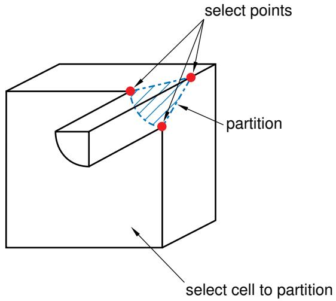

<details>
<summary>text_image</summary>

select points
partition
select cell to partition
</details>

Figure 9: Defining a patch with corner points.

For detailed instructions, see Using the N-sided patch method to partition a cell.

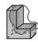

## Sketch planar partition

Partition a selected cell by sketching a partition with the Sketcher, as shown in Figure 10. In most cases you will sketch on a datum plane that intersects the selected cell. You can also select an existing face on which to sketch and draw the sketch outside the boundaries of the face. Abaqus/CAE creates the partition wherever the sketch intersects the cell.

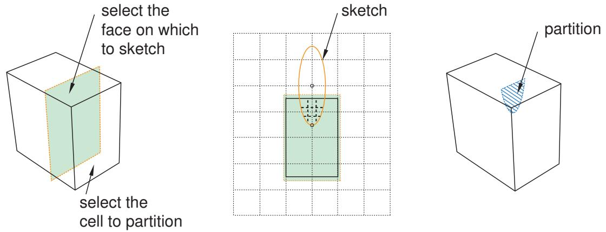  
Figure 10: Partitioning a cell using the Sketcher.

For detailed instructions, see Using the sketch planar partition method to partition a cell.

## Additional information

• Partitioning techniques  
• Understanding partitions  
• Partitioning cells

## Partitioning edges

This section describes the tools that you can use to partition a selected edge.

## In this section:

Using the specify parameter by location method to partition edges  
Using the enter parameter method to partition edges  
Using the pick midpoint/datum point method to partition an edge  
Using the datum plane method to partition edges

## Using the specify parameter by location method to partition edges

You can partition a selected edge anywhere along its length by clicking on the edge at the location of the partition. Abaqus/CAE converts the location to a parameter. As a result, you can use the Feature Manipulation toolset to modify the location of the partition.

1. From the main menu bar, select Tools->Partition.

The Create Partition dialog box appears. Abaqus/CAE displays prompts in the prompt area to guide you through the procedure.


Tip: You can also use the specify parameter method to partition edges using the tool, located with the partition edge tools in the module toolbox. For a diagram of the partition tools in the toolbox, see Using the Partition toolset.

2. From the Type radio buttons at the top of the dialog box, choose Edge.  
The Method list displays the methods that you can use to partition an edge.  
3. From the list of methods, select Specify parameter by location.  
4. Click anywhere along the edge.

Abaqus/CAE highlights the edge and the location along the edge that you picked.

5. If the location of the partition is not correct, click along the edge again.  
6. If the location of the partition is correct, click Create Partition in the prompt area.

Abaqus/CAE creates the partition.

## Additional information

• Partitioning techniques  
• Methods for partitioning edges

An arrow along the selected edges points from the start vertex, corresponding to an edge parameter value of zero, to the end vertex, corresponding to a value of one. Partitions are created along the selected edges at the location determined by the parameter, as shown in the following figure:

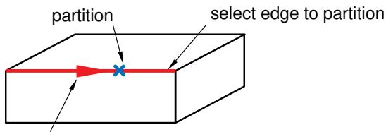

<details>
<summary>text_image</summary>

partition
select edge to partition
</details>

direction of increasing parameter

To modify a partition that was created by entering a parameter, use the Feature Manipulation toolset to change the parameter.

1. From the main menu bar, select Tools->Partition.

The Create Partition dialog box appears. Abaqus/CAE displays prompts in the prompt area to guide you through the procedure.


$\frac { - + - } {  \tt t }$ with the partition edge tools in the module toolbox. For a diagram of the partition tools in the toolbox, see Using the Partition toolset.

2. From the Type radio buttons at the top of the dialog box, choose Edge.

The Method list displays the methods that you can use to partition an edge.

3. From the list of methods, select Enter Parameter.  
4. If the part or assembly contains more than one edge, select the edges to partition. You can use a combination of drag select, [Shift] + Click, [Ctrl] + Click, and the angle method to select more than one edge to partition. For more information, see Selecting objects within the current viewport.


Tip: If you are unable to select the desired edges, you can use the Selection toolbar to change the selection behavior. For more information, see Using the selection options.

Abaqus/CAE highlights the selected edges, and arrows indicate the direction of increasing parameter value.

5. In the prompt area, click Done to indicate you have finished selecting edges.  
6. In the prompt area, enter the desired edge parameter as a value between zero and one.  
7. In the prompt area, click Create Partition.

Abaqus/CAE creates the partition.

## Additional information

• Partitioning techniques  
• Methods for partitioning edges

## Using the pick midpoint/datum point method to partition an edge

You can partition a selected edge by selecting the midpoint of the edge or a datum point along the edge.

The figure below shows an example of partitioning a selected edge by selecting the midpoint of the edge or a datum point along the edge.

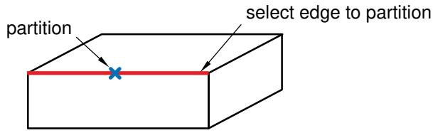

<details>
<summary>text_image</summary>

partition
select edge to partition
</details>

You cannot directly modify a partition that was created by selecting an existing point. However, if you subsequently move the point, the partition will move along with the point.

1. From the main menu bar, select Tools->Partition.

The Create Partition dialog box appears. Abaqus/CAE displays prompts in the prompt area to guide you through the procedure.


Tip: You can also use the pick midpoint/datum point method to partition an edge using the

tool, located with the partition edge tools in the module toolbox. For a diagram of the partition tools in the toolbox, see Using the Partition toolset.

2. From the Type radio buttons at the top of the dialog box, choose Edge.

The Method list displays the methods that you can use to partition an edge.

3. From the list of methods, select Select midpoint/datum point.  
4. Select the edge to partition.

Abaqus/CAE highlights the selected edge.

5. Select the midpoint of the edge or a datum point along the edge.

Abaqus/CAE highlights the location of the partition.

6. In the prompt area, click Create Partition.

Abaqus/CAE creates the partition.

## Additional information

• Selecting objects within the viewport  
• Partitioning techniques  
• Methods for partitioning edges

You can partition selected edges by cutting them with a datum plane

The figure below shows an example of partitioning selected edges by cutting them with a datum plane.

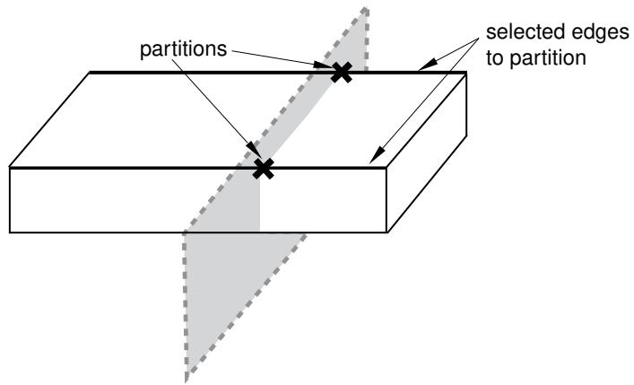

<details>
<summary>text_image</summary>

partitions
selected edges
to partition
</details>

1. From the main menu bar, select Tools->Partition.

The Create Partition dialog box appears. Abaqus/CAE displays prompts in the prompt area to guide you through the procedure.


Tip: You can also use the datum plane method to partition edges using the tool, located with the partition edge tools in the module toolbox. For a diagram of the partition tools in the toolbox, see Using the Partition toolset.

2. From the Type radio buttons at the top of the dialog box, choose Edge.

The Method list displays the methods that you can use to partition an edge.

3. From the list of methods, select Use datum plane.  
4. If the part or assembly contains more than one edge, select the edges to partition. You can use a combination of drag select, [Shift] + Click, [Ctrl] + Click, and the angle method to select more than one edge to partition. For more information, see Selecting objects within the current viewport.


Tip: If you are unable to select the desired edges, you can use the Selection toolbar to change the selection behavior. For more information, see Using the selection options.

Abaqus/CAE highlights the selected edges.

5. Select an existing datum plane. If a datum plane does not exist in the desired location, create one using the Datum toolset.

Abaqus/CAE highlights the selected datum plane.

6. In the prompt area, click Create Partition.

Abaqus/CAE creates the partition.

## Additional information

• Partitioning techniques  
• Methods for partitioning edges

## Partitioning faces

This section describes the tools that you use to partition a selected face.

## In this section:

Using the sketch method to partition faces  
Using the shortest path method to partition faces  
Using the datum plane method to partition faces  
Using the curved path method to partition a face  
Using the extended face method to partition faces  
Using the intersection method to partition faces  
Using the project edges method to partition faces  
Using the automatic generation method to partition faces

You can partition selected faces by sketching the geometry of the partition using the Sketcher. You use the Sketcher when you want to create a partition whose shape cannot be achieved with any of the other partition tools. Sketching a partition offers other advantages:

• You can use the Feature Manipulation toolset to modify the sketch if you want to change the shape or the position of the partition.  
• You can dimension the sketch precisely, and you can use the Feature Manipulation toolset to modify the dimensions.

If the faces to be partitioned are planar and lie in the same plane, you can sketch directly on that plane. Your sketch can extend beyond the boundaries of the selected faces, but the partition will not extend beyond the edge of the faces. The following figure illustrates a sketched partition on a planar face:


<details>
<summary>text_image</summary>

Sketch plane
Sketched partition
</details>

If any of the faces to be partitioned are nonplanar or do not lie in the same plane, you must select a planar face or datum plane on which to sketch. Abaqus/CAE creates the partition by projecting the sketch onto the faces to be partitioned. You can specify the direction of the projection and the distance of the projection, normal to the sketch plane. The following figure illustrates a sketched partition on a nonplanar face using the projection of a sketch drawn on a datum plane:

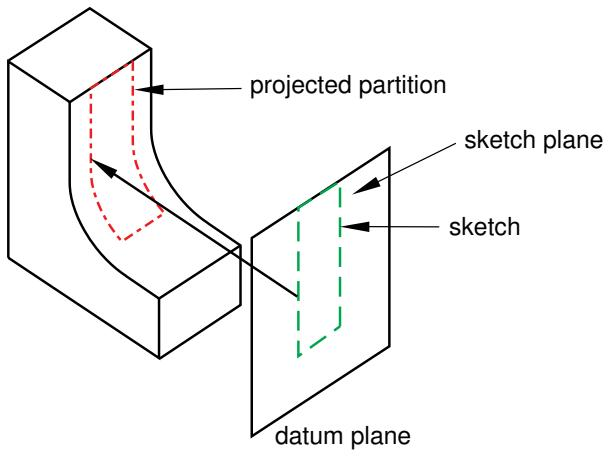

<details>
<summary>text_image</summary>

projected partition
sketch plane
sketch
datum plane
</details>

1. From the main menu bar, select Tools->Partition.

The Create Partition dialog box appears. Abaqus/CAE displays prompts in the prompt area to guide you through the procedure.


Tip: You can also use the sketch method to partition faces using the tool, located with the partition face tools in the module toolbox. For a diagram of the partition tools in the toolbox, see Using the Partition toolset.

2. From the Type radio buttons at the top of the dialog box, choose Face.

The Method list displays the methods that you can use to partition a face.

3. From the list of methods, select Sketch.

If the part or assembly contains only one face, Abaqus/CAE enters the Sketcher.

4. If the part or assembly contains more than one face, select the faces to partition and click mouse button 2. You can use a combination of drag select, [Shift] + Click, [Ctrl] + Click, and the angle method to select more than one face to partition. For more information, see Selecting objects within the current viewport.


Tip: If you are unable to select the desired faces, you can use the Selection toolbar to change the selection behavior. For more information, see Using the selection options.

• If the part or assembly is two-dimensional or axisymmetric, Abaqus/CAE enters the Sketcher and highlights the selected faces.  
If the part or assembly is three-dimensional and the selected faces are planar, select an edge and the orientation of the edge on the Sketcher grid. The edge must not be perpendicular to the sketch plane. By default, the selected edge will appear vertical and on the right side of the Sketcher grid. To choose a different orientation for the edge, click the arrow on the right side of the dialog box and choose an orientation from the list that appears.


Tip: If the part or assembly does not have an edge that will provide the desired orientation, you can create a datum axis. You can then select the datum axis to control the orientation of the part on the Sketcher grid.

Abaqus/CAE highlights the selected edge, enters the Sketcher, and rotates the part until the selected planar face or datum plane aligns with the plane of the Sketcher grid and the selected edge aligns with the grid in the desired orientation. Abaqus/CAE highlights the selected faces.

• If the part or assembly is three-dimensional and the selected faces are nonplanar or do not lie in the same plane, do the following:

1. Select a planar face or a datum plane on which to sketch. Abaqus/CAE highlights the selected face.  
2. From the buttons in the prompt area, select a method to determine how far Abaqus/CAE projects the sketch normal to the sketch plane. The partition is created wherever the projected sketch extends through the selected faces. The three methods are illustrated in the following figure:

  
Through All

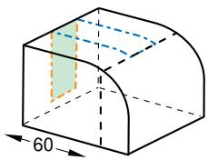

<details>
<summary>natural_image</summary>

3D diagram of a curved rectangular prism with a highlighted green section and dimension label '60' (no text or symbols beyond the label)
</details>

Enter Value

  
Select Point

• If you selected the Through All method, Abaqus/CAE asks you to choose which direction the sketch will be projected.  
If you selected the Enter Value method, Abaqus/CAE asks you to choose the distance and direction that will be used to project the sketch. The default distance that Abaqus/CAE provides generates a partition that extends completely through the selected faces (resulting

in the same partition as selecting Through All). The Feature Manipulation toolset allows you to modify the projection distance after you create the partition.

• If you selected the Select Point method, Abaqus/CAE asks you to choose the point to which the sketch will be projected; the point defines both the direction and the projection distance.

3. Select an edge and the orientation of the edge on the Sketcher grid. The edge must not be perpendicular to the sketch plane. By default, the selected edge will appear vertical and on the right side of the Sketcher grid. To choose a different orientation for the edge, click the arrow on the right side of the dialog box and choose an orientation from the list that appears.


Tip: If the part or assembly does not have an edge that will provide the desired orientation, you can create a datum axis. You can then select the datum axis to control the orientation of the part on the Sketcher grid.

Abaqus/CAE highlights the selected edge, enters the Sketcher, and rotates the part until the selected planar face or datum plane aligns with the plane of the Sketcher grid with the projection direction into the screen and the selected edge aligns with the grid in the desired orientation. Abaqus/CAE highlights the selected faces.

5. Use the Sketcher to sketch the partition. From the main menu bar, click Done to indicate you have finished sketching the partition.  
6. In the prompt area, click Create Partition.

Abaqus/CAE creates the partition.

## Additional information

• The Sketch module  
• Partitioning techniques  
• Methods for partitioning faces

## Using the shortest path method to partition faces

You can partition selected faces with a line or curve that forms the shortest possible path between two selected points.

The points can be vertices, midpoints, arc-centers, or datum points. The path will be curved if a face being partitioned is not planar, as shown in the following figure:


<details>
<summary>text_image</summary>

select face to partition
partition
selected points
</details>

1. From the main menu bar, select Tools->Partition.

The Create Partition dialog box appears. Abaqus/CAE displays prompts in the prompt area to guide you through the procedure.


Tip: You can also use the shortest path method to partition faces using the tool, located with the partition face tools in the module toolbox. For a diagram of the partition tools in the toolbox, see Using the Partition toolset.

2. From the Type radio buttons at the top of the dialog box, choose Face.

The Method list displays the methods that you can use to partition a face.

3. From the list of methods, select Shortest path between 2 points.  
4. If the part or assembly contains more than one face, select the faces to partition. You can use a combination of drag select, [Shift] + Click, [Ctrl] + Click, and the angle method to select more than one face to partition. For more information, see Selecting objects within the current viewport.


Tip: If you are unable to select the desired faces, you can use the Selection toolbar to change the selection behavior. For more information, see Using the selection options.

Abaqus/CAE highlights the selected faces.

5. Select the vertices, midpoints, arc-centers, or datum points defining the start and end of the path. Abaqus/CAE highlights the points.  
6. In the prompt area, click Create Partition. Abaqus/CAE creates the partition.

## Additional information

• Partitioning techniques  
• Methods for partitioning faces

You can partition selected faces by cutting them with a datum plane.

The figure below shows an example of partitioning selected faces by cutting them with a datum plane.

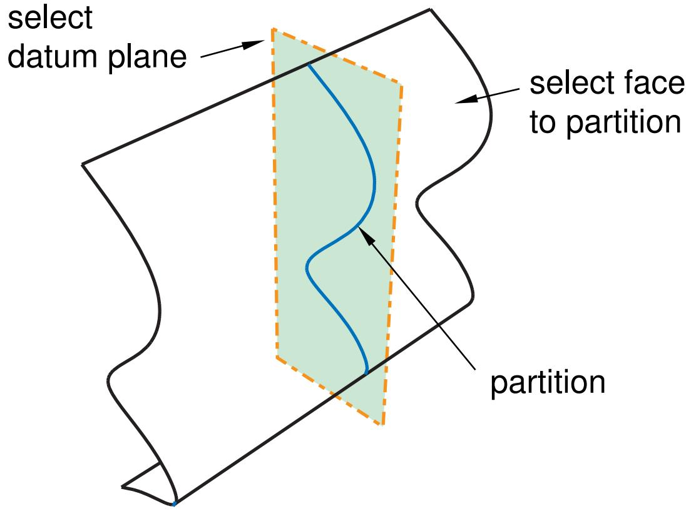

<details>
<summary>text_image</summary>

select datum plane
select face to partition
partition
</details>

1. From the main menu bar, select Tools->Partition.

The Create Partition dialog box appears. Abaqus/CAE displays prompts in the prompt area to guide you through the procedure.


Tip: You can also use the datum plane method to partition faces using the tool, located with the partition face tools in the module toolbox. For a diagram of the partition tools in the toolbox, see Using the Partition toolset.

2. From the Type radio buttons at the top of the dialog box, choose Face.

The Method list displays the methods that you can use to partition a face.

3. From the list of methods, select Use datum plane.  
4. If the part or assembly contains more than one face, select the faces to partition. You can use a combination of drag select, [Shift] + Click, [Ctrl] + Click, and the angle method to select more than one face to partition. For more information, see Selecting objects within the current viewport.


Tip: If you are unable to select the desired faces, you can use the Selection toolbar to change the selection behavior. For more information, see Using the selection options.

Abaqus/CAE highlights the selected faces.

5. Select an existing datum plane. If a datum plane does not exist in the desired location, create the datum using the Datum toolset.

Abaqus/CAE highlights the selected datum plane.

6. In the prompt area, click Create Partition.

Abaqus/CAE creates the partition.

## Additional information

• Partitioning techniques  
• Methods for partitioning faces

You can partition a face with a curve normal to two edges that bound the face.

The edges need not be contiguous, but they must bound the face and subtend an angle less than 180 degrees, as shown in the following figure:

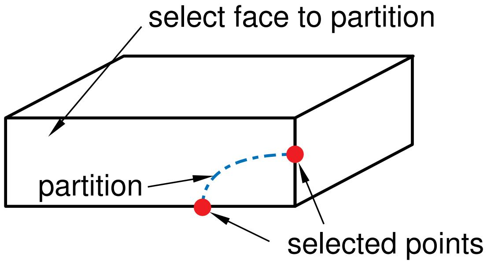

<details>
<summary>flowchart</summary>

```mermaid
graph LR
  A["partition"] --> B["select face to partition"]
  B --> C["selected points"]
  C -.-> A
```
</details>

You first select the face to partition and then select one of two methods to define the position of the partition along the two edges; Abaqus/CAE draws a Bézier curve connecting the two points. You can locate the partition along the selected edges by either:

Entering a parameter value between zero and one, where zero represents the start vertex of the edge and one the end vertex. This method allows you to precisely position the partition anywhere along the edges. In addition, you can subsequently modify the partition using the Feature Manipulation toolset to edit the two parameters that you entered to locate the partition.  
• Clicking the midpoint or a datum point along the edge. If you use this method to position a curved partition, you will not be able to modify the partition later.

1. From the main menu bar, select Tools->Partition.

The Create Partition dialog box appears. Abaqus/CAE displays prompts in the prompt area to guide you through the procedure.


Tip: You can also use the curved path method to partition a face using the tool, located with the partition face tools in the module toolbox. For a diagram of the partition tools in the toolbox, see Using the Partition toolset.

2. From the Type radio buttons at the top of the dialog box, choose Face.  
The Method list displays the methods that you can use to partition a face.  
3. From the list of methods, select Curved path normal to 2 edges.  
4. Select the face to partition.

Abaqus/CAE highlights the selected face.

5. From the buttons in the prompt area, select one of the following methods to locate the curve:

• Enter Parameter  
• Pick

6. Select any of the edges bounding the selected face.


Tip: If you are unable to select the desired edges, you can use the Selection toolbar to change the selection behavior. For more information, see Using the selection options.

Abaqus/CAE highlights the selected edge.

7. Do one of the following:

• If you selected the Enter Parameter method, enter a value between zero and one. An arrow on the selected edge indicates the direction of increasing parameter value.  
• If you selected the Pick method, click the midpoint or a datum point along the selected edge.

8. Select a second edge that bounds the face and repeat the previous step. The angle subtended by the two selected edges must be less than 180 degrees.  
9. In the prompt area, click Create Partition.

Abaqus/CAE creates the partition.

## Additional information

• Partitioning techniques  
• Methods for partitioning faces

You can partition selected faces by extending another face so that it cuts through the selected faces.

Extending a face is analogous to creating an infinite plane that is coincident with that face. Abaqus/CAE creates a partition wherever this infinite plane slices the selected faces you are trying to partition, as shown in the following figure:


<details>
<summary>text_image</summary>

select face to extend
select face to partition
partition
</details>

If the infinite plane cannot intersect any of the selected faces, Abaqus/CAE displays an error message. The extended face need not belong to the same part as the faces to be partitioned; for example, in the Assembly module you can partition the face of one part instance by extending the face of a second. Abaqus/CAE displays an error message if the part or assembly contains only one face.

1. From the main menu bar, select Tools->Partition.

The Create Partition dialog box appears. Abaqus/CAE displays prompts in the prompt area to guide you through the procedure.


Tip: You can also use the extended face method to partition faces using the tool, located with the partition face tools in the module toolbox. For a diagram of the partition tools in the toolbox, see Using the Partition toolset.

2. From the Type radio buttons at the top of the dialog box, choose Face.

The Method list displays the methods that you can use to partition a face.

3. From the list of methods, select Extend another face.  
4. Select the faces to partition. You can use a combination of drag select, [Shift] + Click, [Ctrl] + Click, and the angle method to select more than one face to partition. For more information, see Selecting objects within the current viewport.


Tip: If you are unable to select the desired faces, you can use the Selection toolbar to change the selection behavior. For more information, see Using the selection options.

Abaqus/CAE highlights the selected faces.

5. Select the face whose extension creates the desired partition.

Abaqus/CAE highlights the selected face.

6. In the prompt area, click Create Partition.

Abaqus/CAE creates the partition.

## Additional information

• Partitioning techniques  
• Methods for partitioning faces

## Using the intersection method to partition faces

You can partition selected faces using their intersection or junction with one or more other faces.

The figure below shows an example of partitioning selected faces using their intersection or junction with one or more other faces.


<details>
<summary>flowchart</summary>

```mermaid
graph LR
  subgraph Part1["Part 1"]
    direction TB
  A["Select face to partition"] --> B["Select face to intersect"]
  B --> C["Resulting partition"]
  end
  subgraph Part2["Part 2"]
    direction TB
  D["part 2"] --> A
  E["resulting partition"] --> A
  end
```
</details>

The faces need not belong to the same part; for example, in the Assembly module you can partition the face belonging to one part instance using its intersection with a face belonging to a second part instance. The resulting regions are especially useful for defining contact or constraint interactions between part instances. Abaqus/CAE displays an error message if the part or assembly contains only one face.

The following figure shows two partitions that you might create at the intersection of three part instances:

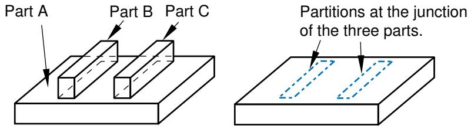

1. From the main menu bar, select Tools->Partition.

The Create Partition dialog box appears. Abaqus/CAE displays prompts in the prompt area to guide you through the procedure.


Tip: You can also use the intersection method to partition faces using the tool, located with the partition face tools in the module toolbox. For a diagram of the partition tools in the toolbox, see Using the Partition toolset.

2. From the Type radio buttons at the top of the dialog box, choose Face.  
The Method list displays the methods that you can use to partition a face.  
3. From the list of methods, select Intersect by other faces.  
4. Select the faces to partition. You can use a combination of drag select, [Shift] + Click, [Ctrl] + Click, and the angle method to select more than one face to partition. For more information, see Selecting objects within the current viewport.


Tip: If you are unable to select the desired faces, you can use the Selection toolbar to change the selection behavior. For more information, see Using the selection options.

Abaqus/CAE highlights the selected faces.

5. Select the faces that join or intersect the faces to be partitioned.

Abaqus/CAE highlights the selected faces.

6. In the prompt area, click Create Partition.

Abaqus/CAE creates the partition.

## Additional information

• Partitioning techniques  
• Methods for partitioning faces

## Using the project edges method to partition faces

You can partition selected faces using their intersection or junction with the projection of one or more edges.

The figure below shows an example of partitioning selected faces using their intersection or junction with the projection of one or more edges.


<details>
<summary>flowchart</summary>

```mermaid
graph LR
  A["select face to partition"] --> B["optional extended partition"]
  C["select edge to project"] --> D["select edge to project"]
  B --> E["resulting partition"]
  E --> D
  D --> F["optional extended partition"]
```
</details>

Abaqus/CAE creates the partition by taking a perpendicular projection from the faces being partitioned to the selected edges; nonplanar faces or faces joined at a sharp edge such that there is a discontinuity in the perpendicular projection may significantly change the shape of the projected edges. As shown in the figure, you can create a partition that ends at the endpoints of the projected edges, or you can extend the projected edges to reach the face boundaries. If you extend the partition, Abaqus/CAE extends the free ends of the projected edges along their tangents to reach the boundary edges of the faces being partitioned.

The faces and edges need not belong to the same part; for example, in the Assembly module you can partition faces belonging to one part instance using edges projected from a second part instance. The faces to be partitioned must be part of the active model representation. The edges can be part of the active representation or part of the reference representation for a midsurface model.

1. From the main menu bar, select Tools->Partition.

The Create Partition dialog box appears. Abaqus/CAE displays prompts in the prompt area to guide you through the procedure.


Tip: You can also use the project edges method to partition faces using the tool, located with the partition face tools in the module toolbox. For a diagram of the partition tools in the toolbox, see Using the Partition toolset.

2. From the Type radio buttons at the top of the dialog box, choose Face.

The Method list displays the methods that you can use to partition a face.

3. From the list of methods, select Project edges.  
4. Select the faces to partition. You can use a combination of drag select, [Shift] + Click, [Ctrl] + Click, and the angle method to select more than one face to partition. For more information, see Selecting objects within the current viewport.


Tip: If you are unable to select the desired faces, you can use the Selection toolbar to change the selection behavior. For more information, see Using the selection options.

Abaqus/CAE highlights the selected faces.

5. Select the edges to be projected onto the faces. If desired, toggle on Extend edges to have Abaqus/CAE extend the projected edges, preventing gaps in the new face partitions.


## Note:

You can also toggle the Extend edges parameter on or off by editing the completed partition feature in the Model Tree.

Abaqus/CAE highlights the selected edges.

6. In the prompt area, click Create Partition.

Abaqus/CAE projects the selected edges to create the partition.

## Additional information

• Partitioning techniques  
• Methods for partitioning faces

## Using the automatic generation method to partition faces

The Mesh module is capable of meshing any two-dimensional face automatically.

Automatic meshing with quadrilateral elements begins by internally partitioning the face into regions having between three and five sides, as shown in the following figure:

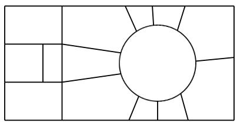

<details>
<summary>natural_image</summary>

Abstract geometric diagram with a central circle surrounded by smaller rectangles and radiating lines (no text or symbols)
</details>

Then, a mesh is generated on each of these regions, as shown in the following figure:


<details>
<summary>natural_image</summary>

Abstract geometric pattern with radial lines and a central circle (no text or symbols)
</details>

Normally, when you mesh a face, these two steps take place in what appears to be a single step. However, to gain more control over the meshing process, you can perform the partitioning step separately using the automatic partitioning tool in the Partition toolset.

Since the automatic partitioning tool is associated with meshing, it is available only within the Mesh module. After you automatically partition the face, you can gain additional control over the mesh by seeding or by adding or deleting partitions manually.

1. From the main menu bar, select Tools->Partition.

The Create Partition dialog box appears. Abaqus/CAE displays prompts in the prompt area to guide you through the procedure.


Tip: You can also use the automatic generation method to partition faces using the tool, located with the partition face tools in the module toolbox. For a diagram of the partition tools in the toolbox, see Using the Partition toolset.

2. From the Type radio buttons at the top of the dialog box, choose Face.

The Method list displays the methods that you can use to partition a face.

3. From the list of methods, select Auto-partition.

4. If the part or assembly contains more than one face, select the faces to partition. You can use a combination of drag select, [Shift] + Click, [Ctrl] + Click, and the angle method to select more than one face to partition. For more information, see Selecting objects within the current viewport.


Tip: If you are unable to select the desired faces, you can use the Selection toolbar to change the selection behavior. For more information, see Using the selection options.

Abaqus/CAE highlights the selected faces.

5. In the prompt area, click Create Partition.

Abaqus/CAE creates the partition.

## Additional information

• Partitioning techniques  
• Methods for partitioning faces

## Partitioning cells

This section describes the partition tools that you use to partition a cell.

## In this section:

Using the cutting plane method to partition cells  
Using the datum plane method to partition cells  
Using the extended face method to partition cells  
Using the extrude/sweep method to partition cells  
Using the N-sided patch method to partition a cell  
Using the sketch planar partition method to partition a cell

## Using the cutting plane method to partition cells

You can partition selected cells by cutting them with a plane. You first select the cells to partition and then select one of three methods to define the plane that partitions the cells. The three methods are:

• Select a point and any straight edge. The cutting plane will pass through the point, normal to the edge.  
• Select three points. The cutting plane will pass through all three points.  
• Select a straight or curved edge and a point on the edge. The cutting plane will pass through the point, normal to the edge at the selected point.

The following procedure illustrates the three methods.

1. From the main menu bar, select Tools->Partition.

The Create Partition dialog box appears. Abaqus/CAE displays prompts in the prompt area to guide you through the procedure.


Tip: You can also use the plane method to partition cells using the tool, located with the partition cell tools in the module toolbox. For a diagram of the partition tools in the toolbox, see Using the Partition toolset.

2. From the Type radio buttons at the top of the dialog box, choose Cell.  
The Method list displays the methods that you can use to partition a cell.  
3. From the list of methods, select Define cutting plane.  
4. If the part or assembly contains more than one cell, select the cells to partition. You can use a combination of drag select, [Shift] + Click, and [Ctrl] + Click to select more than one cell to partition.


Tip: If you are unable to select the desired cells, you can use the Selection toolbar to change the selection behavior. For more information, see Using the selection options.

Abaqus/CAE highlights the selected cell.

5. From the prompt area, click one of the following methods to define the cutting plane:

Use the Point & normal method to partition the selected cells along a plane that passes through a selected point and is normal to a selected straight edge or datum axis, as shown in the following figure:

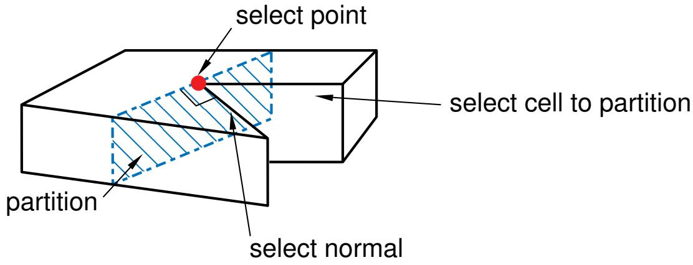

<details>
<summary>text_image</summary>

select point
select cell to partition
partition
select normal
</details>

• Use the 3 Points method to partition the selectes cells along a plane passing through three selected points, as shown in the following figure:


<details>
<summary>text_image</summary>

select cell to partition
partition
select points
</details>

The three points can be anywhere on the part or assembly, but they must be distinct and they must not be colinear.

Use the Normal to edge method to partition the selected cells along a plane that is normal to a selected edge and passes through a selected point on the edge. The edge can be straight or curved, and need not be part of the cells being partitioned, although you cannot select a datum axis. This method is useful when you want to partition a cell normal to a curved edge, as shown in the following figure:


<details>
<summary>text_image</summary>

select cell to partition
partition
select edge
select point
</details>

6. Select points and edges as directed by the prompts in the prompt area. Points can be vertices, midpoints, arc centers, or datum points.  
7. In the prompt area, click Create Partition.

Abaqus/CAE creates the partition.

## Additional information

• Partitioning techniques  
• Methods for partitioning cells

## Using the datum plane method to partition cells

You can partition selected cells by cutting them with a datum plane.

The figure below shows an example of partitioning selected cells by cutting them with a datum plane.


<details>
<summary>text_image</summary>

select cell to partition
datum plane
partition
</details>

1. From the main menu bar, select Tools->Partition.

The Create Partition dialog box appears. Abaqus/CAE displays prompts in the prompt area to guide you through the procedure.


Tip: You can also use the datum plane method to partition cells using the tool, located with the partition cell tools in the module toolbox. For a diagram of the partition tools in the toolbox, see Using the Partition toolset.

2. From the Type radio buttons at the top of the dialog box, choose Cell.  
The Method list displays the methods that you can use to partition a cell.  
3. From the list of methods, select Use datum plane.  
4. If the part or assembly contains more than one cell, select the cells to partition. You can use a combination of drag select, [Shift] + Click, and [Ctrl] + Click to select more than one cell to partition.


Tip: If you are unable to select the desired cells, you can use the Selection toolbar to change the selection behavior. For more information, see Using the selection options.

Abaqus/CAE highlights the selected cell.

5. Select an existing datum plane. If a datum plane does not exist in the desired location, create the datum using the Datum toolset.

Abaqus/CAE highlights the selected datum plane.

6. In the prompt area, click Create Partition.

Abaqus/CAE creates the partition.

## Additional information

• Partitioning techniques

• Methods for partitioning cells

## Using the extended face method to partition cells

You can partition selected cells by extending another face until it cuts through the selected cells.

Extending a face is analogous to creating an infinite plane that is coincident with the face. Abaqus/CAE creates a partition wherever this infinite plane slices the cells that you are partitioning, as shown in the following figure:

select face  
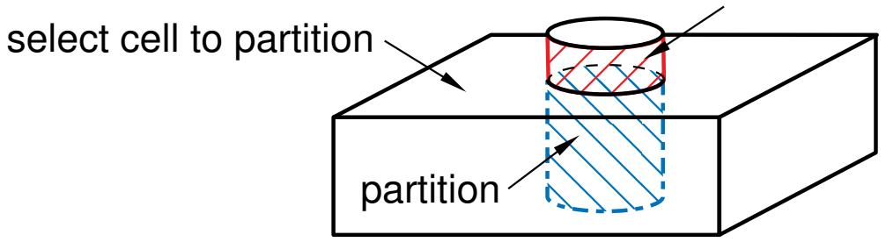

<details>
<summary>text_image</summary>

select cell to partition
partition
</details>

If the infinite plane cannot intersect the cells, Abaqus/CAE displays an error message. The extended face need not belong to the same part as the cells to be partitioned; for example, in the Assembly module you can partition the cell of one part instance by extending the face of a second.

1. From the main menu bar, select Tools->Partition.

The Create Partition dialog box appears. Abaqus/CAE displays prompts in the prompt area to guide you through the procedure.


Tip: You can also use the datum plane method to partition cells using the tool, located with the partition cell tools in the module toolbox. For a diagram of the partition tools in the toolbox, see Using the Partition toolset.

2. From the Type radio buttons at the top of the dialog box, choose Cell.  
The Method list displays the methods that you can use to partition a cell.  
3. From the list of methods, select Extend face.  
4. If the part or assembly contains more than one cell, select the cells to partition. You can use a combination of drag select, [Shift] + Click, and [Ctrl] + Click to select more than one cell to partition.


Tip: If you are unable to select the desired cells, you can use the Selection toolbar to change the selection behavior. For more information, see Using the selection options.

Abaqus/CAE highlights the selected cell.

5. Select the face that will be extended to create the desired partition.

Abaqus/CAE highlights the selected faces.


Tip: If you are unable to select the desired faces, you can use the Selection toolbar to change the selection behavior. For more information, see Using the selection options.

6. In the prompt area, click Create Partition.

Abaqus/CAE creates the partition.

## Additional information

• Partitioning techniques  
• Methods for partitioning cells

## Using the extrude/sweep method to partition cells

You can create complex three-dimensional partitions using the sweep tool to sweep two-dimensional profiles (known as sweep profiles) through three-dimensional parts or part instances. Using the sweep tool is a two-stage operation. First you define the sweep profile by selecting the edges to sweep, and then you select the path along which to sweep the selected edges (known as the sweep path). You can choose between two methods to define the sweep path:

• Extrude along direction  
• Sweep along edge

These two methods are illustrated below.

1. From the main menu bar, select Tools->Partition.

The Create Partition dialog box appears. Abaqus/CAE displays prompts in the prompt area to guide you through the procedure.


Tip: You can also use the extrude/sweep method to partition cells using the tool, located with the partition cell tools in the module toolbox. For a diagram of the partition tools in the toolbox, see Using the Partition toolset.

2. From the Type radio buttons at the top of the dialog box, choose Cell.  
The Method list displays the methods that you can use to partition a cell.  
3. From the list of methods, select Extrude/sweep edges.  
4. If the part or assembly contains more than one cell, select the cells to partition. You can use a combination of drag select, [Shift] + Click, and [Ctrl] + Click to select more than one cell to partition.


Tip: If you are unable to select the desired cells, you can use the Selection toolbar to change the selection behavior. For more information, see Using the selection options.

Abaqus/CAE highlights the selected cell.

5. To create the sweep profile, select the edges to sweep through the cells. The edges must all belong to the same part, lie on the same plane, and be connected to each other.

Abaqus/CAE highlights the selected edges.

6. From the buttons in the prompt area, click on one of the following methods to define the sweep path:

Use the Extrude along direction method to partition a cell by extruding selected edges—the sweep profile—along a straight edge or datum axis—the sweep path—in a selected direction. The sweep path must be perpendicular to the plane containing the sweep profile. The partition extends infinitely in the selected direction through the selected cell. Extruding a sweep profile along a direction to partition a cell is illustrated in the following figure:


<details>
<summary>flowchart</summary>

```mermaid
graph LR
  A["select cell to partition"] --> B["partition"]
  B --> C["select 4 edges to sweep"]
  C --> D["select sweep path"]
```
</details>

Abaqus/CAE highlights the sweep profile.

Use the Sweep along edge method to partition a cell by sweeping selected edges—the sweep profile—along a straight or curved edge—the sweep path. The sweep path must begin in the plane containing the sweep profile, and its tangent must be perpendicular to that same plane. The resulting partition will extend only as far as the sweep path. Sweeping a sweep profile along an edge to partition a cell is illustrated in the following figure:


<details>
<summary>flowchart</summary>

```mermaid
graph LR
  A["select edge to sweep"] --> B["select cell to partition"]
  B --> C["select sweep path"]
  C --> D["partition"]
```
</details>

Abaqus/CAE highlights the sweep path.

7. In the prompt area, click Create Partition.

Abaqus/CAE creates the partition.

## Additional information

• Partitioning techniques  
• Methods for partitioning cells

## Using the N-sided patch method to partition a cell

You can partition a cell by creating a patch that divides the cell into regions. You can define the patch using either edges or corner points. If you select an edge, Abaqus/CAE searches for a continuous loop of connected edges that will define a viable patch. If you select corner points, you can select either three, four, or five points to define the partition. In contrast with the other cell partition tools, the partition that results from an N-sided patch does not extend beyond the patch. As a result, the N-sided patch method is useful for creating an isolated partition that does not extend into the rest of the cell.

If you select a curved edge or if you select two points connected by a curved edge, the corresponding edge of the resulting N-sided patch follows the contour of the edge. However, if you select points that are not connected by an edge, the patch simply connects the points; the patch will not follow the contour of the cell, and the partition may be incomplete.

1. From the main menu bar, select Tools->Partition.

The Create Partition dialog box appears. Abaqus/CAE displays prompts in the prompt area to guide you through the procedure.


A Tip: You can also use the N-sided patch method to partition a cell using the tool, located with the partition cell tools in the module toolbox. For a diagram of the partition tools in the toolbox, see Using the Partition toolset.

2. From the Type radio buttons at the top of the dialog box, choose Cell.

The Method list displays the methods that you can use to partition a cell.

3. From the list of methods, select N-sided patch.  
4. If the part or assembly contains more than one cell, select the cell to partition.


Tip: If you are unable to select the desired cell, you can use the Selection toolbar to change the selection behavior. For more information, see Using the selection options.

Abaqus/CAE highlights the selected cell.


Tip: Use the Previous button ( ) to undo the steps in a procedure.

5. From the buttons in the prompt area, select the method to define the N-sided patch:

Use the Select Edges method to partition a cell by defining an N-sided patch from a sequence of selected edges. Use the text field in the prompt area to select the method of choosing edges:

## Loop

Select a single edge, and allow Abaqus/CAE to search for a continuous loop of connected edges that will partition the cell, as shown in the following figure:


The edge that you select must be on the boundary of the cell being partitioned, and Abaqus/CAE must be able to form a closed loop from a series of connected edges. The resulting patch can have any number of edges. Abaqus/CAE highlights the loop that will form the patch.

## Edges

Manually select the edges that will partition the cell. The edges that you select must be on the boundary of the cell being partitioned. You can select any number of edges, and the selected edges must form a closed loop.

Use the Select Corner Points method to partition a cell by defining an N-sided patch using three to five selected points. Abaqus/CAE creates the patch by connecting the points in the order that you select them; consequently, the order in which you select the points is significant. The points can be vertices, midpoints, or datum points and must be on the boundary edges of the cell being partitioned. If a curved edge connects two of the points, the patch follows the contour of the curve, as shown in the following figure:


<details>
<summary>text_image</summary>

select points
partition
select cell to partition
</details>

Abaqus/CAE highlights the selected points along with the edges that will form the patch.

6. Do one of the following:

• If the highlighted edges indicate that Abaqus/CAE will create the desired partition, click Create Partition in the prompt area.

Abaqus/CAE creates the partition.

• To change the selection of edges, click the Previous button ( ↑ ) to undo the previous step.

## Additional information

• Partitioning techniques  
• Methods for partitioning cells

## Using the sketch planar partition method to partition a cell

You can partition a selected cell by sketching the geometry of a planar partition using the Sketcher. You use the Sketcher when you want to create a partition whose shape cannot be achieved with any of the other partition tools. A sketched partition is useful for creating a crack face that will be used in a fracture mechanics analysis.

You must sketch on a planar face. In most cases you will sketch the partition on a datum plane that intersects the selected cell. The following figure illustrates a sketched planar partition on a datum plane:

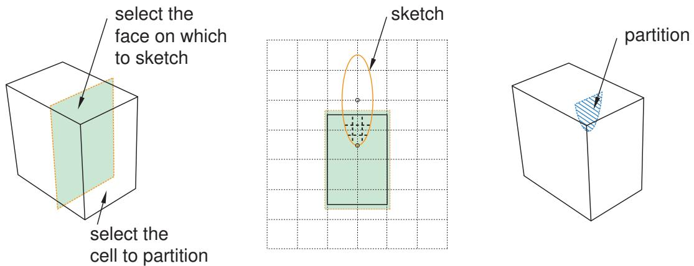

1. From the main menu bar, select Tools->Partition.

The Create Partition dialog box appears. Abaqus/CAE displays prompts in the prompt area to guide you through the procedure.


Tip: You can also use the sketch planar partition method to partition cells using the tool, located with the partition cell tools in the module toolbox. For a diagram of the partition tools in the toolbox, see Using the Partition toolset.

2. From the Type radio buttons at the top of the dialog box, choose Cell.

The Method list displays the methods that you can use to partition a cell.

3. From the list of methods, select Sketch planar partition.

If the part or assembly contains only one cell, Abaqus/CAE enters the Sketcher.

4. If the part or assembly contains more than one cell, select the cell to partition and click mouse button 2.


Tip: If you are unable to select the desired cell, you can use the Selection toolbar to change the selection behavior. For more information, see Using the selection options.

5. Select the planar face on which to sketch. If no suitable face exists, you can select a datum plane.

The selected face is highlighted in the viewport.

6. Select an edge and the orientation of the edge on the Sketcher grid. The edge must not be perpendicular to the sketch plane. By default, the selected edge will appear vertical and on the right side of the Sketcher grid. To choose a different orientation for the edge, click the arrow on the right side of the dialog box and choose an orientation from the list that appears.


Tip: If the part or assembly does not have an edge that will provide the desired orientation, you can create a datum axis. You can then select the datum axis to control the orientation of the part on the Sketcher grid.

Abaqus/CAE highlights the selected edge, enters the Sketcher, and rotates the part until the selected planar face or datum plane aligns with the plane of the Sketcher grid and the selected edge aligns with the grid in the desired orientation. Abaqus/CAE highlights the selected faces.

7. Use the Sketcher to sketch the planar partition. From the main menu bar, click Done to indicate you have finished sketching the partition.  
8. In the prompt area, click Create Partition.

Abaqus/CAE creates the partition.

## Additional information

• The Sketch module  
• Partitioning techniques  
• Methods for partitioning cells

## The Query toolset

The Query toolset allows you to obtain information about your model.

## In this section:

Understanding the role of the Query toolset  
Querying the model

## Understanding the role of the Query toolset

The Query toolset allows you to obtain information about your model.

In most cases Abaqus/CAE displays the requested information in the message area, and the same information is written to the replay file. Select Tools->Query from the main menu bar to use the Query toolset, or select the query tool in the Query toolset.

The Query dialog box is split into two sections. The top section of the dialog box contains general queries that are available in each module except the Job module, where the Query toolset is not available at all. The bottom portion of the dialog box contains module-specific queries; as you switch between modules, Abaqus/CAE displays queries that are appropriate for the contents of the current module.

## In this section:

General queries  
Module-specific queries

## General queries

You can always use the Query toolset to obtain general information about the model, regardless of which module you are using, although the Query toolset is not available in the Job module.

The General Queries in the Visualization module are similar to those in the other modules, but they are discussed separately in Querying the model in the Visualization module due to differences in some selection methods and the inclusion of undeformed and deformed model data in the results. For all other modules, the items under General Queries in the Query toolset provide the general information discussed below.

In most cases Abaqus/CAE displays the requested information in the message area, and the same information is written

to the replay file. Select Tools->Query from the main menu bar to use the Query toolset, or select the tool in the Query toolset.

The Query dialog box is split into two sections. The top section of the dialog box contains general queries that are available in each module except the Job module, where the Query toolset is not available at all. The bottom portion of the dialog box contains module-specific queries; as you switch between modules, Abaqus/CAE displays queries that are appropriate for the contents of the current module.

For tools that require meshes to be available, you can use the View->Part Display Options or View->Assembly Display Options menu items to display the native mesh.

## Point/Node

Coordinates of a selected point or node. You can select a local CSYS in which to display the coordinates.

## Distance

Distance between two selected points, nodes, edges, faces, or a combination of these objects. You can select a local CSYS in which to display the coordinates of the picked points and the components of the result.

## Angle

The angle between two edges or faces, between an edge and a face, or between three points

## Feature

For a selected feature:

• Feature name  
• Description  
• Status (if the feature is suppressed or if it failed to regenerate)  
• Parent feature names  
• Child feature names  
• Parameters

## Shell element normals

Display shell/membrane normal directions

## Beam element tangents

Display beam/truss tangent directions

In addition, if the current viewport contains a mesh, the Query toolset provides the following information:

## Mesh stack orientation

For hexahedral, wedge, and quadrilateral elements that you can use in a continuum shell, cohesive, cylindrical, or gasket mesh, Abaqus/CAE indicates the mesh stack orientation. For hexahedral and wedge elements, Abaqus/CAE colors the top face brown and the bottom face purple. For quadrilateral elements, arrows indicate the orientation of the elements. In addition, Abaqus/CAE highlights any element faces and edges that have inconsistent orientation.


## Note:

The query results do not account for changes made in the mesh stack orientation while defining a solid composite layup or a composite shell layup in the Property module.

## Mesh

For an assembly, part or part instance, geometric region, or element:

• The total number of nodes and elements in the selected area  
• The number of elements for each element shape

By default, Abaqus/CAE displays mesh information in the message area, but you can display this information in tabular format in the Mesh statistics dialog box by toggling on Display detailed report in the prompt area. The Mesh statistics dialog box also enables you to display mesh information by part instance or by element type.

## Element

For a selected element:

• Element label  
• Element topology; for example, linear hexahedron  
• Abaqus element name; for example, C3D8I  
• Nodal connectivity

## Mesh gaps/intersections

For a selected part or part instance:

• Display element edges of boundary faces with incompatible interfaces  
• Display element edges of boundary faces with cracks or gaps  
• Display element edges of boundary faces that intersect other faces

## Mass properties

For an assembly, selected part or part instance, geometric region, solid element, shell, solid face, beam, or truss, Abaqus/CAE returns some or all of the following information:

• Surface area (displayed only for shell elements and for solid faces)  
• Area centroid  
Volume  
• Volume centroid  
• Mass  
• Center of mass  
• Moments of inertia about the center of mass or about a specified point

For more information about this query, see Querying mass properties.

## Geometry diagnostics

• Invalid, imprecise, or small geometry  
• Topology

## Sets

For a selected set:

• Geometry set: components, index, instance name, set name, set type, total number of components  
• Element set: element label, element type, connectivity, instance name, set name, set type, total number of elements  
• Node set: node label, nodal coordinates, elements sharing the node, instance name, set name, set type, total number of nodes

## Surfaces

For a selected surface:

• Geometry surface: index, side, instance name, surface name, surface type, total number of surfaces  
• Mesh surface: element label, element type, connectivity, side, instance name, surface name, surface type, total number of faces

## Geometry face normal

The surface normal components in the global Cartesian coordinate system of a planar face or, for a curved surface, at a selected point on the face. You can select a local CSYS in which to display the normal. If typing coordinates of an evaluation point on a curved surface, you should enter the coordinates in the local CSYS, if selected.

## Element face normal

The surface normal components in the global Cartesian coordinate system of the element face. You can select a local CSYS in which to display the normal.

## Advanced distance

Whereas the regular distance query allows you to find the distance between two selected single entities, the advanced distance query allows you to find the minimum distance between groups of entities. These entities can be nodes, elements, vertices, edges, faces, or cells, and you can select them from the viewport or by set. You can select a local CSYS in which to display the coordinates of the closest points and the components of the result.

For more information, see Obtaining general information about the model.

• Customizing mesh display

## Module-specific queries

In addition to general queries, you can query the model for information specific to the module you are using. Abaqus/CAE displays these module-specific queries at the bottom of the Query toolset under, “Modulename Module Queries.” The Query toolset can provide the following module-specific information:

## Part module

The items under Part Module Queries provide the following module-specific information about the current part:

## Part attributes

• Name  
• Modeling space  
• Type (deformable or rigid body)

## Regeneration warnings

If any sets or surfaces in the selected part cannot be regenerated because their underlying geometry has been modified or deleted, Abaqus/CAE displays the set or surface name, the original number of faces, and the number of faces found during the query.

## Substructure statistics

Abaqus/CAE displays the following information about the selected substructure part: the number of retained nodes, eigenmodes, and substructure loads in the part; the availability of the recovery matrix, gravity load vectors, reduced mass matrix, reduced structural damping matrix, and reduced viscous damping matrix in the substructure; and mass properties of the substructure.

For more information, see Using the Query toolset in the Part module.

## Property module

The items under Property Module Queries provide the following module-specific information about the current part:

## Section assignments

Sections assigned to a selected region

## Regions missing sections

Regions that require a section assignment

## Beam orientations

Beam orientations assigned to a selected wire region (Abaqus/CAE displays the ( , , ) axis system on the selected wire region)

## Material orientations

Material orientations assigned to a selected region

## Rebar orientations

Rebar reference orientations assigned to a selected region

## Ply stack plot

Abaqus/CAE creates a new viewport and displays a graphical representation of a core sample through a region of a composite layup or composite section. The image shows the plies in the layup along with details of each ply, such as its fiber orientation, thickness, reference plane, and integration points.

## Disjoint ply regions

Abaqus/CAE displays in the message area the names of the composite layups and the plies within them that contain disjoint regions.

For more information, see Using the Query toolset to obtain assignment information, and Viewing a ply stack plot.

## Assembly module

The items under Assembly Module Queries provide the following module-specific information about a selected part instance:

## Instance attributes

Name, type, and modeling space

## Instance position

• Position of the origin relative to the global coordinate system  
• Sum of the translations and rotations applied to the instance  
• Number of translational and rotational constraints applied

For more information, see Using the Query toolset to query the assembly.

## Step module

The Query toolset provides only general information in the Step module.

## Interaction module

The item under Interaction Module Queries provides the following module-specific information about a selected wire:

• Connector assignment information

For more information, see Using the Query toolset to obtain connector assignment information.

## Load module

The Query toolset provides only general information in the Load module.

## Mesh module

The items under Mesh Module Queries provide the following module-specific information about a part or part instance:

• Free/Non-manifold edges  
• Unmeshed regions  
• Unassociated geometry

For more information, see Obtaining mesh information.

## Job module

None of the Abaqus/CAE toolsets are available in the Job module.

## Visualization module

The items under Visualization Module Queries provide the following module-specific information:

• Probe values. Abaqus/CAE displays information in the Probe Values dialog box as you move the cursor around the current viewport. Probing a model plot displays model data and analysis results; probing an X–Y plot displays X–Y curve data. For more information, see Probing the model.  
Stress linearization. Stress linearization is the separation of stresses through a section into constant membrane and linear bending stresses. Abaqus/CAE performs stress linearization calculations and displays the results in the form of an X–Y plot. For more information, see Calculating linearized stresses.  
• Active elements or nodes. Abaqus/CAE displays the label numbers of all of the active nodes or active elements in the current viewport. For more information, see Querying active node or element labels.  
• Ply stack plot. Abaqus/CAE creates a new viewport and displays a graphical representation of a core sample through a region of a composite layup or composite section. The image shows the plies in the layup along with details of each ply, such as its fiber orientation, thickness, reference plane, and integration points. For more information, see Viewing a ply stack plot.

## Sketch module

The items under Sketch Module Queries provide the following information about a selected constraint or sketch:

## Constraint

• Constraint type  
• Constrained entity names

In addition, the constrained entities are highlighted in the sketch.

## Detail

• Number of geometries

• Number of vertices  
• Number of constraints  
• Number of dimensions  
• Number of unconstrained degrees of freedom

## Querying the model

This section describes how you use the Query toolset to obtain information about your model.

## In this section:

Using the Query toolset to query the model  
Obtaining general information about the model  
Querying mass properties  
Using the geometry diagnostic tools

## Using the Query toolset to query the model

You can use the Query toolset to obtain general information about the geometry of the model in the current viewport and the features that define the model.

In addition, you can obtain information specific to the module you are using; for example, if you are using the Mesh module, the Query toolset can provide information on the mesh, nodes, and elements.

1. From the main menu bar, select Tools->Query.


Tip: You can also query the model by clicking the tool in the Query toolset.

Abaqus/CAE displays the Query dialog box.

2. From the Query dialog box, select one of the following:

• General Queries

Point/Node  
Distance  
- Angle  
Feature  
Shell element normals  
Beam element tangents  
Mesh stack orientation  
Mesh  
Element  
- Mesh gaps/intersections  
- Mass properties  
Geometry diagnostics  
Sets  
Surfaces  
Geometry face normal  
Element face normal

For more information, see Obtaining general information about the model.

• Module-specific queries. For a complete list of the information available in each module, see Understanding the role of the Query toolset.

3. For shell normals, beam tangents, mesh gaps, and mesh stack orientation, Abaqus/CAE uses arrows and highlighting to display the requested information in the viewport.

For all other queries, Abaqus/CAE displays prompts in the prompt area to guide you through the rest of the procedure. Abaqus/CAE displays the requested information in the message area. To resize the message area, drag the top edge; to see information that has scrolled out of the message area, use the scroll bar on the right side. The same information that appears in the message area is also written to the replay file.

4. Click the cancel button in the prompt area when you have finished requesting information.

## Additional information

• Obtaining general information about the model  
• Understanding the role of the Query toolset

## Obtaining general information about the model

You can use the Query toolset to obtain general information about your model including point/node coordinates; element labels, topology, and nodal connectivity; and mass properties.

To obtain general information about your model, select Tools->Query from the main menu or click the tool in the Query toolset. For tools that require meshes to be available, you can use the View->Part Display Options or View->Assembly Display Options menu items to display the native mesh. Select one of the following from the General Queries field in the Query dialog box that appears:

## Point/Node

Select a point or node. Abaqus/CAE displays the X-, Y-, and Z-coordinates of the point. You can select a local CSYS in which to display the coordinates.

## Distance

Select two points or nodes. In the Part, Property, and Mesh modules you can select points, edges, or faces. You can select a local CSYS in which to display the coordinates of the picked points and the components of the result. Abaqus/CAE displays the following:

• The X-, Y-, and Z-coordinates of each entity.  
• The absolute distance between the entities.  
• The X-, Y-, and Z-components of the vector between the two entities.

The distance between non-point entities is always the shortest distance between two points within the entities.

## Angle

Select Face/Curve or 3 Points in the prompt area.

• If you selected Face/Curve, select two edges or two faces or select an edge and a face. Abaqus/CAE displays one of the following, depending on your selection:  
- The angle between the two edges.  
- The angle between the normals to the face.  
The angle between the edge and the normal to the face.

When you select an edge, Abaqus/CAE displays an arrow along the edge. When you select a face, Abaqus/CAE displays an arrow on the face that indicates the normal to the face. The angle is defined as the angle that must be swept by one edge or face to align the two arrows. The angle is always positive and less than or equal to 180°.

• If you selected 3 Points, select three points/nodes or enter node labels.

## Feature

Click mouse button 3 on a feature in the Model Tree, and select Query from the menu that appears. Abaqus/CAE displays the following information about the selected feature:

• Name and description; for example, solid extrude.  
• Status, if the feature is suppressed or if it failed to regenerate.

• The name of its parent, if any.  
• The names of its children, if any.  
• The value of any parameters that define the feature.

## Shell element normals

• For parts with shell regions, Abaqus/CAE displays the part or assembly using the shaded render style. The side of the shell where the surface normal coincides with the shell normal (top face) is colored brown; the opposite side (bottom face) is colored purple.  
• For axisymmetric parts with wire regions, Abaqus/CAE displays cyan arrows indicating the directions of the normals.

You can use the Assign menu in the Property module or the Mesh->Orientation->Normal menu in the Mesh module to reverse the normal directions. For more information, see Assigning shell/membrane normal directions.

## Beam element tangents

Abaqus/CAE displays cyan arrows indicating the directions of the beam tangents.

You can use the Assign menu in the Property module or the Mesh->Orientation->Normal menu in the Mesh module to reverse the tangent directions. For more information, see Assigning beam/truss tangent directions.

## Mesh stack orientation

You can use this tool to query only hexahedral, wedge, and quadrilateral elements because these are the only elements that can be stacked to form a continuum shell, cohesive, cylindrical, or gasket mesh. For hexahedral and wedge elements, Abaqus/CAE colors the top face brown and the bottom face purple. Similarly, arrows indicate the orientation of quadrilateral elements. In addition, Abaqus/CAE highlights any element faces and edges that have inconsistent orientation. For more information, see Creating a model with cohesive elements using geometry and mesh tools, Continuum shells, Swept meshing of cylindrical solids, and Gaskets.

If the region is a native Abaqus mesh, you can change the mesh stack orientation by changing the direction of the sweep path. For solid regions, you can assign a new mesh stack orientation independent of the sweep path. If the region is an orphan mesh, you can use the Edit Mesh toolset to change the mesh stack orientation. For more information, see Specifying the sweep path, Applying a mesh stack orientation, and Orienting the stack direction, respectively.


## Note:

The query results do not account for changes made in the mesh stack orientation while defining a solid composite layup or a composite shell layup in the Property module.

## Mesh

For an assembly, part or part instance, geometric region, or element, Abaqus/CAE displays the following:

• The total number of nodes and elements in the selected area  
• The number of elements for each element shape

By default, Abaqus/CAE displays mesh information in the message area, but you can display this information in tabular format in the Mesh statistics dialog box by toggling on Display detailed report in the prompt area.

The Mesh statistics dialog box also enables you to display mesh information by part instance or by element type.

## Element

• Element label  
• Element topology; for example, linear hexahedron  
• Abaqus element name; for example, C3D8I  
• Nodal connectivity.

## Mesh gaps/intersections

Select the mesh parts or part instances, and enter the maximum distance between a node and an element face. Abaqus/CAE highlights element edges that intersect the boundary faces and element edges that are closer than the specified distance to boundary faces.

## Mass properties

This query displays information about the surface area, area centroid, volume, volume centroid, mass, center of mass, and moments of inertia about the center of mass or about a specified point for your selection. For more information, see Querying mass properties.

## Geometry diagnostics

• Invalid, imprecise, or small geometry  
• Topology

## Sets

Select a set from the list of sets provided. If desired, toggle on Highlight set to highlight the set in the viewport. Click Done.

Abaqus/CAE displays the following information about the selected set in the message area, depending on your selection:

• Geometry set: components, index, instance name, set name, set type, total number of components  
• Element set: element label, element type, connectivity, instance name, set name, set type, total number of elements  
• Node set: node label, nodal coordinates, elements sharing the node, instance name, set name, set type, total number of nodes

## Surfaces

Select a surface from the list of surfaces provided. If desired, toggle on Highlight surface to highlight the surface in the viewport. Click Done.

Abaqus/CAE displays the following information about the selected surface in the message area, depending on your selection:

• Geometry surface: index, side, instance name, surface name, surface type, total number of surfaces  
• Mesh surface: element label, element type, connectivity, side, instance name, surface name, surface type, total number of faces

## Geometry face normal

Select a face. Select CSYS, if required. For a curved surface, you are prompted to select the point or enter the X-, Y-, and Z-coordinates of the point at which to evaluate the normal. If typing coordinates of an evaluation point on a curved surface, you should enter the coordinates in the local CSYS, if selected. You can select reference points, attachment points, or vertices. The surface normal components in the global Cartesian coordinate system appear in the message area. If you selected a CSYS, the normal is displayed in the given CSYS.

## Element face normal

Select an element. Select CSYS, if required. The surface normal components in the global Cartesian coordinate system appear in the message area. If you selected a CSYS, the normal is displayed in the given CSYS.

## Additional information

• Using the Query toolset to query the model  
• Understanding the role of the Query toolset  
• Customizing mesh display

## Querying mass properties

The Mass properties query displays the surface area and area centroid, volume and volume centroid, mass and center of mass, and moments of inertia about the center of mass or about a specified point for your selection.

The data displayed depend on your selections. For example, if you select a single face of a solid part, Abaqus/CAE displays the surface area and area centroid of the face in the message area. If you select the entire part, Abaqus/CAE displays the volume and volume centroid, mass and center of mass, and its moments of inertia about the center of mass or about a specified point for the part. If the part is a shell, Abaqus/CAE also includes the surface area and area centroid of one side of the shell in the mass properties output.

The mass properties calculated in Abaqus/CAE account for mass being distributed in a continuum throughout the model, whereas the Abaqus solver calculates the mass properties according to the discretization of the model. When compared to the mass properties provided in the data (.dat) file of an Abaqus analysis, the values of the moments of inertia obtained in the mass properties query may be substantially different, especially for finite element models with coarse meshes.

In the Visualization module, the mass properties are always calculated based on model data (undeformed shape) even if the deformed shape is displayed in the viewport.

If the region that you query contains mesh occupying the space where geometry exists but that mesh is unassociated with any geometry, the volume/area will effectively be counted twice in the calculations. You should query unmeshed regions and/or unassociated geometry to avoid encountering this behavior.

You cannot query for the mass properties of a part to which an Eulerian section is assigned. However, you can query for the mass properties of an Eulerian part, provided it does not have an Eulerian section assignment.

You can query for the mass properties of a model even when portions of the model are not completely defined. For example, if your selection includes a part instance that does not have a section assignment, Abaqus/CAE includes the area of that part instance in mass properties calculations but excludes the part instance from calculations of volume, volume centroid, mass, center of mass, and moments of inertia. Abaqus/CAE also appends a warning message to the data indicating that the data are incomplete; in this example, the message would indicate that a portion of your selection was missing a section assignment. This approach enables you to investigate aspects of your model at various points during the modeling process without displaying misleading information about mass-related quantities.

Abaqus/CAE returns a warning message with the mass properties data in the following situations:

## Geometry not considered by the mass properties query

Abaqus/CAE computes mass properties for shells, solids, trusses, and rotary inertia elements; and in modules other than the Visualization module. Abaqus/CAE does not compute mass properties for beam general section with a generalized section but it does compute mass properties for other profiles. Abaqus/CAE also includes point and nonstructural mass elements in its mass properties calculations. If your selection includes other geometry such as axisymmetric elements, springs, connectors, or gaskets (or, in the Visualization module, if your selection includes point and nonstructural mass elements), Abaqus/CAE excludes that geometry from its calculations.

The exclusion of point and nonstructural mass elements from mass properties results in the Visualization module means that mass properties results may be different in the Visualization module than they are in other modules.

## Ineligible thickness values

If your selection includes a section definition with a missing thickness value or a thickness value of zero, Abaqus/CAE excludes the selection from calculations of mass, center of mass, and moments of inertia. Similarly, Abaqus/CAE does not consider regions with a variable thickness (defined using a nodal thickness or field thickness) or regions using a thickness value that is not applicable to the corresponding sections specified.

## Density not defined or improperly defined

If your selection includes a region in which a value for density is not available or is defined improperly, Abaqus/CAE excludes that region from all mass-related calculations in the mass properties query. The region's area and volume data are included in the final calculations.

## Missing section assignment

If your selection includes a region that does not have a section assigned to it, Abaqus/CAE excludes that region from all mass-related calculations in the mass properties query. The region's area and volume data are included in the final calculations.

## Inclusion of shell offsets or reinforcements

Abaqus/CAE does not consider shell offset values when calculating the center of volume or surface area, and Abaqus/CAE also excludes any reinforcements in your model from all mass property calculations. If your query includes shell offsets or reinforcements, Abaqus/CAE returns the query results with an appropriate warning message.

## Composite sections

When your mass properties query selection includes a part or region with a composite section, Abaqus/CAE calculates mass- and volume-related values in the mass properties query using smeared properties located on the element.

## Inclusion of nonstructural mass entities

Abaqus/CAE does not consider nonstructural mass on wires, such as mass-per-length values. In addition, when geometry is not meshed, Abaqus/CAE cannot compute center of mass and moment of inertia values as accurately as it can for meshed geometry.

1. Select Tools->Query from the main menu to use the Query toolset, or select the tool in the Query toolset.  
2. Click Mass properties.

Additional options appear in the prompt area.

3. If desired, click Options to modify query options.

a. In the Mass Properties Query Options dialog box, you can modify accuracy, density, thickness parameters, and the point about which the moment of inertia is computed. You can click Reset to return the options to the previously stored values.  
b. Click OK to save your changes and to close the dialog box.

4. If you include a native mesh in your selection, you can query for the mass properties of the geometry or of the native mesh. To query for the mass properties of the native mesh, click Options in the prompt area, then toggle on Use mesh when available for accurate properties in the dialog box that appears.

5. For selections that include complex geometry, Abaqus/CAE may take a long time to compute the volume properties. You can reduce the computation time by instructing Abaqus/CAE to stop the computation when a certain relative accuracy has been achieved. Click Options in the prompt area, then select a relative accuracy of Low, Medium, or High from the dialog box that appears. Higher relative accuracy yields a more accurate result but takes longer to calculate. Relative accuracy settings are available only for geometry selections, not for mesh selections.

6. If your selection includes regions in which thickness or density is either missing or improperly defined, you can supply values for the thickness or density of these regions for the mass properties calculations. Providing these values to the query does not change these values in the model itself.

Click Options in the prompt area, then provide values greater than zero in the appropriate fields.

7. If you want to query mass properties for the entire assembly, select Query entire assembly and click Done.

Abaqus/CAE displays the following information in the message area: the volume, volume centroid, mass, center of mass, and moments of inertia about the center of mass or about a specified point. If the assembly includes shell features, Abaqus/CAE reports the surface area and area centroid for one side of the shell faces as well.

8. If you want to query mass properties for the entire part (when the part is displayed in the Part module or Property module), select Query entire part and click Done.

Abaqus/CAE displays in the message area the volume, volume centroid, mass, center of mass, and moments of inertia about the center of mass or about a specified point for the part. If the part includes shell features, Abaqus/CAE reports the surface area and area centroid for one side of the shell faces as well.

9. If you want to query mass properties for one or more part instances in an assembly, highlight Select part instances, highlight one or more part instances in the viewport, and click Done.

Abaqus/CAE displays in the message area the volume, volume centroid, mass, center of mass, and moments of inertia about the center of mass or about a specified point for the part instance or instances. If the part instance or part instances you query include shell features, Abaqus/CAE reports the surface area and area centroid for one side of the shell faces as well.

10. If you want to query mass properties for one or more geometric regions in an assembly, part, or part instance, highlight Select geometric regions, highlight one or more regions in the viewport, and click Done.

Abaqus/CAE displays in the message area the volume, volume centroid, mass, center of mass, and moments of inertia about the center of mass or about a specified point for the region or regions. If the region or regions you query include shell features, Abaqus/CAE reports the surface area and area centroid for one side of the shell faces as well.

11. If you want to query mass properties for one or more faces in an assembly, part, or part instance, highlight Select geometric regions, highlight one or more regions in the viewport, and click Done.

a. From the prompt area, highlight Select geometric regions.  
b. From the Selection toolbar, select Faces from the list of object types.  
c. Select one or more faces from the viewport, and then click Done.

Abaqus/CAE displays the total surface area of the selected faces. You can query for multiple shell surfaces or multiple faces, but you cannot perform a query for both shells and geometric faces.

12. If you want to query mass properties for one or more elements in an assembly, part, or part instance, highlight Select elements, highlight one or more elements in the viewport, and click Done.

Abaqus/CAE displays in the message area the volume, volume centroid, mass, center of mass, and moments of inertia about the center of mass or about a specified point for the region or regions. If the region or regions you query include shell features, Abaqus/CAE reports the surface area and area centroid for one side of the shell faces as well.

13. If you want to query mass properties for one or more element faces in an assembly, part, or part instance, perform the following steps:

a. From the prompt area, highlight Select elements.  
b. From the Selection toolbar, select Element Faces from the list of object types.  
c. Select one or more elements faces from the viewport, and then click Done.

Abaqus/CAE displays the total surface area of the selected element faces. You can query for multiple element faces and for element faces from multiple shell surfaces or multiple faces, but you cannot perform a query for element faces from both shells and geometric faces.

You can also use general queries, including querying mass properties, in the Visualization module. For more information, see Querying the model in the Visualization module.

This section describes how you can use the geometry diagnostic tools to locate the following in a part or part instance in the current viewport:

## Geometry

• Invalid entities: Abaqus/CAE highlights the regions of the part or part instance that have invalid geometry.  
Toggle on Update validity to update the status of the selected part or part instance. If an invalid part has become valid, it is marked as valid in the Model Tree. If a valid part has become invalid, Abaqus/CAE displays a warning message that allows you to ignore the invalid status and continue using the part.  
• Imprecise entities: Abaqus/CAE highlights the regions of the part that have imprecise geometry.

For more information on invalid geometry, see What is a valid and precise part?, and Working with invalid parts.

## Topology

• Free edges: Abaqus/CAE highlights the free edges of the part or part instance, including shell and wire edges. A solid part should not contain any free edges.  
• Solid cells: Abaqus/CAE highlights the solid cells of the part or part instance.  
• Shell faces: Abaqus/CAE highlights the shell faces of the part or part instance.  
• Wire edges: Abaqus/CAE highlights the wire edges of the part or part instance. Wire edges are wires, as opposed to edges of a solid or shell feature.

## Small geometry

Small entities such as short edges, small faces, and faces with small face corner angles can affect the mesh quality. You can use the following tools to locate these regions:

• Edges shorter than:Abaqus/CAE highlights edges shorter than the specified length. The specified length must be 1×10−6 or greater.  
• Faces smaller than:Abaqus/CAE highlights faces smaller than the specified area. The specified area must be 1×10−12 or greater.  
Face corner angles less than:Abaqus/CAE highlights faces where two edges meet at an angle less than the specified angle. The specified angle must be less than 90°. Abaqus/CAE meshes faces with small corner angles with elements that have a high aspect ratio that affect the mesh quality.

1. From the main menu bar, select Tools->Query, or click the tool in the Query toolset to start the Query toolset.  
2. From the Query dialog box, select Geometry diagnostics. If the viewport contains multiple part instances, select the one that you want to query.  
Abaqus/CAE displays the Geometry Diagnostics dialog box.  
3. Toggle on the desired geometry diagnostic options and specify a new value, if desired.  
4. + Click Highlight.

Abaqus/CAE highlights any regions with the corresponding invalid, imprecise, or small geometry you selected. If the part size is relatively large, short edges and small faces, even though highlighted, may not be visible. To help you find these short edges and small faces, Abaqus/CAE displays markers around the highlighted regions.  
• If you selected Update validity, Abaqus/CAE also checks and updates the validity status of the part or assembly. The validity checks can be computationally expensive for complex geometry.  
• If no regions are found for a particular diagnostic tool, Abaqus/CAE displays a message in the message area.

5. If desired, click Create Set in the prompt area to create a geometry set containing the highlighted regions. In the dialog box that appears, enter a name for the set and + click Continue.

The Geometry Edit toolset provides tools to repair regions that are invalid or imprecise. The Geometry Edit toolset allows you to specify a set when you select a region to repair.


## Note:

You can view geometry diagnostics for the reference representation by toggling on Apply to reference representation. However, items from the reference representation will be excluded from created geometry sets because the reference representation cannot be repaired. For more information, see Understanding the reference representation.

## Additional information

• Importing and exporting geometry data and models  
• Editing techniques  
• The Set and Surface toolsets

This chapter describes the Reference Point toolset.

## In this section:

What is a reference point?  
What is a reference point used for?  
Creating a reference point

## What is a reference point?

A reference point is a point that you create on a part. You can also create reference points on the assembly. You can position a reference point anywhere in space, and a reference point is useful for creating a point in your model where a vertex is not available; for example, at the center of a hole. In contrast to a vertex a reference point is ignored by the Mesh module when the mesh is generated.

You can use the Reference Point toolset in the Part module to create a reference point that is associated with a part by selecting Tools->Reference Point from the main menu bar. When you create the assembly, the reference point appears on each instance of the part in the assembly. A part can include only one reference point, and Abaqus/CAE labels the reference point RP. Abaqus/CAE asks you if you want to delete the original point if you try to assign a second point.

Alternatively, you can use the Reference Point toolset in the Assembly, Interaction, or Load modules to create a reference point on the assembly by selecting Tools->Reference Point from the main menu bar. In the Interaction

RP module you can use the tool in the module toolbox to create a reference point. The assembly can include more than one reference point, and Abaqus/CAE labels them RP-1, RP-2, RP-3, etc. For more information, see Creating a reference point. If desired, you can turn off the display of the reference point symbol and the reference point label; for more information, see Controlling reference point display.

## What is a reference point used for?

You can use a reference point for the following:

If the part is a deformable planar part that is modeled with generalized plane strain elements, you must create a reference point to indicate the required reference node. For more information, see Creating generalized plane strain sections. For more information on generalized plane strain elements, see Choosing the Element's Dimensionality.  
• If the part is a discrete or analytical rigid part, you use the reference point to indicate the rigid body reference point. Constraints or motion that you apply to the reference point are applied to the entire rigid part.

The location of the rigid body reference point affects how you prescribe moments or motion; in addition, the location of the rigid body reference point affects the interpretation of moment reactions. If your model includes a dynamic analysis involving rotations, the rotary inertia specification of a rigid body must be made consistent with the location of its rigid body reference point.

You must refer to a reference point on the assembly when you create a rigid body constraint in the Interaction module. A rigid body constraint constrains the motion of regions of the assembly to the motion of a reference point. You can create and name a set containing the reference point and refer to the set, or you can select the reference point directly from the current viewport. You can also apply loads and boundary conditions to a reference point in the Load module.

In some cases you will want to position the reference point at the center of mass, which you can find using the Query toolset. You can use the Property module to assign mass and rotary inertia section properties to the reference point. The section can also include optional damping data.

• You can apply constraints to a reference point; for example, equation, coupling, and display body constraints.

You can use a reference point when you create an assembly-level wire feature in the Assembly module or the Interaction module. A reference point is useful if you want to attach the connector to a point in space. You can create a reference point at the desired location and use a rigid body constraint to attach a part instance to the reference point. When you attach a connector to such a reference point, the connector is effectively attached to the part instance.

## Creating a reference point

From the main menu bar, select Tools->Reference Point to create a reference point on a part or on the assembly. A part can include only one reference point, and the reference point appears on each instance of the part in the assembly. Alternatively, you can use the Assembly, Interaction, or Load modules to create multiple reference points on the assembly. For more information, see What is a reference point?.

1. From the main menu bar, select Tools->Reference Point.


Tip: In the Interaction module you can create a reference point using the tool in the module $\bigstar ^ { \mathsf { R P } }$ toolbox.

2. Select a point to act as the reference point. You can use either of the following techniques to position the reference point:

Select any existing vertex from the part, including datum points. If you want to move the reference point, you must edit the vertex or datum point. Alternatively, you can delete the reference point and select a new vertex or datum point.  
Type the components of a vector representing the X-, Y-, and Z-coordinates of the reference point. If you want to move the reference point, you can use the Feature Manipulation toolset to edit its coordinates.

Abaqus/CAE displays the reference point at the desired location along with its label. If you create the reference point on a part in the Part module, Abaqus/CAE labels it RP. If you create the reference point on the assembly, Abaqus/CAE labels it RP-1, RP-2, RP-3, etc. You can change the reference point label by clicking mouse button 3 on the feature in the Model Tree and selecting Rename from the menu that appears. If desired, you can turn off the display of the reference point symbol and the reference point label; for more information, see Controlling reference point display.

## Additional information

• Rigid parts  
• The reference point  
• Renaming a feature  
• What is a reference point?  
• What is a reference point used for?

When you need to specify a region of your model (for example, to apply a load or to define contact), you can select the region from the viewport or you can define a set or a surface that contains the region. You use the Set and Surface toolsets to create and manage sets and surfaces.

The Set and Surface toolsets are available from the Tools menu in the main menu bar in all modules except the Visualization module.

## In this section:

Understanding the role of the Set and Surface toolsets  
Understanding sets and surfaces  
Using the Set and Surface toolsets

## Understanding the role of the Set and Surface toolsets

The Set and Surface toolsets are collections of tools that allow you to create and manage sets and surfaces. You can use these tools to perform the following tasks:

## Create

Create a set or surface by selecting a group of entities, such as faces and edges.

## Edit

Modify a set or surface by selecting entities to add to it or to delete from it.

## Rename

Replace the current name of an existing set or surface with a new name.

## Delete

Delete a set or surface from the model.

In addition, you can use the Model Tree to merge a group of selected sets and surfaces into a new set or surface. For detailed instructions on creating and manipulating sets and surfaces, see the following sections:

Creating, editing, copying, renaming, and deleting sets and surfaces  
Creating sets  
Creating surfaces  
Performing Boolean operations on sets or surfaces  
Editing sets and surfaces  
Associating objects (such as loads and sections) with sets and surfaces

## Understanding sets and surfaces

This section describes basic concepts concerning sets and surfaces.

## In this section:

What is a set?  
How do part sets and assembly sets differ?  
What is a surface?  
Regeneration of geometry sets and surfaces  
Specifying a particular side or end of a region

## What is a set?

A set is a named region or collection of entities on which you can perform various operations.

For example, once you create a set, you can use it to perform the following tasks:

• Assign section properties in the Property module.  
• Create contact pairs with contact node sets and surfaces in the Interaction module.  
• Define loads and boundary conditions in the Load module.  
• Request output from specific regions of the model in the Step module.

You can create the following types of sets:

## Geometry sets

A geometry set contains geometric objects (cells, faces, edges, and vertices) that you have selected from one of the following types of parts or from instances of these parts:

• Native parts (those created using the tools in the Part module)  
• Parts that you imported from a file.

You select the entities to include in the set from the current viewport. Depending on the shape and modeling space of the part, you can include any combination of cells, faces, edges, and vertices in a set. However, some procedures can be performed only with certain types of objects. As a result, the set that you select must include only object types that are valid for the procedure. For example, concentrated forces can be applied only to vertices; therefore, the sets to which you apply concentrated forces can include only vertices.

## Node and element sets

Node and element sets contain nodes and elements that you have selected. You can create node and element sets from native Abaqus nodes and elements on a part that you have meshed in the Mesh module, from orphan mesh nodes and elements, or from nodes and elements on any instances of parts. A set can include nodes or elements from a single part or from multiple part instances. Sets that you create using the Set toolset can include either nodes or elements but not both. However, you can create sets containing a mixture of nodes and elements by merging sets or by importing an output database or an input file containing multiple sets with the same name. Native nodes and elements within sets allow you to request output or add loads to specific areas without deleting the mesh and partitioning the geometry. However, any changes to the mesh—including regenerating it from replay or journal files—may invalidate or change the native portion of mesh sets.

For more information about mesh parts and orphan mesh nodes and elements, see What kinds of files can be imported and exported from Abaqus/CAE?, Importing a model from an Abaqus input file, Importing a model from an output database, and Creating a mesh part.

If you rename or delete a set, any objects associated with the set, such as sections or loads, become invalid. However, if you change the name of a renamed set back to its original name or if you recreate a deleted set using its original name, objects associated with that set are restored.

## Additional information

• Using the Set and Surface toolsets

## How do part sets and assembly sets differ?

Sets that you create from a part or sets that you create from a part instance in the assembly are used differently:

## Part sets

Part sets are sets that you created in the part-related modules—Part or Property. The Mesh module also acts as a part-related module when you select the Part object from the context bar. When you import an orphan mesh from an output database, you also automatically import any sets as part sets. Part sets appear in the Model Tree in a Set container under the part with which they are associated. Only part sets are visible in the Set Manager in the Part and Property modules. You do not use part sets directly in the Part module; however, in the Property module you can assign sections to regions specified by part sets. If you assign a section to a region defined by a part set, Abaqus applies the section assignment to all instances of that part in the assembly.

When you instance a part in the Assembly module, you can refer to any part sets that you previously created; however, the assembly-related modules provide only read-only access to these sets, and you cannot access part sets from the Set Manager in assembly-related modules. Sets from an instanced part appear in the Model Tree under the assembly. You can select an eligible part set during a procedure (while applying a load or boundary condition, for example) by clicking the Set button on the far right side of the prompt area and selecting the set from the Region Selection dialog box that appears. Abaqus names the sets part\_instance\_name.set\_name. You cannot access part sets from the Set Manager in an assembly-related module.

## Assembly sets

Assembly sets are sets that you created in the assembly-related modules—Assembly, Step, Interaction, or Load. The Mesh module also acts as an assembly-related module when you select the Assembly object from the context bar. Assembly sets appear in the Model Tree in a Set container under the assembly along with any sets from an instanced part. Only assembly sets are visible in the Set Manager in the assembly-related modules. You can use assembly sets to indicate, for example, regions of the assembly where you would like to apply a load or boundary condition or to obtain output. Assembly sets can include regions from multiple part instances.

An assembly set refers to the assembly itself and not to the individual part instances. As a result, Abaqus/CAE does not delete an assembly set if you delete a part instance contained in the set. You must manually delete the assembly set.

A single part cannot contain a geometry set, a node set, or an element set with the same name as an existing set; however, different parts can contain sets with the same name. All assembly set names must be unique.

## Additional information

• What is a set?  
• Using the Set and Surface toolsets

## What is a surface?

Surfaces are collections of faces and edges or collections of element faces and edges. You can select a surface when a procedure is expecting a face; for example, when you are applying distributed loads, such as pressure loads, and defining contact interactions. You can select an interior surface; for example, when you are using the solid offset mesh tool.

When you create a surface on a shell model, you must select which side of the surface is the desired face; you can also select both faces. Similarly, if you create a surface on a wire model, you must select which end of the wire is the desired face; you can also select the circumference of the wire. For more information, see Specifying a particular side or end of a region.

You can define a surface that includes edges of a shell or element edges. You can use edge-based surfaces in Abaqus/Explicit general contact interactions. You can also use edge-based surfaces to tie two shells along two edges or to tie two shells that intersect to form a “T.”

You can create two different types of surfaces:

## Geometry surfaces

Create a geometry surface by selecting geometric objects (faces and edges) from native or imported geometry. When the analysis input file is created, the surface definition in the input file specifies the element edges (in the case of axisymmetric part instances) or faces that are associated with the surface geometry.

## Mesh surfaces

Create a mesh surface by selecting element faces (for three-dimensional regions) or edges (for two-dimensional regions) from meshes. Adding surfaces to the mesh allows you to request output or add loads to specific areas without deleting the mesh and partitioning the geometry. However, native element faces or edges within mesh surfaces may be invalidated or the content may change if you make any changes to the mesh—including regenerating the mesh from replay or journal files.

If you rename or delete a surface, any objects associated with the surface, such as loads or interactions, become invalid. However, if you change the name of a renamed surface back to its original name or if you recreate a deleted surface using its original name, objects associated with that surface are restored.

If you use the Virtual Topology toolset to create virtual faces and edges, you can select those virtual faces and edges when you create sets and surfaces. In addition, if an existing set or surface contains an edge or vertex that you ignored using the Virtual Topology toolset, the edge or vertex is removed from the set or surface. Similarly, if an existing set or surface contains faces or edges that you combined, Abaqus/CAE replaces the original faces and edges with the new combined faces and edges. This is true only if all of the faces and edges that you combined are members of the same set. For more information, see What can I do with a part or a part instance containing virtual topology?.

## Additional information

• Selecting interior surfaces  
• Using the Set and Surface toolsets  
• Defining Contact Pairs in Abaqus/Standard  
• Defining Contact Pairs in Abaqus/Explicit  
• Mechanical Contact Properties

## Regeneration of geometry sets and surfaces

Geometry sets and surfaces are regenerated automatically when you change the underlying geometry of the model. However, if you change the geometry of the model significantly, objects that you had previously included in sets or surfaces may be unidentifiable.

For example, if you delete or suppress a feature of a part, sets and surfaces associated with that feature are altered:

If components of the feature were the only objects in a set or surface, the set or surface still appears in the Set Manager but is empty. You can edit the set so that it includes new geometry.  
• If components of the feature were included with other objects in a set or surface, the set or surface no longer contains the components of the feature but continues to contain all of the other objects.  
• If you suppress and then resume a feature, the sets and surfaces associated with that feature are also restored, as well as any objects assigned to those sets and surfaces, such as loads or interactions.

## Additional information

• What is a set?  
• What is a surface?  
• Using the Set and Surface toolsets

## Specifying a particular side or end of a region

When you create a surface definition from a shell, a wire, or an internal face of a three-dimensional part, you must specify which side of the part you want to include in the surface definition. When you select sides from a shell or face, Abaqus/CAE uses different colored faces to indicate the two sides and prompts you to select the color corresponding to the side that you want to select. During this procedure, the model display becomes translucent to make obstructed or interior sides visible. When you select sides of a wire, Abaqus/CAE uses different colored arrowheads to indicate the two sides of the part.

When you edit a surface definition, the sides are colored based on your previous selections as described below.

## Selecting sides from a shell

To distinguish the sides of a shell, Abaqus/CAE colors one side of the shell brown and the other side purple. You select a specific side by clicking either the Brown or Purple button in the prompt area (see Figure 1).


<details>
<summary>text_image</summary>

Choose a side for the shell or internal faces: Brown Purple Both sides
</details>

Figure 1: Select the side of the surface.

You also have the option of selecting Both sides, which defines a double-sided surface that includes both the brown and the purple sides of the shell. Double-sided surfaces can be used only in the following situations:

• Contact interactions using three-dimensional shells, membranes, and rigid bodies in an Abaqus/Explicit analysis  
• Contact interactions using the small-sliding, surface-to-surface contact formulation in an Abaqus/Standard analysis

Consider the conical shell in Figure 2.

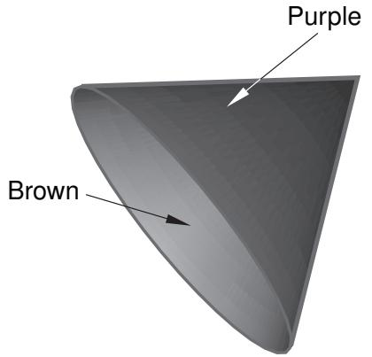

<details>
<summary>text_image</summary>

Purple
Brown
</details>

Figure 2: Colors indicate the side of a shell.

Abaqus/CAE displays the exterior side of the cone in purple and the interior side of the cone in brown. Therefore, to select the exterior of the cone, you would click Purple in the prompt area; to select the interior, you would click Brown.

If you select more than one shell face as part of a surface definition, you can control the color coding for each face individually. Abaqus/CAE includes a Flip a surface option that allows you to reverse the orientation of any individual face before creating the surface definition (see Figure 3).

<table><tr><td>Choose a side for the shell or internal faces:</td><td>Brown</td><td>Purple</td><td>Both sides</td><td>Flip a surface</td></tr></table>

## Figure 3:The Flip a surface option becomes available for multi-faced shell surfaces.

Use this option to make all of the desired sides the same color, then select that color from the prompt area. If you select Both Sides, Abaqus/CAE selects both sides of all selected faces regardless of any surfaces that you previously flipped.

In the model in Figure 4 both rounded ends are selected as part of the surface.

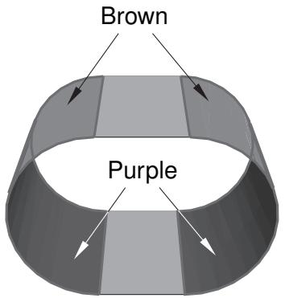

<details>
<summary>text_image</summary>

Brown
Purple
</details>

Figure 4:Two faces are included in the surface selection.

Initially, Abaqus/CAE colors the convex sides of both faces brown. However, the desired surface actually consists of one convex face and one concave face. To achieve this surface, click Flip a surface, and select the face on the right side of the model. Abaqus/CAE reverses the color-coding for only this face, as shown in Figure 5.


<details>
<summary>text_image</summary>

Brown
Purple
Purple
Brown
</details>

Figure 5: Flipping a surface.

Click Brown in the prompt area; Abaqus/CAE defines the surface on all of the brown face sides in the model.

When editing an existing surface definition, you can reselect sides by choosing either Brown or Purple. Brown indicates the side that you used to create the surface previously, and Purple indicates the other side. For example, if you selected the Purple side to create the surface previously, that side now appears as Brown during editing.

## Selecting sides on interior surfaces

When you select an internal face to create a surface, the surface side is ambiguous. For example, the highlighted face in Figure 6 could be either the right side of cell A or the left side of cell B.

  
Figure 6: Defining a surface on an internal face.

Abaqus/CAE uses the same brown/purple color-coding interface discussed above to determine which side of the surface you intended to select. Click Purple to define a surface on the right side of cell A; click Brown to define a surface on the left side of cell B.

## Selecting sides from a wire

If you are selecting a surface of a three-dimensional wire part instance, Abaqus/CAE displays the wire in red along with the arrowheads shown in Figure 7.


<details>
<summary>text_image</summary>

magenta
red
yellow
</details>

Figure 7: Arrows indicate the ends of a three-dimensional wire.

You can select the end with the magenta arrowhead, the end with the yellow arrowhead, or the circumferential surface of the part, which is indicated by the red wire (see Figure 8).


<details>
<summary>text_image</summary>

Choose a surface type: End (Magenta) End (Yellow) Circumferential
</details>

Figure 8: Select the end or the circumference of the surface.

If the wire part is two-dimensional, Abaqus/CAE distinguishes the two sides of the surface using the arrowheads shown in Figure 9.


<details>
<summary>text_image</summary>

magenta
yellow
</details>

Figure 9: Arrows indicate the top and bottom surface of a two-dimensional wire.

You select an arrowhead color to determine the surface side, as shown in Figure 10.

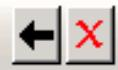  
Figure 10: Select the side of the surface.

Choose a side for the edges:

Magenta

Yellow

If the part is an axisymmetric shell, the inside and the outside surface of the part are indicated with arrowheads (see Figure 11). The selection options are the same as in Figure 10.

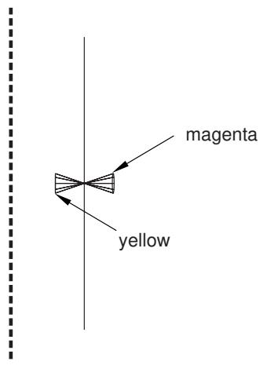

<details>
<summary>text_image</summary>

magenta
yellow
</details>

Figure 11: Arrows indicate the inside and the outside of an axisymmetric shell.

When editing an existing surface definition created on a wire, you can reselect sides by choosing either the Magenta or Yellow arrowheads. Magenta indicates the side that you used to create the surface previously, and Yellow indicates the other side. For example, if you selected the Yellow side to create the surface previously, that side now appears as Magenta during editing

## Additional information

• What is a surface?  
• Using the Set and Surface toolsets  
• Selecting interior surfaces

## Using the Set and Surface toolsets

This section outlines the various tasks you can perform with the Set and Surface toolsets and describes the procedures for each.

## In this section:

Creating, editing, copying, renaming, and deleting sets and surfaces  
Creating sets  
Creating unsorted node sets  
Creating surfaces  
Performing Boolean operations on sets or surfaces  
Editing sets and surfaces  
Associating objects (such as loads and sections) with sets and surfaces

## Creating, editing, copying, renaming, and deleting sets and surfaces

You can create, edit, rename, and delete set or surface definitions.

To create, edit, rename, and delete set or surface definitions, use one of the following:

• The Create, Edit, Copy, Rename, and Delete items listed under the Tools->Set and Tools->Surface submenus in the main menu bar.  
The Edit, Copy, Rename, and Delete menu items contain submenus listing all of the sets or surfaces in the current model. The Set submenus vary depending on which module you are in; in the Part and Property modules, only part sets are listed. In the Mesh module, either part or assembly sets may be listed depending on whether a part or the assembly is selected in the context bar. In all other modules, only assembly sets are listed.  
The set and surface managers. These managers contain functions identical to those listed under the Set and Surface submenus but with convenient browsers that display sets and surfaces along with their type (such as geometry or mesh). The Set Manager displays part sets in the Part and Property modules, part or assembly sets—depending on the current object selection in the context bar—in the Mesh module, and assembly sets in all other modules.


Note: Sets and surfaces that are empty as a result of feature or mesh modification will still appear in the lists. See Regeneration of geometry sets and surfaces, for more information.

The Model Tree displays an exclamation point (!) next to the names of any empty sets or surfaces. You can also position the cursor over a set or surface name in the Model Tree to view a tooltip that includes the number of items it contains.

To display a manager, select Tools->Set->Manager or Tools->Surface->Manager from the main menu bar.

You can copy imported sets and surfaces through the Model Tree, but imported sets and surfaces cannot be copied through Tools->Set and Tools->Surface submenus or through set and surface managers.


Warning: When you delete a set or surface, any objects associated with that set or surface, such as loads or interactions, become invalid.

## Additional information

• Managing objects

## Creating sets

The Set toolset allows you to create geometry sets and node and element sets.

You create a geometry set when you are working on a native part created by Abaqus/CAE. You can create node and element sets from native Abaqus nodes and elements on a part that you have meshed in the Mesh module, from orphan mesh nodes and elements, or from nodes and elements on any instances of parts. For more information, see What is a set?.

In addition, you can create either a part set or an assembly set. You create a part set when you are working with a part in the Part module or the Property module. When you instance the part in the Assembly module, you can refer to any part sets that you previously created. Finally, you create an assembly set when you are working in the assembly-related modules—Assembly, Interaction, Load, and Mesh. For more information, see How do part sets and assembly sets differ?.

1. From the main menu bar, select Tools->Set->Create.


## Tip: You can also click Create in the Set Manager.

The Create Set dialog box appears. The dialog box lists the types of sets that you can create based on the part or assembly displayed in the current viewport.

2. In the dialog box:

a. Enter a name for the set. Part sets created on different parts can use the same name; however, assembly set names must be unique.  
b. If necessary, select the set type.

By default, a node set is always sorted in the order of the node labels. You can toggle on Make unsorted set to create an unsorted node set and easily control the node set content. For more information, see Creating unsorted node sets.

c. Click Continue.

If you create a node or element set on a native part, Abaqus/CAE automatically displays the mesh if it is not already visible. If you create a node or element set on a part instance or on a part that contains

both native and orphan mesh components, you must use the Show native mesh tool in the Visible Objects toolbar to display and select items from the native portion of the mesh.

3. Select the entities in the viewport that you want to include in your set.


## Tip: You can use the Selection toolbar to limit the types of entities that you can select in the viewport. For more information, see Selecting objects within the viewport.

When you are finished selecting entities, click mouse button 2.

## Additional information

• What is a set?  
• Selecting objects within the viewport

## Creating unsorted node sets

You can use the Set toolset to create unsorted node sets.

By default, a node set is always sorted in the order of the node labels. You can create an unsorted node set and easily control the node set content.

You can create unsorted node sets from native Abaqus nodes on a part that you have meshed in the Mesh module, from orphan mesh nodes, or from nodes on any instances of parts.

1. From the main menu bar, select Tools->Set->Create.


## Tip: You can also click Create in the Set Manager.

The Create Set dialog box appears. The dialog box lists the types of sets that you can create based on the part or assembly displayed in the current viewport.

2. In the dialog box:

a. Enter a name for the set. Part sets created on different parts can use the same name; however, assembly set names must be unique.  
b. Select Node as the set type, and toggle on Make unsorted set.  
c. Click Continue.

If you create a node set on a native part, Abaqus/CAE automatically displays the mesh if it is not already visible. If you create a node set on a part instance or on a part that contains both native and

orphan mesh components, you must use the Show native mesh tool in the Visible Objects toolbar to display and select items from the native portion of the mesh.

3. In the Create Unsorted Node Set dialog box that appears, specify the nodes for the set.

Use either of the following techniques:

Select the nodes from the viewport

a. Select one of the following methods to insert selections in the set definition table:

• Select Individual to select nodes individually.  
Select Along edges to select nodes along a feature edge. Abaqus/CAE proposes a direction for the node selection (indicated by an arrow) and prompts you to confirm the direction. If necessary, you can flip the direction.  
• Select Free to select nodes using any of a variety of general selection methods as described in Selecting objects within the current viewport.

Click Add Before or Add After to begin making selections.

b. If desired, repeat the preceding step to add additional nodes.

The Add Before and Add After buttons determine where your selections will be added in relation to the currently highlighted line in the set definition table.

c. Click Done in the prompt area.

Abaqus/CAE displays the Create Unsorted Node Set dialog box; the part instances and nodes in your set are listed in the set definition table.

Enter the node labels directly into the table

In the Set Definition table, use standard keyboard and mouse editing techniques to insert, modify, or delete part instance names and node label expressions. If you do not know the part instance names in the model, use the Query toolset to query nodes in the viewport. For special table editing options, press mouse button 3. (For more information, see Entering tabular data.) A node label expression is either of the following:

• A single node label; for example, 5.  
• A range of nodes that you specify with a starting and ending node label optionally followed by an increment; for example, 5:10 or 5:10:2.

Select rows in the set definition table, and toggle on Highlight nodes in selected row to view node selections.

4. If desired, order some or all of the contents of the set definition table according to a sorting expression.

a. Select one or more rows in the set definition table.  
b. Specify the following settings to order the contents of the selected rows:

• Sorting order: select Ascending or Descending.  
• Local system: select or create a coordinate system, if desired.  
An expression in the field provided. Any valid Python expression can be used, referencing one or more valid parameters: "Label", $" \mathrm { X " , " Y " , " Z " , " R " , " T h " , o r " P " }$ . (The actual valid parameters depend on the local system selected, if any, and are indicated in the dialog.) For example, the simple expression "X" will sort the indicated nodes according to the X coordinate of each node. More complex examples include "X\*Y" and "Z if Label < 1000 else Label".

c. Click Apply. The contents of the selected rows are ordered according to the expression and sorting order. Rows themselves are not reordered; you can use the right mouse button menu in the table to move rows up or down as needed.

5. Click OK to commit the set definition.

The Surface toolset allows you to create geometry or mesh surfaces. Geometry surfaces can consist of geometric faces and edges; mesh surfaces can consist of element faces and edges.

1. From the main menu bar, select Tools->Surface->Create.


## Tip: You can also click Create in the Surface Manager.

The Create Surface dialog box appears. The dialog box lists the type of surface you are creating.

2. In the dialog box:

a. Enter a name for the surface. Surfaces created on different parts can use the same name; however, assembly surface names must be unique. For information on naming objects, see Using basic dialog box components.  
b. If necessary, select the surface type.  
c. Click Continue.

If you create a mesh surface on a native part, Abaqus/CAE automatically displays the mesh if it is not already visible.

3. Select the entities in the viewport that you want to include in the surface. If you are creating a geometry surface, Abaqus/CAE allows you to select only faces and edges. Similarly, if you are creating a mesh surface, Abaqus/CAE allows you to select only element faces and element edges. You can select interior entities to include in the surface. For more information, see Selecting interior surfaces. To create an edge-based surface, you must select the edge of a shell or the edge of an element. For more information, see What is a surface?.

4. When you are finished selecting entities, click mouse button 2.

5. If you are creating a geometry surface from a native part, you must specify the side of the selected face or the end of the selected wire. For more information, see Specifying a particular side or end of a region and Understanding the correspondence between geometric and physical objects.

## Additional information

• What is a surface?  
• Selecting objects within the viewport  
• Defining Contact Pairs in Abaqus/Standard  
• Defining Contact Pairs in Abaqus/Explicit  
• Mechanical Contact Properties

## Performing Boolean operations on sets or surfaces

You can select a group of sets or surfaces from the Model Tree and use Boolean operators to combine them into a single set or surface. The following operators are available:

## Union

Use the Union operator to create a set or surface that merges the contents of your selections.

## Intersection

Use the Intersection operator to create a set or surface containing the items common to all your selections.

## Difference

Use the Difference operator to create a set or surface by subtraction. You must designate the “first” set or surface, and Abaqus/CAE subtracts the remaining selections from it.

For example, you can use the Union operator to combine all of the top faces from a linear pattern of part instances into a single surface.

1. From the Model Tree, expand the Sets or Surfaces container associated with a part or with the assembly.  
2. Select all of the desired sets or surfaces. You can use a combination of drag-select, [Shift] + Click, and [Ctrl] + Click to select the desired sets or surfaces. You cannot combine sets with surfaces. For more information, see Drag-selecting multiple objects.  
3. Click mouse button 3 over the Model Tree, and select Boolean from the menu that appears. Abaqus/CAE displays the Sets Boolean or Surfaces Boolean dialog box.  
4. In the dialog box, enter the name of the new set or surface and select the desired operator.  
5. If you selected the Difference operator, click the arrow to the right of the First set or First surface field and specify the set or surface from which Abaqus/CAE will subtract your remaining selections.  
6. Click OK.

Abaqus/CAE creates the new set or surface, and it appears in the Model Tree.

## Additional information

• Using the Set and Surface toolsets  
• Selecting objects within the viewport

You can edit an existing set or surface by reselecting entities in the viewport.

1. From the main menu bar, select Tools->Set->Edit->set of your choice or Tools->Surface->Edit->surface of your choice.


## Note:

You can also click Edit in the Set Manager or in the Surface Manager after selecting the name of the set or surface of interest.

The set or surface is highlighted in the viewport, and Abaqus/CAE prompts you to reselect the objects for the set.

2. In the viewport, reselect entities to include in the set or surface. Use [Shift] + Click and [Ctrl] + Click to change which entities are selected in the viewport.


Tip: You can use the Selection toolbar to limit the types of entities that you can select in the viewport. For more information, see Selecting objects within the viewport.”

When you are finished selecting entities, click mouse button 2.

If you are editing a geometry set, you can select only geometry for the set. Similarly, if you are editing a node or element set, you can select only nodes or elements, respectively. If you are editing a set imported from an output database or from an input file that contains both nodes and elements or a set created using the Boolean union operator that contains nodes, elements, and geometry, Abaqus/CAE prompts you to choose the type of entity that you will be reselecting. If you reselect the nodes, Abaqus/CAE retains any original elements and geometry in the set. Repeat this step as needed to edit each type of entity.

3. If necessary, specify the side or end of the regions that you want to include in the surface and then click mouse button 2. (For more information, see Specifying a particular side or end of a region.)

## Additional information

• Using the Set and Surface toolsets  
• Selecting objects within the viewport

## Associating objects (such as loads and sections) with sets and surfaces

When you select the region to which to apply an object, such as a load or a section, you can choose between the following techniques:

## Highlight selections in viewport

Click on the entities in the current viewport; for example, a face or a group of vertices. Use [Shift] + Click and [Ctrl] + Click to append entities to your selection.


Tip: You can use the Selection toolbar to limit the types of entities that you can select. For more information, see Selecting objects within the viewport.

## Sets or Surfaces

Use an existing set or surface that you have created with the Set or Surface toolsets. If you choose to use an existing set or surface, the Region Selection dialog box appears. This dialog box contains a list of the sets or surfaces that are appropriate for the object you are applying.

Click the appropriate button in the prompt area to toggle between the two techniques. For more information, see Using the Set and Surface toolsets. You can also use selection groups to speed up your selection procedures. You can copy selected entities into selection groups, and you can paste entities from selection groups into your selection. For more information, see What is a selection group?.

## The Stream toolset

A streamline is a curve that is instantaneously tangent to the velocity vector of the flow, and a stream is a set of streamlines that enable you to visualize the velocity or vorticity data in a fluid flow analysis. The Stream toolset is available only in the Visualization module.

This chapter explains how to use the Stream toolset to create, modify, and delete streams; display or hide them in the viewport; and customize several aspects of their appearance.

## In this section:

Understanding stream display  
Creating a stream  
Displaying and hiding streams  
Customizing stream display

## Understanding stream display

A streamline traces the path tangent to a nodal vector field, and a stream is a set of streamlines that enable you to visualize data emanating from a particular location in a vector field. Figure 1 shows a sample stream of 12 streamlines displaying velocity data in a fluid flow analysis.

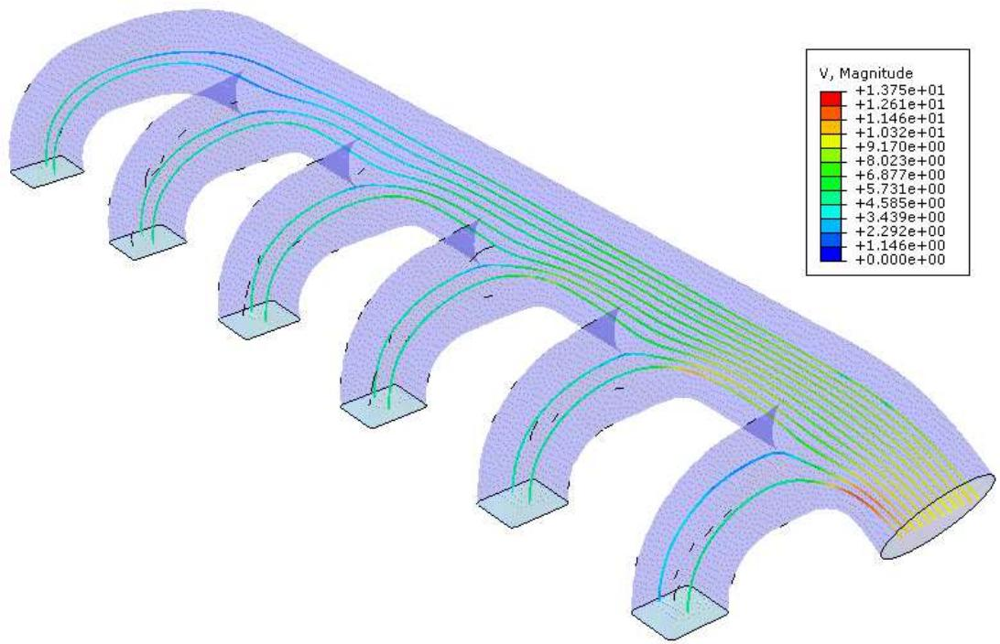

<details>
<summary>heatmap</summary>

| Color | V, Magnitude |
| --- | --- |
| Red | +1.375e+01 |
| Orange | +1.261e+01 |
| Yellow-Orange | +1.146e+01 |
| Yellow | +1.032e+01 |
| Light Green | +9.170e+00 |
| Green | +8.023e+00 |
| Teal-Green | +6.877e+00 |
| Teal | +5.731e+00 |
| Cyan | +4.585e+00 |
| Light Blue | +3.439e+00 |
| Blue | +2.292e+00 |
| Dark Blue | +1.146e+00 |
| Deep Blue | +0.000e+00 |
</details>

Figure 1: 12-pointed stream showing velocity data for a flow analysis through a manifold.

You can create streams by first defining a rake, which is a line segment with a series of points specified along its length that control the locations where Abaqus/CAE displays streamlines for a fluid flow analysis. Rakes are placed into an area of interest in the fluid flow; when you create and display the stream in the viewport, Abaqus/CAE displays a number of streamlines that corresponds to the number of points on the rake. Streamlines are evenly spaced along the rake, except for rakes defined using nontrivial path definitions; for more information about stream rake definition, see Creating a stream.

The streamline shape is driven by the currently selected stream variable, which is usually velocity or vorticity. To change the current stream variable, see Selecting the stream field output variable. The streamline color is driven by the currently selected primary variable. For more information on customizing streamline color options, see Customizing stream colors.

You must define separate stream rakes for each part instance for which you want to display flow data. Abaqus/CAE computes stream data for individual part instances only and does not display streamlines across separate part instances.

## Creating a stream

A stream definition has two components: the location of the line segment or the path definition that you want to use as your “rake” for investigations of velocity or vorticity data, and the number of points along that rake for which you want to display streamlines of fluid flow data. You can specify the rake location by picking nodes from the viewport, by entering coordinates in the dialog box, or by selecting one of the path definitions in your session. Edge list paths cannot be used for stream definition.

You cannot save streams to the output database file. If you want to retain a stream that you have defined, record the process of defining that stream as a macro in Abaqus/CAE. For more information on macros, see Managing macros.

1. From the main menu bar in the Visualization module, select Tools->Stream->Create.


Tip: You can also create a stream by using the tool in the Visualization module toolbox.

The Create Stream dialog box appears.

2. If desired, specify a custom name for the stream definition in the Name field.  
3. If desired, increase or decrease the number of points specified in the Number of points field. By default, Abaqus/CAE creates a rake with five points.  
4. From the Specification options, select By nodes, By coordinates, or By path.  
5. To specify the location of the stream rake, do one of the following:

## Select the nodes directly from the viewport

1. Click


Abaqus/CAE prompts you to select the first point.

2. Select the starting node for the rake.  
3. Select the ending node for the rake.

Abaqus/CAE populates the Start and End fields with your selections.

## Enter the coordinates into the dialog box

1. In the Start (X, Y, Z) field, enter the coordinates of the rake starting point.  
2. In the End (X, Y, Z) field, enter the coordinates of the rake ending point.

## Specify a path as the stream rake

From the Path name list, select the path that you want to use as a stream rake.

6. Click OK.

Abaqus/CAE creates the stream definition and displays it in the viewport.

## Additional information

• Displaying and hiding streams  
• Customizing stream display

## Displaying and hiding streams

You can display or hide streams individually in the current viewport by toggling their Show check boxes in the Stream Manager, and you can display or hide all of the streams in your session by clicking Set All On or Set All Off. The manager displays all streams defined in your session and indicates whether each one is currently displayed. In addition, you can display or hide the upstream or downstream component of each stream by toggling its Upstream or Downstream check boxes.

The Stream Manager also displays the number of points on the rake for each stream in your session. You can edit this number for a stream definition directly from the manager, except for streams defined on circular paths or streams defined using path definitions consisting of three or more points or nodes.

## Customizing stream display

This section describes how you can customize the color, line style, and arrows of streamlines using settings in the Stream Plot Options dialog box.

You can open the Stream Plot Options dialog box by selecting Options->Stream from the main menu bar of the Visualization module of Abaqus/CAE.

The changes you make in the Stream Plot Options dialog box apply to all active streams in the current viewport only. Each viewport has separate stream options, which enables you to display streamlines differently in each viewport. For example, you can display streamlines using a uniform color in one viewport and display thicker streamlines that use banded contours based on the current primary variable in a different viewport.

You can also control the default settings that appear in the Stream Plot Options dialog box by editing the onCaeStartup() function in the Abaqus environment file (abaqus\_v6.env). For more information, see Using Abaqus Scripting Interface commands in your environment file.

## In this section:

Customizing stream colors  
Customizing streamline thickness and arrows

## Customizing stream colors

You can adjust the color that Abaqus/CAE uses to display streamlines for the active streams in the current viewport. The Stream Plot Options dialog box enables you to display streamlines with:

• a single, uniform color along their entire length,  
a continuous contour spectrum that varies along the length of the streamlines, or  
• a banded contour spectrum that varies along the length of the streamlines.

Continuous contours display gradations without any solid bands of color, while banded contours display a number of contour intervals in which the color is constant. Contours for streamlines reflect values for the current primary variable and are subject to the contour settings specified in the Contour Plot Options dialog box. For more information about contour options, see Customizing a contour plot.

The color selected for uniform color display also determines the color with which Abaqus/CAE displays streamline arrows that indicate the direction of flow. For more information about toggling on arrow display, see Customizing streamline thickness and arrows.

1. Locate the Color options. Select Options->Stream from the main menu bar in the Visualization module. The Color options appear at the top of the page.

2. To specify the color option, choose Uniform color, Continuous contour, or Banded contour.

3. If you choose Uniform color, perform the following additional steps to select a color:

1. Click the color sample ( ).

Abaqus/CAE displays the Select Color dialog box.

2. Use one of the methods in the Select Color dialog box to select a new color. For more information, see Customizing colors.

3. Click OK to close the Select Color dialog box.

The color sample and all streamlines in the viewport change to the selected color.

4. Click OK to implement your changes and to close the Stream Plot Options dialog box.

You can adjust the display of streamlines in the current viewport by changing their thickness, adding directional arrows that indicate the direction of fluid flow, and by customizing the number of direction arrows when their display is enabled. Abaqus/CAE displays directional arrows using the uniform color selected in the Color options; for more information, see Customizing stream colors. Arrow sizes change as you increase or decrease streamline thickness.

1. Locate the Style options.  
Select Options->Stream from the main menu bar in the Visualization module. The Style options appear at the bottom of the dialog box.  
2. Drag the Line thickness slider to make the streamlines thinner or thicker.  
3. Toggle on Uniform thickness across streams to display all streamlines in the current viewport with a uniform thickness.  
4. Toggle on Show direction arrow to display directional arrows along the streamlines.  
5. Drag the Approx. number of arrows on each streamline slider to increase or decrease the number of directional arrows displayed on each streamline.  
6. Click OK to implement your changes and to close the Stream Plot Options dialog box.

## The Virtual Topology toolset

The Virtual Topology toolset allows you to ignore details, such as very small faces and edges, when you mesh a part or a part instance.

## In this section:

What is virtual topology?  
What can I do with the Virtual Topology toolset?  
What can I do with a part or a part instance containing virtual topology?  
Why repair a part if I can use virtual topology?  
Creating virtual topology based on geometric parameters  
Using the Virtual Topology toolset

## What is virtual topology?

In some cases parts or part instances contain details such as very small faces and edges. These features can be important for the detailed machining and packaging design of the component; however, they may be redundant in the numerical analysis if they have little impact on the mechanics of the problem being studied. Indeed, these small details may unduly constrain the generation of the mesh, resulting in a poor mesh or a finer mesh density. In some circumstances small faces and edges can be significant if they occur in a region of interest where you need a fine mesh. However, in most cases the details add nothing to the analysis, and you want Abaqus/CAE to ignore them during the mesh generation process and during the analysis.

The topology of the model is its composition from faces, edges, and vertices. The Virtual Topology toolset allows you to manipulate this topology and create a simplified form for the purpose of meshing. This simplified form is different from the real model and is called “virtual topology.” The faces and edges that result from the manipulation are said to be “virtual.” Similarly, parts and part instances that contain virtual faces and edges are said to be “virtual.”

The Virtual Topology toolset allows you to remove small details by combining a small face with an adjacent face or by combining a small edge with an adjacent edge. The faces or edges to be combined can be specified directly, or you can choose the edges and vertices to ignore.

For example, Figure 1 shows a piston that has some small details where the blended surfaces intersect. These details result in a dense mesh that includes some sliver-shaped elements. You can use virtual topology to ignore the small details, resulting in the more uniform mesh of better quality that is illustrated in Figure 2.


<details>
<summary>flowchart</summary>

```mermaid
graph LR
  A["Inputting Cylinder"] --> B["Geometry"]
  B --> C["Mesh"]
```
</details>

Figure 1: Small details result in a dense mesh of sliver-like elements.

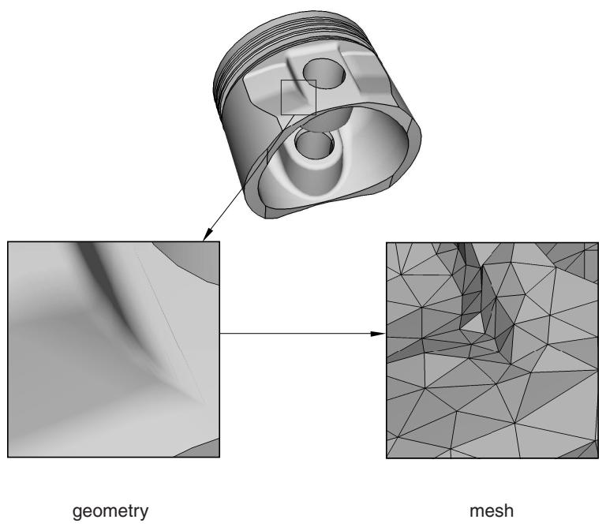

<details>
<summary>flowchart</summary>

```mermaid
graph LR
  A["Input Component"] --> B["Geometry State"]
  B --> C["Mesh State"]
```
</details>

Figure 2: Using virtual topology to ignore small details results in a more uniform mesh of better quality.

Abaqus/CAE treats virtual topology in the same way that it treats standard geometry. For example, you can do the following:

• Partition virtual topology.  
• Use the Geometry Edit toolset on virtual topology.  
• Use Part module tools on virtual topology, such as extrude, sweep, and blend.

For example, Figure 3 shows the piston containing virtual topology from Figure 2 after it has been cut using the extruded cut tool in the Part module.

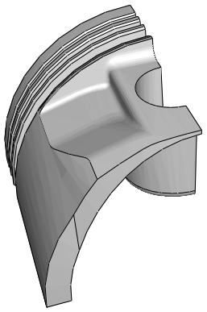

<details>
<summary>natural_image</summary>

3D CAD model of a mechanical component with curved surfaces and central cutout (no text or symbols)
</details>

Figure 3: A part containing virtual topology is cut.


## Note:

When you export a part containing virtual topology to an ACIS file, Abaqus/CAE removes the virtual topology from the part that is exported.

## What can I do with the Virtual Topology toolset?

The Virtual Topology toolset is available only in the Mesh module. You can apply virtual topology to parts, or you can apply it to independent instances in the assembly. The Virtual Topology toolset allows you to do the following:

## Combine faces or edges

You can select two or more faces or edges that Abaqus/CAE will combine into a single virtual face or virtual edge. If you combine two faces, any edges between the faces are ignored when Abaqus generates the mesh. Similarly, if you combine two edges, any vertices between the edges are ignored when the mesh is generated.

## Ignore an edge or a vertex

You can select edges or vertices that Abaqus/CAE will ignore. Ignoring an edge between two faces is the equivalent of combining the faces. Similarly, ignoring a vertex between two edges is the equivalent of combining the edges; however, you will find the combine tools useful when you have a large number of faces and edges to combine. Using ignore to create virtual topology has the same effect as using combine to create virtual topology—ignored edges or vertices are not considered when Abaqus generates the mesh.

## Automatically combine or ignore entities

You can specify a set of geometric parameters that Abaqus/CAE will use to create virtual topology. You can also select the area—faces, parts, part instances, or an entire assembly—to which Abaqus/CAE will apply the selected parameters. The virtual topology parameters are located in the Create Virtual Topology dialog box, which also includes tools that you can use to measure and highlight entities and preview the virtual topology. When you are finished, Abaqus/CAE creates a single virtual topology feature that contains all of the changes.

## Restore entities

Rather than deleting or suppressing virtual topology features that may contain entities that you want to ignore along with some that you need to use, you can use the Restore Entities tool to highlight all entities that have been ignored and select the ones that you want to reactivate.

To preserve mesh quality, edges and faces to be combined should have shallow included angles that are close to 180°. The recommended angle is between 120° and 240°. You can use the angle method to choose only adjacent faces with shallow included angles. For more information, see Using the angle and feature edge method to select multiple objects. If the included angle at some edges or vertices lies outside this range, Abaqus/CAE displays a warning and allows you to remove those edges or vertices from your selection. If you choose to retain the sharp edges, the resulting mesh may not lie on a smooth surface. Figure 1 illustrates a mesh on a virtual surface that is not smooth.

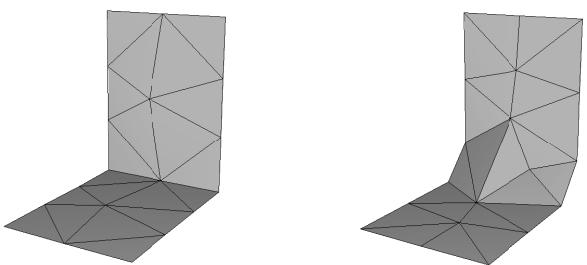  
Figure 1: When you apply virtual topology to sharp edges and vertices, the resulting mesh can deviate substantially from the original surface.

You can ignore an edge only if that edge is shared by two adjacent faces or if it is embedded in a face. For example, you cannot ignore the free edge of a shell or an edge shared by three faces, as shown in Figure 2.

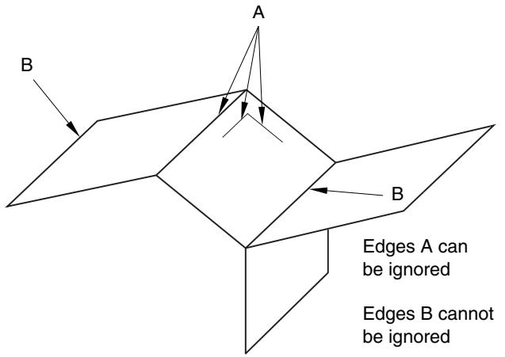

<details>
<summary>text_image</summary>

A
B
B
Edges A can
be ignored
Edges B cannot
be ignored
</details>

Figure 2: Some edges cannot be ignored.

Similarly, you can ignore a vertex only if that vertex is shared by two adjacent edges or embedded in a face. For example, you cannot ignore the vertex at the free end of a wire or where a wire intersects with a face, as shown in Figure 3.


<details>
<summary>text_image</summary>

A
Vertices A can
be ignored
Vertices B cannot
be ignored
</details>

Figure 3: Some vertices cannot be ignored.

Abaqus/CAE does not support all of the meshing techniques on regions that contain virtual topology (combined faces or combined edges). Specifically, Abaqus/CAE does not support the following:

• Two-dimensional free meshing with quadrilateral or quadrilateral-dominated elements using the medial axis algorithm.  
• Three-dimensional swept meshing using the medial axis algorithm.  
• Two-dimensional structured meshing if the region to be meshed is not bounded by four corners.  
• Three-dimensional structured meshing if the region to be meshed is not bounded by six sides.

If you need to apply virtual topology to a dependent instance, you can create a copy of the original part and then create an independent instance of the copy. You can then replace the dependent instance with the new independent instance and apply virtual topology to the replacement. For more information, see What is the difference between a dependent and an independent part instance?.

You may be able to make a part swept meshable by combining multiple faces on the target side into a single face; for more information, see Swept meshing of three-dimensional solids. However, if you combine many faces into a single face, the meshing procedure may be slower and the resulting mesh may not be acceptable. If you try to combine a large number of faces into a single face, Abaqus/CAE displays a warning and allows you to change your selection.

Abaqus/CAE calculates the number of faces being combined from the cumulative number of faces in your selection. For example, if you try to combine two faces each of which already contains five combined faces, the cumulative number of faces will be ten.

## What can I do with a part or a part instance containing virtual topology?

Abaqus/CAE stores virtual topology as features of the corresponding part or assembly. As a result, you can use the Model Tree to rename, suppress, resume, and delete virtual topology features. You cannot edit a virtual topology features. You can restore entities that have been ignored or combined using virtual topology. Restoring entities creates more new virtual topology features in the Model Tree—the original virtual topology features are unchanged.

You can create sets and surfaces that contain virtual faces and edges. In addition, if an existing set or surface contains an edge or vertex that you ignored, the edge or vertex is removed from the set or surface. Similarly, if an existing set or surface contains faces or edges that you combined, Abaqus/CAE replaces the original faces and edges with the new combined faces and edges. This is true only if all of the faces and edges that you combined are members of the same set.

Virtual topology is not exported; for example, if you export an assembly containing virtual topology to an ACIS file, Abaqus/CAE removes the virtual topology from the exported model. When you are creating the assembly in the Assembly module, you cannot merge or cut part instances that contain virtual topology.

## Why repair a part if I can use virtual topology?

Introducing virtual topology is a convenient method for creating a clean, well-formed mesh. The emphasis is to ignore small geometric details that result in distorted elements in areas where the analysis results are not of significant interest. Virtual topology relaxes the need for the mesh to conform to every edge or vertex and allows you to obtain a simpler model with less detail. However, virtual topology does not change the underlying geometry of the part instance.

When you combine two faces to form a virtual face, Abaqus/CAE updates the display to reflect the ignored edge. However, to form a basis for the new virtual face, Abaqus/CAE maintains the underlying geometry of the faces that were combined. The nodes in the mesh will be placed on the underlying geometry. Therefore, a coarse mesh will interpolate across the virtual face, and a fine mesh will tend to converge to the geometry of the underlying combined faces. Virtual topology allows the mesh definition to be controlled by meshing parameters, such as seed size, and it helps to free meshing from constraints imposed by geometry, such as small faces.

In contrast, you use the Geometry Edit toolset to correct minor flaws that are typically introduced when a part is imported from a third-party application. You use the Geometry Edit toolset to correct the underlying geometry; for example, to stitch small gaps and to delete self-intersecting faces and recreate a valid replacement face. You also use the Geometry Edit toolset to remove redundant topology, such as superfluous vertices and edges. The Geometry Edit toolset modifies the actual geometry, and geometric restrictions limit how you can apply the repair tools; for example, you can remove redundant vertices only if the vertex lies on a curve that is common to both edges.

When you export a virtual part instance, the virtual topology is lost because the virtual face, edge, or vertex is not true geometry. For example, a virtual face is an abstracted reference to the underlying collection of combined faces.

Therefore, you should use the Geometry Edit toolset if you need to remove small details from a part and want to export the part with the changes retained.

## Creating virtual topology based on geometric parameters

You can use the controls in the Create Virtual Topology dialog box to automatically ignore unnecessary model details based on a set of geometric parameters. You can control the following parameters to determine which features

Abaqus/CAE considers merging with surrounding geometry:

• Edge length  
• Face size  
• Face aspect ratio  
• Face corner angle  
• Thickness of faces representing small stair features  
• Corner angle for combining adjacent edges or faces  
• Angle and radius controls for combining blends (chamfered or rounded corners) with surrounding faces  
• Redundant entities

Abaqus/CAE attempts to simplify the model by merging neighboring edges and faces when the selected parameters are exceeded.

The redundant entities parameter can only be toggled on or off—there are no other settings for this parameter. Redundant entities do not add to the geometry of the model. Redundant entities include:

• Edges that are interior to an existing face  
• Edges that separate an otherwise continuous planar or curved face  
• Vertices that are interior to a face  
• Vertices that separate two straight edges or smooth curves without connecting a new edge

For example, Figure 1 contains four redundant edges and one redundant vertex. Virtual topology will merge the edges with the surrounding faces and merge the vertex with the surrounding edges, leaving only the underlying box.


<details>
<summary>natural_image</summary>

Simple 3D diagram of a rectangular box with a top-left corner and a small circle on top, no text or symbols present.
</details>

Figure 1: Redundant edges and vertices.

Keep in mind that redundant entities may define areas used by other tools within Abaqus/CAE. For example, the circular edge in Figure 1 may define a face for the application of a pressure load. The controls in the Create Virtual Topology dialog box are based entirely on geometric parameters; you should carefully review the changes made using virtual topology to make certain that none of the changed entities are required for other parts of the Abaqus/CAE model definition.

By default, all the virtual topology parameters in the dialog box are active, as shown in Figure 2. The default values for the edge length, face size, stair feature, and blend radius are calculated based on the size of the selected part or part instance; the other criteria are dimensionless and suitable default values are provided. You can toggle off the controls for entities that you want to be ignored by virtual topology. For example, if you have small faces that are a critical component of the model, toggle off Faces smaller than.

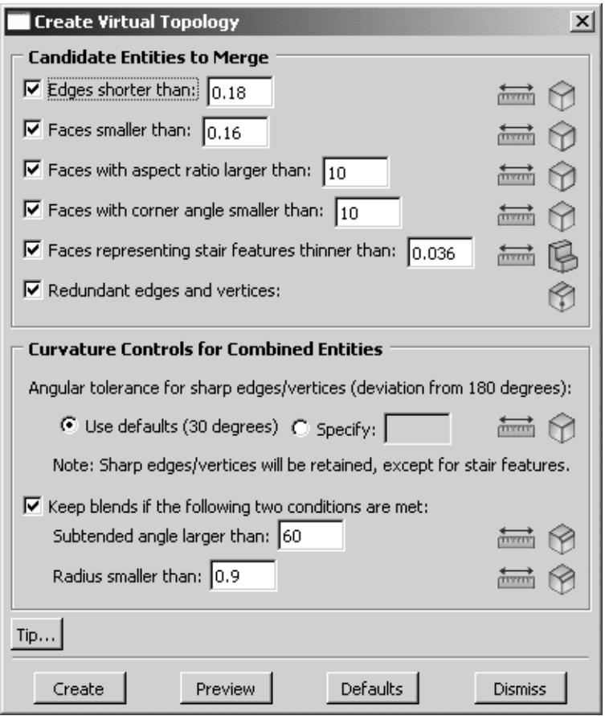

<details>
<summary>text_image</summary>

Create Virtual Topology
Candidate Entities to Merge
✓ Edges shorter than: 0.18
✓ Faces smaller than: 0.16
✓ Faces with aspect ratio larger than: 10
✓ Faces with corner angle smaller than: 10
✓ Faces representing stair features thinner than: 0.036
✓ Redundant edges and vertices:
Curvature Controls for Combined Entities
Angular tolerance for sharp edges/vertices (deviation from 180 degrees):
● Use defaults (30 degrees) ○ Specify:
Note: Sharp edges/vertices will be retained, except for stair features.
✓ Keep blends if the following two conditions are met:
Subtended angle larger than: 60
Radius smaller than: 0.9
Tip...
Create	Preview	Defaults	Dismiss
</details>

Figure 2:The Create Virtual Topology dialog box.

To help you review potential changes, each parameter in the dialog box contains tools that you can use to measure and highlight entities in the viewport that satisfy the corresponding geometric criteria. Items that are highlighted may not be changed if they conflict with other criteria or model requirements. To use the tools, click on the icons located to the

right of each parameter in the Create Virtual Topology dialog box. The measure entities tools allow you to measure entities in the viewport. Abaqus/CAE displays the measured values in the message area; you can use the

measurements to revise the parameter limits for your model. The highlight tools, such as Highlight Short Edges indicate entities that satisfy the current parameter settings. For the Candidate Entities to Merge area of the Create Virtual Topology dialog box, the highlight tools indicate entities that may be merged with the surrounding geometry.

The highlight tools do not account for the combination of parameters or any other factors in the model that may prevent the highlighted features from being merged with surrounding geometry. For example, small stair features must satisfy two parameters for replacement using automatic virtual topology:

• The stair height or thickness must be less than the specified value.

The opposing angles that separate the stair face from the surrounding faces must deviate from $1 8 0 ^ { \circ }$ by an angle larger than the specified angular tolerance for sharp edges/vertices (explained below with the curvature controls).

Figure 3 shows the angles and the face dimension that make up a stair feature. If you use the highlight tool to view potential faces, Abaqus/CAE does not consider the angle measurements when selecting the faces to highlight.  
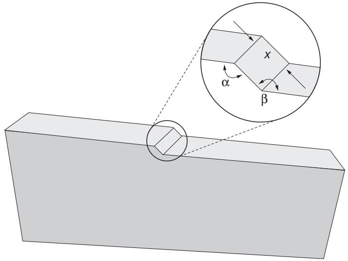

<details>
<summary>text_image</summary>

Diagram showing a 3D rectangular block with an inset highlighting a geometric shape labeled 'x' and angles α and β.
</details>

Figure 3:The face thickness (stair height), x, and the angles and $\beta$ create a stair feature.

The Curvature Controls for Combined Entities area of the Create Virtual Topology dialog box is used for combining corner angle and blend entities. The curvature control parameters and highlight tools indicate edges, vertices, or blends that will be retained—not replaced by virtual topology—using the current settings. The following examples explain how the curvature control parameters for corner angles and blends are interpreted by Abaqus/CAE.

## Angular tolerance for sharp edges/vertices (deviation from 180 degrees)

Corner angles are the angles between any two adjacent faces or edges that create an edge or vertex, respectively, in the model. If a corner angle is close enough to $1 8 0 ^ { \circ }$ to be considered flat, Abaqus/CAE considers using virtual topology to ignore the associated edge or vertex. The default parameter setting considers angles flat if they deviate from $1 8 0 ^ { \circ }$ by less than $3 0 ^ { \circ }$ . Figure 4 shows how merging faces effects the resulting mesh. The two upper images use a shallow angle so the resulting mesh is a close approximation of the geometry. Increasing the angle between the merged faces as shown in the lower images yields a progressively worse approximation. The corner angle parameter also applies to face corner angles between the edges of two-dimensional parts and to the angles that create small stair features.


Tip: To keep all corner angles, specify a deviation of $0 ^ { \circ }$ .


<details>
<summary>natural_image</summary>

Three isometric line drawings of 3D rectangular blocks with no text or symbols
</details>

Figure 4:The correspondence between the mesh and the geometry decreases as the corner angles replaced by virtual topology (the peak and valley) deviate further from 180°.

## Keep blends with a large subtended angle and a small radius

Blends—rounded or filleted corners—must satisfy two parameters to avoid consideration for virtual topology. This is due to the fact that either the subtended angle or the blend radius alone can create a feature that can be approximated well by the mesh, but combining a large angle with a small radius leads to a poor approximation. Figure 5 illustrates how two different blend angles are approximated by the mesh if they are merged with the surrounding geometry. The blend radius is the same for both parts, but the larger subtended angle in the upper image results in a bumpy mesh at the corner.


<details>
<summary>natural_image</summary>

Four 3D geometric diagrams showing different top-down views of a folded structure with triangular mesh patterns (no text or symbols)
</details>

Figure 5: A large blend angle (upper image) may yield a bumpy mesh when it is replaced by virtual topology.

In Figure 6 the subtended angle is the same for both parts, but the small blend radius in the upper image results in a poor quality mesh.

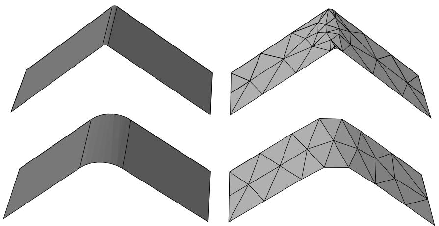

<details>
<summary>natural_image</summary>

Four 3D geometric diagrams showing different angular and triangular structures, no text or symbols present.
</details>

Figure 6: A small blend radius (upper image) may yield a poor quality mesh when it is replaced by virtual topology.

For detailed instructions on how to use the Create Virtual Topology dialog box, see Creating virtual topology automatically.

## Using the Virtual Topology toolset

This section explains how to use the Virtual Topology toolset to remove small details from a part or a part instance prior to meshing and how to restore small details without deleting the virtual topology.

## In this section:

Creating virtual topology automatically  
Combining faces  
Combining edges  
Ignoring edges and vertices  
Restoring entities that were replaced by virtual topology

## Creating virtual topology automatically

You can select Tools->Virtual Topology->Automatic Create from the main menu bar to open the Create Virtual Topology dialog box. Use the controls in the dialog box to combine faces, combine edges, or ignore entities in the model.

1. From the Object field in the context bar, select a part or the assembly.  
2. From the main menu bar, select Tools->Virtual Topology->Automatic Create.


Tip: You can also automatically create virtual topology using the module toolbox.

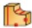

tool, located in the Mesh

3. Select the target regions to be considered for virtual topology.

The default selection method is parts or part instances, depending on whether you selected a part or the assembly in Step 1. If desired, you can change the selection method in the prompt area to select faces.

You can use a combination of drag-select, [Shift] + Click, and [Ctrl] + Click to select more than one part instance in an assembly or more than one face in a part or an assembly. You can also use the angle method or the face curvature method to select more than one face. For more information, see Selecting objects within the current viewport.

Abaqus/CAE opens the Create Virtual Topology dialog box.

4. Toggle off any criteria that you do not want Abaqus/CAE to consider for virtual topology.

5. If desired, click the TTrT tools, located next to each control that includes a size parameter, to measure entities in the viewport.

Follow the instructions in the prompt area to make your selection. You can measure the length of multiple edges or the area of multiple faces in a single operation. When you are finished, click Done in the prompt area (if necessary).

Abaqus/CAE displays the measured value in the message area. If you selected multiple entities, Abaqus/CAE displays the average, minimum, and maximum values. Use the measured values to verify or adjust the virtual topology controls in the dialog box.

6. Click on the highlight tools, located on the right side of the dialog box, to view entities that may be

replaced by virtual topology according to the corresponding parameter. For example, the tool highlights edges within your target region that are smaller than the current short edge length setting. Highlighted entities will not be replaced if they are an integral part of the model or if merging them violates the curvature control parameters.


## Note:

The highlight tools for the curvature controls (corners and blends) indicate entities that will be retained according to the current settings.

7. When you are satisfied with the control settings, click Preview to highlight all the entities that will be replaced by virtual topology.


## Note:

For large parts or assemblies, or any selection set that contains numerous items for replacement, the preview function may take some time. Instead, you can use the highlight tools as mentioned in Step 6 to quickly view entities that meet the parameter settings.

8. Click Create to create the virtual topology according to the selected parameter settings.

Abaqus/CAE highlights any edges or vertices in the viewport that will become redundant using your current selections and prompts you to choose whether they should also be combined. Abaqus/CAE creates an Auto virtual topology feature in the Model Tree to combine or ignore the selected entities.

9. If the target regions selected in Step 3 are still valid, you can repeat Steps 4 through 8 to create more virtual topology on the same regions or click Dismiss to close the Create Virtual Topology dialog box.

If the selected target regions are invalidated by the virtual topology, Abaqus/CAE closes the Create Virtual Topology dialog box and returns you to Step 3 to select new target regions.

You can use the Model Tree to restore the selected entities by deleting or suppressing the Auto virtual topology objects; you can use the Restore Entities tool to restore some entities while retaining the rest of the virtual topology feature. For more information on restoring individual entities, see Restoring entities that were replaced by virtual topology.

## Combining faces

You can select Tools->Virtual Topology->Combine Faces from the main menu bar to combine selected faces. During mesh generation, Abaqus/CAE treats the combined faces as a single face and ignores any edges and vertices that were removed.

1. From the Object field in the context bar, select a part or the assembly.  
2. From the main menu bar, select Tools->Virtual Topology->Combine Faces.


Tip: You can also combine faces using the tool, located in the Mesh module toolbox.

3. Select the faces that you want to combine.

You can use a combination of drag-select, [Shift] + Click, [Ctrl] + Click, and the angle method to select more than one face to combine. For more information, see Selecting objects within the current viewport.


Tip: If you are unable to select the desired face, you can use the Selection toolbar to change the selection behavior. For more information, see Using the selection options.

4. If the vertices at the end of any edges of the selected faces can also be ignored, Abaqus/CAE highlights the vertices and asks if you want to include them in your selection. Click Yes to ignore the highlighted vertices. Click No to keep the highlighted vertices.

Abaqus/CAE combines the selected faces and vertices. You can use the Model Tree to restore the selected faces and vertices by deleting or suppressing the virtual topology feature; you can use the Restore Entities tool to choose faces and vertices to restore while retaining the rest of the virtual topology feature. For more information on restoring individual entities, see Restoring entities that were replaced by virtual topology.

You can select Tools->Virtual Topology->Combine Edges from the main menu bar to combine selected edges. During mesh generation, Abaqus/CAE treats the combined edges as a single edge and ignores any vertices that were removed.

1. From the Object field in the context bar, select a part or the assembly.  
2. From the main menu bar, select Tools->Virtual Topology->Combine Edges.


$\nsupseteq$

3. Select the edges that you want to combine.

You can use a combination of drag-select, [Shift] + Click, [Ctrl] + Click, and the angle method to select more than one edge to combine. For more information, see Selecting objects within the current viewport.


Tip: If you are unable to select the desired edge, you can use the Selection toolbar to change the selection behavior. For more information, see Using the selection options.

Abaqus/CAE combines the selected edges. You can use the Model Tree or the Restore Entities tool to restore the selected edges. For more information on restoring individual entities, see Restoring entities that were replaced by virtual topology.

## Ignoring edges and vertices

You can select Tools->Virtual Topology->Ignore Entities from the main menu bar to ignore selected edges and vertices. Abaqus/CAE removes the selected entities from the assembly and ignores the entities when the mesh is generated.

1. From the Object field in the context bar, select a part or the assembly.  
2. From the main menu bar, select Tools->Virtual Topology->Ignore Entities.


Tip: You can also ignore edges and vertices using the tool, located in the Mesh module toolbox.

3. Select the combination of edges and vertices that you want to ignore.

You can use a combination of drag-select, [Shift] + Click, [Ctrl] + Click, and the angle method to select more than one edge or vertex to remove. For more information, see Selecting objects within the current viewport.


Tip: If you are unable to select the desired edge or vertex, you can use the Selection toolbar to change the selection behavior. For more information, see Using the selection options.

4. If the vertices at the end of a selected edge can also be ignored, Abaqus/CAE highlights the vertices and asks if you want to include them in your selection. Click Yes to ignore the highlighted vertices. Click No to keep the highlighted vertices.

Abaqus/CAE ignores the selected edges and vertices. You can use the Model Tree or the Restore Entities tool to restore the selected entities. For more information on restoring individual entities, see Restoring entities that were replaced by virtual topology.

## Restoring entities that were replaced by virtual topology

You can select Tools->Virtual Topology->Restore Entities from the main menu bar to restore edges and vertices that were previously replaced by virtual topology. Using the restore tool allows you to select individual entities to restore rather than deleting or suppressing the virtual topology feature, which would bring back all of the entities.

1. From the Object field in the context bar, select a part or the assembly.  
2. From the main menu bar, select Tools->Virtual Topology->Restore Entities.


Tip: You can also restore entities using the tool, located in the Mesh module toolbox.

Abaqus/CAE highlights in blue all entities that have been replaced by virtual topology.

3. Select the combination of entities that you want to restore.

You can use a combination of drag-select, [Shift] + Click, and [Ctrl] + Click to select more than one entity to restore. For more information, see Selecting objects within the current viewport.

4. Click mouse button 2, or click Done in the prompt area.

Abaqus/CAE creates a Restore ignored geometry feature in the Model Tree to restore the selected entities—the virtual topology features are not changed. If there are more entities that can be restored, Abaqus/CAE continues the selection procedure.

5. When you have finished restoring entities, click mouse button 2 or the cancel button in the prompt area.

## Customizing model display

This part explains how you can customize your model display.

## In this section:

Customizing geometry and mesh display  
Color coding geometry and mesh elements  
Using display groups to display subsets of your model  
Overlaying multiple plots  
Cutting through a model

This chapter explains how you can customize your geometry and mesh display.

The Visualization module has its own set of options to customize model appearance; for more information, see

Customizing plot display and Customizing viewport annotations.

## In this section:

Using geometry and mesh display options  
Choosing a render style  
Controlling edge visibility  
Controlling curve refinement  
Defining mesh feature edges  
Controlling translucency for substructure parts  
Controlling beam profile display  
Controlling shell thickness display  
Controlling datum display  
Controlling the display of individual coordinate systems  
Controlling reference point display  
Customizing mesh display  
Controlling model lighting  
Controlling instance visibility  
Controlling the display of attributes  
Saving your display options settings

## Using geometry and mesh display options

You can use the Part Display Options, Assembly Display Options, and ODB Display Options menus to customize geometry and mesh display.

Depending on the module you are using, Abaqus/CAE presents you with one of the following menu selections to customize geometry and mesh display:

## View->Part Display Options

In geometry-related modules you can use this menu item to control your geometry render style, edge visibility, curve refinement, element and node labels, and the visibility of the various types of datum geometry.

## View->Assembly Display Options

In assembly-related modules you can use this menu item to control your assembly render style, edge visibility, and the visibility of the various types of datum geometry. You can also use it to control the display of the mesh, element and node labels, part instances, loads, boundary conditions, and predefined fields in those same assembly-related modules.

## View->ODB Display Options

This menu item is applicable only to the Visualization module. For more information, see Customizing plot display.

You can save the current display options and apply them to future Abaqus/CAE sessions by selecting File->Save Options from the main menu bar. For more information, see Saving your display options settings.

---

[Previous: Viewing Results](viewing-results.md) · [Next: Customizing Model Display](customizing-model-display.md)
