# Viewing Results

## Viewing results

This part describes how to use the Visualization module (also licensed separately as Abaqus/Viewer) to view your model and the results of your analysis.

## In this section:

Visualization module basics  
Viewing diagnostic output  
Selecting model data and analysis results to plot  
Plotting the undeformed and deformed shapes  
Contouring analysis results  
Plotting analysis results as symbols  
Plotting material orientations  
X–Y plotting  
Viewing results along a path  
Animating plots  
Querying the model in the Visualization module  
Probing the model  
Calculating linearized stresses  
Viewing a ply stack plot  
Generating tabular data reports  
Customizing plot display  
Customizing viewport annotations

## Visualization module basics

You can use the Visualization module to view your model and the results of your analysis.

## In this section:

Understanding the role of the Visualization module  
Entering and exiting the Visualization module  
Understanding plot states and plot customization  
Understanding toolsets in the Visualization module  
Understanding Visualization module performance

## Understanding the role of the Visualization module

The Visualization module provides graphical display of finite element models and results. It obtains model information from the current model database or model and result information from an output database. You can control what information is placed in the output database by modifying output requests in the Step module. (For more information, see What is an output request?.) You can view data from a model database using a contour plot or a symbol plot; you can view model and results data from an output database by producing any of the plots described in this section.


## Undeformed shape

An undeformed shape plot displays the initial shape or the base state of your model.


## Deformed shape

A deformed shape plot displays the shape of your model according to the values of a nodal variable such as displacement.


## Contours

For an output database, a contour plot displays the values of an analysis variable such as stress or strain at a specified step and frame of your analysis. For a model in the current model database, a contour plot displays the value of a load, a predefined field, or an interaction at a selected step of your model. The Visualization module represents the values as customized colored lines, colored bands, or colored faces on your model.


## Symbols

For an output database, a symbol plot displays the magnitude and direction of a particular vector or tensor variable at a specified step and frame of your analysis. For a model in the current model database, a symbol plot displays the magnitude and direction of a load, a predefined field, or an interaction at a specified step of your model. The Visualization module represents the values as symbols (for example, arrows) at locations on your model.


## Material orientations

A material orientation plot displays the material directions of elements in your model at a specified step and frame of your analysis. The Visualization module represents the material directions as material orientation triads at the element integration points.

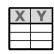

## X–Y data

An X–Y plot is a two-dimensional graph of one variable versus another.


## Time history animation

Time history animation displays a series of plots in rapid succession, giving a movie-like effect. The individual plots vary according to actual result values over time.


## Scale factor animation

Scale factor animation displays a series of plots in rapid succession, giving a movie-like effect. The individual plots vary in the scale factor applied to a particular deformation.

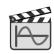

## Harmonic animation

Harmonic animation displays a series of plots in rapid succession, giving a movie-like effect. The individual plots vary according to the angle applied to the complex number results being displayed.

Additional capabilities include:

## Visualizing diagnostic information

Diagnostic information helps you determine the causes of nonconvergence in a model. You can view information for each stage of the analysis and use Abaqus/CAE to highlight problematic areas on the model in the viewport.

## Understanding probing

Probing displays model data and analysis results as you move the cursor around a model or a model plot; probing an X–Y plot displays the coordinates of graph points. You can write this information to a file.

## Results plotting along a path

A path is a line you define by specifying a series of points through your model. You can view results along the path in the form of an X–Y plot.

## Stress linearization

Stress linearization is the separation of stresses through a section into constant membrane and linear bending stresses. You specify the section as a path through your model, and the Visualization module displays the linearized stresses in the form of an X–Y plot.

## Cutting through your model

View cuts allow you to slice through a model so that you can visualize the interior or selected sections of the model. You can define planar, cylindrical, or spherical view cuts. In addition, you can define a view cut along a constant contour variable value.

## X–Y and field output reporting

An X–Y report is a tabular listing of X- and Y-data values; a field output report is a tabular listing of field output values.

## Visualizing the plies in a composite layup

A ply stack plot is a graphical representation of the plies in a composite layup. The image shows the plies in the layup along with details of each ply, such as its fiber orientation, thickness, and the reference plane. You can also create a ply stack plot in the Property module while you are creating a composite layup.

## Plot customization

The Visualization module provides numerous options that you can use to customize your plots.

## Entering and exiting the Visualization module

You can enter the Visualization module at any time during an Abaqus/CAE session by clicking Visualization in the Module list located in the context bar. The Result, Plot, Animate, Report, Options, and Tools menus appear on the main menu bar; and the title bar of the current viewport displays the name of the current output database, if one exists.

You can also enter the Visualization module by opening an existing output database. To open an output database, select File->Open from the main menu bar (for more information, see Opening a model database or an output database) or click Results in the Job Manager when results are available for a selected job. When you use one of these methods to enter the Visualization module, Abaqus/CAE displays a plot of the model from the output database in the current viewport.

To exit the Visualization module, select any other module from the Module list, or end the session by selecting File->Exit from the main menu bar. When you end the session, Abaqus/CAE closes all files and windows. Abaqus saves your plot options only for the duration of the session.

## Understanding plot states and plot customization

This section describes how to customize the appearance of a plot by selecting plot customization options.

## In this section:

What is a plot state?  
Activating plot states  
Customizing your plots  
Customizing multiple viewports

## What is a plot state?

The Visualization module offers several distinct types of plots for viewing your model and results. These plot types are:

Undeformed shape  
Deformed shape  
. Contour  
Symbol  
Material orientation  
History or X–Y data  
Time history animation  
Scale factor animation  
Harmonic animation

Each of these plots corresponds to a plot state. Plot states are important because some of the customization options provided by the Visualization module pertain only to a particular plot state.

## Additional information

• Activating plot states  
• Customizing your plots

## Activating plot states

A plot state combines all of the active customization options to produce a plot in the viewport. Some options are common to all plot types, some are applied only when you choose to superimpose the deformed and undeformed model shapes, and some are specific to the current plot type. You enter a particular plot state by producing a plot of the corresponding type. For example, if you produce an undeformed plot, the current viewport will then be in the undeformed plot state. The plot state of a viewport persists and Abaqus/CAE updates it with any changes you make to the customization options until you produce a plot in some other state in that viewport. If you create multiple viewports, each viewport can contain a different plot state. In addition, you can choose to allow multiple plot states in a single viewport by plotting both the undeformed and deformed shape for a single plot type or by displaying multiple plot types in the viewport.

## Additional information

• Customizing your plots

## Customizing your plots

The Visualization module provides numerous customization options, which are available through the Viewport, Options, and View menus of the main menu bar. These options fall into three categories:

## Plot state–dependent options

Plot type options affect only a particular plot state. These are separate options affecting contour, symbol, and material orientation plots; X–Y curves; X–Y graphs; time history animations; scale factor animations; and harmonic animations.

## Plot state–independent options

Plot state–independent options are those that affect all plots collectively. These are common options governing the viewpoint, graphics, individual item coloring, display body appearance, and such general characteristics as plot legends, model labels, and the appearance of text blocks giving the model's title and state.

## Superimpose options

Superimpose options are a special set of plot state–independent options that affect only the undeformed plot state when you choose to superimpose it on a deformed, contour, symbol, or material orientation plot. These options allow you to control many common customization options to distinguish the undeformed plot from the deformed plot when both shapes are displayed.

Plot state–dependent options affect such plot attributes as the contour intervals, limits, and colors (for example, color spectrums for contour plots or axis colors for material orientation plots). You control these attributes separately for each plot state using the options associated with that state. To choose the contour type, for example, you must use the Contour plot options. To do so, you can select Options->Contour from the main menu bar. Alternatively, you can

use the Contour Options tool from the toolbox. The Options tools provide quick access to the plot state–dependent and plot state–independent customization options.

Plot state–dependent options affect only plots in the associated state. If you select axis colors from the material orientation plot options dialog box, those colors will affect only material orientation plots. If there is a material orientation plot in the current viewport, you will see the effect of your changes when you click Apply or OK in the material orientation plot options dialog box. However, if the current viewport does not contain a material orientation plot, you will not see the effect of your changes until you produce one.

Plot state–independent options affect plots across all plot states. For example, if you select Viewport->Viewport Annotation Options from the main menu bar to suppress the appearance of the view triad, the view triad will be suppressed for all plots. Settings in the Common Plot Options dialog box are also plot state–independent; when you change the render style in this dialog box, the new render style is used for all plots.

Superimpose options affect the undeformed plot when you superimpose an undeformed plot on a deformed plot in one of the plot states. For example, you can independently set the render style, edge display, and fill color; and you can apply an offset between the undeformed and deformed shape symbol plots when both are displayed.

Select File->Save Options from the main menu bar to save your plot state–dependent, plot state–independent, and superimpose customization options. Saving your customization options allows you to apply them to subsequent Abaqus/CAE sessions. For more information, see Saving your display options settings. For more information on the plot customization options available in the Visualization module, see Customizing plot display.

## Customizing multiple viewports

When you create a new viewport, it initially inherits the customization options of the current viewport. For example, if you establish the Filled render style for plots in the current viewport and then create a new viewport, subsequent plots in the new viewport will appear in the filled render style. New viewports inherit the plot state of the current viewport—until you change customization options, plot states, or output databases, new viewports appear identical to the viewport that was active when you created them.

After a new viewport has been established, the plot state and any subsequent customizations are independent of other viewports by default. Multiple viewports can each be in a separate plot state; if you use multiple viewports, you must first designate a particular viewport as current to change its display. Customization selections you apply affect only the current viewport. When you designate a viewport as current, the options dialog boxes are refreshed to show the state of options associated with that viewport. For more information on working with viewports, see Working with viewports.

You can also link multiple viewports in your session to manipulate multiple objects simultaneously and to display the same plot state and the same plot options in different viewports. For more information, see Linking viewports for view manipulation.

## Additional information

• Activating plot states

## Understanding toolsets in the Visualization module

Toolsets in the Visualization module provide additional control over data display.

Unless otherwise stated, the toolsets described in this section are for postprocessing of model and results data from output databases only; only selected toolsets are for use with model data from the current model database.

The following toolsets are available in the Visualization module:

• The Color Code toolset allows you to customize the edge and fill color of individual elements. For more information, see Coloring nodes or elements in the Visualization module.  
• The Coordinate System toolset allows you to create local coordinate systems for use in postprocessing. For more information, see Creating coordinate systems during postprocessing.  
• The Create Set toolset allows you to create node and element sets during postprocessing. For more information, see Creating node and element sets during postprocessing.  
• The Display Group toolset allows you to selectively plot one or more items from a model or from an output database. For more information, see Using display groups to display subsets of your model.  
• The Field Output toolset allows you to perform operations on the field output available in an output database. For more information, see Creating and saving new field output.  
• The Free Body toolset allows you to create and delete free body cuts, display or hide them in the viewport, and customize several aspects of their appearance. For more information, see The Free Body toolset.  
• The Job Diagnostics toolset allows you to access the diagnostic information written to the output database during an Abaqus/Standard analysis job. For more information, see Viewing diagnostic output.  
• The Path toolset allows you to specify a path through your model along which you can obtain and view X–Y data. For more information, see Viewing results along a path.  
• The Query toolset allows you to obtain information about your model, both for data from the current model database or for data from an output database. For more information, see Querying the model in the Visualization module.  
• The Stream toolset allows you to display streamlines to investigate velocity or vorticity in a fluid flow analysis. For more information, see The Stream toolset.  
The View Cut toolset allows you to create cuts through a model so that you can visualize the interior or selected sections of the model. This functionality is available for model data from the current model database or from an output database. For more information, see Cutting through a model.  
• The XY Data toolset allows you to create and operate on X–Y data objects. For more information, see X–Y plotting.

## Understanding Visualization module performance

In general, the speed of postprocessing and graphical results display in the Visualization module is more than satisfactory for most models. However, it is often necessary to balance high performance levels with detailed results plotting.

Depending on your postprocessing requirements, you may wish to modify the default display options at the expense of performance. Many options are available that can affect the speed of graphics display.

To maximize performance in the Visualization module, we recommend the following:

• Cache results in memory during postprocessing to speed up the generation of images on the screen. See Understanding results caching.  
Use the texture-mapped contour method whenever possible. Likewise, avoid using display options that are not supported by the texture-mapped method: line-type contours, contour edges, CAXA or SAXA elements, or shrinking elements about their centroid. If such display options are used, Abaqus/CAE will override the user setting for texture-mapped contours and use the slower tessellated method instead. See Understanding how contours are rendered.  
Be selective about the model labels and symbols that you choose to display. The more model entities that are drawn, the longer the screen refresh will take. This applies to element edges as well. See Controlling the display of model entities.  
• Use a high results averaging threshold. The more contiguous the results are, the faster the contour display will be. See Understanding result value averaging.  
Use the status field output variable rather than creating display groups based on result values to achieve high-performance time history animation. Abaqus/CAE recomputes result-based display groups as each result frame is displayed, so using this type of display group degrades animation performance. The status field output variable allows you to remove elements that meet a result-based failure criteria from your model plots. See Selecting the status field output variable.  
• Do not use a remote display. This configuration of Abaqus/CAE is not supported; its use is at the sole discretion of the user. Performance optimization can never be achieved using remote display.

In some cases performance may not be optimal for element-based results plotting on very large models because of physical memory limits on your machine. Increasing the physical memory or exiting other applications that are consuming memory can help to restore optimal performance.

## Viewing diagnostic output

Abaqus/CAE provides a visual diagnostics tool to help you understand the convergence behavior of your job. You can use diagnostic output to assess the quality of analysis results or to locate the source of convergence problems in a model.

This chapter explains how you locate and use diagnostic output within Abaqus/CAE.

## In this section:

Understanding job diagnostics  
Generating diagnostic information  
Interpreting diagnostic information  
Accessing diagnostic information

## Understanding job diagnostics

Abaqus writes diagnostic information to the output database, along with any other output that you request, as it attempts to analyze your model.

The diagnostic information in the output database is a subset of the diagnostic information that is written to the message and status files. You can use the Job Diagnostics dialog box to access the diagnostic information written to the output database during an Abaqus/Standard or Abaqus/Explicit analysis job.

For an Abaqus/Standard analysis, diagnostic information is available for the job and for each step, increment, attempt, and iteration. Figure 1 shows contact diagnostics for an Abaqus/Standard analysis iteration. You can choose the type of contact information that you want to view, and you can select a column to sort the table data.

  
Figure 1:The Job Diagnostics dialog box.

For an Abaqus/Explicit analysis, diagnostic information is available for the job and for each step. Because of the large number of increments in a typical Abaqus/Explicit analysis, diagnostic information is recorded for summary (heartbeat) increments and for any other increments in which diagnostic information is generated. The interval between summary increments depends on the CPU time and the amount of output specified in the analysis. The diagnostic data are written to the status file and to the output database.

You can use the Job Diagnostics dialog box to determine when an analysis ended and whether any warnings were issued. If warnings were issued during the job, you can view the warnings and assess whether your results may have been affected. The Job Diagnostics dialog box also provides more detailed information to explain the meanings of or possible causes for most warnings and errors and, if the warnings are associated with nodes or elements, to help you locate them on the model in the viewport.

You can view diagnostic information during an analysis or after it ends. However, the Job Diagnostics dialog box does not update automatically. If you view diagnostic information while an analysis is running, you must close and then reopen the output database as the analysis progresses to display any new diagnostic information.

## Generating diagnostic information

Abaqus generates diagnostic information during an analysis job; Abaqus/CAE reads the diagnostic information that is stored in the output database. Thus, you can use the Job Diagnostics dialog box to view convergence information only for procedures that generate information in the output database. Job diagnostics are stored in the output database for the following Abaqus/Standard procedures:

• Coupled temp-displacement  
• Geostatic  
. Soils  
• Static, General  
• Static, Linear perturbation  
• Static, Riks  
• Visco

Diagnostic information for other Abaqus/Standard analysis procedures is located in the message file and cannot be viewed in Abaqus/CAE.

Diagnostic information is available in Abaqus/CAE for all Abaqus/Explicit analysis procedures. An anneal procedure does not generate any diagnostic data, so no diagnostics are displayed for an anneal step.

Detailed diagnostic information is saved to the output database by default for the supported analysis procedures in both Abaqus/Standard and Abaqus/Explicit. If you do not want to include diagnostic information, use the Keywords Editor to edit the input file to include the following line in the model data:

```txt
*OUTPUT, DIAGNOSTICS=NO
```

You can also use the Keywords Editor to change the default diagnostic output parameters for Abaqus/Explicit by including one or more lines for the keyword \*DIAGNOSTICS and specifying the desired parameter values.

For more information on using the Keywords Editor, see Adding unsupported keywords to your Abaqus/CAE model.

## Interpreting diagnostic information

This section describes the individual pages in the Job Diagnostics dialog box (the available pages depend on the analysis type and results).

In a typical Abaqus/Standard analysis a load is applied to the model in increments, and Abaqus attempts to calculate the model's response to each incremental load. Abaqus further reduces the response calculations by performing iterations to approach the result for an increment. If the iterations are not approaching a solution (converging), Abaqus stops and attempts to solve again, this time with a smaller load increment. If Abaqus makes too many attempts without a solution, the analysis is ended. For more information about load increments, see Analysis Solution and Control.

In an Abaqus/Explicit analysis, incrementation is based on a large number of small time increments. The time incrementation is made according to an estimated stable time increment size based on the size of the elements in the model. Abaqus/Explicit uses a central-difference time integration rule to integrate the equations of motion, so there is no need for multiple attempts and iterations in each increment.

Viewing the diagnostic information can help you determine the causes of convergence problems so that you can make the necessary corrections in the model. Diagnostic information also indicates potential problems and areas for improvement even when a converged solution is reached. With proper interpretation of the available diagnostic information, you can improve a model to achieve the results that match your analysis intent.

## In this section:

Diagnostics summary  
Incrementation  
Warnings and errors  
Residuals  
Contact  
Elements  
Other

## Diagnostics summary

The Summary page in the Job Diagnostics dialog box is always available. The summary includes attributes of the item that is currently highlighted in the Job History tree as well as an indication of the diagnostic information available in the other pages of the dialog box. The information that appears for each job, step, increment, attempt, and iteration for an Abaqus/Standard analysis or for each job, step, and increment for an Abaqus/Explicit analysis varies as follows, becoming more specific as you move from the job to an iteration.

## Job

When you first open the Job Diagnostics dialog box, the job item is highlighted in the Job History tree and the Summary page is visible. The job name and status and the analysis code and release are displayed. For an Abaqus/Explicit job the Abaqus/Explicit precision (single or double) and the number of domains for parallel job execution are displayed. If there are warnings or errors, the total number of each is also displayed.

## Step

The summary for each step displays the step name, step number, analysis procedure, and number of warnings (if any) in the step. Depending on the procedure additional information may also be displayed as part of the step summary. For example, the summary of a general nonlinear step will also include the step time that has been completed, the number of increments that were completed, the time incrementation method (automatic or fixed) that was used, whether nonlinear geometry was accounted for during the step, and the extrapolation type used for a previous state at the start of each increment. See The Step module for more information.

## Increment

The summary for each increment displays the increment number and the number of warnings (if any) in the increment. For an Abaqus/Standard analysis the number of attempts is also displayed. The increment summary also indicates the convergence status; if the increment converged, the increment size and the completed step time are displayed.

## Attempt

The summary for each attempt in an Abaqus/Standard analysis displays the attempt number, attempt size, number of warnings (if any), and number of iterations. Severe discontinuity iterations and equilibrium iterations are listed separately, along with the total number of iterations. If Abaqus is unable to find a solution, it makes a cutback in the increment size and begins a new attempt; if Abaqus makes a cutback, the attempt summary indicates the reason for the cutback. There are no attempts in an Abaqus/Explicit analysis.

## Iteration

The iteration summary in an Abaqus/Standard analysis displays the convergence status. If the iteration did not converge, the summary indicates the other pages (Warnings, Residuals, Contact, and Elements) that provide detailed information about the convergence criteria that were not satisfied. There are no iterations in an Abaqus/Explicit analysis.

## Additional information

• Viewing diagnostic output  
• Interpreting diagnostic information  
• About Convergence and Time Integration Criteria

## Incrementation

The Incrementation page in the Job Diagnostics dialog box displays the incrementation control settings and the resulting incrementation used by Abaqus during the analysis. The Incrementation page is available only if you highlight a step in the Job History tree.

The Status table contents depend on whether you are viewing diagnostic information for an Abaqus/Standard or Abaqus/Explicit analysis step. For an Abaqus/Standard step the table displays each increment along with the number of attempts, the number of severe discontinuity and equilibrium iterations, the total number of iterations, the step time, and the increment size. For an Abaqus/Explicit step the table displays all summary increments and any additional increments for which diagnostic information was recorded. The critical element, the stable time increment for that element, the elapsed step time, the total time, and the kinetic energy are also listed for each increment. For more information on incrementation diagnostics in Abaqus/Explicit, see Explicit Dynamic Analysis.

If you select a column of data and click Plot selected column, Abaqus/CAE creates an X–Y plot using the increment number (first column) for the X-axis and the selected column for the Y-axis.


## Note:

You cannot plot the critical element numbers.

## Additional information

• Viewing diagnostic output  
• Using the step editor

## Warnings and errors

The Warnings and Errors pages in the Job Diagnostics dialog box both display detailed information about undesirable conditions that were encountered during an analysis. Warnings include information about conditions that may lead to questionable analysis results. Errors include information about conditions that caused Abaqus to terminate the analysis prematurely.

The contents of the Warnings page depend on the item that is highlighted in the Job History tree; if the job is highlighted, the Warnings page displays all warnings saved to the output database for the entire job. If you highlight a step, increment, attempt, or iteration in the Job History tree, Abaqus/CAE displays information about only those warnings associated with the highlighted item. The Errors page is available only when the job item is highlighted; it displays information about all errors saved to the output database for the entire job.


## Note:

Only a subset of the warnings and errors written to the message and status files by Abaqus/Standard and Abaqus/Explicit are saved to the output database for access through the Job Diagnostics dialog box.

Each Warnings or Errors page includes a Summary table that provides a concise description of all the problems associated with the item that you highlighted in the Job History tree. If there is more than one type of problem, you can filter the list of problems based on a common problem Category.

The Details region of the Warnings and Errors pages displays more information corresponding to the item that is highlighted in the Summary table. Depending on the type of warning or error that you selected, Abaqus/CAE displays either a statement or a table providing detailed information about the problem. If the Details region displays tabular information including nodes and elements, you can toggle Highlight selections in viewport and select items to view them in the current viewport.

Figure 1 shows the Warnings page for a Abaqus/Standard analysis step; the first warning occurs on the step, and the remaining warnings indicate the increment numbers where they occur. In this case the Details section includes the coupling release variation for a numerical singularity.

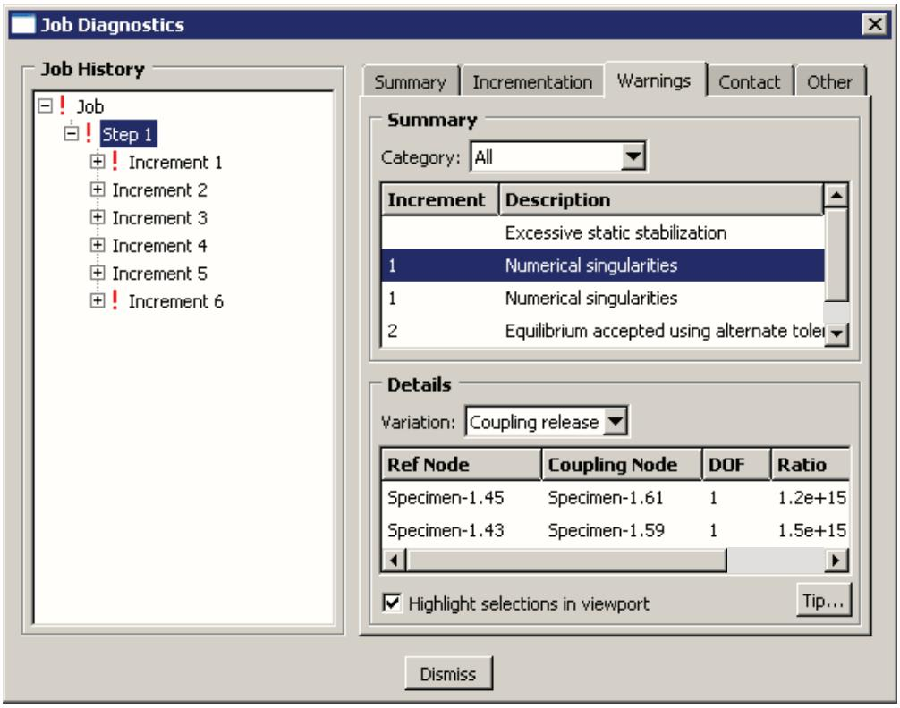  
Figure 1:The Warnings page.

## Additional information

• Viewing diagnostic output  
• Explicit Dynamic Analysis  
• About Convergence and Time Integration Criteria  
• Overconstraint Checks  
• Common Difficulties Associated with Contact Modeling in Abaqus/Standard

## Residuals

The Residuals page in the Job Diagnostics dialog box displays information about the quantities that Abaqus/Standard uses to determine whether an iteration has produced an equilibrium solution.

Residuals represent the difference between the internal and external forces acting on a model. If the residuals are small, Abaqus accepts the iteration as converged. The tolerances used to determine whether a solution is converged are very important. The tolerances must be small enough to provide an accurate solution but large enough to achieve the solution within a reasonable number of iterations. Before accepting an iteration as converged, Abaqus further requires that corrections to the primary solution variables and constraint equation compatibility errors must also be small.

When the equilibrium iterations do not converge, the node where the maximum residual occurs during the final iterations is usually the best place to begin searching for the problem. There are many conditions that may prevent the equilibrium iterations from converging; diagnosing the source of the problem requires a certain amount of experience.

Residual information, including the maximum residual value in each iteration, is summarized in tabular form for each attempt that contains residual diagnostics. Your selections in the Equations and Variables fields control the data in the table. You can plot columns from the table by selecting Plot selected column. When you have located a problematic iteration, select it in the Job History tree. Then you can select items from the Residuals page for the iteration and click Highlight selections in viewport to view the regions in the current viewport.

## Additional information

• Viewing diagnostic output  
• General solution controls  
• Direct Linear Equation Solver  
• Solving Nonlinear Problems  
• About Convergence and Time Integration Criteria

## Contact

The Contact page in the Job Diagnostics dialog box displays information about regions of the model where changes in the contact status prevent Abaqus from accepting the solution for an Abaqus/Standard step. The Contact page can also indicate diagnostics such as initial contact overclosures and adjustments for an Abaqus/Explicit step.

Abaqus/Standard contact information is available for any iterations that are followed by (SDI) (Severe Discontinuity Iteration) in the Job History tree. Contact information may also be available for other iterations where contact impacts the analysis, such as when stick-slip friction behavior is present. Use the contact information to locate regions in your model where Abaqus could not establish the correct conditions. You may need to edit the contact controls to resolve a contact problem. For more information, see Customizing contact controls.

Contact information, including the total number of problems in each iteration, is summarized in tabular form for each attempt that contains contact diagnostics. Your selection in the Description field controls the data in the table, and you can plot columns from the table by selecting Plot selected column. When you have located a problematic iteration, select it in the Job History tree. Then you can select items from the Contact page for the iteration and click Highlight selections in viewport to view the regions in the current viewport. Click the column headings to sort the information in the Details field for an iteration.

For an Abaqus/Explicit step the contact summary may include diagnostics such as the number of initial overclosures, unresolved initial overclosures, and initial contact adjustments. Your selection in the Description field controls the data in the table. For example, if you select initial overclosures or unresolved initial overclosures, the table lists the overclosed nodes and elements, the element face that the nodes penetrated, and the overclosure amount. You can select items from the Details field and click Highlight selections in viewport to view the contact nodes and elements in the current viewport.

## Additional information

• Customizing contact controls  
• Viewing diagnostic output  
• About Convergence and Time Integration Criteria  
• Contact Diagnostics in an Abaqus/Standard Analysis  
• Common Difficulties Associated with Contact Modeling in Abaqus/Standard

## Elements

The Elements page in the Job Diagnostics dialog box displays information about regions of the model where problems with the element and material point calculations may be preventing Abaqus from finding a converged solution for an Abaqus/Standard step. Abaqus/Explicit displays information for the critical elements—the elements with the lowest stable time limits.


## Note:

Only a subset of the element and material point diagnostics written to the message and status files by Abaqus/Standard and Abaqus/Explicit are accessible through the Job Diagnostics dialog box.

Select Highlight selections in viewport to locate elements in the current viewport. Your selections in the Element Diagnostics and Details fields determine the elements that Abaqus/CAE will highlight.

## Additional information

• Viewing diagnostic output  
• About Convergence and Time Integration Criteria  
• Common Difficulties Associated with Contact Modeling in Abaqus/Standard

## Other

The Other page in the Job Diagnostics dialog box appears only when you select a Step from the Job History tree for an Abaqus/Standard analysis. It displays information about the matrix solver used for the analysis and the characteristic element length in the mesh. Depending on the procedure type, other pertinent information such as the mass of the model and the center of mass are also provided. This reference information can help you determine the possible cause or extent of a problem. For example, if the total mass or center of mass are not correct, there is a problem with the material definition, sections, or section assignments in the Property module.

## Additional information

• Viewing diagnostic output  
• About Convergence and Time Integration Criteria  
• Common Difficulties Associated with Contact Modeling in Abaqus/Standard

## Accessing diagnostic information

You can use the Job Diagnostics dialog box to access diagnostic information that Abaqus writes to the output database during an analysis job.

1. From the main menu bar in the Visualization module, select Tools->Job Diagnostics.

The Job Diagnostics dialog box appears.

2. Click the “+” symbols in the Job History tree to expand the tree to see the steps, increments, attempts, and iterations in the job history.  
3. Click an item in the Job History tree to highlight it.

Abaqus/CAE displays additional tabs on the right side of the dialog box containing diagnostic information associated with the selected item.

4. Click the tabs on the right side of the dialog box. Abaqus/CAE displays various types of diagnostic information corresponding to the item that is selected in the tree. The following sections describe the information available in each tabbed page:

Diagnostics summary  
Warnings and errors  
Residuals  
Contact  
Elements  
Other

5. Click Dismiss to close the Job Diagnostics dialog box.

Abaqus/CAE obtains model data from the current model database and model data and analysis results from the output database. Results need not be available to produce an undeformed plot; in this case output database information from a datacheck run is sufficient.

This chapter explains how to select model data and analysis results for display.

## In this section:

Selecting results from an output database  
Selecting results from the current model database  
Selecting the results step and frame  
Customizing the display of steps and frames in the results  
Selecting the field output to display  
Selecting result options  
Creating and saving new field output  
Creating coordinate systems during postprocessing  
Creating node and element sets during postprocessing

## Selecting results from an output database

Abaqus/CAE reads analysis results from the output database.

Output database results consist of those you have saved during the analysis as field and history output variables. If, for example, you have written data to the field output portion of the output database after every 10 increments, you can now select results at 10 increment intervals only. These increment intervals are called frames.

In addition to the analysis results you have saved, you can operate on output database field output to create new results. You can display the values of both output database field output variables and field output variables that you have created in the form of a deformed, contour, symbol, or X–Y plot; as X–Y data obtained along a path through your model; by probing any model or X–Y plot; or in a tabular report. Furthermore, you can display a subset of your model based on field output values, and you can color code a portion of your model according to these values.

You can display output database history output values in the form of an X–Y plot.

Use the Result menu from the main menu bar to access the options affecting results; the following menu items are available:

• Step/Frame: Control the step and frame at which Abaqus/CAE obtains results.  
• Active Steps/Frames: Control the subset of steps and frames that Abaqus/CAE displays when stepping through results frame by frame, in animations, and in X–Y plots.  
• Section Points: Control which section points provide results for integration point variables.  
• Field Output: The Field Output dialog box contains the following tabs:

- Primary Variable: Control the variable and, if applicable, the invariant or component for which Abaqus/CAE displays results.  
Deformed Variable: Control the variable Abaqus/CAE uses to display the deformed model shape.  
- Symbol Variable: Control the vector or tensor variable and optionally the component Abaqus/CAE uses for symbol plots.  
- Status Variable: Control the removal of elements that meet the specified result-based failure criteria from model plots.

• History Output: Select history output for X–Y plotting.

• Options: The Result Options dialog box contains the following tabs:

Computation: Display field output or discontinuities, control the averaging of element-based field output results, and control the computation of results at region boundaries.  
Transformation: Apply coordinate system transformations to field output results.  
Complex Form: Control the numeric form in which Abaqus/CAE displays complex number results.  
Caching: Control whether analysis results are cached in memory during postprocessing and how often the output database should be checked for updated results.

## Additional information

• Opening a model database or an output database  
• Selecting the results step and frame  
• Customizing the display of steps and frames in the results  
• Selecting the field output to display  
• Selecting result options  
• Creating and saving new field output

## Selecting results from the current model database

Abaqus/CAE can read selected data from any of the models in the current model database.

When you select a model in the Visualization module, Abaqus/CAE makes a subset of the loads, predefined fields, boundary conditions, and interactions specified in that model available for selection as field output variables. Once selected, you can plot contours or symbols for the selected item in a particular step of your analysis. Abaqus/CAE creates a single dummy frame for each step in the model database.

Only a subset of the loads, predefined fields, boundary conditions, and interactions you can define in a model are available for visualization; and the attributes in this section can be displayed when their propagation status is Created in this step, Propagated from a previous step, or Modified in this step. The following attributes can be displayed in contour plots or symbol plots in the Visualization module:

## Supported loads

Unless stated otherwise, the loads below are supported for display for all distributions except user-defined distributions. Abaqus/CAE does not consider any amplitude data associated with the load definition when you display it in the Visualization module. Abaqus/CAE displays (L) before the name of each load that is available for display in the current step.

• Concentrated force  
• Moment  
• Concentrated charge  
• Concentrated heat flux  
• Surface charge  
• Concentrated concentration flux  
• Surface heat flux (for all distributions except total flux)  
• Surface concentration flux  
• Pressure load (for all distributions except total force)

If you defined a load using a user-specified coordinate system, the modified orientation is reflected in the Visualization module as well. Abaqus/CAE also customizes the display of any load that is defined using an expression field as its custom distribution; display of loads with mapped fields is not supported.

## Predefined fields

Abaqus/CAE displays (P) before the name of each predefined field that is available for display in the current step.

• Temperature (all distributions except From results or output database file and only the Constant through section variation.)  
• Velocity (translational velocity components only)

If you defined a predefined field using an expression field or a mapped field, the custom distribution is reflected in the Visualization module as well.

## Boundary conditions

Abaqus/CAE displays (B) before the name of each boundary condition that is available for display in the current step. For boundary conditions that include degrees of freedom, such as displacement/rotation, you can select the individual degree of freedom you want to display after selecting the boundary condition. The individual components available for display are indicated below in parentheses where applicable.

You can display data for any boundary condition with parameters that support distributions:

• Displacement/rotation (translational and rotational displacements)  
• Velocity/angular velocity (translational and angular velocity)  
• Acceleration/angular acceleration (translational and angular acceleration)  
• Fluid inlet/outlet  
• Fluid wall  
• Temperature  
• Pore pressure  
• Electric potential  
• Normalized concentration  
• Acoustic pressure  
• Connector material flow

## Interactions

Abaqus/CAE displays (I) before the name of each interaction that is available for display in the current step. Surface film condition (film coefficient and sink temperature) is the only supported interaction.

## Additional information

• Opening a model database or an output database  
• Selecting the results step and frame  
• Customizing the display of steps and frames in the results  
• Selecting the field output to display  
• Selecting result options  
• Creating and saving new field output

## Selecting the results step and frame

You can control the step and frame at which Abaqus/CAE obtains model data and results from an output database.

You can select a specific step and frame using the Step/Frame dialog box, or you can step through frames using controls available in the context bar. If viewport linking is activated, you can link frame display across viewports. For more information, see Linking viewports.


Note: If you are displaying model data from the current model database in the Visualization module, you can select a specific step using the Step/Frame dialog box, but the frame controls are disabled. Model database data does not include individual frames.

## In this section:

Selecting a specific results step and frame  
Stepping through frames

## Selecting a specific results step and frame

You can select a specific step and frame at which Abaqus obtains model data and results from an output database, and you can select a specific step at which Abaqus obtains model data from a model in the current model database.

In an output database, available steps and frames consist of those for which analysis results have been saved; in a model database, all steps are available for data display. To view field output variables that you have created during the Abaqus/CAE session, if any, you must select Result->Step/Frame->Session Step. To view parametric shape variations defined in your analysis, if any, you must select Result->Step/Frame->Step 0.

It is possible to open an output database for an analysis that is still in progress. As the analysis moves toward completion, the lists of completed steps and frames are updated every time you close and then reopen the Step/Frame dialog box.

For information on stepping through results frames, see Stepping through frames.

1. Locate the Step/Frame options.

From the main menu bar, select Result->Step/Frame. The Step/Frame dialog box appears.

The Step portion of the dialog lists the available steps, and the Frame portion of the dialog lists the available frames for the current output database if an output database is selected.


## Note:

You can also access these options by clicking in the Field Output dialog box.

2. From the Step list, click the step to display.

The selected step is highlighted, and Abaqus/CAE refreshes the Frame list to show only frames available for the selected step.

3. From the Frame list, click the frame to display. Select Frame 0 to display the base state of the current step; for example, to contour initial stresses.

The selected frame is highlighted.

4. The model plot in the current viewport changes to show your model at the step and frame you have selected. If active, the text in the state block changes to identify the selected step and frame. For more information on the state block, see Customizing the state block.

Abaqus refreshes the Field Output dialog box to list variables available for the selected frame. (You can access the Field Output dialog box by clicking the Field Output button on the bottom of the Step/Frame dialog box.) Abaqus also refreshes all dialog boxes in which the current step and frame are identified.

Your changes are saved for the duration of the session.

## Additional information

• Selecting model data and analysis results to plot  
• Customizing the display of steps and frames in the results  
• Creating field output by operating on fields

## Stepping through frames

You can use the ODB Frame control buttons available in the context bar to step through results frames.

Any frames for which analysis results have been saved and that are set to active are available. For information on selecting a specific results frame, see Selecting a specific results step and frame. For information on activating results steps and frames, see Activating and deactivating steps and frames.

Stepping through frame data is available for output databases only.

1. Locate the ODB Frame buttons. These buttons appear on the right side of the context bar when you display an undeformed, deformed, contour, or symbol plot.


2. Click one of the following frame buttons:

• First to display results from the first active frame of the current step. This button has no effect if you are already displaying results from the first frame of the step.  
Previous to display results from the previous active frame. If you are currently displaying results from the first frame of a step, Abaqus/CAE will display results from the last active frame of the previous step. This button has no effect if you are already displaying results from the first frame of the first step.  
Next to display results from the next frame. If you are currently displaying results from the last active frame of a step, Abaqus/CAE will display results from the first frame of the next step. This button has no effect if you are already displaying results from the last frame of the last step.  
• Last to display results from the last frame of the current step. This button has no effect if you are already displaying results from the last frame of the step.  
Frame Selector to launch the Frame Selector dialog box, which enables you to navigate directly to a particular frame by entering its frame number or by dragging a slider to the frame you want to display. For more information, see Navigating to a specific frame in the animation.

The model plot in the current viewport changes to show your model at the step and frame you have selected. If active, the text in the state block changes to identify the selected step and frame. Abaqus refreshes the Step/Frame dialog box, highlighting the selected step and frame and the Field Output dialog box, listing variables available for the frame you have selected. Abaqus also refreshes all dialog boxes in which the current step and frame are identified.

3. Continue clicking frame buttons to step through available frames.

## Additional information

• Selecting model data and analysis results to plot  
• Customizing the display of steps and frames in the results  
• Customizing the state block

## Customizing the display of steps and frames in the results

You can customize your display of an output database's steps and frames by activating only a subset of these steps and frames or by changing the duration or arc length of one or more steps.

Abaqus/CAE displays only active steps and frames when you examine output data by stepping through data frame by frame, when you animate the data, and when you generate X–Y history data from field data.

## In this section:

Activating and deactivating steps and frames  
Changing the period of a step

You can customize the display of analysis results by activating a subset of the steps and frames in the output database. Abaqus/CAE displays only active steps and frames when you examine analysis results by stepping through frames, animating the data, or creating X–Y history data from field data. The subset of active steps and frames persists throughout your session and applies to every display of a model database’s results.

You can activate and deactivate steps or frames either from the Results Tree or from the Active Steps/Frames dialog box. Both tools also enable you to expand and collapse steps by clicking on the “plus” and “minus” signs to the left of each step name. Expanding a step reveals its frames, enabling you to activate some of the frames rather than the entire step.

The Results Tree and Active Steps/Frames dialog box also provide visual cues to indicate the active status of steps or frames in the output database. The Results Tree flags inactive frames with a red “X” that appears to the left of the frame shortcut; frames not displayed in this manner are currently active. In the Active Steps/Frames dialog box, step and frame status is indicated by check marks that appear in the area between the plus/minus sign and the step's name. A green check mark display for a step means that all of its frames are active; a green check mark for an individual frame means that the frame is active; a dark grey check mark on a light grey background means that some of the step's frames are active; and when no check mark appears, the step is completely inactive. This visual cue can help you assess a step's active status when the step container is collapsed. Figure 1 shows the Active Steps/Frames dialog box for an output database with two steps completely active, one step partially active, and two steps inactive.

  
Figure 1: Active Steps/Frames dialog box.

Each row in the Active Steps/Frames dialog box also provides the following information about the step:

• The Step Name and Description columns reflect the values that were defined for this step when the model was created.  
The value in the Time column either provides the step's starting time or describes the nature of the step. For a time-based step, this column displays the starting time for the step. If the step is not time-based, this column describes whether the step is a Modal, Frequency, or Arc (Riks analysis) step.  
The value in the Period column also depends on the step type. For a time-based step, the period is the step's total duration. For a Riks analysis step, the period is the step's total arc length. Modal and frequency steps have a dash (-) displayed in this column to indicate that a period is not applicable for this step.

You can modify the period value for time-based and Riks analysis steps, provided the period does not equal 0. See Changing the period of a step, for more information.

The Active Steps/Frames dialog box provides two methods of activating steps and frames: you can use the filtering tools in the Selection Aids portion of the dialog box to activate a set of steps or frames, and you can activate individual step and frame rows by clicking their rows in the lower portion of the dialog box. Activating steps or frames using the selection aids clears the subset of steps and frames that you currently have active. If you plan to select steps and frames manually, do so after you choose a subset using the selection aids.

## Selection Aids

The Selection Aids filtering options enable you to choose a subset of steps and frames according to several selection criteria.

• The Select from options define the candidate set of steps and frames for your search. You can search across all steps in the output database, or search only within the subset of steps or frames that are currently selected in the lower portion of the Active Steps/Frames dialog box.  
The Select by options specify the variable for which you want to search for matching steps and frames. You can search for any steps or frames that occurred within a particular range of time. For frequency extraction steps, you can search for any steps or frames during which the model exhibited a particular frequency. Alternatively, you can search for frames by their frame number.  
The Global range fields enable you to specify the upper and lower bounds for your search and to define the increment between matching steps or frames. For example, if you want to activate all even-numbered frames between a lower bound of frame 0 and an upper bound of frame 20, enter 2 as the increment.  
You can also deactivate base state frames in the output database by selecting Unselect base state frames. This option is available only when the output database contains linear perturbation steps.  
Some steps may have initial frames that duplicate the final frame of the previous step. Unselecting these duplicate first frames can make your data analysis smoother and more realistic. Choose Unselect duplicate first frames to unselect all duplicate first frames throughout all steps in the database.

## Selecting steps and frames manually

You can activate and deactivate individual steps and frames by clicking rows in the lower portion of the Active Steps/Frames dialog box. Clicking a single step activates or deactivates all of its frames, while clicking a frame activates or deactivates that frame only. If you click and drag across several steps or frames, Abaqus/CAE inverts the activation status of all selected steps of frames you select.

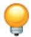

Tip: You can also activate or deactivate steps and frames from the Results Tree. Highlight the steps or frames that you want to toggle, click mouse button 3, then select Activate all or Deactivate all to change the active status of all frames within the selected steps or select Activate or Deactivate to change the active status of the selected frames.

The Results Tree indicates inactive frames with a red “X” that appears to the left of the frame shortcut. User-defined session steps, which cannot be deactivated, are indicated with a red exclamation point; these steps are not displayed in the Active Steps/Frames dialog box.

Manually activating and deactivating steps and frames in the dialog box can supplement and refine the choices you make by using the selection aids. In addition, clicking mouse button 3 in the lower portion of the dialog box provides access to the following manual selection shortcuts:

• Expand All expands all of the steps containers, selected and unselected, to reveal the frames of every step in the output database.  
• Collapse All collapses all of the selected and unselected step containers in the output database.  
• Select All selects every frame of every step in the output database.  
• Deselect All deselects every frame of every step in the output database.  
• Reset Selection reverts the active steps and frames to the subset that was active when you last clicked Apply.  
• Reset Periods reverts the period values to the settings that were active when you last clicked Apply.

1. Locate the Active Steps/Frames dialog box.

From the main menu bar, select Result->Active Steps/Frames. The Active Steps/Frames dialog box appears.

The lower portion of the dialog box shows the steps and, for expanded steps, the frames in the output database. The first time you examine an output database’s steps and frames during a session, all of the steps and frames are active.

2. From the Selection Aids portion of the dialog box, choose the data set, variable, and global range values for your search.

3. Click Update Selection.

Abaqus/CAE updates the subset of active steps and frames.

4. Activate or deactivate steps manually in the lower portion of the dialog box. You can toggle the activate status of a single step or frame by clicking the appropriate row, or you can toggle the activation status of multiple rows by clicking and dragging several rows.

5. Click Apply.

Abaqus/CAE updates all viewports that display this output database with the newly selected subset of active steps and frames.

## Additional information

• Selecting the results step and frame  
• Changing the period of a step  
• Reading X–Y data from output database field output  
• Animating plots

## Changing the period of a step

The meaning of a step's period value depends on whether the step is a Riks analysis step or a time-based step. For Riks analysis steps, the period specifies the total arc length for the step. For time-based steps, the period specifies the step's total duration, so changing this value affects how long this step is displayed and changes the starting times for all subsequent steps. Changing the time period of a single step also changes the duration of the entire animation or frame-by-frame display, affects the auto-computed start and end time of time-based animations, and affects the way the animation of this model synchronizes with other models. You might want to adjust the time period if you want to synchronize events in different models that occur at different times in the common time line.

Changes to the period values last for the duration of your session. Abaqus/CAE does not save these changes to the output database.

You cannot edit the period value of a Riks analysis or time-based step if the value equals 0. In addition, modal and frequency extraction steps do not have period values; Abaqus/CAE displays an uneditable dash (-) in the Period column for steps of these types.


Tip: If you want to revert the period values to the output database's settings, click mouse button 3 in the lower portion of the window and select Reset Periods.

1. Locate the Active Steps/Frames dialog box.

From the main menu bar, select Result->Active Steps/Frames. The Active Steps/Frames dialog box appears.

The lower portion of the dialog box shows the steps and, for expanded steps, the frames in the output database. The first time you examine an output database’s steps and frames during a session, all of the steps and frames are active.

2. From the lower portion of this dialog box, click the value in Period column for a step, then enter a new value in the field. Repeat this change for every step period that you want to customize.  
3. Click Apply.

Abaqus/CAE updates all viewports that display this output database with the revised period and time values.

## Additional information

• Selecting the results step and frame  
• Reading X–Y data from output database field output  
• Animating plots

## Selecting the field output to display

This section explains how to select field output variables to display.

To learn how to select output database history output to produce an X–Y plot, see Reading X–Y data from output database history output. To learn how to select output database field output to produce an X–Y plot, see Reading X–Y data from output database field output.

## In this section:

Selecting field output variables  
Using the field output toolbar  
Selecting the primary field output variable  
Selecting the deformed field output variable  
Selecting the symbol field output variable  
Selecting the status field output variable  
Selecting the stream field output variable  
Selecting complex results  
Selecting section point data  
Selecting contact output

## Selecting field output variables

Contour plots, model probing, view cuts based on an isosurface, and X–Y plots of results along a model path all show the values of a particular field output variable at a specified step and frame of your analysis.

Similarly, when you form a display group or specify color coding based on results, or when you display a load or predefined field from data in the current model database, these results pertain to a particular field output variable. The variable whose values are shown is called the primary field output variable.

Deformed plots show the shape of your model based on the values of a nodal variable (such as displacement) at a specified step and frame of your analysis. The variable whose values are shown is called the deformed field output variable.

Symbol plots show the magnitude and directions of a particular vector or tensor variable at a specified step and frame of the analysis. A symbol plot can also the magnitude and direction of a selected load or predefined field in a model from the current model database. The variable whose values are shown is called the symbol field output variable.

You can specify result-based criteria for element failure for a selected field output variable and remove elements that meet the failure criteria from model plots. The variable for which you define the failure criteria is called the status field output variable.

You can specify velocity or vorticity data for stream display. The variable for which you display these data is called the stream field output variable.

You can choose to display contour and symbol plots on either the undeformed or deformed model shape. When you use the deformed model shape, the contours or symbols represent the values of the primary field output variable or symbol field output variable, respectively, while the shape of the underlying model is determined by the values of the deformed field output variable.

1. Locate the Field Output options.

From the main menu bar, selectResult->Field Output. The Field Output dialog box appears.


Tip: You can also access these options by clicking the Field Output button in any dialog box in which it appears or by clicking in the Field Output toolbar.

2. Select the primary, deformed, symbol, and status field output variables that you want as described in the following sections:

Selecting the primary field output variable  
Selecting the deformed field output variable  
Selecting the symbol field output variable  
Selecting the status field output variable  
Selecting the stream field output variable  
Selecting complex results  
Selecting section point data  
Selecting contact output

The model plot in the current viewport changes to show the variables you have selected. If active, the text in the legend and state block changes to identify the variables associated with the plot. For more information on the legend and state block, see Customizing the legend, and Customizing the state block. In addition, Abaqus refreshes all dialog boxes in which the currently selected variables are identified.

## Additional information

• Selecting model data and analysis results to plot  
• Using the field output toolbar  
• Creating or editing a view cut

## Using the field output toolbar

You can use the Field Output toolbar to access the basic functionality of the Field Output dialog box. From the toolbar, you can

• choose the type of field output variables to manipulate (Primary, Deformed, or Symbol);  
• choose the variable name from a list of the available field output variables;  
• choose the refinement level, such as invariants and components for the selected primary variable, if available; and  
• choose whether the viewport plot state should be synchronized with the toolbar selections.

The Status and Stream variable types are the only field output that you cannot select from the toolbar. The Status and Stream variable types are available in the Field Output dialog box; the status variable allows you to specify criteria that Abaqus/CAE uses to remove failed elements from the model display, and the stream variable determines the field output displayed in streamlines for an analysis of fluid flow data. To open the Field Output dialog box, click

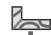

, located on the left side of the Field Output toolbar.

  
Figure 1:The Field Output toolbar.

As you make selections from the toolbar, Abaqus/CAE updates the current viewport to display the output; the viewport

plot state is also updated if a change in plot state is needed and if the plot state synchronization toggle ( → ) is enabled. For example, selecting Primary as the variable type changes the plot state to display contours on the deformed model if the viewport does not already contain a contour plot. If you disable synchronization, Abaqus/CAE still displays your newly selected field output variable in the current viewport but does not change the plot state.

## Additional information

• Selecting model data and analysis results to plot  
• Selecting field output variables

You can select the variable to display for contour plots, model probing, view cuts based on an isosurface, and for which to obtain results along a model path; this variable is called the primary field output variable. Abaqus/CAE also uses the primary field output variable to form display groups, to apply color coding based on results, and for display of loads, predefined fields, or interactions from a model in the current model database.

When an output database is selected, Abaqus/CAE lists for your selection all variables available at the current step and frame of your output database by default. An asterisk to the left of the description indicates that the variable includes complex number results.

When a model in the current model database is selected, Abaqus/CAE lists for your selection all loads, predefined fields, boundary conditions, and interactions available in the current step of your model by default. All of these selectable items are preceded by a letter in parentheses to distinguish them by category: (L) for loads, (P) for predefined fields, (B) for boundary conditions, and (I) for interactions. Only the real part of a complex load or predefined field is available for display.

Use the Primary Variable options in the Field Output dialog box to choose the variable and, if applicable, the invariant or component that you want. For information on individual output variable identifiers, see Output Variables.

1. Locate the options that control the primary field output variable.

From the main menu bar, selectResult->Field Output. Click the Primary Variable tab in the dialog box that appears.

The Primary Variable options appear.


Tip: You can also access these options by clicking the Field Output button in any dialog box in which it appears.

To see the complete descriptions of the variables listed, increase the width of the dialog box by dragging one corner.

2. To control which variables appear in the Name and Description list:

a. Toggle List only variables with results to display a list that is limited by the storage location of the variables. Limiting the list helps you select variables by presenting, for example, only integration point quantities.

When List only variables with results is on, filter options become available in the pull-down menu.

b. Click the List only variables with results arrow to reveal the filter options.

c. Click the text stating the location of the variables you want to include in the Name and Description list.

The text appears in the List only variables with results box, and the Name and Description list is refreshed to include only variables having that location.

3. From the Name and Description list, click the name of the analysis variable that you want. An asterisk to the left of the description in the list indicates that the variable includes complex number results.

The selected variable is highlighted. If applicable, the Component and Invariant lists on the bottom of the dialog box are refreshed to display available components or invariants, respectively.

4. If items are listed in the Component or Invariant list, click the component or invariant that you want. The selected component or invariant is highlighted.


Note: For S and E field output, there are two invariants, Max. Principal (abs) and Max. In-Plane Principal (abs), which are available only in the Visualization module. Max. Principal (abs) is the largest principal value when the absolute value of all principal values are compared. Max. In-Plane Principal (abs) is the largest principal value when the absolute value of all in-plane principal values are compared. The out-of-plane principal value is not considered when the Max. In-Plane Principal (abs) value is computed.

5. When active, a contour plot in the current viewport changes to show values for the analysis variable you have specified. If active, the text in the legend and state block changes to identify the variable associated with the plot. For more information on the legend and state block, see Customizing the legend, and Customizing the state block. In addition, Abaqus refreshes all dialog boxes in which the current primary variable is identified.

Your changes are saved for the duration of the session.

## Additional information

• Selecting model data and analysis results to plot

You can display the deformed model by producing a deformed plot or by selecting the deformed model as the underlying shape of a contour or symbol plot. The shape of your deformed model is based on the values of the particular deformed field output variable that you select. An asterisk to the left of the description in the Output Variable list indicates that the variable includes complex number results. For information on individual output variable identifiers, see Output Variables.

1. Locate the options that control the deformed field output variable.

From the main menu bar, select Result->Field Output. Click the Deformed Variable tab in the dialog box that appears.

The Deformed Variable options become available.


Tip: You can also access these options by clicking the Field Output button in any dialog box in which it appears.

Abaqus/CAE lists by name and description all variables available at the current step and frame of your output database that can be used for a deformed plot (nodal vector quantities). To see the complete descriptions of the variables listed, increase the width of the dialog box by dragging one corner.

2. From the Name and Description list, click the deformed field variable that you want. An asterisk to the left of the description in the list indicates that the variable includes complex number results.  
The selected variable is highlighted.

3. The deformed model shape in the current viewport changes to reflect the values of the deformed field output variable you have specified. If active, the text in the state block changes to identify the variable associated with the plot. For more information on the state block, see Customizing the state block.

Your changes are saved for the duration of the session.

## Additional information

• Selecting model data and analysis results to plot

## Selecting the symbol field output variable

You can select the vector or tensor variable component and optionally select a component to display for a symbol plot; this variable is called the symbol field output variable.

When an output database is selected, Abaqus/CAE lists for your selection all vector and tensor variables available at the current step and frame of your output database by default; resultant values are displayed in vector variable symbol plots, and all principal components are displayed in tensor variable symbol plots. An asterisk to the left of the description indicates that the variable includes complex number results.

When a model from the current model database is selected, Abaqus/CAE lists for your selection all loads, predefined fields, boundary conditions, and interactions available at the current step of your model by default. All of these selectable items are preceded by a letter in parentheses to distinguish them by category: (L) for loads, (P) for predefined fields, (B) for boundary conditions, and (I) for interactions.

Use the Symbol Variable options in the Field Output dialog box to choose the variable and the specific components that you want. For information on individual output variable identifiers, see Output Variables.

When you display a vector variable in a symbol plot, you can choose from the following options:

• Display arrows that represent resultant values of the variable. For example, a symbol plot of total displacement appears on the left side of Figure 1.  
• Display arrows that represent specific component values of the variable. For example, a symbol plot of displacement in the 1-direction appears on the right side of Figure 1.

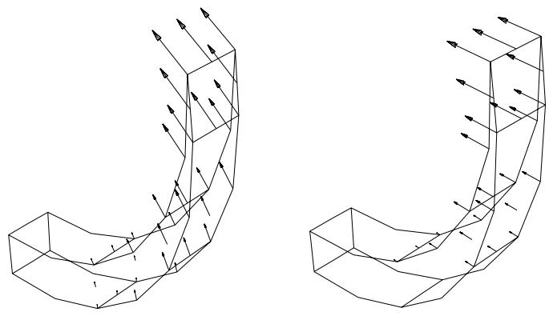  
Figure 1: Symbol plots showing total displacement (left) and displacement in the 1-direction (right).

Likewise, when you display a tensor variable in a symbol plot, you can choose from the following options:

• Display arrows that represent each of the principal components of the variable. For example, a symbol plot of maximum, intermediate (mid), and minimum principal stress appears on the left side of Figure 2.  
• Display arrows that represent a specific principal component of the variable. For example, a symbol plot of only maximum principal stress appears on the right side of Figure 2.


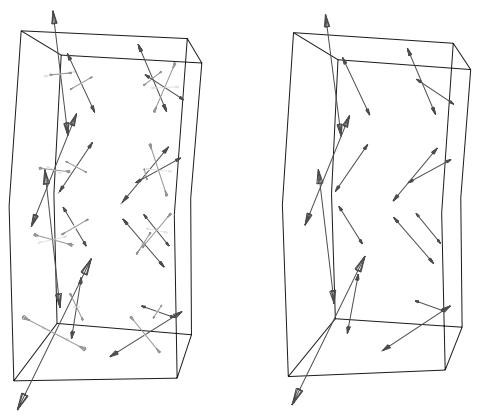  
Figure 2: Symbol plot showing all three principal components (left), and symbol plot showing only maximum principal stress (right).

• Display arrows that represent each of the direct components of the variable. For example, a symbol plot of all direct components appears on the left side of Figure 3.  
• Display arrows that represent a specific direct component of the variable. For example, a symbol plot of only S22 appears on the right side of Figure 3.

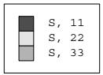

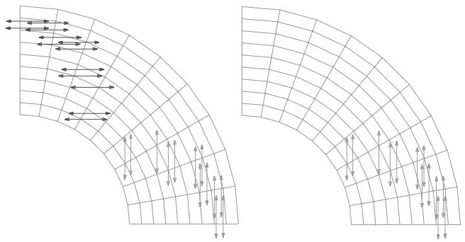  
Figure 3: Symbol plot showing all direct components (left), and symbol plot showing only S22 (right).

1. Locate the options that control the symbol field output variable.

From the main menu bar, selectResult->Field Output. Click the Symbol Variable tab in the dialog box that appears.

The Symbol Variable options appear.


Tip: You can also access these options by clicking the Field Output button in any dialog box in which it appears.

To see the complete descriptions of the variables listed, increase the width of the dialog box by dragging one corner.

2. To control which variables appear in the Name and Description list:

a. Toggle List only variables with results to display a list that is limited by the storage location of the variables. Limiting the list helps you select variables by presenting, for example, only integration point quantities.

When List only variables with results is on, filter options become available in the pull-down menu.

b. Click the List only variables with results arrow to reveal the filter options.

c. Click the text stating the location of the variables you want to include in the Name and Description list.

The text appears in the List only variables with results box, and the Name and Description list is refreshed to include only variables having that location.

3. From the Name and Description list, click the name of the analysis variable that you want. An asterisk to the left of the description in the list indicates that the variable includes complex number results.

The selected variable is highlighted. The Vector Quantity, Tensor Quantity, and Component lists on the bottom of the dialog box are refreshed to display available vector quantities, tensor quantities, and components, respectively.

4. If you are creating a vector variable symbol plot, select the components to plot.

• Select Resultant to display arrows that represent the resultant of the variable.

Select Selected Component and the component that you want to display arrows that represent a particular component of the variable.

5. If you are creating a tensor variable symbol plot, select the component to plot.

• Select All Principal Components to display arrows that represent all available principal components.

Select Selected Principal Component and the component that you want to display only arrows that represent a particular principal component.

• Select All Direct Components to display arrows that represent all three direct components.

• Select Selected Direct Component and the component that you want to display only arrows that represent a particular direct component.


Note: For S and E field output, there are two invariants, Max. Principal (abs) and Max. In-Plane Principal (abs), which are available only in the Visualization module. Max. Principal (abs) is the largest principal value when the absolute value of all principal values are compared. Max. In-Plane Principal (abs) is the largest principal value when the absolute value of all in-plane principal values are compared. The out-of-plane principal value is not considered when the Max. In-Plane Principal (abs) value is computed.

6. Click Apply to implement your changes.

The symbol plot in the current viewport changes to show values for the analysis variable you have specified. If active, the text in the legend and state block changes to identify the variable associated with the plot. For more information on the legend and state block, see Customizing the legend, and Customizing the state block.

Your changes are saved for the duration of the session.

## Additional information

• Selecting model data and analysis results to plot

You can specify result-based criteria for element failure for a selected field output variable; this variable is called the status field output variable. When you enable the use of the status field output variable, elements that meet the specified criteria are considered failed and they are removed from model plots. Use the Status Variable options in the Field Output dialog box to enable the use of the status variable; to select the variable and, if applicable, an invariant or components; and to specify the result-based criteria for failure. If desired, you can apply the status field output variable to undeformed shape plots. By default, failed elements are not removed when the model is displayed in an undeformed state.

By default, the status field output variable is not enabled unless the output variable STATUS appears in the output database. In this case the use of the status field output variable is enabled by default, the output variable STATUS is selected, and the failure criteria is set to remove elements with values less than or equal to 0.5 (the status of an element is 1.0 if the element is active, 0.0 if the element is not). Elements with a value of 0.0 are not displayed in the model plot in the current viewport.

When selecting a status field output variable, Abaqus/CAE lists for your selection all of the variables (except surface-based field output variables) available at the current step and frame of your output database. An asterisk to the left of the description indicates that the variable includes complex number results. For information on individual output variable identifiers, see Output Variables.

1. Locate the options that control the status field output variable.

a. From the main menu bar, selectResult->Field Output. Click the Status Variable tab in the dialog box that appears.  
b. Toggle Use status variable to disable or enable use of the status variable.

When Use status variable is on, the status variable is enabled and the Status Variable options become available.


Tip: You can also access these options by clicking the Field Output button in any dialog box in which it appears.

To see the complete descriptions of the variables listed, increase the width of the dialog box by dragging one corner.

2. Toggle on Apply to undeformed state to apply the status field output variable to undeformed shape plots. If your model contains no deformations, you must toggle on this setting to apply the status field output variable.  
3. To control which variables appear in the Name and Description list:

a. Toggle List only variables with results to display a list that is limited by the storage location of the variables. Limiting the list helps you select variables by presenting, for example, only integration point quantities.

When List only variables with results is on, filter options become available in the pull-down menu.

b. Click the List only variables with results arrow to reveal the filter options.  
c. Click the text stating the location of the variables you want to include in the Name and Description list.

The text appears in the List only variables with results box, and the Name and Description list is refreshed to include only variables having that location.

4. From the Name and Description list, click the name of the analysis variable that you want. An asterisk to the left of the description in the list indicates that the variable includes complex number results.

The selected variable is highlighted. If applicable, the Invariant and Component lists on the bottom of the dialog box are refreshed to display available invariants or components, respectively.

5. If items are listed in the Invariant or Component list, click the invariant or component that you want. The selected invariant or component is highlighted.


Note: For S and E field output, there are two invariants, Max. Principal (abs) and Max. In-Plane Principal (abs), which are available only in the Visualization module. Max. Principal (abs) is the largest principal value when the absolute value of all principal values are compared. Max. In-Plane Principal (abs) is the largest principal value when the absolute value of all in-plane principal values are compared. The out-of-plane principal value is not considered when the Max. In-Plane Principal (abs) value is computed.

6. Choose from the filtering methods in the Remove elements field to specify the failure criteria. If any result value of an element meets the specified criteria, that element is considered failed and it is removed from model plots. Element output quantities are compared against the specified criteria; there is no extrapolation or averaging performed on the element data. If a nodal quantity is selected and a value for a given node meets the specified criteria, all elements connected to the failed node are removed.

• Select and enter a value in the Max field to remove elements with values less than or equal to the specified value.  
Select and enter a value in the Min field to remove elements with values greater than or equal to the specified value.  
• Select (inside) and enter values for the upper and lower bounds of the range in the Min and Max fields to remove elements with values between and including the specified values.  
Select (outside) and enter values for the upper and lower bounds of the range in the Min and Max fields to remove elements with values outside the specified range.

7. Click Apply to implement your changes.

The model plot in the current viewport changes to remove elements with values of the selected status field output variable that meet the specified criteria. If active, the text in the legend and state block changes to identify the variable associated with the plot. For more information on the legend and state block, see Customizing the legend, and Customizing the state block.

Your changes are saved for the duration of the session.

## Additional information

• Selecting model data and analysis results to plot

## Selecting the stream field output variable

You can specify the variable for which stream data are computed; this variable is called the stream field output variable. For most analyses velocity (V) can be used for the stream data. Only node-centered vector results can be associated with streamline traces.

When selecting a stream field output variable, Abaqus/CAE lists all of the vector variables stored at nodal locations and available at the current step and frame of your output database.

1. Locate the options that control the stream field output variable.

From the main menu bar, select Result->Field Output. Click the Stream Variable tab in the dialog box that appears.


Tip: You can also access these options by clicking the Field Output button in any dialog box in which it appears.

To see the complete descriptions of the variables listed, increase the width of the dialog box by dragging one corner.

2. From the Name and Description lists, click the name of the analysis variable that you want.

The selected variable is highlighted.

3. Click Apply to implement your changes.

Abaqus/CAE recomputes the streamlines in the current viewport based on the selected stream output variable. Your selection for stream output variable is also saved for the duration of the session.

## Additional information

• Selecting model data and analysis results to plot

## Selecting complex results

By default, Abaqus/CAE lists for your selection all variables available at the current step and frame of your output database. If the current step is a steady-state dynamic analysis, the value of an output variable such as stress (S) or displacement (U) can be a complex number with both real and imaginary components. Use the Primary Variable, Deformed Variable, Symbol Variable, Status Variable, and Stream Variable options in the Field Output dialog box to choose the complex variables that you want to display. The description of each listed variable begins with an asterisk if that variable includes complex results. For information on individual output variable identifiers, see Output Variables.

You can display complex results in the form of a deformed, contour, or symbol plot; by model probing; by obtaining results along a model path; and by forming a display group or specifying color coding based on results. In each of these cases you can choose from several numeric forms to display different aspects of the complex results. You can animate complex results using harmonic animation. During harmonic animation the real and imaginary components of each complex number are used to calculate and display the value of the result at a sequence of angles representing a half cycle (0° to 180°) or a full cycle (−180° to 180°).

## Additional information

• Selecting model data and analysis results to plot  
• Producing a harmonic animation

If your model contains shells, beams, or composite layups, you can view data from selected section points when you are displaying a contour, symbol, or material orientation plot.

You can select section points, by category or ply, that will apply across linked viewports. The linking also applies to envelope plots. For more information, see Linking viewports.

You can choose either of the following selection methods:

## By category

For each section of your model, you first choose the active location of a section point (bottom, top, or both). You then choose from a list of available section points for this category. For example, you can choose to display data from the midpoint of each section. The available section points are related to the section points that you requested when you created the field output request in the Step module. You can also display a plot of the section point containing the critical value (maximum or minimum) of the field output variable across all of the section points. For more information, see Selecting section point data by category.

## By ply

For a model containing a composite layup, you first choose a ply, and you then choose a location from which to display the field output variable. You can specify one of the following as the section point location in the selected ply: the bottommost section point, the middle or only section point, the topmost section point, or both the topmost and bottommost section points. For more information, see Selecting section point data by ply.

## In this section:

Selecting section point data by category  
Selecting section point data by ply

## Selecting section point data by category

When you are displaying a contour plot, you can use the Section Points dialog box to control the section points from which Abaqus obtains integration point results and material orientations by selecting a category and the section points that represent the bottom and top locations.

Reinforcement (rebar) layers in membrane, shell, and surface elements are treated as section points for output purposes; each reinforcement layer has a unique name. For example, you can request results from the section points at the top surfaces of certain shells in the model, from the middle section points of certain beams in the model, or from a named reinforcement layer in certain membrane elements in the model.

Contour plots displaying output at two section points vary in appearance depending on the type of shell. In a conventional shell the two contours appear as a double-sided shell with different contours on each side, while in a continuum shell (or a composite solid) the two contours appear as distinct two-dimensional contour fronts at each section point location. Axisymmetric shells, which are composed of line elements swept to form a three-dimensional surface, exhibit neither behavior because they are not considered three-dimensional shells; instead, these shells display output at a single section point only.

In many cases the location of a section point is described in terms of its position relative to the midpoint of the cross-section. For two-dimensional beams this relative position is reported as a fraction of the distance between the midpoint of the cross-section and the top or bottom surface of the section. For shells this relative position is reported as a fraction of the distance between the midpoint of the cross-section and the SPOS or SNEG surface of the section. Reinforcement layers are indicated by their unique name.

For beams with three-dimensional sections, the relative position of a section point can be reported as a fraction of the distance between the midpoint of the cross-section and

• the top or bottom of the section (along the local 2-axis of the section) or

• the left or right side of the section (along the local 1-axis of the section).

For circular beams the section point locations are defined as a relative position with respect to the section radius and an angle rotated from the positive 1-axis about the midpoint of the cross-section.

For more information about where section points are located in different section types, see the following:

• Beam Elements

• Shell Elements

For more information about reinforcement layers, see Defining Reinforcement.

Abaqus/CAE provides the following methods for choosing the section points to display:

• Display a category of elements and a location. Examples of element categories include element types and materials. The location can be the top or bottom surface or both.  
Display the section point containing the critical value (absolute maximum, maximum, or minimum). Abaqus/CAE searches for the critical value across all of the section points in each element. The resulting plot is called an envelope plot.

## Additional information

• Selecting model data and analysis results to plot

Select the section point using categories and a location

1. Display a contour plot of the desired field output variable. For more information, see Producing a contour plot.  
2. Locate the Section Points dialog box.

From the main menu bar, select Result->Section Points.

The Section Points dialog box appears.

3. From the Selection method field, select Categories.

The elements within each category share common section properties, such as the following:

• The section type associated with the elements in this category.  
• The material name or composite specification included in the section definition.  
• The number of section points through the section.  
• The cross-section geometry (beams only).

4. From the Active locations field, select Bottom or Top to activate only the Bottom Location or Top Location section point. For contour plots of integration point variables on three-dimensional shells or composite solids, select Top and bottom to display output simultaneously at both section points. Only contour plots of this type can display output for both section points simultaneously; in all other contexts, Abaqus/CAE displays output only at the Bottom Location section point when you select Top and bottom.

Abaqus/CAE displays output only at active locations. The Bottom Location and Top Location fields display the two section points at which you can display output for the selected category. By default, these fields display the SNEG and SPOS section points, respectively.

5. In the Category table, select the element category or categories for which you want to change the output location and select the location. If you selected Top and bottom from the Active locations field, select both locations.

The Available Section Points in Cross-Section field in the bottom half of the dialog box lists the section points from which output was saved for the category and location you have selected. If you have selected more than one category, only those locations that are common to all of the selected categories appear in the list.

6. In the Available Section Points in Cross-Section field, select the section point location to display.

7. Click Apply to view your settings.

The model plot in the current viewport changes to display values from the specified section points. The plot legend, if active, changes to identify the specified section points. For information about the plot legend, see Customizing the legend.

Results for subsequent contour, symbol, and material orientation plots; tabular reports; model probing; and X–Y data objects along a path will be obtained from the section points you have specified.

8. Click OK to select the section points and to exit the dialog box.

## Select the section point containing the critical value

1. Display a contour plot of the desired field output variable. For more information, see Producing a contour plot.  
2. Locate the Section Points dialog box.  
From the main menu bar, select Result->Section Points.  
The Section Points dialog box appears.  
3. From the Selection method radio buttons, select Categories.  
4. From the Active locations radio buttons, select Envelope.  
5. From the Criteria field of the dialog box, select the criterion (absolute maximum, maximum, or minimum) that will determine the section point containing the critical value.

6. From the Position field, select the algorithm that Abaqus/CAE will use to determine the section point containing the critical value.

• If you choose Integration point, Abaqus/CAE compares the value at all of the integration points of each section.  
• If you choose Centroid, Abaqus/CAE compares the value averaged at the centroid of each section.  
• If you choose Element nodal, Abaqus/CAE compares the value extrapolated to the nodes of each section.

7. Click Apply to view your settings.

The model plot in the current viewport displays the critical section point and its value for each element in the mesh. For information about the plot legend, see Customizing the legend.

8. If you are displaying a composite layup, you can determine how Abaqus/CAE displays the critical section point by selecting ply options for the contour plot.

a. From the main menu, select Options->Contour.  
b. From the Contour Plot Options dialog box that appears, click the Other tab.  
c. From the options at the bottom of the tabbed page, do the following:

• Toggle on Show labels of plies that match criteria to see labels for the critical plies in the contour plot.  
Toggle on Color by plies that match criteria to change the value that is being contoured from the field output variable to a ply name. The contour plot updates to show the critical plies in the model. The legend updates to show the names of the plies that are being displayed.

9. Click OK to retain your settings and to exit the dialog box.

## Selecting section point data by ply

You can use the Section Points dialog box to control the section points from which Abaqus obtains integration point results and material orientations by selecting a ply and the location from within the ply at which Abaqus/CAE reads the results.

Contour plots displaying output at both the top and bottom of the selected ply vary in appearance depending on the type of composite layup. In a conventional shell composite layup the two contours appear as a double-sided shell with different contours on each side. In a continuum shell composite layup or a solid composite layup the two contours appear as distinct two-dimensional contour fronts at each section point location.

1. Display a contour plot of the desired field output variable. For more information, see Producing a contour plot.  
2. Locate the Section Points dialog box.

From the main menu bar, select Result->Section Points.

The Section Points dialog box appears.

3. From the Selection method radio buttons, select Plies.  
4. To limit the list for easier selection, type a filter pattern into the Name filter field, and press the [Enter] key to apply the filter.

If viewport linking is activated, you can toggle on Show common list between linked viewports to display only the plies that are common to all linked viewports.

5. From the list of plies in the layup, select the desired ply.  
6. From the Ply result location radio buttons, do one of the following:

• Select Bottommost to select the bottommost section point in the selected ply.

Select Middle/Single section point to select the middle section point or the only section point in the selected ply. The middle section point is the middle of the available locations in the section, not the middle of the total locations. For example, if results are available at TOP and BOTTOM only, the number of available locations is two and the “middle” will correspond to the TOP location.

• Select Topmost to select the topmost section point in the selected ply.  
• Select Topmost and bottommost to select both the topmost and bottommost section points in the selected ply.

7. Click Apply to view your settings.

The model plot in the current viewport changes to display values from the specified ply at the specified location. The plot legend, if active, changes to identify the plies. For information about the plot legend, see Customizing the legend.

8. Click OK to retain your settings and to exit the dialog box.

## Additional information

• Selecting model data and analysis results to plot  
• Linking viewports

## Selecting contact output

Contact output data for nonkinematic scalar output variables such as CPRESS, COPEN, CSLIP, CSHEAR1, and CSHEAR2 are consolidated from all continuum element–based surfaces into a single data set.

Data for overlapping surfaces are combined. If contact output is requested for membrane or shell elements, the data for the SPOS and SNEG surfaces are contained in separate data sets. When contact surfaces are double-sided or node-based, separate contact output data sets are created for each contact surface pair.

The method that Abaqus/CAE uses to combine overlapping facet data in the consolidated data set depends on the output variable:

• For the variables CPRESS, CSHEAR, and CSLIP, Abaqus/CAE uses the largest value, positive or negative, in the model for the selected variable.  
• For the variable COPEN, Abaqus/CAE uses the minimum value for contact opening, which can reflect the smallest opening in the model or, if there are overclosures, the greatest overclosure value.  
• For the vector variables CNORMF and CSHEARF, Abaqus/CAE evaluates the sum of all vector values for the individual surface pairs and stores the resultant vector in the consolidated data set.  
• For the variable CSTATUS, Abaqus/CAE assigns one of four contact statuses to individual nodes on the main and secondary surfaces.

Abaqus/CAE uses the following settings in the consolidated data set:

• Sticking if any of the overlapping regions are in contact and sticking,  
• Slipping if any of the overlapping regions are in contact and slipping,  
• Bonded if any of the overlapping regions are in contact and bonded, and  
• Not in contact if the regions are not in contact.

The variable names that appear in Abaqus/CAE for each data set indicate the regions to which the contact output applies. For example, a CPRESS data set for an individual contact surface pair (for a double-sided or node-based contact surface) is named CPRESS SECONDARY NAME/MAIN NAME; the data sets for contact on the SPOS or SNEG side of a membrane or shell surface are named CPRESS SPOS and CPRESS SNEG, respectively; and all other surface variable output is named CPRESS.

Contact output data for any individual contact surface pair, without summed contributions from other contact pairs, are accessible using the Create Field Output dialog box or the Abaqus Scripting Interface to the output database; these data sets have names of the form CPRESS SECONDARY NAME/MAIN NAME.

Because CPRESS, CSHEAR1, and CSHEAR2 are associated with particular surfaces defined in the model, the surfaces must be included in the current display group when these output variable results are probed. These variables can be probed only at the nodes.

## Additional information

• Selecting model data and analysis results to plot  
• Accessing an Output Database

## Selecting result options

Abaqus/CAE offers several methods for you to display field output results stored in the output database. Some of these methods require that field output data originally saved to the output database at element centroid or integration point locations be calculated at nodal locations. Such calculations apply to line- and banded-type contour plots, probing at nodal locations, forming a display group or color coding based on result values, and extracting element-based X–Y data along a path. You can control some of the options related to these computations, such as how element-based results are averaged.

In addition, you can choose to apply coordinate system transformations to your field output results; you can choose from several display forms for complex results: the magnitude, phase angle, real component, imaginary component, or value at a specified angle; and you can choose whether or not to cache results in memory to improve performance.

Select Result->Options to locate the options that control the result calculations, result transformations, display of complex results, and result caching. This section discusses the result computations and the options that affect these computations.

## In this section:

Understanding how results are computed  
Understanding result value averaging  
Understanding complex results  
Understanding results caching  
Displaying field output values or discontinuities  
Controlling result averaging  
Controlling computations at region boundaries  
Transforming results into a new coordinate system  
Controlling the form of complex results  
Controlling results caching

## Understanding how results are computed

The computations necessary to display results stored in the output database depend on whether the results are for a node-based quantity, such as displacement or velocity, or for an element-based quantity, such as stress or strain.

## How node-based field output results are computed

Node-based field output variables are written to the output database at each node, along with any nodal transformations applied during model creation. For the display of nodal field output variables, Abaqus/CAE reads the required values from the output database for each node included in the plot. By default, these values are displayed in the global coordinate system; you can choose to apply the nodal transformations to the results or to apply a user-specified coordinate system transformation. The final values are then used to produce contours, nodal probe values, display groups or color coding based on results, or X–Y data along a path.

## How element-based field output results are computed

Element-based field output variables are written to the output database at the integration points, the element centroid, or the element nodes, depending on the variable. For the display of element-based field output variables, Abaqus/CAE reads values from the output database for all elements connected to all nodes included in the plot. Computations are then applied to these values to produce contours, nodal probe results, display groups or color coding based on results, or X–Y data along a path.

For results saved to the output database at the integration points or at the element centroid, the first computation applied is extrapolation. (Results saved at the element nodes do not require extrapolation.) For contour plots only, you can choose quilt-type extrapolation, in which case the remaining computations discussed below do not apply. To learn more about quilt-type extrapolation, see Understanding how contour values are computed. For all other methods of results display, Abaqus/CAE extrapolates results to the nodes using weighting appropriate for the element type and shape.

Extrapolated values are generally not as accurate as the values calculated at the integration points. Therefore, adequately detailed meshing is recommended around nodes where accurate nodal values of such element results are needed. You should be particularly careful interpreting output variables extrapolated to the nodes for second-order elements with midside nodes outside the quarter-point region, such as when one edge is collapsed in two dimensions or one face is collapsed in three dimensions.

Extrapolation of element tensor quantities is performed on the individual tensor components in the local material coordinate system. Nodes common to two or more elements receive extrapolated values from all contributing elements. Depending on the characteristics of your model, these contributions may originate from more than one result region. If all contributions at a node originate from a single result region, the values are combined as necessary in further computations. If contributions are received from more than one result region, you can choose to respect the region boundary and keep the contributions separate in further computations or to ignore the region boundary and combine the values. The default result regions in an output database duplicate the regions that were used to assign section properties to the model prior to analysis. Alternatively, you can select element sets or display groups to use as result regions. For more information, see Controlling computations at region boundaries.

If invariants or components are requested, you can specify whether Abaqus/CAE should use the extrapolated data from each element or the combined data from all contributing elements to compute the invariants. By default, invariants are computed before the extrapolated results are combined (averaged). Contour plots of invariants or components may be affected by the order in which Abaqus performs the computations. For example, values for the von Mises stress may exceed the yield stress of inelastic materials; in addition, the invariant results may not take into account situations where the material orientations vary within a finite element in a non-isoparametric fashion. If invariants are computed after averaging, Abaqus determines the orientations at a node by averaging the contributing element orientations; component values will be affected if the orientations differ between contributing elements.

If you select element sets to define the result regions and invariants will be computed after averaging, the element sets that you select must contain compatible elements. Compatible elements

• share the same basic element type (continuum, shell, beam, etc.),  
• use interpolation functions of the same order (first-order elements versus second-order elements), and  
• have the same integration scheme (reduced integration, full integration, etc.).

Finally, computations depend on whether you choose to display the field output values or discontinuities; discontinuities are the differences in field output values between adjacent elements.

• Field Output: For the display of field output values, the calculated invariants or components at nodes common to two or more elements are averaged conditionally, depending on the compatibility of contributing result regions and on options you select. For more information, see Understanding result value averaging.  
Discontinuities: For the display of discontinuities, the calculated invariants or components at nodes common to two or more elements are compared to determine the greatest difference, depending on the compatibility of contributing result regions and on options you select. Nodes associated with only one element and nodes receiving equivalent values from all contributing elements will show a value of zero in a plot of discontinuities.

For more information, see Displaying field output values or discontinuities.

## How result transformations are computed

Both node- and element-based results can be transformed into a user-specified coordinate system, and angular transformations can be applied to coordinate- and distance-based nodal vector results; see Transforming results into a new coordinate system, for information on applying a transformation to your results.

Element-based results for three-dimensional continuum elements and all node-based results are transformed into the specified coordinate system based on the locations of the results. The 1-, 2-, and 3-directions for the transformed results correspond to the X-, Y-, and Z-directions of a rectangular coordinate system; the R-, -, and Z-directions of a cylindrical coordinate system; and the R-, -, and -directions of a spherical coordinate system.

Element-based results for two-dimensional continuum elements, shell elements, and membrane elements are transformed by rotating the results about the element normal at the element result location. The 2-direction for the transformed results is determined by the projection of the rectangular Y-direction or the cylindrical or spherical -direction onto the element plane. If the Y- or -direction of the user-defined coordinate system forms an angle less than 30° with the element normal, the next axis that follows the Y- or -axis in a cyclic permutation of the axes is projected on the element plane instead to form the local material 2-direction, and a warning message is displayed. This method of results transformation is different from the method used by Abaqus/Standard and Abaqus/Explicit to compute local orientations (see Orientations).

Element-based results for beam and truss elements cannot be transformed; they are always displayed in the local element orientation system. In addition, element results for rebar and for CAXA, SAX, or SAXA elements are not transformed.

When you transform results to a user-specified coordinate system, you can control the following additional aspects of the coordinate system transformation:

You can include or exclude the effects of the current deformation in the transformation calculations. Deformation effects are not scaled; Abaqus/CAE performs these calculations using a deformation scale factor of 1.0. Including deformation effects in a transformation can change the orientation of node-based coordinate systems, the projection of coordinate systems on shell and membrane elements, and the orientation of location-dependent cylindrical and location-dependent spherical coordinate systems.  
• You can adjust the results to account for the rigid body transformation of the coordinate system. You can adjust the display of primary variable results or results from both the primary and deformed variables.

Rigid body transformation helps you to understand relative displacements when large rigid body displacements are present. Rigid body transformation applies a transformation to the model to negate the displacement and rotation of a user-specified coordinate system that follows nodes (see Creating coordinate systems during postprocessing, for more information) as these nodes deform from frame to frame. The rigid body transformation is determined as the translation and rotation necessary to transform the nodes of the specified coordinate system from their current locations back to their original locations.

You can apply angular transformations for coordinate- and distance-based nodal vector results. The angular transformation computes components in terms of R, , and Z for cylindrical coordinate systems and in terms of R, , and for spherical coordinate systems.

You can apply layup orientation transformations for results that include output from the field output variable SORIENT and include composite sections. The tensor and vector fields will be transformed into the layup orientation defined in the composite section definition.

## Understanding result value averaging

Result value averaging is applicable to the display of element-based field output variables, such as stress or strain, using any of the following methods:

• line- or banded-type contours,  
• probing at nodal locations,  
• forming a display group or color coding based on result values,  
• extracting X–Y data from fields,  
• extracting X–Y data along a path, or  
• generating reports for field data.

The display of node-based field output variables (such as displacement), quilt contour plots, and plots of discontinuities does not involve value averaging.

Extrapolated output database values at nodes common to two or more elements are averaged conditionally. You can use the following options to control the extent to which Abaqus/CAE averages the values at the nodes:

• Select result regions and choose whether averaging takes place across region boundaries.  
• Choose whether shell and membrane feature edges are treated as region boundaries for averaging.  
• Include or exclude contributions from elements that are not displayed.  
• Choose whether invariants are computed and components are extracted before or after averaging.  
• Select a threshold value to control averaging based on the difference between the contributing element values (this option is available only if you choose to calculate invariants before averaging).

Abaqus/CAE averages values at nodes common to two or more elements when the contributing elements lie in the same result region. The default result regions are the same regions defined when you assign sections to your model; you can also define custom result regions using saved element sets or display groups. You can choose whether or not Abaqus/CAE averages values at nodes common to two or more result regions. You can suppress averaging across regions (use the region boundaries) to emphasize any discontinuities at region boundaries, or you can request averaging across regions (ignore region boundaries) to produce a more continuous effect. For example, Figure 1 shows a contour plot using region boundaries on the left and averaging across region boundaries on the right.

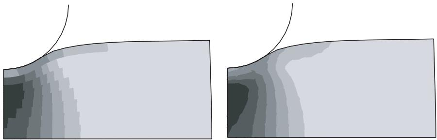  
Figure 1: Contour plots using region boundaries and averaging across region boundaries.

If you choose to average across regions, the extent to which values are averaged is controlled by the threshold that you specify as follows:

$$
\text {relative nodal variation} = \frac {\left(\text {maximum at node} - \text {minimum at node}\right)}{\left(\text {maximum over active regions} - \text {minimum over active regions}\right)}
$$

If the relative nodal variation for each node included in the plot is less than your averaging threshold, values of contributing elements are averaged at that node. If the relative nodal variation exceeds your setting, the values are not averaged. When you decide to average across regions, the averaging threshold is considered in relation to the variation of values across the whole model unless you limit averaging to the displayed elements. Setting a high averaging threshold would allow you to smooth out all but the most extreme discontinuities relative to results across your model or all displayed results.

If you choose not to average across regions, the extent to which values are averaged at nodes within each region is controlled by the averaging threshold that you specify as follows:

$$
\text {relative nodal variation} = \frac {\left(\text {maximum at node} - \text {minimum at node}\right)}{\left(\text {maximum within region} - \text {minimum within region}\right)}
$$

If the relative nodal variation for each node included in the plot is less than your averaging threshold, values of contributing elements are averaged at that node. If the relative nodal variation exceeds your setting, the values are not averaged. When you suppress averaging across regions, the averaging threshold is considered in relation to the variation of values within each region rather than across the whole model or all displayed results.

The lower the averaging threshold you apply, the more the displayed values depict the individual element results. Conversely, a higher averaging threshold produces a smoother effect with fewer noticeable discontinuities from element to element.

When using threshold-based averaging in conjunction with the extraction of X–Y data from element-based fields, you might want to adjust the threshold value. The element region used when extracting X–Y data is reduced to include only the elements that are attached to the specified nodes.

If you choose to compute invariants and extract components after averaging,

• Abaqus/CAE does not apply the averaging threshold;  
• tensors are transformed to an average orientation at each node prior to averaging; and  
• result regions, if used, must contain compatible elements.

For more information, see Understanding how results are computed.

Select Result->Options to locate the options that affect averaging. Controlling result averaging, and Controlling computations at region boundaries, provide details on using the averaging options.

## Understanding complex results

If the current step is a steady-state dynamic analysis, the value of an output variable such as stress (S) or displacement (U) can be a complex number with both real and imaginary components. Complex number results are saved during the analysis as pairs of real and imaginary data.

When you use Abaqus/CAE to display complex results, you can choose any of the following forms to view the analysis data:

• Magnitude displays the combined magnitude of both the real and imaginary portions of the result value.  
• Phase angle displays the angle between the positive horizontal axis and the plotted point (real, imaginary). This selection is valid only for scalars or for vector and tensor components.  
• Real displays only the real component. This option is the default setting.  
• Imaginary displays only the coefficient of the imaginary component of the complex result.  
Value at angle displays the combined value of the real and imaginary portion of the result at an angle that you specify. When the angle is $0 ^ { \circ }$ , the real part of the result is displayed; when the angle is −90°, the imaginary part of the result is displayed.  
• Envelope: Min displays the minimum of the combined value of the real and imaginary portion of the result by varying the angle from $0 ^ { \circ }$ to 360°.  
• Envelope: Max displays the maximum of the combined value of the real and imaginary portion of the result by varying the angle from $0 ^ { \circ }$ to 360°.  
• Envelope: Max absolute displays the maximum absolute of the combined value of the real and imaginary portion of the result by varying the angle from $0 ^ { \circ }$ to 360°.

The Magnitude is calculated after any invariants, such that the magnitude value is the square root of the sum of the squares of the real and imaginary invariant components. Similarly, the other complex forms are also calculated after invariants. Value at angle and the complex envelope values are exceptions; they are calculated prior to invariants to preserve the proper physical meaning.

You can also choose to animate complex results using harmonic animation. This technique animates complex field output by displaying the Value at angle through a sequence of angles. Abaqus/CAE generates angles ranging from $0 ^ { \circ }$ to 180° or from −180° to 180°, according to your specification, and displays the value of the complex results at each angle.

The magnitude and phase angle are related to the real and imaginary components with the usual expressions. For example, the real and imaginary displacement components, $\scriptstyle { U _ { r } }$ and $U _ { i \cdot }$ , are related to the magnitude, $\overline { { \boldsymbol { \tau } } } .$ , and phase angle, $\phi ,$ as follows:

$$
U _ {r} = \overline {{U}} \cos \phi
$$

and

$$
U _ {i} = \overline {{U}} \sin \phi .
$$

The complex results represent a time-domain variation of the form:

$$
\begin{array}{l} U (t) = U _ {r} \cos \Omega t - U _ {i} \sin \Omega t, \\ = \overline {{U}} \cos (\Omega t + \phi), \\ \end{array}
$$

where $\pmb { \Omega }$ is the excitation frequency. This time variation is shown when you request a harmonic animation. The value of the result at a selected angle, , is obtained by using so that

$$
\begin{array}{l} U (\theta) = U _ {r} \cos \theta - U _ {i} \sin \theta , \\ = \overline {{U}} \cos (\theta + \phi). \\ \end{array}
$$

The magnitude, $\overline { { \pmb { U } } }$ , for a given variable is displayed when $\pmb \theta = - \phi .$ Stepping from −180° to $1 8 0 ^ { \circ }$ corresponds to one full animation cycle.

## Additional information

• Selecting complex results  
• Controlling the form of complex results  
• Harmonic animation

## Understanding results caching

A cache is a portion of system memory. You can choose to store analysis results in a cache during postprocessing to speed up the generation of images on the screen. When results are cached, Abaqus/CAE can plot results without recomputing values for display or accessing the output database file as often. This can greatly improve performance. However, caching results will increase memory usage. If you find that Abaqus/CAE is consuming a lot of memory on your workstation and consequently hindering the performance of your system, you can disable the results caching options to erase the memory associated with results caches. Clearing this memory can increase overall performance; however, the display of results will be slower. Switching to a new output variable or output database will automatically clear the current results cache. For more information, see Controlling results caching.

Abaqus/CAE can display data from an output database while an analysis job is still running and while the database continues to be updated. After most Visualization module operations and during animations, Abaqus/CAE monitors the output database for updated results and updates the current viewport accordingly. If you are displaying data from a remote output database, the performance of Abaqus/CAE may be degraded if the time taken to monitor the database over the network is significant. To increase the performance, you can reduce the frequency with which Abaqus/CAE monitors the output database for updates, or you can disable the monitoring. For more information, see Accessing an output database on a remote computer.

## Additional information

• Controlling results caching

## Displaying field output values or discontinuities

For element-based field output variables, such as stress or strain, you can choose to display the field output values themselves or the differences in field output values between adjacent elements. This choice is applicable to line- and banded-type contours, probing at nodal locations, forming display groups and color coding based on result values, or extracting X–Y data along a path.

The default is to display Field output values. If you choose to display Discontinuities, the Averaging threshold is not applicable.

Figure 1 displays a contour plot of field output values on the left and a contour plot of discontinuities on the right.

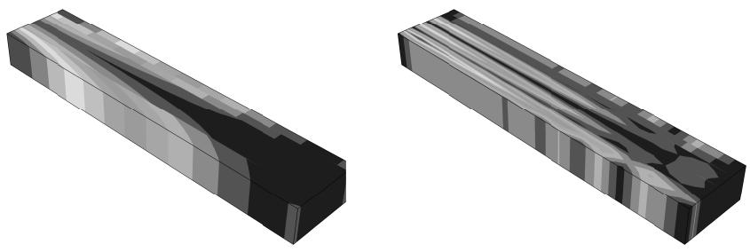  
Figure 1: Contour plots showing field output values and discontinuities in values.

1. Locate the Quantity to Plot options.

From the main menu bar, select Result->Options; then click the Computation tab in the dialog box that appears. The Quantity to Plot options are at the top of the page.

2. Click Field output or Discontinuities to choose the quantity that you want to plot.  
3. Abaqus displays results in the current viewport according to your specifications.

By default, your changes are saved for the duration of the session and will affect all subsequent display of results. If you want to retain your changes for subsequent sessions, save them to a file. For more information, see Saving customizations for use in subsequent sessions.

## Additional information

• Understanding how results are computed

You can control the averaging of element-based field output results, such as stress or strain. Averaging is applicable to creating line- and banded-type contours, probing nodal locations, forming display groups and color coding based on result values, or extracting X–Y data along a path.

Element values are first extrapolated to the nodes. Nodes common to two or more elements will receive multiple contributions. To control the averaging of multiple contributions, you can:

• Enable or suppress averaging.  
• Define result regions and choose whether averaging will cross them.  
• Include or exclude shell and membrane feature edges as additional region boundaries for averaging.  
• Suppress averaging of elements that are not displayed.  
• Choose whether Abaqus/CAE computes invariants before or after averaging.  
• Set the averaging threshold.

The averaging threshold governs the extent of averaging; it is available when Abaqus/CAE computes invariants or extracts components before averaging. If the relative difference between contributions at a node is greater than the threshold percentage you set, Abaqus/CAE will not average the contributing values and your results will appear discontinuous at that node. Use a higher percentage to produce a smoother, more continuous effect.

For information on averaging across regions, see Controlling computations at region boundaries.

1. Locate the Averaging options.  
From the main menu bar, select Result->Options; then click the Computation tab in the dialog box that appears. The Averaging options appear.  
2. To control whether Abaqus/CAE averages output from multiple elements at shared nodes, toggle Average element output at nodes.  
Suppress averaging to identify discontinuities in the field output or to establish contour limits based on the extrapolated, unaveraged results.  
3. Toggle off Use region boundaries to ignore region boundaries and average results across the entire model.  
4. If region boundaries are used, specify the result regions to set the boundaries. For more information, see Controlling computations at region boundaries.


Tip: To view the current result regions, color code an undeformed or deformed plot using the Averaging regions method of attribute selection. (For more information, see Coloring all geometry in the Visualization module.)

5. If region boundaries are used, by default Abaqus/CAE includes shell and membrane feature edges as

additional region boundaries. To change the minimum angle used to create feature edges, click and change the Feature Angle setting in the ODB Display Options dialog box. Feature edges correspond to the undeformed model and are not recalculated for model deformation. (For more information, see Defining model feature edges.)

To average the results across feature edges, toggle off Include shell/membrane feature edge boundaries.

6. To control whether Abaqus/CAE averages nodal results based on all contributing elements or based only on the elements in the current display group, toggle Average only displayed elements.

7. Choose whether Abaqus will compute invariants (scalars) and extract components before or after averaging results over the specified regions.

By default, Abaqus computes the scalars before averaging; if you choose to compute the results after averaging, Abaqus averages all results and their orientations to maintain a valid basis for computing the invariants.


Tip: To view the nodal-averaged orientations in a contour plot, you can display their labels using the Contour Plot Options dialog box. For more information, see Displaying nodal-averaged orientations.

8. If you compute scalars before averaging, you can set the Averaging Threshold (%) to control the averaging between neighboring elements. A value of 0 suppresses all averaging; a value of 100 averages all results.  
9. Click Apply to implement your changes.

Abaqus averages result values for the display in the current viewport according to your specifications. The contour legend, if active, changes to state the averaging threshold that you have specified. For more information on the contour legend, see Customizing the legend.

By default, your changes are saved for the duration of the session and will affect all subsequent display of results. If you want to retain your changes for subsequent sessions, save them to a file. For more information, see Saving customizations for use in subsequent sessions.

## Additional information

• Understanding result value averaging

The default result regions in an output database duplicate the regions that were used to assign section properties to the model prior to analysis. Alternatively, you can select element sets or display groups to use as result regions. You can control computations at nodes common to two or more result regions. Choose to ignore region boundaries to computationally combine results for a smoother, more continuous effect. Choose not to ignore region boundaries to visually emphasize model discontinuities. See Figure 1 for an example of contour plots with and without averaging across regions; averaging across regions occurs when you choose to ignore region boundaries.

1. Locate the Region Boundaries options.

From the main menu bar, select Result->Options; then click the Computation tab in the dialog box that appears. The Region Boundaries options appear within the Averaging controls.

2. To govern computations at nodes common to two or more result regions, toggle Use region boundaries.

To use region boundaries means not to combine values from neighboring result regions when computing nodal averages or when computing discontinuities.

3. Choose one of the following options to define the result regions:


Tip: To view the current result regions, color code an undeformed or deformed plot using the Averaging regions method of attribute selection. (For more information, see Coloring all geometry in the Visualization module.)

## ODB regions

By default, the result regions are the same as the section assignment regions saved in the output database (.odb) file. For more information, see Assigning sections, orientations, normals, and tangents to a part.

## Element sets

Specify the results regions by selecting element sets.

## Display groups

Specify the result regions by selecting display groups.

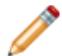

## Note:

If the desired display groups do not exist, select Tools->Display Group->Create to create them (for more information, see Creating or editing a display group).

The region boundaries are defined using the display groups as they are defined at the time of selection. If you subsequently modify or delete display groups, the region boundaries do not change unless you redefine them.

4. If you chose the Element sets or Display groups method to set the region boundaries, complete the following:

a. Click


Abaqus/CAE opens the Specify Averaging Regions dialog box.

b. From the list on the left side of the dialog box, click the desired regions to highlight them in the list. Use [Shift] + Click and [Ctrl] + Click to select multiple items.

c. Click the right-facing arrow button in the center of the dialog box to copy the highlighted items to the Selection column. To move the entire list, click the double right arrow button.  
d. To remove region selections, highlight them in the Selection column and use the left-facing arrow button.

Any elements that are not included in the region boundary selections will be colored using the “no results” color (for more information, see Coloring elements with no results). Selections that overlap will be combined.

5. By default, Abaqus/CAE uses feature edges as additional region boundaries. To change the minimum

angle used to create feature edges, click and change the Feature Angle setting in the ODB Display Options dialog box. Feature edges correspond to the undeformed model and are not recalculated for model deformation. (For more information, see Defining model feature edges.)

To average results across feature edges, toggle off Include shell/membrane feature edge boundaries.

6. Click Apply to implement your changes.

Abaqus computes result values for the display in the current viewport according to your specifications. By default, your changes are saved for the duration of the session and will affect all subsequent display of results. If you want to retain your changes for subsequent sessions, save them to a file. For more information, see Saving customizations for use in subsequent sessions.

## Additional information

• Understanding how results are computed

## Transforming results into a new coordinate system

By default, Abaqus/CAE displays element-based field output results in the coordinate systems defined during preprocessing and node-based field output results in the global coordinate system.

If you defined nodal transformations during preprocessing, you can choose to apply these transformations to node-based results. Alternatively, you can choose to transform both element- and node-based results into a user-specified coordinate system or to apply an angular transformation to coordinate- and distance-based nodal vector results.

For vector quantities such as displacement, velocity, and acceleration, which are derived from nodal coordinates, Abaqus/CAE transforms the results to the requested coordinate system using the final quantity (saved vector) instead of the original coordinates. For example, the cylindrical displacement component is computed by projecting the displacement vector along the current r- or - direction. By comparison, taking the differential between the transformed nodal coordinates would yield a different result.

When you transform results into a local coordinate system, Abaqus/CAE rotates the global rectangular coordinate system as needed to align with the local system at the point of interest. The transformed results are reported in the rotated global rectangular coordinates.

For transformations to user-specified coordinate systems, Abaqus/CAE includes the effects of the current deformation by default when deformation effects are available. You can exclude these effects if you want transformation calculations to consider only the undeformed state. Deformation effects are not scaled; Abaqus/CAE performs these calculations using a deformation scale factor of 1.0. Including deformation effects in a transformation can change the orientation of node-based coordinate systems, the projection of coordinate systems on shell and membrane elements, and the orientation of location-dependent cylindrical and location-dependent spherical coordinate systems. For more information, see Transformation of results.

When you select a user-specified coordinate system for a transformation, you can also adjust the display of primary variable results or results from both the primary and deformed variables to account for the rigid body transformation of the coordinate system. Displaying deformations that account for rigid body transformations enables you to visualize the relative displacements of the model with respect to a moving, user-defined coordinate system. For more information about selecting results variables, see Selecting the primary field output variable, and Selecting the deformed field output variable.

You can apply angular transformations for coordinate- and distance-based nodal vector results. The angular transformation computes components in terms of R, , and Z for cylindrical coordinate systems and in terms of R, , and for spherical coordinate systems.

You can apply layup orientation transformations for results that include output from the field output variable SORIENT and include composite sections. SORIENT will be included as long as element material orientations were requested, which is the default. The tensor and vector fields will be transformed into the layup orientation defined in the composite section definition.

1. Locate the Transform Type options.

From the main menu bar, select Result->Options; then click the Transformation tab in the dialog box that appears. The Transform Type options appear.

2. Select the transform type to use for your results.

Select Default to use the default coordinate systems defined for your model. Node-based results are displayed in the global system. Element-based results are displayed in the local orientations defined for the model; if none has been defined, the global system is used. A projection of the global system or local orientation is used for two-dimensional continuum elements, shell elements, and membrane elements.  
Select Nodal to consider local directions that are defined at the nodes. Element-based results are displayed in the default coordinate system (as described above). Nodal transformations defined for the model are applied to node-based results; if none is defined, the global system is used.

• Select User-specified to transform the results for the entire model into a specified coordinate system.

To limit the list for easier selection, type a filter pattern into the Name filter field, and press the [Enter] key to apply the filter.

Select the transformation to apply from the list of coordinate systems that appears, or click and select the coordinate system from the viewport. Coordinate systems defined either during model generation or during postprocessing are available. Systems designated with an asterisk are saved to the current output database.

• Select Angular to transform results for coordinate- and distance-based nodal vector results in terms of R, , and Z or R, , and . Select the transformation to apply from the list of cylindrical and

spherical coordinate systems that appears, or click and select the coordinate system from the viewport. Coordinate systems defined either during model generation or during postprocessing are available. Systems designated with an asterisk are saved to the current output database.

• Select Layup orientation to transform tensor and vector fields into the layup orientation defined in the composite section definition.

3. If you selected a user-specified coordinate system, you can also include the effects of deformation in the transformation to that coordinate system.

Toggle on Include effects of deformation (when available) to include the effects of deformation, or toggle off this option to exclude the effects of deformation and to consider only the undeformed state in the transformation.

4. If you selected a user-specified coordinate system, you can also apply rigid body transformations to the presentation of primary and deformed variables.

From the Rigid Body Transformations options, do one of the following:

• Toggle on Primary variable to apply rigid body transformations to the primary variable results.  
• Toggle on Primary variable and Deformed variable to apply rigid body transformations to the results for both variables.

5. Abaqus displays results in the current viewport in the specified coordinate system or systems. Angular components are given in radians. Angular transformation component results are denoted using (AT: CSYS-name), and rigid body transformation component results are denoted using (RT: CSYS-name) to differentiate them from the results obtained using the default transformation type.

By default, your changes are saved for the duration of the session and will affect all subsequent display of results. If you want to retain your changes for subsequent sessions, save them to a file. For more information, see Saving customizations for use in subsequent sessions.

## Additional information

• Understanding how results are computed  
• Creating coordinate systems during postprocessing  
• Why are datum coordinate systems so important?  
• Creating field output by operating on fields

## Controlling the form of complex results

If the current step is a steady-state dynamic analysis, the value of an output variable such as stress (S) or displacement (U) can be a complex number with both real and imaginary components. You can control the form of complex numbers when displaying plots of a model or recording probed values from a model in Abaqus/CAE.

You can choose to view the magnitude, phase angle, real component, imaginary component, value at a selected angle, or complex envelope values of your analysis results. The selected form is applied to all complex results, except harmonic animations, in the current session of Abaqus/CAE until you make a new selection. Harmonic animations, by definition, always use the “value at angle” form regardless of the current numeric form.

1. Locate the Numeric Form options.

From the main menu bar, select Result->Options; then click the Complex Form tab in the dialog box that appears. The Numeric Form options appear.

2. Select the form to use for complex numbers:

• Magnitude to display the combined magnitude of both the real and imaginary portions of the result value.  
Phase angle to display the angle between the positive horizontal axis and the plotted point (real, imaginary) that represents the complex number in rectangular coordinates. This selection is valid only for scalars or for vector and tensor components.  
• Real to display only the real component of the complex result value. This option is the default setting.  
• Imaginary to display only the coefficient of the imaginary component of the complex result value.  
Value at angle to display the combined value of the real and imaginary portion of the result at an angle that you specify. When the angle is 0°, the real part of the result is displayed; when the angle is −90°, the imaginary part of the result is displayed.  
• Envelope: Min to display the minimum of the combined value of the real and imaginary portion of the result by varying the angle from 0° to 360°.  
• Envelope: Max to display the maximum of the combined value of the real and imaginary portion of the result by varying the angle from 0° to 360°.  
• Envelope: Max absolute to display the maximum absolute of the combined value of the real and imaginary portion of the result by varying the angle from 0° to 360°.

3. Abaqus updates the display in the current viewport according to your specifications. By default, your changes are saved for the duration of the session and will affect all subsequent display of results. If you want to retain your changes for subsequent sessions, save them to a file. For more information, see Saving customizations for use in subsequent sessions.

## Additional information

• Selecting complex results  
• Understanding complex results

## Controlling results caching

You can choose to store analysis results in a cache during postprocessing to speed up the generation of images on the screen. However, caching results will consume system memory and may decrease overall performance. Switching to a new output variable or output database will automatically clear the current results cache.

To increase performance, you can reduce the frequency with which Abaqus/CAE monitors the output database for updates, or you can disable the monitoring altogether. If you are displaying data from a remote output database, the performance of Abaqus/CAE may be degraded if the time taken to monitor the database over the network is significant. For more information, see Accessing an output database on a remote computer.

1. Locate the Results Caching options.

From the main menu bar, select Result->Options; then click the Caching tab in the dialog box that appears.

2. Use the Caching Options field to speed up the generation of images on the screen.

a. Toggle on Cache deformed variable results to store the deformed variable results for the current output database in memory.  
b. Toggle on Cache primary variable results to store the primary variable results for the current output database in memory.  
c. Toggle on Cache cut fields to store the values used for displaying cut models in memory.

3. Use the ODB Access Options field to increase performance when accessing an output database.

a. Toggle off Check for ODB file updates to stop Abaqus/CAE from monitoring the output database for updates.  
b. Enter the minimum time interval in seconds between checks of the output database for updates. A larger number will reduce the frequency with which Abaqus/CAE checks the output database for updates.

4. By default, your changes are saved for the duration of the session and will affect all subsequent display of results. If you want to retain your changes for subsequent sessions, save them to a file. For more information, see Saving customizations for use in subsequent sessions.

## Additional information

• Understanding results caching

## Creating and saving new field output

The field and history output initially available in the output database are limited to those variables you have saved during the analysis. You can augment these analysis results by operating on field output to create new results.

Once created, you can save the new field output to the output database. You must open an output database file with write privileges if you want to save field output from the session to the file.

The following methods can be used to create and save new field output:

Select Tools->Field Output->Create From Fields from the main menu bar or use the Create Field Output From Fields tool in the toolbox to create new field output variables by operating on individual existing field output variables.  
Select Tools->Field Output->Create From Frames from the main menu bar or use the Create Field Output From Frames tool in the toolbox to create new field output by combining results from several output database frames.  
• Select Tools->Field Output->Save Fields from the main menu bar to save new field output.

For information on selecting and plotting output database field output, see Selecting field output variables.

## In this section:

Building valid field output expressions  
Using operations on field output  
Combining results from several frames  
Creating field output by operating on fields  
Creating field output by operating on frames  
Saving field output created during the session

## Building valid field output expressions

To define a new field output variable by operating on individual existing field output variables, you build an arithmetic expression in the expression text field of the Create Field Output dialog box.

An expression is composed of one or more existing field output variable tags and, optionally, one or more operators, transformations, and scalars. See Using operations on field output, for information on supported operators. Expressions are evaluated as Python input; entries containing syntax errors will generate non-specific Python exceptions.

The Create Field Output dialog box lists field output by the variable name and by a unique “tag” created by Abaqus/CAE. The tag for a given field output variable is composed of the step and frame numbers prepended to the output variable name; for example, s1f1\_RF is the reaction force at Step 1, Frame 1. This tag enables you to combine output from different steps and frames in one expression.

Field output variables can consist of different types of data that may not be compatible. The Create Field Output dialog box lists the type of each field output variable as one of three general types: scalar, vector, and tensor. The tensor types are further subdivided into five subtypes that describe the dimensionality of the tensor and the components available. The following rules apply:

• Only like data object types and subtypes can appear in an expression.  
• Operations on complex data use only the real component.  
• The multiplication and division operations are not supported between two vector objects or between two tensor objects.  
Operations on tensors are performed on the tensor component data that Abaqus/CAE reads from the output database. Subsequently, the display of the resulting field output variable may give unexpected values for extrapolated components or for computed invariants. For example, if the components of a stress tensor are negative, applying the absolute value operation to the stress tensor will produce positive values for the stress components, but the values of pressure—an invariant computed after the absolute value operation has been applied—may be negative. Similarly, applying the sine operation to a stress tensor will produce component values within the range {−1, 1}, but the extrapolation used to compute contour values of such components may produce values beyond this range.  
• Operations on fields associated with different regions are not supported.

The following examples demonstrate valid field output expressions:

## Example 1

To create a field output variable by finding the difference in the stress fields for two increments, type:

```txt
s1f2_S - s1f1_S
```

in the expression text field of the Create Field Output dialog box.

s1f2\_S and s1f1\_S are field output variables representing stress at two different increments of a particular step. The result of this equation is a field output variable representing the difference in the stress fields for the two increments.

## Example 2

To create a field output variable by expressing pressure in decibels as a function of acoustic pressure, type:

```txt
20.0 * log10(s1f1_POR/Pref)
```

in the expression text field of the Create Field Output dialog box.

Pref is the reference pressure. The result of this equation is a field output variable representing pressure in decibels as a function of the analysis variable POR.

## Example 3

To create a field output variable by transforming a tensor result to a user-specified coordinate system:

1. Select Transformation from the Function list on the right side of the Create Field Output dialog box.  
2. Select a tensor result from the list of field output variables; for example, s1f10\_S.  
3. Select a coordinate system transformation to apply; for example, a fixed coordinate system named CSYS-1.  
The expression s1f10\_S.getTransformedField(datumCsys=o\_CSYS\_1)appears in the expression text field.

The result of this equation is a field output variable representing the transformation of the stress tensor s1f10\_S to the CSYS-1 coordinate system.

## Additional information

• Creating field output by operating on fields  
• Creating coordinate systems during postprocessing  
• Understanding how results are computed

## Using operations on field output

This section lists the operations that you can perform on individual field output variables using the Create Field Output dialog box and the arguments accepted by each operation.

Arguments to trigonometric functions are assumed to be in radians.

The following keys are used to classify function arguments:

## Text keys for operations on field output:

<table><tr><td>A</td><td>The argument can be a field output variable, a floating point number, or an integer.</td></tr><tr><td>F</td><td>The argument must be a floating point number.</td></tr><tr><td>FO</td><td>The argument must be a field output variable.</td></tr></table>

## Operations on field output:

<table><tr><td>+</td><td>Perform addition.</td></tr><tr><td>-</td><td>Perform subtraction or unary negation.</td></tr><tr><td>*</td><td>Perform multiplication.</td></tr><tr><td>/</td><td>Perform division.</td></tr><tr><td>abs(A)</td><td>Take the absolute value.</td></tr><tr><td>acos(A)</td><td>Take the arccosine.</td></tr><tr><td>asin(A)</td><td>Take the arcsine.</td></tr><tr><td>atan(A)</td><td>Take the arctangent.</td></tr><tr><td>cos(A)</td><td>Take the cosine.</td></tr><tr><td>degreeToRadian(A)</td><td>Convert degrees to radians.</td></tr><tr><td>exp(A)</td><td>Take the natural exponential.</td></tr><tr><td>exp10(A)</td><td>Take the base 10 exponential.</td></tr><tr><td>log(A)</td><td>Take the natural logarithm.</td></tr><tr><td>log10(A)</td><td>Take the base 10 logarithm.</td></tr><tr><td>power(FO,F)</td><td>Raise a field output object to a power.</td></tr><tr><td>radianToDegree(A)</td><td>Convert radians to degrees.</td></tr><tr><td>sin(A)</td><td>Take the sine.</td></tr><tr><td>sqrt(A)</td><td>Take the square root.</td></tr><tr><td>tan(A)</td><td>Take the tangent.</td></tr></table>

## Additional information

• Building valid field output expressions  
• Creating field output by operating on fields

## Combining results from several frames

To define new field output by combining results from several output database frames, you use the Create Field Output From Frames dialog box.

You can select from the following operations involving frames:

• Sum values over all frames  
• Find the minimum value over all frames  
• Find the maximum value over all frames

The Create Field Output From Frames dialog box initially contains no output. You select the output database frames to consider; all the results available for these frames can then be combined, or you can select individual field output variables to combine. If you choose to sum the values over the selected frames, Abaqus/CAE will create new field output variables representing the linear combinations of the selected results. Alternatively, you can choose to have Abaqus/CAE determine the minimum or maximum values of the selected results in the range of selected frames. Abaqus does not perform consistency checks on the physical validity of frame operations; for example, the linear superposition of two frames containing the results from load cases with different boundary conditions is allowed even though the combined results may not be physically meaningful.

Operations on tensors are performed in the local coordinate system, if it is available; otherwise, the global system is used. Abaqus/CAE assumes that the local coordinate systems are consistent for nonunary operations involving tensors.

Figure 1 shows an example of creating field output by combining the results from several load cases (see Load cases for more information on load cases). A new “load case” is created by summing the results from the selected load cases; you can assign a name to the new load case, as shown in the figure.

  
Figure 1: Creating field output by combining the results from several load cases.

## Additional information

• Creating field output by operating on frames

## Creating field output by operating on fields

You can create field output by computing new results using the field output available in the output database. For example, you might create new field output variables to show the differences in the stress fields between two increments. For detailed examples, see Building valid field output expressions.

You create new field output variables from fields by operating on analysis results found in the output database. You can display field output variables that you have created in the same ways as output database field output variables: in the form of a deformed, contour, or symbol plot; by probing any model or X–Y plot; as X–Y data obtained along a path through your model; or in a tabular report. Field output variables that you have created are saved in the session step until you end the session or close the output database from which the field output originates. You can also save the field output to the output database, in which case you must open the output database with write privileges.


Note: Field output created using complex results will contain only the real portion of the data. You cannot create field output that includes the imaginary part of complex results.

If you create field output that extracts an invariant scalar component of a tensor variable, such as the tensor variable's Mises stress or one of its principal stresses, contour plots of the resulting field output may be different than the original contour plots of the invariant. This difference occurs because these contours are calculated differently. Abaqus/CAE calculates the original invariant by first extrapolating the tensor to the nodes, calculating the invariant values, and averaging the values at the nodes. For the field output, Abaqus/CAE extrapolates the invariant values to the element nodes and averages them, which can result in a different contour plot.


Note: Some field output variables like PEEQ and PEMAG always have positive values at the integration points. For these variables extrapolation of the results from integration points to element nodes can result in negative values at some nodes. To avoid these negative value results, Abaqus/CAE clamps the element nodal values of such fields internally at 0.0 and resets negative values to 0.0. If you operate on these field output variables to create new field output, Abaqus/CAE does not clamp the values at 0.0 for the new resulting field output and the contour plot may show some negative values.

1. Locate the options for creating field output from fields.

From the main menu bar, select Tools->Field Output->Create From Fields.

The Create Field Output dialog box appears.


Tip: You can also specify field output by using the tool in the toolbox.

2. The default name for the new field output variable appears in the Name text field. To provide a more meaningful name, replace this default with the name of your choice (including blank spaces if you wish).  
3. Build your expression in the expression text field using a combination of the following procedures:

a. Select a function from the menu on the right side of the Create Field Output dialog box.

• Select Operators to apply a built-in arithmetic operator to the selected field output.  
• Select Transformation to apply a coordinate system transformation to the selected field output.  
• Select Scalar to extract a scalar component from the selected field output.

The list below the menu changes to reflect your selection.

b. Select field output variables from the list on the left side of the Create Field Output dialog box.

You can select field output for any step and frame in the analysis.


Tip: Place your cursor over the vertical lines separating each column in the output variable table, and enlarge the column widths to see the complete text.

The field output variable appears in the expression text field.

c. Select operators, transformations, or scalars from the list on the right side of the Create Field Output dialog box.

The selected function appears in the expression text field.


## Note:

If you select a dynamic coordinate system (a system that follows nodes in your model) from the list of transformations, deformationField= appears in the expression text field inside the transform function. You must select a deformation field output variable that Abaqus/CAE will use to compute the position of the coordinate system.

d. Use standard mouse and keyboard editing techniques in the expression text field to position the cursor and configure your expression.  
e. Adjust the syntax of your expression if necessary: parentheses may be needed.  
f. If you make a mistake and wish to start over, click Clear Expression.

For more information, see Building valid field output expressions.

4. Click OK to create your new field output variable and to dismiss the dialog box.

Abaqus creates a new field output variable that is contained in Frame 0 of the session step by default and available from the Field Output dialog box. Current results plots, if any, are not affected.

## Additional information

• Selecting a specific results step and frame  
• Building valid field output expressions  
• Using operations on field output  
• Creating coordinate systems during postprocessing  
• Understanding how results are computed  
• Transforming results into a new coordinate system  
• Saving field output created during the session

## Creating field output by operating on frames

You can create field output by combining the results from several frames available in the output database.

For example, you might create new field output to show the combined response to several load cases. For a detailed example, see Combining results from several frames.

You can sum field output over specified frames, and you can find the minimum or maximum values over specified frames. You can display field output that you have created in the same ways as output database field output variables: in the form of a deformed, contour, or symbol plot; by probing any model or X–Y plot; as X–Y data obtained along a path through your model; or in a tabular report. Field output that you have created is saved in the session step until you end the session or close the output database from which the field output originates. You can also save the field output to the output database, in which case you must open the output database with write privileges.


## Note:

Field output created using complex results will contain only the real portion of the data. You cannot create field output that includes the imaginary part of complex results.

1. Locate the options for creating field output from frames.

From the main menu bar, select Tools->Field Output->Create From Frames.

The Create Field Output From Frames dialog box appears.


Tip: You can also create field output from frames by using the tool in the toolbox.

By default, the Frames and Fields pages in this dialog box are empty.

2. Select the operation you wish to perform from the list in the Operation field.

3. Click to select the frames that will be included in the operation.

The Add Frames dialog box appears.

4. Select the analysis step from the list in the Step field.

A list of the available frames for that step appears.

5. Select the individual frames you would like to include in the operation (see Selecting multiple items from lists and tables, for more information), or click Select All to include all the available frames.

6. Click OK or Apply in the Add Frames dialog box.

The frames you selected appear in the Frames field of the Create Field Output From Frames dialog

button (Remove Selected) and button (Remove All) at the bottom of box. You can use the the Frames field to modify your frame selections as needed. You can also continue to add frames from the Add Frames dialog box.

7. If you have chosen the sum operation, a Scale Factor column also appears in the Frames field of the Create Field Output from Frames dialog box. The default scale factor for every frame is 1.0. You can modify the scale factor for a selected frame by clicking in the Scale Factor column and entering a new scale factor value.

8. Click the Fields tab in the Create Field Output From Frames dialog box to select the field output that will be included in the operation.

The field output variables available for the selected frames are shown, along with information on the output variable type (tensor, vector, or scalar). If you have chosen the minimum or maximum operation, the invariant/component information for tensor and vector variables and the option to select the output position are also available. By default, all the available output variables have a check mark in the Select column.

a. Click in the Select column to unselect the output variables you do not wish to include in the operation.  
b. If you have chosen the minimum or maximum operation, you can click in the Invariant/Component column and select the invariant or component that you wish to use to determine the minimum or maximum field results from the list that appears at the right. For example, if you select the Mises invariant for a stress variable, Abaqus/CAE creates a new stress field output variable in which the stress tensor at each point is obtained from the frame at which the maximum Mises value occurs (within the list of frames selected in Step 5).  
c. If you have chosen the minimum or maximum operation, you can click in the Position column and select the output position at which to store the new field output. For example, if you want to create new field output from stress at integration points by finding the maximum values, you can choose to store the field output at Element Nodal positions, ensuring that contour plots display the expected results.  
d. Use the Select All, Unselect All, and Default buttons to modify your field output selections as needed.

9. You can accept the default frame description provided by Abaqus/CAE, or you can supply your own in the Frame description field.  
10. By default, Abaqus/CAE does not provide a load case name for the new field output; if your new field output represents an additional load case in your analysis, you can supply a name in the Load case name field. This name will be used only for organizational purposes.  
11. Click OK in the Create Field Output From Frames dialog box to create your new field output and to dismiss the dialog box.

Abaqus operates on the selected field output over the selected frames to create new field output that is contained in a new session frame of the session step and available from the Field Output dialog box. The descriptions of the new variables indicate the operation by which they were derived. Current results plots, if any, are not affected.

When you choose the minimum or maximum operation, Abaqus also creates a field output variable for each result indicating the frames from which each minimum or maximum value was obtained. (The frames are identified by their index in the list of selected frames.) This variable, named outputVariable\_Index, is available from the same frame of the session step as the actual results of the minimum or maximum operation and can be queried or plotted in the same way as other field output variables.


Tip: outputVariable\_Index works better with Element Nodal, Nodal, or Centroid position since, plotting outputVariable\_Index created at the integration point position is subjected to extrapolation and averaging, which may result in incorrect plots. To know more, please refer to: Understanding how results are computed

## Additional information

• Selecting a specific results step and frame  
• Creating and saving new field output  
• Saving field output created during the session

## Saving field output created during the session

You can save field output that you created during the session to the output database.

You must open an output database file with write privileges if you want to save field output from the session to the file. If you create new field output by operating on analysis results found in the output database, you can save the field output to an existing step in the output database or you can create a new step.

1. Locate the options for saving field output.

From the main menu bar, select Tools->Field Output->Save Fields.

The Save Sessions Field Output Variables dialog box appears. The field output that you created during the session is displayed in the table.

2. In the Target step field, select the step in which you want to save the field output.  
3. In the Target frame field, select the frame in which you want to save the field output.  
4. Select the field output from the table that you want to save to the output database.  
5. If you want to create a new step in the output database file, click Create Step.  
6. In the Create Odb Step dialog box that appears, do the following:

a. Enter a name and description for the new step.

b. In the Domain field, select one of the following options to specify the domain of the step:

• TIME, and enter time period  
• FREQUENCY  
• ARC\_LENGTH  
• MODAL

c. Click OK to create the step.

7. Click OK to save the fields.

## Additional information

• Opening a model database or an output database  
• Creating field output by operating on fields  
• Creating field output by operating on frames

## Creating coordinate systems during postprocessing

You can create local (or “session”) coordinate systems in the Visualization module for postprocessing purposes: field output results can be transformed to a specified user-defined coordinate system.

These user-defined coordinate systems can be fixed in space or move with specified nodes as the model deforms. Session coordinate systems persist for the duration of your session only and are available only for a single output database; however, you can save session coordinate systems to their associated output database file for use in subsequent Abaqus sessions.

You can rename or delete session coordinate systems from the Coordinate System Manager or the Session Coordinate Systems container in the Results Tree for the current output database. You can also display, highlight, and hide individual coordinate systems by using their shortcuts from the Results Tree or by adding them to display groups. See Managing display groups, for more information about adding both session-based and output database–based coordinate systems to display groups.

For information on controlling the display of all coordinate systems during postprocessing, see Controlling the display of model entities. For information on controlling the display of individual coordinate systems during postprocessing, see Managing display groups. For information on results transformation, see Transforming results into a new coordinate system and Creating field output by operating on fields.

## In this section:

Methods for creating a coordinate system  
Creating a fixed coordinate system  
Creating a coordinate system following three nodes  
Creating a coordinate system following three nodes on a circle  
Creating a coordinate system following a single node  
Saving a coordinate system to an output database file

## Methods for creating a coordinate system

Select Tools->Coordinate System->Create from the main menu bar in the Visualization module to define a local coordinate system.

You choose the type of coordinate system and follow the prompts in the prompt area to define the coordinate system axes. The following types of coordinate systems are available:

• Fixed system  
• System following 3 nodes  
• System following 3 nodes on a circle  
• System following a single node

You can use the Session Coordinate Systems container in the Results Tree or the Coordinate System Manager to rename or delete user-defined coordinate systems and to save the coordinate systems to an output database file for use in later Abaqus/CAE sessions.

You define a fixed coordinate system by specifying the origin and two points. The line from the origin to point 1 is the X-axis (for a rectangular coordinate system) or the R-axis (for a cylindrical or spherical coordinate system); the plane containing the origin, point 1, and point 2 is the X–Y plane (for a rectangular coordinate system) or the R– plane (for a cylindrical or spherical coordinate system). The coordinate system remains fixed in space regardless of the motion of the model.

You can either select individual nodes in the viewport or enter the X-, Y-, and Z-coordinates of the points in the prompt area. When you select nodes in the viewport, the nodal coordinates of the current plot state are used to orient the coordinate system; that is, the true coordinates of the node on the undeformed or deformed shape are used (any deformation scale factor applied to the deformed shape is ignored).

1. From the main menu bar, select Tools->Coordinate System->Create.

The Create Coordinate System dialog box appears.


Tip: You can also create a coordinate system by using the tool in the toolbox or the Session Coordinate Systems container in the Results Tree for the current output database.

2. In the Create Coordinate System dialog box:

a. Accept the default name for the coordinate system, or enter the name of your choice in the text field.  
b. Toggle on Fixed system to specify the motion of the coordinate system.  
c. Select one of the following as the coordinate system type:

• Rectangular: The X-, Y-, and Z-axes are interpreted as the 1-, 2-, and 3-axes, respectively.  
• Cylindrical: The R-, -, and Z-axes are interpreted as the 1-, 2-, and 3-axes, respectively.  
• Spherical: The R-, -, and -axes are interpreted as the 1-, 2-, and 3-axes, respectively.

## d. Click Continue.

Abaqus/CAE displays prompts in the prompt area to help you define the coordinate system axes.

3. Select a node in the viewport to be the origin; or enter the X-, Y-, and Z-coordinates of the origin in the prompt area.  
4. Select a node in the viewport to lie on the X-axis (for a rectangular coordinate system) or the R-axis (for a cylindrical or spherical coordinate system); or enter the X-, Y-, and Z-coordinates of the point in the prompt area.  
5. Select a node in the viewport to lie in the X–Y plane (for a rectangular coordinate system) or the R– plane (for a cylindrical or spherical coordinate system); or enter the X-, Y-, and Z-coordinates of the point in the prompt area.

The coordinate system appears in the viewport, in the list in the Coordinate System Manager, and under the Session Coordinate Systems container in the Results Tree for the current output database. Abaqus saves user-defined coordinate systems only until the output database is closed unless you save them to the output database file. You cannot edit a coordinate system once it has been created; you can rename or delete coordinate systems that have not been saved to the output database.

## Additional information

• Saving a coordinate system to an output database file  
• Controlling the display of model entities

## Creating a coordinate system following three nodes

You can define a coordinate system that is attached to nodes on your model by specifying three nodes. The line from node 1 (the origin) to node 2 is the X-axis (for a rectangular coordinate system) or the R-axis (for a cylindrical or spherical coordinate system); the plane containing the three nodes is the X–Y plane (for a rectangular coordinate system) or the R– plane (for a cylindrical or spherical coordinate system). The motion of the coordinate system is defined by the translational motion of the three nodes.

The visual display of coordinate systems that follow nodes on your model is updated to reflect any deformation scale factors applied; however, result transformations based on these coordinate systems use the actual, not the scaled, deformations.

1. From the main menu bar, select Tools->Coordinate System->Create.

The Create Coordinate System dialog box appears.


Tip: You can also create a coordinate system by using the tool in the toolbox or the Session Coordinate Systems container in the Results Tree for the current output database.

2. In the Create Coordinate System dialog box:

a. Accept the default name for the coordinate system, or enter the name of your choice in the text field.  
b. Toggle on System following 3 nodes to specify the motion of the coordinate system.  
c. Select one of the following as the coordinate system type:

• Rectangular: The X-, Y-, and Z-axes are interpreted as the 1-, 2-, and 3-axes, respectively.  
• Cylindrical: The R-, -, and Z-axes are interpreted as the 1-, 2-, and 3-axes, respectively.  
• Spherical: The R-, -, and -axes are interpreted as the 1-, 2-, and 3-axes, respectively.

## d. Click Continue.

Abaqus/CAE displays prompts in the prompt area to help you define the coordinate system axes.

3. Select a node in the viewport to be the origin.  
4. Select a node in the viewport to lie on the X-axis (for a rectangular coordinate system) or the R-axis (for a cylindrical or spherical coordinate system).  
5. Select a node in the viewport to lie in the X–Y plane (for a rectangular coordinate system) or the R– plane (for a cylindrical or spherical coordinate system).

The coordinate system appears in the viewport, in the list in the Coordinate System Manager, and under the Session Coordinate Systems container in the Results Tree for the current output database. Abaqus saves user-defined coordinate systems only until the output database is closed unless you save them to the output database file. You cannot edit a coordinate system once it has been created; you can rename or delete coordinate systems that have not been saved to the output database.

## Additional information

• Saving a coordinate system to an output database file  
• Controlling the display of model entities

You can select three nodes that lie on a circular arc to define a coordinate system that is attached to your model. This method is useful when the model does not contain any nodes along the axis of a hollow cylinder or at the center of a hollow sphere, but you would like to define a coordinate system at those locations. The center of the circle defined by the three nodes is the origin of the coordinate system. The line from the origin to node 1 defines the X-axis (for a rectangular coordinate system) or the R-axis (for a cylindrical or spherical coordinate system); thus, the order in which you select the nodes determines the direction of increasing . Three colinear nodes are not valid. The normal to the circle is parallel to the Z-axis (for a rectangular or cylindrical coordinate system) or the -axis (for a spherical coordinate system). The motion of the coordinate system is defined by the translational motion of the three nodes.

The visual display of coordinate systems that follow nodes on your model is updated to reflect any deformation scale factors applied; however, result transformations based on these coordinate systems use the actual, not the scaled, deformations.

1. From the main menu bar, select Tools->Coordinate System->Create.

The Create Coordinate System dialog box appears.

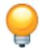

Tip: You can also create a coordinate system by using the tool in the toolbox or the Session Coordinate Systems container in the Results Tree for the current output database.

2. In the Create Coordinate System dialog box:

a. Accept the default name for the coordinate system, or enter the name of your choice in the text field.  
b. Toggle on System following 3 nodes on a circle to specify the motion of the coordinate system.  
c. Select one of the following as the coordinate system type:

• Rectangular: The X-, Y-, and Z-axes are interpreted as the 1-, 2-, and 3-axes, respectively.  
• Cylindrical: The R-, -, and Z-axes are interpreted as the 1-, 2-, and 3-axes, respectively.  
• Spherical: The R-, -, and -axes are interpreted as the 1-, 2-, and 3-axes, respectively.

## d. Click Continue.

Abaqus/CAE displays prompts in the prompt area to help you define the coordinate system axes.

3. Select three nodes in the viewport that lie on a circular arc.

The coordinate system appears in the viewport, in the list in the Coordinate System Manager, and under the Session Coordinate Systems container in the Results Tree for the current output database. Abaqus saves user-defined coordinate systems only until the output database is closed unless you save them to the output database file. You cannot edit a coordinate system once it has been created; you can rename or delete coordinate systems that have not been saved to the output database.

## Additional information

• Saving a coordinate system to an output database file  
• Controlling the display of model entities

## Creating a coordinate system following a single node

You can define a coordinate system that is attached to a single node on your model. The specified node is the origin of the coordinate system. The degrees of freedom present at the node (translational and rotational) determine the orientation of the coordinate system axes at each step and frame of the analysis. If the node has only translational degrees of freedom, the coordinate system will always be parallel to the global system.

The visual display of coordinate systems that follow nodes on your model is updated to reflect any deformation scale factors applied; however, result transformations based on these coordinate systems use the actual, not the scaled, deformations.

1. From the main menu bar, select Tools->Coordinate System->Create.

The Create Coordinate System dialog box appears.


Tip: You can also create a coordinate system by using the tool in the toolbox or the Session Coordinate Systems container in the Results Tree for the current output database.

2. In the Create Coordinate System dialog box:

a. Accept the default name for the coordinate system, or enter the name of your choice in the text field.  
b. Toggle on System following a single node to specify the motion of the coordinate system.  
c. Select one of the following as the coordinate system type:

• Rectangular: The X-, Y-, and Z-axes are interpreted as the 1-, 2-, and 3-axes, respectively.  
• Cylindrical: The R-, -, and Z-axes are interpreted as the 1-, 2-, and 3-axes, respectively.  
• Spherical: The R-, -, and -axes are interpreted as the 1-, 2-, and 3-axes, respectively.

## d. Click Continue.

Abaqus/CAE displays prompts in the prompt area to help you define the coordinate system axes.

3. Select the node in the viewport.

The coordinate system appears in the viewport, in the list in the Coordinate System Manager, and under the Session Coordinate Systems container in the Results Tree for the current output database. Abaqus saves user-defined coordinate systems only until the output database is closed unless you save them to the output database file. You cannot edit a coordinate system once it has been created; you can rename or delete coordinate systems that have not been saved to the output database.

## Additional information

• Saving a coordinate system to an output database file  
• Controlling the display of model entities

## Saving a coordinate system to an output database file

Coordinate systems defined during postprocessing are available by default only until the associated output database file is closed. You must save these coordinate systems to the output database file if you want them to be available in future Abaqus/CAE sessions. Local coordinate systems defined during the analysis are written automatically to the output database. You can only append data to the output database; you cannot modify the contents of the file in any other way (i.e., once a coordinate system has been saved to the output database, it cannot be modified, renamed, or deleted).


## Note:

By default, Abaqus/CAE opens output database files as read-only. You must choose to open an output database file with write privileges if you want to save any data, such as coordinate systems, to it (see Opening a model database or an output database, for more information).

1. From the main menu bar, select Tools->Coordinate System->Manager.  
The Coordinate System Manager appears. By default, Current session is toggled on and the coordinate systems that have been defined for the current output database during the current session are listed.  
2. Select the user-defined coordinate systems that you wish to save, and click Move to ODB from the buttons on the right side of the dialog box.  
If the current output database file was opened with write permissions, the selected coordinate systems are moved from the current session list to the current output database list. To see the list of coordinate systems that have been saved to the current output database file, toggle on Current ODB.

## Creating node and element sets during postprocessing

You can create node and element sets in the Visualization module.

Select Tools->Create Set from the main menu bar. You can create and save sets only when the output database (.odb) file is opened with write privileges.

In addition, the following rules apply:

• You can create sets only on the rootAssembly instance; however, the instance cannot be named ASSEMBLY.  
• You cannot edit or delete the sets created in the output database.

1. From the main menu bar in the Visualization module, select Tools->Create Set.

2. In the Create Set dialog box that appears, do the following:

a. Enter a name for the set.  
b. Select Node or Element as the set type.  
c. Click Continue.  
d. Select nodes or elements from the viewport. You can select the nodes and elements individually, by angle, or by feature edge. You can also select elements by topology.  
e. Click Done.

The newly created set appears in the Results Tree.

• Opening a model database or an output database  
• Using the angle and feature edge method to select multiple objects  
• Using the topology method to select multiple elements

This section explains undeformed and deformed shape plotting and superimposed plots.

Immediately upon opening an output database, Abaqus/CAE displays the undeformed shape of your model. For general analysis steps an undeformed plot displays the shape of your model without any deformation. For linear perturbation steps an undeformed plot displays the base state of your model. The deformed plot shows the shape of your model according to the values of a nodal variable such as displacement. The undeformed and deformed shapes are also used to display each of the other plot states available in Abaqus/CAE. You can view contours, symbols, or material orientations on either the undeformed or the deformed shape or superimpose them to view the differences in the shapes.

## In this section:

Understanding undeformed shape plotting  
Understanding deformed shape plotting  
Using common plot options  
Producing an undeformed shape plot  
Producing a deformed shape plot  
Superimposing deformed and undeformed model plots

## Understanding undeformed shape plotting

Abaqus/CAE obtains the information needed to produce an undeformed plot from the output database. Immediately upon opening an output database, Abaqus/CAE displays the undeformed plot state of your model.

You can use the plot state-independent options to customize your plot. Select Options->Common in the main menu bar to choose the plot state-independent customization options.

By default, Abaqus/CAE displays your undeformed model at the last frame of the last step available in the output database. If your model varies between steps, perhaps because of the addition or removal of contact surfaces or the application of loads or boundary conditions, you may want to view your undeformed model at steps other than the default. You can choose the step at which to view your undeformed model by selecting Result->Step/Frame from the main menu bar. For more information, see Selecting the results step and frame.

You can also use Abaqus/CAE to combine your undeformed and deformed model shapes into a single plot. For more information, see Superimposing deformed and undeformed model plots. Combining the shapes provides a context for evaluating the deformations.

## Additional information

• Producing an undeformed shape plot

## Understanding deformed shape plotting

A deformed plot shows the shape of your model according to the values of a nodal variable such as displacement. You can choose the nodal variable (called the deformed field output variable) for which Abaqus/CAE displays results, and you can choose the step and frame of these results.

If you do not choose a deformed field output variable, Abaqus/CAE attempts to select a default. Most procedures in Abaqus/Standard and Abaqus/Explicit write displacement to the output database by default; in these cases Abaqus/CAE selects displacement as the nodal vector quantity to use for the default deformed variable. Some procedures—for example, heat transfer—do not write displacement to the output database by default; therefore, Abaqus/CAE does not select a default deformed variable. Abaqus/CAE cannot display a deformed plot if the output database does not contain any variables that can be used to compute a deformed shape.

After obtaining the information needed to produce a deformed plot from the output database, Abaqus/CAE computes the shape of your deformed model by adjusting the coordinates of each node according to:

• The deformed field output variable (see Selecting the deformed field output variable).  
• The analysis step and frame (see Selecting a specific results step and frame).  
• Uniform or nonuniform deformation scale factors (see Scaling deformations).  
• Any user-defined rigid body transformation applied to the deformed field output variable (see Transforming results into a new coordinate system).

Like the undeformed plot shape, you can use the plot state–independent options to customize your deformed shape plot. Select Options->Common in the main menu bar to choose the plot state–independent customization options.

You can also use Abaqus/CAE to combine your undeformed and deformed model shapes into a single plot. Combining the shapes provides a context for evaluating the deformations. If you choose to superimpose your undeformed and deformed model shapes, you can use the Superimpose plot options to control the display of the undeformed shape separately from the deformed shape.


Tip: Use the Allow Multiple Plot States tool to display both model shapes if you want to display one or both shapes without contours, symbols, or material orientations. You can also use this tool to select any combination of plot states from the tools in the Visualization module toolbox (see Displaying multiple plot states, for more information).

## Using common plot options

You can use the common plot options to customize the appearance of undeformed and deformed plots.

The common options are also used in conjunction with the other plot state–independent options in the View menu and the dependent and independent customization options for contour, symbol, and material orientation plots. Select


Options->Common from the main menu bar or use the tool in the toolbox to access the Common Plot Options dialog box. Click the following tabs to customize the appearance of plots in the current viewport:

• Basic: Choose render style, edge visibility, and deformation scale factor (deformed plot only).  
• Color & Style: Control model edge color and style, model face color, edge style, and edge thickness.  
• Labels: Control element, face, and node labels and node symbols; and control probe annotation labels.  
• Normals: Control element and surface normals.  
• Other: The Other page contains the following tabs:

- Scaling: Control model scaling and shrinking.  
Translucency: Control shaded and filled render style translucency.

If you choose to superimpose the undeformed and deformed model shapes, the common options control the display of the deformed shape and the superimpose plot options control the display of the undeformed shape (for more information, see Superimposing deformed and undeformed model plots). Plot state–dependent options may override some common options; for example, the color options for contour plots will always override the common color options.

To learn how to customize the render style and other display characteristics of your plots, see Customizing plot display.

## Producing an undeformed shape plot

For general analysis steps an undeformed plot displays the shape of your model without any deformation. For linear perturbation steps an undeformed plot displays the base state of your model. Since analysis results are not needed; an output database resulting from a datacheck run is sufficient to produce an undeformed shape plot. Model and analysis characteristics such as surface definitions can cause the appearance of your undeformed model to vary from step to step; you can select the step and frame at which to display your undeformed plot. For more information, see Selecting the results step and frame.

By default, when you open an output database, Abaqus/CAE displays the undeformed plot state for the last step and frame of the analysis. The plot is produced using the default display options for the current session (for information on saving display options, see Saving your display options settings). To produce an undeformed shape plot for an

output database that is already open, select Plot->Undeformed Shape from the main menu bar or use the tool in the toolbox.

1. Use the File menu to open the output database containing your model data.  
2. Use the Result menu to select the results step to display.  
3. Select the plot state–independent customization options that you want.

Abaqus automatically refreshes your undeformed plot each time you click Apply in the results or plot state–independent dialog boxes.

## Producing a deformed shape plot

A deformed plot displays the shape of your model at a specified step and frame of the analysis results, according to the values of the deformed field variable. For more information on selecting a step and frame, see Selecting a specific results step and frame. For more information on selecting a deformed field variable, see Selecting the deformed field output variable. To learn how to display the minimum and maximum values associated with your deformed plot, see Customizing the legend.

1. Use the File menu to open the output database containing your analysis results.  
2. Use the Result menu to select the following:

a. The step and frame at which Abaqus obtains values.  
b. The deformed field variable for which Abaqus obtains values. The variables that have been saved during the analysis are available.  
c. The numeric form in which Abaqus displays complex number results.

3. Select the plot state–independent customization options that you want.  
4. From the main menu bar, select Plot->Deformed Shape to display the deformed plot.


Tip: You can also produce a deformed shape plot using the tool in the toolbox.

The current viewport displays a customized deformed plot of the specified deformation field variable at the specified step and frame of the output database. The state block, if active, changes to show the name of the variable displayed.

Abaqus automatically refreshes your deformed plot each time you click Apply in the results or plot state–independent dialog boxes.

## Additional information

• Producing an undeformed shape plot  
• Using common plot options

## Superimposing deformed and undeformed model plots

You can combine the deformed and undeformed model shapes in a single plot. Combining the shapes provides a context for displaying and interpreting the contours, symbols, or material orientations. An example of superimposed model shapes is shown in Figure 1.

  
Figure 1: Deformed shape superimposed on the undeformed shape.

To produce a superimposed plot, select Plot->Contours, Symbols, or Material Orientations->On Both Shapes from

风 the main menu bar or use the and tools in the toolbox. To superimpose the undeformed and deformed shapes without contours, symbols, or material orientations or to display any combination of plot types for the same

results, use the tool and select all of the desired plot types from the toolbox (for more information, see Displaying multiple plot states).

1. From the main menu bar, select Options->Superimpose to customize the appearance of the undeformed shape.


Tip: You can also customize the undeformed plot shape using th e tool in the toolbox.

2. Click the following tabs to modify the options:

• Basic: Choose render style and edge visibility.  
• Color & Style: Control model edge color and style, model face color, edge style, and edge thickness.  
• Labels: Control element, face, and node labels and node symbols.  
• Normals: Control element and surface normals.  
• Other: The Other page contains the following tabs:

- Scaling: Control model scaling and shrinking.  
- Translucency: Control shaded and filled render style translucency.  
- Offset: Control the offset between the undeformed and deformed shapes.

For more detailed information on customizing the display characteristics of your plots, see Customizing plot display.

Abaqus/CAE uses the superimpose plot options in place of the common plot options to display the undeformed plot in the viewport.

3. To customize the similar options for the deformed shape, select Options->Common or use the 1234 tool in the toolbox.  
4. If contours, symbols, or material orientations are active, use the associated plot state–dependent options to customize the display of both the undeformed and the deformed plot.  
5. Click Apply in each options dialog box to implement your changes in the viewport.

Your superimposed plot options changes are saved for the duration of the session and will affect the undeformed shape in all subsequent plots where both model shapes are displayed.

## Additional information

• Producing an undeformed shape plot  
• Producing a deformed shape plot  
• Using common plot options  
• Customizing plot display


This section explains contour plotting.

A contour plot displays the values of an analysis variable at a specified step and frame. In addition, a contour plot can be used to show the value of attributes such as loads or predefined fields at a specified step of a model in the current model database. Abaqus/CAE represents the values as customized colored lines, colored bands, colored faces, colored isosurfaces, or tick marks on your model.

## In this section:

Understanding contour plotting  
Using contour plot options  
Producing a contour plot  
Producing a contour plot of linear beam section stresses  
Customizing a contour plot

## Understanding contour plotting

This section discusses the computation and rendering of contour values and the computation of contour limits.

## In this section:

About contour plotting  
Understanding how contour values are computed  
Understanding how contours are rendered  
Understanding contour limits

## About contour plotting

A contour plot displays results that are stored in the output database or displays model attributes from a model in the current model database.

Each contour plot displays the following values: for an output database, contour plots display the value of a particular field output variable in a specified step and frame of the analysis; for a model in the current model database, contour plots display the value of a selected attribute such as a load in a specified step in your analysis. These values are shown as colored lines, colored bands, or quilt-type colored faces on the surface of your model, or they are shown as isosurfaces that extend line contours into the model, depending on the customization options you select. A contour plot cannot be produced if no elements are visible in the current viewport.

Line, banded, quilt-type, and isosurface contours are shown in Figure 1.

  
Figure 1: From left to right: contours shown as colored lines, colored bands, colored faces, and colored isosurfaces.

As with other elements, contour lines for line-shaped elements (beams, one-dimensional elements, gasket link elements, and three-dimensional line gasket elements, as well as two-dimensional contact surfaces) are plotted along the elements by default. Line-type contour plots are not recommended for line-shaped elements. Tick mark contour plotting provides an alternative means of visualizing contours on beams and other line-shaped elements. The contour is displayed as a curve plotted between two sets of lines normal to the elements, as shown in Figure 2. The contour level is indicated by “tick marks” on these normal lines.

  
Figure 2:Tick mark contour plot.

The key to interpreting a contour plot is the plot legend. The legend indicates the correspondence between contour values and contour colors.

By default, Abaqus/CAE evenly divides the difference between the minimum and maximum values in the legend into 12 intervals. You can change the number of intervals if necessary. A color is associated with each interval. For a line-type or isosurface-type contour plot each colored line or surface corresponds to a set of locations in the model for which the field output variable has the value shown in the legend. For a banded contour plot each colored contour band corresponds to a range of values within the bounds indicated by the legend. For a quilt contour plot each colored element face corresponds to a single value within the bounds indicated by the legend for that color. For a tick mark contour plot each colored tick mark corresponds to a single value indicated by the legend.

Abaqus/CAE follows a different convention for contour plots of contact status (CSTATUS). This variable describes whether individual nodes on the main and secondary surfaces are in contact and, if so, whether the surfaces are sticking or slipping at that point. Because three settings are available to describe the contact status at each node—sticking, slipping, or open—Abaqus/CAE displays contact status data using three contour intervals and renders the contour plot by coloring the region around a node according to its contact status.

The components of connector vector output are resolved with respect to different coordinate systems depending on whether the output requested is field output or history output. See Displaying connectors and connector output in the Visualization module for how to interpret the vector component values in field plots.

To learn how to produce a contour plot, see Producing a contour plot.

## Understanding how contour values are computed

The computations necessary to produce a contour plot from results stored in the output database depend on whether the contour plot displays values for a node-based quantity, such as displacement or velocity, or for an element-based quantity, such as stress or strain. This section applies to contour plots of output database data only.

## How node-based field output variable contour values are computed

For contour plots of node-based field output variables, contour values are obtained directly from the quantities on the output database. These values are then used without further computation to produce colored lines or colored bands on the surface of your model.

## How element-based field output variable contour values are computed

For contour plots of element-based field output variables, Abaqus/CAE applies computations to the output database results to form the contour values. The computations vary according to the following criteria:

• the quantity you choose to plot (field output or discontinuities),  
• the averaging options you select,  
• the result regions you select,  
• the compatibility of elements included in the plot, and  
• the type of contour plot you request (line, banded, or quilt).

Select Result->Field Output from the main menu bar to choose the field output variable. To learn more about this topic, see Selecting the field output to display.

Select Result->Options from the main menu bar to choose the quantity to plot, the averaging options, the result regions, and to control the handling of incompatible elements during the computation of element-based contour values. To learn more about these topics, see Selecting result options.

Select Options->Contour->Basic from the main menu bar to choose the type of contour plot that you want. Choosing line-, banded-, quilt-, or isosurface-type contours, contains detailed instructions on choosing the contour type.

The type of contour plot that you request governs the extrapolation applied to the results read from the output database. For line-, banded-, and isosurface-type contours of element-based variable values, Abaqus/CAE extrapolates results to the nodes. By default, the results are conditionally averaged after Abaqus/CAE performs any necessary transformations and computes any requested scalar components or invariants; if desired, you can compute invariants after the results are averaged. For quilt-type contours of element-based variable values, Abaqus/CAE extrapolates results to the element faces on the surface of your model and then takes a weighted sum to produce a single value per face. Since quilt contour values are computed for each element face individually with no averaging across element boundaries, a quilt contour plot is an effective means of displaying results on an element-by-element basis. You can choose quilt-type contours only for element-based field output variables.

## Understanding how contours are rendered

Contour values are drawn on element faces using one of two methods: texture mapping or tessellation. Texture mapping is a high-performance rendering method that essentially lays an image of the contour values (the texture) over an image of the model, similar to the process of wrapping a present. Tessellation is a method of transforming arbitrary contour values into repeating patterns of distinct shapes, such as triangles or simple polygons; the shape values are computed face by face and can take a long time for large models. Texture mapping is the default and preferred method and will maximize the performance of Abaqus/CAE. Although certain graphics adapters do not support texture mapping properly, Abaqus/CAE can emulate texture mapping in software. However, line-type and isosurface contours, the display of contour edges, shrinking elements about their centroid, and contours on CAXA or SAXA elements are supported only by the tessellation method.

The differences between contour plots generated with texture mapping or tessellation are minimal; you may see slight differences in the appearance of contour bands on quadrilateral element faces. Texture mapping can sometimes introduce precision issues; for example, if the contour value is exactly on a limit, the color may appear as just above or below the value.


## Note:

If you display tessellated contours under intense lighting, the colors in the contours might not match the colors displayed in the legend because the light can fade some colors on the surface facets. For more information, see Controlling model lighting.

For detailed information on choosing the contour method, see Choosing the contour method.

## Understanding contour limits

The minimum and maximum values shown in a contour plot can be computed by Abaqus/CAE, or you can specify them.

You can decide to specify one or both limits; for example, to eliminate extremes or to examine variations within a fixed set of bounds.

Contours are shown on visible surfaces of your model only; however, depending on the type of contour plot and the result options that you select, Abaqus/CAE might computer contour values based on all elements in the current display group or on all elements in the model. (For more information, see Selecting result options.) The reported minimum and maximum values might, therefore, occur at interior elements. You can display contours on the interior of your model by using display groups to show only the interior elements in the plot or by shrinking all elements about their centroids so that interior elements are visible between the bodies of exterior elements.

Abaqus/CAE computes the minimum and maximum values differently, according to the type of field output variable shown (nodal or element), the type of contour plot (quilt versus line or banded), and options you select. For contour plots of nodal field output variables, the limits are the maximum and minimum nodal values. For quilt-type contour plots, the limits are the maximum and minimum element face values. For line-, banded-, or isosurface-type contours of element field output variables, Abaqus/CAE determines the minimum and maximum by the extrapolated, averaged values as defined by the current averaging criteria. For element field output variables, the contour maximum and minimum values can be given at element faces, integration points, and element centroids as well as at nodes.

When Abaqus/CAE computes the minimum and maximum over values averaged at the nodes, the limits are based on the values used to create the plot. In this case, the legend bounds may vary as you vary the averaging criteria. To learn how to control the averaging criteria, see Controlling result averaging.

You can also control which contour limits are used for each frame of a contour plot animation: the limits computed for the first and last frame, the limits computed for the current frame, the recomputed limits for each individual frame, or the limits computed for all frames in the animation. Computing limits based on all frames in the animation requires one full pass through the animation sequence to establish the contour limits used for subsequent passes through the animation.

For detailed information on controlling contour limits, see Setting contour limits. To learn how to display the minimum and maximum values associated with your contour plot, see Customizing the legend.

## Using contour plot options

You can use the contour plot options to customize the appearance of contour plots.

□ Select Options->Contour from the main menu bar or click in the toolbox to access the Contour Plot Options dialog box. Click the following tabs to customize the appearance of contour plots in the current viewport:

• Basic: Choose the contour type (including whether to show tick marks for line elements), contour intervals, and contour method.  
• Color & Style: The Color & Style page contains the following tabs:

Model Edges: Control the color of model edges.  
Spectrum: Choose contour colors, and control the order of the values displayed in the legend.  
Line: For line-type contours control the style and thickness of each line.  
- Banded / Isosurface: For banded- or isosurface-type contours control the color, style, and thickness of contour edges.

• Limits: Control the computation of contour limits and the display of annotations for the maximum and minimum contour values.  
• Other: Control tick mark plot display options, the display of nodal averaged vector or tensor orientations, and the display of section point or envelope plots.

Other options such as the render style, edge visibility, deformation scale factor, and translucency are located in the Common Plot Options dialog box. If you choose to plot contours on both the undeformed and the deformed shape, you can use the Superimpose Plot Options to customize the appearance of the undeformed shape. See Superimposing deformed and undeformed model plots, for more information about superimpose plots. To learn how to customize the render style and underlying model of your contour plot, see Customizing plot display. For information on the computation of result values, see Understanding how results are computed.

## Additional information

• Customizing a contour plot

## Producing a contour plot

A contour plot can display either the values of an analysis variable at a specified step and frame of an output database or the values of selected attributes at a specified step of a model in the current model database. Abaqus/CAE represents the values as customized colored lines, colored bands, colored faces, or colored isosurfaces on your model or as colored tick marks on lines drawn normal to your model. For more information on selecting an analysis variable, see Selecting the primary field output variable. For more information on selecting a specific step and frame, see Selecting a specific results step and frame. To learn how to display the minimum and maximum values associated with your contour plot, see Customizing the legend.

If your model includes beam elements, some additional steps can be required for proper contour display. See Producing a contour plot of linear beam section stresses.

If you are plotting data from a model database, specify only the primary field variable.

1. Use the File menu to open the model database or output database containing your model data or analysis results.  
2. If you are plotting data from a model database, switch to the Visualization module, expand the Model Database container of the Results Tree, and select the model you want to use.

3. Use the Result menu to select the following:

a. The step and frame to display (or just the step, if a model database is selected).  
b. The primary field output variable to display.  
c. The deformed field output variable to display (for contours on the deformed shape only).  
d. The quantity to plot and averaging options (for output databases only).

4. Select the plot state–independent and contour plot customization options that you want.

5. If your chosen field output variable includes complex numbers, select the Complex Form tab in the Result Options dialog box to control the numeric form to display. Complex form options apply only to output databases.

6. From the main menu bar, select Plot->Contours and choose whether to plot the contours on the undeformed shape, the deformed shape, or both.


Tip: You can also produce a contour plot using the deformed , undeformed , or superimposed contour tools in the toolbox.

The current viewport displays a customized contour plot of the specified field output variable at the specified step and frame of the current output database or at the specified step of the selected model in the current model database.

Abaqus automatically refreshes your contour plot each time you click Apply in the step and frame selector, field output options, plot state–independent options, superimpose plot options (if applicable), or contour plot options dialog boxes.

## Additional information

• Using contour plot options  
• Selecting model data and analysis results to plot

## Producing a contour plot of linear beam section stresses

If your model includes beam geometry and beam rendering is enabled for your session, you can display field output results along the beam cross-sections as contours. For nodal quantities and element integration point quantities, Abaqus/CAE displays contours that are constant through the thickness of the beam cross-section. For the element-based data, the contour reflects the currently selected section point.

You can also create a contour plot that shows a more realistic stress distribution through the beam based on section force and section moment data, which Abaqus/CAE calculates using linear elastic solid mechanics theory. Figure 1 shows an example of beam stresses through an I-beam.

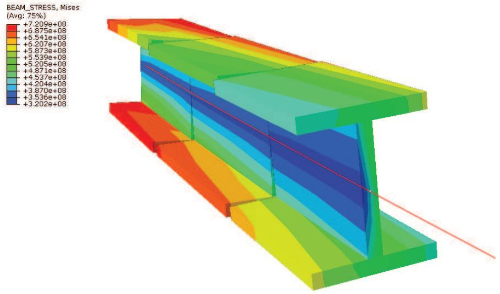  
Figure 1: Linear beam section stresses displayed for an I-beam cross-section.

Beam stress contour plots are available only when the selected step and frame include data from the integrated output quantities SF (section force) and SM (section moment). Furthermore, these plots are available only for a subset of profiles in Abaqus/CAE:

• Thin-walled box profiles  
• Thin-walled pipe profiles  
• Circular profiles  
• Rectangular profiles  
• I-shaped profiles  
• L-shaped profiles  
• T-shaped profiles

BEAM\_STRESS output is not available for random response and response spectrum procedures.

Abaqus/CAE does not include beam element normals for eigenfrequency extraction in its calculations for beam cross section rendering, so you cannot visualize the torsional and out-of-plane modes for the beam elements in these plots. However, the torsional modes are calculated for the beam elements because the beam elements have torsional stiffness; this information is available in the data (.dat) file.

1. Use the File menu to open the output database containing your analysis results.

2. Use the Result menu to select the following:

a. The step and frame to display.  
b. The primary field output variable to display.  
c. The deformed field output variable to display (for contours on the deformed shape only).  
d. The quantity to plot and averaging options.

3. Select the plot state–independent and contour plot customization options that you want.

4. From the Output Variable options, select BEAM\_STRESS.

5. Choose the invariant or component for which you want to display contour data:

• Select Mises from the Invariant options to display von Mises stress.  
• Select S11 from the Component options to display axial stress along the beam.  
Select S12 from the Component options to display shear stress along the local beam section 2-axis caused by shear force and torsion.  
Select S13 from the Component options to display shear stress along the local beam section 1-axis caused by shear force and torsion.

6. From the main menu bar, select Plot->Contours and choose whether to plot the contours on the undeformed shape, the deformed shape, or both.


Tip: You can also produce a contour plot using the deformed , undeformed , or superimposed contour tools in the toolbox.

The current viewport displays a customized contour plot of the specified field output variable at the specified step and frame of the current output database.

Abaqus automatically refreshes your contour plot each time you click Apply in the step and frame selector, field output options, plot state–independent options, superimpose plot options (if applicable), or contour plot options dialog boxes.

## Additional information

• Using contour plot options  
• Selecting model data and analysis results to plot  
• Producing a contour plot of linear beam section stresses

## Customizing a contour plot

This section describes how to customize a contour plot. Abaqus/CAE offers numerous options for you to control the contour type, limits, intervals, and colors.

To learn how to customize the render style, translucency, or model edge characteristics of your contour plot, see Customizing plot display. For information on adding nodal-averaged orientations to your contour plot, see Displaying nodal-averaged orientations. For information on customizing an envelope plot, see Selecting section point data by category. For information on the computation of result values, see Understanding how results are computed.

## In this section:

Choosing line-, banded-, quilt-, or isosurface-type contours  
Stylizing line-type contours  
Customizing banded- and isosurface-type contours  
Contouring line-shaped elements with tick mark contour plots  
Customizing tick mark contour plots  
Choosing the contour method  
Setting contour limits  
Annotating the minimum and maximum contour values  
Controlling how Abaqus/CAE computes contour limits  
Customizing contour colors  
Creating a new color spectrum  
Customizing contour intervals

## Choosing line-, banded-, quilt-, or isosurface-type contours

You can choose Line-, Banded-, or Isosurface-type contours to display the values of nodal (such as displacement) or element (such as stress) field output variables. Line-type contours represent values as customized colored lines on the surface of your model. Banded contours represent values as color-filled bands. Isosurface contours extend line-type contours through the model. Line, banded, and isosurface contours of element-based variable values are computed by extrapolating results to the nodes and conditionally averaging. Averaging depends on the characteristics of your model and on options you select. Line-type contours are not recommended for line-shaped elements, such as beams.

You can choose Quilt-type contours only for element field output variables. Variable values are extrapolated to element faces on the surface of your model, with no averaging between elements. Quilt contours are useful for evaluating results on an element-by-element basis. Only one color per element is plotted for axisymmetric elements with asymmetric deformation (CAXA or SAXA).

Banded-type contours are the default. You must choose line-, banded-, or isosurface-type contours to produce a plot of:

• Nodal-based field output values.  
• Element-based field output values averaged across elements.  
• Element-based results discontinuities rather than field output values.

Figure 1 shows the appearance of line-, banded-, quilt-, and isosurface-type contour plots.  
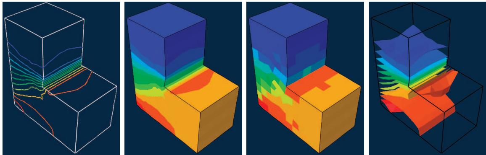  
Figure 1: From left to right: line-, banded-, quilt-, and isosurface-type contours.

1. Locate the Contour Type options.

□ Select Options->Contour from the main menu bar or click in the toolbox; then click the Basic tab in the dialog box that appears. The Contour Type options are in the upper left corner of the page.

2. Click Line, Banded, Quilt, or Isosurface to choose the contour type you want.  
3. Click Apply to implement your changes.

The contour plot in the current viewport changes to display the contour type you have specified.

By default, your changes are saved for the duration of the session and will affect all subsequent contour plots. If you want to retain your changes for subsequent sessions, save them to a file. For more information, see Saving customizations for use in subsequent sessions.

## Additional information

• Understanding how contour values are computed  
• Stylizing line-type contours  
• Customizing banded- and isosurface-type contours

## Stylizing line-type contours

Abaqus/CAE displays line-type contours as customized colored lines on the surface of your model. You can stylize individual contour lines to make them easy to distinguish.

This option is particularly useful when colors are not available; for example, for black and white hard-copy plotting. Figure 1 shows a contour plot with customized contour lines.

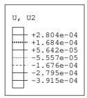

  
Figure 1: Line-type contour plot with customized contour lines.

You customize the colored lines one color (interval) at a time, referring to each interval by its position in the contour legend. Interval number 1 is the first colored line starting from the bottom of the contour plot legend. For information on the contour legend, see Customizing the legend.

1. Locate the Line options.

Select Options->Contour from the main menu bar or click in the toolbox. Click the Color & Style tab in the dialog box that appears; then click the Line tab. The Line options appear.

2. To choose the interval you want to customize, click the Interval arrows until the desired interval number appears in the Interval box.


## Note:

The Style and Thickness buttons change to show the current style and thickness of this interval, respectively. The numbers above and below the Interval box change to correspond to the adjacent interval numbers. The area above and below the Style and Thickness buttons changes to show the style and thickness, respectively, of these adjacent intervals.

3. Choose the style of the interval line:

a. Click the Style button to reveal the style choices.  
b. Click the style you want.  
The specified style appears on the Style button.

4. Choose the thickness of the interval line:

a. Click the Thickness button to reveal the thickness choices.  
b. Click the thickness you want.  
The specified thickness appears on the Thickness button.

5. Repeat Steps 2 through 4 to customize additional intervals.

## 6. Click Apply to implement your changes.

The contour lines of the line-type contour plot in the current viewport change to reflect your style and thickness specifications. The contour legend, if active, will also change to show your selections. For more information on the contour legend, see Customizing the legend. In addition, tick mark axes, if present, will change to show your selections. For more information on tick mark contours, see Contouring line-shaped elements with tick mark contour plots.

By default, your changes are saved for the duration of the session and will affect all subsequent contour plots. If you want to retain your changes for subsequent sessions, save them to a file. For more information, see Saving customizations for use in subsequent sessions.

## Additional information

• Understanding contour plotting  
• Customizing a contour plot  
• Customizing contour intervals

## Customizing banded- and isosurface-type contours

Abaqus/CAE displays banded-type contours as colored bands on the surface of your model and displays isosurface contours by extending line-type contours through the model to create surfaces. You can display or suppress lines at the edges of each contour band or isosurface; these lines are called contour edges. Contour edges visually separate the colors used to represent contour values in a banded-type contour plot; for isosurfaces, where the separation is often more distinct, the display of contour edges is more decorative. You can further customize the color, style, and thickness of contour edges. For example, in Figure 1 the contour plot on the left has contour edges suppressed, while the plot on the right has contour edges displayed.


## Note:

Contour edges are not applicable to continuous interval contour plots.

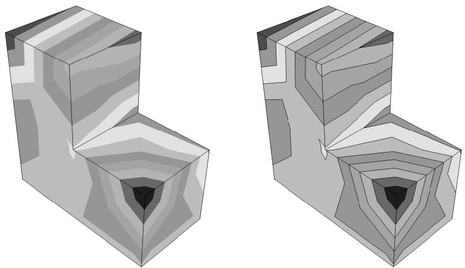  
Figure 1: Banded-type contour plots with contour edges suppressed and displayed.

1. Locate the Banded / Isosurface options.

Select Options->Contour from the main menu bar or click in the toolbox. Click the Color & Style tab in the dialog box that appears; then click the Banded / Isosurface tab. The Banded / Isosurface options appear.

2. Toggle Show contour edges to display or suppress contour edges.

When Show contour edges is on, the contour edge options become available.

3. Choose the color of the contour edges:

a. Click the color sample .

Abaqus/CAE displays the Select Color dialog box.

b. Use one of the methods in the Select Color dialog box to select a new color. For more information, see Customizing colors.

c. Click OK to close the Select Color dialog box.

The color sample changes to the selected color. The new color does not appear in the viewport until you click OK or Apply in the Contour Plot Options dialog box.

4. Choose the style of the contour edges:

a. Click the Style button to reveal the contour edge style options.  
b. Click the edge style you want.

The specified edge style appears on the Style button.

5. Choose the thickness of the contour edges:

a. Click the Thickness button to reveal the contour edge thickness options.  
b. Click the edge thickness you want.  
The specified edge thickness appears on the Thickness button.

6. Click Apply to implement your changes.

The contour edges of the banded contour plot in the current viewport change to reflect your specifications.

By default, your changes are saved for the duration of the session and will affect all subsequent contour plots. If you want to retain your changes for subsequent sessions, save them to a file. For more information, see Saving customizations for use in subsequent sessions.

## Additional information

• Choosing line-, banded-, quilt-, or isosurface-type contours  
• Customizing contour intervals  
• Understanding contour plotting

## Contouring line-shaped elements with tick mark contour plots

Contour lines drawn on line-shaped elements are difficult to visualize clearly. To see the contours of line-shaped elements (beams, one-dimensional elements, gasket link elements, three-dimensional line gasket elements, and two-dimensional contact surfaces) better, you can choose to display the contour lines using tick mark contour plots.

A tick mark contour plot shows the contour curve drawn between sets of lines that are normal to the actual elements. The contour level is indicated by “tick marks” on these normal lines. Abaqus displays the contour curve only when it falls within the limits you have specified. For more information on limiting the range of the plot, see Setting contour limits.

Figure 1 shows the appearance of a tick mark contour plot.  
  
Figure 1:Tick mark contour plot.

The normal lines, or tick mark axes, are drawn at nodes. At part boundaries, two tick mark axes are drawn. Within a part, if the angle between two adjacent line elements is less than the specified feature angle, a single tick mark axis is drawn in the direction of the average normal of elements sharing the node. Otherwise, a tick mark axis is drawn normal to each element sharing the node. When averaging normals, only displayed elements of the same type are considered in the calculation.

1. Locate the Contour Type options.

Select Options->Contour from the main menu bar or click in the toolbox; then click the Basic □ □. tab in the dialog box that appears. The Contour Type options are in the upper left corner of the page.

2. Toggle Show tick marks for line elements.  
3. Click Apply to implement your changes.

The contour plot in the current viewport changes to display tick mark plots for the line elements in the model.

By default, your changes are saved for the duration of the session and will affect all subsequent contour plots. If you want to retain your changes for subsequent sessions, save them to a file. For more information, see Saving customizations for use in subsequent sessions.

## Additional information

• Understanding contour plotting  
• Customizing tick mark contour plots

When you choose to show tick marks for line-shaped elements in your model, Abaqus/CAE indicates the contour levels as tick marks on lines (axes) drawn normal to the elements and displays the contour curve between the axes. You can specify the length of the tick mark axes, the color of the contour curve, the contour value (tick mark) that will intersect the element, and the normal direction in which the axes will be drawn on beam elements. In addition, for line-type contour plots, style selections you apply to individual contour lines will appear on the tick mark axes. For more information, see Stylizing line-type contours.

1. Locate the Tick Marks options.

□ □ Select Options->Contour from the main menu bar or click in the toolbox. Click the Other tab in the dialog box that appears; then click the Tick Marks tab. The Tick Marks options appear.

2. To choose the normal direction in which the tick mark axes will be drawn on beam elements, toggle the N1 or N2 button in the Orientation field.


## Note:

This option will be ignored when tick mark contour plots are displayed on line elements other than beams. In this case, the tick mark axes are drawn in the element normal direction.

3. Choose the length of the tick mark axes:

a. Click the Axis length button to reveal the length choices: Short, Medium, or Long.  
b. Click the length you want.

The specified length appears on the Axis length button.

4. Choose the contour value that will intersect the element:

a. Enter the desired base contour value in the Base Value field.

The value specified will be checked to determine whether it falls within the contour range. If it is above the maximum contour value, the maximum contour value will be used as the base value; if it is below the minimum contour value, the minimum contour value will be used as the base value. By default, zero is used as the base value.

5. Choose the color of the tick mark curve:

a. Click the color sample .

Abaqus/CAE displays the Select Color dialog box.

b. Use one of the methods in the Select Color dialog box to select a new color. For more information, see Customizing colors.  
c. Click OK to close the Select Color dialog box.

The color sample changes to the selected color. The new color does not appear in the viewport until you click OK or Apply in the Contour Plot Options dialog box.

6. Click Apply to implement your changes.

The contour lines of the tick mark contour plot in the current viewport change to reflect your specifications.

By default, your changes are saved for the duration of the session and will affect all subsequent contour plots. If you want to retain your changes for subsequent sessions, save them to a file. For more information, see Saving customizations for use in subsequent sessions.

## Additional information

• Understanding contour plotting  
• Customizing a contour plot

## Choosing the contour method

Contour values are drawn on element faces using either the texture mapping or tessellation method. Texture mapping is the default and preferred method and will maximize the performance of Abaqus/CAE. Although certain graphics adapters do not support texture mapping properly, Abaqus/CAE can emulate texture mapping in software. However, certain display options are supported only by the tessellation method; in such cases Abaqus/CAE will override the user setting for texture-mapped contours automatically.

1. Locate the Contour Method options.

□ Select Options->Contour from the main menu bar or click in the toolbox; then click the Basic tab in the dialog box that appears. The Contour Method options are at the bottom of the page.

2. Choose one of the following rendering methods:

Texture-mapped. This option uses high-performance graphics rendering capabilities to draw contour values on each element face. If the graphics parameters for your system have been configured to disable texture mapping (see Tuning graphics cards), Abaqus/CAE will emulate texture mapping in software.  
• Tessellated. This option uses the process of tessellation to draw contour values on each element face.

3. Click Apply to implement your changes.

The contour plot in the current viewport changes to use the contour method you have specified. By default, your changes are saved for the duration of the session and will affect all subsequent contour plots. If you want to retain your changes for subsequent sessions, save them to a file. For more information, see Saving customizations for use in subsequent sessions.

## Additional information

• Understanding how contours are rendered  
• Customizing a contour plot

## Setting contour limits

By default, Abaqus/CAE automatically computes the limits of the values shown in your contour plot.

You can control the minimum and maximum values Abaqus/CAE displays; for example, to eliminate extremes or to examine variations within a fixed set of bounds.

Contour limits, once set, remain in effect for the duration of the session. To learn how to display the minimum and maximum values associated with your contour plot, see Customizing the legend.

You can override the contour limits if you use custom contour interval values; see Customizing contour intervals for more information. When you use a custom contour interval, Abaqus/CAE uses the maximum and minimum interval values that you specify in the Edit Intervals dialog box as the contour limits for the contour plot.

If you specify the contour limits and subsequently modify the limits, the smaller the number of contour intervals increases the likelihood that your limit modifications will result in changes to the contour plot.

1. Locate the Contour Limits options.

□ Select Options->Contour from the main menu bar or click in the toolbox; then click the Limits tab in the dialog box that appears. The contour Limits options become available.

2. In the area labeled Max, choose one of the following options:

• Select Auto-compute to request that Abaqus compute the maximum contour value.  
• Select Specify to specify the maximum value yourself; then enter the maximum value of your choice in the Specify text field.

3. In the area labeled Min, choose one of the following options:

• Select Auto-compute to request that Abaqus compute the minimum contour value.  
Select Specify to specify the minimum value yourself; then enter the minimum value of your choice in the Specify text field.

4. Click Apply to implement your changes.

In the contour plot in the current viewport, Abaqus displays contour values within the limits you have specified. The contour legend, if active, changes to show the limits you have specified. If you have specified a maximum value that is less than the actual maximum or if you have specified a minimum value that is greater than the actual minimum, Abaqus displays the actual maximum or minimum value (respectively) in the legend. For more information on the contour legend, see Customizing the legend. To learn how to control the color of values that exceed your limits, see Customizing contour colors.

By default, your changes are saved for the duration of the session and will affect all subsequent contour plots. If you want to retain your changes for subsequent sessions, save them to a file. For more information, see Saving customizations for use in subsequent sessions.

## Additional information

• Understanding contour limits  
• Annotating the minimum and maximum contour values  
• Controlling how Abaqus/CAE computes contour limits

## Annotating the minimum and maximum contour values

By default, Abaqus/CAE indicates the general locations of the minimum and maximum contour values through changes in the contour color. The actual locations may be in any part of the model displayed using the extremes of the selected color spectrum. You can toggle on Show location to annotate the nodal location of the minimum and/or maximum contour values. The annotations are of the form Min: value and Max: value, respectively, with a line pointing to the node, face (for quilt plots), or element centroid where the minimum and maximum occur.

Displaying the minimum or maximum value annotations activates the contour legend and the Show min/max values option (for more information, see Customizing the legend). The annotations are created automatically—you cannot edit them using the Annotation Manager. The annotation font and color match those of the legend text, and the node symbols are determined by the node symbol settings in the Common Plot Options dialog box. If you display the minimum and maximum contour values and a view cut is activated, the locations of the minimum and maximum values are updated relative to the viewport display. The contour legend is also updated to reflect the new bounds.


## Note:

The minimum and maximum locations are not shown in an overlay plot.

1. Locate the Show location checkboxes.

□ Select Options->Contour from the main menu bar or click in the toolbox; then click the Limits □. tab in the dialog box that appears.

2. Toggle on Show location in the Min and Max areas, respectively, to annotate each location on the model.  
3. Click Apply to implement your changes in the viewport.

Abaqus/CAE activates the contour legend, including the Show min/max values option. The legend displays both the minimum and maximum values, regardless of whether you annotate one or both of them on the model.

4. If desired, use the Viewport Annotation Options to customize the annotation font and color (controlled by the legend text options), to hide the minimum and maximum values in the legend, or to hide the entire legend. Use the symbol and size options on the Labels tabbed page of the Common Plot Options dialog box to edit the displayed node symbols.

By default, your changes are saved for the duration of the session and will affect all subsequent contour plots. If you want to retain your changes for subsequent sessions, save them to a file. For more information, see Saving customizations for use in subsequent sessions.

## Additional information

• Understanding contour plotting  
• Customizing a contour plot  
• Customizing model labels  
• Customizing the legend

## Controlling how Abaqus/CAE computes contour limits

By default, Abaqus/CAE automatically computes the minimum and maximum values shown in your contour plot. Automatic computation does not apply if you have set limits for both the minimum and maximum contour values.

For contour plots of nodal field output variables, the limits are the minimum and maximum nodal values. For quilt-type contour plots, the limits are the minimum and maximum element face values.

For line-, banded-, or isosurface-type contours of element field output variables, the limits are based on the values from individual elements extrapolated to and averaged at the nodes. The range may vary due to changes in the results averaging options. To learn how to control the averaging options, see Controlling result averaging.

For animations of contour plots, you can control which contour limits are used in each frame of the animation. You can choose to always use the auto-computed limits from the first and last frame, to always use the auto-computed limits from the current frame, or to recompute the limits for each frame.

1. Locate the Auto-Computed Limits options.

Select Options->Contour from the main menu bar or click in the toolbox; then click the Limits tab in the dialog box that appears. The Auto-Computed Limits options are in the lower half of the page.

2. Choose one of the following options for animation contour limits:

• Select Use first and last frame limits to use the auto-computed contour limits from the first and last frame for each frame of the animation.  
• Select Use current frame limits to use the auto-computed contour limits from the current frame for each frame of the animation.  
Select Recompute limits for each frame to recompute the contour limits for each frame of the animation based on the result values for the frame.  
• Select Use limits from all frames to recompute the auto-computed contour limits from all frames of the animation.

3. Click Apply to implement your changes.

Contour limits for each frame of animations generated for the contour plot in the current viewport will be determined based on the option you selected. The contour legend, if active, changes to show the limits Abaqus computes.

By default, your changes are saved for the duration of the session and will affect all subsequent contour plots. If you want to retain your changes for subsequent sessions, save them to a file. For more information, see Saving customizations for use in subsequent sessions.

## Additional information

• Understanding contour limits  
• Setting contour limits  
• Choosing line-, banded-, quilt-, or isosurface-type contours

## Customizing contour colors

By default, Abaqus/CAE represents contour values using the Rainbow color spectrum from red (for the maximum value) to blue (for the minimum value). You can select alternative color spectrums or create new color spectrums to use.

See Creating a new color spectrum for more information about creating a new color spectrum.

If your results include cyclic data in which positive and negative extreme values are equivalent, select the Wraparound color spectrum. This spectrum, with green at both extremes, correctly displays results such as the phase angle of a complex number, where 180° and −180° are the same.

By default, the contour plot legend displays values in descending order with the maximum value at the top. You can choose to reverse the order and display the values in ascending order with the minimum value at the top.

For non-tick mark contour plots you can also choose the colors Abaqus uses to represent values that exceed the limits you have specified for the plot, if any. By default, Abaqus displays such values in shades of gray. (For tick mark contour plots Abaqus displays the contour curve itself only within the limits you have specified.) You can choose to hide these values that are exceeding the limits specified for the plot from the contour legend. For more information on limiting the range of the plot, see Setting contour limits.

1. Locate the Spectrum options.

Select Options->Contour from the main menu bar or click □ in the toolbox. Click the Color & Style tab in the dialog box that appears; then click the Spectrum tab. The Spectrum options appear.

2. To choose the color of values within the limits of the plot, either select a spectrum name or click to create and use a new color spectrum. See Creating a new color spectrum for information about creating a new color spectrum.


Tip: Alternatively, you can choose or create a contour spectrum from the Results Tree. Click the Spectrums container to create a new spectrum, or click the name of any spectrum in the Results Tree to display the model using that spectrum.

3. To display the values in the contour plot legend in ascending order with the minimum value at the top, toggle on Reverse contour legend range.  
4. To hide the values in the contour plot legend that exceed the specified limits, toggle on Use specified limits for contour legend.  
5. To control the color of values that exceed the limits of the plot, do one of the following:

Click Specify; then click the Greater than max or Less than min color sample to open the Select Color dialog box. Select a new color, and click OK to close the Select Color dialog box and update the color sample. (For more information, see Customizing colors.)

Or,

• Click Use spectrum min/max to accept the minimum and maximum contour spectrum colors for such values.

6. Click Apply to implement your changes.

Contours in the current viewport change to the colors you have specified. The correspondence between contour colors and contour values appears in the contour legend, if active. For more information on the contour legend, see Customizing the legend.

By default, your changes are saved for the duration of the session and will affect all subsequent contour plots. If you want to retain your changes for subsequent sessions, save them to a file. For more information, see Saving customizations for use in subsequent sessions.

## Additional information

• Understanding contour plotting  
• Customizing a contour plot  
• Creating a new color spectrum  
• Coloring elements with no results

Abaqus/CAE provides seven predefined color spectrums that you can use to customize the colors in a contour plot. If you prefer a different set of colors or a different arrangement, you can create a new color spectrum and apply its colors to the contour plot.

Creating and editing a color spectrum are similar processes. When you create a new color spectrum, Abaqus/CAE populates the Create Spectrum dialog box with the contents of the last color spectrum that you either modified or applied to the contour plot. If you had not yet modified a spectrum or created a contour plot in your session, Abaqus/CAE populates a new color spectrum with the colors in the predefined Rainbow color spectrum. You can then edit this new color spectrum by adding, modifying, moving, and deleting colors to achieve the content and arrangement that you want.

A spectrum must contain at least two colors and can contain as many colors as you want to include. In many situations the number of colors in your selected color spectrum will not match the number of contour intervals, so Abaqus/CAE cannot perform a one-to-one assignment of colors to contour intervals. In this case Abaqus/CAE performs one of the following actions:

If your spectrum has more colors than the current number of contour intervals, Abaqus/CAE samples colors from the spectrum to create the contour plot. For example, when a spectrum contains 24 colors and only 12 intervals are selected, the contour plot will display every other color in the spectrum.  
If your spectrum has fewer colors than the current number of contour intervals, Abaqus/CAE interpolates between spectrum colors to determine additional colors to use for the contour intervals. All user-defined color spectrums follow an HSV interpolation scheme, while the Red to blue predefined spectrum follows an RGB interpolation scheme. This difference means that the Red to blue predefined spectrum and a user-defined spectrum could contain the same two colors, red and blue, but behave differently because their interpolation schemes would create different intermediate interval values. In general, HSV interpolation conforms more closely to human intuition than RGB interpolation does.

Color spectrums are session-specific definitions; therefore, they are available for use in any viewport during your session but are not saved to the output database (.odb). You can edit the colors and arrangement of any color spectrum, and you can rename, copy, or delete any user-created color spectrum. Abaqus/CAE does not allow you to rename or delete the seven predefined color spectrums. Abaqus/CAE provides access to color spectrums both from the main menu bar and from the Results Tree.

1. Locate the Create Spectrum dialog box.

From the main menu bar, select Tools->Spectrum->Create.

The Create Spectrum dialog box appears.

2. Specify the Name for this new color spectrum.  
3. To insert a new color into the color spectrum:

1. Highlight the color in the color spectrum that you want to precede or follow the color that you add.

2. Click Insert Before or Insert After to add a new color in the indicated location.

The Select Color dialog box opens.

3. Choose a color, and click OK to close the Select Color dialog box.

Abaqus/CAE adds the new color in the selected location.

4. To change one of the colors in the color spectrum, double-click the color and select a new color from the Select Color dialog box that appears.  
5. To move a color within the color spectrum, highlight the color and click either Move Up or Move Down to move the color one step in the selected direction.  
6. To delete a color from the spectrum, highlight the color and click Delete.

7. Continue adding, changing, moving, and deleting colors until the color spectrum contains the colors you want in the desired order.  
8. Click OK.

Abaqus/CAE adds the new color spectrum, making it available for use in customizing contour plots.

## Additional information

• Understanding contour plotting  
• Customizing a contour plot  
• Customizing contour colors  
• Coloring elements with no results

## Customizing contour intervals

Abaqus/CAE evenly divides the range between the minimum and maximum contour values into intervals. You can customize the number of intervals and whether the intervals are represented by discrete or continuous colors.

By default, there are 12 discretely colored intervals. Figure 1 shows a banded-type contour plot with nine uniform contour intervals on the left and with continuous contours on the right.

  
Figure 1: Contour plots showing uniform and continuous contour intervals.

When you represent contour plots using discrete intervals, you can also control the type of progression between interval values. If you choose a uniform interval type, Abaqus/CAE creates a uniform, arithmetic progression between the interval values; if you choose a logarithmic interval type, Abaqus/CAE creates a logarithmic progression between interval values. In addition, you can create a new set of contour intervals with a custom progression that includes any values that you want to include. You can also provide just a few interval values and interpolate additional intervals between the values you define. The interval values you provide must appear in descending order from top to bottom in the Edit Intervals dialog box.

If you select a custom interval, Abaqus/CAE overrides the contour limits specified in the Limits area of the Contour Plot Options dialog box and uses the maximum and minimum interval values as the custom contour limits. See Setting contour limits, for more information.

If you select custom contour intervals and subsequently modify the intervals, the smaller the number of contour intervals increases the likelihood that your interval modifications will result in changes to the contour plot.

The contour legend, if active, will include two more intervals than the number you choose. Abaqus/CAE adds intervals at the top and bottom of the legend to indicate any values that exceed the contour plot limits. For more information on the contour legend, see Customizing the legend.

This section describes how to customize the contour intervals and how to edit the contour intervals that you use.

1. Locate the Contour Intervals options.

From the main menu bar, select Options->Contour; then click the Basic tab in the dialog box that appears. The Contour Intervals options are on the left side of the page.

2. Choose Continuous or Discrete to request continuous or discrete contour intervals, respectively.

Continuous intervals are available only for banded-type contours. Abaqus represents your contour values in a smooth, non-delineated color spectrum.

When you choose Discrete intervals, the Contour Interval slider becomes available.

3. For Discrete intervals, perform the following tasks:

1. Choose the number of intervals by dragging the Contour Intervals slider to the number of intervals (between 2 and 24) that you want.

2. Choose one of the following selections from the Interval type list:

• Select Uniform to use an arithmetic progression of values in the contour plot.  
• Select Log to use a logarithmic progression of values in the contour plot.  
• Select User-defined to use a customized set of values in the contour plot.

3. To customize interval values for the User-defined interval type, click

The Edit Intervals dialog box appears with a default set of contour intervals that you can modify in any of the following ways:

• Edit any interval value by clicking its row and entering a new value. You must provide interval values in descending order from top to bottom in the dialog box.  
Click Insert Before or Insert After to insert another interval before or after the selected interval. New intervals are added without values, so you must supply interval values either by entering them directly in the appropriate row or by interpolating their values.  
• Click Delete to remove the selected intervals from the set.  
Click Interpolate to calculate interpolated interval values for all blank intervals in the set. Abaqus/CAE interpolates values using an arithmetic progression.  
• Click Clear Values to clear the values for the selected intervals.

When you have completed your set of contour intervals, click OK to close the Edit Intervals dialog box.

4. Click Apply to implement your changes in the viewport.

The contours and, if active, the contour legend in the current viewport change to reflect the interval options you have selected.

By default, your changes are saved for the duration of the session and will affect all subsequent contour plots. If you want to retain your changes for subsequent sessions, save them to a file. For more information, see Saving customizations for use in subsequent sessions.

## Additional information

• Understanding contour plotting  
• Customizing a contour plot  
• Setting contour limits  
• Customizing the legend

A symbol plot shows the magnitude and direction of a particular vector or tensor variable at a specified step and frame of the analysis. In addition, a symbol plot can be used to show the magnitude and direction of attributes such as loads or predefined fields at a specified step of a model in the current model database.

Abaqus/CAE represents the values as symbols (for example, arrows) at locations on your model. This section explains symbol plotting.

## In this section:

Understanding symbol plotting  
Using symbol plot options  
Producing a results symbol plot  
Producing a symbol plot of free body nodal forces  
Customizing symbol plot appearance

## Understanding symbol plotting

Symbol plots allow you to visualize the magnitude and direction of vector and tensor variable results. In addition, a symbol plot can be used to show the magnitude and direction of attributes such as loads or predefined fields at a specified step of a model in the current model database.

Each vector and tensor result value appears as an arrow drawn at the location in the model where the result was obtained or the attribute is located; arrows representing nodal quantities appear at nodes, and arrows representing integration point quantities appear at integration points. (You cannot create a symbol plot of element quantities stored at nodes.)

For example, a symbol plot of the principal stress tensor is shown in Figure 1.

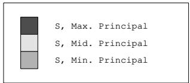

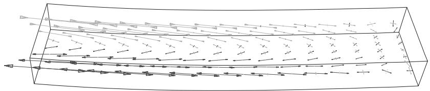  
Figure 1: Symbol plot of principal stress.

Symbol plotting behavior changes slightly when you cut through a model using view cuts. If you display a view cut to investigate a symbol plot of a nodal output variable, Abaqus/CAE interpolates values from the nodes closest to the view cut surface and draws these interpolated vector arrows on the view cut surface. Abaqus/CAE performs this interpolation only for nodal output variables and does not perform any interpolation on the cutting surface when you display the portions of the model below the cut or above the cut. For more information on view cut functionality, see Understanding view cuts.

The relative sizes of the arrows indicate the magnitude of the result values. The directions of the arrows indicate the global directions of the results. In tensor plots arrows with arrowheads pointing in toward the arrow shaft represent compressive values; arrows with arrowheads pointing out from the arrow shaft represent tensile values.

The symbol plot legend shows you how each arrow color corresponds to a specific range of values. To learn how to display the minimum and maximum values associated with your symbol plot, see Customizing the legend.

By default, Abaqus/CAE plots all of a variable's result values in a symbol plot. The maximum value appears as the largest arrow in the plot, and all other arrows are scaled in proportion to that arrow size. However, you can use the Symbol Plot Options dialog box to limit the range of values that appear in a plot.

• When you specify a particular maximum value, only arrows representing absolute values less than or equal to that maximum value appear in the plot.  
The largest arrow in the plot will represent the largest absolute result value that is less than or equal to the limit you specify. All other arrows in the plot will be scaled in proportion to that arrow size.  
• When you specify a particular minimum value, only arrows representing absolute values greater than that minimum value appear in the plot.

The components of connector vector output are resolved with respect to different coordinate systems depending on whether the output requested is field output or history output. See Displaying connectors and connector output in the Visualization module for how to interpret the vector component values in field plots.

## Additional information

• Setting vector and tensor limits

## Using symbol plot options

You can use the symbol plot options to customize the appearance of symbol plots.

For data from an output database, use the Symbol Variable options in the Field Output dialog box to select the vector or tensor quantity and optionally the component to plot.


Note: If you selected a model from the current model databases, symbol plots display the primary variable, not the symbol variable. Changing the symbol variable has no effect unless you plot data from an output database.

Select Options->Symbol from the main menu bar or click in the toolbox to access the Symbol Plot Options dialog box. Click the following tabs to customize the appearance of symbol plots in the current viewport:

• Color & Style: The Color & Style page contains the following tabs:

Vector: Choose to customize the appearance of arrows that represent resultant values or selected component values of a vector variable.  
Tensor: Choose to customize the appearance of arrows that represent all principal components, all direct components, or selected components of a tensor variable. Tensor arrows can be displayed at the element integration points, centroids, or nodes. If arrows are displayed at the nodes, the scalars are always computed after averaging.

• Limits: The Limits page contains the following tabs:

- Vector: Choose either to specify the minimum and maximum vector values or to have Abaqus/CAE automatically compute these values.  
- Tensor: Choose either to specify the minimum and maximum tensor values or to have Abaqus/CAE automatically compute these values.

• Labels: The Labels page contains the following tabs:

Vector: Choose to display numerical labels for the vector values and to customize the color, font, type size, number format, and number of decimal places used for the vector values.  
Tensor: Choose to display numerical labels for the tensor values and to customize the color, font, type size, number format, and number of decimal places used for the tensor values.

Other options such as the render style, edge visibility, deformation scale factor, and translucency are located in the Common Plot Options dialog box. If you choose to plot symbols on both the undeformed and the deformed shape, you can use the Superimpose Plot Options to customize the appearance of the undeformed shape. To learn how to customize the render style and other display characteristics of your symbol plot, see Customizing plot display. For more information on tensor and field output variables, see Selecting field output variables. For more information on selecting the results step, see Selecting a specific results step and frame.

## Additional information

• Customizing symbol plot appearance

## Producing a results symbol plot

A symbol plot shows either the magnitude and direction of a vector or tensor variable at a specified step and frame of an output database or the magnitude and direction of model attributes at a specified step of a model in the current model database. Abaqus/CAE represents the values as symbols (for example, arrows) at locations on your model. For more information on tensor and field output variables, see Selecting field output variables. For more information on selecting the results step, see Selecting a specific results step and frame. To learn how to display the minimum and maximum values associated with your symbol plot, see Customizing the legend.

1. Open the model database or the output database containing your model data or analysis results.  
2. If you are plotting data from a model database, switch to the Visualization module, expand the Model Database container of the Results Tree, and select the model you want to use.  
3. Select the results step and frame to display (or just the step, if the current model database is selected).  
4. For output databases, select the symbol field output variable to display. For model databases, select the primary field output variable as the variable to display.  
The symbol plot state is activated.  
5. Select the plot state–independent and symbol plot customization options you want.  
6. If your chosen field output includes complex numbers, select the Complex Form tab in the Result Options dialog box to control the numeric form to display. This option applies only to plots for output databases.  
7. For plots of output database data, select Plot->Symbols from the main menu bar to modify whether to plot the symbols on the deformed model shape, the undeformed shape, or both.


Tip: You can also produce a symbol plot using the deformed , undeformed , or 图 superimposed symbol tools in the toolbox.

The current viewport changes to display a customized symbol plot of the specified field output variable at the specified step and frame of the current output database.

Abaqus automatically refreshes your symbol plot each time you click Apply in the step and frame selector dialog box, plot state–independent options, superimpose plot options (if applicable), or symbol plot options dialog boxes.

## Additional information

• Using symbol plot options

## Producing a symbol plot of free body nodal forces

You can create a symbol plot that shows the summation of free body nodal forces at individual nodes in your model. The symbol field output variable FREEBODY is the sum of the individual NFORCn components at a node, but with the vector’s direction reversed. The FREEBODY output variable also takes into account the displayed elements by default; in contrast, contour plots of NFORC1 consider the whole model.

The FREEBODY symbol plot is a representation of the unbalanced forces acting on the object that is represented by the current display group. This sensitivity to current display group is not exhibited in any other context, such as contour plots.

1. Open the output database containing your analysis results with NFORC data included.  
2. Select the results step and frame to display.  
3. If desired, focus in on a subset of your model using a display group.  
4. Select FREEBODY as the symbol field output variable to display.

The symbol plot state is activated.

5. Select the plot state–independent and symbol plot customization options you want.  
6. From the main menu bar, select Plot->Symbols to modify whether to plot the symbols on the deformed model shape, the undeformed shape, or both.


Tip: You can also produce a symbol plot using the deformed , undeformed , or superimposed symbol tools in the toolbox.

The current viewport changes to display a customized symbol plot of free body nodal forces at the specified step and frame of the current output database for the current display group.

Abaqus automatically refreshes your symbol plot each time you click Apply in the step and frame selector dialog box, plot state–independent options, superimpose plot options (if applicable), or symbol plot options dialog boxes.

## Additional information

• Selecting the symbol field output variable  
• Using symbol plot options  
• Resultant forces and moments on free body cuts in Abaqus/CAE

## Customizing symbol plot appearance

This section explains how to customize the style of symbol plot vector and tensor arrows, how to choose the quantity to display, and how to control the minimum and maximum values shown in the plot.

To learn how to customize the render style and the underlying model attributes of your symbol plot, see Customizing plot display.

## In this section:

Customizing symbol plot arrows  
Setting vector and tensor limits  
Customizing vector and tensor labels

## Customizing symbol plot arrows

You can customize the arrow color, maximum arrow length, arrow shaft thickness, and arrowhead appearance for symbol plot vector and tensor arrows. When you customize arrow color for nodal vector symbols, you can select a single color for all arrows in the plot or display arrows with different colors depending on their length. You can use either the size of the model or the size of the screen as the basis for calculations of maximum arrow length.

For tensor symbol plots of element output variables, arrows are typically displayed with three different colors.

1. Locate the vector or tensor Color & Style options.

Select Options->Symbol from the main menu bar or click in the toolbox; then click the Color & Style tab in the dialog box that appears.

• Click the Vector tab if you are creating a vector symbol plot.  
• Click the Tensor tab if you are creating a tensor symbol plot.

The options for the symbol type of your choice appear.

2. To display all arrows in the plot with a single color, select Uniform, then do one of the following:

For a vector plot, click the Uniform Color sample , and select the color in which you want the variable or variable component arrows to appear. (For more information, see Customizing colors.)  
• For plotting all principal components in a tensor plot, click the color samples labeled Maximum principal, Mid principal, and Minimum principal; and select the colors in which you want each arrow type to appear.  
• For plotting all direct components in a tensor plot, click the color samples labeled 11, 22, and 33; and select the colors in which you want each arrow type to appear.  
• For plotting only one principal or direct component, click the color sample labeled Color, and select the color in which you want the component arrows to appear.

3. To display all arrows in the plot using colors that correspond to their length, select Spectrum. You can choose one of the predefined color spectrums from the Spectrum Name list or define a new spectrum; for more information on selecting and defining a color spectrum, see Customizing contour colors, and Creating a new color spectrum. You can also drag the Number of intervals slider to change the number of intervals available for coloring the various arrows in the symbol plot; for more information about contour interval selection, see Customizing contour intervals.

4. Drag the Size slider to change the arrow length. The arrow size ranges from 0 to 30; the default arrow size is 6.

Your selection determines the size of the arrow representing the largest vector or tensor value in the plot. All other vector and tensor arrows in the plot will be scaled to that size.


## Note:

Abaqus/CAE maintains one size setting for both vectors and tensors; you cannot change the size of one independently of the other.

5. From the Basis options, select Screen size or Model size as the basis for calculations of maximum arrow length. If you select Screen size, Abaqus/CAE resizes the arrows as you change the size of the viewport; and if you select Model size, Abaqus/CAE resizes the arrows as you zoom in and out.  
6. Click the arrow next to the Thickness field, and select the arrow shaft thickness of your choice.  
7. Click the arrow next to the Arrowhead field, and select the arrowhead design of your choice.

8. If you are creating a tensor plot, customize the locations of the tensor arrows so that they are displayed at the Integration point, the Centroid, or the Nodal values for your model.


## Note:

If you choose the Nodal option for tensor variables, the results averaging option Compute scalars before averaging is not valid; the scalars are always computed after averaging.

9. If desired, you can display a smaller subset of the arrows in a symbol plot to clarify the presentation of a plot with many arrows. Drag the Symbol density slider to a value between High and Low.  
10. Click Apply to implement your changes.

The symbol plot vector or tensor arrows in the current viewport change to reflect your settings.

By default, your changes are saved for the duration of the session and will affect all subsequent symbol plots. If you want to retain your changes for subsequent sessions, save them to a file. For more information, see Saving customizations for use in subsequent sessions.

## Additional information

• Customizing colors  
• Customizing symbol plot appearance

## Setting vector and tensor limits

By default, Abaqus/CAE includes all of a variable's result values in a symbol plot. However, you can use the Symbol Plot Options dialog box to limit the range of values that appear in the plot.

When you specify a particular maximum value, only arrows representing values less than or equal to that maximum value appear in the plot. When you specify a particular minimum value, only arrows representing values greater than that minimum value appear in the plot. Changing the maximum or minimum value is also reflected in the symbol plot legend.

To learn how to display the minimum and maximum values associated with your symbol plot, see Customizing the legend.

1. Locate the Limits options.

区 Select Options->Symbol from the main menu bar or click in the toolbox; then click the Limits tab in the dialog box that appears. Click either the Vector tab or the Tensor tab; the symbol plot Limits options for the variable type of your choice become available.

2. In the area labeled Max in the top half of the page, choose one of the following options:

• Select Auto-compute to use the largest result value as the maximum value.  
• Select Specify to specify the maximum value yourself; then enter the maximum value of your choice in the Specify text field.

3. In the area labeled Min in the bottom half of the page, choose one of the following options:

• Select Auto-compute to use the smallest result value as the minimum value.  
Select Specify to specify the minimum value yourself; then enter the minimum value of your choice in the Specify text field.

4. Click Apply to implement your changes.

The symbol plot in the current viewport changes to display arrows only for variable values that fall within the limits you have specified.

By default, your changes to symbol plot options are saved for the duration of the session and will affect all subsequent symbol plots in the current viewport and in any new viewports created from the current viewport. If you want to retain your changes for subsequent sessions, save them to a file. For more information, see Saving customizations for use in subsequent sessions.

## Additional information

• Understanding symbol plotting

You can display a label next to each vector or tensor arrow in a symbol plot that expresses its value in numerical form. You can also customize these labels by changing their color, font, type size, number format, and number of decimal places.

1. Locate the Labels options.

区 Select Options->Symbol from the main menu bar or click in the toolbox; then click the Labels tab in the dialog box that appears. Click either the Vector tab or the Tensor tab; the symbol plot Labels options for the variable type of your choice become available.

2. Toggle on Display value next to vector symbol to show vector labels for the selected type of vector.  
3. Select the color of the vector labels for the selected type of vector.

a. Click the Text color color sample . Abaqus/CAE displays the Select Color dialog box.  
b. Use one of the methods in the Select Color dialog box to select a new color. For more information, see Customizing colors.  
c. Click OK to close the Select Color dialog box.

4. Select the font of the vector labels for the selected type of vector.

a. Click Set Font. Abaqus/CAE displays the Select Font dialog box.  
b. Use one of the methods in the Select Font dialog box to select a new font, size, and style. For more information, see Customizing fonts.  
c. Click OK to close the Select Font dialog box.

5. To change the format of the vector labels for the selected vector type, click the Number Format arrow and select one of the following formats:

Select Scientific to display legend values in scientific notation, which expresses legend values as a decimal value between 1 and 10 multiplied by a power of 10. When you select this format for the number 501,000, the value appears in the legend as 5.01e5.  
• Select Fixed to display legend values without using exponent values. When you select this format, the number 501,000 is displayed in the legend as 501000.00.  
Select Engineering to select engineering notation, which expresses values in a similar format to scientific notation but allows exponent values that are multiples of three only. When you select this format, the number 501,000 is displayed in the legend as 501E3.

6. Click the Decimal places arrows to specify the desired number of decimal places in each label.  
7. Click Apply to implement your changes.

The symbol plot in the current viewport changes to display labels with your selected formatting.

By default, your changes to symbol plot options are saved for the duration of the session and will affect all subsequent symbol plots in the current viewport and in any new viewports created from the current viewport. If you want to retain your changes for subsequent sessions, save them to a file. For more information, see Saving customizations for use in subsequent sessions.

## Additional information

• Understanding symbol plotting

## Plotting material orientations

A material orientation plot shows the material directions of elements in the model at the element integration points.

The material orientations are plotted at a specified step and frame of the analysis and at a specified section point for shell elements. Material orientation plots can also be created to show the material directions of reinforcements (rebar orientation) in membrane, shell, and surface elements. Abaqus/CAE represents the material orientations as triads. This section explains material orientation plotting.

## In this section:

Understanding material orientation plotting  
Using material orientation plot options  
Producing a material orientation plot  
Customizing material orientation plot triads

## Understanding material orientation plotting

Material orientation plots allow you to visualize the material directions of the elements in your model.

Abaqus/CAE draws a triad at the element integration points to indicate the material orientation. For example, a material orientation plot is shown in Figure 1.

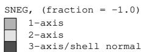

  
Figure 1: Material orientation plot.

Material orientations are available only for those elements for which field output is requested at the selected section points. Valid elements include all shell elements, as well as solid elements for which you have defined a local orientation. The material orientations are displayed at the current step and frame of the analysis and at the current section point selection for shell elements. If display is enabled for both the top and bottom section point locations, Abaqus/CAE displays material orientations for the bottom location only. For small-strain shell elements the material orientations do not rotate with the deformation of the model (see About Shell Elements, for more information). Material orientation plots can also be created for reinforcement layers in membrane, shell, and surface elements.

## Additional information

• Selecting section point data by category

## Using material orientation plot options

You can use the material orientation plot options to customize the appearance of material orientation triads.

Select Options->Material Orientation from the main menu bar or click in the toolbox to access the Material Orientation Plot Options dialog box. Use the options in the dialog box to control the visibility, color, length, thickness, and arrow appearance of the material orientation triad axes.

Other options such as the render style, edge visibility, deformation scale factor, and translucency are located in the Common Plot Options dialog box. If you choose to plot material orientations on both the undeformed and the deformed shape, you can use the Superimpose Plot Options to customize the appearance of the undeformed shape. For more information on customizing a superimposed plot, see Superimposing deformed and undeformed model plots. To learn how to customize the render style and other display characteristics of your material orientation plot, see Customizing plot display. For more information on selecting the results step, see Selecting a specific results step and frame. For more information on selecting section point locations, see Selecting section point data by category.

## Additional information

• Customizing material orientation plot triads

## Producing a material orientation plot

A material orientation plot shows the material directions of the elements in a model at a specified step and frame and a specified section point. Abaqus/CAE represents the material orientations as triads at the element integration points. For more information on selecting the results step, see Selecting a specific results step and frame. For more information on selecting section point locations, see Selecting section point data by category.

1. Open the output database containing your analysis results.  
2. Select the results step and frame to display.  
3. Select the section point to display.  
4. Select the plot state–independent and material orientation plot customization options you want.  
5. From the main menu bar, select Plot->Material Orientations and choose whether to plot the material orientations on the undeformed shape, the deformed shape, or both.


Tip: You can also produce a material orientation plot using the deformed , undeformed 凡 , or superimposed material orientation tools in the toolbox.

The current viewport changes to display a customized material orientation plot.

Abaqus automatically refreshes your material orientation plot each time you click Apply in the step and frame selector, section point selector, plot state–independent options, superimpose plot options (if applicable), or material orientation plot options dialog boxes.

## Additional information

• Using material orientation plot options

## Customizing material orientation plot triads

This section explains how to customize the style of material orientation plot triads.

To learn how to customize the render style and the underlying model attributes of your material orientation plot, see Customizing plot display.

You can customize the color, length, thickness, and arrowhead appearance of the material orientation plot triad axes. You can also suppress the appearance of one or more of the triad axes; and for results with composite sections, you can display results using either the material orientation of the entire layup or one of its individual plies.

1. Select Options->Material Orientation from the main menu bar or click The triad options appear.  
2. Toggle on the buttons to the left of each of the axes to display or suppress them.  
3. Click on the color samples to select the color or colors of your choice for the visible triad axes in the plot.  
4. Drag the Size slider to increase or decrease the length of the axes in the material orientation triads in your plot. Axis length ranges from 0 to 30; the default length is 6.


## Note:

You can specify an axis length value larger than 30 by using the Abaqus Scripting Interface. See Using the Python interpreter.

5. From the Basis options, select Screen size or Model size as the basis for calculations of axis length in material orientation triads. If you select Screen size, Abaqus/CAE resizes the triads as you change the size of the viewport; and if you select Model size, Abaqus/CAE resizes the triads as you zoom in and out.  
6. Click the arrow next to the Thickness field, and select the axis thickness of your choice.  
7. Click the arrow next to the Arrowhead field, and select the arrowhead design of your choice.  
8. If desired, you can display a smaller subset of the material orientation triads to clarify the presentation of a plot with many triads. Drag the Symbol density slider to a value between High and Low.  
9. Material orientation based on the SORIENT output variable is plotted when Section / Layup is selected. If your results include field output from the SORIENT output variable and output from elements with composite sections, specify the material orientation you want to use. Select Material / Ply to display each ply with its own material orientation, or select Section / Layup to display the entire composite layup using the orientation specified in the composite layup definition.  
10. Click Apply to implement your changes.

The material orientation plot triads in the current viewport change to reflect your settings.

By default, your changes are saved for the duration of the session and will affect all subsequent material orientation plots. If you want to retain your changes for subsequent sessions, save them to a file. For more information, see Saving customizations for use in subsequent sessions.

## Additional information

• Customizing colors  
• Customizing plot display

This chapter explains the concept of X–Y plotting and gives details of how to create X–Y data objects and how to produce and customize an X–Y plot.

## In this section:

Understanding X–Y plotting  
Specifying and saving X–Y data objects  
Producing an X–Y plot  
Operating on saved X–Y data objects  
Customizing X–Y plot axes  
Customizing X–Y curve appearance  
Customizing X–Y plot appearance  
Customizing the X–Y plot title  
Customizing the appearance of the X–Y plot legend  
Customizing border and fill colors for an X–Y plot

## Understanding X–Y plotting

An X–Y data object is a two-dimensional array of data that Abaqus/CAE stores in two columns.

You can display X–Y data as a graph in an X–Y plot or as a table in an X–Y report. In addition, you can probe an X–Y plot to display the X- and Y-coordinates of graph points. This section discusses X–Y data objects and the various methods you can use to create them. For more information on X–Y reports, see Generating tabular data reports; for information on probing X–Y plots, see Probing the model.

## In this section:

What is an X–Y data object, and what is an X–Y plot?  
Understanding how to specify an X–Y data object  
Understanding “Temp” and other X–Y data object names  
Understanding quantity types

## What is an X–Y data object, and what is an X–Y plot?

An X–Y data object is a collection of ordered pairs that Abaqus/CAE stores in two columns—an X-column and a Y-column. The X–Y data can originate from an output database or an ASCII file, or you can enter the data using the keyboard. In addition, you can derive X–Y data by combining existing X–Y data objects. For example, you might combine an X–Y data object containing stress values versus time with a second X–Y data object containing strain values versus time to produce an X–Y data object containing stress versus strain at equivalent times. You can save X–Y data objects; and you can edit, copy, rename, and delete them.

By default, the X–Y data objects you save are retained for the duration of the session only. If you want to make X–Y data objects available for subsequent sessions, you can save them to an XML file, to the model database, or to an output database using the File->Save Session Objects option; or you can copy them to an output database file using the Copy to ODB button in the XY Data Manager.

Abaqus/CAE can display X–Y data in the form of an X–Y plot. An X–Y plot is a two-dimensional graph of one variable versus another. Examples of X–Y plots include temperature versus time, load versus displacement, and stress versus strain. You can display multiple X–Y data objects in one X–Y plot, and you can use the customization options to control the appearance of each data object and the overall appearance of the components of an X–Y plot. These components include the axes; the legend, which is a key that associates each X–Y curve in the plot with the X–Y data object it represents; and the X–Y curves. Figure 1 shows an X–Y plot displaying three X–Y data objects.

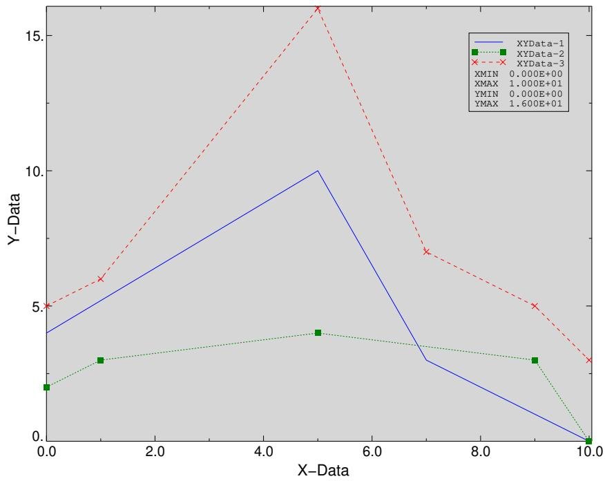  
Figure 1: X–Y plot displaying three objects of data.

## Additional information

• Managing session objects and session options  
• Producing an X–Y plot  
• Specifying and saving X–Y data objects  
• Managing session objects and session options  
• Copying a session X–Y data object to an output database file

## Understanding how to specify an X–Y data object

To specify an X–Y data object, you first choose the source of the data and then provide any necessary details. Possible sources are:

## ODB history output

Select this method to specify an X–Y data object by reading history output results from an output database. You can specify which variables to read from the output database, from which steps of the analysis to read, and the frequency at which to read the data; for example, you can read every third data point. You can also specify a numeric form for any complex-valued output data. For more information, see Reading X–Y data from output database history output.

## ODB field output

Select this method to specify an X–Y data object by reading field output results from an output database. You can specify which variables to read from the output database and for which elements or nodes to read the data. Abaqus/CAE extracts results from the currently active steps and frames; see Activating and deactivating steps and frames, for more information. You can also specify a numeric form for any complex-valued output data. For more information, see Reading X–Y data from output database field output.

## Thickness

Select this method to specify an X–Y data object by reading field output results from elements through the thickness of a shell region of your model. Abaqus/CAE extracts results from the current step and frame. You can specify which variables to read from the output database and for which elements to read the data. For more information, see Reading X–Y data through the thickness of a shell.

## Free body

Select this method to specify an X–Y data object by reading field output results from all active free bodies in your session. Abaqus/CAE extracts results from the current step and frame and displays results for the nodal force (NFORC) output variable. For more information, see Reading X–Y data from all active free body cuts.

## Operate on X–Y data

Select this method to derive a new X–Y data object by manipulating previously saved X–Y data objects. You specify the new X–Y data object by applying functions and mathematical operations to existing data. An example of a function is Combine. If you Combine an X–Y data object containing stress versus time with an X–Y data object containing strain versus time, you produce an X–Y data object containing stress versus strain at equivalent times. For more information, see Operating on saved X–Y data objects.

## ASCII file

Select this method to read X- and Y-values from an existing text file. The file can contain more than two columns of data, separated by commas, spaces, or tabs; and you can specify which columns correspond to the X- and Y-axis data. In addition, you can specify the frequency at which the data should be read from the file; for example, every third row. For more information, see Reading X–Y data from an ASCII file.

## Keyboard

Select this method to manually type X- and Y-values into a simple table editor. Within this method, Abaqus supports several special editing techniques, as well as an option to read data from a file. For more information on this topic, see Entering X–Y data from the keyboard.

## Path

Select this method to specify an X–Y data object by reading field output results at locations along a path through your model. Abaqus obtains results from an output database. You can specify the points, elements, or edges that make up the path and the step, frame, and variable for which to obtain results. For more information, see Viewing results along a path.

In addition, you can create an X–Y data object while using the table editor to create a material in the Property module. For more information, see Entering tabular data.

Once you have specified your X–Y data object, you can save it or you can display it in the form of an X–Y plot. Saving the X–Y data object allows you to subsequently plot, edit, rename, delete, or operate on it; it also allows you to copy the X–Y data object to an output database file for use in later Abaqus sessions. For X–Y data originating from sources other than output database history output, you must save your data to later produce an X–Y plot containing multiple data objects. Saved X–Y data objects are retained only for the duration of the session. For the X–Y data object to be persistent across sessions, you must copy it to an output database file.

If you have copied an X–Y data object to your output database file during an earlier session, you can access that object when you open the file in the current session. You can display the X–Y data object in the form of an X–Y plot, just as you can any other specified objects. To edit, rename, delete, or operate on a data object that was created in a previous session, you must load it to the current session.

## Understanding “Temp” and other X–Y data object names

By default, when you save or plot an X–Y data object, Abaqus/CAE names it for you. This name is an important means of identifying and referring to the X–Y data object.

X–Y data object names appear in the following instances:

• When you plot X–Y data, the X–Y plot legend identifies by name all X–Y data objects appearing in the plot.  
• When you select Tools->XY Data from the main menu bar, the Manager, Edit, Copy, Rename, Delete, and Plot tools list all X–Y data objects created during the session by name.  
• When you customize the appearance of the curve representing an X–Y data object, you first select the X–Y data object by name from those listed in the XY Curve Options dialog box.

In most cases Abaqus/CAE is able to provide a meaningful default name for your X–Y data object. As you save your X–Y data object, Abaqus/CAE shows you the default name and gives you an opportunity to override this default with the name of your choice. Once saved, you can provide a new name for your X–Y data object at any time by renaming it. For information on renaming, see Managing objects using manager dialog boxes.

There are three basic forms of X–Y data object names, as follows:

## Temp-n

If you produce an X–Y plot by clicking Plot from any of the following dialog boxes:

• XY Data from ASCII File  
• XY Data from Keyboard  
• XY Data from Path  
• Plot Expression from the Operate on XY Data dialog box

Abaqus/CAE names your X–Y data according to the pattern Temp-1, Temp-2, etc. This name indicates that the plot represents the data configured in the dialog box, which is considered temporary data whether or not you have clicked Save As to save it.

Conversely, if Temp-n appears in your plot legend, you are plotting temporary data. You cannot edit, copy, rename, delete, operate on, or produce a report of temporary data. To accomplish any of these tasks, you must first save your data. You can select curve style preferences for temporary data, but the curve styles will revert to the defaults if you replot the data without having saved it. To learn how to save your data, see Saving an X–Y data object.

## XYData-n

If you create a new X–Y data object using the Save As button provided in the XY Data from ASCII File or XY Data from Keyboard dialog boxes, Abaqus/CAE suggests a default name for your X–Y data according to the pattern XYData-1, XYData-2, etc. To establish a more meaningful name, you can use the Save XY Data As dialog box to overwrite this default with the name of your choice.

To locate the XY Data from ASCII File or XY Data from Keyboard dialog boxes, select Tools->XY Data->Create from the main menu bar; then click the choice of interest in the dialog box that appears, and click Continue.

## Meaningful names

You can establish a meaningful name (a name of your choice) for your X–Y data object either by specifying a name as you save your data or by subsequently renaming it. As you save your data, Abaqus/CAE displays the default name in the Save XY Data As dialog box; you can overwrite this default. Abaqus/CAE generates meaningful default names for X–Y data created from the History Output or XY Data from ODB Field Output dialog boxes.

## Understanding quantity types

A quantity type is a category that describes the data in one of the columns of an X–Y data object. Abaqus/CAE includes over eighty predefined quantity types that describe the output of every variable in Abaqus, including commonly used types like temperature, time, stress, and strain. The quantity types associated with each column appear in X–Y reports and as the default axis labels in an X–Y plot of that data object.

When you create an X–Y data object from field output data or history output data, Abaqus/CAE automatically uses the quantity types specified in the output database. When you create an X–Y data object by loading data from an ASCII file or by entering data directly from the keyboard, you can specify quantity types for each column as you create the object. In either case, you can change the quantity types associated with either column by editing the data object in the Edit XY Data dialog box.

## Specifying and saving X–Y data objects

This section explains the various methods of specifying and saving X–Y data objects. X–Y data objects can originate from analysis results, an external file, keyboard entry, or operations on previously saved X–Y data objects.

For information on specifying X–Y data objects by obtaining field output results along a path through your model, see Viewing results along a path; for information on specifying X–Y data objects by operating on existing X–Y data, see Operating on saved X–Y data objects.

## In this section:

Reading X–Y data from output database history output  
Reading X–Y data from output database field output  
Reading X–Y data through the thickness of a shell  
Reading X–Y data from all active free body cuts  
Reading X–Y data from an ASCII file  
Entering X–Y data from the keyboard  
Saving an X–Y data object  
Copying a session X–Y data object to an output database file  
Loading an X–Y data object to the current session  
Editing individual data points in an X–Y data object

## Reading X–Y data from output database history output

You can read X–Y data from history output in the output database. Available data consist of history output that were saved during the analysis.

From this output, you can select the following:

• a variable at a location—for example, U1 (displacement in the X-direction) at node 1;  
• the step or steps of interest;  
• a pattern of frames within those steps—for example, every 10th frame; and  
• the time basis.

Abaqus/CAE then reads X–Y data pairs from the output database at the frames you specify. If you select multiple variables, Abaqus/CAE reads the data pairs and creates a separate X–Y data object for each variable by default. When you save history output variables, you can choose to operate on the data first; Abaqus/CAE saves the results of the operation as a new X–Y data object.

For time-based analyses, X-values are taken as total time from the start of the analysis or, in the case of a restarted analysis, as total time from the start of the last continuation of the analysis. Alternatively, you can use the step time as the time basis. Y-values are taken as the value at that time of the variable at the location you specify.

History output from an Abaqus/Standard analysis is available after 10 increments are written to the output database; history output from an Abaqus/Explicit analysis is available after 100 increments are written to the output database or after an Abaqus/Explicit heartbeat is triggered based on CPU time, whichever occurs first.

1. Locate the History Output options.

Select Tools->XY Data->Create from the main menu bar, then choose ODB history output.


Tip: You can also specify history output by selecting Result->History Output from the main menu bar.

The History Output dialog box appears.


## Note:

The History Output dialog box lists all history output saved during the analysis, giving the variable name and the location at which it was saved. If this list is empty, history output is not available.

2. Click the Variables tab, if it is not already selected. Select one or more variables that you want to read. Variables are listed alphabetically along with their locations. The default is to read the first entry in the list. For more information on selecting multiple items in dialog boxes, see Selecting multiple items from lists and tables.

If your output database contains many history output variables, you can use the filter to reduce the

number of output variable names displayed. Click next to the Name filter field to see examples of valid filtering syntax.

The specified variable and location are highlighted.

3. If viewport linking is activated, you can toggle on Show common list between linked viewports to display only the variables that are common to all linked viewports.

4. Click Steps/Frames to change the steps, frames, or time basis from which Abaqus/CAE reads X–Y data. For more information, see Activating and deactivating steps and frames.

5. If the data include complex numbers, you can select the displayed form using the Result Options dialog box. For more information on complex number forms in Abaqus/CAE, see Controlling the form of complex results.  
6. To evaluate and display the data, click Plot.

An X–Y plot appears in the current viewport. The plot represents the data you have configured in the dialog box, which Abaqus considers temporary data whether or not you have clicked Save As to save it.

7. To save the data you have configured, click Save As. Any complex data are saved as the current complex form, not as complete complex numbers.


## Note:

To plot saved X–Y data, select Tools->XY Data->Plot from the main menu bar and choose the X–Y data from the pull-right menu.

In the Save XY Data As dialog box that appears, you can perform any of a number of mathematical, trigonometric, logarithmic, exponential, or other operations on the data before saving (see Saving an X–Y data object, for more information).

8. When you have finished, click Dismiss to close the History Output dialog box.

## Additional information

• Saving an X–Y data object  
• Understanding “Temp” and other X–Y data object names  
• Controlling the form of complex results  
• Linking viewports

## Reading X–Y data from output database field output

You can read X–Y data from field output in the output database.

Available data consist of field output that were saved during the analysis. From this output, you can select the following:

• a variable at an output position—for example, S11 (stress in the 11-direction) at integration points; and  
• a single location or a set of locations (elements or nodes).

Abaqus/CAE then reads X–Y data pairs from the output database at the currently active steps and frames. If you select multiple variables or multiple locations, Abaqus/CAE reads the data pairs and creates a separate X–Y data object for each variable/location pair. For all time-based analyses, X-values are taken as total time from the start of the analysis. Y-values are taken as the corresponding values of the variable at the specified location.

Element-based field data extracted at nodes are controlled by the current settings for result averaging. However, if you requested the unique nodal position, then result averaging is always 100% to obtain unique values at the nodes. For more information, see Understanding result value averaging.

When reading the X–Y data for element-based field output at any output position, Abaqus/CAE reads the field values from the specified position if the same position is available in the output database.

1. Locate the XY Data from ODB Field Output options.

Select Tools->XY Data->Create from the main menu bar, then choose ODB field output.

The XY Data from ODB Field Output dialog box appears.


Note: The XY Data from ODB Field Output dialog box lists all field output saved during the analysis (except quaternion variables). If this list is empty, field output is not available.

2. Click the Position arrow to reveal possible positions at which to list variables for your selection; then choose the desired position.

The list of variables is refreshed to show only those that can be read at the selected position.

3. Select the field output variables to be read using either the check box next to each variable in the list or the Edit text field at the bottom of the page.

## To use the check box method:

1. To select a variable and all of its components, click that variable's check box.  
2. To choose among the individual components of a variable, click the arrow next to that variable's check box to list its components; then click individual component check boxes to select them.

## To use the edit method:

In the Edit text field, enter the names of the variables and components to be read. To be valid, a variable must be available on the output database for the current position.

4. Click the Elements/Nodes tab.

The Elements/Nodes options appear.

5. From the Item list at the upper left of the dialog box, select either Elements or Nodes.

Abaqus refreshes the Selection Method list at the bottom of the dialog box and the item list at the right.

6. Select the specific elements or nodes for which to read output data.

• To specify elements or nodes by picking them directly from the viewport:

1. Choose Pick from viewport from the Selection Method list.

Abaqus/CAE enters the pick mode. Select items for the display group (where items are elements or nodes) appears in the prompt area.

2. Select one or more items from the viewport (for more information, see Selecting objects within the viewport”). The items are highlighted in the viewport.


## Note:

If you click Done in the prompt area, Abaqus/CAE exits the pick mode and your selections disappear; you must choose a Selection Method from the list.

• To specify elements or nodes by number:

1. Choose Element labels or Node labels from the Selection Method list.

The Part instance and Labels fields appear.

2. Select the name of the part instance for which you are obtaining results from the list in the Part instance field. Type into the Labels field a list of element or node numbers separated by commas or a range of numbers such as 1:4.  
3. Verify your selection by clicking Highlight Items in Viewport.

• To specify elements or nodes by set name:

1. Choose Element sets or Node sets from the Selection Method list.

Abaqus refreshes the item list at the right. If this list is empty, there are no items that meet your selection criteria.


## Note:

This list does not include the internal sets generated by Abaqus/CAE.

2. Select one or more set names from the item list. (For more information, see Selecting multiple items from lists and tables.) If your model contains many sets, you can use the filter to reduce

the number of set names displayed. Click next to the Filter field to see examples of valid filtering syntax.

3. Verify your selection by toggling Highlight items in viewport.

• To specify elements or nodes belonging to internal sets (sets created by Abaqus/CAE):

1. Choose Internal sets from the Selection Method list.

Abaqus refreshes the item list at the right. If this list is empty, there are no items that meet your selection criteria.

2. Select one or more set names from the item list. (For more information, see Selecting multiple items from lists and tables.) If your model contains many internal sets, you can use the filter to

reduce the number of set names displayed. Click next to the Filter field to see examples of valid filtering syntax.

3. Verify your selection by toggling Highlight items in viewport.

The following table summarizes the restrictions that exist on the availability of element or node data for the output position specified on the Variables page:

<table><tr><td>Output position</td><td>Available for</td></tr><tr><td>Integration point</td><td>Elements</td></tr><tr><td>Centroid</td><td>Elements</td></tr><tr><td>Element nodal</td><td>Elements or nodes</td></tr><tr><td>Unique nodal</td><td>Nodes</td></tr></table>

7. Click Active Steps/Frames to change the steps or frames from which Abaqus/CAE reads X–Y data. For more information, see Activating and deactivating steps and frames.  
8. If the data include complex numbers, you can select the displayed form using the Result Options dialog box. For more information on complex number forms in Abaqus/CAE, see Controlling the form of complex results.  
9. To evaluate and display the data, click Plot.  
An X–Y plot appears in the current viewport. The plot represents the data you have configured in the dialog box, which Abaqus considers temporary data whether or not you have clicked Save to save it.  
10. To save the data you have configured, click Save. Any complex data are saved as the current complex form, not as complete complex numbers.


## Note:

To plot your saved X–Y data, select Tools->XY Data->Plot from the main menu bar and choose the X–Y data from the pull-right menu.

11. When you have finished, click Dismiss to close the dialog box.

## Additional information

• Saving an X–Y data object  
• Understanding “Temp” and other X–Y data object names  
• Controlling the form of complex results

You can read X–Y data from field output data that are stored in the elements through the thickness of a shell or composite solid region of your model. Available data consist of field output that were saved during the analysis. From this output, you can select the following:

• a variable at an output position—for example, S11 (stress in the 11-direction) at integration points; and  
• a single element or a set of elements.

Abaqus/CAE then reads X–Y data pairs from the output database at the current step and frame. If you select multiple variables or multiple locations, Abaqus/CAE reads the data pairs and creates a separate X–Y data object for each variable/location pair. Y-values are taken as the thickness through the model. X-values are taken as the corresponding values of the variable at the specified location.

1. Locate the Thickness options.

Select Tools->XY Data->Create from the main menu bar, then choose Thickness.

The XY Data from Shell Thickness dialog box appears.


## Note:

The XY Data from Shell Thickness dialog box lists all field output saved during the analysis (except quaternion variables). If this list is empty, field output is not available.

2. Click the Position arrow to reveal possible positions at which to list variables for your selection; then choose the desired position.

The list of variables is refreshed to show only those that can be read at the selected position.

3. Select the field output variables to be read using either the check box next to each variable in the list or the Edit text field at the bottom of the page.

## To use the check box method:

1. To select a variable and all of its components, click that variable's check box.  
2. To choose among the individual components of a variable, click the arrow next to that variable's check box to list its components; then click individual component check boxes to select them.

## To use the edit method:

In the Edit text field, enter the names of the variables and components to be read. To be valid, a variable must be available in the output database for the current position.

4. Click the Elements tab.

The Elements options appear.

5. Select the specific elements for which to read output data.

• To specify elements by picking them directly from the viewport:

1. Choose Pick from viewport from the Selection Method list.

Abaqus/CAE enters the pick mode. Select elements for the display group appears in the prompt area.

2. Select one or more elements from the viewport (for more information see Selecting objects within the viewport”). The elements are highlighted in the viewport.


## Note:

If you click Done in the prompt area, Abaqus/CAE exits the pick mode and your selections disappear; you must choose a Selection Method from the list.

• To specify elements by number:

1. Choose Element labels from the Selection Method list.

The Part instance and Element Labels fields appear.

2. Select the name of the part instance for which you are obtaining results from the list in the Part instance field. Type into the Element Labels field a list of element numbers separated by commas or a range of numbers such as 1:4.  
3. Verify your selection by clicking Highlight Items in Viewport.

• To specify elements by set name:

1. Choose Element sets from the Selection Method list.

Abaqus refreshes the item list at the right. If this list is empty, there are no items that meet your selection criteria.

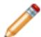

## Note:

This list does not include the internal sets generated by Abaqus/CAE.

2. Select one or more set names from the item list. (For more information, see Selecting multiple items from lists and tables.) If your model contains many sets, you can use the filter to reduce

the number of set names displayed. Click next to the Filter field to see examples of valid filtering syntax.

3. Verify your selection by toggling Highlight items in viewport.

• To specify elements belonging to internal sets (sets created by Abaqus/CAE):

1. Choose Internal sets from the Selection Method list.  
Abaqus refreshes the item list at the right. If this list is empty, there are no items that meet your selection criteria.  
2. Select one or more set names from the item list. (For more information, see Selecting multiple items from lists and tables.) If your model contains many internal sets, you can use the filter to reduce the number of set names displayed. Click the Tip button next to the Filter field to see examples of valid filtering syntax.  
3. Verify your selection by toggling Highlight items in viewport.

6. If the data include complex numbers, you can select the displayed form using the Result Options dialog box. For more information on complex number forms in Abaqus/CAE, see Controlling the form of complex results.

7. To evaluate and display the data, click Plot.

An X–Y plot appears in the current viewport. The plot represents the data you have configured in the dialog box, which Abaqus considers temporary data whether or not you have clicked Save to save it.

8. To save the data you have configured, click Save. Any complex data are saved as the current complex form, not as complete complex numbers.


## Note:

To plot your saved X–Y data, select Tools->XY Data->Plot from the main menu bar and choose the X–Y data from the pull-right menu.

9. When you have finished, click Dismiss to close the dialog box.

## Additional information

• Saving an X–Y data object  
• Understanding “Temp” and other X–Y data object names  
• Composite layups

## Reading X–Y data from all active free body cuts

You can read X–Y data from all the active free body cuts defined in your session. The data available for selection include the following:

• data from forces, moments, and heat flow rate; and  
• if you select forces or moments, the resultant magnitude and the individual components in the 1-, 2-, and 3-directions; and  
• if you select heat flow rate (valid only for free body cuts based on view cuts), the resultant magnitude.

Abaqus/CAE then computes X–Y data pairs by performing free body calculations at all pertinent time frames and creates X–Y data objects showing force, moment, or heat flow rate data against time. A separate X–Y data object is created for every force or moment and component combination you select; if you toggle on both the force and moment options and all four component options, Abaqus/CAE creates eight X–Y data objects for each active free body cut in your session. You can activate and deactivate free body cuts in the Free Body Cut Manager; for more information, see Displaying, hiding, and highlighting free body cuts.

1. Locate the Free body options.

Select Tools->XY Data->Create from the main menu bar, and choose Free body.

The XY Data from Free Body dialog box appears.

2. Click Active Steps/Frames to change the steps or frames from which Abaqus/CAE reads X–Y data. For more information, see Activating and deactivating steps and frames.  
3. From the Entity options, toggle on Force, Moment, Heat Flow Rate, or all of these options to display X–Y data for the selected entity or entities. The Heat Flow Rate option is valid only for free body cuts based on view cuts.  
4. From the Force/Moment Components options, toggle on the vector components that you want to include in the X–Y data set for forces and moments. Options include the resultant magnitude and the individual component values in each direction. For heat flow rate, only the resultant magnitude is included.  
5. To evaluate and display the data, click Plot.

An X–Y plot of the data you have configured in the dialog box appears in the current viewport.

6. To save the data you have configured as one or more X–Y data objects, click Save. X–Y data objects are saved only for the current session.


## Note:

To plot your saved X–Y data, select Tools->XY Data->Plot from the main menu bar, and select the X–Y data from the menu.

7. When you have finished, click Dismiss to close the dialog box.

## Additional information

• Saving an X–Y data object  
• Understanding “Temp” and other X–Y data object names  
• Displaying, hiding, and highlighting free body cuts

You can read X–Y data from an ASCII text file that contains columns of numerical data separated by commas, tabs, or spaces.

The file can contain more than two columns of data; you can specify which columns (fields) correspond to the X- and Y-axis data. You can also specify which rows of data to read from the file.

1. Locate the XY Data from ASCII File options:

From the main menu bar, selectTools->XY Data->Create. Click ASCII file in the dialog box that appears; then click Continue.


Tip: You can also specify X–Y data by clicking Create in the XY Data Manager or by using

区Y the tool in the toolbox.

The XY Data from ASCII File dialog box appears.

2. Enter the name of your ASCII file in one of the following ways:

• Type the name into the File window at the top of the dialog box, or  
• Click Select to filter and browse existing file names.

The ASCII File Selection dialog box appears.

Filter and browse existing files. When you locate the file you want, click the name to select it; then click OK.

3. Specify which columns of the file to read. Columns can be separated by spaces, tabs, or commas. Multiple consecutive spaces, tabs, and/or commas are interpreted as a single field delimiter.

a. To specify the column within the file to read as X-values, enter an integer in the Read X values from field box. The default is field 1, the first column.  
b. To specify the column within the file to read as Y-values, enter an integer in the Read Y values from field box. The default is field 2, the second column.

4. To assign quantity types to the values in the X- or Y-columns, expand the Quantity Types list for the X or Y column and select quantity types from the lists that appear.

5. Specify which rows of the file to read; the default is all rows.

• Click Read all to read every row of the file, or  
Click Skip; then enter the number of file rows to skip in the rows between reads box. A value of 0 means read all rows; a value of 1 means read every other row. Reading always begins with the first row.

6. To evaluate and display the data, click Plot.

An X–Y plot appears in the current viewport. The plot represents the data you have configured in the dialog box, which Abaqus considers temporary data whether or not you have clicked Save As to save it.

7. To save the data you have configured, click Save As.


Note: X–Y data objects have a precision of six significant digits; therefore, only six significant digits are retained when you save an X–Y data object.

To plot your saved X–Y data object, select Tools->XY Data->Plot from the main menu bar and choose the X–Y data object from the pull-right menu.

8. When you have finished, click Dismiss to close the dialog box.

## Additional information

• Saving an X–Y data object  
• Understanding “Temp” and other X–Y data object names  
• Understanding quantity types

## Entering X–Y data from the keyboard

You can specify X–Y data directly from the keyboard.

To do so, you type X- and Y-values into a simple table editor.

1. Locate the XY Data from Keyboard options:

From the main menu bar, selectTools->XY Data->Create. Click Keyboard in the dialog box that appears; then click Continue.


Tip: You can also specify X–Y data by clicking Create in the XY Data Manager or by using

区Y the tool in the toolbox.

The XY Data from Keyboard dialog box appears.

2. Use standard keyboard and mouse editing techniques to insert, modify, or delete X- and Y-values in the XY Data from Keyboard table. For special table editing options or to read data from an ASCII file, press mouse button 3. (For more information, see Entering tabular data.)  
3. To assign quantity types to the values in the X- or Y-columns, expand the Quantity Types list for the X or Y column and select quantity types from the lists that appear.  
4. To evaluate and display the data, click Plot.

An X–Y plot appears in the current viewport. The plot represents the data you have configured in the dialog box, which Abaqus considers temporary data whether or not you have clicked Save As to save it.

5. To save the data you have configured, click Save As.


Note: X–Y data objects have a precision of six significant digits; therefore, only six significant digits are retained when you save an X–Y data object.

To plot your saved X–Y data object, select Tools->XY Data->Plot from the main menu bar and choose the X–Y data object from the pull-right menu.

6. When you have finished, click Cancel to close the dialog box.

## Additional information

• Saving an X–Y data object  
• Understanding “Temp” and other X–Y data object names  
• Understanding quantity types

## Saving an X–Y data object

Abaqus/CAE provides several dialog boxes to help you specify X–Y data.

Each of these dialog boxes contains a Save As button, which you can use to save the X–Y data object you create. You must save your X–Y data to do any of the following:

• Produce an X–Y plot containing multiple X–Y data objects from any source other than history output.  
• Edit, copy, rename, delete, or operate on your X–Y data. For history output, you can operate on the data during the save procedure or after it has been saved.  
• Establish persistent curve style preferences for your X–Y data.  
• Produce a report of your X–Y data.  
• Copy your X–Y data to an output database file.

Abaqus/CAE also saves the quantity types specified for each column in your X–Y data object, as long as the quantity types you select are among the preset quantity types available in the XY Data from ASCII File, XY Data from Keyboard, and Edit XY Data dialog boxes. If you derive a different quantity type by operating on X–Y data objects, Abaqus/CAE will not record the nonstandard quantity type in the saved X–Y data object.

Saved data persist only for the duration of the session. To save your X–Y data object beyond the duration of the session, you must save the data to a file. You can either copy your X–Y data object to an output database (binary) file or write it to a report (ASCII) file. For information on copying X–Y data to an output database file, see Copying a session X–Y data object to an output database file. For information on writing X–Y data to a report file, see Generating tabular data reports.

1. Specify your X–Y data.

a. From the main menu bar, select Tools->XY Data->Create.

The Create XY Data dialog box appears.


Tip: You can also specify X–Y data by clicking Create in the Data Manager or by using 区 the tool in the toolbox.

b. Choose the source of your data from the list, and click Continue.

Abaqus displays the appropriate dialog box.

c. Enter the necessary data or information in the dialog box.

2. Save your data for the current Abaqus session.

a. Click Save As or Save (as available).

If you are saving field data, do one of the following:

• To save the data set without changing it, leave the default choice of as is in the Save Operation list.  
You can choose to perform any of the mathematical, trigonometric, logarithmic, exponential, or other operations available in the Save Operation list. The selected operation will be performed on the data before the data set is saved.


Note: After you perform operations on the data set, the x-axis and y-axis labels are redefined automatically based on the resulting dimensional changes. You can retain the default labels or customize them by selecting the desired quantity types from the Quantity Types menu in the Edit XY Data dialog box.

b. Accept the default name, or enter the data object name of your choice in the text field.


Note: If you save data from the XY Data from ODB Field Output dialog box, you must accept the default names. If you selected multiple history output variables in the History Output dialog box, each X–Y data set will be saved with the default name, which is a shortened form of the history output name.

c. If you are saving history data, do one of the following:

• To save the data set without changing it, leave the default choice of as is in the Save Operation list.  
• If you selected a single history output variable, you can choose to perform any of the mathematical, trigonometric, logarithmic, exponential, or other operations available in the Save Operation list. The selected operation will be performed on the data before it is saved.  
• If you selected two history output variables, you can choose to perform any of the dual-operand operations available in the Save Operation list:

```txt
append((XY,XY))
avg((XY,XY))
combine((XY,XY))
maxEnvelope((XY,XY))
minEnvelope((XY,XY))
power((XY,XY))
rng((XY,XY)) (range)
srss((XY,XY)) (square root of the sum of the squares)
sum((XY,XY))
```

• If you selected three or more history output variables, you can choose to perform any of the multi-operand operations available in the Save Operation list:

```txt
- append((XY,XY,...))
- avg((XY,XY,...))
- maxEnvelope((XY,XY,...))
- minEnvelope((XY,XY,...))
- rng((XY,XY,...))
- srss((XY,XY,...))
- sum((XY,XY,...))
- vectorMagnitude((XY,XY,XY))
```

d. If available, toggle on Plot curves on OK to plot the X–Y data sets when you click OK.

e. If available, toggle on Swap variables to swap the order of operations.

f. If available, toggle on Apply to linked viewports to save the X–Y data across all linked viewports.

The viewport number is appended to the X–Y data set name; for example, XyData-1\_VP1, XyData-1\_VP2, etc.

g. Click OK to close the dialog box.

## 3. Click Dismiss or Cancel (as available) to close the output dialog box.

## Additional information

• Understanding how to specify an X–Y data object  
• Copying a session X–Y data object to an output database file  
• Loading an X–Y data object to the current session  
• Using X–Y data operations  
• Linking viewports

## Copying a session X–Y data object to an output database file

You must save an X–Y data object to be able to manipulate the data within a session; however, saved data persist only for the duration of the session in which they were created. You must copy saved data to a file if you want it to be available in another session.

You can either copy your data to an output database file or write it to a report file. (For information on writing X–Y data to a report file, see Generating tabular data reports.) The output database file is binary, so it is efficient to save large amounts of data to this file for future use. You can only append data to the output database; you cannot modify the contents of the file in any other way. It is easy to read data into Abaqus/CAE from an output database file during a later session. You can copy your data to any output database file for which you have write privileges, including any currently open output database files.


Note: By default, Abaqus/CAE opens output database files as read-only. You must choose to open an output database file with write privileges if you want to copy any X–Y data objects to it (see Opening a model database or an output database for more information).

1. From the main menu bar, select Tools->XY Data->Manager.

The XY Data Manager appears.


Tip: You can also access the XY Data Manager from the tool in the toolbox.

2. From the list of previously saved X–Y data objects, select the X–Y data object that you wish to copy, and click Copy to ODB.

The Copy Session XYData to ODB dialog box appears.

3. Enter the file name of your choice in the appropriate text field, or click Select to choose from an existing file name.  
4. Accept the default name for the X–Y data object, or enter a name of your choice in the text field; then click OK.

## Additional information

• Understanding how to specify an X–Y data object  
• Saving an X–Y data object  
• Loading an X–Y data object to the current session

## Loading an X–Y data object to the current session

When you create an X–Y data object, you must save it to be able to manipulate the data within a session. You can then copy the X–Y data object to an output database file so that you can access it from a later session. The XY Data Manager lists the X–Y data objects that are available from two sources: the current session or the current output database file. If you have created an X–Y data object in a previous session and copied it to an output database file, you must load the X–Y data object to the current session to manipulate it.

1. From the main menu bar, select Tools->XY Data->Manager.

The XY Data Manager appears.


Tip: You can also access the XY Data Manager from the tool in the toolbox.

2. Toggle on Current ODB: odb\_name as the Data Source to see a list of the X–Y data objects associated with the currently open output database file.  
3. Select an X–Y data object to load.  
4. Click Load to Session.  
5. Toggle on Current session as the Data Source.

The loaded X–Y data object will be listed as available; you can now edit, copy, rename, or delete this X–Y data object.

## Additional information

• Understanding how to specify an X–Y data object  
• Saving an X–Y data object  
• Copying a session X–Y data object to an output database file

You can edit individual records in any X–Y data object in your session, including temporary data objects. Abaqus/CAE presents the data in tabular format in the Edit XY Data dialog box.

1. Locate the Edit XY Data options:

From the main menu bar, select Tools->XY Data->Edit->XY Data Object, where XY Data Object is a saved X–Y data object in your session. The Edit XY Data dialog box appears with the X–Y data presented in tabular format.

2. To edit any of the data points, click in the appropriate cell and change the value.  
3. To assign quantity types to the values in the X- or Y-columns, expand the Quantity Types list for the X or Y column and select quantity types from the lists that appear.  
4. To save the data you have configured, click Save.

## Additional information

• Saving an X–Y data object  
• Understanding “Temp” and other X–Y data object names  
• Understanding quantity types

## Producing an X–Y plot

To produce an X–Y plot, you first specify an X–Y data object. You can then choose to simply plot the specified X–Y data object or to save the data object and plot it later.

If viewport linking is activated, you can link plot display across viewports.

History and field data objects can include complex numbers; you can control the displayed form of complex numbers using the Result Options dialog box. An abbreviation of the complex form is appended to the Y-axis title when you plot the variable and becomes part of the saved variable name. For example, if S-Mises is the selected field output variable and Magnitude is the complex form, the Y-axis title is S-Mises CPX: Mg. For more information on complex number forms in Abaqus/CAE, see Controlling the form of complex results.

Use one of the following methods to produce an X–Y plot:

## To produce an X–Y plot of history data from an output database:

Select Tools->XY Data->Create from the main menu bar to launch the Create XY Data dialog box; then choose ODB history output. Click Continue. From the dialog box that appears, select one or more variables to plot and the step or steps of interest; then click Plot.

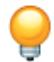

Tip: To launch the Create XY Data dialog box from the Results Tree, click mouse button 3 on the XYData container and select Create from the list that appears.

You can also specify history output by selecting Result->History Output from the main menu bar.

## To produce an X–Y plot of field data from an output database:

Select Tools->XY Data->Create from the main menu bar; then choose ODB field output. Click Continue. From the dialog box that appears, select one or more variables to plot, the location or locations from which to read the data, and the step or steps of interest; then click Plot.

## To produce an X–Y plot of output database results along a path through your model:

To specify a path through your model, select Tools->Path->Create from the main menu bar; then configure the dialog boxes that appear. For more information, see Creating a path through your model.

After you have created the path, select Tools->XY Data->Create from the main menu bar. Choose Path as the source of the X–Y data object, then click Continue. Configure the dialog box that appears, then click Plot. For more information, see Obtaining X–Y data along a path.

## To produce an X–Y plot of new data, not from an output database:

Select Tools->XY Data->Create from the main menu bar. Choose either Operate on XY data, ASCII file, or Keyboard as the source of the X–Y data object; then click Continue. In the dialog box that appears, enter your X–Y data object; then click Plot (or Plot Expression in the Operate on XY Data dialog box).

## To produce an X–Y plot of one or more saved X–Y data objects:

• To display a single X–Y data object, select Tools->XY Data->Plot from the main menu bar; and select the X–Y data object from the pull-right menu.  
• To display multiple X–Y data objects on a single X–Y plot, select Tools->XY Data->Manager from the main menu bar. Select the X–Y data objects from the dialog box that appears; then click Plot.

You can also perform either of these actions from the Results Tree. To display a single X–Y data object using the Results Tree, expand the XYData container, click mouse button 3 on the X–Y data object you want to plot, and select Plot from the list that appears. To display multiple X–Y data objects using the Results Tree, highlight multiple X–Y objects under the XYData container, click mouse button 3 on one of the highlighted objects, and select Plot from the list that appears.

## Additional information

• Understanding how to specify an X–Y data object  
• Understanding “Temp” and other X–Y data object names  
• Controlling the form of complex results  
• Linking viewports

## Operating on saved X–Y data objects

You can derive new X–Y data by operating on previously saved X–Y data objects. This section discusses how to operate on X–Y data and presents each of the possible operations you can perform.

You can also operate on history data during the save procedure. For more information, see Saving an X–Y data object.

## In this section:

Understanding how to operate on saved X–Y data objects  
Understanding X–Y data interpolation and extrapolation  
Operating on saved X–Y data objects  
Using X–Y data operations  
Using addition on X–Y data objects  
Using negation or subtraction on X–Y data objects  
Using multiplication on X–Y data objects  
Using division on X–Y data objects  
Taking the absolute value of an X–Y data object  
Finding the average of two or more X–Y data objects  
Finding the current average of an X–Y data object  
Differentiating an X–Y data object  
Performing curve fitting on an X–Y data object  
Integrating an X–Y data object  
Interpolating an X–Y data object  
Linearizing an X–Y data object  
Normalizing an X–Y data object  
Taking the square root of an X–Y data object  
Taking the square root of the sum of the squares of two or more X–Y data objects  
Summing two or more X–Y data objects  
Calculating vector magnitudes  
Applying trigonometric functions to an X–Y data object  
Taking the exponential of an X–Y data object  
Applying logarithmic functions to an X–Y data object  
Raising an X–Y data object to a power  
Applying Butterworth filtering to an X–Y data object  
Applying Chebyshev Type I or Type II filtering to an X–Y data object  
Reducing the sample size of an X–Y data object  
Applying SAE filtering to an X–Y data object  
Applying sine-Butterworth filtering to an X–Y data object  
Smoothing an X–Y data object  
Finding the current maximum of an X–Y data object  
Finding the current minimum of an X–Y data object  
Finding the current range of an X–Y data object  
Finding the current maximum of two or more X–Y data objects  
Finding the current minimum of two or more X–Y data objects  
Finding the current range of two or more X–Y data objects

Appending two or more X–Y data objects  
Combining two X–Y data objects  
Converting the angular units used for X–Y data objects  
Swapping the order of an X–Y data object  
Truncating data from the ends of an X–Y data object

## Understanding how to operate on saved X–Y data objects

You can derive new X–Y data by operating on previously saved X–Y data objects. You define your new data by building a mathematical expression. The expression can include the names of previously saved X–Y data objects, built-in functions, and mathematical operators. An example of an expression might be: currentMax(“XYData-1”)+2.5. Abaqus/CAE evaluates the expression to derive the new X–Y data.

To build your expression, you use the Operate on XY Data dialog box. This dialog box lists the data object names and operators available for your expression. You can click to select listed data objects and operators; type values in using the keyboard; and use standard mouse and keyboard editing techniques such as backspace, copy, and paste to configure your expression. The expression can contain any syntactically valid series of supported operations. The following syntax rules apply:

• Multiple arguments to a function must be separated by commas.  
• Data object names must be surrounded by quotation marks.  
• Parentheses must be used to group function arguments.

Parentheses can also be used to control mathematical evaluation or for visual clarity. Abaqus/CAE notifies you if your expression contains invalid syntax or cannot be evaluated for mathematical reasons; for example, if evaluation would require dividing by zero.


Tip: When you select multiple variables in the History Output dialog box and click Save As, you can choose to apply one of the more common operators to the X–Y data before saving it.

By default, Abaqus/CAE performs checks to validate the mathematical expressions you create. If your expression includes a large number of X–Y data points, this validation can be time consuming. You can toggle on Skip checks to skip this set of checking procedures.

## Additional information

• Understanding X–Y data interpolation and extrapolation  
• Operating on saved X–Y data objects  
• Using X–Y data operations

## Understanding X–Y data interpolation and extrapolation

Abaqus/CAE performs X–Y data interpolation and extrapolation as necessary when you combine multiple X–Y data objects. You can combine multiple X–Y data objects by using X–Y data operations or by requesting that multiple data objects appear in a single table within an X–Y report.

A complete list of X–Y data operations appears in Using X–Y data operations. Several of the X–Y data operations that accept two or more previously savedX–Y data objects as input arguments require that the data objects have matching X-coordinate values. Examples of such operations are the combine and sum functions.

Similarly, matching X–Y values are required for data objects appearing in the same X–Y report table. For information on combining X–Y data objects into a single report table, see Controlling report layout, width, format, and coordinate system.

If the X-coordinate values to be combined do not match, Abaqus/CAE computes additional data points to allow the objects to be aligned. For each unmatched X-coordinate value, Abaqus/CAE constructs a data pair by creating a matching X-coordinate value and computing a Y-coordinate value as follows:

• If the missing X-coordinate lies within the minimum and maximum available X-coordinates for the data object, a new Y-coordinate value is computed by linear interpolation.  
If the missing X-coordinate lies beyond the minimum or maximum available X-coordinates for the data object, a new Y-coordinate value is computed by assuming the Y-coordinate value remains constant beyond these extreme points.

These additional data points exist only to carry out the operation and are not saved as part of the input argument data objects.

## Additional information

• Using X–Y data operations  
• Generating tabular data reports

## Operating on saved X–Y data objects

To define a new X–Y data object by operating on previously saved X–Y data objects, select Tools->XY Data->Create from the main menu bar; then choose Operate on XY data from the dialog box that appears.

1. Locate the Operate on XY Data dialog box.

From the main menu bar, select Tools->XY Data->Create. Click Operate on XY data in the dialog box that appears; then click Continue. The Operate on XY Data dialog box appears.

2. Build your expression:

a. Click on data object names and built-in functions in the dialog box to select them. Click Add to Expression near the bottom of the dialog box to add data objects to the expression; the built-in functions appear in the expression automatically when you select them.  
Use drag-select for multiple contiguous data object name selection.  
Commas are inserted automatically between the data object names.  
b. Use standard mouse and keyboard editing techniques to position the cursor and configure your expression.  
c. Adjust the syntax of your expression if necessary: data object names must be surrounded by quotation marks, commas must separate function arguments, and parentheses may be needed.

3. To save your new X–Y data object, click Save As.

The Save XY Data As dialog box appears. Provide a name for your data; then click OK.

4. To plot the expression you have configured, click Plot Expression.

An X–Y plot appears in the current viewport. The plot represents the expression in the dialog box, which Abaqus considers temporary data, whether or not you have saved your new X–Y data object.

5. To plot your new, saved X–Y data object, select Tools->XY Data->Plot from the main menu bar and select the X–Y data object from the pull-right menu.

6. To clear (erase) the expression, click Clear Expression.

7. When you are done, click Cancel to close the dialog box.

## Additional information

• Understanding how to operate on saved X–Y data objects  
• Using X–Y data operations  
• Saving an X–Y data object

## Using X–Y data operations

You can derive new X–Y data by operating on previously savedX–Y data objects. This overview lists the operations you can perform on X–Y data. You can also operate on history data during the save procedure. For more information, see Saving an X–Y data object.

The following keys are used to classify function arguments:

## Text keys for X–Y operations:

<table><tr><td>A</td><td>The argument can be an X-Y data object, a floating point number, or an integer.</td></tr><tr><td>X</td><td>The argument must be an X-Y data object.</td></tr><tr><td>I</td><td>The argument must be an integer.</td></tr><tr><td>F</td><td>The argument must be a floating point number.</td></tr></table>

The following list indicates the section where you can find more information for each X–Y data operation.

## Mathematical operations:

<table><tr><td>+</td><td>Using addition on X-Y data objects</td></tr><tr><td>-</td><td>Using negation or subtraction on X-Y data objects</td></tr><tr><td>*</td><td>Using multiplication on X-Y data objects</td></tr><tr><td>/</td><td>Using division on X-Y data objects</td></tr><tr><td>1/A</td><td>Using division on X-Y data objects</td></tr><tr><td>abs(A)</td><td>Taking the absolute value of an X-Y data object</td></tr><tr><td>avg(X,X,...)</td><td>Finding the average of two or more X-Y data objects</td></tr><tr><td>currentAvg(X)</td><td>Finding the current average of an X-Y data object</td></tr><tr><td>differentiate(X)</td><td>Differentiating an X-Y data object</td></tr><tr><td>fit(X)</td><td>Performing curve fitting on an X-Y data object</td></tr><tr><td>integrate(X)</td><td>Integrating an X-Y data object</td></tr><tr><td>interpolate(X)</td><td>Interpolating an X-Y data object</td></tr><tr><td>linearize(X,CONSTANT)</td><td>Linearizing an X-Y data object</td></tr><tr><td>linearize(X,LINEAR)</td><td>Linearizing an X-Y data object</td></tr><tr><td>normalize(X)</td><td>Normalizing an X-Y data object</td></tr><tr><td>sqrt(A)</td><td>Taking the square root of an X-Y data object</td></tr><tr><td>srss(X,X,...)</td><td>Taking the square root of the sum of the squares of two or more X-Y data objects</td></tr><tr><td>sum(A,A,...)</td><td>Summing two or more X-Y data objects</td></tr><tr><td>vectorMagnitude(X,X,X)</td><td>Calculating vector magnitudes</td></tr></table>

## Trigonometric operations:

For more information, see Applying trigonometric functions to an X–Y data object.

<table><tr><td>cos(A)</td><td>Take the cosine of an X-Y data object.</td></tr><tr><td>acos(A)</td><td>Take the arccosine of an X-Y data object.</td></tr><tr><td>cosh(A)</td><td>Take the hyperbolic cosine of an X-Y data object.</td></tr><tr><td>sin(A)</td><td>Take the sine of an X-Y data object.</td></tr><tr><td>asin(A)</td><td>Take the arcsine of an X-Y data object.</td></tr><tr><td>sinh(A)</td><td>Take the hyperbolic sine of an X-Y data object.</td></tr><tr><td>tan(A)</td><td>Take the tangent of an X-Y data object.</td></tr><tr><td>atan(A)</td><td>Take the arctangent of an X-Y data object.</td></tr><tr><td>tanh(A)</td><td>Take the hyperbolic tangent of an X-Y data object.</td></tr></table>

Logarithmic and exponential operations:

<table><tr><td>exp(A)</td><td>Taking the exponential of an X-Y data object</td></tr><tr><td>log(A)</td><td>Applying logarithmic functions to an X-Y data object</td></tr><tr><td>log10(A)</td><td>Applying logarithmic functions to an X-Y data object</td></tr><tr><td>power(A,A)</td><td>Raising an X-Y data object to a power</td></tr></table>

Filtering and smoothing operations:

<table><tr><td>butterworthFilter(X,F)</td><td>Applying Butterworth filtering to an X-Y data object</td></tr><tr><td>chebyshev1Filter(X,F,F)</td><td>Applying Chebyshev Type I or Type II filtering to an X-Y data object</td></tr><tr><td>chebyshev2Filter(X,F,F)</td><td>Applying Chebyshev Type I or Type II filtering to an X-Y data object</td></tr><tr><td>decimateFilter(X,I)</td><td>Reducing the sample size of an X-Y data object</td></tr><tr><td>saeGeneralFilter(X,F)</td><td>Applying SAE filtering to an X-Y data object</td></tr><tr><td>sae60Filter(X,F)</td><td>Applying SAE filtering to an X-Y data object</td></tr><tr><td>sae100Filter(X,F)</td><td>Applying SAE filtering to an X-Y data object</td></tr><tr><td>sae180Filter(X,F)</td><td>Applying SAE filtering to an X-Y data object</td></tr><tr><td>sae600Filter(X,F)</td><td>Applying SAE filtering to an X-Y data object</td></tr><tr><td>sae1000Filter(X,F)</td><td>Applying SAE filtering to an X-Y data object</td></tr><tr><td>sineButterworthFilter(X,F)</td><td>Applying sine-Butterworth filtering to an X-Y data object</td></tr><tr><td>smooth(X,I)</td><td>Smoothing an X-Y data object</td></tr><tr><td>smooth2(X,F)</td><td>Smoothing an X-Y data object</td></tr></table>

Range and magnitude related operations:

<table><tr><td>currentMax(X)</td><td>Finding the current maximum of an X-Y data object</td></tr><tr><td>currentMin(X)</td><td>Finding the current minimum of an X-Y data object</td></tr><tr><td>currentRng(X)</td><td>Finding the current range of an X-Y data object</td></tr><tr><td>maxEnvelope(A,A,...)</td><td>Finding the current maximum of two or more X-Y data objects</td></tr><tr><td>minEnvelope(A,A,...)</td><td>Finding the current minimum of two or more X-Y data objects</td></tr><tr><td>rng(A,A,...)</td><td>Finding the current range of two or more X-Y data objects</td></tr></table>

Other operations:

<table><tr><td>append(X,X,...)</td><td>Appending two or more X-Y data objects</td></tr><tr><td>combine(X,X)</td><td>Combining two X-Y data objects</td></tr></table>

<table><tr><td>degreeToRadian(A)</td><td>Converting the angular units used for X-Y data objects</td></tr><tr><td>radianToDegree(A)</td><td>Converting the angular units used for X-Y data objects</td></tr><tr><td>swap(X)</td><td>Swapping the order of an X-Y data object</td></tr><tr><td>truncate(X,F)</td><td>Truncating data from the ends of an X-Y data object</td></tr></table>

## Additional information

• Understanding how to operate on saved X–Y data objects  
• Operating on saved X–Y data objects

## Using addition on X–Y data objects

You can use addition on previously saved X–Y data objects to produce a new X–Y data object.

Use the mathematical + symbol to operate on a previously savedX–Y data object (a collection of ordered pairs) to produce a new X–Y data object. The + operator accepts two commutative arguments and can be applied in one of two ways:

## To add a scalar to an X–Y data object:

This method yields a new X–Y data object having the same X-coordinate values as the original X–Y data object. Abaqus/CAE computes the new Y-coordinates as the scalar added to each original Y-coordinate. For example, if

$$
\mathrm{XYData} = [ (1, 1), (2, 2), (3, 3) ],
$$

then

$$
(\text {XYData} + 5) = [ (1, 6), (2, 7), (3, 8) ].
$$

## To add an X–Y data object to another X–Y data object:

This method yields a new X–Y data object having as its X-coordinates all X-coordinates of the first data object and any additional X-coordinates needed for alignment of the two objects. Abaqus/CAE computes additional X–Y data pairs by interpolation and extrapolation. The new data object has as its Y-coordinates the Y-coordinates of the first data object added to the Y-coordinates of the second data object. For example, let

$$
\text {XYData1} = [ (1, 1), (2, 2), (3, 3) ],
$$

and

$$
\mathrm{XYData2} = [ (4, 4), (5, 5) ].
$$

For alignment, Abaqus/CAE computes the values of the first and second data objects as:

$$
\text {XYData1 extrapolated} = [ (1, 1), (2, 2), (3, 3), (4, 3), (5, 3) ],
$$

and

$$
\text {XYData2 extrapolated} = [ (1, 4), (2, 4), (3, 4), (4, 4), (5, 5) ];
$$

then

$$
(\text {XYData1} + \text {XYData2}) = [ (1, 5), (2, 6), (3, 7), (4, 7), (5, 8) ].
$$

Figure 1 illustrates the above example.

  
Figure 1: X–Y plot illustrating addition of data objects.


## Note:

This application of the + symbol has the same behavior as the sum function.

1. Locate the Operate on XY Data dialog box.  
From the main menu bar, select Tools->XY Data->Create. Click Operate on XY data in the dialog box that appears; then click Continue. The Operate on XY Data dialog box appears.  
2. From the XY Data choices, click the name of the X–Y data object on which to operate and click Add to Expression. You can choose from all X–Y data objects previously saved within this session (listed alphabetically in the XY Data field).  
The X–Y data object name appears within the expression window.

3. From the Operators listed, click +.

The + symbol appears after the data object name in the expression window.

4. To specify the second argument, do one of the following:

Use your mouse and keyboard to enter a scalar as the second argument of the + operator in the expression window, or  
• From the XY Data choices, click the name of a data object argument for the + operator in the expression window and click Add to Expression.

5. To continue to build your expression, position the cursor in the expression window and type in or select the functions, operators, and X–Y data you want to include.  
6. To evaluate and display your expression, click Plot Expression.  
7. To save your new X–Y data object, click Save As and then provide a name in the dialog box that appears.

Saving your data object makes it available for future operations within this session and for inclusion in X–Y plots containing multiple data objects.

8. When you are finished, click Cancel to close the dialog box.

## Additional information

• Understanding X–Y data interpolation and extrapolation

• Summing two or more X–Y data objects  
• Appending two or more X–Y data objects  
• Combining two X–Y data objects  
• Using X–Y data operations

Use the mathematical – symbol to perform negation or subtraction on a previously savedX–Y data object (a collection of ordered pairs) to produce a new X–Y data object.

To perform negation, precede a single X–Y data object with the – operator. Negation yields a new X–Y data object having the same X-coordinate values as the original X–Y data object. Abaqus/CAE computes the new Y-coordinates as the negative of each original Y-coordinate.

To perform subtraction, use one of three methods:

## To subtract a scalar from an X–Y data object:

This method yields a new X–Y data object having the same X-coordinate values as the original X–Y data object. Abaqus/CAE computes the new Y-coordinates as the scalar subtracted from each original Y-coordinate. For example, if

$$
\mathrm{XYData} = [ (1, 6), (2, 7), (3, 8) ],
$$

then

$$
(\text {XYData} - 5) = [ (1, 1), (2, 2), (3, 3) ].
$$

## To subtract an X–Y data object from a scalar:

This method yields a new X–Y data object having the same X-coordinate values as the original X–Y data object. Abaqus/CAE computes the new Y-coordinates as each original Y-coordinate subtracted from the scalar. For example, if

$$
\mathrm{XYData} = [ (1, 6), (2, 7), (3, 8) ],
$$

then

$$
(5 - \text {XYData}) = [ (1, - 1), (2, - 2), (3, - 3) ].
$$

## To subtract one X–Y data object from another X–Y data object:

This method yields a new X–Y data object having as its X-coordinates all X-coordinates of the first data object and any additional X-coordinates needed for alignment of the two objects. Abaqus/CAE computes additional X–Y data pairs by interpolation and extrapolation. The new data object has as its Y-coordinates the Y-coordinates of the second data object subtracted from the Y-coordinates of the first data object. For example, let

$$
\text {XYData1} = [ (4, 4), (5, 5) ]
$$

and

$$
\mathrm{XYData2} = [ (1, 1), (2, 2), (3, 3) ].
$$

For alignment, Abaqus/CAE computes the values of the first and second data objects as:

$$
\text {XYData1 extrapolated} = [ (1, 4), (2, 4), (3, 4), (4, 4), (5, 5) ]
$$

and

$$
\text {XYData2 extrapolated} = [ (1, 1), (2, 2), (3, 3), (4, 3), (5, 3) ];
$$

then

$$
(\text {XYData1} - \text {XYData2}) = [ (1, 3), (2, 2), (3, 1), (4, 1), (5, 2) ].
$$

Figure 1 shows an X–Y plot of the above example.  
  
Figure 1: X–Y plot illustrating subtraction of data objects.

1. Locate the Operate on XY Data dialog box.

From the main menu bar, select Tools->XY Data->Create. Click Operate on XY data in the dialog box that appears; then click Continue. The Operate on XY Data dialog box appears.

2. From the Operators listed, click –.

The – symbol appears in the expression window.

3. Use your mouse and keyboard to position the cursor in the expression window; then specify the necessary arguments. Available X–Y data objects include all those previously saved within this session (listed alphabetically in the XY Data field).

## To use negation

From the XY Data choices, click the name of the X–Y data object to negate and click Add to Expression.

## To use subtraction

• Use your keyboard to type in a scalar argument, or  
• From the XY Data choices, click the name of the X–Y data object on which to operate and click Add to Expression.

The arguments appear within the expression window.

4. To continue to build your expression, position the cursor in the expression window and type in or select the functions, operators, and X–Y data you want to include.

5. To evaluate and display your expression, click Plot Expression.

6. To save your new X–Y data object, click Save As and then provide a name in the dialog box that appears.

Saving your data object makes it available for future operations within this session and for inclusion in X–Y plots containing multiple data objects.

7. When you are finished, click Cancel to close the dialog box.

## Additional information

• Understanding X–Y data interpolation and extrapolation  
• Using X–Y data operations

## Using multiplication on X–Y data objects

Use the mathematical \* symbol to operate on a previously savedX–Y data object (a collection of ordered pairs) to produce a new X–Y data object. The \* operator accepts two commutative arguments and can be applied in one of two ways:

## To multiply a scalar and an X–Y data object:

This method yields a new X–Y data object having the same X-coordinate values as the original X–Y data object. Abaqus/CAE computes the new Y-coordinates as the scalar multiplied by each original Y-coordinate. For example, if

$$
\mathrm{XYData} = [ (1, 1), (2, 2), (3, 3) ],
$$

then

$$
(\text {XYData} * 5) = [ (1, 5), (2, 1 0), (3, 1 5) ].
$$

## To multiply an X–Y data object with another X–Y data object:

This method yields a new X–Y data object having as its X-coordinates all X-coordinates of the first data object and any additional X-coordinates needed for alignment of the two objects. Abaqus/CAE computes additional X–Y data pairs by interpolation and extrapolation. The new data object has as its Y-coordinates the Y-coordinates of the first data object multiplied by the Y-coordinates of the second data object. For example, let

$$
\text {XYData1} = [ (1, 1), (2, 2), (3, 3) ]
$$

and

$$
\mathrm{XYData2} = [ (4, 4), (5, 5) ].
$$

For alignment, Abaqus/CAE computes the values of the first and second data objects as:

$$
\text {XYData1 extrapolated} = [ (1, 1), (2, 2), (3, 3), (4, 3), (5, 3) ]
$$

and

$$
\text {XYData2 extrapolated} = [ (1, 4), (2, 4), (3, 4), (4, 4), (5, 5) ];
$$

then

$$
(\text {XYData1} * \text {XYData2}) = [ (1, 4), (2, 8), (3, 1 2), (4, 1 2), (5, 1 5) ].
$$

Figure 1 shows an X–Y plot of the preceding example.

  
Figure 1: X–Y plot illustrating multiplication of data objects.

1. Locate the Operate on XY Data dialog box.

From the main menu bar, select Tools->XY Data->Create. Click Operate on XY data in the dialog box that appears; then click Continue. The Operate on XY Data dialog box appears.

2. From the XY Data choices, click the name of the X–Y data object on which to operate and click Add to Expression. You can choose from all X–Y data objects previously saved within this session (listed alphabetically in the XY Data field).

The X–Y data object name appears within the expression window.

3. From the Operators listed, click \*.

The \* symbol appears after the data object name in the expression window.

4. To specify the second argument, do one of the following:

Use your mouse and keyboard to enter a scalar as the second argument of the \* operator in the expression window, or  
• From the XY Data choices, click the name of a data object argument for the \* operator in the expression window and click Add to Expression.

5. To continue to build your expression, position the cursor in the expression window and type in or select the functions, operators, and X–Y data you want to include.

6. To evaluate and display your expression, click Plot Expression.

7. To save your new X–Y data object, click Save As and then provide a name in the dialog box that appears.

Saving your data object makes it available for future operations within this session and for inclusion in X–Y plots containing multiple data objects.

8. When you are finished, click Cancel to close the dialog box.

## Additional information

• Understanding X–Y data interpolation and extrapolation  
• Using X–Y data operations

## Using division on X–Y data objects

Use the mathematical / symbol to operate on a previously savedX–Y data object (a collection of ordered pairs) to produce a new X–Y data object. The / operator accepts two non-commutative arguments and can be applied in one of three ways:

## To divide a scalar by an X–Y data object:

This method yields a new X–Y data object having the same X-coordinate values as the original X–Y data object. Abaqus/CAE computes the new Y-coordinates as the scalar divided by each original Y-coordinate. For example, if

$$
\mathrm{XYData} = [ (1, 2), (2, 1 0), (3, 2 0) ],
$$

then

$$
(2 / \text {XYData}) = [ (1, 1), (2,. 2), (3,. 1) ].
$$


## Note:

As a convenience, the Operate on XY Data dialog box offers an inverse function, 1/A.

## To divide an X–Y data object by a scalar:

This method yields a new X–Y data object having the same X-coordinate values as the original X–Y data object. Abaqus/CAE computes the new Y-coordinates as each original Y-coordinate divided by the scalar. For example, if

$$
\mathrm{XYData} = [ (1, 2), (2, 1 0), (3, 2 0) ],
$$

then

$$
(\text {XYData} / 2) = [ (1, 1), (2, 5), (3, 1 0) ].
$$

## To divide one X–Y data object by another X–Y data object:

This method yields a new X–Y data object having as its X-coordinates all X-coordinates of the first data object and any additional X-coordinates needed for alignment of the two objects. Abaqus/CAE computes additional X–Y data pairs by interpolation and extrapolation. The new data object has as its Y-coordinates the Y-coordinates of the first data object divided by the Y-coordinates of the second data object. For example, let

$$
\text {XYData1} = [ (4, 4), (5, 5) ]
$$

and

$$
\mathrm{XYData2} = [ (1, 1), (2, 2), (3, 3) ].
$$

For alignment, Abaqus/CAE computes the values of the first and second data objects as:

$$
\text {XYData1 extrapolated} = [ (1, 4), (2, 4), (3, 4), (4, 4), (5, 5) ]
$$

and

$$
\text {XYData2 extrapolated} = [ (1, 1), (2, 2), (3, 3), (4, 3), (5, 3) ];
$$

then

$$
(\text {XYData1} / \text {XYData2}) = [ (1, 4), (2, 2), (3, 1. 3 3), (4, 1. 3 3), (5, 1. 6 6) ].
$$

Figure 1 shows an X–Y plot of the above example.  
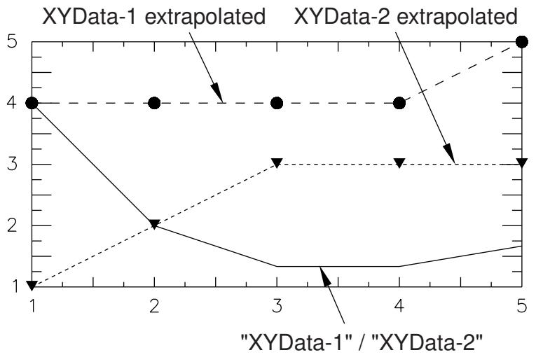  
Figure 1: X–Y plot illustrating division of data objects.

1. Locate the Operate on XY Data dialog box. From the main menu bar, select Tools->XY Data->Create. Click Operate on XY data in the dialog box that appears; then click Continue. The Operate on XY Data dialog box appears.  
2. From the Operators listed, click /. The / symbol appears in the expression window.  
3. To specify each of the two arguments for the / operator, use your mouse and keyboard to position the cursor in the expression window; then do one of the following:

• Use your keyboard to type in a scalar argument, or

From the XY Data choices, click the name of the X–Y data object on which to operate and click Add to Expression. You can choose from all X–Y data objects previously saved within this session (listed alphabetically in the XY Data field).

The arguments appear within the expression window.

4. To continue to build your expression, position the cursor in the expression window and type in or select the functions, operators, and X–Y data you want to include.  
5. To evaluate and display your expression, click Plot Expression.  
6. To save your new X–Y data object, click Save As and then provide a name in the dialog box that appears.

Saving your data object makes it available for future operations within this session and for inclusion in X–Y plots containing multiple data objects.

7. When you are finished, click Cancel to close the dialog box.

## Additional information

• Understanding X–Y data interpolation and extrapolation  
• Using X–Y data operations

## Taking the absolute value of an X–Y data object

Use the abs function to operate on a previously savedX–Y data object (a collection of ordered pairs) to produce a new X–Y data object. The new X–Y data object has the same X-coordinate values as the original X–Y data object, but new Y-coordinates are computed as the absolute value of the original Y-coordinates.

Figure 1 shows an example of an X–Y plot produced using the abs function.  
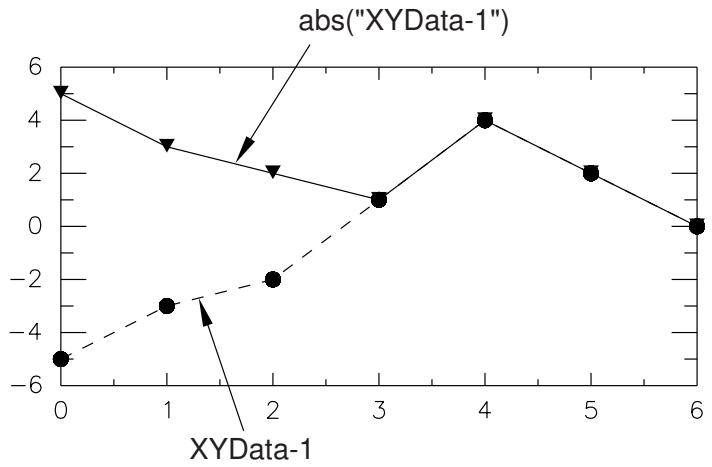  
Figure 1: X–Y plot produced using the abs function.

1. Locate the Operate on XY Data dialog box.  
From the main menu bar, select Tools->XY Data->Create. Click Operate on XY data in the dialog box that appears; then click Continue. The Operate on XY Data dialog box appears.  
2. From the Operators listed, click abs(A).  
The abs function appears in the expression window.  
3. From the XY Data choices, click the name of the X–Y data object on which to operate and click Add to Expression. You can choose from all X–Y data objects previously saved within this session (listed alphabetically in the XY Data field).  
The X–Y data object name appears within the abs function parentheses in the expression window.  
4. To continue to build your expression, position the cursor in the expression window and type in or select the functions, operators, and X–Y data you want to include.  
5. To evaluate and display your expression, click Plot Expression.  
6. To save your new X–Y data object, click Save As and then provide a name in the dialog box that appears.  
Saving your data object makes it available for future operations within this session and for inclusion in X–Y plots containing multiple data objects.  
7. When you are finished, click Cancel to close the dialog box.

## Additional information

• Using X–Y data operations

Use the avg function to operate on two or more previously savedX–Y data objects (each object is a collection of ordered pairs) to produce a new X–Y data object. The new X–Y data object has as its X-coordinates all X-coordinates of the input data objects and any additional X-coordinates needed for alignment of the input data objects. Abaqus/CAE computes additional X–Y data pairs by interpolation and extrapolation. Abaqus/CAE computes the new data object Y-coordinates as the average of all input Y-coordinates at the current X-coordinate. The arguments of this operation are commutative.

Figure 1 illustrates the type of X–Y plot that can be produced using the avg function.  
  
Figure 1: X–Y plot produced using the avg function.

For information on how to find the current average of a single X–Y data object, see Finding the current average of an X–Y data object.

1. Locate the Operate on XY Data dialog box.  
From the main menu bar, select Tools->XY Data->Create. Click Operate on XY data in the dialog box that appears; then click Continue. The Operate on XY Data dialog box appears.  
2. From the Operators listed, click avg(X,X,...).  
The avg function appears in the expression window.  
3. From the XY Data choices, click the names of two or more X–Y data objects on which to operate and click Add to Expression. You can choose from all X–Y data objects previously saved within this session (listed alphabetically in the XY Data field).  
The X–Y data object names appear, separated by commas, within the avg function parentheses in the expression window.  
4. To continue to build your expression, position the cursor in the expression window and type in or select the functions, operators, and X–Y data you want to include.  
5. To evaluate and display your expression, click Plot Expression.  
6. To save your new X–Y data object, click Save As and then provide a name in the dialog box that appears.  
Saving your data object makes it available for future operations within this session and for inclusion in X–Y plots containing multiple data objects.

7. When you are finished, click Cancel to close the dialog box.

## Additional information

• Finding the current average of an X–Y data object  
• Using X–Y data operations

Use the currentAvg function to operate on a previously savedX–Y data object (a collection of ordered pairs) to produce a new X–Y data object. The new X–Y data object has the same X-coordinate values as the original X–Y data object, but new Y-coordinates are computed as the average of all Y-coordinates up to and including the current X-coordinate.

Figure 1 shows an example of an X–Y plot produced using the currentAvg function.

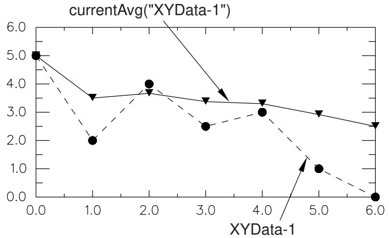  
Figure 1: X–Y plot produced using the currentAvg function.


## Note:

The last value of the new X–Y data object represents the overall average Y-coordinate of the original X–Y data object.

For information on how to find the current average of two or more X–Y data objects, see Finding the average of two or more X–Y data objects.

1. Locate the Operate on XY Data dialog box.  
From the main menu bar, select Tools->XY Data->Create. Click Operate on XY data in the dialog box that appears; then click Continue. The Operate on XY Data dialog box appears.  
2. From the Operators listed, click currentAvg(X).  
The currentAvg function appears in the expression window.  
3. From the XY Data choices, click the name of the X–Y data object on which to operate and click Add to Expression. You can choose from all X–Y data objects previously saved within this session (listed alphabetically in the XY Data field).  
The X–Y data object name appears within the currentAvg function parentheses in the expression window.  
4. To continue to build your expression, position the cursor in the expression window and type in or select the functions, operators, and X–Y data you want to include.  
5. To evaluate and display your expression, click Plot Expression.  
6. To save your new X–Y data object, click Save As and then provide a name in the dialog box that appears.  
Saving your data object makes it available for future operations within this session and for inclusion in X–Y plots containing multiple data objects.

7. When you are finished, click Cancel to close the dialog box.

## Additional information

• Finding the average of two or more X–Y data objects  
• Using X–Y data operations

Use the differentiate function to operate on a previously savedX–Y data object (a collection of ordered pairs) to produce a new X–Y data object. The new X–Y data object has the same X-coordinate values as the original X–Y data object, but new Y-coordinates are computed as the numerical derivative of the original Y-coordinates.

Abaqus/CAE computes the derivative using three-point parabolic segments of the original X–Y data object. The values at the first and last points are computed as the gradient at the start and at the end of the associated parabolas, respectively. The slope at each remaining point is computed using the midpoint of the parabola defined by two neighboring points.

Figure 1 shows an example of an X–Y plot produced using the differentiate function.

  
Figure 1: X–Y plot produced using the differentiate function.

1. Locate the Operate on XY Data dialog box.  
From the main menu bar, select Tools->XY Data->Create. Click Operate on XY data in the dialog box that appears; then click Continue. The Operate on XY Data dialog box appears.  
2. From the Operators listed, click differentiate(X).  
The differentiate function appears in the expression window.  
3. From the XY Data choices, click the name of the X–Y data object on which to operate and click Add to Expression. You can choose from all X–Y data objects previously saved within this session (listed alphabetically in the XY Data field).  
The X–Y data object name appears within the differentiate function parentheses in the expression window.  
4. To continue to build your expression, position the cursor in the expression window and type in or select the functions, operators, and X–Y data you want to include.  
5. To evaluate and display your expression, click Plot Expression.  
6. To save your new X–Y data object, click Save As and then provide a name in the dialog box that appears.  
Saving your data object makes it available for future operations within this session and for inclusion in X–Y plots containing multiple data objects.  
7. When you are finished, click Cancel to close the dialog box.

## Additional information

• Integrating an X–Y data object

• Using X–Y data operations

Use the fit function to operate on a previously savedX–Y data object (a collection of ordered pairs) to produce a new X–Y data object. The new X–Y data object contains points that are spaced at regular intervals along the curve that best fits the previously saved X–Y data object. The fit function provides two algorithms for curve fitting: a linear least squares fit and a spline interpolation.

Figure 1 and Figure 2 show examples of X–Y plots produced using the fit function using each curve fitting algorithm.

  
Figure 1: X–Y plot produced using the fit function with the linear least squares option selected.

  
Figure 2: X–Y plot produced using the fit function with the spline interpolation option selected.

1. Locate the Operate on XY Data dialog box.  
From the main menu bar, select Tools->XY Data->Create. Click Operate on XY data in the dialog box that appears; then click Continue. The Operate on XY Data dialog box appears.  
2. From the Operators listed, click fit(X).  
The fit function appears in the expression window with the linear least squares fit option selected by default.  
3. From the XY Data choices, click the name of the X–Y data object on which to operate and click Add to Expression. You can choose from all X–Y data objects previously saved within this session (listed alphabetically in the XY Data field).  
The X–Y data object name appears within the fit function parentheses in the expression window.

4. To continue to build your expression, position the cursor in the expression window and type in or select the functions, operators, and X–Y data you want to include. You can customize the fit function itself by including the following changes to its options:

• If you want to perform a spline interpolation, set the typeOfFit option to SPLINE\_INTERPOLATION.  
If you want to specify a custom number of points to be created for the new X–Y data object, append numFitPoints=number. By default, Abaqus/CAE uses 2 points to define a linear least squares fit and 100 points to define a spline interpolation.

5. To evaluate and display your expression, click Plot Expression.

6. To save your new X–Y data object, click Save As and then provide a name in the dialog box that appears.

Saving your data object makes it available for future operations within this session and for inclusion in X–Y plots containing multiple data objects.

7. When you are finished, click Cancel to close the dialog box.

## Additional information

• Integrating an X–Y data object  
• Using X–Y data operations

Use the integrate function to operate on a previously savedX–Y data object (a collection of ordered pairs) to produce a new X–Y data object. The new X–Y data object has the same X-coordinate values as the original X–Y data object, but new Y-coordinates are computed as the numerical integral (using the trapezoidal rule) of the original Y-coordinates.

Figure 1 shows an example of an X–Y plot produced using the integrate function.

  
Figure 1: X–Y plot produced using the integrate function.

1. Locate the Operate on XY Data dialog box.  
From the main menu bar, select Tools->XY Data->Create. Click Operate on XY data in the dialog box that appears; then click Continue. The Operate on XY Data dialog box appears.  
2. From the Operators listed, click integrate(X).  
The integrate function appears in the expression window.  
3. From the XY Data choices, click the name of the X–Y data object on which to operate and click Add to Expression. You can choose from all X–Y data objects previously saved within this session (listed alphabetically in the XY Data field).  
The X–Y data object name appears within the integrate function parentheses in the expression window.  
4. To continue to build your expression, position the cursor in the expression window and type in or select the functions, operators, and X–Y data you want to include.  
5. To evaluate and display your expression, click Plot Expression.  
6. To save your new X–Y data object, click Save As and then provide a name in the dialog box that appears.  
Saving your data object makes it available for future operations within this session and for inclusion in X–Y plots containing multiple data objects.  
7. When you are finished, click Cancel to close the dialog box.

## Additional information

• Differentiating an X–Y data object  
• Using X–Y data operations

## Interpolating an X–Y data object

Use the interpolate function to operate on a previously savedX–Y data object (a collection of ordered pairs) to produce a new X–Y data object. Interpolating an X–Y data object with nonuniform data produces an X–Y data object with new, interpolated Y-coordinate values occurring at regular increments on the X-axis. By default, the data are interpolated at increments equal to the smallest X-increment in the source data.

Figure 1 shows an example of an X–Y plot produced using the interpolate function, superimposed over the raw data.  
  
Figure 1: X–Y plot produced using the interpolate function.

The name of the X–Y data object is the only required argument for the interpolate function. A description of the optional arguments follows:

• The X-axis increment between interpolated data points (xIncrement). If you do not specify a value for this argument or if you specify a non-positive value, Abaqus/CAE uses the minimum X-increment of the raw data set.  
A symbolic constant that specifies the interpolation scheme (interpolation). Valid values for this argument are QUADRATIC, specifying a Lagrange second-order interpolation scheme; CUBIC\_SPLINE, specifying a cubic spline interpolation scheme; and LINEAR, specifying a linear interpolation scheme. The default value is QUADRATIC.  
• The slope of the raw data curve leading up to the first data point (startslope). This argument's default value is 0.0 (for a level slope), and it is used only when interpolation=CUBIC\_SPLINE.  
• The slope of the raw data curve continuing past the final data point (endslope). This argument's default value is 0.0 (for a level slope), and it is used only when interpolation=CUBIC\_SPLINE.

1. Locate the Operate on XY Data dialog box.

From the main menu bar, select Tools->XY Data->Create. Click Operate on XY data in the dialog box that appears; then click Continue. The Operate on XY Data dialog box appears.

2. From the Operators listed, click interpolate(X).  
The interpolate function appears in the expression window.  
3. From the XY Data choices, click the name of the X–Y data object on which to operate and click Add to Expression. You can choose from all X–Y data objects previously saved within this session (listed alphabetically in the XY Data field).  
The X–Y data object name appears within the interpolate function parentheses in the expression window.  
4. To continue to build your expression, position the cursor in the expression window and type in or select the functions, operators, and X–Y data you want to include.  
5. To evaluate and display your expression, click Plot Expression.  
6. To save your new X–Y data object, click Save As and then provide a name in the dialog box that appears.

Saving your data object makes it available for future operations within this session and for inclusion in X–Y plots containing multiple data objects.

7. When you are finished, click Cancel to close the dialog box.

## Additional information

• Using X–Y data operations

## Linearizing an X–Y data object

Use the linearize function to separate the Y-values of a previously savedX–Y data object (a collection of ordered pairs) into constant or linear components. The new X–Y data object produced by the linearize function contains exactly two points.

Figure 1 shows an example of an X–Y plot produced using the linearize function.

linearize("XYData-1," LINEAR)

  
Figure 1: X–Y plot produced using both the constant and linear forms of the linearize function.


## Note:

The X-values of the X–Y data object that you input to the linearize function must be equally spaced.

1. Locate the Operate on XY Data dialog box.  
From the main menu bar, select Tools->XY Data->Create. Click Operate on XY data in the dialog box that appears; then click Continue. The Operate on XY Data dialog box appears.  
2. From the Operators listed, click either linearize(X, CONSTANT) or linearize(X, LINEAR) to apply linearization to create a constant Y term or to linearize the Y term, respectively.  
The linearize function appears in the expression window.  
3. From the XY Data choices, click the name of the X–Y data object on which to operate and click Add to Expression. You can choose from all X–Y data objects previously saved within this session (listed alphabetically in the XY Data field).  
The X–Y data object name appears within the linearize function parentheses in the expression window.  
4. To continue to build your expression, position the cursor in the expression window and type in or select the functions, operators, and X–Y data you want to include.  
5. To evaluate and display your expression, click Plot Expression.  
6. To save your new X–Y data object, click Save As and then provide a name in the dialog box that appears.  
Saving your data object makes it available for future operations within this session and for inclusion in X–Y plots containing multiple data objects.

7. When you are finished, click Cancel to close the dialog box.

## Additional information

• Using X–Y data operations

## Normalizing an X–Y data object

Use the normalize function to operate on a previously savedX–Y data object (a collection of ordered pairs) to produce a new X–Y data object. This operation is analogous to normalizing a vector. The new X–Y data object has the same X-coordinate values as the original X–Y data object. Abaqus/CAE computes the new Y-coordinates by dividing each original Y-coordinate by the root mean square (the square root of the sum of the squares) of all original Y-coordinate values.

Figure 1 illustrates the type of X–Y plot that can be produced by using the normalize function.

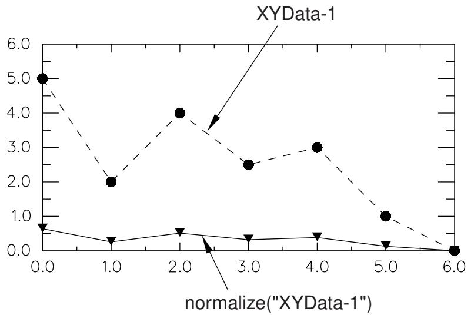  
Figure 1: X–Y plot produced using the normalize function.

1. Locate the Operate on XY Data dialog box.  
From the main menu bar, select Tools->XY Data->Create. Click Operate on XY data in the dialog box that appears; then click Continue. The Operate on XY Data dialog box appears.  
2. From the Operators listed, click normalize(X).  
The normalize function appears in the expression window.  
3. From the XY Data choices, click the name of the X–Y data object on which to operate and click Add to Expression. You can choose from all X–Y data objects previously saved within this session (listed alphabetically in the XY Data field).  
The X–Y data object name appears within the normalize function parentheses in the expression window.  
4. To continue to build your expression, position the cursor in the expression window and type in or select the functions, operators, and X–Y data you want to include.  
5. To evaluate and display your expression, click Plot Expression.  
6. To save your new X–Y data object, click Save As and then provide a name in the dialog box that appears.  
Saving your data object makes it available for future operations within this session and for inclusion in X–Y plots containing multiple data objects.  
7. When you are finished, click Cancel to close the dialog box.

## Additional information

• Taking the square root of the sum of the squares of two or more X–Y data objects  
• Using X–Y data operations

Use the sqrt function to operate on a previously savedX–Y data object (a collection of ordered pairs) to produce a new X–Y data object. The new X–Y data object has the same X-coordinate values as the original X–Y data object, but new Y-coordinates are computed as the square root of the original Y-coordinates.

Figure 1 provides an example of an X–Y plot produced using the sqrt function.

  
Figure 1: X–Y plot produced using the sqrt function.

1. Locate the Operate on XY Data dialog box.  
From the main menu bar, select Tools->XY Data->Create. Click Operate on XY data in the dialog box that appears; then click Continue. The Operate on XY Data dialog box appears.  
2. From the Operators listed, click sqrt(A).  
The sqrt function appears in the expression window.  
3. From the XY Data choices, click the name of the X–Y data object on which to operate and click Add to Expression. You can choose from all X–Y data objects previously saved within this session (listed alphabetically in the XY Data field).  
The X–Y data object name appears within the sqrt function parentheses in the expression window.  
4. To continue to build your expression, position the cursor in the expression window and type in or select the functions, operators, and X–Y data you want to include.  
5. To evaluate and display your expression, click Plot Expression.  
6. To save your new X–Y data object, click Save As and then provide a name in the dialog box that appears.  
Saving your data object makes it available for future operations within this session and for inclusion in X–Y plots containing multiple data objects.  
7. When you are finished, click Cancel to close the dialog box.

## Additional information

• Taking the square root of the sum of the squares of two or more X–Y data objects  
• Using X–Y data operations

## Taking the square root of the sum of the squares of two or more X–Y data objects

Use the srss function to perform a square root of the sum of the squares operation on two or more previously savedX–Y data objects (each object is a collection of ordered pairs) to produce a new X–Y data object. Use this function, for example, to find the total magnitude of two or more X–Y data objects at matching X-coordinates.

The new X–Y data object has as its X-coordinates all X-coordinates of the first data object and any additional X-coordinates needed for alignment of the remaining objects. Abaqus/CAE computes additional X–Y data pairs by interpolation and extrapolation. The new data object has as its Y-coordinates the square root of the sum of the squares of all input X–Y data object Y-coordinates at matching X-coordinates. The arguments to this function are commutative.

Figure 1 illustrates the type of X–Y plot that can be produced using the srss function.

  
Figure 1: X–Y plot produced using the srss function.

1. Locate the Operate on XY Data dialog box.  
From the main menu bar, select Tools->XY Data->Create. Click Operate on XY data in the dialog box that appears; then click Continue. The Operate on XY Data dialog box appears.  
2. From the Operators listed, click srss(X,X,...).  
The srss function appears in the expression window.  
3. From the XY Data choices, click the names of two or more X–Y data objects on which to operate and click Add to Expression. You can choose from all X–Y data objects previously saved within this session (listed alphabetically in the XY Data field).  
The X–Y data object names appear, separated by commas, within the srss function parentheses in the expression window.  
4. To continue to build your expression, position the cursor in the expression window and type in or select the functions, operators, and X–Y data you want to include.  
5. To evaluate and display your expression, click Plot Expression.  
6. To save your new X–Y data object, click Save As and then provide a name in the dialog box that appears.  
Saving your data object makes it available for future operations within this session and for inclusion in X–Y plots containing multiple data objects.

7. When you are finished, click Cancel to close the dialog box.

## Additional information

• Understanding X–Y data interpolation and extrapolation  
• Taking the square root of an X–Y data object  
• Normalizing an X–Y data object  
• Using X–Y data operations

## Summing two or more X–Y data objects

Use the sum function to operate on two or more previously savedX–Y data objects (each object is a collection of ordered pairs) to produce a new X–Y data object. The sum function accepts two or more commutative arguments.


## Note:

This function has the same behavior as the + symbol. For more information, see Using addition on X–Y data objects.

1. Locate the Operate on XY Data dialog box.  
From the main menu bar, select Tools->XY Data->Create. Click Operate on XY data in the dialog box that appears; then click Continue. The Operate on XY Data dialog box appears.  
2. From the Operators listed, click sum(A,A,...).  
The sum function appears in the expression window.  
3. From the XY Data choices, click the names of two or more X–Y data objects to sum together and click Add to Expression. You can choose from all X–Y data objects previously saved within this session (listed alphabetically in the XY Data field).  
The X–Y data object names appear, separated by commas, within the sum function parentheses in the expression window.  
4. To continue to build your expression, position the cursor in the expression window and type in or select the functions, operators, and X–Y data you want to include.  
5. To evaluate and display your expression, click Plot Expression.  
6. To save your new X–Y data object, click Save As and then provide a name in the dialog box that appears.  
Saving your data object makes it available for future operations within this session and for inclusion in X–Y plots containing multiple data objects.  
7. When you are finished, click Cancel to close the dialog box.

## Additional information

• Using addition on X–Y data objects  
• Appending two or more X–Y data objects  
• Combining two X–Y data objects  
• Using X–Y data operations

Use the vectorMagnitude function to perform a square root of the sum of the squares operation on at most three previously savedX–Y data objects (each object is a collection of ordered pairs) to produce a new X–Y data object. This function is essentially identical to the srss function (see Taking the square root of the sum of the squares of two or more X–Y data objects) except that the operation can be performed on at most three data objects. You can use this function to plot the total magnitude of a vector by calculating the square root of the sums of the squares of the three vector components.

The new X–Y data object has as its X-coordinates all X-coordinates of the first data object and any additional X-coordinates needed for alignment of the remaining objects. Abaqus/CAE computes additional X–Y data pairs by interpolation and extrapolation. The new data object has as its Y-coordinates the square root of the sum of the squares of all input X–Y data object Y-coordinates at matching X-coordinates. The arguments to this function are commutative.

Figure 1 illustrates the type of X–Y plot that can be produced using the vectorMagnitude function.

vectorMagnitude("XYData-1","XYData-2","XYData-3")

  
Figure 1: X–Y plot produced using the vectorMagnitude function.

1. Locate the Operate on XY Data dialog box.  
From the main menu bar, select Tools->XY Data->Create. Click Operate on XY data in the dialog box that appears; then click Continue. The Operate on XY Data dialog box appears.  
2. From the Operators listed, click vectorMagnitude(X,X,X).  
The vectorMagnitude function appears in the expression window.  
3. From the XY Data choices, click the names of three X–Y data objects on which to operate and click Add to Expression. You can choose from all X–Y data objects previously saved within this session (listed alphabetically in the XY Data field).  
The X–Y data object names appear, separated by commas, within the vectorMagnitude function parentheses in the expression window.

4. To continue to build your expression, position the cursor in the expression window and type in or select the functions, operators, and X–Y data you want to include.  
5. To evaluate and display your expression, click Plot Expression.  
6. To save your new X–Y data object, click Save As and then provide a name in the dialog box that appears.

Saving your data object makes it available for future operations within this session and for inclusion in X–Y plots containing multiple data objects.

7. When you are finished, click Cancel to close the dialog box.

## Additional information

• Understanding X–Y data interpolation and extrapolation  
• Taking the square root of an X–Y data object  
• Normalizing an X–Y data object  
• Using X–Y data operations

## Applying trigonometric functions to an X–Y data object

Use the trigonometric functions cos, cosh, acos, sin, sinh, asin, tan, tanh, and atan to operate on a previously savedX–Y data object (a collection of ordered pairs) to produce a new X–Y data object. The new X–Y data object has the same X-coordinate values as the original X–Y data object, but new Y-coordinates are computed as the trigonometric function value of each original Y-coordinate. Arguments to trigonometric functions are assumed to be in radians.

For example, if

$$
\mathrm{XYData} = [ (0, 0), (1, 1. 5 7 1), (2, 3. 1 4) ],
$$

then

$$
\sin (\text {XYData}) = [ (0, 0), (1, 1), (2, 0. 0 0 1 5 9) ].
$$

Figure 1 shows an X–Y plot of the above example.  
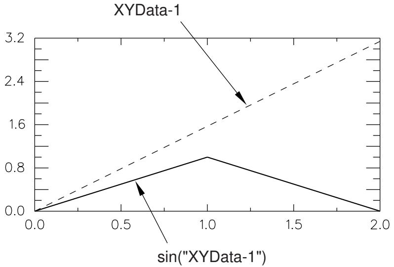  
Figure 1: X–Y plot produced using the sin function.  
1. Locate the Operate on XY Data dialog box.

From the main menu bar, select Tools->XY Data->Create. Click Operate on XY data in the dialog box that appears; then click Continue. The Operate on XY Data dialog box appears.

2. From the Operators listed, click one of the following trigonometric functions:

<table><tr><td>sin(A)</td><td>To compute the sine of your X-Y data object.</td></tr><tr><td>sinh(A)</td><td>To compute the hyperbolic sine of your X-Y data object.</td></tr><tr><td>asin(A)</td><td>To compute the arcsine of your X-Y data object. Your Y-data values must be in the range [-1, 1].</td></tr><tr><td>cos(A)</td><td>To compute the cosine of your X-Y data object.</td></tr><tr><td>cosh(A)</td><td>To compute the hyperbolic cosine of your X-Y data object.</td></tr><tr><td>acos(A)</td><td>To compute the arccosine of your X-Y data object. Your Y-data values must be in the range [-1, 1].</td></tr><tr><td>tan(A)</td><td>To compute the tangent of your X-Y data object.</td></tr><tr><td>tanh(A)</td><td>To compute the hyperbolic tangent of your X-Y data object.</td></tr><tr><td>atan(A)</td><td>To compute the arctangent of your X-Y data object.</td></tr></table>

The trigonometric function you choose appears in the expression window.

3. From the XY Data choices, click the name of the X–Y data object on which to operate and click Add to Expression. You can choose from all X–Y data objects previously saved within this session (listed alphabetically in the XY Data field).  
The X–Y data object name appears within the trigonometric function parentheses in the expression window.  
4. To continue to build your expression, position the cursor in the expression window and type in or select the functions, operators, and X–Y data you want to include.  
5. To evaluate and display your expression, click Plot Expression.  
6. To save your new X–Y data object, click Save As and then provide a name in the dialog box that appears.

Saving your data object makes it available for future operations within this session and for inclusion in X–Y plots containing multiple data objects.

7. When you are finished, click Cancel to close the dialog box.

## Additional information

• Converting the angular units used for X–Y data objects  
• Using X–Y data operations

Use the exp function to operate on a previously savedX–Y data object (a collection of ordered pairs) to produce a new X–Y data object. The new X–Y data object has the same X-coordinate values as the original X–Y data object, but new Y-coordinates are computed as the exponential of the original Y-coordinates.

Figure 1 shows an example of an X–Y plot produced by using the exp function.

  
Figure 1: X–Y plot produced using the exp function.

1. Locate the Operate on XY Data dialog box.  
From the main menu bar, select Tools->XY Data->Create. Click Operate on XY data in the dialog box that appears; then click Continue. The Operate on XY Data dialog box appears.  
2. From the Operators listed, click exp(A).  
The exp function appears in the expression window.  
3. From the XY Data choices, click the name of the X–Y data object on which to operate and click Add to Expression. You can choose from all X–Y data objects previously saved within this session (listed alphabetically in the XY Data field).  
The X–Y data object name appears within the exp function parentheses in the expression window.  
4. To continue to build your expression, position the cursor in the expression window and type in or select the functions, operators, and X–Y data you want to include.  
5. To evaluate and display your expression, click Plot Expression.  
6. To save your new X–Y data object, click Save As and then provide a name in the dialog box that appears.  
Saving your data object makes it available for future operations within this session and for inclusion in X–Y plots containing multiple data objects.  
7. When you are finished, click Cancel to close the dialog box.

## Additional information

• Raising an X–Y data object to a power  
• Using X–Y data operations

## Applying logarithmic functions to an X–Y data object

Use the logarithmic functions log and log10 to operate on a previously savedX–Y data object (a collection of ordered pairs) to produce a new X–Y data object. The new X–Y data object has the same X-coordinate values as the original X–Y data object, but new Y-coordinates are computed as the logarithmic function value of each original Y-coordinate. For example, if

$$
\mathrm{XYData} = [ (1, 1), (2, 2. 7 1), (3, 7. 3 9) ],
$$

then

$$
\log (\text {XYData}) = [ (1, 0), (2, 1. 0), (3, 2. 0) ].
$$

Figure 1 illustrates the above example.  
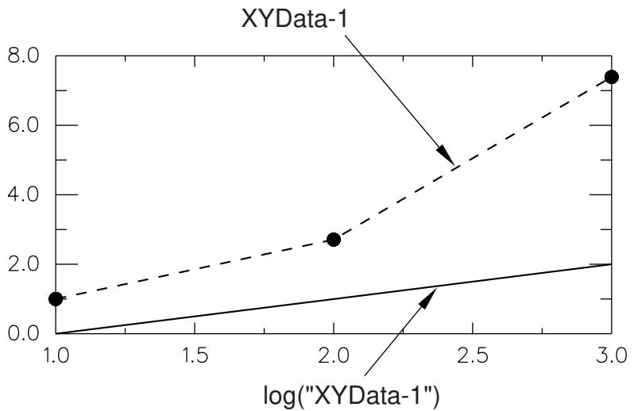  
Figure 1: X–Y plot produced using the log function.

1. Locate the Operate on XY Data dialog box.  
From the main menu bar, select Tools->XY Data->Create. Click Operate on XY data in the dialog box that appears; then click Continue. The Operate on XY Data dialog box appears.  
2. From the Operators listed, click either log(A) or log10(A) to apply the natural log or base 10 log function, respectively.  
The logarithmic function you choose appears in the expression window.  
3. From the XY Data choices, click the name of the X–Y data object on which to operate and click Add to Expression. You can choose from all X–Y data objects previously saved within this session (listed alphabetically in the XY Data field).  
The X–Y data object name appears within the logarithmic function parentheses in the expression window.  
4. To continue to build your expression, position the cursor in the expression window and type in or select the functions, operators, and X–Y data you want to include.  
5. To evaluate and display your expression, click Plot Expression.  
6. To save your new X–Y data object, click Save As and then provide a name in the dialog box that appears.  
Saving your data object makes it available for future operations within this session and for inclusion in X–Y plots containing multiple data objects.

7. When you are finished, click Cancel to close the dialog box.

## Additional information

• Using X–Y data operations

## Raising an X–Y data object to a power

Use the power function to operate on a previously savedX–Y data object (a collection of ordered pairs) to produce a new X–Y data object. The power function requires two arguments, at least one of which must be an X–Y data object. This function can be applied in three ways:

## To raise a scalar to an X–Y data object: power(scalar, data object name).

This method yields a new X–Y data object having the same X-coordinate values as the original X–Y data object. Abaqus/CAE computes the new Y-coordinates as the scalar raised to the power of each original Y-coordinate. For example, if

$$
\mathrm{XYData} = [ (1, 1), (2, 2), (3, 3) ],
$$

then

$$
\mathrm{power} (2, \mathrm{XYData}) = [ (1, 2), (2, 4), (3, 8) ].
$$

## To raise an X–Y data object to a scalar: power(data object name, scalar).

This method yields a new X–Y data object having the same X-coordinate values as the original X–Y data object. Abaqus/CAE computes the new Y-coordinates as each original Y-coordinate raised to the scalar. For example, if

$$
\mathrm{XYData} = [ (2, - 2), (3, 3), (4, - 4) ],
$$

then

$$
\mathrm{power} (\mathrm{XYData}, 2) = [ (2, 4), (3, 9), (4, 1 6) ].
$$

## To raise an X–Y data object to another X–Y data object: power(data object name, data object name).

This method yields a new X–Y data object having as its X-coordinates all X-coordinates of the first data object and any additional X-coordinates needed for alignment of the two objects. Abaqus/CAE computes additional X–Y data pairs by interpolation and extrapolation. The new data object has as its Y-coordinates the Y-coordinates of the first data object raised to the Y-coordinates of the second data object. For example, let

$$
\text {XYData1} = [ (1, 1), (2, 2), (4, 2), (5, 1) ],
$$

and

$$
\mathrm{XYData2} = [ (0, 1), (3, 2), (5, 6) ].
$$

For alignment, Abaqus/CAE computes the values of the first and second data objects as:

$$
\text {XYData1 extrapolated} = [ (0, 1), (1, 1), (2, 2), (3, 2), (4, 2), (5, 1) ],
$$

and

$$
\text {XYData2 extrapolated} = [ (0, 1), (1, 1. 3 3), (2, 1. 6 6), (3, 2), (4, 4), (5, 6) ];
$$

then

$$
\operatorname{power} (\text {XYData1}, \text {XYData2}) = [ (0, 1), (1, 1), (2, 3. 1 7), (3, 4), (4, 1 6), (5, 1) ].
$$

Figure 1 shows a plot of the above example.

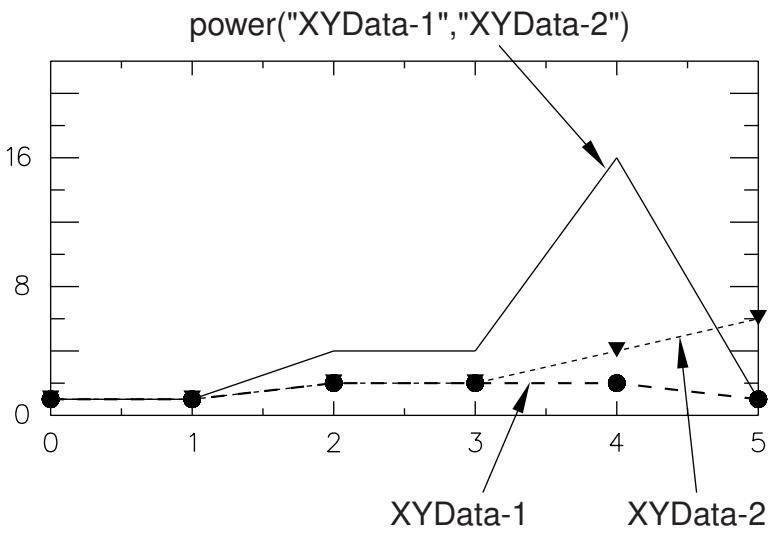  
Figure 1: X–Y plot of one data object raised to another data object.

1. Locate the Operate on XY Data dialog box.  
From the main menu bar, select Tools->XY Data->Create. Click Operate on XY data in the dialog box that appears; then click Continue. The Operate on XY Data dialog box appears.

2. From the Operators listed, click power(A,A).

The power function appears in the expression window.

3. From the XY Data choices, click the name of the X–Y data object on which to operate and click Add to Expression. You can choose from all X–Y data objects previously saved within this session (listed alphabetically in the XY Data field).

The X–Y data object name appears within the power function parentheses in the expression window.

4. To specify the next argument, do one of the following:

Use your mouse and keyboard to enter a scalar as either the first or second argument of the power function in the expression window, depending on the operation you want to perform, and to separate the two arguments with a comma, or  
• From the XY Data choices, click the name of a data object argument for the power function in the expression window and click Add to Expression.

5. To continue to build your expression, position the cursor in the expression window and type in or select the functions, operators, and X–Y data you want to include.  
6. To evaluate and display your expression, click Plot Expression.  
7. To save your new X–Y data object, click Save As and then provide a name in the dialog box that appears.

Saving your data object makes it available for future operations within this session and for inclusion in X–Y plots containing multiple data objects.

8. When you are finished, click Cancel to close the dialog box.

## Additional information

• Taking the exponential of an X–Y data object  
• Understanding X–Y data interpolation and extrapolation  
• Using X–Y data operations

## Applying Butterworth filtering to an X–Y data object

Use the butterworthFilter function to apply a Butterworth filtering operation to a previously savedX–Y data object (a collection of ordered pairs) to produce a new X–Y data object. This filtering operation can be used, for example, to remove high-frequency noise.

The transfer function of a Butterworth filter is shown in Filtering Output and Operating on Output in Abaqus/Explicit.

Figure 1 illustrates the type of X–Y plot that can be produced using the butterworthFilter operation.

  
Figure 1: X–Y plot produced using the butterworthFilter operation.

The butterworthFilter function requires two arguments: the name of the X–Y data object (name) and the cutoff frequency (cutoffFrequency), which is the frequency above which the filter attenuates at least half of the input signal. A description of the optional arguments follows:

• The order of the filter you want to use (filterOrder). This argument must be a positive, even integer value; the default value is 2.  
A symbolic constant specifying the method for computation of the projection and pre-charge to be applied at the start of the data signal (startCondition). Valid values for this argument are ZERO, which applies a constant projection and pre-charge of zero; CONSTANT, which applies a constant projection and pre-charge equal to the first data point in the X–Y data object; MIRROR, which applies a projection and pre-charge equivalent to reflecting the X–Y data object about a vertical line passing through the first data point; REVERSE\_MIRROR, which applies a projection and pre-charge equivalent to reflecting the X–Y data object about both a vertical line and a horizontal line passing through the first data point; and TANGENTIAL, which applies a linear projection and pre-charge that is tangential to the first two data points. The default value is CONSTANT.  
A symbolic constant specifying the method for computation of the projection and pre-charge to be applied at the end of the data signal (endCondition). Valid values for this argument are ZERO, which applies a constant projection and pre-charge of zero; CONSTANT, which applies a constant projection and pre-charge equal to the last data point in the X–Y data object; MIRROR, which applies a projection and pre-charge equivalent to reflecting the X–Y data object about a vertical line passing through the last data point; REVERSE\_MIRROR, which applies a projection and pre-charge equivalent to reflecting the X–Y data object about both a vertical line and a horizontal line passing

through the last data point; and TANGENTIAL, which applies a linear projection and pre-charge that is tangential to the last two data points. The default value is CONSTANT.

A symbolic constant that specifies the interpolation scheme (interpolation). Valid values for this argument are QUADRATIC, specifying a Lagrange second-order interpolation scheme; CUBIC\_SPLINE, specifying a cubic spline interpolation scheme; and LINEAR, specifying a linear interpolation scheme. The default value is QUADRATIC.  
• The slope of the raw data curve leading up to the first data point (startslope). This argument's default value is 0.0 (for a level slope), and it is used only when interpolation=CUBIC\_SPLINE.  
• The slope of the raw data curve continuing past the final data point (endslope). This argument's default value is 0.0 (for a level slope), and it is used only when interpolation=CUBIC\_SPLINE.  
• A Boolean specifying whether a backward pass (backwardPass) is to be performed on the filtered data. The default value for this argument is True. When this argument is set to False, the endCondition argument is ignored.

Your X–Y data object must have a constant time step for it to be filtered. If the time step is not constant, Abaqus/CAE computes additional points at constant intervals by interpolation. The constant time step for Butterworth filtering is defined by the smallest time step in the X–Y data object to be filtered.

1. Locate the Operate on XY Data dialog box.  
From the main menu bar, select Tools->XY Data->Create. Click Operate on XY data in the dialog box that appears; then click Continue. The Operate on XY Data dialog box appears.  
2. From the Operators listed, click butterworthFilter(X,F).  
The butterworthFilter function appears in the expression window.  
3. From the XY Data choices, click the name of the X–Y data object on which to operate and click Add to Expression. You can choose from all X–Y data objects previously saved within this session (listed alphabetically in the XY Data field).  
The X–Y data object name appears within the butterworthFilter function parentheses in the expression window.  
4. Position the cursor in the expression window before the second comma, and type in a value for the cutoff frequency.  
5. To continue to build your expression, position the cursor in the expression window and type in or select the functions, operators, and X–Y data you want to include.  
6. To evaluate and display your expression, click Plot Expression.  
7. To save your new X–Y data object, click Save As and then provide a name in the dialog box that appears.  
Saving your data object makes it available for future operations within this session and for inclusion in X–Y plots containing multiple data objects.  
8. When you are finished, click Cancel to close the dialog box.

## Additional information

• Understanding X–Y data interpolation and extrapolation  
• Using X–Y data operations  
• Applying sine-Butterworth filtering to an X–Y data object  
• Smoothing an X–Y data object  
• Filtering Output and Operating on Output in Abaqus/Explicit

## Applying Chebyshev Type I or Type II filtering to an X–Y data object

Use the chebyshev1Filter or chebyshev2Filter function to apply a Chebyshev Type I or Type II filtering operation to a previously savedX–Y data object (a collection of ordered pairs) to produce a new X–Y data object. This filtering operation can be used, for example, to remove high-frequency noise.

The transfer functions of the Chebyshev filters are shown in Filtering Output and Operating on Output in Abaqus/Explicit.

Figure 1 illustrates the type of X–Y plot that can be produced using the chebyshev1Filter operation.

  
Figure 1: X–Y plot produced using the chebyshev1Filter operation.

The chebyshev1Filter and chebyshev2Filter functions use the same syntax and require the same set of arguments. The following arguments are required: the name of the X–Y data object (name); the cutoff frequency (cutoffFrequency), which is the frequency above which the filter attenuates at least half of the input signal; and the ripple factor (rippleFactor), which is a floating point number that indicates how much oscillation you will allow in exchange for an improved filter response. Both Chebyshev Type I and II filtering require a ripple factor greater than 0; in addition, Chebyshev Type II filtering requires the value to be less than 1. Chebyshev Type I filtering does not place any upper bound on the ripple factor value.

The two types of Chebyshev filters differ in where their response ripples occur and in their handling of the ripple factor value; see Filtering Output and Operating on Output in Abaqus/Explicit for a comparison of Type I and Type II Chebyshev output with typical Butterworth filter output.

A description of the optional arguments follows:

• The order of the filter you want to use (filterOrder). This argument must be a positive, even integer value; the default value is 2.  
A symbolic constant specifying the method for computation of the projection and pre-charge to be applied at the start of the data signal (startCondition). Valid values for this argument are ZERO, which applies a constant projection and pre-charge of zero; CONSTANT, which applies a constant projection and pre-charge equal to the first data point in the X–Y data object; MIRROR, which applies a projection and pre-charge equivalent to reflecting the X–Y data object about a vertical line passing through the first data point; REVERSE\_MIRROR, which applies a projection

and pre-charge equivalent to reflecting the X–Y data object about both a vertical line and a horizontal line passing through the first data point; and TANGENTIAL, which applies a linear projection and pre-charge that is tangential to the first two data points. The default value is CONSTANT.

A symbolic constant specifying the method for computation of the projection and pre-charge to be applied at the end of the data signal (endCondition). Valid values for this argument are ZERO, which applies a constant projection and pre-charge of zero; CONSTANT, which applies a constant projection and pre-charge equal to the last data point in the X–Y data object; MIRROR, which applies a projection and pre-charge equivalent to reflecting the X–Y data object about a vertical line passing through the last data point; REVERSE\_MIRROR, which applies a projection and pre-charge equivalent to reflecting the X–Y data object about both a vertical line and a horizontal line passing through the last data point; and TANGENTIAL, which applies a linear projection and pre-charge that is tangential to the last two data points. The default value is CONSTANT.  
A symbolic constant that specifies the interpolation scheme (interpolation). Valid values for this argument are QUADRATIC, specifying a Lagrange second-order interpolation scheme; CUBIC\_SPLINE, specifying a cubic spline interpolation scheme; and LINEAR, specifying a linear interpolation scheme. The default value is QUADRATIC.  
• The slope of the raw data curve leading up to the first data point (startslope). This argument's default value is 0.0 (for a level slope), and it is used only when interpolation=CUBIC\_SPLINE.  
• The slope of the raw data curve continuing past the final data point (endslope). This argument's default value is 0.0 (for a level slope), and it is used only when interpolation=CUBIC\_SPLINE.  
• A Boolean specifying whether a backward pass (backwardPass) is to be performed on the filtered data. The default value for this argument is True. When this argument is set to False, the endCondition argument is ignored.

Your X–Y data object must have a constant time step for it to be filtered. If the time step is not constant, Abaqus/CAE computes additional points at constant intervals by interpolation. The constant time step for Chebyshev Type I or II filtering is defined by the smallest time step in the X–Y data object to be filtered.

1. Locate the Operate on XY Data dialog box.  
From the main menu bar, select Tools->XY Data->Create. Click Operate on XY data in the dialog box that appears; then click Continue. The Operate on XY Data dialog box appears.  
2. From the Operators listed, click chebyshev1Filter(X,F,F) or chebyshev2Filter(X,F,F) for Chebyshev Type I or Type II filtering, respectively.  
The chebyshev1Filter or chebyshev2Filter function appears in the expression window.  
3. From the XY Data choices, click the name of the X–Y data object on which to operate and click Add to Expression. You can choose from all X–Y data objects previously saved within this session (listed alphabetically in the XY Data field).  
The X–Y data object name appears within the chebyshev1Filter or chebyshev2Filter function parentheses in the expression window.  
4. Position the cursor in the expression window before the second comma, and type in a value for the cutoff frequency.  
5. Position the cursor in the expression window before the third comma, and type in a positive value for the ripple factor. For the chebyshev2Filter function, this value must be less than 1.  
6. To continue to build your expression, position the cursor in the expression window and type in or select the functions, operators, and X–Y data you want to include.  
7. To evaluate and display your expression, click Plot Expression.  
8. To save your new X–Y data object, click Save As and then provide a name in the dialog box that appears.  
Saving your data object makes it available for future operations within this session and for inclusion in X–Y plots containing multiple data objects.

9. When you are finished, click Cancel to close the dialog box.

## Additional information

• Understanding X–Y data interpolation and extrapolation  
• Using X–Y data operations  
• Applying sine-Butterworth filtering to an X–Y data object  
• Smoothing an X–Y data object  
• Filtering Output and Operating on Output in Abaqus/Explicit

Use the decimateFilter function to reduce a large, previously savedX–Y data object (a collection of ordered pairs) to a smaller, representative sample. The decimateFilter function is an anti-aliasing filter that selects points at a user-defined sampling frequency to produce a new X–Y data object.

The decimateFilter function requires two arguments: the name of the X–Y data object (name) and the decimation factor (decimationFactor), which is the factor by which the sampling rate is to be increased. The decimation factor must be an integer value greater than 1. The function also accepts an optional argument that specifies the ratio of the new sampling rate to the cutoff frequency used by the decimateFilter function prior to decimation (cutoffFactor). The cutoff factor must be an integer value of 2 or more. The default value is 3.

1. Locate the Operate on XY Data dialog box.  
From the main menu bar, select Tools->XY Data->Create. Click Operate on XY data in the dialog box that appears; then click Continue. The Operate on XY Data dialog box appears.  
2. From the Operators listed, click decimateFilter(X,I).  
The decimateFilter function appears in the expression window.  
3. From the XY Data choices, click the name of the X–Y data object on which to operate and click Add to Expression. You can choose from all X–Y data objects previously saved within this session (listed alphabetically in the XY Data field).  
The X–Y data object name appears within the decimateFilter function parentheses in the expression window.  
4. Position the cursor in the expression window before the second comma, and type in a value for the decimation factor.  
5. If desired, position the cursor in the expression window before the third comma, and type in a value for the cutoff factor.  
6. To evaluate and display your expression, click Plot Expression.  
7. To save your new X–Y data object, click Save As and then provide a name in the dialog box that appears.  
Saving your data object makes it available for future operations within this session and for inclusion in X–Y plots containing multiple data objects.  
8. When you are finished, click Cancel to close the dialog box.

## Additional information

• Using X–Y data operations  
• Smoothing an X–Y data object

## Applying SAE filtering to an X–Y data object

Use one of the SAE filtering functions to apply an SAE filtering operation to a previously savedX–Y data object (a collection of ordered pairs) to produce a new X–Y data object. For example, you can use these functions to remove high-frequency noise.

The SAE filtering operation performs two-pass, zero phase shift, second-order Butterworth filtering. The SAE filtering classes that are allowed in Abaqus/CAE are 60, 100, 180, 600, and 1000, as defined in SAE Standard J211 (OCT88). The Visualization module in Abaqus/CAE uses the Signal Analysis Software obtained from the National Highway Traffic Safety Administration (NHTSA). For more information, see the documentation for the Signal Analysis Software installation kit on the NHTSA website (search for NVS Software Applications on http://www.nhtsa.gov/).

Abaqus/CAE provides the following two types of SAE filtering functions:

• The general operator, saeGeneralFilter, uses a general filtering class and can filter data for a user-specified cutoff frequency.  
Class-specific operators filter for each of the five supported SAE filtering classes: sae60Filter, sae100Filter, sae180Filter, sae600Filter, and sae1000Filter. Because they use a specific filtering class, these operators do not support specification of a cutoff frequency.

Your X–Y data object must have a constant time step for it to be filtered. If the time step is not constant, Abaqus/CAE computes additional points at constant intervals by interpolation. The constant time step for SAE filtering is defined by the smallest time step in the X–Y data object to be filtered.

Figure 1 illustrates the type of X–Y plot that can be produced using the saeGeneralFilter operation.

  
Figure 1: X–Y plot produced using the saeGeneralFilter operation.

The saeGeneralFilter function requires two arguments: the name of the X–Y data object (name) and the cutoff frequency (cutoffFrequency), which is the frequency above which the filter attenuates at least half of the input signal. The

class-specific filters also require two arguments: the name of the X–Y data object (name) and the time scale factor (timeScaleFactor), which is a multiplier for the X-values of the data set being filtered. For example, a value of 1 indicates a time scale of seconds, and a value of 0.001 indicates a time scale of milliseconds.

A description of the optional arguments follows:

A symbolic constant specifying the method for computation of the projection and pre-charge to be applied at the start of the data signal (startCondition). Valid values for this argument are ZERO, which applies a constant projection and pre-charge of zero; CONSTANT, which applies a constant projection and pre-charge equal to the first data point in the X–Y data object; MIRROR, which applies a projection and pre-charge equivalent to reflecting the X–Y data object about a vertical line passing through the first data point; REVERSE\_MIRROR, which applies a projection and pre-charge equivalent to reflecting the X–Y data object about both a vertical line and a horizontal line passing through the first data point; and TANGENTIAL, which applies a linear projection and pre-charge that is tangential to the first two data points. The default value is CONSTANT.  
A symbolic constant specifying the method for computation of the projection and pre-charge to be applied at the end of the data signal (endCondition). Valid values for this argument are ZERO, which applies a constant projection and pre-charge of zero; CONSTANT, which applies a constant projection and pre-charge equal to the last data point in the X–Y data object; MIRROR, which applies a projection and pre-charge equivalent to reflecting the X–Y data object about a vertical line passing through the last data point; REVERSE\_MIRROR, which applies a projection and pre-charge equivalent to reflecting the X–Y data object about both a vertical line and a horizontal line passing through the last data point; and TANGENTIAL, which applies a linear projection and pre-charge that is tangential to the last two data points. The default value is CONSTANT.  
A symbolic constant that specifies the interpolation scheme (interpolation). Valid values for this argument are QUADRATIC, specifying a Lagrange second-order interpolation scheme; CUBIC\_SPLINE, specifying a cubic spline interpolation scheme; and LINEAR, specifying a linear interpolation scheme. The default value is QUADRATIC.  
• The slope of the raw data curve leading up to the first data point (startslope). This argument's default value is 0.0 (for a level slope), and it is used only when interpolation=CUBIC\_SPLINE.  
• The slope of the raw data curve continuing past the final data point (endslope). This argument's default value is 0.0 (for a level slope), and it is used only when interpolation=CUBIC\_SPLINE.  
• A Boolean specifying whether a backward pass (backwardPass) is to be performed on the filtered data. The default value for this argument is True. When this argument is set to False, the endCondition argument is ignored.

Abaqus/CAE refers to the values in the table below to determine the cutoff frequency multiplier (CM) for the class-specific SAE filter operators.

<table><tr><td>SAE class</td><td>Cutoff frequency multiplier (CM)</td></tr><tr><td>60</td><td>100</td></tr><tr><td>100</td><td>165</td></tr><tr><td>180</td><td>300</td></tr><tr><td>600</td><td>1000</td></tr><tr><td>1000</td><td>1650</td></tr></table>

Abaqus/CAE then calculates the cutoff frequency using the cutoff frequency multiplier and the user-specified time scale factor (TSF), as follows:

$$
\text {cutoff frequency} = C M \times T S F
$$

1. Locate the Operate on XY Data dialog box.

From the main menu bar, select Tools->XY Data->Create. Click Operate on XY data in the dialog box that appears; then click Continue. The Operate on XY Data dialog box appears.

2. From the Operators listed, click saeGeneralFilter(X,F) for general SAE filtering or click one of the class-specific SAE filter functions.

Your choice of filtering function appears in the expression window.

3. From the XY Data choices, click the name of the X–Y data object on which to operate and click Add to Expression. You can choose from all X–Y data objects previously saved within this session (listed alphabetically in the XY Data field).

The X–Y data object name appears within the function parentheses in the expression window.

4. If you selected saeGeneralFilter(X,F), position the cursor in the expression window and enter a value for the cutoff frequency.  
5. If you selected a class-specific SAE filter, position the cursor in the expression window and enter a value for the time scale factor.  
6. To continue to build your expression, position the cursor in the expression window and type in or select the functions, operators, and X–Y data you want to include.  
7. To evaluate and display your expression, click Plot Expression.  
8. To save your new X–Y data object, click Save As and then provide a name in the dialog box that appears.

Saving your data object makes it available for future operations within this session and for inclusion in X–Y plots containing multiple data objects.

9. When you are finished, click Cancel to close the dialog box.

## Additional information

• Understanding X–Y data interpolation and extrapolation  
• Using X–Y data operations  
• Applying sine-Butterworth filtering to an X–Y data object  
• Smoothing an X–Y data object

## Applying sine-Butterworth filtering to an X–Y data object

Use the sineButterworthFilter function to apply a sine-Butterworth filtering operation to a previously savedX–Y data object (a collection of ordered pairs) to produce a new X–Y data object. This filtering operation can be used, for example, to remove high-frequency noise.

Abaqus/CAE uses a sine-Butterworth filter whose transfer function $\left| H ( f ) \right| ^ { 2 }$ has the following form:


For the filter to be applied to a curve, the curve must have data points at regularly spaced intervals in time. Therefore, a curve to be filtered is resampled at a given frequency (the sampling frequency). The default sampling frequency will be inadequate for curves containing data with a frequency content that is much higher than the cutoff frequency. Using a very high sampling frequency will create a curve with a very large number of data points.

The sineButterworthFilter requires two arguments: the name of the X–Y data object (name) and the cutoff frequency (cutoffFrequency), which is the frequency above which the filter attenuates at least half of the input signal. A description of the optional arguments follows:

• The order of the filter you want to use (filterOrder). This argument must be a positive, even integer value; the default value is 6.  
A symbolic constant specifying the method for computation of the projection and pre-charge to be applied at the start of the data signal (startCondition). Valid values for this argument are ZERO, which applies a constant projection and pre-charge of zero; CONSTANT, which applies a constant projection and pre-charge equal to the first data point in the X–Y data object; MIRROR, which applies a projection and pre-charge equivalent to reflecting the X–Y data object about a vertical line passing through the first data point; REVERSE\_MIRROR, which applies a projection and pre-charge equivalent to reflecting the X–Y data object about both a vertical line and a horizontal line passing through the first data point; and TANGENTIAL, which applies a linear projection and pre-charge that is tangential to the first two data points. The default value is CONSTANT.  
A symbolic constant specifying the method for computation of the projection and pre-charge to be applied at the end of the data signal (endCondition). Valid values for this argument are ZERO, which applies a constant projection and pre-charge of zero; CONSTANT, which applies a constant projection and pre-charge equal to the last data point in the X–Y data object; MIRROR, which applies a projection and pre-charge equivalent to reflecting the X–Y data object about a vertical line passing through the last data point; REVERSE\_MIRROR, which applies a projection and pre-charge equivalent to reflecting the X–Y data object about both a vertical line and a horizontal line passing through the last data point; and TANGENTIAL, which applies a linear projection and pre-charge that is tangential to the last two data points. The default value is CONSTANT.

A symbolic constant that specifies the interpolation scheme (interpolation). Valid values for this argument are QUADRATIC, specifying a Lagrange second-order interpolation scheme; CUBIC\_SPLINE, specifying a cubic spline interpolation scheme; and LINEAR, specifying a linear interpolation scheme. The default value is QUADRATIC.  
• The slope of the raw data curve leading up to the first data point (startslope). This argument's default value is 0.0 (for a level slope), and it is used only when interpolation=CUBIC\_SPLINE.  
• The slope of the raw data curve continuing past the final data point (endslope). This argument's default value is 0.0 (for a level slope), and it is used only when interpolation=CUBIC\_SPLINE.  
• A Boolean specifying whether a backward pass (backwardPass) is to be performed on the filtered data. The default value for this argument is True. When this argument is set to False, the endCondition argument is ignored.

Your X–Y data object must have a constant time step for it to be filtered. If the time step is not constant, Abaqus/CAE computes additional points at constant intervals by interpolation. The constant time step is computed from the sampling frequency according to the following relationship:

$$
\text { constant   time   step } = \frac {1}{2 \times \text { sampling   frequency }}
$$

Figure 1 illustrates the type of X–Y plot that can be produced using the sineButterworthFilter operation.  
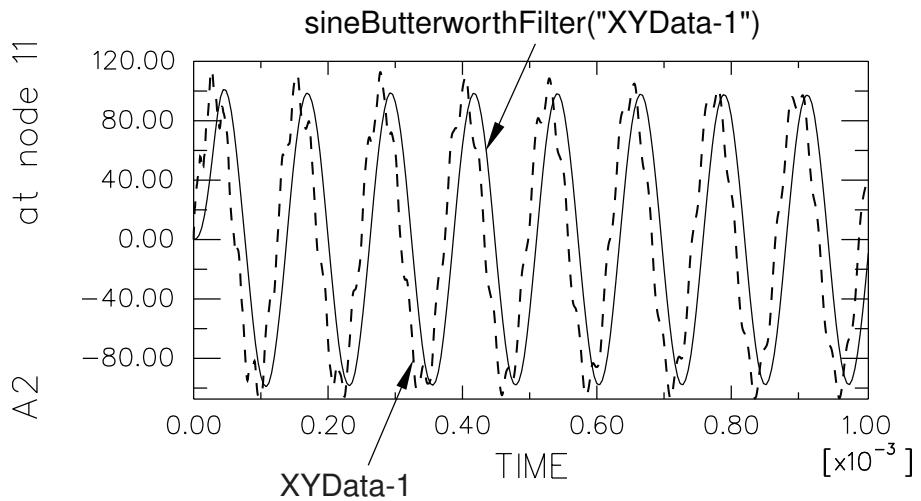  
Figure 1: X–Y plot produced using the sineButterworthFilter operation.

1. Locate the Operate on XY Data dialog box.  
From the main menu bar, select Tools->XY Data->Create. Click Operate on XY data in the dialog box that appears; then click Continue. The Operate on XY Data dialog box appears.  
2. From the Operators listed, click sineButterworthFilter(X,F).  
The sineButterworthFilter function appears in the expression window.  
3. From the XY Data choices, click the name of the X–Y data object on which to operate and click Add to Expression. You can choose from all X–Y data objects previously saved within this session (listed alphabetically in the XY Data field).  
The X–Y data object name appears within the sineButterworthFilter function parentheses in the expression window.  
4. Position the cursor in the expression window before the second comma, and type in a value for the cutoff frequency.  
5. To continue to build your expression, position the cursor in the expression window and type in or select the functions, operators, and X–Y data you want to include.

6. To evaluate and display your expression, click Plot Expression.  
7. To save your new X–Y data object, click Save As and then provide a name in the dialog box that appears.

Saving your data object makes it available for future operations within this session and for inclusion in X–Y plots containing multiple data objects.

8. When you are finished, click Cancel to close the dialog box.

## Additional information

• Understanding X–Y data interpolation and extrapolation  
• Using X–Y data operations  
• Applying SAE filtering to an X–Y data object  
• Smoothing an X–Y data object

## Smoothing an X–Y data object

Use the smooth function or the smooth2 function to operate on a previously savedX–Y data object (a collection of ordered pairs) to produce a new X–Y data object having a smoother curve. The new X–Y data object has the same X-coordinate values as the original X–Y data object. At each X-coordinate Abaqus/CAE computes the new Y-coordinate as the average of neighboring Y-coordinates of the original data object. This computation is known as a “moving average.” The two functions use different algorithms to calculate this moving average value:

The smooth function uses a simple moving average to calculate the new Y-coordinate values, which means that each new Y-coordinate is the unweighted mean of a number of neighboring points. You can specify the number of neighboring points to include in the average; a larger value produces a smoother curve. Abaqus/CAE interprets the value you specify as the number of points to use on either side of the current X-coordinate. The default is 2, which means Abaqus/CAE averages 5 values to compute each new Y-coordinate.  
The smooth2 function uses an exponential moving average to calculate the new Y-coordinate values, which means that the neighboring points have an exponentially greater influence on the resulting Y-coordinate value. You can specify a smoothing factor between 0 and 1 for the curve; a smaller value produces a smoother curve. The default smoothing factor is 0.75.

Figure 1 illustrates the type of X–Y plot that can be produced using the smooth and smooth2 functions.  
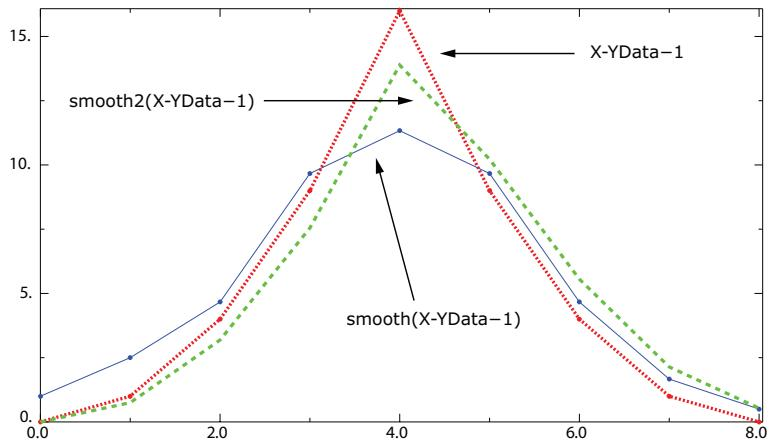  
Figure 1: X–Y plots produced using the smooth and smooth2 functions.

1. Locate the Operate on XY Data dialog box.  
From the main menu bar, select Tools->XY Data->Create. Click Operate on XY data in the dialog box that appears; then click Continue. The Operate on XY Data dialog box appears.  
2. From the Operators listed, click smooth(X, I) or smooth2(X, F).  
The smooth or smooth2 function appears in the expression window.  
3. From the XY Data choices, click the name of the X–Y data object on which to operate and click Add to Expression. You can choose from all X–Y data objects previously saved within this session (listed alphabetically in the XY Data field).  
The X–Y data object name appears within the smooth or smooth2 function parentheses in the expression window.  
4. Position your cursor in the expression window before the second comma, and enter the following value:

For the smooth function, enter an integer value for the number of points on either side of a given• point to include in the average.  
• For the smooth2 function, enter a decimal value between 0 and 1 to determine the smoothing factor for the curve. A smaller value produces a smoother curve.

5. To continue to build your expression, position the cursor in the expression window and type in or select the functions, operators, and X–Y data you want to include.

6. To evaluate and display your expression, click Plot Expression.

7. To save your new X–Y data object, click Save As and then provide a name in the dialog box that appears.

Saving your data object makes it available for future operations within this session and for inclusion in X–Y plots containing multiple data objects.

8. When you are finished, click Cancel to close the dialog box.

## Additional information

• Applying sine-Butterworth filtering to an X–Y data object  
• Applying SAE filtering to an X–Y data object  
• Using X–Y data operations  
• Reducing the sample size of an X–Y data object

## Finding the current maximum of an X–Y data object

Use the currentMax function to operate on a previously savedX–Y data object (a collection of ordered pairs) to produce a new X–Y data object. The new X–Y data object has the same X-coordinate values as the original X–Y data object, but new Y-coordinates are computed as the maximum Y-coordinate at or before the current X-coordinate.

Figure 1 provides an example of an X–Y plot produced by using the currentMax function.

  
Figure 1: X–Y plot produced using the currentMax function.


## Note:

The last value of the new X–Y data object represents the overall maximum Y-coordinate of the original X–Y data object.

For information on how to find the current maximum of two or more X–Y data objects, see Finding the current maximum of two or more X–Y data objects.

1. Locate the Operate on XY Data dialog box.  
From the main menu bar, select Tools->XY Data->Create. Click Operate on XY data in the dialog box that appears; then click Continue. The Operate on XY Data dialog box appears.  
2. From the Operators listed, click currentMax(X).  
The currentMax function appears in the expression window.  
3. From the XY Data choices, click the name of the X–Y data object on which to operate and click Add to Expression. You can choose from all X–Y data objects previously saved within this session (listed alphabetically in the XY Data field).  
The X–Y data object name appears within the currentMax function parentheses in the expression window.  
4. To continue to build your expression, position the cursor in the expression window and type in or select the functions, operators, and X–Y data you want to include.  
5. To evaluate and display your expression, click Plot Expression.  
6. To save your new X–Y data object, click Save As and then provide a name in the dialog box that appears.  
Saving your data object makes it available for future operations within this session and for inclusion in X–Y plots containing multiple data objects.

7. When you are finished, click Cancel to close the dialog box.

## Additional information

• Finding the current maximum of two or more X–Y data objects  
• Using X–Y data operations

## Finding the current minimum of an X–Y data object

Use the currentMin function to operate on a previously savedX–Y data object (a collection of ordered pairs) to produce a new X–Y data object. The new X–Y data object has the same X-coordinate values as the original X–Y data object, but new Y-coordinates are computed as the minimum Y-coordinate at or before the current X-coordinate.

Figure 1 shows an example of an X–Y plot produced by using the currentMin function.

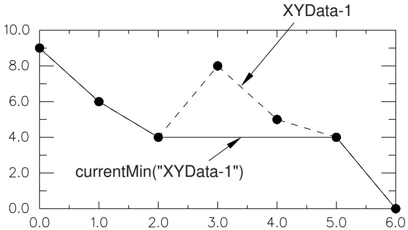  
Figure 1: X–Y plot produced using the currentMin function.


## Note:

The last value of the new X–Y data object represents the overall minimum Y-coordinate of the original X–Y data object.

For information on how to find the current minimum of two or more X–Y data objects, see Finding the current minimum of two or more X–Y data objects.

1. Locate the Operate on XY Data dialog box.  
From the main menu bar, select Tools->XY Data->Create. Click Operate on XY data in the dialog box that appears; then click Continue. The Operate on XY Data dialog box appears.  
2. From the Operators listed, click currentMin(X).  
The currentMin function appears in the expression window.  
3. From the XY Data choices, click the name of the X–Y data object on which to operate and click Add to Expression. You can choose from all X–Y data objects previously saved within this session (listed alphabetically in the XY Data field).  
The X–Y data object name appears within the currentMin function parentheses in the expression window.  
4. To continue to build your expression, position the cursor in the expression window and type in or select the functions, operators, and X–Y data you want to include.  
5. To evaluate and display your expression, click Plot Expression.  
6. To save your new X–Y data object, click Save As and then provide a name in the dialog box that appears.  
Saving your data object makes it available for future operations within this session and for inclusion in X–Y plots containing multiple data objects.

7. When you are finished, click Cancel to close the dialog box.

## Additional information

• Finding the current minimum of two or more X–Y data objects  
• Using X–Y data operations

## Finding the current range of an X–Y data object

Use the currentRng function to operate on a previously savedX–Y data object (a collection of ordered pairs) to produce a new X–Y data object. The new X–Y data object has the same X-coordinate values as the original X–Y data object, but new Y-coordinates are computed as the difference between the minimum Y-coordinate and the maximum Y-coordinate at or before the current X-coordinate.

Figure 1 provides an example of an X–Y plot produced by using the currentRng function.  
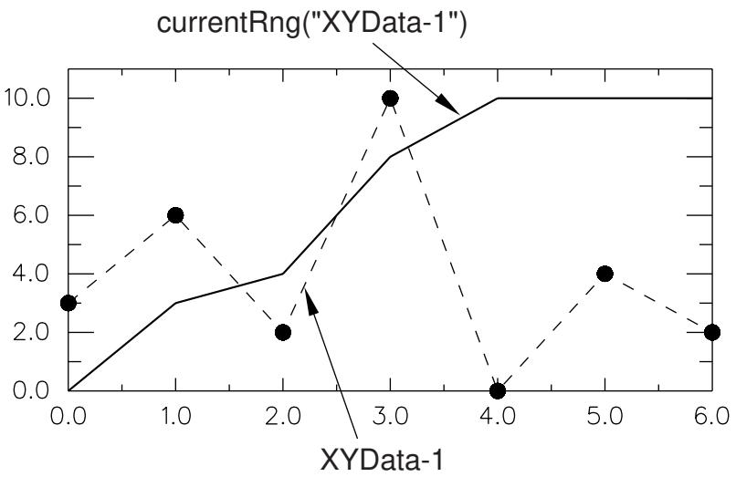  
Figure 1: X–Y plot produced using the currentRng function.


## Note:

The last value of the new X–Y data object represents the overall range of Y-coordinates of the original X–Y data object.

For information on how to find the current range of two or more X–Y data objects, see Finding the current range of two or more X–Y data objects.

1. Locate the Operate on XY Data dialog box.  
From the main menu bar, select Tools->XY Data->Create. Click Operate on XY data in the dialog box that appears; then click Continue. The Operate on XY Data dialog box appears.  
2. From the Operators listed, click currentRng(X).  
The currentRng function appears in the expression window.  
3. From the XY Data choices, click the name of the X–Y data object on which to operate and click Add to Expression. You can choose from all X–Y data objects previously saved within this session (listed alphabetically in the XY Data field).  
The X–Y data object name appears within the currentRng function parentheses in the expression window.  
4. To continue to build your expression, position the cursor in the expression window and type in or select the functions, operators, and X–Y data you want to include.  
5. To evaluate and display your expression, click Plot Expression.  
6. To save your new X–Y data object, click Save As and then provide a name in the dialog box that appears.

Saving your data object makes it available for future operations within this session and for inclusion in X–Y plots containing multiple data objects.

7. When you are finished, click Cancel to close the dialog box.

## Additional information

• Finding the current range of two or more X–Y data objects  
• Using X–Y data operations

## Finding the current maximum of two or more X–Y data objects

Use the maxEnvelope function to operate on two or more previously savedX–Y data objects (each object is a collection of ordered pairs) to produce a new X–Y data object. The new X–Y data object has as its X-coordinates all X-coordinates of the input data objects and any additional X-coordinates needed for alignment of the input data objects. Abaqus/CAE computes additional X–Y data pairs by interpolation and extrapolation. The new data object has as its Y-coordinates the maximum Y-coordinate of all input X–Y data objects at the current X-coordinate. The arguments of this operation are commutative.

Figure 1 illustrates the type of X–Y plot that can be produced by using the maxEnvelope function.  
  
Figure 1: X–Y plot produced using the maxEnvelope function.

For information on how to find the current maximum of a single X–Y data object, see Finding the current maximum of an X–Y data object.

1. Locate the Operate on XY Data dialog box.  
From the main menu bar, select Tools->XY Data->Create. Click Operate on XY data in the dialog box that appears; then click Continue. The Operate on XY Data dialog box appears.  
2. From the Operators listed, click maxEnvelope(A,A,...).  
The maxEnvelope function appears in the expression window.  
3. From the XY Data choices, click the names of two or more X–Y data objects on which to operate and click Add to Expression. Choices include all X–Y data objects previously saved within this session, listed alphabetically.  
The X–Y data object names appear, separated by commas, within the maxEnvelope function parentheses in the expression window.  
4. To continue to build your expression, position the cursor in the expression window and type in or select the functions, operators, and X–Y data you want to include.  
5. To evaluate and display your expression, click Plot Expression.  
6. To save your new X–Y data object, click Save As and then provide a name in the dialog box that appears.  
Saving your data object makes it available for future operations within this session and for inclusion in X–Y plots containing multiple data objects.

7. When you are finished, click Cancel to close the dialog box.

## Additional information

• Finding the current maximum of an X–Y data object  
• Understanding X–Y data interpolation and extrapolation  
• Using X–Y data operations

## Finding the current minimum of two or more X–Y data objects

Use the minEnvelope function to operate on two or more previously savedX–Y data objects (each object is a collection of ordered pairs) to produce a new X–Y data object. The new X–Y data object has as its X-coordinates all X-coordinates of the input data objects and any additional X-coordinates needed for alignment of the input data objects. Abaqus/CAE computes additional X–Y data pairs by interpolation and extrapolation. The new data object has as its Y-coordinates the minimum Y-coordinate of all input X–Y data objects at the current X-coordinate. The arguments of this operation are commutative.

Figure 1 illustrates the type of X–Y plot that can be produced by using the minEnvelope function.  
  
Figure 1: X–Y plot produced using the minEnvelope function.

For information on how to find the current minimum of a single X–Y data object, see Finding the current minimum of an X–Y data object.

1. Locate the Operate on XY Data dialog box.  
From the main menu bar, select Tools->XY Data->Create. Click Operate on XY data in the dialog box that appears; then click Continue. The Operate on XY Data dialog box appears.  
2. From the Operators listed, click minEnvelope(A,A,...).  
The minEnvelope function appears in the expression window.  
3. From the XY Data choices, click the names of two or more X–Y data objects on which to operate and click Add to Expression. Choices include all previously saved X–Y data objects, which are listed alphabetically.  
The X–Y data object names appear, separated by commas, within the minEnvelope function parentheses in the expression window.  
4. To continue to build your expression, position the cursor in the expression window and type in or select the functions, operators, and X–Y data you want to include.  
5. To evaluate and display your expression, click Plot Expression.  
6. To save your new X–Y data object, click Save As and then provide a name in the dialog box that appears.  
Saving your data object makes it available for future operations within this session and for inclusion in X–Y plots containing multiple data objects.

7. When you are finished, click Cancel to close the dialog box.

## Additional information

• Finding the current minimum of an X–Y data object  
• Understanding X–Y data interpolation and extrapolation  
• Using X–Y data operations

## Finding the current range of two or more X–Y data objects

Use the rng function to operate on two or more previously savedX–Y data objects (each object is a collection of ordered pairs) to produce a new X–Y data object. The new X–Y data object has as its X-coordinates all X-coordinates of the input data objects and any additional X-coordinates needed for alignment of the input data objects. Abaqus/CAE computes additional X–Y data pairs by interpolation and extrapolation. Abaqus/CAE computes the new data object Y-coordinates as the difference between the minimum Y-coordinate and the maximum Y-coordinate at the current X-coordinate. The arguments of this operation are commutative.

Figure 1 illustrates the type of X–Y plot that can be produced by using the rng function.  
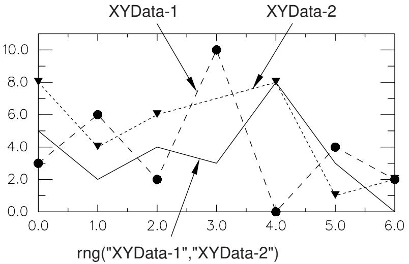  
Figure 1: X–Y plot produced using the rng function.

For information on how to find the current range of a single X–Y data object, see Finding the current range of an X–Y data object.

1. Locate the Operate on XY Data dialog box.  
From the main menu bar, select Tools->XY Data->Create. Click Operate on XY data in the dialog box that appears; then click Continue. The Operate on XY Data dialog box appears.  
2. From the Operators listed, click rng(A,A,...).  
The rng function appears in the expression window.  
3. From the XY Data choices, click the names of two or more X–Y data objects on which to operate and click Add to Expression. Choices include all X–Y data objects previously saved within this session, listed alphabetically.  
The X–Y data object names appear, separated by commas, within the rng function parentheses in the expression window.  
4. To continue to build your expression, position the cursor in the expression window and type in or select the functions, operators, and X–Y data you want to include.  
5. To evaluate and display your expression, click Plot Expression.  
6. To save your new X–Y data object, click Save As and then provide a name in the dialog box that appears.  
Saving your data object makes it available for future operations within this session and for inclusion in X–Y plots containing multiple data objects.

7. When you are finished, click Cancel to close the dialog box.

## Additional information

• Finding the current range of an X–Y data object  
• Understanding X–Y data interpolation and extrapolation  
• Using X–Y data operations

## Appending two or more X–Y data objects

Use the append function to link together two or more previously savedX–Y data objects (collections of ordered pairs) to produce a new X–Y data object. The new X–Y data object contains the data objects you specify concatenated in the order you specify.

Figure 1 shows an X–Y plot created by appending an X–Y data object with Y-values varying from 1 to −1 to an X–Y data object with Y-values varying from 0.5 to −0.5.

  
Figure 1: X–Y plot produced using the append function.

1. Locate the Operate on XY Data dialog box.  
From the main menu bar, select Tools->XY Data->Create. Click Operate on XY data in the dialog box that appears; then click Continue. The Operate on XY Data dialog box appears.  
2. From the Operators listed, click append(X,X,...).  
The append function appears in the expression window.  
3. From the XY Data choices, click the names of the X–Y data objects to append in the order you want Abaqus to concatenate them and click Add to Expression. You can choose from X–Y data objects previously saved within this session (listed alphabetically in the XY Data field).  
The X–Y data object names appear, separated by commas, within the append function parentheses in the expression window.  
4. To continue to build your expression, position the cursor in the expression window and type in or select the functions, operators, and X–Y data you want to include.  
5. To evaluate and display your expression, click Plot Expression.  
6. To save your new X–Y data object, click Save As and then provide a name in the dialog box that appears.  
Saving your data object makes it available for future operations within this session and for inclusion in X–Y plots containing multiple data objects.

7. When you are finished, click Cancel to close the dialog box.

## Additional information

• Combining two X–Y data objects  
• Using addition on X–Y data objects  
• Summing two or more X–Y data objects  
• Using X–Y data operations

## Combining two X–Y data objects

Use the combine function to combine two previously savedX–Y data objects (collections of ordered pairs) to produce a new X–Y data object. The new X–Y data object contains data pairs consisting of the Y-coordinate values of the first data object and the Y-coordinate values of the second data object, combined wherever X-coordinate values for the two data objects match. For example,

$$
\text {XYData1} = [ (1, 4), (2, 4), (3, 4), (4, 5), (5, 6) ]
$$

and

$$
\text {XYData2} = [ (1, 9), (2, 8), (3, 7), (4, 6), (5, 4) ];
$$

then

$$
\operatorname{combine} (\text {XYData1}, \text {XYData2}) = [ (4, 9), (4, 8), (4, 7), (5, 6), (6, 4) ].
$$

The arguments of this operation are not commutative. If X-coordinate values for the two data objects do not match, Abaqus/CAE computes the missing data points to allow the X–Y data objects to be aligned. For more information on how missing data points are computed, see Understanding X–Y data interpolation and extrapolation.

A typical application of this function would be to combine a data object having X-values of time and Y-values of load with a data object having X-values of time and Y-values of displacement to produce a data object having X-values of displacement and Y-values of load. Another example would be to combine a data object having X-values of time and Y-values of stress with a data object having X-values of time and Y-values of strain to produce a data object having X-values of strain and Y-values of stress, as shown in Figure 1.

  
Figure 1: X–Y plot of stress versus strain.

1. Locate the Operate on XY Data dialog box.  
From the main menu bar, select Tools->XY Data->Create. Click Operate on XY data in the dialog box that appears; then click Continue. The Operate on XY Data dialog box appears.  
2. From the Operators listed, click combine(X,X).  
The combine function appears in the expression window.  
3. From the XY Data choices, click the names of the two X–Y data objects to combine in the order you want Abaqus to combine them and click Add to Expression. Choices include all X–Y data objects previously saved within this session, listed alphabetically.

The X–Y data object names appear, separated by commas, within the combine function parentheses in the expression window.

4. To continue to build your expression, position the cursor in the expression window and type in or select the functions, operators, and X–Y data you want to include.  
5. To evaluate and display your expression, click Plot Expression.  
6. To save your new X–Y data object, click Save As and then provide a name in the dialog box that appears.  
Saving your data object makes it available for future operations within this session and for inclusion in X–Y plots containing multiple data objects.  
7. When you are finished, click Cancel to close the dialog box.

## Additional information

• Understanding X–Y data interpolation and extrapolation  
• Appending two or more X–Y data objects  
• Using addition on X–Y data objects  
• Summing two or more X–Y data objects  
• Using X–Y data operations

## Converting the angular units used for X–Y data objects

Use the degreeToRadian or radianToDegree function to operate on a previously savedX–Y data object (a collection of ordered pairs) to produce a new X–Y data object. The new X–Y data object has the same X-coordinate values as the original X–Y data object. Abaqus/CAE computes the new Y-coordinate values by converting each original Y-coordinate from degrees to radians or from radians to degrees, depending on the function you specify.

1. Locate the Operate on XY Data dialog box.  
From the main menu bar, select Tools->XY Data->Create. Click Operate on XY data in the dialog box that appears; then click Continue. The Operate on XY Data dialog box appears.  
2. From the Operators listed, click degreeToRadian to convert from degrees to radians or radianToDegree to convert from radians to degrees.  
The respective function appears in the expression window.  
3. From the XY Data choices, click the name of the X–Y data object on which to operate and click Add to Expression. You can choose from all X–Y data objects previously saved within this session (listed alphabetically in the XY Data field).  
The X–Y data object name appears within the function parentheses in the expression window.  
4. To continue to build your expression, position the cursor in the expression window and type in or select the functions, operators, and X–Y data you want to include.  
5. To evaluate and display your expression, click Plot Expression.  
6. To save your new X–Y data object, click Save As and then provide a name in the dialog box that appears.  
Saving your data object makes it available for future operations within this session and for inclusion in X–Y plots containing multiple data objects.  
7. When you are finished, click Cancel to close the dialog box.

## Additional information

• Using X–Y data operations

Use the swap function to exchange the X- and Y-values of a previously savedX–Y data object (a collection of ordered pairs) to produce a new X–Y data object. The new X–Y data object has as its X-coordinate values the Y-coordinate values of the original X–Y data object and has as its Y-coordinate values the X-coordinate values of the original data object.

Figure 1 illustrates the type of X–Y plot that can be produced by using the swap function.

  
Figure 1: X–Y plot produced using the swap function.

1. Locate the Operate on XY Data dialog box.  
From the main menu bar, select Tools->XY Data->Create. Click Operate on XY data in the dialog box that appears; then click Continue. The Operate on XY Data dialog box appears.  
2. From the Operators listed, click swap(X).  
The swap function appears in the expression window.  
3. From the XY Data choices, click the name of the X–Y data object on which to operate and click Add to Expression. You can choose from all X–Y data objects previously saved within this session (listed alphabetically in the XY Data field).  
The X–Y data object name appears within the swap function parentheses in the expression window.  
4. To continue to build your expression, position the cursor in the expression window and type in or select the functions, operators, and X–Y data you want to include.  
5. To evaluate and display your expression, click Plot Expression.  
6. To save your new X–Y data object, click Save As and then provide a name in the dialog box that appears.  
Saving your data object makes it available for future operations within this session and for inclusion in X–Y plots containing multiple data objects.  
7. When you are finished, click Cancel to close the dialog box.

## Additional information

• Using X–Y data operations

## Truncating data from the ends of an X–Y data object

Use the truncate function to operate on a previously savedX–Y data object (a collection of ordered pairs) to produce a new X–Y data object that excludes data points whose X–coordinate values are less than a user-specified minimum value or data points whose X–coordinate values are greater than a user-specified maximum value.

Figure 1 illustrates an X–Y plot that has been truncated at a maximum of 7 by using the truncate function.

  
Figure 1: X–Y plot produced using the truncate function.

1. Locate the Operate on XY Data dialog box.

From the main menu bar, select Tools->XY Data->Create. Click Operate on XY data in the dialog box that appears; then click Continue. The Operate on XY Data dialog box appears.

2. From the Operators listed, click truncate(X,F).

The truncate function appears in the expression window.

3. From the XY Data choices, click the name of the X–Y data object on which to operate and click Add to Expression. You can choose from all X–Y data objects previously saved within this session (listed alphabetically in the XY Data field).

The X–Y data object name appears within the truncate function parentheses in the expression window.

4. Specify the X–coordinate values above which or below which data points should be removed from the X–Y data object. To specify a maximum value, position your cursor in the expression window before the second comma, and enter a number for the maximum value. To specify a minimum value, append startX=value to the expression in the expression window.

5. If desired, customize the truncation order value, which determines whether Abaqus/CAE should create new data points at the truncation boundary or boundaries you specify and, if so, how these new data points should be calculated. Select one of the following:

• If truncOrder=2 (the default value), Abaqus/CAE performs a piecewise, linear fit on the data to determine a new data point at each boundary and includes the new point or points in the new X–Y data object.  
• If truncOrder=3, Abaqus/CAE performs a spline interpolation on the data to determine a new data point at each boundary and includes the new point or points in the new X–Y data object.  
• If truncOrder=1, Abaqus/CAE does not create any new points at the boundary values.

6. If desired, customize the truncation tolerance value. If you elect to include interpolated values at the truncation boundaries, the truncation tolerance value overrides the creation of these new data points if Abaqus/CAE finds existing data points that are already very close to the boundaries. By default, the truncation tolerance (truncTol) is 0.005, or one half of one percent of the average distance in the X-direction between adjacent data points in the X–Y data object. If Abaqus/CAE finds an existing data point closer to the truncation boundary than the truncation tolerance value, it does not create a new interpolated data point at that boundary.

7. To continue to build your expression, position the cursor in the expression window and type in or select the functions, operators, and X–Y data you want to include.  
8. To evaluate and display your expression, click Plot Expression.  
9. To save your new X–Y data object, click Save As and then provide a name in the dialog box that appears.  
Saving your data object makes it available for future operations within this session and for inclusion in X–Y plots containing multiple data objects.  
10. When you are finished, click Cancel to close the dialog box.

## Additional information

• Using X–Y data operations

## Customizing X–Y plot axes

This section explains how you use the Axis Options dialog box to customize the appearance of the plot axes of an X–Y plot.

## In this section:

Using X–Y plot axis options  
Plotting multiple X–Y data objects with different variables  
Customizing the X–Y plot axis scale  
Customizing the X–Y plot axis range  
Customizing the X–Y plot axis tick mode  
Customizing X–Y plot axis tick marks  
Customizing the X–Y plot axis titles  
Customizing the placement of X–Y plot axes  
Customizing the X–Y plot axis labels  
Customizing the X–Y plot axis color and style

## Using X–Y plot axis options

You can use the axis options to customize the appearance of the axes in an X–Y plot.

Figure 1 identifies the X–Y plot characteristics that you can customize.

  
Figure 1: Characteristics of an X–Y plot.

Abaqus/CAE provides access to these options from the Axis Options dialog box, which you can open from the following locations in the Visualization module:

• From the main menu bar, select Options->XY Options->Axis.  
+++ • From the Visualization module toolbox, click $\begin{array}{c} { \big . } { \begin{array} { l } { \operatorname { \mathrm { * } } \\ { \operatorname { \mathrm { * } } \end{array} } } \end{array} } { \mathrm { ~ ! + + + } } $  
• From the Results Tree, expand the X Axes or Y Axes container, highlight the axis or axes you want to modify, click mouse button 3, and select Axis Options from the list that appears.  
• With an X–Y plot displayed in the viewport, double-click one of the axes in the plot.

Items in an X–Y plot are selectable only when there is no active procedure in effect; you might have to cancel the current procedure to activate the components in an X–Y plot.

You can click the following tabs to customize the appearance of the selected axes:

• Scale: Choose axes scales and limits and customize the occurrence of tick marks.  
• Tick Marks: Control the appearance and placement of tick marks.  
• Title: Specify the content and appearance of axes titles.

• Axes: Choose axes placement, color, style, and thickness, and control numeric axes labels.

## Additional information

• Plotting multiple X–Y data objects with different variables  
• Customizing the X–Y plot axis scale  
• Customizing the X–Y plot axis range  
• Customizing the X–Y plot axis tick mode  
• Customizing X–Y plot axis tick marks  
• Customizing the X–Y plot axis titles  
• Customizing the placement of X–Y plot axes  
• Customizing the X–Y plot axis labels  
• Customizing the X–Y plot axis color and style

## Plotting multiple X–Y data objects with different variables

When you plot X–Y data objects with different variables on the same X–Y plot, Abaqus/CAE displays an axis for each quantity type used in these data objects. In the X–Y plot shown in Figure 1, three X–Y data objects are plotted: the ALLKE and ALLSE respectively show kinetic energy and strain energy over time, while Displacement shows displacement of a selected node over time. The resultant plot includes only a single axis, Time, in the X-direction because all three X–Y curves share this quantity type along this axis. In the Y-direction, where these X–Y data objects use different quantity types, the X–Y plot displays separate Energy and Displacement axes.

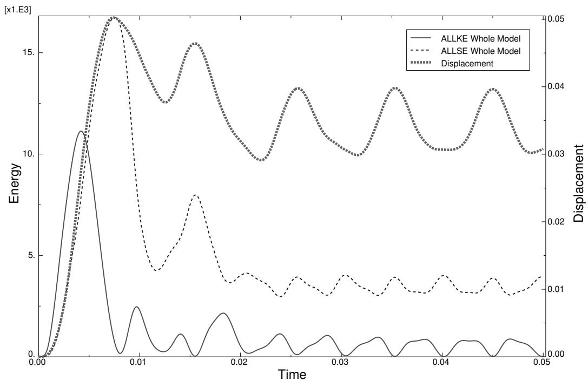  
Figure 1: X–Y plot displaying two axes in the Y-direction.

When you plot multiple curves on the same X–Y plot, Abaqus/CAE sets the minimum and maximum values for the plot along both axes to the minimum and maximum values of the first X–Y data object you included in your plot. This X–Y data object is listed first in the X–Y plot legend and in the Curves area of the Curve Options dialog box.

When an X–Y plot displays multiple axes in the X- or Y-direction, you can align them on the same side of the X–Y plot, on opposite sides, or place one or both in the middle of the X–Y plot. You can also manipulate the scale or appearance of these X–Y plot axes independently to make their differences more apparent in the viewport.

## Additional information

• Customizing the X–Y plot axis scale  
• Customizing the X–Y plot axis range  
• Customizing X–Y plot axis tick marks  
• Customizing the X–Y plot axis titles  
• Customizing the X–Y plot axis labels  
• Customizing the X–Y plot axis color and style

## Customizing the X–Y plot axis scale

Click the Scale tab to choose either a linear, logarithmic, or decibel-based scale for the X- and Y-axes of an X–Y plot. The scales of all X- and Y-axes that you display are independent. By default, Abaqus/CAE uses a linear scale for all axes.

## Decibel-based scales

You can rescale data along a particular axis using either of two decibel-based scales. Each scale is suited to a particular type of wave data: the 10 dB scale is recommended for displaying data about wave power or intensity; the 20 dB scale is recommended for data about wave amplitude.

When you select a decibel-based axis scale, you can also adjust the decibel reference value. Adjusting this value enables you to rescale your data object according to the environmental conditions for the data in this X–Y data object and for the units in your model. The default value is 1. You may want to adjust this value to display data at different environments or for waves traveling through a different medium, such as water.

1. Locate the Scale options.

Select Options->XY Options->Axis; or click , which is located with the X–Y plotting tools in the Visualization module toolbox. Click the Scale tab in the dialog box that appears.

2. From the X Axis or Y Axis fields, highlight one or more axes.  
3. Select one of the following axis scale options:

## Linear

The selected axis is displayed in a linear progression.

## Log

The selected axis is displayed in a base 10 logarithmic progression.

## 10 dB

The selected axis is displayed in a 10 dB progression. The dB Reference field becomes available, and you can enter the decibel reference value for the 10 dB–based data along this axis.

## 20 dB

The selected axis is displayed in a 20 dB progression. The dB Reference field becomes available, and you can enter the decibel reference value for the 20 dB–based data along this axis.

4. Click Dismiss to close the Axis Options dialog box.

## Additional information

• Using X–Y plot axis options

Click the Scale tab to customize the range of the X- and Y-axes of an X–Y plot. By default, Abaqus/CAE computes the minimum and maximum axis values based on the minimum and maximum data points included in the plot.

1. Locate the axis Max and Min options.

Select Options->XY Options->Axis; or click , which is located with the X–Y plotting tools in the Visualization module toolbox. Click the Scale tab in the dialog box that appears.

The Max and Min options appear in the middle of the Scale page.

2. From the X Axis or Y Axis fields, highlight one or more axes.  
3. Enter a value in the Max field, or toggle on Auto-compute next to this field to set the maximum value for the selected axis or axes to the highest available data point.

Abaqus/CAE updates the selected axis or axes.

4. Enter a value in the Min field, or toggle on Auto-compute next to this field to set the minimum value for the selected axis or axes to the lowest available data point.

Abaqus/CAE updates the selected axis or axes.

5. Click Dismiss to close the Axis Options dialog box.

## Additional information

• Using X–Y plot axis options

## Customizing the X–Y plot axis tick mode

Click the Scale tab to customize the tick mode of the X- and Y-axes of an X–Y plot. The tick mode options enable you to control the number of major and minor tick marks that appear along either axis. By default, Abaqus/CAE computes the minimum and maximum axis values based on the minimum and maximum data points included in the plot.

1. Locate the Tick Mode options.

Visualization module toolbox. Click the Scale tab in the dialog box that appears.

The Tick Mode options appear at the bottom of the Scale page.

2. From the X Axis or Y Axis fields, highlight one or more axes.  
3. Choose the method of computing the interval between major tick marks along the selected axis.

From the Major options, choose one of the following:

## Automatic

Abaqus computes the interval between major tick marks along the selected axis, rounding to provide reasonable intervals.

## By increment

The Tick increment text field becomes available, and you can enter the increment between major tick marks along the selected axis.

## By count

The Number of ticks per decade field becomes available, and you can increase or decrease the total number of major tick marks to appear between the minimum and maximum values along the selected axis.

4. Specify the number of minor tick marks.

From the Minor ticks option, click the Ticks per increment arrows (for linear or decibel-based axes) or the Ticks per decade arrows (for logarthmic axes) to specify the number of minor tick marks between each major tick mark.

5. Click Dismiss to close the Axis Options dialog box.

## Additional information

• Using X–Y plot axis options

## Customizing X–Y plot axis tick marks

You can customize X–Y plot axis tick marks.

Click the Tick Marks tab to control the length, thickness, style, and color of major and minor tick marks that appear along the X- and Y-axes of an X–Y plot. The number of major and minor tick marks is controlled separately; see Customizing the X–Y plot axis tick mode. You can control the X- and Y-axis tick marks independently. Examples of major and minor tick marks are shown in Figure 1.

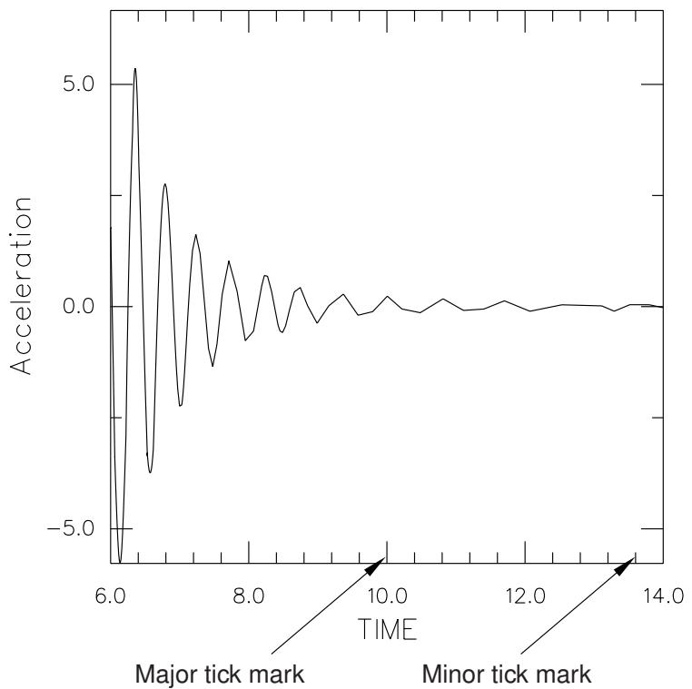  
Figure 1: X–Y plot with major and minor tick marks indicated.

Major tick marks govern the placement of the X–Y plot major grid and the numeric axis labels. Minor tick marks are shorter, unlabeled marks governing the placement of the minor gridlines.

By default, Abaqus/CAE automatically computes the number of tick marks. You can specify major tick marks by giving the increment between them or the total number of tick marks. You can specify minor tick marks only by giving the total number between each major tick mark.

The color of the tick marks is governed by the color of the axes. For more information, see Customizing the X–Y plot axis color and style.

1. Locate the axis Tick Marks options.

Select Options->XY Options->Axis; or click , which is located with the X–Y plotting tools in the Visualization module toolbox. Click the Tick Marks tab in the dialog box that appears.

2. From the X Axis or Y Axis fields, highlight one or more axes.  
3. Choose the location in which to place the axis tick marks.

From the Placement options, choose one of the following:

## None

Abaqus hides the tick marks completely for the selected axis.

## Inside

Abaqus displays the tick marks on the same side of the axis as the X–Y curves.

## Outside

Abaqus displays the tick marks on the side of the axis opposite the X–Y curves.

## Across

Abaqus displays tick marks that straddle both sides of the selected axis.

4. Specify the length of the tick marks.

Click the Length arrows to increase or decrease the length of the tick marks. Abaqus/CAE increases the length of the major and minor tick marks.

5. Choose the line style.

From the Style list, click the desired line style (solid, dashed, etc.).

The specified line style appears for the tick marks along the selected axis and in the Style list.

6. Choose the line thickness.

From the Thickness list, click the desired line thickness.

The specified line thickness appears for the tick marks along the selected axis and in the Thickness list.

7. Choose the line color:

a. Click the color sample

Abaqus/CAE displays the Select Color dialog box.

b. Use one of the methods in the Select Color dialog box to select a new color. For more information, see Customizing colors.

c. Click OK to close the Select Color dialog box.

The tick marks for the selected axis change to the selected color.

8. Click Dismiss to close the Axis Options dialog box.

## Additional information

• Customizing the X–Y plot axis labels  
• Using X–Y plot axis options

Click the Title tab to customize the titles that appear along the X- and Y-axes of an X–Y plot. You can customize the following:

• The text that appears as each title.  
• The color of each title.  
• The font of each title.

1. Locate the axis Title options.

Select Options->XY Options->Axis; or clic k , which is located with the X–Y plotting tools in the Visualization module toolbox. Click the Title tab in the dialog box that appears.

2. From the X Axis or Y Axis fields, highlight one or more axes.

3. To specify title text other than the default for the selected axis, enter the title in the field. You can revert back to the default title by toggling on Use default.

4. Select the font of the axis title.

a. Clic k .

Abaqus/CAE displays the Select Font dialog box.

b. Use one of the methods in the Select Font dialog box to select a new font, size, and style. For more information, see Customizing fonts.  
c. Click Apply to see the effect of your font selections.  
d. Click OK to close the Select Font dialog box.  
The X–Y plot title changes to the selected font, size, and style.

5. Select the color of the axis title.

a. Click the color sample .

Abaqus/CAE displays the Select Color dialog box.

b. Use one of the methods in the Select Color dialog box to select a new color. For more information, see Customizing colors.

c. Click OK to close the Select Color dialog box. The axis title for the selected axis changes to the selected color.

6. Click Dismiss to close the Axis Options dialog box.

## Additional information

• Customizing the X–Y plot axis labels  
• Using X–Y plot axis options

## Customizing the placement of X–Y plot axes

Click the Axes tab to customize the placement of the X- and Y-axes of an X–Y plot. This section describes the Placement options, which control the location of the axes themselves; to customize the location of the axis labels, see Customizing the X–Y plot axis labels

1. Locate the Placement options.

Select Options->XY Options->Axis; or click , which is located with the X–Y plotting tools in the Visualization module toolbox. Click the Axes tab in the dialog box that appears. The Placement options for the axes appear at the top of the Axes page.

2. From the X Axis or Y Axis fields, highlight one or more axes.  
3. From the Placement options at the top of the Axes page, select one of the following:

## Min Edge

Abaqus/CAE places an axis on the minimum edge of the X–Y plot only. For X-axes, the minimum edge is the bottom of the viewport; for Y-axes, the minimum edge is the left side of the viewport.

## Max Edge

Abaqus/CAE places an axis on the maximum edge of the X–Y plot only. For X-axes, the maximum edge is the top of the viewport; for Y-axes, the maximum edge is the right side of the viewport.

## Min/Max Edge

Abaqus/CAE places the selected axis on both the maximum and minimum edges of the X–Y plot. For X-axes, Abaqus/CAE places the selected axis on the top and bottom of the viewport; for Y-axes, Abaqus/CAE the selected axis on the left and right sides of the viewport.

## Center

Abaqus/CAE places the axis in the center of the X–Y plot.

4. Click Dismiss to close the Axis Options dialog box.

## Additional information

• Customizing X–Y plot axis tick marks  
• Customizing the X–Y plot axis titles  
• Using X–Y plot axis options

You can customize the X–Y plot axis labels.

Click the Axes tab to customize the numeric labels that appear with the major tick marks along the X- and Y-axes of an X–Y plot. Examples of axis labels appear in Figure 1.

  
Figure 1: X–Y plot with axis labels indicated.

You can customize the following:

• The format of the labels (automatic, decimal, engineering, or scientific).  
• The number of decimal places or significant digits in the labels.  
• The frequency of the labels in relation to the major tick marks.  
• The font of the labels.

The color of the labels is governed by the color of the axes. See Customizing the X–Y plot axis color and style, for more information.

1. Locate the Labels options.

Select Options->XY Options->Axis; or click , which is located with the X–Y plotting tools in the Visualization module toolbox. Click the Axes tab in the dialog box that appears.

The Labels options for the axes appear in the middle of the Axes page.

2. From the X Axis or Y Axis fields, highlight one or more axes.

3. Specify where you would like axis labels to appear.

From the Placement list in the Labels options, choose one of the following:

## None

Abaqus/CAE hides axis labels for the selected axis.

## Inside

Abaqus/CAE displays axis labels on the same side of the axis as the X–Y curves.

## Outside

Abaqus/CAE displays axis labels on the side of the axis opposite the X–Y curves.

4. Click the Frequency arrows to specify how often labels are printed relative to each major tick mark. For example, if you select a frequency of two, labels will appear at every second major tick mark along the axis. If you select a frequency of zero, no labels will be displayed along the axis. You can request a label frequency of at most one greater than the number of major tick marks.

5. From the Labels options, select the format of the selected labels.

a. Click the Format button to reveal the X-axis label format options.  
b. Choose one of the following:

## Automatic

Very large values and very small values are expressed in scientific format. All remaining values are expressed with no exponent and using the specified number of significant digits.

## Decimal

All values are expressed with no exponent and using the specified number of significant digits.

## Engineering

Values greater than or equal to 1000 (or values less than or equal to 0.001) are expressed as a number ranging from 1 to 999 that is multiplied by 10 to the nth power, where n is a product of 3 (for example, 20.5E+03 or 17.76E+06). All remaining values are expressed using the specified number of significant digits.

## Scientific

All values are expressed as a number between 1 and 10 that is multiplied by an appropriate power of 10 (for example, 2.05E+04 or 1.776E+07).

6. Click the Precision arrows to specify the desired number of significant digits (for non-decimal formats) or decimal places (for decimal format) in each label.  
7. Select the font of the axis labels.

a. Click


Abaqus/CAE displays the Select Font dialog box.

b. Use one of the methods in the Select Font dialog box to select a new font, size, and style. For more information, see Customizing fonts.  
c. Click Apply to see the effect of your font selections.

d. Click OK to close the Select Font dialog box. The axis labels change to the selected font, size, and style.

8. Select the color of the axis labels.

a. Click the color sample Abaqus/CAE displays the Select Color dialog box.

b. Use one of the methods in the Select Color dialog box to select a new color. For more information, see Customizing colors.

c. Click OK to close the Select Color dialog box. The axis labels change to the selected color.

9. Click Dismiss to close the Axis Options dialog box.

## Additional information

• Customizing X–Y plot axis tick marks  
• Customizing the X–Y plot axis titles  
• Using X–Y plot axis options

## Customizing the X–Y plot axis color and style

Click the Axes tab to customize the color and thickness of the graph axes of an X–Y plot. Your selections apply to both the X- and Y-axes; it is not possible to customize the axes individually.

1. Locate the Style options.

Select Options->XY Options->Axis; or click , which is located with the X–Y plotting tools in the Visualization module toolbox. Click the Axes tab in the dialog box that appears.

The Style options for the axes appear at the bottom of the Axes page.

2. From the X Axis or Y Axis fields, highlight one or more axes.  
3. Choose the line style.

From the Style list, click the desired line style (solid, dashed, etc.).

The specified line style appears for the selected axis and in the Style list.

4. Choose the line thickness.

From the Thickness list, click the desired line thickness.

The specified line thickness appears for the selected axis and in the Thickness list.

5. Choose the line color:

a. Click the color sample .

Abaqus/CAE displays the Select Color dialog box.

b. Use one of the methods in the Select Color dialog box to select a new color. For more information, see Customizing colors.  
c. Click OK to close the Select Color dialog box.

The axis line changes to the selected color.

6. Click Dismiss to close the Axis Options dialog box.

## Additional information

• Customizing X–Y plot axis tick marks  
• Customizing the X–Y plot axis labels  
• Using X–Y plot axis options

## Customizing X–Y curve appearance

This section explains how you use the Curve Options dialog box to customize the appearance of a curve representing a selected X–Y data object.

Only curves that appear in the most recent X–Y plot are available for customization.

## In this section:

Using options to customize the appearance of X–Y curves  
Selecting one or more X–Y curves to customize  
Customizing the X–Y plot legend  
Customizing the appearance of an X–Y curve  
Customizing the symbols used on an X–Y curve  
Editing the list of auto-colors for X–Y plots

## Using options to customize the appearance of X–Y curves

To customize the appearance of X–Y curves, expand the Curves container in the Results Tree, highlight the curves you want to modify, then click mouse button 3 and select Curve Options from the list that appears.

You can customize the line style, symbol style, and legend text of each curve.

Only those curves that appear in the most recent X–Y plot are available for customization. You can customize the following:

• The text that appears in the legend describing the data. For more information, see Customizing the X–Y plot legend.  
• The appearance of the line representing the data (the curve). For more information, see Customizing the appearance of an X–Y curve.  
• The appearance of the symbols along the curve. For more information, see Customizing the symbols used on an X–Y curve.

1. Locate the Curve Options dialog box. You can open this dialog box using any of the following methods:

• From the main menu bar, select Options->XY Options->Curve.

• From the Visualization module toolbox, click

• From the Results Tree, expand the Charts container, highlight the plot or plots you want to modify, click mouse button 3, and select Chart Options from the list that appears.

2. Use the curve options to select and then customize the appearance of the X–Y curves in the current viewport.

3. When you have finished customizing the appearance of your X–Y curves, click Dismiss to close the Curve Options dialog box.

## Additional information

• Selecting one or more X–Y curves to customize  
• Customizing the X–Y plot legend  
• Customizing the appearance of an X–Y curve  
• Customizing the symbols used on an X–Y curve

To customize a curve, you first select it and then choose customization options. Use the Curves field in the Curve Options dialog box to select one or more X–Y curves to customize. The Curves field lists the displayed X–Y curves, identifying each curve by name. For information on curve naming conventions, see Understanding “Temp” and other X–Y data object names.

After you have selected one or more X–Y curves to customize, you then use the options in the Attributes frame to control the line and the symbol representing the data and to enter the text that will appear in the legend.

1. Locate the Curves field.

The Curves field is at the top of the dialog box.

2. Select one or more X–Y curves to customize. For more information on selecting multiple items in dialog boxes, see Selecting multiple items from lists and tables.


## Note:

To make an X–Y curve available for selection, you must first plot it.

If you have selected one curve, the Attributes frame displays the current attributes of that curve.

If you have selected multiple curves, Abaqus/CAE displays the Legend text field as blank. The display in the Attributes frame varies depending on whether the selected curves have the same attributes or not. If the attributes are the same, Abaqus/CAE displays them; if the attributes differ, Abaqus/CAE displays the following:

• The Show and Show symbol checkboxes are gray.  
• The line Color and symbol Color text fields display the term As is.  
• The Style, Thickness, Symbol, and Size buttons are blank.  
• The Frequency text field is blank.

3. From the Attributes field, you can control the following:

• The text that appears in the legend describing the data. For more information, see Customizing the X–Y plot legend.  
The appearance of the line representing the data (the curve). For more information, see Customizing the appearance of an X–Y curve.  
• The appearance of the symbols along the curve. For more information, see Customizing the symbols used on an X–Y curve.

## Customizing the X–Y plot legend

The legend of an X–Y plot provides a key to associate each curve included in the plot with the X–Y data object that it represents. Each legend entry contains a line segment in the color and style shown in the plot. The legend entry also includes text stating, by default, the name of the X–Y data represented by the curve. You can customize this text using the Curve Options.

The remaining characteristics of the legend are controlled by options in the Viewport Annotation Options dialog box. For information on customizing the legend and on including in the legend a report of the minimum and maximum X–Y values, see Customizing the legend.

1. Locate the Attributes options for X–Y curves.

The Attributes frame is at the bottom of the Curve Options dialog box.

2. In the Curves options, select one or more curves whose legend text you want to modify.  
3. In the Legend Text field, enter the custom legend text. You can also revert to the default legend text by toggling on Use default.  
4. Click Dismiss to close the Curve Options dialog box.

## Additional information

• Selecting one or more X–Y curves to customize

You can customize the appearance of an X–Y curve.

Use the Curve Options dialog box to customize the color, style, and thickness of the line used to represent an X–Y data object in an X–Y plot. Figure 1 illustrates some of the ways in which X–Y data curves can be customized.

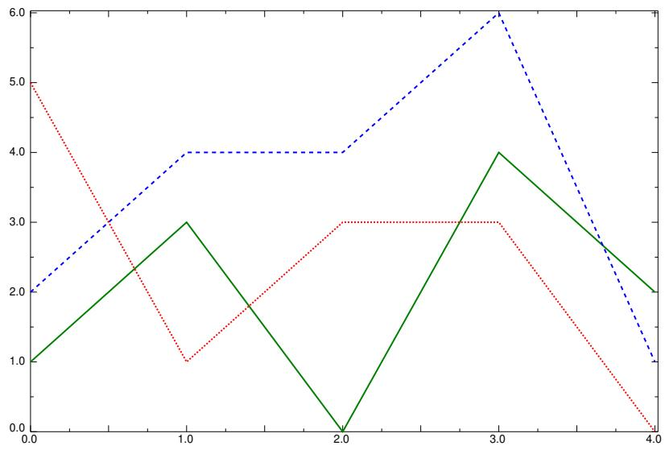  
Figure 1: X–Y plot with customized curves.

The color, style, and thickness that you select appear along the curve and in the legend. The customization options are available only when Show is toggled on.

By default, Abaqus/CAE colors the X–Y curves in your plot by referring to the list of X–Y auto colors. You can modify this list from the Edit XY-Auto-Colors dialog box; see Editing the list of auto-colors for X–Y plots.

1. Locate the Show options.

The Show options appear in the lower right corner of the Curve Options dialog box.

2. From the Curves field, select one or more X–Y curves whose attributes you wish to customize.


## Note:

To make an X–Y curve available for selection, you must first plot it.

The customization options you choose will apply to all of the curves you have selected; if you want to vary the appearance of multiple curves, you must customize them one at a time.

3. Toggle Show to display or suppress the line representing each selected X–Y curve.

When Show is on, the curve is displayed and the line attribute options are enabled.

4. Choose the line color:

a. Click the color sample .

Abaqus/CAE displays the Select Color dialog box.

b. Use one of the methods in the Select Color dialog box to select a new color. For more information, see Customizing colors.

c. Click OK to close the Select Color dialog box.

The selected X–Y curve changes to the selected color.

5. Choose the line style:

a. Click the Style button to reveal the line style options (solid, dashed, etc.).  
b. From the style list, click the desired line style.  
The selected X–Y curve changes to the selected style.

6. Choose the line thickness:

a. Click the Thickness button to reveal the line thickness options.  
b. From the thickness list, click the desired line thickness.  
The selected X–Y curve changes to the specified thickness.

7. Click Dismiss to close the Axis Options dialog box.

## Additional information

• Selecting one or more X–Y curves to customize

You can customize the symbols used on an X–Y curve.

Use the Curve Options dialog box to customize the appearance of the symbols used to represent data points on an X–Y curve. For example, in Figure 1 the plot on the left uses the default symbols, while the plot on the right uses customized symbols.

  
Figure 1: X–Y plots with different data point symbols.

The symbol that you select appears along the curve and in the legend. The customization options are available only when Show symbol is toggled on.

1. Locate the Attributes options.

The Attributes options appear in the lower half of the Curve Options dialog box.

2. From the Curves field, select one or more X–Y curves whose symbols you wish to customize.


## Note:

To make an X–Y curve available for selection, you must first plot it.

The customization options you choose will apply to all of the curves you have selected; if you want to vary the symbols on multiple curves, you must customize them one at a time.

3. Toggle Show symbol to display or suppress the symbols representing each selected X–Y curve's data points.

When Show symbol is on, symbols are displayed and the symbol attributes are enabled.

4. Choose the symbol color:

a. Click the color sample

Abaqus/CAE displays the Select Color dialog box.

b. Use one of the methods in the Select Color dialog box to select a new color. For more information, see Customizing colors.

c. Click OK to close the Select Color dialog box.

The color sample changes to the selected color. The new color does not appear in the viewport until you click OK or Apply in the XY Plot Options dialog box.

5. Choose the symbol:

a. Click the Symbol button to reveal the choice of symbols.  
b. From the list of symbols, click the desired symbol.  
The specified symbol appears on the selected X–Y curve.

6. Choose the symbol size:

a. Click the Size button to reveal the symbol size options.  
b. From the symbol size options, click the desired symbol size.  
The specified symbol size appears on the selected X–Y curve.

7. Select the frequency of the symbols.

Type an integer into the Frequency text field to choose how often symbols appear along the curve. For example, if you enter a frequency of two, Abaqus displays symbols at every second data point. The value zero is not allowed; to suppress the display of symbols, toggle off Show symbol.

8. Click Dismiss to close the Curve Options dialog box.

## Additional information

• Selecting one or more X–Y curves to customize

Abaqus/CAE assigns colors to X–Y curves automatically by referring to the color definitions in the X–Y auto colors list. This list provides colors for X–Y curves in the same way that the general Auto Colors list is used to color geometry and mesh elements, but these two color lists are separate entities.

This section describes how to edit the X–Y auto colors list to modify the set of default color assignments for X–Y curves. You can also change the color assignment for an individual X–Y curve from the Curve Options dialog box. See Customizing the appearance of an X–Y curve.

1. In the Results Tree, click mouse button 3 on the XY Plots container, then select Edit XY-Auto-Colors from the list that appears.

Abaqus/CAE displays the Edit XY-Auto-Colors dialog box.

2. To insert a new color into the X–Y auto colors list:

1. Highlight the color in the X–Y auto colors list that you want to precede or follow the color that you add.

2. Click Insert Before or Insert After to add a new color in the indicated location in the X–Y auto colors list.

The Select Color dialog box opens.

3. Choose a color by following the steps described in Customizing colors; then click OK to close the Select Color dialog box.

Abaqus/CAE adds the new color in the selected location.

3. To change one of the colors in the X–Y auto colors list, double-click the color and select a new color from the Select Color dialog box that appears.  
4. To move a color within the X–Y auto colors list, highlight the color and click either Move Up or Move Down to move the color one step in the selected direction.  
5. To delete a color from the X–Y auto colors list, highlight the color and click Delete.  
6. Continue adding, changing, moving, and deleting colors until the X–Y auto colors list contains the colors you want in the desired order.  
7. Click OK.

Abaqus/CAE uses the revised X–Y auto colors list for any subsequent color coding of X–Y curves.

## Customizing X–Y plot appearance

This section explains how you use the Chart Options dialog box to customize the display of gridlines and to adjust the general shape, size, and position of an X–Y plot.

## In this section:

Customizing the gridlines for an X–Y plot  
Customizing the border and fill color for an X–Y plot  
Customizing X–Y plot size and shape  
Customizing the position of an X–Y plot

You can customize the gridlines for an X–Y plot.

Click the Grid Display tab to control the appearance of the major and minor gridlines of an X–Y plot. Examples of major and minor gridlines are shown in Figure 1.

  
Figure 1: X–Y plot with major and minor gridlines indicated.

If your X–Y plot uses multiple axes in the same direction, Abaqus/CAE draws gridlines only for the axes of the first curve in the plot.

The Grid Display options provide independent control over each of the four sets of gridlines; that is, independent control over the major and minor gridlines in either direction. You can display or hide any of the four sets, and you can modify the color, style, or thickness of the lines for any of the four sets of gridlines.

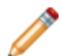

## Note:

Major gridlines originate from major tick marks, and minor gridlines originate from minor tick marks. To control the interval between gridlines, you must adjust the spacing of the tick marks.

1. Locate the axis Grid Display options.

Select Options->XY Options->Chart; or click , which is located with the X–Y plotting tools in the Visualization module toolbox. Click the Grid Display tab in the dialog box that appears.

2. Select one or more X–Y plots to customize from the Charts field.

3. From the X Gridlines options, toggle on the Major or Minor options to display major or minor vertical gridlines, respectively.

When either Major or Minor is on, gridline style, color, and thickness options become available for that type of gridline.

4. From the Y Gridlines options, toggle on Major or Minor to display major or minor horizontal gridlines, respectively.  
5. Repeat the following steps to customize the horizontal major and minor gridlines and the vertical major and minor gridlines:

a. Choose the color for the gridlines:

1. Click the color sample .

Abaqus/CAE displays the Select Color dialog box.

2. Use one of the methods in the Select Color dialog box to select a new color. For more information, see Customizing colors.  
3. Click OK to close the Select Color dialog box.

The selected gridlines change to the specified color.

b. Choose the line style:

1. Expand the style list to reveal the line style options (solid, dashed, etc.). The style list is the upper of the two unlabeled list options.  
2. From the style list, click the desired line style.

The selected gridlines change to the specified style.

c. Choose the line thickness:

1. Expand the thickness list to reveal the line style options (solid, dashed, etc.). The style list is the lower of the two unlabeled list options.  
2. From the thickness list, click the desired line thickness.

The selected gridlines change to the specified thickness.

6. Click Dismiss to close the Chart Options dialog box.

## Additional information

• Selecting one or more X–Y curves to customize

Click the Grid Display tab to access the Grid Area options for an X–Y plot. These options enable you to customize the grid in an X–Y plot, which is the rectangular area where the curves are plotted. You can wrap a border around the grid or fill the grid with a background color.


## Note:

You can also control border and background color settings for the entire X–Y plot, which includes the portion of the viewport covered by an X–Y plot's grid and all of its axes. Abaqus/CAE displays the background color for the grid on top of the background for the entire X–Y plot. For more information, see Customizing border and fill colors for an X–Y plot.

1. Locate the Grid Area options.

Select Options->XY Options->Chart; or click , which is located with the X–Y plotting tools in the Visualization module toolbox. Click the Grid Display tab in the dialog box that appears.

The Grid Area options are available at the bottom of the Grid Display page.

2. Select one or more X–Y plots from the top part of the window.  
3. Toggle on Show border to display a border around the entire grid area.  
4. If desired, change the color of the border by performing the following steps:

a. Click the color sample immediately to the right of the Show border label . Abaqus/CAE displays the Select Color dialog box.  
b. Use one of the methods in the Select Color dialog box to select a new color. For more information, see Customizing colors.  
c. Click OK to close the Select Color dialog box. The color sample and the grid border change to the selected color.

5. Toggle on Fill to fill the grid area with the color displayed to the right of the Fill label.  
6. If desired, change the grid area fill color by performing the following steps:

a. Click the color sample immediately to the right of the Fill label . Abaqus/CAE displays the Select Color dialog box.  
b. Use one of the methods in the Select Color dialog box to select a new color. For more information, see Customizing colors.  
c. Click OK to close the Select Color dialog box. The grid area changes to the selected color.

7. Click Dismiss to close the Chart Options dialog box.

## Additional information

• Customizing border and fill colors for an X–Y plot

## Customizing X–Y plot size and shape

Use the Size options in the Chart Options dialog box to customize the size and shape of the X–Y plot.

1. Locate the Chart Options.

Select Options->XY Options->Chart; or click , which is located with the X–Y plotting tools in the Visualization module toolbox. Click the Grid Position tab in the dialog box that appears.

2. From the Charts field, select one or more X–Y plots whose sizes or shapes you wish to customize.  
3. Select one of the following X–Y plot sizing and shaping options:

## Fit to chart

Abaqus/CAE fills the entire viewport with the selected X–Y plot, adjusting the shape of the plot to match the viewport dimensions.

## Square

The Size slider becomes available, which you can drag to increase or decrease the size of the square-shaped X–Y plot.

## Manual

The X and Y sliders become available, which you can drag to increase or decrease the size of the X–Y plot along either axis.

4. Click Dismiss to close the Chart Options dialog box.

## Additional information

• Selecting one or more X–Y curves to customize

Use the Position options in the Chart Options dialog box to customize the position of an X–Y plot in the viewport.

1. Locate the Position options.

Select Options->XY Options->Chart; or click , which is located with the X–Y plotting tools in the Visualization module toolbox. Click the Grid Position tab in the dialog box that appears.

2. From the Charts field, select one or more X–Y plots whose positions or shapes you wish to customize.  
3. Select one of the following X–Y plot positioning options:

## Auto-align

This option enables you to align the selected X–Y plot in one of nine positions in the viewport: its center, any of the four corners, or centered along any of the four edges. Expand the Alignment list, then select one of the options depicted graphically in the list.

## Manual

This option enables you to position the X–Y plot origin at a specific X–Y location in the viewport. Drag the X and Y sliders to move the lower left corner of the X–Y plot horizontally or vertically in the viewport. When these sliders' values are set to 0, the X–Y plot origin is placed in the lower left corner of the viewport.

4. Click Dismiss to close the Chart Options dialog box.

## Additional information

• Selecting one or more X–Y curves to customize

## Customizing the X–Y plot title

This section explains how you use the Plot Title Options dialog box to create a title for an X–Y plot and to customize the title's appearance and location in the viewport.

## In this section:

Customizing the contents of the X–Y plot title  
Customizing the location of the X–Y plot title  
Adding a bounding box and fill color for the X–Y plot title

Use the Text options in the Plot Title Options to create and display a custom title for an X–Y plot.

1. Locate the Text options for plot titles.

xxxx Select Options->XY Options->Plot Title; or click , which is located with the X–Y plotting tools in the Visualization module toolbox.

2. Click the Title tab, if it is not already selected.  
3. Select a title for the X–Y plot using one of the following methods:

• To display the default name of the X–Y plot, toggle on Use default.  
• To display a custom title, toggle off Use default, enter a title in the Title field, and press Enter.

4. Select the font of the plot title.

a. Click

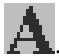

Abaqus/CAE displays the Select Font dialog box.

b. Use one of the methods in the Select Font dialog box to select a new font, size, and style. For more information, see Customizing fonts.  
c. Click Apply to see the effect of your font selections.  
d. Click OK to close the Select Font dialog box.

The X–Y plot title changes to the selected font, size, and style.

5. Select a color for the X–Y plot title.

a. Click the color sample .

Abaqus/CAE displays the Select Color dialog box.

b. Use one of the methods in the Select Color dialog box to select a new color. For more information, see Customizing colors.  
c. Click OK to close the Select Color dialog box.

The plot title text changes to the selected color.

## Additional information

• Selecting one or more X–Y curves to customize

## Customizing the location of the X–Y plot title

Use the Position options in the Plot Title Options to place the X–Y plot title in a particular location in the viewport.

1. Locate the Position options.

xxxx Select Options->XY Options->Plot Title; or click , which is located with the X–Y plotting tools in the Visualization module toolbox. Click the Area tab from the dialog box that appears.

2. Toggle on Inset to display the plot title legend within the X–Y plot. If Inset is off, Abaqus/CAE keeps the plot title and the X–Y plot in separate bands of the viewport.  
3. Choose one of the following two methods for positioning the plot title:

## Auto-align

This option enables you to position the plot title in one of nine positions in the viewport: its center, any of the four corners, or centered along any of the four edges. Expand the Alignment list, then select one of the options depicted graphically in the list.

## Manual

This option enables you to position the plot title in a specific X–Y location in the viewport. Drag the X and Y sliders to move the title horizontally or vertically in the viewport. When both of these values equal 0, the plot title is positioned in the lower left corner of the viewport; when both values equal 100, the plot title is positioned in the upper right corner.

## Additional information

• Selecting one or more X–Y curves to customize

Use the Bounding Box options in the Plot Title Options to draw a rectangular box around the X–Y plot title or to fill the area behind the plot title with a background color.

1. Locate the Bounding Box options.

xxxx Select Options->XY Options->Plot Title; or click , which is located with the X–Y plotting tools in the Visualization module toolbox. Click the Area tab from the dialog box that appears. The Bounding Box options appear at the bottom of the dialog box.

2. Select one or more X–Y plots from the Charts field at the top of the dialog box.  
3. Perform the following steps to display and modify the bounding box:

a. Toggle on Show border to display a border around the legend.  
b. Select a color for the bounding box line.

1. Click the color sample .

Abaqus/CAE displays the Select Color dialog box.

2. Use one of the methods in the Select Color dialog box to select a new color. For more information, see Customizing colors.  
3. Click OK to close the Select Color dialog box.

The bounding box line changes to the selected color.

4. Control the bounding box fill color:

a. Toggle on Fill to display a background color in the bounding box.  
b. Select a fill color to display in the background of the bounding box.

1. Click the color sample

Abaqus/CAE displays the Select Color dialog box.

2. Use one of the methods in the Select Color dialog box to select a new color. For more information, see Customizing colors.  
3. Click OK to close the Select Color dialog box.

The bounding box background changes to the selected color.

## Additional information

• Selecting one or more X–Y curves to customize

## Customizing the appearance of the X–Y plot legend

This section explains how you use the Chart Legend Options dialog box to customize the appearance and contents of the legend for an X–Y plot. You can also display a title on the X–Y plot legend, and you can include on the legend a report of the minimum and maximum X–Y values.

## In this section:

Displaying or hiding the X–Y plot legend  
Customizing the title of the X–Y plot legend  
Adding minimum and maximum values to the X–Y plot legend  
Customizing the location of the legend  
Customizing the border and fill for the X–Y plot legend

The X–Y plot legend provides a key to associate each curve included in the plot with the X–Y data object that it represents. Each legend entry contains a line segment in the color and style shown in the plot. The legend entry also includes text stating, by default, the description of the X–Y data object represented by the curve. You can display or hide the legend using the Chart Legend Options.

1. Locate the Chart Legend Options.

Select Options->XY Options->Chart Legend; or click $\sharp { \left[ \begin{array} { l } { + + } \\ { + } \\ { + } \end{array} \right] } _ { \ell }$ , which is located with the X–Y plotting tools in the Visualization module toolbox.


Tip: You can also open this dialog box directly by double-clicking the legend in the viewport when an X–Y plot is displayed. You cannot select a component in an X–Y plot directly from the viewport when an active procedure is in effect; cancel the current procedure before selecting items from an X–Y plot.

2. Click the Contents tab, if it is not already selected.  
3. Toggle on Show legend to display the legend, or toggle it off to hide the legend.  
4. Click Dismiss to close the Chart Legend Options dialog box.

## Additional information

• Selecting one or more X–Y curves to customize

## Customizing the title of the X–Y plot legend

Use the Title options to display or hide a title for the X–Y plot legend and to customize its contents.

1. Locate the Text options.

Select Options->XY Options->Chart Legend; or click , which is located with the X–Y plotting tools in the Visualization module toolbox.


Tip: You can also open this dialog box directly by double-clicking the legend in the viewport when an X–Y plot is displayed. You cannot select a component in an X–Y plot directly from the viewport when an active procedure is in effect; cancel the current procedure before selecting items from an X–Y plot.

The Text options for the legend appear in the lower half of the Contents page.

2. From the Charts field, select one or more X–Y plots whose legends you wish to customize.


## Note:

To make an X–Y curve available for selection, you must first plot it.

3. Click the Contents tab, if it is not already selected.  
4. If desired, enter a title for the X–Y plot legend in the Title field.  
5. Select the font of the X–Y plot legend title.

a. Click


Abaqus/CAE displays the Select Font dialog box.

b. Use one of the methods in the Select Font dialog box to select a new font, size, and style. For more information, see Customizing fonts.  
c. Click Apply to see the effect of your font selections.  
d. Click OK to close the Select Font dialog box.

The X–Y plot legend title changes to the selected font, size, and style.

6. Select the color of the X–Y plot legend title.

a. Click the color sample .

Abaqus/CAE displays the Select Color dialog box.

b. Use one of the methods in the Select Color dialog box to select a new color. For more information, see Customizing colors.  
c. Click OK to close the Select Color dialog box.

The X–Y plot legend title text changes to the selected color.

7. Click Dismiss to close the Chart Legend Options dialog box.

## Additional information

• Selecting one or more X–Y curves to customize

You can include on the plot legend a report of the minimum and maximum X–Y values in the plot, and you can customize the format and precision of these values.

1. Locate the Chart Legend Options.

Select Options->XY Options->Chart Legend; or click , which is located with the X–Y plotting tools in the Visualization module toolbox.


Tip: You can also open this dialog box directly by double-clicking the legend in the viewport when an X–Y plot is displayed. You cannot select a component in an X–Y plot directly from the viewport when an active procedure is in effect; cancel the current procedure before selecting items from an X–Y plot.

2. From the Charts field, select one or more X–Y plots whose legends you wish to customize.  
3. Click the Contents tab, if it is not already selected.  
4. Toggle on Show min/max to report the minimum and maximum X–Y values in the legend.  
5. Select one of the following number formats for the minimum and maximum values displayed in the legend:

## Automatic

Very large values and very small values are expressed in scientific format. All remaining values are expressed with no exponent and using the specified number of significant digits.

## Decimal

All values are expressed with no exponent and using the specified number of significant digits.

## Engineering

Values greater than or equal to 1000 (or values less than or equal to 0.001) are expressed as a number ranging from 1 to 999 that is multiplied by 10 to the nth power, where n is a product of 3 (for example, 20.5E+03 or 17.76E+06). All remaining values are expressed using the specified number of significant digits.

## Scientific

All values are expressed as a number between 1 and 10 that is multiplied by an appropriate power of 10 (for example, 2.05E+04 or 1.776E+07).

6. Click the Precision arrows to specify the desired number of significant digits (for non-decimal formats) or decimal places (for decimal format) in each label.  
7. Click Dismiss to close the Chart Legend Options dialog box.

## Additional information

• Selecting one or more X–Y curves to customize

## Customizing the location of the legend

You can move the X–Y plot legend by dragging it around the viewport or by specifying a viewport location from the Position options in the Chart Legend Options dialog box. You can drag the legend only when Abaqus/CAE does not have a procedure active; if you cannot drag the legend or select any other X–Y plot components from the viewport, cancel the current procedure.

1. Locate the Chart Legend Options.

Select Options->XY Options->Chart Legend; or clic k , which is located with the X–Y plotting tools in the Visualization module toolbox.


Tip: You can also open this dialog box directly by double-clicking the legend in the viewport when an X–Y plot is displayed. You cannot select a component in an X–Y plot directly from the viewport when an active procedure is in effect; cancel the current procedure before selecting items from an X–Y plot.

2. From the Charts field, select one or more X–Y plots whose legends you wish to move.  
3. Click the Area tab, if it is not already selected.  
4. Toggle on Inset to display the X–Y plot legend within the X–Y plot grid. If Inset is off, Abaqus/CAE keeps the legend and the X–Y plot in separate bands of the viewport.  
5. Select one of the following positioning options:

## Auto-align

This option enables you to align the legend in one of nine positions in the viewport: its center, any of the four corners, or centered along any of the four edges. Expand the Alignment list, then select one of the options depicted graphically in the list.

## Manual

This option enables you to position the legend at a specific X–Y location in the viewport. Drag the X and Y sliders to move the legend horizontally or vertically in the viewport. When these sliders' values are set to 0, the legend is placed in the lower left corner of the viewport.

6. Click Dismiss to close the Chart Legend Options dialog box.

## Additional information

• Selecting one or more X–Y curves to customize

Use the Bounding Box options in the Chart Legend Options dialog box to customize the appearance of the legend by wrapping it with a border or filling it with a specified color.

1. Locate the Chart Legend Options.

Select Options->XY Options->Chart Legend; or click , which is located with the X–Y plotting tools in the Visualization module toolbox.


Tip: You can also open this dialog box directly by double-clicking the legend in the viewport when an X–Y plot is displayed. You cannot select a component in an X–Y plot directly from the viewport when an active procedure is in effect; cancel the current procedure before selecting items from an X–Y plot.

2. From the Charts field, select one or more X–Y plots whose legends you wish to customize.


## Note:

To make an X–Y curve available for selection, you must first plot it.

3. Click the Area tab, if it is not already selected.  
4. Perform the following steps to display and modify the bounding box:

a. Toggle on Show border to display a border around the legend.  
b. Select a color for the bounding box line.

1. Click the color sample .

Abaqus/CAE displays the Select Color dialog box.

2. Use one of the methods in the Select Color dialog box to select a new color. For more information, see Customizing colors.  
3. Click OK to close the Select Color dialog box.

The bounding box line changes to the selected color.

5. Control the bounding box fill color:

a. Toggle on Fill to display a background color in the bounding box.  
b. Select a fill color to display in the background of the bounding box.

1. Click the color sample .

Abaqus/CAE displays the Select Color dialog box.

2. Use one of the methods in the Select Color dialog box to select a new color. For more information, see Customizing colors.  
3. Click OK to close the Select Color dialog box.

The bounding box background changes to the selected color.

6. Click Dismiss to close the Chart Legend Options dialog box.

## Additional information

• Selecting one or more X–Y curves to customize

## Customizing border and fill colors for an X–Y plot

Use the options in the Plot Options dialog box to create a custom border color and a custom background fill color for one or more X–Y plots in your session. By default, X–Y plots have no border and they are filled with a light grey background color. You might want to adjust the border color to distinguish between different X–Y plots used in an overlay plot; you might want to adjust the fill color if the X–Y curves used in your plot do not stand out clearly against the default background.

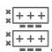

1. Select Options->XY Options->Plot Options; or click , which is located with the X–Y plotting tools in the Visualization module toolbox.

The Plot Options dialog box opens.

2. From the Plots frame, highlight one or more X–Y plots that you want to modify. This frame lists plot names and the viewports in which they are displayed.  
3. Toggle on Show border to display a border around the X–Y plot.  
4. If desired, change the color of the X–Y plot border by performing the following steps:

a. Click the color sample immediately to the right of the Show border label .

Abaqus/CAE displays the Select Color dialog box.

b. Use one of the methods in the Select Color dialog box to select a new color. For more information, see Customizing colors.  
c. Click OK to close the Select Color dialog box.

The color sample and the X–Y plot border change to the selected color.

5. Toggle on Fill to fill the X–Y plot with the color displayed to the right of the Fill label.  
6. If desired, change the X–Y plot fill color by performing the following steps:

a. Click the color sample immediately to the right of the Fill label .

Abaqus/CAE displays the Select Color dialog box.

b. Use one of the methods in the Select Color dialog box to select a new color. For more information, see Customizing colors.  
c. Click OK to close the Select Color dialog box.

The X–Y plot fill color changes to the selected color.

## Viewing results along a path

A path is a series of connected lines that you define by specifying a series of points or edges through your model. You can view results along the path in the form of an X–Y plot. This chapter explains how to view results along a path.

## In this section:

Understanding results along a path  
Creating a path through your model  
Obtaining X–Y data along a path

## Understanding results along a path

To view results along a path through your model, you first select Tools->Path to specify the path and then select Tools->XY Data to obtain X–Y data along the path.

## In this section:

Path specification  
How Abaqus/CAE obtains results along a path

## Path specification

A path is a line you define by specifying a series of points or line segments through your model. The points can be nodes or coordinate locations; the line segments can be element edges or lines joining the ends of element edges. Paths can cross more than one part instance. Abaqus/CAE offers four distinct types of paths:

## Node list

The points making up the path consist of nodal locations only. You specify the points using node labels and node label ranges. A node label is a persistent means of referring to a given node; that is, node labels do not change as your model deforms. Because of this, the node labels that comprise a node list path are equally applicable to the undeformed or the deformed model shape. However, node labels are part instance-specific. In other words, you can have the same node label for multiple part instances; therefore, you must specify to which part instance you are referring when you use node labels. For more information, see Creating or editing a node list path.

## Point list

The points making up the path consist of coordinate locations within your model. These locations may or may not coincide with nodal locations. Point list coordinates remain fixed in space and are independent of your model. For example, coordinates that coincide with a nodal location on the undeformed shape may not coincide with any location on the deformed shape. By the same logic, point list coordinates are independent of specific part instances. For more information, see Creating or editing a point list path.

## Edge list

The points making up the path consist of edges that connect nodes within your model. You specify the edges by selecting individual element edges from the viewport or by selecting the starting edge and direction and allowing Abaqus/CAE to automatically complete the path to the end of the feature edge or to an endpoint that you select. Edges are defined by the elements in the model. Because of this, the edges that comprise an edge list path are equally applicable to the undeformed or the deformed model shape. However, element labels are part instance-specific. In other words, you can have the same element label for multiple part instances; therefore, you must specify to which part instance you are referring when you use edges. For more information, see Creating or editing an edge list path.

## Circular

The points making up the path consist of coordinate locations within your model. You can create two types of circular paths in Abaqus/CAE: circumferential and radial. A circumferential path lies along the edge of a circle or an arc; a radial path lies along a radius. You specify either type of path by selecting coordinates that define a circle or circular arc and then defining the starting point, ending point, and number of points along the path. Once you have defined the original circle or arc, you can select a new radius length to create any path that shares the same center point as the original. You can use circumferential paths to obtain cross-sectional results in a curved portion of a model, as shown in Figure 1.

  
Figure 1: A circumferential path.

You can use radial paths to obtain results spanning from the inner to the outer face of a curve, as shown in Figure 2; radial paths are ideal for use in stress linearization (for more information on stress linearization, see Calculating linearized stresses).

  
Figure 2: A radial path.

You can select coordinates by picking nodes from the viewport or by entering values in the prompt area; in either case, the coordinates remain fixed in space and are independent of your model. For example, coordinates that coincide with a nodal location on the undeformed shape may not coincide with any location on the deformed shape. By the same logic, circular path coordinate definitions are independent of specific part instances. For more information, see Creating or editing a circular path.

Abaqus/CAE forms the path by connecting the nodes, points, or edges that you specify in the order you have given.

After you create a path, you can select Tools->Path from the main menu bar to edit, copy, rename, delete, or plot it. Plotting the path itself is a means to verify visually that you have specified the intended line; to view results along the path, you must form X–Y data pairs and produce an X–Y plot. For more information on managing paths, see Managing objects using manager dialog boxes; for more information on producing an X–Y plot of path data, see Obtaining X–Y data along a path.

## How Abaqus/CAE obtains results along a path

Abaqus/CAE obtains results along a path in the form of X–Y data pairs.

Abaqus determines the data pair X-values based on the points that make up the path. These points define model locations at which to obtain data. Abaqus determines the data pair Y-values based on analysis results at those model locations.

Abaqus/CAE considers only the entities in the current display group when calculating the data pairs.

## Path data X-values

You can choose to form X-values based only on the points you have specified for the path or to additionally include all locations at which the path intersects the model. (An intersection occurs where the path crosses an element face, element edge, surface face, or surface edge. You can omit individual intersections from the path definition if the intersection lies within a user-specified distance of an actual data point. You can set this intersection tolerance value using Abaqus Scripting Interface commands; for more information, see Session object.)

You can also choose whether Abaqus/CAE interprets the points that make up the path as locations on the undeformed or the deformed model shape. When the deformed model shape is chosen, Abaqus/CAE computes the deformed coordinates at a node as the sum of the base coordinates and the deformation at that node multiplied by the viewport-specific deformation scale factor. Node list labels and edge lists indicate model locations and are equally applicable to the undeformed or the deformed model shape. Point list and circular path coordinates are fixed locations independent of the model geometry. Abaqus does not form data pairs for points that do not coincide with the model shape you have chosen.

The node labels or point coordinates that comprise a path are usually not in a form suitable for direct use as X-values. Abaqus/CAE offers several options for you to convert this series of points to useful X-values and subsequent X–Y plot axis labels. You can choose one of the following options to convert path points to X-values:

• True distance: X-values correspond to each point's actual distance along the path in model space coordinates, starting with zero.  
• Normalized distance: X-values correspond to each point's distance along the path as a fraction of the total length of the path.  
• Sequence ID: X-values correspond to the order in which each point occurs in the path result list.  
• X, Y, or Z distance: X-values correspond to each point's actual distance along the path in the single coordinate direction you specify, starting with zero. This option is particularly useful for generating a plot of results versus radius in an axisymmetric model.  
• X, Y, or Z coordinate: X-values correspond to each point's distance from the origin along the axis you specify.

## Path data Y-values

You can control data pair Y-values by choosing the results step, frame, and field output variable for which Abaqus/CAE obtains results and by controlling how Abaqus/CAE computes certain types of results, as follows:

• For node-based field output variables such as displacement to be obtained at nodal locations, Abaqus/CAE reads results directly from the output database with no further computations.  
• For element-based field output variables such as stress or strain to be obtained at nodal locations, Abaqus/CAE reads results from the output database, extrapolates those values to the nodes, then conditionally averages multiple contributions according to options you select.  
• For both node-based and element-based variables to be obtained at path points that do not coincide with nodal locations, Abaqus/CAE computes values by interpolating from the nodes to the requested location using a geometric approximation of the element's shape. You cannot control this computation.

The averaging options for element-based variables and the complex form options for complex number values are located in the Result Options dialog box. Averaging reduces multiple contributions into a single value. When you select result options to partially or fully suppress averaging, path points receiving multiple contributions produce multiple data pairs. Such data pairs share the same X-value but have a separate Y-value for each contribution. Depending on your path and on the characteristics of your model, the following techniques may be necessary to avoid multiple data pairs sharing the same X-value:

• Set result options to fully enable averaging.  
• Set result options to ignore region boundaries when computing values.  
• Avoid paths that traverse region discontinuities.  
• Avoid paths along a line separating discontinuous regions.  
• Use display groups to isolate individual regions prior to obtaining results along a path.  
• Avoid point list paths that traverse one or more spatial points that lie visually outside of highly deformed elements and cylindrical elements that subtend a large angle but, due to isoparametric mapping, lie mathematically inside the elements. Such spatial points tend to be shared by two or more elements, leading to multiple Y-values.

For more information on value averaging, see Understanding result value averaging.

The Y-value of the data pairs is affected by the current complex form if your selected field output variable contains complex number results. An abbreviation of the complex form is appended to the Y-axis title when you plot the path. For example, if S-Mises is the selected field output variable and Magnitude is the complex form, the Y-axis title is S-Mises CPX:Mg. Other complex forms are similarly abbreviated. For more information on complex forms, see Controlling the form of complex results.

Abaqus/CAE does not form data pairs for points that do not have results for the specified step, frame, or field output variable.

## Creating a path through your model

A path is a line you define by specifying a series of points or line segments through your model; the points can be nodes or coordinate locations, the line segments can be element edges or lines joining the ends of element edges.

## In this section:

Creating or editing a node list path  
Creating or editing a point list path  
Creating or editing an edge list path  
Creating or editing a circular path

## Creating or editing a node list path

A path is a line you define by specifying a series of points through your model. In a node list path all of the points are nodal locations.

For information on including locations other than nodes in a path, see Creating a path through your model.

You create a node list path by entering part instance names, node labels, and node label ranges into a table. You can use the editing techniques described in the following procedures to create a path by selecting nodes directly from the viewport or from node sets. Alternatively, you can create a node list path by entering values directly into the table. If you do not know the part instance names in the model, use the Query toolset to query nodes in the viewport. To help determine node labels of interest, you may want to produce a model plot with node symbols and node numbers visible prior to creating the path. For more information, see Customizing model labels.

1. Locate the path creation and editing options.

Use the following techniques to create or edit a node list path:

Create a new path

a. From the main menu bar, select Tools->Path->Create. The Create Path dialog box appears.  
b. Abaqus/CAE displays a default name for the path in the Name text field. To provide a more meaningful name, replace this default with the name of your choice (including blank spaces if you wish).  
c. In the Create Path dialog box, click Node list; then click Continue.

Edit an existing path

a. From the main menu bar, select Tools->Path->Edit. From the menu that appears, select the path you want to edit.


Tip: You can also use the Path Manager to edit a path. From the main menu bar, select Tools->Path->Manager to display the manager. Select the path you want to edit, and click Edit from the buttons on the right side of the manager.

The Edit Node List Path dialog box appears.

2. Specify the nodes along your path.

Use any of the following techniques:

Select the nodes directly from the viewport

a. Click Add Before or Add After to begin making Viewport selections.

Abaqus/CAE prompts you to Select nodes to be inserted into the path and closes the Edit Node List Path dialog box.

b. Select one or more nodes from the viewport (for more information, see Selecting objects within the viewport). If a desired node exists in more than one part instance, toggle off the Select the Entity Closest to the Screen tool in the Selection toolbar. If you make an ambiguous selection, the part instance name and node label will appear in the lower left corner of the viewport in the form Highlighting Node Instance.Node. Use the Next and Previous buttons to cycle through the possible selections, and click OK to confirm your selection.

Abaqus/CAE highlights the nodes as you select them and displays the node labels and the path connectivity.


## Note:

You can only select nodes that are in the current display group.

c. Click Done in the prompt area when you have finished.

Abaqus/CAE displays the Edit Node List Path dialog box; the part instances and nodes in your path are listed in the path definition table.

d. If desired, repeat the preceding steps to add additional nodes.

The Add Before and Add After buttons determine where your selections will be added in relation to the currently highlighted line in the path definition table.

Select the nodes from a node set

a. Click Add Before or Add After to begin making Node set selections.

The Select Node Sets dialog box displays the node sets available in the current output database in the table on the left side.

b. To limit the list for easier selection, type a filter pattern into the Filter field, and press [Enter] to apply the filter.

Abaqus/CAE lists only those node sets that meet your specification.

c. From the list of node sets, select one or more node sets to include in the path.

Use the top two arrows in the middle of the dialog box to move the selected node sets into or out of the table on the right side of the dialog box.  
• Use the bottom two arrows in the middle of the dialog box to move all of the node sets into or out of the table on the right side of the dialog box.

d. Click OK when you have completed your selection.

Abaqus/CAE displays the Edit Node List Path dialog box; the part instances and nodes in your path are listed in the path definition table.

e. If desired, repeat the preceding steps to add additional nodes.

The Add Before and Add After buttons determine where your selections will be added in relation to the currently highlighted line in the path definition table.

Enter the node labels directly into the table

a. In the Path Definition table, use standard keyboard and mouse editing techniques to insert, modify, or delete part instance names and node label expressions. If you do not know the part instance names in the model, use the Query toolset to query nodes in the viewport. For special table editing options or to read data from an ASCII file, press mouse button 3. (For more information, see Entering tabular data.) A node label expression is either of the following:

• A single node label; for example, 5.  
• A range of nodes that you specify with a starting and ending node label optionally followed by an increment; for example, 5:10 or 5:10:2.


## Note:

If you read node labels from an ASCII file, you must read the table values starting with the first column, and each row must include a part instance name and a node label expression. The part instance name is case sensitive and must be enclosed in quotation marks as follows:“INSTANCE\_NAME”

b. After each node label expression, press [Enter].

Abaqus highlights all nodes included in the path and displays the node labels and the path connectivity.

3. When you are done selecting nodes, click OK.

If you created a new path, Abaqus/CAE adds the path name to the Path Manager list. By default, Abaqus/CAE saves the path you have specified for the duration of the session. If you want to retain a path for use in subsequent sessions, save it to an XML file, to the model database, or to an output database; for more information, see Managing session objects and session options.

## Additional information

• Understanding results along a path  
• Obtaining X–Y data along a path

## Creating or editing a point list path

A path is a line you define by specifying a series of points through your model. In a point list path all of the points are model coordinate locations. These locations may or may not coincide with nodes.

For information on alternative forms of path specification, see Creating a path through your model.

You create a point list path by entering the coordinates of points into a table. For points that coincide with nodal locations, you can specify the node label or select the node in the viewport and Abaqus will enter the undeformed coordinates of the node into the table. You can also select a node list path to enter nodal coordinates into the table. To help determine which node labels are of interest, you may want to produce a model plot with node symbols and node numbers visible prior to creating the path. For more information, see Customizing model labels.

1. Locate the path creation and editing options.

Use the following techniques to create or edit a point list path:

Create a new path

a. From the main menu bar, select Tools->Path->Create. The Create Path dialog box appears.  
b. Abaqus displays a default name for the path in the Name text field. To provide a more meaningful name, replace this default with the name of your choice (including blank spaces if you wish).  
c. In the Create Path dialog box, click Point list; then click Continue.

Edit an existing path

a. From the main menu bar, select Tools->Path->Edit. From the menu that appears, select the path you want to edit.


Tip: You can also use the Path Manager to edit a path. From the main menu bar, select Tools->Path->Manager to display the manager. Select the path you want to edit, and click Edit from the buttons on the right side of the manager.

The Edit Point List Path dialog box appears.

2. In the Point Coordinates table, use standard keyboard and mouse editing techniques to enter, modify, or delete coordinates.

To enter coordinates, use any of the following techniques:

Type in the coordinate values of a point

a. Specify the values as X-, Y-, Z-coordinates separated by spaces or commas; for example, 1.0, 3.4, 2.0.

b. Press [Enter].

Include the coordinates of a nodal location by querying the node

a. Select Node query.

b. Choose the part instance for which you want to determine nodal coordinates. Click the arrow next to the Part instance field to see a list of the available part instances.

To obtain the coordinates of a node, do one of the following:

• Type the node label into the Node label field, and press [Enter] or click Query.

• Click Select from Viewport , and select a node.

Abaqus displays the undeformed X-, Y-, and Z-coordinates of the node.

c. To enter these coordinates into the path definition table before, after, or at the currently highlighted row, click Add Before, Add After, or Replace, respectively.

For special table editing options or to read data from an ASCII file, press mouse button 3. (For more information, see Entering tabular data.)

Include the coordinates of nodes from a node list path

a. Select Node list path.  
b. Choose the node path list from which you want to enter the nodal coordinates. Click the arrow next to the Node list path field to see a list of the available paths.  
c. To enter these coordinates into the path definition table before, after, or at the currently highlighted row, click Add Before, Add After, or Replace, respectively.

On the model plot in the current viewport, Abaqus highlights all points included in the path and displays the path connectivity.

3. When you are done, click OK.

If you created a new path, Abaqus/CAE adds the path name to the Path Manager list. By default, Abaqus/CAE saves the path you have specified for the duration of the session. If you want to retain a path for use in subsequent sessions, save it to an XML file, to the model database, or to an output database; for more information, see Managing session objects and session options.

## Additional information

• Understanding results along a path  
• Obtaining X–Y data along a path

## Creating or editing an edge list path

A path is a line you define by specifying a series of line segments in your model. In an edge list path the segments are defined by element edges and lines joining the ends of element edges.

For information on including locations other than edges in a path, see Creating a path through your model.

You create an edge list path by entering part instance names and edge labels into a table. Each edge label consists of an element number, a face number, an edge number, and a direction along the edge. Select edges from the viewport for entry into the table using a combination of three methods:

• Select individual element edges.  
• Select an element edge and a direction along a feature edge and let Abaqus/CAE automatically add the remaining edges up to one end of the feature.  
• Select an element edge and a node and let Abaqus/CAE choose a shortest distance path along the element edges between them.

You can also edit the table directly, using the viewport to track your progress. However, some components of the edge labels depend on the element type, orientation, and desired connectivity, which are more easily determined by making selections from the viewport.

1. Locate the path creation and editing options.

To create a new path:

a. From the main menu bar, select Tools->Path->Create. The Create Path dialog box appears.  
b. Abaqus displays a default name for the path in the Name text field. To provide a more meaningful name, replace this default with the name of your choice (including blank spaces if you wish).  
c. In the Create Path dialog box, click Edge list; then click Continue.

To edit an existing path:

a. From the main menu bar, select Tools->Path->Edit. From the menu that appears, select the path you want to edit.


Tip: You can also use the Path Manager to edit a path. From the main menu bar, select Tools->Path->Manager to display the manager. Select the path you want to edit, and click Edit from the buttons on the right side of the manager.

The Edit Edge List Path dialog box appears.

2. To create or edit a path by selecting edges in the viewport, click Add Before or Add After to begin making selections.

Abaqus/CAE prompts you to Select edges to be inserted into the path and closes the Edit Edge List Path dialog box.

3. Use the selection methods in the prompt area to select edges. Three edge selection methods are available:

## Individually

Select individual element edges in the order that they should appear in the path; the selected edges need not be adjacent. If necessary, click Flip in the prompt area to reverse the connectivity of the last edge that you selected.

## By feature edge

Select a starting edge that lies along a feature edge; Abaqus/CAE will automatically select all the edges between your selection and the end of the feature edge. Click Flip to reverse the connectivity of the edge that you selected and the direction used for automatic selection.

## By shortest distance

Select a starting edge and an endpoint (node); Abaqus/CAE will automatically select the element edges that define the shortest path between your selections. Click Flip to reverse the connectivity of the edge that you selected and the direction used for automatic edge selection. If multiple routes exist with the same distance, Abaqus/CAE selects one of them.


## Note:

The edge and node that you select must be on the same part instance.

If a desired edge exists in more than one part instance, toggle off the Select the Entity Closest to the Screen tool in the Selection toolbar. If you make an ambiguous selection, the part instance name and edge label (without the direction value) will appear in the lower-left corner of the viewport in the form Highlighting Element Edge Element.Face.Edge. Use the Next and Previous buttons to cycle through the possible selections, and click OK to confirm your selection.

Abaqus highlights the edges as you select them and displays the node labels and the path connectivity. In addition, Abaqus labels the first node in the path Start and the last node in the path End.

4. Click Done in the prompt area when you have finished.

Abaqus/CAE displays the Edit Edge List Path dialog box; the part instances and edges in your path are listed in the path definition table.

5. If desired, repeat the preceding steps to add additional edges.

The Add Before and Add After buttons determine where your selections will be added in relation to the currently highlighted line in the path definition table.

6. If desired, you can use standard keyboard and mouse editing techniques to insert, modify, or delete part instance names and edge labels in the Path Definition table. Edge labels are of the form (element number, face number, edge number, direction).


Tip: Use the Query toolset to query nodes in the viewport to obtain part instance names. Display element and face labels in the viewport using the plot state-independent options. (For more information, see Customizing model labels.) Edges are numbered counterclockwise around a face as viewed from outside the element. The direction (−1 or 1) depends on your desired path connectivity.

For special table editing options or to read data from an ASCII file, press mouse button 3. (For more information, see Entering tabular data.)

7. After editing the Path Definition table, press [Enter].

Abaqus updates the path displayed in the viewport.

8. When you are done selecting edges, click OK.

If you created a new path, Abaqus/CAE adds the path name to the Path Manager list. By default, Abaqus/CAE saves the path you have specified for the duration of the session. If you want to retain a path for use in subsequent sessions, save it to an XML file, to the model database, or to an output database; for more information, see Managing session objects and session options.

## Additional information

• Understanding results along a path  
• Obtaining X–Y data along a path

A path is a line you define by specifying a series of points through your model. In a circular path, all of the points are model coordinate locations that lie on the circumference or along a radius of a circle. For information on alternative forms of path specification, see Creating a path through your model.

You create a circular path by selecting nodes or entering coordinates to define the circle. After you define the circle, you use the circle's edge or a radius to define either a curved circumferential path or a straight radial path.

1. Locate the path creation and editing options.

To create a new path:

a. From the main menu bar, select Tools->Path->Create. The Create Path dialog box appears.  
b. Abaqus displays a default name for the path in the Name text field. To provide a more meaningful name, replace this default with the name of your choice (including blank spaces if you wish).  
c. In the Create Path dialog box, click Circular; then click Continue.

To edit an existing path:

a. From the main menu bar, select Tools->Path->Edit. From the menu that appears, select the path you want to edit.


Tip: You can also use the Path Manager to edit a path. From the main menu bar, select Tools->Path->Manager to display the manager. Select the path you want to edit, and click Edit from the buttons on the right side of the manager.

The Edit Circular Path dialog box appears.

2. Select the path type, Circumferential or Radial.

Abaqus/CAE updates the dialog box to reflect the type of path you are creating. A Circumferential Path lies along the edge of the circle and requires a radius, a start angle, and an end angle to define its position and length. A Radial Path lies along a radius of the circle and requires a radial angle, a start value, and an end value to define its position and length.

3. In the Circle Definition portion of the dialog box, select Origin and axis or 3 Points on Arc as the method to define the circle.

The origin and axis method uses two points to define the axis of rotation and one point in the plane of the circle to define the default radius length and the starting point of rotation. The three points on arc method fits a circle to three edge points.

4. Click Select from Viewport to select nodes or enter coordinates to define the circle.

Abaqus/CAE closes the Edit Circular Path dialog box and displays prompts in the prompt area to guide you through the procedure.

5. Select nodes from the viewport or use the text field in the prompt area to specify each point as X-, Y-, Z-coordinates separated by spaces or commas; for example, 1.0, 3.4, 2.0.

Abaqus/CAE opens the Edit Circular Path dialog box; the coordinates that you selected appear in the circle definition table. If you selected nodes, the coordinates used correspond to the current deformation state of the model.

On the model plot in the current viewport, Abaqus highlights all points included in the path and displays the path connectivity.

6. You can edit a single point in the Circle Definition as follows:

a. Position the cursor over the coordinates of the point.  
b. Click mouse button 3, and choose Edit selection.  
c. Select a node in the viewport, or edit the coordinates in the prompt area.

When you make your selection or enter the new coordinates, Abaqus/CAE returns to the Edit Circular Path dialog box and displays the redefined circle in the viewport.

7. Select the number of segments to include in the path.

Abaqus/CAE modifies the path in the viewport to show the selected number of equal length segments.

8. Complete the editing or creation of the circular path as follows:

## Circumferential paths

Select the Radius, and select the Start angle and End angle of rotation. By default, Abaqus uses the radius of the circle that you defined and rotates a full 360° starting at the first point that you selected on the circle—the only point on the circle if you chose the origin and axis method.

## Radial paths

Select the Radial Angle, Start Radius, and End Radius. The default radial angle (0°) is from the center to the first point that you selected on the circumference of the circle—the only point on the circle if you chose the origin and axis method. The default starting radius is 0.0 (the center of the circle), and the default end radius is equal to the radius of the circle.

9. When you are done, click OK.

If you created a new path, Abaqus/CAE adds the path name to the Path Manager list. By default, Abaqus/CAE saves the path you specified for the duration of the session. If you want to retain a path for use in subsequent sessions, save it to an XML file, to the model database, or to an output database; for more information, see Managing session objects and session options.

## Additional information

• Understanding results along a path  
• Obtaining X–Y data along a path

## Obtaining X–Y data along a path

This section explains how to obtain X–Y data along a path.

## In this section:

Choosing the path locations at which to obtain data  
Controlling data pair X-values  
Controlling data pair Y-values

## Choosing the path locations at which to obtain data

Abaqus/CAE obtains results along a path in the form of X–Y data pairs. The data pair X-values define the model locations at which to obtain data; the Y-values are analysis results at those locations.

Abaqus considers only the entities in the current display group when calculating the data pairs.

Abaqus calculates the data pair X-values based on the points you have specified for the path. You can choose to form X-values based only on the points you have specified or to additionally include all locations at which the path intersects the model. (An intersection occurs where the path crosses an element face, element edge, surface face, or surface edge.)

You can also choose whether Abaqus interprets the points that make up the path as locations on the undeformed or the deformed model shape. For node list paths, the node labels that constitute the path are equally applicable to undeformed and deformed model shapes. However, point list path coordinates remain fixed in space and are independent of your model. For example, coordinates that coincide with a nodal location on the undeformed shape may not coincide with any location on the deformed shape. Values obtained using point list path coordinates and the deformed model are affected by the deformation scale factor. Abaqus does not form data pairs for coordinate locations that do not coincide with your model.

1. Locate the XY Data from Path options. From the main menu bar, select Tools->XY Data->Create. From the dialog box that appears, select Path; then click Continue. The XY Data from Path dialog box appears.  
2. Click the Path arrow to select the path for which to obtain data. The model plot in the current viewport changes to highlight the path you have selected.  
3. Click the Undeformed or Deformed to choose whether Abaqus interprets the points that make up the path as locations on the undeformed or the deformed model shape, respectively.  
4. Select Project onto mesh and specify a tolerance to obtain data from point locations that do not lie on or inside the mesh.

Path points or interpolated locations that lie between path points are projected onto an element face in the mesh. If the projected distance is less than the specified tolerance, data are extracted from the projected location. This option has no effect on one-dimensional elements (such as beams) and surface variables (such as CPRESS).

5. From the Point Locations options, choose either of the following:

Select Path points to obtain data only at the points that make up the path. You can obtain X–Y data at locations where the path intersects the model as well as at the points that make up the path by toggling on Include intersections.  
Select Uniform spacing to obtain data at regular, interpolated intervals along the path, but not necessarily at the points that comprise the path definition. You can change the value specified in the Number of intervals field to increase or decrease the number of locations for which interpolated data are obtained along the path.

6. To evaluate and display the data, click Plot.

An X–Y plot appears in the current viewport. The plot represents the data you have configured in the dialog box, which Abaqus considers temporary data whether or not you have clicked Save As to save it.

7. To save the data you have configured, click Save As.


## Note:

To plot your saved X–Y data object, select Tools->XY Data->Plot from the main menu bar and choose the X–Y data object from the pull-right menu.

8. When you have finished, click Cancel to close the dialog box.

## Additional information

• Understanding results along a path  
• Creating a path through your model  
• Controlling data pair X-values  
• Controlling data pair Y-values  
• X–Y plotting

## Controlling data pair X-values

Abaqus obtains results along a path in the form of X–Y data pairs, calculating the data pair X-values based on the points you have specified for the path and optionally on additional points where your path intersects the model. For more information, see Choosing the path locations at which to obtain data.

The node labels or point coordinates that comprise a path are usually not in a form suitable for direct use as X-values. Abaqus offers several options for you to convert this series of points to useful X-values and subsequent X–Y plot axis labels.

1. Locate the XY Data from Path options.

From the main menu bar, select Tools->XY Data->Create. From the dialog box that appears, select Path; then click Continue. The XY Data from Path dialog box appears.

2. At the top of the dialog box, click the Path arrow to select the path for which to obtain data.

The model plot in the current viewport changes to highlight the path you have selected.

3. In the X-Values field, choose one of the following options to convert path points to X-values:

• True distance: X-values correspond to each point's actual distance along the path in model space coordinates, starting with zero.  
• Normalized distance: X-values correspond to each point's distance along the path as a fraction of the total length of the path.  
• Sequence ID: X-values correspond to the order in which each point occurs in the path result list.  
X, Y, or Z distance: X-values correspond to each point's actual distance along the path in the single coordinate direction you specify, starting with zero. This option is particularly useful for generating a plot of results versus radius in an axisymmetric model.  
• X, Y, or Z coordinate: X-values correspond to each point's distance from the origin along the axis you specify.

4. To evaluate and display the data, click Plot.

An X–Y plot appears in the current viewport. The plot represents the data you have configured in the dialog box, which Abaqus considers temporary data whether or not you have clicked Save As to save it.

5. To save the X–Y data pairs you have configured as an X–Y data object , click Save As.


## Note:

To plot your saved X–Y data object, select Tools->XY Data->Plot from the main menu bar and choose the X–Y data object from the pull-right menu.

6. When you have finished, click Cancel to close the dialog box.

## Additional information

• Understanding results along a path  
• Controlling data pair Y-values  
• X–Y plotting

Abaqus obtains results along a path in the form of X–Y data pairs. The data pair X-values define the model locations at which to obtain data; the Y-values are based on analysis results at those locations. You can control these Y-values by choosing the results step, frame, and field output variable for which Abaqus obtains results; by controlling how Abaqus averages certain types of results; and by selecting the display form of complex number results (if applicable).

1. Locate the XY Data from Path options.

From the main menu bar, select Tools->XY Data->Create. From the dialog box that appears, select Path; then click Continue. The XY Data from Path dialog box appears.

2. At the top of the dialog box, click the Path arrow to select the path for which to obtain data.

The model plot in the current viewport changes to highlight the path you have selected.

3. The Y-Values field identifies the step, frame, and field output variable for which Abaqus will obtain results.

• To change the step or frame, click Step/Frame. For more information, see Selecting the results step and frame.  
• To change the field output variable, click Field Output. For more information, see Selecting the primary field output variable.  
• To remove duplicate XY data pairs, toggle on Remove duplicate XY pairs.  
When extracting results from a node list path, toggle on Include all elements to include values from all the elements attached to the selected nodes irrespective of whether it is along the direction of path or not.  
The averaging of element-based field output values is controlled by the result options settings for the current viewport. To view or change these settings, select Result->Options from the main menu bar. For more information, see Controlling result averaging.  
The form of values for complex numbers is controlled by the result options settings for the current viewport. To view or change these settings, select Result->Options from the main menu bar. For more information, see Controlling the form of complex results.

Abaqus refreshes the Y-Values field and the deformed, contour, or symbol plot in the current viewport according to any changes you apply to the step, frame, field output variable, or result options.

4. To evaluate and display the data, click Plot.

An X–Y plot appears in the current viewport. The plot represents the data you have configured in the dialog box, which Abaqus considers temporary data whether or not you have clicked Save As to save it.

5. To save the X–Y data pairs you have configured as an X–Y data object, click Save As.


## Note:

To plot your saved X–Y data object, select Tools->XY Data->Plot from the main menu bar and choose the X–Y data object from the pull-right menu.

6. When you have finished, click Cancel to close the dialog box.

## Additional information

• Understanding results along a path  
• Controlling data pair X-values

• X–Y plotting

An animation is a sequence of images that Abaqus/CAE displays in rapid succession, resulting in a movie-like effect.

## In this section:

Understanding animation  
Object-based animation  
Saving an animation file  
Controlling animation playback

## Understanding animation

Abaqus/CAE offers two means of animation: object-based and image-based.

## Object-based animation

Object-based animation is the display of a sequence of deformed shape plots, contour plots, symbol plots, or material orientation plots. Abaqus/CAE can produce three different types of sequences of these plots. These three sequence types are called “time history animation,”“scale factor animation,” and “harmonic animation.”

Time history animation produces a sequence of deformed shape, contour, symbol, or material orientation plots that vary over time according to actual analysis results. Scale factor animation produces a sequence of images that vary only in the scaling of a single deformed shape, contour, or symbol plot. Harmonic animation produces a sequence of images that represents complex result values varying according to applied angles. To better understand these three types of animation, see Time history animation; Scale factor animation; and Harmonic animation; respectively.

While an object-based animation is playing, you can dynamically change display characteristics such as the view, any viewport annotations, and plot state-dependent customization options.

## Image-based animation

Image-based animation is the playback of an animation file. You create an animation file in Abaqus/CAE by first playing object-based animations in one or more viewports and then selecting Animate->Save As from the main menu bar. Once saved, your animation can be played external to Abaqus/CAE using industry-standard animation software. You can choose to save your image-based animation file in various formats, such as MP4 or QuickTime.

From within Abaqus/CAE you can also display an image-based animation by selecting the animation file as a background movie. When active, the background movie is displayed in a viewport in the Visualization module. For more information, see Displaying and customizing a background movie.

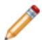

Note: Abaqus/CAE also enables you to save an animation in VRML format, which creates a three-dimensional rendition of the animation. Because these files are three-dimensional, they are not strictly image-based; however, you can play and distribute animation files in VRML format as you would files in another format like QuickTime.

In general, animation playback from a file provides better performance than object-based animation, particularly for large models. While an image-based animation is playing, you cannot change its display characteristics.

## In this section:

Time history animation  
Scale factor animation  
Harmonic animation

## Time history animation

In a time history animation Abaqus/CAE creates the images in the sequence by redrawing the deformed shape, contour, symbol, or material orientation plot for every specified frame found in the output database for the active steps and frames. Each image in a time history animation displays actual analysis results. The deformation scale factor remains constant for each image in a time history animation. Result frames can be drawn sequentially or selected from the active frames based on time intervals.

If you are animating a contour plot, the display of the field output values depends on options you select. The default behavior is for the values within the legend to be fixed based on the minimum and maximum values for the first and last animation frame. To learn how to set contour limits, see Setting contour limits.

## Additional information

• Customizing the display of steps and frames in the results  
• Producing a time history animation  
• Activating and deactivating steps and frames

## Scale factor animation

In a scale factor animation Abaqus/CAE creates all of the deformed shape, contour, or symbol plot images in the sequence from a single step and frame of the output database. Abaqus/CAE generates animation scale factors ranging from 0 to 1 or from −1 to 1, according to your specification. Individual images are formed by applying the range of animation scale factors to the field output values displayed in the plot. This gives the appearance of the field output evolving over time, although all images are produced from a single step and frame of your results. (To view the actual evolution of results over time, you must produce a time history animation.)

If you are animating a contour plot, the display of the field output values depends on options you select. The default behavior is for the values within the legend to be fixed based on the scaled minimum and maximum values for the selected results step and frame. To learn how to set contour limits, see Setting contour limits. To learn how to customize the legend, see Customizing the legend.

## Additional information

• Producing a scale factor animation  
• Customizing a scale factor or harmonic animation

## Harmonic animation

Harmonic animation is valid only for field output containing complex numbers. In a harmonic animation Abaqus/CAE creates all of the deformed shape, contour, or symbol plot images in the sequence from a single step and frame of the output database. Abaqus/CAE generates angles ranging from 0 to 180° or from −180° to 180°, according to your specification, and displays the value of the complex field output at each of these angles. This gives the appearance of the field output evolving over time, although all images are produced from a single step and frame of your results. (To view the actual evolution of results over time, you must produce a time history animation.) Harmonic animation is useful for simulating the vibration modes computed by an eigenvalue analysis.

If you are animating a contour plot, the display of the field output values depends on options you select. The default behavior is for the values within the legend to be fixed based on the range of the real component. To learn how to set contour limits, see Setting contour limits. To learn how to customize the legend, see Customizing the legend. To learn more about complex results, see Understanding complex results.

## Additional information

• Producing a harmonic animation

## Object-based animation

This section explains how to produce and customize Abaqus/CAE object-based time history, scale factor, and harmonic animations.

## In this section:

Producing and customizing an object-based animation  
Producing a time history animation  
Producing a scale factor animation  
Producing a harmonic animation  
Customizing a scale factor or harmonic animation  
Customizing the underlying plot of an animation

## Producing and customizing an object-based animation

In a time history animation you can customize the analysis steps and frames that Abaqus/CAE includes in your animation. In a scale factor or a harmonic animation you can customize the apparent motion of your model.

For all three types of animation you can customize the underlying deformed shape, contour, symbol, or material orientation plot.

At any time before or during object-based animation playback you can customize the deformed shape, contour, symbol, or material orientation plot that underlies your animation. For example, you can toggle the legend, adjust the deformation scale factor, or choose a different field output variable. Use the View, Result, and Options menus to customize the underlying plot of your animation.

## Additional information

• Producing a time history animation  
• Producing a scale factor animation  
• Producing a harmonic animation

## Producing a time history animation

Animating by time history produces a sequence of plots that vary over time according to actual analysis results. You can choose to animate a deformed shape, contour, symbol, or material orientation plot.

1. Use the File menu to open the output database containing your analysis results.  
2. To plot variables other than those Abaqus selects by default, use the Result menu.

• For animation of a deformed or material orientation plot, select the deformed field output variable for which Abaqus obtains values over time.  
For animation of a contour or symbol plot, select the primary field output variable or symbol field output variable to display. If you want to display your animating contour or symbol plot on the deformed shape, select the deformed field variable. For more information on field output variable selection, see Selecting field output variables.

3. To customize the steps and frames that Abaqus/CAE includes in the animation, locate the Active Steps/Frames dialog box.

From the main menu bar, select Result->Active Steps/Frames. For more information about activating steps and frames, see Customizing the display of steps and frames in the results.

4. Use the Options and View menus to select the customization options that you want. These may include deformed, contour, symbol, orientation, and view options.  
5. To initiate the animation, select Animate->Time History from the main menu bar.

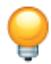

Tip: You can also produce a time history animation using the tool in the toolbox.

Animation begins in all animated viewports, and the animation controls appear in the right side of the context bar. Abaqus is now in the time history animation plot state. In this state Abaqus automatically refreshes your plot each time you click Apply or OK in the Results, Options, or View menu dialog boxes. All animated viewports remain in the time history animation state until you produce a plot in some other state, such as the undeformed or deformed state. To learn how to control the animation, see Controlling animation playback.

## Additional information

• Customizing the display of steps and frames in the results  
• Controlling animation playback

Animating by scale factor produces a sequence of images created from a single step and frame of the output database. These images can consist of either deformed shape, contour, or symbol plots. For deformed shape plots and for contour and symbol plots on the deformed shape, the images vary in the scale factors applied to the deformations. For contour and symbol plots, the images also vary in the scale factors applied to the field output.

1. Use the File menu to open the output database containing your analysis results.  
2. Use the Result menu to select the analysis results to be plotted, including the step and frame, the deformed field output variable, and, for contour or symbol plot animation, the primary field output variable or symbol field output variable to be plotted. For more information on field output variable selection, see Selecting field output variables.  
3. Use the Options and View menus to select the customization options that you want.  
4. To initiate the animation, select Animate->Scale Factor from the main menu bar.


Tip: You can also produce a scale factor animation using the tool in the toolbox.

Animation begins in all animated viewports, and the animation controls appear in the right side of the context bar. Abaqus is now in the scale factor animation plot state. In this state Abaqus automatically refreshes your plot each time you click Apply or OK in the Results, Options, or View menu dialog boxes. All animated viewports will remain in the scale factor animation state until you produce a plot in some other state, such as the undeformed or deformed state. For more information on customizing the underlying model shape, see Customizing model shape.

## Additional information

• Scale factor animation  
• Controlling animation playback  
• Customizing a scale factor or harmonic animation

## Producing a harmonic animation

Harmonic animation produces a sequence of images created from a single step and frame of the output database. These images can consist of either deformed shape, contour, or symbol plots. For deformed shape plots and for contour and symbol plots on the deformed shape, the images vary in the angle applied to the value of the deformations. For contour and symbol plots, the images vary in the angle applied to the field output; both the real and the imaginary components of the results are used.

By default, Abaqus/CAE displays a frame counter during harmonic animation. The frame counter indicates the current angle when complex results are viewed.

1. Use the File menu to open the output database containing your analysis results.  
2. Use the Result menu to select the analysis results to be plotted, including the step and frame, the deformed field output variable, and, for contour or symbol plot animation, the primary field output variable or symbol field output variable to be plotted. For more information on field output variable selection, see Selecting field output variables.  
3. Use the Options and View menus to select the customization options that you want.  
4. To initiate the animation, select Animate->Harmonic from the main menu bar.


Tip: You can also produce a harmonic animation using the tool in the toolbox.

Animation begins in all animated viewports, and the animation controls appear in the prompt area. Abaqus is now in the harmonic animation plot state. In this state Abaqus automatically refreshes your plot each time you click Apply or OK in the Results, Options, or View menu dialog boxes. All animated viewports will remain in the harmonic animation state until you produce a plot in some other (for example, undeformed, deformed) state. For more information on customizing the underlying model shape, see Customizing model shape.

## Additional information

• Harmonic animation  
• Controlling animation playback  
• Customizing a scale factor or harmonic animation

You can customize the apparent motion of your animated model by choosing between the scale factor range Half cycle and the extended range Full cycle. The extended range is useful, for instance, to visualize a vibration mode obtained by modal analysis. You can also vary the number of frames (separate images) in the animation. A greater number of frames produces a smoother animation.

In a scale factor animation Abaqus/CAE divides the scale factor range by the number of frames to compute the animation scale factor values. These values are applied to the deformation scale factors in each coordinate direction and to the field output variable values to produce each image in the animation sequence.

In a harmonic animation Abaqus/CAE divides the angle range by the number of frames to compute the animation angle values. These values are applied to compute the value of the field output variable at that angle and to produce each image in the animation sequence.

1. Locate the Scale Factor/Harmonic options.

From the main menu bar, select Options->Animation; then click the Scale Factor/Harmonic tab in the dialog box that appears. The Scale Factor/Harmonic options appear.

2. To control the range, click the Relative Scaling that you want:

Full cycle: for scale factor animation (real numbers) this selection corresponds to the range −1 to 1; for harmonic animation (complex numbers having real and imaginary components) this selection corresponds to the range −180° to 180°.  
Half cycle: for scale factor animation (real numbers) this selection corresponds to the range 0 to 1; for harmonic animation (complex numbers having real and imaginary components) this selection corresponds to the range 0 to 180°.

3. To choose the number of separate images in your animation, click the Frames arrow.

The specified number of frames appears in the Frames box.

4. Click Apply to implement your changes.

The scale factor or harmonic animation in all animated viewports changes to reflect the relative scaling and the number of frames you have specified.

Your changes are saved for the duration of the session and will affect all subsequent plots in the harmonic or scale factor animation state.

## Additional information

• Scale factor animation  
• Producing a scale factor animation  
• Harmonic animation  
• Producing a harmonic animation  
• Customizing the underlying plot of an animation  
• Scaling deformations

## Customizing the underlying plot of an animation

Time history, scale factor, and harmonic animations all display a series of deformed shape, contour, symbol, or (for time history animations only) material orientation plots in rapid succession. At any time before or during animation playback you can customize the deformed shape, contour, symbol, or material orientation plot that underlies your animation. For example, you can toggle the legend, adjust the deformation scale factor, or choose a different field output variable. Use the View, Result, and Options menus to customize the underlying plot of your animation.

1. Locate the customization options applicable to the current plot state.

• For contour plot animation, select Options->Contour from the main menu bar.  
• For symbol plot animation, select Options->Symbol from the main menu bar.  
• For material orientation plot animation, select Options->Material Orientation from the main menu bar.

2. From the dialog box that appears, select the plot state–dependent customization options that you want. For more information, see Customizing your plots.  
3. Set the plot state–independent customization options that you want by selecting the Options->Common, Options->Superimpose, Viewport->Viewport Annotation Options, View->Graphics Options, or View->ODB Display Options.  
4. Choose the results variables to be animated by selecting Result->Field Output.  
5. Select the results steps and frames to be animated:

• For scale factor or harmonic animation, choose the single step and frame to be animated by selecting Result->Step/Frame.  
• For time history animation, choose the steps and frames to be animated by selecting Result->Active Steps/Frames.

## Saving an animation file

You can save animations playing in one or more viewports to a file. Once saved, your animation can be played using industry-standard animation software. This section explains how to save animations to a file and how to control the format of that file.

## In this section:

Saving animations  
Choosing the animation file format

## Saving animations

You save animations to a file by first playing animations in one or more viewports and then selecting Animate->Save As from the main menu bar.

You can choose to save all or just selected viewports. Viewports that you save can be in any plot state (for example, deformed, X–Y, or animation). For viewports currently in the animation plot state Abaqus/CAE saves all frames of the animation, starting with the first frame; it does not matter whether the animation is playing at the time you perform the save. If you save multiple viewports containing animations, Abaqus/CAE saves them all as a single image-based animation. Abaqus/CAE synchronizes multiple animations of the file by repeating the last frame of any animations that have fewer frames than the others.

1. Produce one or more time history, scale factor, or harmonic animations.

For more information, see Object-based animation.

2. From the main menu bar, select Animate->Save As.

The Save Image Animation dialog box appears.

3. For MP4, AVI, QuickTime, or GIF format, use the Selection field to choose the viewports to save:

a. Click the arrow next to the Capture field to save All Viewports (the default) or the Current Viewport.

b. Toggle Capture viewport decorations to control whether Abaqus/CAE saves visible viewport decorations.

For VRML or Compressed VRML format, the saved animation will display the current viewport only and omit viewport decorations.

4. Use the Settings field to specify the name and format of your animation file:


a. Click to filter and browse file names, or enter the file name of your choice in the File name field. For more information, see Using file selection dialog boxes.

b. From the Format options, select MP4 (the default), AVI, QuickTime, GIF, VRML, or Compressed VRML format for your file. To learn more about these format options, see Choosing the animation file format.

5. For MP4, AVI, QuickTime, or GIF format, use the Frame Rate field to specify the number of frames that display per second in the saved animation.

You can specify any positive integer as the frame rate by entering a value in the Rate field or drag the slider to select a frame rate between 1 and 50 frames/second. By default, the frame rate matches the frame rate currently selected on the Player page.

6. Click Apply to save your animation.

Abaqus/CAE captures canvas viewports to a file according to your specifications.

## Additional information

• Saving an animation file

## Choosing the animation file format

You can choose to save animations to a file in MP4 (the default), AVI, QuickTime (MOV), animated GIF, or Virtual Reality Modeling Language (VRML) format.

You can choose between compressed and uncompressed files in VRML, AVI, and QuickTime formats. Additional image size and compression options are available for MP4, AVI, and QuickTime formats.

When you save animations in MP4 format, you can compress the file using the H.264 codec if an installation of the FFmpeg program that supports H.264 encoding can be found on your system. Otherwise, the file is encoded using the MPEG-4 (Part 2) codec. For H.264 encoding, the FFmpeg program location should be included in the PATH environment where Abaqus/CAE is launched. For more information about FFmpeg, visit https://ffmpeg.org.

When you save animations in AVI format on Windows systems, you can compress the file using any codec on your system and you can set the quality level of the file. These options are not available on Linux systems.

## Improving playback of VRML animations

Animations in VRML or Compressed VRML format might require further customizations to play back properly on client computers. Several components on the client's computer determine the quality of VRML playback, including the graphics hardware, VRML plug-in software, and the settings selected for the plug-in software. When these components differ from the components on the computer that created the VRML animation, VRML playback on the client's computer can exhibit display problems such as blurry text in the viewport annotations. You can improve client playback of a particular VRML file either by configuring plug-in settings on the client's computer or by creating a new version of the VRML animation with different viewport annotation settings.

To customize VRML display on the client's computer, open the settings for the VRML plug-in on the client's computer, and toggle on any antialiasing settings. Enabling antialiasing can help clarify text in a VRML image or animation but can degrade performance.  
To create a new VRML animation, return to Abaqus/CAE and increase the text size or choose a different font for each of the viewport annotations in the viewport and save a new copy of the VRML animation. For more information about changing the font and type size, see Customizing viewport annotations.

## Additional information

• Saving animations

## Choose VRML or Compressed VRML format

1. Locate the animation file format options. From the main menu bar, select Animate->Save As; the Save Image Animation dialog box appears.  
2. From the Format options, select VRML, or Compressed VRML format. For both VRML formats, Abaqus/CAE deactivates the Selection and Frame Rate fields; you cannot customize these settings for VRML or Compressed VRML animations.

## Choose MP4 format

1. Locate the animation file format options. From the main menu bar, select Animate->Save As; the Save Image Animation dialog box appears.  
2. From the Format options, select MP4.  
3. To select additional MP4 format options, click

The MP4 Options dialog box appears.

4. In MP4 Options dialog box, choose one of the following methods to specify the size (in pixels) of the animation image:

Click Use size on screen to use the size of the image on the screen. (Abaqus/CAE indicates the current image size in the MP4 Options dialog box.) This method is the default.  
Click Use settings below to set the width or height; then enter the value of your choice in the Width or Height field. You specify only one dimension; Abaqus/CAE computes the other dimension to maintain the aspect ratio of the viewports.

5. Specify in the MP4 Options dialog box your preferred encoding.

a. From the Codec list, select either H.264 / AVC or MPEG-4 Part 2. H.264 / AVC is widely supported by video editing and playback software, and offers generally a superior compression versus quality tradeoff, but it is available only if an FFmpeg installation with H.264 encoding enabled can be found on your system, as described above.

b. Drag the Quality slider to specify the compression quality of the file. The highest value, 100, produces the highest quality animation file with the smallest degree of compression.

6. Click OK to close the MP4 Options dialog box.

Your options settings are saved for the duration of the session.

## Choose AVI format

1. Locate the animation file format options.

From the main menu bar, select Animate->Save As; the Save Image Animation dialog box appears.

2. From the Format options, select AVI.

3. To select additional AVI format options, click


The AVI Options dialog box appears.

4. In the AVI Options dialog box, choose one of the following methods to specify the size (in pixels) of the animation image:

Click Use size on screen to use the size of the image on the screen. (Abaqus/CAE indicates the current image size in the options dialog box.) This method is the default.  
Click Use settings below to set the width or height; then enter the value of your choice in the Width or Height field. You specify only one dimension; Abaqus/CAE computes the other dimension to maintain the aspect ratio of the viewports.

5. For Linux systems, specify in the AVI Options dialog box whether your file should be compressed (run length encoded) or uncompressed (raw).

From the Compression list in the AVI Options dialog box, select Rle (8 bits/pixel), Raw (8 bits/pixel), or Raw (32 bits/pixel). Choosing Rle (8 bits/pixel) compression or Raw (8 bits/pixel) can result in a loss of colors.

6. For Windows systems, specify in the AVI Options dialog box whether your file should be compressed or uncompressed (raw). If you elect to compress the file, you can select one of the Abaqus/CAE predefined compressors or one of the video codecs available on your system. You can specify the compression quality of the saved animation file.

a. From the Codec list, select one of the following:

Select None - 8 bits/pixel to create a raw animation using a reduced set of colors. Choosing this option can result in a loss of colors.  
• Select None - 24 bits/pixel to create a raw animation file without any compression.  
• Select one of the video codecs. The Codec list displays every codec that is available on your system.

Some video codecs include configurable options that enable you to change certain aspects of the video file. When you select a codec that allows this configuration, the Configure button becomes active. You can also learn more about a particular codec by clicking the About button when the codec is selected.

b. To configure a codec, click Configure and then choose configuration options from the dialog box that appears. Each configurable video codec provides different configuration options; for example, some codecs allow you to control the transparency of the animation or to create a scalable file.


Note: You might encounter problems while saving an animation in AVI format with MPEG-4 codec compression using a Python script. To avoid these problems, you can use the GUI described in this procedure or you can configure the Xvid codec to switch off the encoding status window (Xvid configuration->Other options->Encoder: toggle off Display encoding status).

c. Drag the Quality slider to specify the compression quality of the file. The highest value, 100, produces the highest quality animation file with the smallest degree of compression.

7. Click OK to close the AVI Options dialog box.

Your options settings are saved for the duration of the session.

## Choose QuickTime format

1. Locate the animation file format options.  
From the main menu bar, select Animate->Save As; the Save Image Animation dialog box appears.

2. From the Format options, select QuickTime.

3. To select additional QuickTime format options, click


The QuickTime Options dialog box appears.

4. In QuickTime Options dialog box, choose one of the following methods to specify the size (in pixels) of the animation image:

Click Use size on screen to use the size of the image on the screen. (Abaqus/CAE indicates the current image size in the QuickTime Options dialog box.) This method is the default.

Click Use settings below to set the width or height; then enter the value of your choice in the Width or Height field. You specify only one dimension; Abaqus/CAE computes the other dimension to maintain the aspect ratio of the viewports.

5. Specify in the QuickTime Options dialog box whether your file should be compressed (run length encoded) or uncompressed (raw).

From the Compression list, select either Raw (24 bits/pixel) or Rle (24 bits/pixel). Rle (24 bits/pixel) compression is a form of run length encoding, which provides lossless compression with no image degradation.

6. Click OK to close the QuickTime Options dialog box.

Your options settings are saved for the duration of the session.

## Choose GIF format

1. Locate the animation file format options.  
From the main menu bar, select Animate->Save As; the Save Image Animation dialog box appears.

2. From the Format options, select GIF.

3. To select additional GIF format options, click


The GIF Options dialog box appears.

4. In GIF Options dialog box, choose one of the following methods to specify the size (in pixels) of the animation image:

Click Use size on screen to use the size of the image on the screen. (Abaqus/CAE indicates the current image size in the GIF Options dialog box.) This method is the default.  
Click Use settings below to set the width or height; then enter the value of your choice in the Width or Height field. You specify only one dimension; Abaqus/CAE computes the other dimension to maintain the aspect ratio of the viewports.

5. Click OK to close the GIF Options dialog box.

Your options settings are saved for the duration of the session.

## Controlling animation playback

During an object-based animation you can control the speed and repetition of playback, and you can stop, restart, and step through your animation.

Most industry-standard animation software supports the same functions for image-based animation, but the available options are based on the application that you choose. For object-based animations one additional option is available: you can display or suppress status information while the animation is playing.

If you are using multiple viewports to display animations, you can include or exclude individual viewports from the common animation time line. By default, each new viewport you create will be included in the synchronization.

This section explains how to control animation playback.

## In this section:

Stopping, restarting, and stepping through an animation  
Navigating to a specific frame in the animation  
Controlling animation speed and repetition  
Showing the animation frame counter  
Customizing animation of X–Y plots  
Controlling animations in multiple viewports  
Customizing the time history of synchronized viewports

## Stopping, restarting, and stepping through an animation

You can use the movie player controls to play and pause your animation, to step forward or backward through the animation images, and to step to the first or last image in the animation sequence.

During animation, the movie player controls appear on the right side of the context bar.

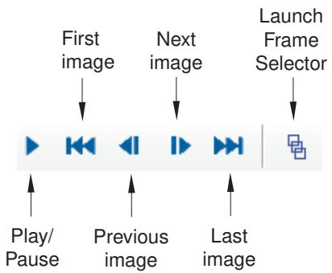

If you display animations in multiple viewports, the movie player controls stop, restart, and step through frames in all synchronized viewports.

You can also use the right-most button in the movie player controls to launch the Frame Selector dialog box, which allows you to navigate directly to a particular frame in the animation. This tool is discussed in Navigating to a specific frame in the animation.

1. Locate the movie player controls on the right side of the context bar.  
2. Click the movie player controls to execute the functions you want. The controls are listed below in the order in which they appear in the context bar, starting with the left-most arrow.

Play/Pause Plays or pauses. When your animation is playing, this button displays the Pause symbol; when paused, this button displays the Play symbol.

First image Stops play and displays the first image in the animation sequence.

Previous image Stops play and steps to the previous image in the animation sequence.

Next image Stops play and steps to the next image in the animation sequence.

Last image Stops play and displays the last image in the animation sequence.

Launch Frame Selector Opens the Frame Selector dialog box, from which you can navigate to a specific frame of the animation.

## Additional information

• Controlling animation playback  
• Navigating to a specific frame in the animation  
• Controlling animations in multiple viewports

The Frame Selector dialog box allows you to navigate quickly to a particular frame in the output database in the current viewport. This tool provides two methods for controlling the current frame: you can enter a frame index or time value directly into a field on the left side of the dialog box, or you can drag the slider on the right side of the dialog box to the desired frame or time.

The labels in the dialog box are context-sensitive and depend on whether an animation is being displayed, the type of animation, and for time history animations, whether the time history is frame-based or time-based.

When no animation is displayed in the current viewport, the Frame Selector labels display step names. The name of the current step appears above the field on the left side of the dialog box. The names of the first and last active steps in the output database appear above the slider. In the example below, the current frame is frame 20 of the Extract frequencies step, the first step is Extract frequencies, and the last step is Transient modal dynamics.


For scale factor or harmonic animations the Frame Selector labels displays the frame index of the current frame, and the slider shows the frame index of the first and last active frames. The dialog box displays Frame above the field and the numbers of the first and last active frames above the slider.  
For time history animations the Frame Selector labels display frame information when you select a frame-based time history and display time information when you select a time-based time history. In the latter case the dialog box displays Time above the field and the time values of the first and last active frames above the slider. For more information about selecting a time history option, see Customizing the time history of synchronized viewports.

1. Open the Frame Selector dialog box.

From the movie player controls on the right side of the context bar, click the button. The Frame Selector dialog box appears.

2. Choose one of the following methods to specify the frame you want to display:

• Enter a number directly into the Frame Selector field.  
You can enter the overall frame number in the entire output database for scale factor animations, harmonic animations, or frame-based time history animations; you can enter the time for time-based time history animations; or you can enter the frame number within the current step when no animation is displayed.  
• Drag the slider to the frame index or time value that you want to display. The current viewport changes as you drag the slider.

## Additional information

• Controlling animation playback  
• Stopping, restarting, and stepping through an animation

## Controlling animation speed and repetition

You can control the speed of your object-based animation playback, and you can choose to play your animation once or to repeat it.

If you choose to repeat the animation, you can select one of three repetition modes: loop, loop backward, or swing. Loop repeats by jumping from the last animation frame to the beginning of your movie. Loop backward plays the animation backward and repeats by jumping from the first animation frame to the end of your movie. Swing repeats smoothly by playing your movie from beginning to end and then playing from the end back to the beginning.

The speed control settings you specify before you create image-based animations determine the default frame rate that is used when the animation files (for example, MP4 or QuickTime) are replayed from within industry-standard animation software.

1. In the prompt area, click Animation Options; and click the Player tab in the dialog box that appears.  
2. To control the playback speed of your animation, drag the Frame rate slider to the rate that you want.  
3. To control the repetition of the images in your animation sequence:

• Click Play once to suppress repetition.  
• Click Loop to play the images in order from the first to the last, repeatedly.  
• Click Loop backward to play the images in order from the last to the first, repeatedly.  
• Click Swing to play the images from the first to the last and then in reverse order from the last back to the first, repeatedly.

4. Click Apply to implement your changes.

The animation in all animated viewports changes according to your specifications.

Your changes are saved for the duration of the session and will affect all subsequent plots in this state.

## Additional information

• Stopping, restarting, and stepping through an animation

## Showing the animation frame counter

For object-based animations you can display or suppress animation frame count information, which is displayed in the upper-right corner of the viewport and consists of

• the scale factor of each image in your scale factor animation,  
• the phase angle of each image in your harmonic animation, or  
• the step and frame (plot number within the step) of each image contained in your time history animation.

You cannot customize the content or appearance of the counter, other than to turn it off entirely.

The step and increment associated with each animation step and frame are given by the state block. All of the images in a scale factor animation are based on a single step and frame. For more information on customizing the state block, see Customizing the state block.

1. Find the Show frame counter option.  
In the prompt area, click Animation Options; and click the Player tab in the dialog box that appears. The Show frame counter option is near the bottom of the page.

2. Toggle Show frame counter to display or suppress animation frame count information.

3. Click Apply to implement your changes.

The animation in all animated viewports changes according to your specifications. When Show frame counter is on, Abaqus/CAE displays status information in the upper right corner of all animated viewports. This information is updated for every image in your animation sequence. You may need to stop playback to read it.

Your changes are saved for the duration of the session and will affect all subsequent plots in this state.

## Additional information

• Stopping, restarting, and stepping through an animation

## Customizing animation of X–Y plots

You can customize the appearance of the time tracker line and symbols.

When you animate a time-dependent X–Y plot, Abaqus/CAE adds a vertical line to the plot that moves along the X-axis to highlight the current time. The plot also displays a colored symbol at the data point on each X–Y curve that occurred closest to the current time; time tracker symbols do not appear at the exact intersection of the time tracker line and an X–Y curve unless that curve contains a data point at the currently displayed time.

For X–Y plots whose axes are not time but are obtained from output database results (for example, by combining two time-dependent X–Y data objects), Abaqus/CAE also adds a vertical line. In such cases, the line is added if there is only one curve in the plot.

The figure below shows an X–Y plot with the time tracker line and symbols displayed.


By default, the time tracker line and symbols are displayed using the highlight method that you have selected for your session; see Choosing a highlight method for more information. However, you can customize their appearance by changing the color, thickness, and style of the time tracker line and the color, shape, and size of the time tracker symbols. Alternatively, you can completely suppress either time tracker component. The default highlight method offers the best performance.


## Note:

These line and symbol options control the appearance of the time tracker only. You can also customize the lines and symbols used to display the X–Y curves themselves; see Customizing the appearance of an X–Y curve.

1. Locate the XY options.  
In the prompt area, click Animation Options; and click the XY tab in the dialog box that appears.

2. Toggle off Draw using highlight method if you want to customize the appearance of the X–Y plot time tracker.

3. Toggle Show line to display or suppress the time tracker line.  
When Show line is on, the time tracker line is displayed and the line attribute options are enabled.

4. Choose the time tracker line style:

a. Click the Style button to reveal the line style options (solid, dashed, etc.).

b. From the style list, click the desired line style.

The specified line style appears on the Style button.

5. Choose the time tracker line thickness:

a. Click the Thickness button to reveal the line thickness options.  
b. From the thickness list, click the desired line thickness.  
The specified thickness appears on the Thickness button.

6. Choose the time tracker line color:

a. Click the color sample .

Abaqus/CAE displays the Select Color dialog box.

b. Use one of the methods in the Select Color dialog box to select a new color. For more information, see Customizing colors.

c. Click OK to close the Select Color dialog box.

The color sample changes to the selected color.

7. Toggle Show symbol to display or suppress the symbols representing the current value of each selected X–Y curve's data points.

When Show symbol is on, symbols are displayed and the symbol attributes are enabled.

8. Choose the symbol:

a. Click the Symbol button to reveal the choice of symbols.  
b. From the list of symbols, click the desired symbol.  
The specified symbol appears on the Symbol button.

9. Choose the time tracker symbol color:

a. Click the color sample .

Abaqus/CAE displays the Select Color dialog box.

b. Use one of the methods in the Select Color dialog box to select a new color. For more information, see Customizing colors.

c. Click OK to close the Select Color dialog box.

The color sample changes to the selected color.

10. Choose the time tracker symbol size:

a. Click the Size button to reveal the symbol size options.  
b. From the symbol size options, click the desired symbol size.  
The specified symbol size appears on the Size button.

11. Click Apply.

The current viewport displays your color, thickness, style, and symbol selections.

## Additional information

• Customizing the time history of synchronized viewports

## Controlling animations in multiple viewports

By default, Abaqus/CAE animates data in every animation-eligible viewport in your session. All animations are synchronized, so the viewports play, stop, and increment together when you examine data frame by frame, animate a model plot, or animate a time-dependent X–Y plot.

You can activate and deactivate the animation of individual viewports, which enables you to display animations only for a subset of the animation-eligible viewports in your session. From the Linked Viewports Manager, toggle on Link viewports and Animation and use the Linked Viewports portion of the Linked Viewports Manager to deselect the viewports that you want to remain independent.

1. Link viewports using one of the following methods:

• From the main menu, select Viewport->Link Viewports.


Tip: You can activate or deactivate linked viewports by clicking in the Viewport toolbar.

• From the main menu, select Viewport->Linked Viewports Manager and toggle on Link viewports.


Tip: You can also display the Linked Viewports Manager by clicking in the Viewport toolbar.

2. In the Linked Viewports Manager, ensure that Animation is toggled on and the required viewports are selected in the Linked Viewports table.  
3. If you made changes in the Linked Viewports Manager, click Apply. Alternatively, click OK to apply your changes and to close the manager.  
4. Start a time history, scale factor, and harmonic animation using any method.

## Additional information

• Customizing the time history of synchronized viewports

## Customizing the time history of synchronized viewports

The time history settings control whether Abaqus/CAE uses a frame-based history or a time-based history when you display time history animations. Frame-based synchronization allows all synchronized viewports to increment together one frame at a time, while time-based synchronization allows viewports to display data according to a common time line.

When you choose time-based animation, you can also customize three aspects of the common time line:

• The time step, which controls how much time elapses each time you increment your display of the data.  
• The minimum time, which is the earliest point from which data will be included. If you auto-compute the minimum time, Abaqus/CAE includes data starting from the beginning of the common time line.  
• The maximum time, which is the latest point from which data will be included. If you auto-compute the maximum time, Abaqus/CAE includes data up to the end of the common time line.

1. Find the Time History options.  
In the prompt area, click Animation Options; and click the Time History tab in the dialog box that appears.  
2. From the options at the top of the page, choose either Frame-based or Time-based.  
3. If desired, change the Time increment value. The time increment applies to time-based animation only.  
4. If desired, customize the Min time and Max time by entering values in the appropriate Specify fields. These values apply to time-based animation only.  
5. Click Apply.

## Additional information

• Changing the period of a step  
• Controlling animations in multiple viewports

## Querying the model in the Visualization module

This section explains how you can use the Query toolset to obtain general information about the mesh and specific Visualization module information.

## In this section:

Understanding the Query toolset in the Visualization module  
Using the Query toolset

## Understanding the Query toolset in the Visualization module

The Query toolset allows you to obtain general information about your model.

The Visualization module displays the requested information in the message area, and the same information is written to the replay file.

Select Tools->Query from the main menu bar, or select the i tool from the Query toolset to use the Query toolset. Items under General Queries provide the following information:

## Node

You can obtain information on a selected node's label, deformed and undeformed coordinates, and displacement. You can select a local CSYS in which to display the coordinates.

## Distance

You can obtain information on the deformed and undeformed distance between two selected nodes and the relative displacement between the nodes. You can select a local CSYS in which to display the coordinates of the picked points and the components of the result.

## Angle

• You can obtain information on the deformed and undeformed angle formed between three selected nodes. The second node that you select is the angle's vertex.  
• You can obtain the angle between two edges or faces or between an edge and a face.

## Element

You can obtain information on a selected element's mesh type, material, section, connectivity, and current field output variables at the integration point locations. This query is available only when an output database is selected.

## Mesh

You can obtain information on the name of the current output database, the number of nodes and elements in your model, and the element types.

## Mass properties

You can obtain basic mass properties for the whole model in the output database or for a portion of the model. In the Visualization module, the mass properties are always calculated based on model data (undeformed shape). This query is available only when an output database is selected. Abaqus/CAE returns the following information:

Volume  
• Volume centroid  
• Mass  
• Center of mass  
• Moments of inertia about the center of mass or about a specified point

## Element face normal

You can obtain the surface normal components for an element face. You can select a local CSYS in which to display the normal.

## Advanced distance

Whereas the regular distance query allows you to find the distance between two selected single entities, the advanced distance query allows you to find the minimum distance between groups of entities. These entities can be nodes, elements, vertices, edges, faces, or cells, and you can select them from the viewport or by set. You can select a local CSYS in which to display the coordinates of the closest points and the components of the result.

For more information on general model queries, see Querying the model in the Visualization module.

Items under Visualization Module Queries provide the following information:

## Probe values

Abaqus/CAE displays information in the Probe Values dialog box as you move the cursor around the current viewport. Probing a model plot displays model data and analysis results; probing an X–Y plot displays X–Y curve data. For more information on probing, see Probing the model.

## Stress linearization

Stress linearization is the separation of stresses through a section into constant membrane and linear bending stresses. Abaqus performs stress linearization calculations and displays the results in the form of an X–Y plot. Stress linearization is available for output databases only. For more information on stress linearization, see Calculating linearized stresses.

## Active elements and nodes

Abaqus/CAE displays the label numbers of all the active nodes or active elements in the current viewport. For more information, see Querying active node or element labels.

## Ply stack plot

Abaqus/CAE creates a new viewport and displays a representative image of a composite layup. The image shows the plies in the layup along with details of each ply, such as its fiber orientation, thickness, reference plane, and integration points. Ply stack plots are available for output databases only. For more information, see Viewing a ply stack plot.

• Probing the model  
• Calculating linearized stresses  
• Viewing a ply stack plot

## Using the Query toolset

You can use the Query toolset to obtain general model information.

## In this section:

Querying the model in the Visualization module  
Querying active node or element labels

## Querying the model in the Visualization module

1. Locate the Query dialog box.

From the main menu bar, select Tools->Query or click the tool in the Query toolset. The Query dialog box appears.

2. To obtain information on a particular node, do the following:

a. Select Node from the General Queries field of the Query dialog box.

Abaqus/CAE displays a prompt in the prompt area.

b. Select a node from the viewport.

The undeformed and deformed X-, Y-, and Z-coordinates of that node appear in the message area, along with the node's displacement. The same information that appears in the message area is also written to the replay file.

c. Select a local CSYS from the viewport to display the node coordinates in the local coordinate system. If a local CSYS is not selected, the node coordinates will be displayed in the global Cartesian system.


## Note:

To resize the message area, drag the top edge; to see information that has scrolled out of the message area, use the scroll bar on the right side.

3. To obtain information on the distance between two nodes, do the following:

a. Select Distance from the General Queries field of the Query dialog box.

Abaqus/CAE displays a prompt in the prompt area.

b. Select two nodes from the viewport.

The following information appears in the message area:

• The undeformed and deformed X-, Y-, and Z-coordinates of each node, along with the node's displacement.  
• The absolute undeformed and deformed distances between the nodes.  
• The X-, Y-, and Z-components of the undeformed and deformed vector between the two nodes.  
• The absolute relative displacement between the nodes.  
• The X-, Y-, and Z-components of the relative displacement between the two nodes.

c. Select a local CSYS from the viewport to display the coordinates of the picked nodes and the components of the result in the local coordinate system. The last chosen CSYS will be used for the calculations. If any local CSYS is not selected, the results will be displayed in the global Cartesian system.

4. To obtain angle information, select Angle from the General Queries field of the Query dialog box, and select 3 Nodes or Face/Edge from the prompt area.

• If you selected 3 Nodes, select three nodes from the viewport. The second node that you select is the vertex of the angle.

The following information appears in the message area:

The undeformed and deformed X-, Y-, and Z-coordinates of each node, along with the node's displacement.  
- The absolute undeformed and deformed angle between the nodes.

• If you selected Face/Edge, select two faces or two edges or select a face and an edge. The angle between the selected faces/edges is displayed in the message area.

5. To obtain information on a particular element in an output database, do the following:

a. Select Element from the General Queries field of the Query dialog box.

Abaqus/CAE displays a prompt in the prompt area.

b. Select an element from the viewport.

The following information appears in the message area:

• The element's label, element type, material, and section.  
• The labels of connecting elements.  
• The current field output variables at the integration point locations.

6. To obtain general information on the mesh, select Mesh from the General Queries field of the Query dialog box.

The following information appears in the message area:

• The name of the current output database.  
• The number of nodes.  
• The number of elements.  
• The element types.

7. To obtain general information on the mass properties in an output database, do the following:

a. Select Mass properties from the General Queries field of the Query dialog box.

Abaqus/CAE displays a prompt in the prompt area for the last selection method used or All elements if this is the first time using the Mass properties query in the current session.

b. Choose one of the following selection methods from the list in the prompt area:

• All elements  
• Select elements from viewport  
• Part instances  
• Element sets  
• Sections  
• Materials  
• Element types  
• Display groups

Abaqus/CAE displays additional selection fields in the prompt area, depending on the selection method that you chose.

c. Complete your selection as follows:

• If your selection from the previous step is All elements, click Done to perform the query.

If you chose Select elements from viewport in the previous step, make selections from the viewport (for more information, see Selecting objects within the viewport”). You can select a part instance in the prompt area and enter a single element number to get mass information for that element.  
For the remaining selection methods, select the part instance, element set, section, material, element type, or display group name from the list in the prompt area, or make selections from the viewport.

When you select an object from the prompt area or when you click Done to complete a viewport selection, Abaqus/CAE displays the mass properties for your selection in the message area.

d. If any items in your selection have poorly defined density or thickness, click Options in the prompt area to display the Mass Properties Query Options dialog box and specify a value to be substituted by Abaqus/CAE for the undefined quantity.

Click OK in the dialog box to save your entries and close the dialog, or click Reset to return to the previous settings.

Abaqus/CAE displays the mass properties in the message area for the items you selected. The following properties are available:

• Surface area (for shell elements only)  
• Area centroid  
Volume  
• Volume centroid  
• Mass  
• Center of mass  
• Moments of inertia about the center of mass or about a specified point

8. To obtain the surface normal components, do the following:

a. Select Element face normal from the General Queries field of the Query dialog box.

Abaqus/CAE displays a prompt in the prompt area.

b. Select an element face in the viewport, and click Done.

The surface normal components in the global Cartesian coordinate system of the element face appear in the message area.

c. Select a local CSYS from the viewport to display the surface normal components in the local coordinate system. If any local CSYS is not selected, the surface normal components will be displayed in the global Cartesian system.

The surface normal components will differ if you query the same element face on the undeformed shape and the deformed shape.

9. Close the Query dialog box when you have finished requesting information.

## Additional information

• Understanding the Query toolset in the Visualization module  
• Querying mass properties

## Querying active node or element labels

You can use the Query toolset to request the label numbers of all currently active nodes or active elements in the current viewport. The active nodes and elements are those that are in the current display group, less any entities removed from the display by the active view cut. Abaqus/CAE displays label numbers in the prompt area for each applicable part instance and prints label numbers to the replay file.

When you request the active nodes or elements, Abaqus/CAE displays the label numbers only; it does not provide any other nodal or element data and results. To display more information about a single node or element, see Probing nodes, or Probing elements, respectively.

1. Locate the Visualization Module Queries options.

From the main menu bar, select Tools->Query or click the tool in the Query toolset. The Query dialog box appears, and the Visualization Module Queries are displayed in the lower portion of the dialog box.

2. Click either Active nodes or Active elements.

In the prompt area, Abaqus/CAE displays a list of labels for all active nodes or active elements for each part instance in the model.

## Additional information

• Probing nodes  
• Probing elements

## Probing the model

This chapter explains how you can use the Query toolset in the Visualization module to probe model and X–Y plots for output data and to probe an Abaqus/CAE model for attribute values.

For information on writing selected probe values to a file, see Generating tabular data reports.

## In this section:

Understanding probing  
Using the Query toolset to probe the model

## Understanding probing

This section explains probing model plots and X–Y plots.

When you click the tool in the Visualization module toolbox, Abaqus/CAE enters probe mode and displays information in the Probe Values dialog box as you move the cursor over the model in the current viewport. You can

also enter probe mode using the tool in the Query toolbar. Probing a model plot displays model data and analysis results; probing an X–Y plot displays X–Y curve data; and probing a model from the current model database displays the model data and the values of attributes such as loads and predefined fields. You can write this information to a file.

The data table in the bottom portion of the Probe Values dialog box contains two dynamic display rows (the row immediately above the row headings and the bold data row that appears first in the table) and a series of additional storage rows. Abaqus/CAE updates the dynamic rows continuously to show the probe values as you move the cursor over the model in the current viewport, and you can change the value displayed in the top display row by clicking a column heading. Abaqus/CAE updates the table with additional rows only when you select values of interest by clicking in the viewport, specifying a node or element label, or selecting the nodes or elements in a particular display group. Values accumulate in the bottom portion of the dialog box until you delete them, clear the table, or cancel probe mode. You can also add selected values to a new display group, and you can annotate individual nodes or elements with field output values at that location.

## Probes of models or model plots

If the current viewport contains a model plot (an undeformed, deformed, contour, symbol, or material orientation plot) or a model from the current model database,, Abaqus/CAE allows you to probe results from the selected model or output database. The Probe Values dialog box identifies the step, frame, and field output variable for which Abaqus/CAE will obtain values. To learn how to change the step, frame, or field output variable, see Selecting the results step and frame, and Selecting the primary field output variable.

When you probe a model plot of a three-dimensional shell or a composite solid, the results that Abaqus/CAE returns depend on your choice of active location in the Section Points dialog box. Abaqus/CAE returns results from the Top Location section point when Top is the active location and returns results from the Bottom Location section point when the active location is set to Bottom or Top and bottom. For more information about section points, see Selecting section point data.

For model plots you can choose to obtain node-based or element-based data and results, as follows:

## Probing nodes

When you choose to probe nodes and position the cursor over a nodal location in the current viewport, Abaqus/CAE highlights the node and displays the following information about the node in the data table:

• the node's label,  
• the node's original coordinates,  
• the node's deformed coordinates (using the current deformed field output variable),  
• the elements sharing the node, and  
the current field output variable (including component values, if the current field output variable is a tensor or vector quantity). If a model is selected in the current viewport, the current field output variable reflects the value of a model attribute such as a load at the selected node.

You can display field output at the node whether the current primary variable was originally saved to the output database at nodal, centroidal, or integration point locations. Abaqus/CAE calculates nodal values for centroidal and integration point data by extrapolating to the nodes and averaging according to options you select. If the node refers to unaveraged element data, all element data associated with the probed node will be displayed. For more information on averaging, see Understanding result value averaging.

You can also display or hide annotations that appear in the viewport for each node you select. Probe annotations show the node's label and the results at that node for the current field output variable. You can customize the font and color of the probe annotation text.

## Probing elements

When you choose to probe elements and position the cursor over an element in the current viewport, Abaqus/CAE highlights the element and displays the following information about the element in the data table:

• the element's label,  
• the element's connectivity, and  
• the current field output variable (including component values, if the current field output variable is a tensor or vector quantity). If a model is selected in the current viewport, the current field output variable reflects the value of a model attribute such as a load at the selected element.

You can display field output at the element only if the current primary variable is an element-based variable, such as stress or strain. You can choose the output position at which field output results are calculated: integration point, centroid, element node, or element face. For each of these output positions, Abaqus/CAE calculates probe results on an element-by-element basis with no averaging.

You can also display or hide annotations that appear in the viewport for each element you select. Probe annotations show the element's label and the results at that element for the current field output variable. You can customize the font and color of the probe annotation text.

Regardless of the render style in which the model is displayed, only visible elements can be probed. If necessary, you can create a display group or use a view cut to reveal otherwise unavailable interior elements.

When an element is cut through by a crack, the cracked element splits into two parts, each part formed by a real domain and a phantom domain. When you probe cracked elements, only the contribution from one part of the elements is reported. For more information, see Visualization.

## X–Y plot probes

If the current viewport contains an X–Y plot, Abaqus/CAE displays as probe values the X–Y curve legend text, the sequence identification of each point within the curve, and the X- and Y-coordinates of curve points. You can choose to display only the curve points that comprise an X–Y data object or to interpolate to display arbitrary points along the curve. If the X–Y data name differs from the X–Y curve legend text, the Legend value in the Probe Values dialog box displays the X–Y data name prepended to the legend text. For more information, see Probing X–Y plots.

## Using the Query toolset to probe the model

You can use the Query toolset to probe model and X–Y plots, and to write the resulting probe values to a file.

For information on writing selected probe values to a file, see Generating tabular data reports.

## In this section:

Using probe options  
Probing nodes  
Probing elements  
Probing X–Y plots

## Using probe options

You can use the probe options in the Query toolset to specify the values you want to obtain while probing a model or an X–Y plot.

Click in the Visualization module toolbox to access the Probe Values dialog box. Use the options in this dialog box to control probing in the current viewport.

## For model data from the current model database

Use the Field Output dialog box to choose the step and field output variable. For model data, the field output variable you select is actually the value of an attribute in the model, such as a load or predefined field.

## For model plots

Use the Field Output dialog box to choose the step, frame, and field output variable. Use the Result Options dialog box to choose the computation methods governing the probe data and results Abaqus/CAE displays.

## For model and X–Y plots

Use the Probe Values options to select the type of information you want to obtain while probing.

## Additional information

• Probing nodes  
• Probing elements  
• Probing X–Y plots

## Probing nodes

You can use the Query toolset to obtain nodal data and either the values of attributes in the selected model or analysis results from the selected model plot. As you position the cursor over a node in the model or in the model plot in the current viewport, Abaqus/CAE highlights the node. You can choose to display the following information about the node in the data table:

• the node's label,  
• the node's original coordinates,  
• the node's deformed coordinates (using the current deformed field output variable),  
• the elements sharing the node, and  
the current field output variable (including component values, if the current field output variable is a tensor or vector quantity). If a model is selected in the current viewport, the current field output variable reflects the value of a model attribute such as a load at the selected node.


## Note:

You can display or hide any of the columns in the table by clicking mouse button 3 in the table, selecting Edit Visible Columns, and toggling any of the columns in the dialog box that appears.

You can also obtain a node's data by entering its node label directly, and you can obtain data for all the nodes included in a selected display group. These methods enable you to probe nodal data without positioning the cursor over its location in the model plot.

When you add a node to the data table, you can toggle on the check box for that row to display a probe annotation in the viewport for that node, or you can toggle on the check box in the header row to display probe annotations for all selected nodes. Probe annotations display the node's label and the results at the node for the current field output variable. You can customize the font and color of the annotation text.

To help locate nodes in the viewport, you may want to produce a model plot with node symbols visible before using the Query toolset. For more information, see Customizing node symbols.

1. Locate the Probe Values dialog box.

In the Visualization module toolbox, click


The Probe Values dialog box appears.

2. Select the step, frame, field output variable, and result options governing the probe data and results Abaqus/CAE will display. If you are probing data from the current model database, frame selections are not available, and your selection of field output variable is an attribute from the model displayed in the current viewport.

In the Probe Values dialog box, the Field Output field identifies the current step, frame, and field output variable.

• To change the step or frame, click $= \sqrt { 4 0 }$  
$\fallingdotseq$ • To change the field output variable, click .  
• To change the result options, select Result->Options from the main menu.

3. In the Probe Values portion of the dialog box, do the following:

a. Click the Probe arrow, and select Nodes.

b. If the current primary output variable is a tensor or vector variable, click the Components arrow and do either of the following:

For tensor variables choose Selected to display only the selected component of the variable, All Direct to include all direct components of the tensor variable in the query, or All Principals to include all principal invariants of the tensor variable in the query.  
• For vector variables choose Selected to display only the selected component of the variable or All to include all components of the vector tensor variable in the query.


## Note:

If you choose the All Direct or All Principals option for tensor variables, the results averaging option Compute scalars before averaging is not valid; the scalars or invariants are always computed after averaging.

The types of node information available are displayed in the columns of the data table.

4. Click mouse button 3 anywhere in the data table, select Edit Visible Columns from the list that appears, and toggle on the node information types that you want to display as columns in the data table.

When a desired information type is toggled on, Abaqus/CAE displays that type of data as a column in the data table. However, all columns, visible or not, are included in the probe values output file.

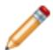

## Note:

Field output is available only if the current primary variable is an element-based variable, such as stress or strain.

5. To specify the nodes that you want to probe, choose Select from viewport, Key-in label, or Select a display group, and use one of the following techniques:

Select the nodes directly from the viewport:

a. Move the cursor to probe the model plot in the current viewport.  
As you position the cursor over a node, Abaqus/CAE displays the values of the items you have requested in the first row of the data table.  
b. To select and accumulate values of interest, and to allow subsequent writing of these values to a file, click mouse button 1 while positioning the cursor over a node.  
Abaqus/CAE stores the data from the first row of the data table into the storage rows of the data table.

Enter the node labels directly into the table:

a. Click the Part instance arrow, and select the part instance from which you want to select node labels.  
b. Enter the node label or labels that you want to include. You can specify multiple node labels at the same time by separating them with commas.

Select the nodes included in a display group:

a. Click the Display group arrow, and select the display group containing the nodes that you want to include in your query.  
If you change your selection of display group, Abaqus/CAE replaces the contents of the data table with nodes from the newly selected display group.  
b. If desired, append additional nodes to your list by selecting them from the viewport or keying them in by node label.

6. Repeat the node selection steps until the data table in the Probe Values dialog box includes all the nodes you want to query.  
7. To delete data from the data table or to clear or sort the table, click mouse button 3. For more information, see Entering tabular data.  
8. To create a display group using the nodes in the data table, do the following:

a. Click mouse button 3 in the data table, and select Create Display Group from the menu that appears.

The Create Display Group dialog box appears.

b. Enter a name for the new display group, and click OK.

9. To display probe annotations for any of the nodes in the data table, toggle on the check box for the rows corresponding to the nodes you want to annotate or toggle on the check box in the header row to display probe annotations for all selected nodes.


## Note:

You can customize the color and font for probe annotations of nodes in the Common Plot Options dialog box. For more information, see Using common plot options.

10. To save the data you have selected, click Write to File. For more information, see Generating tabular data reports.”  
11. To exit probe mode, do one of the following:

• Click the cancel button in the prompt area.  
• Click Cancel in the Probe Values dialog box.  
• Click mouse button 2.  
• Produce a plot in some other (e.g. undeformed, deformed) mode.

## Additional information

• Controlling result averaging  
• Probes of models or model plots  
• Probing elements  
• Querying active node or element labels

## Probing elements

You can use the Query toolset to obtain element data and either the values of attributes in the selected model or analysis results from the selected model plot. As you position the cursor over an element in the model or in the model plot in the current viewport, Abaqus/CAE highlights the element. You can choose to display the following information about the element in the data table:

• the element's label,  
• the element's connectivity, and  
the current field output variable (including component values, if the current field output variable is a tensor or vector quantity). If a model is selected in the current viewport, the current field output variable reflects the value of a model attribute such as a load at the selected element.

You can also obtain an element's data by entering its element label directly, and you can obtain data for all the elements included in a selected display group. These methods enable you to probe element data without positioning the cursor over its location in the model plot.

Only exterior elements can be queried. If necessary, you can create a display group or use a view cut to reveal otherwise unavailable interior elements. For more information, see Using display groups to display subsets of your model.”

When you add an element to the data table, you can toggle on the check box for that row to display a probe annotation in the viewport for that element, or you can toggle on the check box in the header row to display probe annotations for all selected elements. Probe annotations display the element's label and the results at the element for the current field output variable. You can customize the font and color of the annotation text.

To help locate elements in the viewport, you may want to produce a model plot with all element edges visible before using the Query toolset. For more information, see Controlling element and surface edge visibility.

1. Locate the Probe Values dialog box.

In the Visualization module toolbox, click


The Probe Values dialog box appears.

2. Select the step, frame, and field output variable for which Abaqus/CAE will obtain values. If you are probing data from the current model database, frame selections are not available, and your selection of field output variable is an attribute from the model displayed in the current viewport.

In the Probe Values dialog box, the Field Output field identifies the current step, frame, and field output variable.

• To change the step or frame, click .  
• To change the field output variable, click .  
• To change the result options, select Result->Options from the main menu bar.

3. In the Probe Values portion of the dialog box, do the following:

a. Click the Probe arrow, and select Elements.  
b. If the current primary output variable is a tensor or vector variable, click the Components arrow and do either of the following:

For tensor variables choose Selected to display only the selected component of the variable, All Direct to include all direct components of the tensor variable in the query, or All Principals to include all principal invariants of the tensor variable in the query.  
• For vector variables choose Selected to display only the selected component of the variable or All to include all components of the vector tensor variable in the query.

c. To choose the output position at which a field output variable is displayed, click the Position arrow and select Integration Pt, Centroid, Element Nodal, or Element Face.


## Note:

If you choose the All Direct or All Principals option for tensor variables and the Element Nodal output position, the results averaging option Compute scalars before averaging is not valid; the scalars or invariants are always computed after averaging.

The types of element information available are displayed in the columns of the data table.

4. Click mouse button 3 anywhere in the data table, select Edit Visible Columns from the list that appears, and toggle on the element information types that you want to display as columns in the data table.

When a desired information type is toggled on, Abaqus/CAE displays that type of data as a column in the data table. However, all columns, visible or not, are included in the probe values output file.


## Note:

Field output is available only if the current primary variable is an element-based variable, such as stress or strain.

5. To select the elements that you want to probe, choose Select from viewport, Key-in label, or Select a display group, and use one of the following techniques:

Select the elements directly from the viewport:

a. Move the cursor to probe the model plot in the current viewport.

As you position the cursor over an element, Abaqus/CAE displays the values of the items you have requested in the first row of the data table in the Probe Values dialog box.

b. To select and accumulate values of interest, and to allow subsequent writing of these values to a file, click mouse button 1 while positioning the cursor over an element.

Abaqus/CAE stores the data from the first row of the data table into the storage rows of the data table.

Enter the element labels directly into the table:

a. Click the Part instance arrow, and select the part instance from which you want to select element labels.

b. Enter the element label or labels. You can specify multiple element labels at the same time by separating them with commas.

Select the elements included in a display group:

a. Click the Display group arrow, and select the display group containing the elements that you want to include in your query.


## Note:

If you change your selection of display group, Abaqus/CAE replaces the contents of the data table with elements from the newly selected display group. If you want to append additional elements to your list, you must select them from the viewport or key them in by element label.

6. Repeat the element selection steps until the data table in the Probe Values dialog box includes all the elements you want to query.

7. To delete data from the data table or to clear or sort the table, click mouse button 3. For more information, see Entering tabular data.

8. To create a display group using the elements in the data table, do the following:

a. Click mouse button 3 in the data table, and select Create Display Group from the menu that appears.

The Create Display Group dialog box appears.

b. Enter a name for the new display group, and click OK.

9. To display probe annotations for any of the elements in the data table, toggle on the check box for the rows corresponding to the elements you want to annotate or toggle on the check box in the header row to display probe annotations for all selected elements.


## Note:

You can customize the color and font for probe annotations of elements in the Common Plot Options dialog box. For more information, see Using common plot options.

10. To save the data you have selected, click Write to File. For more information, see Generating tabular data reports.”

11. To exit probe mode, do one of the following:

• Click the cancel button in the prompt area.  
• Click Cancel in the Probe Values dialog box.  
• Click mouse button 2.  
• Produce a plot in some other (e.g. undeformed, deformed) mode.

## Additional information

• Controlling result averaging  
• Probes of models or model plots  
• Probing nodes  
• Querying active node or element labels

## Probing X–Y plots

You can use the Query toolset to obtain information about curves in an X–Y plot.

As you position the cursor over an X–Y curve in the current viewport, Abaqus/CAE highlights the nearest curve point and displays the curve legend text, the point's sequence identification, and the X- and Y-coordinates of the point in the Probe Values dialog box. Abaqus/CAE also highlights the selected curve point with a symbol and displays the X- and Y-coordinates of that curve point next to the symbol. These symbols and coordinates persist on the X–Y plot until you leave Probe mode. You can choose to display only the curve points that comprise an X–Y data object or to interpolate to display arbitrary points along the curve.

When you select a point in Probe mode, Abaqus/CAE adds the legend text, sequence identification, and X- and Y-coordinates of the current point to the data table, which appears at the bottom of the Probe Values dialog box. You can clear or sort this table, delete individual rows, and write these data to a file. If the X–Y data name differs from the X–Y curve legend text, the Legend value in the Probe Values dialog box displays the X–Y data name prepended to the legend text.

While Probe mode is active, Abaqus/CAE also tracks the position of the cursor in the X–Y plot with arrows that run along the X- and Y-axes. These arrows respectively track the current X- and Y-position of the cursor, so they enable you to select your curve points with greater precision.

To help locate X- and Y-data points, you may want to produce an X–Y plot with curve symbols visible before using the Query toolset. For more information, see Customizing the symbols used on an X–Y curve.

1. Locate the Probe Values dialog box.

In the Visualization module toolbox, click . The Probe Values dialog box appears.

2. At the top of the dialog box, toggle Interpolate between points to enable or disable the display of probe values for arbitrary points along the curve.

When you enable interpolation, Abaqus/CAE displays the sequence identification of arbitrary points by listing the bracketing X–Y data object points in parentheses.

3. Select the information types that you want to include in your query.

Click mouse button 3 anywhere in the data table, select Edit Visible Columns from the list that appears, and toggle on the information types that you want to include in the query and display as columns in the data table. When an information type is toggled on, Abaqus/CAE can display that type of data in two locations for the selected element: in the data table when you mouse over or select the element in the viewport, and in the probe values output file.

4. Move the cursor to probe the X–Y plot in the current viewport.

As you position the cursor over a curve point, Abaqus/CAE displays the X- and Y-coordinates of the current point on the curve itself and displays the current position of your cursor along the X- and Y-axes of the X–Y plot.

5. To select and accumulate values of interest and to allow subsequent writing of these values to a file, click mouse button 1 while positioning the cursor over a curve point.

Abaqus/CAE stores the legend text, sequence identification, and X- and Y-coordinates of the current point into the data table. Abaqus/CAE also tags the points you select in the viewport by placing a symbol at the curve point you selected and displaying the X- and Y-coordinates next to that point.

6. To delete data from the data table or to clear or sort the table, click mouse button 3. For more information, see Entering tabular data.

7. To save the data you have selected, click Write to File. For more information, see Generating tabular data reports.

8. To exit probe mode, do one of the following:

Click the cancel• button in the prompt area.  
• Click Cancel in the Probe Values dialog box.  
• Click mouse button 2.  
• Produce a plot in some other (e.g., undeformed, deformed) mode.

## Additional information

• X–Y plot probes

The calculation of linearized stresses is a capability for advanced Abaqus users. It is most commonly used for two-dimensional axisymmetric models.

For detailed information on linearized stress result quantities and the methods of calculation used, see Computing the stress components.

## In this section:

Understanding stress linearization  
Stress linearization example  
Obtaining linearized stress results

## Understanding stress linearization

Stress linearization is the separation of stresses through a section into constant membrane and linear bending stresses. Stress linearization is available for output databases only.

To linearize stresses in Abaqus/CAE, the following procedure is used:

• You define a section through your model. You specify the endpoints of the section by selecting nodes in the model, coordinates in space, or a saved path.  
• Abaqus/CAE defines the stress line by interpolating between the two endpoints to obtain a user-specified number of equal intervals along a straight line.  
You can save the stress line as a path; the saved path includes the endpoints and each interval point along the stress line. If you save the stress line as a path, Abaqus/CAE always creates a point list path, regardless of the method that you used to define the endpoints.  
• The specified stress results are obtained at equally spaced intervals along the line in a local coordinate system defined by the line.  
• Abaqus/CAE performs stress linearization calculations and displays the results in the form of an X–Y plot. You can choose to save the data and/or to write it to a file.

If you linearize stresses across multiple part instances, the results will be averaged for any points that exist in more than one part instance.

To obtain linearized stresses along a line, select Tools->Query from the main menu bar, then select Stress linearization from the Visualization Module Queries options.

## In this section:

Defining the stress line  
Extraction of the stress results

## Defining the stress line

You can define the endpoints of the section for which you want to obtain linearized stresses by selecting nodes in the model, points in space, or a saved path. You select nodes in the model by selecting the nodes directly from the viewport or by typing the node labels, and you define points in space by typing the point coordinates. If you select a saved path, Abaqus/CAE uses the path endpoints as the endpoints of the stress line—other points along the path are ignored. (For more information on paths, see Viewing results along a path.)

A node label is a persistent means of referring to a given node in a part instance; that is, node labels do not change as your model deforms. Therefore, if you specify the endpoints of the section using node labels or a saved node list path, these points will be equally applicable to the undeformed or the deformed model shape. However, points in space remain fixed and are independent of your model. For example, coordinates that coincide with a nodal location on the undeformed shape may not coincide with any location on the deformed shape. If you specify the endpoints of the section using coordinates in space, a point list path, or a radial path, be sure to specify the coordinates with respect to the correct shape. Edge list paths cannot be used to define a stress line.

For the best results for an axisymmetric model, the endpoints chosen should be normal to the interior and exterior surfaces of your model and to the midplane (see Figure 1).

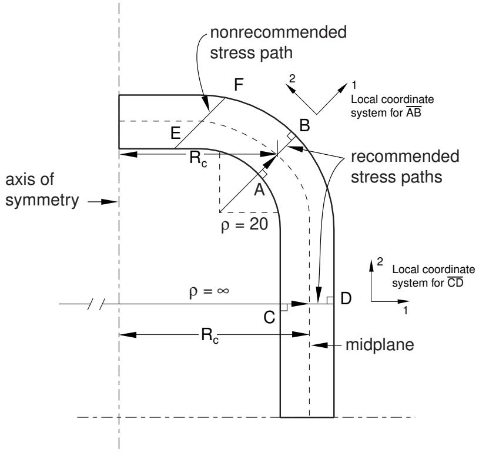  
Figure 1: Recommended stress paths.

The section can extend from surface to surface, or it can be entirely in the interior of the model. The section can also pass through more than one part instance. The following guidelines should also be considered when selecting the endpoints for the section:

• Avoid paths that traverse spatial discontinuities.  
• Avoid paths along a line separating discontinuities.  
• Use display groups to isolate individual regions prior to specifying the section.

If the section extends across spatial discontinuities, such as a hole within a part instance or a space between part instances, an error message will be given.

After you choose the endpoints of the section, you can specify the number of segments into which the line should be divided or you can accept the default number. Abaqus/CAE defines the stress line by interpolating between the two endpoints to obtain the specified number of equal intervals along a straight line.

## Extraction of the stress results

The stresses at each point along the stress line are obtained by interpolating the unique nodal stress values using the averaging criteria defined in the Result Options dialog box (for more information on specifying the averaging criteria, see Controlling result averaging). Abaqus/CAE uses a local coordinate system that is defined by the stress line to obtain the stress results. The local x-axis lies along the stress line; it originates at the first point on the stress line and is defined by the vector connecting the first and second points on the stress line. The local y- and z-axes are determined as follows:

## For two-dimensional models:

The local y-axis is obtained by vector multiplication of the global z-axis with the local x-axis. The local z-axis is the same as the global z-axis.

## For three-dimensional models:

## If the local x-axis is parallel to the global y-axis:

If the positive local x-axis lies along the positive global y-axis, the local y-axis will be the negative of the global x-axis. If the positive local x-axis lies along the negative global y-axis, the local y-axis will be the global x-axis. The local z-axis is obtained by vector multiplication of the local x-axis and the local y-axis.

## If the local x-axis is not parallel to the global y-axis:

The local z-axis is obtained by vector multiplication of the local x-axis and the global y-axis. The local y-axis is obtained by vector multiplication of the local z-axis and the local x-axis.

The stresses are then linearized. The stress linearization calculations differ for nonaxisymmetric and axisymmetric models. For more information on these calculations, see Computing the stress components.

Abaqus displays the resulting linearized stresses in the form of an X–Y plot. Three separate curves are presented for each stress component representing the following:

1. The actual stress distribution across the stress line.  
2. The linearized membrane stress.  
3. The sum of the linearized membrane stress and the linearized bending stresses.

In addition, the linearized stress output for each stress component and the stress invariant calculations for the linearized stresses are written to a report file.

## Stress linearization example

Figure 1 shows an example of a stress line defined for an axisymmetric model of a pressure vessel.  
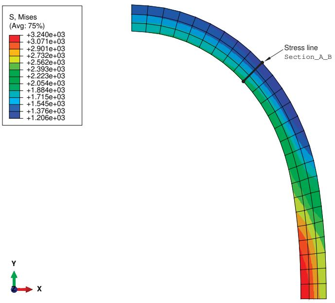  
Figure 1: Stress line through an axisymmetric model of a pressure vessel.

The stress line Section\_A\_B is defined through the vessel wall. Figure 2 and Figure 3 show the basic settings and computations, respectively, that you use to linearize the S22 stress component for the undeformed model shape.

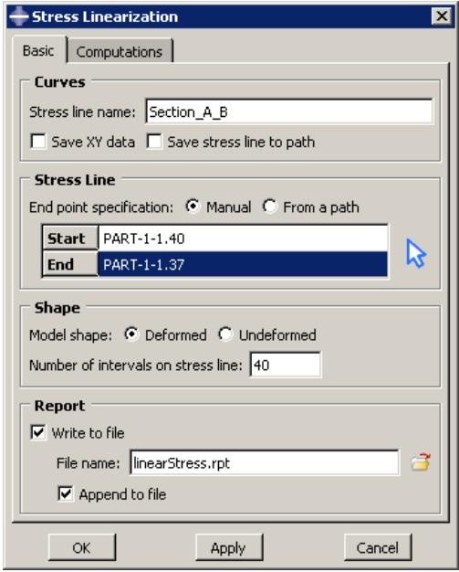  
Figure 2: Stress linearization basic specifications.

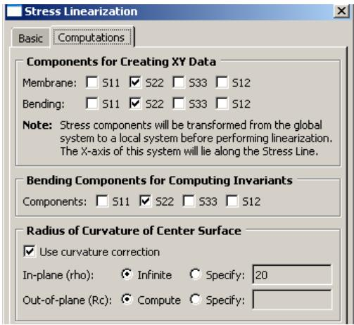  
Figure 3: Stress linearization computations.

When you click OK or Apply in the Stress Linearization dialog box, Abaqus/CAE creates an X–Y plot of the S22 stress component (oriented normal to the stress line) and of the resulting linearized stresses, as shown in Figure 4.

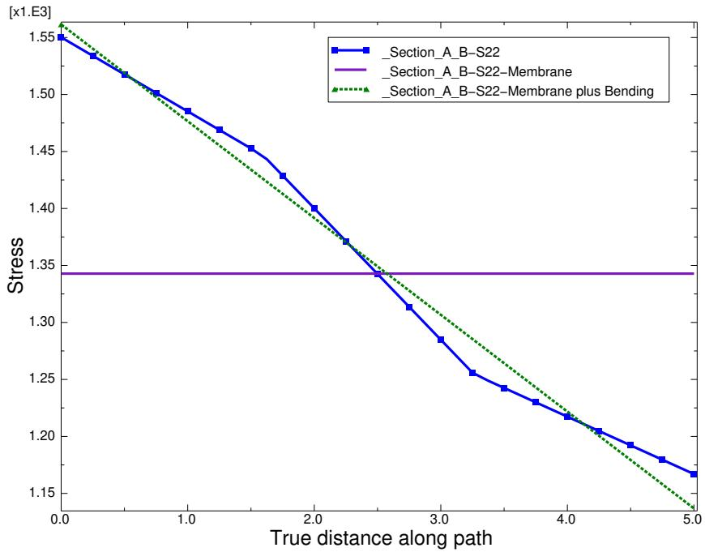  
Figure 4: Linearized stress plot.

The following output is also written to a file called linearStress.rpt:

Statically Equivalent Linear Stress Distribution across a Section, written on Thu Sep 09 11:20:19 2010

Source

```txt
ODB: Job-1.odb
Step: Step-1
Frame: Increment      1: Step Time =   1.000
```

```txt
Linearized Stresses for stress line 'Section_A_B'
  Start point, Point 1 - (18.429651260376, 26.8930339813232, 0)
  End point, Point 2   - (22.0184745788574, 30.3756923675537, 0)
  Number of intervals  - 40
```  
COMPONENT RESULTS

<table><tr><td></td><td>S11</td><td>S22</td><td>S33</td><td>S12</td></tr><tr><td>0</td><td>-462.376</td><td>1550.19</td><td>1450.75</td><td>74.7673</td></tr><tr><td>0.125021</td><td>-453.722</td><td>1542.06</td><td>1445.35</td><td>74.6265</td></tr><tr><td>0.250043</td><td>-445.068</td><td>1533.93</td><td>1439.95</td><td>74.4865</td></tr><tr><td>0.375064</td><td>-436.413</td><td>1525.8</td><td>1434.55</td><td>74.3473</td></tr><tr><td>0.500086</td><td>-427.759</td><td>1517.67</td><td>1429.15</td><td>74.2089</td></tr><tr><td>0.625107</td><td>-419.114</td><td>1509.55</td><td>1423.76</td><td>74.0714</td></tr><tr><td>0.750128</td><td>-410.46</td><td>1501.42</td><td>1418.36</td><td>73.9345</td></tr><tr><td>0.87515</td><td>-401.806</td><td>1493.3</td><td>1412.96</td><td>73.7983</td></tr><tr><td>1.00017</td><td>-393.152</td><td>1485.17</td><td>1407.56</td><td>73.663</td></tr><tr><td>1.12519</td><td>-384.497</td><td>1477.04</td><td>1402.16</td><td>73.5284</td></tr><tr><td>1.25021</td><td>-375.842</td><td>1468.92</td><td>1396.76</td><td>73.3946</td></tr><tr><td>1.37524</td><td>-367.187</td><td>1460.79</td><td>1391.37</td><td>73.2615</td></tr><tr><td>1.50026</td><td>-358.531</td><td>1452.67</td><td>1385.97</td><td>73.1293</td></tr><tr><td>1.62528</td><td>-348.574</td><td>1443.22</td><td>1379.7</td><td>72.8307</td></tr><tr><td>1.7503</td><td>-333.79</td><td>1428.85</td><td>1370.22</td><td>71.77</td></tr><tr><td>1.87532</td><td>-319.007</td><td>1414.48</td><td>1360.74</td><td>70.7052</td></tr><tr><td>2.00034</td><td>-304.227</td><td>1400.1</td><td>1351.26</td><td>69.6367</td></tr><tr><td>2.12536</td><td>-289.448</td><td>1385.72</td><td>1341.78</td><td>68.5648</td></tr><tr><td>2.25039</td><td>-274.656</td><td>1371.33</td><td>1332.29</td><td>67.4908</td></tr><tr><td>2.37541</td><td>-259.847</td><td>1356.91</td><td>1322.81</td><td>66.4061</td></tr><tr><td>2.50043</td><td>-245.037</td><td>1342.49</td><td>1313.32</td><td>65.3195</td></tr><tr><td>2.62545</td><td>-230.228</td><td>1328.07</td><td>1303.83</td><td>64.2284</td></tr><tr><td>2.75047</td><td>-215.421</td><td>1313.64</td><td>1294.34</td><td>63.1328</td></tr><tr><td>2.87549</td><td>-200.613</td><td>1299.2</td><td>1284.84</td><td>62.0327</td></tr><tr><td>3.00051</td><td>-185.807</td><td>1284.76</td><td>1275.34</td><td>60.9282</td></tr><tr><td>3.12554</td><td>-171.002</td><td>1270.32</td><td>1265.84</td><td>59.8191</td></tr><tr><td>3.25056</td><td>-156.197</td><td>1255.88</td><td>1256.34</td><td>58.7056</td></tr><tr><td>3.37558</td><td>-149.216</td><td>1248.82</td><td>1251.71</td><td>57.583</td></tr><tr><td>3.5006</td><td>-143.031</td><td>1242.52</td><td>1247.58</td><td>56.4609</td></tr><tr><td>3.62562</td><td>-136.844</td><td>1236.21</td><td>1243.45</td><td>55.34</td></tr><tr><td>3.75064</td><td>-130.658</td><td>1229.91</td><td>1239.32</td><td>54.2204</td></tr><tr><td>3.87566</td><td>-124.471</td><td>1223.61</td><td>1235.19</td><td>53.1021</td></tr><tr><td>4.00069</td><td>-118.283</td><td>1217.31</td><td>1231.06</td><td>51.985</td></tr><tr><td>4.12571</td><td>-112.095</td><td>1211.02</td><td>1226.93</td><td>50.8691</td></tr><tr><td>4.25073</td><td>-105.907</td><td>1204.72</td><td>1222.8</td><td>49.7545</td></tr><tr><td>4.37575</td><td>-99.7185</td><td>1198.42</td><td>1218.67</td><td>48.6412</td></tr><tr><td>4.50077</td><td>-93.5296</td><td>1192.13</td><td>1214.55</td><td>47.529</td></tr><tr><td>4.62579</td><td>-87.3403</td><td>1185.83</td><td>1210.42</td><td>46.4182</td></tr><tr><td>4.75081</td><td>-81.1506</td><td>1179.54</td><td>1206.3</td><td>45.3086</td></tr><tr><td>4.87584</td><td>-74.9605</td><td>1173.25</td><td>1202.17</td><td>44.2002</td></tr><tr><td>5.00086</td><td>-68.77</td><td>1166.96</td><td>1198.05</td><td>43.0931</td></tr><tr><td>Membrane(Average) Stress</td><td>-253.255</td><td>1342.83</td><td>1317.88</td><td>62.6971</td></tr><tr><td>BendingStress, Point 1</td><td>-209.122</td><td>218.613</td><td>140.324</td><td>0</td></tr><tr><td colspan="5">Membrane plus</td></tr></table>

<table><tr><td>Bending, Point 1</td><td>-462.376</td><td>1561.45</td><td>1458.2</td><td>62.6971</td></tr><tr><td>Bending Stress, Point 2</td><td>184.485</td><td>-206.054</td><td>-140.324</td><td>0</td></tr><tr><td>Membrane plus Bending, Point 2</td><td>-68.77</td><td>1136.78</td><td>1177.55</td><td>62.6971</td></tr><tr><td>Peak Stress, Point 1</td><td>0</td><td>-11.2522</td><td>-7.44933</td><td>12.0701</td></tr><tr><td>Peak Stress, Point 2</td><td>0</td><td>30.1809</td><td>20.4932</td><td>-19.604</td></tr></table>

INVARIANT RESULTS

<table><tr><td colspan="6">Bending components in equation for computingmembrane plus bending stress invariants are: S22</td></tr><tr><td></td><td>Max. Prin.</td><td>Mid. Prin.</td><td>Min. Prin.</td><td>Tresca Stress</td><td>Mises Stress</td></tr><tr><td>Membrane(Average) Stress</td><td>1345.29</td><td>1317.88</td><td>-255.714</td><td>1601.01</td><td>1587.48</td></tr><tr><td>Membrane plusBending, Point 1</td><td>1563.61</td><td>1317.88</td><td>-255.418</td><td>1819.03</td><td>1709.46</td></tr><tr><td>Membrane plusBending, Point 2</td><td>1317.88</td><td>1139.6</td><td>-256.077</td><td>1573.95</td><td>1492.82</td></tr><tr><td>Peak Stress,Point 1</td><td>132.875</td><td>-10.5186</td><td>-209.855</td><td>342.73</td><td>298.128</td></tr><tr><td>Peak Stress,Point 2</td><td>186.936</td><td>27.7292</td><td>-119.831</td><td>306.767</td><td>265.732</td></tr></table>

The S22 corresponds to the S22 stress shown in Figure 4. The actual stress values plotted in the curve Section\_A\_B\_S22 do not appear in the report. The linearized membrane and membrane-plus-bending stress curves are generated from the values shown for S22. The reported invariants are calculated from the selected linearized components.

## Obtaining linearized stress results

You can obtain linearized stresses along a line through your model. Abaqus/CAE separates the stress results along the line into constant membrane and linear bending stresses and displays the results in the form of an X–Y plot.

1. Locate the stress linearization options.

From the main menu bar, select Tools->Query or click the tool in the Query toolset. The Query dialog box appears.

2. Select Stress linearization.

The Stress Linearization dialog box appears.

3. In the Stress line name field, provide a name for the stress line. This name will be used as a prefix for the linearized results.  
4. To save the X–Y data that will be generated, toggle on Save XY data. The data will be available for the duration of your Abaqus/CAE session.  
5. To save the endpoints and interval points as a path, toggle on Save stress line to path. The points of the stress line will be saved for the duration of your Abaqus/CAE session as a point list path with the same name as the stress line.  
6. Select the endpoints for the stress line by selecting nodes or points in space or by selecting a saved path.

## Manual

This is the default method. You can select nodes directly from the viewport or type in node labels or points in space.

## To select nodes directly from the viewport:

Click to the right of the Start and End fields, and click on the desired nodes in the viewport.

The node labels, including the part instance name, will appear in the text field for the Start and End points of the stress line.

## To type in node labels or points in space:

1. In the Start text field, enter a part instance name and node label or the coordinates of a point in space. The part instance name and node label must be of the form Instance.Node; specify coordinate values as X-, Y-, and Z-coordinates separated by spaces or commas.  
If you do not know the part instance names in the model, use the previous method to select a node directly from the viewport. Alternatively, you can select Tools->Query  
or click the tool in the Query toolset and choose the Probe values method to determine the instance name and node label (for more information, see Understanding probing).

2. Repeat the preceding step to complete the End text field.

## From a path

Toggle on From a path, and select a path name from the list that appears; you cannot use an edge list path to define the endpoints of a stress line. (For more information on paths, see Viewing results along a path.)

Abaqus/CAE uses the endpoints of the saved path as the endpoints of the stress line. The points are defined in the same manner as they were originally defined in the path—a node list path provides node points on the model, and a point list path or circular list path provides the coordinates of points in space.

Regardless of the method you use to select the endpoints, Abaqus highlights the stress line in the viewport and labels the start and end. If you selected node points or a node list path to define the endpoints of the stress line, the labels in the viewport indicate the node numbers.


## Note:

If you chose to save the stress line as a path in Step 5, Abaqus/CAEalways saves a point list path—even if you selected nodes, node labels, or a node list path to define the stress line.

7. Choose the model shape for which to obtain the stress results. The default is to obtain the results for the deformed model shape. Toggle on Undeformed to obtain results for the undeformed model shape.  
8. Specify the number of intervals into which the stress line should be divided. Type a positive integer greater than 0 into the Number of intervals on stress line text field. If you do not enter a number, Abaqus will use a default number of intervals.  
9. Select Use Maximum Stress Value to use the maximum available value at a point. By default, Abaqus/CAE will use the average of multiple values available at a point.  
10. By default, Abaqus/CAE writes the linearized stress values (including all available components of stress and the computed linearized stress invariants) to a file called linearStress.rpt. If you do not wish to write this report, you can toggle off Write to file in the Report area of the dialog box. You can specify a new name for the report file by entering the name in the File name field or clicking


and choosing from the list of existing files that appears.

If you write the report to an existing file, the new data will be appended to the file by default; if you wish to overwrite the file, toggle off Append to file.

11. Click the Computations tab.  
12. Select the stress components to be linearized by toggling on each membrane and bending component.  
13. Select the bending components to use for calculating invariants.  
14. For axisymmetric models enter an approximate value for the in-plane radius of curvature of the midplane of your model at the location of the stress line. The default value is Infinite, which implies a lack of curvature. To specify a radius of curvature, click Specify and enter a number in the text field.  
15. For axisymmetric models enter an approximate value for the out-of-plane radius of curvature of the midplane of your model at the location of the stress line. The default value is Compute, which allows Abaqus to calculate the radius based on the axisymmetric shape and the position of the selected stress line. To specify a radius of curvature, click Specify and enter a number in the text field.  
16. For nonaxisymmetric models select whether Abaqus should use curvature correction. If curvature correction is selected, specify a local coordinate system or use the default (global) coordinate system; if you use a local coordinate system for curvature correction, you can also use that local coordinate system to evaluate stress line orientation.  
17. Click OK.

An X–Y plot similar to the one shown in Figure 1 appears in the viewport.

<table><tr><td>—</td><td>stresstest-S11</td></tr><tr><td>—</td><td>stresstest-S11-Bending</td></tr><tr><td>—</td><td>stresstest-S11-Membrane</td></tr><tr><td>—</td><td>stresstest-S22</td></tr><tr><td>—</td><td>stresstest-S22-Bending</td></tr><tr><td>—</td><td>stresstest-S22-Membrane</td></tr><tr><td>—</td><td>stresstest-S33</td></tr><tr><td>—</td><td>stresstest-S33-Bending</td></tr><tr><td>—</td><td>stresstest-S33-Membrane</td></tr></table>

  
Figure 1: Stress linearization results.

Additional information

• X–Y plotting

A ply stack plot shows the plies from the selected region of a composite model. You can create a ply stack plot in either the Property module or the Visualization module. This chapter describes ply stack plotting.

## In this section:

Understanding ply stack plots  
Customizing ply stack plots

## Understanding ply stack plots

A ply stack plot is a graphical representation of the plies from a selected region of a composite model. In effect, a ply stack plot is a core sample of the plies in the selected region. The region can be from a composite layup or from a composite section.

You can customize the appearance of a ply stack plot. For example, the image can show the sequence of plies, the orientation of the fibers in each ply, the material in each ply, the relative thickness of the ply, and the location of the reference surface. Figure 1 illustrates a ply stack plot.

  
Figure 1: A ply stack plot.

The staircase appearance has no corresponding physical meaning; it is just a mechanism that allows you to view all of the plies in a region. For example, the plies are not ending at each stair.

The triad in a ply stack plot represents the element orientation system, and it shows the shell normal or stacking direction (the 3-direction) and the 1- and 2-directions for the plies. The fibers are always drawn in the 1–2 plane at an angle with respect to the 1-direction. In solid composite layups the fibers in a ply do not always run parallel to the 1–2 plane (e.g., if the 3-direction of the ply orientation and the element stacking direction are not aligned). In this situation the fibers in the ply stack plot are not a true depiction of the fibers in the composite, but rather a graphical representation of the rotation angles in the composite section or layup definition: the angle drawn in the ply stack plot is the rotation angle specified in the ply table measured about the element stacking direction axis. For more information, see Understanding composite layups and orientations.

Ply stack plots do not draw fibers for ply orientations that are based on a user-defined coordinate system or a rotation angle distribution. Abaqus/CAE displays an asterisk (for coordinate systems) or a caret (for rotation angle distributions) on such plies to signify that it cannot draw lines in the 1–2 plane that accurately represent the fiber direction for the ply. Similarly, if you use a discrete field distribution to define a ply's thickness, Abaqus/CAE draws the ply in the ply stack plot based on the average thickness of the other uniform plies in the layup and displays the discrete field name next to the plot (if thickness labels are turned on).

It is important to know the position of the reference surface when you are modeling a composite with conventional shell elements. The mesh will be positioned on the reference surface, and contact is defined relative to the reference surface. The ply stack plot allows you to view the reference surface relative to other plies in the composite, as shown in Figure 2.

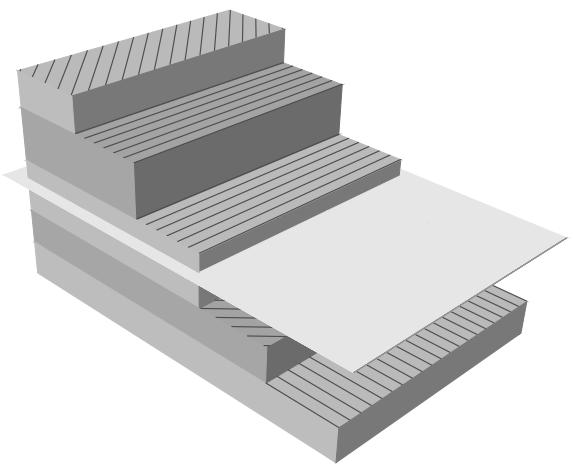  
Figure 2:The reference surface in a ply stack plot.

You can display a ply stack plot in the Property module after you have created a composite layup or assigned a composite section to a region. You can also display a ply stack plot in the Visualization module after you have analyzed a model with a composite layup or a composite section. For more information, see Defining composite layups and Creating composite shell sections.

To produce a ply stack plot, select Tools->Query from the main menu bar and select Ply stack plot from the dialog box that appears. After you have displayed a ply stack plot, you can customize its appearance by clicking the Ply Stack

Plot Options button from the prompt area or by clicking the tool in the toolbox (in the Visualization module). For detailed instructions on customizing a ply stack plot, see Customizing ply stack plots.

## Customizing ply stack plots

This section explains how you use the Ply Stack Plot Options dialog box to customize the appearance of a ply stack plot.

## In this section:

Using ply stack plot options  
Customizing basic ply stack plot options  
Customizing the appearance of fibers in a ply stack plot  
Customizing the reference surface in a ply stack plot  
Customizing the labels in a ply stack plot

## Using ply stack plot options

Understanding ply stack plots describes how you can create a ply stack plot. After you have displayed a ply stack plot, you can customize its appearance by clicking the Ply Stack Plot Options button from the prompt area. Alternatively, you can do the following:

• In the Property module, choose View->Ply Stack Plot Options.  
• In the Visualization module, choose Options->Ply Stack Plot or click the tool in the toolbox.

Abaqus/CAE displays the Ply Stack Plot Options dialog box, which allows you to do the following:

• Choose which plies are displayed in the ply stack plot and how the plies are displayed. For more information, see Customizing basic ply stack plot options.  
• Choose whether fibers are displayed in the ply stack plot and the appearance of the fibers. For more information, see Customizing the appearance of fibers in a ply stack plot.  
Choose whether the reference surface is displayed in the ply stack plot and the appearance of the reference surface. For more information, see Customizing the reference surface in a ply stack plot.  
Customize the text and symbols that are displayed in a ply stack plot. For more information, see Customizing the labels in a ply stack plot.

## Customizing basic ply stack plot options

Click the Basic tab to choose which plies are displayed in the ply stack plot and how the plies are arranged. If your composite layup contains many plies, the ply stack plot can become confusing and hard to interpret. To make the ply stack plot more readable, the basic ply stack plot options allow you to view only a manageable number of plies.

1. Locate the basic options.

1. Click the Ply Stack Plot Options button from the prompt area, or do one of the following:

• In the Property module, choose View->Ply Stack Plot Options.

• In the Visualization module, choose Options->Ply Stack Plot or click the tool in the toolbox.

2. Click the Basic tab in the Ply Stack Plot Options dialog box that appears.

2. From the Display options, do the following:

• Select the render style—shaded, filled, or wireframe.  
• Choose whether to display the edges of each ply and the style and thickness of the edges.  
Choose whether to display the plies as a “staircase” image descending from the last ply to the first ply or as an image that is symmetric about the center ply or plies.

3. From the Visible Plies options, choose which plies to display. Abaqus/CAE updates the ply stack plot when you modify the display parameters, which allows you to quickly and conveniently display the plies in a composite. You can choose the following:

• Display the specified plies, starting with the Start ply and ending with the End ply.  
Display Number of plies, starting with the Start ply. Click Increment by Number to increment the Start value by Number of plies instead of by 1. This allows your ply stack plot to be a window that moves incrementally across the layup, with each increment displaying the next adjacent group of plies.  
Display Number of plies, centered around the Center ply. Click Increment by Number to increment the Center value by Number of plies instead of by 1. This allows your ply stack plot to be a window that moves incrementally across the layup, with each increment displaying the next adjacent group of plies.  
• Display Number of plies, centered around the Center ply. Drag the Center slider to move across the layup.

4. Choose the color of the Even and Odd plies:

a. Click the color sample .

Abaqus/CAE displays the Select Color dialog box.

b. Use one of the methods in the Select Color dialog box to select a new color. For more information, see Customizing colors.

c. Click OK to close the Select Color dialog box.

The color sample changes to the selected color.

Abaqus/CAE applies your choice of color relative to the plies that are displayed, not to the actual ply number. For example, if you are displaying plies 2, 3, and 4; Abaqus/CAE will apply the Odd color to plies 2 and 4 and the Even color to ply 3.

## 5. Click Apply to implement your changes.

The ply stack plot changes to reflect your specifications.

By default, your changes are saved for the duration of the session and will affect all subsequent ply stack plots in that viewport. If you want to retain your changes for subsequent sessions, save them to a file. For more information, see Saving customizations for use in subsequent sessions.

## Customizing the appearance of fibers in a ply stack plot

Click the Fiber tab to choose whether fibers are displayed in the ply stack plot and the appearance of the fibers. The fibers are always drawn in the 1–2 plane at an angle with respect to the 1-direction. For more information, see Understanding composite layups and orientations.

If you use a coordinate system to define the ply's orientation, Abaqus/CAE cannot determine the orientation within an element without knowing the spatial orientation of the element. Therefore, Abaqus/CAE displays an asterisk (\*) in place of the ply fibers to signify that it cannot draw lines in the 1–2 plane that represent the fiber direction. For the same reason, Abaqus/CAE cannot draw lines that accurately represent the fiber direction if the ply's orientation is defined using a discrete field distribution; a caret (^) in place of the ply fibers indicates that the additional rotation in a ply's orientation is defined using a discrete field.

In solid composite layups the fibers in a ply do not always run parallel to the 1–2 plane (e.g., if the 3-direction of the ply orientation and the element stacking direction are not aligned). Since fibers in a ply stack plot are always drawn in the 1–2 plane, they are not a true depiction of the fibers in the solid composite. Instead the fibers are a graphical representation of the rotation angles in the composite section or layup definition: the angle drawn in the ply stack plot is the rotation angle specified in the ply table measured about the element stacking direction axis.

1. Locate the fiber options.

1. Click the Ply Stack Plot Options button from the prompt area, or do one of the following:

• In the Property module, choose View->Ply Stack Plot Options.

• In the Visualization module, choose Options->Ply Stack Plot or click the tool in the toolbox.

2. Click the Fiber tab in the Ply Stack Plot Options dialog box that appears.

2. Do the following:

• Toggle on Show fibers to display fibers in the ply stack plot.  
• Choose the color, style, and thickness of the lines that represent fibers in the ply stack plot.  
• Drag the Spacing slider to change the number of fibers that are displayed.

3. Click Apply to implement your changes.

The ply stack plot changes to reflect your specifications.

By default, your changes are saved for the duration of the session and will affect all subsequent ply stack plots in that viewport. If you want to retain your changes for subsequent sessions, save them to a file. For more information, see Saving customizations for use in subsequent sessions.

Click the Reference Plane tab to choose whether the reference surface is displayed in the ply stack plot and to control the appearance of the reference surface. Conventional shell elements use the reference surface to define the geometry of the part. Therefore, you can display the reference surface only on shell composites; you cannot display the reference surface on continuum shell composite layups or solid composite layups. In addition, if the ply's offset is defined by a distribution, Abaqus/CAE cannot display the reference surface.

1. Locate the reference surface options.

1. Click the Ply Stack Plot Options button from the prompt area, or do one of the following:

• In the Property module, choose View->Ply Stack Plot Options.

• In the Visualization module, choose Options->Ply Stack Plot or click the tool in the toolbox.

2. Click the Reference Plane tab in the Ply Stack Plot Options dialog box that appears.

2. Do the following:

• Toggle on Show reference surface to display the reference plane in the ply stack plot.  
• Choose the color and translucency of the reference surface.  
Toggle on Show reference outline to display lines around the edge of the reference surface. Choose the color, style, and thickness of the lines.

3. Click Apply to implement your changes.

The ply stack plot changes to reflect your specifications.

By default, your changes are saved for the duration of the session and will affect all subsequent ply stack plots in that viewport. If you want to retain your changes for subsequent sessions, save them to a file. For more information, see Saving customizations for use in subsequent sessions.

## Customizing the labels in a ply stack plot

Click the Labels tab to customize the text and symbols that are displayed in a ply stack plot; for example, material and ply names, the state block, and integration points.

1. Locate the labels options.

1. Click the Ply Stack Plot Options button from the prompt area, or do one of the following:

• In the Property module, choose View->Ply Stack Plot Options.

• In the Visualization module, choose Options->Ply Stack Plot or click the tool in the toolbox.

2. Click the Labels tab in the Ply Stack Plot Options dialog box that appears.

2. Select the font of all the text in the ply stack plot.

a. Click Set Font for All Labels to display the Select Font dialog box.

b. Use the font selector dialog box to set the font properties that you want.

c. Click OK to close the Select Font dialog box and to return to the Ply Stack Plot Options dialog box.

3. Toggle on an option to display it.

4. Choose the color of the text:

a. Click the color sample .

Abaqus/CAE displays the Select Color dialog box.

b. Use one of the methods in the Select Color dialog box to select a new color. For more information, see Customizing colors.

c. Click OK to close the Select Color dialog box.

The color sample changes to the selected color.

5. Click Apply to implement your changes.

The ply stack plot changes to reflect your specifications.

By default, your changes are saved for the duration of the session and will affect all subsequent ply stack plots in that viewport. If you want to retain your changes for subsequent sessions, save them to a file. For more information, see Saving customizations for use in subsequent sessions.

You can produce a tabular data report of X–Y data objects, field output results, probe values, or free body cuts. Abaqus/CAE writes the report to the file name of your choice. Generate a tabular report to save data values beyond the duration of the session or to print these values. In addition, you can use a tabular report as ASCII input in subsequent Abaqus/CAE sessions.

This chapter explains how to produce and customize a tabular report.

## In this section:

Producing a tabular report  
Using tabular report options  
Selecting report data  
Specifying your report file name  
Controlling report layout, width, format, and coordinate system  
Sorting field output data  
Formatting report values  
Reporting data values, minimums, maximums, and totals

## Producing a tabular report

You can produce tabular reports of X–Y data objects, field output results, free body cuts, and probe values.

To produce a tabular report of X–Y data objects, field output results, or free body cuts, you first specify the report content, format, and destination. Abaqus/CAE generates the report when you apply these customization selections.

To produce a report of probe values, you first produce and then probe a model or X–Y plot. While probing, you can select probe values of interest and you can write the selected values to a file.

Depending on your selections, your report may include negative element labels. Negative labels indicate internal elements created by Abaqus/CAE. These elements are given negative labels so you can easily distinguish them from elements that you created while defining the model.

## Produce a report of X–Y data, field output results, or free body cuts

1. From the main menu bar, select Report->XY, Report->Field Output, or Report->Free Body Cut. The Report XY Data, Report Field Output, or Report Free Body Cut dialog box becomes available.  
2. Use the options to customize the report content, format, and destination.  
3. When you have finished, click Apply to generate the report.

## Produce a report of probe values

1. From the main menu bar, select Tools->Query, then click Probe values in the dialog box that appears. The Probe Values dialog box appears.  
2. Move the cursor to probe the model or X–Y plot in the current viewport.  
3. To select and accumulate values of interest in the data table in the bottom portion of the Probe Values dialog box, click mouse button 1 while probing.  
4. When you have finished, click Write to File to access the report file options and to generate the report.

## Using tabular report options

You can customize tabular report characteristics such as the objects to include, report layout, and sort order. Select Report->XY, Report->Field Output, or Report->Free Body Cut to customize and generate a tabular listing of X–Y data objects, field output variable values, or free body cuts, respectively. Select Tools->Query to generate a tabular report of probe values. The following list identifies the tabular report characteristics that you can customize and the sections where you can find information.

You can customize:

• The X–Y data objects or field output variables to include in the report. See Selecting report data.  
The free body cuts to include in the report. Abaqus/CAE includes all active free body cuts in the current output database in a free body cut report. You can activate and suppress free body cuts from the Free Body Cut Manager. See Displaying, hiding, and highlighting free body cuts.  
• The probe values to include in the report. See Probing the model.  
• The file name to which the report is written. See Specifying your report file name.  
• The layout and width of the report. See Controlling report layout, width, format, and coordinate system.  
• How field output or probe values are sorted. For field output, see Sorting field output data; for probe values, see Entering tabular data.  
• The format and significant digits of report values. See Formatting report values.  
Whether or not to include minimum and maximum value summaries or column totals. See Reporting data values, minimums, maximums, and totals.  
• The form of complex results in the report. See Controlling the form of complex results.

## Selecting report data

This section explains how to select X–Y data objects to include in an X–Y data report, how to select field output variables to include in a field output report, and how to select the options and thresholds to use for a free body cut report.

To learn how to control the contents of a tabular report of probe values, see Probing the model.

## In this section:

Selecting X–Y data objects  
Selecting field output variables  
Selecting field output section points  
Selecting options and thresholds for free body cut reports

You can select one or more X–Y data objects to include in your X–Y report.

1. Locate the X–Y report XY Data options.  
From the main menu bar, select Report->XY; then click the XY Data tab in the dialog box that appears.

2. Select the X–Y data objects to include in your report from the list of available data objects. By default, all previously saved X–Y data objects are listed. Choose one of the following options to adjust the contents of this list:

• Click All XY data to browse all previously saved X–Y data objects.  
Click XY plot in current viewport to browse only those X–Y data objects included in the X–Y data plot in the current viewport.

Abaqus/CAE lists the X–Y data objects you have requested.

3. To limit the list for easier selection, type a filter pattern into the Name filter field, and press the [Enter]

key to apply the filter. Click to the right of the text field to display information about how to construct a filter.

Abaqus/CAE lists only those X–Y data objects that meet your specification.

4. From the list of X–Y data object names and descriptions, select one or more data objects to include in your report. For more information on selecting multiple items in dialog boxes, see Selecting multiple items from lists and tables.

To generate your report, configure any desired customization options on the Setup page, which is also in the Report XY Data dialog box; and click Apply. When you have finished, click Cancel to close the dialog box.

## Additional information

• Using tabular report options

## Selecting field output variables

You can select one or more field output variables to include in your tabular report.

The variables that are available consist of those you have saved to the output database. You can generate reports for the current frame or for multiple frames.

Abaqus/CAE can calculate and report values for a given variable at a variety of positions. The possible report positions are: integration point, centroid, element nodal, and unique nodal.

Element nodal and unique nodal positions both involve reporting results at the nodes of the model; however, reporting of unique nodal values produces only a single value at each node, whereas reporting of element nodal values produces one value for each element that has a contribution at that node. Only unique nodal values are provided in the case of node-based variables such as displacement. For element-based variables such as stress, extrapolation and averaging must be carried out to obtain unique nodal values. The use of averaging threshold values and the control of averaging across regional and material boundaries will affect the element nodal values reported for element based results (for more information, see Selecting result options).

The following table summarizes which output positions can be reported, depending on what position was used when the variable was saved to the output database:

<table><tr><td></td><td colspan="4">Report Position</td></tr><tr><td>Output Database Position</td><td>Integration point</td><td>Centroid</td><td>Element Nodal</td><td>Unique Nodal</td></tr><tr><td>Integration Point</td><td>Yes</td><td>Yes</td><td>Yes</td><td>Yes</td></tr><tr><td>Centroid</td><td>No</td><td>Yes</td><td>Yes</td><td>Yes</td></tr><tr><td>Element Nodal</td><td>No</td><td>No</td><td>Yes</td><td>Yes</td></tr><tr><td>Unique Nodal</td><td>No</td><td>No</td><td>No</td><td>Yes</td></tr></table>

Contact surface variables such as CNORMF, CSHEARF, CPRESS, COPEN, CSLIP, CSHEAR1, and CSHEAR2 can be reported only at the element nodal position.

When generating the field output report for element-based field output at any output position, Abaqus/CAE writes the field values from the specified position if the same position is available in the output database.

For information on selecting the section point locations at which to report output variables, see Selecting field output section points.

1. Locate the options for field output reports.  
From the main menu bar, select Report->Field Output.

2. Choose the frames from which Abaqus/CAE reads field output data.

Choose Specify to use the current step/frame. To change the current step or frame, click . For more information, see Selecting the results step and frame.  
Choose All active steps/frames to use all active steps/frames. Click Active Steps/Frames to change the steps or frames from which Abaqus/CAE reads field output data. For more information, see Activating and deactivating steps and frames.

3. Click the Variable tab to display the Output Variables options.

4. Click the Position arrow to reveal possible positions at which to list variables for your selection; then choose the desired position. Multiple variables can be combined in a single table only if they are reported at the same position.

The list of variables is refreshed to show only those that can be reported at the selected position.

5. Select the field output variables to include in your report using either the check box next to each variable in the list (this method is the default) or the Edit text field at the bottom of the page.


## Note:

You must use the check box method if you want to specify an individual section point at which to report values.

## To use the check box method:

1. To select a variable and all of its components, click that variable's check box.  
2. To choose among the individual components of a variable, click the arrow next to that variable's check box to list its components; then click individual component check boxes to select them.

## To use the edit method:

In the Edit text field, enter the names of the variables and components to include in your report. To be valid, a variable must be available on the output database and reportable at the current position.

To generate your report, configure the remaining options on the Setup page, which is also in the Report Field Output dialog box; then click Apply. When you have finished, click Cancel to close the dialog box.

## Additional information

• Selecting the results step and frame  
• Using tabular report options

## Selecting field output section points

If your field output report includes section point variables, you can choose the section point at which Abaqus/CAE reports values for those variables. The default is to report values at all available section points.

1. Locate the section point options.  
From the main menu bar, select Report->Field Output; then click the Variables tab in the dialog box that appears.  
2. Use the check box method to select section variables.  
3. At the Section point label at the bottom of the dialog box, do one of the following:  
• click All to report values at all available section points, or  
• click Single to indicate that you will select one section point at which to report values.

If you have selected at least one element section point variable, the section point Settings button becomes available.

4. To select one or more section points, click Settings.

The Field Report Section Point Settings dialog box appears. Use this dialog box to select the desired section points. For more information, see Selecting section point data by category.

5. Click OK to apply your section point selections and to close the Field Report Section Point Settings dialog box.

To generate your report, configure the remaining options on the Setup page, which is also in the Report Field Output dialog box; then click Apply. When you have finished, click Cancel to close the dialog box.

## Additional information

• Selecting field output variables  
• Using tabular report options

## Selecting options and thresholds for free body cut reports

You can create a tabular report of the resultant forces and moments in all active free body cuts in your session. You can activate or suppress individual free body cuts by toggling their Show check boxes in the Free Body Cut Manager; for more information, see Displaying, hiding, and highlighting free body cuts. Abaqus/CAE reports resultant force and moment data with respect to the global coordinate system, regardless of the settings selected in the Component Resolution options for free body cuts or for view cuts.

You can generate reports for the current frame or for multiple frames. You can also specify custom threshold values for force data and moment data in the report; forces and moments smaller than these thresholds are reported as zero in the report. Selecting appropriate thresholds enables you to produce cleaner report data; for example, replacing small report values such as 1.234E-17 with 0 makes report data easier to read. The default threshold for both force and moment values is 1E-006.

1. Locate the options for free body cut reports.  
From the main menu bar, select Report->Free Body Cut.  
2. Choose the frames from which Abaqus/CAE reads free body cut data.

• Choose Specify to use the current step/frame. To change the current step or frame, click . For more information, see Selecting the results step and frame.  
Choose All active steps/frames to use all active steps/frames. Click Active Steps/Frames to change the steps or frames from which Abaqus/CAE reads free body cut data. For more information, see Activating and deactivating steps and frames.

3. From the File options, specify the report file name. For specific instructions, see Specifying your report file name.  
4. From the Output Format options, specify the presentation format for the report data. For specific instructions, see Controlling report layout, width, format, and coordinate system.  
5. If desired, specify a threshold value for forces and a threshold value for moments from the Thresholds options. Abaqus/CAE will report force and moment values smaller than these thresholds as zero.

To generate your report, click Apply. When you have finished, click Cancel to close the dialog box.

## Additional information

• Selecting field output variables  
• Using tabular report options

## Specifying your report file name

Abaqus/CAE writes your tabular data report to the file name of your choice. If you choose to write your report to an existing file, you can further specify whether the new information should be appended to the current file contents or whether the file should be overwritten. The default is to append the new information.

1. Locate the File options.

## For a report of X–Y data or field output:

From the main menu bar, selectReport->XY or Report->Field Output; then click the Setup tab in the dialog box that appears. The File options are at the top of the page.

## For a report of free body cuts:

From the main menu bar, selectReport->Free Body Cut. The File options are at the top of the page.

## For a report of probe values:

From the main menu bar, selectTools->Query, then click Probe values in the dialog box that appears. The Probe Values dialog box appears.

Move the cursor to probe the model or X–Y plot in the current viewport, then click mouse button 1 to store values of interest in the dialog box. When you are finished, click Write to File. The Report Probe Values dialog box appears; the File options are at the top of the dialog.

2. To select a file name using the standard file browser, click Select.

The File Selection dialog box appears. Use the dialog to filter and browse existing files. For more information on using this dialog box, see Using file selection dialog boxes. When you are finished, click OK to close the dialog box.

3. Type into the Name field the name of the file to which your report is to be written.  
4. Toggle Append to file to append this report to the current contents (if any) of the file you have specified. When Append to file is off, existing file contents will be overwritten.

To generate your report, configure the remaining options in the dialog box; then click Apply (for X–Y, field output, or free body cuts) or OK (for probe values reports). When you have finished, click Cancel to close the dialog box.

## Additional information

• Using tabular report options

## Controlling report layout, width, format, and coordinate system

Options are available to format the report layout for ease of reading and exporting.

For tabular reports of X–Y data, field output, or probe values you can limit the width of the table; for example, to the number of characters your printer can support.

An X–Y data report can include one or multiple X–Y data objects. Similarly, a field output report can include one or multiple variables. For both types of reports, if you include multiple items, you can choose to present each item in its own table or to combine items into a single table. If you combine multiple items into a single table, additional columns of data are formed and the width of the table increases.

To combine X–Y data objects into a single table, Abaqus/CAE aligns the X-values of the data objects. If any data objects do not have matching X-values, you can choose to have Abaqus/CAE compute the missing points by interpolation and extrapolation. To learn more about interpolation and extrapolation, see Understanding X–Y data interpolation and extrapolation.

For field output reports Abaqus/CAE creates a separate table (of a single variable or of combined variables, according to your specification) for every region in the current display group. A region is a portion of your model that has compatible materials, section properties, and element types. Abaqus/CAE identifies the region associated with each table in the report. (For more information on display groups, see Using display groups to display subsets of your model; for more information on regions, see Understanding result value averaging.)

For field output and free body cuts Abaqus/CAE enables you to generate report output in either annotated format or in comma-separated value (CSV) format. In annotated format, results are presented so that they can be read easily; in CSV format, results are intended to be exported and read in spreadsheet applications.

You can also report data from free body cuts in the global coordinate system or in the local coordinate systems for which they were defined.

1. Locate the Output Format options.

## For a report of X–Y data or field output:

From the main menu bar, selectReport->XY or Report->Field Output; then click the Setup tab in the dialog box that appears. The Output Format options are in the center of the page.

## For a report of free body cuts:

From the main menu bar, selectReport->Free Body Cut. The Output Format options are in the center of the page.

## For a report of probe values:

From the main menu bar, selectTools->Query, then click Probe values in the dialog box that appears. The Probe Values dialog box appears.

Move the cursor to probe the model or X–Y plot in the current viewport, then click mouse button 1 to store values of interest in the dialog box. When you are finished, click Write to File. The Report Probe Values dialog box appears; the Output Format options are in the center of the dialog.

2. For X–Y data reports, select the Layout option of your choice:

• Select Single table for all X–Y data to combine all the selected data objects into a single table.

Toggle Interpolate between X values (if necessary) to have Abaqus compute missing points. When this option is toggled off, missing points (if any) appear as “No Value” in the table.

• Select Separate table for each X–Y data to have each of the selected data objects appear in its own table.

3. For field output reports, select the format of your choice:

Select Annotated format to include the data such as step/frame and output position at the beginning of the report. Field output is written only under steps/frames where it is available.

Toggle Separate table for each field output variable to have each of the selected output variables appear in its own table.

Select Comma-separated values (CSV) to generate a report that includes a single header containing all the selected field output variables and combines the field values from all regions and instances into a single table. If any of the selected field output is not available in a particular step/frame, an entry of NoValue appears in the table column corresponding to that field.

When you select this format, the options to use separate tables for each field output variable, to specify the page width, to include column totals, and to include a summary of the minimum and maximum values are unavailable.

To include information about the local coordinate system at each value, if applicable, toggle Element orientations in the Data options area. Coordinate system columns, if specified, might not adhere to the page width.

4. For X–Y data reports or field output reports, select the Page width (characters) option of your choice:

• Select No limit to allow an unlimited table width.

• Select Specify to limit the table's width. Then, in the Specify text field, enter the maximum number of characters that can appear along the width of the table.

5. For free body cut reports, perform the following:

• Select either Normal annotated format or Comma-separated values (CSV) as the report format.

• Select either Global CSYS or Local CSYS as the coordinate system for the free body cuts.

To generate your report, configure the remaining options in the dialog box; then click Apply (for X–Y, field output, or free body cut reports) or OK (for probe values reports). When you have finished, click Cancel to close the dialog box.

## Additional information

• Using tabular report options  
• Formatting report values  
• Understanding X–Y data interpolation and extrapolation

## Sorting field output data

For tabular field output reports you can choose to sort all of the data in the table according to the values in any single column of the table and you can choose to sort in either ascending or descending order.

You control which columns Abaqus/CAE includes in the table using the Variable options in the Report Field Output dialog box. (For more information, see Selecting field output variables.) The table has one column for each field output variable you have selected, and additional columns to identify the origin of the field output; for example, if your table includes unique nodal quantities Abaqus/CAE provides a Node Label (node number) column.

Negative element labels are used in the reports to distinguish internal elements created by Abaqus/CAE from elements that you created while defining the model. If your report includes internal elements and you choose to sort by element labels, these elements will be grouped at the top or bottom of your report.

For information on sorting the data in a tabular report of probe values, see Entering tabular data.

1. Locate the field output report sorting options.  
From the main menu bar, select Report->Field Output; then click the Setup tab in the dialog box that appears. The Sort by options are in the middle of the page.  
2. Click the Sort by arrow to reveal the list of column choices.  
3. Select the column to sort by from the list.  
4. Click either Ascending or Descending to choose the order of the sort.

To generate your report, configure the remaining options in the dialog box; then click Apply. When you have finished, click Cancel to close the dialog box.

## Additional information

• Using tabular report options

## Formatting report values

You can specify the number of significant digits (for X–Y data reports, field output reports, and probe value reports) or the total number of decimal places (for free body cut reports) to present in your tabular data report. For X–Y data reports, field output reports, and probe value reports, the default number of significant digits is 6; for free body cut reports, the default number of decimal places is 3. More digits give greater precision but take more space and increase the width of the tables; the number of significant digits or decimal places used determines the width of each column in the table. In addition, you can select one of the following number formats for your data values:

## Automatic

Very large values and very small values are expressed in scientific format. All remaining values are expressed with no exponent and using the specified number of significant digits. This format is available for X–Y data reports, field output reports, and probe value reports.

## Engineering

Values greater than or equal to 1000 (or values less than or equal to 0.001) are expressed as a number ranging from 1 to 999 that is multiplied by 10 to the nth power, where n is a product of 3 (for example, 20.5E+03 or 17.76E+06). All remaining values are expressed using the specified number of significant digits.

## Fixed

All values are expressed without using exponent values. When you select this format, the number 501,000 is displayed in the legend as 501000.00. This number format is available only for free body cut reports, and your legend values may be displayed differently if you change the Decimal places option.

## Scientific

All values are expressed as a number between 1 and 10 that is multiplied by an appropriate power of 10 (for example, 2.05E+04 or 1.776E+07).

The default format is Engineering for X–Y data reports, field output reports, and probe value reports and Scientific for free body cut reports.

1. Locate the Output Format options.

## For a report of X–Y data or field output:

From the main menu bar, selectReport->XY or Report->Field Output; then click the Setup tab in the dialog box that appears. The Output Format options are in the center of the page.

## For a report of free body cuts:

From the main menu bar, selectReport->Free Body Cut. The Output Format options are in the center of the page.

## For a report of probe values:

From the main menu bar, selectTools->Query, then click Probe values in the dialog box that appears. The Probe Values dialog box appears.

Move the cursor to probe the model or X–Y plot in the current viewport, then click mouse button 1 to store values of interest in the dialog box. When you are finished, click Write to File. The

Report Probe Values dialog box appears; the Output Format options are in the center of the dialog.

2. Specify the precision level for numerical values in the report:

• For X–Y, field output, or probe value reports, specify this value in the Number of significant digits text field.  
• For free body cut reports, enter this value in the Decimal places text field.

You can also click the arrows next to the applicable field until the desired number appears.

3. Click the Number Format button, and select the number format of your choice from the list that appears.

To generate your report, configure the remaining options in the dialog box; then click Apply (for X–Y, field output, or free body cut reports) or OK (for probe values reports). When you have finished, click Cancel to close the dialog box.

## Additional information

• Using tabular report options

## Reporting data values, minimums, maximums, and totals

You have the option to include minimum and maximum value summaries or column totals in reports.

For tabular reports of X–Y data or field output, you can include or suppress X–Y data or field output values, column minimum and maximum value summaries, and column totals. By default, Abaqus/CAE includes only the actual data values in reports of X–Y data. In reports of field output values, Abaqus/CAE includes by default the data values as well as column summaries and totals.

For tabular reports of probe values, Abaqus/CAE always includes the actual data values in the report. You can include or suppress column minimum and maximum value summaries and column totals for any columns in which such values would be meaningful.

1. Locate the Data or Data Values options.

## For a report of X–Y data or field output:

From the main menu bar, selectReport->XY or Report->Field Output; then click the Setup tab in the dialog box that appears. The Data options are at the bottom of the page.

## For a report of probe values:

From the main menu bar, selectTools->Query, then click Probe values in the dialog box that appears. The Probe Values dialog box appears.

Move the cursor to probe the model or X–Y plot in the current viewport, then click mouse button 1 to store values of interest in the dialog box. When you are finished, click Write to File. The Report Probe Values dialog box appears; the Data Values options are at the bottom of the dialog box.

2. For X–Y data reports or field output reports, you must choose one or more of the following items to include in your report. If you generate field output reports in comma-separated value (CSV) format, the options to include column totals and to include a summary of the minimum and maximum values are unavailable.

Toggle XY data or Field output to include the actual X–Y data or field output values, respectively. Toggling this option off results in a report that consists of only the column total or min/max data you request.  
• Toggle Column totals to include totals for each column.  
• Toggle Column min/max to include a summary of the minimum and maximum value occurring in each column.

To generate your report, configure the remaining options in the dialog box; then click Apply (for X–Y reports or field output reports) or OK (for probe values reports). When you have finished, click Cancel to close the dialog box.

## Additional information

• Using tabular report options

This chapter explains how to customize the appearance of your plots by selecting various plot state–dependent and plot state–independent options.

Using display groups to display subsets of your model and Overlaying multiple plots describe additional ways to customize the display of your model in the viewport.

## In this section:

Selecting plot display options  
Customizing render style, translucency, and fill color  
Customizing element and surface edges  
Customizing model shape  
Customizing model labels  
Displaying multiple plot states  
Displaying element and surface normals  
Customizing the appearance of display bodies  
Customizing camera movement  
Controlling the display of model entities  
Controlling the display of constraints in the Visualization module  
Customizing general model display

## Selecting plot display options

You can customize how your model appears in undeformed, deformed, contour, symbol, and material orientation plots.

For the undeformed and deformed plot states, all of the customization options applied to the model shape are plot state–independent. That is, Abaqus/CAE applies the customizations to all undeformed and deformed plots, including those that also display contours, symbols, or material orientations. The plot state–independent options govern the render style and fill color; element and surface edges; element colors; the appearance of model labels, node symbols, and display bodies; the movement of the camera; the display of various model entities; the smoothness of curved edges; the color of elements with no results; and model sweeping and extrusion. Use the Options menu in the main menu bar to choose from these plot state–independent customization options.

Select Tools->Color Code from the main menu bar to color individual elements. Select Options->Display Body from the main menu bar to customize the appearance of all display bodies in your model. Select View->View Options from the main menu bar to customize the movement of the camera. To choose from the remaining plot state–independent options, select View->ODB Display Options from the main menu bar. If you choose to superimpose the deformed model shape on the undeformed shape for the same plot state, select

Options->Superimpose from the main menu bar to customize the undeformed shape independently from the deformed shape. Like the other plot state–independent customizations, these plot options are applied to superimposed plots in all plot states.


## Note:

Displaying model labels and/or symbols in the viewport can increase the amount of time needed to refresh the display for plots and animations.

In addition to the plot state–independent customization options, you can select plot state–dependent options for the contour, symbol, and material orientation plot states. The plot state–dependent options are unique to each plot type. For example, you can customize the contour color spectrum, the size and style of symbols, and the display of material orientation triad axes. If a similar customization such as the color of model edges in the common and contour plot options can be made using both independent and dependent plot options, the plot state–dependent option overrides the independent option.

## In this section:

Saving customizations for use in subsequent sessions  
Available customization options

## Saving customizations for use in subsequent sessions

By default, plot display customizations persist for the current session only, but you can save customizations to a file if you want to apply them to subsequent sessions. Abaqus/CAE offers the following methods to retain plot display customizations:

## Saving customizations to the display options file

Select File->Save Display Options from the main menu bar to save all your plot state–dependent and plot state–independent customization options as display options. Display options are stored in a file called abaqus\_2025.gpr, and Abaqus/CAE loads the settings in this file automatically upon startup as the new default settings throughout your session. For plot state customization, saving your display options to a file enables you to store settings such as the render style, the visibility of prescribed conditions and the various types of datum geometry, and the display of mesh, element, and node labels.

For more information, see Saving your display options settings.

## Saving customizations to an XML file, model database, or output database

Select File->Save Session Objects from the main menu bar to save selected plot state–dependent and plot state–independent customization options to an XML file, the model database, or an output database. When you use this method, you can save all the customization options or you can save just the customization options related to one or more plot states. For example, you can save customizations you make in the common plot options and in the contour plot options to a file.

If you save customizations to a model database or an output database, those settings are used when you open the file. When you load customizations from an XML file, these customizations become the new settings for your session. You can load settings from a file by selecting File->Load Session Objects.

For more information, see Managing session objects and session options.

## Available customization options

Many options are available to customize how your model appears in undeformed, deformed, contour, symbol, and material orientation plots.

Abaqus/CAE provides the following customization options:

## Render style

Render style is the style in which Abaqus/CAE displays your model. Render style is a plot state–independent option; that is, you set it once for all undeformed, deformed, contour, symbol, and material orientation plots. However, you can set a different value of render style for use with the undeformed shape in a superimposed plot. Render style choices include wireframe, filled, hidden, and lightsource-shaded. For more information, see Customizing render style, translucency, and fill color.

## Element and surface edge style and visibility

Edge style is the line style and thickness of element and surface edges; edge visibility is the extent to which Abaqus/CAE displays these edges. Edge style and visibility options are plot state–independent, but you can set them differently for use with the undeformed shape in a superimposed plot. For more information, see Customizing element and surface edges.

## Element and surface edge color

You can control the overall color of element and surface edges using the plot state–independent Color & Style options. In addition, you can customize the edge color of individual elements and surfaces using the plot state–independent Color Code dialog box. By default, the color code selections override the overall colors. For more information on overall edge coloring, see Selecting overall element and surface edge color. To learn more about individual item edge coloring, see Customizing the display color of individual objects. Individual item edge coloring applies only to wireframe and hidden render style plots.

## Element face and surface fill color

You can control the overall fill color of element faces and surfaces using the plot state–independent Color & Style options. In addition, you can customize the face color of individual elements using the plot state–independent Color Code dialog box. By default, the color code selections override the overall colors. For more information on overall fill color, see Selecting overall fill color. To learn more about individual item color filling, see Customizing the display color of individual objects. Individual item fill coloring applies only to filled and shaded render style plots.

## Model labels and node symbols

You can change the visibility and customize the color and font of element, node, and face labels and the color and style of node symbols. All these options are plot state–independent. For more information, see Customizing model labels.

## Element and surface normals

You can choose to display arrows representing the element or surface normals in the model. The arrows are visible in all plot states, and you can control the arrow size, color, and arrowhead style. For more information, see Displaying element and surface normals.

## Display body appearance

You can customize the render style; edge visibility, color, and style; fill color; scaling; and translucency for all display bodies in your model. These options are plot state–independent when applied to display bodies. For more information, see Customizing the appearance of display bodies.

## Camera movement

You can select a coordinate system and match the motion of that coordinate system with the camera. You can also make the camera follow the rotation of the selected coordinate system. If you are using the camera in movie mode, you can also position the camera in the model at the origin of the coordinate system. For more information, see Customizing camera movement.

## Entity display

You can control the display of symbols representing various model entities, including boundary conditions, connectors, coordinate systems, and point elements. Entity display options are plot state–independent. For more information, see Controlling the display of model entities.

## Constraints display

You can control the display of analysis constraints that were applied in the Interaction module; for example, tie constraints or kinematic coupling constraints. For more information, see Controlling the display of constraints in the Visualization module.

## General model display options

Abaqus/CAE offers several other plot state–independent general model display options. These options include:

• Sweep/Extrude to control the three-dimensional display of two-dimensional models. For more information, see Sweeping and extruding your model.  
• Mirror/Pattern to simulate the display of a complete model when only a representative portion of the model was analyzed. For more information, see Using mirrors and patterns to display your results.  
• Curved Lines & Faces to control how quadratic and cubic element edges and faces are displayed. For more information, see Refining curved edges and faces.  
• Elements with No Results to control the color of elements having no results (for example, rigid surfaces) in contour plots. For more information, see Coloring elements with no results.  
• Idealizations to control the display of beam profiles, shell thickness, and thermal fluid pipe elements. For more information, see Controlling beam profile display for postprocessing and Controlling shell thickness display for postprocessing, and Controlling the display of thermal fluid pipe elements.  
• Model Change to control the visibility of components deactivated by model change interactions. For more information, see Viewing removed elements.

## Customizing render style, translucency, and fill color

This section explains how to customize the render style, translucency, and fill color of your model.

## In this section:

Choosing a render style  
Customizing translucency  
Selecting overall fill color

## Choosing a render style

Render style is the style in which Abaqus/CAE displays your model. Render style is plot state–independent; that is, you set it once for all undeformed, deformed, contour, symbol, and material orientation plots.

You can also set a second render style that Abaqus/CAE will apply to the undeformed shape when the deformed shape

is superimposed on it. Possible render styles are Wireframe, Hidden, Filled, and Shaded; these styles are shown in Figure 1. An explanation of these choices follows.

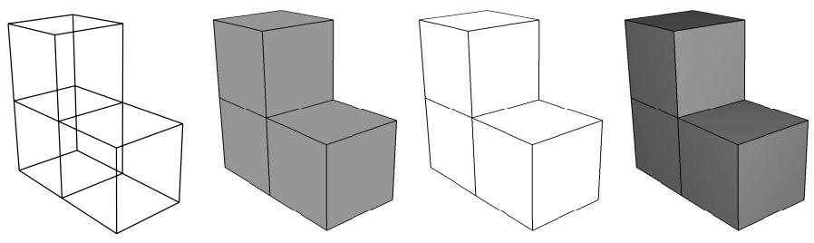  
Figure 1: Model showing render style options. From left to right: the wireframe, filled, hidden, and lightsource-shaded render styles.

## Wireframe

Displays model edges; both interior and exterior edges are potentially visible. Wireframe plots produce a frame-like visual effect in which model faces are not displayed.

## Filled

Displays model faces “painted” in a uniform color. Filled plots produce a solid rather than frame-like appearance in which only exterior faces are visible.

## Hidden

Displays a wireframe plot in which edges obscured by the model are not visible. Hidden plots produce a solid rather than frame-like appearance.

## Shaded

Displays a filled plot in which a light source appears to be directed at the model. Shaded plots produce a highly three-dimensional visual effect.

1. Locate the common or superimposed Render Style options. The common render style always applies to the deformed shape; it applies to the undeformed shape when it is plotted individually in any plot state (undeformed, contour, symbol, or material orientation). When the undeformed shape is plotted with the deformed shape, the superimpose render style applies.

From the main menu bar, select Options->Common or Superimpose; then click the Basic tab in the dialog box that appears. The Render Style options become available.

2. From the Render Style list, select the render style that you want.


Tip: You can also select the render style for the current plot state (excluding display bodies and the undeformed shape when it is superimposed) by clicking the wireframe , hidden

, filled , or shaded icons located in the Render Style toolbar.


## Note:

Symbol and material orientation plots in the shaded, filled, and hidden render styles are easier to view if you activate translucency.

3. Click Apply to implement your changes.

The render style changes to reflect your specification.

By default, your changes are saved for the duration of the session and will affect all subsequent plots in the current viewport and in any new viewports created from the current viewport. If you want to retain the changes you applied for subsequent sessions, save them to a file. For more information, see Saving customizations for use in subsequent sessions.

## Additional information

• Customizing translucency  
• Choosing a render style

## Customizing translucency

Translucency options control the degree of transparency of your model, and they apply to plots in all render styles except wireframe. Translucency is plot state–independent; that is, you set it once for all undeformed, deformed, contour, symbol, and material orientation plots. You can also set the translucency that Abaqus/CAE will apply to the undeformed shape when the deformed shape is superimposed on it.

For shaded symbol and material orientation plots, symbol plot arrows and material orientation triads located in the interior of the model are easier to view if you turn on translucency.

1. Locate the common or superimposed Translucency options. The common translucency setting always applies to the deformed shape; it applies to the undeformed shape when it is plotted individually in any plot state (undeformed, deformed, contour, symbol, or material orientation). When the undeformed shape is plotted with the deformed shape, the superimpose translucency style applies.

From the main menu bar, select Options->Common or Superimpose. Click the Other tab in the dialog box that appears; then click the Translucency tab. The Translucency options appear.

2. Toggle on Apply translucency to activate the translucency options.  
3. Choose the percentage of translucency.

Drag the slider to the percentage of translucency that you want. A value of .00 indicates transparent plotting; 1.00 indicates opaque plotting. The default translucency is .30.

4. Click Apply to implement your changes.

The translucency changes to reflect your specifications.

By default, your changes are saved for the duration of the session and will affect all subsequent plots in the current viewport and in any new viewports created from the current viewport. If you want to retain the changes you applied for subsequent sessions, save them to a file. For more information, see Saving customizations for use in subsequent sessions.

## Additional information

• Customizing render style, translucency, and fill color  
• Coloring elements with no results

## Selecting overall fill color

Fill color is the color in which Abaqus/CAE displays your model faces. This color is plot state–independent; that is, you set it once for all undeformed, deformed, symbol, and material orientation plots. You can also set the fill color that Abaqus/CAE will apply to the undeformed shape when the deformed shape is superimposed on it. Fill color applies to filled and lightsource-shaded render style plots only; it is not applicable to contour plots.

You can choose one display color for your entire model, or you can optionally override this display color for selected items, such as particular elements. For example, you can display your model in green, with a group of elements shown in red. For more information on individual item coloring, see Customizing the display color of individual objects.

1. Locate the common or superimposed fill color options. The common fill color always applies to the deformed shape; it applies to the undeformed shape when it is plotted individually in any plot state (undeformed, deformed, symbol, or material orientation). When the undeformed shape is plotted with the deformed shape, the superimpose fill color applies.

From the main menu bar, select Options->Common or Superimpose; then click the Color & Style tab in the dialog box that appears.

The Fill color in filled/shaded plots options are in the center of the Color & Style page.

2. Choose the fill color:

a. Click the Fill color in filled/shaded plots color sample

Abaqus/CAE displays the Select Color dialog box.

b. Use one of the methods in the Select Color dialog box to select a new color. For more information, see Customizing colors.

c. Click OK to close the Select Color dialog box.

The color sample changes to the selected color. The new color does not appear in the viewport until you click OK or Apply in the Plot Options dialog box.

3. Toggle Allow color code selections to override options in this dialog off to display all elements in the fill color specified above. Toggle it on to override this color using individual item color selections. The default is on. For more information, see Customizing the display color of individual objects.

4. Click Apply to implement your changes.

The fill color changes to reflect your specifications.

By default, your changes are saved for the duration of the session and will affect all subsequent plots in the current viewport and in any new viewports created from the current viewport. If you want to retain the changes you applied for subsequent sessions, save them to a file. For more information, see Saving customizations for use in subsequent sessions.

## Customizing element and surface edges

This section explains how to customize the appearance of element and surface edges in your model.

## In this section:

Controlling element and surface edge visibility  
Defining model feature edges  
Selecting overall element and surface edge color  
Customizing element and surface edge style

## Controlling element and surface edge visibility

You can control the extent to which Abaqus/CAE displays element and surface edges. Edge visibility is plot state–independent; that is, you set it once for all undeformed, deformed, symbol, and material orientation plots. You can also set the edge visibility that Abaqus/CAE will apply to the undeformed shape when the deformed shape is superimposed on it. The following choices are available to control edge display: All edges, Exterior edges, Feature edges, Free edges, and No edges. The first four options are shown in Figure 1.

  
All

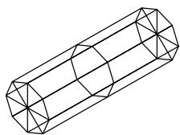  
Exterior

  
Feature

  
Free


Figure 1: Model showing edge display options.  


## Note:

If your output database includes both homogeneous solid elements and either composite solid elements or continuum shell elements, Abaqus/CAE displays a free edge or a feature edge at the boundary between the homogeneous solid geometry and the composite geometry or continuum shell geometry.

1. Locate the common or superimposed Visible Edges options. The common visible edges setting always applies to the deformed shape; it applies to the undeformed shape when it is plotted individually in any plot state (undeformed, deformed, contour, symbol, or material orientation). When the undeformed shape is plotted with the deformed shape, the superimpose visible edges setting applies.

From the main menu bar, select Options->Common or Superimpose; then click the Basic tab in the dialog box that appears. The Visible Edges options are on the right side of the Basic page.

2. To choose the element and surface edges you want to display, click one of the following:

## All edges

Displays all element and surface edges. To see element edges on the interior of the model, you must also set the render style to wireframe.

## Exterior edges

Displays only edges on the exterior of the model.

## Feature edges

Displays only edges on the exterior of the model that are calculated to be feature edges. Feature edges lie between elements that have normals that differ by more than the “feature angle.” The feature angle is set in the View->ODB Display Options->General dialog box; for more information, see Defining model feature edges.

## Free edges

Displays only edges that belong to a single element. Free edge display is particularly useful for locating potential holes or cracks in your mesh.

## No edges

Suppresses the display of all edges. This choice is available only for plots in the filled or shaded render styles.


## Note:

When elements are duplicated (i.e., share all the same corner nodes), Abaqus/CAE will not display the element edges in a free or feature edge plot.

## 3. Click Apply to implement your changes.

The edge visibility changes according to your specification.

Your changes are saved for the duration of the session and will affect all subsequent plots in the current viewport and in any new viewports created from the current viewport.

By default, your changes are saved for the duration of the session and will affect all subsequent plots in the current viewport and in any new viewports created from the current viewport. If you want to retain the changes you applied for subsequent sessions, save them to a file. For more information, see Saving customizations for use in subsequent sessions.

## Additional information

• Defining model feature edges  
• Selecting overall element and surface edge color  
• Customizing element and surface edge style  
• Controlling edge visibility

## Defining model feature edges

The common and superimposed plot options determine which model edges appear in all plot states. When you specify that only feature edges are to be visible, Abaqus/CAE determines which edges meet this criteria. Feature edges lie between elements having normals that differ by more than the “feature angle.”You can customize the feature angle. Larger angles will reduce the number of feature edges; conversely, smaller angles will cause more edges to be visible. The default is 20°. The setting of the feature angle applies to all plot states. However, all segment edges are drawn for analytical rigid surfaces regardless of the feature angle setting.

In Figure 1 the plot on the left shows feature edges when the feature angle is set to 0°, the plot in the middle shows feature edges on the same model but with the feature angle set to 15°, and the plot on the right shows the model with the feature angle set to 30°.

  
Figure 1: Plots showing feature angles of 0°, 15°, and 30°.

1. Locate the Feature Angle options.  
From the main menu bar, select View->ODB Display Options. Click the General tab in the dialog box that appears. The Feature Angle options are at the bottom of the General page.  
2. Drag the Feature Angle slider to the desired feature angle.  
3. Click Apply to implement your changes.

Feature edges for all plot states change to reflect your feature angle specification. By default, your feature angle specification is saved for the duration of the session. If you want to retain this change for subsequent sessions, save it to a file. For more information, see Saving customizations for use in subsequent sessions.

## Additional information

• Controlling element and surface edge visibility  
• Defining mesh feature edges

You can customize the color in which Abaqus/CAE displays element and surface edges. With the exception of contour plots, edge color is plot state–independent; that is, you set it once for all undeformed, deformed, symbol, and material orientation plots. You can choose a different edge color for certain render styles, and you can set the edge color that Abaqus/CAE will apply to the undeformed shape when the deformed shape is superimposed on it. For contour plots you can choose a different edge color for certain contour types.

You can choose one display color for your entire model, or you can optionally override this display color for selected items, such as particular elements. For example, you can display your model in green, with a group of elements shown in red. For more information on individual item coloring, see Customizing the display color of individual objects.

1. Locate the edge color options (common, superimposed, or contour) that you want to customize.

• For all plots except superimposed and contour plots:

From the main menu bar, selectOptions->Common; then click the Color & Style tab in the dialog box that appears.

The Color options are at the top of the Color & Style page.

• For contour plots:

From the main menu bar, selectOptions->Contour; then click the Color & Style tab in the dialog box that appears. Click the Model Edges tab.

• For the undeformed shape in a superimposed plot:

From the main menu bar, selectOptions->Superimpose; then click the Color & Style tab in the dialog box that appears.

The Color options are at the top of the Color & Style page.

2. Choose the color of the element and surface edges for wireframe and hidden render style plots and line-type contours. (For all of these plots Abaqus/CAE does not display model faces.)

a. Click the color sample , which is labeled either Edges in wireframe/hidden plots or In line plots.

Abaqus/CAE displays the Select Color dialog box.

b. Use one of the methods in the Select Color dialog box to select a new color. For more information, see Customizing colors.

c. Click OK to close the Select Color dialog box.

The color sample changes to the selected color. The new color does not appear in the viewport until you click OK or Apply in the Plot Options dialog box.

3. Choose the color of the element and surface edges for filled and shaded render style plots and bandedand quilt-type contour plots. (For all of these plots Abaqus/CAE displays model faces.)

a. Click the color sample , which is labeled either Edges in filled/shaded plots or In banded/quilt plots.

Abaqus/CAE displays the Select Color dialog box.

b. Use one of the methods in the Select Color dialog box to select a new color. For more information, see Customizing colors.

c. Click OK to close the Select Color dialog box.

The color sample changes to the selected color. The new color does not appear in the viewport until you click OK or Apply in the Plot Options dialog box.

4. Toggle Allow color code selections to override options in this dialog off to display all edges in the color specified above. Toggle it on to override this color using color code selections. The default is on. This option is not available for contour plots.  
5. Click Apply to implement your changes.

The edge color changes according to your specification. If you specify an edge color for wireframe, hidden, or line plots that is the same color as the viewport background, Abaqus/CAE draws the edges in a contrasting color so that your plot will not disappear. Edges drawn in the viewport background color in filled or shaded plots may obscure the corresponding model faces if you zoom out or if the faces are so small that the edges begin to overlap.

By default, your changes are saved for the duration of the session and will affect all subsequent plots in the current viewport and in any new viewports created from the current viewport. If you want to retain the changes you applied for subsequent sessions, save them to a file. For more information, see Saving customizations for use in subsequent sessions.

## Additional information

• Controlling element and surface edge visibility  
• Customizing element and surface edge style  
• Choosing background colors

## Customizing element and surface edge style

You can customize the style and thickness in which Abaqus/CAE displays element and surface edges.

For example, Figure 1 shows a plot with default element edges on the left and customized edges on the right. Edge style options are plot state–independent; that is, you set them once for all undeformed, deformed, symbol, and material orientation plots. You can also set the edge style options that Abaqus/CAE will apply to the undeformed shape when the deformed shape is superimposed on it.

  
Figure 1: Models showing default and customized element edges.

1. Locate the common or superimposed Edge Attributes options. The common edge attributes always apply to the deformed shape; they apply to the undeformed shape when it is plotted individually in any plot state (undeformed, deformed, contour, symbol, or material orientation). When the undeformed shape is plotted with the deformed shape, the superimpose edge attributes apply.

From the main menu bar, select Options->Common or Superimpose. Click the Other tab in the dialog box that appears; then click the Color & Style tab in the dialog box that appears.

The Edge Attributes options are at the bottom of the Color & Style page.

2. Choose the style of the element and surface edges:

a. Click the Style button to reveal the edge style options.  
b. Click the edge style you want.  
The specified edge style appears on the Style button.

3. Choose the thickness of the element and surface edges:

a. Click the Thickness button to reveal the edge thickness options.  
b. Click the edge thickness you want.  
The specified edge thickness appears on the Thickness button.

4. Click Apply to implement your changes.

The element and surface edge style changes according to your specification.

By default, your changes are saved for the duration of the session and will affect all subsequent plots in the current viewport and in any new viewports created from the current viewport. If you want to retain the changes you applied for subsequent sessions, save them to a file. For more information, see Saving customizations for use in subsequent sessions.

## Additional information

• Controlling element and surface edge visibility  
• Selecting overall element and surface edge color

## Customizing model shape

This section explains how to customize the shape of your model.

## In this section:

Scaling deformations  
Scaling coordinates and shrinking the model

Deformations are the values of a deformed field output variable; for example, displacement or velocity. Abaqus/CAE computes the deformed shape by applying the deformations to the undeformed nodal coordinates. You can scale the deformations to magnify, reduce, or otherwise distort the deformed model shape. For example, Figure 1 displays a deformed shape contour plot on the left and the same plot with the deformation magnified 15 times on the right.

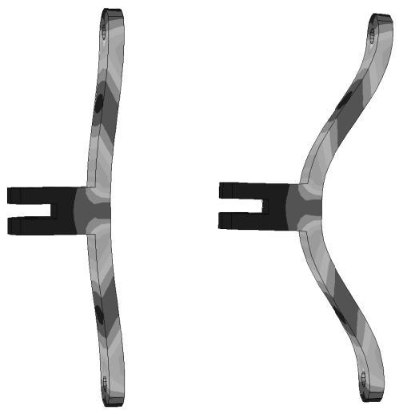  
Figure 1: Contour plots showing default and magnified deformation values.

Deformation scaling is plot state–independent; that is, you set it once for the deformed shape in all deformed, contour, symbol, and material orientation plots. The default scaling is a uniform factor of 1.00 for large-displacement analyses. For small-deformation analyses—for example, a perturbation analysis—Abaqus/CAE scales the deformation such that the maximum deformation is 10% of the largest model dimension.

1. From the main menu bar, select Options->Common. Click the Basic tab in the dialog box that appears. The Deformation Scale Factor options are in the lower left corner of the Basic page.  
2. Choose one of the following scale factor options:

Click Auto-compute to request that Abaqus automatically compute and uniformly apply a single scale factor to all X-, Y-, and Z-components of deformation values.  
Click Uniform to specify and uniformly apply a single scale factor to all X-, Y-, and Z-components of deformation values.

When Uniform is on, a Value specification box becomes available. Click the Value box, and enter your scale factor.

Click Nonuniform to specify individual scale factors to be applied to the X-, Y-, and Z-components of deformation values.

When Nonuniform is on, X-, Y-, and Z-component scale factor specification boxes become available. For each component you want to scale, click the component (X, Y, or Z) scale factor box and enter your scale factor.

3. Click Apply to implement your changes.

The deformed shape changes according to your specification. The state block, if active, changes to show the current deformation scale factors.

Your changes are saved for the duration of the session and will affect all subsequent deformed shape plots.

By default, your changes are saved for the duration of the session and will affect all subsequent deformed shape plots. If you want to retain the changes you applied for subsequent sessions, save them to a file.

For more information, see Saving customizations for use in subsequent sessions.

## Additional information

• Scaling coordinates and shrinking the model

You can magnify, reduce, or otherwise distort the shape of your model by scaling, and you can shrink each element about its centroid. Scaling modifies all nodal coordinates in each of the X-, Y-, and Z-directions. Shrinking reduces each element in size uniformly about its centroid. For example, the elements shown in Figure 1 have been shrunk by a factor of 0.40.

  
Figure 1: Elements showing the effect of shrinking.

Scaling and shrinking options are plot state–independent; that is, you set them once for all undeformed, deformed, contour, symbol, and material orientation plots. You can also set the scaling and shrinking options that Abaqus/CAE will apply to the undeformed shape when the deformed shape is superimposed on it.

1. Locate the common or superimposed Scaling options. The common scaling options always apply to the deformed shape; they apply to the undeformed shape when it is plotted individually in any plot state (undeformed, deformed, contour, symbol, or material orientation). When the undeformed shape is plotted with the deformed shape, the superimpose scaling options apply.

From the main menu bar, select Options->Common or Superimpose; then click the Other tab in the dialog box that appears. Click the Scaling tab; the Scaling options appear.

2. Toggle Shrink elements to request or suppress shrinking each element about its centroid.

a. When Shrink elements is on, the shrink Factor slider becomes available.  
b. Drag the Factor slider to the desired shrink factor.

A value of 0.00 indicates no shrinking. A value of 0.90 shrinks all elements to dots.

3. Toggle Scale coordinates to request or suppress model scaling by nodal coordinate X-, Y-, and Z-directions.

a. When Scale coordinates is on, scale factors become available. Click the X, Y, and Z boxes to enter scale factors for the X, Y, and Z nodal coordinates, respectively.

4. Click Apply to implement your changes.

The model display changes according to your specification.

By default, your changes are saved for the duration of the session and will affect all subsequent plots in the current viewport and in any new viewports created from the current viewport. If you want to retain the changes you applied for subsequent sessions, save them to a file. For more information, see Saving customizations for use in subsequent sessions.

## Additional information

• Scaling deformations

## Customizing model labels

This section explains how to customize the appearance of element labels, face labels, node labels, and node symbols for undeformed, deformed, contour, symbol, and material orientation plots.

## In this section:

Setting the label font  
Customizing element labels  
Customizing face labels  
Customizing node labels  
Customizing node symbols  
Displaying nodal-averaged orientations

## Setting the label font

Abaqus/CAE uses a single font to display all element, face, and node labels. You can set the properties (family, size, boldness, italics) of this font for all plot states, and you can set them separately for use with the undeformed shape in a superimposed plot.

1. Locate the common or superimposed label font options. The common font options always apply to the deformed shape; they apply to the undeformed shape when it is plotted individually in any plot state (undeformed, deformed, contour, symbol, or material orientation). When the undeformed shape is plotted with the deformed shape, the superimpose label font options apply.

From the main menu bar, select Options->Common or Superimpose; then click the Labels tab in the dialog box that appears. The font options are at the top of the Labels page.

2. Click Set Font for All Model Labels.

The Select Font dialog box appears.

3. Use the Select Font dialog box to set the font properties that you want.  
4. When you have set the desired font properties, click OK.

The Select Font dialog box closes.

5. Click Apply to implement your changes.

The element, face, and node labels change according to your specification.

By default, your changes are saved for the duration of the session and will affect all subsequent plots in the current viewport and in any new viewports created from the current viewport. If you want to retain the changes you applied for subsequent sessions, save them to a file. For more information, see Saving customizations for use in subsequent sessions.

## Additional information

• Customizing element labels  
• Customizing face labels  
• Customizing node labels

## Customizing element labels

Element labels are numeric labels (element numbers) that identify each element. For example, the elements are labeled in Figure 1.

  
Figure 1: Model showing element labels.

Element labels are plot state–independent; that is, you set them once for all undeformed, deformed, contour, symbol, and material orientation plots. You can also set the element labels that Abaqus/CAE will display on the undeformed shape when the deformed shape is superimposed on it. Toggle Show element labels to display or suppress element labels and to choose their color.

1. Locate the common or superimposed element label options. The common element label options always apply to the deformed shape; they apply to the undeformed shape when it is plotted individually in any plot state (undeformed, deformed, contour, symbol, or material orientation). When the undeformed shape is plotted with the deformed shape, the superimpose element label options apply.

From the main menu bar, select Options->Common or Superimpose; then click the Labels tab in the dialog box that appears.

2. Toggle Show element labels to display or suppress numeric element labels.

When Show element labels is on, the element label color options become available.

3. Choose the color of the element labels:

a. Click the color sample

Abaqus/CAE displays the Select Color dialog box.

b. Use one of the methods in the Select Color dialog box to select a new color. For more information, see Customizing colors.

c. Click OK to close the Select Color dialog box.

The color sample changes to the selected color

4. Click Apply to implement your changes.

The labels change according to your specification.

By default, your changes are saved for the duration of the session and will affect all subsequent plots in the current viewport and in any new viewports created from the current viewport. If you want to retain the changes you applied for subsequent sessions, save them to a file. For more information, see Saving customizations for use in subsequent sessions.

## Additional information

• Setting the label font

## Customizing face labels

Face labels identify the order of faces within each element. For example, the faces are labeled in Figure 1.

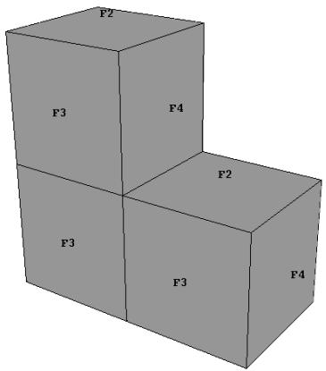  
Figure 1: Model showing face labels.

Face labels are plot state–independent; that is, you set them once for all undeformed, deformed, contour, symbol, and material orientation plots. You can also set the face labels that Abaqus/CAE will display on the undeformed shape when the deformed shape is superimposed on it. Toggle Show face labels to display or suppress element labels and to choose their color.

1. Locate the common or superimposed face label options. The common face label options always apply to the deformed shape; they apply to the undeformed shape when it is plotted individually in any plot state (undeformed, deformed, contour, symbol, or material orientation). When the undeformed shape is plotted with the deformed shape, the superimpose face label options apply.

From the main menu bar, select Options->Common or Superimpose; then click the Labels tab in the dialog box that appears.

2. Toggle Show face labels to display or suppress numeric face labels.

When Show face labels is on, the face label color options become available.

3. Choose the color of the face labels:

a. Click the color sample

Abaqus/CAE displays the Select Color dialog box.

b. Use one of the methods in the Select Color dialog box to select a new color. For more information, see Customizing colors.

c. Click OK to close the Select Color dialog box.

The color sample changes to the selected color.

4. Click Apply to implement your changes.

The labels change according to your specification.

By default, your changes are saved for the duration of the session and will affect all subsequent plots in the current viewport and in any new viewports created from the current viewport. If you want to retain the changes you applied for subsequent sessions, save them to a file. For more information, see Saving customizations for use in subsequent sessions.

## Additional information

• Setting the label font

## Customizing node labels

Node labels are numeric labels (node numbers) identifying each node. For example, the nodes are labeled in Figure 1.

  
Figure 1: Model showing node labels.

Node labels are plot state–independent; that is, you set them once for all undeformed, deformed, contour, symbol, and material orientation plots. You can also set the node labels that Abaqus/CAE will display on the undeformed shape when the deformed shape is superimposed on it. Toggle Show node labels to display or suppress node labels and to choose their color.

1. Locate the common or superimposed node label options. The common node label options always apply to the deformed shape; they apply to the undeformed shape when it is plotted individually in any plot state (undeformed, deformed, contour, symbol, or material orientation). When the undeformed shape is plotted with the deformed shape, the superimpose node label options apply.

From the main menu bar, select Options->Common or Superimpose; then click the Labels tab in the dialog box that appears.

2. Toggle Show node labels to display or suppress numeric node labels.

When Show node labels is on, the node label color options become available.

3. Choose the color of the node labels:

a. Click the color sample .

Abaqus/CAE displays the Select Color dialog box.

b. Use one of the methods in the Select Color dialog box to select a new color. For more information, see Customizing colors.

c. Click OK to close the Select Color dialog box.

The color sample changes to the selected color.

4. Click Apply to implement your changes.

The labels change according to your specification.

By default, your changes are saved for the duration of the session and will affect all subsequent plots in the current viewport and in any new viewports created from the current viewport. If you want to retain the changes you applied for subsequent sessions, save them to a file. For more information, see Saving customizations for use in subsequent sessions.

## Additional information

• Setting the label font

## Customizing node symbols

Node symbols (circles, squares, triangles, etc.) identify the location of each node. For example, filled circles are used to symbolize the nodes shown in Figure 1.

  
Figure 1: Model showing node symbols.

Node symbols are plot state–independent; that is, you set them once for all undeformed, deformed, contour, symbol, and material orientation plots. You can also set the node symbols that Abaqus/CAE will display on the undeformed shape when the deformed shape is superimposed on it. Toggle Show node symbols to display or suppress node labels and to choose their color.

1. Locate the common or superimposed node symbol options. The common node symbol options always apply to the deformed shape; they apply to the undeformed shape when it is plotted individually in any plot state (undeformed, deformed, contour, symbol, or material orientation). When the undeformed shape is plotted with the deformed shape, the superimpose node symbol options apply. From the main menu bar, select Options->Common or Superimpose; then click the Labels tab in the dialog box that appears.

2. Toggle Show node symbols to display or suppress node symbols.

When Show node symbols is on, the node symbol color, type, and size options become available.

3. Choose the color of the node symbols:

a. Click the color sample

Abaqus/CAE displays the Select Color dialog box.

b. Use one of the methods in the Select Color dialog box to select a new color. For more information, see Customizing colors.

c. Click OK to close the Select Color dialog box.

The color sample changes to the selected color. The new color does not appear in the viewport until you click OK or Apply in the Plot Options dialog box.

4. Choose the type (circle, square, triangle, etc.) of the node symbols:

a. Click the Symbol button to reveal the node symbol type options.

b. Click the symbol type you want. The specified symbol type appears on the Symbol button.

5. Choose the size of the node symbols:

a. Click the Size button to reveal the node symbol size options.  
b. Click Small, Medium, or Large.  
The specified symbol size appears on the Size button.

6. Click Apply to implement your changes.

The symbols change according to your specification.

By default, your changes are saved for the duration of the session and will affect all subsequent plots in the current viewport and in any new viewports created from the current viewport. If you want to retain the changes you applied for subsequent sessions, save them to a file. For more information, see Saving customizations for use in subsequent sessions.

## Additional information

• Customizing node labels

## Displaying nodal-averaged orientations

For line- and banded-type contour plots, element results are extrapolated and conditionally averaged from the element centroids or integration points to the nodes to create the plots. You can use the Result Options dialog box to control how Abaqus/CAE applies averaging to a model. One option allows you to compute invariants (scalars) and extract components after averaging the results at each node; when you choose to compute the results in this order, Abaqus/CAE applies the vector or tensor orientation from one of the adjacent elements as the orientation for each node. Under the Other tab of the Contour Plot Options dialog box, toggle Show nodal-averaged vector/tensor orientations when computing scalars after averaging to display or suppress the averaged orientations on the contour plot. When this option is enabled, Abaqus/CAE draws a triad at each node indicating the nodal-averaged orientation for the plotted vector or tensor. By default, the 1-axis appears in teal, the 2-axis appears in yellow, and the 3-axis appears in red. You can use the same procedures described in Customizing material orientation plot triads, to customize the appearance of these triads.

If you choose to compute scalars prior to averaging the results at the nodes, orientations are not averaged and do not appear in your contour plot.

## Additional information

• Selecting result options

## Displaying multiple plot states

In addition to superimposing the undeformed and deformed shape for a single plot state such as contour plots, you can choose to display multiple plot states in a viewport.

By toggling on Allow Multiple Plot States in the toolbox, you can choose any combination of the undeformed and deformed plot shapes with contours, symbols, and material orientations for the selected step and frame of the current output database. Abaqus/CAE displays the deformed plots using the Common Plot Options and the undeformed plots using the Superimposed Plot Options in combination with the other plot state–independent and dependent options for each plot state.

If you toggle off Allow Multiple Plot States, Abaqus/CAE uses the following order in combination with the last plot states that were displayed to select the single plot state to display:

• Undeformed  
• Deformed  
• Contours  
• Symbols  
• Material Orientations

For example, if you display contours and material orientations, Abaqus/CAE retains the contour plot when you toggle off Allow Multiple Plot States. This is the same order that the plot states are listed in the Plot menu and displayed in the toolbox.

To display more complex plot combinations, you must use an Overlay Plot. Overlay plots allow you to display animations or X–Y plots along with the stationary plot states listed above. You can also use overlay plots to plot results from multiple steps, frames, or output databases. For more information, see Overlaying multiple plots.

## Additional information

• Using common plot options  
• Superimposing deformed and undeformed model plots

## Displaying element and surface normals

When you create an undeformed or deformed plot, you can choose to display arrows in the plot that indicate the directions of the element or surface normals. You can display normal directions for beams, pipes, frame elements, contact surfaces, membranes, rigid elements, rigid surfaces, shells, three-dimensional solids, and trusses. (For information about normal directions for a particular type of element or surface, see Abaqus Elements Guide.)

1. Locate the common or superimposed normals options. The common normals options apply to the undeformed and the deformed shape when they are plotted individually. The superimpose normals options apply to the undeformed shape when it is plotted with the deformed shape.

From the main menu bar, select Options->Common or Superimpose; then click the Normals tab in the dialog box that appears.

2. Toggle on Show normals.

The Normals options become available.

3. Toggle on On elements to display the normals on elements in your model or On surfaces to display the normals on surfaces in your model.  
4. In the area of the dialog box labeled Colors, select the colors in which you want the different types of normals to appear.  
5. In the area of the dialog box labeled Style:

a. Click the arrow next to the Length field, and select the arrow length of your choice. The default selection is Medium.  
b. Click the arrow next to the Line Thickness field, and select the arrow thickness of your choice.  
c. Click the arrow next to the Arrowhead field, and select the arrowhead style of your choice.

6. Click Apply to implement your changes.

Arrows appear in the viewport that indicate the normal directions of the elements or surfaces in the model. In general, the arrows appear at the centroid of exterior element faces.

## Customizing the appearance of display bodies

A display body is a part instance that does not take part in the analysis but is visible during postprocessing. You can customize the appearance of such part instances in your model using the Display Body Options in the Visualization module. The options available for display bodies are similar to those available for all of the plot states in Abaqus/CAE: render style; edge visibility, color, and style; fill color; scaling; and translucency can all be customized. Similar to the common plot options, display body options are plot state–independent; i.e., the options applied to display bodies are reflected in all plot states. Display body options apply to all display bodies in your model; to customize the appearance of individual display bodies, you can create display groups based on part instances (see Creating or editing a display group). Individual item coloring can also be applied to individual display body part instances to override the edge and/or fill colors specified as general display body options; see Color coding geometry and mesh elements for more information.

To locate the display body options, select Options->Display Body from the main menu bar. Click the following tabs to customize the appearance of all display bodies in the current viewport:

• Basic: Choose render style (Choosing a render style) and edge visibility (Controlling element and surface edge visibility).


## Note:

The render style icons located in the Render Style toolbar do not apply to display bodies in any plot state. In addition, by default, only free edges are shown for display bodies while all exterior edges are shown for other model components.

• Color & Style: Control model edge color (Selecting overall element and surface edge color), model edge style (Customizing element and surface edge style), and model fill color (Selecting overall fill color).  
• Other: The Other page contains the following tabs:

- Scaling: Control model scaling and shrinking (Scaling coordinates and shrinking the model).  
Translucency: Control shaded render style translucency (Customizing translucency).

## Additional information

• Defining display body constraints  
• Display bodies

## Customizing camera movement

You can customize two groups of camera options in your model by using the View Options in the Visualization module, as shown in Figure 1.

  
Figure 1:The View Options dialog box.

The Mode options are available in all Abaqus/CAE modules except the Sketch module; the Mode options are discussed in Manipulating the view and controlling perspective and are saved only for the current session. The Camera Movement options are available only in the Visualization module. They control the position and movement of the camera with respect to a selected local coordinate system. You can save the settings of the Camera Movement options by selecting File->Save Options from the main menu bar.

To locate the view options, select View->View Options from the main menu bar. To use the Camera Movement options, you must first toggle on Move camera with CSYS, then select a local coordinate system using one of the following methods:

• Select a coordinate system from the list provided in the dialog box,  
• Click Create to create a new local coordinate system,  
• Click $\left. \left[ \frac { \mathsf { R } } { \mathsf { s } } \right] _ { \mathsf { t o } } \right.$ pick a local coordinate system from the viewport, or

Click Move Camera With Node or use the button in the context bar to create a rectangular coordinate system following a single node.


## Note:

To reset the camera to follow the global coordinate system, either toggle off Move camera with CSYS or click

th e button in the context bar.

You can select from the following camera movement options:

## Move camera with CSYS

Select this option to fix the origin of the selected coordinate system in the viewport. If you create an animation or change the ODB frame, Abaqus/CAE moves all objects in the viewport relative to the position of the selected local coordinate system. If the selected local coordinate system is not a moving coordinate system, you will not observe any difference from the default settings that fix the camera to the (stationary) global coordinate system.

If you select Move camera with CSYS, it is recommended that you pause any animation in the current viewport before attempting to manipulate the view.

## Follow CSYS rotation

Select this option to fix both the position and the rotation of the local coordinate system in the viewport. All model rotations are transformed so that the model appears to rotate about the selected coordinate system. This option is available only when Move camera with CSYS is toggled on.

## Move camera to CSYS

This option is available only when Use movie mode and Move camera with CSYS are toggled on. Use movie mode allows the camera to move into and through the model instead of viewing the model from a distance (for more information, see Camera modes and view terminology). When you apply Move camera to CSYS, the camera moves to the origin of the selected coordinate system. Abaqus/CAE toggles this option off immediately after you click Apply in the View Options dialog box to avoid conflicts with the view manipulation tools, some of which also reposition the camera.


Note: When you apply Move camera to CSYS, Abaqus/CAE may display a blank view in the viewport. The most common cause for this blank view is the Near plane distance setting; apply a smaller Near plane distance to view portions of the model that are close to the camera.

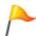

Warning: If you pan, rotate, or magnify the view in the Visualization module, it is recommended that you first pause any animations in the viewport. Since animations and view manipulations both affect the view, their instructions to Abaqus/CAE may conflict with each other and create undesirable results.

## Additional information

• Understanding camera modes and view options  
• Creating coordinate systems during postprocessing

## Controlling the display of model entities

The Entity Display options in the ODB Display Options dialog box allow you to control the display of symbols. The displayed symbols represent the following entities in your model:

• boundary conditions applied during the analysis,  
connectors used in the model (the highlighting of endpoints, the display of local orientation axes associated with each connector, and the display of connector type labels can be controlled individually),  
• coordinate systems written to the current output database or created in the Visualization module during the current session, and  
point elements, including reference points, mass and inertia elements, springs and dashpots, spot welds and distributing coupling (DCOUP\*) elements, tracer particles, continuum particle elements, discrete particle elements, and rendering of particle element edges.

Model entity display is plot state–independent. Abaqus/CAE displays model entity symbols for the current step and frame of your output database. You can customize the appearance of the model entity symbols in the Visualization module only by changing their size.

For information on the symbols representing boundary conditions, see Understanding symbols that represent prescribed conditions; for information on the symbols representing connectors, see Understanding symbols that represent interactions, constraints, and connectors. For information on controlling the display of these entities in assembly-related modules, see Controlling the display of attributes.


Tip: You can also control the display of connectors using display groups; each connector is listed as an element set. See Creating or editing a display group for more information on display groups.

The render particle element edges option allows the display of symbols for particle element edges. You can use Wireframe, Hidden, and Filled render style options for particle elements.

Only session coordinate systems and reference points are displayed by default. The display of model entities can affect performance significantly. To maximize the performance of Abaqus/CAE, be selective about the entities you choose to display.

1. From the main menu bar, select View->ODB Display Options. Click the Entity Display tab in the dialog box that appears.  
The entity display options become available.  
2. Toggle the entities that you want to display. Only the entities that you select (if they have been defined for the current model) will appear in the viewport.  
3. If desired, drag the Symbol size slider left or right to modify the size of the symbols in the viewport.  
4. Click Apply to implement your changes.

The plot in the current viewport changes to reflect your specification.

By default, your changes are saved for the duration of the session and will affect all subsequent plots in the current viewport and in any new viewports created from the current viewport. If you want to retain the changes you applied for subsequent sessions, save them to a file. For more information, see Saving customizations for use in subsequent sessions.

## Additional information

• Creating boundary conditions  
• Understanding constraints  
• Understanding connectors  
• Creating coordinate systems during postprocessing

• Why are datum coordinate systems so important?

## Controlling the display of constraints in the Visualization module

In the Visualization module you can selectively control the display of analysis constraints using display groups and the ODB Display Options dialog box. These controls are useful when debugging models that contain large numbers of constraints. By turning the display of some constraints on and off, you can more easily understand complex models.

There are two levels of controls for showing or hiding constraints:

You must first add the desired constraints to a display group for them to be visible in the viewport. You can create and edit display groups to include or exclude different constraints. See Creating or editing a display group, for more information about display groups.  
• Different types of constraints can be selected or hidden in the Constraints tab of the ODB Display Options dialog box. From the main menu bar, selectView->ODB Display Options to access these options.

The following types of constraints can be displayed or hidden:

• tie constraints

• rigid body constraints (ties and pins only)

• shell-to-solid couplings

• distributing couplings

• kinematic couplings

• multi-point constraints


## Note:

These types of constraints are created in the Interaction module, not the Assembly module. See Understanding constraints for more information.

Table 1 shows how each type of constraint is displayed by Abaqus/CAE.  
Table 1: How constraints are shown in the viewport.

<table><tr><td>Constraint type</td><td>Display in viewport</td></tr><tr><td>Tie</td><td>Spidering of red lines drawn between the nodes on the main and secondary surfaces of the constraint.</td></tr><tr><td>Rigid body</td><td>The rigid body regions (elements, nodes, or surfaces) are highlighted in the viewport.</td></tr><tr><td>Shell-to-solid coupling</td><td>Spidering of yellow lines drawn between the nodes on the shell edge and the solid face.</td></tr><tr><td>Distributing coupling</td><td>Spidering of orange lines drawn between the control point and the coupling points (nodes) in the constraint region.</td></tr><tr><td>Kinematic coupling</td><td>Spidering of purple lines drawn between the control point and the coupling points (nodes) in the constraint region.</td></tr><tr><td>Multi-point constraint (Abaqus/Explicit only)</td><td>The nodes comprising the multi-point constraint are connected with yellow lines.</td></tr></table>

You can change the default colors of the constraint spider lines in the Color Code dialog box. For more information, see Coloring constraints in the Visualization module.

## Additional information

• Understanding constraints  
• Creating or editing a display group

## Customizing general model display

This section explains several of the general model display options.

## In this section:

Sweeping and extruding your model  
Using mirrors and patterns to display your results  
Refining curved edges and faces  
Coloring elements with no results  
Controlling beam profile display for postprocessing  
Controlling shell thickness display for postprocessing  
Controlling the display of thermal fluid pipe elements  
Viewing removed elements

## Sweeping and extruding your model

You can display axisymmetric models as planar, two-dimensional shapes or “sweep” the models through a specified angle, producing a three-dimensional visual effect.

Similarly, you can view just the modeled sector of a cyclic symmetric structure or “sweep” the sector to see a specified portion of the entire model. (For more information on cyclic symmetric structures, see Analysis of Models that Exhibit Cyclic Symmetry.) In addition, you can view two-dimensional models (or three-dimensional cylindrical rigid surfaces) as planar or extrude them to a specified depth, producing a three-dimensional visual effect. Sweeping and extruding are particularly useful for displaying contour plots of two-dimensional elements and contact surfaces.

Axisymmetric analytical rigid surfaces can be rotated about an axis (swept), as can the following elements: ACAXn, CAXn, CAXAn, CGAXn, DCAXn, DCCAXn, DSAXn, FAXn, MAXn, MGAXn, RAXn, SAXn, and SAXAn. Models that contain three-dimensional axisymmetric analytical rigid surfaces or CAXA elements are swept by default (the default start angle, end angle, and number of sectors vary depending on the model type). If the model contains both analytical rigid surfaces and CAXA elements, only the CAXA elements are swept by default. When you display boundary conditions for swept axisymmetric elements, symbols appear on only the original nodes and not on the swept nodes.

Cyclic symmetric models are not swept by default. When you display contours on a swept cyclic symmetric model, only nodal quantities can be contoured on the swept sectors; scalar, vector, and tensor quantities at integration points can be contoured only on the original sector.

You can extrude analytical rigid surfaces and all of the planar, two-dimensional solid elements in the Abaqus library along the Z-direction. For a list of these elements, see Two-Dimensional Solid Element Library.

Figure 1 shows an axisymmetric planar model in a planar view (left) and the same model with an axisymmetric sweep angle of 90° and 10 sweep sectors (right).

  
Figure 1: Axisymmetric model with planar and swept display.

Figure 2 shows the original modeled sector of a cyclic symmetric fan (left) and sectors 1–4 of the swept model (right).

  
Figure 2: Cyclic symmetric model: single sector and swept view of multiple sectors.

Figure 3 shows a two-dimensional planar model in a planar view (left) and the same model displayed with an extrusion depth of 0.1 (right).  
  
Figure 3:Two-dimensional model with planar and extruded display.

## Additional information

• Using mirrors and patterns to display your results  
• Refining curved edges and faces

## Sweep elements in your axisymmetric model

1. Locate the General Sweep options.

From the main menu bar, select View->ODB Display Options. Click the Sweep/Extrude tab in the dialog box that appears. The General Sweep options are in the upper portion of the page.

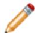

## Note:

If there are no elements or analytical rigid surfaces in your model that can be swept, the General Sweep options will not be available.

2. Toggle Sweep elements.  
3. Specify the sweep angle by typing a number (in degrees) in the Sweep from field (the default is 0°) and a number (in degrees) in the To field (the default is 180° for all models).

Abaqus/CAE sweeps the two-dimensional model counterclockwise about the axis of rotation from the first specified angle to the second.

4. Specify the number of segments to use along the circumferential direction when sweeping by typing a positive integer in the Number of segments field or by clicking on the arrows next to the field. The default number of segments used varies depending on the model type.

The angle between the segments is updated automatically in the dialog box. As you increase the number of segments, curves in the model appear smoother (the angle between them decreases). However, a smaller number of segments plots faster.

5. Click Apply to implement your changes.

Your sweep specifications are reflected in all plot states and, by default, they are saved for the duration of the session. If you want to retain the changes you applied for subsequent sessions, save them to a file. For more information, see Saving customizations for use in subsequent sessions.

If a contour plot is displayed, the contours appear on all swept faces.

If a symbol plot is displayed, the model is swept as specified, but the symbols appear only on the original planar model faces.

## Sweep analytical rigid surfaces in your axisymmetric model

1. Locate the General Sweep options.

From the main menu bar, select View->ODB Display Options. Click the Sweep/Extrude tab in the dialog box that appears. The General Sweep options are in the upper portion of the page.


## Note:

If there are no elements or analytical rigid surfaces in your model that can be swept, the General Sweep options will not be available.

2. Toggle on Sweep analytical rigid surfaces if it is not currently active.  
3. Specify the sweep angle by typing a number (in degrees) in the Sweep from field and a number (in degrees) in the To field (the default value is 180° when you first open an axisymmetric model and 360° when you first open a three-dimensional model).

Abaqus/CAE sweeps the analytical rigid surface counterclockwise about the axis of rotation from the first specified angle to the second.

4. Specify the number of segments to use along the circumferential direction when sweeping analytical rigid surfaces by typing a positive integer in the Number of segments field or by clicking on the arrows next to the field. By default, Abaqus/CAE uses 10 segments for axisymmetric models and 20 segments for three-dimensional models.

The angle between the segments is updated automatically in the dialog box. As you increase the number of segments, curves in the model appear smoother (the angle between them decreases). However, a smaller number of segments plots faster.

5. Click Apply to implement your changes.

Your sweep specifications are reflected in all plot states and are saved for the duration of the session. If you want to retain the changes you applied for subsequent sessions, save them to a file. For more information, see Saving customizations for use in subsequent sessions.

## Sweep your cyclic symmetric model

1. Locate the Sector Sweep options.

From the main menu bar, select View->ODB Display Options. Click the Sweep/Extrude tab in the dialog box that appears. The Sector Sweep options are in the center portion of the page.


## Note:

If there are no cyclic symmetry elements in your model, the Sector Sweep options will not be available.

2. Toggle Sweep cyclic symmetry sectors.  
3. Click the arrow next to the Sector selection field to choose from the following available sweep methods:

## By Number

This is the default sweep method. The total number of sectors in the model is given in the dialog box. You can specify which of these sectors should be displayed by typing positive integers between 1 and the total number of sectors (delimited by commas) in the Sectors field. The sectors are numbered counterclockwise from the original sector.

Abaqus/CAE displays only the specified sectors (whether or not they are adjacent).

## By Angle

The sector angle (the angle between each sector) is given in the dialog box. You can specify the sweep angle in increments of the sector angle by typing a number (in degrees) in the Sweep from field (the default is 0°) and a number (in degrees) in the To field (the default is the sector angle). Both numbers should be divisible by the sector angle.


Tip: You can also use the arrows next to the text fields to specify the angles.

Abaqus/CAE sweeps the two-dimensional model about the axis of rotation by the number of degrees you specify. If you enter a sweep angle that is not divisible by the sector angle, Abaqus/CAE rounds up to the next number that is.

## All Sectors

If you choose this sweep method, all sectors will be displayed; in other words, the model will be swept 360° about the axis of rotation.

4. Click Apply to implement your changes.

Your sweep specifications are reflected in all plot states and are saved for the duration of the session. If you want to retain the changes you applied for subsequent sessions, save them to a file. For more information, see Saving customizations for use in subsequent sessions.

If a contour plot is displayed, the contours of nodal quantities appear on all swept faces; contours of scalar, vector, and tensor quantities at integration points appear only on the original sector.

If a symbol plot is displayed, the model is swept as specified, but the symbols appear only on the original planar model faces.

## Extrude elements in your model

1. Locate the Extrude options.

From the main menu bar, select View->ODB Display Options. Click the Sweep/Extrude tab in the dialog box that appears. The Extrude options are in the lower portion of the page.


## Note:

If there are no elements in your model that can be extruded, the Extrude options will not be available.

## 2. Toggle Extrude elements.

When Extrude elements is on, the Depth option becomes available.

## 3. Specify the depth of the extrusion by typing a positive number (in model units) in the Depth field. The default depth is 1.0.

Abaqus/CAE extends your model the specified number of units in the negative z-direction.

Use the view manipulation rotation tool to view the extruded model in three dimensions.

## 4. Click Apply to implement your changes.

Your extrude specifications are reflected in all plot states and are saved for the duration of the session. If you want to retain the changes you applied for subsequent sessions, save them to a file. For more information, see Saving customizations for use in subsequent sessions.

If a contour plot is displayed, the contours appear on all extruded faces.

If a symbol plot is displayed, the model is extruded as specified, but the symbols appear only on the original planar model faces.

## Extrude analytical rigid surfaces in your model

## 1. Locate the Extrude options.

From the main menu bar, select View->ODB Display Options. Click the Sweep/Extrude tab in the dialog box that appears. The Extrude options are in the lower portion of the page.


## Note:

If there are no elements or analytical rigid surfaces in your model that can be extruded, the Extrude options will not be available.

## 2. Toggle on Extrude analytical rigid surfaces if it is not currently active.

When Extrude analytical rigid surfaces is on, the Depth options become available.

## 3. Select a depth for the extrusion.

You can either accept the default depth by selecting Auto-compute, or you can specify a custom depth by typing a positive number (in model units) in the Specify field. The default extrusion depth for analytical rigid surfaces is the maximum value that does not stretch the bounding box.

Abaqus/CAE extends your model the specified number of units in the negative z-direction.

Use the view manipulation rotation tool to view the extruded model in three dimensions.

## 4. Click Apply to implement your changes.

Your extrude specifications are reflected in all plot states and are saved for the duration of the session. If you want to retain the changes you applied for subsequent sessions, save them to a file. For more information, see Saving customizations for use in subsequent sessions.

## Using mirrors and patterns to display your results

In the Sketch module you can use mirrors and patterns to copy a common feature and complete the sketch of a feature. Similarly, in the Visualization module you can copy analysis results representing a repetitive portion of a model to visualize results for the entire model.

To mirror results, you can select the coordinate system and up to three mirrors corresponding to the principal planes of the selected system. To pattern results, you can select the coordinate system and apply a rectangular or circular pattern. You can apply mirrors, rectangular patterns, and circular patterns in conjunction; and you can select their order of application to produce the desired view.


## Note:

There are no restrictions to prevent copied results from obscuring portions of the original data or other copies in the viewport.

Mirrors and patterns are a visualization aid only. Any numerical representation of the results, such as the contour legend, indicates only the portion of the model that was analyzed. Use great care in selecting your model and the mirror and pattern settings so that the displayed results will accurately simulate the complete model.

Figure 1 shows one quarter of a plastic fastener as it was modeled for analysis (left) and the same model mirrored about two symmetry planes to display the complete fastener (right). (The rigid hole is a swept profile and, thus, appears complete prior to mirroring the fastener.)

  
Figure 1: Quarter-symmetry model (left) and complete fastener display (right).  
Figure 2 shows a rectangular pattern of completed fasteners.

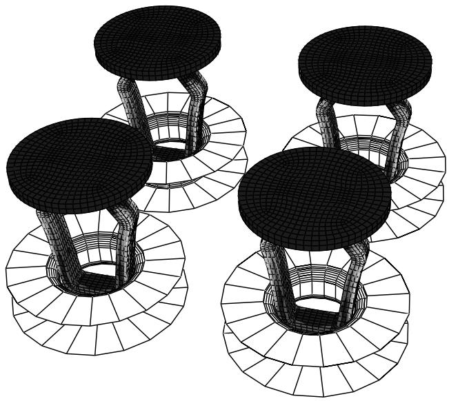  
Figure 2: A rectangular pattern of fasteners.

## Additional information

• Sweeping and extruding your model  
• Refining curved edges and faces

## Mirror your model

1. Locate the Mirror options.  
From the main menu bar, select View->ODB Display Options. Click the Mirror/Pattern tab in the dialog box that appears. The Mirror options are in the upper portion of the page.  
2. Accept the default global coordinate system, or select a coordinate system from the Mirror CSYS list.  
You can select any coordinate system that exists in the output database. If a suitable coordinate system does not already exist, you can create a new coordinate system using one of the methods described in Creating coordinate systems during postprocessing.

3. Toggle on the mirror planes that you want Abaqus/CAE to use to copy the model results.

4. Toggle on Mirror display bodies if you also want Abaqus/CAE to copy display bodies.

5. If you apply mirrors in conjunction with rectangular or circular patterns, select the Order of Operations that Abaqus/CAE will use to create the copies.

6. Click Apply to implement your changes.

Your specifications are reflected in all plot states and are saved for the duration of the session. If you want to retain the changes you applied for subsequent sessions, save them to a file. For more information, see Saving customizations for use in subsequent sessions.

If a contour plot is displayed, the contours appear on all faces.

If a symbol or material orientation plot is displayed, the symbols or material orientations appear only on the original model faces.

## Pattern your model

1. Locate the Pattern options.

From the main menu bar, select View->ODB Display Options. Click the Mirror/Pattern tab in the dialog box that appears. The Pattern options are in the middle of the page.

2. Accept the default global coordinate system, or select a coordinate system from the Pattern CSYS list.

You can select any coordinate system that exists in the output database. If a suitable coordinate system does not already exist, you can create a new coordinate system using one of the methods described in Creating coordinate systems during postprocessing.

3. Edit the rectangular and circular pattern parameters as follows:

• Rectangular pattern

Enter the Number of results that you want to display in the X-, Y-, and Z-directions of the selected coordinate system.  
- Enter the Offset distance, in model units, between copies for each direction.

To place the copies adjacent to each other, the offset in each direction must be the same as the model dimension in that direction.

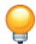

Tip: If you do not know the model dimensions, use the query tool to determine the distance between the first and last model nodes in the desired direction. (For more information, see Understanding the Query toolset in the Visualization module.)

• Circular pattern

Select the axis of rotation.  
- Enter the Number of results that you want to display around the selected axis.  
- If desired, edit the Total angleAbaqus/CAE will use to position the copies.

Abaqus/CAE places the original result at 0°. All subsequent copies are positioned according to the Total angle divided by the Number of copies.

4. If you use both rectangular and circular patterns or if you use a pattern in conjunction with mirrors, select the Order of Operations that Abaqus/CAE will use to create the copies.  
5. Click Apply to implement your changes.

Your specifications are reflected in all plot states and are saved for the duration of the session. If you want to retain the changes you applied for subsequent sessions, save them to a file. For more information, see Saving customizations for use in subsequent sessions.

If a contour plot is displayed, the contours appear on all faces.

If a symbol or material orientation plot is displayed, the symbols or material orientations appear only on the original model faces.

## Refining curved edges and faces

If your model contains quadratic elements, cubic elements, 2-node spring elements, or analytical rigid surfaces having curved segments, you can control the refinement with which Abaqus/CAE displays these curved model components. Similarly, if your model contains 2-node dashpot elements, you can control the refinement of the symbol used to represent those elements. Click the General tab in the ODB Display Options dialog box to choose a refinement level between extra coarse and extra fine for the display of curved edges and faces. When you select Extra Coarse refinement, Abaqus/CAE displays curved elements using straight lines; midside nodes have no effect on the shape displayed for these elements. Extra Coarse refinement will treat springs and dashpots as straight lines. For example, in Figure 1 the Extra Coarse refinement level was used to create the undeformed plot on the left, and the Extra Fine refinement level was used to produce an undeformed plot of the same model on the right.


## Note:

As the refinement level increases, the display performance will decrease. The Medium setting should produce acceptable results for most models.

  
Figure 1: Model plotted with different refinement levels (extra coarse and extra fine).

1. Locate the Curved Lines & Faces options.

From the main menu bar, select View->ODB Display Options. Click the General tab in the dialog box that appears. The Curved Lines & Faces options are at the top of the General page.

2. Click the Refinement level button to reveal the refinement options.  
3. In the refinement list, click the level you want. Extra fine produces the smoothest curves but may slow plotting; conversely, coarse refinement gives a rough appearance but plots most quickly.

The refinement level you specify appears on the Refinement Level button.

4. Click Apply to implement your changes.

Curved edges and faces for all plot states change to reflect your refinement specification, which is saved for the duration of the session. If you want to retain the changes you applied for subsequent sessions, save them to a file. For more information, see Saving customizations for use in subsequent sessions.

## Additional information

• Sweeping and extruding your model

To produce a contour plot, Abaqus/CAE reads results for the variable and frame you specify from the output database. Results for a particular variable and frame may not be available or may not be applicable for one or more elements included in the plot. You can specify the display color for elements that have no results. The default color is white.

For example, the contour plot in Figure 1 shows the von Mises stress generated when a blank sheet is deformed using a die and punch (the punch is not shown in the figure). In this case the color gray was selected for elements with no results. The die elements appear gray because the die is a rigid surface for which no stress results exist.

  
Figure 1: Contour plot of blank and die.

1. Locate the Elements with No Results options.

From the main menu bar, select View->ODB Display Options. Click the General tab in the dialog box that appears. The Elements with No Results options are in the center of the General page.

2. Click the color sample

Abaqus/CAE displays the Select Color dialog box.

3. Use one of the methods in the Select Color dialog box to select a new color. For more information, see Customizing colors.

4. Click OK to close the Select Color dialog box.

The color sample changes to the selected color.

5. Click Apply to implement your changes.

Elements with no results in contour plots (including display bodies) change to reflect your coloring specification, which is saved for the duration of the session. If you want to retain the changes you applied for subsequent sessions, save them to a file. For more information, see Saving customizations for use in subsequent sessions.

## Additional information

• Producing a contour plot

• Customizing render style, translucency, and fill color

## Controlling beam profile display for postprocessing

Beam rendering is available in the Visualization module for undeformed, deformed, and contour plots only. For deformed plots Abaqus/CAE scales the displacement components of the deformation based on the deformed field output variable but does not scale the twisting of the beam profile using the rotational components of the deformation when you change the deformation scale factor.

You can view a realistic display of the beam profile for results data by selecting View->ODB Display Options in the Visualization module.

The rendering of beam profiles requires the presence of beam orientation data in the output database. Beam normals are written to the output database automatically for all the steps that include field output. For analyses that include geometric nonlinearity, you can display beam profiles during postprocessing only if nodal output is requested in the model. For more information, see Using a Beam Section Integrated during the Analysis to Define the Section Behavior.

Abaqus/CAE does not render the tapering of beam profiles along their length. If your model includes tapered beam sections, Abaqus/CAE renders these beams using the beam's starting profile along its entire length. For more information about tapered beams, see Creating beam sections.

Beam elements that have BRADIUS values are rendered using circular beam profiles with the radius coming from the BRADIUS field in the output database.

Displaying beam profiles is useful for checking that the correct profile has been assigned to a particular region and that the assigned beam orientation results in the expected orientation of the profile. For example, Figure 1 shows the box beam profiles displayed on the light-service crane described in Example: cargo crane.


Figure 1:The cargo crane example with beam profiles displayed.  


## Note:

If your results include quadratic beam elements, Abaqus/CAE does not consider the midside nodes in those elements when the beam profiles are rendered.

If you assign a general beam section to a wire, Abaqus/CAE displays the beam profile as an ellipse with a cross-sectional area and moments of inertia $( \pmb { I _ { 1 1 } }$ and $\pmb { I _ { 2 2 } } )$ that match the values you specified. If you assign a truss section to a wire, Abaqus/CAE displays the truss profile as a circle with a cross-sectional area that matches the value you specified.

Abaqus/CAE renders beam profiles according to the current settings for color coding and translucency. When these settings change, the color and translucency of the beam profiles change as well. When beam profiles are displayed, Abaqus/CAE disables scaling and shrinking of the model.

1. Locate the Render beam profiles option.

From the main menu bar, select View->ODB Display Options. In the dialog box that appears, click the General tab.

2. From the bottom of the dialog box, toggle on Render beam profiles to display beam profiles.  
3. If desired, apply a Scale factor to the beam profiles to increase or decrease their size. The default value is 1.  
4. + Click OK to implement your changes and to close the dialog box.

Abaqus/CAE displays the profile of the beam section with the appropriate dimensions and in the correct orientation. By default, your changes are saved for the duration of the session. If you want to retain the changes you applied for subsequent sessions, save them to a file. For more information, see Saving customizations for use in subsequent sessions.

## Additional information

• Producing a contour plot of linear beam section stresses  
• Controlling beam profile display

## Controlling shell thickness display for postprocessing

Rendering of shell thickness is available in the Visualization module for all plot states.

If you use shell elements to model relatively thin components in your analysis, you can use the View->ODB Display Options to view the actual thickness of these shell elements in your model during postprocessing.

For deformed and contour plots Abaqus/CAE scales the displacement components of the deformation but does not scale the rotational components of the deformation when you change the deformation scale factor. For contour plots Abaqus/CAE applies colors based on your selection of active section point locations. If the top section point or bottom section point is currently active, Abaqus/CAE displays the contour for that section point throughout the shell thickness; if both top and bottom section points are currently active, Abaqus/CAE creates a linear contour gradient from the top values to the bottom values through the shell thickness.

Displaying shell thickness after a sizing optimization allows you to view the resulting change in shell thickness across the design area of your structure as the optimization progresses.

Abaqus/CAE determines shell thickness for postprocessing using the shell thickness definition specified for the model in its undeformed state. If your model undergoes large deformations or large rotations during the analysis, shell thickness might not display well in the deformed plot state.

Displaying shell thickness enables you to examine the thickness of shell geometry relative to the rest of the model. You can apply a scale factor to reduce or increase the display of shell thickness for your session. Figure 1 shows the effect of scale factor changes to a model.

  
Figure 1: From left to right: shell thickness scale factor settings of 0.5, 1 (default), and 2.

Abaqus/CAE renders shell thickness for three-dimensional shell elements only; thickness is not displayed for axisymmetric shell elements, such as SAX1 elements. When shell thickness is displayed, Abaqus/CAE also renders the edges of shell geometry unless a view cut is displayed in the viewport. Abaqus/CAE renders shell thickness according to the current settings for color coding and translucency. When these settings change, the color and translucency of the shell thickness change as well.

1. Locate the Render shell thickness option.

From the main menu bar, select View->ODB Display Options. In the dialog box that appears, click the General tab.

2. From the bottom of the dialog box, toggle on Render shell thickness to display shell thicknesses for the shell sections in your model.  
3. If desired, apply a Scale factor to the shell thicknesses to increase or decrease their thickness. The default value is 1, which produces a realistic rendering of the shell thickness settings.  
4. + Click OK to implement your changes and to close the dialog box.

Abaqus/CAE displays the shell sections in the selected part or assembly with the appropriate thickness. By default, your changes are saved for the duration of the session. If you want to retain the changes you applied for subsequent sessions, save them to a file. For more information, see Saving customizations for use in subsequent sessions.

## Additional information

• Controlling shell thickness display

## Controlling the display of thermal fluid pipe elements

Rendering of thermal fluid pipe elements is available in the Visualization module for undeformed, deformed, and contour plots only.

There is no deformation associated with thermal fluid pipe elements; the deformed and undeformed plots are the same.

If you use thermal fluid pipe elements to model the flow of a liquid through a pipe in your analysis, you can use the View->ODB Display Options to visualize the fluid pipe along with the fluid pressure, fluid temperature, and wall temperature contours. To clearly visualize the contours and plot shapes, you should create a display group that contains only the thermal fluid pipe elements.

When you select the regions individually, Abaqus/CAE renders the fluid region as a solid cylinder and the inner wall and outer wall as thin hollow cylinders. If you choose to render both the inner wall and outer wall, a thick-walled cylinder is displayed. Temperature variation across the wall is visible on the end caps. When you render multiple regions, only the outermost region is visible on the surface of the cylinder; all the selected regions are rendered at the end caps. Figure 1 shows the nodal temperature (NT11) on the inner wall and outer wall of a fluid pipe.

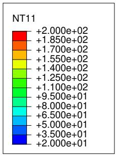

  
Figure 1: Rendering of fluid pipe thermal elements.

Abaqus/CAE renders thermal fluid pipe elements according to the current settings for color coding and translucency. When these settings change, the color and translucency of the thermal fluid pipe elements change as well. When thermal fluid pipe elements are displayed, Abaqus/CAE disables scaling and shrinking of the model.

1. Locate the Fluid pipe thermal elements option.  
From the main menu bar, select View->ODB Display Options. In the dialog box that appears, click the General tab.  
2. From the bottom of the dialog box, toggle on Fluid pipe thermal elements to render the thermal fluid pipe elements in your model.  
3. Toggle the following regions that you want to render:

• Fluid region

• Inner wall  
• Outer wall

4. If desired, apply a Scale factor to the radius of each of the selected regions to increase or decrease its thickness. The default value is 1.  
5. + Click OK to implement your changes and to close the dialog box.

Abaqus/CAE displays the thermal fluid pipe elements in the selected part or assembly. By default, your changes are saved for the duration of the session. If you want to retain the changes you applied for subsequent sessions, save them to a file. For more information, see Saving customizations for use in subsequent sessions.

## Additional information

• Selecting plot display options

## Viewing removed elements

You can create model change interactions that deactivate selected components of the model (geometry, elements, skins, and stringers). Skins, geometry, and elements can be removed from the viewport for model change interactions on model geometry. Skins, stringers, and elements can be removed from the viewport for model change interactions on an orphan mesh. You can control the visibility of these removed components from the ODB Display Options dialog box.

The behavior of the viewport depends on the status of the visibility toggle and on the plot state. Elements deactivated in a model change interaction can be removed from the viewport for all plot states. When the option to remove deactivated elements in the viewport is toggled off, the deactivated elements are colored gray in the contour plot but remain unchanged for all other plot states. If the option to display beam profiles is toggled off, Abaqus/CAE will not remove deactivated elements with beam profiles from the viewport, regardless of the status of the removed element toggle.

1. From the main menu bar, select View->ODB Display Options. Click the General tab in the dialog box that appears. The Model Change display option is at the bottom of the General page.  
2. Toggle on Account for deactivated elements from the viewport.  
3. Click OK to implement your changes and to close the dialog box.

## Additional information

• Defining a model change interaction

## Customizing viewport annotations

The viewport annotations generated by Abaqus/CAE consist of the legend, the title block, the state block, the 3D compass, and the view triad; they are provided to help you identify and interpret the contents of your plot. In addition, you can add customized text and arrow annotations to a viewport (for more information, see Managing viewports on the canvas). You can use the Viewport Annotation Options to toggle all viewport annotations on and off, and you can also customize the appearance of the annotations generated by Abaqus/CAE.

For information on the 3D compass, see The 3D compass. For information on the view triad, see Customizing the view triad.

## In this section:

Customizing the legend  
Customizing the title block  
Customizing the state block  
Using viewport annotation options

## Customizing the legend

The legend is a key to help you interpret your plots. For example, a contour plot legend shows the values that each contour color represents; a symbol plot legend shows the values that each vector color represents. The X–Y plot legend refers to each curve by label and shows the curve's style.

Figure 1 shows a contour plot legend and a symbol plot legend.  
  
Figure 1: Contour plot legend and symbol plot legend.

You can display or suppress legends for all plot states, and you can customize the following:

• the position of the legend,  
• the font and color of the legend text,  
• the appearance of a box outlining the legend,  
• whether minimum and maximum plot values are shown,  
• the appearance of the legend background (the rectangular area behind the legend),  
• the formatting of the numbers displayed for the digit values, and  
• the number of digits displayed for the legend values.

You cannot directly specify the size of the legend. However, by varying the size of the text font or the number of digits in the legend values, you can increase or decrease the legend's size.

The content of the legend depends on the plot type and on plot state–specific options such as the number of contour intervals. For more information on contour plot legend content, see Understanding contour plotting.

This section describes how to customize the legend for all plot states except X–Y plots. To customize the X–Y plot legend, see Customizing the X–Y plot legend.

1. Locate the Legend options.  
From the main menu bar, select Viewport->Viewport Annotation Options.  
2. To display or suppress legends for all plot states except X–Y plots, toggle Show legend in the General tab.  
When Show legend is on, legend options become available.  
3. Click the Legend tab. The basic legend options are at the top of the Legend page.  
4. To display or suppress a box outlining the legend, toggle Show bounding box. This “bounding box” visually separates the legend from the underlying plot.  
5. To display or suppress the minimum and maximum values associated with contour plots, toggle Show min/max values.  
6. Establish the position of the upper left corner of the legend.

To control the X- or -position, click the % Viewport X or % Viewport Y boxes, respectively. Enter the positions you want as a percentage of the total width of the current viewport.

7. Customize the legend text font.

a. Click Set Font.

The Select Font dialog box appears.

b. Use the Select Font dialog box to choose the font characteristics you want. For more information, see Customizing fonts.

c. When you are done, click OK to implement your changes and to close the Select Font dialog box.

8. Choose the color of the legend text.

a. Click the color sample .

Abaqus/CAE displays the Select Color dialog box.

b. Use one of the methods in the dialog box to select a new color. For more information, see Customizing colors.

c. Click OK to close the Select Color dialog box.

The color sample changes to the selected color.

9. To customize the background, click one of the following:

• Match viewport to match the background to the viewport color.  
• Transparent to eliminate the background and show only the text.  
• Other color to reveal other background color options.

If you selected Other color:

a. Click the color sample .  
Abaqus/CAE displays the Select Color dialog box.  
b. Use one of the methods in the Select Color dialog box to select a new color. For more information, see Customizing colors.  
c. Click OK to close the Select Color dialog box.

The color sample changes to the selected color.

10. To change the format of the legend values, click the Format arrow and select one of the following formats:

Select Scientific to display legend values in scientific notation, which expresses legend values as a decimal value between 1 and 10 multiplied by a power of 10. When you select this format for the number 501,000, the value appears in the legend as 5.01e5.  
• Select Fixed to display legend values without using exponent values. When you select this format, the number 501,000 is displayed in the legend as 501000.00.  
Select Engineering to select engineering notation, which expresses values in a similar format to scientific notation but allows exponent values that are multiples of three only. When you select this format, the number 501,000 is displayed in the legend as 501E3.


## Note:

All three of these examples are displayed with two decimal places. Your legend values may be displayed differently if you change the Decimal places option.

11. To choose the number of digits shown in legend values, click the Decimal places arrow. For legend values in scientific or fixed format, the Decimal places option controls the number of digits to the right of the decimal point. For legend values in engineering format, this option controls the number of significant digits to the left of the exponent value. For all formats, larger Decimal places values require more display space.

The specified number of digits appears in the Decimal places box.

12. Click Apply to implement your changes.

In the current viewport, legends for all plots change to reflect your specifications, which are saved for the duration of the session.

## Customizing the title block

The title block contains text identifying the model and results shown in the current plot. This text indicates:

• The name of the output database (from the name of the analysis job).  
• The description of the model.  
• The product name (usually Abaqus/Standard or Abaqus/Explicit) and release used to generate the output database.  
• The date the output database was last modified.

You can display or suppress the title block for all plot states, and you can display or suppress the appearance of a box bounding the title block. In addition, you can control the position, text font, and text color of the title block and the appearance of the title block background. You cannot directly specify the size of the title block. However, by varying the size of the text font, you can increase or decrease the title block's size. The content of the title block is fixed and cannot be customized.

1. Locate the Title Block options.  
From the main menu bar, select Viewport->Viewport Annotation Options.  
2. To display or suppress title blocks for all plot states, toggle Show title block in the General tab.  
When Show title block is on, the title block options become available.  
3. Click the Title Block tab. The basic title block options are at the top of the Title Block page.  
4. To display or suppress a box outlining the title block, toggle Show bounding box. This “bounding box” visually separates the title block from the underlying plot.  
5. Establish the position of the upper left corner of the title block.

To control the X- or -position, click the % Viewport X or % Viewport Y boxes, respectively. Enter the positions you want as a percentage of the total width of the current viewport.

6. Customize the title block text font.

a. Click Set Font. The Select Font dialog box appears.

b. Use the Select Font dialog box to choose the font characteristics you want. For more information, see Customizing fonts.

c. When you are done, click OK to implement your changes and to close the Select Font dialog box.

7. Choose the color of the title block text.

a. Click the color sample .  
Abaqus/CAE displays the Select Color dialog box.  
b. Use one of the methods in the dialog box to select a new color. For more information, see Customizing colors.  
c. Click OK to close the Select Color dialog box.  
The color sample changes to the selected color.

8. To customize the background, click one of the following:

• Match viewport to match the background to the viewport color.  
• Transparent to eliminate the background and show only the text.  
• Other color to reveal other background color options.

If you selected Other color:

a. Click the color sample .

Abaqus/CAE displays the Select Color dialog box.

b. Use one of the methods in the Select Color dialog box to select a new color. For more information, see Customizing colors.

c. Click OK to close the Select Color dialog box.

The color sample changes to the selected color.

9. Click Apply to implement your changes.

In the current viewport, title blocks for all plots change to reflect your specifications, which are saved for the duration of the session.

## Customizing the state block

The state block contains text identifying the analysis results associated with the current plot. This information includes step, frame, results variables, deformation magnification factor, eigenmode, and eigenvalue, as applicable.

You can display or suppress the state block for all plot states, and you can display or suppress the appearance of a box bounding the state block. In addition, you can control the position, text font, and text color of the state block and the appearance of the state block background. You cannot directly specify the size of the state block. However, by varying the size of the text font, you can increase or decrease the state block's size. The content of the state block is fixed and cannot be customized.

1. Locate the State Block options.  
From the main menu bar, select Viewport->Viewport Annotation Options.  
2. To display or suppress state blocks for all plot states, toggle Show state block in the General tab.  
When Show state block is on, state block options become available.  
3. Click the State Block tab. The basic state block options are at the top of the State Block page.  
4. To display or suppress a box outlining the state block, toggle Show bounding box. This “bounding box” visually separates the state block from the underlying plot.  
5. Establish the position of the upper left corner of the state block.

To control the X- or -position, click the % Viewport X or % Viewport Y boxes, respectively. Enter the positions you want as a percentage of the total width of the current viewport.

6. Customize the state block text font.

a. Click Set Font.  
The Select Font dialog box appears.  
b. Use the Select Font dialog box to choose the font characteristics you want. For more information, see Customizing fonts.  
c. When you are done, click OK to implement your changes and to close the Select Font dialog box.

7. Choose the color of the state block text.

a. Click the color sample  
Abaqus/CAE displays the Select Color dialog box.  
b. Use one of the methods in the dialog box to select a new color. For more information, see Customizing colors.  
c. Click OK to close the Select Color dialog box.  
The color sample changes to the selected color.

8. To customize the background, click one of the following:

• Match viewport to match the background to the viewport color.  
• Transparent to eliminate the background and show only the text.  
• Other color to reveal other background color options.

If you selected Other color:

a. Click the color sample .

Abaqus/CAE displays the Select Color dialog box.

b. Use one of the methods in the Select Color dialog box to select a new color. For more information, see Customizing colors.

c. Click OK to close the Select Color dialog box.

The color sample changes to the selected color.

9. Click Apply to implement your changes.

In the current viewport, state blocks for all plots change to reflect your specifications, which are saved for the duration of the session.

## Using viewport annotation options

Use the viewport annotation options to customize the legend, the title block, the state block, the 3D compass, and the view triad for all plot states. In addition, the viewport annotation options control the display of arrow and text annotations.

1. From the main menu bar, select Viewport->Viewport Annotation Options.

The Viewport Annotation Options dialog box appears. It contains the following tabs:

General: Control the display of all viewport annotations—those generated by Abaqus/CAE and any arrow and text annotations that you created.  
• Triad: Control the appearance and position of the view triad.  
• Legend: Control the appearance and position of the legend and whether minimum and maximum values are shown.  
• Title Block: Control the appearance and position of the title block.  
• State Block: Control the appearance and position of the state block.

2. Use the General tab to control the display of viewport annotations for all plots in the current viewport. You can display all viewport annotations in the current viewport by clicking Set all on, or you can hide all viewport annotations in the current viewport by clicking Set all off.

3. Use the remaining tabs in the dialog box to customize the viewport annotations generated by Abaqus/CAE. To create and customize arrow and text annotations, see Working with viewport arrow and text annotations.

## Additional information

• What are arrow and text annotations?  
• Customizing the 3D compass  
• Customizing the view triad  
• Customizing the legend  
• Customizing the title block  
• Customizing the state block

---

[Previous: Modeling Techniques](modeling-techniques.md) · [Next: Using Toolsets](toolsets.md)
