# Chapter 2 – Simulation Workflows

CST Studio Suite for Particle Dynamics Simulation is designed for ease of use. However, to get started quickly, you need to know a few things. The main purpose of this chapter is to provide an overview of the software’s capabilities. Read this chapter carefully, as this may be the fastest way to learn how to use the software efficiently.

This chapter covers three different workflow examples for Particle Tracking, Particle in Cell (PIC) and Wakefield computations:

## 1. Workflow Example: Particle Tracking

1.1. Model and simulate a simple electron gun, including a particle simulation (static approximation)  
1.2. Parameter studies of the model and automatic optimization of the structure

## 2. Workflow Example: Electromagnetic Particle in Cell

2.1. Model and simulate a simple output cavity

## 3. Workflow Example: Wakefield

3.1. Model and simulate a simple pillbox cavity

## Simulation Workflow: Particle Tracking

The following example shows, how to set up and run a simple Particle Tracking simulation. Studying this example carefully will allow you to become familiar with many standard operations that are necessary to perform a Particle Tracking simulation within CST Studio Suite. For more information on the physics that can be modelled with the Tracking solver, an overview is provided in Chapter 3 – Solver Overview : Particle Tracking Solver.

Go through the following explanations carefully even if you are not planning to use the software for Particle Tracking simulations. Only a small portion of the example is specific to this particular application type since most of the considerations are general and apply to all solvers and application domains.

At the end of this example, you will find some remarks concerning the differences between the typical simulation procedures for electrostatic and magnetostatic calculations and some useful hints for setting up the Particle Tracking and gun algorithm.

The following explanations always describe the menu-based way to open a particular dialog box or to launch a command. Whenever available, the corresponding toolbar item is displayed next to the command description. Due to the limited space in this manual, the shortest way to activate a particular command (i.e. by pressing a shortcut key or activating the command from the context menu) is omitted. You should regularly open the context menu to check available commands for the currently active mode.

## The Structure

Usually an electron gun is only one part of a complex device, for example a particle accelerator. The gun is used to create a collimated particle beam, so that other parts of the device are supplied with a beam of good quality.

The way this gun works is quite simple. Electrons are emitted from a cathode by a particle source based on space charge limited emission. These particles are accelerated and focused by an anode. Additional focusing is realized by a set of magnets behind the anode.

The following picture shows the structure of interest. It has been sliced open to aid visualization. Anode and cathode consist of perfect electrical conductor (PEC) material whereas the magnetic structure above the anode consists of iron and permanent magnets.

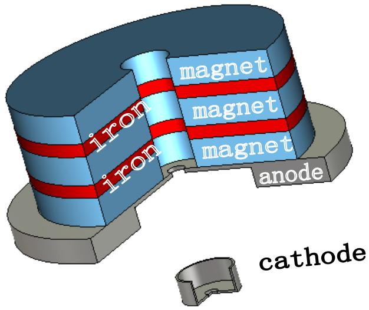

text_image

iron
iron
magnet
magnet
magnet
anode
cathode

Before you start modeling the structure, let us spend a few moments discussing how to describe this structure efficiently.

In the CST Studio Suite, the user can define the properties of the background material. Anything you do not fill with a particular material will automatically be filled with the background material. For this structure it is sufficient to model anode, cathode, two iron discs and three permanent magnets of the electron gun. The background properties will be set to vacuum.

Your method of describing the structure should therefore be as follows:

1. Model cathode and anode of the electron gun.  
2. Model the two iron discs.  
3. Model the three permanent magnets.

## Create a New Project

After launching the CST Studio Suite, you will enter the start screen showing you a list of recently opened projects and allowing you to select the application that best suits your requirements. The easiest way to get started is to configure a project template, which defines the basic settings that are important for your typical application. Therefore, click on the New Template button in the New Project from Template section within the New and Recent tab.

Next, you should choose the application area, Particle Dynamics for the example in this tutorial, and then select the workflow by double-clicking on the corresponding entry.

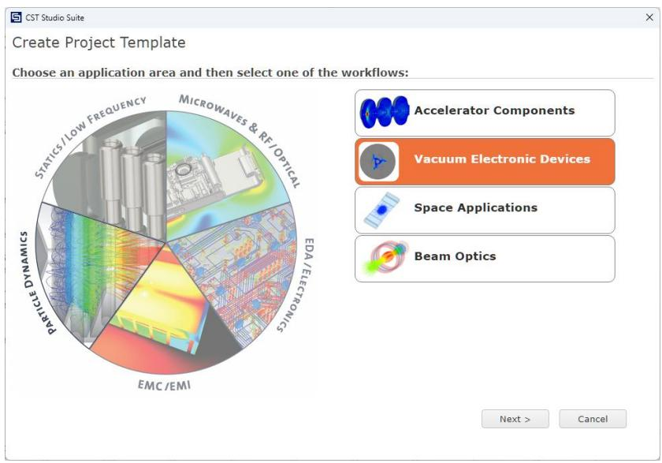

flowchart

```mermaid
graph LR
  A["Static / Low Frequency"] --> B["Microwaves & RF/OPTICAL"]
  B --> C["EDA/Electronics"]
  C --> D["EMC/EMI"]
  D --> E["Particle Dynamics"]
  E --> F["Static Dynamics"]
```

For the electron gun, please select Vacuum Electronic Devices  Particle Gun Particle Tracking .

Finally, you are requested to select the units that best fit your application. For this example, please select the dimensions as follows:

<table><tr><td>Dimensions:</td><td>mm</td></tr><tr><td>Frequency:</td><td>Hz</td></tr><tr><td>Time:</td><td>s</td></tr></table>

For the specific application in this tutorial the other settings can be left unchanged. After clicking the Next button, you can specify a name for the project template and review a summary of your initial settings:

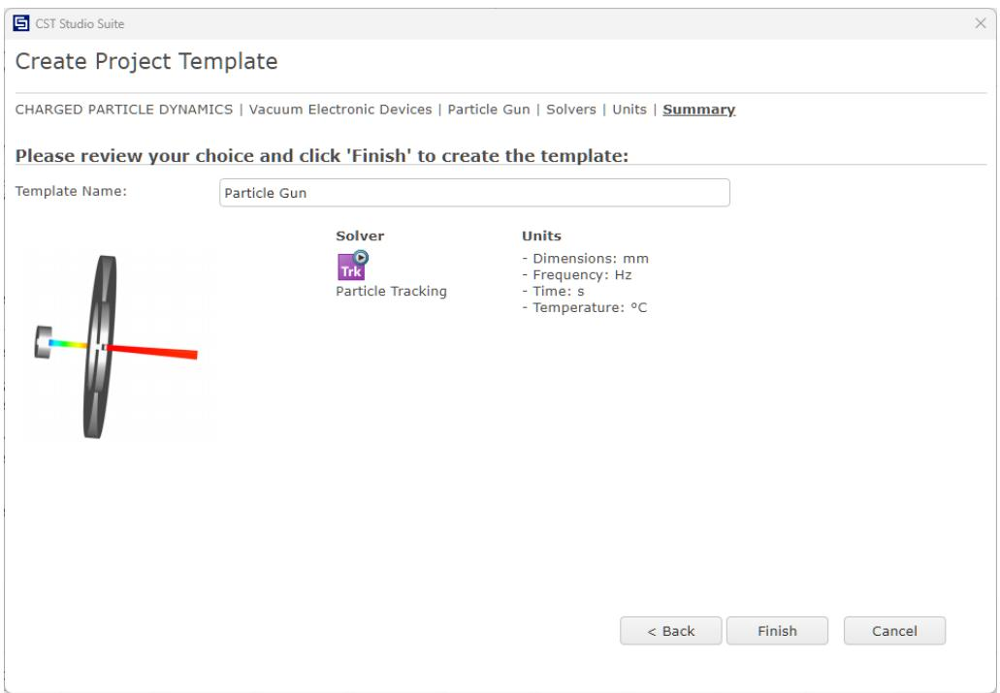

text_image

CST Studio Suite
Create Project Template
CHARGED PARTICLE DYNAMICS | Vacuum Electronic Devices | Particle Gun | Solvers | Units | Summary
Please review your choice and click 'Finish' to create the template:
Template Name: Particle Gun
Solver	Units
Trk
Particle Tracking	- Dimensions: mm
	- Frequency: Hz
	- Time: s
	- Temperature: °C
< Back	Finish	Cancel

Finally, click the Finish button to save the project template and to create a new project with the respective settings. CST Studio Suite for Particle Dynamics Simulation will be launched automatically due to the choice of this specific project template within the application area Particle Dynamics.

Please note: When you click again on the File: New and Recent you will see that the recently defined template appears below the Project Templates section. For further projects in the same application area you can simply click on this template entry to launch CST Studio Suite for Particle Dynamics Simulation with useful basic settings. It is not necessary to define a new template each time. You are now able to start the software with reasonable initial settings quickly with just one click on the corresponding template.

Please note: All settings made for a project template can be modified later during the construction of your model. For example, the units can be modified in the units dialog box (Home: Settings Units ) and the solver type can be selected via the Home: Simulation  Setup Solver drop-down list.

## Open the Tracking QuickStart Guide

An interesting feature of the online help system is the QuickStart Guide, an electronic assistant that will guide you through your simulation. If it does not show up automatically, you can open this assistant by selecting QuickStart Guide from the dropdown list next to the Help button in the upper right corner.

The following dialog box should then be visible at the upper right corner of the main view:

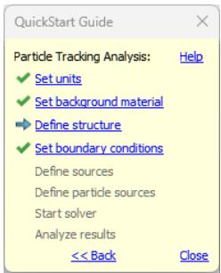

text_image

QuickStart Guide
Particle Tracking Analysis: Help
✓ Set units
✓ Set background material
▶ Define structure
✓ Set boundary conditions
Define sources
Define particle sources
Start solver
Analyze results
<< Back Close

As the project template has already set the solver type, units, background material and boundary conditions, the Particle Tracking Analysis is preselected and some entries are marked as done. The blue arrow always indicates the next step necessary for your problem definition. You do not have to follow the steps in this order, but we recommend to follow this guide at the beginning to ensure that all necessary steps have been completed.

Look at the dialog box as you follow the various steps in this example. You may close the assistant at any time. Even if you re-open the window later, it will always indicate the next required step.

If you are unsure of how to access a certain operation, click on the corresponding line. The QuickStart Guide will then either run an animation showing the location of the related menu entry or open the corresponding help page.

## Define the Units

The Particle Gun template has already applied some settings for you. The defaults for this structure type are geometrical units in mm and time in s. You can change these settings in the units dialog box (Home: Settings  Units ), but for this example you should just leave the settings as specified by the template. Additionally, the used units are also displayed in the status bar:

## Define the Background Material

As discussed above, the structure will be described within vacuum. The material type Normal is set as default background material in the Particle Gun template. For this example, you do not need to make any changes as the default properties of the material type Normal are those of vacuum. In case you need to change the properties, you may do so in the corresponding dialog box Simulation: Settings  Background

## Model the Structure

The basic settings have been made, now we are able to set up the structure. Since the electron gun is rotationally symmetric, a special but very efficient technique can be used to design the structure. First, the cathode is created.

1. Open the Rotate Profile dialog box Modeling: Shapes  Rotate Face to create the cathode.  
2. Press the ESC key to show the dialog box. Do not click a point in the working plane.

text_image

Rotate Profile
Name:
cathode
Axis: ○ X ○ Y ● Z
Start angle: Angle:
0.0 360
Height: Radius ratio: Segments per turn:
0.0 1.0 0
Points
X Z Relative
1.5 0
7 0
7 6
6.5 6
6.5 0.5
1.5 0.5
Insert Delete Load From... SaveTo... Clear
Component:
component1 Material:
PEC

3. Enter the name "cathode" and choose Z as axis of rotation. Set the material to PEC. Now enter the polygon data as shown in the table below.

<table><tr><td>x</td><td>z</td></tr><tr><td>1.5</td><td>0.0</td></tr><tr><td>7.0</td><td>0.0</td></tr><tr><td>7.0</td><td>6.0</td></tr><tr><td>6.5</td><td>6.0</td></tr><tr><td>6.5</td><td>0.5</td></tr><tr><td>1.5</td><td>0.5</td></tr></table>

4. You may click the Preview button during the construction to get a preview of the solid. This makes it easy to detect any possible mistakes when entering the data.

The dialog box should now look like in the picture above. Click the OK button to confirm your settings and to construct the cathode.

5. The structure is displayed in the working plane and now your cathode should look like this:

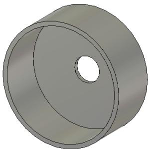

natural_image

3D rendered image of a cylindrical mechanical part with a central hole (no text or symbols)

One part of the cathode is still missing, the inner cylinder. We will need this inner cylinder to define the particle source. To create this cylinder, open the Cylinder dialog Modeling: Shapes  Cylinder . Press the ESC key to show the dialog box.

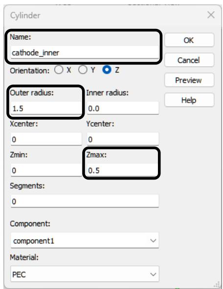

text_image

Cylinder
Name:
cathode_inner
Orientation: X Y Z
Outer radius:
1.5 Inner radius:
0.0
Xcenter: Ycenter:
0 0
Zmin: Zmax:
0 0.5
Segments:
0
Component:
component1
Material:
PEC

Change the name the name to "cathode\_inner", enter an Outer radius of 1.5 and Zmax of 0.5. Click the OK button to confirm your changes. The cylinder should fit perfectly into the hole of the solid cathode:

natural_image

3D rendered diagram of a cylindrical object with a circular cutout and center hole (no text or symbols)

6. The construction of the cathode is completely finished and now we will construct the anode in the same way as we constructed the outer cathode. Open the Rotate Profile dialog box Modeling: Shapes Rotate Face .  
7. Press the ESC key to show the dialog box. Do not click a point in the working plane.

8. Enter the name "anode" and choose z as axis of rotation. The material PEC should be automatically selected.

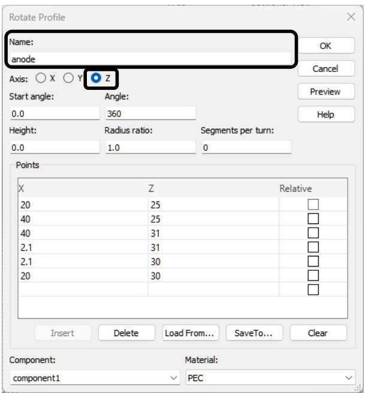

text_image

Rotate Profile
Name:
anode
Axis: X Y Z
Start angle: Angle:
0.0 360
Height: Radius ratio: Segments per turn:
0.0 1.0 0
Points
X Z Relative
20 25
40 25
40 31
2.1 31
2.1 30
20 30
Insert Delete Load From... SaveTo... Clear
Component: Material:
component1 PEC

Now enter the polygon data as shown in the following table:

<table><tr><td>x</td><td>z</td></tr><tr><td>20.0</td><td>25.0</td></tr><tr><td>40.0</td><td>25.0</td></tr><tr><td>40.0</td><td>31.0</td></tr><tr><td>2.1</td><td>31.0</td></tr><tr><td>2.1</td><td>30.0</td></tr><tr><td>20.0</td><td>30.0</td></tr></table>

Your dialog box should now look like in the picture above. Click the OK button to confirm your changes. The creation of the anode is complete and the whole structure should look like this (rotated for better visibility):

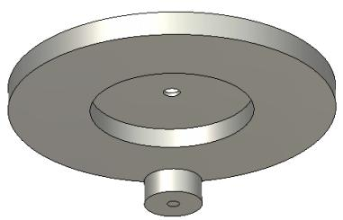

natural_image

3D rendered mechanical part with concentric circular features and a central hole (no text or symbols)

9. As you might have noticed, the magnetic part of the structure is still missing. First, we will construct the three vacuum discs that will serve as permanent magnets. To create one disc, open the Cylinder dialog box Modeling: Shapes  Cylinder . Press the ESC key to show the dialog box.  
10. Enter the name "magnet", outer radius 32.8 and the inner radius 5.8. The z range extends from 31 to 37.9 mm. Change the material to vacuum. Click the OK button to confirm your changes.

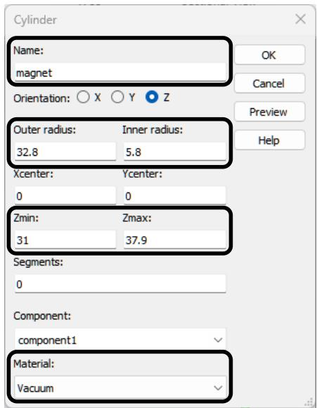

text_image

Cylinder
Name:
magnet
Orientation: X Y Z
Outer radius: Inner radius:
32.8 5.8
Xcenter: Ycenter:
0 0
Zmin: Zmax:
31 37.9
Segments:
0
Component:
component1
Material:
Vacuum

11. Since the same cylinder exists three times, we will use the transform dialog box to create the missing two cylinders. First, select the solid "magnet" in the navigation tree NT: Components $\Rightarrow$ component 1  magnet.

12. Open the Transform Selected Object dialog box Modeling: $T o o I s \hookrightarrow T r a n s f o r m \tilde { \mathbf { a } } ^ { \perp }$ to copy the cylinder.

text_image

Transform Selected Object
Operation
Translate
Scale
Rotate
Mirror
Copy
Unite
Independent
OK
Cancel
Apply
Preview
Reset
Repetitions
Repetition factor: 2
More >>
Translation vector
Use picked points
Invert
X: 0
Y: 0
Z: 10

Enable the checkbox Copy. Then enter a translation of 10 in z-direction. Change the Repetition factor to 2 and click the OK button to confirm your changes. The structure should now look like this:

natural_image

3D rendered mechanical component with layered blue and gray sections, no visible text or symbols

13. Before the iron discs will be defined, we create a new and simple iron material. To do this, open the material dialog box Modeling: Materials  New/Edit  New Material. Change the Material name to "Iron", the Color to red and value of Mu to 100 like in the picture below. Now we have quickly defined a simple iron material. Click the OK button to confirm your changes and to leave this dialog box.

text_image

New Material
General Conductivity Dispersion Thermal Mechanics Parti
General properties
Material name:
Iron
Problem type:
Default
Material folder:
Type:
Normal
Epsilon:
1
Nonlinear Prop....
Mu:
100
Color
0% Transparency 100%
Draw as wireframe
Allow outline display
Draw reflective surface
Draw outline for transparent shapes
Add to material library
OK Cancel Apply Help

14. The iron discs are created in the same way as the magnets. Open the cylinder dialog Modeling: Shapes  Cylinder . Press the ESC key to show the dialog box.

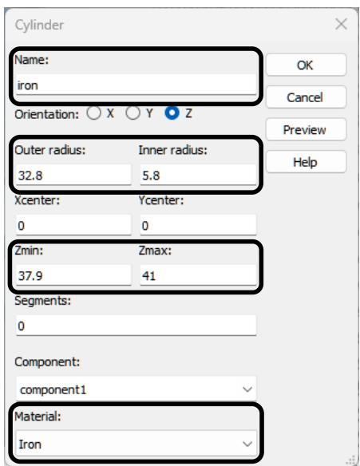

text_image

Cylinder
Name:
iron
Orientation: X Y Z
Outer radius: Inner radius:
32.8 5.8
Xcenter: Ycenter:
0 0
Zmin: Zmax:
37.9 41
Segments:
0
Component:
component1
Material:
Iron

15. Enter the Name "iron", an Outer radius of 32.8 and Inner radius of 5.8. The z range extends from 37.9 to 41 mm. Change the material to the new material $" \ln 0 \mathsf { n } " .$ . Your dialog box should now look like the above picture.  
16. Finally click the OK button and confirm your changes. To create the second iron disc, we will use the transform mechanism again. Select the solid $" \mathsf { i r o n " }$ in the navigation tree.

flowchart

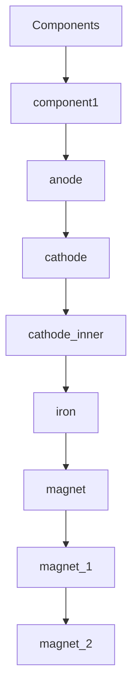
```mermaid
graph TD
  A["Components"] --> B["component1"]
  B --> C["anode"]
  C --> D["cathode"]
  D --> E["cathode_inner"]
  E --> F["iron"]
  F --> G["magnet"]
  G --> H["magnet_1"]
  H --> I["magnet_2"]
```

17. Open the Transform Selected Object dialog box Modeling: Tools  Transform $\hat { \mathbf { a } } ^ { \tt a }$ to copy the cylinder.

text_image

Transform Selected Object
Operation
Translate
Scale
Rotate
Mirror
Copy
Unite
Independent
OK
Cancel
Apply
Preview
Reset
Repetitions
Repetition factor: 1
Translation vector
Use picked points
Invert
X: 0
Y: 0
Z: 10

18. Select Copy and enter a translation of 10 in z-direction. Click the OK button to confirm your changes. Now the structure should look like this:

natural_image

3D rendered mechanical component with layered structure and two small cylindrical parts (no text or symbols)

text_image

QuickStart Guide
Particle Tracking Analysis: Help
✓ Set units
✓ Set background material
✓ Define structure
✓ Set boundary conditions
▶ Define sources
Define particle sources
Start solver
Analyze results
<< Back Close

19. The structure creation part is finished and we can start to define the sources, i.e. potentials, magnets and particle sources.

Congratulations! You have just created your first Particle Tracking structure within CST Studio Suite.

## Define Potentials and Magnets

With all components for the electrostatic part of the configuration defined, the appropriate potentials can be set. First, define the potentials of the cathode and anode:

1. Select Simulation: Sources and Loads  Static Sources  Electric Potential and double-click on the surface of the “cathode” solid in the working plane. Press the Return key to finish your selection and to open the Define Potential dialog box.

text_image

Define Potential
Name:
cathode_pot
Folder:
Potential value:
-3e4
V
Phase:
0 deg
Type
Fixed    Floating

2. Enter the name "cathode\_pot" and a value of -3e4 V. As usual, click the OK button to confirm your changes.  
3. In the same way, the potential for the anode is defined. Select Simulation: Sources and Loads  Static Sources  Electric Potential and double-click on the surface of the anode. Press the Return key to finish your selection and to open the Define Potential dialog box.  
4. Enter the name "anode\_pot" and a value of 0 V. Click the OK button to confirm your changes.

text_image

Define Potential
Name:
anode_pot
Folder:
Potential value:
0
V
Phase:
0 deg
Type
Fixed    Floating

5. If you now select the potential folder in the navigation tree your structure should look like the picture below:

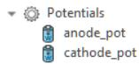

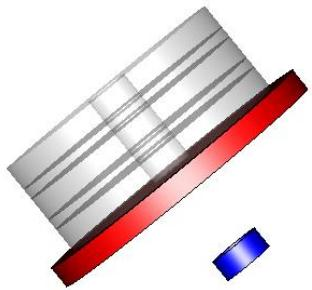

natural_image

3D rendering of a metallic panel with red and blue side indicators (no text or symbols)

Note: As the solids "cathode" and "cathode\_inner" are in direct contact, both have the same potential. That means "cathode\_inner" also has a potential of -30 kV.

6. After the potential definition is finished, we will create three permanent magnets for the three vacuum discs. To define the first magnet select Simulation: Sources and Loads  Static Sources  Permanent Magnet .  
7. Then select the solid that should become a permanent magnet. Thus, double-click on the vacuum disc named "magnet".

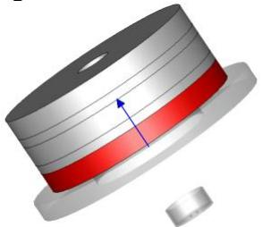

natural_image

3D rendered mechanical component with red and gray bands and a blue directional arrow (no text or symbols)

8. The Define Magnet dialog box opens. Ensure that the vector components are set to X: 0, Y: 0, Z: 1 and Inverse direction is not checked. Enter a value of 0.02 T for the remanent flux. Leave the other settings unchanged and click OK to confirm.

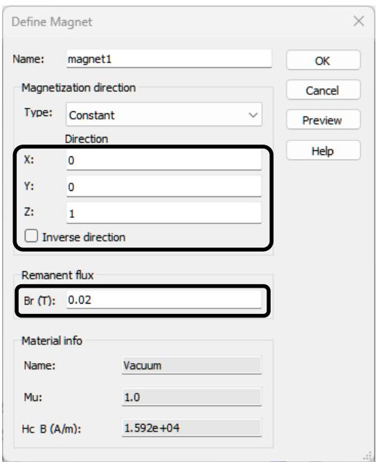

text_image

Define Magnet
Name: magnet1
Magnetization direction
Type: Constant
Direction
X: 0
Y: 0
Z: 1
□ Inverse direction
Remanent flux
Br (T): 0.02
Material info
Name: Vacuum
Mu: 1.0
Hc B (A/m): 1.592e+04

9. In the same way, define magnets for the vacuum solids "magnet\_1" and "magnet\_2" in z-direction. The solid "magnet\_1" should be the vacuum disc in the middle of the three discs.

<table><tr><td>solid</td><td>name</td><td>X</td><td>Y</td><td>Z</td><td>Inverse direction</td><td>Br (T)</td></tr><tr><td>magnet</td><td>magnet1</td><td>0</td><td>0</td><td>1</td><td> $\square$ </td><td>0.02</td></tr><tr><td>magnet_1</td><td>magnet2</td><td>0</td><td>0</td><td>1</td><td> $\checkmark$ </td><td>0.01</td></tr><tr><td>magnet_2</td><td>magnet3</td><td>0</td><td>0</td><td>1</td><td> $\square$ </td><td>0.01</td></tr></table>

10. If you now select the Permanent Magnets folder in the navigation tree you should see the following picture:

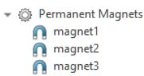

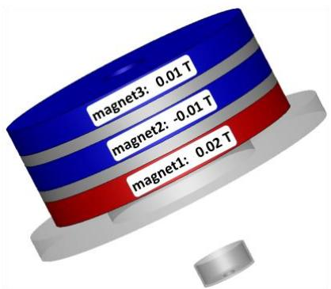

text_image

magnet3: 0.01 T
magnet2: -0.01 T
magnet1: 0.02 T

11. Potential and magnet definitions are now complete.

In practice, it is advisable to visualize and refine the mesh before the particle source is defined. The reason is that the number of emission points of the particle source can depend on the mesh settings. This matter is discussed in detail in the later chapter Define Particle Sources.

## Visualize and Refine the Mesh

By default, the Particle Tracking solver uses a hexahedral mesh for computing electrostatic and magnetostatic fields. This is the optimal choice for axis-aligned structures as used in this example. However, especially when surfaces in the vicinity of the particle trajectories are curved, their representation by tetrahedral mesh cells might be better-suited and will deliver more accurate results. In order to keep the focus on the simulation workflow itself, we will deal with tetrahedral meshes in a later, more specialized section.

The mesh generation for the structure’s analysis is performed automatically based on an expert system. However, in some situations it may be helpful to inspect the mesh to improve the simulation speed by changing the parameters for the mesh generation.

The mesh can be visualized by entering the mesh view Home: Mesh  Mesh View . For this structure, the mesh information will be displayed as follows:

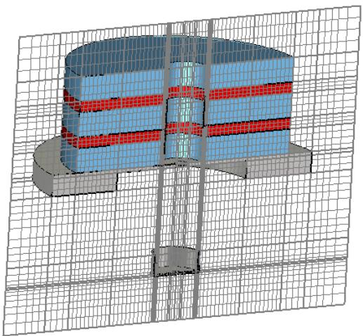

natural_image

3D CAD model of a cylindrical mechanical component with red and blue bands, enclosed within a wireframe grid (no text or symbols)

One 2D mesh plane is visible at a time. You can modify the orientation of the mesh plane by adjusting the selection in the Mesh: Sectional View  Normal dropdown list or just by pressing the X/Y/Z keys. Move the plane along its normal direction using the Up/Down cursor keys. The current position of the plane will be shown in the Mesh: Sectional View Position field.

There are some thick mesh lines shown in the mesh view. These mesh lines represent important planes (so-called snapping planes) at which placement of mesh lines is considered necessary by the expert system. You can control these so-called snapping planes in the Special Mesh Properties dialog by selecting Simulation: Mesh  Global Properties  Specials  Snapping.

In many cases, the automatic mesh generation will produce a reasonable initial mesh, but in our case, we will refine the mesh in the cathode region to have a finer mesh resolution for the particle beam.

1. Make sure you are in the mesh view mode. Select the solid cathode in the navigation tree NT: Components  component1  cathode.

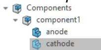

2. Open the dialog box Mesh: Mesh Control Local Properties to modify the local mesh settings of the cathode. In the General tab, choose Absolute value from the Volume refinement drop-down list. This brings up the Use same setting in all three directions checkbox. Uncheck that box and change the step width in x and y to a value of 0.4.

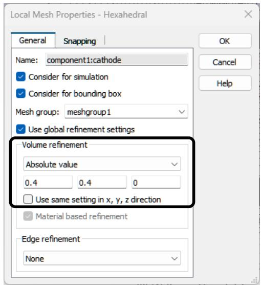

text_image

Local Mesh Properties - Hexahedral
General Snapping
Name: component1:cathode
✓ Consider for simulation
✓ Consider for bounding box
Mesh group: meshgroup1
✓ Use global refinement settings
Volume refinement
Absolute value
0.4 0.4 0
□ Use same setting in x, y, z direction
✓ Material based refinement
Edge refinement
None
OK
Cancel
Help

3. Confirm your changes as usual by clicking on the OK button. The dialog box closes and you can see the modified mesh.

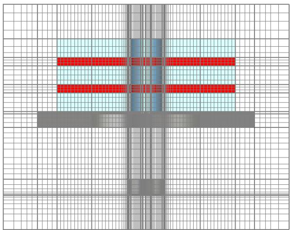

natural_image

Abstract geometric pattern with red horizontal stripes on a grid background (no text or symbols)

The number of mesh cells should be 497,536. You can get this information from the status bar.

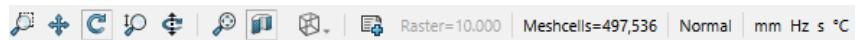

You can now leave the mesh inspection mode via Mesh: Close  Close Mesh View .

## Define Particle Sources

A particle source is a shaped surface of a component where charged particles enter the computational domain under a specific emission condition, which is determined by the emission model settings. Such a source is often located on the surface of a PEC solid, but it can also be defined on the surface of any arbitrary material. In our case the particle source will be placed on the inner cathode. To facilitate the selection of the surface of the inner cathode, some solids will be hidden.

1. Select "cathode" and "cathode\_inner" in the navigation tree. Use the Shift key for multi-selection. Select the option View: Visibility  Hide  Hide Unselected. Now we are able to define the particle source.

flowchart

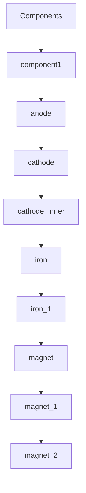
```mermaid
graph TD
  A["Components"] --> B["component1"]
  B --> C["anode"]
  C --> D["cathode"]
  D --> E["cathode_inner"]
  E --> F["iron"]
  F --> G["iron_1"]
  G --> H["magnet"]
  H --> I["magnet_1"]
  I --> J["magnet_2"]
```

2. Select Simulation: Sources and Loads  Particle Sources  Particle Area Source and select the inner surface of the solid "cathode\_inner" by doubleclicking it. Make sure that the surface is highlighted when you move the mouse cursor away from the surface.

natural_image

3D rendered diagram of a cylindrical object with a red center and concentric rings (no text or symbols)

3. After selecting the emission surface, press the Return key to open the Define Particle Area Source dialog box. Here, the particle type and particle density at the previously selected surface are adjustable. Change the Tracking emission model to Space charge. The blue points in the preview visualize the particle emission points. Their density can be influenced using the Number of emission points slider. An increase of the number of emission points leads to a smoother current density. The checkbox Adjust density to mesh should be enabled if the emission model Space charge is chosen. Otherwise, the number of emission points might be too low to obtain good simulation results and then has to be increased manually when refining the mesh.

text_image

Define Particle Area Source
General
Name: particle1
Tracking emission model
Space charge
Edit...
Help
Emission density
Number of emission points: 375
Adjust density to mesh
Min.
Max. Scale factor: 1
Particle properties
Particle type: electron
Load...
Charge per particle: -1.602176634e-19 C
Save...
Mass per particle: 9.1093837015e-31 kg

Note: As seen in the lower part of the dialog box, standard or user-defined particle types can be specified. A particle definition library allows you to export such user-defined particle definitions to a database and also to import them. This library is accessible through the Load and Save buttons. In this example, we keep the default particle type electron.

4. Move the Number of emission points slider until the number is 375. For finecontrol, you can use the left/right arrow keys while the slider is focused. To change the emission model settings, click the Edit button next to the emission model drop down list. The SCL Emission Settings dialog box opens:

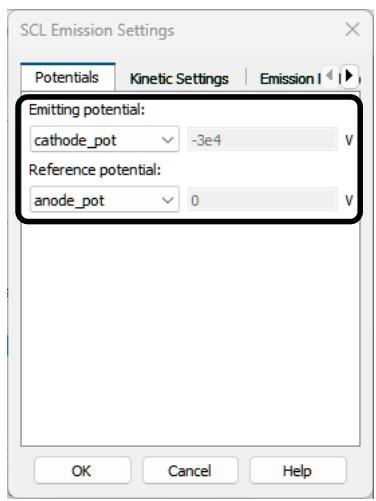

text_image

SCL Emission Settings
Potentials Kinetic Settings Emission I
Emitting potential:
cathode_pot -3e4 V
Reference potential:
anode_pot 0 V
OK Cancel Help

5. An emission model describes the conditions particles need to fulfill in order to be emitted into free space. For instance, the space charge emission model allows particles to be emitted as long as an electric field perpendicular to the emitting surface is present. If not already preselected, make the following adjustments inside the dialog box on the Potentials tab: Change the emitting potential to "cathode\_pot" and the reference potential to "anode\_pot". Click the OK button to confirm your changes. The particle source should now look like this:

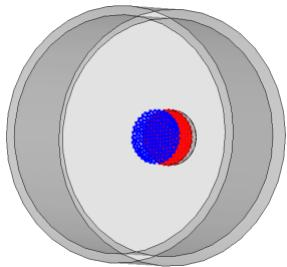

natural_image

Diagram showing concentric circular shapes with a central blue and red dot, no text or symbols present

## Note:

The red triangular mesh shows the discretization of the cathode surface, while the blue points visualize the start positions of the particles for the simulation. In this case, the emission model Space charge requires the start positions to be shifted a little bit away from the cathode surface. This shifting is done automatically depending on the mesh close to the cathode.

6. We have finished the particle source definition and can now leave the Define Particle Area Source dialog box by clicking the OK button again.  
7. Since some solids are currently hidden, we have to unhide them to see the whole structure again. Select View: Visibility  Show (dropdown list)  Show All. It is often helpful to hide some solids in order to select faces inside a structure.

The particle source is now defined and ready for emission. Before you continue, have a look at the QuickStart Guide to see the next steps.

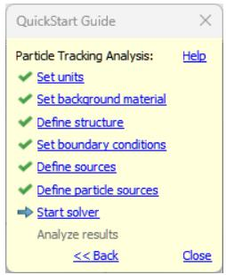

text_image

QuickStart Guide
Particle Tracking Analysis: Help
✓ Set units
✓ Set background material
✓ Define structure
✓ Set boundary conditions
✓ Define sources
✓ Define particle sources
→ Start solver
Analyze results
<< Back Close

The point “Set boundary conditions” has already been set to finished as the boundaries were defined by the Particle Gun template. Nevertheless, the boundary conditions will be discussed in the next section to illustrate the basics of the boundary condition setup.

## Define Boundary Conditions

The simulation will be performed only within the bounding box of the structure, the socalled computational domain. You can specify certain boundary conditions for each plane (Xmin, Xmax, Ymin, Ymax, Zmin, Zmax) of the computational domain. These boundary conditions reflect the appropriate behavior of the surrounding world.

The boundary conditions are specified in a dialog box which can be opened by choosing Simulation: Settings  Boundaries .

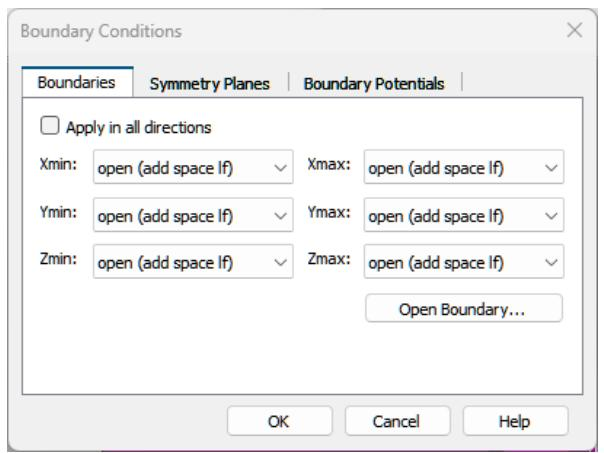

text_image

Boundary Conditions
Boundaries	Symmetry Planes	Boundary Potentials
Apply in all directions
Xmin: open (add space If) ✓	Xmax: open (add space If) ✓
Ymin: open (add space If) ✓	Ymax: open (add space If) ✓
Zmin: open (add space If) ✓	Zmax: open (add space If) ✓
Open Boundary...
OK	Cancel	Help

While the boundary dialog box is open, the boundary conditions are visualized in the structure view as shown in the next picture.

You can change boundary conditions from within the dialog box or interactively in the view. Select a boundary by double-clicking on the boundary symbol within the view and select the appropriate type from the context menu.

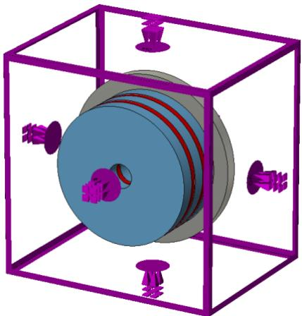

natural_image

3D rendering of a cylindrical mechanical component inside a purple wireframe box (no text or symbols visible)

The following table gives an overview of the available boundary conditions and their effect on the tangential and normal component of the electric and magnetic fields:

<table><tr><td rowspan="2">Boundary type</td><td colspan="2">Electric field component</td><td colspan="2">Magnetic field component</td></tr><tr><td>tangential component</td><td>normal component</td><td>tangential component</td><td>normal component</td></tr><tr><td>electric</td><td>0</td><td>exists</td><td>exists</td><td>0</td></tr><tr><td>magnetic</td><td>exists</td><td>0</td><td>0</td><td>exists</td></tr><tr><td>tangential</td><td>exists</td><td>0</td><td>exists</td><td>0</td></tr><tr><td>normal</td><td>0</td><td>exists</td><td>0</td><td>exists</td></tr><tr><td>open</td><td>exists</td><td>exists</td><td>exists</td><td>exists</td></tr></table>

In our case, we want to use open boundaries in all directions. As we use the Particle Dynamics template, the default boundaries are already set to open.

Furthermore, some extra space is added between the structure and the open boundaries. Click the button Open Boundary to check this setting.

text_image

Settings for Open Boundaries
Open add space
Bounding box distance factor:
0.1
OK
Cancel
Default
Help

The size of this extra space is the length of the bounding box diagonal times the user defined factor, in our case 0.1. This value is also defined in the Particle Dynamics template. Click Cancel to leave this setting unchanged. Click Cancel again to leave the Boundary Conditions dialog box.

Note: There are two ways to create some space (background material) between structure and boundaries. The first way is described above. Alternatively, some extra space can be defined in the Background Properties dialog box. You can have a look in the paragraph Define the Background Material.

## Start the Simulation

After having defined all necessary parameters, you are ready to perform your first simulation. The simulation is started from within the particle tracking solver control dialog box: Simulation: Solver  Setup Solver .

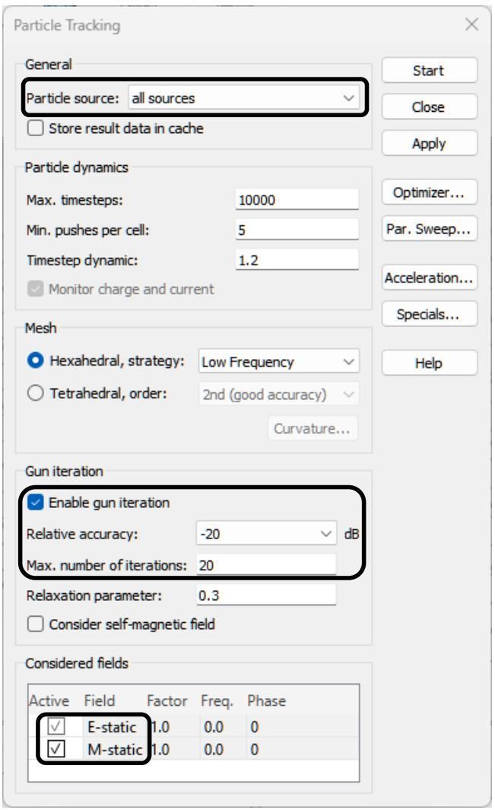

text_image

Particle Tracking
General
Particle source: all sources
Store result data in cache
Start
Close
Apply
Particle dynamics
Max. timesteps: 10000
Min. pushes per cell: 5
Timestep dynamic: 1.2
Optimizer...
Par. Sweep...
Acceleration...
Specials...
Mesh
Hexahedral, strategy: Low Frequency
Tetrahedral, order: 2nd (good accuracy)
Curvature...
Help
Gun iteration
Enable gun iteration
Relative accuracy: -20 dB
Max. number of iterations: 20
Relaxation parameter: 0.3
Consider self-magnetic field
Considered fields
Active Field Factor Freq. Phase
✓ E-static 1.0 0.0 0
✓ M-static 1.0 0.0 0

In this dialog box you can specify the settings of the Particle Tracking Solver and start the simulation process. If multiple particle sources are defined, you can choose between a simulation where all sources emit particles and a simulation where only a single source is active. Enable the Enable gun iteration option to activate the iterative gun solver algorithm, set the Relative accuracy to be -20 dB and the Max. number of iterations to 20. Thus, the Particle Tracking Solver does not just track the particles once through the computational domain. Instead, the solver iteratively repeats an electrostatic calculation and then tracks the particles until the desired accuracy of the space charge deviation between two successive iterations is reached.

The Considered fields box lists all electromagnetic fields that are available for the Particle Tracking Solver. In order to consider a specific field type for the tracking process, check the respective Active checkbox, in our case for the E- and the M-Static fields.

Now you can start the simulation procedure by clicking the Start button in the particle tracking dialog box. A few progress bars will appear to keep you up to date with the solver’s progress.

As you can see in the next paragraph, the complete solving procedure consists of three to four parts, depending upon the selected post processing steps. In this example, part two (electrostatic solver) and part three (particle tracking) are repeated iteratively until the relative accuracy condition specified in the gun iteration section is reached.

## 1. Magnetostatic Solver

1.1. Checking model: During this step, your input model is checked for errors such as invalid overlapping materials, etc.  
1.2. Calculating matrices: During these steps, the system of equations, which will subsequently be solved, is set up.  
1.3. Magnetostatic solver is running: During this stage, a linear equation solver calculates the field distribution inside the structure.

## 2. Electrostatic Solver

2.1. Calculating matrices: During these steps the system of equations, which will subsequently be solved, are set up.  
2.2. Electrostatic solver is running: During this stage, a linear equation solver calculates the field distribution inside the structure.

## 3. Particle Tracking

3.1. Initializing Tracking Solver: The data structure for the collision detection of particles with solids is constructed.  
3.2. Tracking Solver is running: The particles are emitted and tracked through the computational domain.

## 4. Post Processing

4.1. From the field distribution, additional results like the inductance matrix or the energy within the computational domain can be calculated.

After a few repetitions of steps two and three, the desired accuracy of -20 dB of the gun iteration is reached, i.e. the relative difference of the space charge distribution between two consecutive solver runs is less than -20 dB. The following diagram explains the algorithm of the iterative gun solver and its convergence condition:

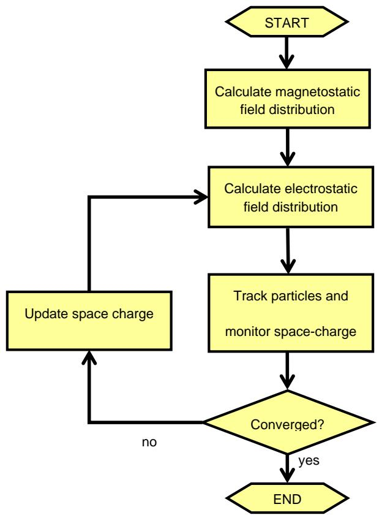

flowchart

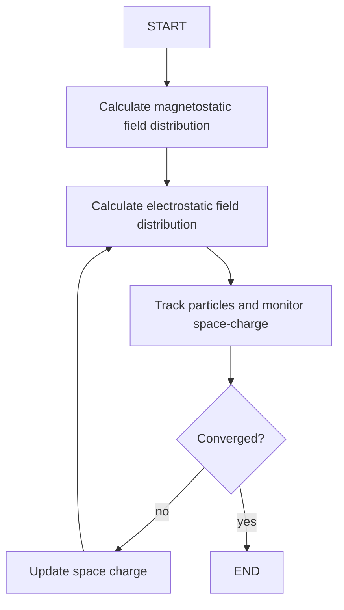
```mermaid
graph TD
  START["START"] --> A["Calculate magnetostatic field distribution"]
  A --> B["Calculate electrostatic field distribution"]
  B --> C["Track particles and monitor space-charge"]
  C --> D{"Converged?"}
  D -->|no| E["Update space charge"]
  E --> B
  D -->|yes| END["END"]
```

## Analyze the Results

In tracking applications, users are often interested in the particle beam behavior. To get an overview of the particle movement, a 3D visualization of the trajectories is available in the navigation tree NT: 2D/3D Results  Trajectories. The trajectories should now look like in the following picture:

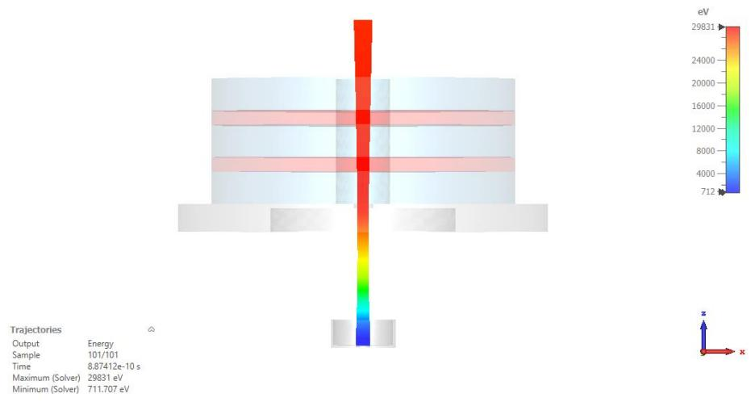

heatmap

| Metric | Value |
| --- | --- |
| Trajectories | — |
| Output | Energy |
| Sample | 101/101 |
| Time | 8.87412e-10 s |
| Maximum (Solver) | 29831 eV |
| Minimum (Solver) | 711.707 eV |

Colors indicate the particle energy. There are lots of options to modify this plot using the Particle Plot properties dialog box 2D/3D Plot: Plot Properties  Properties .

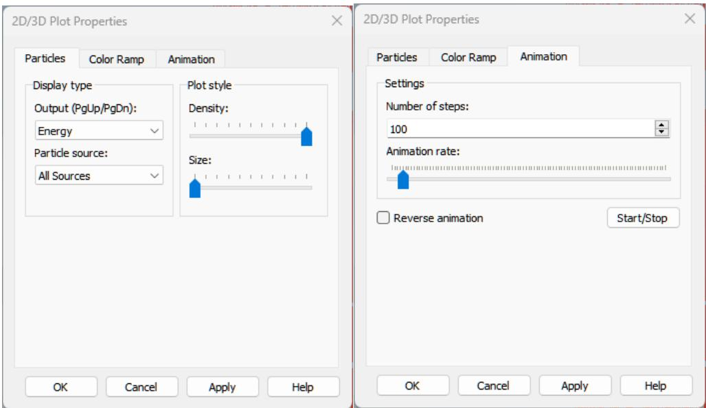

Open the dialog box and change some settings, for example the Display type. Click the Start/Stop button on the Animation tab to see the movement of the particles. Detailed explanations can be obtained from the online help. Click the Help button to open the online help. If you like to close this dialog box, click the Cancel button.

Field plots are also available in the navigation tree. To obtain the current density of the particle beam select NT: 2D/3D Results  Particle Current Density in the navigation tree. To enable logarithmic scaling check the respective box at 2D/3D Plot  Color Ramp  Log.

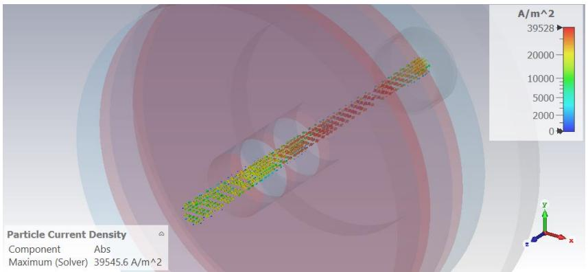

surface_3d

| Metric | Value |
| --- | --- |
| Component | Abs |
| Maximum (Solver) | 39545.6 A/m^2 |

Further plot settings can be changed in the 3D Vector Plot dialog box. This can be opened as usual via 2D/3D Plot: Plot Properties  Properties .

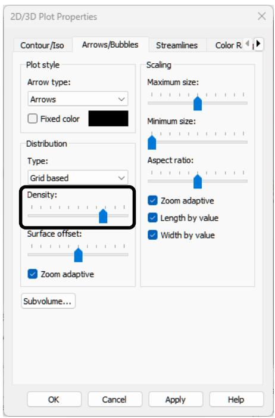

text_image

2D/3D Plot Properties
Contour/Iso	Arrows/Bubbles	Streamlines	Color R...
Plot style
Arrow type:
Arrows
Fixed color
Distribution
Type:
Grid based
Density:
Surface offset:
Zoom adaptive
Subvolume...
Scaling
Maximum size:
Minimum size:
Aspect ratio:
Zoom adaptive
Length by value
Width by value
OK	Cancel	Apply	Help

To create the field plot above, the Density slider on the Arrows/Bubbles tab was shifted to the right. Try to change some settings. Click the OK button to leave this dialog box.

In the case of gun simulations with space charge limited emission, the emitted current is an important parameter. The 1D result plot emitted current versus gun iteration NT: 1D Results  Particle Sources  Current vs. Iteration  particle1 is available in the navigation tree:

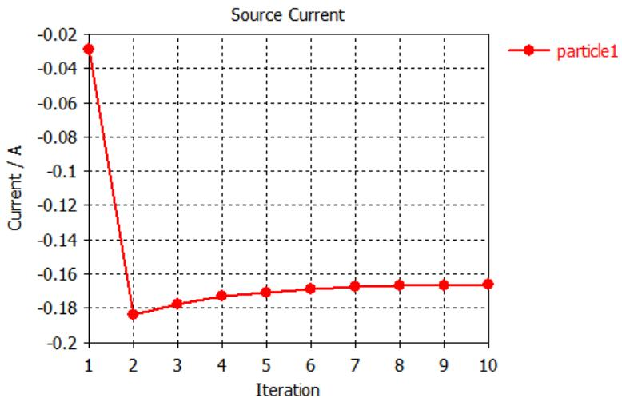

line

| Iteration | Current / A |
| --- | --- |
| 1 | -0.03 |
| 2 | -0.184 |
| 3 | -0.177 |
| 4 | -0.172 |
| 5 | -0.170 |
| 6 | -0.169 |
| 7 | -0.168 |
| 8 | -0.167 |
| 9 | -0.167 |
| 10 | -0.167 |

This 1D result offers you the possibility to control the emission process. Thus, it is very helpful that this plot is already available during the gun iteration.

Another plot is also available during the gun iteration, the gun code accuracy. If the user defined accuracy is reached, the iterative gun solver stops. To get this 1D result plot select the folder NT: 1D Results  Convergence  Gun Iteration Charge Accuracy in the navigation tree:

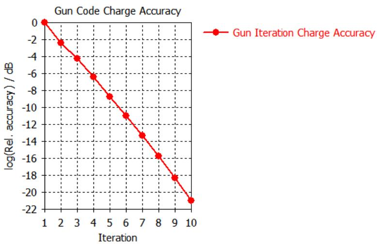

line

| Iteration | log(Rel. accuracy) / dB |
| --- | --- |
| 1 | 0 |
| 2 | ~-2.3 |
| 3 | ~-4.2 |
| 4 | ~-6.3 |
| 5 | ~-8.7 |
| 6 | ~-10.9 |
| 7 | ~-13.3 |
| 8 | ~-15.7 |
| 9 | ~-18.3 |
| 10 | ~-20.9 |

Apart from this 1D graph, the development of the emitted charge and the perveance during the gun iteration process are also available via NT: 1D Results  Particle Sources Charge vs. Iteration  particle1 and NT: 1D Results  Particle Sources  Perveance vs. Iteration  particle1.

The collision information under NT: 1D Results Total Collision Information can also be very interesting, because these graphs contain e.g. information about the power that is absorbed by a solid. Precise numbers can easily be read from these graphs via the entry Show Axis Marker from the context menu:

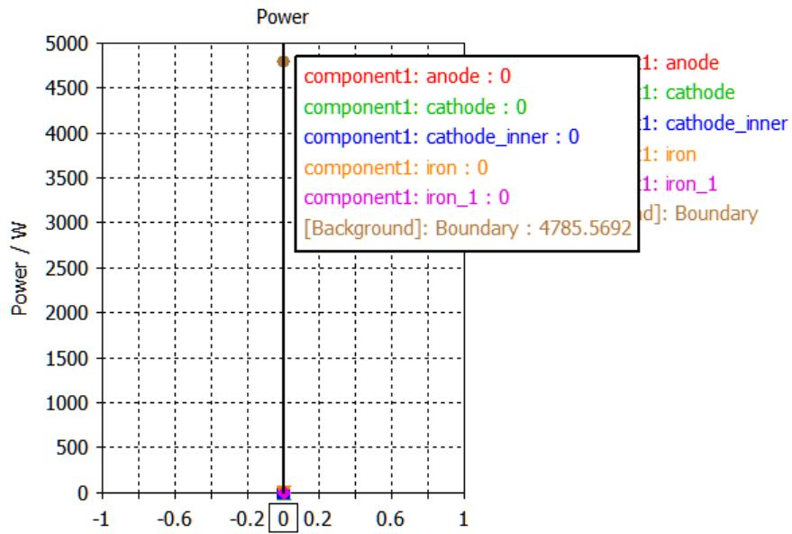

scatter

| Component | Power (W) |
| --- | --- |
| anode | 0 |
| cathode | 0 |
| cathode_inner | 0 |
| iron | 0 |
| iron_1 | 0 |
| Boundary | 4785.5692 |

In this case the background consists of vacuum, thus all particles are absorbed by the boundary of our calculation domain.

## Parameterization of the Model

The previous steps demonstrated how to enter and analyze a simple structure. However, structures are usually analyzed to improve their performance. This procedure may be called “design” in contrast to the “analysis” done before.

After you get some information on how to improve the structure, you will learn how to optimize the structure’s parameters. This could be done by modifying each parameter manually, but this of course is not the best solution. CST Studio Suite offers various options to describe the structure parametrically in order to change the parameters easily.

Let us assume you are interested in the dependency of the emitted current on the cathode's potential. To obtain this dependency, first of all the potential has to be parameterized. Thus, double click on the potential NT: Potentials  cathode\_pot in the navigation tree.

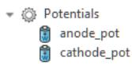

The Edit Potential dialog box opens and the potential can be edited. Instead of a number type the string "phi" in the Potential value field.

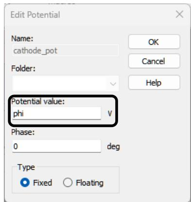

text_image

Edit Potential
Name:
cathode_pot
Folder:
Potential value:
phi
V
Phase:
0 deg
Type
Fixed    Floating

If you click the OK button, you will be asked to delete the current results. Just click the OK button to delete the results. Then the dialog box New Parameter opens to define the value of your parameter "phi".

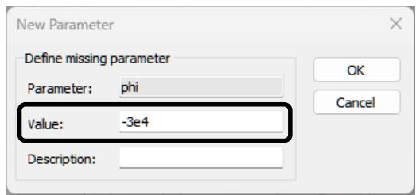

text_image

New Parameter
Define missing parameter
Parameter: phi
Value: -3e4
Description:

Enter a value of -3e4 and click the OK button. You have successfully defined your first parameter. The values of your parameters can be edited and checked in the Parameter List window that is usually located in the lower left part of the main window:

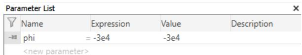

text_image

Parameter List
Name	Expression	Value	Description
phi	= -3e4	-3e4
<new parameter>

Since we did not change the value of the cathode's potential, the results of the simulation would be the same. We will now change the setup to run a so called Parameter Sweep to get the emitted current for potentials in the range from -32 kV to -28 kV. To do this, open the Particle Tracking solver dialog box Simulation: Solver  Setup Solver .

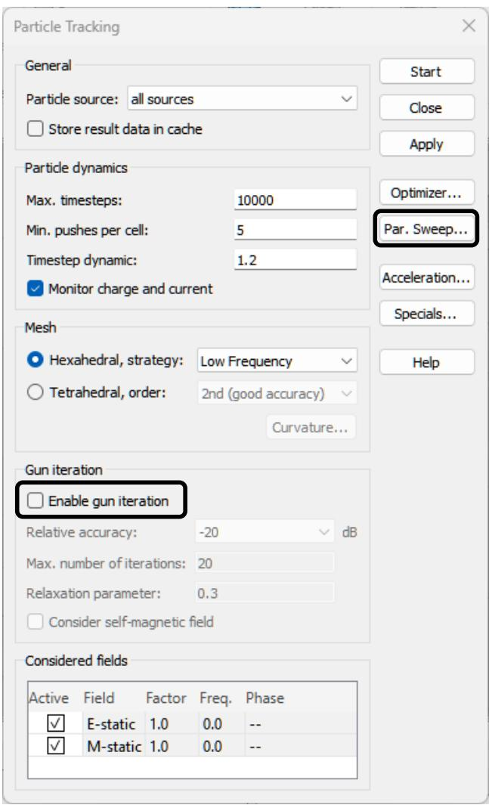

text_image

Particle Tracking
General
Particle source: all sources
□ Store result data in cache
Particle dynamics
Max. timesteps: 10000
Min. pushes per cell: 5
Timestep dynamic: 1.2
✓ Monitor charge and current
Mesh
● Hexahedral, strategy: Low Frequency
○ Tetrahedral, order: 2nd (good accuracy)
Curvature...
Gun iteration
□ Enable gun iteration
Relative accuracy: -20 dB
Max. number of iterations: 20
Relaxation parameter: 0.3
□ Consider self-magnetic field
Considered fields
Active Field Factor Freq. Phase
✓ E-static 1.0 0.0 --
✓ M-static 1.0 0.0 --
Start
Close
Apply
Optimizer...
Par. Sweep...
Acceleration...
Specials...
Help

To save some time during the parameter sweep disable the checkbox Enable gun iteration. The tracking solver will now run only one calculation and will not operate in the iterative mode.

Click the button Par. Sweep to open the dialog box Parameter Sweep and to configure the parameter range and also the expected results of the parameter sweep.

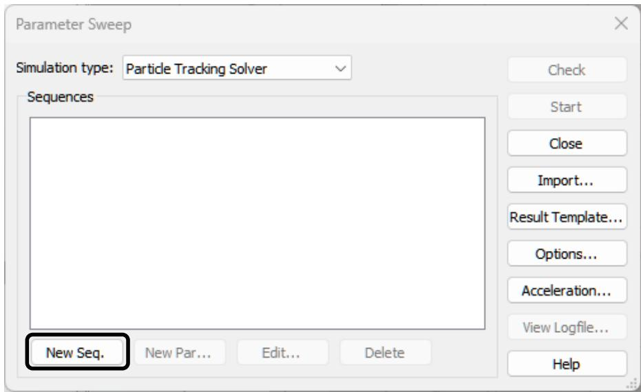

text_image

Parameter Sweep
Simulation type: Particle Tracking Solver
Sequences
New Seq.
New Par...
Edit...
Delete
Check
Start
Close
Import...
Result Template...
Options...
Acceleration...
View Logfile...
Help

In this dialog box you can specify calculation sequences that consist of various parameter combinations. To add such a sequence, click the New Seq. button now. Then click the New Par button to add a parameter variation to the sequence:

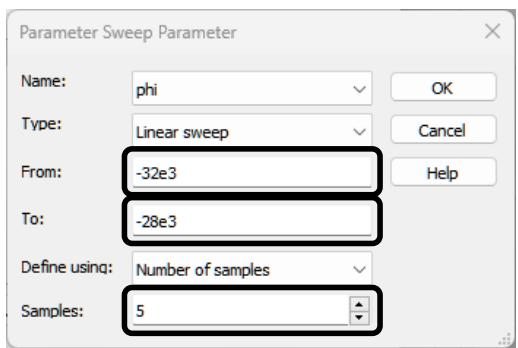

text_image

Parameter Sweep Parameter
Name: phi
Type: Linear sweep
From: -32e3
To: -28e3
Define using: Number of samples
Samples: 5

In the resulting dialog box you can select the name of the parameter to vary in the Name field. Then you can specify different sweep types to define the sampling of the parameter space (Linear sweep, Logarithmic sweep, Arbitrary points). Depending on this selection the sampling can be defined further, e.g. the linear sweep option allows us to define the lower (From) and upper (To) bounds for the parameter variation as well as the definition of either the number of samples or the step width.

In this example you should perform a linear sweep from -32 kV to -28 kV in 5 steps. Click the OK button to confirm your changes. The definition of the sequence is finished but we still need to configure the expected result, the emitted current. The parameter sweep dialog box should look as follows:

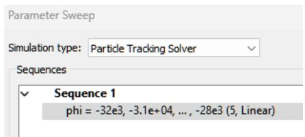

text_image

Parameter Sweep
Simulation type: Particle Tracking Solver
Sequences
✓ Sequence 1
phi = -32e3, -3.1e+04, ..., -28e3 (5, Linear)

After a successful simulation run, many simulation results are already generated automatically under NT: 1D Results and saved in the parametric storage. For more detailed investigations and customized evaluations, Template Based Post-Processing is available. Often, the parametric results are already sufficient to analyze the results.

However, the general procedure of defining and handling Result Templates is outlined below.

In order to evaluate a particular quantity of interest during the parameter sweep, it needs to be defined in advance. Here, the current emitted from the particle source should be monitored.

As can be seen above, this quantity is available as a plot versus gun iteration number under NT: 1D Results  Particle Sources  Current vs. Iteration  particle1. For finding the final value obtained during the gun iteration, we have to extract the value that corresponds to the rightmost point in the plot. Note that this approach is also valid if Gun iteration is deactivated, as we did above, since then the plot only contains a single point.

In order to define the results of interest, click on the button Result Template. The Template Based Post-Processing dialog box opens. Templates are separated into several Template Groups.

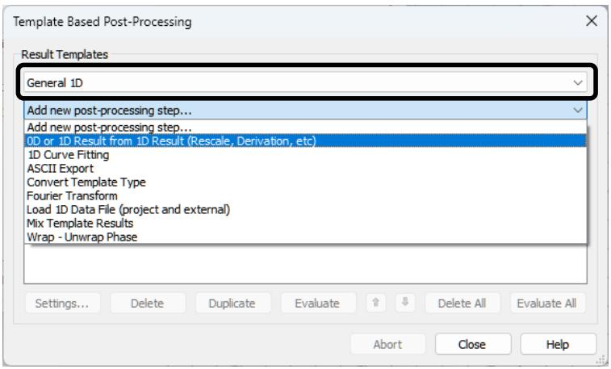

text_image

Template Based Post-Processing
Result Templates
General 1D
Add new post-processing step...
Add new post-processing step...
0D or 1D Result from 1D Result (Rescale, Derivation, etc)
1D Curve Fitting
ASCII Export
Convert Template Type
Fourier Transform
Load 1D Data File (project and external)
Mix Template Results
Wrap - Unwrap Phase

Choose the template 0D or 1D Result from 1D Result (Rescale Derivation, etc) in the General 1D group. This very powerful template is intended for post processing or extracting data from any 1D plot. Once you choose this template, a dialog box opens where the data source and the operation have to be entered.

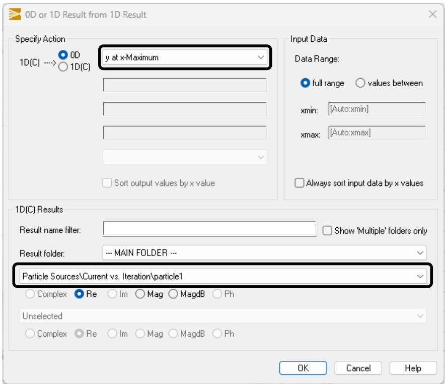

text_image

0D or 1D Result from 1D Result
Specify Action
1D(C) ---> 0D y at x-Maximum
1D(C)
Input Data
Data Range:
full range values between
xmin: [Auto:xmin]
xmax: [Auto:xmax]
Always sort input data by x values
Sort output values by x value
1D(C) Results
Result name filter:
Show 'Multiple' folders only
Result folder: --- MAIN FOLDER ---
Particle Sources\Current vs. Iteration\particle1
Complex Re Im Mag MagdB Ph
Unselected
Complex Re Im Mag MagdB Ph
OK Cancel Help

Under Specify Action select y at x-Maximum. Under 1D(C) Results, the data source has to be selected – in our case Particle Sources\Current vs. Iteration\particle1. Leave the dialog by pressing OK.

The Template Based Post-Processing dialog box should be still open and contain the following row:

<table><tr><td></td><td>Result name</td><td>Type</td><td>Engine</td><td>Template name</td><td>Value</td><td>Active On/Off</td></tr><tr><td>1</td><td>particle1_0D_yAtXMax</td><td>0D-P</td><td>VBA</td><td>0D or 1D Result from ...</td><td></td><td>On (Paramel √</td></tr></table>

The Result name can be changed by clicking onto the respective cell. You should change it to something more recognizable since this will become the result plot title, choose, “Emitted Current”:

<table><tr><td></td><td>Result name</td><td>Type</td><td>Engine</td><td>Template name</td><td>Value</td><td>Active On/Off</td></tr><tr><td>1</td><td>Emitted Current</td><td>0D-P</td><td>VBA</td><td>0D or 1D Result from ...</td><td></td><td>On (Paramel √</td></tr></table>

Click the Close button to return to the parameter sweep. Now start the parameter sweep by clicking Start. After confirming the request to delete existing results with OK, the calculation may take a few minutes. The navigation tree contains a new item called Tables from which you can select the item NT: Tables  0D Results  Emitted Current. The 1D result plot should look like in the picture below and gives you the relation between input voltage and emitted current of the electron gun:

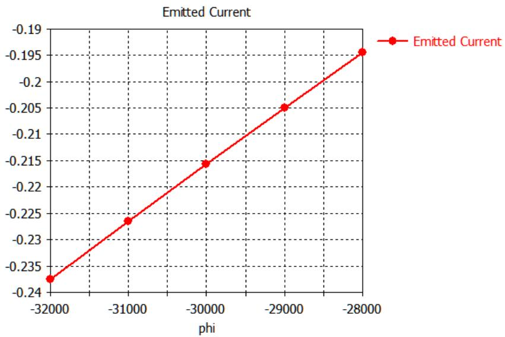

line

| phi | Emitted Current |
| --- | --- |
| -32000 | -0.237 |
| -31000 | -0.226 |
| -30000 | -0.215 |
| -29000 | -0.205 |
| -28000 | -0.194 |

## Automatic Optimization of the Structure

Let us assume that you wish to adjust the emitted current to a value of -0.22 A (which can be achieved within the parameter range of -32 kV to -30 kV according to the parameter sweep). Figuring out the proper parameter can be a lengthy task, but it can also be performed automatically.

CST Studio Suite offers a very powerful built-in optimizer feature for such parametric optimizations.

To use the optimizer, open the tracking solver control dialog box Simulation: Solver Setup Solver in the same way as before, or directly via Simulation: Solver Optimizer . Click the Optimizer button to open the optimizer control dialog box.

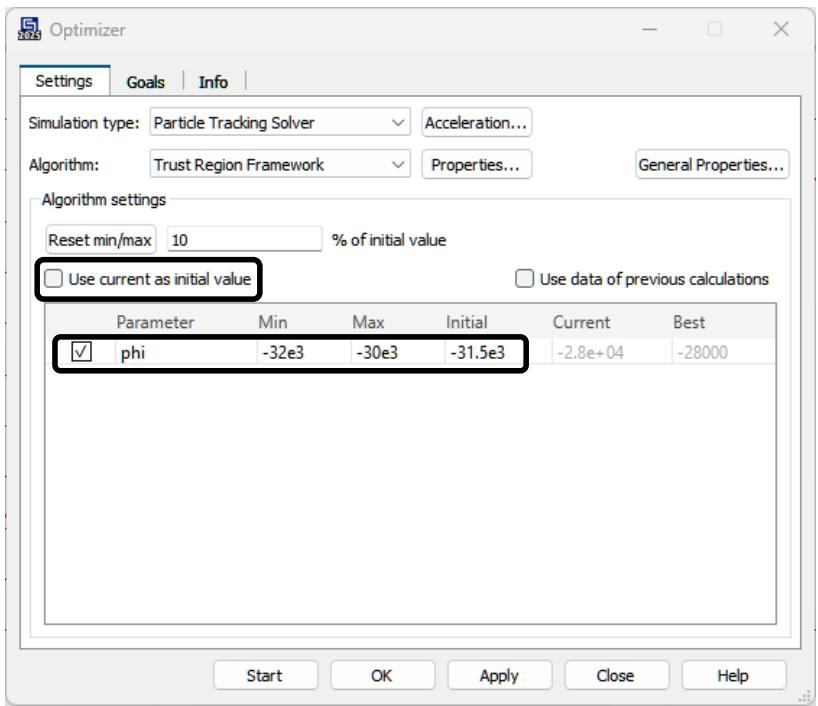

text_image

Optimizer
Settings Goals Info
Simulation type: Particle Tracking Solver Acceleration...
Algorithm: Trust Region Framework Properties... General Properties...
Algorithm settings
Reset min/max 10 % of initial value
Use current as initial value Use data of previous calculations
Parameter Min Max Initial Current Best
✓ phi -32e3 -30e3 -31.5e3 -2.8e+04 -28000
Start OK Apply Close Help

First, activate the desired parameter(s) for the optimization in the Settings Tab of the optimization dialog box, here the parameter "phi" should be checked. Second, specify the minimum and maximum values for this parameter during the optimization. From the parameter sweep, we already know that the searched potential is greater than -32 kV and lower than -30 kV. Therefore, you can enter a parameter range between -32 kV and -30 kV. Deactivate Use current as initial value and set the initial start value for the optimization, e.g. to -31.5 kV.

For this simple example, the other settings can be kept as default. Refer to the online documentation for more information on these settings. You can specify a list of goals you wish to achieve during the optimization. In this example, the objective is to find a parameter value for which the emitted current becomes -0.22 A. The next step is to specify this optimization goal. Switch to the Goals Tab and click Add New Goal.

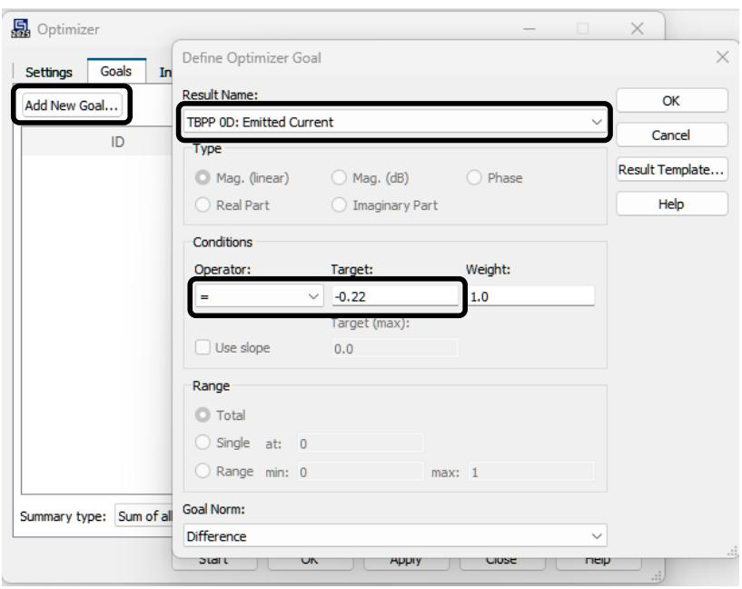

text_image

Add New Goal...
Define Optimizer Goal
Result Name:
TBPP 0D: Emitted Current
OK
Cancel
Real Part
Mag. (linear)
Mag. (dB)
Phase
Imaginary Part
Results Template...
Help
Conditions
Operator:
Target:
Weight:
= -0.22 1.0
Target (max):
Use slope 0.0
Range
Total
Single at: 0
Range min: 0 max: 1
Goal Norm:
Difference
Summary type: Sum of all
Start OK Apply Close Help

Now you can define the goal for the emitted current. Since you would like to find a value of -0.22 A, you should select the equal operator in the conditions frame. Then set the Target to -0.22. After you click OK, the optimizer dialog box should look as follows:

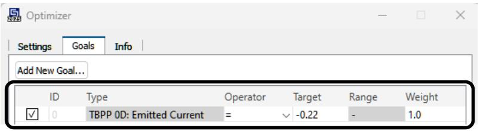

text_image

Optimizer
Settings Goals Info
Add New Goal...
ID Type Operator Target Range Weight
✓ 0 TBPP 0D: Emitted Current = -0.22 - 1.0

Note: The optimizer is capable of optimizing multiple parameters at once. Detailed information can be obtained from the online help.

Up to now, you have specified which parameters to optimize and set the goal that you want to achieve. The next step is to start the optimization procedure by clicking the Start button. As shown in the next picture, the optimizer will display its progress in an output window in the Info tab, which is activated automatically. After the whole process has finished, the optimizer output window contains the best parameter values in order to achieve the desired goal.

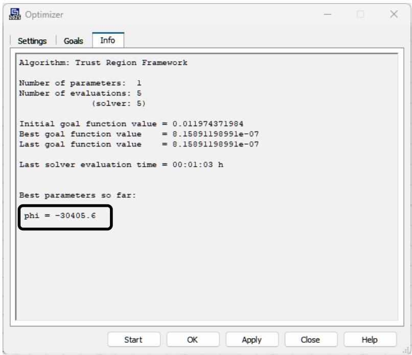

text_image

Algorithm: Trust Region Framework
Number of parameters: 1
Number of evaluations: 5
        (solver: 5)

Initial goal function value = 0.011974371984
Best goal function value    = 8.15891198991e-07
Last goal function value    = 8.15891198991e-07

Last solver evaluation time = 00:01:03 h

Best parameters so far:
phi = -30405.6

Note that, due to sophisticated optimization technology, only five solver runs are necessary to find the optimal solution with very high accuracy.

Click the Close button to leave the dialog box. Now look at the final result of the emitted current for the optimal parameter setting phi = -30405.6 V by clicking NT: 1D Results Particle Sources  Current vs. Iteration. You should obtain the following result:

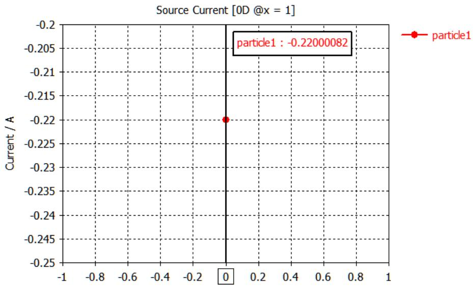

scatter

| Series | X | Current (A) |
| --- | --- | --- |
| particle1 | 0 | -0.2200082 |

As you can see, the final emitted current for the optimized voltage parameter is -0.22 A as it was previously defined by the setting of the optimization goal.

## Additional Information: More settings for the Particle Tracking Solver

The Particle Tracking and the Particle Tracking Specials dialog boxes offer many more options to change the solver properties. The latter is available by selecting Simulation: Solver Setup Solver and clicking the Specials button.

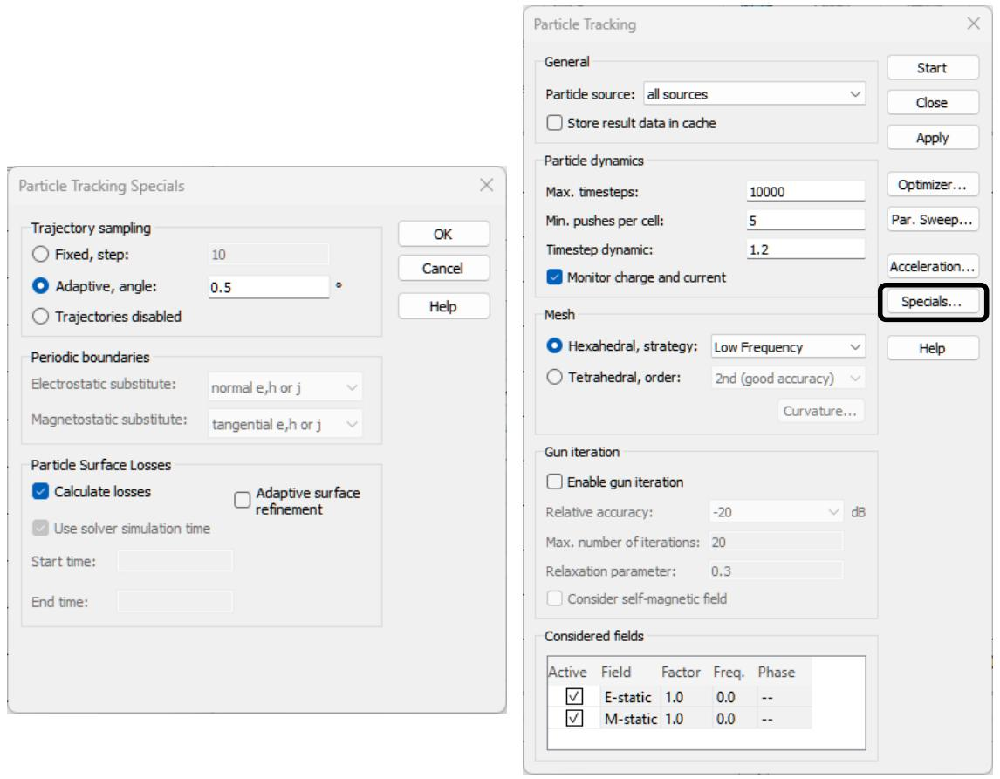

The Particle dynamics frame offers the possibility to change specific settings of the particle tracking algorithm. The setting Max. timesteps defines the maximum number of simulated steps performed by the tracking algorithm. The Min. pushes per cell value determines the spatial sampling rate of the particle trajectories. The Timestep dynamic parameter specifies the variation of the time step between two pushes and introduces a dynamic adaptation of the time step to the highest particle velocity. Activating the checkbox Monitor charge and current results in monitoring the space charge and current density generated by the particles. This is automatically activated for gun iteration simulations.

In the Gun iteration frame, in addition to the desired Relative accuracy, the maximum number of iterations of consecutive electrostatic simulations and particle tracking computations is defined. The Relaxation parameter describes the influence of the last obtained space charge distribution to the overall charge distribution, which is considered in the next electrostatic computation. By checking Consider self-magnetic field, the magnetic field generated by the particles can be included in the gun iteration.

In order to save disk space, the trajectory data is usually not written for every time step. Instead, a subsampling is performed. The sampling method and its parameters can be set in the Trajectory sampling section of the Particle Tracking Specials dialog.

## Additional Information: Treating PEC as Normal Material for Magnetostatic

## Computations

Simulation Setups used for Particle Tracking or PIC simulations often consist of a metallic beam pipe or similar enclosing structure. If these structures are modeled using PEC material, they effectively cannot be penetrated by magnetic fields, which is physically correct within the simulation model but usually not desired.

This is why it is possible to treat PEC as a normal material for the Magnetostatic Solver via a setting in its Specials dialog.

The option Consider PEC as Normal is default only when a Particle Tracking or PIC project template is used - otherwise this checkbox is disabled by default. If you want to change or check this setting, open the Special Settings dialog box of the Magnetostatic Solver Parameters via Home: Simulation Setup Solver (dropdown list) M-Static Solver, Home: Simulation Setup Solver  Specials.

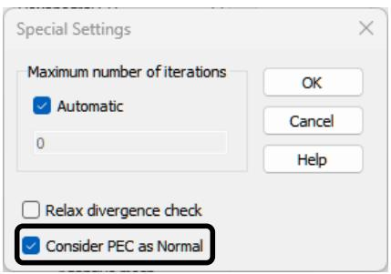

text_image

Special Settings
Maximum number of iterations
✓ Automatic
0
OK
Cancel
Help
☐ Relax divergence check
✓ Consider PEC as Normal

If the checkbox Consider PEC as Normal is enabled, PEC materials are considered like normal materials with a permeability µ which can be defined in the material properties of the PEC material. In case the solver is started from problem class “Tracking”, this setting is activated automatically.

Please note that in stand-alone magnetostatic simulations using the Problem Type “Low Frequency”, different results compared to Problem Type “Particle” are obtained despite otherwise identical settings due to the different defaults regarding the consideration of PEC type materials.

## Additional Information: Using tetrahedral meshes in the Tracking Solver

Especially for models with curved surfaces in the vicinity of the particle beam, a representation of the structure by a hexahedral mesh may require a large number of cells. In these cases, it can be helpful to use a tetrahedral mesh that will model the structure’s surfaces more naturally and thus can yield more accurate surface fields.

You can either switch to the tetrahedral mesh type by selecting Simulation: Mesh Global Properties (dropdown list)  Tetrahedral and pressing OK in the appearing Mesh Properties dialog or alternatively via the option in the solver setup dialog Simulation: Solver  Setup Solver  Mesh  Tetrahedral.

When changing the mesh, you will be informed that any existing results have to be deleted. Confirm the deletion of the results by clicking OK.

Before starting a new simulation based on a tetrahedral mesh, a few settings in the model setup have to be changed, part of which can be seen as general recommendations for using the tetrahedral tracking solver:

Open boundaries are not supported. They are automatically replaced by magnetic boundaries (Ht = 0) upon solver start.  
In many cases, the automatically generated mesh will be a good starting point for performing your simulations. However, in order to obtain a mesh well adapted to the simulation type, some settings should be changed.

o For modifying the global mesh resolution, you can set the mesh properties via Mesh  Global Properties . In the mesh properties dialog, enter 10 under Cells per max model box edge for Model and 15 for Background.

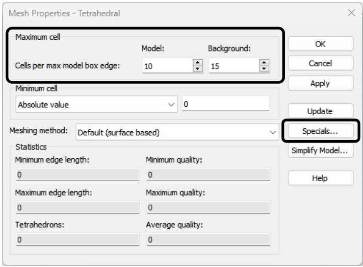

text_image

Mesh Properties - Tetrahedral
Maximum cell
Model: Background:
Cells per max model box edge: 10 15
Minimum cell
Absolute value 0
Meshing method: Default (surface based)
Statistics
Minimum edge length: Minimum quality:
0 0
Maximum edge length: Maximum quality:
0 0
Tetrahedrons: Average quality:
0 0
OK
Cancel
Apply
Update
Specials...
Simplify Model...
Help

o As the particles only interact with the electromagnetic fields in the vacuum regions, a mesh refinement of the permanent magnets is not of the highest priority. Therefore, you may disable the checkbox Consider material properties for refinement in the Specials dialog. Moreover, the value in the edit field Smooth mesh with equilibrate ratio should be set to 1.3 in order to avoid generating a too large number of tetrahedrons for this example.

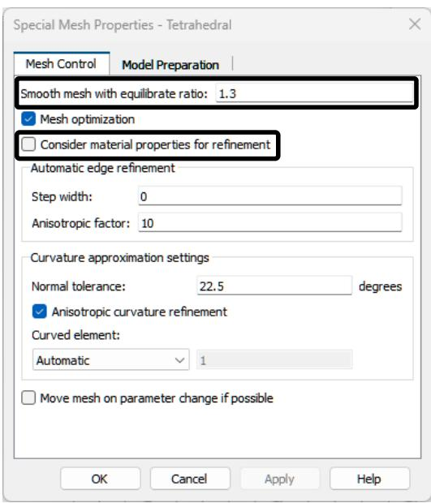

text_image

Special Mesh Properties - Tetrahedral
Mesh Control	Model Preparation
Smooth mesh with equilibrate ratio: 1.3
✓ Mesh optimization
□ Consider material properties for refinement
Automatic edge refinement
Step width: 0
Anisotropic factor: 10
Curvature approximation settings
Normal tolerance: 22.5 degrees
✓ Anisotropic curvature refinement
Curved element:
Automatic 1
□ Move mesh on parameter change if possible
OK	Cancel	Apply	Help

Due to using the project template for setting up the simulation project, most of these settings have already been applied automatically.

The mesh can be visualized by entering the mesh view Home: Mesh  Mesh View and then pressing Mesh: Mesh  Update to invoke the tetrahedral mesher. In case you do not trigger the mesh generation manually, the mesh is automatically constructed upon solver start. After a few seconds, the mesh appears. For the structure in this example, it looks as follows:

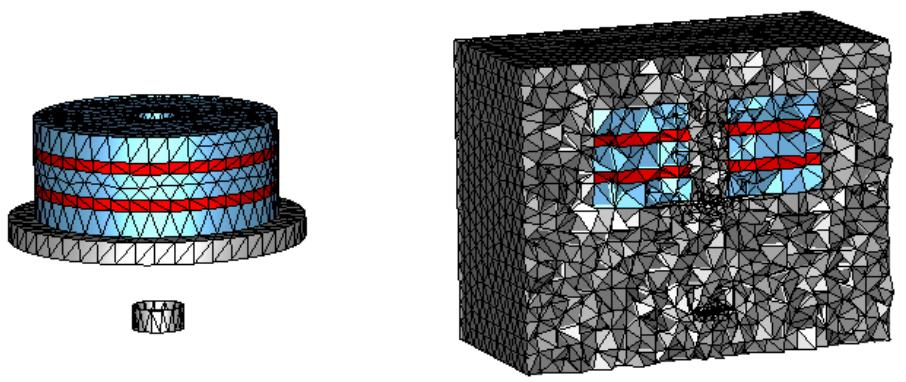

The right image has been generated using Mesh: Visibility  Background and Mesh: Sectional View  Cutting Plane . It includes a visualization of the background mesh cells, i.e., the free-space region where the particle trajectories will be computed. Naturally, the mesh quality in the beam region is important for achieving accurate results.

Please note that particle tracking simulations that are using a tetrahedral mesh will in general be slower than simulations with the same number of hexahedral cells. However, since tetrahedral meshes yield a more precise surface representation, a considerably smaller number of cells will often be sufficient for getting accurate results.

Press Update in the Mesh Properties dialog. This requests the tetrahedral mesher to update the mesh representation. The total number of tetrahedrons is close to 55,000 now, as can be seen in the status bar:

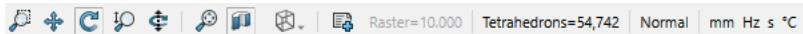

As in the hexahedral case, a local control of the mesh resolution can be reached via the local mesh properties of the respective component.

After leaving the mesh inspection mode via Mesh: Close  Close Mesh View , you could start the simulation as before using the particle tracking solver control dialog box: Simulation: Solver  Setup Solver  Start. However, due to some restrictions that apply to the tracking solver when used with tetrahedral meshes, the following preparations have to be performed (if you omit these steps, the solver will emit respective messages to guide you towards solving possible issues):

While being relative to the mesh dimensions in the hexahedral case, the emission distance for the space charge limited emission model has to be an absolute value when using a tetrahedral mesh. In general, it is a good idea to review all settings of the particle source after switching the mesh type.

In order to do so, right-click onto the particle source in the navigation tree NT: Particle Sources  particle1 and select Edit Properties… from the context menu.

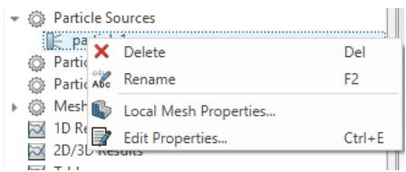

text_image

Particle Sources
Delete	Del
Partic	Rename	F2
Mesh	Local Mesh Properties...
1D Rec<xcel><xcel><xcel><xcel><xcel><xcel><xcel><xcel><xcel><xcel><xcel><xcel><xcel><xcel><xcel><xcel><xcel><xcel><xcel><xcel><xcel><xcel><xcel><xcel><xcel><xcel><xcel><xcel><xcel><xcel><xcel><xcel><xcel><xcel><xcel><xcel><xcel><xcel><xcel><xcel><xcel><xcel><xcel><xcel><xcel><xcel><xcel><xcel><xcel><xcel><xcel><xcel><xcel><xcel><xcel><xcel><xcel><xcel><xcel><xcel><xcel><xcel><xcel><xcel><xcel><xcel><xcel><xcel><xcel><xcel><xcel><xcel><xcel><xcel><xcel><xcel><xcel><xcel><xcel><xcel><xcel><xcel><xcel><xcel><xcel><xcel><xcel><xcel><xcel><xcel><xcel><xcel><xcel><xcel><xcel><xcel><xcel><xcel><xcel><xcel><lcel><lcel><lcel><lcel><lcel><lcel><lcel><lcel><lcel><lcel><lcel><lcel><lcel><lcel><lcel><lcel><lcel><lcel><lcel><lcel><lcel><lcel><lcel><lcel><lcel><lcel><lcel><lcel><lcel><lcel><lcel><lcel><lcel><lcel><lcel><lcel><lcel><lcel><lcel><lcel><lcel><lcel><lcel><lcel><lcel><lcel><lcel><lcel><lcel><lcel><lcel><lcel><lcel><lcel><lcel><lcel><lcel><lcel><lcel><lcel><lcel><lcel><lcel><lcel><lcel><lcel><lcel><lcel><lcel><lcel><lcel><lcel><lcel><lcel><lcel><lcel><lcel><lcel><lcel><lcel><lcel><lcel><lcel><lcel><lcel><lcel><lcel><lcel><lcel><lcel><lcel><lcel><lcel><lcel><lcel><lcel><lcel><nl>
Particle
Delete	Del
Partic	Rename	F2
Mesh	Local Mesh Properties...
1D Rec	Edit Properties...	Ctrl+E
2D/3D Results

This will open the Edit Particle Area Source dialog again. Here you should increase the Number of emission points to a value around 400 again by setting the Scale Factor to 10 and adjusting the slider appropriately.

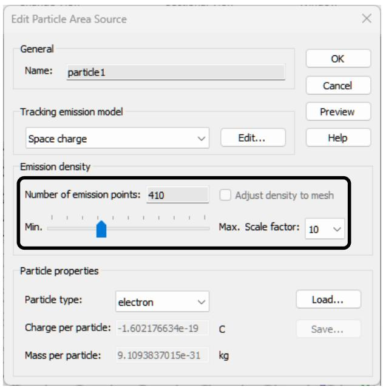

text_image

Edit Particle Area Source
General
Name: particle1
OK
Cancel
Preview
Help
Tracking emission model
Space charge Edit...
Emission density
Number of emission points: 410 Adjust density to mesh
Min. Max. Scale factor: 10
Particle properties
Particle type: electron Load...
Charge per particle: -1.602176634e-19 C Save...
Mass per particle: 9.1093837015e-31 kg

Furthermore, open the settings of the emission model using the Edit button in the Tracking emission model frame, check the settings and press OK twice to close both dialogs.

Finally, you can now run the particle tracking solver with a tetrahedral mesh via its solver control dialog box: Simulation: Solver  Setup Solver  Start.

The results should look similar to the ones obtained using a hexahedral mesh for the workflow example described earlier in this section (here for phi = -30 kV and active gun iteration again):

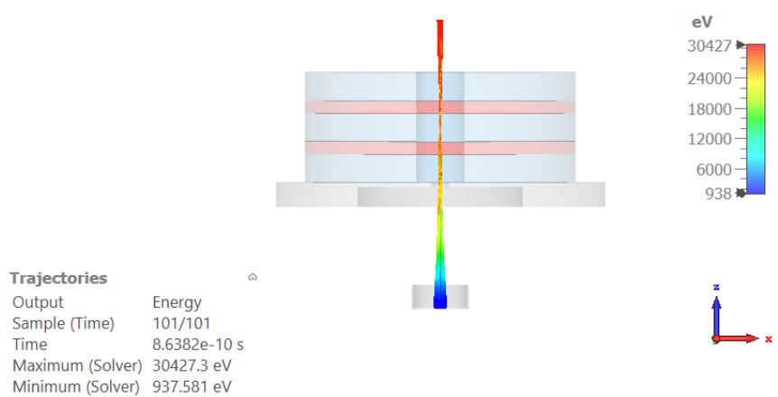

heatmap

| Metric | Value (eV) |
| --- | --- |
| Maximum (Solver) | 30427.3 |
| Minimum (Solver) | 937.581 |
| Sample (Time) | 101/101 |
| Time | 8.6382e-10 s |

## Summary

This example gave you a basic overview of the key concepts of the Tracking Solver of CST Studio Suite. You should now have a good idea of how to do the following:

1. Create a structure using the solid modeler  
2. Specify the solver parameters, check and modify the mesh and start the tracking simulation  
3. Visualize the electromagnetic field distributions and the particles trajectories  
4. Define a structure using parameters  
5. Use the parameter sweep tool for parameter studies  
6. Perform automatic optimizations

If you are familiar with all these topics, you have a very good starting point for further improving your usage of CST Studio Suite.

For more information on a particular topic, we recommend that you look at the contents page of the online help manual, which can be opened via File: Help  Help Contents – Get Help using CST Studio Suite . If you have any further questions or remarks, do not hesitate to contact our technical support team. We also strongly recommend that you participate in one of our special training classes held regularly at a location near you. Please ask us for details.

## Simulation Workflow: Electromagnetic Particle-in-Cell

The basic procedure of running the electromagnetic (EM) particle-in-cell (PIC) solver is very similar to the one demonstrated in the tracking simulation workflow. In contrast to the tracking solver, particles and electromagnetic fields are computed in a selfconsistent way using a time integration scheme. For more information on the physics that can be modelled with the EM PIC solver, an overview is provided in Chapter 3 – Solver Overview: Particle-in-Cell Solver.

The following example demonstrates how to perform a PIC calculation for a simple output cavity of a klystron. Studying this example carefully will allow you to become familiar with many standard operations that are necessary to perform a PIC simulation within CST Studio Suite.

Go through the following explanations carefully even if you are not planning to use the software for PIC simulations. Only a small portion of the example is specific to this particular application type since most of the considerations are general to all solvers and application domains.

The following explanations always describe the menu-based way to open a particular dialog box or to launch a command. Whenever available, the corresponding toolbar item is displayed next to the command description. Due to the limited space in this manual, the shortest way to activate a particular command (i.e. by pressing a shortcut key or activating the command from the context menu) is omitted. You should regularly open the context menu to check available commands for the currently active mode.

## The Structure

This workflow example demonstrates how to build up the output cavity of a klystron for a PIC simulation. A klystron is a device to amplify microwave and/or radio frequency signals. The output resonator is the last stage (cavity) of a klystron. The amplified signal can be extracted using waveguide ports.

Since only the output resonator as a part of the klystron is simulated, a Gaussian emission model is used to define an already bunched particle beam.

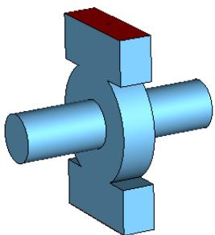

natural_image

3D mechanical component diagram showing a central shaft and two cylindrical ports (no text or symbols)

CST Studio Suite allows you to define the properties of the background material. Background material is considered for the space in which no shape is defined. For this structure, it is sufficient to use vacuum for the klystron cavity and perfect electrical conductor (PEC) for the surrounding background space.

## Create a New Project

After launching the CST Studio Suite you will enter the start screen showing you a list of recently opened projects and allowing you to select the application that best suits your requirements. The easiest way to get started is to configure a project template, which defines the basic settings that are important for your typical application. Therefore, click on the New Template button in the New Project from Template section within the New and Recent tab.

Next, you should choose the application area, Particle Dynamics for the example in this tutorial, and then select the workflow by double-clicking on the corresponding entry.

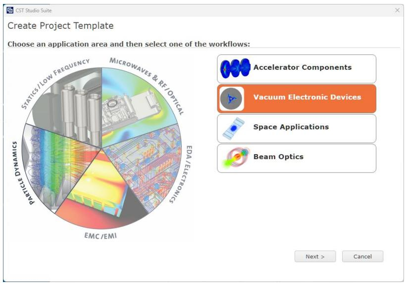

flowchart

```mermaid
graph LR
  A["Microwaves & RF/OPTAL"] --> B["EDA/ELECTRONICS"]
  B --> C["EMC/EMI"]
  C --> D["Particle Dynamics"]
  D --> E["Static/Low Frequency"]
  E --> F["Precipitation"]
  F --> G["Space Applications"]
  G --> H["Vacuum Electronic Devices"]
  H --> I["Accelerator Components"]
  I --> J["Beam Optics"]
```

Please then select the following workflow: Vacuum Electronic Devices  Klystron  Hot Test  Particle in Cell .

You are then requested to select the units that fit your application best. For this example, please select the dimensions as follows:

<table><tr><td>Dimensions:</td><td>mm</td></tr><tr><td>Frequency:</td><td>GHz</td></tr><tr><td>Time:</td><td>ns</td></tr><tr><td>Temperature:</td><td>Kelvin</td></tr></table>

For the specific application in this tutorial, the other settings can be left unchanged. After clicking the Next button, you can give the project template a name and review a summary of your initial settings:

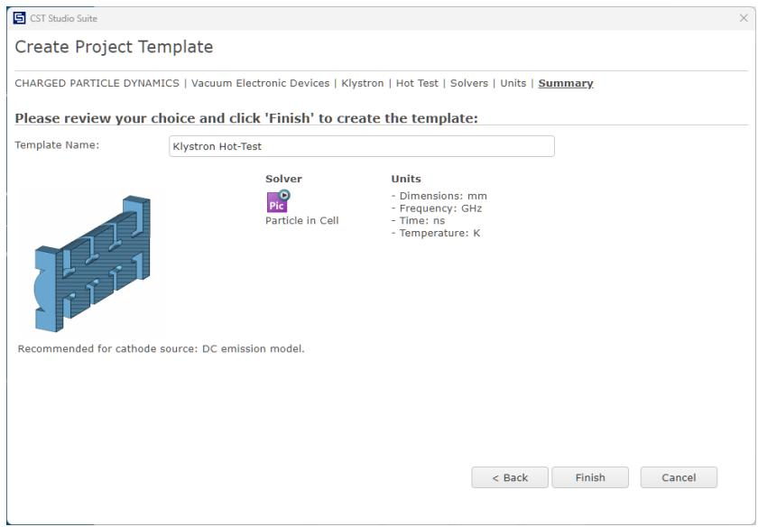

text_image

Create Project Template
CHARGED PARTICLE DYNAMICS | Vacuum Electronic Devices | Klystron | Hot Test | Solvers | Units | Summary
Please review your choice and click 'Finish' to create the template:
Template Name: Klystron Hot-Test
Solver Units
Pic - Dimensions: mm
Particle in Cell - Frequency: GHz
- Time: ns
- Temperature: K
Recommended for cathode source: DC emission model.
< Back Finish Cancel

Finally, click the Finish button to save the project template and to create a new project with the appropriate settings. CST Studio Suite for Particle Dynamics Simulation will be launched automatically due to the choice of this specific project template within the application area Particle Dynamics. Save the newly created “Untitled” project on your hard disk using a name of your choice.

Please note: When you click again on the File: New and Recent you will see that the recently defined template appears below the Project Templates section. For further projects in the same application area, you can simply click on this template entry to launch CST Studio Suite for Particle Dynamics Simulation with useful basic settings. It is not necessary to define a new template each time. You are now able to start the software with reasonable initial settings quickly with just one click on the corresponding template.

Please note: All settings made for a project template can be modified later on during the construction of your model. For example, the units can be modified in the units dialog box (Home: Settings  Units ) and the solver type can be selected in the Home: Simulation  Setup Solver drop-down list.

## Open the PIC QuickStart Guide

An interesting feature of the online help system is the QuickStart Guide, an electronic assistant that will guide you through your simulation. If it does not show up automatically, you can open this assistant by selecting QuickStart Guide from the Help button in the upper right corner.

The following dialog box should then be visible at the upper right corner of the main view:

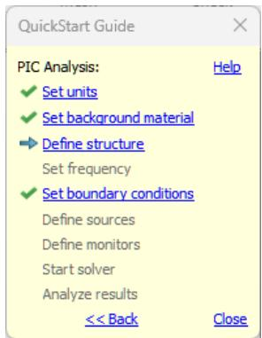

text_image

QuickStart Guide
PIC Analysis:
✓ Set units
✓ Set background material
→ Define structure
Set frequency
✓ Set boundary conditions
Define sources
Define monitors
Start solver
Analyze results
<< Back
Help
Close

As the project template has already set the solver type, units, boundary conditions and background material, the PIC Analysis is preselected and some entries are marked as done. The blue arrow always indicates the next step necessary for your problem definition. You do not have to follow the steps in this order, but we recommend you follow this guide at the beginning to ensure that all necessary steps have been completed.

Look at the dialog box as you follow the various steps in this example. You may close the assistant at any time. Even if you re-open the window later, it will always indicate the next required step.

If you are unsure of how to access a certain operation, click on the corresponding line. The QuickStart Guide will then either run an animation showing the location of the related menu entry or open the corresponding help page.

## Define the Units

The Klystron Hot-Test template has already made some settings for you. The defaults for this structure type are geometrical values in mm and times in ns. You can change these settings by entering the desired settings in the units dialog box (Home: Settings Units ) but for this example you should just leave the settings as specified by the template. Additionally, the used units are also displayed in the status bar:

## Define the Background Material

As discussed above in the Structure section, the klystron cavity is surrounded by perfect electrical conductor (PEC). The material type PEC is already set as default background material in the Klystron Hot-Test template. You may change the background material in the corresponding dialog box (Simulation: Settings  Background ). For this example, no change of the background material is needed.

## Model the Structure

Having defined the initial general settings, the 3D view window is now visible and the working plane is shown therein. The working plane can be turned off (and on) by clicking on View: Visibility Working Plane .

Then, you can start building the 3D structure. First, create a vacuum cylinder along the z-axis of the coordinate system using the following steps:

1. Select the cylinder creation tool Modeling: Shapes  Cylinder .  
2. Press the ESC key to open the dialog box. Do not click a point in the working plane.  
3. Enter "cavity" as name.

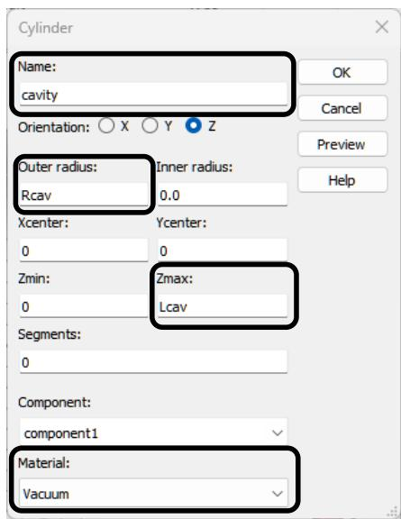

text_image

Cylinder
Name:
cavity
Orientation: X Y Z
Outer radius:
Rcav Inner radius:
0.0
Xcenter: Ycenter:
0 0
Zmin: Zmax:
0 Lcav
Segments:
0
Component:
component1
Material:
Vacuum

4. Enter the parameters "Rcav" as outer radius and "Lcav" as Zmax. Set the Material to "Vacuum". Click the OK button to confirm the changes.  
5. The New Parameter dialog box appears. Enter 38.8 as value for Rcav. Press the Return key to confirm. It is also possible to add a description of the parameter.

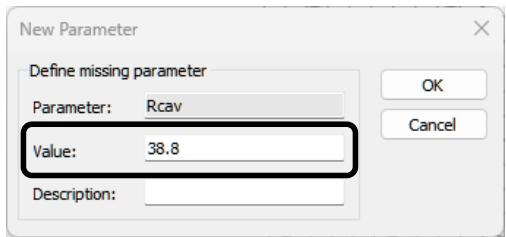

text_image

New Parameter
Define missing parameter
Parameter: Rcav
Value: 38.8
Description:

6. Another New Parameter dialog box appears. Enter 22 as value for Lcav. Press the Return key to confirm. The defined parameters are shown in the Parameter List window of the CST Studio Suite. To view the newly created shape, click on View: Change View Reset view .

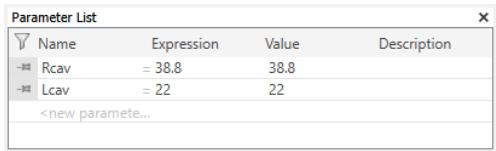

text_image

Parameter List
Name	Expression	Value	Description
Rcav	= 38.8	38.8
Lcav	= 22	22
<new paramete...

7. Activate and move the working coordinate system to the center of the upper cylinder face: Select Modeling: WCS  Align WCS and pick the face in the maximum zdirection with a double-click. This setting is used in the following step (step 8) to define a vacuum cylinder based on the axes of the working coordinate system.

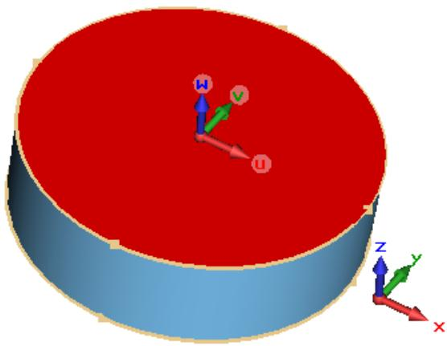

natural_image

3D diagram of a red circular object with coordinate axes (x, y, z) and directional arrows indicating movement or orientation (no text or symbols)

8. Define a second vacuum cylinder: select the cylinder creation tool Modeling: Shapes Cylinder . Press the ESC key to open the dialog box.

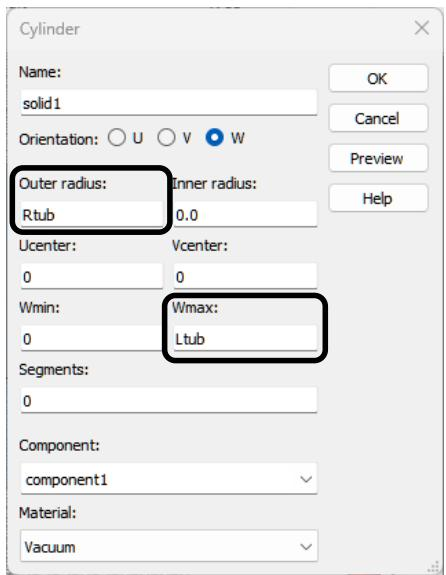

text_image

Cylinder
Name:
solid1
Orientation: ○ U ○ V ● W
Outer radius:
Rtub
Inner radius:
0.0
Ucenter:
Vcenter:
0
Wmin:
0
Wmax:
Ltub
Segments:
0
Component:
component1
Material:
Vacuum
OK
Cancel
Preview
Help

9. Enter the parameters "Rtub" as outer radius and "Ltub" as Wmax. Press the OK button to confirm the changes.  
10. The New parameter dialog boxes appear again. Choose 15.9 for Rtub and 55 for Ltub. Press the Return key to confirm.  
11. In the same way as before move the origin of the working coordinate system to the center of the lower face of the cavity cylinder. Select Modeling: WCS Align WCS and pick the face in the minimum z-direction with a double-click.

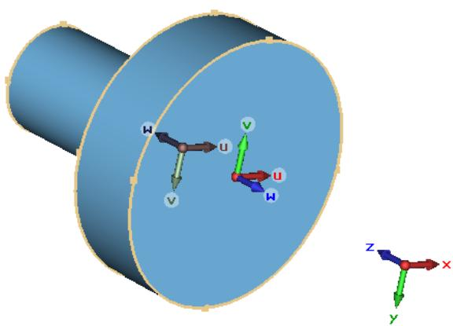

text_image

Diagram showing 3D coordinate system with labeled axes (x, y, z) and vectors (u, v, w) around a cylindrical object.

12. Define a third vacuum cylinder. Select the cylinder creation tool Modeling: Shapes Cylinder . Press the ESC key to open the dialog box.  
13. Enter the parameters "Rtub" as outer radius and "Ltub" as Wmax. Press the OK button to confirm the changes.

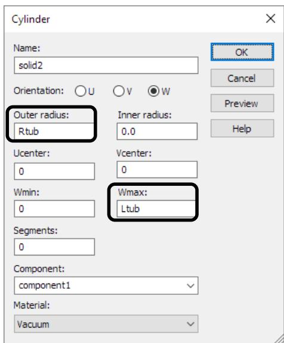

text_image

Cylinder
Name:
solid2
Orientation: ○ U ○ V ● W
Outer radius:
Rtub Inner radius:
0.0
Ucenter:
0 Vcenter:
0
Wmin:
0 Wmax:
Ltub
Segments:
0
Component:
component1
Material:
Vacuum
OK
Cancel
Preview
Help

In the 3D structure view, the structure below should be visible now:

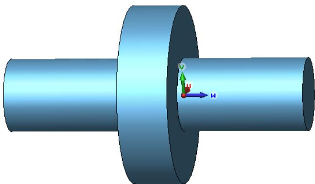

natural_image

3D diagram of a mechanical component with a central flange and external shaft, showing directional arrows (no text or symbols)

14. Rotate the local coordinate system $1 8 0 ^ { \circ }$ around the v-axis: open the Transform Local Coordinate System dialog box from Modeling: WCS  Transform WCS and select the Rotate radio button. Enter 180° for the V-direction. Then click the Apply button.  
15. Move the local coordinate system about Rcav in V-direction: Select the Move radio button and enter Rcav for the DV shift. Click OK to confirm.

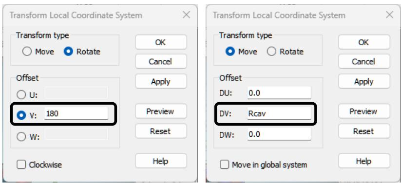

The origin of the local coordinate system should now have been shifted to this position:

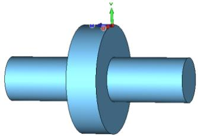

natural_image

3D rendered mechanical component with flange and cylindrical shaft (no text or symbols)

16. Define a vacuum brick. Select the brick creation tool Modeling: Shapes  Brick . Press the ESC key to open the dialog box.

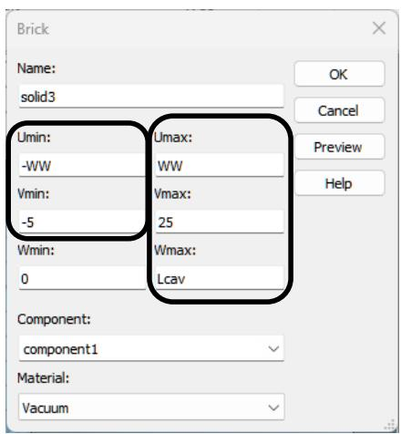

text_image

Brick
Name:
solid3
Umin:
-WW
Vmin:
-5
Wmin:
0
Component:
component1
Material:
Vacuum
Umax:
WW
Vmax:
25
Wmax:
Lcav
OK
Cancel
Preview
Help

17. Enter the values as shown in the picture above. For Umax enter the length "WW" and for Umin the length "-WW". Click the OK button. The New Parameter dialog box will appear again. Enter 36.1 as length for WW and click OK.  
18. Since the structures intersect, the Shape Intersection dialog box shown below appears. Select "None" and click OK.

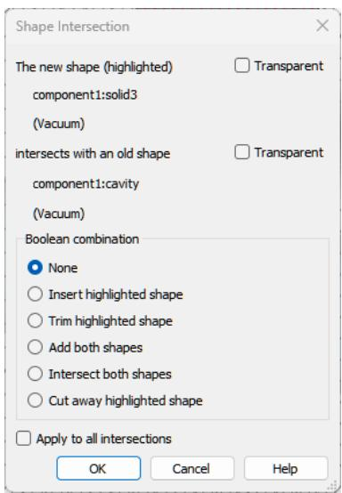

text_image

Shape Intersection
The new shape (highlighted)
component1:solid3
(Vacuum)
intersects with an old shape
component1:cavity
(Vacuum)
Boolean combination
None
Insert highlighted shape
Trim highlighted shape
Add both shapes
Intersect both shapes
Cut away highlighted shape
Apply to all intersections
OK	Cancel	Help

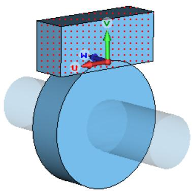

natural_image

3D diagram of a mechanical component with labeled axes (U, V) and a red vehicle, no readable text or symbols present.

19. Switch to the global coordinate system by disabling the WCS: Modeling: WCS Local WCS $\therefore$ .  
20. Select "solid3" in the navigation tree.

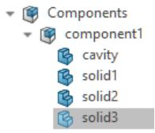

21. Open the Transform Selected Object dialog box: Modeling: Tools Transform .

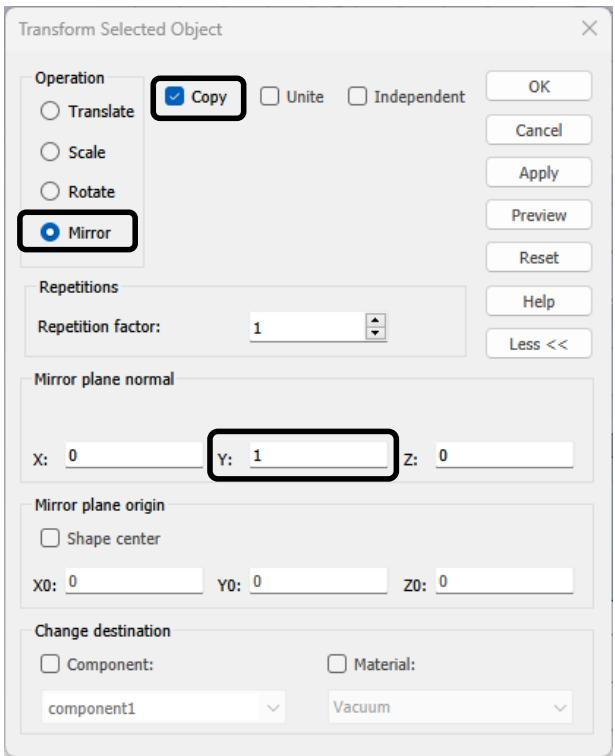

text_image

Transform Selected Object
Operation
Translate
Scale
Rotate
Mirror
Copy
Unite
Independent
OK
Cancel
Apply
Preview
Reset
Help
Less <<
Repetitions
Repetition factor: 1
Mirror plane normal
X: 0 Y: 1 Z: 0
Mirror plane origin
Shape center
X0: 0 Y0: 0 Z0: 0
Change destination
Component:
Material:
component1 Vacuum

22. Enable "Mirror" and "Copy". Choose “Y” as the mirror plane normal. Click the OK button.  
23. Since the structures intersect, the Shape Intersection dialog box appears again. Select "None" and click OK. Your structure should now look like this:

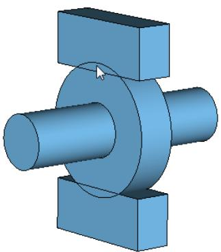

natural_image

3D mechanical assembly diagram showing a central shaft with two cylindrical heads and a rectangular housing (no text or symbols)

24. Select all existing solids in the navigation tree. Transform all selected solids into one vacuum solid: Modeling: Tools Boolean Add

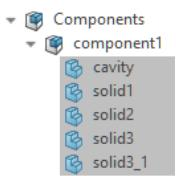

25. Finally the structure should look like this:

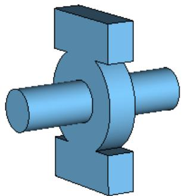

natural_image

3D mechanical component diagram showing a flanged housing with two cylindrical ports and a central shaft (no text or symbols)

Congratulations! You have just created your first PIC structure within CST Studio Suite.

## Define the Particle Source

We use an electron source as particle source. The emission is based on a Gaussian emission model. Since the beam has a circular cross section, the circular particle source can be used.

1. Define a circular particle source on the beam tube at the lower z-coordinate: Simulation: Sources and Loads  Particle Sources  Particle Circular Source . Select the following edge (lower z-direction) of the beam tube with a double-click:

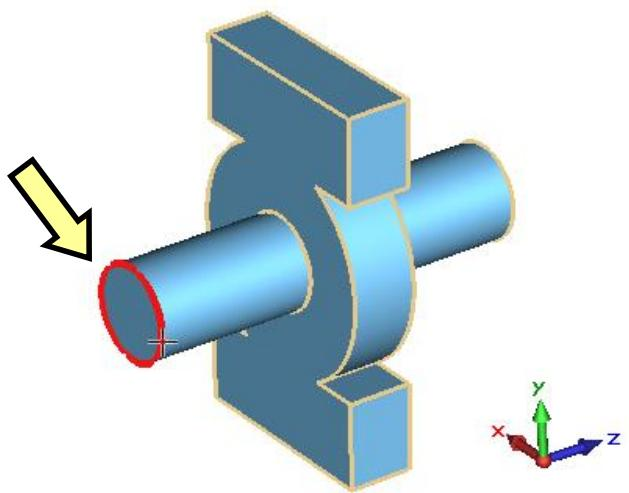

natural_image

3D mechanical part diagram with coordinate axes (x, y, z) and a red circular feature, no text or symbols present.

2. The dialog box Define Particle Circular Source opens where you can modify the settings of the particle source:

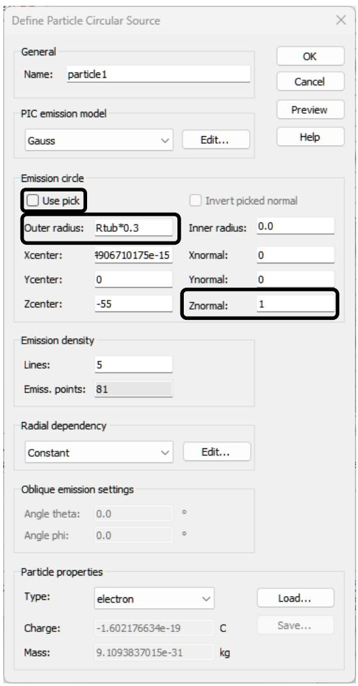

text_image

Define Particle Circular Source
General
Name: particle1
PIC emission model
Gauss Edit...
Emission circle
Use pick Invert picked normal
Outer radius: Rtub*0.3 Inner radius: 0.0
Xcenter: #906710175e-15 Xnormal: 0
Ycenter: 0 Ynormal: 0
Zcenter: -55 Znormal: 1
Emission density
Lines: 5
Emiss. points: 81
Radial dependency
Constant Edit...
Oblique emission settings
Angle theta: 0.0 °
Angle phi: 0.0 °
Particle properties
Type: electron Load...
Charge: -1.602176634e-19 C Save...
Mass: 9.1093837015e-31 kg

3. Deselect the checkbox Use pick, enter an Outer Radius value of Rtub\*0.3 and a Znormal value of 1. Click the Preview button to check these settings.

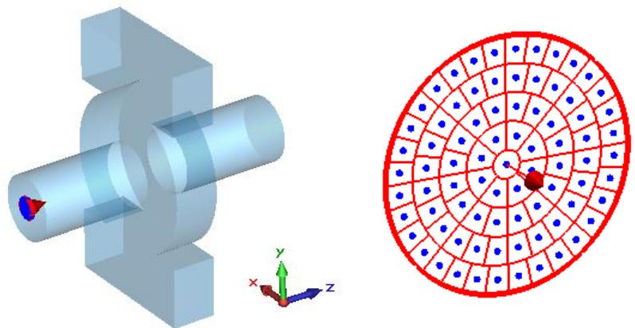

In the PIC emission model section, the Gauss emission model is already selected from the drop-down list. Click the Edit button to define the parameters of the Gaussian emission model. The Gauss emission settings are organized in two tabs: “General” and “Kinetic Settings”. Enter the values shown in the following table:

<table><tr><td colspan="2">General</td><td colspan="2">Kinetic</td></tr><tr><td>Setting</td><td>Value</td><td>Setting</td><td>Value</td></tr><tr><td>Charge (abs)</td><td>50e-9</td><td>Kinetic type</td><td>Gamma</td></tr><tr><td>Bunches</td><td>15</td><td>Kinetic value</td><td>2</td></tr><tr><td>Time / Length</td><td>Length</td><td></td><td></td></tr><tr><td>Sigma</td><td>0.5*Lcav</td><td></td><td></td></tr><tr><td>Cutoff Length</td><td>1.25*Lcav</td><td></td><td></td></tr><tr><td>Offset</td><td>1.25*Lcav</td><td></td><td></td></tr><tr><td>Distance</td><td>87</td><td></td><td></td></tr></table>

After configuring the emission settings, the dialog boxes should look as follows:

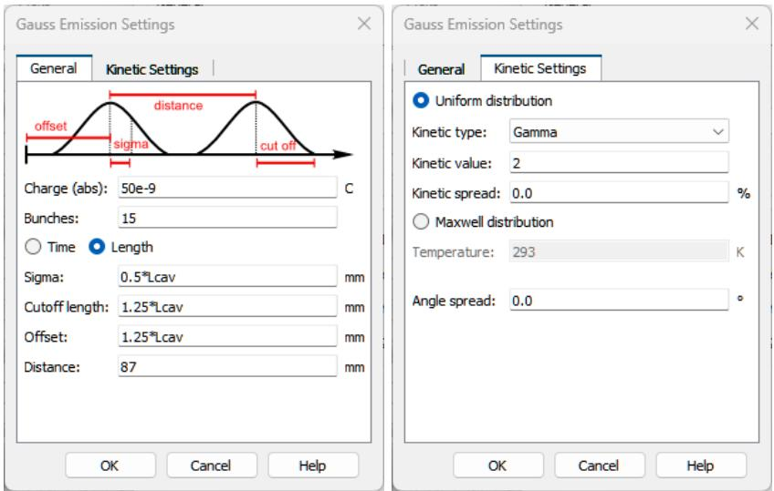

Click OK to confirm the changes and click OK again to close the "Define Particle Circular Source" dialog box.

Note: For more information about emission models and appropriate settings please refer to the online manual.

## Define the Ports

In our example waveguide ports are used to extract the energy out of the cavity. The ports are not used for excitation.

1. Pick the following face of one brick and double-click to define a port on it: Modeling: Picks  Picks  Pick Points, Edges or Faces.

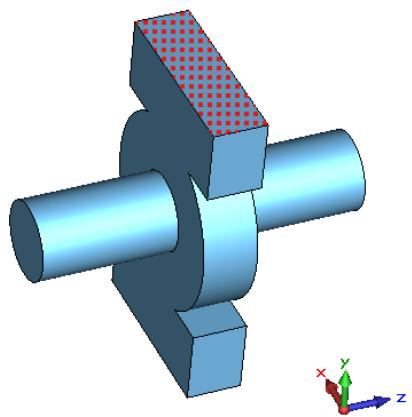

natural_image

3D CAD model of a mechanical assembly with cross-sectional view and XYZ coordinate axis (no text or symbols)

2. Open the Waveguide Port dialog box to define a waveguide port on the picked face (upper y-direction): Simulation: Sources and Loads  Waveguide Port .

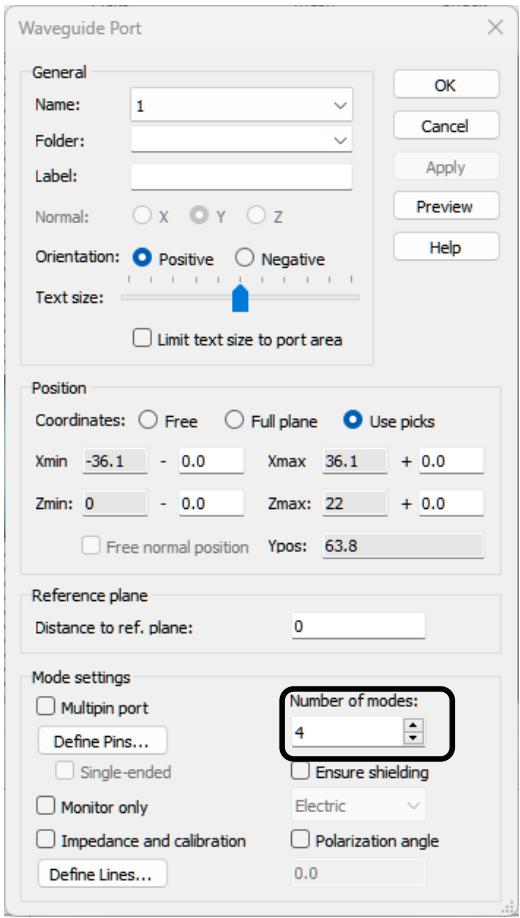

text_image

Waveguide Port
General
Name: 1
Folder: 
Label:
Normal: X Y Z
Orientation: Positive Negative
Text size:
Limit text size to port area
Position
Coordinates: Free Full plane Use picks
Xmin -36.1 - 0.0 Xmax 36.1 + 0.0
Zmin: 0 - 0.0 Zmax: 22 + 0.0
Free normal position Ypos: 63.8
Reference plane
Distance to ref. plane: 0
Mode settings
Multipin port
Define Pins...
Single-ended
Monitor only
Impedance and calibration
Define Lines...
Number of modes:
4
Ensure shielding
Electric
Polarization angle
0.0

3. Change the number of port modes to 4 and click OK to confirm.  
4. For the other brick define a port on the opposite face (lower y-direction) in the same way: Pick the face, enter the Waveguide Port dialog box and change the Number of modes to 4.

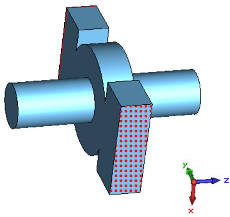

natural_image

3D mechanical part diagram with coordinate axes (x, y, z) shown in a 3D perspective view, no text or symbols present.

5. Confirm the settings with the OK button. The port definition is finished now.

## Simulation Setup

The solver parameters can be set up within the PIC solver dialog box. A maximum simulation frequency must be defined. The PIC solver results are only valid in the defined frequency range. The mesh generation depends on the maximum frequency.

1. Define the maximum frequency within the Frequency Range Settings dialog box Simulation: Settings  Frequency .

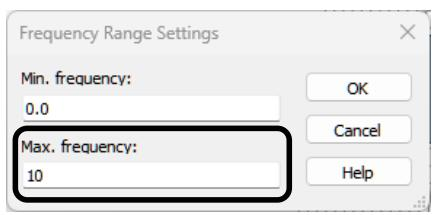

text_image

Frequency Range Settings
Min. frequency:
0.0
Max. frequency:
10
OK
Cancel
Help

2. Enter a frequency of 10 for Max. frequency and click the OK button.  
3. Open the PIC solver dialog box: Simulation: Solver  Setup Solver .

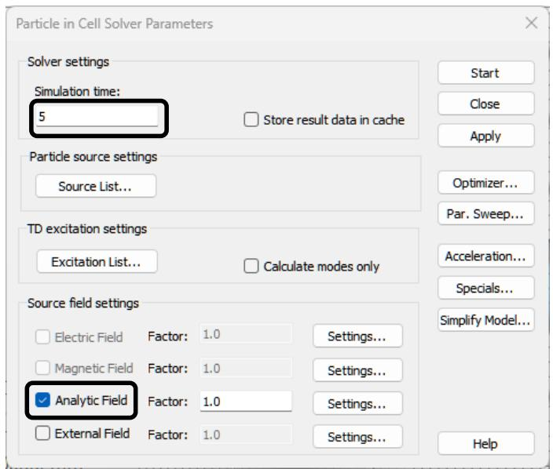

text_image

Particle in Cell Solver Parameters
Solver settings
Simulation time:
5
Store result data in cache
Start
Close
Apply
Particle source settings
Source List...
Optimizer...
Par. Sweep...
TD excitation settings
Excitation List...
Calculate modes only
Acceleration...
Specials...
Simplify Model...
Source field settings
Electric Field Factor: 1.0 Settings...
Magnetic Field Factor: 1.0 Settings...
Analytic Field Factor: 1.0 Settings...
External Field Factor: 1.0 Settings...
Help

4. Change the simulation time to 5 and enable the checkbox Analytic Field.

5. To define the analytic field, click its Settings button. The Define Analytic Magnetic Source Field dialog box appears.

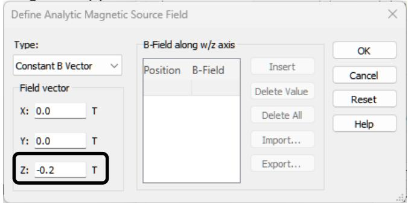

text_image

Define Analytic Magnetic Source Field
Type:
Constant B Vector
Field vector
X: 0.0 T
Y: 0.0 T
Z: -0.2 T
B-Field along w/z axis
Position B-Field
Insert
Delete Value
Delete All
Import...
Export...
OK
Cancel
Reset
Help

6. Change the z-component of the Constant B Vector to -0.2 and click the OK button to confirm. This will apply a homogeneous magnetic flux density of 0.2 T along the –z direction to focus the particle beam.

Before leaving the Particle in Cell Solver Parameters dialog box we want to draw your attention to the Excitation List button that might be important if ports or other HF-sources are defined:

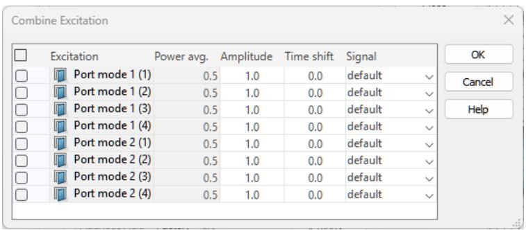

text_image

Combine Excitation
Excitation	Power avg.	Amplitude	Time shift	Signal
Port mode 1 (1)	0.5	1.0	0.0��dual ✓
Port mode 1 (2)	0.5	1.0	0.0highdual ✓
Port mode 1 (3)	0.5	1.0	0.0highdual ✓
Port mode 1 (4)	0.5	1.0	0.0highdual ✓
Port mode 2 (1)	0.5	1.0	0.0highdual ✓
Port mode 2 (2)	0.5	1.0	0.0highdual ✓
Port mode 2 (3)	0.5	1.0	0.0highdual ✓
Port mode 2 (4)	0.5	1.0	0.0highdual ✓

If the ports are excited, one can define the amplitude and the time shift for a previously defined excitation signal. For example, applications like traveling wave tubes feature driven ports.

Note: The amplitude value is the amplitude of the port signal (in units of sqrt(W)), which represents the square root of the peak power applied to the port. For simplicity, the corresponding average power of the exited port is shown in the column Power avg.

No changes need to be made for this example, so you can leave the dialog box by clicking Cancel.

Now the solver can be started. However, before that, the mesh will be modified and some particle monitors will be defined. First, click the Apply and then the Close button in the main solver dialog box.

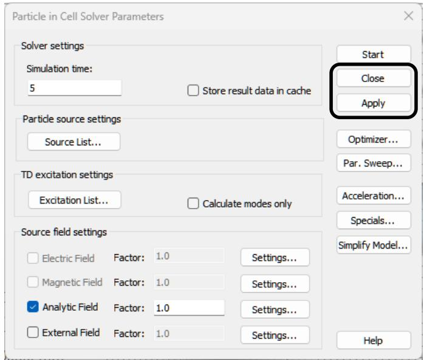

text_image

Particle in Cell Solver Parameters
Solver settings
Simulation time:
5
Store result data in cache
Start
Close
Apply
Particle source settings
Source List...
Optimizer...
Par. Sweep...
Acceleration...
Specials...
TD excitation settings
Excitation List...
Calculate modes only
Source field settings
Electric Field Factor: 1.0
Settings...
Magnetic Field Factor: 1.0
Settings...
Analytic Field Factor: 1.0
Settings...
External Field Factor: 1.0
Settings...
Simplify Model...
Help

## Refine the mesh

The Klystron Hot-Test template already specified appropriate mesh settings for this example. However, in some cases the mesh has to be adjusted manually, as the meshing algorithm does not know anything about the particle movement. To change the mesh settings, proceed as follows:

1. Click on Simulation: Mesh  Global Properties to open the dialog box of the mesh properties.

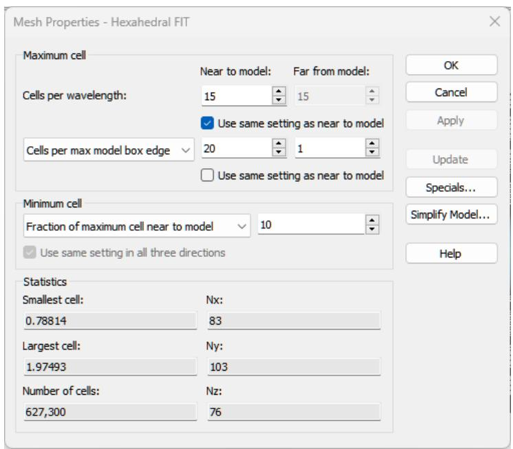

text_image

Mesh Properties - Hexahedral FIT
Maximum cell
Near to model: Far from model:
Cells per wavelength: 15 15
Use same setting as near to model
Cells per max model box edge 20 1
Use same setting as near to model
Minimum cell
Fraction of maximum cell near to model 10
Use same setting in all three directions
Statistics
Smallest cell: Nx:
0.78814 83
Largest cell: Ny:
1.97493 103
Number of cells: Nz:
627,300 76
OK
Cancel
Apply
Update
Specials...
Simplify Model...
Help

2. Play a little bit with the settings. E.g. set Cells per wavelength – Near to model to 20, click Apply to observe the change in the number of mesh cells.  
3. Undo your changes and click OK to leave the dialog box.

## Define Particle Monitors

To understand the interaction of the particles with the electromagnetic fields, it is often useful to gain an insight into the particle distribution. In this example, it may be interesting to see how particle bunches are deformed when moving through the beam tube.

The particle distribution can be recorded with an equidistant sampling in time. You may need to switch back to the modeler mode by selecting the Components folder in the navigation tree before monitor definitions can be made.

For this example, a 3D PIC Position Monitor will be defined. Select and open the PIC Position Monitor dialog box: Simulation: Monitors  PIC Position Monitor .

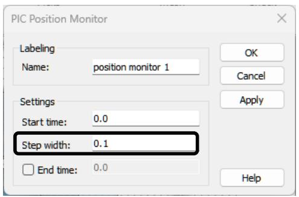

text_image

PIC Position Monitor
Labeling
Name: position monitor 1
OK
Cancel
Settings
Start time: 0.0
Step width: 0.1
End time: 0.0
Apply
Help

Enter a Step width of 0.1 and create the monitor by pressing the OK button.

In addition to the 3D PIC Position Monitor, a phase space monitor will be set up. Select Simulation: Monitors  PIC Position Monitor  PIC Phase Space Monitor to open the PIC Phase Space Monitor dialog box:

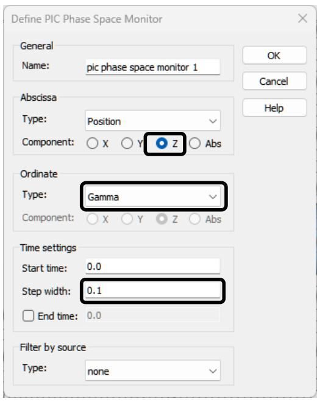

text_image

Define PIC Phase Space Monitor
General
Name: pic phase space monitor 1
Abscissa
Type: Position
Component: X Y Z Abs
Ordinate
Type: Gamma
Component: X Y Z Abs
Time settings
Start time: 0.0
Step width: 0.1
End time: 0.0
Filter by source
Type: none

For the abscissa select the z-position and for the ordinate select Gamma. Enter a Step width of 0.1 for the time sampling. As the beam moves parallel to the z-axis, we are interested in monitoring the particle γ as a function of the z-position. Create the monitor by pressing the OK button.

Apart from the 3D PIC position monitor and the phase space monitor, a PIC 2D monitor is available as well. Please refer to the online help for further details.

## Start the Simulation

All necessary parameters have now been defined and you are ready to perform your first PIC simulation. You can start the solver directly by clicking Home: Simulation Start Simulation . Alternatively, you can reopen the PIC solver dialog box, Simulation: Solver  Setup Solver , and start the solver by clicking the Start button.

In the progress window, a progress bar will be shown that informs you on the solver's status. Information regarding the operation will be displayed next to the progress bar. The most important stages are listed below:

1. Calculating matrices: Processing CAD model: During this step, the input model is checked and processed.  
2. Calculating matrices: Computing coefficients: During these steps, the system of equations, which will subsequently be solved, is set up.  
3. Data rearrangement: Merging results: For larger models the matrices are calculated in parallel and the results are merged at the end.  
4. Transient analysis: Calculating port modes: In this step, the solver calculates the port mode field distributions if any ports were defined. This information will be used later in the time domain analysis of the structure.  
5. Transient analysis: Processing excitation / transient field analysis: During this stage, the particles are emitted into the calculation domain and the time integration of the fields and particle movement takes place. The solver stops when the previously defined Simulation time has been reached.

For this simple structure, the entire analysis takes a few minutes to complete.

Note: During the simulation, the position of the particles can be watched by selecting NT: 2D/3D Results  PIC Position Monitors  Particle preview in the Navigation Tree. The view of particles can be then updated by pressing the F5 key or by clicking on 2D/3D Plot: Plot Properties  Update Results .

## Analyze the Simulation Results

The results of the PIC simulation can be analyzed in several ways. By clicking on NT: 2D/3D Results  PIC Position Monitors  Particle preview, the last sample of the simulation can be visualized in the default monitor “Particle preview”.

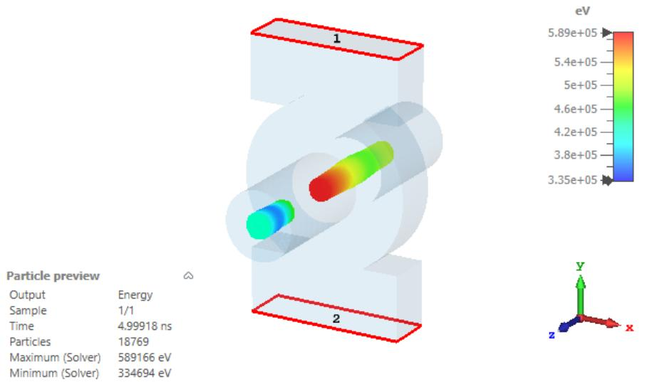

surface_3d

| Metric | Value |
| --- | --- |
| Output | Energy |
| Sample | 1/1 |
| Time | 4.99918 ns |
| Particles | 18769 |
| Maximum (Solver) | 589166 eV |
| Minimum (Solver) | 334694 eV |

The charged particle motion can be visualized by selecting the result entry for the previously defined 3D particle monitor . Select NT: 2D/3D Results PIC Position Monitors $\Rightarrow$ position monitor 1. Try moving back and forth in the time sample sequence by using the left and right arrow keys, after having clicked somewhere in the 3D view window. Open the Plot Properties dialog box by selecting 2D/3D Plot: Plot Properties Properties and click on the tab Animation.

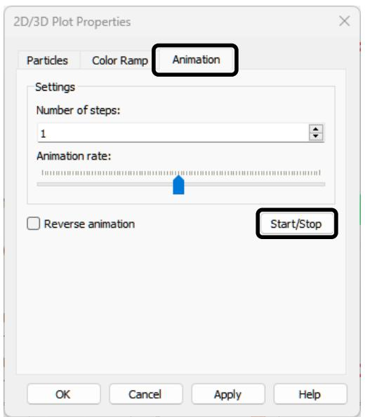

text_image

2D/3D Plot Properties
Particles Color Ramp Animation
Settings
Number of steps:
1
Animation rate:
Reverse animation Start/Stop
OK Cancel Apply Help

To start an automatic animation, click the Start button in the 2D/3D Plot Properties dialog box. This dialog box allows several other plot modifications, described in more detail in the online help. Close the dialog box by clicking the OK button.

The phase space plot monitor result can be accessed by selecting NT: 1D Results $\Rightarrow$ PIC Phase Space Monitor  pic phase space monitor 1:

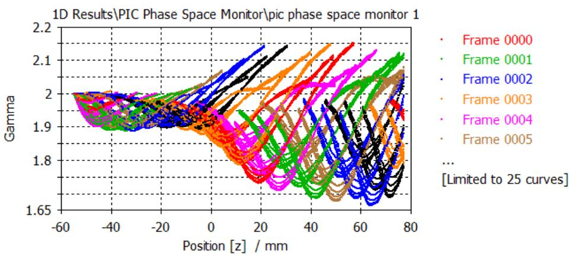

line

| Position [z] / mm | Frame 0000 | Frame 0001 | Frame 0002 | Frame 0003 | Frame 0004 | Frame 0005 |
| --- | --- | --- | --- | --- | --- | --- |
| -60 | 2.0 | 2.0 | 2.0 | 2.0 | 2.0 | 2.0 |
| -40 | ~1.95 | ~1.95 | ~1.95 | ~1.95 | ~1.95 | ~1.95 |
| -20 | ~1.95 | ~1.95 | ~1.95 | ~1.95 | ~1.95 | ~1.95 |
| 0 | ~1.95 | ~1.95 | ~1.95 | ~1.95 | ~1.95 | ~1.95 |
| 20 | ~1.75 | ~1.85 | ~2.15 | ~1.85 | ~1.75 | ~1.85 |
| 40 | ~2.05 | ~1.75 | ~1.85 | ~2.15 | ~2.05 | ~1.75 |
| 60 | ~2.15 | ~2.05 | ~1.75 | ~2.15 | ~2.15 | ~2.05 |
| 80 | — | ~2.15 | ~1.85 | — | — | ~2.05 |

This result illustrates the gamma (proportional to energy) variation in time versus the longitudinal position. The results can be visualized as an animation: select Home: Macros  VBA Macros  Report and Graphics  Save Video. Set the Framerate to 5 Hz and then click OK. The animation is saved by default in the folder where the .cst project file is located and starts to be executed automatically. It takes less than a minute to create the video. For a specific time instance of the space phase, you can select a single frame in the Navigation Tree:

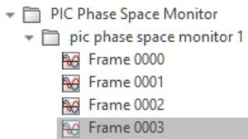

text_image

PIC Phase Space Monitor
pic phase space monitor 1
Frame 0000
Frame 0001
Frame 0002
Frame 0003

In addition to the results of the previously defined monitors, the PIC solver creates several other entries in the result tree. You can find a selection of interesting results below:

Port Signals (NT: 1D Results  Port signals)

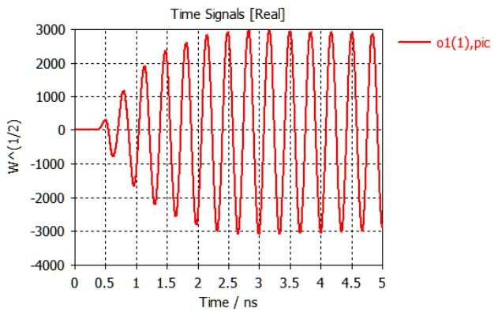

line

| Time (ns) | w^(1/2) |
| --- | --- |
| 0 | 0 |
| 0.5 | ~300 |
| 0.6 | ~-800 |
| 0.7 | ~1200 |
| 0.9 | ~-1600 |
| 1.1 | ~1900 |
| 1.3 | ~-2200 |
| 1.5 | ~2400 |
| 1.7 | ~-2500 |
| 1.9 | ~2600 |
| 2.1 | ~-2800 |
| 2.3 | ~2800 |
| 2.5 | ~-3000 |
| 2.7 | ~3000 |
| 2.9 | ~-3000 |
| 3.1 | ~3000 |
| 3.3 | ~-3000 |
| 3.5 | ~3000 |
| 3.7 | ~-3000 |
| 3.9 | ~3000 |
| 4.1 | ~-3000 |
| 4.3 | ~3000 |
| 4.5 | ~-3000 |
| 4.7 | ~3000 |
| 4.9 | ~-3000 |

If ports are defined, the output signals at these ports are added automatically to the results. In this example, the signal at port 1 shows that the bunched particle beam creates high power radio waves. As mentioned earlier, the output signals correspond to the square root of the peak power, which means that the average output power extracted from the beam amounts to 0.5\*3000\*3000 = 4.5 MW.

Particle Number (NT: 1D Results  Solver Statistics [PIC])

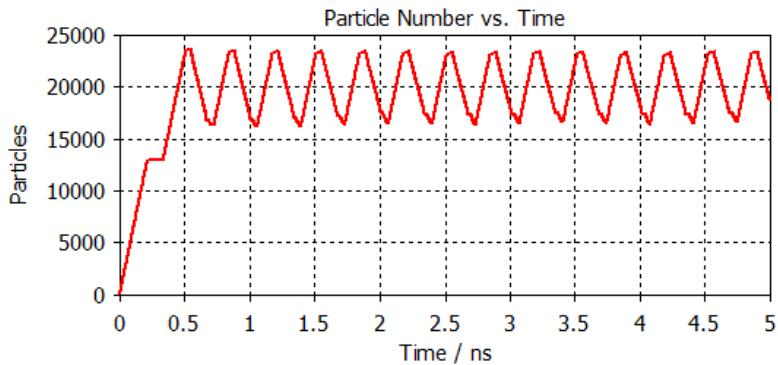

line

| Time (ns) | Particles |
| --- | --- |
| 0 | 0 |
| ~0.25 | ~13000 |
| ~0.4 | ~13000 |
| ~0.5 | ~24000 |
| ~0.75 | ~16500 |
| ~0.9 | ~23500 |
| ~1.1 | ~16500 |
| ~1.3 | ~23500 |
| ~1.5 | ~16500 |
| ~1.7 | ~23500 |
| ~1.9 | ~16500 |
| ~2.1 | ~23500 |
| ~2.3 | ~16500 |
| ~2.5 | ~23500 |
| ~2.7 | ~16500 |
| ~2.9 | ~23500 |
| ~3.1 | ~16500 |
| ~3.3 | ~23500 |
| ~3.5 | ~16500 |
| ~3.7 | ~23500 |
| ~3.9 | ~16500 |
| ~4.1 | ~23500 |
| ~4.3 | ~16500 |
| ~4.5 | ~23500 |
| ~4.7 | ~16500 |
| ~4.9 | ~23500 |

This 1D result shows the total number of macro particles inside the calculation domain vs. time. The curve increases when new particles are emitted by the source. It decreases, when particles are absorbed by solids and/or the background. Especially if a multipacting event is expected, this type of plot can be very useful.

Emitted Current (NT: 1D Results  Emission Information  Current  [Sources])

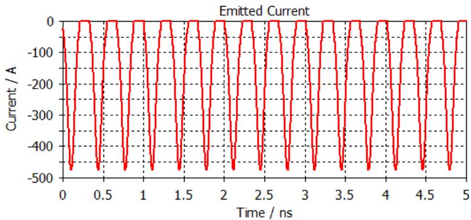

line

| Time (ns) | Current (A) |
| --- | --- |
| 0 | ~-30 |
| 0.1 | ~-470 |
| 0.2 | ~-150 |
| 0.3 | 0 |
| 0.4 | ~-150 |
| 0.5 | 0 |
| 0.6 | ~-150 |
| 0.7 | 0 |
| 0.8 | ~-150 |
| 0.9 | 0 |
| 1.0 | ~-150 |
| 1.1 | 0 |
| 1.2 | ~-150 |
| 1.3 | 0 |
| 1.4 | ~-150 |
| 1.5 | 0 |
| 1.6 | ~-150 |
| 1.7 | 0 |
| 1.8 | ~-150 |
| 1.9 | 0 |
| 2.0 | ~-150 |
| 2.1 | 0 |
| 2.2 | ~-150 |
| 2.3 | 0 |
| 2.4 | ~-150 |
| 2.5 | 0 |
| 2.6 | ~-150 |
| 2.7 | 0 |
| 2.8 | ~-150 |
| 2.9 | 0 |
| 3.0 | ~-150 |
| 3.1 | 0 |
| 3.2 | ~-150 |
| 3.3 | 0 |
| 3.4 | ~-150 |
| 3.5 | 0 |
| 3.6 | ~-150 |
| 3.7 | 0 |
| 3.8 | ~-150 |
| 3.9 | 0 |
| 4.0 | ~-150 |
| 4.1 | 0 |
| 4.2 | ~-150 |
| 4.3 | 0 |
| 4.4 | ~-150 |
| 4.5 | 0 |
| 4.6 | ~-150 |
| 4.7 | 0 |
| 4.8 | ~-150 |
| 4.9 | 0 |

This 1D result shows the amount of emitted current for all particle sources vs. time. Especially for field based emission models, like explosive emission, this result is very important.

Wave-Particle-Power Transfer (NT: 1D Results  Power)

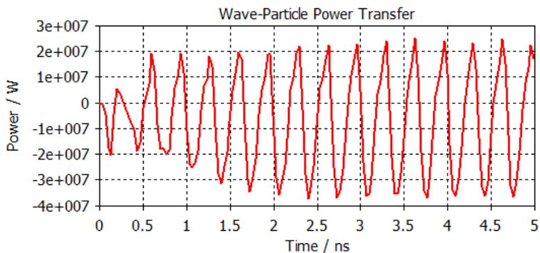

line

| Time (ns) | Power (W) |
| --- | --- |
| 0.0 | 0 |
| ~0.15 | ~-2e+007 |
| ~0.25 | ~5e+006 |
| ~0.45 | ~-1.8e+007 |
| ~0.65 | ~1.9e+007 |
| ~0.85 | ~-1.9e+007 |
| ~1.05 | ~1.9e+007 |
| ~1.25 | ~-2.4e+007 |
| ~1.45 | ~1.8e+007 |
| ~1.65 | ~-3.1e+007 |
| ~1.85 | ~1.9e+007 |
| ~2.05 | ~-3.5e+007 |
| ~2.25 | ~2.1e+007 |
| ~2.45 | ~-3.7e+007 |
| ~2.65 | ~2.2e+007 |
| ~2.85 | ~-3.6e+007 |
| ~3.05 | ~2.3e+007 |
| ~3.25 | ~-3.5e+007 |
| ~3.45 | ~2.4e+007 |
| ~3.65 | ~-3.6e+007 |
| ~3.85 | ~2.4e+007 |
| ~4.05 | ~-3.6e+007 |
| ~4.25 | ~2.3e+007 |
| ~4.45 | ~-3.6e+007 |
| ~4.65 | ~2.4e+007 |
| ~4.85 | ~-3.6e+007 |
| 5.0 | ~2.2e+007 |

$$
P _ {\mathrm{transfer}} = \int_ {V} \vec {j} \cdot \vec {E} d v
$$

The wave-particle power transfer is the power (loss or gain) that is transferred from the electromagnetic fields to the particles. In case of oscillators, this quantity can be very interesting. Superposed fields, i.e. analytic fields and field imports, are not taken into account for this plot.

There are even more possibilities for monitoring the particle data during the simulation and for analyzing the results, but the previously presented methods provide a good starting basis. For further options, we would like to refer you to the online help.

## Summary

This example should have given you an overview of the key concepts of CST Studio Suite. You should now have a basic idea of how to do the following:

1. Model the structures by using the solid modeler  
2. Specify the solver parameters, check the mesh and start the simulation  
3. Define particle and field monitors  
4. Visualize the particle distribution and use the PIC solver statistics

If you are familiar with all these topics, you have achieved a very good starting point for further improving your usage of the PIC solver inside CST Studio Suite.

For more information on a particular topic, we recommend that you browse through the online help system which can be opened by pressing the F1 key or clicking on Help Help Contents – Get Help using CST Studio Suite . If you have any further questions or remarks, do not hesitate to contact your technical support team. We also strongly recommend that you participate in one of our special training classes held regularly at a location near you. Ask your support center for details.

## Simulation Workflow: Wakefield

The following example demonstrates how to perform a wakefield calculation for a simple resonator cavity. Studying this example carefully will allow you to become familiar with many standard operations that are necessary to perform a wakefield simulation within CST Studio Suite. For more information on the physics that can be modelled with the Wakefield solver, an overview is provided in Chapter 3 – Solver Overview : Wakefield Solver.

Go through the following explanations carefully even if you are not planning to use the software for wakefield simulations. Only a small portion of the example is specific to this particular application type since most of the considerations are general to all solvers and application domains.

The following explanations always describe the menu-based way to open a particular dialog box or to launch a command. Whenever available, the corresponding toolbar item is displayed next to the command description. Due to the limited space in this manual, the shortest way to activate a particular command (i.e. by pressing a shortcut key or activating the command from the context menu) is omitted. You should regularly open the context menu to check available commands for the currently active mode.

## The Structure

This workflow example considers a particle beam passing through a pillbox cavity. Since only the vacuum parts of the structure need to be modeled, it is very easy to set up the geometrical description. It consists only of two added cylinders with a couple of blended edges. The following picture shows the structure of interest. It is shown in a transparent way, in order to see the particle beam axis.

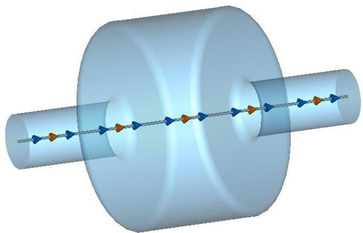

natural_image

3D diagram of a cylindrical object with a central shaft and multiple directional arrows indicating motion or force (no text or symbols)

CST Studio Suite allows you to define the properties of the background material. Anything you do not fill with a particular material will automatically be considered as background material. For this structure, it is sufficient to model only the vacuum space. The background properties will be set to PEC (Perfect Electrical Conductor).

The model will be created in three simple steps:

1. Model the cylindrical vacuum parts of the resonator and the beam tube.  
2. Blend the circular edges of the cavity.  
3. Define the beam parameters (axis, charge, velocity).

## Create a New Project

After launching the CST Studio Suite, you will enter the start screen showing you a list of recently opened projects and allowing you to select the application that best suits your requirements. The easiest way to get started is to configure a project template, which defines the basic settings that are important for your typical application. Therefore, click on the New Template button in the New Project from Template section within the New and Recent tab.

Next, you should choose the application area, Particle Dynamics for the example in this tutorial, and then select the workflow by double-clicking on the corresponding entry.

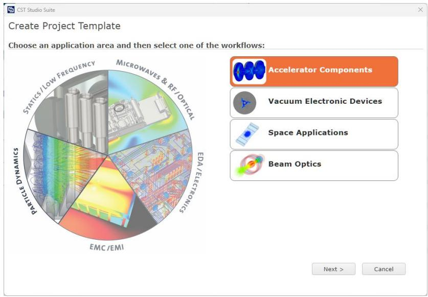

flowchart

```mermaid
graph LR
  A["Static / Low Frequency"] --> B["Microwaves & RF / Optical"]
  B --> C["EDA / Electronics"]
  C --> D["EMC / EMI"]
  D --> E["Particle Dynamics"]
  E --> F["Static / Low Frequency"]
```

For the pillbox cavity, please select Accelerator Components  Cavities  Wakefields Wakefield .

You are then requested to select the units that fit your application. For this example, please select the dimensions as follows:

<table><tr><td>Dimensions:</td><td>cm</td></tr><tr><td>Frequency:</td><td>GHz</td></tr><tr><td>Time:</td><td>ns</td></tr></table>

For the specific application in this tutorial the other settings can be left unchanged. After clicking the Next button, you can give the project template a name and review a summary of your initial settings:

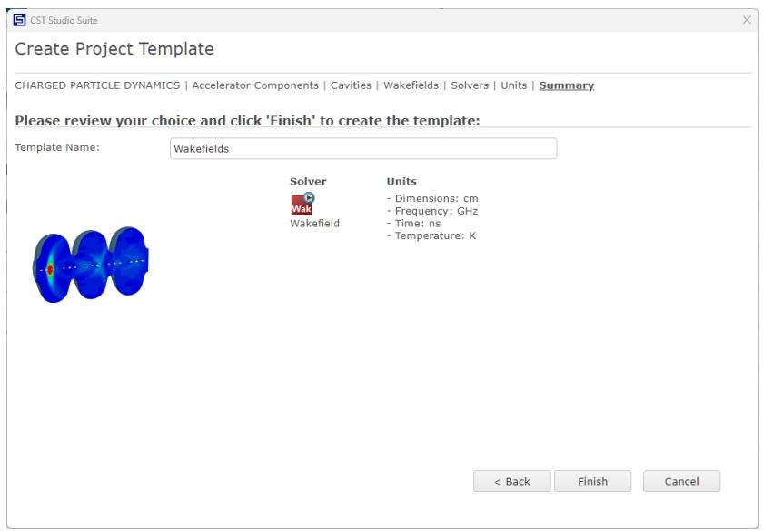

text_image

Create Project Template
CHARGED PARTICLE DYNAMICS | Accelerator Components | Cavities | Wakefields | Solvers | Units | Summary
Please review your choice and click 'Finish' to create the template:
Template Name: Wakefields
Solver Units
Wak - Dimensions: cm
Wakefield - Frequency: GHz
- Time: ns
- Temperature: K
< Back Finish Cancel

Finally click the Finish button to save the project template and to create a new project with the appropriate settings. CST Studio Suite for Particle Dynamics Simulation will be launched automatically due to the choice of this specific project template within the application area Particle Dynamics.

Please note: When you click again on the File: New and Recent you will see that the recently defined template appears below the Project Templates section. For further projects in the same application area, you can simply click on this template entry to launch CST Studio Suite for Particle Dynamics Simulation with useful basic settings. It is not necessary to define a new template each time. You are now able to start the software with reasonable initial settings quickly with just one click on the corresponding template.

Please note: All settings made for a project template can be modified later on during the construction of your model. For example, the units can be modified in the units dialog box (Home: Settings  Units ) and the solver type can be selected in the Home: Simulation  Setup Solver drop-down list.

## Open the Wakefield QuickStart Guide

An interesting feature of the online help system is the QuickStart Guide, an electronic assistant that will guide you through your simulation. If it does not show up automatically, you can open this assistant by selecting QuickStart Guide from the Help button in the upper right corner.

The following dialog box should then be visible at the upper right corner of the main view:

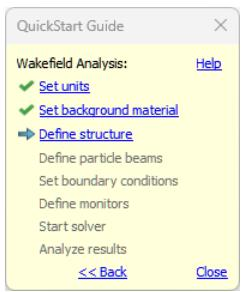

text_image

QuickStart Guide
Wakefield Analysis:
✓ Set units
✓ Set background material
▶ Define structure
Define particle beams
Set boundary conditions
Define monitors
Start solver
Analyze results
<< Back
Help
Close

The project template has already automatically set the Solver type appropriately. The project template has predefined units and background settings.

The blue arrow always indicates the next step necessary for your problem definition. You may not have to process the steps in this order, but we recommend you follow this guide at the beginning in order to ensure all necessary steps have been completed.

Look at the dialog box as you follow the various steps in this example. You may close the assistant at any time. Even if you re-open the window later, it will always indicate the next required step.

If you are unsure of how to access a certain operation, click on the corresponding line. The QuickStart Guide will then either run an animation showing the location of the related Ribbon entry or open the corresponding help page.

## Define the Units

The Wakefields template has already made some settings for you. The defaults for this structure type are geometrical values in cm and times in ns. You can change these settings by entering the desired settings in the units dialog box (Home: Settings Units ) but for this example you should just leave the settings as specified by the template. Additionally, the used units are also displayed in the status bar:

## Define the Background Material

As previously discussed in the Structure section, the pillbox cavity is surrounded by perfect electrical conductor (PEC). The material type PEC is already set as the default background material in the Wakefields template. You may change the background material in the corresponding dialog box Simulation: Settings  Background . For this example, no change of the background material is needed.

## Model the Structure

First, create a cylinder along the z-axis of the coordinate system using the following steps:

1. Select the cylinder creation tool: Modeling: Shapes  Cylinder .  
2. Press the Shift+Tab key, and enter the center point (0,0) in the xy-plane before pressing the OK button to store this setting.  
3. Press ESC to show the dialog box.  
4. In the shape dialog box, enter “beamtube” in the Name field.  
5. Press the Tab key twice, enter the Outer radius as 5.  
6. Press the Tab key five times, enter the height by defining Zmax as 80.  
7. Set the Material to “Vacuum”.  
8. Press OK to create a solid cylinder.

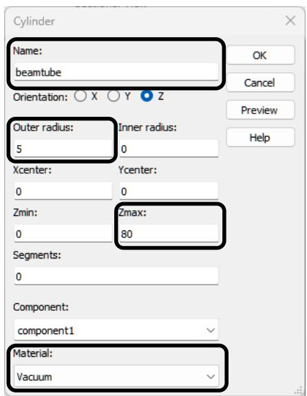

text_image

Cylinder
Name:
beamtube
Orientation: X Y Z
Outer radius:
5 Inner radius:
0
Xcenter: Ycenter:
0 0
Zmin: Zmax:
0 80
Segments:
0
Component:
component1
Material:
Vacuum

Since the material type “Vacuum” is already predefined, you can create the cylinder without defining a new material by clicking OK. Your result should look like the picture below. Press the Space bar to zoom the cylinder to window size.

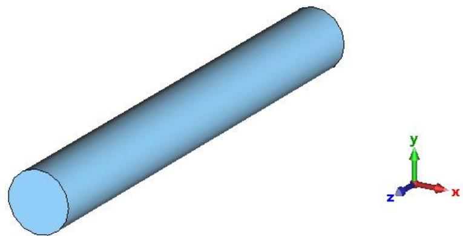

natural_image

3D illustration of a blue cylinder with a 3D coordinate system (x, y, z) shown in the corner (no text or symbols on the cylinder itself)

To create the cavity, you will now construct another vacuum cylinder with the help of the working coordinate system (WCS):

1. Activate the working coordinate system Modeling: WCS  Local WCS  
2. Choose Modeling: WCS  Transform WCS , enter a shift of 25 in the DW direction and click on OK.  
3. Again select the cylinder creation tool: Modeling: Shapes  Cylinder .  
4. Press the Shift+Tab key, and enter the center point (0,0) in the uv-plane before pressing the Return key to store this setting.  
5. Press ESC to show the dialog box.  
6. In the shape dialog box, enter “cavity” in the Name field.  
7. Press the Tab key twice, enter the outer-radius as 23.  
8. Press the Tab key five times, enter the height by defining Wmax as 30.

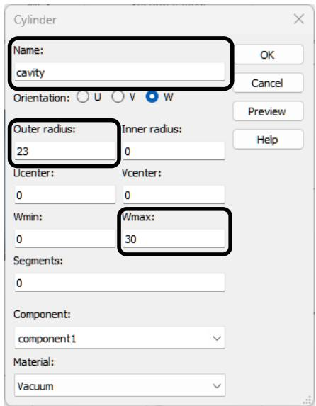

text_image

Cylinder
Name:
cavity
Orientation: U V W
Outer radius:
23 Inner radius:
0
Ucenter: Vcenter:
0 0
Wmin: Wmax:
0 30
Segments:
0
Component:
component1
Material:
Vacuum
OK
Cancel
Preview
Help

Confirm your settings by pressing OK. The automatic intersection check detects that both cylinders are intersecting and ask how to resolve the overlap:

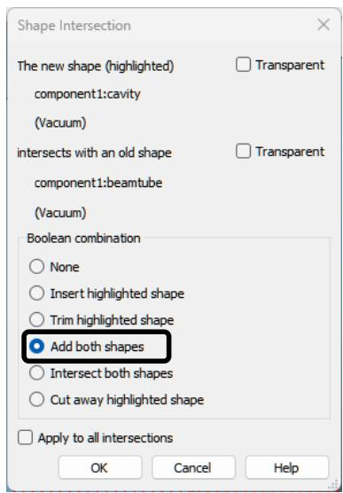

text_image

Shape Intersection
The new shape (highlighted)
component1:cavity
(Vacuum)
intersects with an old shape
component1:beamtube
(Vacuum)
Boolean combination
None
Insert highlighted shape
Trim highlighted shape
Add both shapes
Intersect both shapes
Cut away highlighted shape
Apply to all intersections
OK	Cancel	Help

It is important for the following construction steps to add both shapes to one. In order to do so, select “Add both shapes” and confirm with OK.

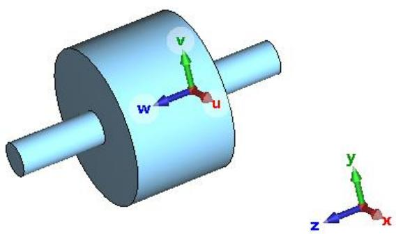

text_image

v
w
u
y
z
x

The final construction step is to blend the outer circular edges at the cavity and the intersection edges between the cavity and the beam-tube. Since four edges have to be blended in one step you can activate the Keep Pick Mode tool Modeling: Picks  Picks Pick Modes  Keep Pick Mode before picking the four edges. Now activate Modeling: Picks  Pick Points, Edges or Faces $\dot { \nabla } ^ { \circ }$ to pick the first edge – you might also use the keyboard shortcut e:

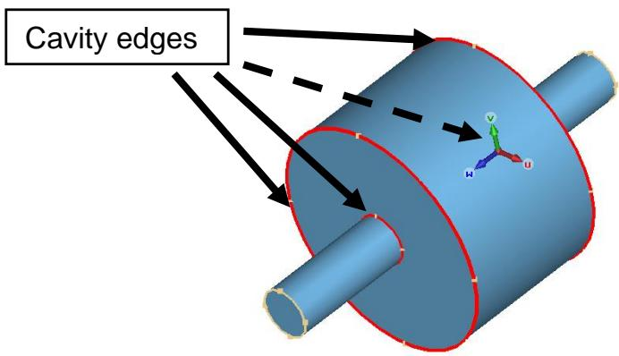

text_image

Cavity edges

By moving the mouse cursor to the first edge and performing a double-click you select the appropriate edge. Repeat this operation for the other three circular edges on the cylindrical cavity. You have to rotate the model to pick all four edges.

Now press the Return key to store all picks. Deactivate Modeling: Picks Picks Pick Modes Keep Pick Mode by selecting it once more. To activate the blend tool finally select Modeling: Tools  Blend  Blend Edges and enter the value 2 for the blend radius.

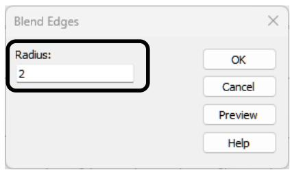

text_image

Blend Edges
Radius:
2
OK
Cancel
Preview
Help

Confirm with OK. Now the work of defining the geometric part is done, and your model should look as follows (after switching off the visualization of the working plane by pressing the Alt+W keys):

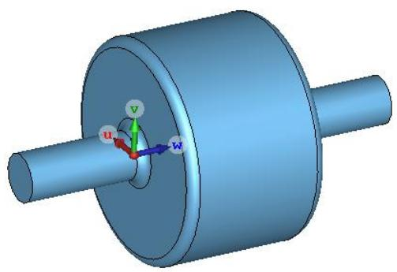

natural_image

3D mechanical diagram showing a cylindrical component with labeled vectors (u, v, w) and coordinate axes (no text or symbols beyond labels)

Congratulations! You have just created your first wakefield structure within CST Studio Suite.

## Define the Particle Beam Source

A wakefield computation is always driven by a particle beam source, which will be defined in this section. The beam definition consists of the axis settings and the description of a charged bunch of particles with a Gaussian shape.

1. Select Modeling: Picks  Pick Points  Pick Circle Center .  
2. Double-click on the lower circular edge of the beam tube with respect to the z-axis. The center point will be highlighted:

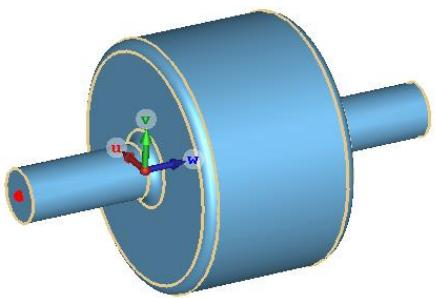

natural_image

3D diagram of a cylindrical mechanical component with labeled axes (U, V) and internal structure, no readable text or symbols present.

3. Open the particle beam dialog box by selecting Simulation  Sources and Loads Particle Beam :

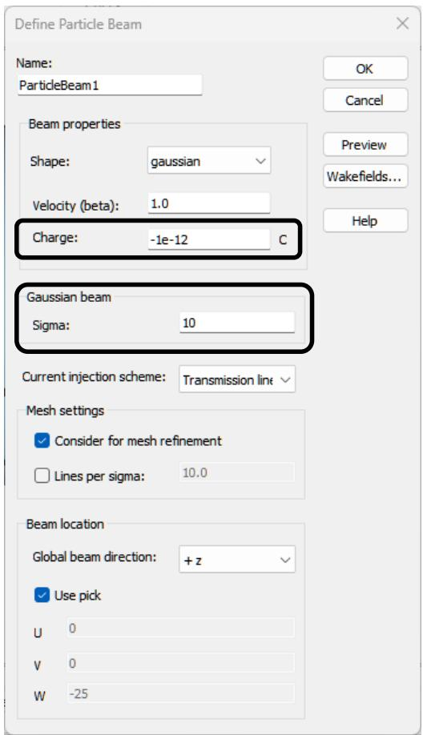

text_image

Define Particle Beam
Name:
ParticleBeam1
Beam properties
Shape: gaussian
Velocity (beta): 1.0
Charge: -1e-12 C
Gaussian beam
Sigma: 10
Current injection scheme: Transmission line
Mesh settings
Consider for mesh refinement
Lines per sigma: 10.0
Beam location
Global beam direction: +z
Use pick
U 0
V 0
W -25

Enter a value of 10 (cm) for the longitudinal spatial width of the Gaussian pulse, and a total bunch charge of -1e-12 C. Confirm the settings with the OK button and the beam source is created. Since the structure is hiding the source visualization, you may select NT: Particle Beams to look at the beam source:

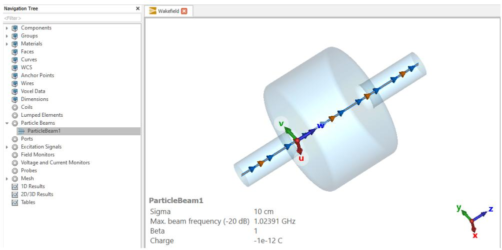

flowchart

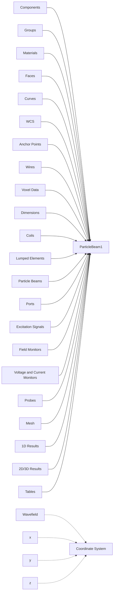
```mermaid
graph LR
  A["Components"] --> B["ParticleBeam1"]
  C["Groups"] --> B
  D["Materials"] --> B
  E["Faces"] --> B
  F["Curves"] --> B
  G["WCS"] --> B
  H["Anchor Points"] --> B
  I["Wires"] --> B
  J["Voxel Data"] --> B
  K["Dimensions"] --> B
  L["Coils"] --> B
  M["Lumped Elements"] --> B
  N["Particle Beams"] --> B
  O["Ports"] --> B
  P["Excitation Signals"] --> B
  Q["Field Monitors"] --> B
  R["Voltage and Current Monitors"] --> B
  S["Probes"] --> B
  T["Mesh"] --> B
  U["1D Results"] --> B
  V["2D/3D Results"] --> B
  W["Tables"] --> B
  X["Wavefield"] -.-> Y["Coordinate System"]
  Z["x"] -.-> Y
  AA["y"] -.-> Y
  AB["z"] -.-> Y
```

Note: The blue arrows indicate the beam position, whereas the orange arrows indicate the position of the wake integration path. For more information, please visit the respective section in the Online Help.

## Define Boundary and Symmetry Conditions

The simulation of this structure will only be performed within the bounding box of the structure. However, you may specify certain boundary conditions for each plane (Xmin/Xmax/Ymin/Ymax/Zmin/Zmax) of the bounding box.

The boundary conditions are specified in a dialog box which opens after choosing Simulation: Settings  Boundaries .

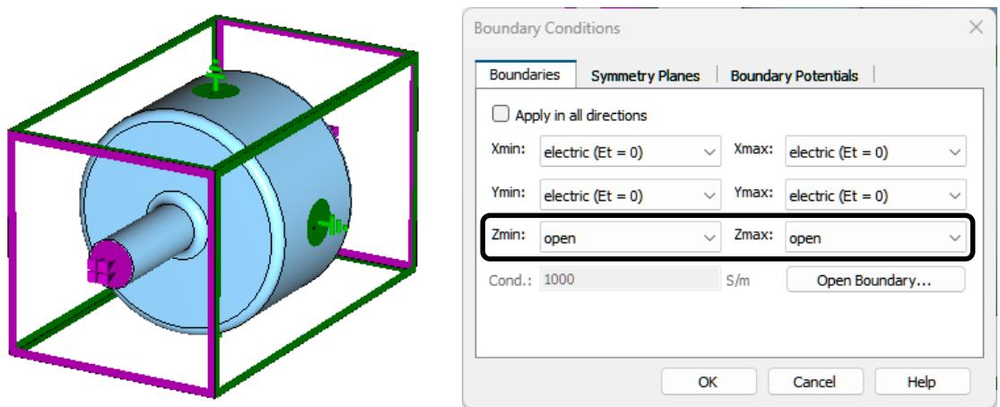

While the boundary dialog box is open, the boundary conditions will be visualized in the structure view as in the picture above.

In this simple case, the structure is embedded in perfect conducting material, so all xand y- boundary planes may be specified as “electric” planes (which is the default). The z-boundaries are defined as “open” planes, such that eventual scattering fields traveling along the beam tube can be absorbed at the lower and upper z-boundaries.

In addition to these boundary planes, you can also specify “symmetry planes." The specification of each symmetry plane will reduce the simulation time by a factor of two.

In our example, the structure is rotationally symmetric with respect to the z-axis, therefore the yz-plane and the xz-plane can be set to be symmetry planes. The excitation of the fields will be performed by the particle beam source for which the magnetic field is shown below:

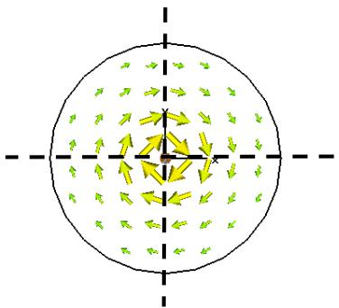

natural_image

Diagram showing directional arrows around a central point within a circular boundary, with dashed cross lines and no text or symbols present.

Plane of structure symmetries (yz- and xzplanes) illustrated by means of the magnetic field.

The magnetic field has no component tangential to the planes of the structure’s symmetry (the entire field is oriented perpendicular to this plane). If you specify these planes as “magnetic” symmetry planes, you can direct CST Studio Suite to limit the simulation to one quarter of the actual structure while considering the symmetry conditions.

For the yz- and xz-symmetry planes, you can choose magnetic either by selecting the appropriate option in the dialog box or by double-clicking on the corresponding symmetry plane visualization in the view and selecting the proper choice from the context menu. Once you have done so, your screen will appear as follows:

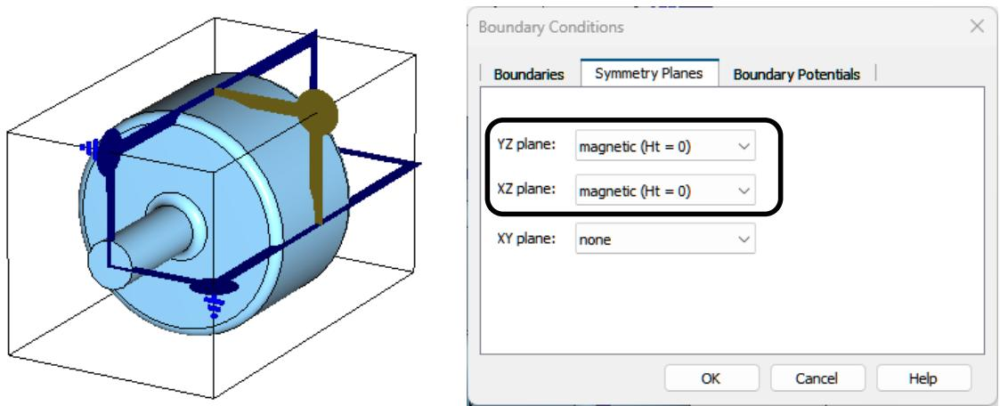  
Symmetry Planes tab in the Boundary Conditions dialog box.

Finally click OK in the dialog box to store the settings. Then the boundary visualization will disappear.

## Visualize the Mesh

The mesh generation (hexahedral mesh) for the structure’s analysis is performed automatically based on an expert system. However, in some situations it may be helpful to inspect the mesh to improve the simulation speed by changing the parameters for the mesh generation.

The mesh can be visualized by entering the mesh view Home: Mesh Mesh View . For this structure, the mesh information will be displayed as follows:

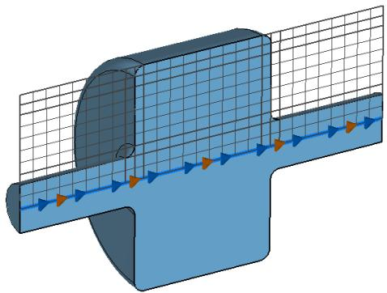

natural_image

3D diagram of a mechanical component with grid pattern and directional arrows indicating flow or force (no text or symbols)

One 2D mesh plane is in view at a time. Because of the symmetry setting, the mesh plane extends across only one half of the structure. You can modify the orientation of the mesh plane by adjusting the selection in the Mesh: Sectional View  Normal dropdown list or just by pressing the X/Y/Z keys. Move the plane along its normal direction using the Up/Down cursor keys. The current position of the plane will be shown in the Mesh: Sectional View Position field.

There are some thick mesh lines shown in the mesh view. These mesh lines represent important planes (so-called snapping planes) at which the expert system finds it necessary to place mesh lines. You can control these snapping planes in the Special Mesh Properties dialog by selecting Simulation: Mesh  Global Properties Specials  Snapping.

For wakefield computations the minimization of dispersion due to the mesh is very important, especially in the longitudinal beam direction. Therefore, the particle bunch has to be sampled adequately in space. Open the mesh properties dialog box by selecting Home: Mesh  Global Properties .

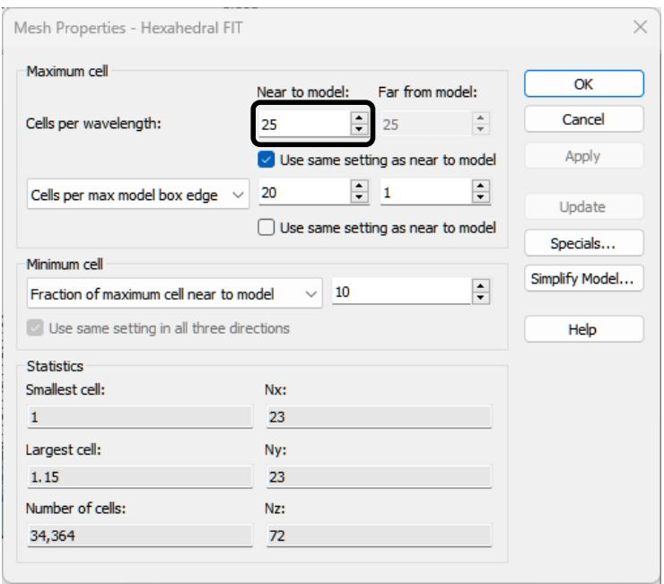

text_image

Mesh Properties - Hexahedral FIT
Maximum cell
Near to model: Far from model:
Cells per wavelength: 25 25
Use same setting as near to model
Cells per max model box edge 20 1
Use same setting as near to model
Minimum cell
Fraction of maximum cell near to model 10
Use same setting in all three directions
Statistics
Smallest cell: Nx:
1 23
Largest cell: Ny:
1.15 23
Number of cells: Nz:
34,364 72
OK
Cancel
Apply
Update
Specials...
Simplify Model...
Help

This example is driven by quite a long bunch (compared to the structure’s dimensions), therefore the sampling rate can be increased by entering a value of 25 for the Cells per wavelength setting. The new settings are applied by clicking Apply. In case the bunch length is very short, this might increase the number of mesh cells significantly. However, a simulation is still possible using cluster simulation via MPI. Please refer to the Online

Help->Simulation Acceleration -> MPI Computing. Leave the dialog box by clicking OK and have a look at the refined mesh:

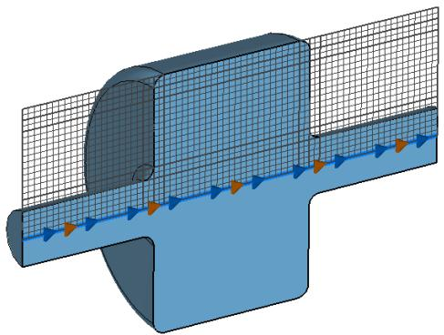

natural_image

3D mechanical part diagram showing a T-shaped bracket with internal grid structure and directional arrows indicating motion (no text or symbols)

Leave the mesh inspection mode by clicking Mesh: Close  Close Mesh View .

## Define a 2D Time Domain Field Monitor

In order to understand the behavior of an electromagnetic device, it is often useful to get insight into the electromagnetic field distribution. In this example, it may be interesting to see where the particle bunch creates electric fields.

The fields can be recorded at arbitrary frequencies or with a given sampling rate in the time domain. Since storing all computed field data would require a large amount of memory only specific samples are stored. In order to obtain these field samples so called monitors have to be defined.

Monitors can be defined in a dialog box that opens after choosing Simulation: Monitors Field Monitor . You may need to switch back to the modeler mode by selecting the Components folder in the navigation tree before the monitor definition is available.

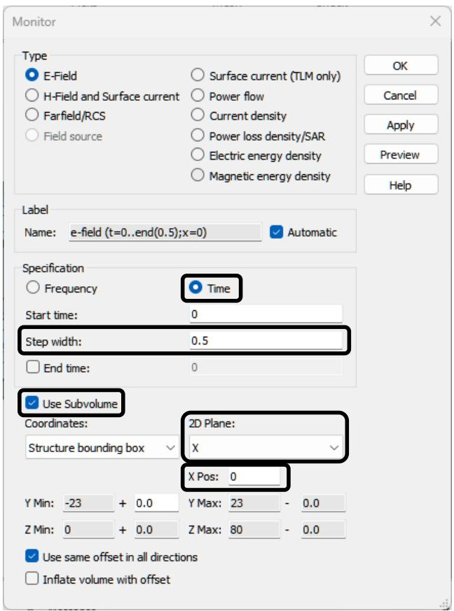

text_image

Monitor
Type
E-Field
H-Field and Surface current
Farfield/RCS
Field source
Surface current (TLM only)
Power flow
Current density
Power loss density/SAR
Electric energy density
Magnetic energy density
OK
Cancel
Apply
Preview
Help
Label
Name: e-field (t=0..end(0.5);x=0)
Automatic
Specification
Frequency
Time
Start time: 0
Step width: 0.5
End time: 0
Use Subvolume
Coordinates:
2D Plane:
Structure bounding box X
X Pos: 0
Y Min: -23 + 0.0 Y Max: 23 - 0.0
Z Min: 0 + 0.0 Z Max: 80 - 0.0
Use same offset in all directions
Inflate volume with offset

After selecting the proper Type for the monitor, you may specify its time settings in the Specification field. Clicking Apply stores the monitor while leaving the dialog box open. All time settings use the active time unit, which was previously set to “ns”. For this analysis, you should enter the following settings:

<table><tr><td>Field type</td><td>E-Field</td></tr><tr><td>Specification</td><td>Time</td></tr><tr><td>Start time</td><td>0</td></tr><tr><td>Step width</td><td>0.5</td></tr><tr><td>Use Subvolume</td><td>Activate on</td></tr><tr><td>Orientation</td><td>X</td></tr><tr><td>Position</td><td>0</td></tr></table>

Finally leave the dialog box by clicking OK. All defined monitors are listed in the NT: Field Monitors folder. Within this folder, you may select a particular monitor to reveal its parameters in the main view.

Note: After the simulation has finished, you can visualize the recorded field by choosing the corresponding item from the navigation tree. The monitor results can then be found in the NT: 2D/3D Results folder. The results are ordered according to their physical quantity E-Field / H-Field / Currents / Power flow.

## Start the Simulation

After having defined all necessary parameters, you are ready to start the wakefield simulation. Start the simulation from the Wakefield Solver control dialog box: Simulation: Solver  Setup Solver .

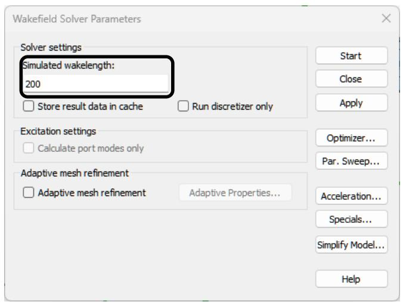

text_image

Wakefield Solver Parameters
Solver settings
Simulated wavelength:
200
□ Store result data in cache □ Run discretizer only
Excitation settings
□ Calculate port modes only
Adaptive mesh refinement
□ Adaptive mesh refinement Adaptive Properties...
Start
Close
Apply
Optimizer...
Par. Sweep...
Acceleration...
Specials...
Simplify Model...
Help

In this dialog box, you can specify the maximum wakelength behind the bunch that should be calculated. Enter a value of 200 (cm) in this field.

The accuracy of the results mainly depends on the discretization of the structure and can be improved by refining the mesh. In case a resonant structure is observed, a short simulated wakelength introduces a truncation error in the wake potential. This could lead to ripples in the wake impedance.

You can now start the simulation procedure by clicking the Start button. A progress bar will appear in the status bar that will inform you on the solver's progress. Information text regarding the operation will appear next to the progress bar. The most important stages are listed below:

1. Calculating matrices, preparing and checking model:

During this step, your input model is checked for errors such as invalid or overlapping materials.

2. Calculating matrices, normal matrix and dual matrix:

During these steps, the system of equations, which will subsequently be solved, is set up.

3. Transient analysis, calculating the port modes:

In this step, the solver calculates the port mode field distributions if any ports were defined. This information will be used later in the time domain analysis of the structure.

4. Transient analysis, processing excitation:

During this stage, the particle beam is injected into the calculation domain. The solver then calculates the resulting field distribution inside the structure as well as the wakefields.

5. Transient analysis, transient field analysis:

After the beam pulse has been injected, the solver continues to calculate the field distribution and the wake potentials until the requested wakelength has been computed.

For this simple structure, the entire analysis takes only a few seconds to complete.

## Analyze the Simulation Results

After the solver has completed the wake computation, you can view the results. In order to look at the wake potentials, you need to choose the appropriate solution results from the navigation tree. You can visualize them by selecting NT: 1D Results Particle Beams  ParticleBeam1  Wake potential. If you open this subfolder, you will see all signals assigned to that folder.

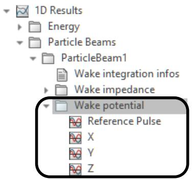

flowchart

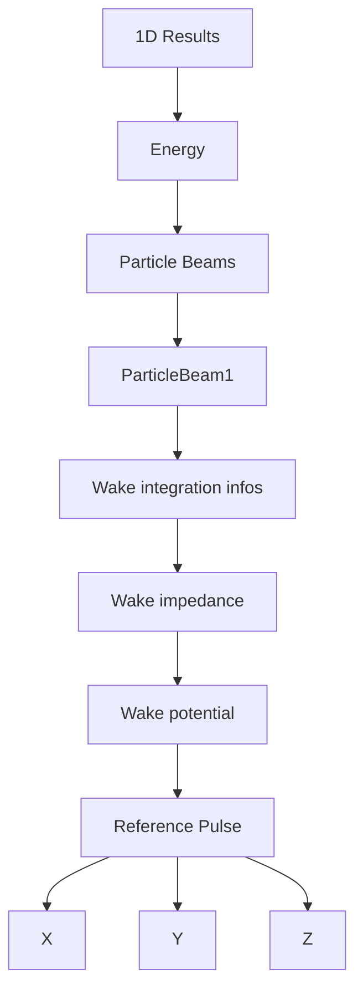
```mermaid
graph TD
  A["1D Results"] --> B["Energy"]
  B --> C["Particle Beams"]
  C --> D["ParticleBeam1"]
  D --> E["Wake integration infos"]
  E --> F["Wake impedance"]
  F --> G["Wake potential"]
  G --> H["Reference Pulse"]
  H --> I["X"]
  H --> J["Y"]
  H --> K["Z"]
```

After selecting the folder, you should see the following plot:

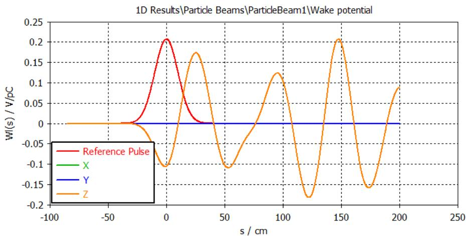

line

| s / cm | Reference Pulse (V/pC) | X (V/pC) | Y (V/pC) | Z (V/pC) |
| --- | --- | --- | --- | --- |
| -100 | 0 | 0 | 0 | 0 |
| -50 | 0 | 0 | 0 | 0 |
| 0 | ~0.21 | 0 | 0 | ~-0.11 |
| 50 | 0 | 0 | 0 | ~-0.11 |
| 100 | 0 | 0 | 0 | ~0.13 |
| 150 | 0 | 0 | 0 | ~0.21 |
| 200 | 0 | 0 | 0 | ~0.09 |

The Reference Pulse graph is shown only for orientation purposes. As expected due to the symmetry of structure and beam, only the longitudinal z–wake potential is different from zero.

If you select the electric field result from the previously defined monitor NT: 2D/3D Results  E-Field  e-field (…)[pb], you may obtain a plot showing no arrows at all. This is because the first time-sample has been selected automatically at a time where the beam has not yet entered the calculation domain. Since the transparent mode (accessible via 2D/3D Plot: Plot Properties Structure Transparent ) is already activated, you can select another time frame by using the left / right cursor keys when the focus is in the main window.

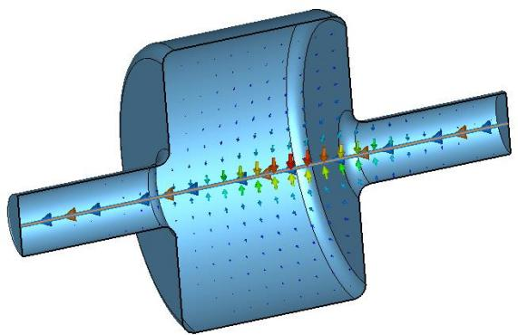

natural_image

3D diagram of a mechanical component with internal flow arrows and colored stress or velocity vectors, no text or symbols present.

There are several other plot and visualization options. Please refer to the Online Help for more details. The different view options can be selected using the dropdown list under 2D/3D Plot: Plot Type.

The following gallery shows some possible plot options for the absolute electric field values. Can you reproduce them?

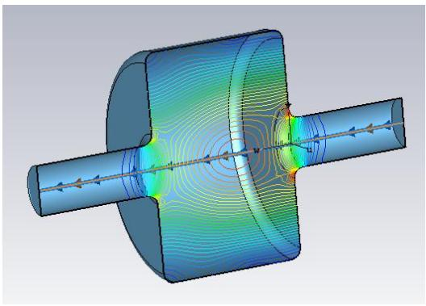

natural_image

3D rendered mechanical component with color-coded stress or flow patterns, no visible text or symbols

Isoline plot of the absolute E-field

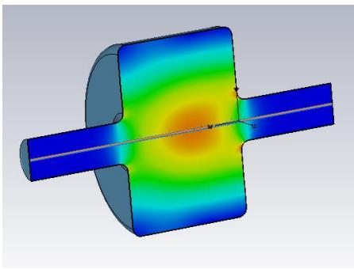

natural_image

3D thermal or density distribution model of a mechanical component with color gradient (no text or symbols)

Contour plot of the absolute E-field

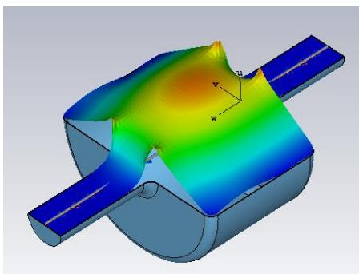

natural_image

3D CAD model of a mechanical component with color-coded stress or deformation distribution (no text or symbols)

Carpet plot of the absolute E-Field

Hint: In order to see the absolute field values recorded by the monitor, switch from Arrows to, e.g., Contour, and also try the other possible selections, such as deactivating the logarithmic scale.

Hint: As the time monitor contains multiple frames, try stepping through those while trying to reproduce the pictures shown above. When selecting frame 22 at 10.5 ns the results should look alike.

## Additional Information: Wakefield Postprocessing

During the solver run, complex-valued wake impedances are computed by dividing the wake potential by the charge distribution of the beam in the frequency domain. These impedances are accessible from the navigation tree. The following picture shows the real part of the Z-impedance for the previous example with a Simulated Wakelength setting of 2000:

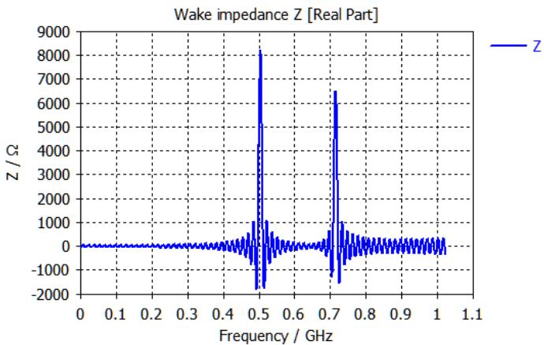

line

| Frequency (GHz) | Z \((\Omega)\) |
| --- | --- |
| ~0.5 | ~8200 |
| ~0.72 | ~6500 |

Real part of the Z-wake impedance for the previous example using a simulated wakelength of 2000.

This impedance shows the typical truncation error (ripples) for a time signal that has not decayed to zero before the simulation was completed. In this particular case, the wake potential is truncated in the time domain.

It is possible to recalculate the impedance spectra after a simulation has finished by selecting Post Processing: 2D/3D Field Post Processing  Wakefield Postprocessing

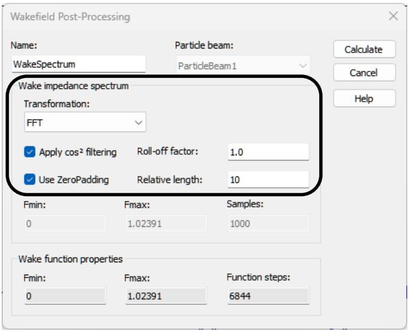

text_image

Wakefield Post-Processing
Name: Particle beam:
WakeSpectrum ParticleBeam1
Calculate
Cancel
Help
Wake impedance spectrum
Transformation:
FFT
✓ Apply cos² filtering Roll-off factor: 1.0
✓ Use ZeroPadding Relative length: 10
Fmin: Fmax: Samples:
0 1.02391 1000
Wake function properties
Fmin: Fmax: Function steps:
0 1.02391 6844

This post processing option allows recomputing the wake impedances. Additionally, a low-pass filter can be applied to the impedance in order to smooth the signal. Moreover, it is possible to recompute certain frequency intervals with a given sampling rate (only for the DFT transformation type). For a very fast computation of the complete spectrum, use the FFT transformation type. The impedance spectra can be accessed by selecting NT: 1D Results  Particle Beams  ParticleBeam1  Wake impedance [Name]  Z:

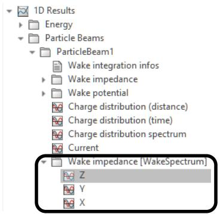

flowchart

```mermaid
graph TD
  A["1D Results"] --> B["Energy"]
  A --> C["Particle Beams"]
  C --> D["ParticleBeam1"]
  D --> E["Wake integration infos"]
  E --> F["Wake impedance"]
  F --> G["Wake potential"]
  G --> H["Charge distribution (distance)"]
  H --> I["Charge distribution (time)"]
  I --> J["Charge distribution spectrum"]
  J --> K["Current"]
  K --> L["&quot;Wake impedance [WakeSpectrum"]"]
  L --> M["Z"]
  L --> N["Y"]
  L --> O["X"]
```

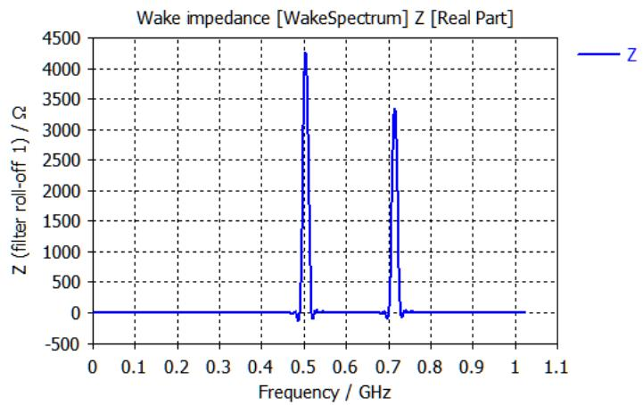

line

| Frequency (GHz) | Z (Omega) |
| --- | --- |
| ~0.49 | ~-100 |
| ~0.50 | ~4300 |
| ~0.51 | ~-100 |
| ~0.69 | ~-100 |
| ~0.70 | ~3300 |
| ~0.71 | ~-100 |
| ~0.72 | ~3300 |
| ~0.73 | ~-100 |
| ~1.03 | ~0 |

Real part of the z-wake impedance computed with a cos²- filter and the FFT transformation type.

The wake impedance describes the behavior of the cavity in the frequency domain. For this type of impedance the beam serves as a current source and the wake potential as voltage. Thus, this impedance can be used to detect the modes where beam and structure interact.

Note: The DFT transformation type is helpful when computing only a few samples within a specified frequency range, while the FFT type computes a full spectrum very fast.

## Summary

This example should have given you an overview of the key concepts of CST Studio Suite. You should now have a basic idea of how to do the following:

1. Model the structures by using the solid modeler  
2. Specify the solver parameters, check the mesh and start the simulation  
3. Visualize the wake potentials and impedance profiles  
4. Define field monitors  
5. Visualize the electromagnetic field distributions

If you are familiar with all these topics, you have a very good starting point for further improving your usage of CST Studio Suite.

For more information on a particular topic, we recommend that you browse through the online help system which can be opened by selecting File: Help  Help Contents – Get Help using CST Studio Suite . If you have any further questions or remarks, please do not hesitate to contact your technical support team. We also strongly recommend that you participate in one of our special training classes held regularly at a location near you. Please ask your support center for details.
