# Chapter 3 – Solver Overview

Particle dynamics take place in a vast range of time scales: from the nanosecond regime in high-frequency vacuum electronic devices, across microseconds in breakdown phenomena, up to milliseconds in plasma chambers and quasi-static particle guns. For each application, CST Particle Studio offers an optimal solution.

## Particle Tracking Solver

The Particle Tracking Solver and its gun-iteration mode are used for quasi-static particle dynamics. A typical application for this solver is a quasi-static electron gun. The solver is based on a simplification of the complex interaction of electromagnetic fields and charged particles. Electrostatic and magnetostatic fields dominate the charged particle dynamics. The influence of the particle’s charge and induced current on the electromagnetic fields is neglected. This leads to a quasi-static problem. The charged particles move according to the standard equations of motion for charges in electromagnetic fields. Each particle with the same initial condition will follow the same trajectory through static electric and magnetic fields. It is sufficient to sample the trajectory of a limited number of particles per source to describe the particle dynamics. Regarding the numerical computation details, the particle movement is integrated through the static fields. The trajectory is the sample of particle positions from the initial position until the particle collides with either the structure or the bounding box of the setup. The solver can use either hexahedral or tetrahedral mesh.

In the gun-iteration mode, the quasi-static space-charge effect of the particles on the static electric field is considered. This approximation is useful when a weak coupling between the charged particles and the electromagnetic fields exists. For every iteration, the particle trajectories and electric fields are computed. The iteration loop stops when the convergence criterion is met. The gun-iteration mode is shown in the following schematic.

flowchart

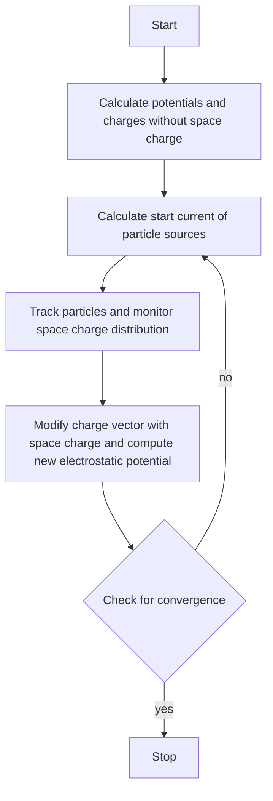

In certain applications, for example when particles are relativistic, the particles carry such a significant amount of current, that the self-induced magnetic field has an effect on their trajectories. In these cases, there is the possibility of considering the selfinduced magnetic field.

## Particle-in-Cell Solver

The electromagnetic (EM) Particle-in-Cell (PIC) solver offers the most detailed and complete view of the charged particle dynamics in electromagnetic fields. It is best suited for the interaction of fast charged particles and high-frequency electromagnetic fields. Typical applications include high-frequency vacuum electronic devices, such as oscillators like magnetrons and amplifiers like traveling wave tubes. The solver performs transient simulations ranging in the nanosecond regime up to microseconds. The interaction of electromagnetic fields and charged particles is computed by considering the two-way coupling between the charged particles and the computational grid. The solver consists of a grid-based EM solver and a particle pusher.

The whole system is integrated in time using a leapfrog time-integration. One single time-step consists of integrating the fields and particles in time. In the first step, the EM fields are integrated; this step considers the current density induced by the moving charged particles. Next, the equations of motion for each simulated particle are integrated in time by interpolating the updated EM fields to the particle’s position. This self-consistent cycle is repeated until the final simulation time is reached.

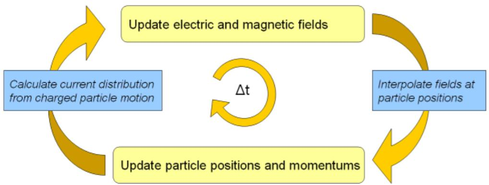

flowchart

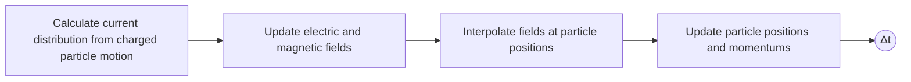

The time-integration of the EM PIC solver is restricted by the requirement of resolving the fastest occurring phenomena. This is the smaller of the following two conditions. First, there is the stability limit of the Courant-Friedrich-Lewys condition for the EM solver. This requires the grid to be fine enough to resolve the propagation of all electromagnetic waves. Second, there is the requirement to resolve the highest gyration or plasma frequency of the electrons.

## Electrostatic Particle-in-Cell Solver

Particle dynamics take place in a vast range of time scales. The fastest particle dynamics, typically electron dominated, can be simulated with the electromagnetic (EM) Particle-in-Cell solver. Quasi-static dynamics can be treated with the Particle Tracking Solver and its gun-iteration mode. For the intermediate time scales, where the interaction of both slow ions and fast electrons comes into play, the Electrostatic (ES) PIC Solver can be well suited. Compared with the EM-PIC solver, it is not limited by the typically small Courant time step needed for EM-wave propagation in a 3D geometry with small-scale variations. In the ES-PIC Solver, the time step can be larger and it is then only limited by the fastest particle dynamics, typically by the plasma frequency.

In order to understand the necessity of the ES-PIC solver, a glance into physics modeling applied in the remaining solvers is useful. In the EM-PIC solver, the EM field and the particle dynamics are self-consistently described because all the terms in the Maxwell equations are retained in the equation scheme. This formulation is well-suited for problems where the interplay between particles and electromagnetic waves is dominant. This applies especially to light, highly-mobile electrons, which carry a particle current great enough to affect the EM wave propagation. However, in many applications, the effect of total particle current is negligible and therefore, the particles do not affect the electromagnetic wave propagation or vice-versa. Instead, the dominant effect consists in modifying the electrostatic field via the particle space charge. Furthermore, ions are typically slow compared with the electrons and the EM waves. For these cases, the electromagnetic PIC solver represents excessive computational effort. On the other hand, the Particle Tracking Solver in the gun-iteration is not well-suited either, because the coupling between the charged particles and the electrostatic field is too strong to be sufficiently described by its formulation. These are the cases, where the ES-PIC solver has advantages and it is therefore the right choice to study electrostatic effects, such as breakdowns, sheath formation, space charge compensation and electrostatic waves.

Regarding the numerical computation details, similarly to the EM-PIC solver, a time integration takes place and the particle movement is calculated using the standard equations of motion for charges in electromagnetic fields. In contrary to the EM-PIC solver, the particle current is assumed to be negligible in the ES-PIC solver. Instead, the particle distribution is used to calculate the space-charge density, which is then used to solve the Poisson problem for every time step. This allows the simulation of fast particle dynamics of electrostatic type. This is in contrast to the Particle Tracking Solver, where it is additionally assumed that the space charge varies very slowly compared to the particle movement.

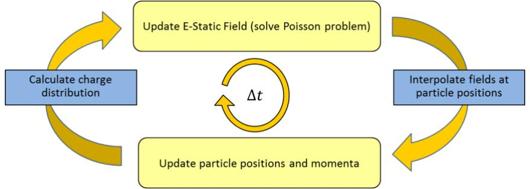

flowchart

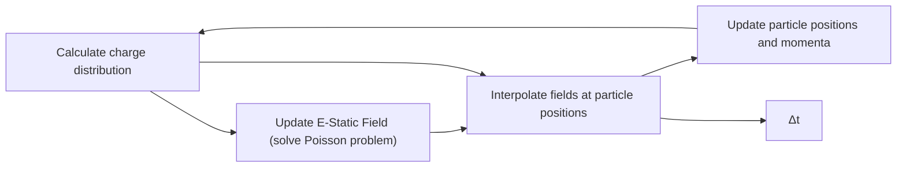

## Wakefield Solver

In particle accelerators, the interaction of travelling particle bunches with the surrounding environment leads to the generation of electromagnetic fields in their “wake”. For example, geometrical or material discontinuities in the surrounding accelerator structure cause the excitation of the so-called wakefields. The fields can adversely affect subsequent bunches or even destabilize the originating particle beam. The wakefield solver can be used for the analysis of such electromagnetic effects.

The main assumptions are the following: a) the particle beam is moving on a straight line and b) the particle beam is not affected by the generated wakefields. An infinite beam pipe is modeled by a special treatment at the beam entrance and exit, in which not only the particle current is considered but also the corresponding electromagnetic fields.

The wakefield solver is a time-domain solver with a special particle beam excitation. The resulting wakefields are used to calculate the integrated force acting on a virtual particle along its way through the structure. To perform this integration, several techniques are available. Standard results are the wake potential and the wake impedance. For ultrarelativistic beams, these results are a property of the structure. For nonultrarelativistic beams, the wake potential and impedance include the integrated effect of the space charge and thus, depend on the length of simulated tube.

The wakefield solver can also be helpful for the analysis of beam position monitors (BPMs), where the quantities of interest are the signals recorded at the BPM pick-ups. Arbitrary bunch shapes and bunch sequences can be modeled as well.

## Additional Features

This section covers features supported by two or more solvers. The following features are available for Tracking, ES-PIC and PIC simulations.

## Particle interaction with materials

Particles can not only interact with electromagnetic fields but also directly with materials. To activate and edit the settings of the particle-material interaction, you can open the dialog box of a previously selected material with Modeling: Materials  New/Edit Edit Material properties and click on the tab Particles. The following dialog box will then be visible for PIC. The available options for Tracking and Es-PIC differ slightly, as explained in this section.

It is implicitly assumed that in most of the applications particles move in vacuum space. Subsequently, particles can collide with shapes filled with any material other than vacuum. In some cases, it is useful to model the space in which particles move using a material with non-vacuum properties. This is possible using the volume transparency feature. Particles can then move in the volume to which the material is assigned.

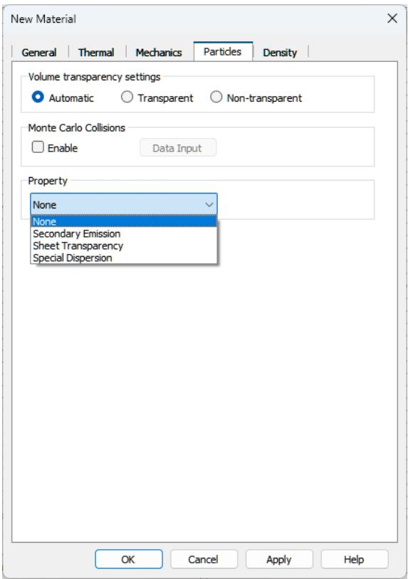

text_image

New Material
General | Thermal | Mechanics | Particles | Density |
Volume transparency settings
Automatic	Transparent	Non-transparent
Monte Carlo Collisions
Enable	Data Input
Property
None
None
Secondary Emission
Sheet Transparency
Special Dispersion
OK	Cancel	Apply	Help

Via the drop-down list in the Property frame, you can select the kind of particle-material interaction. Several options are available: Secondary Emission (induced by electrons or ions), Sheet Transparency and Special Dispersion.

Secondary emission occurs when primary incident particles of sufficient energy hit a surface and induce the emission of secondary particles. In the frame Secondary emission model, the parameters of the secondary emission model can be specified. Options include a phenomenological probabilistic model (Furman), a heuristic model (Vaughan) and a model based on an imported secondary electron yield (Import). The latter model is available for the ion-induced secondary emission.

In some applications, very thin grids or foils are present, through which some particles are absorbed. This can be represented by an infinitely thin body, a so-called sheet, which can become transparent to particles. In the frame Sheet transparency, the transparency level can be specified, which can be either constant or energy-dependent.

Under certain conditions, PIC simulations can be corrupted by a numerical instability often referred to as Cerenkov instability. To mitigate its effects, a special dispersive material can be defined here using the Special Dispersion property.

The Tracking and Es-PIC solver do not compute electromagnetic waves, therefore the option Special Dispersion is not available. Instead, Optically Induced Emission is offered as an option. This emission models the emission of electrons through the photoelectric effect.

## Monte-Carlo Collisions

The Monte-Carlo Collisions (MCC) module models collisions between charged particles and neutral background gas particles. This model assumes a background gas of a much higher density than the plasma density. Therefore, the thermodynamic state of the gas is unaltered by the collisions. The collisions occur randomly and lead to a momentum and energy transfer. MCC settings are specific to each material. Monte-Carlo collisions are enabled for a specific material [Material Name] by using the checkbox NT: Materials [Material Name]  Edit Material Properties…  Particles  Monte Carlo Collisions Enable. The dialog to configure the settings can then be reached via NT: Materials [Material Name]  Edit Material Properties…  Particles  Monte Carlo Collisions Data Input. The MCC configuration for the background material can be accessed via Modeling: Materials  Background  Material Properties  Particles  Monte Carlo Collisions  Data Input.

text_image

Particle Monte Carlo Collisions
Background Gas
Name	Mass [u]	Pressure [torr]	Temperature [K]	Density [1/m^3]
helium	4.016767952652291	p	300	3.21e+21
Collisions
Incident	Target	Collision Type	Parameter	Scattering Model	Cross Section
electron	helium	elastic		Isotropic	electron_elastic.txt
electron	helium	excitation		Isotropic	electron_excitation1.txt
electron	helium	excitation		Isotropic	electron_excitation2.txt
electron	helium	ionization	ES	Isotropic	electron_ionization.txt
helium_Ion	helium	elastic		Isotropic	ion_isotropic.txt
Enable acceleration of collisions
Add...	Delete	Preview	OK	Cancel	Help

The user can define a single background gas in a constant physical state and thermodynamic equilibrium. The gas occupies each simulation region that is filled by the material it was configured for. The dialog shows an example of the list of available options for the Es-PIC solver. This set of collisions include elastic scattering, excitation and impact ionization for electrons and elastic scattering and impact ionization for ions. The MCC computations can be accelerated by using multithreading. This results in better solver performance and optimized simulation times. In contrast, the PIC solver can only consider a model for electron impact ionization.

## Particle Merging

The Particle Merging module contains a model to combine four particles that are close to each other in phase-space, into two new particles and is available for Es-PIC simulations. During a merging step, the algorithm ensures charge, momentum and energy conservation. The algorithm is especially useful in breakdown simulations in which the particle number increases exponentially. The settings dialog can be reached through Simulation: Setup Solver  Specials.

## Coupled Simulations

CST Studio Suite for Particle Dynamics Simulation offers various options to link electromagnetic field simulations to a specific particle computation. Furthermore, the Particle Interfaces allow linkage of different tracking or PIC simulations. Finally, one can export losses from collided particles to a subsequent thermal analysis. Usually it is either possible to perform several simulations within a single project or connect two or more projects by using the import and export options.

## Considering Electromagnetic Fields

CST Studio Suite for Particle Dynamics Simulation is dedicated to simulate charged particles traveling through electromagnetic fields. To accomplish this task, one (or more) of three possible techniques can be used:

1. Computation of electromagnetic fields
2. Definition of analytic magnetic fields
3. Import of electromagnetic fields - ASCII or from other projects

In general, all fields defined for a PIC or tracking simulation are superposed before being used for the particle update. Specifically, in case of the PIC solver, these fields are superposed to the self-consistent and time-dependent fields based on Maxwell’s equations.

Computation of Electromagnetic Fields

CST Studio Suite for Particle Dynamics Simulation has the ability to use fields from other CST Studio Suite 3D EM solvers as input, particularly CST Studio Suite for Low Frequency Simulation and CST Studio Suite for High Frequency Simulation.

Electrostatics Solver

The Electrostatics Solver of CST Studio Suite for Low Frequency Simulation is used to calculate the accelerating fields for static guns, or the deflecting electrostatic fields of beam steering units in cathode ray tubes (CRT).

• Magnetostatics Solver

The Magnetostatics Solver of CST Studio Suite for Low Frequency Simulation precalculates the fields of various types of magnets (such as solenoids, dipoles, quadrupoles, etc.) for beam optics simulation.

Eigenmode Solver

The particles can also be tracked through resonant fields in cavities calculated with the Eigenmode Solver from CST Studio Suite for High Frequency Simulation.

## Time Domain Solver

The particles can also be tracked through the frequency domain 3D field monitors provided by the Time Domain Solver from CST Studio Suite for High Frequency Simulation. A typical application is multipaction analysis.

To get an introduction and/or further information to these electromagnetic field solvers, refer to the Workflow and Solver Overview of CST Studio Suite for Low Frequency Simulation and CST Studio Suite for High Frequency Simulation.

## Definition of Analytic Magnetic Fields

Besides the possibility of calculating fields before or during a particle simulation, CST Studio Suite for Particle Dynamics Simulation offers the option to define and use analytical H- and B-field distributions for the Tracking-, Electrostatic PIC- and the PICsolver.

Three different types of analytic magnetic field distributions are currently available:

• A constant magnetic field throughout the computational domain
• A constant magnetic flux density throughout the computational domain
A rotationally symmetric magnetic field characterized by a 1D tangential magnetization vector defined along the Z-/ W- axis of the active global or local coordinate system. The r-component of the rotationally symmetric magnetic field can only be calculated if the z-component of the magnetic field is not a function of the radius r:

$$
B _ {r} (r, z) = - \frac {r}{2} \frac {\partial B _ {z} (z)}{\partial z}
$$

It is possible to define such a source by selecting Simulation: Sources and Loads Source field  Analytic Source Field . The corresponding dialog box allows you to define the magnetic field vector. Alternatively, a 1D description of the magnetic field along the axis of the currently active coordinate system can be defined:

text_image

Define Analytic Magnetic Source Field
Type:
1D Description
Field vector
X: 0.0 T
Y: 0.0 T
Z: -0.2 T
B-Field along w/z axis
Position B-Field
0 0
1 0.1
2 0.4
3 0.9
4 1.6
4.5 2.2
Insert
Delete Value
Delete All
Import...
Export...
OK
Cancel
Reset
Help

Tangential field component along axis

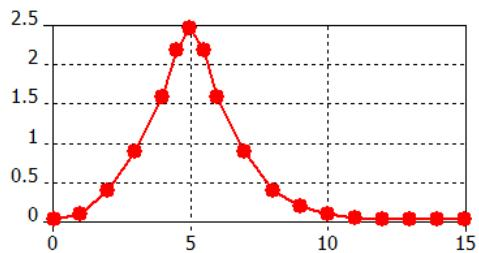

line

| X | Y |
| --- | --- |
| 0 | ~0.0 |
| 1 | ~0.05 |
| 2 | ~0.35 |
| 3 | ~0.85 |
| 4 | ~1.5 |
| 4.5 | ~2.1 |
| 5 | ~2.4 |
| 6 | ~2.1 |
| 7 | ~1.5 |
| 8 | ~0.85 |
| 9 | ~0.35 |
| 10 | ~0.15 |
| 11 | ~0.05 |
| 12 | ~0.0 |
| 13 | ~0.0 |
| 14 | ~0.0 |
| 15 | ~0.0 |

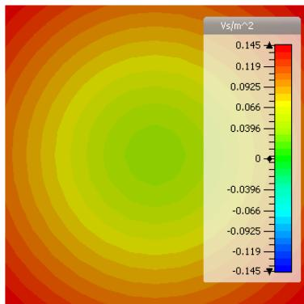

heatmap

| Color Range | Value (Vs/m^2) |
| --- | --- |
| Red | 0.145 |
| Orange-Red | 0.119 |
| Orange | 0.0925 |
| Yellow-Orange | 0.066 |
| Yellow | 0.0396 |
| Light Green | 0 |
| Green | -0.0396 |
| Teal | -0.066 |
| Cyan | -0.0925 |
| Blue | -0.119 |
| Dark Blue | -0.145 |

The picture above shows the “measured” tangential field along the z-axis and the rotationally symmetric field distribution of the resulting B-field.

Import of Electromagnetic Fields

The third possibility to consider fields for a tracking or PIC simulation is to import them from an ASCII file or from another CST-project. Thus, it is easily possible to superpose multiple fields. In order to define one or more field imports, open the dialog box by selecting Simulation: Sources and Loads  Source Field  Import External Field:

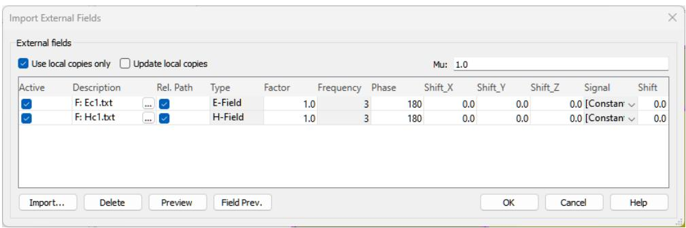

text_image

Import External Fields
External fields
✓ Use local copies only □ Update local copies Mu: 1.0
Active	Description	Rel. Path	Type	Factor	Frequency	Phase	Shift_X	Shift_Y	Shift_Z	Signal	Shift
✓	F: Ec1.txt	... ✓	E-Field	1.0	3	180	0.0	0.0	0.0 [Constant] ✓	0.0
✓	F: Hc1.txt	... ✓	H-Field	1.0	3	180	0.0	0.0	0.0 [Constant] ✓	0.0
Import...	Delete	Preview	Field Prev.	OK	Cancel	Help

This feature allows importing of eigenmodes, e-, h- or b-fields even from different projects based on different meshes. When creating a field import with the Add from Project option, one can pick an existing field distribution from a CST project file. Fields based on hexahedral (HEX) and/or tetrahedral (TET) meshes can be imported. Add from File offers the possibility to import ASCII files or HEX mesh based monitor files.

By clicking the Preview button, the overlapping regions of the imported data and the current domain can be visualized with a magenta colored frame.

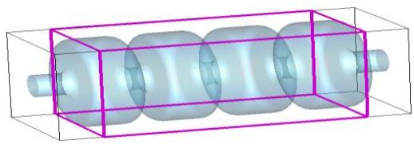

natural_image

3D rendering of a cylindrical mechanical component enclosed in a transparent rectangular frame (no text or symbols visible)

It is possible to combine fields from different structures with a particle simulation, but care has to be taken since the program does not check the consistency of fields on material boundaries.

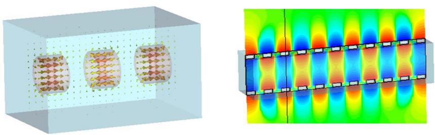

Another nice aspect is that a recalculation of tracking or PIC problems does not require the recalculation of fields. This results in a simulation speed up.

## Particle Interfaces

Particle interfaces allow you to connect tracking and/or PIC simulations from different CST Studio Suite projects. Two types of interfaces are available:

Export Interface
• Import Interface

Assuming that you have a tracking or gun project, which has to be linked to a subsequent PIC or tracking project by using Particle interfaces, perform the following steps to define a proper connection:

1. Open the tracking or gun project.
2. Define one or more export interfaces: Simulation: Monitors  Particle 2D Monitor Particle Export Interface .
3. Run a tracking or gun simulation. After the simulation has finished, the particle data are automatically exported into a file with the extension .pio. This file is stored in the result folder of the project.
4. Open the PIC or tracking project.
5. Define one or more import interfaces by importing the particle interface files: Simulation: Sources and Loads  Particle Sources  Particle Import Interface It is possible to rotate and translate the interface plane.

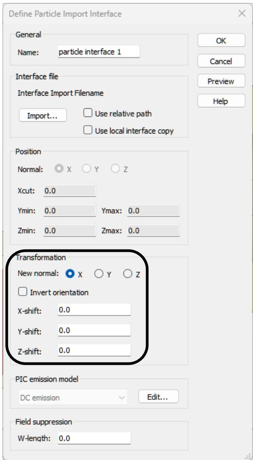

text_image

Define Particle Import Interface
General
Name: particle interface 1
Interface file
Interface Import Filename
Import... Use relative path
Use local interface copy
Position
Normal: X Y Z
Xcut: 0.0
Ymin: 0.0 Ymax: 0.0
Zmin: 0.0 Zmax: 0.0
Transformation
New normal: X Y Z
Invert orientation
X-shift: 0.0
Y-shift: 0.0
Z-shift: 0.0
PIC emission model
DC emission Edit...
Field suppression
W-length: 0.0

6. Run the subsequent PIC or tracking simulation.

Note: An ASCII import of files with user defined particle emission information is also available. Further information about the file format can be obtained from the online help.

## Export of Particle Surface Losses

The particle solvers allows computing particle surface losses caused by the particles interacting with matter. This feature is available for Tracking, ES-PIC and PIC. For example, this might be an interesting option for medical applications, but also for collectors. It can be activated by opening Simulation: Solver  Setup Solver  Specials  PIC:

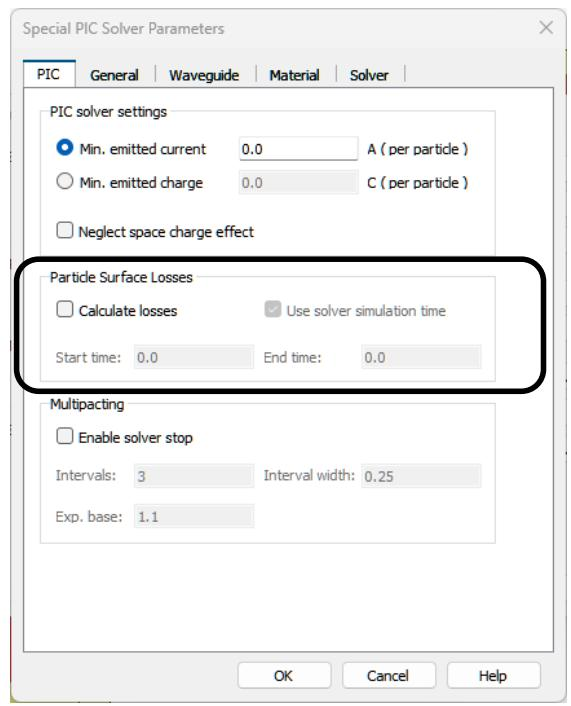

text_image

Special PIC Solver Parameters
PIC General Waveguide Material Solver
PIC solver settings
Min. emitted current 0.0 A (per particle)
Min. emitted charge 0.0 C (per particle)
Neglect space charge effect
Particle Surface Losses
Calculate losses Use solver simulation time
Start time: 0.0 End time: 0.0
Multipacting
Enable solver stop
Intervals: 3 Interval width: 0.25
Exp. base: 1.1
OK Cancel Help

Since an averaged power is needed for the thermal coupling, the time period in that the power data are averaged has to be defined. Per default, this time period is set to the user specified simulation time. The particle surface losses are calculated during the solver run and can be visualized in the result tree directly after the solver is finished. It is also possible to export thermal losses caused by electromagnetic fields. This is an interesting option for wakefield or PIC computations. For further information about thermal coupling, we refer to the CST Studio Suite for Thermal and Mechanical Simulation help.

## Acceleration Features

Within the frame of charge particle simulation, CST Studio Suite offers several hardware-related possibilities to accelerate simulations. All the solvers support CPU acceleration using multithreading. In addition, the electromagnetic PIC solver supports multi-GPU acceleration, the electrostatic PIC solver supports single-GPU acceleration and the Wakefield solver supports MPI cluster parallelization.

To access the acceleration settings, for example in the case of the PIC solver, select Simulation: Solver  Setup Solver  Acceleration. If you have a GPU, you can try to enable the GPU acceleration feature and start the solver again.

text_image

Acceleration - Particle in Cell Solver
CPU and Hardware acceleration
✓ CPU acceleration up to: 16 physical cores
CPU Sockets: 2 devices
☐ Hardware acceleration 1 devices
Distributed computing (DC)
☐ Parameter sweep/Optimization up to: 2 parameters DC Properties...
☐ Remote calculation
☐ Use only servers with more than: 0 GB available memory
☐ Use shared directory Consider 0D/1D data only
Token usage
Tokens estimate: 17
Tokens currently available: 14345 [15000]
OK Cancel Help

Please refer to the online help (section Simulation Acceleration) or to the GPU computing guide for more detailed information about the different acceleration features as well as the required hardware. The GPU computing guide is available via the following link: http://updates.cst.com/downloads/GPU\_Computing\_Guide\_2024.pdf.
