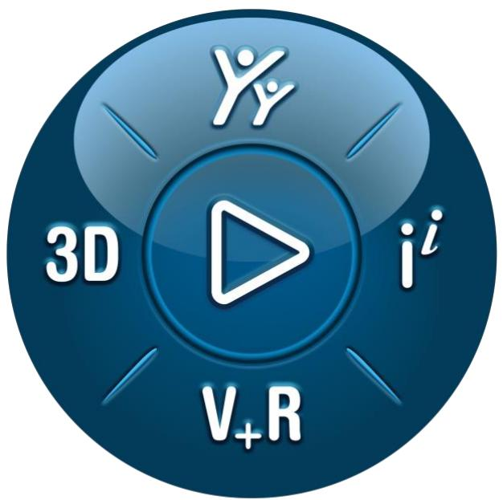

## CST Studio Suite 2025

## Charged Particle Simulation

text_image

3D
V+R
i'i

## 3DEXPERIENCE?

Workflow &

Solver Overview

Version 2025.0 - 8/21/2024

## Copyright

© 1998–2024 Dassault Systemes Deutschland GmbH CST Studio Suite is a Dassault Systèmes product.

All rights reserved.

Information in this document is subject to change without notice. The software described in this document is furnished under a license agreement or non-disclosure agreement. The software may be used only in accordance with the terms of those agreements.

No part of this documentation may be reproduced, stored in a retrieval system, or transmitted in any form or any means electronic or mechanical, including photocopying and recording, for any purpose other than the purchaser’s personal use without the written permission of Dassault Systèmes.

## Trademarks

CST, the CST logo, Cable Studio, CST BOARDCHECK, CST EM STUDIO, CST EMC STUDIO, CST MICROWAVE STUDIO, CST PARTICLE STUDIO, CST Studio Suite, EM Studio, EMC Studio, Microstripes, Microwave Studio, MPHYSICS, MWS, Particle Studio, PCB Studio, PERFECT BOUNDARY APPROXIMATION (PBA), Studio Suite, IdEM, Spark3D, Fest3D, Antenna Magus, Opera, 3DEXPERIENCE, the 3DS logo, the Compass icon, IFWE, 3DEXCITE, 3DVIA, BIOVIA, CATIA, CENTRIC PLM, DELMIA, ENOVIA, GEOVIA, MEDIDATA, NETVIBES, OUTSCALE, SIMULIA and SOLIDWORKS are commercial trademarks or registered trademarks of Dassault Systèmes, a European company (Societas Europaea) incorporated under French law, and registered with the Versailles trade and companies registry under number 322 306 440, or its subsidiaries in the United States and/or other countries. All other trademarks are owned by their respective owners. Use of any Dassault Systèmes or its subsidiaries trademarks is subject to their express written approval.

DS Offerings and services names may be trademarks or service marks of Dassault Systèmes or its subsidiaries.

3DS.com/SIMULIA

## Table of contents

Chapter 1 – Introduction . . 6

Welcome . 6

How to Get Started Quickly .. 6

CST Studio Suite for Particle Dynamics Simulation . 6

Who Uses CST Studio Suite for Particle Dynamics Simulation?..

Key Features for Particle Dynamics Simulation ..

General .. 7

Structure Modeling..

Particle Tracking Simulator.. 8

Electrostatic Particle-in-Cell Simulator.. 8

Particle-in-Cell Simulator .. 9

Wakefield Simulator.. 10

Eigenmode Simulator . 11

Electrostatics Simulator . 1 2

Magnetostatics Simulator . 12

Visualization and Secondary Result Calculation . . 13

Result Export .. 13

Automation... . 13

About This Manual . . 13

Document Conventions . 14

Your Feedback . 14

Chapter 2 – Simulation Workflows... . 15

Simulation Workflow: Particle Tracking . . 15

The Structure . 15

Create a New Project.. . 16

Open the Tracking QuickStart Guide.. . 18

Define the Units . 18

Define the Background Material . 19

Model the Structure . 19

Define Potentials and Magnets.. 25

Visualize and Refine the Mesh . . 27

Define Particle Sources .. 29

Define Boundary Conditions . . 32

Start the Simulation . 34

Analyze the Results .. 36

Parameterization of the Model... 3 9

Automatic Optimization of the Structure . 4 5

Additional Information: More settings for the Particle Tracking Solver ... . 47

Additional Information: Treating PEC as Normal Material for Magnetostatic Computations.. . 48

Additional Information: Using tetrahedral meshes in the Tracking Solver .. .. 49

Summary .... 52

## Simulation Workflow: Electromagnetic Particle-in-Cell... . 53

The Structure . 53

Create a New Project.. 54

Open the PIC QuickStart Guide... 55

Define the Units . 5 6

Define the Background Material . 56

Model the Structure . 56

Define the Particle Source . . 62

Simulation Setup.. 6 6

Refine the mesh.. . 68

Define Particle Monitors.. . 69

Start the Simulation . . 70

Analyze the Simulation Results . . 70

Summary . . 73

## Simulation Workflow: Wakefield ... . 75

The Structure . . 75

Create a New Project.. 75

Open the Wakefield QuickStart Guide. 77

Define the Units . . 78

Define the Background Material . . 78

Model the Structure . . 78

Define the Particle Beam Source. . 82

Define Boundary and Symmetry Conditions... . 83

Visualize the Mesh.. . 84

Define a 2D Time Domain Field Monitor... . 86

Start the Simulation . . 87

Analyze the Simulation Results . 88

Additional Information: Wakefield Postprocessing.. . 90

Summary . 92

Chapter 3 – Solver Overview .. . 93

Particle Tracking Solver . . 93

Particle-in-Cell Solver ... . 94

Electrostatic Particle-in-Cell Solver ... . 94

Wakefield Solver . . 95

Additional Features . 96

Particle interaction with materials 96

Monte-Carlo Collisions.. . 97

Particle Merging. 98

Coupled Simulations . 98

Considering Electromagnetic Fields . 98

Particle Interfaces . . 100

Export of Particle Surface Losses.. . 101

Acceleration Features . . 102

Chapter 4 – Finding Further Information... . 104

The QuickStart Guide... . 104

Online Documentation.. . 104

Tutorials and Examples.. . 105

Technical Support .. . 105

Macro Language Documentation . . 105

History of Changes. . 105
