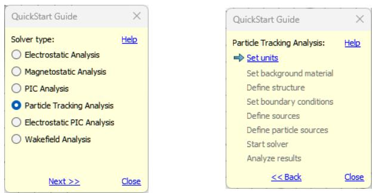

## Chapter 4 – Finding Further Information

After carefully reading this manual, you will already have some idea of how to use CST Studio Suite for Particle Dynamics Simulation efficiently for your own problems. However, when you are creating your own first models, many questions will arise. In this chapter, we give you a short overview of the available documentation.

## The QuickStart Guide

The main task of the QuickStart Guide is to remind you to complete all necessary steps in order to perform a simulation successfully. Especially for new users – or for those rarely using the software – it may be helpful to have some assistance.

The QuickStart Guide is opened automatically on each project start, when the checkbox File: Options  Preferences  Open QuickStart Guide on project load is checked. Alternatively, you may start this assistant at any time by selecting QuickStart Guide from the Help button in the upper right corner.

When the QuickStart Guide is launched, a dialog box opens showing a list of tasks, where each item represents a step in the model definition and simulation process. Usually, a project template will already set the problem type and initialize some basic settings like units and background properties. Otherwise, the QuickStart Guide will first open a dialog box in which you can specify the type of calculation you wish to analyze and proceed with the Next button:

As soon as you have successfully completed a step, the corresponding item will be checked and the next necessary step will be highlighted. You may however, change any of your previous settings throughout the procedure.

In order to access information about the QuickStart Guide itself, click the Help button. To obtain more information about a particular operation, click on the appropriate item in the QuickStart Guide.

## Online Documentation

The online help system is your primary source of information. You can access the help system’s overview page at any time by choosing File: Help  Help Contents . The online help system includes a powerful full text search engine.

In each of the dialog boxes, there is a specific Help button, which directly opens the corresponding manual page. Additionally, the F1 key gives some context sensitive help when a particular mode is active. For instance, by pressing the F1 key while a block is selected, you will obtain some information about the block’s properties.

When no specific information is available, pressing the F1 key will open an overview page from which you may navigate through the help system.

Please refer to the CST Studio Suite - Getting Started manual to find some more detailed explanations about the usage of the CST Studio Suite Online Documentation.

## Tutorials and Examples

The component library provides tutorials and examples, which are generally your first source of information when trying to solve a particular problem. See also the explanation given when following the Tutorials and Examples link on the online help system’s start page. We recommend that you browse through the list of all available tutorials and examples and choose the one closest to your application.

## Technical Support

Before contacting Technical Support, you should check the online help system. If this does not help you to solve your problem, you can find additional information in the Knowledge Base and obtain general product support at 3DS.com/Support.

## Macro Language Documentation

More information concerning the built-in macro language for a particular module can be accessed from within the online help system’s VBA book: Visual Basic (VBA) Language. The macro language’s documentation consists of four parts:

 An overview and a general description of the macro language  
 A description of all specific macro language extensions.  
 A syntax reference of the Visual Basic for Applications (VBA) compatible macro language.  
 Some documented macro examples

## History of Changes

An overview of important changes in the latest version of the software can be obtained by following the What’s New in this Version link on the help system’s main page or from the File: Help backstage page. Since there are many new features in each new version, you should browse through these lists even if you are already familiar with one of the previous releases.
